# Consul 学习笔记

> **文档目标**: 系统性学习 Consul 相关原理，为运维工程师/SRE 提供专业技术参考
>
> **来源**: HashiCorp Consul 官方文档
>
> **版本**: v1.0 | **更新日期**: 2024-12-05

---

## 目录

- [第1章 为什么选择 Consul](#第1章-为什么选择-consul)
- [第2章 核心概念](#第2章-核心概念)
- [第3章 快速入门](#第3章-快速入门)
- [第4章 架构原理](#第4章-架构原理)
- [第5章 服务管理](#第5章-服务管理)
- [第6章 动态应用配置](#第6章-动态应用配置)
- [第7章 安全](#第7章-安全)
- [第8章 ACL 详解](#第8章-acl-详解)
- [第9章 Agent 配置](#第9章-agent-配置)
- [第10章 集成](#第10章-集成)
- [第11章 故障排除](#第11章-故障排除)

---

# 第1章 为什么选择 Consul

## 1.1 Consul 概述

### 什么是 Consul

**Consul** 是 HashiCorp 开发的一款开源工具，专为现代分布式系统设计，提供以下核心功能：

| 功能                 | 描述                                      |
| -------------------- | ----------------------------------------- |
| **服务发现**   | 自动注册和发现服务，支持 DNS 和 HTTP 接口 |
| **健康检查**   | 实时监控服务和节点健康状态                |
| **KV 存储**    | 分布式键值存储，用于动态配置和协调        |
| **服务网格**   | 安全的服务间通信，支持 mTLS 加密          |
| **多数据中心** | 原生支持跨数据中心部署和联邦              |

### Consul 核心架构

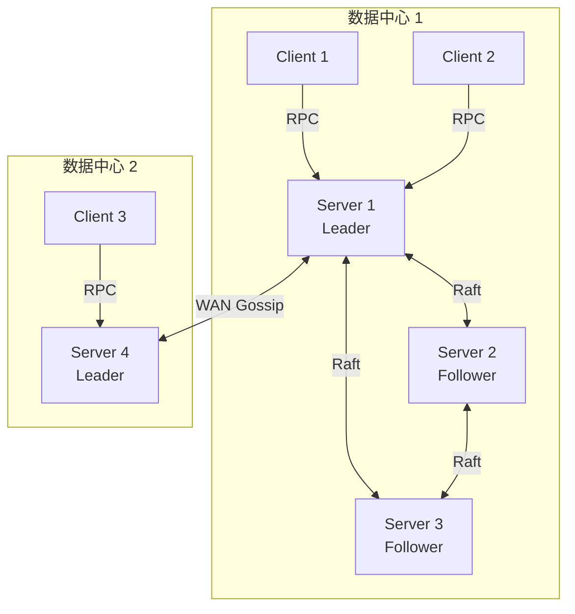
```mermaid
graph TD
    subgraph Datacenter1["数据中心 1"]
        S1[Server 1<br>Leader]
        S2[Server 2<br>Follower]
        S3[Server 3<br>Follower]
        C1[Client 1]
        C2[Client 2]
      
        S1 <-->|Raft| S2
        S1 <-->|Raft| S3
        S2 <-->|Raft| S3
        C1 -->|RPC| S1
        C2 -->|RPC| S1
    end
  
    subgraph Datacenter2["数据中心 2"]
        S4[Server 4<br>Leader]
        C3[Client 3]
        C3 -->|RPC| S4
    end
  
    S1 <-->|WAN Gossip| S4
```

### Consul 的核心优势

1. **简单易用**: 单一二进制文件，零依赖，开箱即用
2. **高可用**: 基于 Raft 协议的强一致性保证
3. **可扩展**: 支持数千节点的大规模集群
4. **多平台**: 支持 Linux、Windows、macOS 等多种操作系统
5. **丰富生态**: 与 Terraform、Vault、Nomad 等 HashiCorp 产品深度集成

---

## 1.2 与服务网格产品对比

### 服务网格对比表

| 特性                 | Consul Connect     | Istio           | Linkerd               |
| -------------------- | ------------------ | --------------- | --------------------- |
| **架构复杂度** | 低                 | 高              | 中                    |
| **多数据中心** | 原生支持           | 需额外配置      | 需额外配置            |
| **代理支持**   | Envoy/内置代理     | Envoy           | Linkerd-proxy         |
| **控制平面**   | Consul Server      | Istiod          | Linkerd Control Plane |
| **平台支持**   | Kubernetes/VM/裸机 | 主要 Kubernetes | Kubernetes            |
| **学习曲线**   | 较低               | 较高            | 中等                  |

### Consul 服务网格核心特点

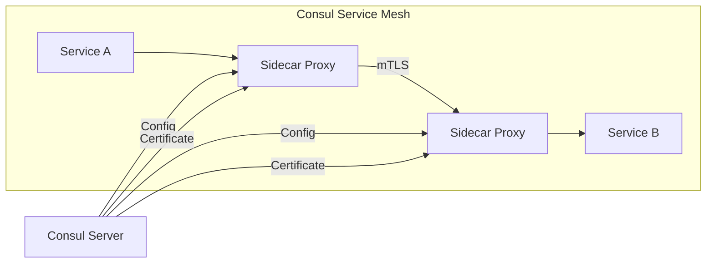
```mermaid
graph LR
    subgraph ServiceMesh["Consul Service Mesh"]
        SvcA[Service A] --> ProxyA[Sidecar Proxy]
        ProxyA -->|mTLS| ProxyB[Sidecar Proxy]
        ProxyB --> SvcB[Service B]
    end
  
    ConsulServer[Consul Server] -->|Config| ProxyA
    ConsulServer -->|Config| ProxyB
    ConsulServer -->|Certificate| ProxyA
    ConsulServer -->|Certificate| ProxyB
```

**Consul Connect 优势**:

1. **统一控制平面**: 服务发现与服务网格共用同一控制平面
2. **渐进式采用**: 可逐步从传统架构迁移到服务网格
3. **平台无关**: 不仅限于 Kubernetes，支持 VM 和裸机部署
4. **内置 CA**: 自动管理证书生命周期

---

## 1.3 与 DNS 工具对比

### DNS 服务发现对比

| 特性                 | Consul DNS | CoreDNS    | BIND      | AWS Route53 |
| -------------------- | ---------- | ---------- | --------- | ----------- |
| **动态更新**   | 实时       | 需配置     | 手动/脚本 | API 调用    |
| **健康检查**   | 内置集成   | 需外部工具 | 无        | 需配合 ELB  |
| **服务感知**   | 原生支持   | 插件支持   | 不支持    | 不支持      |
| **多数据中心** | 原生支持   | 需配置     | 需配置    | 区域隔离    |

### Consul DNS 工作流程

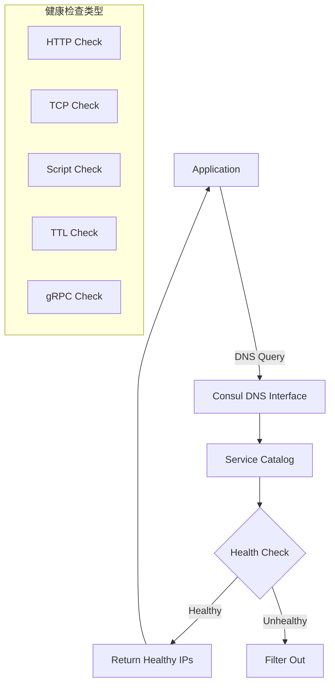
```mermaid
graph TD
    App[Application] -->|DNS Query| ConsulDNS[Consul DNS Interface]
    ConsulDNS --> Catalog[Service Catalog]
  
    Catalog --> HC{Health Check}
    HC -->|Healthy| ReturnIP[Return Healthy IPs]
    HC -->|Unhealthy| Filter[Filter Out]
  
    ReturnIP --> App
  
    subgraph HealthChecks["健康检查类型"]
        HTTP[HTTP Check]
        TCP[TCP Check]
        Script[Script Check]
        TTL[TTL Check]
        gRPC[gRPC Check]
    end
```

**Consul DNS 优势**:

1. **服务健康感知**: 只返回健康的服务实例 IP
2. **零代码改造**: 应用只需修改 DNS 解析即可接入
3. **负载均衡**: 支持基于标签的路由和负载均衡
4. **缓存机制**: 支持 DNS 缓存以提高性能

---

## 1.4 与配置管理工具对比

### 动态配置 vs 静态配置

传统配置管理工具（如 Ansible、Puppet、Chef）主要关注**静态配置**，而 Consul 专注于**动态配置**。

| 特性                 | Consul | Ansible | Puppet | Chef   |
| -------------------- | ------ | ------- | ------ | ------ |
| **配置类型**   | 动态   | 静态    | 静态   | 静态   |
| **实时响应**   | 支持   | 不支持  | 有限   | 有限   |
| **服务发现**   | 内置   | 无      | 无     | 无     |
| **健康检查**   | 内置   | 无      | 无     | 无     |
| **Watch 机制** | 支持   | 不支持  | 不支持 | 不支持 |

### Consul 动态配置工作流

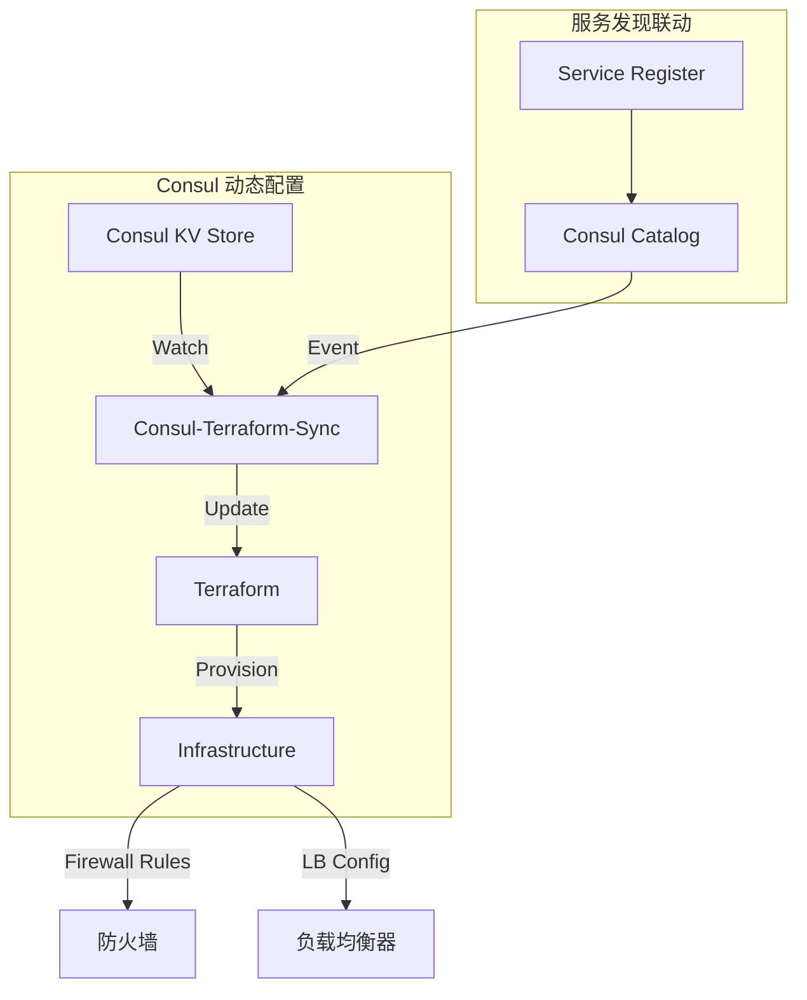
```mermaid
graph TD
    subgraph DynamicConfig["Consul 动态配置"]
        KV[Consul KV Store] -->|Watch| CTS[Consul-Terraform-Sync]
        CTS -->|Update| Terraform[Terraform]
        Terraform -->|Provision| Infra[Infrastructure]
    end
  
    subgraph ServiceDiscovery["服务发现联动"]
        Service[Service Register] --> Catalog[Consul Catalog]
        Catalog -->|Event| CTS
    end
  
    Infra -->|Firewall Rules| FW[防火墙]
    Infra -->|LB Config| LB[负载均衡器]
```

**Consul 配置管理优势**:

1. **动态响应服务变化**: 服务扩缩容时自动更新配置
2. **与 Terraform 集成**: Consul-Terraform-Sync (CTS) 实现基础设施自动化
3. **分离关注点**: 配置管理与服务发现分离，简化工作流
4. **多数据中心独立运行**: 每个数据中心可独立配置

### 静态与动态配置协作

> **最佳实践**: Consul 不是替代传统配置管理工具，而是与其协作。
>
> - **静态配置**: 使用 Ansible/Puppet 进行初始化部署
> - **动态配置**: 使用 Consul 响应运行时变化

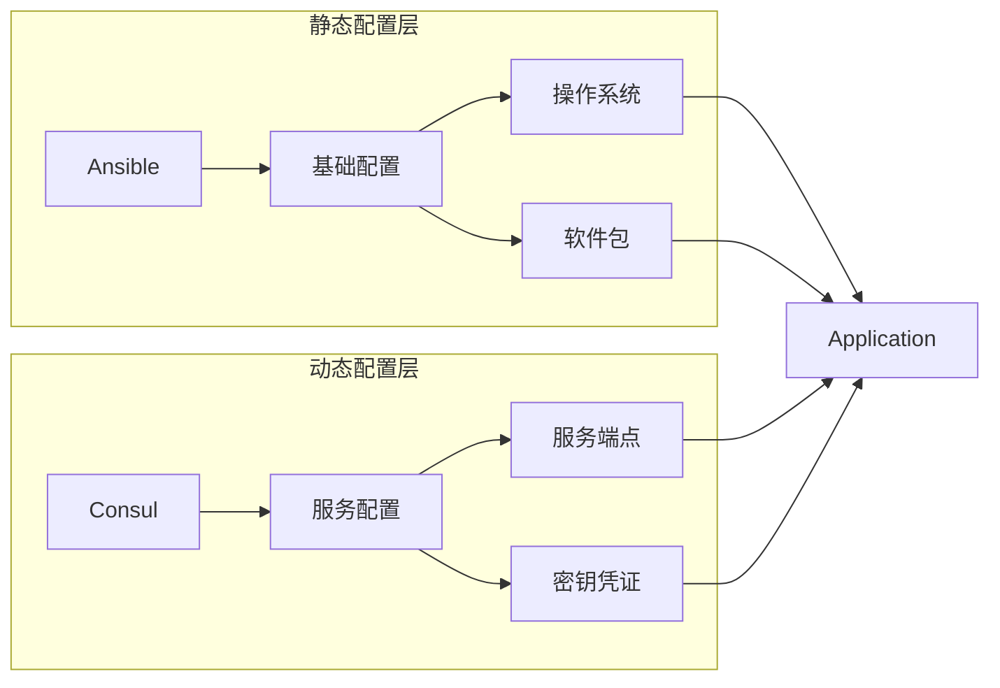
```mermaid
graph LR
    subgraph Static["静态配置层"]
        Ansible[Ansible] --> BaseConfig[基础配置]
        BaseConfig --> OS[操作系统]
        BaseConfig --> Packages[软件包]
    end
  
    subgraph Dynamic["动态配置层"]
        Consul[Consul] --> ServiceConfig[服务配置]
        ServiceConfig --> Endpoints[服务端点]
        ServiceConfig --> Secrets[密钥凭证]
    end
  
    OS --> App[Application]
    Packages --> App
    Endpoints --> App
    Secrets --> App
```

---

## 1.5 与 API 网关对比

### API 网关对比

| 特性                   | Consul API Gateway | Kong          | NGINX Plus | AWS API Gateway |
| ---------------------- | ------------------ | ------------- | ---------- | --------------- |
| **服务发现集成** | 原生 Consul        | 需配置        | 需配置     | AWS 服务集成    |
| **服务网格集成** | Consul Connect     | 独立          | 独立       | 不支持          |
| **流量管理**     | 支持               | 丰富          | 丰富       | 支持            |
| **安全认证**     | ACL/mTLS           | 多种插件      | 多种       | IAM/Cognito     |
| **部署方式**     | K8s/VM             | K8s/VM/Docker | K8s/VM     | 托管服务        |

### Consul API Gateway 架构

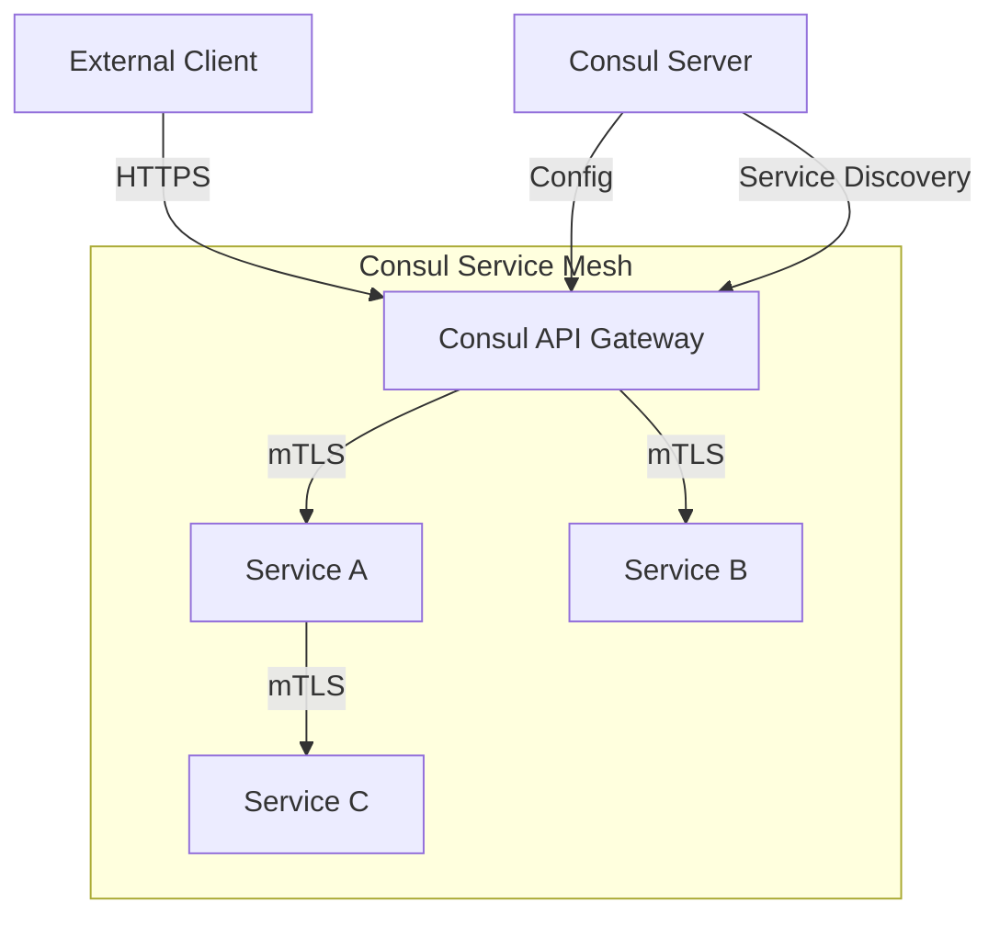
```mermaid
graph TD
    Client[External Client] -->|HTTPS| APIGateway[Consul API Gateway]
  
    subgraph ConsulMesh["Consul Service Mesh"]
        APIGateway -->|mTLS| SvcA[Service A]
        APIGateway -->|mTLS| SvcB[Service B]
        SvcA -->|mTLS| SvcC[Service C]
    end
  
    ConsulServer[Consul Server] -->|Config| APIGateway
    ConsulServer -->|Service Discovery| APIGateway
```

### 网关类型说明

Consul 提供三种网关类型：

| 网关类型                      | 用途                 | 场景                       |
| ----------------------------- | -------------------- | -------------------------- |
| **API Gateway**         | 南北向流量入口       | 外部客户端访问内部服务     |
| **Ingress Gateway**     | 外部流量进入服务网格 | 非 mesh 服务访问 mesh 服务 |
| **Terminating Gateway** | 服务网格访问外部服务 | mesh 服务访问外部数据库等  |
| **Mesh Gateway**        | 跨数据中心流量       | 多数据中心服务通信         |

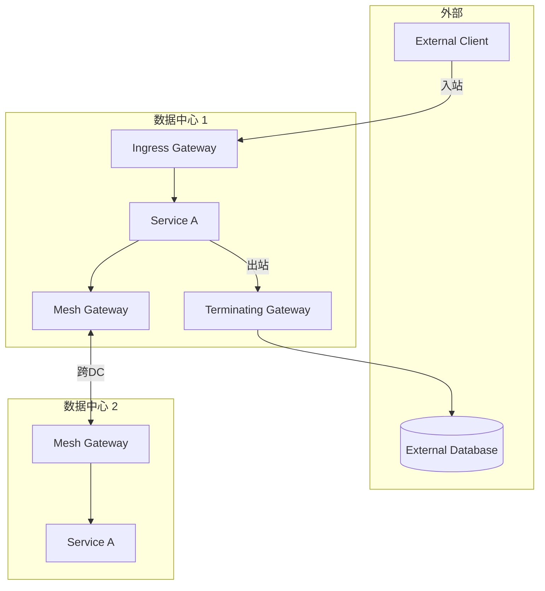
```mermaid
graph TD
    subgraph External["外部"]
        ExtClient[External Client]
        ExtDB[(External Database)]
    end
  
    subgraph DC1["数据中心 1"]
        IG[Ingress Gateway]
        TG[Terminating Gateway]
        MG1[Mesh Gateway]
        SvcA1[Service A]
    end
  
    subgraph DC2["数据中心 2"]
        MG2[Mesh Gateway]
        SvcA2[Service A]
    end
  
    ExtClient -->|入站| IG
    IG --> SvcA1
    SvcA1 -->|出站| TG
    TG --> ExtDB
  
    SvcA1 --> MG1
    MG1 <-->|跨DC| MG2
    MG2 --> SvcA2
```

---

## 1.6 本章小结

### Consul 选型决策树

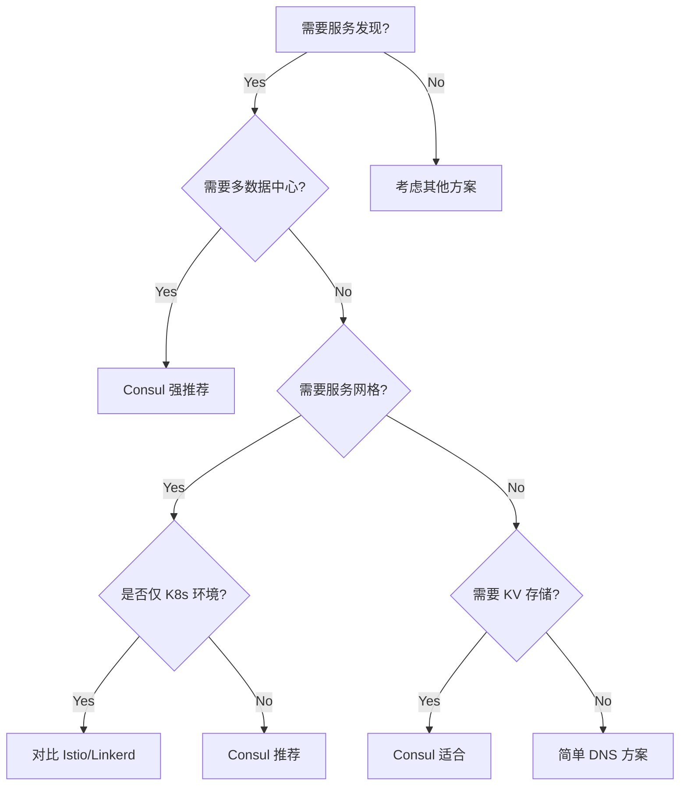
```mermaid
graph TD
    Start[需要服务发现?] -->|Yes| Q1{需要多数据中心?}
    Start -->|No| Other[考虑其他方案]
  
    Q1 -->|Yes| Consul1[Consul 强推荐]
    Q1 -->|No| Q2{需要服务网格?}
  
    Q2 -->|Yes| Q3{是否仅 K8s 环境?}
    Q2 -->|No| Q4{需要 KV 存储?}
  
    Q3 -->|Yes| Compare[对比 Istio/Linkerd]
    Q3 -->|No| Consul2[Consul 推荐]
  
    Q4 -->|Yes| Consul3[Consul 适合]
    Q4 -->|No| SimpleDNS[简单 DNS 方案]
```

### 关键要点回顾

| 场景                 | Consul 优势            |
| -------------------- | ---------------------- |
| **多数据中心** | 原生支持，无需额外组件 |
| **混合环境**   | 同时支持 K8s、VM、裸机 |
| **渐进式迁移** | 可逐步引入服务网格     |
| **动态配置**   | 实时响应服务变化       |
| **简化运维**   | 单一工具解决多个问题   |

---

> **下一章**: [第2章 核心概念](#第2章-核心概念) - 深入理解服务发现和服务网格的原理

---

# 第2章 核心概念

本章深入介绍 Consul 的两个核心概念：**服务发现 (Service Discovery)** 和 **服务网格 (Service Mesh)**。这两个概念是 Consul 的基础，理解它们对于掌握 Consul 至关重要。

---

## 2.1 服务发现 (Service Discovery)

### 什么是服务发现

**服务发现**是一种允许服务自动注册和发现其他服务的机制。在现代分布式系统中，服务实例的数量和位置会动态变化，服务发现解决了"如何找到我需要调用的服务"这一核心问题。

### 服务发现的核心优势

| 优势                         | 描述                               |
| ---------------------------- | ---------------------------------- |
| **动态 IP 和端口发现** | 自动发现服务的网络位置，无需硬编码 |
| **简化水平扩展**       | 新实例自动加入负载均衡池           |
| **应用解耦**           | 将发现逻辑从应用中抽离             |
| **可靠通信**           | 通过健康检查确保只路由到健康实例   |
| **负载均衡**           | 自动在健康实例间分发请求           |
| **快速部署**           | 高速发现缩短部署时间               |
| **自动注册/注销**      | 服务生命周期自动管理               |

### 服务发现工作原理

服务发现使用服务的**身份标识**而非传统的 IP 地址和端口来定位服务。服务目录动态维护所有服务的访问信息。

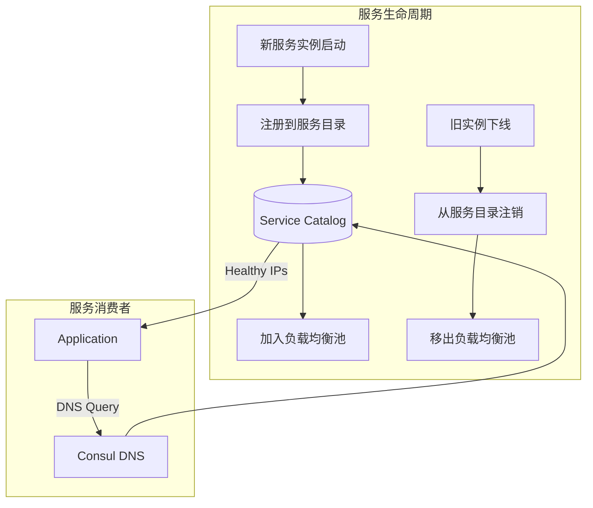
```mermaid
graph TD
    subgraph ServiceLifecycle["服务生命周期"]
        NewSvc[新服务实例启动] --> Register[注册到服务目录]
        Register --> Catalog[(Service Catalog)]
        Catalog --> LBPool[加入负载均衡池]
      
        OldSvc[旧实例下线] --> Deregister[从服务目录注销]
        Deregister --> Remove[移出负载均衡池]
    end
  
    subgraph Consumer["服务消费者"]
        App[Application] -->|DNS Query| DNS[Consul DNS]
        DNS --> Catalog
        Catalog -->|Healthy IPs| App
    end
```

### 服务发现的两种模式

#### 客户端发现模式 (Client-Side Discovery)

在客户端发现模式中，**服务消费者**负责确定可用服务实例并进行负载均衡。

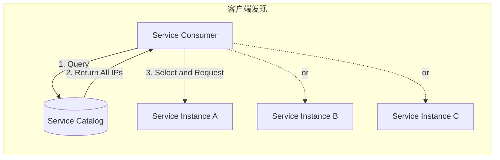
```mermaid
graph LR
    subgraph ClientSide["客户端发现"]
        Consumer[Service Consumer] -->|1. Query| Catalog[(Service Catalog)]
        Catalog -->|2. Return All IPs| Consumer
        Consumer -->|3. Select and Request| SvcA[Service Instance A]
        Consumer -.->|or| SvcB[Service Instance B]
        Consumer -.->|or| SvcC[Service Instance C]
    end
```

**特点**:

- 客户端感知所有服务实例
- 客户端负责负载均衡逻辑
- 客户端直接连接服务实例

#### 服务端发现模式 (Server-Side Discovery)

在服务端发现模式中，服务消费者通过**中间层（如 Consul）** 查询服务目录并路由请求。

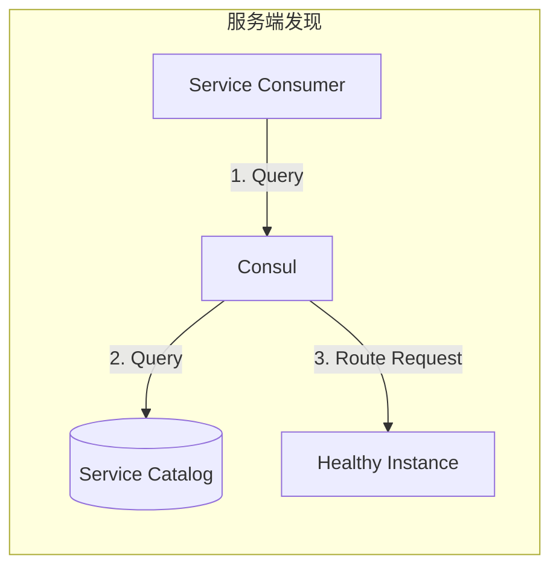
```mermaid
graph LR
    subgraph ServerSide["服务端发现"]
        Consumer[Service Consumer] -->|1. Query| Consul[Consul]
        Consul -->|2. Query| Catalog[(Service Catalog)]
        Consul -->|3. Route Request| SvcA[Healthy Instance]
    end
```

**特点**:

- 客户端只需知道 Consul 地址
- 发现逻辑集中管理
- 更适合现代云原生应用

> **Consul 采用服务端发现模式**，将服务发现逻辑从应用中解耦，使应用更轻量、更快速。

### 服务发现 vs 传统负载均衡

| 对比项                  | 服务发现 (Consul) | 传统负载均衡器      |
| ----------------------- | ----------------- | ------------------- |
| **注册/注销速度** | 毫秒级            | 秒/分钟级           |
| **高可用设计**    | 多节点对等架构    | 主备模式            |
| **状态管理**      | 点对点状态同步    | 中心化存储          |
| **基础设施依赖**  | 平台无关          | 依赖特定硬件/云服务 |
| **动态响应**      | 实时              | 延迟较高            |

### Consul 服务发现架构

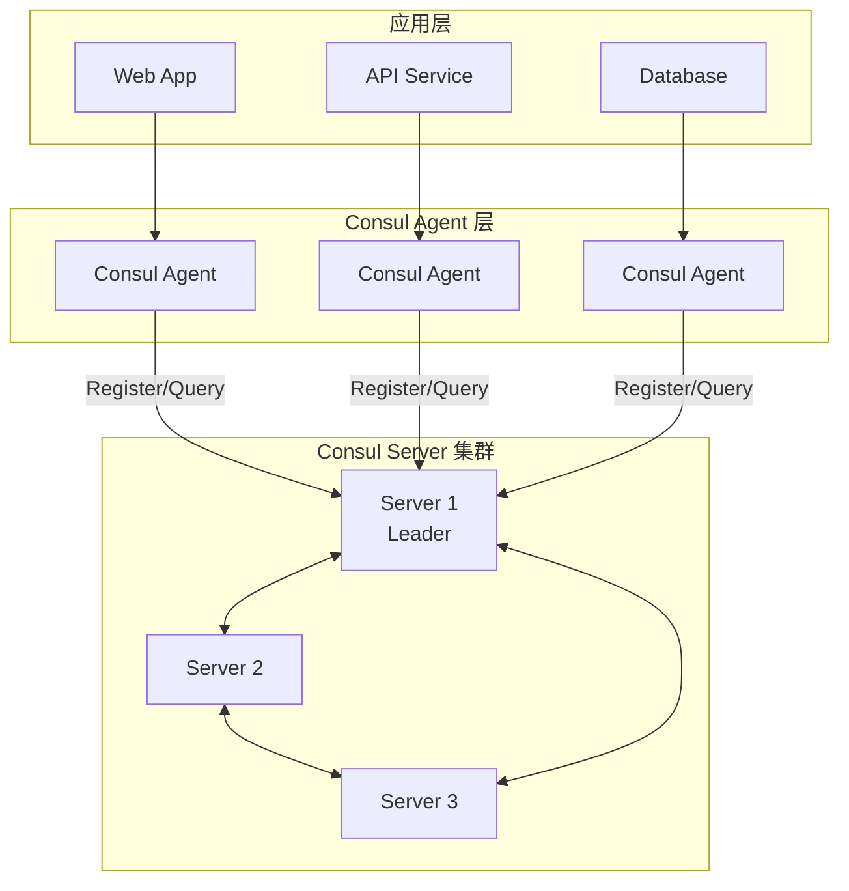
```mermaid
graph TD
    subgraph Apps["应用层"]
        App1[Web App]
        App2[API Service]
        App3[Database]
    end
  
    subgraph Agents["Consul Agent 层"]
        CA1[Consul Agent]
        CA2[Consul Agent]
        CA3[Consul Agent]
    end
  
    subgraph Servers["Consul Server 集群"]
        S1[Server 1<br>Leader]
        S2[Server 2]
        S3[Server 3]
        S1 <--> S2
        S2 <--> S3
        S1 <--> S3
    end
  
    App1 --> CA1
    App2 --> CA2
    App3 --> CA3
  
    CA1 -->|Register/Query| S1
    CA2 -->|Register/Query| S1
    CA3 -->|Register/Query| S1
```

### 服务发现实现方式

Consul 可以部署在多种环境中：

| 平台                  | 部署方式          |
| --------------------- | ----------------- |
| **虚拟机 (VM)** | 安装 Consul Agent |
| **容器**        | Sidecar 模式      |
| **Kubernetes**  | Consul Helm Chart |
| **Nomad**       | 原生集成          |
| **Serverless**  | 通过 API 注册     |

---

## 2.2 服务网格 (Service Mesh)

### 什么是服务网格

**服务网格**是一个专门处理服务间通信的基础设施层。它提供了统一的方式来处理服务间的流量管理、安全、可观测性等问题。

### 服务网格的核心功能

| 功能类别             | 具体功能               |
| -------------------- | ---------------------- |
| **服务发现**   | 自动发现和注册服务     |
| **健康监控**   | 应用健康状态监控       |
| **负载均衡**   | 智能流量分发           |
| **流量管理**   | 路由、重试、超时、熔断 |
| **加密**       | 服务间 mTLS 加密       |
| **可观测性**   | 追踪、指标、日志       |
| **认证授权**   | 服务身份验证和访问控制 |
| **网络自动化** | 动态配置网络策略       |

### 零信任安全模型

服务网格的一个重要应用场景是实现**零信任 (Zero Trust)** 安全模型。

> **零信任原则**: 不信任任何人，始终验证。

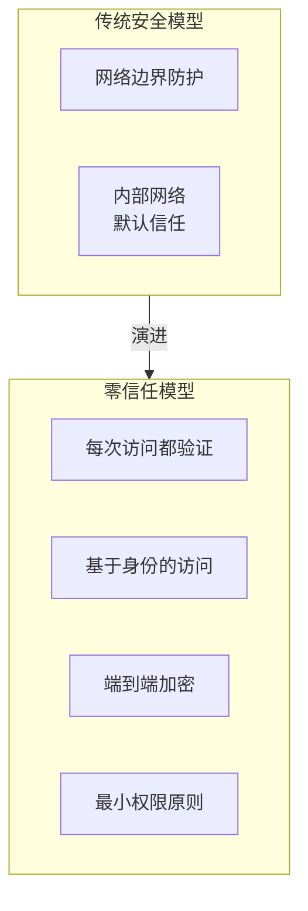
```mermaid
graph TD
    subgraph Traditional["传统安全模型"]
        Perimeter[网络边界防护]
        Internal[内部网络<br>默认信任]
    end
  
    subgraph ZeroTrust["零信任模型"]
        Verify[每次访问都验证]
        Identity[基于身份的访问]
        Encrypt[端到端加密]
        MinPriv[最小权限原则]
    end
  
    Traditional -->|演进| ZeroTrust
```

**传统安全模型的问题**:

- 聚焦网络边界防护
- 内部网络默认信任
- 云环境网络边界模糊
- 内部威胁难以防范

**零信任模型的优势**:

- 所有通信都需要身份验证
- 使用 TLS 证书加密传输
- 细粒度的访问控制策略
- 适应云原生动态环境

### 服务网格架构

服务网格通常由**控制平面 (Control Plane)** 和**数据平面 (Data Plane)** 组成。

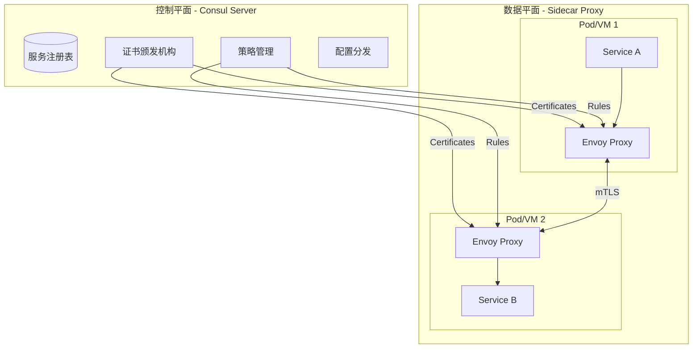
```mermaid
graph TD
    subgraph ControlPlane["控制平面 - Consul Server"]
        Registry[(服务注册表)]
        CA[证书颁发机构]
        Policy[策略管理]
        Config[配置分发]
    end
  
    subgraph DataPlane["数据平面 - Sidecar Proxy"]
        subgraph Pod1["Pod/VM 1"]
            SvcA[Service A]
            ProxyA[Envoy Proxy]
        end
      
        subgraph Pod2["Pod/VM 2"]
            SvcB[Service B]
            ProxyB[Envoy Proxy]
        end
    end
  
    CA -->|Certificates| ProxyA
    CA -->|Certificates| ProxyB
    Policy -->|Rules| ProxyA
    Policy -->|Rules| ProxyB
  
    SvcA --> ProxyA
    ProxyA <-->|mTLS| ProxyB
    ProxyB --> SvcB
```

#### 控制平面职责

| 职责               | 描述                 |
| ------------------ | -------------------- |
| **服务注册** | 维护所有服务的注册表 |
| **证书管理** | 签发和轮换 TLS 证书  |
| **健康检查** | 检测服务健康状态     |
| **策略执行** | 分发和执行安全策略   |
| **配置管理** | 分发代理配置         |

#### 数据平面职责

| 职责               | 描述                 |
| ------------------ | -------------------- |
| **请求代理** | 代理服务间的所有流量 |
| **负载均衡** | 在服务实例间分发请求 |
| **加密通信** | 使用 mTLS 加密流量   |
| **可观测性** | 收集指标、追踪和日志 |
| **流量控制** | 实现重试、超时、熔断 |

### API 网关 vs 服务网格

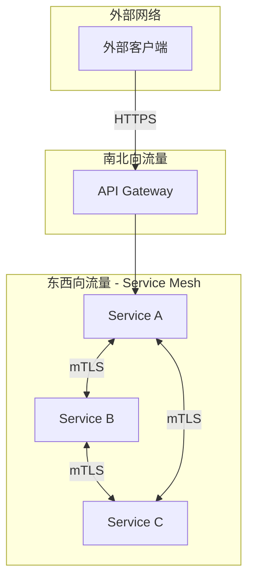
```mermaid
graph TD
    subgraph External["外部网络"]
        ExtClient[外部客户端]
    end
  
    subgraph NorthSouth["南北向流量"]
        APIGW[API Gateway]
    end
  
    subgraph EastWest["东西向流量 - Service Mesh"]
        SvcA[Service A] <-->|mTLS| SvcB[Service B]
        SvcB <-->|mTLS| SvcC[Service C]
        SvcA <-->|mTLS| SvcC
    end
  
    ExtClient -->|HTTPS| APIGW
    APIGW --> SvcA
```

| 对比项                 | API 网关             | 服务网格                   |
| ---------------------- | -------------------- | -------------------------- |
| **流量方向**     | 南北向 (入站/出站)   | 东西向 (服务间)            |
| **主要功能**     | 入口管理、认证、限流 | 服务间通信、安全、可观测性 |
| **部署位置**     | 网络边缘             | 服务旁边 (Sidecar)         |
| **服务感知**     | 有限                 | 完全感知                   |
| **生命周期管理** | 不管理               | 自动跟踪                   |

### 服务网格解决的问题

#### 1. 动态基础设施挑战

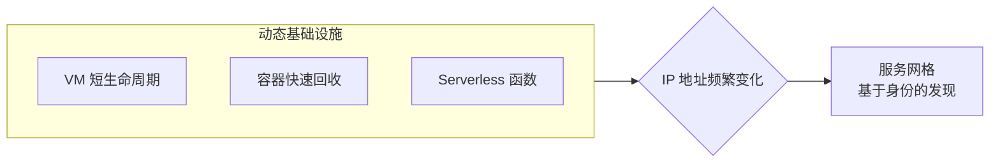
```mermaid
graph LR
    subgraph Dynamic["动态基础设施"]
        VM1[VM 短生命周期]
        Container[容器快速回收]
        Serverless[Serverless 函数]
    end
  
    Dynamic --> Problem{IP 地址频繁变化}
    Problem --> Solution[服务网格<br>基于身份的发现]
```

#### 2. 智能流量管理

服务网格提供 L7 层流量管理能力：

| 功能                   | 描述                         |
| ---------------------- | ---------------------------- |
| **负载均衡**     | 多种算法 (轮询、最少连接等)  |
| **流量分割**     | 金丝雀发布、蓝绿部署         |
| **动态故障转移** | 自动切换到健康实例           |
| **自定义路由**   | 基于 Header、Path 等规则路由 |
| **重试机制**     | 自动重试失败请求             |
| **熔断器**       | 防止级联故障                 |

#### 3. 细粒度安全策略

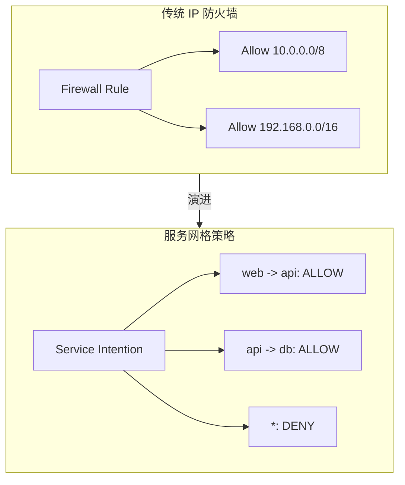
```mermaid
graph TD
    subgraph Traditional["传统 IP 防火墙"]
        FW[Firewall Rule]
        IP1["Allow 10.0.0.0/8"]
        IP2["Allow 192.168.0.0/16"]
        FW --> IP1
        FW --> IP2
    end
  
    subgraph ServiceMesh["服务网格策略"]
        Intention[Service Intention]
        Allow1["web -> api: ALLOW"]
        Allow2["api -> db: ALLOW"]
        Deny["*: DENY"]
        Intention --> Allow1
        Intention --> Allow2
        Intention --> Deny
    end
  
    Traditional -->|演进| ServiceMesh
```

**服务网格安全优势**:

- 从 IP 地址模型转向服务身份模型
- 无需担心 IP 地址频繁变化
- 支持跨云环境而不增加复杂性
- 默认拒绝，显式允许

### Consul 作为服务网格

Consul 是一个**多平台服务网格**，具有以下特点：

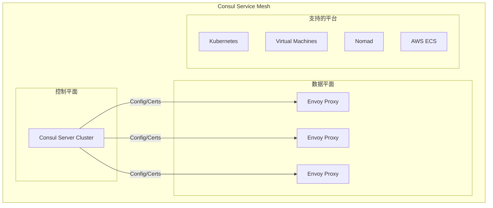
```mermaid
graph TD
    subgraph ConsulMesh["Consul Service Mesh"]
        subgraph ControlPlane["控制平面"]
            ConsulServer[Consul Server Cluster]
        end
      
        subgraph DataPlane["数据平面"]
            Envoy1[Envoy Proxy]
            Envoy2[Envoy Proxy]
            Envoy3[Envoy Proxy]
        end
      
        subgraph Platforms["支持的平台"]
            K8s[Kubernetes]
            VM[Virtual Machines]
            Nomad[Nomad]
            ECS[AWS ECS]
        end
    end
  
    ConsulServer -->|Config/Certs| Envoy1
    ConsulServer -->|Config/Certs| Envoy2
    ConsulServer -->|Config/Certs| Envoy3
```

#### Consul 服务网格特性

| 特性                 | 描述                     |
| -------------------- | ------------------------ |
| **多平台支持** | Kubernetes、VM、Nomad 等 |
| **多云支持**   | 跨云环境统一管理         |
| **Envoy 集成** | 一流的 Envoy 代理支持    |
| **Connect**    | 内置的服务间安全通信     |
| **Intentions** | 基于服务的访问控制       |
| **可观测性**   | 内置指标和追踪集成       |

### 部署选项

| 部署方式                  | 适用场景               |
| ------------------------- | ---------------------- |
| **自托管 Consul**   | 完全控制，适合大型组织 |
| **HCP Consul**      | 托管服务，降低运维负担 |
| **Kubernetes Helm** | K8s 原生部署           |
| **Terraform**       | 基础设施即代码部署     |

---

## 2.3 本章小结

### 服务发现 vs 服务网格

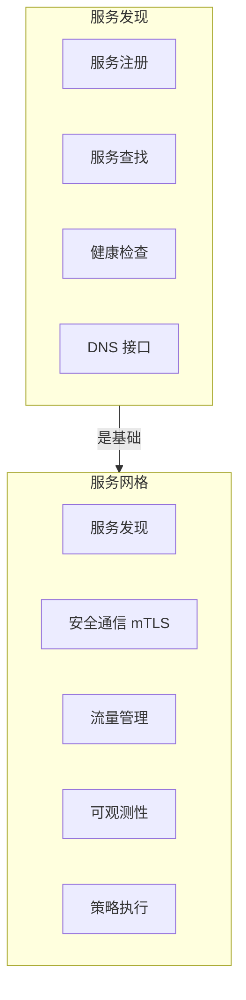
```mermaid
graph TD
    subgraph ServiceDiscovery["服务发现"]
        SD1[服务注册]
        SD2[服务查找]
        SD3[健康检查]
        SD4[DNS 接口]
    end
  
    subgraph ServiceMesh["服务网格"]
        SM1[服务发现]
        SM2[安全通信 mTLS]
        SM3[流量管理]
        SM4[可观测性]
        SM5[策略执行]
    end
  
    ServiceDiscovery -->|是基础| ServiceMesh
```

### 关键概念回顾

| 概念                 | 要点                              |
| -------------------- | --------------------------------- |
| **服务发现**   | 动态定位服务实例，基于身份而非 IP |
| **服务目录**   | 集中维护所有服务信息的注册表      |
| **控制平面**   | 管理配置、证书、策略的中心组件    |
| **数据平面**   | 处理实际流量的 Sidecar 代理       |
| **零信任**     | 始终验证，从不信任                |
| **mTLS**       | 双向 TLS 认证和加密               |
| **Intentions** | Consul 的服务间访问控制规则       |

### 核心架构总览

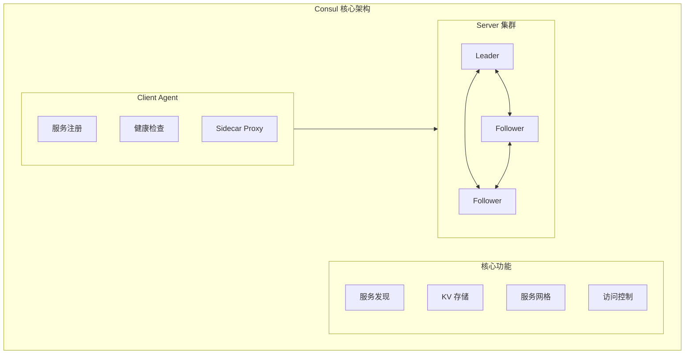
```mermaid
graph TD
    subgraph Consul["Consul 核心架构"]
        subgraph Server["Server 集群"]
            Leader[Leader]
            Follower1[Follower]
            Follower2[Follower]
        end
      
        subgraph Features["核心功能"]
            SD[服务发现]
            KV[KV 存储]
            Mesh[服务网格]
            ACL[访问控制]
        end
      
        subgraph Client["Client Agent"]
            Service[服务注册]
            Health[健康检查]
            Proxy[Sidecar Proxy]
        end
    end
  
    Leader <--> Follower1
    Leader <--> Follower2
    Follower1 <--> Follower2
  
    Client --> Server
```

---

> **下一章**: [第3章 快速入门](#第3章-快速入门) - 安装部署 Consul 并了解基本术语和端口配置

---

# 第3章 快速入门

本章介绍 Consul 的安装部署、核心术语、端口配置以及生产环境部署的最佳实践。

---

## 3.1 安装 Consul

### 安装方式

Consul 提供多种安装方式：

| 安装方式                  | 适用场景         |
| ------------------------- | ---------------- |
| **预编译二进制**    | 最简单，推荐方式 |
| **包管理器**        | yum/apt 系统集成 |
| **Docker**          | 容器化部署       |
| **源码编译**        | 自定义构建       |
| **Kubernetes Helm** | K8s 环境         |

### 二进制安装 (推荐)

```bash
# 下载最新版本 (以 Linux amd64 为例)
wget https://releases.hashicorp.com/consul/1.16.0/consul_1.16.0_linux_amd64.zip

# 解压
unzip consul_1.16.0_linux_amd64.zip

# 移动到系统路径
sudo mv consul /usr/local/bin/

# 验证安装
consul version
```

### 包管理器安装

**CentOS/RHEL:**

```bash
# 添加 HashiCorp 仓库
sudo yum install -y yum-utils
sudo yum-config-manager --add-repo https://rpm.releases.hashicorp.com/RHEL/hashicorp.repo

# 安装 Consul
sudo yum install -y consul
```

**Ubuntu/Debian:**

```bash
# 添加 GPG 密钥
wget -O- https://apt.releases.hashicorp.com/gpg | sudo gpg --dearmor -o /usr/share/keyrings/hashicorp-archive-keyring.gpg

# 添加仓库
echo "deb [signed-by=/usr/share/keyrings/hashicorp-archive-keyring.gpg] https://apt.releases.hashicorp.com $(lsb_release -cs) main" | sudo tee /etc/apt/sources.list.d/hashicorp.list

# 安装
sudo apt update && sudo apt install consul
```

### Docker 安装

```bash
# 拉取镜像
docker pull hashicorp/consul:latest

# 运行开发模式
docker run -d --name=consul-dev -p 8500:8500 hashicorp/consul agent -dev -client=0.0.0.0
```

---

## 3.2 术语表

### 核心角色术语

| 术语               | 说明                                                                   |
| ------------------ | ---------------------------------------------------------------------- |
| **Agent**    | 运行在每个 Consul 节点上的长时间守护进程，可以是 Client 或 Server 模式 |
| **Client**   | 转发所有 RPC 请求到 Server，参与 LAN Gossip，无状态，资源消耗低        |
| **Server**   | 参与 Raft 选举、维护集群状态、响应 RPC 查询、WAN Gossip 通信           |
| **Leader**   | Server 集群中的领导者，负责处理所有写请求和复制日志                    |
| **Follower** | Server 集群中的跟随者，复制 Leader 的日志                              |

### 网络术语

| 术语                 | 说明                                             |
| -------------------- | ------------------------------------------------ |
| **Datacenter** | 私有、低延迟、高带宽的网络环境                   |
| **LAN Gossip** | 同一数据中心内节点间的 Gossip 通信               |
| **WAN Gossip** | 跨数据中心的 Server 间 Gossip 通信               |
| **RPC**        | 远程过程调用，Client 与 Server 间的请求/响应机制 |

### 协议术语

| 术语                | 说明                                           |
| ------------------- | ---------------------------------------------- |
| **Consensus** | 共识协议，基于 Raft 实现 Leader 选举和日志复制 |
| **Gossip**    | 八卦协议，用于成员管理、故障检测和事件广播     |
| **Raft**      | 分布式一致性算法，保证数据强一致性             |

### 功能术语

| 术语                        | 说明                                       |
| --------------------------- | ------------------------------------------ |
| **Service Discovery** | 服务发现，自动注册和查找服务               |
| **Service Mesh**      | 服务网格，Sidecar 代理模式的服务间安全通信 |
| **Service Catalog**   | 服务目录，存储所有注册服务的信息           |
| **Health Check**      | 健康检查，监控服务和节点状态               |
| **ACL**               | 访问控制列表，权限管理系统                 |
| **KV Store**          | 键值存储，动态配置和协调                   |
| **Intentions**        | 服务间访问控制规则                         |
| **mTLS**              | 双向 TLS 认证加密                          |

```mermaid
graph TD
    subgraph Cluster["Consul Cluster"]
        subgraph Servers["Server 节点"]
            Leader[Leader Server]
            F1[Follower Server]
            F2[Follower Server]
        end
      
        subgraph Clients["Client 节点"]
            C1[Client Agent]
            C2[Client Agent]
            C3[Client Agent]
        end
    end
  
    Leader <-->|Raft| F1
    Leader <-->|Raft| F2
    F1 <-->|Raft| F2
  
    C1 -->|RPC| Leader
    C2 -->|RPC| Leader
    C3 -->|RPC| Leader
  
    C1 <-->|LAN Gossip| C2
    C2 <-->|LAN Gossip| C3
```

---

## 3.3 必需端口

### 端口列表

| 端口           | 协议    | 用途       | 说明                        |
| -------------- | ------- | ---------- | --------------------------- |
| **8300** | TCP     | Server RPC | Server 间 RPC 通信          |
| **8301** | TCP/UDP | Serf LAN   | LAN Gossip，所有 Agent 必需 |
| **8302** | TCP/UDP | Serf WAN   | WAN Gossip，仅 Server 需要  |
| **8500** | TCP     | HTTP API   | HTTP API 接口               |
| **8501** | TCP     | HTTPS API  | HTTPS API 接口 (可选)       |
| **8502** | TCP     | gRPC API   | gRPC API 接口 (可选)        |
| **8503** | TCP     | gRPC TLS   | gRPC TLS 接口 (可选)        |
| **8600** | TCP/UDP | DNS        | DNS 接口                    |

### 端口流量图

```mermaid
graph LR
    subgraph External["外部访问"]
        App[Application]
        DNS[DNS Client]
    end
  
    subgraph ConsulPorts["Consul 端口"]
        P8500[8500 HTTP API]
        P8600[8600 DNS]
        P8301[8301 Serf LAN]
        P8302[8302 Serf WAN]
        P8300[8300 Server RPC]
    end
  
    App -->|HTTP/HTTPS| P8500
    DNS -->|DNS Query| P8600
  
    subgraph Internal["内部通信"]
        Agent1[Agent]
        Agent2[Agent]
        Server1[Server]
        Server2[Server]
    end
  
    Agent1 <-->|8301| Agent2
    Server1 <-->|8300| Server2
    Server1 <-->|8302| Server2
```

### 防火墙配置示例

```bash
# Server 节点防火墙规则 (firewalld)
firewall-cmd --permanent --add-port=8300/tcp   # Server RPC
firewall-cmd --permanent --add-port=8301/tcp   # Serf LAN
firewall-cmd --permanent --add-port=8301/udp
firewall-cmd --permanent --add-port=8302/tcp   # Serf WAN
firewall-cmd --permanent --add-port=8302/udp
firewall-cmd --permanent --add-port=8500/tcp   # HTTP API
firewall-cmd --permanent --add-port=8600/tcp   # DNS
firewall-cmd --permanent --add-port=8600/udp
firewall-cmd --reload

# Client 节点防火墙规则
firewall-cmd --permanent --add-port=8301/tcp
firewall-cmd --permanent --add-port=8301/udp
firewall-cmd --permanent --add-port=8500/tcp
firewall-cmd --permanent --add-port=8600/tcp
firewall-cmd --permanent --add-port=8600/udp
firewall-cmd --reload
```

---

## 3.4 数据中心引导

### 集群引导流程

在集群开始服务之前，必须完成 **Leader 选举**。引导 (Bootstrap) 是将初始 Server 节点组成集群的过程。

```mermaid
graph TD
    Start[启动 Consul Server] --> Config[配置 bootstrap_expect]
    Config --> Wait[等待其他 Server]
    Wait --> Join{节点数量达到?}
    Join -->|No| Wait
    Join -->|Yes| Election[触发 Leader 选举]
    Election --> Leader[选出 Leader]
    Leader --> Ready[集群就绪]
    Ready --> Clients[Client 节点加入]
```

### 集群规模建议

| 生产环境           | Server 数量 | 说明                            |
| ------------------ | ----------- | ------------------------------- |
| **最小规模** | 3           | 容忍 1 个节点故障               |
| **推荐规模** | 5           | 容忍 2 个节点故障               |
| **大规模**   | 7           | 容忍 3 个节点故障，选举时间更长 |

> **警告**: 单节点部署在故障时会导致数据丢失，不推荐用于生产环境。

### 自动引导配置

使用 `bootstrap_expect` 自动引导集群：

```json
{
  "bootstrap_expect": 3,
  "retry_join": ["server1", "server2", "server3"]
}
```

---

## 3.5 生产环境部署配置

### 目录结构准备

```bash
# 创建配置和数据目录
mkdir -p /etc/consul.d /data/consul /var/log/consul

# 设置权限 (如果使用专用用户)
chown -R consul:consul /etc/consul.d /data/consul /var/log/consul
```

### Server 配置示例

```bash
cat > /etc/consul.d/server.json << 'EOF'
{
    "advertise_addr": "192.168.1.10",
    "bind_addr": "0.0.0.0",
    "bootstrap_expect": 3,
    "client_addr": "0.0.0.0",
    "data_dir": "/data/consul",
    "datacenter": "dc1",
    "log_level": "INFO",
    "log_file": "/var/log/consul/consul.log",
    "node_meta": {
        "env": "prod",
        "host": "consul-server01.dc1.example.com",
        "host_name": "consul-server01",
        "host_type": "server",
        "region": "dc1"
    },
    "log_json": true,
    "log_level": "info",
    "log_rotate_max_files": 10,
    "log_rotate_duration": "24h",
    "log_file": "/data/consul/logs/",
    "node_name": "consul-server01",
    "retry_join": [
        "consul-server01",
        "consul-server02",
        "consul-server03"
    ],
    "retry_join_wan": [
        "consul-server01.dc2.example.com",
        "consul-server02.dc2.example.com"
    ],
    "server": true,
    "ui": true,
    "performance": {
        "raft_multiplier": 1
    }
}
EOF
```

### Server 配置参数说明

| 参数                 | 说明                                 |
| -------------------- | ------------------------------------ |
| `advertise_addr`   | 对外通告的 IP 地址                   |
| `bind_addr`        | 绑定地址，`0.0.0.0` 表示所有接口   |
| `bootstrap_expect` | 预期 Server 数量，达到后自动选举     |
| `client_addr`      | HTTP/DNS 接口监听地址                |
| `data_dir`         | 数据存储目录                         |
| `datacenter`       | 数据中心名称                         |
| `node_name`        | 节点名称，集群内唯一                 |
| `retry_join`       | 同数据中心 Server 列表，自动重试加入 |
| `retry_join_wan`   | 跨数据中心 Server 列表 (WAN)         |
| `server`           | 是否为 Server 模式                   |
| `ui`               | 是否启用 Web UI                      |

### Client (Agent) 配置示例

```bash
cat > /etc/consul.d/client.json << 'EOF'
{
    "data_dir": "/data/consul",
    "datacenter": "dc1",
    "enable_script_checks": true,
    "bind_addr": "192.168.1.100",
    "client_addr": "0.0.0.0",
    "node_name": "consul-agent01",
    "log_json": true,
    "log_level": "info",
    "log_rotate_max_files": 10,
    "log_rotate_duration": "24h",
    "log_file": "/data/consul/logs/",
    "retry_join": [
        "consul-server01",
        "consul-server02",
        "consul-server03"
    ],
    "retry_interval": "30s",
    "rejoin_after_leave": true,
    "start_join": [
        "consul-server01",
        "consul-server02",
        "consul-server03"
    ]
}
EOF
```

### Client 配置参数说明

| 参数                     | 说明                        |
| ------------------------ | --------------------------- |
| `enable_script_checks` | 允许脚本类型健康检查        |
| `retry_join`           | Server 地址列表，断开后重试 |
| `retry_interval`       | 重试间隔                    |
| `rejoin_after_leave`   | 离开后是否重新加入          |
| `start_join`           | 启动时加入的 Server 地址    |

---

## 3.6 Systemd 服务配置

### Server 节点 Systemd 配置

```bash
cat > /etc/systemd/system/consul.service << 'EOF'
[Unit]
Description=HashiCorp Consul - A service mesh solution
Documentation=https://www.consul.io/
Requires=network-online.target
After=network-online.target
ConditionFileNotEmpty=/etc/consul.d/server.json

[Service]
Type=notify
User=consul
Group=consul
ExecStart=/usr/local/bin/consul agent -config-dir=/etc/consul.d
ExecReload=/bin/kill --signal HUP $MAINPID
KillMode=process
KillSignal=SIGTERM
Restart=on-failure
RestartSec=5
LimitNOFILE=65536

# 生产环境建议配置
TimeoutStartSec=0
TimeoutStopSec=30

[Install]
WantedBy=multi-user.target
EOF
```

### Client 节点 Systemd 配置

```bash
cat > /etc/systemd/system/consul.service << 'EOF'
[Unit]
Description=HashiCorp Consul - A service mesh solution
Documentation=https://www.consul.io/
Requires=network-online.target
After=network-online.target
ConditionFileNotEmpty=/etc/consul.d/client.json

[Service]
Type=notify
User=consul
Group=consul
ExecStart=/usr/local/bin/consul agent -config-dir=/etc/consul.d
ExecReload=/bin/kill --signal HUP $MAINPID
KillMode=process
KillSignal=SIGTERM
Restart=on-failure
RestartSec=5
LimitNOFILE=65536

[Install]
WantedBy=multi-user.target
EOF
```

### 创建 Consul 用户

```bash
# 创建 consul 系统用户
useradd --system --home /etc/consul.d --shell /bin/false consul

# 设置目录权限
chown -R consul:consul /etc/consul.d /data/consul /var/log/consul
```

### 服务管理命令

```bash
# 重新加载 systemd 配置
systemctl daemon-reload

# 启动 Consul
systemctl start consul

# 设置开机自启
systemctl enable consul

# 查看状态
systemctl status consul

# 查看日志
journalctl -u consul -f

# 重新加载配置 (不重启)
systemctl reload consul

# 停止服务
systemctl stop consul
```

### 集群管理命令

```bash
# 查看集群成员
consul members

# 查看集群成员 (详细信息)
consul members -detailed

# 查看 Server 状态
consul operator raft list-peers

# 查看集群信息
consul info

# 手动加入集群
consul join <server_ip>

# 优雅离开集群
consul leave
```

---

## 3.7 云自动加入

Consul 支持通过云平台标签自动发现并加入集群节点，无需手动配置 IP 地址。

### 支持的云平台

| 云平台       | Provider 名称    |
| ------------ | ---------------- |
| AWS          | `aws`          |
| Azure        | `azure`        |
| Google Cloud | `gce`          |
| 阿里云       | `aliyun`       |
| 腾讯云       | `tencentcloud` |
| Kubernetes   | `k8s`          |
| vSphere      | `vsphere`      |

### AWS 配置示例

```json
{
  "retry_join": [
    "provider=aws tag_key=consul tag_value=server region=ap-southeast-1"
  ]
}
```

### 阿里云配置示例

```json
{
  "retry_join": [
    "provider=aliyun region=cn-hangzhou tag_key=consul tag_value=server access_key_id=xxx access_key_secret=xxx"
  ]
}
```

### Kubernetes 配置示例

```json
{
  "retry_join": [
    "provider=k8s label_selector=\"app=consul,component=server\""
  ]
}
```

### 云自动加入流程

```mermaid
graph TD
    Start[Consul Agent 启动] --> Provider[识别云提供商]
    Provider --> Query[查询具有指定标签的实例]
    Query --> Filter[过滤返回的 IP 列表]
    Filter --> Join[尝试加入各节点]
    Join --> Success{加入成功?}
    Success -->|Yes| Ready[集群就绪]
    Success -->|No| Retry[等待 retry_interval]
    Retry --> Query
```

---

## 3.8 服务器性能优化

### Raft 性能参数

Consul 的默认配置针对低端硬件优化，生产环境应调整为高性能配置。

| raft_multiplier    | 适用场景          | HeartbeatTimeout | ElectionTimeout |
| ------------------ | ----------------- | ---------------- | --------------- |
| **5 (默认)** | 低端硬件/开发环境 | 5000ms           | 5000ms          |
| **1 (推荐)** | 生产环境          | 1000ms           | 1000ms          |

### 高性能配置

```json
{
  "performance": {
    "raft_multiplier": 1
  }
}
```

> **重要**: 高性能配置可以更快检测 Leader 故障并完成选举，但需要稳定的网络环境。

### 硬件建议

| 资源           | 最小配置 | 推荐配置 | 大规模集群 |
| -------------- | -------- | -------- | ---------- |
| **CPU**  | 2 核     | 4 核     | 8+ 核      |
| **内存** | 2 GB     | 8 GB     | 16+ GB     |
| **磁盘** | HDD      | SSD      | NVMe SSD   |
| **网络** | 1 Gbps   | 10 Gbps  | 10+ Gbps   |

### 性能调优参数

```json
{
  "performance": {
    "raft_multiplier": 1
  },
  "limits": {
    "http_max_conns_per_client": 200,
    "rpc_max_conns_per_client": 100
  },
  "dns_config": {
    "allow_stale": true,
    "max_stale": "87600h",
    "node_ttl": "10s",
    "service_ttl": {
      "*": "10s"
    }
  }
}
```

### 内存使用监控

```bash
# 查看运行时内存分配
consul info | grep alloc_bytes

# 查看 Raft 状态
consul operator raft list-peers
```

### 写密集型工作负载优化

```mermaid
graph TD
    Write[写请求] --> Leader[Leader Server]
    Leader --> Log[写入 Raft 日志]
    Log --> Disk{磁盘类型}
    Disk -->|HDD| Slow[延迟高]
    Disk -->|SSD| Fast[延迟低]
    Fast --> Replicate[复制到 Follower]
```

**建议**:

- 使用 SSD 或 NVMe 存储
- 增加 `ulimit` 文件描述符限制
- 配置客户端 RPC 限流

### 读密集型工作负载优化

```json
{
  "dns_config": {
    "allow_stale": true
  }
}
```

启用 `allow_stale` 允许从任意 Server 读取数据，减轻 Leader 压力。

---

## 3.9 本章小结

### 快速部署检查清单

```mermaid
graph TD
    A[安装 Consul] --> B[创建目录结构]
    B --> C[配置 Server]
    C --> D[配置 Systemd]
    D --> E[启动 Server 集群]
    E --> F[验证 Leader 选举]
    F --> G[配置 Client]
    G --> H[Client 加入集群]
    H --> I[验证集群状态]
```

### 关键配置要点

| 配置项               | Server         | Client           |
| -------------------- | -------------- | ---------------- |
| `server`           | `true`       | `false` 或省略 |
| `bootstrap_expect` | 设置           | 不需要           |
| `ui`               | 可选           | 不需要           |
| `retry_join`       | 其他 Server    | 所有 Server      |
| `retry_join_wan`   | 其他 DC Server | 不需要           |

### 生产环境最佳实践

1. **使用奇数个 Server** (3 或 5)
2. **配置 raft_multiplier=1** 获得高性能
3. **使用 SSD 存储** 提升写入性能
4. **配置 systemd** 确保服务自动恢复
5. **开启 allow_stale** 分散读负载
6. **配置日志轮转** 避免磁盘占满

---

> **下一章**: [第4章 架构原理](#第4章-架构原理) - 深入了解 Consul 的 Raft 共识、Gossip 协议和反熵机制

---

# 第4章 架构原理

本章深入讲解 Consul 的核心架构原理，包括 Raft 共识协议、Gossip 协议、反熵机制等关键技术。

---

## 4.1 架构概述

### 控制平面架构

Consul 提供一个**控制平面 (Control Plane)**，用于注册、访问和保护网络中部署的服务。控制平面维护一个中央注册表来跟踪服务及其 IP 地址。

```mermaid
graph TD
    subgraph ControlPlane["控制平面"]
        subgraph Servers["Server 集群"]
            Leader[Leader Server]
            F1[Follower]
            F2[Follower]
            Leader <-->|Raft| F1
            Leader <-->|Raft| F2
            F1 <-->|Raft| F2
        end
    end
    
    subgraph DataPlane["数据平面"]
        subgraph Clients["Client Agents"]
            C1[Client 1]
            C2[Client 2]
            C3[Client 3]
        end
        
        subgraph Proxies["Sidecar Proxies"]
            P1[Envoy]
            P2[Envoy]
            P3[Envoy]
        end
    end
    
    C1 -->|RPC 8300| Leader
    C2 -->|RPC 8300| Leader
    C3 -->|RPC 8300| Leader
    
    C1 <-->|Gossip 8301| C2
    C2 <-->|Gossip 8301| C3
```

### 单数据中心架构

| 组件 | 数量建议 | 职责 |
|------|---------|------|
| **Server** | 3 或 5 | 存储状态、处理查询、Raft 共识 |
| **Client** | 无限制 | 转发 RPC、执行健康检查、Gossip |
| **Leader** | 1 | 处理所有写入和事务 |

### 多数据中心架构

```mermaid
graph TD
    subgraph DC1["数据中心 1 - Primary"]
        S1[Server Leader]
        S2[Server Follower]
        C1[Client Agent]
        
        S1 <-->|Raft| S2
        C1 -->|RPC| S1
    end
    
    subgraph DC2["数据中心 2 - Secondary"]
        S3[Server Leader]
        S4[Server Follower]
        C2[Client Agent]
        
        S3 <-->|Raft| S4
        C2 -->|RPC| S3
    end
    
    S1 <-->|WAN Gossip 8302| S3
    
    C1 -.->|跨DC请求| S3
```

**WAN 联邦特点**:

- 需要指定一个**主数据中心 (Primary Datacenter)**
- 主数据中心存储权威信息 (ACL、配置等)
- 跨数据中心请求通过 WAN Gossip 转发
- 默认使用 TCP 8302 端口

### 集群与数据中心

| 术语 | 定义 |
|------|------|
| **Datacenter** | 最小的 Consul 基础设施单元，可执行基本操作 |
| **Cluster** | 一组相互感知的 Consul Agent |
| **Admin Partition** | (Enterprise) 共享相同 Server 的隔离网络区域 |

---

## 4.2 提高 Consul 弹性

### 故障容忍度

Consul 的容错能力由**投票 Server (Voting Server)** 的配置决定。

| Server 数量 | Quorum 大小 | 可容忍故障数 |
|------------|-------------|-------------|
| 1 | 1 | 0 (不推荐) |
| 2 | 2 | 0 |
| **3** | 2 | **1** |
| 4 | 3 | 1 |
| **5** | 3 | **2** |
| 6 | 4 | 2 |
| 7 | 4 | 3 |

> **推荐**: 生产环境使用 3 或 5 个 Server。

### 可用区分布策略

```mermaid
graph TD
    subgraph AZ1["可用区 1"]
        S1[Server 1]
        S2[Server 2]
    end
    
    subgraph AZ2["可用区 2"]
        S3[Server 3]
        S4[Server 4]
    end
    
    subgraph AZ3["可用区 3"]
        S5[Server 5]
    end
    
    S1 <--> S3
    S1 <--> S5
    S3 <--> S5
```

**最佳实践**:

- 将 Server 分布在 3 个可用区
- 每个可用区最多 2 个 Server
- 单个可用区故障不会导致集群不可用

### 冗余区 (Enterprise)

| 配置 | 即时容错 | 乐观容错 |
|------|---------|---------|
| 3 Server (无冗余区) | 1 | 1 |
| 6 Server / 3 冗余区 | 1 | 4 |
| 9 Server / 3 冗余区 | 1 | 7 |

**乐观容错** = 即时容错 + 健康备份投票者数量

---

## 4.3 反熵机制 (Anti-Entropy)

### 什么是反熵

**熵 (Entropy)** 是系统趋向无序的倾向。Consul 的反熵机制用于对抗这种倾向，即使在组件故障时也能保持集群状态有序。

### Agent 与 Catalog

```mermaid
graph TD
    subgraph Agent["Agent 本地状态"]
        LocalSvc[本地服务注册]
        LocalCheck[本地健康检查]
        LocalState[本地状态]
    end
    
    subgraph Catalog["全局 Catalog"]
        GlobalSvc[全局服务目录]
        GlobalCheck[全局健康状态]
        GlobalState[集群状态]
    end
    
    Agent -->|Anti-Entropy Sync| Catalog
    
    LocalSvc -->|注册同步| GlobalSvc
    LocalCheck -->|健康同步| GlobalCheck
```

### 反熵工作流程

```mermaid
sequenceDiagram
    participant Agent
    participant Catalog
    
    Note over Agent: 本地注册新服务
    Agent->>Catalog: 同步: 注册服务
    Catalog-->>Agent: 确认
    
    Note over Agent: 健康检查状态变更
    Agent->>Catalog: 同步: 更新健康状态
    Catalog-->>Agent: 确认
    
    Note over Agent: 定期同步周期
    Agent->>Catalog: 周期性同步
    Catalog-->>Agent: 差异对账
```

### 同步间隔

| 集群规模 | 同步间隔 |
|---------|---------|
| 小型集群 | 约 1 分钟 |
| 中型集群 | 约 2-3 分钟 |
| 大型集群 | 约 5 分钟 |

> **注意**: 每个 Agent 会在间隔窗口内随机选择开始时间，避免**惊群效应**。

### 反熵失败场景

- Agent 配置错误
- 磁盘 I/O 问题 (磁盘满、权限问题)
- 网络问题 (Agent 无法与 Server 通信)

---

## 4.4 共识协议 (Raft)

### Raft 协议概述

Consul 使用 **Raft** 共识算法来保证状态的一致性和容错性。Raft 基于 Paxos，但设计更简单、更易理解。

### Raft 核心概念

| 概念 | 说明 |
|------|------|
| **Log** | 日志条目，任何集群变更都是一条日志 |
| **FSM** | 有限状态机，日志应用后的状态 |
| **Peer Set** | 参与日志复制的所有成员集合 |
| **Leader** | 负责接收新日志、复制到 Follower |
| **Committed** | 日志已持久化到 Quorum 数量的节点 |

### Raft 工作流程

```mermaid
sequenceDiagram
    participant Client
    participant Leader
    participant F1 as Follower 1
    participant F2 as Follower 2
    
    Client->>Leader: 1. 写请求
    Leader->>Leader: 2. 写入本地日志
    
    par 并行复制
        Leader->>F1: 3. 复制日志
        Leader->>F2: 3. 复制日志
    end
    
    F1-->>Leader: 4. 确认
    F2-->>Leader: 4. 确认
    
    Note over Leader: 5. Quorum 达成, 日志 Committed
    
    Leader->>Leader: 6. 应用到 FSM
    Leader-->>Client: 7. 返回结果
```

### Leader 选举

```mermaid
graph TD
    Start[所有节点启动为 Follower] --> Timeout{选举超时?}
    Timeout -->|Yes| Candidate[转为 Candidate]
    Candidate --> Vote[请求投票]
    Vote --> Majority{获得多数票?}
    Majority -->|Yes| Leader[成为 Leader]
    Majority -->|No| Follower[回退为 Follower]
    Leader --> Heartbeat[发送心跳]
    Heartbeat --> Timeout
    Follower --> Timeout
```

### 一致性模式

| 模式 | 说明 | 适用场景 |
|------|------|---------|
| **default** | 依赖 Leader 租约，可能返回过期数据 | 一般读取 |
| **stale** | 任意 Server 可响应，数据可能过期 50ms | 高性能读取 |
| **consistent** | 强一致性，需要 Leader 确认 | 关键数据 |

### 快照与日志压缩

```mermaid
graph LR
    Log1[Log 1] --> Log2[Log 2]
    Log2 --> Log3[Log 3]
    Log3 --> Snapshot[Snapshot at Index 3]
    Snapshot --> Log4[Log 4]
    Log4 --> Log5[Log 5]
    
    Snapshot -.->|压缩| Compacted[旧日志删除]
```

**优势**:

- 防止日志无限增长
- 加速新节点同步
- 使用 MemDB 支持快照期间继续处理请求

---

## 4.5 Gossip 协议

### Gossip 协议概述

Consul 使用 **Serf** 库实现 Gossip 协议，用于成员管理、故障检测和事件广播。

### 两种 Gossip Pool

```mermaid
graph TD
    subgraph LANPool["LAN Gossip Pool"]
        direction LR
        C1[Client 1]
        C2[Client 2]
        S1[Server 1]
        S2[Server 2]
        
        C1 <-->|UDP 8301| C2
        C1 <-->|UDP 8301| S1
        S1 <-->|UDP 8301| S2
    end
    
    subgraph WANPool["WAN Gossip Pool"]
        direction LR
        S1DC1[DC1 Server]
        S1DC2[DC2 Server]
        
        S1DC1 <-->|TCP/UDP 8302| S1DC2
    end
```

| 类型 | 参与者 | 端口 | 用途 |
|------|--------|------|------|
| **LAN Gossip** | 同 DC 所有 Agent | 8301 | 成员管理、故障检测 |
| **WAN Gossip** | 所有 DC 的 Server | 8302 | 跨 DC 服务器发现 |

### Gossip 协议特点

1. **随机节点通信**: 主要使用 UDP
2. **成员管理**: 自动发现和维护集群成员
3. **故障检测**: 快速检测节点故障
4. **事件广播**: 向集群广播事件

### Lifeguard 增强

Consul 使用 **Lifeguard** 增强 SWIM 协议，解决了传统 Gossip 的一些问题：

- 更准确的故障检测
- 减少误报
- 适应网络延迟变化

---

## 4.6 Jepsen 测试

Jepsen 是一个测试分布式系统一致性的框架。Consul 通过了 Jepsen 测试，验证了其：

- Raft 实现的正确性
- 在网络分区下的行为
- 数据一致性保证

---

## 4.7 网络坐标

### 什么是网络坐标

Consul 使用 **Serf** 的网络坐标功能计算节点间的网络往返时间 (RTT)，实现**就近路由**。

### 网络坐标应用

| 应用 | 说明 |
|------|------|
| **consul rtt** | 查询任意两节点间的 RTT |
| **Prepared Queries** | 基于 RTT 的自动故障转移 |
| **Geo Failover** | 地理位置感知的服务路由 |

### RTT 计算示例

```mermaid
graph TD
    subgraph DC1["数据中心 1 - 北京"]
        S1[Server 1]
    end
    
    subgraph DC2["数据中心 2 - 上海"]
        S2[Server 2]
    end
    
    subgraph DC3["数据中心 3 - 广州"]
        S3[Server 3]
    end
    
    S1 <-->|RTT: 20ms| S2
    S2 <-->|RTT: 30ms| S3
    S1 <-->|RTT: 40ms| S3
    
    Client[客户端 - 上海] -->|就近访问| S2
```

### 坐标兼容性

> **重要**: LAN 坐标和 WAN 坐标**不兼容**。LAN 坐标只能与 LAN 坐标计算，WAN 坐标只能与 WAN 坐标计算。

---

## 4.8 大规模部署

### 规模建议

| 指标 | 建议值 | 说明 |
|------|--------|------|
| **每 DC Client 数** | ≤ 5,000 | 超过可能导致 Gossip 不稳定 |
| **Server 数量** | 3 或 5 | 使用冗余区可达 6 |
| **服务实例** | 无硬性限制 | 取决于硬件和网络 |

### 爆炸半径控制

```mermaid
graph TD
    subgraph Bad["不推荐: 单大型集群"]
        BigDC[10,000+ Clients]
        BigDC -->|故障| AllDown[全部受影响]
    end
    
    subgraph Good["推荐: 多小型集群"]
        DC1[DC1: 2,000 Clients]
        DC2[DC2: 2,000 Clients]
        DC3[DC3: 2,000 Clients]
        
        DC1 -->|故障| Partial[仅 DC1 受影响]
        DC2 -->|正常| OK1[继续服务]
        DC3 -->|正常| OK2[继续服务]
    end
```

### 读写负载优化

#### 读密集型优化

```mermaid
graph TD
    subgraph ReadHeavy["读密集型优化"]
        Client[DNS Query] -->|Stale Mode| AnyServer[任意 Server]
        AnyServer -->|快速返回| Client
    end
```

| 策略 | 配置 | 效果 |
|------|------|------|
| **Stale Reads** | `allow_stale: true` | 分散读负载到所有 Server |
| **DNS TTL** | 配置合理 TTL | 减少 DNS 查询次数 |
| **Read Replicas** | Enterprise | 增加只读副本 |

#### 写密集型优化

| 策略 | 说明 |
|------|------|
| **NVMe SSD** | 使用高性能存储 |
| **Provisioned IOPS** | 云环境使用预置 IOPS |
| **NoFreelistSync** | 减少 BoltDB 写放大 |

### Raft 数据库管理

#### 日志压缩

```mermaid
graph LR
    subgraph RaftLog["Raft 日志管理"]
        Logs[日志累积] --> Snapshot[生成快照]
        Snapshot --> Truncate[截断旧日志]
        Truncate --> TrailingLogs[保留尾部日志]
    end
```

#### 防止快照安装循环

| 指标 | 建议 |
|------|------|
| `raft.leader.oldestLogAge` | 应至少是 `raft.rpc.installSnapshot` 的 2 倍 |
| `raft_trailing_logs` | 按需增加以防止循环 |

### 服务网格扩展

```mermaid
graph TD
    subgraph MeshScale["服务网格扩展考虑"]
        Instances[服务实例数] --> Certificates[证书签发负载]
        TransparentProxy[透明代理] --> XDSLoad[XDS 配置推送]
        Intentions[访问意图] --> PropagationLoad[策略传播]
    end
```

**注意事项**:

- 不要将 `permissive intention` 与透明代理一起使用
- 调整 `csr_max_concurrent` 控制证书签发并发

### KV 存储限制

| 限制项 | 值 |
|--------|-----|
| 单个 Value 大小 | < 512 KB |
| 单事务操作数 | < 64 |
| 总数据大小 | < 1 GB |
| Key 数量 | 建议 < 10,000 |

---

## 4.9 本章小结

### 架构核心组件

```mermaid
graph TD
    subgraph Architecture["Consul 架构总览"]
        subgraph Consensus["共识层"]
            Raft[Raft 协议]
            BoltDB[(BoltDB)]
            MemDB[(MemDB)]
        end
        
        subgraph Gossip["通信层"]
            LANGossip[LAN Gossip]
            WANGossip[WAN Gossip]
            Serf[Serf 库]
        end
        
        subgraph Sync["同步层"]
            AntiEntropy[反熵机制]
            Catalog[服务目录]
        end
    end
    
    Raft --> BoltDB
    Raft --> MemDB
    Serf --> LANGossip
    Serf --> WANGossip
    AntiEntropy --> Catalog
```

### 关键协议对比

| 协议 | 用途 | 端口 | 特点 |
|------|------|------|------|
| **Raft** | 共识协议 | 8300 | 强一致性、Leader 选举 |
| **Gossip** | 成员管理 | 8301/8302 | 最终一致、故障检测 |
| **Anti-Entropy** | 状态同步 | - | 定期对账、自愈 |

### 生产环境架构建议

1. **Server 配置**:
   - 3 或 5 个 Server
   - 分布在 3 个可用区
   - 使用 SSD 存储

2. **Client 限制**:
   - 每 DC 最多 5,000 Client
   - 减少 Gossip 池大小

3. **性能调优**:
   - 读密集: 启用 Stale Reads
   - 写密集: 使用 NVMe SSD

4. **监控指标**:
   - `consul.raft.leader.lastContact`
   - `consul.serf.queue.Intent`
   - `consul.rpc.query`

---

> **下一章**: [第5章 服务管理](#第5章-服务管理) - 深入了解服务注册、健康检查和 DNS 发现

---

# 第5章 服务管理

本章详细介绍 Consul 中服务的定义、注册、健康检查和 DNS 发现等核心功能。

---

## 5.1 服务管理概述

### 服务发现工作流程

```mermaid
graph TD
    Define[1. 定义服务] --> Register[2. 注册服务]
    Register --> HealthCheck[3. 健康检查]
    HealthCheck --> Query[4. 服务查询]
    
    subgraph Definition["服务定义"]
        JSON[JSON/HCL 配置文件]
        API[HTTP API]
        K8s[Kubernetes CRD]
    end
    
    subgraph Discovery["服务发现"]
        DNS[DNS 查询]
        HTTPAPI[HTTP API]
        Mesh[Service Mesh]
    end
    
    Define --> Definition
    Query --> Discovery
```

### 服务管理核心流程

| 阶段 | 描述 | 方式 |
|------|------|------|
| **定义服务** | 创建服务配置文件 | JSON, HCL, YAML |
| **注册服务** | 向 Consul Agent 注册 | CLI, API, 配置重载 |
| **健康检查** | 验证服务可用性 | Script, HTTP, TCP, gRPC |
| **服务发现** | 查询可用服务实例 | DNS, HTTP API |

---

## 5.2 定义服务

### 服务定义基础

服务定义是一个配置文件，包含服务的名称、端口、地址等信息。

**最小配置示例:**

```json
{
  "service": {
    "name": "web",
    "port": 80
  }
}
```

**完整配置示例:**

```hcl
service {
  name = "redis"
  id   = "redis-primary"
  port = 6379
  
  tags = ["primary", "v1"]
  
  meta = {
    version = "5.0"
    env     = "production"
  }
  
  address = "192.168.1.100"
  
  tagged_addresses {
    lan {
      address = "192.168.1.100"
      port    = 6379
    }
    wan {
      address = "203.0.113.50"
      port    = 6379
    }
  }
  
  checks = [
    {
      id       = "redis-health"
      name     = "Redis TCP Check"
      tcp      = "localhost:6379"
      interval = "10s"
      timeout  = "3s"
    }
  ]
  
  weights {
    passing = 10
    warning = 1
  }
}
```

### 服务配置参数

| 参数 | 类型 | 必需 | 说明 |
|------|------|------|------|
| `name` | string | ✅ | 服务名称，用于 DNS 查询 |
| `id` | string | | 服务实例 ID，节点内唯一 |
| `port` | integer | | 服务端口号 |
| `address` | string | | 服务地址，默认为 Agent 地址 |
| `tags` | []string | | 服务标签，用于过滤和路由 |
| `meta` | object | | 自定义元数据键值对 |
| `weights` | object | | DNS SRV 响应权重 |
| `checks` | []object | | 健康检查定义 |
| `token` | string | | ACL Token (启用 ACL 时必需) |

### 多服务定义

可以在一个配置文件中定义多个服务：

```hcl
services {
  id   = "redis-primary"
  name = "redis"
  tags = ["primary"]
  port = 6379
}

services {
  id   = "redis-replica"
  name = "redis"
  tags = ["replica"]
  port = 6380
}
```

### 服务定义流程

```mermaid
graph TD
    Create[创建服务定义文件] --> Validate{语法验证}
    Validate -->|通过| Place[放置到配置目录]
    Validate -->|失败| Fix[修复语法错误]
    Fix --> Validate
    Place --> Reload[重载 Agent]
    Reload --> Active[服务激活]
```

---

## 5.3 健康检查

### 健康检查类型

Consul 支持多种类型的健康检查：

```mermaid
graph TD
    subgraph CheckTypes["健康检查类型"]
        Script[Script 脚本检查]
        HTTP[HTTP 检查]
        TCP[TCP 检查]
        UDP[UDP 检查]
        gRPC[gRPC 检查]
        TTL[TTL 被动检查]
        Docker[Docker 检查]
        Alias[Alias 别名检查]
        H2Ping[H2ping HTTP2 检查]
        OSService[OSService 系统服务检查]
    end
```

| 检查类型 | 适用场景 | 特点 |
|---------|---------|------|
| **Script** | 自定义检查逻辑 | 通过退出码判断状态 |
| **HTTP** | Web 服务 | 最常用，根据状态码判断 |
| **TCP** | 任意 TCP 服务 | 验证端口可达性 |
| **UDP** | UDP 服务 | 发送数据报验证响应 |
| **gRPC** | gRPC 服务 | 支持标准健康检查协议 |
| **TTL** | 应用主动上报 | 被动等待心跳 |
| **Alias** | 关联服务 | 复用其他服务状态 |

### HTTP 检查配置

```json
{
  "check": {
    "id": "api-health",
    "name": "HTTP API Health",
    "http": "http://localhost:8080/health",
    "method": "GET",
    "interval": "10s",
    "timeout": "3s",
    "header": {
      "Authorization": ["Bearer token123"]
    },
    "tls_skip_verify": false
  }
}
```

**HTTP 状态码含义:**

- `200-299`: 健康 (passing)
- `429`: 警告 (warning)
- 其他: 故障 (critical)

### TCP 检查配置

```json
{
  "check": {
    "id": "mysql-tcp",
    "name": "MySQL TCP Check",
    "tcp": "localhost:3306",
    "interval": "10s",
    "timeout": "5s"
  }
}
```

### Script 检查配置

```hcl
check {
  id       = "mem-check"
  name     = "Memory Usage"
  args     = ["/usr/local/bin/check_mem.py", "-limit", "256MB"]
  interval = "30s"
  timeout  = "10s"
}
```

**退出码含义:**

- `0`: 健康 (passing)
- `1`: 警告 (warning)
- `其他`: 故障 (critical)

> **安全警告**: 使用 `enable_local_script_checks` 而非 `enable_script_checks`，避免远程执行漏洞。

### gRPC 检查配置

```json
{
  "check": {
    "id": "grpc-health",
    "name": "gRPC Health Check",
    "grpc": "localhost:50051",
    "grpc_use_tls": true,
    "interval": "10s"
  }
}
```

可以指定特定服务：`"grpc": "localhost:50051/my_service"`

### TTL 检查配置

TTL 检查是**被动检查**，需要应用程序主动调用 API 更新状态：

```json
{
  "check": {
    "id": "app-ttl",
    "name": "Application Heartbeat",
    "ttl": "30s",
    "notes": "App sends heartbeat every 10s"
  }
}
```

**更新 TTL 状态:**

```bash
# 更新为 passing
curl -X PUT http://localhost:8500/v1/agent/check/pass/app-ttl

# 更新为 warning
curl -X PUT http://localhost:8500/v1/agent/check/warn/app-ttl

# 更新为 critical
curl -X PUT http://localhost:8500/v1/agent/check/fail/app-ttl
```

### 多健康检查

```json
{
  "checks": [
    {
      "id": "http-check",
      "http": "http://localhost:8080/health",
      "interval": "10s"
    },
    {
      "id": "tcp-check",
      "tcp": "localhost:8080",
      "interval": "5s"
    },
    {
      "id": "mem-check",
      "args": ["/bin/check_mem"],
      "interval": "30s"
    }
  ]
}
```

### 健康检查流程

```mermaid
sequenceDiagram
    participant Agent
    participant Service
    participant Catalog
    
    loop 每个检查间隔
        Agent->>Service: 执行健康检查
        Service-->>Agent: 返回状态
        Agent->>Agent: 更新本地状态
        Agent->>Catalog: 同步状态 (Anti-Entropy)
    end
    
    Note over Catalog: 不健康服务从 DNS 响应中移除
```

---

## 5.4 服务注册

### 注册方式

| 方式 | 场景 | 持久化 |
|------|------|--------|
| **配置文件** | 推荐，启动时加载 | ✅ Agent 重启后保留 |
| **CLI 命令** | 临时测试 | ❌ 重启后丢失 |
| **HTTP API** | 动态注册 | ❌ 重启后丢失 |

### 配置文件注册 (推荐)

```bash
# 1. 创建服务配置文件
cat > /etc/consul.d/web-service.json << 'EOF'
{
  "service": {
    "name": "web",
    "port": 8080,
    "checks": [
      {
        "http": "http://localhost:8080/health",
        "interval": "10s"
      }
    ]
  }
}
EOF

# 2. 重载 Agent 配置
consul reload
# 或
systemctl reload consul
```

### CLI 注册

```bash
consul services register /path/to/web-service.json
```

### API 注册

```bash
curl -X PUT \
  -H "Content-Type: application/json" \
  -d '{
    "Name": "web",
    "Port": 8080,
    "Check": {
      "HTTP": "http://localhost:8080/health",
      "Interval": "10s"
    }
  }' \
  http://localhost:8500/v1/agent/service/register
```

### 注销服务

```bash
# CLI 注销
consul services deregister /path/to/web-service.json

# API 注销
curl -X PUT http://localhost:8500/v1/agent/service/deregister/web
```

---

## 5.5 DNS 服务发现

### DNS 查询格式

Consul DNS 提供简单的服务发现机制，无需修改应用程序代码。

```mermaid
graph LR
    App[应用程序] -->|DNS Query| Consul[Consul Agent :8600]
    Consul -->|A/SRV Record| App
```

### 节点查询

```bash
# 格式: <node>.node[.<datacenter>].consul
dig @127.0.0.1 -p 8600 web-server.node.consul

# 指定数据中心
dig @127.0.0.1 -p 8600 web-server.node.dc1.consul
```

### 服务查询

```bash
# 格式: [<tag>.]<service>.service[.<datacenter>].consul

# 查询所有 web 服务
dig @127.0.0.1 -p 8600 web.service.consul

# 查询带 primary 标签的 web 服务
dig @127.0.0.1 -p 8600 primary.web.service.consul

# 查询 dc2 数据中心的 web 服务
dig @127.0.0.1 -p 8600 web.service.dc2.consul

# 获取 SRV 记录 (包含端口)
dig @127.0.0.1 -p 8600 web.service.consul SRV
```

### RFC 2782 SRV 查询

```bash
# 格式: _<service>._<protocol>.service.consul
dig @127.0.0.1 -p 8600 _web._tcp.service.consul SRV

# 按标签过滤
dig @127.0.0.1 -p 8600 _redis._primary.service.consul SRV
```

### DNS 查询类型对比

| 查询类型 | 返回记录 | 用途 |
|---------|---------|------|
| **A/AAAA** | IP 地址 | 基本服务发现 |
| **SRV** | IP + 端口 + 权重 | 完整服务信息 |
| **TXT** | 元数据 | 服务元信息 |

### Service Mesh DNS 查询

```bash
# Connect 代理服务
dig @127.0.0.1 -p 8600 web.connect.consul

# 虚拟 IP (透明代理)
dig @127.0.0.1 -p 8600 web.virtual.consul

# Ingress Gateway
dig @127.0.0.1 -p 8600 web.ingress.consul
```

### DNS 发现流程

```mermaid
sequenceDiagram
    participant App as 应用程序
    participant DNS as Consul DNS
    participant Catalog as 服务目录
    
    App->>DNS: web.service.consul
    DNS->>Catalog: 查询健康的 web 实例
    Catalog-->>DNS: 返回实例列表
    DNS-->>App: A 记录 (随机顺序)
    App->>App: 连接到返回的 IP
```

### Enterprise DNS 查询

```bash
# 指定命名空间和分区
dig @127.0.0.1 -p 8600 web.service.prod.ns.internal.ap.dc1.consul

# 跨 Peer 查询
dig @127.0.0.1 -p 8600 web.service.peer1.peer.consul
```

---

## 5.6 Prepared Queries (预备查询)

### 什么是 Prepared Query

Prepared Query 是预定义的复杂 DNS 查询，支持：

- 多标签过滤
- 跨数据中心故障转移
- 模板匹配

### 创建 Prepared Query

```bash
curl -X POST http://localhost:8500/v1/query \
  -d '{
    "Name": "web-geo",
    "Service": {
      "Service": "web",
      "Failover": {
        "NearestN": 3
      },
      "OnlyPassing": true
    }
  }'
```

### 执行 Prepared Query

```bash
# 通过 DNS
dig @127.0.0.1 -p 8600 web-geo.query.consul

# 通过 API
curl http://localhost:8500/v1/query/web-geo/execute
```

---

## 5.7 配置参考

### 服务权重配置

```hcl
service {
  name = "web"
  
  weights {
    passing = 10    # 健康实例权重
    warning = 1     # 警告实例权重 (critical 默认排除)
  }
}
```

### 标签地址配置

```json
{
  "service": {
    "name": "api",
    "address": "192.168.1.100",
    "port": 8080,
    "tagged_addresses": {
      "lan": {
        "address": "192.168.1.100",
        "port": 8080
      },
      "wan": {
        "address": "203.0.113.50",
        "port": 443
      },
      "virtual": {
        "address": "240.0.0.1",
        "port": 8080
      }
    }
  }
}
```

### Enable Tag Override

允许外部系统修改服务标签，适用于外部监控系统作为标签权威来源的场景：

```hcl
service {
  name = "redis"
  enable_tag_override = true
}
```

---

## 5.8 本章小结

### 服务管理完整流程

```mermaid
graph TD
    Define[定义服务配置] --> Register[注册到 Agent]
    Register --> Check[健康检查运行]
    Check --> Sync[Anti-Entropy 同步]
    Sync --> Catalog[写入服务目录]
    Catalog --> DNS[DNS 可发现]
    Catalog --> API[API 可查询]
    
    subgraph Lifecycle["服务生命周期"]
        Define
        Register
        Check
    end
    
    subgraph Discovery["服务发现"]
        DNS
        API
    end
```

### 健康检查选型

| 场景 | 推荐检查类型 |
|------|-------------|
| HTTP/REST API | HTTP Check |
| 数据库 (MySQL, Redis) | TCP Check |
| gRPC 服务 | gRPC Check |
| 自定义逻辑 | Script Check |
| 应用主动上报 | TTL Check |
| 关联服务 | Alias Check |

### 最佳实践

1. **使用配置文件注册服务** - 确保 Agent 重启后服务持久化
2. **配置多个健康检查** - HTTP + TCP 双保险
3. **设置合理的超时和间隔** - 避免误判
4. **使用 DNS TTL 缓存** - 减少查询压力
5. **使用 Prepared Query** - 实现高级路由和故障转移
6. **为服务添加元数据** - 便于管理和过滤

### 服务配置检查清单

```mermaid
graph TD
    A{服务名称设置?} -->|Yes| B{端口配置?}
    B -->|Yes| C{健康检查?}
    C -->|Yes| D{标签设置?}
    D -->|Yes| E{元数据?}
    E -->|Yes| F[完成]
    
    A -->|No| A1[必须设置 name]
    B -->|No| B1[建议设置 port]
    C -->|No| C1[必须配置健康检查]
```

---

> **下一章**: [第6章 动态应用配置](#第6章-动态应用配置) - 学习 Consul KV Store 的使用和最佳实践

---

# 第6章 动态应用配置

本章介绍 Consul 的键值存储 (KV Store)、会话 (Sessions) 机制和监控 (Watches) 功能，这些是实现动态配置管理和分布式协调的核心组件。

---

## 6.1 KV Store 概述

### 什么是 Consul KV

Consul KV 是一个分布式键值存储系统，可用于：

- 动态配置管理
- 服务协调
- 特性开关 (Feature Flags)
- Leader 选举

```mermaid
graph TD
    subgraph Applications["应用程序"]
        App1[App 1]
        App2[App 2]
        App3[App 3]
    end
    
    subgraph ConsulKV["Consul KV Store"]
        KV[(KV Database)]
        Leader[Leader Server]
    end
    
    App1 -->|Read/Write| KV
    App2 -->|Read/Write| KV
    App3 -->|Read/Write| KV
    
    KV --> Leader
    Leader -->|Raft Replication| Followers[Follower Servers]
```

### KV 访问方式

| 方式 | 用途 | 示例 |
|------|------|------|
| **CLI** | 运维管理 | `consul kv get/put` |
| **HTTP API** | 应用集成 | `/v1/kv/` |
| **UI** | 可视化管理 | Web 界面 |

### 基本操作

```bash
# 写入键值
consul kv put config/db/host "192.168.1.100"
consul kv put config/db/port "3306"

# 读取键值
consul kv get config/db/host

# 读取所有键
consul kv get -recurse config/

# 删除键值
consul kv delete config/db/host

# 删除前缀下所有键
consul kv delete -recurse config/db/
```

### HTTP API 操作

```bash
# 写入
curl -X PUT -d 'myvalue' http://localhost:8500/v1/kv/mykey

# 读取
curl http://localhost:8500/v1/kv/mykey

# 读取并解码 (Value 是 Base64 编码)
curl -s http://localhost:8500/v1/kv/mykey | jq -r '.[0].Value' | base64 -d

# 删除
curl -X DELETE http://localhost:8500/v1/kv/mykey

# 递归读取
curl http://localhost:8500/v1/kv/config/?recurse
```

### Key 命名规范

| 推荐 | 不推荐 |
|------|--------|
| 使用 `/` 组织层级 | 使用特殊字符 `*`, `?`, `'` |
| 使用 URL 安全字符 | 使用过长的 Key 名称 |
| 采用命名空间前缀 | 无组织的扁平结构 |

**推荐的 Key 结构:**

```
config/
├── app/
│   ├── database/
│   │   ├── host
│   │   ├── port
│   │   └── password
│   └── cache/
│       ├── host
│       └── ttl
└── feature-flags/
    ├── new-ui
    └── beta-feature
```

### KV 使用限制

| 限制项 | 建议值 |
|--------|--------|
| 单个 Value 大小 | < 512 KB |
| 事务操作数 | < 64 |
| 总数据大小 | < 1 GB |
| Key 数量 | < 10,000 |

---

## 6.2 Sessions 与分布式锁

### Session 概述

Session 是 Consul 中实现分布式锁的核心机制，它将节点、健康检查和 KV 数据绑定在一起。

```mermaid
graph TD
    subgraph Session["Session 组件"]
        Node[Node 节点]
        Checks[Health Checks]
        TTL[Session TTL]
        Behavior[Invalidation Behavior]
    end
    
    subgraph KVLock["KV 锁"]
        Key[(KV Key)]
        Lock[Lock 状态]
    end
    
    Session -->|acquire| Lock
    Lock -->|release| Session
    
    Node --> Session
    Checks --> Session
```

### Session 生命周期

Session 在以下情况会失效：

- 节点注销
- 关联的健康检查变为 `critical`
- Session 被显式销毁
- TTL 过期

### 创建 Session

```bash
# 创建基本 Session
curl -X PUT http://localhost:8500/v1/session/create \
  -d '{
    "Name": "my-app-lock",
    "TTL": "30s",
    "Behavior": "release"
  }'

# 返回 Session ID
# {"ID":"adf4238a-882b-9ddc-4a9d-5b6758e4159e"}
```

### Session 参数

| 参数 | 说明 | 默认值 |
|------|------|--------|
| `Name` | Session 名称 | 空 |
| `Node` | 绑定的节点 | 当前 Agent |
| `Checks` | 关联的健康检查 | `["serfHealth"]` |
| `TTL` | 超时时间 (10s-86400s) | 无 |
| `Behavior` | 失效行为 | `release` |
| `LockDelay` | 锁延迟 (0-60s) | 15s |

### 失效行为 (Behavior)

| 行为 | 说明 |
|------|------|
| `release` | 释放锁，保留 Key 值 |
| `delete` | 删除持有的 Key |

### 分布式锁操作

```mermaid
sequenceDiagram
    participant App1
    participant Consul
    participant App2
    
    App1->>Consul: 1. 创建 Session
    Consul-->>App1: Session ID
    
    App1->>Consul: 2. acquire 锁 (Key + Session)
    Consul-->>App1: true (获取成功)
    
    App2->>Consul: 3. acquire 锁 (同一 Key)
    Consul-->>App2: false (锁被占用)
    
    Note over App1: 执行关键业务
    
    App1->>Consul: 4. release 锁
    Consul-->>App1: 成功
    
    App2->>Consul: 5. acquire 锁
    Consul-->>App2: true (获取成功)
```

### 获取锁 (acquire)

```bash
# 使用 Session 获取锁
curl -X PUT -d 'locked-by-app1' \
  "http://localhost:8500/v1/kv/locks/my-service?acquire=$SESSION_ID"

# 返回 true 表示成功，false 表示失败
```

### 释放锁 (release)

```bash
# 释放锁
curl -X PUT \
  "http://localhost:8500/v1/kv/locks/my-service?release=$SESSION_ID"
```

### 锁的关键字段

| 字段 | 说明 |
|------|------|
| `LockIndex` | 锁获取次数，每次 acquire 递增 |
| `Session` | 持有锁的 Session ID |
| `ModifyIndex` | 最后修改索引 |

**Sequencer 概念**: `(Key, LockIndex, Session)` 三元组可用作唯一序列号，验证请求是否来自当前锁持有者。

### Lock Delay

Lock Delay 是一个安全机制：

- Session 失效后，锁在指定时间内不能被重新获取
- 给原持有者时间检测失效并停止处理
- 默认 15 秒，可设置 0-60 秒

### Leader 选举示例

```mermaid
graph TD
    subgraph Cluster["应用集群"]
        App1[Instance 1]
        App2[Instance 2]
        App3[Instance 3]
    end
    
    subgraph Election["Leader 选举"]
        Key[leader/my-app]
        Lock{谁持有锁?}
    end
    
    App1 -->|acquire| Lock
    App2 -->|acquire| Lock
    App3 -->|acquire| Lock
    
    Lock -->|成功| Leader[Leader]
    Lock -->|失败| Follower[Follower]
```

---

## 6.3 Watches 监控

### Watches 概述

Watches 使用 HTTP API 的阻塞查询 (Blocking Queries) 监控数据变化，并在数据更新时调用处理器。

```mermaid
graph TD
    Watch[Watch 监控] -->|轮询| Consul[Consul API]
    Consul -->|数据变化| Watch
    Watch -->|触发| Handler[Handler 处理器]
    
    Handler --> Script[Script 脚本]
    Handler --> HTTP[HTTP Endpoint]
```

### Watch 类型

| 类型 | 监控对象 | 参数 |
|------|---------|------|
| `key` | 单个 Key | `key` |
| `keyprefix` | Key 前缀 | `prefix` |
| `services` | 服务列表 | 无 |
| `nodes` | 节点列表 | 无 |
| `service` | 服务实例 | `service`, `tag` |
| `checks` | 健康检查 | `service`, `state` |
| `event` | 用户事件 | `name` |

### Handler 类型

#### Script Handler

```json
{
  "watches": [
    {
      "type": "key",
      "key": "config/app/version",
      "args": ["/usr/local/bin/on-config-change.sh"]
    }
  ]
}
```

Handler 脚本通过 stdin 接收 JSON 数据，`CONSUL_INDEX` 环境变量包含 Consul 索引。

#### HTTP Handler

```json
{
  "watches": [
    {
      "type": "key",
      "key": "config/app/version",
      "handler_type": "http",
      "http_handler_config": {
        "path": "https://localhost:8080/webhook",
        "method": "POST",
        "timeout": "10s",
        "tls_skip_verify": false
      }
    }
  ]
}
```

### Watch 配置示例

#### 监控单个 Key

```hcl
watches = [
  {
    type = "key"
    key  = "config/database/connection"
    args = ["/usr/local/bin/reload-db-config.sh"]
  }
]
```

**CLI 方式:**

```bash
consul watch -type=key -key=config/database/connection /usr/local/bin/reload-db-config.sh
```

**输出格式:**

```json
{
  "Key": "config/database/connection",
  "CreateIndex": 1793,
  "ModifyIndex": 1850,
  "LockIndex": 0,
  "Flags": 0,
  "Value": "aG9zdD0xOTIuMTY4LjEuMTAw",
  "Session": ""
}
```

#### 监控 Key 前缀

```hcl
watches = [
  {
    type   = "keyprefix"
    prefix = "config/app/"
    args   = ["/usr/local/bin/reload-app-config.sh"]
  }
]
```

**CLI 方式:**

```bash
consul watch -type=keyprefix -prefix=config/app/ /usr/local/bin/reload-app-config.sh
```

#### 监控服务实例

```json
{
  "watches": [
    {
      "type": "service",
      "service": "redis",
      "tag": "primary",
      "passingonly": true,
      "args": ["/usr/local/bin/update-redis-config.sh"]
    }
  ]
}
```

**CLI 方式:**

```bash
consul watch -type=service -service=redis -tag=primary /usr/local/bin/update-redis-config.sh
```

#### 监控健康检查

```hcl
# 按状态监控
watches = [
  {
    type  = "checks"
    state = "critical"
    args  = ["/usr/local/bin/alert-critical.sh"]
  }
]

# 按服务监控
watches = [
  {
    type    = "checks"
    service = "web"
    args    = ["/usr/local/bin/check-web-health.sh"]
  }
]
```

#### 监控用户事件

```hcl
watches = [
  {
    type = "event"
    name = "deploy"
    args = ["/usr/local/bin/handle-deploy-event.sh"]
  }
]
```

**触发事件:**

```bash
consul event -name=deploy '{"version": "1.2.3"}'
```

### Watch 数据流

```mermaid
sequenceDiagram
    participant Watch as Consul Watch
    participant API as Consul API
    participant Handler as Handler
    
    loop 阻塞查询循环
        Watch->>API: 阻塞查询 (带 Index)
        Note over API: 等待数据变化
        API-->>Watch: 新数据 + 新 Index
        Watch->>Handler: 调用 Handler
        Handler-->>Watch: 处理完成
    end
```

---

## 6.4 Consul Template

### 什么是 Consul Template

Consul Template 是一个独立工具，可监控 Consul 数据变化并自动渲染配置文件模板。

```mermaid
graph LR
    Consul[(Consul)] -->|Watch| Template[Consul Template]
    Template -->|Render| Config[配置文件]
    Config -->|Reload| Service[Service]
```

### 安装 Consul Template

```bash
# 下载并安装
wget https://releases.hashicorp.com/consul-template/0.33.0/consul-template_0.33.0_linux_amd64.zip
unzip consul-template_0.33.0_linux_amd64.zip
mv consul-template /usr/local/bin/
```

### 模板示例

**Nginx 配置模板 (nginx.conf.ctmpl):**

```nginx
upstream backend {
{{- range service "web" }}
  server {{ .Address }}:{{ .Port }};
{{- end }}
}

server {
  listen 80;
  
  location / {
    proxy_pass http://backend;
  }
}
```

**运行 Consul Template:**

```bash
consul-template \
  -consul-addr="localhost:8500" \
  -template="nginx.conf.ctmpl:nginx.conf:nginx -s reload"
```

### 常用模板函数

| 函数 | 说明 |
|------|------|
| `key "path"` | 读取 KV 值 |
| `service "name"` | 获取服务实例 |
| `services` | 列出所有服务 |
| `node` | 当前节点信息 |
| `env "VAR"` | 环境变量 |

**KV 模板示例:**

```
database:
  host: {{ key "config/db/host" }}
  port: {{ key "config/db/port" }}
  user: {{ key "config/db/user" }}
```

---

## 6.5 本章小结

### 动态配置组件关系

```mermaid
graph TD
    subgraph DynamicConfig["动态应用配置"]
        KV[KV Store]
        Session[Sessions]
        Watch[Watches]
        Template[Consul Template]
    end
    
    KV -->|存储配置| App[应用程序]
    Session -->|分布式锁| App
    Watch -->|监控变化| Handler[Handler]
    Template -->|生成配置| ConfigFile[配置文件]
    
    KV --> Session
    KV --> Watch
    Watch --> Template
```

### 功能对比

| 功能 | 用途 | 特点 |
|------|------|------|
| **KV Store** | 配置存储 | 简单键值对，支持层级 |
| **Sessions** | 分布式锁 | 与健康检查绑定，自动失效 |
| **Watches** | 变更监控 | 阻塞查询，实时通知 |
| **Consul Template** | 配置渲染 | 模板语法，自动重载 |

### 使用场景

| 场景 | 推荐方案 |
|------|---------|
| 配置中心 | KV Store + Watches |
| Leader 选举 | Sessions + KV Lock |
| 服务发现配置生成 | Consul Template |
| 特性开关 | KV Store + Watch |
| 分布式任务协调 | Sessions + KV |

### 最佳实践

1. **KV 管理**:
   - 使用层级结构组织 Key
   - 设置 ACL 保护敏感配置
   - 定期备份 KV 数据

2. **Sessions**:
   - 设置合理的 TTL
   - 使用 Lock Delay 防止脑裂
   - 关联健康检查确保活性

3. **Watches**:
   - Handler 脚本要幂等
   - 设置合理超时
   - 日志记录处理结果

4. **Consul Template**:
   - 测试模板语法
   - 使用 `-dry` 验证输出
   - 配置服务重载命令

---

> **下一章**: [第7章 安全](#第7章-安全) - 了解 Consul 的安全配置和最佳实践

---

# 第7章 安全

本章介绍 Consul 的安全机制，包括 Gossip 加密、TLS 配置、ACL 系统和安全模型。

---

## 7.1 安全概述

### Consul 不是默认安全的

> **重要**: Consul **不是默认安全的**。必须显式启用以下机制才能保护集群。

### 安全机制层次

```mermaid
graph TD
    subgraph Security["Consul 安全层次"]
        Gossip[Gossip 加密]
        TLS[TLS/mTLS]
        ACL[ACL 访问控制]
        Namespace[Namespace 隔离]
        Sentinel[Sentinel 策略]
    end
    
    Gossip -->|UDP 通信| Encrypt1[AES-256 对称加密]
    TLS -->|RPC/HTTP| Encrypt2[X.509 证书]
    ACL -->|授权| Token[Token 认证]
    Namespace -->|Enterprise| MultiTenant[多租户隔离]
    Sentinel -->|Enterprise| Policy[策略即代码]
```

### 安全组件

| 组件 | 功能 | 适用场景 |
|------|------|---------|
| **Gossip 加密** | 保护节点间 UDP 通信 | 所有部署 |
| **TLS** | 保护 RPC/HTTP 通信 | 所有部署 |
| **mTLS** | 双向 TLS 认证 | 生产环境 |
| **ACL** | 访问控制和授权 | 所有部署 |
| **Namespace** | 多租户隔离 | Enterprise |
| **Sentinel** | KV 策略控制 | Enterprise |

---

## 7.2 Gossip 加密

### 什么是 Gossip 加密

Gossip 协议使用 UDP 进行节点间通信，需要使用对称密钥加密保护。

```mermaid
graph LR
    subgraph Cluster["Consul 集群"]
        A[Agent A] <-->|Encrypted UDP| B[Agent B]
        B <-->|Encrypted UDP| C[Agent C]
        C <-->|Encrypted UDP| A
    end
    
    Key[对称密钥 AES-256] --> A
    Key --> B
    Key --> C
```

### 生成加密密钥

```bash
# 生成 32 字节 Base64 编码的密钥
consul keygen

# 输出示例
# pUqJrVyVRj5jsiYEkM/tFQYfWyJIv4s3XkvDwy7Cu5s=
```

### 配置 Gossip 加密

**Server 和 Client 配置:**

```json
{
  "encrypt": "pUqJrVyVRj5jsiYEkM/tFQYfWyJIv4s3XkvDwy7Cu5s=",
  "encrypt_verify_incoming": true,
  "encrypt_verify_outgoing": true
}
```

| 参数 | 说明 | 默认值 |
|------|------|--------|
| `encrypt` | 加密密钥 | 无 |
| `encrypt_verify_incoming` | 验证入站加密 | true |
| `encrypt_verify_outgoing` | 验证出站加密 | true |

### 密钥轮换

```bash
# 1. 安装新密钥 (不作为主密钥)
consul keyring -install="新密钥"

# 2. 列出所有密钥
consul keyring -list

# 3. 设置新密钥为主密钥
consul keyring -use="新密钥"

# 4. 移除旧密钥
consul keyring -remove="旧密钥"
```

### WAN 联邦注意事项

> **重要**: 多数据中心 WAN 联邦必须使用**相同的加密密钥**。

---

## 7.3 TLS 加密

### TLS 概述

TLS 用于保护 RPC 和 HTTP API 通信，支持单向和双向 (mTLS) 认证。

```mermaid
graph TD
    subgraph TLS["TLS 保护范围"]
        RPC[RPC 8300]
        HTTP[HTTP API 8500]
        HTTPS[HTTPS API 8501]
        gRPC[gRPC 8502]
    end
    
    CA[CA 证书] --> Server[Server 证书]
    CA --> Client[Client 证书]
    
    Server --> RPC
    Server --> HTTPS
    Client --> RPC
    Client --> HTTPS
```

### 证书要求

| 要求 | 说明 |
|------|------|
| **CA 证书** | 所有节点共享同一 CA |
| **服务器证书** | SAN 必须包含 `server.<dc>.<domain>` |
| **客户端证书** | 用于 mTLS 认证 |
| **扩展密钥用法** | clientAuth + serverAuth |

### TLS 配置参数

```json
{
  "tls": {
    "defaults": {
      "ca_file": "/etc/consul.d/certs/ca.pem",
      "cert_file": "/etc/consul.d/certs/server.pem",
      "key_file": "/etc/consul.d/certs/server-key.pem",
      "verify_incoming": true,
      "verify_outgoing": true
    },
    "internal_rpc": {
      "verify_server_hostname": true
    }
  }
}
```

### TLS 配置详解

| 参数 | 说明 | 推荐值 |
|------|------|--------|
| `verify_incoming` | 验证入站连接证书 | true |
| `verify_outgoing` | 验证出站连接证书 | true |
| `verify_server_hostname` | 验证服务器主机名 | true |
| `tls_min_version` | 最低 TLS 版本 | TLSv1_2 |

### Server TLS 配置示例

```hcl
tls {
  defaults {
    ca_file   = "/etc/consul.d/certs/consul-agent-ca.pem"
    cert_file = "/etc/consul.d/certs/dc1-server-consul-0.pem"
    key_file  = "/etc/consul.d/certs/dc1-server-consul-0-key.pem"
    
    verify_incoming = true
    verify_outgoing = true
  }
  
  internal_rpc {
    verify_server_hostname = true
  }
}

auto_encrypt {
  allow_tls = true
}
```

### Client TLS 配置示例

```hcl
tls {
  defaults {
    ca_file = "/etc/consul.d/certs/consul-agent-ca.pem"
    
    verify_incoming = false  # 仅限 localhost 访问
    verify_outgoing = true
  }
  
  internal_rpc {
    verify_server_hostname = true
  }
}

auto_encrypt {
  tls = true
}
```

### Auto Encrypt

自动加密功能简化 Client 证书分发：

```mermaid
sequenceDiagram
    participant Client
    participant Server
    participant CA as Connect CA
    
    Client->>Server: 请求证书 (带 ACL Token)
    Server->>CA: 签发客户端证书
    CA-->>Server: 返回证书
    Server-->>Client: 分发证书
    Client->>Client: 自动配置 TLS
```

---

## 7.4 ACL 系统

### ACL 概述

ACL (Access Control List) 提供基于 Token 的访问控制。

```mermaid
graph TD
    subgraph ACL["ACL 系统组件"]
        Token[Token 令牌]
        Policy[Policy 策略]
        Role[Role 角色]
        Identity[Service/Node Identity]
    end
    
    Token -->|关联| Policy
    Token -->|关联| Role
    Role -->|包含| Policy
    Identity -->|预定义| Policy
```

### ACL 组件

| 组件 | 说明 |
|------|------|
| **Token** | 认证凭据，绑定策略或角色 |
| **Policy** | 权限规则集 |
| **Role** | 策略集合 |
| **Service Identity** | 服务预定义策略 |
| **Node Identity** | 节点预定义策略 |

### 启用 ACL

```json
{
  "acl": {
    "enabled": true,
    "default_policy": "deny",
    "enable_token_persistence": true,
    "tokens": {
      "initial_management": "root-token-uuid"
    }
  }
}
```

### ACL 初始化

```bash
# 1. 初始化 ACL 系统 (生成 bootstrap token)
consul acl bootstrap

# 输出示例
# AccessorID:       b3e4f67c-5a2b-9d0e-8c7f-6a1e3d4b5c6a
# SecretID:         e7f8a9b0-1c2d-3e4f-5a6b-7c8d9e0f1a2b
# Description:      Bootstrap Token (Global Management)
# ...

# 2. 设置 Token 环境变量
export CONSUL_HTTP_TOKEN="e7f8a9b0-1c2d-3e4f-5a6b-7c8d9e0f1a2b"
```

### 策略规则语法

```hcl
# Agent 策略
agent_prefix "" {
  policy = "read"
}

agent "web-server" {
  policy = "write"
}

# KV 策略
key_prefix "" {
  policy = "deny"
}

key_prefix "config/" {
  policy = "read"
}

key_prefix "config/app/" {
  policy = "write"
}

# Service 策略
service_prefix "" {
  policy = "read"
}

service "web" {
  policy = "write"
}

# Node 策略
node_prefix "" {
  policy = "read"
}
```

### 权限级别

| 权限 | 说明 |
|------|------|
| `deny` | 拒绝访问 |
| `read` | 只读访问 |
| `write` | 读写访问 |
| `list` | 列表访问 (仅 KV) |

### 创建策略和 Token

```bash
# 1. 创建策略文件
cat > web-policy.hcl << 'EOF'
service "web" {
  policy = "write"
}
service_prefix "" {
  policy = "read"
}
node_prefix "" {
  policy = "read"
}
EOF

# 2. 创建策略
consul acl policy create \
  -name="web-service" \
  -rules=@web-policy.hcl

# 3. 创建 Token
consul acl token create \
  -description="Web Service Token" \
  -policy-name="web-service"
```

### Service Identity

Service Identity 是预定义的服务策略快捷方式：

```bash
# 创建带 Service Identity 的 Token
consul acl token create \
  -description="Web Service Token" \
  -service-identity="web"
```

等效于:

```hcl
service "web" {
  policy = "write"
}
service_prefix "" {
  policy = "read"
  intentions = "read"
}
```

---

## 7.5 安全模型

### 威胁模型

```mermaid
graph TD
    subgraph InScope["威胁模型范围内"]
        A[Agent 间通信窃听]
        B[数据传输篡改]
        C[未授权访问]
        D[状态数据破坏]
        E[DoS 攻击]
        F[Service Mesh 通信]
    end
    
    subgraph OutOfScope["威胁模型范围外"]
        X[数据目录访问]
        Y[配置目录访问]
        Z[进程内存访问]
    end
```

### 安全边界

| 边界 | 保护机制 |
|------|---------|
| **Agent 通信** | Gossip 加密 + TLS |
| **API 访问** | TLS + ACL |
| **服务间通信** | mTLS (Service Mesh) |
| **数据持久化** | 文件系统权限 |

### 用户角色

| 角色 | 信任级别 | 访问权限 |
|------|---------|---------|
| **System Admin** | 完全信任 | 系统级访问 |
| **Consul Admin** | 高度信任 | 管理 Token |
| **Consul Operator** | 受限信任 | 命名空间内操作 |
| **Developer** | 有限信任 | 应用相关 |
| **End User** | 不信任 | 无直接访问 |

### 内部威胁

| 威胁 | 缓解措施 |
|------|---------|
| **恶意操作员** | Namespace 隔离、Sentinel 策略 |
| **被入侵应用** | 最小权限 Token、mTLS |
| **RPC 滥用** | mTLS 验证、ACL |
| **HTTP 滥用** | ACL + HTTPS |
| **DNS 滥用** | ACL Token |
| **Gossip 滥用** | 加密 + 定期轮换密钥 |

### 外部威胁

| 威胁 | 缓解措施 |
|------|---------|
| **网络窃听** | 全链路加密 |
| **中间人攻击** | mTLS + 主机名验证 |
| **未授权访问** | ACL + 防火墙 |
| **凭据泄露** | 定期轮换、最小权限 |

---

## 7.6 安全配置检查清单

### 必须配置

```mermaid
graph TD
    A{Gossip 加密?} -->|Yes| B{TLS 启用?}
    B -->|Yes| C{ACL 启用?}
    C -->|Yes| D{默认策略 deny?}
    D -->|Yes| E[基本安全]
    
    A -->|No| X[不安全]
    B -->|No| X
    C -->|No| X
    D -->|No| X
```

### 生产环境完整配置

```json
{
  "datacenter": "dc1",
  "data_dir": "/opt/consul/data",
  "log_level": "INFO",
  
  "encrypt": "密钥",
  "encrypt_verify_incoming": true,
  "encrypt_verify_outgoing": true,
  
  "tls": {
    "defaults": {
      "ca_file": "/etc/consul.d/certs/ca.pem",
      "cert_file": "/etc/consul.d/certs/server.pem",
      "key_file": "/etc/consul.d/certs/server-key.pem",
      "verify_incoming": true,
      "verify_outgoing": true,
      "tls_min_version": "TLSv1_2"
    },
    "internal_rpc": {
      "verify_server_hostname": true
    }
  },
  
  "acl": {
    "enabled": true,
    "default_policy": "deny",
    "enable_token_persistence": true
  },
  
  "enable_script_checks": false,
  "enable_local_script_checks": true,
  "disable_remote_exec": true
}
```

### 安全建议

| 类别 | 建议 |
|------|------|
| **证书** | 定期轮换、使用短 TTL |
| **Token** | 最小权限原则 |
| **密钥** | 定期轮换 Gossip 密钥 |
| **运行权限** | 非 root 用户运行 |
| **日志** | 启用审计日志 |
| **脚本检查** | 禁用远程脚本检查 |
| **远程执行** | 禁用 remote exec |

---

## 7.7 本章小结

### 安全层次总览

```mermaid
graph TD
    subgraph Layer1["传输层安全"]
        Gossip[Gossip 加密]
        TLS[TLS/mTLS]
    end
    
    subgraph Layer2["应用层安全"]
        ACL[ACL 系统]
        Token[Token 认证]
    end
    
    subgraph Layer3["隔离层"]
        NS[Namespace]
        Sentinel[Sentinel]
    end
    
    Layer1 --> Layer2 --> Layer3
```

### 快速配置指南

| 阶段 | 操作 |
|------|------|
| 1. 加密 | 启用 Gossip 加密 |
| 2. TLS | 配置 CA 和证书 |
| 3. ACL | 启用 ACL，默认 deny |
| 4. Token | 创建服务专用 Token |
| 5. 轮换 | 定期轮换密钥和证书 |

### 最佳实践

1. **纵深防御** - 启用所有安全层
2. **最小权限** - Token 只授予必要权限
3. **定期轮换** - 密钥、证书、Token
4. **监控审计** - 启用日志和监控
5. **隔离运行** - 非 root、专用用户

---

> **下一章**: [第8章 ACL 详解](#第8章-acl-详解) - 深入了解 ACL 策略配置

---

# 第8章 ACL 详解

本章深入介绍 Consul ACL 系统的各个组件，包括 Token、Policy、Role、Service Identity、Node Identity 和 Auth Methods。

---

## 8.1 ACL 系统概述

### ACL 工作流程

```mermaid
graph TD
    Admin[ACL 管理员] --> Policy[1. 定义 Policy]
    Policy --> Role[2. 创建 Role 可选]
    Role --> Token[3. 生成 Token]
    Token --> Distribute[4. 分发 Token]
    Distribute --> User[5. 用户/服务使用]
    User --> Request[6. 请求携带 Token]
    Request --> Consul[7. Consul 验证]
    Consul --> Grant{授权?}
    Grant -->|Yes| Allow[允许访问]
    Grant -->|No| Deny[拒绝访问]
```

### ACL 组件关系

```mermaid
graph TD
    subgraph ACLSystem["ACL 系统"]
        Token[Token 令牌]
        Policy[Policy 策略]
        Role[Role 角色]
        ServiceIdentity[Service Identity]
        NodeIdentity[Node Identity]
        AuthMethod[Auth Method]
    end
    
    Token -->|直接关联| Policy
    Token -->|关联| Role
    Role -->|包含| Policy
    Role -->|包含| ServiceIdentity
    Role -->|包含| NodeIdentity
    AuthMethod -->|动态生成| Token
```

### 核心组件

| 组件 | 说明 |
|------|------|
| **Token** | 认证凭据，包含 SecretID 用于 API 调用 |
| **Policy** | 权限规则集，定义对资源的访问权限 |
| **Role** | 策略集合，简化 Token 管理 |
| **Service Identity** | 服务预定义策略，自动生成服务所需权限 |
| **Node Identity** | 节点预定义策略，自动生成节点所需权限 |
| **Auth Method** | 外部认证方法，支持 K8s、JWT、AWS IAM |

---

## 8.2 Tokens 令牌

### Token 属性

| 属性 | 说明 |
|------|------|
| `AccessorID` | 公开标识符，用于审计 |
| `SecretID` | 私密标识符，用于 API 认证 |
| `Description` | Token 描述 |
| `Policies` | 关联的策略列表 |
| `Roles` | 关联的角色列表 |
| `ServiceIdentities` | 关联的服务身份 |
| `NodeIdentities` | 关联的节点身份 |
| `Local` | 是否为本地 Token |
| `ExpirationTime` | 过期时间 |

### 内置 Token

| Token | AccessorID | 说明 |
|-------|------------|------|
| **Anonymous** | `00000000-0000-0000-0000-000000000002` | 匿名请求使用 |
| **Initial Management** | 自定义 | Bootstrap Token，拥有全部权限 |
| **Agent Recovery** | 配置定义 | Agent 恢复使用 |

### Token 使用方式

**服务配置:**

```json
{
  "service": {
    "id": "redis",
    "name": "redis",
    "token": "233b604b-b92e-48c8-a253-5f11514e4b50"
  }
}
```

**CLI 命令:**

```bash
# 使用 -token 参数
consul kv get -token="secret-id" config/app

# 使用环境变量 (推荐)
export CONSUL_HTTP_TOKEN="secret-id"
consul kv get config/app
```

**HTTP API:**

```bash
curl --header "X-Consul-Token: $CONSUL_HTTP_TOKEN" \
  http://localhost:8500/v1/agent/members
```

### Agent Token 配置

```json
{
  "acl": {
    "tokens": {
      "default": "agent-default-token",
      "agent": "agent-token",
      "agent_recovery": "recovery-token",
      "replication": "replication-token"
    }
  }
}
```

| Token 类型 | 用途 |
|-----------|------|
| `default` | 默认 Token，用于一般请求 |
| `agent` | Agent 内部操作 (节点注册、Anti-Entropy) |
| `agent_recovery` | Agent 恢复用 Token |
| `replication` | ACL 复制用 Token |

---

## 8.3 Policies 策略

### Policy 结构

```mermaid
graph TD
    Policy[Policy] --> Rules[Rules 规则集]
    Rules --> Resource[资源类型]
    Resource --> Label[资源标签]
    Label --> Disposition[权限级别]
```

### 规则语法

**基本语法:**

```hcl
<resource> "<label>" {
  policy = "<disposition>"
}
```

**无标签资源:**

```hcl
<resource> = "<disposition>"
```

### 权限级别

| 权限 | 说明 |
|------|------|
| `deny` | 拒绝访问 |
| `read` | 只读 |
| `write` | 读写 |
| `list` | 列表 (仅 KV，需 acl.enable_key_list_policy=true) |

### 资源类型

| 资源 | 说明 | 示例 |
|------|------|------|
| `acl` | ACL 系统 | `acl = "write"` |
| `agent` | Agent 操作 | `agent "node1" { policy = "read" }` |
| `event` | 用户事件 | `event_prefix "" { policy = "read" }` |
| `key` | KV 存储 | `key_prefix "config/" { policy = "write" }` |
| `keyring` | Gossip 密钥 | `keyring = "write"` |
| `node` | 节点目录 | `node_prefix "" { policy = "read" }` |
| `operator` | 集群操作 | `operator = "read"` |
| `mesh` | 服务网格 | `mesh = "write"` |
| `service` | 服务目录 | `service "web" { policy = "write" }` |
| `session` | Session 操作 | `session_prefix "" { policy = "write" }` |
| `query` | Prepared Query | `query_prefix "" { policy = "read" }` |

### 前缀匹配

```hcl
# 精确匹配
service "web" {
  policy = "write"
}

# 前缀匹配 - 所有以 web- 开头的服务
service_prefix "web-" {
  policy = "read"
}

# 空前缀 - 匹配所有
service_prefix "" {
  policy = "read"
}
```

### 匹配优先级

1. **精确匹配** > 前缀匹配
2. **最长前缀** > 短前缀
3. `deny` > `read` > `write` (同等匹配时)

### Policy 示例

**完整示例:**

```hcl
# KV 策略
key_prefix "" {
  policy = "read"
}

key_prefix "config/app/" {
  policy = "write"
}

key "config/app/secret" {
  policy = "deny"
}

# 服务策略
service "web" {
  policy = "write"
}

service_prefix "" {
  policy = "read"
}

# 节点策略
node_prefix "" {
  policy = "read"
}

# 集群操作
operator = "read"
```

### 创建 Policy

**CLI:**

```bash
consul acl policy create \
  -name="web-service" \
  -description="Policy for web service" \
  -rules=@web-policy.hcl
```

**API:**

```bash
curl -X PUT http://localhost:8500/v1/acl/policy \
  -H "X-Consul-Token: $CONSUL_HTTP_TOKEN" \
  -d '{
    "Name": "web-service",
    "Rules": "service \"web\" { policy = \"write\" }"
  }'
```

### 内置 Policy

| Policy | ID | 说明 |
|--------|-----|------|
| `global-management` | `00000000-0000-0000-0000-000000000001` | 全局管理权限 |
| `global-read-only` | `00000000-0000-0000-0000-000000000002` | 全局只读权限 |

---

## 8.4 Roles 角色

### Role 概述

Role 是策略的集合，便于复用和管理。

```mermaid
graph TD
    Role[Role] --> Policy1[Policy A]
    Role --> Policy2[Policy B]
    Role --> SI[Service Identity]
    Role --> NI[Node Identity]
    
    Token1[Token 1] --> Role
    Token2[Token 2] --> Role
```

### 创建 Role

**CLI:**

```bash
consul acl role create \
  -name="web-role" \
  -description="Role for web services" \
  -policy-name="web-policy" \
  -service-identity="web"
```

**API:**

```bash
curl -X PUT http://localhost:8500/v1/acl/role \
  -H "X-Consul-Token: $CONSUL_HTTP_TOKEN" \
  -d '{
    "Name": "web-role",
    "Policies": [{"Name": "web-policy"}],
    "ServiceIdentities": [{"ServiceName": "web"}]
  }'
```

### Role 属性

| 属性 | 说明 |
|------|------|
| `ID` | 自动生成的 ID |
| `Name` | 角色名称 |
| `Description` | 描述 |
| `Policies` | 关联的策略 |
| `ServiceIdentities` | 服务身份 |
| `NodeIdentities` | 节点身份 |

---

## 8.5 Service Identity

### 什么是 Service Identity

Service Identity 是一种快捷方式，自动为服务生成所需的策略。

### 自动生成的策略

当使用 Service Identity 时，Consul 自动生成以下策略：

```hcl
# 允许服务注册
service "<service-name>" {
  policy = "write"
}

# 允许 sidecar proxy 注册
service "<service-name>-sidecar-proxy" {
  policy = "write"
}

# 允许发现其他服务
service_prefix "" {
  policy = "read"
}

# 允许读取节点信息
node_prefix "" {
  policy = "read"
}
```

### 使用 Service Identity

**CLI:**

```bash
consul acl token create \
  -description="Service token for web" \
  -service-identity="web"
```

**API:**

```bash
curl -X PUT http://localhost:8500/v1/acl/token \
  -H "X-Consul-Token: $CONSUL_HTTP_TOKEN" \
  -d '{
    "ServiceIdentities": [
      {"ServiceName": "web"}
    ]
  }'
```

### 限制数据中心

```bash
consul acl token create \
  -service-identity="web:dc1,dc2"
```

---

## 8.6 Node Identity

### 什么是 Node Identity

Node Identity 为节点自动生成所需的策略。

### 自动生成的策略

```hcl
# 允许节点注册
node "<node-name>" {
  policy = "write"
}

# 允许读取服务信息 (Anti-Entropy)
service_prefix "" {
  policy = "read"
}
```

### 使用 Node Identity

**CLI:**

```bash
consul acl token create \
  -description="Agent token for node1" \
  -node-identity="node1:dc1"
```

---

## 8.7 Auth Methods 认证方法

### Auth Methods 概述

Auth Methods 允许从外部系统动态创建 Token。

```mermaid
sequenceDiagram
    participant App as 应用
    participant Consul as Consul
    participant External as 外部系统(K8s/JWT/AWS)
    
    App->>Consul: consul login (bearer token)
    Consul->>External: 验证 bearer token
    External-->>Consul: 身份信息
    Consul->>Consul: 匹配 Binding Rules
    Consul-->>App: 返回 Consul Token
```

### 支持的认证方法

| 类型 | 说明 | 用例 |
|------|------|------|
| **Kubernetes** | K8s ServiceAccount Token | Pod 自动获取 Token |
| **JWT** | JSON Web Token | 通用 JWT 认证 |
| **AWS IAM** | AWS IAM 凭证 | EC2/Lambda 自动认证 |
| **OIDC** | OpenID Connect (Enterprise) | 浏览器 SSO |

### Binding Rules

Binding Rules 定义如何将外部身份映射到 Consul 角色或服务身份：

```json
{
  "AuthMethod": "kubernetes",
  "Selector": "serviceaccount.namespace==default",
  "BindType": "service",
  "BindName": "${serviceaccount.name}"
}
```

### Kubernetes Auth Method

**创建 Auth Method:**

```bash
consul acl auth-method create \
  -type=kubernetes \
  -name=k8s-auth \
  -kubernetes-host="https://kubernetes.default.svc" \
  -kubernetes-ca-cert=@ca.crt \
  -kubernetes-service-account-jwt=@token
```

**创建 Binding Rule:**

```bash
consul acl binding-rule create \
  -method=k8s-auth \
  -bind-type=service \
  -bind-name='${serviceaccount.name}' \
  -selector='serviceaccount.namespace==default'
```

**应用登录:**

```bash
consul login -method=k8s-auth -bearer-token-file=/var/run/secrets/kubernetes.io/serviceaccount/token
```

### JWT Auth Method

**创建 Auth Method:**

```bash
consul acl auth-method create \
  -type=jwt \
  -name=jwt-auth \
  -config='{
    "JWTValidationPubKeys": ["-----BEGIN PUBLIC KEY-----..."],
    "BoundAudiences": ["consul"],
    "ClaimMappings": {
      "sub": "user_id"
    }
  }'
```

### AWS IAM Auth Method

**创建 Auth Method:**

```bash
consul acl auth-method create \
  -type=aws-iam \
  -name=aws-auth \
  -config='{
    "BoundIAMPrincipalARNs": [
      "arn:aws:iam::123456789012:role/ConsulClient"
    ]
  }'
```

**EC2 实例登录:**

```bash
consul login -method=aws-auth -aws-auto-bearer-token
```

---

## 8.8 常用 Token 创建示例

### Service Token

```bash
consul acl token create \
  -description="Token for web service" \
  -service-identity="web"
```

### Agent Token

```bash
consul acl token create \
  -description="Agent token for node1" \
  -node-identity="node1:dc1"
```

### DNS Token

```hcl
# dns-policy.hcl
node_prefix "" {
  policy = "read"
}
service_prefix "" {
  policy = "read"
}
query_prefix "" {
  policy = "read"
}
```

```bash
consul acl policy create -name=dns-policy -rules=@dns-policy.hcl
consul acl token create -description="DNS Token" -policy-name=dns-policy
```

### Replication Token

```hcl
acl = "write"
operator = "write"
service_prefix "" {
  policy = "read"
  intentions = "read"
}
```

---

## 8.9 本章小结

### ACL 组件关系图

```mermaid
graph TD
    subgraph Creation["Token 创建方式"]
        Manual[手动创建]
        AuthMethod[Auth Method]
    end
    
    subgraph Components["ACL 组件"]
        Token[Token]
        Policy[Policy]
        Role[Role]
        SI[Service Identity]
        NI[Node Identity]
    end
    
    subgraph Resources["保护资源"]
        KV[KV Store]
        Service[Services]
        Node[Nodes]
        ACL[ACL]
        Operator[Operator]
    end
    
    Manual --> Token
    AuthMethod --> Token
    Token --> Policy
    Token --> Role
    Role --> Policy
    Role --> SI
    Role --> NI
    Policy --> Resources
    SI --> Resources
    NI --> Resources
```

### Token 类型选择

| 场景 | 推荐方案 |
|------|---------|
| 服务注册 | Service Identity |
| Agent 配置 | Node Identity |
| 自定义权限 | Custom Policy |
| K8s 环境 | Kubernetes Auth Method |
| 云环境 | AWS IAM / JWT Auth Method |

### 最佳实践

1. **最小权限原则** - 只授予必要权限
2. **使用 Identity** - Service/Node Identity 简化配置
3. **使用 Role** - 复用策略，简化管理
4. **Token 过期** - 设置过期时间
5. **Auth Method** - 自动化 Token 管理
6. **定期审计** - 检查 Token 和 Policy

### ACL 配置检查清单

```mermaid
graph TD
    A{ACL 启用?} -->|Yes| B{默认 deny?}
    B -->|Yes| C{Bootstrap 完成?}
    C -->|Yes| D{Agent Token 配置?}
    D -->|Yes| E{服务 Token 创建?}
    E -->|Yes| F[ACL 系统就绪]
    
    A -->|No| X[启用 ACL]
    B -->|No| Y[设置 default_policy=deny]
```

---

> **下一章**: [第9章 Agent 配置](#第9章-agent-配置) - 了解 Consul Agent 的详细配置选项

---

# 第9章 Agent 配置

本章介绍 Consul Agent 的配置选项、CLI 参数、遥测监控、流量限制和实验性功能。

---

## 9.1 Agent 概述

### Agent 类型

```mermaid
graph TD
    subgraph Cluster["Consul 集群"]
        Server1[Server Agent]
        Server2[Server Agent]
        Server3[Server Agent]
        Client1[Client Agent]
        Client2[Client Agent]
        Client3[Client Agent]
    end
    
    Server1 <--> Server2
    Server2 <--> Server3
    Server3 <--> Server1
    
    Client1 --> Server1
    Client2 --> Server2
    Client3 --> Server3
```

| 类型 | 角色 | 资源需求 | 数量建议 |
|------|------|---------|---------|
| **Server** | 存储集群状态、参与 Raft 共识 | 高 | 3-5 个/DC |
| **Client** | 转发请求、本地服务注册 | 低 | 每节点 1 个 |

### Agent 生命周期

```mermaid
stateDiagram-v2
    [*] --> Starting: consul agent
    Starting --> Running: 加入集群
    Running --> Failed: 网络故障/崩溃
    Failed --> Running: 恢复
    Running --> Left: 优雅退出
    Left --> [*]
    Failed --> [*]: reaping (72h)
```

### 端口要求

| 端口 | 协议 | 用途 |
|------|------|------|
| 8300 | TCP | Server RPC |
| 8301 | TCP/UDP | Serf LAN |
| 8302 | TCP/UDP | Serf WAN |
| 8500 | TCP | HTTP API |
| 8501 | TCP | HTTPS API |
| 8502 | TCP | gRPC |
| 8600 | TCP/UDP | DNS |

### 网络延迟要求

| 指标 | 要求 |
|------|------|
| 平均 RTT | < 50ms |
| 99% RTT | < 100ms |

---

## 9.2 配置方式

### 配置优先级

```mermaid
graph TD
    A[命令行参数] --> B[配置文件]
    B --> C[默认值]
    
    A -->|最高优先级| Final[最终配置]
    B -->|中等优先级| Final
    C -->|最低优先级| Final
```

### 配置文件格式

支持 **HCL** 和 **JSON** 格式：

**HCL 格式:**

```hcl
node_name = "consul-server"
server    = true
bootstrap_expect = 3

datacenter = "dc1"
data_dir   = "/opt/consul/data"

ui_config {
  enabled = true
}

addresses {
  http = "0.0.0.0"
}

retry_join = ["10.0.0.1", "10.0.0.2", "10.0.0.3"]
```

**JSON 格式:**

```json
{
  "node_name": "consul-server",
  "server": true,
  "bootstrap_expect": 3,
  "datacenter": "dc1",
  "data_dir": "/opt/consul/data",
  "ui_config": {
    "enabled": true
  },
  "retry_join": ["10.0.0.1", "10.0.0.2", "10.0.0.3"]
}
```

### 加载配置

```bash
# 单个配置文件
consul agent -config-file=server.hcl

# 配置目录 (按字母顺序加载)
consul agent -config-dir=/etc/consul.d

# 组合使用
consul agent -config-dir=/etc/consul.d -config-file=override.hcl
```

### 热重载配置

支持热重载的配置项：

- ACL Tokens
- Services/Checks
- Log Level
- TLS 证书

```bash
# 手动重载
consul reload

# 或发送 SIGHUP
kill -HUP $(pidof consul)
```

---

## 9.3 核心配置参数

### Server 配置示例

```hcl
# 基本配置
node_name = "consul-server-1"
server    = true
bootstrap_expect = 3

datacenter = "dc1"
data_dir   = "/opt/consul/data"
log_level  = "INFO"

# 地址配置
bind_addr      = "{{ GetPrivateIP }}"
client_addr    = "0.0.0.0"
advertise_addr = "{{ GetPrivateIP }}"

# 集群加入
retry_join = ["consul-server-2", "consul-server-3"]

# UI
ui_config {
  enabled = true
}

# Service Mesh
connect {
  enabled = true
}

# 安全配置
encrypt = "密钥"

tls {
  defaults {
    ca_file   = "/etc/consul.d/certs/ca.pem"
    cert_file = "/etc/consul.d/certs/server.pem"
    key_file  = "/etc/consul.d/certs/server-key.pem"
    verify_incoming = true
    verify_outgoing = true
  }
}

acl {
  enabled        = true
  default_policy = "deny"
}
```

### Client 配置示例

```hcl
node_name  = "consul-client-1"
server     = false
datacenter = "dc1"
data_dir   = "/opt/consul/data"
log_level  = "INFO"

bind_addr  = "{{ GetPrivateIP }}"
retry_join = ["consul-server-1", "consul-server-2", "consul-server-3"]

# 服务注册
service {
  name = "web"
  port = 8080
  check {
    http     = "http://localhost:8080/health"
    interval = "10s"
  }
}
```

### 关键配置参数

| 参数 | 说明 | 默认值 |
|------|------|--------|
| `node_name` | 节点名称 | hostname |
| `server` | 是否为 Server | false |
| `bootstrap_expect` | 期望 Server 数量 | - |
| `datacenter` | 数据中心名称 | dc1 |
| `data_dir` | 数据目录 | - |
| `bind_addr` | 内部通信地址 | 0.0.0.0 |
| `client_addr` | API 监听地址 | 127.0.0.1 |
| `advertise_addr` | 广播地址 | bind_addr |
| `retry_join` | 自动加入地址 | - |

---

## 9.4 CLI 常用命令

### Agent 启动

```bash
# 开发模式
consul agent -dev

# 生产模式
consul agent -config-dir=/etc/consul.d

# 指定数据目录
consul agent -data-dir=/opt/consul/data -server -bootstrap-expect=3
```

### 常用 CLI 参数

| 参数 | 说明 |
|------|------|
| `-server` | 以 Server 模式运行 |
| `-bootstrap-expect=N` | 期望的 Server 数量 |
| `-retry-join=addr` | 自动加入地址 |
| `-data-dir=path` | 数据目录 |
| `-config-dir=path` | 配置目录 |
| `-bind=addr` | 绑定地址 |
| `-client=addr` | 客户端地址 |
| `-ui` | 启用 Web UI |
| `-encrypt=key` | Gossip 加密密钥 |
| `-log-level=level` | 日志级别 |

### 动态地址模板

```bash
# 使用私有 IP
consul agent -bind='{{ GetPrivateIP }}'

# 使用特定网卡
consul agent -bind='{{ GetInterfaceIP "eth0" }}'

# 排除特定网卡
consul agent -bind='{{ GetPrivateInterfaces | exclude "name" "docker.*" | attr "address" }}'
```

---

## 9.5 遥测 (Telemetry)

### 配置 Telemetry

```hcl
telemetry {
  disable_hostname = true
  prometheus_retention_time = "60s"
  
  # StatsD
  statsd_address = "127.0.0.1:8125"
  
  # DogStatsD
  dogstatsd_addr = "127.0.0.1:8125"
  dogstatsd_tags = ["env:production"]
}
```

### 关键指标

| 指标 | 说明 | 告警阈值 |
|------|------|---------|
| `consul.raft.leader.lastContact` | Leader 最后联系时间 | > 200ms |
| `consul.raft.state.candidate` | 选举次数 | > 0 |
| `consul.autopilot.healthy` | 集群健康状态 | = 0 |
| `consul.runtime.alloc_bytes` | 内存分配 | > 90% 系统内存 |
| `consul.client.rpc.exceeded` | RPC 限流次数 | > 0 |

### Prometheus 集成

```hcl
telemetry {
  prometheus_retention_time = "60s"
}
```

访问 `http://consul:8500/v1/agent/metrics?format=prometheus` 获取指标。

### 指标分类

```mermaid
graph TD
    subgraph Metrics["Consul 指标分类"]
        Raft[Raft 指标]
        RPC[RPC 指标]
        Catalog[Catalog 指标]
        Runtime[运行时指标]
        Memberlist[成员列表指标]
    end
    
    Raft --> LeaderContact[lastContact]
    Raft --> ApplyIndex[apply_index]
    Raft --> CommitTime[commitTime]
    
    RPC --> Request[request]
    RPC --> Exceeded[exceeded]
    
    Catalog --> Service[service.query]
    
    Runtime --> Memory[alloc_bytes]
    Runtime --> GC[gc_pause]
```

---

## 9.6 流量限制

### 概述

流量限制保护 Server 免受过载：

```mermaid
graph LR
    Request[请求] --> SourceIP{源 IP 限制?}
    SourceIP -->|超限| Reject1[拒绝]
    SourceIP -->|通过| Partition{分区限制?}
    Partition -->|超限| Reject2[拒绝]
    Partition -->|通过| Namespace{命名空间限制?}
    Namespace -->|超限| Reject3[拒绝]
    Namespace -->|通过| Identity{身份限制?}
    Identity -->|超限| Reject4[拒绝]
    Identity -->|通过| Handle[处理请求]
```

### 配置示例

```hcl
limits {
  # 全局 RPC 限制
  rpc_rate = 1000
  rpc_max_burst = 2000
  
  # 每客户端限制
  rpc_max_conns_per_client = 100
}
```

### 配置条目方式 (Enterprise)

```hcl
Kind = "control-plane-request-limit"
Name = "global-limit"
Mode = "enforcing"

read_rate  = 1000
write_rate = 500

kv {
  read_rate  = 500
  write_rate = 200
}

acl {
  read_rate  = 100
  write_rate = 50
}
```

---

## 9.7 配置条目 (Configuration Entries)

### 概述

配置条目是集中式配置，存储在 Consul 中：

| 类型 | 用途 |
|------|------|
| `proxy-defaults` | 全局代理默认配置 |
| `service-defaults` | 服务默认配置 |
| `service-router` | 服务路由 |
| `service-splitter` | 流量分割 |
| `service-resolver` | 服务解析 |
| `ingress-gateway` | 入口网关 |
| `terminating-gateway` | 终止网关 |
| `mesh` | 网格全局配置 |

### 管理配置条目

```bash
# 创建/更新
consul config write proxy-defaults.hcl

# 读取
consul config read -kind service-defaults -name web

# 列出
consul config list -kind service-defaults

# 删除
consul config delete -kind service-defaults -name web
```

---

## 9.8 实验性 WAL 日志存储

### 概述

WAL (Write-Ahead Log) 是一种替代 BoltDB 的日志存储后端：

| 特性 | BoltDB | WAL |
|------|--------|-----|
| 写入性能 | 一般 | 更高 |
| 文件增长 | 持续增长 | 自动清理 |
| 空间利用 | 低效 (空闲页) | 高效 |
| 状态 | 默认 | 实验性 |

### 启用 WAL

```hcl
raft_logstore {
  backend = "wal"
  
  verification {
    enabled  = true
    interval = "60s"
  }
}
```

### 监控 WAL

关键指标：

- `consul.raft.wal.log_entries_written`
- `consul.raft.wal.segment_rotations`
- `consul.raft.wal.last_segment_age_seconds`

### 回退到 BoltDB

如需回退：

1. 停止 Agent
2. 修改配置 `backend = "boltdb"`
3. 删除 WAL 文件
4. 从快照恢复

---

## 9.9 本章小结

### Agent 配置层次

```mermaid
graph TD
    subgraph Config["配置层次"]
        CLI[命令行参数]
        File[配置文件]
        Entry[配置条目]
        Default[默认值]
    end
    
    CLI -->|覆盖| File
    File -->|覆盖| Default
    Entry -->|集中管理| Cluster[集群配置]
```

### Server 配置检查清单

| 项目 | 检查点 |
|------|--------|
| 基础 | node_name、datacenter、data_dir |
| 集群 | bootstrap_expect、retry_join |
| 安全 | encrypt、tls、acl |
| 监控 | telemetry、log_level |

### 最佳实践

1. **配置文件管理** - 使用配置目录、版本控制
2. **地址模板** - 使用 go-sockaddr 模板
3. **热重载** - 利用热重载减少重启
4. **监控告警** - 配置 Telemetry、设置告警
5. **流量保护** - 配置 RPC 限流
6. **数据备份** - 定期快照

---

> **下一章**: [第10章 集成](#第10章-集成) - 了解 Consul 与其他系统的集成

# 第10章 集成

本章介绍 Consul 与外部系统的集成方式，包括 Consul 集成程序、NIA 网络基础设施自动化、Vault 证书管理、代理集成和社区工具。

### 10.1 Consul 集成程序 (Consul Integration Program)

#### 10.1.1 集成架构概述

Consul 提供了完整的生态系统集成框架，通过 RESTful HTTP API 允许合作伙伴在多个层面构建扩展集成。

```mermaid
graph TD
    subgraph Ecosystem["Consul 集成生态系统"]
        DataPlane[数据平面 Data Plane]
        ControlPlane[控制平面 Control Plane]
        Platform[平台 Platform]
        Infrastructure[基础设施 Infrastructure]
        NIA[网络基础设施自动化 NIA]
    end
    
    DataPlane --> APM[APM/监控]
    DataPlane --> Logging[日志告警]
    DataPlane --> Gateway[API 网关]
    DataPlane --> Proxy[代理扩展]
    
    ControlPlane --> ClientServer[Client-Server 架构]
    
    Platform --> Cloud[云平台 AWS/GCP/Azure]
    Platform --> Container[容器 K8s/Docker]
    Platform --> VM[虚拟机/裸机]
    
    Infrastructure --> Firewall[防火墙]
    Infrastructure --> LB[负载均衡器]
    Infrastructure --> SDN[软件定义网络]
    Infrastructure --> DNS[DNS 自动化]
    
    NIA --> CTS[Consul-Terraform-Sync]
    CTS --> TerraformProvider[Terraform Provider]
```

#### 10.1.2 集成分类

| 集成层面 | 功能描述 | 示例集成 |
|---------|---------|---------|
| **数据平面** | 证书管理、ACL配置、可观测性、服务发现 | APM、日志、API网关、代理 |
| **控制平面** | Consul Client-Server 架构 | Service Mesh 控制 |
| **平台** | Agent 部署和配置自动化 | AWS、GCP、Azure、K8s |
| **基础设施** | 网络设备自动化配置 | 防火墙、负载均衡、SDN |
| **NIA** | 通过 CTS 自动化网络变更 | Terraform 模块 |

#### 10.1.3 数据平面集成

**APM (应用性能监控)**:

- Consul Telemetry 集成
- New Relic、Splunk SignalFX、SnappyFlow 集成
- OpenTelemetry 集成支持

**日志和告警**:

- PagerDuty 集成告警

**API 网关和 Ingress**:

- F5 Terminating Gateway
- Kong Ingress Controller
- Consul Transparent Proxy

#### 10.1.4 基础设施集成

**防火墙自动化**:

- Check Point 自动化防火墙
- Cisco FMC 动态对象

**软件定义网络 (SDN)**:

- Cisco ACI 自动化

**负载均衡器**:

- F5 BIG-IP 跨租户配置

**ADC (应用交付控制器)**:

- A10 ADC 与 Consul NIA

**DNS 自动化**:

- DNSimple 公网 DNS 记录

#### 10.1.5 集成程序流程

```mermaid
graph LR
    Step1[1. Engage<br/>初始接触] --> Step2[2. Enable<br/>文档和资源]
    Step2 --> Step3[3. Develop<br/>开发和测试]
    Step3 --> Step4[4. Review<br/>代码审查]
    Step4 --> Step5[5. Release<br/>发布集成]
    Step5 --> Step6[6. Support<br/>持续支持]
    
    Step4 -.->|迭代改进| Step3
```

#### 10.1.6 Consul 版本类型

| 版本类型 | 特点 | 适用场景 |
|---------|------|---------|
| **Self-Managed** | 开源、永久免费 | 自托管环境 |
| **HCP Consul** | 托管服务、云管理 | 简化运维 |
| **Consul Enterprise** | 自托管、高级功能 | 企业定制部署 |

---

### 10.2 NIA 集成程序 (Network Infrastructure Automation)

#### 10.2.1 NIA 概述

网络基础设施自动化 (NIA) 基于声明式、工作流和服务驱动的网络自动化架构。

```mermaid
graph TD
    subgraph NIA["NIA 架构"]
        Consul[Consul 服务目录]
        CTS[Consul-Terraform-Sync]
        TF[Terraform]
        Provider[Terraform Provider]
        Network[网络基础设施]
    end
    
    Consul -->|服务变更| CTS
    CTS -->|触发自动化| TF
    TF -->|调用| Provider
    Provider -->|配置变更| Network
    
    Consul -->|直接集成| DirectAPI[直接 API 集成]
    DirectAPI -->|原生方式| Network
```

#### 10.2.2 工作原理

1. **Consul 作为数据源** - 存储基础设施状态
2. **CTS 守护进程** - 与 Consul Agent 同节点运行
3. **服务变更触发** - 自动执行自动化任务
4. **Terraform 模块** - 定义网络设备配置

**两种集成方式**:

- **Push 方式** (推荐): 使用 CTS + Terraform
- **Pull 方式**: 直接通过 Consul API 集成

#### 10.2.3 NIA 集成步骤

```mermaid
graph LR
    E1[1. Engage<br/>初始接触] --> E2[2. Enable<br/>开发指南]
    E2 --> R1[3. Develop<br/>开发模块]
    R1 --> R2[4. Review<br/>HashiCorp 审核]
    R2 --> R3[5. Release<br/>发布到 Registry]
    R3 --> S1[6. Support<br/>持续维护]
    
    R2 -.->|迭代| R1
```

#### 10.2.4 模块开发要求

**前提条件**:

- 拥有 Terraform Registry 上的 "verified" Provider

**命名规范**:

```
terraform-<provider>-<type>-cts
```

**许可证要求** (必须使用以下开源许可之一):

- Apache License 2.0
- MIT
- BSD / BSD 3-clause
- Eclipse Public License (EPL) 1.0
- Mozilla Public License (MPL) 2.0

#### 10.2.5 开发资源

| 资源类型 | 说明 |
|---------|------|
| CTS 文档 | 官方 Consul-Terraform-Sync 文档 |
| 模块编写指南 | 编写兼容 CTS 的 Terraform 模块教程 |
| 示例模块 | Simple Print Module 等参考实现 |
| 发布指南 | Terraform Registry 发布规范 |

---

### 10.3 Vault 集成 (Vault as Service Mesh CA)

#### 10.3.1 概述

Vault 可作为 Consul Service Mesh 的证书颁发机构 (CA)，提供企业级的证书管理能力。

```mermaid
graph TD
    subgraph Vault["Vault PKI 引擎"]
        RootPKI[Root PKI Path<br/>根证书]
        IntPKI[Intermediate PKI Path<br/>中间证书]
    end
    
    subgraph Consul["Consul Service Mesh"]
        Server[Consul Server]
        Leaf[叶子证书]
    end
    
    RootPKI -->|签发| IntPKI
    IntPKI -->|签发| Leaf
    Server -->|管理| IntPKI
    Server -->|只读| RootPKI
```

**兼容性说明**:

- 支持 Vault 0.10.3 到 1.10.x
- Vault 1.11.0+ 需要 2022年12月13日后发布的 Consul 版本

#### 10.3.2 基本配置

```hcl
# Consul Server 配置
connect {
  ca_provider = "vault"
  
  ca_config {
    address             = "http://localhost:8200"
    token               = "<vault-token-with-necessary-policy>"
    root_pki_path       = "connect-root"
    intermediate_pki_path = "connect-dc1-intermediate"
  }
}
```

```json
{
  "Provider": "vault",
  "Config": {
    "Address": "http://localhost:8200",
    "Token": "<vault-token>",
    "RootPKIPath": "connect-root",
    "IntermediatePKIPath": "connect-dc1-intermediate"
  }
}
```

#### 10.3.3 配置参数

| 参数 | 类型 | 说明 |
|------|------|------|
| `address` | string | Vault 服务器地址 (必需) |
| `token` | string | Vault 访问令牌 (只写) |
| `auth_method` | map | Vault 认证方法配置 |
| `root_pki_path` | string | 根证书 PKI 路径 (必需) |
| `intermediate_pki_path` | string | 中间证书 PKI 路径 (必需) |
| `namespace` | string | Vault 命名空间 (Enterprise) |

**TLS 配置参数**:

| 参数 | 说明 |
|------|------|
| `ca_file` | Vault 通信 CA 证书路径 |
| `ca_path` | CA 证书目录路径 |
| `cert_file` | 客户端证书路径 |
| `key_file` | 客户端私钥路径 |
| `tls_server_name` | TLS SNI 主机名 |
| `tls_skip_verify` | 跳过 TLS 验证 |

#### 10.3.4 认证方法配置

支持的认证方法类型:

- `approle`
- `aws`
- `azure`
- `gcp`
- `jwt`
- `kubernetes`

```hcl
ca_config {
  auth_method {
    type       = "kubernetes"
    mount_path = "kubernetes"
    params {
      role = "consul-ca"
      jwt  = "<service-account-token>"
    }
  }
}
```

#### 10.3.5 通用 CA 配置选项

| 参数 | 默认值 | 说明 |
|------|-------|------|
| `leaf_cert_ttl` | 72h | 叶子证书 TTL (1h-1年) |
| `root_cert_ttl` | 87600h (10年) | 根证书 TTL |
| `intermediate_cert_ttl` | 8760h (1年) | 中间证书 TTL |
| `private_key_type` | ec | 密钥类型 (ec/rsa) |
| `private_key_bits` | 256 | 密钥位数 |
| `csr_max_concurrent` | 0 | CSR 并发限制 |
| `csr_max_per_second` | 50 | CSR 速率限制 |

#### 10.3.6 Vault ACL 策略配置

**两种 PKI 路径管理模式**:

```mermaid
graph TD
    subgraph VaultManaged["Vault 管理模式"]
        V1[预先创建 PKI 引擎]
        V2[Consul 只读 + 部分写入]
        V3[保留完全控制权]
    end
    
    subgraph ConsulManaged["Consul 管理模式"]
        C1[无需预创建 PKI]
        C2[Consul 完全自动化]
        C3[简化运维]
    end
    
    V1 --> V2 --> V3
    C1 --> C2 --> C3
```

**Vault 管理模式策略**:

```hcl
# 读取 PKI 挂载点
path "/sys/mounts/<root_pki_path>" {
  capabilities = [ "read" ]
}

path "/sys/mounts/<intermediate_pki_path>" {
  capabilities = [ "read" ]
}

path "/sys/mounts/<intermediate_pki_path>/tune" {
  capabilities = [ "update" ]
}

# 中间证书 PKI 操作
path "<intermediate_pki_path>/*" {
  capabilities = [ "create", "read", "update", "delete", "list" ]
}

# 根 PKI 读取
path "<root_pki_path>/cert/ca" {
  capabilities = [ "read" ]
}

# Token 续期
path "auth/token/renew-self" {
  capabilities = [ "update" ]
}

path "auth/token/lookup-self" {
  capabilities = [ "read" ]
}
```

**Consul 管理模式策略**:

```hcl
# 创建和管理 PKI 引擎
path "/sys/mounts/<root_pki_path>" {
  capabilities = [ "create", "read", "update", "delete", "list" ]
}

path "/sys/mounts/<intermediate_pki_path>" {
  capabilities = [ "create", "read", "update", "delete", "list" ]
}

# 完全 PKI 操作权限
path "<root_pki_path>/*" {
  capabilities = [ "create", "read", "update", "delete", "list" ]
}

path "<intermediate_pki_path>/*" {
  capabilities = [ "create", "read", "update", "delete", "list" ]
}
```

#### 10.3.7 敏感操作策略

更换 CA Provider 或修改 `RootPKIPath` 时需要额外权限:

```hcl
# 临时敏感操作权限
path "<root_pki_path>/root/sign-self-issued" {
  capabilities = [ "sudo", "update" ]
}
```

**安全操作流程**:

1. 创建包含敏感权限的新 Token
2. 更新 CA Provider 配置使用新 Token
3. 执行 CA 变更操作
4. 恢复使用普通权限 Token

---

### 10.4 代理集成 (Proxy Integration)

#### 10.4.1 概述

Consul 支持扩展任何代理以集成 Service Mesh，内置代理适合开发环境，生产环境建议使用 Envoy。

```mermaid
graph TD
    subgraph ProxyType["代理集成层次"]
        L4[L4 层集成<br/>TCP 流量]
        L7[L7 层集成<br/>HTTP 路由]
    end
    
    L4 -->|基础功能| Security[流量加密]
    L4 -->|简单配置| BasicRouting[基础路由]
    
    L7 -->|高级功能| AdvRouting[高级路由]
    L7 -->|完整特性| Metrics[指标收集]
    L7 -->|动态配置| Retry[重试/超时]
    
    L4 --> BuiltIn[内置代理]
    L7 --> Envoy[Envoy 代理]
```

**集成要求**:

- 接受入站连接能力
- 建立出站连接能力
- 这两种能力通常都需要以支持完整 Sidecar 功能

#### 10.4.2 入站连接处理

```mermaid
sequenceDiagram
    participant Client as 客户端
    participant Proxy as Sidecar 代理
    participant API as Consul API
    participant Service as 目标服务
    
    Client->>Proxy: TLS 连接
    Proxy->>API: GET /v1/agent/connect/ca/leaf/
    API-->>Proxy: 客户端证书
    Proxy->>API: GET /v1/agent/connect/ca/roots
    API-->>Proxy: 根证书
    Proxy->>Proxy: 验证客户端证书
    Proxy->>API: POST /v1/agent/connect/authorize
    API-->>Proxy: 授权结果
    alt 授权通过
        Proxy->>Service: 转发请求
    else 授权拒绝
        Proxy-->>Client: 拒绝连接
    end
```

**关键 API 端点**:

| 端点 | 用途 |
|------|------|
| `/v1/agent/connect/ca/leaf/` | 获取客户端证书 |
| `/v1/agent/connect/ca/roots` | 获取 CA 根证书 |
| `/v1/agent/connect/authorize` | L4 连接授权 |
| `/v1/agent/connect/intentions/match` | L7 意图匹配 |

#### 10.4.3 授权方式

**L4 授权** (每连接):

- 使用 `/v1/agent/connect/authorize` 端点
- 基于服务身份 (TLS) 认证
- 适用于 TCP 层集成

**L7 授权** (每请求):

- 使用 `/v1/agent/connect/intentions/match` 端点
- 缓存意图规则到代理本地
- 支持 HTTP 路由规则

#### 10.4.4 持久连接与意图

**问题**: TCP 持久连接只在建立时授权，意图变更不会终止已有连接。

**解决策略**:

1. **配置连接最大生命周期**
   - 平衡连接开销与意图更新延迟
   - 建议设置几小时的最大生命周期

2. **定期重新授权**
   - 周期性对所有连接重新授权
   - 授权调用开销很小 (本地内存操作)

```mermaid
graph TD
    subgraph Strategy["持久连接策略"]
        MaxLife[最大生命周期]
        ReAuth[定期重授权]
    end
    
    MaxLife -->|建议| Hours[每小时续期]
    ReAuth -->|建议| Minute[每分钟授权]
    
    Hours -->|平衡| Overhead[减少开销]
    Minute -->|保证| Enforce[意图强制执行]
```

#### 10.4.5 出站连接处理

```mermaid
sequenceDiagram
    participant Service as 本地服务
    participant Proxy as Sidecar 代理
    participant API as Consul API
    participant Upstream as 上游服务
    
    Service->>Proxy: 出站请求
    Proxy->>API: GET /v1/agent/connect/ca/leaf/
    API-->>Proxy: 客户端证书
    Proxy->>API: GET /v1/discovery-chain/
    API-->>Proxy: 服务发现链
    Proxy->>API: GET /v1/health/connect/:service
    API-->>Proxy: 健康端点列表
    Proxy->>Upstream: mTLS 连接 + 客户端证书
    Upstream-->>Proxy: 响应
    Proxy-->>Service: 转发响应
```

#### 10.4.6 服务发现

**健康端点发现**:

- 使用 `/v1/health/connect/:service` API
- 支持 `cached` 查询参数
- 使用阻塞查询保持端点列表更新

**上游类型**:

| 类型 | 发现方式 | 说明 |
|------|---------|------|
| 服务 | Discovery Chain | 推荐方式 |
| Prepared Query | Prepared Query API | 传统方式，将被废弃 |

#### 10.4.7 环境变量

| 变量名 | 用途 |
|--------|------|
| `CONSUL_HTTP_TOKEN` | Consul ACL Token |
| `CONSUL_HTTP_ADDR` | Consul Agent 地址 |
| `CONSUL_CACERT` | CA 证书路径 |
| `CONSUL_CLIENT_CERT` | 客户端证书路径 |
| `CONSUL_CLIENT_KEY` | 客户端私钥路径 |

---

### 10.5 Consul 工具

#### 10.5.1 官方工具

| 工具名称 | 功能描述 |
|---------|---------|
| **envconsul** | 从 Consul 读取环境变量并注入进程 |
| **Consul API Gateway** | Service Mesh 专用 Ingress 解决方案 |
| **Consul ESM** | 外部服务监控 |
| **Consul-Migrate** | 数据迁移工具 (0.5.1+ 升级) |
| **Consul Replicate** | 跨数据中心 KV 复制守护进程 |
| **Consul Template** | 通用模板渲染和通知 |
| **Consul-Terraform-Sync** | 网络基础设施自动化 |

#### 10.5.2 社区工具分类

```mermaid
graph TD
    subgraph Tools["Consul 社区工具"]
        Config[配置管理]
        Discovery[服务发现]
        Template[模板工具]
        Backup[备份恢复]
        Container[容器集成]
    end
    
    Config --> cfg4j[cfg4j]
    Config --> confita[confita]
    Config --> confd[confd]
    
    Discovery --> registrator[Registrator]
    Discovery --> fabio[Fabio]
    Discovery --> marathon[Marathon-Consul]
    
    Template --> consulTemplate[consul-templaterb]
    Template --> consult[consult]
    
    Backup --> backinator[consul-backinator]
    Backup --> git2consul[git2consul]
    
    Container --> dockerConsul[docker-consul]
    Container --> mesos[mesos-consul]
```

#### 10.5.3 配置管理工具

| 工具 | 语言/平台 | 功能 |
|------|----------|------|
| **cfg4j** | Java | 分布式应用配置库，自动从 Consul KV 读取和更新 |
| **crypt** | Go | 加密存储和检索配置参数 |
| **confd** | Go | 使用模板和 Consul 数据管理本地配置文件 |
| **consul-cli** | CLI | Consul HTTP API 命令行接口 |
| **consul-json** | Go | JSON 树与 Consul KV 对互相转换 |

#### 10.5.4 模板和同步工具

| 工具 | 功能 |
|------|------|
| **consul-templaterb** | Ruby ERB 高性能模板，支持进程管理 |
| **consult** | Ruby ERB 模板，支持 Consul+Vault，Rails 集成 |
| **git2consul** | Git 仓库镜像到 Consul KV |
| **gitsync-consul** | Go 语言 Git 到 Consul 同步工具 |
| **file2consul** | 从文件/Git 更新 Consul，支持多环境 |

#### 10.5.5 服务发现和负载均衡

| 工具 | 功能 |
|------|------|
| **Fabio** | 零配置、Consul 感知的 HTTP/HTTPS 路由器 |
| **Registrator** | Docker 服务注册桥接器 |
| **marathon-consul** | Marathon 到 Consul 服务注册桥接 |
| **mesos-consul** | Mesos 到 Consul 服务注册桥接 |
| **spring-cloud-consul** | Spring Cloud 服务发现、配置和事件 |

#### 10.5.6 框架集成

| 工具 | 框架 | 功能 |
|------|------|------|
| **dropwizard-consul** | Dropwizard | 服务发现和配置集成 |
| **embedded-consul** | JVM | 集成测试中运行 Consul |
| **gradle-consul-plugin** | Gradle | Consul 构建插件 |
| **hashi-ui** | Web | Consul 和 Nomad 现代化 UI |

#### 10.5.7 CI/CD 和开发工具

| 工具 | 功能 |
|------|------|
| **jenkinsci-consul** | Jenkins 服务发现和 KV 插件 |
| **IntelliJ Consul K/V** | IDEA K/V 存储编辑器 |
| **kvit** | 文件系统与 Consul KV 同步 |
| **consul-k8s-tools** | 多文件 Consul/Vault 模板处理 |

#### 10.5.8 环境和部署

| 工具 | 功能 |
|------|------|
| **docker-consul** | Docker 化 Consul Agent |
| **HashiBox** | Vagrant 环境，模拟 HA 云 |
| **mochimedia-digitalocean** | CentOS 7 一体化镜像 |
| **flynnbase** | Edge proxy 配置 Envoy |

### 10.6 集成最佳实践

#### 检查清单

| 项目 | 检查点 |
|------|--------|
| 认证 | 使用适当的 Auth Method (Vault/K8s/JWT) |
| 授权 | 最小权限原则的 ACL Token |
| 证书 | 配置证书自动轮换 |
| 监控 | 集成 APM/日志/告警 |
| 自动化 | 使用 CTS 实现网络自动化 |

#### 推荐集成架构

```mermaid
graph TD
    subgraph External["外部系统"]
        Vault[HashiCorp Vault]
        K8s[Kubernetes]
        TF[Terraform]
        Monitor[监控系统]
    end
    
    subgraph Consul["Consul 集群"]
        Server[Consul Server]
        Client[Consul Client]
        Mesh[Service Mesh]
    end
    
    Vault -->|CA 证书| Server
    K8s -->|Auth Method| Server
    TF -->|CTS 自动化| Client
    Mesh -->|Telemetry| Monitor
    
    External -->|集成| Consul
```

---

> **下一章**: [第11章 故障排除](#第11章-故障排除) - 了解常见问题诊断和解决方法

# 第11章 故障排除

本章介绍 Consul 常见故障的诊断和解决方法，包括服务间通信问题排查、常见错误信息解析和常见问题解答。

### 11.1 服务间故障排除 (Service-to-Service Troubleshooting)

#### 11.1.1 故障排除概述

当 Service Mesh 中上游和下游服务之间的通信失败时，可以使用 `consul troubleshoot` 命令进行诊断。

```mermaid
graph TD
    subgraph Troubleshoot["故障排除流程"]
        Start[通信失败] --> Upstream[1. 获取上游信息]
        Upstream --> Proxy[2. 验证代理通信]
        Proxy --> Check{检查结果}
        Check -->|通过| Success[通信正常]
        Check -->|失败| Diagnose[诊断问题]
        Diagnose --> Fix[修复问题]
        Fix --> Start
    end
```

#### 11.1.2 自动检测的问题类型

| 问题类型 | 说明 |
|---------|------|
| 上游服务不存在 | 服务未注册到 Consul |
| 主机不健康 | 一个或多个主机健康检查失败 |
| 过滤器影响 | 有过滤器影响上游服务 |
| CA 证书过期 | mTLS CA 证书已过期 |
| 服务证书过期 | 服务的 mTLS 证书已过期 |

#### 11.1.3 前提条件

- Consul v1.15 或更高版本
- Service Mesh 功能已启用
- Kubernetes 环境需要安装 `consul-k8s` CLI

#### 11.1.4 VM/裸机环境排查

**步骤1: 获取上游信息**

```bash
# 获取上游服务信息
consul troubleshoot upstreams
```

**步骤2: 验证代理通信**

```bash
# 使用上游 IP 验证通信
consul troubleshoot proxy -upstream-ip 10.4.6.160
```

**示例输出**:

```
==> Validation
✓ Certificates are valid
✓ Envoy has 0 rejected configurations
✓ Envoy has detected 0 connection failure(s)
✓ Listener for upstream "backend" found
✓ Cluster "backend.default.dc1.internal.<uuid>.consul" for upstream "backend" found
✓ Healthy endpoints for cluster "backend.default.dc1.internal.<uuid>.consul" found
```

#### 11.1.5 Kubernetes 环境排查

**步骤1: 获取上游信息**

```bash
# 获取 Pod 的上游信息
consul-k8s troubleshoot upstreams -pod frontend-767ccfc8f9-6f6gx
```

**示例输出**:

```
==> Upstreams IPs (transparent proxy only) (1)
[10.4.6.160 240.0.0.3] true map[backend.default.dc1.internal.<uuid>.consul backend2.default.dc1.internal.<uuid>.consul]
```

**步骤2: 验证代理通信**

```bash
# 指定 Pod 和上游 IP 进行验证
consul-k8s troubleshoot proxy -pod frontend-767ccfc8f9-6f6gx -upstream-ip 10.4.6.160
```

#### 11.1.6 排查限制

| 限制项 | 说明 |
|-------|------|
| 意图检查 | 工具不检查服务意图配置 |
| 代理类型 | 仅验证 Sidecar 代理的 Envoy 配置 |
| 网关 | 不验证 Mesh Gateway 或 Terminating Gateway |

#### 11.1.7 透明代理排查提示

如果找不到上游地址或集群:

1. **检查意图配置** - 透明代理的上游基于意图配置
2. **DNS 查询验证** - 运行 `dig backend.svc.consul` 验证 DNS 解析

---

### 11.2 常见错误信息

#### 11.2.1 配置文件错误

**绑定地址错误**:

```
Multiple private IPv4 addresses found. Please configure one with 'bind' and/or 'advertise'.
```

**解决方案**: 添加 `bind_addr` 配置指定网络接口

```hcl
# 使用 go-sockaddr 模板
bind_addr = "{{ GetInterfaceIP \"eth0\" }}"
```

**语法错误**:

```
Error parsing config.hcl: At 1:12: illegal char
Error parsing config.hcl: At 1:32: key 'foo' expected start of object ('{') or assignment ('=')
Error parsing server.json: invalid character '`' looking for beginning of value
```

**解决方案**: 使用 `jq` 工具定位 JSON 语法错误

```bash
jq . server.json
```

**无效主机名**:

```
Node name "consul_client.internal" will not be discoverable via DNS due to invalid characters.
```

**解决方案**: 配置有效的 DNS 名称作为节点名

#### 11.2.2 网络连接错误

**I/O 超时**:

```
Failed to join 10.0.0.99: dial tcp 10.0.0.99:8301: i/o timeout
```

**可能原因及解决方案**:

| 场景 | 解决方案 |
|------|---------|
| 同一 LAN | 检查防火墙是否阻止 Consul 端口 |
| 不同网络 | 检查 `retry_join` 配置是否正确 |

**性能问题**:

```
Raft Timeout
Request rate limit reached
```

**解决方案**:

- 监控 Consul Telemetry 和系统指标
- 增加 CPU 或内存分配
- 检查节点间网络性能

#### 11.2.3 文件描述符错误

```
Error accepting TCP connection: accept tcp [::]:8301: too many open files in system
Get http://localhost:8500/: dial tcp 127.0.0.1:31643: socket: too many open files
```

**解决方案**:

```bash
# 增加文件描述符限制 (Linux)
ulimit -n 65536
```

**systemd 配置**:

```ini
[Service]
LimitNOFILE=65536
```

#### 11.2.4 ACL 错误

```
RPC error making call: rpc error making call: ACL not found
```

**解决方案**:

- 确保 Token 有正确的权限
- 确保每次调用都提供了 Agent Token

#### 11.2.5 TLS 和证书错误

**证书错误**:

```
Remote error: tls: bad certificate
X509: certificate signed by unknown authority
```

**解决方案**:

- 确保客户端和服务器使用相同 CA 签发的证书
- 检查服务器证书 SAN 包含 `server.dc1.consul`

**HTTP/HTTPS 错误**:

```
Net/http: HTTP/1.x transport connection broken: malformed HTTP response "\x15\x03\x01\x00\x02\x02"
```

**解决方案**: 使用 HTTPS 而不是 HTTP 连接

```bash
export CONSUL_HTTP_ADDR=https://127.0.0.1:8501
```

#### 11.2.6 企业版许可证警告

```
License: expiration time: YYYY-MM-DD HH:MM:SS -0500 EST, time left: 29m0s
```

**解决方案**:

- 企业客户: 提供有效的许可证密钥
- 非企业用户: 使用开源版本二进制文件

#### 11.2.7 速率限制错误

| 错误码 | 含义 | 解决方案 |
|-------|------|---------|
| `RESOURCE_EXHAUSTED` | 请求速率超限 | 实现指数退避重试 |
| `503 Service Unavailable` | 服务暂不可用 | 等待 Leader 恢复容量 |

#### 11.2.8 Kubernetes 常见错误

**连接拒绝**:

```
Put http://10.0.0.10:8500/v1/catalog/register: dial tcp 10.0.0.10:8500: connect: connection refused
Get http://10.0.0.10:8500/v1/status/leader: dial tcp 10.0.0.10:8500: i/o timeout
```

**可能原因**: CNI 不支持 `hostPort`

**解决方案**: 启用 `hostNetwork`

```yaml
# values.yaml
client:
  hostNetwork: true
```

> ⚠️ **注意**: 使用 hostNetwork 有安全隐患，建议联系 CNI 提供商添加 hostPort 支持

**ACL 认证失败**:

```
consul-server-connection-manager: ACL auth method login failed: error="rpc error: code = PermissionDenied desc = Permission denied"
```

**解决方案**: 确保 Pod 的 `serviceAccountName` 与 Service 名称匹配

```yaml
# 错误配置
serviceAccountName: does-not-match  # ❌

# 正确配置  
serviceAccountName: static-server   # ✓ 应与 Service 名称一致
```

---

### 11.3 常见问题 (FAQ)

#### 11.3.1 Kubernetes 相关

**Q: 升级时可以原地升级还是需要新建集群？**

A: 虽然新建集群更安全，但 Consul 支持原地升级。建议:

- 先在非生产环境升级
- 升级前备份 Consul 数据

**Q: 如何在 Consul Server 上运行 tcpdump？**

A:

1. 在 Helm values 中添加安全上下文配置
2. 执行 `helm upgrade` 更新
3. `kubectl exec` 进入容器
4. 安装 tcpdump 并运行

#### 11.3.2 通用问题

**Q: Consul 是否会"打电话回家"？**

A: Consul 使用 HashiCorp Checkpoint 服务检查更新和安全公告。发送的是匿名信息，可以禁用:

```hcl
# 禁用匿名签名
disable_anonymous_signature = true

# 完全禁用 Checkpoint
disable_update_check = true
```

**Q: Consul 是否依赖 UDP 广播或多播？**

A: Consul 有两个子系统:

- **服务目录**: 强一致性，使用共识协议复制
- **Gossip 协议**: 最终一致性，用于成员跟踪

客户端 API 与服务目录交互是强一致的，但目录更新可能通过 Gossip 协议延迟传播。

**Q: 失败或离开的节点会被移除吗？**

A: 是的，Consul 会自动清理死亡节点（称为 reaping）:

- 默认间隔: 72 小时
- 过程类似于正常离开，会注销所有关联服务
- 不建议仅为美观而更改此间隔

**Q: Consul 支持增量更新吗？**

A: 不支持。Consul 的 Watch/Blocking Query API 返回完整结果，客户端需要自己计算差异。这是设计决策，避免服务器维护复杂状态。

**Q: Consul 使用哪些网络端口？**

| 端口 | 协议 | 用途 |
|------|------|------|
| 8300 | TCP | Server RPC |
| 8301 | TCP+UDP | Serf LAN |
| 8302 | TCP+UDP | Serf WAN |
| 8500 | TCP | HTTP API |
| 8501 | TCP | HTTPS API |
| 8502 | TCP | gRPC |
| 8600 | TCP+UDP | DNS |

**Q: Consul 有资源限制要求吗？**

A: 默认 ulimits 通常足够，但需要注意:

- 文件描述符用于: 客户端连接、Gossip 连接、健康检查等
- KV 值默认最大 512KB，可通过 `kv_max_value_size` 配置调整

**Q: 哪些数据在数据中心之间复制？**

A: 默认不复制。跨数据中心请求通过 RPC 转发。可以使用:

- Consul 内置的 ACL 复制功能
- 外部工具如 consul-replicate

**Q: Consul Docker 镜像符合 OCI 标准吗？**

A: 是的，官方镜像使用 V2 格式，符合 OCI 标准。验证命令:

```bash
docker manifest inspect consul
```

**Q: Consul UI 支持哪些浏览器？**

A: 支持:

- ✅ Chrome
- ✅ Firefox  
- ✅ Safari
- ❌ Internet Explorer 11 (不支持)

---

### 11.4 故障排除检查清单

```mermaid
graph TD
    subgraph Checklist["故障排除检查清单"]
        Network[网络连接]
        Config[配置文件]
        ACL[ACL/权限]
        TLS[TLS/证书]
        Health[健康检查]
        Resource[资源限制]
    end
    
    Network --> Port[端口是否开放]
    Network --> Firewall[防火墙规则]
    Network --> DNS[DNS 解析]
    
    Config --> Syntax[语法正确性]
    Config --> Bind[绑定地址]
    Config --> Join[集群加入配置]
    
    ACL --> Token[Token 有效性]
    ACL --> Policy[策略权限]
    
    TLS --> CA[CA 证书]
    TLS --> Cert[服务证书]
    TLS --> SAN[SAN 配置]
    
    Health --> Agent[Agent 状态]
    Health --> Service[服务健康]
    
    Resource --> FD[文件描述符]
    Resource --> Memory[内存使用]
```

#### 快速诊断命令

```bash
# 检查集群成员
consul members

# 检查 Leader
consul operator raft list-peers

# 检查服务健康
consul catalog services

# 验证 Agent 状态
consul info

# 检查意图
consul intention list

# 验证 ACL Token
consul acl token list
```

---

> **恭喜！** Consul 学习笔记全部章节已完成。
