# 容器核心技术学习笔记

> 本笔记面向运维工程师/SRE，系统性介绍容器的核心概念、实现原理与常见问题排查方法。

---

## 目录

- [第一章：容器技术基础](#第一章容器技术基础)
  - [1.1 容器概述与核心概念](#11-容器概述与核心概念)
  - [1.2 Namespace 隔离机制](#12-namespace-隔离机制)
  - [1.3 Cgroups 资源控制](#13-cgroups-资源控制)
- [第二章：容器进程管理](#第二章容器进程管理)
  - [2.1 容器 init 进程](#21-容器-init-进程)
  - [2.2 僵尸进程与回收](#22-僵尸进程与回收)
  - [2.3 容器优雅退出](#23-容器优雅退出)
  - [2.4 CPU Cgroup 资源限制](#24-cpu-cgroup-资源限制)
  - [2.5 容器 CPU 使用率计算](#25-容器-cpu-使用率计算)
  - [2.6 Load Average 与系统性能](#26-load-average-与系统性能)
- [第三章：容器内存管理](#第三章容器内存管理)
  - [3.1 Memory Cgroup 与 OOM Killer](#31-memory-cgroup-与-oom-killer)
  - [3.2 RSS 与 Page Cache](#32-rss-与-page-cache)
  - [3.3 Swap 空间与容器](#33-swap-空间与容器)
- [第四章：容器存储与 I/O](#第四章容器存储与-io)
  - [4.1 容器文件系统 OverlayFS](#41-容器文件系统-overlayfs)
  - [4.2 容器存储配额 XFS Quota](#42-容器存储配额xfs-quota)
  - [4.3 容器磁盘限速 Blkio Cgroup](#43-容器磁盘限速blkio-cgroup)
  - [4.4 Buffered I/O 与写延时波动](#44-buffered-io-与写延时波动)
- [第五章：容器网络](#第五章容器网络)
  - [5.1 Network Namespace 与网络参数](#51-network-namespace-与网络参数)
  - [5.2 容器网络调试方法](#52-容器网络调试方法)
  - [5.3 容器网络延时分析](#53-容器网络延时分析)
  - [5.4 网络乱序包与重传](#54-网络乱序包与重传)
- [第六章：容器安全](#第六章容器安全)
  - [6.1 Capabilities 与特权容器](#61-capabilities-与特权容器)
  - [6.2 非 root 用户运行容器](#62-非-root-用户运行容器)
- [总结](#总结)

---

## 第一章：容器技术基础

### 1.1 容器概述与核心概念

#### 什么是容器？

容器本质上是**宿主机上的一个特殊进程**，它与普通进程的区别在于：

- 通过 **Namespace** 实现资源隔离（进程看不到其他进程、拥有独立网络栈等）
- 通过 **Cgroups** 实现资源限制（CPU、内存使用量等）

> **核心公式**：容器 = Namespace（隔离）+ Cgroups（限制）+ rootfs（文件系统）

#### 容器 vs 虚拟机

| 特性 | 容器 | 虚拟机 |
|------|------|--------|
| 隔离级别 | 进程级别（共享内核） | 硬件级别（独立内核） |
| 启动速度 | 秒级 | 分钟级 |
| 资源开销 | 低（MB级） | 高（GB级） |
| 安全性 | 相对较弱 | 较强 |

#### 容器镜像基础

容器镜像是一个**只读的文件系统模板**，包含：

- 应用程序二进制文件
- 依赖库
- 配置文件
- 运行时环境

**Dockerfile 示例**：

```dockerfile
# 基础镜像
FROM centos:8.1.1911

# 安装依赖
RUN yum install -y gcc make

# 复制应用程序
COPY ./app /app

# 设置工作目录
WORKDIR /app

# 启动命令
CMD ["./start.sh"]
```

**常用命令**：

```bash
# 构建镜像
docker build -t myapp:v1 .

# 启动容器
docker run -d --name myapp myapp:v1

# 进入容器
docker exec -it myapp bash

# 查看容器日志
docker logs -f myapp
```

---

### 1.2 Namespace 隔离机制

Namespace 是 Linux 内核提供的资源隔离机制，让容器中的进程"看起来"拥有独立的系统环境。

#### 主要 Namespace 类型

| Namespace | 隔离内容 | 系统调用标志 |
|-----------|----------|--------------|
| **PID** | 进程 ID | CLONE_NEWPID |
| **Network** | 网络栈、端口 | CLONE_NEWNET |
| **Mount** | 文件系统挂载点 | CLONE_NEWNS |
| **UTS** | 主机名、域名 | CLONE_NEWUTS |
| **IPC** | 进程间通信 | CLONE_NEWIPC |
| **User** | 用户和组 ID | CLONE_NEWUSER |
| **Cgroup** | Cgroup 根目录 | CLONE_NEWCGROUP |

#### PID Namespace

容器内的 1 号进程（init 进程）是容器中所有进程的祖先，但它在宿主机上只是一个普通进程。

```bash
# 容器内查看进程
$ ps aux
PID   USER   COMMAND
1     root   /bin/bash    # 容器的 init 进程

# 宿主机查看同一进程
$ ps aux | grep bash
12345 root   /bin/bash    # 对应的宿主机 PID
```

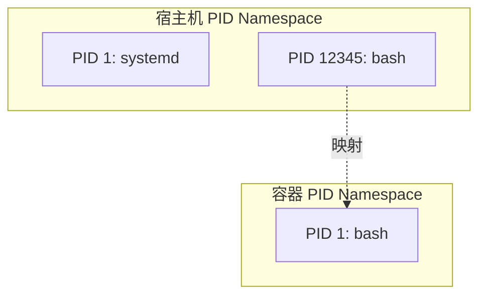
```mermaid
graph TD
    subgraph Host["宿主机 PID Namespace"]
        H1["PID 1: systemd"]
        H12345["PID 12345: bash"]
    end

    subgraph Container["容器 PID Namespace"]
        C1["PID 1: bash"]
    end

    H12345 -.->|"映射"| C1
```

#### Network Namespace

每个容器拥有独立的网络栈，包括：

- 网络设备（lo、eth0）
- IP 地址
- 路由表
- iptables 规则
- 端口空间

```bash
# 查看容器网络接口
$ ip addr
1: lo: <LOOPBACK,UP> ...
2: eth0: <BROADCAST,MULTICAST,UP> ...
    inet 172.17.0.2/16
```

#### Mount Namespace

让容器拥有独立的文件系统视图，配合 **rootfs** 和 **OverlayFS** 实现容器文件系统。

---

### 1.3 Cgroups 资源控制

Cgroups（Control Groups）是 Linux 内核提供的资源限制机制，可以限制、记录和隔离进程组的资源使用。

#### Cgroups 子系统

| 子系统 | 功能 | 常用参数 |
|--------|------|----------|
| **cpu** | 限制 CPU 使用 | cpu.cfs_quota_us, cpu.shares |
| **cpuset** | 绑定 CPU 核心 | cpuset.cpus |
| **memory** | 限制内存使用 | memory.limit_in_bytes |
| **blkio** | 限制块设备 I/O | blkio.throttle.read_bps_device |
| **pids** | 限制进程数量 | pids.max |

#### Cgroups 文件系统

Cgroups 通过文件系统接口进行配置：

```bash
# 查看 Cgroups 挂载点
$ mount | grep cgroup
cgroup on /sys/fs/cgroup/cpu type cgroup (rw,cpu)
cgroup on /sys/fs/cgroup/memory type cgroup (rw,memory)

# 查看容器的 CPU Cgroup
$ cat /sys/fs/cgroup/cpu/docker/<container_id>/cpu.cfs_quota_us
100000  # 表示 100ms（100%的一个 CPU）
```

#### CPU Cgroup 示例

限制容器最多使用 0.5 个 CPU：

```bash
# 设置 CPU 配额（50ms / 100ms = 50%）
echo 50000 > /sys/fs/cgroup/cpu/docker/<id>/cpu.cfs_quota_us
echo 100000 > /sys/fs/cgroup/cpu/docker/<id>/cpu.cfs_period_us
```

对应 Docker 命令：

```bash
docker run --cpus=0.5 myapp:v1
```

#### Memory Cgroup 示例

限制容器最多使用 512MB 内存：

```bash
# 设置内存上限
echo 536870912 > /sys/fs/cgroup/memory/docker/<id>/memory.limit_in_bytes
```

对应 Docker 命令：

```bash
docker run -m 512m myapp:v1
```

---

### 1.4 容器技术架构总览

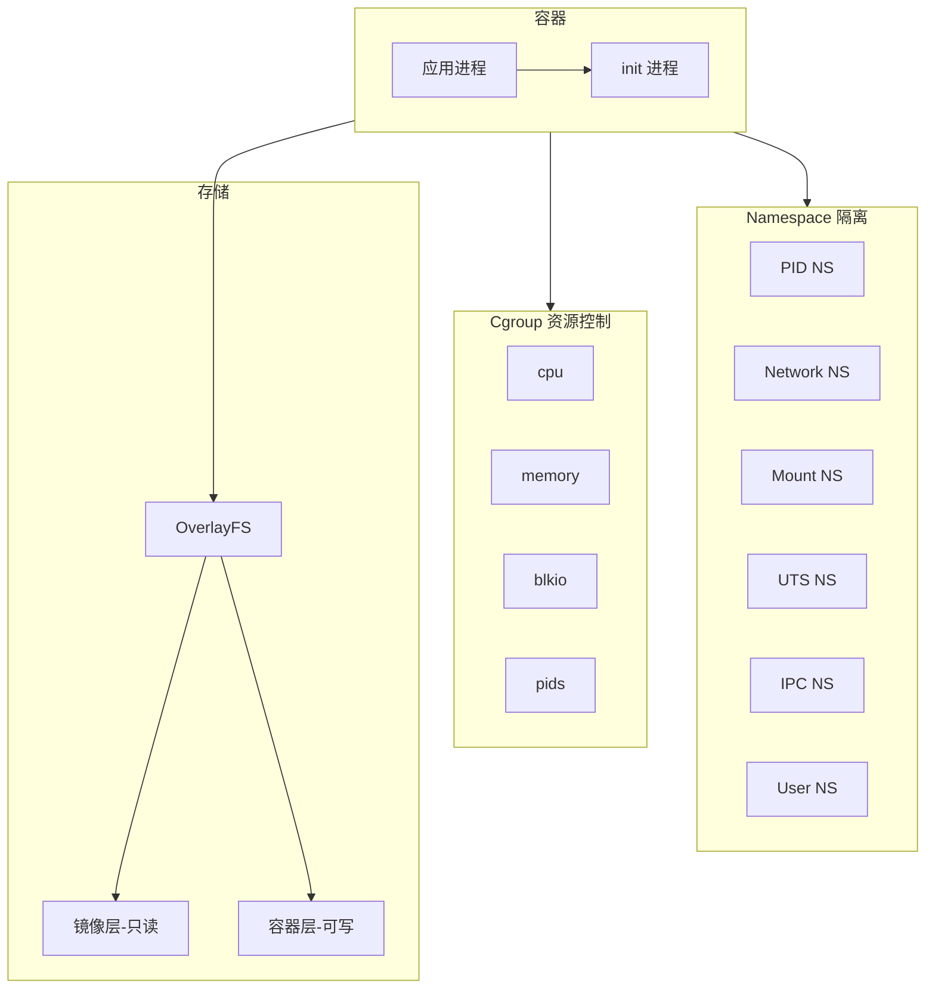
```mermaid
graph TB
    subgraph Container["容器"]
        App["应用进程"]
        Init["init 进程"]
    end

    subgraph Namespaces["Namespace 隔离"]
        PID["PID NS"]
        NET["Network NS"]
        MNT["Mount NS"]
        UTS["UTS NS"]
        IPC["IPC NS"]
        USER["User NS"]
    end

    subgraph Cgroups["Cgroup 资源控制"]
        CPU["cpu"]
        MEM["memory"]
        BLK["blkio"]
        PIDS["pids"]
    end

    subgraph Storage["存储"]
        OFS["OverlayFS"]
        Lower["镜像层-只读"]
        Upper["容器层-可写"]
    end

    App --> Init
    Container --> Namespaces
    Container --> Cgroups
    Container --> OFS

    OFS --> Lower
    OFS --> Upper
```

---

### 本章小结

| 概念 | 作用 | 关键点 |
|------|------|--------|
| **Namespace** | 资源隔离 | 让容器拥有独立的进程、网络、文件系统视图 |
| **Cgroups** | 资源限制 | 限制容器的 CPU、内存、I/O 等资源使用量 |
| **rootfs** | 文件系统 | 容器的根文件系统，通常使用 OverlayFS 实现 |
| **容器镜像** | 运行模板 | 由 Dockerfile 定义，包含应用程序及其依赖 |

> **运维要点**：理解 Namespace 和 Cgroups 是排查容器问题的基础，很多"容器内表现异常"的问题都与这两个机制有关。

---

## 第二章：容器进程管理

### 2.1 容器 init 进程与信号机制

> **核心问题**：为什么在容器中执行 `kill -9 1` 无法杀死 1 号进程？

#### 什么是 init 进程？

在 Linux 系统中，**init 进程是系统启动后创建的第一个用户态进程**，PID 为 1。它有两个重要职责：

1. **创建和管理其他进程**：作为所有用户态进程的祖先
2. **回收孤儿进程**：当父进程退出后，其子进程会被 init 进程"收养"

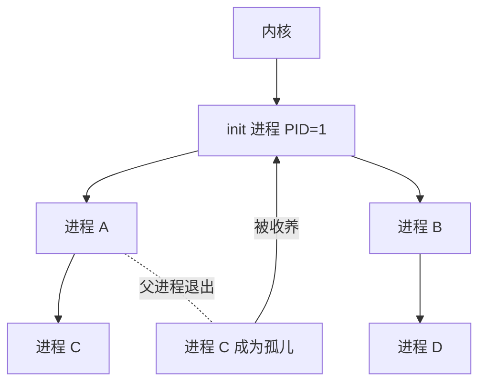
```mermaid
graph TD
    Kernel["内核"] --> Init["init 进程 PID=1"]
    Init --> P1["进程 A"]
    Init --> P2["进程 B"]
    P1 --> P3["进程 C"]
    P2 --> P4["进程 D"]
    
    P1 -.-|"父进程退出"| Orphan["进程 C 成为孤儿"]
    Orphan -->|"被收养"| Init
```

#### 容器中的 init 进程

在容器的 PID Namespace 中，容器启动的第一个进程就是该 Namespace 的 **init 进程（PID=1）**。

```bash
# 启动容器
$ docker run -d --name test centos sleep 3600

# 查看容器内进程
$ docker exec test ps aux
PID   USER   COMMAND
1     root   sleep 3600   # 这就是容器的 init 进程
```

#### Linux 信号机制基础

**信号（Signal）** 是 Linux 进程间通信的一种异步机制，常见信号：

| 信号 | 编号 | 默认行为 | 说明 |
|------|------|----------|------|
| **SIGTERM** | 15 | 终止进程 | 可被捕获/忽略，用于优雅退出 |
| **SIGKILL** | 9 | 强制终止 | 不可被捕获/忽略 |
| **SIGSTOP** | 19 | 暂停进程 | 不可被捕获/忽略 |
| **SIGINT** | 2 | 终止进程 | Ctrl+C 触发 |
| **SIGHUP** | 1 | 终止进程 | 终端断开触发 |

**进程处理信号的三种方式**：

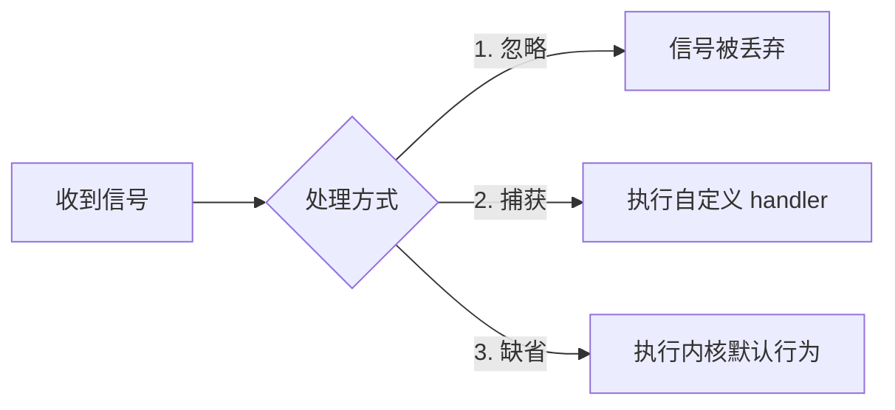
```mermaid
graph LR
    Signal["收到信号"] --> A{"处理方式"}
    A -->|"1. 忽略"| Ignore["信号被丢弃"]
    A -->|"2. 捕获"| Handler["执行自定义 handler"]
    A -->|"3. 缺省"| Default["执行内核默认行为"]
```

**注册信号处理函数示例**：

```c
#include <signal.h>
#include <stdio.h>

// 自定义信号处理函数
void sig_handler(int signo) {
    if (signo == SIGTERM) {
        printf("Received SIGTERM, cleaning up...\n");
        // 执行清理工作
        exit(0);
    }
}

int main() {
    // 注册 SIGTERM 的处理函数
    signal(SIGTERM, sig_handler);
    
    // 忽略 SIGHUP 信号
    signal(SIGHUP, SIG_IGN);
    
    while(1) {
        sleep(1);
    }
    return 0;
}
```

#### 为什么 kill -9 1 不生效？

**实验验证**：

```bash
# 在容器内尝试杀死 1 号进程
$ docker exec test kill -9 1

# 检查进程是否还在
$ docker exec test ps aux
PID   USER   COMMAND
1     root   sleep 3600   # 进程依然存活！
```

**根本原因**：Linux 内核对 init 进程有特殊保护机制。

查看内核源码 `kernel/signal.c`：

```c
static bool sig_task_ignored(struct task_struct *t, int sig, bool force)
{
    // ...
    
    // 关键代码：如果进程有 SIGNAL_UNKILLABLE 标志
    // 则 SIGKILL 和 SIGSTOP 会被忽略
    if (unlikely(t->signal->flags & SIGNAL_UNKILLABLE) &&
        handler == SIG_DFL && !(force && sig_kernel_only(sig)))
        return true;
    
    return sig_handler_ignored(handler, sig);
}
```

**SIGNAL_UNKILLABLE 标志**：

- 每个 Namespace 的 init 进程都会被设置此标志
- 设置此标志的进程会**忽略没有注册 handler 的信号**
- 即使是 SIGKILL 和 SIGSTOP 也会被忽略

#### 信号处理规则总结

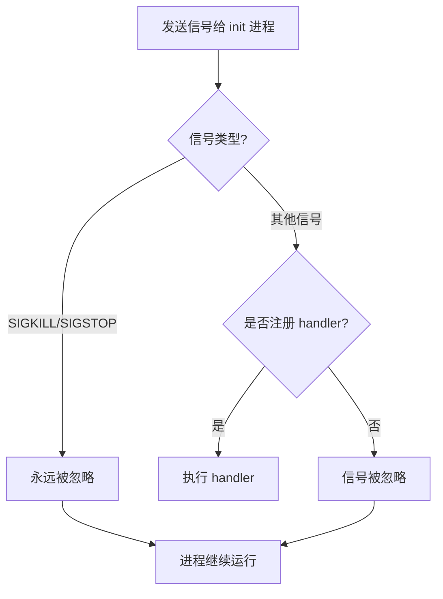
```mermaid
graph TD
    A["发送信号给 init 进程"] --> B{"信号类型?"}
    
    B -->|"SIGKILL/SIGSTOP"| C["永远被忽略"]
    B -->|"其他信号"| D{"是否注册 handler?"}
    
    D -->|"是"| E["执行 handler"]
    D -->|"否"| F["信号被忽略"]
    
    C --> G["进程继续运行"]
    F --> G
```

| 场景 | init 进程行为 |
|------|---------------|
| `kill -9 1` (SIGKILL) | 信号被忽略，进程继续运行 |
| `kill -15 1` (SIGTERM)，未注册 handler | 信号被忽略 |
| `kill -15 1` (SIGTERM)，已注册 handler | 执行 handler |

#### 实际验证

**验证 SIGTERM 需要注册 handler 才生效**：

```bash
# 使用注册了 SIGTERM handler 的程序
$ cat > /tmp/test.c << 'EOF'
#include <signal.h>
#include <stdio.h>
#include <stdlib.h>
#include <unistd.h>

void handler(int sig) {
    printf("Caught SIGTERM, exiting\n");
    exit(0);
}

int main() {
    signal(SIGTERM, handler);  // 注册 handler
    while(1) sleep(1);
    return 0;
}
EOF

# 编译并在容器中运行
# 这时 kill -15 1 就能正常工作了
```

#### 运维要点

> [!WARNING]
> **重要提醒**：
>
> 1. 容器的 1 号进程无法被 `kill -9` 杀死
> 2. 如果需要让 1 号进程响应 SIGTERM，必须在程序中注册信号处理函数
> 3. 使用 `docker stop` 时，Docker 会先发送 SIGTERM，超时后再发送 SIGKILL

**最佳实践**：

```bash
# 推荐使用 --init 参数启动容器
# tini 作为 init 进程会正确处理信号
$ docker run --init -d myapp
```

---

### 本节小结

| 概念 | 说明 |
|------|------|
| **init 进程** | PID=1，所有用户态进程的祖先 |
| **SIGNAL_UNKILLABLE** | 内核对 init 进程的保护标志 |
| **SIGKILL/SIGSTOP** | 对 init 进程永远无效 |
| **其他信号** | 需要注册 handler 才能生效 |

---

### 2.2 僵尸进程的产生与清理

> **核心问题**：为什么容器里会出现大量僵尸进程？它们有什么危害？

#### Linux 进程的五种状态

在 Linux 中，进程可以处于以下五种状态：

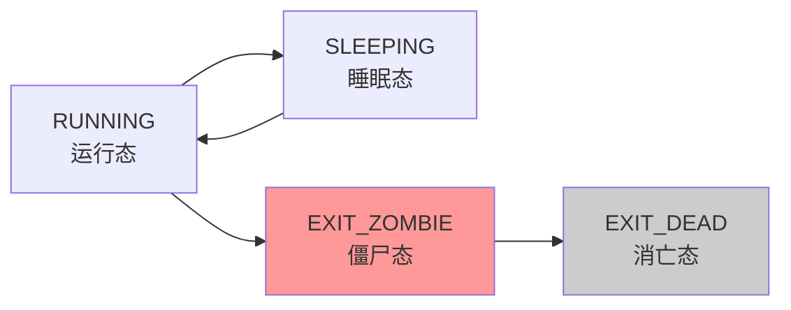
```mermaid
graph LR
    R["RUNNING<br/>运行态"] --> S["SLEEPING<br/>睡眠态"]
    S --> R
    R --> Z["EXIT_ZOMBIE<br/>僵尸态"]
    Z --> D["EXIT_DEAD<br/>消亡态"]
    
    style Z fill:#ff9999
    style D fill:#cccccc
```

| 状态 | 标识 | 说明 |
|------|------|------|
| **RUNNING** | R | 正在运行或等待调度 |
| **SLEEPING** | S/D | 等待资源（可中断/不可中断） |
| **STOPPED** | T | 被暂停（收到 SIGSTOP） |
| **EXIT_ZOMBIE** | Z | 进程已结束，等待父进程回收 |
| **EXIT_DEAD** | - | 已被完全清理，不可见 |

#### 什么是僵尸进程？

**僵尸进程（Zombie Process）** 是已经终止，但父进程还没有调用 `wait()` 系统调用回收其资源的进程。

```bash
# 查看僵尸进程
$ ps aux | grep Z
USER   PID  STAT  COMMAND
root   123  Z     [sleep] <defunct>  # Z 状态表示僵尸进程
```

**僵尸进程的特点**：

- 进程已经退出，不再执行任何代码
- 占用的内存已经释放
- 但仍然占用**进程号（PID）**资源
- 在进程表中保留一个条目

#### 僵尸进程的产生过程

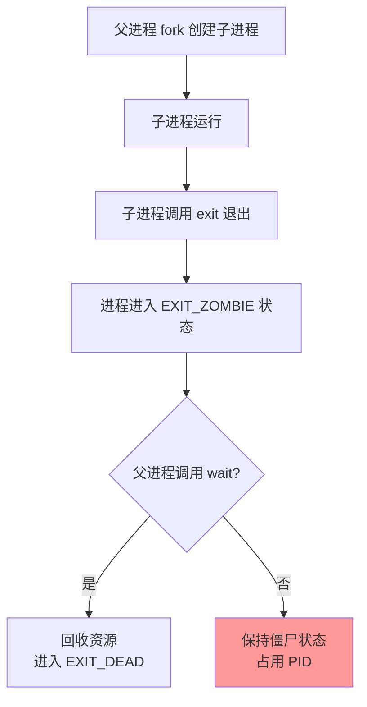
```mermaid
graph TD
    A["父进程 fork 创建子进程"] --> B["子进程运行"]
    B --> C["子进程调用 exit 退出"]
    C --> D["进程进入 EXIT_ZOMBIE 状态"]
    D --> E{"父进程调用 wait?"}
    
    E -->|"是"| F["回收资源<br/>进入 EXIT_DEAD"]
    E -->|"否"| G["保持僵尸状态<br/>占用 PID"]
    
    style G fill:#ff9999
```

**示例代码**：

```c
#include <stdio.h>
#include <unistd.h>
#include <sys/wait.h>

int main() {
    pid_t pid = fork();
    
    if (pid == 0) {
        // 子进程：立即退出
        printf("Child process exiting\n");
        exit(0);
    } else {
        // 父进程：不调用 wait()，导致子进程成为僵尸
        printf("Parent sleeping, child becomes zombie\n");
        sleep(60);  // 在这 60 秒内，子进程是僵尸状态
    }
    return 0;
}
```

```bash
# 运行程序后查看
$ ps aux | grep defunct
root   456  Z   0.0  0.0  0     0  ?  Z  15:30  0:00 [a.out] <defunct>
```

#### 僵尸进程的危害

> [!CAUTION]
> **危害**：僵尸进程虽然不占用内存，但会**耗尽系统的 PID 资源**！

Linux 系统的 PID 数量有限：

```bash
# 查看系统最大 PID 数
$ cat /proc/sys/kernel/pid_max
32768  # 默认最多 32768 个进程
```

当僵尸进程积累过多时：

- PID 资源耗尽
- 无法创建新进程
- 系统进入不可用状态

#### 容器中的僵尸进程问题

**典型场景**：容器 init 进程是 shell 脚本

```dockerfile
# Dockerfile
FROM centos
COPY start.sh /start.sh
CMD ["/bin/sh", "/start.sh"]
```

```bash
# start.sh
#!/bin/sh
# 启动多个后台进程
./app1 &
./app2 &
./app3 &
wait  # 只等待最后一个后台进程
```

**问题**：

- shell 脚本启动的子进程退出后
- shell 没有调用 `wait()` 回收所有子进程
- 导致僵尸进程积累

```bash
# 容器内查看
$ ps aux
PID   STAT   COMMAND
1     S      /bin/sh /start.sh
123   Z      [app1] <defunct>
124   Z      [app2] <defunct>
```

#### PIDs Cgroup：限制进程数量

为了防止僵尸进程耗尽系统 PID，可以使用 **pids Cgroup** 限制容器的进程数：

```bash
# 限制容器最多 100 个进程
$ docker run --pids-limit 100 myapp
```

对应的 Cgroup 配置：

```bash
$ cat /sys/fs/cgroup/pids/docker/<container_id>/pids.max
100

$ cat /sys/fs/cgroup/pids/docker/<container_id>/pids.current
15  # 当前进程数
```

**当达到上限时**：

```bash
# 尝试创建新进程会失败
$ fork()
Error: Resource temporarily unavailable
```

#### 正确回收僵尸进程

**方法1：父进程调用 wait()**

```c
#include <sys/wait.h>

int main() {
    pid_t pid = fork();
    
    if (pid == 0) {
        // 子进程
        exit(0);
    } else {
        // 父进程：等待子进程结束
        int status;
        wait(&status);  // 或 waitpid(pid, &status, 0);
        printf("Child collected\n");
    }
    return 0;
}
```

**方法2：信号处理方式回收**

```c
#include <signal.h>
#include <sys/wait.h>

void sigchld_handler(int sig) {
    // 回收所有已退出的子进程
    while (waitpid(-1, NULL, WNOHANG) > 0);
}

int main() {
    // 注册 SIGCHLD 信号处理函数
    signal(SIGCHLD, sigchld_handler);
    
    // 创建子进程...
    // 子进程退出时会触发 SIGCHLD 信号
}
```

#### 容器 init 进程的职责

容器的 1 号进程必须承担以下职责：

1. **回收孤儿进程**：当容器内某个进程的父进程退出，其子进程会被 init 进程收养
2. **清理僵尸进程**：主动回收已退出的子进程

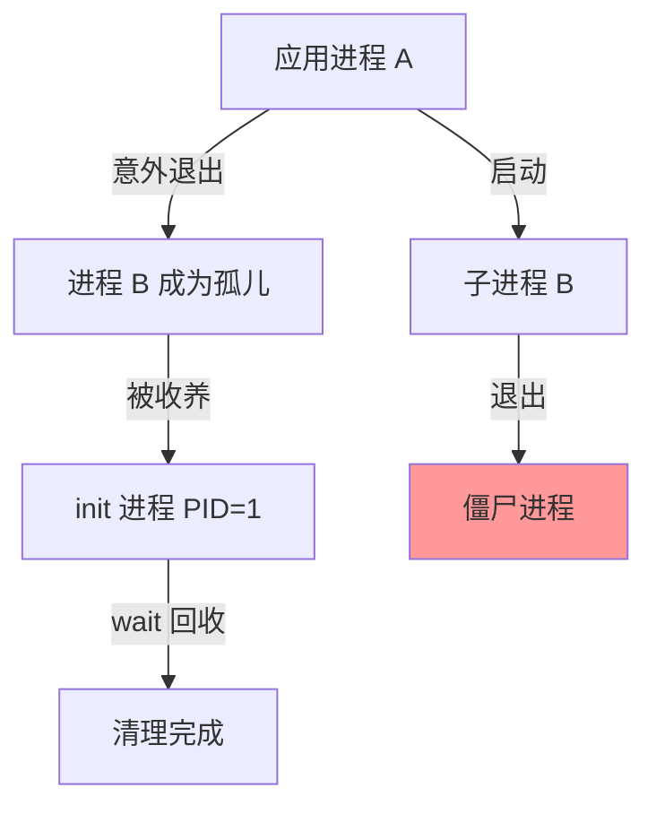
```mermaid
graph TD
    A["应用进程 A"] -->|"启动"| B["子进程 B"]
    A -->|"意外退出"| C["进程 B 成为孤儿"]
    C -->|"被收养"| Init["init 进程 PID=1"]
    B -->|"退出"| Z["僵尸进程"]
    Init -->|"wait 回收"| Clean["清理完成"]
    
    style Z fill:#ff9999
```

#### 使用 tini 作为 init 进程

**tini** 是一个轻量级 init 进程，专门为容器设计：

```dockerfile
FROM centos

# 安装 tini
RUN yum install -y tini

# 使用 tini 作为 init 进程
ENTRYPOINT ["/usr/bin/tini", "--"]
CMD ["/app/start.sh"]
```

或使用 Docker 的 `--init` 参数：

```bash
docker run --init -d myapp
```

**tini 的功能**：

- 正确转发信号给子进程
- 自动回收僵尸进程
- 确保容器能正常退出

#### 实战排查

**问题现象**：

```bash
$ docker exec myapp ps aux | grep Z
root   234  Z  [worker] <defunct>
root   235  Z  [worker] <defunct>
root   236  Z  [worker] <defunct>
```

**排查步骤**：

```bash
# 1. 查看僵尸进程的父进程
$ ps -ef | grep defunct
UID    PID   PPID  STAT
root   234   1     Z    # PPID=1，父进程是 init

# 2. 检查 init 进程是什么
$ docker exec myapp cat /proc/1/cmdline
/bin/sh/start.sh  # Shell 脚本，不会回收僵尸进程

# 3. 解决方案：使用 --init 或 tini
$ docker stop myapp
$ docker run --init -d --name myapp myapp:latest
```

---

### 本节小结

| 概念 | 说明 |
|------|------|
| **僵尸进程** | 已退出但未被父进程回收的进程 |
| **危害** | 占用 PID 资源，可能导致无法创建新进程 |
| **回收方法** | 父进程调用 `wait()` 或 `waitpid()` |
| **pids Cgroup** | 限制容器进程数量，防止 PID 耗尽 |
| **容器最佳实践** | 使用 `--init` 或 tini 作为 init 进程 |

> **运维提示**：定期检查容器中的僵尸进程数量，如果持续增长，需要修改应用代码或使用合适的 init 进程。

---

### 2.3 容器优雅退出与信号转发

> **核心问题**：为什么在容器中的进程被强制杀死（SIGKILL）而不是收到 SIGTERM 优雅退出？

#### 问题场景

当我们使用 `docker stop` 停止容器时，期望应用程序能收到 SIGTERM 信号，完成清理工作后优雅退出。但实际情况往往是：

```bash
# 停止容器
$ docker stop myapp
# 等待 10 秒超时后...
# 容器被强制终止（SIGKILL）
```

应用程序日志中没有看到任何清理操作，数据可能丢失。

#### docker stop 的工作流程

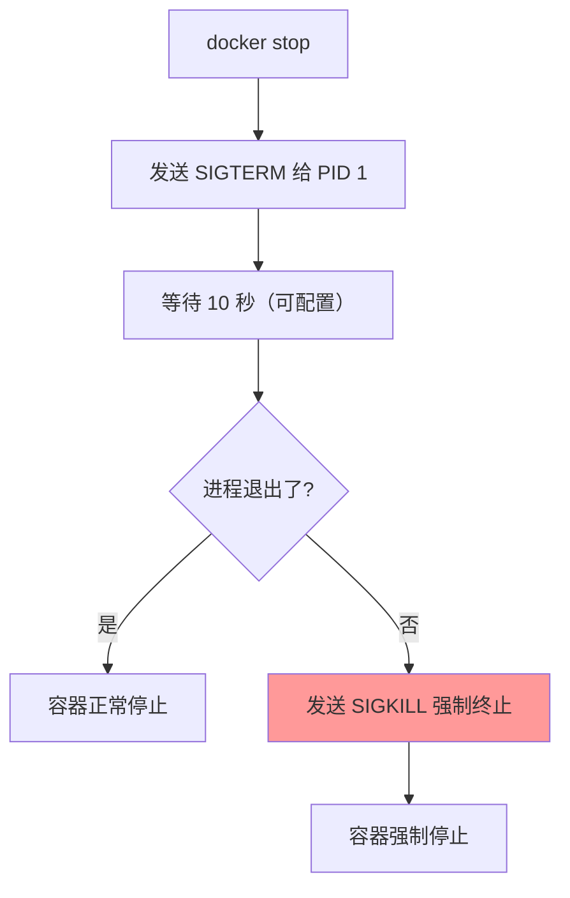
```mermaid
graph TD
    A["docker stop"] --> B["发送 SIGTERM 给 PID 1"]
    B --> C["等待 10 秒（可配置）"]
    C --> D{"进程退出了?"}
    D -->|"是"| E["容器正常停止"]
    D -->|"否"| F["发送 SIGKILL 强制终止"]
    F --> G["容器强制停止"]
    
    style F fill:#ff9999
```

**关键点**：

- Docker 只向容器的 **PID 1 进程**发送 SIGTERM
- 如果 PID 1 在超时时间内没有退出，则发送 SIGKILL

#### 信号不传递的根本原因

容器的 init 进程（PID 1）收到 SIGTERM 后，**默认不会自动转发给子进程**。

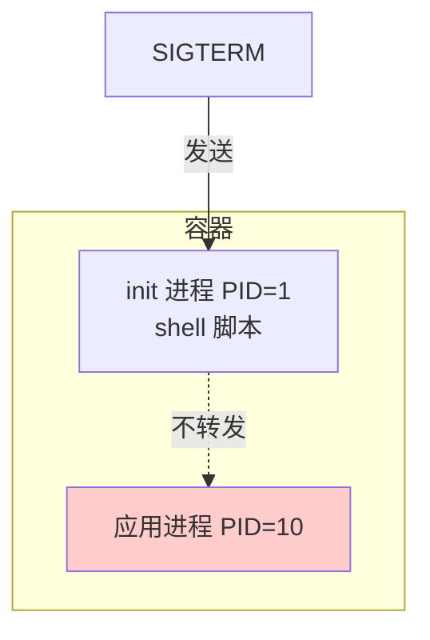
```mermaid
graph TD
    subgraph Container["容器"]
        Init["init 进程 PID=1<br/>shell 脚本"]
        App["应用进程 PID=10"]
    end
    
    SIGTERM["SIGTERM"] -->|"发送"| Init
    Init -.->|"不转发"| App
    
    style App fill:#ffcccc
```

**典型问题场景**：

```dockerfile
# Dockerfile
FROM centos
COPY app /app
CMD ["/bin/sh", "-c", "/app/start.sh"]
```

这种情况下：

1. PID 1 是 `/bin/sh`
2. 应用程序是 shell 的子进程（PID > 1）
3. shell 收到 SIGTERM 后退出
4. **内核向该 Namespace 的所有进程发送 SIGKILL**

#### 内核源码分析

当 init 进程退出时，内核会向同一 Namespace 的其他进程发送 SIGKILL：

```c
// kernel/exit.c - zap_pid_ns_processes()
void zap_pid_ns_processes(struct pid_namespace *pid_ns)
{
    // ...
    
    // 向 namespace 中的所有其他进程发送 SIGKILL
    nr = next_pidmap(pid_ns, 1);
    while (nr > 0) {
        task = pid_task(find_vpid(nr), PIDTYPE_PID);
        if (task && !is_child_reaper(task))
            group_send_sig_info(SIGKILL, SEND_SIG_PRIV, task, PIDTYPE_MAX);
        nr = next_pidmap(pid_ns, nr);
    }
}
```

**这解释了为什么子进程收到的是 SIGKILL 而不是 SIGTERM**。

#### 解决方案

##### 方案1：让应用程序直接作为 PID 1

使用 `exec` 形式的 CMD/ENTRYPOINT：

```dockerfile
# 正确写法 - exec 形式
CMD ["/app/myapp"]

# 错误写法 - shell 形式（会启动 /bin/sh）
CMD /app/myapp
```

比较两种写法的进程树：

| 写法 | PID 1 | 应用进程 |
|------|--------|----------|
| `CMD ["/app/myapp"]` | `/app/myapp` | 就是 PID 1 |
| `CMD /app/myapp` | `/bin/sh -c` | PID > 1 |

##### 方案2：使用 tini 转发信号

tini 会正确转发 SIGTERM 给子进程：

```dockerfile
FROM centos

# 安装 tini
RUN yum install -y tini

# tini 作为 init 进程
ENTRYPOINT ["/usr/bin/tini", "--"]
CMD ["/app/start.sh"]
```

或使用 Docker 内置的 tini：

```bash
docker run --init -d myapp
```

**tini 的信号转发流程**：

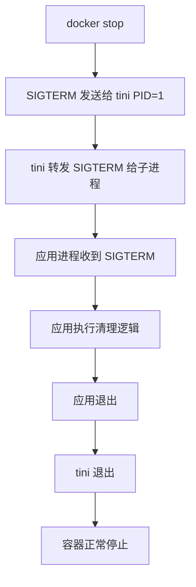
```mermaid
graph TD
    A["docker stop"] --> B["SIGTERM 发送给 tini PID=1"]
    B --> C["tini 转发 SIGTERM 给子进程"]
    C --> D["应用进程收到 SIGTERM"]
    D --> E["应用执行清理逻辑"]
    E --> F["应用退出"]
    F --> G["tini 退出"]
    G --> H["容器正常停止"]
```

##### 方案3：Shell 脚本中使用 exec

如果必须使用 shell 脚本启动：

```bash
#!/bin/sh
# start.sh

# 设置信号处理
trap 'kill -TERM $PID; wait $PID' TERM

# 使用 exec 替换 shell 进程
exec /app/myapp

# 或者后台运行并等待
/app/myapp &
PID=$!
wait $PID
```

##### 方案4：在应用中注册信号处理

```python
# Python 示例
import signal
import sys

def graceful_shutdown(signum, frame):
    print("Received SIGTERM, cleaning up...")
    # 执行清理操作
    sys.exit(0)

signal.signal(signal.SIGTERM, graceful_shutdown)

# 主程序逻辑
while True:
    # ...
    pass
```

```go
// Go 示例
package main

import (
    "os"
    "os/signal"
    "syscall"
)

func main() {
    sigChan := make(chan os.Signal, 1)
    signal.Notify(sigChan, syscall.SIGTERM)
    
    go func() {
        <-sigChan
        // 执行清理操作
        os.Exit(0)
    }()
    
    // 主程序逻辑
}
```

#### 验证信号是否正确传递

```bash
# 1. 启动容器
$ docker run -d --name test myapp

# 2. 查看进程树
$ docker exec test ps -ef
UID   PID  PPID  CMD
root  1    0     /app/myapp   # 应用直接是 PID 1 ✓

# 3. 停止容器并观察日志
$ docker stop test
$ docker logs test
# 应该看到 "Received SIGTERM" 的清理日志
```

#### 配置停止超时时间

```bash
# 设置更长的超时时间（30秒）
$ docker stop -t 30 myapp
```

Docker Compose:

```yaml
services:
  myapp:
    image: myapp:latest
    stop_grace_period: 30s
```

Kubernetes:

```yaml
spec:
  terminationGracePeriodSeconds: 30
```

---

### 2.3 节小结

| 问题 | 原因 | 解决方案 |
|------|------|----------|
| 子进程收到 SIGKILL | init 进程不转发信号 | 使用 tini 或 --init |
| 应用不是 PID 1 | 使用了 shell 形式 CMD | 改用 exec 形式 |
| 清理逻辑未执行 | 没有注册信号 handler | 在代码中处理 SIGTERM |

> **最佳实践**：
>
> 1. 使用 exec 形式的 `CMD ["/app/myapp"]`
> 2. 或使用 `docker run --init`
> 3. 应用程序中注册 SIGTERM 处理函数

---

### 2.4 CPU Cgroup 资源限制

> **核心问题**：如何限制容器的 CPU 使用量？

#### CPU Cgroup 概述

CPU Cgroup 是 Linux 内核提供的 CPU 资源控制机制，主要包含三种控制方式：

| 控制方式 | 作用 | 适用场景 |
|----------|------|----------|
| **CPU 配额** | 限制 CPU 使用上限 | 防止容器占用过多 CPU |
| **CPU 权重** | 设置 CPU 分配优先级 | 多容器竞争时的资源分配 |
| **CPU 绑定** | 指定可使用的 CPU 核心 | 性能敏感型应用 |

#### CPU Cgroup 文件系统

```bash
# 查看 CPU Cgroup 挂载点
$ mount | grep cgroup | grep cpu
cgroup on /sys/fs/cgroup/cpu,cpuacct type cgroup (rw,cpu,cpuacct)

# 容器的 CPU Cgroup 目录
$ ls /sys/fs/cgroup/cpu/docker/<container_id>/
cpu.cfs_period_us
cpu.cfs_quota_us
cpu.shares
cpu.stat
tasks
```

#### CPU 配额限制（CFS Bandwidth Control）

通过 `cpu.cfs_quota_us` 和 `cpu.cfs_period_us` 两个参数限制 CPU 使用上限。

**核心公式**：

```
CPU 使用率上限 = cpu.cfs_quota_us / cpu.cfs_period_us
```

| 参数 | 含义 | 默认值 |
|------|------|--------|
| `cpu.cfs_period_us` | 调度周期（微秒） | 100000（100ms） |
| `cpu.cfs_quota_us` | 周期内可用时间（微秒） | -1（无限制） |

**配置示例**：

| 配置 | quota | period | CPU 上限 |
|------|-------|--------|----------|
| 0.5 CPU | 50000 | 100000 | 50% |
| 1 CPU | 100000 | 100000 | 100% |
| 2 CPU | 200000 | 100000 | 200% |

```bash
# 限制容器使用 0.5 个 CPU
$ echo 100000 > /sys/fs/cgroup/cpu/docker/<id>/cpu.cfs_period_us
$ echo 50000 > /sys/fs/cgroup/cpu/docker/<id>/cpu.cfs_quota_us
```

**Docker 命令**：

```bash
# --cpus 参数（推荐）
$ docker run --cpus=0.5 myapp      # 最多使用 0.5 个 CPU
$ docker run --cpus=2 myapp        # 最多使用 2 个 CPU

# 或分别指定 quota 和 period
$ docker run --cpu-quota=50000 --cpu-period=100000 myapp
```

#### CPU 权重（CPU Shares）

`cpu.shares` 用于设置 CPU 时间片的**相对权重**，只在 CPU 资源竞争时生效。

```bash
# 默认权重为 1024
$ cat /sys/fs/cgroup/cpu/docker/<id>/cpu.shares
1024
```

**权重分配示例**：

| 容器 | shares | CPU 占比（竞争时） |
|------|--------|-------------------|
| 容器A | 1024 | 1/(1+2) = 33% |
| 容器B | 2048 | 2/(1+2) = 67% |

**Docker 命令**：

```bash
# 设置容器 CPU 权重
$ docker run --cpu-shares=512 myapp   # 降低优先级
$ docker run --cpu-shares=2048 myapp  # 提高优先级
```

> [!NOTE]
> `cpu.shares` 只在 CPU 资源紧张时生效。如果系统有空闲 CPU，低权重容器也可以使用更多 CPU。

#### CPU 绑定（cpuset）

使用 `cpuset` 子系统将容器绑定到特定 CPU 核心。

```bash
# 查看 cpuset 配置
$ cat /sys/fs/cgroup/cpuset/docker/<id>/cpuset.cpus
0-3  # 可使用 CPU 0、1、2、3
```

**Docker 命令**：

```bash
# 绑定到 CPU 0 和 1
$ docker run --cpuset-cpus=0,1 myapp

# 绑定到 CPU 0-3
$ docker run --cpuset-cpus=0-3 myapp
```

#### 三种控制方式对比

| 特性 | CPU 配额 | CPU 权重 | CPU 绑定 |
|------|----------|----------|----------|
| 参数 | cfs_quota_us | cpu.shares | cpuset.cpus |
| 类型 | 硬限制 | 软限制 | 硬限制 |
| 作用时机 | 始终生效 | 竞争时生效 | 始终生效 |
| 典型场景 | 防止资源滥用 | 优先级调度 | 性能优化 |

#### Kubernetes 中的配置

```yaml
apiVersion: v1
kind: Pod
spec:
  containers:
  - name: myapp
    resources:
      requests:
        cpu: "500m"    # 0.5 CPU（影响调度）
      limits:
        cpu: "1000m"   # 1 CPU（硬限制）
```

**换算关系**：`1000m` = 1 CPU = quota 100000 / period 100000

---

### 2.4 节小结

| 控制方式 | 参数 | Docker 参数 | 说明 |
|----------|------|-------------|------|
| **配额限制** | cfs_quota_us/cfs_period_us | --cpus | 限制 CPU 使用上限 |
| **权重分配** | cpu.shares | --cpu-shares | 竞争时的优先级 |
| **核心绑定** | cpuset.cpus | --cpuset-cpus | 绑定特定 CPU |

> **运维建议**：生产环境建议同时设置 `--cpus` 和 `--cpu-shares`

---

<!-- 后续章节待补充 -->

### 2.5 容器 CPU 使用率的正确计算

> **核心问题**：为什么在容器内运行 `top` 看到的 CPU 使用率不准确？

#### 问题现象

在容器中运行 `top` 命令，看到的 CPU 使用率是**整个宿主机**的，而不是容器的：

```bash
# 在容器内运行 top
$ docker exec myapp top
%Cpu(s):  5.9 us,  2.3 sy,  0.0 ni, 91.2 id...
# 这是宿主机的 CPU 使用率，不是容器的！
```

#### 原因分析

`top` 命令读取的是 `/proc/stat` 文件，而 **`/proc` 文件系统没有被 Namespace 隔离**：

```bash
# 容器内和宿主机读取的是同一个文件
$ cat /proc/stat
cpu  12345 6789 ...  # 宿主机全局 CPU 统计
```

#### Linux CPU 使用率计算原理

##### 系统级 CPU 使用率（/proc/stat）

```bash
$ cat /proc/stat
cpu  10132153 290696 3084719 46828483 16683 0 25195 0 0 0
#    user     nice   system  idle     iowait irq softirq ...
```

**计算公式**：

```
CPU 使用率 = (1 - idle_time / total_time) × 100%

total_time = user + nice + system + idle + iowait + irq + softirq
```

##### 进程级 CPU 使用率（/proc/[pid]/stat）

```bash
$ cat /proc/12345/stat
12345 (myapp) S ... 10000 5000 ...
#                   utime stime（第14、15个字段）
```

| 字段 | 含义 |
|------|------|
| utime | 进程用户态 CPU 时间（clock ticks） |
| stime | 进程内核态 CPU 时间（clock ticks） |

**单进程 CPU 使用率计算**：

```
进程 CPU 使用率 = ((utime2 - utime1) + (stime2 - stime1)) / (total_time2 - total_time1) × 100%
```

> [!NOTE]
> clock ticks 通常是 100 Hz（每秒 100 次），可通过 `getconf CLK_TCK` 查看。

#### 容器 CPU 使用率的正确方法

使用 **CPU Cgroup** 提供的 `cpuacct.stat` 文件：

```bash
# 查看容器的 CPU 统计
$ cat /sys/fs/cgroup/cpu,cpuacct/docker/<container_id>/cpuacct.stat
user 10000   # 用户态 CPU ticks
system 5000  # 内核态 CPU ticks
```

这个文件统计的是**容器内所有进程**的 CPU 时间总和。

#### 容器 CPU 使用率计算方法

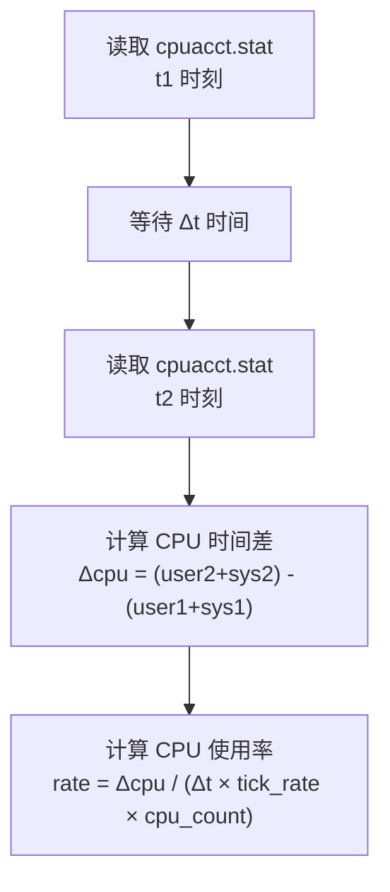
```mermaid
graph TD
    A["读取 cpuacct.stat<br/>t1 时刻"] --> B["等待 Δt 时间"]
    B --> C["读取 cpuacct.stat<br/>t2 时刻"]
    C --> D["计算 CPU 时间差<br/>Δcpu = (user2+sys2) - (user1+sys1)"]
    D --> E["计算 CPU 使用率<br/>rate = Δcpu / (Δt × tick_rate × cpu_count)"]
```

**计算公式**：

```
容器 CPU 使用率 = (cpuacct_usage_t2 - cpuacct_usage_t1) / (Δt × 10^9) × 100%
```

也可以使用 `cpuacct.usage`（单位：纳秒）：

```bash
$ cat /sys/fs/cgroup/cpu,cpuacct/docker/<id>/cpuacct.usage
123456789000  # 纳秒
```

#### 实现脚本

```bash
#!/bin/bash
# 计算容器 CPU 使用率

CGROUP_PATH="/sys/fs/cgroup/cpu,cpuacct/docker/$1"

# 第一次采样
usage1=$(cat $CGROUP_PATH/cpuacct.usage)
time1=$(date +%s%N)

sleep 1

# 第二次采样
usage2=$(cat $CGROUP_PATH/cpuacct.usage)
time2=$(date +%s%N)

# 计算 CPU 使用率
delta_usage=$((usage2 - usage1))
delta_time=$((time2 - time1))

cpu_usage=$(echo "scale=2; $delta_usage * 100 / $delta_time" | bc)
echo "Container CPU Usage: ${cpu_usage}%"
```

#### Docker 和 cAdvisor 的做法

**docker stats** 命令就是使用这种方法：

```bash
$ docker stats --no-stream myapp
CONTAINER   CPU %   MEM USAGE / LIMIT
myapp       25.5%   128MiB / 512MiB
```

**cAdvisor** 同样读取 Cgroup 文件系统来获取容器指标。

#### Kubernetes 场景

Kubernetes 通过 kubelet 内置的 cAdvisor 收集容器指标：

```bash
# 查看 Pod 的 CPU 使用
$ kubectl top pod myapp
NAME    CPU(cores)   MEMORY(bytes)
myapp   250m         128Mi
```

#### 常见问题排查

| 现象 | 原因 | 解决方案 |
|------|------|----------|
| top 显示不准 | 读取的是宿主机 /proc/stat | 使用 cpuacct.stat |
| 容器内 CPU 100% | 可能被 cfs_quota 限制 | 检查 CPU 配额设置 |
| CPU 使用率计算为负 | 进程迁移或 Cgroup 变化 | 增加采样间隔 |

#### lxcfs 解决方案

**lxcfs** 可以让容器内的 `/proc` 文件返回容器级别的资源信息：

```bash
# 在宿主机安装 lxcfs
$ yum install lxcfs

# 启动容器时挂载 lxcfs
$ docker run -v /var/lib/lxcfs/proc/cpuinfo:/proc/cpuinfo:rw \
             -v /var/lib/lxcfs/proc/stat:/proc/stat:rw \
             myapp
```

这样容器内的 `top` 就能显示正确的 CPU 使用率了。

---

### 2.5 节小结

| 方法 | 数据源 | 准确性 |
|------|--------|--------|
| 容器内 top | /proc/stat | ❌ 不准确（宿主机数据） |
| cpuacct.stat | Cgroup | ✅ 准确 |
| docker stats | Cgroup | ✅ 准确 |
| lxcfs | 虚拟 /proc | ✅ 准确 |

> **运维要点**：监控容器 CPU 使用时，应使用 Cgroup 提供的 `cpuacct.stat` 或 `cpuacct.usage`，而不是依赖容器内的 `top` 命令。

---

### 2.6 Load Average 与系统性能

> **核心问题**：为什么加了 CPU Cgroup 限制，容器还是很慢？

#### 问题现象

即使容器设置了 CPU 配额，应用仍然响应缓慢，而 CPU 使用率并没有达到限制。同时观察到 Load Average 异常高：

```bash
$ uptime
load average: 8.50, 7.20, 6.80  # 在 4 核机器上这个值很高
```

#### 什么是 Load Average？

**Load Average（平均负载）** 表示系统在过去 1分钟、5分钟、15分钟内的**平均活跃进程数**。

```bash
$ cat /proc/loadavg
8.50 7.20 6.80 2/150 12345
# 1分钟  5分钟  15分钟  运行中/总进程数
```

> [!IMPORTANT]
> Load Average 包含的不仅是 CPU 运行队列中的进程，还包括 **D 状态（不可中断睡眠）** 的进程！

#### Load Average 的组成

| 进程状态 | 说明 | 是否计入 Load Average |
|----------|------|----------------------|
| TASK_RUNNING (R) | 正在运行或等待调度 | ✅ 是 |
| TASK_UNINTERRUPTIBLE (D) | 不可中断睡眠 | ✅ 是 |
| TASK_INTERRUPTIBLE (S) | 可中断睡眠 | ❌ 否 |

#### D 状态进程详解

**D 状态（TASK_UNINTERRUPTIBLE）** 的进程通常在等待：

- 磁盘 I/O 操作
- 网络 I/O（NFS 等）
- 信号量或锁

```bash
# 查看 D 状态进程
$ ps aux | awk '$8 ~ /D/'
USER   PID  %CPU %MEM STAT COMMAND
root   1234  0.0  0.1  D    dd if=/dev/sda ...
```

**D 状态的特点**：

- 进程不响应信号（包括 SIGKILL）
- 必须等待 I/O 完成才能退出该状态
- 会计入 Load Average，但不消耗 CPU

#### 为什么 CPU Cgroup 无法解决这个问题？

CPU Cgroup 只能限制 **CPU 时间片**的使用，但：

1. **D 状态进程不消耗 CPU**，它们在等待 I/O
2. **CPU Cgroup 无法限制 I/O 等待**
3. 大量 D 状态进程会导致 Load Average 升高

#### 实战排查

```bash
# 步骤1：确认 Load Average 高
$ uptime
load average: 8.50, 7.20, 6.80

# 步骤2：检查 CPU 使用率（如果 idle 高说明不是 CPU 瓶颈）
$ top
%Cpu(s): 25.0 us, 5.0 sy, 0.0 ni, 70.0 id...

# 步骤3：统计 D 状态进程数量
$ ps aux | awk '$8 ~ /D/ {count++} END {print count}'
15

# 步骤4：查看具体是哪些进程
$ ps aux | awk '$8 ~ /D/ {print $0}'

# 步骤5：分析等待原因
$ cat /proc/<pid>/wchan
wait_on_page_bit  # 说明在等待磁盘页面
```

#### 常见 D 状态原因与解决方案

| 原因 | 症状 | 解决方案 |
|------|------|----------|
| 磁盘 I/O 慢 | iowait 高 | 优化磁盘、使用 SSD |
| NFS 挂载问题 | 访问 NFS 路径卡住 | 检查 NFS 服务器 |
| 内核 bug | 进程长期卡在 D 状态 | 升级内核 |
| 存储设备故障 | dmesg 有错误日志 | 检查存储设备 |

#### Load Average 判断标准

以 CPU 核心数为基准：

| Load Average / CPU 核心数 | 状态 |
|--------------------------|------|
| < 0.7 | 轻载 |
| 0.7 - 1.0 | 理想 |
| 1.0 - 2.0 | 需要关注 |
| > 2.0 | 过载，需要排查 |

---

### 2.6 节小结

| 概念 | 说明 |
|------|------|
| **Load Average** | 包含 RUNNING + D 状态进程的平均数 |
| **D 状态** | 不可中断睡眠，通常等待 I/O |
| **CPU Cgroup 局限** | 只能限制 CPU 使用，无法限制 I/O 等待 |
| **排查方法** | ps aux 查看 D 状态进程，分析 wchan |

> **运维要点**：Load Average 高不一定是 CPU 问题，要先排查 D 状态进程

---

### 第二章小结

| 节 | 主题 | 核心要点 |
|----|------|----------|
| 2.1 | init 进程与信号 | 1号进程的特殊保护机制 |
| 2.2 | 僵尸进程 | wait() 回收、pids Cgroup 限制 |
| 2.3 | 优雅退出 | 信号转发、exec 形式 CMD |
| 2.4 | CPU Cgroup | 配额、权重、绑核 |
| 2.5 | CPU 使用率 | cpuacct.stat、lxcfs |
| 2.6 | Load Average | D 状态进程、I/O 瓶颈排查 |

---

<!-- 后续章节待补充 -->

## 第三章：容器内存管理

### 3.1 Memory Cgroup 与 OOM Killer

> **核心问题**：为什么我的容器会被 OOMKilled？

#### 问题现象

容器突然被终止，状态显示为 OOMKilled：

```bash
$ docker inspect myapp --format '{{.State.OOMKilled}}'
true

$ kubectl describe pod myapp
Last State:  Terminated
Reason:      OOMKilled
Exit Code:   137
```

#### Linux 内存管理基础

##### 内存过载提交（Overcommit）

Linux 允许进程**申请超过实际物理内存**的虚拟内存：

```bash
# 查看 overcommit 策略
$ cat /proc/sys/vm/overcommit_memory
0  # 0=启发式, 1=总是允许, 2=严格限制
```

| 值 | 策略 | 说明 |
|----|------|------|
| 0 | 启发式 | 内核估算是否允许 |
| 1 | 总是允许 | 允许任意大小的内存申请 |
| 2 | 严格限制 | 不允许超过 swap + 物理内存 × ratio |

**为什么需要 Overcommit？**

- 进程申请内存（malloc）时不一定立即使用
- 实际分配物理内存是在首次访问时（缺页中断）
- 可以提高内存利用率

##### OOM Killer 机制

当物理内存真正不足时，Linux 会触发 **OOM Killer** 杀死进程释放内存。

**选择进程的标准**：`oom_badness()` 函数

```c
// 简化的 oom_badness 计算
oom_score = 进程使用的物理内存页面数 + oom_score_adj 调整值
```

```bash
# 查看进程的 OOM 分数
$ cat /proc/<pid>/oom_score
150

# 查看/设置 OOM 调整值（-1000 到 1000）
$ cat /proc/<pid>/oom_score_adj
0
```

| oom_score_adj 值 | 说明 |
|------------------|------|
| -1000 | 永不被 OOM Kill |
| 0 | 默认值 |
| 1000 | 最优先被 Kill |

#### Memory Cgroup 详解

Memory Cgroup 为容器提供**独立的内存限制和 OOM 机制**。

##### 核心参数

| 参数 | 说明 |
|------|------|
| `memory.limit_in_bytes` | 内存使用上限（硬限制） |
| `memory.usage_in_bytes` | 当前内存使用量 |
| `memory.max_usage_in_bytes` | 历史最大使用量 |
| `memory.oom_control` | OOM 控制（是否触发 OOM Killer） |
| `memory.stat` | 详细内存统计信息 |

```bash
# 查看容器内存限制
$ cat /sys/fs/cgroup/memory/docker/<id>/memory.limit_in_bytes
536870912  # 512MB

# 查看当前使用量
$ cat /sys/fs/cgroup/memory/docker/<id>/memory.usage_in_bytes
268435456  # 256MB
```

##### Docker 配置

```bash
# 限制容器内存为 512MB
$ docker run -m 512m myapp

# 限制内存 + swap 总量
$ docker run -m 512m --memory-swap 1g myapp
```

##### Kubernetes 配置

```yaml
apiVersion: v1
kind: Pod
spec:
  containers:
  - name: myapp
    resources:
      requests:
        memory: "256Mi"   # 调度参考
      limits:
        memory: "512Mi"   # 硬限制
```

#### Memory Cgroup 的 OOM Killer

当容器内存使用达到 `memory.limit_in_bytes` 时：

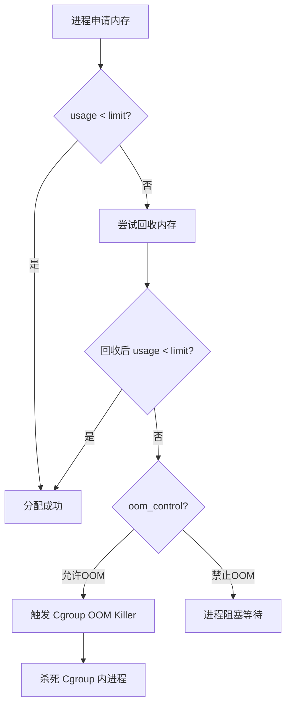
```mermaid
graph TD
    A["进程申请内存"] --> B{"usage < limit?"}
    B -->|"是"| C["分配成功"]
    B -->|"否"| D["尝试回收内存"]
    D --> E{"回收后 usage < limit?"}
    E -->|"是"| C
    E -->|"否"| F{"oom_control?"}
    F -->|"允许OOM"| G["触发 Cgroup OOM Killer"]
    F -->|"禁止OOM"| H["进程阻塞等待"]
    G --> I["杀死 Cgroup 内进程"]
```

**注意**：Cgroup OOM Killer 只会杀死**该 Cgroup 内**的进程，不会影响其他容器。

#### 排查 OOM 问题

##### 步骤1：检查内核日志

```bash
# 查看系统 OOM 日志
$ dmesg | grep -i "oom\|killed"
[12345.678] Memory cgroup out of memory: Kill process 1234 (myapp)

# 或使用 journalctl
$ journalctl -k | grep -i oom
```

##### 步骤2：检查容器内存使用

```bash
# 查看容器内存状态
$ docker stats --no-stream myapp
CONTAINER   MEM USAGE / LIMIT   MEM %
myapp       500MiB / 512MiB     97.66%

# 查看 Cgroup 详细统计
$ cat /sys/fs/cgroup/memory/docker/<id>/memory.stat
cache 134217728
rss 268435456
...
```

##### 步骤3：分析内存使用

```bash
# 容器内查看进程内存
$ docker exec myapp ps aux --sort=-%mem
USER   PID  %MEM  RSS     COMMAND
root   1    45.0  230000  java -Xmx512m ...
```

#### OOM 预防与处理

##### 方案1：增加内存限制

```bash
# Docker
$ docker run -m 1g myapp

# Kubernetes
resources:
  limits:
    memory: "1Gi"
```

##### 方案2：优化应用内存使用

```bash
# Java 应用设置合理的堆大小
$ java -Xmx400m -Xms400m -XX:+UseContainerSupport myapp.jar
```

> [!TIP]
> Java 8u191+ 和 Java 11+ 支持 `UseContainerSupport`，会自动感知容器内存限制。

##### 方案3：调整 OOM 优先级

```yaml
# Kubernetes 中使用 oom-score-adj
apiVersion: v1
kind: Pod
spec:
  containers:
  - name: myapp
    securityContext:
      oomScoreAdj: -500  # 降低被 OOM Kill 的优先级
```

##### 方案4：监控告警

```bash
# Prometheus 告警规则示例
- alert: ContainerMemoryNearLimit
  expr: (container_memory_usage_bytes / container_spec_memory_limit_bytes) > 0.9
  for: 5m
  labels:
    severity: warning
```

---

### 3.1 节小结

| 概念 | 说明 |
|------|------|
| **Overcommit** | Linux 允许申请超过物理内存的虚拟内存 |
| **OOM Killer** | 内存不足时杀死进程的机制 |
| **oom_badness()** | 选择被杀进程的算法 |
| **memory.limit_in_bytes** | 容器内存硬限制 |
| **Cgroup OOM Killer** | 只杀死该 Cgroup 内的进程 |

> **运维要点**：
>
> 1. 通过 `dmesg` 或 `journalctl -k` 查看 OOM 日志
> 2. 设置合理的内存限制，预留一定余量
> 3. 为关键应用设置较低的 `oom_score_adj`

---

### 3.2 RSS 与 Page Cache

> **核心问题**：为什么容器内存使用量总是接近上限，但却没有触发 OOM？

#### 问题现象

容器内存使用量长期保持在接近限制的状态，但应用运行正常：

```bash
$ docker stats myapp
CONTAINER   MEM USAGE / LIMIT   MEM %
myapp       500MiB / 512MiB     97.66%  # 接近上限但不 OOM
```

#### 内存的两种类型

| 类型 | 说明 | 是否可回收 |
|------|------|------------|
| **RSS（Resident Set Size）** | 进程实际使用的物理内存 | ❌ 不可回收 |
| **Page Cache** | 文件系统缓存 | ✅ 可回收 |

#### RSS（Resident Set Size）

**RSS** 是进程实际占用的物理内存，包括：程序代码段、堆内存、栈内存、共享库。

```bash
# 查看进程 RSS
$ ps aux | grep myapp
USER  PID  %MEM  RSS      COMMAND
root  123  10.0  256000   myapp     # RSS = 256MB
```

**特点**：RSS 是应用真正需要的内存，不能被回收。

#### Page Cache

**Page Cache** 是 Linux 用于缓存文件数据的内存，用于加速文件读写。

**特点**：

- 读写文件时自动产生
- 提高 I/O 性能
- **内存紧张时可以被回收**

#### Memory Cgroup 统计的内存

**关键点**：`memory.usage_in_bytes` = RSS + Page Cache

```bash
$ cat /sys/fs/cgroup/memory/docker/<id>/memory.stat
cache 268435456      # Page Cache = 256MB
rss 268435456        # RSS = 256MB
# usage_in_bytes ≈ cache + rss = 512MB
```

这就解释了为什么容器内存使用量接近上限但不 OOM：**Page Cache 可以被回收**。

#### 内存回收机制

当容器需要更多内存时，内核会按照 LRU（最近最少使用）算法回收 Page Cache：

1. 进程申请新内存
2. 检查可用内存是否充足
3. 不充足则回收 Page Cache
4. 回收后仍不足才触发 OOM

#### 正确判断容器内存使用

**不要只看 usage_in_bytes**，应该关注 **RSS**：

```bash
# 查看真实内存使用（RSS）
$ cat /sys/fs/cgroup/memory/docker/<id>/memory.stat | grep -E "^rss |^cache "
cache 268435456      # 可回收
rss 134217728        # 真正的内存使用量
```

**判断标准**：

| 指标 | 含义 | 是否需要关注 |
|------|------|-------------|
| `memory.usage_in_bytes` | RSS + Cache | 接近上限正常 |
| `memory.stat` 中的 `rss` | 真实内存使用 | **核心指标** |
| `memory.stat` 中的 `cache` | 文件缓存 | 可被回收 |

---

### 3.2 节小结

| 概念 | 说明 |
|------|------|
| **RSS** | 进程实际使用的物理内存，不可回收 |
| **Page Cache** | 文件系统缓存，可以被回收 |
| **usage_in_bytes** | RSS + Page Cache 的总和 |
| **memory.stat 中的 rss** | 判断内存使用的核心指标 |

> **运维要点**：容器内存接近上限不一定有问题，关键看 RSS

---

### 3.3 Swap 空间与容器

> **核心问题**：容器可以使用 Swap 空间吗？使用 Swap 会有什么影响？

#### 什么是 Swap？

**Swap（交换空间）** 是磁盘上的一块区域，当物理内存不足时，内核会把不常用的内存页写入 Swap，腾出物理内存给更需要的进程。

```bash
# 查看 Swap 配置
$ free -h
              total   used   free   buff/cache   available
Mem:           16G    8G     2G        6G          7G
Swap:          8G     1G     7G
```

#### 容器与 Swap 的关系

**默认情况下**：如果宿主机开启了 Swap，容器也可以使用 Swap。

**问题**：这可能导致 Memory Cgroup 限制"失效"：

```bash
# 容器内存限制 512MB
$ docker run -m 512m myapp

# 但实际可能使用更多内存（通过 Swap）
# 应用性能会因为 Swap 大幅下降
```

#### swappiness 参数

**swappiness** 是一个内核参数，控制内存回收时的行为：

```bash
# 查看全局 swappiness（默认 60）
$ cat /proc/sys/vm/swappiness
60
```

| 值 | 含义 |
|----|------|
| 0 | 尽量避免使用 Swap（但不是禁止） |
| 60 | 默认值，平衡回收 |
| 100 | 积极使用 Swap |

**理解 swappiness 的真正含义**：

它是一个**权重值**，决定内核在回收内存时优先回收哪种类型：

| 内存类型 | 说明 | 回收目标 |
|----------|------|----------|
| 文件页（Page Cache） | 文件缓存 | 丢弃或写回磁盘 |
| 匿名页（Anonymous） | 进程堆/栈 | 写入 Swap |

**计算公式**：

```
anon_prio = swappiness
file_prio = 200 - swappiness
```

| swappiness | 匿名页优先级 | 文件页优先级 | 效果 |
|------------|-------------|-------------|------|
| 0 | 0 | 200 | 优先回收文件页 |
| 60 | 60 | 140 | 倾向回收文件页 |
| 100 | 100 | 100 | 平等对待 |

#### 全局 swappiness=0 的行为

> [!WARNING]
> 全局 `swappiness=0` 并不意味着完全不使用 Swap！

当 **kswapd**（内核后台回收进程）工作时，`swappiness=0` 确实不会回收匿名页。

但在**直接内存回收**（进程申请内存触发）时，如果文件页回收后仍不足，还是会使用 Swap。

#### Memory Cgroup 的 swappiness

**关键区别**：Memory Cgroup 可以单独设置 `memory.swappiness`

```bash
# 查看容器的 swappiness
$ cat /sys/fs/cgroup/memory/docker/<id>/memory.swappiness
60

# 设置为 0 - 禁止该 Cgroup 使用 Swap
$ echo 0 > /sys/fs/cgroup/memory/docker/<id>/memory.swappiness
```

**Memory Cgroup 中 swappiness=0 的特殊含义**：

| 全局 swappiness=0 | Cgroup swappiness=0 |
|-------------------|---------------------|
| 尽量不用 Swap | **完全禁止** 使用 Swap |
| 紧急情况仍会用 | 该 Cgroup 永不 Swap |

#### Docker 配置

```bash
# 禁用容器的 Swap
$ docker run -m 512m --memory-swappiness=0 myapp

# 设置 memory + swap 总量
$ docker run -m 512m --memory-swap=512m myapp
# memory-swap = memory 表示禁用 Swap
```

#### Kubernetes 场景

Kubernetes 默认要求**禁用 Swap**：

```bash
# 禁用 Swap（kubelet 要求）
$ swapoff -a

# 永久禁用：编辑 /etc/fstab 注释 swap 行
```

从 Kubernetes 1.22 开始，可以通过 feature gate 启用 Swap 支持：

```bash
# kubelet 配置
--feature-gates=NodeSwap=true
```

#### 容器使用 Swap 的影响

| 影响 | 说明 |
|------|------|
| **性能下降** | 磁盘 I/O 远慢于内存 |
| **响应延迟** | 访问被交换出的数据需要等待 |
| **不可预测** | 内存限制变得不准确 |
| **OOM 延迟** | 可能导致问题发现变晚 |

#### 最佳实践

**场景1：需要严格限制内存**

```bash
$ docker run -m 512m --memory-swap=512m myapp
# 或
$ docker run -m 512m --memory-swappiness=0 myapp
```

**场景2：允许使用 Swap 但限制总量**

```bash
$ docker run -m 512m --memory-swap=1g myapp
# 允许 512MB 物理内存 + 512MB Swap
```

**场景3：Kubernetes 生产环境**

```bash
# 禁用宿主机 Swap
$ swapoff -a
```

---

### 3.3 节小结

| 概念 | 说明 |
|------|------|
| **Swap** | 磁盘上的虚拟内存空间 |
| **swappiness** | 控制内存回收时对 Swap 的使用倾向 |
| **全局 swappiness=0** | 尽量不用 Swap（但不绝对） |
| **Cgroup swappiness=0** | **完全禁止** 该 Cgroup 使用 Swap |
| **--memory-swap** | Docker 限制内存 + Swap 总量 |

> **运维建议**：
>
> 1. Kubernetes 生产环境建议禁用 Swap
> 2. 需要严格内存控制时使用 `--memory-swappiness=0`
> 3. 使用 Swap 会影响性能，需谨慎评估

---

### 第三章小结

| 节 | 主题 | 核心要点 |
|----|------|----------|
| 3.1 | OOM Killer | oom_badness、Memory Cgroup 限制 |
| 3.2 | RSS 与 Page Cache | 区分真实内存使用 |
| 3.3 | Swap | swappiness 参数、禁用方法 |

---

## 第四章：容器存储与 I/O

### 4.1 容器文件系统 OverlayFS

> **核心问题**：为什么我在容器中读写文件变慢了？

#### 什么是 UnionFS？

**UnionFS（联合文件系统）** 是一种将多个目录"联合"挂载到同一个挂载点的文件系统。分层存储，下层只读，最上层可写。

#### OverlayFS 详解

**OverlayFS** 是 Linux 内核中 UnionFS 的主流实现，Docker 默认使用。

| 目录 | 说明 |
|------|------|
| **lowerdir** | 只读层（镜像各层） |
| **upperdir** | 可写层（容器运行时修改） |
| **merged** | 合并后的挂载点 |
| **workdir** | OverlayFS 内部使用 |

```bash
# 挂载 OverlayFS
$ mount -t overlay overlay \
    -o lowerdir=/lower,upperdir=/upper,workdir=/work \
    /merged
```

#### 文件操作原理

| 操作 | 行为 |
|------|------|
| **读取** | 优先从 upperdir，不存在则从 lowerdir |
| **修改** | Copy-on-Write，复制到 upperdir 后修改 |
| **删除** | 在 upperdir 创建 whiteout 标记文件 |

#### 性能问题：Linux 5.4 AIO

在 Linux 5.4 内核中，OverlayFS 的异步 I/O（libaio）性能大幅下降。

**原因**：OverlayFS 实现的 I/O 函数只支持同步模式。

**解决方案**：升级到 Linux 5.6+（包含修复补丁）

#### 最佳实践

```bash
# I/O 敏感应用使用数据卷
$ docker run -v /data:/app/data myapp
```

---

### 4.1 节小结

| 概念 | 说明 |
|------|------|
| **OverlayFS** | Linux 内核的联合文件系统实现 |
| **lowerdir/upperdir** | 只读层/可写层 |
| **Copy-on-Write** | 修改时复制到上层 |

> **运维建议**：I/O 密集型应用使用数据卷，避免在容器层写入大量数据

---

### 4.2 容器存储配额（XFS Quota）

> **核心问题**：为什么容器可以把宿主机的磁盘写满？

#### 问题现象

容器不断写入文件，最终导致宿主机磁盘空间用尽：

```bash
$ df -h
Filesystem      Size  Used Avail Use% Mounted on
/dev/sda1       100G  100G    0  100% /

$ docker ps -a
# 某个容器产生了大量日志或临时文件
```

#### 问题根因

OverlayFS 的写入操作实际上是写入宿主机的 **upperdir** 目录：

```bash
# 容器的 upperdir 位于宿主机
/var/lib/docker/overlay2/<container_id>/diff/
```

**OverlayFS 本身没有容量限制**，容器可以无限写入直到磁盘满。

#### 解决方案：XFS Quota

利用底层文件系统的 **Quota（配额）** 功能限制容器的写入量。

##### XFS Quota 三种模式

| 模式 | 说明 | 适用场景 |
|------|------|----------|
| **User** | 按用户限制 | 多用户系统 |
| **Group** | 按用户组限制 | 共享目录 |
| **Project** | 按目录限制 | **容器场景** |

##### Project Quota 工作原理

给目录标记一个 **Project ID**，然后对该 ID 设置配额：

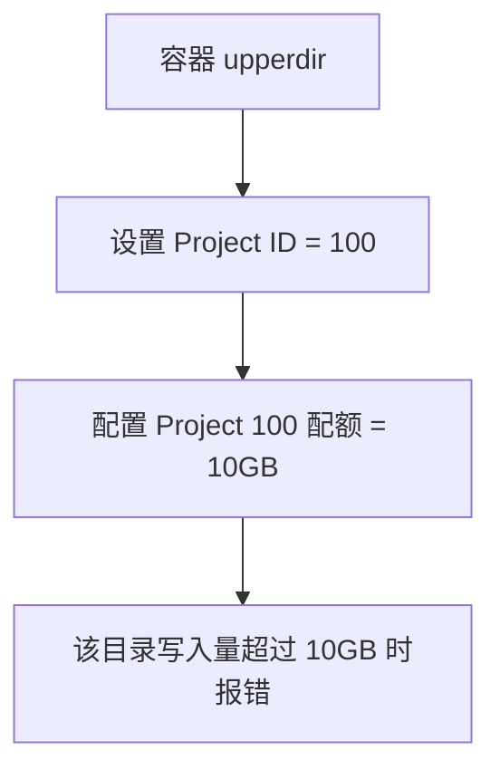
```mermaid
graph TD
    A["容器 upperdir"] --> B["设置 Project ID = 100"]
    B --> C["配置 Project 100 配额 = 10GB"]
    C --> D["该目录写入量超过 10GB 时报错"]
```

#### 手动配置 XFS Project Quota

##### 步骤1：挂载 XFS 时启用 pquota

```bash
# 检查挂载选项
$ mount | grep xfs
/dev/sda1 on / type xfs (rw,pquota)

# 如果没有 pquota，需要重新挂载
$ mount -o remount,pquota /
```

##### 步骤2：设置 Project ID

```bash
# 给目录设置 Project ID
$ xfs_quota -x -c 'project -s -p /path/to/dir 100' /

# 验证
$ xfs_quota -x -c 'print' /
```

##### 步骤3：配置配额

```bash
# 设置软限制和硬限制
$ xfs_quota -x -c 'limit -p bsoft=9g bhard=10g 100' /

# 查看配额使用情况
$ xfs_quota -x -c 'report -p' /
```

#### Docker 的存储配额

Docker 通过 `--storage-opt size` 参数实现存储限制：

```bash
# 限制容器存储层最大 10GB
$ docker run --storage-opt size=10G myapp
```

**前提条件**：

- 使用 `overlay2` 存储驱动
- 底层文件系统是 **XFS**，且启用了 `pquota`

```bash
# 检查 Docker 存储配置
$ docker info | grep -E "Storage Driver|Backing Filesystem"
Storage Driver: overlay2
Backing Filesystem: xfs
```

##### Docker 内部实现

Docker 调用系统调用设置 XFS Project Quota：

1. `setProjectID()` - 给 upperdir 设置 Project ID
2. `setProjectQuota()` - 设置该 Project 的配额限制

#### Kubernetes 场景

Kubernetes 通过 **ephemeral-storage** 限制：

```yaml
apiVersion: v1
kind: Pod
spec:
  containers:
  - name: myapp
    resources:
      requests:
        ephemeral-storage: "2Gi"
      limits:
        ephemeral-storage: "10Gi"  # 存储限制
```

**注意**：`ephemeral-storage` 包括：

- 容器可写层
- 日志文件
- emptyDir 卷

#### 监控与告警

```bash
# 监控容器存储使用
$ docker system df -v
TYPE       CONTAINER ID   SIZE
Container  abc123         5.5GB

# Prometheus 指标
container_fs_usage_bytes{container="myapp"}
```

---

### 4.2 节小结

| 概念 | 说明 |
|------|------|
| **问题** | OverlayFS 无原生配额，容器可写满磁盘 |
| **XFS Project Quota** | 按目录设置存储配额 |
| **Docker --storage-opt** | 利用 XFS Quota 限制容器存储 |
| **K8s ephemeral-storage** | 限制临时存储使用量 |

> **运维建议**：
>
> 1. 使用 XFS 文件系统并启用 pquota
> 2. 生产环境必须设置容器存储配额
> 3. 监控容器存储使用，设置告警阈值

---

### 4.3 容器磁盘限速（Blkio Cgroup）

> **核心问题**：为什么我的容器里磁盘读写不稳定？如何限制容器的磁盘 I/O？

#### Blkio Cgroup 概述

**Blkio Cgroup（Block I/O Cgroup）** 用于限制容器对块设备的 I/O 速率。

##### 核心参数

| 参数 | 说明 |
|------|------|
| `blkio.throttle.read_bps_device` | 读带宽限制（字节/秒） |
| `blkio.throttle.write_bps_device` | 写带宽限制（字节/秒） |
| `blkio.throttle.read_iops_device` | 读 IOPS 限制 |
| `blkio.throttle.write_iops_device` | 写 IOPS 限制 |

```bash
# 查看 Blkio Cgroup 配置
$ cat /sys/fs/cgroup/blkio/docker/<id>/blkio.throttle.read_bps_device
253:0 10485760  # 设备 253:0 限制读 10MB/s
```

#### Docker 配置磁盘限速

```bash
# 限制读写带宽
$ docker run --device-read-bps /dev/sda:10mb \
             --device-write-bps /dev/sda:10mb \
             myapp

# 限制 IOPS
$ docker run --device-read-iops /dev/sda:1000 \
             --device-write-iops /dev/sda:1000 \
             myapp
```

#### Direct I/O vs Buffered I/O

| 类型 | 说明 | Blkio Cgroup 生效？ |
|------|------|-------------------|
| **Direct I/O** | 绕过 Page Cache，直接读写磁盘 | ✅ 生效 |
| **Buffered I/O** | 经过 Page Cache | ❌ 不生效（Cgroup v1） |

**问题**：大多数应用使用 Buffered I/O，Blkio Cgroup v1 无法限制！

```bash
# 测试 Direct I/O（生效）
$ fio --direct=1 --rw=write ...

# 测试 Buffered I/O（不生效）
$ fio --direct=0 --rw=write ...
```

#### Cgroup v2 的改进

**Cgroup v2** 支持 Buffered I/O 限速，但需要满足条件：

1. 内核支持 Cgroup v2
2. Docker/containerd 配置使用 Cgroup v2
3. 启用 `io` 控制器

```bash
# 检查是否使用 Cgroup v2
$ mount | grep cgroup2
cgroup2 on /sys/fs/cgroup type cgroup2

# Cgroup v2 的 IO 限制参数
$ cat /sys/fs/cgroup/mycontainer/io.max
253:0 rbps=10485760 wbps=10485760
```

#### 为什么磁盘读写不稳定？

即使设置了限速，仍可能出现不稳定：

| 原因 | 说明 |
|------|------|
| **Buffered I/O** | Cgroup v1 无法限制 |
| **共享存储竞争** | 多容器共用同一磁盘 |
| **Page Cache 回写** | 突发性磁盘写入 |
| **文件系统开销** | 元数据操作 |

#### 最佳实践

##### 1. 使用 Cgroup v2（推荐）

```bash
# 启用 Cgroup v2（系统级配置）
# /etc/default/grub
GRUB_CMDLINE_LINUX="systemd.unified_cgroup_hierarchy=1"
```

##### 2. 使用 Direct I/O

对于数据库等 I/O 敏感应用，配置使用 Direct I/O。

##### 3. 分离存储

```bash
# 为容器分配独立磁盘/分区
$ docker run -v /dev/nvme1n1:/data myapp
```

##### 4. 使用云存储限速

云平台通常提供存储 QoS：

- AWS EBS：配置 IOPS 和吞吐量
- 阿里云：云盘 IOPS 限制

---

### 4.3 节小结

| 概念 | 说明 |
|------|------|
| **Blkio Cgroup** | 限制块设备 I/O 速率 |
| **Direct I/O** | Cgroup v1 可限制 |
| **Buffered I/O** | 需要 Cgroup v2 才能限制 |
| **--device-read-bps** | Docker 限制读带宽 |

> **运维建议**：
>
> 1. 优先使用 Cgroup v2
> 2. I/O 敏感应用考虑 Direct I/O
> 3. 生产环境为容器分配独立存储

---

### 4.4 Buffered I/O 与写延时波动

> **核心问题**：为什么容器写文件的延时波动很大？

#### 问题现象

容器内 Buffered I/O 写文件时，延时会出现明显波动：

```bash
# 大部分写入 1ms 完成
# 但偶尔会有 100ms+ 的延时尖峰
```

#### Buffered I/O 与 Dirty Pages

当使用 Buffered I/O 写文件时：

1. 数据先写入 **Page Cache**（内存）
2. 写操作立即返回（快）
3. 内核后台将 Page Cache 写入磁盘（脏页回写）

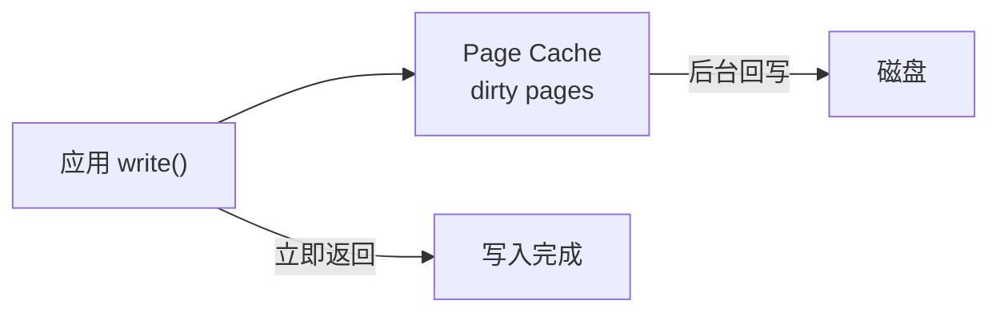
```mermaid
graph LR
    A["应用 write()"] --> B["Page Cache<br/>dirty pages"]
    B -->|"后台回写"| C["磁盘"]
    A -->|"立即返回"| D["写入完成"]
```

#### Dirty Pages 相关内核参数

| 参数 | 说明 | 默认值 |
|------|------|--------|
| `dirty_background_ratio` | 后台回写触发阈值 | 10% |
| `dirty_ratio` | 同步回写触发阈值 | 20% |
| `dirty_writeback_centisecs` | 回写线程唤醒间隔 | 500 (5秒) |
| `dirty_expire_centisecs` | 脏页过期时间 | 3000 (30秒) |

```bash
# 查看当前配置
$ cat /proc/sys/vm/dirty_background_ratio
10

$ cat /proc/sys/vm/dirty_ratio
20
```

**回写触发条件**：

- 脏页比例达到 `dirty_background_ratio` → 后台回写
- 脏页比例达到 `dirty_ratio` → **阻塞应用**，同步回写

#### 容器内延时波动的根因

在 **Memory Cgroup 限制**下，Page Cache 空间有限：

```bash
# 容器内存限制 512MB
# Page Cache 可用空间很小
# 频繁触发脏页回写
```

**关键问题**：`dirty_ratio` 是基于**系统总内存**计算的，但容器的 Page Cache 受 Memory Cgroup 限制。

#### 深入分析

使用 `perf` 和 `ftrace` 可以定位到：

```bash
# 延时发生在这两个函数
mem_cgroup_try_charge()    # 申请 Page Cache 内存
do_try_to_free_pages()     # 回收 Page Cache
```

当容器的 Page Cache 不足时，每次写入都要：

1. 尝试申请内存
2. 发现超过 Cgroup 限制
3. 回收旧的 Page Cache
4. 再写入

这个回收过程导致了延时波动。

#### 解决方案

##### 方案1：增加容器内存限制

```bash
# 预留更多内存给 Page Cache
$ docker run -m 1g myapp  # 原来 512m
```

**估算公式**：

```
推荐内存 = RSS + 预期写入速率 × 脏页保留时间
```

##### 方案2：使用 Direct I/O

绕过 Page Cache，延时稳定但平均延时更高：

```c
// 打开文件时使用 O_DIRECT
int fd = open("/data/file", O_WRONLY | O_DIRECT);
```

##### 方案3：调整 dirty 参数

```bash
# 降低阈值，更频繁地回写
$ echo 5 > /proc/sys/vm/dirty_background_ratio
$ echo 10 > /proc/sys/vm/dirty_ratio
```

##### 方案4：使用 tmpfs（内存文件系统）

对于临时文件，使用内存文件系统避免磁盘 I/O：

```bash
docker run --tmpfs /tmp:size=100m myapp
```

---

### 4.4 节小结

| 概念 | 说明 |
|------|------|
| **Buffered I/O** | 经过 Page Cache 的 I/O |
| **Dirty Pages** | Page Cache 中待写入磁盘的数据 |
| **延时波动原因** | Memory Cgroup 限制导致 Page Cache 频繁回收 |
| **解决方案** | 增加内存/Direct I/O/调整 dirty 参数 |

> **运维建议**：为 I/O 密集型容器预留足够的内存给 Page Cache

---

### 第四章小结

| 节 | 主题 | 核心要点 |
|----|------|----------|
| 4.1 | OverlayFS | 联合文件系统、Copy-on-Write |
| 4.2 | XFS Quota | 容器存储配额 |
| 4.3 | Blkio Cgroup | 磁盘 I/O 限速 |
| 4.4 | Buffered I/O | 写延时波动与 Page Cache |

---

## 第五章：容器网络

### 5.1 Network Namespace 与网络参数

> **核心问题**：为什么修改了 `/proc/sys/net` 参数，在容器中不起效？

#### Network Namespace 隔离

Network Namespace 隔离容器的网络栈：网络设备、IP协议栈、端口空间、防火墙规则、部分网络参数。

#### /proc/sys/net 参数分类

| 类型 | 说明 |
|------|------|
| **Namespace 相关** | 每个 Namespace 独立（如 tcp_keepalive_time） |
| **全局参数** | 所有 Namespace 共享（如部分 netfilter 参数） |

**关键点**：创建新 Namespace 时，部分参数继承宿主机，部分使用内核默认值。

#### 容器内修改的问题

非特权容器中 `/proc/sys` 是**只读挂载**：

```bash
$ docker exec myapp sh -c 'echo 600 > /proc/sys/net/ipv4/tcp_keepalive_time'
Read-only file system
```

#### 解决方案

```bash
# Docker --sysctl
$ docker run --sysctl net.ipv4.tcp_keepalive_time=600 myapp
```

```yaml
# Kubernetes
spec:
  securityContext:
    sysctls:
    - name: net.ipv4.tcp_keepalive_time
      value: "600"
```

#### 常用网络参数

| 参数 | 说明 |
|------|------|
| `tcp_keepalive_time` | TCP keepalive 间隔 |
| `ip_local_port_range` | 本地端口范围 |
| `tcp_max_syn_backlog` | SYN 队列长度 |

---

### 5.1 节小结

| 概念 | 说明 |
|------|------|
| **Network Namespace** | 隔离容器网络栈 |
| **/proc/sys/net** | 部分参数隔离，部分全局共享 |
| **--sysctl** | 启动时设置网络参数 |

> **运维建议**：通过 `--sysctl` 或 Kubernetes `sysctls` 配置容器网络参数

---

### 5.2 容器网络调试方法

> **核心问题**：容器网络不通了要怎么调试？

#### 容器网络架构（Bridge模式）

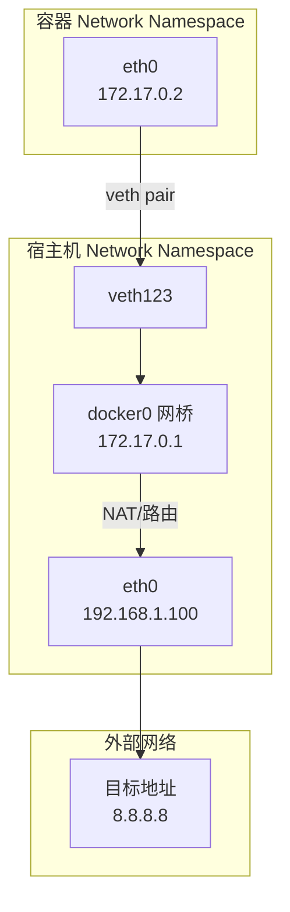
```mermaid
graph TD
    subgraph Container["容器 Network Namespace"]
        eth0["eth0<br/>172.17.0.2"]
    end
    
    subgraph Host["宿主机 Network Namespace"]
        veth["veth123"]
        docker0["docker0 网桥<br/>172.17.0.1"]
        eth_host["eth0<br/>192.168.1.100"]
    end
    
    subgraph External["外部网络"]
        target["目标地址<br/>8.8.8.8"]
    end
    
    eth0 -->|"veth pair"| veth
    veth --> docker0
    docker0 -->|"NAT/路由"| eth_host
    eth_host --> target
```

#### 关键组件

| 组件 | 说明 |
|------|------|
| **veth pair** | 虚拟网线，连接容器和宿主机 |
| **docker0** | 网桥，连接多个容器 |
| **NAT** | 地址转换，容器访问外网 |
| **iptables** | 防火墙规则 |

#### 调试步骤

##### 步骤1：检查容器网络配置

```bash
# 查看容器 IP
$ docker exec myapp ip addr
# 或
$ docker inspect myapp --format '{{.NetworkSettings.IPAddress}}'
172.17.0.2

# 查看容器路由
$ docker exec myapp ip route
default via 172.17.0.1 dev eth0
```

##### 步骤2：检查 veth pair

```bash
# 在容器内查看 eth0 的 ifindex
$ docker exec myapp cat /sys/class/net/eth0/iflink
15

# 在宿主机查找对应 veth
$ ip link | grep "^15:"
15: veth123@if14: <BROADCAST,MULTICAST,UP> ...
```

##### 步骤3：检查网桥

```bash
# 查看 docker0 网桥
$ brctl show docker0
bridge name   bridge id         interfaces
docker0       8000.xxxx         veth123

# 检查网桥 IP
$ ip addr show docker0
docker0: <BROADCAST,MULTICAST,UP>
    inet 172.17.0.1/16 ...
```

##### 步骤4：检查 ip_forward

```bash
# 必须开启 IP 转发
$ cat /proc/sys/net/ipv4/ip_forward
1  # 必须为 1

# 如果为 0，开启它
$ echo 1 > /proc/sys/net/ipv4/ip_forward
```

##### 步骤5：检查 iptables 规则

```bash
# 查看 NAT 规则
$ iptables -t nat -L -n -v
Chain POSTROUTING
MASQUERADE  all  172.17.0.0/16  0.0.0.0/0

# 查看 FORWARD 规则
$ iptables -L FORWARD -n -v
```

##### 步骤6：使用 tcpdump 抓包

```bash
# 在容器内抓包
$ docker exec myapp tcpdump -i eth0 -nn

# 在宿主机 veth 抓包
$ tcpdump -i veth123 -nn

# 在网桥抓包
$ tcpdump -i docker0 -nn

# 在物理网卡抓包
$ tcpdump -i eth0 -nn host 8.8.8.8
```

#### 常见问题排查

| 问题 | 可能原因 | 排查方法 |
|------|----------|----------|
| 容器内无法 ping 网关 | veth 或网桥问题 | 检查 veth 状态 |
| 可以 ping 网关，不能访问外网 | NAT 或 ip_forward | 检查 iptables |
| DNS 解析失败 | resolv.conf 配置 | 检查 /etc/resolv.conf |
| 端口无法访问 | 端口映射或防火墙 | 检查 docker port 和 iptables |

#### 进入容器网络命名空间

```bash
# 获取容器 PID
$ docker inspect myapp --format '{{.State.Pid}}'
12345

# 进入该命名空间执行命令
$ nsenter -t 12345 -n ip addr
$ nsenter -t 12345 -n tcpdump -i eth0
```

---

### 5.2 节小结

| 调试工具 | 用途 |
|----------|------|
| `ip addr/route` | 查看网络配置 |
| `brctl show` | 查看网桥 |
| `iptables -L -t nat` | 查看 NAT 规则 |
| `tcpdump` | 抓包分析 |
| `nsenter -n` | 进入容器网络命名空间 |

> **运维建议**：按照数据流路径逐段排查：容器 → veth → 网桥 → NAT → 物理网卡

---

### 5.3 容器网络延时分析

> **核心问题**：容器网络延时要比宿主机上的高吗？

#### 使用 netperf 测试延时

```bash
# 安装 netperf
$ yum install netperf

# 服务端
$ netserver -bindaddr 192.168.1.100

# 客户端测试 TCP_RR（请求-响应延时）
$ netperf -H 192.168.1.100 -t TCP_RR -l 10
```

**测试结果对比**：

| 场景 | 延时 |
|------|------|
| 宿主机之间 | ~30μs |
| 容器（veth+bridge） | ~50μs |
| 容器（macvlan） | ~35μs |

#### 延时增加的原因

veth + bridge 模式会产生额外的**软中断（softirq）**开销：

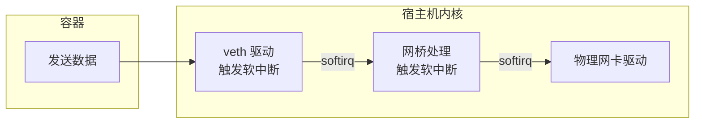
```mermaid
graph LR
    subgraph Container["容器"]
        A["发送数据"]
    end
    
    subgraph HostKernel["宿主机内核"]
        B["veth 驱动<br/>触发软中断"]
        C["网桥处理<br/>触发软中断"]
        D["物理网卡驱动"]
    end
    
    A --> B
    B -->|"softirq"| C
    C -->|"softirq"| D
```

**每次数据经过 veth 都会**：

1. 触发一次 softirq
2. 可能切换 CPU
3. 增加处理延时

#### 替代方案：macvlan

**macvlan** 让容器直接使用物理网卡，绕过 veth 和网桥：

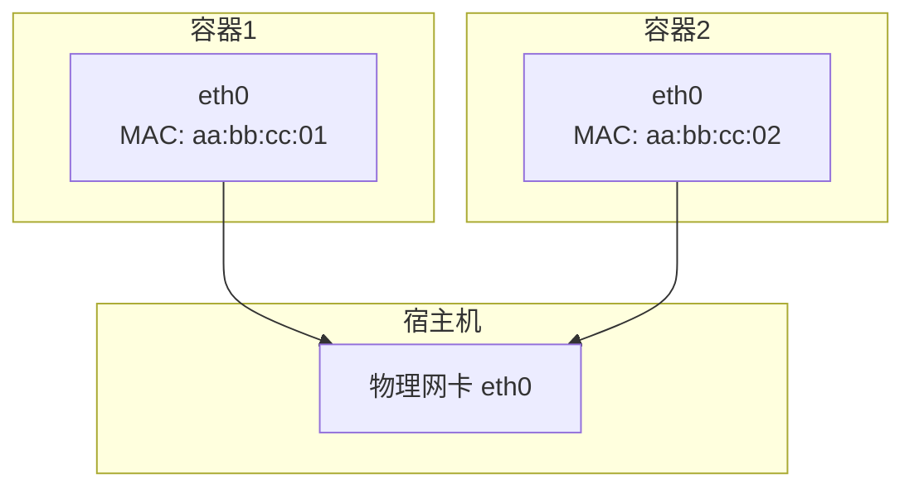
```mermaid
graph TD
    subgraph Container1["容器1"]
        eth0_1["eth0<br/>MAC: aa:bb:cc:01"]
    end
    
    subgraph Container2["容器2"]
        eth0_2["eth0<br/>MAC: aa:bb:cc:02"]
    end
    
    subgraph Host["宿主机"]
        phy["物理网卡 eth0"]
    end
    
    eth0_1 --> phy
    eth0_2 --> phy
```

**配置示例**：

```bash
# 创建 macvlan 网络
$ docker network create -d macvlan \
    --subnet=192.168.1.0/24 \
    --gateway=192.168.1.1 \
    -o parent=eth0 \
    mynet

# 使用该网络启动容器
$ docker run --network mynet myapp
```

#### 替代方案：ipvlan

**ipvlan** 类似 macvlan，但共享 MAC 地址：

| 特性 | macvlan | ipvlan |
|------|---------|--------|
| MAC 地址 | 每个容器独立 | 共享宿主机 MAC |
| 适用场景 | 一般网络 | 云环境（限制MAC数量） |
| 性能 | 低延时 | 低延时 |

```bash
# 创建 ipvlan 网络
$ docker network create -d ipvlan \
    --subnet=192.168.1.0/24 \
    -o parent=eth0 \
    myipvlan
```

#### 方案对比

| 网络模式 | 延时 | 隔离性 | 复杂度 |
|----------|------|--------|--------|
| bridge + veth | 较高 | 好 | 简单 |
| macvlan | 低 | 较好 | 中等 |
| ipvlan | 低 | 较好 | 中等 |
| host | 最低 | 无隔离 | 最简单 |

#### 注意事项

> [!WARNING]
> macvlan/ipvlan 在 Kubernetes 中可能与 Service 的 iptables 规则不兼容

**适用场景**：

- 对延时敏感的应用
- 高频交易、实时音视频
- 不依赖 Kubernetes Service 的场景

---

### 5.3 节小结

| 概念 | 说明 |
|------|------|
| **veth 延时** | 每次经过 veth 产生 softirq 开销 |
| **macvlan** | 绕过 veth/网桥，直连物理网卡 |
| **ipvlan** | 类似 macvlan，共享 MAC 地址 |

> **运维建议**：延时敏感场景考虑使用 macvlan/ipvlan 替代默认 bridge 模式

---

### 5.4 网络乱序包与重传

> **核心问题**：为什么容器中的网络乱序包这么高？

#### 问题现象

容器网络的 TCP 重传率明显高于宿主机：

```bash
# 查看网络统计
$ netstat -s | grep -E "retrans|reorder"
    1234 segments retransmitted
    567 packets reordered
```

#### TCP 重传机制

##### 快速重传（Fast Retransmit）

收到 3 个重复 ACK 后触发重传：

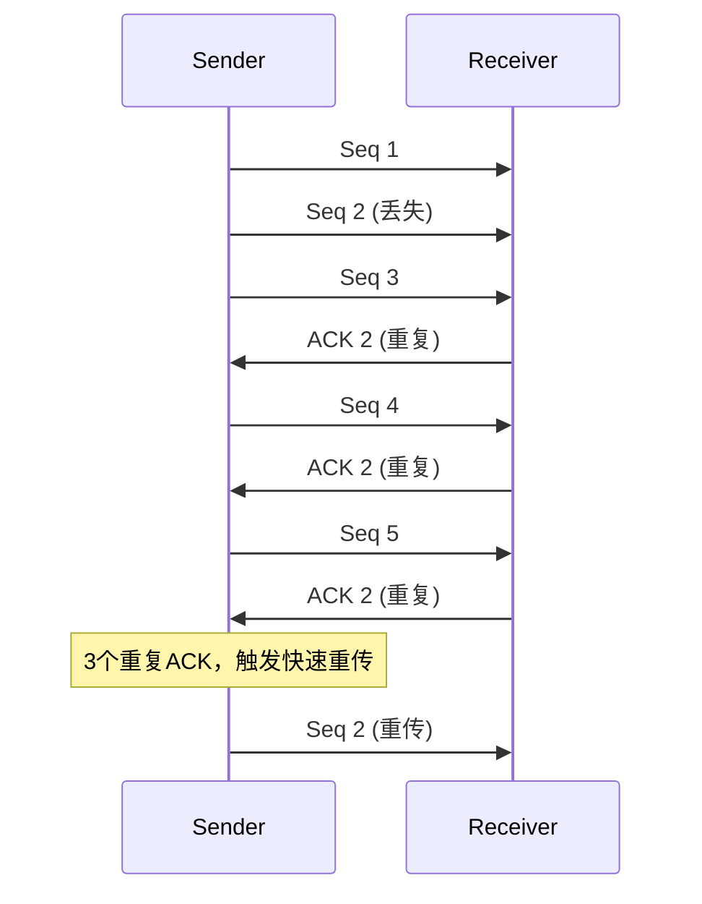
```mermaid
sequenceDiagram
    participant Sender
    participant Receiver
    
    Sender->>Receiver: Seq 1
    Sender->>Receiver: Seq 2 (丢失)
    Sender->>Receiver: Seq 3
    Receiver->>Sender: ACK 2 (重复)
    Sender->>Receiver: Seq 4
    Receiver->>Sender: ACK 2 (重复)
    Sender->>Receiver: Seq 5
    Receiver->>Sender: ACK 2 (重复)
    Note over Sender: 3个重复ACK，触发快速重传
    Sender->>Receiver: Seq 2 (重传)
```

##### SACK（选择性确认）

Linux 启用 SACK 后，收到 **1个** 重复 ACK 就可能触发重传。

**问题**：如果数据包只是乱序（不是丢失），也会触发不必要的重传。

#### 乱序的原因分析

veth 设备两端可能由**不同 CPU** 处理：

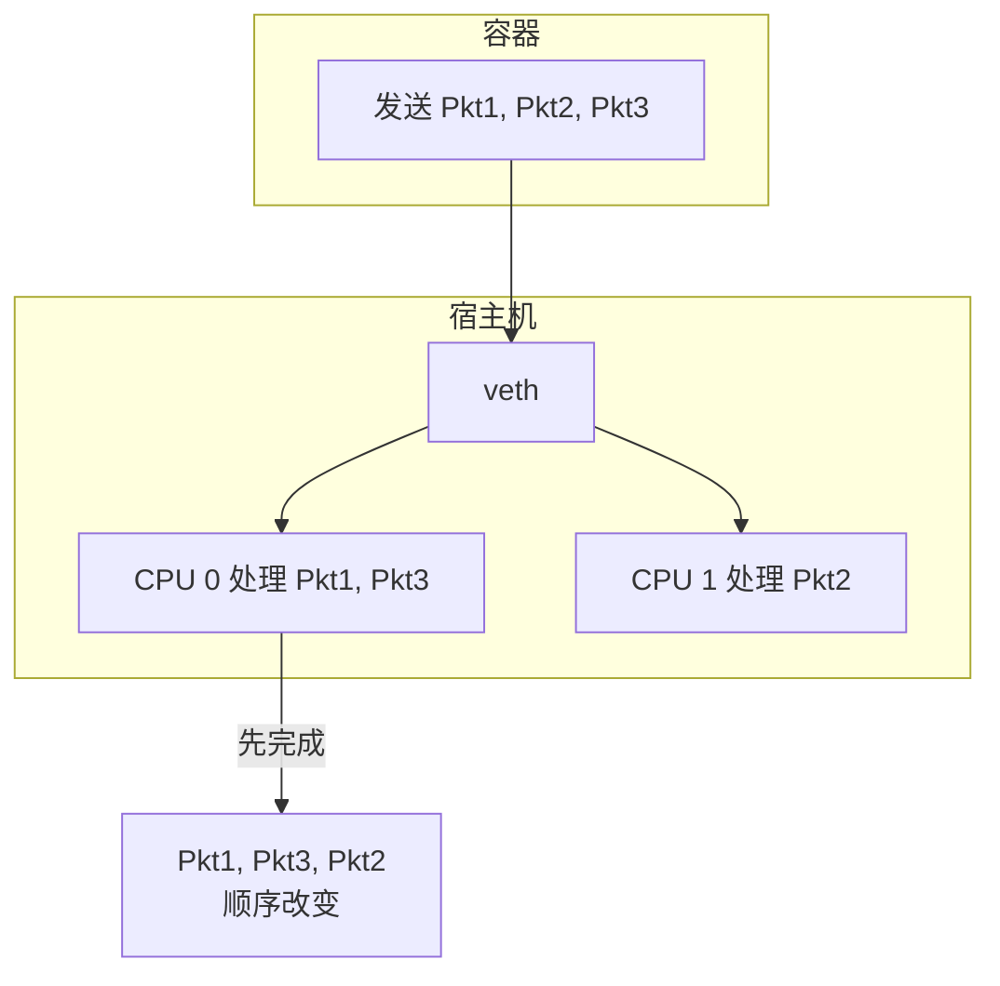
```mermaid
graph TD
    subgraph Container["容器"]
        A["发送 Pkt1, Pkt2, Pkt3"]
    end
    
    subgraph Host["宿主机"]
        veth["veth"]
        CPU0["CPU 0 处理 Pkt1, Pkt3"]
        CPU1["CPU 1 处理 Pkt2"]
    end
    
    A --> veth
    veth --> CPU0
    veth --> CPU1
    
    CPU0 -->|"先完成"| Out["Pkt1, Pkt3, Pkt2<br/>顺序改变"]
```

**根因**：

1. 网卡/veth 默认可能将包分发到不同 CPU
2. 不同 CPU 处理速度不同
3. 导致数据包到达顺序改变

#### 解决方案：RPS（Receive Packet Steering）

**RPS** 可以将同一连接（5元组）的数据包调度到同一 CPU：

```bash
# 查看当前 RPS 配置
$ cat /sys/class/net/veth123/queues/rx-0/rps_cpus
00000000

# 配置 RPS（使用所有 CPU，8核示例）
$ echo ff > /sys/class/net/veth123/queues/rx-0/rps_cpus
```

**配置值含义**：

- `ff` = 二进制 11111111 = 启用 CPU 0-7
- `0f` = 二进制 00001111 = 启用 CPU 0-3

#### RSS vs RPS

| 特性 | RSS | RPS |
|------|-----|-----|
| 实现位置 | 硬件（网卡） | 软件（内核） |
| 适用设备 | 物理网卡 | 任何网络设备 |
| 性能开销 | 无 | 有一定开销 |

**物理网卡配置 RSS**：

```bash
# 查看网卡队列数
$ ethtool -l eth0
Channel parameters for eth0:
Combined:       8

# 调整队列数
$ ethtool -L eth0 combined 4
```

#### 自动配置脚本

```bash
#!/bin/bash
# 为所有 veth 设备配置 RPS

for veth in $(ls /sys/class/net/ | grep veth); do
    echo "Configuring RPS for $veth"
    for rx in /sys/class/net/$veth/queues/rx-*; do
        echo ff > $rx/rps_cpus
    done
done
```

#### 验证效果

```bash
# 配置前
$ netstat -s | grep retrans
    5000 segments retransmitted

# 配置 RPS 后
$ netstat -s | grep retrans
    500 segments retransmitted  # 显著减少
```

---

### 5.4 节小结

| 概念 | 说明 |
|------|------|
| **乱序原因** | veth 数据包被不同 CPU 处理 |
| **SACK** | 启用后对乱序更敏感 |
| **RPS** | 将同一连接的包调度到同一 CPU |
| **RSS** | 硬件级别的多队列负载均衡 |

> **运维建议**：为容器 veth 设备配置 RPS 可显著降低重传率

---

### 第五章小结

| 节 | 主题 | 核心要点 |
|----|------|----------|
| 5.1 | Network Namespace | /proc/sys/net 参数隔离 |
| 5.2 | 网络调试 | veth/bridge/iptables 排查 |
| 5.3 | 网络延时 | macvlan/ipvlan 低延时方案 |
| 5.4 | 乱序与重传 | RPS 配置减少重传 |

---

## 第六章：容器安全

### 6.1 Capabilities 与特权容器

> **核心问题**：我的容器真的需要 privileged 权限吗？

#### 什么是 privileged 容器？

**特权容器** 拥有宿主机 root 的所有能力，非常危险：

```bash
# 启动特权容器
$ docker run --privileged myapp
```

**特权容器可以**：

- 访问所有设备 `/dev/*`
- 加载内核模块
- 修改系统配置
- 挂载文件系统
- 几乎可以完全控制宿主机

> [!CAUTION]
> 特权容器等同于给容器 root 权限，可以轻易逃逸！

#### Linux Capabilities 机制

Linux 将 root 权限拆分为 **40+ 个独立的 Capability**，可以按需授予。

##### 常用 Capabilities

| Capability | 说明 |
|------------|------|
| `CAP_NET_ADMIN` | 网络配置（iptables、路由） |
| `CAP_NET_BIND_SERVICE` | 绑定 <1024 端口 |
| `CAP_SYS_ADMIN` | 挂载、设置主机名等（危险） |
| `CAP_SYS_PTRACE` | 调试进程 |
| `CAP_CHOWN` | 修改文件所有者 |
| `CAP_DAC_OVERRIDE` | 绕过文件权限检查 |

```bash
# 查看进程的 Capabilities
$ cat /proc/1/status | grep Cap
CapInh: 0000000000000000
CapPrm: 00000000a80425fb
CapEff: 00000000a80425fb
CapBnd: 00000000a80425fb

# 解码 Capabilities
$ capsh --decode=00000000a80425fb
```

#### Docker 默认 Capabilities

Docker 容器默认只有部分 Capabilities：

```bash
# 查看容器的 Capabilities
$ docker run --rm alpine cat /proc/1/status | grep Cap
CapEff: 00000000a80425fb
```

**默认包含**：

- `CAP_CHOWN`、`CAP_DAC_OVERRIDE`
- `CAP_FOWNER`、`CAP_KILL`
- `CAP_NET_BIND_SERVICE`、`CAP_NET_RAW`
- 等约 14 个

**默认不包含**（需要特别添加）：

- `CAP_SYS_ADMIN`
- `CAP_NET_ADMIN`
- `CAP_SYS_PTRACE`

#### 按需添加 Capabilities

```bash
# 添加单个 Capability
$ docker run --cap-add NET_ADMIN myapp

# 添加多个
$ docker run --cap-add NET_ADMIN --cap-add SYS_PTRACE myapp
```

#### 删除不需要的 Capabilities

```bash
# 删除所有，只保留需要的
$ docker run --cap-drop ALL --cap-add NET_BIND_SERVICE myapp
```

#### Kubernetes 配置

```yaml
apiVersion: v1
kind: Pod
spec:
  containers:
  - name: myapp
    securityContext:
      capabilities:
        add:
        - NET_ADMIN
        drop:
        - ALL
```

#### 常见场景与 Capabilities

| 场景 | 需要的 Capability |
|------|-------------------|
| 绑定 80 端口 | `NET_BIND_SERVICE` |
| 修改网络配置 | `NET_ADMIN` |
| 使用 tcpdump | `NET_RAW` |
| strace 调试 | `SYS_PTRACE` |
| 挂载文件系统 | `SYS_ADMIN`（危险） |

#### privileged vs 单独 Capability

| 特性 | `--privileged` | `--cap-add` |
|------|----------------|-------------|
| 权限范围 | 全部 | 指定的 |
| 安全风险 | 极高 | 可控 |
| 访问设备 | 全部 | 默认不变 |
| 推荐程度 | ❌ 避免 | ✅ 推荐 |

---

### 6.1 节小结

| 概念 | 说明 |
|------|------|
| **privileged** | 赋予容器所有权限，极不安全 |
| **Capabilities** | 细粒度的权限控制 |
| **--cap-add** | 添加指定 Capability |
| **--cap-drop ALL** | 最小权限原则 |

> **运维建议**：
>
> 1. 永远不要在生产环境使用 `--privileged`
> 2. 使用 `--cap-drop ALL` 后按需添加
> 3. 定期审计容器的 Capabilities

---

### 6.2 非 root 用户运行容器

> **核心问题**：在容器中不以 root 用户来运行程序可以吗？

#### 为什么要避免 root？

容器内的 root 用户与宿主机的 root 有相同的 UID（0）：

```bash
# 容器内 root 用户
$ docker run --rm alpine id
uid=0(root) gid=0(root)

# 如果容器逃逸，攻击者就是宿主机的 root
```

> [!WARNING]
> 即使有 Namespace 隔离，root 用户仍有更多权限，增加了逃逸风险。

#### 方法1：Dockerfile 中指定用户

```dockerfile
FROM alpine

# 创建非 root 用户
RUN adduser -D -u 1000 appuser

# 切换用户
USER appuser

# 应用将以 appuser 身份运行
CMD ["./myapp"]
```

```bash
# 验证
$ docker run --rm myimage id
uid=1000(appuser) gid=1000(appuser)
```

#### 方法2：docker run --user

```bash
# 指定 UID:GID 运行
$ docker run --user 1000:1000 myapp

# 或使用用户名（需要容器内存在该用户）
$ docker run --user appuser myapp
```

#### 方法3：Kubernetes runAsNonRoot

```yaml
apiVersion: v1
kind: Pod
spec:
  securityContext:
    runAsNonRoot: true      # 强制非 root
    runAsUser: 1000         # 指定 UID
    runAsGroup: 1000        # 指定 GID
    fsGroup: 1000           # 文件系统组
  containers:
  - name: myapp
    image: myimage
```

**runAsNonRoot: true** 会在启动时检查，如果进程是 root 则拒绝运行。

#### 常见问题与解决

| 问题 | 原因 | 解决方案 |
|------|------|----------|
| 文件权限不足 | 文件属于 root | `chown` 修改文件所有者 |
| 无法绑定低端口 | <1024 需要权限 | 使用 >1024 端口或 `NET_BIND_SERVICE` |
| 无法写入目录 | 目录权限问题 | 确保目录对运行用户可写 |

**Dockerfile 示例（处理权限）**：

```dockerfile
FROM alpine

RUN adduser -D -u 1000 appuser && \
    mkdir -p /app/data && \
    chown -R appuser:appuser /app

USER appuser
WORKDIR /app
CMD ["./myapp"]
```

#### User Namespace 映射

**User Namespace** 可以将容器内的 root 映射到宿主机的普通用户：

```bash
# Docker 启用 User Namespace（需配置 daemon.json）
{
  "userns-remap": "default"
}
```

```bash
# 映射后，容器内 root 在宿主机是普通用户
容器: uid=0(root)  → 宿主机: uid=100000
容器: uid=1(user)  → 宿主机: uid=100001
```

#### 安全最佳实践汇总

| 层面 | 实践 |
|------|------|
| **镜像** | Dockerfile 中使用 `USER` 指令 |
| **运行时** | `--user` 或 `runAsNonRoot` |
| **文件** | 确保应用目录权限正确 |
| **高级** | 启用 User Namespace |

---

### 6.2 节小结

| 概念 | 说明 |
|------|------|
| **容器 root 风险** | UID=0 与宿主机相同 |
| **USER 指令** | Dockerfile 中切换用户 |
| **runAsNonRoot** | K8s 强制非 root 运行 |
| **User Namespace** | 映射容器 UID 到宿主机不同 UID |

> **运维建议**：
>
> 1. 所有生产容器应以非 root 用户运行
> 2. 在 Kubernetes 中启用 `runAsNonRoot: true`
> 3. 考虑启用 User Namespace 获得更强隔离

---

### 第六章小结

| 节 | 主题 | 核心要点 |
|----|------|----------|
| 6.1 | Capabilities | 细粒度权限控制替代 privileged |
| 6.2 | 非 root 运行 | USER 指令、runAsNonRoot |

---

## 总结

本笔记涵盖了容器技术的核心知识点：

| 章节 | 主题 | 核心内容 |
|------|------|----------|
| 第一章 | 容器基础 | Namespace + Cgroups |
| 第二章 | 容器进程 | init进程、僵尸进程、CPU |
| 第三章 | 容器内存 | OOM、Page Cache、Swap |
| 第四章 | 容器存储 | OverlayFS、Quota、I/O |
| 第五章 | 容器网络 | veth、延时、乱序 |
| 第六章 | 容器安全 | Capabilities、非root |

### 容器核心技术架构图

```mermaid
graph TB
    subgraph Container["容器"]
        App["应用进程"]
        FS["rootfs<br/>文件系统"]
    end
    
    subgraph Isolation["隔离机制 - Namespace"]
        PID["PID Namespace"]
        NET["Network Namespace"]
        MNT["Mount Namespace"]
        UTS["UTS Namespace"]
        IPC["IPC Namespace"]
        USER["User Namespace"]
    end
    
    subgraph Limit["资源限制 - Cgroups"]
        CPU["CPU Cgroup"]
        MEM["Memory Cgroup"]
        BLKIO["Blkio Cgroup"]
        NETCLS["Net_cls Cgroup"]
    end
    
    subgraph Host["宿主机内核"]
        Kernel["Linux Kernel"]
    end
    
    Container --> Isolation
    Container --> Limit
    Isolation --> Kernel
    Limit --> Kernel
```

```
