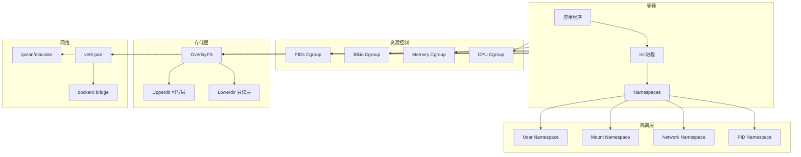
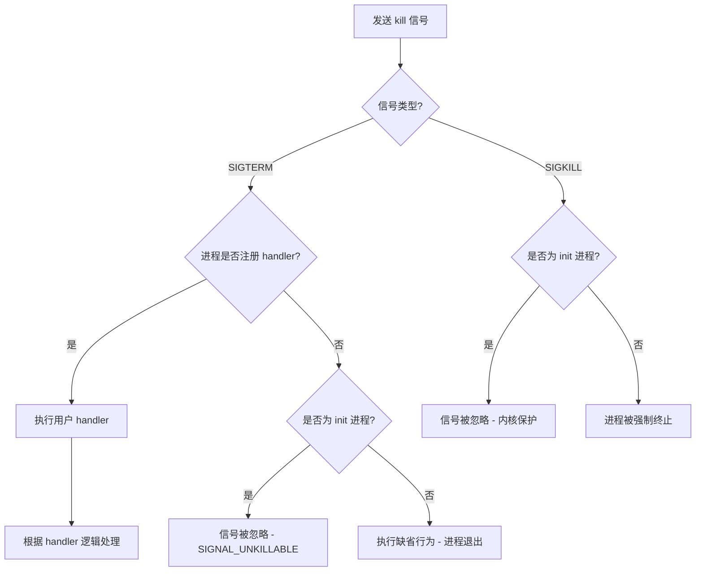
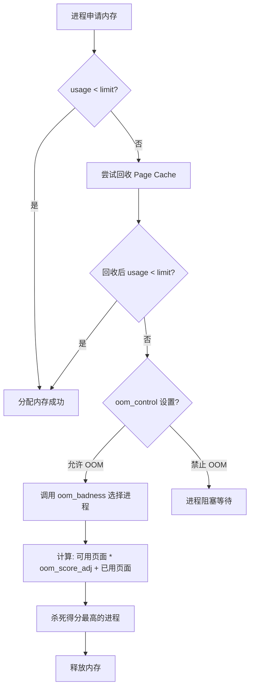

# 容器核心技术学习笔记 - 目录大纲

> 本笔记基于容器核心技术系列文档整理，面向运维工程师/SRE，系统性介绍容器的核心概念、实现原理与常见问题排查方法。

---

## 第一章：容器技术基础

### 1.1 容器概述与核心概念

- 容器的本质：Namespace + Cgroups
- 容器镜像与 Dockerfile 基础
- 容器的启动与基本操作

### 1.2 Namespace 隔离机制

- PID Namespace：进程编号隔离
- Network Namespace：网络环境隔离
- Mount Namespace：文件系统隔离
- 其他 Namespace 类型概览

### 1.3 Cgroups 资源控制

- Cgroups 控制组概念
- 常用子系统介绍（CPU/Memory/PIDs）
- Cgroups v1 与 v2 的区别

---

## 第二章：容器进程管理

### 2.1 容器 init 进程深度解析

- 什么是 init 进程（1号进程）
- 容器中 1 号进程的特殊性
- SIGNAL_UNKILLABLE 标志与信号处理

### 2.2 Linux 信号机制与容器

- 信号的基本概念与分类
- 信号处理的三种方式：忽略、捕获、缺省
- SIGTERM vs SIGKILL 的本质区别
- 为什么容器中 kill -9 1 无效

### 2.3 僵尸进程的产生与清理

- Linux 进程状态转换（RUNNING/SLEEPING/ZOMBIE）
- 僵尸进程的危害：PID 资源耗尽
- wait()/waitpid() 系统调用
- PIDs Cgroup 对容器进程数的限制
- tini 等 init 工具的作用

### 2.4 容器优雅退出（Graceful Shutdown）

- 容器停止时的信号传递机制
- 为什么子进程收到 SIGKILL 而非 SIGTERM
- init 进程的信号转发实现
- kill() 与 signal() 系统调用详解

### 2.5 CPU Cgroup 资源限制

- CPU Cgroup 核心参数
  - cpu.cfs_quota_us / cpu.cfs_period_us
  - cpuset.cpus 绑定 CPU 核心
- CPU 使用率的正确计算方法
- /proc/[pid]/stat 与 /proc/stat 解读
- cpuacct.stat 获取容器 CPU 开销

### 2.6 Load Average 与系统性能

- Load Average 的真正含义
- 可运行队列进程 + D 状态进程
- CPU Usage 与 Load Average 的区别
- D 状态进程（TASK_UNINTERRUPTIBLE）的影响
- 为什么 CPU Cgroup 无法限制 Load Average

---

## 第三章：容器内存管理

### 3.1 Memory Cgroup 与 OOM Killer

- Memory Cgroup 核心参数
  - memory.limit_in_bytes
  - memory.usage_in_bytes
  - memory.oom_control
- OOM Killer 触发机制
- oom_badness() 函数与进程选择标准
- oom_score_adj 调整 OOM 优先级
- 通过内核日志定位 OOM 问题

### 3.2 RSS 与 Page Cache

- RSS（Resident Set Size）详解
- Page Cache 的作用与回收机制
- memory.stat 中的 cache 与 rss
- 为什么容器内存接近上限却不 OOM
- 正确判断容器内存使用量

### 3.3 Swap 空间与容器

- Swap 的作用与风险
- swappiness 参数深度解析
- 全局 swappiness vs memory.swappiness
- memory.swappiness=0 的特殊含义
- 在同一宿主机上混合运行有/无 Swap 需求的容器

---

## 第四章：容器存储与 I/O

### 4.1 容器文件系统 OverlayFS

- UnionFS 的设计思想
- OverlayFS 的层次结构
  - lowerdir（只读层）
  - upperdir（可写层）
  - merged（挂载点）
- 容器镜像分层与 OverlayFS 的结合
- OverlayFS 的性能注意事项

### 4.2 容器存储配额（XFS Quota）

- 容器写满宿主机磁盘的风险
- XFS Quota 的 Project 模式
- Project ID 与目录配额设置
- Docker --storage-opt size 参数
- setProjectID 与 setProjectQuota 实现解析

### 4.3 容器磁盘 I/O 限速

- Blkio Cgroup 基础
- Direct I/O vs Buffered I/O
- 磁盘 I/O 限速的局限性
- Cgroup v2 对 Buffered I/O 的支持

### 4.4 Buffered I/O 与延时波动

- dirty pages 相关内核参数
  - dirty_background_ratio
  - dirty_ratio
  - dirty_writeback_centisecs
  - dirty_expire_centisecs
- Page Cache 在 Memory Cgroup 限制下的行为
- 容器写文件延时波动的根因分析
- perf 与 ftrace 工具定位性能问题

---

## 第五章：容器网络

### 5.1 Network Namespace 与网络参数

- Network Namespace 隔离的资源
  - 网络设备
  - IP 协议栈
  - 路由表
  - 防火墙规则
- clone()/unshare() 创建 Network Namespace
- 容器网络参数的继承与初始化规则
- --sysctl 参数配置容器网络

### 5.2 容器网络接口配置（veth）

- veth 设备对的工作原理
- 手动配置容器 veth 接口
- veth 连接容器与宿主机 Network Namespace
- docker0 bridge + NAT 网络模型
- ip_forward 参数的作用

### 5.3 容器网络调试技巧

- tcpdump 在各网络接口抓包
- 网络不通问题的排查思路
- iptables 规则检查
- 数据包流转路径分析

### 5.4 容器网络延时优化（ipvlan/macvlan）

- veth 带来的网络延时分析
- softirq 处理开销
- ipvlan/macvlan 的工作原理
- ipvlan vs veth 的延时对比
- 延时敏感场景的网络选型

### 5.5 网络数据包乱序与重传

- TCP 快速重传（Fast Retransmit）机制
- SACK（选择性确认）的作用
- veth 接口导致乱序的原因
- RSS 与 RPS 概念详解
- 配置 RPS 减少数据包乱序

---

## 第六章：容器安全

### 6.1 Linux Capabilities 与最小权限

- Linux capabilities 概述
- root 用户权限的细粒度划分
- 常用 capabilities（CAP_NET_ADMIN/CAP_SYS_ADMIN 等）
- 容器默认的 15 个 capabilities
- privileged 容器的安全风险
- --cap-add 精确添加所需权限

### 6.2 容器中的用户与 User Namespace

- 容器 root 用户的安全隐患
- 以非 root 用户运行容器进程
- User Namespace 的隔离原理
- uid/gid 映射机制
- User Namespace 的两大优势
- Kubernetes 对 User Namespace 的支持现状

### 6.3 Rootless Container

- rootless container 的概念
- 以非 root 用户启动和管理容器
- podman 与 rootless 容器实践
- 进一步降低容器逃逸风险

---

## 附录

### A. 容器技术栈架构图

### B. 容器进程信号处理流程

### C. Memory Cgroup OOM 处理流程

### D. 常用排查命令速查

| 场景                       | 命令                                                                |
| -------------------------- | ------------------------------------------------------------------- |
| 查看进程 capabilities      | `cat /proc/<pid>/status \| grep Cap`                               |
| 查看容器 CPU 使用          | `cat cpuacct.stat`                                                |
| 查看容器内存使用           | `cat memory.stat`                                                 |
| 查看 D 状态进程            | `ps aux \| grep " D "`                                             |
| 查看网络乱序重传           | `netstat -s \| grep retran`                                        |
| 查看 dirty pages           | `cat /proc/vmstat \| grep dirty`                                   |
| 进入容器 Network Namespace | `nsenter -t <pid> -n <command>`                                   |
| 配置 RPS                   | `echo fff > /sys/devices/virtual/net/<veth>/queues/rx-0/rps_cpus` |

---

## 文档映射表

| 章节    | 原始文件                                               |
| ------- | ------------------------------------------------------ |
| 1.1-1.3 | 01--认识容器:容器的基本操作和实现原理                  |
| 2.1-2.2 | 02--理解进程(1):为什么我在容器中不能kill 1号进程       |
| 2.3     | 03--理解进程(2):为什么我的容器里有这么多僵尸进程       |
| 2.4     | 04--理解进程(3):为什么我在容器中的进程被强制杀死了     |
| 2.5     | 05--容器CPU(1):怎么限制容器的CPU使用                   |
| 2.5     | 06--容器CPU(2):如何正确地拿到容器CPU的开销             |
| 2.6     | 07--Load Average:加了CPU Cgroup限制为什么容器还是很慢  |
| 3.1     | 08--容器内存:我的容器为什么被杀了                      |
| 3.2     | 09--Page Cache:为什么我的容器内存使用量总是在临界点    |
| 3.3     | 10--Swap:容器可以使用Swap空间吗                        |
| 4.1     | 11--容器文件系统:我在容器中读写文件怎么变慢了          |
| 4.2     | 12--容器文件Quota:容器为什么把宿主机的磁盘写满了       |
| 4.3     | 13--容器磁盘限速:我的容器里磁盘读写为什么不稳定        |
| 4.4     | 14--容器中的内存与I/O:容器写文件的延时为什么波动很大   |
| 5.1     | 15--容器网络:我修改了/proc/sys/net下的参数为什么不起效 |
| 5.2-5.3 | 16--容器网络配置(1):容器网络不通了要怎么调试           |
| 5.4     | 17--容器网络配置(2):容器网络延时要比宿主机上的高吗     |
| 5.5     | 18--容器网络配置(3):容器中的网络乱序包怎么这么高       |
| 6.1     | 19--容器安全(1):我的容器真的需要privileged权限吗       |
| 6.2-6.3 | 20--容器安全(2):在容器中不以root用户来运行程序可以吗   |
