# DeepAgent 中文学习笔记

> 基于 LangChain 官方文档整理，帮助你系统学习使用 DeepAgent 开发 Python Agent。

---

## 目录

- [1. 概述 (Overview)](#1-概述-overview)
- [2. 快速入门 (Quickstart)](#2-快速入门-quickstart)
- [3. 自定义配置 (Customization)](#3-自定义配置-customization)
- [4. 框架对比 (Comparison)](#4-框架对比-comparison)
- [5. 核心能力详解 - Harness 概览](#5-核心能力详解---harness-概览)
- [6. 后端 (Backends)](#6-后端-backends)
- [7. 子代理 (Subagents)](#7-子代理-subagents)
- [8. 人机协作 (Human-in-the-Loop)](#8-人机协作-human-in-the-loop)
- [9. 长期记忆 (Long-term Memory)](#9-长期记忆-long-term-memory)
- [10. 技能 (Skills)](#10-技能-skills)
- [11. 沙箱 (Sandboxes)](#11-沙箱-sandboxes)
- [12. 流式处理概览 (Streaming Overview)](#12-流式处理概览-streaming-overview)
- [13. 前端界面 (Frontend)](#13-前端界面-frontend)

---

## 1. 概述 (Overview)

### 1.1 什么是 Deep Agents

Deep Agents 是使用 LLM 构建 Agent 和应用程序的**最简单方式**。它内置了以下能力:

- **任务规划** (Task Planning) - 将复杂任务分解为可执行的步骤
- **文件系统上下文管理** (File Systems for Context Management) - 通过文件系统工具管理大量上下文
- **子代理生成** (Subagent Spawning) - 生成专门的子代理处理特定子任务
- **长期记忆** (Long-term Memory) - 跨对话和线程持久化记忆

我们可以把 `deepagents` 理解为一个**"Agent 装具"(Agent Harness)**。它与其他 Agent 框架使用的是相同的核心工具调用循环，但提供了内置的工具和能力。

### 1.2 技术栈关系

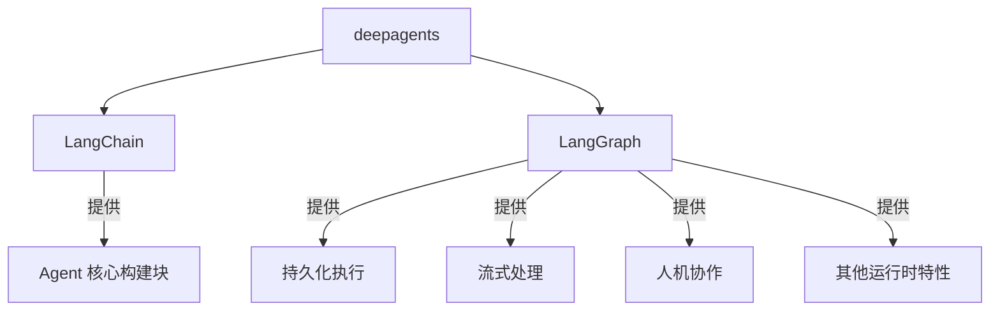

- **LangChain**: 提供构建 Agent 的核心构建块(框架层)
- **LangGraph**: 提供持久化执行、流式处理、人机协作等运行时特性(运行时层)
- **Deep Agents**: 基于以上两者构建的独立库，是一个"Agent 装具"(应用层)

### 1.3 库的组成

`deepagents` 库包含两个主要部分:

| 组件 | 描述 |
|------|------|
| **Deep Agents SDK** | 用于构建能处理任何任务的 Agent 的 Python 包 |
| **Deep Agents CLI** | 基于 `deepagents` 包构建的终端编码 Agent |

### 1.4 创建一个 Deep Agent

以下是创建 Deep Agent 的最简示例:

```python
# pip install -qU deepagents
from deepagents import create_deep_agent

def get_weather(city: str) -> str:
    """Get weather for a given city."""
    return f"It's always sunny in {city}!"

agent = create_deep_agent(
    tools=[get_weather],
    system_prompt="You are a helpful assistant",
)

# 运行 agent
agent.invoke(
    {"messages": [{"role": "user", "content": "what is the weather in sf"}]}
)
```

> **提示**: 使用 [LangSmith](https://smith.langchain.com) 可以追踪请求、调试 Agent 行为和评估输出。设置 `LANGSMITH_TRACING=true` 和你的 API Key 即可开始使用。

### 1.5 何时使用 Deep Agents

#### 使用 Deep Agents SDK 的场景

当你想构建的 Agent 需要:

- **处理复杂的多步骤任务** - 需要规划和任务分解
- **管理大量上下文** - 通过文件系统工具管理
- **切换文件系统后端** - 使用内存状态、本地磁盘、持久化存储、沙箱或自定义后端
- **委派工作** - 生成专门的子代理进行上下文隔离
- **持久化记忆** - 跨对话和线程

> 对于更简单的 Agent，考虑使用 LangChain 的 `create_agent` 或构建自定义 LangGraph 工作流。

#### 使用 Deep Agents CLI 的场景

当你想在命令行使用交互式 Deep Agent 进行编码或其他任务:

- **自定义** Agent 的技能和记忆
- **教导** Agent 你的偏好、常见模式和自定义项目知识
- **执行代码** - 在本地机器或沙箱中运行

### 1.6 核心能力

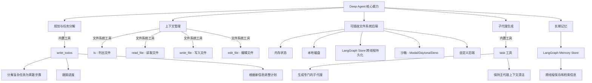

#### 各核心能力详解

| 能力 | 描述 | 关键工具/组件 |
|------|------|--------------|
| **规划与任务分解** | 将复杂任务分解为离散步骤，跟踪进度，根据新信息调整计划 | `write_todos` 工具 |
| **上下文管理** | 将大量上下文卸载到内存或文件系统存储，防止上下文窗口溢出 | `ls`、`read_file`、`write_file`、`edit_file` |
| **可插拔文件系统后端** | 可根据用例切换的虚拟文件系统后端 | 内存、本地磁盘、LangGraph Store、沙箱、自定义 |
| **子代理生成** | 生成专门的子代理实现上下文隔离，保持主代理上下文清洁 | `task` 工具 |
| **长期记忆** | 使用 LangGraph 的 Memory Store 实现跨线程持久记忆 | LangGraph Memory Store |

---

## 2. 快速入门 (Quickstart)

本章将引导你创建你的第一个 Deep Agent，它具备规划、文件系统工具和子代理能力。我们将构建一个**研究 Agent**，能够进行网络调研并撰写报告。

### 2.1 前置条件

- 需要一个模型提供商的 API Key (如 Anthropic、OpenAI)
- Deep Agents 需要支持**工具调用 (Tool Calling)** 的模型

### 2.2 步骤详解

#### Step 1: 安装依赖

```shell
pip install deepagents tavily-python
```

> 本教程使用 [Tavily](https://tavily.com) 作为示例搜索提供商，你也可以替换为其他搜索 API (如 DuckDuckGo、SerpAPI、Brave Search)。

#### Step 2: 设置 API Key

```shell
export ANTHROPIC_API_KEY="your-api-key"
export TAVILY_API_KEY="your-tavily-api-key"
```

#### Step 3: 创建搜索工具

```python
import os
from typing import Literal
from tavily import TavilyClient
from deepagents import create_deep_agent

tavily_client = TavilyClient(api_key=os.environ["TAVILY_API_KEY"])

def internet_search(
    query: str,
    max_results: int = 5,
    topic: Literal["general", "news", "finance"] = "general",
    include_raw_content: bool = False,
):
    """Run a web search"""
    return tavily_client.search(
        query,
        max_results=max_results,
        include_raw_content=include_raw_content,
        topic=topic,
    )
```

#### Step 4: 创建 Deep Agent

```python
# 系统提示词，引导 Agent 成为专业研究员
research_instructions = """You are an expert researcher.
Your job is to conduct thorough research and then write a polished report.
You have access to an internet search tool as your primary means of gathering information.

## `internet_search`
Use this to run an internet search for a given query.
You can specify the max number of results to return, the topic,
and whether raw content should be included.
"""

agent = create_deep_agent(
    tools=[internet_search],
    system_prompt=research_instructions
)
```

#### Step 5: 运行 Agent

```python
result = agent.invoke(
    {"messages": [{"role": "user", "content": "What is langgraph?"}]}
)

# 打印 Agent 的回复
print(result["messages"][-1].content)
```

### 2.3 工作原理

你的 Deep Agent 会**自动**完成以下流程:

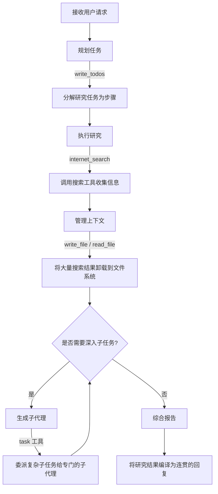

具体行为包括:

| 阶段 | 使用的内置工具 | 说明 |
|------|--------------|------|
| **规划** | `write_todos` | 将研究任务分解为可执行的步骤 |
| **研究** | `internet_search` (自定义) | 调用搜索工具收集信息 |
| **上下文管理** | `write_file`、`read_file` | 将大量搜索结果卸载到文件系统，避免上下文溢出 |
| **子代理委派** | `task` | 根据需要生成子代理处理复杂子任务 |
| **综合** | - | 将所有研究发现编译成连贯的报告 |

### 2.4 流式处理

Deep Agents 内置了基于 LangGraph 的**流式处理**能力，可以:

- 实时观察 Agent 执行过程中的输出
- 审查和调试 Agent 及子代理的工作 (工具调用、工具结果、LLM 响应)

### 2.5 下一步

构建完第一个 Deep Agent 后，可以继续学习:

- **自定义你的 Agent** - 自定义系统提示词、工具和子代理
- **添加长期记忆** - 启用跨对话的持久记忆
- **部署到生产环境** - 了解 LangGraph 应用的部署选项

---

## 3. 自定义配置 (Customization)

`create_deep_agent` 提供了丰富的核心配置选项，让你可以根据需求定制 Agent 的行为。主要配置项包括: 模型(Model)、工具(Tools)、系统提示词(System Prompt)、中间件(Middleware)、子代理(Subagents)、后端虚拟文件系统(Backends)、人机协作(Human-in-the-loop)、技能(Skills)和记忆(Memory)。

### 3.1 核心配置选项

#### 3.1.1 连接弹性 (Connection resilience)

LangChain 聊天模型默认会对网络错误、并发限制(429)和服务器错误(5xx)进行带指数退避的**自动重试(默认 6 次)**。如果你在不稳定网络下运行长时间的 Agent 任务，建议在创建模型时将 `max_retries` 参数提高到 10-15 次，并搭配 Checkpointer 持久化进度。

#### 3.1.2 模型 (Model)

默认情况下，Deep Agents 使用 `claude-sonnet-4-5-20250929`。你可以传入任何受支持的 `LangChain` 模型对象来更换:

```python
from langchain_openai import ChatOpenAI
from deepagents import create_deep_agent

agent = create_deep_agent(
    model=ChatOpenAI(model="gpt-4o") # 也可以简写为字符串 "openai:gpt-4o"
)
```

支持 OpenAI, Anthropic, Azure, Google Gemini, AWS Bedrock 和 HuggingFace。

#### 3.1.3 工具 (Tools)

除了内置的规划(`write_todos`)、文件管理和子代理生成(`task`)工具外，你可以传入自定义工具:

```python
from langchain.tools import tool

@tool
def my_custom_tool(query: str) -> str:
    """Do something custom."""
    return f"Processed {query}"

agent = create_deep_agent(tools=[my_custom_tool])
```

#### 3.1.4 系统提示词 (System prompt)

Deep Agents 内置了一个包含规划工具、文件系统工具和子代理详细说明的基础系统提示词。**每个 Deep Agent 都应该补充特定用例的自定义系统提示词**:

```python
agent = create_deep_agent(
    system_prompt="You are a specialized financial analyst. You analyze quarterly reports..."
)
```

> **注意**: 当中间件添加特殊工具(如文件系统工具)时，它会自动在系统提示词末尾追加工具的说明。

#### 3.1.5 结构化输出 (Structured output)

你可以通过 `response_format` 参数强制 Agent 返回特定的结构化数据。模型生成的数据将被验证并存放在 Agent 状态的 `structured_response` 键中:

```python
from pydantic import BaseModel
class ResearchReport(BaseModel):
    title: str
    summary: str

agent = create_deep_agent(response_format=ResearchReport)
```

### 3.2 进阶配置与中间件

#### 3.2.1 中间件 (Middleware)

中间件用于扩展 Agent 的核心功能。默认会自动加载以下中间件:

- `TodoListMiddleware`: 跟踪和管理待办事项
- `FilesystemMiddleware`: 处理文件系统的读写导航
- `SubAgentMiddleware`: 生成和协调专门的子代理
- `SummarizationMiddleware`: 对话过长时自动压缩历史记录
- `AnthropicPromptCachingMiddleware`: (如果使用 Anthropic) 自动缓存以减少 token 消耗
- `PatchToolCallsMiddleware`: 修复中断或异常的工具调用历史

如果启用了对应功能，还会自动加载:

- `MemoryMiddleware`: 通过 `memory` 参数启用记忆
- `SkillsMiddleware`: 通过 `skills` 参数启用动态技能
- `HumanInTheLoopMiddleware`: 通过 `interrupt_on` 参数启用需要人类审批的操作

**自定义中间件**:
你可以编写自己的中间件，通过钩子(Hooks)如 `before_agent`, `after_tool` 介入执行过程。
> **警告**: 不要在中间件中直接修改(Mutate)实例属性(如 `self.x = 1`)，这会引起并发(子代理/并行工具)下的竞态条件。如果你需要跨钩子跟踪数据，必须使用**Graph State(状态字典)**，因为它是线程隔离的。

#### 3.2.2 子代理 (Subagents)

为了隔离复杂工作并避免主代理的上下文臃肿，应该配置并使用子代理委派任务。你可以指定哪些代理可以作为子代理被唤起。

#### 3.2.3 后端 (Backends) - 虚拟文件系统

Deep Agents 可以使用虚拟文件系统存储和编辑文件，支持不同的后端:

- `StateBackend` (默认): 即时存在于 LangGraph 状态中的虚拟文件系统，仅在单次线程内持久。
- `FilesystemBackend` 🔌: 直接映射宿主机的本地文件系统。赋予 Agent 真实的读写权限。(⚠️谨慎使用)
- `LocalShellBackend` 🔌: 提供本地系统文件权限**加上** `execute` 工具来执行任意终端命令。(⚠️极高风险)
- `StoreBackend` 💾: 提供跨线程持久化的长期存储系统。
- `CompositeBackend`: 将不同的虚拟路径映射到不同的后端(如把 `/memories/` 挂载到持久存储，其余留在一次性内存中)。

**沙箱后端 (Sandboxes)**:
为了安全起见，应在隔离环境(带文件系统且能执行命令)中运行代码。支持:

- **Modal** Sandbox (`langchain-modal`)
- **Runloop** Sandbox (`langchain-runloop`)
- **Daytona** Sandbox (`langchain-daytona`)

### 3.3 交互与记忆系统

#### 3.3.1 人机协作 (Human-in-the-loop)

对于敏感操作，你可以配置在工具执行前请求人类批准(带有 `approve/edit/reject` 等选项)。
**注意**: 此功能强制要求传入 `checkpointer` (检查点持久化器，如 `MemorySaver`)。

```python
from langgraph.checkpoint.memory import MemorySaver

agent = create_deep_agent(
    tools=[delete_file, send_email],
    interrupt_on={
        "delete_file": True, # 默认支持:批准/编辑/拒绝
        "send_email": {"allowed_decisions": ["approve", "reject"]}, # 限制不能编辑
    },
    checkpointer=MemorySaver() # 必须配置 Checkpointer!
)
```

#### 3.3.2 技能库 (Skills)

不像主要包含底层代码逻辑的 Tools，**Skills(技能)** 是包含执行特定任务指南、参考资料及模板的 `.md` Markdown 文件。
技能是**动态加载**(Progressive disclosure)的——Agent 预先通过向量描述判断哪些功能适用，用到时才会将对应文献载入上下文，从而大幅包省 token 且减少启动负担。
> **重要机制**: 如果使用了技能，需要将你的技能文件放置在虚拟文件系统的指定路径中，并通过 `skills=["/path/to/skills/"]` 挂载给 Agent。

#### 3.3.3 长期记忆 (Memory)

你可以通过 `.md` 文件为 Agent 提供长期上下文，你可以传入系统文件或数据库存储配置给 `memory` 参数，从而让 Agent 在跨 Session 和线程间记住用户的偏好、过往设定及项目惯例。

---

## 4. 框架对比 (Comparison)

本章对比 **LangChain Deep Agents**、**OpenCode** 和 **Claude Agent SDK** 三个主流 Agent 框架，帮助你选择合适的工具。

### 4.1 总览对比

| 方面 | LangChain Deep Agents | OpenCode | Claude Agent SDK |
| --- | --- | --- | --- |
| **主要用途** | 以代码方式构建生产级 Agent | 终端/桌面/IDE 中的交互式编码 Agent | 以代码方式构建生产级 Agent |
| **模型支持** | 模型不可知论 (Anthropic, OpenAI 及 100+ 其他) | 75+ 供应商，含本地模型 (Ollama) | 仅 Claude 模型 (Anthropic, Azure, Vertex AI, Bedrock) |
| **许可证** | MIT | MIT | MIT (底层 Claude Code 为专有) |
| **架构形式** | Python SDK + TypeScript SDK + CLI | TypeScript SDK + 独立产品 | Python SDK + TypeScript SDK |

### 4.2 详细特性对比

#### 核心工具

| 特性 | Deep Agents | OpenCode | Claude Agent SDK |
| --- | --- | --- | --- |
| 文件读写编辑 | ✅ `ls`, `read_file`, `write_file`, `edit_file` | ✅ `list`, `read`, `write`, `edit` | ✅ read, write, edit |
| Shell 执行 | ✅ `execute` | ✅ `bash` | ✅ bash |
| Glob/Grep 搜索 | ✅ `glob`, `grep` | ✅ `glob`, `grep` | ✅ glob, grep |
| 网络搜索 | ✅ 支持第三方和供应商原生 | ✅ `webfetch`, `websearch` | ✅ WebSearch, WebFetch |
| 规划/待办 | ✅ `write_todos` | ✅ Plan 模式 (只读分析) | ✅ Todo lists |
| 子代理 | ✅ Subagents | ✅ General + Explore agents | ✅ Subagents |
| MCP 支持 | ✅ | ✅ | ✅ |

#### 交互与协作

| 特性 | Deep Agents | OpenCode | Claude Agent SDK |
| --- | --- | --- | --- |
| 人机协作 (HITL) | ✅ Approve/Edit/Reject | ✅ Allow/Ask/Deny | ✅ Permission modes |
| 技能系统 | ✅ Skills | ✅ Skills | ✅ Skills |
| 长期记忆 | ✅ Memory Store | ✅ Rules | ✅ CLAUDE.md 文件 |
| 流式处理 | ✅ Streaming | ✅ | ✅ Streaming |

#### 沙箱与架构

| 特性 | Deep Agents | OpenCode | Claude Agent SDK |
| --- | --- | --- | --- |
| Agent 运行在沙箱中 | ✅ | ✅ | ✅ |
| Agent 把沙箱当工具使用 | ✅ 沙箱作为工具 | ❌ | ❌ |
| 可组合中间件 | ✅ Middleware | 插件 (Plugins) | Hooks |
| 可插拔存储后端 | ✅ Backends | ❌ | ❌ |
| 虚拟文件系统 | ✅ 可插拔后端的虚拟文件系统 | ❌ | ❌ |

#### 状态管理与可观测性

| 特性 | Deep Agents | OpenCode | Claude Agent SDK |
| --- | --- | --- | --- |
| 会话恢复 | ✅ | ✅ Sessions | ✅ Session management |
| 文件检查点 | ✅ Backends + Checkpoints | ✅ (基于 Git) | ✅ File checkpointing |
| 时间旅行 (状态分支) | ✅ 完整支持 | ❌ | ✅ |
| 原生追踪 | ✅ LangSmith | ❌ | ❌ |

### 4.3 Deep Agents 的独特优势

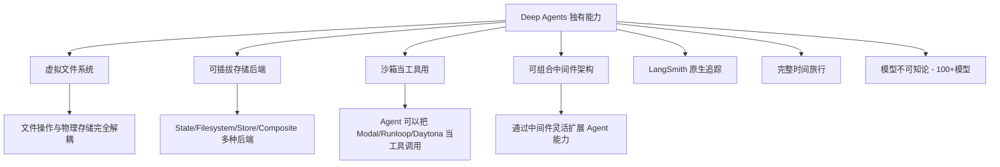

> **总结**: Deep Agents 在**架构灵活性**(可插拔后端、虚拟文件系统、可组合中间件)和**可观测性**(LangSmith 原生追踪)方面具有显著优势。如果你需要构建模型无关、可部署到生产环境的 Agent，Deep Agents 是首选。

---

## 5. 核心能力详解 - Harness 概览

Harness (装具) 是 Deep Agent 底层的运行时引擎，它将 LLM 封装为一个完整的 Agent，负责工具调用循环、提示词组装、上下文管理和资源协调。

### 5.1 Agent 循环 (Agent Loop)

Deep Agent 的核心执行流程如下:

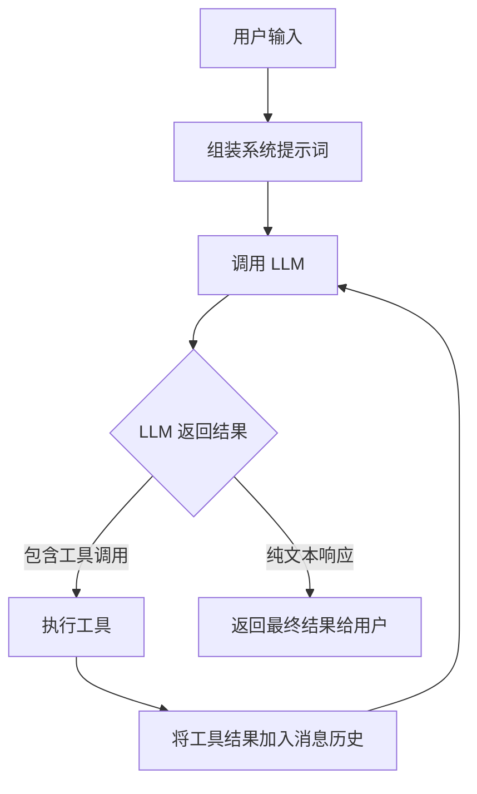

这是一个标准的**工具调用循环 (Tool Calling Loop)**: LLM 接收消息，决定是调用工具还是直接返回文本。如果调用了工具，工具的结果会被追加到消息历史中，然后再次调用 LLM，直到 LLM 决定返回纯文本响应。

### 5.2 内置工具系统

Deep Agent 通过**中间件 (Middleware)** 向 Agent 注入工具。默认包含以下工具集:

| 工具类别 | 工具名称 | 用途 |
| --- | --- | --- |
| 规划 | `write_todos` | 创建和更新待办事项列表，分解任务 |
| 文件系统 | `ls`, `read_file`, `write_file`, `edit_file` | 管理虚拟文件系统中的文件 |
| 搜索 | `glob`, `grep` | 在文件系统中搜索文件和内容 |
| 子代理 | `task` | 创建子代理处理独立子任务 |
| 代码执行 | `execute` | (仅沙箱后端) 在隔离环境中运行 Shell 命令 |

### 5.3 系统提示词组装

Deep Agent 的系统提示词按以下顺序动态组装:

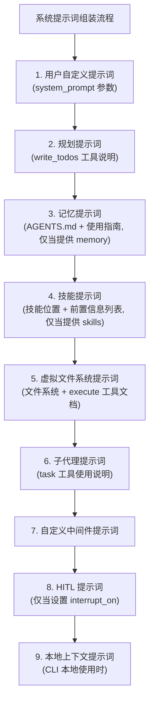

### 5.4 运行时上下文管理 (Context Compression)

Deep Agent 使用**上下文压缩 (Context Compression)** 模式，在保留任务相关细节的同时，缩减 Agent 工作记忆的大小。

#### 5.4.1 大内容卸载 (Offloading)

当工具调用的输入或输出超过阈值时，自动卸载到文件系统:

| 场景 | 触发条件 | 处理方式 |
| --- | --- | --- |
| **工具输入过大** | 超过 20,000 tokens | 当上下文达到模型窗口的 85% 时，截断旧的工具调用，替换为文件路径指针 |
| **工具输出过大** | 超过 20,000 tokens | 立即卸载到后端文件系统，替换为文件路径引用 + 前 10 行预览 |

> **配置**: 可通过 `tool_token_limit_before_evict` 参数调整卸载阈值。

#### 5.4.2 消息历史摘要 (Summarization)

当上下文大小超过模型上下文窗口限制(默认 85% 的 `max_input_tokens`)，且没有更多内容可以卸载时:

1. **生成摘要**: LLM 生成一份结构化摘要(包含会话意图、已生成文件、下一步计划)，替换完整对话历史
2. **保留原文**: 完整的原始消息被写入文件系统，作为规范记录，以便后续搜索

**默认配置**:

- 触发点: 模型 `max_input_tokens` 的 85%
- 保留最近 10% 的 token 作为近期上下文
- 如果模型配置不可用，回退到 170,000 token 触发 / 保留 6 条最新消息

#### 5.4.3 长期记忆 (Long-term Memory)

默认文件系统仅在单个线程内持久。要实现跨线程/跨会话持久化，需使用 `CompositeBackend`:

```python
from deepagents import create_deep_agent
from deepagents.backends import CompositeBackend, StateBackend, StoreBackend

# 配置混合存储: 常规文件用临时内存, /memories/ 路径用持久存储
composite_backend = lambda rt: CompositeBackend(
    default=StateBackend(rt),          # 临时文件
    routes={"/memories/": StoreBackend(rt)}  # 持久记忆
)
```

Agent 存储在 `/memories/` 路径下的文件(如 `/memories/preferences.txt`)会跨重启和会话持久化。

### 5.5 代码执行

使用沙箱后端时，装具会自动暴露 `execute` 工具:

- 在隔离环境中运行 Shell 命令
- 返回 stdout/stderr、退出码
- 大输出自动截断并保存到文件供 Agent 逐步读取
- **安全性**: 代码运行在沙箱中，保护宿主系统
- 没有沙箱后端时，Agent 只有文件系统工具，无法执行命令

### 5.6 其他装具特性

| 特性 | 工作方式 |
| --- | --- |
| **人机协作 (HITL)** | 通过 `interrupt_on` 参数在指定工具调用前暂停，等待人类批准/修改/拒绝 |
| **技能 (Skills)** | 遵循 Agent Skills 标准，每个技能是含 `SKILL.md` 的目录，使用"渐进披露"按需加载 |
| **记忆 (Memory)** | 通过 `AGENTS.md` 文件提供持久上下文，始终加载(不像技能的按需加载)，Agent 可根据交互更新记忆 |

---

## 6. 后端 (Backends)

后端 (Backend) 是 Deep Agent 的**虚拟文件系统层**，为 Agent 提供文件读写、搜索等存储能力。不同的后端决定了文件的持久化方式和隔离级别。

### 6.1 五种内置后端

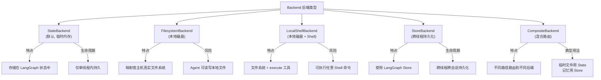

| 后端 | 持久化 | Shell 执行 | 适用场景 |
| --- | --- | --- | --- |
| `StateBackend` | 单线程内 | ❌ | 默认选择，适合大多数场景 |
| `FilesystemBackend` | 本地磁盘 | ❌ | 需要读写真实文件 |
| `LocalShellBackend` | 本地磁盘 | ✅ | 需要执行命令 (⚠️ 高风险) |
| `StoreBackend` | 跨线程持久 | ❌ | 需要跨会话保存数据 |
| `CompositeBackend` | 混合 | 取决于路由 | 混合持久化需求 |

### 6.2 后端配置方式

通过 `create_deep_agent(backend=...)` 传入后端:

- 传入**实例**：如 `FilesystemBackend(root_dir=".")`
- 传入**工厂函数**：如 `lambda rt: StateBackend(rt)` (需要运行时对象的后端)
- 默认值：`lambda rt: StateBackend(rt)`

### 6.3 CompositeBackend 路由配置

将不同路径映射到不同后端，最常见的场景是将 `/memories/` 持久化，其他保持临时:

```python
from deepagents import create_deep_agent
from deepagents.backends import CompositeBackend, StateBackend, FilesystemBackend

composite_backend = lambda rt: CompositeBackend(
    default=StateBackend(rt),  # 默认: 临时存储
    routes={
        "/memories/": FilesystemBackend(
            root_dir="/deepagents/myagent", virtual_mode=True
        ),  # /memories/ 路径: 持久化到本地磁盘
    },
)

agent = create_deep_agent(backend=composite_backend)
```

**路由规则**:

- `/workspace/plan.md` → `StateBackend` (临时)
- `/memories/agent.md` → `FilesystemBackend` (持久)
- `ls`、`glob`、`grep` 会聚合所有后端的结果
- 更长的路径前缀优先匹配 (如 `/memories/projects/` 会覆盖 `/memories/`)

### 6.4 自定义虚拟文件系统

你可以实现自定义后端，将远程存储 (如 S3、Postgres) 映射为 Agent 可用的文件系统。

```python
# S3 后端示例 (骨架)
class S3Backend(BackendProtocol):
    def __init__(self, bucket: str, prefix: str = ""):
        self.bucket = bucket
        self.prefix = prefix.rstrip("/")

    def ls_info(self, path: str) -> list[FileInfo]: ...
    def read(self, file_path: str, offset=0, limit=2000) -> str: ...
    def grep_raw(self, pattern, path=None, glob=None) -> list[GrepMatch] | str: ...
    def glob_info(self, pattern, path="/") -> list[FileInfo]: ...
    def write(self, file_path: str, content: str) -> WriteResult: ...
    def edit(self, file_path, old_string, new_string, replace_all=False) -> EditResult: ...
```

> **设计指南**: 路径使用绝对路径 (`/x/y.txt`)；外部持久化后端的 `files_update` 返回 `None`；只有状态内后端才返回 `files_update` 字典。

### 6.5 策略钩子 (Policy Hooks)

通过子类化或包装后端，可以实施企业级安全策略，例如禁止在特定路径下写入:

```python
class GuardedBackend(FilesystemBackend):
    def __init__(self, *, deny_prefixes: list[str], **kwargs):
        super().__init__(**kwargs)
        self.deny_prefixes = [p if p.endswith("/") else p + "/" for p in deny_prefixes]

    def write(self, file_path: str, content: str) -> WriteResult:
        if any(file_path.startswith(p) for p in self.deny_prefixes):
            return WriteResult(error=f"Writes are not allowed under {file_path}")
        return super().write(file_path, content)
```

### 6.6 BackendProtocol 接口规范

所有后端必须实现 `BackendProtocol`，包含以下方法:

| 方法 | 签名 | 说明 |
| --- | --- | --- |
| `ls_info` | `(path) -> list[FileInfo]` | 列出目录，返回路径、大小、修改时间等 |
| `read` | `(file_path, offset, limit) -> str` | 读取文件内容(带行号)，文件不存在返回错误字符串 |
| `grep_raw` | `(pattern, path, glob) -> list[GrepMatch] \| str` | 搜索内容，正则无效时返回错误字符串 |
| `glob_info` | `(pattern, path) -> list[FileInfo]` | 通过 glob 模式匹配文件 |
| `write` | `(file_path, content) -> WriteResult` | 创建文件(仅创建，冲突时返回错误) |
| `edit` | `(file_path, old, new, replace_all) -> EditResult` | 编辑文件，返回替换次数 |

**核心数据类型**:

- `WriteResult`: 包含 `error`、`path`、`files_update`
- `EditResult`: 包含 `error`、`path`、`files_update`、`occurrences`
- `FileInfo`: 包含 `path` (必选)、`is_dir`、`size`、`modified_at` (可选)
- `GrepMatch`: 包含 `path`、`line`、`text`

---

## 7. 子代理 (Subagents)

子代理是 Deep Agent 实现**上下文隔离**和**任务委派**的核心机制。主代理可以将复杂子任务委派给专门的子代理，每个子代理拥有独立的上下文窗口，避免主代理上下文膨胀。

### 7.1 工作原理

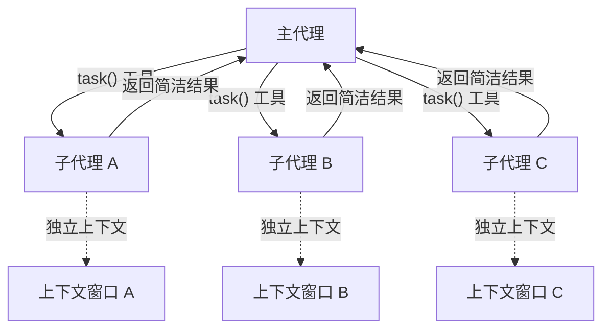

**核心流程**:

1. 主代理通过内置的 `task()` 工具调用子代理
2. 子代理在自己的独立上下文中执行任务
3. 子代理将简洁的结果返回给主代理
4. 主代理的上下文保持干净

### 7.2 配置子代理

每个子代理通过字典定义，传入 `subagents` 参数:

```python
from deepagents import create_deep_agent

subagents = [
    {
        "name": "researcher",              # 唯一名称
        "description": "搜索并分析信息",     # 描述(帮助主代理决定何时调用)
        "system_prompt": "你是一个专业研究员...",  # 系统提示词
        "tools": [internet_search],         # 可用工具
        "model": "claude-sonnet-4-5-20250929",  # 可选: 指定不同模型
    },
]

agent = create_deep_agent(
    system_prompt="你是一个协调员，使用子代理完成任务",
    subagents=subagents
)
```

### 7.3 最佳实践

| 实践 | 说明 |
| --- | --- |
| **写详细的 system_prompt** | 明确告诉子代理输入格式、执行步骤和输出格式 |
| **最小化工具集** | 只给子代理需要的工具，提升专注度和安全性 |
| **按任务选模型** | 长文档用大上下文模型，数值分析用擅长推理的模型 |
| **要求简洁返回** | 指示子代理返回摘要而非原始数据，控制在 300-500 词以内 |

**示例 - 精简的返回指令**:

```python
data_analyst = {
    "system_prompt": """分析数据后返回:
    1. 关键洞察 (3-5 个要点)
    2. 整体置信度评分
    3. 建议的后续行动

    不要包含: 原始数据、中间计算、详细工具输出
    保持回复在 300 词以内。"""
}
```

### 7.4 常见模式: 多专业子代理协作

```python
subagents = [
    {
        "name": "data-collector",
        "description": "从各种来源收集原始数据",
        "tools": [web_search, api_call, database_query],
    },
    {
        "name": "data-analyzer",
        "description": "分析收集的数据，提取洞察",
        "tools": [statistical_analysis],
    },
    {
        "name": "report-writer",
        "description": "将分析结果撰写为专业报告",
        "tools": [format_document],
    },
]
```

**协作流程**:

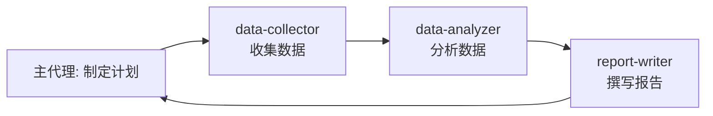

每个子代理在干净的上下文中专注于自己的任务。

### 7.5 上下文管理

#### 上下文自动传播

父代理的运行时 `config`(包含 `context`) 会**自动传播**到所有子代理:

```python
agent = create_deep_agent(
    subagents=[research_subagent],
    context_schema={"user_id": str, "session_id": str},
)

# context 会自动流转到子代理及其工具中
result = await agent.invoke(
    {"messages": [HumanMessage("查找我的最近活动")]},
    {"context": {"user_id": "user-123", "session_id": "abc"}},
)
```

#### 按子代理传递专属配置

使用**命名空间前缀**为特定子代理传递配置:

```python
result = await agent.invoke(
    {"messages": [HumanMessage("研究并验证")]},
    {"context": {
        "user_id": "user-123",               # 所有代理共享
        "researcher:max_depth": 3,            # 仅 researcher 使用
        "fact-checker:strict_mode": True,     # 仅 fact-checker 使用
    }},
)
```

#### 识别调用来源

当同一个工具被多个子代理共享时，通过 `lc_agent_name` 元数据识别是哪个代理发起的调用:

```python
@tool
def shared_lookup(query: str, config) -> str:
    agent_name = config.get("metadata", {}).get("lc_agent_name")
    if agent_name == "fact-checker":
        return strict_lookup(query)
    return general_lookup(query)
```

### 7.6 故障排查

| 问题 | 原因 | 解决方案 |
| --- | --- | --- |
| **子代理未被调用** | 描述不够具体 | 写更详细的 `description`，并在主代理 system_prompt 中明确指示"对复杂任务使用 task() 工具委派" |
| **上下文仍然膨胀** | 子代理返回太多数据 | 在 system_prompt 中限制返回字数(如 500 词)，大数据先存文件系统再返回摘要 |
| **选错了子代理** | 多个子代理描述相似 | 在 description 中明确区分适用场景，如"简单查询用 quick-researcher，深度报告用 deep-researcher" |

---

## 8. 人机协作 (Human-in-the-loop)

深度代理装具 (Harness) 可以在指定的工具调用前暂停执行，等待人类的批准或修改。此功能通过 `interrupt_on` 参数选择性启用，并在需要防范破坏性操作或产生费用的 API 调用前提供安全保障。

> **⚠️ 核心前置条件**: 必须配置**检查点 (Checkpointer)** 才能使用 HITL，因为它需要在暂停和恢复之间持久化 Agent 状态。

### 8.1 基础配置与执行恢复

#### 配置中断

通过向 `create_deep_agent` 传入 `interrupt_on` 字典来定义哪些工具需要审批:

```python
from langgraph.checkpoint.memory import MemorySaver

agent = create_deep_agent(
    tools=[delete_file, read_file],
    interrupt_on={
        "delete_file": True,  # 默认允许: approve(批准), edit(编辑), reject(拒绝)
        "read_file": False,   # 不中断
    },
    checkpointer=MemorySaver() # 必填项！
)
```

#### 处理中断并恢复

当 Agent 调用受保护的工具时，`invoke()` 返回的结果中将带有 `__interrupt__` 数据。你需要提供决策并通过 `Command(resume=...)` 恢复执行:

```python
from langgraph.types import Command
import uuid

config = {"configurable": {"thread_id": str(uuid.uuid4())}}
result = agent.invoke({"messages": [{"role": "user", "content": "Delete config.json"}]}, config)

if result.get("__interrupt__"):
    # 提取中断请求
    interrupts = result["__interrupt__"][0].value
    action = interrupts["action_requests"][0]
    
    print(f"工具: {action['name']}, 参数: {action['args']}")

    # 构造决策 (此处选择批准)
    decisions = [{"type": "approve"}] 

    # 携带决策恢复执行 (必须使用完全相同的 config)
    result = agent.invoke(
        Command(resume={"decisions": decisions}), 
        config=config
    )
```

### 8.2 高级审批场景

#### 场景 1: 多工具并发调用 (Batching)

如果 Agent 同时调用了多个需要审批的工具，它们会被分批在**一次**中断中返回。你必须严格**按照请求的顺序**为每个工具提供决策:

```python
# 假设 action_requests 长度为 2 (例如先 delete_file 再 send_email)
decisions = [
    {"type": "approve"}, # 对应第一个工具 delete_file
    {"type": "reject"}   # 对应第二个工具 send_email
]
```

#### 场景 2: 编辑工具参数 (Edit)

当允许的决策中包含 `"edit"` 时，你可以在人类审查环节直接修改参数，而不必让模型重试:

```python
# 假设拦截到了发邮件的操作，人类决定修改收件人
decisions = [{
    "type": "edit",
    "edited_action": {
        "name": action_request["name"], # 必须包含工具名
        "args": {"to": "team@company.com", "subject": "修正后的主题"}
    }
}]
```

### 8.3 子代理中的中断机制 (Subagent Interrupts)

#### 覆盖主代理设置

子代理可以拥有自己独立的 `interrupt_on` 配置，从而覆盖主代理的设置:

```python
subagents=[{
    "name": "file-manager",
    "tools": [delete_file, read_file],
    "interrupt_on": {
        "delete_file": True,
        "read_file": True, # 虽然主代理配了 False，但在该子代理中会被中断
    }
}]
```

当子代理触发中断时，主流程的捕获和恢复逻辑与上述基础用法完全相同。

#### 工具内部主动中断

子代理的自定义工具可以直接调用 LangGraph 的 `interrupt()` 原语主动暂停并请求确认:

```python
from langgraph.types import interrupt

@tool
def request_approval(action_description: str) -> str:
    """内部主动发起审批请求"""
    approval = interrupt({
        "type": "approval_request",
        "action": action_description
    })
    
    if approval.get("approved"):
        return "动作已批准，继续..."
    return "动作被拒绝"

# 恢复时传入对应格式的数据结构
agent.invoke(Command(resume={"approved": True}), config=config)
```

### 8.4 最佳实践总结

1. **必须使用 Checkpointer**: 内存持久化是 HITL 工作的前提。
2. **保持 Thread ID 一致**: `invoke(Command)` 恢复执行时传入的 `config` 必须与中断前完全一致。
3. **决策顺序保持一致**: `decisions` 列表的顺序必须与 `action_requests` 中请求的工具顺序严格对应。
4. **按风险等级定制权限**:

| 风险等级 | 工具示例 | 配置建议 |
| --- | --- | --- |
| **高风险** | 删除文件、发邮件 | `{"allowed_decisions": ["approve", "edit", "reject"]}` (完全控制) |
| **中风险** | 写入新文件 | `{"allowed_decisions": ["approve", "reject"]}` (禁止编辑参数) |
| **低风险** | 读取、列表 | `False` (不中断) |

---

## 9. 长期记忆 (Long-term Memory)

长期记忆使 Deep Agent 能够在不同线程和对话之间持久化信息。这是通过 `CompositeBackend` 将特定路径路由到持久化的 `StoreBackend` 来实现的。

### 9.1 双文件系统架构

使用 `CompositeBackend` 时，Agent 同时维护两套文件系统:

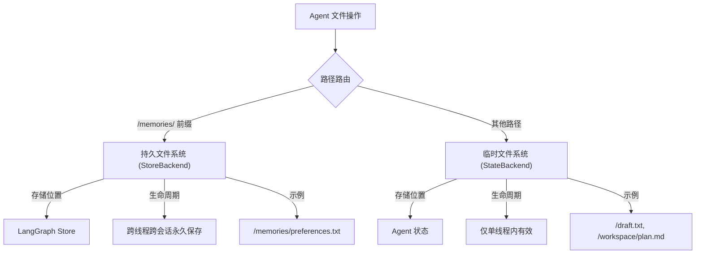

| 文件系统 | 后端 | 生命周期 | 路径示例 |
| --- | --- | --- | --- |
| **临时 (短期)** | `StateBackend` | 线程结束即消失 | `/notes.txt`, `/workspace/draft.md` |
| **持久 (长期)** | `StoreBackend` | 跨线程、跨重启永久保存 | `/memories/preferences.txt` |

> **路径路由细节**: `CompositeBackend` 在存储时会剥离路由前缀。例如 `/memories/preferences.txt` 在 `StoreBackend` 中实际存储为 `/preferences.txt`，但 Agent 始终使用完整路径。

### 9.2 配置方式

```python
from langgraph.checkpoint.memory import MemorySaver
from langgraph.store.memory import InMemoryStore
from deepagents import create_deep_agent
from deepagents.backends import CompositeBackend, StateBackend, StoreBackend

checkpointer = MemorySaver()

def make_backend(runtime):
    return CompositeBackend(
        default=StateBackend(runtime),           # 临时文件
        routes={"/memories/": StoreBackend(runtime)}  # 持久记忆
    )

agent = create_deep_agent(
    store=InMemoryStore(),  # 开发用; 部署到 LangSmith 时可省略
    backend=make_backend,
    checkpointer=checkpointer
)
```

### 9.3 跨线程持久化

`/memories/` 路径下的文件可以被任何线程访问:

```python
import uuid

# 线程 1: 保存偏好
config1 = {"configurable": {"thread_id": str(uuid.uuid4())}}
agent.invoke({
    "messages": [{"role": "user", "content": "Save my preferences to /memories/preferences.txt"}]
}, config=config1)

# 线程 2 (全新对话): 读取偏好
config2 = {"configurable": {"thread_id": str(uuid.uuid4())}}
agent.invoke({
    "messages": [{"role": "user", "content": "What are my preferences?"}]
}, config=config2)
# Agent 可以从线程1写入的 /memories/preferences.txt 中读取
```

### 9.4 典型用例

| 用例 | 说明 | 记忆路径示例 |
| --- | --- | --- |
| **用户偏好** | 跨会话记住用户的配置和偏好 | `/memories/user_preferences.txt` |
| **自改进指令** | Agent 根据反馈更新自己的行为指南 | `/memories/instructions.txt` |
| **知识库** | 多次对话中积累项目知识 | `/memories/project_notes.txt` |
| **研究项目** | 跨会话维护研究进度 | `/memories/research/sources.txt`、`notes.txt`、`report.md` |

**自改进示例**:

```python
agent = create_deep_agent(
    store=InMemoryStore(),
    backend=lambda rt: CompositeBackend(
        default=StateBackend(rt),
        routes={"/memories/": StoreBackend(rt)}
    ),
    system_prompt="""你有一个文件 /memories/instructions.txt 包含额外指令。
    每次对话开始时读取它。
    当用户说"请总是做 X"或"我更喜欢 Y"时，用 edit_file 更新该文件。"""
)
```

### 9.5 Store 实现选择

| 环境 | Store | 特点 |
| --- | --- | --- |
| **开发/测试** | `InMemoryStore` | 快速迭代，重启后数据丢失 |
| **生产** | `PostgresStore` | 持久化到数据库，推荐用于生产环境 |
| **LangSmith 部署** | 平台自动提供 | 省略 `store` 参数即可 |

**生产环境配置 (PostgresStore)**:

```python
from langgraph.store.postgres import PostgresStore
import os

store_ctx = PostgresStore.from_conn_string(os.environ["DATABASE_URL"])
store = store_ctx.__enter__()
store.setup()

agent = create_deep_agent(
    store=store,
    backend=lambda rt: CompositeBackend(
        default=StateBackend(rt),
        routes={"/memories/": StoreBackend(rt)}
    )
)
```

### 9.6 FileData 数据格式

通过 `StoreBackend` 存储的文件遵循以下 Schema:

```python
{
    "content": ["line 1", "line 2"],       # 按行分割的字符串列表
    "created_at": "2024-01-15T10:30:00Z",  # ISO 8601 创建时间
    "modified_at": "2024-01-15T11:45:00Z"  # ISO 8601 修改时间
}
```

可使用 `create_file_data` 辅助函数:

```python
from deepagents.backends.utils import create_file_data
file_data = create_file_data("Hello\nWorld")
# {'content': ['Hello', 'World'], 'created_at': '...', 'modified_at': '...'}
```

### 9.7 最佳实践

1. **用描述性路径组织文件**: 如 `/memories/research/topic_a/sources.txt`
2. **在系统提示词中说明记忆结构**: 告诉 Agent 每个路径存储什么内容
3. **定期清理旧数据**: 实施过期清理，保持存储可管理
4. **按环境选择 Store**: 开发用 `InMemoryStore`，生产用 `PostgresStore`，多租户考虑 `assistant_id` 命名空间隔离

---

## 10. 技能 (Skills)

技能 (Skills) 是 Deep Agent 的**渐进式披露** (Progressive Disclosure) 能力系统。不同于始终加载的系统提示词，技能只在 Agent 判断其与当前任务相关时才被加载，从而大幅减少 Token 消耗。

### 10.1 技能结构

每个技能是一个包含 `SKILL.md` 文件的目录:

```
/skills/
├── langgraph-docs/
│   └── SKILL.md          # 必须: 指令和元数据
│   ├── scripts/          # 可选: 辅助脚本
│   └── templates/        # 可选: 模板文件
├── web-search/
│   └── SKILL.md
└── ...
```

### 10.2 SKILL.md 格式规范

每个 `SKILL.md` 文件包含 YAML 前置元数据 (frontmatter) 和 Markdown 正文:

```markdown
---
name: langgraph-docs
description: 用于获取 LangGraph 相关文档以提供准确指导
license: MIT
compatibility: 需要互联网访问
metadata:
  author: langchain
  version: "1.0"
allowed-tools: fetch_url
---

# langgraph-docs

## Overview
说明这个技能做什么...

## Instructions
### 1. 获取文档索引
使用 fetch_url 工具读取 https://docs.langchain.com/llms.txt

### 2. 选择相关文档
根据问题选择 2-4 个最相关的 URL...

### 3. 提供指导
阅读文档后完成用户请求。
```

**前置元数据字段**:

| 字段 | 必选 | 说明 |
| --- | --- | --- |
| `name` | ✅ | 技能的唯一名称 |
| `description` | ✅ | 技能功能描述 (Agent通过此决定是否加载) |
| `license` | ❌ | 许可证 |
| `compatibility` | ❌ | 兼容性要求 |
| `metadata` | ❌ | 额外元数据 (作者、版本等) |
| `allowed-tools` | ❌ | 此技能允许使用的工具 |

> **注意**: SKILL.md 文件必须小于 10 MB。

### 10.3 渐进披露工作流程

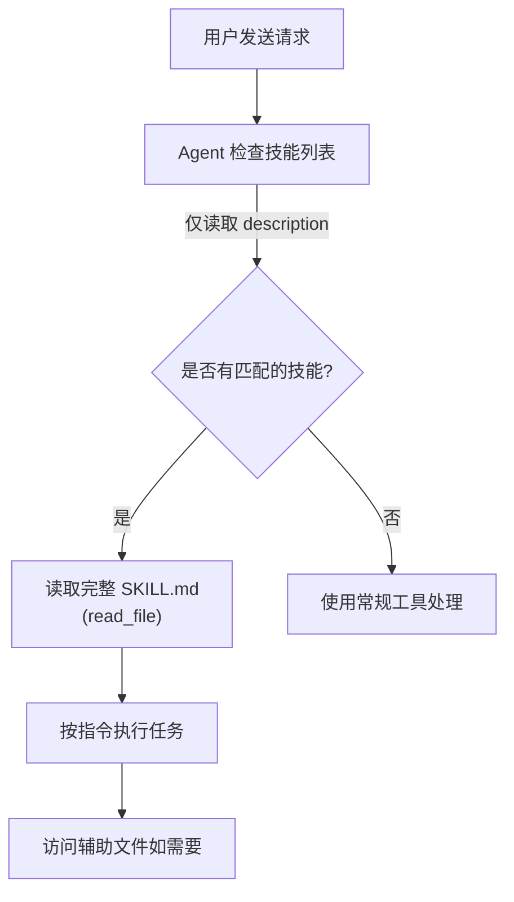

**三步流程**:

1. **匹配 (Match)**: 当用户请求到达时，Agent 检查所有技能的 `description` 是否与任务匹配
2. **读取 (Read)**: 如果技能适用，Agent 读取完整的 `SKILL.md` 文件
3. **执行 (Execute)**: Agent 按照技能指令执行，并按需访问辅助文件

### 10.4 配置方式 (按后端)

#### StateBackend (默认)

将技能文件通过 `invoke()` 的 `files` 参数注入:

```python
from deepagents import create_deep_agent
from deepagents.backends.utils import create_file_data

skills_files = {
    "/skills/langgraph-docs/SKILL.md": create_file_data(skill_content)
}

agent = create_deep_agent(skills=["./skills/"])

result = agent.invoke(
    {"messages": [...], "files": skills_files},  # 注入技能文件
    config={"configurable": {"thread_id": "12345"}},
)
```

#### StoreBackend (持久化)

将技能文件预存到 Store 中:

```python
from deepagents.backends import StoreBackend
from langgraph.store.memory import InMemoryStore

store = InMemoryStore()
store.put(
    namespace=("filesystem",),
    key="/skills/langgraph-docs/SKILL.md",
    value=create_file_data(skill_content)
)

agent = create_deep_agent(
    backend=(lambda rt: StoreBackend(rt)),
    store=store,
    skills=["/skills/"]
)
```

#### FilesystemBackend (本地磁盘)

直接从磁盘加载:

```python
from deepagents.backends.filesystem import FilesystemBackend

agent = create_deep_agent(
    backend=FilesystemBackend(root_dir="/Users/user/project"),
    skills=["/Users/user/project/skills/"],
)
```

### 10.5 技能优先级与子代理继承

#### 同名技能优先级

当多个技能源包含同名技能时，`skills` 列表中**靠后的优先** (last wins):

```python
# 如果两个源都包含 "web-search" 技能, /skills/project/ 胜出
agent = create_deep_agent(
    skills=["/skills/user/", "/skills/project/"],
)
```

#### 子代理继承规则

| 子代理类型 | 继承行为 |
| --- | --- |
| **通用子代理** | 自动继承主代理的技能，无需额外配置 |
| **自定义子代理** | **不继承**主代理技能，需独立配置 `skills` 参数 |

```python
research_subagent = {
    "name": "researcher",
    "tools": [web_search],
    "skills": ["/skills/research/"],  # 子代理专属技能
}

agent = create_deep_agent(
    skills=["/skills/main/"],       # 主代理 + 通用子代理的技能
    subagents=[research_subagent],  # researcher 只有自己的技能
)
```

### 10.6 Skills vs Memory 对比

| 维度 | Skills (技能) | Memory (记忆) |
| --- | --- | --- |
| **目的** | 按需发现的任务特定能力 | 始终加载的持久上下文 |
| **加载时机** | 仅当 Agent 判定相关时 | 每次启动时注入系统提示词 |
| **文件格式** | `SKILL.md` (放在命名目录中) | `AGENTS.md` 文件 |
| **覆盖策略** | 用户 → 项目 (后者优先) | 用户 → 项目 (合并) |
| **适用场景** | 任务特定、可能很大的指令 | 始终相关的项目规范和偏好 |

### 10.7 何时选择 Skills vs Tools

- **用 Skills**: 需要大量上下文 (减少系统提示词 Token)，或需要将多个能力打包成更大的作业流程
- **用 Tools**: Agent 没有文件系统访问权限时，或功能简单到一个函数即可表达

---

## 11. 沙箱 (Sandboxes)

沙箱是专门的后端，在**完全隔离**的环境中运行 Agent 代码。沙箱拥有自己的文件系统和 `execute` 工具，允许 Agent 安装依赖、运行脚本和执行代码，同时不会影响你的本地机器。

### 11.1 支持的沙箱供应商

| 供应商 | 安装包 | 创建沙箱 | 关闭方法 |
| --- | --- | --- | --- |
| **Modal** | `langchain-modal` | `modal.Sandbox.create(app=app)` | `sandbox.terminate()` |
| **Runloop** | `langchain-runloop` | `client.devbox.create()` | `devbox.shutdown()` |
| **Daytona** | `langchain-daytona` | `Daytona().create()` | `sandbox.stop()` |

### 11.2 基本用法

```python
import modal
from langchain_anthropic import ChatAnthropic
from deepagents import create_deep_agent
from langchain_modal import ModalSandbox

# 1. 创建沙箱
app = modal.App.lookup("your-app")
modal_sandbox = modal.Sandbox.create(app=app)
backend = ModalSandbox(sandbox=modal_sandbox)

# 2. 创建带沙箱的 Agent
agent = create_deep_agent(
    model=ChatAnthropic(model="claude-sonnet-4-20250514"),
    system_prompt="你是一个 Python 编码助手，拥有沙箱访问权限。",
    backend=backend,
)

# 3. 使用并关闭
try:
    result = agent.invoke(
        {"messages": [{"role": "user", "content": "创建一个 Python 包并运行 pytest"}]}
    )
finally:
    modal_sandbox.terminate()  # 务必关闭以释放资源
```

### 11.3 文件传输

沙箱提供 `upload_files()` 和 `download_files()` 方法在宿主机和沙箱之间传输文件:

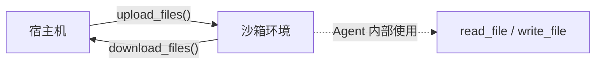

#### 上传文件 (Seeding)

```python
backend.upload_files([
    ("/src/index.py", b"print('Hello')\n"),
    ("/pyproject.toml", b"[project]\nname = 'my-app'\n"),
])
```

#### 下载文件 (Retrieving)

```python
results = backend.download_files(["/src/index.py", "/output.txt"])
for result in results:
    if result.content is not None:
        print(f"{result.path}: {result.content.decode()}")
    else:
        print(f"下载失败 {result.path}: {result.error}")
```

> **注意**: `upload_files` 和 `download_files` 是给你的**应用代码**用的，Agent 在沙箱**内部**使用的是 `read_file`、`write_file` 等文件系统工具。

### 11.4 生命周期管理

> **⚠️ 沙箱消耗资源并产生费用**，必须在不再需要时及时关闭。

#### 基本生命周期

```python
# 创建 → 使用 → 关闭
backend = ModalSandbox(sandbox=modal_sandbox)
result = backend.execute("echo hello")
# ... 使用沙箱
modal_sandbox.terminate()  # 释放资源
```

#### 聊天应用的按会话管理

每个 `thread_id` 应使用独立的沙箱。推荐使用 **get-or-create** 模式:

```python
# 通过 thread_id 查找或创建沙箱 (以 Daytona 为例)
try:
    sandbox = client.find_one(labels={"thread_id": thread_id})
except Exception:
    params = CreateSandboxFromSnapshotParams(
        labels={"thread_id": thread_id},
        auto_delete_interval=3600,  # 空闲1小时后自动清理
    )
    sandbox = client.create(params)

backend = DaytonaSandbox(sandbox=sandbox)
agent = create_deep_agent(backend=backend)
```

> **TTL 策略**: 对于用户可能长时间不活跃的聊天应用，配置沙箱的 TTL (time-to-live)，让供应商自动清理空闲沙箱。

### 11.5 安全注意事项

沙箱隔离了代码执行，但**无法防御上下文注入攻击**。攻击者控制 Agent 输入后，可以指示 Agent 读取文件、执行命令或从沙箱中窃取数据。

#### 🚨 绝对不要把密钥放进沙箱

API Key、Token、数据库凭证等通过环境变量或挂载文件注入的密钥**都可以被上下文注入攻击读取和窃取**。

#### 安全处理密钥的方式

| 方式 | 说明 | 推荐度 |
| --- | --- | --- |
| **密钥放在沙箱外的工具中** | 在宿主环境定义处理认证的工具，Agent 调用工具但看不到凭证 | ✅ 推荐 |
| **网络代理注入凭证** | 沙箱的 HTTP 请求经代理自动注入认证头 | ⚠️ 供应商支持有限 |
| **直接注入沙箱** | 万不得已时，必须开启全工具 HITL + 限制网络 + 最小权限 + 最短有效期 | ❌ 不推荐 |

#### 通用最佳实践

- 不需要网络时**阻断沙箱网络访问**
- 使用中间件**过滤或脱敏**工具输出中的敏感模式
- **审查沙箱输出**后再在应用中使用
- 将沙箱产生的一切内容视为**不受信任的输入**

---

## 12. 流式处理概览 (Streaming Overview)

Deep Agents 构建在 LangGraph 之上，继承了其强大的流式处理能力。与普通大模型不同，Agent 的流式输出不仅包含文本 token，还包括内部思考、工具调用、进度更新和子代理产生的复杂事件。

### 12.1 基础流式输出

最常用的方法是使用 `stream_mode="messages"` 并在主循环中处理。

```python
for chunk in agent.stream(
    {"messages": [{"role": "user", "content": "帮我写个脚本"}]},
    stream_mode="messages"
):
    token, metadata = chunk
    if token.content:
        print(token.content, end="", flush=True)
```

### 12.2 识别子代理流 (Subagent Streaming)

当使用子代理时，必须开启 `subgraphs=True` 才能获取子代理内部的流式事件。
每个 yield 会返回一个 `(namespace, chunk)` 元组，你可以通过 `namespace` 区分事件来源:

```python
# 判断是否来自子代理: namespace 包含 "tools:"
is_subagent = any(s.startswith("tools:") for s in namespace)
source = next((s for s in namespace if s.startswith("tools:")), "main") if is_subagent else "main"

print(f"\n[{source} 发言]: {chunk_content}")
```

### 12.3 监控工具调用 (Tool Calls)

可以从 `messages` 流中实时读取工具的调用和参数:

```python
for namespace, chunk in agent.stream(inputs, stream_mode="messages", subgraphs=True):
    token, metadata = chunk
    is_subagent = any(s.startswith("tools:") for s in namespace)
    source = "subagent" if is_subagent else "main"

    # 工具调用事件 (动态输出参数)
    if token.tool_call_chunks:
        for tc in token.tool_call_chunks:
            if tc.get("name"): print(f"\n[{source}] 调用工具: {tc['name']}")
            if tc.get("args"): print(tc["args"], end="", flush=True)

    # 工具执行结果
    if token.type == "tool":
        print(f"\n[{source}] 工具结果: {str(token.content)[:100]}")
```

### 12.4 自定义进度事件 (Custom Updates)

在耗时较长的自定义工具内部，可以使用 `get_stream_writer` 抛出结构化的进度更新:

```python
import time
from langchain.tools import tool
from langgraph.config import get_stream_writer

@tool
def analyze_data(topic: str) -> str:
    writer = get_stream_writer()
    
    writer({"status": "starting", "topic": topic, "progress": 0})
    time.sleep(0.5)
    writer({"status": "analyzing", "progress": 50})
    
    return "Analysis complete."

# 消费端使用 "custom" 模式捕获
for namespace, chunk in agent.stream(inputs, stream_mode="custom", subgraphs=True):
    print("进度:", chunk) # [{'status': 'starting'...}, {'status': 'analyzing'...}]
```

### 12.5 多流模式组合

通常你需要组合不同的流模式来获取完整的执行视图。常用的组合 `stream_mode=["updates", "messages", "custom"]`:

| 模式 | 作用 | 常见用途 |
| --- | --- | --- |
| `updates` | 跟踪节点状态变化 | 了解 Agent 运行到哪一步 (如 `model_request` -> `tools` -> 结束) |
| `messages` | 文本和工具增量流 | 打字机效果呈现对话和思考过程 |
| `custom` | 自定义写入事件 | 接收特定工具抛出的业务进度或结构化数据 |

### 12.6 追踪子代理生命周期模式

通过监听 `updates` 流，你可以完整跟踪子代理的生命周期 (Pending -> Running -> Complete):

1. **Pending**: 主代理的 `model_request` 节点输出了调用 `task` 工具的消息
2. **Running**: 收到首个 `namespace` 以 `tools:` 开头的事件
3. **Complete**: 主代理的 `tools` 节点输出了 `type="tool"` 的结果消息

这种模式非常适合在前端 UI 中渲染复杂的"任务树"和进度动画。

---

## 13. 前端界面 (Frontend)

要在前端构建 Deep Agent 的用户界面，推荐使用 `@langchain/langgraph-sdk/react` 提供的 `useStream` Hook。它原生支持复杂 Agent 事件、子代理流式输出和多线程管理。

### 13.1 过滤子代理消息

默认情况下，子代理在各自上下文中生成的消息会混入主对话流中，这会让聊天界面显得混乱。
**配置 `filterSubagentMessages: true`** 可以将子代理消息从主消息列表中剔除，并将它们归集到 `stream.subagents` Map 中，以便你在侧边栏或进度面板中独立渲染。

```tsx
import { useStream } from "@langchain/langgraph-sdk/react";
import type { agent } from "./agent"; // 导入后端的代理类型

function DeepAgentChat() {
  const stream = useStream<typeof agent>({
    assistantId: "deep-agent",
    apiUrl: "http://localhost:2024",
    filterSubagentMessages: true, // 关键配置：隔离子代理消息
  });

  return (
    <div className="flex gap-4">
      {/* 主对话区: 只显示用户和主代理的消息 */}
      <div className="flex-1">
        {stream.messages.map((m) => (
          <div key={m.id}>{m.content}</div>
        ))}
      </div>

      {/* 侧边栏/进度分析区: 独立渲染子代理的工作状态 */}
      <div className="w-80 border-l p-4">
        {[...stream.subagents.values()].map((subagent) => (
          <SubagentCard key={subagent.id} subagent={subagent} />
        ))}
      </div>
    </div>
  );
}
```

### 13.2 渲染子代理进度卡片

`stream.subagents` 提供了每个子代理的丰富状态信息 (Pending / Running / Complete / Error)，可以用来构建进度卡片 UI:

```tsx
function SubagentCard({ subagent }: { subagent: SubagentStream }) {
  return (
    <div className="border rounded-lg p-4 mb-4">
      <div className="flex items-center gap-2 mb-2">
        <StatusIcon status={subagent.status} />
        {/* subagent_type 来自主代理调用 task() 时的参数 */}
        <span className="font-medium text-sm">
          {subagent.toolCall.subagent_type}
        </span>
      </div>
      
      {/* Pending / Running 状态的进度展示 */}
      {(subagent.status === "pending" || subagent.status === "running") && (
        <div className="text-sm text-gray-500 animate-pulse">
            Processing task...
        </div>
      )}

      {/* 实时流式输出子代理的思考过程 */}
      {subagent.status === "running" && subagent.messages.length > 0 && (
        <div className="mt-2 text-xs text-gray-600 prose border-l-2 pl-2">
            {getStreamingContent(subagent.messages)}
        </div>
      )}

      {/* 成功结果展示 */}
      {subagent.status === "complete" && subagent.result && (
        <div className="mt-2 p-2 bg-green-50 rounded text-sm">
            {subagent.result}
        </div>
      )}

      {/* 错误展示 */}
      {subagent.status === "error" && subagent.error && (
        <div className="mt-2 p-2 bg-red-50 rounded text-sm text-red-700">
            {subagent.error}
        </div>
      )}
    </div>
  );
}
```

### 13.3 映射: 找到触发子代理的用户消息

为了在 UI 上将"正在工作的子代理"挂载到触发它的"用户提问"下方，你可以使用 `stream.getSubagentsByMessage(messageId)` API:

```tsx
// 遍历主信息流，找到每条 HumanMessage 后紧跟的 AI 节点 ID
const subagents = stream.getSubagentsByMessage(nextAiMessage.id);

// 在 UI 中渲染: 
// 1. User Message
// 2. SubagentPipeline 组件 (包含该消息触发的所有子代理进度)
// 3. AI Reply
```

### 13.4 渲染子代理内嵌的工具调用

当子代理自己也在调用工具 (如搜索网络、读取文件) 时，可以通过 `subagent.toolCalls` 数组实时展示其底层工作:

```tsx
{/* 渲染子代理内部的工具调用 */}
{subagent.toolCalls.map((tc) => (
  <div key={tc.call.id} className="mb-2 p-2 bg-gray-50 rounded text-sm">
    <div className="flex items-center gap-2">
      <span className="font-mono text-xs">{tc.call.name}</span>
      {tc.result !== undefined ? (
        <span className="text-green-600">完毕</span>
      ) : (
        <span className="text-yellow-600 animate-pulse">执行中...</span>
      )}
    </div>
    <pre className="text-xs text-gray-600">{JSON.stringify(tc.call.args)}</pre>
  </div>
))}
```

### 13.5 会话持久化 (Thread Persistence)

通过 URL 参数保存并恢复 `threadId`，即使用户刷新页面，也能无缝切回之前的上下文和正在运行的子代理状态:

```tsx
function PersistentDeepAgentChat() {
  const [threadId, onThreadId] = useThreadIdParam(); // 自定义 hook，读写 URL

  const stream = useStream<typeof agent>({
    assistantId: "deep-agent",
    apiUrl: "http://localhost:2024",
    threadId,
    onThreadId,
    reconnectOnMount: true, // 页面重载时自动恢复数据流 🚀
  });
  
  // ... 渲染组件
}
```

当页面重新加载时，`useStream` 会从服务端历史记录中重建子代理状态，将已完成的子代理及其最终结果完整呈现。
