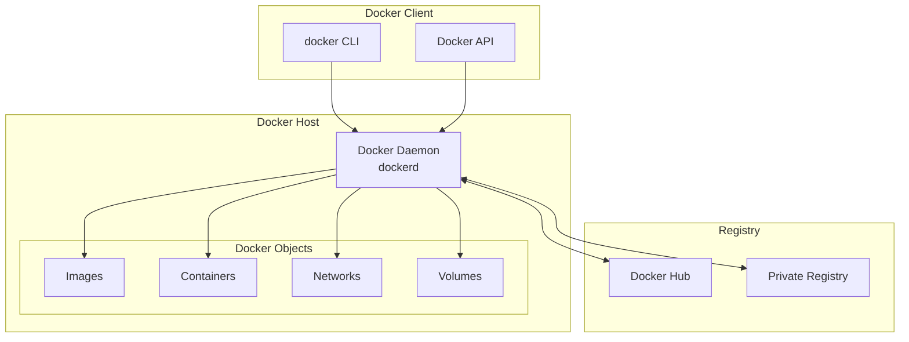
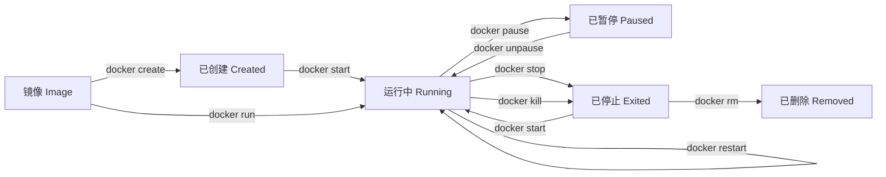
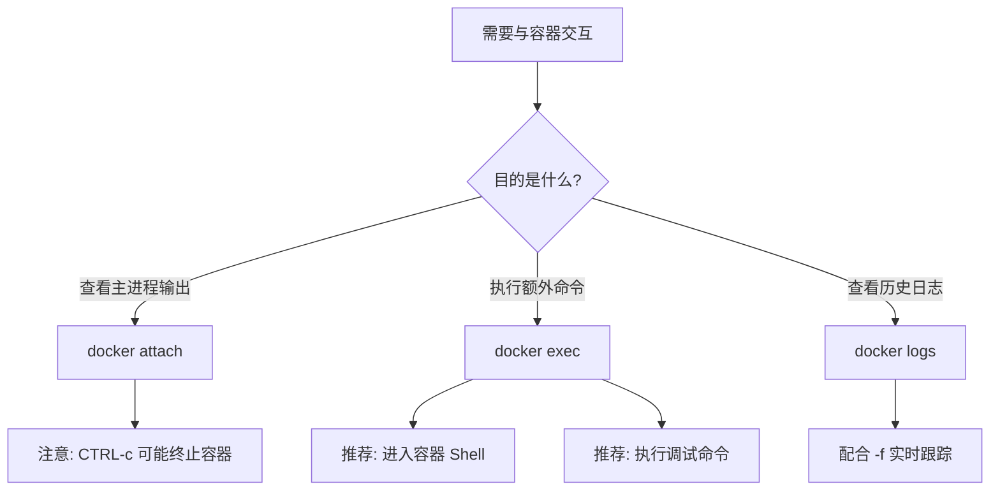
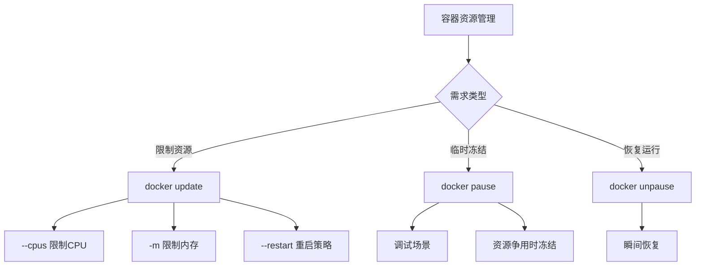
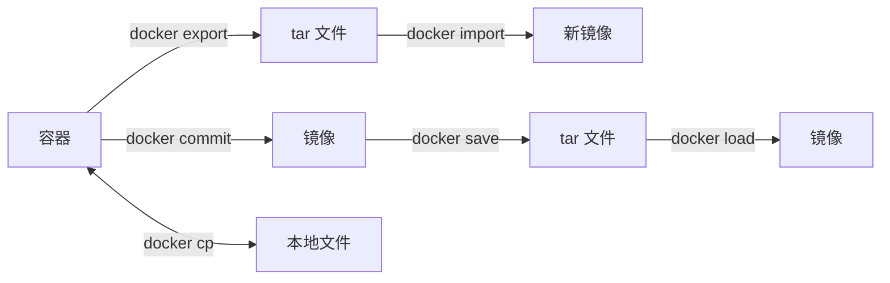
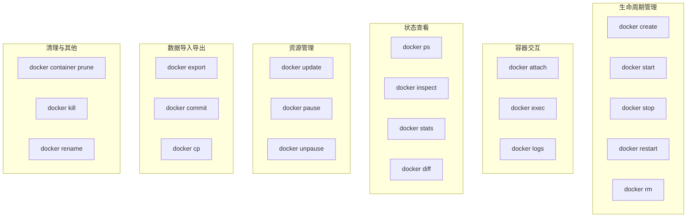
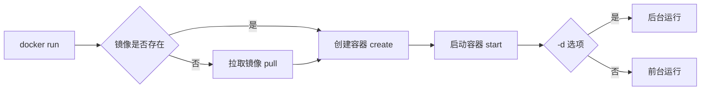
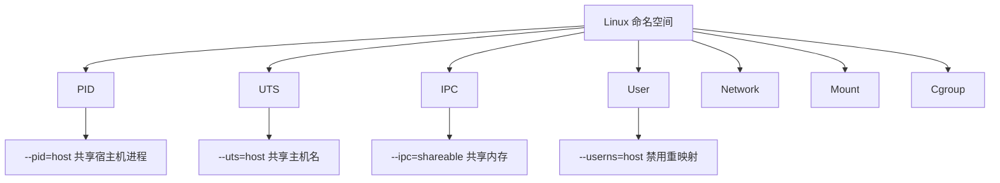
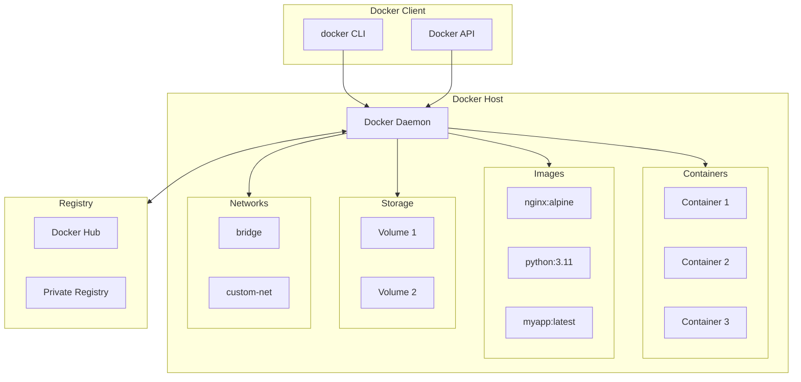
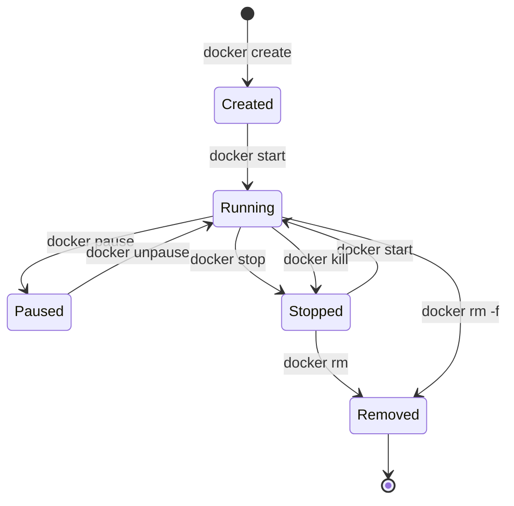

# Docker 学习笔记

> 📖 本文档是基于 Docker 官方文档整理的中文学习笔记，涵盖容器管理、镜像操作、网络配置、存储管理、Dockerfile 编写及 Docker Compose 编排等核心内容。
> 🎯 目标读者：运维工程师 / SRE / 容器技术初学者
> 📅 最后更新：2025-12

---

## 目录

- [第一章：Docker 基础概述](#第一章docker-基础概述)
- [第二章：容器管理 - 基础操作](#第二章容器管理---基础操作)
- [第三章：docker run 命令详解](#第三章docker-run-命令详解)
- [第四章：镜像管理](#第四章镜像管理)
- [第五章：镜像构建](#第五章镜像构建)
- [第六章：网络管理](#第六章网络管理)
- [第七章：存储管理](#第七章存储管理)
- [第八章：Docker 守护进程配置](#第八章docker-守护进程配置)
- [第九章：Docker Compose 篇](#第九章docker-compose-篇)
- [第十章：Dockerfile 篇](#第十章dockerfile-篇)
- [第十一章：附录](#第十一章附录)

---

## 第一章：Docker 基础概述

### 1.1 Docker 简介

**Docker** 是一个开源的容器化平台，允许开发者将应用程序及其依赖打包到一个轻量级、可移植的容器中。容器可以在任何支持 Docker 的环境中一致地运行。

#### Docker 核心组件

| 组件                                  | 说明                                     |
| ------------------------------------- | ---------------------------------------- |
| **Docker Engine**               | Docker 的核心运行时，负责构建和运行容器  |
| **Docker CLI**                  | 命令行客户端，用于与 Docker Daemon 交互  |
| **Docker Daemon** (`dockerd`) | 后台守护进程，管理容器、镜像、网络和存储 |
| **Docker Registry**             | 镜像仓库，如 Docker Hub、私有 Registry   |

#### 容器 vs 虚拟机

| 特性               | 容器               | 虚拟机               |
| ------------------ | ------------------ | -------------------- |
| **启动速度** | 秒级               | 分钟级               |
| **资源占用** | MB 级              | GB 级                |
| **隔离级别** | 进程级（共享内核） | 完全隔离（独立内核） |
| **性能**     | 接近原生           | 有一定损耗           |
| **可移植性** | 高                 | 中等                 |

### 1.2 Docker 架构



#### 客户端-服务端通信流程

1. 用户通过 `docker` CLI 发送命令
2. CLI 将命令转换为 REST API 请求
3. Docker Daemon 接收请求并执行相应操作
4. Daemon 返回执行结果给 CLI
5. CLI 将结果展示给用户

---

## 第二章：容器管理 - 基础操作

> 📁 本章内容来源于 Docker 官方文档 `容器管理/` 目录

### 2.1 容器生命周期概述

容器的生命周期包含以下几个关键状态：



#### 容器状态说明

| 状态        | 描述                             |
| ----------- | -------------------------------- |
| `created` | 容器已创建但未启动               |
| `running` | 容器正在运行                     |
| `paused`  | 容器进程被暂停（冻结）           |
| `exited`  | 容器已停止运行                   |
| `dead`    | 容器处于死亡状态（无法正常删除） |

---

### 2.2 创建容器（docker create）

`docker create` 命令用于**创建一个新容器**，但**不启动**它。这在需要预先配置容器、稍后再启动的场景中非常有用。

#### 命令语法

```bash
docker create [OPTIONS] IMAGE [COMMAND] [ARG...]

# 别名
docker container create [OPTIONS] IMAGE [COMMAND] [ARG...]
```

#### 核心概念

- `docker create` 从指定镜像创建一个可写的容器层
- 容器创建后状态为 `created`，需使用 `docker start` 启动
- 相当于 `docker run -d` 但不启动容器

> 💡 **提示**：`docker create` 与 `docker run` 共享大部分选项，详细选项说明请参考 [第三章：docker run 命令详解](#第三章docker-run-命令详解)。

#### 常用选项

| 选项                  | 说明            |
| --------------------- | --------------- |
| `--name`            | 为容器指定名称  |
| `-i, --interactive` | 保持 STDIN 打开 |
| `-t, --tty`         | 分配伪终端      |
| `-v, --volume`      | 挂载存储卷      |
| `-p, --publish`     | 端口映射        |
| `-e, --env`         | 设置环境变量    |
| `--restart`         | 重启策略        |

#### 实战示例

**示例 1：创建并启动交互式容器**

```bash
# 创建交互式容器（带伪终端）
$ docker create -it --name mycontainer alpine
6d8af538ec541dd581ebc2a24153a28329acb5268abe5ef868c1f1a261221752

# 启动容器并附加到终端
$ docker start --attach -i mycontainer
/ # echo hello world
hello world
```

上述命令等价于：

```bash
$ docker run -it --name mycontainer2 alpine
/ # echo hello world
hello world
```

**示例 2：创建数据卷容器**

```bash
# 创建一个带数据卷的容器
$ docker create -v /data --name data ubuntu
240633dfbb98128fa77473d3d9018f6123b99c454b3251427ae190a7d951ad57

# 从其他容器使用该数据卷
$ docker run --rm --volumes-from data ubuntu ls -la /data
total 8
drwxr-xr-x  2 root root 4096 Dec  5 04:10 .
drwxr-xr-x 48 root root 4096 Dec  5 04:11 ..
```

**示例 3：创建绑定挂载容器**

```bash
# 创建绑定主机目录的容器
$ docker create -v /home/docker:/docker --name docker ubuntu
9aa88c08f319cd1e4515c3c46b0de7cc9aa75e878357b1e96f91e2c773029f03

# 从其他容器访问挂载的目录
$ docker run --rm --volumes-from docker ubuntu ls -la /docker
```

---

### 2.3 启动容器（docker start）

`docker start` 命令用于**启动一个或多个已停止的容器**。

#### 命令语法

```bash
docker start [OPTIONS] CONTAINER [CONTAINER...]

# 别名
docker container start [OPTIONS] CONTAINER [CONTAINER...]
```

#### 命令选项

| 选项                  | 说明                                  |
| --------------------- | ------------------------------------- |
| `-a, --attach`      | 附加到容器的 STDOUT/STDERR 并转发信号 |
| `-i, --interactive` | 附加容器的 STDIN                      |
| `--detach-keys`     | 覆盖分离容器的按键序列                |

#### 实战示例

**示例 1：启动已停止的容器**

```bash
# 启动名为 mycontainer 的容器
$ docker start mycontainer
mycontainer
```

**示例 2：启动并附加到容器**

```bash
# 启动容器并附加到终端（交互式）
$ docker start -ai mycontainer
/ # 
```

**示例 3：批量启动多个容器**

```bash
# 同时启动多个容器
$ docker start container1 container2 container3
```

---

### 2.4 停止容器（docker stop）

`docker stop` 命令用于**优雅地停止一个或多个运行中的容器**。

#### 命令语法

```bash
docker stop [OPTIONS] CONTAINER [CONTAINER...]

# 别名
docker container stop [OPTIONS] CONTAINER [CONTAINER...]
```

#### 停止流程

1. 向容器主进程发送 **SIGTERM** 信号（或自定义信号）
2. 等待优雅停止超时时间（默认 10 秒）
3. 如果容器仍未退出，发送 **SIGKILL** 强制终止

> 💡 **提示**：默认停止信号可通过 Dockerfile 的 `STOPSIGNAL` 指令或 `docker run --stop-signal` 选项配置。

#### 命令选项

| 选项              | 默认值  | 说明                         |
| ----------------- | ------- | ---------------------------- |
| `-s, --signal`  | SIGTERM | 发送给容器的信号             |
| `-t, --timeout` | 10      | 等待容器停止的超时时间（秒） |

#### 实战示例

**示例 1：停止单个容器**

```bash
$ docker stop my_container
my_container
```

**示例 2：使用自定义信号停止容器**

```bash
# 使用 SIGKILL 立即终止容器
$ docker stop -s SIGKILL my_container

# 使用信号编号
$ docker stop -s 9 my_container
```

**示例 3：设置超时时间**

```bash
# 等待 30 秒后再强制终止
$ docker stop -t 30 my_container

# 无限等待（不强制终止）
$ docker stop -t -1 my_container
```

**示例 4：批量停止容器**

```bash
# 停止多个指定容器
$ docker stop container1 container2 container3

# 停止所有运行中的容器
$ docker stop $(docker ps -q)
```

#### docker stop vs docker kill

| 特性               | docker stop            | docker kill           |
| ------------------ | ---------------------- | --------------------- |
| **默认信号** | SIGTERM                | SIGKILL               |
| **优雅停止** | ✅ 支持（有超时等待）  | ❌ 不支持（立即终止） |
| **适用场景** | 生产环境、需要清理资源 | 容器卡死、紧急终止    |

---

### 2.5 重启容器（docker restart）

`docker restart` 命令用于**重启一个或多个容器**，相当于先执行 `docker stop` 再执行 `docker start`。

#### 命令语法

```bash
docker restart [OPTIONS] CONTAINER [CONTAINER...]

# 别名
docker container restart [OPTIONS] CONTAINER [CONTAINER...]
```

#### 命令选项

| 选项              | 默认值  | 说明                         |
| ----------------- | ------- | ---------------------------- |
| `-s, --signal`  | SIGTERM | 发送给容器的停止信号         |
| `-t, --timeout` | 10      | 等待容器停止的超时时间（秒） |

#### 实战示例

**示例 1：重启单个容器**

```bash
$ docker restart my_container
my_container
```

**示例 2：使用自定义超时时间重启**

```bash
# 等待 20 秒后再强制重启
$ docker restart -t 20 my_container
```

**示例 3：使用自定义信号重启**

```bash
# 使用 SIGTERM 信号优雅重启
$ docker restart -s SIGTERM my_container
```

**示例 4：批量重启容器**

```bash
# 重启多个容器
$ docker restart container1 container2

# 重启所有运行中的容器
$ docker restart $(docker ps -q)
```

---

### 2.6 删除容器（docker rm）

`docker rm` 命令用于**删除一个或多个容器**。

#### 命令语法

```bash
docker rm [OPTIONS] CONTAINER [CONTAINER...]

# 别名
docker container rm [OPTIONS] CONTAINER [CONTAINER...]
docker container remove [OPTIONS] CONTAINER [CONTAINER...]
```

> ⚠️ **注意**：默认情况下，只能删除已停止的容器。要删除运行中的容器，需使用 `-f` 选项。

#### 命令选项

| 选项              | 说明                                 |
| ----------------- | ------------------------------------ |
| `-f, --force`   | 强制删除运行中的容器（使用 SIGKILL） |
| `-l, --link`    | 删除指定的链接                       |
| `-v, --volumes` | 删除容器关联的匿名卷                 |

#### 实战示例

**示例 1：删除已停止的容器**

```bash
$ docker rm my_container
my_container
```

**示例 2：强制删除运行中的容器**

```bash
$ docker rm --force redis
redis
```

> ⚠️ 使用 `--force` 会向容器主进程发送 SIGKILL 信号，然后删除容器。

**示例 3：删除容器及其匿名卷**

```bash
$ docker rm -v redis
redis
```

此命令会删除容器以及与其关联的匿名卷。**注意**：如果卷是具名卷，则不会被删除。

```bash
# 创建带有具名卷和匿名卷的容器
$ docker create -v awesome:/foo -v /bar --name hello redis
hello

# 删除容器及匿名卷
$ docker rm -v hello
# /foo 卷（具名）保留，/bar 卷（匿名）被删除
```

**示例 4：删除链接**

```bash
# 删除容器之间的网络链接
$ docker rm --link /webapp/redis
/webapp/redis
```

**示例 5：批量删除容器**

```bash
# 删除所有已停止的容器（推荐使用 prune）
$ docker rm $(docker ps --filter status=exited -q)

# 使用 xargs
$ docker ps --filter status=exited -q | xargs docker rm

# 推荐：使用 docker container prune
$ docker container prune
```

#### 最佳实践

| 场景               | 推荐命令                     |
| ------------------ | ---------------------------- |
| 删除单个容器       | `docker rm <container>`    |
| 强制删除运行中容器 | `docker rm -f <container>` |
| 删除容器及匿名卷   | `docker rm -v <container>` |
| 批量清理已停止容器 | `docker container prune`   |
| 清理所有未使用资源 | `docker system prune`      |

---

### 2.7 容器生命周期管理小结

#### 命令速查表

| 命令               | 作用               | 常用选项                           |
| ------------------ | ------------------ | ---------------------------------- |
| `docker create`  | 创建容器（不启动） | `--name`, `-v`, `-p`, `-e` |
| `docker start`   | 启动容器           | `-a`, `-i`                     |
| `docker stop`    | 优雅停止容器       | `-t`, `-s`                     |
| `docker restart` | 重启容器           | `-t`, `-s`                     |
| `docker rm`      | 删除容器           | `-f`, `-v`                     |

#### 组合使用示例

```bash
# 完整的容器生命周期
$ docker create --name myapp -p 8080:80 nginx    # 创建
$ docker start myapp                              # 启动
$ docker stop myapp                               # 停止
$ docker start myapp                              # 再次启动
$ docker restart myapp                            # 重启
$ docker stop myapp && docker rm myapp            # 停止并删除

# 快捷方式：使用 docker run 一步完成创建和启动
$ docker run -d --name myapp -p 8080:80 nginx
```

---

### 2.8 附加到容器（docker attach）

`docker attach` 命令用于**将本地终端的标准输入、输出和错误流附加到一个运行中的容器**，从而可以查看其输出或进行交互式控制。

#### 命令语法

```bash
docker attach [OPTIONS] CONTAINER

# 别名
docker container attach [OPTIONS] CONTAINER
```

#### 核心概念

- `docker attach` 将终端连接到容器的 **ENTRYPOINT/CMD** 进程
- 可以同时从不同会话多次附加到同一容器
- 使用 **CTRL-c** 发送 SIGINT/SIGKILL 信号（可能终止容器）
- 使用 **CTRL-p CTRL-q** 从容器分离（需容器以 `-it` 启动）

> ⚠️ **注意**：attach 命令显示的是容器主进程的输出。如果主进程没有输出，看起来像是命令卡住了。

#### 命令选项

| 选项              | 默认值 | 说明                     |
| ----------------- | ------ | ------------------------ |
| `--detach-keys` | -      | 覆盖分离容器的按键序列   |
| `--no-stdin`    | false  | 不附加 STDIN             |
| `--sig-proxy`   | true   | 将接收到的信号代理给进程 |

#### 分离按键序列

默认的分离按键序列是 `CTRL-p CTRL-q`，可以自定义为：

| 格式            | 示例                                                        |
| --------------- | ----------------------------------------------------------- |
| 单个字母        | `a`, `X`                                                |
| ctrl + 字母     | `ctrl-a`, `ctrl-z`                                      |
| ctrl + 特殊字符 | `ctrl-@`, `ctrl-[`, `ctrl-\\`, `ctrl-_`, `ctrl-^` |

#### 实战示例

**示例 1：附加到运行中的容器**

```bash
# 后台启动一个运行 top 的容器
$ docker run -d --name topdemo alpine top -b

# 附加到容器
$ docker attach topdemo
Mem: 2395856K used, 5638884K free, 2328K shrd, 61904K buff, 1524264K cached
CPU:   0% usr   0% sys   0% nic  99% idle   0% io   0% irq   0% sirq
Load average: 0.15 0.06 0.01 1/567 6
  PID  PPID USER     STAT   VSZ %VSZ CPU %CPU COMMAND
    1     0 root     R     1700   0%   3   0% top -b
```

**示例 2：分离而不终止容器（需要 -it）**

```bash
# 使用 -dit 启动容器（支持分离）
$ docker run -dit --name topdemo2 alpine top -b

# 附加到容器
$ docker attach topdemo2
Mem: 2405344K used, 5629396K free...
  PID  PPID USER     STAT   VSZ %VSZ CPU %CPU COMMAND
    1     0 root     R     1700   0%   3   0% top -b

# 按 CTRL-p CTRL-q 分离
read escape sequence

# 容器仍在运行
$ docker ps --filter name=topdemo2
CONTAINER ID   IMAGE     COMMAND    STATUS          NAMES
fde88b83c2c2   alpine    "top -b"   Up 21 seconds   topdemo2
```

**示例 3：获取容器的退出码**

```bash
# 启动容器
$ docker run --name test -dit alpine

# 附加并执行退出命令
$ docker attach test
/# exit 13

# 检查退出码
$ echo $?
13
```

**示例 4：自定义分离按键**

```bash
# 使用 ctrl-a 作为分离按键
$ docker attach --detach-keys="ctrl-a" mycontainer
```

#### docker attach vs docker exec

| 特性               | docker attach           | docker exec               |
| ------------------ | ----------------------- | ------------------------- |
| **连接目标** | 容器主进程（PID 1）     | 新建一个进程              |
| **终止容器** | CTRL-c 可能终止容器     | CTRL-c 只终止 exec 的进程 |
| **使用场景** | 查看主进程输出、调试    | 执行额外命令、进入 Shell  |
| **分离容器** | CTRL-p CTRL-q（需 -it） | 直接退出                  |

> 💡 **推荐**：在大多数场景下，推荐使用 `docker exec` 进入容器，更加灵活安全。

---

### 2.9 在容器中执行命令（docker exec）

`docker exec` 命令用于**在运行中的容器内执行新命令**，是进入容器进行调试和管理的最常用方式。

#### 命令语法

```bash
docker exec [OPTIONS] CONTAINER COMMAND [ARG...]

# 别名
docker container exec [OPTIONS] CONTAINER COMMAND [ARG...]
```

#### 核心概念

- `docker exec` 在运行中的容器内**启动一个新进程**
- 该命令只在容器主进程（PID 1）运行时有效
- 命令在容器的默认工作目录中执行
- **命令必须是可执行程序**，不能是链式命令

```bash
# ✅ 正确：使用 sh -c 执行链式命令
docker exec -it my_container sh -c "echo a && echo b"

# ❌ 错误：直接传入链式命令
docker exec -it my_container "echo a && echo b"
```

#### 命令选项

| 选项                  | 说明                   |
| --------------------- | ---------------------- |
| `-d, --detach`      | 后台运行命令           |
| `--detach-keys`     | 覆盖分离容器的按键序列 |
| `-e, --env`         | 设置环境变量           |
| `--env-file`        | 从文件读取环境变量     |
| `-i, --interactive` | 保持 STDIN 打开        |
| `--privileged`      | 以特权模式执行命令     |
| `-t, --tty`         | 分配伪终端             |
| `-u, --user`        | 指定执行命令的用户     |
| `-w, --workdir`     | 指定工作目录           |

#### 实战示例

**示例 1：进入容器交互式 Shell**

```bash
# 进入容器的 bash shell
$ docker exec -it mycontainer /bin/bash

# 或使用 sh（适用于 Alpine 等精简镜像）
$ docker exec -it mycontainer sh
```

**示例 2：执行单次命令**

```bash
# 查看容器内的进程
$ docker exec mycontainer ps aux

# 查看容器内的文件
$ docker exec mycontainer ls -la /app
```

**示例 3：后台执行命令**

```bash
# 后台创建文件
$ docker exec -d mycontainer touch /tmp/execWorks

# 验证文件是否创建
$ docker exec mycontainer ls /tmp/execWorks
/tmp/execWorks
```

**示例 4：设置环境变量**

```bash
# 执行命令时设置环境变量
$ docker exec -e VAR_A=1 -e VAR_B=2 mycontainer env
PATH=/usr/local/sbin:/usr/local/bin:/usr/sbin:/usr/bin:/sbin:/bin
HOSTNAME=f64a4851eb71
VAR_A=1
VAR_B=2
HOME=/root
```

> 💡 通过 `-e` 设置的环境变量**仅对当前 exec 进程有效**，不影响容器的其他进程。

**示例 5：指定工作目录**

```bash
# 默认工作目录
$ docker exec -it mycontainer pwd
/

# 指定工作目录
$ docker exec -it -w /root mycontainer pwd
/root
```

**示例 6：以特定用户执行命令**

```bash
# 以 www-data 用户执行命令
$ docker exec -u www-data mycontainer whoami
www-data

# 以 UID:GID 格式指定用户
$ docker exec -u 1000:1000 mycontainer id
uid=1000 gid=1000
```

**示例 7：在暂停的容器中执行命令（失败）**

```bash
$ docker pause mycontainer
mycontainer

$ docker exec mycontainer sh
Error response from daemon: Container mycontainer is paused, unpause the container before exec
```

> ⚠️ 无法在**已暂停**的容器中执行命令，需先 `docker unpause` 恢复容器。

#### 常用场景总结

| 场景           | 命令                                             |
| -------------- | ------------------------------------------------ |
| 进入容器 Shell | `docker exec -it <container> sh`               |
| 查看日志文件   | `docker exec <container> cat /var/log/app.log` |
| 安装调试工具   | `docker exec -it <container> apk add curl`     |
| 执行数据库命令 | `docker exec -it mysql mysql -u root -p`       |
| 检查网络连通性 | `docker exec <container> ping google.com`      |

---

### 2.10 查看容器日志（docker logs）

`docker logs` 命令用于**获取容器的日志输出**，包括 STDOUT 和 STDERR。

#### 命令语法

```bash
docker logs [OPTIONS] CONTAINER

# 别名
docker container logs [OPTIONS] CONTAINER
```

#### 核心概念

- `docker logs` 获取容器**执行时刻**存在的日志
- 使用 `--follow` 可以持续流式输出新日志
- 日志驱动不同，可用的功能也不同

> 💡 关于日志驱动的配置，请参考 [第七章：Docker Daemon](#第七章docker-daemon-守护进程)。

#### 命令选项

| 选项                 | 默认值 | 说明                                   |
| -------------------- | ------ | -------------------------------------- |
| `--details`        | -      | 显示日志的额外详情（环境变量、标签等） |
| `-f, --follow`     | -      | 持续输出日志（类似 `tail -f`）       |
| `--since`          | -      | 显示指定时间之后的日志                 |
| `--until`          | -      | 显示指定时间之前的日志                 |
| `-n, --tail`       | all    | 显示最后 N 行日志                      |
| `-t, --timestamps` | -      | 显示时间戳                             |

#### 时间格式说明

`--since` 和 `--until` 支持以下时间格式：

| 格式        | 示例                                     |
| ----------- | ---------------------------------------- |
| RFC 3339    | `2023-12-01T10:00:00Z`                 |
| UNIX 时间戳 | `1701421200`                           |
| 相对时间    | `42m`（42 分钟前）、`3h`（3 小时前） |

#### 实战示例

**示例 1：查看容器全部日志**

```bash
docker logs mycontainer
```

**示例 2：实时跟踪日志**

```bash
# 实时输出日志（类似 tail -f）
$ docker logs -f mycontainer

# 按 CTRL-c 停止跟踪
```

**示例 3：显示最后 N 行日志**

```bash
# 显示最后 100 行日志
$ docker logs --tail 100 mycontainer

# 显示最后 50 行并持续跟踪
$ docker logs --tail 50 -f mycontainer
```

**示例 4：显示时间戳**

```bash
$ docker logs -t mycontainer
2024-12-01T10:00:00.123456789Z Starting application...
2024-12-01T10:00:01.234567890Z Listening on port 8080
```

**示例 5：按时间范围过滤日志**

```bash
# 显示最近 30 分钟的日志
$ docker logs --since 30m mycontainer

# 显示特定时间之后的日志
$ docker logs --since 2024-12-01T10:00:00 mycontainer

# 显示某个时间段的日志
$ docker logs --since 2024-12-01T10:00:00 --until 2024-12-01T12:00:00 mycontainer
```

**示例 6：跟踪日志直到特定时间**

```bash
# 启动持续输出日志的容器
$ docker run --name test -d busybox sh -c "while true; do date; sleep 1; done"

# 实时跟踪日志，2 秒后停止
$ docker logs -f --until=2s test
Tue 14 Nov 2017 16:40:00 CET
Tue 14 Nov 2017 16:40:01 CET
Tue 14 Nov 2017 16:40:02 CET
```

**示例 7：显示日志详情**

```bash
# 显示额外的环境变量和标签信息
$ docker logs --details mycontainer
```

#### 日志最佳实践

| 建议                     | 说明                                      |
| ------------------------ | ----------------------------------------- |
| 使用 `--tail` 限制行数 | 避免大量日志导致内存问题                  |
| 配置日志轮转             | 防止日志文件无限增长                      |
| 使用 `--since` 过滤    | 只查看需要的时间范围                      |
| 考虑日志驱动             | 生产环境推荐使用 `json-file` + 轮转配置 |

---

### 2.11 容器交互命令小结

#### 命令速查表

| 命令              | 作用               | 常用选项                                |
| ----------------- | ------------------ | --------------------------------------- |
| `docker attach` | 附加到容器主进程   | `--detach-keys`, `--no-stdin`       |
| `docker exec`   | 在容器中执行新命令 | `-it`, `-d`, `-e`, `-u`, `-w` |
| `docker logs`   | 查看容器日志       | `-f`, `--tail`, `--since`, `-t` |

#### 使用场景对比



#### 快速操作示例

```bash
# 进入容器 Shell（最常用）
$ docker exec -it mycontainer sh

# 实时查看日志
$ docker logs -f mycontainer

# 查看最近 10 分钟的日志
$ docker logs --since 10m mycontainer

# 在容器中执行命令
$ docker exec mycontainer cat /etc/hosts
```

---

### 2.12 列出容器（docker ps / docker container ls）

`docker ps` 命令用于**列出容器**，是最常用的容器查看命令。

#### 命令语法

```bash
docker ps [OPTIONS]

# 别名
docker container ls [OPTIONS]
docker container list [OPTIONS]
docker container ps [OPTIONS]
```

#### 命令选项

| 选项             | 默认值 | 说明                               |
| ---------------- | ------ | ---------------------------------- |
| `-a, --all`    | -      | 显示所有容器（默认只显示运行中的） |
| `-f, --filter` | -      | 根据条件过滤输出                   |
| `--format`     | -      | 使用 Go 模板格式化输出             |
| `-n, --last`   | -1     | 显示最近创建的 N 个容器            |
| `-l, --latest` | -      | 显示最近创建的容器                 |
| `--no-trunc`   | -      | 不截断输出                         |
| `-q, --quiet`  | -      | 只显示容器 ID                      |
| `-s, --size`   | -      | 显示容器磁盘占用大小               |

#### 过滤器（--filter）

| 过滤器                   | 说明                                                               |
| ------------------------ | ------------------------------------------------------------------ |
| `id`                   | 容器 ID                                                            |
| `name`                 | 容器名称（支持部分匹配）                                           |
| `label`                | 标签（格式：`key` 或 `key=value`）                             |
| `exited`               | 退出码（需配合 `--all`）                                         |
| `status`               | 状态：created、restarting、running、removing、paused、exited、dead |
| `ancestor`             | 基于镜像过滤（镜像名、ID、摘要）                                   |
| `before` / `since`   | 在指定容器之前/之后创建的容器                                      |
| `volume`               | 挂载了指定卷的容器                                                 |
| `network`              | 连接到指定网络的容器                                               |
| `publish` / `expose` | 发布/暴露指定端口的容器                                            |
| `health`               | 健康状态：starting、healthy、unhealthy、none                       |

#### 格式化输出占位符

| 占位符          | 说明                           |
| --------------- | ------------------------------ |
| `.ID`         | 容器 ID                        |
| `.Image`      | 镜像 ID                        |
| `.Command`    | 启动命令                       |
| `.CreatedAt`  | 创建时间                       |
| `.RunningFor` | 运行时长                       |
| `.Ports`      | 暴露的端口                     |
| `.State`      | 容器状态                       |
| `.Status`     | 状态详情（包含时长和健康状态） |
| `.Size`       | 磁盘占用大小                   |
| `.Names`      | 容器名称                       |
| `.Labels`     | 所有标签                       |
| `.Mounts`     | 挂载的卷名                     |
| `.Networks`   | 连接的网络名                   |

#### 实战示例

**示例 1：查看运行中的容器**

```bash
$ docker ps
CONTAINER ID   IMAGE     COMMAND   CREATED         STATUS         PORTS     NAMES
9c3527ed70ce   busybox   "top"     14 seconds ago  Up 15 seconds            web
```

**示例 2：查看所有容器（包括已停止的）**

```bash
$ docker ps -a
CONTAINER ID   IMAGE     COMMAND   CREATED         STATUS                     PORTS     NAMES
9c3527ed70ce   busybox   "top"     14 seconds ago  Up 15 seconds                        web
4aace5031105   busybox   "top"     48 seconds ago  Exited (0) 30 seconds ago            app
```

**示例 3：只显示容器 ID**

```bash
# 常用于批量操作
$ docker ps -q
9c3527ed70ce
4aace5031105
```

**示例 4：显示磁盘占用**

```bash
$ docker ps --size
CONTAINER ID   IMAGE   COMMAND   CREATED      STATUS      PORTS   NAMES      SIZE
e90b8831a4b8   nginx   "/bin…"   11 weeks ago Up 4 hours          my_nginx   35.58 kB (virtual 109.2 MB)
```

- **size**：容器可写层的大小
- **virtual size**：只读镜像 + 可写层的总大小

**示例 5：按状态过滤**

```bash
# 只显示运行中的容器
$ docker ps --filter status=running

# 只显示已停止的容器
$ docker ps -a --filter status=exited

# 显示暂停的容器
$ docker ps --filter status=paused
```

**示例 6：按名称过滤（支持模糊匹配）**

```bash
docker ps --filter "name=web"
docker ps --filter "name=nostalgic"
```

**示例 7：按退出码过滤**

```bash
# 正常退出的容器（退出码 0）
$ docker ps -a --filter 'exited=0'

# 被 SIGKILL 终止的容器（退出码 137）
$ docker ps -a --filter 'exited=137'
```

**示例 8：按镜像过滤**

```bash
# 基于 ubuntu 镜像的容器
$ docker ps --filter ancestor=ubuntu

# 基于特定版本的镜像
$ docker ps --filter ancestor=ubuntu:24.04
```

**示例 9：按网络过滤**

```bash
docker ps --filter network=my_network
```

**示例 10：自定义输出格式**

```bash
# 只显示 ID 和命令
$ docker ps --format "{{.ID}}: {{.Command}}"
a87ecb4f327c: /bin/sh -c #(nop) MA

# 表格形式显示指定列
$ docker ps --format "table {{.ID}}\t{{.Names}}\t{{.Status}}"
CONTAINER ID   NAMES      STATUS
a87ecb4f327c   web        Up 2 hours

# JSON 格式输出
$ docker ps --format json
```

---

### 2.13 查看容器详情（docker inspect）

`docker inspect` 命令用于**显示容器的详细信息**，返回 JSON 格式的元数据。

#### 命令语法

```bash
docker inspect [OPTIONS] CONTAINER [CONTAINER...]

# 容器专用命令
docker container inspect [OPTIONS] CONTAINER [CONTAINER...]
```

> 💡 `docker inspect` 可以检查容器、镜像、网络、卷等多种对象，`docker container inspect` 专门用于容器。

#### 命令选项

| 选项             | 说明                   |
| ---------------- | ---------------------- |
| `-f, --format` | 使用 Go 模板格式化输出 |
| `-s, --size`   | 显示容器文件系统大小   |

#### 实战示例

**示例 1：查看容器完整信息**

```bash
$ docker inspect mycontainer
[
    {
        "Id": "d2cc496561d6d520cbc0236b4ba88c362c446a7619992123f11c809cded25b47",
        "Created": "2024-12-01T10:00:00.123456789Z",
        "Path": "/bin/sh",
        "Args": [],
        "State": {
            "Status": "running",
            "Running": true,
            "Paused": false,
            ...
        },
        ...
    }
]
```

**示例 2：获取容器 IP 地址**

```bash
$ docker inspect -f '{{range .NetworkSettings.Networks}}{{.IPAddress}}{{end}}' mycontainer
172.17.0.2
```

**示例 3：获取容器状态**

```bash
$ docker inspect -f '{{.State.Status}}' mycontainer
running
```

**示例 4：获取容器启动命令**

```bash
$ docker inspect -f '{{.Config.Cmd}}' mycontainer
[/bin/sh -c nginx -g 'daemon off;']
```

**示例 5：获取环境变量**

```bash
$ docker inspect -f '{{.Config.Env}}' mycontainer
[PATH=/usr/local/sbin:/usr/local/bin:/usr/sbin:/usr/bin:/sbin:/bin NGINX_VERSION=1.25.0]
```

**示例 6：获取挂载的卷信息**

```bash
docker inspect -f '{{json .Mounts}}' mycontainer | jq
```

**示例 7：获取端口映射**

```bash
$ docker inspect -f '{{json .NetworkSettings.Ports}}' mycontainer
{"80/tcp":[{"HostIp":"0.0.0.0","HostPort":"8080"}]}
```

**示例 8：获取容器进程 PID**

```bash
$ docker inspect -f '{{.State.Pid}}' mycontainer
12345
```

#### 常用 inspect 格式化查询

| 信息     | 查询命令                                                                                      |
| -------- | --------------------------------------------------------------------------------------------- |
| IP 地址  | `docker inspect -f '{{range .NetworkSettings.Networks}}{{.IPAddress}}{{end}}' <container>`  |
| MAC 地址 | `docker inspect -f '{{range .NetworkSettings.Networks}}{{.MacAddress}}{{end}}' <container>` |
| 容器状态 | `docker inspect -f '{{.State.Status}}' <container>`                                         |
| 重启次数 | `docker inspect -f '{{.RestartCount}}' <container>`                                         |
| 启动时间 | `docker inspect -f '{{.State.StartedAt}}' <container>`                                      |
| 日志路径 | `docker inspect -f '{{.LogPath}}' <container>`                                              |

---

### 2.14 查看容器资源使用（docker stats）

`docker stats` 命令用于**实时显示容器的资源使用统计**，包括 CPU、内存、网络和磁盘 IO。

#### 命令语法

```bash
docker stats [OPTIONS] [CONTAINER...]

# 别名
docker container stats [OPTIONS] [CONTAINER...]
```

#### 命令选项

| 选项            | 说明                         |
| --------------- | ---------------------------- |
| `-a, --all`   | 显示所有容器（包括已停止的） |
| `--format`    | 使用 Go 模板格式化输出       |
| `--no-stream` | 只获取一次结果，不持续刷新   |
| `--no-trunc`  | 不截断输出                   |

#### 输出列说明

| 列名                  | 说明                  |
| --------------------- | --------------------- |
| `CONTAINER ID`      | 容器 ID               |
| `NAME`              | 容器名称              |
| `CPU %`             | CPU 使用百分比        |
| `MEM USAGE / LIMIT` | 内存使用量 / 内存限制 |
| `MEM %`             | 内存使用百分比        |
| `NET I/O`           | 网络 I/O（接收/发送） |
| `BLOCK I/O`         | 块设备 I/O（读/写）   |
| `PIDS`              | 进程/线程数           |

#### 格式化输出占位符

| 占位符         | 说明                         |
| -------------- | ---------------------------- |
| `.Container` | 容器名称或 ID                |
| `.Name`      | 容器名称                     |
| `.ID`        | 容器 ID                      |
| `.CPUPerc`   | CPU 百分比                   |
| `.MemUsage`  | 内存使用量                   |
| `.MemPerc`   | 内存百分比（Windows 不可用） |
| `.NetIO`     | 网络 I/O                     |
| `.BlockIO`   | 块设备 I/O                   |
| `.PIDs`      | 进程数（Windows 不可用）     |

#### 实战示例

**示例 1：实时查看所有运行容器的资源使用**

```bash
$ docker stats
CONTAINER ID   NAME               CPU %   MEM USAGE / LIMIT     MEM %   NET I/O       BLOCK I/O     PIDS
b95a83497c91   awesome_brattain   0.28%   5.629MiB / 1.952GiB   0.28%   916B / 0B     147kB / 0B    9
67b2525d8ad1   foobar             0.00%   1.727MiB / 1.952GiB   0.09%   2.48kB / 0B   4.11MB / 0B   2
```

**示例 2：查看指定容器的统计**

```bash
docker stats nginx redis mysql
```

**示例 3：获取单次快照（不持续刷新）**

```bash
docker stats --no-stream
```

**示例 4：自定义输出格式**

```bash
# 只显示关键指标
$ docker stats --format "table {{.Container}}\t{{.CPUPerc}}\t{{.MemUsage}}"
CONTAINER           CPU %     MEM USAGE / LIMIT
fervent_panini      0.00%     56KiB / 15.57GiB
5acfcb1b4fd1        0.07%     32.86MiB / 15.57GiB
```

**示例 5：JSON 格式输出**

```bash
$ docker stats nginx --no-stream --format "{{ json . }}"
{"BlockIO":"0B / 13.3kB","CPUPerc":"0.03%","Container":"nginx","ID":"ed37317fbf42","MemPerc":"0.24%","MemUsage":"2.352MiB / 982.5MiB","Name":"nginx","NetIO":"539kB / 606kB","PIDs":"2"}
```

**示例 6：包含已停止的容器**

```bash
$ docker stats --all --no-stream
# 已停止的容器显示 0B / 0B
```

---

### 2.15 查看容器文件系统变更（docker diff）

`docker diff` 命令用于**显示容器文件系统自创建以来的变更**，可以查看哪些文件被添加、修改或删除。

#### 命令语法

```bash
docker diff CONTAINER

# 别名
docker container diff CONTAINER
```

#### 变更类型标识

| 符号  | 说明                              |
| ----- | --------------------------------- |
| `A` | 添加（Added）- 文件或目录被添加   |
| `D` | 删除（Deleted）- 文件或目录被删除 |
| `C` | 修改（Changed）- 文件或目录被修改 |

#### 实战示例

**示例 1：查看 nginx 容器的文件变更**

```bash
$ docker diff nginx_container
C /dev
C /dev/console
C /dev/core
C /dev/stdout
C /run
A /run/nginx.pid
C /var/lib/nginx/tmp
A /var/lib/nginx/tmp/client_body
A /var/lib/nginx/tmp/fastcgi
A /var/lib/nginx/tmp/proxy
C /var/log/nginx
A /var/log/nginx/access.log
A /var/log/nginx/error.log
```

**示例 2：结合 commit 使用**

```bash
# 查看容器的修改
$ docker diff mycontainer

# 如果修改满意，可以提交为新镜像
$ docker commit mycontainer myimage:v2
```

#### 使用场景

| 场景                   | 说明                         |
| ---------------------- | ---------------------------- |
| **调试问题**     | 查看容器运行后哪些文件被修改 |
| **安全审计**     | 检查容器是否有异常文件变更   |
| **创建新镜像**   | 在 commit 前确认变更内容     |
| **排查存储问题** | 了解容器写入了哪些文件       |

---

### 2.16 容器状态信息查看小结

#### 命令速查表

| 命令               | 作用         | 常用选项                             |
| ------------------ | ------------ | ------------------------------------ |
| `docker ps`      | 列出容器     | `-a`, `-q`, `-f`, `--format` |
| `docker inspect` | 查看容器详情 | `-f`                               |
| `docker stats`   | 查看资源使用 | `--no-stream`, `--format`        |
| `docker diff`    | 查看文件变更 | -                                    |

#### 运维场景速查

```bash
# 查看所有容器 ID
$ docker ps -aq

# 查看运行中容器的 IP 地址
$ docker inspect -f '{{range .NetworkSettings.Networks}}{{.IPAddress}}{{end}}' <container>

# 实时监控容器资源
$ docker stats

# 一次性获取统计快照
$ docker stats --no-stream --format "table {{.Name}}\t{{.CPUPerc}}\t{{.MemUsage}}"

# 查看容器文件变更
$ docker diff <container>

# 按状态过滤容器
$ docker ps -a --filter status=exited
```

---

### 2.17 动态更新容器配置（docker update）

`docker update` 命令用于**动态更新运行中或已停止容器的资源限制配置**，无需重建容器。

#### 命令语法

```bash
docker update [OPTIONS] CONTAINER [CONTAINER...]

# 别名
docker container update [OPTIONS] CONTAINER [CONTAINER...]
```

> ⚠️ **注意**：`docker update` 不支持 Windows 容器。

#### 命令选项

| 选项                     | 说明                              |
| ------------------------ | --------------------------------- |
| `--blkio-weight`       | 块 IO 权重（10-1000，0 表示禁用） |
| `--cpu-period`         | CPU CFS 调度周期                  |
| `--cpu-quota`          | CPU CFS 调度配额                  |
| `--cpu-rt-period`      | CPU 实时调度周期（微秒）          |
| `--cpu-rt-runtime`     | CPU 实时调度运行时间（微秒）      |
| `-c, --cpu-shares`     | CPU 份额（相对权重）              |
| `--cpus`               | CPU 核心数                        |
| `--cpuset-cpus`        | 允许使用的 CPU（如 0-3, 0,1）     |
| `--cpuset-mems`        | 允许使用的内存节点                |
| `-m, --memory`         | 内存限制                          |
| `--memory-reservation` | 内存软限制                        |
| `--memory-swap`        | 内存+Swap 总限制（-1 表示无限）   |
| `--pids-limit`         | 进程数限制（-1 表示无限）         |
| `--restart`            | 重启策略                          |

#### 实战示例

**示例 1：更新容器 CPU 份额**

```bash
# 将容器的 CPU 份额限制为 512
$ docker update --cpu-shares 512 mycontainer
mycontainer
```

**示例 2：同时更新多个容器的 CPU 和内存**

```bash
# 同时更新多个容器
$ docker update --cpu-shares 512 -m 300M container1 container2
container1
container2
```

**示例 3：更新容器重启策略**

```bash
# 设置容器失败时自动重启（最多 3 次）
$ docker update --restart=on-failure:3 mycontainer

# 设置容器总是自动重启
$ docker update --restart=always mycontainer

# 禁用自动重启
$ docker update --restart=no mycontainer
```

> ⚠️ 如果容器启动时使用了 `--rm` 标志，则无法更新其重启策略，因为 `AutoRemove` 和 `RestartPolicy` 互斥。

**示例 4：限制容器 CPU 核心数**

```bash
# 限制容器最多使用 2 个 CPU 核心
$ docker update --cpus 2 mycontainer

# 限制容器只能在 CPU 0 和 1 上运行
$ docker update --cpuset-cpus 0,1 mycontainer
```

**示例 5：更新内存限制**

```bash
# 设置内存硬限制为 512MB
$ docker update -m 512M mycontainer

# 设置内存软限制为 256MB
$ docker update --memory-reservation 256M mycontainer
```

#### 使用场景

| 场景          | 命令示例                                        |
| ------------- | ----------------------------------------------- |
| 限制资源使用  | `docker update --cpus 1 -m 256m <container>`  |
| 更新重启策略  | `docker update --restart=always <container>`  |
| 绑定 CPU 核心 | `docker update --cpuset-cpus 0,1 <container>` |
| 限制进程数    | `docker update --pids-limit 100 <container>`  |

---

### 2.18 暂停容器（docker pause）

`docker pause` 命令用于**暂停（冻结）容器内的所有进程**。

#### 命令语法

```bash
docker pause CONTAINER [CONTAINER...]

# 别名
docker container pause CONTAINER [CONTAINER...]
```

#### 核心概念

- 在 Linux 上，使用 **freezer cgroup** 技术暂停进程
- 与传统的 SIGSTOP 信号不同，容器内的进程**无法感知**自己被暂停
- 暂停期间，进程完全停止执行，不消耗 CPU，但**内存仍被占用**
- 在 Windows 上，只有 Hyper-V 容器可以被暂停

#### 实战示例

**示例 1：暂停单个容器**

```bash
$ docker pause mycontainer
mycontainer
```

**示例 2：暂停多个容器**

```bash
$ docker pause container1 container2 container3
container1
container2
container3
```

**示例 3：查看已暂停的容器**

```bash
$ docker ps --filter status=paused
CONTAINER ID   IMAGE     COMMAND   CREATED         STATUS                  PORTS   NAMES
673394ef1d4c   busybox   "top"     1 hour ago      Up 1 hour (Paused)              mycontainer
```

#### pause vs stop 对比

| 特性               | docker pause    | docker stop          |
| ------------------ | --------------- | -------------------- |
| **技术实现** | freezer cgroup  | SIGTERM/SIGKILL 信号 |
| **进程感知** | 不感知          | 收到信号             |
| **内存占用** | 保持            | 释放                 |
| **恢复速度** | 瞬间（unpause） | 需重启（start）      |
| **适用场景** | 临时冻结、调试  | 长期停止、维护       |

---

### 2.19 恢复暂停的容器（docker unpause）

`docker unpause` 命令用于**恢复暂停状态的容器**，使其继续运行。

#### 命令语法

```bash
docker unpause CONTAINER [CONTAINER...]

# 别名
docker container unpause CONTAINER [CONTAINER...]
```

#### 实战示例

**示例 1：恢复单个容器**

```bash
$ docker unpause mycontainer
mycontainer
```

**示例 2：恢复多个容器**

```bash
$ docker unpause container1 container2 container3
container1
container2
container3
```

**示例 3：暂停/恢复容器的完整流程**

```bash
# 启动容器
$ docker run -d --name myapp nginx

# 暂停容器
$ docker pause myapp
myapp

# 查看状态
$ docker ps --filter name=myapp
CONTAINER ID   IMAGE   COMMAND                  STATUS                  NAMES
abc123def456   nginx   "/docker-entrypoint.…"   Up 5 minutes (Paused)   myapp

# 恢复容器
$ docker unpause myapp
myapp

# 再次查看状态
$ docker ps --filter name=myapp
CONTAINER ID   IMAGE   COMMAND                  STATUS         NAMES
abc123def456   nginx   "/docker-entrypoint.…"   Up 5 minutes   myapp
```

---

### 2.20 容器资源管理小结

#### 命令速查表

| 命令               | 作用             | 常用选项                          |
| ------------------ | ---------------- | --------------------------------- |
| `docker update`  | 动态更新容器配置 | `--cpus`, `-m`, `--restart` |
| `docker pause`   | 暂停容器         | -                                 |
| `docker unpause` | 恢复暂停的容器   | -                                 |

#### 资源管理最佳实践



#### 运维场景示例

```bash
# 限制容器资源使用
$ docker update --cpus 2 -m 1g --restart=always myapp

# 临时冻结容器（不释放内存）
$ docker pause myapp

# 恢复容器运行
$ docker unpause myapp

# 批量更新重启策略
$ docker update --restart=always $(docker ps -q)
```

---

### 2.21 导出容器文件系统（docker export）

`docker export` 命令用于**将容器的文件系统导出为 tar 归档文件**。

#### 命令语法

```bash
docker export [OPTIONS] CONTAINER

# 别名
docker container export [OPTIONS] CONTAINER
```

#### 命令选项

| 选项             | 说明                            |
| ---------------- | ------------------------------- |
| `-o, --output` | 输出到文件（默认输出到 STDOUT） |

#### 核心概念

- 导出的是容器的**完整文件系统**
- **不包含**卷（volumes）中的数据
- 如果卷挂载覆盖了目录，导出的是底层目录内容，不是卷内容
- 可以导出运行中或已停止的容器

> ⚠️ **export vs save**：`docker export` 导出容器文件系统，`docker save` 导出镜像（包含层信息）。

#### 实战示例

**示例 1：导出容器到 tar 文件**

```bash
# 使用重定向
$ docker export mycontainer > container.tar

# 使用 -o 选项
$ docker export -o container.tar mycontainer
```

**示例 2：导出并压缩**

```bash
docker export mycontainer | gzip > container.tar.gz
```

**示例 3：导出后导入为新镜像**

```bash
# 导出容器
$ docker export mycontainer > container.tar

# 导入为新镜像
$ cat container.tar | docker import - myimage:latest
```

#### export vs save 对比

| 特性               | docker export     | docker save             |
| ------------------ | ----------------- | ----------------------- |
| **操作对象** | 容器              | 镜像                    |
| **输出内容** | 扁平化文件系统    | 分层镜像（含 metadata） |
| **包含历史** | 不包含            | 包含所有层              |
| **导入命令** | `docker import` | `docker load`         |
| **适用场景** | 迁移容器状态      | 分发/备份镜像           |

---

### 2.22 将容器提交为镜像（docker commit）

`docker commit` 命令用于**将容器的当前状态保存为新镜像**。

#### 命令语法

```bash
docker commit [OPTIONS] CONTAINER [REPOSITORY[:TAG]]

# 别名
docker container commit [OPTIONS] CONTAINER [REPOSITORY[:TAG]]
```

#### 命令选项

| 选项              | 默认值 | 说明                         |
| ----------------- | ------ | ---------------------------- |
| `-a, --author`  | -      | 镜像作者信息                 |
| `-c, --change`  | -      | 应用 Dockerfile 指令到新镜像 |
| `-m, --message` | -      | 提交信息                     |
| `-p, --pause`   | true   | 提交时暂停容器               |

#### --change 支持的 Dockerfile 指令

- `CMD` - 默认执行命令
- `ENTRYPOINT` - 入口点
- `ENV` - 环境变量
- `EXPOSE` - 暴露端口
- `LABEL` - 标签
- `ONBUILD` - 构建触发器
- `USER` - 执行用户
- `VOLUME` - 数据卷
- `WORKDIR` - 工作目录

#### 实战示例

**示例 1：基本提交**

```bash
$ docker ps
CONTAINER ID   IMAGE          COMMAND      CREATED      STATUS      NAMES
c3f279d17e0a   ubuntu:24.04   /bin/bash    7 days ago   Up 25 hrs   mycontainer

$ docker commit c3f279d17e0a myimage:v1
sha256:f5283438590d...
```

**示例 2：添加作者和提交信息**

```bash
docker commit -a "John Doe <john@example.com>" -m "Added nginx" mycontainer nginx-custom:v1
```

**示例 3：提交时修改环境变量**

```bash
docker commit --change "ENV DEBUG=true" mycontainer myimage:debug
```

**示例 4：提交时修改 CMD 和 EXPOSE**

```bash
$ docker commit \
  --change='CMD ["nginx", "-g", "daemon off;"]' \
  --change="EXPOSE 80" \
  mycontainer nginx-custom:v2
```

**示例 5：不暂停容器进行提交**

```bash
# 对于需要持续运行的容器
$ docker commit --pause=false mycontainer myimage:latest
```

#### 最佳实践

| 建议             | 说明                                 |
| ---------------- | ------------------------------------ |
| 使用 Dockerfile  | 优先使用 Dockerfile 构建可重复的镜像 |
| 添加提交信息     | 使用 `-m` 记录变更内容             |
| 指定作者         | 使用 `-a` 便于追踪来源             |
| 使用有意义的 tag | 避免使用 `latest`                  |

> 💡 `docker commit` 适用于调试和快速创建镜像，生产环境推荐使用 Dockerfile。

---

### 2.23 容器与主机间复制文件（docker cp）

`docker cp` 命令用于**在容器和本地文件系统之间复制文件或目录**。

#### 命令语法

```bash
# 从本地复制到容器
docker cp [OPTIONS] SRC_PATH CONTAINER:DEST_PATH

# 从容器复制到本地
docker cp [OPTIONS] CONTAINER:SRC_PATH DEST_PATH

# 别名
docker container cp ...
```

#### 命令选项

| 选项                  | 说明                              |
| --------------------- | --------------------------------- |
| `-a, --archive`     | 归档模式（保留所有 UID/GID 信息） |
| `-L, --follow-link` | 跟随源路径中的符号链接            |
| `-q, --quiet`       | 静默模式，不显示进度              |

#### 路径规则

**源路径是文件时：**

| 目标路径              | 行为                 |
| --------------------- | -------------------- |
| 不存在                | 创建文件             |
| 不存在且以 `/` 结尾 | 报错（目录必须存在） |
| 已存在是文件          | 覆盖                 |
| 已存在是目录          | 复制到目录中         |

**源路径是目录时：**

| 目标路径             | 行为               |
| -------------------- | ------------------ |
| 不存在               | 创建目录并复制内容 |
| 已存在是文件         | 报错               |
| 已存在是目录         | 复制整个目录到其中 |
| 源路径以 `/.` 结尾 | 只复制目录内容     |

#### 实战示例

**示例 1：从本地复制文件到容器**

```bash
docker cp ./config.yaml mycontainer:/app/config.yaml
```

**示例 2：从本地复制目录到容器**

```bash
docker cp ./app/ mycontainer:/opt/app
```

**示例 3：从容器复制文件到本地**

```bash
docker cp mycontainer:/app/logs/app.log ./app.log
```

**示例 4：从容器复制目录到本地**

```bash
docker cp mycontainer:/var/log/ ./container_logs/
```

**示例 5：只复制目录内容（使用 /.）**

```bash
# 复制目录内容而非目录本身
$ docker cp ./config/. mycontainer:/app/config/
```

**示例 6：通过管道传输（使用 tar）**

```bash
# 从容器导出并过滤
$ docker cp mycontainer:/var/logs/app.log - | tar x -O | grep "ERROR"

# 复制系统文件（cp 不支持的路径）
$ docker exec mycontainer tar Ccf /proc - cpuinfo | tar Cxf ./ -
```

**示例 7：保留文件权限**

```bash
docker cp -a ./scripts/ mycontainer:/usr/local/bin/
```

#### 使用场景

| 场景         | 命令示例                                                |
| ------------ | ------------------------------------------------------- |
| 提取日志文件 | `docker cp container:/var/log/app.log ./`             |
| 部署配置文件 | `docker cp ./nginx.conf container:/etc/nginx/`        |
| 备份数据     | `docker cp container:/data ./backup/`                 |
| 注入脚本     | `docker cp ./init.sh container:/docker-entrypoint.d/` |

> ⚠️ `docker cp` 不能复制 `/proc`、`/sys`、`/dev` 等系统目录，需使用 `docker exec` + `tar` 组合。

---

### 2.24 容器导入导出小结

#### 命令速查表

| 命令              | 作用                 | 常用选项               |
| ----------------- | -------------------- | ---------------------- |
| `docker export` | 导出容器文件系统     | `-o`                 |
| `docker commit` | 将容器提交为镜像     | `-m`, `-a`, `-c` |
| `docker cp`     | 容器与主机间复制文件 | `-a`, `-L`         |

#### 数据迁移流程



#### 运维场景示例

```bash
# 导出容器为 tar 文件
$ docker export mycontainer > container.tar

# 将容器提交为镜像
$ docker commit -m "added nginx config" mycontainer nginx-custom:v1

# 从容器提取日志
$ docker cp mycontainer:/var/log/nginx/ ./nginx_logs/

# 部署配置到容器
$ docker cp ./nginx.conf mycontainer:/etc/nginx/nginx.conf

# 导入 tar 为新镜像
$ cat container.tar | docker import - restored:latest
```

---

### 2.25 批量清理已停止容器（docker container prune）

`docker container prune` 命令用于**删除所有已停止的容器**，是清理环境的常用命令。

#### 命令语法

```bash
docker container prune [OPTIONS]
```

> 💡 没有 `docker prune` 别名，必须使用完整命令 `docker container prune`。

#### 命令选项

| 选项            | 说明                                                  |
| --------------- | ----------------------------------------------------- |
| `--filter`    | 过滤条件（如 `until=<timestamp>`、`label=<key>`） |
| `-f, --force` | 不提示确认直接删除                                    |

#### 过滤器说明

| 过滤器                  | 说明                         |
| ----------------------- | ---------------------------- |
| `until=<timestamp>`   | 只删除指定时间之前创建的容器 |
| `label=<key>`         | 只删除带有指定标签的容器     |
| `label=<key>=<value>` | 只删除标签值匹配的容器       |
| `label!=<key>`        | 只删除不带指定标签的容器     |

#### 时间格式

- **RFC3339**：`2024-12-01T10:00:00Z`
- **UNIX 时间戳**：`1701421200`
- **相对时间**：`10m`（10分钟前）、`1h`（1小时前）、`24h`（24小时前）

#### 实战示例

**示例 1：删除所有已停止的容器**

```bash
$ docker container prune
WARNING! This will remove all stopped containers.
Are you sure you want to continue? [y/N] y
Deleted Containers:
4a7f7eebae0f63178aff7eb0aa39cd3f0627a203ab2df258c1a00b456cf20063
f98f9c2aa1eaf727e4ec9c0283bc7d4aa4762fbdba7f26191f26c97f64090360

Total reclaimed space: 212 B
```

**示例 2：强制删除不提示确认**

```bash
docker container prune -f
```

**示例 3：删除超过 5 分钟前创建的容器**

```bash
docker container prune --force --filter "until=5m"
```

**示例 4：删除指定时间之前创建的容器**

```bash
docker container prune -f --filter "until=2024-12-01T10:00:00"
```

**示例 5：删除超过 24 小时的容器**

```bash
docker container prune -f --filter "until=24h"
```

**示例 6：按标签过滤删除**

```bash
# 删除带有 env=test 标签的已停止容器
$ docker container prune -f --filter "label=env=test"

# 删除不带 keep 标签的已停止容器
$ docker container prune -f --filter "label!=keep"
```

#### 相关清理命令

| 命令                       | 作用                             |
| -------------------------- | -------------------------------- |
| `docker container prune` | 清理所有已停止容器               |
| `docker image prune`     | 清理悬空镜像                     |
| `docker volume prune`    | 清理未使用的卷                   |
| `docker network prune`   | 清理未使用的网络                 |
| `docker system prune`    | **一键清理**所有未使用资源 |

---

### 2.26 强制终止容器（docker kill）

`docker kill` 命令用于**强制终止一个或多个运行中的容器**，默认发送 SIGKILL 信号。

#### 命令语法

```bash
docker kill [OPTIONS] CONTAINER [CONTAINER...]

# 别名
docker container kill [OPTIONS] CONTAINER [CONTAINER...]
```

#### 命令选项

| 选项             | 说明                             |
| ---------------- | -------------------------------- |
| `-s, --signal` | 发送给容器的信号（默认 SIGKILL） |

#### 核心概念

- 默认发送 **SIGKILL** 信号，立即终止容器
- 可以发送其他信号（如 SIGHUP、SIGINT）
- 信号名称的 `SIG` 前缀可选

> ⚠️ **注意**：如果容器的 ENTRYPOINT 或 CMD 使用 shell 形式（如 `/bin/sh -c`），信号**不会传递到子进程**，因为主进程不是 PID 1。

#### 常用信号

| 信号    | 编号 | 说明                   |
| ------- | ---- | ---------------------- |
| SIGKILL | 9    | 立即终止（不可捕获）   |
| SIGTERM | 15   | 请求终止（可捕获）     |
| SIGINT  | 2    | 中断（Ctrl+C）         |
| SIGHUP  | 1    | 挂起（常用于重载配置） |
| SIGUSR1 | 10   | 用户自定义信号 1       |

#### 实战示例

**示例 1：强制终止容器（默认 SIGKILL）**

```bash
$ docker kill mycontainer
mycontainer
```

**示例 2：发送 SIGHUP 信号（重载配置）**

```bash
# 以下命令等效
$ docker kill --signal=SIGHUP mycontainer
$ docker kill --signal=HUP mycontainer
$ docker kill --signal=1 mycontainer
```

**示例 3：发送 SIGTERM 信号**

```bash
docker kill -s SIGTERM mycontainer
```

**示例 4：终止多个容器**

```bash
docker kill container1 container2 container3
```

**示例 5：终止所有运行中的容器**

```bash
docker kill $(docker ps -q)
```

#### docker kill vs docker stop

| 特性               | docker kill        | docker stop     |
| ------------------ | ------------------ | --------------- |
| **默认信号** | SIGKILL            | SIGTERM         |
| **等待时间** | 无                 | 10 秒（可配置） |
| **进程感知** | 无法捕获           | 可捕获处理      |
| **适用场景** | 紧急终止、容器卡死 | 优雅停止        |

---

### 2.27 重命名容器（docker rename）

`docker rename` 命令用于**修改容器的名称**。

#### 命令语法

```bash
docker rename CONTAINER NEW_NAME

# 别名
docker container rename CONTAINER NEW_NAME
```

#### 实战示例

**示例 1：重命名容器**

```bash
docker rename old_name new_name
```

**示例 2：规范化容器命名**

```bash
# 将随机名称改为有意义的名称
$ docker rename quirky_einstein nginx-prod
```

**示例 3：添加版本后缀**

```bash
docker rename myapp myapp-v1
```

#### 使用场景

| 场景     | 说明                                         |
| -------- | -------------------------------------------- |
| 规范命名 | 将 Docker 自动生成的随机名替换为有意义的名称 |
| 版本迭代 | 为容器添加版本后缀                           |
| 环境区分 | 添加环境标识（如 `-dev`、`-prod`）       |
| 迁移准备 | 在迁移前重命名避免冲突                       |

---

### 2.28 第二章完整总结

#### 容器管理命令速查表



#### 按功能分类速查

| 类别                | 命令                                     | 说明               |
| ------------------- | ---------------------------------------- | ------------------ |
| **创建/启动** | `create`, `start`, `run`           | 容器创建和启动     |
| **停止/删除** | `stop`, `kill`, `rm`, `prune`    | 容器停止和清理     |
| **交互**      | `exec`, `attach`, `logs`           | 进入容器、查看输出 |
| **状态查看**  | `ps`, `inspect`, `stats`, `diff` | 查看容器信息       |
| **资源控制**  | `update`, `pause`, `unpause`       | 动态调整资源       |
| **数据操作**  | `cp`, `export`, `commit`           | 文件复制、导出镜像 |

#### 日常运维常用命令

```bash
# ===== 容器生命周期 =====
docker run -d --name myapp -p 8080:80 nginx     # 创建并启动
docker stop myapp                                 # 优雅停止
docker start myapp                                # 启动容器
docker restart myapp                              # 重启容器
docker rm myapp                                   # 删除容器

# ===== 容器交互 =====
docker exec -it myapp sh                          # 进入容器
docker logs -f --tail 100 myapp                   # 查看日志

# ===== 状态查看 =====
docker ps -a                                      # 列出所有容器
docker inspect myapp                              # 查看详情
docker stats --no-stream                          # 资源使用快照

# ===== 资源管理 =====
docker update --cpus 2 -m 512m myapp              # 更新资源限制
docker update --restart=always myapp              # 设置自动重启

# ===== 数据操作 =====
docker cp myapp:/var/log/ ./logs/                 # 复制日志
docker commit myapp myimage:v1                    # 提交为镜像

# ===== 清理 =====
docker container prune -f                         # 清理已停止容器
docker system prune -af                           # 清理所有未使用资源
```

---

*（第二章 容器管理 - 基础操作 完成）*

---

## 第三章：Docker Run 命令详解

> `docker run` 是 Docker 最核心的命令，它将镜像拉取、容器创建和启动三个步骤合为一体。本章将详细讲解 `docker run` 的各个选项。

### 3.1 命令概述

#### 基本语法

```bash
docker run [OPTIONS] IMAGE [COMMAND] [ARG...]

# 别名
docker container run [OPTIONS] IMAGE [COMMAND] [ARG...]
```

#### 命令执行流程



#### 选项分类概览

| 类别     | 主要选项                                            |
| -------- | --------------------------------------------------- |
| 容器标识 | `--name`, `--cidfile`                           |
| 运行模式 | `-d`, `-it`, `--rm`                           |
| 网络配置 | `-p`, `-P`, `--network`, `--hostname`       |
| 存储挂载 | `-v`, `--mount`, `--tmpfs`                    |
| 资源限制 | `--cpus`, `-m`, `--pids-limit`                |
| 环境配置 | `-e`, `--env-file`, `-w`                      |
| 安全配置 | `--privileged`, `--cap-add`, `--security-opt` |

---

### 3.2 容器标识与命名（--name, --cidfile）

#### --name：指定容器名称

`--name` 选项用于**为容器指定一个自定义名称**，方便后续管理和引用。

##### 基本用法

```bash
docker run --name <container_name> IMAGE
```

##### 实战示例

**示例 1：创建命名容器**

```bash
$ docker run --name test -d nginx:alpine
4bed76d3ad428b889c56c1ecc2bf2ed95cb08256db22dc5ef5863e1d03252a19

$ docker ps
CONTAINER ID   IMAGE          COMMAND                  CREATED        STATUS   PORTS     NAMES
4bed76d3ad42   nginx:alpine   "/docker-entrypoint.…"   1 second ago   Up       80/tcp    test
```

**示例 2：通过名称管理容器**

```bash
# 停止容器
$ docker stop test
test

# 删除容器
$ docker rm test
test
```

**示例 3：容器名称用于网络 DNS**

在用户定义的 bridge 网络中，容器名称可以作为 DNS 名称使用：

```bash
# 创建自定义网络
$ docker network create mynet

# 启动命名容器
$ docker run --name test --net mynet -d nginx:alpine

# 其他容器可以通过名称访问
$ docker run --net mynet busybox ping test
PING test (172.18.0.2): 56 data bytes
64 bytes from 172.18.0.2: seq=0 ttl=64 time=0.073 ms
64 bytes from 172.18.0.2: seq=1 ttl=64 time=0.411 ms
```

##### 命名规则与最佳实践

| 规则   | 说明                           |
| ------ | ------------------------------ |
| 唯一性 | 同一主机上容器名称必须唯一     |
| 可读性 | 使用有意义的名称便于管理       |
| 格式   | 支持字母、数字、下划线、连字符 |
| 长度   | 最小 1 字符，无明确最大限制    |

**推荐命名格式：**

```bash
# 项目-服务-环境
myapp-nginx-prod
myapp-mysql-dev

# 服务-版本
nginx-v1.25
redis-7.0

# 用途-编号
web-01
db-master
```

> 💡 如果不指定 `--name`，Docker 会自动分配一个随机名称（如 `vibrant_cannon`）。

---

#### --cidfile：将容器 ID 写入文件

`--cidfile` 选项用于**将容器 ID 写入指定文件**，常用于自动化脚本和进程管理。

##### 基本用法

```bash
docker run --cidfile <file_path> IMAGE
```

##### 核心特性

- 容器启动时创建文件，写入完整容器 ID
- 如果文件已存在，Docker 会报错（防止意外覆盖）
- 容器退出时文件保留，需手动清理

##### 实战示例

**示例 1：基本用法**

```bash
$ docker run --cidfile /tmp/docker_test.cid ubuntu echo "test"
test

$ cat /tmp/docker_test.cid
a1b2c3d4e5f6g7h8i9j0k1l2m3n4o5p6q7r8s9t0u1v2w3x4y5z6...
```

**示例 2：用于自动化脚本**

```bash
#!/bin/bash
CID_FILE="/var/run/myapp.cid"

# 启动容器并保存 ID
docker run --cidfile "$CID_FILE" -d nginx:alpine

# 后续操作使用保存的 ID
CONTAINER_ID=$(cat "$CID_FILE")
echo "Container started: $CONTAINER_ID"

# 停止容器
docker stop "$CONTAINER_ID"

# 清理 CID 文件
rm -f "$CID_FILE"
```

**示例 3：配合进程管理器使用**

类似于传统 PID 文件的用法：

```bash
# 检查容器是否运行
if [ -f /var/run/myapp.cid ]; then
    CID=$(cat /var/run/myapp.cid)
    if docker ps -q | grep -q "$CID"; then
        echo "Container is running"
    else
        echo "Container is stopped"
    fi
else
    echo "CID file not found"
fi
```

##### 使用场景

| 场景         | 说明                    |
| ------------ | ----------------------- |
| 自动化部署   | 脚本需要跟踪容器 ID     |
| 进程监控     | 类似 PID 文件的管理方式 |
| Systemd 集成 | 与 systemd 服务管理配合 |
| CI/CD 流水线 | 跟踪构建/测试容器       |

---

#### 容器标识小结

```bash
# 指定容器名称
$ docker run --name myapp -d nginx

# 保存容器 ID 到文件
$ docker run --cidfile /var/run/myapp.cid -d nginx

# 组合使用
$ docker run --name myapp --cidfile /var/run/myapp.cid -d nginx
```

---

### 3.3 运行模式选项（-d, -it, --rm）

容器的运行模式决定了它如何与终端交互以及退出后如何处理。

#### -d, --detach：后台运行模式

`-d` 选项让容器在**后台运行**（detached mode），不占用终端。

##### 基本用法

```bash
docker run -d IMAGE [COMMAND]
```

##### 核心特性

- 容器启动后立即返回容器 ID
- 容器在后台作为守护进程运行
- 使用 `docker logs` 查看输出
- 使用 `docker attach` 或 `docker exec` 进入容器

##### 实战示例

**示例 1：后台运行 nginx**

```bash
$ docker run -d -p 80:80 nginx:alpine
5101d3b7fe931c27c2ba0e65fd989654d297393ad65ae238f20b97a020e7295b

$ docker ps
CONTAINER ID   IMAGE          COMMAND                  STATUS         PORTS                NAMES
5101d3b7fe93   nginx:alpine   "/docker-entrypoint.…"   Up 5 seconds   0.0.0.0:80->80/tcp   wizardly_tesla
```

**示例 2：后台运行并查看日志**

```bash
$ docker run -d --name myapp nginx:alpine

# 查看日志
$ docker logs myapp

# 实时跟踪日志
$ docker logs -f myapp
```

> ⚠️ **注意**：后台容器的根进程退出时，容器也会停止。确保容器内的主进程持续运行。

**错误示例：**

```bash
# 错误：service 命令启动后立即退出
$ docker run -d nginx service nginx start

# 正确：直接运行 nginx 前台进程
$ docker run -d nginx nginx -g 'daemon off;'
```

---

#### -i, --interactive：保持 STDIN 开启

`-i` 选项保持容器的**标准输入（STDIN）开启**，允许向容器发送输入。

##### 基本用法

```bash
docker run -i IMAGE [COMMAND]
```

##### 实战示例

**示例 1：通过管道发送输入**

```bash
$ echo hello | docker run --rm -i busybox cat
hello
```

**示例 2：管道链式处理**

```bash
$ docker run --rm -i busybox echo "foo bar baz" \
  | docker run --rm -i busybox awk '{ print $2 }' \
  | docker run --rm -i busybox rev
rab
```

---

#### -t, --tty：分配伪终端

`-t` 选项为容器**分配一个伪终端（pseudo-TTY）**，提供终端功能。

##### 基本用法

```bash
docker run -t IMAGE [COMMAND]
```

##### -it 组合：交互式终端

`-i` 和 `-t` 通常**组合使用**，创建一个完整的交互式终端会话：

```bash
docker run -it IMAGE [COMMAND]
```

##### 实战示例

**示例 1：进入交互式 shell**

```bash
$ docker run -it debian bash
root@10a3e71492b0:/# ls
bin  boot  dev  etc  home  lib  ...
root@10a3e71492b0:/# exit
exit
```

**示例 2：-t 的作用（密码隐藏）**

不使用 `-t` 时，密码会显示明文：

```bash
$ docker run -i debian passwd root
New password: karjalanpiirakka9
Retype new password: karjalanpiirakka9
passwd: password updated successfully
```

使用 `-t` 时，密码被隐藏：

```bash
$ docker run -it debian passwd root
New password:
Retype new password:
passwd: password updated successfully
```

> 💡 这是因为 `-t` 启用了 TTY 的 echo-off 功能。

---

#### --rm：退出时自动删除容器

`--rm` 选项让容器**在退出时自动删除**，包括其关联的匿名卷。

##### 基本用法

```bash
docker run --rm IMAGE [COMMAND]
```

##### 核心特性

- 容器退出后自动删除
- 同时删除容器关联的**匿名卷**
- **命名卷不会被删除**
- 不能与 `--restart` 同时使用

##### 实战示例

**示例 1：一次性任务**

```bash
# 执行后自动清理
$ docker run --rm alpine echo "Hello, World!"
Hello, World!

# 容器已被自动删除
$ docker ps -a | grep alpine
# （无输出）
```

**示例 2：临时交互式会话**

```bash
$ docker run --rm -it ubuntu bash
root@abcd1234:/# apt update
root@abcd1234:/# exit
# 退出后容器自动删除
```

**示例 3：卷的删除行为**

```bash
# 匿名卷会被删除
$ docker run --rm -v /foo busybox touch /foo/test

# 命名卷不会被删除
$ docker run --rm -v mydata:/bar busybox touch /bar/test
# mydata 卷仍然存在
```

---

#### 运行模式对比

| 选项     | 作用            | 典型场景                   |
| -------- | --------------- | -------------------------- |
| `-d`   | 后台运行        | 服务型容器（nginx, mysql） |
| `-i`   | 保持 STDIN 开启 | 管道输入、脚本交互         |
| `-t`   | 分配伪终端      | 需要 TTY 功能的程序        |
| `-it`  | 交互式终端      | 进入容器调试、执行命令     |
| `--rm` | 退出后删除      | 一次性任务、测试           |

#### 组合使用示例

```bash
# 后台运行服务
$ docker run -d --name nginx -p 80:80 nginx

# 交互式调试
$ docker run -it --rm ubuntu bash

# 后台运行 + 退出删除（测试）
$ docker run -d --rm --name test nginx

# 交互式 + 后台（启动后分离）
$ docker run -dit --name myapp alpine sh
```

---

#### --detach-keys：自定义分离快捷键

`--detach-keys` 选项用于**自定义从容器分离的快捷键**，默认是 `Ctrl-p Ctrl-q`。

##### 基本用法

```bash
docker run --detach-keys="<sequence>" IMAGE
```

##### 支持的按键格式

- 字母：`a-z`
- Ctrl 组合：`ctrl-a`、`ctrl-@`、`ctrl-[`、`ctrl-\\`、`ctrl-_`、`ctrl-^`

##### 实战示例

```bash
# 使用 Ctrl-a 分离
$ docker run -it --detach-keys="ctrl-a" ubuntu bash
```

---

### 3.4 命名空间配置（--pid, --uts, --ipc, --userns）

Linux 命名空间是容器隔离的核心技术。Docker 允许通过选项配置容器使用的命名空间。

#### --pid：PID 命名空间

`--pid` 选项用于**配置容器的进程命名空间**。

##### 可选值

| 值                      | 说明                        |
| ----------------------- | --------------------------- |
| `""` (默认)           | 使用独立的 PID 命名空间     |
| `host`                | 共享宿主机的 PID 命名空间   |
| `container:<name\|id>` | 共享其他容器的 PID 命名空间 |

##### 核心概念

- **默认**：容器有独立的 PID 命名空间，进程 ID 从 1 开始
- **host**：容器可以看到宿主机上所有进程
- **container**：多个容器共享进程视图，用于调试

##### 实战示例

**示例 1：共享宿主机 PID 命名空间**

用于在容器中监控宿主机进程：

```bash
# 启动容器并共享宿主机 PID 命名空间
$ docker run --rm -it --pid=host alpine

# 在容器中安装并运行 htop
/ # apk add htop
/ # htop
# 可以看到宿主机上所有进程
```

**示例 2：共享其他容器的 PID 命名空间**

用于调试运行中的容器：

```bash
# 启动目标容器
$ docker run --rm --name my-nginx -d nginx:alpine

# 启动调试容器，共享 my-nginx 的 PID 命名空间
$ docker run --rm -it --pid=container:my-nginx \
  --cap-add SYS_PTRACE \
  alpine

# 在调试容器中跟踪 nginx 主进程
/ # apk add strace
/ # strace -p 1
strace: Process 1 attached
```

---

#### --uts：UTS 命名空间

`--uts` 选项用于**配置容器的 UTS（UNIX Time-sharing System）命名空间**，控制主机名和域名。

##### 可选值

| 值            | 说明                      |
| ------------- | ------------------------- |
| `""` (默认) | 使用独立的 UTS 命名空间   |
| `host`      | 共享宿主机的 UTS 命名空间 |

##### 核心概念

- **默认**：容器有独立的主机名（可通过 `--hostname` 设置）
- **host**：容器与宿主机共享主机名

> ⚠️ `--uts=host` 不能与 `--hostname` 或 `--domainname` 同时使用。

##### 实战示例

```bash
# 默认：容器有独立主机名
$ docker run --rm -it --hostname mycontainer alpine hostname
mycontainer

# 共享宿主机 UTS 命名空间
$ docker run --rm -it --uts=host alpine hostname
# 输出宿主机的主机名
```

---

#### --ipc：IPC 命名空间

`--ipc` 选项用于**配置容器的 IPC（进程间通信）命名空间**。

##### 可选值

| 值                      | 说明                                 |
| ----------------------- | ------------------------------------ |
| `""`                  | 使用守护进程默认值                   |
| `none`                | 独立的 IPC 命名空间，不挂载 /dev/shm |
| `private`             | 独立的 IPC 命名空间                  |
| `shareable`           | 独立但可共享的 IPC 命名空间          |
| `container:<name\|id>` | 加入其他容器的 IPC 命名空间          |
| `host`                | 使用宿主机的 IPC 命名空间            |

##### 核心概念

IPC 命名空间隔离的资源：

- **共享内存段**（System V shared memory）
- **信号量**（semaphores）
- **消息队列**（message queues）

##### 使用场景

| 场景                             | 配置                                            |
| -------------------------------- | ----------------------------------------------- |
| 高性能计算应用（需要共享内存）   | `--ipc=shareable` + `--ipc=container:donor` |
| 数据库（如 PostgreSQL 大页内存） | `--ipc=host` 或 `--ipc=shareable`           |
| 安全隔离                         | `--ipc=private`（默认）                       |

##### 实战示例

```bash
# 创建可共享 IPC 的容器
$ docker run -d --name ipc-donor --ipc=shareable nginx

# 其他容器加入该 IPC 命名空间
$ docker run --rm -it --ipc=container:ipc-donor alpine

# 使用宿主机 IPC 命名空间（用于特殊性能优化）
$ docker run --rm -it --ipc=host alpine
```

---

#### --userns：用户命名空间

`--userns` 选项用于**配置容器的用户命名空间**。

##### 可选值

| 值       | 说明                           |
| -------- | ------------------------------ |
| `""`   | 使用守护进程配置的用户命名空间 |
| `host` | 禁用用户命名空间重映射         |

##### 核心概念

- 当 Docker 守护进程启用了用户命名空间（user namespace remapping）时：
  - 容器内的 root（UID 0）被映射为宿主机上的非特权用户
  - 提高安全性，防止容器逃逸
- `--userns=host` 禁用此重映射，容器内 root 即为宿主机 root

> ⚠️ `--userns=host` 会降低安全性，仅在必要时使用。

##### 实战示例

```bash
# 禁用用户命名空间重映射
$ docker run --userns=host hello-world
```

---

#### 命名空间配置小结



#### 命名空间选项速查

| 选项         | 作用           | 常用值                                        |
| ------------ | -------------- | --------------------------------------------- |
| `--pid`    | PID 命名空间   | `host`, `container:<name>`                |
| `--uts`    | 主机名命名空间 | `host`                                      |
| `--ipc`    | IPC 命名空间   | `host`, `shareable`, `container:<name>` |
| `--userns` | 用户命名空间   | `host`                                      |

---

### 3.5 网络配置选项（--network, -p, --dns, --add-host）

网络配置是容器运行的核心配置之一，影响容器如何与外界通信。

#### --network：连接到网络

`--network` 选项用于**指定容器连接的网络**。

##### 预定义网络

| 网络                 | 说明                    |
| -------------------- | ----------------------- |
| `bridge`           | 默认网络，容器有独立 IP |
| `host`             | 共享宿主机网络栈        |
| `none`             | 无网络连接              |
| `container:<name>` | 共享其他容器的网络      |

##### 实战示例

**示例 1：连接到自定义网络**

```bash
# 创建自定义网络
$ docker network create my-net

# 启动容器并连接到该网络
$ docker run -itd --network=my-net busybox
```

**示例 2：指定静态 IP**

```bash
# 创建带子网的网络
$ docker network create --subnet 192.0.2.0/24 my-net

# 启动容器并指定 IP
$ docker run -itd --network=my-net --ip=192.0.2.69 busybox
```

**示例 3：连接多个网络**

```bash
$ docker network create --subnet 192.0.2.0/24 my-net1
$ docker network create --subnet 192.0.3.0/24 my-net2

# 容器同时连接两个网络
$ docker run -itd --network=my-net1 --network=my-net2 busybox
```

**示例 4：使用扩展语法**

```bash
$ docker run -itd \
  --network=name=my-net1,ip=192.0.2.42 \
  --network=name=my-net2,ip=192.0.3.42 \
  busybox
```

##### 扩展语法选项

| 选项            | 说明             |
| --------------- | ---------------- |
| `name`        | 网络名称（必需） |
| `alias`       | 网络作用域别名   |
| `ip`          | IPv4 地址        |
| `ip6`         | IPv6 地址        |
| `mac-address` | MAC 地址         |
| `driver-opt`  | 驱动选项         |

---

#### -p, --publish：发布端口

`-p` 选项用于**将容器端口映射到宿主机端口**。

##### 语法格式

```bash
-p [host_ip:]host_port:container_port[/protocol]
```

##### 实战示例

**示例 1：基本端口映射**

```bash
# 宿主机 8080 -> 容器 80
$ docker run -d -p 8080:80 nginx
```

**示例 2：绑定到特定 IP**

```bash
# 只监听 127.0.0.1
$ docker run -d -p 127.0.0.1:80:8080 nginx
```

**示例 3：随机端口**

```bash
# 宿主机随机端口 -> 容器 80
$ docker run -d -p 80 nginx

# 查看分配的端口
$ docker port <container_id>
```

**示例 4：指定协议（UDP）**

```bash
docker run -d -p 53:53/udp dns-server
```

**示例 5：端口范围**

```bash
docker run -d -p 8000-8010:8000-8010 myapp
```

> ⚠️ 如果不指定 host_ip，端口会绑定到 `0.0.0.0`（所有接口），可能存在安全风险。

---

#### -P, --publish-all：发布所有暴露端口

`-P` 选项用于**自动发布镜像中 EXPOSE 的所有端口**。

```bash
$ docker run -d -P nginx

# 查看端口映射
$ docker port <container_id>
80/tcp -> 0.0.0.0:32768
```

---

#### --expose：暴露端口（不发布）

`--expose` 选项用于**声明容器使用的端口**，但不映射到宿主机。

```bash
docker run --expose 80 nginx
```

> 💡 `--expose` 主要用于容器间通信和文档用途。

---

#### --dns：设置 DNS 服务器

`--dns` 选项用于**自定义容器的 DNS 服务器**。

```bash
docker run --dns 8.8.8.8 --dns 8.8.4.4 alpine
```

##### 相关选项

| 选项             | 说明                       |
| ---------------- | -------------------------- |
| `--dns`        | DNS 服务器地址             |
| `--dns-search` | DNS 搜索域                 |
| `--dns-option` | DNS 选项（如 `ndots:5`） |

##### 实战示例

```bash
$ docker run --rm \
  --dns 8.8.8.8 \
  --dns-search example.com \
  --dns-option ndots:3 \
  alpine cat /etc/resolv.conf

nameserver 8.8.8.8
search example.com
options ndots:3
```

---

#### --add-host：添加 hosts 条目

`--add-host` 选项用于**向容器的 /etc/hosts 添加条目**。

##### 语法格式

```bash
--add-host=<hostname>:<ip>
# 或
--add-host=<hostname>=<ip>
```

##### 实战示例

**示例 1：添加自定义主机**

```bash
$ docker run --add-host=myhost:192.168.1.100 alpine ping myhost
PING myhost (192.168.1.100): 56 data bytes
```

**示例 2：IPv6 地址**

```bash
docker run --add-host myhost=[2001:db8::33] alpine
```

**示例 3：host-gateway（访问宿主机）**

```bash
# 特殊值 host-gateway 解析为宿主机内部 IP
$ docker run --add-host host.docker.internal=host-gateway alpine

# 在容器中访问宿主机服务
$ curl host.docker.internal:8080
```

> 💡 `host-gateway` 是一个特殊值，自动解析为宿主机的内部 IP 地址。

---

#### --hostname：设置容器主机名

```bash
$ docker run --hostname mycontainer alpine hostname
mycontainer
```

---

#### --domainname：设置 NIS 域名

```bash
docker run --domainname example.com alpine
```

---

#### --mac-address：设置 MAC 地址

```bash
docker run --mac-address 92:d0:c6:0a:29:33 alpine
```

---

#### 网络配置小结

| 选项           | 作用         | 示例                          |
| -------------- | ------------ | ----------------------------- |
| `--network`  | 连接网络     | `--network=my-net`          |
| `-p`         | 发布端口     | `-p 8080:80`                |
| `-P`         | 发布所有端口 | `-P`                        |
| `--dns`      | DNS 服务器   | `--dns 8.8.8.8`             |
| `--add-host` | hosts 条目   | `--add-host=myhost:1.2.3.4` |
| `--hostname` | 主机名       | `--hostname myapp`          |

---

### 3.6 存储与挂载选项（-v, --mount, --tmpfs, --volumes-from）

容器的存储配置决定了数据如何持久化以及如何与宿主机共享数据。

#### -v, --volume：挂载卷或绑定目录

`-v` 选项用于**挂载数据卷或绑定宿主机目录**。

##### 语法格式

```bash
# 绑定挂载（bind mount）
-v <host_path>:<container_path>[:options]

# 命名卷（named volume）
-v <volume_name>:<container_path>[:options]

# 匿名卷（anonymous volume）
-v <container_path>
```

##### 常用选项

| 选项   | 说明             |
| ------ | ---------------- |
| `ro` | 只读挂载         |
| `rw` | 读写挂载（默认） |
| `z`  | SELinux 共享标签 |
| `Z`  | SELinux 私有标签 |

##### 实战示例

**示例 1：绑定挂载宿主机目录**

```bash
# 挂载当前目录到容器
$ docker run -v $(pwd):/app -w /app ubuntu pwd
/app

# 使用相对路径（Docker 23+）
$ docker run -v ./content:/content ubuntu ls /content
```

**示例 2：命名卷**

```bash
# 创建并使用命名卷
$ docker run -v mydata:/data alpine touch /data/test.txt

# 查看卷
$ docker volume ls
DRIVER    VOLUME NAME
local     mydata
```

**示例 3：只读挂载**

```bash
docker run -v /host/config:/config:ro alpine cat /config/app.conf
```

**示例 4：挂载主机文件**

```bash
docker run -v /etc/hosts:/etc/hosts:ro alpine cat /etc/hosts
```

> ⚠️ 如果宿主机路径不存在，Docker 会自动创建目录。

---

#### --mount：更明确的挂载语法

`--mount` 选项提供**更清晰、更明确的挂载语法**，推荐使用。

##### 语法格式

```bash
--mount type=<type>,source=<src>,target=<dst>[,options]
```

##### 挂载类型

| 类型       | 说明                   |
| ---------- | ---------------------- |
| `bind`   | 绑定挂载（宿主机路径） |
| `volume` | 数据卷                 |
| `tmpfs`  | 临时文件系统           |

##### 常用选项

| 选项                         | 说明           |
| ---------------------------- | -------------- |
| `source, src`              | 源路径或卷名   |
| `target, dst, destination` | 容器内目标路径 |
| `readonly, ro`             | 只读挂载       |
| `volume-opt`               | 卷驱动选项     |

##### 实战示例

**示例 1：绑定挂载**

```bash
docker run --mount type=bind,src=/data,dst=/data alpine ls /data
```

**示例 2：数据卷**

```bash
docker run --mount type=volume,src=mydata,dst=/data alpine touch /data/test
```

**示例 3：只读挂载**

```bash
docker run --mount type=bind,src=/config,dst=/config,readonly alpine
```

**示例 4：结合 --read-only**

```bash
# 容器根文件系统只读，但指定目录可写
$ docker run --read-only --mount type=volume,target=/writable alpine touch /writable/ok
```

---

#### -v vs --mount 对比

| 特性         | -v / --volume | --mount        |
| ------------ | ------------- | -------------- |
| 语法         | 简洁          | 明确           |
| 自动创建目录 | 是            | 否（报错）     |
| 推荐程度     | 兼容性好      | **推荐** |
| 可读性       | 较低          | 较高           |

---

#### --tmpfs：挂载临时文件系统

`--tmpfs` 选项用于**挂载内存文件系统**，数据不持久化。

##### 基本用法

```bash
docker run --tmpfs <container_path>[:options]
```

##### 常用选项

与 Linux `mount -t tmpfs -o` 相同：

- `rw` / `ro` - 读写/只读
- `noexec` - 禁止执行
- `nosuid` - 禁止 SUID
- `size=<bytes>` - 大小限制

##### 实战示例

```bash
# 挂载 tmpfs 到 /run
$ docker run -d --tmpfs /run:rw,noexec,nosuid,size=65536k myimage

# 查看挂载
$ docker exec mycontainer mount | grep tmpfs
tmpfs on /run type tmpfs (rw,nosuid,noexec,relatime,size=65536k)
```

##### 使用场景

| 场景     | 说明                     |
| -------- | ------------------------ |
| 敏感数据 | 密钥、令牌等不应写入磁盘 |
| 临时缓存 | 不需要持久化的缓存数据   |
| 高性能   | 需要高速 I/O 的临时存储  |

---

#### --volumes-from：从其他容器挂载卷

`--volumes-from` 选项用于**继承其他容器的卷挂载**。

##### 基本用法

```bash
docker run --volumes-from <container>[:mode] IMAGE
```

##### 模式选项

| 模式   | 说明                         |
| ------ | ---------------------------- |
| `rw` | 读写（默认，继承原容器模式） |
| `ro` | 只读                         |

##### 实战示例

**示例 1：共享数据卷**

```bash
# 创建数据容器
$ docker run -v /data --name data-container alpine

# 从数据容器挂载卷
$ docker run --volumes-from data-container alpine ls /data
```

**示例 2：只读模式**

```bash
docker run --volumes-from data-container:ro alpine
```

**示例 3：多容器共享卷**

```bash
# 创建带卷的容器
$ docker run -d -v webdata:/var/www --name web nginx

# 备份容器共享卷
$ docker run --volumes-from web -v $(pwd):/backup alpine \
    tar cvf /backup/webdata.tar /var/www
```

---

#### --read-only：根文件系统只读

`--read-only` 选项使**容器根文件系统只读**，提高安全性。

```bash
$ docker run --read-only alpine touch /test
touch: /test: Read-only file system

# 配合挂载使用
$ docker run --read-only -v /writable alpine touch /writable/ok
```

---

#### 存储配置小结

| 选项               | 作用           | 示例                                  |
| ------------------ | -------------- | ------------------------------------- |
| `-v`             | 挂载卷或目录   | `-v /host:/container`               |
| `--mount`        | 明确挂载语法   | `--mount type=bind,src=...,dst=...` |
| `--tmpfs`        | 内存文件系统   | `--tmpfs /run:size=64k`             |
| `--volumes-from` | 继承其他容器卷 | `--volumes-from data`               |
| `--read-only`    | 根文件系统只读 | `--read-only`                       |

---

### 3.7 资源限制选项（--memory, --cpus, --ulimit, --blkio-weight）

资源限制确保容器不会过度消耗系统资源，是生产环境容器管理的关键。

#### 内存限制

##### -m, --memory：设置内存上限

```bash
docker run -m <limit> IMAGE

# 支持单位：b, k, m, g
docker run -m 512m nginx
docker run --memory 1g nginx
```

##### --memory-reservation：内存软限制

当系统内存紧张时才生效的软限制：

```bash
docker run -m 1g --memory-reservation 512m nginx
```

##### --memory-swap：交换空间限制

| 值             | 说明                          |
| -------------- | ----------------------------- |
| 未设置         | swap = 2 × memory            |
| 与 memory 相同 | 禁用 swap                     |
| `-1`         | 无限制 swap                   |
| 大于 memory    | `swap - memory` = 可用 swap |

```bash
# 内存 1G，禁用 swap
docker run -m 1g --memory-swap 1g nginx

# 内存 1G，swap 1G（总共可用 2G）
docker run -m 1g --memory-swap 2g nginx
```

##### --oom-kill-disable：禁用 OOM Killer

```bash
# 禁用 OOM Killer（必须设置 -m）
docker run -m 512m --oom-kill-disable nginx
```

> ⚠️ **警告**：禁用 OOM Killer 可能导致系统不稳定。

---

#### CPU 限制

##### --cpus：限制 CPU 数量

```bash
# 限制使用 1.5 个 CPU
docker run --cpus 1.5 nginx

# 限制使用 0.5 个 CPU
docker run --cpus 0.5 nginx
```

##### --cpu-shares：CPU 相对权重

默认值 1024，用于 CPU 竞争时的相对优先级：

```bash
# 高优先级容器
docker run --cpu-shares 2048 high-priority-app

# 低优先级容器
docker run --cpu-shares 512 low-priority-app
```

> 💡 CPU shares 只在 CPU 竞争时生效，空闲时容器可使用所有可用 CPU。

##### --cpuset-cpus：绑定 CPU 核心

```bash
# 只使用 CPU 0 和 1
docker run --cpuset-cpus 0,1 nginx

# 使用 CPU 0-3
docker run --cpuset-cpus 0-3 nginx
```

##### --cpu-period / --cpu-quota：精细控制

```bash
# 每 100ms 内最多使用 50ms CPU（相当于 0.5 CPU）
docker run --cpu-period 100000 --cpu-quota 50000 nginx
```

---

#### --ulimit：设置资源限制

`--ulimit` 选项设置**容器的 ulimit 值**。

##### 语法格式

```bash
--ulimit <type>=<soft>[:<hard>]
```

##### 常用限制类型

| 类型        | 说明           |
| ----------- | -------------- |
| `nofile`  | 最大打开文件数 |
| `nproc`   | 最大进程数     |
| `core`    | 核心转储大小   |
| `memlock` | 最大锁定内存   |
| `stack`   | 最大栈大小     |

##### 实战示例

```bash
# 设置最大打开文件数
$ docker run --ulimit nofile=1024:1024 nginx

# 设置多个限制
$ docker run --ulimit nofile=65535 --ulimit nproc=4096 nginx

# 查看容器内 ulimit
$ docker run --rm --ulimit nofile=1024 alpine sh -c "ulimit -n"
1024
```

> ⚠️ **注意**：`nproc` 限制的是用户可用进程数，而非容器进程数。

---

#### Block I/O 限制

##### --blkio-weight：I/O 相对权重

范围 10-1000，默认 0（禁用）：

```bash
# 高 I/O 优先级
docker run --blkio-weight 500 nginx

# 低 I/O 优先级
docker run --blkio-weight 100 nginx
```

##### 设备级别限制

```bash
# 限制读取速率
docker run --device-read-bps /dev/sda:1mb nginx

# 限制写入速率
docker run --device-write-bps /dev/sda:1mb nginx

# 限制 IOPS
docker run --device-read-iops /dev/sda:100 nginx
docker run --device-write-iops /dev/sda:100 nginx
```

---

#### --pids-limit：进程数限制

限制容器内可创建的进程数量：

```bash
# 最多 100 个进程
docker run --pids-limit 100 nginx

# 无限制
docker run --pids-limit -1 nginx
```

---

#### --storage-opt：存储限制

限制容器文件系统大小（需要特定存储驱动支持）：

```bash
# 限制容器大小为 10G
docker run --storage-opt size=10G fedora
```

> 💡 仅支持 `btrfs`, `overlay2`, `zfs` 等存储驱动。

---

#### 资源限制小结

| 选项               | 作用        | 示例                     |
| ------------------ | ----------- | ------------------------ |
| `-m`             | 内存上限    | `-m 512m`              |
| `--cpus`         | CPU 数量    | `--cpus 2`             |
| `--cpu-shares`   | CPU 权重    | `--cpu-shares 1024`    |
| `--cpuset-cpus`  | 绑定 CPU    | `--cpuset-cpus 0,1`    |
| `--ulimit`       | ulimit 限制 | `--ulimit nofile=1024` |
| `--blkio-weight` | I/O 权重    | `--blkio-weight 500`   |
| `--pids-limit`   | 进程数限制  | `--pids-limit 100`     |

---

### 3.8 环境变量与元数据选项（-e, --env-file, -l, -h, -w）

环境变量和元数据用于配置容器运行时的行为和标识。

#### -e, --env：设置环境变量

`-e` 选项用于**向容器传递环境变量**。

##### 语法格式

```bash
# 指定变量名和值
-e VAR=value

# 传递宿主机环境变量
-e VAR
```

##### 实战示例

**示例 1：设置环境变量**

```bash
$ docker run -e MYVAR=foo --rm alpine env | grep MYVAR
MYVAR=foo
```

**示例 2：多个环境变量**

```bash
docker run -e VAR1=val1 -e VAR2=val2 alpine env
```

**示例 3：传递宿主机变量**

```bash
$ export MYVAR=hello
$ docker run -e MYVAR --rm alpine env | grep MYVAR
MYVAR=hello
```

**示例 4：用于数据库配置**

```bash
$ docker run -d \
  -e MYSQL_ROOT_PASSWORD=secret \
  -e MYSQL_DATABASE=myapp \
  -e MYSQL_USER=user \
  -e MYSQL_PASSWORD=password \
  mysql:8.0
```

---

#### --env-file：从文件加载环境变量

`--env-file` 选项用于**从文件批量加载环境变量**。

##### 文件格式

```bash
# 环境变量文件 (.env)
VAR1=value1
VAR2=value2
# 注释以 # 开头
DB_HOST=localhost
DB_PORT=3306
```

##### 实战示例

```bash
# 创建 .env 文件
$ cat > .env << EOF
APP_ENV=production
DB_HOST=mysql.example.com
DB_PORT=3306
LOG_LEVEL=info
EOF

# 加载环境变量
$ docker run --env-file .env alpine env
```

> 💡 每行一个变量，`#` 开头的行为注释。

---

#### -l, --label：添加元数据标签

`-l` 选项用于**为容器添加元数据标签**。

##### 语法格式

```bash
-l <key>=<value>
--label <key>=<value>
```

##### 实战示例

**示例 1：添加标签**

```bash
docker run -d -l app=nginx -l env=prod nginx
```

**示例 2：查看标签**

```bash
$ docker inspect --format '{{json .Config.Labels}}' <container>
{"app":"nginx","env":"prod"}
```

**示例 3：按标签过滤**

```bash
# 列出带特定标签的容器
$ docker ps -f label=app=nginx

# 删除带特定标签的容器
$ docker rm $(docker ps -aq -f label=env=test)
```

##### 常用标签规范

| 标签                        | 说明                     |
| --------------------------- | ------------------------ |
| `com.example.description` | 描述                     |
| `com.example.version`     | 版本                     |
| `maintainer`              | 维护者                   |
| `environment`             | 环境（dev/staging/prod） |

---

#### --label-file：从文件加载标签

类似于 `--env-file`，从文件批量加载标签：

```bash
$ cat > labels.txt << EOF
app=myapp
version=1.0
EOF

$ docker run --label-file labels.txt nginx
```

---

#### -h, --hostname：设置主机名

`-h` 选项用于**设置容器的主机名**。

```bash
$ docker run -h mycontainer alpine hostname
mycontainer

# 等同于
$ docker run --hostname mycontainer alpine hostname
```

---

#### -w, --workdir：设置工作目录

`-w` 选项用于**设置容器内的工作目录**。

```bash
$ docker run -w /app ubuntu pwd
/app

# 配合执行命令
$ docker run -v $(pwd):/app -w /app node npm install
```

##### 工作目录与挂载

```bash
# 常用开发模式：挂载 + 设置工作目录
$ docker run -it \
  -v $(pwd):/workspace \
  -w /workspace \
  --rm \
  python:3.11 python app.py
```

---

#### --entrypoint：覆盖入口点

`--entrypoint` 选项用于**覆盖镜像的 ENTRYPOINT**。

```bash
# 覆盖入口点为 sh
$ docker run --entrypoint sh nginx -c "echo hello"

# 清空入口点
$ docker run --entrypoint "" nginx echo "custom command"
```

---

#### 环境配置小结

| 选项             | 作用           | 示例                        |
| ---------------- | -------------- | --------------------------- |
| `-e`           | 设置环境变量   | `-e DB_HOST=localhost`    |
| `--env-file`   | 从文件加载变量 | `--env-file .env`         |
| `-l`           | 添加标签       | `-l app=nginx`            |
| `--label-file` | 从文件加载标签 | `--label-file labels.txt` |
| `-h`           | 设置主机名     | `-h mycontainer`          |
| `-w`           | 设置工作目录   | `-w /app`                 |
| `--entrypoint` | 覆盖入口点     | `--entrypoint sh`         |

---

### 3.9 安全配置选项（--privileged, --cap-add/drop, --security-opt, -u）

安全配置决定了容器的权限级别和访问控制，是生产环境的关键考量。

#### --privileged：特权模式

`--privileged` 选项授予容器**几乎所有宿主机权限**。

```bash
docker run --privileged IMAGE
```

##### 特权模式影响

| 方面             | 影响                        |
| ---------------- | --------------------------- |
| 设备访问         | 可访问所有宿主机设备        |
| 内核能力         | 拥有所有 Linux capabilities |
| AppArmor/SELinux | 绑定不受限制                |
| seccomp          | 禁用系统调用过滤            |

##### 实战示例

```bash
# Docker-in-Docker（DinD）
$ docker run --privileged -d docker:dind

# 访问宿主机设备
$ docker run --privileged -it ubuntu fdisk -l
```

> ⚠️ **警告**：特权模式严重降低安全性，仅在必要时使用！

---

#### --cap-add / --cap-drop：细粒度权限控制

比 `--privileged` 更安全的权限管理方式。

##### 基本用法

```bash
# 添加能力
docker run --cap-add <capability> IMAGE

# 移除能力
docker run --cap-drop <capability> IMAGE

# 添加所有，移除特定
docker run --cap-add ALL --cap-drop MKNOD IMAGE
```

##### 常用 Linux Capabilities

| 能力             | 说明                         |
| ---------------- | ---------------------------- |
| `NET_ADMIN`    | 网络管理（修改路由、防火墙） |
| `NET_RAW`      | 使用 RAW 和 PACKET 套接字    |
| `SYS_ADMIN`    | 系统管理（mount, swapon）    |
| `SYS_PTRACE`   | 跟踪进程（strace, gdb）      |
| `SYS_TIME`     | 修改系统时间                 |
| `MKNOD`        | 创建特殊文件                 |
| `CHOWN`        | 改变文件所有者               |
| `DAC_OVERRIDE` | 绕过文件权限检查             |

##### 实战示例

**示例 1：网络调试（tcpdump, iptables）**

```bash
docker run --cap-add NET_ADMIN --cap-add NET_RAW alpine tcpdump
```

**示例 2：进程调试（strace）**

```bash
docker run --cap-add SYS_PTRACE alpine strace ls
```

**示例 3：移除所有能力（最小权限）**

```bash
docker run --cap-drop ALL alpine
```

**示例 4：修改系统时间**

```bash
docker run --cap-add SYS_TIME alpine date -s "2024-01-01"
```

---

#### -u, --user：指定运行用户

`-u` 选项用于**指定容器内进程的运行用户**。

##### 语法格式

```bash
-u <user>[:<group>]
-u <uid>[:<gid>]
```

##### 实战示例

```bash
# 使用用户名
$ docker run -u nobody alpine id
uid=65534(nobody) gid=65534(nobody)

# 使用 UID
$ docker run -u 1000 alpine id
uid=1000 gid=0(root)

# 使用 UID:GID
$ docker run -u 1000:1000 alpine id
uid=1000 gid=1000

# 使用当前用户
$ docker run -u $(id -u):$(id -g) alpine id
```

> 💡 非 root 用户运行是容器安全最佳实践。

---

#### --security-opt：安全模块配置

`--security-opt` 选项用于**配置 AppArmor、SELinux、seccomp 等安全模块**。

##### 常用选项

| 选项                    | 说明                  |
| ----------------------- | --------------------- |
| `label:disable`       | 禁用 SELinux 标签     |
| `label:type:TYPE`     | 设置 SELinux 类型     |
| `apparmor=PROFILE`    | 使用 AppArmor 配置    |
| `apparmor=unconfined` | 禁用 AppArmor         |
| `seccomp=PROFILE`     | 使用 seccomp 配置文件 |
| `seccomp=unconfined`  | 禁用 seccomp          |
| `no-new-privileges`   | 禁止进程提权          |

##### 实战示例

**示例 1：禁止进程提权**

```bash
docker run --security-opt no-new-privileges:true alpine
```

**示例 2：禁用 AppArmor**

```bash
docker run --security-opt apparmor=unconfined alpine
```

**示例 3：禁用 seccomp**

```bash
docker run --security-opt seccomp=unconfined alpine
```

**示例 4：自定义 seccomp 配置**

```bash
docker run --security-opt seccomp=./my-profile.json alpine
```

---

#### --userns：用户命名空间

```bash
# 禁用用户命名空间重映射
$ docker run --userns=host alpine
```

---

#### --group-add：添加额外用户组

```bash
# 添加到 docker 组
$ docker run --group-add docker alpine id

# 添加多个组
$ docker run --group-add audio --group-add video alpine
```

---

#### 安全配置小结

| 选项               | 作用       | 示例                                 |
| ------------------ | ---------- | ------------------------------------ |
| `--privileged`   | 特权模式   | `--privileged`                     |
| `--cap-add`      | 添加能力   | `--cap-add NET_ADMIN`              |
| `--cap-drop`     | 移除能力   | `--cap-drop ALL`                   |
| `-u`             | 指定用户   | `-u 1000:1000`                     |
| `--security-opt` | 安全模块   | `--security-opt no-new-privileges` |
| `--group-add`    | 添加用户组 | `--group-add docker`               |

##### 安全最佳实践

```bash
# 最安全的运行方式
$ docker run \
  --cap-drop ALL \
  --security-opt no-new-privileges:true \
  --read-only \
  -u 1000:1000 \
  myapp
```

---

### 3.10 设备与 GPU 选项（--device, --gpus）

设备选项允许容器访问宿主机硬件设备。

#### --device：映射设备

`--device` 选项用于**将宿主机设备映射到容器内**。

##### 语法格式

```bash
--device=<host_device>:<container_device>:<permissions>
```

##### 权限选项

| 权限    | 说明                  |
| ------- | --------------------- |
| `r`   | 读取                  |
| `w`   | 写入                  |
| `m`   | 创建设备文件（mknod） |
| `rwm` | 完全访问（默认）      |

##### 实战示例

**示例 1：映射 USB 设备**

```bash
docker run --device /dev/ttyUSB0 alpine
```

**示例 2：映射声卡**

```bash
docker run --device /dev/snd alpine aplay test.wav
```

**示例 3：只读访问**

```bash
docker run --device /dev/video0:/dev/video0:r alpine
```

**示例 4：访问磁盘设备**

```bash
docker run --device /dev/sda alpine fdisk -l /dev/sda
```

---

#### --gpus：GPU 访问

`--gpus` 选项用于**配置容器的 GPU 访问**（需要 NVIDIA Container Toolkit）。

##### 前置条件

1. 安装 NVIDIA 驱动
2. 安装 NVIDIA Container Toolkit
3. 配置 Docker runtime

##### 语法格式

```bash
--gpus <specification>
```

##### 规格选项

| 选项                  | 说明         |
| --------------------- | ------------ |
| `all`               | 所有 GPU     |
| `"device=0"`        | 指定 GPU 0   |
| `"device=0,1"`      | 指定多个 GPU |
| `"device=GPU-UUID"` | 按 UUID 指定 |

##### 实战示例

**示例 1：使用所有 GPU**

```bash
docker run --gpus all nvidia/cuda:12.0-base nvidia-smi
```

**示例 2：指定 GPU**

```bash
# 使用 GPU 0
$ docker run --gpus "device=0" nvidia/cuda:12.0-base nvidia-smi

# 使用 GPU 0 和 1
$ docker run --gpus "device=0,1" nvidia/cuda:12.0-base nvidia-smi
```

**示例 3：限制 GPU 能力**

```bash
# 只允许计算和图形功能
$ docker run --gpus "all,capabilities=compute,utility" nvidia/cuda:12.0-base
```

##### GPU 能力列表

| 能力         | 说明              |
| ------------ | ----------------- |
| `compute`  | CUDA / 计算       |
| `compat32` | 32 位兼容         |
| `graphics` | OpenGL / 图形     |
| `utility`  | nvidia-smi 等工具 |
| `video`    | 视频编解码        |
| `display`  | 显示输出          |

---

#### 设备配置小结

| 选项         | 作用     | 示例                      |
| ------------ | -------- | ------------------------- |
| `--device` | 映射设备 | `--device /dev/ttyUSB0` |
| `--gpus`   | GPU 访问 | `--gpus all`            |

##### 完整 GPU 容器示例

```bash
$ docker run -d \
  --gpus all \
  --name ml-training \
  -v $(pwd)/data:/data \
  tensorflow/tensorflow:latest-gpu \
  python train.py
```

---

### 3.11 重启策略与信号选项（--restart, --stop-signal, --stop-timeout）

重启策略决定容器退出后的行为，信号选项控制容器的停止方式。

#### --restart：重启策略

`--restart` 选项用于**配置容器的重启策略**。

##### 策略类型

| 策略                 | 说明                             |
| -------------------- | -------------------------------- |
| `no`               | 不自动重启（默认）               |
| `on-failure[:max]` | 仅在非零退出码时重启，可限制次数 |
| `always`           | 始终重启                         |
| `unless-stopped`   | 始终重启，除非手动停止           |

##### 实战示例

**示例 1：失败时重启**

```bash
docker run --restart on-failure nginx
```

**示例 2：限制重启次数**

```bash
# 最多重启 3 次
$ docker run --restart on-failure:3 nginx
```

**示例 3：始终重启**

```bash
docker run --restart always nginx
```

**示例 4：unless-stopped（生产推荐）**

```bash
docker run --restart unless-stopped nginx
```

##### always vs unless-stopped

| 场景                     | always | unless-stopped   |
| ------------------------ | ------ | ---------------- |
| 容器退出                 | 重启   | 重启             |
| Docker 重启              | 重启   | 重启             |
| 手动 stop 后 Docker 重启 | 重启   | **不重启** |

> 💡 生产环境推荐使用 `unless-stopped`，便于维护时手动停止容器。

##### 修改运行中容器的重启策略

```bash
docker update --restart unless-stopped <container>
```

> ⚠️ `--restart` 不能与 `--rm` 同时使用。

---

#### --stop-signal：停止信号

`--stop-signal` 选项用于**指定停止容器时发送的信号**。

##### 基本用法

```bash
docker run --stop-signal <signal> IMAGE
```

##### 常用信号

| 信号        | 编号 | 说明           |
| ----------- | ---- | -------------- |
| `SIGTERM` | 15   | 默认，优雅终止 |
| `SIGKILL` | 9    | 强制终止       |
| `SIGINT`  | 2    | 中断（Ctrl+C） |
| `SIGQUIT` | 3    | 退出           |
| `SIGHUP`  | 1    | 挂起           |
| `SIGUSR1` | 10   | 用户自定义 1   |
| `SIGUSR2` | 12   | 用户自定义 2   |

##### 实战示例

```bash
# 使用 SIGINT 停止
$ docker run --stop-signal SIGINT nginx

# 使用信号编号
$ docker run --stop-signal 2 nginx
```

> 💡 确保应用程序正确处理自定义停止信号。

---

#### --stop-timeout：停止超时

`--stop-timeout` 选项用于**设置等待容器停止的超时时间**。

##### 基本用法

```bash
docker run --stop-timeout <seconds> IMAGE
```

##### 工作流程

1. Docker 发送 `--stop-signal` 指定的信号
2. 等待 `--stop-timeout` 秒
3. 如果容器未停止，发送 SIGKILL

##### 实战示例

```bash
# 等待 30 秒
$ docker run --stop-timeout 30 nginx

# 立即发送 SIGKILL（0 秒超时）
$ docker run --stop-timeout 0 nginx
```

##### 停止命令的超时

```bash
# 使用 docker stop 时指定超时
$ docker stop -t 30 <container>
```

---

#### 重启与信号配置小结

| 选项               | 作用     | 示例                         |
| ------------------ | -------- | ---------------------------- |
| `--restart`      | 重启策略 | `--restart unless-stopped` |
| `--stop-signal`  | 停止信号 | `--stop-signal SIGINT`     |
| `--stop-timeout` | 停止超时 | `--stop-timeout 30`        |

##### 生产环境推荐配置

```bash
$ docker run -d \
  --restart unless-stopped \
  --stop-timeout 30 \
  --name myapp \
  myapp:latest
```

---

### 3.12 日志配置选项（--log-driver, --log-opt）

日志配置决定了容器日志的收集和存储方式。

#### --log-driver：日志驱动

`--log-driver` 选项用于**指定容器的日志驱动**。

##### 可用驱动

| 驱动          | 说明                        |
| ------------- | --------------------------- |
| `json-file` | JSON 文件（默认）           |
| `syslog`    | 系统日志                    |
| `journald`  | systemd journal             |
| `gelf`      | Graylog Extended Log Format |
| `fluentd`   | Fluentd 日志收集器          |
| `awslogs`   | AWS CloudWatch Logs         |
| `splunk`    | Splunk HTTP Event Collector |
| `etwlogs`   | Windows ETW                 |
| `gcplogs`   | Google Cloud Logging        |
| `local`     | 本地日志驱动（优化存储）    |
| `none`      | 禁用日志                    |

##### 实战示例

```bash
# 使用 syslog 驱动
$ docker run --log-driver syslog nginx

# 禁用日志
$ docker run --log-driver none nginx

# 使用 journald
$ docker run --log-driver journald nginx
```

---

#### --log-opt：日志选项

`--log-opt` 选项用于**配置日志驱动的额外选项**。

##### json-file 驱动选项

| 选项         | 说明               | 默认值           |
| ------------ | ------------------ | ---------------- |
| `max-size` | 日志文件最大大小   | `-1`（无限制） |
| `max-file` | 保留的日志文件数   | `1`            |
| `compress` | 是否压缩轮转的日志 | `disabled`     |
| `labels`   | 记录容器标签       | -                |
| `env`      | 记录环境变量       | -                |

##### 实战示例

**示例 1：限制日志大小和文件数**

```bash
$ docker run \
  --log-driver json-file \
  --log-opt max-size=10m \
  --log-opt max-file=3 \
  nginx
```

**示例 2：启用日志压缩**

```bash
$ docker run \
  --log-driver json-file \
  --log-opt max-size=10m \
  --log-opt max-file=5 \
  --log-opt compress=true \
  nginx
```

**示例 3：记录容器标签和环境变量**

```bash
$ docker run \
  --log-opt labels=app,env \
  --log-opt env=APP_VERSION \
  -l app=myapp \
  -l env=prod \
  -e APP_VERSION=1.0 \
  nginx
```

---

#### syslog 驱动选项

| 选项                | 说明              |
| ------------------- | ----------------- |
| `syslog-address`  | syslog 服务器地址 |
| `syslog-facility` | syslog facility   |
| `syslog-format`   | 消息格式          |
| `tag`             | 日志标签          |

```bash
$ docker run \
  --log-driver syslog \
  --log-opt syslog-address=tcp://192.168.1.100:514 \
  --log-opt tag="{{.Name}}" \
  nginx
```

---

#### fluentd 驱动选项

| 选项                | 说明         |
| ------------------- | ------------ |
| `fluentd-address` | Fluentd 地址 |
| `fluentd-async`   | 异步发送     |
| `tag`             | 日志标签     |

```bash
$ docker run \
  --log-driver fluentd \
  --log-opt fluentd-address=localhost:24224 \
  --log-opt tag=docker.{{.Name}} \
  nginx
```

---

#### awslogs 驱动选项

| 选项               | 说明       |
| ------------------ | ---------- |
| `awslogs-region` | AWS 区域   |
| `awslogs-group`  | 日志组名称 |
| `awslogs-stream` | 日志流名称 |

```bash
$ docker run \
  --log-driver awslogs \
  --log-opt awslogs-region=us-east-1 \
  --log-opt awslogs-group=myapp-logs \
  --log-opt awslogs-stream=container-1 \
  nginx
```

---

#### 日志配置小结

| 选项             | 作用     | 示例                       |
| ---------------- | -------- | -------------------------- |
| `--log-driver` | 日志驱动 | `--log-driver json-file` |
| `--log-opt`    | 驱动选项 | `--log-opt max-size=10m` |

##### 生产环境推荐配置

```bash
$ docker run -d \
  --log-driver json-file \
  --log-opt max-size=100m \
  --log-opt max-file=5 \
  --log-opt compress=true \
  --name myapp \
  myapp:latest
```

> 💡 **提示**：可在 `/etc/docker/daemon.json` 中设置全局日志默认值。

---

### 3.13 其他选项（--pull, --init, --cgroup-parent）

本节介绍其他常用的 `docker run` 选项。

#### --pull：镜像拉取策略

`--pull` 选项用于**控制运行前是否拉取镜像**。

##### 策略选项

| 策略        | 说明                         |
| ----------- | ---------------------------- |
| `always`  | 始终拉取最新镜像             |
| `missing` | 仅在本地不存在时拉取（默认） |
| `never`   | 从不拉取，本地不存在则报错   |

##### 实战示例

```bash
# 始终拉取最新镜像
$ docker run --pull always nginx

# 仅在本地不存在时拉取
$ docker run --pull missing nginx

# 从不拉取
$ docker run --pull never nginx
```

> 💡 CI/CD 环境推荐使用 `--pull always` 确保使用最新镜像。

---

#### --init：使用 init 进程

`--init` 选项用于**在容器中运行 init 进程作为 PID 1**。

##### 为什么需要 init

- 正确处理信号转发
- 收割僵尸进程（zombie processes）
- 确保子进程能被正确终止

##### 实战示例

```bash
docker run --init alpine sh -c "sleep infinity"
```

##### 查看 init 进程

```bash
$ docker run --init alpine ps aux
PID   USER     TIME  COMMAND
    1 root      0:00 /sbin/docker-init -- sh
    7 root      0:00 sh
    8 root      0:00 ps aux
```

> 💡 对于不处理信号的应用程序，建议使用 `--init`。

---

#### --cgroup-parent：控制组父级

`--cgroup-parent` 选项用于**指定容器的 cgroup 父路径**。

```bash
docker run --cgroup-parent=/mygroup nginx
```

> 💡 用于高级资源隔离场景。

---

#### --runtime：容器运行时

指定容器使用的运行时：

```bash
# 使用 runc（默认）
$ docker run --runtime runc nginx

# 使用 nvidia 运行时（GPU）
$ docker run --runtime nvidia nvidia/cuda:12.0-base
```

---

#### --annotation：添加注解

添加容器注解（元数据）：

```bash
docker run --annotation "com.example.key=value" nginx
```

---

#### --platform：指定平台

指定容器的目标平台（多架构镜像）：

```bash
# 运行 ARM64 镜像
$ docker run --platform linux/arm64 nginx

# 运行 AMD64 镜像
$ docker run --platform linux/amd64 nginx
```

---

#### --health-cmd：健康检查

配置容器健康检查：

```bash
$ docker run \
  --health-cmd "curl -f http://localhost/ || exit 1" \
  --health-interval 30s \
  --health-timeout 10s \
  --health-retries 3 \
  --health-start-period 5s \
  nginx
```

##### 健康检查选项

| 选项                      | 说明         |
| ------------------------- | ------------ |
| `--health-cmd`          | 健康检查命令 |
| `--health-interval`     | 检查间隔     |
| `--health-timeout`      | 命令超时     |
| `--health-retries`      | 失败重试次数 |
| `--health-start-period` | 启动宽限期   |
| `--no-healthcheck`      | 禁用健康检查 |

---

#### 其他选项小结

| 选项                | 作用           | 示例                         |
| ------------------- | -------------- | ---------------------------- |
| `--pull`          | 镜像拉取策略   | `--pull always`            |
| `--init`          | 使用 init 进程 | `--init`                   |
| `--cgroup-parent` | cgroup 父级    | `--cgroup-parent=/mygroup` |
| `--runtime`       | 容器运行时     | `--runtime nvidia`         |
| `--platform`      | 目标平台       | `--platform linux/arm64`   |
| `--health-cmd`    | 健康检查       | `--health-cmd "curl ..."`  |

---

### 3.14 docker run 完整示例

将本章所学选项组合成一个生产级别的容器配置：

```bash
$ docker run -d \
  --name myapp \
  --hostname myapp-1 \
  --restart unless-stopped \
  --pull always \
  --init \
  \
  # 网络配置
  --network mynet \
  -p 8080:80 \
  --dns 8.8.8.8 \
  \
  # 存储配置
  -v /data/app:/app \
  --tmpfs /run:size=64k \
  --read-only \
  \
  # 资源限制
  -m 512m \
  --cpus 1 \
  --pids-limit 100 \
  \
  # 环境配置
  -e APP_ENV=production \
  --env-file .env \
  -l app=myapp \
  -l env=prod \
  \
  # 安全配置
  --cap-drop ALL \
  --security-opt no-new-privileges:true \
  -u 1000:1000 \
  \
  # 日志配置
  --log-driver json-file \
  --log-opt max-size=100m \
  --log-opt max-file=5 \
  \
  # 健康检查
  --health-cmd "curl -f http://localhost/ || exit 1" \
  --health-interval 30s \
  --health-retries 3 \
  \
  myapp:latest
```

---

---

## 第四章 镜像管理

本章介绍 Docker 镜像的管理命令，包括获取、查看、构建和删除等操作。

### 4.1 镜像获取命令（pull/push）

#### docker pull：拉取镜像

`docker pull` 命令用于**从镜像仓库拉取镜像到本地**。

##### 语法格式

```bash
docker pull [OPTIONS] NAME[:TAG|@DIGEST]
```

##### 常用选项

| 选项                        | 说明                       |
| --------------------------- | -------------------------- |
| `-a, --all-tags`          | 拉取所有标签               |
| `--platform`              | 指定平台（如 linux/amd64） |
| `-q, --quiet`             | 静默输出                   |
| `--disable-content-trust` | 跳过镜像验证               |

##### 镜像名称格式

```
[registry/][repository/]name[:tag|@digest]
```

| 组件       | 说明     | 示例                             |
| ---------- | -------- | -------------------------------- |
| registry   | 仓库地址 | `docker.io`, `gcr.io`        |
| repository | 命名空间 | `library`, `nginx`           |
| name       | 镜像名   | `nginx`, `alpine`            |
| tag        | 标签     | `latest`, `1.25`, `alpine` |
| digest     | 摘要     | `sha256:abc123...`             |

##### 实战示例

**示例 1：拉取最新版本**

```bash
$ docker pull nginx
Using default tag: latest
latest: Pulling from library/nginx
...
Status: Downloaded newer image for nginx:latest
docker.io/library/nginx:latest
```

**示例 2：拉取指定版本**

```bash
docker pull nginx:1.25-alpine
docker pull redis:7.2
docker pull python:3.11-slim
```

**示例 3：拉取指定摘要（不可变）**

```bash
docker pull nginx@sha256:abc123def456...
```

**示例 4：从私有仓库拉取**

```bash
# 先登录
$ docker login registry.example.com

# 拉取镜像
$ docker pull registry.example.com/myapp:v1.0
```

**示例 5：指定平台**

```bash
# 拉取 ARM64 版本
$ docker pull --platform linux/arm64 nginx

# 拉取 AMD64 版本
$ docker pull --platform linux/amd64 nginx
```

**示例 6：拉取所有标签**

```bash
docker pull -a alpine
```

> ⚠️ **注意**：拉取所有标签可能需要大量磁盘空间。

---

#### docker push：推送镜像

`docker push` 命令用于**将本地镜像推送到镜像仓库**。

##### 语法格式

```bash
docker push [OPTIONS] NAME[:TAG]
```

##### 常用选项

| 选项                        | 说明         |
| --------------------------- | ------------ |
| `-a, --all-tags`          | 推送所有标签 |
| `-q, --quiet`             | 静默输出     |
| `--disable-content-trust` | 跳过镜像签名 |

##### 推送前准备

1. 登录目标仓库
2. 为镜像打标签（包含仓库地址）

##### 实战示例

**示例 1：推送到 Docker Hub**

```bash
# 1. 登录
$ docker login

# 2. 为镜像打标签
$ docker tag myapp:latest username/myapp:v1.0

# 3. 推送
$ docker push username/myapp:v1.0
```

**示例 2：推送到私有仓库**

```bash
# 1. 登录私有仓库
$ docker login registry.example.com

# 2. 打标签
$ docker tag myapp:latest registry.example.com/team/myapp:v1.0

# 3. 推送
$ docker push registry.example.com/team/myapp:v1.0
```

**示例 3：推送所有标签**

```bash
docker push -a username/myapp
```

---

#### docker login / logout：登录登出

##### docker login

```bash
# 交互式登录
$ docker login

# 指定仓库
$ docker login registry.example.com

# 非交互式（CI/CD）
$ docker login -u $USER -p $PASSWORD registry.example.com

# 使用 stdin 传递密码（更安全）
$ echo $PASSWORD | docker login -u $USER --password-stdin
```

##### docker logout

```bash
# 登出 Docker Hub
$ docker logout

# 登出指定仓库
$ docker logout registry.example.com
```

---

#### docker search：搜索镜像

`docker search` 命令用于**在 Docker Hub 搜索镜像**。

```bash
# 基本搜索
$ docker search nginx

# 限制结果数
$ docker search --limit 5 nginx

# 过滤官方镜像
$ docker search --filter is-official=true nginx

# 过滤星标数
$ docker search --filter stars=100 nginx
```

##### 输出字段

| 字段        | 说明         |
| ----------- | ------------ |
| NAME        | 镜像名称     |
| DESCRIPTION | 描述         |
| STARS       | 星标数       |
| OFFICIAL    | 是否官方     |
| AUTOMATED   | 是否自动构建 |

---

#### 镜像获取命令小结

| 命令              | 作用     | 示例                        |
| ----------------- | -------- | --------------------------- |
| `docker pull`   | 拉取镜像 | `docker pull nginx:1.25`  |
| `docker push`   | 推送镜像 | `docker push user/app:v1` |
| `docker login`  | 登录仓库 | `docker login`            |
| `docker logout` | 登出仓库 | `docker logout`           |
| `docker search` | 搜索镜像 | `docker search nginx`     |

---

### 4.2 镜像查看命令（ls/history/inspect）

#### docker images / docker image ls：列出镜像

`docker images` 命令用于**列出本地镜像**。

##### 语法格式

```bash
docker images [OPTIONS] [REPOSITORY[:TAG]]
docker image ls [OPTIONS] [REPOSITORY[:TAG]]
```

##### 常用选项

| 选项             | 说明                       |
| ---------------- | -------------------------- |
| `-a, --all`    | 显示所有镜像（包括中间层） |
| `-q, --quiet`  | 只显示镜像 ID              |
| `--digests`    | 显示摘要                   |
| `--no-trunc`   | 不截断输出                 |
| `-f, --filter` | 过滤条件                   |
| `--format`     | 格式化输出                 |

##### 实战示例

**示例 1：列出所有镜像**

```bash
$ docker images
REPOSITORY   TAG       IMAGE ID       CREATED        SIZE
nginx        1.25      a8758716bb6a   2 weeks ago    187MB
redis        7.2       7614ae9453d1   3 weeks ago    138MB
alpine       latest    c059bfaa849c   4 weeks ago    7.73MB
```

**示例 2：只显示镜像 ID**

```bash
$ docker images -q
a8758716bb6a
7614ae9453d1
c059bfaa849c
```

**示例 3：按仓库过滤**

```bash
$ docker images nginx
REPOSITORY   TAG          IMAGE ID       CREATED        SIZE
nginx        1.25         a8758716bb6a   2 weeks ago    187MB
nginx        alpine       d0a9baf36a14   2 weeks ago    43.3MB
```

**示例 4：使用过滤器**

```bash
# 悬空镜像（无标签）
$ docker images -f dangling=true

# 指定时间之前创建的镜像
$ docker images -f before=nginx:1.25

# 指定标签的镜像
$ docker images -f label=maintainer=nginx
```

**示例 5：格式化输出**

```bash
# 自定义格式
$ docker images --format "{{.Repository}}:{{.Tag}} - {{.Size}}"
nginx:1.25 - 187MB
redis:7.2 - 138MB

# 表格格式
$ docker images --format "table {{.Repository}}\t{{.Tag}}\t{{.Size}}"
```

##### 输出列说明

| 列         | 说明          |
| ---------- | ------------- |
| REPOSITORY | 仓库名        |
| TAG        | 标签          |
| IMAGE ID   | 镜像 ID（短） |
| CREATED    | 创建时间      |
| SIZE       | 镜像大小      |

---

#### docker history：查看镜像历史

`docker history` 命令用于**查看镜像的构建历史**。

##### 语法格式

```bash
docker history [OPTIONS] IMAGE
```

##### 常用选项

| 选项            | 说明                 |
| --------------- | -------------------- |
| `-H, --human` | 人类可读格式（默认） |
| `--no-trunc`  | 不截断输出           |
| `-q, --quiet` | 只显示镜像 ID        |
| `--format`    | 格式化输出           |

##### 实战示例

**示例 1：查看镜像历史**

```bash
$ docker history nginx:1.25
IMAGE          CREATED       CREATED BY                                      SIZE
a8758716bb6a   2 weeks ago   CMD ["nginx" "-g" "daemon off;"]                0B
<missing>      2 weeks ago   STOPSIGNAL SIGQUIT                              0B
<missing>      2 weeks ago   EXPOSE 80                                       0B
<missing>      2 weeks ago   ENTRYPOINT ["/docker-entrypoint.sh"]            0B
...
```

**示例 2：显示完整命令**

```bash
docker history --no-trunc nginx:1.25
```

**示例 3：格式化输出**

```bash
docker history --format "{{.CreatedBy}}" nginx:1.25
```

##### 输出列说明

| 列         | 说明           |
| ---------- | -------------- |
| IMAGE      | 层 ID          |
| CREATED    | 创建时间       |
| CREATED BY | 创建该层的命令 |
| SIZE       | 该层大小       |
| COMMENT    | 注释           |

---

#### docker inspect：查看详细信息

`docker image inspect` 命令用于**查看镜像的详细元数据**。

##### 语法格式

```bash
docker image inspect [OPTIONS] IMAGE [IMAGE...]
```

##### 常用选项

| 选项             | 说明                  |
| ---------------- | --------------------- |
| `-f, --format` | 格式化输出（Go 模板） |
| `-s, --size`   | 显示文件大小          |

##### 实战示例

**示例 1：查看完整信息**

```bash
$ docker image inspect nginx:1.25
[
    {
        "Id": "sha256:a8758716bb6a...",
        "RepoTags": ["nginx:1.25"],
        "Created": "2024-01-15T12:00:00Z",
        ...
    }
]
```

**示例 2：提取特定字段**

```bash
# 获取镜像 ID
$ docker image inspect -f '{{.Id}}' nginx:1.25
sha256:a8758716bb6a...

# 获取创建时间
$ docker image inspect -f '{{.Created}}' nginx:1.25

# 获取暴露端口
$ docker image inspect -f '{{.Config.ExposedPorts}}' nginx:1.25
map[80/tcp:{}]

# 获取环境变量
$ docker image inspect -f '{{.Config.Env}}' nginx:1.25

# 获取入口点
$ docker image inspect -f '{{.Config.Entrypoint}}' nginx:1.25
```

**示例 3：获取镜像大小**

```bash
$ docker image inspect -f '{{.Size}}' nginx:1.25
187654321
```

**示例 4：获取镜像层**

```bash
docker image inspect -f '{{range .RootFS.Layers}}{{println .}}{{end}}' nginx:1.25
```

##### 常用 inspect 字段

| 字段路径                 | 说明         |
| ------------------------ | ------------ |
| `.Id`                  | 镜像 ID      |
| `.RepoTags`            | 标签列表     |
| `.Created`             | 创建时间     |
| `.Size`                | 大小（字节） |
| `.Config.Env`          | 环境变量     |
| `.Config.Cmd`          | 默认命令     |
| `.Config.Entrypoint`   | 入口点       |
| `.Config.ExposedPorts` | 暴露端口     |
| `.Config.WorkingDir`   | 工作目录     |
| `.RootFS.Layers`       | 层列表       |

---

#### 镜像查看命令小结

| 命令                     | 作用     | 示例                           |
| ------------------------ | -------- | ------------------------------ |
| `docker images`        | 列出镜像 | `docker images -q`           |
| `docker history`       | 查看历史 | `docker history nginx`       |
| `docker image inspect` | 查看详情 | `docker image inspect nginx` |

---

### 4.3 镜像导入导出命令（save/load/import/export）

镜像导入导出用于在不同环境之间迁移镜像，特别是在无法访问仓库的离线环境中。

#### docker save：导出镜像

`docker save` 命令用于**将镜像保存为 tar 归档文件**。

##### 语法格式

```bash
docker save [OPTIONS] IMAGE [IMAGE...]
```

##### 常用选项

| 选项             | 说明       |
| ---------------- | ---------- |
| `-o, --output` | 输出到文件 |

##### 实战示例

**示例 1：导出单个镜像**

```bash
docker save -o nginx.tar nginx:1.25
```

**示例 2：使用重定向**

```bash
docker save nginx:1.25 > nginx.tar
```

**示例 3：导出多个镜像**

```bash
docker save -o images.tar nginx:1.25 redis:7.2 alpine:latest
```

**示例 4：压缩导出**

```bash
docker save nginx:1.25 | gzip > nginx.tar.gz
```

**示例 5：导出所有镜像**

```bash
docker save -o all-images.tar $(docker images -q)
```

---

#### docker load：导入镜像

`docker load` 命令用于**从 tar 归档文件加载镜像**。

##### 语法格式

```bash
docker load [OPTIONS]
```

##### 常用选项

| 选项            | 说明       |
| --------------- | ---------- |
| `-i, --input` | 从文件读取 |
| `-q, --quiet` | 静默输出   |

##### 实战示例

**示例 1：导入镜像**

```bash
$ docker load -i nginx.tar
Loaded image: nginx:1.25
```

**示例 2：使用重定向**

```bash
docker load < nginx.tar
```

**示例 3：导入压缩文件**

```bash
gunzip -c nginx.tar.gz | docker load
```

**示例 4：从远程 URL 导入**

```bash
curl -sL https://example.com/images/nginx.tar | docker load
```

---

#### docker export：导出容器

`docker export` 命令用于**将容器的文件系统导出为 tar 归档**。

> ⚠️ **注意**：`export` 导出的是容器的文件系统，不包含镜像的历史和元数据。

##### 语法格式

```bash
docker export [OPTIONS] CONTAINER
```

##### 常用选项

| 选项             | 说明       |
| ---------------- | ---------- |
| `-o, --output` | 输出到文件 |

##### 实战示例

```bash
# 导出容器
$ docker export -o mycontainer.tar mycontainer

# 使用重定向
$ docker export mycontainer > mycontainer.tar
```

---

#### docker import：从归档创建镜像

`docker import` 命令用于**从 tar 归档创建新镜像**。

##### 语法格式

```bash
docker import [OPTIONS] file|URL|- [REPOSITORY[:TAG]]
```

##### 常用选项

| 选项              | 说明                 |
| ----------------- | -------------------- |
| `-c, --change`  | 应用 Dockerfile 指令 |
| `-m, --message` | 提交信息             |

##### 实战示例

**示例 1：从文件导入**

```bash
docker import mycontainer.tar myimage:v1
```

**示例 2：从 URL 导入**

```bash
docker import https://example.com/rootfs.tar myimage:v1
```

**示例 3：添加元数据**

```bash
docker import -c 'CMD ["nginx"]' -c 'EXPOSE 80' mycontainer.tar nginx:custom
```

---

#### save/load vs export/import

| 特性       | save/load | export/import |
| ---------- | --------- | ------------- |
| 对象       | 镜像      | 容器          |
| 保留历史   | ✅ 是     | ❌ 否         |
| 保留元数据 | ✅ 是     | ❌ 否         |
| 保留层结构 | ✅ 是     | ❌ 否（单层） |
| 文件大小   | 较大      | 较小          |
| 用途       | 镜像迁移  | 快照、备份    |

---

#### 实战场景

##### 场景 1：离线环境部署

```bash
# 在有网环境
$ docker pull nginx:1.25
$ docker save -o nginx.tar nginx:1.25

# 拷贝到离线环境
$ scp nginx.tar user@offline-server:/tmp/

# 在离线环境加载
$ docker load -i /tmp/nginx.tar
```

##### 场景 2：批量迁移镜像

```bash
# 导出所有镜像
$ docker save -o all-images.tar $(docker images --format "{{.Repository}}:{{.Tag}}" | grep -v "<none>")

# 导入所有镜像
$ docker load -i all-images.tar
```

##### 场景 3：创建自定义基础镜像

```bash
# 创建并配置容器
$ docker run -it --name mybase alpine sh
# ... 安装软件、配置环境 ...

# 导出容器
$ docker export -o mybase.tar mybase

# 创建镜像
$ docker import mybase.tar mybase:v1
```

---

#### 镜像导入导出命令小结

| 命令              | 作用           | 示例                               |
| ----------------- | -------------- | ---------------------------------- |
| `docker save`   | 导出镜像       | `docker save -o nginx.tar nginx` |
| `docker load`   | 导入镜像       | `docker load -i nginx.tar`       |
| `docker export` | 导出容器       | `docker export -o app.tar app`   |
| `docker import` | 从归档创建镜像 | `docker import app.tar myapp:v1` |

---

### 4.4 镜像维护命令（tag/rm/prune）

镜像维护命令用于管理本地镜像，包括重命名、删除和清理操作。

#### docker tag：镜像标签

`docker tag` 命令用于**为镜像创建新的标签**。

##### 语法格式

```bash
docker tag SOURCE_IMAGE[:TAG] TARGET_IMAGE[:TAG]
```

##### 实战示例

**示例 1：创建新标签**

```bash
docker tag nginx:1.25 nginx:latest
```

**示例 2：准备推送到私有仓库**

```bash
docker tag myapp:v1 registry.example.com/team/myapp:v1
```

**示例 3：创建版本标签**

```bash
docker tag myapp:latest myapp:v1.0.0
docker tag myapp:latest myapp:v1.0
docker tag myapp:latest myapp:v1
```

**示例 4：使用镜像 ID**

```bash
docker tag a8758716bb6a myapp:v2
```

> 💡 `docker tag` 不会复制镜像，只是创建一个指向同一镜像的新引用。

---

#### docker rmi / docker image rm：删除镜像

`docker rmi` 命令用于**删除本地镜像**。

##### 语法格式

```bash
docker rmi [OPTIONS] IMAGE [IMAGE...]
docker image rm [OPTIONS] IMAGE [IMAGE...]
```

##### 常用选项

| 选项            | 说明                 |
| --------------- | -------------------- |
| `-f, --force` | 强制删除             |
| `--no-prune`  | 不删除未标记的父镜像 |

##### 实战示例

**示例 1：删除单个镜像**

```bash
$ docker rmi nginx:1.25
Untagged: nginx:1.25
Deleted: sha256:a8758716bb6a...
```

**示例 2：删除多个镜像**

```bash
docker rmi nginx:1.25 redis:7.2 alpine:latest
```

**示例 3：强制删除（有容器使用时）**

```bash
docker rmi -f nginx:1.25
```

**示例 4：使用镜像 ID 删除**

```bash
docker rmi a8758716bb6a
```

**示例 5：删除所有镜像**

```bash
docker rmi $(docker images -q)
```

**示例 6：删除悬空镜像**

```bash
docker rmi $(docker images -f dangling=true -q)
```

##### 删除失败的常见原因

| 错误                             | 原因           | 解决方案                   |
| -------------------------------- | -------------- | -------------------------- |
| image is being used              | 有容器使用     | 先停止/删除容器            |
| image has dependent child images | 有子镜像依赖   | 先删除子镜像               |
| conflict: unable to delete       | 镜像有多个标签 | 使用 `-f` 或删除所有标签 |

---

#### docker image prune：清理镜像

`docker image prune` 命令用于**清理未使用的镜像**。

##### 语法格式

```bash
docker image prune [OPTIONS]
```

##### 常用选项

| 选项            | 说明                             |
| --------------- | -------------------------------- |
| `-a, --all`   | 删除所有未使用镜像，不仅是悬空的 |
| `-f, --force` | 不提示确认                       |
| `--filter`    | 过滤条件                         |

##### 实战示例

**示例 1：清理悬空镜像**

```bash
$ docker image prune
WARNING! This will remove all dangling images.
Are you sure you want to continue? [y/N] y
Total reclaimed space: 1.2GB
```

**示例 2：清理所有未使用镜像**

```bash
docker image prune -a
```

**示例 3：强制清理（不提示）**

```bash
docker image prune -f
```

**示例 4：按时间过滤**

```bash
# 清理 24 小时前创建的镜像
$ docker image prune -a --filter "until=24h"

# 清理 7 天前的镜像
$ docker image prune -a --filter "until=168h"
```

**示例 5：按标签过滤**

```bash
# 清理没有特定标签的镜像
$ docker image prune -a --filter "label!=keep"
```

---

#### docker system prune：系统清理

`docker system prune` 命令用于**清理所有未使用的 Docker 资源**。

```bash
# 清理未使用的容器、网络、悬空镜像
$ docker system prune

# 清理所有未使用资源（包括未使用的镜像和卷）
$ docker system prune -a --volumes

# 查看磁盘使用情况
$ docker system df
```

##### docker system df 输出示例

```
TYPE            TOTAL     ACTIVE    SIZE      RECLAIMABLE
Images          15        3         8.2GB     5.8GB (70%)
Containers      5         2         120MB     80MB (66%)
Local Volumes   8         4         2.1GB     1.2GB (57%)
Build Cache     25        0         1.5GB     1.5GB (100%)
```

---

#### 镜像维护命令小结

| 命令                    | 作用     | 示例                                   |
| ----------------------- | -------- | -------------------------------------- |
| `docker tag`          | 创建标签 | `docker tag nginx:1.25 nginx:latest` |
| `docker rmi`          | 删除镜像 | `docker rmi nginx:1.25`              |
| `docker image prune`  | 清理镜像 | `docker image prune -a`              |
| `docker system prune` | 系统清理 | `docker system prune -a`             |
| `docker system df`    | 查看磁盘 | `docker system df`                   |

##### 清理策略建议

```bash
# 定期清理脚本
#!/bin/bash

# 清理已停止的容器
docker container prune -f

# 清理悬空镜像
docker image prune -f

# 清理未使用的网络
docker network prune -f

# 清理 7 天前的构建缓存
docker builder prune -f --filter "until=168h"

echo "清理完成！"
docker system df
```

---

---

## 第五章 镜像构建

本章介绍如何使用 Docker 构建自定义镜像，包括 Dockerfile 编写和构建命令详解。

### 5.1 docker build 命令详解

`docker build` 命令用于**从 Dockerfile 构建镜像**。

#### 语法格式

```bash
docker build [OPTIONS] PATH | URL | -
```

- `PATH`：构建上下文路径（通常是 `.`）
- `URL`：Git 仓库 URL
- `-`：从标准输入读取 Dockerfile

#### 常用选项

| 选项            | 说明                       |
| --------------- | -------------------------- |
| `-t, --tag`   | 镜像名称和标签             |
| `-f, --file`  | 指定 Dockerfile 路径       |
| `--build-arg` | 设置构建参数               |
| `--no-cache`  | 不使用缓存                 |
| `--target`    | 多阶段构建目标             |
| `--platform`  | 目标平台                   |
| `--pull`      | 始终拉取基础镜像           |
| `--push`      | 构建后推送（需 buildx）    |
| `-q, --quiet` | 静默输出                   |
| `--progress`  | 输出格式（auto/plain/tty） |

---

#### 基本用法

**示例 1：基本构建**

```bash
# 在当前目录构建
$ docker build -t myapp:v1 .
```

**示例 2：指定 Dockerfile**

```bash
docker build -t myapp:v1 -f Dockerfile.prod .
```

**示例 3：从 URL 构建**

```bash
docker build -t myapp:v1 https://github.com/user/repo.git
```

**示例 4：从标准输入构建**

```bash
docker build -t myapp:v1 - < Dockerfile
```

---

#### 构建参数（--build-arg）

`--build-arg` 用于在构建时传递变量。

##### Dockerfile 中定义 ARG

```dockerfile
ARG VERSION=latest
ARG BASE_IMAGE=alpine

FROM ${BASE_IMAGE}:${VERSION}
```

##### 构建时传递参数

```bash
$ docker build \
  --build-arg VERSION=3.18 \
  --build-arg BASE_IMAGE=ubuntu \
  -t myapp:v1 .
```

> 💡 `ARG` 仅在构建阶段有效，运行时使用 `ENV`。

---

#### 多阶段构建（--target）

多阶段构建用于**减小最终镜像体积**。

##### 多阶段 Dockerfile 示例

```dockerfile
# 阶段 1：构建
FROM golang:1.21 AS builder
WORKDIR /app
COPY . .
RUN go build -o myapp

# 阶段 2：运行
FROM alpine:3.18 AS production
COPY --from=builder /app/myapp /usr/local/bin/
CMD ["myapp"]

# 阶段 3：开发（包含调试工具）
FROM builder AS development
RUN go install github.com/go-delve/delve/cmd/dlv@latest
CMD ["dlv", "debug"]
```

##### 构建特定阶段

```bash
# 构建生产镜像
$ docker build --target production -t myapp:prod .

# 构建开发镜像
$ docker build --target development -t myapp:dev .

# 只构建 builder 阶段
$ docker build --target builder -t myapp:builder .
```

---

#### 缓存控制

##### 不使用缓存

```bash
docker build --no-cache -t myapp:v1 .
```

##### 始终拉取基础镜像

```bash
docker build --pull -t myapp:v1 .
```

##### 查看构建缓存

```bash
docker builder du
```

##### 清理构建缓存

```bash
docker builder prune
docker builder prune -a  # 清理所有
```

---

#### 跨平台构建（--platform）

使用 `--platform` 构建不同架构的镜像。

```bash
# 构建 ARM64 镜像
$ docker build --platform linux/arm64 -t myapp:arm64 .

# 构建 AMD64 镜像
$ docker build --platform linux/amd64 -t myapp:amd64 .
```

> 💡 跨平台构建需要 QEMU 模拟器或 buildx。

---

#### docker buildx（高级构建）

`docker buildx` 是 Docker 的扩展构建工具，支持更多功能。

##### 创建构建器

```bash
docker buildx create --name mybuilder --use
docker buildx inspect --bootstrap
```

##### 多平台构建

```bash
$ docker buildx build \
  --platform linux/amd64,linux/arm64 \
  -t username/myapp:v1 \
  --push \
  .
```

##### 构建并推送

```bash
$ docker buildx build \
  -t username/myapp:v1 \
  --push \
  .
```

##### 构建并加载到本地

```bash
$ docker buildx build \
  -t myapp:v1 \
  --load \
  .
```

---

### 5.2 Dockerfile 指令详解

Dockerfile 是构建镜像的蓝图，包含一系列指令。

#### 常用指令一览

| 指令            | 说明                        |
| --------------- | --------------------------- |
| `FROM`        | 基础镜像                    |
| `RUN`         | 执行命令                    |
| `COPY`        | 复制文件                    |
| `ADD`         | 复制文件（支持 URL 和解压） |
| `WORKDIR`     | 工作目录                    |
| `ENV`         | 环境变量                    |
| `ARG`         | 构建参数                    |
| `EXPOSE`      | 暴露端口                    |
| `CMD`         | 默认命令                    |
| `ENTRYPOINT`  | 入口点                      |
| `USER`        | 运行用户                    |
| `VOLUME`      | 挂载点                      |
| `LABEL`       | 元数据标签                  |
| `HEALTHCHECK` | 健康检查                    |

---

#### FROM：基础镜像

```dockerfile
# 基本用法
FROM ubuntu:22.04

# 使用别名（多阶段构建）
FROM golang:1.21 AS builder

# 使用 ARG
ARG BASE_IMAGE=alpine:3.18
FROM ${BASE_IMAGE}

# scratch（空镜像）
FROM scratch
```

---

#### RUN：执行命令

```dockerfile
# Shell 格式
RUN apt-get update && apt-get install -y nginx

# Exec 格式
RUN ["apt-get", "update"]

# 多行命令（推荐）
RUN apt-get update && \
    apt-get install -y --no-install-recommends \
        nginx \
        curl \
    && rm -rf /var/lib/apt/lists/*
```

---

#### COPY vs ADD

```dockerfile
# COPY：简单复制
COPY src/ /app/src/
COPY package*.json ./

# ADD：支持 URL 和自动解压
ADD https://example.com/file.tar.gz /tmp/
ADD archive.tar.gz /app/
```

> 💡 推荐使用 `COPY`，更明确且可预测。

---

#### WORKDIR：工作目录

```dockerfile
WORKDIR /app
COPY . .
RUN npm install
```

---

#### ENV vs ARG

```dockerfile
# ARG：构建时变量
ARG VERSION=1.0

# ENV：运行时环境变量
ENV APP_ENV=production
ENV NODE_ENV=production

# ARG 转 ENV
ARG VERSION
ENV APP_VERSION=${VERSION}
```

---

#### CMD vs ENTRYPOINT

```dockerfile
# CMD：默认命令（可被覆盖）
CMD ["nginx", "-g", "daemon off;"]

# ENTRYPOINT：入口点（不易覆盖）
ENTRYPOINT ["nginx"]
CMD ["-g", "daemon off;"]

# Shell 格式
CMD nginx -g 'daemon off;'
```

##### CMD 与 ENTRYPOINT 组合

| ENTRYPOINT          | CMD                       | 结果                     |
| ------------------- | ------------------------- | ------------------------ |
| 无                  | `["nginx"]`             | `nginx`                |
| `["nginx"]`       | `["-g", "daemon off;"]` | `nginx -g daemon off;` |
| `["nginx", "-g"]` | `["daemon off;"]`       | `nginx -g daemon off;` |

---

#### USER：运行用户

```dockerfile
# 创建用户
RUN addgroup --system app && adduser --system --group app

# 切换用户
USER app

# 或使用 UID
USER 1000:1000
```

---

#### HEALTHCHECK：健康检查

```dockerfile
HEALTHCHECK --interval=30s --timeout=10s --retries=3 --start-period=5s \
  CMD curl -f http://localhost/ || exit 1

# 禁用健康检查
HEALTHCHECK NONE
```

---

### 5.3 Dockerfile 最佳实践

#### 减小镜像体积

```dockerfile
# 使用小基础镜像
FROM alpine:3.18

# 多阶段构建
FROM golang:1.21 AS builder
RUN go build -o app

FROM alpine:3.18
COPY --from=builder /app/app /usr/local/bin/

# 清理缓存
RUN apt-get update && apt-get install -y nginx \
    && rm -rf /var/lib/apt/lists/*
```

#### 利用构建缓存

```dockerfile
# 先复制依赖文件
COPY package*.json ./
RUN npm install

# 再复制源码（变化频繁）
COPY . .
```

#### 安全最佳实践

```dockerfile
# 使用非 root 用户
RUN adduser --system --no-create-home appuser
USER appuser

# 固定版本
FROM nginx:1.25.3-alpine

# 扫描漏洞
# docker scout cves myapp:v1
```

#### 标准 Dockerfile 模板

```dockerfile
# syntax=docker/dockerfile:1.4

# ============ 构建阶段 ============
FROM node:20-alpine AS builder

WORKDIR /app

# 依赖安装（利用缓存）
COPY package*.json ./
RUN npm ci --only=production

# 复制源码
COPY . .

# 构建
RUN npm run build

# ============ 生产阶段 ============
FROM node:20-alpine AS production

# 安全：创建非 root 用户
RUN addgroup --system app && adduser --system --group app

WORKDIR /app

# 复制构建产物
COPY --from=builder --chown=app:app /app/dist ./dist
COPY --from=builder --chown=app:app /app/node_modules ./node_modules

# 切换用户
USER app

# 暴露端口
EXPOSE 3000

# 健康检查
HEALTHCHECK --interval=30s --timeout=10s --retries=3 \
  CMD wget --quiet --tries=1 --spider http://localhost:3000/health || exit 1

# 启动命令
CMD ["node", "dist/main.js"]
```

---

### 5.4 构建命令小结

| 命令                     | 作用     | 示例                                                                |
| ------------------------ | -------- | ------------------------------------------------------------------- |
| `docker build`         | 构建镜像 | `docker build -t myapp:v1 .`                                      |
| `docker buildx build`  | 高级构建 | `docker buildx build --platform linux/amd64,linux/arm64 --push .` |
| `docker builder prune` | 清理缓存 | `docker builder prune -a`                                         |

---

---

## 第六章 网络管理

本章介绍 Docker 网络的管理命令，包括创建、删除、连接和查看等操作。

### 6.1 Docker 网络概述

Docker 提供多种网络驱动，用于容器间通信。

#### 网络驱动类型

| 驱动        | 说明                           | 使用场景         |
| ----------- | ------------------------------ | ---------------- |
| `bridge`  | 默认网络，容器通过虚拟网桥通信 | 单机容器通信     |
| `host`    | 容器使用宿主机网络栈           | 高性能场景       |
| `none`    | 无网络                         | 安全隔离         |
| `overlay` | 跨主机容器通信                 | Swarm/K8s 集群   |
| `macvlan` | 容器拥有独立 MAC 地址          | 直接接入物理网络 |
| `ipvlan`  | 类似 macvlan，共享 MAC         | 特殊网络需求     |

---

### 6.2 网络创建与删除命令（create/rm/prune）

#### docker network create：创建网络

`docker network create` 命令用于**创建自定义网络**。

##### 语法格式

```bash
docker network create [OPTIONS] NETWORK
```

##### 常用选项

| 选项             | 说明                    |
| ---------------- | ----------------------- |
| `-d, --driver` | 网络驱动（默认 bridge） |
| `--subnet`     | 子网（CIDR 格式）       |
| `--gateway`    | 网关地址                |
| `--ip-range`   | IP 分配范围             |
| `--internal`   | 内部网络（无外部访问）  |
| `--attachable` | 允许手动附加容器        |
| `-o, --opt`    | 驱动选项                |
| `--label`      | 网络标签                |

##### 实战示例

**示例 1：创建默认 bridge 网络**

```bash
docker network create mynet
```

**示例 2：指定子网和网关**

```bash
$ docker network create \
  --subnet 172.20.0.0/16 \
  --gateway 172.20.0.1 \
  mynet
```

**示例 3：创建内部网络**

```bash
docker network create --internal backend-net
```

**示例 4：创建 overlay 网络（Swarm）**

```bash
docker network create -d overlay --attachable app-net
```

**示例 5：创建 macvlan 网络**

```bash
$ docker network create -d macvlan \
  --subnet 192.168.1.0/24 \
  --gateway 192.168.1.1 \
  -o parent=eth0 \
  macvlan-net
```

**示例 6：指定 IP 范围**

```bash
$ docker network create \
  --subnet 10.0.0.0/16 \
  --ip-range 10.0.1.0/24 \
  --gateway 10.0.0.1 \
  custom-net
```

---

#### docker network rm：删除网络

`docker network rm` 命令用于**删除网络**。

##### 语法格式

```bash
docker network rm NETWORK [NETWORK...]
```

##### 实战示例

```bash
# 删除单个网络
$ docker network rm mynet

# 删除多个网络
$ docker network rm net1 net2 net3

# 使用 ID 删除
$ docker network rm abc123
```

> ⚠️ **注意**：无法删除正在使用的网络，需先断开所有容器。

---

#### docker network prune：清理网络

`docker network prune` 命令用于**清理未使用的网络**。

##### 语法格式

```bash
docker network prune [OPTIONS]
```

##### 常用选项

| 选项            | 说明       |
| --------------- | ---------- |
| `-f, --force` | 不提示确认 |
| `--filter`    | 过滤条件   |

##### 实战示例

```bash
# 清理未使用的网络
$ docker network prune
WARNING! This will remove all custom networks not used by at least one container.
Are you sure you want to continue? [y/N] y

# 强制清理
$ docker network prune -f

# 按时间过滤
$ docker network prune --filter "until=24h"
```

---

### 6.3 网络查看命令（ls/inspect）

#### docker network ls：列出网络

```bash
# 列出所有网络
$ docker network ls
NETWORK ID     NAME      DRIVER    SCOPE
abc123def456   bridge    bridge    local
def456ghi789   host      host      local
ghi789jkl012   none      null      local

# 过滤网络
$ docker network ls -f driver=bridge
$ docker network ls -f name=mynet

# 静默模式
$ docker network ls -q
```

---

#### docker network inspect：查看网络详情

```bash
# 查看网络详情
$ docker network inspect mynet

# 提取特定字段
$ docker network inspect -f '{{.IPAM.Config}}' mynet
$ docker network inspect -f '{{range .Containers}}{{.Name}}{{end}}' mynet
```

##### 常用 inspect 字段

| 字段路径         | 说明       |
| ---------------- | ---------- |
| `.Name`        | 网络名称   |
| `.Driver`      | 驱动类型   |
| `.Scope`       | 作用域     |
| `.IPAM.Config` | IP 配置    |
| `.Containers`  | 连接的容器 |
| `.Options`     | 驱动选项   |

---

### 6.4 网络连接命令（connect/disconnect）

#### docker network connect：连接容器到网络

```bash
# 连接容器到网络
$ docker network connect mynet mycontainer

# 指定 IP 地址
$ docker network connect --ip 172.20.0.10 mynet mycontainer

# 指定别名
$ docker network connect --alias db mynet mysql-container
```

---

#### docker network disconnect：断开容器网络

```bash
# 断开连接
$ docker network disconnect mynet mycontainer

# 强制断开
$ docker network disconnect -f mynet mycontainer
```

---

### 6.5 网络实战场景

#### 场景 1：多容器应用网络

```bash
# 创建应用网络
$ docker network create app-network

# 启动数据库（指定网络）
$ docker run -d --name db \
  --network app-network \
  -e MYSQL_ROOT_PASSWORD=secret \
  mysql:8.0

# 启动应用（同一网络）
$ docker run -d --name app \
  --network app-network \
  -e DB_HOST=db \
  myapp:v1
```

#### 场景 2：前后端分离网络

```bash
# 创建前端网络
$ docker network create frontend

# 创建后端网络（内部）
$ docker network create --internal backend

# API 网关连接两个网络
$ docker run -d --name api-gateway \
  --network frontend \
  api-gateway:v1

$ docker network connect backend api-gateway
```

#### 场景 3：固定容器 IP

```bash
# 创建指定子网的网络
$ docker network create \
  --subnet 172.28.0.0/16 \
  fixed-ip-net

# 启动容器并指定 IP
$ docker run -d --name web \
  --network fixed-ip-net \
  --ip 172.28.0.100 \
  nginx
```

---

### 6.6 网络命令小结

| 命令                          | 作用     | 示例                                    |
| ----------------------------- | -------- | --------------------------------------- |
| `docker network create`     | 创建网络 | `docker network create mynet`         |
| `docker network rm`         | 删除网络 | `docker network rm mynet`             |
| `docker network prune`      | 清理网络 | `docker network prune -f`             |
| `docker network ls`         | 列出网络 | `docker network ls`                   |
| `docker network inspect`    | 查看详情 | `docker network inspect mynet`        |
| `docker network connect`    | 连接容器 | `docker network connect mynet app`    |
| `docker network disconnect` | 断开容器 | `docker network disconnect mynet app` |

---

---

## 第七章 存储管理

本章介绍 Docker 存储卷的管理命令，包括创建、查看、删除和挂载等操作。

### 7.1 Docker 存储概述

Docker 提供多种数据持久化方式。

#### 存储类型对比

| 类型       | 说明                | 管理方式          | 适用场景           |
| ---------- | ------------------- | ----------------- | ------------------ |
| Volume     | Docker 管理的数据卷 | `docker volume` | 生产环境首选       |
| Bind Mount | 挂载宿主机目录      | 绝对路径          | 开发环境、配置文件 |
| tmpfs      | 内存文件系统        | `--tmpfs`       | 敏感数据、临时文件 |

#### 存储驱动

| 驱动      | 说明                   |
| --------- | ---------------------- |
| `local` | 默认驱动，存储在宿主机 |
| `nfs`   | NFS 网络存储           |
| `cifs`  | Windows 共享存储       |

---

### 7.2 存储卷命令（create/ls/prune）

#### docker volume create：创建卷

`docker volume create` 命令用于**创建数据卷**。

##### 语法格式

```bash
docker volume create [OPTIONS] [VOLUME]
```

##### 常用选项

| 选项             | 说明                 |
| ---------------- | -------------------- |
| `-d, --driver` | 卷驱动（默认 local） |
| `--label`      | 卷标签               |
| `-o, --opt`    | 驱动选项             |

##### 实战示例

**示例 1：创建默认卷**

```bash
$ docker volume create mydata
mydata
```

**示例 2：创建带标签的卷**

```bash
docker volume create --label env=prod --label app=mysql mysql-data
```

**示例 3：使用 NFS 驱动**

```bash
$ docker volume create \
  --driver local \
  --opt type=nfs \
  --opt o=addr=192.168.1.100,rw \
  --opt device=:/exports/data \
  nfs-data
```

**示例 4：指定本地路径**

```bash
$ docker volume create \
  --driver local \
  --opt type=none \
  --opt device=/data/myapp \
  --opt o=bind \
  myapp-data
```

---

#### docker volume ls：列出卷

`docker volume ls` 命令用于**列出所有数据卷**。

##### 语法格式

```bash
docker volume ls [OPTIONS]
```

##### 常用选项

| 选项             | 说明       |
| ---------------- | ---------- |
| `-f, --filter` | 过滤条件   |
| `-q, --quiet`  | 只显示卷名 |
| `--format`     | 格式化输出 |

##### 实战示例

```bash
# 列出所有卷
$ docker volume ls
DRIVER    VOLUME NAME
local     mydata
local     mysql-data
local     nginx-config

# 只显示卷名
$ docker volume ls -q

# 按标签过滤
$ docker volume ls -f label=env=prod

# 过滤悬空卷
$ docker volume ls -f dangling=true

# 格式化输出
$ docker volume ls --format "{{.Name}}: {{.Driver}}"
```

---

#### docker volume inspect：查看卷详情

```bash
# 查看卷详情
$ docker volume inspect mydata
[
    {
        "CreatedAt": "2024-01-15T12:00:00Z",
        "Driver": "local",
        "Labels": {},
        "Mountpoint": "/var/lib/docker/volumes/mydata/_data",
        "Name": "mydata",
        "Options": {},
        "Scope": "local"
    }
]

# 提取特定字段
$ docker volume inspect -f '{{.Mountpoint}}' mydata
/var/lib/docker/volumes/mydata/_data
```

##### 常用 inspect 字段

| 字段            | 说明       |
| --------------- | ---------- |
| `.Name`       | 卷名称     |
| `.Driver`     | 驱动       |
| `.Mountpoint` | 挂载点路径 |
| `.CreatedAt`  | 创建时间   |
| `.Labels`     | 标签       |
| `.Options`    | 选项       |

---

#### docker volume rm：删除卷

```bash
# 删除单个卷
$ docker volume rm mydata

# 删除多个卷
$ docker volume rm vol1 vol2 vol3

# 强制删除（跳过确认）
$ docker volume rm -f mydata
```

> ⚠️ **注意**：无法删除正在使用的卷，需先停止/删除使用该卷的容器。

---

#### docker volume prune：清理卷

`docker volume prune` 命令用于**清理未使用的数据卷**。

```bash
# 清理未使用的卷
$ docker volume prune
WARNING! This will remove all local volumes not used by at least one container.
Are you sure you want to continue? [y/N] y

# 强制清理
$ docker volume prune -f

# 按标签过滤
$ docker volume prune --filter label=temp
```

> ⚠️ **警告**：此操作会永久删除数据，请谨慎操作！

---

### 7.3 卷的使用方式

#### 使用 -v 挂载卷

```bash
# 具名卷
$ docker run -d -v mydata:/app/data nginx

# 匿名卷
$ docker run -d -v /app/data nginx

# Bind Mount
$ docker run -d -v /host/path:/container/path nginx
```

#### 使用 --mount 挂载卷（推荐）

```bash
# 挂载卷
$ docker run -d \
  --mount type=volume,source=mydata,target=/app/data \
  nginx

# 只读挂载
$ docker run -d \
  --mount type=volume,source=mydata,target=/app/data,readonly \
  nginx

# Bind Mount
$ docker run -d \
  --mount type=bind,source=/host/path,target=/app/data \
  nginx
```

#### --mount 选项详解

| 选项           | 说明                          |
| -------------- | ----------------------------- |
| `type`       | 挂载类型（volume/bind/tmpfs） |
| `source`     | 卷名或宿主机路径              |
| `target`     | 容器内挂载点                  |
| `readonly`   | 只读模式                      |
| `volume-opt` | 卷选项                        |

---

### 7.4 存储实战场景

#### 场景 1：数据库持久化

```bash
# 创建数据卷
$ docker volume create mysql-data

# 启动 MySQL
$ docker run -d \
  --name mysql \
  -e MYSQL_ROOT_PASSWORD=secret \
  --mount type=volume,source=mysql-data,target=/var/lib/mysql \
  mysql:8.0
```

#### 场景 2：配置文件挂载

```bash
# 挂载 Nginx 配置
$ docker run -d \
  --name nginx \
  --mount type=bind,source=/etc/nginx/nginx.conf,target=/etc/nginx/nginx.conf,readonly \
  --mount type=bind,source=/var/www/html,target=/usr/share/nginx/html \
  nginx
```

#### 场景 3：多容器共享卷

```bash
# 创建共享卷
$ docker volume create shared-data

# 容器 1：写入数据
$ docker run -d --name writer \
  --mount type=volume,source=shared-data,target=/data \
  alpine sh -c "while true; do date >> /data/log.txt; sleep 5; done"

# 容器 2：读取数据
$ docker run -it --name reader \
  --mount type=volume,source=shared-data,target=/data,readonly \
  alpine cat /data/log.txt
```

#### 场景 4：卷备份与恢复

```bash
# 备份卷
$ docker run --rm \
  --mount type=volume,source=mydata,target=/data \
  -v $(pwd):/backup \
  alpine tar czf /backup/mydata-backup.tar.gz -C /data .

# 恢复卷
$ docker run --rm \
  --mount type=volume,source=mydata-restore,target=/data \
  -v $(pwd):/backup \
  alpine tar xzf /backup/mydata-backup.tar.gz -C /data
```

---

### 7.5 存储命令小结

| 命令                      | 作用     | 示例                             |
| ------------------------- | -------- | -------------------------------- |
| `docker volume create`  | 创建卷   | `docker volume create mydata`  |
| `docker volume ls`      | 列出卷   | `docker volume ls -q`          |
| `docker volume inspect` | 查看详情 | `docker volume inspect mydata` |
| `docker volume rm`      | 删除卷   | `docker volume rm mydata`      |
| `docker volume prune`   | 清理卷   | `docker volume prune -f`       |

---

---

## 第八章 Docker 守护进程配置

本章介绍 Docker 守护进程（dockerd）的配置和管理。

### 8.1 dockerd 概述

`dockerd` 是 Docker 守护进程，负责管理容器、镜像、网络和存储。

#### 架构组件

```
┌─────────────────────────────────────────────────┐
│                   Docker Client                  │
│               (docker CLI / API)                 │
└─────────────────────┬───────────────────────────┘
                      │ REST API
┌─────────────────────▼───────────────────────────┐
│                    dockerd                       │
│               (Docker Daemon)                    │
├─────────────────────┬───────────────────────────┤
│     containerd      │       buildkit            │
├─────────────────────┼───────────────────────────┤
│        runc         │     容器运行时             │
└─────────────────────┴───────────────────────────┘
```

---

### 8.2 daemon.json 配置文件

Docker 守护进程的主要配置文件是 `/etc/docker/daemon.json`。

#### 配置文件位置

| 系统                   | 路径                                         |
| ---------------------- | -------------------------------------------- |
| Linux                  | `/etc/docker/daemon.json`                  |
| Windows                | `C:\ProgramData\docker\config\daemon.json` |
| macOS (Docker Desktop) | `~/.docker/daemon.json`                    |

#### 常用配置项

```json
{
  "data-root": "/var/lib/docker",
  "storage-driver": "overlay2",
  "log-driver": "json-file",
  "log-opts": {
    "max-size": "100m",
    "max-file": "3"
  },
  "registry-mirrors": [
    "https://mirror.ccs.tencentyun.com",
    "https://registry.docker-cn.com"
  ],
  "insecure-registries": [
    "registry.example.com:5000"
  ],
  "dns": ["8.8.8.8", "8.8.4.4"],
  "bip": "172.17.0.1/16",
  "default-address-pools": [
    {"base": "172.18.0.0/16", "size": 24}
  ],
  "live-restore": true,
  "debug": false,
  "tls": true,
  "tlscacert": "/etc/docker/ca.pem",
  "tlscert": "/etc/docker/server-cert.pem",
  "tlskey": "/etc/docker/server-key.pem"
}
```

#### 配置项详解

| 配置项                  | 说明                       |
| ----------------------- | -------------------------- |
| `data-root`           | Docker 数据目录            |
| `storage-driver`      | 存储驱动（overlay2 推荐）  |
| `log-driver`          | 日志驱动                   |
| `log-opts`            | 日志选项                   |
| `registry-mirrors`    | 镜像加速器                 |
| `insecure-registries` | 非安全仓库                 |
| `dns`                 | DNS 服务器                 |
| `bip`                 | docker0 网桥 IP            |
| `live-restore`        | 守护进程重启时保持容器运行 |
| `debug`               | 调试模式                   |

---

### 8.3 常用配置场景

#### 场景 1：配置镜像加速器

```json
{
  "registry-mirrors": [
    "https://mirror.ccs.tencentyun.com",
    "https://registry.docker-cn.com",
    "https://docker.mirrors.ustc.edu.cn"
  ]
}
```

#### 场景 2：配置日志轮转

```json
{
  "log-driver": "json-file",
  "log-opts": {
    "max-size": "100m",
    "max-file": "5",
    "compress": "true"
  }
}
```

#### 场景 3：配置私有仓库

```json
{
  "insecure-registries": [
    "192.168.1.100:5000",
    "registry.local:5000"
  ]
}
```

#### 场景 4：更改数据目录

```json
{
  "data-root": "/data/docker"
}
```

#### 场景 5：配置网络

```json
{
  "bip": "10.200.0.1/16",
  "dns": ["10.0.0.2", "8.8.8.8"],
  "default-address-pools": [
    {"base": "10.201.0.0/16", "size": 24},
    {"base": "10.202.0.0/16", "size": 24}
  ]
}
```

---

### 8.4 远程访问配置

#### 启用 TCP 远程访问

> ⚠️ **警告**：开放 TCP 访问存在安全风险，生产环境必须启用 TLS。

##### 方式 1：修改 daemon.json

```json
{
  "hosts": ["unix:///var/run/docker.sock", "tcp://0.0.0.0:2375"]
}
```

##### 方式 2：修改 systemd 配置

```bash
# 创建 override 文件
$ sudo mkdir -p /etc/systemd/system/docker.service.d
$ sudo cat > /etc/systemd/system/docker.service.d/override.conf << EOF
[Service]
ExecStart=
ExecStart=/usr/bin/dockerd -H fd:// -H tcp://0.0.0.0:2375
EOF

# 重载配置
$ sudo systemctl daemon-reload
$ sudo systemctl restart docker
```

##### 客户端连接远程 Docker

```bash
# 使用环境变量
$ export DOCKER_HOST=tcp://192.168.1.100:2375
$ docker ps

# 使用 -H 参数
$ docker -H tcp://192.168.1.100:2375 ps
```

---

### 8.5 TLS 安全配置

#### 生成证书

```bash
# 创建 CA 证书
$ openssl genrsa -aes256 -out ca-key.pem 4096
$ openssl req -new -x509 -days 365 -key ca-key.pem -sha256 -out ca.pem

# 创建服务器证书
$ openssl genrsa -out server-key.pem 4096
$ openssl req -subj "/CN=docker-server" -sha256 -new -key server-key.pem -out server.csr
$ echo subjectAltName = DNS:docker-server,IP:192.168.1.100 >> extfile.cnf
$ openssl x509 -req -days 365 -sha256 -in server.csr -CA ca.pem -CAkey ca-key.pem \
  -CAcreateserial -out server-cert.pem -extfile extfile.cnf

# 创建客户端证书
$ openssl genrsa -out key.pem 4096
$ openssl req -subj '/CN=client' -new -key key.pem -out client.csr
$ echo extendedKeyUsage = clientAuth > extfile-client.cnf
$ openssl x509 -req -days 365 -sha256 -in client.csr -CA ca.pem -CAkey ca-key.pem \
  -CAcreateserial -out cert.pem -extfile extfile-client.cnf
```

#### 服务端配置

```json
{
  "hosts": ["unix:///var/run/docker.sock", "tcp://0.0.0.0:2376"],
  "tls": true,
  "tlsverify": true,
  "tlscacert": "/etc/docker/ca.pem",
  "tlscert": "/etc/docker/server-cert.pem",
  "tlskey": "/etc/docker/server-key.pem"
}
```

#### 客户端连接

```bash
$ docker --tlsverify \
  --tlscacert=ca.pem \
  --tlscert=cert.pem \
  --tlskey=key.pem \
  -H=tcp://192.168.1.100:2376 \
  ps
```

---

### 8.6 dockerd 命令行选项

#### 常用选项

| 选项                    | 说明         |
| ----------------------- | ------------ |
| `-H, --host`          | 监听地址     |
| `-D, --debug`         | 调试模式     |
| `--data-root`         | 数据目录     |
| `--storage-driver`    | 存储驱动     |
| `--log-driver`        | 日志驱动     |
| `--registry-mirror`   | 镜像加速器   |
| `--insecure-registry` | 非安全仓库   |
| `--live-restore`      | 保持容器运行 |

#### 示例

```bash
# 调试模式启动
$ dockerd --debug

# 指定数据目录
$ dockerd --data-root /data/docker

# 多个监听地址
$ dockerd -H unix:///var/run/docker.sock -H tcp://0.0.0.0:2375
```

---

### 8.7 服务管理

#### systemctl 管理

```bash
# 启动 Docker
$ sudo systemctl start docker

# 停止 Docker
$ sudo systemctl stop docker

# 重启 Docker
$ sudo systemctl restart docker

# 查看状态
$ sudo systemctl status docker

# 开机自启
$ sudo systemctl enable docker

# 禁用开机自启
$ sudo systemctl disable docker
```

#### 重载配置

```bash
# 修改 daemon.json 后
$ sudo systemctl daemon-reload
$ sudo systemctl restart docker
```

---

### 8.8 docker info / docker version

#### docker version

```bash
$ docker version
Client:
 Version:           24.0.7
 API version:       1.43
 Go version:        go1.21.3
 Git commit:        afdd53b
 Built:             Thu Oct 26 09:08:17 2023
 OS/Arch:           linux/amd64
 Context:           default

Server:
 Engine:
  Version:          24.0.7
  API version:      1.43 (minimum version 1.12)
  Go version:       go1.21.3
  Git commit:       311b9ff
  Built:            Thu Oct 26 09:08:17 2023
  OS/Arch:          linux/amd64
```

#### docker info

```bash
$ docker info
Client:
 Context:    default
 Debug Mode: false

Server:
 Containers: 5
  Running: 3
  Paused: 0
  Stopped: 2
 Images: 15
 Server Version: 24.0.7
 Storage Driver: overlay2
 Logging Driver: json-file
 Cgroup Driver: systemd
 Default Runtime: runc
 Docker Root Dir: /var/lib/docker
 Registry: https://index.docker.io/v1/
 Live Restore Enabled: true
```

---

### 8.9 守护进程配置小结

| 配置方式    | 文件/命令                                 | 优先级 |
| ----------- | ----------------------------------------- | ------ |
| daemon.json | `/etc/docker/daemon.json`               | 推荐   |
| systemd     | `/etc/systemd/system/docker.service.d/` | 覆盖   |
| 命令行      | `dockerd [OPTIONS]`                     | 临时   |

#### 生产环境推荐配置

```json
{
  "data-root": "/var/lib/docker",
  "storage-driver": "overlay2",
  "log-driver": "json-file",
  "log-opts": {
    "max-size": "100m",
    "max-file": "3"
  },
  "registry-mirrors": ["https://mirror.example.com"],
  "live-restore": true,
  "default-ulimits": {
    "nofile": {
      "Name": "nofile",
      "Hard": 65535,
      "Soft": 65535
    }
  },
  "exec-opts": ["native.cgroupdriver=systemd"]
}
```

---

### 8.10 daemon.json 完整配置示例

以下是一个包含所有可用配置项的完整 daemon.json 示例：

```json
{
  "allow-direct-routing": false,
  "authorization-plugins": [],
  "bip": "",
  "bip6": "",
  "bridge": "",
  "bridge-accept-fwmark": "",
  "builder": {
    "gc": {
      "enabled": true,
      "defaultReservedSpace": "10GB",
      "policy": [
        { "maxUsedSpace": "512MB", "keepDuration": "48h", "filter": [ "type=source.local" ] },
        { "reservedSpace": "10GB", "maxUsedSpace": "100GB", "keepDuration": "1440h" },
        { "reservedSpace": "50GB", "minFreeSpace": "20GB", "maxUsedSpace": "200GB", "all": true }
      ]
    }
  },
  "cgroup-parent": "",
  "containerd": "/run/containerd/containerd.sock",
  "containerd-namespace": "docker",
  "containerd-plugins-namespace": "docker-plugins",
  "data-root": "",
  "debug": true,
  "default-address-pools": [
    { "base": "172.30.0.0/16", "size": 24 },
    { "base": "172.31.0.0/16", "size": 24 }
  ],
  "default-cgroupns-mode": "private",
  "default-gateway": "",
  "default-gateway-v6": "",
  "default-network-opts": {},
  "default-runtime": "runc",
  "default-shm-size": "64M",
  "default-ulimits": {
    "nofile": { "Hard": 64000, "Name": "nofile", "Soft": 64000 }
  },
  "dns": [],
  "dns-opts": [],
  "dns-search": [],
  "exec-opts": [],
  "exec-root": "",
  "experimental": false,
  "features": {
    "cdi": true,
    "containerd-snapshotter": true
  },
  "firewall-backend": "",
  "fixed-cidr": "",
  "fixed-cidr-v6": "",
  "group": "",
  "host-gateway-ip": "",
  "hosts": [],
  "proxies": {
    "http-proxy": "http://proxy.example.com:80",
    "https-proxy": "https://proxy.example.com:443",
    "no-proxy": "*.test.example.com,.example.org"
  },
  "icc": false,
  "init": false,
  "init-path": "/usr/libexec/docker-init",
  "insecure-registries": [],
  "ip": "0.0.0.0",
  "ip-forward": false,
  "ip-masq": false,
  "iptables": false,
  "ip6tables": false,
  "ipv6": false,
  "labels": [],
  "live-restore": true,
  "log-driver": "json-file",
  "log-format": "text",
  "log-level": "",
  "log-opts": {
    "cache-disabled": "false",
    "cache-max-file": "5",
    "cache-max-size": "20m",
    "cache-compress": "true",
    "env": "os,customer",
    "labels": "somelabel",
    "max-file": "5",
    "max-size": "10m"
  },
  "max-concurrent-downloads": 3,
  "max-concurrent-uploads": 5,
  "max-download-attempts": 5,
  "mtu": 0,
  "no-new-privileges": false,
  "node-generic-resources": [
    "NVIDIA-GPU=UUID1",
    "NVIDIA-GPU=UUID2"
  ],
  "pidfile": "",
  "raw-logs": false,
  "registry-mirrors": [],
  "runtimes": {
    "cc-runtime": {
      "path": "/usr/bin/cc-runtime"
    },
    "custom": {
      "path": "/usr/local/bin/my-runc-replacement",
      "runtimeArgs": ["--debug"]
    }
  },
  "seccomp-profile": "",
  "selinux-enabled": false,
  "shutdown-timeout": 15,
  "storage-driver": "",
  "storage-opts": [],
  "swarm-default-advertise-addr": "",
  "tls": true,
  "tlscacert": "",
  "tlscert": "",
  "tlskey": "",
  "tlsverify": true,
  "userland-proxy": false,
  "userland-proxy-path": "/usr/libexec/docker-proxy",
  "userns-remap": ""
}
```

#### 配置项分类说明

##### 基础配置

| 配置项           | 类型   | 说明                                            |
| ---------------- | ------ | ----------------------------------------------- |
| `data-root`    | string | Docker 数据存储目录（默认 `/var/lib/docker`） |
| `exec-root`    | string | 执行状态文件目录                                |
| `pidfile`      | string | PID 文件路径                                    |
| `debug`        | bool   | 启用调试模式                                    |
| `experimental` | bool   | 启用实验性功能                                  |
| `group`        | string | Unix socket 所属组                              |

##### 存储配置

| 配置项             | 类型     | 说明                                 |
| ------------------ | -------- | ------------------------------------ |
| `storage-driver` | string   | 存储驱动（overlay2, aufs, btrfs 等） |
| `storage-opts`   | []string | 存储驱动选项                         |

##### 网络配置

| 配置项                    | 类型     | 说明                                    |
| ------------------------- | -------- | --------------------------------------- |
| `bip`                   | string   | docker0 网桥 IP（如 `172.17.0.1/16`） |
| `bip6`                  | string   | docker0 网桥 IPv6 地址                  |
| `bridge`                | string   | 自定义网桥名称                          |
| `fixed-cidr`            | string   | 固定 IPv4 子网                          |
| `fixed-cidr-v6`         | string   | 固定 IPv6 子网                          |
| `default-gateway`       | string   | 默认 IPv4 网关                          |
| `default-gateway-v6`    | string   | 默认 IPv6 网关                          |
| `default-address-pools` | []object | 默认地址池（base + size）               |
| `dns`                   | []string | DNS 服务器                              |
| `dns-opts`              | []string | DNS 选项                                |
| `dns-search`            | []string | DNS 搜索域                              |
| `mtu`                   | int      | 网络 MTU 值                             |
| `ipv6`                  | bool     | 启用 IPv6                               |
| `ip-forward`            | bool     | 启用 IP 转发                            |
| `ip-masq`               | bool     | 启用 IP 伪装                            |
| `iptables`              | bool     | 启用 iptables 规则管理                  |
| `ip6tables`             | bool     | 启用 ip6tables 规则管理                 |
| `icc`                   | bool     | 启用容器间通信                          |
| `userland-proxy`        | bool     | 使用用户态代理                          |

##### 日志配置

| 配置项         | 类型   | 说明                                       |
| -------------- | ------ | ------------------------------------------ |
| `log-driver` | string | 日志驱动（json-file, syslog, journald 等） |
| `log-level`  | string | 日志级别（debug, info, warn, error）       |
| `log-format` | string | 日志格式（text, json）                     |
| `log-opts`   | object | 日志驱动选项                               |
| `raw-logs`   | bool   | 输出原始日志（无 ANSI 颜色）               |

##### 镜像仓库配置

| 配置项                       | 类型     | 说明                   |
| ---------------------------- | -------- | ---------------------- |
| `registry-mirrors`         | []string | 镜像加速器列表         |
| `insecure-registries`      | []string | 非安全仓库列表（HTTP） |
| `max-concurrent-downloads` | int      | 最大并发下载数         |
| `max-concurrent-uploads`   | int      | 最大并发上传数         |
| `max-download-attempts`    | int      | 最大下载重试次数       |

##### 代理配置

| 配置项                  | 类型   | 说明             |
| ----------------------- | ------ | ---------------- |
| `proxies.http-proxy`  | string | HTTP 代理地址    |
| `proxies.https-proxy` | string | HTTPS 代理地址   |
| `proxies.no-proxy`    | string | 不使用代理的地址 |

##### TLS 配置

| 配置项        | 类型     | 说明           |
| ------------- | -------- | -------------- |
| `tls`       | bool     | 启用 TLS       |
| `tlsverify` | bool     | 启用 TLS 验证  |
| `tlscacert` | string   | CA 证书路径    |
| `tlscert`   | string   | 服务器证书路径 |
| `tlskey`    | string   | 服务器私钥路径 |
| `hosts`     | []string | 监听地址列表   |

##### 运行时配置

| 配置项                    | 类型   | 说明                                |
| ------------------------- | ------ | ----------------------------------- |
| `default-runtime`       | string | 默认运行时（runc）                  |
| `runtimes`              | object | 自定义运行时配置                    |
| `containerd`            | string | containerd socket 路径              |
| `init`                  | bool   | 默认启用 init 进程                  |
| `init-path`             | string | init 程序路径                       |
| `cgroup-parent`         | string | 默认 cgroup 父路径                  |
| `default-cgroupns-mode` | string | cgroup 命名空间模式（private/host） |

##### 安全配置

| 配置项                    | 类型     | 说明                  |
| ------------------------- | -------- | --------------------- |
| `seccomp-profile`       | string   | 默认 seccomp 配置文件 |
| `selinux-enabled`       | bool     | 启用 SELinux          |
| `no-new-privileges`     | bool     | 禁止获取新权限        |
| `userns-remap`          | string   | 用户命名空间映射      |
| `authorization-plugins` | []string | 授权插件列表          |

##### 容器默认配置

| 配置项               | 类型     | 说明               |
| -------------------- | -------- | ------------------ |
| `default-ulimits`  | object   | 默认 ulimits 限制  |
| `default-shm-size` | string   | 默认 /dev/shm 大小 |
| `labels`           | []string | 守护进程标签       |

##### 构建器配置

| 配置项                              | 类型     | 说明                 |
| ----------------------------------- | -------- | -------------------- |
| `builder.gc.enabled`              | bool     | 启用构建缓存垃圾回收 |
| `builder.gc.defaultReservedSpace` | string   | 默认保留空间         |
| `builder.gc.policy`               | []object | GC 策略规则          |

##### 功能开关

| 配置项                              | 类型 | 说明                        |
| ----------------------------------- | ---- | --------------------------- |
| `features.cdi`                    | bool | 启用 CDI（容器设备接口）    |
| `features.containerd-snapshotter` | bool | 使用 containerd snapshotter |

##### 其他配置

| 配置项                           | 类型     | 说明                       |
| -------------------------------- | -------- | -------------------------- |
| `live-restore`                 | bool     | 守护进程重启时保持容器运行 |
| `shutdown-timeout`             | int      | 关闭超时时间（秒）         |
| `node-generic-resources`       | []string | 通用资源（如 GPU）         |
| `swarm-default-advertise-addr` | string   | Swarm 默认广播地址         |

---

---

## 第九章 Docker Compose

本章介绍 Docker Compose 的使用，包括常用命令和 compose.yaml 配置。

### 9.1 Docker Compose 概述

Docker Compose 是用于定义和运行多容器 Docker 应用的工具。

#### Compose 版本

| 版本        | 命令               | 说明                    |
| ----------- | ------------------ | ----------------------- |
| V1 (已弃用) | `docker-compose` | 独立 Python 工具        |
| V2          | `docker compose` | Docker CLI 插件（推荐） |

> 📝 本章使用 V2 语法 `docker compose`

---

### 9.2 docker compose up

`docker compose up` 命令用于**创建并启动服务**。

#### 语法格式

```bash
docker compose up [OPTIONS] [SERVICE...]
```

#### 常用选项

| 选项                 | 说明                                   |
| -------------------- | -------------------------------------- |
| `-d, --detach`     | 后台运行                               |
| `--build`          | 启动前重新构建镜像                     |
| `--force-recreate` | 强制重新创建容器                       |
| `--no-recreate`    | 不重新创建已存在的容器                 |
| `--no-build`       | 不构建镜像                             |
| `--no-start`       | 创建容器但不启动                       |
| `--pull`           | 启动前拉取镜像（always/missing/never） |
| `--remove-orphans` | 删除未定义的孤立容器                   |
| `--scale`          | 设置服务实例数                         |
| `-t, --timeout`    | 关闭超时时间                           |
| `--wait`           | 等待服务健康                           |
| `--watch`          | 监听文件变化自动更新                   |

#### 实战示例

**示例 1：后台启动所有服务**

```bash
$ docker compose up -d
[+] Running 3/3
 ✔ Network app_default  Created
 ✔ Container app-db-1   Started
 ✔ Container app-web-1  Started
```

**示例 2：重新构建并启动**

```bash
docker compose up -d --build
```

**示例 3：强制重建容器**

```bash
docker compose up -d --force-recreate
```

**示例 4：启动特定服务**

```bash
docker compose up -d web api
```

**示例 5：扩展服务实例**

```bash
docker compose up -d --scale web=3
```

**示例 6：拉取最新镜像后启动**

```bash
docker compose up -d --pull always
```

**示例 7：等待服务健康后返回**

```bash
docker compose up -d --wait
```

**示例 8：开发模式（监听文件变化）**

```bash
docker compose up --watch
```

---

### 9.3 docker compose down

`docker compose down` 命令用于**停止并删除容器、网络**。

#### 语法格式

```bash
docker compose down [OPTIONS]
```

#### 常用选项

| 选项                 | 说明                  |
| -------------------- | --------------------- |
| `-v, --volumes`    | 同时删除卷            |
| `--rmi`            | 删除镜像（local/all） |
| `--remove-orphans` | 删除孤立容器          |
| `-t, --timeout`    | 关闭超时时间          |

#### 实战示例

```bash
# 停止并删除容器和网络
$ docker compose down

# 同时删除卷
$ docker compose down -v

# 同时删除构建的镜像
$ docker compose down --rmi local

# 删除所有镜像
$ docker compose down --rmi all
```

---

### 9.4 docker compose ps / logs

#### docker compose ps：查看服务状态

```bash
# 查看运行中的服务
$ docker compose ps
NAME         SERVICE   STATUS    PORTS
app-db-1     db        running   3306/tcp
app-web-1    web       running   0.0.0.0:80->80/tcp

# 查看所有服务（包括已停止）
$ docker compose ps -a

# 静默模式
$ docker compose ps -q
```

#### docker compose logs：查看日志

```bash
# 查看所有服务日志
$ docker compose logs

# 查看特定服务日志
$ docker compose logs web

# 实时跟踪日志
$ docker compose logs -f

# 显示时间戳
$ docker compose logs -t

# 限制行数
$ docker compose logs --tail 100

# 组合使用
$ docker compose logs -f --tail 50 web api
```

---

### 9.5 其他常用命令

#### docker compose start/stop/restart

```bash
# 启动已存在的服务
$ docker compose start

# 停止服务
$ docker compose stop

# 重启服务
$ docker compose restart

# 操作特定服务
$ docker compose restart web
```

#### docker compose exec：进入容器

```bash
# 进入容器执行命令
$ docker compose exec web bash

# 执行单个命令
$ docker compose exec db mysql -u root -p

# 以特定用户执行
$ docker compose exec -u root web bash
```

#### docker compose run：运行一次性命令

```bash
# 运行一次性命令
$ docker compose run web npm test

# 不启动依赖服务
$ docker compose run --no-deps web npm test

# 删除容器
$ docker compose run --rm web npm build
```

#### docker compose pull/push

```bash
# 拉取服务镜像
$ docker compose pull

# 拉取特定服务
$ docker compose pull web

# 推送镜像
$ docker compose push
```

#### docker compose build

```bash
# 构建服务镜像
$ docker compose build

# 不使用缓存
$ docker compose build --no-cache

# 构建特定服务
$ docker compose build web

# 并行构建
$ docker compose build --parallel
```

#### docker compose config

```bash
# 验证并打印配置
$ docker compose config

# 只输出服务名
$ docker compose config --services

# 只输出卷名
$ docker compose config --volumes
```

---

### 9.6 compose.yaml 配置详解

#### 基本结构

```yaml
name: myapp              # 项目名称

services:                # 服务定义
  web:
    image: nginx:latest
  db:
    image: mysql:8.0

volumes:                 # 卷定义
  data:

networks:               # 网络定义
  frontend:
  backend:
```

#### 完整示例

```yaml
name: myapp

services:
  web:
    image: nginx:alpine
    container_name: web
    ports:
      - "80:80"
      - "443:443"
    volumes:
      - ./nginx.conf:/etc/nginx/nginx.conf:ro
      - ./html:/usr/share/nginx/html
    networks:
      - frontend
    depends_on:
      - api
    restart: unless-stopped
    healthcheck:
      test: ["CMD", "curl", "-f", "http://localhost"]
      interval: 30s
      timeout: 10s
      retries: 3
      start_period: 10s

  api:
    build:
      context: ./api
      dockerfile: Dockerfile
      args:
        - NODE_ENV=production
    image: myapp-api:latest
    environment:
      - NODE_ENV=production
      - DB_HOST=db
    env_file:
      - .env
    ports:
      - "3000:3000"
    networks:
      - frontend
      - backend
    depends_on:
      db:
        condition: service_healthy
    deploy:
      resources:
        limits:
          cpus: "1"
          memory: 512M
        reservations:
          cpus: "0.5"
          memory: 256M

  db:
    image: mysql:8.0
    container_name: mysql
    environment:
      MYSQL_ROOT_PASSWORD: ${DB_PASSWORD}
      MYSQL_DATABASE: myapp
    volumes:
      - db-data:/var/lib/mysql
      - ./init.sql:/docker-entrypoint-initdb.d/init.sql
    networks:
      - backend
    healthcheck:
      test: ["CMD", "mysqladmin", "ping", "-h", "localhost"]
      interval: 10s
      timeout: 5s
      retries: 5
    restart: unless-stopped

  redis:
    image: redis:alpine
    command: redis-server --appendonly yes
    volumes:
      - redis-data:/data
    networks:
      - backend

volumes:
  db-data:
    driver: local
  redis-data:

networks:
  frontend:
    driver: bridge
  backend:
    driver: bridge
    internal: true
```

#### 常用配置项

| 配置项             | 说明         |
| ------------------ | ------------ |
| `image`          | 使用的镜像   |
| `build`          | 构建配置     |
| `container_name` | 容器名称     |
| `ports`          | 端口映射     |
| `volumes`        | 卷挂载       |
| `environment`    | 环境变量     |
| `env_file`       | 环境变量文件 |
| `networks`       | 网络配置     |
| `depends_on`     | 服务依赖     |
| `restart`        | 重启策略     |
| `healthcheck`    | 健康检查     |
| `deploy`         | 部署配置     |
| `command`        | 覆盖默认命令 |
| `entrypoint`     | 覆盖入口点   |

---

### 9.7 Compose 命令小结

| 命令                       | 作用       | 示例                                |
| -------------------------- | ---------- | ----------------------------------- |
| `docker compose up`      | 创建并启动 | `docker compose up -d`            |
| `docker compose down`    | 停止并删除 | `docker compose down -v`          |
| `docker compose ps`      | 查看状态   | `docker compose ps`               |
| `docker compose logs`    | 查看日志   | `docker compose logs -f`          |
| `docker compose exec`    | 进入容器   | `docker compose exec web bash`    |
| `docker compose run`     | 运行命令   | `docker compose run web npm test` |
| `docker compose build`   | 构建镜像   | `docker compose build`            |
| `docker compose pull`    | 拉取镜像   | `docker compose pull`             |
| `docker compose start`   | 启动服务   | `docker compose start`            |
| `docker compose stop`    | 停止服务   | `docker compose stop`             |
| `docker compose restart` | 重启服务   | `docker compose restart`          |
| `docker compose config`  | 验证配置   | `docker compose config`           |

---

### 9.8 镜像与构建属性详解（image, build）

#### image 属性

`image` 属性指定服务使用的镜像。

##### 基本用法

```yaml
services:
  web:
    image: nginx                    # 使用默认 latest 标签
  
  api:
    image: node:18-alpine           # 指定版本标签
  
  db:
    image: mysql:8.0.35             # 指定精确版本
  
  app:
    image: myregistry.com/myapp:v1  # 私有仓库镜像
```

##### 镜像命名格式

```yaml
# 完整格式
image: [registry/][namespace/]name[:tag|@digest]

# 示例
services:
  # Docker Hub 官方镜像
  redis:
    image: redis:7

  # Docker Hub 用户镜像
  custom:
    image: username/myimage:latest

  # 私有仓库
  private:
    image: registry.example.com:5000/myapp:v2.1.0

  # 使用 digest（不可变）
  secure:
    image: nginx@sha256:abc123...
```

---

#### build 属性

`build` 属性用于从 Dockerfile 构建镜像。

##### 简写形式

```yaml
services:
  web:
    build: ./app    # 指定构建上下文目录
```

##### 完整形式

```yaml
services:
  web:
    build:
      context: ./app                    # 构建上下文
      dockerfile: Dockerfile            # Dockerfile 路径
      args:                             # 构建参数
        - NODE_ENV=production
        - VERSION=1.0.0
      target: production                # 多阶段构建目标
      tags:                             # 镜像标签
        - myapp:latest
        - myapp:v1.0.0
      cache_from:                       # 缓存来源
        - myapp:cache
      cache_to:                         # 缓存目标
        - type=local,dest=/tmp/cache
      platforms:                        # 目标平台
        - linux/amd64
        - linux/arm64
      labels:                           # 镜像标签
        - com.example.version=1.0.0
      network: host                     # 构建网络模式
      shm_size: 256m                    # /dev/shm 大小
      extra_hosts:                      # 额外 hosts
        - "host.docker.internal:host-gateway"
```

##### build 配置项详解

| 配置项                | 说明                                |
| --------------------- | ----------------------------------- |
| `context`           | 构建上下文路径或 Git URL            |
| `dockerfile`        | Dockerfile 文件名（相对于 context） |
| `dockerfile_inline` | 内联 Dockerfile 内容                |
| `args`              | 构建参数（对应 Dockerfile ARG）     |
| `target`            | 多阶段构建目标阶段                  |
| `tags`              | 构建的镜像标签列表                  |
| `cache_from`        | 缓存来源镜像                        |
| `cache_to`          | 缓存存储目标                        |
| `platforms`         | 目标平台架构                        |
| `labels`            | 镜像标签                            |
| `network`           | 构建时网络模式                      |
| `shm_size`          | /dev/shm 大小                       |
| `extra_hosts`       | 构建时额外 hosts 映射               |
| `pull`              | 构建前是否拉取基础镜像              |
| `no_cache`          | 不使用缓存构建                      |
| `secrets`           | 构建时 secrets                      |
| `ssh`               | SSH 代理配置                        |

---

#### image + build 组合

同时指定 `image` 和 `build` 时，构建的镜像将使用 `image` 指定的名称：

```yaml
services:
  api:
    build:
      context: ./api
      dockerfile: Dockerfile
    image: myregistry.com/myapi:${VERSION:-latest}
```

---

#### 实战示例

##### 示例 1：基础构建

```yaml
services:
  app:
    build: .
    image: myapp:latest
    ports:
      - "3000:3000"
```

##### 示例 2：多阶段构建

```yaml
services:
  app:
    build:
      context: .
      target: production
      args:
        - NODE_ENV=production
    image: myapp:prod
```

##### 示例 3：带缓存的构建

```yaml
services:
  app:
    build:
      context: .
      cache_from:
        - myapp:cache
        - myapp:latest
      cache_to:
        - type=inline
    image: myapp:latest
```

##### 示例 4：多平台构建

```yaml
services:
  app:
    build:
      context: .
      platforms:
        - linux/amd64
        - linux/arm64
    image: myapp:multiarch
```

##### 示例 5：使用 Git 仓库

```yaml
services:
  app:
    build:
      context: https://github.com/user/repo.git#main
      dockerfile: docker/Dockerfile
    image: myapp:latest
```

##### 示例 6：内联 Dockerfile

```yaml
services:
  simple:
    build:
      context: .
      dockerfile_inline: |
        FROM alpine:3.18
        RUN apk add --no-cache curl
        COPY . /app
        CMD ["./app"]
    image: simple-app:latest
```

---

### 9.9 命令与入口点属性详解（command, entrypoint）

#### command 属性

`command` 属性用于覆盖容器默认命令（Dockerfile 中的 `CMD`）。

##### 语法格式

```yaml
services:
  app:
    image: alpine
    # 字符串格式（shell 形式）
    command: echo "Hello World"

  api:
    image: node:18
    # 列表格式（exec 形式，推荐）
    command: ["npm", "run", "start"]
```

##### shell 形式 vs exec 形式

| 形式  | 语法                         | 说明                     |
| ----- | ---------------------------- | ------------------------ |
| shell | `command: cmd arg1 arg2`   | 通过 `/bin/sh -c` 执行 |
| exec  | `command: ["cmd", "arg1"]` | 直接执行，推荐使用       |

##### 实战示例

```yaml
services:
  # 示例 1：覆盖默认命令
  nginx:
    image: nginx
    command: ["nginx", "-g", "daemon off;", "-c", "/etc/nginx/custom.conf"]

  # 示例 2：开发模式启动
  api:
    image: node:18
    command: npm run dev

  # 示例 3：使用环境变量
  app:
    image: python:3.11
    command: ["python", "-m", "flask", "run", "--host=${HOST:-0.0.0.0}"]

  # 示例 4：多行命令
  worker:
    image: alpine
    command: >
      sh -c "
        echo 'Starting worker...' &&
        sleep 5 &&
        ./worker --config /etc/config.yaml
      "
```

---

#### entrypoint 属性

`entrypoint` 属性用于覆盖容器入口点（Dockerfile 中的 `ENTRYPOINT`）。

##### 语法格式

```yaml
services:
  app:
    image: myapp
    # 字符串格式
    entrypoint: /app/entrypoint.sh

  api:
    image: node:18
    # 列表格式（推荐）
    entrypoint: ["node", "--inspect=0.0.0.0:9229"]
```

##### 实战示例

```yaml
services:
  # 示例 1：自定义入口脚本
  app:
    image: myapp
    entrypoint: ["/docker-entrypoint.sh"]
    command: ["--config", "/etc/app.conf"]

  # 示例 2：调试模式
  debug:
    image: node:18
    entrypoint: ["node", "--inspect-brk=0.0.0.0:9229"]
    command: ["app.js"]

  # 示例 3：禁用默认入口点
  shell:
    image: redis
    entrypoint: []
    command: ["sh", "-c", "redis-cli ping"]
```

---

#### entrypoint + command 组合

`entrypoint` 定义可执行程序，`command` 定义参数：

```yaml
services:
  # 最终执行: python -u app.py --debug --port 8080
  app:
    image: python:3.11
    entrypoint: ["python", "-u"]
    command: ["app.py", "--debug", "--port", "8080"]
```

##### 组合规则

| Dockerfile       | compose entrypoint | compose command | 最终执行                                |
| ---------------- | ------------------ | --------------- | --------------------------------------- |
| ENTRYPOINT + CMD | -                  | -               | Dockerfile 定义                         |
| ENTRYPOINT + CMD | 设置               | -               | compose entrypoint + Dockerfile CMD     |
| ENTRYPOINT + CMD | -                  | 设置            | Dockerfile ENTRYPOINT + compose command |
| ENTRYPOINT + CMD | 设置               | 设置            | compose entrypoint + compose command    |
| ENTRYPOINT + CMD | `[]` (空)        | 设置            | compose command                         |

---

#### 常见使用场景

##### 场景 1：开发环境热重载

```yaml
services:
  api:
    build: .
    command: npm run dev
    volumes:
      - .:/app
```

##### 场景 2：数据库初始化脚本

```yaml
services:
  db:
    image: postgres:15
    entrypoint: ["/docker-entrypoint.sh"]
    command: ["postgres"]
    volumes:
      - ./init.sql:/docker-entrypoint-initdb.d/init.sql
```

##### 场景 3：等待依赖服务

```yaml
services:
  api:
    image: myapi
    entrypoint: ["/wait-for-it.sh", "db:5432", "--"]
    command: ["./start.sh"]
    depends_on:
      - db
```

##### 场景 4：一次性任务

```yaml
services:
  migrate:
    image: myapp
    command: ["npm", "run", "migrate"]
    profiles:
      - tools
```

##### 场景 5：多命令执行

```yaml
services:
  setup:
    image: alpine
    command: >
      sh -c "
        echo 'Step 1: Initialize' &&
        mkdir -p /data/logs &&
        echo 'Step 2: Set permissions' &&
        chmod 755 /data &&
        echo 'Step 3: Complete'
      "
```

---

#### 注意事项

> ⚠️ **重要提示**：
>
> 1. exec 形式（列表格式）不会进行 shell 变量替换，需要显式使用 `sh -c`
> 2. 空 entrypoint `[]` 可以完全禁用 Dockerfile 定义的入口点
> 3. 在生产环境建议使用 exec 形式，可以正确接收信号

---

### 9.10 端口与网络属性详解（ports, expose, networks, dns, extra_hosts）

#### ports 属性

`ports` 属性用于将容器端口映射到宿主机。

##### 短格式

```yaml
services:
  web:
    image: nginx
    ports:
      - "80"                    # 容器端口，宿主机随机分配
      - "8080:80"               # 宿主机:容器
      - "443:443"               # HTTPS
      - "127.0.0.1:8080:80"     # 绑定特定 IP
      - "8080-8090:80-90"       # 端口范围
      - "6060:6060/udp"         # UDP 协议
```

##### 长格式

```yaml
services:
  web:
    image: nginx
    ports:
      - target: 80              # 容器端口
        published: 8080         # 宿主机端口
        protocol: tcp           # 协议 (tcp/udp)
        mode: host              # host 或 ingress
        host_ip: 0.0.0.0        # 绑定 IP

      - target: 443
        published: "8443"
        protocol: tcp
```

##### 配置项说明

| 配置项        | 说明                                   |
| ------------- | -------------------------------------- |
| `target`    | 容器端口                               |
| `published` | 宿主机端口                             |
| `protocol`  | 协议（tcp/udp）                        |
| `mode`      | host（直接绑定）或 ingress（负载均衡） |
| `host_ip`   | 绑定的宿主机 IP                        |

---

#### expose 属性

`expose` 属性声明容器内部端口，仅供内部网络访问，**不映射到宿主机**。

```yaml
services:
  api:
    image: myapi
    expose:
      - "3000"
      - "3001"
      - "8000-8100"
```

##### ports vs expose 对比

| 属性       | 宿主机可访问 | 容器间可访问 | 用途     |
| ---------- | ------------ | ------------ | -------- |
| `ports`  | ✅           | ✅           | 外部服务 |
| `expose` | ❌           | ✅           | 内部服务 |

---

#### networks 属性

`networks` 属性配置服务使用的网络。

##### 基本用法

```yaml
services:
  web:
    image: nginx
    networks:
      - frontend

  api:
    image: myapi
    networks:
      - frontend
      - backend

  db:
    image: mysql
    networks:
      - backend

networks:
  frontend:
  backend:
```

##### 高级配置

```yaml
services:
  api:
    image: myapi
    networks:
      backend:
        aliases:                    # 网络别名
          - api-service
          - internal-api
        ipv4_address: 172.20.0.10   # 固定 IP
        ipv6_address: 2001:db8::10
        priority: 100               # 优先级

networks:
  backend:
    driver: bridge
    ipam:
      config:
        - subnet: 172.20.0.0/16
```

---

#### network_mode 属性

`network_mode` 设置容器的网络模式。

```yaml
services:
  # 使用宿主机网络
  host-app:
    image: myapp
    network_mode: host

  # 不使用网络
  isolated:
    image: myapp
    network_mode: none

  # 共享另一个容器的网络
  sidecar:
    image: debug-tools
    network_mode: service:api

  # 共享另一个容器的网络（通过容器名）
  debug:
    image: nicolaka/netshoot
    network_mode: container:my-container
```

##### 网络模式对比

| 模式                           | 说明                 |
| ------------------------------ | -------------------- |
| `bridge`                     | 默认，容器有独立网络 |
| `host`                       | 使用宿主机网络栈     |
| `none`                       | 无网络               |
| `service:[service_name]`     | 共享指定服务的网络   |
| `container:[container_name]` | 共享指定容器的网络   |

> ⚠️ 使用 `network_mode` 时不能同时使用 `networks` 和 `ports`

---

#### dns 属性

`dns` 属性配置容器的 DNS 服务器。

```yaml
services:
  app:
    image: myapp
    dns:
      - 8.8.8.8
      - 8.8.4.4
    dns_search:
      - example.com
      - internal.example.com
    dns_opt:
      - ndots:5
      - timeout:3
```

---

#### extra_hosts 属性

`extra_hosts` 属性添加额外的 hosts 映射（写入 `/etc/hosts`）。

```yaml
services:
  app:
    image: myapp
    extra_hosts:
      - "db.local:192.168.1.100"
      - "api.local:192.168.1.101"
      - "host.docker.internal:host-gateway"  # 访问宿主机
```

---

#### 实战示例

##### 示例 1：前后端分离架构

```yaml
services:
  nginx:
    image: nginx
    ports:
      - "80:80"
    networks:
      - frontend

  api:
    image: myapi
    expose:
      - "3000"
    networks:
      - frontend
      - backend

  db:
    image: postgres
    expose:
      - "5432"
    networks:
      - backend

networks:
  frontend:
  backend:
    internal: true    # 内部网络，无法访问外网
```

##### 示例 2：固定 IP 部署

```yaml
services:
  app:
    image: myapp
    networks:
      mynet:
        ipv4_address: 172.28.0.10

networks:
  mynet:
    driver: bridge
    ipam:
      config:
        - subnet: 172.28.0.0/16
```

##### 示例 3：调试容器

```yaml
services:
  api:
    image: myapi
    networks:
      - appnet

  debug:
    image: nicolaka/netshoot
    network_mode: service:api
    profiles:
      - debug
```

---

### 9.11 存储与挂载属性详解（volumes, tmpfs, configs, secrets）

#### volumes 属性

`volumes` 属性用于挂载卷或目录到容器。

##### 短格式

```yaml
services:
  app:
    image: myapp
    volumes:
      - /var/lib/data                      # 匿名卷
      - mydata:/var/lib/data               # 命名卷
      - ./config:/etc/app/config           # 绑定挂载（相对路径）
      - /host/path:/container/path         # 绑定挂载（绝对路径）
      - ./config:/etc/app/config:ro        # 只读挂载
      - ./logs:/var/log:rw                 # 读写挂载
```

##### 长格式

```yaml
services:
  app:
    image: myapp
    volumes:
      # 命名卷
      - type: volume
        source: mydata
        target: /var/lib/data
        read_only: false
        volume:
          nocopy: true        # 不复制容器数据到卷

      # 绑定挂载
      - type: bind
        source: ./config
        target: /etc/app/config
        read_only: true
        bind:
          create_host_path: true    # 自动创建宿主机目录
          selinux: z               # SELinux 标签

      # tmpfs 挂载
      - type: tmpfs
        target: /tmp
        tmpfs:
          size: 100m
          mode: 1777
```

##### 配置项说明

| 配置项                    | 说明                          |
| ------------------------- | ----------------------------- |
| `type`                  | 挂载类型（volume/bind/tmpfs） |
| `source`                | 源（卷名或宿主机路径）        |
| `target`                | 容器内路径                    |
| `read_only`             | 是否只读                      |
| `volume.nocopy`         | 不复制数据到卷                |
| `bind.create_host_path` | 自动创建宿主机路径            |
| `bind.selinux`          | SELinux 标签（z/Z）           |

##### 顶层 volumes 定义

```yaml
services:
  db:
    image: postgres
    volumes:
      - db-data:/var/lib/postgresql/data

volumes:
  db-data:                          # 默认本地驱动
  
  nfs-data:                         # NFS 驱动
    driver: local
    driver_opts:
      type: nfs
      o: addr=192.168.1.100,rw
      device: ":/path/to/dir"

  external-vol:                     # 使用外部卷
    external: true
    name: my-existing-volume
```

---

#### tmpfs 属性

`tmpfs` 属性用于挂载内存文件系统。

```yaml
services:
  app:
    image: myapp
    tmpfs:
      - /tmp
      - /run

  cache:
    image: myapp
    tmpfs:
      - /tmp:size=100m,mode=1777
```

##### tmpfs 适用场景

| 场景     | 说明               |
| -------- | ------------------ |
| 敏感数据 | 临时存储不落盘     |
| 高速缓存 | 内存级 IO 性能     |
| 临时文件 | 容器销毁后自动清理 |

---

#### configs 属性

`configs` 属性用于注入配置文件到容器。

```yaml
services:
  web:
    image: nginx
    configs:
      - my_config                           # 短格式，挂载到 /<config-name>
      - source: nginx_config
        target: /etc/nginx/nginx.conf       # 指定目标路径
        uid: "103"                          # 文件所有者
        gid: "103"
        mode: 0440                          # 文件权限

configs:
  my_config:
    file: ./my_config.txt                  # 从文件创建

  nginx_config:
    file: ./nginx.conf

  external_config:
    external: true                          # 使用外部配置
    name: production_config
```

##### configs 与 volumes 对比

| 特性     | configs              | volumes    |
| -------- | -------------------- | ---------- |
| 可变性   | 不可变（需重新创建） | 可变       |
| 存储位置 | Docker 管理          | 宿主机或卷 |
| 适用场景 | 配置文件             | 持久化数据 |

---

#### secrets 属性

`secrets` 属性用于安全地注入敏感信息。

```yaml
services:
  db:
    image: postgres
    environment:
      POSTGRES_PASSWORD_FILE: /run/secrets/db_password
    secrets:
      - db_password                        # 短格式

  api:
    image: myapi
    secrets:
      - source: api_key
        target: /run/secrets/api_key       # 长格式
        uid: "1000"
        gid: "1000"
        mode: 0400

secrets:
  db_password:
    file: ./secrets/db_password.txt        # 从文件创建

  api_key:
    environment: API_KEY                   # 从环境变量创建

  external_secret:
    external: true                          # 使用外部 secret
```

> 📝 Secrets 默认挂载到 `/run/secrets/<secret_name>`

---

#### 实战示例

##### 示例 1：数据库持久化

```yaml
services:
  db:
    image: mysql:8.0
    volumes:
      - db-data:/var/lib/mysql
      - ./init.sql:/docker-entrypoint-initdb.d/init.sql:ro
    secrets:
      - db_root_password
    environment:
      MYSQL_ROOT_PASSWORD_FILE: /run/secrets/db_root_password

volumes:
  db-data:

secrets:
  db_root_password:
    file: ./secrets/mysql_root_password.txt
```

##### 示例 2：Nginx 配置

```yaml
services:
  nginx:
    image: nginx:alpine
    ports:
      - "80:80"
      - "443:443"
    volumes:
      - ./html:/usr/share/nginx/html:ro
    configs:
      - source: nginx_conf
        target: /etc/nginx/nginx.conf
    secrets:
      - ssl_cert
      - ssl_key

configs:
  nginx_conf:
    file: ./nginx.conf

secrets:
  ssl_cert:
    file: ./certs/server.crt
  ssl_key:
    file: ./certs/server.key
```

##### 示例 3：多容器共享卷

```yaml
services:
  app:
    image: myapp
    volumes:
      - shared-data:/app/data

  backup:
    image: backup-tool
    volumes:
      - shared-data:/data:ro
    profiles:
      - backup

volumes:
  shared-data:
```

---

### 9.12 环境变量属性详解（environment, env_file）

#### environment 属性

`environment` 属性用于设置容器环境变量。

##### 列表格式

```yaml
services:
  app:
    image: myapp
    environment:
      - NODE_ENV=production
      - DEBUG=false
      - API_URL=http://api:3000
```

##### 字典格式

```yaml
services:
  app:
    image: myapp
    environment:
      NODE_ENV: production
      DEBUG: "false"
      API_URL: http://api:3000
      EMPTY_VAR:                 # 空值
```

##### 从宿主机传递

```yaml
services:
  app:
    image: myapp
    environment:
      - HOME                     # 传递宿主机 $HOME
      - USER                     # 传递宿主机 $USER
      - API_KEY                  # 传递宿主机 $API_KEY
```

---

#### env_file 属性

`env_file` 属性用于从文件加载环境变量。

##### 基本用法

```yaml
services:
  app:
    image: myapp
    env_file:
      - .env                     # 默认环境变量
      - .env.local               # 本地覆盖
```

##### 长格式

```yaml
services:
  app:
    image: myapp
    env_file:
      - path: .env
        required: true           # 文件必须存在
      - path: .env.local
        required: false          # 文件可选
```

##### .env 文件格式

```bash
# 这是注释
NODE_ENV=production
DEBUG=false

# 支持引号
API_URL="http://api:3000"
MESSAGE='Hello World'

# 支持变量引用
BASE_URL=http://example.com
API_ENDPOINT=${BASE_URL}/api

# 空行会被忽略
```

---

#### 变量优先级

从高到低：

| 优先级 | 来源                      | 说明             |
| ------ | ------------------------- | ---------------- |
| 1      | `docker compose run -e` | 命令行指定       |
| 2      | `environment`           | Compose 文件定义 |
| 3      | `env_file`              | 环境变量文件     |
| 4      | Dockerfile `ENV`        | 镜像默认值       |

---

#### 变量替换

Compose 文件支持变量替换：

```yaml
services:
  db:
    image: mysql:${MYSQL_VERSION:-8.0}
    environment:
      MYSQL_ROOT_PASSWORD: ${DB_PASSWORD:?必须设置数据库密码}
      MYSQL_DATABASE: ${DB_NAME:-myapp}
```

##### 替换语法

| 语法                | 说明                   |
| ------------------- | ---------------------- |
| `${VAR}`          | 变量值                 |
| `${VAR:-default}` | 变量未设置时使用默认值 |
| `${VAR-default}`  | 变量未定义时使用默认值 |
| `${VAR:?error}`   | 变量未设置时报错       |
| `${VAR?error}`    | 变量未定义时报错       |
| `${VAR:+value}`   | 变量已设置时使用 value |

---

#### 实战示例

##### 示例 1：多环境配置

```yaml
# compose.yaml
services:
  app:
    image: myapp
    env_file:
      - .env
      - .env.${ENV:-dev}        # 根据 ENV 变量加载配置
    environment:
      - ENV=${ENV:-dev}
```

```bash
# .env.dev
DEBUG=true
LOG_LEVEL=debug

# .env.prod
DEBUG=false
LOG_LEVEL=info
```

##### 示例 2：数据库配置

```yaml
services:
  db:
    image: postgres:15
    env_file:
      - ./secrets/db.env
    environment:
      POSTGRES_DB: ${DB_NAME:-myapp}

  app:
    image: myapp
    env_file:
      - .env
    environment:
      - DATABASE_URL=postgres://${DB_USER}:${DB_PASS}@db:5432/${DB_NAME}
    depends_on:
      - db
```

##### 示例 3：开发 vs 生产

```yaml
services:
  api:
    image: myapi
    environment:
      NODE_ENV: ${NODE_ENV:-development}
      LOG_LEVEL: ${LOG_LEVEL:-debug}
      API_PORT: ${API_PORT:-3000}
    env_file:
      - path: .env
        required: true
      - path: .env.local
        required: false
```

---

#### 注意事项

> ⚠️ **安全提示**：
>
> 1. 不要在 `environment` 中存储敏感信息，使用 `secrets` 或外部密钥管理
> 2. `.env` 文件不应提交到版本控制，添加到 `.gitignore`
> 3. 生产环境建议使用 `env_file` 配合加密存储

---

### 9.13 服务依赖属性详解（depends_on）

#### depends_on 概述

`depends_on` 属性用于定义服务之间的启动依赖关系。

##### 短格式

```yaml
services:
  app:
    image: myapp
    depends_on:
      - db
      - redis

  db:
    image: postgres

  redis:
    image: redis
```

> 📝 短格式只控制启动顺序，不等待依赖服务就绪

---

#### 长格式（推荐）

长格式支持设置启动条件：

```yaml
services:
  app:
    image: myapp
    depends_on:
      db:
        condition: service_healthy       # 等待健康检查通过
      redis:
        condition: service_started       # 等待服务启动
      migration:
        condition: service_completed_successfully  # 等待服务成功完成

  db:
    image: postgres
    healthcheck:
      test: ["CMD-SHELL", "pg_isready -U postgres"]
      interval: 5s
      timeout: 5s
      retries: 5

  redis:
    image: redis

  migration:
    image: myapp
    command: ["npm", "run", "migrate"]
```

##### condition 选项

| 选项                               | 说明                       |
| ---------------------------------- | -------------------------- |
| `service_started`                | 依赖服务已启动（默认）     |
| `service_healthy`                | 依赖服务健康检查通过       |
| `service_completed_successfully` | 依赖服务成功退出（exit 0） |

---

#### 其他选项

```yaml
services:
  app:
    depends_on:
      db:
        condition: service_healthy
        restart: true                    # 依赖重启时也重启此服务
        required: true                   # 依赖必须可用（默认 true）
```

---

#### 实战示例

##### 示例 1：Web + API + DB 架构

```yaml
services:
  nginx:
    image: nginx
    depends_on:
      api:
        condition: service_healthy
    ports:
      - "80:80"

  api:
    image: myapi
    depends_on:
      db:
        condition: service_healthy
      redis:
        condition: service_started
    healthcheck:
      test: ["CMD", "curl", "-f", "http://localhost:3000/health"]
      interval: 10s
      timeout: 5s
      retries: 3

  db:
    image: postgres:15
    healthcheck:
      test: ["CMD-SHELL", "pg_isready -U postgres"]
      interval: 5s
      retries: 5

  redis:
    image: redis:alpine
```

##### 示例 2：数据库迁移

```yaml
services:
  app:
    image: myapp
    depends_on:
      migration:
        condition: service_completed_successfully

  migration:
    image: myapp
    command: ["npm", "run", "db:migrate"]
    depends_on:
      db:
        condition: service_healthy

  db:
    image: postgres:15
    healthcheck:
      test: ["CMD-SHELL", "pg_isready"]
      interval: 5s
      retries: 10
```

##### 示例 3：初始化容器

```yaml
services:
  app:
    image: myapp
    depends_on:
      init:
        condition: service_completed_successfully
    volumes:
      - app-data:/app/data

  init:
    image: alpine
    command: |
      sh -c "
        mkdir -p /data/logs /data/cache &&
        chmod 755 /data/*
      "
    volumes:
      - app-data:/data

volumes:
  app-data:
```

---

#### 注意事项

> ⚠️ **重要提示**：
>
> 1. `depends_on` 只控制启动顺序，不保证应用层面的就绪状态
> 2. 使用 `service_healthy` 时，依赖服务必须配置 `healthcheck`
> 3. `service_completed_successfully` 用于一次性任务（如迁移、初始化）
> 4. 生产环境应用应自行处理依赖不可用的情况（重试机制）

---

### 9.14 健康检查属性详解（healthcheck）

#### healthcheck 概述

`healthcheck` 属性用于定义容器健康检查，Docker 会定期执行检查命令来判断容器是否健康。

##### 基本配置

```yaml
services:
  app:
    image: myapp
    healthcheck:
      test: ["CMD", "curl", "-f", "http://localhost:3000/health"]
      interval: 30s
      timeout: 10s
      retries: 3
      start_period: 40s
      start_interval: 5s
```

---

#### 配置项详解

| 配置项             | 说明                     | 默认值 |
| ------------------ | ------------------------ | ------ |
| `test`           | 健康检查命令             | -      |
| `interval`       | 检查间隔                 | 30s    |
| `timeout`        | 单次检查超时             | 30s    |
| `retries`        | 连续失败多少次判定不健康 | 3      |
| `start_period`   | 容器启动后的初始化时间   | 0s     |
| `start_interval` | 启动期间的检查间隔       | 5s     |

---

#### test 命令格式

##### CMD 格式（推荐）

```yaml
healthcheck:
  test: ["CMD", "curl", "-f", "http://localhost/health"]
```

##### CMD-SHELL 格式

```yaml
healthcheck:
  test: ["CMD-SHELL", "curl -f http://localhost/health || exit 1"]
```

##### 字符串格式

```yaml
healthcheck:
  test: curl -f http://localhost/health || exit 1
```

---

#### 禁用健康检查

```yaml
services:
  app:
    image: myapp
    healthcheck:
      disable: true
```

---

#### 健康状态

| 状态          | 说明                           |
| ------------- | ------------------------------ |
| `starting`  | 容器启动中，在 start_period 内 |
| `healthy`   | 健康检查通过                   |
| `unhealthy` | 连续失败次数达到 retries       |

---

#### 实战示例

##### 示例 1：Web 应用

```yaml
services:
  web:
    image: nginx
    healthcheck:
      test: ["CMD", "curl", "-f", "http://localhost"]
      interval: 30s
      timeout: 5s
      retries: 3
      start_period: 10s
```

##### 示例 2：PostgreSQL

```yaml
services:
  db:
    image: postgres:15
    environment:
      POSTGRES_PASSWORD: secret
    healthcheck:
      test: ["CMD-SHELL", "pg_isready -U postgres"]
      interval: 10s
      timeout: 5s
      retries: 5
      start_period: 30s
```

##### 示例 3：MySQL

```yaml
services:
  mysql:
    image: mysql:8.0
    environment:
      MYSQL_ROOT_PASSWORD: secret
    healthcheck:
      test: ["CMD", "mysqladmin", "ping", "-h", "localhost"]
      interval: 10s
      timeout: 5s
      retries: 5
      start_period: 60s
```

##### 示例 4：Redis

```yaml
services:
  redis:
    image: redis:alpine
    healthcheck:
      test: ["CMD", "redis-cli", "ping"]
      interval: 10s
      timeout: 3s
      retries: 3
```

##### 示例 5：自定义脚本

```yaml
services:
  app:
    image: myapp
    healthcheck:
      test: ["CMD", "/app/healthcheck.sh"]
      interval: 30s
      timeout: 10s
      retries: 3
```

##### 示例 6：TCP 端口检查

```yaml
services:
  app:
    image: myapp
    healthcheck:
      test: ["CMD-SHELL", "nc -z localhost 8080 || exit 1"]
      interval: 15s
      timeout: 5s
      retries: 3
```

---

#### 配合 depends_on 使用

```yaml
services:
  api:
    image: myapi
    depends_on:
      db:
        condition: service_healthy
    healthcheck:
      test: ["CMD", "curl", "-f", "http://localhost:3000/health"]
      interval: 10s
      retries: 3

  db:
    image: postgres:15
    healthcheck:
      test: ["CMD-SHELL", "pg_isready -U postgres"]
      interval: 5s
      retries: 5
```

---

#### 注意事项

> ⚠️ **最佳实践**：
>
> 1. `start_period` 应足够长，让应用完成初始化
> 2. `timeout` 应小于 `interval`
> 3. 健康检查命令应该轻量，避免影响应用性能
> 4. 使用 CMD 格式而非 SHELL 格式可减少进程开销
> 5. 生产环境建议为所有关键服务配置健康检查

---

### 9.15 资源限制属性详解（cpus, memory, deploy）

#### 直接资源限制（Compose V2）

##### CPU 限制

```yaml
services:
  app:
    image: myapp
    cpus: 0.5                    # 限制使用 0.5 个 CPU 核心
    cpu_shares: 1024             # CPU 共享权重（相对值）
    cpu_period: 100000           # CPU 周期（微秒）
    cpu_quota: 50000             # CPU 配额（微秒）
    cpuset: "0,1"                # 绑定到指定 CPU 核心
```

##### 内存限制

```yaml
services:
  app:
    image: myapp
    mem_limit: 512m              # 内存硬限制
    mem_reservation: 256m        # 内存软限制
    memswap_limit: 1g            # 内存+交换分区总限制
    mem_swappiness: 60           # 交换分区使用倾向 (0-100)
    oom_kill_disable: false      # 禁用 OOM 杀死
    oom_score_adj: 100           # OOM 优先级调整 (-1000 到 1000)
```

##### 资源单位

| 单位           | 说明     |
| -------------- | -------- |
| `b`          | 字节     |
| `k` / `kb` | 千字节   |
| `m` / `mb` | 兆字节   |
| `g` / `gb` | 千兆字节 |

---

#### blkio_config（块 IO 限制）

```yaml
services:
  db:
    image: postgres
    blkio_config:
      weight: 500                        # IO 权重 (10-1000)
      weight_device:
        - path: /dev/sda
          weight: 400
      device_read_bps:                   # 读取速度限制
        - path: /dev/sda
          rate: '50mb'
      device_write_bps:                  # 写入速度限制
        - path: /dev/sda
          rate: '30mb'
      device_read_iops:                  # 读取 IOPS 限制
        - path: /dev/sda
          rate: 1000
      device_write_iops:                 # 写入 IOPS 限制
        - path: /dev/sda
          rate: 500
```

---

#### deploy（部署配置）

`deploy` 主要用于 Swarm 模式，但部分属性也适用于 Compose。

##### 基本配置

```yaml
services:
  app:
    image: myapp
    deploy:
      replicas: 3                        # 副本数
      resources:
        limits:
          cpus: '0.5'
          memory: 512M
        reservations:
          cpus: '0.25'
          memory: 256M
```

##### 完整配置

```yaml
services:
  api:
    image: myapi
    deploy:
      mode: replicated                   # replicated 或 global
      replicas: 3
    
      resources:
        limits:
          cpus: '1.0'
          memory: 1G
          pids: 100                      # 进程数限制
        reservations:
          cpus: '0.5'
          memory: 512M
          devices:                       # 设备预留
            - driver: nvidia
              count: 1
              capabilities: [gpu]
    
      restart_policy:
        condition: on-failure
        delay: 5s
        max_attempts: 3
        window: 120s
    
      update_config:                     # 滚动更新配置
        parallelism: 2
        delay: 10s
        failure_action: rollback
        order: start-first
    
      rollback_config:                   # 回滚配置
        parallelism: 1
        delay: 5s
```

##### deploy.resources 配置项

| 配置项                   | 说明               |
| ------------------------ | ------------------ |
| `limits.cpus`          | CPU 核心数上限     |
| `limits.memory`        | 内存上限           |
| `limits.pids`          | 进程数上限         |
| `reservations.cpus`    | CPU 预留           |
| `reservations.memory`  | 内存预留           |
| `reservations.devices` | 设备预留（如 GPU） |

---

#### 实战示例

##### 示例 1：Web 应用资源限制

```yaml
services:
  web:
    image: nginx
    deploy:
      resources:
        limits:
          cpus: '0.5'
          memory: 256M
        reservations:
          cpus: '0.25'
          memory: 128M
```

##### 示例 2：数据库资源配置

```yaml
services:
  db:
    image: postgres:15
    deploy:
      resources:
        limits:
          cpus: '2.0'
          memory: 4G
        reservations:
          cpus: '1.0'
          memory: 2G
    blkio_config:
      device_read_bps:
        - path: /dev/sda
          rate: '100mb'
      device_write_bps:
        - path: /dev/sda
          rate: '50mb'
```

##### 示例 3：GPU 应用

```yaml
services:
  ml-app:
    image: tensorflow/tensorflow:latest-gpu
    deploy:
      resources:
        reservations:
          devices:
            - driver: nvidia
              count: all
              capabilities: [gpu]
```

##### 示例 4：多服务资源分配

```yaml
services:
  api:
    image: myapi
    deploy:
      replicas: 3
      resources:
        limits:
          cpus: '0.5'
          memory: 512M

  worker:
    image: myworker
    deploy:
      replicas: 2
      resources:
        limits:
          cpus: '1.0'
          memory: 1G

  cache:
    image: redis:alpine
    deploy:
      resources:
        limits:
          cpus: '0.25'
          memory: 256M
```

---

#### 注意事项

> ⚠️ **重要提示**：
>
> 1. `deploy` 配置在非 Swarm 模式下需要 `docker compose` 命令（V2）
> 2. `limits` 是硬限制，`reservations` 是软限制
> 3. 内存限制过小可能导致 OOM，建议先监控再设置
> 4. CPU 限制使用小数表示核心数（如 0.5 = 半个核心）
> 5. 生产环境建议同时设置 limits 和 reservations

---

### 9.16 容器配置属性详解（container_name, hostname, restart, init）

#### container_name 属性

`container_name` 属性用于指定容器名称。

```yaml
services:
  db:
    image: postgres
    container_name: my-postgres-db
```

> ⚠️ 指定 `container_name` 后无法使用 `docker compose up --scale` 扩展服务

---

#### hostname 属性

`hostname` 属性用于设置容器主机名。

```yaml
services:
  web:
    image: nginx
    hostname: web-server
    domainname: example.com          # 可选，域名
```

##### 相关属性

```yaml
services:
  app:
    image: myapp
    hostname: app-server
    extra_hosts:
      - "host.docker.internal:host-gateway"
    dns:
      - 8.8.8.8
    dns_search:
      - example.com
```

---

#### restart 属性

`restart` 属性用于设置容器重启策略。

```yaml
services:
  app:
    image: myapp
    restart: unless-stopped
```

##### 重启策略选项

| 策略               | 说明                       |
| ------------------ | -------------------------- |
| `no`             | 不自动重启（默认）         |
| `always`         | 始终重启                   |
| `on-failure`     | 非正常退出时重启           |
| `on-failure:5`   | 非正常退出时最多重启 5 次  |
| `unless-stopped` | 除非手动停止，否则始终重启 |

##### always vs unless-stopped

| 场景                     | always | unless-stopped |
| ------------------------ | ------ | -------------- |
| 容器异常退出             | 重启   | 重启           |
| Docker 服务重启          | 重启   | 重启           |
| 手动 stop 后 Docker 重启 | 重启   | 不重启         |

---

#### init 属性

`init` 属性用于在容器内运行 init 进程（PID 1），正确处理信号和回收僵尸进程。

```yaml
services:
  app:
    image: myapp
    init: true
```

##### 为什么需要 init

```yaml
services:
  # 不使用 init：脚本无法正确处理 SIGTERM
  worker-bad:
    image: alpine
    command: ["sh", "-c", "while true; do echo working; sleep 1; done"]

  # 使用 init：正确处理信号
  worker-good:
    image: alpine
    init: true
    command: ["sh", "-c", "while true; do echo working; sleep 1; done"]
```

---

#### 其他相关属性

```yaml
services:
  app:
    image: myapp
  
    # 工作目录
    working_dir: /app
  
    # 用户
    user: "1000:1000"
  
    # 标准输入
    stdin_open: true              # docker run -i
    tty: true                     # docker run -t
  
    # 停止信号和超时
    stop_signal: SIGTERM
    stop_grace_period: 30s
  
    # 标签
    labels:
      com.example.environment: "production"
      com.example.team: "backend"
```

---

#### 实战示例

##### 示例 1：生产环境配置

```yaml
services:
  api:
    image: myapi
    container_name: prod-api
    hostname: api
    restart: unless-stopped
    init: true
    stop_grace_period: 30s
    labels:
      environment: production
```

##### 示例 2：开发环境配置

```yaml
services:
  app:
    build: .
    container_name: dev-app
    restart: "no"
    stdin_open: true
    tty: true
    working_dir: /app
    volumes:
      - .:/app
```

##### 示例 3：多容器命名

```yaml
services:
  web:
    image: nginx
    container_name: ${PROJECT_NAME:-myapp}-web
    hostname: web

  api:
    image: myapi
    container_name: ${PROJECT_NAME:-myapp}-api
    hostname: api

  db:
    image: postgres
    container_name: ${PROJECT_NAME:-myapp}-db
    hostname: db
```

---

#### 注意事项

> ⚠️ **重要提示**：
>
> 1. `container_name` 在同一主机上必须唯一
> 2. 使用 `container_name` 会限制服务扩展能力
> 3. 生产环境建议使用 `restart: unless-stopped`
> 4. 运行 shell 脚本的容器建议启用 `init: true`

---

### 9.17 安全配置属性详解（privileged, cap_add/drop, security_opt, user）

#### privileged 属性

`privileged` 属性赋予容器几乎所有主机权限。

```yaml
services:
  docker-in-docker:
    image: docker:dind
    privileged: true
```

> ⚠️ **警告**：`privileged: true` 会禁用大部分安全隔离，仅在必要时使用

---

#### cap_add / cap_drop 属性

精细控制 Linux 能力（Capabilities）。

##### 添加能力

```yaml
services:
  network-tool:
    image: alpine
    cap_add:
      - NET_ADMIN                # 网络管理
      - SYS_PTRACE               # 进程跟踪
```

##### 删除能力

```yaml
services:
  secure-app:
    image: myapp
    cap_drop:
      - ALL                      # 删除所有能力
    cap_add:
      - NET_BIND_SERVICE         # 仅添加绑定低端口能力
```

##### 常用能力列表

| 能力                    | 说明               |
| ----------------------- | ------------------ |
| `NET_ADMIN`           | 网络配置           |
| `NET_BIND_SERVICE`    | 绑定 1024 以下端口 |
| `SYS_ADMIN`           | 系统管理操作       |
| `SYS_PTRACE`          | 跟踪进程           |
| `SYS_TIME`            | 修改系统时间       |
| `CHOWN`               | 修改文件所有者     |
| `DAC_OVERRIDE`        | 绕过文件权限检查   |
| `SETUID` / `SETGID` | 设置 UID/GID       |
| `KILL`                | 发送信号           |
| `MKNOD`               | 创建设备文件       |

---

#### security_opt 属性

配置安全选项。

```yaml
services:
  app:
    image: myapp
    security_opt:
      - no-new-privileges:true   # 禁止提升权限
      - seccomp:unconfined       # 禁用 seccomp
      - apparmor:unconfined      # 禁用 AppArmor
      - label:disable            # 禁用 SELinux
```

##### 常用安全选项

| 选项                              | 说明                |
| --------------------------------- | ------------------- |
| `no-new-privileges:true`        | 禁止进程获取新权限  |
| `seccomp:unconfined`            | 禁用 seccomp 限制   |
| `seccomp:/path/to/profile.json` | 自定义 seccomp 配置 |
| `apparmor:unconfined`           | 禁用 AppArmor       |
| `label:disable`                 | 禁用 SELinux 标签   |

---

#### user 属性

指定容器运行用户。

```yaml
services:
  app:
    image: myapp
    user: "1000:1000"            # UID:GID

  # 使用用户名（需镜像内存在）
  nginx:
    image: nginx
    user: nginx
```

##### 用户格式

| 格式                   | 说明        |
| ---------------------- | ----------- |
| `1000`               | UID         |
| `1000:1000`          | UID:GID     |
| `username`           | 用户名      |
| `username:groupname` | 用户名:组名 |

---

#### 其他安全相关属性

```yaml
services:
  app:
    image: myapp
  
    # 只读根文件系统
    read_only: true
  
    # 可写临时目录
    tmpfs:
      - /tmp
      - /run
  
    # 禁用 PID 命名空间共享
    pid: "host"
  
    # IPC 命名空间
    ipc: shareable
  
    # 系统调用限制
    sysctls:
      net.core.somaxconn: 1024
```

---

#### 实战示例

##### 示例 1：安全加固的 Web 应用

```yaml
services:
  web:
    image: nginx
    user: "101:101"
    read_only: true
    cap_drop:
      - ALL
    cap_add:
      - NET_BIND_SERVICE
      - CHOWN
    security_opt:
      - no-new-privileges:true
    tmpfs:
      - /var/cache/nginx
      - /var/run
```

##### 示例 2：需要网络特权的工具

```yaml
services:
  tcpdump:
    image: nicolaka/netshoot
    cap_add:
      - NET_ADMIN
      - NET_RAW
    network_mode: host
```

##### 示例 3：Docker in Docker

```yaml
services:
  dind:
    image: docker:dind
    privileged: true
    environment:
      DOCKER_TLS_CERTDIR: ""
    volumes:
      - docker-data:/var/lib/docker

volumes:
  docker-data:
```

##### 示例 4：最小权限原则

```yaml
services:
  api:
    image: myapi
    user: "10000:10000"
    read_only: true
    cap_drop:
      - ALL
    security_opt:
      - no-new-privileges:true
    tmpfs:
      - /tmp:size=100M,mode=1777
    volumes:
      - logs:/app/logs:rw
      - ./config:/app/config:ro

volumes:
  logs:
```

---

#### 注意事项

> ⚠️ **安全最佳实践**：
>
> 1. 避免使用 `privileged: true`，优先使用 `cap_add`
> 2. 使用 `cap_drop: ALL` 后按需添加能力
> 3. 始终启用 `no-new-privileges:true`
> 4. 使用非 root 用户运行容器
> 5. 尽可能使用 `read_only: true`

---

### 9.18 设备与日志属性详解（devices, gpus, logging）

#### devices 属性

`devices` 属性用于将主机设备映射到容器。

```yaml
services:
  app:
    image: myapp
    devices:
      - "/dev/ttyUSB0:/dev/ttyUSB0"       # 串口设备
      - "/dev/sda:/dev/xvda:rwm"          # 块设备（读写+mknod）
      - "/dev/video0:/dev/video0"         # 视频设备
```

##### 设备权限

| 权限  | 说明                  |
| ----- | --------------------- |
| `r` | 读取                  |
| `w` | 写入                  |
| `m` | mknod（创建设备节点） |

---

#### device_cgroup_rules 属性

允许更细粒度的设备访问控制。

```yaml
services:
  app:
    image: myapp
    device_cgroup_rules:
      - 'c 1:3 mr'                        # 读取 /dev/null
      - 'a 7:* rmw'                       # 所有循环设备
```

---

#### gpus 属性（Compose V2.3+）

`gpus` 属性用于分配 GPU 资源。

##### 使用所有 GPU

```yaml
services:
  ml-app:
    image: tensorflow/tensorflow:latest-gpu
    deploy:
      resources:
        reservations:
          devices:
            - driver: nvidia
              count: all
              capabilities: [gpu]
```

##### 指定 GPU 数量

```yaml
services:
  training:
    image: pytorch/pytorch
    deploy:
      resources:
        reservations:
          devices:
            - driver: nvidia
              count: 2
              capabilities: [gpu]
```

##### 指定特定 GPU

```yaml
services:
  inference:
    image: mymodel
    deploy:
      resources:
        reservations:
          devices:
            - driver: nvidia
              device_ids: ['0', '3']
              capabilities: [gpu, compute, utility]
```

##### GPU capabilities

| Capability   | 说明              |
| ------------ | ----------------- |
| `gpu`      | GPU 基础支持      |
| `compute`  | CUDA 计算         |
| `utility`  | nvidia-smi 等工具 |
| `graphics` | OpenGL 支持       |
| `video`    | 视频编解码        |
| `display`  | 显示输出          |

---

#### logging 属性

`logging` 属性用于配置容器日志。

##### 基本配置

```yaml
services:
  app:
    image: myapp
    logging:
      driver: json-file
      options:
        max-size: "10m"
        max-file: "5"
```

##### 常用日志驱动

| 驱动          | 说明                        |
| ------------- | --------------------------- |
| `json-file` | JSON 文件（默认）           |
| `local`     | 本地优化存储                |
| `syslog`    | 发送到 syslog               |
| `journald`  | 发送到 systemd journal      |
| `gelf`      | Graylog Extended Log Format |
| `fluentd`   | 发送到 Fluentd              |
| `awslogs`   | 发送到 AWS CloudWatch       |
| `gcplogs`   | 发送到 Google Cloud Logging |
| `none`      | 禁用日志                    |

##### json-file 选项

```yaml
services:
  app:
    logging:
      driver: json-file
      options:
        max-size: "50m"           # 单个日志文件大小
        max-file: "10"            # 保留日志文件数
        compress: "true"          # 压缩轮转日志
        labels: "env,app"         # 添加标签到日志
```

##### syslog 选项

```yaml
services:
  app:
    logging:
      driver: syslog
      options:
        syslog-address: "udp://logs.example.com:514"
        syslog-facility: "daemon"
        tag: "{{.Name}}"
```

##### fluentd 选项

```yaml
services:
  app:
    logging:
      driver: fluentd
      options:
        fluentd-address: "localhost:24224"
        tag: "docker.{{.Name}}"
        fluentd-async: "true"
```

---

#### 实战示例

##### 示例 1：GPU 机器学习

```yaml
services:
  jupyter:
    image: jupyter/tensorflow-notebook
    ports:
      - "8888:8888"
    deploy:
      resources:
        reservations:
          devices:
            - driver: nvidia
              count: 1
              capabilities: [gpu]
    volumes:
      - ./notebooks:/home/jovyan/work
```

##### 示例 2：日志聚合

```yaml
services:
  app:
    image: myapp
    logging:
      driver: fluentd
      options:
        fluentd-address: "fluentd:24224"
        tag: "app.{{.Name}}"
    depends_on:
      - fluentd

  fluentd:
    image: fluent/fluentd
    ports:
      - "24224:24224"
    volumes:
      - ./fluent.conf:/fluentd/etc/fluent.conf
```

##### 示例 3：IoT 设备访问

```yaml
services:
  iot-gateway:
    image: myiot
    devices:
      - "/dev/ttyUSB0:/dev/ttyUSB0"
      - "/dev/ttyACM0:/dev/ttyACM0"
    privileged: false
    cap_add:
      - SYS_RAWIO
```

##### 示例 4：生产日志配置

```yaml
services:
  api:
    image: myapi
    logging:
      driver: json-file
      options:
        max-size: "100m"
        max-file: "10"
        compress: "true"

  worker:
    image: myworker
    logging:
      driver: json-file
      options:
        max-size: "50m"
        max-file: "5"

  debug:
    image: myapp
    profiles:
      - debug
    logging:
      driver: "none"              # 调试时禁用日志
```

---

#### 注意事项

> ⚠️ **重要提示**：
>
> 1. 使用 GPU 需要安装 nvidia-container-toolkit
> 2. 生产环境必须配置日志轮转（max-size, max-file）
> 3. 访问设备可能需要额外权限（cap_add 或 privileged）
> 4. 远程日志驱动可能影响容器启动速度

---

### 9.19 其他属性详解（labels, extends, profiles）

#### labels 属性

`labels` 属性用于为容器添加元数据标签。

##### 服务级别标签

```yaml
services:
  app:
    image: myapp
    labels:
      com.example.environment: "production"
      com.example.team: "backend"
      com.example.version: "1.0.0"
```

##### 列表格式

```yaml
services:
  app:
    image: myapp
    labels:
      - "com.example.environment=production"
      - "com.example.team=backend"
```

##### 顶层标签（项目级别）

```yaml
# 应用于整个项目
labels:
  project: myproject
  owner: devops

services:
  app:
    image: myapp
```

##### 常用标签约定

| 标签                        | 说明                |
| --------------------------- | ------------------- |
| `com.example.description` | 服务描述            |
| `com.example.environment` | 环境（dev/prod）    |
| `com.example.team`        | 负责团队            |
| `com.example.version`     | 版本号              |
| `traefik.enable`          | Traefik 代理配置    |
| `prometheus.io/scrape`    | Prometheus 抓取配置 |

---

#### extends 属性

`extends` 属性用于继承另一个服务的配置。

##### 基本用法

```yaml
# common.yaml
services:
  base:
    image: myapp
    environment:
      LOG_LEVEL: info
    logging:
      driver: json-file
      options:
        max-size: "10m"
```

```yaml
# compose.yaml
services:
  api:
    extends:
      file: common.yaml
      service: base
    ports:
      - "3000:3000"

  worker:
    extends:
      file: common.yaml
      service: base
    command: ["worker"]
```

##### 同文件继承

```yaml
services:
  base:
    image: myapp
    environment:
      LOG_LEVEL: info

  api:
    extends:
      service: base
    ports:
      - "3000:3000"

  worker:
    extends:
      service: base
    command: ["worker"]
```

##### 继承规则

| 属性类型 | 继承行为                           |
| -------- | ---------------------------------- |
| 单值属性 | 覆盖（image, command 等）          |
| 列表属性 | 合并（volumes, ports 等）          |
| 字典属性 | 深度合并（environment, labels 等） |

---

#### profiles 属性

`profiles` 属性用于按需启动服务。

##### 基本用法

```yaml
services:
  app:
    image: myapp                         # 默认启动

  debug:
    image: nicolaka/netshoot
    profiles:
      - debug                            # 仅在指定 profile 时启动

  db-admin:
    image: adminer
    profiles:
      - tools
```

##### 启动服务

```bash
# 仅启动默认服务
docker compose up

# 启动默认服务 + debug profile
docker compose --profile debug up

# 启动多个 profile
docker compose --profile debug --profile tools up
```

##### 多 profile 服务

```yaml
services:
  monitoring:
    image: prometheus
    profiles:
      - monitoring
      - production

  grafana:
    image: grafana/grafana
    profiles:
      - monitoring
      - production
```

---

#### 实战示例

##### 示例 1：标签用于服务发现

```yaml
services:
  api:
    image: myapi
    labels:
      traefik.enable: "true"
      traefik.http.routers.api.rule: "Host(`api.example.com`)"
      traefik.http.services.api.loadbalancer.server.port: "3000"
      prometheus.io/scrape: "true"
      prometheus.io/port: "3000"
      prometheus.io/path: "/metrics"
```

##### 示例 2：服务模板继承

```yaml
# base.yaml
services:
  nodejs-base:
    image: node:18-alpine
    working_dir: /app
    environment:
      NODE_ENV: production
    logging:
      driver: json-file
      options:
        max-size: "50m"
        max-file: "5"
```

```yaml
# compose.yaml
services:
  api:
    extends:
      file: base.yaml
      service: nodejs-base
    build: ./api
    ports:
      - "3000:3000"
    healthcheck:
      test: ["CMD", "curl", "-f", "http://localhost:3000/health"]

  worker:
    extends:
      file: base.yaml
      service: nodejs-base
    build: ./worker
    command: ["node", "worker.js"]
```

##### 示例 3：开发调试工具

```yaml
services:
  app:
    image: myapp
    ports:
      - "8080:8080"

  # 调试工具
  shell:
    image: alpine
    profiles:
      - debug
    command: ["sleep", "infinity"]
    volumes:
      - .:/app

  netshoot:
    image: nicolaka/netshoot
    profiles:
      - debug
    network_mode: "service:app"

  # 数据库管理
  adminer:
    image: adminer
    profiles:
      - tools
    ports:
      - "8081:8080"
```

##### 示例 4：多环境配置

```yaml
services:
  app:
    image: myapp
    labels:
      environment: ${ENV:-development}

  # 生产环境监控
  prometheus:
    image: prom/prometheus
    profiles:
      - production

  alertmanager:
    image: prom/alertmanager
    profiles:
      - production

  # 开发环境工具
  mailhog:
    image: mailhog/mailhog
    profiles:
      - development
    ports:
      - "8025:8025"
```

---

#### 注意事项

> ⚠️ **重要提示**：
>
> 1. `extends` 不能继承 `depends_on`、`networks`、`volumes` 顶层定义
> 2. `profiles` 为空的服务默认启动
> 3. 标签键建议使用反向域名格式（如 `com.example.key`）
> 4. 继承时子服务的配置优先于父服务

---

### 9.20 顶级 networks 定义详解

#### 基本概念

`networks` 顶级键用于定义项目使用的网络。服务可以通过 `networks` 属性连接到这些网络。

```yaml
services:
  app:
    networks:
      - frontend
      - backend

networks:
  frontend:
  backend:
```

---

#### 网络驱动（driver）

```yaml
networks:
  # 默认桥接网络
  app-net:
    driver: bridge

  # 覆盖网络（Swarm）
  overlay-net:
    driver: overlay

  # 主机网络
  host-net:
    driver: host

  # 无网络
  none-net:
    driver: none

  # macvlan 网络
  macvlan-net:
    driver: macvlan
    driver_opts:
      parent: eth0
```

##### 网络驱动类型

| 驱动        | 说明                 |
| ----------- | -------------------- |
| `bridge`  | 默认，隔离的桥接网络 |
| `overlay` | Swarm 跨主机网络     |
| `host`    | 使用主机网络         |
| `none`    | 禁用网络             |
| `macvlan` | 分配 MAC 地址        |
| `ipvlan`  | 共享 MAC，不同 IP    |

---

#### driver_opts（驱动选项）

```yaml
networks:
  custom-net:
    driver: bridge
    driver_opts:
      com.docker.network.bridge.name: "custom0"
      com.docker.network.bridge.enable_ip_masquerade: "true"
      com.docker.network.bridge.enable_icc: "true"
      com.docker.network.bridge.host_binding_ipv4: "0.0.0.0"
      com.docker.network.driver.mtu: "1500"
```

---

#### IPAM 配置

IPAM（IP 地址管理）用于自定义网络的 IP 分配。

```yaml
networks:
  custom-net:
    driver: bridge
    ipam:
      driver: default
      config:
        - subnet: 172.28.0.0/16
          ip_range: 172.28.5.0/24
          gateway: 172.28.0.1
          aux_addresses:
            host1: 172.28.1.5
            host2: 172.28.1.6
```

##### IPAM 配置项

| 配置项            | 说明                 |
| ----------------- | -------------------- |
| `driver`        | IPAM 驱动（default） |
| `subnet`        | 子网 CIDR            |
| `ip_range`      | 可分配 IP 范围       |
| `gateway`       | 网关地址             |
| `aux_addresses` | 预留地址             |

---

#### 外部网络（external）

使用已存在的外部网络。

```yaml
networks:
  existing-net:
    external: true

  # 指定外部网络名称
  app-net:
    external: true
    name: my-existing-network
```

---

#### 其他网络属性

```yaml
networks:
  app-net:
    driver: bridge
  
    # 网络名称（覆盖默认名称）
    name: my-app-network
  
    # 内部网络（无外部访问）
    internal: true
  
    # 可附加（允许手动连接容器）
    attachable: true
  
    # 启用 IPv6
    enable_ipv6: true
  
    # 标签
    labels:
      com.example.environment: production
```

---

#### 服务网络配置

服务连接网络时的详细配置。

```yaml
services:
  app:
    networks:
      frontend:
        aliases:
          - webapp
          - api
        ipv4_address: 172.28.0.10
        ipv6_address: 2001:db8::10
        priority: 1000

networks:
  frontend:
    ipam:
      config:
        - subnet: 172.28.0.0/24
```

##### 服务网络配置项

| 配置项             | 说明                 |
| ------------------ | -------------------- |
| `aliases`        | 网络别名（DNS 解析） |
| `ipv4_address`   | 固定 IPv4 地址       |
| `ipv6_address`   | 固定 IPv6 地址       |
| `priority`       | 网络优先级           |
| `link_local_ips` | 链路本地地址         |

---

#### 实战示例

##### 示例 1：多层网络架构

```yaml
services:
  nginx:
    image: nginx
    networks:
      - frontend

  api:
    image: myapi
    networks:
      - frontend
      - backend

  db:
    image: postgres
    networks:
      - backend

networks:
  frontend:
    driver: bridge
  backend:
    driver: bridge
    internal: true              # 数据库网络不暴露
```

##### 示例 2：自定义子网

```yaml
services:
  app:
    image: myapp
    networks:
      app-net:
        ipv4_address: 192.168.100.10

networks:
  app-net:
    driver: bridge
    ipam:
      config:
        - subnet: 192.168.100.0/24
          gateway: 192.168.100.1
```

##### 示例 3：使用外部网络

```yaml
services:
  app:
    image: myapp
    networks:
      - shared-net

networks:
  shared-net:
    external: true
    name: my-shared-network
```

##### 示例 4：完整网络配置

```yaml
services:
  web:
    image: nginx
    networks:
      frontend:
        aliases:
          - www
          - web

  api:
    image: myapi
    networks:
      frontend:
        aliases:
          - api
      backend:
        ipv4_address: 10.0.1.10

  db:
    image: postgres
    networks:
      backend:
        ipv4_address: 10.0.1.20

networks:
  frontend:
    driver: bridge
    name: prod-frontend
    labels:
      tier: frontend

  backend:
    driver: bridge
    name: prod-backend
    internal: true
    ipam:
      config:
        - subnet: 10.0.1.0/24
          gateway: 10.0.1.1
```

---

#### 注意事项

> ⚠️ **重要提示**：
>
> 1. 同一网络中的容器可以通过服务名互相访问
> 2. `internal: true` 网络无法访问外部网络
> 3. 使用固定 IP 必须配置对应的 IPAM subnet
> 4. 外部网络必须先手动创建

---

### 9.21 顶级 volumes 定义详解

#### 基本概念

`volumes` 顶级键用于定义可被服务挂载的命名卷。

```yaml
services:
  db:
    image: postgres
    volumes:
      - db-data:/var/lib/postgresql/data

volumes:
  db-data:
```

---

#### 卷驱动（driver）

```yaml
volumes:
  # 默认本地驱动
  local-vol:
    driver: local

  # NFS 卷
  nfs-vol:
    driver: local
    driver_opts:
      type: nfs
      o: addr=192.168.1.100,rw
      device: ":/path/to/share"

  # tmpfs 卷
  tmpfs-vol:
    driver: local
    driver_opts:
      type: tmpfs
      device: tmpfs
      o: size=100m
```

##### 常用驱动选项

| 选项       | 说明                             |
| ---------- | -------------------------------- |
| `type`   | 文件系统类型（nfs, tmpfs, cifs） |
| `device` | 设备或远程路径                   |
| `o`      | 挂载选项                         |

---

#### driver_opts（驱动选项）

```yaml
volumes:
  # CIFS/SMB 卷
  cifs-vol:
    driver: local
    driver_opts:
      type: cifs
      device: "//192.168.1.100/share"
      o: username=user,password=pass,uid=1000,gid=1000

  # 绑定挂载（不推荐）
  bind-vol:
    driver: local
    driver_opts:
      type: none
      device: /host/path
      o: bind
```

---

#### 外部卷（external）

使用已存在的外部卷。

```yaml
volumes:
  existing-vol:
    external: true

  # 指定外部卷名称
  app-data:
    external: true
    name: my-existing-volume
```

---

#### 其他卷属性

```yaml
volumes:
  app-data:
    driver: local
  
    # 卷名称（覆盖默认名称）
    name: my-app-data
  
    # 标签
    labels:
      com.example.environment: production
      com.example.backup: "true"
```

---

#### 服务卷挂载配置

服务挂载卷时的详细配置。

##### 短格式

```yaml
services:
  app:
    volumes:
      - data:/app/data                   # 命名卷
      - ./config:/app/config             # 绑定挂载
      - /host/path:/container/path:ro    # 只读挂载
```

##### 长格式

```yaml
services:
  app:
    volumes:
      - type: volume
        source: data
        target: /app/data
        read_only: false
        volume:
          nocopy: true

      - type: bind
        source: ./config
        target: /app/config
        read_only: true
        bind:
          propagation: rprivate
          create_host_path: true

      - type: tmpfs
        target: /tmp
        tmpfs:
          size: 100000000
          mode: 1777
```

##### 挂载类型

| 类型       | 说明             |
| ---------- | ---------------- |
| `volume` | 命名卷           |
| `bind`   | 绑定挂载         |
| `tmpfs`  | 临时文件系统     |
| `npipe`  | Windows 命名管道 |

##### 挂载选项

| 选项            | 说明                                      |
| --------------- | ----------------------------------------- |
| `source`      | 卷名或主机路径                            |
| `target`      | 容器内路径                                |
| `read_only`   | 只读挂载                                  |
| `consistency` | 一致性模式（cached/delegated/consistent） |

---

#### 实战示例

##### 示例 1：数据库持久化

```yaml
services:
  postgres:
    image: postgres:15
    environment:
      POSTGRES_PASSWORD: secret
    volumes:
      - postgres-data:/var/lib/postgresql/data

  mysql:
    image: mysql:8
    environment:
      MYSQL_ROOT_PASSWORD: secret
    volumes:
      - mysql-data:/var/lib/mysql

volumes:
  postgres-data:
  mysql-data:
```

##### 示例 2：共享卷

```yaml
services:
  web:
    image: nginx
    volumes:
      - static-files:/usr/share/nginx/html:ro

  app:
    image: myapp
    volumes:
      - static-files:/app/static:rw

volumes:
  static-files:
```

##### 示例 3：NFS 共享存储

```yaml
services:
  app:
    image: myapp
    volumes:
      - nfs-data:/app/data

volumes:
  nfs-data:
    driver: local
    driver_opts:
      type: nfs
      o: addr=nfs-server.example.com,nfsvers=4.1,rsize=1048576,wsize=1048576
      device: ":/exports/app-data"
```

##### 示例 4：完整卷配置

```yaml
services:
  api:
    image: myapi
    volumes:
      # 持久数据
      - type: volume
        source: api-data
        target: /app/data

      # 配置文件（只读）
      - type: bind
        source: ./config
        target: /app/config
        read_only: true

      # 临时目录
      - type: tmpfs
        target: /tmp
        tmpfs:
          size: 50000000

  db:
    image: postgres
    volumes:
      - type: volume
        source: db-data
        target: /var/lib/postgresql/data
        volume:
          nocopy: true

volumes:
  api-data:
    name: prod-api-data
    labels:
      backup: "daily"

  db-data:
    name: prod-db-data
    labels:
      backup: "hourly"
```

---

#### 注意事项

> ⚠️ **重要提示**：
>
> 1. 命名卷数据默认持久化，删除容器不会删除卷
> 2. `docker compose down -v` 会删除卷
> 3. 绑定挂载使用主机路径，可能存在权限问题
> 4. 外部卷必须先手动创建

---

*（第九章 Docker Compose 篇完成）*

---

## 第十章 Dockerfile 篇

### 10.1 Dockerfile 概述与基础语法

#### 什么是 Dockerfile

Dockerfile 是一个文本文件，包含构建 Docker 镜像所需的所有指令。Docker 读取 Dockerfile 中的指令，自动构建镜像。

```dockerfile
# 简单示例
FROM ubuntu:22.04
RUN apt-get update && apt-get install -y nginx
EXPOSE 80
CMD ["nginx", "-g", "daemon off;"]
```

---

#### 基本语法规则

| 规则       | 说明                         |
| ---------- | ---------------------------- |
| 注释       | 以 `#` 开头                |
| 指令       | 不区分大小写，但建议大写     |
| 顺序       | 指令按顺序执行               |
| 第一条指令 | 必须是 `FROM`（除 ARG 外） |

```dockerfile
# 这是注释
FROM ubuntu:22.04    # 行尾注释

# 指令不区分大小写（但建议大写）
RUN echo "Hello"
run echo "World"     # 有效但不推荐
```

---

#### 指令分类

| 类别               | 指令                                   | 说明         |
| ------------------ | -------------------------------------- | ------------ |
| **基础**     | `FROM`                               | 指定基础镜像 |
| **构建参数** | `ARG`                                | 构建时变量   |
| **文件操作** | `COPY`, `ADD`                      | 复制文件     |
| **执行**     | `RUN`, `CMD`, `ENTRYPOINT`       | 执行命令     |
| **环境配置** | `ENV`, `WORKDIR`, `USER`         | 设置环境     |
| **网络**     | `EXPOSE`                             | 声明端口     |
| **存储**     | `VOLUME`                             | 声明挂载点   |
| **元数据**   | `LABEL`, `HEALTHCHECK`             | 元数据       |
| **高级**     | `ONBUILD`, `STOPSIGNAL`, `SHELL` | 高级功能     |

---

#### 构建上下文

构建上下文是 `docker build` 命令发送给 Docker 守护进程的文件集合。

```bash
# 当前目录作为构建上下文
docker build -t myimage .

# 指定 Dockerfile
docker build -t myimage -f path/to/Dockerfile .

# 指定上下文目录
docker build -t myimage -f Dockerfile /path/to/context
```

---

#### .dockerignore 文件

`.dockerignore` 文件用于排除不需要的文件，减少构建上下文大小。

```text
# .dockerignore 示例
# 注释
.git
.gitignore
*.md
!README.md
node_modules
npm-debug.log
Dockerfile*
docker-compose*
.env
.env.*
__pycache__
*.pyc
.DS_Store
```

##### 语法规则

| 模式   | 说明         |
| ------ | ------------ |
| `#`  | 注释         |
| `*`  | 匹配任意字符 |
| `?`  | 匹配单个字符 |
| `**` | 匹配多级目录 |
| `!`  | 排除例外     |

---

#### 多行指令

使用 `\` 进行换行。

```dockerfile
RUN apt-get update && \
    apt-get install -y \
    nginx \
    curl \
    vim && \
    rm -rf /var/lib/apt/lists/*
```

---

#### 解析器指令

解析器指令是特殊注释，必须在 Dockerfile 最前面。

```dockerfile
# syntax=docker/dockerfile:1
# escape=\

FROM ubuntu:22.04
```

##### 常用解析器指令

| 指令       | 说明                       |
| ---------- | -------------------------- |
| `syntax` | 指定 Dockerfile 语法版本   |
| `escape` | 设置转义字符（默认 `\`） |

---

#### 构建缓存

Docker 使用缓存加速构建。每条指令创建一个镜像层。

##### 缓存命中条件

1. 父层未变化
2. 指令未变化
3. 对于 `COPY`/`ADD`，文件内容未变化

##### 优化缓存利用

```dockerfile
# 不好的写法（依赖变化导致全部重建）
FROM node:18
COPY . /app
RUN npm install

# 好的写法（利用缓存）
FROM node:18
WORKDIR /app
COPY package*.json ./
RUN npm install
COPY . .
```

---

#### 实战示例

##### 示例 1：Python 应用

```dockerfile
# syntax=docker/dockerfile:1
FROM python:3.11-slim

WORKDIR /app

# 先复制依赖文件（利用缓存）
COPY requirements.txt .
RUN pip install --no-cache-dir -r requirements.txt

# 再复制应用代码
COPY . .

EXPOSE 8000

CMD ["python", "app.py"]
```

##### 示例 2：Node.js 应用

```dockerfile
# syntax=docker/dockerfile:1
FROM node:18-alpine

WORKDIR /app

# 安装依赖
COPY package*.json ./
RUN npm ci --only=production

# 复制应用
COPY . .

EXPOSE 3000

CMD ["node", "server.js"]
```

##### 示例 3：Go 应用

```dockerfile
# syntax=docker/dockerfile:1
FROM golang:1.21-alpine AS builder

WORKDIR /app
COPY go.mod go.sum ./
RUN go mod download

COPY . .
RUN CGO_ENABLED=0 go build -o /app/main .

FROM alpine:3.18
COPY --from=builder /app/main /main
EXPOSE 8080
CMD ["/main"]
```

---

#### 注意事项

> ⚠️ **最佳实践**：
>
> 1. 每个 Dockerfile 只有一个 `CMD` 指令生效
> 2. 使用 `.dockerignore` 减少构建上下文
> 3. 合并 `RUN` 指令减少层数
> 4. 将不常变化的指令放在前面
> 5. 使用官方基础镜像

---

### 10.2 构建阶段指令详解（FROM/ARG）

#### FROM 指令

`FROM` 指令指定基础镜像，是 Dockerfile 的第一条指令（除 ARG 外）。

##### 基本语法

```dockerfile
FROM <image>
FROM <image>:<tag>
FROM <image>@<digest>
FROM <image> AS <stage_name>
```

##### 基础镜像选择

| 类型     | 示例                     | 说明     |
| -------- | ------------------------ | -------- |
| 官方镜像 | `ubuntu`, `nginx`    | 官方维护 |
| 带标签   | `python:3.11`          | 指定版本 |
| 精简版   | `python:3.11-slim`     | 更小体积 |
| Alpine   | `python:3.11-alpine`   | 最小体积 |
| 摘要     | `python@sha256:abc...` | 固定版本 |
| scratch  | `scratch`              | 空镜像   |

##### 命名阶段

```dockerfile
FROM golang:1.21 AS builder
# 构建阶段

FROM alpine:3.18 AS runtime
# 运行阶段
```

##### 多阶段构建

```dockerfile
# 第一阶段：构建
FROM node:18 AS build
WORKDIR /app
COPY package*.json ./
RUN npm ci
COPY . .
RUN npm run build

# 第二阶段：运行
FROM nginx:alpine
COPY --from=build /app/dist /usr/share/nginx/html
```

---

#### ARG 指令

`ARG` 指令定义构建时变量。

##### 基本语法

```dockerfile
ARG <name>
ARG <name>=<default_value>
```

##### 构建时传递

```bash
docker build --build-arg VERSION=1.0.0 -t myimage .
```

##### 在 Dockerfile 中使用

```dockerfile
ARG VERSION=latest
ARG BASE_IMAGE=ubuntu

FROM ${BASE_IMAGE}:22.04

ARG VERSION
RUN echo "Building version: ${VERSION}"
```

##### ARG 作用域

```dockerfile
# FROM 之前的 ARG 只能用于 FROM
ARG BASE_IMAGE=alpine
FROM ${BASE_IMAGE}:3.18

# FROM 之后需要重新声明
ARG VERSION
RUN echo "Version: ${VERSION}"
```

##### 预定义 ARG

| 变量               | 说明                       |
| ------------------ | -------------------------- |
| `HTTP_PROXY`     | HTTP 代理                  |
| `HTTPS_PROXY`    | HTTPS 代理                 |
| `FTP_PROXY`      | FTP 代理                   |
| `NO_PROXY`       | 不代理的地址               |
| `TARGETPLATFORM` | 目标平台（如 linux/amd64） |
| `TARGETARCH`     | 目标架构（如 amd64）       |
| `TARGETOS`       | 目标操作系统（如 linux）   |
| `BUILDPLATFORM`  | 构建平台                   |

---

#### ARG vs ENV

| 特性     | ARG             | ENV                       |
| -------- | --------------- | ------------------------- |
| 作用时间 | 构建时          | 构建时 + 运行时           |
| 传递方式 | `--build-arg` | `-e` 或 `environment` |
| 持久化   | 不持久化到镜像  | 持久化到镜像              |
| 覆盖方式 | 构建时          | 运行时                    |

##### 结合使用

```dockerfile
ARG VERSION=1.0.0
ENV APP_VERSION=${VERSION}

# ARG 不会保留到运行时
# ENV 会保留，容器内可以访问
```

---

#### 实战示例

##### 示例 1：多平台构建

```dockerfile
# syntax=docker/dockerfile:1
ARG TARGETARCH

FROM golang:1.21-alpine AS builder
ARG TARGETARCH
WORKDIR /app
COPY . .
RUN GOARCH=${TARGETARCH} go build -o /app/main

FROM alpine:3.18
COPY --from=builder /app/main /main
CMD ["/main"]
```

##### 示例 2：可配置基础镜像

```dockerfile
ARG PYTHON_VERSION=3.11
ARG BASE_VARIANT=slim

FROM python:${PYTHON_VERSION}-${BASE_VARIANT}

WORKDIR /app
COPY requirements.txt .
RUN pip install -r requirements.txt
COPY . .

CMD ["python", "app.py"]
```

```bash
# 使用不同基础镜像构建
docker build --build-arg PYTHON_VERSION=3.10 --build-arg BASE_VARIANT=alpine .
```

##### 示例 3：版本注入

```dockerfile
ARG GIT_COMMIT=unknown
ARG BUILD_DATE=unknown
ARG VERSION=dev

FROM alpine:3.18

LABEL org.opencontainers.image.revision="${GIT_COMMIT}" \
      org.opencontainers.image.created="${BUILD_DATE}" \
      org.opencontainers.image.version="${VERSION}"

# 转换为环境变量（运行时可用）
ARG VERSION
ENV APP_VERSION=${VERSION}

COPY app /app
CMD ["/app"]
```

```bash
docker build \
  --build-arg GIT_COMMIT=$(git rev-parse HEAD) \
  --build-arg BUILD_DATE=$(date -u +"%Y-%m-%dT%H:%M:%SZ") \
  --build-arg VERSION=1.2.3 \
  -t myapp .
```

---

#### 注意事项

> ⚠️ **重要提示**：
>
> 1. `ARG` 值不会保留到运行时，敏感信息可用 ARG
> 2. 但 ARG 会记录在镜像历史中（`docker history`）
> 3. FROM 之前的 ARG 作用域仅限于 FROM 指令
> 4. 优先使用官方 `-slim` 或 `-alpine` 镜像

---

### 10.3 文件操作指令详解（COPY/ADD）

#### COPY 指令

`COPY` 指令从构建上下文复制文件到镜像中。

##### 基本语法

```dockerfile
COPY [--chown=<user>:<group>] <src>... <dest>
COPY [--chown=<user>:<group>] ["<src>",... "<dest>"]
```

##### 基本用法

```dockerfile
# 复制单个文件
COPY app.py /app/

# 复制多个文件
COPY app.py config.yaml /app/

# 复制目录
COPY src/ /app/src/

# 使用通配符
COPY *.py /app/
COPY package*.json /app/
```

##### 设置文件权限

```dockerfile
# 设置所有者（需要 Linux 镜像）
COPY --chown=node:node package.json /app/

# 设置权限（需要 BuildKit）
COPY --chmod=755 script.sh /app/
```

##### 多阶段构建复制

```dockerfile
FROM golang:1.21 AS builder
COPY . .
RUN go build -o /app

FROM alpine:3.18
COPY --from=builder /app /app
```

---

#### ADD 指令

`ADD` 指令功能类似 COPY，但额外支持 URL 下载和自动解压。

##### 基本语法

```dockerfile
ADD [--chown=<user>:<group>] <src>... <dest>
```

##### 自动解压

```dockerfile
# 自动解压 tar 文件
ADD archive.tar.gz /app/

# 支持的压缩格式
ADD archive.tar /app/
ADD archive.tar.gz /app/
ADD archive.tar.bz2 /app/
ADD archive.tar.xz /app/
```

##### 从 URL 下载

```dockerfile
# 从 URL 下载（不推荐）
ADD https://example.com/file.tar.gz /app/
```

---

#### COPY vs ADD

| 特性         | COPY | ADD      |
| ------------ | ---- | -------- |
| 复制本地文件 | ✅   | ✅       |
| 通配符       | ✅   | ✅       |
| `--chown`  | ✅   | ✅       |
| 自动解压 tar | ❌   | ✅       |
| 下载 URL     | ❌   | ✅       |
| 推荐使用     | ✅   | 仅解压时 |

> 💡 **最佳实践**：优先使用 `COPY`，仅在需要解压时使用 `ADD`

---

#### 路径规则

##### 源路径规则

| 规则            | 说明                         |
| --------------- | ---------------------------- |
| 相对路径        | 相对于构建上下文             |
| 不能使用 `..` | 不能超出构建上下文           |
| 目录            | 复制目录内容（不含目录本身） |
| 通配符          | 支持 Go filepath 模式        |

##### 目标路径规则

| 规则          | 说明               |
| ------------- | ------------------ |
| 绝对路径      | `/app/file`      |
| 相对路径      | 相对于 `WORKDIR` |
| 以 `/` 结尾 | 作为目录           |
| 自动创建      | 目标目录自动创建   |

---

#### 实战示例

##### 示例 1：Node.js 应用

```dockerfile
FROM node:18-alpine

WORKDIR /app

# 先复制依赖文件（利用缓存）
COPY package*.json ./
RUN npm ci --only=production

# 再复制应用代码
COPY --chown=node:node . .

USER node
CMD ["node", "server.js"]
```

##### 示例 2：Python 应用

```dockerfile
FROM python:3.11-slim

WORKDIR /app

# 复制并安装依赖
COPY requirements.txt .
RUN pip install --no-cache-dir -r requirements.txt

# 复制应用
COPY src/ ./src/
COPY config/ ./config/

CMD ["python", "src/main.py"]
```

##### 示例 3：多阶段构建

```dockerfile
# 构建阶段
FROM node:18 AS builder
WORKDIR /app
COPY package*.json ./
RUN npm ci
COPY . .
RUN npm run build

# 生产阶段
FROM nginx:alpine
COPY --from=builder /app/dist /usr/share/nginx/html
COPY nginx.conf /etc/nginx/nginx.conf
```

##### 示例 4：解压预打包文件

```dockerfile
FROM ubuntu:22.04

WORKDIR /app

# ADD 自动解压
ADD app-release.tar.gz ./

# 等价于
# COPY app-release.tar.gz ./
# RUN tar -xzf app-release.tar.gz && rm app-release.tar.gz
```

---

#### 注意事项

> ⚠️ **重要提示**：
>
> 1. 优先使用 `COPY` 而非 `ADD`
> 2. `ADD` 从 URL 下载不会利用缓存，推荐使用 `RUN curl`
> 3. 复制目录时，是复制目录内容而非目录本身
> 4. 使用 `.dockerignore` 排除不需要的文件

---

### 10.4 执行指令详解（RUN/CMD/ENTRYPOINT）

#### RUN 指令

`RUN` 指令在构建时执行命令，结果会被提交到镜像层。

##### 两种格式

```dockerfile
# Shell 格式（在 shell 中执行）
RUN apt-get update && apt-get install -y nginx

# Exec 格式（直接执行）
RUN ["apt-get", "update"]
RUN ["apt-get", "install", "-y", "nginx"]
```

##### Shell vs Exec 格式

| 特性        | Shell 格式     | Exec 格式 |
| ----------- | -------------- | --------- |
| 执行方式    | `/bin/sh -c` | 直接执行  |
| 变量替换    | ✅ 支持        | ❌ 不支持 |
| 管道/重定向 | ✅ 支持        | ❌ 不支持 |
| 信号处理    | 通过 shell     | 直接接收  |

##### RUN 最佳实践

```dockerfile
# 合并命令减少层数
RUN apt-get update && \
    apt-get install -y \
        nginx \
        curl \
        vim && \
    rm -rf /var/lib/apt/lists/*

# 使用 --no-install-recommends
RUN apt-get update && \
    apt-get install -y --no-install-recommends nginx && \
    rm -rf /var/lib/apt/lists/*

# pip 使用 --no-cache-dir
RUN pip install --no-cache-dir -r requirements.txt
```

---

#### CMD 指令

`CMD` 指令指定容器启动时的默认命令。

##### 三种格式

```dockerfile
# Exec 格式（推荐）
CMD ["executable", "param1", "param2"]

# 作为 ENTRYPOINT 的参数
CMD ["param1", "param2"]

# Shell 格式
CMD command param1 param2
```

##### 基本用法

```dockerfile
# 启动 nginx
CMD ["nginx", "-g", "daemon off;"]

# 启动 Python 应用
CMD ["python", "app.py"]

# Shell 格式
CMD python app.py
```

##### CMD 特点

- 只有最后一个 `CMD` 生效
- 可被 `docker run` 参数覆盖
- 如有 `ENTRYPOINT`，则作为其参数

---

#### ENTRYPOINT 指令

`ENTRYPOINT` 指令配置容器的入口程序。

##### 两种格式

```dockerfile
# Exec 格式（推荐）
ENTRYPOINT ["executable", "param1"]

# Shell 格式
ENTRYPOINT command param1
```

##### 基本用法

```dockerfile
ENTRYPOINT ["nginx", "-g", "daemon off;"]

# 配合 CMD 使用
ENTRYPOINT ["python"]
CMD ["app.py"]
```

##### ENTRYPOINT 特点

- 只有最后一个 `ENTRYPOINT` 生效
- 不会被 `docker run` 参数覆盖
- 可用 `--entrypoint` 覆盖

---

#### CMD vs ENTRYPOINT

| 特性     | CMD                 | ENTRYPOINT       |
| -------- | ------------------- | ---------------- |
| 用途     | 默认命令/参数       | 入口程序         |
| 可覆盖   | `docker run` 参数 | `--entrypoint` |
| 推荐格式 | Exec                | Exec             |
| 组合使用 | 作为参数            | 主命令           |

##### 组合规则表

| ENTRYPOINT    | CMD                          | 实际命令                 |
| ------------- | ---------------------------- | ------------------------ |
| 无            | `["nginx"]`                | `nginx`                |
| `["nginx"]` | 无                           | `nginx`                |
| `["nginx"]` | `["-g", "daemon off;"]`    | `nginx -g daemon off;` |
| `["nginx"]` | `docker run ... /bin/bash` | `nginx /bin/bash`      |

---

#### 实战示例

##### 示例 1：固定入口程序

```dockerfile
FROM python:3.11-slim

WORKDIR /app
COPY . .
RUN pip install --no-cache-dir -r requirements.txt

ENTRYPOINT ["python"]
CMD ["app.py"]
```

```bash
# 运行默认应用
docker run myapp

# 运行其他脚本
docker run myapp script.py
```

##### 示例 2：使用启动脚本

```dockerfile
FROM ubuntu:22.04

COPY docker-entrypoint.sh /
RUN chmod +x /docker-entrypoint.sh

ENTRYPOINT ["/docker-entrypoint.sh"]
CMD ["nginx", "-g", "daemon off;"]
```

```bash
#!/bin/bash
# docker-entrypoint.sh

# 初始化操作
echo "Starting..."

# 执行传入的命令
exec "$@"
```

##### 示例 3：信号处理

```dockerfile
FROM node:18-alpine

WORKDIR /app
COPY . .
RUN npm ci

# 使用 exec 格式确保信号正确传递
ENTRYPOINT ["node"]
CMD ["server.js"]
```

##### 示例 4：多命令应用

```dockerfile
FROM alpine:3.18

COPY app /usr/local/bin/

# 根据参数执行不同命令
ENTRYPOINT ["app"]
CMD ["serve"]
```

```bash
docker run myapp serve      # 运行服务
docker run myapp migrate    # 运行迁移
docker run myapp version    # 显示版本
```

---

#### 注意事项

> ⚠️ **重要提示**：
>
> 1. 优先使用 Exec 格式而非 Shell 格式
> 2. Shell 格式会导致 PID 1 不是应用进程
> 3. 使用 `exec` 确保信号正确传递
> 4. `CMD` 和 `ENTRYPOINT` 只有最后一个生效

---

### 10.5 环境配置指令详解（ENV/EXPOSE/WORKDIR/USER）

#### ENV 指令

`ENV` 指令设置环境变量，在构建时和运行时都可用。

##### 语法格式

```dockerfile
ENV <key>=<value> ...
ENV <key> <value>
```

##### 基本用法

```dockerfile
# 单个变量
ENV APP_HOME=/app

# 多个变量
ENV NODE_ENV=production \
    PORT=3000 \
    LOG_LEVEL=info

# 旧格式（不推荐）
ENV APP_HOME /app
```

##### 在指令中使用

```dockerfile
ENV APP_HOME=/app
WORKDIR $APP_HOME
COPY . $APP_HOME
RUN echo "App installed in $APP_HOME"
```

##### 运行时覆盖

```bash
docker run -e PORT=8080 myimage
docker run --env-file .env myimage
```

---

#### EXPOSE 指令

`EXPOSE` 指令声明容器监听的端口（仅作文档用途）。

##### 语法格式

```dockerfile
EXPOSE <port> [<port>/<protocol>...]
```

##### 基本用法

```dockerfile
# 单个端口
EXPOSE 80

# 多个端口
EXPOSE 80 443

# 指定协议
EXPOSE 80/tcp
EXPOSE 53/udp

# 组合
EXPOSE 80/tcp 443/tcp 53/udp
```

##### EXPOSE vs -p

| 操作           | 说明                   |
| -------------- | ---------------------- |
| `EXPOSE 80`  | 声明端口（无实际效果） |
| `-p 8080:80` | 发布端口到主机         |
| `-P`         | 发布所有 EXPOSE 端口   |

---

#### WORKDIR 指令

`WORKDIR` 指令设置工作目录。

##### 语法格式

```dockerfile
WORKDIR /path/to/workdir
```

##### 基本用法

```dockerfile
WORKDIR /app

# 相对路径
WORKDIR src
# 现在是 /app/src

# 使用变量
ENV APP_HOME=/app
WORKDIR $APP_HOME
```

##### 特点

- 自动创建目录
- 影响后续 `RUN`、`CMD`、`ENTRYPOINT`、`COPY`、`ADD`
- 可多次使用
- 推荐使用绝对路径

---

#### USER 指令

`USER` 指令设置运行时用户。

##### 语法格式

```dockerfile
USER <user>[:<group>]
USER <UID>[:<GID>]
```

##### 基本用法

```dockerfile
# 使用用户名
USER node

# 使用 UID
USER 1000

# 用户和组
USER node:node
USER 1000:1000
```

##### 创建用户

```dockerfile
# Alpine
RUN addgroup -S appgroup && adduser -S appuser -G appgroup
USER appuser

# Debian/Ubuntu
RUN groupadd -r appgroup && useradd -r -g appgroup appuser
USER appuser
```

---

#### 实战示例

##### 示例 1：Node.js 应用

```dockerfile
FROM node:18-alpine

# 环境变量
ENV NODE_ENV=production \
    PORT=3000

# 工作目录
WORKDIR /app

# 安装依赖
COPY package*.json ./
RUN npm ci --only=production

# 复制应用
COPY --chown=node:node . .

# 声明端口
EXPOSE 3000

# 使用非 root 用户
USER node

CMD ["node", "server.js"]
```

##### 示例 2：Python 应用

```dockerfile
FROM python:3.11-slim

ENV PYTHONDONTWRITEBYTECODE=1 \
    PYTHONUNBUFFERED=1 \
    PIP_NO_CACHE_DIR=1

WORKDIR /app

# 创建非 root 用户
RUN useradd -r -s /bin/false appuser

COPY requirements.txt .
RUN pip install -r requirements.txt

COPY --chown=appuser:appuser . .

EXPOSE 8000

USER appuser

CMD ["python", "-m", "uvicorn", "main:app", "--host", "0.0.0.0"]
```

##### 示例 3：多阶段构建

```dockerfile
FROM golang:1.21 AS builder

WORKDIR /build
COPY . .
RUN CGO_ENABLED=0 go build -o app

FROM alpine:3.18

ENV APP_ENV=production

# 创建非 root 用户
RUN adduser -D -s /bin/sh appuser

WORKDIR /app
COPY --from=builder /build/app .

EXPOSE 8080

USER appuser

CMD ["./app"]
```

---

#### 注意事项

> ⚠️ **重要提示**：
>
> 1. `ENV` 值会持久化到镜像，敏感信息用 `ARG`
> 2. `EXPOSE` 仅作文档，需 `-p` 发布端口
> 3. 始终使用 `WORKDIR` 而非 `RUN cd`
> 4. 生产环境必须使用非 root 用户运行

---

### 10.6 元数据指令详解（LABEL/VOLUME/HEALTHCHECK）

#### LABEL 指令

`LABEL` 指令为镜像添加元数据。

##### 语法格式

```dockerfile
LABEL <key>=<value> <key>=<value> ...
```

##### 基本用法

```dockerfile
# 单个标签
LABEL version="1.0"

# 多个标签
LABEL maintainer="admin@example.com" \
      version="1.0" \
      description="My Application"
```

##### OCI 标准标签

```dockerfile
LABEL org.opencontainers.image.title="My App" \
      org.opencontainers.image.description="Application description" \
      org.opencontainers.image.version="1.0.0" \
      org.opencontainers.image.authors="admin@example.com" \
      org.opencontainers.image.source="https://github.com/user/repo" \
      org.opencontainers.image.licenses="MIT" \
      org.opencontainers.image.created="2024-01-01T00:00:00Z" \
      org.opencontainers.image.revision="abc123"
```

##### 常用标签

| 标签                                  | 说明       |
| ------------------------------------- | ---------- |
| `org.opencontainers.image.title`    | 镜像名称   |
| `org.opencontainers.image.version`  | 版本号     |
| `org.opencontainers.image.authors`  | 作者       |
| `org.opencontainers.image.source`   | 源码地址   |
| `org.opencontainers.image.created`  | 创建时间   |
| `org.opencontainers.image.revision` | Git commit |

##### 查看标签

```bash
docker inspect --format='{{json .Config.Labels}}' myimage
```

---

#### VOLUME 指令

`VOLUME` 指令声明挂载点。

##### 语法格式

```dockerfile
VOLUME ["/data"]
VOLUME /data /logs
```

##### 基本用法

```dockerfile
# JSON 格式
VOLUME ["/var/lib/mysql"]

# 单个目录
VOLUME /data

# 多个目录
VOLUME /data /logs /config
```

##### VOLUME 特点

- 创建匿名卷
- 容器删除时数据保留（除非 `-v`）
- 可被 `-v` 覆盖

##### VOLUME vs -v

| 操作                | 说明       |
| ------------------- | ---------- |
| `VOLUME /data`    | 创建匿名卷 |
| `-v mydata:/data` | 命名卷     |
| `-v /host:/data`  | 绑定挂载   |

---

#### HEALTHCHECK 指令

`HEALTHCHECK` 指令定义容器健康检查。

##### 语法格式

```dockerfile
HEALTHCHECK [OPTIONS] CMD command
HEALTHCHECK NONE
```

##### 选项

| 选项                 | 默认值 | 说明         |
| -------------------- | ------ | ------------ |
| `--interval`       | 30s    | 检查间隔     |
| `--timeout`        | 30s    | 超时时间     |
| `--start-period`   | 0s     | 启动等待     |
| `--start-interval` | 5s     | 启动期间间隔 |
| `--retries`        | 3      | 失败重试次数 |

##### 返回值

| 返回值 | 状态               |
| ------ | ------------------ |
| 0      | healthy            |
| 1      | unhealthy          |
| 2      | reserved（不使用） |

##### 基本用法

```dockerfile
# HTTP 检查
HEALTHCHECK --interval=30s --timeout=10s --retries=3 \
    CMD curl -f http://localhost:8080/health || exit 1

# TCP 检查
HEALTHCHECK --interval=30s --timeout=10s \
    CMD nc -z localhost 3306 || exit 1

# 自定义脚本
HEALTHCHECK --interval=30s --timeout=10s \
    CMD /app/healthcheck.sh

# 禁用健康检查
HEALTHCHECK NONE
```

---

#### 实战示例

##### 示例 1：完整元数据

```dockerfile
FROM node:18-alpine

ARG GIT_COMMIT=unknown
ARG BUILD_DATE=unknown
ARG VERSION=dev

LABEL org.opencontainers.image.title="My API" \
      org.opencontainers.image.version="${VERSION}" \
      org.opencontainers.image.created="${BUILD_DATE}" \
      org.opencontainers.image.revision="${GIT_COMMIT}" \
      org.opencontainers.image.source="https://github.com/user/myapi"

WORKDIR /app
COPY . .
RUN npm ci

EXPOSE 3000

HEALTHCHECK --interval=30s --timeout=10s --retries=3 \
    CMD curl -f http://localhost:3000/health || exit 1

CMD ["node", "server.js"]
```

##### 示例 2：数据库镜像

```dockerfile
FROM postgres:15

LABEL maintainer="dba@example.com" \
      version="15.0"

# 声明数据目录
VOLUME ["/var/lib/postgresql/data"]

# 健康检查
HEALTHCHECK --interval=30s --timeout=10s --retries=5 \
    CMD pg_isready -U postgres || exit 1
```

##### 示例 3：Web 应用

```dockerfile
FROM nginx:alpine

LABEL org.opencontainers.image.title="Web Frontend" \
      org.opencontainers.image.version="1.0.0"

COPY dist /usr/share/nginx/html
COPY nginx.conf /etc/nginx/nginx.conf

EXPOSE 80

HEALTHCHECK --interval=30s --timeout=5s \
    CMD wget -q --spider http://localhost/ || exit 1
```

##### 示例 4：多服务健康检查

```dockerfile
FROM python:3.11-slim

WORKDIR /app
COPY . .
RUN pip install -r requirements.txt

# 检查多个服务
HEALTHCHECK --interval=30s --timeout=10s --start-period=60s \
    CMD python -c "import requests; requests.get('http://localhost:8000/health', timeout=5)" || exit 1

EXPOSE 8000

CMD ["uvicorn", "main:app", "--host", "0.0.0.0"]
```

---

#### 注意事项

> ⚠️ **重要提示**：
>
> 1. 使用 OCI 标准标签格式
> 2. `VOLUME` 创建的是匿名卷，生产环境推荐使用命名卷
> 3. `HEALTHCHECK` 命令应该轻量快速
> 4. 合理设置 `start-period` 给应用启动时间

---

### 10.7 高级指令详解（ONBUILD/STOPSIGNAL/SHELL）

#### ONBUILD 指令

`ONBUILD` 指令定义触发器，在子镜像构建时执行。

##### 语法格式

```dockerfile
ONBUILD <INSTRUCTION>
```

##### 基本用法

```dockerfile
# 基础镜像
FROM node:18-alpine
WORKDIR /app
ONBUILD COPY package*.json ./
ONBUILD RUN npm ci
ONBUILD COPY . .
```

##### 触发时机

1. 父镜像构建时：`ONBUILD` 指令被记录但不执行
2. 子镜像 `FROM` 父镜像时：`ONBUILD` 指令在 `FROM` 后立即执行

##### 不支持的指令

- `FROM`
- `MAINTAINER`（已弃用）
- `ONBUILD`（不能嵌套）

---

#### STOPSIGNAL 指令

`STOPSIGNAL` 指令设置容器停止时发送的信号。

##### 语法格式

```dockerfile
STOPSIGNAL signal
```

##### 基本用法

```dockerfile
# 使用信号名称
STOPSIGNAL SIGTERM

# 使用信号编号
STOPSIGNAL 15

# 立即终止
STOPSIGNAL SIGKILL
```

##### 常用信号

| 信号        | 编号 | 说明                 |
| ----------- | ---- | -------------------- |
| `SIGTERM` | 15   | 优雅终止（默认）     |
| `SIGINT`  | 2    | 中断（Ctrl+C）       |
| `SIGQUIT` | 3    | 退出并生成 core dump |
| `SIGKILL` | 9    | 强制终止             |
| `SIGUSR1` | 10   | 用户定义信号         |
| `SIGUSR2` | 12   | 用户定义信号         |

---

#### SHELL 指令

`SHELL` 指令设置默认 shell。

##### 语法格式

```dockerfile
SHELL ["executable", "parameters"]
```

##### 基本用法

```dockerfile
# Linux 默认
SHELL ["/bin/sh", "-c"]

# 使用 bash
SHELL ["/bin/bash", "-c"]

# Windows PowerShell
SHELL ["powershell", "-command"]

# Windows cmd
SHELL ["cmd", "/S", "/C"]
```

##### 使用场景

```dockerfile
# 需要 bash 特性（如数组）
SHELL ["/bin/bash", "-c"]
RUN arr=(1 2 3) && echo ${arr[0]}

# pipefail 确保管道错误被捕获
SHELL ["/bin/bash", "-o", "pipefail", "-c"]
RUN curl -s https://example.com | grep pattern
```

---

#### 实战示例

##### 示例 1：Node.js 基础镜像

```dockerfile
# Dockerfile.base
FROM node:18-alpine

WORKDIR /app

# 子镜像会自动执行这些
ONBUILD COPY package*.json ./
ONBUILD RUN npm ci --only=production
ONBUILD COPY . .

EXPOSE 3000
CMD ["node", "server.js"]
```

```dockerfile
# 子镜像只需
FROM mycompany/node-base:18
# ONBUILD 指令会自动执行
```

##### 示例 2：优雅停止

```dockerfile
FROM python:3.11-slim

WORKDIR /app
COPY . .
RUN pip install -r requirements.txt

# 使用 SIGTERM 优雅停止
STOPSIGNAL SIGTERM

# 应用需要处理 SIGTERM
CMD ["python", "app.py"]
```

```python
# app.py
import signal
import sys

def graceful_shutdown(signum, frame):
    print("Shutting down gracefully...")
    # 清理资源
    sys.exit(0)

signal.signal(signal.SIGTERM, graceful_shutdown)
```

##### 示例 3：使用 Bash

```dockerfile
FROM ubuntu:22.04

# 切换到 bash 并启用 pipefail
SHELL ["/bin/bash", "-o", "pipefail", "-c"]

# 现在可以使用 bash 特性
RUN echo "Hello" | grep -q "Hello" && echo "Found"

# 管道错误会导致构建失败
RUN false | true  # 这会失败
```

##### 示例 4：Python 基础镜像

```dockerfile
FROM python:3.11-slim

ENV PYTHONDONTWRITEBYTECODE=1 \
    PYTHONUNBUFFERED=1

WORKDIR /app

# 子镜像触发器
ONBUILD COPY requirements.txt .
ONBUILD RUN pip install --no-cache-dir -r requirements.txt
ONBUILD COPY . .

STOPSIGNAL SIGTERM

CMD ["python", "main.py"]
```

---

#### 注意事项

> ⚠️ **重要提示**：
>
> 1. `ONBUILD` 常用于创建语言/框架基础镜像
> 2. 应用应正确处理 `STOPSIGNAL` 实现优雅关闭
> 3. 使用 `pipefail` 确保管道中的错误被捕获
> 4. `ONBUILD` 不会传递到孙镜像

---

### 10.8 多阶段构建详解

多阶段构建允许在一个 Dockerfile 中使用多个 `FROM` 指令，显著减小最终镜像体积。

#### 基本概念

```dockerfile
# 第一阶段：构建
FROM node:18 AS builder
WORKDIR /app
COPY package*.json ./
RUN npm ci
COPY . .
RUN npm run build

# 第二阶段：运行
FROM nginx:alpine
COPY --from=builder /app/dist /usr/share/nginx/html
```

---

#### 核心语法

##### 命名阶段

```dockerfile
FROM image AS stage_name
```

##### 从阶段复制

```dockerfile
COPY --from=stage_name /src /dest
COPY --from=0 /src /dest          # 使用阶段索引
COPY --from=nginx:latest /etc/nginx/nginx.conf /etc/nginx/
```

---

#### 多阶段构建优势

| 优势            | 说明                   |
| --------------- | ---------------------- |
| 减小镜像体积    | 最终镜像不包含构建工具 |
| 单一 Dockerfile | 无需维护多个文件       |
| 更好的缓存      | 每个阶段独立缓存       |
| 安全性          | 不暴露源码和构建工具   |

---

#### 实战示例

##### 示例 1：Go 应用

```dockerfile
# 构建阶段
FROM golang:1.21-alpine AS builder

WORKDIR /app
COPY go.mod go.sum ./
RUN go mod download

COPY . .
RUN CGO_ENABLED=0 GOOS=linux go build -ldflags="-s -w" -o /app/main

# 运行阶段
FROM scratch

COPY --from=builder /app/main /main
COPY --from=builder /etc/ssl/certs/ca-certificates.crt /etc/ssl/certs/

EXPOSE 8080
ENTRYPOINT ["/main"]
```

##### 示例 2：Node.js 前端

```dockerfile
# 依赖阶段
FROM node:18-alpine AS deps
WORKDIR /app
COPY package*.json ./
RUN npm ci

# 构建阶段
FROM node:18-alpine AS builder
WORKDIR /app
COPY --from=deps /app/node_modules ./node_modules
COPY . .
RUN npm run build

# 运行阶段
FROM nginx:alpine

COPY --from=builder /app/dist /usr/share/nginx/html
COPY nginx.conf /etc/nginx/nginx.conf

EXPOSE 80
CMD ["nginx", "-g", "daemon off;"]
```

##### 示例 3：Python 应用

```dockerfile
# 构建阶段
FROM python:3.11-slim AS builder

WORKDIR /app

# 创建虚拟环境
RUN python -m venv /opt/venv
ENV PATH="/opt/venv/bin:$PATH"

COPY requirements.txt .
RUN pip install --no-cache-dir -r requirements.txt

# 运行阶段
FROM python:3.11-slim

# 复制虚拟环境
COPY --from=builder /opt/venv /opt/venv
ENV PATH="/opt/venv/bin:$PATH"

WORKDIR /app
COPY . .

RUN useradd -r appuser
USER appuser

EXPOSE 8000
CMD ["python", "-m", "uvicorn", "main:app", "--host", "0.0.0.0"]
```

##### 示例 4：Java 应用

```dockerfile
# 构建阶段
FROM maven:3.9-eclipse-temurin-17 AS builder

WORKDIR /app
COPY pom.xml .
RUN mvn dependency:go-offline

COPY src ./src
RUN mvn package -DskipTests

# 运行阶段
FROM eclipse-temurin:17-jre-alpine

WORKDIR /app
COPY --from=builder /app/target/*.jar app.jar

RUN addgroup -S app && adduser -S app -G app
USER app

EXPOSE 8080
ENTRYPOINT ["java", "-jar", "app.jar"]
```

##### 示例 5：Rust 应用

```dockerfile
# 构建阶段
FROM rust:1.73-alpine AS builder

RUN apk add --no-cache musl-dev

WORKDIR /app
COPY Cargo.toml Cargo.lock ./
RUN mkdir src && echo "fn main() {}" > src/main.rs
RUN cargo build --release && rm -rf src

COPY src ./src
RUN touch src/main.rs && cargo build --release

# 运行阶段
FROM scratch

COPY --from=builder /app/target/release/myapp /myapp

EXPOSE 8080
ENTRYPOINT ["/myapp"]
```

---

#### 高级技巧

##### 只构建特定阶段

```bash
docker build --target builder -t myapp:builder .
```

##### 从外部镜像复制

```dockerfile
COPY --from=busybox:latest /bin/busybox /busybox
```

##### 并行构建阶段

```dockerfile
# 这两个阶段可以并行构建
FROM node:18 AS frontend
WORKDIR /frontend
COPY frontend/ .
RUN npm ci && npm run build

FROM golang:1.21 AS backend
WORKDIR /backend
COPY backend/ .
RUN go build -o /app

# 最终阶段
FROM alpine:3.18
COPY --from=frontend /frontend/dist /static
COPY --from=backend /app /app
```

##### 使用 ARG 控制缓存（CI/CD 场景）

在 CI/CD 中，可以通过 `--build-arg` 配合 `--mount=type=cache` 控制缓存行为：

```dockerfile
# Nginx 前端多阶段构建示例
ARG NODE_VERSION=16.20
ARG NGINX_VERSION=latest
ARG CACHE_TARGET=/root/.npm/
ARG CACHE_ID=frontend-app

# 构建阶段
FROM node:${NODE_VERSION} AS builder
WORKDIR /app
COPY . .

ARG BUILD_CMD="npm config set registry http://registry.npmmirror.com && npm install && npm run build:prod"
ARG CACHE_TARGET
ARG CACHE_ID

# 使用 BuildKit 缓存挂载，CACHE_ID 用于隔离不同项目的缓存
RUN --mount=type=cache,target=${CACHE_TARGET},id=${CACHE_ID} \
    sh -c "${BUILD_CMD}"

# 运行阶段
FROM nginx:${NGINX_VERSION} AS runtime
ARG RELEASE_FILE=dist
COPY --from=builder /app/${RELEASE_FILE} /usr/share/nginx/html
```

**CI/CD 构建命令：**

```bash
# Jenkins 示例 - 使用 JOB_NAME 隔离不同任务的缓存
docker build \
  --build-arg CACHE_ID=$JOB_NAME \
  -t myapp:$BUILD_NUMBER \
  .

# 不同项目使用不同缓存
docker build --build-arg CACHE_ID=project-a -t project-a:latest .
docker build --build-arg CACHE_ID=project-b -t project-b:latest .

# 强制重建（使用唯一 ID 跳过缓存）
docker build --build-arg CACHE_ID=$JOB_NAME-$BUILD_NUMBER -t myapp:$BUILD_NUMBER .
```

**缓存挂载类型：**

| 类型       | 说明           | 示例                                       |
| ---------- | -------------- | ------------------------------------------ |
| `cache`  | 可重用缓存目录 | `--mount=type=cache,target=/root/.npm`   |
| `bind`   | 绑定主机目录   | `--mount=type=bind,source=.,target=/src` |
| `secret` | 敏感信息       | `--mount=type=secret,id=npmrc`           |
| `ssh`    | SSH 代理       | `--mount=type=ssh`                       |

**CACHE_ID 策略：**

| 策略     | CACHE_ID 值                 | 效果             |
| -------- | --------------------------- | ---------------- |
| 项目隔离 | `$JOB_NAME`               | 每个项目独立缓存 |
| 分支隔离 | `$JOB_NAME-$BRANCH`       | 不同分支独立缓存 |
| 每次重建 | `$JOB_NAME-$BUILD_NUMBER` | 完全跳过缓存     |
| 共享缓存 | `shared-npm-cache`        | 多项目共享缓存   |

---

#### 镜像大小对比

| 语言    | 单阶段 | 多阶段 | 减少 |
| ------- | ------ | ------ | ---- |
| Go      | ~800MB | ~10MB  | 99%  |
| Node.js | ~1GB   | ~30MB  | 97%  |
| Java    | ~500MB | ~200MB | 60%  |
| Python  | ~1GB   | ~200MB | 80%  |

---

#### 注意事项

> ⚠️ **最佳实践**：
>
> 1. 为阶段命名便于维护
> 2. 使用 `scratch` 或 `alpine` 作为最终基础镜像
> 3. 使用 `--target` 调试中间阶段
> 4. 静态链接二进制文件可使用 `scratch`
> 5. 不要忘记复制必要的运行时依赖（如 CA 证书）

---

*（第十章 Dockerfile 篇完成）*

---

## 第十一章 附录

### 11.1 Docker 架构图



---

### 11.2 容器生命周期



---

### 11.3 常用命令速查表

#### 容器操作

| 命令                              | 说明         |
| --------------------------------- | ------------ |
| `docker run -d --name c1 nginx` | 后台运行容器 |
| `docker run -it ubuntu bash`    | 交互式运行   |
| `docker ps -a`                  | 列出所有容器 |
| `docker stop c1`                | 停止容器     |
| `docker start c1`               | 启动容器     |
| `docker restart c1`             | 重启容器     |
| `docker rm c1`                  | 删除容器     |
| `docker rm -f $(docker ps -aq)` | 删除所有容器 |
| `docker exec -it c1 bash`       | 进入容器     |
| `docker logs -f c1`             | 查看日志     |
| `docker inspect c1`             | 查看详情     |
| `docker stats`                  | 资源监控     |

#### 镜像操作

| 命令                               | 说明     |
| ---------------------------------- | -------- |
| `docker pull nginx:alpine`       | 拉取镜像 |
| `docker push myrepo/myapp:v1`    | 推送镜像 |
| `docker images`                  | 列出镜像 |
| `docker rmi nginx`               | 删除镜像 |
| `docker build -t myapp:v1 .`     | 构建镜像 |
| `docker tag nginx myrepo/nginx`  | 标记镜像 |
| `docker save -o nginx.tar nginx` | 导出镜像 |
| `docker load -i nginx.tar`       | 导入镜像 |
| `docker history nginx`           | 查看历史 |
| `docker image prune -a`          | 清理镜像 |

#### 网络操作

| 命令                                   | 说明     |
| -------------------------------------- | -------- |
| `docker network create mynet`        | 创建网络 |
| `docker network ls`                  | 列出网络 |
| `docker network inspect mynet`       | 查看网络 |
| `docker network connect mynet c1`    | 连接网络 |
| `docker network disconnect mynet c1` | 断开网络 |
| `docker network rm mynet`            | 删除网络 |
| `docker network prune`               | 清理网络 |

#### 存储操作

| 命令                                | 说明       |
| ----------------------------------- | ---------- |
| `docker volume create myvol`      | 创建卷     |
| `docker volume ls`                | 列出卷     |
| `docker volume inspect myvol`     | 查看卷     |
| `docker volume rm myvol`          | 删除卷     |
| `docker volume prune`             | 清理卷     |
| `docker run -v myvol:/data nginx` | 挂载命名卷 |
| `docker run -v /host:/data nginx` | 绑定挂载   |

#### Docker Compose

| 命令                             | 说明       |
| -------------------------------- | ---------- |
| `docker compose up -d`         | 启动服务   |
| `docker compose down`          | 停止并删除 |
| `docker compose ps`            | 查看状态   |
| `docker compose logs -f`       | 查看日志   |
| `docker compose exec app bash` | 进入容器   |
| `docker compose build`         | 构建镜像   |
| `docker compose pull`          | 拉取镜像   |
| `docker compose restart`       | 重启服务   |

#### 系统管理

| 命令                       | 说明     |
| -------------------------- | -------- |
| `docker system df`       | 磁盘使用 |
| `docker system prune -a` | 全面清理 |
| `docker info`            | 系统信息 |
| `docker version`         | 版本信息 |

---

### 11.4 安全最佳实践

#### 镜像安全

| 实践         | 说明                           |
| ------------ | ------------------------------ |
| 使用官方镜像 | 优先选择官方维护的镜像         |
| 指定版本标签 | 避免使用 `latest`            |
| 使用精简镜像 | 优先 `alpine` 或 `slim`    |
| 扫描漏洞     | 使用 `docker scout` 或 Trivy |
| 签名验证     | 启用 Docker Content Trust      |

#### 容器运行时安全

| 实践         | 说明                                 |
| ------------ | ------------------------------------ |
| 非 root 用户 | `USER appuser`                     |
| 只读文件系统 | `--read-only`                      |
| 限制资源     | `--memory` / `--cpus`            |
| 禁用特权     | 避免 `--privileged`                |
| 删除能力     | `--cap-drop=ALL`                   |
| 禁止提权     | `--security-opt=no-new-privileges` |

#### Dockerfile 安全

```dockerfile
# 安全 Dockerfile 示例
FROM python:3.11-slim

# 创建非 root 用户
RUN groupadd -r app && useradd -r -g app app

# 设置工作目录
WORKDIR /app

# 复制依赖并安装
COPY --chown=app:app requirements.txt .
RUN pip install --no-cache-dir -r requirements.txt

# 复制应用
COPY --chown=app:app . .

# 切换用户
USER app

# 暴露端口
EXPOSE 8000

# 健康检查
HEALTHCHECK --interval=30s --timeout=10s \
    CMD curl -f http://localhost:8000/health || exit 1

CMD ["python", "app.py"]
```

#### Docker Compose 安全配置

```yaml
services:
  app:
    image: myapp:latest
    user: "1000:1000"
    read_only: true
    security_opt:
      - no-new-privileges:true
    cap_drop:
      - ALL
    deploy:
      resources:
        limits:
          cpus: '0.5'
          memory: 256M
    tmpfs:
      - /tmp
```

---

### 11.5 故障排查

#### 常见问题

| 问题         | 排查命令                              |
| ------------ | ------------------------------------- |
| 容器无法启动 | `docker logs <container>`           |
| 网络不通     | `docker network inspect`            |
| 磁盘空间不足 | `docker system df`                  |
| 镜像拉取失败 | `docker pull --debug`               |
| 容器 OOM     | `docker stats` / `docker inspect` |

#### 调试命令

```bash
# 查看容器详情
docker inspect <container>

# 查看容器进程
docker top <container>

# 查看容器变更
docker diff <container>

# 导出容器文件系统
docker export <container> > container.tar

# 查看构建历史
docker history <image>

# 进入容器调试
docker exec -it <container> sh

# 查看网络连接
docker exec <container> netstat -tlnp
```

---

*（Docker 学习笔记 完）*

---

> 📝 **文档信息**
>
> - **总行数**: 13,400+ 行
> - **总字节**: 270KB+
> - **章节数**: 11 章
> - **涵盖内容**: Docker 基础、容器管理、镜像操作、网络配置、存储管理、Dockerfile、Docker Compose
> - **目标读者**: SRE / 运维工程师 / 容器技术学习者
