# Kafka 深度学习笔记

> **适用对象**：运维工程师 / SRE / 后端开发人员  
> **学习目标**：系统性掌握 Kafka 核心概念、集群部署、客户端开发、内核原理、运维管理和流处理应用

---

## 📚 目录

### 第一章 Kafka 入门基础

- [1.1 消息引擎系统概述](#11-消息引擎系统概述)
- [1.2 Kafka 核心术语](#12-kafka-核心术语)
- [1.3 Kafka 的定位与演进](#13-kafka-的定位与演进)
- [1.4 Kafka 版本选择指南](#14-kafka-版本选择指南)

### 第二章 集群部署与配置

- [2.1 线上集群部署方案](#21-线上集群部署方案)
- [2.2 Broker 端参数配置](#22-broker-端参数配置)
- [2.3 Topic 级别参数配置](#23-topic-级别参数配置)
- [2.4 JVM 与操作系统参数](#24-jvm-与操作系统参数)

### 第三章 生产者客户端详解

- [3.1 生产者消息分区机制](#31-生产者消息分区机制)
- [3.2 生产者压缩算法](#32-生产者压缩算法)
- [3.3 无消息丢失配置](#33-无消息丢失配置)
- [3.4 生产者高级功能](#34-生产者高级功能)
- [3.5 生产者 TCP 连接管理](#35-生产者-tcp-连接管理)
- [3.6 幂等生产者与事务生产者](#36-幂等生产者与事务生产者)

### 第四章 消费者客户端详解

- [4.1 消费者组](#41-消费者组)
- [4.2 位移主题](#42-位移主题)
- [4.3 消费者组重平衡](#43-消费者组重平衡)
- [4.4 位移提交](#44-位移提交)
- [4.5 CommitFailedException 异常处理](#45-commitfailedexception-异常处理)
- [4.6 多线程消费者开发](#46-多线程消费者开发)
- [4.7 消费者 TCP 连接管理](#47-消费者-tcp-连接管理)
- [4.8 消费进度监控](#48-消费进度监控)

### 第五章 Kafka 内核原理

- [5.1 副本机制详解](#51-副本机制详解)
- [5.2 请求处理机制](#52-请求处理机制)
- [5.3 消费者组重平衡全流程](#53-消费者组重平衡全流程)
- [5.4 Kafka 控制器](#54-kafka-控制器)
- [5.5 高水位与 Leader Epoch](#55-高水位与-leader-epoch)

### 第六章 Kafka 运维管理（上）

- [6.1 主题管理](#61-主题管理)
- [6.2 动态配置](#62-动态配置)
- [6.3 消费者组位移重设](#63-消费者组位移重设)
- [6.4 常用工具脚本](#64-常用工具脚本)
- [6.5 KafkaAdminClient](#65-kafkaadminclient)

### 第七章 Kafka 运维管理（下）

- [7.1 认证机制](#71-认证机制)
- [7.2 授权机制](#72-授权机制)
- [7.3 跨集群备份 MirrorMaker](#73-跨集群备份-mirrormaker)
- [7.4 监控 Kafka](#74-监控-kafka)
- [7.5 主流的 Kafka 监控框架](#75-主流的-kafka-监控框架)
- [7.6 调优 Kafka](#76-调优-kafka)
- [7.7 从0搭建基于Kafka的企业级实时日志流处理平台](#77-从0搭建基于kafka的企业级实时日志流处理平台)

### 第八章 Kafka Streams 流处理

- [8.1 Kafka Streams 与其他流处理平台的差异](#81-kafka-streams-与其他流处理平台的差异)
- [8.2 Kafka Streams DSL 开发实例](#82-kafka-streams-dsl-开发实例)
- [8.3 Kafka Streams 在金融领域的应用](#83-kafka-streams-在金融领域的应用)

### 第九章 总结与展望

- [知识体系总览](#-知识体系总览)
- [核心架构图](#-核心架构图)
- [章节回顾](#-章节回顾)
- [核心要点速记](#-核心要点速记)
- [学习成果](#-学习成果)
- [进阶学习建议](#-进阶学习建议)

---

# 第一章 Kafka 入门基础

本章将从消息引擎的基本概念出发，介绍 Kafka 的核心术语、定位与演进历程，帮助读者建立对 Kafka 的整体认知，并指导如何选择合适的 Kafka 版本。

---

## 1.1 消息引擎系统概述

### 📌 背景

在分布式系统中，不同服务之间需要进行数据交换和通信。传统的同步调用方式存在诸多问题：

- **系统耦合度高**：服务之间直接调用，一个服务的变更可能影响多个下游服务
- **流量冲击问题**：上游系统的突发流量可能直接压垮下游系统
- **容错能力弱**：任一环节故障可能导致整个链路不可用

消息引擎系统（Messaging System）应运而生，它在系统之间引入了一个中间层，实现了生产者和消费者的解耦。

### 📐 原理

#### 1.1.1 消息引擎的定义

根据维基百科的定义：

> **消息引擎系统是一组规范，企业利用这组规范在不同系统之间传递语义准确的消息，实现松耦合的异步式数据传递。**

通俗来说：**系统 A 发送消息给消息引擎系统，系统 B 从消息引擎系统中读取 A 发送的消息。**

#### 1.1.2 两种消息传输模型

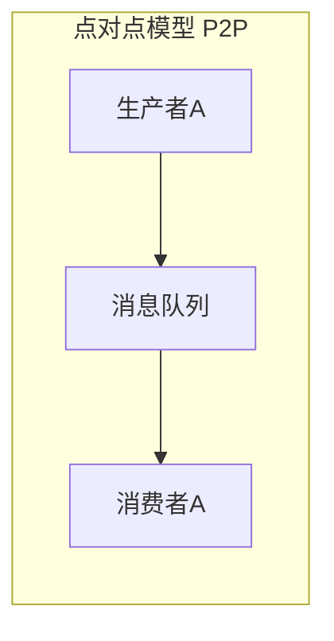

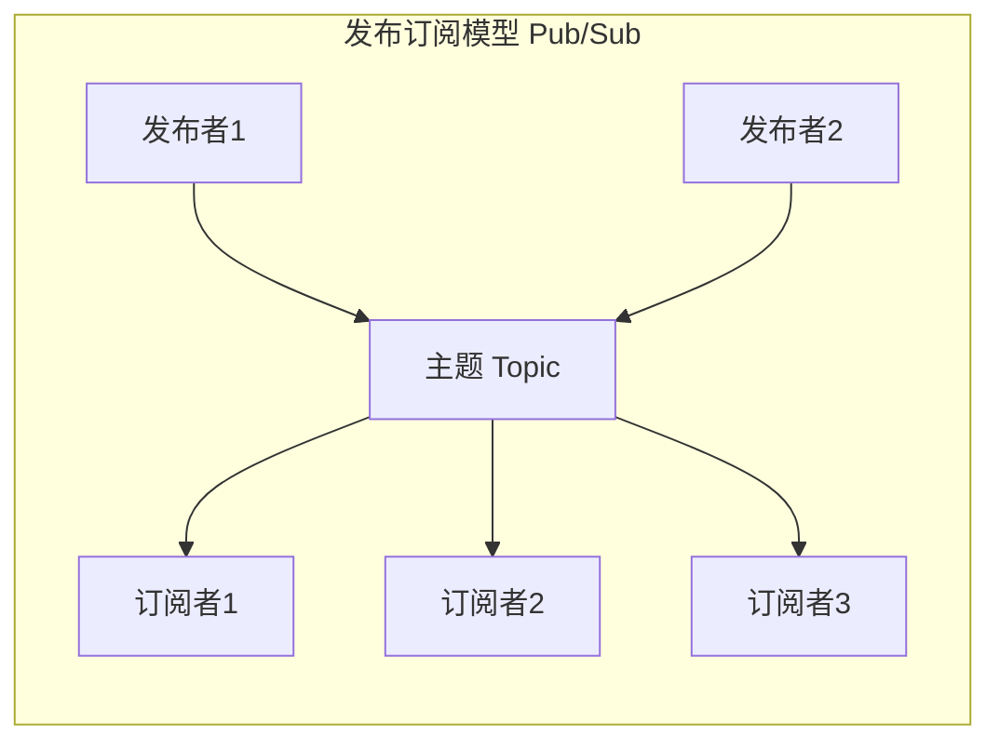

| 模型 | 特点 | 典型场景 |
|:---:|:---|:---|
| **点对点模型** | 一条消息只能被一个消费者消费 | 电话客服系统：一个客户呼入只能被一位客服处理 |
| **发布/订阅模型** | 一条消息可以被多个订阅者同时接收 | 报纸订阅：一份报纸可以被多人阅读 |

> **💡 关键点**：Kafka 同时支持这两种消息模型，通过消费者组（Consumer Group）机制实现。

#### 1.1.3 消息格式设计

消息引擎的核心要解决两个问题：

1. **消息格式**：如何设计消息使其能准确表达业务语义
2. **传输协议**：如何将消息可靠地传输出去

**常见的消息格式方案：**

| 方案 | 特点 |
|:---|:---|
| CSV/XML/JSON | 通用性强，但性能开销较大 |
| Protocol Buffer (Google) | 二进制格式，高效紧凑 |
| Thrift (Facebook) | 跨语言序列化框架 |
| **Kafka 方案** | **纯二进制字节序列**，结构化但需转换 |

### 🔧 实现

#### 1.1.4 削峰填谷机制

**这是消息引擎最核心的价值所在。**

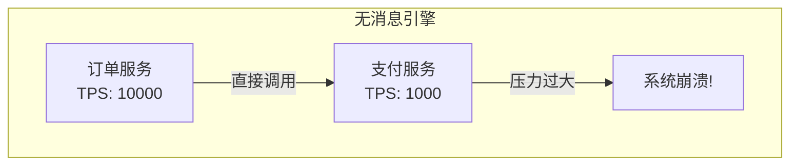

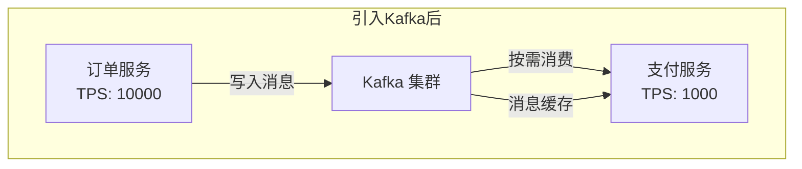

**实际业务案例（以极客时间购课流程为例）：**

1. 用户点击订阅按钮，触发订单生成
2. 订单系统将订单消息写入 Kafka
3. 下游服务（支付、用户验证、课程查询）各自从 Kafka 消费消息
4. 秒杀场景下，Kafka 可缓存瞬时流量，保护下游服务

### ⚠️ 关键点

| 要点 | 说明 |
|:---|:---|
| **削峰填谷** | 缓冲上下游瞬时突发流量，避免系统雪崩 |
| **异步解耦** | 生产者和消费者互不依赖，独立扩展 |
| **消息持久化** | 消息保存在磁盘，支持重复消费 |
| **JMS 规范** | Kafka 并未完全遵循 JMS 规范，而是另辟蹊径 |

---

## 1.2 Kafka 核心术语详解

### 📌 背景

要深入学习 Kafka，首先必须掌握其核心术语。这些术语构成了 Kafka 的概念体系，理解它们是后续学习的基础。

### 📐 原理

#### 1.2.1 Kafka 消息架构三层结构

Kafka 的消息组织采用"主题-分区-消息"的三层结构：

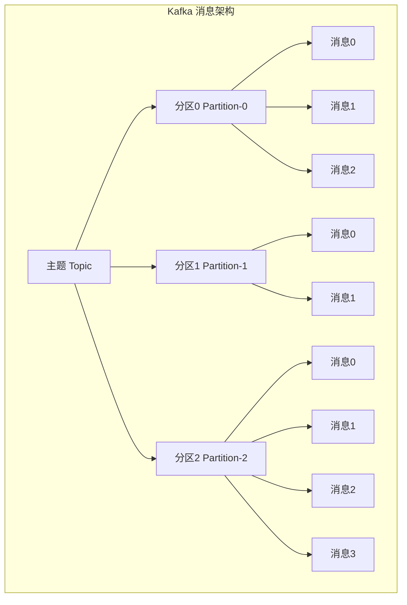

| 层级 | 概念 | 说明 |
|:---:|:---|:---|
| **第一层** | 主题（Topic） | 逻辑容器，按业务区分，每个主题可配置 M 个分区 |
| **第二层** | 分区（Partition） | 有序消息序列，每个分区配置 N 个副本，只有 Leader 对外提供服务 |
| **第三层** | 消息（Record） | 分区内的每条消息都有唯一的位移（Offset），从 0 开始递增 |

#### 1.2.2 Broker 与集群架构

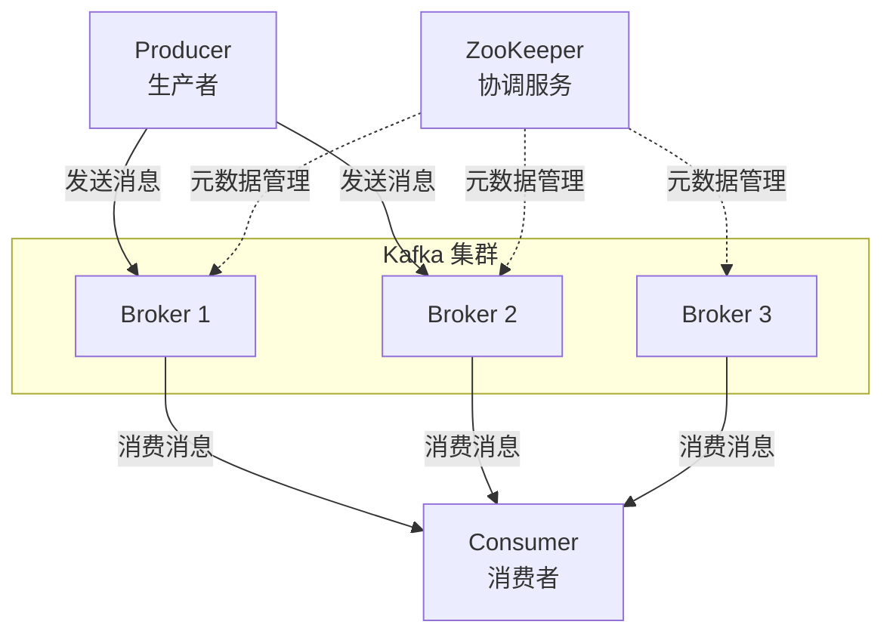

**核心组件说明：**

| 组件 | 英文名 | 作用 |
|:---|:---|:---|
| **Broker** | 服务器节点 | 接收和处理客户端请求，持久化消息数据 |
| **Producer** | 生产者 | 向主题发布消息的客户端应用程序 |
| **Consumer** | 消费者 | 从主题订阅消息的客户端应用程序 |
| **ZooKeeper** | 协调服务 | 保存集群元数据信息（Broker 列表、Topic 配置等） |

#### 1.2.3 副本机制：Leader 与 Follower

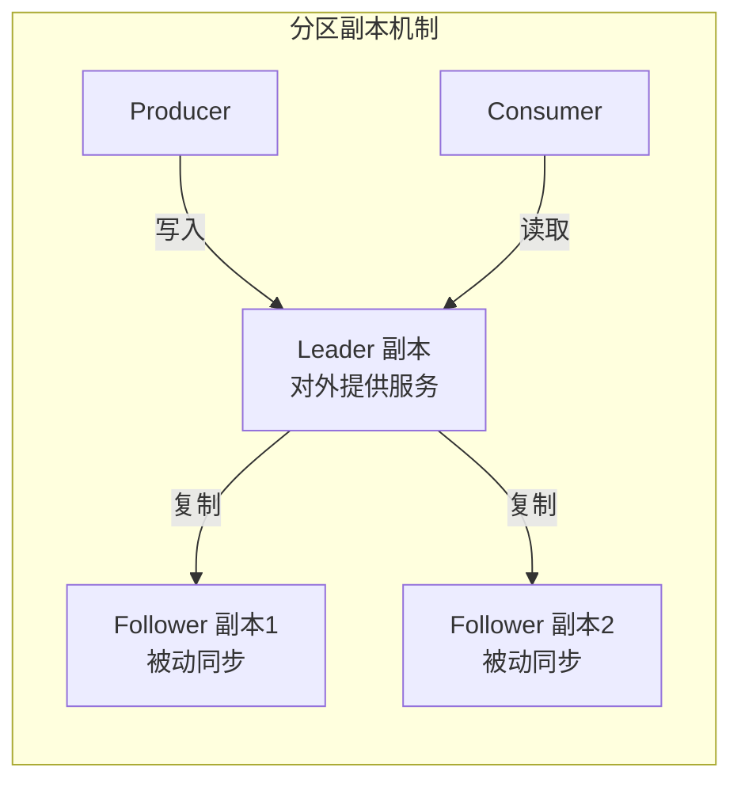

**副本机制要点：**

| 项目 | Leader 副本 | Follower 副本 |
|:---|:---|:---|
| **对外服务** | ✅ 处理所有读写请求 | ❌ 不对外提供服务 |
| **数据写入** | 接收生产者消息 | 从 Leader 拉取消息同步 |
| **故障切换** | 宕机时触发新选举 | 可被选为新 Leader |

> **⚠️ 注意**：与 MySQL 不同，Kafka 的 Follower 副本不能处理读请求。这样设计是为了保证 **Read-your-writes** 和 **单调读** 语义。

#### 1.2.4 消费者组与重平衡

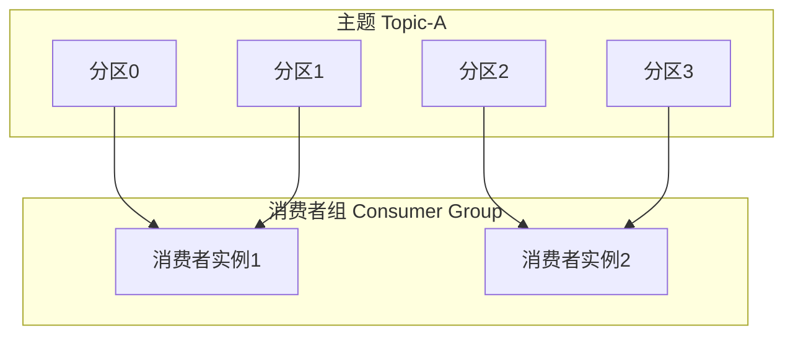

**消费者组核心概念：**

| 概念 | 说明 |
|:---|:---|
| **消费者组** | 多个消费者实例组成的一个组，共同消费一组主题 |
| **分区分配** | 每个分区只能被组内一个消费者实例消费 |
| **重平衡 (Rebalance)** | 消费者加入或退出时，自动重新分配分区 |

> **💡 双刃剑**：重平衡既是 Kafka 实现高可用的重要手段，也是很多消费者问题的根源（会在后续章节详细讨论）。

#### 1.2.5 两种位移概念

Kafka 中有两个容易混淆的"位移"概念：

| 位移类型 | 英文 | 含义 | 特点 |
|:---|:---|:---|:---|
| **分区位移** | Offset | 消息在分区内的位置 | 固定不变，从 0 开始递增 |
| **消费者位移** | Consumer Offset | 消费者当前消费到的位置 | 随消费进度变化 |

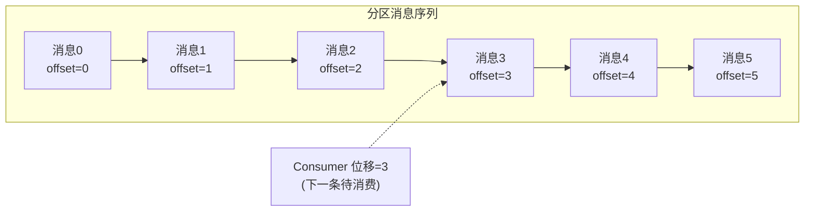

### 🔧 实现

#### 1.2.6 消息日志存储机制

Kafka 使用**追加写入（Append-only）**的消息日志来保存数据：

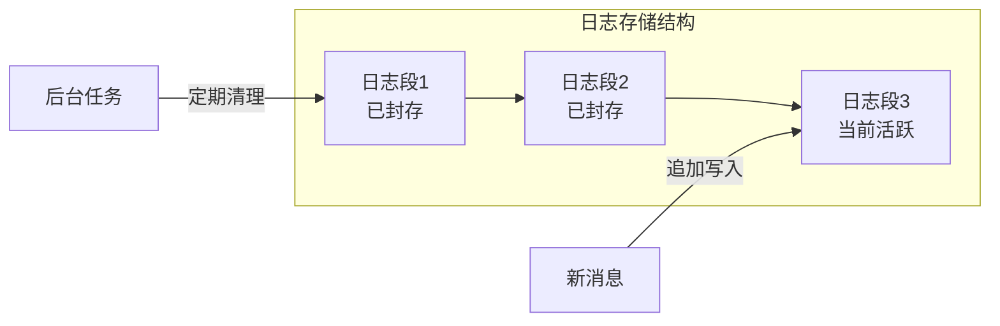

**存储机制要点：**

| 特性 | 说明 |
|:---|:---|
| **顺序写入** | 避免随机 I/O，实现高吞吐量 |
| **日志段切分** | 写满后自动切分新段，老段封存 |
| **定期删除** | 后台任务清理过期日志段，回收磁盘空间 |

### ⚠️ 关键点

**Kafka 核心术语速查表：**

| 术语 | 英文 | 一句话解释 |
|:---|:---|:---|
| 消息 | Record | Kafka 处理的主要对象 |
| 主题 | Topic | 承载消息的逻辑容器，用于区分业务 |
| 分区 | Partition | 有序不变的消息序列，主题的物理存储单元 |
| 消息位移 | Offset | 分区内每条消息的位置，单调递增且不变 |
| 副本 | Replica | 同一消息的多份拷贝，分 Leader 和 Follower |
| 生产者 | Producer | 发布消息的应用程序 |
| 消费者 | Consumer | 订阅消息的应用程序 |
| 消费者位移 | Consumer Offset | 消费者消费进度的标记 |
| 消费者组 | Consumer Group | 多消费者实例组成的组，共同消费分区 |
| 重平衡 | Rebalance | 消费者组内重新分配分区的过程 |

---

## 1.3 Kafka 的定位与演进

### 📌 背景

Apache Kafka 诞生于 LinkedIn，最初是为了解决数据实时处理方面的需求。LinkedIn 早期面临的主要问题包括：

1. **数据正确性不足**：采用轮询方式收集数据，间隔时间难以确定
2. **系统高度定制化**：各业务系统需要对接数据收集模块，维护成本高
3. **现有方案不理想**：ActiveMQ 无法满足性能需求

### 📐 原理

#### 1.3.1 Kafka 的双重身份

> **Apache Kafka 是消息引擎系统，也是分布式流处理平台。**

这是理解 Kafka 定位的核心观点。

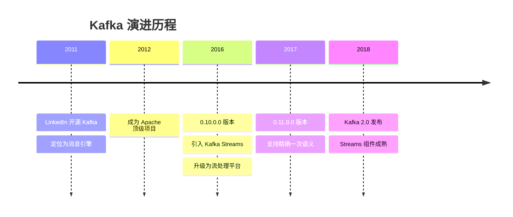

#### 1.3.2 流处理平台的优势

Kafka 作为流处理平台相比其他框架（Spark Streaming、Flink）的独特优势：

**优势一：端到端的精确一次处理语义（Exactly-Once Semantics, EOS）**

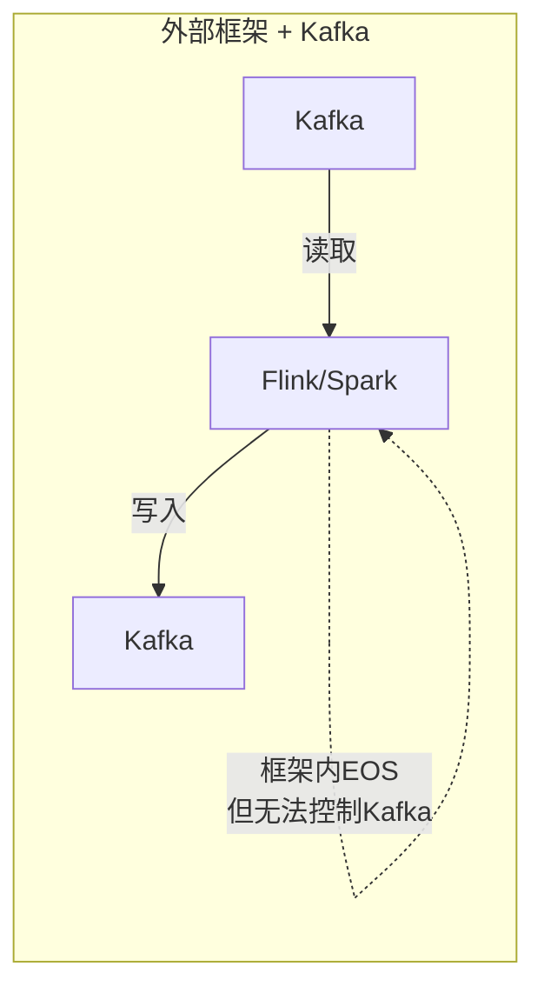

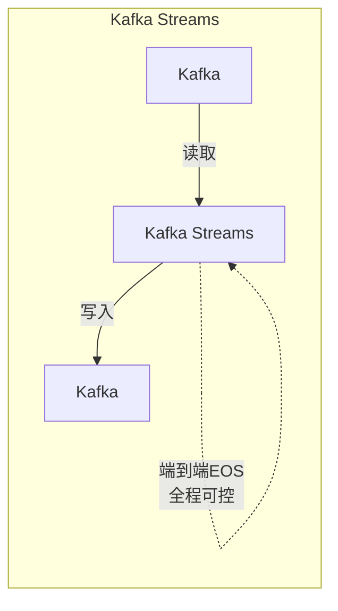

> 由于所有数据流转和计算都在 Kafka 内部完成，Kafka 可以实现真正的端到端精确一次处理语义。

**优势二：轻量级客户端库定位**

| 特性 | Kafka Streams | Flink/Spark |
|:---|:---|:---|
| **定位** | Java 客户端库 | 完整功能平台 |
| **部署方式** | 普通 Java 应用 | 需要集群调度器 |
| **资源管理** | 自行管理 | 框架提供 |
| **适用场景** | 中小规模流处理 | 大规模数据处理 |

### 🔧 实现

#### 1.3.3 Kafka 生态圈

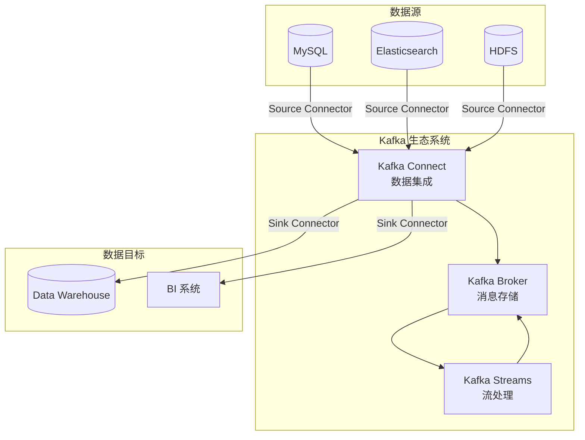

**核心组件：**

| 组件 | 功能 | 说明 |
|:---|:---|:---|
| **Kafka Broker** | 消息存储与传输 | 核心功能，提供高吞吐、持久化 |
| **Kafka Connect** | 数据集成 | 通过 Connector 连接外部系统 |
| **Kafka Streams** | 流处理 | 客户端库，用于构建实时应用 |

### ⚠️ 关键点

| 要点 | 说明 |
|:---|:---|
| **双重定位** | 既是消息引擎，也是流处理平台 |
| **EOS 优势** | 可实现端到端精确一次语义，其他框架难以做到 |
| **轻量级设计** | 作为客户端库而非完整平台，适合中小规模场景 |
| **生态完善** | Kafka Connect + Kafka Streams 形成完整数据处理生态 |

---

## 1.4 Kafka 发行版选择指南

### 📌 背景

市面上存在多个 Kafka "发行版"，类似于 Linux 有 CentOS、Ubuntu 等不同发行版。选择合适的发行版对于生产环境至关重要。

### 📐 原理

#### 1.4.1 三大主流 Kafka 发行版

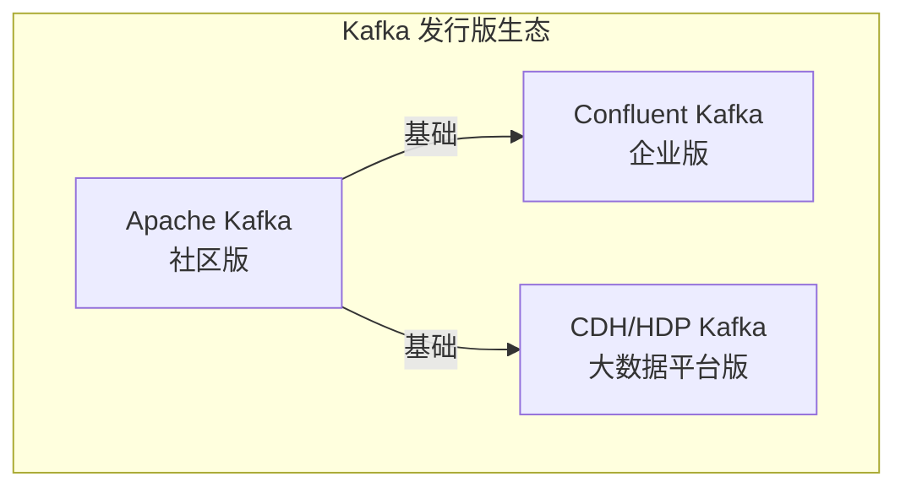

### 🔧 实现

#### 1.4.2 各发行版详细对比

**Apache Kafka（社区版）**

| 项目 | 说明 |
|:---|:---|
| **优势** | 迭代速度最快，社区响应度高，把控度高 |
| **劣势** | 仅提供基础组件，缺少监控工具和高级 Connector |
| **适用场景** | 需要高度定制化，有自研能力的团队 |

**Confluent Kafka**

| 项目 | 说明 |
|:---|:---|
| **创始团队** | Kafka 三位创始人（包括饶军）创办的公司 |
| **免费版特性** | Schema Registry、REST Proxy、更多 Connector |
| **企业版特性** | 跨数据中心备份、集群监控 |
| **劣势** | 国内资料较少，普及率低 |
| **适用场景** | 需要高级特性，有一定预算的企业 |

**CDH/HDP Kafka**

| 项目 | 说明 |
|:---|:---|
| **提供方** | Cloudera (CDH) 和 Hortonworks (HDP)，现已合并 |
| **优势** | 开箱即用，统一管理界面，与大数据组件无缝集成 |
| **劣势** | 版本滞后，把控度低，与社区版有延迟 |
| **适用场景** | 需要快速搭建多框架数据平台的企业 |

#### 1.4.3 发行版选型决策树

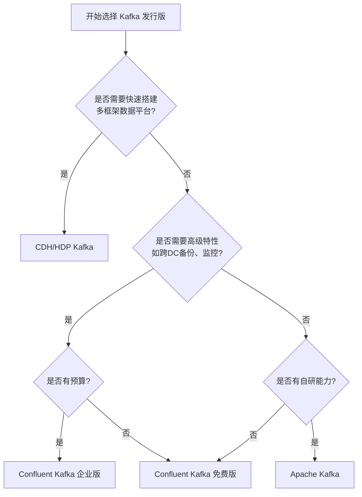

### ⚠️ 关键点

| 发行版 | 一句话总结 |
|:---|:---|
| **Apache Kafka** | 最正宗，迭代快，适合有自研能力的团队 |
| **Confluent Kafka** | 高级特性丰富，原班人马打造，但国内资料少 |
| **CDH/HDP Kafka** | 开箱即用，适合多框架场景，但版本滞后 |

---

## 1.5 Kafka 版本演进与选型

### 📌 背景

Kafka 版本选择直接关系到能否使用特定功能特性。了解各版本差异是技术选型和架构评估的重要依据。

### 📐 原理

#### 1.5.1 版本号命名规则

**Kafka 版本号示例解析：**

```
kafka_2.11-2.1.1
  │     │ │ │
  │     │ │ └─ Patch 号（修订版本）
  │     │ └─── Minor Version（小版本）
  │     └───── Major Version（大版本）
  └─────────── Scala 编译器版本（非 Kafka 版本！）
```

> **⚠️ 常见误区**：`2.11` 是 Scala 版本，真正的 Kafka 版本是 `2.1.1`

#### 1.5.2 版本演进历程

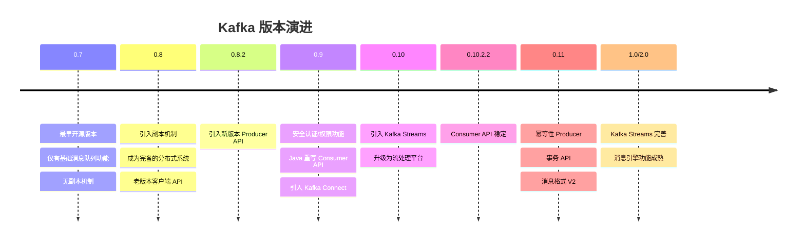

### 🔧 实现

#### 1.5.3 各版本特性详解

| 版本 | 重要特性 | 建议 |
|:---|:---|:---|
| **0.7** | 最古老版本，无副本机制 | ❌ 完全不推荐使用 |
| **0.8** | 引入副本机制，老版本客户端 | 若必须使用，至少升级到 0.8.2.2 |
| **0.9** | 安全认证，新 Producer 稳定 | 不要使用新版 Consumer API (Bug 多) |
| **0.10** | Kafka Streams 引入 | 建议至少升级到 0.10.2.2 |
| **0.11** | 幂等 Producer，事务，消息格式 V2 | 目前最主流版本之一，推荐 0.11.0.3 |
| **1.0/2.0** | Streams 完善 | 消息引擎场景推荐，Streams 场景建议 2.0+ |

#### 1.5.4 版本选择决策指南

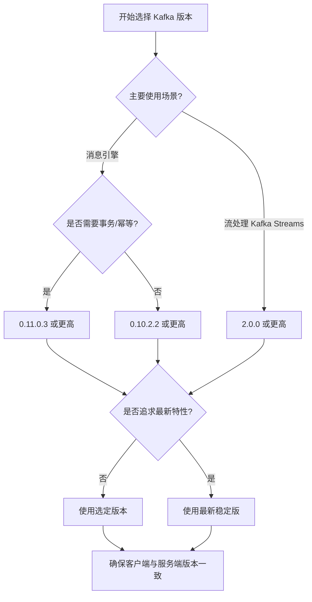

### ⚠️ 关键点

| 要点 | 说明 |
|:---|:---|
| **版本号解读** | `kafka_2.11-2.1.1` 中 `2.11` 是 Scala 版本，`2.1.1` 才是 Kafka 版本 |
| **避免过老版本** | 0.7/0.8 版本问题多，不建议生产使用 |
| **0.11 是里程碑** | 引入幂等和事务，消息格式 V2，功能完备 |
| **版本一致性** | 服务端和客户端版本保持一致，否则损失性能优化 |
| **不做小白鼠** | 不要急于使用最新版本，等待社区验证 |

---

## 📝 第一章小结

本章从消息引擎的基本概念出发，系统介绍了 Kafka 的核心知识体系：

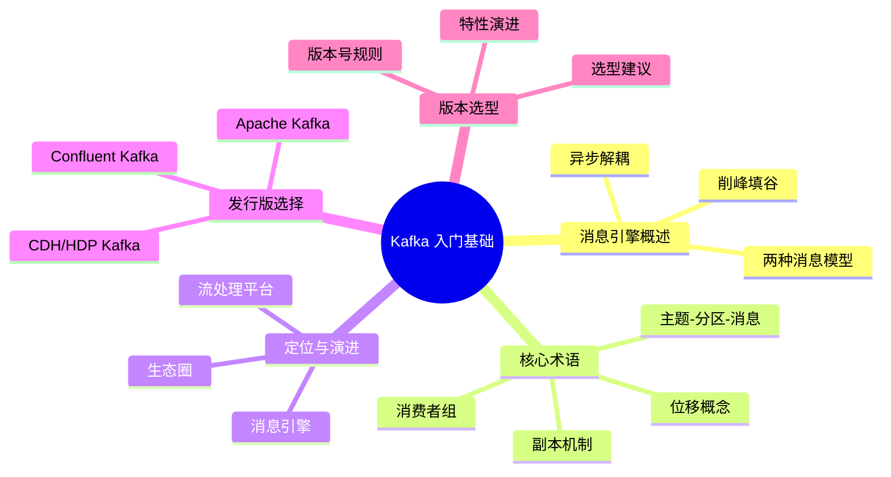

**核心收获：**

1. 理解 Kafka 作为消息引擎的核心价值：**削峰填谷、异步解耦**
2. 掌握 Kafka 的核心术语：**主题、分区、副本、消费者组、位移**
3. 明确 Kafka 的双重定位：**消息引擎 + 流处理平台**
4. 学会根据场景选择合适的 **发行版** 和 **版本**

---

> 📖 **下一章预告**：第三章将介绍 Kafka 生产者客户端详解，包括分区机制、压缩算法、无消息丢失配置等核心知识。

---

# 第二章 集群部署与核心参数配置

本章是 Kafka 运维的核心章节，将从操作系统选择、磁盘规划、网络带宽等基础设施层面出发，详细介绍 Kafka 集群的部署方案和核心参数配置，帮助运维工程师搭建高性能、高可用的 Kafka 集群。

---

## 2.1 线上集群部署方案

### 📌 背景

生产环境中部署 Kafka 集群需要综合考虑多种因素。与开发测试环境不同，线上环境需要仔细评估操作系统、磁盘类型、存储容量和网络带宽等关键指标，这些决策直接影响 Kafka 集群的性能、稳定性和成本。

虽然 Kafka 是 JVM 系应用，理论上可以跨平台运行，但不同操作系统和硬件配置对 Kafka 的影响差异巨大。因此，在部署前进行全面的规划至关重要。

### 📐 原理

#### 2.1.1 操作系统选择：为什么推荐 Linux

Kafka 在不同操作系统上的表现差异主要体现在以下三个方面：

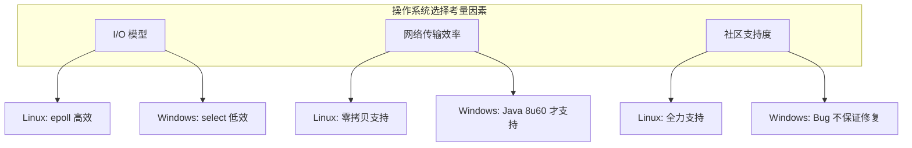

**因素一：I/O 模型差异**

| I/O 模型 | 说明 | 效率 |
|:---|:---|:---:|
| 阻塞式 I/O | 线程阻塞等待 I/O 完成 | ⭐ |
| 非阻塞式 I/O | 轮询检查 I/O 状态 | ⭐⭐ |
| I/O 多路复用 (select) | 同时监控多个文件描述符 | ⭐⭐⭐ |
| I/O 多路复用 (epoll) | Linux 特有，事件驱动 | ⭐⭐⭐⭐ |
| 异步 I/O (IOCP) | Windows 特有 | ⭐⭐⭐⭐ |

Kafka 客户端底层使用 Java 的 Selector：

- **Linux 平台**：基于 `epoll` 实现，事件驱动，高效
- **Windows 平台**：基于 `select` 实现，轮询方式，效率较低

**因素二：零拷贝（Zero Copy）技术**

```mermaid
graph LR
    subgraph "传统数据传输"
        D1[磁盘] -->|1.读取| K1[内核缓冲区]
        K1 -->|2.拷贝| U1[用户缓冲区]
        U1 -->|3.拷贝| K2[Socket缓冲区]
        K2 -->|4.发送| N1[网络]
    end
```

```mermaid
graph LR
    subgraph "零拷贝传输"
        D2[磁盘] -->|1.读取| K3[内核缓冲区]
        K3 -->|2.直接发送| N2[网络]
    end
```

零拷贝技术避免了昂贵的内核态与用户态之间的数据拷贝，实现了磁盘到网络的快速数据传输。Linux 原生支持零拷贝，而 Windows 需要 Java 8 Update 60 以上版本才能使用。

**因素三：社区支持度**

Linux 平台是 Kafka 社区的首要支持对象。在 Windows 平台上发现的 Bug，社区通常不会投入资源修复，而是建议用户升级或迁移到 Linux 平台。

### 🔧 实现

#### 2.1.2 磁盘规划

**机械硬盘 vs SSD**

| 对比项 | 机械硬盘 (HDD) | 固态硬盘 (SSD) |
|:---|:---|:---|
| **成本** | 低 | 高 |
| **容量** | 大 | 相对较小 |
| **随机读写** | 慢 | 快 |
| **顺序读写** | 较快 | 快 |
| **可靠性** | 易损坏 | 更可靠 |

**💡 建议：使用普通机械硬盘即可。**

原因分析：

- Kafka 主要使用**顺序读写**操作，规避了机械硬盘随机读写慢的劣势
- 机械硬盘物美价廉，性价比更高
- 可靠性问题由 Kafka 的副本机制在软件层面解决

**是否需要 RAID？**

```mermaid
graph TD
    A[磁盘方案选择] --> B{是否追求性价比?}
    B -->|是| C[普通磁盘组 + Kafka 副本机制]
    B -->|否| D[RAID 阵列]
    
    C --> E[Kafka 1.1+ 支持<br/>Failover 故障转移]
    D --> F[硬件级冗余<br/>负载均衡]
```

RAID 的两大优势：

1. 提供冗余的磁盘存储空间
2. 提供负载均衡

但是 Kafka 在软件层面已经提供了这些能力：

- **副本机制**：实现数据冗余
- **分区机制**：实现负载均衡
- **Kafka 1.1+**：支持磁盘故障转移（Failover），坏掉的磁盘数据自动转移到其他正常磁盘

**💡 建议：追求性价比的公司可以不搭建 RAID，使用普通磁盘组成存储空间即可。**

#### 2.1.3 磁盘容量计算

**计算公式：**

```
总容量 = 每天消息量 × 消息大小 × 副本数 × 保留天数 × (1 + 索引开销) ÷ 压缩比
```

**实际案例计算：**

| 参数 | 数值 |
|:---|:---|
| 每天消息量 | 1 亿条 |
| 平均消息大小 | 1 KB |
| 副本数 | 2 |
| 保留时间 | 14 天 |
| 索引等额外开销 | 10% |
| 压缩比 | 0.75 |

计算过程：

```
每天数据量 = 1亿 × 1KB × 2 = 200 GB
含索引开销 = 200 GB × 1.1 = 220 GB
两周总量 = 220 GB × 14 = 3.08 TB
压缩后容量 = 3.08 TB × 0.75 ≈ 2.25 TB
```

**磁盘容量规划要素：**

| 要素 | 说明 |
|:---|:---|
| 新增消息数 | 每天产生的消息条数 |
| 消息留存时间 | log.retention.hours 配置 |
| 平均消息大小 | 根据业务评估 |
| 副本数 | replication.factor 配置 |
| 是否启用压缩 | compression.type 配置 |

#### 2.1.4 网络带宽规划

带宽资源是 Kafka 最容易成为瓶颈的资源之一，据统计，带宽不足导致的性能问题占比超过 60%。

**服务器数量计算方法：**

```mermaid
graph TD
    A[业务需求: 1小时处理1TB数据] --> B[换算: 每秒处理 2336 Mb]
    B --> C[单机可用带宽: 1Gbps × 70% = 700 Mbps]
    C --> D[保守预留: 700 Mbps ÷ 3 ≈ 240 Mbps]
    D --> E[所需服务器: 2336 ÷ 240 ≈ 10 台]
    E --> F[考虑副本: 10 × 3 = 30 台]
```

**带宽规划关键参数：**

| 参数 | 说明 | 建议值 |
|:---|:---|:---|
| 网络带宽利用率 | 超过此值可能丢包 | 70% |
| 预留带宽比例 | 避免常规性打满 | 使用 1/3 |
| 副本因子 | 需要乘以此倍数 | 通常为 3 |

### ⚠️ 关键点

| 要点 | 说明 |
|:---|:---|
| **操作系统** | 强烈推荐 Linux，Windows 仅适合测试环境 |
| **磁盘类型** | 机械硬盘即可满足需求，性价比最优 |
| **RAID** | 非必需，Kafka 软件层面已提供冗余和故障转移 |
| **容量规划** | 综合考虑消息量、副本数、留存时间、压缩比 |
| **带宽规划** | 最容易成为瓶颈，需预留足够余量 |

---

## 2.2 Broker 端核心参数配置

### 📌 背景

Kafka Broker 提供了近 200 个配置参数，但绝大部分可以使用默认值。本节重点介绍那些**必须修改默认值**的关键参数，这些参数直接影响 Kafka 集群的正确性、性能和稳定性。

这里介绍的参数也称为**静态参数（Static Configs）**，需要在 `server.properties` 配置文件中设置，修改后必须重启 Broker 才能生效。

### 📐 原理

Broker 端参数按功能可分为以下几类：

```mermaid
graph TB
    subgraph "Broker 核心参数分类"
        ST[存储配置]
        ZK[ZooKeeper 连接]
        LI[监听器配置]
        TP[Topic 管理]
        RT[数据留存]
    end
    
    ST --> ST1[log.dirs]
    ZK --> ZK1[zookeeper.connect]
    LI --> LI1[listeners]
    LI --> LI2[advertised.listeners]
    TP --> TP1[auto.create.topics.enable]
    TP --> TP2[unclean.leader.election.enable]
    TP --> TP3[auto.leader.rebalance.enable]
    RT --> RT1["log.retention.{hours|minutes|ms}"]
    RT --> RT2[log.retention.bytes]
    RT --> RT3[message.max.bytes]
```

### 🔧 实现

#### 2.2.1 存储配置：log.dirs

| 参数 | 说明 |
|:---|:---|
| `log.dirs` | 指定 Broker 使用的多个文件目录路径（CSV 格式） |
| `log.dir` | 单个路径，不推荐使用 |

**配置示例：**

```properties
log.dirs=/home/kafka1,/home/kafka2,/home/kafka3
```

**配置多路径的好处：**

```mermaid
graph TB
    subgraph "多磁盘配置优势"
        A[配置多个 log.dirs] --> B[提升读写性能]
        A --> C[故障转移能力]
        
        B --> B1[多磁盘并行读写<br/>提高吞吐量]
        C --> C1[Kafka 1.1+<br/>坏盘自动迁移数据]
    end
```

- **提升读写性能**：多块物理磁盘同时读写数据，吞吐量更高
- **故障转移（Failover）**：Kafka 1.1+ 版本，坏盘上的数据自动转移到其他正常磁盘，Broker 继续工作

> **💡 最佳实践**：只需设置 `log.dirs`，配置多个路径并挂载到不同物理磁盘。

#### 2.2.2 ZooKeeper 连接配置

| 参数 | 说明 |
|:---|:---|
| `zookeeper.connect` | ZooKeeper 集群地址，CSV 格式 |

**基本配置：**

```properties
zookeeper.connect=zk1:2181,zk2:2181,zk3:2181
```

**多 Kafka 集群共享 ZooKeeper（使用 chroot）：**

```mermaid
graph TB
    subgraph "ZooKeeper 集群"
        ZK[zk1:2181, zk2:2181, zk3:2181]
    end
    
    subgraph "Kafka 集群1"
        K1[kafka1]
    end
    
    subgraph "Kafka 集群2"
        K2[kafka2]
    end
    
    K1 -->|"/kafka1"| ZK
    K2 -->|"/kafka2"| ZK
```

```properties
# Kafka 集群1
zookeeper.connect=zk1:2181,zk2:2181,zk3:2181/kafka1

# Kafka 集群2
zookeeper.connect=zk1:2181,zk2:2181,zk3:2181/kafka2
```

> **⚠️ 注意**：chroot 只需写一次，加在最后。错误写法：`zk1:2181/kafka1,zk2:2181/kafka1`

#### 2.2.3 监听器配置

| 参数 | 说明 |
|:---|:---|
| `listeners` | Broker 监听的地址和端口 |
| `advertised.listeners` | 对外发布的地址（用于客户端连接） |
| `host.name/port` | ❌ 已过期，不要使用 |

**监听器格式：**

```
<协议名称>://<主机名>:<端口号>
```

**配置示例：**

```properties
listeners=PLAINTEXT://hostname:9092,SSL://hostname:9093
advertised.listeners=PLAINTEXT://public-hostname:9092
```

**内置协议类型：**

| 协议 | 说明 |
|:---|:---|
| PLAINTEXT | 明文传输，无加密 |
| SSL | SSL/TLS 加密传输 |
| SASL_PLAINTEXT | SASL 认证 + 明文传输 |
| SASL_SSL | SASL 认证 + SSL 加密 |

**自定义协议：**

```properties
listeners=CONTROLLER://localhost:9092
listener.security.protocol.map=CONTROLLER:PLAINTEXT
```

> **💡 最佳实践**：全部使用主机名而非 IP 地址。Broker 源码中使用主机名，混用 IP 可能导致连接问题。

#### 2.2.4 Topic 管理参数

**auto.create.topics.enable**

| 值 | 行为 |
|:---|:---|
| true（默认） | Producer 向不存在的 Topic 发送消息时自动创建 |
| false | 禁止自动创建，需手动创建 Topic |

> **💡 建议：设置为 false**。避免因拼写错误创建大量垃圾 Topic（如把 test 写成 tst）。

**unclean.leader.election.enable**

这是一个关于**数据一致性 vs 可用性**权衡的参数：

```mermaid
graph TD
    A[Leader 副本挂掉] --> B{ISR 中是否有副本?}
    B -->|有| C[从 ISR 中选举新 Leader]
    B -->|无| D{unclean.leader.election.enable}
    D -->|false| E[分区不可用<br/>保证数据一致性]
    D -->|true| F[从落后副本选举<br/>可能丢失数据]
```

| 值 | 行为 | 后果 |
|:---|:---|:---|
| false | 只从 ISR 中选举 Leader | 可能导致分区不可用 |
| true | 允许从落后副本选举 | 可能丢失数据 |

> **💡 强烈建议：设置为 false**。宁可分区暂时不可用，也不要丢失数据。

**auto.leader.rebalance.enable**

| 值 | 行为 |
|:---|:---|
| true（默认） | 定期重新选举 Leader，即使当前 Leader 正常 |
| false | 不自动换 Leader |

> **💡 建议：设置为 false**。换 Leader 代价很高（所有客户端需要切换），且没有性能收益。

#### 2.2.5 数据留存参数

**log.retention.{hours|minutes|ms}**

控制消息数据保存时长，三个参数优先级：`ms` > `minutes` > `hours`

```properties
# 保存 7 天（默认值）
log.retention.hours=168

# 保存 3 天
log.retention.hours=72
```

**log.retention.bytes**

控制 Broker 为消息保存的总磁盘容量：

| 值 | 说明 |
|:---|:---|
| -1（默认） | 无限制，直到磁盘用尽 |
| 具体数值 | 限制该 Broker 上的消息总量 |

适用场景：云上多租户 Kafka 集群，限制每个租户的磁盘使用量。

**message.max.bytes**

控制 Broker 能接收的最大消息大小：

| 默认值 | 说明 |
|:---|:---|
| 1000012（约 1MB） | 对于很多场景太小 |

> **💡 建议：设置一个较大的值**。生产环境中超过 1MB 的消息很常见，建议设置为 10MB 或更大。

### ⚠️ 关键点

**Broker 端核心参数速查表：**

| 参数 | 建议值 | 说明 |
|:---|:---|:---|
| `log.dirs` | 多路径 CSV | 配置多块磁盘，提升性能和容错 |
| `zookeeper.connect` | 带 chroot | 支持多集群共享 ZK |
| `listeners` | 使用主机名 | 不要使用 IP 地址 |
| `auto.create.topics.enable` | **false** | 禁止自动创建 Topic |
| `unclean.leader.election.enable` | **false** | 禁止从落后副本选举 |
| `auto.leader.rebalance.enable` | **false** | 禁止自动换 Leader |
| `log.retention.hours` | 按需设置 | 消息保留时间 |
| `message.max.bytes` | 10485760+ | 调大最大消息限制 |

---

## 2.3 Topic 级别参数配置

### 📌 背景

除了全局的 Broker 参数，Kafka 还支持 Topic 级别的参数配置。Topic 级别参数会**覆盖**全局 Broker 参数，允许不同的 Topic 根据业务需要设置不同的配置。

例如，交易数据需要保存 6 个月，而日志数据只需保存 7 天。这种场景下，使用 Topic 级别参数就非常合适。

### 📐 原理

```mermaid
graph TB
    subgraph "参数优先级"
        TP[Topic 级别参数] -->|覆盖| BP[Broker 全局参数]
    end
    
    subgraph "应用场景"
        T1[交易主题<br/>retention.ms=半年]
        T2[日志主题<br/>retention.ms=7天]
        T3[大消息主题<br/>max.message.bytes=5MB]
    end
```

### 🔧 实现

#### 2.3.1 核心 Topic 级别参数

**retention.ms**

规定 Topic 消息的保存时长，覆盖 Broker 的 `log.retention.hours`。

```bash
# 创建 Topic 时设置：保存 180 天
bin/kafka-topics.sh --bootstrap-server localhost:9092 \
    --create --topic transaction \
    --partitions 3 --replication-factor 2 \
    --config retention.ms=15552000000
```

**retention.bytes**

规定 Topic 预留的磁盘空间大小，适用于多租户场景。

**max.message.bytes**

限定 Topic 能接收的最大消息大小。

```bash
# 修改已存在的 Topic 参数：最大消息 10MB
bin/kafka-configs.sh --zookeeper localhost:2181 \
    --entity-type topics --entity-name transaction \
    --alter --add-config max.message.bytes=10485760
```

#### 2.3.2 参数设置方法

**方法一：创建 Topic 时设置**

```bash
bin/kafka-topics.sh --bootstrap-server localhost:9092 \
    --create --topic my_topic \
    --partitions 1 --replication-factor 1 \
    --config retention.ms=15552000000 \
    --config max.message.bytes=5242880
```

**方法二：修改已有 Topic**

```bash
bin/kafka-configs.sh --zookeeper localhost:2181 \
    --entity-type topics --entity-name my_topic \
    --alter --add-config max.message.bytes=10485760
```

> **💡 建议**：统一使用 `kafka-configs` 脚本修改 Topic 参数。

### ⚠️ 关键点

| 要点 | 说明 |
|:---|:---|
| **覆盖机制** | Topic 参数优先级高于 Broker 全局参数 |
| **使用场景** | 不同业务的 Topic 需要不同的留存时间或消息大小限制 |
| **推荐工具** | 使用 `kafka-configs.sh` 统一管理 |

---

## 2.4 JVM 参数配置

### 📌 背景

Kafka 服务器端代码由 Scala 编写，最终编译为 JVM 字节码运行。JVM 参数设置直接影响 Kafka Broker 的性能和稳定性，特别是堆内存大小和垃圾回收器的选择。

### 📐 原理

```mermaid
graph TB
    subgraph "JVM 参数影响"
        HEAP[堆大小<br/>KAFKA_HEAP_OPTS]
        GC[垃圾回收器<br/>KAFKA_JVM_PERFORMANCE_OPTS]
    end
    
    HEAP --> H1[过小: OOM, 频繁 GC]
    HEAP --> H2[过大: GC 停顿时间长]
    
    GC --> G1[Java 7: CMS 或 Parallel]
    GC --> G2[Java 8+: G1 推荐]
```

### 🔧 实现

#### 2.4.1 Java 版本选择

| Java 版本 | 建议 |
|:---|:---|
| Java 6 | ❌ 太老，完全不推荐 |
| Java 7 | ❌ Kafka 2.0 已不支持 |
| Java 8+ | ✅ 推荐使用 |

#### 2.4.2 堆大小配置

**建议值：6GB**

这是业界公认的合理值。原因：

- 默认 1GB 太小，Broker 与客户端交互时会创建大量 ByteBuffer
- 过大的堆会导致 GC 停顿时间过长

```bash
export KAFKA_HEAP_OPTS="--Xms6g --Xmx6g"
```

#### 2.4.3 GC 策略选择

| Java 版本 | CPU 资源 | 推荐 GC |
|:---|:---|:---|
| Java 7 | 充足 | CMS (`-XX:+UseCurrentMarkSweepGC`) |
| Java 7 | 有限 | Parallel (`-XX:+UseParallelGC`) |
| Java 8+ | 任意 | **G1** (`-XX:+UseG1GC`) ✅ |

G1 的优势：

- 更少的 Full GC
- 更少的调优参数
- 开箱即用，表现优于 CMS

#### 2.4.4 完整 JVM 参数配置

```bash
# 设置堆大小
export KAFKA_HEAP_OPTS="--Xms6g --Xmx6g"

# 设置 GC 参数（Java 8+ 推荐）
export KAFKA_JVM_PERFORMANCE_OPTS="-server -XX:+UseG1GC \
    -XX:MaxGCPauseMillis=20 \
    -XX:InitiatingHeapOccupancyPercent=35 \
    -XX:+ExplicitGCInvokesConcurrent \
    -Djava.awt.headless=true"

# 启动 Kafka
bin/kafka-server-start.sh config/server.properties
```

### ⚠️ 关键点

| 要点 | 说明 |
|:---|:---|
| **Java 版本** | 至少使用 Java 8 |
| **堆大小** | 推荐 6GB，通过 `KAFKA_HEAP_OPTS` 设置 |
| **GC 策略** | Java 8+ 使用 G1，通过 `KAFKA_JVM_PERFORMANCE_OPTS` 设置 |

---

## 2.5 操作系统参数优化

### 📌 背景

操作系统级别的参数优化是 Kafka 性能调优的重要组成部分。虽然 Kafka 对操作系统的要求不算苛刻，但正确配置以下参数可以显著提升性能和稳定性。

### 📐 原理

```mermaid
graph TB
    subgraph "操作系统关键参数"
        FD[文件描述符限制<br/>ulimit -n]
        FS[文件系统类型]
        SW[Swap 配置]
        FL[Flush 落盘时间]
    end
```

### 🔧 实现

#### 2.5.1 文件描述符限制

```bash
# 查看当前限制
ulimit -n

# 设置为较大值（推荐）
ulimit -n 1000000
```

**说明：**

- 文件描述符是廉价资源，设置大一点没有负面影响
- 设置太小会导致 "Too many open files" 错误
- 这个参数"不重要"（设置简单），但"没有它很重要"（不设会出问题）

#### 2.5.2 文件系统类型

| 文件系统 | 性能 | 建议 |
|:---|:---|:---|
| ext3 | 一般 | ❌ 不推荐 |
| ext4 | 较好 | ⭕ 可用 |
| **XFS** | **最佳** | ✅ **推荐** |
| ZFS | 据报告更强 | 可尝试 |

根据官方测试报告，XFS 的性能明显优于 ext4。

#### 2.5.3 Swap 配置

| swappiness 值 | 行为 | 建议 |
|:---|:---|:---|
| 0 | 完全禁用 swap | ❌ 危险，可能触发 OOM Killer |
| 1 | 几乎不使用 swap | ✅ **推荐** |
| 60（默认） | 积极使用 swap | 不推荐 |

```bash
# 查看当前值
cat /proc/sys/vm/swappiness

# 设置为 1（临时）
sysctl vm.swappiness=1

# 永久设置（编辑 /etc/sysctl.conf）
vm.swappiness=1
```

**为什么不设置为 0？**

设置为 0 时，当物理内存耗尽，操作系统会触发 OOM Killer，随机 kill 进程，没有任何预警。设置为 1 时，开始使用 swap 时会观察到 Broker 性能下降，给管理员留出诊断和处理的时间。

#### 2.5.4 Flush 落盘时间

Kafka 写入消息时，数据先写入操作系统的 Page Cache，然后由操作系统异步刷盘。

```mermaid
graph LR
    P[Producer] -->|写入| B[Broker]
    B -->|写入| PC[Page Cache]
    PC -->|定期 Flush| D[磁盘]
```

| 默认值 | 说明 |
|:---|:---|
| 5 秒 | 可能过于频繁 |

**优化建议：**

- 适当增加提交间隔，降低磁盘写入频率
- 虽然可能丢失 Page Cache 中的数据（机器宕机时），但 Kafka 的副本机制提供了数据冗余
- 可以用稍微放宽的落盘时间换取更好的性能

### ⚠️ 关键点

**操作系统参数速查表：**

| 参数 | 建议值 | 说明 |
|:---|:---|:---|
| 文件描述符 (`ulimit -n`) | 1000000 | 设置足够大，避免 "Too many open files" |
| 文件系统 | XFS | 性能最佳 |
| swappiness | **1** | 接近 0 但不为 0，保留预警能力 |
| Flush 间隔 | 可适当增大 | Kafka 副本机制已提供数据保护 |

---

## 📝 第二章小结

本章从基础设施层面详细介绍了 Kafka 集群的部署方案和核心参数配置：

```mermaid
mindmap
  root((集群部署与配置))
    部署方案
      操作系统选择
      磁盘规划
      容量计算
      带宽规划
    Broker 参数
      存储配置
      ZooKeeper 连接
      监听器配置
      Topic 管理
      数据留存
    Topic 参数
      retention.ms
      max.message.bytes
      设置方法
    JVM 参数
      堆大小 6GB
      G1 垃圾回收器
    操作系统参数
      文件描述符
      XFS 文件系统
      Swap 配置
```

**核心收获：**

1. **操作系统**：Linux 是最佳选择，因为 I/O 模型、零拷贝和社区支持度
2. **磁盘规划**：机械硬盘 + 多路径 + Kafka 副本机制 = 高性价比方案
3. **容量和带宽**：使用公式计算，预留足够余量
4. **Broker 参数**：重点关注 `log.dirs`、`auto.create.topics.enable`、`unclean.leader.election.enable`
5. **JVM**：6GB 堆 + G1 GC 是推荐配置
6. **操作系统**：ulimit 调大、使用 XFS、swappiness=1

---

> 📖 **下一章预告**：第四章将介绍 Kafka 消费者客户端详解，包括消费者组机制、位移提交、重平衡等核心知识。

---

# 第三章 生产者客户端详解

本章深入剖析 Kafka 生产者客户端的核心机制，包括消息分区策略、压缩算法、无消息丢失配置、高级拦截器功能、TCP 连接管理，以及幂等性和事务生产者等高级特性。

---

## 3.1 消息分区机制原理

### 📌 背景

Kafka 的消息组织方式是三层结构：**主题 → 分区 → 消息**。主题下的每条消息只会保存在某一个分区中，而不会在多个分区中被保存多份。分区机制是 Kafka 实现高吞吐量和水平扩展的核心设计。

作为生产者，在发送消息时需要决定：这条消息应该发送到哪个分区？这就是分区策略需要解决的问题。

### 📐 原理

#### 3.1.1 分区的作用

```mermaid
graph TB
    subgraph "分区的两大作用"
        LB[负载均衡]
        SC[高可扩展性]
    end
    
    LB --> LB1[不同分区位于不同Broker]
    LB --> LB2[消息均匀分布到多节点]
    
    SC --> SC1[通过增加分区数扩容]
    SC --> SC2[突破单机磁盘/带宽限制]
```

#### 3.1.2 分区策略详解

Kafka 提供了多种分区策略，Producer 可以根据业务需求选择合适的策略：

```mermaid
graph TD
    A[收到消息] --> B{消息是否指定分区?}
    B -->|是| C[直接发送到指定分区]
    B -->|否| D{消息是否有Key?}
    D -->|否| E[轮询策略<br/>Round-Robin]
    D -->|是| F[按Key哈希<br/>相同Key到同一分区]
```

**策略一：轮询策略（Round-Robin）**

```mermaid
graph LR
    subgraph "Producer 发送消息"
        M1[消息1] --> P0[分区0]
        M2[消息2] --> P1[分区1]
        M3[消息3] --> P2[分区2]
        M4[消息4] --> P0
        M5[消息5] --> P1
    end
```

| 特点 | 说明 |
|:---|:---|
| **工作方式** | 消息依次发送到各个分区，循环往复 |
| **适用场景** | 消息无顺序要求，追求最大吞吐量 |
| **默认行为** | 当消息没有 Key 时的默认策略 |
| **优点** | 负载最均匀，吞吐量最大 |

**策略二：按消息键保序策略（Key-Ordering）**

```mermaid
graph LR
    subgraph "按Key分区"
        K1["Key=user_001"] -->|hash| P0[分区0]
        K2["Key=user_002"] -->|hash| P1[分区1]
        K3["Key=user_001"] -->|hash| P0
        K4["Key=user_003"] -->|hash| P2[分区2]
        K5["Key=user_001"] -->|hash| P0
    end
```

| 特点 | 说明 |
|:---|:---|
| **工作方式** | 对 Key 进行哈希运算，相同 Key 固定到同一分区 |
| **适用场景** | 需要保证同一业务对象的消息顺序 |
| **典型案例** | 用户 ID 作为 Key，保证同一用户消息有序 |
| **注意事项** | 分区数变更后，哈希结果会改变 |

**策略三：随机策略（Random）**

| 特点 | 说明 |
|:---|:---|
| **工作方式** | 随机选择一个分区发送 |
| **使用频率** | 较少使用，老版本 Kafka 的默认策略 |
| **与轮询对比** | 负载均匀性略差于轮询 |

### 🔧 实现

#### 3.1.3 自定义分区器实现

当内置策略不满足需求时，可以实现自定义分区器：

```java
public class MyPartitioner implements Partitioner {
    
    @Override
    public int partition(String topic, Object key, byte[] keyBytes, 
                        Object value, byte[] valueBytes, Cluster cluster) {
        // 自定义分区逻辑
        List<PartitionInfo> partitions = cluster.partitionsForTopic(topic);
        int numPartitions = partitions.size();
        
        // 示例：根据业务规则选择分区
        if (key != null && key.toString().startsWith("VIP_")) {
            return 0; // VIP消息固定发到分区0
        }
        return Math.abs(key.hashCode()) % numPartitions;
    }
    
    @Override
    public void close() {}
    
    @Override
    public void configure(Map<String, ?> configs) {}
}
```

**配置自定义分区器：**

```java
props.put(ProducerConfig.PARTITIONER_CLASS_CONFIG, 
          "com.example.MyPartitioner");
```

#### 3.1.4 实战案例：消息顺序性保证

**场景**：业务需要保证同一订单的所有消息严格有序。

**解决方案**：

```mermaid
graph TD
    A[订单消息] --> B[提取订单ID作为Key]
    B --> C[同一订单ID]
    C --> D[固定到同一分区]
    D --> E[分区内消息有序]
    E --> F[消费时保证顺序]
```

### ⚠️ 关键点

| 要点 | 说明 |
|:---|:---|
| **轮询策略** | 负载最均匀，无 Key 时的默认策略 |
| **Key 策略** | 相同 Key 保证顺序，但可能导致数据倾斜 |
| **自定义分区** | 实现 Partitioner 接口，灵活控制分区逻辑 |
| **分区数变更** | 会影响 Key 哈希结果，需谨慎操作 |

---

## 3.2 压缩算法面面观

### 📌 背景

消息压缩是 Kafka 优化网络带宽和存储空间的重要手段。在带宽资源紧张或消息体积较大的场景下，启用压缩可以显著提升吞吐量。

Kafka 的消息层次分为两层：**消息集合（Message Set）** 和 **消息（Message）**。一个消息集合包含若干条日志项，而日志项才是真正封装消息的地方。Kafka 通常不会直接操作单条消息，而是以消息集合为单位进行操作，这也是压缩的基本单位。

### 📐 原理

#### 3.2.1 消息格式版本

| 版本 | 引入时间 | 特点 |
|:---|:---|:---|
| V1 | Kafka 0.11 之前 | 每条消息需单独保存 CRC 值 |
| V2 | Kafka 0.11+ | 消息集合级别 CRC，更紧凑高效 |

> **💡 重要**：V2 版本将 CRC 校验移到消息集合层面，避免了因 Broker 端时间戳更新导致的 CRC 重新计算，显著降低 CPU 开销。

#### 3.2.2 压缩发生的位置

```mermaid
graph LR
    subgraph "压缩流程"
        P[Producer] -->|压缩| B[Broker]
        B -->|保持原样| D[磁盘]
        D -->|保持压缩| C[Consumer]
        C -->|解压| APP[应用程序]
    end
```

**压缩发生时机：**

| 场景 | 行为 |
|:---|:---|
| **Producer 端** | 消息发送前压缩（推荐） |
| **Broker 端** | 通常透传，两种情况例外 |

**Broker 端解压再压缩的情况：**

```mermaid
graph TD
    A[消息到达Broker] --> B{是否需要处理?}
    B -->|情况1| C[Broker与Producer压缩算法不同]
    B -->|情况2| D[消息格式转换]
    C --> E[解压后重新压缩]
    D --> E
    E --> F[增加CPU开销]
```

> **⚠️ 警告**：避免在 Broker 端配置与 Producer 不同的压缩算法，否则会导致额外的压缩/解压开销。

#### 3.2.3 压缩算法对比

| 算法 | 压缩比 | 压缩速度 | 解压速度 | CPU 开销 | 建议场景 |
|:---|:---:|:---:|:---:|:---:|:---|
| **GZIP** | 最高 | 慢 | 中等 | 高 | 带宽紧张，CPU 富余 |
| **Snappy** | 中等 | 快 | 快 | 低 | 通用场景 |
| **LZ4** | 中等 | 最快 | 最快 | 最低 | 追求性能 |
| **Zstandard** | 高 | 较快 | 较快 | 中等 | Kafka 2.1+ 推荐 |

```mermaid
graph LR
    subgraph "压缩算法选择"
        direction TB
        Q1{带宽是否紧张?}
        Q1 -->|是| A1[选择高压缩比: GZIP/Zstd]
        Q1 -->|否| Q2{CPU是否紧张?}
        Q2 -->|是| A2[选择低CPU: LZ4]
        Q2 -->|否| A3[选择均衡: Snappy/Zstd]
    end
```

### 🔧 实现

#### 3.2.4 压缩配置

**Producer 端配置：**

```java
props.put(ProducerConfig.COMPRESSION_TYPE_CONFIG, "lz4");
```

**Broker 端配置：**

```properties
# 默认使用producer指定的压缩算法
compression.type=producer
```

> **💡 最佳实践**：Broker 端保持 `compression.type=producer`，让 Producer 控制压缩策略。

### ⚠️ 关键点

| 要点 | 说明 |
|:---|:---|
| **压缩位置** | 尽量在 Producer 端压缩，避免 Broker 重复压缩 |
| **算法选择** | 带宽紧张选 GZIP/Zstd，CPU 紧张选 LZ4 |
| **版本建议** | Kafka 2.1+ 推荐使用 Zstandard |
| **避免转换** | Producer 和 Broker 统一压缩算法 |

---

## 3.3 无消息丢失配置

### 📌 背景

消息丢失是消息系统最严重的问题之一。在 Kafka 中，"消息丢失"和"消息持久化"需要明确定义：

> **Kafka 只对"已提交"的消息做持久化保证。**

**"已提交"的定义**：当 Kafka 的若干个 Broker 成功接收到一条消息并写入日志文件后，它们会告诉 Producer 这条消息已成功提交。

### 📐 原理

#### 3.3.1 消息丢失场景分析

```mermaid
graph TB
    subgraph "消息丢失场景"
        P[Producer端丢失]
        C[Consumer端丢失]
    end
    
    P --> P1["Fire and Forget<br/>不处理发送结果"]
    P --> P2["网络抖动<br/>未收到ACK重试不足"]
    
    C --> C1["先提交位移再处理<br/>处理失败导致丢失"]
    C --> C2["自动提交开启<br/>消费失败位移已提交"]
```

#### 3.3.2 Producer 端丢失场景

**场景一：Fire and Forget 模式**

```java
// ❌ 错误示例：不关心发送结果
producer.send(record);

// ✅ 正确示例：使用回调处理结果
producer.send(record, (metadata, exception) -> {
    if (exception != null) {
        // 处理发送失败
        log.error("发送失败", exception);
        // 可选：重试或告警
    }
});
```

**场景二：网络瞬时抖动**

消息成功提交到 Broker，但 ACK 返回时网络出现问题，Producer 无法确认是否成功，可能触发重试。

#### 3.3.3 Consumer 端丢失场景

```mermaid
sequenceDiagram
    participant K as Kafka
    participant C as Consumer
    participant P as 业务处理
    
    Note over C: 错误做法
    C->>K: 拉取消息
    K-->>C: 返回消息
    C->>K: 提交位移
    C->>P: 处理消息
    P-->>C: 处理失败!!
    Note over C: 消息丢失!位移已提交
```

```mermaid
sequenceDiagram
    participant K as Kafka
    participant C as Consumer
    participant P as 业务处理
    
    Note over C: 正确做法
    C->>K: 拉取消息
    K-->>C: 返回消息
    C->>P: 处理消息
    P-->>C: 处理成功
    C->>K: 提交位移
    Note over C: 确保消息已处理
```

### 🔧 实现

#### 3.3.4 无消息丢失最佳配置清单

**Producer 端配置：**

| 配置项 | 建议值 | 说明 |
|:---|:---|:---|
| `acks` | **all** | 等待所有 ISR 副本确认 |
| `retries` | **较大值 (如 3)** | 自动重试次数 |
| `retry.backoff.ms` | 100+ | 重试间隔 |
| 回调函数 | **必须设置** | 处理发送结果 |

**Broker 端配置：**

| 配置项 | 建议值 | 说明 |
|:---|:---|:---|
| `unclean.leader.election.enable` | **false** | 禁止落后副本成为 Leader |
| `replication.factor` | **≥ 3** | 副本数至少 3 个 |
| `min.insync.replicas` | **> 1** | 最少同步副本数 |

**Consumer 端配置：**

| 配置项 | 建议值 | 说明 |
|:---|:---|:---|
| `enable.auto.commit` | **false** | 禁用自动提交 |
| 手动提交 | **处理完成后** | 确保先处理再提交 |

#### 3.3.5 完整配置示例

```java
// Producer 配置
props.put(ProducerConfig.ACKS_CONFIG, "all");
props.put(ProducerConfig.RETRIES_CONFIG, 3);
props.put(ProducerConfig.RETRY_BACKOFF_MS_CONFIG, 100);

// 使用回调确保消息发送成功
producer.send(record, (metadata, exception) -> {
    if (exception != null) {
        // 记录失败，必要时重试
        handleFailure(record, exception);
    }
});

// Consumer 配置
props.put(ConsumerConfig.ENABLE_AUTO_COMMIT_CONFIG, false);

// 手动提交：先处理，后提交
while (true) {
    ConsumerRecords<String, String> records = consumer.poll(Duration.ofMillis(100));
    for (ConsumerRecord<String, String> record : records) {
        process(record);  // 先处理
    }
    consumer.commitSync();  // 后提交
}
```

### ⚠️ 关键点

| 要点 | 说明 |
|:---|:---|
| **acks=all** | Producer 必须配置，确保消息写入所有 ISR 副本 |
| **replication.factor ≥ 3** | 保证足够的副本冗余 |
| **min.insync.replicas > 1** | 配合 acks=all 使用 |
| **禁用自动提交** | Consumer 端手动控制提交时机 |
| **回调处理** | Producer 必须设置回调处理发送结果 |

---

## 3.4 客户端拦截器

### 📌 背景

拦截器是一种允许在主业务逻辑前后插入自定义处理逻辑的机制。Kafka 从 0.10.0.0 版本引入拦截器功能，支持在消息发送前后和消费前后植入拦截逻辑。

虽然拦截器在实际生产中使用较少，但在以下场景中非常有用：

- 端到端延时监控
- 消息审计
- 客户端监控指标采集

### 📐 原理

#### 3.4.1 拦截器工作原理

```mermaid
graph LR
    subgraph "Producer 拦截器"
        P1[业务代码] --> I1[拦截器1<br/>onSend]
        I1 --> I2[拦截器2<br/>onSend]
        I2 --> K[Kafka Broker]
        K --> I3[拦截器<br/>onAcknowledgement]
        I3 --> CB[回调Callback]
    end
```

```mermaid
graph LR
    subgraph "Consumer 拦截器"
        K2[Kafka] --> I4[拦截器<br/>onConsume]
        I4 --> APP[业务处理]
        APP --> I5[拦截器<br/>onCommit]
        I5 --> K2
    end
```

#### 3.4.2 拦截器核心方法

**Producer 拦截器接口：**

| 方法 | 调用时机 | 用途 |
|:---|:---|:---|
| `onSend()` | 消息发送前 | 修改消息、添加时间戳等 |
| `onAcknowledgement()` | 发送完成后 | 记录发送结果（成功/失败） |

**Consumer 拦截器接口：**

| 方法 | 调用时机 | 用途 |
|:---|:---|:---|
| `onConsume()` | 消息返回给业务前 | 消息预处理、过滤等 |
| `onCommit()` | 位移提交后 | 记账、日志记录等 |

### 🔧 实现

#### 3.4.3 端到端延时监控实战

**Producer 拦截器：**

```java
public class LatencyProducerInterceptor 
    implements ProducerInterceptor<String, String> {
    
    private Jedis jedis;
    
    @Override
    public ProducerRecord<String, String> onSend(
            ProducerRecord<String, String> record) {
        jedis.incr("totalSentMessage");
        return record;
    }
    
    @Override
    public void onAcknowledgement(RecordMetadata metadata, 
                                   Exception exception) {
        // 可记录发送成功/失败
    }
}
```

**Consumer 拦截器：**

```java
public class LatencyConsumerInterceptor 
    implements ConsumerInterceptor<String, String> {
    
    private Jedis jedis;
    
    @Override
    public ConsumerRecords<String, String> onConsume(
            ConsumerRecords<String, String> records) {
        long latency = 0L;
        for (ConsumerRecord<String, String> record : records) {
            latency += System.currentTimeMillis() - record.timestamp();
        }
        jedis.incrBy("totalLatency", latency);
        
        // 计算平均延时
        long total = Long.parseLong(jedis.get("totalLatency"));
        long count = Long.parseLong(jedis.get("totalSentMessage"));
        jedis.set("avgLatency", String.valueOf(total / count));
        
        return records;
    }
}
```

**配置拦截器：**

```java
List<String> interceptors = new ArrayList<>();
interceptors.add("com.example.LatencyProducerInterceptor");
props.put(ProducerConfig.INTERCEPTOR_CLASSES_CONFIG, interceptors);
```

### ⚠️ 关键点

| 要点 | 说明 |
|:---|:---|
| **支持链式调用** | 多个拦截器按添加顺序依次执行 |
| **注意线程安全** | onSend 和 onAcknowledgement 不在同一线程 |
| **避免重逻辑** | onAcknowledgement 在主路径，别放太重的逻辑 |
| **典型场景** | 端到端监控、消息审计、指标采集 |

---

## 3.5 Java 生产者 TCP 连接管理

### 📌 背景

Kafka 的所有通信都基于 TCP 协议，而不是 HTTP。采用 TCP 的主要原因：

- 支持多路复用请求（Multiplexing）
- 可同时轮询多个连接
- HTTP 库在很多语言中过于简陋

了解 Producer 如何管理 TCP 连接，有助于排查连接问题和优化网络资源使用。

### 📐 原理

#### 3.5.1 TCP 连接创建时机

```mermaid
graph TD
    A[TCP 连接创建时机] --> B[创建 KafkaProducer 实例时]
    A --> C[更新元数据后]
    A --> D[发送消息时]
    
    B --> B1[Sender线程启动]
    B1 --> B2[连接bootstrap.servers<br/>所有Broker]
    
    C --> C1[发现新Broker]
    C1 --> C2[创建新连接]
    
    D --> D1[目标Broker无连接]
    D1 --> D2[按需创建]
```

**创建 KafkaProducer 时：**

```java
// 此时已创建TCP连接！
Producer<String, String> producer = new KafkaProducer<>(props);
```

当创建 KafkaProducer 实例时，会启动一个后台 Sender 线程，该线程会立即尝试连接 `bootstrap.servers` 中配置的所有 Broker。

> **💡 建议**：`bootstrap.servers` 只需配置 3~4 台 Broker，Producer 连接任一台后即可获取完整集群信息。

#### 3.5.2 元数据更新场景

| 场景 | 触发条件 |
|:---|:---|
| **主题不存在** | 发送到不存在的 Topic，触发 METADATA 请求 |
| **定期更新** | `metadata.max.age.ms` 默认 5 分钟刷新一次 |

#### 3.5.3 TCP 连接关闭时机

**主动关闭：**

```java
producer.close(); // 用户主动关闭
```

**自动关闭：**

| 参数 | 默认值 | 行为 |
|:---|:---|:---|
| `connections.max.idle.ms` | 9 分钟 | 空闲超过此时间自动关闭 |
| 设置为 -1 | - | 禁用自动关闭，成为永久长连接 |

> **⚠️ 注意**：自动关闭是在 Broker 端执行的，属于被动关闭（Passive Close），可能产生大量 CLOSE_WAIT 连接。

### 🔧 实现

#### 3.5.4 连接管理最佳实践

```mermaid
graph TD
    A[TCP 连接管理建议] --> B[bootstrap.servers<br/>配置3-4台即可]
    A --> C[注意connections.max.idle.ms]
    A --> D[监控CLOSE_WAIT连接]
    
    B --> B1[避免创建不必要的连接]
    C --> C1[根据实际情况调整]
    D --> D1[被动关闭的副作用]
```

### ⚠️ 关键点

| 要点 | 说明 |
|:---|:---|
| **创建时机** | KafkaProducer 实例创建时即建立 TCP 连接 |
| **bootstrap.servers** | 配置 3~4 台即可，无需全部 Broker |
| **自动关闭** | 默认 9 分钟空闲关闭，由 Broker 端执行 |
| **CLOSE_WAIT** | 被动关闭可能导致大量 CLOSE_WAIT，需监控 |

---

## 3.6 幂等生产者与事务生产者

### 📌 背景

消息交付语义是消息系统的核心保障。Kafka 提供三种交付语义：

| 语义 | 含义 | 实现方式 |
|:---|:---|:---|
| **At Most Once** | 最多一次，可能丢失 | 禁用重试 |
| **At Least Once** | 至少一次，可能重复 | 默认行为 |
| **Exactly Once** | 精确一次，不丢不重 | 幂等/事务 |

Kafka 0.11 版本引入了**幂等性 Producer** 和**事务型 Producer**，用于实现精确一次语义。

### 📐 原理

#### 3.6.1 幂等性 Producer 原理

```mermaid
graph LR
    subgraph "幂等性Producer"
        P[Producer] -->|"消息+PID+SeqNum"| B[Broker]
        B -->|检查SeqNum| D{是否重复?}
        D -->|是| E[丢弃消息]
        D -->|否| F[写入日志]
    end
```

**实现机制：**

- 每个 Producer 实例分配唯一的 **PID (Producer ID)**
- 每条消息携带 **Sequence Number**
- Broker 根据 PID + SeqNum 判断是否重复

**幂等性的作用范围：**

| 维度 | 保证范围 |
|:---|:---|
| 分区维度 | ✅ 单分区幂等 |
| 会话维度 | ✅ 单会话幂等 |
| 跨分区 | ❌ 不保证 |
| 跨会话 | ❌ 重启后失效 |

#### 3.6.2 事务型 Producer 原理

```mermaid
graph TD
    A[事务型Producer] --> B[initTransactions]
    B --> C[beginTransaction]
    C --> D[send record1]
    D --> E[send record2]
    E --> F{是否成功?}
    F -->|是| G[commitTransaction]
    F -->|否| H[abortTransaction]
```

**事务的作用范围：**

| 维度 | 保证范围 |
|:---|:---|
| 分区维度 | ✅ 多分区原子性写入 |
| 会话维度 | ✅ 跨会话保证 |

### 🔧 实现

#### 3.6.3 幂等性 Producer 配置

```java
// 只需设置一个参数
props.put(ProducerConfig.ENABLE_IDEMPOTENCE_CONFIG, true);
```

#### 3.6.4 事务型 Producer 配置

```java
// 1. 开启幂等性
props.put(ProducerConfig.ENABLE_IDEMPOTENCE_CONFIG, true);

// 2. 设置事务ID
props.put(ProducerConfig.TRANSACTIONAL_ID_CONFIG, "my-transactional-id");

// 3. 使用事务API
producer.initTransactions();
try {
    producer.beginTransaction();
    producer.send(new ProducerRecord<>("topic1", "key", "value1"));
    producer.send(new ProducerRecord<>("topic2", "key", "value2"));
    producer.commitTransaction();
} catch (KafkaException e) {
    producer.abortTransaction();
}
```

#### 3.6.5 Consumer 端配置

```java
// 只读取已提交的事务消息
props.put(ConsumerConfig.ISOLATION_LEVEL_CONFIG, "read_committed");
```

| 隔离级别 | 行为 |
|:---|:---|
| `read_uncommitted` | 默认值，读取所有消息 |
| `read_committed` | 只读取已提交事务的消息 |

### ⚠️ 关键点

| 要点 | 说明 |
|:---|:---|
| **幂等配置简单** | 只需 `enable.idempotence=true` |
| **幂等范围有限** | 仅单分区、单会话有效 |
| **事务功能强大** | 支持跨分区、跨会话的精确一次 |
| **事务有性能开销** | 切勿无脑启用，需评估业务需求 |
| **Consumer 配合** | 需设置 `isolation.level=read_committed` |

---

## 📝 第三章小结

本章深入剖析了 Kafka 生产者客户端的核心机制：

```mermaid
mindmap
  root((生产者客户端详解))
    分区机制
      轮询策略
      Key哈希策略
      自定义分区器
    压缩算法
      GZIP/Snappy/LZ4/Zstd
      压缩位置选择
      算法对比选型
    无消息丢失
      Producer配置
      Broker配置
      Consumer配置
    拦截器
      Producer拦截器
      Consumer拦截器
      端到端监控
    TCP连接管理
      创建时机
      关闭时机
      连接优化
    幂等与事务
      幂等Producer
      事务Producer
      精确一次语义
```

**核心收获：**

1. **分区策略**：轮询保证均匀，Key 哈希保证顺序
2. **压缩选择**：带宽紧张用 GZIP/Zstd，CPU 紧张用 LZ4
3. **无消息丢失**：acks=all + replication.factor≥3 + 禁用自动提交
4. **拦截器**：端到端监控和消息审计的利器
5. **TCP 管理**：bootstrap.servers 配置 3~4 台，注意空闲连接关闭
6. **精确一次**：幂等解决单分区重复，事务解决多分区原子性

---

> 📖 **下一章预告**：第五章将介绍 Kafka 内核原理，包括副本机制、请求处理、控制器等核心知识。

---

# 第四章 消费者客户端详解

本章深入剖析 Kafka 消费者客户端的核心机制，包括消费者组设计、位移主题、重平衡机制、位移提交策略、异常处理、多线程消费方案、TCP 连接管理以及消费进度监控等关键知识。

---

## 4.1 消费者组机制

### 📌 背景

Consumer Group（消费者组）是 Kafka 最具亮点的设计之一。它提供了一种可扩展且具有容错性的消费者机制，既解决了传统消息队列的所有消费者"抢"消息的问题，又避免了发布/订阅模式每个订阅者必须订阅所有分区的伸缩性问题。

通过 Consumer Group，Kafka 用一种机制同时实现了两种消息模型：

- **消息队列模型**：所有实例属于同一 Group
- **发布/订阅模型**：所有实例分别属于不同 Group

### 📐 原理

#### 4.1.1 消费者组核心特性

```mermaid
graph TB
    subgraph "Consumer Group 三大特性"
        F1[可扩展性]
        F2[容错性]
        F3[位移管理]
    end
    
    F1 --> F1D[多个Consumer实例共同消费]
    F2 --> F2D[实例故障自动重分配]
    F3 --> F3D[记录消费进度]
```

| 特性 | 说明 |
|:---|:---|
| **Group ID** | 唯一标识一个消费者组的字符串 |
| **Consumer 实例** | 可以是进程或线程 |
| **分区分配** | 一个分区只能被组内一个实例消费 |

#### 4.1.2 Consumer 数量与分区数的关系

```mermaid
graph LR
    subgraph "消费者数量建议"
        P[3个分区的Topic] --> C1[Consumer 1]
        P --> C2[Consumer 2]
        P --> C3[Consumer 3]
        P -.-> C4[Consumer 4<br/>空闲!]
    end
```

| Consumer 数量 | 效果 |
|:---|:---|
| **< 分区数** | 每个 Consumer 消费多个分区 |
| **= 分区数** | 最理想，一对一消费 |
| **> 分区数** | 多余的 Consumer 空闲浪费资源 |

> **💡 建议**：Consumer 实例数量应等于订阅主题的分区总数，以实现最大伸缩性。

#### 4.1.3 位移管理的演进

```mermaid
graph LR
    subgraph "位移存储演进"
        OLD[老版本] -->|位移存储| ZK[ZooKeeper]
        NEW[新版本] -->|位移存储| KT[__consumer_offsets<br/>内部主题]
    end
```

| 版本 | 位移存储 | 问题/优势 |
|:---|:---|:---|
| 老版本 Consumer | ZooKeeper | ZK 不适合高频写操作 |
| 新版本 Consumer | Kafka 内部主题 | 高吞吐、高持久性 |

### ⚠️ 关键点

| 要点 | 说明 |
|:---|:---|
| **统一模型** | 消费者组同时实现队列模型和发布/订阅模型 |
| **实例数量** | 建议等于分区总数，多余实例无效 |
| **位移存储** | 新版本存储在 `__consumer_offsets` 主题中 |

---

## 4.2 位移主题详解

### 📌 背景

`__consumer_offsets` 是 Kafka 的内部主题，用于保存消费者的位移信息。从 0.8.2.x 版本开始，Kafka 社区就开始重新设计位移管理方式，将位移作为普通消息保存在这个专用主题中。

这个设计的核心思想是：既然 Kafka 天然支持高持久性和高吞吐量，那么需要这两个特性的子服务就不必依赖外部系统，用 Kafka 自己实现即可。

### 📐 原理

#### 4.2.1 位移主题消息格式

```mermaid
graph TB
    subgraph "位移主题消息格式"
        MSG[消息]
        KEY[Key]
        VAL[Value]
        
        MSG --> KEY
        MSG --> VAL
        
        KEY --> K1[Group ID]
        KEY --> K2[Topic]
        KEY --> K3[Partition]
        
        VAL --> V1[位移值]
        VAL --> V2[时间戳]
        VAL --> V3[元数据]
    end
```

**位移主题的三种消息格式：**

| 格式类型 | 用途 | 消息体特点 |
|:---|:---|:---|
| **位移消息** | 保存位移数据 | 包含位移值及元数据 |
| **Group 信息** | 注册消费者组 | 保存 Group 元信息 |
| **Tombstone** | 删除过期数据 | 消息体为 null（墓碑消息） |

#### 4.2.2 位移主题的创建与配置

| 参数 | 默认值 | 说明 |
|:---|:---|:---|
| `offsets.topic.num.partitions` | 50 | 位移主题分区数 |
| `offsets.topic.replication.factor` | 3 | 位移主题副本数 |

**创建时机**：当 Kafka 集群中第一个 Consumer 程序启动时，系统自动创建位移主题。

> **💡 建议**：让 Kafka 自动创建位移主题，避免手动创建可能遇到的兼容性问题。

#### 4.2.3 位移主题的消息清理

```mermaid
graph LR
    subgraph "Compaction 清理过程"
        M1["位移=100<br/>时间=T1"] --> M2["位移=150<br/>时间=T2"]
        M2 --> M3["位移=200<br/>时间=T3"]
        M3 --> COMPACT[Compaction]
        COMPACT --> R["只保留<br/>位移=200"]
    end
```

**清理策略**：Kafka 使用 **Log Compaction** 策略删除过期消息，只保留每个 Key 最新的一条消息。

**关键组件**：**Log Cleaner** 后台线程负责执行 Compaction 操作。

> **⚠️ 注意**：如果位移主题无限膨胀占用过多磁盘空间，请检查 Log Cleaner 线程是否正常运行。

### ⚠️ 关键点

| 要点 | 说明 |
|:---|:---|
| **位移主题本质** | 普通 Kafka 主题，但消息格式由 Kafka 定义 |
| **自动创建** | 首个 Consumer 启动时自动创建 |
| **消息清理** | Log Compaction 策略，只保留最新位移 |
| **不要手动写** | 禁止使用 Producer 直接写入此主题 |

---

## 4.3 消费者组重平衡

### 📌 背景

Rebalance（重平衡）是一种协议，规定 Consumer Group 下所有 Consumer 如何达成一致来分配订阅主题的每个分区。虽然 Rebalance 是必要的机制，但它有明显的弊端，被形容为"臭名昭著"。

### 📐 原理

#### 4.3.1 Coordinator 协调者

**Coordinator**（协调者）是 Broker 端的组件，负责：

- Consumer Group 的成员管理
- 位移提交管理
- 执行 Rebalance

**定位 Coordinator 的算法：**

```mermaid
graph TD
    A[计算 Group ID 的 hashCode] --> B[对位移主题分区数取模]
    B --> C[找到对应分区的 Leader 副本]
    C --> D[该 Broker 即为 Coordinator]
```

```
partitionId = Math.abs(groupId.hashCode() % offsetsTopicPartitionCount)
```

#### 4.3.2 Rebalance 触发条件

```mermaid
graph TB
    subgraph "Rebalance 触发条件"
        T1[组成员数量变化]
        T2[订阅主题数变化]
        T3[订阅主题分区数变化]
    end
    
    T1 --> T1D[新实例加入/离开/崩溃]
    T2 --> T2D[正则订阅时新主题创建]
    T3 --> T3D[分区扩容]
```

#### 4.3.3 Rebalance 的弊端

| 弊端 | 说明 |
|:---|:---|
| **影响 TPS** | Rebalance 期间所有 Consumer 停止消费 |
| **速度慢** | 大 Group 甚至需要几个小时 |
| **效率低** | 全部重新分配，不考虑局部性 |

> **💡 优化提示**：0.11.0.0 版本引入了 **StickyAssignor**（粘性分配器），尽量保留之前的分配方案。

### 🔧 实现

#### 4.3.4 避免不必要的 Rebalance

**两类非必要 Rebalance：**

**类型一：心跳超时导致被踢出**

```mermaid
graph TD
    A[Consumer] -->|定期发送| B[心跳请求]
    B -->|超过session.timeout.ms| C[被判定为死亡]
    C --> D[触发Rebalance]
```

**推荐配置：**

| 参数 | 建议值 | 说明 |
|:---|:---|:---|
| `session.timeout.ms` | **6s** | Consumer 存活判断时间 |
| `heartbeat.interval.ms` | **2s** | 心跳发送间隔 |
| 规则 | session ≥ 3 × heartbeat | 保证至少发送 3 轮心跳 |

**类型二：消费时间过长导致超时**

| 参数 | 说明 |
|:---|:---|
| `max.poll.interval.ms` | 两次 poll 的最大时间间隔，默认 5 分钟 |

**解决方案**：根据下游处理时间，适当调大 `max.poll.interval.ms` 值。

### ⚠️ 关键点

| 要点 | 说明 |
|:---|:---|
| **Coordinator** | 负责 Rebalance 执行的 Broker 组件 |
| **避免频繁 Rebalance** | 合理设置心跳和消费超时参数 |
| **检查 GC** | 频繁 Full GC 也会导致 Rebalance |
| **粘性分配** | 使用 StickyAssignor 减少分配变动 |

---

## 4.4 位移提交详解

### 📌 背景

Consumer 的位移记录的是**下一条待消费消息的位移**，而非最新已消费消息的位移。位移提交是 Kafka 提供的语义保障工具，直接影响消息消费的可靠性。

> **⚠️ 重要**：如果提交的位移值不正确，可能导致消息丢失或重复消费。

### 📐 原理

#### 4.4.1 位移提交方式分类

```mermaid
graph TB
    subgraph "位移提交分类"
        方式[提交方式]
        方式 --> 自动[自动提交]
        方式 --> 手动[手动提交]
        
        手动 --> 同步[同步提交<br/>commitSync]
        手动 --> 异步[异步提交<br/>commitAsync]
    end
```

#### 4.4.2 自动提交 vs 手动提交

| 方式 | 优点 | 缺点 |
|:---|:---|:---|
| **自动提交** | 简单省心 | 可能重复消费，无法精细控制 |
| **手动提交** | 灵活可控 | 代码复杂 |

**自动提交的问题：**

```mermaid
sequenceDiagram
    participant P as Producer
    participant C as Consumer
    
    Note over C: 位移自动提交
    C->>C: 消费消息
    C->>C: 3秒后发生Rebalance
    Note over C: 之前3秒的消息需重新消费
```

#### 4.4.3 同步提交 vs 异步提交

| 方式 | 特点 | 适用场景 |
|:---|:---|:---|
| **commitSync()** | 阻塞式，自动重试 | 需要可靠提交 |
| **commitAsync()** | 非阻塞，不重试 | 追求高 TPS |

### 🔧 实现

#### 4.4.4 推荐实现模式

**最佳实践：组合使用同步和异步提交**

```java
try {
    while (true) {
        ConsumerRecords<String, String> records = 
            consumer.poll(Duration.ofSeconds(1));
        process(records);
        consumer.commitAsync(); // 常规使用异步，不阻塞
    }
} catch (Exception e) {
    handle(e);
} finally {
    try {
        consumer.commitSync(); // 关闭前使用同步，确保成功
    } finally {
        consumer.close();
    }
}
```

#### 4.4.5 细粒度位移提交

```java
// 每处理100条消息提交一次位移
Map<TopicPartition, OffsetAndMetadata> offsets = new HashMap<>();
int count = 0;

while (true) {
    ConsumerRecords<String, String> records = 
        consumer.poll(Duration.ofSeconds(1));
    for (ConsumerRecord<String, String> record : records) {
        process(record);
        offsets.put(
            new TopicPartition(record.topic(), record.partition()),
            new OffsetAndMetadata(record.offset() + 1) // 下一条位移
        );
        if (count % 100 == 0) {
            consumer.commitAsync(offsets, null);
        }
        count++;
    }
}
```

### ⚠️ 关键点

| 要点 | 说明 |
|:---|:---|
| **位移含义** | 下一条待消费消息的位移 |
| **推荐方式** | 手动提交，组合使用同步+异步 |
| **细粒度提交** | 使用 `commitSync(Map)` 实现批量提交 |
| **防止重复** | 禁用自动提交，控制提交时机 |

---

## 4.5 CommitFailedException 异常处理

### 📌 背景

`CommitFailedException` 是 Consumer 提交位移时遇到的不可恢复的严重异常。这是 Kafka 源码中注释最详细的异常类，说明它确实让很多开发者困惑。

### 📐 原理

#### 4.5.1 异常发生的原因

**核心原因**：消息处理时间超过了 `max.poll.interval.ms` 参数值，导致 Consumer 被踢出 Group，提交位移时分区已分配给其他实例。

```mermaid
sequenceDiagram
    participant C as Consumer
    participant CO as Coordinator
    
    C->>CO: poll()
    Note over C: 处理消息耗时过长
    Note over C: 超过max.poll.interval.ms
    CO->>CO: 判定Consumer已死
    CO->>CO: 触发Rebalance
    C->>CO: commitSync()
    CO-->>C: CommitFailedException!
```

#### 4.5.2 两种典型场景

**场景一：消息处理超时（常见）**

| 解决方案 | 说明 |
|:---|:---|
| 缩短单条消息处理时间 | 优化下游逻辑 |
| 增加 `max.poll.interval.ms` | 给更多处理时间 |
| 减少 `max.poll.records` | 每批消息数量减少 |
| 多线程消费 | 并行处理提升速度 |

**场景二：Group ID 冲突（罕见）**

当独立消费者（Standalone Consumer）和消费者组使用了相同的 `group.id` 时，也会触发此异常。

### 🔧 实现

**计算合理的 max.poll.interval.ms 值：**

```
合理值 = 单条消息处理时间 × max.poll.records × 安全系数

示例：2秒/条 × 500条 × 1.2 = 1200秒
```

### ⚠️ 关键点

| 要点 | 说明 |
|:---|:---|
| **根本原因** | 消息处理超时导致被踢出 Group |
| **首选方案** | 优化消费逻辑，缩短处理时间 |
| **参数调整** | 调大 max.poll.interval.ms 或调小 max.poll.records |
| **隐藏场景** | 检查是否有 Group ID 冲突 |

---

## 4.6 多线程消费方案

### 📌 背景

Kafka Java Consumer 采用**单线程设计**（从 0.10.1.0 开始是用户主线程 + 心跳线程的双线程设计）。这种设计简化了实现，但在多核服务器上可能无法充分利用资源。因此，需要设计合理的多线程消费方案。

> **⚠️ 注意**：KafkaConsumer 类**不是线程安全的**，不能在多个线程中共享同一实例。

### 📐 原理

#### 4.6.1 两种多线程方案

**方案一：每个线程一个 KafkaConsumer 实例**

```mermaid
graph TB
    subgraph "方案1: 多Consumer实例"
        T1[线程1] --> C1[Consumer1]
        T2[线程2] --> C2[Consumer2]
        T3[线程3] --> C3[Consumer3]
        
        C1 --> P1[分区1,2]
        C2 --> P2[分区3,4]
        C3 --> P3[分区5,6]
    end
```

**方案二：单 Consumer + 多 Worker 线程池**

```mermaid
graph TB
    subgraph "方案2: 消费与处理分离"
        T[主线程] --> C[Consumer]
        C --> MQ[消息队列]
        MQ --> W1[Worker1]
        MQ --> W2[Worker2]
        MQ --> W3[Worker3]
    end
```

#### 4.6.2 方案对比

| 维度 | 方案一 | 方案二 |
|:---|:---|:---|
| **实现难度** | 简单 | 复杂 |
| **线程安全** | 简单（无共享） | 需要处理 |
| **消息顺序** | 保证分区内有序 | 无法保证 |
| **资源占用** | 高（多个 Consumer） | 低 |
| **扩展性** | 受限于分区数 | 灵活 |
| **位移提交** | 简单 | 复杂 |

### 🔧 实现

#### 4.6.3 方案一代码示例

```java
public class KafkaConsumerRunner implements Runnable {
    private final AtomicBoolean closed = new AtomicBoolean(false);
    private final KafkaConsumer consumer;

    public void run() {
        try {
            consumer.subscribe(Arrays.asList("topic"));
            while (!closed.get()) {
                ConsumerRecords records = 
                    consumer.poll(Duration.ofMillis(10000));
                // 处理消息
            }
        } catch (WakeupException e) {
            if (!closed.get()) throw e;
        } finally {
            consumer.close();
        }
    }

    public void shutdown() {
        closed.set(true);
        consumer.wakeup(); // 唯一可跨线程调用的方法
    }
}
```

#### 4.6.4 方案二代码示例

```java
private final KafkaConsumer<String, String> consumer;
private ExecutorService executors;

executors = new ThreadPoolExecutor(
    workerNum, workerNum, 0L, TimeUnit.MILLISECONDS,
    new ArrayBlockingQueue<>(1000), 
    new ThreadPoolExecutor.CallerRunsPolicy());

while (true) {
    ConsumerRecords<String, String> records = 
        consumer.poll(Duration.ofSeconds(1));
    for (final ConsumerRecord record : records) {
        executors.submit(new Worker(record));
    }
}
```

### ⚠️ 关键点

| 要点 | 说明 |
|:---|:---|
| **线程安全** | KafkaConsumer 不是线程安全的 |
| **唯一例外** | wakeup() 方法可跨线程调用 |
| **方案选择** | 需要保序用方案一，追求灵活用方案二 |
| **位移提交** | 方案二的位移提交更复杂 |

---

## 4.7 Java 消费者 TCP 连接管理

### 📌 背景

与 Producer 不同，Consumer 在构造 KafkaConsumer 实例时**不会创建任何 TCP 连接**。所有连接都是在调用 `poll()` 方法时创建的。这种设计避免了构造函数中启动线程的问题（this 指针逃逸）。

### 📐 原理

#### 4.7.1 TCP 连接创建时机

```mermaid
graph TD
    A[调用 poll 方法] --> B[发起 FindCoordinator 请求]
    B --> C[创建第一个连接<br/>找负载最小的Broker]
    C --> D[收到 Coordinator 位置]
    D --> E[创建第二个连接<br/>连接 Coordinator]
    E --> F[获取分区分配]
    F --> G[创建第三类连接<br/>连接各分区Leader]
```

#### 4.7.2 三类 TCP 连接

| 类型 | 用途 | 节点 ID 特征 |
|:---|:---|:---|
| **第一类** | 获取元数据和发送 FindCoordinator | -1（临时） |
| **第二类** | 连接协调者，执行组管理 | Integer.MAX_VALUE - 真实ID |
| **第三类** | 实际消费数据 | 真实 Broker ID |

> **💡 说明**：第一类连接在第三类连接创建后会被废弃，最终只保留第二类和第三类连接。

#### 4.7.3 TCP 连接关闭时机

| 方式 | 说明 |
|:---|:---|
| **主动关闭** | 调用 `consumer.close()` 或 Kill 进程 |
| **自动关闭** | 空闲超过 `connection.max.idle.ms`（默认 9 分钟） |

> **⚠️ 注意**：如果使用循环调用 poll()，连接会保持"长连接"状态，不会被自动关闭。

### ⚠️ 关键点

| 要点 | 说明 |
|:---|:---|
| **创建时机** | 在 poll() 方法中创建，非构造函数 |
| **三类连接** | 元数据、协调者、数据消费 |
| **连接复用** | 第一类连接会被废弃，元数据请求使用第三类连接 |
| **长连接** | 循环 poll 会保持连接存活 |

---

## 4.8 消费进度监控

### 📌 背景

**Consumer Lag（消费滞后）** 是消费者最重要的监控指标，表示消费者落后于生产者的程度。Lag 值过大可能导致消息从磁盘读取（而非页缓存），进一步拉大差距，形成马太效应。

> **💡 定义**：Lag = 分区最新消息位移 - 消费者当前位移

### 📐 原理

#### 4.8.1 三种监控方法

```mermaid
graph TB
    subgraph "Lag 监控方法"
        M1[kafka-consumer-groups<br/>命令行工具]
        M2[Java Consumer API<br/>编程方式]
        M3[JMX 监控指标<br/>集成监控框架]
    end
```

#### 4.8.2 Lag 与 Lead 指标

```mermaid
graph LR
    subgraph "消息位移示意"
        FIRST[第一条消息<br/>位移=0] --- CURRENT[当前消费位移<br/>位移=80]
        CURRENT --- LATEST[最新消息<br/>位移=100]
        
        CURRENT -.->|Lead=80| FIRST
        CURRENT -.->|Lag=20| LATEST
    end
```

| 指标 | 含义 | 作用 |
|:---|:---|:---|
| **Lag** | 落后于生产者的消息数 | 衡量消费速度 |
| **Lead** | 领先于最早消息的消息数 | 预警消息即将过期 |

> **⚠️ 重要**：Lead 接近 0 时必须立即处理，否则消息可能被删除导致丢失！

### 🔧 实现

#### 4.8.3 命令行方式

```bash
bin/kafka-consumer-groups.sh \
    --bootstrap-server localhost:9092 \
    --describe \
    --group <group-name>
```

输出字段：

| 字段 | 说明 |
|:---|:---|
| LOG-END-OFFSET | 分区最新消息位移 |
| CURRENT-OFFSET | 消费者当前位移 |
| LAG | 两者差值 |

#### 4.8.4 Java API 方式

```java
public static Map<TopicPartition, Long> lagOf(
        String groupID, String bootstrapServers) {
    // 获取消费者组当前位移
    Map<TopicPartition, OffsetAndMetadata> consumedOffsets = 
        client.listConsumerGroupOffsets(groupID)
              .partitionsToOffsetAndMetadata().get();
    
    // 获取分区最新位移
    Map<TopicPartition, Long> endOffsets = 
        consumer.endOffsets(consumedOffsets.keySet());
    
    // 计算 Lag
    return endOffsets.entrySet().stream()
        .collect(Collectors.toMap(
            e -> e.getKey(),
            e -> e.getValue() - consumedOffsets.get(e.getKey()).offset()
        ));
}
```

#### 4.8.5 JMX 监控指标

| JMX 指标 | 说明 |
|:---|:---|
| `records-lag-max` | 测量周期内最大 Lag |
| `records-lead-min` | 测量周期内最小 Lead |
| `records-lag-avg` | 平均 Lag（分区级别） |
| `records-lead-avg` | 平均 Lead（分区级别） |

**JMX 名称**：

```
kafka.consumer:type=consumer-fetch-manager-metrics,
               client-id="{client-id}"
```

### ⚠️ 关键点

| 要点 | 说明 |
|:---|:---|
| **最重要指标** | Lag 是消费者最关键的监控指标 |
| **监控 Lead** | Lead 过小预示消息可能被删除 |
| **推荐方式** | 生产环境优先使用 JMX 集成监控框架 |
| **命令行备选** | kafka-consumer-groups.sh 用于快速排查 |

---

## 📝 第四章小结

本章深入剖析了 Kafka 消费者客户端的核心机制：

```mermaid
mindmap
  root((消费者客户端详解))
    消费者组
      Group ID
      分区分配
      位移管理
    位移主题
      __consumer_offsets
      消息格式
      Log Compaction
    重平衡
      Coordinator
      触发条件
      避免策略
    位移提交
      自动提交
      手动提交
      细粒度提交
    异常处理
      CommitFailedException
      超时处理
      参数调优
    多线程消费
      多Consumer方案
      Worker线程池方案
      方案选型
    TCP连接
      创建时机
      三类连接
      连接管理
    消费监控
      Lag指标
      Lead指标
      监控方法
```

**核心收获：**

1. **消费者组**：统一实现队列和发布/订阅两种模型
2. **位移主题**：`__consumer_offsets` 存储消费进度，使用 Log Compaction 清理
3. **避免 Rebalance**：合理设置心跳和消费超时参数
4. **位移提交**：推荐手动提交，组合使用同步+异步
5. **多线程消费**：保序用多 Consumer 方案，灵活用线程池方案
6. **监控 Lag**：同时关注 Lag 和 Lead，优先使用 JMX 集成监控

---

> 📖 **下一章预告**：第六章将介绍 Kafka 运维管理，包括主题管理、动态配置、位移重设等核心知识。

---

# 第五章 Kafka 内核原理

本章深入剖析 Kafka 的核心内部机制，包括副本机制、请求处理流程、消费者组重平衡全流程、控制器设计，以及高水位和 Leader Epoch 机制等关键知识。

---

## 5.1 副本机制详解

### 📌 背景

副本机制（Replication）是分布式系统在多台机器上保存相同数据拷贝的机制。副本机制可以提供三大好处：

1. **数据冗余**：增加整体可用性和数据持久性
2. **高伸缩性**：通过横向扩展提升读性能
3. **改善数据局部性**：将数据放入与用户地理位置相近的地方

> **⚠️ 注意**：Kafka 目前只能享受第1个好处（数据冗余），因为追随者副本不对外提供服务。

### 📐 原理

#### 5.1.1 副本定义与分布

副本是在**分区层级**下定义的，每个分区配置有若干个副本。

```mermaid
graph TB
    subgraph "副本分布示例"
        subgraph "Broker 0"
            P1L[主题1-分区0<br/>Leader]
            P2F[主题2-分区0<br/>Follower]
        end
        subgraph "Broker 1"
            P1F1[主题1-分区0<br/>Follower]
            P2L[主题2-分区0<br/>Leader]
        end
        subgraph "Broker 2"
            P1F2[主题1-分区0<br/>Follower]
            P2F2[主题2-分区0<br/>Follower]
        end
    end
```

#### 5.1.2 基于领导者的副本机制

```mermaid
graph LR
    subgraph "Leader-Based 副本机制"
        Producer[生产者] -->|写入| Leader[Leader 副本]
        Consumer[消费者] -->|读取| Leader
        Leader -->|异步拉取| F1[Follower 1]
        Leader -->|异步拉取| F2[Follower 2]
    end
```

| 副本类型 | 职责 | 特点 |
|:---|:---|:---|
| **Leader 副本** | 处理所有读写请求 | 唯一对外提供服务的副本 |
| **Follower 副本** | 异步拉取 Leader 数据 | 不响应客户端请求 |

**追随者副本不提供服务的好处：**

| 好处 | 说明 |
|:---|:---|
| **Read-your-writes** | 写入后立即可读，不会因副本同步延迟看不到 |
| **单调读一致性** | 消息不会一会儿存在一会儿不存在 |

#### 5.1.3 ISR（In-Sync Replicas）机制

```mermaid
graph TB
    subgraph "ISR 动态调整"
        L[Leader<br/>消息0-9] --> F1[Follower 1<br/>消息0-5]
        L --> F2[Follower 2<br/>消息0-2]
        
        ISR[ISR 集合] --> L
        ISR -.->|满足条件| F1
        ISR -.->|可能移除| F2
    end
```

> **💡 判断标准**：Follower 副本落后 Leader 的时间是否超过 `replica.lag.time.max.ms`（默认 10 秒），而非消息数量差异。

| ISR 特性 | 说明 |
|:---|:---|
| **Leader 天然在 ISR 中** | ISR 必然包含 Leader |
| **动态调整** | 追上进度可重新加入 |
| **落后太多被移除** | 超过配置时间被"踢出" |

#### 5.1.4 Unclean 领导者选举

| 参数 | 说明 |
|:---|:---|
| `unclean.leader.election.enable` | 是否允许非 ISR 副本成为 Leader |

| 选择 | 优势 | 劣势 |
|:---|:---|:---|
| **开启** | 高可用性 | 可能数据丢失 |
| **禁用** | 数据一致性 | 可能服务不可用 |

> **🔴 建议**：不要开启 Unclean 领导者选举，数据一致性比高可用性更重要。

### ⚠️ 关键点

| 要点 | 说明 |
|:---|:---|
| **副本层级** | 分区级别定义，非主题级别 |
| **读写分离** | 不存在！所有请求都由 Leader 处理 |
| **ISR 判断** | 基于时间而非消息数量 |
| **副本选举** | 优先从 ISR 中选择新 Leader |

---

## 5.2 请求处理机制

### 📌 背景

Kafka 客户端和 Broker 之间通过"请求/响应"方式交互。截至 Kafka 2.3 版本，共定义了 45 种请求格式，如 PRODUCE、FETCH、METADATA 等。所有请求通过 TCP Socket 进行通讯。

### 📐 原理

#### 5.2.1 常见处理方案的问题

| 方案 | 优点 | 缺点 |
|:---|:---|:---|
| **顺序处理** | 实现简单 | 吞吐量极差 |
| **每请求一线程** | 完全异步 | 线程开销大，可能压垮服务 |

#### 5.2.2 Kafka 的 Reactor 模式

```mermaid
graph TB
    subgraph "Kafka Reactor 架构"
        C1[客户端1] --> A[Acceptor线程]
        C2[客户端2] --> A
        C3[客户端3] --> A
        
        A -->|轮询分发| N1[网络线程1]
        A -->|轮询分发| N2[网络线程2]
        A -->|轮询分发| N3[网络线程3]
        
        N1 --> RQ[共享请求队列]
        N2 --> RQ
        N3 --> RQ
        
        RQ --> IO1[IO线程1]
        RQ --> IO2[IO线程2]
        RQ --> IOn[IO线程n]
        
        IO1 --> P[Purgatory<br/>延时请求缓存]
        
        IO1 --> RSQ1[响应队列1]
        IO2 --> RSQ2[响应队列2]
        
        RSQ1 --> N1
        RSQ2 --> N2
    end
```

#### 5.2.3 核心组件

| 组件 | 配置参数 | 默认值 | 职责 |
|:---|:---|:---|:---|
| **Acceptor** | - | 1个 | 请求分发 |
| **网络线程池** | `num.network.threads` | 3 | 接收请求，返回响应 |
| **IO线程池** | `num.io.threads` | 8 | 执行实际请求逻辑 |
| **Purgatory** | - | - | 缓存延时请求（如 acks=all） |

**请求队列 vs 响应队列：**

| 队列类型 | 属性 | 原因 |
|:---|:---|:---|
| **请求队列** | 所有网络线程共享 | Acceptor 统一分发 |
| **响应队列** | 每个网络线程专属 | 网络线程自己发送响应 |

#### 5.2.4 数据类请求与控制类请求分离

自 **Kafka 2.3** 版本起，实现了两类请求分离：

```mermaid
graph LR
    subgraph "请求分类"
        D[数据类请求] -->|PRODUCE, FETCH| DP[数据处理线程池]
        C[控制类请求] -->|LeaderAndIsr, StopReplica| CP[控制处理线程池]
    end
```

| 请求类型 | 示例 | 特点 |
|:---|:---|:---|
| **数据类** | PRODUCE, FETCH | 操作消息数据 |
| **控制类** | LeaderAndIsr, StopReplica | 执行 Kafka 内部动作 |

> **💡 分离原因**：控制类请求可以直接令数据类请求失效，需要更高优先级处理。

### ⚠️ 关键点

| 要点 | 说明 |
|:---|:---|
| **Reactor 模式** | Acceptor + 网络线程池 + IO 线程池 |
| **调优参数** | `num.network.threads` 和 `num.io.threads` |
| **Purgatory** | 处理延时请求（如 acks=all） |
| **请求分离** | 2.3 版本后支持数据/控制请求分开处理 |

---

## 5.3 消费者组重平衡全流程

### 📌 背景

重平衡（Rebalance）让组内所有消费者实例就消费哪些分区达成一致，需要 Coordinator 组件的帮助。重平衡通知机制通过**心跳线程**完成，当心跳响应中包含 `REBALANCE_IN_PROGRESS` 标志时，消费者就知道重平衡开始了。

### 📐 原理

#### 5.3.1 消费者组状态机

```mermaid
stateDiagram-v2
    [*] --> Empty: 初始状态
    Empty --> PreparingRebalance: 有成员加入
    PreparingRebalance --> CompletingRebalance: 所有成员加入
    CompletingRebalance --> Stable: 分配方案下发
    Stable --> PreparingRebalance: 成员变化
    Stable --> Dead: 所有成员离开
    Empty --> Dead: 元数据过期
    PreparingRebalance --> Empty: 所有成员离开
```

| 状态 | 含义 |
|:---|:---|
| **Empty** | 组内无成员，但可能有位移数据 |
| **Dead** | 组内无成员，元数据已删除 |
| **PreparingRebalance** | 准备重平衡，等待成员加入 |
| **CompletingRebalance** | 等待 Leader 消费者分配方案 |
| **Stable** | 正常消费状态 |

> **⚠️ 注意**：只有 Empty 状态的组才会删除过期位移。如果消费者组停止超过 7 天，位移数据可能被删除。

#### 5.3.2 消费者端重平衡流程

```mermaid
sequenceDiagram
    participant M1 as 成员1
    participant M2 as 成员2(Leader)
    participant CO as Coordinator
    
    M1->>CO: JoinGroup请求
    M2->>CO: JoinGroup请求
    Note over CO: 选择第一个成员为Leader
    CO->>M2: JoinGroup响应(含所有订阅信息)
    CO->>M1: JoinGroup响应
    
    Note over M2: 制定分配方案
    M2->>CO: SyncGroup请求(含分配方案)
    M1->>CO: SyncGroup请求(空)
    
    CO->>M1: SyncGroup响应(分配结果)
    CO->>M2: SyncGroup响应(分配结果)
    
    Note over M1,M2: 进入Stable状态，开始消费
```

**两个关键请求：**

| 请求 | 发送者 | 作用 |
|:---|:---|:---|
| **JoinGroup** | 所有成员 | 上报订阅信息，选举 Leader |
| **SyncGroup** | 所有成员（Leader 含方案） | 下发分配方案 |

#### 5.3.3 Broker 端重平衡场景

**场景一：新成员入组**

```mermaid
sequenceDiagram
    participant NEW as 新成员
    participant CO as Coordinator
    participant OLD as 现有成员
    
    NEW->>CO: JoinGroup请求
    CO->>OLD: 心跳响应(REBALANCE_IN_PROGRESS)
    Note over OLD: 重新发送JoinGroup
```

**场景二：主动离组**

```mermaid
sequenceDiagram
    participant M as 离组成员
    participant CO as Coordinator
    participant OTHER as 其他成员
    
    M->>CO: LeaveGroup请求
    CO->>OTHER: 心跳响应(REBALANCE_IN_PROGRESS)
```

**场景三：崩溃离组**

| 与主动离组的区别 | 说明 |
|:---|:---|
| **感知延迟** | 需等待 `session.timeout.ms` 才能感知 |
| **被动检测** | 无 LeaveGroup 请求 |

**场景四：重平衡时的位移提交**

在重平衡开启前，协调者会给成员一段缓冲时间，要求快速上报位移信息。

### ⚠️ 关键点

| 要点 | 说明 |
|:---|:---|
| **通知机制** | 通过心跳响应传递 REBALANCE_IN_PROGRESS |
| **Leader 消费者** | 第一个发送 JoinGroup 的成员，负责制定分配方案 |
| **状态机** | 5 种状态，Empty 状态会删除过期位移 |
| **崩溃检测** | 依赖 session.timeout.ms 参数 |

---

## 5.4 Kafka 控制器

### 📌 背景

控制器（Controller）是 Kafka 的核心组件，在 ZooKeeper 的帮助下管理和协调整个集群。集群中任意 Broker 都能充当控制器，但同时只能有一个。可以通过 `activeController` JMX 指标监控控制器存活状态。

### 📐 原理

#### 5.4.1 ZooKeeper 基础

```mermaid
graph TB
    subgraph "Kafka 在 ZooKeeper 中的 znode"
        ROOT[/] --> BROKERS[/brokers]
        ROOT --> CONTROLLER[/controller]
        ROOT --> CONFIG[/config]
        ROOT --> ADMIN[/admin]
        
        BROKERS --> IDS[/brokers/ids]
        BROKERS --> TOPICS[/brokers/topics]
        
        IDS --> B0[/brokers/ids/0<br/>临时节点]
        IDS --> B1[/brokers/ids/1<br/>临时节点]
    end
```

| ZooKeeper 特性 | 在 Kafka 中的应用 |
|:---|:---|
| **持久性 znode** | 保存元数据配置 |
| **临时 znode** | Broker 存活检测 |
| **Watch 机制** | 感知节点变更，触发相应操作 |

#### 5.4.2 控制器选举

```
选举规则：第一个成功创建 /controller 节点的 Broker 成为控制器
```

#### 5.4.3 控制器的五大职责

| 职责 | 说明 |
|:---|:---|
| **主题管理** | 创建、删除、增加分区 |
| **分区重分配** | kafka-reassign-partitions 脚本 |
| **Preferred Leader 选举** | 避免 Broker 负载不均 |
| **集群成员管理** | 自动检测 Broker 上下线 |
| **数据服务** | 向其他 Broker 提供元数据 |

#### 5.4.4 控制器保存的数据

```mermaid
graph TB
    subgraph "控制器缓存数据"
        A[所有主题信息] --> A1[分区信息]
        A --> A2[Leader/ISR]
        
        B[所有Broker信息] --> B1[运行中Broker]
        B --> B2[关闭中Broker]
        
        C[运维任务分区] --> C1[Preferred选举中]
        C --> C2[重分配中]
    end
```

#### 5.4.5 控制器故障转移

```mermaid
sequenceDiagram
    participant B0 as Broker 0(Controller)
    participant ZK as ZooKeeper
    participant B3 as Broker 3
    
    B0->>B0: 宕机
    ZK->>ZK: 删除 /controller 临时节点
    ZK->>B3: Watch 通知
    B3->>ZK: 创建 /controller 节点
    Note over B3: 成为新控制器
    B3->>ZK: 读取集群元数据
    Note over B3: 初始化缓存，开始工作
```

#### 5.4.6 控制器内部设计演进

| 版本 | 设计 | 问题/改进 |
|:---|:---|:---|
| **0.11 之前** | 多线程 + 共享数据 | 需要重量级锁，Bug 多 |
| **0.11 之后** | 单线程 + 事件队列 | 无需线程同步，Bug 减少 |
| **改进** | 异步操作 ZooKeeper | 写入性能提升 10 倍 |

### 🔧 实现

**快速恢复控制器的方法：**

```bash
# 手动删除 /controller 节点触发重选举
rmr /controller
```

> **💡 好处**：避免重启 Broker 导致的消息处理中断。

### ⚠️ 关键点

| 要点 | 说明 |
|:---|:---|
| **单一控制器** | 同一时刻只有一个控制器 |
| **ZooKeeper 依赖** | 使用 Watch 机制和临时节点 |
| **故障转移** | 自动完成，无需人工干预 |
| **单线程设计** | 0.11 后改为单线程+事件队列 |

---

## 5.5 高水位与 Leader Epoch

### 📌 背景

高水位（High Watermark, HW）是 Kafka 中非常重要的概念，与流式处理中的水位概念不同，Kafka 的高水位是用**消息位移**表征的。0.11 版本引入了 Leader Epoch 机制，用于弥补高水位机制的缺陷。

### 📐 原理

#### 5.5.1 高水位的作用

| 作用 | 说明 |
|:---|:---|
| **定义消息可见性** | 高水位以下的消息可被消费 |
| **帮助副本同步** | 确定副本同步进度 |

```mermaid
graph LR
    subgraph "高水位与LEO"
        M0[消息0] --- M1[消息1] --- M7[消息7]
        M7 --- HW{高水位=8}
        HW --- M8[消息8] --- M14[消息14]
        M14 --- LEO{LEO=15}
    end
    
    style M0 fill:#90EE90
    style M1 fill:#90EE90
    style M7 fill:#90EE90
    style M8 fill:#FFB6C1
    style M14 fill:#FFB6C1
```

| 概念 | 说明 |
|:---|:---|
| **已提交消息** | 位移 < 高水位，可被消费者消费 |
| **未提交消息** | 位移 ≥ 高水位，不可被消费 |
| **LEO** | Log End Offset，下一条写入消息的位移 |

> **⚠️ 注意**：高水位上的消息（位移=HW）也是未提交消息，不能被消费。

#### 5.5.2 高水位更新机制

```mermaid
graph TB
    subgraph "Leader Broker"
        L_HW[Leader HW]
        L_LEO[Leader LEO]
        R_LEO1[Remote LEO 1]
        R_LEO2[Remote LEO 2]
    end
    
    subgraph "Follower Broker"
        F_HW[Follower HW]
        F_LEO[Follower LEO]
    end
    
    L_LEO -->|写入消息后更新| L_HW
    R_LEO1 -->|取min| L_HW
    R_LEO2 -->|取min| L_HW
```

**Leader 副本更新规则：**

| 事件 | LEO 更新 | HW 更新 |
|:---|:---|:---|
| 收到生产请求 | 写入后更新 | max(currentHW, min(所有远程LEO)) |
| 收到 Follower 拉取请求 | - | 同上 |

**Follower 副本更新规则：**

| 事件 | LEO 更新 | HW 更新 |
|:---|:---|:---|
| 拉取到消息 | 写入后更新 | min(Leader HW, 本地 LEO) |

#### 5.5.3 副本同步过程

```mermaid
sequenceDiagram
    participant P as Producer
    participant L as Leader
    participant F as Follower
    
    Note over L,F: 初始：LEO=0, HW=0
    P->>L: 发送消息
    Note over L: LEO=1, HW=0
    
    F->>L: Fetch(offset=0)
    L-->>F: 返回消息+HW=0
    Note over F: LEO=1, HW=0
    
    F->>L: Fetch(offset=1)
    Note over L: 更新RemoteLEO=1,HW=1
    L-->>F: 返回空+HW=1
    Note over F: HW=min(1,1)=1
```

> **⚠️ 问题**：Follower 高水位更新需要额外一轮拉取请求，存在时间错配。

#### 5.5.4 Leader Epoch 机制

**问题场景：高水位更新延迟导致数据丢失**

```mermaid
sequenceDiagram
    participant A as 副本A(Leader)
    participant B as 副本B(Follower)
    
    Note over A,B: A: LEO=2,HW=2<br/>B: LEO=2,HW=1(未更新)
    B->>B: 宕机重启
    Note over B: 日志截断到HW=1
    B->>A: 准备同步
    A->>A: 宕机
    Note over B: 成为新Leader
    Note over A,B: 消息1永久丢失!
```

**Leader Epoch 解决方案：**

| 组成部分 | 说明 |
|:---|:---|
| **Epoch** | 单调增加的版本号，Leader 变更时递增 |
| **起始位移** | 该 Epoch 首条消息的位移 |

```mermaid
sequenceDiagram
    participant A as 副本A(Leader)
    participant B as 副本B(Follower)
    
    Note over A,B: A: LEO=2, Epoch=0<br/>B: LEO=2, HW=1
    B->>B: 宕机重启
    B->>A: 请求Leader的LEO
    A-->>B: LEO=2
    Note over B: LEO=2不小于本地,无需截断
    A->>A: 宕机
    Note over B: 成为新Leader,Epoch=1
    Note over A,B: 消息得以保留!
```

**Leader Epoch 工作原理：**

1. Broker 内存中缓存 Leader Epoch 数据
2. 定期持久化到 checkpoint 文件
3. 副本重启后，向 Leader 请求 LEO 值
4. 根据 Epoch 条目判断是否需要日志截断

### ⚠️ 关键点

| 要点 | 说明 |
|:---|:---|
| **高水位定义** | 用消息位移表征，非时间戳 |
| **消息可见性** | 只有 < 高水位的消息可被消费 |
| **更新延迟** | Follower HW 更新滞后于 Leader |
| **Leader Epoch** | 0.11 版本引入，解决数据丢失问题 |
| **关键参数** | `min.insync.replicas` 影响数据安全 |

---

## 📝 第五章小结

本章深入剖析了 Kafka 的核心内部机制：

```mermaid
mindmap
  root((Kafka内核原理))
    副本机制
      Leader/Follower
      ISR
      Unclean选举
    请求处理
      Reactor模式
      网络线程池
      IO线程池
      Purgatory
    重平衡全流程
      状态机
      JoinGroup
      SyncGroup
      四种场景
    控制器
      ZooKeeper依赖
      五大职责
      故障转移
      单线程设计
    高水位
      消息可见性
      副本同步
      更新机制
      Leader Epoch
```

**核心收获：**

1. **副本机制**：Leader 处理所有请求，Follower 只做同步，ISR 基于时间判断
2. **请求处理**：Reactor 模式，Acceptor + 网络线程池 + IO 线程池
3. **重平衡流程**：JoinGroup 选 Leader，SyncGroup 下发方案，5 种状态流转
4. **控制器**：单一控制器，依赖 ZooKeeper，0.11 后改为单线程+事件队列
5. **高水位**：定义消息可见性，Leader Epoch 解决更新延迟导致的数据丢失

---

> 📖 **下一章预告**：第七章将介绍 Kafka 运维管理（下），包括安全认证、跨集群备份、监控调优等核心知识。

---

# 第六章 Kafka 运维管理（上）

本章介绍 Kafka 日常运维管理的核心知识，包括主题管理、动态配置、消费者位移重设、常见工具脚本以及 KafkaAdminClient 的使用。

---

## 6.1 主题管理

### 📌 背景

主题管理是 Kafka 运维中最常见的操作，包括主题的增删改查。从 **Kafka 2.2 版本**开始，社区推荐使用 `--bootstrap-server` 参数替代 `--zookeeper` 参数，以遵循安全体系和统一连接方式。

### 📐 原理

#### 6.1.1 --bootstrap-server vs --zookeeper

| 参数 | 推荐度 | 特点 |
|:---|:---|:---|
| `--bootstrap-server` | ✅ 推荐 | 遵循安全认证、统一连接方式 |
| `--zookeeper` | ❌ 已过期 | 绕过安全体系、需额外维护 |

**使用 --bootstrap-server 的优势：**

1. 不会绕过 Kafka 安全设置，权限检查有效
2. 统一连接方式，无需同时维护 ZooKeeper 连接信息
3. 社区标准做法，未来会逐步移除 --zookeeper 支持

### 🔧 实现

#### 6.1.2 主题 CRUD 操作

**创建主题：**

```bash
bin/kafka-topics.sh --bootstrap-server broker_host:port \
    --create --topic my_topic \
    --partitions 3 --replication-factor 2
```

**查询主题：**

```bash
# 列出所有主题
bin/kafka-topics.sh --bootstrap-server broker_host:port --list

# 查看单个主题详情
bin/kafka-topics.sh --bootstrap-server broker_host:port \
    --describe --topic <topic_name>
```

**修改主题：**

| 修改类型 | 命令/方法 |
|:---|:---|
| **增加分区** | `--alter --partitions <新分区数>` |
| **修改参数** | 使用 `kafka-configs.sh` |
| **变更副本数** | 使用 `kafka-reassign-partitions.sh` |
| **限速** | 设置 Broker 端限速参数 |
| **分区迁移** | 使用 `kafka-reassign-partitions.sh` |

**删除主题：**

```bash
bin/kafka-topics.sh --bootstrap-server broker_host:port \
    --delete --topic <topic_name>
```

> **⚠️ 注意**：删除操作是异步的，主题会被标记为"已删除"，后台执行实际删除。

#### 6.1.3 内部主题管理

```mermaid
graph LR
    subgraph "Kafka 内部主题"
        CO[__consumer_offsets] -->|存储| OFFSET[消费者位移数据]
        TS[__transaction_state] -->|存储| TX[事务状态数据]
    end
```

| 主题 | 默认分区数 | 作用 |
|:---|:---|:---|
| `__consumer_offsets` | 50 | 保存消费者组位移 |
| `__transaction_state` | 50 | 保存事务状态 |

**查看 __consumer_offsets 内容：**

```bash
# 查看位移提交数据
bin/kafka-console-consumer.sh --bootstrap-server kafka_host:port \
    --topic __consumer_offsets \
    --formatter "kafka.coordinator.group.GroupMetadataManager\$OffsetsMessageFormatter" \
    --from-beginning

# 查看消费者组状态
bin/kafka-console-consumer.sh --bootstrap-server kafka_host:port \
    --topic __consumer_offsets \
    --formatter "kafka.coordinator.group.GroupMetadataManager\$GroupMetadataMessageFormatter" \
    --from-beginning
```

#### 6.1.4 常见错误处理

**错误1：主题删除失败**

| 原因 | 解决方法 |
|:---|:---|
| 副本所在 Broker 宕机 | 重启对应 Broker |
| 分区正在迁移 | 等待迁移完成或手动处理 |

**手动删除步骤：**

1. 删除 ZooKeeper 节点 `/admin/delete_topics/<topic_name>`
2. 删除磁盘上的分区目录
3. （可选）执行 `rmr /controller` 触发 Controller 重选举

**错误2：__consumer_offsets 占用过多磁盘**

使用 `jstack` 查看 `kafka-log-cleaner-thread` 线程状态，若线程挂掉则重启 Broker。

### ⚠️ 关键点

| 要点 | 说明 |
|:---|:---|
| **使用 --bootstrap-server** | 2.2 版本后的推荐做法 |
| **删除是异步的** | 需要等待后台完成 |
| **分区只能增不能减** | 设计限制 |
| **内部主题不要手动创建** | 让 Kafka 自动管理 |

---

## 6.2 动态配置

### 📌 背景

传统方式修改 Broker 参数需要编辑 `server.properties` 并重启，这在生产环境中非常不便。**Kafka 1.1.0** 版本引入了动态 Broker 参数（Dynamic Broker Configs），无需重启即可生效。

### 📐 原理

#### 6.2.1 参数类型

| Dynamic Update Mode | 含义 | 生效范围 |
|:---|:---|:---|
| **read-only** | 只读，需重启生效 | - |
| **per-broker** | 动态参数，单个 Broker 生效 | 指定 Broker |
| **cluster-wide** | 动态参数，集群范围生效 | 所有 Broker |

#### 6.2.2 参数优先级

```mermaid
graph LR
    A[per-broker参数] -->|最高| B[cluster-wide参数]
    B --> C[static参数]
    C --> D[Kafka默认值]
```

**优先级**：per-broker > cluster-wide > static > 默认值

#### 6.2.3 ZooKeeper 存储结构

```mermaid
graph TB
    subgraph "Kafka 动态配置 znode"
        CONFIG[/config] --> BROKERS[/config/brokers]
        CONFIG --> TOPICS[/config/topics]
        CONFIG --> USERS[/config/users]
        CONFIG --> CLIENTS[/config/clients]
        
        BROKERS --> DEFAULT["\<default>  cluster-wide参数"]
        BROKERS --> B0[0  Broker 0 per-broker参数]
        BROKERS --> B1[1  Broker 1 per-broker参数]
    end
```

### 🔧 实现

#### 6.2.4 配置操作命令

**设置 cluster-wide 参数：**

```bash
bin/kafka-configs.sh --bootstrap-server kafka-host:port \
    --entity-type brokers --entity-default \
    --alter --add-config unclean.leader.election.enable=true
```

**设置 per-broker 参数：**

```bash
bin/kafka-configs.sh --bootstrap-server kafka-host:port \
    --entity-type brokers --entity-name 1 \
    --alter --add-config unclean.leader.election.enable=false
```

**查看配置：**

```bash
# 查看 cluster-wide 配置
bin/kafka-configs.sh --bootstrap-server kafka-host:port \
    --entity-type brokers --entity-default --describe

# 查看指定 Broker 配置
bin/kafka-configs.sh --bootstrap-server kafka-host:port \
    --entity-type brokers --entity-name 1 --describe
```

**删除配置：**

```bash
# 删除 cluster-wide 配置
bin/kafka-configs.sh --bootstrap-server kafka-host:port \
    --entity-type brokers --entity-default \
    --alter --delete-config unclean.leader.election.enable

# 删除 per-broker 配置
bin/kafka-configs.sh --bootstrap-server kafka-host:port \
    --entity-type brokers --entity-name 1 \
    --alter --delete-config unclean.leader.election.enable
```

#### 6.2.5 常用动态参数

| 参数 | 作用 | 使用场景 |
|:---|:---|:---|
| `log.retention.ms` | 日志留存时间 | 动态调整消息保留时长 |
| `num.io.threads` | IO 线程数 | 应对突发流量 |
| `num.network.threads` | 网络线程数 | 应对突发流量 |
| `num.replica.fetchers` | 副本拉取线程数 | 解决 Follower 拉取慢 |
| SSL 相关参数 | SSL 证书配置 | 动态更新证书 |

### ⚠️ 关键点

| 要点 | 说明 |
|:---|:---|
| **版本要求** | Kafka 1.1.0+ |
| **存储位置** | ZooKeeper 持久化节点 |
| **无需重启** | 修改后立即生效 |
| **自动扩缩容** | 可封装为定时任务 |

---

## 6.3 消费者位移重设

### 📌 背景

Kafka 基于日志结构，消费者读取消息是只读操作，不会删除数据。由于位移由消费者控制，可以轻松实现**消息重演**（replayable），这是 Kafka 与传统消息中间件的重要区别。

### 📐 原理

#### 6.3.1 重设位移的两个维度

```mermaid
graph TB
    subgraph "位移重设维度"
        A[位移维度] --> A1[直接指定位移值]
        B[时间维度] --> B1[指定时间点]
        B --> B2[指定时间间隔]
    end
```

#### 6.3.2 七种重设策略

| 策略 | 维度 | 说明 |
|:---|:---|:---|
| **Earliest** | 位移 | 调整到最早位移（不一定是0） |
| **Latest** | 位移 | 调整到最新末端位移 |
| **Current** | 位移 | 调整到当前已提交位移 |
| **Specified-Offset** | 位移 | 调整到指定位移值 |
| **Shift-By-N** | 位移 | 相对当前位移跳过 N 条（可正可负） |
| **DateTime** | 时间 | 调整到指定时间之后的最早位移 |
| **Duration** | 时间 | 调整到指定时间间隔之前的位移 |

### 🔧 实现

#### 6.3.3 API 方式

**核心方法：**

```java
void seek(TopicPartition partition, long offset);
void seekToBeginning(Collection<TopicPartition> partitions);
void seekToEnd(Collection<TopicPartition> partitions);
```

**Earliest 策略示例：**

```java
Properties props = new Properties();
props.put(ConsumerConfig.ENABLE_AUTO_COMMIT_CONFIG, false);
props.put(ConsumerConfig.GROUP_ID_CONFIG, groupID);
// ... 其他配置

try (KafkaConsumer<String, String> consumer = new KafkaConsumer<>(props)) {
    consumer.subscribe(Collections.singleton(topic));
    consumer.poll(0);  // 必须调用 poll(long)
    consumer.seekToBeginning(
        consumer.partitionsFor(topic).stream()
            .map(info -> new TopicPartition(topic, info.partition()))
            .collect(Collectors.toList())
    );
}
```

**DateTime 策略示例：**

```java
long ts = LocalDateTime.of(2019, 6, 20, 20, 0)
    .toInstant(ZoneOffset.ofHours(8)).toEpochMilli();
    
Map<TopicPartition, Long> timeToSearch = consumer.partitionsFor(topic)
    .stream()
    .map(info -> new TopicPartition(topic, info.partition()))
    .collect(Collectors.toMap(Function.identity(), tp -> ts));

for (Map.Entry<TopicPartition, OffsetAndTimestamp> entry : 
        consumer.offsetsForTimes(timeToSearch).entrySet()) {
    consumer.seek(entry.getKey(), entry.getValue().offset());
}
```

#### 6.3.4 命令行方式

> **版本要求**：Kafka 0.11+

| 策略 | 参数 | 命令示例 |
|:---|:---|:---|
| Earliest | `--to-earliest` | `--reset-offsets --all-topics --to-earliest --execute` |
| Latest | `--to-latest` | `--reset-offsets --all-topics --to-latest --execute` |
| Current | `--to-current` | `--reset-offsets --all-topics --to-current --execute` |
| Specified-Offset | `--to-offset <N>` | `--reset-offsets --to-offset 1000 --execute` |
| Shift-By-N | `--shift-by <N>` | `--reset-offsets --shift-by -100 --execute` |
| DateTime | `--to-datetime` | `--to-datetime 2019-06-20T20:00:00.000 --execute` |
| Duration | `--by-duration` | `--by-duration PT0H30M0S --execute` |

**完整命令示例：**

```bash
# 重设到最早位移
bin/kafka-consumer-groups.sh --bootstrap-server kafka-host:port \
    --group test-group --reset-offsets --all-topics --to-earliest --execute

# 重设到30分钟前
bin/kafka-consumer-groups.sh --bootstrap-server kafka-host:port \
    --group test-group --reset-offsets --by-duration PT0H30M0S --execute
```

### ⚠️ 关键点

| 要点 | 说明 |
|:---|:---|
| **消息重演能力** | Kafka 与传统 MQ 的重要区别 |
| **推荐命令行方式** | 比写代码更简单 |
| **版本要求** | 命令行方式需 0.11+ |
| **禁用自动提交** | API 方式必须设置 |

---

## 6.4 常见工具脚本

### 📌 背景

Kafka 2.2 版本提供了约 30 个命令行脚本，用于实现各种运维管理功能。运行脚本时加 `--help` 参数可查看使用说明。

### 📐 原理

#### 6.4.1 脚本分类

```mermaid
graph TB
    subgraph "Kafka 工具脚本分类"
        A[主题管理] --> A1[kafka-topics.sh]
        B[生产消费] --> B1[kafka-console-producer.sh]
        B --> B2[kafka-console-consumer.sh]
        C[性能测试] --> C1[kafka-producer-perf-test.sh]
        C --> C2[kafka-consumer-perf-test.sh]
        D[消费者组] --> D1[kafka-consumer-groups.sh]
        E[配置管理] --> E1[kafka-configs.sh]
        F[分区管理] --> F1[kafka-reassign-partitions.sh]
        G[日志查看] --> G1[kafka-dump-log.sh]
    end
```

### 🔧 实现

#### 6.4.2 生产消息

```bash
bin/kafka-console-producer.sh --broker-list kafka-host:port \
    --topic test-topic \
    --request-required-acks -1 \
    --producer-property compression.type=lz4
```

#### 6.4.3 消费消息

```bash
bin/kafka-console-consumer.sh --bootstrap-server kafka-host:port \
    --topic test-topic \
    --group test-group \
    --from-beginning \
    --consumer-property enable.auto.commit=false
```

> **💡 建议**：始终指定 `--group`，避免生成大量以 `console-consumer` 开头的消费者组。

#### 6.4.4 性能测试

**生产者性能测试：**

```bash
bin/kafka-producer-perf-test.sh --topic test-topic \
    --num-records 10000000 \
    --throughput -1 \
    --record-size 1024 \
    --producer-props bootstrap.servers=kafka-host:port \
        acks=-1 linger.ms=2000 compression.type=lz4
```

**输出解读：**

- 吞吐量（MB/s、records/sec）
- 延时分布（avg、max、50th、95th、99th、99.9th）

**消费者性能测试：**

```bash
bin/kafka-consumer-perf-test.sh --broker-list kafka-host:port \
    --messages 10000000 --topic test-topic
```

#### 6.4.5 查看主题消息总数

```bash
# 查看最早位移
bin/kafka-run-class.sh kafka.tools.GetOffsetShell \
    --broker-list kafka-host:port --time -2 --topic test-topic

# 查看最新位移  
bin/kafka-run-class.sh kafka.tools.GetOffsetShell \
    --broker-list kafka-host:port --time -1 --topic test-topic

# 总消息数 = 最新位移 - 最早位移（各分区累加）
```

#### 6.4.6 查看消息文件

```bash
# 查看消息批次元数据
bin/kafka-dump-log.sh --files /path/to/00000000000000000000.log

# 查看每条消息详情
bin/kafka-dump-log.sh --files /path/to/00000000000000000000.log \
    --deep-iteration

# 查看消息内容
bin/kafka-dump-log.sh --files /path/to/00000000000000000000.log \
    --deep-iteration --print-data-log
```

#### 6.4.7 查询消费者组位移

```bash
bin/kafka-consumer-groups.sh --bootstrap-server kafka-host:port \
    --group test-group --describe
```

**输出字段：**

| 字段 | 说明 |
|:---|:---|
| CURRENT-OFFSET | 当前消费位移 |
| LOG-END-OFFSET | 分区最新位移 |
| LAG | 两者差值（消费延迟） |
| CONSUMER-ID | 消费者程序自动生成的 ID |

### ⚠️ 关键点

| 要点 | 说明 |
|:---|:---|
| **--help** | 查看脚本使用说明 |
| **指定 group** | 避免生成大量临时消费者组 |
| **性能测试** | 关注 99th 分位延时 |
| **版本兼容** | 使用 kafka-broker-api-versions 检查 |

---

## 6.5 KafkaAdminClient

### 📌 背景

命令行脚本存在以下问题：

1. 难以集成到应用程序或监控平台
2. 很多脚本连接 ZooKeeper，会绕过安全设置
3. 使用服务器端代码，社区希望用户使用客户端 API

**Kafka 0.11 版本**正式推出 Java 客户端版 AdminClient，提供程序化的运维管理能力。

### 📐 原理

#### 6.5.1 双线程设计

```mermaid
graph TB
    subgraph "AdminClient 架构"
        FT[前端主线程] -->|创建 Call 对象| NQ[新请求队列]
        NQ -->|搬移| PQ[待发送请求队列]
        PQ -->|处理| IQ[处理中请求队列]
        
        IOT[后端 I/O 线程] -->|读取| PQ
        IOT -->|发送到 Broker| BROKER[Broker]
        BROKER -->|返回结果| IOT
        IOT -->|通知| FT
    end
```

| 线程 | 职责 |
|:---|:---|
| **前端主线程** | 创建 Call 对象，转换用户操作为请求 |
| **后端 I/O 线程** | 发送请求、接收响应、执行回调 |

> **I/O 线程名称前缀**：`kafka-admin-client-thread`，可用 `jstack` 排查问题。

#### 6.5.2 九大功能类别

| 功能类别 | 说明 |
|:---|:---|
| **主题管理** | 创建、删除、查询主题 |
| **权限管理** | ACL 配置与删除 |
| **配置参数管理** | 各种资源参数设置与查询 |
| **副本日志管理** | 日志路径变更与查询 |
| **分区管理** | 创建额外分区 |
| **消息删除** | 删除指定位移之前的消息 |
| **Delegation Token 管理** | Token 创建、更新、过期、查询 |
| **消费者组管理** | 查询、位移查询、删除 |
| **Preferred 领导者选举** | 推选 Preferred Broker 为 Leader |

### 🔧 实现

#### 6.5.3 依赖配置

**Maven：**

```xml
<dependency>
    <groupId>org.apache.kafka</groupId>
    <artifactId>kafka-clients</artifactId>
    <version>2.3.0</version>
</dependency>
```

**Gradle：**

```groovy
compile group: 'org.apache.kafka', name: 'kafka-clients', version: '2.3.0'
```

#### 6.5.4 创建与销毁

```java
Properties props = new Properties();
props.put(AdminClientConfig.BOOTSTRAP_SERVERS_CONFIG, "kafka-host:port");
props.put("request.timeout.ms", 600000);

try (AdminClient client = AdminClient.create(props)) {
    // 执行操作
}
```

#### 6.5.5 常见操作示例

**创建主题：**

```java
String newTopicName = "test-topic";
try (AdminClient client = AdminClient.create(props)) {
    NewTopic newTopic = new NewTopic(newTopicName, 10, (short) 3);
    CreateTopicsResult result = client.createTopics(Arrays.asList(newTopic));
    result.all().get(10, TimeUnit.SECONDS);
}
```

**查询消费者组位移：**

```java
String groupID = "test-group";
try (AdminClient client = AdminClient.create(props)) {
    ListConsumerGroupOffsetsResult result = client.listConsumerGroupOffsets(groupID);
    Map<TopicPartition, OffsetAndMetadata> offsets = 
        result.partitionsToOffsetAndMetadata().get(10, TimeUnit.SECONDS);
    System.out.println(offsets);
}
```

**获取 Broker 磁盘占用：**

```java
try (AdminClient client = AdminClient.create(props)) {
    DescribeLogDirsResult ret = client.describeLogDirs(
        Collections.singletonList(targetBrokerId));
    long size = 0L;
    for (Map<String, LogDirInfo> logDirInfoMap : ret.all().get().values()) {
        size += logDirInfoMap.values().stream()
            .map(logDirInfo -> logDirInfo.replicaInfos)
            .flatMap(map -> map.values().stream()
                .map(replicaInfo -> replicaInfo.size))
            .mapToLong(Long::longValue).sum();
    }
    System.out.println(size);
}
```

### ⚠️ 关键点

| 要点 | 说明 |
|:---|:---|
| **类路径** | `org.apache.kafka.clients.admin.AdminClient` |
| **版本要求** | Kafka 0.11+ |
| **结果获取** | 返回 Future 对象，需调用 get() |
| **问题排查** | 使用 jstack 检查 I/O 线程状态 |

---

## 📝 第六章小结

本章介绍了 Kafka 日常运维管理的核心知识：

```mermaid
mindmap
  root((Kafka运维管理上))
    主题管理
      CRUD操作
      内部主题
      错误处理
    动态配置
      per-broker
      cluster-wide
      常用参数
    位移重设
      7种策略
      API方式
      命令行方式
    工具脚本
      生产消费
      性能测试
      日志查看
    AdminClient
      双线程设计
      9大功能
      常见操作
```

**核心收获：**

1. **主题管理**：使用 --bootstrap-server 替代 --zookeeper，删除是异步的
2. **动态配置**：1.1.0 版本引入，无需重启即可调整线程池大小等参数
3. **位移重设**：7 种策略，推荐命令行方式（0.11+）
4. **工具脚本**：约 30 个脚本，关注性能测试的 99th 分位延时
5. **AdminClient**：程序化运维，双线程设计，9 大功能类别

---

> 📖 **下一章预告**：第八章将介绍 Kafka Streams 流处理组件的使用与实践。

---

# 第七章 Kafka 运维管理（下）

本章介绍 Kafka 高级运维管理知识，包括安全认证与授权、跨集群备份、监控与调优，以及企业级实时日志流处理平台搭建。

---

## 7.1 认证机制

### 📌 背景

认证（Authentication）是指确认用户身份的过程。从 **Kafka 0.9.0.0** 版本开始，Kafka 引入认证机制，这是将 Kafka 上云或进行多租户管理的必要步骤。认证与授权是两个不同的概念：

- **认证**：证明"你是谁"
- **授权**：决定"你能做什么"

### 📐 原理

#### 7.1.1 Kafka 支持的认证机制

| 机制 | 引入版本 | 特点 |
|:---|:---|:---|
| **SSL** | 0.9 | 双向认证，Broker 和客户端互认证书 |
| **SASL/GSSAPI** | 0.9 | Kerberos 认证，适合已有 Kerberos 环境 |
| **SASL/PLAIN** | 0.10 | 简单用户名/密码认证，需配合 SSL 使用 |
| **SASL/SCRAM** | 0.10.2 | 解决 PLAIN 无法动态增减用户问题 |
| **SASL/OAUTHBEARER** | 2.0 | 基于 OAuth 2.0 框架 |
| **Delegation Token** | 1.1 | 轻量级认证，补充 SASL/SSL |

#### 7.1.2 认证机制选择建议

```mermaid
graph TB
    subgraph "认证机制选择"
        Q1{已有 Kerberos?}
        Q1 -->|是| A1[SASL/GSSAPI]
        Q1 -->|否| Q2{需动态增减用户?}
        Q2 -->|是| A2[SASL/SCRAM]
        Q2 -->|否| A3[SASL/PLAIN + SSL]
    end
```

| 场景 | 推荐机制 |
|:---|:---|
| 已有 Kerberos (如 Active Directory) | SASL/GSSAPI |
| 小型公司，用户不多 | SASL/PLAIN + SSL |
| 需要动态增减用户 | SASL/SCRAM |
| OAuth 2.0 集成 | SASL/OAUTHBEARER (需配合 SSL) |

### 🔧 实现

#### 7.1.3 SASL/SCRAM 配置步骤

**第1步：创建用户**

```bash
# 创建 admin 用户（Broker 间通信）
bin/kafka-configs.sh --zookeeper localhost:2181 --alter \
    --add-config 'SCRAM-SHA-256=[password=admin],SCRAM-SHA-512=[password=admin]' \
    --entity-type users --entity-name admin

# 创建 writer 用户（生产消息）
bin/kafka-configs.sh --zookeeper localhost:2181 --alter \
    --add-config 'SCRAM-SHA-256=[password=writer]' \
    --entity-type users --entity-name writer

# 创建 reader 用户（消费消息）
bin/kafka-configs.sh --zookeeper localhost:2181 --alter \
    --add-config 'SCRAM-SHA-256=[password=reader]' \
    --entity-type users --entity-name reader
```

**第2步：创建 JAAS 文件**

```text
KafkaServer {
org.apache.kafka.common.security.scram.ScramLoginModule required
username="admin"
password="admin";
};
```

**第3步：配置 Broker (server.properties)**

```properties
sasl.enabled.mechanisms=SCRAM-SHA-256
sasl.mechanism.inter.broker.protocol=SCRAM-SHA-256
security.inter.broker.protocol=SASL_PLAINTEXT
listeners=SASL_PLAINTEXT://localhost:9092
```

**第4步：启动 Broker**

```bash
KAFKA_OPTS=-Djava.security.auth.login.config=/path/to/kafka-broker.jaas \
    bin/kafka-server-start.sh config/server.properties
```

**第5步：配置客户端 (producer.conf)**

```properties
security.protocol=SASL_PLAINTEXT
sasl.mechanism=SCRAM-SHA-256
sasl.jaas.config=org.apache.kafka.common.security.scram.ScramLoginModule required username="writer" password="writer";
```

**第6步：动态增减用户**

```bash
# 删除用户
bin/kafka-configs.sh --zookeeper localhost:2181 --alter \
    --delete-config 'SCRAM-SHA-256' --entity-type users --entity-name writer

# 添加新用户
bin/kafka-configs.sh --zookeeper localhost:2181 --alter \
    --add-config 'SCRAM-SHA-256=[password=new_writer]' \
    --entity-type users --entity-name new_writer
```

### ⚠️ 关键点

| 要点 | 说明 |
|:---|:---|
| **SSL vs SASL** | SSL 做通信加密，SASL 做认证 |
| **PLAIN 缺陷** | 无法动态增减用户，需重启 |
| **SCRAM 优势** | 用户信息存 ZooKeeper，支持动态增减 |
| **版本要求** | SCRAM 需 0.10.2+，OAUTHBEARER 需 2.0+ |

---

## 7.2 授权机制

### 📌 背景

授权（Authorization）是指对资源授予访问权限。Kafka 使用 **ACL（Access-Control List）** 模型，规定了"什么用户对什么资源有什么样的访问权限"。

### 📐 原理

#### 7.2.1 ACL 模型

```mermaid
graph LR
    subgraph "ACL 权限模型"
        P[Principal 用户] --> O[Operation 操作]
        O --> R[Resource 资源]
        H[Host 主机] --> R
    end
```

**ACL 规则格式**："Principal P is [Allowed/Denied] Operation O From Host H On Resource R"

| 元素 | 说明 |
|:---|:---|
| **Principal** | 访问用户 |
| **Operation** | 操作类型（读、写、创建等） |
| **Host** | 客户端 IP 地址 |
| **Resource** | 资源类型（TOPIC、CLUSTER、GROUP 等） |

#### 7.2.2 开启 ACL

```properties
# server.properties
authorizer.class.name=kafka.security.auth.SimpleAclAuthorizer
```

#### 7.2.3 超级用户

```properties
# 设置超级用户（可访问所有资源）
super.users=User:superuser1;User:superuser2
```

### 🔧 实现

#### 7.2.4 kafka-acls 脚本

**为用户授予集群权限：**

```bash
bin/kafka-acls.sh --authorizer-properties zookeeper.connect=localhost:2181 \
    --add --allow-principal User:Alice \
    --operation All --topic '*' --cluster
```

**允许/禁止特定访问：**

```bash
# 允许所有用户读取，但禁止 BadUser
bin/kafka-acls.sh --authorizer-properties zookeeper.connect=localhost:2181 \
    --add --allow-principal User:'*' --allow-host '*' \
    --deny-principal User:BadUser --deny-host 10.205.96.119 \
    --operation Read --topic test-topic
```

**Producer/Consumer 快捷授权：**

```bash
# Producer 权限
bin/kafka-acls.sh --authorizer-properties zookeeper.connect=localhost:2181 \
    --add --allow-principal User:"CN=Xi Hu,..." \
    --producer --topic 'test'

# Consumer 权限
bin/kafka-acls.sh --authorizer-properties zookeeper.connect=localhost:2181 \
    --add --allow-principal User:"CN=Xi Hu,..." \
    --consumer --topic 'test' --group '*'
```

### ⚠️ 关键点

| 要点 | 说明 |
|:---|:---|
| **白名单机制** | 不设置 allow.everyone.if.no.acl.found=true |
| **最小权限原则** | 只授予必要权限 |
| **--producer/--consumer** | 快捷方式，一次授予常用权限 |
| **可与认证独立使用** | 只能基于 IP 地址设置权限 |

---

## 7.3 跨集群备份 MirrorMaker

### 📌 背景

多机房部署场景下，需要跨集群数据镜像来实现灾难恢复或就近服务。MirrorMaker 是 Apache Kafka 提供的跨集群镜像工具。

- **备份**：单集群内不同节点间的数据拷贝
- **镜像**：集群间的数据拷贝

### 📐 原理

```mermaid
graph LR
    subgraph "源集群"
        SC[Source Cluster]
    end
    subgraph "MirrorMaker"
        C[Consumer] --> P[Producer]
    end
    subgraph "目标集群"
        TC[Target Cluster]
    end
    SC --> C
    P --> TC
```

MirrorMaker 本质是一个 **消费者 + 生产者** 程序：

- 消费者从源集群消费数据
- 生产者向目标集群发送消息

### 🔧 实现

#### 7.3.1 配置文件

**consumer.properties：**

```properties
bootstrap.servers=localhost:9092
group.id=mirrormaker
auto.offset.reset=earliest
```

**producer.properties：**

```properties
bootstrap.servers=localhost:9093
```

#### 7.3.2 运行 MirrorMaker

```bash
bin/kafka-mirror-maker.sh \
    --consumer.config ./consumer.properties \
    --producer.config ./producer.properties \
    --num.streams 8 \
    --whitelist ".*"
```

| 参数 | 说明 |
|:---|:---|
| `--consumer.config` | 消费者配置（指向源集群） |
| `--producer.config` | 生产者配置（指向目标集群） |
| `--num.streams` | 消费者线程数 |
| `--whitelist` | 要镜像的主题正则表达式 |

#### 7.3.3 其他跨集群方案

| 工具 | 开发者 | 特点 |
|:---|:---|:---|
| **uReplicator** | Uber | 使用 Helix 管理分区，避免 Rebalance |
| **Brooklin Mirror Maker** | LinkedIn | 易于管道化，性能优化 |
| **Replicator** | Confluent | 企业级方案，自动创建等规格主题（收费） |

### ⚠️ 关键点

| 要点 | 说明 |
|:---|:---|
| **提前创建主题** | 避免自动创建导致分区不一致 |
| **auto.offset.reset=earliest** | 拷贝启动前的消息 |
| **内部主题也会同步** | 如 __consumer_offsets |
| **运维成本高** | 可考虑第三方工具 |

---

## 7.4 监控 Kafka

### 📌 背景

监控 Kafka 需要从三个维度入手：主机、JVM 和 Kafka 集群本身。单独监控 Broker 难免以偏概全。

### 📐 原理

#### 7.4.1 三维监控体系

```mermaid
graph TB
    subgraph "Kafka 监控三维度"
        H[主机监控] --> M[CPU/内存/磁盘/网络]
        J[JVM 监控] --> G[GC/堆大小/线程]
        K[集群监控] --> B[Broker/日志/JMX]
    end
```

#### 7.4.2 主机监控指标

| 指标 | 说明 |
|:---|:---|
| Load Average | 过去 1/5/15 分钟平均负载 |
| CPU 使用率 | 多核需累加 |
| 内存使用率 | 包括 Free 和 Used |
| 磁盘 I/O | 读/写使用率 |
| 网络 I/O | 带宽使用率 |
| 文件描述符数 | ulimit -n |

#### 7.4.3 JVM 监控指标

| 指标 | 作用 |
|:---|:---|
| **Full GC 频率和时长** | 评估 GC 对 Broker 影响 |
| **活跃对象大小** | 设定堆大小的依据 |
| **应用线程总数** | 了解 CPU 使用情况 |

#### 7.4.4 集群监控

**关键日志：**

- `server.log`：最重要的 Broker 日志
- `controller.log`：控制器日志
- `state-change.log`：主题分区状态变更日志

**关键线程：**

- `kafka-log-cleaner-thread`：Log Compaction 线程
- `ReplicaFetcherThread`：副本拉取线程

**关键 JMX 指标：**

| JMX 指标 | 说明 | 阈值建议 |
|:---|:---|:---|
| BytesIn/BytesOut | 入站/出站流量 | 不接近网络带宽 |
| NetworkProcessorAvgIdlePercent | 网络线程池空闲比 | > 30% |
| RequestHandlerAvgIdlePercent | IO 线程池空闲比 | > 30% |
| UnderReplicatedPartitions | 未充分备份分区数 | = 0 |
| ISRShrink/ISRExpand | ISR 收缩/扩容频次 | 低 |
| ActiveControllerCount | 激活 Controller 数 | = 1 |

**客户端监控：**

- Producer：`request-latency`、`kafka-producer-network-thread` 线程
- Consumer：`records-lag`、`records-lead`、心跳线程

### ⚠️ 关键点

| 要点 | 说明 |
|:---|:---|
| **三维度监控** | 主机 + JVM + 集群 |
| **关键线程** | Log Compaction 和 ReplicaFetcher |
| **Full GC** | 检查 kafkaServer-gc.log |
| **网络 RTT** | 客户端到 Broker 的往返时延 |

---

## 7.5 监控框架

### 📌 背景

Kafka 社区没有官方监控框架，但提供了丰富的 JMX 指标。业界有多种第三方监控工具可供选择。

### 📐 原理

#### 7.5.1 主流监控工具

```mermaid
graph TB
    subgraph "Kafka 监控工具"
        A[JMXTool] -->|社区自带| A1[简单场景]
        B[Kafka Manager] -->|雅虎开源| B1[最流行]
        C[Burrow] -->|LinkedIn| C1[消费进度监控]
        D[JMXTrans+InfluxDB+Grafana] -->|通用方案| D1[统一监控]
        E[Control Center] -->|Confluent| E1[最强大/收费]
        F[Kafka Eagle] -->|国人开发| F1[新兴方案]
    end
```

#### 7.5.2 工具对比

| 工具 | 优点 | 缺点 |
|:---|:---|:---|
| **JMXTool** | 社区自带，临时救急 | 功能有限 |
| **Kafka Manager** | 功能丰富，界面友好 | 更新慢，有管理功能风险 |
| **Burrow** | LinkedIn 出品，质量高 | 无 UI，需 Go 环境 |
| **Grafana 方案** | 统一监控多组件 | 需搭建多个组件 |
| **Control Center** | 功能最强大 | 收费 |

### 🔧 实现

#### 7.5.3 JMXTool 使用

```bash
# 查询 BytesInPerSec 指标
bin/kafka-run-class.sh kafka.tools.JmxTool \
    --object-name kafka.server:type=BrokerTopicMetrics,name=BytesInPerSec \
    --jmx-url service:jmx:rmi:///jndi/rmi://:9997/jmxrmi \
    --date-format "YYYY-MM-dd HH:mm:ss" \
    --attributes OneMinuteRate \
    --reporting-interval 1000
```

#### 7.5.4 Kafka Manager 安装

```bash
# 编译
./sbt clean dist

# 配置 conf/application.conf
kafka-manager.zkhosts="localhost:2181"

# 启动
bin/kafka-manager -Dconfig.file=conf/application.conf -Dhttp.port=8080
```

### ⚠️ 关键点

| 要点 | 说明 |
|:---|:---|
| **基础监控** | Kafka Manager |
| **统一监控** | Grafana + InfluxDB + JMXTrans |
| **消费进度** | Burrow |
| **企业级** | Confluent Control Center |

---

## 7.6 调优 Kafka

### 📌 背景

调优 Kafka 的目标是提高 **吞吐量** 和降低 **延时**。调优效果遵循优化漏斗：应用层 > 框架层 > JVM 层 > 操作系统层。

### 📐 原理

#### 7.6.1 优化漏斗

```mermaid
graph TB
    subgraph "优化漏斗（效果自上而下衰减）"
        A[应用程序层] --> B[框架层]
        B --> C[JVM层]
        C --> D[操作系统层]
    end
```

#### 7.6.2 吞吐量与延时的关系

```mermaid
graph LR
    subgraph "批次化效果"
        A[延时 2ms + 等待 8ms] --> B[批次 1000 条]
        B --> C[TPS = 100,000 条/秒]
    end
```

**关键洞察**：通过增加少量延时换取 TPS 大幅提升是划算的。

### 🔧 实现

#### 7.6.3 操作系统调优

| 配置项 | 建议 |
|:---|:---|
| **文件系统** | ext4 或 XFS，禁用 atime |
| **swappiness** | 设为 1~10 |
| **ulimit -n** | 足够大 |
| **vm.max_map_count** | 655360 |
| **页缓存** | 至少容纳一个日志段（1GB） |

#### 7.6.4 JVM 调优

| 配置项 | 建议 |
|:---|:---|
| **堆大小** | 6~8GB，或 Full GC 后存活对象 × 1.5~2 |
| **GC 收集器** | G1 |
| **大对象问题** | 增加 -XX:+G1HeapRegionSize |

#### 7.6.5 调优吞吐量

| 组件 | 参数 | 建议 |
|:---|:---|:---|
| **Broker** | num.replica.fetchers | 增大 |
| **Producer** | batch.size | 增大（默认 16KB 太小） |
| **Producer** | linger.ms | 增大 |
| **Producer** | compression.type | LZ4 或 zstd |
| **Producer** | acks | 不设为 all |
| **Consumer** | fetch.min.bytes | 增大 |

#### 7.6.6 调优延时

| 组件 | 参数 | 建议 |
|:---|:---|:---|
| **Broker** | num.replica.fetchers | 增大 |
| **Producer** | linger.ms | 0 |
| **Producer** | compression.type | 不启用 |
| **Producer** | acks | 不设为 all |
| **Consumer** | fetch.min.bytes | 1 |

### ⚠️ 关键点

| 要点 | 说明 |
|:---|:---|
| **客户端版本一致** | 获得 Zero Copy 收益 |
| **避免 Full GC** | G1 的 Full GC 是单线程 |
| **复用对象** | 不频繁创建 Producer/Consumer |
| **多线程** | Producer 线程安全，可共享 |

---

## 7.7 实时日志流处理平台

### 📌 背景

传统方案使用 Flume+Kafka+Flink 三个框架，增加了系统复杂度和运维成本。使用 **Kafka Connect + Kafka Core + Kafka Streams** 可以实现纯 Kafka 方案。

### 📐 原理

```mermaid
graph LR
    subgraph "纯 Kafka 实时日志流处理"
        A[Web 服务器日志] --> B[Kafka Connect]
        B --> C[Kafka Topic]
        C --> D[Kafka Streams]
        D --> E[结果 Topic]
    end
```

| 组件 | 作用 |
|:---|:---|
| **Kafka Connect** | 连接外部系统，收集日志 |
| **Kafka Core** | 消息存储 |
| **Kafka Streams** | 实时流处理 |

### 🔧 实现

#### 7.7.1 启动 Kafka Connect

```bash
# 配置 connect-distributed.properties
bootstrap.servers=localhost:9092
rest.host.name=localhost
rest.port=8083

# 启动
bin/connect-distributed.sh config/connect-distributed.properties
```

#### 7.7.2 创建 File Connector

```bash
curl -H "Content-Type:application/json" \
    -H "Accept:application/json" \
    http://localhost:8083/connectors -X POST \
    --data '{
        "name":"file-connector",
        "config":{
            "connector.class":"org.apache.kafka.connect.file.FileStreamSourceConnector",
            "file":"/var/log/access.log",
            "tasks.max":"1",
            "topic":"access_log"
        }
    }'
```

#### 7.7.3 Kafka Streams 应用

```java
// 核心处理逻辑
KStream<String, String> source = builder.stream("access_log");
source.mapValues(value -> gson.fromJson(value, LogLine.class))
    .mapValues(LogLine::getPayload)
    .groupBy((key, value) -> value.contains("ios") ? "ios" : "android")
    .windowedBy(TimeWindows.of(Duration.ofSeconds(2L)))
    .count()
    .toStream()
    .to("os-check", Produced.with(...));
```

### ⚠️ 关键点

| 要点 | 说明 |
|:---|:---|
| **纯 Kafka 方案** | 降低运维复杂度 |
| **Kafka Streams** | 普通 Java 应用，易于部署 |
| **mapValues vs map** | 优先使用 mapValues，避免重分区 |
| **时间窗口** | 支持滚动、跳跃、会话窗口 |

---

## 📝 第七章小结

本章介绍了 Kafka 高级运维管理知识：

```mermaid
mindmap
  root((Kafka运维管理下))
    安全
      认证机制
      授权机制
      SSL配置
    跨集群
      MirrorMaker
      uReplicator
      Brooklin
    监控
      三维监控
      关键指标
      监控框架
    调优
      优化漏斗
      吞吐量
      延时
    流处理
      Kafka Connect
      Kafka Streams
      日志平台
```

**核心收获：**

1. **认证机制**：推荐 SASL/SCRAM（动态用户）或 SASL/GSSAPI（已有 Kerberos）
2. **授权机制**：ACL 模型，白名单原则，最小权限
3. **MirrorMaker**：消费者+生产者架构，注意提前创建主题
4. **监控**：三维监控（主机+JVM+集群），关注关键线程和 JMX 指标
5. **调优**：优化漏斗，吞吐量和延时需权衡
6. **流处理平台**：纯 Kafka 方案降低复杂度

---

> 📖 **下一章预告**：第九章将对 Kafka 学习进行收尾总结。

---

# 第八章 Kafka Streams 流处理

本章介绍 Kafka Streams 流处理组件，包括与其他流处理平台的差异、DSL 开发实例以及金融领域实战应用。

---

## 8.1 Kafka Streams 与其他流处理平台的差异

### 📌 背景

流处理平台是处理**无限数据集（Unbounded Dataset）**的数据处理引擎，与批处理（Batch Processing）相对应。近年来涌现了众多流处理框架，如 Apache Storm、Samza、Spark Streaming、Flink 等。

#### 8.1.1 流处理 vs 批处理

| 特性 | 流处理 | 批处理 |
|:---|:---|:---|
| **数据集** | 无限数据集 | 有限数据集 |
| **延时** | 低 | 高 |
| **结果准确性** | 逐渐逼近精确 | 精确 |
| **典型框架** | Flink、Kafka Streams | Hadoop MapReduce |

**Lambda 架构**：将流处理和批处理结合使用，流处理提供快速但不精确的结果，批处理最终实现数据一致性。

#### 8.1.2 处理语义

| 语义 | 说明 |
|:---|:---|
| **至多一次 (At most once)** | 消息对状态的影响最多一次 |
| **至少一次 (At least once)** | 消息对状态的影响最少一次 |
| **精确一次 (Exactly once)** | 消息对状态的影响有且只有一次 |

### 📐 原理

#### 8.1.3 Kafka Streams 的定位

```mermaid
graph TB
    subgraph "Kafka Streams 定位"
        A[Kafka Streams] --> B[Java 客户端库]
        B --> C[不是完整平台]
        C --> D[无调度器]
        C --> E[无资源管理器]
    end
```

**核心特点**：Kafka Streams 是一个 **Java 客户端库（Client Library）**，而非完整的流处理平台。

#### 8.1.4 与其他框架的四维对比

```mermaid
graph LR
    subgraph "四维差异对比"
        A[应用部署] --> A1[自行打包部署]
        B[上下游数据源] --> B1[仅支持 Kafka]
        C[协调方式] --> C1[消费者组机制]
        D[语义保障] --> D1[天然端到端 EOS]
    end
```

| 维度 | Kafka Streams | Flink/Spark |
|:---|:---|:---|
| **应用部署** | 自行打包、嵌入微服务 | 框架管理作业生命周期 |
| **资源管理** | 无，需自行处理 | 支持 YARN/K8s/Mesos |
| **数据源** | 仅 Kafka | 丰富 Connector |
| **协调方式** | 消费者组 | 全局主节点协调 |
| **EOS** | 天然支持端到端 | 需配合 Kafka 事务 |

#### 8.1.5 Kafka Streams 内部架构

```mermaid
graph TB
    subgraph "Kafka Streams 实例"
        C[Consumer] --> P[处理逻辑]
        P --> PR[Producer]
    end
    subgraph "Kafka 集群"
        T1[输入 Topic]
        T2[输出 Topic]
        CO[协调者]
    end
    T1 --> C
    PR --> T2
    CO -.->|协调| C
```

每个 Kafka Streams 实例由 **消费者 + 处理逻辑 + 生产者** 组成，多个实例共同构成消费者组，由 Kafka 协调者自动协调。

#### 8.1.6 端到端 EOS 实现

```mermaid
graph LR
    subgraph "Kafka Streams EOS 五步"
        S1[1. 读取位移] --> S2[2. 读取消息]
        S2 --> S3[3. 执行处理]
        S3 --> S4[4. 写回结果]
        S4 --> S5[5. 保存位移]
    end
```

这五步必须**原子性执行**，Kafka Streams 底层使用 **事务机制** 和 **幂等 Producer** 实现。

### ⚠️ 关键点

| 要点 | 说明 |
|:---|:---|
| **轻量级库** | 不是完整平台，需自行部署 |
| **仅支持 Kafka** | 无开箱即用的外部 Connector |
| **消费者组协调** | 自动高可用和负载均衡 |
| **天然 EOS** | 与 Kafka 深度集成，端到端精确一次 |

---

## 8.2 Kafka Streams DSL 开发实例

### 📌 背景

**DSL（Domain Specific Language）**是 Kafka Streams 提供的声明式函数式 API，使用方式类似 SQL，无需关心底层实现。

Kafka Streams 提供两类 API：

- **DSL**：声明式，开箱即用
- **Processor API**：命令式，底层灵活

### 📐 原理

#### 8.2.1 流处理拓扑

```mermaid
graph LR
    subgraph "DAG 拓扑结构"
        I[输入] --> N1[Node 1: map]
        N1 --> N2[Node 2: filter]
        N2 --> N3[Node 3: groupBy]
        N3 --> N4[Node 4: count]
        N4 --> O[输出]
    end
```

拓扑是一个**有向无环图（DAG）**，由多个处理节点（Processor/操作算子）和边组成。

#### 8.2.2 流表二元性

```mermaid
graph TB
    subgraph "流表二元性"
        S[流 Stream] -->|聚合| T[表 Table]
        T -->|变更| S
    end
```

| 概念 | 说明 | Kafka Streams 表示 |
|:---|:---|:---|
| **流 (Stream)** | 永不停止的事件序列 | KStream |
| **表 (Table)** | 一组行记录，可更新 | KTable |
| **全局表** | 读取所有分区数据 | GlobalKTable |

**流和表的转换**：

- 流 → 表：为每条事件打快照
- 表 → 流：表的变更事件日志（Changelog）

#### 8.2.3 时间概念

| 时间类型 | 说明 |
|:---|:---|
| **事件时间 (Event Time)** | 事件发生时间 |
| **处理时间 (Processing Time)** | 事件被处理时间 |

**关键原则**：要实现结果正确性，必须使用 **Event Time** 时间窗口。

#### 8.2.4 时间窗口类型

| 窗口类型 | 说明 |
|:---|:---|
| **固定窗口 (Fixed)** | 固定时间区间 |
| **滑动窗口 (Sliding)** | 滑动的时间区间 |
| **会话窗口 (Session)** | 基于活动的窗口 |

### 🔧 实现

#### 8.2.5 WordCount 完整示例

```java
public final class WordCountDemo {
    public static void main(final String[] args) {
        // 1. 配置参数
        final Properties props = new Properties();
        props.put(StreamsConfig.APPLICATION_ID_CONFIG, "wordcount-stream-demo");
        props.put(StreamsConfig.BOOTSTRAP_SERVERS_CONFIG, "localhost:9092");
        props.put(StreamsConfig.DEFAULT_KEY_SERDE_CLASS_CONFIG, Serdes.String().getClass().getName());
        props.put(StreamsConfig.DEFAULT_VALUE_SERDE_CLASS_CONFIG, Serdes.String().getClass().getName());

        // 2. 构建拓扑
        final StreamsBuilder builder = new StreamsBuilder();
        final KStream<String, String> source = builder.stream("wordcount-input-topic");
        
        // 3. 流处理逻辑
        final KTable<String, Long> counts = source
            .flatMapValues(value -> Arrays.asList(value.toLowerCase().split(" ")))
            .groupBy((key, value) -> value)
            .count();

        // 4. 输出结果
        counts.toStream().to("wordcount-output-topic", 
            Produced.with(Serdes.String(), Serdes.Long()));

        // 5. 启动
        final KafkaStreams streams = new KafkaStreams(builder.build(), props);
        streams.start();
    }
}
```

#### 8.2.6 常见操作算子

**无状态算子：**

| 算子 | 说明 | 示例 |
|:---|:---|:---|
| **filter** | 过滤 | `.filter((k, v) -> v.startsWith("s"))` |
| **map** | 转换 KV | `.map((k, v) -> KeyValue.pair(...))` |
| **mapValues** | 仅转换 Value | `.mapValues(v -> v.toLowerCase())` |
| **flatMapValues** | Value 打散 | `.flatMapValues(v -> Arrays.asList(...))` |
| **peek** | 调试查看 | `.peek((k, v) -> System.out.println(...))` |

**有状态算子：**

```java
// 偶数求和示例
final KTable<Integer, Integer> sumOfEvenNumbers = input
    .filter((k, v) -> v % 2 == 0)
    .selectKey((k, v) -> 1)  // Dummy Key
    .groupByKey()
    .reduce((v1, v2) -> v1 + v2);
```

#### 8.2.7 时间窗口使用

```java
// 每分钟统计一次
.windowedBy(TimeWindows.of(Duration.ofMinutes(1)))
.count()
```

### ⚠️ 关键点

| 要点 | 说明 |
|:---|:---|
| **application.id** | 必须显式指定，唯一标识 |
| **mapValues vs map** | 优先 mapValues，避免重分区 |
| **KStream vs KTable** | 流用 KStream，表用 KTable |
| **时间窗口** | 影响 Key 类型变为 Windowed |

---

## 8.3 Kafka Streams 在金融领域的应用

### 📌 背景

金融领域获客成本高（一线城市可达上千元），需要做好**用户洞察**实现客户生命周期价值（CLV）最大化。用户洞察的核心是**用户画像**，即给用户打标签。

#### 8.3.1 用户画像

```mermaid
graph TB
    subgraph "用户画像标签"
        A[基础信息] --> A1[性别/年龄]
        B[行为数据] --> B1[浏览/购买]
        C[偏好数据] --> C1[爱好/风格]
    end
```

用户画像 = 一系列 **标签（Tag）** 的集合。

#### 8.3.2 ID 类型

| ID 类型 | 识别能力 | 说明 |
|:---|:---|:---|
| **身份证号** | 最强 | 一人一号 |
| **手机号** | 较强 | 常用于用户系统 |
| **设备 ID** | 中等 | IDFA (iOS) / IMEI (Android) |
| **注册账号** | 较弱 | 不同应用可能不同 |
| **Cookie** | 弱 | PC 时代产物，价值下降 |

### 📐 原理

#### 8.3.3 ID Mapping 问题

```mermaid
graph LR
    subgraph "ID Mapping"
        A[iPhone 访问] --> D[设备 ID]
        B[Android 注册] --> E[手机号]
        C[PC 购买] --> F[身份证号]
        D --> G[同一用户]
        E --> G
        F --> G
    end
```

**ID Mapping**：将同一用户在不同端、不同设备上的信息聚合，打通用户所有 ID。

#### 8.3.4 流-表连接模型

```mermaid
graph LR
    subgraph "实时 ID Mapping"
        S[行为流 KStream] -->|leftJoin| J[连接]
        T[用户表 KTable] --> J
        J --> O[打通后数据]
    end
```

实时 ID Mapping 可转换为 **流-表连接（Stream-Table Join）** 问题。

### 🔧 实现

#### 8.3.5 数据结构定义

```json
{
  "namespace": "kafkalearn.userprofile.idmapping",
  "type": "record",
  "name": "IDMapping",
  "fields": [
    {"name": "deviceId", "type": "string"},
    {"name": "idCard", "type": "string"},
    {"name": "phone", "type": "string"}
  ]
}
```

#### 8.3.6 主题设计

| 主题 | 用途 |
|:---|:---|
| **streamTopic** | 用户行为数据 |
| **tableTopic** | 用户注册信息 |
| **rekeyedTopic** | 以手机号为 Key 的中间主题 |
| **outputTopic** | 打通后的输出 |

#### 8.3.7 核心拓扑构建

```java
private Topology buildTopology(Properties envProps) {
    final StreamsBuilder builder = new StreamsBuilder();
    final Gson gson = new Gson();

    // 1. 构造表
    KStream<String, IDMapping> rekeyed = builder.<String, String>stream(tableTopic)
        .mapValues(json -> gson.fromJson(json, IDMapping.class))
        .filter((noKey, idMapping) -> !Objects.isNull(idMapping.getPhone()))
        .map((noKey, idMapping) -> new KeyValue<>(idMapping.getPhone(), idMapping));
    rekeyed.to(rekeyedTopic);
    KTable<String, IDMapping> table = builder.table(rekeyedTopic);

    // 2. 流-表连接
    KStream<String, String> joinedStream = builder.<String, String>stream(streamTopic)
        .mapValues(json -> gson.fromJson(json, IDMapping.class))
        .map((noKey, idMapping) -> new KeyValue<>(idMapping.getPhone(), idMapping))
        .leftJoin(table, (value1, value2) -> IDMapping.newBuilder()
            .setPhone(value2.getPhone() == null ? value1.getPhone() : value2.getPhone())
            .setDeviceId(value2.getDeviceId() == null ? value1.getDeviceId() : value2.getDeviceId())
            .setIdCard(value2.getIdCard() == null ? value1.getIdCard() : value2.getIdCard())
            .build())
        .mapValues(v -> gson.toJson(v));

    joinedStream.to(outputTopic);
    return builder.build();
}
```

### ⚠️ 关键点

| 要点 | 说明 |
|:---|:---|
| **流-表连接** | leftJoin 实现 ID 打通 |
| **Key 设计** | 以手机号为连接 Key |
| **状态补充** | 连接时尽可能补充所有 ID |
| **可扩展** | 可扩展到任意多个 ID 类型 |

---

## 📝 第八章小结

本章介绍了 Kafka Streams 流处理组件：

```mermaid
mindmap
  root((Kafka Streams))
    定位
      Java客户端库
      轻量级
      非完整平台
    差异
      仅支持Kafka
      消费者组协调
      天然EOS
    DSL开发
      流表二元性
      操作算子
      时间窗口
    金融应用
      用户画像
      ID Mapping
      流表连接
```

**核心收获：**

1. **定位差异**：Kafka Streams 是轻量级客户端库，非完整流处理平台
2. **技术优势**：天然支持端到端 EOS，与 Kafka 深度集成
3. **核心概念**：流表二元性、Event Time、时间窗口
4. **DSL 开发**：声明式 API，filter/map/groupBy/count 等算子
5. **实战应用**：用户画像、ID Mapping、流-表连接

---

> 📖 **学习完成**：恭喜你完成了 Kafka 深度学习笔记的全部内容！

---

# 第九章 总结与展望

## 📝 知识体系总览

```mermaid
mindmap
  root((Kafka 知识体系))
    基础概念
      消息引擎
      核心术语
      版本选型
    集群部署
      硬件规划
      参数配置
    生产者
      分区机制
      压缩算法
      幂等/事务
    消费者
      消费者组
      位移管理
      重平衡
    内核原理
      副本机制
      请求处理
      控制器
      高水位
    运维管理
      主题管理
      监控调优
      安全认证
    流处理
      Kafka Streams
      DSL开发
      实战应用
```

## 📊 核心架构图

```mermaid
graph TB
    subgraph "Kafka 整体架构"
        P[Producer] -->|发送消息| B1[Broker 1]
        P --> B2[Broker 2]
        P --> B3[Broker 3]
        
        B1 <-->|副本同步| B2
        B2 <-->|副本同步| B3
        
        B1 -->|拉取消息| C[Consumer Group]
        B2 --> C
        B3 --> C
        
        ZK[ZooKeeper] -.->|元数据/选举| B1
        ZK -.-> B2
        ZK -.-> B3
    end
```

## 📋 章节回顾

| 章节 | 主题 | 核心知识点 |
|:---:|:---|:---|
| **第一章** | 入门基础 | 消息引擎、术语、版本选型 |
| **第二章** | 集群部署 | 硬件规划、Broker/Topic/JVM 参数 |
| **第三章** | 生产者 | 分区、压缩、无消息丢失、幂等/事务 |
| **第四章** | 消费者 | 消费者组、位移、重平衡、多线程 |
| **第五章** | 内核原理 | 副本、请求处理、控制器、高水位 |
| **第六章** | 运维管理上 | 主题管理、动态配置、工具脚本 |
| **第七章** | 运维管理下 | 认证授权、MirrorMaker、监控调优 |
| **第八章** | 流处理 | Kafka Streams、DSL、金融应用 |

## 🔑 核心要点速记

### 生产者核心配置

| 参数 | 作用 | 推荐值 |
|:---|:---|:---|
| `acks` | 可靠性 | `all` |
| `retries` | 重试次数 | `> 0` |
| `enable.idempotence` | 幂等性 | `true` |
| `compression.type` | 压缩 | `lz4` / `zstd` |

### 消费者核心配置

| 参数 | 作用 | 推荐值 |
|:---|:---|:---|
| `enable.auto.commit` | 自动提交 | `false` |
| `auto.offset.reset` | 位移重置 | `earliest` |
| `max.poll.interval.ms` | 处理超时 | 根据业务 |
| `session.timeout.ms` | 心跳超时 | `10000` |

### Broker 核心配置

| 参数 | 作用 | 推荐值 |
|:---|:---|:---|
| `unclean.leader.election.enable` | 非干净选举 | `false` |
| `min.insync.replicas` | 最小 ISR | `2` |
| `log.retention.hours` | 日志保留 | 根据业务 |
| `num.io.threads` | IO 线程 | CPU 核数 × 2 |

## 🎯 学习成果

完成本学习笔记后，你应该能够：

1. **理解 Kafka 架构**：掌握消息引擎核心概念和 Kafka 在大数据生态中的定位
2. **部署 Kafka 集群**：具备生产环境集群规划和部署能力
3. **开发客户端应用**：熟练使用 Java Producer/Consumer API
4. **理解内核原理**：掌握副本机制、请求处理、控制器等核心原理
5. **运维 Kafka 集群**：具备监控、调优、安全配置能力
6. **开发流处理应用**：使用 Kafka Streams 构建实时计算应用

## 📚 进阶学习建议

| 方向 | 资源 |
|:---|:---|
| **官方文档** | [kafka.apache.org](https://kafka.apache.org/documentation/) |
| **源码学习** | Kafka GitHub 仓库 |
| **社区交流** | Apache Kafka Mailing List |
| **实践项目** | 日志收集、实时数仓、流计算 |

---

> 🎉 **感谢学习！** 希望这份笔记能帮助你系统掌握 Kafka 技术，在实际工作中发挥作用。
