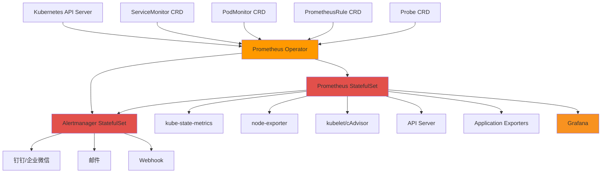
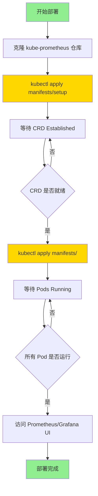
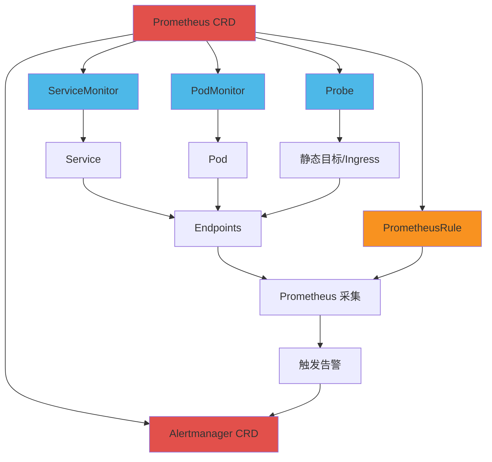
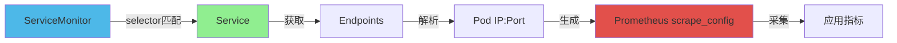
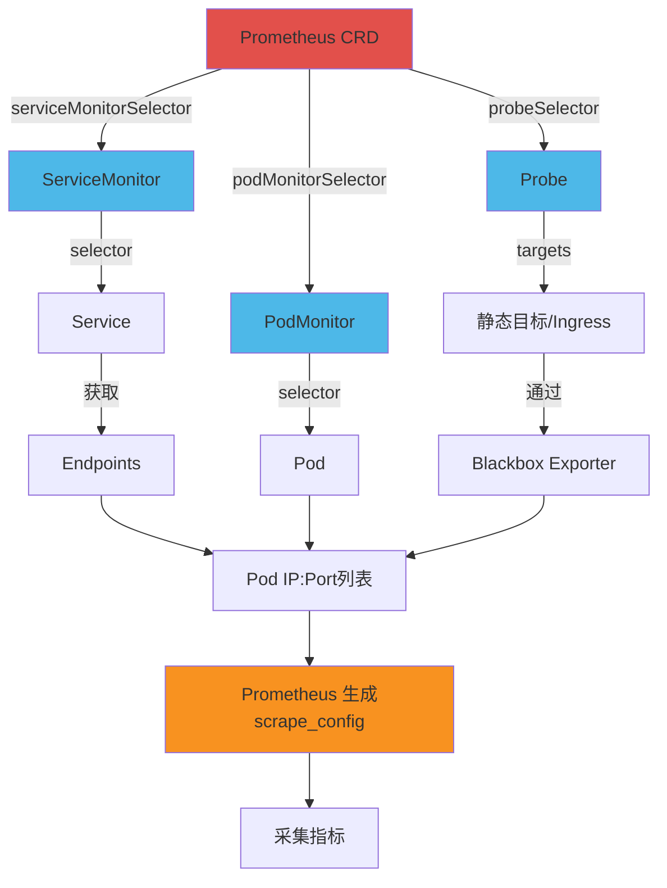
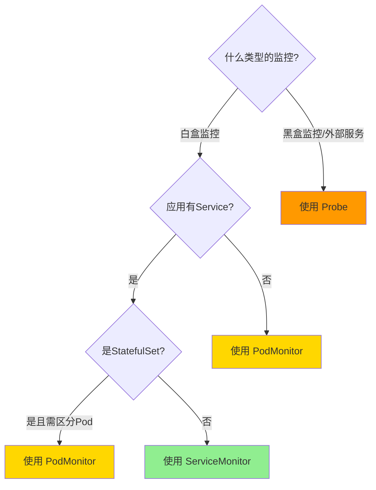
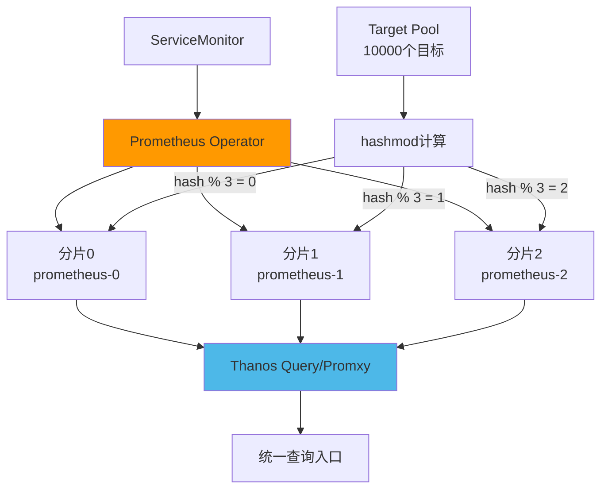
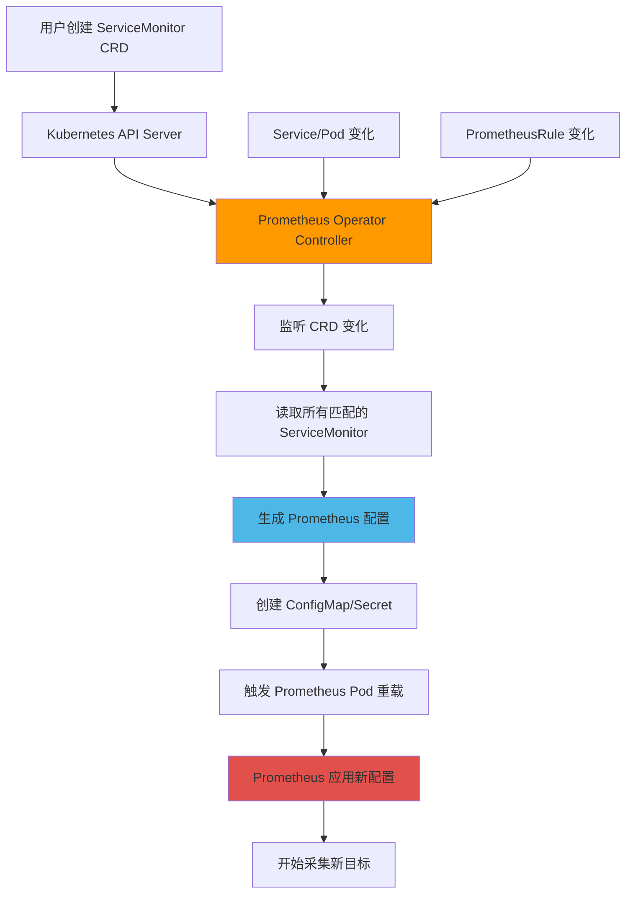
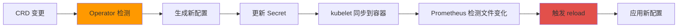
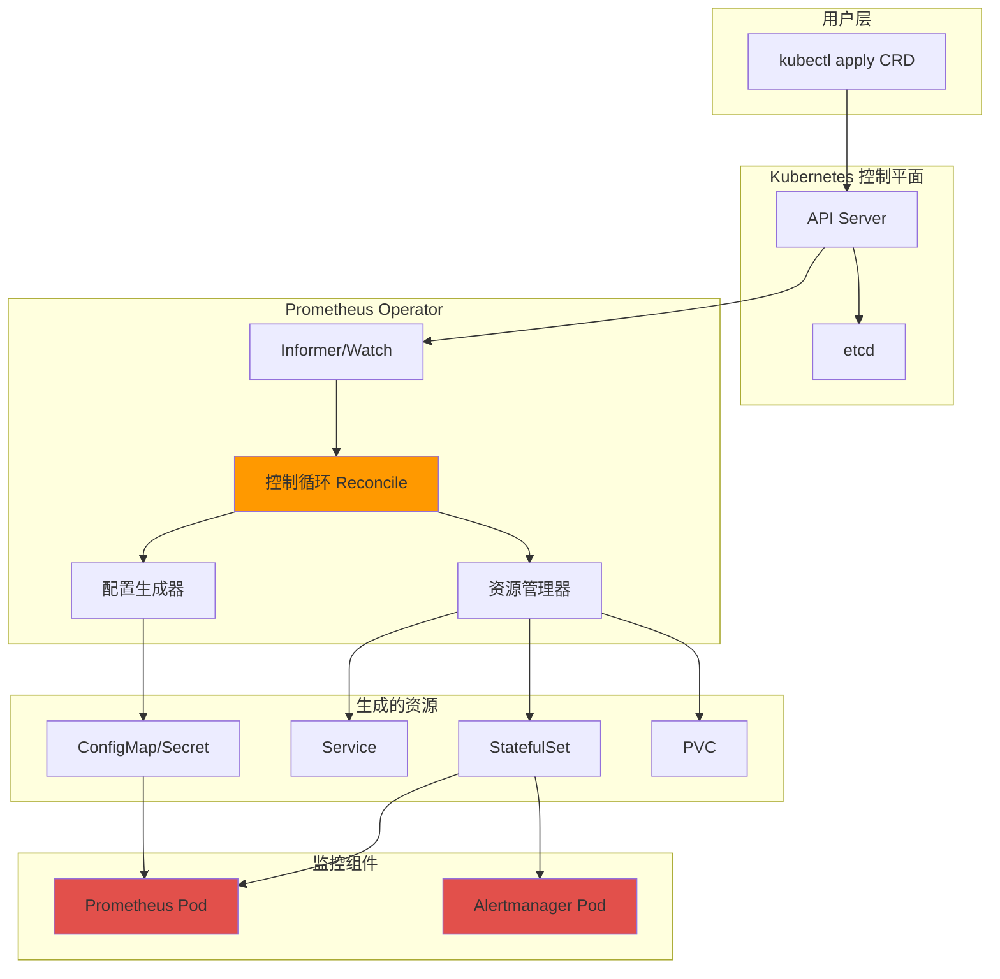

# Kube-Prometheus 深度学习笔记

> **文档说明**:本笔记系统性地整理了 kube-prometheus 和 Prometheus Operator 的核心知识,适合深入学习 Kubernetes 上的 Prometheus 监控体系。

---

## 目录

### 第一章:Kube-Prometheus 概述

#### 1.1 什么是 Kube-Prometheus

**Kube-Prometheus** 是一个完整的 Kubernetes 集群监控解决方案，它将 Prometheus、Alertmanager、Grafana 以及相关的监控组件打包在一起，提供了开箱即用的 Kubernetes 监控体验。

核心特点：

- **预配置的监控规则**：内置了针对 Kubernetes 核心组件的监控规则
- **完整的监控栈**：包含 Prometheus、Alertmanager、Grafana、Node Exporter 等
- **基于 Operator 模式**：使用 Prometheus Operator 实现声明式配置管理
- **生产就绪**：提供了经过验证的生产级配置

#### 1.2 Kube-Prometheus vs Prometheus Operator

| 对比维度             | Prometheus Operator                    | Kube-Prometheus                                             |
| -------------------- | -------------------------------------- | ----------------------------------------------------------- |
| **定位**       | Kubernetes Operator，提供 CRD 和控制器 | 完整的监控解决方案                                          |
| **包含内容**   | 仅 Operator 本身及 CRD 定义            | Operator + Prometheus + Alertmanager + Grafana + 预配置规则 |
| **使用场景**   | 需要自定义监控方案                     | 快速部署完整监控栈                                          |
| **配置复杂度** | 需要自行配置所有监控组件               | 开箱即用，预置最佳实践配置                                  |
| **灵活性**     | 高度灵活，完全自定义                   | 提供合理默认值，可按需调整                                  |

**关系说明**：Kube-Prometheus 基于 Prometheus Operator 构建，可以理解为 Prometheus Operator + 监控最佳实践配置。

#### 1.3 核心组件介绍

Kube-Prometheus 包含以下核心组件：

**1. Prometheus Operator**

- 角色：核心控制器，管理 Prometheus 和 Alertmanager 实例
- 功能：监听 CRD 资源变化，自动生成 Prometheus 配置

**2. Prometheus**

- 角色：时序数据库和监控引擎
- 功能：采集、存储、查询监控指标

**3. Alertmanager**

- 角色：告警管理组件
- 功能：告警去重、分组、路由、静默、抑制

**4. Grafana**

- 角色：可视化展示平台
- 功能：提供监控仪表盘和图表展示

**5. kube-state-metrics**

- 角色：Kubernetes 对象状态导出器
- 功能：暴露 Deployment、Pod、Node 等资源的状态指标

**6. node-exporter**

- 角色：节点监控导出器
- 功能：采集节点级别的硬件和操作系统指标

**7. prometheus-adapter**

- 角色：指标适配器
- 功能：将 Prometheus 指标转换为 Kubernetes Metrics API，支持 HPA

#### 1.4 架构设计理念

Kube-Prometheus 采用了 Kubernetes 原生的设计理念：

**声明式配置**

- 使用 CRD 定义监控目标和告警规则
- 配置变更通过 Operator 自动应用
- 符合 GitOps 实践

**服务发现**

- 自动发现 Kubernetes 中的监控目标
- 通过 Label 选择器动态管理监控对象
- 无需手动维护采集配置

**高可用设计**

- 支持 Prometheus 多副本部署
- Alertmanager 支持集群模式
- 分片机制支持大规模监控

#### 1.5 Kube-Prometheus 架构图



---

### 第二章:安装部署

#### 2.1 原生 kubectl 安装方式

这是使用 kube-prometheus 官方清单文件的安装方式，适合需要完全掌控部署细节的场景。

##### 2.1.1 前置准备

**环境要求**：

- Kubernetes 集群版本：≥ 1.21
- kubectl 已配置并可访问集群
- 集群节点至少 2 核 CPU、4GB 内存

**检查集群状态**：

```bash
kubectl cluster-info
kubectl get nodes
```

##### 2.1.2 克隆代码仓库

从 GitHub 克隆 kube-prometheus 仓库：

```bash
git clone https://github.com/prometheus-operator/kube-prometheus
cd kube-prometheus
```

**目录结构说明**：

- `manifests/setup/`：CRD 和 namespace 定义
- `manifests/`：监控组件的部署清单

##### 2.1.3 部署 CRD 资源

首先部署 Custom Resource Definitions (CRD) 和命名空间：

```bash
kubectl apply --server-side -f manifests/setup
```

**参数说明**：

- `--server-side`：使用服务端应用模式，避免客户端配置过大的问题

**等待 CRD 创建完成**：

```bash
kubectl wait \
    --for condition=Established \
    --all CustomResourceDefinition \
    --namespace=monitoring
```

这个命令会等待所有 CRD 资源状态变为 `Established`，确保后续部署不会因为 CRD 未就绪而失败。

**验证 CRD**：

```bash
kubectl get crd | grep monitoring.coreos.com
```

应该看到以下 CRD：

- `alertmanagers.monitoring.coreos.com`
- `podmonitors.monitoring.coreos.com`
- `probes.monitoring.coreos.com`
- `prometheuses.monitoring.coreos.com`
- `prometheusrules.monitoring.coreos.com`
- `servicemonitors.monitoring.coreos.com`

##### 2.1.4 部署监控组件

CRD 就绪后，部署所有监控组件：

```bash
kubectl apply -f manifests/
```

这个命令会创建：

- Prometheus Operator
- Prometheus 实例
- Alertmanager 实例
- Grafana
- kube-state-metrics
- node-exporter
- prometheus-adapter

**查看部署状态**：

```bash
kubectl get pods -n monitoring
```

等待所有 Pod 进入 `Running` 状态。

##### 2.1.5 部署流程图



#### 2.2 Helm Chart 安装方式

使用 Helm Chart 安装是最简单快捷的方式，适合快速部署和测试环境。

##### 2.2.1 添加 Helm 仓库

添加 `prometheus-community` Helm 仓库：

```bash
helm repo add prometheus-community https://prometheus-community.github.io/helm-charts
```

**更新 Helm 仓库索引**：

```bash
helm repo update
```

##### 2.2.2 安装 kube-prometheus-stack

使用默认配置安装：

```bash
helm install kube-prometheus prometheus-community/kube-prometheus-stack
```

**参数说明**：

- `kube-prometheus`：Release 名称
- `prometheus-community/kube-prometheus-stack`：Chart 名称

**指定命名空间安装**：

```bash
helm install kube-prometheus prometheus-community/kube-prometheus-stack \
  --namespace monitoring \
  --create-namespace
```

**使用自定义配置文件**：

```bash
helm install kube-prometheus prometheus-community/kube-prometheus-stack \
  -f custom-values.yaml \
  --namespace monitoring
```

##### 2.2.3 存储配置

生产环境中，Prometheus 需要持久化存储。如果您的集群有 StorageClass，可以配置 PVC：

**示例配置** (`values.yaml`):

```yaml
prometheus:
  prometheusSpec:
    storageSpec:
      volumeClaimTemplate:
        spec:
          storageClassName: gp2  # 替换为您的 StorageClass
          accessModes: ["ReadWriteOnce"]
          resources:
            requests:
              storage: 50Gi
```

**应用配置**：

```bash
helm upgrade kube-prometheus prometheus-community/kube-prometheus-stack \
  -f values.yaml \
  --namespace monitoring
```

##### 2.2.4 常用配置参数

**关键配置项**：

```yaml
# Prometheus 配置
prometheus:
  prometheusSpec:
    replicas: 2  # 副本数
    retention: 15d  # 数据保留时间
    retentionSize: "50GB"  # 数据保留大小
    resources:  # 资源限制
      requests:
        cpu: 500m
        memory: 2Gi
      limits:
        cpu: 2000m
        memory: 4Gi

# Alertmanager 配置
alertmanager:
  alertmanagerSpec:
    replicas: 3  # 高可用至少3副本
    retention: 120h

# Grafana 配置
grafana:
  enabled: true
  adminPassword: "your-secure-password"
  persistence:
    enabled: true
    size: 10Gi
```

#### 2.3 安装方式对比

| 对比维度             | kubectl 原生安装     | Helm Chart 安装        |
| -------------------- | -------------------- | ---------------------- |
| **部署难度**   | 中等                 | 简单                   |
| **配置灵活性** | 高（直接编辑 YAML）  | 高（通过 values.yaml） |
| **升级管理**   | 手动                 | Helm 自动管理          |
| **回滚能力**   | 需要手动保存历史版本 | Helm 内置回滚          |
| **适用场景**   | 需要完全控制部署细节 | 快速部署、生产环境     |
| **学习价值**   | 深入理解组件关系     | 快速上手               |

**建议**：

- **学习和测试**：使用 kubectl 原生安装，理解每个组件
- **生产环境**：使用 Helm Chart，便于版本管理和升级

#### 2.4 安装后验证

##### 检查 Pod 状态

```bash
kubectl get pods -n monitoring
```

所有 Pod 应该处于 `Running` 状态。

##### 访问 Prometheus UI

**方法1：Port-Forward**

```bash
kubectl port-forward -n monitoring svc/prometheus-k8s 9090:9090
```

浏览器访问：`http://localhost:9090`

**方法2：NodePort（测试环境）**

```bash
kubectl patch svc prometheus-k8s -n monitoring -p '{"spec":{"type":"NodePort"}}'
```

##### 访问 Grafana UI

**获取 Grafana 密码**（kubectl 安装）：

```bash
kubectl get secret -n monitoring grafana -o jsonpath="{.data.admin-password}" | base64 --decode
```

**Port-Forward**：

```bash
kubectl port-forward -n monitoring svc/grafana 3000:3000
```

浏览器访问：`http://localhost:3000`

- 用户名：`admin`
- 密码：使用上面获取的密码

##### 访问 Alertmanager UI

```bash
kubectl port-forward -n monitoring svc/alertmanager-main 9093:9093
```

浏览器访问：`http://localhost:9093`

##### 验证监控数据采集

在 Prometheus UI 中执行查询：

```promql
up
```

应该能看到所有监控目标的状态。

---

### 第三章:Prometheus Operator CRD 资源概览

#### 3.1 CRD 资源分类

Prometheus Operator 提供了 **6 个核心 CRD** 资源，用于声明式管理 Prometheus 监控栈：

**1. 监控实例类 CRD**

- `Prometheus`：定义 Prometheus 服务器实例
- `Alertmanager`：定义 Alertmanager 实例

**2. 监控目标发现类 CRD**

- `ServiceMonitor`：通过 Kubernetes Service 发现监控目标
- `PodMonitor`：直接监控 Pod
- `Probe`：黑盒监控探测配置

**3. 告警规则类 CRD**

- `PrometheusRule`：定义告警规则和记录规则

#### 3.2 CRD 资源关系图



#### 3.3 CRD 工作原理

**Operator 工作流程**：

1. **监听 CRD 变化**：Prometheus Operator 持续监听 K8s API 中的 CRD 资源变化
2. **生成配置文件**：根据 CRD 定义自动生成 Prometheus 和 Alertmanager 的配置文件
3. **热更新配置**：通过 ConfigMap 或 Secret 注入配置，触发组件配置重载
4. **管理生命周期**：自动管理 StatefulSet、Service、PVC 等 Kubernetes 资源

**声明式管理优势**：

- 用户只需声明期望状态（CRD），Operator 负责实现
- 配置变更自动应用，无需手动重启
- 符合 GitOps 最佳实践

#### 3.4 声明式配置优势

**传统方式 vs Operator 方式**：

| 对比项             | 传统配置文件方式        | Kubernetes-Native (CRD) 方式 |
| ------------------ | ----------------------- | ---------------------------- |
| **配置管理** | 手动编辑 prometheus.yml | 创建 ServiceMonitor CRD      |
| **服务发现** | 手动维护 targets 列表   | 自动基于 Label 选择器发现    |
| **配置变更** | 手动 reload 或重启      | Operator 自动热更新          |
| **版本控制** | 需要额外管理配置文件    | CRD 天然支持 kubectl apply   |
| **回滚能力** | 手动保存历史版本        | Kubernetes 原生版本管理      |

---

### 第四章:Alertmanager CRD 详解

#### 4.1 Alertmanager 资源概述

`Alertmanager` CRD 用于声明式定义 Alertmanager 实例。Alertmanager 负责接收 Prometheus 发送的告警，进行去重、分组、路由、静默和抑制，最终发送到配置的接收端（邮件、钉钉、Webhook 等）。

**完整 CRD 示例**：

```yaml
apiVersion: monitoring.coreos.com/v1
kind: Alertmanager
metadata:
  name: main
  namespace: monitoring
spec:
  replicas: 3
  version: v0.26.0
  storage:
    volumeClaimTemplate:
      spec:
        accessModes: ["ReadWriteOnce"]
        resources:
          requests:
            storage: 10Gi
```

#### 4.2 核心 Spec 字段详解

##### 4.2.1 镜像和版本配置

**version** `<string>`

- 说明：Alertmanager 镜像版本号
- 示例：`v0.26.0`
- 默认值：Operator 默认版本

**baseImage** `<string>`

- 说明：Alertmanager 基础镜像路径
- 示例：`quay.io/prometheus/alertmanager`
- 默认值：`quay.io/prometheus/alertmanager`

**image** `<string>`

- 说明：完整镜像地址（优先级高于 baseImage + version）
- 示例：`my-registry.com/alertmanager:v0.26.0`

**tag** / **sha** `<string>`

- 说明：镜像标签或 SHA256 摘要
- 建议：生产环境使用 SHA 锁定版本

**imagePullPolicy** `<string>`

- 说明：镜像拉取策略
- 可选值：`Always` | `IfNotPresent` | `Never`
- 默认值：`IfNotPresent`

**imagePullSecrets** `<[]Object>`

- 说明：拉取私有镜像的凭证
- 示例：

```yaml
imagePullSecrets:
  - name: my-registry-secret
```

##### 4.2.2 副本和高可用配置

**replicas** `<integer>`

- 说明：Alertmanager 副本数量
- 建议：生产环境至少 3 个副本（奇数个）
- 默认值：`1`

**高可用说明**：

- Alertmanager 使用 Gossip 协议（基于 memberlist）同步告警状态
- 多个副本自动组成集群，共享静默、抑制状态
- 任意副本宕机不影响告警处理

##### 4.2.3 集群模式配置

**forceEnableClusterMode** `<boolean>`

- 说明：即使只有一个副本也启用集群模式
- 默认值：`false`

**clusterAdvertiseAddress** `<string>`

- 说明：集群通信广播地址
- 格式：`<IP>:<Port>` 或 `<hostname>:<Port>`
- 示例：`alertmanager-0.alertmanager-operated:9094`

**clusterGossipInterval** `<string>`

- 说明：Gossip 协议同步间隔
- 默认值：`200ms`
- 格式：duration 字符串（如 `500ms`, `1s`）

**clusterPushpullInterval** `<string>`

- 说明：完整状态同步间隔
- 默认值：`1m`

**clusterPeerTimeout** `<string>`

- 说明：节点超时时间
- 默认值：`15s`

**additionalPeers** `<[]string>`

- 说明：额外的集群成员地址列表
- 用途：跨集群 Alertmanager 联邦
- 示例：

```yaml
additionalPeers:
  - alertmanager-cluster-a.example.com:9094
  - alertmanager-cluster-b.example.com:9094
```

##### 4.2.4 告警配置管理

**configSecret** `<string>`

- 说明：包含 `alertmanager.yaml` 配置的 Secret 名称
- 必需字段：Secret 中需包含 `alertmanager.yaml` key
- 示例：

```yaml
configSecret: alertmanager-config
```

**对应 Secret**：

```yaml
apiVersion: v1
kind: Secret
metadata:
  name: alertmanager-config
  namespace: monitoring
stringData:
  alertmanager.yaml: |
    global:
      resolve_timeout: 5m
    route:
      group_by: ['alertname', 'cluster']
      receiver: 'default'
    receivers:
      - name: 'default'
        webhook_configs:
          - url: 'http://webhook-receiver:5001/'
```

**alertmanagerConfiguration** `<Object>`

- 说明：使用 AlertmanagerConfig CRD 管理配置（新特性）
- 优势：更细粒度的配置分层管理

**alertmanagerConfigSelector** `<Object>`

- 说明：选择器，匹配要应用的 AlertmanagerConfig
- 示例：

```yaml
alertmanagerConfigSelector:
  matchLabels:
    alertmanagerConfig: main
```

**alertmanagerConfigNamespaceSelector** `<Object>`

- 说明：允许从哪些 namespace 加载 AlertmanagerConfig
- 示例：

```yaml
alertmanagerConfigNamespaceSelector:
  matchLabels:
    alertmanager: allowed
```

**alertmanagerConfigMatcherStrategy** `<Object>`

- 说明：配置匹配策略
- 可选值：`OnNamespace` | `None`

##### 4.2.5 存储配置

**storage** `<Object>`

- 说明：持久化存储配置
- 重要性：保存静默、抑制状态，重启后恢复

**完整示例**：

```yaml
storage:
  volumeClaimTemplate:
    spec:
      storageClassName: fast-ssd
      accessModes:
        - ReadWriteOnce
      resources:
        requests:
          storage: 20Gi
```

**retention** `<string>`

- 说明：告警数据保留时间
- 默认值：`120h`（5天）
- 示例：`240h`

##### 4.2.6 资源和调度配置

**resources** `<Object>`

- 说明：CPU 和内存资源限制
- 示例：

```yaml
resources:
  requests:
    cpu: 100m
    memory: 128Mi
  limits:
    cpu: 500m
    memory: 512Mi
```

**nodeSelector** `<map[string]string>`

- 说明：节点选择器
- 示例：

```yaml
nodeSelector:
  monitoring: "true"
```

**affinity** `<Object>`

- 说明：Pod 亲和性/反亲和性
- 用途：控制 Pod 调度分布

**tolerations** `<[]Object>`

- 说明：容忍度，允许调度到有污点的节点
- 示例：

```yaml
tolerations:
  - key: "monitoring"
    operator: "Equal"
    value: "true"
    effect: "NoSchedule"
```

**topologySpreadConstraints** `<[]Object>`

- 说明：拓扑分布约束
- 用途：确保副本均匀分布在不同可用区

**priorityClassName** `<string>`

- 说明：优先级类名称
- 用途：高优先级 Pod 在资源不足时优先调度

**minReadySeconds** `<integer>`

- 说明：Pod 就绪最小等待秒数
- 默认值：`0`

##### 4.2.7 网络和安全配置

**externalUrl** `<string>`

- 说明：Alertmanager 外部访问 URL
- 用途：生成告警通知中的链接
- 示例：`https://alertmanager.example.com`

**routePrefix** `<string>`

- 说明：路由前缀
- 示例：`/alertmanager/`

**portName** `<string>`

- 说明：Service 端口名称
- 默认值：`web`

**listenLocal** `<boolean>`

- 说明：仅监听 localhost
- 默认值：`false`

**web** `<Object>`

- 说明：Web 服务配置（TLS、HTTP/2）
- 示例：

```yaml
web:
  tlsConfig:
    certFile: /etc/alertmanager/tls/cert.pem
    keyFile: /etc/alertmanager/tls/key.pem
```

**securityContext** `<Object>`

- 说明：Pod 安全上下文
- 示例：

```yaml
securityContext:
  runAsNonRoot: true
  runAsUser: 1000
  fsGroup: 2000
```

**serviceAccountName** `<string>`

- 说明：使用的 ServiceAccount
- 默认值：`alertmanager`

**automountServiceAccountToken** `<boolean>`

- 说明：是否自动挂载 ServiceAccount Token
- 默认值：`true`

**logLevel** `<string>`

- 说明：日志级别
- 可选值：`debug` | `info` | `warn` | `error`
- 默认值：`info`

**logFormat** `<string>`

- 说明：日志格式
- 可选值：`logfmt` | `json`
- 默认值：`logfmt`

**paused** `<boolean>`

- 说明：暂停 Alertmanager 实例
- 用途：维护时临时停止但不删除
- 默认值：`false`

**其他字段**：

- **containers** / **initContainers**：额外容器
- **volumeMounts** / **volumes**：额外卷挂载
- **configMaps** / **secrets**：额外配置和密钥
- **hostAliases**：Pod 内 /etc/hosts 条目

#### 4.3 Alertmanager Spec 字段速查表

| 字段分类       | 关键字段                   | 作用          | 默认值       |
| -------------- | -------------------------- | ------------- | ------------ |
| **镜像** | version                    | 版本号        | Operator默认 |
|                | image                      | 完整镜像地址  | -            |
| **副本** | replicas                   | 副本数        | 1            |
| **集群** | forceEnableClusterMode     | 强制集群模式  | false        |
|                | additionalPeers            | 额外集群成员  | []           |
| **配置** | configSecret               | 配置 Secret   | -            |
|                | alertmanagerConfigSelector | Config 选择器 | {}           |
| **存储** | storage                    | 持久化配置    | -            |
|                | retention                  | 数据保留时间  | 120h         |
| **资源** | resources                  | CPU/内存限制  | -            |
|                | nodeSelector               | 节点选择      | {}           |
| **网络** | externalUrl                | 外部 URL      | -            |
|                | routePrefix                | 路由前缀      | /            |
| **安全** | securityContext            | 安全上下文    | -            |
|                | serviceAccountName         | SA 名称       | alertmanager |
| **日志** | logLevel                   | 日志级别      | info         |
|                | logFormat                  | 日志格式      | logfmt       |

#### 4.4 配置示例

##### 4.4.1 基础配置示例

```yaml
apiVersion: monitoring.coreos.com/v1
kind: Alertmanager
metadata:
  name: main
  namespace: monitoring
spec:
  replicas: 1
  version: v0.26.0
  configSecret: alertmanager-config
  logLevel: info
  resources:
    requests:
      cpu: 50m
      memory: 64Mi
    limits:
      cpu: 200m
      memory: 128Mi
```

##### 4.4.2 高可用集群配置

```yaml
apiVersion: monitoring.coreos.com/v1
kind: Alertmanager
metadata:
  name: ha-cluster
  namespace: monitoring
spec:
  replicas: 3  # 奇数副本
  version: v0.26.0
  configSecret: alertmanager-config
  
  # 高可用配置
  storage:
    volumeClaimTemplate:
      spec:
        accessModes: ["ReadWriteOnce"]
        resources:
          requests:
            storage: 10Gi
  
  # 反亲和性，确保副本分布在不同节点
  affinity:
    podAntiAffinity:
      requiredDuringSchedulingIgnoredDuringExecution:
        - labelSelector:
            matchExpressions:
              - key: alertmanager
                operator: In
                values:
                  - ha-cluster
          topologyKey: kubernetes.io/hostname
  
  # 拓扑分布，确保跨可用区
  topologySpreadConstraints:
    - maxSkew: 1
      topologyKey: topology.kubernetes.io/zone
      whenUnsatisfiable: DoNotSchedule
      labelSelector:
        matchLabels:
          alertmanager: ha-cluster
  
  resources:
    requests:
      cpu: 100m
      memory: 128Mi
    limits:
      cpu: 500m
      memory: 512Mi
```

##### 4.4.3 持久化存储配置

```yaml
apiVersion: monitoring.coreos.com/v1
kind: Alertmanager
metadata:
  name: persistent
  namespace: monitoring
spec:
  replicas: 2
  version: v0.26.0
  configSecret: alertmanager-config
  
  # 持久化存储
  storage:
    volumeClaimTemplate:
      metadata:
        labels:
          app: alertmanager
      spec:
        storageClassName: fast-ssd  # 使用 SSD StorageClass
        accessModes:
          - ReadWriteOnce
        resources:
          requests:
            storage: 20Gi
  
  # 延长数据保留时间
  retention: 720h  # 30 天
  
  # 外部访问 URL
  externalUrl: https://alertmanager.prod.example.com
```

#### 4.5 最佳实践

**1. 高可用部署**

- ✅ 生产环境至少 3 个副本
- ✅ 使用反亲和性确保副本分布
- ✅ 配置持久化存储保存状态

**2. 资源规划**

- CPU：基础 100m，高负载 500m-1000m
- 内存：基础 128Mi，高负载 512Mi-1Gi
- 存储：至少 10Gi，建议 20-50Gi

**3. 安全加固**

- ✅ 使用 TLS 加密通信
- ✅ 配置 RBAC 权限最小化
- ✅ 敏感配置使用 Secret 管理

**4. 配置管理**

- ✅ 将 `alertmanager.yaml` 存储在 Secret 中
- ✅ 使用 GitOps 管理配置版本
- ✅ 定期备份配置文件

**5. 监控 Alertmanager 本身**

- ✅ 配置 ServiceMonitor 监控 Alertmanager 指标
- ✅ 告警：集群成员不健康、消息队列堆积
- ✅ 日志收集和分析

**6. 集群模式注意事项**

- ✅ 确保副本间网络互通（9094 端口）
- ✅ 使用稳定的网络标识（StatefulSet）
- ✅ 监控 Gossip 协议健康状态

---

### 第五章:监控目标发现机制

### 5.1 监控目标发现概述

Prometheus Operator 提供了三种声明式监控目标发现机制，无需手动维护 `prometheus.yml` 中的 `scrape_configs`：

- **ServiceMonitor**：通过 Kubernetes Service 发现监控目标
- **PodMonitor**：直接监控 Pod，不依赖 Service
- **Probe**：适用于黑盒监控（如HTTP探测、DNS探测等）

这些CRD资源使用Label Selector自动发现监控目标，实现真正的动态服务发现。

#### 5.2 ServiceMonitor 详解

##### 5.2.1 ServiceMonitor 概念

**ServiceMonitor** 通过 Label 选择器匹配 Kubernetes Service，并自动发现 Service 后端的 Endpoints 作为监控目标。

**工作流程**：

1. ServiceMonitor 通过 `selector` 匹配 Service
2. Prometheus Operator 发现匹配的 Service
3. 从 Service 的 Endpoints 中提取 Pod IP 和端口
4. 生成 Prometheus 抓取配置

##### 5.2.2 核心 Spec 字段

**selector** `<Object>` - **必需字段**

- 说明：Label 选择器，匹配要监控的 Service
- 示例：

```yaml
selector:
  matchLabels:
    app: my-app
```

**namespaceSelector** `<Object>`

- 说明：指定从哪些 namespace 选择 Service
- 示例：

```yaml
namespaceSelector:
  matchNames:
    - default
    - production
```

- 或匹配全部 namespace：

```yaml
namespaceSelector:
  any: true
```

**endpoints** `<[]Object>` - **必需字段**

- 说明：定义如何从 Service 提取监控目标
- 关键子字段：
  - `port`：Service 端口名称
  - `path`：指标路径（默认 `/metrics`）
  - `interval`：采集间隔
  - `scrapeTimeout`：采集超时
  - `relabelings`：标签重写规则
  - `metricRelabelings`：指标重写规则

**jobLabel** `<string>`

- 说明：从 Service 的哪个 label 提取 job 名称
- 示例：`jobLabel: app`

**targetLabels** `<[]string>`

- 说明：从 Service labels 复制到目标labels
- 示例：

```yaml
targetLabels:
  - version
  - team
```

**podTargetLabels** `<[]string>`

- 说明：从 Pod labels 复制到目标 labels

**sampleLimit** `<integer>`

- 说明：单个目标最大样本数限制

**targetLimit** `<integer>`

- 说明：此 ServiceMonitor 最大目标数限制

**labelLimit** / **labelNameLengthLimit** / **labelValueLengthLimit** `<integer>`

- 说明：标签数量和长度限制

**attachMetadata** `<Object>`

- 说明：附加 Pod 元数据
- 示例：

```yaml
attachMetadata:
  node: true
```

##### 5.2.3 工作原理



##### 5.2.4 配置示例

**基础示例**：

```yaml
apiVersion: monitoring.coreos.com/v1
kind: ServiceMonitor
metadata:
  name: example-app
  namespace: monitoring
spec:
  selector:
    matchLabels:
      app: example-app
  endpoints:
    - port: metrics  # Service 端口名
      interval: 30s
      path: /metrics
```

**高级示例（带标签重写）**：

```yaml
apiVersion: monitoring.coreos.com/v1
kind: ServiceMonitor
metadata:
  name: advanced-monitor
  namespace: monitoring
spec:
  namespaceSelector:
    matchNames:
      - production
  selector:
    matchLabels:
      monitoring: "true"
  endpoints:
    - port: metrics
      interval: 15s
      path: /custom/metrics
      relabelings:
        - sourceLabels: [__meta_kubernetes_pod_name]
          targetLabel: pod
        - sourceLabels: [__meta_kubernetes_namespace]
          targetLabel: namespace
  jobLabel: app
  targetLabels:
    - version
  podTargetLabels:
    - tier
```

#### 5.3 PodMonitor 详解

##### 5.3.1 PodMonitor 概念

**PodMonitor** 直接监控 Pod，不需要通过 Service。适用于以下场景：

- StatefulSet 应用，每个 Pod 有独立身份
- 临时任务Pod
- 不需要 Service 的应用

##### 5.3.2 核心 Spec 字段

PodMonitor 的字段与 ServiceMonitor 类似，主要区别在于：

**selector** / **namespaceSelector** - 直接选择 Pod 而非 Service

**podMetricsEndpoints** `<[]Object>` - 对应 ServiceMonitor 的 `endpoints`

- 关键子字段：
  - `port`：容器端口名称或端口号
  - `path`：指标路径
  - `interval`：采集间隔

其他字段(jobLabel、podTargetLabels、sampleLimit等)与 ServiceMonitor 相同。

##### 5.3.3 工作原理


##### 5.3.4 配置示例

```yaml
apiVersion: monitoring.coreos.com/v1
kind: PodMonitor
metadata:
  name: statefulset-monitor
  namespace: monitoring
spec:
  selector:
    matchLabels:
      app: stateful-app
  namespaceSelector:
    matchNames:
      - production
  podMetricsEndpoints:
    - port: metrics  # 容器端口名
      interval: 30s
      path: /metrics
    - port: admin
      interval: 60s
      path: /admin/metrics
  podTargetLabels:
    - statefulset.kubernetes.io/pod-name
```

#### 5.4 Probe 详解

##### 5.4.1 Probe 概念

**Probe** 用于黑盒监控，集成 Prometheus Blackbox Exporter，适用于：

- HTTP/HTTPS 端点探测
- DNS 查询
- ICMP Ping
- TCP 连接检测

##### 5.4.2 核心 Spec 字段

**prober** `<Object>` - **必需字段**

- 说明：Blackbox Exporter 的地址
- 示例：

```yaml
prober:
  url: blackbox-exporter:9115
  scheme: http
  path: /probe
```

**module** `<string>`

- 说明：Blackbox Exporter 的模块名称
- 默认值：`http_2xx`

**targets** `<Object>`

- 说明：探测目标定义
- 子字段：
  - `staticConfig`：静态目标列表
  - `ingress`：从 Ingress 发现目标

**interval** / **scrapeTimeout** `<string>`

- 说明：探测间隔和超时时间

**其他字段**：jobName、labelLimit、metricRelabelings、authorization、basicAuth、bearerTokenSecret、tlsConfig等

##### 5.4.3 黑盒监控集成

**部署 Blackbox Exporter**：

```yaml
apiVersion: apps/v1
kind: Deployment
metadata:
  name: blackbox-exporter
  namespace: monitoring
spec:
  replicas: 1
  selector:
    matchLabels:
      app: blackbox-exporter
  template:
    metadata:
      labels:
        app: blackbox-exporter
    spec:
      containers:
        - name: blackbox-exporter
          image: prom/blackbox-exporter:latest
          ports:
            - containerPort: 9115
              name: http
---
apiVersion: v1
kind: Service
metadata:
  name: blackbox-exporter
  namespace: monitoring
spec:
  selector:
    app: blackbox-exporter
  ports:
    - port: 9115
      targetPort: 9115
```

##### 5.4.4 配置示例

**静态目标探测**：

```yaml
apiVersion: monitoring.coreos.com/v1
kind: Probe
metadata:
  name: website-health
  namespace: monitoring
spec:
  prober:
    url: blackbox-exporter.monitoring.svc:9115
  module: http_2xx
  targets:
    staticConfig:
      static:
        - https://www.example.com
        - https://api.example.com
  interval: 60s
  scrapeTimeout: 30s
```

**Ingress 探测**：

```yaml
apiVersion: monitoring.coreos.com/v1
kind: Probe
metadata:
  name: ingress-probe
  namespace: monitoring
spec:
  prober:
    url: blackbox-exporter.monitoring.svc:9115
  module: http_2xx
  targets:
    ingress:
      selector:
        matchLabels:
          probe: "true"
      namespaceSelector:
        any: true
  interval: 30s
```

#### 5.5 三种监控发现机制对比

| 对比项             | ServiceMonitor            | PodMonitor            | Probe                    |
| ------------------ | ------------------------- | --------------------- | ------------------------ |
| **发现对象** | Service → Endpoints      | 直接选择 Pod          | 静态目标或Ingress        |
| **适用场景** | 标准微服务应用            | StatefulSet、Job      | 黑盒监控、外部服务       |
| **依赖**     | 需要 Service              | 无需 Service          | 需要 Blackbox Exporter   |
| **指标类型** | 白盒监控（应用内部指标）  | 白盒监控              | 黑盒监控（可用性探测）   |
| **动态性**   | 高（Service变化自动更新） | 高（Pod变化自动更新） | 中（静态目标需手动更新） |
| **复杂度**   | 低                        | 低                    | 中（需配置 Exporter）    |

**选择建议**：

- **默认选择 ServiceMonitor**：大部分 Kubernetes 应用都有 Service
- **StatefulSet 优先 PodMonitor**：需要区分每个 Pod
- **外部服务、可用性监控用 Probe**

#### 5.6 监控目标发现架构图



#### 5.7 选择合适的监控发现方式

**决策树**：



**最佳实践**：

1. **优先考虑 ServiceMonitor**：符合 Kubernetes 服务治理理念
2. **PodMonitor 用于特殊场景**：避免过度使用
3. **Probe 监控关键路径**：API健康检查、DNS可用性
4. **合理配置采集间隔**：平衡监控精度和资源消耗
5. **使用 relabelings 优化标签**：保留有用标签，删除冗余标签

---

## 第六章：Prometheus CRD 详解

### 6.1 Prometheus 资源概述

`Prometheus` CRD 是 Prometheus Operator 的核心资源，用于声明式定义 Prometheus 服务器实例。

**基础示例**：

```yaml
apiVersion: monitoring.coreos.com/v1
kind: Prometheus
metadata:
  name: main
  namespace: monitoring
spec:
  replicas: 2
  version: v2.45.0
  serviceMonitorSelector:
    matchLabels:
      team: frontend
  storage:
    volumeClaimTemplate:
      spec:
        accessModes: ["ReadWriteOnce"]
        resources:
          requests:
            storage: 50Gi
```

### 6.2 核心 Spec 字段分类

#### 6.2.1 镜像和版本配置

- **version**: Prometheus 版本号
- **baseImage**: 基础镜像路径
- **image**: 完整镜像地址
- **tag/sha**: 镜像标签或摘要

#### 6.2.2 副本和分片配置

- **replicas**: 副本数（默认1）
- **shards**: 分片数量，用于大规模监控

#### 6.2.3 数据采集配置

- **scrapeInterval**: 全局采集间隔（默认30s）
- **scrapeTimeout**: 采集超时时间
- **evaluationInterval**: 规则评估间隔（默认30s）

#### 6.2.4 监控目标选择器配置

- **serviceMonitorSelector**: 选择 ServiceMonitor
- **serviceMonitorNamespaceSelector**: 选择 ServiceMonitor 的 namespace
- **podMonitorSelector**: 选择 PodMonitor
- **podMonitorNamespaceSelector**: 选择 PodMonitor 的 namespace
- **probeSelector**: 选择 Probe
- **probeNamespaceSelector**: 选择 Probe 的 namespace

#### 6.2.5 告警配置

- **alerting**: Alertmanager 配置
- **ruleSelector**: 选择 PrometheusRule
- **ruleNamespaceSelector**: 选择 PrometheusRule 的 namespace

#### 6.2.6 远程读写配置

- **remoteWrite**: 远程写入配置（如写入VictoriaMetrics、Thanos）
- **remoteRead**: 远程读取配置

#### 6.2.7 存储配置

- **storage**: 持久化存储配置
- **retention**: 数据保留时间（默认24h）
- **retentionSize**: 数据保留大小

### 6.3 关键字段详解

**externalLabels** `<map[string]string>`

- 说明：为所有时序数据添加的外部标签
- 用途：联邦、远程写入时区分不同集群

```yaml
externalLabels:
  cluster: production
  region: us-west
```

**additionalScrapeConfigs** `<Object>`

- 说明：额外的抓取配置（通过Secret引用）
- 用途：监控外部目标或自定义采集

**enableAdminAPI** `<boolean>`

- 说明：启用管理API（删除数据、快照等）
- 安全提示：生产环境谨慎启用

**walCompression** `<boolean>`

- 说明：启用WAL压缩
- 建议：默认true，节省存储空间

### 6.4 配置示例

#### 6.4.1 基础配置

```yaml
apiVersion: monitoring.coreos.com/v1
kind: Prometheus
metadata:
  name: k8s
  namespace: monitoring
spec:
  replicas: 2
  version: v2.45.0
  serviceAccountName: prometheus
  serviceMonitorSelector: {}  # 选择所有 ServiceMonitor
  podMonitorSelector: {}
  ruleSelector:
    matchLabels:
      prometheus: k8s
  retention: 15d
  resources:
    requests:
      cpu: 500m
      memory: 2Gi
    limits:
      cpu: 2000m
      memory: 4Gi
```

#### 6.4.2 持久化存储配置

```yaml
spec:
  storage:
    volumeClaimTemplate:
      spec:
        storageClassName: fast-ssd
        accessModes: ["ReadWriteOnce"]
        resources:
          requests:
            storage: 100Gi
  retention: 30d
  retentionSize: 90GB
```

#### 6.4.3 分片配置

```yaml
spec:
  replicas: 2
  shards: 3  # 3个分片，每个分片2个副本，共6个Pod
  serviceMonitorSelector: {}
```

#### 6.4.4 远程写入配置

```yaml
spec:
  remoteWrite:
    - url: http://victoriametrics:8428/api/v1/write
      queueConfig:
        capacity: 10000
        maxShards: 50
      writeRelabelConfigs:
        - sourceLabels: [__name__]
          regex: 'go_.*'
          action: drop
```

### 6.5 Prometheus Spec 字段速查表

| 字段               | 类型    | 默认值 | 说明           |
| ------------------ | ------- | ------ | -------------- |
| replicas           | integer | 1      | 副本数         |
| shards             | integer | 1      | 分片数         |
| version            | string  | -      | Prometheus版本 |
| retention          | string  | 24h    | 数据保留时间   |
| retentionSize      | string  | -      | 数据保留大小   |
| scrapeInterval     | string  | 30s    | 采集间隔       |
| evaluationInterval | string  | 30s    | 规则评估间隔   |
| externalLabels     | map     | {}     | 外部标签       |
| storage            | Object  | -      | 持久化存储     |
| resources          | Object  | -      | 资源限制       |

### 6.6 最佳实践

1. **副本配置**：生产环境至少2个副本
2. **存储规划**：按数据保留时间计算存储容量
3. **资源估算**：每百万样本约需1-2GB内存
4. **分片策略**：超过10万target时考虑分片
5. **远程存储**：长期存储使用远程写入

---

## 第七章：PrometheusRule CRD 详解

### 7.1 PrometheusRule 概述

PrometheusRule 定义告警规则和记录规则，Prometheus Operator 自动将其转换为 Prometheus 配置。

### 7.2 告警规则 vs 记录规则

| 类型               | 用途           | 输出                       |
| ------------------ | -------------- | -------------------------- |
| **告警规则** | 定义告警条件   | 触发告警发送到Alertmanager |
| **记录规则** | 预计算复杂查询 | 生成新的时序数据           |

### 7.3 Spec 结构

**groups** `<[]Object>` - 规则组

- **name**: 组名（必需）
- **interval**: 评估间隔
- **rules**: 规则列表

**rules字段**：

- **alert**: 告警名称（告警规则专用）
- **record**: 记录名称（记录规则专用）
- **expr**: PromQL表达式（必需）
- **for**: 持续时间才触发
- **labels**: 添加的标签
- **annotations**: 告警注释

### 7.4 配置示例

#### 7.4.1 告警规则示例

```yaml
apiVersion: monitoring.coreos.com/v1
kind: PrometheusRule
metadata:
  name: node-alerts
  namespace: monitoring
spec:
  groups:
    - name: node
      interval: 30s
      rules:
        - alert: NodeDown
          expr: up{job="node-exporter"} == 0
          for: 5m
          labels:
            severity: critical
          annotations:
            summary: "Node {{ $labels.instance }} is down"
            description: "节点已宕机超过5分钟"
```

#### 7.4.2 记录规则示例

```yaml
apiVersion: monitoring.coreos.com/v1
kind: PrometheusRule
metadata:
  name: recording-rules
  namespace: monitoring
spec:
  groups:
    - name: cpu-usage
      interval: 1m
      rules:
        - record: node:cpu:usage:rate5m
          expr: |
            100 - (avg by (instance) (rate(node_cpu_seconds_total{mode="idle"}[5m])) * 100)
```

### 7.5 规则编写最佳实践

1. **使用for减少抖动**：避免瞬时波动引发告警
2. **合理分组**：按服务或组件分组
3. **标准化标签**：severity（critical/warning/info）
4. **详细注释**：使用annotations提供上下文
5. **记录规则命名**：level:metric:operations格式

---

## 第八章：高级配置

### 8.1 额外抓取配置 (Additional Scrape Config)

#### 8.1.1 使用场景

- 监控外部非K8s目标
- 使用Prometheus原生配置语法
- 临时监控任务

#### 8.1.2 配置方法

**步骤1：创建配置文件**

```yaml
# prometheus-additional.yaml
- job_name: 'external-service'
  static_configs:
    - targets: ['external.example.com:9090']
      labels:
        env: production
```

**步骤2：创建Secret**

```bash
kubectl create secret generic additional-scrape-configs \
  --from-file=prometheus-additional.yaml \
  --dry-run=client -o yaml | kubectl apply -n monitoring -f -
```

**步骤3：在Prometheus CRD中引用**

```yaml
apiVersion: monitoring.coreos.com/v1
kind: Prometheus
metadata:
  name: main
spec:
  additionalScrapeConfigs:
    name: additional-scrape-configs
    key: prometheus-additional.yaml
```

### 8.2 Prometheus 分片机制 (Sharding)

#### 8.2.1 分片必要性

- 单实例采集能力有限（约10万target）
- 水平扩展采集能力
- 降低单实例资源压力

#### 8.2.2 分片工作原理

Prometheus Operator 使用 `hashmod` 方式分片：

- 对目标地址进行哈希
- 取模分配到不同分片
- 每个分片独立采集和存储

#### 8.2.3 配置示例

```yaml
apiVersion: monitoring.coreos.com/v1
kind: Prometheus
metadata:
  name: sharded
spec:
  replicas: 2  # 每个分片2副本
  shards: 3    # 3个分片
  serviceMonitorSelector: {}
```

这将创建6个Pod：

- prometheus-sharded-0-0, prometheus-sharded-0-1 (分片0)
- prometheus-sharded-1-0, prometheus-sharded-1-1 (分片1)
- prometheus-sharded-2-0, prometheus-sharded-2-1 (分片2)

#### 8.2.4 分片架构图



#### 8.2.5 分片数据查询

使用联邦或查询层聚合：

- **Thanos Query**：推荐
- **Promxy**：轻量级
- **Prometheus Federation**：简单场景

#### 8.2.6 分片最佳实践

1. **合理规划分片数**：根据target数量，一般3-10个分片
2. **配合副本使用**：每个分片至少2副本保证高可用
3. **使用查询层**：避免直接查询单个分片
4. **监控分片均衡度**：检查各分片target分布
5. **存储分离**：每个分片独立PVC

## 第九章：Prometheus Operator 架构深度剖析

### 9.1 Operator 模式介绍

**Kubernetes Operator** 是一种软件扩展模式，用于管理复杂的有状态应用。

**核心理念**：

- 将运维知识编码到软件中
- 通过自定义控制器自动化运维任务
- 使用 CRD 扩展 Kubernetes API

**Operator = CRD + Controller**

### 9.2 Prometheus Operator 工作流程



**详细步骤**：

1. **监听 API Server**

   - Operator 通过 Informer 机制监听相关资源
   - 包括：Prometheus、Alertmanager、ServiceMonitor、PodMonitor、PrometheusRule等
2. **配置生成**

   - Operator 收集所有匹配的 ServiceMonitor
   - 转换为 Prometheus 原生 `scrape_configs`
   - 生成完整的 `prometheus.yml`
3. **配置注入**

   - 将配置写入 Secret（大配置）或 ConfigMap
   - 挂载到 Prometheus Pod
4. **热更新**

   - 发送 HTTP POST 到 `/-/reload` 端点
   - Prometheus 重新加载配置，无需重启

### 9.3 CRD 与配置文件生成机制

**ServiceMonitor → scrape_config 转换示例**：

**输入（ServiceMonitor CRD）**：

```yaml
apiVersion: monitoring.coreos.com/v1
kind: ServiceMonitor
metadata:
  name: example
spec:
  selector:
    matchLabels:
      app: example
  endpoints:
    - port: metrics
      interval: 30s
```

**输出（Prometheus 配置）**：

```yaml
scrape_configs:
  - job_name: monitoring/example/0
    scrape_interval: 30s
    kubernetes_sd_configs:
      - role: endpoints
        namespaces:
          names:
            - monitoring
    relabel_configs:
      - source_labels: [__meta_kubernetes_service_label_app]
        regex: example
        action: keep
      - source_labels: [__meta_kubernetes_endpoint_port_name]
        regex: metrics
        action: keep
```

**关键转换规则**：

- `selector` → relabel_configs 中的 keep 规则
- `endpoints.port` → endpoint_port_name 匹配
- `interval` → scrape_interval
- `namespaceSelector` → kubernetes_sd_configs.namespaces

### 9.4 配置热更新机制



**热更新触发方式**：

1. **配置文件监听**：Prometheus 使用 fsnotify 监听配置文件
2. **HTTP reload**：Operator 发送 POST 请求到 `/-/reload`
3. **SIGHUP 信号**：向进程发送信号

### 9.5 完整架构图



### 9.6 关键设计决策

**1. 为什么使用 StatefulSet？**

- 稳定的网络标识（用于集群成员发现）
- 有序的部署和扩缩容
- 持久化存储的稳定绑定

**2. 为什么配置使用 Secret？**

- 支持大配置文件（ConfigMap 限制 1MB）
- 与敏感信息的处理方式一致
- 自动的 base64 编码/解码

**3. 如何保证配置一致性？**

- 使用 StatefulSet 的 `updateStrategy.rollingUpdate`
- 配置更新触发 Pod 滚动重启
- 通过 `minReadySeconds` 确保平滑更新

**4. 多租户隔离如何实现？**

- 使用 namespace 级别隔离
- `namespaceSelector` 限制跨 namespace 发现
- RBAC 控制 CRD 操作权限

---

## 第十章：生产环境最佳实践

### 10.1 资源规划

#### 10.1.1 Prometheus 资源估算

**内存估算公式**：

```
内存(GB) = 目标数量 × 样本数/目标 × 保留时间(小时) × 2字节 / 10^9
          + 2GB(基础开销)
```

**示例计算**：

- 1000个目标
- 每个目标1000个样本
- 保留15天（360小时）
- 内存 = 1000 × 1000 × 360 × 2 / 10^9 + 2 ≈ **2.7GB**

**CPU 估算**：

- 基础：100m per 1000 targets
- 查询密集型：额外 +50%
- 规则评估密集型：额外 +30%

**存储估算**：

```
存储(GB) = 目标数量 × 样本数/目标 × 保留时间(小时) × 1.5字节 / 10^9
```

**推荐配置模板**：

| 规模 | 目标数  | CPU      | 内存 | 存储  |
| ---- | ------- | -------- | ---- | ----- |
| 小型 | <1000   | 500m     | 2Gi  | 50Gi  |
| 中型 | 1K-10K  | 2000m    | 8Gi  | 200Gi |
| 大型 | 10K-50K | 4000m    | 16Gi | 500Gi |
| 超大 | >50K    | 分片部署 | -    | -     |

#### 10.1.2 Alertmanager 资源估算

**轻量级组件**，固定配置：

- CPU：100-200m
- 内存：128-256Mi
- 存储：5-10Gi（保存静默、抑制状态）

#### 10.1.3 存储规划

**存储类型选择**：

- **SSD**：推荐，I/O 密集型
- **HDD**：仅用于长期存储场景

**保留策略**：

```yaml
spec:
  retention: 15d  # 时间保留
  retentionSize: 45GB  # 容量保留（先达到哪个就清理）
```

**远程存储方案**：

- **VictoriaMetrics**：高性能，低成本
- **Thanos**：长期存储，全局查询
- **Cortex**：多租户，水平扩展

### 10.2 高可用部署

#### 10.2.1 Prometheus 高可用

**方案1：多副本独立采集**

```yaml
spec:
  replicas: 2  # 两个独立实例
```

**特点**：

- ✅ 简单可靠
- ✅ 查询任一实例都能获取完整数据
- ❌ 采集和存储成本翻倍
- ❌ 需要负载均衡查询

**方案2：分片 + 副本**

```yaml
spec:
  replicas: 2
  shards: 3  # 3分片 × 2副本 = 6 Pod
```

**特点**：

- ✅ 扩展性强
- ✅ 每个分片有副本保证可用性
- ❌ 需要查询聚合层（Thanos Query/Promxy）
- ❌ 配置复杂度高

#### 10.2.2 Alertmanager 集群

**配置要点**：

```yaml
spec:
  replicas: 3  # 奇数副本
  # Operator 自动配置 Gossip 集群
```

**集群特性**：

- 告警去重：多个 Prometheus 发送相同告警，只通知一次
- 状态同步：静默、抑制状态在所有节点共享
- 故障容忍：任一节点宕机不影响告警发送

#### 10.2.3 跨集群联邦

**Prometheus 联邦查询**：

```yaml
# 中心 Prometheus 配置
scrape_configs:
  - job_name: 'federate'
    honor_labels: true
    metrics_path: '/federate'
    params:
      'match[]':
        - '{job="important-metrics"}'
    static_configs:
      - targets:
        - 'prometheus-cluster-a:9090'
        - 'prometheus-cluster-b:9090'
```

### 10.3 性能优化

#### 10.3.1 采集优化

**1. 合理设置采集间隔**

```yaml
scrapeInterval: 30s  # 默认值
# 根据业务调整，不是越短越好
```

**2. 限制样本数量**

```yaml
spec:
  enforcedSampleLimit: 10000  # 单目标最大样本数
  enforcedTargetLimit: 5000   # 最大目标数
```

**3. 使用 metric relabeling 过滤无用指标**

```yaml
metricRelabelings:
  - sourceLabels: [__name__]
    regex: 'go_gc_.*|go_memstats_.*'
    action: drop
```

#### 10.3.2 存储优化

**1. 启用 WAL 压缩**

```yaml
spec:
  walCompression: true  # 节省50%+存储
```

**2. 调整 TSDB 参数**

```yaml
spec:
  tsdb:
    outOfOrderTimeWindow: 30m  # 允许30分钟乱序写入
```

**3. 定期清理**

- 使用 `retention` 和 `retentionSize` 自动清理
- 避免手动删除数据（影响性能）

#### 10.3.3 查询优化

**1. 使用记录规则**

```yaml
# 预计算复杂查询
- record: node:cpu:usage:rate5m
  expr: |
    100 - (avg by (instance) (rate(node_cpu_seconds_total{mode="idle"}[5m])) * 100)
```

**2. 限制查询范围**

- 避免查询过长时间范围
- 使用 `max_samples` 限制

**3. 使用查询缓存**

- Prometheus 内置查询缓存
- 前端增加缓存层（Trickster）

### 10.4 安全加固

#### 10.4.1 认证和授权

**1. 启用基本认证**（通过 nginx-ingress）

```yaml
apiVersion: networking.k8s.io/v1
kind: Ingress
metadata:
  annotations:
    nginx.ingress.kubernetes.io/auth-type: basic
    nginx.ingress.kubernetes.io/auth-secret: prometheus-basic-auth
```

**2. 使用 OAuth2 Proxy**

```yaml
# 集成企业 SSO
spec:
  containers:
    - name: oauth2-proxy
      image: quay.io/oauth2-proxy/oauth2-proxy
```

#### 10.4.2 TLS 配置

```yaml
spec:
  web:
    tlsConfig:
      cert:
        secret:
          name: prometheus-tls
          key: tls.crt
      keySecret:
        name: prometheus-tls
        key: tls.key
```

#### 10.4.3 RBAC 权限控制

**最小权限 ServiceAccount**：

```yaml
apiVersion: v1
kind: ServiceAccount
metadata:
  name: prometheus
---
apiVersion: rbac.authorization.k8s.io/v1
kind: ClusterRole
metadata:
  name: prometheus
rules:
  - apiGroups: [""]
    resources:
      - nodes
      - services
      - endpoints
      - pods
    verbs: ["get", "list", "watch"]
  - apiGroups: [""]
    resources:
      - configmaps
    verbs: ["get"]
```

### 10.5 监控和告警策略

**Prometheus 自监控**：

```yaml
# 监控 Prometheus 本身
- alert: PrometheusDown
  expr: up{job="prometheus"} == 0
  for: 5m
  
- alert: PrometheusTSDBCompactionsFailing
  expr: rate(prometheus_tsdb_compactions_failed_total[5m]) > 0
  
- alert: PrometheusRuleEvaluationFailures
  expr: rate(prometheus_rule_evaluation_failures_total[5m]) > 0
```

**告警分级**：

- **P0/Critical**：影响业务，立即处理
- **P1/Warning**：潜在风险，关注处理
- **P2/Info**：信息通知，记录即可

### 10.6 备份和恢复

**备份方案**：

**1. 数据目录快照**

```bash
# 创建快照
kubectl exec prometheus-0 -- tar -czf /tmp/backup.tar.gz /prometheus

# 导出
kubectl cp prometheus-0:/tmp/backup.tar.gz ./backup.tar.gz
```

**2. 使用 Velero**

```bash
velero backup create prometheus-backup \
  --include-namespaces monitoring \
  --include-resources pvc,pv
```

**3. 远程存储**

- 配置 remote_write，数据自动备份到远程

**恢复测试**：

- 定期验证备份可用性
- 文档化恢复步骤
- 自动化恢复脚本

---

## 第十一章：常见问题与故障排查

### 11.1 安装部署问题

**问题1：CRD 创建失败**

```
Error: CustomResourceDefinition.apiextensions.k8s.io is invalid
```

**原因**：Kubernetes 版本过低
**解决**：升级到 1.21+

**问题2：Pod 一直 Pending**

```
Warning  FailedScheduling  pod has unbound immediate PersistentVolumeClaims
```

**原因**：没有可用的 StorageClass
**解决**：创建 StorageClass 或使用 `emptyDir`

### 11.2 数据采集问题

**问题1：目标显示 Down**

```
Get "http://10.0.0.1:8080/metrics": context deadline exceeded
```

**原因**：网络不通或超时
**排查**：

```bash
# 从 Prometheus Pod 测试连通性
kubectl exec prometheus-0 -- wget -O- http://目标地址:端口/metrics
```

**问题2：ServiceMonitor 不生效**
**排查步骤**：

1. 检查 selector 是否匹配

```bash
kubectl get svc -n namespace --show-labels
```

2. 检查 Prometheus 是否选中此 ServiceMonitor

```bash
kubectl get prometheus -o yaml | grep serviceMonitorSelector
```

3. 查看 Prometheus 配置

```bash
kubectl exec prometheus-0 -- cat /etc/prometheus/config_out/prometheus.env.yaml
```

### 11.3 告警问题

**问题1：告警不触发**
**排查**：

1. 检查规则是否加载

```
去 Prometheus UI → Status → Rules
```

2. 检查表达式是否返回结果

```
在 Prometheus 中执行 PromQL
```

3. 检查 `for` 持续时间是否过长

**问题2：告警发送失败**
**排查 Alertmanager 日志**：

```bash
kubectl logs alertmanager-0 | grep -i error
```

### 11.4 性能问题

**问题1：内存溢出 OOMKilled**
**原因**：查询范围过大或目标过多**解决**：

- 增加内存限制
- 启用 WAL 压缩
- 减少保留时间
- 使用分片

**问题2：查询缓慢**
**优化**：

- 使用记录规则预计算
- 缩短查询时间范围
- 添加更多 CPU 资源

### 11.5 存储问题

**问题1：磁盘空间不足**

```
prometheus_tsdb_storage_blocks_bytes > 0.9 * volume_size
```

**解决**：

- 扩容 PVC
- 减小 retention
- 配置 retentionSize

**问题2：数据损坏**

```
Error: corruption in block
```

**解决**：

```bash
# 删除损坏的 block
kubectl exec prometheus-0 -- rm -rf /prometheus/01GXX...
# Prometheus 会自动重建索引
```

### 11.6 排查工具和方法

**1. 查看 Operator 日志**

```bash
kubectl logs -n monitoring deployment/prometheus-operator
```

**2. 查看生成的配置**

```bash
kubectl exec prometheus-0 -- cat /etc/prometheus/config_out/prometheus.env.yaml
```

**3. Prometheus 内部指标**

```promql
# TSDB 状态
prometheus_tsdb_head_series

# 采集状态
up{job="..."}

# 规则评估
prometheus_rule_evaluation_duration_seconds
```

**4. 启用 Debug 日志**

```yaml
spec:
  logLevel: debug
```

---

## 第十二章：总结

### 12.1 核心知识点回顾

**Kube-Prometheus 核心概念**：

1. **Operator 模式**：将运维知识编码，自动化管理复杂应用
2. **声明式配置**：通过 CRD 描述期望状态，Operator 负责实现
3. **动态服务发现**：基于 Label 自动发现监控目标

**6 个核心 CRD**：

- **Prometheus**：定义 Prometheus 实例
- **Alertmanager**：定义 Alertmanager 实例
- **ServiceMonitor**：通过 Service 发现目标
- **PodMonitor**：直接监控 Pod
- **Probe**：黑盒监控探测
- **PrometheusRule**：告警和记录规则

**关键配置要点**：

- **高可用**：多副本 + 反亲和性
- **持久化**：配置 storage volumeClaimTemplate
- **资源规划**：根据目标数量和保留时间估算
- **安全加固**：TLS + RBAC + 认证

### 12.2 学习路径建议

**阶段1：入门（1-2周）**

- 完成基础安装（kubectl 或 Helm）
- 理解 CRD 资源体系
- 创建第一个 ServiceMonitor
- 编写简单告警规则

**阶段2：进阶（2-4周）**

- 深入理解 Prometheus 配置
- 掌握 PromQL 查询语言
- 配置 Alertmanager 告警路由
- 实践远程存储集成

**阶段3：生产（持续）**

- 高可用架构设计
- 性能调优和故障排查
- 自定义 Exporter 开发
- 监控体系完善

### 12.3 进阶学习资源

**官方文档**：

- Prometheus 官方文档：[https://prometheus.io/docs/](https://prometheus.io/docs/)
- Prometheus Operator：[https://prometheus-operator.dev/](https://prometheus-operator.dev/)
- Kube-Prometheus：[https://github.com/prometheus-operator/kube-prometheus](https://github.com/prometheus-operator/kube-prometheus)

**推荐书籍**：

- 《Prometheus 监控实战》
- 《Kubernetes in Action》

**社区资源**：

- CNCF Slack #prometheus 频道
- Prometheus 中文文档：[https://prometheus.fuckcloudnative.io/](https://prometheus.fuckcloudnative.io/)

**实践项目**：

- 搭建完整监控体系
- 参与开源 Exporter 开发
- 编写自定义 Operator

---

**🎉 恭喜！您已完成 Kube-Prometheus 深度学习笔记的全部内容！**

本笔记涵盖了从基础概念到生产实践的完整知识体系，希望能帮助您掌握 Kubernetes 原生的 Prometheus 监控方案。

持续学习，不断实践，祝您在云原生监控领域取得成功！
