# Kubernetes 容器网络学习笔记

> 本文档是基于容器网络课程整理的系统性学习笔记，面向运维工程师/SRE，帮助深入理解 Kubernetes 容器网络。

---

## 📚 目录

### 第一部分：网络基础

- [第1章 TCP/IP 协议栈](#第1章-tcpip-协议栈)
- [第2章 Linux 网络命名空间](#第2章-linux-网络命名空间)
- [第3章 Veth Pair 虚拟网络设备](#第3章-veth-pair-虚拟网络设备)
- [第4章 Linux Bridge 网桥](#第4章-linux-bridge-网桥)
- [第5章 路由与 ARP](#第5章-路由与-arp)
- [第6章 iptables 防火墙](#第6章-iptables-防火墙)
- [第7章 IPVS 负载均衡](#第7章-ipvs-负载均衡)

### 第二部分：Kubernetes 网络核心

- [第8章 Docker 网络模型](#第8章-docker-网络模型)
- [第9章 Kubernetes 网络模型](#第9章-kubernetes-网络模型)
- [第10章 CNI 容器网络接口](#第10章-cni-容器网络接口)
- [第11章 Pod 网络](#第11章-pod-网络)
- [第12章 Service 网络](#第12章-service-网络)
- [第13章 DNS 与服务发现](#第13章-dns-与服务发现)
- [第14章 Ingress 与 Gateway API](#第14章-ingress-与-gateway-api)

### 第三部分：Cilium CNI 深度实践

- [第15章 Cilium 概述与架构](#第15章-cilium-概述与架构)
- [第16章 Cilium 安装与部署](#第16章-cilium-安装与部署)
- [第17章 Cilium 网络策略](#第17章-cilium-网络策略)
- [第18章 Cilium Observability](#第18章-cilium-observability)
- [第19章 Cilium Service Mesh](#第19章-cilium-service-mesh)
- [第20章 Cilium Cluster Mesh](#第20章-cilium-cluster-mesh)
- [第21章 Cilium BGP](#第21章-cilium-bgp)
- [第22章 Cilium Egress Gateway](#第22章-cilium-egress-gateway)
- [第23章 Cilium Bandwidth Manager](#第23章-cilium-bandwidth-manager)
- [第24章 Cilium Host Firewall](#第24章-cilium-host-firewall)
- [第25章 Cilium 透明加密](#第25章-cilium-透明加密)
- [第26章 Cilium NAT46/NAT64](#第26章-cilium-nat46-nat64)
- [第27章 Cilium Local Redirect Policy](#第27章-cilium-local-redirect-policy)
- [第28章 Cilium Health Checking](#第28章-cilium-health-checking)
- [第29章 Cilium 性能调优](#第29章-cilium-性能调优)
- [第30章 Cilium 故障排除](#第30章-cilium-故障排除)
- [第31章 Cilium 升级与运维](#第31章-cilium-升级与运维)
- [第32章 Cilium 生产最佳实践](#第32章-cilium-生产最佳实践)
- [第33章 Cilium eBPF Internals](#第33章-cilium-ebpf-internals)
- [第34章 Cilium Datapath](#第34章-cilium-datapath)
- [第35章 Cilium Identity 与安全](#第35章-cilium-identity-与安全)
- [第36章 Cilium IPAM](#第36章-cilium-ipam)
- [第37章 Cilium LB IPAM](#第37章-cilium-lb-ipam)
- [第38章 Cilium Envoy](#第38章-cilium-envoy)
- [第39章 Cilium Tetragon](#第39章-cilium-tetragon)
- [第40章 Cilium Hubble 深度解析](#第40章-cilium-hubble-深度解析)
- [第41章 Cilium 与 Istio 集成](#第41章-cilium-与-istio-集成)
- [第42章 Cilium 未来展望](#第42章-cilium-未来展望)

### 第四部分：Flannel CNI 实践

- [第43章 Flannel 概述与架构](#第43章-flannel-概述与架构)
- [第44章 Flannel VXLAN 模式](#第44章-flannel-vxlan-模式)
- [第45章 Flannel VXLAN DirectRouting](#第45章-flannel-vxlan-directrouting)
- [第46章 Flannel Host-GW 模式](#第46章-flannel-host-gw-模式)
- [第47章 Flannel UDP 模式](#第47章-flannel-udp-模式)
- [第48章 Flannel Alloc 模式](#第48章-flannel-alloc-模式)
- [第49章 Flannel 多网卡与 Public IP](#第49章-flannel-多网卡与-public-ip)
- [第50章 Flannel IPsec 模式](#第50章-flannel-ipsec-模式)
- [第51章 Flannel WireGuard 模式](#第51章-flannel-wireguard-模式)

### 第五部分：高性能 CNI（Multus/SR-IOV/DPDK）

- [第52章 Multus 多网卡方案](#第52章-multus-多网卡方案)
- [第53章 Multus IPVLAN L2 模式](#第53章-multus-ipvlan-l2-模式)
- [第54章 Multus IPVLAN L3 模式](#第54章-multus-ipvlan-l3-模式)
- [第55章 Multus IPVLAN SBR 模式](#第55章-multus-ipvlan-sbr-模式)
- [第56章 IPVLAN-SBR 深度解析](#第56章-ipvlan-sbr-深度解析)
- [第57章 MACVLAN-SBR 实践](#第57章-macvlan-sbr-实践)
- [第58章 Multus-with-SRIOV-Kernel](#第58章-multus-with-sriov-kernel)
- [第59章 Multus-with-SRIOV-DPDK-VPP](#第59章-multus-with-sriov-dpdk-vpp)
- [第60章 K8s-CNI-IPAM 机制详解](#第60章-k8s-cni-ipam-机制详解)

---

# 第一部分：网络基础

---

## 第1章 TCP/IP 协议栈

### 🎯 学习目标

- 理解 OSI 七层模型与 TCP/IP 四层模型的区别与联系
- 掌握网络分层架构的设计思想
- 理解 TCP 和 UDP 协议的核心差异
- 学会使用 tcpdump 和 Wireshark 进行网络抓包分析

---

### 1.1 OSI 七层模型与 TCP/IP 四层模型

#### 背景

在计算机网络发展早期，不同厂商的网络设备和协议互不兼容，导致设备之间无法互联互通。为了解决这个问题，国际标准化组织（ISO）提出了 **OSI（Open Systems Interconnection）参考模型**，将网络通信划分为七个层次，每一层负责特定的功能。

> [!NOTE]
> OSI 模型是一个**理论参考模型**，而实际生产环境中更多使用的是简化后的 **TCP/IP 四层模型**。

#### 原理

**分层架构的核心思想：术业有专攻**

网络分层的本质是**解耦**，使得：

- 每一层专注于自身的协议实现
- 不同厂商的设备只要遵循同一标准，就可以互联互通
- 便于问题定位和排查

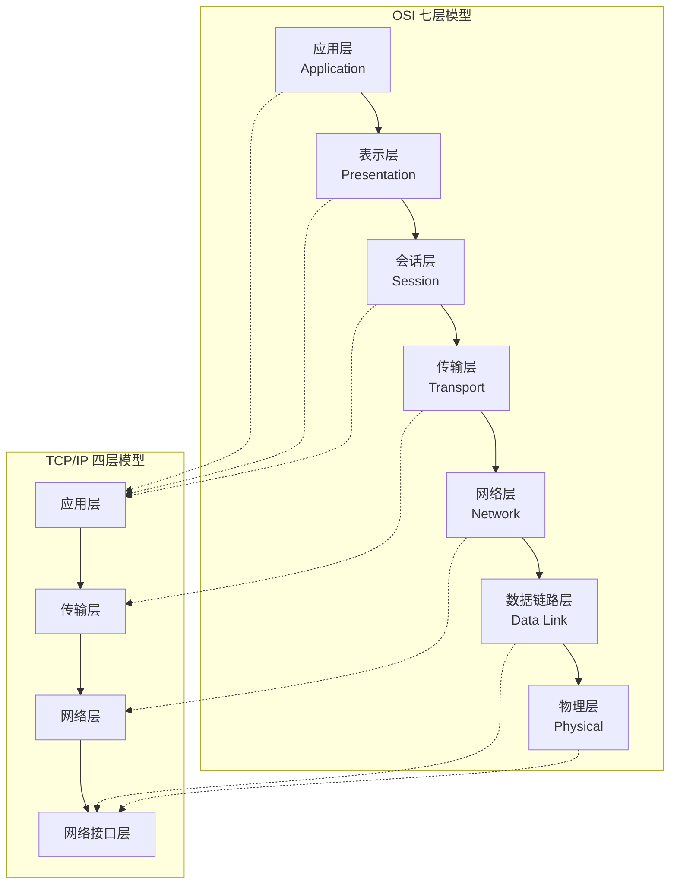
```mermaid
graph TD
    subgraph OSI["OSI 七层模型"]
        L7[应用层<br/>Application]
        L6[表示层<br/>Presentation]
        L5[会话层<br/>Session]
        L4[传输层<br/>Transport]
        L3[网络层<br/>Network]
        L2[数据链路层<br/>Data Link]
        L1[物理层<br/>Physical]
        
        L7 --> L6 --> L5 --> L4 --> L3 --> L2 --> L1
    end
    
    subgraph TCPIP["TCP/IP 四层模型"]
        T4[应用层]
        T3[传输层]
        T2[网络层]
        T1[网络接口层]
        
        T4 --> T3 --> T2 --> T1
    end
    
    L7 -.-> T4
    L6 -.-> T4
    L5 -.-> T4
    L4 -.-> T3
    L3 -.-> T2
    L2 -.-> T1
    L1 -.-> T1
```

**图解说明**：

上图展示了 OSI 七层模型与 TCP/IP 四层模型的对应关系：

- OSI 的**应用层、表示层、会话层**统一为 TCP/IP 的**应用层**
- OSI 的**传输层**对应 TCP/IP 的**传输层**
- OSI 的**网络层**对应 TCP/IP 的**网络层**
- OSI 的**数据链路层、物理层**合并为 TCP/IP 的**网络接口层**

#### 各层功能与核心协议

| 层级 | OSI 模型 | TCP/IP 模型 | 核心功能 | 代表协议/设备 |
|:---:|:---:|:---:|:---|:---|
| 7 | 应用层 | 应用层 | 为用户提供网络服务 | HTTP、FTP、DNS、DHCP |
| 6 | 表示层 | 应用层 | 数据编解码、压缩、加密 | SSL/TLS、JPEG |
| 5 | 会话层 | 应用层 | 建立、管理、终止会话 | RPC、NetBIOS |
| 4 | 传输层 | 传输层 | 端到端的可靠传输 | **TCP**、**UDP**、SCTP |
| 3 | 网络层 | 网络层 | 路由选择、逻辑寻址 | **IP**、ICMP、路由器 |
| 2 | 数据链路层 | 网络接口层 | 物理寻址、帧封装 | **MAC**、交换机、ARP |
| 1 | 物理层 | 网络接口层 | 比特流传输 | 光纤、双绞线、无线 |

**要点解读**：

对于容器网络学习，我们需要重点关注以下三层：

1. **传输层（L4）**：TCP/UDP 端口，这是应用开发最常接触的层
2. **网络层（L3）**：IP 地址、路由表，跨节点通信主要依赖此层
3. **数据链路层（L2）**：MAC 地址、交换机，同网段通信的基础

#### 关键点

> [!IMPORTANT]
> **运维排障思路**：当服务不可达时，应该逐层排查：
>
> 1. 物理层：网线是否连接正常？
> 2. 数据链路层：MAC 地址是否正确？ARP 表是否正确？
> 3. 网络层：IP 是否可达？路由表是否正确？
> 4. 传输层：端口是否监听？防火墙是否放行？
> 5. 应用层：服务是否正常启动？

---

### 1.2 数据封装与解封装流程

#### 背景

当应用程序需要发送数据时，数据会从上层向下层逐级传递，每经过一层都会添加该层的**头部信息（Header）**，这个过程称为**封装（Encapsulation）**。接收端则进行相反的操作，称为**解封装（Decapsulation）**。

#### 原理

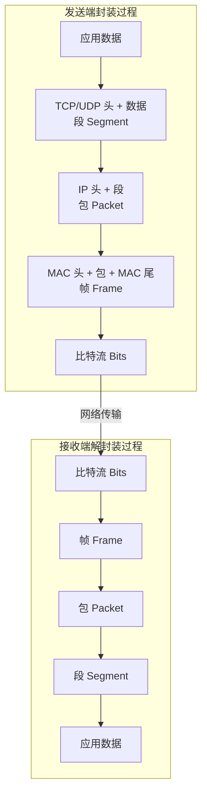
```mermaid
graph TB
    subgraph 发送端["发送端封装过程"]
        direction TB
        A1[应用数据] --> A2[TCP/UDP 头 + 数据<br/>段 Segment]
        A2 --> A3[IP 头 + 段<br/>包 Packet]
        A3 --> A4[MAC 头 + 包 + MAC 尾<br/>帧 Frame]
        A4 --> A5[比特流 Bits]
    end
    
    subgraph 接收端["接收端解封装过程"]
        direction TB
        B5[比特流 Bits] --> B4[帧 Frame]
        B4 --> B3[包 Packet]
        B3 --> B2[段 Segment]
        B2 --> B1[应用数据]
    end
    
    A5 -->|网络传输| B5
```

**图解说明**：

数据在发送端逐层封装，每层添加自己的协议头：

- **应用层**：生成原始数据
- **传输层**：添加 TCP/UDP 头（包含源端口、目的端口）
- **网络层**：添加 IP 头（包含源 IP、目的 IP、TTL）
- **数据链路层**：添加 MAC 头和尾（包含源 MAC、目的 MAC）
- **物理层**：转换为 0/1 比特流进行传输

#### 数据包结构示意

```
+------------------+----------+--------+----------+-----------------+
|   以太网帧头     |  IP 头   | TCP 头 |  数据    |   以太网帧尾    |
|  14 字节         | 20 字节  | 20 字节|  N 字节  |   4 字节        |
+------------------+----------+--------+----------+-----------------+
|←-- 二层 MAC --→|←-三层IP-→|←-四层-→|          |
```

**代码说明**：

以上结构展示了一个完整的以太网帧：

- **以太网帧头（14 字节）**：包含目的 MAC（6B）+ 源 MAC（6B）+ 类型（2B）
- **IP 头（20 字节）**：包含版本、TTL、源 IP、目的 IP 等
- **TCP 头（20 字节）**：包含源端口、目的端口、序列号、标志位等
- **以太网帧尾（4 字节）**：FCS 帧校验序列

---

### 1.3 TCP 协议详解

#### 背景

TCP（Transmission Control Protocol，传输控制协议）是一种**面向连接**的、**可靠**的传输层协议。它通过三次握手建立连接、四次挥手断开连接，并提供流量控制、拥塞控制等机制来保证数据可靠传输。

#### 原理

##### 1.3.1 套接字（Socket）概念

**套接字 = IP 地址 + 端口号**

例如：`192.168.1.100:8080` 表示一个套接字

> [!NOTE]
> TCP 端口和 UDP 端口是独立的。同一个端口号（如 53）可以同时被 TCP 和 UDP 监听，因为它们属于不同的协议。

##### 1.3.2 TCP 三次握手

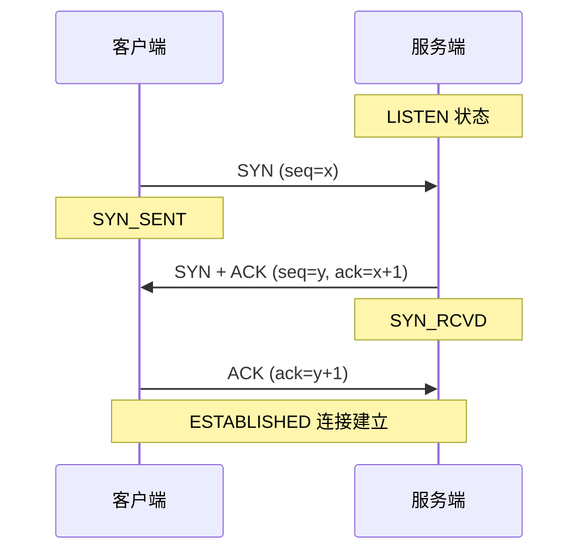
```mermaid
sequenceDiagram
    participant C as 客户端
    participant S as 服务端
    
    Note over S: LISTEN 状态
    C->>S: SYN (seq=x)
    Note over C: SYN_SENT
    S->>C: SYN + ACK (seq=y, ack=x+1)
    Note over S: SYN_RCVD
    C->>S: ACK (ack=y+1)
    Note over C,S: ESTABLISHED 连接建立
```

**图解说明**：

三次握手的过程：

1. **第一次握手**：客户端发送 SYN 包（同步序列号），进入 SYN_SENT 状态
2. **第二次握手**：服务端收到 SYN 后，回复 SYN+ACK 包，进入 SYN_RCVD 状态
3. **第三次握手**：客户端收到后回复 ACK，双方进入 ESTABLISHED 状态，连接建立

##### 1.3.3 TCP 标志位

| 标志位 | 名称 | 作用 |
|:---:|:---:|:---|
| SYN | Synchronize | 发起连接，同步序列号 |
| ACK | Acknowledge | 确认收到数据 |
| FIN | Finish | 请求关闭连接 |
| RST | Reset | 重置连接（异常终止） |
| PSH | Push | 立即推送数据给应用层 |
| URG | Urgent | 紧急数据 |

##### 1.3.4 MSS 与分片机制

**MSS（Maximum Segment Size）**：最大报文段长度，指 TCP 数据部分的最大长度。

```
MTU = 1500 字节（以太网默认）
MSS = MTU - IP头(20) - TCP头(20) = 1460 字节
```

**要点解读**：

> [!IMPORTANT]
> **为什么分片在 TCP 层做而不是 IP 层？**
>
> - TCP 有**序列号**，可以精确知道哪个片丢失，只需重传丢失的片
> - IP 没有重传机制，如果一个分片丢失，需要重传整个原始数据
> - 在 TCP 层分片可以**减少重传开销**

##### 1.3.5 TCP 卸载技术

当数据量较大时，TCP 分片等操作会消耗大量 CPU 资源。现代网卡支持将这些操作**卸载（Offload）**到硬件，减轻 CPU 负担：

| 技术 | 全称 | 作用 |
|:---:|:---|:---|
| TSO | TCP Segmentation Offload | 将 TCP 分片卸载到网卡 |
| GSO | Generic Segmentation Offload | 通用分片卸载 |
| GRO | Generic Receive Offload | 接收端合并小包 |
| LRO | Large Receive Offload | 大包接收卸载 |

**代码说明**：

查看网卡 offload 状态：

```bash
# 查看网卡 offload 配置
ethtool -k eth0

# 输出示例：
# tcp-segmentation-offload: on
# generic-segmentation-offload: on
# generic-receive-offload: on
# large-receive-offload: off
```

---

### 1.4 UDP 协议特点

#### 背景

UDP（User Datagram Protocol，用户数据报协议）是一种**无连接**的、**不可靠**的传输层协议。它没有握手过程，发送数据时不保证对方能收到。

#### TCP 与 UDP 对比

| 特性 | TCP | UDP |
|:---:|:---:|:---:|
| 连接性 | 面向连接 | 无连接 |
| 可靠性 | 可靠（有确认、重传） | 不可靠 |
| 有序性 | 保证顺序 | 不保证 |
| 速度 | 较慢（握手开销） | 较快 |
| 头部大小 | 20 字节 | 8 字节 |
| 应用场景 | HTTP、数据库、文件传输 | DNS、视频流、游戏 |

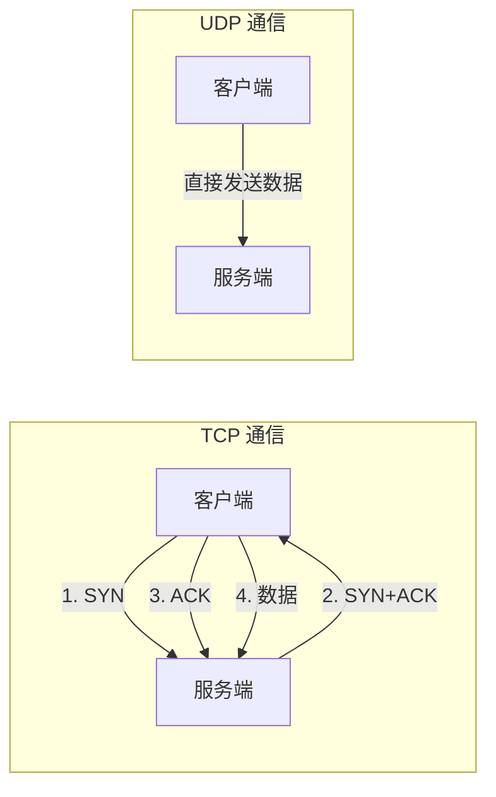
```mermaid
graph LR
    subgraph TCP["TCP 通信"]
        C1[客户端] -->|1. SYN| S1[服务端]
        S1 -->|2. SYN+ACK| C1
        C1 -->|3. ACK| S1
        C1 -->|4. 数据| S1
    end
    
    subgraph UDP["UDP 通信"]
        C2[客户端] -->|直接发送数据| S2[服务端]
    end
```

**图解说明**：

- **TCP**：需要三次握手建立连接后才能传输数据
- **UDP**：直接发送数据，无需建立连接，简单高效但不可靠

---

### 1.5 使用 nc 工具进行网络测试

#### 背景

`nc`（netcat）是一个功能强大的网络工具，可以用于 TCP/UDP 端口监听、网络调试、数据传输等场景。

#### 常用命令

```bash
# ============ TCP 监听与连接 ============
# 服务端：监听 TCP 8088 端口（-l 表示 listen，-k 表示保持监听）
nc -lk 192.168.1.100 8088

# 客户端：连接 TCP 8088 端口
nc 192.168.1.100 8088

# ============ UDP 监听与连接 ============
# 服务端：监听 UDP 8088 端口（-u 表示使用 UDP）
nc -lu 192.168.1.100 8088

# 客户端：连接 UDP 8088 端口
nc -u 192.168.1.100 8088
```

**代码说明**：

- `-l`：listen 模式，作为服务端监听端口
- `-k`：keep-open，连接断开后保持监听
- `-u`：使用 UDP 协议（默认为 TCP）

---

### 1.6 使用 tcpdump 和 Wireshark 进行抓包分析

#### 背景

网络抓包是排查网络问题的核心技能。`tcpdump` 是 Linux 下的命令行抓包工具，`Wireshark` 是图形化的抓包分析工具。

#### tcpdump 常用命令

```bash
# 基础抓包：在 eth0 接口抓包并保存到文件
tcpdump -i eth0 -w capture.pcap

# 抓取指定端口的 TCP 包
tcpdump -i eth0 port 8088

# 抓取指定 IP 的包
tcpdump -i eth0 host 192.168.1.100

# 详细显示包内容（-nn 不解析主机名和端口名）
tcpdump -i eth0 -nn -vv port 8088
```

**代码说明**：

| 选项 | 说明 |
|:---:|:---|
| `-i` | 指定网络接口 |
| `-w` | 写入文件（.pcap 格式） |
| `-nn` | 不解析主机名和端口名 |
| `-vv` | 详细输出 |

#### Wireshark 过滤技巧

| 过滤条件 | 说明 |
|:---|:---|
| `tcp.port == 8088` | 过滤 TCP 8088 端口 |
| `tcp.stream eq 0` | 过滤第一个 TCP 流 |
| `tcp.flags.syn == 1` | 过滤 SYN 包 |
| `tcp.len == 0` | 过滤无数据的 TCP 包（握手包） |
| `ip.addr == 192.168.1.100` | 过滤指定 IP |

---

### 1.7 实战：TCP 与 UDP 抓包分析

#### 实验目的

通过 nc 工具模拟 TCP 和 UDP 通信，使用 tcpdump 抓包，用 Wireshark 分析数据包结构。

#### 实验步骤

**步骤一：TCP 抓包实验**

```bash
# 终端 1：启动 tcpdump 抓包
tcpdump -i eth0 -w tcp_capture.pcap port 8088

# 终端 2：启动 TCP 服务端
nc -lk 192.168.1.100 8088

# 终端 3：启动 TCP 客户端并发送数据
nc 192.168.1.100 8088
# 输入：hello CNI
```

**步骤二：用 Wireshark 分析 TCP 包**

使用 Wireshark 打开 `tcp_capture.pcap`，可以看到：

1. **三次握手**：前三个包（SYN → SYN+ACK → ACK）
2. **数据传输**：带有 PSH 标志的包，包含 "hello CNI" 数据
3. **四次挥手**：断开连接的 FIN 包

**步骤三：UDP 抓包实验**

```bash
# 终端 1：启动 tcpdump 抓包
tcpdump -i eth0 -w udp_capture.pcap udp port 8088

# 终端 2：启动 UDP 服务端
nc -lu 192.168.1.100 8088

# 终端 3：启动 UDP 客户端并发送数据
nc -u 192.168.1.100 8088
# 输入：hello UDP
```

**步骤四：对比分析**

| 对比项 | TCP | UDP |
|:---:|:---:|:---:|
| 握手过程 | 有三次握手 | **无握手** |
| 数据发送 | 有确认机制 | 直接发送 |
| 包数量 | 多（握手 + 数据 + 确认） | 少（仅数据包） |

---

### 📝 章节小结

本章介绍了网络通信的基础知识：

1. **OSI 七层模型与 TCP/IP 四层模型**：理解网络分层架构的设计思想，掌握各层的职责
2. **数据封装与解封装**：理解数据在网络中传输时的打包和拆包过程
3. **TCP 协议**：掌握三次握手、四次挥手、标志位、MSS 分片等核心概念
4. **UDP 协议**：理解无连接、不可靠传输的特点和应用场景
5. **网络抓包**：学会使用 tcpdump 和 Wireshark 进行网络问题分析

> [!TIP]
> **学习建议**：
>
> 1. 动手实践 nc 和 tcpdump 命令
> 2. 使用 Wireshark 分析真实的网络包
> 3. 理解每一层的头部信息，这对后续学习容器网络非常重要

---

## 第2章 IP 地址与 MAC 地址精讲

### 🎯 学习目标

- 掌握 IP 地址的点分十进制表示与二进制转换
- 理解有类地址（A/B/C/D/E）与无类地址（CIDR）的区别
- 熟练掌握 VLSM（可变长子网掩码）的计算方法
- 理解 MAC 地址的结构与 OUI 厂商标识
- 掌握二层交换与三层路由的核心区别
- 理解路由转发过程中 IP 和 MAC 地址的变化规律

---

### 2.1 IP 地址基础

#### 背景

IP 地址是网络层的核心标识，用于在互联网中唯一标识一台设备的逻辑位置。与 MAC 地址不同，IP 地址是**逻辑地址**，可以根据网络规划进行分配和更改。

> [!NOTE]
> IP 地址是逻辑地址，它不与设备绑定。例如，你的手机今天在家获得 `192.168.1.100`，明天同事来你家用他的手机也可能获得这个地址。

#### 原理

##### 2.1.1 点分十进制与二进制转换

IPv4 地址是一个 **32 位的二进制数**，为了便于人类阅读，将其分为 4 组，每组 8 位（1 字节），转换为十进制后用点分隔，称为**点分十进制**。

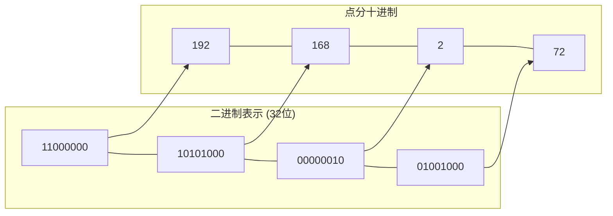
```mermaid
graph LR
    subgraph Binary["二进制表示 (32位)"]
        B1["11000000"] --- B2["10101000"] --- B3["00000010"] --- B4["01001000"]
    end
    
    subgraph Decimal["点分十进制"]
        D1["192"] --- D2["168"] --- D3["2"] --- D4["72"]
    end
    
    B1 --> D1
    B2 --> D2
    B3 --> D3
    B4 --> D4
```

**图解说明**：

上图展示了 IP 地址 `192.168.2.72` 的二进制与十进制转换：

- 每 8 位二进制对应一个十进制数
- 每个十进制数的范围是 0-255

**二进制权重计算表**：

| 位置 | 第7位 | 第6位 | 第5位 | 第4位 | 第3位 | 第2位 | 第1位 | 第0位 |
|:---:|:---:|:---:|:---:|:---:|:---:|:---:|:---:|:---:|
| 权重 | 128 | 64 | 32 | 16 | 8 | 4 | 2 | 1 |
| 示例 | 1 | 1 | 0 | 0 | 0 | 0 | 0 | 0 |
| 计算 | 128 | 64 | 0 | 0 | 0 | 0 | 0 | 0 |

**结果**：128 + 64 = **192**

##### 2.1.2 IP 地址分类（有类地址）

早期的 IP 地址按照**有类**方式划分为 A、B、C、D、E 五类：

| 类别 | 首位模式 | 网络位 | 主机位 | 地址范围 | 用途 |
|:---:|:---:|:---:|:---:|:---|:---|
| A 类 | 0xxxxxxx | 8 位 | 24 位 | 1.0.0.0 ~ 127.255.255.255 | 大型网络 |
| B 类 | 10xxxxxx | 16 位 | 16 位 | 128.0.0.0 ~ 191.255.255.255 | 中型网络 |
| C 类 | 110xxxxx | 24 位 | 8 位 | 192.0.0.0 ~ 223.255.255.255 | 小型网络 |
| D 类 | 1110xxxx | - | - | 224.0.0.0 ~ 239.255.255.255 | 组播地址 |
| E 类 | 1111xxxx | - | - | 240.0.0.0 ~ 255.255.255.255 | 保留/实验 |

**要点解读**：

> [!NOTE]
> 有类地址划分已经过时，现代网络普遍使用**无类域间路由（CIDR）**。但理解有类地址有助于理解网络发展历史和一些遗留配置。

##### 2.1.3 公有地址与私有地址

| 类别 | 私有地址范围 | 可用主机数 |
|:---:|:---|:---:|
| A 类 | 10.0.0.0 ~ 10.255.255.255 | 约 1677 万 |
| B 类 | 172.16.0.0 ~ 172.31.255.255 | 约 104 万 |
| C 类 | 192.168.0.0 ~ 192.168.255.255 | 约 6.5 万 |

**要点解读**：

- **私有地址**只能在内网使用，不能直接访问互联网
- 家庭路由器通常使用 `192.168.0.x` 或 `192.168.1.x`
- 大型企业通常使用 `10.x.x.x` 段，因为地址空间更大

---

### 2.2 子网划分与 VLSM

#### 背景

在实际网络规划中，很少严格按照 A/B/C 类来划分网络。**VLSM（Variable Length Subnet Mask，可变长子网掩码）**允许我们根据实际需求灵活划分子网，这就是**无类域间路由（CIDR）**的核心思想。

#### 原理

##### 2.2.1 网络位与主机位

一个 IP 地址由两部分组成：

- **网络位**：标识所属网络（固定不变的部分）
- **主机位**：标识网络内的具体主机（可变的部分）

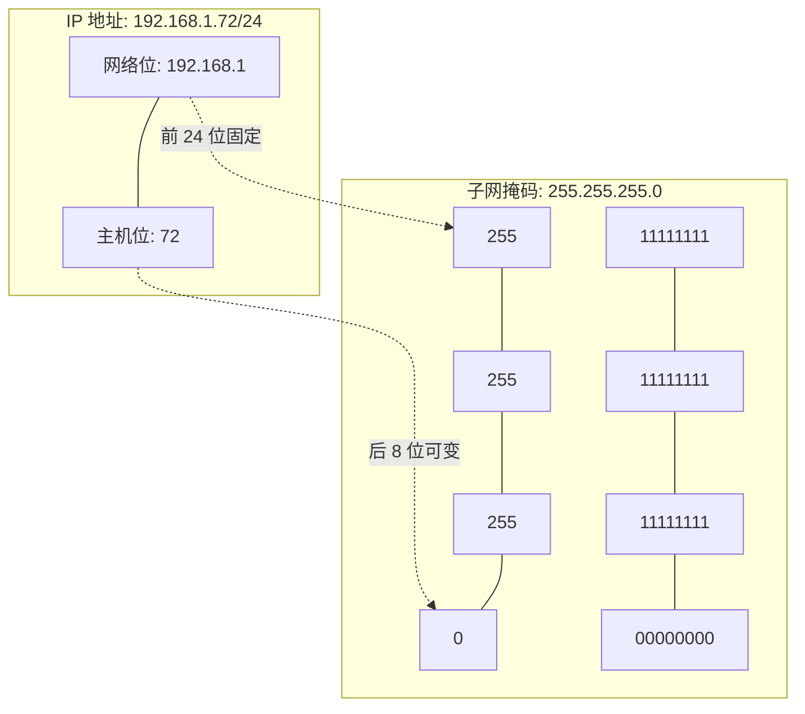
```mermaid
graph TD
    subgraph IP["IP 地址: 192.168.1.72/24"]
        NET["网络位: 192.168.1"] --- HOST["主机位: 72"]
    end
    
    subgraph Mask["子网掩码: 255.255.255.0"]
        M1["255"] --- M2["255"] --- M3["255"] --- M4["0"]
        M1_B["11111111"] --- M2_B["11111111"] --- M3_B["11111111"] --- M4_B["00000000"]
    end
    
    NET -.-> |"前 24 位固定"| M1
    HOST -.-> |"后 8 位可变"| M4
```

**图解说明**：

- `/24` 表示前 24 位是网络位（固定），后 8 位是主机位（可变）
- 子网掩码 `255.255.255.0` 的二进制表示中，`1` 表示网络位，`0` 表示主机位

##### 2.2.2 VLSM 计算实例

**问题**：如何将一个 /24 网络 `192.168.1.0/24` 划分为两个子网？

**解答**：

将掩码从 /24 变为 /25，即多借用 1 位作为网络位：

| 子网 | 网络地址 | 地址范围 | 广播地址 | 可用主机数 |
|:---:|:---|:---|:---|:---:|
| 子网1 | 192.168.1.0/25 | 192.168.1.1 ~ 192.168.1.126 | 192.168.1.127 | 126 |
| 子网2 | 192.168.1.128/25 | 192.168.1.129 ~ 192.168.1.254 | 192.168.1.255 | 126 |

**计算过程**：

```text
/24 掩码：11111111.11111111.11111111.00000000
/25 掩码：11111111.11111111.11111111.10000000
                                      ↑
                                   多借 1 位

第 25 位 = 0 → 子网1：主机位范围 0~127（0000000 ~ 1111111）
第 25 位 = 1 → 子网2：主机位范围 128~255（10000000 ~ 11111111）
```

##### 2.2.3 常用掩码速查表

| CIDR | 子网掩码 | 可用主机数 | 常用场景 |
|:---:|:---|:---:|:---|
| /30 | 255.255.255.252 | 2 | 点对点链路（路由器互联） |
| /29 | 255.255.255.248 | 6 | 小型服务器组 |
| /28 | 255.255.255.240 | 14 | 小型 VLAN |
| /27 | 255.255.255.224 | 30 | 小型办公室 |
| /26 | 255.255.255.192 | 62 | 中型 VLAN |
| /25 | 255.255.255.128 | 126 | 大型 VLAN |
| /24 | 255.255.255.0 | 254 | 标准子网 |
| /16 | 255.255.0.0 | 65534 | 大型网络 |

#### 关键点

> [!IMPORTANT]
> **CNI 中的 /32 掩码**
>
> 在 Kubernetes CNI 中，Pod IP 经常使用 `/32` 掩码。这意味着：
>
> - 所有 32 位都是网络位，没有主机位
> - 每个 Pod IP 都是一个独立的"网络"
> - **同节点的两个 Pod 之间也需要通过路由通信，而非二层交换**
>
> 这是理解 Calico 等 CNI 路由模式的关键！

---

### 2.3 MAC 地址详解

#### 背景

MAC（Media Access Control）地址是**数据链路层**的物理地址，用于在同一局域网内唯一标识一个网络设备。与 IP 地址不同，MAC 地址通常与网卡硬件绑定，也称为**硬件地址**或**物理地址**。

#### 原理

##### 2.3.1 MAC 地址结构

MAC 地址是一个 **48 位（6 字节）** 的地址，通常用**冒号分十六进制**表示：

```text
AA:BB:CC:DD:EE:FF
└──┬──┘ └──┬──┘
  OUI     设备标识
(厂商)   (序列号)
```

| 部分 | 位数 | 说明 |
|:---:|:---:|:---|
| OUI | 前 24 位 | Organizationally Unique Identifier，厂商标识 |
| 设备标识 | 后 24 位 | 由厂商分配的设备序列号 |

**常见厂商 OUI**：

| OUI 前缀 | 厂商 |
|:---|:---|
| `00:50:56` | VMware |
| `FA:16:3E` | OpenStack |
| `52:54:00` | QEMU/KVM |
| `00:0C:29` | VMware |
| `00:1A:A0` | Dell |

##### 2.3.2 特殊 MAC 地址

| 类型 | 地址 | 说明 |
|:---:|:---|:---|
| 广播 MAC | `FF:FF:FF:FF:FF:FF` | 发送给同一广播域内所有设备 |
| 组播 MAC | `01:xx:xx:xx:xx:xx` | 第 8 位为 1，发送给一组设备 |

##### 2.3.3 MAC 地址表与学习机制

交换机通过**MAC 地址表**来转发数据帧：

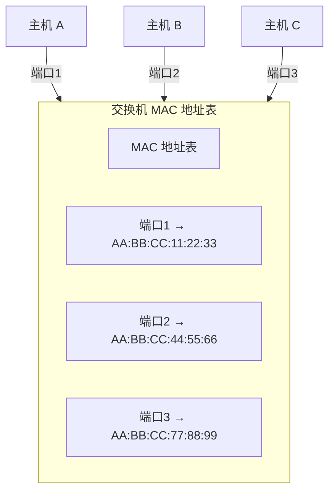
```mermaid
graph TD
    subgraph Switch["交换机 MAC 地址表"]
        T[MAC 地址表]
        E1["端口1 → AA:BB:CC:11:22:33"]
        E2["端口2 → AA:BB:CC:44:55:66"]
        E3["端口3 → AA:BB:CC:77:88:99"]
    end
    
    P1[主机 A] -->|端口1| Switch
    P2[主机 B] -->|端口2| Switch
    P3[主机 C] -->|端口3| Switch
```

**图解说明**：

交换机的学习过程：

1. 收到数据帧后，记录**源 MAC 地址**与**入端口**的对应关系
2. 查找**目的 MAC 地址**对应的端口，从该端口转发
3. 如果找不到目的 MAC，则**泛洪**到所有端口（除入端口外）
4. 表项有**老化时间**，长时间无流量会被删除

---

### 2.4 二层交换与三层路由

#### 背景

网络通信的核心问题是：**数据包应该发给谁？如何到达目的地？**

根据通信双方是否在**同一网段**，分为：

- **同网段通信**：走二层交换（基于 MAC 地址）
- **跨网段通信**：走三层路由（基于 IP 地址）

#### 原理

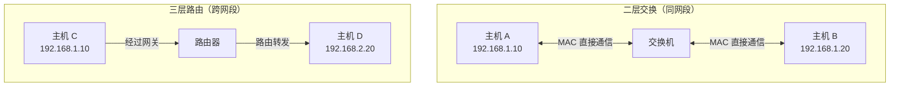
```mermaid
graph TD
    subgraph Layer2["二层交换（同网段）"]
        H1["主机 A<br/>192.168.1.10"] <-->|MAC 直接通信| SW[交换机]
        SW <-->|MAC 直接通信| H2["主机 B<br/>192.168.1.20"]
    end
    
    subgraph Layer3["三层路由（跨网段）"]
        H3["主机 C<br/>192.168.1.10"] -->|经过网关| R[路由器]
        R -->|路由转发| H4["主机 D<br/>192.168.2.20"]
    end
```

**图解说明**：

| 场景 | 判断依据 | 转发方式 | 地址变化 |
|:---:|:---|:---|:---|
| 同网段 | 目的 IP 与源 IP 在同一子网 | 二层交换 | MAC 不变 |
| 跨网段 | 目的 IP 与源 IP 不在同一子网 | 三层路由 | **MAC 每跳改变** |

##### 判断是否同网段的方法

已知：

- 主机 A：`192.168.1.2/24`
- 主机 B：`192.168.1.130/24`
- 主机 C：`192.168.1.130/25`

**分析**：

| 比较 | A 的网段 | B 的网段 | 是否同网段 |
|:---|:---|:---|:---:|
| A 和 B（/24） | 192.168.1.0 | 192.168.1.0 | ✅ 是 |
| A 和 C（不同掩码） | - | - | 需按各自掩码计算 |

**如果 A 使用 /25 掩码**：

- A (192.168.1.2/25)：网段 192.168.1.0，范围 0~127
- C (192.168.1.130/25)：网段 192.168.1.128，范围 128~255
- **结论：A 和 C 不在同一网段！**

---

### 2.5 ARP 协议与 IP-MAC 映射

#### 背景

当主机知道目的 IP 但不知道目的 MAC 时，需要通过 **ARP（Address Resolution Protocol）** 协议来获取 MAC 地址。

#### 原理

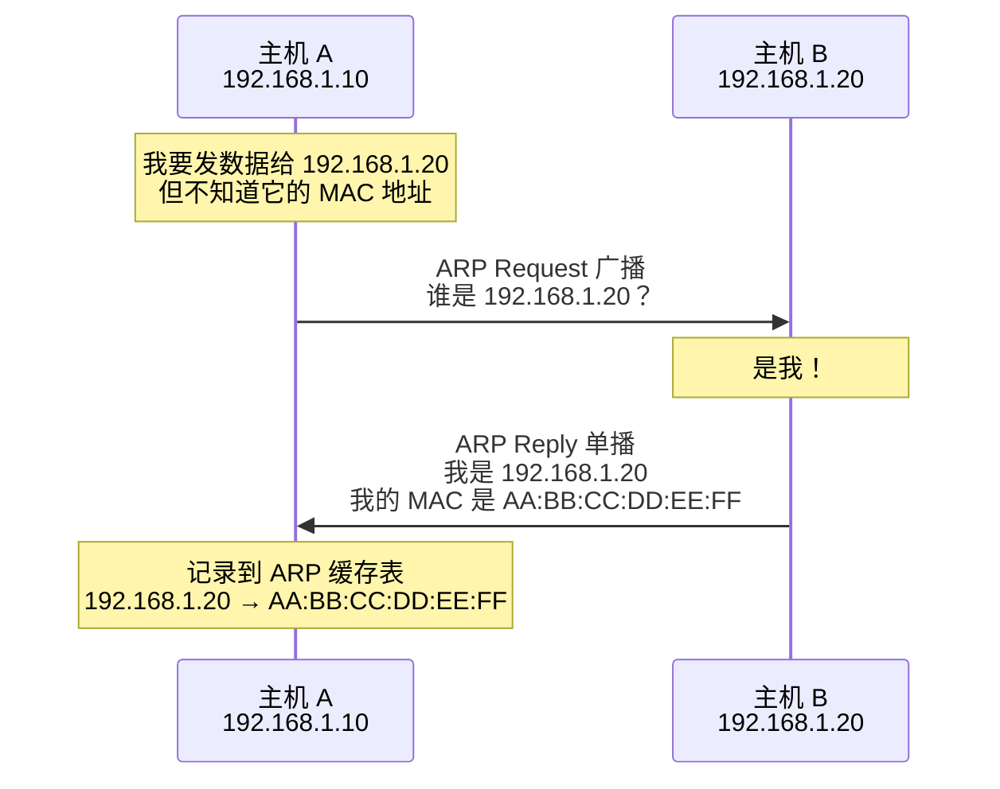
```mermaid
sequenceDiagram
    participant A as 主机 A<br/>192.168.1.10
    participant B as 主机 B<br/>192.168.1.20
    
    Note over A: 我要发数据给 192.168.1.20<br/>但不知道它的 MAC 地址
    A->>B: ARP Request 广播<br/>谁是 192.168.1.20？
    Note over B: 是我！
    B->>A: ARP Reply 单播<br/>我是 192.168.1.20<br/>我的 MAC 是 AA:BB:CC:DD:EE:FF
    Note over A: 记录到 ARP 缓存表<br/>192.168.1.20 → AA:BB:CC:DD:EE:FF
```

**图解说明**：

1. 主机 A 发送 **ARP 请求广播**，询问 `192.168.1.20` 的 MAC 地址
2. 主机 B 收到请求后，**单播回复**自己的 MAC 地址
3. 主机 A 将 IP-MAC 映射**缓存到 ARP 表**，后续通信直接使用

**查看 ARP 缓存**：

```bash
# Linux 查看 ARP 表
ip neigh show

# 或使用传统命令
arp -a
```

---

### 2.6 路由转发过程中的 IP/MAC 变化规律

#### 背景

这是理解网络转发的**最核心知识点**。很多从业多年的工程师也不一定能说清楚：在路由转发过程中，哪些地址在变化，哪些不变？

#### 原理

**核心结论（非 NAT 场景）**：

| 地址类型 | 是否变化 | 说明 |
|:---:|:---:|:---|
| 源 IP | **不变** | 始终是发送方的 IP |
| 目的 IP | **不变** | 始终是接收方的 IP |
| 源 MAC | **每跳改变** | 变为上一跳设备的出接口 MAC |
| 目的 MAC | **每跳改变** | 变为下一跳设备的入接口 MAC |

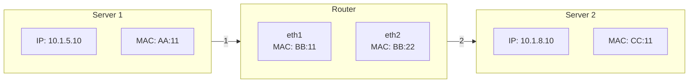
```mermaid
graph LR
    subgraph S1["Server 1"]
        IP1["IP: 10.1.5.10"]
        MAC1["MAC: AA:11"]
    end
    
    subgraph R["Router"]
        R_E1["eth1<br/>MAC: BB:11"]
        R_E2["eth2<br/>MAC: BB:22"]
    end
    
    subgraph S2["Server 2"]
        IP2["IP: 10.1.8.10"]
        MAC2["MAC: CC:11"]
    end
    
    S1 -->|1| R
    R -->|2| S2
```

**图解说明**：

当 Server 1 ping Server 2 时：

| 阶段 | 源 IP | 目的 IP | 源 MAC | 目的 MAC |
|:---:|:---:|:---:|:---:|:---:|
| S1 → R (eth1) | 10.1.5.10 | 10.1.8.10 | **AA:11** | **BB:11** |
| R (eth2) → S2 | 10.1.5.10 | 10.1.8.10 | **BB:22** | **CC:11** |

**要点解读**：

> [!IMPORTANT]
> **关键理解**：
>
> 1. **IP 地址决定最终目的地**，在整个路由过程中始终不变（NAT 除外）
> 2. **MAC 地址决定下一跳**，每经过一个路由器都会改变
> 3. 发送数据时，**目的 MAC 是网关的 MAC**，不是最终目标的 MAC
> 4. 这就是为什么同网段走交换（MAC 直达），跨网段走路由（MAC 逐跳变化）

#### 实验验证

**步骤一：创建测试环境（使用 Containerlab）**

```yaml
name: routing-lab
topology:
  nodes:
    router:
      kind: linux
      image: vyos/vyos:1.2.8
    server1:
      kind: linux
    server2:
      kind: linux
  links:
    - endpoints: ["router:eth1", "server1:net0"]
    - endpoints: ["router:eth2", "server2:net0"]
```

**步骤二：在 Server 2 上抓包**

```bash
# 在 Server 2 的 net0 接口抓包
tcpdump -i net0 -e -nn icmp

# 输出示例：
# 12:00:00.001 BB:22 > CC:11, 10.1.5.10 > 10.1.8.10: ICMP echo request
# 12:00:00.002 CC:11 > BB:22, 10.1.8.10 > 10.1.5.10: ICMP echo reply
```

**步骤三：分析结果**

- **源 MAC（BB:22）**：是路由器 eth2 的 MAC，不是 Server 1 的 MAC
- **源 IP（10.1.5.10）**：仍然是 Server 1 的 IP，没有变化

#### TTL 值的变化

**TTL（Time To Live）**：数据包的生存时间，每经过一个路由器减 1。

| 场景 | TTL 变化 | 说明 |
|:---:|:---:|:---|
| 二层交换 | 不变 | 不经过路由器 |
| 三层路由 | 减 1 | 每跳减 1 |

**作用**：防止数据包在网络中无限循环。当 TTL 减为 0 时，路由器丢弃该数据包。

```bash
# 通过 TTL 判断是否经过路由
ping 10.1.8.10

# 同网段：TTL = 64（Linux 默认）
# 跨一跳：TTL = 63
# 跨两跳：TTL = 62
```

---

### 2.7 使用 Containerlab 进行网络实验

#### 背景

Containerlab 是一个强大的容器化网络实验工具，可以快速搭建包含路由器、交换机、主机的复杂网络拓扑，非常适合学习和验证网络知识。

#### 实验：二层交换 vs 三层路由

**二层交换拓扑**：

```yaml
name: layer2-lab
topology:
  nodes:
    bridge:
      kind: bridge
    server1:
      kind: linux
      exec:
        - ip addr add 10.1.5.10/24 dev net0
    server2:
      kind: linux
      exec:
        - ip addr add 10.1.5.11/24 dev net0
  links:
    - endpoints: ["bridge:eth1", "server1:net0"]
    - endpoints: ["bridge:eth2", "server2:net0"]
```

**验证**：

```bash
# 在 server1 ping server2
ping 10.1.5.11

# TTL = 64，说明没有经过路由器，走的二层交换
```

**三层路由拓扑**：

```yaml
name: layer3-lab
topology:
  nodes:
    router:
      kind: linux
      image: vyos/vyos:1.2.8
    server1:
      kind: linux
      exec:
        - ip addr add 10.1.5.10/24 dev net0
        - ip route add default via 10.1.5.1
    server2:
      kind: linux
      exec:
        - ip addr add 10.1.8.10/24 dev net0
        - ip route add default via 10.1.8.1
  links:
    - endpoints: ["router:eth1", "server1:net0"]
    - endpoints: ["router:eth2", "server2:net0"]
```

**验证**：

```bash
# 在 server1 ping server2
ping 10.1.8.10

# TTL = 63，说明经过了一跳路由器
```

---

### 📝 章节小结

本章深入讲解了 IP 地址和 MAC 地址的核心知识：

1. **IP 地址基础**：点分十进制、二进制转换、有类地址分类
2. **VLSM 子网划分**：掌握网络位/主机位计算、快速确定地址范围
3. **MAC 地址结构**：48 位硬件地址、OUI 厂商标识
4. **二层交换 vs 三层路由**：
   - 同网段走交换，MAC 不变
   - 跨网段走路由，MAC 每跳改变
5. **路由转发中的地址变化**：
   - **IP 不变**（NAT 除外）
   - **MAC 每跳改变**

> [!TIP]
> **学习建议**：
>
> 1. 熟练掌握 VLSM 计算，这是网络工程师的基本功
> 2. 使用 Containerlab 动手搭建实验环境
> 3. 通过抓包验证 IP/MAC 地址的变化规律
> 4. 理解 `/32` 掩码在 CNI 中的应用场景

> [!CAUTION]
> **常见误区**：
>
> - ❌ 认为目的 MAC 就是目标主机的 MAC
> - ✅ 目的 MAC 是**下一跳**设备的 MAC（可能是网关）
>
> - ❌ 认为 IP 地址在路由过程中会变化
> - ✅ 在非 NAT 场景下，IP 地址**始终不变**

---

## 第3章 VETH 虚拟网络设备

### 🎯 学习目标

- 理解 VETH Pair 的概念与工作原理
- 掌握 Linux 网络命名空间（Network Namespace）的基本操作
- 学会手工创建和配置 VETH Pair
- 理解 Linux Bridge 与 VETH 的结合使用
- 掌握 VETH 在容器网络（CNI）中的核心应用

---

### 3.1 VETH Pair 概念与原理

#### 背景

在容器网络中，每个容器（Pod）都运行在独立的**网络命名空间（Network Namespace）**中，与宿主机的网络隔离。那么，容器如何与外界通信呢？

答案是：**VETH Pair（虚拟以太网设备对）**。

#### 原理

**VETH Pair** 是 Linux 内核提供的一种虚拟网络设备，它**总是成对出现**，就像一根虚拟的网线，一端插在容器内，一端插在宿主机上。

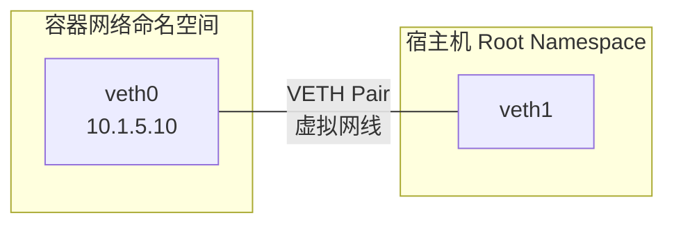
```mermaid
graph LR
    subgraph NS1["容器网络命名空间"]
        V1["veth0<br/>10.1.5.10"]
    end
    
    subgraph ROOT["宿主机 Root Namespace"]
        V2["veth1"]
    end
    
    V1 ---|"VETH Pair<br/>虚拟网线"| V2
```

**图解说明**：

- VETH Pair 由两个虚拟网卡组成，它们**总是成对创建**
- 从一端发送的数据包，会**立即出现在另一端**
- 通过 VETH Pair，可以实现**跨网络命名空间的通信**

#### 核心特性

| 特性 | 说明 |
|:---|:---|
| 成对出现 | 一个 VETH 设备必定有一个 Peer 设备 |
| 双向通信 | 从一端发送的包会从另一端收到 |
| 跨命名空间 | 两端可以分别位于不同的网络命名空间 |
| 即时传输 | 数据包在内核中直接传递，无需经过物理网络 |

> [!NOTE]
> **形象理解**：VETH Pair 就像一根虚拟网线，把容器内部和宿主机连接起来。从网线一端发送的数据，必然从另一端出来。

---

### 3.2 VETH 在容器网络中的应用

#### 背景

在 Kubernetes 中，每个 Pod 都有自己独立的网络命名空间。Pod 内的应用要与外界通信，必须先将流量从 Pod 的网络命名空间"引出"到宿主机的 Root Namespace，然后才能进行后续的路由或转发。

#### 原理

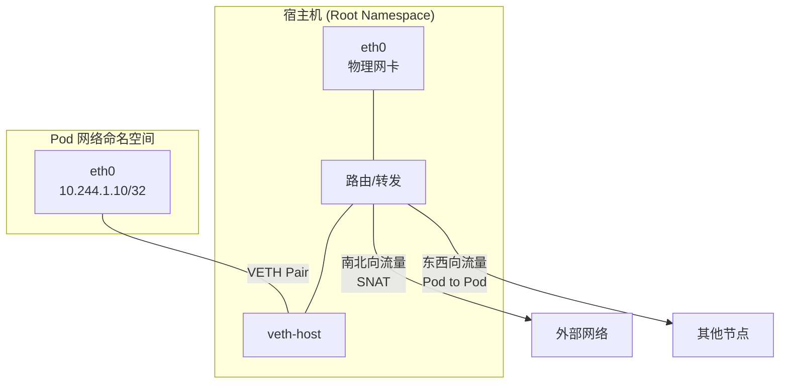
```mermaid
graph TD
    subgraph Host["宿主机 (Root Namespace)"]
        direction TB
        ETH0["eth0<br/>物理网卡"]
        ROUTING["路由/转发"]
        V2["veth-host"]
        
        ETH0 --- ROUTING --- V2
    end
    
    subgraph Pod["Pod 网络命名空间"]
        V1["eth0<br/>10.244.1.10/32"]
    end
    
    V1 ---|"VETH Pair"| V2
    
    ROUTING -->|"南北向流量<br/>SNAT"| INTERNET["外部网络"]
    ROUTING -->|"东西向流量<br/>Pod to Pod"| OTHER["其他节点"]
```

**图解说明**：

1. **Pod 网络命名空间**：Pod 内的 eth0 是 VETH Pair 的一端
2. **宿主机 Root Namespace**：VETH Pair 的另一端在宿主机上
3. **流量转发**：
   - **南北向流量**（Pod ↔ 外网）：从 VETH 到宿主机，经过 SNAT 后发出
   - **东西向流量**（Pod ↔ Pod）：从 VETH 到宿主机，根据路由转发到目标节点

#### CNI 实现模式

不同的 CNI 插件使用 VETH 的方式略有不同：

| CNI | VETH 使用方式 | 说明 |
|:---:|:---|:---|
| Flannel | VETH + Bridge | Pod 的 VETH 插入到 cni0 网桥 |
| Calico | VETH + Routing | Pod 的 VETH 直接路由，使用 /32 掩码 |
| Cilium | VETH + eBPF | 使用 eBPF 加速，可绕过部分内核协议栈 |

---

### 3.3 手工创建 VETH Pair

#### 背景

理解 VETH Pair 的最好方式是亲手创建一个。通过手工操作，可以深入理解容器网络的底层实现。

#### 实现步骤

##### 步骤一：创建网络命名空间

```bash
# 创建两个网络命名空间
ip netns add ns1
ip netns add ns2

# 查看已创建的命名空间
ip netns list
```

**代码说明**：

- `ip netns add`：创建网络命名空间
- `ip netns list`：列出所有网络命名空间

##### 步骤二：创建 VETH Pair

```bash
# 创建 VETH Pair：veth01 和 veth10
ip link add veth01 type veth peer name veth10

# 查看创建的设备
ip link show type veth
```

**代码说明**：

- `ip link add ... type veth peer name ...`：创建一对 VETH 设备
- 此时两个设备都在 Root Namespace 中

##### 步骤三：分配到不同命名空间

```bash
# 将 veth01 移动到 ns1
ip link set veth01 netns ns1

# 将 veth10 移动到 ns2
ip link set veth10 netns ns2
```

##### 步骤四：配置 IP 地址并启用

```bash
# 在 ns1 中配置 IP 并启用接口
ip netns exec ns1 ip addr add 10.1.5.10/24 dev veth01
ip netns exec ns1 ip link set veth01 up
ip netns exec ns1 ip link set lo up

# 在 ns2 中配置 IP 并启用接口
ip netns exec ns2 ip addr add 10.1.5.11/24 dev veth10
ip netns exec ns2 ip link set veth10 up
ip netns exec ns2 ip link set lo up
```

##### 步骤五：测试连通性

```bash
# 从 ns1 ping ns2
ip netns exec ns1 ping 10.1.5.11

# 应该能够 ping 通，输出类似：
# PING 10.1.5.11 (10.1.5.11) 56(84) bytes of data.
# 64 bytes from 10.1.5.11: icmp_seq=1 ttl=64 time=0.050 ms
```

##### 步骤六：查看 VETH Pair 关系

```bash
# 在 ns1 中查看 veth01 的 peer index
ip netns exec ns1 ethtool -S veth01

# 输出示例：
# NIC statistics:
#      peer_ifindex: 12  # peer 的接口索引

# 在 ns2 中查看 veth10 的接口索引
ip netns exec ns2 ip link show veth10
# 应该显示接口索引为 12
```

##### 清理环境

```bash
# 删除命名空间（会自动删除其中的 VETH 设备）
ip netns del ns1
ip netns del ns2
```

---

### 3.4 Linux Bridge 与 VETH

#### 背景

在 Flannel 等 CNI 插件中，同一节点上的多个 Pod 需要互相通信。如果每对 Pod 之间都创建一个 VETH Pair，网络结构会非常复杂。

解决方案：引入 **Linux Bridge（网桥）**，让所有 Pod 的 VETH 都"插"在同一个网桥上。

#### 原理

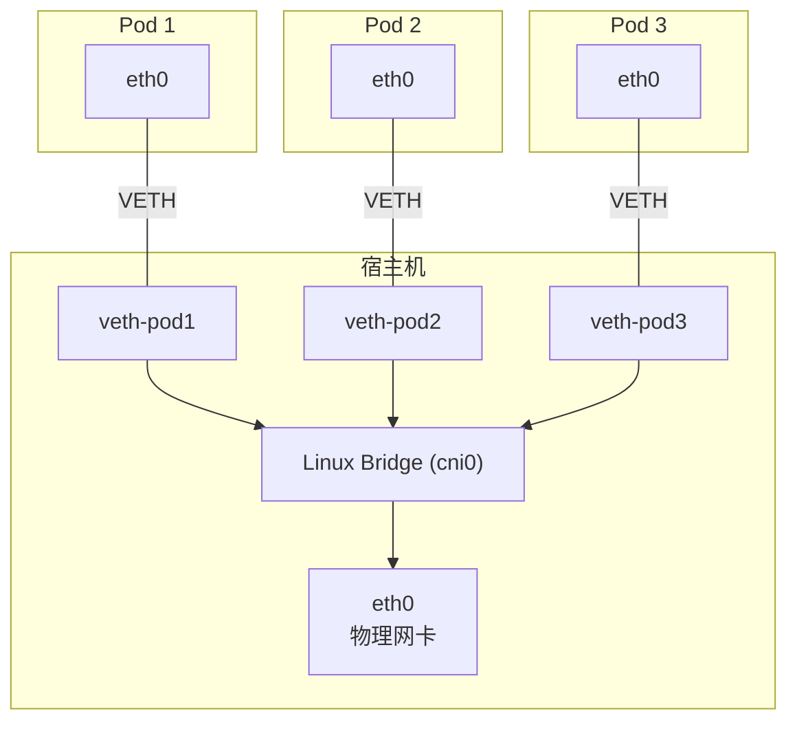
```mermaid
graph TD
    subgraph Host["宿主机"]
        BRIDGE["Linux Bridge (cni0)"]
        ETH0["eth0<br/>物理网卡"]
        
        V1H["veth-pod1"]
        V2H["veth-pod2"]
        V3H["veth-pod3"]
        
        V1H --> BRIDGE
        V2H --> BRIDGE
        V3H --> BRIDGE
        BRIDGE --> ETH0
    end
    
    subgraph Pod1["Pod 1"]
        V1P["eth0"]
    end
    
    subgraph Pod2["Pod 2"]
        V2P["eth0"]
    end
    
    subgraph Pod3["Pod 3"]
        V3P["eth0"]
    end
    
    V1P ---|VETH| V1H
    V2P ---|VETH| V2H
    V3P ---|VETH| V3H
```

**图解说明**：

- 每个 Pod 的 VETH 一端在 Pod 内（eth0），另一端插在宿主机的 cni0 网桥上
- 同节点的 Pod 之间通信：通过 cni0 网桥的**二层交换**完成
- 跨节点的 Pod 通信：从网桥经路由转发到物理网卡

#### 手工实现 Bridge + VETH

```bash
# 1. 创建两个命名空间
ip netns add ns1
ip netns add ns2

# 2. 创建 Linux Bridge
ip link add br0 type bridge
ip link set br0 up

# 3. 创建两对 VETH
ip link add int0 type veth peer name br-int0
ip link add int1 type veth peer name br-int1

# 4. 将 VETH 一端移入命名空间
ip link set int0 netns ns1
ip link set int1 netns ns2

# 5. 将 VETH 另一端插入 Bridge
ip link set br-int0 master br0
ip link set br-int1 master br0
ip link set br-int0 up
ip link set br-int1 up

# 6. 配置命名空间内的 IP
ip netns exec ns1 ip addr add 10.1.5.10/24 dev int0
ip netns exec ns1 ip link set int0 up
ip netns exec ns1 ip link set lo up

ip netns exec ns2 ip addr add 10.1.5.11/24 dev int1
ip netns exec ns2 ip link set int1 up
ip netns exec ns2 ip link set lo up

# 7. 测试连通性
ip netns exec ns1 ping 10.1.5.11
```

**代码说明**：

- `ip link set ... master br0`：将接口插入网桥，相当于把网线插入交换机
- 插入网桥后，该接口会显示 `master br0` 标识

#### 查看 Bridge 状态

```bash
# 查看所有网桥
brctl show

# 输出示例：
# bridge name     bridge id               STP enabled     interfaces
# br0             8000.aabbccdd1122       no              br-int0
#                                                         br-int1

# 查看网桥的 MAC 地址表
brctl showmacs br0
```

---

### 3.5 VETH 在不同 CNI 中的应用

#### 背景

不同的 CNI 插件虽然都使用 VETH，但实现方式和网络模型有明显区别。

#### Flannel 的 Bridge 模式

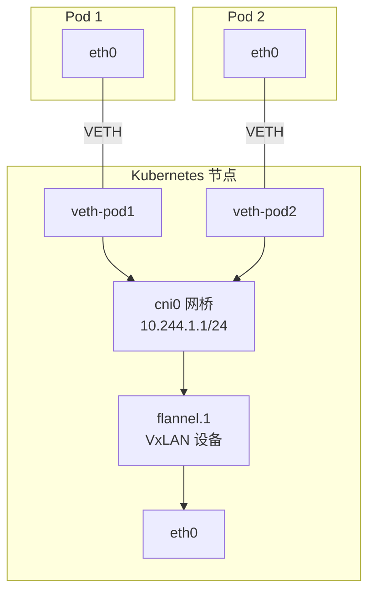
```mermaid
graph TD
    subgraph Node["Kubernetes 节点"]
        CNI0["cni0 网桥<br/>10.244.1.1/24"]
        FLANNEL["flannel.1<br/>VxLAN 设备"]
        ETH0["eth0"]
        
        V1["veth-pod1"] --> CNI0
        V2["veth-pod2"] --> CNI0
        CNI0 --> FLANNEL
        FLANNEL --> ETH0
    end
    
    subgraph Pod1["Pod 1<br/>10.244.1.10"]
        E1["eth0"]
    end
    
    subgraph Pod2["Pod 2<br/>10.244.1.11"]
        E2["eth0"]
    end
    
    E1 ---|VETH| V1
    E2 ---|VETH| V2
```

**要点解读**：

| 特性 | Flannel Bridge 模式 |
|:---|:---|
| Pod 掩码 | **/24**（同节点 Pod 同网段） |
| 同节点通信 | 通过 cni0 网桥**二层交换** |
| 跨节点通信 | 通过 flannel.1 VxLAN 封装 |
| 优点 | 配置简单，同节点通信高效 |
| 缺点 | 二层广播域可能导致广播风暴 |

#### Calico 的路由模式

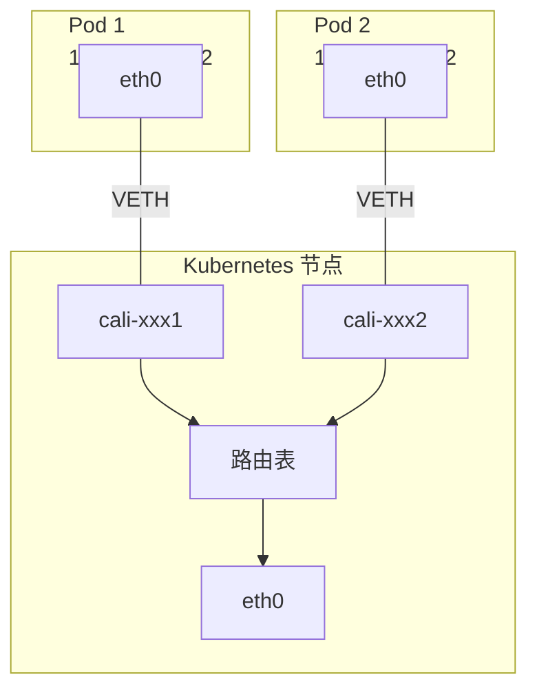
```mermaid
graph TD
    subgraph Node["Kubernetes 节点"]
        ROUTING["路由表"]
        ETH0["eth0"]
        
        V1["cali-xxx1"] --> ROUTING
        V2["cali-xxx2"] --> ROUTING
        ROUTING --> ETH0
    end
    
    subgraph Pod1["Pod 1<br/>10.244.1.10/32"]
        E1["eth0"]
    end
    
    subgraph Pod2["Pod 2<br/>10.244.1.11/32"]
        E2["eth0"]
    end
    
    E1 ---|VETH| V1
    E2 ---|VETH| V2
```

**要点解读**：

| 特性 | Calico 路由模式 |
|:---|:---|
| Pod 掩码 | **/32**（每个 Pod 独立网络） |
| 同节点通信 | 通过**路由表**三层转发 |
| 跨节点通信 | BGP 协议或 IPIP/VxLAN 封装 |
| 优点 | 无广播风暴，支持网络策略 |
| 缺点 | 需要维护路由表，配置较复杂 |

> [!IMPORTANT]
> **Calico 使用 /32 掩码的关键意义**：
>
> - 使用 /32 掩码意味着**没有任何 IP 与该 Pod 同网段**
> - 因此同节点的 Pod 之间也**必须走路由**，而非二层交换
> - 这使得 Calico 可以在**路由层面实施网络策略**

---

### 3.6 使用 Containerlab 模拟 VETH 网络

#### 简单 VETH 拓扑

```yaml
name: veth-demo
topology:
  nodes:
    server1:
      kind: linux
      exec:
        - ip addr add 10.1.5.10/24 dev net0
    server2:
      kind: linux
      exec:
        - ip addr add 10.1.5.11/24 dev net0
  links:
    - endpoints: ["server1:net0", "server2:net0"]
```

**代码说明**：

- `links` 定义的连接会自动创建 VETH Pair
- server1 的 net0 和 server2 的 net0 通过 VETH 直连

#### Bridge + VETH 拓扑

```yaml
name: bridge-veth-demo
topology:
  nodes:
    bridge:
      kind: bridge
    server1:
      kind: linux
      exec:
        - ip addr add 10.1.5.10/24 dev net0
    server2:
      kind: linux
      exec:
        - ip addr add 10.1.5.11/24 dev net0
  links:
    - endpoints: ["bridge:eth1", "server1:net0"]
    - endpoints: ["bridge:eth2", "server2:net0"]
```

**代码说明**：

- `kind: bridge` 创建一个 Linux Bridge
- server1 和 server2 都通过 VETH 连接到这个 Bridge
- 可以使用 `brctl show` 查看 Bridge 上的接口

#### 部署与验证

```bash
# 部署拓扑
clab deploy -t veth-demo.yaml

# 进入容器测试
docker exec -it clab-veth-demo-server1 ping 10.1.5.11

# 查看 VETH Pair 关系
docker exec -it clab-veth-demo-server1 ethtool -S net0

# 清理环境
clab destroy -t veth-demo.yaml
```

---

### 3.7 常见问题与排障

#### 问题1：ping 自己不通

**现象**：在命名空间内 ping 自己的 IP 地址不通

**原因**：loopback 接口（lo）未启用

**解决**：

```bash
ip netns exec ns1 ip link set lo up
```

> [!TIP]
> 创建网络命名空间后，记得启用 lo 接口。虽然 ping 自己通常不经过 lo，但某些协议栈处理需要 lo 处于 UP 状态。

#### 问题2：如何判断两个接口是否为 VETH Pair

**方法**：使用 `ethtool -S` 查看 peer_ifindex

```bash
# 查看 veth0 的 peer 接口索引
ethtool -S veth0 | grep peer_ifindex

# 对比另一端的接口索引
ip link show | grep "12:"  # 假设 peer_ifindex 是 12
```

#### 问题3：如何查看接口属于哪个 Bridge

**方法**：查看接口的 `master` 属性

```bash
ip link show veth0

# 输出中如果包含 master br0，说明该接口插在 br0 网桥上
# 例如：5: veth0@eth0: <BROADCAST,MULTICAST,UP> ... master br0 state UP
```

---

### 📝 章节小结

本章深入讲解了 VETH 虚拟网络设备：

1. **VETH Pair 概念**：成对出现的虚拟网卡，用于跨网络命名空间通信
2. **CNI 中的应用**：所有主流 CNI 都使用 VETH 将 Pod 流量引入宿主机
3. **手工创建 VETH**：掌握 `ip link add ... type veth peer name ...` 命令
4. **Linux Bridge**：多个 VETH 可以插入同一个 Bridge，实现二层交换
5. **CNI 实现差异**：
   - Flannel：VETH + Bridge，同节点走二层
   - Calico：VETH + Routing（/32 掩码），同节点也走三层

> [!TIP]
> **学习建议**：
>
> 1. 动手执行手工创建 VETH 的全部步骤
> 2. 使用 Containerlab 快速搭建各种 VETH 拓扑
> 3. 对比 Flannel 和 Calico 的 VETH 使用方式
> 4. 理解 "VETH 是容器网络的基石" 这一核心概念

---

## 第4章 Host-Gateway 网络模式

### 🎯 学习目标

- 理解 Host-Gateway（主机网关）模式的核心概念
- 掌握静态路由在容器网络中的应用
- 学会使用 Containerlab 模拟 Host-GW 网络
- 掌握手工配置 Host-GW 模式的完整步骤
- 理解 Host-GW 与 Overlay 网络的优劣对比

---

### 4.1 Host-Gateway 概念与原理

#### 背景

在容器网络中，Pod 需要与其他节点上的 Pod 通信。实现跨节点通信有两种主要方式：

1. **Overlay 网络**：将容器网络封装在底层网络之上（如 VxLAN、IPIP）
2. **Host-Gateway**：利用主机的路由功能直接转发容器流量

**Host-Gateway（主机网关）**是最简单、性能最高的容器网络模式之一。

#### 原理

**Host-Gateway** 的核心思想：**把宿主机当作 Pod 的网关**。

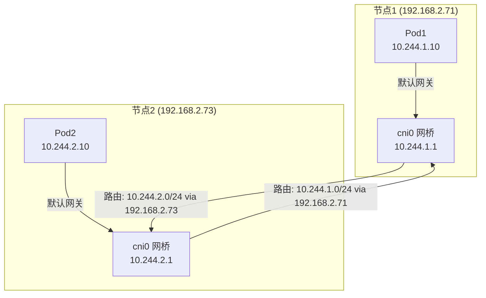
```mermaid
graph TD
    subgraph Node1["节点1 (192.168.2.71)"]
        GW1["cni0 网桥<br/>10.244.1.1"]
        P1["Pod1<br/>10.244.1.10"]
        P1 -->|"默认网关"| GW1
    end
    
    subgraph Node2["节点2 (192.168.2.73)"]
        GW2["cni0 网桥<br/>10.244.2.1"]
        P2["Pod2<br/>10.244.2.10"]
        P2 -->|"默认网关"| GW2
    end
    
    GW1 -->|"路由: 10.244.2.0/24 via 192.168.2.73"| GW2
    GW2 -->|"路由: 10.244.1.0/24 via 192.168.2.71"| GW1
```

**图解说明**：

1. Pod1 发送数据包到 Pod2（目的地址 10.244.2.10）
2. Pod1 的默认网关是 cni0 网桥（10.244.1.1）
3. 节点1 查询路由表：去往 10.244.2.0/24 的下一跳是 192.168.2.73
4. 数据包发送到节点2，节点2 将其转发给 Pod2

**关键理解**：

> [!NOTE]
> **Host-Gateway = 把主机当网关**
>
> 就像你家的无线路由器是你手机的网关一样，Pod 把宿主机当作自己的网关。所有出站流量都先发给宿主机，由宿主机负责路由转发。

---

### 4.2 Host-GW 与 Overlay 网络对比

#### 原理对比

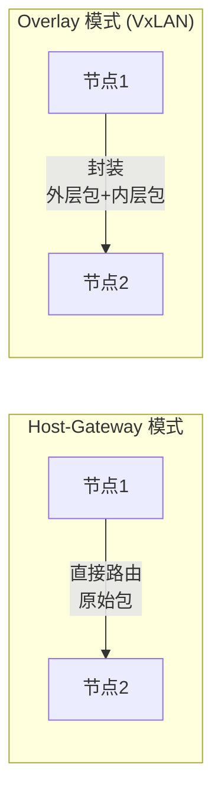
```mermaid
graph LR
    subgraph HostGW["Host-Gateway 模式"]
        H1["节点1"] -->|"直接路由<br/>原始包"| H2["节点2"]
    end
    
    subgraph Overlay["Overlay 模式 (VxLAN)"]
        O1["节点1"] -->|"封装<br/>外层包+内层包"| O2["节点2"]
    end
```

**图解说明**：

| 特性 | Host-Gateway | Overlay (VxLAN/IPIP) |
|:---|:---|:---|
| **性能** | ⭐⭐⭐⭐⭐ 最高 | ⭐⭐⭐ 有封装开销 |
| **MTU** | 无损耗（1500） | 有损耗（1450左右） |
| **配置复杂度** | 简单 | 中等 |
| **对底层网络要求** | 节点必须二层可达 | 节点只需三层可达 |
| **Pod IP 暴露** | 暴露在物理网络 | 封装隐藏 |
| **跨子网** | ❌ 不支持 | ✅ 支持 |

#### 适用场景

| 场景 | 推荐模式 |
|:---|:---|
| 节点在同一二层网络 | **Host-Gateway**（性能最优） |
| 节点跨子网/跨机房 | **Overlay**（必须封装） |
| 对性能敏感的业务 | **Host-Gateway** |
| 多云/混合云环境 | **Overlay** |

> [!IMPORTANT]
> **Host-GW 的限制**：
>
> 节点之间必须**二层可达**（在同一个广播域）。如果节点跨子网，数据包无法直接路由，必须使用 Overlay 封装。

---

### 4.3 使用 Containerlab 实现 Host-GW

#### 背景

Containerlab 可以快速搭建包含路由器和主机的网络拓扑，非常适合理解 Host-GW 的工作原理。

#### 网络拓扑设计

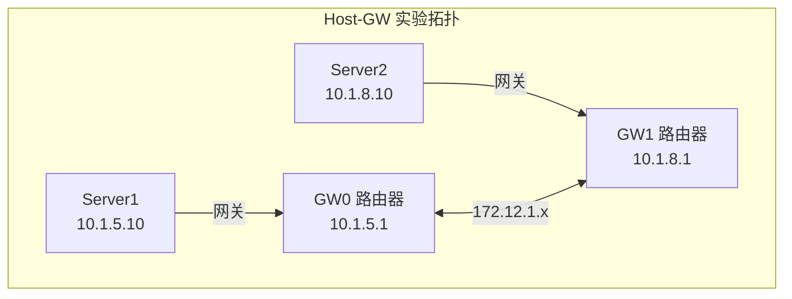
```mermaid
graph TD
    subgraph Topology["Host-GW 实验拓扑"]
        GW0["GW0 路由器<br/>10.1.5.1"]
        GW1["GW1 路由器<br/>10.1.8.1"]
        S1["Server1<br/>10.1.5.10"]
        S2["Server2<br/>10.1.8.10"]
        
        S1 -->|"网关"| GW0
        S2 -->|"网关"| GW1
        GW0 <-->|"172.12.1.x"| GW1
    end
```

**图解说明**：

- Server1 的网关是 GW0（10.1.5.1）
- Server2 的网关是 GW1（10.1.8.1）
- GW0 和 GW1 通过 172.12.1.x 互联
- GW0 需要知道如何到达 10.1.8.0/24，GW1 需要知道如何到达 10.1.5.0/24

#### Containerlab 配置文件

```yaml
name: host-gw-lab
topology:
  nodes:
    # 路由器 GW0
    gw0:
      kind: linux
      image: vyos/vyos:1.2.8
      startup-config: gw0.cfg
    
    # 路由器 GW1  
    gw1:
      kind: linux
      image: vyos/vyos:1.2.8
      startup-config: gw1.cfg
    
    # 服务器 Server1
    server1:
      kind: linux
      exec:
        - ip addr add 10.1.5.10/24 dev net0
        - ip route add default via 10.1.5.1
    
    # 服务器 Server2
    server2:
      kind: linux
      exec:
        - ip addr add 10.1.8.10/24 dev net0
        - ip route add default via 10.1.8.1
  
  links:
    # Server1 连接 GW0
    - endpoints: ["gw0:eth1", "server1:net0"]
    # Server2 连接 GW1
    - endpoints: ["gw1:eth1", "server2:net0"]
    # GW0 和 GW1 互联
    - endpoints: ["gw0:eth2", "gw1:eth2"]
```

#### GW0 路由配置 (gw0.cfg)

```text
# 接口配置
set interfaces ethernet eth1 address 10.1.5.1/24
set interfaces ethernet eth2 address 172.12.1.10/24

# 静态路由：去往 10.1.8.0/24 的下一跳是 GW1
set protocols static route 10.1.8.0/24 next-hop 172.12.1.11
```

#### GW1 路由配置 (gw1.cfg)

```text
# 接口配置
set interfaces ethernet eth1 address 10.1.8.1/24
set interfaces ethernet eth2 address 172.12.1.11/24

# 静态路由：去往 10.1.5.0/24 的下一跳是 GW0
set protocols static route 10.1.5.0/24 next-hop 172.12.1.10
```

#### 验证连通性

```bash
# 部署拓扑
clab deploy -t host-gw-lab.yaml

# 从 Server1 ping Server2
docker exec -it clab-host-gw-lab-server1 ping 10.1.8.10

# 观察 TTL 变化
# TTL = 62（经过两个路由器，从 64 减 2）

# 清理
clab destroy -t host-gw-lab.yaml
```

---

### 4.4 手工实现 Host-GW 模式

#### 背景

理解 Host-GW 最好的方式是手工实现一个完整的配置，模拟 Flannel 的 Host-GW 模式。

#### 实验拓扑

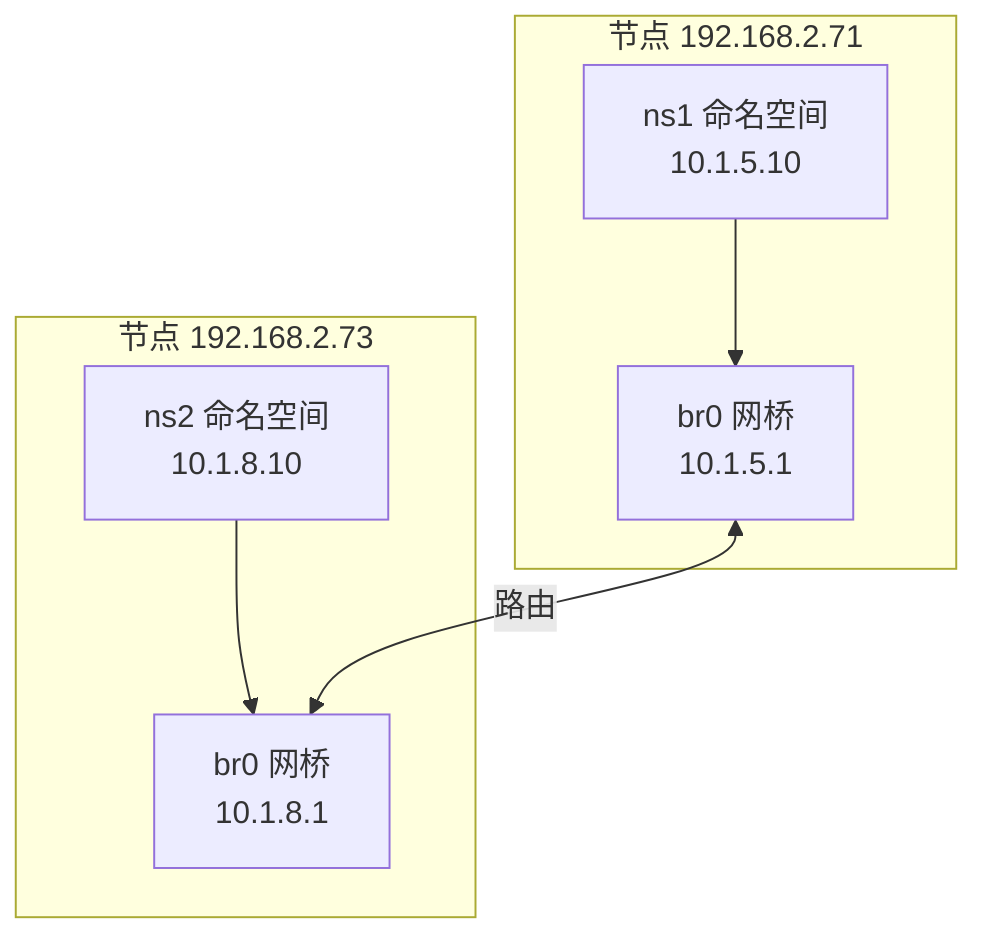
```mermaid
graph TD
    subgraph BPF71["节点 192.168.2.71"]
        BR0_1["br0 网桥<br/>10.1.5.1"]
        NS1["ns1 命名空间<br/>10.1.5.10"]
        NS1 --> BR0_1
    end
    
    subgraph BPF73["节点 192.168.2.73"]
        BR0_2["br0 网桥<br/>10.1.8.1"]
        NS2["ns2 命名空间<br/>10.1.8.10"]
        NS2 --> BR0_2
    end
    
    BR0_1 <-->|"路由"| BR0_2
```

#### 实现步骤（节点1: 192.168.2.71）

##### 步骤一：创建网络基础设施

```bash
# 创建网络命名空间（模拟 Pod）
ip netns add ns1

# 创建 Linux Bridge（模拟 cni0 网桥）
ip link add br0 type bridge
ip link set br0 up

# 创建 VETH Pair
ip link add int0 type veth peer name br-int0
```

##### 步骤二：配置命名空间内的网络

```bash
# 将 VETH 一端移入命名空间
ip link set int0 netns ns1

# 配置命名空间内的接口
ip netns exec ns1 ip addr add 10.1.5.10/24 dev int0
ip netns exec ns1 ip link set int0 up
ip netns exec ns1 ip link set lo up

# 配置默认路由（指向网关）
ip netns exec ns1 ip route add default via 10.1.5.1
```

##### 步骤三：配置宿主机网桥

```bash
# 将 VETH 另一端插入网桥
ip link set br-int0 master br0
ip link set br-int0 up

# 给网桥配置 IP（作为 Pod 的网关）
ip addr add 10.1.5.1/24 dev br0
```

##### 步骤四：添加跨节点路由

```bash
# 添加静态路由：去往 10.1.8.0/24 的下一跳是节点2
ip route add 10.1.8.0/24 via 192.168.2.73 dev ens160
```

#### 实现步骤（节点2: 192.168.2.73）

```bash
# 创建网络命名空间
ip netns add ns2

# 创建网桥
ip link add br0 type bridge
ip link set br0 up

# 创建 VETH Pair 并配置
ip link add int0 type veth peer name br-int0
ip link set int0 netns ns2

# 配置命名空间
ip netns exec ns2 ip addr add 10.1.8.10/24 dev int0
ip netns exec ns2 ip link set int0 up
ip netns exec ns2 ip link set lo up
ip netns exec ns2 ip route add default via 10.1.8.1

# 配置网桥
ip link set br-int0 master br0
ip link set br-int0 up
ip addr add 10.1.8.1/24 dev br0

# 添加跨节点路由
ip route add 10.1.5.0/24 via 192.168.2.71 dev ens160
```

#### 验证测试

```bash
# 从节点1的 ns1 ping 节点2的 ns2
ip netns exec ns1 ping 10.1.8.10

# 应该能够 ping 通，TTL = 62（经过两跳）
```

#### 查看路由表

```bash
# 节点1 路由表
ip route show

# 输出类似：
# 10.1.5.0/24 dev br0 proto kernel scope link src 10.1.5.1
# 10.1.8.0/24 via 192.168.2.73 dev ens160  # Host-GW 关键路由
```

**代码说明**：

- `10.1.8.0/24 via 192.168.2.73`：这就是 Host-GW 的核心路由
- 去往 Pod 网段（10.1.8.0/24）的流量，下一跳是对端节点（192.168.2.73）
- 这与 Flannel Host-GW 模式自动创建的路由完全一致

---

### 4.5 Host-GW 在 Flannel 中的实现

#### 背景

Flannel 是 Kubernetes 中最常用的 CNI 插件之一。它支持多种后端模式，其中 Host-GW 是性能最高的模式。

#### Flannel Host-GW 架构

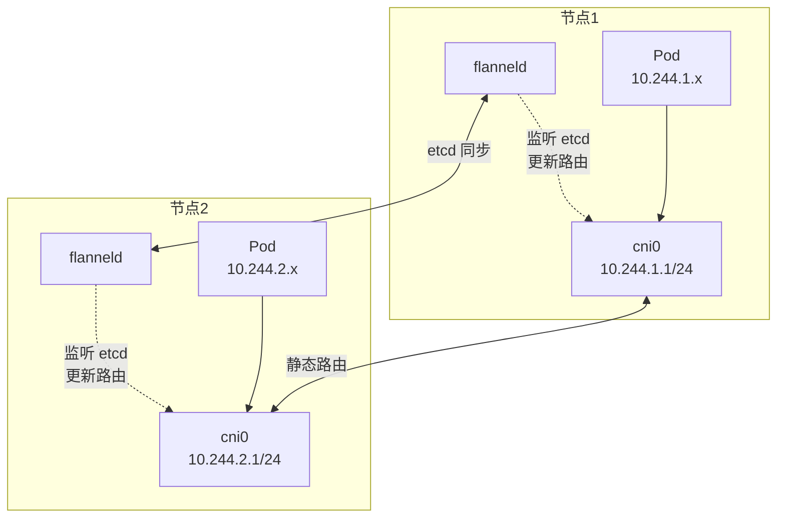
```mermaid
graph TD
    subgraph Node1["节点1"]
        CNI0_1["cni0<br/>10.244.1.1/24"]
        FLANNELD1["flanneld"]
        P1["Pod<br/>10.244.1.x"]
        P1 --> CNI0_1
        FLANNELD1 -.->|"监听 etcd<br/>更新路由"| CNI0_1
    end
    
    subgraph Node2["节点2"]
        CNI0_2["cni0<br/>10.244.2.1/24"]
        FLANNELD2["flanneld"]
        P2["Pod<br/>10.244.2.x"]
        P2 --> CNI0_2
        FLANNELD2 -.->|"监听 etcd<br/>更新路由"| CNI0_2
    end
    
    FLANNELD1 <-->|"etcd 同步"| FLANNELD2
    CNI0_1 <-->|"静态路由"| CNI0_2
```

**图解说明**：

1. **flanneld** 进程监听 etcd 中的网络配置
2. 当新节点加入或 Pod 网段变化时，flanneld 自动更新路由表
3. 每个节点的路由表包含所有其他节点的 Pod 网段路由

#### Flannel Host-GW 配置

```json
{
  "Network": "10.244.0.0/16",
  "Backend": {
    "Type": "host-gw"
  }
}
```

#### 查看 Flannel 创建的路由

```bash
# 在 Kubernetes 节点上查看路由表
ip route show | grep 10.244

# 输出示例（假设有三个节点）：
# 10.244.0.0/24 via 192.168.1.10 dev eth0  # 节点1 的 Pod 网段
# 10.244.1.0/24 dev cni0 proto kernel scope link src 10.244.1.1  # 本节点
# 10.244.2.0/24 via 192.168.1.12 dev eth0  # 节点3 的 Pod 网段
```

**要点解读**：

> [!IMPORTANT]
> **Flannel Host-GW 的路由特征**：
>
> - 本节点的 Pod 网段：`dev cni0`（直连）
> - 其他节点的 Pod 网段：`via <节点IP>`（通过节点路由）
> - flanneld 自动维护这些路由，无需手工配置

---

### 4.6 Next Hop 的核心作用

#### 背景

在 Host-GW 模式中，**Next Hop（下一跳）**是最关键的概念。理解 Next Hop 对于排障和网络设计至关重要。

#### 原理

```mermaid
sequenceDiagram
    participant Pod1 as Pod1<br/>10.244.1.10
    participant Node1 as 节点1<br/>192.168.2.71
    participant Node2 as 节点2<br/>192.168.2.73
    participant Pod2 as Pod2<br/>10.244.2.10
    
    Pod1->>Node1: 目的: 10.244.2.10<br/>下一跳: 10.244.1.1 (网关)
    Note over Node1: 查路由表:<br/>10.244.2.0/24 via 192.168.2.73
    Node1->>Node2: 目的: 10.244.2.10<br/>下一跳: 192.168.2.73
    Note over Node2: 查路由表:<br/>10.244.2.0/24 dev cni0
    Node2->>Pod2: 目的: 10.244.2.10<br/>直接投递
```

**图解说明**：

1. **Pod1 → Node1**：Pod1 把所有出站流量发给默认网关
2. **Node1 查路由表**：发现去往 10.244.2.0/24 的下一跳是 192.168.2.73
3. **Node1 → Node2**：数据包发送到 Node2
4. **Node2 → Pod2**：Node2 发现目的地址在本地 cni0，直接投递

#### 关键点

| 概念 | 说明 |
|:---|:---|
| **默认网关** | Pod 的"下一跳"，通常是 cni0 网桥 |
| **静态路由** | 节点路由表中的跨节点路由 |
| **Next Hop** | 静态路由指定的下一跳地址 |
| **出接口** | 发送数据包的网卡接口 |

```bash
# 完整的路由条目格式
ip route add 10.244.2.0/24 via 192.168.2.73 dev eth0
#           ↑目的网段        ↑下一跳地址     ↑出接口
```

> [!CAUTION]
> **Next Hop 必须可达**：
>
> 如果 Next Hop 地址不可达（如跨子网），Host-GW 模式将无法工作。此时必须使用 Overlay 模式。

---

### 4.7 常见问题与排障

#### 问题1：跨节点 Pod 通信失败

**检查步骤**：

```bash
# 1. 检查路由表是否正确
ip route show | grep 10.244

# 2. 检查下一跳是否可达
ping <下一跳IP>

# 3. 检查是否开启 IP 转发
cat /proc/sys/net/ipv4/ip_forward
# 如果是 0，需要开启：
echo 1 > /proc/sys/net/ipv4/ip_forward
```

#### 问题2：Host-GW 模式下节点跨子网

**现象**：节点在不同子网，Host-GW 无法工作

**原因**：Next Hop 不可达，ARP 无法解析

**解决方案**：改用 Overlay 模式（VxLAN 或 IPIP）

```json
{
  "Network": "10.244.0.0/16",
  "Backend": {
    "Type": "vxlan"
  }
}
```

#### 问题3：路由条目丢失

**现象**：flanneld 重启后路由丢失

**检查**：

```bash
# 检查 flanneld 是否正常运行
kubectl get pods -n kube-flannel

# 查看 flanneld 日志
kubectl logs -n kube-flannel <flannel-pod-name>
```

---

### 📝 章节小结

本章深入讲解了 Host-Gateway 网络模式：

1. **核心概念**：把宿主机当作 Pod 的网关，利用路由转发容器流量
2. **工作原理**：Pod → 默认网关 → 查路由表 → 下一跳 → 目标节点
3. **优势**：性能最高、配置简单、无封装开销
4. **限制**：节点必须二层可达（同一广播域）
5. **实现方式**：
   - Flannel Host-GW 模式
   - Calico BGP 模式（类似原理）
   - 手工静态路由配置

> [!TIP]
> **学习建议**：
>
> 1. 使用 Containerlab 搭建 Host-GW 实验环境
> 2. 手工配置一次完整的 Host-GW 网络
> 3. 在真实 Kubernetes 集群中查看 Flannel 路由表
> 4. 理解 "Next Hop 必须可达" 这一核心约束

> [!IMPORTANT]
> **选择 Host-GW 还是 Overlay？**
>
> - **同一二层网络** → 优先选择 **Host-GW**（性能更好）
> - **跨子网/跨机房** → 必须使用 **Overlay**（VxLAN/IPIP）
> - **混合场景** → 可以使用 Calico 的 **ipip: CrossSubnet** 模式

---

## 第5章 CNI 网络模型

### 🎯 学习目标

- 理解 CNI 网络的四大分类：Overlay、Underlay、Routing、高性能
- 掌握 Pod 数据包在宿主机上的转发路径
- 理解网卡复用技术（IPVLAN、MACVLAN）的原理与应用
- 了解高性能网络（SR-IOV、DPDK、VPP）的核心概念
- 掌握 Cilium eBPF 的优化原理

---

### 5.1 CNI 网络模型概述

#### 背景

在 Kubernetes 中，CNI（Container Network Interface）负责为 Pod 配置网络。不同的 CNI 插件采用不同的网络模型，各有优劣。

#### 四大网络模型

```mermaid
graph TD
    CNI["CNI 网络模型"] --> Overlay["Overlay 网络<br/>叠加网络"]
    CNI --> Underlay["Underlay 网络<br/>底层网络"]
    CNI --> Routing["Routing 网络<br/>路由网络"]
    CNI --> HighPerf["高性能网络<br/>内核 Bypass"]
    
    Overlay --> VxLAN["VxLAN"]
    Overlay --> IPIP["IPIP"]
    Overlay --> GRE["GRE"]
    
    Underlay --> IPVLAN["IPVLAN"]
    Underlay --> MACVLAN["MACVLAN"]
    
    Routing --> HostGW["Host-GW"]
    Routing --> BGP["BGP"]
    
    HighPerf --> SRIOV["SR-IOV"]
    HighPerf --> DPDK["DPDK"]
    HighPerf --> eBPF["eBPF"]
```

**图解说明**：

| 类型 | 核心原理 | 代表性 CNI/技术 |
|:---|:---|:---|
| **Overlay** | 封装隧道，Pod IP 隐藏 | Flannel VxLAN、Calico IPIP |
| **Underlay** | 网卡复用，Pod 与宿主机同平面 | IPVLAN、MACVLAN |
| **Routing** | 路由转发，Pod IP 暴露 | Host-GW、Calico BGP |
| **高性能** | 绕过内核协议栈 | SR-IOV、DPDK、Cilium eBPF |

---

### 5.2 Pod 数据包转发路径

#### 背景

理解 Pod 数据包在宿主机上的转发路径，是掌握 CNI 网络模型的关键。

#### 原理

```mermaid
graph TD
    subgraph Pod["Pod 网络命名空间"]
        APP["应用进程"]
        STACK1["协议栈处理<br/>TCP/IP"]
        ETH0["eth0 (VETH)"]
        APP --> STACK1 --> ETH0
    end
    
    subgraph Host["宿主机 Root Namespace"]
        VETH["veth-xxx"]
        BRIDGE["cni0 网桥"]
        STACK2["协议栈处理<br/>iptables/路由"]
        PHYS["物理网卡 eth0"]
        VETH --> BRIDGE --> STACK2 --> PHYS
    end
    
    ETH0 ---|"VETH Pair"| VETH
    PHYS --> EXT["外部网络"]
```

**图解说明**：

1. **Pod 内部协议栈**：应用发送数据包，经过 Pod 自己的 TCP/IP 协议栈
2. **VETH Pair 传输**：数据包通过 VETH Pair 传到宿主机
3. **宿主机协议栈**：再次经过宿主机的协议栈（iptables、路由查询等）
4. **物理网卡发出**：最终从物理网卡发送到外部网络

> [!IMPORTANT]
> **关键理解**：Pod 发送一个数据包，需要经过**两次协议栈处理**：
>
> 1. Pod 自己的协议栈（一次）
> 2. 宿主机的协议栈（一次）
>
> 这是容器网络相比传统网络有性能损耗的主要原因。

---

### 5.3 Overlay 叠加网络

#### 背景

Overlay 网络通过**隧道封装**技术，将 Pod 网络"叠加"在物理网络之上，使 Pod IP 对外部网络不可见。

#### 原理

```mermaid
graph LR
    subgraph Node1["节点1"]
        P1["Pod1<br/>10.244.1.10"]
        FLANNEL1["flannel.1<br/>VxLAN 封装"]
    end
    
    subgraph Node2["节点2"]
        P2["Pod2<br/>10.244.2.10"]
        FLANNEL2["flannel.1<br/>VxLAN 解封装"]
    end
    
    P1 --> FLANNEL1
    FLANNEL1 -->|"外层: Node1 IP → Node2 IP<br/>内层: Pod1 IP → Pod2 IP"| FLANNEL2
    FLANNEL2 --> P2
```

**图解说明**：

| 特性 | 说明 |
|:---|:---|
| **封装方式** | VxLAN、IPIP、GRE、Geneve |
| **外层报头** | 宿主机 IP（物理网络可路由） |
| **内层报头** | Pod IP（物理网络不可见） |
| **优点** | 跨子网、跨机房通信 |
| **缺点** | 有封装开销、MTU 损耗 |

#### 常见 Overlay 协议对比

| 协议 | 封装开销 | 特点 | 使用场景 |
|:---|:---|:---|:---|
| **VxLAN** | 50 字节 | 基于 UDP，成熟稳定 | Flannel、Calico |
| **IPIP** | 20 字节 | 封装最小，性能较好 | Calico |
| **GRE** | 24+ 字节 | 支持多协议 | 较少使用 |
| **Geneve** | 可变 | 可扩展，未来趋势 | OVN |

> [!NOTE]
> **MTU 问题**：Overlay 封装会增加报头大小，需要调整 Pod 网络的 MTU。
>
> - VxLAN：MTU = 1450（1500 - 50）
> - IPIP：MTU = 1480（1500 - 20）

---

### 5.4 Underlay 底层网络

#### 背景

Underlay 网络通过**网卡复用**技术，让 Pod 网络与宿主机网络处于同一平面，减少协议栈处理次数。

#### 原理

```mermaid
graph TD
    subgraph Host["宿主机"]
        PHYS["物理网卡 eth0<br/>192.168.1.10"]
        
        subgraph IPVLAN["IPVLAN 子接口"]
            IPV1["ipvlan0<br/>192.168.1.11"]
            IPV2["ipvlan1<br/>192.168.1.12"]
        end
        
        PHYS --> IPV1
        PHYS --> IPV2
    end
    
    subgraph Pod1["Pod1"]
        E1["eth0"]
    end
    
    subgraph Pod2["Pod2"]
        E2["eth0"]
    end
    
    IPV1 --> E1
    IPV2 --> E2
```

**图解说明**：

- 物理网卡通过 IPVLAN/MACVLAN 技术创建多个子接口
- 每个子接口分配给一个 Pod
- Pod 的 IP 地址与宿主机在同一网段
- **绕过了 Pod 内部的协议栈处理**

#### IPVLAN vs MACVLAN

| 特性 | IPVLAN | MACVLAN |
|:---|:---|:---|
| **MAC 地址** | 子接口与父接口 MAC **相同** | 子接口有**独立** MAC |
| **IP 地址** | 子接口有独立 IP | 子接口有独立 IP |
| **二层通信** | 不支持（需要三层） | 支持 |
| **适用场景** | IaaS 虚拟化环境 | 裸机 K8s 环境 |
| **内核版本** | 4.2+ 稳定 | 3.x 即可 |

#### 适用场景

| 场景 | 推荐技术 |
|:---|:---|
| OpenStack + K8s 环境 | **IPVLAN** |
| 裸机 K8s 环境 | **MACVLAN** |
| 高吞吐量需求 | IPVLAN/MACVLAN（多网卡） |
| 传统 Service 场景 | 不推荐（使用 Overlay/Routing） |

> [!TIP]
> **多网卡架构**：在实际生产中，Pod 通常有多张网卡：
>
> - **默认 CNI 网卡**：用于 Service 发现、K8s 网络
> - **IPVLAN/MACVLAN 网卡**：用于高速数据通信

---

### 5.5 Routing 路由网络

#### 背景

Routing 网络模式通过**路由协议**直接转发 Pod 流量，Pod IP 完全暴露在物理网络中。

#### 原理

```mermaid
graph TD
    subgraph Node1["节点1<br/>192.168.1.10"]
        P1["Pod<br/>10.244.1.10"]
        RT1["路由表"]
    end
    
    subgraph Node2["节点2<br/>192.168.1.11"]
        P2["Pod<br/>10.244.2.10"]
        RT2["路由表"]
    end
    
    subgraph Switch["物理交换机/路由器"]
        RT3["路由表"]
    end
    
    P1 --> RT1
    RT1 -->|"10.244.2.0/24 via 192.168.1.11"| Switch
    Switch -->|"10.244.2.0/24 via 192.168.1.11"| RT2
    RT2 --> P2
```

**图解说明**：

| 模式 | 路由来源 | 适用场景 |
|:---|:---|:---|
| **Host-GW** | 静态路由（flanneld 维护） | 同二层网络 |
| **BGP** | 动态路由（BGP 协议） | 跨子网、大规模集群 |

#### Host-GW vs BGP

| 特性 | Host-GW | BGP |
|:---|:---|:---|
| **路由协议** | 静态路由 | BGP 动态路由 |
| **跨子网** | ❌ 不支持 | ✅ 支持 |
| **外部集成** | 不需要 | 需要与 ToR 交换机对接 |
| **复杂度** | 简单 | 较复杂 |
| **代表 CNI** | Flannel Host-GW | Calico BGP |

> [!IMPORTANT]
> **BGP 的核心价值**：
>
> 1. 可以将 Pod IP 发布到物理网络
> 2. 外部设备可以直接访问 Pod IP（无需 NodePort/LoadBalancer）
> 3. 支持 Service ClusterIP 的外部发布（Calico 特性）

---

### 5.6 高性能网络

#### 背景

对于延迟敏感、高吞吐量的应用（如电信、视频流、金融交易），传统的内核协议栈处理已成为瓶颈。高性能网络技术通过**绕过内核协议栈**来实现极致性能。

#### 技术分类

```mermaid
graph TD
    HP["高性能网络技术"] --> SRIOV["SR-IOV<br/>网卡直通"]
    HP --> DPDK["DPDK<br/>用户态协议栈"]
    HP --> eBPF["eBPF<br/>内核优化"]
    
    SRIOV --> VF["VF 虚拟网卡<br/>直接分配给 Pod"]
    DPDK --> VPP["VPP 用户态转发"]
    eBPF --> CILIUM["Cilium<br/>bpf_redirect"]
```

#### SR-IOV（网卡直通）

```mermaid
graph TD
    subgraph Host["宿主机"]
        PF["物理网卡 PF<br/>e.g. Intel X710"]
        VF0["VF0"]
        VF1["VF1"]
        VF2["VF2"]
        
        PF --> VF0
        PF --> VF1
        PF --> VF2
    end
    
    VF0 -->|"直通"| Pod1["Pod1"]
    VF1 -->|"直通"| Pod2["Pod2"]
```

**要点解读**：

| 概念 | 说明 |
|:---|:---|
| **PF** | Physical Function，物理网卡 |
| **VF** | Virtual Function，虚拟子网卡 |
| **直通** | VF 直接分配给 Pod，绕过宿主机协议栈 |
| **硬件要求** | 需要支持 SR-IOV 的网卡（Intel、Mellanox） |

#### DPDK + VPP（用户态协议栈）

```mermaid
graph LR
    subgraph Traditional["传统模式"]
        A1["应用"] --> K1["内核协议栈"] --> N1["网卡驱动"] --> HW1["网卡"]
    end
    
    subgraph DPDK["DPDK 模式"]
        A2["应用"] --> VPP["VPP 用户态协议栈"] --> PMD["PMD 轮询驱动"] --> HW2["网卡"]
    end
```

**要点解读**：

| 技术 | 说明 |
|:---|:---|
| **DPDK** | Data Plane Development Kit，Intel 开源的高速数据包处理框架 |
| **VPP** | Vector Packet Processing，Cisco 开源的用户态协议栈 |
| **PMD** | Poll Mode Driver，轮询模式驱动，避免中断开销 |
| **性能** | 可达**千万级 PPS**，远超内核协议栈 |

#### Cilium eBPF 优化

```mermaid
graph TD
    subgraph Traditional["传统模式"]
        P1_T["Pod1 协议栈"] --> V1_T["veth1"] --> HOST_T["宿主机协议栈<br/>iptables/路由"] --> V2_T["veth2"] --> P2_T["Pod2 协议栈"]
    end
    
    subgraph eBPF["Cilium eBPF Host Routing"]
        P1_E["Pod1 协议栈"] --> V1_E["veth1<br/>TC hook"]
        V1_E -->|"bpf_redirect_peer"| V2_E["veth2"]
        V2_E --> P2_E["Pod2 协议栈"]
    end
```

**要点解读**：

| 函数 | 作用 | 适用场景 |
|:---|:---|:---|
| **bpf_redirect_peer** | 同节点 Pod 间数据包重定向 | Pod ↔ Pod（同节点） |
| **bpf_redirect_neigh** | 跨节点数据包直接发往物理网卡 | Pod → 外部网络 |

> [!TIP]
> **Cilium eBPF Host Routing 的效果**：
>
> - 同节点 Pod 通信：绕过宿主机协议栈和 iptables
> - 抓包现象：在 veth 上只能看到单向流量（因为数据包被 redirect 了）

---

### 5.7 CNI 模式对比与选型

#### 综合对比

| 特性 | Overlay | Underlay | Routing | 高性能 |
|:---|:---|:---|:---|:---|
| **性能** | ⭐⭐⭐ | ⭐⭐⭐⭐ | ⭐⭐⭐⭐ | ⭐⭐⭐⭐⭐ |
| **跨子网** | ✅ | ❌ | 部分支持 | 取决于具体技术 |
| **配置复杂度** | 简单 | 中等 | 中等 | 复杂 |
| **Pod IP 可见性** | 隐藏 | 暴露 | 暴露 | 暴露 |
| **硬件要求** | 无 | 无 | 无 | SR-IOV 需要特定网卡 |

#### 选型建议

```mermaid
graph TD
    START["CNI 选型"] --> Q1{"节点跨子网？"}
    Q1 -->|"是"| Q2{"需要高性能？"}
    Q1 -->|"否"| Q3{"需要 NetworkPolicy？"}
    
    Q2 -->|"是"| BGP["Calico BGP + IPIP CrossSubnet"]
    Q2 -->|"否"| OVERLAY["Flannel VxLAN / Calico IPIP"]
    
    Q3 -->|"是"| Q4{"需要最高性能？"}
    Q3 -->|"否"| HOSTGW["Flannel Host-GW"]
    
    Q4 -->|"是"| CILIUM["Cilium eBPF"]
    Q4 -->|"否"| CALICO["Calico BGP"]
```

| 场景 | 推荐 CNI |
|:---|:---|
| 小型集群、测试环境 | **Flannel Host-GW** |
| 需要 NetworkPolicy | **Calico** 或 **Cilium** |
| 跨子网、大规模集群 | **Calico BGP** |
| 追求极致性能 | **Cilium eBPF Host Routing** |
| 电信/视频流/高频交易 | **SR-IOV + DPDK** |

---

### 📝 章节小结

本章系统讲解了 CNI 网络模型：

1. **四大网络类型**：
   - **Overlay**：封装隧道（VxLAN、IPIP），跨子网通信
   - **Underlay**：网卡复用（IPVLAN、MACVLAN），同平面通信
   - **Routing**：路由转发（Host-GW、BGP），Pod IP 暴露
   - **高性能**：绕过内核（SR-IOV、DPDK、eBPF）

2. **数据包路径**：Pod 发包需经过两次协议栈处理（Pod + 宿主机）

3. **关键技术**：
   - VxLAN/IPIP 的封装原理
   - IPVLAN/MACVLAN 的网卡复用
   - SR-IOV 的网卡直通
   - Cilium eBPF 的 bpf_redirect 优化

4. **选型关键点**：
   - 跨子网 → Overlay 或 BGP
   - 同二层 → Host-GW（最简单高效）
   - 需要 NetworkPolicy → Calico 或 Cilium
   - 极致性能 → SR-IOV + DPDK 或 Cilium eBPF

> [!TIP]
> **学习建议**：
>
> 1. 理解"两次协议栈处理"是容器网络性能损耗的根源
> 2. 根据业务场景选择合适的网络模型
> 3. 关注 eBPF 技术的发展趋势
> 4. 高性能场景需要了解 SR-IOV、DPDK 的基本原理

---

## 第6章 CNI 工作原理

### 🎯 学习目标

- 理解 CNI 的插件分类：Main、IPAM、Meta
- 掌握 CNI 的两大核心目录结构
- 理解 CNI 配置文件的格式与字段含义
- 掌握 IPAM（IP 地址管理）的工作机制
- 了解多网卡方案（Multus、Network Attachment Definition）

---

### 6.1 CNI 概述

#### 背景

CNI（Container Network Interface）是 Kubernetes 网络的标准接口规范。它定义了容器运行时如何调用网络插件来配置 Pod 的网络。

#### 原理

```mermaid
graph TD
    KUBELET["kubelet"] -->|"创建 Pod"| CRI["容器运行时<br/>containerd/CRI-O"]
    CRI -->|"调用 CNI 插件"| CNI["CNI 插件"]
    CNI -->|"读取配置"| CONF["/etc/cni/net.d/"]
    CNI -->|"执行二进制"| BIN["/opt/cni/bin/"]
    CNI -->|"配置网络"| POD["Pod 网络"]
```

**图解说明**：

1. kubelet 调用容器运行时创建 Pod
2. 容器运行时调用 CNI 插件配置网络
3. CNI 插件读取 `/etc/cni/net.d/` 下的配置文件
4. CNI 插件执行 `/opt/cni/bin/` 下的二进制程序
5. 完成 Pod 网络配置（创建 VETH、分配 IP、配置路由等）

> [!NOTE]
> **CNI 的本质**：CNI 只是一个**接口规范**，定义了输入输出格式。具体网络实现由各 CNI 插件负责（如 Flannel、Calico、Cilium）。

---

### 6.2 CNI 插件分类

#### 原理

CNI 插件分为三大类：

```mermaid
graph TD
    CNI["CNI 插件分类"] --> Main["Main 插件<br/>负责网络连通性"]
    CNI --> IPAM["IPAM 插件<br/>负责 IP 地址管理"]
    CNI --> Meta["Meta 插件<br/>辅助功能"]
    
    Main --> Bridge["bridge"]
    Main --> VETH["veth/ptp"]
    Main --> IPVLAN["ipvlan"]
    Main --> MACVLAN["macvlan"]
    Main --> SRIOV["sriov"]
    
    IPAM --> HostLocal["host-local"]
    IPAM --> DHCP["dhcp"]
    IPAM --> Static["static"]
    IPAM --> Whereabouts["whereabouts"]
    
    Meta --> PortMap["portmap"]
    Meta --> Bandwidth["bandwidth"]
    Meta --> Tuning["tuning"]
    Meta --> SBR["sbr"]
```

**图解说明**：

| 类型 | 职责 | 代表插件 |
|:---|:---|:---|
| **Main** | 创建网络接口、配置网络连通性 | bridge、veth、ipvlan、macvlan、sriov |
| **IPAM** | 分配和回收 IP 地址 | host-local、dhcp、static、whereabouts |
| **Meta** | 辅助功能（端口映射、带宽限制等） | portmap、bandwidth、tuning、sbr |

#### Main 插件详解

| 插件 | 功能 | 使用场景 |
|:---|:---|:---|
| **bridge** | 创建 Linux Bridge，VETH 插入 Bridge | Flannel、默认方案 |
| **ptp** | 点对点 VETH Pair | Calico |
| **ipvlan** | IPVLAN 子接口 | 高性能虚拟化环境 |
| **macvlan** | MACVLAN 子接口 | 裸机高性能 |
| **sriov** | SR-IOV VF 直通 | 电信/金融高性能 |

#### IPAM 插件详解

| 插件 | 作用域 | 特点 |
|:---|:---|:---|
| **host-local** | 单节点 | 最常用，每个节点独立管理 IP 池 |
| **dhcp** | 跨节点 | 使用 DHCP 服务器分配 IP |
| **static** | 固定 IP | 手工指定 IP，不自动分配 |
| **whereabouts** | 集群级 | 跨节点 IP 管理，多网卡常用 |

> [!IMPORTANT]
> **IPAM 插件的选择**：
>
> - 普通场景：**host-local**（Flannel、Calico 默认）
> - 多网卡场景：**whereabouts**（集群级 IP 管理）
> - 固定 IP 需求：**static**

---

### 6.3 CNI 核心目录结构

#### 背景

理解 CNI 的目录结构，是排障和自定义网络配置的基础。

#### 两大核心目录

```mermaid
graph LR
    subgraph CNI["CNI 核心目录"]
        CONF["/etc/cni/net.d/<br/>配置文件目录"]
        BIN["/opt/cni/bin/<br/>二进制程序目录"]
    end
    
    CONF -->|"定义：怎么配置网络"| DESC["网络配置描述"]
    BIN -->|"执行：实际配置网络"| EXEC["网络配置执行"]
```

#### `/etc/cni/net.d/` - 配置文件目录

```bash
# 查看 CNI 配置文件
ls -la /etc/cni/net.d/

# 典型输出
# 10-flannel.conflist   # Flannel 配置
# 10-calico.conflist    # Calico 配置
# 10-cilium.conflist    # Cilium 配置
```

**配置文件命名规则**：

- 按数字前缀排序，数字小的优先加载
- `.conf` 格式：单个插件配置
- `.conflist` 格式：多个插件链式调用

#### `/opt/cni/bin/` - 二进制程序目录

```bash
# 查看 CNI 二进制程序
ls -la /opt/cni/bin/

# 典型输出
# bandwidth    # 带宽限制插件
# bridge       # Linux Bridge 插件
# dhcp         # DHCP IPAM 插件
# flannel      # Flannel 专用插件
# host-local   # host-local IPAM 插件
# ipvlan       # IPVLAN 插件
# macvlan      # MACVLAN 插件
# portmap      # 端口映射插件
# ptp          # 点对点 VETH 插件
# sbr          # Source Based Routing 插件
# sriov        # SR-IOV 插件
# tuning       # 网卡参数调优插件
# vlan         # VLAN 插件
```

**代码说明**：

- 这些二进制文件由 CNI 插件项目提供
- 容器运行时会调用这些二进制来配置网络
- 安装不同 CNI 时会添加对应的二进制（如 Calico 的 `calico`、`calico-ipam`）

---

### 6.4 CNI 配置文件详解

#### 背景

CNI 配置文件定义了网络如何配置。理解配置文件结构，有助于自定义网络和排障。

#### 配置文件示例（Calico）

```json
{
  "name": "k8s-pod-network",
  "cniVersion": "0.3.1",
  "plugins": [
    {
      "type": "calico",
      "datastore_type": "kubernetes",
      "mtu": 0,
      "nodename_file_optional": false,
      "log_level": "Info",
      "log_file_path": "/var/log/calico/cni/cni.log",
      "ipam": {
        "type": "calico-ipam",
        "assign_ipv4": "true",
        "assign_ipv6": "false"
      },
      "container_settings": {
        "allow_ip_forwarding": false
      },
      "policy": {
        "type": "k8s"
      },
      "kubernetes": {
        "k8s_api_root": "https://10.96.0.1:443",
        "kubeconfig": "/etc/cni/net.d/calico-kubeconfig"
      }
    },
    {
      "type": "portmap",
      "snat": true,
      "capabilities": {
        "portMappings": true
      }
    },
    {
      "type": "bandwidth",
      "capabilities": {
        "bandwidth": true
      }
    }
  ]
}
```

**配置字段解析**：

| 字段 | 说明 |
|:---|:---|
| **name** | 网络名称 |
| **cniVersion** | CNI 规范版本 |
| **plugins** | 插件列表（链式调用） |
| **type** | 插件类型（对应 /opt/cni/bin/ 下的二进制） |
| **ipam** | IP 地址管理配置 |
| **datastore_type** | 数据存储类型（kubernetes/etcdv3） |
| **policy** | NetworkPolicy 实现方式 |

#### 链式调用示意图

```mermaid
graph LR
    Pod["Pod 创建"] --> P1["calico 插件<br/>创建 VETH、配置路由"]
    P1 --> P2["portmap 插件<br/>配置端口映射"]
    P2 --> P3["bandwidth 插件<br/>配置带宽限制"]
    P3 --> Done["网络配置完成"]
```

**图解说明**：

- CNI 插件按 `plugins` 数组顺序依次执行
- 每个插件完成特定功能后，传递给下一个插件
- 类似 Linux 管道的链式处理

---

### 6.5 IPAM 工作机制

#### 背景

IPAM（IP Address Management）负责 Pod 的 IP 地址分配与回收。不同的 IPAM 插件有不同的管理范围和特点。

#### 原理

```mermaid
graph TD
    subgraph HostLocal["host-local IPAM（节点级）"]
        N1["节点1<br/>10.244.1.0/24"]
        N2["节点2<br/>10.244.2.0/24"]
        N3["节点3<br/>10.244.3.0/24"]
    end
    
    subgraph Whereabouts["whereabouts IPAM（集群级）"]
        POOL["IP 池<br/>10.244.0.0/16"]
        POOL --> PA["Pod A: 10.244.1.10"]
        POOL --> PB["Pod B: 10.244.2.20"]
        POOL --> PC["Pod C: 10.244.3.30"]
    end
```

**图解说明**：

| IPAM | 管理范围 | IP 池分配 | 适用场景 |
|:---|:---|:---|:---|
| **host-local** | 单节点 | 每个节点独立 IP 池 | 默认 CNI（Flannel/Calico） |
| **whereabouts** | 集群级 | 统一 IP 池，跨节点分配 | 多网卡、需要 IP 跨节点迁移 |

#### host-local 存储位置

```bash
# host-local 的 IP 分配记录存储位置
ls /var/lib/cni/networks/<network-name>/

# 每个文件名是已分配的 IP 地址
# 文件内容是 Pod 的 Container ID
```

#### whereabouts 存储方式

```bash
# whereabouts 使用 Kubernetes CRD 存储 IP 分配信息
kubectl get ippools.whereabouts.cni.cncf.io -A
kubectl get overlappingrangeipreservations.whereabouts.cni.cncf.io -A
```

---

### 6.6 多网卡方案（Multus）

#### 背景

在高性能场景中，Pod 可能需要多张网卡：默认网卡用于 Service 通信，额外网卡用于高速数据传输。

#### 原理

```mermaid
graph TD
    subgraph Pod["Pod"]
        ETH0["eth0<br/>默认 CNI 网卡<br/>10.244.1.10"]
        NET1["net1<br/>MACVLAN 网卡<br/>192.168.1.100"]
        ETH0 --> SVC["Service 通信"]
        NET1 --> DATA["高速数据通信"]
    end
    
    MULTUS["Multus CNI<br/>多网卡编排"] --> ETH0
    MULTUS --> NET1
```

**图解说明**：

- **Multus CNI** 是一个 CNI "元插件"，可以调用其他 CNI 为 Pod 配置多张网卡
- **默认网卡（eth0）**：由集群默认 CNI（如 Calico）配置
- **额外网卡（net1, net2...）**：通过 Network Attachment Definition 配置

#### Network Attachment Definition (NAD)

```yaml
apiVersion: "k8s.cni.cncf.io/v1"
kind: NetworkAttachmentDefinition
metadata:
  name: macvlan-net
  namespace: default
spec:
  config: '{
    "cniVersion": "0.3.1",
    "type": "macvlan",
    "master": "eth0",
    "mode": "bridge",
    "ipam": {
      "type": "whereabouts",
      "range": "192.168.1.0/24",
      "gateway": "192.168.1.1"
    }
  }'
```

**配置说明**：

| 字段 | 说明 |
|:---|:---|
| **type** | 网卡类型（macvlan/ipvlan/sriov） |
| **master** | 父接口（物理网卡） |
| **mode** | MACVLAN 模式（bridge/vepa/private） |
| **ipam.type** | IP 管理方式（whereabouts 用于多网卡） |
| **ipam.range** | IP 地址范围 |

#### Pod 使用多网卡

```yaml
apiVersion: v1
kind: Pod
metadata:
  name: multi-nic-pod
  annotations:
    k8s.v1.cni.cncf.io/networks: macvlan-net
spec:
  containers:
  - name: app
    image: nginx
```

**代码说明**：

- 通过 `k8s.v1.cni.cncf.io/networks` 注解指定额外网卡
- 可以指定多个，用逗号分隔：`macvlan-net, sriov-net`

---

### 6.7 Source Based Routing (SBR)

#### 背景

当 Pod 有多张网卡时，需要确保从某张网卡进来的流量，响应也从同一张网卡出去。这需要基于源地址的路由（SBR）。

#### 原理

```mermaid
graph LR
    subgraph Pod["Pod 多网卡"]
        ETH0["eth0<br/>10.244.1.10"]
        NET1["net1<br/>192.168.1.100"]
    end
    
    CLIENT["客户端<br/>192.168.1.50"]
    
    CLIENT -->|"请求到 net1"| NET1
    NET1 -->|"SBR: 响应从 net1 返回"| CLIENT
```

**配置示例**：

```bash
# 添加路由规则：从 192.168.1.0/24 出来的流量，查 table 100
ip rule add from 192.168.1.0/24 table 100

# 在 table 100 中添加默认路由
ip route add default via 192.168.1.1 dev net1 table 100
```

**要点解读**：

- **基于源地址路由** 优先级高于基于目的地址的路由
- 多网卡场景必须配置 SBR，否则响应流量可能走错网卡
- CNI 的 `sbr` 插件可以自动配置

---

### 6.8 Pod 网络配置流程

#### 完整流程

```mermaid
sequenceDiagram
    participant Kubelet as kubelet
    participant CRI as 容器运行时
    participant CNI as CNI 插件
    participant Config as /etc/cni/net.d/
    participant Bin as /opt/cni/bin/

    Kubelet->>CRI: 创建 Pod
    CRI->>Config: 读取 CNI 配置文件
    Config-->>CRI: 返回配置（plugin 列表）
    CRI->>Bin: 调用 Main 插件（bridge/calico）
    Bin-->>CRI: 创建 VETH、配置路由
    CRI->>Bin: 调用 IPAM 插件（host-local）
    Bin-->>CRI: 分配 IP 地址
    CRI->>Bin: 调用 Meta 插件（portmap/bandwidth）
    Bin-->>CRI: 配置端口映射/带宽
    CRI-->>Kubelet: Pod 网络就绪
```

**流程说明**：

1. kubelet 调用容器运行时创建 Pod
2. 容器运行时读取 `/etc/cni/net.d/` 下的配置文件（按名称排序，优先加载）
3. 按配置文件中的 `plugins` 列表顺序：
   - 调用 Main 插件：创建网络接口
   - 调用 IPAM 插件：分配 IP 地址
   - 调用 Meta 插件：附加功能
4. 所有插件执行完成，Pod 网络就绪

---

### 6.9 常见问题与排障

#### 问题1：Pod 网络配置失败

**检查步骤**：

```bash
# 1. 检查 CNI 配置文件是否存在
ls -la /etc/cni/net.d/

# 2. 检查 CNI 二进制是否存在
ls -la /opt/cni/bin/

# 3. 查看 kubelet 日志
journalctl -u kubelet | grep -i cni

# 4. 查看容器运行时日志
crictl logs <container-id>
```

#### 问题2：IP 地址分配失败

```bash
# 检查 host-local IPAM 的 IP 分配记录
ls /var/lib/cni/networks/

# 如果 IP 池耗尽，可以清理无效记录
# （谨慎操作，仅在确认 IP 未被使用时）
```

#### 问题3：多网卡 IP 冲突

```bash
# 检查 whereabouts 的 IP 分配
kubectl get ippools.whereabouts.cni.cncf.io -A -o wide

# 查看 IP 预留情况
kubectl get overlappingrangeipreservations -A
```

---

### 📝 章节小结

本章深入讲解了 CNI 工作原理：

1. **CNI 插件分类**：
   - **Main 插件**：创建网络接口（bridge、veth、ipvlan、macvlan、sriov）
   - **IPAM 插件**：分配 IP 地址（host-local、dhcp、static、whereabouts）
   - **Meta 插件**：辅助功能（portmap、bandwidth、sbr）

2. **两大核心目录**：
   - `/etc/cni/net.d/`：配置文件，定义"怎么配置网络"
   - `/opt/cni/bin/`：二进制程序，"实际执行配置"

3. **配置文件结构**：链式调用多个插件

4. **IPAM 机制**：
   - host-local：节点级，每节点独立 IP 池
   - whereabouts：集群级，跨节点 IP 管理

5. **多网卡方案**：
   - Multus CNI 编排多网卡
   - Network Attachment Definition 定义额外网卡
   - SBR 保证多网卡响应路径正确

> [!TIP]
> **学习建议**：
>
> 1. 在实际集群中查看 `/etc/cni/net.d/` 和 `/opt/cni/bin/` 目录
> 2. 理解 CNI 配置文件中的 plugins 链式调用
> 3. 尝试使用 Multus 配置多网卡 Pod
> 4. 出现网络问题时，首先检查 CNI 配置文件和二进制

> [!IMPORTANT]
> **CNI 排障核心思路**：
>
> 1. 配置文件存在吗？（`/etc/cni/net.d/`）
> 2. 二进制存在吗？（`/opt/cni/bin/`）
> 3. 配置文件内容正确吗？（type、ipam 等字段）
> 4. IP 池是否耗尽？（检查 IPAM 存储）

---

# 第二部分：Cilium-CNI

## 第7章 eBPF 介绍与网络应用

### 🎯 学习目标

- 理解 eBPF 技术的背景与核心概念
- 掌握 eBPF 程序的加载流程
- 理解 eBPF 在网络中的 Hook 点（XDP、TC）
- 掌握数据包收发流程与 eBPF 介入点
- 了解 eBPF Map 的作用

---

### 7.1 eBPF 技术背景

#### 背景

eBPF（extended Berkeley Packet Filter）是 Linux 内核中的一项革命性技术。它允许在**不修改内核源码**的情况下，动态向内核注入特定逻辑。

#### 从 cBPF 到 eBPF

```mermaid
graph LR
    cBPF["cBPF<br/>Classical BPF<br/>仅用于包过滤"] -->|"扩展增强"| eBPF["eBPF<br/>Extended BPF<br/>通用内核扩展"]
    
    eBPF --> NET["网络<br/>XDP/TC"]
    eBPF --> TRACE["追踪<br/>kprobe/tracepoint"]
    eBPF --> SEC["安全<br/>seccomp"]
    eBPF --> PERF["性能<br/>perf events"]
```

**图解说明**：

| 特性 | cBPF | eBPF |
|:---|:---|:---|
| **诞生时间** | 1992 年（伯克利大学） | 2014 年（Linux 3.18） |
| **功能范围** | 仅包过滤 | 网络、追踪、安全、性能等 |
| **寄存器** | 2 个 32 位 | 10 个 64 位 |
| **指令集** | 简单 | 丰富（跳转、调用等） |

#### eBPF 的核心价值

> [!IMPORTANT]
> **eBPF = 内核可编程化**
>
> - 传统方式：修改内核源码 → 重新编译 → 重启
> - eBPF 方式：编写 eBPF 程序 → 动态加载 → **无需重启**
>
> 这就像给内核"打补丁"，但不需要重新编译内核。

---

### 7.2 eBPF 程序加载流程

#### 原理

```mermaid
graph TD
    SRC["1. 编写源码<br/>C/Python/Go"] --> COMPILE["2. 编译<br/>LLVM/Clang → BPF 字节码"]
    COMPILE --> VERIFY["3. 验证 Verify<br/>安全性检查"]
    VERIFY -->|"通过"| JIT["4. JIT 编译<br/>字节码 → 机器码"]
    VERIFY -->|"失败"| REJECT["拒绝加载"]
    JIT --> INJECT["5. 注入 Hook 点<br/>XDP/TC/kprobe 等"]
    INJECT --> RUN["6. 运行<br/>事件触发执行"]
```

**流程说明**：

| 步骤 | 说明 |
|:---|:---|
| **编写源码** | 使用 C、Python、Go 等高级语言编写 |
| **编译** | 通过 LLVM/Clang 编译为 eBPF 字节码 |
| **验证 Verify** | 内核验证器检查：无死循环、无越界访问、执行时间有限 |
| **JIT 编译** | 将字节码编译为本机机器指令，提高执行效率 |
| **注入 Hook** | 将程序注入到内核的特定位置（Hook 点） |
| **运行** | 当事件（如数据包到达）触发时执行 |

> [!NOTE]
> **Verify 验证器的作用**：确保 eBPF 程序不会导致内核崩溃。检查项包括：
>
> - 无无限循环
> - 无越界内存访问
> - 执行指令数有上限
> - 仅能调用白名单内的内核函数

---

### 7.3 eBPF 网络 Hook 点

#### 背景

eBPF 可以在网络数据包处理路径的**多个位置**注入程序，实现流量过滤、转发、修改等功能。

#### 核心 Hook 点

```mermaid
graph TD
    subgraph DataPath["数据包处理路径"]
        NIC["网卡驱动<br/>NIC Driver"] --> XDP["XDP Hook<br/>最早介入点"]
        XDP --> SKB["sk_buff 分配"]
        SKB --> TC_IN["TC ingress Hook"]
        TC_IN --> NETFILTER["Netfilter/iptables"]
        NETFILTER --> PROTO["协议栈处理<br/>IP/TCP/UDP"]
        PROTO --> APP["应用程序"]
    end
    
    style XDP fill:#90EE90
    style TC_IN fill:#87CEEB
```

**图解说明**：

| Hook 点 | 位置 | 特点 | 适用场景 |
|:---|:---|:---|:---|
| **XDP** | 网卡驱动层 | 最早、最快 | DDoS 防护、简单丢弃/放行 |
| **TC** | sk_buff 分配后 | 功能丰富 | 流量整形、复杂策略 |
| **Netfilter** | 协议栈内部 | 传统方式 | iptables 规则 |
| **Socket** | 应用层接口 | 最靠近应用 | Service Mesh |

#### XDP vs TC 对比

```mermaid
graph LR
    subgraph XDP层["XDP（网卡驱动层）"]
        XDP_ACT["动作：PASS/DROP/TX/REDIRECT/ABORTED"]
    end
    
    subgraph TC层["TC（Traffic Control 层）"]
        TC_ACT["动作：OK/SHOT/REDIRECT + 复杂处理"]
    end
    
    NIC["网卡"] --> XDP层 --> TC层 --> PROTO["协议栈"]
```

| 特性 | XDP | TC |
|:---|:---|:---|
| **位置** | 网卡驱动（最前） | sk_buff 分配后 |
| **速度** | ⭐⭐⭐⭐⭐ | ⭐⭐⭐⭐ |
| **功能复杂度** | 简单（无完整协议信息） | 复杂（可访问完整 sk_buff） |
| **Cilium 使用** | 部分功能（DDoS） | **主要使用** |
| **可实现功能** | DROP/PASS/TX/REDIRECT | SNAT/DNAT/策略/重定向 |

> [!IMPORTANT]
> **Cilium 主要使用 TC Hook**：
>
> - XDP 过于靠前，无法获取完整的协议信息
> - TC 可以实现地址转换（SNAT/DNAT）、策略路由等复杂功能
> - TC 在 Cilium 中替代了 iptables 的功能

---

### 7.4 数据包收发流程

#### 背景

理解数据包在 Linux 内核中的收发流程，是理解 eBPF 网络优化的基础。

#### 收包流程（RX）

```mermaid
graph TD
    WIRE["网络线缆"] --> NIC["网卡接收"]
    NIC --> DMA["DMA 拷贝到内存"]
    DMA --> IRQ["硬中断通知 CPU"]
    IRQ --> SOFTIRQ["软中断处理<br/>ksoftirqd"]
    SOFTIRQ --> SKB["分配 sk_buff"]
    SKB --> XDP_HOOK["XDP Hook"]
    XDP_HOOK --> TC_HOOK["TC ingress Hook"]
    TC_HOOK --> NETFILTER["Netfilter"]
    NETFILTER --> L3["IP 层处理"]
    L3 --> L4["TCP/UDP 处理"]
    L4 --> SOCKET["Socket 缓冲区"]
    SOCKET --> APP["应用程序读取"]
```

**流程说明**：

1. **网卡接收**：数据包到达物理网卡
2. **DMA 拷贝**：网卡通过 DMA 将数据拷贝到内存（Ring Buffer）
3. **硬中断**：通知 CPU 有数据到达
4. **软中断**：ksoftirqd 处理数据包
5. **分配 sk_buff**：为数据包分配内核数据结构
6. **XDP/TC Hook**：eBPF 程序介入点
7. **协议栈处理**：Netfilter → IP → TCP/UDP
8. **应用读取**：数据到达 Socket 缓冲区，应用程序读取

#### 发包流程（TX）

```mermaid
graph TD
    APP["应用程序写入"] --> SOCKET["Socket 缓冲区"]
    SOCKET --> L4["TCP/UDP 封装"]
    L4 --> L3["IP 封装"]
    L3 --> NETFILTER["Netfilter"]
    NETFILTER --> TC_HOOK["TC egress Hook"]
    TC_HOOK --> QDISC["队列调度 Qdisc"]
    QDISC --> NIC["网卡发送"]
    NIC --> WIRE["网络线缆"]
```

> [!TIP]
> **eBPF 优化的关键**：在数据包进入完整协议栈之前，在 XDP 或 TC 层面就完成处理，避免不必要的协议栈开销。

---

### 7.5 TC ingress/egress 方向

#### 背景

理解 TC 的 ingress 和 egress 方向，对于理解 Cilium 的流量处理至关重要。

#### 原理

```mermaid
graph TD
    subgraph Node["Linux 节点"]
        NIC["物理网卡"]
        
        subgraph TC["TC 层"]
            INGRESS["ingress<br/>入方向：网卡 → 协议栈"]
            EGRESS["egress<br/>出方向：协议栈 → 网卡"]
        end
        
        PROTO["协议栈"]
        
        NIC -->|"收包"| INGRESS
        INGRESS --> PROTO
        PROTO --> EGRESS
        EGRESS -->|"发包"| NIC
    end
```

**图解说明**：

| 方向 | 定义 | 数据流向 |
|:---|:---|:---|
| **ingress** | 入方向 | 网卡 → 协议栈 |
| **egress** | 出方向 | 协议栈 → 网卡 |

#### 在 VETH 上的 ingress/egress

```mermaid
graph LR
    subgraph Pod["Pod 网络命名空间"]
        ETH0["eth0"]
    end
    
    subgraph Host["宿主机 Root 命名空间"]
        VETH["veth-xxx<br/>TC ingress/egress"]
    end
    
    ETH0 <-->|"VETH Pair"| VETH
    VETH <--> PROTO["协议栈"]
```

**Cilium 的处理方式**：

- 在 VETH 宿主机端的 **TC ingress** 挂载 eBPF 程序
- 当数据包从 Pod 发出时，到达 VETH 宿主机端的 ingress 方向
- eBPF 程序可以直接重定向（redirect），绕过宿主机协议栈

---

### 7.6 eBPF Map

#### 背景

eBPF 程序运行在内核空间，如何与用户空间的程序通信？答案是 **eBPF Map**。

#### 原理

```mermaid
graph TD
    subgraph Kernel["内核空间"]
        BPF_PROG["eBPF 程序<br/>运行在 XDP/TC"]
        BPF_MAP["eBPF Map<br/>Key-Value 存储"]
        BPF_PROG <-->|"读写"| BPF_MAP
    end
    
    subgraph User["用户空间"]
        USER_PROG["用户程序<br/>cilium-agent"]
        USER_PROG <-->|"读写"| BPF_MAP
    end
```

**图解说明**：

| 特性 | 说明 |
|:---|:---|
| **数据结构** | Key-Value 存储（类似 Python 字典） |
| **作用** | 内核空间 ↔ 用户空间通信桥梁 |
| **类型** | Hash、Array、LRU、Ring Buffer 等 |
| **持久化** | 可通过文件系统（/sys/fs/bpf/）持久化 |

#### 在 Cilium 中的应用

```bash
# 查看 Cilium 的 eBPF Map
cilium bpf ct list global      # 连接跟踪表
cilium bpf lb list             # 负载均衡表
cilium bpf policy get --all    # 策略表
cilium bpf endpoint list       # Endpoint 表
```

**代码说明**：

- Cilium Agent 将 Service、Endpoint、Policy 等信息写入 eBPF Map
- 内核中的 eBPF 程序读取 Map 进行决策
- 无需经过用户空间，实现高性能数据平面

---

### 7.7 抓包与 eBPF Hook 点

#### 背景

使用 tcpdump 抓包时，可能会遇到"抓不到包"的情况。理解 eBPF Hook 点与 tcpdump 的位置关系，有助于排障。

#### 原理

```mermaid
graph TD
    NIC["网卡"] --> XDP["XDP Hook"]
    XDP --> SKB["sk_buff"]
    SKB --> TCPDUMP["tcpdump 抓包点<br/>AF_PACKET"]
    TCPDUMP --> TC["TC ingress Hook"]
    TC -->|"可能 redirect"| OTHER["其他接口/丢弃"]
    TC --> PROTO["协议栈"]
```

**图解说明**：

| 情况 | 能否抓到包 | 原因 |
|:---|:---|:---|
| **入方向，TC 未 redirect** | ✅ 能 | tcpdump 在 TC 之前 |
| **入方向，TC redirect** | ✅ 能 | 数据包先经过 tcpdump |
| **出方向，TC redirect** | ❌ 不能 | 数据包被 redirect，不经过 tcpdump |

> [!WARNING]
> **Cilium eBPF Host Routing 抓包现象**：
>
> - 在 VETH 上只能看到**单向流量**
> - 因为响应流量被 `bpf_redirect_peer` 直接重定向了
> - 排障时需要在 Pod 内部抓包，或使用 Cilium 的 `cilium monitor` 命令

---

### 7.8 eBPF 在 Cilium 中的应用

#### Cilium 的 eBPF 程序分布

```mermaid
graph TD
    subgraph Pod["Pod"]
        APP["应用"]
        POD_ETH["eth0"]
    end
    
    subgraph Host["宿主机"]
        VETH["veth<br/>TC ingress: eBPF"]
        BRIDGE["cilium_vxlan/cilium_host"]
        PHYS["物理网卡<br/>TC/XDP: eBPF"]
    end
    
    POD_ETH <--> VETH
    VETH <--> BRIDGE
    BRIDGE <--> PHYS
```

**Cilium 使用 eBPF 实现的功能**：

| 功能 | 传统方式 | Cilium eBPF 方式 |
|:---|:---|:---|
| **Service 负载均衡** | kube-proxy + iptables | eBPF Map + TC |
| **NetworkPolicy** | iptables 规则 | eBPF Map + TC |
| **SNAT/Masquerade** | iptables MASQUERADE | eBPF TC |
| **连接跟踪** | nf_conntrack | eBPF CT Map |
| **Host Routing** | 协议栈路由 | bpf_redirect_peer |

---

### 📝 章节小结

本章介绍了 eBPF 技术及其在网络中的应用：

1. **eBPF 概念**：
   - 从 cBPF 演进而来的内核扩展技术
   - 无需重编译内核，动态加载程序
   - "给内核打补丁"的能力

2. **程序加载流程**：
   - 编写 → 编译 → Verify → JIT → 注入 Hook → 运行

3. **网络 Hook 点**：
   - **XDP**：网卡驱动层，最快但功能简单
   - **TC**：Traffic Control 层，Cilium 主要使用
   - ingress/egress 方向理解

4. **eBPF Map**：
   - 内核与用户空间通信的桥梁
   - Key-Value 存储结构

5. **在 Cilium 中的应用**：
   - 替代 iptables 实现 Service、NetworkPolicy
   - 使用 bpf_redirect 实现 Host Routing

> [!TIP]
> **学习建议**：
>
> 1. 记住 XDP 和 TC 的位置关系
> 2. 理解 ingress/egress 方向的定义
> 3. 了解 tcpdump 与 eBPF Hook 的位置关系
> 4. 使用 `cilium bpf` 命令查看 eBPF Map

> [!IMPORTANT]
> **核心记忆点**：
>
> - **XDP** 最快但功能简单，**TC** 功能丰富是 Cilium 主力
> - 数据包从网卡 → XDP → tcpdump → TC → 协议栈
> - Cilium 用 eBPF 替代 iptables，实现高性能数据平面

---

## 第8章 Cilium 及安装模式介绍

### 🎯 学习目标

- 了解 Cilium 的核心架构与组件
- 掌握 Cilium 的三种安装模式及其区别
- 理解 native routing 与 host routing 的概念差异
- 学会使用 Helm 安装和配置 Cilium
- 掌握 Cilium 常用命令

---

### 8.1 Cilium 概述

#### 背景

Cilium 是一个基于 eBPF 的高性能 CNI 插件，专为 Kubernetes 设计。它不仅提供网络连通性，还集成了安全策略、负载均衡、可观测性等功能。

#### 核心架构

```mermaid
graph TD
    subgraph ControlPlane["控制平面"]
        OPERATOR["cilium-operator<br/>集群级管理"]
    end
    
    subgraph DataPlane["数据平面（每节点）"]
        AGENT["cilium-agent<br/>节点级管理"]
        EBPF["eBPF 程序<br/>TC/XDP"]
        AGENT --> EBPF
    end
    
    subgraph Storage["存储"]
        ETCD["Kubernetes etcd<br/>或 Cilium etcd"]
    end
    
    OPERATOR --> Storage
    AGENT --> Storage
```

**组件说明**：

| 组件 | 位置 | 职责 |
|:---|:---|:---|
| **cilium-operator** | Deployment | 集群级资源管理（IPAM、BGP 等） |
| **cilium-agent** | DaemonSet | 节点级网络配置、eBPF 程序管理 |
| **cilium-envoy** | 嵌入 Agent | L7 策略、可观测性 |
| **hubble** | 可选组件 | 网络流量可视化 |

#### Cilium 核心功能

```mermaid
graph LR
    CILIUM["Cilium"] --> CNI["CNI 网络<br/>Pod 连通性"]
    CILIUM --> LB["负载均衡<br/>替代 kube-proxy"]
    CILIUM --> POLICY["NetworkPolicy<br/>L3/L4/L7 安全"]
    CILIUM --> BGP["BGP<br/>路由通告"]
    CILIUM --> MESH["Cluster Mesh<br/>多集群"]
    CILIUM --> HUBBLE["Hubble<br/>可观测性"]
```

---

### 8.2 三种安装模式

#### 背景

Cilium 提供三种安装模式，对应不同的功能层次和内核要求。理解这三种模式是使用 Cilium 的基础。

#### 模式概览

```mermaid
graph TD
    subgraph Mode1["模式1: with kube-proxy"]
        M1_DESC["传统模式<br/>兼容性最好"]
        M1_IPTABLES["Service: iptables"]
        M1_ROUTING["Routing: 内核协议栈"]
    end
    
    subgraph Mode2["模式2: kube-proxy replacement"]
        M2_DESC["进阶模式<br/>替代 kube-proxy"]
        M2_BPF["Service: eBPF"]
        M2_ROUTING["Routing: 内核协议栈"]
    end
    
    subgraph Mode3["模式3: eBPF Host Routing"]
        M3_DESC["高级模式<br/>性能最优"]
        M3_BPF["Service: eBPF"]
        M3_HOSTROUTING["Routing: eBPF redirect"]
    end
    
    Mode1 -->|"进阶"| Mode2
    Mode2 -->|"进阶"| Mode3
```

**模式对比**：

| 特性 | with kube-proxy | kube-proxy replacement | eBPF Host Routing |
|:---|:---|:---|:---|
| **Service 实现** | iptables | eBPF | eBPF |
| **Host 路由** | 内核协议栈 | 内核协议栈 | eBPF redirect |
| **性能** | 一般 | 较好 | 最优 |
| **内核要求** | 4.9+ | 4.19+ | 5.10+ |
| **兼容性** | 最好 | 较好 | 部分功能不支持 |

> [!IMPORTANT]
> **概念澄清**：
>
> - **native routing = direct routing = Host-GW** → 路由转发方式
> - **host routing** → eBPF 绕过宿主机协议栈的能力
>
> 这两个概念**完全不同**，不要混淆！

---

### 8.3 模式1: with kube-proxy

#### 背景

这是最基础的模式，Cilium 只负责 CNI 网络连通性，Service 依然由 kube-proxy + iptables 实现。

#### 原理

```mermaid
graph LR
    subgraph Pod["Pod"]
        APP["应用"]
    end
    
    subgraph Host["宿主机"]
        VETH["veth<br/>TC: eBPF"]
        IPTABLES["iptables<br/>kube-proxy 规则"]
        PROTO["协议栈"]
    end
    
    APP --> VETH
    VETH --> PROTO
    PROTO --> IPTABLES
    IPTABLES --> PHYS["物理网卡"]
```

**图解说明**：

- Cilium 在 TC 层实现 Pod 网络
- Service 访问仍经过 iptables（kube-proxy 维护）
- 适合内核版本较低或需要最大兼容性的场景

#### Helm 安装参数

```bash
helm install cilium cilium/cilium --version 1.13.0 \
  --namespace kube-system \
  --set tunnel=disabled \
  --set autoDirectNodeRoutes=true \
  --set ipv4NativeRoutingCIDR="10.244.0.0/16"
```

**参数说明**：

| 参数 | 值 | 说明 |
|:---|:---|:---|
| `tunnel` | disabled | 禁用 VxLAN 隧道，使用 direct routing |
| `autoDirectNodeRoutes` | true | 自动配置节点间路由 |
| `ipv4NativeRoutingCIDR` | Pod CIDR | 不做 SNAT 的地址范围 |

---

### 8.4 模式2: kube-proxy replacement

#### 背景

此模式下 Cilium 完全替代 kube-proxy，使用 eBPF 实现 Service 负载均衡，不再需要 iptables。

#### 原理

```mermaid
graph LR
    subgraph Pod["Pod"]
        APP["应用"]
    end
    
    subgraph Host["宿主机"]
        VETH["veth<br/>TC: eBPF"]
        BPF_LB["eBPF LB<br/>Service 处理"]
        PROTO["协议栈"]
    end
    
    APP --> VETH
    VETH --> BPF_LB
    BPF_LB --> PROTO
    PROTO --> PHYS["物理网卡"]
```

**图解说明**：

- Service ClusterIP、NodePort 由 eBPF 直接处理
- **不再需要 kube-proxy 和 iptables 规则**
- 性能提升明显（减少 iptables 规则匹配）

#### Helm 安装参数

```bash
helm install cilium cilium/cilium --version 1.13.0 \
  --namespace kube-system \
  --set kubeProxyReplacement=strict \
  --set k8sServiceHost=${API_SERVER_IP} \
  --set k8sServicePort=6443 \
  --set tunnel=disabled \
  --set autoDirectNodeRoutes=true \
  --set ipv4NativeRoutingCIDR="10.244.0.0/16"
```

**关键参数**：

| 参数 | 值 | 说明 |
|:---|:---|:---|
| `kubeProxyReplacement` | strict | 严格模式，完全替代 kube-proxy |
| `k8sServiceHost` | API Server IP | 必须提供，因为没有 kube-proxy |
| `k8sServicePort` | 6443 | API Server 端口 |

> [!NOTE]
> **kubeProxyReplacement 取值**：
>
> - `disabled`：不替代 kube-proxy
> - `partial`：部分替代
> - `strict`：严格替代，完全使用 eBPF

---

### 8.5 模式3: eBPF Host Routing

#### 背景

这是性能最优的模式。除了替代 kube-proxy，还使用 eBPF 绕过宿主机协议栈的路由处理。

#### 原理

```mermaid
graph LR
    subgraph Pod1["Pod1"]
        APP1["应用"]
    end
    
    subgraph Host["宿主机"]
        VETH1["veth1<br/>TC ingress"]
        BPF_REDIRECT["bpf_redirect_peer<br/>bpf_redirect_neigh"]
        VETH2["veth2"]
    end
    
    subgraph Pod2["Pod2"]
        APP2["应用"]
    end
    
    APP1 --> VETH1
    VETH1 -->|"eBPF 直接重定向<br/>绕过协议栈"| BPF_REDIRECT
    BPF_REDIRECT --> VETH2
    VETH2 --> APP2
```

**图解说明**：

- 使用 `bpf_redirect_peer` 和 `bpf_redirect_neigh` 函数
- **绕过宿主机的协议栈处理**
- 同节点 Pod 通信只经过一次协议栈（Pod 内）

#### Host Routing 的核心价值

```mermaid
graph TD
    subgraph Traditional["传统模式（两次协议栈）"]
        T_POD1["Pod1 协议栈"] --> T_HOST["宿主机协议栈"] --> T_POD2["Pod2 协议栈"]
    end
    
    subgraph HostRouting["eBPF Host Routing（一次协议栈）"]
        H_POD1["Pod1 协议栈"] -->|"bpf_redirect"| H_POD2["Pod2 协议栈"]
    end
```

#### Helm 安装参数

```bash
helm install cilium cilium/cilium --version 1.13.0 \
  --namespace kube-system \
  --set kubeProxyReplacement=strict \
  --set k8sServiceHost=${API_SERVER_IP} \
  --set k8sServicePort=6443 \
  --set tunnel=disabled \
  --set autoDirectNodeRoutes=true \
  --set ipv4NativeRoutingCIDR="10.244.0.0/16" \
  --set bpf.masquerade=true
```

**新增关键参数**：

| 参数 | 值 | 说明 |
|:---|:---|:---|
| `bpf.masquerade` | true | 使用 eBPF 实现 SNAT（而非 iptables） |

> [!WARNING]
> **eBPF Host Routing 的限制**：
>
> - 不支持 IPsec 加密
> - 内核要求 5.10+
> - 部分高级功能可能受限

---

### 8.6 安装参数详解

#### Helm Values 查找方法

```bash
# 1. 添加 Cilium Helm 仓库
helm repo add cilium https://helm.cilium.io/

# 2. 下载 chart 查看 values.yaml
helm pull cilium/cilium --version 1.13.0 --untar
cat cilium/values.yaml
```

**核心配置分类**：

| 配置类别 | 典型参数 |
|:---|:---|
| **网络模式** | `tunnel`, `routingMode`, `autoDirectNodeRoutes` |
| **kube-proxy** | `kubeProxyReplacement`, `k8sServiceHost` |
| **eBPF 功能** | `bpf.masquerade`, `hostRouting` |
| **IPAM** | `ipam.mode`, `ipam.operator.clusterPoolIPv4PodCIDR` |
| **调试** | `debug.enabled`, `debug.verbose` |

#### 常用安装参数对照表

| 需求 | 参数设置 |
|:---|:---|
| 使用 Direct Routing | `tunnel=disabled` |
| 使用 VxLAN | `tunnel=vxlan`（默认） |
| 替代 kube-proxy | `kubeProxyReplacement=strict` |
| 启用 eBPF masquerade | `bpf.masquerade=true` |
| 启用 BGP | `bgpControlPlane.enabled=true` |
| 启用 Hubble | `hubble.enabled=true` |

---

### 8.7 Cilium 常用命令

#### cilium status

```bash
# 查看 Cilium 状态
cilium status

# 查看详细状态
cilium status --verbose
```

**输出解读**：

| 字段 | 说明 |
|:---|:---|
| `KubeProxyReplacement` | strict/partial/disabled |
| `Host Routing` | Legacy（传统）或 BPF（eBPF） |
| `Masquerading` | IPTables 或 BPF |
| `Tunnel Mode` | Disabled/VXLAN/Geneve |

#### cilium bpf 命令

```bash
# 查看 eBPF Service 表（替代 iptables -L）
cilium bpf lb list

# 查看连接跟踪表
cilium bpf ct list global

# 查看 Endpoint 信息
cilium bpf endpoint list

# 查看策略表
cilium bpf policy get --all
```

#### cilium monitor

```bash
# 实时监控数据包流向
cilium monitor

# 详细模式
cilium monitor -v

# 查看 datapath 事件
cilium monitor --type trace
```

---

### 8.8 VxLAN vs Direct Routing

#### 背景

Cilium 支持两种基础网络模式：VxLAN（隧道）和 Direct Routing（路由）。

#### 对比

```mermaid
graph TD
    subgraph VxLAN["VxLAN 模式（默认）"]
        V_POD1["Pod1<br/>10.244.1.10"] --> V_ENCAP["VxLAN 封装"]
        V_ENCAP --> V_DECAP["VxLAN 解封装"]
        V_DECAP --> V_POD2["Pod2<br/>10.244.2.10"]
    end
    
    subgraph DirectRouting["Direct Routing 模式"]
        D_POD1["Pod1<br/>10.244.1.10"] --> D_ROUTE["路由转发"]
        D_ROUTE --> D_POD2["Pod2<br/>10.244.2.10"]
    end
```

| 特性 | VxLAN | Direct Routing |
|:---|:---|:---|
| **跨子网** | ✅ 支持 | ❌ 需同二层 |
| **性能** | 有封装开销 | 更高 |
| **MTU** | 需调整（-50） | 无需调整 |
| **配置** | 默认 | `tunnel=disabled` |

---

### 📝 章节小结

本章介绍了 Cilium 的架构与安装模式：

1. **Cilium 架构**：
   - cilium-operator：集群级控制平面
   - cilium-agent：节点级数据平面
   - eBPF 程序：实际的数据包处理

2. **三种安装模式**：

   | 模式 | Service | 路由 | 性能 |
   |:---|:---|:---|:---|
   | **with kube-proxy** | iptables | 协议栈 | 一般 |
   | **kube-proxy replacement** | eBPF | 协议栈 | 较好 |
   | **eBPF Host Routing** | eBPF | eBPF redirect | 最优 |

3. **关键概念澄清**：
   - **native/direct routing** = Host-GW 路由方式
   - **host routing** = eBPF 绕过协议栈
   - 两者是**完全不同**的概念！

4. **Helm 安装**：
   - `kubeProxyReplacement=strict`：替代 kube-proxy
   - `bpf.masquerade=true`：启用 eBPF Host Routing

> [!TIP]
> **学习建议**：
>
> 1. 准备三套安装脚本作为基础模板
> 2. 使用 `cilium status --verbose` 验证安装结果
> 3. 通过 `cilium bpf lb list` 验证 kube-proxy replacement
> 4. 参考官方 values.yaml 了解所有配置项

> [!IMPORTANT]
> **模式选择指南**：
>
> - **内核 < 4.19** → with kube-proxy
> - **内核 ≥ 4.19，追求稳定** → kube-proxy replacement
> - **内核 ≥ 5.10，追求极致性能** → eBPF Host Routing

---

## 第9章 Native-Routing-with-kubeProxy 模式

### 🎯 学习目标

- 理解 Native Routing 与 Host-GW 的等价关系
- 掌握同节点 Pod 通信的数据包流程
- 掌握跨节点 Pod 通信的数据包流程
- 理解 32 位掩码的作用与 L3 路由转发
- 理解 Cilium eBPF ARP 劫持机制

---

### 9.1 Native Routing 概述

#### 背景

Native Routing 是 Cilium 中与 VxLAN 隧道模式相对的另一种网络模式。它**不使用封装**，而是依赖节点间的路由进行 Pod 网络通信。

#### 核心概念

```mermaid
graph LR
    NATIVE["Native Routing<br/>Cilium 术语"] === DIRECT["Direct Routing<br/>路由模式"]
    DIRECT === HOSTGW["Host-GW<br/>传统术语"]
```

> [!IMPORTANT]
> **概念等价关系**：
>
> **Native Routing = Direct Routing = Host-GW**
>
> 三者描述的是同一种网络模式，只是不同场景下的叫法不同。

#### 启用 Native Routing

```bash
# 关键参数
--set tunnel=disabled                    # 禁用隧道
--set autoDirectNodeRoutes=true          # 自动配置节点路由
--set ipv4NativeRoutingCIDR="10.244.0.0/16"  # 原生路由网段
```

---

### 9.2 Pod 的 32 位掩码

#### 背景

在 Cilium 中，Pod 的 IP 地址使用 **32 位掩码**（/32），这与传统 CNI 有所不同。

#### 原理

```bash
# Pod 内查看 IP
$ ip addr show eth0
inet 10.0.2.253/32 scope global eth0
```

**32 位掩码意味着什么？**

| 掩码 | 含义 | 结果 |
|:---|:---|:---|
| /24 | 同网段有 254 个主机 | 同网段走二层 |
| /32 | "网段"只有自己 | **与任何地址都不同网段** |

```mermaid
graph TD
    POD["Pod<br/>10.0.2.253/32"]
    
    POD --> CHECK{"与目的 IP 在同一网段？"}
    CHECK -->|"永远 No"| L3["走三层路由"]
```

> [!NOTE]
> **32 位掩码的设计目的**：
>
> - 强制所有流量走 **L3 路由**（而非 L2 交换）
> - 流量必须经过网关，便于 eBPF 程序介入处理
> - 这是 Cilium 能够劫持和重定向流量的基础

---

### 9.3 同节点 Pod 通信

#### 背景

理解同节点 Pod 间的通信流程，是理解 Cilium 数据平面的第一步。

#### 场景描述

```
Pod A (10.0.2.253) → Pod B (10.0.2.36)
两个 Pod 位于同一节点
```

#### 网络拓扑

```mermaid
graph TD
    subgraph Pod_A["Pod A (10.0.2.253)"]
        APP_A["应用"]
        ETH_A["eth0<br/>10.0.2.253/32"]
    end
    
    subgraph Host["宿主机"]
        LXC_A["lxc-xxxx<br/>（对应 Pod A）"]
        LXC_B["lxc-yyyy<br/>（对应 Pod B）"]
        CILIUM_HOST["cilium_host<br/>10.0.2.131"]
    end
    
    subgraph Pod_B["Pod B (10.0.2.36)"]
        ETH_B["eth0<br/>10.0.2.36/32"]
        APP_B["应用"]
    end
    
    ETH_A <-->|"veth pair"| LXC_A
    ETH_B <-->|"veth pair"| LXC_B
```

#### 路由表分析

```bash
# Pod A 内部路由表
$ ip route
default via 10.0.2.131 dev eth0        # 默认路由，网关是 cilium_host
10.0.2.131 dev eth0 scope link         # 网关地址的直连路由
```

**关键点解读**：

| 路由条目 | 说明 |
|:---|:---|
| `default via 10.0.2.131` | 所有流量发往 cilium_host |
| `10.0.2.131 dev eth0` | 告诉系统如何到达网关 |

#### 数据包流程

```mermaid
sequenceDiagram
    participant PodA as Pod A<br/>10.0.2.253
    participant LXC_A as lxc-A<br/>(宿主机)
    participant LXC_B as lxc-B<br/>(宿主机)
    participant PodB as Pod B<br/>10.0.2.36
    
    Note over PodA: 查路由: 目的 IP 不在同网段<br/>需走网关 10.0.2.131
    PodA->>PodA: ARP: Who has 10.0.2.131?
    Note over PodA: eBPF 劫持 ARP 请求<br/>返回 lxc-A 的 MAC（非网关 MAC）
    PodA->>LXC_A: 发送数据包<br/>dst-MAC = lxc-A 的 MAC
    Note over LXC_A: eBPF 拦截<br/>查询 Pod B 对应的 lxc-B
    LXC_A->>LXC_B: eBPF redirect<br/>直接转发到 lxc-B
    LXC_B->>PodB: 通过 veth pair 送入 Pod B
```

#### ARP 劫持机制

**传统行为** vs **Cilium 行为**：

| 步骤 | 传统 CNI | Cilium |
|:---|:---|:---|
| ARP 请求 | 请求网关 MAC | 请求网关 MAC |
| ARP 响应 | 返回网关 MAC | **返回 lxc 网卡 MAC** |
| 数据包 dst-MAC | 填写网关 MAC | 填写 **lxc 网卡 MAC** |

```bash
# 验证 ARP 响应
$ arping -I eth0 10.0.2.131
# 返回的 MAC 是 lxc 网卡的 MAC，而非 cilium_host 的 MAC
```

> [!WARNING]
> **Cilium 的 ARP 劫持**：
>
> Pod 认为它在和网关通信，但实际上 eBPF 程序劫持了 ARP 响应，返回的是 veth pair 对端（lxc 网卡）的 MAC 地址。这使得数据包直接发往 lxc 网卡，而非经过完整的协议栈路由。

#### 关键发现

虽然路由表显示出接口是 `cilium_host`，但抓包发现：

```bash
# 在 cilium_host 上抓包
$ tcpdump -pne -i cilium_host icmp
# 没有任何包！

# 在 lxc-B 上抓包
$ tcpdump -pne -i lxc-yyyy icmp
# 能看到 ICMP 请求和响应！
```

> [!IMPORTANT]
> **同节点通信的精髓**：
>
> 1. 路由表说走 cilium_host，但实际 eBPF 将包 redirect 到 lxc 网卡
> 2. 数据包直接从 lxc-A → lxc-B，不经过协议栈路由
> 3. 这就是 Cilium 的 **"跳跃式转发"** 特性

---

### 9.4 跨节点 Pod 通信

#### 背景

跨节点通信需要经过物理网络（或底层网络），流程比同节点通信多了节点间路由的步骤。

#### 场景描述

```
Pod A (10.0.2.253, Node 1) → Pod C (10.0.1.173, Node 2)
两个 Pod 位于不同节点
```

#### 网络拓扑

```mermaid
graph TD
    subgraph Node1["Node 1 (172.18.0.2)"]
        POD_A["Pod A<br/>10.0.2.253"]
        LXC_A["lxc-A"]
        ETH0_1["eth0<br/>172.18.0.2"]
    end
    
    subgraph Network["物理网络"]
        SWITCH["交换机/路由器"]
    end
    
    subgraph Node2["Node 2 (172.18.0.4)"]
        ETH0_2["eth0<br/>172.18.0.4"]
        LXC_C["lxc-C"]
        POD_C["Pod C<br/>10.0.1.173"]
    end
    
    POD_A --> LXC_A --> ETH0_1
    ETH0_1 --> SWITCH
    SWITCH --> ETH0_2
    ETH0_2 --> LXC_C --> POD_C
```

#### 宿主机路由表

```bash
# Node 1 路由表
$ ip route
default via 172.18.0.1 dev eth0
10.0.1.0/24 via 172.18.0.4 dev eth0     # 去 10.0.1.x 走 Node 2
10.0.2.0/24 via 10.0.2.131 dev cilium_host  # 本节点 Pod 网段
10.0.3.0/24 via 172.18.0.3 dev eth0     # 去 10.0.3.x 走 Node 3
```

**路由表解读**：

| 目的网段 | 下一跳 | 说明 |
|:---|:---|:---|
| 10.0.1.0/24 | 172.18.0.4 | Pod C 在 Node 2，走 Node 2 |
| 10.0.2.0/24 | cilium_host | 本节点 Pod，走内部网关 |
| 默认 | 172.18.0.1 | 其他流量走默认网关 |

#### 数据包流程

```mermaid
sequenceDiagram
    participant PodA as Pod A<br/>10.0.2.253
    participant LXC_A as lxc-A
    participant ETH1 as Node1 eth0<br/>172.18.0.2
    participant ETH2 as Node2 eth0<br/>172.18.0.4
    participant LXC_C as lxc-C
    participant PodC as Pod C<br/>10.0.1.173
    
    Note over PodA: 目的: 10.0.1.173<br/>走默认路由
    PodA->>LXC_A: 第1跳: veth pair
    Note over LXC_A: eBPF 查路由<br/>目的匹配 10.0.1.0/24
    LXC_A->>ETH1: 第2跳: 路由转发
    Note over ETH1: src-MAC: 172.18.0.2 的 MAC<br/>dst-MAC: 172.18.0.4 的 MAC
    ETH1->>ETH2: 第3跳: 物理网络
    Note over ETH2: 收包后查路由<br/>目的 10.0.1.173 是本地 Pod
    ETH2->>LXC_C: 第4跳: 转发到 lxc
    LXC_C->>PodC: 第5跳: veth pair
```

#### MAC 地址变化

```mermaid
graph LR
    subgraph Hop1["第1跳"]
        SRC_MAC1["src: Pod A eth0 MAC"]
        DST_MAC1["dst: lxc-A MAC"]
    end
    
    subgraph Hop2["第2跳"]
        SRC_MAC2["src: Node1 eth0 MAC<br/>(172.18.0.2)"]
        DST_MAC2["dst: Node2 eth0 MAC<br/>(172.18.0.4)"]
    end
    
    subgraph Hop3["第3跳"]
        SRC_MAC3["src: Node2 eth0 MAC"]
        DST_MAC3["dst: lxc-C MAC"]
    end
    
    Hop1 --> Hop2 --> Hop3
```

**抓包验证**（在 Node1 eth0 上）：

```bash
$ tcpdump -pne -i eth0 icmp
# src-MAC: 12:00:00:02 (Node1 eth0)
# dst-MAC: 12:00:00:04 (Node2 eth0)
# src-IP: 10.0.2.253 (不变)
# dst-IP: 10.0.1.173 (不变)
```

> [!TIP]
> **跨节点通信的核心规律**：
>
> - **IP 地址不变**：src-IP 和 dst-IP 全程保持
> - **MAC 地址逐跳变化**：每经过一个路由点，MAC 都会更新
> - 这就是 **L3 路由转发** 的本质

---

### 9.5 Cilium 与传统 CNI 的差异

#### 架构对比

```mermaid
graph TD
    subgraph Traditional["传统 CNI (如 Flannel)"]
        T_POD["Pod"] --> T_VETH["veth"]
        T_VETH --> T_BRIDGE["Linux Bridge"]
        T_BRIDGE --> T_ROUTE["协议栈路由"]
        T_ROUTE --> T_ETH["物理网卡"]
    end
    
    subgraph Cilium["Cilium CNI"]
        C_POD["Pod"] --> C_VETH["veth"]
        C_VETH --> C_LXC["lxc 网卡"]
        C_LXC -->|"eBPF redirect"| C_LXC2["lxc 网卡"]
        C_LXC2 --> C_POD2["目的 Pod"]
    end
```

#### 关键差异

| 特性 | 传统 CNI | Cilium |
|:---|:---|:---|
| **路由执行者** | Linux 协议栈 | eBPF 程序 |
| **ARP 响应** | 真实网关 MAC | lxc 网卡 MAC（劫持） |
| **同节点转发** | 经过 Bridge | eBPF redirect |
| **抓包位置** | 网卡上可抓 | 部分位置抓不到 |
| **转发风格** | 一跳一跳 | "跳跃式"转发 |

---

### 📝 章节小结

本章介绍了 Cilium Native-Routing 模式下的数据包转发流程：

1. **Native Routing 概念**：
   - 等价于 Host-GW 模式
   - 使用 `tunnel=disabled` 启用
   - 依赖节点间路由（非隧道封装）

2. **32 位掩码的作用**：
   - 强制所有流量走 L3 路由
   - 便于 eBPF 程序介入处理

3. **同节点 Pod 通信**：
   - eBPF 劫持 ARP，返回 lxc 网卡 MAC
   - 数据包通过 lxc 网卡直接 redirect，不走协议栈路由
   - 路由表显示走 cilium_host，实际走 lxc 网卡

4. **跨节点 Pod 通信**：
   - 遵循传统 L3 路由规则
   - IP 不变，MAC 逐跳变化
   - 依赖宿主机路由表（autoDirectNodeRoutes）

5. **与传统 CNI 的差异**：
   - ARP 劫持机制
   - eBPF redirect 替代协议栈路由
   - "跳跃式"转发

> [!TIP]
> **学习建议**：
>
> 1. 使用 `tcpdump` 在不同接口抓包，验证数据流向
> 2. 使用 `arping` 验证 ARP 响应的 MAC 地址
> 3. 对比路由表和实际抓包结果，理解 eBPF redirect

> [!IMPORTANT]
> **Native Routing with kube-proxy 模式核心特点**：
>
> - Pod 间流量：eBPF redirect（bypass 协议栈）
> - Service 流量：iptables（kube-proxy 维护）
> - 这是一个"混合"模式

---

## 第10章 Native-Routing-with-eBPF-HostRouting 模式

### 🎯 学习目标

- 掌握 eBPF Host Routing 的核心函数
- 理解 `bpf_redirect_peer` 和 `bpf_redirect_neigh` 的作用
- 掌握同节点/跨节点 Pod 通信的数据流
- 理解 TC Hook 的位置与方向
- 了解 Socket LB 机制

---

### 10.1 eBPF Host Routing 概述

#### 背景

eBPF Host Routing 是 Cilium 的**最高级模式**，它在 kube-proxy replacement 基础上，进一步使用 eBPF 绕过宿主机协议栈的路由处理，实现最高性能。

#### 核心优势

```mermaid
graph LR
    subgraph Traditional["传统模式"]
        T1["Pod"] --> T2["lxc 网卡"]
        T2 --> T3["协议栈<br/>（iptables 处理）"]
        T3 --> T4["物理网卡"]
    end
    
    subgraph eBPF["eBPF Host Routing"]
        E1["Pod"] --> E2["lxc 网卡"]
        E2 -->|"bpf_redirect"| E4["物理网卡"]
    end
```

> [!IMPORTANT]
> **核心优势**：跳过宿主机协议栈处理，减少：
>
> - 上下文切换
> - 数据包拷贝
> - 中断处理
> - iptables 规则匹配

---

### 10.2 核心 eBPF 函数

#### 两个关键函数

```mermaid
graph TD
    subgraph Functions["eBPF 核心函数"]
        PEER["bpf_redirect_peer<br/>（内核 ≥ 5.10）"]
        NEIGH["bpf_redirect_neigh<br/>（内核 ≥ 5.10）"]
    end
    
    PEER -->|"用于"| SAME["同节点 Pod 通信"]
    NEIGH -->|"用于"| CROSS["跨节点通信"]
```

**函数对比**：

| 函数 | 作用 | 跳转目标 |
|:---|:---|:---|
| `bpf_redirect_peer` | 同节点 Pod 间 redirect | 直接到目的 Pod 的 eth0 |
| `bpf_redirect_neigh` | 跨节点通信 redirect | 从 lxc 网卡到物理网卡 |

#### 内核版本影响

| 内核版本 | 可用函数 | 跳转能力 |
|:---|:---|:---|
| < 5.10 | `bpf_redirect` | 只能跳到 lxc 网卡 |
| ≥ 5.10 | `bpf_redirect_peer` | 直接跳到 Pod 的 eth0 |

> [!NOTE]
> **为什么需要 5.10+ 内核**：
>
> - `bpf_redirect_peer` 在 Linux 5.10 引入
> - 它允许直接跳转到 veth pair 的对端（即 Pod 的 eth0）
> - 这使得数据包**完全绕过宿主机协议栈**

---

### 10.3 同节点 Pod 通信

#### 场景描述

```
Pod A (10.0.2.253) → Pod B (10.0.2.141)
两个 Pod 位于同一节点，使用 eBPF Host Routing
```

#### 数据包流程

```mermaid
sequenceDiagram
    participant PodA as Pod A<br/>eth0
    participant LXC_A as lxc-A<br/>TC Hook
    participant LXC_B as lxc-B
    participant PodB as Pod B<br/>eth0
    
    Note over PodA: 发送 ICMP Request
    PodA->>LXC_A: 数据包到达 lxc-A
    Note over LXC_A: TC Hook 调用<br/>bpf_redirect_peer
    LXC_A->>PodB: 直接 redirect 到 Pod B 的 eth0
    Note over PodB: 收到 ICMP Request<br/>（绕过 lxc-B！）
    
    Note over PodB: 发送 ICMP Reply
    PodB->>LXC_B: 数据包到达 lxc-B
    Note over LXC_B: TC Hook 调用<br/>bpf_redirect_peer
    LXC_B->>PodA: 直接 redirect 到 Pod A 的 eth0
    Note over PodA: 收到 ICMP Reply<br/>（绕过 lxc-A！）
```

#### 抓包验证

```bash
# 在 lxc-A（Pod A 对应的网卡）抓包
$ tcpdump -pne -i lxc-xxxx icmp

# 结果：只能看到 ICMP Request，没有 Reply！
# 原因：Reply 通过 bpf_redirect_peer 直接送到 Pod A 的 eth0

# 在 Pod A 内部抓包
$ tcpdump -pne -i eth0 icmp

# 结果：ICMP Request 和 Reply 都有！
```

> [!WARNING]
> **抓包"诡异"现象**：
>
> - lxc 网卡上只能看到"去的包"（Request）
> - "回的包"（Reply）直接 redirect 到 Pod 的 eth0
> - 这是 eBPF Host Routing 的正常行为！

---

### 10.4 跨节点 Pod 通信

#### 场景描述

```
Pod A (10.0.2.253, Node 1) → Pod C (10.0.1.193, Node 2)
两个 Pod 位于不同节点
```

#### 数据包流程

```mermaid
sequenceDiagram
    participant PodA as Pod A<br/>eth0
    participant LXC_A as lxc-A<br/>TC Hook
    participant ETH1 as Node1 eth0
    participant ETH2 as Node2 eth0<br/>TC Hook
    participant PodC as Pod C<br/>eth0
    
    Note over PodA: 发送 ICMP Request
    PodA->>LXC_A: 数据包到达 lxc-A
    Note over LXC_A: TC Hook 调用<br/>bpf_redirect_neigh
    LXC_A->>ETH1: redirect 到物理网卡<br/>（绕过协议栈路由！）
    ETH1->>ETH2: 物理网络传输
    Note over ETH2: TC Hook 调用<br/>bpf_redirect_peer
    ETH2->>PodC: redirect 到 Pod C 的 eth0
    Note over PodC: 收到 ICMP Request
```

#### 抓包验证

```bash
# 在 Node1 的 lxc-A 抓包
$ tcpdump -pne -i lxc-xxxx icmp
# 只有 ICMP Request，没有 Reply

# 在 Node1 的 eth0 抓包
$ tcpdump -pne -i eth0 icmp
# Request 和 Reply 都有！

# 说明：
# - 发出的包经过 lxc 网卡
# - 返回的包直接 redirect 到 Pod 的 eth0，不经过 lxc
```

---

### 10.5 TC Hook 位置与方向

#### 背景

理解 TC Hook 的位置和方向，是理解 Cilium 数据平面的关键。

#### 四个关键 Hook

```mermaid
graph TD
    subgraph Pod["Pod 网络空间"]
        ETH0["eth0"]
    end
    
    subgraph Host["宿主机网络空间"]
        LXC["lxc 网卡"]
        CILIUM_HOST["cilium_host"]
        ETH["物理网卡 eth0"]
    end
    
    ETH0 <-->|"veth pair"| LXC
    
    LXC -->|"from_container<br/>（TC ingress）"| PROCESS["eBPF 处理"]
    ETH -->|"from_netdev<br/>（TC ingress）"| PROCESS
    PROCESS -->|"to_netdev<br/>（TC egress）"| ETH
    PROCESS -->|"to_container"| ETH0
```

**Hook 说明**：

| Hook 名称 | 位置 | 方向 | 作用 |
|:---|:---|:---|:---|
| `from_container` | lxc 网卡 | ingress | 处理 Pod 发出的包 |
| `to_container` | 调用函数 | - | 发往 Pod 的包 |
| `to_netdev` | 物理网卡 | egress | 发往外部的包 |
| `from_netdev` | 物理网卡 | ingress | 收到外部的包 |

#### 方向判断口诀

> **Ingress（进入）**：数据包进入某个网卡
>
> **Egress（发出）**：数据包从某个网卡发出

```
从 Pod 出来 → lxc ingress → from_container
发往外部网络 → eth0 egress → to_netdev
从外部收包 → eth0 ingress → from_netdev
```

---

### 10.6 Socket LB 机制

#### 背景

在 eBPF Host Routing 模式下，Service 访问也通过 eBPF 实现（而非 iptables）。

#### 原理

```mermaid
sequenceDiagram
    participant App as 应用
    participant Socket as Socket 层<br/>eBPF Hook
    participant Pod as 目的 Pod
    
    Note over App: curl ClusterIP:Port
    App->>Socket: 发起连接
    Note over Socket: eBPF 拦截<br/>查询 Service → Pod 映射
    Socket->>Socket: 替换目的 IP:Port<br/>（Socket LB）
    Socket->>Pod: 直接连接 Pod IP
```

#### 与 iptables 的对比

| 特性 | iptables (kube-proxy) | Socket LB (eBPF) |
|:---|:---|:---|
| **DNAT 位置** | 宿主机协议栈 | Pod 的 Socket 层 |
| **第一跳目的 IP** | 仍是 ClusterIP | 已是 Pod IP |
| **SNAT** | 需要（externalTrafficPolicy: Cluster） | 可不需要 |
| **抓包看到的 IP** | ClusterIP → Pod IP 转换 | 直接是 Pod IP |

#### 抓包验证

```bash
# 访问 Service
$ curl 172.18.0.2:32000

# 在 Pod 内抓包
$ tcpdump -pne -i eth0 port 80

# 结果：目的 IP 直接是 Pod IP，不是 NodePort IP！
```

> [!TIP]
> **Socket LB 的意义**：
>
> - 在 Pod 发包前就完成 Service → Pod 的解析
> - 数据包从发出的第一跳就是 Pod IP
> - 不需要经过宿主机做 DNAT

---

### 10.7 eBPF Host Routing 的限制

#### 不支持的场景

| 功能 | 是否支持 | 原因 |
|:---|:---|:---|
| **IPsec 加密** | ❌ | 需要经过协议栈处理 |
| **WireGuard 加密** | ❌ | 需要经过协议栈处理 |
| **某些 NetworkPolicy** | 部分 | 需要协议栈介入 |

> [!CAUTION]
> **如果需要加密**：
>
> 使用 IPsec 或 WireGuard 时，**不能启用 eBPF Host Routing**。
> 流量需要进入协议栈进行加解密处理。

---

### 10.8 验证 eBPF Host Routing 状态

```bash
# 查看 Cilium 状态
$ cilium status --verbose

# 关键字段
KubeProxyReplacement:    Strict
Host Routing:            BPF     # ← 这里显示 BPF 表示已启用
Masquerading:            BPF
```

| Host Routing 值 | 含义 |
|:---|:---|
| `Legacy` | 传统模式，使用协议栈路由 |
| `BPF` | eBPF 模式，绕过协议栈 |

---

### 📝 章节小结

本章介绍了 Cilium 最高级模式 —— eBPF Host Routing：

1. **核心函数**：
   - `bpf_redirect_peer`：同节点 Pod 间直接跳转
   - `bpf_redirect_neigh`：跨节点通信，lxc → 物理网卡

2. **同节点通信**：
   - lxc 网卡只能看到"去的包"
   - "回的包"直接 redirect 到 Pod 的 eth0

3. **跨节点通信**：
   - 发出的包：lxc → bpf_redirect_neigh → 物理网卡
   - 收到的包：物理网卡 → bpf_redirect_peer → Pod eth0

4. **TC Hook**：
   - `from_container`：lxc ingress，处理 Pod 发出的包
   - `from_netdev`：物理网卡 ingress，处理收到的包
   - `to_netdev`：物理网卡 egress，处理发出的包

5. **Socket LB**：
   - Service 解析在 Pod 的 Socket 层完成
   - 第一跳目的 IP 就是 Pod IP

6. **限制**：
   - 不支持 IPsec/WireGuard 加密
   - 需要内核 ≥ 5.10

> [!TIP]
> **学习要点**：
>
> 1. 理解两个 eBPF 函数的作用
> 2. 在不同接口抓包，验证 redirect 行为
> 3. 用 `cilium status` 确认 Host Routing: BPF

> [!IMPORTANT]
> **模式对比总结**：
>
> | 模式 | Service | Pod 路由 | 性能 |
> |:---|:---|:---|:---|
> | with kube-proxy | iptables | eBPF redirect | 一般 |
> | kube-proxy replacement | eBPF | eBPF redirect | 较好 |
> | **eBPF Host Routing** | **Socket LB** | **bpf_redirect_peer/neigh** | **最优** |

---

## 第11章 Cilium-VxLAN 模式

### 🎯 学习目标

- 理解 VxLAN 诞生的背景与解决的问题
- 掌握 VxLAN 报文结构
- 理解 VTEP、VNI 等核心概念
- 掌握 Linux 下创建 VxLAN 设备的方法
- 理解 Overlay vs Underlay 网络

---

### 11.1 VxLAN 诞生背景

#### 背景

**VxLAN**（Virtual eXtensible Local Area Network）是由 VMware、Cisco 等厂商提出的一种 Overlay 网络技术。

#### 解决的问题

```mermaid
graph TD
    subgraph Problem["传统问题"]
        P1["数据中心虚机迁移"]
        P2["迁移后 IP/MAC 需保持不变"]
        P3["跨三层网络无法实现"]
    end
    
    subgraph Solution["VxLAN 方案"]
        S1["将三层网络抽象为 '大二层'"]
        S2["IP/MAC 不变迁移"]
    end
    
    Problem --> Solution
```

**核心场景**：

| 场景 | 问题 | VxLAN 方案 |
|:---|:---|:---|
| 虚机迁移 | 跨机房后 IP/MAC 变化 | 封装后传输，IP/MAC 保持 |
| 多租户隔离 | VLAN ID 只有 4094 个 | VNI 支持 1600 万+ |
| 跨三层通信 | 二层网络无法跨越路由器 | Overlay 隧道穿越 |

#### 大二层概念

```mermaid
graph LR
    subgraph DC1["数据中心 A"]
        VM1["虚机<br/>10.1.1.2"]
        VTEP1["VTEP"]
    end
    
    subgraph Transport["传输网络<br/>（复杂的路由网络）"]
        R1["路由器"] --- R2["路由器"]
        R2 --- R3["路由器"]
    end
    
    subgraph DC2["数据中心 B"]
        VTEP2["VTEP"]
        VM2["虚机<br/>10.1.1.2<br/>迁移后"]
    end
    
    VTEP1 --> Transport
    Transport --> VTEP2
    
    classDef vtep fill:#f9f,stroke:#333
    class VTEP1,VTEP2 vtep
```

> [!NOTE]
> **大二层的本质**：
>
> 将中间复杂的三层路由网络**抽象**成一个"大交换机"。
> 无论底层网络多复杂，对上层应用来说就像在同一个二层局域网内。

---

### 11.2 VxLAN 报文结构

#### 封装原理

```mermaid
graph TD
    subgraph Original["原始数据包"]
        O_ETH["原始 MAC 层"]
        O_IP["原始 IP 层"]
        O_TCP["原始 TCP/UDP"]
        O_DATA["应用数据"]
    end
    
    subgraph VxLAN["VxLAN 封装后"]
        V_ETH["外层 MAC"]
        V_IP["外层 IP"]
        V_UDP["UDP 8472"]
        V_HEADER["VxLAN Header<br/>（含 VNI）"]
        V_INNER["原始完整数据包"]
    end
    
    Original --> V_INNER
```

#### 报文各层说明

| 层级 | 内容 | 说明 |
|:---|:---|:---|
| **外层 MAC** | VTEP 的 MAC 地址 | 源/目的都是 VTEP 设备 |
| **外层 IP** | VTEP 的 IP 地址 | 如节点的物理网卡 IP |
| **UDP** | 端口 8472 | Cilium/Flannel 使用 8472 |
| **VxLAN Header** | 8 字节，含 VNI | 标识隧道/租户 |
| **内层包** | 原始完整以太网帧 | Pod 间通信的真实数据 |

```
+----------------+----------------+---------------+
|   外层 MAC     |   外层 IP      |    UDP 8472   |
+----------------+----------------+---------------+
|  VxLAN Header (VNI)  |      原始数据包         |
+----------------------+-------------------------+
```

> [!IMPORTANT]
> **VxLAN 的核心思想**：
>
> 把**原始数据包**作为**外层 UDP 的 Payload**。
> 相当于把一个信封（原始包）塞进另一个信封（VxLAN 包）发送。

---

### 11.3 核心概念

#### VTEP

**VTEP**（VxLAN Tunnel End Point）是 VxLAN 隧道的端点设备。

```mermaid
graph LR
    subgraph Node1["Node 1"]
        POD1["Pod A"]
        VTEP1["VTEP<br/>cilium_vxlan"]
        ETH1["eth0<br/>172.18.0.2"]
    end
    
    subgraph Node2["Node 2"]
        ETH2["eth0<br/>172.18.0.3"]
        VTEP2["VTEP<br/>cilium_vxlan"]
        POD2["Pod B"]
    end
    
    POD1 --> VTEP1
    VTEP1 --> ETH1
    ETH1 <-->|"VxLAN 隧道"| ETH2
    ETH2 --> VTEP2
    VTEP2 --> POD2
```

**VTEP 的职责**：

| 方向 | 操作 | 说明 |
|:---|:---|:---|
| 发送 | **封装** | 添加外层 MAC/IP/UDP/VxLAN Header |
| 接收 | **解封装** | 剥离外层，露出原始包 |

#### VNI

**VNI**（VxLAN Network Identifier）是 VxLAN 的网络标识。

| 对比 | VLAN ID | VNI |
|:---|:---|:---|
| 位数 | 12 位 | 24 位 |
| 可用数量 | 4094 个 | 约 1600 万个 |
| 用途 | 传统交换机隔离 | 大规模多租户隔离 |

> [!TIP]
> **在 Cilium 中**：
>
> VNI 的使用比较灵活，不像传统网络那样要求两端 VNI 严格匹配。
> Cilium 可能会动态分配 VNI，这是虚拟化网络与传统网络的区别之一。

---

### 11.4 Overlay vs Underlay

#### 概念对比

```mermaid
graph TD
    subgraph Overlay["Overlay 网络"]
        O1["Pod 网络"]
        O2["VxLAN 隧道"]
        O3["逻辑上的 '大二层'"]
    end
    
    subgraph Underlay["Underlay 网络"]
        U1["物理网络"]
        U2["节点间 IP 路由"]
        U3["交换机/路由器"]
    end
    
    Overlay -.->|"运行在其上"| Underlay
```

| 特性 | Overlay | Underlay |
|:---|:---|:---|
| **定义** | 构建在现有网络之上的逻辑网络 | 承载 Overlay 的物理网络 |
| **代表** | VxLAN、GRE、GENEVE | 数据中心交换机、路由器 |
| **优势** | 灵活、跨三层、多租户 | 性能高、延迟低 |
| **劣势** | 封装开销、MTU 减少 | 配置复杂、VLAN 数量有限 |

---

### 11.5 Linux 创建 VxLAN 设备

#### 命令格式

```bash
ip link add <name> type vxlan \
    id <VNI> \
    dev <物理网卡> \
    local <本端 VTEP IP> \
    remote <对端 VTEP IP> \
    dstport <端口>
```

#### 示例

```bash
# 在 Node1 创建 VxLAN 设备
ip link add vxlan0 type vxlan \
    id 100 \
    dev eth0 \
    local 192.168.1.10 \
    remote 192.168.1.20 \
    dstport 8472

# 启用设备
ip link set vxlan0 up

# 配置 IP
ip addr add 10.0.0.1/24 dev vxlan0
```

**在对端 Node2 创建对称配置**：

```bash
ip link add vxlan0 type vxlan \
    id 100 \
    dev eth0 \
    local 192.168.1.20 \
    remote 192.168.1.10 \
    dstport 8472

ip link set vxlan0 up
ip addr add 10.0.0.2/24 dev vxlan0
```

#### 验证

```bash
# 查看 VxLAN 设备
ip -d link show vxlan0

# 测试连通性
ping 10.0.0.2

# 抓包验证
tcpdump -pne -i eth0 udp port 8472
```

---

### 11.6 Cilium 的 VxLAN 实现

#### 启用方式

```bash
# 默认就是 VxLAN 模式，或显式指定
helm install cilium cilium/cilium \
    --set tunnel=vxlan    # 或 geneve
```

#### Cilium 创建的设备

```bash
# 查看 Cilium 创建的 VxLAN 设备
$ ip -d link show cilium_vxlan

# 输出示例
cilium_vxlan: <BROADCAST,MULTICAST,UP,LOWER_UP> mtu 1450 ...
    vxlan id 1 ... dstport 8472 ...
```

#### 与 Native Routing 的对比

| 特性 | VxLAN 模式 | Native Routing 模式 |
|:---|:---|:---|
| **跨节点通信** | VxLAN 封装 | 路由转发 |
| **底层网络要求** | 仅需 IP 可达 | 需要配置路由 |
| **MTU** | 减少（封装开销） | 保持原始 |
| **性能** | 略低（封装/解封装） | 较高 |
| **配置复杂度** | 低（默认即可） | 较高（需路由配置） |

---

### 📝 章节小结

本章介绍了 VxLAN 技术及其在 Cilium 中的应用：

1. **VxLAN 背景**：
   - 解决数据中心虚机迁移问题
   - 支持大规模多租户（VNI 1600 万+）
   - 将三层网络抽象为"大二层"

2. **报文结构**：
   - 外层 MAC + IP + UDP（8472） + VxLAN Header
   - 内层是原始完整以太网帧
   - 原始包成为外层的 Payload

3. **核心概念**：
   - **VTEP**：隧道端点，负责封装/解封装
   - **VNI**：网络标识，24 位，约 1600 万个

4. **Overlay vs Underlay**：
   - Overlay 运行在 Underlay 之上
   - VxLAN 是典型的 Overlay 技术

5. **Linux 创建 VxLAN**：
   - 使用 `ip link add type vxlan` 命令
   - 需要指定 VNI、local、remote、dstport

6. **Cilium 实现**：
   - 默认使用 VxLAN 模式
   - 创建 `cilium_vxlan` 设备

> [!TIP]
> **选择 VxLAN 的场景**：
>
> - 节点跨三层网络（不在同一二层）
> - 底层网络配置受限
> - 快速部署，不想配置路由
> - 多租户隔离需求

> [!IMPORTANT]
> **VxLAN vs Native Routing 选择**：
>
> - **同二层网络** → Native Routing（性能更好）
> - **跨三层网络 / 配置简单** → VxLAN

---

## 第12章 Containerlab 实现通用 VxLAN 环境

### 🎯 学习目标

- 掌握 Containerlab 搭建 VxLAN 实验环境
- 深入理解 VxLAN 数据包转发的三步走
- 理解 VxLAN 封装过程中 MAC 地址的变化
- 掌握 VxLAN 配置的关键参数
- 能够独立分析 VxLAN 抓包结果

---

### 12.1 实验拓扑

#### 背景

Containerlab 是一个用于创建网络实验环境的工具，非常适合用来学习和验证网络概念。

#### 拓扑图

```mermaid
graph LR
    subgraph Node1["GW0 (网关0)"]
        VXLAN0["vxlan0<br/>1.1.1.1/24"]
        ETH2_0["eth2<br/>172.12.1.10"]
    end
    
    subgraph Node2["GW1 (网关1)"]
        ETH2_1["eth2<br/>172.12.1.11"]
        VXLAN1["vxlan0<br/>1.1.1.2/24"]
    end
    
    S0["Server0<br/>10.1.5.10"] --> Node1
    ETH2_0 <-->|"物理连接"| ETH2_1
    Node2 --> S1["Server1<br/>10.1.8.10"]
```

**拓扑说明**：

| 设备 | 接口 | IP 地址 | 说明 |
|:---|:---|:---|:---|
| Server0 | eth0 | 10.1.5.10 | 源端 Pod |
| GW0 | eth1 | 10.1.5.1 | Server0 的网关 |
| GW0 | eth2 | 172.12.1.10 | 物理互联接口 |
| GW0 | vxlan0 | 1.1.1.1 | VxLAN 隧道端点 |
| GW1 | vxlan0 | 1.1.1.2 | VxLAN 隧道端点 |
| GW1 | eth2 | 172.12.1.11 | 物理互联接口 |
| GW1 | eth1 | 10.1.8.1 | Server1 的网关 |
| Server1 | eth0 | 10.1.8.10 | 目的端 Pod |

---

### 12.2 关键配置

#### VxLAN 接口配置

```bash
# 在 GW0 上配置
# 1. 创建 vxlan0 接口
ip link add vxlan0 type vxlan \
    id 10 \
    remote 172.12.1.11 \
    dstport 8472

# 2. 配置 IP 地址
ip addr add 1.1.1.1/24 dev vxlan0

# 3. 启用接口
ip link set vxlan0 up

# 4. 添加路由
ip route add 10.1.8.0/24 via 1.1.1.2 dev vxlan0
```

**配置参数说明**：

| 参数 | 值 | 说明 |
|:---|:---|:---|
| `id` | 10 | VNI ID，两端必须一致 |
| `remote` | 172.12.1.11 | 对端 VTEP 的物理 IP |
| `local` | (默认) | 本端物理 IP，默认使用同网段接口 |
| `dstport` | 8472 | VxLAN 目的端口 |

#### 为什么需要两套地址？

```mermaid
graph TD
    subgraph Virtual["虚拟地址（VxLAN 接口）"]
        V1["1.1.1.1 (vxlan0)"]
        V2["1.1.1.2 (vxlan0)"]
    end
    
    subgraph Physical["物理地址（eth2 接口）"]
        P1["172.12.1.10"]
        P2["172.12.1.11"]
    end
    
    V1 -.->|"借助"| P1
    V2 -.->|"借助"| P2
    P1 <-->|"物理连接"| P2
```

> [!IMPORTANT]
> **为什么需要物理地址**：
>
> VxLAN 接口是**虚拟接口**，没有物理网线连接。
> 数据包实际上需要通过**物理接口**（172.12.1.x）发送。
> 虚拟接口"借助"物理接口完成数据传输。

---

### 12.3 数据包转发三步走

#### 核心概念

VxLAN 数据包转发可以分解为三个步骤：

```mermaid
sequenceDiagram
    participant Server as Server0<br/>10.1.5.10
    participant GW as GW0
    participant VXLAN as vxlan0 接口
    participant ETH as eth2 接口
    participant Remote as 远端
    
    rect rgb(200, 230, 200)
        Note over Server,GW: 第一步：引导到网关
        Server->>GW: 默认路由 via 10.1.5.1
    end
    
    rect rgb(200, 200, 230)
        Note over GW,VXLAN: 第二步：路由引入 VxLAN 接口
        GW->>VXLAN: 路由 10.1.8.0/24 via 1.1.1.2 dev vxlan0
    end
    
    rect rgb(230, 200, 200)
        Note over VXLAN,Remote: 第三步：VxLAN 封装
        VXLAN->>ETH: 封装 VxLAN 头部
        ETH->>Remote: 发送到 remote 172.12.1.11
    end
```

#### 三步详解

| 步骤 | 发生位置 | 关键操作 | 路由条目 |
|:---|:---|:---|:---|
| **第一步** | Server0 | 默认路由引导到网关 | `default via 10.1.5.1` |
| **第二步** | GW0 | 路由引入 VxLAN 接口 | `10.1.8.0/24 via 1.1.1.2 dev vxlan0` |
| **第三步** | vxlan0 | VxLAN 封装 + 发送 | 查询 remote/local 配置 |

> [!TIP]
> **通用套路**：
>
> 这三步是**所有 Overlay 网络**的通用模式：
>
> 1. 引导数据包到 VTEP 设备
> 2. 通过路由让数据包"经过" VxLAN 接口
> 3. VxLAN 接口进行封装并发送
>
> 无论是 VxLAN、IPIP、GRE，都是这个套路！

---

### 12.4 抓包分析

#### 抓包命令

```bash
# 在 GW0 的 eth2 接口抓包
tcpdump -pne -i eth2 udp port 8472 -w vxlan.pcap
```

#### 抓包结果分析

```
外层 MAC: aa:ce:ab:xx:xx:xx -> 9a:83:2a:xx:xx:xx
外层 IP:  172.12.1.10 -> 172.12.1.11
UDP:      随机端口 -> 8472
VxLAN:    VNI = 10
内层 MAC: 76:29:63:xx:xx:xx -> 16:26:36:xx:xx:xx
内层 IP:  10.1.5.10 -> 10.1.8.10
```

#### MAC 地址来源

```mermaid
graph TD
    subgraph Outer["外层 MAC"]
        O_SRC["源 MAC: eth2 的 MAC"]
        O_DST["目的 MAC: 对端 eth2 的 MAC"]
    end
    
    subgraph Inner["内层 MAC"]
        I_SRC["源 MAC: vxlan0 的 MAC<br/>（不是 Server0 的！）"]
        I_DST["目的 MAC: 对端 vxlan0 的 MAC"]
    end
```

> [!WARNING]
> **内层 MAC 不是 Server 的**：
>
> 内层源 MAC 是 **vxlan0 接口**的 MAC 地址，而不是 Server0 的 MAC。
> 这是因为数据包"经过"了 vxlan0 接口，MAC 地址会被替换。

---

### 12.5 为什么下一跳是 1.1.1.2？

#### 问题

为什么路由是 `10.1.8.0/24 via 1.1.1.2` 而不是 `via 172.12.1.11`？

#### 答案

```mermaid
graph TD
    A["包发往 172.12.1.11"] --> B{"172.12.1.11 是什么接口？"}
    B -->|"普通网卡 eth2"| C["不会做 VxLAN 封装<br/>包直接丢弃！"]
    
    D["包发往 1.1.1.2"] --> E{"1.1.1.2 是什么接口？"}
    E -->|"VxLAN 接口 vxlan0"| F["触发 VxLAN 封装<br/>正确转发！"]
```

> [!CAUTION]
> **关键点**：
>
> - 下一跳必须指向 **VxLAN 接口的 IP**（1.1.1.2）
> - 只有经过 VxLAN 接口，才会触发封装
> - 如果直接指向物理 IP（172.12.1.11），包不会被封装，无法到达目的地

---

### 12.6 VxLAN 接口的 IP 地址作用

#### 问题

vxlan0 接口的 IP 地址（1.1.1.1/1.1.1.2）在通信过程中真的用到了吗？

#### 分析

| 观察点 | 结果 |
|:---|:---|
| 外层 IP | 172.12.1.10 → 172.12.1.11（物理接口 IP） |
| 内层 IP | 10.1.5.10 → 10.1.8.10（Server IP） |
| vxlan0 IP | **没有出现在数据包中** |

#### 那为什么还需要配置？

1. **路由匹配**：下一跳 1.1.1.2 需要有对应的接口
2. **ARP 学习**：需要知道 1.1.1.2 对应的 MAC 地址
3. **接口可达性**：用于判断 VxLAN 隧道是否可用

> [!NOTE]
> vxlan0 的 IP 地址主要用于**路由决策**和 **ARP 学习**，
> 而不是直接用于数据包封装。

---

### 12.7 实践练习

#### 练习 1：使用 ip 命令搭建 VxLAN

在两台 Linux 机器上搭建 VxLAN 隧道：

```bash
# 机器 A (192.168.1.10)
ip link add vxlan0 type vxlan id 100 remote 192.168.1.20 dstport 8472
ip addr add 10.0.0.1/24 dev vxlan0
ip link set vxlan0 up

# 机器 B (192.168.1.20)
ip link add vxlan0 type vxlan id 100 remote 192.168.1.10 dstport 8472
ip addr add 10.0.0.2/24 dev vxlan0
ip link set vxlan0 up

# 测试
ping 10.0.0.2
```

#### 练习 2：观察 ARP 过程

```bash
# 清除 ARP 缓存
ip neigh del 10.0.0.2 dev vxlan0

# 抓包观察 ARP
tcpdump -pne -i eth0 udp port 8472

# 触发通信
ping 10.0.0.2
```

---

### 📝 章节小结

本章通过 Containerlab 实验环境，深入理解了 VxLAN 的工作原理：

1. **实验拓扑**：
   - Server → GW (VTEP) → 物理网络 → GW (VTEP) → Server
   - 需要两套地址：虚拟地址 + 物理地址

2. **VxLAN 配置**：
   - VNI ID 两端一致
   - remote 指向对端物理 IP
   - dstport 通常为 8472

3. **三步转发**：
   - 第一步：引导到网关（默认路由）
   - 第二步：路由引入 VxLAN 接口
   - 第三步：VxLAN 封装并发送

4. **MAC 地址变化**：
   - 内层 MAC：vxlan0 接口的 MAC
   - 外层 MAC：物理接口的 MAC

5. **下一跳设置**：
   - 必须指向 VxLAN 接口的 IP
   - 不能直接指向物理 IP

> [!IMPORTANT]
> **Overlay 网络通用模式**：
>
> 无论是 VxLAN、IPIP 还是 GRE，都遵循相同的三步走：
>
> 1. 引导数据包到隧道设备
> 2. 路由让包"经过"隧道接口
> 3. 隧道接口进行封装
>
> 掌握这个模式，所有 Overlay 网络都能理解！

---

## 第13章 Cilium-VxLAN-DataPath

### 🎯 学习目标

- 理解 Cilium VxLAN 与传统 VxLAN 的差异
- 掌握 Cilium eBPF Map 存储隧道信息的方式
- 理解 to_overlay / from_overlay eBPF Hook
- 掌握 Cilium Identity 概念
- 学会使用 cilium monitor 调试数据路径

---

### 13.1 Cilium VxLAN 概述

#### 背景

Cilium 的 VxLAN 模式是其默认的 Overlay 方案，但实现方式与传统 VxLAN 有显著差异。

#### 与传统 VxLAN 的对比

```mermaid
graph LR
    subgraph Traditional["传统 VxLAN"]
        T1["vxlan0 接口<br/>有 IP 地址"]
        T2["路由引入流量"]
        T3["VNI 固定"]
    end
    
    subgraph Cilium["Cilium VxLAN"]
        C1["cilium_vxlan<br/>无 IP 地址"]
        C2["eBPF redirect 引入"]
        C3["VNI = Identity ID"]
    end
```

| 特性 | 传统 VxLAN | Cilium VxLAN |
|:---|:---|:---|
| **接口 IP** | 有（用于 ARP 学习） | 无 |
| **流量引入方式** | 路由（via VxLAN 接口） | eBPF redirect |
| **VNI 来源** | 静态配置 | Cilium Identity ID |
| **隧道信息存储** | 内核配置 | eBPF Map |
| **MAC 地址** | 替换为 vxlan0 的 MAC | 保留原始 Pod 的 MAC |

> [!IMPORTANT]
> **Cilium VxLAN 的核心差异**：
>
> - 不依赖路由，使用 **eBPF redirect** 引入流量
> - 不需要在 vxlan 接口配置 IP 地址
> - VNI ID 使用 **Cilium Identity**，而非静态配置

---

### 13.2 cilium_vxlan 设备

#### 查看设备

```bash
# 查看 VxLAN 类型的设备
$ ip -d link show type vxlan

cilium_vxlan: <BROADCAST,MULTICAST,UP,LOWER_UP> ...
    vxlan id 1 ... dstport 8472 nolearning ...
```

#### 奇怪之处

```bash
# 传统 VxLAN 会显示 remote、local 等信息
# Cilium 的 cilium_vxlan 几乎没有这些信息！

$ ip -d link show cilium_vxlan
# 没有 remote
# 没有 local 
# 只有基本的 vxlan 配置
```

> [!NOTE]
> **为什么没有隧道信息？**
>
> 因为 Cilium 的隧道信息存储在 **eBPF Map** 中，而不是内核的 VxLAN 模块配置。

---

### 13.3 eBPF Map 存储隧道信息

#### 查看隧道信息

```bash
# 查看 Cilium 的隧道 Map
$ cilium bpf tunnel list

TUNNEL             VALUE
10.0.2.0/24        172.18.0.3
10.0.0.0/24        172.18.0.2
```

**输出解释**：

| 字段 | 含义 |
|:---|:---|
| `TUNNEL` | 目标 Pod CIDR |
| `VALUE` | 对端 VTEP 的 IP（节点 IP） |

#### 隧道 Map 结构

```mermaid
graph TD
    subgraph Map["eBPF Tunnel Map"]
        E1["10.0.2.0/24 → 172.18.0.3"]
        E2["10.0.0.0/24 → 172.18.0.2"]
    end
    
    POD["Pod 发包<br/>目标: 10.0.2.x"]
    POD --> E1
    E1 --> VTEP["封装目标: 172.18.0.3"]
```

> [!TIP]
> **eBPF Map 的优势**：
>
> - 查询速度快（O(1) 复杂度）
> - 可动态更新，无需重启
> - 与 eBPF 程序紧密集成

---

### 13.4 Cilium Identity

#### 概念

Cilium 为每个 Pod 分配一个 **Identity ID**，用于：

- 安全策略
- VxLAN 封装的 VNI

```bash
# 查看 Pod 的 Identity
$ cilium endpoint list

ENDPOINT   IDENTITY   LABELS                       STATUS
238        68863      k8s:app=web                  ready
145        68863      k8s:app=web                  ready
```

#### Identity vs Endpoint

```mermaid
graph TD
    subgraph Identity["Identity 68863"]
        E1["Endpoint 238<br/>Pod A"]
        E2["Endpoint 145<br/>Pod B"]
    end
    
    LABEL["共同标签:<br/>k8s:app=web"] --> Identity
```

| 概念 | 粒度 | 用途 |
|:---|:---|:---|
| **Identity** | 一类 Pod（相同标签） | 安全策略、VNI |
| **Endpoint** | 单个 Pod | 具体路由、状态 |

> [!IMPORTANT]
> **VNI = Identity ID**
>
> VxLAN 封装时，VNI 字段使用的是目标 Pod 的 Identity ID。
> 这使得同一类 Pod 共享相同的 VNI，便于策略管理。

---

### 13.5 数据路径分析

#### 从 Pod 到 VxLAN 封装

```mermaid
sequenceDiagram
    participant Pod as Pod eth0
    participant LXC as lxc 网卡
    participant eBPF as eBPF Hook<br/>from_container
    participant VXLAN as cilium_vxlan
    participant Overlay as to_overlay Hook
    participant Stack as 内核协议栈
    participant ETH as eth0
    
    Pod->>LXC: 数据包
    LXC->>eBPF: TC Hook 处理
    Note over eBPF: 查询 Tunnel Map<br/>获取 remote IP
    eBPF->>VXLAN: bpf_redirect
    Note over VXLAN: to_overlay Hook<br/>VxLAN 封装
    VXLAN->>Stack: 封装后的 UDP 包
    Note over Stack: 第二次协议栈处理
    Stack->>ETH: 发送
```

#### 关键点

1. **不走路由**：流量通过 `bpf_redirect` 直接到 cilium_vxlan
2. **保留原始 MAC**：因为没有经过路由替换 MAC
3. **两次协议栈处理**：
   - 第一次：Pod 内部协议栈
   - 第二次：VxLAN 封装后，作为普通 UDP 包处理

---

### 13.6 eBPF Hook 说明

#### to_overlay

```mermaid
graph LR
    LXC["lxc 网卡<br/>from_container"] -->|"bpf_redirect"| VXLAN["cilium_vxlan"]
    VXLAN -->|"to_overlay"| ENC["VxLAN 封装"]
    ENC --> STACK["内核协议栈"]
```

**to_overlay 职责**：

- 接收从 lxc 网卡 redirect 过来的包
- 调用内核 VxLAN 模块进行封装
- 但不替换 MAC 地址（与传统方式不同）

#### from_overlay

```mermaid
graph LR
    ETH["eth0<br/>from_netdev"] --> VXLAN["cilium_vxlan"]
    VXLAN -->|"from_overlay"| DEC["VxLAN 解封装"]
    DEC -->|"bpf_redirect_peer"| POD["目标 Pod eth0"]
```

**from_overlay 职责**：

- 处理接收到的 VxLAN 包
- 解封装
- 直接 redirect 到目标 Pod（跳过 lxc 网卡）

---

### 13.7 抓包分析

#### VNI 的变化

```bash
# 抓包观察 VNI
tcpdump -pne -i eth0 udp port 8472 -w cilium_vxlan.pcap
```

**抓包结果**：

```
# 去程（Request）
VNI: 68863

# 回程（Reply）
VNI: 18705
```

> [!WARNING]
> **VNI 去回不一致**：
>
> - 去程 VNI = 目标 Pod 的 Identity
> - 回程 VNI = 源 Pod 的 Identity
> - 这与传统 VxLAN "两端 VNI 必须一致" 的规则不同！

#### MAC 地址分析

```
# 内层 MAC
源 MAC: Pod A 的 eth0 MAC（保留原始）
目的 MAC: 目标 Pod 的 MAC

# 外层 MAC
源 MAC: eth0 的 MAC
目的 MAC: 对端 eth0 的 MAC
```

---

### 13.8 使用 cilium monitor 调试

#### 命令

```bash
# 进入 Cilium Agent Pod
kubectl exec -it -n kube-system cilium-xxxx -- bash

# 监控所有流量
cilium monitor -v

# 只监控特定 Pod
cilium monitor --related-to <endpoint-id>
```

#### 输出分析

```
# 第一次协议栈处理（Pod 内部）
-> endpoint 238 flow 0x1234 identity 68863
   ICMP 10.0.1.112 -> 10.0.2.237

# VxLAN 封装后
<- host flow 0x1234
   UDP 172.18.0.2:random -> 172.18.0.3:8472

# 收到回复
-> endpoint 238 flow 0x1234
   ICMP 10.0.2.237 -> 10.0.1.112 (reply)
```

**关键信息**：

- `identity`：Pod 的 Identity ID
- `endpoint`：Pod 的 Endpoint ID
- 两次处理：先是 ICMP，后是 UDP（封装后）

---

### 13.9 Cilium VxLAN vs 传统 VxLAN 总结

| 方面 | 传统 VxLAN | Cilium VxLAN |
|:---|:---|:---|
| **流量引入** | 路由（下一跳是 VxLAN 接口 IP） | eBPF redirect |
| **VxLAN 接口 IP** | 必须配置 | 不需要 |
| **VNI** | 静态配置，两端一致 | 动态（Identity），去回可不同 |
| **隧道信息存储** | 内核 VxLAN 模块 | eBPF Map |
| **内层 MAC** | vxlan0 接口的 MAC | 原始 Pod 的 MAC |
| **抓包** | 在 vxlan0 能看到完整流量 | 蹦蹦跳跳，需多点抓包 |

---

### 📝 章节小结

本章深入分析了 Cilium VxLAN 的数据路径：

1. **与传统 VxLAN 的差异**：
   - 不依赖路由，使用 eBPF redirect
   - cilium_vxlan 接口没有 IP 地址
   - VNI 使用 Identity ID

2. **eBPF Map 存储隧道信息**：
   - `cilium bpf tunnel list` 查看
   - Pod CIDR → 对端节点 IP

3. **Cilium Identity**：
   - 一类 Pod 共享一个 Identity
   - 用于安全策略和 VNI

4. **数据路径**：
   - lxc → bpf_redirect → cilium_vxlan
   - to_overlay Hook 封装
   - 两次协议栈处理

5. **调试方法**：
   - `cilium monitor` 监控流量
   - 多点抓包分析

> [!TIP]
> **学习建议**：
>
> 1. 先掌握传统 VxLAN 的"朴实"玩法
> 2. 再理解 Cilium 的 eBPF 增强方式
> 3. 使用 cilium monitor + 抓包 验证理解

> [!IMPORTANT]
> **Cilium VxLAN 数据路径特点**：
>
> - 流量"蹦蹦跳跳"，不是线性经过每个设备
> - 回程包可能跳过某些设备（如 lxc 网卡）
> - 需要多点抓包 + cilium monitor 才能完整理解

---

## 第14章 IPSec 手工实现

### 🎯 学习目标

- 理解 IPSec 的基本概念和作用
- 掌握 IPSec 的两种模式：隧道模式和传输模式
- 理解 SA（安全联盟）和 SPI（安全参数索引）
- 学会使用 ip xfrm 命令手工配置 IPSec
- 掌握 Wireshark 解密 ESP 包的方法

---

### 14.1 IPSec 基础

#### 背景

IPSec（Internet Protocol Security）是一个在 IP 层提供安全性的协议族，主要用于：

- 加密数据报文
- 保护数据机密性
- 防止中间人攻击

#### IPSec 的特性

```mermaid
graph TD
    subgraph Features["IPSec 特性"]
        F1["机密性<br/>数据加密"]
        F2["完整性<br/>数据未被篡改"]
        F3["抗重放<br/>防止重复攻击"]
        F4["来源认证<br/>验证发送者身份"]
    end
```

| 特性 | 说明 |
|:---|:---|
| **机密性** | 数据加密，抓包看不到明文内容 |
| **完整性** | 校验数据是否被篡改 |
| **抗重放** | 防止攻击者重复发送旧数据包 |
| **来源认证** | 验证数据确实来自声称的发送者 |

> [!NOTE]
> **与 TLS 的区别**：
>
> - TLS 工作在传输层（如 HTTPS）
> - IPSec 工作在网络层（IP 层）
> - IPSec 对上层应用透明

---

### 14.2 IPSec 模式

#### 两种模式对比

```mermaid
graph LR
    subgraph Transport["传输模式"]
        T1["IP Header"] --> T2["ESP Header"]
        T2 --> T3["Payload"]
    end
    
    subgraph Tunnel["隧道模式"]
        N1["New IP Header"] --> N2["ESP Header"]
        N2 --> N3["Original IP Header"]
        N3 --> N4["Payload"]
    end
```

| 模式 | 适用场景 | IP 头数量 | 典型应用 |
|:---|:---|:---|:---|
| **传输模式** | 点对点直接通信 | 1 个 | 两台主机直接加密 |
| **隧道模式** | 网关间通信 | 2 个（内外） | CNI Pod 间通信、VPN |

> [!IMPORTANT]
> **Cilium 使用隧道模式**：
>
> 因为 Pod 间通信需要经过节点（网关），所以 Cilium IPSec 使用**隧道模式**。
> 数据包结构：`[新 IP][ESP][原始 IP][Payload]`

---

### 14.3 ESP 封装结构

#### ESP 头部

```
+-------------------+
|   IP Header       |  ← 新的外层 IP（隧道模式）
+-------------------+
|   ESP Header      |  ← SPI + Sequence Number
+-------------------+
|   Original IP     |  ← 原始 IP 头（加密）
+-------------------+
|   Payload         |  ← 原始数据（加密）
+-------------------+
|   ESP Trailer     |  ← Padding + Next Header
+-------------------+
|   ESP Auth        |  ← 认证数据（可选）
+-------------------+
```

**ESP（Encapsulating Security Payload）**：封装安全载荷

| 字段 | 说明 |
|:---|:---|
| **SPI** | Security Parameter Index，安全参数索引 |
| **Sequence Number** | 序列号，用于抗重放 |
| **Payload** | 加密后的原始数据 |
| **Auth Data** | 认证数据（可选） |

---

### 14.4 核心概念

#### SA（Security Association）

**安全联盟**：定义了 IPSec 通信的参数

```bash
# 查看 SA
$ ip xfrm state

src 192.168.2.71 dst 192.168.2.73
    proto esp spi 0x00000978 ...
    enc cbc(aes) 0x2668a9a6...
```

SA 包含的信息：

| 参数 | 说明 |
|:---|:---|
| `src/dst` | 源和目的 IP |
| `proto` | 协议（ESP） |
| `spi` | 安全参数索引 |
| `mode` | 模式（tunnel/transport） |
| `enc` | 加密算法和密钥 |

#### SPI（Security Parameter Index）

**安全参数索引**：32 位数值，用于标识 SA

```bash
# 抓包中查看 SPI
# ESP Header 中包含 SPI 字段
SPI: 0x00000978
```

> [!TIP]
> **解密 ESP 包需要**：
>
> 1. SPI（标识使用哪个 SA）
> 2. 加密算法
> 3. 密钥（Key）

---

### 14.5 ip xfrm 命令

#### 命令框架

```bash
# xfrm = transform（转换）
# 用于配置 IPSec

# 查看 State（安全联盟）
ip xfrm state

# 查看 Policy（安全策略）
ip xfrm policy

# 简写
ip x s    # state
ip x p    # policy

# 清空配置
ip xfrm state flush
ip xfrm policy flush
```

#### State vs Policy

| 对象 | 作用 | 包含内容 |
|:---|:---|:---|
| **State** | 定义如何加密 | SPI、算法、密钥 |
| **Policy** | 定义哪些流量需要加密 | 源/目的、方向 |

---

### 14.6 手工配置 IPSec

#### 实验拓扑

```mermaid
graph LR
    subgraph Node1["节点 1 (192.168.2.71)"]
        NS1["ns1<br/>1.1.1.2"]
        VETH1["veth"]
    end
    
    subgraph Node2["节点 2 (192.168.2.73)"]
        VETH2["veth"]
        NS2["ns1<br/>1.1.2.2"]
    end
    
    NS1 --> VETH1
    VETH1 <-->|"IPSec 隧道"| VETH2
    VETH2 --> NS2
```

#### 步骤 1：创建网络命名空间

```bash
# 节点 1 (192.168.2.71)
ip netns add ns1
ip link add veth type veth peer name ceth0
ip link set ceth0 netns ns1

# 配置 IP
ip netns exec ns1 ip addr add 1.1.1.2/24 dev ceth0
ip netns exec ns1 ip link set ceth0 up
ip netns exec ns1 ip link set lo up

# 添加路由
ip netns exec ns1 ip route add default via 1.1.1.1 dev ceth0
```

#### 步骤 2：添加路由

```bash
# 节点 1：去往 1.1.2.0/24 走 192.168.2.73
ip route add 1.1.2.0/24 via 192.168.2.73 src 192.168.2.71

# 节点 2：去往 1.1.1.0/24 走 192.168.2.71
ip route add 1.1.1.0/24 via 192.168.2.71 src 192.168.2.73
```

#### 步骤 3：配置 IPSec State

```bash
# 节点 1：添加 State
# 方向：71 -> 73（出）
ip xfrm state add \
    src 192.168.2.71 dst 192.168.2.73 \
    proto esp spi 0x00000978 \
    mode tunnel \
    enc "cbc(aes)" 0x2668a9a6b3c4d5e6f7a8b9c0d1e2f3a4

# 方向：73 -> 71（入）
ip xfrm state add \
    src 192.168.2.73 dst 192.168.2.71 \
    proto esp spi 0x00000978 \
    mode tunnel \
    enc "cbc(aes)" 0x2668a9a6b3c4d5e6f7a8b9c0d1e2f3a4
```

#### 步骤 4：配置 IPSec Policy

```bash
# 出方向 Policy
ip xfrm policy add \
    src 1.1.1.0/24 dst 1.1.2.0/24 \
    dir out \
    tmpl src 192.168.2.71 dst 192.168.2.73 \
    proto esp mode tunnel

# 入方向 Policy
ip xfrm policy add \
    src 1.1.2.0/24 dst 1.1.1.0/24 \
    dir in \
    tmpl src 192.168.2.73 dst 192.168.2.71 \
    proto esp mode tunnel

# 转发 Policy
ip xfrm policy add \
    src 1.1.2.0/24 dst 1.1.1.0/24 \
    dir fwd \
    tmpl src 192.168.2.73 dst 192.168.2.71 \
    proto esp mode tunnel
```

---

### 14.7 验证配置

#### 查看 State

```bash
$ ip xfrm state

src 192.168.2.71 dst 192.168.2.73
    proto esp spi 0x00000978 reqid 16385 mode tunnel
    replay-window 0 
    enc cbc(aes) 0x2668a9a6b3c4d5e6f7a8b9c0d1e2f3a4

src 192.168.2.73 dst 192.168.2.71
    proto esp spi 0x00000978 reqid 16385 mode tunnel
    replay-window 0 
    enc cbc(aes) 0x2668a9a6b3c4d5e6f7a8b9c0d1e2f3a4
```

#### 查看 Policy

```bash
$ ip xfrm policy

src 1.1.1.0/24 dst 1.1.2.0/24 
    dir out priority 0 
    tmpl src 192.168.2.71 dst 192.168.2.73
        proto esp mode tunnel
```

#### 抓包验证

```bash
# 抓 ESP 包
tcpdump -pne -i eth0 esp

# 测试连通性
ip netns exec ns1 ping 1.1.2.2
```

---

### 14.8 Wireshark 解密 ESP

#### 配置步骤

1. **打开 Preferences**：Edit → Preferences
2. **找到 ESP 协议**：Protocols → ESP
3. **添加 SA**：ESP SAs → Edit

#### 填写信息

| 字段 | 值 |
|:---|:---|
| Protocol | IPv4 |
| Src IP | * 或具体 IP |
| Dest IP | * 或具体 IP |
| SPI | 从抓包中复制（如 0x00000978） |
| Encryption | AES-CBC |
| Encryption Key | 密钥（16 进制） |

#### 解密结果

```
# 解密前
ESP (Encapsulating Security Payload)
    SPI: 0x00000978
    [Encrypted Data]

# 解密后
ESP (Encapsulating Security Payload)
    SPI: 0x00000978
    Inner IP: 1.1.1.2 -> 1.1.2.2
    ICMP: Echo Request
```

---

### 14.9 Cilium IPSec 的特殊之处

#### 与通用 IPSec 的差异

```bash
# 查看 Cilium 的 IPSec State
$ ip xfrm state

src 10.0.0.165 dst 10.0.0.187
    proto esp spi 0x00000003 ...
    mark 0x3cb6 ...  # ← Cilium 特有
```

| 特点 | 通用 IPSec | Cilium IPSec |
|:---|:---|:---|
| **mark 字段** | 无 | 有（用于流量匹配） |
| **外层 IP** | 节点 IP（如 172.18.0.x） | Pod CIDR IP（如 10.0.0.x） |
| **密钥管理** | 手工或 IKE | Cilium 自动管理 |

> [!WARNING]
> **Cilium IPSec 的外层 IP 不是节点 IP**：
>
> 与 VxLAN 不同，Cilium IPSec 的外层 IP 使用 Pod CIDR 的 IP。
> 这需要通过**源地址路由（SBR）**来实现。

---

### 14.10 实践练习

#### 练习 1：手工配置 IPSec

按照本章步骤，在两个 Linux 节点间配置 IPSec 隧道：

1. 创建网络命名空间
2. 添加路由
3. 配置 State 和 Policy
4. 验证 ping 连通性
5. 抓包查看 ESP 封装

#### 练习 2：使用 Wireshark 解密

1. 抓取 ESP 包
2. 配置 ESP SA 解密
3. 查看解密后的原始内容

---

### 📝 章节小结

本章介绍了 IPSec 的基础知识和手工配置方法：

1. **IPSec 基础**：
   - 机密性、完整性、抗重放、来源认证
   - 工作在 IP 层

2. **两种模式**：
   - 传输模式：点对点
   - 隧道模式：网关间（Cilium 使用）

3. **核心概念**：
   - SA：安全联盟，定义加密参数
   - SPI：安全参数索引，标识 SA

4. **ip xfrm 命令**：
   - `ip xfrm state`：查看/配置 SA
   - `ip xfrm policy`：查看/配置策略

5. **手工配置步骤**：
   - 创建网络环境
   - 添加路由
   - 配置 State（加密参数）
   - 配置 Policy（流量匹配）

> [!TIP]
> **学习建议**：
>
> 1. 先在空白环境练习手工配置
> 2. 使用 Wireshark 解密验证理解
> 3. 再对比 Cilium IPSec 的特殊实现

> [!IMPORTANT]
> **IPSec 配置要点**：
>
> - State 需要双向配置（出和入）
> - Policy 需要 out/in/fwd 三个方向
> - 两端的 SPI、算法、密钥必须匹配

---

## 第15章 Cilium-IPSec-DataPath

### 🎯 学习目标

- 理解 Cilium IPSec 的部署和配置方式
- 掌握 mark 字段在 IPSec 中的作用
- 理解 SBR（源地址路由）的工作原理
- 分析 Cilium IPSec 的数据路径
- 理解外层 IP 为何使用 cilium_host 地址

---

### 15.1 Cilium IPSec 部署

#### 背景

Cilium 支持 IPSec 加密模式，可以对 Pod 间的流量进行加密。部署时需要：

1. 生成加密密钥
2. 配置 Cilium 启用 IPSec

#### 部署配置

```yaml
# 创建加密密钥 Secret
apiVersion: v1
kind: Secret
metadata:
  name: cilium-ipsec-keys
  namespace: kube-system
type: Opaque
stringData:
  keys: "3 rfc4106(gcm(aes)) 2668a9a6b3c4d5e6f7a8b9c0d1e2f3a4 128"
```

**密钥格式说明**：

| 字段 | 说明 |
|:---|:---|
| `3` | SPI（安全参数索引） |
| `rfc4106(gcm(aes))` | 加密算法 |
| `2668a9a6...` | 密钥（128 位） |
| `128` | 密钥长度 |

#### Helm 安装选项

```bash
helm install cilium cilium/cilium \
  --set encryption.enabled=true \
  --set encryption.type=ipsec
```

> [!WARNING]
> **注意**：Cilium IPSec 模式通常需要使用传统 kube-proxy，不支持完全替换 kube-proxy 的模式。
> 这是因为 IPSec 使用 xfrm 框架，与完全 eBPF 替换存在兼容性问题。

---

### 15.2 Cilium IPSec 的 mark 字段

#### 与通用 IPSec 的差异

```bash
# 通用 IPSec（无 mark）
$ ip xfrm state
src 192.168.2.71 dst 192.168.2.73
    proto esp spi 0x00000978 ...
    enc cbc(aes) 0x2668a9a6...

# Cilium IPSec（有 mark）
$ ip xfrm state
src 10.0.0.159 dst 10.0.0.213
    proto esp spi 0x00000003 ...
    mark 0xd00/0xf00 output mark 0xe00/0xf00
    enc cbc(aes) 0x2668a9a6...
```

**mark 字段的作用**：

| 字段 | 说明 |
|:---|:---|
| `mark 0xd00/0xf00` | 入向流量匹配标记 |
| `output mark 0xe00/0xf00` | 出向流量标记 |

> [!IMPORTANT]
> **mark 的核心作用**：
>
> mark 用于将流量与特定的 IPSec SA（安全联盟）关联。
> Cilium 通过 mark 实现流量分类和路由选择。

---

### 15.3 SBR（源地址路由）机制

#### 原理

SBR（Source Based Routing，源地址路由）是 Cilium IPSec 的关键机制。

```mermaid
graph TD
    subgraph Traditional["传统路由（基于目的地址）"]
        T1["查看目的 IP"]
        T2["匹配路由表"]
        T3["转发到下一跳"]
        T1 --> T2 --> T3
    end
    
    subgraph SBR["源地址路由"]
        S1["查看源 IP"]
        S2["匹配 ip rule"]
        S3["选择特定路由表"]
        S4["转发"]
        S1 --> S2 --> S3 --> S4
    end
```

| 路由方式 | 匹配依据 | 典型应用 |
|:---|:---|:---|
| **DBR** (Destination Based) | 目的 IP | 默认路由 |
| **SBR** (Source Based) | 源 IP | IPSec、多网卡、策略路由 |

#### 为什么需要 SBR

在 Cilium IPSec 中：

- IPSec 端点使用 `cilium_host` 的 IP（如 10.0.0.159）
- 而非节点的物理网卡 IP（如 172.18.0.2）
- 需要将流量引导到 `cilium_host` 进行 IPSec 处理

---

### 15.4 ip rule 配置分析

#### 查看 ip rule

```bash
$ ip rule list

0:      from all lookup local
100:    from all fwmark 0xd00/0xf00 lookup 200
101:    from all fwmark 0xe00/0xf00 lookup 200
32766:  from all lookup main
32767:  from all lookup default
```

**规则解读**：

| 优先级 | 规则 | 说明 |
|:---|:---|:---|
| 0 | lookup local | 本地路由 |
| 100 | fwmark 0xd00 → table 200 | IPSec 入向流量 |
| 101 | fwmark 0xe00 → table 200 | IPSec 出向流量 |
| 32766 | lookup main | 主路由表 |

#### 查看路由表 200

```bash
$ ip route show table 200

10.0.0.0/24 dev cilium_host scope link
10.0.1.0/24 via 10.0.0.1 dev cilium_host
10.0.2.0/24 via 10.0.0.1 dev cilium_host
```

> [!TIP]
> **关键理解**：
>
> 被标记为 `0xd00` 或 `0xe00` 的流量会进入路由表 200，
> 然后通过 `cilium_host` 设备进行转发和 IPSec 处理。

---

### 15.5 数据路径分析

#### 发送流程

```mermaid
graph LR
    subgraph Pod["源 Pod"]
        P1["应用发包"]
    end
    
    subgraph LXC["lxc 网卡"]
        L1["eBPF 处理"]
    end
    
    subgraph Host["节点"]
        H1["cilium_host<br/>10.0.0.159"]
        H2["xfrm 加密"]
        H3["eth0<br/>172.18.0.2"]
    end
    
    P1 --> L1
    L1 -->|"SBR"| H1
    H1 --> H2
    H2 -->|"路由"| H3
```

**流程说明**：

| 步骤 | 位置 | 操作 |
|:---|:---|:---|
| 1 | Pod | 发送原始数据包 |
| 2 | lxc 网卡 | eBPF 处理，打标记 |
| 3 | SBR 路由 | 根据标记匹配 table 200 |
| 4 | cilium_host | 进入 xfrm 框架 |
| 5 | xfrm | IPSec 加密封装 |
| 6 | eth0 | 通过物理网卡发出 |

#### 外层 IP 的来源

```bash
# 抓包查看
$ tcpdump -pne -i eth0 esp

# 外层 IP
src: 10.0.0.159 (cilium_host)
dst: 10.0.0.213 (对端 cilium_host)

# 内层 IP
src: 10.0.0.233 (Pod)
dst: 10.0.0.192 (目标 Pod)
```

> [!IMPORTANT]
> **为什么外层 IP 是 cilium_host**？
>
> 因为通过 SBR，流量被引导到 `cilium_host` 设备。
> xfrm 使用 `cilium_host` 的 IP 作为封装的源地址。
> 这与 `ip xfrm state` 中配置的 src/dst 一致。

---

### 15.6 mark 与 xfrm state 的关联

#### 关联过程

```mermaid
graph TD
    subgraph Packet["数据包"]
        P1["原始包<br/>Pod → Pod"]
    end
    
    subgraph Mark["标记"]
        M1["eBPF 打标记<br/>mark = 0xe00"]
    end
    
    subgraph Rule["ip rule"]
        R1["fwmark 0xe00<br/>→ table 200"]
    end
    
    subgraph Table["table 200"]
        T1["via cilium_host"]
    end
    
    subgraph XFRM["xfrm state"]
        X1["mark 0xe00<br/>→ SA 匹配"]
    end
    
    P1 --> M1
    M1 --> R1
    R1 --> T1
    T1 --> X1
```

#### 查看关联

```bash
# ip xfrm state 中的 mark
$ ip xfrm state
src 10.0.0.159 dst 10.0.0.213
    mark 0xd00/0xf00 output mark 0xe00/0xf00
    ...

# ip rule 中的 fwmark
$ ip rule list
100: from all fwmark 0xd00/0xf00 lookup 200
101: from all fwmark 0xe00/0xf00 lookup 200

# table 200 中的路由
$ ip route show table 200
10.0.2.0/24 dev cilium_host
```

---

### 15.7 抓包分析

#### 抓包位置

在节点上使用 `tcpdump -i any esp` 可能抓到多个包：

| 接口 | 抓到的包 | 说明 |
|:---|:---|:---|
| `cilium_host` | ESP 包 | IPSec 处理点 |
| `eth0` | ESP 包 | 物理网卡出口 |
| `lxc_xxx` | 原始包 | 未加密的 Pod 包 |

#### Wireshark 解密

1. 获取密钥：

```bash
$ ip xfrm state
src 10.0.0.159 dst 10.0.0.213
    proto esp spi 0x00000003
    enc cbc(aes) 0x2c...
```

1. 配置 Wireshark：

| 字段 | 值 |
|:---|:---|
| SPI | 0x00000003 |
| Algorithm | AES-CBC [RFC3602] |
| Key | 从 ip xfrm state 复制 |

---

### 15.8 与 Flannel/Calico IPSec 的对比

#### 密钥管理差异

| 特性 | Cilium | Flannel/Calico |
|:---|:---|:---|
| **SPI** | 固定（如 0x3） | 可能不同 |
| **Key 方向** | 来回可能相同 | 来回可能不同 |
| **mark 字段** | 有 | 无 |
| **外层 IP** | cilium_host IP | 节点 IP |

> [!NOTE]
> **Flannel IPSec 的差异**：
>
> Flannel 的来去方向可能使用不同的 Key。
> 在 Wireshark 解密时需要配置两条 SA。

---

### 15.9 密钥更新

#### 动态更新

Cilium 支持密钥轮换：

```bash
# 更新 Secret
kubectl patch secret cilium-ipsec-keys -n kube-system \
  -p '{"stringData":{"keys":"4 rfc4106(gcm(aes)) new_key_here 128"}}'

# Cilium 会自动检测并更新
```

> [!TIP]
> **安全建议**：
>
> - 定期轮换密钥（如每小时）
> - 即使密钥泄露，更新后攻击者无法解密新流量
> - Cilium 自动处理密钥分发

---

### 15.10 实践练习

#### 练习 1：分析 SBR 配置

```bash
# 1. 查看 ip rule
ip rule list

# 2. 查看特定路由表
ip route show table 200

# 3. 分析 mark 与 table 的关系
```

#### 练习 2：抓包分析

```bash
# 1. 在 cilium_host 抓包
tcpdump -pne -i cilium_host esp

# 2. 在 eth0 抓包
tcpdump -pne -i eth0 esp

# 3. 对比两个接口的包
```

---

### 📝 章节小结

本章介绍了 Cilium IPSec 的数据路径：

1. **部署方式**：
   - 创建 Secret 存储密钥
   - Helm 启用 IPSec

2. **mark 字段**：
   - Cilium 特有
   - 用于流量分类和 SA 匹配

3. **SBR 机制**：
   - Source Based Routing
   - 将流量引导到 cilium_host

4. **数据路径**：
   - Pod → lxc → SBR → cilium_host → xfrm → eth0
   - 外层 IP 使用 cilium_host 地址

5. **关联关系**：
   - mark ↔ ip rule ↔ table 200 ↔ cilium_host ↔ xfrm state

> [!TIP]
> **理解要点**：
>
> Cilium IPSec 的核心是通过 **mark + SBR** 将流量引导到 `cilium_host`，
> 然后由 xfrm 框架完成 IPSec 加密。

> [!IMPORTANT]
> **调试方法**：
>
> 1. `ip rule list` - 查看规则
> 2. `ip route show table 200` - 查看 SBR 路由
> 3. `ip xfrm state` - 查看 SA 信息
> 4. `tcpdump -i eth0 esp` - 抓包验证

---

## 第16章 WireGuard 手工实现

### 🎯 学习目标

- 理解 WireGuard 的基本概念和特点
- 掌握 WireGuard 与 IPSec/OpenVPN 的区别
- 学会手工配置 WireGuard 隧道
- 理解 WireGuard 的数据包结构
- 了解 WireGuard 在 VPN 场景的应用

---

### 16.1 WireGuard 简介

#### 背景

WireGuard 是一种现代、高效的 VPN 协议，于 Linux 5.6 内核正式合入。

#### 核心特点

```mermaid
graph TD
    subgraph Features["WireGuard 特点"]
        F1["简洁<br/>约 4000 行代码"]
        F2["高性能<br/>内核态实现"]
        F3["现代加密<br/>Curve25519"]
        F4["易配置<br/>类似 SSH"]
    end
```

| 特点 | 说明 |
|:---|:---|
| **简洁** | 内核代码仅约 4000 行（OpenVPN 约 10 万行） |
| **高性能** | 完全内核态实现，无用户态拷贝 |
| **现代加密** | 使用 Curve25519、ChaCha20 等 |
| **易配置** | 像配置 SSH 一样简单 |

> [!NOTE]
> **Linus Torvalds 评价**：
>
> "与 IPSec 和 OpenVPN 相比，WireGuard 更像一件**艺术品**"
> (Can I just once again state my love for it and hope it gets merged soon? Compared to the horrors that are OpenVPN and IPSec, it is a work of art.)

---

### 16.2 与其他 VPN 技术对比

#### 技术对比

| 特性 | WireGuard | IPSec | OpenVPN |
|:---|:---|:---|:---|
| **代码量** | ~4000 行 | ~10万行 | ~10万行 |
| **运行位置** | 内核态 | 半内核半用户态 | 用户态 |
| **配置复杂度** | 简单 | 复杂 | 中等 |
| **协议** | UDP | ESP | UDP/TCP |
| **密钥管理** | 公钥/私钥 | IKE/手工 | 证书/密钥 |
| **内核版本** | ≥5.6 | 原生支持 | 无需 |

#### 性能对比

```mermaid
graph LR
    subgraph Performance["性能排名"]
        W["WireGuard<br/>最快"]
        I["IPSec<br/>中等"]
        O["OpenVPN<br/>较慢"]
    end
    
    W --> I --> O
```

> [!IMPORTANT]
> **WireGuard 的优势**：
>
> - 完全内核态 → 无上下文切换
> - 代码简洁 → bug 少、审计容易
> - 现代加密 → 更强安全性

---

### 16.3 内核支持检查

#### 检查内核版本

```bash
# 查看内核版本
$ uname -r
5.15.0-generic

# WireGuard 需要 >= 5.6
# 如果版本低于 5.6，需要先升级内核
```

#### 安装 WireGuard 工具

```bash
# Ubuntu/Debian
apt install wireguard-tools

# CentOS/RHEL
yum install wireguard-tools
```

#### 验证安装

```bash
# 查看 wg 命令
$ which wg
/usr/bin/wg

# 检查模块
$ lsmod | grep wireguard
wireguard             81920  0
```

---

### 16.4 手工配置 WireGuard

#### 实验拓扑

```mermaid
graph LR
    subgraph Node1["节点 1 (192.168.2.71)"]
        W1["wg0<br/>20.0.0.1/24"]
    end
    
    subgraph Node2["节点 2 (192.168.2.73)"]
        W2["wg0<br/>20.0.0.2/24"]
    end
    
    W1 <-->|"WireGuard 隧道<br/>UDP 51820"| W2
```

#### 步骤 1：生成密钥

```bash
# 节点 1：生成私钥
wg genkey > /etc/wireguard/private

# 从私钥提取公钥
cat /etc/wireguard/private | wg pubkey

# 保护私钥权限
chmod 600 /etc/wireguard/private
```

#### 步骤 2：创建 WireGuard 接口

```bash
# 创建 wg0 接口
ip link add wg0 type wireguard

# 配置 IP 地址
ip addr add 20.0.0.1/24 dev wg0

# 应用私钥
wg set wg0 private-key /etc/wireguard/private

# 设置监听端口
wg set wg0 listen-port 51820

# 启动接口
ip link set wg0 up
```

#### 步骤 3：添加 Peer

```bash
# 在节点 1 添加 peer（节点 2）
# PEER_PUBLIC_KEY = 节点 2 的公钥

wg set wg0 peer <PEER_PUBLIC_KEY> \
    allowed-ips 20.0.0.2/32 \
    endpoint 192.168.2.73:51820

# 同样在节点 2 添加 peer（节点 1）
```

---

### 16.5 查看配置

#### wg 命令

```bash
$ wg

interface: wg0
  public key: aWE4xxx...
  private key: (hidden)
  listening port: 51820

peer: bXY5xxx...
  endpoint: 192.168.2.73:51820
  allowed ips: 20.0.0.2/32
  latest handshake: 4 seconds ago
  transfer: 1.2 KiB received, 984 B sent
```

**关键字段**：

| 字段 | 说明 |
|:---|:---|
| `public key` | 本端公钥 |
| `listening port` | 监听端口 |
| `peer` | 对端公钥 |
| `endpoint` | 对端地址:端口 |
| `allowed ips` | 允许的 IP 范围 |
| `latest handshake` | 最近握手时间 |

#### wg show 子命令

```bash
# 显示公钥
wg show wg0 public-key

# 显示私钥
wg show wg0 private-key

# 显示监听端口
wg show wg0 listen-port

# 显示所有 peer
wg show wg0 peers
```

---

### 16.6 验证连通性

#### ping 测试

```bash
# 在节点 1 ping 节点 2
$ ping 20.0.0.2 -c 3

PING 20.0.0.2 (20.0.0.2) 56(84) bytes of data.
64 bytes from 20.0.0.2: icmp_seq=1 ttl=64 time=0.432 ms
```

#### 查看握手状态

```bash
$ wg

# 成功握手会显示：
peer: bXY5xxx...
  latest handshake: 4 seconds ago

# 未握手显示：
peer: bXY5xxx...
  (no handshake yet)
```

---

### 16.7 数据包结构

#### WireGuard 封装格式

```
+-------------------+
|   IP Header       |  ← 外层 IP（节点 IP）
+-------------------+
|   UDP Header      |  ← 端口 51820
+-------------------+
|   WireGuard       |  ← WireGuard 协议头
+-------------------+
|   Encrypted       |  ← 加密的原始数据包
|   Payload         |
+-------------------+
```

> [!TIP]
> **与 VxLAN 类似**：
>
> - VxLAN: IP + UDP + VNI + 原始帧
> - WireGuard: IP + UDP + WG Header + 加密数据
>
> 两者都使用 UDP 封装。

#### 链路类型

```bash
# 抓包查看
$ tcpdump -pne -i wg0

listening on wg0, link-type RAW (Raw IP)...
```

**RAW IP**：

- 没有以太网头（无 MAC 地址）
- 类似于 tun 设备
- 只有三层 IP 信息

---

### 16.8 抓包分析

#### 在 wg0 接口抓包

```bash
# wg0 上抓到的是明文（已解密）
$ tcpdump -pne -i wg0 icmp

# 注意：没有 MAC 地址，只有 IP
20.0.0.1 > 20.0.0.2: ICMP echo request
20.0.0.2 > 20.0.0.1: ICMP echo reply
```

#### 在物理接口抓包

```bash
# eth0 上抓到的是加密数据
$ tcpdump -pne -i eth0 udp port 51820

# 只能看到 WireGuard 协议，内容加密
192.168.2.71.51820 > 192.168.2.73.51820: UDP, length 128
```

#### Wireshark 过滤

```
# 过滤 WireGuard 协议
wireguard
```

> [!WARNING]
> **WireGuard 解密困难**：
>
> 与 IPSec 不同，WireGuard 的解密需要从内核内存提取密钥，
> 目前没有简单的方法在 Wireshark 中解密 WireGuard 流量。

---

### 16.9 路由与流量引导

#### 路由规则

```bash
# 当添加 peer 时，系统自动添加路由
$ ip route show

20.0.0.0/24 dev wg0 proto kernel scope link src 20.0.0.1
```

**流量引导原理**：

1. 目的 IP 为 20.0.0.2
2. 匹配路由表，出接口为 wg0
3. wg0 查找 peer 配置
4. 使用 peer 的 endpoint 封装发送

> [!IMPORTANT]
> **与 IPSec 的区别**：
>
> - IPSec 使用 SBR（源地址路由）+ mark
> - WireGuard 使用 DBR（目的地址路由）
> - WireGuard 配置更简单

---

### 16.10 UDP 封装的优势

#### 为什么使用 UDP

```mermaid
graph TD
    subgraph Question["为什么不用 TCP？"]
        Q1["TCP over TCP<br/>双重确认"]
        Q2["性能极差<br/>重传风暴"]
    end
    
    subgraph Answer["UDP 的优势"]
        A1["上层应用保证<br/>可靠传输"]
        A2["避免双重<br/>确认机制"]
        A3["高效传输<br/>低延迟"]
    end
```

**原因**：

- 原始数据如果是 TCP，已有可靠性保证
- UDP 封装 + TCP 上层 = 单层可靠传输
- TCP 封装 + TCP 上层 = 双层可靠传输（性能灾难）

> [!NOTE]
> **WireGuard 官方声明**：
>
> "我们不会支持 TCP 封装"
> 因为 TCP-over-TCP 会导致严重的性能问题。

---

### 16.11 VPN 应用场景

#### 典型场景：远程访问家庭网络

```mermaid
graph LR
    subgraph Remote["远程设备"]
        R["笔记本<br/>10.0.0.2"]
    end
    
    subgraph Internet["公网"]
        I["路由器<br/>公网 IP"]
    end
    
    subgraph Home["家庭网络"]
        H["WireGuard 服务器<br/>192.168.1.100"]
        K["K8s 集群<br/>192.168.1.x"]
    end
    
    R <-->|"WireGuard"| I
    I <-->|"端口映射"| H
    H <--> K
```

#### 配置示例

**服务端（家庭）**：

```ini
[Interface]
Address = 10.0.0.1/24
PrivateKey = <SERVER_PRIVATE_KEY>
ListenPort = 51820

# 允许转发到内网
PostUp = iptables -A FORWARD -i wg0 -j ACCEPT
PostUp = iptables -t nat -A POSTROUTING -o eth0 -j MASQUERADE

[Peer]
PublicKey = <CLIENT_PUBLIC_KEY>
AllowedIPs = 10.0.0.2/32
```

**客户端（远程）**：

```ini
[Interface]
Address = 10.0.0.2/24
PrivateKey = <CLIENT_PRIVATE_KEY>

[Peer]
PublicKey = <SERVER_PUBLIC_KEY>
Endpoint = <公网IP>:51820
AllowedIPs = 10.0.0.0/24, 192.168.1.0/24
```

---

### 16.12 实践练习

#### 练习 1：手工配置 WireGuard

按照本章步骤，在两个 Linux 节点间配置 WireGuard 隧道：

1. 生成密钥对
2. 创建 wg0 接口
3. 添加 peer
4. 测试连通性

#### 练习 2：抓包对比

```bash
# 1. 在 wg0 抓包（明文）
tcpdump -pne -i wg0 icmp

# 2. 在 eth0 抓包（密文）
tcpdump -pne -i eth0 udp port 51820

# 3. 对比两个接口的数据
```

---

### 📝 章节小结

本章介绍了 WireGuard 的基础知识和手工配置方法：

1. **WireGuard 特点**：
   - 简洁（~4000 行代码）
   - 高性能（内核态）
   - 现代加密

2. **与其他 VPN 对比**：
   - 比 IPSec 配置简单
   - 比 OpenVPN 性能更好

3. **手工配置步骤**：
   - 生成密钥 → 创建接口 → 添加 peer

4. **数据包结构**：
   - IP + UDP + WireGuard Header + 加密数据
   - 类似 VxLAN 封装方式

5. **路由机制**：
   - 使用 DBR（目的地址路由）
   - 比 IPSec 的 SBR 更简单

> [!TIP]
> **学习建议**：
>
> 1. 先手工配置两节点隧道
> 2. 对比 wg0 和 eth0 的抓包数据
> 3. 理解 UDP 封装的优势

> [!IMPORTANT]
> **WireGuard 核心命令**：
>
> ```bash
> # 生成密钥
> wg genkey > private
> cat private | wg pubkey > public
>
> # 创建接口
> ip link add wg0 type wireguard
>
> # 查看配置
> wg show wg0
> ```

---

## 第17章 Cilium-WireGuard-DataPath

### 🎯 学习目标

- 理解 Cilium WireGuard 的部署方式
- 掌握 SBR（源地址路由）在 WireGuard 中的应用
- 理解 fwmark 标记机制
- 分析 Cilium WireGuard 的数据路径
- 对比手工配置与 Cilium 的差异

---

### 17.1 Cilium WireGuard 部署

#### 部署配置

```yaml
# 创建 WireGuard 密钥 Secret
apiVersion: v1
kind: Secret
metadata:
  name: cilium-wireguard-keys
  namespace: kube-system
type: Opaque
stringData:
  # 私钥（base64 编码）
  key: "..."
```

#### Helm 安装

```bash
helm install cilium cilium/cilium \
  --set encryption.enabled=true \
  --set encryption.type=wireguard \
  --set routingMode=native \
  --set kubeProxyReplacement=false
```

> [!NOTE]
> **注意**：Cilium WireGuard 使用 Native Routing 模式（Direct Routing）。

---

### 17.2 Cilium WireGuard 接口

#### 查看接口

```bash
$ ip link show type wireguard

10: cilium_wg0: <POINTOPOINT,NOARP,UP,LOWER_UP> mtu 1420 ...
    link/none
```

**接口特点**：

| 属性 | 值 |
|:---|:---|
| 接口名 | `cilium_wg0` |
| 类型 | wireguard |
| MTU | 1420 |
| 标志 | POINTOPOINT, NOARP |

#### 查看 Peer

```bash
$ wg show cilium_wg0

interface: cilium_wg0
  public key: aWE4xxx...
  listening port: 51820

peer: bXY5xxx...
  endpoint: 10.0.0.2:51820
  allowed ips: 10.0.0.2/32
  
peer: cZA6xxx...
  endpoint: 10.0.0.3:51820
  allowed ips: 10.0.0.3/32
```

> [!TIP]
> **Peer 数量**：
>
> 3 节点集群，每个节点有 2 个 peer（其他 2 个节点）。
> allowed ips 使用 /32 掩码，对应每个 Pod IP。

---

### 17.3 SBR vs DBR

#### 手工配置 vs Cilium

| 对比项 | 手工配置 | Cilium |
|:---|:---|:---|
| **路由方式** | DBR（目的地址） | SBR（源地址） |
| **路由表** | main | table 201 |
| **流量引导** | ip route | ip rule + fwmark |

#### 为什么 Cilium 使用 SBR

```mermaid
graph TD
    subgraph DBR["DBR（手工配置）"]
        D1["查看目的 IP"]
        D2["匹配 ip route"]
        D3["出接口 = wg0"]
        D1 --> D2 --> D3
    end
    
    subgraph SBR["SBR（Cilium）"]
        S1["eBPF 打 fwmark"]
        S2["匹配 ip rule"]
        S3["查 table 201"]
        S4["出接口 = cilium_wg0"]
        S1 --> S2 --> S3 --> S4
    end
```

> [!IMPORTANT]
> **SBR 的优势**：
>
> - 不污染默认路由表
> - 可以精确控制哪些流量需要加密
> - 与 eBPF 配合更灵活

---

### 17.4 fwmark 标记机制

#### 标记过程

```mermaid
graph LR
    subgraph Pod["Pod"]
        P1["发送数据包"]
    end
    
    subgraph BPF["eBPF"]
        B1["在 skb 上<br/>mark = MARK_MAGIC_ENCRYPT"]
    end
    
    subgraph Rule["ip rule"]
        R1["fwmark 匹配<br/>→ table 201"]
    end
    
    subgraph WG["cilium_wg0"]
        W1["WireGuard 加密"]
    end
    
    P1 --> B1 --> R1 --> W1
```

#### 查看 ip rule

```bash
$ ip rule list

0:      from all lookup local
100:    from all fwmark 0x1/0xf0 lookup 201
32766:  from all lookup main
32767:  from all lookup default
```

**规则解读**：

| 优先级 | 条件 | 动作 |
|:---|:---|:---|
| 100 | fwmark = 0x1 (ENCRYPT) | 查 table 201 |

#### 查看 table 201

```bash
$ ip route show table 201

default dev cilium_wg0 scope link
```

> [!TIP]
> **核心理解**：
>
> 被 eBPF 标记为 `MARK_MAGIC_ENCRYPT` 的流量，
> 会匹配 ip rule，进入 table 201，
> 然后通过 `cilium_wg0` 发出。

---

### 17.5 数据路径分析

#### 发送流程

```mermaid
graph LR
    subgraph Pod["源 Pod"]
        P1["应用发包"]
    end
    
    subgraph LXC["lxc 网卡"]
        L1["eBPF 处理"]
        L2["mark = ENCRYPT"]
    end
    
    subgraph SBR["SBR"]
        S1["ip rule 匹配"]
        S2["table 201"]
    end
    
    subgraph WG["cilium_wg0"]
        W1["WireGuard 加密<br/>UDP 51820"]
    end
    
    subgraph ETH["eth0"]
        E1["物理网卡发出"]
    end
    
    P1 --> L1 --> L2
    L2 --> S1 --> S2 --> W1 --> E1
```

**步骤说明**：

| 步骤 | 位置 | 操作 |
|:---|:---|:---|
| 1 | Pod | 发送原始数据包 |
| 2 | lxc | eBPF 处理，打 ENCRYPT 标记 |
| 3 | ip rule | fwmark 匹配 table 201 |
| 4 | table 201 | 默认路由到 cilium_wg0 |
| 5 | cilium_wg0 | WireGuard 加密封装 |
| 6 | eth0 | 通过物理网卡发出 |

#### 接收流程

```mermaid
graph LR
    subgraph ETH["eth0"]
        E1["收到 UDP 51820"]
    end
    
    subgraph Kernel["内核"]
        K1["检查端口"]
        K2["51820 → WireGuard"]
    end
    
    subgraph WG["cilium_wg0"]
        W1["WireGuard 解密"]
    end
    
    subgraph Route["路由"]
        R1["送到目标 Pod"]
    end
    
    E1 --> K1 --> K2 --> W1 --> R1
```

> [!NOTE]
> **接收判断**：
>
> 内核通过 UDP 端口 51820 判断是否为 WireGuard 流量。
> 监听在内核态（显示为 `-`），不是用户态进程。

---

### 17.6 抓包分析

#### 抓包位置

```bash
# 在 eth0 抓包（加密数据）
tcpdump -pne -i eth0 udp port 51820 -w cilium_wg.pcap

# 在 cilium_wg0 抓包（解密后的明文）
tcpdump -pne -i cilium_wg0
```

#### Wireshark 分析

```
# 过滤 WireGuard 协议
wireguard
```

**抓包结果**：

| 接口 | 内容 |
|:---|:---|
| `eth0` | UDP 51820 + 加密数据 |
| `cilium_wg0` | Raw IP（无 MAC） |

> [!WARNING]
> **解密困难**：
>
> WireGuard 的密钥需要从内核内存提取，
> 目前无法像 IPSec 那样在 Wireshark 中直接解密。

---

### 17.7 与手工配置的差异

#### 主要区别

| 对比项 | 手工配置 | Cilium |
|:---|:---|:---|
| **接口名** | wg0 | cilium_wg0 |
| **路由方式** | DBR（ip route） | SBR（ip rule + table 201） |
| **流量标记** | 无 | fwmark |
| **Peer 管理** | 手工添加 | 自动管理 |
| **allowed-ips** | 手工指定 | 自动添加 Pod IP |

> [!IMPORTANT]
> **为什么 Cilium 不用 DBR**：
>
> 手工配置时，目的地址路由很简单：
>
> ```
> 20.0.0.0/24 dev wg0
> ```
>
> 但 Cilium 环境中：
>
> - Pod IP 不在同一网段
> - 需要精确控制哪些流量加密
> - SBR + fwmark 更灵活

---

### 17.8 性能对比

#### WireGuard vs IPSec

| 场景 | WireGuard | IPSec |
|:---|:---|:---|
| **MTU 1500** | 更高吞吐量 | 较低 |
| **MTU 9000** | 更高吞吐量 | 较低 |
| **CPU 占用** | 较低 | 较高 |

> [!NOTE]
> **Benchmark 说明**：
>
> Cilium 官方测试显示 WireGuard 性能优于 IPSec。
> 但实际性能取决于：网络环境、MTU、负载类型等。

```mermaid
graph TD
    subgraph Compare["性能对比（相对）"]
        W["WireGuard<br/>★★★★★"]
        I["IPSec<br/>★★★☆☆"]
    end
```

---

### 17.9 实践练习

#### 练习 1：查看 Cilium WireGuard 配置

```bash
# 1. 查看 WireGuard 接口
ip link show type wireguard

# 2. 查看 Peer
wg show cilium_wg0

# 3. 查看 ip rule
ip rule list

# 4. 查看 table 201
ip route show table 201
```

#### 练习 2：验证数据路径

```bash
# 1. 在节点间 ping Pod
kubectl exec -it pod1 -- ping <pod2-ip>

# 2. 抓包验证
tcpdump -pne -i eth0 udp port 51820
```

---

### 📝 章节小结

本章介绍了 Cilium WireGuard 的数据路径：

1. **部署方式**：
   - `encryption.type=wireguard`
   - 自动创建 `cilium_wg0` 接口

2. **SBR 机制**：
   - eBPF 打 fwmark 标记
   - ip rule 匹配 table 201
   - 路由到 cilium_wg0

3. **与手工配置的区别**：
   - 手工：DBR（目的地址路由）
   - Cilium：SBR（源地址路由）

4. **数据路径**：
   - 发送：Pod → eBPF(mark) → SBR → cilium_wg0 → eth0
   - 接收：eth0 → 51820端口 → cilium_wg0 → Pod

5. **性能**：
   - WireGuard 通常优于 IPSec

> [!TIP]
> **核心理解**：
>
> Cilium 通过 **fwmark + SBR** 将流量引导到 `cilium_wg0`，
> 然后由 WireGuard 完成加密封装。

> [!IMPORTANT]
> **调试命令**：
>
> ```bash
> # 查看规则
> ip rule list
>
> # 查看 SBR 路由
> ip route show table 201
>
> # 查看 WireGuard 状态
> wg show cilium_wg0
>
> # 抓包验证
> tcpdump -i eth0 udp port 51820
> ```

---

## 第十八章 Cilium-SocketLB

本章介绍 Cilium 独有的 Socket-based Load Balancing（Socket LB）特性，这是一种基于 eBPF 在 Socket 层面实现服务负载均衡的技术，能够显著优化集群内部的流量路径。

### 18.1 背景与问题

#### 18.1.1 传统 Service 访问模式的问题

在传统的 Kubernetes 网络实现中（如 Flannel、Calico 等），当 Pod 访问 Service 时，数据包需要经历以下过程：

```mermaid
sequenceDiagram
    participant Pod as Pod (Client)
    participant NS as Root Namespace
    participant IPT as iptables/IPVS
    participant Backend as Backend Pod
    
    Pod->>NS: 发送数据包<br/>dst=Service IP
    NS->>IPT: 进入宿主机网络栈
    IPT->>IPT: DNAT 转换<br/>Service IP → Pod IP
    IPT->>Backend: 转发到后端 Pod
    Backend-->>IPT: 响应
    IPT-->>NS: SNAT (如跨节点)
    NS-->>Pod: 返回响应
```

**问题分析**：

| 问题 | 描述 |
|:---|:---|
| **多层处理** | 数据包需先到 Root Namespace，再经 iptables/IPVS 处理 |
| **规则匹配** | iptables 链式匹配，规则多时性能下降 |
| **额外跳转** | 跨节点时还需要 SNAT，增加处理开销 |
| **延迟增加** | 整个处理流程增加了访问延迟 |

#### 18.1.2 理想的访问模式

用户期望的访问模式应该更加直接：

```mermaid
graph LR
    subgraph "理想模式"
        Pod["Pod (Client)"] -->|"直接访问"| Backend1["Backend Pod 1"]
        Pod -->|"直接访问"| Backend2["Backend Pod 2"]
    end
```

> [!NOTE]
> **理想状态**：Pod 发出的数据包直接以后端 Pod 的 IP 作为目的地址，无需经过中间的 NAT 转换。

### 18.2 Socket LB 原理

#### 18.2.1 核心思想

Socket LB 的核心思想是：**在 Socket 层面提前完成负载均衡决策**，在数据包离开 Pod 之前就将 Service IP 替换为真实的后端 Pod IP。

```mermaid
flowchart LR
    subgraph Pod["Pod Namespace"]
        App["应用程序<br/>connect(Service IP)"]
        eBPF["eBPF Hook<br/>(cgroup/connect4)"]
        Socket["Socket<br/>dst=Backend Pod IP"]
    end
    
    subgraph Host["Root Namespace"]
        Stack["网络栈"]
    end
    
    subgraph Remote["远端节点"]
        Backend["Backend Pod"]
    end
    
    App -->|"原始目的: Service IP"| eBPF
    eBPF -->|"Socket LB 替换"| Socket
    Socket -->|"实际目的: Pod IP"| Stack
    Stack -->|"普通路由"| Backend
```

#### 18.2.2 工作机制

| 阶段 | 传统模式 | Socket LB 模式 |
|:---|:---|:---|
| **发包位置** | Pod 内发包，dst = Service IP | Pod 内发包，dst = **Backend Pod IP** |
| **NAT 位置** | Root Namespace (iptables) | Pod Namespace (eBPF) |
| **后续路由** | 需要 iptables 规则匹配 | 简单的跨节点/同节点路由 |
| **返回处理** | 可能需要 SNAT 反向转换 | 直接返回，无需额外处理 |

> [!IMPORTANT]
> **关键优势**：DNAT 提前在 Pod 命名空间内完成，后续流量变成简单的 Pod-to-Pod 通信，无需经过 iptables 规则链。

#### 18.2.3 eBPF 实现位置

Socket LB 通过 eBPF 程序挂载在 cgroup 的 socket 操作钩子上实现：

```mermaid
graph TB
    subgraph "eBPF 挂载点"
        connect["cgroup/connect4<br/>connect() 系统调用"]
        sendmsg["cgroup/sendmsg4<br/>sendmsg() 系统调用"]
        recvmsg["cgroup/recvmsg4<br/>recvmsg() 系统调用"]
    end
    
    subgraph "Service Map"
        svc["Service → Endpoints 映射"]
    end
    
    connect -->|"查询"| svc
    sendmsg -->|"查询"| svc
    
    svc -->|"返回 Backend Pod IP"| connect
    svc -->|"返回 Backend Pod IP"| sendmsg
```

### 18.3 传统模式抓包分析

#### 18.3.1 环境准备（以 Flannel 为例）

```bash
# 创建测试服务
kubectl apply -f demo-deployment.yaml

# 查看 Service
kubectl get svc demo-svc
# NAME       TYPE       CLUSTER-IP     EXTERNAL-IP   PORT(S)        AGE
# demo-svc   NodePort   172.18.0.2     <none>        80:32000/TCP   1m

# 查看 iptables 规则链
iptables -t nat -L | grep 32000
# 可以看到 KUBE-SVC-xxx 链
```

#### 18.3.2 抓包验证

```bash
# 进入 Pod 内抓包
kubectl exec -it frontend-pod -- tcpdump -i eth0 -n

# 在另一个终端，从 Pod 内访问 Service
kubectl exec -it frontend-pod -- curl 172.18.0.2:32000
```

**抓包结果分析**：

```
# TCP 三次握手
10.244.2.2.42962 > 172.18.0.2.32000: Flags [S]      # SYN: dst=Service IP
172.18.0.2.32000 > 10.244.2.2.42962: Flags [S.]    # SYN-ACK
10.244.2.2.42962 > 172.18.0.2.32000: Flags [.]     # ACK
```

```mermaid
sequenceDiagram
    participant Client as Client Pod<br/>10.244.2.2
    participant Service as Service IP<br/>172.18.0.2:32000
    
    Note over Client,Service: 传统模式：目的地址是 Service IP
    
    Client->>Service: SYN (src=10.244.2.2:42962, dst=172.18.0.2:32000)
    Service-->>Client: SYN-ACK
    Client->>Service: ACK
    
    Note over Client,Service: iptables 在 Root NS 做 DNAT
```

> [!NOTE]
> **观察要点**：
>
> - 目的 IP 是 Service IP（172.18.0.2），而非后端 Pod IP
> - 数据包需要到达 Root Namespace 后，由 iptables 进行 DNAT 转换
> - 这是传统的、符合直觉的实现方式

### 18.4 Socket LB 模式抓包分析

#### 18.4.1 启用 Socket LB

通过 Helm 部署 Cilium 并启用 Socket LB：

```bash
helm install cilium cilium/cilium --namespace kube-system \
  --set kubeProxyReplacement=strict \
  --set socketLB.enabled=true
```

#### 18.4.2 验证配置

```bash
# 查看 Cilium 配置
cilium config view | grep -i socket
# socket-lb: enabled

# 或通过 cilium status
cilium status --verbose | grep -i socket
# KubeProxyReplacement Info: Socket LB: enabled
```

#### 18.4.3 抓包验证

```bash
# 进入 Pod 内抓包
kubectl exec -it frontend-pod -- tcpdump -i eth0 -n

# 从 Pod 内访问 Service
kubectl exec -it frontend-pod -- curl 172.18.0.2:32000
```

**抓包结果分析**：

```
# TCP 三次握手
10.0.0.221.58504 > 10.0.2.22.80: Flags [S]     # SYN: dst=Backend Pod IP !!!
10.0.2.22.80 > 10.0.0.221.58504: Flags [S.]   # SYN-ACK
10.0.0.221.58504 > 10.0.2.22.80: Flags [.]    # ACK
```

```mermaid
sequenceDiagram
    participant Client as Client Pod<br/>10.0.0.221
    participant Backend as Backend Pod<br/>10.0.2.22:80
    
    Note over Client,Backend: Socket LB：目的地址直接是 Backend Pod IP
    
    Client->>Backend: SYN (src=10.0.0.221:58504, dst=10.0.2.22:80)
    Backend-->>Client: SYN-ACK
    Client->>Backend: ACK
    
    Note over Client,Backend: eBPF 在 Pod NS 内提前完成 DNAT
```

> [!IMPORTANT]
> **关键发现**：
>
> - 虽然应用访问的是 Service IP（172.18.0.2:32000）
> - 但抓包看到的目的 IP 直接是 Backend Pod IP（10.0.2.22:80）
> - 这说明 Socket LB 在数据包发出前就完成了地址替换

### 18.5 对比总结

#### 18.5.1 数据路径对比

```mermaid
flowchart TB
    subgraph Traditional["传统模式 (Flannel/Calico)"]
        direction LR
        T_Pod["Pod"] -->|"dst=Service IP"| T_veth["veth pair"]
        T_veth --> T_Root["Root NS"]
        T_Root --> T_IPT["iptables DNAT"]
        T_IPT -->|"dst=Pod IP"| T_Backend["Backend"]
    end
    
    subgraph SocketLB["Socket LB 模式 (Cilium)"]
        direction LR
        S_Pod["Pod"] -->|"eBPF 替换"| S_Socket["Socket"]
        S_Socket -->|"dst=Pod IP"| S_Root["Root NS"]
        S_Root -->|"普通路由"| S_Backend["Backend"]
    end
```

#### 18.5.2 核心差异表

| 对比项 | 传统模式 | Socket LB 模式 |
|:---|:---|:---|
| **DNAT 位置** | Root Namespace | Pod Namespace |
| **DNAT 时机** | 数据包到达宿主机后 | 数据包离开 Pod 前 |
| **实现技术** | iptables / IPVS | eBPF (cgroup hooks) |
| **抓包看到的目的 IP** | Service IP | Backend Pod IP |
| **后续处理** | 需要规则匹配 | 简单路由 |
| **性能开销** | 较高（规则链匹配） | 较低（Map 查询） |

#### 18.5.3 性能优势

```mermaid
graph LR
    subgraph "性能优势"
        A["提前 DNAT"] --> B["跳过 iptables"]
        B --> C["减少规则匹配"]
        C --> D["降低延迟"]
        D --> E["提升吞吐量"]
    end
```

| 优势 | 说明 |
|:---|:---|
| **减少跳数** | 不需要经过 Root NS 的 iptables 处理 |
| **规避规则膨胀** | Service 多时，iptables 规则链很长 |
| **路径简化** | 变成简单的 Pod-to-Pod 通信 |
| **性能提升** | 减少 CPU 开销和延迟 |

### 18.6 配置选项

#### 18.6.1 Helm 配置参数

```yaml
# values.yaml 关键配置
kubeProxyReplacement: strict  # 或 partial
socketLB:
  enabled: true
  hostNamespaceOnly: false    # 是否仅对 host namespace 生效
```

#### 18.6.2 模式说明

| 模式 | kubeProxyReplacement | 说明 |
|:---|:---|:---|
| **strict** | strict | 完全替换 kube-proxy，启用所有 eBPF 功能 |
| **partial** | partial | 部分替换，与 kube-proxy 共存 |

#### 18.6.3 验证命令

```bash
# 查看 Socket LB 状态
cilium status --verbose

# 查看详细配置
cilium config view

# 查看 BPF 程序
bpftool prog list | grep cgroup
```

### 18.7 历史演进

| 版本阶段 | 功能名称 | 说明 |
|:---|:---|:---|
| **早期版本** | Host Reachable Services | 最初的功能名称 |
| **当前版本** | Socket LB | 统一命名为 Socket-based Load Balancing |

> [!TIP]
> 如果在旧版本 Cilium 文档中看到 "Host Reachable Services"，它与 Socket LB 描述的是同一功能。

### 18.8 适用场景

```mermaid
graph TB
    subgraph "适用场景"
        A["集群内 Pod 访问 Service"]
        B["东西向流量优化"]
        C["大规模 Service 环境"]
        D["延迟敏感型应用"]
    end
    
    subgraph "不适用场景"
        E["外部流量进入集群"]
        F["NodePort 外部访问"]
    end
```

| 场景 | Socket LB 作用 |
|:---|:---|
| **Pod → ClusterIP** | ✅ 直接替换为后端 Pod IP |
| **Pod → NodePort（集群内）** | ✅ 同样可以优化 |
| **外部 → NodePort** | ❌ 需要其他机制（如 DSR） |

### 18.9 章节小结

```mermaid
mindmap
  root((Socket LB))
    背景
      传统模式需要 iptables DNAT
      规则匹配开销大
      路径复杂
    原理
      eBPF 挂载 cgroup hooks
      Socket 层面完成 LB
      提前替换目的 IP
    验证
      传统模式：抓包看到 Service IP
      Socket LB：抓包看到 Backend Pod IP
    优势
      减少跳数
      降低延迟
      提升性能
```

> [!IMPORTANT]
> **核心要点总结**：
>
> 1. **什么是 Socket LB**：在 Socket 层面通过 eBPF 实现的负载均衡，提前完成 Service IP 到 Backend Pod IP 的转换
>
> 2. **与传统模式区别**：
>    - 传统：Pod → Root NS → iptables DNAT → Backend
>    - Socket LB：Pod (eBPF DNAT) → Root NS → 直接路由 → Backend
>
> 3. **抓包验证**：
>    - 传统模式抓包看到 dst = Service IP
>    - Socket LB 模式抓包看到 dst = Backend Pod IP
>
> 4. **配置方法**：`kubeProxyReplacement=strict` 或单独设置 `socketLB.enabled=true`
>
> 5. **核心优势**：减少 iptables 规则匹配，降低延迟，提升大规模集群的 Service 访问性能

---

## 第十九章 Cilium-DSR 模式

本章介绍 Cilium 的 DSR（Direct Server Return）模式，这是一种优化南北向流量的技术，通过让后端 Pod 直接响应客户端，减少返回路径的跳数，降低入口节点的负载。

### 19.1 背景与问题

#### 19.1.1 传统 SNAT 模式的数据路径

在传统的 NodePort/LoadBalancer 访问模式中，外部客户端访问集群内服务时，数据包需要经过 SNAT 处理：

```mermaid
sequenceDiagram
    participant Client as 外部客户端<br/>1.1.1.10
    participant NodeA as Node A<br/>1.1.1.1:32000
    participant NodeB as Node B<br/>1.1.1.2
    participant Pod as Backend Pod<br/>10.0.0.1
    
    Note over Client,Pod: SNAT 模式：返回路径经过入口节点
    
    Client->>NodeA: ① SYN (src=1.1.1.10, dst=1.1.1.1:32000)
    NodeA->>NodeA: SNAT: src=1.1.1.10 → src=1.1.1.1
    NodeA->>Pod: ② (src=1.1.1.1, dst=10.0.0.1:80)
    Pod->>NodeA: ③ SYN-ACK (src=10.0.0.1, dst=1.1.1.1)
    NodeA->>NodeA: Reverse SNAT
    NodeA->>Client: ④ (src=1.1.1.1, dst=1.1.1.10)
```

**SNAT 模式的问题**：

| 问题 | 描述 |
|:---|:---|
| **入口节点瓶颈** | 所有进出流量都经过入口节点，容易成为瓶颈 |
| **多一跳** | 返回响应需要先回到入口节点，再转发给客户端 |
| **源 IP 丢失** | Pod 看到的源 IP 是入口节点 IP，而非真实客户端 IP |
| **负载不均** | 入口节点承担额外的转发负担 |

#### 19.1.2 DSR 的核心思想

DSR（Direct Server Return）的核心思想是：**让后端 Pod 直接将响应发送给客户端，跳过入口节点**。

```mermaid
sequenceDiagram
    participant Client as 外部客户端<br/>1.1.1.10
    participant NodeA as Node A<br/>1.1.1.1:32000
    participant NodeB as Node B<br/>1.1.1.2
    participant Pod as Backend Pod<br/>10.0.0.1
    
    Note over Client,Pod: DSR 模式：响应直接返回客户端
    
    Client->>NodeA: ① SYN (src=1.1.1.10, dst=1.1.1.1:32000)
    NodeA->>Pod: ② SYN (携带原始目的 IP 信息)
    Pod->>Client: ③ SYN-ACK (src=1.1.1.1, dst=1.1.1.10)
    Client->>NodeA: ④ ACK
    NodeA->>Pod: ⑤ ACK
```

> [!IMPORTANT]
> **DSR 的关键**：后端 Pod 在发送响应时，必须使用客户端原始访问的目的 IP（入口节点 IP）作为源 IP，否则客户端会丢弃这个"意外"的响应包。

### 19.2 DSR vs SNAT 对比

#### 19.2.1 数据路径对比

```mermaid
flowchart TB
    subgraph SNAT["SNAT 模式"]
        direction LR
        S_Client["Client"] -->|"①"| S_NodeA["Node A"]
        S_NodeA -->|"② SNAT"| S_Pod["Pod"]
        S_Pod -->|"③"| S_NodeA
        S_NodeA -->|"④ Reverse"| S_Client
    end
    
    subgraph DSR["DSR 模式"]
        direction LR
        D_Client["Client"] -->|"①"| D_NodeA["Node A"]
        D_NodeA -->|"② + IP Info"| D_Pod["Pod"]
        D_Pod -->|"③ 直接返回"| D_Client
    end
```

#### 19.2.2 核心差异表

| 对比项 | SNAT 模式 | DSR 模式 |
|:---|:---|:---|
| **返回路径** | Client ← Node A ← Pod | Client ← Pod (直接) |
| **跳数** | 请求 2 跳 + 响应 2 跳 = 4 跳 | 请求 2 跳 + 响应 1 跳 = 3 跳 |
| **入口节点负载** | 高（处理双向流量） | 低（只处理入向流量） |
| **源 IP 可见性** | Pod 看到 Node A IP | Pod 看到真实 Client IP |
| **响应包源 IP** | Node A IP | Node A IP (伪装) |

### 19.3 核心挑战：IP 传递问题

#### 19.3.1 问题描述

DSR 模式的核心挑战是：**如何将客户端原始访问的目的 IP（入口节点 IP）传递给后端 Pod？**

```mermaid
graph TB
    subgraph "问题"
        A["客户端访问 1.1.1.1:32000"]
        B["Pod 在 Node B (1.1.1.2)"]
        C["Pod 响应时必须使用 src=1.1.1.1"]
        D["但 Pod 不知道 1.1.1.1 这个地址"]
    end
    
    A --> B --> C --> D
    
    subgraph "解决方案"
        E["在请求转发时携带原始目的 IP"]
    end
    
    D --> E
```

#### 19.3.2 IP 响应的要求

客户端发送请求后，期望收到来自原始目的 IP 的响应：

| 场景 | 客户端行为 |
|:---|:---|
| 响应源 IP = 原始目的 IP | ✅ 接受响应，通信正常 |
| 响应源 IP ≠ 原始目的 IP | ❌ 丢弃响应，认为是无效包 |

> [!NOTE]
> **类比理解**：就像你 ping 1.1.1.1，但收到 1.1.1.2 的 reply，这个 reply 会被丢弃，因为"你问的是 A，但 B 来回答了"。

### 19.4 Cilium DSR 实现机制

#### 19.4.1 IP Options 方案

Cilium 原生使用 **IP Options 字段** 来传递原始目的 IP 信息：

```mermaid
graph LR
    subgraph "第一跳：Client → Node A"
        A1["IP Header"]
        A2["src=1.1.1.10"]
        A3["dst=1.1.1.1"]
    end
    
    subgraph "第二跳：Node A → Pod (携带 Options)"
        B1["IP Header"]
        B2["src=1.1.1.10"]
        B3["dst=10.0.0.1"]
        B4["<b>Options: orig_dst=1.1.1.1:32000</b>"]
    end
    
    A1 --> B1
```

#### 19.4.2 IP Options 字段解析

```
IP Header Options 字段内容（十六进制）：
+------+------+------+------+------+------+------+------+
| 0x9a | ...  | 0xAC | 0x12 | 0x00 | 0x04 | 0x7D | 0x00 |
+------+------+------+------+------+------+------+------+
                 ↓      ↓      ↓      ↓      ↓      ↓
               172     18     0      4    32000端口高位
               
解析结果：原始目的 IP = 172.18.0.4，端口 = 32000
```

| 十六进制 | 十进制 | 含义 |
|:---|:---|:---|
| 0xAC | 172 | IP 第一段 |
| 0x12 | 18 | IP 第二段 |
| 0x00 | 0 | IP 第三段 |
| 0x04 | 4 | IP 第四段 |
| 0x7D00 | 32000 | 端口号 |

#### 19.4.3 抓包验证

**第一跳抓包（Client → Node A）**：

```
# 正常的 SYN 包，没有 Options 字段
172.18.0.1.38645 > 172.18.0.4.32000: Flags [S]
IP Header: 无 Options
```

**第二跳抓包（Node A → Pod）**：

```
# 携带 Options 字段的 SYN 包
172.18.0.1.38645 > 10.0.2.148.80: Flags [S]
IP Header Options: unknown (0x9a) [包含原始目的 IP]
```

```mermaid
sequenceDiagram
    participant C as Client<br/>172.18.0.1
    participant A as Node A<br/>172.18.0.4
    participant B as Node B<br/>172.18.0.2
    participant P as Pod<br/>10.0.2.148
    
    C->>A: ① SYN (无 Options)
    A->>P: ② SYN + Options (orig_dst=172.18.0.4:32000)
    Note over P: 解析 Options 获取原始目的 IP
    P->>C: ③ SYN-ACK (src=172.18.0.4)
    Note over A: Node A 上只能看到 SYN 和 ACK
    C->>A: ④ ACK
    A->>P: ⑤ ACK
```

### 19.5 TCP 三次握手详解

#### 19.5.1 握手过程分析

在 DSR 模式下，三次握手的包分布在不同路径：

| 包名 | 路径 | Node A 可见 | Node B/Pod 可见 |
|:---|:---|:---|:---|
| **SYN** | Client → A → Pod | ✅ | ✅ |
| **SYN-ACK** | Pod → Client | ❌ (跳过) | ✅ |
| **ACK** | Client → A → Pod | ✅ | ✅ |

> [!TIP]
> **抓包技巧**：在 Node A 上抓包只能看到 SYN 和 ACK，看不到 SYN-ACK；要看 SYN-ACK 需要在 Pod 所在节点抓包。

#### 19.5.2 TCP 三次握手简单理解

```mermaid
sequenceDiagram
    participant A as Client (张三)
    participant B as Server (李四)
    
    A->>B: SYN: "你好，我是张三"
    B->>A: SYN-ACK: "张三你好，我是李四"
    A->>B: ACK: "好的，我知道你是李四了"
    
    Note over A,B: 握手完成，可以开始通信
```

- **第一次握手 (SYN)**：证明自己的存在
- **第二次握手 (SYN-ACK)**：证明对方的存在 + 确认收到
- **第三次握手 (ACK)**：确认彼此都存在

### 19.6 配置方法

#### 19.6.1 Helm 部署

```bash
helm install cilium cilium/cilium --namespace kube-system \
  --set kubeProxyReplacement=strict \
  --set loadBalancer.mode=dsr
```

#### 19.6.2 验证配置

```bash
# 查看 Cilium 状态
cilium status --verbose | grep -i "load"
# LoadBalancer Mode: DSR

# 或通过 config view
cilium config view | grep -i loadbalancer
# loadbalancer-mode: dsr
```

### 19.7 进阶方案：IPIP 隧道

#### 19.7.1 IP Options 的局限性

| 问题 | 描述 |
|:---|:---|
| **TCP Fast Open 不兼容** | 使用 Options 字段会影响 TCP Fast Open |
| **交换机处理慢** | 交换机需要解析 Options，增加处理开销 |
| **Slow Path** | 触发非快速路径处理 |

#### 19.7.2 IPIP 隧道方案

字节跳动工程师提出了使用 **IPIP 隧道** 来传递原始 IP 信息的方案：

```mermaid
graph TB
    subgraph "IPIP 封装"
        direction TB
        Outer["外层 IP Header<br/>src=Node A IP, dst=Pod IP"]
        Inner["内层 IP Header<br/>src=Client IP, dst=Pod IP<br/>+ Options: orig_dst"]
        Data["TCP/Payload"]
        
        Outer --> Inner --> Data
    end
```

#### 19.7.3 IPIP vs IP Options 对比

| 对比项 | IP Options | IPIP 隧道 |
|:---|:---|:---|
| **交换机可见** | ✅ 可见，需解析 | ❌ 不可见，快速转发 |
| **处理路径** | Slow Path | Fast Path |
| **封装开销** | 低 | 略高（多一层 IP） |
| **实现状态** | Cilium 原生支持 | 需要二次开发 |

> [!NOTE]
> IPIP 隧道方案将 Options 信息"隐藏"在内层 IP 中，外层 IP 是标准包，交换机可以快速转发。

### 19.8 应用场景

```mermaid
graph TB
    subgraph "适用 DSR 的场景"
        A["外部流量访问 NodePort"]
        B["LoadBalancer 类型 Service"]
        C["南北向流量优化"]
        D["入口节点负载分散"]
    end
    
    subgraph "不适用 DSR 的场景"
        E["集群内 Pod-to-Pod"]
        F["东西向流量 (用 Socket LB)"]
    end
```

| 场景 | 推荐模式 |
|:---|:---|
| **外部 → ClusterIP/NodePort** | DSR |
| **外部 → LoadBalancer** | DSR |
| **Pod → Service（集群内）** | Socket LB |
| **需要源 IP 保留** | DSR (externalTrafficPolicy=Local) |

### 19.9 与 LVS DSR 的关系

Cilium DSR 的思想源自 Linux LVS 的 DR 模式：

| LVS 术语 | Cilium 对应 |
|:---|:---|
| **Director** | 入口节点 (Node A) |
| **Real Server** | 后端 Pod |
| **VIP** | Service IP / NodePort |
| **DIP** | Pod IP |

> [!TIP]
> 学习 LVS 的 DR/NAT/TUN 模式可以帮助理解 Cilium DSR 的设计思想。

### 19.10 章节小结

```mermaid
mindmap
  root((DSR 模式))
    背景
      SNAT 模式入口节点瓶颈
      返回流量多一跳
    原理
      后端直接响应客户端
      跳过入口节点
    挑战
      如何传递原始目的 IP
      Pod 响应需伪装源 IP
    实现
      IP Options 字段
      IPIP 隧道(进阶)
    验证
      Node A 看不到 SYN-ACK
      Pod 节点可见完整握手
    配置
      loadBalancer.mode=dsr
```

> [!IMPORTANT]
> **核心要点总结**：
>
> 1. **什么是 DSR**：Direct Server Return，后端 Pod 直接响应客户端，跳过入口节点
>
> 2. **解决的问题**：
>    - 减少返回路径跳数（4 跳 → 3 跳）
>    - 分散入口节点负载
>    - 保留真实客户端源 IP
>
> 3. **核心挑战**：如何将原始目的 IP 传递给后端 Pod
>
> 4. **Cilium 实现**：通过 IP Options 字段携带 `orig_dst` 信息
>
> 5. **抓包验证**：SYN-ACK 从 Pod 直接发往 Client，Node A 看不到
>
> 6. **配置方法**：`loadBalancer.mode=dsr`
>
> 7. **与 Socket LB 的区别**：
>    - Socket LB：优化东西向（集群内）流量
>    - DSR：优化南北向（外部访问）流量

---

## 第二十章 Cilium 双栈模式

本章介绍 Cilium 的 IPv4/IPv6 双栈（Dual Stack）支持，这是一种让 Pod 和 Service 同时拥有 IPv4 和 IPv6 地址的网络配置方式，是从 IPv4 向 IPv6 过渡的重要技术。

### 20.1 背景与概念

#### 20.1.1 为什么需要双栈

随着 IPv4 地址资源枯竭和 IPv6 的推广，越来越多的企业开始进行 IPv6 改造：

```mermaid
graph LR
    subgraph "演进路径"
        A["纯 IPv4"] --> B["双栈过渡"]
        B --> C["纯 IPv6"]
    end
```

| 方案 | 描述 |
|:---|:---|
| **纯 IPv4** | 传统方案，地址资源紧张 |
| **假双栈** | 两个网卡分别承载 IPv4/IPv6 |
| **真双栈** | 同一网卡同时拥有 IPv4 和 IPv6 地址 |
| **纯 IPv6** | 未来目标，彻底解决地址问题 |

#### 20.1.2 双栈的定义

**真正的双栈（Dual Stack）**：一个网络接口上同时配置 IPv4 和 IPv6 地址，两种协议栈独立运行。

```mermaid
graph TB
    subgraph "双栈网卡"
        NIC["eth0"]
        IPv4["IPv4: 10.0.0.1/24"]
        IPv6["IPv6: fd00::1/64"]
        
        NIC --> IPv4
        NIC --> IPv6
    end
```

> [!NOTE]
> **假双栈 vs 真双栈**：
>
> - **假双栈**：两个接口分别提供 IPv4 和 IPv6 服务，客户端根据协议访问不同接口
> - **真双栈**：一个接口同时提供两种协议，客户端可以使用任意协议访问

### 20.2 Cilium 双栈配置

#### 20.2.1 Helm 部署参数

```bash
helm install cilium cilium/cilium --namespace kube-system \
  --set ipv6.enabled=true \
  --set ipam.mode=kubernetes
```

| 参数 | 说明 |
|:---|:---|
| `ipv6.enabled=true` | 启用 IPv6 支持 |
| `ipv4.enabled=true` | 默认启用，无需显式设置 |
| `kubeProxyReplacement` | 双栈暂不支持 strict 模式 |

> [!WARNING]
> **注意事项**：Cilium 双栈模式目前不支持 `kubeProxyReplacement=strict`，需要保留 kube-proxy。

#### 20.2.2 Kind 集群配置

```yaml
# kind-config.yaml
kind: Cluster
apiVersion: kind.x-k8s.io/v1alpha4
networking:
  ipFamily: dual  # 关键配置：启用双栈
  podSubnet: "10.244.0.0/16,fd00:10:244::/56"
  serviceSubnet: "10.96.0.0/12,fd00:10:96::/112"
```

### 20.3 Pod 双栈验证

#### 20.3.1 查看 Pod IP

```bash
# 简单查看（只显示一个 IP）
kubectl get pod -o wide

# 详细查看（显示所有 IP）
kubectl get pod -o yaml | grep -A 10 "podIPs"
```

**输出示例**：

```yaml
podIPs:
  - ip: "10.244.1.57"      # IPv4 地址
  - ip: "fd00::982a:..."   # IPv6 地址
```

#### 20.3.2 验证网卡配置

```bash
# 进入 Pod 查看 IP 地址
kubectl exec -it <pod-name> -- ip addr show eth0
```

**输出示例**：

```
2: eth0@if15: <BROADCAST,MULTICAST,UP,LOWER_UP> mtu 1500
    inet 10.244.1.57/32 scope global eth0
    inet6 fd00::982a:.../128 scope global
    inet6 fe80::xxxx/64 scope link
```

```mermaid
graph TB
    subgraph "Pod 网卡 eth0"
        A["IPv4: 10.244.1.57/32"]
        B["IPv6: fd00::982a.../128<br/>(Global)"]
        C["IPv6: fe80::xxxx/64<br/>(Link-local)"]
    end
```

> [!NOTE]
> **三种地址**：
>
> - **IPv4 地址**：Pod 的 IPv4 通信地址
> - **IPv6 Global 地址**：Pod 的 IPv6 全局通信地址
> - **IPv6 Link-local 地址**：以 `fe80::` 开头，仅用于本地链路通信

### 20.4 Service 双栈支持

#### 20.4.1 Service 配置

```yaml
apiVersion: v1
kind: Service
metadata:
  name: demo-svc
spec:
  ipFamilyPolicy: PreferDualStack  # 优先双栈
  ipFamilies:
    - IPv4
    - IPv6
  selector:
    app: demo
  ports:
    - port: 80
```

| 字段 | 值 | 说明 |
|:---|:---|:---|
| `ipFamilyPolicy` | `PreferDualStack` | 优先使用双栈 |
| `ipFamilyPolicy` | `RequireDualStack` | 强制要求双栈 |
| `ipFamilies` | `[IPv4, IPv6]` | 指定支持的 IP 类型 |

#### 20.4.2 验证 Service IP

```bash
kubectl get svc demo-svc -o yaml | grep -A 5 "clusterIPs"
```

**输出示例**：

```yaml
clusterIPs:
  - "10.96.44.152"     # IPv4 ClusterIP
  - "fd00:10:96::xxx"  # IPv6 ClusterIP
```

### 20.5 DNS 解析

#### 20.5.1 A 记录与 AAAA 记录

```mermaid
graph LR
    subgraph "DNS 记录类型"
        A["A 记录"] -->|"返回"| IPv4["IPv4 地址"]
        AAAA["AAAA 记录"] -->|"返回"| IPv6["IPv6 地址"]
    end
```

#### 20.5.2 解析示例

```bash
# 解析 IPv4 地址（A 记录）
nslookup -type=A demo-svc.default.svc.cluster.local
# 返回：10.96.44.152

# 解析 IPv6 地址（AAAA 记录）
nslookup -type=AAAA demo-svc.default.svc.cluster.local
# 返回：fd00:10:96::xxx
```

| 记录类型 | 返回内容 | 用途 |
|:---|:---|:---|
| **A** | IPv4 地址 | IPv4 客户端访问 |
| **AAAA** | IPv6 地址 | IPv6 客户端访问 |

### 20.6 双栈路由

#### 20.6.1 IPv4 路由表

```bash
# Pod 内查看 IPv4 路由
ip route
```

```
default via 10.244.1.5 dev eth0
10.244.1.5 dev eth0 scope link
```

#### 20.6.2 IPv6 路由表

```bash
# Pod 内查看 IPv6 路由
ip -6 route
```

```
default via fe80::xxxx dev eth0
fd00::/64 dev eth0
```

```mermaid
graph TB
    subgraph "双栈路由"
        Pod["Pod"]
        
        subgraph "IPv4 路径"
            GW4["网关: 10.244.1.5"]
        end
        
        subgraph "IPv6 路径"
            GW6["网关: fe80::xxxx"]
        end
        
        Pod -->|"IPv4 流量"| GW4
        Pod -->|"IPv6 流量"| GW6
    end
```

### 20.7 IPv6 邻居发现

#### 20.7.1 与 ARP 的区别

| 特性 | IPv4 ARP | IPv6 NDP |
|:---|:---|:---|
| **协议名称** | ARP | NDP (Neighbor Discovery Protocol) |
| **请求消息** | ARP Request | NS (Neighbor Solicitation) |
| **响应消息** | ARP Reply | NA (Neighbor Advertisement) |
| **复杂度** | 简单 | 复杂（有状态机） |
| **查看命令** | `arp -n` | `ip -6 neigh` |

#### 20.7.2 IPv6 地址类型

```mermaid
graph TB
    subgraph "IPv6 地址类型"
        Global["全局地址<br/>fd00::/8 或 2000::/3"]
        LinkLocal["链路本地地址<br/>fe80::/10"]
        Multicast["组播地址<br/>ff00::/8"]
    end
```

| 地址类型 | 前缀 | 用途 |
|:---|:---|:---|
| **Global** | `2000::/3` 或 `fd00::/8` | 全局通信 |
| **Link-local** | `fe80::/10` | 本地链路通信 |
| **Multicast** | `ff00::/8` | 组播通信 |

> [!NOTE]
> **Link-local 地址**：每个启用 IPv6 的网卡都会自动生成一个 `fe80::` 开头的链路本地地址，用于邻居发现等本地通信。

#### 20.7.3 邻居发现状态机

IPv6 邻居发现有多种状态：

```mermaid
stateDiagram-v2
    [*] --> INCOMPLETE
    INCOMPLETE --> REACHABLE: 收到 NA
    REACHABLE --> STALE: 超时
    STALE --> DELAY: 有数据发送
    DELAY --> PROBE: 超时
    PROBE --> REACHABLE: 收到 NA
    PROBE --> [*]: 失败
```

| 状态 | 说明 |
|:---|:---|
| **INCOMPLETE** | 正在解析，等待 NA 响应 |
| **REACHABLE** | 可达，最近确认过 |
| **STALE** | 过期，需要重新验证 |
| **DELAY** | 延迟探测 |
| **PROBE** | 主动探测中 |

### 20.8 跨节点通信验证

#### 20.8.1 IPv6 Ping 测试

```bash
# Pod 内 ping IPv6 地址
ping6 fd00::9d86:...
```

#### 20.8.2 抓包分析

```bash
# 在节点上抓包
tcpdump -i lxc-xxx icmp6
```

**抓包输出**：

```
# NS/NA 消息（邻居发现）
fe80::xxxx > ff02::1:ffxx:xxxx: ICMP6, neighbor solicitation
fe80::xxxx > fe80::yyyy: ICMP6, neighbor advertisement

# Echo Request/Reply
fd00::982a > fd00::9d86: ICMP6, echo request
fd00::9d86 > fd00::982a: ICMP6, echo reply
```

### 20.9 MAC 地址学习

#### 20.9.1 eBPF 的作用

Cilium 使用 eBPF 来处理 IPv6 邻居发现：

```mermaid
graph LR
    subgraph "MAC 地址学习"
        NS["NS 请求"] --> eBPF["eBPF Hook"]
        eBPF --> NA["NA 响应"]
        NA --> MAC["获取 MAC 地址"]
    end
```

> [!TIP]
> Cilium 的 eBPF 程序会劫持邻居发现请求，返回对应的 lxc 网卡 MAC 地址，类似于 Calico 中的 `169.254.1.1` 代理 ARP 机制。

#### 20.9.2 验证 MAC 地址

```bash
# 抓包查看目的 MAC
tcpdump -i lxc-xxx -e icmp6

# 输出示例
# src MAC: 7c:f9:26:... (Pod 网卡)
# dst MAC: b6:44:1b:... (lxc 网卡)
```

### 20.10 配置总结

#### 20.10.1 完整配置流程

```mermaid
flowchart TB
    A["1. Kind 集群配置<br/>ipFamily: dual"] --> B["2. Helm 安装 Cilium<br/>ipv6.enabled=true"]
    B --> C["3. 部署 Pod<br/>自动获取双 IP"]
    C --> D["4. 创建 Service<br/>ipFamilyPolicy: PreferDualStack"]
    D --> E["5. 验证通信<br/>ping/ping6 测试"]
```

#### 20.10.2 关键配置对照表

| 层级 | 配置项 | 值 |
|:---|:---|:---|
| **Cluster** | `ipFamily` | `dual` |
| **Cilium** | `ipv6.enabled` | `true` |
| **Service** | `ipFamilyPolicy` | `PreferDualStack` |
| **Service** | `ipFamilies` | `[IPv4, IPv6]` |

### 20.11 章节小结

```mermaid
mindmap
  root((双栈模式))
    概念
      同一网卡双 IP
      IPv4 + IPv6 共存
    配置
      ipv6.enabled=true
      ipFamilyPolicy: PreferDualStack
    Pod 验证
      kubectl get pod -o yaml
      ip addr show eth0
    Service 验证
      A 记录返回 IPv4
      AAAA 记录返回 IPv6
    IPv6 特性
      NDP 替代 ARP
      Link-local 地址
      状态机复杂
```

> [!IMPORTANT]
> **核心要点总结**：
>
> 1. **什么是双栈**：同一网卡同时拥有 IPv4 和 IPv6 地址
>
> 2. **配置要点**：
>    - Cilium: `ipv6.enabled=true`
>    - Service: `ipFamilyPolicy: PreferDualStack`
>
> 3. **验证方法**：
>    - Pod: `ip addr show eth0` 看到两个地址
>    - Service: `kubectl get svc -o yaml` 看到两个 ClusterIP
>
> 4. **DNS 解析**：
>    - A 记录 → IPv4 地址
>    - AAAA 记录 → IPv6 地址
>
> 5. **IPv6 特性**：
>    - 使用 NDP 替代 ARP
>    - 自动生成 Link-local 地址 (`fe80::`)
>    - 邻居状态机比 ARP 复杂
>
> 6. **当前限制**：双栈不支持 `kubeProxyReplacement=strict`

---

## 第二十一章 Cilium-LB-IPAM

本章介绍 Cilium 的 LB IPAM（LoadBalancer IP Address Management）功能，这是一个专门为 LoadBalancer 类型 Service 分配 IP 地址的工具，常与 BGP Control Plane 结合使用实现外部访问。

### 21.1 背景与问题

#### 21.1.1 LoadBalancer Service 的困境

在裸金属（Bare Metal）Kubernetes 集群中，创建 LoadBalancer 类型的 Service 时，常遇到以下问题：

```mermaid
graph LR
    subgraph "云环境"
        A["创建 LB Service"] --> B["云厂商自动分配 IP"]
        B --> C["External IP 就绪"]
    end
    
    subgraph "裸金属环境"
        D["创建 LB Service"] --> E["无 IP 分配器"]
        E --> F["External IP: Pending"]
    end
```

| 环境 | LoadBalancer 支持 |
|:---|:---|
| **云环境（AWS/GCP/Azure）** | 云厂商自动分配公网 IP |
| **裸金属集群** | 默认无 IP 分配，状态为 Pending |

> [!NOTE]
> 很多初学者在部署 Ingress Controller 时遇到 `EXTERNAL-IP` 一直显示 `<pending>` 的问题，原因就是没有 LoadBalancer IP 分配器。

#### 21.1.2 常见解决方案

```mermaid
graph TB
    subgraph "LoadBalancer IP 解决方案"
        A["MetalLB"]
        B["Cilium LB IPAM"]
        C["kube-vip"]
        D["OpenELB"]
    end
```

| 方案 | 特点 |
|:---|:---|
| **MetalLB** | 独立项目，支持 L2 和 BGP 模式 |
| **Cilium LB IPAM** | Cilium 内置，需配合 BGP 使用 |
| **kube-vip** | 轻量级，支持 VIP 和 LB |

### 21.2 核心概念

#### 21.2.1 LB IPAM 的职责

**LB IPAM 只负责分配 IP 地址，不负责流量转发！**

```mermaid
graph LR
    subgraph "LB IPAM 职责"
        A["IP Pool 管理"]
        B["IP 分配"]
        C["Service 标签匹配"]
    end
    
    subgraph "不负责"
        D["流量路由"]
        E["负载均衡"]
        F["外部可达性"]
    end
    
    A --> B --> C
```

> [!IMPORTANT]
> **关键理解**：LB IPAM 分配的 IP 地址默认不可路由，需要配合 **BGP Control Plane** 将地址宣告出去，才能实现外部访问。

#### 21.2.2 与 BGP 的关系

```mermaid
sequenceDiagram
    participant Svc as Service
    participant IPAM as LB IPAM
    participant BGP as BGP Control Plane
    participant Router as 外部路由器
    
    Svc->>IPAM: 请求 LoadBalancer IP
    IPAM->>Svc: 分配 IP（如 20.0.10.1）
    Note over Svc: EXTERNAL-IP 就绪
    BGP->>Router: 宣告 20.0.10.1
    Router->>Router: 更新路由表
    Note over Router: 地址变得可路由
```

### 21.3 Cilium vs Calico 设计对比

#### 21.3.1 宣告的 IP 类型

```mermaid
graph TB
    subgraph "Cilium 方案"
        A["宣告 LoadBalancer IP"]
        B["符合 K8s 设计理念"]
        C["LB IP 本应外部可达"]
    end
    
    subgraph "Calico 方案"
        D["宣告 ClusterIP"]
        E["ClusterIP 变得外部可达"]
        F["可能违背设计初衷"]
    end
```

| 对比项 | Cilium | Calico |
|:---|:---|:---|
| **宣告的 IP** | LoadBalancer IP | ClusterIP |
| **设计契合度** | 符合 K8s 设计 | 略有争议 |
| **ClusterIP 暴露** | ❌ 保持内部 | ✅ 可外部访问 |

> [!TIP]
> Kubernetes 设计中 ClusterIP 是集群内部地址，Cilium 选择宣告 LB IP 更符合这一理念。

### 21.4 配置与使用

#### 21.4.1 CRD 资源

Cilium 安装后会自动创建 `CiliumLoadBalancerIPPool` CRD：

```bash
# 查看 CRD
kubectl api-resources | grep cilium | grep pool

# 输出
ciliumloadbalancerippools  ippools,lbippool  cilium.io/v2alpha1  false  CiliumLoadBalancerIPPool
```

#### 21.4.2 创建 IP Pool

```yaml
apiVersion: cilium.io/v2alpha1
kind: CiliumLoadBalancerIPPool
metadata:
  name: blue-pool
spec:
  blocks:
    - cidr: "20.0.10.0/24"   # IP 地址池范围
  serviceSelector:
    matchLabels:
      color: blue             # 匹配的 Service 标签
---
apiVersion: cilium.io/v2alpha1
kind: CiliumLoadBalancerIPPool
metadata:
  name: red-pool
spec:
  blocks:
    - cidr: "30.0.10.0/24"
  serviceSelector:
    matchLabels:
      color: red
```

#### 21.4.3 IP Pool 结构说明

```mermaid
graph TB
    subgraph "IP Pool 结构"
        Pool["CiliumLoadBalancerIPPool"]
        Blocks["blocks<br/>(IP 地址段列表)"]
        CIDR["cidr: 20.0.10.0/24"]
        Selector["serviceSelector<br/>(Service 选择器)"]
        Labels["matchLabels<br/>color: blue"]
        
        Pool --> Blocks --> CIDR
        Pool --> Selector --> Labels
    end
```

| 字段 | 说明 |
|:---|:---|
| `blocks` | IP 地址段列表，支持多个 CIDR |
| `serviceSelector` | Service 标签选择器 |
| `matchLabels` | 精确匹配标签 |
| `matchExpressions` | 表达式匹配（可选） |

### 21.5 Service 配置

#### 21.5.1 创建使用 IP Pool 的 Service

```yaml
apiVersion: v1
kind: Service
metadata:
  name: demo-svc
  labels:
    color: red    # 匹配 red-pool
spec:
  type: LoadBalancer  # 必须是 LoadBalancer 类型
  selector:
    app: demo
  ports:
    - port: 80
```

#### 21.5.2 验证 IP 分配

```bash
# 查看 Service
kubectl get svc demo-svc

# 输出示例
NAME       TYPE           CLUSTER-IP    EXTERNAL-IP    PORT(S)
demo-svc   LoadBalancer   10.96.1.100   30.0.10.208   80:31234/TCP
```

```mermaid
graph LR
    subgraph "IP 分配流程"
        A["Service<br/>labels: color=red"] --> B["匹配 red-pool"]
        B --> C["从 30.0.10.0/24 分配"]
        C --> D["EXTERNAL-IP: 30.0.10.208"]
    end
```

### 21.6 工作原理

#### 21.6.1 标签匹配机制

```mermaid
flowchart TB
    subgraph "匹配流程"
        S["Service 创建<br/>type: LoadBalancer"]
        L["检查 Service labels"]
        P1["blue-pool<br/>matchLabels: color=blue"]
        P2["red-pool<br/>matchLabels: color=red"]
        IP1["分配 20.0.10.x"]
        IP2["分配 30.0.10.x"]
        
        S --> L
        L -->|"color=blue"| P1 --> IP1
        L -->|"color=red"| P2 --> IP2
    end
```

#### 21.6.2 多 Pool 匹配规则

| 场景 | 行为 |
|:---|:---|
| Service 标签匹配单个 Pool | 从该 Pool 分配 IP |
| Service 标签匹配多个 Pool | 从第一个匹配的 Pool 分配 |
| Service 无匹配标签 | IP 不分配，状态 Pending |

### 21.7 与 MetalLB 对比

#### 21.7.1 功能对比

| 特性 | Cilium LB IPAM | MetalLB |
|:---|:---|:---|
| **IP 分配** | ✅ | ✅ |
| **L2 模式** | ❌ | ✅ |
| **BGP 模式** | ✅（需 BGP CP） | ✅ |
| **独立使用** | ❌（需配合 BGP） | ✅ |
| **CNI 集成** | ✅ 原生 | ❌ 独立部署 |

#### 21.7.2 选择建议

```mermaid
graph TB
    subgraph "选择指南"
        Q1["使用 Cilium CNI?"]
        Q2["有 BGP 基础设施?"]
        A1["Cilium LB IPAM<br/>+ BGP Control Plane"]
        A2["MetalLB L2 模式"]
        A3["MetalLB"]
        
        Q1 -->|"是"| Q2
        Q1 -->|"否"| A3
        Q2 -->|"是"| A1
        Q2 -->|"否"| A2
    end
```

### 21.8 重要限制

> [!WARNING]
> **LB IPAM 单独使用时的限制**：
>
> 1. **IP 不可路由**：分配的 IP 只是写入 Service，外部无法访问
> 2. **需要 BGP**：必须配合 BGP Control Plane 宣告路由
> 3. **版本要求**：Cilium 1.13+ 支持 BGP 宣告 LB IP

#### 21.8.1 单独使用 LB IPAM 的效果

```bash
# Service 获得 IP，但无法访问
kubectl get svc
NAME       TYPE           EXTERNAL-IP    ...
demo-svc   LoadBalancer   30.0.10.208   ...

# 从集群外部访问
curl 30.0.10.208
# 超时 - IP 不可路由
```

### 21.9 完整工作流程

#### 21.9.1 LB IPAM + BGP Control Plane

```mermaid
sequenceDiagram
    participant User as 用户
    participant Svc as Service
    participant IPAM as LB IPAM
    participant BGP as BGP CP
    participant TOR as ToR 交换机
    participant Client as 外部客户端
    
    User->>Svc: 创建 LB Service
    IPAM->>Svc: 分配 IP 30.0.10.208
    BGP->>TOR: BGP 宣告 30.0.10.208
    TOR->>TOR: 更新路由表
    Client->>TOR: 访问 30.0.10.208
    TOR->>Svc: 路由到集群节点
    Svc->>Client: 响应
```

#### 21.9.2 ECMP 负载均衡

配合 BGP 可实现 ECMP（等价多路径）负载均衡：

```
# 路由表示例
30.0.10.208 via 10.1.5.10  # Node 1
30.0.10.208 via 10.1.5.11  # Node 2
# = 等价路由，流量分担
```

### 21.10 章节小结

```mermaid
mindmap
  root((LB IPAM))
    概念
      LoadBalancer IP 管理器
      只分配IP不负责路由
    配置
      CiliumLoadBalancerIPPool
      blocks + serviceSelector
    匹配
      Service labels 匹配 Pool
      分配对应网段 IP
    限制
      单独使用IP不可路由
      需配合BGP使用
    对比
      Cilium宣告LB IP
      Calico宣告ClusterIP
```

> [!IMPORTANT]
> **核心要点总结**：
>
> 1. **什么是 LB IPAM**：Cilium 内置的 LoadBalancer IP 地址分配器
>
> 2. **核心职责**：只负责分配 IP，不负责路由和负载均衡
>
> 3. **配置方式**：
>    - 创建 `CiliumLoadBalancerIPPool` 定义 IP 池
>    - Service 通过 labels 匹配 Pool
>
> 4. **重要限制**：
>    - 单独使用时 IP 不可路由
>    - 需要配合 BGP Control Plane 宣告路由
>
> 5. **与 Calico 对比**：
>    - Cilium：宣告 LB IP（符合 K8s 设计）
>    - Calico：宣告 ClusterIP（有争议）
>
> 6. **版本要求**：Cilium 1.13+ 才支持 BGP 宣告 LB IP

---

## 第二十二章 Cilium 带宽管理

本章介绍 Cilium 的带宽管理（Bandwidth Manager）功能，这是一种通过 EDT（Earliest Departure Time）时间戳机制在物理网卡上实现 Pod 流量限速的技术。

### 22.1 背景与问题

#### 22.1.1 传统限速思路的局限

最直觉的限速方式是在 Pod 的网卡上做限制：

```mermaid
graph LR
    subgraph "传统思路"
        Pod["Pod eth0"] --> LXC["lxc 网卡"]
        LXC --> PHY["物理网卡"]
        
        Pod -.->|"❌ 在这限速"| Pod
        LXC -.->|"❌ 在这限速"| LXC
    end
```

**为什么不能在 veth 网卡上限速？**

| 问题 | 说明 |
|:---|:---|
| **Buffer Bloat** | veth 队列缓冲区容易被填满 |
| **TCP TSQ 处理差** | 影响 TCP 小队列优化 |
| **驱动限制** | veth pair 驱动不支持高级队列调度 |

> [!WARNING]
> Docker/Kubernetes 的 veth pair 虚拟网卡在带宽管理上存在天然限制，不适合做精确限速。

#### 22.1.2 Cilium 的解决方案

Cilium 选择在**物理网卡**上做限速，通过 EDT 时间戳告诉物理网卡何时发送数据包：

```mermaid
graph LR
    subgraph "Cilium 方案"
        Pod["Pod eth0"] --> LXC["lxc 网卡"]
        LXC --> |"EDT 时间戳"| PHY["物理网卡"]
        PHY -.->|"✅ 在这限速"| PHY
    end
```

### 22.2 核心原理

#### 22.2.1 EDT (Earliest Departure Time)

EDT 是一个内核功能，数据包在发送时会携带一个时间戳，告诉网卡设备这个包最早什么时候可以发出：

```mermaid
sequenceDiagram
    participant Pod as Pod
    participant eBPF as eBPF Datapath
    participant NIC as 物理网卡
    
    Pod->>eBPF: 发送数据包
    eBPF->>eBPF: 计算 EDT 时间戳
    eBPF->>NIC: 数据包 + EDT
    Note over NIC: 根据 EDT 调度发送
    NIC->>NIC: 时间到才发送
```

> [!NOTE]
> **EDT 时间戳**是 Linux 内核 5.x 版本引入的功能，Cilium 利用这一特性实现精确的带宽控制。

#### 22.2.2 MQ + FQ 队列协作

物理网卡使用两种队列机制配合实现限速：

```mermaid
graph TB
    subgraph "队列调度架构"
        Packets["数据包流"] --> MQ["MQ (Multi-Queue)<br/>多队列分发"]
        MQ --> Q1["队列 1"]
        MQ --> Q2["队列 2"]
        MQ --> Q3["队列 N"]
        
        Q1 --> FQ["FQ (Fair Queue)<br/>公平队列"]
        Q2 --> FQ
        Q3 --> FQ
        
        FQ --> |"根据 EDT 调度"| NIC["网卡发送"]
    end
```

| 组件 | 全称 | 作用 |
|:---|:---|:---|
| **MQ** | Multi-Queue | 多队列，将流量分散到多个 CPU/队列 |
| **FQ** | Fair Queue | 公平队列，基于时间轮按 EDT 调度发包 |

#### 22.2.3 工作流程

```mermaid
flowchart TB
    A["1. Cilium Agent 监控 Pod 注解"]
    B["2. 读取带宽限制配置"]
    C["3. 将限制写入 eBPF Datapath"]
    D["4. 数据包发送时计算 EDT"]
    E["5. 物理网卡 FQ 根据 EDT 调度"]
    F["6. 实现带宽限速"]
    
    A --> B --> C --> D --> E --> F
```

### 22.3 配置方法

#### 22.3.1 启用带宽管理

安装 Cilium 时需要开启 `bandwidthManager` 功能：

```bash
helm install cilium cilium/cilium --namespace kube-system \
  --set bandwidthManager.enabled=true \
  --set bandwidthManager.bbr=true \
  --set bpf.masquerade=true \
  --set kubeProxyReplacement=true
```

| 参数 | 说明 |
|:---|:---|
| `bandwidthManager.enabled=true` | 启用带宽管理功能 |
| `bandwidthManager.bbr=true` | 启用 BBR 拥塞控制算法 |

#### 22.3.2 验证功能启用

```bash
# 查看 Cilium 状态
cilium status

# 输出中确认
BandwidthManager:    EDT with BPF [BBR]
```

#### 22.3.3 Pod 注解配置

通过注解（Annotation）为 Pod 设置带宽限制：

```yaml
apiVersion: v1
kind: Pod
metadata:
  name: bandwidth-limited-pod
  annotations:
    kubernetes.io/egress-bandwidth: "50M"   # 限制出站带宽 50Mbps
    # kubernetes.io/ingress-bandwidth: "100M"  # 入站带宽（可选）
spec:
  containers:
    - name: app
      image: nginx
```

| 注解 | 说明 |
|:---|:---|
| `kubernetes.io/egress-bandwidth` | 限制出站（发送）带宽 |
| `kubernetes.io/ingress-bandwidth` | 限制入站（接收）带宽 |

> [!TIP]
> 常用单位：`K`（Kbps）、`M`（Mbps）、`G`（Gbps），如 `10M` 表示 10 Mbps。

### 22.4 实现原理详解

#### 22.4.1 为什么在物理网卡限速

```mermaid
graph TB
    subgraph "veth 限速问题"
        V1["veth 队列满"]
        V2["Buffer Bloat"]
        V3["TCP 性能下降"]
        V1 --> V2 --> V3
    end
    
    subgraph "物理网卡优势"
        P1["硬件队列支持"]
        P2["MQ+FQ 调度"]
        P3["EDT 精确控制"]
        P1 --> P2 --> P3
    end
```

| 对比项 | veth 网卡 | 物理网卡 |
|:---|:---|:---|
| **队列支持** | 简单队列 | 多队列 + 硬件队列 |
| **调度能力** | 有限 | FQ 公平调度 |
| **性能影响** | 大（buffer bloat） | 小 |
| **限速精度** | 低 | 高（EDT 时间戳） |

#### 22.4.2 EDT 时间戳原理

```mermaid
sequenceDiagram
    participant App as 应用
    participant Kernel as 内核
    participant FQ as FQ 调度器
    participant NIC as 网卡
    
    App->>Kernel: 发送数据包
    Kernel->>Kernel: 计算 EDT = 当前时间 + 延迟
    Kernel->>FQ: 数据包 + EDT
    
    Note over FQ: 时间轮调度
    
    loop 每个时间片
        FQ->>FQ: 检查 EDT <= 当前时间?
        alt EDT 到达
            FQ->>NIC: 发送数据包
        else EDT 未到
            FQ->>FQ: 继续等待
        end
    end
```

**限速计算示例**：

```
原始带宽：1 Gbps = 每秒发送 1000M 数据
限制带宽：50 Mbps

计算：1000 / 50 = 20 倍

实现：每 20 个时间片才发送 1 个包
结果：带宽降低到 50 Mbps
```

### 22.5 测试验证

#### 22.5.1 部署测试 Pod

```yaml
# 10M 带宽限制
apiVersion: v1
kind: Pod
metadata:
  name: netperf-10m
  annotations:
    kubernetes.io/egress-bandwidth: "10M"
spec:
  containers:
    - name: netperf
      image: networkstatic/netperf
---
# 100M 带宽限制
apiVersion: v1
kind: Pod
metadata:
  name: netperf-100m
  annotations:
    kubernetes.io/egress-bandwidth: "100M"
spec:
  containers:
    - name: netperf
      image: networkstatic/netperf
```

#### 22.5.2 使用 netperf 测试

```bash
# 获取服务端 IP
SERVER_IP=$(kubectl get pod netperf-server -o jsonpath='{.status.podIP}')

# 从限速 Pod 测试带宽
kubectl exec -it netperf-10m -- netperf -H $SERVER_IP -t TCP_STREAM

# 预期结果：~9.5 Mbps（接近 10M 限制）
```

#### 22.5.3 测试结果对照

| 配置 | 预期带宽 | 实测带宽 |
|:---|:---|:---|
| `egress-bandwidth: 10M` | 10 Mbps | ~9.5 Mbps |
| `egress-bandwidth: 100M` | 100 Mbps | ~93 Mbps |
| 无限制 | 网卡最大 | ~500+ Mbps |

### 22.6 与传统方案对比

#### 22.6.1 与 CNI bandwidth 插件对比

```mermaid
graph TB
    subgraph "传统方案 - CNI bandwidth"
        A1["使用 tc 规则"]
        A2["在 veth 上限速"]
        A3["tbf/htb 队列"]
    end
    
    subgraph "Cilium 方案"
        B1["使用 eBPF + EDT"]
        B2["在物理网卡限速"]
        B3["MQ + FQ 调度"]
    end
```

| 特性 | CNI bandwidth 插件 | Cilium 带宽管理 |
|:---|:---|:---|
| **限速位置** | veth 网卡 | 物理网卡 |
| **实现方式** | tc (tbf/htb) | eBPF + EDT |
| **性能影响** | 较大 | 较小 |
| **精度** | 一般 | 高 |
| **TCP 优化** | 无 | TSQ 支持 |

### 22.7 重要限制

> [!CAUTION]
> **使用限制**：
>
> 1. **不支持 Kind 环境**：Kind 使用 veth pair，无法正确限速
> 2. **需要物理/虚拟机环境**：必须有真正的物理网卡驱动
> 3. **内核版本要求**：需要支持 EDT 的内核（5.x+）
> 4. **主要限制 egress**：入站限速场景较少

### 22.8 注意事项

#### 22.8.1 环境要求

```mermaid
graph LR
    subgraph "支持的环境"
        A["物理服务器"]
        B["VMware/KVM 虚拟机"]
        C["云服务器"]
    end
    
    subgraph "不支持的环境"
        D["Kind 集群"]
        E["Docker Desktop"]
    end
```

#### 22.8.2 驱动检查

```bash
# 查看网卡驱动
ethtool -i eth0 | grep driver

# 物理网卡驱动示例
driver: vmxnet3     # VMware
driver: virtio_net  # KVM
driver: ixgbe       # Intel 万兆
```

### 22.9 章节小结

```mermaid
mindmap
  root((带宽管理))
    原理
      EDT时间戳
      物理网卡限速
      MQ+FQ队列
    配置
      bandwidthManager.enabled
      Pod注解方式
    限速注解
      egress-bandwidth
      ingress-bandwidth
    限制
      不支持Kind
      需要真实网卡
      内核5.x+
```

> [!IMPORTANT]
> **核心要点总结**：
>
> 1. **为什么不在 veth 限速**：Buffer Bloat、队列受限、精度差
>
> 2. **Cilium 方案**：在物理网卡使用 EDT 时间戳限速
>
> 3. **启用方式**：
>    - Helm: `bandwidthManager.enabled=true`
>    - Pod: `kubernetes.io/egress-bandwidth: "50M"`
>
> 4. **工作原理**：
>    - eBPF 为数据包打上 EDT 时间戳
>    - FQ 调度器根据 EDT 控制发包时机
>
> 5. **MQ + FQ 协作**：
>    - MQ（多队列）分散流量
>    - FQ（公平队列）按时间调度
>
> 6. **环境要求**：
>    - 需要真实物理/虚拟网卡
>    - 不支持 Kind（veth pair）
>    - 内核版本 5.x+

---

## 第二十三章 Cilium Ingress Controller

本章介绍 Cilium 原生的 Ingress Controller 功能，无需部署额外的 Ingress 控制器（如 Nginx Ingress），Cilium 可以直接提供七层负载均衡能力。

### 23.1 背景与概念

#### 23.1.1 Ingress 回顾

Ingress 是 Kubernetes 中用于管理七层（HTTP/HTTPS）流量入口的资源：

```mermaid
graph LR
    Client["外部客户端"] --> LB["LoadBalancer<br/>L4 负载均衡"]
    LB --> IC["Ingress Controller<br/>L7 负载均衡"]
    IC --> |"基于 URI 路由"| Svc1["Service A"]
    IC --> |"基于 URI 路由"| Svc2["Service B"]
    Svc1 --> Pod1["Pod A"]
    Svc2 --> Pod2["Pod B"]
```

**四层 vs 七层负载均衡**：

| 特性 | 四层（L4） | 七层（L7） |
|:---|:---|:---|
| **工作层** | 传输层（TCP/UDP） | 应用层（HTTP/HTTPS） |
| **路由依据** | IP + 端口 | URL 路径、Host 头 |
| **SSL 卸载** | ❌ | ✅ |
| **典型场景** | Service LoadBalancer | Ingress |

#### 23.1.2 传统 Ingress 架构

```mermaid
graph TB
    subgraph "传统方案"
        Nginx["Nginx Ingress Controller"]
        Rules["Ingress Rules"]
        Backend["后端 Service/Pod"]
        
        Nginx --> |"解析 Rules"| Rules
        Rules --> |"路由到"| Backend
    end
```

需要额外部署 Nginx Ingress、Traefik 等控制器。

#### 23.1.3 Cilium Ingress Controller

Cilium 内置 Ingress Controller，无需额外组件：

```mermaid
graph TB
    subgraph "Cilium 方案"
        Cilium["Cilium Agent<br/>内置 Ingress Controller"]
        Envoy["Envoy L7 Proxy"]
        Rules["Ingress Rules"]
        Backend["后端 Service/Pod"]
        
        Cilium --> Envoy
        Envoy --> |"解析 Rules"| Rules
        Rules --> |"路由到"| Backend
    end
```

> [!TIP]
> Cilium 使用 Envoy 作为七层代理，提供 Ingress Controller 能力，同时为 Service Mesh 功能奠定基础。

### 23.2 前置要求

#### 23.2.1 配置要求

| 要求 | 说明 |
|:---|:---|
| **kubeProxyReplacement** | 必须为 `strict` 或 `true` |
| **L7 Proxy** | 默认启用 |
| **Kubernetes 版本** | ≥ 1.19 |
| **Cilium 版本** | ≥ 1.13 |

#### 23.2.2 启用 Ingress Controller

```bash
helm install cilium cilium/cilium --namespace kube-system \
  --set kubeProxyReplacement=true \
  --set ingressController.enabled=true \
  --set ingressController.loadbalancerMode=dedicated
```

| 参数 | 说明 |
|:---|:---|
| `ingressController.enabled=true` | 启用 Ingress Controller |
| `ingressController.loadbalancerMode` | `dedicated`（专用）或 `shared`（共享） |

### 23.3 HTTP 模式

#### 23.3.1 工作流程

```mermaid
sequenceDiagram
    participant Client as 客户端
    participant LB as LoadBalancer
    participant Envoy as Cilium Envoy
    participant Svc as Service
    participant Pod as Pod
    
    Client->>LB: HTTP 请求 (pass: /details)
    LB->>Envoy: 转发请求
    Envoy->>Envoy: 解析 Ingress Rules
    Envoy->>Svc: 匹配后端服务
    Svc->>Pod: 路由到 Pod
    Pod->>Client: 返回响应
```

#### 23.3.2 创建后端服务

```yaml
# 部署后端应用
apiVersion: apps/v1
kind: Deployment
metadata:
  name: productpage
spec:
  replicas: 1
  selector:
    matchLabels:
      app: productpage
  template:
    metadata:
      labels:
        app: productpage
    spec:
      containers:
        - name: productpage
          image: docker.io/istio/examples-bookinfo-productpage-v1:1.16.2
          ports:
            - containerPort: 9080
---
apiVersion: v1
kind: Service
metadata:
  name: productpage
spec:
  selector:
    app: productpage
  ports:
    - port: 9080
```

#### 23.3.3 创建 Ingress 资源

```yaml
apiVersion: networking.k8s.io/v1
kind: Ingress
metadata:
  name: basic-ingress
spec:
  ingressClassName: cilium    # 使用 Cilium Ingress Controller
  rules:
    - http:
        paths:
          - path: /details
            pathType: Prefix
            backend:
              service:
                name: details
                port:
                  number: 9080
          - path: /
            pathType: Prefix
            backend:
              service:
                name: productpage
                port:
                  number: 9080
```

#### 23.3.4 验证配置

```bash
# 查看 Ingress
kubectl get ingress

# 输出示例
NAME            CLASS    HOSTS   ADDRESS        PORTS
basic-ingress   cilium   *       172.18.0.200   80

# 测试访问
curl http://172.18.0.200/details | jq
```

### 23.4 HTTPS 模式

#### 23.4.1 TLS 卸载原理

```mermaid
sequenceDiagram
    participant Client as 客户端
    participant Envoy as Cilium Envoy
    participant Pod as 后端 Pod
    
    Client->>Envoy: HTTPS (TLS 加密)
    Note over Envoy: TLS 卸载（解密）
    Envoy->>Pod: HTTP (明文)
    Pod->>Envoy: HTTP 响应
    Note over Envoy: TLS 加密
    Envoy->>Client: HTTPS 响应
```

> [!NOTE]
> **信任域划分**：
>
> - **非信任域**：客户端 ↔ Ingress Controller（HTTPS）
> - **信任域**：Ingress Controller ↔ 后端 Pod（HTTP）

#### 23.4.2 创建 TLS 证书

**方式一：使用 minica**

```bash
# 安装 minica
go install github.com/jsha/minica@latest

# 生成证书
minica --domains demo.cilium.rocks

# 创建 Secret
kubectl create secret tls demo-cert \
  --cert=demo.cilium.rocks/cert.pem \
  --key=demo.cilium.rocks/key.pem
```

**方式二：使用 OpenSSL**

```bash
# 生成自签名证书
openssl req -x509 -nodes -days 365 -newkey rsa:2048 \
  -keyout tls.key -out tls.crt \
  -subj "/CN=demo.cilium.rocks"

# 创建 Secret
kubectl create secret tls demo-cert \
  --cert=tls.crt --key=tls.key
```

**方式三：使用 cert-manager**

```yaml
apiVersion: cert-manager.io/v1
kind: Certificate
metadata:
  name: demo-cert
spec:
  secretName: demo-cert
  dnsNames:
    - demo.cilium.rocks
  issuerRef:
    name: letsencrypt-prod
    kind: ClusterIssuer
```

#### 23.4.3 创建 HTTPS Ingress

```yaml
apiVersion: networking.k8s.io/v1
kind: Ingress
metadata:
  name: tls-ingress
spec:
  ingressClassName: cilium
  tls:
    - hosts:
        - demo.cilium.rocks
      secretName: demo-cert     # 引用 TLS Secret
  rules:
    - host: demo.cilium.rocks   # 指定 Host
      http:
        paths:
          - path: /
            pathType: Prefix
            backend:
              service:
                name: productpage
                port:
                  number: 9080
```

#### 23.4.4 验证 HTTPS

```bash
# 添加 hosts 解析
echo "172.18.0.200 demo.cilium.rocks" >> /etc/hosts

# 测试 HTTPS 访问
curl -k -v https://demo.cilium.rocks/

# 查看 TLS 握手信息
curl -k -v https://demo.cilium.rocks/ 2>&1 | grep -A5 "SSL connection"
```

### 23.5 与 LoadBalancer 配合

#### 23.5.1 MetalLB 集成

Ingress Controller 需要 LoadBalancer 类型的 Service 暴露外部访问：

```mermaid
graph LR
    Client["外部客户端"] --> MetalLB["MetalLB<br/>L2/BGP 模式"]
    MetalLB --> |"External IP"| Ingress["Cilium Ingress<br/>Controller"]
    Ingress --> Pod["后端 Pod"]
```

#### 23.5.2 MetalLB 配置

```yaml
# MetalLB L2 模式配置
apiVersion: metallb.io/v1beta1
kind: IPAddressPool
metadata:
  name: default
  namespace: metallb-system
spec:
  addresses:
    - 172.18.0.200-172.18.0.254
---
apiVersion: metallb.io/v1beta1
kind: L2Advertisement
metadata:
  name: default
  namespace: metallb-system
```

### 23.6 Ingress 资源详解

#### 23.6.1 资源结构

```mermaid
graph TB
    subgraph "Ingress 结构"
        Ingress["Ingress"]
        Class["ingressClassName: cilium"]
        TLS["tls（可选）"]
        Rules["rules"]
        Host["host"]
        Paths["paths"]
        Backend["backend"]
        
        Ingress --> Class
        Ingress --> TLS
        Ingress --> Rules
        Rules --> Host
        Rules --> Paths
        Paths --> Backend
    end
```

#### 23.6.2 关键字段

| 字段 | 说明 |
|:---|:---|
| `ingressClassName` | 指定使用的 Ingress Controller |
| `tls.hosts` | TLS 证书适用的域名 |
| `tls.secretName` | 包含证书的 Secret 名称 |
| `rules.host` | 匹配的 Host 头（可选） |
| `rules.http.paths` | URL 路径匹配规则 |
| `backend.service` | 后端 Service 配置 |

### 23.7 与传统方案对比

#### 23.7.1 功能对比

| 特性 | Nginx Ingress | Cilium Ingress |
|:---|:---|:---|
| **部署方式** | 独立 Deployment | CNI 内置 |
| **L7 代理** | Nginx | Envoy |
| **配置方式** | 注解 + ConfigMap | 标准 Ingress |
| **与 CNI 集成** | 独立 | 原生集成 |
| **Service Mesh** | 需额外组件 | 原生支持 |

#### 23.7.2 选择建议

```mermaid
graph TB
    Q1["使用 Cilium CNI?"]
    Q2["需要 Service Mesh?"]
    A1["Cilium Ingress<br/>原生集成"]
    A2["Nginx/Traefik<br/>成熟稳定"]
    
    Q1 -->|"是"| Q2
    Q1 -->|"否"| A2
    Q2 -->|"是"| A1
    Q2 -->|"否"| A1
```

### 23.8 注意事项

> [!WARNING]
> **使用注意**：
>
> 1. **HTTP 模式异常**：部分版本可能出现 503 错误，建议创建资源后等待 2-3 分钟
> 2. **Host 必填（HTTPS）**：TLS 模式必须指定 host 字段
> 3. **LoadBalancer 依赖**：需要 MetalLB 或云厂商 LB 提供 External IP
> 4. **证书有效期**：自签证书需注意过期问题，生产环境建议使用 cert-manager

### 23.9 章节小结

```mermaid
mindmap
  root((Cilium Ingress))
    概念
      Cilium内置L7代理
      基于Envoy
    启用
      ingressController.enabled
      kubeProxyReplacement
    HTTP模式
      ingressClassName: cilium
      path路由
    HTTPS模式
      TLS证书
      SSL卸载
    依赖
      LoadBalancer
      MetalLB/云LB
```

> [!IMPORTANT]
> **核心要点总结**：
>
> 1. **什么是 Cilium Ingress**：Cilium 内置的七层 Ingress Controller，基于 Envoy
>
> 2. **前置要求**：
>    - `kubeProxyReplacement=true`
>    - `ingressController.enabled=true`
>
> 3. **HTTP 模式**：
>    - `ingressClassName: cilium`
>    - 定义 path 和后端 Service
>
> 4. **HTTPS 模式**：
>    - 添加 `tls` 字段配置证书
>    - 必须指定 `host` 字段
>
> 5. **TLS 证书创建**：
>    - minica / OpenSSL / cert-manager
>    - 创建为 Kubernetes Secret
>
> 6. **依赖组件**：
>    - 需要 LoadBalancer（MetalLB/云 LB）提供外部 IP

---

## 第二十四章 Cilium Gateway API

本章介绍 Cilium 对 Kubernetes Gateway API 的支持。Gateway API 是 Ingress 的下一代替代方案，提供更强大、更标准化的七层流量管理能力。

### 24.1 背景与概念

#### 24.1.1 什么是 Gateway API

Gateway API 是 Kubernetes SIG-Network 设计的新一代流量管理 API，目标是替代 Ingress：

```mermaid
graph TB
    subgraph "演进历程"
        Ingress["Ingress<br/>（传统方式）"] --> GatewayAPI["Gateway API<br/>（新一代）"]
    end
    
    subgraph "Gateway API 特点"
        A["更强表达能力"]
        B["角色分离"]
        C["跨命名空间"]
        D["可扩展性"]
    end
```

> [!NOTE]
> **Gateway API** 是 Kubernetes 官方推荐的 Ingress 替代方案，Cilium 通过 Envoy 原生支持 Gateway API。

#### 24.1.2 与 Ingress 对比

| 特性 | Ingress | Gateway API |
|:---|:---|:---|
| **API 成熟度** | 稳定（GA） | 逐步稳定（部分 Beta） |
| **表达能力** | 有限 | 更丰富 |
| **角色分离** | 无 | 支持（Infra/Cluster/App） |
| **TLS 管理** | 简单 | 更灵活 |
| **跨命名空间** | 复杂 | 原生支持 |
| **扩展性** | 注解（非标准） | 标准化扩展 |

#### 24.1.3 核心资源对象

```mermaid
graph TB
    subgraph "Gateway API 资源"
        GC["GatewayClass<br/>定义控制器类型"]
        GW["Gateway<br/>定义入口网关"]
        HR["HTTPRoute<br/>定义路由规则"]
        
        GC --> GW
        GW --> HR
        HR --> Svc["后端 Service"]
    end
```

| 资源 | 说明 |
|:---|:---|
| **GatewayClass** | 定义使用的 Gateway 控制器（如 Cilium） |
| **Gateway** | 定义入口网关（监听端口、TLS 配置） |
| **HTTPRoute** | 定义 HTTP 路由规则（类似 Ingress Rules） |

### 24.2 前置要求

#### 24.2.1 配置要求

| 要求 | 说明 |
|:---|:---|
| **kubeProxyReplacement** | 必须为 `strict` 或 `true` |
| **L7 Proxy** | 默认启用 |
| **Gateway API CRDs** | 必须预先安装 |

#### 24.2.2 安装 Gateway API CRDs

**必须预先安装四个 CRD**：

```bash
# 安装 Gateway API CRDs
kubectl apply -f https://raw.githubusercontent.com/kubernetes-sigs/gateway-api/v1.0.0/config/crd/standard/gateway.networking.k8s.io_gatewayclasses.yaml
kubectl apply -f https://raw.githubusercontent.com/kubernetes-sigs/gateway-api/v1.0.0/config/crd/standard/gateway.networking.k8s.io_gateways.yaml
kubectl apply -f https://raw.githubusercontent.com/kubernetes-sigs/gateway-api/v1.0.0/config/crd/standard/gateway.networking.k8s.io_httproutes.yaml
kubectl apply -f https://raw.githubusercontent.com/kubernetes-sigs/gateway-api/v1.0.0/config/crd/standard/gateway.networking.k8s.io_referencegrants.yaml
```

> [!CAUTION]
> **必须先安装 CRDs**！如果不预先安装 Gateway API CRDs，Cilium 将无法启用 Gateway API 功能。

#### 24.2.3 启用 Gateway API

```bash
helm install cilium cilium/cilium --namespace kube-system \
  --set kubeProxyReplacement=true \
  --set gatewayAPI.enabled=true
```

| 参数 | 说明 |
|:---|:---|
| `gatewayAPI.enabled=true` | 启用 Gateway API 支持 |

### 24.3 HTTP 模式

#### 24.3.1 工作流程

```mermaid
sequenceDiagram
    participant Client as 客户端
    participant GW as Gateway
    participant Route as HTTPRoute
    participant Svc as Service
    participant Pod as Pod
    
    Client->>GW: HTTP 请求
    GW->>Route: 匹配路由规则
    Route->>Svc: 转发到后端
    Svc->>Pod: 路由到 Pod
    Pod->>Client: 返回响应
```

#### 24.3.2 创建 Gateway

```yaml
apiVersion: gateway.networking.k8s.io/v1
kind: Gateway
metadata:
  name: cilium-gateway
spec:
  gatewayClassName: cilium    # 使用 Cilium 作为控制器
  listeners:
    - name: http
      protocol: HTTP
      port: 80
      allowedRoutes:
        namespaces:
          from: Same
```

#### 24.3.3 创建 HTTPRoute

```yaml
apiVersion: gateway.networking.k8s.io/v1
kind: HTTPRoute
metadata:
  name: http-route
spec:
  parentRefs:
    - name: cilium-gateway     # 关联 Gateway
  rules:
    - matches:
        - path:
            type: PathPrefix
            value: /details
      backendRefs:
        - name: details
          port: 9080
    - matches:
        - path:
            type: PathPrefix
            value: /
      backendRefs:
        - name: productpage
          port: 9080
```

#### 24.3.4 验证配置

```bash
# 查看 Gateway
kubectl get gateway

# 输出示例
NAME             CLASS    ADDRESS        READY
cilium-gateway   cilium   172.18.0.200   True

# 查看 HTTPRoute
kubectl get httproute

# 测试访问
LB_IP=$(kubectl get gateway cilium-gateway -o jsonpath='{.status.addresses[0].value}')
curl http://$LB_IP/details | jq
```

### 24.4 HTTPS 模式

#### 24.4.1 TLS 配置架构

```mermaid
graph LR
    Client["客户端"] -->|"HTTPS"| GW["Gateway<br/>TLS 终结"]
    GW -->|"HTTP"| Route["HTTPRoute"]
    Route --> Pod["后端 Pod"]
```

#### 24.4.2 创建 TLS 证书

```bash
# 使用 minica 生成证书
minica --domains bookinfo.cilium.rocks

# 创建 Secret
kubectl create secret tls bookinfo-cert \
  --cert=bookinfo.cilium.rocks/cert.pem \
  --key=bookinfo.cilium.rocks/key.pem
```

#### 24.4.3 创建 HTTPS Gateway

```yaml
apiVersion: gateway.networking.k8s.io/v1
kind: Gateway
metadata:
  name: tls-gateway
spec:
  gatewayClassName: cilium
  listeners:
    - name: https
      protocol: HTTPS
      port: 443
      hostname: bookinfo.cilium.rocks
      tls:
        mode: Terminate
        certificateRefs:
          - name: bookinfo-cert    # 引用 TLS Secret
      allowedRoutes:
        namespaces:
          from: Same
```

#### 24.4.4 创建 HTTPS HTTPRoute

```yaml
apiVersion: gateway.networking.k8s.io/v1
kind: HTTPRoute
metadata:
  name: https-route
spec:
  parentRefs:
    - name: tls-gateway
  hostnames:
    - bookinfo.cilium.rocks      # 必须匹配 Gateway 的 hostname
  rules:
    - matches:
        - path:
            type: PathPrefix
            value: /
      backendRefs:
        - name: productpage
          port: 9080
```

#### 24.4.5 验证 HTTPS

```bash
# 添加 hosts 解析
LB_IP=$(kubectl get gateway tls-gateway -o jsonpath='{.status.addresses[0].value}')
echo "$LB_IP bookinfo.cilium.rocks" >> /etc/hosts

# 测试 HTTPS 访问
curl -k -v https://bookinfo.cilium.rocks/
```

### 24.5 资源关系详解

#### 24.5.1 资源层级

```mermaid
graph TB
    subgraph "Gateway API 层级"
        GC["GatewayClass<br/>⬇ 定义控制器"]
        GW["Gateway<br/>⬇ 定义入口"]
        HR["HTTPRoute<br/>⬇ 定义路由"]
        Svc["Service<br/>⬇ 后端"]
        Pod["Pod"]
        
        GC --> GW
        GW --> HR
        HR --> Svc
        Svc --> Pod
    end
```

#### 24.5.2 与 Ingress 映射

| Ingress | Gateway API |
|:---|:---|
| `ingressClassName` | `GatewayClass` + `Gateway.gatewayClassName` |
| Ingress 资源 | `Gateway` + `HTTPRoute` |
| `rules.host` | `Gateway.listeners.hostname` |
| `rules.http.paths` | `HTTPRoute.rules.matches` |
| `tls` | `Gateway.listeners.tls` |

### 24.6 与 Ingress 对比

#### 24.6.1 配置对比

```mermaid
graph TB
    subgraph "Ingress 方式"
        I1["Ingress<br/>（单一资源）"]
    end
    
    subgraph "Gateway API 方式"
        G1["GatewayClass"]
        G2["Gateway"]
        G3["HTTPRoute"]
        G1 --> G2 --> G3
    end
```

#### 24.6.2 功能对比

| 场景 | Ingress | Gateway API |
|:---|:---|:---|
| **基础 HTTP 路由** | ✅ | ✅ |
| **TLS 终结** | ✅ | ✅ |
| **Header 匹配** | 注解 | 原生支持 |
| **请求重写** | 注解 | 原生支持 |
| **流量拆分** | 注解 | 原生支持 |
| **跨命名空间** | 困难 | 简单 |

### 24.7 实际应用场景

#### 24.7.1 场景一：多团队共享网关

```mermaid
graph TB
    GW["Gateway<br/>（Infra Team 管理）"]
    
    subgraph "Team A 命名空间"
        HR1["HTTPRoute A"]
        Svc1["Service A"]
    end
    
    subgraph "Team B 命名空间"
        HR2["HTTPRoute B"]
        Svc2["Service B"]
    end
    
    GW --> HR1
    GW --> HR2
    HR1 --> Svc1
    HR2 --> Svc2
```

#### 24.7.2 场景二：Service Mesh 集成

```mermaid
graph LR
    GW["Gateway API"] --> Envoy["Cilium Envoy"]
    Envoy --> SM["Service Mesh<br/>流量管理"]
```

> [!TIP]
> Gateway API 是 Service Mesh 的基础组件，Cilium 的 Gateway API 实现与其 Service Mesh 功能无缝集成。

### 24.8 注意事项

> [!WARNING]
> **使用注意**：
>
> 1. **CRDs 必须预装**：Gateway API CRDs 必须在安装 Cilium 之前安装
> 2. **版本兼容性**：确保 CRDs 版本与 Cilium 版本兼容
> 3. **LoadBalancer 依赖**：Gateway 会创建 LoadBalancer 类型的 Service
> 4. **hostname 匹配**：HTTPS 模式下，HTTPRoute 的 hostnames 必须匹配 Gateway 的 hostname

### 24.9 章节小结

```mermaid
mindmap
  root((Gateway API))
    概念
      Ingress替代
      更强表达能力
    核心资源
      GatewayClass
      Gateway
      HTTPRoute
    前置要求
      CRDs预装
      gatewayAPI.enabled
    HTTP模式
      Gateway定义入口
      HTTPRoute定义路由
    HTTPS模式
      TLS配置
      hostname匹配
```

> [!IMPORTANT]
> **核心要点总结**：
>
> 1. **什么是 Gateway API**：Ingress 的下一代替代方案，更强大的七层流量管理
>
> 2. **核心资源**：
>    - `GatewayClass`：定义控制器
>    - `Gateway`：定义入口网关
>    - `HTTPRoute`：定义路由规则
>
> 3. **前置要求**：
>    - 必须预装 Gateway API CRDs
>    - `gatewayAPI.enabled=true`
>
> 4. **HTTP 模式**：
>    - 创建 Gateway + HTTPRoute
>    - `gatewayClassName: cilium`
>
> 5. **HTTPS 模式**：
>    - Gateway 配置 TLS 证书
>    - HTTPRoute 配置 hostnames
>
> 6. **与 Ingress 区别**：
>    - 更丰富的表达能力
>    - 原生支持流量拆分、Header 匹配等
>    - 更好的跨命名空间支持

---

## 第二十五章 BGP 基础知识

本章介绍 BGP（Border Gateway Protocol）协议的基础知识。BGP 是 Cilium 实现跨网络路由通告的核心技术，理解 BGP 原理对于配置 Cilium BGP 功能至关重要。

### 25.1 背景与概念

#### 25.1.1 为什么需要 BGP

在 Kubernetes 环境中，每个 Pod 都有独立的 IP 地址，导致路由条目数量急剧增加：

```mermaid
graph LR
    subgraph "传统虚拟机"
        VM1["VM1: 1 IP"]
        VM2["VM2: 1 IP"]
    end
    
    subgraph "Kubernetes Pod"
        Pod1["Pod1: 独立 IP"]
        Pod2["Pod2: 独立 IP"]
        Pod3["Pod3: 独立 IP"]
        PodN["Pod N: 独立 IP"]
    end
```

**路由条目膨胀**：

| 场景 | 节点数 | 路由条目数 |
|:---|:---|:---|
| 传统虚拟机 | 200 | ~200 |
| Kubernetes（100 Pod/节点） | 200 | ~20,000 |

> [!NOTE]
> 当路由条目达到数万甚至数十万时，传统 IGP 协议（如 OSPF）难以高效管理，需要使用 BGP 协议。

#### 25.1.2 路由协议分类

```mermaid
graph TB
    subgraph "路由协议"
        Static["静态路由<br/>手动配置"]
        IGP["IGP 内部网关协议<br/>OSPF / IS-IS"]
        BGP["BGP 边界网关协议<br/>iBGP / eBGP"]
    end
    
    Static --> |"简单场景"| IGP
    IGP --> |"大规模场景"| BGP
```

| 协议类型 | 代表 | 适用规模 | 特点 |
|:---|:---|:---|:---|
| **静态路由** | - | 小型 | 手动配置，简单直观 |
| **IGP** | OSPF、IS-IS | 中型园区网 | 自动学习，成百上千条 |
| **BGP** | iBGP、eBGP | 大型互联网 | 成千上万条，更灵活 |

#### 25.1.3 BGP 定义

**BGP（Border Gateway Protocol）**：边界网关协议

```mermaid
graph TB
    AS1["自治系统 AS 100<br/>（如：电信）"]
    AS2["自治系统 AS 200<br/>（如：联通）"]
    
    AS1 <-->|"BGP 邻居"| AS2
```

- **边界**：用于不同自治系统（AS）之间的路由交换
- **网关**：运行 BGP 的路由器称为 BGP 网关
- **协议**：基于 TCP 179 端口通信

### 25.2 核心概念

#### 25.2.1 自治系统（AS）

**AS（Autonomous System）**：自治系统号，用于标识一个独立管理的网络域。

```mermaid
graph TB
    subgraph AS123["AS 123"]
        R1["Router 1"]
        R2["Router 2"]
        R3["Router 3"]
    end
    
    subgraph AS456["AS 456"]
        R4["Router 4"]
        R5["Router 5"]
    end
    
    R3 <-->|"eBGP"| R4
```

| 概念 | 说明 |
|:---|:---|
| **AS 号** | 全局唯一标识符（如 AS 100、AS 65000） |
| **私有 AS** | 64512 - 65534（类似私有 IP） |
| **公有 AS** | 需向 IANA 申请 |

#### 25.2.2 iBGP 与 eBGP

```mermaid
graph TB
    subgraph AS123["AS 123"]
        R1["R1"] <-->|"iBGP"| R2["R2"]
        R2 <-->|"iBGP"| R3["R3"]
    end
    
    subgraph AS456["AS 456"]
        R4["R4"]
    end
    
    R3 <-->|"eBGP"| R4
```

| 类型 | 全称 | 说明 |
|:---|:---|:---|
| **iBGP** | Internal BGP | 同一 AS 内部的 BGP 邻居 |
| **eBGP** | External BGP | 不同 AS 之间的 BGP 邻居 |

**关键区别**：

| 特性 | iBGP | eBGP |
|:---|:---|:---|
| **AS 号** | 相同 | 不同 |
| **直连要求** | 不需要直连 | 通常需要直连 |
| **TTL** | 大于 1（可跨路由器） | 默认 1（直连） |
| **Next-Hop** | 不修改 | 修改为自己 |

#### 25.2.3 BGP 邻居建立

BGP 使用 **TCP 179 端口**建立邻居关系：

```mermaid
sequenceDiagram
    participant R1 as Router 1
    participant R2 as Router 2
    
    R1->>R2: TCP 三次握手 (port 179)
    R1->>R2: Open 消息
    R2->>R1: Open 消息
    R1-->>R2: Keepalive
    R2-->>R1: Keepalive
    Note over R1,R2: 邻居关系建立 (Established)
```

> [!TIP]
> BGP 邻居不要求物理直连，只要 TCP 179 端口可达即可。这是 BGP 的重要特性。

### 25.3 水平分割原则

#### 25.3.1 问题背景

**水平分割（Split Horizon）**：从 iBGP 对等体学习到的路由，不再通告给其他 iBGP 对等体。

```mermaid
graph LR
    R1["R1"] <-->|"iBGP"| R2["R2"]
    R2 <-->|"iBGP"| R3["R3"]
    
    R2 -.->|"❌ 不传递"| R1
```

**目的**：防止路由环路

**问题**：R1 无法学习到 R3 的路由

#### 25.3.2 解决方案

为了让所有路由器学习到完整路由，需要建立**全互联（Full Mesh）**：

```mermaid
graph TB
    R1["R1"] <--> R2["R2"]
    R2 <--> R3["R3"]
    R1 <--> R3
```

**问题**：邻居数量 = N × (N-1) / 2，规模增大时开销巨大

### 25.4 路由反射器

#### 25.4.1 概念

**RR（Route Reflector）**：路由反射器，用于解决 iBGP 全互联问题。

```mermaid
graph TB
    RR["RR 路由反射器"]
    
    subgraph "RR Clients"
        C1["Client 1"]
        C2["Client 2"]
        C3["Client 3"]
    end
    
    NonC["Non-Client"]
    
    RR <--> C1
    RR <--> C2
    RR <--> C3
    RR <--> NonC
```

| 角色 | 说明 |
|:---|:---|
| **RR（Route Reflector）** | 路由反射器 |
| **Client** | RR 的客户端 |
| **Non-Client** | 非客户端的普通 iBGP 邻居 |

#### 25.4.2 反射规则

```mermaid
graph TB
    subgraph "路由反射规则"
        Rule1["规则 1：Non-Client → 反射给所有 Client"]
        Rule2["规则 2：Client → 反射给 Non-Client + 其他 Client"]
        Rule3["规则 3：eBGP → 反射给所有 Client + Non-Client"]
    end
```

| 路由来源 | 反射目标 |
|:---|:---|
| **Non-Client** | 所有 Client（不包括其他 Non-Client） |
| **Client** | Non-Client + 其他 Client |
| **eBGP Peer** | 所有 Client + Non-Client |

#### 25.4.3 反射示例

```mermaid
graph TB
    subgraph "AS 100"
        R2["R2<br/>RR"]
        R3["R3<br/>Client"]
        R4["R4<br/>Client"]
        R5["R5<br/>Non-Client"]
    end
    
    subgraph "AS 200"
        R1["R1"]
    end
    
    R1 <-->|"eBGP"| R2
    R2 <-->|"iBGP"| R3
    R2 <-->|"iBGP"| R4
    R2 <-->|"iBGP"| R5
```

**路由流向**：

| 场景 | 路由来源 | 反射目标 |
|:---|:---|:---|
| R5 → R2 | Non-Client | R3、R4（Client） |
| R3 → R2 | Client | R4（Client）+ R5（Non-Client） |
| R1 → R2 | eBGP | R3、R4、R5（所有） |

#### 25.4.4 理解技巧

> [!TIP]
> **记忆技巧**：
>
> - **Client = RR 的一部分**（对内分彼此，对外是整体）
> - **Non-Client = 普通邻居**（遵守水平分割）
> - **eBGP = 外部来源**（无水平分割限制）

### 25.5 BGP 在 Kubernetes 中的应用

#### 25.5.1 典型拓扑

```mermaid
graph TB
    subgraph "数据中心"
        ToR1["ToR Switch 1<br/>AS 65001"]
        ToR2["ToR Switch 2<br/>AS 65002"]
        
        subgraph "Kubernetes Cluster"
            Node1["Node 1<br/>AS 65010"]
            Node2["Node 2<br/>AS 65010"]
            Node3["Node 3<br/>AS 65010"]
        end
    end
    
    ToR1 <-->|"eBGP"| Node1
    ToR1 <-->|"eBGP"| Node2
    ToR2 <-->|"eBGP"| Node3
```

#### 25.5.2 Cilium BGP 实现

Cilium 支持多种 BGP 后端：

| 后端 | 说明 |
|:---|:---|
| **GoBGP** | 当前推荐，原生 Go 实现 |
| **BIRD** | 早期版本使用 |
| **MetalLB BGP** | 与 MetalLB 集成 |

### 25.6 章节小结

```mermaid
mindmap
  root((BGP 基础))
    概念
      边界网关协议
      TCP 179 端口
    自治系统
      AS 号
      私有/公有
    邻居类型
      iBGP 内部
      eBGP 外部
    水平分割
      防止环路
      全互联问题
    路由反射器
      RR
      Client
      Non-Client
```

> [!IMPORTANT]
> **核心要点总结**：
>
> 1. **什么是 BGP**：
>    - 边界网关协议，用于大规模路由管理
>    - 基于 TCP 179 端口
>
> 2. **AS 自治系统**：
>    - 独立管理的网络域
>    - 私有 AS：64512 - 65534
>
> 3. **iBGP vs eBGP**：
>    - iBGP：同一 AS 内部
>    - eBGP：不同 AS 之间
>
> 4. **水平分割**：
>    - 防止路由环路
>    - 导致全互联问题
>
> 5. **路由反射器**：
>    - 解决全互联问题
>    - Client 和 Non-Client 角色区分
>    - 三条反射规则
>
> 6. **Kubernetes 应用**：
>    - 用于 Pod/Service IP 通告
>    - Cilium 使用 GoBGP 实现

---

## 第二十六章 Cilium BGP Control Plane

本章介绍 Cilium BGP Control Plane 的配置与实践。通过 Kind + ContainerLab 构建完整的 BGP 测试环境，实现 Kubernetes Pod 网络与数据中心网络的互通。

### 26.1 背景与架构

#### 26.1.1 Spine-Leaf 网络架构

现代数据中心普遍采用 Spine-Leaf 架构：

```mermaid
graph TB
    subgraph "Spine 层"
        Spine0["Spine 0<br/>AS 500"]
        Spine1["Spine 1<br/>AS 800"]
    end
    
    subgraph "Leaf 层"
        Leaf0["Leaf 0<br/>AS 65005"]
        Leaf1["Leaf 1<br/>AS 65008"]
    end
    
    subgraph "Kubernetes Nodes"
        Node0["Node 0<br/>10.1.5.10"]
        Node1["Node 1<br/>10.1.5.11"]
        Node2["Node 2<br/>10.1.8.10"]
        Node3["Node 3<br/>10.1.8.11"]
    end
    
    Spine0 <-->|"eBGP"| Leaf0
    Spine0 <-->|"eBGP"| Leaf1
    Spine1 <-->|"eBGP"| Leaf0
    Spine1 <-->|"eBGP"| Leaf1
    
    Leaf0 <-->|"iBGP"| Node0
    Leaf0 <-->|"iBGP"| Node1
    Leaf1 <-->|"iBGP"| Node2
    Leaf1 <-->|"iBGP"| Node3
```

| 层级 | 角色 | 说明 |
|:---|:---|:---|
| **Spine** | 核心交换机 | 负责跨 Leaf 流量转发 |
| **Leaf** | 接入交换机 | 连接服务器、充当 BGP RR |
| **Node** | K8s 节点 | 运行 Cilium BGP |

#### 26.1.2 BGP 邻居关系

```mermaid
graph LR
    subgraph "AS 65005"
        Leaf0["Leaf 0<br/>RR"]
        Node0["Node 0"]
        Node1["Node 1"]
    end
    
    subgraph "AS 500"
        Spine0["Spine 0"]
    end
    
    Leaf0 <-->|"iBGP"| Node0
    Leaf0 <-->|"iBGP"| Node1
    Leaf0 <-->|"eBGP"| Spine0
```

| 邻居类型 | 场景 | AS 关系 |
|:---|:---|:---|
| **iBGP** | Leaf ↔ Node | 同一 AS |
| **eBGP** | Spine ↔ Leaf | 不同 AS |

### 26.2 环境搭建

#### 26.2.1 整体架构

```mermaid
graph TB
    subgraph "ContainerLab"
        Spine["Spine 交换机"]
        Leaf["Leaf 交换机"]
    end
    
    subgraph "Kind Cluster"
        CP["Control Plane"]
        Worker["Worker Nodes"]
    end
    
    subgraph "网络桥接"
        BR["Linux Bridge"]
    end
    
    Leaf <--> BR
    BR <--> CP
    BR <--> Worker
```

#### 26.2.2 网络复用原理

Kind 创建的容器通过网络复用方式与 ContainerLab 连接：

```mermaid
sequenceDiagram
    participant Kind as Kind 容器
    participant Server as ContainerLab Server
    participant Leaf as Leaf 交换机
    
    Note over Kind: eth0: 172.18.0.x<br/>（管理网络）
    Server->>Kind: 共享网络命名空间
    Server->>Kind: 添加 net0 网卡
    Note over Kind: net0: 10.1.5.x<br/>（业务网络）
    Kind->>Leaf: 通过 net0 通信
```

**关键配置**：

```yaml
# ContainerLab Server 配置
network-mode: container:clab-bgp-control-plane
exec:
  - ip route replace default via 10.1.5.1  # 替换默认路由
```

> [!NOTE]
> **核心原理**：通过 `container` 网络模式复用 Kind 容器的网络命名空间，再添加新网卡并替换默认路由，实现流量从 Kind 到 ContainerLab 的引导。

### 26.3 Cilium BGP 配置

#### 26.3.1 Helm 安装参数

```bash
helm install cilium cilium/cilium --namespace kube-system \
  --set bgpControlPlane.enabled=true \
  --set ipam.mode=kubernetes \
  --set ipv4NativeRoutingCIDR=10.0.0.0/8 \
  --set tunnel=disabled
```

| 参数 | 说明 |
|:---|:---|
| `bgpControlPlane.enabled=true` | 启用 BGP Control Plane |
| `ipam.mode=kubernetes` | 使用 Kubernetes IPAM |
| `ipv4NativeRoutingCIDR` | 直接路由的 CIDR |
| `tunnel=disabled` | 禁用隧道模式 |

#### 26.3.2 CiliumBGPPeeringPolicy

```yaml
apiVersion: cilium.io/v2alpha1
kind: CiliumBGPPeeringPolicy
metadata:
  name: bgp-peering-policy
spec:
  nodeSelector:
    matchLabels:
      rack: rack0                      # 选择节点
  virtualRouters:
    - localASN: 65005                   # 本地 AS 号
      exportPodCIDR: true               # 宣告 Pod CIDR
      neighbors:
        - peerAddress: 10.1.5.1/32      # 邻居地址
          peerASN: 65005                # 邻居 AS 号
```

**关键字段说明**：

| 字段 | 说明 |
|:---|:---|
| `nodeSelector` | 选择应用策略的节点 |
| `localASN` | 本节点的 AS 号 |
| `exportPodCIDR` | 是否宣告 Pod CIDR |
| `peerAddress` | BGP 邻居地址 |
| `peerASN` | BGP 邻居的 AS 号 |

### 26.4 交换机配置

#### 26.4.1 Leaf 交换机（路由反射器）

```bash
# Leaf 0 配置示例
router bgp 65005
  router-id 10.1.5.1
  
  # iBGP 邻居 - K8s 节点（作为 RR Client）
  neighbor 10.1.5.10 remote-as 65005
  neighbor 10.1.5.10 route-reflector-client
  
  neighbor 10.1.5.11 remote-as 65005
  neighbor 10.1.5.11 route-reflector-client
  
  # eBGP 邻居 - Spine 交换机
  neighbor 10.1.10.2 remote-as 500
  neighbor 10.1.12.2 remote-as 800
```

#### 26.4.2 Spine 交换机

```bash
# Spine 0 配置示例
router bgp 500
  router-id 10.1.10.1
  
  # eBGP 邻居 - Leaf 交换机
  neighbor 10.1.10.1 remote-as 65005
  neighbor 10.1.11.1 remote-as 65008
```

### 26.5 ECMP 负载分担

#### 26.5.1 工作原理

```mermaid
graph TB
    subgraph "Leaf 0"
        L0["Leaf 0"]
    end
    
    subgraph "Spine 层"
        S0["Spine 0"]
        S1["Spine 1"]
    end
    
    subgraph "Leaf 1"
        L1["Leaf 1"]
    end
    
    L0 -->|"路径 1"| S0
    L0 -->|"路径 2"| S1
    S0 --> L1
    S1 --> L1
```

**ECMP（Equal-Cost Multi-Path）**：当有多条等价路径时，进行负载分担。

#### 26.5.2 配置启用

```bash
# 在 Leaf 交换机上启用
router bgp 65005
  maximum-paths 2
  bestpath as-path multipath-relax
```

#### 26.5.3 验证 ECMP

```bash
# 查看路由表
ip route show

# 输出示例 - 多个 nexthop
10.98.1.0/24 proto bgp 
    nexthop via 10.1.10.2 dev eth1 weight 1
    nexthop via 10.1.12.2 dev eth2 weight 1
```

### 26.6 验证与测试

#### 26.6.1 查看 BGP 邻居状态

```bash
# 在 Leaf 交换机上
show ip bgp summary

# 或在 K8s 节点上
cilium bgp peers
```

#### 26.6.2 查看路由表

```bash
# 查看 BGP 路由
show ip bgp

# 验证 Pod 网络路由
ip route | grep 10.98
```

#### 26.6.3 跨节点 Pod 通信测试

```bash
# 从一个节点的 Pod ping 另一个节点的 Pod
kubectl exec -it test-pod -- ping <target-pod-ip>
```

### 26.7 生产环境考量

#### 26.7.1 网络规划

```mermaid
graph TB
    subgraph "网络分离"
        Mgmt["管理网络<br/>eth0: 172.x.x.x"]
        Data["业务网络<br/>net0: 10.x.x.x"]
    end
```

| 网络类型 | 用途 | 示例 |
|:---|:---|:---|
| **管理网络** | SSH、监控 | 172.18.0.0/16 |
| **业务网络** | Pod 流量 | 10.1.0.0/16 |

#### 26.7.2 高可用设计

```mermaid
graph TB
    Node["K8s Node"]
    L0["Leaf 0"]
    L1["Leaf 1"]
    S0["Spine 0"]
    S1["Spine 1"]
    
    Node -->|"主路径"| L0
    Node -->|"备路径"| L1
    L0 --> S0
    L0 --> S1
    L1 --> S0
    L1 --> S1
```

### 26.8 章节小结

```mermaid
mindmap
  root((BGP Control Plane))
    架构
      Spine-Leaf
      iBGP/eBGP
    环境
      Kind + ContainerLab
      网络复用
    配置
      CiliumBGPPeeringPolicy
      localASN/peerASN
    交换机
      RR 路由反射器
      ECMP 多路径
    验证
      BGP 邻居状态
      路由表检查
```

> [!IMPORTANT]
> **核心要点总结**：
>
> 1. **Spine-Leaf 架构**：
>    - Spine 负责跨 Leaf 转发
>    - Leaf 作为 BGP RR
>
> 2. **环境搭建**：
>    - Kind + ContainerLab 联合
>    - 网络复用实现流量引导
>
> 3. **Cilium 配置**：
>    - `bgpControlPlane.enabled=true`
>    - `CiliumBGPPeeringPolicy` 定义邻居
>
> 4. **关键参数**：
>    - `localASN`：本地 AS 号
>    - `peerASN`：邻居 AS 号
>    - `exportPodCIDR`：宣告 Pod 网络
>
> 5. **交换机配置**：
>    - Leaf 作为 RR，配置 `route-reflector-client`
>    - 启用 `maximum-paths` 实现 ECMP
>
> 6. **生产考量**：
>    - 管理网络与业务网络分离
>    - 多路径高可用设计

---

## 第二十七章 Cilium BGP with LB-IPAM

本章介绍如何将 Cilium BGP Control Plane 与 LoadBalancer IPAM 结合，实现 Service 的 External IP 可路由，从而让外部网络能够直接访问 Kubernetes 集群内的服务。

### 27.1 背景与问题

#### 27.1.1 问题场景

在生产环境中，外部客户端需要访问 Kubernetes 集群内的服务：

```mermaid
graph LR
    Client["外部客户端"] --> |"访问 LB IP"| Router["网络设备"]
    Router --> |"?????"| Service["K8s Service"]
    Service --> Pod["Pod"]
```

**核心问题**：外部网络设备如何知道 Service 的 LB IP 在哪里？

#### 27.1.2 传统方案对比

| 方案 | 工作层级 | 说明 |
|:---|:---|:---|
| **MetalLB L2** | 二层 | ARP 响应，仅限同一子网 |
| **MetalLB BGP** | 三层 | 需要额外部署 |
| **Cilium BGP** | 三层 | CNI 原生集成 |

### 27.2 Service Announcement 原理

#### 27.2.1 工作流程

```mermaid
sequenceDiagram
    participant Svc as LoadBalancer Service
    participant Cilium as Cilium Agent
    participant BGP as BGP 邻居
    participant Router as 外部路由器
    
    Svc->>Svc: 分配 External IP
    Cilium->>Cilium: 检测 Service 变化
    Cilium->>BGP: 宣告 LB IP 路由
    BGP->>Router: 路由传播
    Note over Router: 现在知道<br/>LB IP 怎么走了！
```

#### 27.2.2 核心概念

| 概念 | 说明 |
|:---|:---|
| **Service Announcement** | 将 Service 的 LB IP 通过 BGP 宣告 |
| **serviceSelector** | 选择哪些 Service 进行宣告 |
| **exportPodCIDR** | 宣告 Pod 网段（已在 26 章介绍） |

### 27.3 CiliumBGPPeeringPolicy 配置

#### 27.3.1 完整配置示例

```yaml
apiVersion: cilium.io/v2alpha1
kind: CiliumBGPPeeringPolicy
metadata:
  name: bgp-peering-policy
spec:
  nodeSelector:
    matchLabels:
      rack: rack0
  virtualRouters:
    - localASN: 65005
      exportPodCIDR: true
      
      # 服务宣告配置（1.13+ 新增）
      serviceSelector:
        matchExpressions:
          - key: somekey
            operator: NotIn
            values:
              - never-used-value
      
      neighbors:
        - peerAddress: 10.1.5.1/32
          peerASN: 65005
```

#### 27.3.2 serviceSelector 详解

**宣告所有 LoadBalancer Service**：

```yaml
serviceSelector:
  matchExpressions:
    - key: somekey
      operator: NotIn
      values:
        - never-used-value
```

> [!NOTE]
> **原理解释**：使用一个不存在的 key-value 组合，`NotIn` 表示"不在列表中"，由于没有 Service 有这个标签，所以所有 Service 都满足条件。

**只宣告特定 Service**：

```yaml
serviceSelector:
  matchLabels:
    expose-bgp: "true"    # 只宣告带此标签的 Service
```

### 27.4 MetalLB 集成方案

#### 27.4.1 架构图

```mermaid
graph TB
    subgraph "IP 分配"
        MetalLB["MetalLB<br/>分配 LB IP"]
    end
    
    subgraph "路由宣告"
        Cilium["Cilium BGP<br/>宣告路由"]
    end
    
    subgraph "外部网络"
        Router["路由器<br/>学习路由"]
    end
    
    MetalLB -->|"分配 172.18.0.200"| Service["LoadBalancer<br/>Service"]
    Service -->|"通知"| Cilium
    Cilium -->|"BGP Update"| Router
```

#### 27.4.2 配置步骤

**1. 安装 MetalLB**：

```bash
kubectl apply -f https://raw.githubusercontent.com/metallb/metallb/main/config/manifests/metallb-native.yaml
```

**2. 配置 IP 池**：

```yaml
apiVersion: metallb.io/v1beta1
kind: IPAddressPool
metadata:
  name: default
  namespace: metallb-system
spec:
  addresses:
    - 172.18.0.200-172.18.0.254
```

**3. 创建 LoadBalancer Service**：

```yaml
apiVersion: v1
kind: Service
metadata:
  name: my-service
spec:
  type: LoadBalancer
  selector:
    app: my-app
  ports:
    - port: 80
      targetPort: 8080
```

**4. 应用 BGP Peering Policy**（包含 serviceSelector）

#### 27.4.3 验证路由宣告

```bash
# 在路由器上查看路由表
show ip route

# 应能看到类似输出
B    172.18.0.200/32 via 10.1.5.10 ...
```

### 27.5 Cilium LB-IPAM 方案

#### 27.5.1 与 MetalLB 的区别

```mermaid
graph LR
    subgraph "MetalLB 方案"
        ML["MetalLB"] -->|"分配 IP"| Svc1["Service"]
        ML -->|"ARP/BGP"| Net1["网络"]
    end
    
    subgraph "Cilium LB-IPAM 方案"
        IPAM["Cilium LB-IPAM"] -->|"分配 IP"| Svc2["Service"]
        BGP["Cilium BGP"] -->|"宣告路由"| Net2["网络"]
    end
```

| 特性 | MetalLB | Cilium LB-IPAM |
|:---|:---|:---|
| **IP 分配** | MetalLB 管理 | Cilium 管理 |
| **路由宣告** | MetalLB BGP 或 Cilium | Cilium BGP |
| **组件数量** | 需要额外部署 | CNI 原生 |

#### 27.5.2 配置 Cilium LB-IPAM

**1. 创建 IP Pool**：

```yaml
apiVersion: cilium.io/v2alpha1
kind: CiliumLoadBalancerIPPool
metadata:
  name: blue-pool
spec:
  blocks:
    - cidr: 30.0.10.0/24
  serviceSelector:
    matchLabels:
      color: blue
```

**2. 创建 Service 使用指定池**：

```yaml
apiVersion: v1
kind: Service
metadata:
  name: test-service
  labels:
    color: blue    # 匹配 IP Pool 的 serviceSelector
spec:
  type: LoadBalancer
  selector:
    app: test
  ports:
    - port: 80
```

**3. BGP 自动宣告**：

```bash
# 在路由器上验证
show ip route | grep 30.0

# 输出示例
B    30.0.10.22/32 via 10.1.5.10 ...
```

### 27.6 完整流程演示

#### 27.6.1 从创建到访问

```mermaid
sequenceDiagram
    participant Admin as 管理员
    participant K8s as Kubernetes
    participant Cilium as Cilium
    participant Router as 路由器
    participant Client as 客户端
    
    Admin->>K8s: 创建 LoadBalancer Service
    K8s->>Cilium: 通知 Service 创建
    Note over Cilium: LB-IPAM 分配 IP<br/>30.0.10.22
    Cilium->>Router: BGP Update<br/>宣告 30.0.10.22/32
    Router->>Router: 更新路由表
    Client->>Router: 访问 30.0.10.22:80
    Router->>Cilium: 根据路由转发
    Cilium->>K8s: 到达 Service
    K8s->>Client: 返回响应
```

#### 27.6.2 验证命令

```bash
# 1. 查看 Service External IP
kubectl get svc

# 输出示例
NAME         TYPE           EXTERNAL-IP    PORT(S)
my-service   LoadBalancer   30.0.10.22     80:31234/TCP

# 2. 在路由器上验证路由
show ip bgp

# 3. 从外部访问测试
curl http://30.0.10.22/
```

### 27.7 生产环境考量

#### 27.7.1 宣告策略选择

```mermaid
graph TB
    Q1["需要对外暴露?"]
    Q2["需要精细控制?"]
    A1["不配置 serviceSelector"]
    A2["配置 matchLabels"]
    A3["配置 matchExpressions<br/>宣告所有 LB"]
    
    Q1 -->|"否"| A1
    Q1 -->|"是"| Q2
    Q2 -->|"是"| A2
    Q2 -->|"否"| A3
```

#### 27.7.2 安全建议

| 建议 | 说明 |
|:---|:---|
| **精准宣告** | 只宣告需要对外的 Service |
| **网络隔离** | LB IP 与内部 IP 分开规划 |
| **访问控制** | 配合防火墙/NetworkPolicy |

### 27.8 Cluster IP vs LB IP 宣告对比

#### 27.8.1 两种方式对比

| 项目 | Calico 方式 | Cilium 方式 |
|:---|:---|:---|
| **宣告内容** | Cluster IP | LoadBalancer IP |
| **适用场景** | 内部互通 | 对外服务 |
| **安全性** | 较低 | 较高 |
| **推荐程度** | ⭐⭐ | ⭐⭐⭐⭐ |

> [!WARNING]
> Cluster IP 本身是集群内部 IP，将其通过 BGP 宣告到外部网络存在安全隐患，不推荐在生产环境使用。

### 27.9 章节小结

```mermaid
mindmap
  root((BGP + LB-IPAM))
    问题
      LB IP 不可路由
      外部无法访问
    方案
      Service Announcement
      BGP 宣告
    配置
      serviceSelector
      matchExpressions
    集成
      MetalLB
      Cilium LB-IPAM
    验证
      路由表检查
      外部访问测试
```

> [!IMPORTANT]
> **核心要点总结**：
>
> 1. **问题本质**：
>    - LoadBalancer IP 默认只在集群内有效
>    - 外部网络设备不知道如何路由
>
> 2. **解决方案**：
>    - 使用 BGP 将 LB IP 宣告到网络
>    - Cilium 1.13+ 支持 Service Announcement
>
> 3. **配置要点**：
>    - `serviceSelector` 控制宣告哪些 Service
>    - 使用 `NotIn` + 不存在的值宣告所有
>
> 4. **两种集成**：
>    - MetalLB（分配 IP）+ Cilium BGP（宣告）
>    - Cilium LB-IPAM（分配）+ Cilium BGP（宣告）
>
> 5. **验证方法**：
>    - 路由器查看 `show ip route`
>    - 外部 `curl` 测试访问
>
> 6. **最佳实践**：
>    - 宣告 LB IP 而非 Cluster IP
>    - 配合标签精细控制宣告范围

---

## 第二十八章 Cilium ClusterMesh

本章介绍 Cilium ClusterMesh 多集群网络互联功能。通过 ClusterMesh，多个 Kubernetes 集群可以形成逻辑上的统一集群，实现跨集群的服务发现、负载均衡和故障切换。

### 28.1 背景与概念

#### 28.1.1 什么是 ClusterMesh

ClusterMesh 是 Cilium 提供的多集群连接方案：

```mermaid
graph LR
    subgraph "Cluster 1"
        Pod1A["Pod A"]
        Pod1B["Pod B"]
        Svc1["Service"]
    end
    
    subgraph "Cluster 2"
        Pod2A["Pod A"]
        Pod2B["Pod B"]
        Svc2["Service"]
    end
    
    Svc1 <-->|"ClusterMesh"| Svc2
```

| 特性 | 说明 |
|:---|:---|
| **多集群连接** | 多个物理集群形成逻辑统一 |
| **跨集群服务发现** | Service 可发现其他集群的 Pod |
| **统一负载均衡** | 请求可负载到多集群的 Pod |

#### 28.1.2 应用场景

```mermaid
graph TB
    subgraph "场景"
        HA["高可用容灾"]
        GEO["地理分布"]
        SCALE["水平扩展"]
    end
```

| 场景 | 说明 |
|:---|:---|
| **高可用容灾** | 一个集群故障，自动切换到另一个 |
| **地理分布** | 多地域部署，就近访问 |
| **水平扩展** | 突破单集群规模限制 |

### 28.2 架构原理

#### 28.2.1 核心组件

```mermaid
graph TB
    subgraph "Cluster 1"
        API1["ClusterMesh API Server"]
        ETCD1["etcd"]
        Agent1["Cilium Agent"]
        Operator1["Cilium Operator"]
    end
    
    subgraph "Cluster 2"
        API2["ClusterMesh API Server"]
        ETCD2["etcd"]
        Agent2["Cilium Agent"]
        Operator2["Cilium Operator"]
    end
    
    Agent1 <-->|"NodePort/LB"| API2
    Agent2 <-->|"NodePort/LB"| API1
```

| 组件 | 作用 |
|:---|:---|
| **ClusterMesh API Server** | 提供跨集群状态同步接口 |
| **etcd** | 存储集群状态信息 |
| **Cilium Agent** | 同步信息到本地 |

#### 28.2.2 信息同步原理

```mermaid
sequenceDiagram
    participant Agent1 as Cluster1 Agent
    participant API1 as Cluster1 API
    participant API2 as Cluster2 API
    participant Agent2 as Cluster2 Agent
    
    Note over Agent2: 创建 Pod/Service
    Agent2->>API2: 上报状态
    API2->>API1: 同步信息
    API1->>Agent1: 推送更新
    Note over Agent1: 更新本地 Endpoint 列表
```

**核心要点**：

- 每个集群的 Agent 将本地 Pod/Service 信息上报到 ClusterMesh API
- API Server 之间相互同步
- Service 因此能"知道"其他集群的后端 Pod

### 28.3 Global Service

#### 28.3.1 普通 Service vs Global Service

```mermaid
graph LR
    subgraph "普通 Service"
        LocalSvc["Service"]
        LocalPod1["Pod 1"]
        LocalPod2["Pod 2"]
        LocalSvc --> LocalPod1
        LocalSvc --> LocalPod2
    end
    
    subgraph "Global Service"
        GlobalSvc["Service"]
        GlobalPod1["Cluster1 Pod"]
        GlobalPod2["Cluster2 Pod"]
        GlobalSvc --> GlobalPod1
        GlobalSvc --> GlobalPod2
    end
```

#### 28.3.2 配置方式

只需在 Service 上添加注解：

```yaml
apiVersion: v1
kind: Service
metadata:
  name: my-service
  annotations:
    # 标记为 Global Service
    io.cilium/global-service: "true"
spec:
  selector:
    app: my-app
  ports:
    - port: 80
```

> [!NOTE]
> 只有添加了 `io.cilium/global-service: "true"` 注解的 Service 才会享有跨集群能力。普通 Service 仍然只在本集群内有效。

### 28.4 Service Affinity（服务亲和性）

#### 28.4.1 三种模式

```mermaid
graph TB
    subgraph "Affinity 模式"
        Local["local<br/>本地优先"]
        Remote["remote<br/>远端优先"]
        None["无标注<br/>随机负载"]
    end
```

| 模式 | 注解值 | 行为 |
|:---|:---|:---|
| **Local** | `local` | 优先访问本集群 Pod |
| **Remote** | `remote` | 优先访问远端集群 Pod |
| **无标注** | 不设置 | 所有 Pod 随机负载 |

#### 28.4.2 配置示例

```yaml
apiVersion: v1
kind: Service
metadata:
  name: echo-local
  annotations:
    io.cilium/global-service: "true"
    io.cilium/service-affinity: "local"    # 本地优先
spec:
  selector:
    app: echo
  ports:
    - port: 80
---
apiVersion: v1
kind: Service
metadata:
  name: echo-remote  
  annotations:
    io.cilium/global-service: "true"
    io.cilium/service-affinity: "remote"   # 远端优先
spec:
  selector:
    app: echo
  ports:
    - port: 80
```

#### 28.4.3 应用场景

```mermaid
graph TB
    Q1["需要降低延迟?"]
    Q2["需要测试远端?"]
    A1["使用 local"]
    A2["使用 remote"]
    A3["不设置（随机）"]
    
    Q1 -->|"是"| A1
    Q1 -->|"否"| Q2
    Q2 -->|"是"| A2
    Q2 -->|"否"| A3
```

### 28.5 故障切换（Failover）

#### 28.5.1 工作原理

```mermaid
sequenceDiagram
    participant Client as 客户端
    participant Svc as Global Service
    participant C1 as Cluster1 Pods
    participant C2 as Cluster2 Pods
    
    Note over C1, C2: 正常状态：两集群都有 Pod
    Client->>Svc: 请求
    Svc->>C1: 负载到 Cluster1
    Svc->>C2: 负载到 Cluster2
    
    Note over C1: Cluster1 故障！
    Client->>Svc: 请求
    Svc->>C2: 全部负载到 Cluster2
```

#### 28.5.2 测试验证

```bash
# 1. 正常状态 - 两个集群都响应
for i in {1..10}; do curl http://service; done
# 输出: Cluster1, Cluster2, Cluster1, Cluster2...

# 2. 模拟 Cluster2 故障（缩容到 0）
kubectl --context=cluster2 scale deploy backend --replicas=0

# 3. 再次测试 - 只有 Cluster1 响应
for i in {1..10}; do curl http://service; done
# 输出: Cluster1, Cluster1, Cluster1...
```

### 28.6 环境搭建

#### 28.6.1 前置条件

| 要求 | 说明 |
|:---|:---|
| **Pod CIDR** | 各集群不能重叠 |
| **网络互通** | 集群间需能相互访问 |
| **CA 证书** | 需共享或继承 |

#### 28.6.2 安装步骤

**1. 安装 Cluster 1**：

```bash
cilium install --context kind-cluster1 --cluster-name cluster1 --cluster-id 1
```

**2. 安装 Cluster 2（继承 CA）**：

```bash
cilium install --context kind-cluster2 --cluster-name cluster2 --cluster-id 2 \
  --inherit-ca kind-cluster1
```

> [!NOTE]
> `--inherit-ca` 参数让 Cluster2 继承 Cluster1 的 CA 证书，这是最简单的方式。如果使用 Helm 安装则需要手动配置证书。

**3. 启用 ClusterMesh**：

```bash
# 在两个集群上启用
cilium clustermesh enable --context kind-cluster1 --service-type NodePort
cilium clustermesh enable --context kind-cluster2 --service-type NodePort
```

**4. 连接集群**：

```bash
cilium clustermesh connect --context kind-cluster1 --destination-context kind-cluster2
```

**5. 验证状态**：

```bash
cilium clustermesh status --context kind-cluster1
```

#### 28.6.3 连接方式

| 方式 | 适用场景 |
|:---|:---|
| **NodePort** | 开发测试环境 |
| **LoadBalancer** | 生产环境（需要 MetalLB 等） |

### 28.7 网络通信模式

#### 28.7.1 两种模式

```mermaid
graph LR
    subgraph "隧道模式"
        T1["Pod A"] -->|"VXLAN 封装"| T2["Pod B"]
    end
    
    subgraph "直接路由"
        R1["Pod A"] -->|"BGP/静态路由"| R2["Pod B"]
    end
```

| 模式 | 说明 | 适用 |
|:---|:---|:---|
| **VXLAN** | Overlay 封装 | 网络设备无法配置 |
| **直接路由** | 需要底层路由支持 | 可控制网络设备 |

#### 28.7.2 跨集群通信

从 ClusterMesh 角度看，两个集群相当于一个逻辑集群，Pod 间通信与单集群内跨节点通信类似。

```bash
# 查看 tunnel 信息
cilium bpf tunnel list

# 会显示所有节点（包括其他集群的节点）
```

### 28.8 验证与调试

#### 28.8.1 查看 ClusterMesh 状态

```bash
# 查看连接状态
cilium clustermesh status

# 查看节点列表（包含所有集群）
cilium node list
```

#### 28.8.2 查看 Service 后端

```bash
# 登录 Cilium Pod
kubectl exec -it cilium-xxx -- bash

# 查看 Service 后端列表
cilium service list

# 查看 Endpoint 详情（会显示 preferred 状态）
cilium bpf lb list
```

#### 28.8.3 验证输出示例

```
# preferred = 本集群的 Pod（affinity=local 时优先）
Backend         State
10.1.1.1:80     active, preferred
10.1.1.2:80     active, preferred
10.2.1.1:80     active              # 其他集群的 Pod
10.2.1.2:80     active
```

### 28.9 限制与注意事项

| 限制 | 说明 |
|:---|:---|
| **集群数量** | 最多 255 个集群 |
| **Pod CIDR** | 不能重叠 |
| **Cluster ID** | 每个集群需唯一 |
| **CNI 要求** | 必须使用 Cilium |

### 28.10 章节小结

```mermaid
mindmap
  root((ClusterMesh))
    概念
      多集群融合
      逻辑统一
    配置
      Global Service 注解
      Service Affinity
    功能
      跨集群发现
      故障切换
    部署
      inherit-ca
      clustermesh enable/connect
    模式
      VXLAN
      直接路由
```

> [!IMPORTANT]
> **核心要点总结**：
>
> 1. **ClusterMesh 本质**：
>    - 多个物理集群 → 一个逻辑集群
>    - Service 能发现所有集群的 Pod
>
> 2. **Global Service**：
>    - 注解：`io.cilium/global-service: "true"`
>    - 必须添加才有跨集群能力
>
> 3. **Service Affinity**：
>    - `local`：本地优先，降低延迟
>    - `remote`：远端优先，测试用途
>    - 无标注：随机负载
>
> 4. **故障切换**：
>    - 一个集群 Pod 消失
>    - 自动切换到其他集群
>
> 5. **部署关键**：
>    - Pod CIDR 不能重叠
>    - 使用 `--inherit-ca` 共享证书
>    - `clustermesh enable` + `connect`
>
> 6. **Cilium 独有**：
>    - ClusterMesh 是 Cilium CNI 特有功能
>    - 其他 CNI 不具备此能力

---

## Cilium CNI 部分总结

至此，Cilium CNI 的全部章节已完成。以下是 Cilium 各功能模块的概览：

```mermaid
mindmap
  root((Cilium CNI))
    基础
      eBPF 原理
      安装配置
      kube-proxy 替代
    网络模式
      VXLAN 隧道
      直接路由
      Native Routing
    Service
      ClusterIP
      NodePort
      LoadBalancer
      ExternalIPs
    高级功能
      Network Policy
      Hubble 可观测性
      带宽管理
      XDP 加速
    七层功能
      Ingress Controller
      Gateway API
    BGP
      BGP 基础
      Control Plane
      LB-IPAM 集成
    多集群
      ClusterMesh
```

---

# 第三部分：Calico-CNI

## 第二十九章 Calico 基础介绍

本章介绍 Calico CNI 的基础知识，包括其支持的多种网络模式、核心组件和架构设计。Calico 是目前使用最广泛的 Kubernetes CNI 之一，在生产环境中积累了大量经验。

### 29.1 Calico 概述

#### 29.1.1 什么是 Calico

Calico 是一个开源的网络和安全解决方案，提供：

```mermaid
graph TB
    subgraph "Calico 功能"
        Net["网络功能"]
        Policy["网络策略"]
        IPAM["IP 地址管理"]
    end
    
    Net --> IPIP["IPIP 隧道"]
    Net --> VXLAN["VXLAN 隧道"]
    Net --> BGP["BGP 路由"]
    Policy --> NP["Network Policy"]
```

| 特性 | 说明 |
|:---|:---|
| **多种网络模式** | IPIP、VXLAN、BGP |
| **网络策略** | 支持 Kubernetes NetworkPolicy |
| **自有 IPAM** | calico-ipam，支持 IP 池管理 |
| **成熟稳定** | 在 OpenStack 时代即已存在 |

#### 29.1.2 官方资源

| 资源 | 地址 |
|:---|:---|
| **官网** | <https://www.tigera.io/project-calico/> |
| **文档** | <https://docs.tigera.io/> |
| **版本** | 社区版 3.25+，企业版另有 |

### 29.2 网络模式对比

#### 29.2.1 支持的网络模式

```mermaid
graph LR
    subgraph "Overlay 模式"
        IPIP["IPIP<br/>IP-in-IP"]
        VXLAN["VXLAN<br/>MAC-in-UDP"]
    end
    
    subgraph "路由模式"
        BGP["BGP<br/>Full Mesh / RR"]
    end
    
    subgraph "高性能"
        eBPF["eBPF<br/>加速"]
        VPP["VPP<br/>用户态协议栈"]
    end
```

#### 29.2.2 模式对比

| 模式 | 封装方式 | 额外开销 | 适用场景 |
|:---|:---|:---|:---|
| **IPIP** | IP 包封装在 IP 中 | 20 字节 | 跨子网通信 |
| **VXLAN** | MAC 包封装在 UDP 中 | 50 字节 | 大二层网络 |
| **BGP** | 无封装，纯路由 | 0 | 同子网或可控网络 |

#### 29.2.3 Cross Subnet 模式

Calico 支持智能选择封装方式：

```mermaid
graph TB
    Q["节点间通信"]
    Same["同子网?"]
    Route["直接路由<br/>无封装"]
    Encap["Overlay 封装<br/>IPIP/VXLAN"]
    
    Q --> Same
    Same -->|"是"| Route
    Same -->|"否"| Encap
```

> [!NOTE]
> **Cross Subnet 模式**：节点在同一子网时使用直接路由（节省开销），跨子网时使用 Overlay 封装（保证连通）。这是生产环境常见的配置方式。

### 29.3 核心组件

#### 29.3.1 组件架构

```mermaid
graph TB
    subgraph "Calico 组件"
        Felix["Felix<br/>数据平面代理"]
        Bird["BIRD<br/>BGP 守护进程"]
        Confd["Confd<br/>配置管理"]
        IPAM["calico-ipam<br/>IP 地址管理"]
        Typha["Typha<br/>数据缓存（可选）"]
    end
    
    subgraph "数据存储"
        Etcd["etcd"]
        K8sAPI["Kubernetes API"]
    end
    
    Felix --> Bird
    Felix --> Confd
    Confd --> K8sAPI
    Felix --> K8sAPI
```

| 组件 | 作用 |
|:---|:---|
| **Felix** | 核心代理，管理路由、ACL、接口 |
| **BIRD** | BGP 守护进程，路由交换 |
| **Confd** | 监听配置变化，生成 BIRD 配置 |
| **Typha** | 大规模集群数据缓存 |

#### 29.3.2 BIRD 进程

```mermaid
graph LR
    subgraph "BGP 实现"
        Calico["Calico"]
        Bird["BIRD"]
        GoBGP["GoBGP"]
    end
    
    Calico -->|"原生支持"| Bird
    Cilium -->|"使用"| GoBGP
```

| 特性 | BIRD（Calico） | GoBGP（Cilium） |
|:---|:---|:---|
| **语言** | C | Go |
| **成熟度** | 非常成熟 | 较新 |
| **资源占用** | 较低 | 适中 |

### 29.4 BGP 网络架构

#### 29.4.1 AS per Rack 模式

```mermaid
graph TB
    subgraph "Spine 层"
        Spine0["Spine 0"]
        Spine1["Spine 1"]
    end
    
    subgraph "Rack 0 (AS 65001)"
        ToR0["ToR Switch 0"]
        Node0["Node 0"]
        Node1["Node 1"]
    end
    
    subgraph "Rack 1 (AS 65002)"
        ToR1["ToR Switch 1"]
        Node2["Node 2"]
        Node3["Node 3"]
    end
    
    Spine0 <-->|"eBGP"| ToR0
    Spine0 <-->|"eBGP"| ToR1
    Spine1 <-->|"eBGP"| ToR0
    Spine1 <-->|"eBGP"| ToR1
    
    ToR0 <-->|"iBGP"| Node0
    ToR0 <-->|"iBGP"| Node1
    ToR1 <-->|"iBGP"| Node2
    ToR1 <-->|"iBGP"| Node3
```

**特点**：

- 同一机架的节点共享同一 AS 号
- ToR 交换机作为 BGP 路由反射器（RR）
- Spine 与 ToR 之间建立 eBGP

#### 29.4.2 AS per Node 模式

```mermaid
graph TB
    subgraph "ToR Switch"
        ToR["ToR"]
    end
    
    subgraph "Nodes"
        N1["Node 1<br/>AS 65001"]
        N2["Node 2<br/>AS 65002"]
        N3["Node 3<br/>AS 65003"]
    end
    
    ToR <-->|"eBGP"| N1
    ToR <-->|"eBGP"| N2
    ToR <-->|"eBGP"| N3
```

**特点**：

- 每个节点都是独立的 AS
- 节点间都是 eBGP 关系
- 配置更简单，适合小规模

#### 29.4.3 Downward Default 模式

```mermaid
graph TB
    Spine["Spine<br/>掌握全网路由"]
    ToR["ToR"]
    Node["Node"]
    
    Node -->|"通告: 默认路由"| ToR
    ToR -->|"转发"| Spine
    
    Note["节点只通告默认路由<br/>减轻负载"]
```

**特点**：

- 节点只向上通告默认路由
- 降低端侧设备压力
- 全网路由集中在 Spine 层

### 29.5 VPP 高性能方案

#### 29.5.1 VPP 简介

```mermaid
graph TB
    subgraph "传统路径"
        App1["应用"]
        Kernel["内核协议栈"]
        NIC1["网卡"]
    end
    
    subgraph "VPP 路径"
        App2["应用"]
        VPP["VPP 用户态协议栈"]
        DPDK["DPDK"]
        NIC2["网卡"]
    end
    
    App1 --> Kernel --> NIC1
    App2 --> VPP --> DPDK --> NIC2
```

| 概念 | 说明 |
|:---|:---|
| **VPP** | 用户态协议栈，等价于内核协议栈 |
| **DPDK** | 绕过内核直接访问网卡 |
| **用途** | 高带宽场景（10G/25G/40G+） |

#### 29.5.2 VPP 与 Calico 集成

```yaml
# VPP 支持的功能
- 路由 (Routing)
- 负载均衡 (Load Balancing)
- 策略 (Policy)
- VXLAN / IPIP / IPsec / MPLS
```

> [!WARNING]
> VPP 方案门槛较高，需要深入理解用户态协议栈和 DPDK。目前主要用于电信/媒体处理等高带宽行业。

### 29.6 calicoctl 工具

#### 29.6.1 基本用法

```bash
# 安装
curl -O -L https://github.com/projectcalico/calico/releases/download/v3.25.0/calicoctl-linux-amd64
mv calicoctl-linux-amd64 /usr/local/bin/calicoctl
chmod +x /usr/local/bin/calicoctl

# 常用命令
calicoctl get nodes
calicoctl get ippool
calicoctl get bgpconfig
calicoctl get bgppeer
```

#### 29.6.2 功能对比

| 工具 | 说明 |
|:---|:---|
| **calicoctl** | Calico 资源管理 |
| **cilium** | Cilium 资源管理 |
| **kubectl** | 通用 K8s 资源 |

### 29.7 IP 池管理

#### 29.7.1 IP Pool 配置

```yaml
apiVersion: crd.projectcalico.org/v1
kind: IPPool
metadata:
  name: default-pool
spec:
  cidr: 10.244.0.0/16
  ipipMode: CrossSubnet
  vxlanMode: Never
  nodeSelector: all()
```

| 字段 | 说明 |
|:---|:---|
| `cidr` | Pod 使用的 IP 段 |
| `ipipMode` | IPIP 模式：Always/CrossSubnet/Never |
| `vxlanMode` | VXLAN 模式：Always/CrossSubnet/Never |
| `nodeSelector` | 哪些节点使用此池 |

#### 29.7.2 指定 Pod IP

```yaml
apiVersion: v1
kind: Pod
metadata:
  name: test-pod
  annotations:
    # 指定 Pod 使用特定 IP
    cni.projectcalico.org/ipAddrs: '["172.16.0.2"]'
spec:
  containers:
    - name: nginx
      image: nginx
```

### 29.8 IPIP vs VXLAN 的区别

#### 29.8.1 与 Flannel 迁移

```mermaid
graph LR
    Flannel["Flannel"] -->|"迁移"| Calico["Calico"]
    
    subgraph "Calico IPIP"
        IPIP["IPIP + BIRD"]
    end
    
    subgraph "Calico VXLAN"
        VXLAN["VXLAN (无 BIRD)"]
    end
```

| 模式 | BIRD 进程 | 说明 |
|:---|:---|:---|
| **IPIP** | 需要 | 使用 BGP 分发路由 |
| **VXLAN** | 不需要 | 兼容 Flannel 迁移 |

> [!NOTE]
> VXLAN 模式不使用 BIRD 进程，是为了支持从 Flannel 迁移。因为 Flannel 的 VXLAN 模式也不使用 BGP。

### 29.9 与 Cilium 对比

| 特性 | Calico | Cilium |
|:---|:---|:---|
| **BGP 实现** | BIRD | GoBGP |
| **eBPF 支持** | 有（可选） | 原生 |
| **高性能方案** | VPP/DPDK | XDP |
| **多集群** | Federation | ClusterMesh |
| **成熟度** | 非常成熟 | 较新但活跃 |

### 29.10 章节小结

```mermaid
mindmap
  root((Calico 基础))
    网络模式
      IPIP
      VXLAN
      BGP
    组件
      Felix
      BIRD
      Confd
    架构
      AS per Rack
      AS per Node
      Downward Default
    高级
      VPP/DPDK
      eBPF
    工具
      calicoctl
```

> [!IMPORTANT]
> **核心要点总结**：
>
> 1. **网络模式**：
>    - IPIP：IP 封装，20 字节开销
>    - VXLAN：MAC 封装，50 字节开销
>    - BGP：纯路由，无开销
>
> 2. **Cross Subnet**：
>    - 同子网走路由
>    - 跨子网走 Overlay
>    - 智能选择，兼顾性能
>
> 3. **BGP 架构**：
>    - AS per Rack：机架共享 AS
>    - AS per Node：节点独立 AS
>    - Downward Default：减轻端侧压力
>
> 4. **BIRD vs 无 BIRD**：
>    - IPIP 模式需要 BIRD
>    - VXLAN 模式不需要 BIRD
>
> 5. **高性能方案**：
>    - VPP：用户态协议栈
>    - DPDK：绕过内核
>    - 适用于高带宽场景
>
> 6. **工具**：
>    - calicoctl 管理 Calico 资源
>    - 类似 Cilium CLI

---

## 第三十章 Calico 环境准备

本章介绍 Calico CNI 的环境准备工作，包括集群创建、Calico 安装、管理工具配置和环境验证。这是后续学习 Calico 各种网络模式的基础。

### 30.1 背景与目标

#### 30.1.1 学习环境需求

```mermaid
graph TB
    subgraph "环境组成"
        K8s["Kubernetes 集群"]
        Calico["Calico CNI"]
        CLI["calicoctl 工具"]
        Lab["ContainerLab (可选)"]
    end
    
    K8s --> Calico
    CLI --> Calico
    Lab --> K8s
```

| 组件 | 版本 | 说明 |
|:---|:---|:---|
| **Kubernetes** | 1.25+ | 使用 kind 创建 |
| **Calico** | 3.23.x | 默认 IPIP 模式 |
| **calicoctl** | 与 Calico 版本匹配 | 管理 Calico 资源 |

#### 30.1.2 环境目标

| 目标 | 说明 |
|:---|:---|
| **Pod 互通** | Pod 之间可以相互 ping 通 |
| **Service 可达** | Service 可正常访问 |
| **跨节点通信** | 不同节点的 Pod 可互通 |

### 30.2 集群创建

#### 30.2.1 使用 kind 创建集群

```yaml
# calico-cluster.yaml
kind: Cluster
apiVersion: kind.x-k8s.io/v1alpha4
networking:
  disableDefaultCNI: true    # 禁用默认 CNI
  podSubnet: "10.244.0.0/16" # Pod CIDR
nodes:
  - role: control-plane
  - role: worker
  - role: worker
```

```bash
# 创建集群
kind create cluster --name calico-demo --config calico-cluster.yaml

# 去除 master 节点污点（可选）
kubectl taint nodes --all node-role.kubernetes.io/control-plane-
```

#### 30.2.2 创建流程

```mermaid
sequenceDiagram
    participant User as 用户
    participant Kind as kind
    participant K8s as Kubernetes
    participant CNI as CNI 插件
    
    User->>Kind: kind create cluster
    Kind->>K8s: 创建集群
    Note over K8s: 默认 CNI 禁用
    Note over K8s: Pod CIDR: 10.244.0.0/16
    User->>K8s: 安装 Calico
    K8s->>CNI: Calico 就绪
    Note over K8s: Pod 网络可用
```

### 30.3 安装 Calico

#### 30.3.1 安装方式对比

| 方式 | 适用场景 | 特点 |
|:---|:---|:---|
| **Quick Start** | 快速体验 | 使用 YAML Manifest |
| **Helm** | 生产环境 | 更灵活的配置 |
| **Operator** | 企业环境 | 声明式管理 |

#### 30.3.2 Quick Start 安装

```bash
# 安装 Calico Operator 和 CRD
kubectl create -f https://raw.githubusercontent.com/projectcalico/calico/v3.23.2/manifests/tigera-operator.yaml

# 安装 Calico 自定义资源
kubectl create -f https://raw.githubusercontent.com/projectcalico/calico/v3.23.2/manifests/custom-resources.yaml

# 等待 Pod 就绪
kubectl wait --for=condition=Ready pods --all -n calico-system --timeout=300s
kubectl wait --for=condition=Ready pods --all -n calico-apiserver --timeout=300s
```

#### 30.3.3 查看安装结果

```bash
# 查看 Calico Pod
kubectl get pods -n calico-system
kubectl get pods -n calico-apiserver

# 输出示例
NAME                                       READY   STATUS    RESTARTS   AGE
calico-kube-controllers-xxx                1/1     Running   0          5m
calico-node-xxx                            1/1     Running   0          5m
calico-typha-xxx                           1/1     Running   0          5m
```

### 30.4 calicoctl 工具

#### 30.4.1 安装 calicoctl

```bash
# 下载 calicoctl（需与 Calico 版本匹配）
curl -L https://github.com/projectcalico/calico/releases/download/v3.23.2/calicoctl-linux-amd64 -o calicoctl

# 添加执行权限
chmod +x calicoctl
mv calicoctl /usr/local/bin/

# 验证版本
calicoctl version
```

#### 30.4.2 版本匹配重要性

```mermaid
graph LR
    Client["calicoctl v3.23.5"]
    Cluster["Cluster v3.23.2"]
    
    Client -->|"版本不匹配"| Warning["WARNING: mismatched versions"]
    
    Client2["calicoctl v3.23.2"]
    Cluster2["Cluster v3.23.2"]
    
    Client2 -->|"版本匹配"| OK["正常工作"]
```

> [!WARNING]
> **版本匹配非常重要！** calicoctl 版本必须与集群中 Calico 版本一致，否则会出现 `mismatched versions` 警告。虽然可以使用 `--allow-version-mismatch` 强制运行，但不推荐在生产环境中这样做。

#### 30.4.3 常用命令

```bash
# 查看节点
calicoctl get nodes

# 查看 IP 池
calicoctl get ippool -o yaml

# 查看 BGP 配置
calicoctl get bgpconfig

# 查看 BGP Peer
calicoctl get bgppeer
```

### 30.5 IPPool 配置详解

#### 30.5.1 默认 IPPool

```bash
# 查看 IPPool
calicoctl get ippool -o yaml
```

```yaml
apiVersion: projectcalico.org/v3
kind: IPPool
metadata:
  name: default-ipv4-ippool
spec:
  cidr: 10.244.0.0/16           # Pod CIDR
  ipipMode: Always              # IPIP 模式
  vxlanMode: Never              # 不使用 VXLAN
  natOutgoing: true             # 出站 NAT
  nodeSelector: all()           # 所有节点
  disabled: false               # 启用状态
```

#### 30.5.2 关键字段说明

```mermaid
graph TB
    subgraph "IPPool 字段"
        CIDR["cidr<br/>Pod 网段"]
        IPIP["ipipMode<br/>IPIP 封装模式"]
        VXLAN["vxlanMode<br/>VXLAN 封装模式"]
        NAT["natOutgoing<br/>出站 NAT"]
        Selector["nodeSelector<br/>节点选择器"]
        Disabled["disabled<br/>是否禁用"]
    end
```

| 字段 | 可选值 | 说明 |
|:---|:---|:---|
| `ipipMode` | Always/CrossSubnet/Never | IPIP 封装策略 |
| `vxlanMode` | Always/CrossSubnet/Never | VXLAN 封装策略 |
| `natOutgoing` | true/false | Pod 出站是否 NAT |
| `nodeSelector` | all()/标签表达式 | 哪些节点使用此池 |
| `disabled` | true/false | 是否禁用此池 |

#### 30.5.3 封装模式对比

```mermaid
graph TB
    subgraph "ipipMode/vxlanMode 值"
        Always["Always<br/>始终封装"]
        Cross["CrossSubnet<br/>跨子网封装"]
        Never["Never<br/>不封装"]
    end
    
    Always --> A1["所有跨节点通信都封装"]
    Cross --> C1["同子网路由，跨子网封装"]
    Never --> N1["纯路由，不封装"]
```

> [!NOTE]
> **IPIP 和 VXLAN 互斥**：不能同时设置 `ipipMode: Always` 和 `vxlanMode: Always`。通常只启用其中一种，另一种设为 `Never`。

### 30.6 环境验证

#### 30.6.1 验证流程

```mermaid
graph LR
    Deploy["部署测试 Pod"]
    PodPing["Pod 间 ping 测试"]
    SvcTest["Service 访问测试"]
    Result["验证通过"]
    
    Deploy --> PodPing --> SvcTest --> Result
```

#### 30.6.2 部署测试资源

```yaml
# test-pods.yaml
apiVersion: v1
kind: Pod
metadata:
  name: pod1
  labels:
    app: test
spec:
  containers:
    - name: busybox
      image: busybox
      command: ["sleep", "3600"]
---
apiVersion: v1
kind: Pod
metadata:
  name: pod2
  labels:
    app: test
spec:
  containers:
    - name: busybox
      image: busybox
      command: ["sleep", "3600"]
---
apiVersion: v1
kind: Service
metadata:
  name: test-svc
spec:
  selector:
    app: test
  ports:
    - port: 80
      targetPort: 80
```

```bash
# 创建测试资源
kubectl apply -f test-pods.yaml

# 等待 Pod 就绪
kubectl wait --for=condition=Ready pods --all --timeout=120s
```

#### 30.6.3 执行验证

```bash
# 获取 Pod IP
POD1_IP=$(kubectl get pod pod1 -o jsonpath='{.status.podIP}')
POD2_IP=$(kubectl get pod pod2 -o jsonpath='{.status.podIP}')

# Pod 间 ping 测试
kubectl exec pod1 -- ping -c 3 $POD2_IP

# Service 访问测试
SVC_IP=$(kubectl get svc test-svc -o jsonpath='{.spec.clusterIP}')
kubectl exec pod1 -- wget -qO- http://$SVC_IP --timeout=5

# 验证成功标志
echo "Pod 互通: OK"
echo "Service 可达: OK"
```

### 30.7 ContainerLab 拓扑规划

#### 30.7.1 IPIP 学习拓扑

为后续学习 IPIP 模式，建议搭建以下拓扑：

```mermaid
graph TB
    subgraph "Router"
        GW["网关路由器<br/>192.168.1.1"]
    end
    
    subgraph "子网 1: 192.168.1.0/24"
        Node1["Node 1<br/>192.168.1.10"]
        Node2["Node 2<br/>192.168.1.11"]
    end
    
    subgraph "子网 2: 192.168.2.0/24"
        Node3["Node 3<br/>192.168.2.10"]
    end
    
    Node1 --- Node2
    Node1 <--> GW
    Node2 <--> GW
    GW <--> Node3
```

#### 30.7.2 拓扑说明

| 节点 | 子网 | 说明 |
|:---|:---|:---|
| Node 1 | 192.168.1.0/24 | 与 Node 2 同子网 |
| Node 2 | 192.168.1.0/24 | 与 Node 1 同子网 |
| Node 3 | 192.168.2.0/24 | 跨子网，需 IPIP |

**通信路径**：

- Node 1 ↔ Node 2：同子网，可直接路由
- Node 1 ↔ Node 3：跨子网，经过网关，需要 IPIP 封装

### 30.8 IPAM 问题排查

#### 30.8.1 常见问题

| 问题 | 原因 | 解决方案 |
|:---|:---|:---|
| **IP 重复** | IPAM 数据库不一致 | 使用 calicoctl ipam check |
| **无法分配 IP** | IPPool 禁用或耗尽 | 检查 IPPool 状态 |
| **Pod 无 IP** | CNI 配置错误 | 检查 /etc/cni/net.d/ |

#### 30.8.2 IPAM 命令

```bash
# 检查 IPAM 状态
calicoctl ipam check

# 释放未使用的 IP
calicoctl ipam release --ip=10.244.x.x

# 显示 IPAM 使用情况
calicoctl ipam show

# 显示某个 IP 的分配信息
calicoctl ipam show --ip=10.244.x.x
```

> [!TIP]
> IBM 文档中有详细的 Calico IPAM 故障排查指南，搜索 "IBM Calico IPAM" 可以找到更多实用信息。

### 30.9 章节小结

```mermaid
mindmap
  root((环境准备))
    集群创建
      kind
      禁用默认 CNI
    安装 Calico
      Quick Start
      Helm
      Operator
    calicoctl
      版本匹配
      常用命令
    IPPool
      ipipMode
      vxlanMode
      nodeSelector
    验证
      Pod 互通
      Service 可达
    拓扑规划
      同子网节点
      跨子网节点
```

> [!IMPORTANT]
> **核心要点总结**：
>
> 1. **集群创建**：
>    - 使用 kind 创建集群
>    - 禁用默认 CNI：`disableDefaultCNI: true`
>    - 指定 Pod CIDR
>
> 2. **Calico 安装**：
>    - Quick Start 适合快速体验
>    - 安装 Operator + CustomResources
>    - 等待所有 Pod 就绪
>
> 3. **calicoctl 工具**：
>    - 版本必须与 Calico 匹配
>    - 避免使用 `--allow-version-mismatch`
>    - 可用于查看/管理 Calico 资源
>
> 4. **IPPool 配置**：
>    - `ipipMode`：Always/CrossSubnet/Never
>    - `vxlanMode`：与 ipipMode 互斥
>    - `nodeSelector`：all() 表示全部节点
>
> 5. **环境验证**：
>    - Pod 间 ping 测试
>    - Service 访问测试
>    - 两项都通过 = CNI 工作正常
>
> 6. **后续学习**：
>    - 搭建 ContainerLab 拓扑
>    - 准备同子网/跨子网场景
>    - 实践 IPIP/CrossSubnet 模式

---

## 第三十一章 Calico 同节点通信

本章深入分析 Calico 同节点 Pod 之间的通信原理，这是所有 Calico 网络模式（IPIP/VXLAN/BGP）的共同基础。同节点通信采用 L3 路由转发方式，核心技术是 Proxy ARP。

### 31.1 背景与概述

#### 31.1.1 同节点通信的重要性

| 特点 | 说明 |
|:---|:---|
| **模式通用** | IPIP、VXLAN、BGP 同节点通信方式相同 |
| **L3 转发** | 采用三层路由方式，非二层交换 |
| **Proxy ARP** | 核心技术，打通 Pod 与 Root Namespace |

#### 31.1.2 与其他 CNI 对比

```mermaid
graph LR
    subgraph "Calico 方式"
        P1["Pod 1"] --> Router["Host 路由器"]
        Router --> P2["Pod 2"]
    end
    
    subgraph "Flannel 方式"
        F1["Pod 1"] --> Bridge["Linux Bridge"]
        Bridge --> F2["Pod 2"]
    end
```

| CNI | 转发层级 | 设备 | 特点 |
|:---|:---|:---|:---|
| **Calico** | L3 路由 | Host 作为路由器 | 无广播，效率高 |
| **Flannel** | L2 交换 | Linux Bridge | 有广播，传统方式 |

### 31.2 网络拓扑结构

#### 31.2.1 veth pair 连接

```mermaid
graph TB
    subgraph "Pod 1 (10.244.x.66/32)"
        eth0_1["eth0"]
    end
    
    subgraph "Host (Root Namespace)"
        cali1["cali-xxx1"]
        cali2["cali-xxx2"]
        Routing["路由表"]
    end
    
    subgraph "Pod 2 (10.244.x.65/32)"
        eth0_2["eth0"]
    end
    
    eth0_1 ---|"veth pair"| cali1
    eth0_2 ---|"veth pair"| cali2
    cali1 --> Routing
    cali2 --> Routing
```

**关键点**：

- 每个 Pod 的 eth0 通过 veth pair 连接到 Host
- Host 端的网卡名为 `cali-xxx` 格式
- Pod IP 使用 `/32` 掩码（与任何地址都不同网段）

#### 31.2.2 网卡特征

```bash
# 在 Pod 内查看网卡
ip link show eth0
# eth0@if5: ...

# 在 Host 上查看对应的 cali 网卡
ip link show | grep "^5:"
# 5: cali-xxx@if3: <BROADCAST,MULTICAST,UP,LOWER_UP> ...
```

| 网卡 | 位置 | MAC 地址 | 说明 |
|:---|:---|:---|:---|
| `eth0` | Pod 内 | 随机 MAC | Pod 的主网卡 |
| `cali-xxx` | Host | `ee:ee:ee:ee:ee:ee` | 全 1 固定 MAC |

### 31.3 路由转发原理

#### 31.3.1 Pod 内路由表

```bash
# 在 Pod 内查看路由
ip route

# 输出示例
default via 169.254.1.1 dev eth0
169.254.1.1 dev eth0 scope link
```

**路由表解读**：

- **默认路由**：所有流量发往 `169.254.1.1`（网关）
- **出接口**：通过 `eth0` 发出
- **scope link**：本地链路范围

#### 31.3.2 为什么使用 /32 掩码

```mermaid
graph TB
    subgraph "Pod IP: 10.244.66.66/32"
        Any["任何其他 IP"]
    end
    
    Any -->|"不同网段"| L3["必须走 L3 路由"]
    L3 -->|"查询路由表"| Gateway["发往网关 169.254.1.1"]
```

| 掩码 | 含义 | 结果 |
|:---|:---|:---|
| `/32` | 只有自己在网段内 | 任何目的 IP 都走 L3 |
| `/24` | 256 个地址同网段 | 同网段走 L2 交换 |

> [!NOTE]
> 使用 `/32` 掩码强制所有流量走三层路由，这是 Calico L3 网络模型的核心设计。

#### 31.3.3 Host 路由表

```bash
# 在 Host 上查看路由
ip route | grep 10.244

# 输出示例
10.244.66.65 dev cali-xxx1 scope link
10.244.66.66 dev cali-xxx2 scope link
```

**解读**：到达每个 Pod IP 的路由，出接口就是连接该 Pod 的 cali 网卡。

### 31.4 数据包转发流程

#### 31.4.1 同节点通信流程

```mermaid
sequenceDiagram
    participant Pod1 as Pod 1 (10.244.66.66)
    participant Cali1 as cali-xxx1
    participant Host as Host 路由表
    participant Cali2 as cali-xxx2
    participant Pod2 as Pod 2 (10.244.66.65)
    
    Pod1->>Pod1: 1. 查路由表，找到网关 169.254.1.1
    Pod1->>Pod1: 2. ARP 请求网关 MAC
    Note over Pod1: Proxy ARP 返回全 1 MAC
    Pod1->>Cali1: 3. 封包发送 (dst MAC: ee:ee:ee:ee:ee:ee)
    Cali1->>Host: 4. 进入 Host 路由表查询
    Host->>Host: 5. 查到 10.244.66.65 出口是 cali-xxx2
    Host->>Cali2: 6. 从 cali-xxx2 发出
    Cali2->>Pod2: 7. 到达 Pod 2
```

#### 31.4.2 数据包封装详解

**第一跳（Pod → Host）**：

| 字段 | 值 | 说明 |
|:---|:---|:---|
| Src IP | 10.244.66.66 | 源 Pod IP |
| Dst IP | 10.244.66.65 | 目的 Pod IP |
| Src MAC | Pod 1 的 MAC | eth0 的 MAC |
| Dst MAC | `ee:ee:ee:ee:ee:ee` | 网关（Proxy ARP 返回） |

**第二跳（Host → Pod 2）**：

| 字段 | 值 | 说明 |
|:---|:---|:---|
| Src IP | 10.244.66.66 | 保持不变 |
| Dst IP | 10.244.66.65 | 保持不变 |
| Src MAC | `ee:ee:ee:ee:ee:ee` | cali-xxx2 的 MAC |
| Dst MAC | Pod 2 的 MAC | 目的 Pod 的 MAC |

### 31.5 Proxy ARP 机制

#### 31.5.1 什么是 Proxy ARP

```mermaid
graph LR
    subgraph "Pod"
        ARP["ARP Request<br/>Who has 169.254.1.1?"]
    end
    
    subgraph "Host cali 网卡"
        Proxy["Proxy ARP<br/>启用 proxy_arp"]
    end
    
    ARP -->|"请求"| Proxy
    Proxy -->|"用自己的 MAC 回复"| ARP
```

**Proxy ARP 原理**：

1. Pod 发送 ARP 请求查询 `169.254.1.1` 的 MAC
2. cali 网卡开启了 `proxy_arp` 功能
3. cali 网卡用自己的 MAC 地址（全 1）回复
4. Pod 得到 MAC 后即可封装数据包

#### 31.5.2 169.254.1.1 的意义

```bash
# 这个地址在 Host 上找不到
ip addr | grep 169.254
# 无输出

# 但 ARP 可以获得响应
arping -I eth0 169.254.1.1
# ARPING 169.254.1.1
# 60 bytes from ee:ee:ee:ee:ee:ee: index=0 ...
```

| 问题 | 答案 |
|:---|:---|
| 为什么找不到 169.254.1.1？ | 这个 IP 从未分配给任何接口 |
| 为什么 ARP 能成功？ | Proxy ARP 代为响应 |
| 为什么用链路本地地址？ | 避免与其他 IP 冲突 |

> [!IMPORTANT]
> **169.254.0.0/16 是链路本地地址（Link-Local）**，RFC 3927 规定这个网段用于无 DHCP 时的自动配置。Calico 使用它作为虚拟网关，因为：
>
> 1. 不会与真实 IP 冲突
> 2. 不需要实际分配给接口
> 3. 通过 Proxy ARP 即可工作

#### 31.5.3 查看 Proxy ARP 配置

```bash
# 查看 cali 网卡的 proxy_arp 设置
cat /proc/sys/net/ipv4/conf/cali*/proxy_arp
# 1   (启用状态)

# 或使用 sysctl
sysctl net.ipv4.conf.cali*.proxy_arp
```

### 31.6 全 1 MAC 地址的原因

#### 31.6.1 为什么使用 ee:ee:ee:ee:ee:ee

```mermaid
graph TB
    subgraph "设计考虑"
        Stable["稳定性<br/>内核无法生成持久 MAC"]
        Unique["唯一性<br/>不与厂商 OUI 冲突"]
        Simple["简单性<br/>点对点链路不需唯一"]
    end
```

| 原因 | 说明 |
|:---|:---|
| **内核限制** | 内核不能为 veth 生成持久稳定的 MAC |
| **不冲突** | 全 1 不会与任何厂商 OUI 冲突 |
| **点对点** | veth pair 是点对点，MAC 只需本地有效 |

#### 31.6.2 MAC 地址作用域

```mermaid
graph TB
    subgraph "Pod 1 广播域"
        P1["Pod 1 eth0"]
        C1["cali-xxx1"]
        P1 <--> C1
    end
    
    subgraph "Pod 2 广播域"
        P2["Pod 2 eth0"]
        C2["cali-xxx2"]
        P2 <--> C2
    end
    
    subgraph "Host"
        Router["路由转发 (L3)"]
    end
    
    C1 --> Router
    Router --> C2
```

> [!TIP]
> **MAC 地址只需在冲突域/广播域内唯一**。每个 Pod 与其 cali 网卡组成独立的点对点链路，所以全部使用相同的 MAC 地址不会冲突。

#### 31.6.3 Calico 官方 FAQ

Calico 官网 FAQ 解答了这些常见疑问：

1. **Why do my containers have a route to 169.254.1.1?**
   - 这是虚拟网关，通过 Proxy ARP 工作

2. **Why can't I see 169.254.1.1 on my host?**
   - 不需要实际配置，Proxy ARP 代为响应

3. **Why do all cali* interfaces have the same MAC?**
   - 点对点链路，无需唯一 MAC

### 31.7 与 Flannel 对比

#### 31.7.1 架构对比

```mermaid
graph TB
    subgraph "Calico L3 模式"
        CP1["Pod 1"] --> CR["Host (Router)"]
        CR --> CP2["Pod 2"]
        Note1["无广播<br/>路由转发"]
    end
    
    subgraph "Flannel Bridge 模式"
        FP1["Pod 1"] --> FB["Linux Bridge"]
        FB --> FP2["Pod 2"]
        Note2["有广播<br/>交换转发"]
    end
```

#### 31.7.2 特性对比

| 特性 | Calico | Flannel |
|:---|:---|:---|
| **转发层级** | L3（路由） | L2（交换） |
| **广播域** | 隔离（每 Pod 独立） | 共享（同节点共享） |
| **ARP 广播** | 无（Proxy ARP） | 有 |
| **效率** | 高（无广播开销） | 较低 |
| **隔离性** | 强 | 弱 |

### 31.8 抓包验证

#### 31.8.1 在 Pod 内抓包

```bash
# 进入 Pod
kubectl exec -it pod1 -- sh

# 安装 tcpdump（如果没有）
apk add tcpdump

# 抓取 ICMP 包
tcpdump -i eth0 icmp -n
```

#### 31.8.2 在 Host 抓包

```bash
# 找到对应的 cali 网卡
ip link | grep cali

# 抓包
tcpdump -i cali-xxx -n icmp
```

#### 31.8.3 验证 MAC 地址

```bash
# Ping 测试后查看 ARP 缓存
ip neigh

# 示例输出
169.254.1.1 dev eth0 lladdr ee:ee:ee:ee:ee:ee REACHABLE
```

### 31.9 章节小结

```mermaid
mindmap
  root((同节点通信))
    网络拓扑
      veth pair
      cali 网卡
      /32 掩码
    路由转发
      Pod 路由表
      Host 路由表
      L3 处理
    Proxy ARP
      169.254.1.1
      全 1 MAC
      代理响应
    设计优势
      无广播
      效率高
      隔离性强
```

> [!IMPORTANT]
> **核心要点总结**：
>
> 1. **网络拓扑**：
>    - Pod eth0 ↔ Host cali 网卡（veth pair）
>    - Pod IP 使用 /32 掩码
>    - 强制所有流量走 L3
>
> 2. **路由转发**：
>    - Pod 默认路由指向 169.254.1.1
>    - Host 路由表有到每个 Pod 的明细路由
>    - 出接口就是对应的 cali 网卡
>
> 3. **Proxy ARP**：
>    - cali 网卡开启 proxy_arp
>    - 代替 169.254.1.1 响应 ARP
>    - 返回自己的 MAC（全 1）
>
> 4. **全 1 MAC**：
>    - 所有 cali 网卡使用相同 MAC
>    - 点对点链路，本地有效
>    - 不与厂商 OUI 冲突
>
> 5. **与 Flannel 对比**：
>    - Calico: L3 路由，无广播
>    - Flannel: L2 交换，有广播
>
> 6. **排查技巧**：
>    - 不懂就查路由表 `ip route`
>    - 确认 ARP 缓存 `ip neigh`
>    - 抓包验证 `tcpdump`

---

## 第三十二章 Calico-Proxy-ARP 实践

本章通过手工实现 Proxy ARP 来深入理解 Calico 同节点通信的核心机制。通过实践，你将掌握 veth pair、路由配置、Proxy ARP 开关等关键技术点。

### 32.1 背景与目标

#### 32.1.1 实验目标

```mermaid
graph LR
    subgraph "Namespace (ns1)"
        Pod["1.1.1.2/24"]
    end
    
    subgraph "Root Namespace"
        Host["Host"]
    end
    
    subgraph "External"
        Internet["外网"]
    end
    
    Pod -->|"1. Proxy ARP"| Host
    Host -->|"2. 路由转发"| Internet
```

| 目标 | 说明 |
|:---|:---|
| **理解 Proxy ARP** | 手工实现虚拟网关 169.254.1.1 |
| **掌握路由配置** | 先配网关路由，再配默认路由 |
| **解决回程问题** | 添加回程路由确保双向通信 |
| **外网访问** | 通过 SNAT 实现出公网 |

#### 32.1.2 实验拓扑

```mermaid
graph TB
    subgraph "Namespace: ns1"
        NS1["c-eth0<br/>1.1.1.2/24"]
    end
    
    subgraph "Root Namespace"
        Veth["veth"]
        Route["路由表"]
        SNAT["SNAT"]
    end
    
    subgraph "External"
        GW["网关"]
        Ext["外网 114.114.114.114"]
    end
    
    NS1 ---|"veth pair"| Veth
    Veth --> Route
    Route --> SNAT
    SNAT --> GW
    GW --> Ext
```

### 32.2 查看 Calico Proxy ARP 配置

#### 32.2.1 Proxy ARP 开关位置

```bash
# 查看 cali 网卡的 proxy_arp 状态
cat /proc/sys/net/ipv4/conf/cali*/proxy_arp
# 输出: 1  (已启用)

# 查看 eth0 的 proxy_arp 状态
cat /proc/sys/net/ipv4/conf/eth0/proxy_arp
# 输出: 0  (未启用)
```

> [!NOTE]
> Proxy ARP 是针对**单个网卡**的配置：
>
> - `cali*` 网卡开启了 proxy_arp（值为 1）
> - `eth0` 等其他网卡默认关闭

#### 32.2.2 开关含义

| 值 | 含义 |
|:---|:---|
| `0` | 禁用 Proxy ARP |
| `1` | 启用 Proxy ARP |

### 32.3 手工实现 Proxy ARP

#### 32.3.1 第一步：创建网络命名空间

```bash
# 创建命名空间 ns1
ip netns add ns1

# 验证
ip netns list
```

#### 32.3.2 第二步：创建 veth pair

```bash
# 创建 veth pair
# 一端: veth (留在 root namespace)
# 另一端: c-eth0 (放入 ns1)
ip link add veth type veth peer name c-eth0

# 启用两端网卡
ip link set c-eth0 up
ip link set veth up

# 将 c-eth0 移入 ns1
ip link set c-eth0 netns ns1

# 在 ns1 中启用并配置 IP
ip netns exec ns1 ip link set c-eth0 up
ip netns exec ns1 ip addr add 1.1.1.2/24 dev c-eth0
```

```mermaid
sequenceDiagram
    participant Root as Root Namespace
    participant NS1 as ns1 Namespace
    
    Root->>Root: 创建 veth pair (veth + c-eth0)
    Root->>NS1: 移动 c-eth0 到 ns1
    Root->>Root: 启用 veth
    NS1->>NS1: 启用 c-eth0
    NS1->>NS1: 配置 IP 1.1.1.2/24
```

#### 32.3.3 第三步：配置路由（关键！）

> [!IMPORTANT]
> **路由配置顺序非常重要**：必须先配置到网关的路由，再配置默认路由！

```bash
# 进入 ns1
ip netns exec ns1 bash

# 第一步：配置到网关 169.254.1.1 的路由
ip route add 169.254.1.1 dev c-eth0 scope link

# 第二步：配置默认路由，指向网关
ip route add default via 169.254.1.1 dev c-eth0

# 查看路由表
ip route
# default via 169.254.1.1 dev c-eth0
# 169.254.1.1 dev c-eth0 scope link
```

**为什么必须先配置网关路由？**

```mermaid
graph TB
    subgraph "正确顺序"
        A1["1. 配置 169.254.1.1 路由"] --> B1["系统知道如何到达网关"]
        B1 --> C1["2. 配置 default via 169.254.1.1"]
        C1 --> D1["成功！"]
    end
    
    subgraph "错误顺序"
        A2["1. 直接配置 default via 169.254.1.1"] --> B2["系统不知道如何到达网关"]
        B2 --> C2["报错！"]
    end
```

| 错误示例 | 原因 |
|:---|:---|
| `ip route add default via 169.254.1.1` | 系统不知道 169.254.1.1 怎么走 |

#### 32.3.4 第四步：启用 Proxy ARP

```bash
# 在 root namespace 中对 veth 启用 proxy_arp
echo 1 > /proc/sys/net/ipv4/conf/veth/proxy_arp

# 验证
cat /proc/sys/net/ipv4/conf/veth/proxy_arp
# 输出: 1
```

#### 32.3.5 第五步：验证 ARP 响应

```bash
# 在 ns1 中测试 ARP
ip netns exec ns1 arping -I c-eth0 169.254.1.1

# 输出示例
# ARPING 169.254.1.1 from 1.1.1.2 c-eth0
# Unicast reply from 169.254.1.1 [9B:12:0C:xx:xx:xx] ...
```

至此，第一跳（Pod → Host）已经打通！

### 32.4 解决回程路由问题

#### 32.4.1 问题现象

```bash
# 在 ns1 中 ping Host 地址
ip netns exec ns1 ping -I 1.1.1.2 192.168.2.66

# 结果：不通！
```

#### 32.4.2 抓包分析

```bash
# 在 veth 上抓包
tcpdump -i veth icmp -n

# 输出
# ICMP echo request 1.1.1.2 -> 192.168.2.66
# (无 reply)

# 在 eth0 上抓包
tcpdump -i eth0 icmp -n

# 输出
# ICMP echo request 1.1.1.2 -> 192.168.2.66
# ICMP echo reply 192.168.2.66 -> 1.1.1.2  (发往默认网关！)
```

#### 32.4.3 问题原因

```mermaid
graph LR
    NS1["ns1<br/>1.1.1.2"] -->|"request"| Host["Host<br/>192.168.2.66"]
    Host -->|"reply"| GW["默认网关"]
    GW -->|"???"| Lost["包丢失"]
```

**原因**：Host 收到包后，要回复给 `1.1.1.2`，但 Host 路由表没有到 `1.1.1.2` 的路由，匹配默认路由发给了外部网关。

#### 32.4.4 解决方案：添加回程路由

```bash
# 在 root namespace 添加到 1.1.1.2 的路由
ip route add 1.1.1.2 dev veth scope link

# 或添加整个网段
ip route add 1.1.1.0/24 dev veth scope link

# 验证路由表
ip route | grep 1.1.1
# 1.1.1.2 dev veth scope link
```

```bash
# 再次测试
ip netns exec ns1 ping -I 1.1.1.2 192.168.2.66

# 结果：通了！
```

### 32.5 实现外网访问

#### 32.5.1 问题：无法访问外网

```bash
ip netns exec ns1 ping 114.114.114.114
# 不通
```

**原因**：缺少 SNAT，外部网络不知道如何回复私有 IP `1.1.1.2`

#### 32.5.2 解决方案：配置 SNAT

```bash
# 启用 IP 转发
echo 1 > /proc/sys/net/ipv4/ip_forward

# 添加 SNAT 规则
iptables -t nat -A POSTROUTING -s 1.1.1.0/24 -j MASQUERADE

# 或指定出接口
iptables -t nat -A POSTROUTING -s 1.1.1.0/24 -o eth0 -j MASQUERADE
```

```bash
# 测试外网访问
ip netns exec ns1 ping 114.114.114.114
# 通了！
```

### 32.6 完整实现脚本

```bash
#!/bin/bash
# proxy-arp-demo.sh - 手工实现 Proxy ARP

# 1. 创建命名空间
ip netns add ns1

# 2. 创建 veth pair
ip link add veth type veth peer name c-eth0
ip link set veth up
ip link set c-eth0 netns ns1
ip netns exec ns1 ip link set c-eth0 up
ip netns exec ns1 ip addr add 1.1.1.2/24 dev c-eth0

# 3. 配置路由（顺序重要！）
ip netns exec ns1 ip route add 169.254.1.1 dev c-eth0 scope link
ip netns exec ns1 ip route add default via 169.254.1.1 dev c-eth0

# 4. 启用 Proxy ARP
echo 1 > /proc/sys/net/ipv4/conf/veth/proxy_arp

# 5. 添加回程路由
ip route add 1.1.1.2 dev veth scope link

# 6. 启用 IP 转发和 SNAT（如需外网访问）
echo 1 > /proc/sys/net/ipv4/ip_forward
iptables -t nat -A POSTROUTING -s 1.1.1.0/24 -j MASQUERADE

echo "Proxy ARP 配置完成！"
echo "测试：ip netns exec ns1 ping 114.114.114.114"
```

### 32.7 与 Calico 实现对比

```mermaid
graph TB
    subgraph "手工实现"
        M1["创建 veth pair"] --> M2["配置路由"]
        M2 --> M3["启用 proxy_arp"]
        M3 --> M4["添加回程路由"]
        M4 --> M5["配置 SNAT"]
    end
    
    subgraph "Calico 自动实现"
        C1["CNI 创建 cali* 网卡"] --> C2["注入 Pod 路由"]
        C2 --> C3["Felix 启用 proxy_arp"]
        C3 --> C4["自动维护路由表"]
        C4 --> C5["iptables 规则"]
    end
```

| 步骤 | 手工实现 | Calico 实现 |
|:---|:---|:---|
| **创建 veth** | `ip link add` | CNI 插件自动创建 |
| **配置路由** | `ip route add` | Felix 自动注入 |
| **Proxy ARP** | 写 `/proc/sys` | Felix 自动配置 |
| **回程路由** | 手动添加 | Felix 监听并维护 |
| **SNAT** | iptables 规则 | Felix 管理 iptables |

### 32.8 扩展：东西向流量

#### 32.8.1 实验思路

要实现两个节点上的命名空间互通（东西向流量）：

```mermaid
graph LR
    subgraph "Node 1"
        NS1["ns1<br/>1.1.1.2/24"]
    end
    
    subgraph "Node 2"
        NS2["ns1<br/>1.1.2.2/24"]
    end
    
    NS1 <-->|"跨节点通信"| NS2
```

**需要添加的配置**：

1. **Node 1**：添加到 `1.1.2.0/24` 的路由，下一跳为 Node 2
2. **Node 2**：添加到 `1.1.1.0/24` 的路由，下一跳为 Node 1
3. 两边都配置 Proxy ARP

> [!TIP]
> 这就是 Calico Host-GW 模式的原理！通过路由表实现跨节点通信。

### 32.9 关键技术总结

| 技术 | 作用 | 命令 |
|:---|:---|:---|
| **veth pair** | 连接命名空间 | `ip link add type veth peer` |
| **网关路由** | 定义如何到达网关 | `ip route add 169.254.1.1 dev xxx scope link` |
| **默认路由** | 定义默认出口 | `ip route add default via 169.254.1.1` |
| **Proxy ARP** | 代理 ARP 响应 | `echo 1 > /proc/sys/.../proxy_arp` |
| **回程路由** | 解决回包问题 | `ip route add x.x.x.x dev xxx` |
| **SNAT** | 外网访问 | `iptables -t nat -A POSTROUTING -j MASQUERADE` |

### 32.10 章节小结

```mermaid
mindmap
  root((Proxy ARP 实践))
    基础配置
      创建 netns
      创建 veth pair
      配置 IP
    路由配置
      先配网关路由
      再配默认路由
      添加回程路由
    Proxy ARP
      /proc/sys 开关
      针对单个网卡
      返回自己 MAC
    外网访问
      IP 转发
      SNAT/MASQUERADE
    扩展
      东西向流量
      Host-GW 原理
```

> [!IMPORTANT]
> **核心要点总结**：
>
> 1. **Proxy ARP 开关**：
>    - 位置：`/proc/sys/net/ipv4/conf/<iface>/proxy_arp`
>    - 值 1 启用，值 0 禁用
>    - 针对单个网卡配置
>
> 2. **路由配置顺序**：
>    - **必须先配置网关路由**：`ip route add 169.254.1.1 dev xxx scope link`
>    - **再配置默认路由**：`ip route add default via 169.254.1.1`
>    - 顺序错误会报错！
>
> 3. **回程路由**：
>    - Host 需要知道如何回到 Pod
>    - 否则包会走默认路由发到外部网关
>    - 解决：添加到 Pod IP 的明细路由
>
> 4. **外网访问四要素**：
>    - veth pair 连接
>    - Proxy ARP 响应
>    - 路由表配置
>    - SNAT 地址转换
>
> 5. **与 Calico 对比**：
>    - 手工实现帮助理解原理
>    - Calico 通过 Felix 自动化这些配置
>    - 核心技术完全相同

---

## 第三十三章 Calico-IPIP 跨节点通信

本章详细讲解 Calico 在 IPIP 模式下如何实现跨节点 Pod 通信。IPIP 是一种 IP-in-IP 的 Overlay 封装技术，通过在原始 IP 包外再封装一层 IP 头来实现隧道传输。

### 33.1 背景与概述

#### 33.1.1 为什么需要 IPIP

```mermaid
graph LR
    subgraph "Node 1 (172.18.0.4)"
        Pod1["Pod A<br/>10.24.197.x"]
    end
    
    subgraph "Node 2 (172.18.0.2)"
        Pod2["Pod B<br/>10.24.79.x"]
    end
    
    Pod1 -->|"跨节点通信"| Pod2
```

| 场景 | 问题 | 解决方案 |
|:---|:---|:---|
| **同节点** | L3 路由 + Proxy ARP | 直接转发 |
| **跨节点** | 节点间网络不认识 Pod IP | IPIP 隧道封装 |

#### 33.1.2 IPIP 模式特点

| 特性 | 说明 |
|:---|:---|
| **封装方式** | IP-in-IP（协议号 4） |
| **额外开销** | 20 字节（外层 IP 头） |
| **二层信息** | 无（只有 IP 头） |
| **隧道设备** | `tunl0` |

### 33.2 跨节点通信流程

#### 33.2.1 整体数据流

```mermaid
sequenceDiagram
    participant PodA as Pod A (10.24.197.x)
    participant Node1 as Node 1 (172.18.0.4)
    participant tunl0_1 as tunl0
    participant Network as 物理网络
    participant tunl0_2 as tunl0
    participant Node2 as Node 2 (172.18.0.2)
    participant PodB as Pod B (10.24.79.x)
    
    PodA->>Node1: 1. 原始包发送
    Note over PodA,Node1: SRC: 10.24.197.x<br/>DST: 10.24.79.x
    Node1->>tunl0_1: 2. 查路由表匹配 tunl0
    tunl0_1->>Network: 3. IPIP 封装
    Note over tunl0_1,Network: 外层: 172.18.0.4 -> 172.18.0.2<br/>内层: 10.24.197.x -> 10.24.79.x
    Network->>tunl0_2: 4. 物理网络传输
    tunl0_2->>Node2: 5. IPIP 解封装
    Node2->>PodB: 6. 原始包送达
```

#### 33.2.2 详细步骤

| 步骤 | 位置 | 动作 |
|:---|:---|:---|
| 1 | Pod A | 发送 ICMP 包，DST 为 Pod B IP |
| 2 | Node 1 路由表 | 匹配到 Pod B 网段，下一跳 172.18.0.2，出接口 tunl0 |
| 3 | tunl0 设备 | IPIP 封装，外层 IP: 172.18.0.4 → 172.18.0.2 |
| 4 | eth0 | 二层封装 MAC，发送到物理网络 |
| 5 | Node 2 eth0 | 接收 IPIP 包 |
| 6 | Node 2 tunl0 | 解封装，露出原始包 |
| 7 | Node 2 路由表 | 匹配 Pod B 的 /32 路由，转发到 cali 网卡 |
| 8 | Pod B | 收到原始包 |

### 33.3 路由表分析

#### 33.3.1 Node 1 路由表

```bash
# 查看 Node 1 路由表
ip route

# 输出示例
10.24.79.0/26 via 172.18.0.2 dev tunl0 proto bird onlink
10.24.197.0/26 dev cali-xxx scope link
```

| 路由条目 | 含义 |
|:---|:---|
| `10.24.79.0/26 via 172.18.0.2 dev tunl0` | 到 Node 2 Pod 网段，下一跳 172.18.0.2，出接口 tunl0 |
| `proto bird` | 由 BIRD 协议注入 |
| `onlink` | 下一跳在链路上（不需 ARP） |

#### 33.3.2 路由匹配流程

```mermaid
graph TB
    Start["Pod A 发包<br/>DST: 10.24.79.1"] --> Route["查路由表"]
    Route --> Match["匹配 10.24.79.0/26"]
    Match --> Gateway["下一跳: 172.18.0.2"]
    Gateway --> Dev["出接口: tunl0"]
    Dev --> IPIP["IPIP 封装"]
```

### 33.4 tunl0 设备详解

#### 33.4.1 查看 tunl0 设备

```bash
ip link show tunl0

# 输出示例
tunl0@NONE: <NOARP,UP,LOWER_UP> mtu 1480 qdisc noqueue state UNKNOWN
    link/ipip 0.0.0.0 brd 0.0.0.0
```

| 属性 | 说明 |
|:---|:---|
| `NOARP` | 不处理 ARP（三层设备） |
| `link/ipip` | IPIP 类型隧道 |
| `mtu 1480` | MTU = 1500 - 20（IPIP 头） |

#### 33.4.2 tunl0 配置

```bash
ip -d link show tunl0

# 输出示例
tunl0@NONE: ...
    ipip remote any local any ttl inherit nopmtudisc
```

| 参数 | 说明 |
|:---|:---|
| `remote any` | 远端 IP 不固定（动态） |
| `local any` | 本端 IP 不固定（使用默认路由出接口 IP） |
| `ttl inherit` | TTL 继承自原始包 |

> [!NOTE]
> 当 `local` 和 `remote` 为 `any` 时，实际使用的 IP 由路由表决定：
>
> - **local**: 默认路由对应的接口 IP（如 eth0 的 IP）
> - **remote**: 路由条目中指定的下一跳 IP

### 33.5 IPIP 封装原理

#### 33.5.1 IP-in-IP 结构

```mermaid
graph LR
    subgraph "IPIP 封装后"
        subgraph "外层 IP 头"
            OuterIP["SRC: 172.18.0.4<br/>DST: 172.18.0.2<br/>Protocol: 4 (IPIP)"]
        end
        subgraph "内层 IP 头"
            InnerIP["SRC: 10.24.197.x<br/>DST: 10.24.79.x<br/>Protocol: ICMP"]
        end
        subgraph "Payload"
            Data["ICMP 数据"]
        end
    end
    
    OuterIP --> InnerIP --> Data
```

| 字段 | 外层 IP | 内层 IP |
|:---|:---|:---|
| **Source IP** | 172.18.0.4（Node 1） | 10.24.197.x（Pod A） |
| **Dest IP** | 172.18.0.2（Node 2） | 10.24.79.x（Pod B） |
| **Protocol** | 4（IPIP） | 1（ICMP）等 |

#### 33.5.2 协议号

| 协议号 | 协议名 |
|:---|:---|
| 1 | ICMP |
| 4 | IPIP |
| 6 | TCP |
| 17 | UDP |

### 33.6 抓包验证

#### 33.6.1 在 tunl0 上抓包

```bash
# 在 tunl0 上抓包
tcpdump -i tunl0 -nn -e

# 输出示例
IP 10.24.197.x > 10.24.79.x: ICMP echo request
```

> [!NOTE]
> 在 tunl0 上抓包显示的是 **Raw IP**（裸 IP），没有 MAC 地址。
> 这是因为 tunl0 是三层设备，不处理二层信息。

#### 33.6.2 在 eth0 上抓包

```bash
# 过滤 IPIP 协议
tcpdump -i eth0 -nn 'ip proto 4'

# 输出示例
IP 172.18.0.4 > 172.18.0.2: IP 10.24.197.x > 10.24.79.x: ICMP echo request
```

**抓包结果说明**：

| 层次 | 源地址 | 目的地址 |
|:---|:---|:---|
| **外层 IP** | 172.18.0.4（Node 1） | 172.18.0.2（Node 2） |
| **内层 IP** | 10.24.197.x（Pod A） | 10.24.79.x（Pod B） |

#### 33.6.3 Wireshark 分析

```bash
# 导出抓包文件
tcpdump -i eth0 -nn 'ip proto 4' -w ipip.pcap
```

在 Wireshark 中可以看到：

```
Ethernet II
  ├── IPv4 (外层): 172.18.0.4 -> 172.18.0.2, Protocol: IPIP (4)
  │     └── IPv4 (内层): 10.24.197.x -> 10.24.79.x, Protocol: ICMP
  │           └── ICMP: Echo request
```

### 33.7 IPIP vs VXLAN

```mermaid
graph TB
    subgraph "IPIP 封装 (20 字节开销)"
        IPIP_Outer["外层 IP 头<br/>20 bytes"]
        IPIP_Inner["内层 IP 头"]
        IPIP_Data["Payload"]
        IPIP_Outer --> IPIP_Inner --> IPIP_Data
    end
    
    subgraph "VXLAN 封装 (50 字节开销)"
        VXLAN_Outer["外层 IP 头<br/>20 bytes"]
        VXLAN_UDP["UDP 头<br/>8 bytes"]
        VXLAN_Header["VXLAN 头<br/>8 bytes"]
        VXLAN_Inner["内层 MAC<br/>14 bytes"]
        VXLAN_InnerIP["内层 IP 头"]
        VXLAN_Data["Payload"]
        VXLAN_Outer --> VXLAN_UDP --> VXLAN_Header --> VXLAN_Inner --> VXLAN_InnerIP --> VXLAN_Data
    end
```

| 对比项 | IPIP | VXLAN |
|:---|:---|:---|
| **额外开销** | 20 字节 | 50 字节 |
| **二层信息** | 无 | 有（内层 MAC） |
| **VNI 隔离** | 无 | 有 |
| **协议类型** | IP 协议 4 | UDP 端口 4789 |
| **适用场景** | 简单隧道 | 多租户隔离 |

### 33.8 手工创建 IPIP 设备

#### 33.8.1 创建 IPIP 隧道

```bash
# 在 Node 1 上创建
ip link add ipip0 type ipip local 172.18.0.4 remote 172.18.0.2
ip link set ipip0 up
ip addr add 1.1.1.1/24 dev ipip0

# 在 Node 2 上创建
ip link add ipip0 type ipip local 172.18.0.2 remote 172.18.0.4
ip link set ipip0 up
ip addr add 1.1.1.2/24 dev ipip0
```

#### 33.8.2 验证

```bash
# 查看设备
ip -d link show ipip0

# 输出示例
ipip0@NONE: <NOARP,UP,LOWER_UP> mtu 1480
    link/ipip 172.18.0.4 peer 172.18.0.2

# 测试连通性
ping 1.1.1.2
```

#### 33.8.3 与 Calico tunl0 对比

| 对比项 | 手工创建 | Calico tunl0 |
|:---|:---|:---|
| **local/remote** | 指定固定 IP | any（动态） |
| **路由** | 手动添加 | BIRD 自动注入 |
| **管理** | 手动 | Felix 自动 |

### 33.9 kind 环境 MAC 地址规律

> [!TIP]
> 在 kind 创建的集群中，容器的 MAC 地址有规律：
>
> - 格式：`02:42:ac:xx:xx:xx`
> - 最后一位与 IP 地址最后一位相同
> - 例如：IP `172.18.0.4` 对应 MAC `02:42:ac:xx:xx:04`

### 33.10 章节小结

```mermaid
mindmap
  root((IPIP 跨节点通信))
    路由表
      目标网段匹配
      下一跳为对端节点 IP
      出接口为 tunl0
    tunl0 设备
      NOARP 三层设备
      local/remote any
      MTU 1480
    IPIP 封装
      外层 IP 头 20 字节
      协议号 4
      无二层信息
    抓包验证
      tunl0 显示 Raw IP
      eth0 过滤 ip proto 4
      两层 IP 地址
    对比 VXLAN
      开销更小
      无 VNI 隔离
      无内层 MAC
```

> [!IMPORTANT]
> **核心要点总结**：
>
> 1. **IPIP 封装原理**：
>    - IP-in-IP，在原始 IP 包外再封装一层 IP 头
>    - 外层 IP：Node IP（local → remote）
>    - 内层 IP：Pod IP（src → dst）
>    - 协议号 4 表示 IPIP
>
> 2. **tunl0 设备**：
>    - Calico 自动创建的 IPIP 隧道设备
>    - `NOARP`：三层设备，不处理 ARP
>    - `local any remote any`：动态选择 IP
>    - MTU 1480（1500 - 20）
>
> 3. **路由决策**：
>    - 目标 Pod 网段匹配对应路由
>    - 下一跳为目标节点 IP
>    - 出接口为 tunl0 触发 IPIP 封装
>
> 4. **抓包技巧**：
>    - `tcpdump -i tunl0`：显示 Raw IP
>    - `tcpdump -i eth0 'ip proto 4'`：过滤 IPIP 包
>    - Wireshark 可看到两层 IP
>
> 5. **与 VXLAN 对比**：
>    - IPIP 开销 20 字节 < VXLAN 50 字节
>    - IPIP 无二层信息、无 VNI
>    - IPIP 更简单，VXLAN 支持多租户

---

## 第三十四章 Calico-IPIP CrossSubnet 模式

本章详细讲解 Calico IPIP 的 CrossSubnet 模式，这是一种智能混合模式：**同网段节点间走纯路由**，**跨网段节点间走 IPIP 封装**，从而在性能和兼容性之间取得平衡。

### 34.1 背景与概述

#### 34.1.1 什么是 CrossSubnet

```mermaid
graph TB
    subgraph "子网 1: 10.1.5.0/24"
        Node1["Node 1<br/>10.1.5.10"]
        Node2["Node 2<br/>10.1.5.11"]
        SW1["交换机 br-pro0"]
    end
    
    subgraph "子网 2: 10.1.8.0/24"
        Node3["Node 3<br/>10.1.8.10"]
        Node4["Node 4<br/>10.1.8.11"]
        SW2["交换机 br-pro1"]
    end
    
    GW["网关 Gateway<br/>eth1: 10.1.5.1<br/>eth2: 10.1.8.1"]
    
    Node1 --- SW1
    Node2 --- SW1
    Node3 --- SW2
    Node4 --- SW2
    SW1 --- GW
    SW2 --- GW
    
    Node1 -.->|"同网段: 纯路由"| Node2
    Node1 ==>|"跨网段: IPIP 封装"| Node3
```

| 通信场景 | 模式 | 性能 |
|:---|:---|:---|
| **同网段节点** | 纯路由转发 | 高（无封装开销） |
| **跨网段节点** | IPIP 封装 | 中（20 字节开销） |

#### 34.1.2 三种 ipipMode 对比

| ipipMode | 同网段 | 跨网段 | 适用场景 |
|:---|:---|:---|:---|
| **Never** | 路由 | 路由 | 底层网络支持 Pod IP 路由 |
| **Always** | IPIP | IPIP | 所有场景都封装 |
| **CrossSubnet** | 路由 | IPIP | 混合场景，性能优化 |

### 34.2 CrossSubnet 工作原理

#### 34.2.1 决策流程

```mermaid
flowchart TD
    Start["Pod A 发送数据包"] --> Check["检查目标 Pod 所在节点"]
    Check --> Same{"源节点与目标节点<br/>在同一子网？"}
    Same -->|"是"| Route["纯路由转发<br/>无 Overlay"]
    Same -->|"否"| IPIP["IPIP 封装<br/>通过 tunl0"]
    Route --> Dest["目标 Pod"]
    IPIP --> Dest
```

#### 34.2.2 路由表差异

**同网段路由条目**：

```bash
# Node 1 (10.1.5.10) 到 Node 2 (10.1.5.11) 的 Pod 网段
10.24.x.x/26 via 10.1.5.11 dev net0
```

**跨网段路由条目**：

```bash
# Node 1 (10.1.5.10) 到 Node 3 (10.1.8.10) 的 Pod 网段
10.24.x.x/26 via 10.1.8.10 dev tunl0 onlink
```

| 关键差异 | 同网段 | 跨网段 |
|:---|:---|:---|
| **出接口** | `net0`（物理网卡） | `tunl0`（IPIP 隧道） |
| **封装** | 无 | IPIP |
| **下一跳可达性** | 直接可达 | `onlink`（不检查） |

### 34.3 配置 CrossSubnet 模式

#### 34.3.1 IPPool 配置

```yaml
apiVersion: crd.projectcalico.org/v1
kind: IPPool
metadata:
  name: default-ipv4-ippool
spec:
  cidr: 10.24.0.0/16
  ipipMode: CrossSubnet    # 关键配置
  vxlanMode: Never
  natOutgoing: true
  nodeSelector: all()
```

| 参数 | 值 | 说明 |
|:---|:---|:---|
| `ipipMode` | `CrossSubnet` | 跨网段时使用 IPIP |
| `vxlanMode` | `Never` | 不使用 VXLAN |

#### 34.3.2 修改现有 IPPool

```bash
# 查看当前配置
calicoctl get ippool default-ipv4-ippool -o yaml

# 修改 ipipMode
calicoctl patch ippool default-ipv4-ippool -p '{"spec":{"ipipMode":"CrossSubnet"}}'
```

### 34.4 ContainerLab 跨网段拓扑

#### 34.4.1 拓扑架构

```mermaid
graph TB
    subgraph "Kind 集群"
        subgraph "子网 10.1.5.0/24"
            Control["control-plane<br/>10.1.5.10"]
            Worker1["worker<br/>10.1.5.11"]
        end
        subgraph "子网 10.1.8.0/24"
            Worker2["worker2<br/>10.1.8.10"]
            Worker3["worker3<br/>10.1.8.11"]
        end
    end
    
    subgraph "ContainerLab"
        BR0["br-pro0<br/>Linux Bridge"]
        BR1["br-pro1<br/>Linux Bridge"]
        GW["Gateway (VyOS)<br/>eth1: 10.1.5.1<br/>eth2: 10.1.8.1"]
    end
    
    Control --- BR0
    Worker1 --- BR0
    Worker2 --- BR1
    Worker3 --- BR1
    BR0 --- GW
    BR1 --- GW
```

#### 34.4.2 Kind 集群配置

```yaml
kind: Cluster
apiVersion: kind.x-k8s.io/v1alpha4
nodes:
- role: control-plane
  kubeadmConfigPatches:
  - |
    kind: InitConfiguration
    nodeRegistration:
      kubeletExtraArgs:
        node-ip: 10.1.5.10
- role: worker
  kubeadmConfigPatches:
  - |
    kind: JoinConfiguration
    nodeRegistration:
      kubeletExtraArgs:
        node-ip: 10.1.5.11
- role: worker
  kubeadmConfigPatches:
  - |
    kind: JoinConfiguration
    nodeRegistration:
      kubeletExtraArgs:
        node-ip: 10.1.8.10
- role: worker
  kubeadmConfigPatches:
  - |
    kind: JoinConfiguration
    nodeRegistration:
      kubeletExtraArgs:
        node-ip: 10.1.8.11
```

#### 34.4.3 网关配置要点

网关需要配置 SNAT 以确保集群能访问外网：

```bash
# VyOS 网关配置
set interfaces ethernet eth1 address '10.1.5.1/24'
set interfaces ethernet eth2 address '10.1.8.1/24'

# SNAT 配置
set nat source rule 100 outbound-interface 'eth0'
set nat source rule 100 source address '10.1.0.0/16'
set nat source rule 100 translation address 'masquerade'
```

### 34.5 通信验证

#### 34.5.1 同网段通信（纯路由）

```bash
# 在 Node 1 (10.1.5.10) 上的 Pod 访问 Node 2 (10.1.5.11) 上的 Pod

# 查看路由表
ip route | grep "10.1.5.11"
# 10.24.x.x/26 via 10.1.5.11 dev net0  <- 出接口是 net0

# 抓包验证
tcpdump -i net0 -nn icmp
```

**抓包结果**：

```
IP 10.24.x.x > 10.24.y.y: ICMP echo request
```

> [!NOTE]
> 同网段通信时，数据包是普通的 IP 包，**没有 IPIP 封装**。
> MAC 地址会逐跳变化，IP 地址保持不变。

#### 34.5.2 跨网段通信（IPIP 封装）

```bash
# 在 Node 1 (10.1.5.10) 上的 Pod 访问 Node 3 (10.1.8.10) 上的 Pod

# 查看路由表
ip route | grep "10.1.8.10"
# 10.24.x.x/26 via 10.1.8.10 dev tunl0 onlink  <- 出接口是 tunl0

# 抓包验证
tcpdump -i net0 -nn 'ip proto 4'
```

**抓包结果**：

```
IP 10.1.5.10 > 10.1.8.10: IP 10.24.x.x > 10.24.y.y: ICMP echo request
```

> [!NOTE]
> 跨网段通信时，数据包有两层 IP：
>
> - **外层 IP**：10.1.5.10 → 10.1.8.10（Node IP）
> - **内层 IP**：10.24.x.x → 10.24.y.y（Pod IP）

### 34.6 MAC 地址变化分析

#### 34.6.1 跨网段通信的 MAC 地址

```mermaid
sequenceDiagram
    participant Pod as Pod A
    participant Node1 as Node 1 (10.1.5.10)
    participant GW as Gateway
    participant Node3 as Node 3 (10.1.8.10)
    participant PodB as Pod B
    
    Pod->>Node1: IPIP 封装
    Note over Node1: SRC MAC: Node1 net0<br/>DST MAC: 10.1.5.1 (GW)
    Node1->>GW: 包发往网关
    Note over GW: SRC MAC: GW eth1<br/>DST MAC: 10.1.8.10
    GW->>Node3: 包发往 Node 3
    Node3->>PodB: IPIP 解封装
```

**关键点**：

1. **Node 1 发包时**：
   - SRC MAC：Node 1 net0 的 MAC
   - DST MAC：网关 10.1.5.1 的 MAC（因为 10.1.8.10 不在同网段）

2. **网关转发时**：
   - SRC MAC：网关 eth2 的 MAC
   - DST MAC：Node 3 net0 的 MAC

3. **IP 地址不变**：外层 IP 始终是 10.1.5.10 → 10.1.8.10

#### 34.6.2 为什么 ARP 表没有对端 IP

```bash
# 在 Node 1 上查看 ARP 表
arp -n | grep 10.1.8.10
# 无结果！
```

**原因**：Node 1 (10.1.5.10) 和 Node 3 (10.1.8.10) 不在同一子网，无法直接 ARP 解析。

实际过程：

1. Node 1 查路由，发现 10.1.8.10 的下一跳是网关 10.1.5.1
2. Node 1 ARP 解析 10.1.5.1 的 MAC
3. 数据包发给网关，由网关负责后续转发

### 34.7 Always vs CrossSubnet

```mermaid
graph LR
    subgraph "Always 模式"
        A1["Node 1"] -->|"IPIP"| A2["Node 2"]
        A1 -->|"IPIP"| A3["Node 3"]
    end
    
    subgraph "CrossSubnet 模式"
        C1["Node 1"] -->|"路由"| C2["Node 2 (同网段)"]
        C1 -->|"IPIP"| C3["Node 3 (跨网段)"]
    end
```

| 对比项 | Always | CrossSubnet |
|:---|:---|:---|
| **同网段开销** | 20 字节 | 0 字节 |
| **跨网段开销** | 20 字节 | 20 字节 |
| **配置复杂度** | 低 | 中 |
| **适用场景** | 简单环境 | 大规模混合环境 |
| **性能** | 一般 | 同网段更优 |

### 34.8 章节小结

```mermaid
mindmap
  root((IPIP CrossSubnet))
    模式原理
      同网段走路由
      跨网段走 IPIP
      智能判断子网
    配置方式
      ipipMode: CrossSubnet
      IPPool 资源配置
    路由表特征
      同网段: dev net0
      跨网段: dev tunl0 onlink
    抓包验证
      同网段: 普通 IP 包
      跨网段: 两层 IP
      过滤: ip proto 4
    MAC 地址
      跨网段先发给网关
      逐跳 MAC 变化
      IP 地址不变
```

> [!IMPORTANT]
> **核心要点总结**：
>
> 1. **CrossSubnet 模式**：
>    - 同网段节点：纯路由转发，无封装开销
>    - 跨网段节点：IPIP 封装，20 字节开销
>    - 配置：`ipipMode: CrossSubnet`
>
> 2. **路由表识别**：
>    - 同网段：`dev net0`（物理网卡）
>    - 跨网段：`dev tunl0 onlink`（隧道设备）
>
> 3. **抓包验证**：
>    - 同网段：`tcpdump -i net0 icmp`
>    - 跨网段：`tcpdump -i net0 'ip proto 4'`
>
> 4. **MAC 地址规律**：
>    - 跨网段时，DST MAC 是**网关的 MAC**
>    - ARP 表中不会有对端节点的 MAC
>    - 每一跳 MAC 变化，IP 不变
>
> 5. **适用场景**：
>    - 大规模集群，节点分布在多个子网
>    - 同机房节点走高速路由
>    - 跨机房节点走 IPIP 穿透

---

## 第三十五章 Calico-IPIP 手工实践

本章通过手工创建 IPIP 隧道设备，深入理解 IPIP 封装的底层原理。同时介绍 SBR（Source-Based Routing）策略路由的概念，为理解复杂网络场景打下基础。

### 35.1 背景与目标

#### 35.1.1 为什么要手工实践

手工创建 IPIP 隧道的目的：

1. **加深理解**：通过亲手操作，理解 Calico 自动创建 `tunl0` 设备的底层机制
2. **排障能力**：掌握 IPIP 设备的配置方式，便于问题排查
3. **扩展思维**：理解如何将 Pod 流量引导至 Overlay 设备

#### 35.1.2 实验拓扑

```mermaid
graph LR
    subgraph "Node 1 (172.18.0.4)"
        IPIP1["ipip0<br/>1.1.1.1/24"]
    end
    
    subgraph "Node 2 (172.18.0.2)"
        IPIP2["ipip0<br/>1.1.2.1/24"]
    end
    
    IPIP1 <-->|"IPIP Tunnel<br/>Outer: 172.18.0.x"| IPIP2
```

| 节点 | 物理 IP | IPIP 接口地址 | Local | Remote |
|:---|:---|:---|:---|:---|
| Node 1 | 172.18.0.4 | 1.1.1.1/24 | 172.18.0.4 | 172.18.0.2 |
| Node 2 | 172.18.0.2 | 1.1.2.1/24 | 172.18.0.2 | 172.18.0.4 |

### 35.2 手工创建 IPIP 隧道

#### 35.2.1 Node 1 配置

```bash
# 1. 创建 IPIP 设备
ip link add ipip0 type ipip local 172.18.0.4 remote 172.18.0.2

# 2. 启用接口
ip link set ipip0 up

# 3. 配置隧道内部地址
ip addr add 1.1.1.1/24 dev ipip0

# 4. 添加到对端网段的路由
ip route add 1.1.2.0/24 dev ipip0
```

#### 35.2.2 Node 2 配置

```bash
# 1. 创建 IPIP 设备（local/remote 互换）
ip link add ipip0 type ipip local 172.18.0.2 remote 172.18.0.4

# 2. 启用接口
ip link set ipip0 up

# 3. 配置隧道内部地址
ip addr add 1.1.2.1/24 dev ipip0

# 4. 添加到对端网段的路由
ip route add 1.1.1.0/24 dev ipip0
```

#### 35.2.3 配置命令详解

| 参数 | 说明 | 示例 |
|:---|:---|:---|
| `type ipip` | 设备类型为 IPIP | - |
| `local` | 本端物理 IP | 172.18.0.4 |
| `remote` | 对端物理 IP | 172.18.0.2 |
| 隧道地址 | 隧道内部通信地址 | 1.1.1.1/24 |
| 路由 | 指向对端隧道网段 | 1.1.2.0/24 |

### 35.3 验证与抓包

#### 35.3.1 连通性测试

```bash
# 在 Node 1 上 ping Node 2 的隧道地址
ping -I 1.1.1.1 1.1.2.1
```

#### 35.3.2 抓包验证

```bash
# 在 Node 1 的物理网卡上抓包
tcpdump -i eth0 -nn 'ip proto 4'
```

**抓包结果**：

```
IP 172.18.0.4 > 172.18.0.2: IP 1.1.1.1 > 1.1.2.1: ICMP echo request
IP 172.18.0.2 > 172.18.0.4: IP 1.1.2.1 > 1.1.1.1: ICMP echo reply
```

```mermaid
graph LR
    subgraph "IPIP 封装包结构"
        Outer["外层 IP<br/>SRC: 172.18.0.4<br/>DST: 172.18.0.2<br/>Protocol: 4"]
        Inner["内层 IP<br/>SRC: 1.1.1.1<br/>DST: 1.1.2.1"]
        Payload["ICMP Data"]
    end
    Outer --> Inner --> Payload
```

#### 35.3.3 查看设备信息

```bash
# 查看 IPIP 设备详情
ip -d link show ipip0

# 输出示例
# ipip0@NONE: <POINTOPOINT,NOARP,UP,LOWER_UP> mtu 1480 ...
#     link/ipip 172.18.0.4 peer 172.18.0.2
```

| 属性 | 含义 |
|:---|:---|
| `link/ipip` | 设备类型为 IPIP |
| `172.18.0.4 peer 172.18.0.2` | Local 和 Remote IP |
| `mtu 1480` | MTU = 1500 - 20 (IPIP Header) |
| `NOARP` | 三层设备，无 ARP |

### 35.4 IPIP vs VXLAN 配置对比

```mermaid
graph TB
    subgraph "IPIP 配置"
        I1["ip link add ipip0 type ipip"]
        I2["local/remote"]
        I3["完成！"]
        I1 --> I2 --> I3
    end
    
    subgraph "VXLAN 配置"
        V1["ip link add vxlan0 type vxlan"]
        V2["id (VNI)"]
        V3["dstport 4789"]
        V4["local/remote"]
        V5["FDB 表"]
        V6["完成！"]
        V1 --> V2 --> V3 --> V4 --> V5 --> V6
    end
```

| 对比项 | IPIP | VXLAN |
|:---|:---|:---|
| **配置复杂度** | 简单 | 较复杂 |
| **VNI** | 无 | 需要 |
| **端口** | 无 | 4789/8472 |
| **FDB 表** | 无 | 需要 |
| **封装开销** | 20 字节 | 50 字节 |
| **多租户** | 不支持 | 支持 |

### 35.5 生产环境扩展思考

#### 35.5.1 Pod 流量如何到达 IPIP 设备

在实际生产环境中，Pod 的流量需要被引导到 IPIP 设备进行封装：

```mermaid
flowchart LR
    Pod["Pod<br/>(Network NS)"]
    VethPod["veth (Pod 端)"]
    VethHost["veth (Host 端)"]
    Route["路由表"]
    IPIP["IPIP 设备"]
    Physical["物理网卡"]
    
    Pod --> VethPod
    VethPod --> VethHost
    VethHost --> Route
    Route -->|"目标 Pod CIDR"| IPIP
    IPIP -->|"封装"| Physical
```

**关键步骤**：

1. **Pod 到 Host**：通过 veth pair + Proxy ARP
2. **Host 到 IPIP**：通过路由表（Calico 自动注入）
3. **IPIP 封装**：设备自动封装外层 IP

#### 35.5.2 Calico 的自动化

Calico 自动完成的工作：

- 创建 `tunl0` 设备（`remote any local any`）
- 通过 BGP 学习其他节点的 Pod CIDR
- 注入路由：`10.24.x.x/26 via <Node IP> dev tunl0 onlink`
- 根据 `ipipMode` 决定是否走隧道

### 35.6 SBR (Source-Based Routing) 策略路由

#### 35.6.1 什么是 SBR

传统路由基于**目的地址 (DST)**，而 SBR 基于**源地址 (SRC)**：

```mermaid
graph TB
    subgraph "传统路由 (DST-Based)"
        D1["查目的 IP"] --> D2["查路由表"] --> D3["转发"]
    end
    
    subgraph "策略路由 (SRC-Based)"
        S1["查源 IP"] --> S2["匹配 Rule"] --> S3["选择路由表"] --> S4["转发"]
    end
```

#### 35.6.2 SBR 配置示例

```bash
# 创建策略路由规则
ip rule add from 192.168.1.0/24 table 100

# 在表 100 中添加默认路由
ip route add default via 10.0.0.1 table 100

# 查看规则
ip rule show
```

**输出示例**：

```
0:      from all lookup local
32765:  from 192.168.1.0/24 lookup 100
32766:  from all lookup main
32767:  from all lookup default
```

#### 35.6.3 SBR 应用场景

| 场景 | 说明 |
|:---|:---|
| **多网卡 (Multi-Homing)** | 不同网卡的流量走不同出口 |
| **Cilium CNI** | 使用 SBR 实现复杂策略 |
| **VPN 分流** | 特定源走 VPN 隧道 |
| **多 ISP** | 根据源选择出口 |

#### 35.6.4 多网卡场景的回程路由问题

```mermaid
sequenceDiagram
    participant Client as 客户端
    participant eth0 as eth0 (192.168.1.10)
    participant eth1 as eth1 (10.0.0.10)
    
    Note over Client,eth1: 请求从 eth0 进来
    Client->>eth0: 请求 192.168.1.10
    
    Note over eth0,eth1: 没有 SBR 时，可能从 eth1 回复
    eth1--xClient: 回复可能走错接口！
    
    Note over eth0,eth1: 有 SBR 时，确保从 eth0 回复
    eth0->>Client: 回复走正确接口 ✓
```

**问题**：没有 SBR 时，回复包可能从错误的接口发出

**解决**：为每个接口配置 SBR，确保回程路径正确

### 35.7 CNI 网络实现套路总结

```mermaid
mindmap
  root((CNI 网络套路))
    设备创建
      veth pair
      bridge
      ipip/vxlan
      tun/tap
    流量引导
      路由表 DST
      策略路由 SBR
      iptables/nftables
      eBPF
    封装方式
      IPIP
      VXLAN
      GRE
      Geneve
      WireGuard
    路由协议
      BGP
      OSPF
      静态路由
    网关机制
      Proxy ARP
      Bridge
      L3 Routing
```

> [!IMPORTANT]
> **核心套路**：
>
> 1. **创建设备**：赋予封装能力（IPIP/VXLAN/GRE）
> 2. **引导流量**：通过路由表将流量导向设备
> 3. **封装转发**：设备自动封装 Overlay 包
> 4. **对端解封**：对端设备解封装后路由到目标

### 35.8 章节小结

```mermaid
mindmap
  root((IPIP 手工实践))
    创建设备
      ip link add type ipip
      local/remote 参数
      MTU 自动 1480
    配置流程
      创建设备
      启用接口
      配置地址
      添加路由
    抓包验证
      ip proto 4
      两层 IP 头
    对比 VXLAN
      IPIP 更简单
      无 VNI/Port/FDB
    SBR 策略路由
      基于源地址
      多网卡场景
      回程路由问题
```

> [!TIP]
> **实践要点总结**：
>
> 1. **IPIP 设备创建**：
>
>    ```bash
>    ip link add ipip0 type ipip local <本端IP> remote <对端IP>
>    ```
>
> 2. **三步配置**：
>    - 启用接口：`ip link set ipip0 up`
>    - 配置地址：`ip addr add x.x.x.x/24 dev ipip0`
>    - 添加路由：`ip route add <对端网段> dev ipip0`
>
> 3. **抓包验证**：`tcpdump -i eth0 'ip proto 4'`
>
> 4. **生产扩展**：
>    - Pod → veth → 路由表 → IPIP 设备
>    - Calico 自动完成设备创建和路由注入
>
> 5. **SBR 策略路由**：
>    - 基于源地址选择路由表
>    - 解决多网卡回程路由问题
>    - Cilium 中有广泛应用

---

## 第三十六章 Calico-VxLAN 模式

本章介绍 Calico 的 VxLAN 封装模式，重点讲解 FDB（Forwarding Database）表机制以及与 IPIP 模式的区别。

### 36.1 背景与概述

#### 36.1.1 VxLAN vs IPIP

| 对比项 | IPIP | VxLAN |
|:---|:---|:---|
| **封装层级** | Layer 3 (IP-in-IP) | Layer 2 over Layer 3 |
| **协议号** | IP Protocol 4 | UDP 4789 |
| **封装开销** | 20 字节 | 50 字节 |
| **BGP 依赖** | 需要（bird 组件） | 不需要 |
| **FDB 表** | 不需要 | 需要 |
| **多租户** | 不支持 | 支持（VNI） |
| **防火墙友好** | 可能被阻挡 | UDP 更易穿透 |

#### 36.1.2 何时选择 VxLAN

- **网络限制**：底层网络不支持 IP Protocol 4
- **防火墙穿透**：UDP 端口更易开放
- **无 BGP 需求**：不想维护 BGP 组件
- **大二层网络**：需要二层可达的场景

### 36.2 VxLAN 模式配置

#### 36.2.1 IPPool 配置

```yaml
apiVersion: crd.projectcalico.org/v1
kind: IPPool
metadata:
  name: default-pool
spec:
  cidr: 10.244.0.0/16
  ipipMode: Never          # 禁用 IPIP
  vxlanMode: Always        # 启用 VxLAN
  natOutgoing: true
```

> [!IMPORTANT]
> **关键配置**：
>
> - `ipipMode` 和 `vxlanMode` 只能选一个
> - VxLAN 模式下需禁用 bird 相关组件

#### 36.2.2 禁用 BGP/bird 组件

VxLAN 模式不依赖 BGP，需要修改 Calico 部署配置：

```yaml
# calico-node DaemonSet 中
env:
  - name: CALICO_NETWORKING_BACKEND
    value: "vxlan"  # 原来是 "bird"

# 移除或注释 bird 相关探针
livenessProbe:
  exec:
    command:
      # - /bin/calico-node
      # - -bird-live
readinessProbe:
  exec:
    command:
      # - /bin/calico-node  
      # - -bird-ready
```

#### 36.2.3 网卡自动检测（Auto-Detect）

多网卡环境需指定业务网卡：

```yaml
env:
  - name: IP_AUTODETECTION_METHOD
    value: "interface=eth1"  # 指定网卡
    # 或使用 CIDR
    # value: "cidr=10.1.0.0/16"
```

**检测方法**：

| 方法 | 示例 | 说明 |
|:---|:---|:---|
| `first-found` | 默认 | 自动选择默认路由网卡 |
| `interface=` | `eth1` | 指定网卡名 |
| `cidr=` | `10.1.0.0/16` | 匹配 CIDR |
| `can-reach=` | `8.8.8.8` | 能到达的地址 |

### 36.3 MTU 配置

#### 36.3.1 不同模式的 MTU

```mermaid
graph LR
    subgraph "物理网卡 MTU 1500"
        IPIP["IPIP<br/>MTU 1480<br/>(-20 字节)"]
        VxLAN["VxLAN<br/>MTU 1450<br/>(-50 字节)"]
        WG["WireGuard<br/>MTU 1440<br/>(-60 字节)"]
    end
```

| 模式 | MTU 计算 | 结果 |
|:---|:---|:---|
| IPIP | 1500 - 20 | 1480 |
| VxLAN | 1500 - 50 | 1450 |
| WireGuard + VxLAN | 1500 - 60 | 1440 |
| IPv6 + VxLAN | 1500 - 70 | 1430 |

#### 36.3.2 巨型帧环境

数据中心常用 9000 MTU 巨型帧：

```bash
# 通过 calicoctl 修改 MTU
calicoctl patch felixconfiguration default \
  --patch='{"spec": {"mtu": 8981}}'

# 验证
ip -d link show vxlan.calico
# mtu 8950 ...
```

### 36.4 VxLAN 设备与 FDB 表

#### 36.4.1 vxlan.calico 设备

```bash
# 查看 VxLAN 设备
ip -d link show vxlan.calico

# 输出示例
# vxlan.calico: <BROADCAST,MULTICAST,UP,LOWER_UP> mtu 1450 ...
#     link/ether 66:c0:d0:7a:17:07 brd ff:ff:ff:ff:ff:ff
#     vxlan id 4096 local 172.18.0.3 dev eth0 srcport 0 0 dstport 4789 ...
```

| 属性 | 含义 |
|:---|:---|
| `vxlan id 4096` | VNI (VxLAN Network Identifier) |
| `local 172.18.0.3` | 本端 VTEP IP |
| `dstport 4789` | VxLAN UDP 端口 |
| `mtu 1450` | 1500 - 50 |

#### 36.4.2 FDB 表详解

**FDB (Forwarding Database)** 是 VxLAN 的核心机制，用于解决 **外层目的 IP** 的问题：

```mermaid
flowchart TB
    subgraph "路由表"
        Route["10.244.17.64/26 via 10.244.17.64<br/>dev vxlan.calico onlink"]
    end
    
    subgraph "ARP 表"
        ARP["10.244.17.64 -> 66:c0:d0:7a:xx:xx"]
    end
    
    subgraph "FDB 表"
        FDB["66:c0:d0:7a:xx:xx -> 172.18.0.4<br/>(outer dst IP)"]
    end
    
    Route --> ARP --> FDB
    FDB -->|"封装外层 IP"| VxLAN["VxLAN 封装"]
```

**查看 FDB 表**：

```bash
# 方法 1: bridge fdb show
bridge fdb show dev vxlan.calico | grep -v permanent

# 方法 2: ip monitor 观察动态添加
ip monitor all

# 输出示例
# 66:c0:d0:7a:17:07 dev vxlan.calico dst 172.18.0.4 self permanent
```

#### 36.4.3 FDB 表的核心含义

```mermaid
graph LR
    MAC["MAC 地址<br/>66:c0:d0:7a:xx:xx"] -->|"belongs to"| Host["Host IP<br/>172.18.0.4"]
    
    subgraph "VxLAN 封装"
        Inner["内层 DST MAC"]
        Outer["外层 DST IP"]
    end
    
    MAC --> Inner
    Host --> Outer
```

> [!IMPORTANT]
> **FDB 表的作用**：
>
> 1. **回答问题**：这个 MAC 地址属于哪个主机？
> 2. **解决问题**：VxLAN 封装时，外层 DST IP 用谁？
> 3. **自动学习**：类似 ARP，系统自动维护

**两层理解**：

1. **深层理解**：FDB 表示 MAC 地址与主机的映射，该 MAC 不一定是主机物理网卡的 MAC，只要在该主机的任意网卡上存在即可
2. **简单理解**：FDB 是自动维护的，可通过 `ip monitor all` 观察添加过程

### 36.5 VxLAN 包封装分析

#### 36.5.1 完整封装结构

```mermaid
graph LR
    subgraph "外层 Ethernet"
        OMac["Outer MAC<br/>SRC: Node1 eth0<br/>DST: Node2 eth0"]
    end
    
    subgraph "外层 IP"
        OIP["Outer IP<br/>SRC: 172.18.0.3<br/>DST: 172.18.0.4"]
    end
    
    subgraph "UDP"
        UDP["UDP<br/>SRC: random<br/>DST: 4789"]
    end
    
    subgraph "VxLAN Header"
        VH["VNI: 4096"]
    end
    
    subgraph "内层 Ethernet"
        IMac["Inner MAC<br/>SRC: vxlan.calico local<br/>DST: vxlan.calico remote"]
    end
    
    subgraph "内层 IP"
        IIP["Inner IP<br/>SRC: Pod1 IP<br/>DST: Pod2 IP"]
    end
    
    OMac --> OIP --> UDP --> VH --> IMac --> IIP
```

#### 36.5.2 内层 MAC 地址变化

```mermaid
sequenceDiagram
    participant Pod as Pod (10.244.1.69)
    participant Veth as veth (Host 端)
    participant Route as 路由表
    participant VxLAN as vxlan.calico
    participant Eth as eth0
    
    Pod->>Veth: SRC MAC: Pod MAC<br/>DST MAC: 网关 MAC (ee:ee:ee...)
    Veth->>Route: 查路由表
    Route->>VxLAN: 下一跳: 10.244.17.64<br/>dev vxlan.calico
    Note over VxLAN: MAC 地址重写！
    VxLAN->>Eth: Inner SRC MAC: 本地 vxlan.calico MAC<br/>Inner DST MAC: 远端 vxlan.calico MAC
```

> [!WARNING]
> **关键点**：内层 MAC 地址不是原始 Pod 的 MAC！
>
> - **Inner SRC MAC**：本地 `vxlan.calico` 接口的 MAC
> - **Inner DST MAC**：远端 `vxlan.calico` 接口的 MAC（通过 ARP 表获取）

#### 36.5.3 抓包验证

```bash
# 在 eth0 上抓 VxLAN 包
tcpdump -i eth0 -nn udp port 4789 -w vxlan.pcap

# 或直接查看
tcpdump -i eth0 -nn -e udp port 4789

# 输出示例
# 02:42:ac:12:00:03 > 02:42:ac:12:00:04, IP 172.18.0.3.random > 172.18.0.4.4789: VXLAN...
#   66:c0:d0:xx > 66:c0:d0:yy, IP 10.244.1.69 > 10.244.17.65: ICMP...
```

### 36.6 VxLAN vs IPIP 路由表对比

```bash
# IPIP 模式
10.244.17.64/26 via 172.18.0.4 dev tunl0 proto bird onlink

# VxLAN 模式  
10.244.17.64/26 via 10.244.17.64 dev vxlan.calico onlink
```

| 对比项 | IPIP | VxLAN |
|:---|:---|:---|
| **下一跳** | 物理节点 IP | Pod CIDR 网关 |
| **设备** | tunl0 | vxlan.calico |
| **extern IP 来源** | 路由表直接给出 | FDB 表查询 |
| **proto** | bird (BGP) | 无 |

### 36.7 同节点通信

VxLAN 模式下，**同节点 Pod 通信与 IPIP 模式完全相同**：

```mermaid
flowchart LR
    Pod1["Pod1"] --> Veth1["veth"]
    Veth1 --> Route["路由表"]
    Route -->|"目的 Pod 在本机"| Veth2["veth"]
    Veth2 --> Pod2["Pod2"]
```

- 无 VxLAN 封装
- 纯三层路由 + Proxy ARP

### 36.8 章节小结

```mermaid
mindmap
  root((Calico VxLAN 模式))
    配置
      vxlanMode Always
      ipipMode Never
      禁用 bird
    FDB 表
      MAC to Host IP
      自动学习
      bridge fdb show
    封装
      50 字节开销
      UDP 4789
      VNI 4096
    内层 MAC
      不是 Pod MAC
      vxlan.calico MAC
    MTU
      1500 - 50 = 1450
      巨型帧 9000
```

> [!TIP]
> **VxLAN 模式要点总结**：
>
> 1. **配置**：
>    - `vxlanMode: Always`，`ipipMode: Never`
>    - 需禁用 bird 相关组件
>
> 2. **FDB 表核心**：
>    - 解决：外层 DST IP 用谁？
>    - 查询：`bridge fdb show dev vxlan.calico`
>    - 机制：MAC 地址 → 主机 IP
>
> 3. **内层 MAC 变化**：
>    - 不是原始 Pod MAC
>    - SRC: 本地 `vxlan.calico` MAC
>    - DST: 远端 `vxlan.calico` MAC
>
> 4. **抓包**：`tcpdump -i eth0 udp port 4789`
>
> 5. **MTU**：1500 - 50 = 1450

---

## 第三十七章 Calico-VxLAN-CrossSubnet 模式

本章介绍 Calico VxLAN 的 CrossSubnet 模式，这是生产环境中最推荐的混合部署方案——同网段走高性能路由，跨网段走 overlay 封装。

### 37.1 背景与概述

#### 37.1.1 为什么需要 CrossSubnet

在大型数据中心中，节点通常分布在不同的网段：

```mermaid
graph TB
    subgraph "机架 A (10.1.5.0/24)"
        Node1["Node1<br/>10.1.5.10"]
        Node2["Node2<br/>10.1.5.11"]
    end
    
    subgraph "机架 B (10.1.8.0/24)"
        Node3["Node3<br/>10.1.8.10"]
        Node4["Node4<br/>10.1.8.11"]
    end
    
    Router["路由器/三层交换机"]
    
    Node1 & Node2 --> Router
    Router --> Node3 & Node4
```

- **同机架**：节点在同一二层，可直接路由
- **跨机架**：节点在不同网段，需要三层转发

#### 37.1.2 CrossSubnet 模式原理

```mermaid
flowchart LR
    subgraph "同网段通信"
        Pod1A["Pod1"] -->|"直接路由"| Pod2A["Pod2"]
        Note1["无封装<br/>高性能"]
    end
    
    subgraph "跨网段通信"
        Pod1B["Pod1"] -->|"VxLAN 封装"| Pod2B["Pod2"]
        Note2["overlay<br/>兼容性好"]
    end
```

| 场景 | 封装方式 | 性能 | 依赖 |
|:---|:---|:---|:---|
| **同网段** | 无（纯路由） | 高 | - |
| **跨网段** | VxLAN | 较低 | FDB 表 |

#### 37.1.3 Always vs CrossSubnet

| 模式 | 同网段 | 跨网段 | 适用场景 |
|:---|:---|:---|:---|
| `Always` | VxLAN | VxLAN | 统一封装，简单 |
| `CrossSubnet` | 路由 | VxLAN | 混合环境，性能优先 |
| `Never` | 路由 | 路由 | 需要 BGP + 外部路由 |

### 37.2 配置详解

#### 37.2.1 IPPool 配置

```yaml
apiVersion: crd.projectcalico.org/v1
kind: IPPool
metadata:
  name: default-pool
spec:
  cidr: 10.244.0.0/16
  ipipMode: Never              # 禁用 IPIP
  vxlanMode: CrossSubnet       # 跨网段 VxLAN
  natOutgoing: true
```

> [!IMPORTANT]
> **关键配置项**：
>
> - `vxlanMode: CrossSubnet` — 只在跨网段时封装
> - `ipipMode: Never` — 必须禁用 IPIP（二者互斥）
> - 仍需禁用 bird 相关组件

#### 37.2.2 Calico 如何判断"同网段"

Calico 根据节点 IP 和网络掩码判断：

```bash
# 假设节点 IP
Node1: 10.1.5.10/24
Node2: 10.1.5.11/24  # 同网段
Node3: 10.1.8.10/24  # 不同网段

# Calico 判断逻辑
10.1.5.10/24 & 10.1.5.11/24 → 同网段 (10.1.5.0) → 路由
10.1.5.10/24 & 10.1.8.10/24 → 不同网段 → VxLAN
```

### 37.3 实验拓扑

#### 37.3.1 ContainerLab 跨网段环境

```mermaid
graph TB
    subgraph "Kind 集群"
        Control["control-plane<br/>10.1.5.10"]
        Worker1["worker1<br/>10.1.5.11"]
        Worker2["worker2<br/>10.1.8.10"]
        Worker3["worker3<br/>10.1.8.11"]
    end
    
    subgraph "ContainerLab"
        BR1["bridge1<br/>10.1.5.0/24"]
        BR2["bridge2<br/>10.1.8.0/24"]
        Router["clab-gw0<br/>路由器"]
    end
    
    Control & Worker1 --> BR1
    Worker2 & Worker3 --> BR2
    BR1 --> Router
    Router --> BR2
```

#### 37.3.2 路由器配置

```bash
# ContainerLab 路由器配置
interface net0
  ip address 10.1.5.1/24

interface net1  
  ip address 10.1.8.1/24

# SNAT for internet access
iptables -t nat -A POSTROUTING -o eth0 -j MASQUERADE
```

### 37.4 同网段通信验证

#### 37.4.1 测试场景

```bash
# 从 control-plane (10.1.5.10) 上的 Pod
# ping worker1 (10.1.5.11) 上的 Pod
kubectl exec -it pod-on-control -- ping <pod-on-worker1-ip>
```

#### 37.4.2 抓包分析

```bash
# 在 control-plane 节点的 net0 接口抓包
tcpdump -i net0 -nn icmp

# 输出示例
# 10.244.1.69 > 10.244.175.1: ICMP echo request
# 10.244.175.1 > 10.244.1.69: ICMP echo reply
```

**特点**：

- **无 VxLAN 封装**
- **裸 ICMP 包**
- **MAC 地址逐跳变化**（标准路由行为）

```mermaid
sequenceDiagram
    participant Pod1 as Pod1 (10.244.1.69)
    participant Node1 as Node1 (10.1.5.10)
    participant Node2 as Node2 (10.1.5.11)
    participant Pod2 as Pod2 (10.244.175.1)
    
    Pod1->>Node1: SRC MAC: Pod1<br/>DST MAC: 网关(ee:ee...)
    Node1->>Node2: SRC MAC: Node1 net0<br/>DST MAC: Node2 net0
    Node2->>Pod2: DST MAC: Pod2 veth
```

### 37.5 跨网段通信验证

#### 37.5.1 测试场景

```bash
# 从 control-plane (10.1.5.10) 上的 Pod
# ping worker2 (10.1.8.10) 上的 Pod
kubectl exec -it pod-on-control -- ping <pod-on-worker2-ip>
```

#### 37.5.2 抓包分析

```bash
# 抓 VxLAN 包
tcpdump -i net0 -nn udp port 4789 -w vxlan-cross.pcap
```

**Wireshark 分析**：

```
Frame: 外层 Ethernet
├── SRC MAC: control-plane net0
├── DST MAC: router interface
├── Outer IP Header
│   ├── SRC: 10.1.5.10 (control-plane)
│   └── DST: 10.1.8.10 (worker2)
├── UDP Header
│   ├── SRC Port: random
│   └── DST Port: 4789
├── VxLAN Header
│   └── VNI: 4096
└── Inner Frame
    ├── Inner Ethernet
    │   ├── SRC MAC: vxlan.calico (local)
    │   └── DST MAC: vxlan.calico (remote)
    └── Inner IP
        ├── SRC: 10.244.1.69 (Pod1)
        └── DST: 10.244.73.x (Pod2)
```

### 37.6 与 IPIP CrossSubnet 对比

| 对比项 | IPIP CrossSubnet | VxLAN CrossSubnet |
|:---|:---|:---|
| **同网段** | 路由 | 路由 |
| **跨网段** | IP-in-IP 封装 | VxLAN 封装 |
| **封装开销** | 20 字节 | 50 字节 |
| **协议** | IP Protocol 4 | UDP 4789 |
| **BGP 依赖** | 需要 bird | 不需要 |
| **FDB 表** | 不需要 | 需要 |
| **防火墙** | 可能受阻 | UDP 易穿透 |

### 37.7 Overlay 的安全性优势

```mermaid
graph LR
    subgraph "路由模式"
        Pod1R["Pod<br/>10.244.1.69"] -->|"IP 暴露"| Net1["外部网络"]
    end
    
    subgraph "Overlay 模式"
        Pod1O["Pod<br/>10.244.1.69"] -->|"封装在节点 IP 内"| Net2["外部网络"]
        Note["外部只看到<br/>节点 IP"]
    end
```

**Overlay 安全优势**：

1. **Pod IP 隐藏**：外部设备只看到节点 IP，不知道内部 Pod IP
2. **网络隔离**：中间网络设备无法直接访问 Pod
3. **零改造成本**：无需在外部网络配置 Pod 网段路由

### 37.8 故障排查

#### 37.8.1 确认模式生效

```bash
# 查看 IPPool 配置
calicoctl get ippool -o yaml

# 确认 vxlanMode
spec:
  vxlanMode: CrossSubnet
```

#### 37.8.2 验证路由表

```bash
# 同网段节点 - 直接路由
ip route | grep <same-subnet-node-pod-cidr>
# 10.244.175.0/26 via 10.1.5.11 dev net0

# 跨网段节点 - VxLAN 路由
ip route | grep <cross-subnet-node-pod-cidr>  
# 10.244.73.0/26 via 10.244.73.0 dev vxlan.calico onlink
```

#### 37.8.3 常见问题

| 问题 | 原因 | 解决方案 |
|:---|:---|:---|
| 跨网段不通 | 路由器未配置 | 确保三层设备能转发 |
| FDB 表为空 | CNI 未正常启动 | 重启 calico-node |
| 同网段走 VxLAN | 掩码配置错误 | 检查节点 IP/掩码 |

### 37.9 章节小结

```mermaid
mindmap
  root((VxLAN CrossSubnet))
    原理
      同网段 直接路由
      跨网段 VxLAN
      自动判断
    配置
      vxlanMode CrossSubnet
      ipipMode Never
      禁用 bird
    验证
      同网段 普通 ICMP
      跨网段 UDP 4789
      Wireshark 分析
    优势
      性能与兼容平衡
      overlay 安全
      零改造成本
    对比
      vs Always
      vs IPIP CrossSubnet
```

> [!TIP]
> **VxLAN CrossSubnet 要点总结**：
>
> 1. **核心原理**：
>    - 同网段走路由（高性能）
>    - 跨网段走 VxLAN（兼容性好）
>    - Calico 根据节点 IP/掩码自动判断
>
> 2. **配置**：`vxlanMode: CrossSubnet`
>
> 3. **验证方法**：
>    - 同网段：`tcpdump -i net0 icmp`（普通包）
>    - 跨网段：`tcpdump -i net0 udp port 4789`（VxLAN 包）
>
> 4. **适用场景**：
>    - 多机架/多网段的生产环境
>    - 追求性能与兼容性平衡
>    - 不想改造外部网络
>
> 5. **生产建议**：节点数 <200 时推荐使用

---

## 第三十八章 Calico-BGP-Fullmesh 模式

本章介绍 Calico 的 BGP Fullmesh 模式，这是 Calico 最"原生"的网络方案——不使用任何 overlay 封装，完全依赖 BGP 协议进行路由通告。

### 38.1 背景与概述

#### 38.1.1 BGP 基础回顾

```mermaid
graph LR
    subgraph "AS 64512"
        Node1["Node1"]
        Node2["Node2"]
        Node3["Node3"]
    end
    
    Node1 <-->|"iBGP"| Node2
    Node2 <-->|"iBGP"| Node3
    Node1 <-->|"iBGP"| Node3
```

**BGP 核心概念**：

| 概念 | 说明 |
|:---|:---|
| **AS (自治系统)** | 统一管理的网络域 |
| **iBGP** | 同一 AS 内的 BGP |
| **eBGP** | 不同 AS 间的 BGP |
| **水平分割** | iBGP 学到的路由不再通告给其他 iBGP peer |
| **TCP 179** | BGP 使用 TCP 179 端口建立会话 |

#### 38.1.2 为什么需要 Fullmesh

由于 **BGP 水平分割规则**：

- iBGP peer 学到的路由不会通告给其他 iBGP peer
- 要让所有节点学到完整路由，必须**两两建立 BGP 邻居关系**
- 这就是 **Fullmesh（全网状连接）**

```mermaid
graph TB
    subgraph "3 节点 Fullmesh"
        A["Node A"] <-->|"BGP"| B["Node B"]
        B <-->|"BGP"| C["Node C"]
        A <-->|"BGP"| C
    end
    
    subgraph "连接数计算"
        Formula["N*(N-1)/2<br/>3 节点 = 3 条连接"]
    end
```

#### 38.1.3 Fullmesh 的适用场景

| 节点数 | 连接数 | 推荐方案 |
|:---|:---|:---|
| 10 | 45 | Fullmesh ✅ |
| 50 | 1,225 | Fullmesh ✅ |
| 100 | 4,950 | Fullmesh ✅ |
| **200** | 19,900 | **边界** |
| 500 | 124,750 | Route Reflector ✅ |

> [!IMPORTANT]
> **官方建议**：
>
> - 节点数 **< 200**：使用 Fullmesh
> - 节点数 **≥ 200**：使用 Route Reflector (RR)

### 38.2 Fullmesh vs Overlay

| 对比项 | BGP Fullmesh | IPIP/VxLAN |
|:---|:---|:---|
| **封装** | 无 | 有 |
| **性能** | 最高 | 有开销 |
| **MTU** | 无损失 | 有损失 |
| **外部路由** | 需要配合 | 无需 |
| **复杂度** | 高 | 低 |
| **调试** | 需了解 BGP | 相对简单 |

### 38.3 配置详解

#### 38.3.1 IPPool 配置

```yaml
apiVersion: crd.projectcalico.org/v1
kind: IPPool
metadata:
  name: default-pool
spec:
  cidr: 10.244.0.0/16
  ipipMode: Never              # 禁用 IPIP
  vxlanMode: Never             # 禁用 VxLAN
  natOutgoing: true
```

> [!IMPORTANT]
> **关键配置**：
>
> - `ipipMode: Never` — 禁用 IPIP 封装
> - `vxlanMode: Never` — 禁用 VxLAN 封装
> - 禁用 overlay 后，Calico 自动使用 BGP 路由

#### 38.3.2 BGP 配置（默认）

Calico 默认启用 BGP Fullmesh：

```yaml
apiVersion: crd.projectcalico.org/v1
kind: BGPConfiguration
metadata:
  name: default
spec:
  nodeToNodeMeshEnabled: true   # 启用 Fullmesh
  asNumber: 64512               # 默认 AS 号
```

### 38.4 路由分析

#### 38.4.1 路由表特征

```bash
# 查看路由表
ip route show

# 输出示例
10.244.73.128/26 via 172.18.0.2 dev eth0 proto bird
10.244.83.128/26 via 172.18.0.3 dev eth0 proto bird
```

**关键特征**：

- **proto bird**：路由由 bird 进程（BGP daemon）维护
- **下一跳是 peer 节点 IP**：直接路由到对端节点
- **无 tunl0/vxlan.calico**：不使用隧道设备

#### 38.4.2 与 Overlay 路由对比

| 模式 | 路由示例 | 设备 |
|:---|:---|:---|
| BGP | `via 172.18.0.2 dev eth0 proto bird` | eth0 |
| IPIP | `via 172.18.0.2 dev tunl0 proto bird onlink` | tunl0 |
| VxLAN | `via 10.244.73.0 dev vxlan.calico onlink` | vxlan.calico |

### 38.5 BGP 状态查看

#### 38.5.1 calicoctl node status

```bash
# 查看 BGP peer 状态
calicoctl node status

# 输出示例
Calico process is running.

IPv4 BGP status
+----------------+-------------------+-------+----------+-------------+
| PEER ADDRESS   | PEER TYPE         | STATE | SINCE    | INFO        |
+----------------+-------------------+-------+----------+-------------+
| 172.18.0.2     | node-to-node mesh | up    | 10:30:00 | Established |
| 172.18.0.3     | node-to-node mesh | up    | 10:30:00 | Established |
+----------------+-------------------+-------+----------+-------------+
```

**字段说明**：

| 字段 | 说明 |
|:---|:---|
| PEER ADDRESS | BGP 邻居 IP |
| PEER TYPE | `node-to-node mesh` = Fullmesh |
| STATE | `up` = 正常 |
| INFO | `Established` = TCP 179 连接已建立 |

#### 38.5.2 验证 TCP 179 连接

```bash
# 查看 BGP 端口连接
netstat -an | grep 179

# 输出
tcp   0   0 172.18.0.4:179   172.18.0.2:xxxxx   ESTABLISHED
tcp   0   0 172.18.0.4:179   172.18.0.3:xxxxx   ESTABLISHED
```

### 38.6 bird 命令详解

#### 38.6.1 进入 bird 控制台

```bash
# 进入 calico-node Pod
kubectl exec -it calico-node-xxxxx -n kube-system -- /bin/sh

# 进入 bird 控制台
birdcl
# 或
birdc
```

#### 38.6.2 常用 bird 命令

```bash
# 查看接口
birdc> show interfaces

# 查看路由表
birdc> show route

# 查看 BGP 协议路由
birdc> show route protocol Mesh_172_18_0_2

# 查看协议状态
birdc> show protocols
```

**show route 输出示例**：

```
10.244.73.128/26   via 172.18.0.2 on eth0 [Mesh_172_18_0_2 10:30:00] * (100/0) [i]
10.244.83.128/26   via 172.18.0.3 on eth0 [Mesh_172_18_0_3 10:30:00] * (100/0) [i]
```

### 38.7 AS Number 与配置文件

#### 38.7.1 查看 AS Number

```bash
# 通过 calicoctl
calicoctl get nodes -o yaml | grep asNumber

# 或查看 BGPConfiguration
calicoctl get bgpconfig default -o yaml
```

#### 38.7.2 bird 配置文件

```bash
# 配置文件位置
cat /etc/calico/confd/config/bird.cfg
```

```conf
# bird.cfg 示例
router id 172.18.0.4;

protocol bgp Mesh_172_18_0_2 {
  local as 64512;
  neighbor 172.18.0.2 as 64512;
  # ... 
}

protocol bgp Mesh_172_18_0_3 {
  local as 64512;
  neighbor 172.18.0.3 as 64512;
  # ...
}
```

### 38.8 抓包验证

#### 38.8.1 跨节点 Pod 通信

```bash
# 抓包
tcpdump -i eth0 -nn icmp

# 输出示例
172.18.0.4 > 172.18.0.2: ICMP echo request
# 注意：这是节点 IP，不是 Pod IP！
```

**实际抓包**：

```bash
# Pod 间 ping
10.244.140.132 > 10.244.88.128: ICMP echo request
```

**特点**：

- **无封装**：直接看到 Pod IP
- **MAC 地址变化**：每跳变化
- **纯三层转发**

### 38.9 Route Reflector 简介

当节点数超过 200 时，应使用 Route Reflector：

```mermaid
graph TB
    subgraph "Route Reflector 模式"
        RR1["RR1"]
        RR2["RR2"]
        RR1 <-->|"Mesh"| RR2
        
        Client1["Node1"] --> RR1
        Client2["Node2"] --> RR1
        Client3["Node3"] --> RR2
        Client4["Node4"] --> RR2
    end
```

**RR 优势**：

- RR 之间 Fullmesh（少量连接）
- 普通节点只连接 RR（减少连接数）
- 多 RR 保证高可用

### 38.10 章节小结

```mermaid
mindmap
  root((BGP Fullmesh))
    原理
      水平分割
      两两建立 peer
      N*(N-1)/2
    配置
      ipipMode Never
      vxlanMode Never
      nodeToNodeMesh true
    验证
      calicoctl node status
      ip route proto bird
      birdc show route
    特点
      无封装
      最高性能
      无 MTU 损失
    限制
      小于 200 节点
      超过用 RR
```

> [!TIP]
> **BGP Fullmesh 要点总结**：
>
> 1. **核心原理**：
>    - BGP 水平分割 → 需要 Fullmesh
>    - 连接数：N*(N-1)/2
>    - 官方建议：<200 节点
>
> 2. **配置**：禁用 IPIP/VxLAN，默认启用 BGP
>
> 3. **关键命令**：
>    - `calicoctl node status` — 查看 BGP peer
>    - `ip route` — 看到 `proto bird`
>    - `birdc show route` — BGP 路由详情
>
> 4. **抓包特点**：无封装，直接看到 Pod IP
>
> 5. **生产建议**：
>    - 小集群：Fullmesh
>    - 大集群：Route Reflector

---

## 第三十九章 Calico-BGP-RR 模式

本章介绍 Calico 的 BGP Route Reflector (RR) 模式，这是大规模集群（>200 节点）的推荐 BGP 方案，采用 AS per Rack 拓扑设计。

### 39.1 背景与概述

#### 39.1.1 为什么需要 Route Reflector

回顾 Fullmesh 的问题：

| 节点数 | Fullmesh 连接数 |
|:---|:---|
| 100 | 4,950 |
| 200 | 19,900 |
| 500 | 124,750 |
| 1000 | 499,500 |

**Route Reflector 解决方案**：

- **RR 节点**：接收所有路由，反射给所有客户端
- **客户端**：只与 RR 建立连接
- **连接数**：从 N*(N-1)/2 降低到 N

```mermaid
graph TB
    subgraph "Route Reflector 模式"
        RR["Route Reflector<br/>Leaf Switch"]
        
        Client1["Node1<br/>RR Client"] --> RR
        Client2["Node2<br/>RR Client"] --> RR
        Client3["Node3<br/>RR Client"] --> RR
        Client4["Node4<br/>RR Client"] --> RR
    end
```

#### 39.1.2 AS per Rack 拓扑

生产环境推荐的 Leaf-Spine 架构：

```mermaid
graph TB
    subgraph "Spine Layer"
        Spine0["Spine0<br/>AS 500"]
        Spine1["Spine1<br/>AS 800"]
    end
    
    subgraph "Leaf Layer"
        Leaf0["Leaf0<br/>AS 65005"]
        Leaf1["Leaf1<br/>AS 65008"]
    end
    
    subgraph "Rack0 - 10.1.5.0/24"
        Node1["Node1<br/>10.1.5.10"]
        Node2["Node2<br/>10.1.5.11"]
    end
    
    subgraph "Rack1 - 10.1.8.0/24"
        Node3["Node3<br/>10.1.8.10"]
        Node4["Node4<br/>10.1.8.11"]
    end
    
    Spine0 <-->|"eBGP"| Leaf0
    Spine0 <-->|"eBGP"| Leaf1
    Spine1 <-->|"eBGP"| Leaf0
    Spine1 <-->|"eBGP"| Leaf1
    
    Node1 -->|"iBGP"| Leaf0
    Node2 -->|"iBGP"| Leaf0
    Node3 -->|"iBGP"| Leaf1
    Node4 -->|"iBGP"| Leaf1
```

**架构说明**：

| 层级 | 说明 |
|:---|:---|
| **Spine** | 核心交换机，eBGP 互联 |
| **Leaf** | 接入交换机，作为 RR |
| **Node** | K8s 节点，RR Client |
| **iBGP** | 同 AS 内部（Node ↔ Leaf） |
| **eBGP** | 不同 AS 之间（Leaf ↔ Spine） |

### 39.2 配置详解

#### 39.2.1 禁用 Node-to-Node Mesh

```yaml
apiVersion: crd.projectcalico.org/v1
kind: BGPConfiguration
metadata:
  name: default
spec:
  nodeToNodeMeshEnabled: false    # 关闭 Fullmesh！
  asNumber: 65005
```

或通过命令：

```bash
calicoctl patch bgpconfig default -p \
  '{"spec": {"nodeToNodeMeshEnabled": false}}'
```

#### 39.2.2 配置节点 BGP 属性

```yaml
apiVersion: crd.projectcalico.org/v1
kind: Node
metadata:
  name: node1
  labels:
    rack: rack0    # 机架标签
spec:
  bgp:
    ipv4Address: 10.1.5.10/24
    asNumber: 65005
```

#### 39.2.3 创建 BGP Peer

```yaml
apiVersion: crd.projectcalico.org/v1
kind: BGPPeer
metadata:
  name: rack0-to-leaf0
spec:
  peerIP: 10.1.5.1              # Leaf 交换机 IP
  asNumber: 65005               # 同 AS = iBGP
  nodeSelector: rack == 'rack0' # 只匹配 rack0 的节点
```

**nodeSelector 机制**：

```bash
# 查看节点标签
kubectl get nodes --show-labels | grep rack

# 输出
node1  rack=rack0
node2  rack=rack0
node3  rack=rack1
node4  rack=rack1
```

### 39.3 Leaf 交换机配置

#### 39.3.1 VyOS 配置示例

```bash
# Leaf0 配置
set interfaces ethernet eth0 address 10.1.5.1/24
set interfaces ethernet eth1 address 10.1.10.2/24  # to Spine0
set interfaces ethernet eth2 address 10.1.12.2/24  # to Spine1

# BGP 配置
set protocols bgp 65005 router-id 10.1.5.1

# 宣告本地网段
set protocols bgp 65005 network 10.1.5.0/24

# 配置 RR Client (iBGP)
set protocols bgp 65005 neighbor 10.1.5.10 remote-as 65005
set protocols bgp 65005 neighbor 10.1.5.10 route-reflector-client
set protocols bgp 65005 neighbor 10.1.5.11 remote-as 65005
set protocols bgp 65005 neighbor 10.1.5.11 route-reflector-client

# 配置 eBGP (to Spine)
set protocols bgp 65005 neighbor 10.1.10.1 remote-as 500
set protocols bgp 65005 neighbor 10.1.12.1 remote-as 800

# SNAT for Internet
set nat source rule 10 outbound-interface eth0
set nat source rule 10 source address 10.1.5.0/24
set nat source rule 10 translation address masquerade
```

> [!IMPORTANT]
> **关键配置**：
>
> - `route-reflector-client`：指定节点为 RR 客户端
> - 同 AS（65005）= iBGP
> - 不同 AS（500, 800）= eBGP

### 39.4 ECMP 等价多路径

#### 39.4.1 什么是 ECMP

```mermaid
graph LR
    subgraph "Rack0"
        Pod1["Pod"]
    end
    
    subgraph "Spine"
        Spine0["Spine0"]
        Spine1["Spine1"]
    end
    
    subgraph "Rack1"
        Pod2["Pod"]
    end
    
    Pod1 -->|"Path1"| Spine0 --> Pod2
    Pod1 -->|"Path2"| Spine1 --> Pod2
```

**ECMP (Equal Cost Multi-Path)**：

- 等价开销多路径
- 多条路径同时使用
- 负载分担 + 故障备份

#### 39.4.2 VyOS ECMP 配置

```bash
# 启用 ECMP
set protocols bgp 65005 maximum-paths ebgp 2
set protocols bgp 65005 maximum-paths ibgp 2
```

#### 39.4.3 验证 ECMP

```bash
# 查看路由表
show ip bgp

# 输出示例
   Network          Next Hop       Metric  Path
*> 10.1.8.0/24      10.1.10.1      0       500 65008 i
*=                  10.1.12.1      0       800 65008 i
```

- `*>` = 有效且最佳
- `*=` = 有效且等价（ECMP）

### 39.5 验证步骤

#### 39.5.1 calicoctl node status

```bash
calicoctl node status

# 输出
IPv4 BGP status
+----------------+---------------+-------+----------+-------------+
| PEER ADDRESS   | PEER TYPE     | STATE | SINCE    | INFO        |
+----------------+---------------+-------+----------+-------------+
| 10.1.5.1       | node specific | up    | 10:30:00 | Established |
+----------------+---------------+-------+----------+-------------+
```

**关键变化**：

| Fullmesh | Route Reflector |
|:---|:---|
| `node-to-node mesh` | `node specific` |
| 多个 peer（所有节点） | 单个 peer（仅 RR） |

#### 39.5.2 验证 TCP 179

```bash
netstat -an | grep 179

# 输出
tcp  0  0 10.1.5.10:xxxxx  10.1.5.1:179  ESTABLISHED
```

#### 39.5.3 查看 Leaf 上的 BGP 状态

```bash
# VyOS
show ip bgp summary

# 输出
Neighbor        AS   MsgRcvd  MsgSent  State/PfxRcd
10.1.5.10    65005       100      100  Established
10.1.5.11    65005        98       98  Established
10.1.10.1      500       200      200  Established
10.1.12.1      800       195      195  Established
```

### 39.6 Service IP Advertisement

#### 39.6.1 宣告 ClusterIP

```yaml
apiVersion: crd.projectcalico.org/v1
kind: BGPConfiguration
metadata:
  name: default
spec:
  nodeToNodeMeshEnabled: false
  asNumber: 65005
  serviceClusterIPs:
    - cidr: 10.96.0.0/16    # ClusterIP 范围
```

或通过命令：

```bash
calicoctl patch bgpconfig default -p \
  '{"spec": {"serviceClusterIPs": [{"cidr": "10.96.0.0/16"}]}}'
```

#### 39.6.2 验证路由传播

```bash
# 在 Leaf 上查看
show ip route bgp

# 输出
B    10.96.0.0/16 [200/0] via 10.1.5.10, eth0, ...
```

```bash
# 在 Spine 上查看
show ip bgp 10.96.0.0/16

# 路由已传播
```

**效果**：外部设备可以直接通过 BGP 路由访问 ClusterIP！

### 39.7 故障排查

#### 39.7.1 常见问题

| 问题 | 排查命令 | 解决方案 |
|:---|:---|:---|
| BGP 未建立 | `calicoctl node status` | 检查 IP/AS 配置 |
| 路由缺失 | `ip route` | 检查 BGP 宣告 |
| ECMP 不生效 | `show ip bgp` | 检查 maximum-paths |
| 跨机架不通 | `tcpdump` | 检查 Spine 转发 |

#### 39.7.2 调试命令

```bash
# 查看 bird 日志
kubectl logs -n kube-system calico-node-xxxxx -c bird

# 进入 bird 控制台
kubectl exec -it calico-node-xxxxx -n kube-system -- birdcl

# 查看 BGP 路由
birdc> show route protocol Mesh_10_1_5_1
```

### 39.8 二层隔离的安全优势

为什么使用不同网段（跨机架）：

```mermaid
graph TB
    subgraph "Rack0 - 10.1.5.0/24"
        Infected["感染节点"]
        Healthy1["正常节点"]
    end
    
    subgraph "三层路由器"
        Router["Router<br/>隔离广播"]
    end
    
    subgraph "Rack1 - 10.1.8.0/24"
        Healthy2["正常节点"]
        Healthy3["正常节点"]
    end
    
    Infected -.->|"广播风暴"| Healthy1
    Infected -.->|"被路由器阻断"| Router
    Router -.->|"隔离保护"| Healthy2
```

**优势**：

- 广播域隔离
- 故障范围控制
- 安全性增强

### 39.9 章节小结

```mermaid
mindmap
  root((BGP RR 模式))
    原理
      解决 Fullmesh 复杂度
      Leaf 作为 RR
      Node 作为 RR Client
    拓扑
      Leaf-Spine
      AS per Rack
      iBGP + eBGP
    配置
      nodeToNodeMesh false
      BGPPeer nodeSelector
      route-reflector-client
    ECMP
      等价多路径
      负载分担
      故障备份
    宣告
      Service ClusterIP
      外部可访问
```

> [!TIP]
> **BGP RR 模式要点总结**：
>
> 1. **核心原理**：
>    - Leaf 交换机作为 Route Reflector
>    - K8s 节点作为 RR Client
>    - 连接数从 N² 降低到 N
>
> 2. **拓扑设计**：
>    - Leaf-Spine 架构
>    - AS per Rack（每机架一个 AS）
>    - iBGP（Node ↔ Leaf）+ eBGP（Leaf ↔ Spine）
>
> 3. **关键配置**：
>    - `nodeToNodeMeshEnabled: false` — 禁用 Fullmesh
>    - `BGPPeer` + `nodeSelector` — 按机架配置
>    - `route-reflector-client` — Leaf 配置
>
> 4. **ECMP**：等价多路径，实现负载分担和高可用
>
> 5. **Service 宣告**：ClusterIP 可通过 BGP 向外宣告
>
> 6. **适用场景**：大规模集群（>200 节点）

---

## 第四十章 Calico-eBPF-with-DSR 模式

本章介绍 Calico 的 eBPF 数据平面模式及 DSR（Direct Server Return）功能，这是一种高性能的替代方案，可以绑过 iptables 和 kube-proxy。

### 40.1 背景与概述

#### 40.1.1 什么是 eBPF

```mermaid
graph LR
    subgraph "传统方式"
        App1["应用"] --> Kernel1["内核"]
        Kernel1 --> |"修改需重编内核"| Hardware1["硬件"]
    end
    
    subgraph "eBPF 方式"
        App2["应用"] --> eBPF["eBPF 程序"]
        eBPF --> Kernel2["内核虚拟机"]
        Kernel2 --> Hardware2["硬件"]
    end
```

**eBPF (extended Berkeley Packet Filter)**：

- 内核中安全运行的虚拟机
- 无需修改或重编内核
- 动态加载/卸载程序
- 广泛用于：网络、监控、安全、存储

#### 40.1.2 Calico 与 eBPF 的结合

**背景**：

- 早期 Calico 不支持 eBPF
- 随着 Cilium 的崛起和 eBPF 技术火热
- Calico 3.x 版本引入 eBPF 数据平面

**eBPF 数据平面优势**：

| 对比项 | 传统 iptables | eBPF 数据平面 |
|:---|:---|:---|
| Service 实现 | kube-proxy + iptables | eBPF map |
| 性能 | O(n) 规则匹配 | O(1) hash 查找 |
| conntrack | 内核 conntrack | eBPF conntrack |
| CPU 开销 | 较高 | 较低 |
| 功能 | 完整 | 部分限制 |

### 40.2 eBPF 数据平面原理

#### 40.2.1 Bypass kube-proxy

```mermaid
graph TB
    subgraph "传统模式"
        Client1["Client"] --> KubeProxy["kube-proxy"]
        KubeProxy --> |"iptables 规则"| Pod1["Pod"]
    end
    
    subgraph "eBPF 模式"
        Client2["Client"] --> eBPFProg["eBPF 程序"]
        eBPFProg --> |"eBPF map 查找"| Pod2["Pod"]
    end
```

**工作机制**：

- Service ClusterIP → eBPF map
- 直接查找后端 Pod
- 绕过 iptables/IPVS

#### 40.2.2 限制与适用场景

**不推荐使用 eBPF 的场景**：

- Service Mesh control plane（仍需 iptables）
- Packet-by-packet 处理
- 需要完整 iptables 功能

**推荐使用 eBPF 的场景**：

- Connect-time Load Balancing
- XDP 加速
- 高性能需求

**平台兼容性**：

| 支持 | 不支持 |
|:---|:---|
| OpenShift, AKS, EKS | GKE, RKE |
| Ubuntu 20.04+ (5.4+ 内核) | 旧内核 (<4.18) |
| kubeadm 安装 | IPv6, SCTP |

### 40.3 DSR 模式原理

#### 40.3.1 什么是 DSR

**DSR (Direct Server Return)**：

- 响应包不经过 Load Balancer
- 后端直接返回给客户端
- 减少 LB 负载，提升性能

```mermaid
graph LR
    subgraph "传统模式 (Tunnel)"
        C1["Client"] -->|"1.请求"| LB1["LB/Node"]
        LB1 -->|"2.转发"| Backend1["Backend"]
        Backend1 -->|"3.响应"| LB1
        LB1 -->|"4.返回"| C1
    end
```

```mermaid
graph LR
    subgraph "DSR 模式"
        C2["Client"] -->|"1.请求"| LB2["LB/Node"]
        LB2 -->|"2.转发"| Backend2["Backend"]
        Backend2 -->|"3.直接返回"| C2
    end
```

#### 40.3.2 Tunnel vs DSR 对比

**TCP 三次握手流程对比**：

| 步骤 | Tunnel 模式 | DSR 模式 |
|:---|:---|:---|
| SYN | Client → LB → Backend | Client → LB → Backend |
| SYN-ACK | Backend → LB → Client | Backend → Client (直接) |
| ACK | Client → LB → Backend | Client → LB → Backend |
| 总包数 | 6 个 | 4 个 |

### 40.4 配置与实现

#### 40.4.1 启用 eBPF 数据平面

**步骤 1：创建 ConfigMap**

```yaml
apiVersion: v1
kind: ConfigMap
metadata:
  name: kubernetes-services-endpoint
  namespace: kube-system
data:
  KUBERNETES_SERVICE_HOST: "<API_SERVER_IP>"
  KUBERNETES_SERVICE_PORT: "6443"
```

**步骤 2：禁用 kube-proxy**

```bash
# Kind 集群：创建时设置
kubeProxyMode: none

# 现有集群：scale down
kubectl scale deployment kube-proxy -n kube-system --replicas=0
```

**步骤 3：启用 eBPF**

```bash
calicoctl patch felixconfiguration default \
  --patch='{"spec": {"bpfEnabled": true}}'
```

#### 40.4.2 启用 DSR 模式

```bash
calicoctl patch felixconfiguration default \
  --patch='{"spec": {"bpfExternalServiceMode": "DSR"}}'
```

**DSR 模式值**：

| 模式 | 说明 |
|:---|:---|
| `Tunnel` | 默认，VxLAN 封装双向 |
| `DSR` | 响应直接返回 |

#### 40.4.3 验证配置

```bash
# 检查 Felix 配置
calicoctl get felixconfiguration default -o yaml

# 检查 BPF 状态
kubectl exec -n kube-system calico-node-xxx -- \
  calico-node -bpf conntrack dump
```

### 40.5 抓包分析

#### 40.5.1 Tunnel 模式抓包

```mermaid
sequenceDiagram
    participant C as Client (172.18.0.1)
    participant LB as LB Node (172.18.0.2)
    participant B as Backend (172.18.0.3)
    
    C->>LB: SYN (端口 32000)
    LB->>B: VxLAN封装 SYN
    B->>LB: VxLAN封装 SYN-ACK
    LB->>C: SYN-ACK
    C->>LB: ACK
    LB->>B: VxLAN封装 ACK
```

**特点**：

- 中间节点进行 VxLAN 封装
- 所有流量经过 LB 节点
- 共 6 个包完成握手

#### 40.5.2 DSR 模式抓包

```mermaid
sequenceDiagram
    participant C as Client (172.18.0.1)
    participant LB as LB Node (172.18.0.2)
    participant B as Backend (172.18.0.3)
    
    C->>LB: SYN (端口 32000)
    LB->>B: VxLAN封装 SYN
    B-->>C: SYN-ACK (直接返回！)
    C->>LB: ACK
    LB->>B: VxLAN封装 ACK
```

**特点**：

- SYN-ACK 从 Backend 直接返回 Client
- 减少 LB 负载
- 共 4 个包完成握手

#### 40.5.3 VxLAN 封装分析

```
# 外层 IP 头
Src: 172.18.0.2 (LB)
Dst: 172.18.0.3 (Backend)

# VxLAN 头
Port: 4789
VNI: xxx

# 内层 IP 头 (原始包)
Src: 172.18.0.1 (Client)
Dst: 172.18.0.2 (Service ClusterIP)
```

> [!IMPORTANT]
> **DSR 如何实现直接返回**：
>
> - VxLAN 内层包含原始 Client IP
> - Backend 解封装后获取 Client 地址
> - 直接构造响应包发送给 Client
> - 响应包源 IP 为 Service IP（非 Backend IP）

### 40.6 验证步骤

#### 40.6.1 检查 eBPF 启用状态

```bash
# 查看 Felix 配置
calicoctl get felixconfiguration default -o yaml | grep bpf

# 输出
bpfEnabled: true
bpfExternalServiceMode: DSR
```

#### 40.6.2 验证无 kube-proxy

```bash
# 检查 iptables 规则（应该没有 Service 规则）
iptables -t nat -L KUBE-SERVICES

# 检查 conntrack（eBPF 模式下为空）
conntrack -L | grep <service-port>
```

#### 40.6.3 使用 BPF 工具查看

```bash
# 进入 calico-node Pod
kubectl exec -it calico-node-xxx -n kube-system -- sh

# 使用 calico-node 内置 BPF 工具
calico-node -bpf conntrack dump
calico-node -bpf routes dump
calico-node -bpf arp dump
```

### 40.7 故障排查

#### 40.7.1 常见问题

| 问题 | 原因 | 解决方案 |
|:---|:---|:---|
| Service 不通 | eBPF 未正确加载 | 检查 Felix 日志 |
| 性能没提升 | kube-proxy 仍运行 | 禁用 kube-proxy |
| 部分功能失效 | 平台不支持 | 检查兼容性列表 |
| conntrack 查不到 | 正常现象 | eBPF 有自己的 conntrack |

#### 40.7.2 调试命令

```bash
# 查看 BPF 程序加载情况
tc -s qdisc show dev eth0

# 查看丢包统计
tc -s filter show dev eth0

# 查看 Felix 日志
kubectl logs -n kube-system calico-node-xxx -c felix | grep -i bpf
```

### 40.8 章节小结

```mermaid
mindmap
  root((eBPF + DSR))
    eBPF
      内核虚拟机
      无需重编内核
      bypass iptables
      性能提升
    DSR
      Direct Server Return
      减少 LB 负载
      响应直接返回
    配置
      bpfEnabled true
      bpfExternalServiceMode DSR
      禁用 kube-proxy
    验证
      calico-node bpf
      conntrack 为空
      抓包分析
```

> [!TIP]
> **eBPF + DSR 模式要点总结**：
>
> 1. **eBPF 优势**：
>    - 绕过 iptables/kube-proxy
>    - O(1) 查找性能
>    - 降低 CPU 开销
>
> 2. **DSR 原理**：
>    - 响应包直接从 Backend 返回 Client
>    - 减少 LB 节点负载
>    - TCP 握手从 6 包减少到 4 包
>
> 3. **关键配置**：
>    - `bpfEnabled: true`
>    - `bpfExternalServiceMode: DSR`
>    - 禁用 kube-proxy
>
> 4. **验证方法**：
>    - `calico-node -bpf` 命令
>    - 抓包分析 TCP 握手流程
>    - conntrack 表为空（eBPF 管理）
>
> 5. **注意限制**：
>    - 内核版本要求 (>= 5.4)
>    - 部分平台不支持
>    - 功能不如 iptables 完整

---

## 第四十一章 Calico-VPP 模式

本章介绍 Calico 的 VPP（Vector Packet Processing）数据平面模式，这是一种高性能的用户态协议栈方案。

### 41.1 背景与概述

#### 41.1.1 什么是 VPP

**VPP (Vector Packet Processing)**：

- 矢量包处理框架
- 用户态协议栈
- 思科开源项目 (fd.io)
- 高性能网络处理

```mermaid
graph LR
    subgraph "传统处理"
        P1["Packet 1"] --> K1["内核协议栈"]
        P2["Packet 2"] --> K1
        P3["Packet 3"] --> K1
    end
    
    subgraph "VPP 矢量处理"
        PV1["Packet Vector"] --> N1["Node 1"]
        N1 --> N2["Node 2"]
        N2 --> N3["Node 3"]
    end
```

**矢量处理优势**：

| 特性 | 传统逐包处理 | VPP 矢量处理 |
|:---|:---|:---|
| 处理方式 | 单包遍历所有层 | 批量处理同类包 |
| Cache 命中 | 低（频繁切换） | 高（连续访问） |
| 性能 | 较低 | 极高（百万 pps） |
| 扩展性 | 内核态修改 | Plugin 机制 |

#### 41.1.2 VPP 与 DPDK 的关系

```mermaid
graph TB
    subgraph "VPP 架构"
        App["应用层<br/>Calico/Plugin"]
        VPP["VPP 协议栈<br/>L2/L3/L4"]
        Driver["数据平面驱动"]
        NIC["网卡"]
    end
    
    App --> VPP
    VPP --> Driver
    Driver --> NIC
    
    subgraph "数据平面选项"
        D1["DPDK - 高性能"]
        D2["AF_PACKET - 兼容性"]
        D3["RDMA - 低延迟"]
        D4["Virtio - 虚拟化"]
    end
    
    Driver -.-> D1
    Driver -.-> D2
    Driver -.-> D3
    Driver -.-> D4
```

**组合说明**：

- **VPP**：提供用户态协议栈
- **DPDK**：提供快速数据通道
- **SR-IOV + DPDK**：生产环境最强组合

### 41.2 VPP 工作原理

#### 41.2.1 Node Graph 处理模型

```mermaid
graph LR
    Input["DPDK Input"] --> ARP["ARP Input"]
    Input --> IP4["IP4 Input"]
    IP4 --> IP4Lookup["IP4 Lookup"]
    IP4Lookup --> IP4Rewrite["IP4 Rewrite"]
    IP4Rewrite --> Interface["Interface Output"]
    Interface --> TX["DPDK TX"]
```

**每个 Node 代表一个处理单元**：

- `dpdk-input`：从网卡接收
- `ip4-input`：IPv4 处理
- `ip4-lookup`：路由查找
- `interface-output`：发送

#### 41.2.2 传统模式 vs VPP 模式

**传统模式（内核协议栈）**：

```
Pod → veth → Bridge/Route → 内核协议栈 → NIC → 交换机
```

**VPP 模式（用户态协议栈）**：

```
Pod → tun/tap → VPP 协议栈 → DPDK/驱动 → NIC → 交换机
```

```mermaid
graph TB
    subgraph "Host Kernel"
        BGP["BIRD BGP"]
        Kubelet["kubelet"]
        Felix["Felix"]
        TUN["tun 设备"]
    end
    
    subgraph "VPP 用户态"
        VPPCore["VPP Core"]
        Routing["Routing"]
        LB["Load Balancing"]
        Policy["Policy"]
        DataPlane["Data Plane<br/>(DPDK/AF_PACKET)"]
    end
    
    subgraph "Pod"
        PodApp["应用"]
        PodTUN["tun 设备"]
    end
    
    PodApp --> PodTUN
    PodTUN --> VPPCore
    VPPCore --> DataPlane
    DataPlane --> NIC["物理网卡"]
    
    TUN <-.-> VPPCore
    BGP <-.-> TUN
```

### 41.3 环境配置

#### 41.3.1 前置要求

**HugePages（大页内存）**：

```bash
# 查看当前配置
cat /proc/meminfo | grep Huge

# 配置 HugePages（2MB）
echo 1024 > /sys/kernel/mm/hugepages/hugepages-2048kB/nr_hugepages

# 或配置 1GB HugePages
echo 4 > /sys/kernel/mm/hugepages/hugepages-1048576kB/nr_hugepages
```

**Kubernetes 中查看 HugePages**：

```bash
kubectl describe node <node-name> | grep hugepages
# 输出
#   hugepages-1Gi: 0
#   hugepages-2Mi: 0
```

#### 41.3.2 网卡驱动绑定

**驱动类型对比**：

| 驱动 | 性能 | HugePages | 适用场景 |
|:---|:---|:---|:---|
| `af_packet` | 低 | 不需要 | 测试/兼容 |
| `uio_pci_generic` | 中 | 需要 | 通用 |
| `igb_uio` | 高 | 需要 | 已淘汰 |
| `vfio-pci` | 高 | 需要 | 生产推荐 |

**绑定网卡到 DPDK**：

```bash
# 查看当前状态
dpdk-devbind.py --status

# 绑定到 vfio-pci
dpdk-devbind.py --bind=vfio-pci 0000:82:00.0

# 绑定后，网卡在内核中不可见
ip link show  # 看不到该网卡
```

> [!WARNING]
> 网卡绑定到 DPDK 后，将从内核中消失。需要 VPP 创建 tap 设备维持 SSH 连接。

### 41.4 安装与配置

#### 41.4.1 Calico VPP 安装

**步骤 1：准备空集群**

```bash
# kubeadm init 后，不安装 CNI
kubeadm init --pod-network-cidr=192.168.0.0/16
```

**步骤 2：安装 Calico Operator**

```bash
kubectl apply -f https://docs.projectcalico.org/manifests/calico.yaml
```

**步骤 3：安装 VPP 数据平面**

```yaml
# vpp-dataplane.yaml
apiVersion: v1
kind: ConfigMap
metadata:
  name: calico-vpp-config
  namespace: calico-vpp-dataplane
data:
  CALICOVPP_INTERFACE: eth0
  CALICOVPP_NATIVE_DRIVER: af_packet  # 或 dpdk
  SERVICE_PREFIX: 10.96.0.0/16
```

```bash
kubectl apply -f vpp-dataplane.yaml
```

#### 41.4.2 VPP 启动配置

```
# /etc/vpp/startup.conf
unix {
  nodaemon
  full-coredump
}

cpu {
  workers 1
  main-core 0
}

dpdk {
  dev 0000:82:00.0
}

plugins {
  plugin dpdk_plugin.so { enable }
  plugin ping_plugin.so { enable }
}

buffers {
  buffers-per-numa 131072
}
```

**关键配置说明**：

| 配置项 | 说明 |
|:---|:---|
| `cpu.workers` | 转发线程数 |
| `dpdk.dev` | 网卡 PCI 地址 |
| `plugins` | 启用的插件 |
| `buffers` | 内存缓冲区 |

### 41.5 调试与验证

#### 41.5.1 进入 VPP 控制台

```bash
# Calico VPP 环境
kubectl exec -it calico-vpp-node-xxx -n calico-vpp-dataplane -- vppctl

# 或直接执行命令
kubectl exec calico-vpp-node-xxx -n calico-vpp-dataplane -- vppctl show interface
```

#### 41.5.2 常用 vppctl 命令

```bash
# 查看接口
vppctl show interface

# 查看接口统计
vppctl show interface addr

# 查看路由表
vppctl show ip fib

# 查看 ARP 表
vppctl show ip neighbor

# 查看隧道
vppctl show vxlan tunnel
vppctl show ipip tunnel

# 查看运行状态
vppctl show runtime
```

**输出示例**：

```
vpp# show interface
              Name               Idx    State  MTU     RX packets     TX packets
GigabitEthernet82/0/0             1      up     9000     12345678       87654321
tap0                              2      up     1500        54321          12345
tun0                              3      up     1500        11111          22222
```

### 41.6 Pod 通信原理

#### 41.6.1 Pod 到 VPP 的连接

```mermaid
graph LR
    subgraph "Pod"
        App["应用进程"]
        NS["Network Namespace"]
        TUN["tun 设备"]
    end
    
    subgraph "VPP"
        VPPTun["VPP tun"]
        Route["路由处理"]
        Output["接口输出"]
    end
    
    App --> NS
    NS --> TUN
    TUN <--> VPPTun
    VPPTun --> Route
    Route --> Output
```

**tun vs tap 设备**：

| 类型 | 层级 | 用途 |
|:---|:---|:---|
| tun | L3（IP） | Pod 连接 VPP |
| tap | L2（Ethernet） | 需要 MAC 地址场景 |

#### 41.6.2 跨节点通信

```mermaid
sequenceDiagram
    participant Pod1 as Pod1 (Node1)
    participant VPP1 as VPP (Node1)
    participant NIC1 as NIC (Node1)
    participant NIC2 as NIC (Node2)
    participant VPP2 as VPP (Node2)
    participant Pod2 as Pod2 (Node2)
    
    Pod1->>VPP1: tun 设备
    VPP1->>NIC1: DPDK 发送
    NIC1->>NIC2: 物理网络(VxLAN/IPIP)
    NIC2->>VPP2: DPDK 接收
    VPP2->>Pod2: tun 设备
```

### 41.7 限制与注意事项

#### 41.7.1 已知限制

| 功能 | 状态 |
|:---|:---|
| BGP | 必须启用 |
| Service Affinity | 不支持 |
| EndpointSlice | 不支持 |
| WireGuard | 部分限制 |
| IPv6 | 支持 |

#### 41.7.2 生产建议

> [!CAUTION]
> **VPP 模式仍为实验性功能**：
>
> - 官方标记为 "Not Production Ready"
> - 建议在测试环境充分验证
> - 生产环境考虑使用 Multus + VPP

**适用场景**：

- 高性能网络需求（流媒体、AI/ML）
- SR-IOV 环境
- 专用硬件加速

### 41.8 章节小结

```mermaid
mindmap
  root((Calico VPP))
    VPP 概念
      矢量包处理
      用户态协议栈
      fd.io 开源
    数据平面
      DPDK 高性能
      AF_PACKET 兼容
      RDMA/Virtio
    配置
      HugePages
      网卡驱动绑定
      startup.conf
    架构
      Pod via tun
      VPP 协议栈
      快速转发
    验证
      vppctl
      show interface
      show ip fib
```

> [!TIP]
> **VPP 模式要点总结**：
>
> 1. **VPP 是什么**：
>    - 矢量包处理框架
>    - 用户态高性能协议栈
>    - 通过 Plugin 扩展功能
>
> 2. **与 DPDK 关系**：
>    - VPP 提供协议栈
>    - DPDK 提供快速数据通道
>    - 生产推荐：SR-IOV + DPDK
>
> 3. **关键配置**：
>    - HugePages 内存
>    - 网卡驱动绑定（vfio-pci）
>    - VPP startup.conf
>
> 4. **Pod 连接方式**：
>    - 通过 tun 设备连接到 VPP
>    - VPP 替代内核协议栈转发
>
> 5. **限制注意**：
>    - 必须启用 BGP
>    - 实验性功能，非生产就绪
>    - 需要物理机或虚拟机（非容器化）

---

## 第四十二章 Calico-Service-DataPath

本章深入分析 Calico 环境下 Kubernetes Service 的数据路径，包括 ClusterIP、NodePort、LoadBalancer 三种类型的 NAT 转换过程。

### 42.1 背景与概述

#### 42.1.1 Service 类型回顾

| 类型 | 访问范围 | 使用场景 |
|:---|:---|:---|
| ClusterIP | 集群内部 | 默认类型，微服务通信 |
| NodePort | 集群外部 | 通过节点端口访问 |
| LoadBalancer | 外部 LB | 云环境，生产推荐 |
| Headless | 集群内部 | StatefulSet，直连 Pod |

#### 42.1.2 NAT 转换基础

**NAT 类型说明**：

| NAT 类型 | 说明 | 场景 |
|:---|:---|:---|
| SNAT | 修改源地址 | 内网访问外网 |
| DNAT | 修改目的地址 | 外网访问内网 |
| Reverse NAT | 反向还原 | 响应包还原地址 |

```mermaid
graph LR
    subgraph "SNAT 场景"
        A["内网 IP"] --> |修改源| B["公网 IP"]
    end
    
    subgraph "DNAT 场景"
        C["Service IP"] --> |修改目的| D["Pod IP"]
    end
```

### 42.2 ClusterIP 数据路径

#### 42.2.1 工作原理

ClusterIP 是 Kubernetes 默认的 Service 类型，只能在集群内部访问。

```mermaid
sequenceDiagram
    participant PodA as Pod A (Client)
    participant VethA as veth pair
    participant Host as Node (iptables)
    participant PodB as Pod B (Backend)
    
    Note over PodA,PodB: 第一阶段: 发送请求
    PodA->>VethA: SRC: PodA IP<br/>DST: ClusterIP
    VethA->>Host: 进入 root namespace
    Note over Host: iptables 执行 DNAT<br/>ClusterIP → PodB IP
    Host->>PodB: SRC: PodA IP<br/>DST: PodB IP
    
    Note over PodA,PodB: 第二阶段: 返回响应
    PodB->>Host: SRC: PodB IP<br/>DST: PodA IP
    Note over Host: conntrack 执行 Reverse DNAT<br/>PodB IP → ClusterIP
    Host->>VethA: SRC: ClusterIP<br/>DST: PodA IP
    VethA->>PodA: 响应到达
```

#### 42.2.2 DNAT 详解

**请求阶段**：

```
Pod A 发送请求:
  原始包: SRC=10.244.1.10 (PodA), DST=10.96.0.100 (ClusterIP)
  
经过 iptables DNAT:
  转换后: SRC=10.244.1.10 (PodA), DST=10.244.2.20 (PodB)
```

**响应阶段**：

```
Pod B 返回响应:
  原始包: SRC=10.244.2.20 (PodB), DST=10.244.1.10 (PodA)

经过 conntrack Reverse DNAT:
  转换后: SRC=10.96.0.100 (ClusterIP), DST=10.244.1.10 (PodA)
```

> [!IMPORTANT]
> **为什么需要 Reverse DNAT？**
> Pod A 发送的请求目的是 ClusterIP，如果响应的源地址是 PodB IP，Pod A 会因为地址不匹配而丢弃该包。

#### 42.2.3 抓包验证

```bash
# 在 Client Pod 网卡抓包
kubectl exec client-pod -- tcpdump -i eth0 -nn

# 观察第一个 SYN 包
# SRC: 10.244.1.10 (PodA)
# DST: 10.96.0.100 (ClusterIP)

# 在 Host 网卡抓包
tcpdump -i eth0 -nn host 10.244.2.20

# 观察同一个 SYN 包 (DNAT 已完成)
# SRC: 10.244.1.10 (PodA)  
# DST: 10.244.2.20 (PodB) ← 目的地址已变化
```

### 42.3 NodePort 数据路径

#### 42.3.1 工作原理

NodePort 允许从集群外部通过节点 IP + 端口访问服务。

```mermaid
sequenceDiagram
    participant Client as 外部客户端
    participant Node1 as Node1 (入口)
    participant Node2 as Node2
    participant PodB as Pod B (Backend)
    
    Note over Client,PodB: 第一阶段: 外部请求进入
    Client->>Node1: SRC: ClientIP<br/>DST: Node1:30000
    Note over Node1: SNAT + DNAT<br/>ClientIP→Node1IP<br/>Node1:30000→PodB:80
    Node1->>Node2: SRC: Node1 IP<br/>DST: PodB IP
    Node2->>PodB: 转发到 Pod
    
    Note over Client,PodB: 第二阶段: 响应返回
    PodB->>Node2: SRC: PodB IP<br/>DST: Node1 IP
    Node2->>Node1: 路由回 Node1
    Note over Node1: Reverse SNAT + DNAT<br/>还原所有地址
    Node1->>Client: SRC: Node1:30000<br/>DST: ClientIP
```

#### 42.3.2 为什么需要 SNAT？

```mermaid
graph TB
    subgraph "问题场景 (不做 SNAT)"
        C1["Client: 172.18.0.1"] --> N1["Node1: 172.18.0.2"]
        N1 --> |"DST=PodB"| P1["PodB: 10.244.2.20"]
        P1 --> |"SRC=PodB<br/>DST=Client"| C1
        style P1 fill:#f66
        Note1["❌ Client 收到 PodB 的响应<br/>但它期望的是 Node1 的响应"]
    end
```

**解决方案：SNAT**

- 请求时：将源地址改为 Node1 IP
- 响应时：PodB 将响应发回 Node1
- Node1 再做 Reverse NAT 发回 Client

#### 42.3.3 完整 NAT 过程

| 阶段 | 源地址 | 目的地址 | NAT 操作 |
|:---|:---|:---|:---|
| Client→Node1 | ClientIP | Node1:30000 | - |
| Node1→PodB | Node1 IP | PodB:80 | SNAT + DNAT |
| PodB→Node1 | PodB IP | Node1 IP | - |
| Node1→Client | Node1:30000 | ClientIP | Reverse NAT |

#### 42.3.4 抓包验证

```bash
# 在 Node1 上抓包
tcpdump -i eth0 -nn port 30000 -w nodeport.pcap

# 从外部访问
curl 172.18.0.2:30000

# 分析 pcap 文件
# 可以看到 4 种不同的地址组合
```

### 42.4 LoadBalancer 数据路径

#### 42.4.1 工作原理

LoadBalancer 在 NodePort 基础上增加了外部负载均衡器。

```mermaid
sequenceDiagram
    participant Client as 外部客户端
    participant LB as L4 LoadBalancer
    participant Node1 as Node1
    participant PodB as Pod B (Backend)
    
    Client->>LB: SRC: ClientIP<br/>DST: LB IP
    Note over LB: DNAT: 选择后端节点<br/>LB IP → Node1 IP
    LB->>Node1: SRC: ClientIP<br/>DST: Node1:30000
    Note over Node1: 等同于 NodePort 流程
    Node1->>PodB: SNAT + DNAT
    PodB->>Node1: 响应
    Node1->>LB: Reverse NAT
    LB->>Client: 返回响应
```

#### 42.4.2 与 NodePort 的关系

```
LoadBalancer = 外部 L4 LB + NodePort

数据流:
Client → L4 LB (DNAT选择节点) → NodePort (SNAT+DNAT) → Pod
```

> [!TIP]
> **L4 LB 的作用**：
>
> - 隐藏后端节点 IP
> - 负载均衡到多个节点
> - 提供统一入口（外部 IP/VIP）

### 42.5 iptables 规则分析

#### 42.5.1 Service 相关规则链

```bash
# 查看 Service 规则
iptables -t nat -L KUBE-SERVICES -n --line-numbers

# 查看特定 Service 的规则链
iptables -t nat -L KUBE-SVC-XXXXX -n
```

**规则链结构**：

```mermaid
graph TD
    A["PREROUTING/OUTPUT"] --> B["KUBE-SERVICES"]
    B --> C["KUBE-SVC-xxx<br/>(Service 入口)"]
    C --> D["KUBE-SEP-xxx<br/>(Endpoint 1)"]
    C --> E["KUBE-SEP-yyy<br/>(Endpoint 2)"]
    D --> F["DNAT 到 Pod1"]
    E --> G["DNAT 到 Pod2"]
```

#### 42.5.2 iptables trace 调试

```bash
# 添加 trace 规则
iptables -t raw -A PREROUTING -p tcp --dport 80 -j TRACE
iptables -t raw -A OUTPUT -p tcp --dport 80 -j TRACE

# 查看 trace 日志
dmesg -T | grep TRACE

# 清除 trace 规则
iptables -t raw -D PREROUTING -p tcp --dport 80 -j TRACE
iptables -t raw -D OUTPUT -p tcp --dport 80 -j TRACE
```

### 42.6 conntrack 连接跟踪

#### 42.6.1 查看连接表

```bash
# 查看所有连接
conntrack -L

# 过滤特定端口
conntrack -L -p tcp --dport 80

# 查看 NAT 连接
conntrack -L -n
```

#### 42.6.2 conntrack 表项解读

```
tcp  6 117 TIME_WAIT 
  src=10.244.1.10 dst=10.96.0.100 sport=45678 dport=80 
  src=10.244.2.20 dst=10.244.1.10 sport=80 dport=45678

解读:
- 原始方向: PodA(10.244.1.10) → ClusterIP(10.96.0.100)
- 回复方向: PodB(10.244.2.20) → PodA(10.244.1.10)
- DNAT 映射: ClusterIP → PodB
```

### 42.7 实验环境搭建

#### 42.7.1 测试 Pod 部署

```yaml
# test-pods.yaml
apiVersion: v1
kind: Pod
metadata:
  name: client-pod
spec:
  nodeName: node1  # 固定到 node1
  containers:
  - name: client
    image: curlimages/curl
    command: ["sleep", "infinity"]
---
apiVersion: v1
kind: Pod
metadata:
  name: backend-pod
  labels:
    app: backend
spec:
  nodeName: node2  # 固定到 node2，跨节点测试
  containers:
  - name: backend
    image: nginx
---
apiVersion: v1
kind: Service
metadata:
  name: backend-svc
spec:
  type: NodePort
  selector:
    app: backend
  ports:
  - port: 80
    targetPort: 80
    nodePort: 30000
```

#### 42.7.2 验证步骤

```bash
# 1. ClusterIP 测试
kubectl exec client-pod -- curl backend-svc

# 2. NodePort 测试 (从集群外)
curl <node-ip>:30000

# 3. 抓包分析
# 在不同位置抓包对比
```

### 42.8 章节小结

```mermaid
mindmap
  root((Service DataPath))
    ClusterIP
      仅 DNAT
      集群内访问
      Reverse DNAT 还原
    NodePort
      SNAT + DNAT
      外部访问
      跨节点需 SNAT
    LoadBalancer
      L4 LB + NodePort
      负载均衡
      隐藏后端
    调试
      tcpdump 抓包
      iptables trace
      conntrack 查看
```

> [!TIP]
> **Service DataPath 要点总结**：
>
> 1. **ClusterIP**：
>    - 仅做 DNAT（ClusterIP → PodIP）
>    - conntrack 记录映射，响应时 Reverse DNAT
>
> 2. **NodePort**：
>    - SNAT + DNAT 双重转换
>    - SNAT 确保响应能回到入口节点
>
> 3. **LoadBalancer**：
>    - L4 LB 选择后端节点
>    - 后续流程等同 NodePort
>
> 4. **调试技巧**：
>    - `tcpdump` 抓包：注意抓包位置影响看到的地址
>    - `iptables trace`：追踪规则命中
>    - `conntrack -L`：查看 NAT 映射关系
>
> 5. **注意事项**：
>    - 抓包时 iptables 已处理完成
>    - 生产环境谨慎修改 iptables 规则
>    - 使用 BGP Fullmesh 简化分析（无 overlay）

---

## 第四十三章 Calico 生产实践

本章介绍 Calico 在生产环境中的网络设计和最佳实践，包括数据中心网络拓扑、BGP 架构选型、AS 模式对比。

### 43.1 背景与概述

#### 43.1.1 参考文档

> [!IMPORTANT]
> **生产环境必读文档**：
>
> - Calico 官方文档：`Reference → Architecture → Calico IP Fabric`
> - IETF RFC 7938：*Use of BGP for Routing in Large-Scale Data Centers*
>
> **建议**：生产环境至少阅读 10 遍，理解每一句话的含义和技术依据。

#### 43.1.2 数据中心网络演进

| 时代 | 架构 | 特点 |
|:---|:---|:---|
| 传统 | 接入-汇聚-核心 | 生成树 + VRRP + BFD |
| 现代 | Spine-Leaf (Clos) | BGP 路由 + ECMP |

```mermaid
graph TB
    subgraph "传统三层架构"
        C1["核心层 Core"]
        A1["汇聚层 Aggregation"]
        A2["汇聚层 Aggregation"]
        S1["接入层 Access"]
        S2["接入层 Access"]
        S3["接入层 Access"]
        
        C1 --- A1
        C1 --- A2
        A1 --- S1
        A1 --- S2
        A2 --- S2
        A2 --- S3
    end
```

```mermaid
graph TB
    subgraph "Spine-Leaf 架构"
        SP1["Spine 1"]
        SP2["Spine 2"]
        L1["Leaf/ToR 1"]
        L2["Leaf/ToR 2"]
        L3["Leaf/ToR 3"]
        
        SP1 --- L1
        SP1 --- L2
        SP1 --- L3
        SP2 --- L1
        SP2 --- L2
        SP2 --- L3
    end
```

### 43.2 BGP 网络拓扑模式

Calico 支持三种主要的 BGP 网络拓扑模式：

#### 43.2.1 模式对比

| 模式 | AS 分配 | 复杂度 | 适用场景 |
|:---|:---|:---|:---|
| AS Per Rack | 每机架一个 AS | 中 | 大型数据中心 |
| AS Per Node | 每节点一个 AS | 高 | 特殊需求 |
| Downward Default | 默认路由下发 | 低 | 推荐生产 |

### 43.3 AS Per Rack 模式

#### 43.3.1 架构原理

每个机架（Rack）作为一个独立的自治系统（AS）。

```mermaid
graph TB
    subgraph "Spine 层"
        SP["Spine Switch<br/>AS 65000"]
    end
    
    subgraph "Rack A - AS 65001"
        ToR_A["ToR Switch<br/>Route Reflector"]
        N1["Node 1"]
        N2["Node 2"]
        N3["Node 3"]
    end
    
    subgraph "Rack B - AS 65002"
        ToR_B["ToR Switch<br/>Route Reflector"]
        N4["Node 4"]
        N5["Node 5"]
        N6["Node 6"]
    end
    
    SP ---|eBGP| ToR_A
    SP ---|eBGP| ToR_B
    ToR_A ---|iBGP| N1
    ToR_A ---|iBGP| N2
    ToR_A ---|iBGP| N3
    ToR_B ---|iBGP| N4
    ToR_B ---|iBGP| N5
    ToR_B ---|iBGP| N6
```

#### 43.3.2 工作原理

1. **机架内部（iBGP）**：
   - ToR 交换机作为 Route Reflector
   - 计算节点与 ToR 建立 iBGP
   - 同机架节点共享同一 AS 号

2. **机架之间（eBGP）**：
   - ToR 与 Spine 建立 eBGP
   - 不同机架使用不同 AS 号
   - Spine 交换机汇聚全网路由

#### 43.3.3 优势与劣势

| 方面 | 优势 | 劣势 |
|:---|:---|:---|
| 扩展性 | 机架级隔离 | 需要规划 AS 号 |
| 故障域 | 故障隔离在机架 | ToR 压力较大 |
| 管理 | 结构清晰 | 配置复杂 |

### 43.4 AS Per Node 模式

#### 43.4.1 架构原理

每个计算节点作为一个独立的自治系统。

```mermaid
graph TB
    subgraph "Spine 层"
        SP["Spine Switch"]
    end
    
    subgraph "Leaf 层"
        ToR["ToR Switch"]
    end
    
    subgraph "Node 层"
        N1["Node 1<br/>AS 65001"]
        N2["Node 2<br/>AS 65002"]
        N3["Node 3<br/>AS 65003"]
    end
    
    SP ---|eBGP| ToR
    ToR ---|eBGP| N1
    ToR ---|eBGP| N2
    ToR ---|eBGP| N3
```

#### 43.4.2 特点分析

**优点**：

- 每个节点完全独立
- 路由隔离彻底

**缺点**：

- 节点 BGP 压力大（Bird 进程）
- AS 号管理复杂
- 开源 BGP 实现不如商业设备稳定

> [!WARNING]
> **不推荐在生产环境使用**
>
> 计算节点使用 Bird 提供 BGP 能力，其稳定性和性能不如商业路由设备。每个节点最多 200 个 Pod，路由条目有限，没必要每节点独立 AS。

### 43.5 Downward Default 模式（推荐）

#### 43.5.1 架构原理

下级设备只向上级通告默认路由，全网路由只在 Spine 维护。

```mermaid
graph TB
    subgraph "Spine 层 - 全网路由"
        SP["Spine Switch<br/>掌握所有路由"]
    end
    
    subgraph "Leaf 层 - 默认路由"
        ToR1["ToR 1<br/>默认路由指向 Spine"]
        ToR2["ToR 2<br/>默认路由指向 Spine"]
    end
    
    subgraph "Node 层 - 默认路由"
        N1["Node 1"]
        N2["Node 2"]
        N3["Node 3"]
        N4["Node 4"]
    end
    
    SP --> |"下发默认路由"| ToR1
    SP --> |"下发默认路由"| ToR2
    ToR1 --> |"下发默认路由"| N1
    ToR1 --> |"下发默认路由"| N2
    ToR2 --> |"下发默认路由"| N3
    ToR2 --> |"下发默认路由"| N4
    
    N1 -.-> |"通告 Pod 网段"| ToR1
    N2 -.-> |"通告 Pod 网段"| ToR1
    ToR1 -.-> |"汇聚上报"| SP
```

#### 43.5.2 工作原理

```
路由通告方向（上行）：
Node → ToR → Spine
每级只通告本级路由，汇聚后上报

默认路由方向（下行）：
Spine → ToR → Node
每级下发默认路由，指向上级
```

#### 43.5.3 优势分析

| 方面 | 说明 |
|:---|:---|
| 设备负载 | 专业设备做专业的事，Spine 处理复杂路由 |
| 节点压力 | 计算节点只维护少量路由，释放资源 |
| 配置简化 | 下级设备配置简单，默认路由即可 |
| 可扩展性 | Spine 交换机能力强，支持大规模路由表 |

> [!TIP]
> **生产环境推荐使用 Downward Default 模式**
>
> 这种模式让专业设备处理复杂的 BGP 路由，计算节点专注于运行工作负载，是最合理的分工。

### 43.6 Route Reflector 配置策略

#### 43.6.1 选择 Route Reflector

```mermaid
graph LR
    subgraph "方案1: ToR 作为 RR"
        ToR1["ToR Switch<br/>性能好"]
    end
    
    subgraph "方案2: 专用 RR 节点"
        RR1["RR Node 1"]
        RR2["RR Node 2"]
    end
    
    subgraph "方案3: 控制节点作为 RR"
        CP["Control Plane Node"]
    end
```

**选择建议**：

| 方案 | 适用场景 | 说明 |
|:---|:---|:---|
| ToR 交换机 | 大型数据中心 | 性能最好，需交换机支持 |
| 专用 RR 节点 | 中型集群 | 灵活，需额外资源 |
| 控制节点 | 小型集群 | 简单，复用现有资源 |

#### 43.6.2 Route Reflector 数量

```yaml
# 推荐配置: 至少 2 个 RR 实现高可用
# 使用 calicoctl 配置 RR
apiVersion: projectcalico.org/v3
kind: BGPConfiguration
metadata:
  name: default
spec:
  nodeToNodeMeshEnabled: false  # 禁用 Full Mesh
  asNumber: 65001
```

### 43.7 AS 号规划

#### 43.7.1 私有 AS 号范围

| 类型 | 范围 | 说明 |
|:---|:---|:---|
| 2 字节私有 | 64512-65534 | 常用，1023 个 |
| 4 字节私有 | 4200000000-4294967294 | 扩展，约 9500 万个 |

#### 43.7.2 规划示例

```
数据中心 AS 规划示例：

Spine 层:
  - Spine-1: AS 65000
  - Spine-2: AS 65000 (同 AS，iBGP)

Leaf/ToR 层:
  - Rack-A: AS 65001
  - Rack-B: AS 65002
  - Rack-C: AS 65003
  ...
  - Rack-N: AS 6500N

注意: 每个 Rack 使用不同 AS 号
```

### 43.8 生产环境选型建议

#### 43.8.1 决策流程

```mermaid
flowchart TD
    A["开始选型"] --> B{"集群规模"}
    B --> |"小型 <50 节点"| C["Full Mesh"]
    B --> |"中型 50-200 节点"| D["AS Per Rack<br/>+ Route Reflector"]
    B --> |"大型 >200 节点"| E["Downward Default<br/>+ Spine Leaf"]
    
    C --> F["控制节点作为 RR"]
    D --> G["ToR 作为 RR"]
    E --> H["Spine 承担路由"]
```

#### 43.8.2 模式选型建议

| 规模 | 推荐模式 | 理由 |
|:---|:---|:---|
| 小型 (<50) | Full Mesh | 简单，无需额外配置 |
| 中型 (50-200) | AS Per Rack + RR | 平衡复杂度和扩展性 |
| 大型 (>200) | Downward Default | 专业设备处理路由 |

### 43.9 ContainerLab 实验

#### 43.9.1 验证不同 BGP 架构

```bash
# 使用 ContainerLab 模拟 Spine-Leaf 架构
# 可以验证：
# 1. AS Per Rack 模式
# 2. AS Per Node 模式  
# 3. Downward Default 模式

# 查看 BGP 邻居
calicoctl node status

# 查看路由表
ip route show
```

### 43.10 章节小结

```mermaid
mindmap
  root((Calico 生产实践))
    网络拓扑
      传统三层
      Spine-Leaf
      Clos 架构
    BGP 模式
      AS Per Rack
      AS Per Node
      Downward Default
    Route Reflector
      ToR 交换机
      专用 RR 节点
      控制节点
    选型建议
      小型: Full Mesh
      中型: AS Per Rack
      大型: Downward Default
```

> [!TIP]
> **Calico 生产实践要点总结**：
>
> 1. **必读文档**：
>    - Calico IP Fabric 设计文档
>    - RFC 7938 数据中心 BGP 路由
>
> 2. **架构选型**：
>    - **Downward Default**：推荐生产使用
>    - **AS Per Rack**：大型数据中心
>    - **AS Per Node**：不推荐
>
> 3. **设计原则**：
>    - 专业设备做专业的事
>    - Spine 处理复杂路由
>    - 计算节点专注工作负载
>
> 4. **Route Reflector**：
>    - 小型：控制节点兼任
>    - 中大型：ToR 或专用节点
>    - 至少 2 个实现高可用
>
> 5. **验证测试**：
>    - 使用 ContainerLab 模拟
>    - 理解每种模式的路由流向
>    - 生产上线前充分测试

---

## 第四十四章 Calico-IPAM 高级用法

本章介绍 Calico IPAM（IP Address Management）的高级配置，包括基于拓扑分配 IP、固定 IP、IP 池迁移、CNI 插件链等。

### 44.1 背景与概述

#### 44.1.1 CNI 的两大核心组件

一个完备的 CNI 包含两大核心组件：

```mermaid
graph LR
    subgraph "CNI 核心组件"
        IPAM["IPAM<br/>IP 地址管理"]
        Network["Network<br/>网络通路"]
    end
    
    IPAM --> Pod["Pod 获取 IP"]
    Network --> Connectivity["Pod 互通"]
```

| 组件 | 职责 | 重要性 |
|:---|:---|:---|
| IPAM | IP 地址分配和管理 | ⭐⭐⭐⭐⭐ |
| Network | 网络连通性 | ⭐⭐⭐⭐⭐ |

> [!IMPORTANT]
> **两者并重**：不要只关注网络通路，IPAM 在生产环境中同样重要！

#### 44.1.2 Calico IPAM 类型

| 类型 | 说明 | 功能 |
|:---|:---|:---|
| calico-ipam | Calico 原生 IPAM | 支持高级特性 |
| host-local | 主机本地 IPAM | 功能有限 |

### 44.2 基于拓扑分配 IP（Node Selector）

#### 44.2.1 背景

在大型数据中心，需要根据物理拓扑（如机架/Rack）分配 IP 地址，便于管理和路由汇聚。

```mermaid
graph TB
    subgraph "Rack 0 - 192.168.0.0/24"
        Node1["Node 1"]
        Node2["Node 2"]
        Pod1["Pod: 192.168.0.x"]
        Pod2["Pod: 192.168.0.y"]
    end
    
    subgraph "Rack 1 - 192.168.1.0/24"
        Node3["Node 3"]
        Node4["Node 4"]
        Pod3["Pod: 192.168.1.x"]
        Pod4["Pod: 192.168.1.y"]
    end
    
    Node1 --> Pod1
    Node2 --> Pod2
    Node3 --> Pod3
    Node4 --> Pod4
```

#### 44.2.2 原理

通过 IPPool 的 `nodeSelector` 字段，限制 IP 池只能在特定节点上使用。

**默认配置**：

```yaml
# 默认 IPPool - 所有节点
apiVersion: projectcalico.org/v3
kind: IPPool
metadata:
  name: default-pool
spec:
  cidr: 10.244.0.0/16
  nodeSelector: all()  # 所有节点都使用此池
```

#### 44.2.3 实现步骤

**步骤 1：为节点打标签**

```bash
# 标记机架
kubectl label node node1 rack=rack-0
kubectl label node node2 rack=rack-0
kubectl label node node3 rack=rack-1
kubectl label node node4 rack=rack-1
```

**步骤 2：创建基于拓扑的 IP 池**

```yaml
# Rack 0 的 IP 池
apiVersion: projectcalico.org/v3
kind: IPPool
metadata:
  name: rack-0-pool
spec:
  cidr: 192.168.0.0/24
  ipipMode: Always
  natOutgoing: true
  nodeSelector: rack == "rack-0"
---
# Rack 1 的 IP 池
apiVersion: projectcalico.org/v3
kind: IPPool
metadata:
  name: rack-1-pool
spec:
  cidr: 192.168.1.0/24
  ipipMode: Always
  natOutgoing: true
  nodeSelector: rack == "rack-1"
```

**步骤 3：验证**

```bash
# 创建测试 Pod
kubectl create deployment test --image=nginx --replicas=4

# 查看 Pod IP 分配
kubectl get pods -o wide

# 预期结果:
# node1/node2 上的 Pod: 192.168.0.x
# node3/node4 上的 Pod: 192.168.1.x
```

#### 44.2.4 关键点

| 要点 | 说明 |
|:---|:---|
| 标签一致性 | 节点标签必须与 nodeSelector 匹配 |
| 路由汇聚 | 同机架 IP 相同网段，便于路由聚合 |
| 管理清晰 | 根据 IP 可快速定位物理位置 |
| 故障隔离 | 网段隔离有助于故障排查 |

### 44.3 固定 IP 地址（Static IP）

#### 44.3.1 背景

某些应用（如数据库）需要固定 IP，即使 Pod 重建也保持相同 IP。

#### 44.3.2 原理

通过 Pod 注解指定固定 IP 地址。

```mermaid
sequenceDiagram
    participant User as 用户
    participant K8s as Kubernetes
    participant IPAM as Calico IPAM
    
    User->>K8s: 创建 Pod (带 IP 注解)
    K8s->>IPAM: 请求分配 IP
    IPAM->>IPAM: 检查注解中的 IP
    IPAM->>IPAM: 分配指定 IP
    IPAM->>K8s: 返回固定 IP
    K8s->>User: Pod 启动完成
```

#### 44.3.3 实现

**创建带固定 IP 的 Pod**：

```yaml
apiVersion: v1
kind: Pod
metadata:
  name: static-ip-pod
  annotations:
    cni.projectcalico.org/ipAddrs: '["192.168.0.100"]'
spec:
  containers:
  - name: nginx
    image: nginx
```

**验证**：

```bash
kubectl get pod static-ip-pod -o wide
# NAME            READY   STATUS    IP              NODE
# static-ip-pod   1/1     Running   192.168.0.100   node1
```

#### 44.3.4 固定 IP 的局限性

> [!WARNING]
> **Pod 重建时的 IP 冲突问题**
>
> 当 Pod 重建时，旧 Pod 的 IP 可能尚未释放，导致新 Pod 无法获取相同 IP。

**解决方案**：使用 IP 池（多个 IP）

```yaml
# 为有状态应用分配 IP 范围
apiVersion: projectcalico.org/v3
kind: IPPool
metadata:
  name: db-pool
spec:
  cidr: 192.168.100.0/28  # 16 个 IP
  nodeSelector: app == "database"
```

> [!TIP]
> **Spiderpool 项目**
>
> DaoCloud 开源的 [Spiderpool](https://github.com/spidernet-io/spiderpool) 项目对 Calico 的静态 IP 功能进行了增强，支持：
>
> - IP 池绑定到 Deployment
> - Pod 重建时自动复用 IP
> - 双栈 IP 地址管理

### 44.4 IP 池迁移（Migration）

#### 44.4.1 背景

当需要更换 Pod 网段时，需要从旧 IP 池迁移到新 IP 池。

#### 44.4.2 原理

```mermaid
flowchart LR
    A["创建新 IP 池"] --> B["禁用旧 IP 池"]
    B --> C["重启 Pod"]
    C --> D["Pod 获取新 IP"]
```

#### 44.4.3 实现步骤

**步骤 1：创建新 IP 池**

```yaml
apiVersion: projectcalico.org/v3
kind: IPPool
metadata:
  name: new-pool
spec:
  cidr: 10.0.0.0/16
  ipipMode: Always
  natOutgoing: true
```

**步骤 2：禁用旧 IP 池**

```bash
# 查看当前 IP 池
calicoctl get ippool -o yaml

# 编辑旧池，添加 disabled: true
calicoctl patch ippool old-pool -p '{"spec": {"disabled": true}}'

# 验证
calicoctl get ippool
# NAME       CIDR            SELECTOR   DISABLED
# old-pool   10.244.0.0/16   all()      true
# new-pool   10.0.0.0/16     all()      false
```

**步骤 3：重启 Pod**

```bash
# 方法1: 滚动更新
kubectl rollout restart deployment <name>

# 方法2: 删除 Pod
kubectl delete pod --all -n <namespace>

# 方法3: 使用 drain 节点
kubectl drain <node> --ignore-daemonsets --delete-emptydir-data
```

**步骤 4：验证新 IP**

```bash
kubectl get pods -o wide
# Pod IP 现在应该是 10.0.x.x
```

#### 44.4.4 关键点

| 要点 | 说明 |
|:---|:---|
| 不可回滚 | 迁移后旧 IP 池已禁用 |
| 需重启 Pod | 需要 Pod 重建才能获取新 IP |
| 类似 DHCP | 类似 DHCP Server 更换后重新获取 IP |

### 44.5 指定 IP 池（Specific Pool）

#### 44.5.1 背景

在同一机架内，不同应用需要从不同 IP 池分配地址。

#### 44.5.2 原理

通过 Pod 注解指定从哪个 IP 池分配地址。

```mermaid
graph TD
    subgraph "同一节点"
        DB["DB Pod<br/>注解: db-pool"]
        App["App Pod<br/>注解: app-pool"]
    end
    
    subgraph "IP 池"
        DBPool["db-pool<br/>192.168.100.0/28"]
        AppPool["app-pool<br/>192.168.200.0/24"]
    end
    
    DB --> DBPool
    App --> AppPool
```

#### 44.5.3 实现

**创建多个 IP 池**：

```yaml
# 数据库专用池
apiVersion: projectcalico.org/v3
kind: IPPool
metadata:
  name: db-pool
spec:
  cidr: 192.168.100.0/28
  ipipMode: Always
  natOutgoing: true
---
# 应用专用池
apiVersion: projectcalico.org/v3
kind: IPPool
metadata:
  name: app-pool
spec:
  cidr: 192.168.200.0/24
  ipipMode: Always
  natOutgoing: true
```

**使用注解指定 IP 池**：

```yaml
apiVersion: v1
kind: Pod
metadata:
  name: db-pod
  annotations:
    cni.projectcalico.org/ipv4pools: '["db-pool"]'
spec:
  containers:
  - name: mysql
    image: mysql:8.0
---
apiVersion: v1
kind: Pod
metadata:
  name: app-pod
  annotations:
    cni.projectcalico.org/ipv4pools: '["app-pool"]'
spec:
  containers:
  - name: nginx
    image: nginx
```

#### 44.5.4 与 Node Selector 的区别

| 功能 | Node Selector | 指定 IP 池 |
|:---|:---|:---|
| 粒度 | 节点级别 | Pod 级别 |
| 配置位置 | IPPool | Pod 注解 |
| 用途 | 机架隔离 | 应用隔离 |
| 灵活性 | 较低 | 较高 |

### 44.6 CNI 插件链

#### 44.6.1 背景

Calico 支持 CNI 插件链，可以组合多个插件实现更多功能。

#### 44.6.2 插件链架构

```mermaid
graph LR
    Main["主插件<br/>Calico"]
    PM["Port Mapping<br/>端口映射"]
    BW["Bandwidth<br/>带宽限制"]
    SBR["SBR<br/>源路由"]
    Tuning["Tuning<br/>内核参数"]
    
    Main --> PM
    PM --> BW
    BW --> SBR
    SBR --> Tuning
```

#### 44.6.3 常用辅助插件

| 插件 | 类型 | 功能 |
|:---|:---|:---|
| portmap | 端口映射 | 支持 hostPort |
| bandwidth | 带宽限制 | QoS 流量控制 |
| sbr | 源路由 | Source Based Routing |
| tuning | 内核调优 | 设置 sysctl 参数 |

#### 44.6.4 配置示例

**查看 CNI 配置**：

```bash
cat /etc/cni/net.d/10-calico.conflist
```

**带插件链的配置**：

```json
{
  "name": "k8s-pod-network",
  "cniVersion": "0.3.1",
  "plugins": [
    {
      "type": "calico",
      "ipam": {
        "type": "calico-ipam"
      }
    },
    {
      "type": "portmap",
      "capabilities": {
        "portMappings": true
      }
    },
    {
      "type": "bandwidth",
      "capabilities": {
        "bandwidth": true
      }
    },
    {
      "type": "tuning",
      "sysctl": {
        "net.core.somaxconn": "1024"
      }
    }
  ]
}
```

#### 44.6.5 带宽限制示例

```yaml
apiVersion: v1
kind: Pod
metadata:
  name: bandwidth-limited-pod
  annotations:
    kubernetes.io/ingress-bandwidth: "10M"
    kubernetes.io/egress-bandwidth: "10M"
spec:
  containers:
  - name: nginx
    image: nginx
```

### 44.7 IPAM 配置参考

#### 44.7.1 IPPool 完整字段

```yaml
apiVersion: projectcalico.org/v3
kind: IPPool
metadata:
  name: example-pool
spec:
  # 必填字段
  cidr: 192.168.0.0/24
  
  # 可选字段
  blockSize: 26              # 每节点分配的子网大小
  ipipMode: Always           # IPIP 模式: Always/CrossSubnet/Never
  vxlanMode: Never           # VxLAN 模式
  natOutgoing: true          # 出站 SNAT
  disabled: false            # 是否禁用
  nodeSelector: all()        # 节点选择器
  allowedUses:               # 允许的用途
    - Workload
    - Tunnel
```

#### 44.7.2 常用注解

| 注解 | 用途 | 示例 |
|:---|:---|:---|
| `cni.projectcalico.org/ipAddrs` | 指定固定 IP | `["192.168.0.100"]` |
| `cni.projectcalico.org/ipv4pools` | 指定 IPv4 池 | `["my-pool"]` |
| `cni.projectcalico.org/ipv6pools` | 指定 IPv6 池 | `["my-ipv6-pool"]` |

### 44.8 章节小结

```mermaid
mindmap
  root((Calico IPAM 高级用法))
    基于拓扑分配
      Node Selector
      机架隔离
      路由汇聚
    固定 IP
      Pod 注解
      静态 IP
      Spiderpool 增强
    IP 池迁移
      禁用旧池
      重启 Pod
      获取新 IP
    指定 IP 池
      Pod 级别
      应用隔离
      更灵活
    CNI 插件链
      Port Mapping
      Bandwidth
      SBR
      Tuning
```

> [!TIP]
> **Calico IPAM 高级用法要点总结**：
>
> 1. **CNI 两大核心**：
>    - IPAM：IP 地址管理
>    - Network：网络通路
>
> 2. **基于拓扑分配（Node Selector）**：
>    - 节点打标签 + IPPool nodeSelector
>    - 同机架使用同网段，便于管理
>
> 3. **固定 IP**：
>    - 使用 `cni.projectcalico.org/ipAddrs` 注解
>    - 注意 Pod 重建时的 IP 冲突问题
>
> 4. **IP 池迁移**：
>    - 创建新池 → 禁用旧池 → 重启 Pod
>    - 类似 DHCP Server 更换
>
> 5. **指定 IP 池**：
>    - 使用 `cni.projectcalico.org/ipv4pools` 注解
>    - Pod 级别的精细控制
>
> 6. **CNI 插件链**：
>    - 多个插件组合使用
>    - 扩展功能：端口映射、带宽限制、内核调优

---

# 第四部分：Flannel-CNI

## 第四十五章 Flannel-TUN-TAP 精讲

本章深入讲解 Linux TUN/TAP 虚拟网络设备，这是理解 Flannel UDP 模式等网络方案的基础。

### 45.1 背景与概述

#### 45.1.1 Flannel 简介

Flannel 是由 CoreOS 开源的轻量级 CNI 方案，适合快速部署 Kubernetes 网络。

**资源获取**：

| 资源 | 地址 |
|:---|:---|
| GitHub | <https://github.com/flannel-io/flannel> |
| Slack | Kubernetes Slack #flannel 频道 |

#### 45.1.2 Flannel 与 Calico 的核心区别

| 特性 | Flannel | Calico |
|:---|:---|:---|
| 同节点通信 | L2 交换（Bridge） | L3 路由 |
| Pod 网络 | 挂在交换机上 | 挂在路由器上 |
| Pod 掩码 | /24（同网段） | /32（独立主机路由） |
| 复杂度 | 简单 | 较复杂 |

```mermaid
graph LR
    subgraph "Flannel 同节点通信"
        Pod1F["Pod A<br/>10.244.1.2/24"]
        Pod2F["Pod B<br/>10.244.1.3/24"]
        Bridge["cni0 Bridge<br/>L2 交换"]
    end
    
    subgraph "Calico 同节点通信"
        Pod1C["Pod A<br/>10.244.1.2/32"]
        Pod2C["Pod B<br/>10.244.1.3/32"]
        Router["L3 路由"]
    end
    
    Pod1F --> Bridge
    Pod2F --> Bridge
    Pod1C --> Router
    Pod2C --> Router
```

### 45.2 TUN/TAP 设备原理

#### 45.2.1 什么是 TUN/TAP 设备

TUN/TAP 是 Linux 内核提供的虚拟网络设备，用于在**用户空间**和**内核空间**之间传递网络数据。

```mermaid
graph TB
    subgraph "用户空间 User Space"
        App["应用程序<br/>如 flanneld"]
        FD["/dev/net/tun<br/>字符设备"]
    end
    
    subgraph "内核空间 Kernel Space"
        Stack["TCP/IP 协议栈"]
        TUN["TUN/TAP 设备<br/>flannel0"]
        NIC["物理网卡<br/>eth0"]
    end
    
    App <-->|"read/write"| FD
    FD <-->|"数据传递"| TUN
    TUN <-->|"L3/L2"| Stack
    Stack <--> NIC
```

#### 45.2.2 TUN 与 TAP 的区别

| 特性 | TUN 设备 | TAP 设备 |
|:---|:---|:---|
| 工作层次 | L3 网络层 | L2 数据链路层 |
| 处理数据 | IP 包（裸 IP） | 以太网帧（含 MAC） |
| MAC 地址 | 无 | 有 |
| 典型应用 | VPN、Flannel UDP | 虚拟机网桥、OpenVPN TAP |
| 抓包格式 | raw IP packet | 完整以太网帧 |

```mermaid
graph LR
    subgraph "TUN 设备 - L3"
        TUN["flannel0<br/>TUN"]
        IP["IP 包<br/>无 MAC"]
    end
    
    subgraph "TAP 设备 - L2"
        TAP["tap0<br/>TAP"]
        ETH["以太网帧<br/>有 MAC"]
    end
    
    TUN --> IP
    TAP --> ETH
```

#### 45.2.3 TUN/TAP 数据传输流程

```mermaid
sequenceDiagram
    participant App as 应用程序 A
    participant Stack as TCP/IP 协议栈
    participant TUN as TUN 设备
    participant DEV as /dev/net/tun
    participant Proc as flanneld 进程
    participant NIC as 物理网卡
    
    App->>Stack: 1. 发送数据包
    Stack->>TUN: 2. 路由到 TUN 设备
    TUN->>DEV: 3. 写入字符设备
    DEV->>Proc: 4. 用户空间读取
    Proc->>Proc: 5. 封装处理
    Proc->>Stack: 6. 重新发送
    Stack->>NIC: 7. 物理网卡发出
```

**数据流经过程说明**：

1. **应用发包**：用户空间应用产生数据包
2. **协议栈处理**：经过 TCP/IP 协议栈
3. **路由到 TUN**：根据路由表转发到 TUN 设备
4. **字符设备读取**：数据写入 `/dev/net/tun`
5. **用户空间处理**：flanneld 进程读取数据
6. **封装转发**：flanneld 封装后重新发送
7. **物理发送**：通过物理网卡发出

### 45.3 TUN/TAP 与内核模块的效率对比

#### 45.3.1 效率差异

```mermaid
graph TB
    subgraph "TUN/TAP 方式 - 效率较低"
        U1["用户空间"] --> K1["内核空间"]
        K1 --> U1
        U1 --> K2["内核空间"]
        K2 --> Out1["物理网卡"]
    end
    
    subgraph "内核模块方式 - 效率较高"
        KM["内核模块<br/>VxLAN"]
        KM --> Out2["物理网卡"]
    end
```

| 方式 | 数据路径 | 上下文切换 | 效率 |
|:---|:---|:---|:---|
| TUN/TAP | 用户空间 ↔ 内核空间 多次 | 多次 | 较低 |
| 内核模块 | 全程内核空间 | 无 | 较高 |

#### 45.3.2 为什么 TUN/TAP 效率低

```mermaid
flowchart LR
    A["内核空间<br/>原始数据"] --> B["用户空间<br/>数据拷贝"]
    B --> C["用户空间处理"]
    C --> D["内核空间<br/>数据拷贝"]
    D --> E["物理网卡"]
    
    style B fill:#f9f,stroke:#333
    style D fill:#f9f,stroke:#333
```

**效率低的原因**：

1. **数据拷贝开销**：内核 ↔ 用户空间多次拷贝
2. **上下文切换**：用户态/内核态切换消耗 CPU
3. **中断处理**：额外的中断开销
4. **调度延迟**：用户空间进程调度不确定

> [!NOTE]
> **典型案例**：OpenVPN 使用 TUN/TAP 设备，效率低于 WireGuard（内核模块实现）

### 45.4 Flannel 中的 TUN 设备实践

#### 45.4.1 查看 TUN 设备

```bash
# 查看网络设备详情
ip -d link show flannel0

# 输出示例
# flannel0: <POINTOPOINT,MULTICAST,NOARP,UP,LOWER_UP> mtu 1472 qdisc pfifo_fast
#     link/none
#     tun type tun pi off vnet_hdr off persist off
```

**关键信息解读**：

| 字段 | 含义 |
|:---|:---|
| `link/none` | 无 MAC 地址（TUN 设备特征） |
| `tun type tun` | TUN 类型设备 |
| `POINTOPOINT` | 点对点连接 |

#### 45.4.2 查看 TUN/TAP 设备类型

```bash
# 列出所有 TUN/TAP 设备
ip tuntap list

# 输出示例
# flannel0: tun
```

#### 45.4.3 查看设备关联进程

```bash
# 查看 TUN 设备关联的进程
ip -d tuntap show

# 输出示例
# flannel0: tun persist
#   Attached to processes: flanneld(1220)
```

**这说明**：

- `flannel0` 设备一端连接 TCP/IP 协议栈
- 另一端连接用户空间的 `flanneld` 进程

#### 45.4.4 验证进程

```bash
# 查看 flanneld 进程
ps aux | grep flanneld

# 输出示例
# root  1220  0.0  0.5 1234567 12345 ?  Sl  10:00  0:01 /opt/bin/flanneld

# 查看网络连接
netstat -anp | grep flanneld
```

### 45.5 Flannel UDP 模式配置

#### 45.5.1 配置示例

```yaml
# ConfigMap 配置
apiVersion: v1
kind: ConfigMap
metadata:
  name: kube-flannel-cfg
  namespace: kube-flannel
data:
  net-conf.json: |
    {
      "Network": "10.244.0.0/16",
      "Backend": {
        "Type": "udp"
      }
    }
```

#### 45.5.2 挂载 TUN 设备

在非特权模式下，需要显式挂载 `/dev/net/tun`：

```yaml
apiVersion: apps/v1
kind: DaemonSet
metadata:
  name: kube-flannel-ds
spec:
  template:
    spec:
      containers:
      - name: kube-flannel
        volumeMounts:
        - name: dev-net-tun
          mountPath: /dev/net/tun
      volumes:
      - name: dev-net-tun
        hostPath:
          path: /dev/net/tun
```

> [!WARNING]
> **非特权模式注意事项**
>
> 在非特权模式（`privileged: false`）下：
>
> - 必须显式挂载 `/dev/net/tun`
> - 需要添加 `NET_ADMIN` 和 `NET_RAW` capabilities
> - 特权模式下无需额外配置

#### 45.5.3 验证 UDP 模式

```bash
# 查看 flanneld 日志
kubectl logs -n kube-flannel -l app=flannel

# 应该看到
# Found network config - Backend type: udp
```

### 45.6 其他 TUN/TAP 应用场景

#### 45.6.1 常见应用

| 应用 | 设备类型 | 用途 |
|:---|:---|:---|
| OpenVPN | TUN/TAP | VPN 隧道 |
| Flannel UDP | TUN | 容器网络 |
| Calico VPP | TUN | 高性能转发 |
| 虚拟机网桥 | TAP | VM 网络 |
| WireGuard | 内核模块 | 高效 VPN |

#### 45.6.2 TUN 设备在 Calico VPP 中的应用

```mermaid
graph LR
    Pod["Pod"] --> TUN["TUN 设备"]
    TUN -->|"点对点"| VPP["VPP<br/>用户空间"]
    VPP --> DPDK["DPDK"]
    DPDK --> NIC["物理网卡"]
```

### 45.7 章节小结

```mermaid
mindmap
  root((TUN/TAP 精讲))
    设备类型
      TUN - L3 网络层
      TAP - L2 数据链路层
    工作原理
      用户空间 ↔ 内核空间
      字符设备 /dev/net/tun
      一端协议栈 一端进程
    效率对比
      TUN/TAP 多次拷贝
      内核模块 全程内核
    应用场景
      Flannel UDP
      OpenVPN
      Calico VPP
    实践验证
      ip tuntap list
      ip -d tuntap show
```

> [!TIP]
> **TUN/TAP 设备要点总结**：
>
> 1. **设备类型**：
>    - TUN：L3 网络层，处理 IP 包，无 MAC 地址
>    - TAP：L2 数据链路层，处理以太网帧，有 MAC 地址
>
> 2. **工作原理**：
>    - 一端连接 TCP/IP 协议栈（内核空间）
>    - 一端连接用户空间进程（如 flanneld）
>    - 通过 `/dev/net/tun` 字符设备通信
>
> 3. **效率对比**：
>    - TUN/TAP：用户空间处理，效率较低
>    - 内核模块（VxLAN）：全程内核处理，效率较高
>
> 4. **Flannel 配置**：
>    - UDP 模式使用 TUN 设备
>    - 非特权模式需挂载 `/dev/net/tun`
>    - 需要 `NET_ADMIN` 和 `NET_RAW` 权限
>
> 5. **验证命令**：
>    - `ip tuntap list`：列出 TUN/TAP 设备
>    - `ip -d tuntap show`：查看设备关联进程

---

## 第四十六章 Flannel-UDP 模式

本章深入讲解 Flannel 的 UDP 封装模式，包括同节点和跨节点的 Pod 通信原理及数据包封装机制。

### 46.1 背景与概述

#### 46.1.1 Flannel 后端类型

Flannel 支持多种后端（Backend）类型：

| 后端类型 | 封装方式 | 性能 | 适用场景 |
|:---|:---|:---|:---|
| **UDP** | TUN + UDP 封装 | 较低 | 通用/测试 |
| **VxLAN** | 内核 VxLAN | 较高 | 生产推荐 |
| **host-gw** | 主机路由 | 最高 | 同子网 |
| **IPIP** | IP-in-IP | 中等 | 跨子网 |

#### 46.1.2 UDP 模式特点

```mermaid
graph TB
    subgraph "UDP 模式架构"
        Pod["Pod"] --> TUN["flannel0<br/>TUN 设备"]
        TUN --> FD["flanneld 进程<br/>用户空间"]
        FD -->|"UDP 封装"| ETH["eth0<br/>物理网卡"]
    end
```

**UDP 模式核心特点**：

- 使用 TUN 设备连接内核与用户空间
- flanneld 进程在**用户空间**处理封装
- 通过 UDP 协议封装原始 IP 包
- 监听端口：**8285**

### 46.2 同节点 Pod 通信

#### 46.2.1 通信架构

同节点 Pod 通信通过 **Linux Bridge** 实现 L2 交换。

```mermaid
graph TB
    subgraph "Worker 节点"
        subgraph "Pod A"
            PodA["10.244.2.2/24"]
            EthA["eth0"]
        end
        
        subgraph "Pod B"
            PodB["10.244.2.3/24"]
            EthB["eth0"]
        end
        
        CNI0["cni0<br/>Linux Bridge"]
        VethA["veth-podA"]
        VethB["veth-podB"]
    end
    
    EthA --> VethA
    EthB --> VethB
    VethA --> CNI0
    VethB --> CNI0
```

#### 46.2.2 通信原理

**路由表分析**（Pod 内部）：

```bash
# Pod 内查看路由
ip route

# 输出示例
10.244.2.0/24 dev eth0 scope link  # 同网段走 L2
default via 10.244.2.1 dev eth0     # 跨网段走网关
```

**关键点**：

| 特征 | 说明 |
|:---|:---|
| 掩码 | /24（同网段） |
| 网关 | 0.0.0.0（无网关） |
| 通信层次 | L2 交换 |
| 设备 | cni0 Bridge |

#### 46.2.3 Bridge MAC 地址学习

```bash
# 查看网卡所属 Bridge
ip -d link show veth-pod

# 输出示例
# veth-pod: ... master cni0 ...

# 查看 Bridge MAC 表
bridge fdb show dev cni0

# 输出示例
# 8e:b1:82:xx:xx:xx dev veth-podA master cni0
# 7a:c3:91:xx:xx:xx dev veth-podB master cni0
```

### 46.3 跨节点 Pod 通信

#### 46.3.1 通信架构

```mermaid
sequenceDiagram
    participant PodA as Pod A<br/>10.244.2.3
    participant TUN as flannel0<br/>TUN
    participant FD as flanneld
    participant ETH as eth0
    participant Net as 物理网络
    participant ETH2 as eth0
    participant FD2 as flanneld
    participant TUN2 as flannel0
    participant PodB as Pod B<br/>10.244.0.27
    
    PodA->>TUN: 1. IP 包发送
    TUN->>FD: 2. 读取数据
    FD->>FD: 3. 查询目标节点
    FD->>ETH: 4. UDP 封装发送
    ETH->>Net: 5. 物理传输
    Net->>ETH2: 6. 到达目标节点
    ETH2->>FD2: 7. 接收 UDP
    FD2->>TUN2: 8. 解封装写入
    TUN2->>PodB: 9. 交付目标 Pod
```

#### 46.3.2 路由表分析

```bash
# 宿主机路由表
ip route

# 输出示例
10.244.0.0/24 via 10.244.2.1 dev flannel0  # 目标网段走 flannel0
10.244.2.0/24 dev cni0 proto kernel        # 本地网段走 cni0
```

**路由匹配过程**：

1. 目标地址 `10.244.0.27`
2. 匹配路由 `10.244.0.0/24 via 10.244.2.1 dev flannel0`
3. 数据包发送到 `flannel0` TUN 设备

#### 46.3.3 TUN 设备与 flanneld

```bash
# 查看 flannel0 设备
ip -d link show flannel0

# 输出示例
# flannel0: <POINTOPOINT,MULTICAST,NOARP,UP,LOWER_UP>
#     link/none
#     tun type tun pi off

# 查看关联进程
ip -d tuntap show

# 输出示例
# flannel0: tun persist
#   Attached to processes: flanneld(1220)
```

#### 46.3.4 flanneld 工作原理

```mermaid
flowchart TB
    subgraph "flanneld 进程"
        Read["读取 TUN 数据"]
        Query["查询 API Server<br/>获取目标节点信息"]
        Encap["UDP 封装"]
        Send["发送到目标节点"]
    end
    
    TUN["flannel0"] --> Read
    Read --> Query
    Query --> Encap
    Encap --> Send
    Send --> ETH["eth0"]
```

**flanneld 职责**：

| 职责 | 说明 |
|:---|:---|
| 监听 TUN | 从 flannel0 读取原始 IP 包 |
| 查询路由 | 从 API Server/etcd 获取 Pod 所在节点 |
| UDP 封装 | 将原始包封装为 UDP 数据 |
| 发送数据 | 通过 8285 端口发送到目标节点 |

### 46.4 数据包封装分析

#### 46.4.1 封装结构

```mermaid
graph LR
    subgraph "原始包"
        IP1["IP Header<br/>Src: 10.244.2.3<br/>Dst: 10.244.0.27"]
        Data["Payload<br/>ICMP/TCP/..."]
    end
    
    subgraph "封装后"
        IP2["外层 IP<br/>Src: 172.18.0.3<br/>Dst: 172.18.0.2"]
        UDP["UDP Header<br/>Port: 8285"]
        IP1_2["原始 IP"]
        Data_2["原始 Payload"]
    end
    
    IP1 --> IP1_2
    Data --> Data_2
```

#### 46.4.2 封装字段详解

| 层次 | 字段 | 值 |
|:---|:---|:---|
| **外层 IP** | Src IP | 源节点物理 IP |
| | Dst IP | 目标节点物理 IP |
| **UDP** | Src Port | 随机高端口 |
| | Dst Port | 8285（flanneld） |
| **内层（原始）** | Src IP | 源 Pod IP |
| | Dst IP | 目标 Pod IP |
| | Payload | 原始数据 |

#### 46.4.3 抓包验证

```bash
# 在 flannel0 上抓包（裸 IP）
tcpdump -i flannel0 -nn

# 输出示例（raw IP，无 MAC）
# IP 10.244.2.3 > 10.244.0.27: ICMP echo request

# 在 eth0 上抓包（UDP 封装）
tcpdump -i eth0 -nn port 8285

# 输出示例
# IP 172.18.0.3.xxxxx > 172.18.0.2.8285: UDP, length xxx
```

**Wireshark 解码技巧**：

```
# 将 8285 端口的 UDP 数据解码为 IPv4
Analyze -> Decode As -> UDP port 8285 -> IPv4
```

### 46.5 MTU 设置

#### 46.5.1 为什么 MTU 是 1472

```mermaid
graph LR
    ETH["eth0 MTU<br/>1500"] --> UDP["UDP Header<br/>8 bytes"]
    UDP --> IP["IP Header<br/>20 bytes"]
    IP --> Payload["Payload<br/>1472 bytes"]
```

**MTU 计算**：

| 组成 | 大小 |
|:---|:---|
| 物理网卡 MTU | 1500 bytes |
| - 外层 IP Header | 20 bytes |
| - UDP Header | 8 bytes |
| = flannel0 MTU | **1472 bytes** |

> [!WARNING]
> **MTU 不匹配问题**
>
> 如果内层 MTU 设置过大，会导致：
>
> - 数据包分片
> - 传输效率降低
> - 可能出现通信失败

### 46.6 UDP 模式配置

#### 46.6.1 ConfigMap 配置

```yaml
apiVersion: v1
kind: ConfigMap
metadata:
  name: kube-flannel-cfg
  namespace: kube-flannel
data:
  net-conf.json: |
    {
      "Network": "10.244.0.0/16",
      "Backend": {
        "Type": "udp"
      }
    }
```

#### 46.6.2 DaemonSet 配置（非特权模式）

```yaml
apiVersion: apps/v1
kind: DaemonSet
metadata:
  name: kube-flannel-ds
spec:
  template:
    spec:
      containers:
      - name: kube-flannel
        securityContext:
          privileged: false
          capabilities:
            add: ["NET_ADMIN", "NET_RAW"]
        volumeMounts:
        - name: dev-net-tun
          mountPath: /dev/net/tun
      volumes:
      - name: dev-net-tun
        hostPath:
          path: /dev/net/tun
```

> [!IMPORTANT]
> **非特权模式必须挂载 /dev/net/tun**
>
> 否则 flanneld 无法创建 flannel0 TUN 设备，Pod 会 CrashLoopBackOff

### 46.7 UDP 模式 vs VxLAN 模式

#### 46.7.1 效率对比

```mermaid
graph TB
    subgraph "UDP 模式 - 效率较低"
        U1["内核空间"] -->|"数据拷贝"| U2["用户空间<br/>flanneld"]
        U2 -->|"数据拷贝"| U3["内核空间"]
        U3 --> U4["eth0"]
    end
    
    subgraph "VxLAN 模式 - 效率较高"
        V1["内核空间"] --> V2["VxLAN 模块<br/>内核"]
        V2 --> V3["eth0"]
    end
```

#### 46.7.2 对比表

| 特性 | UDP 模式 | VxLAN 模式 |
|:---|:---|:---|
| 封装位置 | 用户空间（flanneld） | 内核空间 |
| 数据拷贝 | 多次（内核↔用户） | 少（内核内） |
| 上下文切换 | 有 | 无 |
| 性能 | 较低 | 较高 |
| 调试难度 | 较易 | 较难 |
| 生产推荐 | ❌ | ✅ |

### 46.8 章节小结

```mermaid
mindmap
  root((Flannel UDP 模式))
    同节点通信
      cni0 Bridge
      L2 交换
      veth pair
    跨节点通信
      flannel0 TUN
      flanneld 用户空间
      UDP 封装 Port 8285
    数据封装
      外层 IP 节点地址
      UDP Header
      内层 IP Pod 地址
    配置要点
      Backend Type udp
      挂载 /dev/net/tun
      MTU 1472
    效率对比
      低于 VxLAN
      用户空间处理
```

> [!TIP]
> **Flannel UDP 模式要点总结**：
>
> 1. **同节点通信**：
>    - 通过 `cni0` Linux Bridge 实现 L2 交换
>    - Pod 使用 /24 掩码，在同一网段
>    - 无需封装，直接二层转发
>
> 2. **跨节点通信**：
>    - 数据包发送到 `flannel0` TUN 设备
>    - flanneld 进程读取并 UDP 封装
>    - 通过 8285 端口发送到目标节点
>
> 3. **封装机制**：
>    - 外层：节点 IP + UDP 8285
>    - 内层：原始 Pod IP + 数据
>    - MTU 设置为 1472（1500-20-8）
>
> 4. **配置要点**：
>    - Backend Type 设置为 `udp`
>    - 非特权模式需挂载 `/dev/net/tun`
>    - 需要 `NET_ADMIN` 和 `NET_RAW` 权限
>
> 5. **生产建议**：
>    - UDP 模式效率低于 VxLAN
>    - 生产环境推荐使用 VxLAN 或 host-gw

---

## 第四十七章 Flannel-VxLAN 模式

本章深入讲解 Flannel 的 VxLAN 封装模式，包括配置方法、内核封装机制、ARP/FDB 表工作原理，以及 DirectRouting 优化模式。

### 47.1 背景与概述

#### 47.1.1 VxLAN 模式定位

Flannel VxLAN 模式是**生产环境推荐**的后端类型：

```mermaid
graph TB
    subgraph "Flannel 后端选择"
        UDP["UDP 模式<br/>❌ 不推荐"]
        VxLAN["VxLAN 模式<br/>✅ 生产推荐"]
        HostGW["host-gw 模式<br/>✅ 同子网最优"]
    end
    
    VxLAN -->|"跨子网"| Best["最佳选择"]
    HostGW -->|"同子网"| Best
```

#### 47.1.2 与 Calico VxLAN 的关系

Flannel 官方明确表示 VxLAN 模式设计目标是支持从 Calico 迁移：

| 特性 | Flannel VxLAN | Calico VxLAN |
|:---|:---|:---|
| 封装机制 | 相同 | 相同 |
| FDB 表 | 相同 | 相同 |
| VNI | 1 | 4096 |
| 端口 | 8472 | 4789 |
| 网络策略 | 不支持 | 支持 |

> [!TIP]
> **生产建议**
>
> - 如需**网络策略**功能，使用 Calico
> - 如追求**简单稳定**，使用 Flannel
> - 可使用 **Flannel + Calico 组合**：Flannel 负责网络，Calico 负责策略

### 47.2 VxLAN 配置

#### 47.2.1 ConfigMap 配置

```yaml
apiVersion: v1
kind: ConfigMap
metadata:
  name: kube-flannel-cfg
  namespace: kube-flannel
data:
  net-conf.json: |
    {
      "Network": "10.244.0.0/16",
      "Backend": {
        "Type": "vxlan"
      }
    }
```

#### 47.2.2 验证 VxLAN 设备

```bash
# 查看 flannel.1 VxLAN 设备
ip -d link show flannel.1

# 输出示例
# flannel.1: <BROADCAST,MULTICAST,UP,LOWER_UP>
#     link/ether 7c:a2:9a:xx:xx:xx brd ff:ff:ff:ff:ff:ff
#     vxlan id 1 local 172.18.0.2 dev eth0 srcport 0 0 dstport 8472 ...

# 查看 FDB 表
bridge fdb show dev flannel.1
```

### 47.3 VxLAN 通信原理

#### 47.3.1 通信架构

```mermaid
sequenceDiagram
    participant PodA as Pod A<br/>10.244.0.5
    participant CNI as cni0
    participant FL as flannel.1
    participant Kernel as 内核 VxLAN
    participant ETH as eth0
    participant Net as 物理网络
    participant ETH2 as eth0
    participant Kernel2 as 内核 VxLAN
    participant FL2 as flannel.1
    participant CNI2 as cni0
    participant PodB as Pod B<br/>10.244.2.2
    
    PodA->>CNI: 1. 发送 IP 包
    CNI->>FL: 2. 路由转发
    FL->>Kernel: 3. VxLAN 封装
    Kernel->>ETH: 4. UDP:8472
    ETH->>Net: 5. 物理传输
    Net->>ETH2: 6. 到达目标
    ETH2->>Kernel2: 7. 接收 UDP
    Kernel2->>FL2: 8. VxLAN 解封装
    FL2->>CNI2: 9. 路由转发
    CNI2->>PodB: 10. 交付 Pod
```

#### 47.3.2 路由表分析

```bash
# 宿主机路由表
ip route

# 输出示例
10.244.0.0/24 dev cni0 proto kernel scope link  # 本地网段
10.244.2.0/24 via 10.244.2.0 dev flannel.1      # 远端网段走 flannel.1
```

**路由决策过程**：

1. Pod 发送数据包到 `10.244.2.2`
2. 匹配路由 `10.244.2.0/24 via 10.244.2.0 dev flannel.1`
3. 下一跳 `10.244.2.0`，出接口 `flannel.1`

### 47.4 ARP 与 FDB 表机制

#### 47.4.1 工作流程

```mermaid
flowchart TB
    subgraph "封装过程"
        Route["查询路由表<br/>确定下一跳"]
        ARP["查询 ARP 表<br/>获取下一跳 MAC"]
        FDB["查询 FDB 表<br/>获取目标节点 IP"]
        Encap["VxLAN 封装<br/>发送到目标节点"]
    end
    
    Route --> ARP
    ARP --> FDB
    FDB --> Encap
```

#### 47.4.2 ARP 表作用

```bash
# 查看 ARP 缓存
arp -n

# 或在 Pod 内查看
ip neigh

# 输出示例
10.244.2.0 dev flannel.1 lladdr 24:81:58:xx:xx:xx PERMANENT
```

**ARP 表功能**：

- 存储下一跳 IP 对应的 MAC 地址
- 用于封装内层以太网帧

#### 47.4.3 FDB 表作用

```bash
# 查看 FDB 表
bridge fdb show dev flannel.1

# 输出示例
24:81:58:xx:xx:xx dev flannel.1 dst 172.18.0.4 self permanent
```

**FDB 表功能**：

| 作用 | 说明 |
|:---|:---|
| MAC → Node IP | 将目标 MAC 映射到节点 IP |
| 确定封装目标 | 外层 IP 的目标地址 |
| 由 flanneld 维护 | 通过 API Server 同步 |

### 47.5 内核空间封装优势

#### 47.5.1 VxLAN vs UDP 模式

```mermaid
graph TB
    subgraph "VxLAN 模式 - 内核空间"
        V1["Pod 数据"] --> V2["内核路由"]
        V2 --> V3["VxLAN 模块<br/>内核封装"]
        V3 --> V4["eth0 发送"]
    end
    
    subgraph "UDP 模式 - 用户空间"
        U1["Pod 数据"] --> U2["内核路由"]
        U2 --> U3["TUN 设备"]
        U3 -->|"上下文切换"| U4["flanneld<br/>用户空间封装"]
        U4 -->|"上下文切换"| U5["eth0 发送"]
    end
```

#### 47.5.2 性能对比

| 指标 | VxLAN 模式 | UDP 模式 |
|:---|:---|:---|
| 封装位置 | 内核空间 | 用户空间 |
| 上下文切换 | 无 | 有 |
| 数据拷贝 | 少 | 多 |
| CPU 开销 | 低 | 高 |
| 性能 | **高** | 低 |
| 端口 | 8472 | 8285 |

#### 47.5.3 识别内核进程

```bash
# 查看 8472 端口
netstat -anp | grep 8472

# 输出示例
udp        0      0 0.0.0.0:8472    0.0.0.0:*      -

# 注意: 进程名为 "-" 表示内核空间进程
# 用户空间进程会显示如: flanneld(1220)
```

### 47.6 抓包分析

#### 47.6.1 抓包命令

```bash
# 在 eth0 上抓取 VxLAN 流量
tcpdump -i eth0 -nn port 8472 -w vxlan.pcap

# 测试跨节点通信
kubectl exec -it test-pod -- curl http://10.244.2.2:80
```

#### 47.6.2 Wireshark 解码

```
# 将 8472 端口解码为 VxLAN
Analyze -> Decode As -> UDP port 8472 -> VxLAN
```

#### 47.6.3 封装结构

```mermaid
graph LR
    subgraph "VxLAN 封装"
        L2_Out["外层 MAC"]
        IP_Out["外层 IP<br/>节点 IP"]
        UDP["UDP:8472"]
        VXLAN["VxLAN Header<br/>VNI=1"]
        L2_In["内层 MAC"]
        IP_In["内层 IP<br/>Pod IP"]
        Data["TCP/HTTP..."]
    end
    
    L2_Out --> IP_Out --> UDP --> VXLAN --> L2_In --> IP_In --> Data
```

### 47.7 DirectRouting 模式

#### 47.7.1 概念说明

DirectRouting 是 VxLAN 模式的优化选项：

| 场景 | 通信方式 |
|:---|:---|
| 节点在**同一二层** | 直接路由（无封装） |
| 节点**跨二层** | VxLAN 封装 |

> [!NOTE]
> **与 Calico CrossSubnet 相同**
>
> DirectRouting 功能等同于 Calico 的 `ipipMode: CrossSubnet` 或 `vxlanMode: CrossSubnet`

#### 47.7.2 配置方法

```yaml
apiVersion: v1
kind: ConfigMap
metadata:
  name: kube-flannel-cfg
  namespace: kube-flannel
data:
  net-conf.json: |
    {
      "Network": "10.244.0.0/16",
      "Backend": {
        "Type": "vxlan",
        "DirectRouting": true
      }
    }
```

#### 47.7.3 路由表变化

```bash
# 启用 DirectRouting 后的路由表
ip route

# 同二层节点 - 直接路由
10.244.1.0/24 via 10.1.5.11 dev eth0   # 下一跳是节点 IP

# 跨二层节点 - VxLAN 封装
10.244.2.0/24 via 10.244.2.0 dev flannel.1  # 走 flannel.1
```

#### 47.7.4 拓扑示例

```mermaid
graph TB
    subgraph "二层域 A (10.1.5.0/24)"
        N1["Node1<br/>10.1.5.10"]
        N2["Node2<br/>10.1.5.11"]
    end
    
    subgraph "二层域 B (10.1.8.0/24)"
        N3["Node3<br/>10.1.8.10"]
        N4["Node4<br/>10.1.8.11"]
    end
    
    GW["网关/路由器"]
    
    N1 <-->|"直接路由"| N2
    N3 <-->|"直接路由"| N4
    N1 <-->|"VxLAN"| GW
    GW <-->|"VxLAN"| N3
```

#### 47.7.5 抓包验证

```bash
# 同二层通信 - 抓 eth0
tcpdump -i eth0 host 10.244.1.2 -w direct.pcap
# 结果: 无 VxLAN 封装，直接 IP 路由

# 跨二层通信 - 抓 flannel.1 或 eth0
tcpdump -i eth0 port 8472 -w vxlan.pcap
# 结果: VxLAN 封装
```

### 47.8 VxLAN MTU 设置

#### 47.8.1 MTU 计算

```mermaid
graph LR
    ETH["eth0 MTU<br/>1500"] --> VXLAN["VxLAN Header<br/>50 bytes"]
    VXLAN --> Payload["flannel.1 MTU<br/>1450 bytes"]
```

| 组成 | 大小 |
|:---|:---|
| 物理网卡 MTU | 1500 bytes |
| - 外层 IP Header | 20 bytes |
| - UDP Header | 8 bytes |
| - VxLAN Header | 8 bytes |
| - 外层 MAC | 14 bytes |
| = flannel.1 MTU | **1450 bytes** |

### 47.9 章节小结

```mermaid
mindmap
  root((Flannel VxLAN 模式))
    配置
      Backend Type vxlan
      DirectRouting true
    设备
      flannel.1 VxLAN
      端口 8472
      VNI 1
    机制
      ARP 表
      FDB 表
      内核封装
    DirectRouting
      同二层走路由
      跨二层走VxLAN
    优势
      内核空间处理
      无上下文切换
      生产推荐
```

> [!TIP]
> **Flannel VxLAN 模式要点总结**：
>
> 1. **配置方式**：
>    - `Backend.Type: "vxlan"`
>    - 可选 `DirectRouting: true` 优化同二层通信
>
> 2. **核心机制**：
>    - **ARP 表**：下一跳 IP → MAC 地址
>    - **FDB 表**：MAC 地址 → 目标节点 IP
>    - **内核封装**：UDP 8472 端口
>
> 3. **与 UDP 模式对比**：
>    - VxLAN 在内核空间封装，效率更高
>    - 无上下文切换，无多次数据拷贝
>    - 端口 8472（vs UDP 的 8285）
>
> 4. **DirectRouting 模式**：
>    - 同二层节点：直接路由，不封装
>    - 跨二层节点：VxLAN 封装
>    - 等同于 Calico CrossSubnet
>
> 5. **生产建议**：
>    - VxLAN 是 Flannel 生产推荐模式
>    - 如需网络策略，可结合 Calico 使用

---

## 第四十八章 Flannel-IPIP 模式

本章深入讲解 Flannel 的 IPIP 封装模式，包括配置方法、裸 IP 设备特性、NOARP 标志原理，以及 DirectRouting 优化模式。

### 48.1 背景与概述

#### 48.1.1 IPIP 模式定位

IPIP（IP-in-IP）是一种轻量级的隧道封装方式：

```mermaid
graph TB
    subgraph "封装方式对比"
        VxLAN["VxLAN<br/>UDP + VxLAN Header<br/>50 bytes 开销"]
        IPIP["IPIP<br/>IP Header<br/>20 bytes 开销"]
        HostGW["host-gw<br/>无封装<br/>0 bytes 开销"]
    end
    
    VxLAN -->|"跨子网"| Use["适用场景"]
    IPIP -->|"跨子网"| Use
    HostGW -->|"同子网"| Use
```

#### 48.1.2 与 Calico IPIP 的关系

| 特性 | Flannel IPIP | Calico IPIP |
|:---|:---|:---|
| 封装机制 | IP-in-IP | IP-in-IP |
| 默认模式 | 需手动配置 | 默认开启 |
| BGP 路由 | 不支持 | 支持 |
| 网络策略 | 不支持 | 支持 |

> [!NOTE]
> **Flannel vs Calico IPIP**
>
> - Calico IPIP 模式结合了 BGP 路由宣告
> - Flannel IPIP 仅做封装，路由由 flanneld 静态维护

### 48.2 IPIP 配置

#### 48.2.1 ConfigMap 配置

```yaml
apiVersion: v1
kind: ConfigMap
metadata:
  name: kube-flannel-cfg
  namespace: kube-flannel
data:
  net-conf.json: |
    {
      "Network": "10.244.0.0/16",
      "Backend": {
        "Type": "ipip"
      }
    }
```

#### 48.2.2 验证 IPIP 设备

```bash
# 查看 flannel.ipip 设备
ip -d link show flannel.ipip

# 输出示例
# flannel.ipip: <POINTOPOINT,NOARP,UP,LOWER_UP>
#     link/ipip 172.18.0.3 brd 0.0.0.0
#     ipip remote any local 172.18.0.3 ...

# 查看路由表
ip route | grep flannel.ipip
# 10.244.1.0/24 via 172.18.0.4 dev flannel.ipip
```

### 48.3 IPIP 通信原理

#### 48.3.1 通信架构

```mermaid
sequenceDiagram
    participant PodA as Pod A<br/>10.244.0.5
    participant CNI as cni0
    participant IPIP as flannel.ipip
    participant Kernel as 内核 IPIP
    participant ETH as eth0
    participant Net as 物理网络
    participant ETH2 as eth0
    participant Kernel2 as 内核 IPIP
    participant IPIP2 as flannel.ipip
    participant CNI2 as cni0
    participant PodB as Pod B<br/>10.244.1.2
    
    PodA->>CNI: 1. 发送 IP 包
    CNI->>IPIP: 2. 路由转发
    IPIP->>Kernel: 3. IPIP 封装
    Kernel->>ETH: 4. 外层 IP
    ETH->>Net: 5. 物理传输
    Net->>ETH2: 6. 到达目标
    ETH2->>Kernel2: 7. 接收
    Kernel2->>IPIP2: 8. IPIP 解封装
    IPIP2->>CNI2: 9. 路由转发
    CNI2->>PodB: 10. 交付 Pod
```

#### 48.3.2 路由表分析

```bash
# 宿主机路由表
ip route

# 输出示例
10.244.0.0/24 dev cni0 proto kernel scope link      # 本地网段
10.244.1.0/24 via 172.18.0.4 dev flannel.ipip       # 远端走 IPIP
```

**路由决策过程**：

1. Pod 发送数据包到 `10.244.1.2`
2. 匹配路由 `10.244.1.0/24 via 172.18.0.4 dev flannel.ipip`
3. 下一跳 `172.18.0.4`（目标节点），出接口 `flannel.ipip`

### 48.4 裸 IP 设备特性

#### 48.4.1 Raw 设备说明

flannel.ipip 是一个 **裸 IP（Raw IP）** 设备：

```mermaid
graph LR
    subgraph "普通以太网设备"
        E1["MAC Header"]
        E2["IP Header"]
        E3["Payload"]
    end
    
    subgraph "Raw IP 设备"
        R1["IP Header"]
        R2["Payload"]
    end
    
    E1 --> E2 --> E3
    R1 --> R2
```

**特点**：

| 特性 | 普通网卡 (eth0) | Raw 设备 (flannel.ipip) |
|:---|:---|:---|
| MAC 层 | 有 | 无 |
| 抓包显示 | 有 MAC 地址 | 无 MAC 地址 |
| tcpdump 类型 | LINUX_SLL | Raw |

#### 48.4.2 抓包验证

```bash
# 在 flannel.ipip 上抓包 - 无 MAC 层
tcpdump -i flannel.ipip -nn

# 输出示例 - 只有 IP 信息，无 MAC
# IP 10.244.0.5 > 10.244.1.2: ICMP echo request

# 在 eth0 上抓包 - 有完整 MAC 层
tcpdump -i eth0 -nn ip proto 4

# 输出示例 - IPIP 封装
# IP 172.18.0.3 > 172.18.0.4: IP 10.244.0.5 > 10.244.1.2 ...
```

### 48.5 NOARP 标志详解

#### 48.5.1 标志含义

```bash
# 查看设备标志
ip link show flannel.ipip

# 输出示例
# flannel.ipip: <POINTOPOINT,NOARP,UP,LOWER_UP>
```

| 标志 | 含义 |
|:---|:---|
| POINTOPOINT | 点对点设备 |
| **NOARP** | 禁用 ARP 协议 |
| UP | 设备启用 |
| LOWER_UP | 底层链路可用 |

#### 48.5.2 为什么禁用 ARP

```mermaid
flowchart TB
    subgraph "ARP 功能"
        ARP["ARP 协议<br/>解析 IP → MAC"]
        GARP["GARP 消息<br/>地址冲突检测"]
    end
    
    subgraph "NOARP 原因"
        R1["裸 IP 设备无 MAC 层"]
        R2["避免地址冲突告警"]
        R3["隧道封装不需要 MAC"]
    end
    
    ARP --> R1
    GARP --> R2
```

**禁用 ARP 的场景**：

1. **裸 IP 设备**：flannel.ipip 没有 MAC 层，ARP 无意义
2. **避免 GARP 冲突**：多节点配置相同隧道网段时，避免 GARP 告警
3. **隧道封装**：IPIP/GRE 隧道直接使用 IP 封装，不需要 MAC 解析

> [!TIP]
> **NOARP 实际应用**
>
> 在 FE/BE（前端/后端）负载均衡架构中，BE 节点可能需要配置与 VIP 相同的地址用于响应。
> 此时需要设置 NOARP 避免 GARP 冲突告警。

### 48.6 封装结构对比

#### 48.6.1 IPIP vs VxLAN

```mermaid
graph LR
    subgraph "IPIP 封装"
        I1["外层 IP<br/>20 bytes"]
        I2["内层 IP<br/>Pod 地址"]
        I3["Payload"]
    end
    
    subgraph "VxLAN 封装"
        V1["外层 MAC<br/>14 bytes"]
        V2["外层 IP<br/>20 bytes"]
        V3["UDP<br/>8 bytes"]
        V4["VxLAN<br/>8 bytes"]
        V5["内层 MAC<br/>14 bytes"]
        V6["内层 IP"]
        V7["Payload"]
    end
    
    I1 --> I2 --> I3
    V1 --> V2 --> V3 --> V4 --> V5 --> V6 --> V7
```

#### 48.6.2 开销对比

| 封装方式 | 额外开销 | MTU (1500基础) |
|:---|:---|:---|
| IPIP | 20 bytes | 1480 |
| VxLAN | 50 bytes | 1450 |
| host-gw | 0 bytes | 1500 |

### 48.7 DirectRouting 模式

#### 48.7.1 配置方法

```yaml
apiVersion: v1
kind: ConfigMap
metadata:
  name: kube-flannel-cfg
  namespace: kube-flannel
data:
  net-conf.json: |
    {
      "Network": "10.244.0.0/16",
      "Backend": {
        "Type": "ipip",
        "DirectRouting": true
      }
    }
```

#### 48.7.2 工作原理

```mermaid
graph TB
    subgraph "节点 A (10.1.5.10)"
        PodA["Pod A"]
    end
    
    subgraph "节点 B (10.1.5.11) - 同二层"
        PodB["Pod B"]
    end
    
    subgraph "节点 C (10.1.8.10) - 跨二层"
        PodC["Pod C"]
    end
    
    PodA -->|"直接路由<br/>无封装"| PodB
    PodA -->|"IPIP 封装"| PodC
```

#### 48.7.3 路由表变化

```bash
# 启用 DirectRouting 后的路由表
ip route

# 同二层节点 - 直接路由
10.244.1.0/24 via 10.1.5.11 dev eth0    # 下一跳是节点 IP，走 eth0

# 跨二层节点 - IPIP 封装
10.244.2.0/24 via 10.1.8.10 dev flannel.ipip  # 走 flannel.ipip
```

#### 48.7.4 抓包验证

```bash
# 同二层通信 - 抓 eth0，port 80
tcpdump -i eth0 port 80 -nn -w direct.pcap
# 结果: 普通 TCP 包，无 IPIP 封装

# 跨二层通信 - 抓 IPIP 协议
tcpdump -i eth0 -nn ip proto 4 -w ipip.pcap
# 结果: IPIP 封装包
```

### 48.8 抓包分析技巧

#### 48.8.1 IPIP 协议过滤

```bash
# IPIP 协议号为 4
tcpdump -i eth0 -nn ip proto 4

# 或使用协议名
tcpdump -i eth0 -nn ipip
```

#### 48.8.2 查看 HTTP 内容

```bash
# 使用 -X 或 -A 查看内容
tcpdump -i eth0 -nn -A port 80

# 输出示例
# GET / HTTP/1.1
# Host: 10.244.1.2
# ...
# HTTP/1.1 200 OK
# flannel-pod-name: xxx
```

### 48.9 章节小结

```mermaid
mindmap
  root((Flannel IPIP 模式))
    配置
      Backend Type ipip
      DirectRouting true
    设备
      flannel.ipip
      Raw IP 裸设备
      NOARP 标志
    封装
      20 bytes 开销
      MTU 1480
      轻量高效
    DirectRouting
      同二层走路由
      跨二层走IPIP
    与VxLAN对比
      开销更小
      无MAC层
      内核封装
```

> [!TIP]
> **Flannel IPIP 模式要点总结**：
>
> 1. **配置方式**：
>    - `Backend.Type: "ipip"`
>    - 可选 `DirectRouting: true` 优化同二层通信
>
> 2. **设备特性**：
>    - `flannel.ipip` 是 Raw IP 裸设备
>    - 无 MAC 层，抓包只有 IP 信息
>    - NOARP 标志禁用 ARP 协议
>
> 3. **封装开销**：
>    - 仅 20 bytes（外层 IP Header）
>    - 比 VxLAN 少 30 bytes
>    - MTU = 1500 - 20 = 1480
>
> 4. **DirectRouting 模式**：
>    - 同二层节点：直接路由，走 eth0
>    - 跨二层节点：IPIP 封装，走 flannel.ipip
>    - 等同于 Calico CrossSubnet
>
> 5. **抓包技巧**：
>    - IPIP 协议：`tcpdump ip proto 4`
>    - flannel.ipip 上只能看到裸 IP，无 MAC

---

## 第四十九章 Flannel-HostGW 模式

本章深入讲解 Flannel 的 Host-Gateway 模式，包括配置方法、纯路由通信原理、MAC 地址变化规律，以及为什么只能在同二层网络中使用。

### 49.1 背景与概述

#### 49.1.1 HostGW 模式定位

Host-Gateway 是 Flannel 中**性能最高**的后端类型：

```mermaid
graph TB
    subgraph "Flannel 后端性能对比"
        UDP["UDP 模式<br/>❌ 性能最低"]
        VxLAN["VxLAN 模式<br/>⭐ 中等"]
        IPIP["IPIP 模式<br/>⭐⭐ 较高"]
        HostGW["host-gw 模式<br/>⭐⭐⭐ 最高"]
    end
    
    UDP -->|"封装开销大"| Low["低效"]
    VxLAN -->|"50 bytes 开销"| Mid["中等"]
    IPIP -->|"20 bytes 开销"| High["较高"]
    HostGW -->|"无封装"| Best["最优"]
```

#### 49.1.2 核心特点

| 特性 | 说明 |
|:---|:---|
| 封装方式 | **无封装** |
| MTU | **1500**（无损耗） |
| 通信方式 | 纯三层路由 |
| 适用场景 | **同二层网络** |
| 性能 | **最高** |

### 49.2 HostGW 配置

#### 49.2.1 ConfigMap 配置

```yaml
apiVersion: v1
kind: ConfigMap
metadata:
  name: kube-flannel-cfg
  namespace: kube-flannel
data:
  net-conf.json: |
    {
      "Network": "10.244.0.0/16",
      "Backend": {
        "Type": "host-gw"
      }
    }
```

#### 49.2.2 路由表验证

```bash
# 查看宿主机路由表
ip route

# 输出示例
10.244.0.0/24 dev cni0 proto kernel scope link           # 本地网段
10.244.1.0/24 via 172.18.0.4 dev eth0                    # 远端走物理网卡
10.244.2.0/24 via 172.18.0.5 dev eth0                    # 远端走物理网卡
```

**关键观察**：

- 远端网段的出接口是 `eth0`（物理网卡）
- 下一跳是**目标节点的物理 IP**
- 没有 `flannel.1`、`flannel.ipip` 等隧道设备

### 49.3 HostGW 通信原理

#### 49.3.1 通信架构

```mermaid
sequenceDiagram
    participant PodA as Pod A<br/>10.244.0.5
    participant CNI as cni0
    participant Host1 as 宿主机 1<br/>172.18.0.3
    participant Net as 物理网络<br/>二层交换
    participant Host2 as 宿主机 2<br/>172.18.0.4
    participant CNI2 as cni0
    participant PodB as Pod B<br/>10.244.1.2
    
    PodA->>CNI: 1. 发送 IP 包
    CNI->>Host1: 2. 查路由表
    Host1->>Net: 3. 直接转发<br/>无封装
    Net->>Host2: 4. 二层交换
    Host2->>CNI2: 5. 查路由表
    CNI2->>PodB: 6. 交付 Pod
```

#### 49.3.2 路由核心原则

> [!IMPORTANT]
> **纯路由转发的黄金法则**
>
> 在没有 NAT 和 Overlay 封装的路由网络中：
>
> - **IP 地址不变**：源 IP 和目标 IP 全程不变
> - **MAC 地址变化**：每经过一跳，MAC 地址都会改变

#### 49.3.3 数据包变化过程

```mermaid
graph TB
    subgraph "第一跳：Pod → 宿主机"
        P1["Src IP: 10.244.0.5"]
        P2["Dst IP: 10.244.1.2"]
        P3["Src MAC: Pod eth0"]
        P4["Dst MAC: cni0 网关"]
    end
    
    subgraph "第二跳：宿主机 → 目标宿主机"
        Q1["Src IP: 10.244.0.5"]
        Q2["Dst IP: 10.244.1.2"]
        Q3["Src MAC: eth0"]
        Q4["Dst MAC: 目标节点 eth0"]
    end
    
    P1 --> Q1
    P2 --> Q2
```

**变化规律**：

| 字段 | 变化情况 |
|:---|:---|
| 源 IP | ❌ 不变 |
| 目标 IP | ❌ 不变 |
| 源 MAC | ✅ 变为出接口 MAC |
| 目标 MAC | ✅ 变为下一跳 MAC |

### 49.4 为什么只能在同二层使用

#### 49.4.1 同二层场景

```mermaid
graph TB
    subgraph "同二层网络 - ✅ 可用 host-gw"
        N1["Node1<br/>172.18.0.3"]
        N2["Node2<br/>172.18.0.4"]
        SW["二层交换机"]
    end
    
    N1 <-->|"直接可达"| SW
    SW <-->|"直接可达"| N2
```

**同二层时**：

- 节点之间可以直接通过 MAC 地址转发
- 只需要配置静态路由，无需封装
- 每个节点都知道如何到达其他节点

#### 49.4.2 跨二层场景

```mermaid
graph TB
    subgraph "域 A"
        N1["Node1<br/>172.18.0.3"]
    end
    
    subgraph "路由器"
        R1["Router A"]
        R2["Router B"]
    end
    
    subgraph "域 B"
        N2["Node2<br/>10.1.8.10"]
    end
    
    N1 --> R1
    R1 --> R2
    R2 --> N2
```

**跨二层时的问题**：

| 问题 | 说明 |
|:---|:---|
| 路由器不知道 Pod 网段 | 中间路由器没有 `10.244.x.0/24` 的路由 |
| 无法转发 | 数据包到达路由器后会被丢弃或走默认路由 |
| 需要动态路由协议 | 必须使用 BGP 等协议宣告 Pod 网段 |

> [!CAUTION]
> **host-gw 限制**
>
> 如果节点不在同一二层网络，host-gw 模式**不能工作**！
>
> 跨二层场景请使用：
>
> - VxLAN 模式（推荐）
> - IPIP 模式
> - VxLAN/IPIP + DirectRouting 混合模式

### 49.5 抓包分析

#### 49.5.1 抓包验证

```bash
# 在 eth0 上抓包
tcpdump -i eth0 -nn port 80

# 输出示例 - 无封装，直接是原始 IP 包
# 10.244.0.5.xxxxx > 10.244.1.2.80: Flags [S], ...
# 10.244.1.2.80 > 10.244.0.5.xxxxx: Flags [S.], ...
```

#### 49.5.2 包结构对比

```mermaid
graph LR
    subgraph "host-gw 模式"
        H1["MAC Header"]
        H2["IP Header<br/>Pod IP"]
        H3["TCP/Payload"]
    end
    
    subgraph "VxLAN 模式"
        V1["外层 MAC"]
        V2["外层 IP"]
        V3["UDP + VxLAN"]
        V4["内层 MAC"]
        V5["内层 IP"]
        V6["TCP/Payload"]
    end
    
    H1 --> H2 --> H3
    V1 --> V2 --> V3 --> V4 --> V5 --> V6
```

### 49.6 性能对比

#### 49.6.1 各模式对比

| 模式 | 封装开销 | MTU | 性能 | 适用场景 |
|:---|:---|:---|:---|:---|
| host-gw | 0 bytes | 1500 | ⭐⭐⭐ | 同二层 |
| IPIP | 20 bytes | 1480 | ⭐⭐ | 跨二层 |
| VxLAN | 50 bytes | 1450 | ⭐ | 跨二层 |
| UDP | 28 bytes | 1472 | ❌ | 不推荐 |

#### 49.6.2 性能优势原因

```mermaid
flowchart LR
    subgraph "host-gw 优势"
        A["无封装"] --> B["无额外 Header"]
        B --> C["MTU 无损耗"]
        C --> D["CPU 开销最小"]
        D --> E["延迟最低"]
    end
```

### 49.7 与 Calico 对比

| 特性 | Flannel host-gw | Calico (无封装) |
|:---|:---|:---|
| 路由方式 | 静态路由 | BGP 动态路由 |
| 跨子网支持 | ❌ 不支持 | ✅ 支持 |
| 网络策略 | ❌ 不支持 | ✅ 支持 |
| 复杂度 | 简单 | 较复杂 |

> [!TIP]
> **选择建议**
>
> - 如果节点在同二层且不需要网络策略：**Flannel host-gw**
> - 如果需要跨子网或网络策略：**Calico**

### 49.8 章节小结

```mermaid
mindmap
  root((Flannel host-gw 模式))
    配置
      Backend Type host-gw
      无封装
    原理
      纯路由转发
      IP 不变 MAC 变
      下一跳是节点 IP
    限制
      只能同二层
      跨二层需封装
    优势
      MTU 1500
      零封装开销
      性能最高
    对比
      VxLAN 跨子网
      IPIP 轻量封装
      Calico BGP
```

> [!TIP]
> **Flannel host-gw 模式要点总结**：
>
> 1. **配置方式**：
>    - `Backend.Type: "host-gw"`
>    - 路由表直接指向目标节点 IP
>
> 2. **核心原理**：
>    - **无封装**：直接三层路由转发
>    - **IP 不变 MAC 变**：每跳 MAC 地址更新
>    - 出接口是物理网卡 `eth0`
>
> 3. **使用限制**：
>    - **只能在同二层网络使用**
>    - 跨二层需要封装（VxLAN/IPIP）
>    - 或使用 BGP 宣告路由（Calico）
>
> 4. **性能优势**：
>    - MTU 1500，无损耗
>    - 零封装开销
>    - CPU 开销最小
>
> 5. **适用场景**：
>    - 所有节点在同一二层网络
>    - 追求最高网络性能
>    - 不需要跨子网通信

---

## 第五十章 Flannel-IPsec 模式

本章深入讲解 Flannel 的 IPsec 模式，包括预共享密钥（PSK）配置、ESP 封装原理、xfrm 状态与策略、Wireshark 解密技巧，以及与其他模式的对比。

### 50.1 背景与概述

#### 50.1.1 IPsec 模式定位

IPsec（IP Security）是 Flannel 中提供**加密传输**的后端类型：

```mermaid
graph TB
    subgraph "Flannel 后端功能对比"
        UDP["UDP 模式<br/>🔓 不加密"]
        VxLAN["VxLAN 模式<br/>🔓 不加密"]
        IPIP["IPIP 模式<br/>🔓 不加密"]
        HostGW["host-gw 模式<br/>🔓 不加密"]
        IPsec["IPsec 模式<br/>🔐 加密"]
        WireGuard["WireGuard 模式<br/>🔐 加密"]
    end
    
    IPsec -->|"ESP 封装+加密"| Secure["安全传输"]
    WireGuard -->|"现代加密"| Secure
```

#### 50.1.2 核心特点

| 特性 | 说明 |
|:---|:---|
| 加密协议 | ESP（Encapsulating Security Payload） |
| 密钥类型 | PSK（Pre-Shared Key） |
| 封装模式 | **Tunnel Mode** |
| 适用场景 | 跨不可信网络的安全通信 |
| 性能开销 | 加解密消耗 CPU |

### 50.2 IPsec 配置

#### 50.2.1 生成 PSK

```bash
# 生成 96 位（12 字节）预共享密钥
dd if=/dev/urandom bs=12 count=1 2>/dev/null | base64
# 输出示例：iVzSdJHgXWNqpuJE
```

#### 50.2.2 ConfigMap 配置

```yaml
apiVersion: v1
kind: ConfigMap
metadata:
  name: kube-flannel-cfg
  namespace: kube-flannel
data:
  net-conf.json: |
    {
      "Network": "10.244.0.0/16",
      "Backend": {
        "Type": "ipsec",
        "PSK": "iVzSdJHgXWNqpuJE"
      }
    }
```

> [!IMPORTANT]
> **PSK 配置要点**
>
> - PSK 是**必选参数**，至少 96 位（12 字节 Base64）
> - 所有节点必须使用相同的 PSK
> - 生产环境建议使用更长的密钥

### 50.3 IPsec 工作原理

#### 50.3.1 IPsec Tunnel 模式架构

```mermaid
sequenceDiagram
    participant PodA as Pod A<br/>10.244.0.5
    participant Kernel1 as Node1 内核<br/>ESP 封装
    participant Network as 物理网络<br/>加密传输
    participant Kernel2 as Node2 内核<br/>ESP 解封
    participant PodB as Pod B<br/>10.244.1.2
    
    PodA->>Kernel1: 1. 原始 IP 包
    Kernel1->>Kernel1: 2. xfrm policy 匹配
    Kernel1->>Kernel1: 3. ESP 加密+封装
    Kernel1->>Network: 4. 加密数据包
    Network->>Kernel2: 5. 传输
    Kernel2->>Kernel2: 6. ESP 解密+解封
    Kernel2->>PodB: 7. 原始 IP 包
```

#### 50.3.2 ESP 包结构

```mermaid
graph LR
    subgraph "IPsec ESP Tunnel 模式"
        A["外层 MAC<br/>节点 MAC"]
        B["外层 IP<br/>节点 IP"]
        C["ESP Header<br/>SPI + 序列号"]
        D["加密载荷<br/>内层 IP + 数据"]
        E["ESP Trailer<br/>填充 + 认证"]
    end
    
    A --> B --> C --> D --> E
```

**关键特点**：

- **内层无 MAC**：IPsec 是三层协议，封装时不包含内层 MAC
- **整体加密**：内层 IP 包被完全加密
- **完整性校验**：ESP 提供认证功能

### 50.4 xfrm 状态与策略

#### 50.4.1 查看 xfrm 状态

```bash
# 查看 IPsec SA（Security Association）
ip xfrm state

# 输出示例
src 172.18.0.3 dst 172.18.0.4
    proto esp spi 0x0000a1b2 reqid 1 mode tunnel
    replay-window 0 
    auth-trunc hmac(sha256) 0x... 128
    enc cbc(aes) 0x...
```

#### 50.4.2 查看 xfrm 策略

```bash
# 查看 IPsec 策略
ip xfrm policy

# 输出示例
src 10.244.0.0/24 dst 10.244.1.0/24 
    dir out priority 100
    tmpl src 172.18.0.3 dst 172.18.0.4
        proto esp reqid 1 mode tunnel
```

#### 50.4.3 xfrm 工作流程

```mermaid
flowchart TB
    A["数据包到达内核"] --> B{"匹配 xfrm policy?"}
    B -->|"是"| C["查找对应 xfrm state"]
    B -->|"否"| D["普通路由转发"]
    C --> E["获取加密算法和密钥"]
    E --> F["ESP 封装+加密"]
    F --> G["添加外层 IP"]
    G --> H["发送到物理网络"]
```

> [!TIP]
> **IPsec 不依赖路由表**
>
> 与 host-gw 不同，IPsec Tunnel 模式通过 `xfrm policy` 决定转发，不需要在路由表中配置到远端 Pod 网段的路由。

### 50.5 抓包与解密

#### 50.5.1 抓取 ESP 包

```bash
# 在 eth0 上抓取 ESP 协议包
tcpdump -i eth0 -nn esp -w ipsec.pcap
```

#### 50.5.2 Wireshark 解密配置

```mermaid
flowchart LR
    A["打开 Wireshark"] --> B["Edit → Preferences"]
    B --> C["Protocols → ESP"]
    C --> D["添加 SA"]
    D --> E["填写 SPI/算法/密钥"]
    E --> F["解密成功"]
```

**解密步骤**：

1. 从 `ip xfrm state` 获取 SPI、算法、密钥
2. 在 Wireshark 中：`Edit → Preferences → Protocols → ESP`
3. 添加 SA 条目：
   - Source/Destination IP
   - SPI 值
   - 加密算法（如 AES-GCM-128）
   - 密钥

### 50.6 与其他模式对比

#### 50.6.1 封装方式对比

| 模式 | 封装 | 加密 | MTU | CPU 开销 |
|:---|:---|:---|:---|:---|
| host-gw | 无 | ❌ | 1500 | 最低 |
| IPIP | IP-in-IP | ❌ | 1480 | 低 |
| VxLAN | UDP+VxLAN | ❌ | 1450 | 中 |
| **IPsec** | **ESP+Tunnel** | **✅** | **~1400** | **高** |
| WireGuard | UDP | ✅ | ~1420 | 中 |

#### 50.6.2 IPsec vs WireGuard

```mermaid
graph TB
    subgraph "IPsec"
        I1["复杂配置"]
        I2["成熟稳定"]
        I3["多种算法"]
        I4["较高 CPU"]
    end
    
    subgraph "WireGuard"
        W1["简单配置"]
        W2["现代设计"]
        W3["固定算法"]
        W4["较低 CPU"]
    end
    
    I1 -.->|"对比"| W1
    I4 -.->|"对比"| W4
```

| 特性 | IPsec | WireGuard |
|:---|:---|:---|
| 复杂度 | 高 | 低 |
| 密钥管理 | PSK/证书 | 公钥 |
| 性能 | 中等 | 较高 |
| 内核集成 | 传统 | Linux 5.6+ 原生 |

### 50.7 生产注意事项

> [!CAUTION]
> **IPsec 生产使用注意**
>
> 1. **性能开销**：每个数据包都需要加解密，高流量场景下 CPU 消耗显著
> 2. **MTU 调整**：ESP 封装会减少可用 MTU，注意调整应用配置
> 3. **密钥安全**：PSK 需要安全分发和存储
> 4. **调试复杂**：加密后的数据包难以直接分析

### 50.8 章节小结

```mermaid
mindmap
  root((Flannel IPsec 模式))
    配置
      Type ipsec
      PSK 预共享密钥
    原理
      Tunnel 模式
      ESP 封装+加密
      xfrm state/policy
    特点
      三层协议
      内层无 MAC
      不依赖路由表
    解密
      ip xfrm state
      Wireshark ESP
    对比
      比 WireGuard 复杂
      CPU 开销高
      成熟稳定
```

> [!TIP]
> **Flannel IPsec 模式要点总结**：
>
> 1. **配置方式**：
>    - `Backend.Type: "ipsec"`
>    - PSK 是必选参数（至少 96 位）
>
> 2. **核心原理**：
>    - 使用 **ESP Tunnel 模式**封装和加密
>    - 通过 **xfrm policy** 决定转发（不依赖路由表）
>    - 三层协议，封装时不包含内层 MAC
>
> 3. **xfrm 命令**：
>    - `ip xfrm state`：查看 SA（密钥、算法）
>    - `ip xfrm policy`：查看转发策略
>
> 4. **抓包解密**：
>    - 抓包：`tcpdump esp`
>    - Wireshark 需配置 ESP SA 才能解密
>
> 5. **适用场景**：
>    - 跨不可信网络的安全通信
>    - 对数据传输有加密要求的场景

---

## 第五十一章 Flannel-WireGuard 模式

本章深入讲解 Flannel 的 WireGuard 模式，包括配置方法、公钥/私钥加密机制、flannel-wg 设备原理、peer 概念，以及与 IPsec 的对比。

### 51.1 背景与概述

#### 51.1.1 WireGuard 模式定位

WireGuard 是 Flannel 中提供**现代加密传输**的后端类型：

```mermaid
graph TB
    subgraph "加密后端对比"
        IPsec["IPsec 模式<br/>🔐 传统加密<br/>复杂配置"]
        WireGuard["WireGuard 模式<br/>🔐 现代加密<br/>简单高效"]
    end
    
    IPsec -->|"ESP + PSK"| Encrypt["加密传输"]
    WireGuard -->|"ChaCha20 + 公钥"| Encrypt
```

#### 51.1.2 核心特点

| 特性 | 说明 |
|:---|:---|
| 加密算法 | ChaCha20-Poly1305 |
| 密钥类型 | 公钥/私钥对 |
| 传输协议 | UDP |
| 默认端口 | **51820** |
| 内核集成 | Linux 5.6+ 原生支持 |
| 性能 | 优于 IPsec |

### 51.2 WireGuard 配置

#### 51.2.1 ConfigMap 配置

```yaml
apiVersion: v1
kind: ConfigMap
metadata:
  name: kube-flannel-cfg
  namespace: kube-flannel
data:
  net-conf.json: |
    {
      "Network": "10.244.0.0/16",
      "Backend": {
        "Type": "wireguard"
      }
    }
```

> [!TIP]
> **最简配置**
>
> WireGuard 后端只需要指定 `Type: "wireguard"`，无需像 IPsec 那样手动配置 PSK。密钥对由 Flannel 自动生成和分发。

#### 51.2.2 可选参数

| 参数 | 类型 | 说明 |
|:---|:---|:---|
| PSK | string | 可选的预共享密钥 |
| ListenPort | int | 监听端口（默认 51820） |
| MTU | int | 自动协商 |

### 51.3 WireGuard 工作原理

#### 51.3.1 设备与路由

```bash
# 查看 WireGuard 设备
ip link show type wireguard

# 输出示例
5: flannel-wg: <POINTOPOINT,NOARP,UP,LOWER_UP> mtu 1420 qdisc noqueue
    link/none
```

```bash
# 路由表
ip route

# 输出示例
10.244.0.0/16 dev flannel-wg
```

#### 51.3.2 通信架构

```mermaid
sequenceDiagram
    participant PodA as Pod A<br/>10.244.0.5
    participant CNI as cni0
    participant WG as flannel-wg<br/>WireGuard 设备
    participant Network as 物理网络<br/>UDP 51820
    participant WG2 as flannel-wg
    participant CNI2 as cni0
    participant PodB as Pod B<br/>10.244.1.2
    
    PodA->>CNI: 1. 原始 IP 包
    CNI->>WG: 2. 路由匹配
    WG->>WG: 3. 加密+封装
    WG->>Network: 4. UDP 51820
    Network->>WG2: 5. 传输
    WG2->>WG2: 6. 解密+解封
    WG2->>CNI2: 7. 路由
    CNI2->>PodB: 8. 交付
```

#### 51.3.3 Peer 概念

```mermaid
graph TB
    subgraph "Node1 172.18.0.3"
        WG1["flannel-wg<br/>Private Key: xxx"]
        Peer1A["Peer: Node2<br/>Public Key: yyy<br/>Endpoint: 172.18.0.4:51820<br/>AllowedIPs: 10.244.1.0/24"]
        Peer1B["Peer: Node3<br/>Public Key: zzz<br/>Endpoint: 172.18.0.5:51820<br/>AllowedIPs: 10.244.2.0/24"]
    end
    
    WG1 --> Peer1A
    WG1 --> Peer1B
```

**Peer 配置说明**：

| 字段 | 说明 |
|:---|:---|
| Public Key | 对端的公钥（用于加密） |
| Endpoint | 对端的 IP:Port |
| AllowedIPs | 允许通过此 Peer 的 Pod 网段 |

### 51.4 wg 命令详解

#### 51.4.1 安装工具

```bash
# Debian/Ubuntu
apt-get install wireguard-tools

# CentOS/RHEL
yum install wireguard-tools
```

#### 51.4.2 查看配置

```bash
# 查看 WireGuard 接口配置
wg show flannel-wg

# 输出示例
interface: flannel-wg
  public key: ABC123...
  private key: (hidden)
  listening port: 51820

peer: XYZ789...
  endpoint: 172.18.0.4:51820
  allowed ips: 10.244.1.0/24
  latest handshake: 5 seconds ago
  transfer: 1.2 MiB received, 800 KiB sent
```

#### 51.4.3 关键字段解读

```mermaid
flowchart LR
    subgraph "wg show 输出"
        A["listening port<br/>监听端口"]
        B["public key<br/>本端公钥"]
        C["peer<br/>对端公钥"]
        D["endpoint<br/>对端地址"]
        E["allowed ips<br/>允许的网段"]
        F["handshake<br/>握手状态"]
    end
    
    A --> B --> C --> D --> E --> F
```

### 51.5 加密机制

#### 51.5.1 公钥/私钥

```mermaid
graph TB
    subgraph "Node1"
        Priv1["私钥 (保密)"]
        Pub1["公钥 (公开)"]
        Priv1 -->|"生成"| Pub1
    end
    
    subgraph "Node2"
        Priv2["私钥 (保密)"]
        Pub2["公钥 (公开)"]
        Priv2 -->|"生成"| Pub2
    end
    
    Pub1 -.->|"交换"| Node2
    Pub2 -.->|"交换"| Node1
```

**加密过程**：

| 步骤 | 说明 |
|:---|:---|
| 1 | Node1 用 **Node2 的公钥**加密数据 |
| 2 | 数据通过网络传输 |
| 3 | Node2 用 **自己的私钥**解密数据 |

#### 51.5.2 内核态处理

```bash
# 检查端口监听
ss -ulnp | grep 51820

# 输出示例
udp  UNCONN 0  0  0.0.0.0:51820  0.0.0.0:*
                           users:(("kernel",pid=-))
```

> [!IMPORTANT]
> **内核态进程**
>
> WireGuard 是 in-kernel 实现，端口由内核直接监听（pid 显示为 `-` 或 `kernel`），无用户态进程，性能更高。

### 51.6 与其他模式对比

#### 51.6.1 加密模式对比

| 特性 | IPsec | WireGuard |
|:---|:---|:---|
| 配置复杂度 | 高（需手动 PSK） | 低（自动密钥） |
| 加密协议 | ESP (AES-GCM) | ChaCha20-Poly1305 |
| 内核支持 | 传统模块 | 5.6+ 原生 |
| 性能 | 中等 | 较高 |
| 代码行数 | ~400,000 | ~4,000 |

#### 51.6.2 Flannel 后端总结

```mermaid
graph TB
    subgraph "无加密"
        UDP["UDP<br/>❌ 废弃"]
        VxLAN["VxLAN<br/>⭐ 推荐"]
        IPIP["IPIP<br/>轻量"]
        HostGW["host-gw<br/>最快"]
    end
    
    subgraph "有加密"
        IPsec["IPsec<br/>传统"]
        WireGuard["WireGuard<br/>⭐ 现代"]
    end
```

| 模式 | 封装 | 加密 | 推荐场景 |
|:---|:---|:---|:---|
| VxLAN | ✅ | ❌ | 通用场景 |
| host-gw | ❌ | ❌ | 同二层高性能 |
| IPIP | ✅ | ❌ | 轻量跨子网 |
| IPsec | ✅ | ✅ | 传统安全需求 |
| **WireGuard** | ✅ | ✅ | **现代安全需求** |

### 51.7 章节小结

```mermaid
mindmap
  root((Flannel WireGuard 模式))
    配置
      Type wireguard
      自动密钥管理
      端口 51820
    原理
      公钥/私钥
      Peer 概念
      UDP 封装
    设备
      flannel-wg
      内核态
      in-kernel
    命令
      wg show
      wg showconf
    优势
      配置简单
      性能高
      代码精简
```

> [!TIP]
> **Flannel WireGuard 模式要点总结**：
>
> 1. **配置方式**：
>    - `Backend.Type: "wireguard"`
>    - 密钥自动生成，无需手动配置 PSK
>
> 2. **核心原理**：
>    - 使用 **公钥/私钥**加密
>    - 通过 **Peer** 概念管理对端信息
>    - **UDP 51820** 端口传输
>
> 3. **关键设备**：
>    - `flannel-wg`：WireGuard 虚拟接口
>    - 内核态运行，无用户态进程
>
> 4. **核心命令**：
>    - `wg show flannel-wg`：查看配置
>    - `ip link show type wireguard`：查看设备
>
> 5. **与 IPsec 对比**：
>    - 配置更简单
>    - 性能更高
>    - Linux 5.6+ 原生支持

---

## 第五十二章 Multus 多网卡方案

本章深入讲解 Multus CNI 多网卡方案，包括核心架构、组件体系、NetworkAttachmentDefinition 配置、Pod 注解使用方式，以及典型应用场景。

### 52.1 背景与概述

#### 52.1.1 为什么需要多网卡

传统 Pod 只有一个网卡（eth0），在以下场景存在局限：

```mermaid
graph TB
    subgraph "单网卡限制"
        A["所有流量混合"] --> B["控制面 + 数据面"]
        B --> C["无法隔离"]
        C --> D["性能瓶颈"]
    end
```

**多网卡需求场景**：

| 场景 | 说明 |
|:---|:---|
| 转控分离 | 控制平面和数据平面使用不同网卡 |
| 高性能网络 | SR-IOV/DPDK 直通网卡 |
| 多租户隔离 | 不同业务使用不同网络 |
| 电信/金融 | NFV、流媒体处理 |

#### 52.1.2 Multus 定位

```mermaid
graph TB
    subgraph "Multus CNI 架构"
        Pod["Pod"]
        eth0["eth0<br/>默认 CNI"]
        eth1["net1<br/>IPVLAN"]
        eth2["net2<br/>MACVLAN"]
        eth3["net3<br/>SR-IOV"]
        
        Pod --> eth0
        Pod --> eth1
        Pod --> eth2
        Pod --> eth3
    end
    
    Calico["Calico/Flannel"] --> eth0
    Multus["Multus CNI"] --> eth1
    Multus --> eth2
    Multus --> eth3
```

> [!IMPORTANT]
> **Multus 核心功能**
>
> Multus CNI 是一个 **Meta CNI**，不直接提供网络功能，而是协调多个 CNI 插件为 Pod 添加多张网卡。

### 52.2 核心组件

#### 52.2.1 组件架构

```mermaid
flowchart TB
    subgraph "k8s-network-plumbing-wg 项目"
        Multus["Multus CNI<br/>多网卡编排"]
        SRIOV_DP["SR-IOV Device Plugin<br/>VF 资源管理"]
        SRIOV_CNI["SR-IOV CNI<br/>网络通路搭建"]
        WhereAbouts["WhereAbouts<br/>集群级 IPAM"]
    end
    
    Multus --> |"调用"| SRIOV_CNI
    Multus --> |"调用"| MACVlan["macvlan/ipvlan"]
    SRIOV_DP --> |"分配 VF"| Pod
    WhereAbouts --> |"分配 IP"| Pod
```

#### 52.2.2 组件职责

| 组件 | 职责 | 说明 |
|:---|:---|:---|
| **Multus CNI** | 多网卡编排 | Meta CNI，协调多个 CNI 插件 |
| **SR-IOV Device Plugin** | VF 资源管理 | 发现和通告 VF/PF 资源 |
| **SR-IOV CNI** | 网络通路搭建 | 构建 SR-IOV 网络连接 |
| **WhereAbouts** | 集群级 IPAM | 跨节点 IP 地址管理 |

#### 52.2.3 SR-IOV 概念

```mermaid
graph TB
    subgraph "物理网卡"
        PF["PF (Physical Function)<br/>物理功能<br/>真实网口"]
        VF1["VF0"]
        VF2["VF1"]
        VF3["VF2"]
        VFn["VF..."]
    end
    
    PF --> VF1
    PF --> VF2
    PF --> VF3
    PF --> VFn
    
    VF1 --> Pod1["Pod 1"]
    VF2 --> Pod2["Pod 2"]
    VF3 --> Pod3["Pod 3"]
```

| 术语 | 全称 | 说明 |
|:---|:---|:---|
| PF | Physical Function | 物理网卡功能 |
| VF | Virtual Function | 虚拟化子网卡 |

### 52.3 NetworkAttachmentDefinition

#### 52.3.1 NAD 概念

NetworkAttachmentDefinition（NAD）是 Multus 的核心 CRD：

```yaml
apiVersion: "k8s.cni.cncf.io/v1"
kind: NetworkAttachmentDefinition
metadata:
  name: macvlan-conf
  namespace: default
spec:
  config: '{
    "cniVersion": "0.3.1",
    "type": "macvlan",
    "master": "eth0",
    "mode": "bridge",
    "ipam": {
      "type": "whereabouts",
      "range": "192.168.1.0/24"
    }
  }'
```

#### 52.3.2 NAD 结构解析

```mermaid
flowchart LR
    subgraph "NetworkAttachmentDefinition"
        A["metadata.name<br/>网络名称"]
        B["spec.config<br/>CNI 配置"]
    end
    
    subgraph "CNI 配置内容"
        C["type<br/>CNI 类型"]
        D["master<br/>父接口"]
        E["mode<br/>模式"]
        F["ipam<br/>IP 分配"]
    end
    
    B --> C
    B --> D
    B --> E
    B --> F
```

### 52.4 Pod 多网卡配置

#### 52.4.1 注解方式

```yaml
apiVersion: v1
kind: Pod
metadata:
  name: multi-net-pod
  annotations:
    k8s.v1.cni.cncf.io/networks: macvlan-conf
spec:
  containers:
  - name: app
    image: nginx
```

#### 52.4.2 多网卡配置

```yaml
apiVersion: v1
kind: Pod
metadata:
  name: multi-net-pod
  annotations:
    # 添加多张网卡
    k8s.v1.cni.cncf.io/networks: |
      [
        {"name": "macvlan-conf"},
        {"name": "ipvlan-conf", "interface": "net2"}
      ]
spec:
  containers:
  - name: app
    image: nginx
```

#### 52.4.3 Pod 网络结构

```mermaid
flowchart TB
    subgraph "Pod multi-net-pod"
        lo["lo<br/>127.0.0.1"]
        eth0["eth0<br/>10.244.0.5<br/>默认 CNI"]
        net1["net1<br/>192.168.1.10<br/>macvlan"]
        net2["net2<br/>192.168.2.10<br/>ipvlan"]
    end
    
    Calico["默认 CNI<br/>(Calico/Flannel)"] --> eth0
    NAD1["NAD: macvlan-conf"] --> net1
    NAD2["NAD: ipvlan-conf"] --> net2
```

### 52.5 安装部署

#### 52.5.1 安装 Multus

```bash
# 克隆项目
git clone https://github.com/k8snetworkplumbingwg/multus-cni.git
cd multus-cni

# 安装
kubectl apply -f deployments/multus-daemonset.yml
```

#### 52.5.2 安装 WhereAbouts

```bash
# 安装 WhereAbouts IPAM
kubectl apply -f https://raw.githubusercontent.com/k8snetworkplumbingwg/whereabouts/master/doc/crds/whereabouts.cni.cncf.io_ippools.yaml
kubectl apply -f https://raw.githubusercontent.com/k8snetworkplumbingwg/whereabouts/master/doc/crds/whereabouts.cni.cncf.io_overlappingrangeipreservations.yaml
```

#### 52.5.3 验证安装

```bash
# 检查 Multus DaemonSet
kubectl get pods -n kube-system | grep multus

# 检查 CNI 插件
ls /opt/cni/bin/ | grep -E "macvlan|ipvlan|multus"
```

### 52.6 使用场景

#### 52.6.1 常用后端 CNI

| CNI 类型 | 特点 | 适用场景 |
|:---|:---|:---|
| **macvlan** | 虚拟 MAC 地址 | 裸机环境 |
| **ipvlan** | 共享 MAC 地址 | 云环境/OpenStack |
| **SR-IOV** | 硬件直通 | 高性能/DPDK |
| **bridge** | 软件桥接 | 通用场景 |

#### 52.6.2 macvlan vs ipvlan

```mermaid
graph TB
    subgraph "macvlan"
        M_Parent["父接口 eth0<br/>MAC: aa:bb:cc:dd:ee:ff"]
        M_Sub1["子接口 1<br/>MAC: 11:22:33:44:55:66"]
        M_Sub2["子接口 2<br/>MAC: aa:bb:cc:11:22:33"]
        M_Parent --> M_Sub1
        M_Parent --> M_Sub2
    end
    
    subgraph "ipvlan"
        I_Parent["父接口 eth0<br/>MAC: aa:bb:cc:dd:ee:ff"]
        I_Sub1["子接口 1<br/>MAC: 共享父接口"]
        I_Sub2["子接口 2<br/>MAC: 共享父接口"]
        I_Parent --> I_Sub1
        I_Parent --> I_Sub2
    end
```

| 对比项 | macvlan | ipvlan |
|:---|:---|:---|
| MAC 地址 | 每个子接口独立 MAC | 共享父接口 MAC |
| 云环境 | ❌ 可能被拦截 | ✅ 推荐 |
| 裸机环境 | ✅ 推荐 | ✅ 可用 |
| 性能 | 高 | 更高 |

### 52.7 章节小结

```mermaid
mindmap
  root((Multus 多网卡))
    定位
      Meta CNI
      多网卡编排
      英特尔开源
    组件
      Multus CNI
      SR-IOV Device Plugin
      SR-IOV CNI
      WhereAbouts IPAM
    配置
      NetworkAttachmentDefinition
      Pod 注解
      多网卡列表
    后端
      macvlan
      ipvlan
      SR-IOV
      bridge
    场景
      转控分离
      高性能网络
      电信/金融
```

> [!TIP]
> **Multus 多网卡方案要点总结**：
>
> 1. **核心概念**：
>    - Multus 是 **Meta CNI**，协调多个 CNI 插件
>    - 为 Pod 添加除 eth0 外的额外网卡
>
> 2. **核心组件**：
>    - **Multus CNI**：多网卡编排
>    - **SR-IOV Device Plugin**：VF 资源管理
>    - **WhereAbouts**：集群级 IPAM
>
> 3. **配置方式**：
>    - 创建 **NetworkAttachmentDefinition** CRD
>    - Pod 通过 **注解** 引用 NAD
>
> 4. **常用后端**：
>    - **macvlan**：裸机环境
>    - **ipvlan**：云环境（共享 MAC）
>    - **SR-IOV**：高性能直通
>
> 5. **典型场景**：
>    - 转控分离（控制面/数据面隔离）
>    - 电信 NFV、金融高频交易
>    - 流媒体处理

---

## 第五十三章 Multus IPVLAN L2 模式

本章深入讲解 IPVLAN L2 模式的工作原理、配置方法、适用场景，以及与 MACVLAN 的区别。

### 53.1 背景与概述

#### 53.1.1 IPVLAN 简介

IPVLAN 是一种网卡复用技术，区别于 MACVLAN 的核心特点是：**子接口与父接口共享同一 MAC 地址**。

```mermaid
graph TB
    subgraph "IPVLAN 特性"
        Parent["父接口 eth0<br/>MAC: aa:bb:cc:dd:ee:ff"]
        Sub1["子接口 ipvl0<br/>MAC: aa:bb:cc:dd:ee:ff<br/>IP: 172.18.0.200"]
        Sub2["子接口 ipvl1<br/>MAC: aa:bb:cc:dd:ee:ff<br/>IP: 172.18.0.201"]
        
        Parent --> Sub1
        Parent --> Sub2
    end
```

> [!IMPORTANT]
> **IPVLAN 核心特性**
>
> - 子接口与父接口 **MAC 地址相同**
> - 不同子接口通过 **IP 地址** 区分
> - 内核要求：**Linux 4.18+**

#### 53.1.2 IPVLAN 命名由来

| 类型 | 区分方式 | MAC 地址 | IP 地址 |
|:---|:---|:---|:---|
| **IPVLAN** | IP 区分 | 相同 | 不同 |
| **MACVLAN** | MAC 区分 | 不同 | 不同 |

#### 53.1.3 云环境适配

IPVLAN 在 **公有云/OpenStack** 环境中特别适用：

```mermaid
flowchart TB
    subgraph "OpenStack 安全机制"
        Port["虚拟机端口"]
        Security["安全组<br/>allow_address_pair"]
        Check["MAC 地址校验"]
    end
    
    Port --> Security
    Security --> Check
    
    subgraph "IPVLAN 优势"
        Same["子接口 MAC = 父接口 MAC"]
        Pass["无需修改 allow_address_pair"]
        Work["正常通信"]
    end
    
    Same --> Pass --> Work
    Check -.->|"不拦截"| Same
```

> [!NOTE]
> **云环境兼容性**
>
> OpenStack 默认只允许与端口 MAC 匹配的流量通过。IPVLAN 由于 MAC 相同，无需额外配置即可正常工作。MACVLAN 则需要设置 `allow_address_pair` 为 `0.0.0.0/0`。

### 53.2 L2 模式原理

#### 53.2.1 L2 模式工作方式

在 L2 模式下，父接口相当于一个 **虚拟交换机**：

```mermaid
graph TB
    subgraph "节点 Node1"
        eth0["父接口 eth0<br/>(虚拟交换机)"]
        pod1["Pod1<br/>ipvl0<br/>172.18.0.200"]
        pod2["Pod2<br/>ipvl1<br/>172.18.0.201"]
        
        eth0 --> pod1
        eth0 --> pod2
    end
    
    subgraph "节点 Node2"
        eth0_2["父接口 eth0<br/>(虚拟交换机)"]
        pod3["Pod3<br/>ipvl0<br/>172.18.0.202"]
        
        eth0_2 --> pod3
    end
    
    eth0 <-->|"二层交换"| eth0_2
```

#### 53.2.2 L2 vs L3 模式

| 对比项 | L2 模式 | L3 模式 |
|:---|:---|:---|
| 工作层级 | 二层（交换） | 三层（路由） |
| 父接口角色 | 虚拟交换机 | 虚拟路由器 |
| 广播域 | 共享 | 隔离 |
| 适用场景 | 同子网通信 | 跨子网通信 |

### 53.3 配置实现

#### 53.3.1 NetworkAttachmentDefinition

创建 IPVLAN L2 模式的 NAD：

```yaml
apiVersion: "k8s.cni.cncf.io/v1"
kind: NetworkAttachmentDefinition
metadata:
  name: ipvlan-l2-whereabouts-conf
spec:
  config: '{
    "cniVersion": "0.3.1",
    "name": "ipvlan-l2-whereabouts",
    "type": "ipvlan",
    "master": "eth0",
    "mode": "l2",
    "ipam": {
      "type": "whereabouts",
      "range": "172.18.0.200/24",
      "range_start": "172.18.0.200",
      "range_end": "172.18.0.205"
    }
  }'
```

#### 53.3.2 NAD 配置解析

```mermaid
flowchart LR
    subgraph "网络配置"
        type["type: ipvlan<br/>网络类型"]
        master["master: eth0<br/>父接口"]
        mode["mode: l2<br/>L2 模式"]
    end
    
    subgraph "IPAM 配置"
        ipam_type["type: whereabouts<br/>集群级 IPAM"]
        range["range: 172.18.0.200/24<br/>地址范围"]
    end
    
    type --> master --> mode
    ipam_type --> range
```

#### 53.3.3 Pod 配置

```yaml
apiVersion: v1
kind: Pod
metadata:
  name: ipvlan-pod1
  annotations:
    k8s.v1.cni.cncf.io/networks: ipvlan-l2-whereabouts-conf@eth1
spec:
  containers:
  - name: app
    image: busybox
    command: ["sleep", "3600"]
```

#### 53.3.4 注解语法

```mermaid
graph LR
    A["k8s.v1.cni.cncf.io/networks"] --> B["NAD 名称"]
    B --> C["@"]
    C --> D["接口名称<br/>(可选)"]
    
    E["示例"] --> F["ipvlan-l2-conf@eth1"]
```

| 语法 | 说明 |
|:---|:---|
| `nad-name` | 使用默认接口名（net0, net1...） |
| `nad-name@eth1` | 指定接口名为 eth1 |

### 53.4 通信验证

#### 53.4.1 验证 MAC 地址

```bash
# 查看节点 eth0 的 MAC
ip link show eth0
# 输出: link/ether 02:42:ac:12:00:02

# 进入 Pod 查看 eth1 的 MAC
kubectl exec ipvlan-pod1 -- ip link show eth1
# 输出: link/ether 02:42:ac:12:00:02  (与父接口相同)
```

#### 53.4.2 同节点通信

```bash
# Pod1 ping Pod2 (同节点)
kubectl exec ipvlan-pod1 -- ping -I eth1 172.18.0.201
```

#### 53.4.3 跨节点通信

```bash
# Pod1 ping Pod3 (跨节点)
kubectl exec ipvlan-pod1 -- ping -I eth1 172.18.0.202
```

> [!WARNING]
> **多网卡环境下的 ping 命令**
>
> 在多网卡环境中，务必使用 `-I <interface>` 指定源接口，否则可能走错网络路径。

#### 53.4.4 ARP 表验证

```bash
# 查看 ARP 表
kubectl exec ipvlan-pod1 -- arp -n

# 同节点 Pod：MAC 相同
# 172.18.0.201  02:42:ac:12:00:02

# 跨节点 Pod：MAC 为对端节点的父接口
# 172.18.0.202  02:42:ac:12:00:03
```

### 53.5 IPVLAN vs MACVLAN

#### 53.5.1 对比总结

```mermaid
graph TB
    subgraph "MACVLAN"
        M_Parent["父接口<br/>MAC: aa:bb:cc:dd"]
        M_Sub1["子接口<br/>MAC: 11:22:33:44"]
        M_Sub2["子接口<br/>MAC: 55:66:77:88"]
        M_Parent --> M_Sub1
        M_Parent --> M_Sub2
    end
    
    subgraph "IPVLAN"
        I_Parent["父接口<br/>MAC: aa:bb:cc:dd"]
        I_Sub1["子接口<br/>MAC: aa:bb:cc:dd"]
        I_Sub2["子接口<br/>MAC: aa:bb:cc:dd"]
        I_Parent --> I_Sub1
        I_Parent --> I_Sub2
    end
```

| 对比项 | MACVLAN | IPVLAN |
|:---|:---|:---|
| MAC 地址 | 子接口独立 | 子接口相同 |
| 云环境 | 可能被拦截 | ✅ 兼容 |
| 适用场景 | 裸机环境 | 云/虚拟化环境 |
| 内核要求 | 3.x+ | 4.18+ |
| 区分方式 | MAC | IP |

### 53.6 章节小结

```mermaid
mindmap
  root((IPVLAN L2 模式))
    核心特性
      MAC 相同
      IP 区分
      内核 4.18+
    适用场景
      公有云
      OpenStack
      虚拟化环境
    L2 模式
      二层交换
      父接口=交换机
      同子网通信
    配置
      NAD 定义
      type=ipvlan
      mode=l2
      master=父接口
    验证
      MAC 检查
      ARP 表
      指定源接口 ping
```

> [!TIP]
> **IPVLAN L2 模式要点总结**：
>
> 1. **核心特性**：
>    - 子接口与父接口 **MAC 地址相同**
>    - 通过 **IP 地址** 区分不同子接口
>
> 2. **适用场景**：
>    - **云环境**（OpenStack、公有云）
>    - 避免 MAC 地址被安全策略拦截
>
> 3. **L2 模式**：
>    - 父接口充当 **虚拟交换机**
>    - 子接口在同一广播域
>
> 4. **配置要点**：
>    - `type: ipvlan`
>    - `mode: l2`
>    - `master: eth0`（父接口）
>
> 5. **注意事项**：
>    - 多网卡环境下 ping 需指定 `-I <interface>`
>    - 内核版本要求 **Linux 4.18+**

---

## 第五十四章 Multus IPVLAN L3 模式

本章讲解 IPVLAN L3 模式的工作原理、配置方法、回程路由设置，以及与 L2 模式的区别。

### 54.1 背景与概述

#### 54.1.1 L3 模式简介

在 L3 模式下，父接口充当 **虚拟路由器**，子接口可以配置 **不同子网** 的 IP 地址。

```mermaid
graph TB
    subgraph "L3 模式架构"
        Parent["父接口 eth0<br/>(虚拟路由器)"]
        Sub1["子接口 ipvl0<br/>15.1.1.10/24"]
        Sub2["子接口 ipvl1<br/>15.1.2.20/24"]
        
        Parent --> Sub1
        Parent --> Sub2
    end
```

> [!IMPORTANT]
> **L3 模式核心特性**
>
> - 父接口充当 **路由器**（L2 模式是交换机）
> - 子接口可配置 **不同子网** 的地址
> - 需要添加 **回程路由** 实现跨子网通信

#### 54.1.2 L2 vs L3 模式对比

| 对比项 | L2 模式 | L3 模式 |
|:---|:---|:---|
| 父接口角色 | 虚拟交换机 | 虚拟路由器 |
| 子接口子网 | 必须相同 | 可以不同 |
| 通信方式 | 二层交换 | 三层路由 |
| 广播域 | 共享 | 隔离 |
| 路由配置 | 无需 | 需要回程路由 |

### 54.2 L3 模式原理

#### 54.2.1 工作方式

```mermaid
flowchart TB
    subgraph "节点 Node1"
        eth0["父接口 eth0<br/>(路由器)"]
        pod1["Pod1<br/>15.1.1.10/24"]
        pod2["Pod2<br/>15.1.2.20/24"]
        
        eth0 --> pod1
        eth0 --> pod2
        
        pod1 -.->|"回程路由"| pod2
    end
```

#### 54.2.2 路由查找过程

```mermaid
sequenceDiagram
    participant Pod1 as Pod1<br/>15.1.1.10
    participant Router as 父接口<br/>(路由器)
    participant Pod2 as Pod2<br/>15.1.2.20
    
    Pod1->>Pod1: 查路由表
    Note over Pod1: 目的: 15.1.2.20
    Pod1->>Router: 从 eth1 出接口发出
    Router->>Router: 三层路由转发
    Router->>Pod2: 送达目的 Pod
```

#### 54.2.3 无网关路由

L3 模式的一个关键特性是 **无网关路由**（仅指定出接口）：

```bash
# 传统路由（带网关）
ip route add 15.1.2.0/24 via 15.1.1.1 dev eth1

# 无网关路由（仅出接口）
ip route add 15.1.2.0/24 dev eth1
```

> [!NOTE]
> **无网关路由原理**
>
> 当出接口直连路由器时，只需指定出接口，无需指定下一跳网关。数据包从出接口发出后，直接到达路由器进行转发。

### 54.3 配置实现

#### 54.3.1 NetworkAttachmentDefinition

创建 IPVLAN L3 模式的 NAD：

```yaml
apiVersion: "k8s.cni.cncf.io/v1"
kind: NetworkAttachmentDefinition
metadata:
  name: ipvlan-l3-conf-1
spec:
  config: '{
    "cniVersion": "0.3.1",
    "name": "ipvlan-l3-net1",
    "type": "ipvlan",
    "master": "eth0",
    "mode": "l3",
    "ipam": {
      "type": "whereabouts",
      "range": "15.1.1.0/24",
      "range_start": "15.1.1.10",
      "range_end": "15.1.1.20"
    }
  }'
---
apiVersion: "k8s.cni.cncf.io/v1"
kind: NetworkAttachmentDefinition
metadata:
  name: ipvlan-l3-conf-2
spec:
  config: '{
    "cniVersion": "0.3.1",
    "name": "ipvlan-l3-net2",
    "type": "ipvlan",
    "master": "eth0",
    "mode": "l3",
    "ipam": {
      "type": "whereabouts",
      "range": "15.1.2.0/24",
      "range_start": "15.1.2.10",
      "range_end": "15.1.2.20"
    }
  }'
```

#### 54.3.2 配置要点

```mermaid
flowchart LR
    subgraph "L3 模式配置"
        mode["mode: l3<br/>三层模式"]
        net1["NAD-1: 15.1.1.0/24"]
        net2["NAD-2: 15.1.2.0/24"]
    end
    
    mode --> net1
    mode --> net2
```

| 配置项 | 说明 |
|:---|:---|
| `mode: l3` | 启用 L3 路由模式 |
| 不同 NAD | 配置不同子网 |
| 同一 master | 共享父接口 |

#### 54.3.3 Pod 配置

```yaml
apiVersion: v1
kind: Pod
metadata:
  name: ipvlan-l3-pod1
  annotations:
    k8s.v1.cni.cncf.io/networks: ipvlan-l3-conf-1@eth1
spec:
  nodeName: node1  # 确保同节点
  containers:
  - name: app
    image: busybox
    command: ["sleep", "3600"]
---
apiVersion: v1
kind: Pod
metadata:
  name: ipvlan-l3-pod2
  annotations:
    k8s.v1.cni.cncf.io/networks: ipvlan-l3-conf-2@eth1
spec:
  nodeName: node1  # 确保同节点
  containers:
  - name: app
    image: busybox
    command: ["sleep", "3600"]
```

### 54.4 回程路由配置

#### 54.4.1 为什么需要回程路由

默认情况下，Pod 只知道自己所在子网的路由：

```bash
# Pod1 (15.1.1.10) 默认路由表
15.1.1.0/24 dev eth1  # 只知道本子网

# Pod2 (15.1.2.20) 默认路由表
15.1.2.0/24 dev eth1  # 只知道本子网
```

Pod1 无法直接访问 Pod2，因为没有去往 `15.1.2.0/24` 的路由。

#### 54.4.2 添加回程路由

```bash
# 在 Pod1 中添加去往 Pod2 子网的路由
kubectl exec ipvlan-l3-pod1 -- ip route add 15.1.2.0/24 dev eth1

# 在 Pod2 中添加去往 Pod1 子网的路由
kubectl exec ipvlan-l3-pod2 -- ip route add 15.1.1.0/24 dev eth1
```

#### 54.4.3 验证通信

```bash
# Pod1 ping Pod2（需指定源接口）
kubectl exec ipvlan-l3-pod1 -- ping -I eth1 15.1.2.20
```

> [!WARNING]
> **关键注意事项**
>
> 1. 必须使用 `-I eth1` 指定源接口
> 2. L3 模式需要 **手动添加回程路由**
> 3. **同节点** 才可通过回程路由互通

### 54.5 同节点 vs 跨节点

#### 54.5.1 限制说明

```mermaid
graph TB
    subgraph "同节点 ✅"
        N1_eth0["Node1 eth0<br/>(共享路由器)"]
        N1_Pod1["Pod1<br/>15.1.1.10"]
        N1_Pod2["Pod2<br/>15.1.2.20"]
        
        N1_eth0 --> N1_Pod1
        N1_eth0 --> N1_Pod2
        N1_Pod1 <-->|"回程路由"| N1_Pod2
    end
    
    subgraph "跨节点 ❌"
        N2_eth0["Node2 eth0<br/>(独立路由器)"]
        N2_Pod3["Pod3<br/>15.1.3.30"]
        
        N2_eth0 --> N2_Pod3
    end
    
    N1_Pod1 -.->|"无法通信"| N2_Pod3
```

> [!CAUTION]
> **跨节点限制**
>
> L3 模式下，不同节点的 Pod **无法直接通过回程路由通信**，因为：
>
> - 每个节点的父接口是独立的路由器
> - 没有统一的路由平面
>
> 如需跨节点通信，需要额外的 **Underlay 网络** 或 **BGP 路由宣告**。

#### 54.5.2 适用场景

| 场景 | 是否支持 |
|:---|:---|
| 同节点不同子网 Pod | ✅ 支持（需回程路由） |
| 跨节点不同子网 Pod | ❌ 不支持（需额外配置） |
| 同节点同子网 Pod | ✅ 支持（使用 L2 模式更佳） |

### 54.6 章节小结

```mermaid
mindmap
  root((IPVLAN L3 模式))
    核心特性
      父接口=路由器
      子接口可跨子网
      需回程路由
    配置要点
      mode=l3
      不同 NAD 不同子网
      同一 master
    回程路由
      ip route add
      仅出接口即可
      无需指定网关
    限制
      仅同节点有效
      跨节点不通
      需额外 Underlay
```

> [!TIP]
> **IPVLAN L3 模式要点总结**：
>
> 1. **核心原理**：
>    - 父接口充当 **虚拟路由器**
>    - 子接口可配置 **不同子网** IP
>
> 2. **回程路由**：
>    - 必须手动添加 `ip route add <对端子网> dev eth1`
>    - 无需指定网关，仅需出接口
>
> 3. **限制**：
>    - 仅 **同节点** Pod 可通过回程路由通信
>    - 跨节点需要额外网络配置
>
> 4. **与 L2 对比**：
>    - L2：交换机，同子网
>    - L3：路由器，跨子网

---

## 第五十五章 Multus IPVLAN SBR 模式

本章讲解 IPVLAN 的 SBR（Source-Based Routing，源地址路由）模式，实现多网卡同时访问外网的场景。

### 55.1 背景与概述

#### 55.1.1 什么是 SBR

**SBR（Source-Based Routing）** 是一种基于 **源地址** 进行路由决策的技术，也称为"原地路由"或"策略路由"。

```mermaid
graph LR
    subgraph "传统路由"
        Dst["基于目的地址"]
    end
    
    subgraph "SBR 路由"
        Src["基于源地址"]
    end
    
    Dst --> D1["所有流量走默认网关"]
    Src --> S1["不同源地址走不同网关"]
```

> [!IMPORTANT]
> **SBR 核心价值**
>
> - 允许 Pod 拥有 **多张网卡同时访问外网**
> - 根据 **源 IP** 决定出口路由
> - 适用于 **多网络接入** 场景

#### 55.1.2 应用场景

| 场景 | 说明 |
|:---|:---|
| 多网卡上网 | 不同网卡走不同出口 |
| 网络隔离 | 内网/外网分离访问 |
| 流量分流 | 按源地址分配带宽 |

### 55.2 SBR 原理

#### 55.2.1 核心组件

SBR 依赖 Linux 的 **策略路由** 机制，包含两个关键组件：

```mermaid
graph TB
    subgraph "SBR 组件"
        Rule["ip rule<br/>路由策略"]
        Table["ip route table<br/>路由表"]
    end
    
    Rule --> Table
    Table --> GW["网关出口"]
```

| 组件 | 命令 | 作用 |
|:---|:---|:---|
| ip rule | `ip rule add from <src> table <n>` | 定义策略：源地址 → 路由表 |
| ip route table | `ip route add default via <gw> table <n>` | 定义路由表内容 |

#### 55.2.2 工作流程

```mermaid
sequenceDiagram
    participant Pod as Pod<br/>172.18.0.200
    participant Rule as ip rule
    participant Table as table 100
    participant GW as 网关<br/>172.18.0.1
    
    Pod->>Rule: 发包 src=172.18.0.200
    Rule->>Rule: 匹配 from 172.18.0.0/24
    Rule->>Table: 查询 table 100
    Table->>Table: default via 172.18.0.1
    Table->>GW: 发送到网关
    GW->>Pod: SNAT 后访问外网
```

#### 55.2.3 优先级机制

```mermaid
graph TB
    subgraph "路由查找顺序"
        Step1["1. 检查 ip rule"]
        Step2["2. SBR 匹配则走对应 table"]
        Step3["3. 否则走默认路由表 main"]
    end
    
    Step1 --> Step2
    Step2 --> Step3
```

> [!NOTE]
> **SBR 优先级更高**
>
> 当配置了 SBR 后，即使目的地址在 **同一子网**，也会优先走 SBR 指定的网关，而非直接二层通信。

### 55.3 配置实现

#### 55.3.1 手动配置 SBR

在 Pod 内手动添加 SBR 规则：

```bash
# 1. 添加路由表（table 100）
ip route add default via 172.18.0.1 dev eth1 table 100

# 2. 添加路由策略（从 172.18.0.0/24 来的包走 table 100）
ip rule add from 172.18.0.0/24 table 100
```

验证配置：

```bash
# 查看路由策略
ip rule show
# 输出: from 172.18.0.0/24 lookup 100

# 查看路由表
ip route show table 100
# 输出: default via 172.18.0.1 dev eth1
```

#### 55.3.2 NAD 自动配置 SBR

通过 NetworkAttachmentDefinition 自动配置 SBR：

```yaml
apiVersion: "k8s.cni.cncf.io/v1"
kind: NetworkAttachmentDefinition
metadata:
  name: ipvlan-sbr
spec:
  config: '{
    "cniVersion": "0.3.1",
    "name": "ipvlan-sbr-net",
    "type": "ipvlan",
    "master": "eth0",
    "mode": "l2",
    "ipam": {
      "type": "whereabouts",
      "range": "172.18.0.0/24"
    },
    "plugins": [
      {
        "type": "sbr"
      }
    ]
  }'
```

#### 55.3.3 配置对比

```mermaid
flowchart LR
    subgraph "手动配置"
        M1["ip route add"]
        M2["ip rule add"]
    end
    
    subgraph "自动配置(NAD)"
        A1["plugins: sbr"]
    end
    
    M1 --> Result["Pod 多网卡上外网"]
    M2 --> Result
    A1 --> Result
```

| 方式 | 优点 | 缺点 |
|:---|:---|:---|
| 手动配置 | 灵活可控 | 需要 init 容器或手动执行 |
| NAD 自动 | 自动化，无需干预 | 需要 SBR CNI 插件支持 |

### 55.4 多网卡上外网验证

#### 55.4.1 场景说明

```mermaid
graph TB
    subgraph "Pod"
        eth0["eth0<br/>默认网卡"]
        eth1["eth1<br/>IPVLAN 网卡"]
    end
    
    subgraph "网关"
        GW0["默认网关"]
        GW1["IPVLAN 网关<br/>172.18.0.1"]
    end
    
    eth0 --> GW0
    eth1 --> GW1
    
    GW0 --> Internet["互联网"]
    GW1 --> Internet
```

#### 55.4.2 验证步骤

```bash
# 1. 从 eth0 访问外网（默认路由）
ping 114.114.114.114

# 2. 从 eth1 访问外网（SBR 路由）
ping -I 172.18.0.200 114.114.114.114

# 3. 抓包验证
tcpdump -i eth1 icmp
```

> [!TIP]
> **指定源地址的重要性**
>
> 使用 `ping -I <IP地址>` 而非 `ping -I <接口名>`，确保 SBR 规则正确匹配。

#### 55.4.3 抓包分析

```bash
# 在 eth1 上抓包
tcpdump -i eth1 -n icmp

# 预期输出（走 SBR）：
# 172.18.0.200 > 114.114.114.114: ICMP echo request
# 114.114.114.114 > 172.18.0.200: ICMP echo reply
```

### 55.5 SBR 与 ARP 缓存交互

#### 55.5.1 首包行为

```mermaid
sequenceDiagram
    participant Pod1 as Pod1<br/>172.18.0.200
    participant SBR as SBR 规则
    participant GW as 网关<br/>172.18.0.1
    participant Pod2 as Pod2<br/>172.18.0.201
    
    Note over Pod1: 无 ARP 缓存
    Pod1->>SBR: 发包 dst=172.18.0.201
    SBR->>GW: 优先走网关
    GW->>Pod2: 转发
    Pod2->>Pod1: 回包（携带真实 MAC）
    Note over Pod1: 学习到 Pod2 MAC
```

#### 55.5.2 后续包行为

当 ARP 缓存存在后，行为可能改变：

| 情况 | 首包 | 后续包 |
|:---|:---|:---|
| 无 ARP 缓存 | 走 SBR → 网关 | 走 SBR → 网关 |
| 有 ARP 缓存 | 走 SBR → 网关 | 可能直接二层（ARP 优先级更高） |

> [!WARNING]
> **ARP 缓存影响**
>
> 当 Pod 学习到对端的真实 MAC 地址后，后续包可能 **绕过 SBR** 直接走二层。这是因为：
>
> - 本地 ARP 缓存优先级高于 SBR
> - 已知 MAC 时无需查询路由策略
>
> **清除 ARP 缓存验证**：
>
> ```bash
> ip neigh del 172.18.0.201 dev eth1
> ```

#### 55.5.3 双端 SBR 配置

当两端都配置 SBR 时：

```mermaid
sequenceDiagram
    participant Pod1 as Pod1<br/>172.18.0.200
    participant GW as 网关
    participant Pod2 as Pod2<br/>172.18.0.201
    
    Pod1->>GW: SBR → 网关
    GW->>Pod2: 转发
    Pod2->>GW: SBR → 网关
    GW->>Pod1: 转发
```

两端都会经过网关，确保 SBR 策略生效。

### 55.6 章节小结

```mermaid
mindmap
  root((IPVLAN SBR))
    核心概念
      Source-Based Routing
      基于源地址路由
      策略路由
    关键命令
      ip rule add
      ip route table
    配置方式
      手动配置
      NAD 自动配置
    应用场景
      多网卡上外网
      网络隔离
      流量分流
    注意事项
      SBR 优先级高
      ARP 缓存影响
      指定源 IP
```

> [!TIP]
> **IPVLAN SBR 模式要点总结**：
>
> 1. **SBR 机制**：
>    - `ip rule`：定义源地址 → 路由表映射
>    - `ip route table`：定义路由表内容
>
> 2. **配置方式**：
>    - 手动：`ip route add` + `ip rule add`
>    - 自动：NAD 中 `plugins: [{"type": "sbr"}]`
>
> 3. **验证方法**：
>    - `ping -I <源IP>` 指定源地址
>    - `tcpdump -i eth1` 抓包确认
>
> 4. **注意事项**：
>    - SBR 优先级高于普通路由
>    - ARP 缓存可能影响后续包路径
>    - 双端配置 SBR 可确保策略生效

---

## 第五十六章 IPVLAN-SBR 深度解析

本章深入分析 SBR 的底层行为机制，包括首包处理、ICMP Redirect、单边与双边 SBR 差异，以及典型应用场景。

### 56.1 背景与问题

#### 56.1.1 上章回顾

上一章介绍了 SBR 的基本配置和使用，但在实际抓包分析中发现了一些 **意外行为**：

- 首包发往网关，但后续包可能直接二层通信
- 存在 ICMP Redirect 消息
- 不同网络环境行为不同

#### 56.1.2 本章目标

```mermaid
mindmap
  root((SBR 深度解析))
    首包行为
      为什么走网关
      MAC 地址封装
    ICMP Redirect
      什么是重定向
      何时触发
    单边 vs 双边
      行为差异
      抓包分析
    环境差异
      Linux Bridge
      真实交换机
    应用场景
      多网卡多网关
      管理/业务分离
```

### 56.2 SBR 首包行为分析

#### 56.2.1 首包封装过程

```mermaid
sequenceDiagram
    participant Pod1 as Pod1<br/>172.18.0.200
    participant SBR as SBR 规则
    participant GW as 网关<br/>172.18.0.1
    participant Pod2 as Pod2<br/>172.18.0.201
    
    Note over Pod1: 查路由：dst=172.18.0.201
    Pod1->>SBR: 匹配 from 172.18.0.0/24
    SBR->>Pod1: 走 table 100 → via 172.18.0.1
    Pod1->>Pod1: 发 ARP 请求网关 MAC
    Pod1->>GW: 封装: dst_mac=网关MAC
    GW->>Pod2: 转发到 Pod2
```

#### 56.2.2 为什么首包走网关

| 阶段 | 说明 |
|:---|:---|
| 无 ARP 缓存 | Pod1 不知道 Pod2 的 MAC |
| SBR 规则生效 | 指向 via 172.18.0.1 |
| ARP 请求网关 | 而非请求 Pod2 |
| 封装网关 MAC | dst_mac = 网关 MAC |

> [!NOTE]
> **关键点**
>
> SBR 规则指定了下一跳网关，因此 Pod1 会 **ARP 解析网关的 MAC**，而非目的 Pod 的 MAC。

#### 56.2.3 抓包验证

```bash
# Pod1 发送首包
tcpdump -i eth1 -en

# 首包内容：
# src_mac: 12:00:00:02 (Pod1)
# dst_mac: dc:cd:40:xx (网关)
# src_ip: 172.18.0.200
# dst_ip: 172.18.0.201
```

### 56.3 ICMP Redirect 机制

#### 56.3.1 什么是 ICMP Redirect

```mermaid
sequenceDiagram
    participant Pod1 as Pod1
    participant GW as 网关
    participant Pod2 as Pod2
    
    Pod1->>GW: ICMP Echo Request
    GW->>Pod2: 转发
    GW-->>Pod1: ICMP Redirect
    Note over GW: 告诉 Pod1：以后直接发给 Pod2
    Pod2->>Pod1: ICMP Echo Reply
```

**ICMP Redirect**（重定向）是网关发送的一种通知消息：

> "你发给我的包，目的地和你在同一网段，你应该直接发给它，不需要经过我。"

#### 56.3.2 Redirect 消息格式

```
ICMP Type: 5 (Redirect)
Code: 1 (Redirect for Host)
Message: Redirect to 172.18.0.201
```

#### 56.3.3 Redirect 触发条件

| 条件 | 说明 |
|:---|:---|
| 源和目的同子网 | 172.18.0.200 ↔ 172.18.0.201 |
| 包经过网关 | 网关发现"绕路" |
| 网关启用 Redirect | Linux Bridge 默认启用 |

> [!WARNING]
> **ICMP Redirect 对 SBR 的影响**
>
> 收到 Redirect 后，Pod 可能 **绕过 SBR 策略**，直接二层通信。这可能不是期望的行为！

### 56.4 单边 vs 双边 SBR

#### 56.4.1 单边 SBR（仅 Pod1 配置）

```mermaid
sequenceDiagram
    participant Pod1 as Pod1<br/>有 SBR
    participant GW as 网关
    participant Pod2 as Pod2<br/>无 SBR
    
    Pod1->>GW: ① 首包走网关
    GW->>Pod2: 转发
    GW-->>Pod1: ② ICMP Redirect
    Pod2->>Pod1: ③ 回包（直接二层）
    Note over Pod2: 发 ARP 请求 Pod1 MAC
    Note over Pod1: 后续包直接二层
```

**行为特点**：

- 首包：Pod1 → 网关 → Pod2
- 回包：Pod2 直接发给 Pod1（无 SBR）
- 后续：可能绕过 SBR

#### 56.4.2 双边 SBR（两端都配置）

```mermaid
sequenceDiagram
    participant Pod1 as Pod1<br/>有 SBR
    participant GW as 网关
    participant Pod2 as Pod2<br/>有 SBR
    
    Pod1->>GW: ① 首包走网关
    GW->>Pod2: 转发
    GW-->>Pod1: ② Redirect #1
    Pod2->>GW: ③ 回包也走网关
    GW->>Pod1: 转发
    GW-->>Pod2: ④ Redirect #2
    Note over Pod1,Pod2: 两次 Redirect 后恢复直接通信
```

**行为特点**：

- 首包：双方都走网关
- 两次 Redirect：各触发一次
- 后续：恢复直接通信

#### 56.4.3 对比总结

| 场景 | 首包路径 | Redirect 次数 | 后续包路径 |
|:---|:---|:---|:---|
| 单边 SBR | Pod1→GW→Pod2 | 1 次 | 可能直接二层 |
| 双边 SBR | 双方都走网关 | 2 次 | 恢复直接通信 |

### 56.5 Linux Bridge vs 真实交换机

#### 56.5.1 行为差异

```mermaid
graph TB
    subgraph "Linux Bridge"
        LB_GW["网关"]
        LB_R["发送 ICMP Redirect"]
        LB_D["后续包直接二层"]
        
        LB_GW --> LB_R
        LB_R --> LB_D
    end
    
    subgraph "真实交换机(H3C等)"
        HW_GW["网关"]
        HW_F["每包都转发"]
        HW_N["无 Redirect"]
        
        HW_GW --> HW_F
        HW_F --> HW_N
    end
```

#### 56.5.2 差异对比

| 特性 | Linux Bridge | 真实交换机（H3C） |
|:---|:---|:---|
| ICMP Redirect | ✅ 启用 | ❌ 通常不发 |
| SBR 首包 | 走网关 | 走网关 |
| SBR 后续包 | 可能绕过 | 始终走网关 |
| 行为一致性 | 可能变化 | 稳定可预期 |

> [!CAUTION]
> **生产环境注意**
>
> Linux Bridge 环境下的 SBR 行为可能与真实交换机不同。测试时需要在 **目标生产环境** 中验证！

### 56.6 SBR 典型应用场景

#### 56.6.1 多网卡多网关

```mermaid
graph TB
    subgraph "Pod/虚拟机"
        eth0["eth0<br/>管理网卡"]
        eth1["eth1<br/>业务网卡"]
    end
    
    subgraph "网关"
        GW0["管理网关<br/>10.0.0.1"]
        GW1["业务网关<br/>192.168.0.1"]
    end
    
    eth0 --> GW0
    eth1 --> GW1
    
    GW0 --> OM["SSH/运维管理"]
    GW1 --> BIZ["业务流量"]
```

#### 56.6.2 问题：多网关冲突

**场景**：一台机器有两张网卡，只能配置一个默认路由。

```bash
# 默认路由只能有一个出接口
ip route add default via 192.168.0.1 dev eth1

# SSH 从 eth0 进来，回包却走 eth1
# 导致：非对称路由，连接失败！
```

#### 56.6.3 SBR 解决方案

```bash
# 1. eth0（管理网）使用 SBR
ip route add default via 10.0.0.1 dev eth0 table 100
ip rule add from 10.0.0.0/24 table 100

# 2. eth1（业务网）使用默认路由
ip route add default via 192.168.0.1 dev eth1
```

```mermaid
flowchart LR
    subgraph "SBR 路由策略"
        SSH["SSH 请求<br/>from 10.0.0.x"]
        BIZ["业务请求<br/>from 192.168.x"]
    end
    
    SSH --> T100["table 100"]
    BIZ --> Main["default route"]
    
    T100 --> GW0["eth0 网关"]
    Main --> GW1["eth1 网关"]
```

#### 56.6.4 典型使用场景

| 场景 | eth0 (管理网) | eth1 (业务网) |
|:---|:---|:---|
| 运维管理 | SSH、监控 | - |
| 业务流量 | - | 应用数据 |
| 告警上报 | SBR 路由 | - |
| 外网访问 | - | 默认路由 |

### 56.7 章节小结

```mermaid
mindmap
  root((SBR 深度解析))
    首包行为
      SBR 优先
      ARP 解析网关
      封装网关 MAC
    ICMP Redirect
      网关发送
      通知直连
      可能绕过 SBR
    单边 vs 双边
      单边=1 次 Redirect
      双边=2 次 Redirect
      后续恢复直连
    环境差异
      Linux Bridge 有 Redirect
      真实交换机无 Redirect
    应用场景
      多网卡多网关
      管理/业务分离
      解决非对称路由
```

> [!TIP]
> **IPVLAN-SBR 深度解析要点总结**：
>
> 1. **首包行为**：
>    - SBR 优先于普通路由
>    - 首包 ARP 解析网关 MAC
>
> 2. **ICMP Redirect**：
>    - 网关发现同子网绕路时发送
>    - 可能导致后续包绕过 SBR
>
> 3. **单边 vs 双边**：
>    - 单边 SBR：1 次 Redirect
>    - 双边 SBR：2 次 Redirect
>
> 4. **环境差异**：
>    - Linux Bridge：有 Redirect
>    - 真实交换机：通常无 Redirect
>
> 5. **应用场景**：
>    - 多网卡多网关
>    - SSH 管理 + 业务分离
>    - 解决非对称路由问题

---

## 第五十七章 MACVLAN-SBR 实践

本章介绍 MACVLAN 与 SBR 结合的实践配置，包括 MACVLAN 与 IPVLAN 的差异、NAD 配置方法、以及生产级多网卡环境的搭建。

### 57.1 背景与概述

#### 57.1.1 MACVLAN vs IPVLAN 核心差异

```mermaid
graph TB
    subgraph "MACVLAN"
        MV_M["Master 接口"]
        MV_S1["子接口1<br/>MAC: AA:BB:CC:01"]
        MV_S2["子接口2<br/>MAC: AA:BB:CC:02"]
        MV_M --> MV_S1
        MV_M --> MV_S2
    end
    
    subgraph "IPVLAN"
        IV_M["Master 接口<br/>MAC: AA:BB:CC:00"]
        IV_S1["子接口1<br/>MAC: AA:BB:CC:00"]
        IV_S2["子接口2<br/>MAC: AA:BB:CC:00"]
        IV_M --> IV_S1
        IV_M --> IV_S2
    end
```

| 特性 | MACVLAN | IPVLAN |
|:---|:---|:---|
| MAC 地址 | **各不相同** | 共享父接口 MAC |
| 内核支持 | 3.x 早期版本 | 4.x+ |
| 理解难度 | 简单（传统模式） | 需理解共享 MAC |
| 公有云兼容 | 可能受限（MAC 检查） | 更友好 |
| 典型场景 | 传统网卡复用 | 云原生环境 |

> [!NOTE]
> **关键区别**
>
> - MACVLAN：每个子接口有 **独立的 MAC 地址**
> - IPVLAN：所有子接口 **共享父接口的 MAC 地址**

#### 57.1.2 MACVLAN 工作模式

| 模式 | 说明 | 使用场景 |
|:---|:---|:---|
| **bridge** | 子接口间可直接通信（最常用） | 生产环境默认 |
| private | 子接口间完全隔离 | 安全隔离 |
| vepa | 流量必须经过外部交换机 | 硬件卸载 |
| passthrough | 直通模式 | SR-IOV |

### 57.2 基础 MACVLAN 配置

#### 57.2.1 NAD 配置示例

```yaml
apiVersion: "k8s.cni.cncf.io/v1"
kind: NetworkAttachmentDefinition
metadata:
  name: macvlan-basic
spec:
  config: '{
    "cniVersion": "0.3.1",
    "name": "macvlan-net",
    "type": "macvlan",
    "master": "eth0",
    "mode": "bridge",
    "ipam": {
      "type": "whereabouts",
      "range": "15.15.1.0/24"
    }
  }'
```

#### 57.2.2 配置要点

```mermaid
flowchart LR
    subgraph "NAD 配置"
        type["type: macvlan"]
        master["master: eth0"]
        mode["mode: bridge"]
    end
    
    type --> |网卡复用类型| macvlan["MACVLAN"]
    master --> |父接口| eth0["物理/虚拟网卡"]
    mode --> |工作模式| bridge["Bridge 模式"]
```

| 参数 | 说明 |
|:---|:---|
| type | `macvlan` - 网卡复用类型 |
| master | 父接口名称（复用哪张网卡） |
| mode | 工作模式，通常用 `bridge` |
| ipam | IP 地址管理，通常用 whereabouts |

### 57.3 MACVLAN 基础验证

#### 57.3.1 创建测试 Pod

```yaml
apiVersion: v1
kind: Pod
metadata:
  name: macvlan-pod1
  annotations:
    k8s.v1.cni.cncf.io/networks: macvlan-basic
spec:
  containers:
  - name: test
    image: nicolaka/netshoot
    command: ["sleep", "infinity"]
```

#### 57.3.2 验证网络

```bash
# 查看 Pod 网卡
kubectl exec macvlan-pod1 -- ip a

# 输出示例：
# eth1: <BROADCAST,MULTICAST,UP>
#   link/ether 2a:b7:78:7c:xx:xx
#   inet 15.15.1.20/24

# MACVLAN 的 MAC 地址与父接口不同！
```

#### 57.3.3 同网段通信验证

```mermaid
sequenceDiagram
    participant Pod1 as Pod1<br/>15.15.1.20
    participant Pod2 as Pod2<br/>15.15.1.21
    
    Pod1->>Pod1: ARP: 谁是 15.15.1.21?
    Pod2->>Pod1: ARP Reply: 我是 2a:99:66:xx
    Pod1->>Pod2: ICMP Echo Request
    Pod2->>Pod1: ICMP Echo Reply
```

> [!TIP]
> **MACVLAN 同网段通信**
>
> MACVLAN 子接口之间的通信走 **二层直连**，因为 MAC 地址不同，可以正常 ARP 解析。

### 57.4 MACVLAN + SBR 高级配置

#### 57.4.1 为什么需要 SBR

```mermaid
graph TB
    subgraph "问题场景"
        Pod["Pod<br/>eth0: 默认网卡<br/>eth1: MACVLAN"]
        Default["默认路由 - eth0"]
        External["外网 114.114.114.114"]
        
        Pod --> Default
        Default -.-> |"eth1 无法上外网"| External
    end
```

**问题**：MACVLAN 接口默认没有默认路由，无法访问外网。

**解决**：使用 SBR 为 MACVLAN 接口添加专属路由表。

#### 57.4.2 NAD + SBR 插件配置

```yaml
apiVersion: "k8s.cni.cncf.io/v1"
kind: NetworkAttachmentDefinition
metadata:
  name: macvlan-sbr
spec:
  config: '{
    "cniVersion": "0.3.1",
    "name": "macvlan-sbr-net",
    "plugins": [
      {
        "type": "macvlan",
        "master": "eth1",
        "mode": "bridge",
        "ipam": {
          "type": "whereabouts",
          "range": "15.15.1.0/24",
          "gateway": "15.15.1.1",
          "routes": [
            {"dst": "0.0.0.0/0"}
          ]
        }
      },
      {
        "type": "sbr"
      }
    ]
  }'
```

#### 57.4.3 plugins 链式配置

```mermaid
flowchart LR
    subgraph "plugins 链式调用"
        P1["Plugin 1<br/>macvlan"]
        P2["Plugin 2<br/>sbr"]
    end
    
    P1 --> |创建网卡| P2
    P2 --> |添加原地路由| Result["完成配置"]
```

| 插件 | 作用 |
|:---|:---|
| macvlan | 创建 MACVLAN 子接口 |
| sbr | 自动添加 `ip rule` + `ip route table` |

> [!IMPORTANT]
> **自动化 SBR**
>
> 通过 `plugins` 数组配置 `sbr` 插件，Pod 启动时 **自动** 添加原地路由，无需手动配置！

### 57.5 Kind + ContainerLab 多网卡环境

#### 57.5.1 架构设计

```mermaid
graph TB
    subgraph "ContainerLab"
        GW["Gateway<br/>VyOS 路由器"]
        BR["Bridge"]
        
        GW --> BR
    end
    
    subgraph "Kind K8s 集群"
        M["Master<br/>eth0 + eth1"]
        W1["Worker1<br/>eth0 + eth1"]
        W2["Worker2<br/>eth0 + eth1"]
    end
    
    BR --> M
    BR --> W1
    BR --> W2
    
    subgraph "网卡来源"
        eth0_src["eth0 - Kind 网络"]
        eth1_src["eth1 - ContainerLab"]
    end
```

#### 57.5.2 多网段设计

| 网卡 | 网段 | 网关 | 用途 |
|:---|:---|:---|:---|
| eth0 | 172.20.20.0/24 | Kind 默认 | K8s 集群通信 |
| eth1 | 15.15.1.0/24 | 15.15.1.1 | MACVLAN 网络1 |
| eth2 | 16.16.1.0/24 | 16.16.1.1 | MACVLAN 网络2 |

### 57.6 多网卡 Pod 配置

#### 57.6.1 三网卡 Pod 示例

```yaml
apiVersion: v1
kind: Pod
metadata:
  name: multi-nic-pod
  annotations:
    k8s.v1.cni.cncf.io/networks: macvlan-sbr-net1, macvlan-sbr-net2
spec:
  containers:
  - name: test
    image: nicolaka/netshoot
    command: ["sleep", "infinity"]
```

#### 57.6.2 Pod 网络结构

```mermaid
graph TB
    subgraph "Pod: multi-nic-pod"
        eth0["eth0<br/>K8s 默认网络<br/>10.244.x.x"]
        eth1["eth1<br/>MACVLAN 网络1<br/>15.15.1.2"]
        eth2["eth2<br/>MACVLAN 网络2<br/>16.16.1.2"]
    end
    
    eth0 --> K8s["K8s 集群通信"]
    eth1 --> Net1["业务网络1"]
    eth2 --> Net2["业务网络2"]
```

#### 57.6.3 验证 SBR 自动配置

```bash
# 查看路由规则
kubectl exec multi-nic-pod -- ip rule
# 输出：
# 0:     from all lookup local
# 100:   from 15.15.1.0/24 lookup 100
# 101:   from 16.16.1.0/24 lookup 101
# 32766: from all lookup main
# 32767: from all lookup default

# 查看路由表
kubectl exec multi-nic-pod -- ip route show table 100
# 输出：
# 15.15.1.0/24 dev eth1 scope link
# default via 15.15.1.1 dev eth1
```

### 57.7 多网卡通信验证

#### 57.7.1 验证场景

```mermaid
flowchart TB
    subgraph "验证项目"
        T1["同网段 Pod 互通"]
        T2["跨网段 Pod 互通"]
        T3["每张网卡上外网"]
        T4["网关可达性"]
    end
```

#### 57.7.2 验证命令

```bash
# 同网段 Pod 互通
ping -I 15.15.1.2 15.15.1.3

# 跨网段 Pod 互通（通过网关）
ping -I 15.15.1.2 16.16.1.3

# 每张网卡上外网
ping -I 15.15.1.2 114.114.114.114
ping -I 16.16.1.2 114.114.114.114
```

### 57.8 生产应用场景

#### 57.8.1 网卡功能分离

```mermaid
graph LR
    subgraph "Pod 多网卡"
        eth0["eth0<br/>O&M 管理"]
        eth1["eth1<br/>Data 业务"]
        eth2["eth2<br/>Media 媒体"]
    end
    
    eth0 --> OM["SSH/监控/运维"]
    eth1 --> Data["数据处理"]
    eth2 --> Media["流媒体传输"]
```

#### 57.8.2 典型行业应用

| 行业 | 网卡用途 | 说明 |
|:---|:---|:---|
| 电信 | Control/Data 分离 | 控制面与数据面隔离 |
| 流媒体 | Media/Signal 分离 | 媒体流与信令分离 |
| 金融 | Trade/Admin 分离 | 交易网络与管理网络隔离 |

### 57.9 性能对比

| 方案 | 性能级别 | 说明 |
|:---|:---|:---|
| MACVLAN Bridge | ⭐⭐⭐⭐ | 接近物理网卡性能 |
| IPVLAN L2 | ⭐⭐⭐⭐ | 与 MACVLAN 相当 |
| SR-IOV + DPDK | ⭐⭐⭐⭐⭐ | 最高性能（硬件虚拟化） |
| Overlay (VxLAN) | ⭐⭐ | 封装开销较大 |

### 57.10 章节小结

```mermaid
mindmap
  root((MACVLAN-SBR 实践))
    MACVLAN 特点
      独立 MAC 地址
      早期内核支持
      Bridge 模式最常用
    与 IPVLAN 对比
      MAC 独立 vs 共享
      理解难度
      云环境兼容性
    SBR 配置
      plugins 链式调用
      sbr 插件自动配置
      无需手动添加路由
    多网卡环境
      Kind + ContainerLab
      VyOS 网关
      多网段设计
    生产应用
      O&M/Data/Media 分离
      电信/流媒体/金融
```

> [!TIP]
> **MACVLAN-SBR 实践要点总结**：
>
> 1. **MACVLAN 特点**：每个子接口有独立 MAC 地址，Bridge 模式最常用
>
> 2. **与 IPVLAN 区别**：MACVLAN MAC 独立，IPVLAN MAC 共享
>
> 3. **SBR 自动配置**：使用 `plugins` 数组添加 `{"type": "sbr"}`
>
> 4. **多网卡环境**：Kind + ContainerLab 集成，多网卡可同时上外网
>
> 5. **生产应用**：网卡功能分离（管理/业务/媒体），电信、流媒体、金融行业常用

---

## 第五十八章 Multus-with-SRIOV-Kernel

本章介绍 SR-IOV Kernel 模式在 Kubernetes 中的应用，包括 SR-IOV 原理、硬件虚拟化技术、组件配置及与 Multus 的集成。

### 58.1 背景与概述

#### 58.1.1 高性能网络需求

```mermaid
graph TB
    subgraph "传统网络路径"
        App["应用"]
        Socket["Socket 层"]
        TCPIP["TCP/IP 协议栈"]
        Driver["网卡驱动"]
        NIC["物理网卡"]
        
        App --> Socket --> TCPIP --> Driver --> NIC
    end
```

**问题**：当网卡带宽超过 10G 时，传统内核协议栈成为性能瓶颈。

**解决方案**：Kernel Bypass（内核旁路）技术。

#### 58.1.2 SR-IOV 核心概念

| 术语 | 说明 |
|:---|:---|
| **PF (Physical Function)** | 物理网卡，完整的 PCIe 功能 |
| **VF (Virtual Function)** | 虚拟网卡，PF 划分出的轻量级功能 |
| **SR-IOV** | Single Root I/O Virtualization，硬件虚拟化标准 |

```mermaid
graph TB
    subgraph "SR-IOV 架构"
        PF["PF - 物理网卡<br/>10G/25G/40G"]
        VF1["VF0"]
        VF2["VF1"]
        VF3["VF2"]
        VFn["VF..."]
        
        PF --> VF1
        PF --> VF2
        PF --> VF3
        PF --> VFn
    end
    
    subgraph "Pod"
        Pod1["Pod1<br/>使用 VF0"]
        Pod2["Pod2<br/>使用 VF1"]
    end
    
    VF1 --> Pod1
    VF2 --> Pod2
```

> [!NOTE]
> **SR-IOV 优势**
>
> - **硬件虚拟化**：VF 直接由硬件提供，不经过 Host OS 协议栈
> - **高性能**：接近物理网卡性能
> - **资源隔离**：每个 VF 独立的带宽和资源

### 58.2 SR-IOV vs DPDK

#### 58.2.1 Kernel Bypass 层次

```mermaid
graph TB
    subgraph "裸机环境 - 双层 Bypass"
        Pod["Pod"]
        PodStack["Pod 协议栈"]
        HostStack["Host OS 协议栈"]
        HW["物理网卡"]
        
        Pod --> |"DPDK/VPP Bypass"| PodStack
        PodStack -.-> |"SR-IOV Bypass"| HostStack
        HostStack --> HW
    end
    
    style PodStack stroke-dasharray: 5 5
    style HostStack stroke-dasharray: 5 5
```

| 技术 | Bypass 层级 | 说明 |
|:---|:---|:---|
| **SR-IOV Kernel** | Host OS 协议栈 | VF 直通到 Pod |
| **DPDK/VPP** | Pod 协议栈 | 用户态协议栈处理 |
| **SR-IOV + DPDK** | 双层 Bypass | 最高性能 |

#### 58.2.2 适用场景

```mermaid
flowchart LR
    subgraph "SR-IOV Kernel"
        K1["通用高性能场景"]
        K2["简单配置"]
        K3["保留内核协议栈"]
    end
    
    subgraph "SR-IOV + DPDK"
        D1["极致性能场景"]
        D2["流媒体处理"]
        D3["电信 NFV"]
    end
```

### 58.3 BIOS/内核预设置

#### 58.3.1 BIOS 设置

| 设置项 | 说明 |
|:---|:---|
| **VT-d** | Intel 虚拟化技术，必须开启 |
| **SR-IOV** | 网卡 SR-IOV 功能，必须开启 |

#### 58.3.2 内核参数

```bash
# 编辑 GRUB 配置
vi /etc/default/grub

# 添加内核参数
GRUB_CMDLINE_LINUX="intel_iommu=on iommu=pt"

# 更新 GRUB
grub2-mkconfig -o /boot/grub2/grub.cfg

# 重启生效
reboot
```

#### 58.3.3 HugePages（大页内存）配置

```bash
# 编辑配置
vi /etc/sysctl.d/hugepages.conf

# 添加内容
vm.nr_hugepages = 16
vm.hugetlb_shm_group = 0

# 应用配置
sysctl -p /etc/sysctl.d/hugepages.conf
```

| 参数 | 说明 |
|:---|:---|
| nr_hugepages | 大页数量（1G 页 x 16 = 16G） |
| 用途 | 提高内存命中率，减少 TLB miss |

> [!IMPORTANT]
> **HugePages 注意事项**
>
> - HugePages 是从系统内存中划分的
> - 例如：800G 内存，配置 300G HugePages，剩余 500G 可用
> - 需要根据 Pod 数量和单 Pod 内存需求规划

### 58.4 VF 创建与管理

#### 58.4.1 创建 VF

```bash
# 查看网卡
ip link show

# 创建 VF（例如：eth2 创建 8 个 VF）
echo 8 > /sys/class/net/eth2/device/sriov_numvfs

# 验证
ip -d link show eth2
# 输出会显示 vf 0, vf 1, ..., vf 7
```

#### 58.4.2 VF 数量规划

| 网卡带宽 | VF 数量 | 单 VF 带宽 |
|:---|:---|:---|
| 10G | 8 | ~1.25G |
| 25G | 8 | ~3G |
| 40G | 16 | ~2.5G |

### 58.5 SR-IOV Network Device Plugin

#### 58.5.1 组件作用

```mermaid
graph TB
    subgraph "SR-IOV 组件栈"
        DP["SR-IOV Network Device Plugin<br/>VF 管理、资源上报"]
        CNI["SR-IOV CNI<br/>网络通路搭建"]
        Multus["Multus CNI<br/>多网卡管理"]
    end
    
    DP --> |"发现 VF"| K8s["K8s 资源"]
    CNI --> |"注入 VF"| Pod["Pod"]
    Multus --> |"调度网卡"| CNI
```

#### 58.5.2 安装 Device Plugin

```bash
# 部署 SR-IOV Network Device Plugin
kubectl apply -f https://raw.githubusercontent.com/k8snetworkplumbingwg/sriov-network-device-plugin/master/deployments/k8s-v1.16/sriovdp-daemonset.yaml
```

#### 58.5.3 ConfigMap 配置

```yaml
apiVersion: v1
kind: ConfigMap
metadata:
  name: sriovdp-config
  namespace: kube-system
data:
  config.json: |
    {
      "resourceList": [
        {
          "resourceName": "sriov_netdevice",
          "selectors": {
            "vendors": ["8086"],
            "devices": ["154c"],
            "drivers": ["i40evf"],
            "pfNames": ["eth2", "eth3"]
          }
        }
      ]
    }
```

| 字段 | 说明 |
|:---|:---|
| resourceName | K8s 资源名称 |
| vendors | 网卡厂商 ID（如 8086 = Intel） |
| devices | 设备 ID |
| drivers | VF 驱动名称 |
| pfNames | PF 网卡名称 |

#### 58.5.4 验证资源

```bash
# 查看节点资源
kubectl describe node <node-name> | grep -A 10 "Allocatable"

# 输出示例：
# intel.com/sriov_netdevice: 16
# hugepages-1Gi: 64Gi
```

### 58.6 SR-IOV CNI

#### 58.6.1 安装 SR-IOV CNI

```bash
# 部署 SR-IOV CNI
kubectl apply -f https://raw.githubusercontent.com/k8snetworkplumbingwg/sriov-cni/master/images/sriov-cni-daemonset.yaml
```

#### 58.6.2 CNI 工作原理

```mermaid
sequenceDiagram
    participant Kubelet
    participant Multus
    participant SRIOV_CNI as SR-IOV CNI
    participant Pod
    
    Kubelet->>Multus: 创建 Pod 请求
    Multus->>Multus: 解析 NAD 注解
    Multus->>SRIOV_CNI: 调用 SR-IOV CNI
    SRIOV_CNI->>SRIOV_CNI: 分配 VF
    SRIOV_CNI->>Pod: 注入 VF 网卡
    SRIOV_CNI->>Multus: 返回结果
    Multus->>Kubelet: 完成
```

### 58.7 NAD 配置

#### 58.7.1 完整 NAD 示例

```yaml
apiVersion: "k8s.cni.cncf.io/v1"
kind: NetworkAttachmentDefinition
metadata:
  name: sriov-net
  annotations:
    k8s.v1.cni.cncf.io/resourceName: intel.com/sriov_netdevice
spec:
  config: '{
    "cniVersion": "0.3.1",
    "name": "sriov-network",
    "type": "sriov",
    "spoofchk": "on",
    "trust": "on",
    "vlan": 100,
    "ipam": {
      "type": "whereabouts",
      "range": "192.168.100.0/24",
      "range_start": "192.168.100.10",
      "range_end": "192.168.100.200"
    }
  }'
```

#### 58.7.2 关键参数说明

| 参数 | 说明 |
|:---|:---|
| **spoofchk** | MAC 欺骗检查，`on` 开启 |
| **trust** | 信任模式，`on` 允许接收 GARP |
| **vlan** | VLAN ID，可选 |
| resourceName | 引用 Device Plugin 定义的资源 |

> [!TIP]
> **trust 参数**
>
> - 开启后 VF 可以接收 GARP（Gratuitous ARP）消息
> - 避免 Pod 重启后因 MAC 地址变化导致的短暂不可达

### 58.8 Pod 配置

#### 58.8.1 Pod 示例

```yaml
apiVersion: v1
kind: Pod
metadata:
  name: sriov-pod
  annotations:
    k8s.v1.cni.cncf.io/networks: sriov-net
spec:
  containers:
  - name: app
    image: nicolaka/netshoot
    command: ["sleep", "infinity"]
    resources:
      requests:
        intel.com/sriov_netdevice: "1"
      limits:
        intel.com/sriov_netdevice: "1"
```

#### 58.8.2 资源声明

```mermaid
flowchart LR
    subgraph "资源声明"
        A["resources.requests"]
        B["intel.com/sriov_netdevice: 1"]
    end
    
    A --> B
    B --> |"调度器检查"| Node["有 VF 的节点"]
    Node --> |"分配 VF"| Pod["Pod"]
```

> [!IMPORTANT]
> **必须声明资源**
>
> 与 MACVLAN/IPVLAN 不同，SR-IOV 必须在 Pod 中声明资源请求，否则调度器无法分配 VF。

### 58.9 验证与调试

#### 58.9.1 验证命令

```bash
# 查看 Pod 网卡
kubectl exec sriov-pod -- ip a

# 查看网卡驱动
kubectl exec sriov-pod -- ethtool -i net1
# driver: i40evf

# 查看 VF 分配
ip -d link show eth2 | grep vf
```

#### 58.9.2 常见问题

| 问题 | 原因 | 解决 |
|:---|:---|:---|
| VF 数量为 0 | 未创建 VF | `echo N > sriov_numvfs` |
| 资源不可见 | ConfigMap 配置错误 | 检查 pfNames、drivers |
| Pod 无法调度 | VF 不足 | 增加 VF 或减少 Pod |

### 58.10 章节小结

```mermaid
mindmap
  root((SR-IOV Kernel))
    原理
      PF 到 VF 映射
      硬件虚拟化
      Bypass Host OS
    预设置
      BIOS VT-d
      内核 IOMMU
      HugePages
    组件
      Device Plugin
      SR-IOV CNI
      Multus
    配置
      ConfigMap 资源定义
      NAD 网络配置
      Pod 资源声明
    关键参数
      spoofchk
      trust
      vlan
```

> [!TIP]
> **SR-IOV Kernel 要点总结**：
>
> 1. **原理**：PF 划分为多个 VF，VF 直通到 Pod，Bypass Host OS 协议栈
>
> 2. **预设置**：BIOS 开启 VT-d/SR-IOV，内核配置 IOMMU，配置 HugePages
>
> 3. **组件**：
>    - Device Plugin：管理 VF，上报资源
>    - SR-IOV CNI：搭建网络通路
>    - Multus：多网卡管理
>
> 4. **配置流程**：
>    - 创建 VF → 部署 Device Plugin → 部署 SR-IOV CNI → 创建 NAD → 创建 Pod
>
> 5. **关键参数**：`spoofchk`、`trust`、`vlan`、资源请求

---

## 第五十九章 Multus-with-SRIOV-DPDK-VPP

本章介绍 SR-IOV 结合 DPDK/VPP 的高性能网络方案，涵盖驱动配置、PMD 原理、CPU 绑核隔离等关键技术。

### 59.1 背景与概述

#### 59.1.1 SR-IOV Kernel vs SR-IOV DPDK

```mermaid
graph TB
    subgraph "SR-IOV Kernel"
        K_VF["VF"]
        K_Kernel["内核协议栈"]
        K_Pod["Pod"]
        
        K_VF --> K_Kernel --> K_Pod
    end
    
    subgraph "SR-IOV DPDK"
        D_VF["VF"]
        D_VPP["VPP 用户态协议栈"]
        D_Pod["Pod"]
        
        D_VF --> D_VPP --> D_Pod
    end
```

| 对比项 | SR-IOV Kernel | SR-IOV DPDK |
|:---|:---|:---|
| 协议栈 | 内核协议栈 | 用户态协议栈（VPP） |
| Bypass 层级 | Host OS | Host OS + Pod 内核 |
| 驱动 | 原生驱动（i40evf, sfc_efx） | vfio-pci, igb_uio |
| 性能 | 高 | 极高 |
| 复杂度 | 低 | 高 |

#### 59.1.2 双层 Bypass 架构

```mermaid
graph TB
    subgraph "裸机 DPDK 完整架构"
        APP["应用"]
        VPP["VPP 用户态协议栈<br/>（DPDK Bypass Pod 内核）"]
        VF["VF（SR-IOV）<br/>（Bypass Host OS 内核）"]
        PF["物理网卡 PF"]
        
        APP --> VPP
        VPP --> VF
        VF --> PF
    end
```

> [!TIP]
> **双层 Bypass 理解**
>
> - **第一层**：SR-IOV VF 直通，Bypass Host OS 内核协议栈
> - **第二层**：DPDK/VPP 用户态协议栈，Bypass Pod 内核协议栈

### 59.2 DPDK 驱动类型

#### 59.2.1 驱动对比

| 驱动 | 说明 | 推荐 |
|:---|:---|:---|
| **vfio-pci** | 现代推荐驱动，安全性好 | ✅ 生产推荐 |
| **igb_uio** | 早期驱动，需要更高权限 | ❌ 不推荐 |
| **uio_generic** | 通用驱动，性能较低 | ❌ 备选 |

#### 59.2.2 驱动选择原因

```mermaid
flowchart TD
    A["选择 DPDK 驱动"] --> B{"是否支持非特权模式?"}
    B -->|"是"| C["vfio-pci ✅"]
    B -->|"否"| D["igb_uio"]
    
    C --> E["安全性好<br/>capabilities 要求少"]
    D --> F["需要 privileged: true<br/>安全风险"]
```

> [!IMPORTANT]
> **生产环境驱动选择**
>
> - 优先使用 `vfio-pci`，支持非特权模式运行
> - 避免使用 `igb_uio`，需要更高权限
> - `vfio-pci` 对 capabilities 要求更少，更安全

### 59.3 驱动绑定操作

#### 59.3.1 加载驱动模块

```bash
# 加载 vfio-pci 驱动
modprobe vfio-pci
```

#### 59.3.2 绑定 VF 到 DPDK 驱动

```bash
# 查看 VF 的 PCI 地址
lspci | grep -i ethernet

# 使用 dpdk-devbind 脚本绑定驱动
# 解绑原有驱动并绑定到 vfio-pci
for pci_addr in <VF_PCI_ADDR_LIST>; do
    dpdk-devbind.py -u $pci_addr
    dpdk-devbind.py -b vfio-pci $pci_addr
done

# 验证驱动绑定
dpdk-devbind.py --status
```

#### 59.3.3 验证 VF 配置

```bash
# 查看 VF 状态
ip -d link show eth6

# 输出示例：
# eth6: ... link/ether ...
#     vf 0 MAC ... spoof check on, trust on
#     vf 1 MAC ... spoof check on, trust on
#     ...
```

### 59.4 DPDK PMD 原理

#### 59.4.1 中断模式 vs 轮询模式

```mermaid
sequenceDiagram
    participant NIC as 网卡
    participant Kernel as 内核
    participant App as 应用
    
    Note over NIC, App: 传统中断模式
    NIC->>Kernel: 硬中断
    Kernel->>Kernel: 软中断处理
    Kernel->>App: 数据包
    
    Note over NIC, App: DPDK PMD 轮询模式
    loop 持续轮询
        App->>NIC: 主动查询
        NIC-->>App: 返回数据包
    end
```

| 模式 | 中断模式 | PMD 轮询模式 |
|:---|:---|:---|
| 触发方式 | 被动（中断触发） | 主动（持续轮询） |
| CPU 使用 | 按需 | 100% 占用 |
| 延迟 | 较高 | 极低 |
| 适用场景 | 通用场景 | 高性能转发 |

#### 59.4.2 PMD 工作原理

```mermaid
graph LR
    subgraph "PMD Poll Mode Driver"
        CPU["专用 CPU<br/>100% 占用"]
        Ring["Ring Buffer"]
        VF["VF 网卡"]
        
        CPU --> |"持续轮询"| Ring
        VF --> Ring
        Ring --> VF
    end
```

> [!TIP]
> **PMD 核心特点**
>
> - CPU 持续轮询，不依赖中断
> - CPU 显示 100% 使用率（正常现象）
> - 实现纳秒级延迟

### 59.5 CPU 绑核与隔离

#### 59.5.1 为什么需要 CPU 绑核

```mermaid
flowchart TD
    A["PMD 需要 CPU 持续轮询"] --> B["问题：CPU 被其他进程抢占"]
    B --> C["后果：数据包丢失/延迟"]
    C --> D["解决：CPU 绑核隔离"]
```

**问题**：PMD 需要 CPU 24 小时持续轮询，如果 CPU 被其他进程抢占，会导致数据包丢失。

**解决**：CPU 绑核隔离，确保 PMD 专用 CPU 不被抢占。

#### 59.5.2 禁用 irqbalance

```bash
# 停止 irqbalance 服务
systemctl stop irqbalance
systemctl disable irqbalance
```

> [!IMPORTANT]
> **irqbalance 说明**
>
> - irqbalance 会动态分配中断到不同 CPU
> - 对于 PMD 专用场景，必须禁用
> - 禁用后 CPU 使用更可控

#### 59.5.3 配置 CPU 隔离

```bash
# 编辑 GRUB 配置
vi /etc/default/grub

# 添加 isolcpus 参数
GRUB_CMDLINE_LINUX="intel_iommu=on iommu=pt isolcpus=4-51,56-103"

# 更新 GRUB
grub2-mkconfig -o /boot/grub2/grub.cfg

# 重启生效
reboot
```

#### 59.5.4 CPU 分配策略

```mermaid
graph LR
    subgraph "NUMA 0"
        SYS0["CPU 0-3<br/>系统预留"]
        APP0["CPU 4-51<br/>Pod 专用"]
    end
    
    subgraph "NUMA 1"
        SYS1["CPU 52-55<br/>系统预留"]
        APP1["CPU 56-103<br/>Pod 专用"]
    end
```

| CPU 范围 | 用途 |
|:---|:---|
| 0-3, 52-55 | 系统预留（K8s、基础服务） |
| 4-51, 56-103 | Pod 专用（PMD、VPP） |

### 59.6 NAD 配置差异

#### 59.6.1 DPDK NAD 特点

```yaml
apiVersion: "k8s.cni.cncf.io/v1"
kind: NetworkAttachmentDefinition
metadata:
  name: sriov-dpdk-net
  annotations:
    k8s.v1.cni.cncf.io/resourceName: intel.com/sriov_dpdk
spec:
  config: '{
    "cniVersion": "0.3.1",
    "name": "sriov-dpdk-network",
    "type": "sriov",
    "vlan": 100
  }'
```

> [!WARNING]
> **DPDK 模式 IPAM 注意事项**
>
> - DPDK 模式下，VPP 接管协议栈
> - 传统 IPAM（如 whereabouts）**无法直接使用**
> - IP 配置需通过 VPP 内部机制完成

#### 59.6.2 ConfigMap 驱动配置

```yaml
apiVersion: v1
kind: ConfigMap
metadata:
  name: sriovdp-config
  namespace: kube-system
data:
  config.json: |
    {
      "resourceList": [
        {
          "resourceName": "sriov_dpdk",
          "selectors": {
            "vendors": ["8086"],
            "drivers": ["vfio-pci"],
            "pfNames": ["eth2", "eth3"]
          }
        },
        {
          "resourceName": "sriov_kernel",
          "selectors": {
            "vendors": ["8086"],
            "drivers": ["i40evf"],
            "pfNames": ["eth4", "eth5"]
          }
        }
      ]
    }
```

### 59.7 Fast Path vs Slow Path

#### 59.7.1 概念对比

```mermaid
graph TB
    subgraph "Slow Path - 传统路径"
        S_App["应用"]
        S_Kernel["内核协议栈"]
        S_Driver["网卡驱动"]
        S_NIC["网卡"]
        
        S_App --> S_Kernel --> S_Driver --> S_NIC
    end
    
    subgraph "Fast Path - DPDK 路径"
        F_App["应用"]
        F_VPP["VPP/DPDK"]
        F_NIC["网卡 VF"]
        
        F_App --> F_VPP --> F_NIC
    end
```

| 路径 | 延迟 | 吞吐量 | 适用场景 |
|:---|:---|:---|:---|
| Slow Path | 高 | 一般 | 通用场景 |
| Fast Path | 极低 | 极高 | NFV、流媒体、金融 |

### 59.8 生产应用场景

#### 59.8.1 典型应用领域

```mermaid
mindmap
  root((SR-IOV DPDK 应用))
    电信 NFV
      虚拟路由器
      虚拟防火墙
      vBNG
    流媒体处理
      视频转码
      CDN 边缘节点
      直播推流
    金融交易
      高频交易
      低延迟网关
      行情分发
    网络安全
      DDoS 防护
      流量清洗
      深度包检测
```

### 59.9 章节小结

```mermaid
mindmap
  root((SR-IOV DPDK VPP))
    驱动选择
      vfio-pci 推荐
      igb_uio 不推荐
      dpdk-devbind 绑定
    PMD 原理
      轮询模式
      CPU 100%
      纳秒延迟
    CPU 隔离
      禁用 irqbalance
      isolcpus
      NUMA 感知
    配置差异
      IPAM 不适用
      VPP 配置 IP
      驱动区分资源
    性能优势
      双层 Bypass
      Fast Path
      极致性能
```

> [!TIP]
> **SR-IOV DPDK VPP 要点总结**：
>
> 1. **驱动选择**：优先 `vfio-pci`，安全且支持非特权模式
>
> 2. **PMD 原理**：Poll Mode Driver 持续轮询，CPU 100% 占用但延迟极低
>
> 3. **CPU 隔离**：
>    - 禁用 irqbalance
>    - 配置 isolcpus 参数
>    - NUMA 感知分配
>
> 4. **配置差异**：
>    - DPDK 模式下传统 IPAM 不适用
>    - 驱动类型区分 Kernel 和 DPDK 资源
>
> 5. **性能优势**：双层 Bypass + Fast Path = 极致性能

---

## 第六十章 K8s-CNI-IPAM 机制详解

本章系统介绍 Kubernetes CNI 中的 IPAM（IP Address Management）机制，涵盖各种 IPAM 类型、适用场景和选型建议。

### 60.1 背景与概述

#### 60.1.1 CNI 的两大核心功能

```mermaid
graph LR
    subgraph "CNI 核心功能"
        NL["Network Links<br/>网络通路搭建"]
        IPAM["IPAM<br/>IP 地址管理"]
    end
    
    CNI["CNI 插件"] --> NL
    CNI --> IPAM
```

| 功能 | 说明 | 示例技术 |
|:---|:---|:---|
| Network Links | 搭建网络通路 | VXLAN, IPIP, BGP, VLAN |
| IPAM | IP 地址分配与管理 | host-local, whereabouts, DHCP |

> [!IMPORTANT]
> **CNI = Network Links + IPAM**
>
> 任何 CNI 方案都包含这两部分：
>
> - **Network Links**：解决 Pod 之间如何通信
> - **IPAM**：解决 Pod 如何获取 IP 地址

#### 60.1.2 为什么需要 IPAM

```mermaid
flowchart TD
    A["Pod 创建"] --> B["需要 IP 地址"]
    B --> C{"如何分配?"}
    C --> D["IPAM 机制"]
    D --> E["分配唯一 IP"]
    D --> F["避免 IP 冲突"]
    D --> G["管理 IP 生命周期"]
```

### 60.2 IPAM 类型概述

#### 60.2.1 四种标准 IPAM

```mermaid
graph TB
    subgraph "CNI 标准 IPAM"
        DHCP["DHCP<br/>动态主机配置协议"]
        HL["host-local<br/>节点本地分配"]
        ST["static<br/>静态 IP"]
        WA["whereabouts<br/>集群级分配"]
    end
```

| IPAM 类型 | 分配范围 | 适用场景 | 使用频率 |
|:---|:---|:---|:---|
| **DHCP** | 外部 DHCP 服务器 | 传统网络对接 | 少 |
| **host-local** | 节点本地 | Flannel 等通用场景 | 高 |
| **static** | 手动指定 | 多网卡固定 IP | 中 |
| **whereabouts** | 集群级别 | Multus 多网卡 | 中 |

### 60.3 host-local IPAM

#### 60.3.1 工作原理

```mermaid
graph TB
    subgraph "Node 1"
        N1_Range["子网: 10.244.0.0/24"]
        N1_Pod1["Pod1: 10.244.0.2"]
        N1_Pod2["Pod2: 10.244.0.3"]
    end
    
    subgraph "Node 2"
        N2_Range["子网: 10.244.1.0/24"]
        N2_Pod1["Pod1: 10.244.1.2"]
        N2_Pod2["Pod2: 10.244.1.3"]
    end
    
    subgraph "Node 3"
        N3_Range["子网: 10.244.2.0/24"]
        N3_Pod1["Pod1: 10.244.2.2"]
        N3_Pod2["Pod2: 10.244.2.3"]
    end
```

**核心特点**：

- 每个节点分配一个固定子网（如 /24）
- Pod IP 从节点子网中分配
- IP 与节点强关联

#### 60.3.2 配置示例

```json
{
  "ipam": {
    "type": "host-local",
    "subnet": "10.244.0.0/16",
    "rangeStart": "10.244.0.10",
    "rangeEnd": "10.244.0.250",
    "routes": [
      { "dst": "0.0.0.0/0" }
    ],
    "dataDir": "/var/lib/cni/networks"
  }
}
```

#### 60.3.3 优缺点分析

| 优点 | 缺点 |
|:---|:---|
| 简单易用 | IP 与节点绑定 |
| 性能好（本地分配） | 节点故障 IP 不可迁移 |
| 无外部依赖 | 每节点 IP 数量有限 |

> [!TIP]
> **Flannel 默认使用 host-local**
>
> - 每节点分配 /24 子网（254 个可用 IP）
> - 满足大多数场景（K8s 默认每节点最多 110 个 Pod）

### 60.4 static IPAM

#### 60.4.1 适用场景

```mermaid
flowchart TD
    A["多网卡场景"] --> B["Pod 需要固定 IP"]
    B --> C["使用 static IPAM"]
    
    D["重型容器/VM 风格"]
    D --> E["多容器多进程"]
    E --> F["固定 IP 便于管理"]
```

**典型场景**：

- 多网卡环境（Multus）
- VM 风格的 Pod
- 需要固定 IP 对接外部系统

#### 60.4.2 配置示例

```yaml
apiVersion: "k8s.cni.cncf.io/v1"
kind: NetworkAttachmentDefinition
metadata:
  name: static-ip-net
spec:
  config: '{
    "cniVersion": "0.3.1",
    "name": "static-network",
    "type": "macvlan",
    "master": "eth0",
    "mode": "bridge",
    "ipam": {
      "type": "static",
      "addresses": [
        {
          "address": "192.168.1.100/24",
          "gateway": "192.168.1.1"
        }
      ],
      "routes": [
        { "dst": "0.0.0.0/0" }
      ]
    }
  }'
```

#### 60.4.3 为什么原生 K8s 不太需要 static IP

```mermaid
flowchart TD
    A["Pod 重启 IP 变化"] --> B{"影响访问?"}
    B -->|"否"| C["Service 抽象层"]
    C --> D["Endpoints 自动更新"]
    D --> E["iptables/IPVS 规则更新"]
    E --> F["外部访问不受影响"]
```

> [!NOTE]
> **Service 机制解耦了 IP 变化问题**
>
> - Pod IP 变化 → Endpoints 自动更新
> - Service ClusterIP/NodePort 保持不变
> - 外部通过 Service 访问，无需关心 Pod IP

### 60.5 whereabouts IPAM

#### 60.5.1 Cluster-Wide vs Host-Local

```mermaid
graph TB
    subgraph "host-local"
        HL_N1["Node1: 10.244.0.0/24"]
        HL_N2["Node2: 10.244.1.0/24"]
        HL_N3["Node3: 10.244.2.0/24"]
    end
    
    subgraph "whereabouts"
        WA_Pool["集群 IP 池: 10.10.0.0/16"]
        WA_P1["Pod1: 10.10.0.1（任意节点）"]
        WA_P2["Pod2: 10.10.0.2（任意节点）"]
        WA_P3["Pod3: 10.10.0.3（任意节点）"]
        
        WA_Pool --> WA_P1
        WA_Pool --> WA_P2
        WA_Pool --> WA_P3
    end
```

| 特性 | host-local | whereabouts |
|:---|:---|:---|
| IP 分配范围 | 单节点 | 整个集群 |
| IP 迁移性 | 不支持 | 支持 |
| 实现复杂度 | 低 | 中 |
| 外部依赖 | 无 | 需要 CR 存储 |

#### 60.5.2 配置示例

```yaml
apiVersion: "k8s.cni.cncf.io/v1"
kind: NetworkAttachmentDefinition
metadata:
  name: whereabouts-net
spec:
  config: '{
    "cniVersion": "0.3.1",
    "name": "whereabouts-network",
    "type": "macvlan",
    "master": "eth1",
    "mode": "bridge",
    "ipam": {
      "type": "whereabouts",
      "range": "192.168.100.0/24",
      "exclude": [
        "192.168.100.0/32",
        "192.168.100.1/32",
        "192.168.100.255/32"
      ]
    }
  }'
```

### 60.6 Cilium IPAM

#### 60.6.1 块分配机制

```mermaid
graph TB
    subgraph "Cilium IPAM"
        Pool["集群 Pod CIDR: 10.0.0.0/8"]
        
        B1["Block 1: 10.0.0.0/26<br/>（64 个 IP）"]
        B2["Block 2: 10.0.0.64/26<br/>（64 个 IP）"]
        B3["Block 3: 10.0.0.128/26<br/>（64 个 IP）"]
        
        Pool --> B1
        Pool --> B2
        Pool --> B3
        
        B1 --> N1["Node 1"]
        B2 --> N2["Node 2"]
        B3 --> N3["Node 3"]
    end
```

**Cilium 特点**：

- 使用 /26 块（64 个 IP）而非 /24
- 块可以动态扩展
- 支持更灵活的 IP 管理

#### 60.6.2 与 host-local 对比

| 特性 | host-local (/24) | Cilium (/26 块) |
|:---|:---|:---|
| 每节点 IP 数 | 254 | 可扩展（多块） |
| IP 利用率 | 可能浪费 | 更高效 |
| 灵活性 | 低 | 高 |

### 60.7 公有云 VPC IPAM

#### 60.7.1 云厂商方案

```mermaid
graph LR
    subgraph "公有云方案"
        AWS["AWS VPC CNI"]
        Ali["阿里云 Terway"]
        GCP["GCP VPC-native"]
        Tencent["腾讯云 TKE CNI"]
    end
    
    VPC["VPC 网络"] --> AWS
    VPC --> Ali
    VPC --> GCP
    VPC --> Tencent
```

**特点**：

- 直接使用 VPC 子网 IP
- Pod IP 与 VPC 路由互通
- 无需 Overlay 封装

#### 60.7.2 阿里云 Terway 示例

```mermaid
graph TB
    subgraph "Terway 架构"
        VPC["VPC 网络"]
        ENI["弹性网卡 ENI"]
        Pod["Pod"]
        
        VPC --> ENI
        ENI --> Pod
    end
    
    subgraph "组件"
        Terway["Terway CNI<br/>Network Links"]
        Cilium["Cilium<br/>Network Policy"]
    end
```

> [!TIP]
> **Terway = VPC Network Links + Cilium Policy**
>
> - Network Links：基于 ENI 实现 VPC 互通
> - Policy：使用 Cilium 实现网络策略

### 60.8 Spiderpool IPAM

#### 60.8.1 新一代集群级 IPAM

```mermaid
flowchart TD
    A["Spiderpool"] --> B["Cluster-Wide IPAM"]
    B --> C["多 IP 池支持"]
    C --> D["IP 固定/预留"]
    D --> E["与 whereabouts 对比增强"]
```

**Spiderpool 特性**：

- 来自 DaoCloud 开源
- 解决 IP 固定问题
- 支持多 IP 池定义
- 与 whereabouts 功能对比增强

#### 60.8.2 解决的问题

```mermaid
sequenceDiagram
    participant Pod as Pod
    participant IPAM as Spiderpool
    participant Pool as IP Pool
    
    Note over Pod, Pool: 问题场景：IP 未释放时重启
    Pod->>IPAM: 请求 IP
    IPAM->>Pool: 从多 IP 池分配
    Pool-->>IPAM: 返回可用 IP
    IPAM-->>Pod: 分配 IP
    
    Note over Pod, Pool: 支持多 IP 池避免单点问题
```

### 60.9 IPAM 选型建议

#### 60.9.1 决策流程

```mermaid
flowchart TD
    A["选择 IPAM"] --> B{"场景类型?"}
    
    B -->|"通用 K8s"| C["host-local"]
    B -->|"多网卡 Multus"| D{"需要固定 IP?"}
    B -->|"公有云"| E["云厂商 VPC IPAM"]
    
    D -->|"是"| F["static / Spiderpool"]
    D -->|"否"| G["whereabouts"]
    
    C --> H["简单高效<br/>Flannel 默认"]
    F --> I["多网卡固定 IP<br/>VM 风格 Pod"]
    G --> J["集群级 IP 池<br/>跨节点分配"]
    E --> K["VPC 互通<br/>无 Overlay"]
```

#### 60.9.2 选型对照表

| 场景 | 推荐 IPAM | 原因 |
|:---|:---|:---|
| 通用 K8s 集群 | host-local | 简单、稳定、性能好 |
| Multus 多网卡 | whereabouts | 集群级 IP 池 |
| 固定 IP 需求 | static / Spiderpool | 支持 IP 固定 |
| 公有云 | 云厂商 IPAM | VPC 原生互通 |
| NFV/电信 | whereabouts + static | 复杂网络需求 |

### 60.10 章节小结

```mermaid
mindmap
  root((CNI IPAM))
    IPAM 类型
      DHCP（少用）
      host-local（常用）
      static（多网卡）
      whereabouts（集群级）
    host-local
      节点子网分配
      简单高效
      Flannel 默认
    whereabouts
      Cluster-Wide
      IP 可迁移
      Multus 推荐
    云厂商
      VPC 互通
      ENI 直通
      Terway 等
    新方案
      Spiderpool
      多 IP 池
      IP 固定
```

> [!TIP]
> **CNI IPAM 要点总结**：
>
> 1. **CNI 双核心**：Network Links（网络通路）+ IPAM（地址管理）
>
> 2. **host-local**：节点级分配，简单高效，Flannel 等通用 CNI 默认使用
>
> 3. **static**：固定 IP，适用于多网卡、VM 风格 Pod
>
> 4. **whereabouts**：集群级 IP 池，适用于 Multus 多网卡场景
>
> 5. **云厂商**：VPC 原生 IPAM，Pod 直接使用 VPC IP，无 Overlay
>
> 6. **选型原则**：根据场景选择，简单场景用 host-local，复杂多网卡用 whereabouts/Spiderpool

---
