# Linux 底层原理学习笔记

> 本笔记从Linux内核底层原理出发，系统性地讲解操作系统的核心机制。以"软件外包公司"作为类比，帮助理解Linux各个子系统的工作原理。

---

## 📚 目录

- [第1章 Linux操作系统综述](#第1章-linux操作系统综述) ✅
  - [1.1 Linux内核的整体架构](#11-linux内核的整体架构)
  - [1.2 Linux命令快速上手](#12-linux命令快速上手)
  - [1.3 系统调用详解](#13-系统调用详解)
  - [1.4 总结](#14-总结)
- [第2章 系统初始化](#第2章-系统初始化) ✅
  - [2.1 x86架构：开放的营商环境](#21-x86架构开放的营商环境)
  - [2.2 从BIOS到Bootloader](#22-从bios到bootloader)
  - [2.3 内核初始化](#23-内核初始化)
  - [2.4 系统调用的实现机制](#24-系统调用的实现机制)
  - [2.5 总结](#25-总结)
- [第3章 进程管理（上）](#第3章-进程管理上进程与线程) ✅
  - [3.1 进程创建与管理](#31-进程创建与管理)
  - [3.2 线程机制](#32-线程机制)
  - [3.3 总结](#33-总结)
- [第3章 进程管理（下）](#第3章-进程管理下进程数据结构) ✅
  - [3.4 进程数据结构概述](#34-进程数据结构概述)
  - [3.5 任务ID](#35-任务id)
  - [3.6 任务状态](#36-任务状态)
  - [3.7 运行统计信息](#37-运行统计信息)
  - [3.8 进程亲缘关系](#38-进程亲缘关系)
  - [3.9 进程权限](#39-进程权限)
  - [3.10 内存管理](#310-内存管理)
  - [3.11 文件与文件系统](#311-文件与文件系统)
  - [3.12 总结](#312-总结)
- [第3章 进程管理（三）](#第3章-进程管理三调度机制) ✅
  - [3.13 调度策略与调度类](#313-调度策略与调度类)
  - [3.14 完全公平调度CFS](#314-完全公平调度cfs)
  - [3.15 主动调度](#315-主动调度)
  - [3.16 抢占式调度](#316-抢占式调度)
  - [3.17 总结](#317-总结)
- [第3章 进程管理（四）](#第3章-进程管理四进程与线程创建) ✅
  - [3.18 进程创建fork系统调用](#318-进程创建fork系统调用)
  - [3.19 copy_process复制进程结构](#319-copy_process复制进程结构)
  - [3.20 wake_up_new_task唤醒新进程](#320-wake_up_new_task唤醒新进程)
  - [3.21 线程创建pthread_create](#321-线程创建pthread_create)
  - [3.22 clone系统调用](#322-clone系统调用)
  - [3.23 用户态线程执行](#323-用户态线程执行)
  - [3.24 总结](#324-总结)
- [第4章 内存管理（一）](#第4章-内存管理一虚拟地址空间) ✅
  - [4.1 为什么需要虚拟内存](#41-为什么需要虚拟内存)
  - [4.2 内存管理三大任务](#42-内存管理三大任务)
  - [4.3 虚拟地址空间布局](#43-虚拟地址空间布局)
  - [4.4 分段机制](#44-分段机制)
  - [4.5 分页机制](#45-分页机制)
  - [4.6 总结](#46-总结)
- [第4章 内存管理（二）](#第4章-内存管理二空间管理与物理内存) ✅
  - [4.7 进程虚拟空间管理](#47-进程虚拟空间管理)
  - [4.8 brk系统调用](#48-brk系统调用)
  - [4.9 物理内存组织](#49-物理内存组织)
  - [4.10 伙伴系统](#410-伙伴系统buddy-system)
  - [4.11 总结](#411-总结)
- [第4章 内存管理（三）](#第4章-内存管理三小内存分配与映射机制) ✅
  - [4.12 Slub分配器](#412-slub分配器)
  - [4.13 用户态内存映射](#413-用户态内存映射)
  - [4.14 缺页异常](#414-缺页异常)
  - [4.15 内核态内存映射](#415-内核态内存映射)
  - [4.16 总结](#416-总结)
- [第5章 文件系统](#第5章-文件系统) ✅
  - [第5章 文件系统（一）](#第5章-文件系统一文件系统基础与ext4) ✅
    - [5.1 文件系统功能规划](#51-文件系统功能规划)
    - [5.2 文件系统命令与系统调用](#52-文件系统命令与系统调用)
    - [5.3 ext4文件系统格式](#53-ext4文件系统格式)
    - [5.4 位图管理](#54-位图管理)
    - [5.5 块组与文件系统格式](#55-块组与文件系统格式)
    - [5.6 总结](#56-总结)
  - [第5章 文件系统（二）](#第5章-文件系统二vfs与page-cache) ✅
    - [5.7 文件系统架构层次](#57-文件系统架构层次)
    - [5.8 文件系统挂载](#58-文件系统挂载)
    - [5.9 打开文件](#59-打开文件)
    - [5.10 读写文件](#510-读写文件)
    - [5.11 Page Cache机制](#511-page-cache机制)
    - [5.12 脏页回写](#512-脏页回写)
    - [5.13 总结](#513-总结)
- [第6章 输入输出系统](#第6章-输入输出系统) ✅
  - [第6章 输入输出系统（上）](#第6章-输入输出系统上设备驱动与字符设备) ✅
    - [6.1 I/O系统架构overview](#61-io系统架构overview)
    - [6.2 设备控制器](#62-设备控制器)
    - [6.3 设备驱动程序](#63-设备驱动程序)
    - [6.4 文件系统接口](#64-文件系统接口)
    - [6.5 内核模块](#65-内核模块)
    - [6.6 字符设备驱动](#66-字符设备驱动)
    - [6.7 中断处理](#67-中断处理)
    - [6.8 总结](#68-总结)
- [第7章 进程间通信](#第7章-进程间通信) 🔜
- [第8章 网络系统](#第8章-网络系统) 🔜
- [附录](#附录) 🔜

---

# 第1章 Linux操作系统综述

> **核心思想**：将Linux内核比作一家软件外包公司的老板，通过这个类比理解Linux各个子系统的协作机制。

## 1.1 Linux内核的整体架构

### 1.1.1 从零开始理解操作系统

操作系统在我们的日常生活中无处不在，却常常被我们忽视。当你购买一部手机或平板电脑时，之所以能够立刻上手使用,是因为设备中预装了操作系统。**操作系统就像一个默默负重前行的角色**，让我们能够轻松使用各种电子设备。

#### 组装电脑的启示

回想DIY电脑的时代：

- **硬件组装**：CPU、主板、显卡、网卡、硬盘、鼠标、键盘、显示器
- **操作系统安装**：组装完硬件后仍不能直接使用，必须安装操作系统
- **复杂的过程**：涉及十几个步骤、几十项配置，进度条走到100%才能看到熟悉的界面

从这个过程可以看出：**操作系统的作用是将复杂的硬件管理起来，呈现出简单易用的界面**。

### 1.1.2 核心类比：软件外包公司

为了深入理解Linux内核的工作机制，我们引入一个重要的类比模型：

> **Linux内核 ≈ 软件外包公司的老板**

在这个类比中：

- **操作系统内核** = 外包公司老板
- **用户程序/进程** = 公司接的项目
- **系统调用** = 办事大厅的服务窗口
- **硬件资源** = 公司的各种资源（会议室、办公设备等）

这个类比将贯穿整个学习过程，帮助我们理解Linux的各个子系统。

### 1.1.3 "双击QQ图标"背后的操作系统

一个看似简单的操作——双击QQ图标，实际上涉及操作系统的几乎所有功能。

#### 输入与输出设备

**输入设备（鼠标、键盘）**：

- 鼠标移动时，通过鼠标线向电脑发送消息
- 触发**中断事件**（Interrupt Event）
- 类比：客户向客户对接员提出需求

**输出设备（显示器、显卡）**：

- 显示器展示计算机处理后的结果
- 显卡控制屏幕上的内容显示
- 按照坐标系统绘制图像
- 类比：交付人员向客户演示成果

**设备驱动程序**：

- **输入设备驱动** = 客户对接员（接收用户请求）
- **输出设备驱动** = 交付人员（展示处理结果）

#### 从点击到运行的完整流程

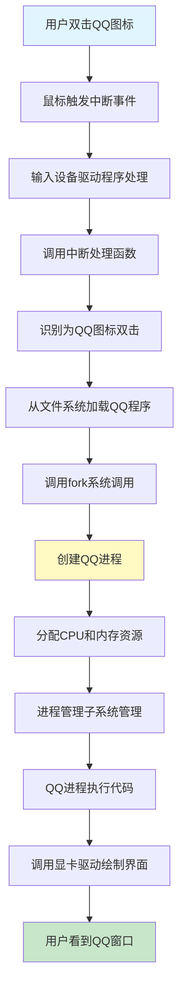

**详细过程分析**：

1. **立项阶段**：
   - 运行QQ需要单独立项（创建进程）
   - 程序 = 项目执行计划书（静态的二进制文件）
   - 进程 = 项目的执行（动态的运行状态）
   - 程序存储在**文件系统**中

2. **资源分配**：
   - 每个进程需要独立的内存空间（类比：独立的会议室）
   - 通过**内存管理子系统**分配和管理
   - 避免进程间相互干扰

3. **执行管理**：
   - CPU按照二进制代码逐行执行
   - **进程管理子系统**负责调度
   - 多个进程并发运行时需要CPU调度能力

4. **系统调用**：
   - 进程不能直接操作硬件
   - 必须通过**系统调用**（System Call）请求服务
   - 类比：办事大厅统一提供服务

5. **交互过程**：
   - 用户通过键盘输入字符（如"a"）
   - 键盘驱动触发中断，通知操作系统
   - 操作系统将事件传递给QQ进程
   - QQ进程处理后，调用显卡驱动在屏幕上绘制"a"

### 1.1.4 Linux内核体系结构

Linux内核主要包含以下几个核心子系统：

#### 系统总体架构图

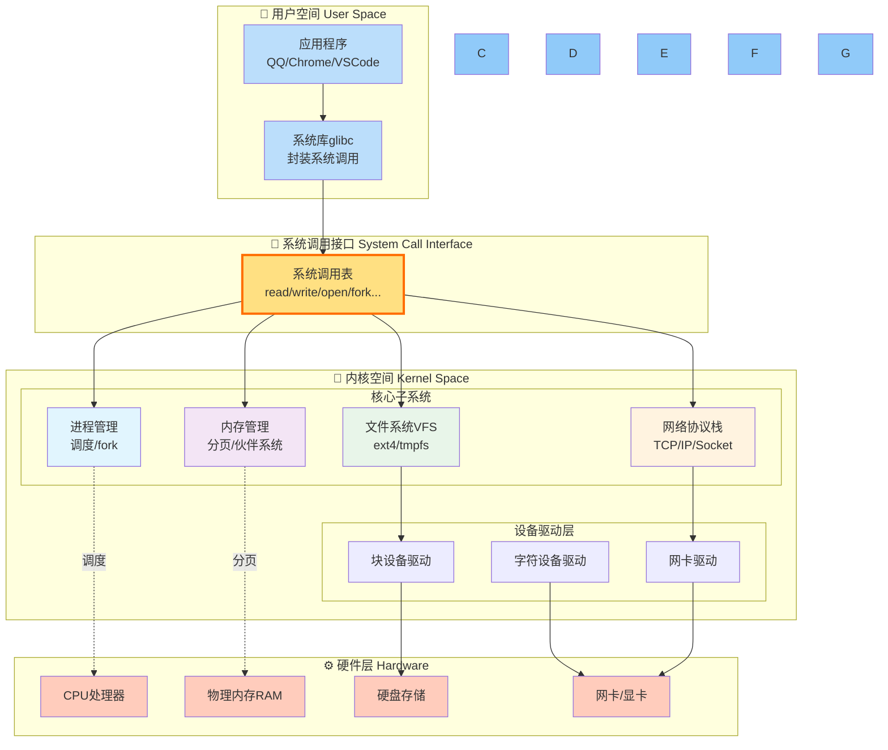

**各子系统的作用**：

1. **进程管理子系统**（Process Management Subsystem）
   - 管理进程的创建、调度、销毁
   - 类比：项目管理部门，负责项目立项、执行、结项

2. **内存管理子系统**（Memory Management Subsystem）
   - 管理物理内存和虚拟内存
   - 类比：会议室管理部门，分配和管理办公空间

3. **文件管理子系统**（File Management Subsystem）
   - 管理文件的存储、读写、组织
   - 类比：档案库管理部门，保存各种项目文档

4. **设备驱动程序**
   - 管理硬件设备的输入输出
   - 类比：客户对接员和交付人员

5. **网络协议栈**
   - 管理网络通信
   - 类比：对外合作部门

---

## 1.2 Linux命令快速上手

Linux的一大特点是**命令行（Command Line）模式**。命令行就像"行业黑话"，只有使用正确的术语，Linux才能理解你的需求。

### 1.2.1 用户与密码管理

#### 用户账户

**Root用户**：

- Linux的超级管理员账户
- 拥有最高操作权限
- 对应Windows的Administrator

**创建普通用户**：

```bash
# 创建用户
useradd cliu8

# 设置密码
passwd cliu8

# 创建用户并指定组
useradd -g groupname username

# 查看命令帮助
useradd -h
man useradd
```

**用户配置文件**：

- `/etc/passwd`：存储用户信息
- `/etc/group`：存储组信息

`/etc/passwd`文件格式：

```
root:x:0:0:root:/root:/bin/bash
cliu8:x:1000:1000::/home/cliu8:/bin/bash
```

字段说明：

1. 用户名
2. 密码占位符（x表示密码存储在shadow文件中）
3. 用户ID（UID）
4. 组ID（GID）
5. 用户描述
6. 主目录（Home Directory）
7. 默认Shell

### 1.2.2 文件浏览与权限管理

#### 基本命令

```bash
# 切换目录
cd /path/to/directory
cd ..    # 上级目录
cd .     # 当前目录

# 列出文件
ls
ls -l    # 列表形式显示详细信息
ls -la   # 显示所有文件（包括隐藏文件）
```

#### 文件权限

`ls -l`输出示例：

```
drwxr-xr-x 6 root root 4096 Oct 20 2017 apt
-rw-r--r-- 1 root root  211 Oct 20 2017 hosts
```

**权限位解析**：

```
-rw-r--r--
│└┬┘└┬┘└┬┘
│ │  │  └─ 其他用户权限 (r--): 只读
│ │  └──── 所属组权限 (r--): 只读
│ └─────── 所属用户权限 (rw-): 读写
└───────── 文件类型 (-: 普通文件, d: 目录)
```

**权限字符**：

- `r` (read): 读权限
- `w` (write): 写权限
- `x` (execute): 执行权限
- `-`: 无权限

**权限修改命令**：

```bash
chmod 711 filename  # 数字方式修改权限
chown user filename # 修改所属用户
chgrp group filename # 修改所属组
```

### 1.2.3 软件安装与管理

#### 安装包方式

**CentOS体系（使用rpm）**：

```bash
# 安装
rpm -i jdk-XXX_linux-x64_bin.rpm

# 查询已安装软件
rpm -qa
rpm -qa | grep jdk

# 删除软件
rpm -e package-name
```

**Ubuntu体系（使用deb）**：

```bash
# 安装
dpkg -i jdk-XXX_linux-x64_bin.deb

# 查询已安装软件
dpkg -l
dpkg -l | grep jdk

# 删除软件
dpkg -r package-name
```

#### 软件管理器方式

**CentOS - yum**：

```bash
yum search jdk              # 搜索软件
yum install java-11-openjdk # 安装软件
yum erase java-11-openjdk   # 卸载软件
```

**Ubuntu - apt-get**：

```bash
apt-cache search jdk        # 搜索软件
apt-get install openjdk-9-jdk  # 安装软件
apt-get purge openjdk-9-jdk    # 卸载软件
```

**软件源配置**：

- CentOS: `/etc/yum.repos.d/CentOS-Base.repo`
- Ubuntu: `/etc/apt/sources.list`

建议选择国内镜像源（如163.com）以提高下载速度。

#### 压缩包方式

```bash
# 下载
wget http://example.com/jdk-XXX_linux-x64_bin.tar.gz

# 解压
tar xvzf jdk-XXX_linux-x64_bin.tar.gz

# 配置环境变量
export JAVA_HOME=/root/jdk-XXX_linux-x64
export PATH=$JAVA_HOME/bin:$PATH

# 永久生效（写入.bashrc）
vim ~/.bashrc
# 添加上面的export命令
source ~/.bashrc
```

### 1.2.4 文本编辑器vim

**基本操作**：

```bash
vim filename  # 打开/创建文件
```

**常用命令**：

- `i`: 进入插入模式（编辑）
- `ESC`: 退出插入模式
- `:w`: 保存
- `:q`: 退出
- `:wq`: 保存并退出
- `:q!`: 不保存强制退出

### 1.2.5 程序运行

#### 交互式运行

```bash
./program    # 当前目录运行
program      # PATH路径下可直接运行
```

**特点**：

- 命令行退出，程序停止
- 适合简单、短期的任务

#### 后台运行

```bash
nohup command >out.file 2>&1 &
```

**参数说明**：

- `nohup`: no hang up，命令行退出程序继续运行
- `>out.file`: 标准输出重定向到文件
- `2>&1`: 标准错误输出合并到标准输出
- `&`: 后台运行

**进程管理**：

```bash
# 查看进程
ps -ef | grep keyword

# 杀死进程
ps -ef | grep keyword | awk '{print $2}' | xargs kill -9
# 或者
kill -9 PID
```

#### 服务方式运行

```bash
# Ubuntu
systemctl start mysql    # 启动服务
systemctl stop mysql     # 停止服务
systemctl enable mysql   # 设置开机启动
systemctl status mysql   # 查看服务状态

# CentOS (以MariaDB为例)
systemctl start mariadb
systemctl enable mariadb
```

**服务配置文件**：

- Ubuntu: `/lib/systemd/system/XXX.service`
- CentOS: `/usr/lib/systemd/system/XXX.service`

#### 系统关机与重启

```bash
shutdown -h now  # 立即关机
reboot           # 重启
```

---

## 1.3 系统调用详解

> 系统调用是用户程序与操作系统内核交互的唯一接口，它决定了操作系统的能力边界。

### 1.3.1 什么是系统调用

**定义**：系统调用（System Call）是操作系统提供给用户程序的一组API接口，用于请求内核提供的服务。

**类比**：办事大厅的服务窗口

- 明文列出提供哪些服务
- 统一的服务入口
- 规范的服务流程

**重要性**：

- 系统调用的质量决定操作系统的好用程度
- 功能全面性影响应用程序的能力范围

### 1.3.2 主要系统调用分类

#### 1. 进程管理类

**fork - 创建进程**：

```c
pid_t fork(void);
```

工作原理：

- 父进程调用fork创建子进程
- 子进程拷贝父进程的所有数据结构
- 通过返回值区分父子进程：
  - 子进程返回0
  - 父进程返回子进程PID


**特点**：采用"先拷贝，再修改"的策略

**execve - 执行新程序**：

```c
int execve(const char *filename, char *const argv[], char *const envp[]);
```

**waitpid - 等待子进程**：

```c
pid_t waitpid(pid_t pid, int *status, int options);
```

作用：父进程等待子进程结束，获取子进程退出状态

**进程家族树**：

- 所有进程都由"祖宗进程"fork而来
- 系统启动时创建第一个init进程
- 形成进程树结构

#### 2. 内存管理类

**独立内存空间**：

- 每个进程拥有独立的虚拟内存空间
- 32位系统：4GB
- 64位系统：更大

**内存空间布局**：

- **代码段**（Code Segment）：存放程序代码
- **数据段**（Data Segment）：存放运行时数据
  - 栈（Stack）：局部变量，函数结束自动释放
  - 堆（Heap）：动态分配，需要显式释放

**内存分配系统调用**：

```c
// brk - 小块内存分配（与原堆连续）
int brk(void *addr);

// mmap - 大块内存分配（独立区域）
void *mmap(void *addr, size_t length, int prot, int flags, 
           int fd, off_t offset);
```

**虚拟内存机制**：

- 进程申请内存时先登记，不立即分配物理内存
- 真正写入数据时触发缺页中断
- 此时才分配实际物理内存

#### 3. 文件管理类

**"一切皆文件"**理念：

- 普通文件：二进制文件、文本文件
- 设备文件：硬件设备
- 管道文件：进程间通信
- Socket文件：网络通信
- 目录：也是特殊文件
- `/proc`：进程信息也以文件形式呈现

**核心文件操作**：

```c
// 打开文件
int open(const char *pathname, int flags, mode_t mode);

// 创建文件
int creat(const char *pathname, mode_t mode);

// 关闭文件
int close(int fd);

// 定位文件
off_t lseek(int fd, off_t offset, int whence);

// 读文件
ssize_t read(int fd, void *buf, size_t count);

// 写文件
ssize_t write(int fd, const void *buf, size_t count);
```

**文件描述符**（File Descriptor）：

- 整数，标识打开的文件
- 统一了所有文件类型的操作接口
- 标准文件描述符：
  - 0: stdin（标准输入）
  - 1: stdout（标准输出）
  - 2: stderr（标准错误输出）

#### 4. 信号处理类

**信号**（Signal）：用于异常处理和进程间通知

**常见信号**：

- `SIGINT`（Ctrl+C）：中断信号
- `SIGKILL`：终止进程（不可忽略）
- `SIGSTOP`：停止进程（不可忽略）
- `SIGSEGV`：非法内存访问
- 硬件故障信号

**信号处理方式**：

1. 忽略（某些信号可以）
2. 执行默认动作
3. 自定义处理函数

```c
// 注册信号处理函数
int sigaction(int signum, const struct sigaction *act, 
               struct sigaction *oldact);
```

#### 5. 进程间通信类

**消息队列**（Message Queue）：

```c
int msgget(key_t key, int msgflg);      // 创建消息队列
int msgsnd(int msqid, const void *msgp, size_t msgsz, int msgflg);  // 发送
ssize_t msgrcv(int msqid, void *msgp, size_t msgsz, long msgtyp, int msgflg);  // 接收
```

**共享内存**（Shared Memory）：

```c
int shmget(key_t key, size_t size, int shmflg);  // 创建共享内存
void *shmat(int shmid, const void *shmaddr, int shmflg);  // 映射到进程空间
```

特点：零拷贝，效率最高

**信号量**（Semaphore）：

```c
int sem_wait(sem_t *sem);   // P操作，申请资源
int sem_post(sem_t *sem);   // V操作，释放资源
```

作用：解决共享资源的互斥访问问题

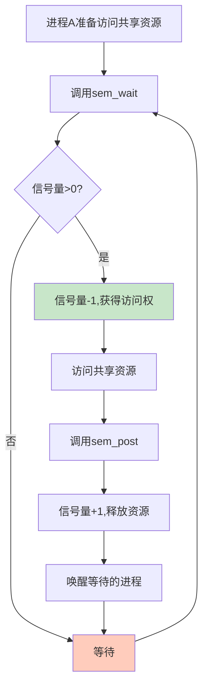

#### 6. 网络通信类

**Socket通信**：

```c
// 创建Socket
int socket(int domain, int type, int protocol);

// 绑定地址
int bind(int sockfd, const struct sockaddr *addr, socklen_t addrlen);

// 监听连接
int listen(int sockfd, int backlog);

// 接受连接
int accept(int sockfd, struct sockaddr *addr, socklen_t *addrlen);

// 连接服务器
int connect(int sockfd, const struct sockaddr *addr, socklen_t addrlen);
```

**特点**：

- Socket也是文件，有文件描述符
- 可通过read/write进行通信
- 支持TCP/IP协议栈

### 1.3.3 系统调用的实现

**系统调用表**：

在`unistd_64.h`中定义：

```c
#define __NR_read 0
#define __NR_write 1
#define __NR_open 2
#define __NR_close 3
#define __NR_fork 57
#define __NR_execve 59
...
```

每个系统调用对应一个编号。

**调用过程**：

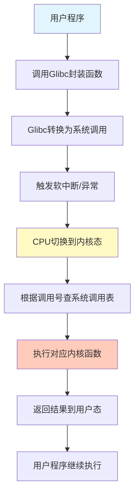

### 1.3.4 Glibc与系统调用

**Glibc的作用**：

- GNU C Library，Linux的标准C库
- 封装系统调用，提供更友好的API
- 提供用户态服务（字符串处理、数学运算等）

**映射关系**：

- 一对一：`open()` → `sys_open`
- 一对多：`printf()` → `sys_open` + `sys_write` + `sys_close`
- 多对一：`malloc()` + `calloc()` + `free()` → `sys_brk`

**为什么需要Glibc**：

- 简化编程，提供更高层次的抽象
- 跨平台兼容性
- 错误处理和参数检查

**调试工具strace**：

```bash
strace ls    # 跟踪ls命令的系统调用
strace -c program  # 统计系统调用次数
```

---

## 1.4 总结

### 1.4.1 核心要点

1. **Linux内核 = 软件外包公司老板**
   - 通过这个类比理解各个子系统的职责
   - 进程 = 项目，系统调用 = 办事大厅

2. **内核体系结构**
   - 进程管理子系统：调度和管理进程
   - 内存管理子系统：分配和管理内存
   - 文件管理子系统：组织和存储文件
   - 设备驱动：管理硬件输入输出
   - 网络协议栈：处理网络通信

3. **命令行操作**
   - 用户管理：`useradd`、`passwd`
   - 文件浏览：`ls`、`cd`、`vim`
   - 软件安装：`yum`/`apt-get`、`rpm`/`dpkg`
   - 程序运行：交互式、后台、服务

4. **系统调用**
   - 用户程序与内核的唯一接口
   - 六大类：进程管理、内存管理、文件管理、信号处理、IPC、网络通信
   - Glibc封装系统调用，提供友好API

5. **一切皆文件**
   - 统一了操作接口
   - 简化了编程模型
   - 文件描述符是核心抽象

### 1.4.2 学习建议

1. **动手实践**：
   - 按照命令操作步骤实际操作
   - 安装JDK和MySQL练习
   - 使用strace查看系统调用

2. **阅读源码**：
   - 下载Linux内核源码
   - 查看`unistd_64.h`中的系统调用定义
   - 理解各子系统的代码组织

3. **建立关联**：
   - 将命令操作与系统调用对应起来
   - 理解每个操作背后的内核机制

4. **深入类比**：
   - 牢记"软件外包公司"的类比
   - 用类比思维理解复杂概念

### 1.4.3 常用命令速查表

| 功能 | 命令 | 说明 |
|------|------|------|
| 用户管理 | `useradd/passwd` | 创建用户和设置密码 |
| 文件浏览 | `ls -l / cd / pwd` | 列出文件/切换目录/当前路径 |
| 权限管理 | `chmod / chown / chgrp` | 修改权限/所有者/组 |
| 软件安装 | `yum/apt-get install` | 安装软件包 |
| 软件查询 | `rpm -qa / dpkg -l` | 查看已安装软件 |
| 文本编辑 | `vim` | 编辑文件 |
| 进程管理 | `ps -ef / kill` | 查看进程/终止进程 |
| 后台运行 | `nohup ... &` | 后台运行程序 |
| 服务管理 | `systemctl start/stop` | 启动/停止服务 |
| 管道过滤 | `grep / awk / less` | 过滤和分页显示 |

---

# 第2章 系统初始化

> **核心思想**：系统初始化是Linux从"个体户"成长为"大公司"的过程，从实模式到保护模式，从BIOS到内核，逐步建立起完整的运行环境。

## 2.1 x86架构：开放的营商环境

### 2.1.1 计算机的工作模式

计算机的核心是**CPU**（Central Processing Unit），所有设备都围绕它展开。类比到公司，CPU就是真正干活的程序员，是营商环境中最重要的部分。

#### 核心组件

**CPU内部组成**：

1. **运算单元**
   - 负责执行各种运算（加法、位移等）
   - 不知道操作哪些数据，结果放哪里

2. **数据单元**
   - CPU内部缓存和寄存器组
   - 空间小但速度快
   - 暂存数据和运算结果

3. **控制单元**
   - 统一指挥中心
   - 获取并执行指令
   - 指导运算单元操作数据

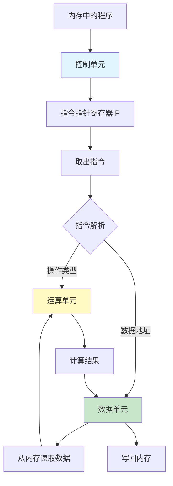

**总线系统**：

- **地址总线**（Address Bus）：传输内存地址
  - 位数决定可访问的地址范围
  - 例如：20位可访问1M（2^20）
  
- **数据总线**（Data Bus）：传输实际数据
  - 位数决定一次传输的数据量
  - 位数越多，访问速度越快

### 2.1.2 x86架构的历史

**IBM PC的诞生**：

- IBM采用英特尔8086芯片和微软MS-DOS
- 因垄断被诉，被迫公开技术
- 促成IBM-PC兼容机的大量出现
- 形成开放的行业标准

**x86的三大原则**：

1. **标准化**：统一的处理器架构
2. **开放性**：技术公开，生态繁荣
3. **兼容性**：向后兼容，持续发展

### 2.1.3 8086处理器详解

**寄存器组织**：

```
通用寄存器（16位）:
  AX, BX, CX, DX    - 可分为8位使用 (AH/AL, BH/BL, CH/CL, DH/DL)
  SP, BP, SI, DI    - 栈和索引寄存器

段寄存器（16位）:
  CS - 代码段寄存器
  DS - 数据段寄存器  
  SS - 栈段寄存器
  ES - 扩展段寄存器

指令指针:
  IP - 指向下一条指令的位置
```

**内存寻址方式**：

- CS/DS保存段起始地址（16位）
- IP/通用寄存器保存偏移量（16位）
- 物理地址 = 段地址 × 16 + 偏移量
- 最大寻址：2^20 = 1MB
- 段大小限制：2^16 = 64KB

**示例**：

```
段地址CS: 0x1000 (实际地址 0x10000)
偏移量IP:  0x0050
物理地址 = 0x10000 + 0x0050 = 0x10050
```

### 2.1.4 32位处理器的演进

**扩展的寄存器**：

- 16位寄存器扩展为32位
- 保持向下兼容（仍可使用16位和8位）
- IP扩展为EIP（32位）

**段寄存器的重新定义**：


**两种模式**：

| 模式 | 地址空间 | 特点 | 使用场景 |
|------|----------|------|----------|
| **实模式** | 1MB | 简单直接，段地址×16+偏移 | 系统启动初期 |
| **保护模式** | 4GB (32位) | 灵活强大，通过描述符表寻址 | 正常运行 |

**模式切换**：

- 系统启动时处于实模式（兼容）
- 逐步切换到保护模式（更强大）
- 不能无缝切换，需要特定操作

**保护模式的优势**：

1. 可访问更大内存空间（4GB）
2. 段起始地址更灵活
3. 支持内存保护机制
4. 为多任务系统提供基础

---

## 2.2 从BIOS到Bootloader

### 2.2.1 BIOS时期

**加电启动过程**：

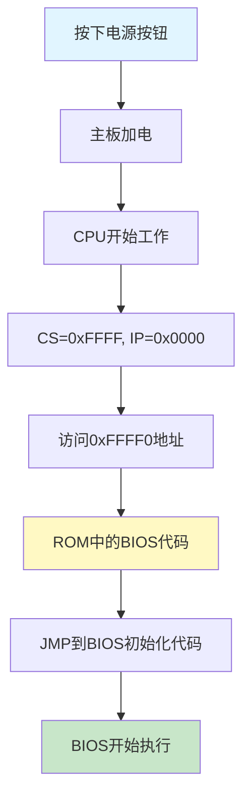

**BIOS的职责**：

1. **硬件检测**（POST - Power-On Self-Test）
   - 检查RAM、CPU、外设等是否正常
   - 类比：创业指导手册第一条

2. **建立中断向量表**
   - 设置中断服务程序
   - 处理键盘、鼠标等输入设备
   - 类比：建立办事大厅，自己当办事员

3. **显示输出**
   - 映射显存空间
   - 在显示器上显示信息
   - 类比：充当客户对接人

**内存映射**：

```
0xF0000 - 0xFFFFF: ROM (BIOS代码)
0xFFFF0: 第一条指令的位置
实模式下：1MB地址空间
```

### 2.2.2 Bootloader时期

**GRUB2的作用**：

GRUB (Grand Unified Bootloader Version 2) 是Linux的启动管理器。

**启动盘特征**：

- 位于第一个扇区（MBR）
- 占512字节
- 以`0xAA55`结束

**GRUB2的组成**：

1. **boot.img** (512字节)
   - 安装在MBR
   - 由boot.S编译而成
   - 加载到内存0x7c00运行
   - 负责加载core.img

2. **core.img** (更大更复杂)
   - diskboot.img: 从硬盘加载
   - lzma_decompress.img: 解压缩程序
   - kernel.img: GRUB的内核（不是Linux内核）
   - 各种模块

**GRUB配置示例**：

```bash
menuentry 'CentOS Linux (3.10.0-862.el7.x86_64)' {
    load_video
    set gfxpayload=keep
    insmod gzio
    insmod part_msdos
    insmod ext2
    set root='hd0,msdos1'
    linux16 /boot/vmlinuz-3.10.0-862.el7.x86_64 root=UUID=...
    initrd16 /boot/initramfs-3.10.0-862.el7.x86_64.img
}
```

### 2.2.3 从实模式切换到保护模式

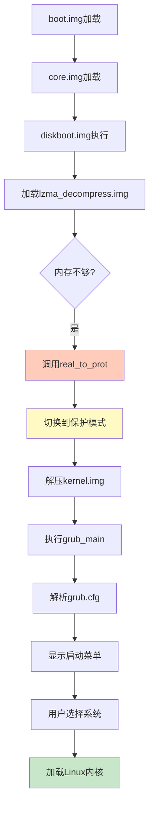

**切换保护模式的步骤**：

1. **启用分段**
   - 建立段描述符表（GDT）
   - 段寄存器变成段选择子
   - 指向段描述符

2. **启用分页**
   - 管理更大的内存
   - 将内存分成相等大小的块

3. **打开Gate A20**
   - 第21根地址线
   - 实模式下只有20根（1MB）
   - 保护模式需要21根及以上

**类比**：

- 个体户模式 → 老板角色
- 所有东西都是自己的 → 需要划分权限
- 本小利微 → 可以雇人做大项目

---

## 2.3 内核初始化

### 2.3.1 start_kernel函数

`start_kernel`是内核的main函数，位于`init/main.c`。它包含大量初始化函数`XXXX_init()`。

**初始化顺序**：

1. **创建0号进程init_task**

   ```c
   set_task_stack_end_magic(&init_task);
   ```

   - 第一个进程，唯一不通过fork创建的
   - 进程列表的第一个

2. **初始化中断trap_init()**

   ```c
   set_system_intr_gate(IA32_SYSCALL_VECTOR, entry_INT80_32);
   ```

   - 设置中断门
   - 包括系统调用的中断门

3. **初始化内存mm_init()**
   - 初始化内存管理模块
   - 类比：会议室管理系统

4. **初始化调度sched_init()**
   - 项目调度需要调度策略
   - 类比：项目管理流程

5. **初始化VFS vfs_caches_init()**
   - 初始化虚拟文件系统rootfs
   - 注册rootfs_fs_type

6. **rest_init()**
   - 其他方面的初始化

### 2.3.2 创建1号进程

```c
kernel_thread(kernel_init, NULL, CLONE_FS);
```

**1号进程的意义**：

- "划时代"的进程
- 第一个用户态进程
- 用户进程的祖先（所有用户进程的根）

**用户态与内核态**：

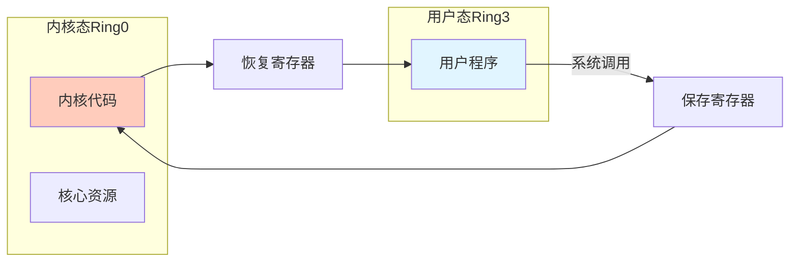

**权限保护机制**：

- x86提供4个Ring（0-3）
- Ring0：内核态，最高权限
- Ring3：用户态，受限权限
- 用户态不能直接访问核心资源
- 必须通过系统调用请求服务

**系统调用过程**：

```
用户态 → 系统调用 → 保存寄存器 → 内核态执行 → 恢复寄存器 → 返回用户态
```

### 2.3.3 从内核态到用户态

**关键函数调用链**：

```
kernel_init
  → kernel_init_freeable
    → ramdisk_execute_command = "/init"
  → run_init_process(ramdisk_execute_command)
    → do_execve
      → exec_binprm
        → search_binary_handler
          → load_elf_binary
            → start_thread
```

**start_thread的作用**：

```c
void start_thread(struct pt_regs *regs, unsigned long new_ip, unsigned long new_sp) {
    regs->cs = __USER_CS;     // 用户态代码段
    regs->ds = __USER_DS;     // 用户态数据段
    regs->ss = __USER_DS;     // 用户态栈段
    regs->ip = new_ip;        // 指令指针
    regs->sp = new_sp;        // 栈指针
    force_iret();             // 强制iret返回
}
```

**如何实现跃迁**：

1. 补上系统调用时保存寄存器的步骤
2. 设置用户态的CS、DS、IP、SP
3. 使用`iret`指令返回
4. 恢复寄存器时，指向用户态地址
5. 成功进入用户态

### 2.3.4 ramdisk的作用

**为什么需要ramdisk**：

- 内核需要加载存储设备上的/init
- 访问存储设备需要驱动程序
- 驱动太多，无法全部放入内核
- 基于内存的文件系统不需要驱动

**启动流程**：

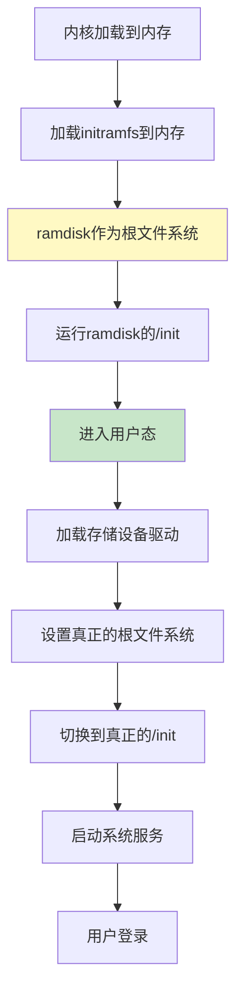

**initramfs参数**：

```bash
initrd16 /boot/initramfs-3.10.0-862.el7.x86_64.img
```

### 2.3.5 创建2号进程

```c
kernel_thread(kthreadd, NULL, CLONE_FS | CLONE_FILES);
```

**2号进程的作用**：

- 内核态所有线程的祖先
- 负责内核态线程的调度和管理
- 函数名kthreadd负责所有内核态线程

**进程vs线程**：

- **用户态视角**：进程是项目，线程是项目中的执行人员
- **内核态视角**：都统称为任务（Task），使用相同数据结构

**三个重要进程**：

1. **0号进程**：创始进程，系统init_task
2. **1号进程**：用户态进程祖先
3. **2号进程**：内核态进程祖先

---

## 2.4 系统调用的实现机制

### 系统调用完整流程序列图

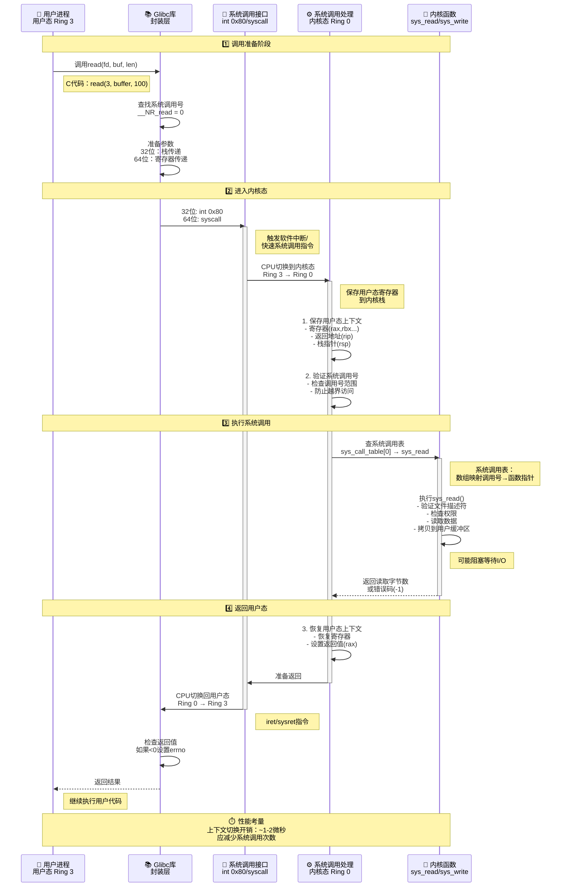

**系统调用流程关键点**：

| 阶段 | 执行环境 | 关键操作 | 数据结构 |
|------|---------|---------|----------|
| **调用准备** | 用户态 Ring 3 | 准备参数、查调用号 | Glibc封装函数 |
| **陷入内核** | 切换中 | int 0x80/syscall指令 | IDT中断描述符表 |
| **保存上下文** | 内核态 Ring 0 | 保存寄存器到内核栈 | pt_regs结构 |
| **查表执行** | 内核态 Ring 0 | sys_call_table[nr] | 系统调用表 |
| **内核函数** | 内核态 Ring 0 | sys_read()等 | 内核数据结构 |
| **恢复上下文** | 内核态 Ring 0 | 恢复寄存器、设置返回值 | pt_regs结构 |
| **返回用户** | 切换中 | iret/sysret指令 | - |
| **继续执行** | 用户态 Ring 3 | 检查errno | Glibc处理 |

**32位 vs 64位系统调用差异**：

| 项目 | 32位 (x86) | 64位 (x86-64) |
|------|-----------|---------------|
| **陷入指令** | `int 0x80` | `syscall` |
| **返回指令** | `iret` | `sysret` |
| **调用号寄存器** | `eax` | `rax` |
| **参数传递** | 栈（ebx,ecx,edx...） | 寄存器（rdi,rsi,rdx,r10,r8,r9） |
| **系统调用表** | `sys_call_table` | `sys_call_table` |
| **性能** | 较慢（中断） | 较快（专用指令） |

**核心理解**：

1. **特权级切换**：从Ring 3（用户态）到Ring 0（内核态）
2. **上下文保存**：必须保存所有寄存器，保证能正确返回
3. **系统调用表**：通过数组索引快速定位内核函数（函数指针数组）
4. **参数传递**：64位使用寄存器更高效，32位使用栈
5. **性能开销**：上下文切换约1-2微秒，应尽量减少系统调用次数（如批量I/O）
6. **Glibc封装**：提供类型安全和错误处理（errno）

### 2.4.1 glibc对系统调用的封装

**系统调用配置**（syscalls.list）：

```
# File name  Caller  Syscall name  Args  Strong name  Weak names
open         -       open          Ci:siv __libc_open  __open open
```

**生成过程**：

1. make-syscall.sh脚本解析配置
2. 生成宏定义：`#define SYSCALL_NAME open`
3. syscall-template.S定义调用方式
4. 生成封装函数

### 2.4.2 32位系统调用过程

**参数传递**（通过寄存器）：

```
系统调用号    %eax
参数1         %ebx
参数2         %ecx
参数3         %edx
参数4         %esi
参数5         %edi
参数6         %ebp
```

**调用流程**：

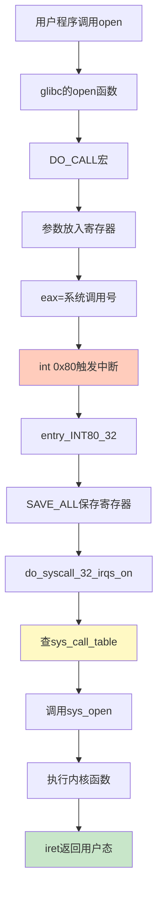

**关键代码**：

```c
// 触发中断
#define ENTER_KERNEL int $0x80

// 中断处理
ENTRY(entry_INT80_32)
    pushl %eax
    SAVE_ALL
    movl %esp, %eax
    call do_syscall_32_irqs_on

// 查表调用
if (likely(nr < IA32_NR_syscalls)) {
    regs->ax = ia32_sys_call_table[nr](...);
}

// 返回用户态
#define INTERRUPT_RETURN iret
```

### 2.4.3 64位系统调用过程

**参数传递**（64位寄存器）：

```
系统调用号    rax
参数1         rdi
参数2         rsi
参数3         rdx
参数4         r10
参数5         r8
参数6         r9
```

**不同之处**：

- 使用`syscall`指令（非中断）
- 使用MSR（Model Specific Registers）
- 更快的切换速度

**MSR寄存器设置**：

```c
// 系统初始化
wrmsrl(MSR_LSTAR, (unsigned long)entry_SYSCALL_64);
```

**调用流程**：

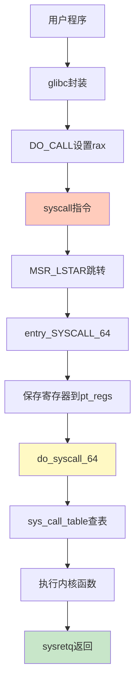

### 2.4.4 系统调用表的生成

**定义文件**：

- 32位：`arch/x86/entry/syscalls/syscall_32.tbl`
- 64位：`arch/x86/entry/syscalls/syscall_64.tbl`

**示例定义**：

```
# 32位
5  i386   open    sys_open  compat_sys_open

# 64位  
2  common open    sys_open
```

**系统调用宏**：

```c
SYSCALL_DEFINE3(open, const char __user *, filename, int, flags, umode_t, mode)
{
    if (force_o_largefile())
        flags |= O_LARGEFILE;
    return do_sys_open(AT_FDCWD, filename, flags, mode);
}
```

**宏展开后**：

```c
asmlinkage long sys_open(const char __user * filename, int flags, int mode)
{
    long ret;
    if (force_o_largefile())
        flags |= O_LARGEFILE;
    ret = do_sys_open(AT_FDCWD, filename, flags, mode);
    return ret;
}
```

**生成过程**：

1. syscallhdr.sh生成`#define __NR_open`
2. syscalltbl.sh生成`__SYSCALL(__NR_open, sys_open)`
3. 生成unistd_32.h和unistd_64.h
4. 包含头文件形成系统调用表

**32位系统调用表**：

```c
__visible const sys_call_ptr_t ia32_sys_call_table[__NR_syscall_compat_max+1] = {
    [0 ... __NR_syscall_compat_max] = &sys_ni_syscall,
    #include <asm/syscalls_32.h>
};
```

**64位系统调用表**：

```c
asmlinkage const sys_call_ptr_t sys_call_table[__NR_syscall_max+1] = {
    [0 ... __NR_syscall_max] = &sys_ni_syscall,
    #include <asm/syscalls_64.h>
};
```

---

## 2.5 总结

### 2.5.1 核心要点

1. **x86架构**
   - 开放、标准、兼容的三大原则
   - 实模式（1MB）→ 保护模式（4GB）
   - 寄存器组织：通用、段、指令指针
   - 总线系统：地址总线、数据总线

2. **启动流程**
   - BIOS：硬件检测、中断向量、显示输出
   - Bootloader：boot.img → core.img → GRUB
   - 实模式切换到保护模式

3. **内核初始化**
   - start_kernel：各子系统初始化
   - 0号进程：创始进程
   - 1号进程：用户态祖先
   - 2号进程：内核态祖先
   - ramdisk：临时根文件系统

4. **系统调用**
   - 32位：int 0x80中断方式
   - 64位：syscall指令方式
   - 通过寄存器传递参数
   - 系统调用表：编号到函数的映射

### 2.5.2 启动流程图

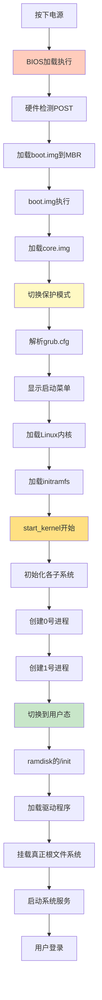

### 2.5.3 关键数据结构

| 结构 | 作用 | 说明 |
|------|------|------|
| pt_regs | 保存寄存器 | 系统调用时保存用户态上下文 |
| task_struct | 进程描述符 | 描述进程的所有信息 |
| 系统调用表 | 调用映射 | 系统调用号到函数的映射 |
| GDT | 全局描述符表 | 保护模式下的段描述符 |

### 2.5.4 学习建议

1. **理解模式切换**
   - 实模式到保护模式的必要性
   - 用户态和内核态的权限划分

2. **跟踪启动过程**
   - 从BIOS到内核的完整流程
   - 各个阶段的作用和转换

3. **掌握系统调用**
   - 理解系统调用的实现机制
   - 32位和64位的区别

4. **实践验证**
   - 使用strace跟踪系统调用
   - 查看Linux内核源码
   - 尝试编写简单的系统调用

---

**下一章预告**：第3章将深入讲解进程管理，包括进程的数据结构、调度机制、创建过程等核心内容。

---

# 第3章 进程管理（上）：进程与线程

> **核心思想**：进程是项目，线程是项目中的任务。掌握进程和线程的创建、管理和同步机制。

### 进程生命周期状态转换图

```mermaid
graph LR
    NEW["🆕 新建<br/>TASK_NEW"]
    READY["✅ 就绪<br/>TASK_RUNNING<br/>(在就绪队列)"]
    RUNNING["⚡ 运行<br/>TASK_RUNNING<br/>(正在CPU上)"]
    INTERRUPTIBLE["💤 可中断睡眠<br/>TASK_INTERRUPTIBLE<br/>(等待资源/事件)"]
    UNINTERRUPTIBLE["🚫 不可中断睡眠<br/>TASK_UNINTERRUPTIBLE<br/>(I/O等待)"]
    STOPPED["⏸️ 停止<br/>TASK_STOPPED<br/>(Ctrl+Z/调试)"]
    ZOMBIE["👻 僵尸<br/>TASK_ZOMBIE<br/>(已终止未回收)"]
    EXIT["❌ 退出<br/>TASK_DEAD"]
    
    NEW -->|fork完成| READY
    READY -->|调度器选中| RUNNING
    RUNNING -->|时间片耗尽/被抢占| READY
    RUNNING -->|等待资源| INTERRUPTIBLE
    RUNNING -->|I/O操作| UNINTERRUPTIBLE
    RUNNING -->|信号SIGSTOP| STOPPED
    RUNNING -->|exit()| ZOMBIE
    
    INTERRUPTIBLE -->|资源可用/信号| READY
    INTERRUPTIBLE -->|信号SIGKILL| EXIT
    UNINTERRUPTIBLE -->|I/O完成| READY
    STOPPED -->|信号SIGCONT| READY
    STOPPED -->|信号SIGKILL| EXIT
    ZOMBIE -->|父进程wait()| EXIT
    
    style RUNNING fill:#4caf50,stroke:#2e7d32,stroke-width:3px,color:#fff
    style READY fill:#2196f3,stroke:#1565c0,color:#fff
    style INTERRUPTIBLE fill:#ff9800,stroke:#e65100,color:#fff
    style UNINTERRUPTIBLE fill:#f44336,stroke:#c62828,color:#fff
    style ZOMBIE fill:#9c27b0,stroke:#6a1b9a,color:#fff
    style NEW fill:#e0e0e0,stroke:#757575
    style EXIT fill:#424242,stroke:#212121,color:#fff
    style STOPPED fill:#ffeb3b,stroke:#f57f17
```

**状态说明**：

| 状态 | 宏定义 | 触发条件 | 能否被信号打断 |
|------|--------|----------|----------------|
| 新建 | TASK_NEW | fork()刚创建 | N/A |
| 就绪 | TASK_RUNNING | 在就绪队列等待CPU | 是 |
| 运行 | TASK_RUNNING | 正在CPU上执行 | 是 |
| 可中断睡眠 | TASK_INTERRUPTIBLE | wait()等待资源/事件 | **是** |
| 不可中断睡眠 | TASK_UNINTERRUPTIBLE | I/O操作 | **否** |
| 停止 | TASK_STOPPED | 收到SIGSTOP/调试断点 | 部分 |
| 僵尸 | TASK_ZOMBIE | 已exit()但未被回收 | 否 |
| 退出 | TASK_DEAD | 完全退出 | 否 |

**核心理解**：

1. **RUNNING状态双重含义**：既表示运行也表示就绪（都在runqueue中）
2. **睡眠状态区别**：INTERRUPTIBLE可被信号唤醒，UNINTERRUPTIBLE不可被打断（避免数据不一致）
3. **僵尸进程**：已终止但task_struct未释放，等待父进程收割（wait()）
4. **ps命令对应**：R=RUNNING, S=INTERRUPTIBLE, D=UNINTERRUPTIBLE, T=STOPPED, Z=ZOMBIE

## 3.1 进程创建与管理

### 3.1.1 使用系统调用创建进程

**进程创建示例**（process.c）：

```c
#include <stdio.h>
#include <stdlib.h>
#include <sys/types.h>
#include <unistd.h>

extern int create_process(char* program, char** arg_list);

int create_process(char* program, char** arg_list) {
    pid_t child_pid;
    child_pid = fork();
    
    if (child_pid != 0)
        return child_pid;  // 父进程返回子进程PID
    else {
        execvp(program, arg_list);  // 子进程执行新程序
        abort();
    }
}
```

**调用示例**（createprocess.c）：

```c
#include <stdio.h>
#include <stdlib.h>
#include <sys/types.h>
#include <unistd.h>

extern int create_process(char* program, char** arg_list);

int main() {
    char* arg_list[] = {
        "ls",
        "-l",
        "/etc/yum.repos.d/",
        NULL
    };
    create_process("ls", arg_list);
    return 0;
}
```

**编译命令**：

```bash
gcc -c -fPIC process.c
gcc -c -fPIC createprocess.c
```

### 3.1.2 ELF二进制格式

**ELF格式类型**：

1. **可重定位文件**（Relocatable File，.o文件）
   - 编译生成的中间文件
   - 可以链接成可执行文件或共享库

2. **可执行文件**（Executable File）
   - 可直接运行的程序
   - 包含程序入口地址

3. **共享对象文件**（Shared Object，.so文件）
   - 动态链接库
   - 运行时加载

**ELF文件结构**：

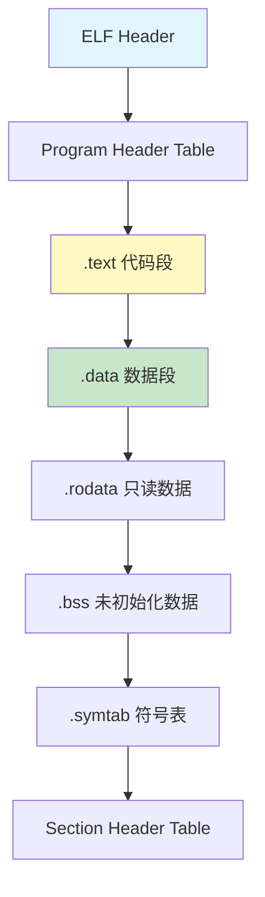

**主要Section说明**：

| Section | 内容 | 说明 |
|---------|------|------|
| `.text` | 可执行代码 | 编译后的机器指令 |
| `.data` | 已初始化全局变量 | 有初始值的全局/静态变量 |
| `.rodata` | 只读数据 | 字符串常量、const变量 |
| `.bss` | 未初始化全局变量 | 运行时置0 |
| `.symtab` | 符号表 | 函数和变量信息 |
| `.strtab` | 字符串表 | 符号名称 |

### 3.1.3 静态链接库与动态链接库

**静态链接库**（.a文件）：

```bash
# 创建静态库
ar cr libstaticprocess.a process.o

# 链接静态库
gcc -o staticcreateprocess createprocess.o -L. -lstaticprocess
```

**特点**：

- ✅ 程序运行不依赖库文件
- ❌ 代码重复，浪费内存
- ❌ 库更新需重新编译

**动态链接库**（.so文件）：

```bash
# 创建动态库
gcc -shared -fPIC -o libdynamicprocess.so process.o

# 链接动态库
gcc -o dynamiccreateprocess createprocess.o -L. -ldynamicprocess

# 设置库搜索路径
export LD_LIBRARY_PATH=.
```

**特点**：

- ✅ 节省内存，多进程共享
- ✅ 库更新无需重新编译
- ❌ 运行时需要库文件

**PLT/GOT机制**：

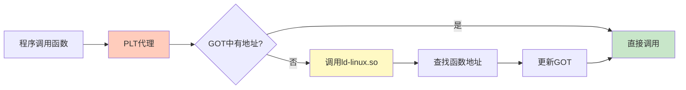

### 3.1.4 进程加载与执行

**exec系列函数**：

```c
int execl(const char *path, const char *arg, ...);
int execlp(const char *file, const char *arg, ...);
int execle(const char *path, const char *arg, ..., char *const envp[]);
int execv(const char *path, char *const argv[]);
int execvp(const char *file, char *const argv[]);
int execve(const char *path, char *const argv[], char *const envp[]);
```

**函数名含义**：

- **p**：在PATH中搜索程序
- **v**：参数以数组形式传递
- **l**：参数以列表形式传递
- **e**：可传递环境变量

**加载流程**：

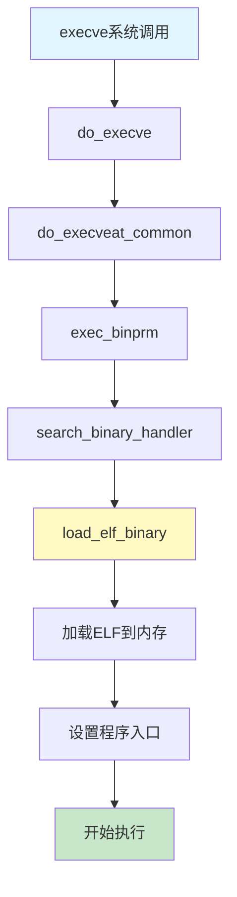

### 3.1.5 进程树

**init进程**（PID 1）：

- 所有用户态进程的祖先
- CentOS 7: `/sbin/init -> /lib/systemd/systemd`

**kthreadd进程**（PID 2）：

- 所有内核态线程的祖先

**进程查看**：

```bash
ps -ef
# UID  PID  PPID  C STIME TTY      TIME CMD
# root   1     0  0 2018  ?    00:00:29 /usr/lib/systemd/systemd
# root   2     0  0 2018  ?    00:00:00 [kthreadd]
```

---

## 3.2 线程机制

### 3.2.1 为什么需要线程

**线程的优势**：

1. **并行执行**
   - 多个任务同时进行
   - 充分利用多核CPU

2. **资源共享**
   - 共享进程的内存空间
   - 避免进程间通信开销

3. **响应性**
   - 前台任务和后台任务分离
   - 提高用户体验

**类比**：

- **进程** = 项目（独立的资源空间）
- **线程** = 项目中的任务（共享资源）

### 3.2.2 创建线程

**线程创建示例**：

```c
#include <pthread.h>
#include <stdio.h>
#include <stdlib.h>

#define NUM_OF_TASKS 5

void *downloadfile(void *filename) {
    printf("I am downloading the file %s!\n", (char *)filename);
    sleep(10);
    long downloadtime = rand() % 100;
    printf("I finish downloading in %ld minutes!\n", downloadtime);
    pthread_exit((void *)downloadtime);
}

int main(int argc, char *argv[]) {
    char files[NUM_OF_TASKS][20] = {
        "file1.avi", "file2.rmvb", "file3.mp4",
        "file4.wmv", "file5.flv"
    };
    pthread_t threads[NUM_OF_TASKS];
    pthread_attr_t thread_attr;
    
    // 初始化线程属性
    pthread_attr_init(&thread_attr);
    pthread_attr_setdetachstate(&thread_attr, PTHREAD_CREATE_JOINABLE);
    
    // 创建线程
    for (int t = 0; t < NUM_OF_TASKS; t++) {
        printf("creating thread %d\n", t);
        int rc = pthread_create(&threads[t], &thread_attr,
                               downloadfile, (void *)files[t]);
        if (rc) {
            printf("ERROR: return code is %d\n", rc);
            exit(-1);
        }
    }
    
    pthread_attr_destroy(&thread_attr);
    
    // 等待线程结束
    for (int t = 0; t < NUM_OF_TASKS; t++) {
        long downloadtime;
        pthread_join(threads[t], (void**)&downloadtime);
        printf("Thread %d took %ld minutes\n", t, downloadtime);
    }
    
    pthread_exit(NULL);
}
```

**编译运行**：

```bash
gcc download.c -lpthread
./a.out
```

**线程创建流程**：

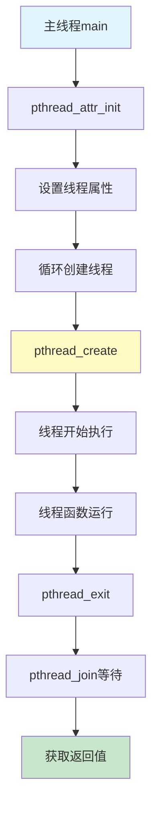

### 3.2.3 线程数据

**三类数据**：

1. **线程栈数据**
   - 函数局部变量
   - 每个线程独立的栈空间
   - 默认8MB，可通过`pthread_attr_setstacksize`修改

2. **进程全局数据**
   - 全局变量
   - 所有线程共享
   - 需要同步保护

3. **线程私有数据**（Thread Specific Data）

   ```c
   pthread_key_t key;
   
   // 创建key
   pthread_key_create(&key, destructor_function);
   
   // 设置value
   pthread_setspecific(key, value);
   
   // 获取value
   void *data = pthread_getspecific(key);
   ```

### 3.2.4 线程同步 - Mutex互斥锁

**Mutex原理**：

- Mutual Exclusion（互斥）
- 保护共享资源
- 同一时间只有一个线程访问

**转账示例（无锁 vs 有锁）**：

```c
#include <pthread.h>
#include <stdio.h>

int money_of_tom = 100;
int money_of_jerry = 100;
pthread_mutex_t g_money_lock;  // 互斥锁

void *transfer(void *notused) {
    pthread_t tid = pthread_self();
    printf("Thread %u is transfering money!\n", (unsigned int)tid);
    
    pthread_mutex_lock(&g_money_lock);      // 加锁
    
    sleep(rand() % 10);
    money_of_tom += 10;
    sleep(rand() % 10);
    money_of_jerry -= 10;
    
    pthread_mutex_unlock(&g_money_lock);    // 解锁
    
    printf("Thread %u finish transfering!\n", (unsigned int)tid);
    pthread_exit((void *)0);
}

int main() {
    pthread_t threads[5];
    
    pthread_mutex_init(&g_money_lock, NULL);  // 初始化锁
    
    // 创建5个线程进行转账
    for (int t = 0; t < 5; t++) {
        pthread_create(&threads[t], NULL, transfer, NULL);
    }
    
    // 主线程检查总金额
    for (int t = 0; t < 100; t++) {
        pthread_mutex_lock(&g_money_lock);
        printf("Total: %d\n", money_of_tom + money_of_jerry);
        pthread_mutex_unlock(&g_money_lock);
    }
    
    pthread_mutex_destroy(&g_money_lock);  // 销毁锁
    pthread_exit(NULL);
}
```

**Mutex使用流程**：

```mermaid
graph TD
    A[pthread_mutex_init初始化] --> B[pthread_mutex_lock加锁]
    B --> C{抢到锁?}
    C -->|是| D[访问共享资源]
    C -->|否| E[阻塞等待]
    E --> B
    D --> F[pthread_mutex_unlock解锁]
    F --> G[其他线程可抢锁]
    G --> H[pthread_mutex_destroy销毁]
    
    style C fill:#ffccbc
    style D fill:#c8e6c9
    style E fill:#ffe082
```

**Mutex函数**：

| 函数 | 说明 | 阻塞性 |
|------|------|--------|
| `pthread_mutex_lock` | 加锁 | 阻塞等待 |
| `pthread_mutex_trylock` | 尝试加锁 | 非阻塞，失败返回错误 |
| `pthread_mutex_unlock` | 解锁 | - |

### 3.2.5 线程同步 - Condition条件变量

**条件变量**用于线程间的通知机制。

**生产者-消费者示例**：

```c
#include <pthread.h>
#include <stdio.h>

pthread_mutex_t g_mutex;
pthread_cond_t g_cond;
int g_avail = 0;  // 可用资源数量

void *consumer(void *arg) {
    pthread_mutex_lock(&g_mutex);
    
    while (g_avail == 0) {
        // 等待条件满足（有资源可用）
        pthread_cond_wait(&g_cond, &g_mutex);
    }
    
    // 消费资源
    g_avail--;
    printf("Consumer: consumed, avail=%d\n", g_avail);
    
    pthread_mutex_unlock(&g_mutex);
    return NULL;
}

void *producer(void *arg) {
    pthread_mutex_lock(&g_mutex);
    
    // 生产资源
    g_avail++;
    printf("Producer: produced, avail=%d\n", g_avail);
    
    // 通知等待的线程
    pthread_cond_signal(&g_cond);
    
    pthread_mutex_unlock(&g_mutex);
    return NULL;
}

int main() {
    pthread_t consumer_thread, producer_thread;
    
    pthread_mutex_init(&g_mutex, NULL);
    pthread_cond_init(&g_cond, NULL);
    
    pthread_create(&consumer_thread, NULL, consumer, NULL);
    sleep(1);  // 让消费者先运行并等待
    pthread_create(&producer_thread, NULL, producer, NULL);
    
    pthread_join(consumer_thread, NULL);
    pthread_join(producer_thread, NULL);
    
    pthread_mutex_destroy(&g_mutex);
    pthread_cond_destroy(&g_cond);
    return 0;
}
```

**条件变量工作流程**：

```mermaid
graph TD
    A[消费者线程] --> B[pthread_mutex_lock]
    B --> C{资源可用?}
    C -->|否| D[pthread_cond_wait]
    D --> E[释放锁并等待]
    E --> F[生产者生产资源]
    F --> G[pthread_cond_signal]
    G --> H[唤醒消费者]
    H --> I[重新获得锁]
    I --> C
    C -->|是| J[消费资源]
    J --> K[pthread_mutex_unlock]
    
    style D fill:#ffccbc
    style G fill:#fff9c4
    style J fill:#c8e6c9
```

**关键函数**：

```c
// 初始化
pthread_cond_init(&cond, NULL);

// 等待条件（会释放锁，被唤醒后重新获取锁）
pthread_cond_wait(&cond, &mutex);

// 唤醒一个等待线程
pthread_cond_signal(&cond);

// 唤醒所有等待线程
pthread_cond_broadcast(&cond);

// 销毁
pthread_cond_destroy(&cond);
```

**注意事项**：

1. **必须在锁内使用**

   ```c
   pthread_mutex_lock(&mutex);
   while (condition_not_met) {
       pthread_cond_wait(&cond, &mutex);
   }
   // 处理...
   pthread_mutex_unlock(&mutex);
   ```

2. **使用while而非if**
   - 防止虚假唤醒
   - 再次检查条件

3. **signal vs broadcast**
   - `signal`：唤醒一个线程
   - `broadcast`：唤醒所有线程

---

## 3.3 总结

### 3.3.1 核心要点

**进程管理**：

1. **fork系统调用**：创建子进程，返回值区分父子
2. **exec系列函数**：执行新程序
3. **ELF格式**：Linux二进制可执行文件格式
4. **静态链接vs动态链接**：各有优劣，按需选择

**线程管理**：

1. **线程创建**：`pthread_create`创建，`pthread_join`等待
2. **线程数据**：栈数据、全局数据、私有数据
3. **Mutex互斥锁**：保护共享资源，防止竞争条件
4. **条件变量**：线程间通知机制，实现同步

### 3.3.2 对比总结

| 对比项 | 进程 | 线程 |
|--------|------|------|
| **资源** | 独立地址空间 | 共享进程地址空间 |
| **开销** | 创建/切换开销大 | 创建/切换开销小 |
| **通信** | IPC机制（复杂） | 共享内存（简单） |
| **稳定性** | 一个进程崩溃不影响其他 | 一个线程崩溃影响整个进程 |
| **应用** | 独立任务 | 并行子任务 |

### 3.3.3 常用命令速查

```bash
# 查看进程树
pstree -p

# 查看进程详情
ps -ef | grep process_name
ps aux | grep process_name

# 查看线程
ps -eLf | grep process_name
top -H -p PID

# 查看ELF文件信息
readelf -h executable    # 查看ELF头
readelf -l executable    # 查看程序头
readelf -S executable    # 查看节头
objdump -d executable    # 反汇编
nm executable            # 查看符号表
ldd executable           # 查看依赖的动态库
```

### 3.3.4 编程最佳实践

**进程编程**：

- ✅ fork后立即exec，避免资源浪费
- ✅ 父进程使用waitpid回收子进程
- ✅ 检查fork/exec返回值

**线程编程**：

- ✅ 始终初始化互斥锁和条件变量
- ✅ 加锁后尽快解锁，减少临界区
- ✅ 使用while检查条件，防止虚假唤醒
- ✅ 避免死锁（按固定顺序获取锁）
- ✅ 线程退出前释放所有资源

---

# 第3章 进程管理（下）：进程数据结构

> **核心思想**：task_struct是Linux进程管理的核心数据结构，就像项目管理系统记录每个项目的所有信息。

## 3.4 进程数据结构概述

在Linux内核中，无论是进程还是线程，都统一使用`task_struct`结构进行管理。这是一个非常庞大的结构体，包含了进程运行的方方面面。

**类比**：

- **task_struct** = 项目管理工具（如Jira）中的项目卡片
- 记录项目所有信息：ID、状态、负责人、资源、进度等

**任务列表**：

```c
struct list_head tasks;  // 将所有task_struct串成链表
```

---

## 3.5 任务ID

### 3.5.1 ID字段

```c
pid_t pid;                           // 进程ID
pid_t tgid;                          // 线程组ID  
struct task_struct *group_leader;   // 线程组leader
```

**为什么需要多个ID？**

1. **任务展示问题**
   - 用户使用`ps`命令时，只想看到进程，不想看到所有线程
   - 需要区分哪些是进程，哪些是线程

2. **指令下发问题**
   - `kill`发送信号时，需要区分是发给整个进程还是单个线程
   - 信号应该发给整个线程组

**ID规则**：

| 类型 | pid | tgid | group_leader |
|------|-----|------|--------------|
| **单线程进程** | 自己 | 自己 | 指向自己 |
| **主线程** | 自己 | 自己 | 指向自己 |
| **子线程** | 自己的ID | 主线程的pid | 指向主线程 |

### 3.5.2 信号处理

```c
/* Signal handlers */
struct signal_struct *signal;        // 线程组共享pending
struct sighand_struct *sighand;      // 信号处理函数
sigset_t blocked;                    // 被阻塞的信号
sigset_t real_blocked;
sigset_t saved_sigmask;
struct sigpending pending;           // 本任务的pending
unsigned long sas_ss_sp;             // 信号栈指针
size_t sas_ss_size;
unsigned int sas_ss_flags;
```

**两个pending**：

- `pending`：发给特定线程的信号
- `signal->shared_pending`：发给整个线程组的信号

---

## 3.6 任务状态

### 3.6.1 状态字段

```c
volatile long state;     // 运行状态
int exit_state;          // 退出状态
unsigned int flags;      // 标志位
```

### 3.6.2 状态值定义

```c
/* Used in tsk->state */
#define TASK_RUNNING             0   // 可运行
#define TASK_INTERRUPTIBLE       1   // 可中断睡眠
#define TASK_UNINTERRUPTIBLE     2   // 不可中断睡眠
#define __TASK_STOPPED           4   // 停止
#define __TASK_TRACED            8   // 被调试

/* Used in tsk->exit_state */
#define EXIT_ZOMBIE              32  // 僵尸状态
#define EXIT_DEAD                16  // 死亡状态

/* Used in tsk->state again */
#define TASK_DEAD                64
#define TASK_WAKEKILL           128  // 可被致命信号唤醒
#define TASK_WAKING             256
#define TASK_PARKED             512
#define TASK_NOLOAD            1024
#define TASK_NEW               2048
#define TASK_KILLABLE  (TASK_WAKEKILL | TASK_UNINTERRUPTIBLE)
```

### 3.6.3 主要状态说明

**TASK_RUNNING**（可运行）：

- 并不是正在运行
- 而是时刻准备运行
- 获得时间片就运行，没获得就等待

**睡眠状态**：

1. **TASK_INTERRUPTIBLE**（可中断睡眠）
   - 浅睡眠
   - 等待I/O，但可被信号唤醒
   - 唤醒后进行信号处理

2. **TASK_UNINTERRUPTIBLE**（不可中断睡眠）
   - 深度睡眠
   - 不可被信号唤醒
   - 只能等I/O完成
   - ⚠️ 危险：kill也杀不死，只能重启

3. **TASK_KILLABLE**（可终止睡眠）
   - 类似TASK_UNINTERRUPTIBLE
   - 但可响应致命信号
   - 更安全的选择

**停止状态**：

- **TASK_STOPPED**：收到SIGSTOP等信号后进入
- **TASK_TRACED**：被debugger监视

**退出状态**：

- **EXIT_ZOMBIE**（僵尸）：已退出，但父进程未回收
- **EXIT_DEAD**：最终状态

```mermaid
graph TD
    A[TASK_NEW新建] --> B[TASK_RUNNING可运行]
    B --> C{需要I/O?}
    C -->|是| D[TASK_INTERRUPTIBLE]
    C -->|是| E[TASK_UNINTERRUPTIBLE]
    D --> F{收到信号?}
    F -->|是| B
    E --> G{I/O完成?}
    G -->|是| B
    B --> H{收到SIGSTOP?}
    H -->|是| I[TASK_STOPPED]
    I --> J{收到SIGCONT?}
    J -->|是| B
    B --> K[退出]
    K --> L[EXIT_ZOMBIE]
    L --> M{父进程wait?}
    M -->|是| N[EXIT_DEAD]
    
    style B fill:#c8e6c9
    style D fill:#fff9c4
    style E fill:#ffccbc
    style L fill:#ffe082
```

### 3.6.4 标志位

```c
#define PF_EXITING      0x00000004  // 正在退出
#define PF_VCPU         0x00000010  // 运行在虚拟CPU
#define PF_FORKNOEXEC   0x00000040  // fork了但还没exec
```

---

## 3.7 运行统计信息

```c
u64 utime;                    // 用户态消耗CPU时间
u64 stime;                    // 内核态消耗CPU时间
unsigned long nvcsw;          // 自愿上下文切换次数
unsigned long nivcsw;         // 非自愿上下文切换次数
u64 start_time;               // 进程启动时间（不含睡眠）
u64 real_start_time;          // 进程启动时间（含睡眠）
```

**类比**：项目经理需要了解员工工作情况

- 某员工长时间做一个任务→需要关注
- 某员工琐碎任务太多→影响效率

---

## 3.8 进程亲缘关系

### 3.8.1 关系字段

```c
struct task_struct __rcu *real_parent;  // 真正的父进程
struct task_struct __rcu *parent;       // 接收SIGCHLD的父进程
struct list_head children;              // 子进程链表头
struct list_head sibling;               // 兄弟进程链表节点
```

### 3.8.2 进程家族树

```mermaid
graph TD
    A[init进程PID=1] --> B[bash]
    A --> C[systemd服务]
    B --> D[子进程1]
    B --> E[子进程2]
    E --> F[孙进程]
    
    style A fill:#e1f5ff
    style B fill:#fff9c4
    style F fill:#c8e6c9
```

**特殊情况**：

- 通常`real_parent == parent`
- 例外：GDB调试时
  - `parent` = GDB（接收信号）
  - `real_parent` = bash（真正的父进程）

---

## 3.9 进程权限

### 3.9.1 权限字段

```c
const struct cred __rcu *real_cred;  // 谁能操作我（Objective）
const struct cred __rcu *cred;       // 我能操作谁（Subjective）
```

### 3.9.2 cred结构体

```c
struct cred {
    kuid_t uid;         // real UID
    kgid_t gid;         // real GID
    kuid_t suid;        // saved UID
    kgid_t sgid;        // saved GID
    kuid_t euid;        // effective UID (起作用)
    kgid_t egid;        // effective GID (起作用)
    kuid_t fsuid;       // UID for VFS ops
    kgid_t fsgid;       // GID for VFS ops
    
    kernel_cap_t cap_inheritable;  // 可继承权限
    kernel_cap_t cap_permitted;    // 允许使用的权限
    kernel_cap_t cap_effective;    // 实际起作用的权限
    kernel_cap_t cap_bset;         // capability bounding set
    kernel_cap_t cap_ambient;      // ambient权限
};
```

### 3.9.3 UID/GID详解

**三种ID**：

1. **uid/gid**（Real）
   - 谁启动的进程
   - 权限审核时不常用

2. **euid/egid**（Effective）
   - 真正起作用的ID
   - 操作消息队列、共享内存、信号量时比较

3. **fsuid/fsgid**（Filesystem）
   - 文件操作时审核
   - 通常与euid/egid相同

**set-user-ID示例**：

```bash
# 游戏程序场景
# 用户A想运行用户B的游戏
# 游戏数据文件只有B可写

# 方案1：给所有人执行权限（不安全）
chmod 755 game

# 方案2：使用set-user-ID
chmod u+s game  # rwsr-xr-x

# 运行时：
# uid = A（启动者）
# euid = B（文件所有者）
# fsuid = B（可以写游戏数据）
```

**suid/sgid**（Saved）：

- 保存原来的特权用户ID
- 方便通过`setuid`切换权限

### 3.9.4 Capabilities细粒度权限

**为什么需要Capabilities**：

- root权限太大
- 普通用户权限太小
- 需要更细粒度的权限控制

**部分Capabilities**：

```c
#define CAP_CHOWN            0   // 修改文件所有者
#define CAP_KILL             5   // 发送信号
#define CAP_NET_BIND_SERVICE 10  // 绑定小于1024的端口
#define CAP_NET_RAW          13  // 使用RAW和PACKET socket
#define CAP_SYS_MODULE       16  // 加载内核模块
#define CAP_SYS_RAWIO        17  // 原始I/O操作
#define CAP_SYS_BOOT         22  // 重启系统
#define CAP_SYS_TIME         25  // 修改系统时间
#define CAP_AUDIT_READ       37  // 读取审计日志
```

**五种Capabilities集合**：

1. **cap_permitted**
   - 进程可以使用的权限
   - 可以包含effective中没有的

2. **cap_effective**
   - 实际起作用的权限
   - 进程可以临时放弃某些权限

3. **cap_inheritable**
   - 可执行文件有inheritable属性时继承
   - 非root用户下较鸡肋

4. **cap_bset**（Bounding Set）
   - 系统所有进程允许保留的权限
   - 限制整个系统的权限范围
   - 例如：去掉CAP_SYS_MODULE，所有进程都不能加载模块

5. **cap_ambient**
   - 解决cap_inheritable的问题
   - 非root用户exec时也能保留权限

---

## 3.10 内存管理

```c
struct mm_struct *mm;              // 进程内存空间
struct mm_struct *active_mm;       // 当前使用的内存空间
```

每个进程都有独立的虚拟内存空间，由`mm_struct`表示。详见第4章内存管理。

---

## 3.11 文件与文件系统

```c
/* Filesystem information */
struct fs_struct *fs;              // 文件系统信息

/* Open file information */
struct files_struct *files;        // 打开的文件信息
```

详见第5章文件系统。

---

## 3.12 总结

### 3.12.1 task_struct核心字段总结

```mermaid
graph TD
    A[task_struct] --> B[ID标识]
    A --> C[状态管理]
    A --> D[运行统计]
    A --> E[进程关系]
    A --> F[权限控制]
    A --> G[内存管理]
    A --> H[文件系统]
    A --> I[调度信息]
    A --> J[信号处理]
    
    B --> B1[pid/tgid/group_leader]
    C --> C1[state/exit_state/flags]
    D --> D1[utime/stime/nvcsw/nivcsw]
    E --> E1[parent/children/sibling]
    F --> F1[real_cred/cred]
    G --> G1[mm/active_mm]
    H --> H1[fs/files]
    I --> I1[prio/policy/sched_class]
    J --> J1[signal/sighand/pending]
    
    style A fill:#e1f5ff
    style F fill:#fff9c4
```

### 3.12.2 重点知识

**必须掌握**：

1. **ID管理**
   - pid、tgid、group_leader三者关系
   - 如何区分进程和线程

2. **状态转换**
   - TASK_RUNNING、睡眠状态、停止状态、退出状态
   - 不同睡眠状态的区别和使用场景

3. **权限机制**
   - uid、euid、suid、fsuid的作用和区别
   - set-user-ID的工作原理 ⭐⭐⭐（面试高频）
   - Capabilities细粒度权限

4. **进程关系**
   - parent、real_parent、children、sibling
   - 进程树的组织方式

### 3.12.3 实用命令

```bash
# 查看进程详细信息
cat /proc/PID/status

# 查看进程状态
ps -eo pid,stat,comm | grep PID

# 状态标识
# R: running
# S: sleeping (TASK_INTERRUPTIBLE)
# D: disk sleep (TASK_UNINTERRUPTIBLE)
# T: stopped
# Z: zombie

# 查看进程关系
pstree -p PID

# 查看进程权限
cat /proc/PID/status | grep -E "Uid|Gid|Cap"

# 查看进程所有信息
cat /proc/PID/stat
cat /proc/PID/statm  # 内存统计
```

### 3.12.4 关键数据结构图

**完整的task_struct结构**（简化版）：

```
task_struct (进程/线程描述符)
├── 标识信息
│   ├── pid (进程ID)
│   ├── tgid (线程组ID)
│   └── comm[16] (进程名)
├── 状态信息
│   ├── state (运行状态)
│   ├── exit_state (退出状态)
│   └── flags (标志位)
├── 调度信息
│   ├── prio (优先级)
│   ├── static_prio
│   ├── rt_priority
│   ├── sched_class (调度类)
│   └── policy (调度策略)
├── 时间统计
│   ├── utime (用户态时间)
│   ├── stime (内核态时间)
│   └── start_time (启动时间)
├── 进程关系
│   ├── parent (父进程)
│   ├── children (子进程链表)
│   └── sibling (兄弟链表)
├── 权限控制
│   ├── real_cred
│   └── cred (uid/gid/euid/egid/capabilities)
├── 信号处理
│   ├── signal
│   ├── sighand
│   └── pending
├── 内存管理
│   └── mm (mm_struct)
├── 文件系统
│   ├── fs (fs_struct)
│   └── files (files_struct)
└── 内核栈
    └── stack (thread_info)
```

---

**本章总结**：

- ✅ 第一部分：进程创建、线程机制、同步原语
- ✅ 第二部分：task_struct数据结构详解
- ✅ 第三部分：进程调度机制（调度策略、CFS算法、主动调度、抢占调度）

---

# 第3章 进程管理（三）：调度机制

> **核心思想**：调度是操作系统的核心功能，需要在响应速度和公平性之间找到平衡。Linux使用CFS算法实现公平调度。

## 3.13 调度策略与调度类

### 3.13.1 进程分类

**两大类进程**：

1. **实时进程**（Real-Time）
   - 需要尽快执行并返回结果
   - 优先级高，类比：加急项目
   - 优先级范围：0-99（数值越小越高）

2. **普通进程**（Normal）
   - 大部分进程
   - 按正常流程执行
   - 优先级范围：100-139

**实时进程优先级 > 普通进程优先级**

### 3.13.2 调度策略

```c
unsigned int policy;  // 在task_struct中

// 调度策略定义
#define SCHED_NORMAL     0  // 普通进程CFS
#define SCHED_FIFO       1  // 实时进程：先进先出
#define SCHED_RR         2  // 实时进程：轮转
#define SCHED_BATCH      3  // 后台进程
#define SCHED_IDLE       5  // 空闲时运行
#define SCHED_DEADLINE   6  // 实时进程：按deadline调度
```

**策略说明**：

| 策略 | 类型 | 说明 |
|------|------|------|
| **SCHED_FIFO** | 实时 | 先来先服务，高优先级可抢占低优先级 |
| **SCHED_RR** | 实时 | 轮转，相同优先级轮流使用时间片 |
| **SCHED_DEADLINE** | 实时 | 按deadline调度，最紧急的先执行 |
| **SCHED_NORMAL** | 普通 | CFS公平调度 |
| **SCHED_BATCH** | 普通 | 后台任务，降低优先级 |
| **SCHED_IDLE** | 普通 | 空闲时才运行 |

### 3.13.3 调度类

```c
const struct sched_class *sched_class;  // 真正干活的
```

**五大调度类**（优先级从高到低）：

1. **stop_sched_class**：最高优先级，中断所有其他线程
2. **dl_sched_class**：对应SCHED_DEADLINE
3. **rt_sched_class**：对应SCHED_FIFO/SCHED_RR
4. **fair_sched_class**：对应SCHED_NORMAL/SCHED_BATCH（★重点）
5. **idle_sched_class**：对应SCHED_IDLE

**调度类链表**：

```c
for_each_class(class) {
    p = class->pick_next_task(rq, prev, rf);
    if (p)
        return p;
}
```

---

## 3.14 完全公平调度（CFS）

### 3.14.1 CFS基本原理

**核心思想**：让每个进程获得公平的CPU时间。

**虚拟运行时间（vruntime）**：

- CPU每个tick更新vruntime
- 运行的进程vruntime增加
- 未运行的进程vruntime不变
- 总是选择vruntime最小的进程运行

**类比**：把球分配到N个口袋

- 看哪个少，就多放一些
- 哪个多了，就先不放
- 经过多轮，达到基本公平

### 3.14.2 权重与优先级

**虚拟时间计算公式**：

```
vruntime += 实际运行时间 × NICE_0_LOAD / 权重
```

**效果**：

- 高权重：实际运行时间多，vruntime增长慢
- 低权重：实际运行时间少，vruntime增长快
- 结果：高权重进程获得更多CPU时间

**更新vruntime的代码**：

```c
static void update_curr(struct cfs_rq *cfs_rq) {
    struct sched_entity *curr = cfs_rq->curr;
    u64 now = rq_clock_task(rq_of(cfs_rq));
    u64 delta_exec = now - curr->exec_start;
    
    curr->exec_start = now;
    curr->sum_exec_runtime += delta_exec;
    curr->vruntime += calc_delta_fair(delta_exec, curr);
}

static inline u64 calc_delta_fair(u64 delta, struct sched_entity *se) {
    if (unlikely(se->load.weight != NICE_0_LOAD))
        delta = calc_delta(delta, NICE_0_LOAD, &se->load);
    return delta;
}
```

### 3.14.3 红黑树调度队列

**为什么用红黑树？**

- 需要快速找到vruntime最小的进程
- 需要快速插入和删除
- 红黑树查询和更新都是O(log n)

**调度实体（sched_entity）**：

```c
struct sched_entity {
    struct load_weight load;        // 权重
    struct rb_node run_node;        // 红黑树节点
    u64 exec_start;                 // 开始执行时间
    u64 sum_exec_runtime;           // 总运行时间
    u64 vruntime;                   // 虚拟运行时间
    u64 prev_sum_exec_runtime;
    ...
};
```

**CFS运行队列**：

```c
struct cfs_rq {
    struct load_weight load;
    unsigned int nr_running;
    u64 exec_clock;
    u64 min_vruntime;
    struct rb_root tasks_timeline;  // 红黑树根
    struct rb_node *rb_leftmost;    // 最左节点（vruntime最小）
    struct sched_entity *curr, *next, *last, *skip;
    ...
};
```

**每个CPU的运行队列（rq）**：

```c
struct rq {
    raw_spinlock_t lock;
    unsigned int nr_running;
    struct cfs_rq cfs;              // CFS队列
    struct rt_rq rt;                // 实时队列
    struct dl_rq dl;                // Deadline队列
    struct task_struct *curr, *idle, *stop;
    ...
};
```

```mermaid
graph TD
    A[CPU运行队列rq] --> B[实时队列rt_rq]
    A --> C[CFS队列cfs_rq]
    A --> D[Deadline队列dl_rq]
    C --> E[红黑树]
    E --> F[vruntime=100]
    E --> G[vruntime=150]
    E --> H[vruntime=200]
    F --> I[最左节点<br/>下一个运行]
    
    style A fill:#e1f5ff
    style C fill:#fff9c4
    style I fill:#c8e6c9
```

---

## 3.15 主动调度

### 3.15.1 主动调度场景

**什么是主动调度？**
进程主动让出CPU，例如：

- 等待I/O操作
- 调用sleep()
- 等待网络数据

**示例1：等待写入**

```c
static void btrfs_wait_for_no_snapshoting_writes(struct btrfs_root *root) {
    do {
        prepare_to_wait(&root->subv_writers->wait, &wait,
                       TASK_UNINTERRUPTIBLE);
        writers = percpu_counter_sum(&root->subv_writers->counter);
        if (writers)
            schedule();  // 主动让出CPU
        finish_wait(&root->subv_writers->wait, &wait);
    } while (writers);
}
```

**示例2：等待网络数据**

```c
static ssize_t tap_do_read(struct tap_queue *q, struct iov_iter *to,
                          int noblock, struct sk_buff *skb) {
    while (1) {
        if (!noblock)
            prepare_to_wait(sk_sleep(&q->sk), &wait,
                           TASK_INTERRUPTIBLE);
        // 没有数据，让出CPU
        schedule();
    }
}
```

### 3.15.2 schedule()函数

**调用链**：

```
schedule()
  └─> __schedule(false)
```

**__schedule核心流程**：

```mermaid
graph TD
    A[__schedule开始] --> B[获取当前CPU的rq]
    B --> C[prev=当前进程]
    C --> D[pick_next_task选择下一个进程]
    D --> E{prev != next?}
    E -->|是| F[context_switch上下文切换]
    E -->|否| G[继续运行当前进程]
    F --> H[switch_mm切换内存空间]
    H --> I[switch_to切换寄存器和栈]
    
    style A fill:#e1f5ff
    style D fill:#fff9c4
    style F fill:#ffccbc
    style I fill:#c8e6c9
```

**选择下一个进程**：

```c
static inline struct task_struct *
pick_next_task(struct rq *rq, struct task_struct *prev, struct rq_flags *rf) {
    // 优化：大部分是普通进程
    if (likely(prev->sched_class == &fair_sched_class &&
               rq->nr_running == rq->cfs.h_nr_running)) {
        p = fair_sched_class.pick_next_task(rq, prev, rf);
        if (unlikely(!p))
            p = idle_sched_class.pick_next_task(rq, prev, rf);
        return p;
    }
    
    // 依次尝试各调度类
    for_each_class(class) {
        p = class->pick_next_task(rq, prev, rf);
        if (p)
            return p;
    }
}
```

**CFS选择下一个任务**：

```c
static struct task_struct *
pick_next_task_fair(struct rq *rq, struct task_struct *prev, struct rq_flags *rf) {
    struct cfs_rq *cfs_rq = &rq->cfs;
    struct sched_entity *se;
    
    // 更新当前进程的vruntime
    if (curr && curr->on_rq)
        update_curr(cfs_rq);
    
    // 从红黑树取最左节点
    se = pick_next_entity(cfs_rq, curr);
    p = task_of(se);
    
    // 如果不同，更新红黑树
    if (prev != p) {
        put_prev_entity(cfs_rq, &prev->se);
        set_next_entity(cfs_rq, se);
    }
    return p;
}
```

### 3.15.3 上下文切换

**两大任务**：

1. 切换进程内存空间（虚拟内存）
2. 切换寄存器和CPU上下文

**context_switch实现**：

```c
static __always_inline struct rq *
context_switch(struct rq *rq, struct task_struct *prev,
              struct task_struct *next, struct rq_flags *rf) {
    struct mm_struct *mm, *oldmm;
    
    mm = next->mm;
    oldmm = prev->active_mm;
    
    // 切换内存空间
    switch_mm_irqs_off(oldmm, mm, next);
    
    // 切换寄存器和栈
    switch_to(prev, next, prev);
    
    return finish_task_switch(prev);
}
```

**切换栈（32位）**：

```assembly
/* %eax: prev task, %edx: next task */
ENTRY(__switch_to_asm)
    /* 切换栈 */
    movl %esp, TASK_threadsp(%eax)      # 保存prev的栈指针
    movl TASK_threadsp(%edx), %esp      # 加载next的栈指针
    jmp __switch_to
END(__switch_to_asm)
```

**切换栈（64位）**：

```assembly
/* %rdi: prev task, %rsi: next task */
ENTRY(__switch_to_asm)
    /* 切换栈 */
    movq %rsp, TASK_threadsp(%rdi)      # 保存prev的栈指针
    movq TASK_threadsp(%rsi), %rsp      # 加载next的栈指针
    jmp __switch_to
END(__switch_to_asm)
```

---

## 3.16 抢占式调度

### 3.16.1 抢占的必要性

**为什么需要抢占？**

- 防止某进程长时间独占CPU
- 保证系统响应性
- 实现时间片轮转

**抢占触发机制**：

- 时钟中断：定期检查是否需要抢占
- 进程唤醒：高优先级进程被唤醒

### 3.16.2 时钟中断触发抢占

**流程**：

```
时钟中断
  └─> scheduler_tick()
        └─> curr->sched_class->task_tick()
              └─> task_tick_fair()  (对于CFS)
                    └─> entity_tick()
                          └─> check_preempt_tick()
```

**检查是否需要抢占**：

```c
static void check_preempt_tick(struct cfs_rq *cfs_rq, struct sched_entity *curr) {
    unsigned long ideal_runtime, delta_exec;
    struct sched_entity *se;
    s64 delta;
    
    // 计算理想运行时间
    ideal_runtime = sched_slice(cfs_rq, curr);
    // 计算实际运行时间
    delta_exec = curr->sum_exec_runtime - curr->prev_sum_exec_runtime;
    
    // 超过理想运行时间，应该被抢占
    if (delta_exec > ideal_runtime) {
        resched_curr(rq_of(cfs_rq));
        return;
    }
    
    // 或者vruntime差距过大
    se = __pick_first_entity(cfs_rq);
    delta = curr->vruntime - se->vruntime;
    if (delta > ideal_runtime)
        resched_curr(rq_of(cfs_rq));
}
```

**标记抢占**：

```c
static inline void set_tsk_need_resched(struct task_struct *tsk) {
    set_tsk_thread_flag(tsk, TIF_NEED_RESCHED);  // 打标签
}
```

### 3.16.3 进程唤醒触发抢占

**唤醒流程**：

```
try_to_wake_up()
  └─> ttwu_queue()
        └─> ttwu_do_activate()
              └─> ttwu_do_wakeup()
                    └─> check_preempt_curr()  // 检查是否抢占
```

```c
static void ttwu_do_wakeup(struct rq *rq, struct task_struct *p,
                          int wake_flags, struct rq_flags *rf) {
    check_preempt_curr(rq, p, wake_flags);  // 检查是否需要抢占
    p->state = TASK_RUNNING;
}
```

### 3.16.4 抢占时机

**用户态抢占时机**：

1. **系统调用返回**：

```c
static void exit_to_usermode_loop(struct pt_regs *regs, u32 cached_flags) {
    while (true) {
        local_irq_enable();
        if (cached_flags & _TIF_NEED_RESCHED)
            schedule();  // 发生调度
        ...
    }
}
```

2. **中断返回**：

```assembly
common_interrupt:
    ...
ret_from_intr:
    popq %rsp
    testb $3, CS(%rsp)          # 测试返回用户态还是内核态
    jz retint_kernel
    
GLOBAL(retint_user)
    mov %rsp,%rdi
    call prepare_exit_to_usermode  # 可能触发调度
    SWAPGS
    jmp restore_regs_and_iret
```

**内核态抢占时机**：

1. **preempt_enable()时**：

```c
#define preempt_enable() \
    do { \
        if (unlikely(preempt_count_dec_and_test())) \
            __preempt_schedule(); \
    } while (0)

#define preempt_count_dec_and_test() \
    ({ preempt_count_sub(1); should_resched(0); })

static __always_inline bool should_resched(int preempt_offset) {
    return unlikely(preempt_count() == preempt_offset &&
                   tif_need_resched());
}
```

2. **中断返回内核态**：

```assembly
retint_kernel:
#ifdef CONFIG_PREEMPT
    bt $9, EFLAGS(%rsp)                    # 检查中断标志
    jnc 1f
0:  cmpl $0, PER_CPU_VAR(__preempt_count)
    jnz 1f
    call preempt_schedule_irq              # 触发调度
    jmp 0b
#endif
```

```c
asmlinkage __visible void __sched preempt_schedule_irq(void) {
    do {
        preempt_disable();
        local_irq_enable();
        __schedule(true);  // 发生调度
        local_irq_disable();
        sched_preempt_enable_no_resched();
    } while (need_resched());
}
```

---

## 3.17 总结

### 3.17.1 核心要点

**调度体系**：

1. **调度策略**：定义"应该怎么调度"
2. **调度类**：实现"真正怎么调度"
3. **调度算法**：CFS实现公平调度
4. **调度时机**：主动调度 + 抢占调度

**CFS核心思想**：

- 使用vruntime保证公平
- 红黑树快速选择下一个进程
- 权重机制处理优先级

**调度第一定律**：
> 所有调度路径最终都会调用`__schedule()`函数

### 3.17.2 调度全流程图

```mermaid
graph TD
    A[进程调度触发] --> B{触发方式}
    B -->|主动调度| C[schedule<br/>等待I/O]
    B -->|抢占调度| D{抢占场景}
    D --> E[时钟中断<br/>scheduler_tick]
    D --> F[进程唤醒<br/>try_to_wake_up]
    C --> G[__schedule]
    E --> H[标记TIF_NEED_RESCHED]
    F --> H
    H --> I{抢占时机}
    I -->|用户态| J[系统调用返回<br/>中断返回]
    I -->|内核态| K[preempt_enable<br/>中断返回]
    J --> G
    K --> G
    G --> L[pick_next_task]
    L --> M[context_switch]
    M --> N[switch_mm<br/>切换内存]
    N --> O[switch_to<br/>切换寄存器]
    
    style G fill:#e1f5ff
    style L fill:#fff9c4
    style M fill:#ffccbc
    style O fill:#c8e6c9
```

### 3.17.3 重要数据结构关系

```
task_struct
├── policy (调度策略)
├── prio, static_prio, normal_prio (优先级)
├── sched_class (调度类)
│   ├── stop_sched_class
│   ├── dl_sched_class
│   ├── rt_sched_class
│   ├── fair_sched_class ★
│   └── idle_sched_class
└── se (sched_entity调度实体)
    ├── vruntime (虚拟运行时间)
    ├── load.weight (权重)
    └── run_node (红黑树节点)

rq (每CPU运行队列)
├── cfs_rq (CFS队列)
│   ├── tasks_timeline (红黑树根)
│   ├── rb_leftmost (最左节点)
│   └── min_vruntime
├── rt_rq (实时队列)
└── dl_rq (Deadline队列)
```

### 3.17.4 关键函数速查

| 函数 | 功能 | 调用场景 |
|------|------|----------|
| `schedule()` | 主动调度入口 | 等待I/O、sleep等 |
| `__schedule()` | 调度核心 | 所有调度最终调用 |
| `pick_next_task()` | 选择下一个进程 | 每次调度时 |
| `context_switch()` | 上下文切换 | 切换进程时 |
| `scheduler_tick()` | 时钟中断处理 | 每个tick |
| `check_preempt_tick()` | 检查抢占 | 时钟中断时 |
| `resched_curr()` | 标记需要抢占 | 抢占检查时 |

---

**下一节预告**：将继续处理第4批第二部分（进程/线程创建的详细实现）。

---

# 第3章 进程管理（四）：进程与线程创建

> **核心思想**：进程使用fork创建，线程使用clone创建。两者的本质区别在于资源共享程度。

## 3.18 进程创建：fork系统调用

### 进程创建完整流程图（fork → exec）

```mermaid
graph TD
    START["⭐ 父进程执行中<br/>运行业务代码"] --> FORK_CALL["📞 调用fork()<br/>用户态"]  
    
    FORK_CALL --> SYSCALL["🚪 系统调用陷入<br/>进入内核态"]
    
    SYSCALL --> DO_FORK["⚙️ _do_fork()<br/>内核核心函数"]
    
    DO_FORK --> COPY_PROCESS["📋 copy_process()<br/>复制进程结构"]
    
    subgraph 复制五大结构["🔄 复制五大结构"]
        direction TB
        COPY1["1. dup_task_struct<br/>复制task_struct"]
        COPY2["2. copy_files<br/>文件描述符表"]
        COPY3["3. copy_mm<br/>内存空间mm_struct"]
        COPY4["4. copy_thread<br/>内核栈和寄存器"]
        COPY5["5. 分配PID<br/>新进程标识"]
    end
    
    COPY_PROCESS --> COPY1
    COPY1 --> COPY2
    COPY2 --> COPY3
    COPY3 --> COPY4
    COPY4 --> COPY5
    
    COPY5 --> SCHED_FORK["⏰ sched_fork()<br/>调度器初始化"]
    
    SCHED_FORK --> SCHED1["设置子进程状态<br/>TASK_NEW"]
    SCHED1 --> SCHED2["设置优先级<br/>prio和vruntime"]
    SCHED2 --> SCHED3["不放入runqueue<br/>暂不可调度"]
    
    SCHED3 --> WAKE_UP["🎬 wake_up_new_task()<br/>唤醒子进程"]
    
    WAKE_UP --> WAKE1["状态改为RUNNING"]  
    WAKE1 --> WAKE2["加入runqueue<br/>可被调度"]
    WAKE2 --> WAKE3["调用check_preempt_curr<br/>检查是否抢占父进程"]
    
    WAKE3 --> FORK_RETURN["↩️ fork()返回"]
    
    FORK_RETURN --> PARENT{"📊 返回值判断"}
    
    PARENT -->|"返回子进程PID<br/>(大于0)"| PARENT_PROC["👨 父进程继续<br/>拿到child_pid"]
    PARENT -->|"返回0"| CHILD_PROC["👶 子进程开始<br/>从fork返回点执行"]
    
    PARENT_PROC --> PARENT_WAIT["🔄 父进程选择<br/>wait()等待 或 继续执行"]
    
    subgraph exec流程["🚀 exec流程（子进程通常执行）"]
        direction TB
        EXEC_CALL["📞 调用execve()<br/>execve(\"ls\", args, env)"]
        EXEC_LOAD["📂 加载ELF文件<br/>读取可执行文件"]
        EXEC_CLEAR["🧹 清理旧内存空间<br/>释放原mm_struct"]
        EXEC_NEW_MM["🆕 创建新地址空间<br/>代码段/数据段/堆/栈"]
        EXEC_ENTRY["🎯 设置执行入口<br/>rip = ELF entry point"]
        EXEC_START["▶️ 开始执行新程序<br/>从新的main()开始"]
    end
    
    CHILD_PROC --> EXEC_DECISION{"是否exec?"}
    EXEC_DECISION -->|"是"| EXEC_CALL
    EXEC_DECISION -->|"否"| CHILD_CONTINUE["继续执行<br/>与父进程相同代码"]
    
    EXEC_CALL --> EXEC_LOAD
    EXEC_LOAD --> EXEC_CLEAR
    EXEC_CLEAR --> EXEC_NEW_MM
    EXEC_NEW_MM --> EXEC_ENTRY
    EXEC_ENTRY --> EXEC_START
    
    EXEC_START --> NEW_PROG["🎉 新程序运行<br/>ls程序执行"]
    
    subgraph 进程终止["⚰️ 进程终止"]
        direction LR
        CHILD_EXIT["调用exit()"]
        ZOMBIE["进入ZOMBIE状态"]
        PARENT_REAP["父进程wait()回收"]
        FINALLY_EXIT["完全退出"]
    end
    
    NEW_PROG -.结束后.-> CHILD_EXIT
    CHILD_CONTINUE -.结束后.-> CHILD_EXIT
    CHILD_EXIT --> ZOMBIE
    ZOMBIE --> PARENT_REAP
    PARENT_REAP --> FINALLY_EXIT
    
    style FORK_CALL fill:#e3f2fd,stroke:#1976d2,stroke-width:2px
    style COPY_PROCESS fill:#fff3e0,stroke:#f57c00,stroke-width:2px
    style PARENT_PROC fill:#c8e6c9,stroke:#388e3c,stroke-width:2px
    style CHILD_PROC fill:#f8bbd0,stroke:#c2185b,stroke-width:2px
    style EXEC_CALL fill:#e1bee7,stroke:#7b1fa2,stroke-width:2px
    style NEW_PROG fill:#ffccbc,stroke:#d84315,stroke-width:2px
    style ZOMBIE fill:#b39ddb,stroke:#512da8,stroke-width:2px
```

**进程创建流程关键点**：

### 1️⃣ fork阶段（复制）

| 步骤 | 函数 | 作用 | 关键点 |
|------|------|------|--------|
| 系统调用 | `sys_fork()` | fork入口 | 调用_do_fork(SIGCHLD, 0...) |
| 核心实现 | `_do_fork()` | 进程创建核心 | 统一入口（fork/vfork/clone） |
| 复制进程 | `copy_process()` | 复制task_struct | **写时复制COW** |
| 复制内存 | `copy_mm()` | 复制mm_struct | 共享页表（COW） |
| 复制文件 | `copy_files()` | 复制fd表 | 引用计数+1 |
| 复制线程 | `copy_thread()` | 复制内核栈 | 设置子进程返回值=0 |
| 调度初始化 | `sched_fork()` | 初始化调度信息 | 设置vruntime |
| 唤醒 | `wake_up_new_task()` | 加入runqueue | TASK_RUNNING |

### 2️⃣ fork返回（分叉）

**父进程视角**：

```c
pid_t child_pid = fork();
if (child_pid > 0) {
    // 父进程：child_pid是子进程PID
    printf("我是父进程，子进程PID=%d\n", child_pid);
    wait(NULL);  // 等待子进程结束
}
```

**子进程视角**：

```c
pid_t child_pid = fork();
if (child_pid == 0) {
    // 子进程：返回值为0
    printf("我是子进程\n");
    // 通常接着调用exec
    execvp("ls", args);
}
```

### 3️⃣ exec阶段（替换）

| 步骤 | 函数 | 作用 | 关键点 |
|------|------|------|--------|
| 系统调用 | `execve()` | exec入口 | 加载新程序 |
| 加载ELF | `load_elf_binary()` | 解析ELF文件 | 代码段/数据段 |
| 清理旧空间 | `flush_old_exec()` | 释放原mm_struct | COW页面释放 |
| 建立新空间 | `setup_new_exec()` | 创建新mm_struct | 新的代码/数据/堆/栈 |
| 设置入口 | `start_thread()` | 设置rip寄存器 | ELF entry point |

### 4️⃣ 写时复制（COW）

```
fork后：
父进程页表  →  [只读]物理页面
                    ↑
子进程页表  →  [只读]同一物理页面

写入时（触发缺页异常）：
父进程页表  →  [读写]物理页面A
子进程页表  →  [读写]物理页面B（新分配）
```

**优点**：

- fork后立即exec时，不会浪费内存复制
- 只在真正写入时才复制

### 核心理解

1. **fork返回两次**：一个调用，两个返回（父进程和子进程）
2. **写时复制**：fork后不立即复制内存，而是共享页面标记为只读
3. **fork+exec模式**：Unix/Linux创建新进程的标准模式
4. **子进程返回0**：通过`copy_thread()`设置子进程的返回值为0
5. **exec清理旧程序**：完全替换进程的地址空间，但保留PID、文件描述符等

### 3.18.1 fork调用链

**从用户态到内核态**：

```c
fork()  // 用户程序调用
  └─> sys_fork()  // 系统调用入口
        └─> _do_fork()  // 核心实现
```

**sys_fork定义**：

```c
SYSCALL_DEFINE0(fork) {
    return _do_fork(SIGCHLD, 0, 0, NULL, NULL, 0);
}
```

### 3.18.2 _do_fork核心流程

```c
long _do_fork(unsigned long clone_flags,
             unsigned long stack_start,
             unsigned long stack_size,
             int __user *parent_tidptr,
             int __user *child_tidptr,
             unsigned long tls) {
    struct task_struct *p;
    long nr;
    
    // 第一步：复制进程结构
    p = copy_process(clone_flags, stack_start, stack_size,
                    child_tidptr, NULL, trace, tls, NUMA_NO_NODE);
    
    if (!IS_ERR(p)) {
        struct pid *pid = get_task_pid(p, PIDTYPE_PID);
        nr = pid_vnr(pid);
        
        // 第二步：唤醒新进程
        wake_up_new_task(p);
        
        put_pid(pid);
    }
    
    return nr;
}
```

---

## 3.19 copy_process：复制进程结构

### 3.19.1 复制task_struct

```c
static struct task_struct *copy_process(...) {
    struct task_struct *p;
    
    // 1. 复制task_struct
    p = dup_task_struct(current, node);
}
```

**dup_task_struct做了什么**：

1. `alloc_task_struct_node`：分配新的task_struct
2. `alloc_thread_stack_node`：创建内核栈（__vmalloc_node_range分配THREAD_SIZE内存）
3. `arch_dup_task_struct`：memcpy复制task_struct
4. `setup_thread_stack`：设置thread_info

### 3.19.2 复制权限

```c
retval = copy_creds(p, clone_flags);
```

**copy_creds流程**：

- `prepare_creds`：分配新的`struct cred`，memcpy复制父进程的cred
- `p->cred = p->real_cred = get_cred(new)`：设置权限

### 3.19.3 初始化统计量

```c
p->utime = p->stime = p->gtime = 0;
p->start_time = ktime_get_ns();
p->real_start_time = ktime_get_boot_ns();
```

### 3.19.4 设置调度信息

```c
retval = sched_fork(clone_flags, p);
```

**sched_fork做什么**：

1. `__sched_fork`：
   - `on_rq = 0`
   - 初始化sched_entity
   - `exec_start、sum_exec_runtime、vruntime = 0`

2. 设置进程状态：`p->state = TASK_NEW`

3. 初始化优先级：`prio、normal_prio、static_prio`

4. 设置调度类：`p->sched_class = &fair_sched_class`

5. 调用`task_fork_fair`：
   - `update_curr`：更新当前进程统计量
   - 设置子进程`vruntime = 父进程vruntime`
   - `place_entity`：初始化sched_entity
   - 如果`sysctl_sched_child_runs_first`，让子进程先运行

### 3.19.5 复制文件和文件系统

```c
retval = copy_files(clone_flags, p);  // 复制打开文件
retval = copy_fs(clone_flags, p);     // 复制目录信息
```

- `copy_files`→`dup_fd`：创建新的files_struct，拷贝文件描述符数组fdtable
- `copy_fs`→`copy_fs_struct`：创建新的fs_struct，复制根目录root和当前目录pwd

### 3.19.6 复制信号处理

```c
init_sigpending(&p->pending);
retval = copy_sighand(clone_flags, p);
retval = copy_signal(clone_flags, p);
```

- `copy_sighand`：分配新的sighand_struct，memcpy复制信号处理函数sighand->action
- `copy_signal`：分配新的signal_struct，初始化shared_pending

### 3.19.7 复制内存空间

```c
retval = copy_mm(clone_flags, p);
```

- 调用`dup_mm`：分配新的mm_struct，memcpy复制
- `dup_mmap`：复制内存映射（mmap）

### 3.19.8 设置PID和亲缘关系

```c
INIT_LIST_HEAD(&p->children);
INIT_LIST_HEAD(&p->sibling);

p->pid = pid_nr(pid);

if (clone_flags & CLONE_THREAD) {
    p->exit_signal = -1;
    p->group_leader = current->group_leader;
    p->tgid = current->tgid;
} else {
    p->exit_signal = (clone_flags & CSIGNAL);
    p->group_leader = p;
    p->tgid = p->pid;
}

p->real_parent = current;
```

---

## 3.20 wake_up_new_task：唤醒新进程

```c
void wake_up_new_task(struct task_struct *p) {
    struct rq *rq;
    
    // 1. 设置状态为RUNNING
    p->state = TASK_RUNNING;
    
    // 2. 将进程放入运行队列
    activate_task(rq, p, ENQUEUE_NOCLOCK);
    p->on_rq = TASK_ON_RQ_QUEUED;
    
    // 3. 检查是否可以抢占
    check_preempt_curr(rq, p, WF_FORK);
}
```

**activate_task流程**：

```c
enqueue_task(rq, p, flags)
  └─> p->sched_class->enqueue_task(rq, p, flags)  // CFS调用enqueue_task_fair
        └─> enqueue_entity(cfs_rq, se, flags)
              ├─> update_curr()  // 更新统计量
              ├─> __enqueue_entity()  // 插入红黑树
              └─> se->on_rq = 1
```

**check_preempt_wakeup**：

```c
// 检查新进程能否抢占父进程
if (wakeup_preempt_entity(se, pse) == 1) {
    resched_curr(rq);  // 标记TIF_NEED_RESCHED
}
```

---

## 3.21 线程创建：pthread_create

### 3.21.1 用户态准备

**pthread_create调用链**：

```
pthread_create()
  ├─> 处理线程属性
  ├─> 分配struct pthread
  ├─> ALLOCATE_STACK()  // 创建线程栈
  └─> create_thread()   // 创建线程
```

### 3.21.2 分配线程栈

```c
static int allocate_stack(const struct pthread_attr *attr,
                         struct pthread **pdp) {
    size_t size = attr->stacksize;
    size_t guardsize;
    void *mem;
    struct pthread *pd;
    
    // 1. 先从缓存中查找
    pd = get_cached_stack(&size, &mem);
    
    // 2. 缓存没有，使用mmap分配
    if (pd == NULL) {
        mem = __mmap(NULL, size,
                    (guardsize == 0) ? prot : PROT_NONE,
                    MAP_PRIVATE | MAP_ANONYMOUS | MAP_STACK,
                    -1, 0);
        
        // 3. pthread结构放在栈底（地址最高处）
        pd = (struct pthread *) ((char *) mem + size) - 1;
        
        // 4. 设置guard保护页
        char *guard = guard_position(mem, size, guardsize, pd, pagesize_m1);
        setup_stack_prot(mem, size, guard, guardsize, prot);
        
        // 5. 填充pthread成员
        pd->stackblock = mem;
        pd->stackblock_size = size;
        pd->guardsize = guardsize;
        
        // 6. 加入stack_used链表
        stack_list_add(&pd->list, &stack_used);
    }
    
    *pdp = pd;
}
```

**栈管理**：

- `stack_used`：正在使用的栈链表
- `stack_cache`：缓存的栈链表（线程结束后不释放，复用）

### 3.21.3 设置线程信息

```c
pd->start_routine = start_routine;  // 线程函数
pd->arg = arg;                      // 函数参数
pd->schedpolicy = self->schedpolicy;
pd->schedparam = self->schedparam;

*newthread = (pthread_t) pd;
atomic_increment(&__nptl_nthreads);  // 线程数+1

retval = create_thread(pd, iattr, &stopped_start, ...);
```

### 3.21.4 create_thread调用clone

```c
static int create_thread(struct pthread *pd, ...) {
    const int clone_flags = (CLONE_VM | CLONE_FS | CLONE_FILES |
                            CLONE_SYSVSEM | CLONE_SIGHAND | CLONE_THREAD |
                            CLONE_SETTLS | CLONE_PARENT_SETTID |
                            CLONE_CHILD_CLEARTID);
    
    return ARCH_CLONE(&start_thread, STACK_VARIABLES_ARGS,
                     clone_flags, pd, &pd->tid, tp, &pd->tid);
}
```

**关键clone_flags**：

| 标志 | 作用 |
|------|------|
| `CLONE_VM` | 共享内存空间 |
| `CLONE_FS` | 共享文件系统信息 |
| `CLONE_FILES` | 共享文件描述符表 |
| `CLONE_SIGHAND` | 共享信号处理函数 |
| `CLONE_THREAD` | 同一线程组 |
| `CLONE_SYSVSEM` | 共享System V信号量 |

---

## 3.22 clone系统调用

### 3.22.1 clone vs fork

```c
SYSCALL_DEFINE5(clone, unsigned long, clone_flags,
               unsigned long, newsp,
               int __user *, parent_tidptr,
               int __user *, child_tidptr,
               unsigned long, tls) {
    return _do_fork(clone_flags, newsp, 0,
                   parent_tidptr, child_tidptr, tls);
}
```

**clone和fork都调用_do_fork，区别在于clone_flags！**

### 3.22.2 clone_flags的影响

**1. copy_files**：

```c
if (clone_flags & CLONE_FILES) {
    atomic_inc(&oldf->count);  // 引用计数+1，共享
} else {
    newf = dup_fd(oldf, &error);  // 复制
    tsk->files = newf;
}
```

**2. copy_fs**：

```c
if (clone_flags & CLONE_FS) {
    fs->users++;  // 共享
} else {
    tsk->fs = copy_fs_struct(fs);  // 复制
}
```

**3. copy_sighand**：

```c
if (clone_flags & CLONE_SIGHAND) {
    atomic_inc(&current->sighand->count);  // 共享
} else {
    sig = kmem_cache_alloc(sighand_cachep, GFP_KERNEL);
    // 复制
}
```

**4. copy_signal**：

```c
if (clone_flags & CLONE_THREAD)
    return 0;  //直接返回，共享
// 否则分配新的signal_struct
sig = kmem_cache_zalloc(signal_cachep, GFP_KERNEL);
```

**5. copy_mm**：

```c
if (clone_flags & CLONE_VM) {
    mmget(oldmm);  // 共享
    mm = oldmm;
} else {
    mm = dup_mm(tsk);  // 复制
}
```

### 3.22.3 亲缘关系设置

```c
if (clone_flags & CLONE_THREAD) {
    // 线程：同一线程组
    p->exit_signal = -1;
    p->group_leader = current->group_leader;
    p->tgid = current->tgid;
} else {
    // 进程：新线程组
    p->group_leader = p;
    p->tgid = p->pid;
}

if (clone_flags & (CLONE_PARENT|CLONE_THREAD)) {
    // 线程：和父进程平辈
    p->real_parent = current->real_parent;
} else {
    // 进程：父子关系
    p->real_parent = current;
}
```

### 3.22.4 信号处理

**两个信号队列**：

1. **task_struct->pending**：
   - 每个任务都有
   - 线程：发给该线程的信号
   - 进程：发给主线程的信号

2. **signal_struct->shared_pending**：
   - 发给整个进程的信号
   - 线程共享同一个signal_struct
   - 哪个线程处理都可以

---

## 3.23 用户态线程执行

### 3.23.1 start_thread入口

从内核返回后，执行`start_thread`（所有线程统一入口）：

```c
static int start_thread(void *arg) {
    struct pthread *pd = START_THREAD_SELF;
    
    // 1. 执行用户提供的函数
    THREAD_SETMEM(pd, result, pd->start_routine(pd->arg));
    
    // 2. 清理TLS变量
    __nptl_deallocate_tsd();
    
    // 3. 线程数-1
    if (atomic_decrement_and_test(&__nptl_nthreads))
        exit(0);  // 最后一个线程，退出进程
    
    // 4. 释放pthread
    __free_tcb(pd);
    __exit_thread();
}
```

### 3.23.2 释放线程资源

```c
void __free_tcb(struct pthread *pd) {
    __deallocate_stack(pd);
}

void __deallocate_stack(struct pthread *pd) {
    // 从stack_used移除
    stack_list_del(&pd->list);
    
    // 放入stack_cache缓存
    queue_stack(pd);
}
```

---

## 3.24 总结

### 3.24.1 进程vs线程创建对比

| 项目 | 进程fork | 线程clone |
|------|----------|-----------|
| **系统调用** | fork() | clone() |
| **clone_flags** | SIGCHLD | CLONE_VM\|CLONE_FS\|CLONE_FILES\|...|
| **内存空间** | 复制mm_struct | 共享mm_struct |
| **文件描述符** | 复制files_struct | 共享files_struct |
| **文件系统信息** | 复制fs_struct | 共享fs_struct |
| **信号处理函数** | 复制sighand_struct | 共享sighand_struct |
| **信号队列** | 新的signal_struct | 共享signal_struct |
| **tgid** | 自己的pid | 主线程的pid |
| **group_leader** | 指向自己 | 指向主线程 |
| **栈** | 内核栈（内核分配） | 用户栈（堆上mmap）|

### 3.24.2 核心流程图

```mermaid
graph TD
    A[用户调用] --> B{类型}
    B -->|进程| C[fork]
    B -->|线程| D[pthread_create]
    C --> E[sys_fork]
    D --> F[分配pthread]
    D --> G[ALLOCATE_STACK<br/>mmap分配栈]
    F --> H[create_thread]
    G --> H
    H --> I[__clone]
    E --> J[_do_fork<br/>flags=SIGCHLD]
    I --> K[sys_clone<br/>flags=CLONE_VM等]
    J --> L[copy_process]
    K --> L
    L --> M{检查flags}
    M -->|fork| N[复制五大结构]
    M -->|clone| O[五大结构引用+1]
    N --> P[wake_up_new_task]
    O --> P
    P --> Q[返回用户态]
    Q -->|fork| R[从fork返回]
    Q -->|pthread| S[start_thread<br/>执行线程函数]
    
    style L fill:#e1f5ff
    style M fill:#fff9c4
    style P fill:#c8e6c9
```

### 3.24.3 五大结构共享vs复制

```
进程fork：全部复制
├── files_struct (文件描述符表) → dup_fd()
├── fs_struct (文件系统信息) → copy_fs_struct()
├── sighand_struct (信号处理函数) → 分配新的
├── signal_struct (信号队列) → 分配新的
└── mm_struct (内存空间) → dup_mm()

线程clone：全部共享
├── files_struct → atomic_inc(&count)
├── fs_struct → users++
├── sighand_struct → atomic_inc(&count)
├── signal_struct → 直接返回
└── mm_struct → mmget()
```

### 3.24.4 关键代码位置

```c
// 进程创建
kernel/fork.c:
  - SYSCALL_DEFINE0(fork)
  - _do_fork()
  - copy_process()
  - dup_task_struct()
  - sched_fork()
  - wake_up_new_task()

// 线程创建（用户态）
nptl/pthread_create.c:
  - pthread_create()
  - allocate_stack()
  - create_thread()
  - __clone()  // 汇编
  - start_thread()

// 线程创建（内核态）
kernel/fork.c:
  - SYSCALL_DEFINE5(clone)
  - _do_fork()
  - copy_process()  // 与fork共用
```

---

**第3章完结**：进程管理的四个部分全部完成！

**章节回顾**：

- ✅ 第一部分：进程创建、线程机制、同步原语
- ✅ 第二部分：task_struct数据结构
- ✅ 第三部分：调度机制（CFS、主动调度、抢占调度）
- ✅ 第四部分：进程/线程创建实现

**下一章预告**：第4章将讲解内存管理机制。

---

# 第4章 内存管理（一）：虚拟地址空间

> **核心思想**：内存管理是Linux内核的核心子系统，实现了从虚拟地址到物理地址的映射，以及内存的分配与回收。

### 内存管理整体架构图

```mermaid
graph TD
    subgraph 用户进程视角["👤 用户进程视角"]
        MALLOC[malloc/new<br/>用户态分配]
        MMAP[mmap<br/>文件映射]
    end
    
    subgraph 虚拟内存层["🗺️ 虚拟内存层"]
        VMA[vm_area_struct<br/>VMA链表/红黑树]
        MM[mm_struct<br/>进程内存描述符]
        PGD[页表 PGD/PUD/PMD/PTE<br/>多级页表映射]
    end
    
    subgraph 物理内存管理["💾 物理内存管理层"]
        direction TB
        NODE[NUMA节点 pg_data_t]
        ZONE[内存区域<br/>ZONE_DMA/NORMAL/HIGHMEM]
        BUDDY[伙伴系统 Buddy System<br/>按2^n页分配]
    end
    
    subgraph 小对象分配["🔧 小对象分配器"]
        SLAB[Slab分配器<br/>对象缓存池]
        KMALLOC[kmalloc<br/>通用小对象]
        KMEM[kmem_cache<br/>专用对象缓存]
    end
    
    subgraph 特殊内存["⚡ 特殊内存区域"]
        VMALLOC[vmalloc<br/>虚拟连续/物理不连续]
        IOREMAP[ioremap<br/>设备内存映射]
    end
    
    subgraph 页面回收["♻️ 页面回收机制"]
        LRU[LRU链表<br/>活跃/非活跃页面]
        KSWAPD[kswapd线程<br/>后台回收]
        SWAP[Swap交换<br/>匿名页换出]
    end
    
    subgraph 物理内存["🎫 物理RAM"]
        PAGE[物理页面 struct page<br/>4KB页帧]
    end
    
    %% 数据流向
    MALLOC --> MM
    MMAP --> VMA
    MM --> VMA
    VMA --> PGD
    PGD -.缺页异常.-> BUDDY
    
    NODE --> ZONE
    ZONE --> BUDDY
    BUDDY --> PAGE
    BUDDY --> SLAB
    SLAB --> KMALLOC
    SLAB --> KMEM
    
    BUDDY -.大块虚拟连续.-> VMALLOC
    VMALLOC --> PAGE
    IOREMAP --> PAGE
    
    PAGE -.内存不足.-> LRU
    LRU --> KSWAPD
    KSWAPD --> SWAP
    SWAP -.释放.-> PAGE
    
    %% 样式
    style MM fill:#e1f5fe,stroke:#01579b,stroke-width:2px
    style BUDDY fill:#fff3e0,stroke:#e65100,stroke-width:3px
    style SLAB fill:#f3e5f5,stroke:#4a148c,stroke-width:2px
    style PAGE fill:#ffebee,stroke:#b71c1c,stroke-width:2px
    style PGD fill:#e8f5e9,stroke:#1b5e20,stroke-width:2px
    style LRU fill:#fce4ec,stroke:#880e4f,stroke-width:2px
```

**架构要点**：

1. **三层体系**：
   - 虚拟内存层（进程视角）：mm_struct + VMA + 页表
   - 物理内存管理（内核视角）：NUMA节点 → ZONE → 伙伴系统
   - 小对象分配（优化层）：Slab缓存

2. **核心数据结构**：
   - `mm_struct`：进程内存空间描述符
   - `vm_area_struct`：虚拟内存区域（VMA）
   - `struct page`：物理页面描述符
   - `pg_data_t`：NUMA节点
   - `zone`：内存区域（DMA/NORMAL/HIGHMEM）

3. **分配路径**：
   - 用户态：malloc → brk/mmap → VMA → 缺页异常 → 伙伴系统
   - 内核小对象：kmalloc → Slab → 伙伴系统
   - 内核大块：vmalloc → 伙伴系统（虚拟连续）

4. **回收机制**：
   - LRU链表：追踪页面活跃度
   - kswapd：后台回收线程
   - Swap：匿名页换出到磁盘

## 4.1 为什么需要虚拟内存

### 4.1.1 问题场景

**如果直接使用物理地址会怎样？**

假设程序中有指令：将用户输入的数字保存到地址`0x3F10`

**问题**：

- 同时运行3个相同程序（3个计算器）
- 用户分别输入：10、100、1000
- 物理地址`0x3F10`只能保存一个值
- **结果**：数据冲突！

### 4.1.2 虚拟内存解决方案

**核心机制**：

1. **物理地址对进程不可见**：进程无法直接访问物理地址
2. **虚拟地址统一视图**：每个进程看到的都是从0开始的虚拟地址空间
3. **映射机制**：操作系统将不同进程的虚拟地址映射到不同的物理地址

```mermaid
graph LR
    A[进程A<br/>VA:0x10M] --> C[操作系统<br/>地址映射]
    B[进程B<br/>VA:0x10M] --> C
    C --> D[物理地址<br/>0x20M]
    C --> E[物理地址<br/>0x50M]
    
    style C fill:#e1f5ff
    style D fill:#c8e6c9
    style E fill:#c8e6c9
```

---

## 4.2 内存管理三大任务

**操作系统内存管理需要做的三件事**：

1. **虚拟内存空间管理**
   - 每个进程独立的虚拟地址空间
   - 规划虚拟地址布局

2. **物理内存管理**
   - 物理内存分页管理
   - 只有内存管理模块可以使用物理地址

3. **地址映射**
   - 虚拟地址→物理地址的转换
   - 支持内存换入换出

---

## 4.3 虚拟地址空间布局

### 4.3.1 示例程序的内存需求

```c
#include <stdio.h>
#include <stdlib.h>

int max_length = 128;  // 全局变量

char * generate(int length) {
    char * buffer = (char*) malloc(length+1);  // 堆分配
    if (buffer == NULL)
        return NULL;
    for (int i=0; i<length; i++) {
        buffer[i] = rand()%26+'a';
    }
    buffer[length] = '\0';
    return buffer;
}

int main(int argc, char *argv[]) {
    int num;  // 局部变量（栈）
    char * buffer;
    
    printf("Input the string length : ");  // 字符串常量
    scanf("%d", &num);
    
    if(num > max_length){
        num = max_length;
    }
    buffer = generate(num);
    printf("Random string is: %s\n", buffer);
    free(buffer);
    
    return 0;
}
```

**内存使用方式汇总**：

| 类型 | 示例 | 存储位置 |
|------|------|----------|
| 代码 | 程序指令 | Text Segment |
| 全局变量 | `max_length` | Data Segment |
| 常量字符串 | `"Input..."` | Data Segment (rodata) |
| 未初始化静态变量 | - | BSS Segment |
| 局部变量 | `num` | Stack |
| 动态分配 | `malloc()` | Heap |
| 共享库 | glibc.so | Memory Mapping Segment |

**内核态的内存需求**：

- 内核代码
- 内核全局变量
- task_struct
- 内核栈
- 内核动态内存
- 页表（映射表）

### 4.3.2 用户态vs内核态地址使用

**重要原则**：
> 几乎所有代码（用户态和内核态）都使用虚拟地址！

**唯一例外**：内存管理模块本身操作页表时

**原因**：

- 统一管理：所有内存访问都经过虚拟地址转换
- 安全控制：内存管理模块可以统一控制访问权限
- 隔离保护：避免直接物理地址访问导致的混乱

### 4.3.3 虚拟地址空间划分

**32位系统**：4GB虚拟地址空间 (2^32)
**64位系统**：256TB虚拟地址空间 (实际使用48位)

**空间划分**：

```
高地址 ┌─────────────────────────┐
      │    内核空间               │ 30-39号会议室
      │  (Kernel Space)         │ （闲人免进）
      ├─────────────────────────┤ ← 分界线
      │    栈 (Stack)           │ ← 向下增长
      │         ↓               │
      │                         │
      │    Memory Mapping       │ ← so文件映射
      │         ↑               │
      │    堆 (Heap)            │ ← 向上增长
      ├─────────────────────────┤
      │    BSS Segment          │ ← 未初始化静态变量
      ├─────────────────────────┤
      │    Data Segment         │ ← 全局变量、常量
      ├─────────────────────────┤
      │    Text Segment         │ ← 程序代码
低地址 └─────────────────────────┘
```

**用户空间**（低地址0-29号）：

1. **Text Segment**：二进制可执行代码
2. **Data Segment**：静态常量（rodata）、已初始化全局变量
3. **BSS Segment**：未初始化静态变量
4. **Heap**：动态分配（malloc），向高地址增长
5. **Memory Mapping Segment**：so文件映射区域
6. **Stack**：函数调用栈，向低地址增长

**内核空间**（高地址30-39号）：

- 内核代码（Text/Data/BSS）
- 所有进程共享
- 需要特权才能访问

**重要特性**：

- 用户进程：只能访问用户空间，内核空间"闲人免进"
- 内核视角：所有进程的内核空间都是同一个
- 内核栈：每个进程独立，但都在内核空间范围

---

## 4.4 分段机制

### 4.4.1 分段原理

**分段地址组成**：

- **段选择子**（Segment Selector）：保存在段寄存器中
- **段内偏移量**（Offset）

**地址转换过程**：

1. 段选择子→段号→段表索引
2. 从段表获取：段基地址、段界限、特权等级
3. 检查：偏移量是否在[0, 段界限]范围内
4. 物理地址 = 段基地址 + 段内偏移量

**示例**：

```
段2的基地址 = 2000
偏移量 = 600
物理地址 = 20002 + 600 = 2600
```

### 4.4.2 Linux中的分段

**GDT（Global Descriptor Table）**：

```c
#define GDT_ENTRY_INIT(flags, base, limit) { { { \
    .a = ((limit) & 0xffff) | (((base) & 0xffff) << 16), \
    .b = (((base) & 0xff0000) >> 16) | (((flags) & 0xf0ff) << 8) | \
        ((limit) & 0xf0000) | ((base) & 0xff000000), \
} } }

// 64位系统的段定义
[GDT_ENTRY_KERNEL_CS] = GDT_ENTRY_INIT(0xc09a, 0, 0xfffff),  // 内核代码段
[GDT_ENTRY_KERNEL_DS] = GDT_ENTRY_INIT(0xc092, 0, 0xfffff),  // 内核数据段
[GDT_ENTRY_DEFAULT_USER_CS] = GDT_ENTRY_INIT(0xc0fa, 0, 0xfffff),  // 用户代码段
[GDT_ENTRY_DEFAULT_USER_DS] = GDT_ENTRY_INIT(0xc0f2, 0, 0xfffff),  // 用户数据段
```

**段选择子定义**：

```c
#define __KERNEL_CS (GDT_ENTRY_KERNEL_CS*8)
#define __KERNEL_DS (GDT_ENTRY_KERNEL_DS*8)
#define __USER_DS (GDT_ENTRY_DEFAULT_USER_DS*8 + 3)  // DPL=3
#define __USER_CS (GDT_ENTRY_DEFAULT_USER_CS*8 + 3)  // DPL=3
```

**关键发现**：
> 所有段的基地址都是0！

**Linux几乎不使用分段功能**：

- ✅ 保留分段的权限检查（DPL: 用户态3，内核态0）
- ❌ 不使用分段的内存划分功能
- 👉 Linux倾向使用**分页机制**

---

## 4.5 分页机制

### 4.5.1 分页基本原理

**核心概念**：

- **页（Page）**：固定大小的内存块，通常4KB
- **页表（Page Table）**：记录虚拟页→物理页的映射
- **页号**（Page Number）：虚拟地址的高位
- **页内偏移**（Page Offset）：虚拟地址的低位（12位，4KB）

**地址转换**：

```
虚拟地址 = [页号 | 页内偏移]
         ↓ 通过页表查找
物理地址 = [物理页基地址 | 页内偏移]
```

**优势**：

- 内存换入换出：以页为单位
- 扩大可用内存：不常用的页可以换出到硬盘
- 提高内存利用率

### 4.5.2 两级页表（32位系统）

**问题**：

- 32位系统：4GB虚拟空间
- 页大小：4KB
- 页数：4GB / 4KB = 1M个页
- 页表项大小：4字节
- **页表总大小**：4MB（太大！）

**解决方案：两级页表**

**结构**：

1. **页目录**（Page Directory）：1K项，每项4字节，共4KB
2. **页表**（Page Table）：每个1K项，每项4字节，共4KB

**地址划分**（32位）：

```
┌──────────┬──────────┬────────────────┐
│  10位    │  10位    │     12位       │
│ 页目录索引 │ 页表索引  │   页内偏移     │
└──────────┴──────────┴────────────────┘
```

**查找过程**：

1. 前10位→页目录索引→页表基地址
2. 中10位→页表索引→物理页基地址  
3. 后12位→页内偏移→最终物理地址

**优势**：

- 稀疏内存：只需要分配实际使用的页表
- 节省空间：只分配一个数据页时，只需4KB页目录 + 4KB页表

### 4.5.3 四级页表（64位系统）

**地址划分**（64位，实际使用48位）：

```
┌─────┬─────┬─────┬─────┬────────────┐
│ 9位 │ 9位 │ 9位 │ 9位 │   12位     │
│ PGD │ PUD │ PMD │ PTE │    Offset  │
└─────┴─────┴─────┴─────┴────────────┘
```

**四级结构**：

1. **PGD**（Page Global Directory）：全局页目录
2. **PUD**（Page Upper Directory）：上层页目录
3. **PMD**（Page Middle Directory）：中间页目录
4. **PTE**（Page Table Entry）：页表项

```mermaid
graph TD
    A[虚拟地址] --> B[PGD索引9位]
    B --> C[PUD索引9位]
    C --> D[PMD索引9位]
    D --> E[PTE索引9位]
    E --> F[页内偏移12位]
    F --> G[物理地址]
    
    B -.-> PGD[全局页目录]
    C -.-> PUD[上层页目录]
    D -.-> PMD[中间页目录]
    E -.-> PTE[页表项]
    
    style A fill:#e1f5ff
    style G fill:#c8e6c9
```

---

## 4.6 总结

### 4.6.1 核心要点

**为什么需要虚拟内存**：

- 解决多进程地址冲突
- 提供独立的地址空间
- 实现内存保护和隔离

**虚拟地址空间布局**：

- 用户空间：Text、Data、BSS、Heap、Mmap、Stack
- 内核空间：所有进程共享，特权访问

**地址转换机制**：

- 分段：Linux不使用（仅保留权限检查）
- 分页：Linux主要使用的机制

**多级页表**：

- 32位：两级页表（页目录 + 页表）
- 64位：四级页表（PGD + PUD + PMD + PTE）
- 优势：节省内存，支持稀疏地址空间

### 4.6.2 重要命令

```bash
# 查看进程内存布局
cat /proc/PID/maps

# 查看系统页大小
getconf PAGE_SIZE

# 查看大页配置
cat /proc/meminfo | grep Huge

# 配置大页
echo 20 > /proc/sys/vm/nr_hugepages
```

### 4.6.3 关键数据结构

```c
// 段描述符表
struct gdt_page {
    struct desc_struct gdt[GDT_ENTRIES];
};

// 页表项（简化）
struct {
    unsigned long present : 1;     // 是否在内存中
    unsigned long rw : 1;          // 读写权限
    unsigned long user : 1;        // 用户态可访问
    unsigned long pfn : 40;        // 物理页帧号
};
```

---

**下一节预告**:将讲解进程空间管理（brk、mmap）和物理内存管理（伙伴系统）。

---

# 第4章 内存管理（二）：空间管理与物理内存

> **核心思想**：用mm_struct管理进程虚拟空间，用伙伴系统管理物理内存分配。

## 4.7 进程虚拟空间管理

### 4.7.1 mm_struct结构

**进程内存描述符**：

```c
struct task_struct {
    struct mm_struct *mm;  // 进程的内存管理结构
};
```

**mm_struct关键成员**：

```c
struct mm_struct {
    unsigned long task_size;        // 用户态/内核态分界线
    unsigned long mmap_base;        // 内存映射区起始地址
    unsigned long total_vm;         // 映射的总页数
    unsigned long locked_vm;        // 锁定不能换出的页数
    unsigned long pinned_vm;        // 不能换出也不能移动的页数
    
    // 各区域统计
    unsigned long data_vm;          // 数据页数
    unsigned long exec_vm;          // 可执行页数
    unsigned long stack_vm;         // 栈页数
    
    // 代码段
    unsigned long start_code, end_code;
    // 数据段
    unsigned long start_data, end_data;
    // 堆
    unsigned long start_brk, brk;
    // 栈
    unsigned long start_stack;
    // 参数和环境变量
    unsigned long arg_start, arg_end;
    unsigned long env_start, env_end;
    
    // 虚拟内存区域管理
    struct vm_area_struct *mmap;    // 单链表
    struct rb_root mm_rb;           // 红黑树
};
```

### 4.7.2 用户态地址空间划分

**32位系统**：

- 用户空间：3GB (0x00000000 - 0xC0000000)
- 内核空间：1GB (0xC0000000 - 0xFFFFFFFF)

**64位系统（使用48位）**：

- 用户空间：128TB (0x0000000000000000 - 0x00007FFFFFFFF000)
- 中间空洞：隔离区
- 内核空间：128TB (0xFFFF800000000000 - 0xFFFFFFFFFFFFFFFF)

```c
// 32位
#define TASK_SIZE PAGE_OFFSET  // 0xC0000000

// 64位
#define TASK_SIZE_MAX ((1UL << 47) - PAGE_SIZE)  // 128TB
```

### 4.7.3 vm_area_struct虚拟内存区域

**结构定义**：

```c
struct vm_area_struct {
    unsigned long vm_start;         // 起始地址
    unsigned long vm_end;           // 结束地址
    
    // 链表和红黑树节点
    struct vm_area_struct *vm_next, *vm_prev;
    struct rb_node vm_rb;
    
    struct mm_struct *vm_mm;        // 所属mm
    
    // 操作函数
    const struct vm_operations_struct *vm_ops;
    
    // 映射类型
    struct file *vm_file;           // 文件映射
    struct anon_vma *anon_vma;      // 匿名映射
    void *vm_private_data;
};
```

**管理机制**：

- **单链表**：按地址顺序连接所有区域
- **红黑树**：快速查找和修改（O(log n)）

### 4.7.4 load_elf_binary建立内存映射

**ELF加载过程**：

```c
static int load_elf_binary(struct linux_binprm *bprm) {
    // 1. 设置内存映射区
    setup_new_exec(bprm);
    
    // 2. 设置栈
    setup_arg_pages(bprm, randomize_stack_top(STACK_TOP), executable_stack);
    // 设置 mm->arg_start, mm->start_stack
    
    // 3. 映射代码段
    elf_map(bprm->file, load_bias + vaddr, elf_ppnt, ...);
    
    // 4. 设置堆
    set_brk(elf_bss, elf_brk, bss_prot);
    // 设置 mm->start_brk = mm->brk
    
    // 5. 加载动态链接库
    load_elf_interp(&loc->interp_elf_ex, interpreter, ...);
    
    // 6. 设置各区域边界
    current->mm->end_code = end_code;
    current->mm->start_code = start_code;
    current->mm->start_data = start_data;
    current->mm->end_data = end_data;
    current->mm->start_stack = bprm->p;
}
```

---

## 4.8 brk系统调用

### 4.8.1 brk原理

**作用**：扩展或收缩堆空间

**系统调用入口**：

```c
SYSCALL_DEFINE1(brk, unsigned long, brk) {
    unsigned long retval;
    unsigned long newbrk, oldbrk;
    struct mm_struct *mm = current->mm;
    struct vm_area_struct *next;
    
    // 页对齐
    newbrk = PAGE_ALIGN(brk);
    oldbrk = PAGE_ALIGN(mm->brk);
    
    // 1. 如果在同一页，直接更新
    if (oldbrk == newbrk)
        goto set_brk;
    
    // 2. 收缩堆：释放内存
    if (brk <= mm->brk) {
        if (!do_munmap(mm, newbrk, oldbrk-newbrk, &uf))
            goto set_brk;
        goto out;
    }
    
    // 3. 扩展堆：检查是否有足够空间
    next = find_vma(mm, oldbrk);
    if (next && newbrk + PAGE_SIZE > vm_start_gap(next))
        goto out;  // 没有足够空间
    
    // 4. 分配新页
    if (do_brk(oldbrk, newbrk-oldbrk, &uf) < 0)
        goto out;
    
set_brk:
    mm->brk = brk;
    return brk;
out:
    return mm->brk;
}
```

### 4.8.2 do_brk分配内存

```c
static int do_brk_flags(unsigned long addr, unsigned long request, 
                       unsigned long flags, struct list_head *uf) {
    struct mm_struct *mm = current->mm;
    struct vm_area_struct *vma, *prev;
    unsigned long len = PAGE_ALIGN(request);
    
    // 1. 查找插入位置
    find_vma_links(mm, addr, addr + len, &prev, &rb_link, &rb_parent);
    
    // 2. 尝试合并相邻区域
    vma = vma_merge(mm, prev, addr, addr + len, flags, ...);
    if (vma)
        goto out;
    
    // 3. 创建新的vm_area_struct
    vma = kmem_cache_zalloc(vm_area_cachep, GFP_KERNEL);
    INIT_LIST_HEAD(&vma->anon_vma_chain);
    vma->vm_mm = mm;
    vma->vm_start = addr;
    vma->vm_end = addr + len;
    vma->vm_pgoff = pgoff;
    vma->vm_flags = flags;
    vma->vm_page_prot = vm_get_page_prot(flags);
    
    // 4. 插入到链表和红黑树
    vma_link(mm, vma, prev, rb_link, rb_parent);
    
out:
    mm->total_vm += len >> PAGE_SHIFT;
    mm->data_vm += len >> PAGE_SHIFT;
    return 0;
}
```

---

## 4.9 物理内存组织

### 4.9.1 内存模型

**三种模型**：

1. **平坦内存模型（Flat Memory）**
   - 内存连续，简单的页数组
   - 适用于小型单CPU系统

2. **NUMA（Non-Uniform Memory Access）**
   - 每个CPU有本地内存
   - 访问本地内存快，访问远程内存慢
   - 当前主流

3. **稀疏内存模型（Sparse Memory）**
   - 支持内存热插拔
   - 物理地址可能不连续

### 4.9.2 NUMA节点

```c
typedef struct pglist_data {
    // 节点ID
    int node_id;
    
    // 节点内的所有页
    struct page *node_mem_map;
    
    // 页号范围
    unsigned long node_start_pfn;      // 起始页号
    unsigned long node_present_pages;  // 真实可用页数
    unsigned long node_spanned_pages;  // 包含空洞的总页数
    
    // 区域数组
    struct zone node_zones[MAX_NR_ZONES];
    int nr_zones;
    
    // 备用节点列表
    struct zonelist node_zonelists[MAX_ZONELISTS];
} pg_data_t;

// 全局节点数组
struct pglist_data *node_data[MAX_NUMNODES];
```

**页数统计**：

- `node_spanned_pages`：包含空洞的总页范围
- `node_present_pages`：实际存在的物理页
- 例子：64M + 4M空洞 + 64M = spanned: 33K页, present: 32K页

### 4.9.3 内存区域（Zone）

**区域类型**：

```c
enum zone_type {
    ZONE_DMA,       // DMA可用内存（<16MB）
    ZONE_DMA32,     // 32位DMA可用（<4GB）
    ZONE_NORMAL,    // 直接映射区
    ZONE_HIGHMEM,   // 高端内存（32位系统>896MB）
    ZONE_MOVABLE,   // 可移动区域，避免碎片
    MAX_NR_ZONES
};
```

**zone结构**：

```c
struct zone {
    struct pglist_data *zone_pgdat;    // 所属节点
    
    // 页号范围
    unsigned long zone_start_pfn;
    unsigned long spanned_pages;       // 包含空洞的总页数
    unsigned long present_pages;       // 真实存在页数
    unsigned long managed_pages;       // 伙伴系统管理页数
    
    // 冷热页（per-CPU页集合）
    struct per_cpu_pageset __percpu *pageset;
    
    // 伙伴系统空闲区域
    struct free_area free_area[MAX_ORDER];  // 11个
    
    unsigned long flags;
    spinlock_t lock;
    
    const char *name;
};
```

**关键概念**：

- **冷热页**：
  - 热页（Hot Page）：在CPU缓存中，访问快
  - 冷页（Cold Page）：不在缓存中
  - 每个CPU维护自己的per_cpu_pageset

### 4.9.4 页结构（struct page）

**union设计**：同一内存保存不同类型数据

**使用模式1：整页使用**

```c
struct page {
    unsigned long flags;
    
    union {
        struct address_space *mapping;  // 文件映射/匿名页
        // 匿名页：最低位=1
        // 文件映射：最低位=0
    };
    
    pgoff_t index;                   // 映射区偏移
    atomic_t _mapcount;              // 多少页表项指向此页
    struct list_head lru;            // LRU链表（换出等）
    
    // 复合页（大页）
    unsigned long compound_head;
    unsigned int compound_dtor;
    unsigned int compound_order;
};
```

**使用模式2：小块分配（slab/slub）**

```c
struct page {
    union {
        void *s_mem;                 // slab第一个对象
        void *freelist;              // 空闲对象链表
    };
    
    union {
        unsigned inuse:16;           // 已使用对象数
        unsigned objects:15;         // 总对象数
        unsigned frozen:1;           // 是否冻结
    };
    
    struct kmem_cache *slab_cache;   // slab缓存指针
    struct rcu_head rcu_head;        // 释放列表
};
```

---

## 4.10 伙伴系统（Buddy System）

### 4.10.1 基本原理

**核心思想**：

- 将内存按2的幂次方分组
- 11个链表：1, 2, 4, 8, 16, 32, 64, 128, 256, 512, 1024页
- 最大连续分配：1024页 = 4MB

**数据结构**：

```c
#define MAX_ORDER 11

struct free_area {
    struct list_head free_list[MIGRATE_TYPES];
    unsigned long nr_free;
};

struct zone {
    struct free_area free_area[MAX_ORDER];
};
```

### 4.10.2 分配算法

**请求(2^(i-1), 2^i]页时**：

1. 查找2^i页的链表
2. 如果有空闲，直接分配
3. 如果没有，查找2^(i+1)页链表
4. 分裂成两半：一半使用，一半插入2^i链表
5. 递归向上查找直到找到或失败

**示例：请求128页**

```
1. 检查free_area[7]（128页）→ 空
2. 检查free_area[8]（256页）→ 有空闲
3. 分裂256页 → 128页(使用) + 128页(插入free_area[7])
```

**如果256也没有，查512页**：

```
1. 检查free_area[9]（512页）→ 有空闲
2. 分裂512 → 256 + 256
3. 分裂256 → 128(使用) + 128(插入free_area[7])
4. 插入256到free_area[8]
```

### 4.10.3 alloc_pages流程

```c
struct page *alloc_pages(gfp_t gfp_mask, unsigned int order) {
    return alloc_pages_current(gfp_mask, order);
}

struct page *alloc_pages_current(gfp_t gfp, unsigned order) {
    struct mempolicy *pol = &default_policy;
    struct page *page;
    
    page = __alloc_pages_nodemask(gfp, order,
                                 policy_node(gfp, pol, numa_node_id()),
                                 policy_nodemask(gfp, pol));
    return page;
}
```

**gfp标志**：

- `GFP_USER`：用户进程，可被硬件访问
- `GFP_KERNEL`：内核分配，ZONE_NORMAL区
- `GFP_HIGHMEM`：高端内存区
- `GFP_ATOMIC`：不能睡眠，中断上下文

**order参数**：

- 分配2^order个页
- order=0：1页（4KB）
- order=10：1024页（4MB）

### 4.10.4 核心分配函数

```c
static struct page *
get_page_from_freelist(gfp_t gfp_mask, unsigned int order,
                      int alloc_flags, const struct alloc_context *ac) {
    struct zone *zone;
    
    // 遍历zonelist
    for_next_zone_zonelist_nodemask(zone, z, ac->zonelist,
                                   ac->high_zoneidx, ac->nodemask) {
        struct page *page;
        
        // 从zone的伙伴系统获取页
        page = rmqueue(ac->preferred_zoneref->zone, zone, order,
                      gfp_mask, alloc_flags, ac->migratetype);
        if (page)
            return page;
    }
    return NULL;
}
```

**rmqueue → __rmqueue → __rmqueue_smallest**：

```c
static inline struct page *
__rmqueue_smallest(struct zone *zone, unsigned int order, int migratetype) {
    unsigned int current_order;
    struct free_area *area;
    struct page *page;
    
    // 从order开始向上查找
    for (current_order = order; current_order < MAX_ORDER; ++current_order) {
        area = &(zone->free_area[current_order]);
        page = list_first_entry_or_null(&area->free_list[migratetype],
                                       struct page, lru);
        if (!page)
            continue;
        
        // 找到了，从链表删除
        list_del(&page->lru);
        area->nr_free--;
        
        // 分裂大块内存
        expand(zone, page, order, current_order, area, migratetype);
        return page;
    }
    return NULL;
}
```

**expand分裂过程**：

```c
static inline void expand(struct zone *zone, struct page *page,
                         int low, int high, struct free_area *area,
                         int migratetype) {
    unsigned long size = 1 << high;
    
    while (high > low) {
        area--;
        high--;
        size >>= 1;
        
        // 分裂：一半返回，一半加入下一级链表
        list_add(&page[size].lru, &area->free_list[migratetype]);
        area->nr_free++;
    }
}
```

---

## 4.11 总结

### 4.11.1 核心数据结构关系

```mermaid
graph TD
    A[task_struct] --> B[mm_struct]
    B --> C[vm_area_struct链表/红黑树]
    C --> D[Text/Data/BSS/Heap/Mmap/Stack]
    
    E[物理内存] --> F[NUMA节点pglist_data]
    F --> G[Zone区域]
    G --> H[struct page数组]
    G --> I[伙伴系统free_area]
    
    style B fill:#e1f5ff
    style F fill:#fff9c4
    style I fill:#c8e6c9
```

### 4.11.2 虚拟空间vs物理内存

| 层级 | 虚拟空间 | 物理内存 |
|------|----------|----------|
| 进程级 | mm_struct | - |
| 区域级 | vm_area_struct | zone（NUMA节点） |
| 页级 | 虚拟页号 | struct page |
| 分配机制 | brk/mmap系统调用 | 伙伴系统 |
| 数据结构 | 链表+红黑树 | 2^n链表数组 |

### 4.11.3 关键函数速查

| 函数 | 作用 | 使用场景 |
|------|------|----------|
| `load_elf_binary` | 建立进程内存映射 | exec加载程序 |
| `sys_brk` | 调整堆大小 | malloc小内存 |  
| `do_brk` | 分配堆内存 | brk扩展堆 |
| `alloc_pages` | 分配页 | 内核分配内存 |
| `__rmqueue_smallest` | 伙伴系统核心 | 查找空闲页块 |
| `expand` | 分裂页块 | 大页块分成小页块 |

### 4.11.4 实用命令

```bash
# 查看进程内存映射
cat /proc/PID/maps
pmap PID

# 查看系统内存信息
cat /proc/meminfo
free -h

# 查看NUMA信息
numactl --hardware
lscpu | grep NUMA

# 查看伙伴系统信息
cat /proc/buddyinfo

# 查看zone信息
cat /proc/zoneinfo
```

---

# 第4章 内存管理（三）：小内存分配与映射机制

> **核心思想**：slub分配器管理小对象，mmap系统调用建立虚实映射，缺页异常按需分配物理内存。

## 4.12 Slub分配器

### 4.12.1 为什么需要Slub

**问题**：

- 伙伴系统最小分配单位：1页（4KB）
- 小对象（如task_struct）：只需几百字节
- 浪费严重！

**解决方案**：Slub Allocator

- 从伙伴系统申请整页
- 切分成小块对象
- 缓存常用对象

### 4.12.2 kmem_cache结构

```c
struct kmem_cache {
    // per-CPU快速通道
    struct kmem_cache_cpu __percpu *cpu_slab;
    
    // 对象大小
    int size;                    // 包含元数据的大小
    int object_size;             // 纯对象大小
    int offset;                  // 空闲指针偏移
    
    // 内存块配置
    struct kmem_cache_order_objects oo;   // 默认配置
    struct kmem_cache_order_objects max;  // 最大配置
    struct kmem_cache_order_objects min;  // 最小配置
    
    gfp_t allocflags;           // 分配标志
    const char *name;           // 缓存名称
    struct list_head list;      // 全局缓存链表
    
    // per-NUMA node普通通道
    struct kmem_cache_node *node[MAX_NUMNODES];
};

// 全局缓存链表
LIST_HEAD(slab_caches);
```

**示例**：task_struct缓存

```c
static struct kmem_cache *task_struct_cachep;

task_struct_cachep = kmem_cache_create("task_struct",
                                      arch_task_struct_size,
                                      align,
                                      SLAB_PANIC|SLAB_NOTRACK|SLAB_ACCOUNT,
                                      NULL);
```

### 4.12.3 快速通道vs普通通道

**两级缓存机制**：

```mermaid
graph TD
    A[分配请求] --> B{kmem_cache_cpu<br/>快速通道}
    B -->|有空闲| C[直接返回]
    B -->|无空闲| D{kmem_cache_cpu<br/>partial备用}
    D -->|有空闲| E[替换page]
    D -->|无空闲| F{kmem_cache_node<br/>普通通道}
    F -->|有空闲| G[从partial获取]
    F -->|无空闲| H[伙伴系统<br/>分配新页]
    
    style B fill:#c8e6c9
    style F fill:#fff9c4
    style H fill:#ffcdd2
```

**kmem_cache_cpu（快速通道）**：

```c
struct kmem_cache_cpu {
    void **freelist;          // 第一个空闲对象指针
    unsigned long tid;        // 事务ID
    struct page *page;        // 当前使用的大块内存
    struct page *partial;     // 部分空闲的备用块
};
```

**kmem_cache_node（普通通道）**：

```c
struct kmem_cache_node {
    spinlock_t list_lock;
    unsigned long nr_partial;
    struct list_head partial;  // 部分空闲块链表
};
```

### 4.12.4 分配流程

**slab_alloc_node核心流程**：

```c
static __always_inline void *slab_alloc_node(struct kmem_cache *s,
                                             gfp_t gfpflags, int node) {
    void *object;
    struct kmem_cache_cpu *c;
    struct page *page;
    
    // 1. 快速通道：直接从cpu_slab获取
    c = raw_cpu_ptr(s->cpu_slab);
    object = c->freelist;
    page = c->page;
    
    if (unlikely(!object || !node_match(page, node))) {
        // 2. 慢速通道
        object = __slab_alloc(s, gfpflags, node, addr, c);
    }
    
    return object;
}
```

**__slab_alloc慢速流程**：

```c
static void *___slab_alloc(struct kmem_cache *s, gfp_t gfpflags, int node,
                          unsigned long addr, struct kmem_cache_cpu *c) {
    void *freelist;
    struct page *page;
    
redo:
    // 1. 再次检查freelist（可能被中断释放了）
    freelist = c->freelist;
    if (freelist)
        goto load_freelist;
    
    // 2. 尝试从cpu的partial获取
    if (slub_percpu_partial(c)) {
        page = c->page = slub_percpu_partial(c);
        goto redo;
    }
    
new_slab:
    // 3. 从node的partial获取
    freelist = get_partial(s, flags, node, c);
    if (freelist)
        return freelist;
    
    // 4. 从伙伴系统分配新页
    page = new_slab(s, flags, node);
    if (page) {
        c = raw_cpu_ptr(s->cpu_slab);
        freelist = page->freelist;
        page->freelist = NULL;
        c->page = page;
    }
    
    return freelist;
}
```

**内存块组织**：

```
┌──────────────────────────────────┐
│   Object 1   │  next ptr → Obj2 │
├──────────────────────────────────┤
│   Object 2   │  next ptr → Obj3 │
├──────────────────────────────────┤
│   Object 3   │  next ptr → Obj4 │
├──────────────────────────────────┤
│      ...           ...           │
└──────────────────────────────────┘

- size: 包含指针的总大小
- object_size: 纯对象大小
- offset: 指针存放偏移量
```

---

## 4.13 用户态内存映射

### 4.13.1 mmap系统调用

**作用**：

1. **匿名映射**：虚拟内存→物理内存（大块堆内存）
2. **文件映射**：虚拟内存→物理内存→文件

**系统调用入口**：

```c
SYSCALL_DEFINE6(mmap, unsigned long, addr, unsigned long, len,
               unsigned long, prot, unsigned long, flags,
               unsigned long, fd, unsigned long, off) {
    error = sys_mmap_pgoff(addr, len, prot, flags, fd, off >> PAGE_SHIFT);
    return error;
}

SYSCALL_DEFINE6(mmap_pgoff, ...) {
    struct file *file = NULL;
    
    // 文件映射：获取文件对象
    if (fd)
        file = fget(fd);
    
    retval = vm_mmap_pgoff(file, addr, len, prot, flags, pgoff);
    return retval;
}
```

### 4.13.2 mmap核心流程

**do_mmap主要步骤**：

1. `get_unmapped_area`：找空闲区域
2. `mmap_region`：建立映射

**get_unmapped_area**：

```c
unsigned long get_unmapped_area(struct file *file, unsigned long addr,
                                unsigned long len, unsigned long pgoff,
                                unsigned long flags) {
    unsigned long (*get_area)(...);
    
    // 默认使用mm的函数
    get_area = current->mm->get_unmapped_area;
    
    // 文件映射：使用文件系统的函数
    if (file) {
        if (file->f_op->get_unmapped_area)
            get_area = file->f_op->get_unmapped_area;
    }
    
    // 最终都调用arch_get_unmapped_area
    // 在红黑树上找到合适位置
    return get_area(file, addr, len, pgoff, flags);
}
```

**mmap_region建立映射**：

```c
unsigned long mmap_region(struct file *file, unsigned long addr,
                         unsigned long len, vm_flags_t vm_flags,
                         unsigned long pgoff, struct list_head *uf) {
    struct mm_struct *mm = current->mm;
    struct vm_area_struct *vma, *prev;
    
    // 1. 尝试合并相邻区域
    vma = vma_merge(mm, prev, addr, addr + len, vm_flags,
                    NULL, file, pgoff, NULL, NULL_VM_UFFD_CTX);
    if (vma)
        goto out;
    
    // 2. 创建新的vm_area_struct
    vma = kmem_cache_zalloc(vm_area_cachep, GFP_KERNEL);
    INIT_LIST_HEAD(&vma->anon_vma_chain);
    vma->vm_mm = mm;
    vma->vm_start = addr;
    vma->vm_end = addr + len;
    vma->vm_flags = vm_flags;
    vma->vm_pgoff = pgoff;
    
    // 3. 文件映射：设置操作函数
    if (file) {
        vma->vm_file = get_file(file);
        error = call_mmap(file, vma);  // file->f_op->mmap(file, vma)
        
        // 对于ext4：vma->vm_ops = &ext4_file_vm_ops
    }
    
    // 4. 插入红黑树
    vma_link(mm, vma, prev, rb_link, rb_parent);
    
    return addr;
}
```

**文件映射的双向关联**：

```c
// vm_area_struct → file
vma->vm_file = file;
vma->vm_ops = &ext4_file_vm_ops;

// file → vm_area_struct（通过address_space）
struct address_space {
    struct inode *host;
    struct rb_root i_mmap;  // 红黑树，挂载所有vma
    const struct address_space_operations *a_ops;
};

static void __vma_link_file(struct vm_area_struct *vma) {
    struct file *file = vma->vm_file;
    if (file) {
        struct address_space *mapping = file->f_mapping;
        vma_interval_tree_insert(vma, &mapping->i_mmap);
    }
}
```

**重要**：
> 到此为止，只建立了逻辑映射关系，**没有分配物理内存**！
> 物理内存在**首次访问触发缺页异常时**才按需分配。

---

## 4.14 缺页异常

### 缺页异常处理流程决策树

```mermaid
graph TD
    START["⚡ 缺页异常触发<br/>访问未映射的虚拟地址"] --> PAGE_FAULT["🚨 CPU产生Page Fault<br/>CR2寄存器=故障地址"]
    
    PAGE_FAULT --> HANDLER["📞 do_page_fault()<br/>异常处理入口"]
    
    HANDLER --> CHECK_ADDR["🔍 检查地址合法性<br/>在用户空间还是内核空间?"]
    
    CHECK_ADDR -->|"内核地址<br/>≥ TASK_SIZE"| KERNEL_FAULT["处理内核缺页<br/>vmalloc区域等"]
    CHECK_ADDR -->|"用户地址<br/>< TASK_SIZE"| USER_FAULT["🔎 find_vma()<br/>查找VMA"]
    
    USER_FAULT --> VMA_CHECK{"❓ VMA存在?<br/>地址在某个VMA范围内?"}
    
    VMA_CHECK -->|"❌ 否"| NO_VMA{"地址类型?"}
    VMA_CHECK -->|"✅ 是"| PERM_CHECK{"🔐 权限检查<br/>访问权限正确?"}
    
    NO_VMA -->|"栈附近"| EXPAND_STACK["📏 尝试扩展栈<br/>expand_stack()"]
    NO_VMA -->|"其他地址"| SEGFAULT["💥 Segmentation Fault<br/>发送SIGSEGV信号"]
    
    EXPAND_STACK --> EXPAND_OK{"扩展成功?"}
    EXPAND_OK -->|"✅ 是"| PERM_CHECK
    EXPAND_OK -->|"❌ 否"| SEGFAULT
    
    PERM_CHECK -->|"✅ 权限正确"| PAGE_TYPE{"📄 页面类型?<br/>匿名页 or 文件页?"}
    PERM_CHECK -->|"❌ 权限错误<br/>如写只读页"| SEGFAULT
    
    subgraph 匿名页处理["🆕 匿名页处理（堆/栈）"]
        direction TB
        ANON_START["匿名页缺页"]
        ZERO_CHECK{"是否需要<br/>零页?"}
        ZERO_PAGE["🔵 映射零页<br/>共享只读零页"]
        ALLOC_PAGE["📦 alloc_pages()<br/>分配物理页"]
        ZERO_FILL["🧹 清零页面<br/>memset()"]
        MAP_ANON["🔗 建立映射<br/>设置PTE"]
    end
    
    subgraph 文件页处理["📂 文件映射页处理"]
        direction TB
        FILE_START["文件页缺页"]
        PAGE_CACHE{"📚 Page Cache?<br/>页缓存中有吗?"}
        CACHE_HIT["✅ 缓存命中<br/>直接使用"]
        CACHE_MISS["❌ 缓存未命中<br/>需从磁盘读取"]
        READ_DISK["💿 读取磁盘<br/>调用readpage()"]
        ADD_CACHE["➕ 加入Page Cache<br/>address_space"]
        MAP_FILE["🔗 建立映射<br/>设置PTE"]
    end
    
    subgraph COW处理["🐄 写时复制（Copy-On-Write）"]
        direction TB
        COW_START["写只读共享页"]
        COW_CHECK{"是否共享页?<br/>引用计数>1?"}
        COW_COPY["📋 复制页面<br/>分配新物理页"]
        COW_UPDATE["🔄 更新页表<br/>指向新页面"]
        COW_PERM["🔓 修改权限<br/>设为可写"]
    end
    
    PAGE_TYPE -->|"🆕 匿名页<br/>堆/栈/匿名mmap"| ANON_START
    PAGE_TYPE -->|"📂 文件页<br/>文件mmap"| FILE_START
    PAGE_TYPE -->|"🐄 写共享页<br/>fork后COW"| COW_START
    
    ANON_START --> ZERO_CHECK
    ZERO_CHECK -->|"读访问"| ZERO_PAGE
    ZERO_CHECK -->|"写访问"| ALLOC_PAGE
    
    ZERO_PAGE -.后续写入触发COW.-> ALLOC_PAGE
    ALLOC_PAGE --> ZERO_FILL
    ZERO_FILL --> MAP_ANON
    
    FILE_START --> PAGE_CACHE
    PAGE_CACHE -->|"命中"| CACHE_HIT
    PAGE_CACHE -->|"未命中"| CACHE_MISS
    CACHE_MISS --> READ_DISK
    READ_DISK --> ADD_CACHE
    ADD_CACHE --> MAP_FILE
    CACHE_HIT --> MAP_FILE
    
    COW_START --> COW_CHECK
    COW_CHECK -->|"是共享"| COW_COPY
    COW_CHECK -->|"非共享"| COW_PERM
    COW_COPY --> COW_UPDATE
    COW_UPDATE --> COW_PERM
    
    MAP_ANON --> DONE["✅ 缺页处理完成<br/>返回用户态继续执行"]
    MAP_FILE --> DONE
    COW_PERM --> DONE
    KERNEL_FAULT --> DONE
    
    SEGFAULT --> KILL["💀 进程终止<br/>或进入调试器"]
    
    style START fill:#fff3e0,stroke:#f57c00,stroke-width:3px
    style SEGFAULT fill:#ffcdd2,stroke:#c62828,stroke-width:3px
    style DONE fill:#c8e6c9,stroke:#388e3c,stroke-width:3px
    style ALLOC_PAGE fill:#e1f5fe,stroke:#0277bd,stroke-width:2px
    style READ_DISK fill:#f3e5f5,stroke:#7b1fa2,stroke-width:2px
    style COW_COPY fill:#ffe0b2,stroke:#e65100,stroke-width:2px
```

**缺页异常处理关键点**：

### 1️⃣ 异常触发条件

| 触发情况 | 原因 | 处理方式 |
|---------|------|----------|
| **首次访问** | 虚拟地址未映射物理页 | 分配物理页并建立映射 |
| **权限错误** | 写只读页 | COW或SIGSEGV |
| **页面换出** | 物理页被swap到磁盘 | 从swap读回 |
| **文件映射** | 文件页未加载 | 从磁盘读取文件数据 |
| **栈增长** | 访问栈下方地址 | 扩展栈VMA |
| **非法地址** | 访问不在任何VMA中的地址 | SIGSEGV |

### 2️⃣ 三种缺页类型

#### A. 匿名页缺页（堆/栈）

```c
// malloc分配但未访问
char *buf = malloc(4096);  // 仅分配VMA，未分配物理页
buf[0] = 'A';              // ⚡ 触发缺页异常
                           // → 分配物理页
                           // → 清零
                           // → 建立PTE映射
```

**流程**：

1. 查找VMA：找到对应的vm_area_struct
2. 分配物理页：通过伙伴系统`alloc_pages()`
3. 清零页面：`clear_page()`确保安全
4. 建立映射：设置PTE（页表项）

#### B. 文件页缺页（mmap文件）

```c
// mmap映射文件
char *addr = mmap(NULL, 4096, PROT_READ, MAP_SHARED, fd, 0);
char c = addr[0];          // ⚡ 触发缺页异常
                           // → 检查Page Cache
                           // → 未命中则从磁盘读取
                           // → 加入Page Cache
                           // → 建立PTE映射
```

**流程**：

1. 查找Page Cache：`find_get_page()`
2. 如果命中：直接建立映射
3. 如果未命中：
   - 调用`readpage()`从磁盘读取
   - 加入Page Cache（address_space基数树）
   - 建立PTE映射

#### C. 写时复制（COW）

```c
// fork后父子进程共享页面
pid_t pid = fork();
if (pid == 0) {
    data[0] = 'B';         // ⚡ 触发COW缺页异常
                           // → 复制物理页
                           // → 更新子进程PTE
                           // → 修改权限为可写
}
```

**流程**：

1. 检测到写只读共享页
2. 复制物理页：`copy_page()`
3. 更新PTE：指向新页面
4. 修改权限：设置PTE的Write位

### 3️⃣ 关键数据结构

```c
// 缺页异常信息
struct vm_fault {
    unsigned long address;      // 故障地址
    unsigned int flags;         // 访问标志（读/写）
    pte_t *pte;                // 页表项指针
    struct vm_area_struct *vma; // 对应的VMA
    struct page *page;          // 分配的物理页
};

// VMA操作
struct vm_operations_struct {
    void (*fault)(struct vm_fault *);  // 缺页处理
    void (*page_mkwrite)(struct vm_fault *); // 页面写保护
};
```

### 4️⃣ 性能优化

| 优化技术 | 作用 | 效果 |
|---------|------|------|
| **零页映射** | 首次读取映射只读零页 | 延迟分配 |
| **COW** | fork不立即复制，写时才复制 | 节省内存 |
| **Page Cache** | 文件页缓存在内存 | 减少磁盘I/O |
| **预读** | 一次读取多个页面 | 减少缺页次数 |
| **延迟分配** | malloc不立即分配物理页 | 按需分配 |

### 核心理解

1. **延迟分配**：虚拟内存分配（VMA）和物理内存分配（page）分离
2. **按需分配**：只在真正访问时才分配物理页（缺页异常）
3. **VMA查找是第一步**：不在VMA范围内直接SIGSEGV
4. **Page Cache是关键**：文件页优先查缓存
5. **COW优化**：fork+exec模式下不浪费内存
6. **零页优化**：读取未初始化内存映射共享零页

### 4.14.1 缺页异常触发

**访问未映射的虚拟地址→ CPU触发Page Fault**

```c
dotraplinkage void notrace
do_page_fault(struct pt_regs *regs, unsigned long error_code) {
    unsigned long address = read_cr2();  // 获取出错地址
    __do_page_fault(regs, error_code, address);
}

static noinline void
__do_page_fault(struct pt_regs *regs, unsigned long error_code,
               unsigned long address) {
    struct vm_area_struct *vma;
    struct task_struct *tsk = current;
    struct mm_struct *mm = tsk->mm;
    
    // 1. 查找vma
    vma = find_vma(mm, address);
    if (unlikely(!vma)) {
        bad_area(regs, error_code, address);
        return;
    }
    
    // 2. 检查权限
    if (unlikely(access_error(error_code, vma))) {
        bad_area_access_error(regs, error_code, address, vma);
        return;
    }
    
    // 3. 处理缺页
    fault = handle_mm_fault(vma, address, flags);
}
```

### 4.14.2 handle_mm_fault处理

```c
static vm_fault_t handle_mm_fault(struct vm_area_struct *vma,
                                  unsigned long address,
                                  unsigned int flags) {
    vm_fault_t ret;
    
    // 1. 创建页表项（如不存在）
    ret = __handle_mm_fault(vma, address, flags);
    
    return ret;
}

static vm_fault_t __handle_mm_fault(struct vm_area_struct *vma,
                                    unsigned long address,
                                    unsigned int flags) {
    struct mm_struct *mm = vma->vm_mm;
    pgd_t *pgd;
    p4d_t *p4d;
    pud_t *pud;
    pmd_t *pmd;
    pte_t *pte;
    
    // 2. 四级页表查找/创建
    pgd = pgd_offset(mm, address);
    p4d = p4d_alloc(mm, pgd, address);
    pud = pud_alloc(mm, p4d, address);
    pmd = pmd_alloc(mm, pud, address);
    
    // 3. 处理pte级别的缺页
    return handle_pte_fault(&vmf);
}
```

**handle_pte_fault According分类处理**：

```c
static vm_fault_t handle_pte_fault(struct vm_fault *vmf) {
    pte_t entry;
    
    if (!vmf->pte) {
        // 情况1：匿名页（堆、栈）
        if (vma_is_anonymous(vmf->vma))
            return do_anonymous_page(vmf);
        // 情况2：文件映射
        else
            return do_fault(vmf);
    }
    
    // 情况3：页被换出（swap）
    if (!pte_present(entry))
        return do_swap_page(vmf);
    
    // 情况4：写时复制COW
    if (vmf->flags & FAULT_FLAG_WRITE) {
        if (!pte_write(entry))
            return do_wp_page(vmf);
    }
    
    return 0;
}
```

**do_anonymous_page（匿名页）**：

```c
static vm_fault_t do_anonymous_page(struct vm_fault *vmf) {
    struct page *page;
    pte_t entry;
    
    // 1. 分配物理页
    page = alloc_zeroed_user_highpage_movable(vma, address);
    
    // 2. 创建页表项
    entry = mk_pte(page, vma->vm_page_prot);
    entry = pte_mkwrite(pte_mkdirty(entry));
    
    // 3. 设置页表
    set_pte_at(vma->vm_mm, address, vmf->pte, entry);
    
    // 4. 更新反向映射
    page_add_new_anon_rmap(page, vma, address, false);
    
    return 0;
}
```

---

## 4.15 内核态内存映射

### 4.15.1 内核页表

**swapper_pg_dir**：内核顶级页目录

```c
// 定义
extern pgd_t init_top_pgt[];
#define swapper_pg_dir init_top_pgt

// 包含三个区域的页表
extern pud_t level3_ident_pgt[512];    // 直接映射区
extern pud_t level3_kernel_pgt[512];   // 内核代码区
extern pmd_t level2_fixmap_pgt[512];   // 固定映射区
```

**init_mm**：内核mm_struct

```c
struct mm_struct init_mm = {
    .mm_rb = RB_ROOT,
    .pgd = swapper_pg_dir,
    .mm_users = ATOMIC_INIT(2),
    .mm_count = ATOMIC_INIT(1),
    .mmap_sem = __RWSEM_INITIALIZER(init_mm.mmap_sem),
    .page_table_lock = __SPIN_LOCK_UNLOCKED(init_mm.page_table_lock),
    .mmlist = LIST_HEAD_INIT(init_mm.mmlist),
};
```

**初始化**：

```c
void __init setup_arch(char **cmdline_p) {
    // 1. 克隆初始页表
    clone_pgd_range(swapper_pg_dir + KERNEL_PGD_BOUNDARY,
                   initial_page_table + KERNEL_PGD_BOUNDARY,
                   KERNEL_PGD_PTRS);
    
    // 2. 加载CR3
    load_cr3(swapper_pg_dir);
    __flush_tlb_all();
    
    // 3. 初始化代码数据段范围
    init_mm.start_code = (unsigned long) _text;
    init_mm.end_code = (unsigned long) _etext;
    init_mm.end_data = (unsigned long) _edata;
    init_mm.brk = _brk_end;
    
    // 4. 映射所有物理内存
    init_mem_mapping();
}
```

### 4.15.2 vmalloc

**直接映射区vs vmalloc区**：

- **直接映射**：虚拟地址 = 物理地址 + 固定偏移（__PAGE_OFFSET）
- **vmalloc**：虚拟地址和物理地址不连续

**vmalloc实现**：

```c
void *vmalloc(unsigned long size) {
    return __vmalloc_node_flags(size, NUMA_NO_NODE,
                                GFP_KERNEL | __GFP_HIGHMEM);
}

static void *__vmalloc_node(unsigned long size, unsigned long align,
                            gfp_t gfp_mask, pgprot_t prot,
                            int node, const void *caller) {
    // 1. 从vmalloc区域分配虚拟地址空间
    area = __get_vm_area_node(size, align, VM_ALLOC | VM_UNINITIALIZED,
                             VMALLOC_START, VMALLOC_END, node, gfp_mask, caller);
    
    // 2. 分配物理页面
    ret = __vmalloc_area_node(area, gfp_mask, prot, node);
    
    return area->addr;
}
```

**页表更新**：

```c
static int vmap_pte_range(pmd_t *pmd, unsigned long addr,
                         unsigned long end, pgprot_t prot, struct page **pages) {
    pte_t *pte;
    
    pte = pte_alloc_kernel(pmd, addr);
    do {
        struct page *page = *pages++;
        set_pte_at(&init_mm, addr, pte, mk_pte(page, prot));
    } while (pte++, addr += PAGE_SIZE, addr != end);
    
    return 0;
}
```

### 4.15.3 kmap_atomic

**用途**：临时映射高端内存（32位系统）

```c
void *kmap_atomic(struct page *page) {
    unsigned long vaddr;
    int idx, type;
    
    // 1. 如果不是高端内存，直接返回
    if (!PageHighMem(page))
        return page_address(page);
    
    // 2. 获取固定映射区的slot
    type = kmap_atomic_idx_push();
    idx = FIX_KMAP_BEGIN + type + KM_TYPE_NR * smp_processor_id();
    vaddr = __fix_to_virt(idx);
    
    // 3. 设置页表
    set_pte(kmap_pte - idx, mk_pte(page, kmap_prot));
    arch_flush_lazy_mmu_mode();
    
    return (void *)vaddr;
}
```

---

## 4.16 总结

### 4.16.1 内存分配层次

```mermaid
graph TD
    A[内存分配需求] --> B{大小}
    B -->|小对象<br/>几百字节| C[Slub分配器]
    B -->|整页<br/>4KB倍数| D[伙伴系统]
    
    C --> E{快速通道}
    E -->|cpu_slab| F[立即返回]
    E -->|无空闲| G[普通通道]
    G --> H[kmem_cache_node]
    H --> D
    
    D --> I[zone的free_area]
    
    style C fill:#c8e6c9
    style D fill:#fff9c4
    style I fill:#ffcdd2
```

### 4.16.2 映射机制对比

| 维度 | 用户态 | 内核态 |
|------|--------|--------|
| **映射函数** | mmap系统调用 | vmalloc、kmap_atomic |
| **页表** | 每进程独立pgd | 共享swapper_pg_dir |
| **延迟分配** | 是（缺页时分配） | vmalloc是，直接映射否 |
| **虚实关系** | 不固定 | 直接映射固定偏移 |
| **典型用途** | 堆、文件映射 | 内核模块、驱动 |

### 4.16.3 关键流程

**用户态内存分配完整流程**：

```
malloc
  ├→ 小内存(< 128KB): brk → do_brk → vm_area_struct
  └→ 大内存(≥ 128KB): mmap → mmap_region → vm_area_struct
      ↓
   首次访问
      ↓
   缺页异常 → do_page_fault
      ├→ 查找vma
      ├→ 检查权限
      └→ handle_mm_fault
           ├→ 创建页表（四级）
           ├→ handle_pte_fault
           │    ├→ 匿名页: alloc_page → 分配物理内存
           │    └→ 文件映射: 从page cache获取
           └→ 设置页表项
```

### 4.16.4 实用命令

```bash
# 查看slab信息
cat /proc/slabinfo
slabtop

# 查看vmalloc使用
cat /proc/vmallocinfo

# 查看页表
cat /proc/PID/pagemap

# 查看缺页统计
cat /proc/vmstat | grep fault

# 查看TLB统计
perf stat -e dTLB-loads,dTLB-load-misses <command>
```

---

**本节完成**：第4章第三部分小内存分配与映射机制已讲解完毕。

**章节回顾**：

- ✅ 第一部分：虚拟地址空间与分页机制
- ✅ 第二部分：进程空间管理与物理内存
- ✅ 第三部分：小内存分配与映射机制

**下一章预告**：第5章将讲解文件系统。

---

# 第5章 文件系统（一）：文件系统基础与ext4

> **核心思想**：文件系统是硬盘上的档案库，通过inode索引、block存储、目录组织,实现文件的永久保存。

### VFS虚拟文件系统层次结构图

```mermaid
graph TD
    subgraph 用户空间["👤 用户空间"]
        APP[应用程序<br/>open/read/write]
    end
    
    subgraph 系统调用层["🚪 系统调用层"]
        SYSCALL[sys_open/sys_read<br/>sys_write]
    end
    
    subgraph VFS层["🌐 VFS虚拟文件系统层 Virtual File System"]
        direction TB
        VFS_OPS[VFS通用接口]
        
        subgraph 核心数据结构["核心数据结构"]
            direction LR
            SUPER[superblock<br/>超级块]
            INODE[inode<br/>文件元数据]
            DENTRY[dentry<br/>目录项缓存]
            FILE[file<br/>文件对象]
        end
        
        DCACHE[Dentry Cache<br/>目录项缓存]
        ICACHE[Inode Cache<br/>索引节点缓存]
    end
    
    subgraph 具体文件系统["📁 具体文件系统实现"]
        direction LR
        EXT4[ext4<br/>日志文件系统]
        XFS[XFS<br/>高性能FS]
        TMPFS[tmpfs<br/>内存文件系统]
        PROC[procfs<br/>进程信息]
        SYSFS[sysfs<br/>设备信息]
        NFS[NFS<br/>网络文件系统]
    end
    
    subgraph Page_Cache["💾 Page Cache 页缓存"]
        RADIX[基数树<br/>address_space]
        PAGES[缓存页面4KB]
    end
    
    subgraph 块设备层["💿 块设备层 Block Layer"]
        BIO[bio请求]
        QUEUE[请求队列]
    end
    
    subgraph 设备驱动["⚙️ 设备驱动"]
        DISK_DRV[磁盘驱动<br/>SCSI/SATA]
        RAMDISK[RAM disk]
        NETWORK[网络协议栈]
    end
    
    subgraph 物理存储["🗄️ 物理存储"]
        HDD[机械硬盘]
        SSD[固态硬盘]
        RAM[物理内存]
        NET_STOR[网络存储]
    end
    
    %% 数据流向
    APP --> SYSCALL
    SYSCALL --> VFS_OPS
    VFS_OPS --> SUPER
    VFS_OPS --> FILE
    FILE --> INODE
    FILE --> DENTRY
    DENTRY --> INODE
    
    DENTRY -.缓存.-> DCACHE
    INODE -.缓存.-> ICACHE
    
    SUPER -.注册.-> EXT4
    SUPER -.注册.-> XFS
    SUPER -.注册.-> TMPFS
    SUPER -.注册.-> PROC
    SUPER -.注册.-> SYSFS
    SUPER -.注册.-> NFS
    
    INODE --> RADIX
    RADIX --> PAGES
    
    EXT4 --> Page_Cache
    XFS --> Page_Cache
    TMPFS --> RAM
    
    Page_Cache -.脏页回写.-> BIO
    BIO --> QUEUE
    QUEUE --> DISK_DRV
    TMPFS --> RAMDISK
    NFS --> NETWORK
    
    DISK_DRV --> HDD
    DISK_DRV --> SSD
    RAMDISK --> RAM
    NETWORK --> NET_STOR
    
    %% 样式
    style VFS_OPS fill:#fff9c4,stroke:#f57f17,stroke-width:3px
    style DENTRY fill:#e1f5fe,stroke:#01579b,stroke-width:2px
    style INODE fill:#f3e5f5,stroke:#4a148c,stroke-width:2px
    style FILE fill:#e8f5e9,stroke:#1b5e20,stroke-width:2px
    style RADIX fill:#ffebee,stroke:#c62828,stroke-width:2px
    style EXT4 fill:#fff3e0,stroke:#e65100,stroke-width:2px
```

**VFS层次要点**：

1. **VFS的作用**：
   - 统一接口：为上层提供统一的文件操作接口
   - 解耦实现：上层无需关心具体文件系统类型
   - 性能优化：提供dentry cache和page cache

2. **核心数据结构关系**：

   ```
   进程 → file（文件对象）→ dentry（目录项）→ inode（索引节点）→ 磁盘数据块
   ```

   - `file`：进程打开文件的实例（file_operations）
   - `dentry`：路径名到inode的映射（缓存层）
   - `inode`：文件元数据（大小、权限、数据块位置）
   - `superblock`：文件系统全局信息

3. **缓存机制**：
   - **Dentry Cache**：加速路径名查找（/home/user/file.txt）
   - **Inode Cache**：缓存inode减少磁盘读取
   - **Page Cache**：缓存文件数据页（4KB）

4. **支持的文件系统类型**：
   - 磁盘文件系统：ext4、XFS、Btrfs
   - 内存文件系统：tmpfs、ramfs
   - 伪文件系统：procfs（/proc）、sysfs（/sys）
   - 网络文件系统：NFS、CIFS

## 5.1 文件系统功能规划

### 5.1.1 为什么需要文件系统

**内存vs外部存储**：

- **内存**：暂存数据，空间有限，进程结束数据丢失
- **外部存储（硬盘）**：永久保存，空间巨大

**文件系统类比**：图书馆档案库

- 内存 = 纸箱子（临时）
- 文件系统 = 图书馆（永久）

### 5.1.2 文件系统五大功能

1. **块存储**：严格组织形式
   - 按块（Block）为单位存储
   - 类似书架分成小格子
   - → **存储区（仓库区）**

2. **索引区**：快速查找
   - 记录文件分几块、每块在哪
   - 类似图书馆索引书架
   - → **inode区（索引区）**

3. **缓存层**：热点文件
   - 频繁访问的文件缓存
   - 类似畅销书专区
   - → **Page Cache**

4. **目录组织**：分类管理
   - 文件夹树形结构
   - 避免命名冲突
   - → **目录树**

5. **内核数据结构**：打开文件管理
   - 记录哪些进程打开了哪些文件
   - 文件描述符管理
   - → **打开文件表**

---

## 5.2 文件系统命令与系统调用

### 5.2.1 格式化与挂载

**格式化**：

```bash
# 查看磁盘
fdisk -l

# 格式化为ext4
mkfs.ext4 /dev/vdc

# 交互式分区
fdisk /dev/vdc
# p: 打印分区表
# n: 新建分区(主分区p、扩展分区e)
# w: 写入分区表
```

**挂载**：

```bash
# 挂载文件系统
mount /dev/vdc1 /root/directory

# 卸载
umount /root/directory
```

### 5.2.2 文件类型

```bash
ls -l
```

| 标识 | 类型 | 说明 |
|------|------|------|
| `-` | 普通文件 | 数据文件 |
| `d` | 目录 | 文件夹 |
| `c` | 字符设备 | 字符设备文件 |
| `b` | 块设备 | 块设备文件 |
| `s` | Socket | 套接字文件 |
| `l` | 符号链接 | 软链接 |

**软链接示例**：

```bash
lrwxrwxrwx 1 root root 61 Dec 14 19:53 instance -> /var/lib/cloud/instances
```

### 5.2.3 文件操作系统调用

```c
#include <fcntl.h>
#include <unistd.h>

int main() {
    int fd;
    int buffer = 1024;
    int num;
    
    // 1. 打开/创建文件
    fd = open("./test", O_RDWR|O_CREAT|O_TRUNC);
    // O_CREAT: 不存在则创建
    // O_RDWR: 读写方式
    // O_TRUNC: 截断为0
    
    // 2. 写入数据
    write(fd, &buffer, sizeof(int));
    
    // 3. 重新定位
    lseek(fd, 0L, SEEK_SET);  // 回到文件头
    
    // 4. 读取数据
    read(fd, &num, sizeof(int));
    
    // 5. 关闭文件
    close(fd);
    
    return 0;
}
```

**文件描述符（fd）**：

- 用于区分进程打开的多个文件
- 作用域：当前进程
- 所有文件操作都通过fd进行

### 5.2.4 文件状态查询

```c
#include <sys/stat.h>

struct stat {
    dev_t st_dev;           // 设备ID
    ino_t st_ino;           // inode号
    mode_t st_mode;         // 文件类型和权限
    nlink_t st_nlink;       // 硬链接数
    uid_t st_uid;           // 所有者ID
    gid_t st_gid;           // 组ID
    dev_t st_rdev;          // 特殊文件设备ID
    off_t st_size;          // 文件大小(字节)
    blksize_t st_blksize;   // I/O块大小
    blkcnt_t st_blocks;     // 分配的512B块数
    struct timespec st_atim;  // 最后访问时间
    struct timespec st_mtim;  // 最后修改时间
    struct timespec st_ctim;  // 状态改变时间
};

// 三个函数
int stat(const char *pathname, struct stat *buf);    // 通过路径
int fstat(int fd, struct stat *buf);                 // 通过fd
int lstat(const char *pathname, struct stat *buf);   // 软链接返回链接本身
```

### 5.2.5 目录操作

```c
#include <dirent.h>

int main() {
    DIR *dirp;
    struct dirent *direntp;
    struct stat sb;
    char filename[128];
    
    // 1. 打开目录
    dirp = opendir("/root");
    
    // 2. 读取目录项
    while ((direntp = readdir(dirp)) != NULL) {
        sprintf(filename, "/root/%s", direntp->d_name);
        lstat(filename, &sb);
        printf("name: %s, mode: %d, size: %d\n",
               direntp->d_name, sb.st_mode, sb.st_size);
    }
    
    // 3. 关闭目录
    closedir(dirp);
    
    return 0;
}
```

---

## 5.3 ext4文件系统格式

### 5.3.1 硬盘物理结构

**硬盘组成**：

- **盘片**：多层磁盘
- **磁道**：每层多个同心圆
- **扇区**：每个磁道分多个扇区
- **扇区大小**：512字节

**块（Block）**：

- 文件系统的最小单位
- 大小：扇区的整数倍，默认4KB
- 灵活性：文件可分散存储

### 5.3.2 inode索引节点

**inode定义**：

- i = index（索引）
- 每个文件对应一个inode
- 每个目录也对应一个inode

**ext4_inode结构**：

```c
struct ext4_inode {
    __le16 i_mode;          // 文件类型和权限
    __le16 i_uid;           // 所有者UID(低16位)
    __le32 i_size_lo;       // 文件大小(低32位)
    
    __le32 i_atime;         // 访问时间(Access)
    __le32 i_ctime;         // inode改变时间(Change)
    __le32 i_mtime;         // 文件修改时间(Modify)
    __le32 i_dtime;         // 删除时间(Delete)
    
    __le16 i_gid;           // 组GID(低16位)
    __le16 i_links_count;   // 硬链接数
    __le32 i_blocks_lo;     // 占用块数
    __le32 i_flags;         // 文件标志
    
    __le32 i_block[EXT4_N_BLOCKS];  // 块指针数组(15项)
    
    __le32 i_generation;    // 文件版本(NFS)
    __le32 i_file_acl_lo;   // 文件ACL
    __le32 i_size_high;     // 文件大小(高32位)
};
```

**三个时间的区别**：

- **atime**：访问文件（读取）
- **mtime**：修改文件数据
- **ctime**：修改inode（权限、所有者等）

### 5.3.3 数据块索引方式

**ext2/ext3：间接块**

```
EXT4_N_BLOCKS = 15
- i_block[0-11]: 直接块（12个）
- i_block[12]: 一次间接块
- i_block[13]: 二次间接块
- i_block[14]: 三次间接块
```

**问题**：大文件需要多次读盘才能定位数据块

**ext4：Extents（区段）**

- **Extent**：连续块的集合
- **优势**：128M文件可用一个extent表示

**Extent树结构**：

```c
// 节点头
struct ext4_extent_header {
    __le16 eh_magic;        // 魔数
    __le16 eh_entries;      // 条目数
    __le16 eh_max;          // 最大容量
    __le16 eh_depth;        // 树深度
    __le32 eh_generation;   // 树版本
};

// 叶子节点(数据节点)
struct ext4_extent {
    __le32 ee_block;        // 逻辑块号
    __le16 ee_len;          // extent覆盖的块数
    __le16 ee_start_hi;     // 物理块号(高16位)
    __le32 ee_start_lo;     // 物理块号(低32位)
};

// 索引节点(分支节点)
struct ext4_extent_idx {
    __le32 ei_block;        // 索引覆盖的逻辑块  
    __le32 ei_leaf_lo;      // 下一层节点的物理块(低32位)
    __le16 ei_leaf_hi;      // 下一层节点的物理块(高16位)
    __u16 ei_unused;
};
```

**Extent树示例**：

```
- 小文件: inode中直接存4个extent (eh_depth=0)
- 大文件: 树形结构
  - 根节点: 在inode中
  - 索引节点: 在4KB块中(最多340项)
  - 叶子节点: 指向数据块
  - 每个extent最大128MB
  - 340个extent = 42.5GB
```

---

## 5.4 位图管理

### 5.4.1 inode位图与block位图

**问题**：如何快速找到空闲的inode和block？

**解决方案**：位图

- **inode位图**：一个块(4KB)
  - 每位对应一个inode
  - 1=已用，0=空闲
  
- **block位图**：一个块(4KB)
  - 每位对应一个block
  - 最多表示：4KB * 8 = 32K个块 = 128MB

### 5.4.2 位图使用示例

**创建文件流程**：

```
open(..., O_CREAT)
  ↓
sys_open → do_sys_open → do_filp_open → path_openat → do_last
  ↓
lookup_open
  ↓
dir_inode->i_op->create (ext4_create)
  ↓
ext4_new_inode_start_handle → __ext4_new_inode
  ↓
// 1. 读取inode位图
inode_bitmap_bh = ext4_read_inode_bitmap(sb, group);

// 2. 查找空闲inode
ino = ext4_find_next_zero_bit((unsigned long *)inode_bitmap_bh->b_data,
                              EXT4_INODES_PER_GROUP(sb), ino);

// 3. 标记为已用
ext4_set_bit(ino, inode_bitmap_bh->b_data);
```

---

## 5.5 块组与文件系统格式

### 5.5.1 块组（Block Group）

**限制问题**：

- block位图：一个块(4KB) = 32K位
- 每位表示一个block(4KB)
- 最大表示：128MB

**解决方案**：块组

- 将硬盘分成多个块组
- 每个块组最大128MB
- N个块组 = N×128MB

**块组描述符**：

```c
struct ext4_group_desc {
    __le32 bg_block_bitmap_lo;      // block位图位置
    __le32 bg_inode_bitmap_lo;      // inode位图位置
    __le32 bg_inode_table_lo;       // inode表位置
    __le16 bg_free_blocks_count_lo; // 空闲block数
    __le16 bg_free_inodes_count_lo; // 空闲inode数
    __le16 bg_used_dirs_count_lo;   // 目录数
    __le16 bg_flags;                // 标志
    ...
};
```

### 5.5.2 超级块（Super Block）

**作用**：描述整个文件系统的全局信息

```c
struct ext4_super_block {
    __le32 s_inodes_count;          // 总inode数
    __le32 s_blocks_count_lo;       // 总block数(低32位)
    __le32 s_r_blocks_count_lo;     // 保留block数
    __le32 s_free_blocks_count_lo;  // 空闲block数
    __le32 s_free_inodes_count;     // 空闲inode数
    __le32 s_first_data_block;      // 第一个数据块号
    __le32 s_log_block_size;        // block大小(log2)
    
    __le32 s_blocks_per_group;      // 每块组的block数
    __le32 s_inodes_per_group;      // 每块组的inode数
    
    __le16 s_magic;                 // 魔数(0xEF53)
    ...
    
    // 48位块寻址(最大1EB)
    __le32 s_blocks_count_hi;       // 总block数(高16位)
};
```

### 5.5.3 ext4文件系统布局

```
┌──────────────────────────────────────────────────────────┐
│  引导区(Boot Block) - 1KB                                 │
├──────────────────────────────────────────────────────────┤
│  块组0                                                    │
│  ┌────────────────────────────────────────────────────┐ │
│  │ 超级块(Super Block)                                 │ │
│  │ 块组描述符表(Group Descriptor Table)                │ │
│  │ 数据块位图(Data Block Bitmap)                       │ │
│  │ inode位图(Inode Bitmap)                             │ │
│  │ inode表(Inode Table)                                │ │
│  │ 数据块(Data Blocks)                                 │ │
│  └────────────────────────────────────────────────────┘ │
├──────────────────────────────────────────────────────────┤
│  块组1                                                    │
│  ┌────────────────────────────────────────────────────┐ │
│  │ 超级块副本(可选)                                     │ │
│  │ 块组描述符表副本(可选)                               │ │
│  │ ...                                                 │ │
│  └────────────────────────────────────────────────────┘ │
├──────────────────────────────────────────────────────────┤
│  ...                                                      │
└──────────────────────────────────────────────────────────┘
```

### 5.5.4 备份策略

**问题**：超级块和块组描述符表非常重要，损坏无法访问文件系统

**默认备份**：每个块组都备份

**sparse_super特性**：稀疏备份

- 仅在特定块组备份
- 块组索引为：0, 3^n, 5^n, 7^n
- 例如：块组0, 1, 3, 5, 7, 9, 25, 27...

**Meta Block Groups特性**：元块组

**问题**：

- 块组描述符表包含所有块组的描述符
- 限制了文件系统大小

**解决方案**：

- 将块组分成多个元块组
- 每个元块组64个块组
- 每个元块组独立管理自己的块组描述符表
- 备份：第1、第2、最后一个块组

**优势**：支持48位块寻址，最大1EB（2^48 × 4KB）

---

## 5.6 总结

### 5.6.1 文件系统核心概念

```mermaid
graph TD
    A[硬盘] --> B[块组0]
    A --> C[块组1]
    A --> D[块组N]
    
    B --> E[超级块]
    B --> F[块组描述符表]
    B --> G[inode位图]
    B --> H[block位图]
    B --> I[inode表]
    B --> J[数据块]
    
    I --> K[inode 1]
    K --> L[i_block数组]
    L --> M[Extent树]
    M --> N[数据块]
    
    style E fill:#ffcdd2
    style G fill:#c8e6c9
    style H fill:#c8e6c9
    style M fill:#fff9c4
```

### 5.6.2 关键数据结构

| 结构 | 作用 | 大小 |
|------|------|------|
| 超级块 | 全局信息 | 1KB |
| 块组描述符 | 块组元数据 | 32B×块组数 |
| inode | 文件元数据+索引 | 256B |
| inode位图 | 空闲inode查找 | 4KB |
| block位图 | 空闲block查找 | 4KB |
| extent | 连续块描述 | 12B |
| 数据块 | 存储文件数据 | 4KB(default) |

### 5.6.3 重要命令

```bash
# 查看文件系统信息
df -h
df -i   # inode使用情况

# 查看超级块信息
dumpe2fs /dev/vdc1 | head -40

# 查看inode信息
stat filename

# 查看inode号
ls -i

# 查看文件系统类型
blkid /dev/vdc1

# 修复文件系统
fsck /dev/vdc1
e2fsck -f /dev/vdc1
```

---

**下一节预告**：将讲解VFS虚拟文件系统和Page Cache文件缓存。

---

# 第5章 文件系统（二）：VFS与Page Cache

> **核心思想**：VFS提供统一接口屏蔽底层文件系统差异，Page Cache通过内存缓存提升读写性能。

## 5.7 文件系统架构层次

```
┌─────────────────────────────────────┐
│  用户空间：系统调用(open/read/write) │
├─────────────────────────────────────┤
│  VFS：虚拟文件系统（统一接口）        │
├─────────────────────────────────────┤
│  具体文件系统：ext4/btrfs/xfs等      │
├─────────────────────────────────────┤
│  Page Cache：页缓存层               │
├─────────────────────────────────────┤
│  块设备层（BIO Layer）               │
├─────────────────────────────────────┤
│  块设备驱动程序                      │
└─────────────────────────────────────┘
```

---

## 5.8 文件系统挂载

### 5.8.1 文件系统注册

**ext4注册**：

```c
// 注册ext4文件系统
register_filesystem(&ext4_fs_type);

static struct file_system_type ext4_fs_type = {
    .owner = THIS_MODULE,
    .name = "ext4",
    .mount = ext4_mount,          // 挂载函数
    .kill_sb = kill_block_super,
    .fs_flags = FS_REQUIRES_DEV,
};
```

### 5.8.2 mount系统调用

```c
SYSCALL_DEFINE5(mount, char __user *, dev_name,
                char __user *, dir_name,
                char __user *, type, ...) {
    ret = do_mount(kernel_dev, dir_name, kernel_type, flags, options);
    return ret;
}
```

**调用链**：

```
mount → do_mount → do_new_mount → vfs_kern_mount
```

**vfs_kern_mount核心逻辑**：

```c
struct vfsmount *vfs_kern_mount(struct file_system_type *type, ...) {
    // 1. 分配mount结构
    mnt = alloc_vfsmnt(name);
    
    // 2. 调用文件系统的mount函数（如ext4_mount）
    root = mount_fs(type, flags, name, data);
    
    // 3. 设置mount关系
    mnt->mnt.mnt_root = root;              // 根dentry
    mnt->mnt.mnt_sb = root->d_sb;          // 超级块
    mnt->mnt_mountpoint = mnt->mnt.mnt_root;
    mnt->mnt_parent = mnt;
    
    return &mnt->mnt;
}
```

### 5.8.3 mount数据结构

```c
struct mount {
    struct hlist_node mnt_hash;
    struct mount *mnt_parent;       // 父文件系统
    struct dentry *mnt_mountpoint;  // 挂载点dentry
    struct vfsmount mnt;
    struct list_head mnt_mounts;    // 子文件系统列表
    struct list_head mnt_child;
    struct list_head mnt_instance;  // 挂载实例
    const char *mnt_devname;        // 设备名
};

struct vfsmount {
    struct dentry *mnt_root;        // 文件系统根目录
    struct super_block *mnt_sb;     // 超级块指针
    int mnt_flags;
};
```

**挂载关系示例**：

```
根文件系统 /
  └─ dentry(/) + mount0
       │
       └─ home/
            ├─ dentry(home挂载点) → 文件系统A
            │    └─ mount1 + dentry(A的根/)
            │         │
            │         └─ hello/
            │              ├─ dentry(hello挂载点) → 文件系统B
            │              │    └─ mount2 + dentry(B的根/)
            │              │         │
            │              │         └─ world/data
```

---

## 5.9 打开文件

### 5.9.1 open系统调用

```c
SYSCALL_DEFINE3(open, const char __user *, filename, int, flags, umode_t, mode) {
    return do_sys_open(AT_FDCWD, filename, flags, mode);
}

long do_sys_open(int dfd, const char __user *filename, int flags, umode_t mode) {
    // 1. 获取未使用的文件描述符
    fd = get_unused_fd_flags(flags);
    
    // 2. 打开文件，创建struct file
    struct file *f = do_filp_open(dfd, tmp, &op);
    
    // 3. 安装文件描述符
    fd_install(fd, f);
    
    return fd;
}
```

### 5.9.2 文件描述符管理

```c
struct task_struct {
    struct files_struct *files;  // 文件描述符表
};

struct files_struct {
    struct file __rcu * fd_array[NR_OPEN_DEFAULT];  // 文件指针数组
};
```

**默认文件描述符**：

- 0：stdin（标准输入）
- 1：stdout（标准输出）
- 2：stderr（标准错误输出）

### 5.9.3 路径解析

**do_filp_open核心流程**：

```c
struct file *do_filp_open(int dfd, struct filename *pathname, ...) {
    // 1. 初始化nameidata
    set_nameidata(&nd, dfd, pathname);
    
    // 2. 路径查找和解析
    filp = path_openat(&nd, op, flags | LOOKUP_RCU);
    
    return filp;
}
```

**path_openat主要步骤**：

```c
static struct file *path_openat(struct nameidata *nd, ...) {
    // 1. 分配file结构
    file = get_empty_filp();
    
    // 2. 初始化路径查找
    s = path_init(nd, flags);
    
    // 3. 逐层解析路径（用"/"分隔）
    while (!(error = link_path_walk(s, nd)) &&
           (error = do_last(nd, file, op, &opened)) > 0) {
        ...
    }
    
    return file;
}
```

### 5.9.4 dentry cache（目录项缓存）

**作用**：提高路径查找效率

**数据结构**：

```c
struct dentry {
    struct dentry *d_parent;        // 父目录
    struct qstr d_name;             // 目录项名称
    struct inode *d_inode;          // 关联的inode
    struct hlist_node d_hash;       // 哈希表节点
    struct list_head d_lru;         // LRU链表节点
};
```

**两个列表**：

1. **dentry_hashtable**：哈希表，快速查找
2. **s_dentry_lru**：LRU链表，管理未使用的dentry

**dentry生命周期**：

```
创建 → 哈希表
  ↓
引用为0 → LRU表
  ↓
再次引用 → 从LRU移除
  ↓
长时间未用 → 释放回Slub
  ↓
文件删除 → 释放回Slub
```

**查找流程**：

```c
static int do_last(struct nameidata *nd, struct file *file, ...) {
    // 1. 先从dentry cache查找
    error = lookup_fast(nd, &path, &inode, &seq);
    
    if (error) {
        // 2. cache miss，从文件系统查找
        error = lookup_open(nd, &path, file, op, got_write, opened);
        // 调用ext4_lookup到硬盘查找inode
    }
    
    // 3. 打开文件
    error = vfs_open(&nd->path, file, current_cred());
    
    return error;
}
```

---

## 5.10 读写文件

### 5.10.1 系统调用层

```c
SYSCALL_DEFINE3(read, unsigned int, fd, char __user *, buf, size_t, count) {
    struct fd f = fdget_pos(fd);
    loff_t pos = file_pos_read(f.file);
    ret = vfs_read(f.file, buf, count, &pos);
    return ret;
}

SYSCALL_DEFINE3(write, unsigned int, fd, const char __user *, buf, size_t, count) {
    struct fd f = fdget_pos(fd);
    loff_t pos = file_pos_read(f.file);
    ret = vfs_write(f.file, buf, count, &pos);
    return ret;
}
```

### 5.10.2 VFS层

```c
ssize_t __vfs_read(struct file *file, char __user *buf, size_t count, loff_t *pos) {
    if (file->f_op->read)
        return file->f_op->read(file, buf, count, pos);
    else if (file->f_op->read_iter)
        return new_sync_read(file, buf, count, pos);
    else
        return -EINVAL;
}

ssize_t __vfs_write(struct file *file, const char __user *p, size_t count, loff_t *pos) {
    if (file->f_op->write)
        return file->f_op->write(file, p, count, pos);
    else if (file->f_op->write_iter)
        return new_sync_write(file, p, count, pos);
    else
        return -EINVAL;
}
```

### 5.10.3 ext4层

```c
const struct file_operations ext4_file_operations = {
    .read_iter = ext4_file_read_iter,
    .write_iter = ext4_file_write_iter,
};
```

**两种IO模式**：

1. **直接IO（Direct I/O）**：绕过缓存，直接访问硬盘
2. **缓存IO（Buffered I/O）**：通过Page Cache缓存

```c
ssize_t generic_file_read_iter(struct kiocb *iocb, struct iov_iter *iter) {
    if (iocb->ki_flags & IOCB_DIRECT) {
        // 直接IO
        struct address_space *mapping = file->f_mapping;
        retval = mapping->a_ops->direct_IO(iocb, iter);
    }
    // 缓存IO
    retval = generic_file_buffered_read(iocb, iter, retval);
}

ssize_t __generic_file_write_iter(struct kiocb *iocb, struct iov_iter *from) {
    if (iocb->ki_flags & IOCB_DIRECT) {
        // 直接IO
        written = generic_file_direct_write(iocb, from);
    } else {
        // 缓存IO
        written = generic_perform_write(file, from, iocb->ki_pos);
    }
}
```

---

## 5.11 Page Cache机制

### 5.11.1 缓存写入

**generic_perform_write核心流程**：

```c
ssize_t generic_perform_write(struct file *file, struct iov_iter *i, loff_t pos) {
    struct address_space *mapping = file->f_mapping;
    const struct address_space_operations *a_ops = mapping->a_ops;
    
    do {
        struct page *page;
        unsigned long offset;   // 页内偏移
        unsigned long bytes;    // 写入字节数
        
        // 1. 准备写入（分配页面）
        status = a_ops->write_begin(file, mapping, pos, bytes, flags,
                                    &page, &fsdata);
        
        // 2. 从用户空间拷贝数据到内核页
        copied = iov_iter_copy_from_user_atomic(page, i, offset, bytes);
        flush_dcache_page(page);
        
        // 3. 完成写入（标记脏页）
        status = a_ops->write_end(file, mapping, pos, bytes, copied,
                                 page, fsdata);
        
        pos += copied;
        written += copied;
        
        // 4. 脏页平衡（判断是否需要回写）
        balance_dirty_pages_ratelimited(mapping);
        
    } while (iov_iter_count(i));
}
```

**四个步骤详解**：

1. **write_begin**（ext4_write_begin）：
   - 启动Journal日志
   - 调用grab_cache_page_write_begin获取缓存页

2. **拷贝数据**：
   - kmap_atomic映射页到内核虚拟地址
   - 从用户态拷贝数据
   - kunmap_atomic删除映射

3. **write_end**（ext4_write_end）：
   - 完成Journal日志
   - mark_buffer_dirty标记脏页

4. **balance_dirty_pages_ratelimited**：
   - 检查脏页比例
   - 触发回写（如果脏页太多）

### 5.11.2 Page Cache数据结构

```c
struct address_space {
    struct inode *host;
    struct radix_tree_root page_tree;    // 基数树，存放缓存页
    spinlock_t tree_lock;
    unsigned long nrpages;               // 页面数
    const struct address_space_operations *a_ops;
};

// ext4的address_space操作
static const struct address_space_operations ext4_aops = {
    .readpage = ext4_readpage,
    .write_begin = ext4_write_begin,
    .write_end = ext4_write_end,
    .direct_IO = ext4_direct_IO,
};
```

**基数树（Radix Tree）**：

- 快速根据文件偏移查找缓存页
- key：页索引（pgoff_t）
- value：页指针（struct page）

### 5.11.3 日志模式（ext4）

**三种Journal模式**：

1. **Journal模式**：
   - 记录元数据+数据日志
   - 日志必须先落盘
   - 最安全，性能最差

2. **Order模式**（默认）：
   - 仅记录元数据日志
   - 数据必须先于元数据落盘
   - 折中方案

3. **Writeback模式**：
   - 仅记录元数据日志
   - 不保证数据先落盘
   - 性能最好，最不安全

---

## 5.12 脏页回写

### 5.12.1 为什么需要回写

- 写入仅到达Page Cache（内存）
- 宕机会丢失数据
- 需要定期/按需写入硬盘

### 5.12.2 回写触发时机

1. **主动触发**：
   - 调用`sync`命令
   - 调用`fsync()`系统调用

2. **被动触发**：
   - 脏页比例超过阈值（balance_dirty_pages）
   - 定时回写（pdflush/writeback线程）
   - 内存不足

### 5.12.3 总结对比

**直接IO vs 缓存IO**：

| 维度 | 直接IO | 缓存IO |
|------|--------|--------|
| **路径** | 应用→内核→硬盘 | 应用→内核→Page Cache→硬盘 |
| **性能** | 避免内核拷贝 | 内存缓存，极快 |
| **安全性** | 立即写盘 | 异步写盘，可能丢失 |
| **使用场景** | 数据库（自己管理缓存） | 普通文件读写 |
| **标志** | O_DIRECT | 默认 |

---

## 5.13 总结

### 5.13.1 文件操作完整流程

```mermaid
graph TD
    A[应用程序] -->|open| B[sys_open]
    B --> C[VFS Layer]
    C --> D[path_openat<br/>路径解析]
    D --> E{dentry cache}
    E -->|Hit| F[返回file结构]
    E -->|Miss| G[ext4_lookup<br/>查找inode]
    G --> F
    
    F -->|read/write| H[VFS Layer]
    H --> I{Direct IO?}
    I -->|Yes| J[ext4_direct_IO<br/>直接访问硬盘]
    I -->|No| K[Page Cache]
    K --> L{读/写}
    L -->|读| M[从cache或硬盘]
    L -->|写| N[写入cache<br/>标记脏页]
    N --> O[balance_dirty_pages]
    O -->|脏页过多| P[回写硬盘]
    
    style C fill:#c8e6c9
    style K fill:#fff9c4
    style P fill:#ffcdd2
```

### 5.13.2 关键数据结构关系

```
task_struct
  └─ files_struct
       └─ fd_array[]
            └─ struct file
                 ├─ f_op (file_operations)
                 ├─ f_path
                 │    ├─ dentry
                 │    │    └─ d_inode
                 │    └─ vfsmount
                 └─ f_mapping (address_space)
                      ├─ host (inode)
                      ├─ page_tree (基数树)
                      └─ a_ops (address_space_operations)
```

### 5.13.3 重要命令

```bash
# 查看挂载的文件系统
mount
df -Th

# 查看打开的文件
lsof
lsof -p PID

# 查看进程的文件描述符
ls -l /proc/PID/fd

# 查看Page Cache使用
free -h
cat /proc/meminfo | grep -i cache

# 手动同步脏页
sync

# 查看脏页统计
cat /proc/vmstat | grep dirty
cat /proc/sys/vm/dirty_ratio

# 清理Page Cache（谨慎使用）
echo 3 > /proc/sys/vm/drop_caches
```

---

**本节完成**：第5章第二部分VFS虚拟文件系统与Page Cache已讲解完毕。

**章节回顾**：

- ✅ 第一部分：文件系统基础与ext4
- ✅ 第二部分：VFS与Page Cache

**下一章预告**：第6章将讲解输入输出系统。

---

# 第6章 输入输出系统（上）：设备驱动与字符设备

> **核心思想**：I/O系统通过层层屏蔽差异（设备控制器→驱动程序→文件系统接口），建立统一的设备管理生态。

## 6.1 I/O系统架构overview

### 6.1.1 设备类比

**类比**：I/O设备管理 = 代理商管理生态

- **设备多样性**：键盘、鼠标、显示器、网卡、硬盘...
- **管理目标**：统一管理不同形态的设备
- **解决方案**：层层屏蔽差异

### 6.1.2 I/O系统层次

```
┌───────────────────────────────┐
│  用户空间：read/write系统调用  │
├───────────────────────────────┤
│  文件系统接口：/dev/xxx        │
├───────────────────────────────┤
│  设备驱动程序（统一接口）      │
├───────────────────────────────┤
│  通用块层（仅块设备）          │
├───────────────────────────────┤
│  设备控制器（硬件抽象）        │
├───────────────────────────────┤
│  物理设备（硬盘/鼠标/键盘）    │
└───────────────────────────────┘
```

---

## 6.2 设备控制器

### 6.2.1 为什么需要设备控制器

**问题**：CPU无法直接操作各种各样的硬件设备

**解决方案**：设备控制器（Device Control Unit）

- 磁盘控制器（硬盘）
- USB控制器（USB设备）
- 视频控制器（显示器）

**作用**：屏蔽设备差异，提供标准接口给CPU

**类比**：代理商屏蔽地域和行业差异

### 6.2.2 设备类型

**两大类**：

1. **块设备（Block Device）**：
   - 固定大小的块存储
   - 可寻址
   - 有缓冲区
   - 示例：硬盘
   - 类比：代购代销模式

2. **字符设备（Character Device）**：
   - 字节流传输
   - 不可寻址
   - 无缓冲区
   - 示例：鼠标、键盘
   - 类比：集成商模式

### 6.2.3 CPU与控制器通信

**两种方式**：

1. **I/O端口映射**：

   ```c
   // 使用特殊汇编指令
   in  // 从端口读
   out // 向端口写
   ```

2. **内存映射I/O（ioremap）**：

   ```c
   // 分配一段内存空间给控制器的数据缓冲区
   // 像读写内存一样操作设备
   ```

### 6.2.4 中断机制

**问题**：设备完成任务如何通知CPU？

**两种方式**：

1. **轮询（Polling）**：
   - 不断检查状态标志位
   - 效率低，浪费CPU时间

2. **中断（Interrupt）**：
   - 设备完成任务触发中断
   - 中断控制器通知CPU
   - CPU停下当前任务处理中断

**中断分类**：

- **软中断**：代码调用INT指令（系统调用）
- **硬中断**：硬件通过中断控制器触发

### 6.2.5 DMA机制

**问题**：大量数据传输占用CPU时间

**解决方案**：DMA（Direct Memory Access）

```
┌──────┐                ┌──────────┐
│ CPU  │◄──指令──────── │ DMA控制器 │
└──────┘                └──────────┘
                              │
                        ┌─────┴─────┐
                        │           │
                   ┌────▼───┐ ┌────▼─────┐
                   │ 内存   │ │磁盘控制器 │
                   └────────┘ └──────────┘
```

**流程**：

1. CPU对DMA控制器下指令（读多少、放哪）
2. DMA控制器指挥磁盘控制器读取数据
3. 数据直接传输到内存
4. DMA控制器发中断通知CPU完成

**类比**：大代理商自己能搞定售前售后技术支持

---

## 6.3 设备驱动程序

### 6.3.1 驱动程序的作用

**问题**：不同设备控制器接口不同

**解决方案**：设备驱动程序

- 向上：提供统一接口给操作系统
- 向下：对接特定设备控制器

**类比**：渠道管理部门

### 6.3.2 驱动程序与操作系统

```
设备控制器 ← 设备驱动程序 ← 操作系统内核
    ↑            ↑              ↑
  不属于OS    属于OS一部分    OS核心代码
  (硬件)      (内核模块)
```

### 6.3.3 通用块层

**仅用于块设备**：

```
文件系统
   ↓
通用块层（BIO Layer）
   ↓
块设备驱动程序
   ↓
块设备控制器
```

**作用**：

- 维护与设备无关的块大小
- 屏蔽不同块设备驱动的差异
- 降低文件系统复杂度

---

## 6.4 文件系统接口

### 6.4.1 设备文件

**统一标准**：所有设备都在`/dev/`下创建设备文件

**特殊之处**：

- 有inode
- 不关联存储介质数据
- 建立与设备驱动程序的连接

**示例**：

```bash
# ls -l /dev/
crw------- 1 root root 5, 1 console  # 字符设备
crw-rw-rw- 1 root root 1, 3 null
brw-rw---- 1 root disk 253, 0 vda    # 块设备
brw-rw---- 1 root disk 253, 1 vda1
```

**字段说明**：

- 第一位：`c`=字符设备，`b`=块设备
- 两个号：主设备号、次设备号
  - 主设备号：定位设备驱动程序
  - 次设备号：传给驱动程序，选择设备单元

### 6.4.2 设备文件系统

**devtmpfs**：/dev下的特殊文件系统

```bash
mount | grep devtmpfs
# devtmpfs on /dev type devtmpfs (rw,nosuid,...)
```

### 6.4.3 sysfs文件系统

**路径**：`/sys`

**作用**：真实设备树的分层表示

```
/sys/devices   - 所有设备的分层表示
/sys/dev       - char/block按主次号链接
/sys/block     - 所有块设备
/sys/module    - 所有模块信息
```

### 6.4.4 udev守护进程

**作用**：自动创建设备文件

**流程**：

```
1. 新设备插入
   ↓
2. 内核检测，创建kobject
   ↓
3. 通过sysfs展现到用户层
   ↓
4. 内核发送热插拔消息
   ↓
5. udevd监听消息
   ↓
6. 在/dev中自动创建设备文件
```

### 6.4.5 ioctl接口

**作用**：输入输出控制接口

**用途**：

- 配置设备属性
- 修改设备属性
- 超出read/write能力的操作

```c
int ioctl(int fd, unsigned long request, ...);
```

---

## 6.5 内核模块

### 6.5.1 什么是内核模块

**定义**：可动态加载/卸载的内核代码

**文件格式**：`.ko`文件

**加载命令**：

```bash
# 查看已加载模块
lsmod

# 加载模块
insmod openvswitch.ko

# 卸载模块
rmmod openvswitch
```

### 6.5.2 内核模块组成

**六部分**：

1. **头文件**：

   ```c
   #include <linux/module.h>
   #include <linux/init.h>
   ```

2. **核心功能函数**：
   - 打开、关闭、读写设备
   - 中断处理函数

3. **file_operations结构**：

   ```c
   static const struct file_operations lp_fops = {
       .owner = THIS_MODULE,
       .write = lp_write,
       .open = lp_open,
       .release = lp_release,
       .unlocked_ioctl = lp_ioctl,
   };
   ```

4. **初始化和退出函数**：

   ```c
   static int __init lp_init(void) { ... }
   static void __exit lp_cleanup_module(void) { ... }
   ```

5. **module_init/module_exit调用**：

   ```c
   module_init(lp_init);
   module_exit(lp_cleanup_module);
   ```

6. **许可证声明**：

   ```c
   MODULE_LICENSE("GPL");
   ```

---

## 6.6 字符设备驱动

### 6.6.1 注册字符设备

**初始化函数逻辑**：

```c
static int __init lp_init(void) {
    // 注册字符设备
    if (register_chrdev(LP_MAJOR, "lp", &lp_fops)) {
        printk(KERN_ERR "lp: unable to get major %d\n", LP_MAJOR);
        return -EIO;
    }
    return 0;
}
```

**register_chrdev流程**：

```c
int __register_chrdev(unsigned int major, unsigned int baseminor,
                      unsigned int count, const char *name,
                      const struct file_operations *fops) {
    // 1. 注册字符设备区域
    cd = __register_chrdev_region(major, baseminor, count, name);
    
    // 2. 分配cdev结构
    cdev = cdev_alloc();
    cdev->owner = fops->owner;
    cdev->ops = fops;  // 关联file_operations
    
    // 3. 添加到内核管理
    err = cdev_add(cdev, MKDEV(cd->major, baseminor), count);
    
    return major ? 0 : cd->major;
}
```

**cdev_add**：

```c
int cdev_add(struct cdev *p, dev_t dev, unsigned count) {
    p->dev = dev;
    p->count = count;
    
    // 添加到全局cdev_map
    error = kobj_map(cdev_map, dev, count, NULL,
                     exact_match, exact_lock, p);
    
    return 0;
}
```

**关键数据结构**：

- **cdev_map**：全局管理所有字符设备
- **dev_t**：主设备号+次设备号的整数

### 6.6.2 创建设备文件

**mknod系统调用**：

```c
SYSCALL_DEFINE3(mknod, const char __user *, filename, umode_t, mode, unsigned, dev) {
    return sys_mknodat(AT_FDCWD, filename, mode, dev);
}

SYSCALL_DEFINE4(mknodat, int, dfd, const char __user *, filename,
                umode_t, mode, unsigned, dev) {
    // 1. 创建dentry
    dentry = user_path_create(dfd, filename, &path, lookup_flags);
    
    // 2. 根据类型调用vfs_mknod
    switch (mode & S_IFMT) {
        case S_IFCHR:  // 字符设备
        case S_IFBLK:  // 块设备
            error = vfs_mknod(path.dentry->d_inode, dentry, mode,
                             new_decode_dev(dev));
            break;
    }
}
```

**vfs_mknod**：

```c
int vfs_mknod(struct inode *dir, struct dentry *dentry, umode_t mode, dev_t dev) {
    // 调用文件系统的mknod操作（devtmpfs）
    error = dir->i_op->mknod(dir, dentry, mode, dev);
    return error;
}
```

**init_special_inode**：

```c
void init_special_inode(struct inode *inode, umode_t mode, dev_t rdev) {
    inode->i_mode = mode;
    
    if (S_ISCHR(mode)) {
        inode->i_fop = &def_chr_fops;  // 字符设备默认操作
        inode->i_rdev = rdev;          // 保存dev_t
    } else if (S_ISBLK(mode)) {
        inode->i_fop = &def_blk_fops;
        inode->i_rdev = rdev;
    }
}
```

**def_chr_fops**：

```c
const struct file_operations def_chr_fops = {
    .open = chrdev_open,  // 唯一的操作：打开
};
```

### 6.6.3 打开字符设备

**完整流程**：

```
用户进程：open("/dev/lp0")
   ↓
sys_open → do_sys_open → do_filp_open → path_openat
   ↓
找到/dev/lp0的dentry和inode
   ↓
inode->i_fop->open（def_chr_fops.open）
   ↓
chrdev_open
```

**chrdev_open核心逻辑**：

```c
static int chrdev_open(struct inode *inode, struct file *filp) {
    const struct file_operations *fops;
    struct cdev *p;
    int ret = 0;
    
    // 1. 从inode获取cdev
    p = inode->i_cdev;
    if (!p) {
        // 通过i_rdev从cdev_map查找
        struct kobject *kobj;
        kobj = kobj_lookup(cdev_map, inode->i_rdev, &idx);
        p = container_of(kobj, struct cdev, kobj);
        
        // 缓存到inode
        inode->i_cdev = p;
        list_add(&inode->i_devices, &p->list);
    }
    
    // 2. 获取真正的file_operations（lp_fops）
    fops = fops_get(p->ops);
    
    // 3. 替换filp的操作
    filp->f_op = fops;
    
    // 4. 调用设备驱动的open（lp_open）
    if (filp->f_op->open) {
        ret = filp->f_op->open(inode, filp);
    }
    
    return ret;
}
```

**打开后的数据结构关系**：

```
task_struct
  └─ files_struct
       └─ fd_array[fd]
            └─ struct file
                 ├─ f_op → lp_fops（设备驱动的操作）
                 └─ f_path
                      └─ dentry
                           └─ d_inode
                                ├─ i_cdev → cdev
                                │            └─ ops → lp_fops
                                └─ i_rdev → dev_t
```

---

## 6.7 中断处理

### 6.7.1 中断处理函数

**定义**：

```c
typedef irqreturn_t (*irq_handler_t)(int irq, void *dev_id);

enum irqreturn {
    IRQ_NONE = (0 << 0),        // 不是我的中断
    IRQ_HANDLED = (1 << 0),     // 已处理完毕
    IRQ_WAKE_THREAD = (1 << 1), // 唤醒等待线程
};
```

**参数**：

- `irq`：中断信号（虚拟中断号）
- `dev_id`：设备标识（区分同一中断的不同设备）

**示例**（鼠标中断）：

```c
static irqreturn_t logibm_interrupt(int irq, void *dev_id) {
    char dx, dy;
    unsigned char buttons;
    
    // 1. 读取x坐标
    outb(LOGIBM_READ_X_LOW, LOGIBM_CONTROL_PORT);
    dx = (inb(LOGIBM_DATA_PORT) & 0xf);
    outb(LOGIBM_READ_X_HIGH, LOGIBM_CONTROL_PORT);
    dx |= (inb(LOGIBM_DATA_PORT) & 0xf) << 4;
    
    // 2. 读取y坐标
    outb(LOGIBM_READ_Y_LOW, LOGIBM_CONTROL_PORT);
    dy = (inb(LOGIBM_DATA_PORT) & 0xf);
    outb(LOGIBM_READ_Y_HIGH, LOGIBM_CONTROL_PORT);
    dy |= (buttons & 0xf) << 4;
    
    // 3. 读取按键
    buttons = inb(LOGIBM_DATA_PORT);
    buttons = ~buttons >> 5;
    
    // 4. 上报输入事件
    input_report_rel(logibm_dev, REL_X, dx);
    input_report_rel(logibm_dev, REL_Y, dy);
    input_report_key(logibm_dev, BTN_RIGHT, buttons & 1);
    input_report_key(logibm_dev, BTN_MIDDLE, buttons & 2);
    input_report_key(logibm_dev, BTN_LEFT, buttons & 4);
    input_sync(logibm_dev);
    
    // 5. 重新使能中断
    outb(LOGIBM_ENABLE_IRQ, LOGIBM_CONTROL_PORT);
    
    return IRQ_HANDLED;
}
```

### 6.7.2 注册中断处理函数

**request_irq**：

```c
static inline int __must_check
request_irq(unsigned int irq, irq_handler_t handler,
            unsigned long flags, const char *name, void *dev) {
    return request_threaded_irq(irq, handler, NULL, flags, name, dev);
}
```

**参数**：

- `irq`：中断信号
- `handler`：中断处理函数
- `flags`：标识位
- `name`：设备名称
- `dev`：设备标识

**示例**（鼠标打开时注册）：

```c
static int logibm_open(struct input_dev *dev) {
    if (request_irq(logibm_irq, logibm_interrupt, 0, "logibm", NULL)) {
        printk(KERN_ERR "logibm.c: Can't allocate irq %d\n", logibm_irq);
        return -EBUSY;
    }
    
    outb(LOGIBM_ENABLE_IRQ, LOGIBM_CONTROL_PORT);
    return 0;
}
```

### 6.7.3 中断描述符

**struct irq_desc**：

```c
struct irq_desc {
    struct irqaction *action;  // 中断处理动作链表
    const char *name;
    struct module *owner;
    ...
};
```

**struct irqaction**：

```c
struct irqaction {
    irq_handler_t handler;           // 中断处理函数
    void *dev_id;                    // 设备ID
    struct irqaction *next;          // 下一个action（共享中断）
    unsigned int irq;                // 中断号
    unsigned int flags;              // 标志
    
    irq_handler_t thread_fn;         // 线程化中断处理函数
    struct task_struct *thread;      // 中断处理线程
    unsigned long thread_flags;
    unsigned long thread_mask;
    const char *name;
};
```

**request_threaded_irq流程**：

```c
int request_threaded_irq(unsigned int irq, irq_handler_t handler,
                        irq_handler_t thread_fn, unsigned long irqflags,
                        const char *devname, void *dev_id) {
    struct irqaction *action;
    struct irq_desc *desc;
    
    // 1. 查找中断描述符
    desc = irq_to_desc(irq);
    
    // 2. 分配irqaction
    action = kzalloc(sizeof(struct irqaction), GFP_KERNEL);
    action->handler = handler;
    action->thread_fn = thread_fn;
    action->flags = irqflags;
    action->name = devname;
    action->dev_id = dev_id;
    
    // 3. 设置中断
    retval = __setup_irq(irq, desc, action);
    
    return retval;
}
```

### 6.7.4 中断号映射

**两种存储方式**：

1. **数组方式**（连续中断号）：

   ```c
   struct irq_desc irq_desc[NR_IRQS];
   
   struct irq_desc *irq_to_desc(unsigned int irq) {
       return (irq < NR_IRQS) ? irq_desc + irq : NULL;
   }
   ```

2. **基数树方式**（稀疏中断号）：

   ```c
   #ifdef CONFIG_SPARSE_IRQ
   static RADIX_TREE(irq_desc_tree, GFP_KERNEL);
   
   struct irq_desc *irq_to_desc(unsigned int irq) {
       return radix_tree_lookup(&irq_desc_tree, irq);
   }
   #endif
   ```

**为什么中断号会稀疏？**

- 虚拟中断号（软件抽象）vs 物理中断号（硬件）
- 多CPU、多中断控制器
- 无法保证虚拟中断号连续

### 6.7.5 __setup_irq

```c
static int __setup_irq(unsigned int irq, struct irq_desc *desc,
                      struct irqaction *new) {
    struct irqaction *old, **old_ptr;
    
    new->irq = irq;
    
    // 如果需要单独线程处理中断
    if (new->thread_fn && !nested) {
        ret = setup_irq_thread(new, irq, false);
    }
    
    // 将新action挂到链表末尾
    old_ptr = &desc->action;
    old = *old_ptr;
    if (old) {
        do {
            old_ptr = &old->next;
            old = *old_ptr;
        } while (old);
    }
    *old_ptr = new;
    
    // 唤醒中断处理线程
    if (new->thread)
        wake_up_process(new->thread);
    
    return 0;
}
```

**setup_irq_thread**：

```c
static int setup_irq_thread(struct irqaction *new, unsigned int irq, bool secondary) {
    struct task_struct *t;
    struct sched_param param = {
        .sched_priority = MAX_USER_RT_PRIO/2,
    };
    
    // 创建内核线程
    t = kthread_create(irq_thread, new, "irq/%d-%s", irq, new->name);
    
    // 设置实时调度
    sched_setscheduler_nocheck(t, SCHED_FIFO, &param);
    
    get_task_struct(t);
    new->thread = t;
    
    return 0;
}
```

### 6.7.6 中断处理优化

**上半部vs下半部**：

- **上半部（Top Half）**：
  - 关键处理部分
  - 快速完成
  - 中断信号关闭期间执行

- **下半部（Bottom Half）**：
  - 延迟处理部分
  - 耗时操作
  - 通过工作队列等方式慢慢处理

**推荐阅读**：《Linux Device Drivers》

---

## 6.8 总结

### 6.8.1 I/O系统完整架构

```mermaid
graph TD
    A[用户进程] -->|open/read/write| B[系统调用]
    B --> C[VFS Layer]
    C --> D[设备文件 /dev/xxx]
    D --> E{设备类型}
    E -->|字符设备| F[字符设备驱动]
    E -->|块设备| G[通用块层]
    G --> H[块设备驱动]
    
    F --> I[设备控制器]
    H --> I
    I --> J[物理设备]
    
    J -.中断.-> K[中断控制器]
    K -.中断信号.-> L[do_IRQ]
    L --> M[中断处理函数]
    M -.DMA完成.-> N[DMA控制器]
    
    style C fill:#c8e6c9
    style I fill:#fff9c4
    style K fill:#ffcdd2
```

### 6.8.2 关键数据结构

```
中断处理：
  irq（虚拟中断号）
    ↓
  irq_desc（中断描述符）
    ↓
  irqaction链表
    ├─ handler（中断处理函数）
    ├─ thread_fn（线程化处理）
    └─ next（下一个action，共享中断）

设备驱动：
  cdev_map（全局字符设备管理）
    ↓
  dev_t（主设备号+次设备号）→ cdev
    ↓
  cdev->ops → file_operations
    ├─ open
    ├─ read
    ├─ write
    ├─ ioctl
    └─ release

设备文件：
  /dev/xxx（devtmpfs文件系统）
    ↓
  dentry → inode
    ├─ i_fop → def_chr_fops（临时）
    │           ↓ chrdev_open后替换
    │         lp_fops（真正操作）
    ├─ i_rdev → dev_t
    └─ i_cdev → cdev
```

### 6.8.3 重要命令

```bash
# 设备管理
ls -l /dev/           # 查看设备文件
mknod /dev/xxx b 8 0  # 创建块设备文件
mknod /dev/yyy c 5 1  # 创建字符设备文件

# 内核模块
lsmod                 # 查看已加载模块
insmod driver.ko      # 加载模块
rmmod driver          # 卸载模块
modprobe driver       # 智能加载（处理依赖）

# sysfs
ls /sys/devices       # 查看设备树
ls /sys/dev/char      # 字符设备
ls /sys/dev/block     # 块设备
ls /sys/module        # 模块信息

# 中断
cat /proc/interrupts  # 查看中断统计
watch -n1 'cat /proc/interrupts'  # 实时监控

# 设备操作
cat /dev/urandom | od -x  # 读取随机设备
```

---

**本节完成**：第6章输入输出系统（上）已讲解完毕。
包含I/O系统架构、设备控制器、驱动程序、内核模块、字符设备驱动、中断处理机制。

**下一节预告**：将讲解块设备驱动程序。

---

# 第6章 输入输出系统（下）：块设备驱动（一）

> **核心思想**：块设备涉及三个文件系统的协作（devtmpfs、ext4、bdev），通过mount将它们关联起来。

## 6.9 块设备与三个文件系统

### 6.9.1 为什么有三个文件系统

**问题**：块设备的复杂性

块设备不同于字符设备，它涉及三个文件系统：

1. **devtmpfs**：/dev下的设备文件系统
2. **ext4**（或其他）：格式化后的主流文件系统
3. **bdev伪文件系统**：内核管理block_device的文件系统

**三者关系**：

```
用户操作ext4文件
   ↓
ext4文件系统（inode、dentry）
   ↓
block_device（bdev文件系统的inode）
   ↓
/dev/sda（devtmpfs的inode）
   ↓
块设备驱动
```

### 6.9.2 块设备的mknod

**流程**：与字符设备类似，但走不同分支

```c
void init_special_inode(struct inode *inode, umode_t mode, dev_t rdev) {
    inode->i_mode = mode;
    
    if (S_ISCHR(mode)) {
        inode->i_fop = &def_chr_fops;  // 字符设备
        inode->i_rdev = rdev;
    } else if (S_ISBLK(mode)) {
        inode->i_fop = &def_blk_fops;  // 块设备
        inode->i_rdev = rdev;          // 保存设备号
    }
}
```

**def_blk_fops**：

```c
const struct file_operations def_blk_fops = {
    .open = blkdev_open,
    .release = blkdev_close,
    .llseek = block_llseek,
    .read_iter = blkdev_read_iter,
    .write_iter = blkdev_write_iter,
    .mmap = generic_file_mmap,
    .fsync = blkdev_fsync,
    .unlocked_ioctl = block_ioctl,
    .splice_read = generic_file_splice_read,
    .splice_write = iter_file_splice_write,
    .fallocate = blkdev_fallocate,
};
```

**关键点**：

- 在devtmpfs文件系统中创建inode
- inode->i_rdev保存dev_t（设备号）
- 通常不直接打开，而是通过mount使用

---

## 6.10 mount块设备

### 6.10.1 ext4_mount入口

**注册ext4文件系统**：

```c
static struct file_system_type ext4_fs_type = {
    .owner = THIS_MODULE,
    .name = "ext4",
    .mount = ext4_mount,         // mount函数
    .kill_sb = kill_block_super,
    .fs_flags = FS_REQUIRES_DEV,
};
```

**ext4_mount调用链**：

```c
static struct dentry *ext4_mount(struct file_system_type *fs_type,
                                 int flags, const char *dev_name, void *data) {
    return mount_bdev(fs_type, flags, dev_name, data, ext4_fill_super);
}
```

### 6.10.2 mount_bdev核心流程

**两件大事**：

```c
struct dentry *mount_bdev(struct file_system_type *fs_type, int flags,
                          const char *dev_name, void *data,
                          int (*fill_super)(struct super_block *, void *, int)) {
    struct block_device *bdev;
    struct super_block *s;
    fmode_t mode = FMODE_READ | FMODE_EXCL;
    
    if (!(flags & MS_RDONLY))
        mode |= FMODE_WRITE;
    
    // 1. 根据/dev/xxx找到block_device并打开
    bdev = blkdev_get_by_path(dev_name, mode, fs_type);
    
    // 2. 根据block_device填充ext4的super_block
    s = sget(fs_type, test_bdev_super, set_bdev_super, flags | MS_NOSEC, bdev);
    
    return dget(s->s_root);
}
```

---

## 6.11 blkdev_get_by_path详解

### 6.11.1 函数签名

```c
/**
 * blkdev_get_by_path - open a block device by name
 * @path: path to the block device to open
 * @mode: FMODE_* mask
 * @holder: exclusive holder identifier
 */
struct block_device *blkdev_get_by_path(const char *path, fmode_t mode, void *holder) {
    struct block_device *bdev;
    int err;
    
    // 1. 根据路径查找block_device
    bdev = lookup_bdev(path);
    
    // 2. 打开设备
    err = blkdev_get(bdev, mode, holder);
    
    return bdev;
}
```

### 6.11.2 lookup_bdev流程

**查找设备文件**：

```c
struct block_device *lookup_bdev(const char *pathname) {
    struct block_device *bdev;
    struct inode *inode;
    struct path path;
    int error;
    
    // 1. 在devtmpfs文件系统中找到/dev/xxx
    error = kern_path(pathname, LOOKUP_FOLLOW, &path);
    if (error)
        return ERR_PTR(error);
    
    // 2. 获取devtmpfs中的inode（特殊inode）
    inode = d_backing_inode(path.dentry);
    
    // 3. 通过特殊inode获取block_device
    bdev = bd_acquire(inode);
    
    return bdev;
}
```

**三步走**：

1. `kern_path`：在devtmpfs中找到`/dev/xxx`的dentry
2. `d_backing_inode`：获取devtmpfs的特殊inode
3. `bd_acquire`：通过inode获取block_device

### 6.11.3 bd_acquire详解

```c
static struct block_device *bd_acquire(struct inode *inode) {
    struct block_device *bdev;
    
    // 从特殊inode的i_rdev（dev_t）获取block_device
    bdev = bdget(inode->i_rdev);
    
    if (bdev) {
        spin_lock(&bdev_lock);
        if (!inode->i_bdev) {
            // 关联：devtmpfs的inode ↔ bdev文件系统的block_device
            bdgrab(bdev);
            inode->i_bdev = bdev;
            inode->i_mapping = bdev->bd_inode->i_mapping;
        }
        spin_unlock(&bdev_lock);
    }
    return bdev;
}
```

---

## 6.12 bdget与bdev文件系统

### 6.12.1 第三个文件系统：bdev

**bdev文件系统定义**：

```c
static struct file_system_type bd_type = {
    .name = "bdev",
    .mount = bd_mount,
    .kill_sb = kill_anon_super,
};

struct super_block *blockdev_superblock __read_mostly;

void __init bdev_cache_init(void) {
    // 注册bdev伪文件系统
    err = register_filesystem(&bd_type);
    
    // 挂载
    blockdev_superblock = kern_mount(&bd_type);
}
```

**作用**：

- 纯内核使用的伪文件系统
- 不挂载到用户可见路径
- 专门管理block_device结构

### 6.12.2 bdget核心逻辑

```c
struct block_device *bdget(dev_t dev) {
    struct block_device *bdev;
    struct inode *inode;
    
    // 在bdev文件系统中查找/创建inode
    inode = iget5_locked(blockdev_superblock, hash(dev),
                         bdev_test, bdev_set, &dev);
    
    // 获取block_device（嵌入在bdev inode中）
    bdev = &BDEV_I(inode)->bdev;
    
    if (inode->i_state & I_NEW) {
        // 初始化新的block_device
        bdev->bd_contains = NULL;
        bdev->bd_super = NULL;
        bdev->bd_inode = inode;
        bdev->bd_block_size = i_blocksize(inode);
        bdev->bd_part_count = 0;
        bdev->bd_invalidated = 0;
        
        inode->i_mode = S_IFBLK;
        inode->i_rdev = dev;
        inode->i_bdev = bdev;
        inode->i_data.a_ops = &def_blk_aops;  // 块设备地址空间操作
        
        // 加入全局block_device列表
        spin_lock(&bdev_lock);
        list_add(&bdev->bd_list, &all_bdevs);
        spin_unlock(&bdev_lock);
        
        unlock_new_inode(inode);
    }
    return bdev;
}
```

**关键数据结构嵌套**：

```c
// bdev文件系统的inode嵌入了block_device
struct bdev_inode {
    struct block_device bdev;
    struct inode vfs_inode;
};

#define BDEV_I(inode) container_of((inode), struct bdev_inode, vfs_inode)
```

---

## 6.13 三个文件系统的inode关系

### 6.13.1 完整关联图

```
/dev/sda1 (devtmpfs文件系统)
   │
   ├─ dentry
   │
   └─ inode (特殊inode)
        ├─ i_rdev = dev_t(8, 1)      // 设备号
        ├─ i_fop = &def_blk_fops      // 块设备操作
        ├─ i_bdev → block_device      // 指向bdev文件系统
        └─ i_mapping → bdev->bd_inode->i_mapping

block_device (bdev文件系统)
   │
   ├─ bd_inode → inode (bdev文件系统的inode)
   │    ├─ i_rdev = dev_t(8, 1)
   │    └─ i_data.a_ops = &def_blk_aops
   │
   ├─ bd_super → ext4的super_block  // mount后设置
   └─ bd_disk → gendisk              // 指向通用磁盘

ext4 super_block
   │
   ├─ s_bdev → block_device          // 指向bdev文件系统
   ├─ s_root → dentry (ext4根目录)
   └─ ... ext4特有字段
```

### 6.13.2 三个inode对比

| 文件系统 | 作用 | 创建时机 | 关键字段 |
|---------|------|---------|---------|
| **devtmpfs** | 用户可见的设备文件 | mknod | i_rdev=dev_t, i_fop=def_blk_fops |
| **bdev** | 内核管理block_device | bdget | i_rdev=dev_t, i_bdev=block_device |
| **ext4** | 文件数据管理 | mount后创建文件 | i_sb=super_block |

### 6.13.3 查找路径

**从设备文件到block_device**：

```
用户: open("/dev/sda1")
  ↓
kern_path → devtmpfs的dentry/inode
  ↓
d_backing_inode → devtmpfs的inode
  ↓
bd_acquire(inode->i_rdev)
  ↓
bdget(dev_t) → bdev文件系统
  ↓
iget5_locked(blockdev_superblock)
  ↓
block_device
```

---

## 6.14 mount后的关联

### 6.14.1 sget填充super_block

```c
// mount_bdev的第二步
s = sget(fs_type, test_bdev_super, set_bdev_super, flags | MS_NOSEC, bdev);
```

**sget作用**：

- 分配ext4的super_block
- 调用`set_bdev_super`关联block_device
- 调用`ext4_fill_super`填充ext4特有数据

**set_bdev_super**：

```c
static int set_bdev_super(struct super_block *s, void *data) {
    s->s_bdev = data;  // 设置super_block的block_device指针
    s->s_dev = s->s_bdev->bd_dev;
    s->s_bdi = bdi_get(s->s_bdev->bd_bdi);
    return 0;
}
```

### 6.14.2 mount完成后的状态

```
ext4 super_block
  ├─ s_bdev → block_device
  ├─ s_root → ext4根目录dentry
  └─ s_blocksize = 4096

block_device
  ├─ bd_super → ext4 super_block  // 反向指针
  ├─ bd_inode → bdev文件系统inode
  └─ bd_disk → gendisk

devtmpfs inode(/dev/sda1)
  └─ i_bdev → block_device
```

**完整链路**：

```
用户文件操作
  ↓
ext4文件系统（s_bdev）
  ↓
block_device（bd_disk）
  ↓
gendisk（request_queue）
  ↓
块设备驱动
```

---

## 6.15 总结

### 6.15.1 三个文件系统协作

```mermaid
graph TD
    A[用户空间] -->|open /dev/sda1| B[devtmpfs]
    B -->|i_rdev=dev_t| C[bd_acquire]
    C -->|bdget| D[bdev文件系统]
    D --> E[block_device]
    
    F[mount /dev/sda1] -->|blkdev_get_by_path| E
    F -->|sget + fill_super| G[ext4 super_block]
    G -->|s_bdev| E
    E -->|bd_super| G
    
    H[用户读写文件] --> G
    G -->|s_bdev| E
    E -->|bd_disk| I[gendisk]
    
    style B fill:#c8e6c9
    style D fill:#fff9c4
    style G fill:#ffcdd2
```

### 6.15.2 关键数据结构

```
struct block_device {
    dev_t bd_dev;                    // 设备号
    struct inode *bd_inode;          // bdev文件系统的inode
    struct super_block *bd_super;    // 指向ext4等文件系统
    struct gendisk *bd_disk;         // 通用磁盘
    int bd_openers;
    struct mutex bd_mutex;
    struct list_head bd_list;        // 全局block_device链表
    unsigned long bd_private;
};

struct gendisk {
    int major;                       // 主设备号
    int first_minor;                 // 起始次设备号
    int minors;                      // 次设备号数量
    char disk_name[DISK_NAME_LEN];  // 磁盘名
    struct disk_part_tbl *part_tbl;  // 分区表
    struct block_device_operations *fops;  // 设备操作
    struct request_queue *queue;     // 请求队列
    void *private_data;              // 驱动私有数据
};
```

### 6.15.3 重要概念

**设备号（dev_t）**：

```c
// 32位：高12位主设备号，低20位次设备号
#define MINORBITS   20
#define MKDEV(major,minor)  (((major) << MINORBITS) | (minor))
#define MAJOR(dev)          ((unsigned int) ((dev) >> MINORBITS))
#define MINOR(dev)          ((unsigned int) ((dev) & MINORMASK))
```

**命令示例**：

```bash
# 查看设备号
ls -l /dev/sda1
# brw-rw---- 1 root disk 8, 1 ...
#                        ^  ^
#                     主设备号 次设备号

# 查看block_device
cat /proc/devices

# 查看分区
cat /proc/partitions
```

---

**本节完成**：第6章输入输出系统（下）第一部分已讲解完毕。
包含块设备的三个文件系统、mknod流程、mount详细流程、bdget机制。

**下一节预告**：将讲解块设备的读写流程（直接I/O和缓存I/O）及通用块层。

---

# 第6章 输入输出系统（下）：块设备驱动（二）

> **核心思想**：无论直接I/O还是缓存I/O，最终都通过bio提交到通用块层的请求队列。

## 6.16 块设备读写概述

### 6.16.1 两种I/O方式回顾

**从文件系统章节回顾**：

- **直接I/O**：`ext4_direct_IO` → 直接访问设备
- **缓存I/O**：`ext4_writepages` → 先写Page Cache，定时回写

**两者汇聚点**：都调用`submit_bio`提交到块设备层

---

## 6.17 直接I/O流程

### 6.17.1 ext4_direct_IO

```c
static ssize_t ext4_direct_IO(struct kiocb *iocb, struct iov_iter *iter) {
    struct file *file = iocb->ki_filp;
    struct inode *inode = file->f_mapping->host;
    size_t count = iov_iter_count(iter);
    loff_t offset = iocb->ki_pos;
    ssize_t ret;
    
    ret = ext4_direct_IO_write(iocb, iter);
    
    return ret;
}
```

### 6.17.2 ext4_direct_IO_write

```c
static ssize_t ext4_direct_IO_write(struct kiocb *iocb, struct iov_iter *iter) {
    struct file *file = iocb->ki_filp;
    struct inode *inode = file->f_mapping->host;
    struct ext4_inode_info *ei = EXT4_I(inode);
    ssize_t ret;
    loff_t offset = iocb->ki_pos;
    size_t count = iov_iter_count(iter);
    
    // 关键：传入inode->i_sb->s_bdev（block_device）
    ret = __blockdev_direct_IO(iocb, inode,
                               inode->i_sb->s_bdev,  // 使用mount时设置的block_device
                               iter,
                               get_block_func,
                               ext4_end_io_dio,
                               NULL,
                               dio_flags);
    
    return ret;
}
```

**关键点**：

- `inode->i_sb->s_bdev`：mount时设置的block_device
- 通过super_block获取block_device

### 6.17.3 do_blockdev_direct_IO

```c
static inline ssize_t
do_blockdev_direct_IO(struct kiocb *iocb, struct inode *inode,
                      struct block_device *bdev, struct iov_iter *iter,
                      get_block_t get_block,
                      dio_iodone_t end_io,
                      dio_submit_t submit_io, int flags) {
    unsigned i_blkbits = ACCESS_ONCE(inode->i_blkbits);
    unsigned blkbits = i_blkbits;
    unsigned blocksize_mask = (1 << blkbits) - 1;
    ssize_t retval = -EINVAL;
    size_t count = iov_iter_count(iter);
    loff_t offset = iocb->ki_pos;
    loff_t end = offset + count;
    struct dio *dio;
    struct dio_submit sdio = { 0, };
    
    // 1. 分配dio结构
    dio = kmem_cache_alloc(dio_cache, GFP_KERNEL);
    dio->flags = flags;
    dio->i_size = i_size_read(inode);
    dio->inode = inode;
    
    if (iov_iter_rw(iter) == WRITE) {
        dio->op = REQ_OP_WRITE;
        dio->op_flags = REQ_SYNC | REQ_IDLE;
        if (iocb->ki_flags & IOCB_NOWAIT)
            dio->op_flags |= REQ_NOWAIT;
    } else {
        dio->op = REQ_OP_READ;
    }
    
    // 2. 初始化 sdio
    sdio.blkbits = blkbits;
    sdio.blkfactor = i_blkbits - blkbits;
    sdio.block_in_file = offset >> blkbits;
    sdio.get_block = get_block;
    dio->end_io = end_io;
    sdio.submit_io = submit_io;
    sdio.final_block_in_bio = -1;
    sdio.next_block_for_io = -1;
    
    dio->iocb = iocb;
    dio->refcount = 1;
    sdio.iter = iter;
    sdio.final_block_in_request = (offset + iov_iter_count(iter)) >> blkbits;
    
    sdio.pages_in_io += iov_iter_npages(iter, INT_MAX);
    
    // 3. 调用核心函数
    retval = do_direct_IO(dio, &sdio, &map_bh);
    
    return retval;
}
```

### 6.17.4 do_direct_IO核心逻辑

```c
static int do_direct_IO(struct dio *dio, struct dio_submit *sdio,
                       struct buffer_head *map_bh) {
    const unsigned blkbits = sdio->blkbits;
    const unsigned i_blkbits = blkbits + sdio->blkfactor;
    int ret = 0;
    
    // 第一层循环：处理所有块
    while (sdio->block_in_file < sdio->final_block_in_request) {
        struct page *page;
        size_t from, to;
        
        // 获取页面
        page = dio_get_page(dio, sdio);
        from = sdio->head ? 0 : sdio->from;
        to = (sdio->head == sdio->tail - 1) ? sdio->to : PAGE_SIZE;
        sdio->head++;
        
        // 第二层循环：处理页面中的数据
        while (from < to) {
            unsigned this_chunk_bytes;  // 本次写入字节数
            unsigned this_chunk_blocks; // 本次写入块数
            
            // 提交页面section
            ret = submit_page_section(dio, sdio, page,
                                     from,
                                     this_chunk_bytes,
                                     sdio->next_block_for_io,
                                     map_bh);
            
            // 更新偏移量
            sdio->next_block_for_io += this_chunk_blocks;
            sdio->block_in_file += this_chunk_blocks;
            from += this_chunk_bytes;
            dio->result += this_chunk_bytes;
            sdio->blocks_available -= this_chunk_blocks;
            
            if (sdio->block_in_file == sdio->final_block_in_request)
                break;
        }
    }
    return ret;
}
```

**两层循环**：

1. 外层：遍历所有要写入的块
2. 内层：遍历每个页面中的数据（从from到to）

### 6.17.5 submit_page_section

```c
// submit_page_section → dio_bio_submit → submit_bio
```

**最终**：调用`submit_bio`向块设备层提交

---

## 6.18 缓存I/O流程

### 6.18.1 ext4_writepages

```c
static int ext4_writepages(struct address_space *mapping,
                          struct writeback_control *wbc) {
    struct mpage_da_data mpd;
    struct inode *inode = mapping->host;
    struct ext4_sb_info *sbi = EXT4_SB(mapping->host->i_sb);
    
    // 初始化
    mpd.do_map = 0;
    mpd.io_submit.io_end = ext4_init_io_end(inode, GFP_KERNEL);
    
    // 准备extent映射
    ret = mpage_prepare_extent_to_map(&mpd);
    
    // 提交bio
    ext4_io_submit(&mpd.io_submit);
    
    return ret;
}
```

### 6.18.2 关键数据结构

```c
struct mpage_da_data {
    struct inode *inode;
    pgoff_t first_page;   // 第一个页
    pgoff_t next_page;    // 当前页
    pgoff_t last_page;    // 最后一个页
    struct ext4_map_blocks map;
    struct ext4_io_submit io_submit;  // IO提交数据
    unsigned int do_map:1;
};

struct ext4_io_submit {
    struct bio *io_bio;
    ext4_io_end_t *io_end;
    sector_t io_next_block;
};
```

### 6.18.3 调用链

```
ext4_writepages
  ↓
mpage_prepare_extent_to_map
  ↓
mpage_process_page_bufs
  ↓
mpage_submit_page
  ↓
ext4_bio_write_page
  ↓
io_submit_add_bh
  ↓
io_submit_init_bio（初始化bio）
  ↓
ext4_io_submit
  ↓
submit_bio
```

### 6.18.4 io_submit_init_bio

```c
static int io_submit_init_bio(struct ext4_io_submit *io,
                               struct buffer_head *bh) {
    struct bio *bio;
    
    // 分配bio
    bio = bio_alloc(GFP_NOIO, BIO_MAX_PAGES);
    if (!bio)
        return -ENOMEM;
    
    // 初始化bio
    wbc_init_bio(io->io_wbc, bio);
    bio->bi_iter.bi_sector = bh->b_blocknr * (bh->b_size >> 9);
    bio->bi_bdev = bh->b_bdev;
    bio->bi_end_io = ext4_end_bio;
    bio->bi_private = ext4_get_io_end(io->io_end);
    
    io->io_bio = bio;
    io->io_next_block = bh->b_blocknr;
    
    return 0;
}
```

### 6.18.5 ext4_io_submit

```c
void ext4_io_submit(struct ext4_io_submit *io) {
    struct bio *bio = io->io_bio;
    
    if (bio) {
        int io_op_flags = io->io_wbc->sync_mode == WB_SYNC_ALL ?
                         REQ_SYNC : 0;
        
        io->io_bio->bi_write_hint = io->io_end->inode->i_write_hint;
        bio_set_op_attrs(io->io_bio, REQ_OP_WRITE, io_op_flags);
        
        // 提交bio
        submit_bio(io->io_bio);
    }
    io->io_bio = NULL;
}
```

---

## 6.19 bio数据结构

### 6.19.1 struct bio定义

```c
struct bio {
    struct bio *bi_next;              // 请求队列链表
    struct block_device *bi_bdev;     // 块设备
    blk_status_t bi_status;
    
    unsigned short bi_vcnt;           // bio_vec数量
    unsigned short bi_max_vecs;       // 最大bio_vec数量
    atomic_t __bi_cnt;                // 引用计数
    
    struct bio_vec *bi_io_vec;        // 页面向量数组
    
    struct bvec_iter bi_iter;         // 当前迭代器
    
    bio_end_io_t *bi_end_io;          // 完成回调
    void *bi_private;
};
```

### 6.19.2 struct bio_vec

```c
struct bio_vec {
    struct page *bv_page;     // 页面指针
    unsigned int bv_len;      // 长度
    unsigned int bv_offset;   // 页内偏移
};
```

**作用**：一个bio可以包含多个页面，每个页面用一个bio_vec描述

### 6.19.3 bio与page的关系

```
struct bio
  ├─ bi_io_vec[0]
  │    ├─ bv_page → struct page
  │    ├─ bv_len = 4096
  │    └─ bv_offset = 0
  │
  ├─ bi_io_vec[1]
  │    ├─ bv_page → struct page
  │    ├─ bv_len = 4096
  │    └─ bv_offset = 0
  │
  └─ bi_io_vec[2]
       ├─ bv_page → struct page
       ├─ bv_len = 2048
       └─ bv_offset = 0
```

---

## 6.20 通用块层（Generic Block Layer）

### 6.20.1 submit_bio入口

```c
/**
 * submit_bio - submit a bio to the block device layer for I/O
 * @bio: The &struct bio which describes the I/O
 */
blk_qc_t submit_bio(struct bio *bio) {
    return generic_make_request(bio);
}
```

### 6.20.2 generic_make_request

**核心作用**：将bio转换为request，加入请求队列

```c
blk_qc_t generic_make_request(struct bio *bio) {
    /*
     * bio_list_on_stack[0] contains bios submitted by the current make_request_fn.
     * bio_list_on_stack[1] contains bios that were submitted before
     * the current make_request_fn, but that haven't been processed yet.
     */
    struct bio_list bio_list_on_stack[2];
    blk_qc_t ret = BLK_QC_T_NONE;
    
    // 如果当前已有bio_list，直接加入
    if (current->bio_list) {
        bio_list_add(&current->bio_list[0], bio);
        goto out;
    }
    
    // 初始化bio_list
    bio_list_init(&bio_list_on_stack[0]);
    current->bio_list = bio_list_on_stack;
    
    do {
        // 1. 获取请求队列
        struct request_queue *q = bdev_get_queue(bio->bi_bdev);
        
        if (likely(blk_queue_enter(q, bio->bi_opf & REQ_NOWAIT) == 0)) {
            struct bio_list lower, same;
            
            // 保存当前bio_list
            bio_list_on_stack[1] = bio_list_on_stack[0];
            bio_list_init(&bio_list_on_stack[0]);
            
            // 2. 调用请求队列的make_request_fn
            ret = q->make_request_fn(q, bio);
            
            blk_queue_exit(q);
            
            // 3. 对新生成的bio进行分类
            bio_list_init(&lower);
            bio_list_init(&same);
            while ((bio = bio_list_pop(&bio_list_on_stack[0])) != NULL) {
                if (q == bdev_get_queue(bio->bi_bdev))
                    bio_list_add(&same, bio);
                else
                    bio_list_add(&lower, bio);
            }
            
            // 4. 合并bio_list
            bio_list_merge(&bio_list_on_stack[0], &lower);
            bio_list_merge(&bio_list_on_stack[0], &same);
            bio_list_merge(&bio_list_on_stack[0], &bio_list_on_stack[1]);
        }
        
        // 从堆栈中取出下一个bio
        bio = bio_list_pop(&bio_list_on_stack[0]);
    } while (bio);
    
    current->bio_list = NULL;
out:
    return ret;
}
```

**关键步骤**：

1. 获取block_device的请求队列
2. 调用`make_request_fn`（通常是`blk_queue_bio`）
3. 处理新生成的bio（可能会分裂）
4. 循环处理所有bio

---

## 6.21 请求队列（Request Queue）

### 6.21.1 struct request_queue

```c
struct request_queue {
    // 请求链表
    struct list_head queue_head;
    struct request *last_merge;
    
    // 电梯调度器
    struct elevator_queue *elevator;
    
    // 处理函数
    request_fn_proc *request_fn;      // 处理request
    make_request_fn *make_request_fn; // 生成request
    
    // 其他字段...
};
```

**两个关键函数**：

- `make_request_fn`：将bio转换为request
- `request_fn`：处理request，发送给驱动

### 6.21.2 struct request

```c
struct request {
    struct list_head queuelist;  // 队列链表
    struct request_queue *q;     // 所属队列
    
    struct bio *bio;             // bio链表头
    struct bio *biotail;         // bio链表尾
    
    // 其他字段...
};
```

**关系**：

```
request_queue
  ├─ queue_head (链表)
  │    ├─ request1
  │    │    ├─ bio1 → bio2 → bio3
  │    │    └─ ...
  │    ├─ request2
  │    │    ├─ bio4 → bio5
  │    │    └─ ...
  │    └─ request3
  └─ ...
```

### 6.21.3 bio、request、request_queue关系图

```mermaid
graph TD
    A[submit_bio] -->|bio| B[generic_make_request]
    B --> C[make_request_fn<br/>blk_queue_bio]
    C --> D{能否合并?}
    D -->|是| E[合并到现有request]
    D -->|否| F[创建新request]
    E --> G[request_queue]
    F --> G
    G --> H[elevator调度]
    H --> I[request_fn<br/>scsi_request_fn]
    I --> J[SCSI驱动]
    J --> K[硬件设备]
    
    style C fill:#c8e6c9
    style G fill:#fff9c4
    style I fill:#ffcdd2
```

---

## 6.22 块设备驱动初始化

### 6.22.1 SCSI驱动示例

```c
/**
 * scsi_alloc_sdev - allocate and setup a scsi Device
 */
static struct scsi_device *scsi_alloc_sdev(struct scsi_target *starget,
                                           u64 lun, void *hostdata) {
    struct scsi_device *sdev;
    
    sdev = kzalloc(sizeof(*sdev) + shost->transportt->device_size,
                   GFP_ATOMIC);
    
    // 分配请求队列
    sdev->request_queue = scsi_alloc_queue(sdev);
    
    return sdev;
}

struct request_queue *scsi_alloc_queue(struct scsi_device *sdev) {
    struct Scsi_Host *shost = sdev->host;
    struct request_queue *q;
    
    // 分配队列
    q = blk_alloc_queue_node(GFP_KERNEL, NUMA_NO_NODE);
    
    // 初始化队列
    blk_queue_prep_rq(q, scsi_prep_fn);
    blk_queue_init_tags(q, shost->cmd_per_lun, shost->bqt);
    
    // 设置make_request_fn
    blk_init_allocated_queue(q);
    
    return q;
}
```

### 6.22.2 blk_init_allocated_queue

```c
int blk_init_allocated_queue(struct request_queue *q) {
    // 设置make_request_fn为blk_queue_bio
    q->make_request_fn = blk_queue_bio;
    
    // 设置request_fn（由驱动提供）
    // 对于SCSI，是scsi_request_fn
    
    return 0;
}
```

---

## 6.23 I/O调度器（Elevator）

### 6.23.1 作用

**问题**：多个I/O请求如何排序？

**目标**：

- 减少磁盘寻道时间
- 提高吞吐量
- 降低延迟

### 6.23.2 I/O调度算法

**常见调度器**：

1. **Noop（No Operation）**：
   - 最简单，FIFO队列
   - 适用于SSD（无需寻道）

2. **Deadline**：
   - 保证每个请求的最大延迟
   - 读请求优先于写请求
   - 适用于数据库

3. **CFQ（Completely Fair Queuing）**：
   - 为每个进程分配时间片
   - 公平调度
   - 默认调度器

4. **BFQ（Budget Fair Queuing）**：
   - CFQ的改进版
   - 更好的交互性

### 6.23.3 电梯算法示例

```
请求序列（扇区号）：100, 50, 200, 150
磁头当前位置：75

FIFO顺序：75 → 100 → 50 → 200 → 150
总移动：25 + 50 + 150 + 50 = 275

电梯算法：75 → 100 → 150 → 200 → 50
总移动：25 + 50 + 50 + 150 = 275
（先向上扫描，再向下扫描）
```

### 6.23.4 查看和设置调度器

```bash
# 查看当前调度器
cat /sys/block/sda/queue/scheduler
# [mq-deadline] kyber bfq none

# 设置调度器
echo bfq > /sys/block/sda/queue/scheduler
```

---

## 6.24 完整I/O路径

### 6.24.1 写入路径总结

```
用户程序 write()
  ↓
VFS: sys_write → vfs_write
  ↓
ext4: ext4_file_write_iter
  ↓
┌─────────────┬──────────────┐
│  直接I/O    │   缓存I/O    │
├─────────────┼──────────────┤
│ext4_direct  │ext4_write    │
│_IO          │pages         │
└──────┬──────┴──────┬───────┘
       │             │
       ├─────────────┤
       ↓             ↓
    submit_bio（bio层）
       ↓
generic_make_request
       ↓
blk_queue_bio（make_request_fn）
       ↓
request_queue（请求队列）
       ↓
elevator调度
       ↓
scsi_request_fn（request_fn）
       ↓
SCSI驱动
       ↓
硬件设备
```

### 6.24.2 关键数据结构层次

```
进程
  └─ struct file
       └─ struct inode
            └─ struct address_space
                 └─ struct super_block
                      └─ s_bdev (block_device)
                           └─ bd_disk (gendisk)
                                └─ queue (request_queue)
                                     ├─ make_request_fn
                                     ├─ request_fn
                                     └─ elevator
```

---

## 6.25 总结

### 6.25.1 核心流程

```mermaid
graph TD
    A[应用程序write] --> B{I/O类型}
    B -->|直接I/O| C[ext4_direct_IO]
    B -->|缓存I/O| D[ext4_writepages]
    
    C --> E[do_blockdev_direct_IO]
    E --> F[do_direct_IO]
    F --> G[submit_page_section]
    
    D --> H[mpage_prepare_extent_to_map]
    H --> I[ext4_io_submit]
    
    G --> J[submit_bio]
    I --> J
    
    J --> K[generic_make_request]
    K --> L[blk_queue_bio]
    L --> M{能否合并}
    M -->|是| N[合并到现有request]
    M -->|否| O[创建新request]
    N --> P[request_queue]
    O --> P
    P --> Q[elevator调度]
    Q --> R[scsi_request_fn]
    R --> S[SCSI驱动]
    S --> T[硬盘]
    
    style J fill:#c8e6c9
    style P fill:#fff9c4
    style R fill:#ffcdd2
```

### 6.25.2 重要命令

```bash
# 查看块设备
lsblk
ls -l /sys/block/

# 查看I/O统计
iostat -x 1

# 查看请求队列
cat /sys/block/sda/queue/nr_requests

# 查看调度器
cat /sys/block/sda/queue/scheduler

# 设置调度器
echo deadline > /sys/block/sda/queue/scheduler

# 查看I/O性能
iotop

# 查看bio信息
cat /proc/diskstats
```

### 6.25.3 性能优化建议

1. **选择合适的调度器**：
   - HDD：deadline或cfq
   - SSD：noop或none

2. **调整请求队列大小**：

   ```bash
   echo 512 > /sys/block/sda/queue/nr_requests
   ```

3. **预读优化**：

   ```bash
   echo 8192 > /sys/block/sda/queue/read_ahead_kb
   ```

4. **使用直接I/O**（数据库场景）：
   - 避免Page Cache开销
   - 自己管理缓存

---

**本节完成**：第6章输入输出系统（下）第二部分已讲解完毕。
包含直接I/O流程、缓存I/O流程、bio数据结构、通用块层、请求队列、I/O调度器。

**第6章全部完结**：输入输出系统机制全部完成！

**章节回顾**：

- ✅ 第一部分：I/O系统架构、设备控制器、字符设备驱动、中断处理
- ✅ 第二部分（一）：块设备三个文件系统、mount流程
- ✅ 第二部分（二）：块设备读写流程、通用块层

**下一章预告**：第7章将讲解进程间通信。

---

# 第7章 进程间通信（一）：IPC概述与信号机制

> **核心思想**：进程间通信提供4种模式，从简单的管道到复杂的共享内存，以及紧急通知机制——信号。

## 7.1 进程间通信概述

### 7.1.1 为什么需要IPC

**问题**：进程间相互隔离，如何协作？

**类比**：

- 小项目：单个项目组独立完成
- 大项目：多个项目组协作

**解决方案**：进程间通信（IPC，Inter-Process Communication）

### 7.1.2 四种IPC模式

```mermaid
graph TD
    A[进程间通信IPC] --> B[管道模型]
    A --> C[消息队列模型]
    A --> D[共享内存+信号量]
    A --> E[信号模型]
    
    B --> B1[类比：瀑布开发]
    C --> C1[类比：邮件沟通]
    D --> D1[类比：会议室协作]
    E --> E1[类比：应急预案]
    
    style B fill:#c8e6c9
    style C fill:#fff9c4
    style D fill:#ffcdd2
    style E fill:#e1bee7
```

---

## 7.2 管道模型（Pipe）

### 7.2.1 管道概念

**定义**：单向传输数据的机制

**特点**：

- 一端写入，另一端读出
- 缓存区
- 单向通信（双向需要两个管道）

**类比**：瀑布开发模型（上一阶段完成→交给下一阶段）

### 7.2.2 匿名管道

**示例**：

```bash
ps -ef | grep keyword | awk '{print $2}' | xargs kill -9
```

**特点**：

- 符号：`|`
- 自动创建、自动销毁
- 用户无感知

### 7.2.3 命名管道（FIFO）

**创建**：

```bash
mkfifo hello
ls -l
# prw-r--r-- 1 root root 0 hello
```

**使用**：

```bash
# 终端1：写入（会阻塞）
echo "hello world" > hello

# 终端2：读取
cat < hello
# hello world
```

**特点**：

- 以文件形式存在
- 类型标识：`p`（pipe）
- 写入未读取完毕前，写入端阻塞

### 7.2.4 管道的局限性

- 效率较低
- 不适合频繁交换数据
- 类似瀑布模型，团队无法频繁沟通

---

## 7.3 消息队列模型（Message Queue）

### 7.3.1 消息队列概念

**类比**：邮件系统

**特点**：

- 分成独立的数据单元（消息体）
- 固定大小的存储块
- 字节流不连续
- 支持频繁通信

### 7.3.2 消息结构

```c
struct msg_buffer {
    long mtype;       // 消息类型
    char mtext[1024]; // 消息正文
};
```

### 7.3.3 创建消息队列

```c
#include <sys/msg.h>

int main() {
    int messagequeueid;
    key_t key;
    
    // 生成唯一key
    if ((key = ftok("/root/messagequeue/messagequeuekey", 1024)) < 0) {
        perror("ftok error");
        exit(1);
    }
    
    // 创建消息队列
    if ((messagequeueid = msgget(key, IPC_CREAT|0777)) == -1) {
        perror("msgget error");
        exit(1);
    }
    
    printf("Message queue id: %d.\n", messagequeueid);
}
```

**key的作用**：

- 唯一标识消息队列
- 通过ftok关联文件inode生成
- 属于System V IPC体系

### 7.3.4 System V IPC命令

```bash
# 查看消息队列
ipcs -q

# 创建IPC对象
ipcmk

# 删除IPC对象
ipcrm
```

### 7.3.5 发送消息

```c
// 发送消息
msgsnd(messagequeueid, &buffer, len, IPC_NOWAIT);
```

### 7.3.6 接收消息

```c
// 接收消息
msgrcv(messagequeueid, &buffer, 1024, type, IPC_NOWAIT);
```

---

## 7.4 共享内存与信号量

### 7.4.1 共享内存概念

**类比**：共享会议室

**问题**：进程间内存隔离

**解决方案**：映射到相同物理内存

```
进程A虚拟地址空间
  ├─ 0x1000 → 物理内存0x5000（共享区域）
  
进程B虚拟地址空间
  ├─ 0x2000 → 物理内存0x5000（相同共享区域）
```

### 7.4.2 共享内存API

```c
// 创建共享内存
int shmget(key_t key, size_t size, int flag);

// 挂载到进程地址空间
void *shmat(int shm_id, const void *addr, int flag);

// 解除绑定
int shmdt(void *addr);

// 删除共享内存
int shmctl(int shm_id, int cmd, struct shmid_ds *buf);
```

**查看**：

```bash
ipcs --shmems
```

### 7.4.3 信号量（Semaphore）

**问题**：共享资源的并发访问冲突

**解决方案**：信号量计数器

**操作**：

- **P操作**：申请资源（-N）
- **V操作**：归还资源（+M）

**原子性**：同一资源不能同时借给两个进程

**示例**（借钱类比）：

```
初始：信号量 = 100元
A借80元：P(80) → 信号量 = 20元
B借50元：P(50) → 阻塞等待
A还30元：V(30) → 信号量 = 50元
B借50元：P(50) → 成功，信号量 = 0元
```

### 7.4.4 信号量API

```c
// 创建信号量组
int semget(key_t key, int num_sems, int sem_flags);

// 初始化信号量
int semctl(int semid, int semnum, int cmd, union semun args);

union semun {
    int val;                    // 资源数量
    struct semid_ds *buf;
    unsigned short int *array;
};

// P/V操作
int semop(int semid, struct sembuf semoparray[], size_t numops);

struct sembuf {
    short sem_num;   // 信号量序号
    short sem_op;    // <0为P操作，>0为V操作
    short sem_flg;   // IPC_NOWAIT, SEM_UNDO
};
```

---

## 7.5 信号机制（Signal）

### 7.5.1 信号概述

**类比**：应急预案

**场景**：

- 线上系统故障
- 7×24小时告警
- 紧急通知机制

**特点**：

- 用代号（数字）表示事件
- 无复杂数据结构
- 异步通知

### 7.5.2 信号类型

```bash
kill -l
# 1) SIGHUP    2) SIGINT    3) SIGQUIT   4) SIGILL
# 5) SIGTRAP   6) SIGABRT   7) SIGBUS    8) SIGFPE
# 9) SIGKILL  10) SIGUSR1  11) SIGSEGV  12) SIGUSR2
# ...
# 64) SIGRTMAX
```

**查看详细信息**：

```bash
man 7 signal
```

**常见信号**：

| 信号 | 值 | 默认操作 | 说明 |
|-----|----|---------|----|
| SIGHUP | 1 | Term | 终端挂起或控制进程死亡 |
| SIGINT | 2 | Term | Ctrl+C中断 |
| SIGQUIT | 3 | Core | Ctrl+\退出 |
| SIGKILL | 9 | Term | 强制杀死（不可捕获） |
| SIGSEGV | 11 | Core | 非法内存访问 |
| SIGPIPE | 13 | Term | 写入无读者的管道 |
| SIGALRM | 14 | Term | 定时器信号 |
| SIGTERM | 15 | Term | 终止信号 |
| SIGCHLD | 17 | Ign | 子进程状态改变 |
| SIGSTOP | 19 | Stop | 停止进程（不可捕获） |

### 7.5.3 信号处理方式

1. **执行默认操作**（Term/Core/Ign/Stop）
2. **捕捉信号**（注册信号处理函数）
3. **忽略信号**（除了SIGKILL和SIGSTOP）

---

## 7.6 注册信号处理函数

### 7.6.1 signal函数（不推荐）

```c
typedef void (*sighandler_t)(int);
sighandler_t signal(int signum, sighandler_t handler);
```

**问题**：

- 参数无法细致控制
- 不同实现行为不同
- SA_ONESHOT：仅生效一次
- SA_NOMASK：可被中断

### 7.6.2 sigaction函数（推荐）

```c
int sigaction(int signum, const struct sigaction *act,
              struct sigaction *oldact);

struct sigaction {
    __sighandler_t sa_handler;     // 信号处理函数
    unsigned long sa_flags;         // 标志位
    __sigrestore_t sa_restorer;    // 恢复函数
    sigset_t sa_mask;              // 信号屏蔽集
};
```

**关键标志位**：

- **SA_RESTART**：系统调用被中断后自动重启
- **SA_INTERRUPT**：系统调用被中断后返回-EINTR
- **SA_NOMASK**：信号处理器可被中断
- **SA_ONESHOT**：仅生效一次

### 7.6.3 sigaction调用流程

```
sigaction (glibc)
  ↓
__sigaction
  ↓
__libc_sigaction
  ↓
rt_sigaction (系统调用)
  ↓
do_sigaction
  ↓
设置 current->sighand->action[sig-1]
```

### 7.6.4 内核实现

```c
int do_sigaction(int sig, struct k_sigaction *act, struct k_sigaction *oact) {
    struct task_struct *p = current;
    struct k_sigaction *k;
    
    k = &p->sighand->action[sig-1];
    
    spin_lock_irq(&p->sighand->siglock);
    if (oact)
        *oact = *k;
    if (act) {
        // 清除SIGKILL和SIGSTOP
        sigdelsetmask(&act->sa.sa_mask,
                     sigmask(SIGKILL) | sigmask(SIGSTOP));
        *k = *act;
    }
    spin_unlock_irq(&p->sighand->siglock);
    
    return 0;
}
```

**关键数据结构**：

```
task_struct
  └─ sighand (struct sighand_struct *)
       └─ action[64] (struct k_sigaction数组)
            └─ 下标为信号编号
```

---

## 7.7 信号的发送

### 7.7.1 信号产生的方式

1. **键盘组合键**：
   - Ctrl+C → SIGINT
   - Ctrl+Z → SIGTSTP

2. **硬件异常**：
   - 除以0 → SIGFPE
   - 非法内存访问 → SIGSEGV

3. **内核发送**：
   - 写入已关闭管道 → SIGPIPE
   - 子进程退出 → SIGCHLD

4. **命令/系统调用**：
   - kill命令
   - kill/tkill/tgkill系统调用

### 7.7.2 发送信号的调用链

```
kill系统调用
  ↓
kill_something_info
  ↓
kill_pid_info
  ↓
group_send_sig_info
  ↓
do_send_sig_info
  ↓
send_signal
  ↓
__send_signal
```

### 7.7.3 __send_signal核心逻辑

```c
static int __send_signal(int sig, struct siginfo *info, struct task_struct *t,
                        int group, int from_ancestor_ns) {
    struct sigpending *pending;
    struct sigqueue *q;
    
    // 1. 确定sigpending
    pending = group ? &t->signal->shared_pending : &t->pending;
    
    // 2. 检查是否丢失（<32的信号）
    if (legacy_queue(pending, sig))
        goto ret;
    
    // 3. 分配sigqueue
    q = __sigqueue_alloc(sig, t, GFP_ATOMIC, override_rlimit);
    
    if (q) {
        // 4. 加入链表
        list_add_tail(&q->list, &pending->list);
        
        // 5. 设置信号信息
        q->info.si_signo = sig;
        q->info.si_code = SI_USER;
        // ...
    }
    
    // 6. 设置信号集
    sigaddset(&pending->signal, sig);
    
    // 7. 唤醒进程处理信号
    complete_signal(sig, t, group);
    
ret:
    return ret;
}
```

### 7.7.4 sigpending结构

```c
struct sigpending {
    struct list_head list;  // sigqueue链表
    sigset_t signal;        // 信号集合
};
```

**两种表示方式**：

- **sigset_t**：位图，快速判断是否有某信号
- **list**：sigqueue链表，保存信号详细信息

### 7.7.5 可靠信号 vs 不可靠信号

**不可靠信号（< 32）**：

- 使用sigset_t标识
- 重复发送会丢失
- 信号处理函数未执行时，后续相同信号被忽略

**可靠信号（>= 32，实时信号）**：

- 使用sigqueue链表
- 不会丢失
- 每个信号都会被处理

**示例**：

```
发送100个SIGUSR1（信号10）:
  - 如果处理不及时，可能只处理1个
  - 因为sigset_t只记录"有SIGUSR1"

发送100个SIGRTMIN（信号34）:
  - 全部加入链表
  - 全部会被处理
```

### 7.7.6 complete_signal唤醒进程

```c
static void complete_signal(int sig, struct task_struct *p, int group) {
    struct task_struct *t;
    
    // 找一个线程处理信号
    if (wants_signal(sig, p))
        t = p;
    else {
        t = signal->curr_target;
        while (!wants_signal(sig, t)) {
            t = next_thread(t);
            if (t == signal->curr_target)
                return;
        }
        signal->curr_target = t;
    }
    
    // 唤醒线程
    signal_wake_up(t, sig == SIGKILL);
}
```

**signal_wake_up**：

```c
void signal_wake_up_state(struct task_struct *t, unsigned int state) {
    // 1. 设置TIF_SIGPENDING标志
    set_tsk_thread_flag(t, TIF_SIGPENDING);
    
    // 2. 唤醒进程
    if (!wake_up_state(t, state | TASK_INTERRUPTIBLE))
        kick_process(t);
}
```

---

## 7.8 信号的处理

### 7.8.1 处理时机

**时机**：从内核态返回用户态时

- 系统调用返回
- 中断处理返回

**入口**：`exit_to_usermode_loop`

```c
static void exit_to_usermode_loop(struct pt_regs *regs, u32 cached_flags) {
    while (true) {
        // 调度
        if (cached_flags & _TIF_NEED_RESCHED)
            schedule();
        
        // 处理信号
        if (cached_flags & _TIF_SIGPENDING)
            do_signal(regs);
        
        if (!(cached_flags & EXIT_TO_USERMODE_LOOP_FLAGS))
            break;
    }
}
```

### 7.8.2 do_signal函数

```c
void do_signal(struct pt_regs *regs) {
    struct ksignal ksig;
    
    if (get_signal(&ksig)) {
        // 处理信号
        handle_signal(&ksig, regs);
        return;
    }
    
    // 处理系统调用重启
    if (syscall_get_nr(current, regs) >= 0) {
        switch (syscall_get_error(current, regs)) {
        case -ERESTARTNOHAND:
        case -ERESTARTSYS:
        case -ERESTARTNOINTR:
            regs->ax = regs->orig_ax;
            regs->ip -= 2;
            break;
        case -ERESTART_RESTARTBLOCK:
            regs->ax = get_nr_restart_syscall(regs);
            regs->ip -= 2;
            break;
        }
    }
    
    restore_saved_sigmask();
}
```

### 7.8.3 handle_signal核心流程

**问题**：信号处理函数在用户态，如何调用？

**挑战**：

- 进程在Line A执行系统调用
- 内核保存Line A到pt_regs
- 返回用户态应该回到Line A
- 但要先执行信号处理函数

**解决方案**：修改pt_regs，返回到信号处理函数

```c
static void handle_signal(struct ksignal *ksig, struct pt_regs *regs) {
    // 1. 处理系统调用重启逻辑
    if (syscall_get_nr(current, regs) >= 0) {
        switch (syscall_get_error(current, regs)) {
        case -ERESTARTSYS:
            if (!(ksig->ka.sa.sa_flags & SA_RESTART)) {
                regs->ax = -EINTR;
                break;
            }
        case -ERESTARTNOINTR:
            regs->ax = regs->orig_ax;
            regs->ip -= 2;
            break;
        }
    }
    
    // 2. 设置信号处理函数栈帧
    failed = (setup_rt_frame(ksig, regs) < 0);
    
    // 3. 屏蔽信号
    signal_setup_done(failed, ksig, stepping);
}
```

### 7.8.4 setup_rt_frame详解

**作用**：构造用户态栈帧，返回时执行信号处理函数

```c
static int setup_rt_frame(struct ksignal *ksig, struct pt_regs *regs) {
    struct rt_sigframe __user *frame;
    
    // 1. 在用户栈上分配空间
    frame = get_sigframe(&ksig->ka, regs, sizeof(struct rt_sigframe), &fp);
    
    // 2. 保存当前寄存器状态
    if (copy_siginfo_to_user(&frame->info, &ksig->info))
        return -EFAULT;
    
    // 3. 构造ucontext
    if (setup_sigcontext(&frame->uc.uc_mcontext, fp, regs, set->sig[0]))
        return -EFAULT;
    
    // 4. 设置恢复函数
    if (ksig->ka.sa.sa_flags & SA_RESTORER)
        restorer = ksig->ka.sa.sa_restorer;
    else
        restorer = current->mm->context.vdso + selected_vdso32->sym___kernel_rt_sigreturn;
    
    // 5. 修改pt_regs：
    //    - ip指向信号处理函数
    //    - sp指向构造的栈帧
    regs->di = ksig->sig;                  // 第1个参数：信号编号
    regs->ax = 0;
    regs->si = (unsigned long)&frame->info; // 第2个参数：siginfo
    regs->dx = (unsigned long)&frame->uc;   // 第3个参数：ucontext
    regs->ip = (unsigned long)ksig->ka.sa.sa_handler; // 信号处理函数地址
    regs->sp = (unsigned long)frame;        // 用户栈指针
    regs->cs = __USER_CS;
    regs->ss = __USER_DS;
    
    return 0;
}
```

**用户栈布局**：

```
用户栈（高地址→低地址）
  ├─ 原始栈内容
  ├─ rt_sigframe
  │   ├─ sig (信号编号)
  │   ├─ info (siginfo_t)
  │   ├─ uc (ucontext_t)
  │   │   ├─ uc_mcontext (保存的寄存器)
  │   │   └─ ...
  │   └─ restorer (返回地址)
  └─ (新的sp指向这里)
```

### 7.8.5 信号处理完整流程

```mermaid
graph TD
    A[用户态Line A] -->|系统调用| B[内核态]
    B -->|保存pt_regs| C[处理系统调用]
    C -->|信号到来| D[do_send_sig_info]
    D --> E[设置TIF_SIGPENDING]
    E --> F[complete_signal唤醒进程]
    F --> G[exit_to_usermode_loop]
    G -->|检查TIF_SIGPENDING| H[do_signal]
    H --> I[handle_signal]
    I --> J[setup_rt_frame]
    J -->|修改pt_regs.ip| K[用户态信号处理函数]
    K -->|执行完毕| L[sys_rt_sigreturn]
    L -->|恢复pt_regs| M[用户态Line A+1]
    
    style E fill:#c8e6c9
    style J fill:#fff9c4
    style K fill:#ffcdd2
```

### 7.8.6 信号处理函数返回

**问题**：信号处理函数执行完后如何返回？

**解决方案**：`sys_rt_sigreturn`系统调用

```c
SYSCALL_DEFINE0(rt_sigreturn) {
    struct pt_regs *regs = current_pt_regs();
    struct rt_sigframe __user *frame;
    
    // 1. 从用户栈获取rt_sigframe
    frame = (struct rt_sigframe __user *)(regs->sp - sizeof(long));
    
    // 2. 恢复信号屏蔽字
    if (__copy_from_user(&set, &frame->uc.uc_sigmask, sizeof(set)))
        goto badframe;
    set_current_blocked(&set);
    
    // 3. 恢复寄存器状态
    if (restore_sigcontext(regs, &frame->uc.uc_mcontext, &ax))
        goto badframe;
    
    // 4. 返回用户态Line A+1继续执行
    return ax;
}
```

---

## 7.9 总结

### 7.9.1 IPC四种模式对比

| 模式 | 类比 | 特点 | 适用场景 |
|-----|------|------|---------|
| 管道 | 瀑布开发 | 单向、简单、效率低 | 命令行管道 |
| 消息队列 | 邮件 | 双向、频繁、有格式 | 少用（用户级消息队列更好） |
| 共享内存+信号量 | 会议室 | 高效、复杂、需同步 | C语言开源软件常用 |
| 信号 | 应急预案 | 异步、紧急、无数据 | 常用、机制复杂 |

### 7.9.2 信号机制核心流程

**注册阶段**：

```
sigaction(glibc) → rt_sigaction(syscall) → do_sigaction
  → 设置 task_struct->sighand->action[sig]
```

**发送阶段**：

```
kill → do_send_sig_info → __send_signal
  → 加入sigpending链表
  → 设置TIF_SIGPENDING
  → signal_wake_up唤醒进程
```

**处理阶段**：

```
exit_to_usermode_loop → do_signal → handle_signal
  → setup_rt_frame（修改pt_regs.ip）
  → 返回用户态执行信号处理函数
  → sys_rt_sigreturn（恢复pt_regs）
  → 继续执行原来的代码
```

### 7.9.3 重要命令

```bash
# IPC查看
ipcs -q       # 消息队列
ipcs --shmems # 共享内存
ipcs -s       # 信号量

# IPC删除
ipcrm -q <id>  # 删除消息队列
ipcrm -m <id>  # 删除共享内存
ipcrm -s <id>  # 删除信号量

# 信号
kill -l        # 列出所有信号
man 7 signal   # 查看信号手册
kill -9 <pid>  # 发送SIGKILL
kill -SIGUSR1 <pid>  # 发送自定义信号
```

### 7.9.4 关键数据结构

```
进程/线程级别：
task_struct
  ├─ signal (struct signal_struct *)
  │   └─ shared_pending (整个进程共享)
  ├─ pending (线程独有)
  └─ sighand (struct sighand_struct *)
       └─ action[64] (信号处理函数数组)

信号队列：
struct sigpending {
    struct list_head list;  // sigqueue链表（可靠信号）
    sigset_t signal;        // 信号集（不可靠信号）
};

struct sigqueue {
    struct list_head list;
    struct siginfo info;
};
```

---

**本节完成**：第7章第一部分（IPC概述与信号机制）已讲解完毕。

**内容回顾**：

- ✅ IPC四种模式（管道、消息队列、共享内存、信号）
- ✅ 管道的两种类型
- ✅ 消息队列API
- ✅ 共享内存与信号量概念
- ✅ 信号机制完整流程（注册、发送、处理）

**下一节预告**：将讲解管道的内核实现。

---

## 7.10 管道的内核实现

### 7.10.1 创建匿名管道

**系统调用**：

```c
int pipe(int fd[2]);
```

**返回值**：

- `fd[0]`：读取端
- `fd[1]`：写入端

**内核实现**：

```c
SYSCALL_DEFINE1(pipe, int __user *, fildes) {
    return sys_pipe2(fildes, 0);
}

SYSCALL_DEFINE2(pipe2, int __user *, fildes, int, flags) {
    struct file *files[2];
    int fd[2];
    int error;
    
    // 创建管道文件
    error = __do_pipe_flags(fd, files, flags);
    if (!error) {
        // 复制fd到用户空间
        if (unlikely(copy_to_user(fildes, fd, sizeof(fd)))) {
            error = -EFAULT;
        } else {
            // 安装文件描述符
            fd_install(fd[0], files[0]);
            fd_install(fd[1], files[1]);
        }
    }
    return error;
}
```

### 7.10.2 __do_pipe_flags

```c
static int __do_pipe_flags(int *fd, struct file **files, int flags) {
    int error;
    int fdr, fdw;
    
    // 1. 创建管道文件
    error = create_pipe_files(files, flags);
    
    // 2. 获取读端fd
    error = get_unused_fd_flags(flags);
    fdr = error;
    
    // 3. 获取写端fd
    error = get_unused_fd_flags(flags);
    fdw = error;
    
    fd[0] = fdr;
    fd[1] = fdw;
    
    return 0;
}
```

### 7.10.3 pipefs文件系统

**文件系统定义**：

```c
static struct file_system_type pipefs_type = {
    .name = "pipefs",
    .mount = pipefs_mount,
    .kill_sb = kill_anon_super,
};

static int __init init_pipe_fs(void) {
    int err = register_filesystem(&pipefs_type);
    if (!err) {
        pipe_mnt = kern_mount(&pipefs_type);
    }
    return err;
}
```

**关键点**：

- pipefs是一个特殊的文件系统
- 仅内核使用，用户不可见
- 类似bdev文件系统

### 7.10.4 create_pipe_files

```c
int create_pipe_files(struct file **res, int flags) {
    int err;
    struct inode *inode = get_pipe_inode();
    struct file *f;
    struct path path;
    
    // 1. 分配dentry
    path.dentry = d_alloc_pseudo(pipe_mnt->mnt_sb, &empty_name);
    path.mnt = mntget(pipe_mnt);
    d_instantiate(path.dentry, inode);
    
    // 2. 创建写端文件
    f = alloc_file(&path, FMODE_WRITE, &pipefifo_fops);
    f->f_flags = O_WRONLY | (flags & (O_NONBLOCK | O_DIRECT));
    f->private_data = inode->i_pipe;
    
    // 3. 创建读端文件
    res[0] = alloc_file(&path, FMODE_READ, &pipefifo_fops);
    path_get(&path);
    res[0]->private_data = inode->i_pipe;
    res[0]->f_flags = O_RDONLY | (flags & O_NONBLOCK);
    
    res[1] = f;
    return 0;
}
```

**重点**：

- 读端和写端共享同一个inode
- `private_data`指向`pipe_inode_info`
- 操作函数都是`pipefifo_fops`

### 7.10.5 get_pipe_inode

```c
static struct inode * get_pipe_inode(void) {
    struct inode *inode = new_inode_pseudo(pipe_mnt->mnt_sb);
    struct pipe_inode_info *pipe;
    
    inode->i_ino = get_next_ino();
    
    // 分配pipe_inode_info
    pipe = alloc_pipe_info();
    
    inode->i_pipe = pipe;
    pipe->files = 2;
    pipe->readers = pipe->writers = 1;
    inode->i_fop = &pipefifo_fops;
    
    inode->i_state = I_DIRTY;
    inode->i_mode = S_IFIFO | S_IRUSR | S_IWUSR;
    inode->i_uid = current_fsuid();
    inode->i_gid = current_fsgid();
    inode->i_atime = inode->i_mtime = inode->i_ctime = current_time(inode);
    
    return inode;
}
```

**核心数据结构**：

```c
struct pipe_inode_info {
    struct pipe_buffer *bufs;  // 缓冲区数组
    unsigned int nrbufs;        // 当前使用的缓冲区数量
    unsigned int curbuf;        // 当前缓冲区索引
    unsigned int buffers;       // 缓冲区总数
    unsigned int readers;       // 读者数量
    unsigned int writers;       // 写者数量
    unsigned int files;         // 文件数量
    unsigned int waiting_writers;
    unsigned int r_counter;
    unsigned int w_counter;
    struct page *tmp_page;
    struct fasync_struct *fasync_readers;
    struct fasync_struct *fasync_writers;
};
```

**管道本质**：

- 内核中的一串缓存（pipe_buffer数组）
- 循环队列结构

### 7.10.6 pipefifo_fops

```c
const struct file_operations pipefifo_fops = {
    .open = fifo_open,
    .llseek = no_llseek,
    .read_iter = pipe_read,
    .write_iter = pipe_write,
    .poll = pipe_poll,
    .unlocked_ioctl = pipe_ioctl,
    .release = pipe_release,
    .fasync = pipe_fasync,
};
```

---

## 7.11 父子进程间的管道通信

### 7.11.1 fork后fd的复制

**关键机制**：

- fork复制父进程的`files_struct`
- fd数组复制一份
- 但fd指向的`struct file`是同一个

**结果**：

```
父进程                    子进程
files_struct             files_struct
  ├─ fd[0] ───┐           ├─ fd[0] ───┐
  │           │           │           │
  └─ fd[1] ───┤           └─ fd[1] ───┤
              ↓                       ↓
         struct file[0] (同一个对象，读端)
         struct file[1] (同一个对象，写端)
              ↓
         pipe_inode_info
              └─ pipe_buffer[]
```

### 7.11.2 典型使用方式

```c
#include <unistd.h>
#include <stdio.h>
#include <string.h>

int main() {
    int fds[2];
    if (pipe(fds) == -1)
        perror("pipe error");
    
    pid_t pid = fork();
    if (pid == -1)
        perror("fork error");
    
    if (pid == 0) {
        // 子进程：关闭读端，保留写端
        close(fds[0]);
        char msg[] = "hello world";
        write(fds[1], msg, strlen(msg) + 1);
        close(fds[1]);
        exit(0);
    } else {
        // 父进程：关闭写端，保留读端
        close(fds[1]);
        char msg[128];
        read(fds[0], msg, 128);
        close(fds[0]);
        printf("message : %s\n", msg);
        return 0;
    }
}
```

**重要操作**：

- 子进程关闭`fds[0]`（读端）
- 父进程关闭`fds[1]`（写端）
- 避免混乱，确保单向通信

---

## 7.12 Shell管道的实现（A | B）

### 7.12.1 场景说明

命令：`ps -ef | grep systemd`

**问题**：

- A进程（ps）和B进程（grep）都是shell的子进程
- A和B不是父子关系
- 如何建立管道？

### 7.12.2 实现步骤

```
1. shell创建管道pipe(fds)
   shell: fds[0](读), fds[1](写)

2. shell fork出子进程A
   shell: fds[0](读), fds[1](写)
   A:     fds[0](读), fds[1](写)

3. shell关闭fds[1]，A关闭fds[0]
   shell: fds[0](读)
   A:     fds[1](写)

4. shell fork出子进程B
   shell: fds[0](读)
   A:     fds[1](写)
   B:     fds[0](读) (从shell复制)

5. shell关闭fds[0]
   A:     fds[1](写)
   B:     fds[0](读)
```

**结果**：

- A进程写入端
- B进程读取端
- 管道建立成功

### 7.12.3 dup2系统调用

**作用**：将文件描述符复制

```c
int dup2(int oldfd, int newfd);
```

**files_struct结构**：

```c
struct files_struct {
    struct file __rcu * fd_array[NR_OPEN_DEFAULT];
};
```

**标准文件描述符**：

- `STDIN_FILENO` (0)：标准输入
- `STDOUT_FILENO` (1)：标准输出
- `STDERR_FILENO` (2)：错误输出

### 7.12.4 重定向标准输入输出

**A进程（ps）**：

```c
dup2(fds[1], STDOUT_FILENO);
```

- 将标准输出重定向到管道写端
- 所有写入stdout的数据进入管道

**B进程（grep）**：

```c
dup2(fds[0], STDIN_FILENO);
```

- 将标准输入重定向到管道读端
- 所有从stdin读取的数据来自管道

### 7.12.5 完整示例

```c
#include <unistd.h>
#include <stdio.h>

int main() {
    int fds[2];
    if (pipe(fds) == -1)
        perror("pipe error");
    
    pid_t pid = fork();
    if (pid == -1)
        perror("fork error");
    
    if (pid == 0) {
        // 子进程A：执行ps -ef
        dup2(fds[1], STDOUT_FILENO);
        close(fds[1]);
        close(fds[0]);
        execlp("ps", "ps", "-ef", NULL);
    } else {
        // 父进程：创建子进程B
        pid_t pid2 = fork();
        if (pid2 == 0) {
            // 子进程B：执行grep systemd
            dup2(fds[0], STDIN_FILENO);
            close(fds[0]);
            close(fds[1]);
            execlp("grep", "grep", "systemd", NULL);
        } else {
            // shell关闭管道
            close(fds[0]);
            close(fds[1]);
            wait(NULL);
            wait(NULL);
        }
    }
    
    return 0;
}
```

---

## 7.13 命名管道（FIFO）

### 7.13.1 mkfifo函数

```c
int mkfifo (const char *path, mode_t mode) {
    dev_t dev = 0;
    return __xmknod (_MKNOD_VER, path, mode | S_IFIFO, &dev);
}

int __xmknod (int vers, const char *path, mode_t mode, dev_t *dev) {
    unsigned long long int k_dev;
    k_dev = (*dev) & ((1ULL << 32) - 1);
    
    return INLINE_SYSCALL (mknodat, 4, AT_FDCWD, path,
                          mode, (unsigned int) k_dev);
}
```

**系统调用**：

```c
SYSCALL_DEFINE4(mknodat, int, dfd, const char __user *, filename,
               umode_t, mode, unsigned, dev) {
    struct dentry *dentry;
    struct path path;
    
    // 创建dentry
    dentry = user_path_create(dfd, filename, &path, lookup_flags);
    
    // 根据类型调用vfs_mknod
    switch (mode & S_IFMT) {
    case S_IFIFO:  // 命名管道
    case S_IFSOCK: // socket
        error = vfs_mknod(path.dentry->d_inode, dentry, mode, 0);
        break;
    case S_IFCHR:  // 字符设备
    case S_IFBLK:  // 块设备
        error = vfs_mknod(path.dentry->d_inode, dentry, mode,
                         new_decode_dev(dev));
        break;
    }
    
    return error;
}
```

### 7.13.2 vfs_mknod for FIFO

```c
int vfs_mknod(struct inode *dir, struct dentry *dentry, umode_t mode, dev_t dev) {
    // 调用文件系统的mknod操作
    error = dir->i_op->mknod(dir, dentry, mode, dev);
    
    if (!error)
        fsnotify_create(dir, dentry);
    
    return error;
}
```

**创建位置**：

- 在实际文件系统上（如ext4）
- 不是在pipefs上
- 持久化存储

### 7.13.3 匿名管道 vs 命名管道

| 特性 | 匿名管道 | 命名管道 |
|------|---------|---------|
| 文件系统 | pipefs（内存） | ext4等（磁盘） |
| 持久化 | 否 | 是 |
| 创建方式 | pipe() | mkfifo() |
| 使用场景 | 父子进程/相关进程 | 无关进程 |
| 生命周期 | 进程退出销毁 | 手动删除 |
| 可见性 | 不可见 | /path可见 |

---

## 7.14 总结

### 7.14.1 管道创建流程

```mermaid
graph TD
    A[pipe系统调用] --> B[sys_pipe2]
    B --> C[__do_pipe_flags]
    C --> D[create_pipe_files]
    D --> E[get_pipe_inode]
    E --> F[new_inode_pseudo<br/>pipefs]
    E --> G[alloc_pipe_info]
    D --> H[alloc_file读端]
    D --> I[alloc_file写端]
    C --> J[get_unused_fd_flags]
    C --> K[fd_install]
    
    style F fill:#c8e6c9
    style G fill:#fff9c4
    style H fill:#ffcdd2
    style I fill:#ffcdd2
```

### 7.14.2 Shell管道流程

```
┌─────────┐
│  shell  │ 创建pipe(fds)
└────┬────┘
     │ fork
     ├────────────┐
     │            │
┌────▼────┐  ┌───▼────┐
│ shell   │  │   A    │
│fds[0]读 │  │fds[1]写│
│fds[1]写 │  │fds[0]读│
└────┬────┘  └───┬────┘
     │           │
     │关闭fds[1] │关闭fds[0]
     │           │
     │ fork      │
     ├───────┐   │
     │       │   │
┌────▼────┐ │   │
│ shell   │ │   │
│fds[0]读 │ │   │
└────┬────┘ │   │
     │   ┌──▼───▼────┐
     │   │  B        │
     │   │fds[0]读   │
     │   └─────┬─────┘
     │         │
     │关闭fds[0]│dup2(fds[1],STDOUT)
     │         │dup2(fds[0],STDIN)
     ▼         ▼
   管道：A写端 → B读端
```

### 7.14.3 关键数据结构

```
进程
  └─ files_struct
       └─ fd_array[]
            ├─ fd[0] → struct file (读端)
            │            ├─ f_op = pipefifo_fops
            │            └─ private_data
            │                    ↓
            └─ fd[1] → struct file (写端)
                         ├─ f_op = pipefifo_fops
                         └─ private_data
                                  ↓
                         pipe_inode_info
                              └─ pipe_buffer[]
                                   (循环队列缓冲区)
```

### 7.14.4 重要命令

```bash
# 创建命名管道
mkfifo mypipe

# 写入
echo "hello" > mypipe &

# 读取
cat < mypipe

# 删除
rm mypipe

# 查看管道状态
ls -l mypipe
# prw-r--r-- 1 user group 0 mypipe
```

---

**本节完成**：第7章第一部分全部完成（IPC概述+信号机制+管道实现）。

**内容回顾**：

- ✅ IPC四种模式
- ✅ 信号机制完整流程
- ✅ 管道的内核实现
- ✅ pipefs文件系统
- ✅ 父子进程通信
- ✅ Shell管道（A|B）实现
- ✅ 命名管道

**下一章预告**：将讲解共享内存和IPC的详细实现。

---

# 第7章 进程间通信（二）：共享内存与信号量

> **核心思想**：共享内存提供高效的数据共享，信号量提供同步保护机制。

## 7.15 共享内存与信号量配合使用

### 7.15.1 为什么需要配合使用

**问题**：

- 共享内存：高效但不安全
- 多进程同时读写会冲突

**解决方案**：

- 共享内存：提供数据共享
- 信号量：提供互斥保护

**类比**：会议室协作

- 共享内存 = 白板
- 信号量 = 进入会议室的许可

### 7.15.2 共享数据结构

```c
#define MAX_NUM 128

struct shm_data {
    int data[MAX_NUM];    // 数据数组
    int datalength;       // 数据个数
};
```

**设计原则**：

- 将共享数据封装成struct
- shmget的size = sizeof(struct)
- 映射后强制类型转换

---

## 7.16 共享内存API详解

### 7.16.1 创建共享内存

```c
int get_shmid() {
    int shmid;
    key_t key;
    
    // 生成唯一key
    if ((key = ftok("/root/sharememory/sharememorykey", 1024)) < 0) {
        perror("ftok error");
        return -1;
    }
    
    // 创建共享内存
    shmid = shmget(key, sizeof(struct shm_data), IPC_CREAT|0777);
    return shmid;
}
```

**参数说明**：

- `key`：唯一标识（ftok生成）
- `size`：共享内存大小
- `shmflag`：IPC_CREAT | 权限

### 7.16.2 映射共享内存

```c
void *shmat(int shm_id, const void *addr, int shmflg);
```

**使用方式**：

```c
void *shm = shmat(shmid, (void*)0, 0);
struct shm_data *shared = (struct shm_data*)shm;
```

**关键点**：

- `addr=NULL`：内核自动选择地址
- 返回值：映射后的虚拟地址
- 强制类型转换为`struct shm_data*`

### 7.16.3 解除映射

```c
int shmdt(const void *shmaddr);
```

---

## 7.17 信号量API详解

### 7.17.1 创建信号量集合

```c
int get_semaphoreid() {
    int semid;
    key_t key;
    
    // 生成唯一key
    if ((key = ftok("/root/sharememory/semaphorekey", 1024)) < 0) {
        perror("ftok error");
        return -1;
    }
    
    // 创建信号量集合（1个信号量）
    semid = semget(key, 1, IPC_CREAT|0777);
    return semid;
}
```

**参数说明**：

- `nsems`：信号量个数（这里为1）
- 用于互斥时通常设置为1

### 7.17.2 初始化信号量

```c
union semun {
    int val;
    struct semid_ds *buf;
    unsigned short int *array;
};

int semaphore_init(int semid) {
    union semun argument;
    unsigned short values[1];
    values[0] = 1;  // 初始化为1（表示可用）
    argument.array = values;
    return semctl(semid, 0, SETALL, argument);
}
```

**关键点**：

- 初始化为1表示资源可用
- `semctl`的SETALL操作

### 7.17.3 P操作（申请资源）

```c
int semaphore_p(int semid) {
    struct sembuf operations[1];
    operations[0].sem_num = 0;     // 第0个信号量
    operations[0].sem_op = -1;      // 减1
    operations[0].sem_flg = SEM_UNDO;
    return semop(semid, operations, 1);
}
```

**语义**：

- 信号量-1
- 如果已经为0，则阻塞等待
- SEM_UNDO：进程退出时自动撤销

### 7.17.4 V操作（释放资源）

```c
int semaphore_v(int semid) {
    struct sembuf operations[1];
    operations[0].sem_num = 0;     // 第0个信号量
    operations[0].sem_op = 1;       // 加1
    operations[0].sem_flg = SEM_UNDO;
    return semop(semid, operations, 1);
}
```

**语义**：

- 信号量+1
- 唤醒等待的进程

---

## 7.18 生产者-消费者示例

### 7.18.1 生产者代码

```c
#include "share.h"

int main() {
    void *shm = NULL;
    struct shm_data *shared = NULL;
    int shmid = get_shmid();
    int semid = get_semaphoreid();
    
    // 映射共享内存
    shm = shmat(shmid, (void*)0, 0);
    shared = (struct shm_data*)shm;
    memset(shared, 0, sizeof(struct shm_data));
    
    // 初始化信号量
    semaphore_init(semid);
    
    while (1) {
        semaphore_p(semid);  // P操作
        
        if (shared->datalength > 0) {
            // 数据未被消费，释放信号量并等待
            semaphore_v(semid);
            sleep(1);
        } else {
            // 数据已被消费，生产新数据
            printf("how many integers to calculate : ");
            scanf("%d", &shared->datalength);
            
            if (shared->datalength > MAX_NUM) {
                perror("too many integers.");
                shared->datalength = 0;
                semaphore_v(semid);
                exit(1);
            }
            
            for (int i = 0; i < shared->datalength; i++) {
                printf("Input the %d integer : ", i);
                scanf("%d", &shared->data[i]);
            }
            
            semaphore_v(semid);  // V操作
        }
    }
}
```

### 7.18.2 消费者代码

```c
#include "share.h"

int main() {
    void *shm = NULL;
    struct shm_data *shared = NULL;
    int shmid = get_shmid();
    int semid = get_semaphoreid();
    
    // 映射共享内存
    shm = shmat(shmid, (void*)0, 0);
    shared = (struct shm_data*)shm;
    
    while (1) {
        semaphore_p(semid);  // P操作
        
        if (shared->datalength > 0) {
            // 有数据，进行消费
            int sum = 0;
            for (int i = 0; i < shared->datalength - 1; i++) {
                printf("%d+", shared->data[i]);
                sum += shared->data[i];
            }
            printf("%d", shared->data[shared->datalength - 1]);
            sum += shared->data[shared->datalength - 1];
            printf("=%d\n", sum);
            
            // 清空数据
            memset(shared, 0, sizeof(struct shm_data));
            semaphore_v(semid);  // V操作
        } else {
            // 无数据，等待
            semaphore_v(semid);
            printf("no tasks, waiting.\n");
            sleep(1);
        }
    }
}
```

### 7.18.3 运行示例

```bash
# 生产者
$ ./producer
how many integers to calculate : 2
Input the 0 integer : 3
Input the 1 integer : 4
how many integers to calculate : 4
Input the 0 integer : 3
Input the 1 integer : 4
Input the 2 integer : 5
Input the 3 integer : 6

# 消费者
$ ./consumer
3+4=7
3+4+5+6=18
```

### 7.18.4 查看IPC对象

```bash
# 查看所有IPC对象
$ ipcs

------ Shared Memory Segments --------
key        shmid      owner      perms      bytes      nattch
0x00016988 32768      root       777        516        0

------ Semaphore Arrays --------
key        semid      owner      perms      nsems
0x00016989 32768      root       777        1

# 删除共享内存
$ ipcrm -m 32768

# 删除信号量
$ ipcrm -s 32768
```

---

## 7.19 工作流程分析

### 7.19.1 执行流程图

```mermaid
graph TD
    A[生产者启动] --> B[创建共享内存]
    B --> C[创建信号量]
    C --> D[初始化信号量=1]
    
    E[消费者启动] --> F[获取共享内存]
    F --> G[获取信号量]
    
    D --> H{循环}
    G --> I{循环}
    
    H --> J[P操作]
    J --> K{datalength>0?}
    K -->|是| L[V操作,sleep]
    K -->|否| M[输入数据]
    M --> N[V操作]
    N --> H
    L --> H
    
    I --> O[P操作]
    O --> P{datalength>0?}
    P -->|是| Q[计算求和]
    Q --> R[清空数据]
    R --> S[V操作]
    P -->|否| T[V操作,sleep]
    S --> I
    T --> I
    
    style J fill:#c8e6c9
    style O fill:#c8e6c9
    style N fill:#fff9c4
    style S fill:#fff9c4
```

### 7.19.2 关键步骤

**1. 初始化阶段**：

```
生产者：
  shmget → shmat → semget → semctl(init=1)

消费者：
  shmget → shmat → semget
```

**2. 生产者处理**：

```
while (1) {
    P操作 (信号量-1，获得锁)
    if (有未处理数据) {
        V操作 (释放锁)
        等待
    } else {
        生产数据
        V操作 (释放锁)
    }
}
```

**3. 消费者处理**：

```
while (1) {
    P操作 (信号量-1，获得锁)
    if (有数据) {
        消费数据
        清空数据
        V操作 (释放锁)
    } else {
        V操作 (释放锁)
        等待
    }
}
```

### 7.19.3 同步机制

**互斥访问**：

```
时间线：
T1: 生产者 P操作成功（信号量1→0）
T2: 消费者 P操作阻塞（信号量已为0）
T3: 生产者写入数据
T4: 生产者 V操作（信号量0→1）
T5: 消费者 P操作成功（信号量1→0）
T6: 消费者读取数据
T7: 消费者 V操作（信号量0→1）
```

---

## 7.20 内存映射关系

### 7.20.1 虚拟地址空间映射

```
进程A（生产者）               进程B（消费者）
虚拟地址空间                 虚拟地址空间
  ├─ 0x7f1234000000          ├─ 0x7f5678000000
  │  (shmat返回)             │  (shmat返回)
  │                          │
  ↓                          ↓
共享物理内存页面
  ├─ struct shm_data
  │   ├─ data[128]
  │   └─ datalength
  └─ (同一块物理内存)
```

**特点**：

- 不同进程虚拟地址不同
- 但映射到同一物理内存
- 直接内存访问，无需拷贝

### 7.20.2 与管道对比

| 特性 | 管道 | 共享内存 |
|------|------|---------|
| 数据传输 | 拷贝（写→内核→读） | 直接访问物理内存 |
| 效率 | 较低 | 高 |
| 同步 | 内核自动同步 | 需信号量保护 |
| 缓冲 | 内核缓冲区 | 用户定义结构 |
| 使用难度 | 简单 | 复杂 |

---

## 7.21 总结

### 7.21.1 共享内存+信号量流程

```mermaid
graph LR
    A[ftok生成key] --> B[shmget创建共享内存]
    B --> C[shmat映射到进程]
    
    D[ftok生成key] --> E[semget创建信号量]
    E --> F[semctl初始化]
    
    C --> G[共享内存读写]
    F --> H[P/V操作保护]
    
    G --> I[shmdt解除映射]
    
    style B fill:#c8e6c9
    style E fill:#fff9c4
    style G fill:#ffcdd2
    style H fill:#e1bee7
```

### 7.21.2 核心API

```bash
# 共享内存
shmget()   # 创建/获取共享内存
shmat()    # 映射到进程地址空间
shmdt()    # 解除映射
shmctl()   # 控制操作

# 信号量
semget()   # 创建/获取信号量集合
semctl()   # 控制操作（初始化）
semop()    # P/V操作
```

### 7.21.3 重要命令

```bash
# 查看IPC对象
ipcs          # 查看所有
ipcs -m       # 查看共享内存
ipcs -s       # 查看信号量
ipcs -q       # 查看消息队列

# 删除IPC对象
ipcrm -m <shmid>   # 删除共享内存
ipcrm -s <semid>   # 删除信号量
ipcrm -q <msqid>   # 删除消息队列
```

### 7.21.4 关键点总结

1. **共享内存**：
   - 最高效的IPC方式
   - 直接访问物理内存
   - 需要同步保护

2. **信号量**：
   - 用于互斥和同步
   - P操作：-1，可能阻塞
   - V操作：+1，唤醒等待

3. **配合使用**：
   - 共享内存提供数据共享
   - 信号量提供访问控制
   - 生产者-消费者模型

4. **最佳实践**：
   - 共享数据封装成struct
   - 信号量初始化为1（互斥）
   - 使用SEM_UNDO标志
   - 及时释放资源

---

**本节完成**：共享内存与信号量的用户级使用。

**内容回顾**：

- ✅ 共享内存API（shmget/shmat/shmdt）
- ✅ 信号量API（semget/semctl/semop）
- ✅ P/V操作详解
- ✅ 生产者-消费者完整示例
- ✅ 内存映射关系
- ✅ 与管道对比

**下一节预告**：将讲解共享内存和信号量的内核实现。

---

# 第7章 进程间通信（三）：共享内存内核实现

> **核心思想**：IPC统一管理机制，基于shmem文件系统的共享内存实现。

## 7.22 IPC统一管理机制

### 7.22.1 ipc_namespace

**统一管理**：信号量、消息队列、共享内存

```c
struct ipc_namespace {
    ......
    struct ipc_ids ids[3];
}

#define IPC_SEM_IDS 0
#define IPC_MSG_IDS 1
#define IPC_SHM_IDS 2

#define sem_ids(ns) ((ns)->ids[IPC_SEM_IDS])
#define msg_ids(ns) ((ns)->ids[IPC_MSG_IDS])
#define shm_ids(ns) ((ns)->ids[IPC_SHM_IDS])
```

**说明**：

- ids[0]：信号量
- ids[1]：消息队列
- ids[2]：共享内存

### 7.22.2 ipc_ids结构

```c
struct ipc_ids {
    int in_use;                    // 当前使用数量
    unsigned short seq;            // 序列号
    struct rw_semaphore rwsem;     // 读写信号量
    struct idr ipcs_idr;           // 基数树
    int next_id;                   // 下一个id
};

struct idr {
    struct radix_tree_root idr_rt;  // 基数树根
    unsigned int idr_next;
};
```

**关键点**：

- 基数树：通过id快速查找IPC对象
- 每种IPC各有一棵基数树

### 7.22.3 统一抽象：kern_ipc_perm

```c
struct sem_array {
    struct kern_ipc_perm sem_perm;   // 第一个成员
    time_t sem_ctime;
    struct list_head pending_alter;
    int sem_nsems;
    struct sem sems[];
};

struct msg_queue {
    struct kern_ipc_perm q_perm;     // 第一个成员
    time_t q_stime;
    time_t q_rtime;
    struct list_head q_messages;
    struct list_head q_receivers;
    struct list_head q_senders;
};

struct shmid_kernel {
    struct kern_ipc_perm shm_perm;   // 第一个成员
    struct file *shm_file;
    unsigned long shm_nattch;
    unsigned long shm_segsz;
    time_t shm_atim;
    time_t shm_dtim;
    pid_t shm_cprid;
    pid_t shm_lprid;
};
```

**设计精妙**：

- 三个结构的第一个成员都是`kern_ipc_perm`
- 可以通过`kern_ipc_perm*`强制类型转换
- 类似C++的面向对象（基类指针）

### 7.22.4 ipc_obtain_object_idr

```c
struct kern_ipc_perm *ipc_obtain_object_idr(struct ipc_ids *ids, int id) {
    struct kern_ipc_perm *out;
    int lid = ipcid_to_idx(id);
    out = idr_find(&ids->ipcs_idr, lid);
    return out;
}
```

**类型转换**：

```c
// 获取信号量
static inline struct sem_array *sem_obtain_object(struct ipc_namespace *ns, int id) {
    struct kern_ipc_perm *ipcp = ipc_obtain_object_idr(&sem_ids(ns), id);
    return container_of(ipcp, struct sem_array, sem_perm);
}

// 获取消息队列
static inline struct msg_queue *msq_obtain_object(struct ipc_namespace *ns, int id) {
    struct kern_ipc_perm *ipcp = ipc_obtain_object_idr(&msg_ids(ns), id);
    return container_of(ipcp, struct msg_queue, q_perm);
}

// 获取共享内存
static inline struct shmid_kernel *shm_obtain_object(struct ipc_namespace *ns, int id) {
    struct kern_ipc_perm *ipcp = ipc_obtain_object_idr(&shm_ids(ns), id);
    return container_of(ipcp, struct shmid_kernel, shm_perm);
}
```

---

## 7.23 共享内存创建（shmget）

### 7.23.1 系统调用入口

```c
SYSCALL_DEFINE3(shmget, key_t, key, size_t, size, int, shmflg) {
    struct ipc_namespace *ns;
    static const struct ipc_ops shm_ops = {
        .getnew = newseg,
        .associate = shm_security,
        .more_checks = shm_more_checks,
    };
    struct ipc_params shm_params;
    
    ns = current->nsproxy->ipc_ns;
    shm_params.key = key;
    shm_params.flg = shmflg;
    shm_params.u.size = size;
    
    return ipcget(ns, &shm_ids(ns), &shm_ops, &shm_params);
}
```

### 7.23.2 ipcget通用创建逻辑

```c
int ipcget(struct ipc_namespace *ns, struct ipc_ids *ids,
          const struct ipc_ops *ops, struct ipc_params *params) {
    if (params->key == IPC_PRIVATE)
        return ipcget_new(ns, ids, ops, params);
    else
        return ipcget_public(ns, ids, ops, params);
}

static int ipcget_public(struct ipc_namespace *ns, struct ipc_ids *ids,
                        const struct ipc_ops *ops, struct ipc_params *params) {
    struct kern_ipc_perm *ipcp;
    int flg = params->flg;
    int err;
    
    // 查找key对应的IPC对象
    ipcp = ipc_findkey(ids, params->key);
    if (ipcp == NULL) {
        // 未找到，创建新的
        if (!(flg & IPC_CREAT))
            err = -ENOENT;
        else
            err = ops->getnew(ns, params);  // 调用newseg
    } else {
        // 已存在
        if (flg & IPC_CREAT && flg & IPC_EXCL)
            err = -EEXIST;
        else {
            err = 0;
            if (ops->more_checks)
                err = ops->more_checks(ipcp, params);
        }
    }
    return err;
}
```

---

## 7.24 newseg创建共享内存

### 7.24.1 newseg函数

```c
static int newseg(struct ipc_namespace *ns, struct ipc_params *params) {
    key_t key = params->key;
    int shmflg = params->flg;
    size_t size = params->u.size;
    struct shmid_kernel *shp;
    size_t numpages = (size + PAGE_SIZE - 1) >> PAGE_SHIFT;
    struct file *file;
    char name[13];
    
    // 1. 分配shmid_kernel结构
    shp = kvmalloc(sizeof(*shp), GFP_KERNEL);
    
    // 2. 设置基本属性
    shp->shm_perm.key = key;
    shp->shm_perm.mode = (shmflg & S_IRWXUGO);
    shp->mlock_user = NULL;
    
    // 3. 创建shmem文件系统上的文件
    file = shmem_kernel_file_setup(name, size, acctflag);
    
    // 4. 设置shm属性
    shp->shm_cprid = task_tgid_vnr(current);
    shp->shm_lprid = 0;
    shp->shm_atim = shp->shm_dtim = 0;
    shp->shm_ctim = get_seconds();
    shp->shm_segsz = size;
    shp->shm_nattch = 0;
    shp->shm_file = file;
    shp->shm_creator = current;
    
    // 5. 加入基数树
    error = ipc_addid(&shm_ids(ns), &shp->shm_perm, ns->shm_ctlmni);
    
    // 6. 加入当前进程的shm列表
    list_add(&shp->shm_clist, &current->sysvshm.shm_clist);
    
    // 7. 关联文件inode的id
    file_inode(file)->i_ino = shp->shm_perm.id;
    
    ns->shm_tot += numpages;
    error = shp->shm_perm.id;
    
    return error;
}
```

---

## 7.25 shmem文件系统

### 7.25.1 shmem_init初始化

```c
int __init shmem_init(void) {
    int error;
    
    // 初始化inode缓存
    error = shmem_init_inodecache();
    
    // 注册shmem文件系统
    error = register_filesystem(&shmem_fs_type);
    
    // 挂载shmem文件系统
    shm_mnt = kern_mount(&shmem_fs_type);
    
    return 0;
}

static struct file_system_type shmem_fs_type = {
    .owner = THIS_MODULE,
    .name = "tmpfs",
    .mount = shmem_mount,
    .kill_sb = kill_litter_super,
    .fs_flags = FS_USERNS_MOUNT,
};
```

**关键点**：

- shmem是内存文件系统（tmpfs）
- 挂载后得到`shm_mnt`
- 用于创建共享内存文件

### 7.25.2 shmem_kernel_file_setup

```c
struct file *shmem_kernel_file_setup(const char *name, loff_t size,
                                    unsigned long flags) {
    return __shmem_file_setup(name, size, flags, S_PRIVATE);
}

static struct file *__shmem_file_setup(const char *name, loff_t size,
                                      unsigned long flags, unsigned int i_flags) {
    struct file *res;
    struct inode *inode;
    struct path path;
    struct super_block *sb;
    struct qstr this;
    
    this.name = name;
    this.len = strlen(name);
    this.hash = 0;
    
    // 1. 获取shmem的superblock
    sb = shm_mnt->mnt_sb;
    
    // 2. 创建dentry
    path.mnt = mntget(shm_mnt);
    path.dentry = d_alloc_pseudo(sb, &this);
    d_set_d_op(path.dentry, &anon_ops);
    
    // 3. 创建inode
    inode = shmem_get_inode(sb, NULL, S_IFREG | S_IRWXUGO, 0, flags);
    inode->i_flags |= i_flags;
    d_instantiate(path.dentry, inode);
    inode->i_size = size;
    
    // 4. 创建file
    res = alloc_file(&path, FMODE_WRITE | FMODE_READ,
                    &shmem_file_operations);
    
    return res;
}
```

### 7.25.3 shmem_file_operations

```c
static const struct file_operations shmem_file_operations = {
    .mmap = shmem_mmap,
    .get_unmapped_area = shmem_get_unmapped_area,
#ifdef CONFIG_TMPFS
    .llseek = shmem_file_llseek,
    .read_iter = shmem_file_read_iter,
    .write_iter = generic_file_write_iter,
    .fsync = noop_fsync,
    .splice_read = generic_file_splice_read,
    .splice_write = iter_file_splice_write,
    .fallocate = shmem_fallocate,
#endif
};
```

---

## 7.26 共享内存映射（shmat）

### 7.26.1 shmat系统调用

```c
SYSCALL_DEFINE3(shmat, int, shmid, char __user *, shmaddr, int, shmflg) {
    unsigned long ret;
    long err;
    
    err = do_shmat(shmid, shmaddr, shmflg, &ret, SHMLBA);
    force_successful_syscall_return();
    return (long)ret;
}
```

### 7.26.2 do_shmat核心流程

```c
long do_shmat(int shmid, char __user *shmaddr, int shmflg,
             ulong *raddr, unsigned long shmlba) {
    struct shmid_kernel *shp;
    unsigned long addr = (unsigned long)shmaddr;
    unsigned long size;
    struct file *file;
    int err;
    unsigned long flags = MAP_SHARED;
    unsigned long prot;
    struct ipc_namespace *ns;
    struct shm_file_data *sfd;
    struct path path;
    fmode_t f_mode;
    unsigned long populate = 0;
    
    // 1. 设置权限
    prot = PROT_READ | PROT_WRITE;
    acc_mode = S_IRUGO | S_IWUGO;
    f_mode = FMODE_READ | FMODE_WRITE;
    
    // 2. 获取shmid_kernel
    ns = current->nsproxy->ipc_ns;
    shp = shm_obtain_object_check(ns, shmid);
    
    // 3. 获取shmem文件路径
    path = shp->shm_file->f_path;
    path_get(&path);
    shp->shm_nattch++;
    size = i_size_read(d_inode(path.dentry));
    
    // 4. 分配shm_file_data
    sfd = kzalloc(sizeof(*sfd), GFP_KERNEL);
    
    // 5. 创建新的file用于映射
    file = alloc_file(&path, f_mode,
                     is_file_hugepages(shp->shm_file) ?
                     &shm_file_operations_huge :
                     &shm_file_operations);
    
    // 6. 关联file和shm_file_data
    file->private_data = sfd;
    file->f_mapping = shp->shm_file->f_mapping;
    sfd->id = shp->shm_perm.id;
    sfd->ns = get_ipc_ns(ns);
    sfd->file = shp->shm_file;
    sfd->vm_ops = NULL;
    
    // 7. 调用do_mmap_pgoff映射
    addr = do_mmap_pgoff(file, addr, size, prot, flags, 0, &populate, NULL);
    *raddr = addr;
    err = 0;
    
    return err;
}
```

---

## 7.27 文件与映射关系

### 7.27.1 两个file的作用

```
shmid_kernel
  └─ shm_file (file1)
       ├─ f_op = shmem_file_operations
       └─ 管理shmem文件系统上的文件

进程映射
  └─ file (file2)
       ├─ f_op = shm_file_operations
       ├─ private_data → shm_file_data
       │    ├─ file → shm_file (file1)
       │    └─ vm_ops → shmem_vm_ops
       └─ 专门用于内存映射
```

**为什么需要两个file**：

- file1：中立的文件管理角色
- file2：特定进程的映射角色

### 7.27.2 shm_file_operations

```c
static const struct file_operations shm_file_operations = {
    .mmap = shm_mmap,
    .fsync = shm_fsync,
    .release = shm_release,
    .get_unmapped_area = shm_get_unmapped_area,
    .llseek = noop_llseek,
    .fallocate = shm_fallocate,
};
```

---

## 7.28 shm_mmap映射过程

### 7.28.1 shm_mmap

```c
static int shm_mmap(struct file *file, struct vm_area_struct *vma) {
    struct shm_file_data *sfd = shm_file_data(file);
    int ret;
    
    // 1. 调用底层shmem文件的mmap
    ret = __shm_open(vma);
    ret = call_mmap(sfd->file, vma);
    
    // 2. 保存shmem的vm_ops
    sfd->vm_ops = vma->vm_ops;
    
    // 3. 替换为shm的vm_ops
    vma->vm_ops = &shm_vm_ops;
    
    return 0;
}
```

### 7.28.2 shmem_mmap

```c
static int shmem_mmap(struct file *file, struct vm_area_struct *vma) {
    file_accessed(file);
    vma->vm_ops = &shmem_vm_ops;
    return 0;
}
```

### 7.28.3 vm_ops关系

```
vma->vm_ops = shm_vm_ops
  └─ .fault = shm_fault

shm_file_data->vm_ops = shmem_vm_ops
  └─ .fault = shmem_fault
```

---

## 7.29 缺页异常处理

### 7.29.1 shm_vm_ops

```c
static const struct vm_operations_struct shm_vm_ops = {
    .open = shm_open,      // vm-area打开
    .close = shm_close,    // vm-area关闭
    .fault = shm_fault,    // 缺页异常
};
```

### 7.29.2 shm_fault

```c
static int shm_fault(struct vm_fault *vmf) {
    struct file *file = vmf->vma->vm_file;
    struct shm_file_data *sfd = shm_file_data(file);
    
    // 转发给shmem_fault
    return sfd->vm_ops->fault(vmf);
}
```

### 7.29.3 shmem_vm_ops

```c
static const struct vm_operations_struct shmem_vm_ops = {
    .fault = shmem_fault,
    .map_pages = filemap_map_pages,
};
```

### 7.29.4 shmem_fault分配物理内存

```c
static int shmem_fault(struct vm_fault *vmf) {
    struct vm_area_struct *vma = vmf->vma;
    struct inode *inode = file_inode(vma->vm_file);
    gfp_t gfp = mapping_gfp_mask(inode->i_mapping);
    
    // 从page cache或swap获取页，或分配新页
    error = shmem_getpage_gfp(inode, vmf->pgoff, &vmf->page, sgp,
                             gfp, vma, vmf, &ret);
    
    return error;
}

static int shmem_getpage_gfp(struct inode *inode, pgoff_t index,
                            struct page **pagep, enum sgp_type sgp, gfp_t gfp,
                            struct vm_area_struct *vma, struct vm_fault *vmf,
                            int *fault_type) {
    ......
    // 分配新页
    page = shmem_alloc_and_acct_page(gfp, info, sbinfo, index, false);
    ......
}
```

**关键点**：

- 共享内存创建时只分配inode，不分配物理内存
- 第一次访问时触发缺页异常
- shmem_fault调用alloc_page_vma分配物理页

---

## 7.30 总结

### 7.30.1 共享内存创建流程

```mermaid
graph TD
    A[shmget] --> B[ipcget]
    B --> C{key==IPC_PRIVATE?}
    C -->|是| D[ipcget_new]
    C -->|否| E[ipcget_public]
    E --> F[ipc_findkey查找]
    F --> G{找到?}
    G -->|否| H[newseg创建]
    G -->|是| I[返回id]
    
    H --> J[kvmalloc分配shmid_kernel]
    J --> K[shmem_kernel_file_setup]
    K --> L[在shmem创建文件]
    L --> M[ipc_addid加入基数树]
    M --> N[返回id]
    
    style H fill:#c8e6c9
    style K fill:#fff9c4
    style M fill:#ffcdd2
```

### 7.30.2 共享内存映射流程

```
shmat
  ↓
do_shmat
  ├─ shm_obtain_object_check (从基数树获取shmid_kernel)
  ├─ kzalloc(shm_file_data)
  ├─ alloc_file (创建file2用于映射)
  ├─ file2->private_data = shm_file_data
  ├─ shm_file_data->file = shm_file (file1)
  ↓
do_mmap_pgoff
  ↓
shm_mmap (file2的mmap)
  ├─ call_mmap(file1) → shmem_mmap
  │   └─ vma->vm_ops = shmem_vm_ops
  ├─ sfd->vm_ops = shmem_vm_ops
  └─ vma->vm_ops = shm_vm_ops
```

### 7.30.3 缺页异常流程

```
访问共享内存地址
  ↓
do_page_fault
  ↓
vma->vm_ops->fault (shm_fault)
  ↓
sfd->vm_ops->fault (shmem_fault)
  ↓
shmem_getpage_gfp
  ├─ 查找page cache
  ├─ 查找swap
  └─ shmem_alloc_and_acct_page
       ↓
     alloc_page_vma (分配物理页)
```

### 7.30.4 核心数据结构关系

```
ipc_namespace
  └─ ids[2] (shm_ids)
       └─ ipcs_idr (基数树)
            └─ shmid_kernel
                 ├─ shm_perm (kern_ipc_perm)
                 ├─ shm_file (file1, shmem文件)
                 ├─ shm_segsz
                 └─ shm_nattch

进程A
  └─ mm_struct
       └─ vm_area_struct
            ├─ vm_file (file2)
            │    ├─ f_op = shm_file_operations
            │    └─ private_data → shm_file_data
            │                        ├─ file → shm_file (file1)
            │                        └─ vm_ops → shmem_vm_ops
            └─ vm_ops = shm_vm_ops

进程B
  └─ mm_struct
       └─ vm_area_struct
            ├─ vm_file (file3, 另一个映射file)
            └─ 映射到同一个shmem文件
```

---

**本节完成**：共享内存的内核实现。

**内容回顾**：

- ✅ IPC统一管理机制（基数树+kern_ipc_perm）
- ✅ shmget创建流程（newseg）
- ✅ shmem文件系统（tmpfs）
- ✅ shmat映射流程（两个file的作用）
- ✅ 缺页异常处理（shmem_fault）

**下一节预告**：将讲解信号量的内核实现。

---

# 第7章 进程间通信（四）：信号量内核实现

> **核心思想**：信号量通过sem_array管理，P/V操作配合等待队列，SEM_UNDO机制保证异常安全。

## 7.31 信号量创建（semget）

### 7.31.1 系统调用入口

```c
SYSCALL_DEFINE3(semget, key_t, key, int, nsems, int, semflg) {
    struct ipc_namespace *ns;
    static const struct ipc_ops sem_ops = {
        .getnew = newary,
        .associate = sem_security,
        .more_checks = sem_more_checks,
    };
    struct ipc_params sem_params;
    
    ns = current->nsproxy->ipc_ns;
    sem_params.key = key;
    sem_params.flg = semflg;
    sem_params.u.nsems = nsems;
    
    return ipcget(ns, &sem_ids(ns), &sem_ops, &sem_params);
}
```

**说明**：

- 同样使用ipcget统一框架
- sem_ops.getnew = newary

### 7.31.2 newary创建信号量数组

```c
static int newary(struct ipc_namespace *ns, struct ipc_params *params) {
    int retval;
    struct sem_array *sma;
    key_t key = params->key;
    int nsems = params->u.nsems;
    int semflg = params->flg;
    int i;
    
    // 1. 分配sem_array结构
    sma = sem_alloc(nsems);
    
    // 2. 设置基本属性
    sma->sem_perm.mode = (semflg & S_IRWXUGO);
    sma->sem_perm.key = key;
    sma->sem_perm.security = NULL;
    
    // 3. 初始化每个信号量
    for (i = 0; i < nsems; i++) {
        INIT_LIST_HEAD(&sma->sems[i].pending_alter);
        INIT_LIST_HEAD(&sma->sems[i].pending_const);
        spin_lock_init(&sma->sems[i].lock);
    }
    
    // 4. 初始化信号量数组的等待队列
    sma->complex_count = 0;
    sma->use_global_lock = USE_GLOBAL_LOCK_HYSTERESIS;
    INIT_LIST_HEAD(&sma->pending_alter);
    INIT_LIST_HEAD(&sma->pending_const);
    INIT_LIST_HEAD(&sma->list_id);
    
    // 5. 设置数量和时间
    sma->sem_nsems = nsems;
    sma->sem_ctime = get_seconds();
    
    // 6. 加入基数树
    retval = ipc_addid(&sem_ids(ns), &sma->sem_perm, ns->sc_semmni);
    
    ns->used_sems += nsems;
    
    return sma->sem_perm.id;
}
```

---

## 7.32 核心数据结构

### 7.32.1 sem_array

```c
struct sem_array {
    struct kern_ipc_perm sem_perm;      // 第一个成员
    time_t sem_ctime;                    // 创建时间
    struct list_head pending_alter;      // 修改操作等待队列
    struct list_head pending_const;      // 非修改操作等待队列
    struct list_head list_id;            // undo链表
    int sem_nsems;                       // 信号量个数
    int complex_count;                   // 复杂操作计数
    unsigned int use_global_lock;        // 全局锁标志
    struct sem sems[];                   // 信号量数组
};
```

### 7.32.2 sem

```c
struct sem {
    int semval;                          // 当前值
    int sempid;                          // 最后修改的pid
    spinlock_t lock;                     // 自旋锁
    struct list_head pending_alter;      // 修改操作等待队列
    struct list_head pending_const;      // 非修改操作等待队列
    time_t sem_otime;                    // 最后操作时间
} ____cacheline_aligned_in_smp;
```

**关键点**：

- semval：信号量的当前值
- pending_alter：等待修改该信号量的队列
- pending_const：等待但不修改的队列

---

## 7.33 信号量初始化（semctl）

### 7.33.1 semctl系统调用

```c
SYSCALL_DEFINE4(semctl, int, semid, int, semnum, int, cmd, unsigned long, arg) {
    int version;
    struct ipc_namespace *ns;
    void __user *p = (void __user *)arg;
    
    ns = current->nsproxy->ipc_ns;
    
    switch (cmd) {
    case IPC_INFO:
    case SEM_INFO:
    case IPC_STAT:
    case SEM_STAT:
        return semctl_nolock(ns, semid, cmd, version, p);
    case GETALL:
    case GETVAL:
    case GETPID:
    case GETNCNT:
    case GETZCNT:
    case SETALL:
        return semctl_main(ns, semid, semnum, cmd, p);
    case SETVAL:
        return semctl_setval(ns, semid, semnum, arg);
    case IPC_RMID:
    case IPC_SET:
        return semctl_down(ns, semid, cmd, version, p);
    default:
        return -EINVAL;
    }
}
```

### 7.33.2 semctl_main（SETALL）

```c
static int semctl_main(struct ipc_namespace *ns, int semid, int semnum,
                      int cmd, void __user *p) {
    struct sem_array *sma;
    struct sem *curr;
    int err, nsems;
    ushort fast_sem_io[SEMMSL_FAST];
    ushort *sem_io = fast_sem_io;
    DEFINE_WAKE_Q(wake_q);
    
    // 1. 获取sem_array
    sma = sem_obtain_object_check(ns, semid);
    nsems = sma->sem_nsems;
    
    switch (cmd) {
    case SETALL: {
        int i;
        struct sem_undo *un;
        
        // 2. 从用户空间拷贝数组
        if (copy_from_user(sem_io, p, nsems*sizeof(ushort))) {
            ......
        }
        
        // 3. 设置每个信号量的值
        for (i = 0; i < nsems; i++) {
            sma->sems[i].semval = sem_io[i];
            sma->sems[i].sempid = task_tgid_vnr(current);
        }
        
        sma->sem_ctime = get_seconds();
        
        // 4. 唤醒等待队列
        do_smart_update(sma, NULL, 0, 0, &wake_q);
        err = 0;
        goto out_unlock;
    }
    }
    
    wake_up_q(&wake_q);
}
```

### 7.33.3 semctl_setval（SETVAL）

```c
static int semctl_setval(struct ipc_namespace *ns, int semid, int semnum,
                        unsigned long arg) {
    struct sem_undo *un;
    struct sem_array *sma;
    struct sem *curr;
    int err, val;
    DEFINE_WAKE_Q(wake_q);
    
    // 1. 获取sem_array
    sma = sem_obtain_object_check(ns, semid);
    
    // 2. 获取指定的信号量
    curr = &sma->sems[semnum];
    
    // 3. 设置值
    curr->semval = val;
    curr->sempid = task_tgid_vnr(current);
    sma->sem_ctime = get_seconds();
    
    // 4. 唤醒等待队列
    do_smart_update(sma, NULL, 0, 0, &wake_q);
    
    wake_up_q(&wake_q);
    return 0;
}
```

---

## 7.34 信号量操作（semop）

### 7.34.1 semop/semtimedop

```c
SYSCALL_DEFINE3(semop, int, semid, struct sembuf __user *, tsops,
               unsigned, nsops) {
    return sys_semtimedop(semid, tsops, nsops, NULL);
}

SYSCALL_DEFINE4(semtimedop, int, semid, struct sembuf __user *, tsops,
               unsigned, nsops, const struct timespec __user *, timeout) {
    int error = -EINVAL;
    struct sem_array *sma;
    struct sembuf fast_sops[SEMOPM_FAST];
    struct sembuf *sops = fast_sops, *sop;
    struct sem_undo *un;
    bool undos = false, alter = false, dupsop = false;
    struct sem_queue queue;
    unsigned long dup = 0, jiffies_left = 0;
    struct ipc_namespace *ns;
    
    ns = current->nsproxy->ipc_ns;
    
    // 1. 从用户空间拷贝操作参数
    if (copy_from_user(sops, tsops, nsops * sizeof(*tsops))) {
        error = -EFAULT;
        goto out_free;
    }
    
    // 2. 处理超时参数
    if (timeout) {
        struct timespec _timeout;
        if (copy_from_user(&_timeout, timeout, sizeof(*timeout))) {
            ......
        }
        jiffies_left = timespec_to_jiffies(&_timeout);
    }
    
    // 3. 获取undo结构
    un = find_alloc_undo(ns, semid);
    
    // 4. 获取sem_array
    sma = sem_obtain_object_check(ns, semid);
    
    // 5. 构造sem_queue
    queue.sops = sops;
    queue.nsops = nsops;
    queue.undo = un;
    queue.pid = task_tgid_vnr(current);
    queue.alter = alter;
    queue.dupsop = dupsop;
    
    // 6. 尝试原子操作
    error = perform_atomic_semop(sma, &queue);
    if (error == 0) {
        // 成功，唤醒其他等待进程
        DEFINE_WAKE_Q(wake_q);
        do_smart_update(sma, sops, nsops, 1, &wake_q);
        wake_up_q(&wake_q);
        goto out_free;
    }
    
    // 7. 需要等待，加入等待队列
    if (nsops == 1) {
        struct sem *curr;
        curr = &sma->sems[sops->sem_num];
        list_add_tail(&queue.list, &curr->pending_alter);
    } else {
        list_add_tail(&queue.list, &sma->pending_alter);
    }
    
    // 8. 进入等待循环
    do {
        queue.status = -EINTR;
        queue.sleeper = current;
        
        __set_current_state(TASK_INTERRUPTIBLE);
        
        if (timeout)
            jiffies_left = schedule_timeout(jiffies_left);
        else
            schedule();
        
        // 检查是否超时
        if (timeout && jiffies_left == 0)
            error = -EAGAIN;
    } while (error == -EINTR && !signal_pending(current));
    
    ......
}
```

---

## 7.35 perform_atomic_semop

### 7.35.1 原子操作尝试

```c
static int perform_atomic_semop(struct sem_array *sma, struct sem_queue *q) {
    int result, sem_op, nsops;
    struct sembuf *sop;
    struct sem *curr;
    struct sembuf *sops;
    struct sem_undo *un;
    
    sops = q->sops;
    nsops = q->nsops;
    un = q->undo;
    
    // 第一次循环：检查是否可以执行
    for (sop = sops; sop < sops + nsops; sop++) {
        curr = &sma->sems[sop->sem_num];
        sem_op = sop->sem_op;
        result = curr->semval;
        
        result += sem_op;
        if (result < 0)
            goto would_block;  // 会阻塞
        ......
    }
    
    // 第二次循环：执行操作
    for (sop = sops; sop < sops + nsops; sop++) {
        curr = &sma->sems[sop->sem_num];
        sem_op = sop->sem_op;
        result = curr->semval;
        
        if (sop->sem_flg & SEM_UNDO) {
            int undo = un->semadj[sop->sem_num] - sem_op;
            un->semadj[sop->sem_num] = undo;
        }
        
        curr->semval += sem_op;
        curr->sempid = q->pid;
    }
    
    return 0;

would_block:
    q->blocking = sop;
    return sop->sem_flg & IPC_NOWAIT ? -EAGAIN : 1;
}
```

**关键点**：

- 两次循环：先检查，再执行
- result < 0：需要等待
- 返回0：成功
- 返回1：需要等待
- 返回-EAGAIN：不等待直接返回

---

## 7.36 等待队列管理

### 7.36.1 do_smart_update

```c
// 唤醒等待队列中的进程
do_smart_update(sma, sops, nsops, 1, &wake_q);
wake_up_q(&wake_q);
```

### 7.36.2 update_queue

```c
static int update_queue(struct sem_array *sma, int semnum,
                       struct wake_q_head *wake_q) {
    struct sem_queue *q, *tmp;
    struct list_head *pending_list;
    int semop_completed = 0;
    
    // 确定等待队列
    if (semnum == -1)
        pending_list = &sma->pending_alter;
    else
        pending_list = &sma->sems[semnum].pending_alter;
    
again:
    // 遍历等待队列
    list_for_each_entry_safe(q, tmp, pending_list, list) {
        int error, restart;
        
        // 重新尝试操作
        error = perform_atomic_semop(sma, q);
        
        // 还需要继续等待
        if (error > 0)
            continue;
        
        // 从队列中移除
        unlink_queue(sma, q);
        
        // 准备唤醒
        wake_up_sem_queue_prepare(q, error, wake_q);
        ......
    }
    
    return semop_completed;
}

static inline void wake_up_sem_queue_prepare(struct sem_queue *q, int error,
                                             struct wake_q_head *wake_q) {
    wake_q_add(wake_q, q->sleeper);
}
```

### 7.36.3 wake_up_q

```c
void wake_up_q(struct wake_q_head *head) {
    struct wake_q_node *node = head->first;
    
    while (node != WAKE_Q_TAIL) {
        struct task_struct *task;
        
        task = container_of(node, struct task_struct, wake_q);
        node = node->next;
        task->wake_q.next = NULL;
        
        // 唤醒进程
        wake_up_process(task);
        put_task_struct(task);
    }
}
```

---

## 7.37 SEM_UNDO机制

### 7.37.1 为什么需要SEM_UNDO

**问题**：

- 信号量是全局资源
- 进程异常退出可能不归还信号量
- 其他进程会永久阻塞

**解决方案**：

- SEM_UNDO标志
- 记录反向操作
- 进程退出时自动回退

### 7.37.2 sem_queue

```c
struct sem_queue {
    struct list_head list;               // 队列链表
    struct task_struct *sleeper;         // 等待的进程
    struct sem_undo *undo;               // undo结构
    int pid;                             // 进程id
    int status;                          // 状态
    struct sembuf *sops;                 // 操作数组
    struct sembuf *blocking;             // 阻塞操作
    int nsops;                           // 操作数量
    bool alter;                          // 是否修改
    bool dupsop;                         // 是否重复操作
};
```

### 7.37.3 task_struct中的sysv_sem

```c
struct task_struct {
    ......
    struct sysv_sem sysvsem;
    ......
}

struct sysv_sem {
    struct sem_undo_list *undo_list;
};
```

### 7.37.4 sem_undo结构

```c
struct sem_undo {
    struct list_head list_proc;          // 进程的undo链表
    struct rcu_head rcu;                 // RCU头
    struct sem_undo_list *ulp;           // 反向指针
    struct list_head list_id;            // 信号量数组的undo链表
    int semid;                           // 信号量集合id
    short *semadj;                       // 调整数组
};

struct sem_undo_list {
    atomic_t refcnt;
    spinlock_t lock;
    struct list_head list_proc;
};
```

---

## 7.38 SEM_UNDO示例

### 7.38.1 初始状态

```
semaphore1: [3, 3, 3]
semaphore2: [4, 4, 4, 4]
```

### 7.38.2 操作序列

**操作1**：进程1对semaphore1执行[+1, +2, -3]

```
信号量值：[4, 5, 0]
undo结构：[-1, -2, +3]
```

**操作2**：进程2对semaphore1执行[-3, +2, +1]

```
信号量值：[1, 7, 1]
undo结构：[+3, -2, -1]
```

**操作3**：进程2对semaphore2执行[-3, +1, +4, -1]

```
信号量值：[1, 5, 8, 3]
undo结构：[+3, -1, -4, +1]
```

**操作4**：进程1对semaphore2执行[-1, -4, -5, +2]

```
信号量值：[0, 1, 3, 5]
undo结构：[+1, +4, +5, -2]
```

### 7.38.3 异常退出恢复

**场景**：进程1异常退出

**恢复操作**：

```
semaphore1: [4, 5, 0] + [-1, -2, +3] = [3, 3, 3]
semaphore2: [0, 1, 3, 5] + [+1, +4, +5, -2] = [1, 5, 8, 3]
```

**结果**：

- semaphore1恢复到初始状态
- semaphore2保留进程2的修改
- 其他进程不受影响

---

## 7.39 总结

### 7.39.1 信号量创建流程

```mermaid
graph TD
    A[semget] --> B[ipcget]
    B --> C{key==IPC_PRIVATE?}
    C -->|否| D[ipcget_public]
    D --> E[ipc_findkey]
    E --> F{找到?}
    F -->|否| G[newary]
    F -->|是| H[返回id]
    
    G --> I[sem_alloc分配sem_array]
    I --> J[初始化pending队列]
    J --> K[ipc_addid加入基数树]
    K --> L[返回id]
    
    style G fill:#c8e6c9
    style K fill:#ffcdd2
```

### 7.39.2 信号量操作流程

```
semop系统调用
  ↓
semtimedop
  ├─ copy_from_user (拷贝sembuf)
  ├─ find_alloc_undo (获取undo结构)
  ├─ sem_obtain_object_check (获取sem_array)
  ├─ 构造sem_queue
  ↓
perform_atomic_semop
  ├─ 第一次循环：检查是否会阻塞
  ├─ result < 0 → would_block
  └─ 第二次循环：执行操作
       ├─ semval += sem_op
       └─ 记录undo
  ↓
if (error == 0) {
    // 成功
    do_smart_update
      └─ update_queue
           ├─ perform_atomic_semop (重试)
           └─ wake_up_sem_queue_prepare
    wake_up_q
} else {
    // 需要等待
    加入pending_alter队列
    do {
        __set_current_state(TASK_INTERRUPTIBLE)
        schedule()
    } while (未成功 && 未超时 && 未收到信号)
}
```

### 7.39.3 核心数据结构关系

```
ipc_namespace
  └─ ids[0] (sem_ids)
       └─ ipcs_idr (基数树)
            └─ sem_array
                 ├─ sem_perm (kern_ipc_perm)
                 ├─ pending_alter (等待队列)
                 ├─ pending_const (等待队列)
                 ├─ list_id (undo链表)
                 └─ sems[]
                      ├─ semval (信号量值)
                      ├─ pending_alter
                      └─ pending_const

进程
  └─ task_struct
       └─ sysvsem
            └─ undo_list
                 └─ list_proc
                      └─ sem_undo
                           ├─ list_proc (进程链表)
                           ├─ list_id (信号量链表)
                           ├─ semid
                           └─ semadj[] (反向操作数组)

等待队列
  └─ sem_queue
       ├─ sleeper (task_struct*)
       ├─ undo (sem_undo*)
       ├─ sops (sembuf*)
       ├─ blocking
       └─ alter
```

### 7.39.4 关键流程总结

**1. 创建**：

- semget → newary → sem_alloc → ipc_addid

**2. 初始化**：

- semctl(SETALL) → semctl_main → 设置semval → do_smart_update
- semctl(SETVAL) → semctl_setval → 设置semval → do_smart_update

**3. P/V操作**：

- semop → perform_atomic_semop
- 成功：立即返回 + do_smart_update
- 失败：加入pending_alter + schedule等待

**4. 唤醒**：

- do_smart_update → update_queue → perform_atomic_semop重试 → wake_up_sem_queue_prepare → wake_up_q → wake_up_process

**5. 异常保护**：

- SEM_UNDO标志 → sem_undo结构 → semadj数组
- 进程退出 → 回退操作 → 信号量恢复

---

**本节完成**：信号量的内核实现。

**内容回顾**：

- ✅ semget创建流程（newary）
- ✅ semctl初始化（SETALL/SETVAL）
- ✅ semop P/V操作（perform_atomic_semop）
- ✅ 等待队列管理（pending_alter）
- ✅ 唤醒机制（do_smart_update + wake_up_q）
- ✅ SEM_UNDO机制（异常安全）

**第7章全部完成**！

**章节回顾**：

1. IPC概述与信号机制
2. 管道的内核实现
3. 共享内存与信号量使用
4. 共享内存内核实现
5. 信号量内核实现

**下一章预告**：网络系统。

---

# 第8章 网络系统（一）：Socket通信基础

> **核心思想**：网络分层架构，Socket作为用户态和内核态的桥梁，TCP通过数据结构维护连接状态。

## 8.1 网络协议分层

### 8.1.1 为什么要分层？

**问题**：

- 网络环境过于复杂
- 不是集中控制的体系
- 全球亿级服务器和设备各有各的体系

**解决方案**：

- 切分成多个层次和组合
- 通过同一套网络协议栈满足不同需求

### 8.1.2 OSI七层与TCP/IP四层模型

```
OSI七层模型          TCP/IP模型         协议示例
┌─────────────┐
│  应用层      │ ─┐
├─────────────┤  │
│  表示层      │  ├─→  应用层        HTTP/FTP/DNS
├─────────────┤  │
│  会话层      │ ─┘
├─────────────┤
│  传输层      │ ───→  传输层        TCP/UDP
├─────────────┤
│  网络层      │ ───→  网络层        IP/ICMP/ARP
├─────────────┤
│  数据链路层  │ ─┐
├─────────────┤  ├─→  链路层        Ethernet/WiFi
│  物理层      │ ─┘
└─────────────┘
```

**重点关注链路**：`TCP/UDP → IPv4 → ARP`

### 8.1.3 IP层（网络层）

**IP地址格式**：`192.168.1.100/24`

- 前24位：网络号
- 后8位：主机号
- 作用：全局定位，类似邮寄地址

**路由转发**：

- 网络包通过多个网络、多个路由器转发
- 从源IP到目标IP
- IP地址始终不变

### 8.1.4 MAC层（数据链路层）

**MAC地址**：

- 每个网卡的硬件地址
- 无全局定位功能，仅本地网络有效
- 通过ARP协议从IP获取MAC（广播"吼"）

**特点**：

- 同一网络内通信简单
- 每经过一个路由器，MAC地址就要更换
- IP地址不变，MAC地址变化

### 8.1.5 传输层（TCP/UDP）

**TCP特点**：

- 面向连接（数据结构维护状态）
- 可靠传输（重传、排序、去重）
- 面向字节流
- 流量控制和拥塞控制

**UDP特点**：

- 无连接
- 不可靠
- 面向数据报
- 简单快速

**关键理解**：

- TCP的"连接"不是物理连接
- 而是两端数据结构状态的协同
- 功夫在两端，不在通路

### 8.1.6 应用层与Socket

**Socket定位**：

- 不属于任何一层
- 属于操作系统概念，非协议分层概念
- 是用户态和内核态的接口

**分工**：

- 二到四层：内核处理
- 七层（应用层）：用户态处理
- Socket：跨内核态和用户态的系统调用

---

## 8.2 数据包封装与转发

### 8.2.1 发送端层层封装

```
应用层：HTTP请求
  ↓
Socket接口
  ↓ [内核]
传输层：+ TCP头（源端口/目标端口/序列号等）
  ↓
网络层：+ IP头（源IP/目标IP）
  ↓
链路层：+ MAC头（源MAC/目标MAC）
  ↓
物理层：网卡发送
```

### 8.2.2 中间设备转发

**交换机（二层设备）**：

- 只处理MAC层
- 拆MAC头，查找目标MAC对应的网口
- 从对应网口转发

**路由器（三层设备）**：

- 处理到IP层
- 拆MAC头和IP头
- 查路由表，决定下一跳
- 更换MAC头（源MAC变为自己的MAC，目标MAC变为下一跳MAC）
- IP地址不变

### 8.2.3 接收端层层解封装

```
物理层：网卡接收
  ↓
链路层：检查MAC地址，匹配则拆MAC头
  ↓
网络层：检查IP地址，匹配则拆IP头
  ↓
传输层：检查序列号，缓存数据，等待应用读取
  ↓
Socket接口
  ↓ [用户态]
应用层：HTTP解析
```

---

## 8.3 Socket系统调用

### 8.3.1 socket() - 创建套接字

```c
int socket(int domain, int type, int protocol);
```

**参数**：

- `domain`：地址族（AF_INET=IPv4, AF_INET6=IPv6）
- `type`：套接字类型
  - SOCK_STREAM：TCP
  - SOCK_DGRAM：UDP
  - SOCK_RAW：原始IP包
- `protocol`：协议（IPPROTO_TCP、IPPROTO_UDP）

**返回**：文件描述符

### 8.3.2 TCP服务端流程

```mermaid
graph TD
    A[socket] --> B[bind绑定端口]
    B --> C[listen监听]
    C --> D[accept等待连接]
    D --> E{有连接?}
    E -->|否| D
    E -->|是| F[返回新socket]
    F --> G[read/write数据]
    G --> H[close]
```

**bind**：

```c
int bind(int sockfd, const struct sockaddr *addr, socklen_t addrlen);

struct sockaddr_in {
    sa_family_t sin_family;  // AF_INET
    __be16 sin_port;         // 端口号（大端）
    struct in_addr sin_addr; // IP地址
};
```

**listen**：

```c
int listen(int sockfd, int backlog);
```

- 进入LISTEN状态
- 等待客户端连接

**accept**：

```c
int accept(int sockfd, struct sockaddr *addr, socklen_t *addrlen);
```

- 从连接队列取出一个已完成连接
- 返回新的socket用于数据传输
- 监听socket和已连接socket是两个不同的socket

### 8.3.3 TCP客户端流程

```mermaid
graph TD
    A[socket] --> B[connect连接服务端]
    B --> C{三次握手}
    C --> D[read/write数据]
    D --> E[close]
```

**connect**：

```c
int connect(int sockfd, const struct sockaddr *addr, socklen_t addrlen);
```

- 内核自动分配临时端口
- 发起三次握手

### 8.3.4 UDP编程

**特点**：

- 无连接，不需要listen和connect
- 每次通信都需要传入IP和端口

**API**：

```c
ssize_t sendto(int sockfd, const void *buf, size_t len, int flags,
               const struct sockaddr *dest_addr, socklen_t addrlen);
               
ssize_t recvfrom(int sockfd, void *buf, size_t len, int flags,
                 struct sockaddr *src_addr, socklen_t *addrlen);
```

### 8.3.5 大小端转换

**概念**：

- 大端（Big Endian）：最低位在第一个位置
- 小端（Little Endian）：最低位在最后一个位置
- 网络字节序：大端
- x86机器：小端

---

## 8.4 Socket内核数据结构

### 8.4.1 三级参数与三级结构

```
socket(family, type, protocol)
   ↓
net_families[family] → net_proto_family
   ↓
inetsw[type] → inet_protosw链表
   ↓
find protocol → inet_protosw
   ↓
两层操作：
  - 第一层：inet_stream_ops（面向用户）
  - 第二层：tcp_prot（面向内核协议栈）
```

### 8.4.2 核心数据结构关系

```c
// 地址族数组
struct net_proto_family __rcu *net_families[NPROTO];

// IP地址族
static const struct net_proto_family inet_family_ops = {
    .family = PF_INET,
    .create = inet_create,  // socket系统调用会调用
};

// 类型数组（每个type一个链表）
static struct list_head inetsw[SOCK_MAX];

// 协议结构
static struct inet_protosw inetsw_array[] = {
    {
        .type = SOCK_STREAM,
        .protocol = IPPROTO_TCP,
        .prot = &tcp_prot,        // 第二层操作
        .ops = &inet_stream_ops,  // 第一层操作
    },
    {
        .type = SOCK_DGRAM,
        .protocol = IPPROTO_UDP,
        .prot = &udp_prot,
        .ops = &inet_dgram_ops,
    },
    ...
};
```

### 8.4.3 socket与sock的区别

```
struct socket（用户层）
  ├─ ops = inet_stream_ops
  ├─ file（关联文件系统）
  └─ sk ───→ struct sock（内核层）
              ├─ sk_prot = tcp_prot
              ├─ sk_protocol = IPPROTO_TCP
              └─ (扩展) struct inet_sock
```

**分工**：

- `socket`：对上给用户提供接口，关联文件系统
- `sock`：对下对接内核网络协议栈

### 8.4.4 两层操作函数

**第一层（inet_stream_ops）**：

```c
const struct proto_ops inet_stream_ops = {
    .bind = inet_bind,
    .listen = inet_listen,
    .accept = inet_accept,
    .connect = inet_stream_connect,
    .sendmsg = inet_sendmsg,
    .recvmsg = inet_recvmsg,
};
```

**第二层（tcp_prot）**：

```c
struct proto tcp_prot = {
    .name = "TCP",
    .close = tcp_close,
    .connect = tcp_v4_connect,
    .accept = inet_csk_accept,
    .init = tcp_v4_init_sock,
    .sendmsg = tcp_sendmsg,
    .recvmsg = tcp_recvmsg,
    .hash = inet_hash,
    .get_port = inet_csk_get_port,
};
```

---

## 8.5 系统调用内核实现

### 8.5.1 socket创建流程

```
SYSCALL_DEFINE3(socket, ...)
  ↓
sock_create
  ↓
__sock_create
  ├─ sock_alloc()  // 分配struct socket
  ├─ net_families[family]->create  // 调用inet_create
  └─ sock_map_fd()  // 关联文件描述符

inet_create
  ├─ 查找inetsw[type]链表，匹配protocol
  ├─ sock->ops = answer->ops  // inet_stream_ops
  ├─ sk_alloc()  // 分配struct sock
  ├─ sk->sk_prot = answer->prot  // tcp_prot
  └─ sock_init_data(sock, sk)  // 关联socket和sock
```

### 8.5.2 bind绑定流程

```
SYSCALL_DEFINE3(bind, ...)
  ↓
sockfd_lookup_light  // 根据fd找到socket
  ↓
sock->ops->bind  // inet_bind
  ↓
sk->sk_prot->get_port  // inet_csk_get_port
  ↓
绑定端口到inet_hashinfo的bhash哈希表
```

### 8.5.3 listen监听流程

```
SYSCALL_DEFINE2(listen, ...)
  ↓
sock->ops->listen  // inet_listen
  ↓
inet_csk_listen_start
  ├─ sk->sk_state = TCP_LISTEN
  ├─ sk->sk_prot->get_port  // inet_csk_get_port
  └─ reqsk_queue_alloc  // 分配连接请求队列
```

**连接队列**：

- `syn_queue`：半连接队列（收到SYN）
- `accept_queue`：全连接队列（完成三次握手）

### 8.5.4 accept接受连接

```
SYSCALL_DEFINE3(accept, ...)
  ↓
sock->ops->accept  // inet_accept
  ↓
sk->sk_prot->accept  // inet_csk_accept
  ↓
从accept_queue取出已完成连接的sock
  ↓
创建新的socket结构
  ↓
返回新的文件描述符
```

### 8.5.5 connect连接流程

```
SYSCALL_DEFINE3(connect, ...)
  ↓
sock->ops->connect  // inet_stream_connect
  ↓
sk->sk_prot->connect  // tcp_v4_connect
  ├─ 选择源IP和源端口
  ├─ 查找路由
  ├─ 创建sk_buff
  └─ tcp_connect  // 发送SYN
       └─ tcp_transmit_skb
```

---

## 8.6 TCP三次握手

### 8.6.1 状态转换图

```mermaid
graph LR
    A[CLOSED] -->|socket| B[CLOSED]
    B -->|listen| C[LISTEN服务端]
    B -->|connect发SYN| D[SYN_SENT客户端]
    C -->|收SYN发SYN-ACK| E[SYN_RECV]
    D -->|收SYN-ACK发ACK| F[ESTABLISHED客户端]
    E -->|收ACK| G[ESTABLISHED服务端]
```

### 8.6.2 详细流程

**第一次握手（客户端 → 服务端）**：

```
客户端：
  connect()
    ↓
  tcp_v4_connect
    ↓
  tcp_connect
    ↓
  tcp_transmit_skb(SYN)
    ↓
  状态：SYN_SENT

服务端：
  收到SYN包
    ↓
  tcp_v4_rcv
    ↓
  tcp_v4_do_rcv
    ↓
  tcp_rcv_state_process（LISTEN状态）
    ↓
  tcp_v4_conn_request
    ├─ 创建request_sock
    ├─ 加入syn_queue
    └─ 发送SYN-ACK
  状态：SYN_RECV
```

**第二次握手（服务端 → 客户端）**：

```
客户端：
  收到SYN-ACK
    ↓
  tcp_rcv_state_process（SYN_SENT状态）
    ↓
  tcp_rcv_synsent_state_process
    ├─ 检查ACK
    ├─ 发送ACK
    └─ 状态：ESTABLISHED
```

**第三次握手（客户端 → 服务端）**：

```
服务端：
  收到ACK
    ↓
  tcp_v4_rcv
    ↓
  tcp_check_req
    ├─ 从syn_queue移除request_sock
    ├─ 创建完整的sock
    ├─ 加入accept_queue
    └─ 状态：ESTABLISHED
    
  用户调用accept()时
    ↓
  从accept_queue取出sock
    ↓
  返回新的socket给应用层
```

### 8.6.3 关键数据结构

**连接请求（半连接）**：

```c
struct request_sock {
    struct sock *sk;
    // 客户端信息
};
```

**连接队列**：

```c
struct inet_connection_sock {
    struct request_sock_queue icsk_accept_queue;
};

struct request_sock_queue {
    struct request_sock *rskq_accept_head;  // 全连接队列
    struct request_sock *rskq_accept_tail;
    struct listen_sock *listen_opt;         // syn_queue
};
```

---

## 8.7 总结

### 8.7.1 Socket系统调用流程

**TCP服务端**：

1. socket() → 创建socket，得到fd
2. bind() → 绑定IP和端口
3. listen() → 进入LISTEN状态，分配连接队列
4. accept() → 从全连接队列取连接，返回新socket
5. read()/write() → 数据传输
6. close() → 关闭连接

**TCP客户端**：

1. socket() → 创建socket
2. connect() → 发起三次握手
3. read()/write() → 数据传输
4. close() → 关闭连接

### 8.7.2 内核数据结构层次

```
三级参数：
  family (AF_INET) → net_proto_family
    ↓
  type (SOCK_STREAM) → inet_protosw链表
    ↓
  protocol (IPPROTO_TCP) → 特定协议

两层操作：
  第一层：inet_stream_ops（用户接口层）
  第二层：tcp_prot（协议栈层）
  
两个结构：
  socket（面向用户）
  sock（面向内核）
```

### 8.7.3 核心理解

1. **TCP连接的本质**：两端数据结构状态的协同，不是物理连接
2. **两个socket**：监听socket（listen）vs 已连接socket（accept返回）
3. **两个队列**：syn_queue（半连接）vs accept_queue（全连接）
4. **三次握手在内核完成**：应用层调用accept时，连接已建立
5. **Socket是桥梁**：连接用户态应用和内核态协议栈

---

**本节完成**：网络基础与Socket通信。

**内容回顾**：

- ✅ 网络协议分层（重点TCP/IP模型）
- ✅ 数据包封装与转发流程
- ✅ Socket API使用（TCP/UDP）
- ✅ Socket内核数据结构（三级参数，两层操作）
- ✅ 系统调用内核实现（socket/bind/listen/accept/connect）
- ✅ TCP三次握手状态转换

**下一节预告**：发送网络包的详细流程。

---

# 第8章 网络系统（二）：发送网络包

> **核心思想**：数据从用户态write调用，经过VFS→Socket→TCP→IP→MAC层层封装，最终通过网卡发送。

## 8.8 发送网络包完整流程

### 网络协议栈双向数据流架构图

```mermaid
graph TB
    subgraph 用户空间["👤 用户空间"]
        APP_SEND[应用程序 write]  
        APP_RECV[应用程序 read]
    end
    
    subgraph Socket层["🔌 Socket层"]
        direction LR
        SEND_SOCK[sock_sendmsg] 
        RECV_SOCK[sock_recvmsg]
    end
    
    subgraph 传输层["📦 传输层 TCP/UDP"]
        direction LR  
        TCP_SEND[tcp_sendmsg<br/>拥塞控制/滑动窗口]
        TCP_RECV[tcp_recvmsg<br/>按序交付/乱序缓存]
    end
    
    subgraph IP层["🌐 IP层"]
        direction LR
        IP_SEND[ip_queue_xmit<br/>路由查找/分片]
        IP_RECV[ip_rcv<br/>重组/本地交付]
    end
    
    subgraph MAC层["🔗 MAC层/邻居子系统"]
        direction LR
        ARP_SEND[ip_finish_output2<br/>ARP解析]
        ARP_RECV[netif_receive_skb<br/>协议分发]
    end
    
    subgraph 设备队列["⚙️ 设备队列层"]
        direction LR
        TX_QUEUE[dev_queue_xmit<br/>发送队列/Qdisc]
        RX_POLL[napi_poll<br/>轮询接收]
    end
    
    subgraph 驱动层["🎛️ 网卡驱动"]
        direction LR
        DRV_TX[ndo_start_xmit<br/>DMA发送]
        DRV_RX[ixgb_clean_rx_irq<br/>中断接收]
    end
    
    subgraph 硬件["📡 网卡硬件 NIC"]
        NIC[网卡<br/>DMA引擎]
    end
    
    subgraph 中断机制["⚡ 中断与软中断"]
        direction TB
        HW_IRQ[硬件中断<br/>ixgb_intr]
        NAPI[NAPI轮询<br/>减少中断]
        SOFTIRQ[软中断<br/>NET_RX_SOFTIRQ]
    end
    
    subgraph 数据结构["📊 核心数据结构"]
        direction TB
        SK_BUFF[sk_buff<br/>网络包]
        SOCK_STRUCT[struct sock<br/>socket状态]
        QUEUES[三个队列<br/>backlog/prequeue/receive]
    end
    
    %% 发送路径（绿色）
    APP_SEND ==>|系统调用| SEND_SOCK
    SEND_SOCK ==>|inet_sendmsg| TCP_SEND
    TCP_SEND ==>|封装TCP头| IP_SEND
    IP_SEND ==>|封装IP头| ARP_SEND
    ARP_SEND ==>|查找MAC| TX_QUEUE
    TX_QUEUE ==>|Qdisc调度| DRV_TX
    DRV_TX ==>|DMA| NIC
    
    %% 接收路径（蓝色）
    NIC -.->|DMA| DRV_RX
    DRV_RX -.->|触发| HW_IRQ
    HW_IRQ -.->|调度| NAPI
    NAPI -.->|触发| SOFTIRQ
    SOFTIRQ -.->|轮询| RX_POLL  
    RX_POLL -.->|分发| ARP_RECV
    ARP_RECV -.->|剥离MAC头| IP_RECV
    IP_RECV -.->|剥离IP头| TCP_RECV
    TCP_RECV -.->|存入队列| RECV_SOCK
    RECV_SOCK -.->|拷贝| APP_RECV
    
    %% 数据结构关联
    TCP_SEND -.操作.-> SK_BUFF
    TCP_RECV -.操作.-> SK_BUFF
    SEND_SOCK -.操作.-> SOCK_STRUCT
    RECV_SOCK -.操作.-> SOCK_STRUCT
    TCP_RECV -.管理.-> QUEUES
    
    %% 样式  
    linkStyle 0,1,2,3,4,5,6 stroke:#4caf50,stroke-width:3px
    linkStyle 7,8,9,10,11,12,13,14,15,16 stroke:#2196f3,stroke-width:3px,stroke-dasharray: 5 5
    
    style TCP_SEND fill:#c8e6c9,stroke:#2e7d32,stroke-width:2px
    style TCP_RECV fill:#bbdefb,stroke:#1565c0,stroke-width:2px
    style SK_BUFF fill:#fff9c4,stroke:#f57f17,stroke-width:2px
    style NAPI fill:#ffccbc,stroke:#d84315,stroke-width:2px
    style NIC fill:#e0e0e0,stroke:#424242,stroke-width:3px
```

**协议栈架构要点**：

1. **发送路径**（绿色实线）：
   - 用户空间 → Socket → TCP → IP → MAC → 网卡驱动 → 硬件
   - 数据层层封装：添加TCP头 → IP头 → MAC头
   - sk_buff的data指针不断前移

2. **接收路径**（蓝色虚线）：
   - 硬件 → 中断 → NAPI轮询 → 软中断 → MAC → IP → TCP → Socket → 用户空间
   - 数据层层解封装：剥离MAC头 → IP头 → TCP头
   - sk_buff的data指针不断后移

3. **NAPI机制**（关键优化）：
   - 第一个包：硬件中断
   - 后续包：轮询poll（避免中断风暴）
   - 批量处理提高效率

4. **核心数据结构**：
   - `sk_buff`：网络包的统一表示（从驱动到应用层）
   - `struct sock`：socket状态（连接、窗口、队列）
   - 三个队列：backlog、prequeue、sk_receive_queue

5. **关键Netfilter hook点**：
   - 发送：LOCAL_OUT、POSTROUTING
   - 接收：PREROUTING、LOCAL_IN

### 8.8.1 整体调用链

```
用户态：write()
  ↓
VFS层：sock_write_iter()
  ↓
Socket层：sock_sendmsg() → inet_sendmsg()
  ↓
TCP层：tcp_sendmsg() → tcp_write_xmit() → tcp_transmit_skb()
  ↓
IP层：ip_queue_xmit() → ip_local_out() → ip_output()
  ↓
MAC层：ip_finish_output2() → neigh_output() → dev_queue_xmit()
  ↓
网卡驱动：hard_start_xmit()
```

---

## 8.9 VFS层与Socket层

### 8.9.1 write系统调用

```c
write(sockfd, buf, len)
  ↓
socket_file_ops.write_iter = sock_write_iter
  ↓
sock_write_iter
  ├─ file->private_data → struct socket
  └─ sock_sendmsg(socket, msghdr)
```

**关键数据结构**：

```c
static const struct file_operations socket_file_ops = {
    .read_iter = sock_read_iter,
    .write_iter = sock_write_iter,
    .poll = sock_poll,
    .mmap = sock_mmap,
    .release = sock_close,
};
```

### 8.9.2 Socket层转发

```c
sock_sendmsg
  ↓
sock_sendmsg_nosec
  ↓
socket->ops->sendmsg  // inet_sendmsg
  ↓
sk->sk_prot->sendmsg  // tcp_sendmsg
```

---

## 8.10 TCP层：tcp_sendmsg

### 8.10.1 核心任务

1. **拷贝用户数据到sk_buff**
2. **发送sk_buff**

### 8.10.2 sk_buff数据结构

```c
struct sk_buff {
    struct sk_buff *next;       // 链表指针
    struct sk_buff *prev;
    
    // 各层头部位置
    __u16 transport_header;     // TCP头
    __u16 network_header;       // IP头
    __u16 mac_header;           // MAC头
    
    // 数据区域指针
    unsigned char *head;        // 内存块起始
    unsigned char *data;        // 当前数据起始（可变）
    sk_buff_data_t tail;        // 数据结尾
    sk_buff_data_t end;         // 内存块结尾
    
    unsigned int truesize;      // 总大小
};
```

**sk_buff设计思想**：

- `head`：分配的内存块起始
- `data`：可变指针，发送时减小（添加头部），接收时增大（剥离头部）
- `tail`：数据结尾
- `end`：内存块结尾

```
接收时（剥离头部）：data往后移
┌────────────────────────────────────┐
│  MAC头  │  IP头  │  TCP头  │  数据  │
└────────────────────────────────────┘
 head    data→      →      →tail   end

发送时（添加头部）：data往前移
┌────────────────────────────────────┐
│        │         │        │  数据   │
└────────────────────────────────────┘
 head   ←data    tail            end
        添加TCP头 添加IP头 添加MAC头
```

### 8.10.3 MSS与MTU

**MTU（Maximum Transmission Unit）**：

- 二层（数据链路层）定义
- 以太网MTU = 1500字节
- 完整帧 = 6(目标MAC) + 6(源MAC) + 2(类型) + 1500(数据) + 4(CRC) = 1518字节

**MSS（Maximum Segment Size）**：

- TCP层定义
- MSS = MTU - IP头(20字节) - TCP头(20字节) = 1460字节
- 单个TCP段的最大数据量

### 8.10.4 拷贝数据循环

```c
while (msg_data_left(msg)) {
    // 1. 从TCP写队列取最后一个sk_buff
    skb = tcp_write_queue_tail(sk);
    
    // 2. 计算MSS
    mss_now = tcp_send_mss(sk, &size_goal, flags);
    max = size_goal;
    copy = max - skb->len;  // 剩余空间
    
    // 3. 如果空间不足，分配新sk_buff
    if (copy <= 0 || !tcp_skb_can_collapse_to(skb)) {
        skb = sk_stream_alloc_skb(sk, ...);
        skb_entail(sk, skb);  // 加入队列尾部
    }
    
    // 4. 拷贝数据
    if (skb_availroom(skb) > 0) {
        // 拷贝到连续内存区域
        skb_add_data_nocache(sk, skb, &msg->msg_iter, copy);
    } else {
        // 拷贝到分散聚合页面（Scatter/Gather）
        skb_copy_to_page_nocache(sk, &msg->msg_iter, skb, ...);
    }
    
    // 5. 更新序列号
    tp->write_seq += copy;
    TCP_SKB_CB(skb)->end_seq += copy;
    
    copied += copy;
}
```

**分散聚合（Scatter/Gather）I/O**：

- 减少内存拷贝
- 数据可以分散在不连续页面
- 网卡支持时直接在设备层聚合

---

## 8.11 TCP发送：tcp_write_xmit

### 8.11.1 发送队列循环

```c
while ((skb = tcp_send_head(sk))) {
    // 1. TSO（TCP Segmentation Offload）
    tso_segs = tcp_init_tso_segs(skb, mss_now);
    
    // 2. 拥塞窗口检查
    cwnd_quota = tcp_cwnd_test(tp, skb);
    
    // 3. 接收窗口检查
    if (!tcp_snd_wnd_test(tp, skb, mss_now)) {
        is_rwnd_limited = true;
        break;
    }
    
    // 4. 分片检查
    if (skb->len > limit && 
        tso_fragment(sk, skb, limit, mss_now, gfp))
        break;
    
    // 5. 发送sk_buff
    tcp_transmit_skb(sk, skb, 1, gfp);
    
    // 6. 更新发送状态
    tcp_event_new_data_sent(sk, skb);
}
```

### 8.11.2 TSO（TCP Segmentation Offload）

**概念**：

- 将大数据包的分段工作延迟到网卡硬件
- 降低CPU负载
- 需要网卡支持

**实现**：

```c
// 计算需要分成几段
segments = DIV_ROUND_UP(skb->len, mss_now);

// 大部分情况下不在这里分片，等到网卡
if (tso_segs > 1) {
    // 计算分片点
    max_len = mss_now * max_seg

s;
    // 判断是否需要现在分片
    if (skb->len > limit)
        tso_fragment(sk, skb, limit, mss_now, gfp);
}
```

### 8.11.3 拥塞控制（Congestion Control）

**拥塞窗口（cwnd）**：

- 控制发送速率，防止网络拥塞
- 动态调整大小

**拥塞控制算法**：

```mermaid
graph TD
    A[慢启动 cwnd=1MSS] -->|指数增长| B{达到ssthresh?}
    B -->|是| C[拥塞避免 线性增长]
    B -->|否| A
    C --> D{发生丢包?}
    D -->|是 快速恢复| E[cwnd减半]
    D -->|是 超时重传| F[cwnd=1MSS]
    E --> C
    F --> A
```

**状态转换**：

1. **慢启动（Slow Start）**：
   - 初始cwnd = 1 MSS
   - 每收到一个ACK，cwnd翻倍
   - 指数增长

2. **拥塞避免（Congestion Avoidance）**：
   - 达到ssthresh（慢启动阈值）
   - 每个RTT，cwnd += 1
   - 线性增长

3. **快速恢复（Fast Recovery）**：
   - 检测到丢包（3个重复ACK）
   - cwnd = cwnd / 2
   - ssthresh = cwnd

4. **超时重传**：
   - 超时检测到丢包
   - cwnd = 1 MSS
   - 重新慢启动

### 8.11.4 滑动窗口（Sliding Window）

**接收窗口（rwnd）**：

- 接收方告诉发送方的接收能力
- 防止接收方缓存溢出

**发送方缓存（4个部分）**：

```
┌─────────────┬──────────────┬──────────────┬──────────────┐
│ 1.已发送     │ 2.已发送     │ 3.未发送     │ 4.未发送     │
│   已确认     │   未确认     │   可发送     │   不可发送   │
└─────────────┴──────────────┴──────────────┴──────────────┘
                ←─ 滑动窗口 rwnd ─→
```

1. **已发送已确认**：可以回收
2. **已发送未确认**：等待ACK，不能删除（可能重传）
3. **未发送可发送**：在窗口内，可以立即发送
4. **未发送不可发送**：超出接收方能力

**接收方缓存（3个部分）**：

```
┌─────────────┬──────────────┬──────────────┐
│ 1.已接收     │ 2.未接收     │ 3.未接收     │
│   已确认     │   可接收     │   不可接收   │
└─────────────┴──────────────┴──────────────┘
               ←─ AdvertisedWindow ─→
```

**发送控制**：

```c
// 检查是否在滑动窗口范围内
if (!tcp_snd_wnd_test(tp, skb, mss_now)) {
    is_rwnd_limited = true;
    break;  // 超出窗口，停止发送
}

// 计算窗口大小
window = tcp_wnd_end(tp) - TCP_SKB_CB(skb)->seq;

// 可能需要分片以适应窗口
if (max_len > window)
    tso_fragment(...);
```

---

## 8.12 TCP传输：tcp_transmit_skb

### 8.12.1 填充TCP头

```c
// 1. 为TCP头预留空间
skb_push(skb, tcp_header_size);

// 2. 获取TCP头部
th = (struct tcphdr *)skb->data;

// 3. 填充TCP头
th->source = inet->inet_sport;        // 源端口
th->dest = inet->inet_dport;          // 目标端口
th->seq = htonl(tcb->seq);            // 序列号
th->ack_seq = htonl(tp->rcv_nxt);     // 确认序列号
th->window = htons(tp->rcv_wnd);      // 窗口大小
th->check = 0;                        // 校验和（稍后计算）
th->urg_ptr = 0;                      // 紧急指针

// 4. 设置标志位
*(((__be16 *)th) + 6) = htons(((tcp_header_size >> 2) << 12) |
                               tcb->tcp_flags);

// 5. 填充选项
tcp_options_write((__be32 *)(th + 1), tp, &opts);
```

**TCP头格式**：

```
 0                   1                   2                   3
 0 1 2 3 4 5 6 7 8 9 0 1 2 3 4 5 6 7 8 9 0 1 2 3 4 5 6 7 8 9 0 1
+-+-+-+-+-+-+-+-+-+-+-+-+-+-+-+-+-+-+-+-+-+-+-+-+-+-+-+-+-+-+-+-+
|          Source Port          |       Destination Port        |
+-+-+-+-+-+-+-+-+-+-+-+-+-+-+-+-+-+-+-+-+-+-+-+-+-+-+-+-+-+-+-+-+
|                        Sequence Number                        |
+-+-+-+-+-+-+-+-+-+-+-+-+-+-+-+-+-+-+-+-+-+-+-+-+-+-+-+-+-+-+-+-+
|                    Acknowledgment Number                      |
+-+-+-+-+-+-+-+-+-+-+-+-+-+-+-+-+-+-+-+-+-+-+-+-+-+-+-+-+-+-+-+-+
|  Data |       |C|E|U|A|P|R|S|F|                               |
| Offset| Rsrvd |W|C|R|C|S|S|Y|I|            Window             |
|       |       |R|E|G|K|H|T|N|N|                               |
+-+-+-+-+-+-+-+-+-+-+-+-+-+-+-+-+-+-+-+-+-+-+-+-+-+-+-+-+-+-+-+-+
|           Checksum            |         Urgent Pointer        |
+-+-+-+-+-+-+-+-+-+-+-+-+-+-+-+-+-+-+-+-+-+-+-+-+-+-+-+-+-+-+-+-+
|                    Options                    |    Padding    |
+-+-+-+-+-+-+-+-+-+-+-+-+-+-+-+-+-+-+-+-+-+-+-+-+-+-+-+-+-+-+-+-+
```

### 8.12.2 调用IP层

```c
// 调用IP层发送
err = icsk->icsk_af_ops->queue_xmit(sk, skb, &inet->cork.fl);

// icsk_af_ops = ipv4_specific
const struct inet_connection_sock_af_ops ipv4_specific = {
    .queue_xmit = ip_queue_xmit,
    .send_check = tcp_v4_send_check,
    ...
};
```

---

## 8.13 IP层：ip_queue_xmit

### 8.13.1 三大任务

1. **选择路由**：确定从哪个网卡发出
2. **填充IP头**：添加IP层信息
3. **发送IP包**：调用`ip_local_out`

### 8.13.2 路由查找

```c
// 1. 查找路由
rt = ip_route_output_ports(net, fl4, sk,
                           daddr, saddr,
                           dport, sport, protocol, ...);

// 调用链：
ip_route_output_ports
  → ip_route_output_flow
    → __ip_route_output_key
      → ip_route_output_key_hash
        → ip_route_output_key_hash_rcu
```

**路由表查找**：

```c
// 1. 查找FIB（Forwarding Information Base）
fib_lookup(net, fl4, res, 0);

// 2. 在主路由表中查找
tb = fib_get_table(net, RT_TABLE_MAIN);
fib_table_lookup(tb, flp, res, flags);
```

**Trie树结构**：

- 路由表使用Trie树（前缀树）存储
- 支持最长前缀匹配
- 快速查找路由

```
示例路由表：
default via 192.168.1.1 dev eth0
192.168.1.0/24 dev eth0 src 192.168.1.100
192.168.2.0/24 dev eth1 src 192.168.2.1
```

**创建路由表项**：

```c
// 分配rtable结构
rth = rt_dst_alloc(dev, flags, type, ...);

// 设置输出函数
rt->dst.output = ip_output;
```

### 8.13.3 填充IP头

```c
// 1. 为IP头预留空间
skb_push(skb, sizeof(struct iphdr) + inet_opt_len);
skb_reset_network_header(skb);

// 2. 获取IP头
iph = ip_hdr(skb);

// 3. 填充IP头
*((__be16 *)iph) = htons((4 << 12) | (5 << 8) | tos);  // 版本+头长+TOS
iph->frag_off = htons(IP_DF);              // 禁止分片
iph->ttl = ip_select_ttl(inet, &rt->dst); // TTL
iph->protocol = sk->sk_protocol;           // 上层协议(TCP)
ip_copy_addrs(iph, fl4);                   // 源IP和目标IP

// 4. 填充选项
if (inet_opt && inet_opt->opt.optlen) {
    ip_options_build(skb, &inet_opt->opt, inet->inet_daddr, rt, 0);
}

// 5. 选择IP标识
ip_select_ident_segs(net, skb, sk, skb_shinfo(skb)->gso_segs ?: 1);
```

**IP头格式**：

```
 0                   1                   2                   3
 0 1 2 3 4 5 6 7 8 9 0 1 2 3 4 5 6 7 8 9 0 1 2 3 4 5 6 7 8 9 0 1
+-+-+-+-+-+-+-+-+-+-+-+-+-+-+-+-+-+-+-+-+-+-+-+-+-+-+-+-+-+-+-+-+
|Version|  IHL  |Type of Service|          Total Length         |
+-+-+-+-+-+-+-+-+-+-+-+-+-+-+-+-+-+-+-+-+-+-+-+-+-+-+-+-+-+-+-+-+
|         Identification        |Flags|      Fragment Offset    |
+-+-+-+-+-+-+-+-+-+-+-+-+-+-+-+-+-+-+-+-+-+-+-+-+-+-+-+-+-+-+-+-+
|  Time to Live |    Protocol   |         Header Checksum       |
+-+-+-+-+-+-+-+-+-+-+-+-+-+-+-+-+-+-+-+-+-+-+-+-+-+-+-+-+-+-+-+-+
|                       Source Address                          |
+-+-+-+-+-+-+-+-+-+-+-+-+-+-+-+-+-+-+-+-+-+-+-+-+-+-+-+-+-+-+-+-+
|                    Destination Address                        |
+-+-+-+-+-+-+-+-+-+-+-+-+-+-+-+-+-+-+-+-+-+-+-+-+-+-+-+-+-+-+-+-+
|                    Options                    |    Padding    |
+-+-+-+-+-+-+-+-+-+-+-+-+-+-+-+-+-+-+-+-+-+-+-+-+-+-+-+-+-+-+-+-+
```

**关键字段**：

- **TOS**：服务类型
- **frag_off**：分片偏移（IP_DF表示禁止分片）
- **TTL**：生存时间，每经过路由器减1
- **Protocol**：上层协议（6=TCP, 17=UDP）

### 8.13.4 Netfilter与iptables

```c
// 1. ip_local_out调用__ip_local_out
ip_local_out(net, sk, skb)
  → __ip_local_out(net, sk, skb)
    → nf_hook(NFPROTO_IPV4, NF_INET_LOCAL_OUT, ...)

// 2. ip_output也有hook点
ip_output(net, sk, skb)
  → NF_HOOK(NFPROTO_IPV4, NF_INET_POST_ROUTING, ...)
```

**iptables表和链**：

**filter表**（过滤）：

- INPUT链：目标是本机的包
- FORWARD链：路过本机的包
- OUTPUT链：本机产生的包

**nat表**（地址转换）：

- PREROUTING链：到达时改变目标地址（DNAT）
- OUTPUT链：改变本地产生包的目标地址
- POSTROUTING链：离开时改变源地址（SNAT）

**发送时经过的hook点**：

1. NF_INET_LOCAL_OUT（OUTPUT链）
2. NF_INET_POST_ROUTING（POSTROUTING链）

### 8.13.5 IP层输出

```c
// dst_output调用rtable的output
dst_output(net, sk, skb)
  → skb_dst(skb)->output(net, sk, skb)
    → ip_output(net, sk, skb)  // rt->dst.output指向ip_output
      → NF_HOOK(..., ip_finish_output)
```

---

## 8.14 MAC层：邻居子系统与ARP

### 8.14.1 ip_finish_output2

```c
// 1. 获取下一跳IP
nexthop = rt_nexthop(rt, ip_hdr(skb)->daddr);

// 2. 查找邻居结构（MAC地址）
neigh = __ipv4_neigh_lookup_noref(dev, nexthop);
if (!neigh)
    neigh = __neigh_create(&arp_tbl, &nexthop, dev, false);

// 3. 发送
res = neigh_output(neigh, skb);
```

### 8.14.2 ARP表结构

```c
struct neigh_table arp_tbl = {
    .family = AF_INET,
    .key_len = 4,           // IP地址长度
    .protocol = cpu_to_be16(ETH_P_IP),
    .hash = arp_hash,
    .key_eq = arp_key_eq,
    .constructor = arp_constructor,
    .id = "arp_cache",
    .gc_interval = 30 * HZ,
    .gc_thresh1 = 128,
    .gc_thresh2 = 512,
    .gc_thresh3 = 1024,
};
```

### 8.14.3 邻居结构创建

```c
// 1. 分配neighbour结构
n = neigh_alloc(tbl, dev);

// 2. 初始化
skb_queue_head_init(&n->arp_queue);  // ARP请求队列
n->output = neigh_blackhole;         // 默认输出函数
setup_timer(&n->timer, neigh_timer_handler, ...);  // 定时器

// 3. 设置操作函数
n->ops = &arp_hh_ops;
n->output = n->ops->output;  // neigh_resolve_output

// 4. 加入哈希表
hash_val = tbl->hash(pkey, dev, nht->hash_rnd);
rcu_assign_pointer(nht->hash_buckets[hash_val], n);
```

**邻居状态（NUD State）**：

- `NUD_NONE`：初始状态
- `NUD_INCOMPLETE`：正在解析（发送ARP请求）
- `NUD_REACHABLE`：可达（有MAC地址）
- `NUD_STALE`：过期
- `NUD_DELAY`：延迟探测

### 8.14.4 ARP解析流程

```c
neigh_resolve_output(neigh, skb)
  ↓
neigh_event_send(neigh, skb)
  ↓
__neigh_event_send(neigh, skb)
  ├─ 如果状态为NUD_INCOMPLETE
  │   ├─ 设置定时器
  │   ├─ 将skb加入arp_queue
  │   └─ 立即发送ARP请求
  └─ 如果状态为NUD_STALE
      └─ 设置为NUD_DELAY，稍后探测
```

**ARP请求发送**：

```c
// 定时器触发
neigh_timer_handler
  ↓
neigh_probe(neigh)
  ↓
neigh->ops->solicit  // arp_solicit
  ↓
arp_send(ARPOP_REQUEST, ETH_P_ARP,
         target, dev, saddr,
         dst_hw, src_hw, NULL);
```

**ARP回复处理**：

- 收到ARP回复后更新邻居表
- 状态变为NUD_REACHABLE
- 调用`dev_queue_xmit`发送队列中的包

### 8.14.5 发送到网卡

```c
neigh_resolve_output
  → dev_queue_xmit(skb)
```

---

## 8.15 网卡驱动层

### 8.15.1 dev_queue_xmit

```c
dev_queue_xmit(skb)
  ↓
__dev_queue_xmit(skb, NULL)
  ├─ 选择发送队列（多队列网卡）
  ├─ 流量控制（qdisc）
  └─ dev_hard_start_xmit
       ↓
     xmit_one
       ↓
     netdev_start_xmit
       ↓
     dev->netdev_ops->ndo_start_xmit  // 网卡驱动函数
```

### 8.15.2 Qdisc（流量控制）

**队列规则（Queueing Discipline）**：

- `pfifo_fast`：默认队列（3个band）
- `tbf`：令牌桶（Token Bucket Filter）
- `htb`：层次令牌桶（Hierarchical Token Bucket）
- `sfq`：随机公平队列（Stochastic Fair Queuing）

**作用**：

- 流量整形（Traffic Shaping）
- 优先级控制
- 带宽限制

### 8.15.3 网卡驱动发送

```c
// 网卡驱动的发送函数（以e1000为例）
static netdev_tx_t e1000_xmit_frame(struct sk_buff *skb,
                                    struct net_device *netdev)
{
    // 1. 获取DMA映射
    dma_addr = dma_map_single(dev, skb->data, skb->len, DMA_TO_DEVICE);
    
    // 2. 填充发送描述符
    tx_desc->buffer_addr = cpu_to_le64(dma_addr);
    tx_desc->lower.data = ...;
    
    // 3. 更新发送队列尾指针
    writel(tx_ring->next_to_use, hw->hw_addr + tx_ring->tdt);
    
    // 4. 网卡硬件开始DMA传输
    return NETDEV_TX_OK;
}
```

**DMA传输**：

- 网卡直接从内存读取数据
- 不经过CPU
- 高效传输

---

## 8.16 完整流程总结

### 8.16.1 层次划分

```mermaid
graph TD
    A[用户态 write] --> B[VFS层 sock_write_iter]
    B --> C[Socket层 inet_sendmsg]
    C --> D[TCP层 tcp_sendmsg]
    D --> E[TCP发送 tcp_write_xmit]
    E --> F[TCP传输 tcp_transmit_skb]
    F --> G[IP层 ip_queue_xmit]
    G --> H[IP输出 ip_finish_output2]
    H --> I[MAC层 neigh_output]
    I --> J[网卡队列 dev_queue_xmit]
    J --> K[网卡驱动 ndo_start_xmit]
```

### 8.16.2 关键数据结构

```
struct file (VFS)
  ↓
struct socket (Socket层)
  ├─ ops = inet_stream_ops
  └─ sk → struct sock (Sock层)
           ├─ sk_prot = tcp_prot
           └─ sk_write_queue (发送队列)
                ↓
            struct sk_buff (网络包)
              ├─ transport_header → TCP头
              ├─ network_header → IP头
              ├─ mac_header → MAC头
              └─ data → 数据
```

### 8.16.3 核心机制

1. **sk_buff管理**：
   - 链表组织
   - 头部指针动态调整
   - 分散聚合支持

2. **TCP拥塞控制**：
   - 慢启动 → 拥塞避免
   - 快速恢复 / 超时重传
   - 动态调整cwnd

3. **滑动窗口**：
   - 发送方4部分缓存
   - 接收方3部分缓存
   - 流量控制

4. **路由选择**：
   - FIB查找
   - Trie树最长匹配
   - 确定出口网卡

5. **邻居子系统**：
   - ARP表维护
   - MAC地址解析
   - 状态机管理

6. **Netfilter**：
   - iptables规则
   - filter表和nat表
   - hook点拦截

7. **网卡发送**：
   - Qdisc流量控制
   - DMA传输
   - 硬件卸载（TSO/GSO）

### 8.16.4 核心理解

1. **sk_buff是核心**：所有层次都操作sk_buff
2. **层层封装**：data指针不断前移，添加各层头部
3. **拥塞控制**：TCP通过cwnd控制发送速率
4. **滑动窗口**：接收方通过rwnd控制发送方
5. **路由决定出口**：IP层查找路由表
6. **ARP解析MAC**：同一局域网通过MAC通信
7. **Netfilter可干预**：iptables在关键点拦截
8. **硬件卸载优化**：TSO、GSO减轻CPU负担

---

**本节完成**：发送网络包。

**内容回顾**：

- ✅ VFS层到Socket层转发
- ✅ TCP层数据拷贝与sk_buff管理
- ✅ TCP拥塞控制与滑动窗口
- ✅ TCP头填充与传输
- ✅ IP层路由选择与IP头填充
- ✅ Netfilter与iptables
- ✅ MAC层邻居子系统与ARP
- ✅ 网卡驱动与DMA传输

**下一节预告**：接收网络包的详细流程。

---

# 第8章 网络系统（三）：接收网络包

> **核心思想**：网络包从网卡到达，经过硬件中断→软中断→IP层→TCP层→Socket层，最终被用户进程read读取。

## 8.17 接收网络包完整流程  

### 8.17.1 整体调用链（反向）

```
硬件：网卡接收 → DMA传输
  ↓
硬件中断：ixgb_intr() → __napi_schedule()
  ↓
软中断：NET_RX_SOFTIRQ → net_rx_action() → napi_poll()
  ↓
网卡驱动：ixgb_clean_rx_irq() → netif_receive_skb()
  ↓
协议层分发：__netif_receive_skb() → ip_rcv()
  ↓
IP层：ip_rcv_finish() → ip_local_deliver()
  ↓
TCP层：tcp_v4_rcv() → tcp_v4_do_rcv()
  ↓
数据队列：tcp_data_queue() → sk_receive_queue
  ↓
Socket层：sock_recvmsg() → inet_recvmsg() → tcp_recvmsg()
  ↓
用户态：read()
```

---

## 8.18 硬件中断与NAPI

### 8.18.1 问题：中断风暴

**传统中断模式的问题**：

- 网络包到达频繁
- 每个包都触发中断
- CPU频繁被打断，效率低下

**解决方案：NAPI（New API）**：

- 第一个包：触发硬件中断
- 后续包：主动轮询（poll）
- 批量处理，减少中断次数

### 8.18.2 网卡驱动初始化

```c
// 注册网卡驱动
static int __init ixgb_init_module(void)
{
    return pci_register_driver(&ixgb_driver);
}

// probe函数
static int ixgb_probe(struct pci_dev *pdev, ...)
{
    // 1. 分配net_device
    netdev = alloc_etherdev(sizeof(struct ixgb_adapter));
    
    // 2. 注册NAPI poll函数
    netif_napi_add(netdev, &adapter->napi, ixgb_clean, 64);
    
    // 3. 设置网卡操作函数
    netdev->netdev_ops = &ixgb_netdev_ops;
    
    return 0;
}
```

**关键结构**：

- `net_device`：网络设备结构
- `napi_struct`：NAPI结构，包含poll函数
- `ixgb_clean`：轮询函数，处理接收到的包

### 8.18.3 网卡激活与中断注册

```c
// 网卡up时注册中断
int ixgb_up(struct ixgb_adapter *adapter)
{
    // 注册硬件中断处理函数
    err = request_irq(adapter->pdev->irq, ixgb_intr, 
                      irq_flags, netdev->name, netdev);
    return 0;
}
```

### 8.18.4 硬件中断处理

```c
// 硬件中断处理函数
static irqreturn_t ixgb_intr(int irq, void *data)
{
    struct net_device *netdev = data;
    struct ixgb_adapter *adapter = netdev_priv(netdev);
    
    // 如果可以调度NAPI
    if (napi_schedule_prep(&adapter->napi)) {
        // 1. 关闭网卡中断（避免中断风暴）
        IXGB_WRITE_REG(&adapter->hw, IMC, ~0);
        
        // 2. 调度NAPI（触发软中断）
        __napi_schedule(&adapter->napi);
    }
    
    return IRQ_HANDLED;
}
```

**关键步骤**：

1. 关闭网卡中断（暂时）
2. 调度NAPI（触发软中断）
3. 后续通过轮询处理包，不再触发中断

---

## 8.19 软中断处理

### 8.19.1 __napi_schedule

```c
void __napi_schedule(struct napi_struct *n)
{
    unsigned long flags;
    
    local_irq_save(flags);
    
    // 将napi_struct加入softnet_data的poll_list
    ____napi_schedule(this_cpu_ptr(&softnet_data), n);
    
    local_irq_restore(flags);
}

static inline void ____napi_schedule(struct softnet_data *sd,
                                      struct napi_struct *napi)
{
    // 加入poll_list
    list_add_tail(&napi->poll_list, &sd->poll_list);
    
    // 触发软中断NET_RX_SOFTIRQ
    __raise_softirq_irqoff(NET_RX_SOFTIRQ);
}
```

**softnet_data结构**：

```c
struct softnet_data {
    struct list_head poll_list;      // 接收：待轮询设备列表
    struct Qdisc *output_queue;       // 发送：发送队列
    struct Qdisc **output_queue_tailp;
    ...
};
```

### 8.19.2 软中断处理函数

```c
static __latent_entropy void net_rx_action(struct softirq_action *h)
{
    struct softnet_data *sd = this_cpu_ptr(&softnet_data);
    LIST_HEAD(list);
    
    // 从poll_list取出设备列表
    list_splice_init(&sd->poll_list, &list);
    
    // 循环处理每个设备
    for (;;) {
        struct napi_struct *n;
        
        n = list_first_entry(&list, struct napi_struct, poll_list);
        
        // 调用设备的poll函数（ixgb_clean）
        budget -= napi_poll(n, &repoll);
        
        if (budget <= 0)
            break;
    }
}
```

---

## 8.20 网卡驱动接收

### 8.20.1 ixgb_clean_rx_irq

```c
static bool ixgb_clean_rx_irq(struct ixgb_adapter *adapter,
                               int *work_done, int work_to_do)
{
    struct ixgb_desc_ring *rx_ring = &adapter->rx_ring;
    struct net_device *netdev = adapter->netdev;
    struct ixgb_rx_desc *rx_desc, *next_rxd;
    struct ixgb_buffer *buffer_info, *next_buffer;
    struct sk_buff *skb;
    unsigned int i;
    
    i = rx_ring->next_to_clean;
    rx_desc = IXGB_RX_DESC(*rx_ring, i);
    buffer_info = &rx_ring->buffer_info[i];
    
    // 循环处理接收描述符
    while (rx_desc->status & IXGB_RX_DESC_STATUS_DD) {
        // 1. 获取sk_buff
        skb = buffer_info->skb;
        buffer_info->skb = NULL;
        
        // 2. 设置协议类型
        skb->protocol = eth_type_trans(skb, netdev);
        
        // 3. 设置校验和
        if (adapter->rx_csum && ...){
            skb->ip_summed = CHECKSUM_UNNECESSARY;
        }
        
        // 4. 传递给上层协议栈
        netif_receive_skb(skb);
        
        //5. 移动到下一个描述符
        rx_desc = IXGB_RX_DESC(*rx_ring, i);
        buffer_info = &rx_ring->buffer_info[i];
    }
    
    return cleaned;
}
```

**接收描述符环**：

```
┌─────────┬─────────┬─────────┬─────────┬─────────┐
│ Desc 0  │ Desc 1  │ Desc 2  │ ...     │ Desc N  │
└─────────┴─────────┴─────────┴─────────┴─────────┘
     ↓         ↓         ↓
  sk_buff   sk_buff   sk_buff
  
  next_to_clean → 指向下一个待清理的描述符
```

### 8.20.2 netif_receive_skb

```c
int netif_receive_skb(struct sk_buff *skb)
{
    return netif_receive_skb_internal(skb);
}

static int netif_receive_skb_internal(struct sk_buff *skb)
{
    // 预处理：时间戳、vlan等
    net_timestamp_check(netdev_tstamp_prequeue, skb);
    
    // 分发到协议层
    return __netif_receive_skb(skb);
}
```

---

## 8.21 协议层分发

### 8.21.1 __netif_receive_skb

```c
static int __netif_receive_skb(struct sk_buff *skb)
{
    int ret;
    
    // 根据协议类型分发
    ret = __netif_receive_skb_core(skb, false);
    
    return ret;
}

static int __netif_receive_skb_core(struct sk_buff *skb, bool pfmemalloc)
{
    struct packet_type *ptype, *pt_prev;
    
    // 获取协议类型（ETH_P_IP、ETH_P_ARP等）
    type = skb->protocol;
    
    // 查找协议处理函数
    list_for_each_entry_rcu(ptype, &ptype_base[ntohs(type) & PTYPE_HASH_MASK],
                            list) {
        if (ptype->type == type) {
            // 调用协议处理函数（ip_rcv）
            ret = deliver_skb(skb, pt_prev, orig_dev);
        }
    }
    
    return ret;
}
```

**协议注册**：

```c
static struct packet_type ip_packet_type __read_mostly = {
    .type = cpu_to_be16(ETH_P_IP),
    .func = ip_rcv,  // IP层接收函数
};
```

---

## 8.22 IP层接收

### 8.22.1 ip_rcv

```c
int ip_rcv(struct sk_buff *skb, struct net_device *dev,
           struct packet_type *pt, struct net_device *orig_dev)
{
    const struct iphdr *iph;
    struct net *net;
    
    net = dev_net(dev);
    
    // 1. 检查IP头长度
    if (!pskb_may_pull(skb, sizeof(struct iphdr)))
        goto inhdr_error;
    
    iph = ip_hdr(skb);
    
    // 2. 检查IP版本和头长度
    if (iph->ihl < 5 || iph->version != 4)
        goto inhdr_error;
    
    // 3. 检查IP包长度
    if (skb->len < ntohs(iph->tot_len))
        goto inhdr_error;
    
    // 4. 检查IP校验和
    if (ip_fast_csum((u8 *)iph, iph->ihl))
        goto csum_error;
    
    // 5. 进入Netfilter  hook点（PREROUTING）
    return NF_HOOK(NFPROTO_IPV4, NF_INET_PRE_ROUTING,
                   net, NULL, skb, dev, NULL,
                   ip_rcv_finish);
    
inhdr_error:
    IP_INC_STATS(net, IPSTATS_MIB_INHDRERRORS);
    goto drop;
    
csum_error:
    IP_INC_STATS(net, IPSTATS_MIB_CSUMERRORS);
    
drop:
    kfree_skb(skb);
    return NET_RX_DROP;
}
```

### 8.22.2 ip_rcv_finish与路由

```c
static int ip_rcv_finish(struct net *net, struct sock *sk, struct sk_buff *skb)
{
    const struct iphdr *iph = ip_hdr(skb);
    struct rtable *rt;
    
    // 1. 查找路由（判断是本地还是转发）
    if (!skb_valid_dst(skb)) {
        int err = ip_route_input_noref(skb, iph->daddr, iph->saddr,
                                        iph->tos, skb->dev);
        if (err)
            goto drop;
    }
    
    // 2. 调用目标处理函数
    return dst_input(skb);
}

static inline int dst_input(struct sk_buff *skb)
{
    // 如果是本地：ip_local_deliver
    // 如果是转发：ip_forward
    return skb_dst(skb)->input(skb);
}
```

### 8.22.3 ip_local_deliver

```c
int ip_local_deliver(struct sk_buff *skb)
{
    struct net *net = dev_net(skb->dev);
    
    // 1. IP分片重组
    if (ip_is_fragment(ip_hdr(skb))) {
        if (ip_defrag(net, skb, IP_DEFRAG_LOCAL_DELIVER))
            return 0;
    }
    
    // 2. Netfilter hook点（LOCAL_IN）
    return NF_HOOK(NFPROTO_IPV4, NF_INET_LOCAL_IN,
                   net, NULL, skb, skb->dev, NULL,
                   ip_local_deliver_finish);
}
```

### 8.22.4 ip_local_deliver_finish

```c
static int ip_local_deliver_finish(struct net *net, struct sock *sk, struct sk_buff *skb)
{
    const struct iphdr *iph = ip_hdr(skb);
    int protocol = iph->protocol;
    const struct net_protocol *ipprot;
    
    // 根据协议号查找处理函数
    ipprot = rcu_dereference(inet_protos[protocol]);
    if (ipprot) {
        // 调用传输层处理函数（tcp_v4_rcv、udp_rcv等）
        ret = ipprot->handler(skb);
    }
    
    return ret;
}
```

**协议注册**：

```c
static const struct net_protocol tcp_protocol = {
    .handler = tcp_v4_rcv,  // TCP接收函数
    .err_handler = tcp_v4_err,
    .no_policy = 1,
    .netns_ok = 1,
    .icmp_strict_tag_validation = 1,
};
```

---

## 8.23 TCP层接收

### 8.23.1 tcp_v4_rcv

```c
int tcp_v4_rcv(struct sk_buff *skb)
{
    struct net *net = dev_net(skb->dev);
    const struct iphdr *iph;
    const struct tcphdr *th;
    struct sock *sk;
    int ret;
    
    // 1. 获取TCP头
    th = (const struct tcphdr *)skb->data;
    iph = ip_hdr(skb);
    
    // 2. 提取TCP信息到skb控制块
    TCP_SKB_CB(skb)->seq = ntohl(th->seq);
    TCP_SKB_CB(skb)->end_seq = TCP_SKB_CB(skb)->seq + th->syn + th->fin + skb->len;
    TCP_SKB_CB(skb)->ack_seq = ntohl(th->ack_seq);
    TCP_SKB_CB(skb)->tcp_flags = tcp_flag_byte(th);
    
    // 3. 查找对应的socket
    sk = __inet_lookup_skb(&tcp_hashinfo, skb, __tcp_hdrlen(th),
                           th->source, th->dest, ...);
    
    // 4. 根据状态处理
    if (sk->sk_state == TCP_TIME_WAIT)
        goto do_time_wait;
    
    if (sk->sk_state == TCP_NEW_SYN_RECV) {
        ...
    }
    
    // 5. 检查socket是否被用户进程占用
    if (!sock_owned_by_user(sk)) {
        // 用户没有占用，直接处理
        if (!tcp_prequeue(sk, skb))
            ret = tcp_v4_do_rcv(sk, skb);
    } else if (tcp_add_backlog(sk, skb)) {
        // 用户正在占用，加入backlog队列
        goto discard_and_relse;
    }
    
    return ret;
}
```

### 8.23.2 三个队列

**1. backlog队列**：

- 用户进程正在读取socket
- 软中断不能直接处理
- 暂存到backlog，由用户进程稍后处理

**2. prequeue队列**：

- 用户进程等待读取
- 根据`sysctl_tcp_low_latency`决定
  - =0：放入prequeue（低延迟）
  - =1：直接处理

**3. sk_receive_queue队列**：

- 最终数据队列
- 用户read时从这里读取

```mermaid
graph TD
    A[tcp_v4_rcv] --> B{sock_owned_by_user?}
    B -->|否| C{tcp_prequeue}
    B -->|是| D[tcp_add_backlog]
    C -->|low_latency=0| E[放入prequeue]
    C -->|low_latency=1| F[tcp_v4_do_rcv]
    D --> G[backlog队列]
    F --> H[tcp_data_queue]
    H --> I[sk_receive_queue]
```

### 8.23.3 tcp_v4_do_rcv

```c
int tcp_v4_do_rcv(struct sock *sk, struct sk_buff *skb)
{
    struct sock *rsk;
    
    // 1. 如果是ESTABLISHED状态（快速路径）
    if (sk->sk_state == TCP_ESTABLISHED) {
        struct dst_entry *dst = sk->sk_rx_dst;
        
        tcp_rcv_established(sk, skb, tcp_hdr(skb), skb->len);
        return 0;
    }
    
    // 2. 其他状态（慢速路径）
    if (tcp_rcv_state_process(sk, skb)) {
        ...
    }
    
    return 0;
}
```

### 8.23.4 tcp_rcv_established

```c
void tcp_rcv_established(struct sock *sk, struct sk_buff *skb,
                         const struct tcphdr *th, unsigned int len)
{
    struct tcp_sock *tp = tcp_sk(sk);
    
    // 快速路径：数据按序到达
    if (len <= tp->ucopy.len && !TCP_SKB_CB(skb)->tcp_flags) {
        // ...
    }
    
    // 慢速路径
    if (len < (th->doff << 2) || tcp_checksum_complete(skb))
        goto csum_error;
    
    // 处理数据
    tcp_data_queue(sk, skb);
    
    // 发送ACK
    tcp_ack(sk, skb, FLAG_DATA_ACKED);
    
    return;
}
```

### 8.23.5 tcp_data_queue

```c
static void tcp_data_queue(struct sock *sk, struct sk_buff *skb)
{
    struct tcp_sock *tp = tcp_sk(skb);
    bool fragstolen = false;
    
    // 情况1：按序到达（seq == rcv_nxt）
    if (TCP_SKB_CB(skb)->seq == tp->rcv_nxt) {
        // 如果用户正在等待读取
        if (tp->ucopy.task == current &&
            sock_owned_by_user(sk) &&
            !tp->urg_data) {
            int chunk = min_t(unsigned int, skb->len, tp->ucopy.len);
            
            // 直接拷贝给用户
            if (!skb_copy_datagram_msg(skb, 0, tp->ucopy.msg, chunk)) {
                tp->ucopy.len -= chunk;
                tp->copied_seq += chunk;
               eaten = (chunk == skb->len);
            }
        }
        
        // 如果没有直接拷贝或拷贝失败，加入队列
        if (eaten <= 0) {
            eaten = tcp_queue_rcv(sk, skb, 0, &fragstolen);
        }
        
        // 更新rcv_nxt
        tcp_rcv_nxt_update(tp, TCP_SKB_CB(skb)->end_seq);
        
        // 检查乱序队列
        if (!RB_EMPTY_ROOT(&tp->out_of_order_queue)) {
            tcp_ofo_queue(sk);
        }
        
        return;
    }
    
    // 情况2：重传包（seq < rcv_nxt）
    if (!after(TCP_SKB_CB(skb)->end_seq, tp->rcv_nxt)) {
        // 发送DSACK
        tcp_dsack_set(sk, TCP_SKB_CB(skb)->seq, TCP_SKB_CB(skb)->end_seq);
        tcp_enter_quickack_mode(sk);
        goto drop;
    }
    
    // 情况3：数据包超出窗口
    if (!before(TCP_SKB_CB(skb)->seq, tp->rcv_nxt + tcp_receive_window(tp)))
        goto out_of_window;
    
    // 情况4：乱序包
    tcp_data_queue_ofo(sk, skb);
}
```

**乱序队列out_of_order_queue**：

- 使用红黑树管理
- seq小于rcv_nxt的直接丢弃
- seq大于rcv_nxt的放入乱序队列
- 当按序包到达后，检查乱序队列能否合并

**示例**：

```
发送：5 6 7 8 9
到达：7 8 5 6 9

rcv_nxt=5时：
  7,8到达 → out_of_order_queue
  
rcv_nxt=5时：
  5到达 → sk_receive_queue，rcv_nxt=6
  检查乱序队列 → 6不在
  
rcv_nxt=6时：
  6到达 → sk_receive_queue，rcv_nxt=7
  检查乱序队列 → 7,8可以移入 → rcv_nxt=9
  
rcv_nxt=9时：
  9到达 → sk_receive_queue，rcv_nxt=10
```

---

## 8.24 Socket层接收

### 8.24.1 read系统调用

```c
read(sockfd, buf, len)
  ↓
sys_read
  ↓
vfs_read
  ↓
__vfs_read
  ↓
file->f_op->read_iter  // sock_read_iter
  ↓
sock_recvmsg
```

### 8.24.2 sock_recvmsg

```c
int sock_recvmsg(struct socket *sock, struct msghdr *msg, int flags)
{
    int err = security_socket_recvmsg(sock, msg, msg_data_len(msg), flags);
    
    return err ?: sock_recvmsg_nosec(sock, msg, flags);
}

static inline int sock_recvmsg_nosec(struct socket *sock, struct msghdr *msg,
                                      int flags)
{
    // 调用socket的recvmsg（inet_recvmsg）
    return sock->ops->recvmsg(sock, msg, msg_data_len(msg), flags);
}
```

### 8.24.3 inet_recvmsg

```c
int inet_recvmsg(struct socket *sock, struct msghdr *msg, size_t size,
                 int flags)
{
    struct sock *sk = sock->sk;
    
    // 调用tcp_recvmsg
    return sk->sk_prot->recvmsg(sk, msg, size, flags & MSG_DONTWAIT,
                                 flags & ~MSG_DONTWAIT, &addr_len);
}
```

### 8.24.4 tcp_recvmsg

```c
int tcp_recvmsg(struct sock *sk, struct msghdr *msg, size_t len, int nonblock,
                int flags, int *addr_len)
{
    struct tcp_sock *tp = tcp_sk(sk);
    int copied = 0;
    long timeo;
    
    timeo = sock_rcvtimeo(sk, nonblock);
    
    do {
        struct sk_buff *skb;
        u32 offset;
        
        // 1. 从sk_receive_queue获取数据
        skb_queue_walk(&sk->sk_receive_queue, skb) {
            offset = tp->copied_seq - TCP_SKB_CB(skb)->seq;
            
            // 拷贝数据到用户空间
            used = skb->len - offset;
            if (len < used)
                used = len;
            
            if (!(flags & MSG_TRUNC)) {
                err = skb_copy_datagram_msg(skb, offset, msg, used);
                if (err) {
                    if (!copied)
                        copied = -EFAULT;
                    break;
                }
            }
            
            copied += used;
            len -= used;
            
            tcp_rcv_space_adjust(sk);
            
            if (tp->urg_data && after(tp->copied_seq, tp->urg_seq)) {
                tp->urg_data = 0;
                tcp_fast_path_check(sk);
            }
            
            if (used + offset < skb->len)
                continue;
            
            if (TCP_SKB_CB(skb)->tcp_flags & TCPHDR_FIN)
                goto found_fin_ok;
                
            sk_eat_skb(sk, skb);
            if (!desc.count)
                break;
        }
        
        // 2. 处理backlog队列
        if (!skb_queue_empty(&sk->sk_backlog.head)) {
            release_sock(sk);
            lock_sock(sk);
            // backlog会被处理并移入sk_receive_queue
        }
        
        // 3. 如果没有数据，等待
        if (!copied) {
            if (sk->sk_err || sk->sk_state == TCP_CLOSE ||
                (sk->sk_shutdown & RCV_SHUTDOWN) ||
                !timeo || signal_pending(current))
                break;
        } else {
            if (sk->sk_err || sk->sk_state == TCP_CLOSE ||
                (sk->sk_shutdown & RCV_SHUTDOWN))
                break;
                
            if (!timeo)
                break;
        }
        
        // 等待数据到达
        sk_wait_data(sk, &timeo, NULL);
        
    } while (len > 0);
    
    return copied;
}
```

**关键步骤**：

1. 从`sk_receive_queue`读取数据
2. 拷贝到用户空间缓冲区
3. 更新`copied_seq`
4. 如果没有数据，阻塞等待（或非阻塞返回）

---

## 8.25 完整流程总结

### 8.25.1 层次划分

```mermaid
graph TD
    A[硬件DMA] --> B[硬件中断 ixgb_intr]
    B --> C[软中断 NET_RX_SOFTIRQ]
    C --> D[网卡驱动 ixgb_clean_rx_irq]
    D --> E[协议分发 netif_receive_skb]
    E --> F[IP层 ip_rcv]
    F --> G[IP路由 ip_local_deliver]
    G --> H[TCP层 tcp_v4_rcv]
    H --> I[TCP状态处理 tcp_v4_do_rcv]
    I --> J[数据队列 tcp_data_queue]
    J --> K[Socket读取 tcp_recvmsg]
    K --> L[用户态 read]
```

### 8.25.2 关键数据结构关系

```
网卡接收描述符环
  ↓ DMA
sk_buff (网络包)
  ↓
softnet_data (CPU私有)
  ├─ poll_list (待轮询设备)
  └─ (发送时：output_queue)
  ↓
协议层分发
  ↓
struct sock
  ├─ sk_backlog (用户占用时暂存)
  ├─ prequeue (低延迟选项)
  ├─ sk_receive_queue (最终数据队列)
  └─ out_of_order_queue (乱序队列，红黑树)
  ↓
用户进程缓冲区
```

### 8.25.3 核心机制

1. **NAPI机制**：
   - 第一个包：硬件中断
   - 后续包：主动轮询
   - 批量处理，减少中断

2. **软中断处理**：
   - NET_RX_SOFTIRQ
   - net_rx_action循环poll_list
   - 调用设备poll函数

3. **三个队列协作**：
   - backlog：用户占用时暂存
   - prequeue：低延迟暂存
   - sk_receive_queue：最终读取

4. **乱序处理**：
   - 红黑树管理out_of_order_queue
   - 按序到达时检查合并
   - 保证数据顺序

5. **Netfilter hook**：
   - PREROUTING：ip_rcv后
   - LOCAL_IN：ip_local_deliver后
   - 可拦截/修改包

6. **零拷贝优化**：
   - 用户等待时直接拷贝
   - 避免多次在队列中倒腾
   - skb_copy_datagram_msg

### 8.25.4 发送vs接收对比

| 方面 | 发送 | 接收 |
|------|------|------|
| 起点 | 用户态write() | 网卡硬件 |
| 第一层 | VFS层 | 硬件中断 |
| 中断 | 发送完成中断 | 接收硬件中断+软中断 |
| sk_buff data指针 | 前移（添加头） | 后移（剥离头） |
| 拥塞控制 | cwnd/rwnd控制发送| 接收窗口通告 |
| 队列 | output_queue | poll_list + 三个接收队列 |
| 路由 | 查找出口 | 判断本地/转发 |
| ARP | 查找下一跳MAC | 不需要 |
| Netfilter | OUTPUT/POSTROUTING | PREROUTING/LOCAL_IN |
| 终点 | 网卡DMA发送 | 用户态read() |

### 8.25.5 核心理解

1. **NAPI是关键**：硬件中断+软中断轮询，平衡性能和延迟
2. **三个队列**：根据用户进程状态和配置，权衡性能和延迟
3. **按序交付**：TCP保证顺序，乱序队列暂存，按序合并
4. **零拷贝**：用户等待时直接拷贝，减少队列倒腾
5. **sk_buff剥离头**：data指针后移，层层剥离协议头
6. **软中断快速处理**：尽快离开软中断，避免阻塞其他CPU
7. **用户进程参与**：read时可能触发backlog/prequeue处理
8. **协议栈分层**：每层只处理自己的头部，清晰解耦

---

**本节完成**：接收网络包。

**内容回顾**：

- ✅ 硬件中断与NAPI机制
- ✅ 软中断处理（NET_RX_SOFTIRQ）
- ✅ 网卡驱动接收（ixgb_clean_rx_irq）
- ✅ 协议层分发（netif_receive_skb）
- ✅ IP层接收与路由判断
- ✅ Netfilter hook点（PREROUTING/LOCAL_IN）
- ✅ TCP层三个队列（backlog/prequeue/sk_receive_queue）
- ✅ 乱序队列处理（out_of_order_queue）
- ✅ Socket层read系统调用
- ✅ 发送vs接收完整对比

**第8章网络系统完结！**🎉

---

**下一节预告

🔜 敬请期待...

---

**文档版本**: v1.0  
**适用内核版本**: Linux 4.x/5.x  
**最后更新**: 2025年11月26日
