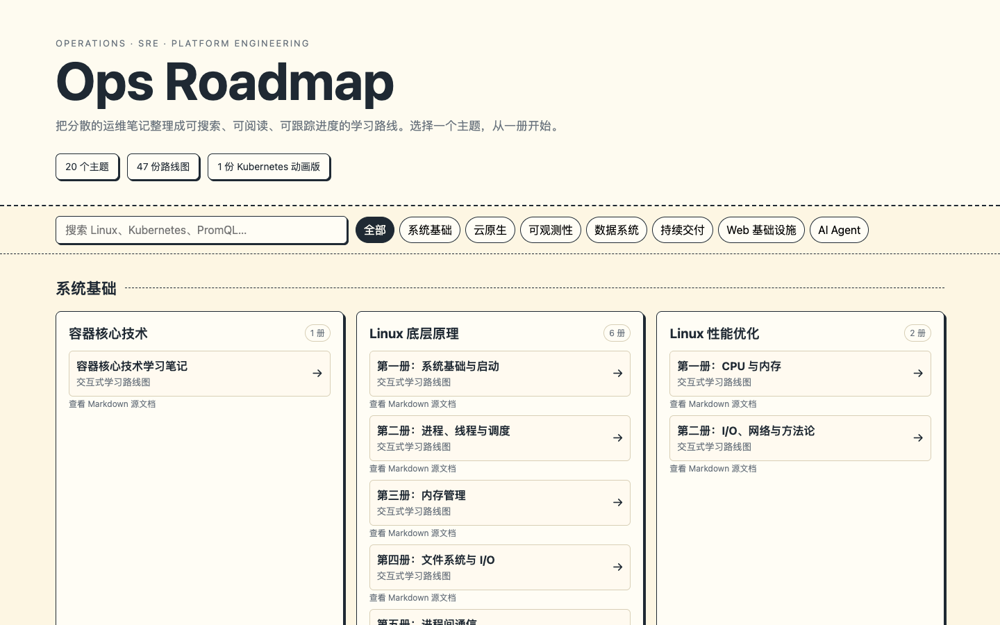

# Ops Roadmap

面向运维工程师、SRE 和平台工程师的中文学习笔记合集，覆盖 Linux、容器、Kubernetes、可观测性、数据系统、交付工具与 AI Agent。

仓库同时提供两种阅读方式：

- Markdown：适合检索、编辑和版本管理。
- Roadmap HTML：适合按章节浏览，并通过“待学 / 在学 / 已学”三态记录本地学习进度。

## 在线总览

从 [`index.html`](./index.html) 进入全部路线图。部署到 GitHub Pages 后，它也是仓库的静态首页。



直接双击 HTML 可以阅读；如果希望总览页和子路线图在同一个浏览器 origin 下稳定共享进度，建议在仓库根目录启动本地服务：

```bash
python3 -m http.server 8000
```

然后访问 <http://127.0.0.1:8000/>。

## 内容生成方式

- Markdown 学习笔记遵循 [`learning-notes-builder`](https://github.com/luozijian1990/personal-skill/tree/main/skills/learning-notes-builder) 的结构与写作风格：以 H2/H3 组织章节和小节，结合详细中文讲解、Mermaid 图、表格与可复制的代码示例。
- Roadmap HTML 通过 [`learning-roadmap`](https://github.com/luozijian1990/personal-skill/tree/main/skills/learning-roadmap) 从整理好的 Markdown 生成，提供章节卡片、详情面板、搜索和“待学 / 在学 / 已学”三态进度。

## 内容目录

### 系统基础

- [容器核心技术](./topics/systems/container-fundamentals/guide.md) · [Roadmap](./topics/systems/container-fundamentals/guide-roadmap.html)
- Linux 底层原理： [第一册](./topics/systems/linux/01-foundations-and-boot-roadmap.html) · [第二册](./topics/systems/linux/02-processes-and-scheduling-roadmap.html) · [第三册](./topics/systems/linux/03-memory-management-roadmap.html) · [第四册](./topics/systems/linux/04-filesystems-and-io-roadmap.html) · [第五册](./topics/systems/linux/05-ipc-roadmap.html) · [第六册](./topics/systems/linux/06-network-stack-roadmap.html)
- Linux 性能优化： [第一册](./topics/systems/linux-performance/01-cpu-and-memory-roadmap.html) · [第二册](./topics/systems/linux-performance/02-io-network-and-methodology-roadmap.html)

### 云原生

- Docker： [第一册](./topics/cloud-native/docker/01-basics-and-container-operations-roadmap.html) · [第二册](./topics/cloud-native/docker/02-images-network-storage-and-daemon-roadmap.html) · [第三册](./topics/cloud-native/docker/03-docker-compose-roadmap.html) · [第四册](./topics/cloud-native/docker/04-dockerfile-and-appendix-roadmap.html)
- Kubernetes： [第一册](./topics/cloud-native/kubernetes/01-architecture-and-control-plane-roadmap.html) · [第二册](./topics/cloud-native/kubernetes/02-scheduling-and-workloads-roadmap.html) · [第三册](./topics/cloud-native/kubernetes/03-production-and-migration-roadmap.html) · [第四册](./topics/cloud-native/kubernetes/04-istio-multicluster-and-security-roadmap.html) · [完整动画版](./topics/cloud-native/kubernetes/full-animated-roadmap.html)
- Kubernetes 容器网络： [第一册](./topics/cloud-native/kubernetes-networking/01-network-foundations-roadmap.html) · [第二册](./topics/cloud-native/kubernetes-networking/02-cilium-foundations-roadmap.html) · [第三册](./topics/cloud-native/kubernetes-networking/03-cilium-advanced-roadmap.html) · [第四册](./topics/cloud-native/kubernetes-networking/04-calico-foundations-roadmap.html) · [第五册](./topics/cloud-native/kubernetes-networking/05-calico-production-roadmap.html) · [第六册](./topics/cloud-native/kubernetes-networking/06-flannel-roadmap.html) · [第七册](./topics/cloud-native/kubernetes-networking/07-multus-and-ipam-roadmap.html)
- Consul： [第一册](./topics/cloud-native/consul/01-foundations-and-services-roadmap.html) · [第二册](./topics/cloud-native/consul/02-security-and-operations-roadmap.html)
- etcd： [第一册](./topics/cloud-native/etcd/01-architecture-and-internals-roadmap.html) · [第二册](./topics/cloud-native/etcd/02-production-practices-roadmap.html)

### 可观测性

- [Prometheus](./topics/observability/prometheus/guide-roadmap.html)
- [Kube-Prometheus](./topics/observability/kube-prometheus/guide-roadmap.html)
- VictoriaMetrics： [第一册](./topics/observability/victoria-metrics/01-core-and-deployment-roadmap.html) · [第二册](./topics/observability/victoria-metrics/02-ingestion-alerting-and-auth-roadmap.html) · [第三册](./topics/observability/victoria-metrics/03-backup-restore-and-practices-roadmap.html)
- [VictoriaMetrics Flags](./topics/observability/victoria-metrics-flags/guide-roadmap.html)
- [VictoriaMetrics PromQL](./topics/observability/victoria-metrics-promql/guide-roadmap.html)

### 数据系统

- [MySQL](./topics/data-systems/mysql/guide-roadmap.html)
- Kafka： [第一册](./topics/data-systems/kafka/01-foundations-and-clients-roadmap.html) · [第二册](./topics/data-systems/kafka/02-internals-operations-and-streams-roadmap.html)
- RabbitMQ： [第一册](./topics/data-systems/rabbitmq/01-installation-and-messaging-roadmap.html) · [第二册](./topics/data-systems/rabbitmq/02-administration-monitoring-and-reference-roadmap.html)

### 交付、Web 与 AI Agent

- [Jenkins](./topics/delivery/jenkins/guide-roadmap.html)
- Nginx： [第一册](./topics/web/nginx/01-basics-and-architecture-roadmap.html) · [第二册](./topics/web/nginx/02-http-modules-roadmap.html) · [第三册](./topics/web/nginx/03-reverse-proxy-and-load-balancing-roadmap.html) · [第四册](./topics/web/nginx/04-performance-and-source-code-roadmap.html)
- [DeepAgent](./topics/ai-agents/deepagent/guide-roadmap.html)
- [Claude Agent SDK](./topics/ai-agents/claude-agent-sdk/guide-roadmap.html)

## 目录约定

```text
topics/<category>/<topic>/
├── guide.md                         # 未分卷笔记
├── guide-roadmap.html               # 未分卷路线图
├── 01-<volume>.md                   # 分卷笔记
├── 01-<volume>-roadmap.html         # 分卷路线图
└── roadmap-animations/              # 可选的教学动画 sidecar
```

公开路径统一使用小写 kebab-case。大于约 5,000 行或 250 KB 的笔记按自然章节边界拆分，每个分卷都保持唯一 H1，并使用 H2/H3/H4 表达章节、小节和内部知识点。

## 重新生成路线图

路线图由 [`learning-roadmap`](https://github.com/luozijian1990/personal-skill/tree/main/skills/learning-roadmap) 生成。已安装对应 skill 时，可以在仓库根目录执行：

```bash
./scripts/build-roadmaps.sh
```

如果 skill 不在默认位置，可以通过 `LEARNING_ROADMAP_BUILDER` 指定 `build_roadmap.py` 的路径。

Kubernetes 的 `full-animated-roadmap.html` 是保留的完整动画版，不应被普通批量生成命令覆盖。

## License

本项目采用 [MIT License](./LICENSE)。
