# RabbitMQ 学习笔记

> **文档版本**: v1.0  
> **创建日期**: 2025-12-05  
> **目标读者**: 运维工程师 / SRE  
> **基于版本**: RabbitMQ 4.x

---

## 目录

- [第一章: 安装与升级](#第一章-安装与升级)
- [第二章: 使用 RabbitMQ](#第二章-使用-rabbitmq)
- [第三章: 管理 RabbitMQ](#第三章-管理-rabbitmq)
- [第四章: 监控 RabbitMQ](#第四章-监控-rabbitmq)
- [附录](#附录)

---

## 文档结构概览

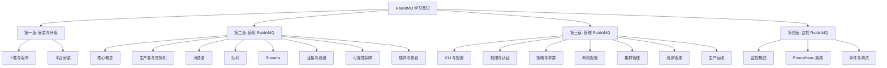

---

# 第一章: 安装与升级

> 本章介绍 RabbitMQ 在不同平台下的安装说明、Erlang 版本要求以及升级注意事项。

## 1.1 概述

RabbitMQ 是一个开源的消息代理软件，使用 Erlang 语言编写。安装 RabbitMQ 之前，必须先安装兼容版本的 Erlang/OTP。

### 快速体验 RabbitMQ

使用 Docker 可以快速启动一个 RabbitMQ 实例：

```bash
# 启动带管理界面的 RabbitMQ 4.x
docker run -it --rm --name rabbitmq -p 5672:5672 -p 15672:15672 rabbitmq:4-management
```

### 安装方式概览

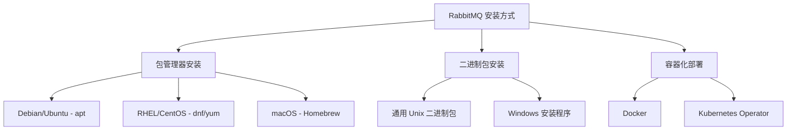

---

## 1.2 支持的平台

### 官方支持的操作系统

| 平台类型 | 支持的版本 |
|----------|------------|
| **Ubuntu** | 20.04 (Focal), 22.04 (Jammy), 24.04 (Noble) |
| **Debian** | Bullseye (11), Bookworm (12), Trixie (13) |
| **RHEL/CentOS** | RHEL 8.x, 9.x, CentOS Stream 9 |
| **Fedora** | 40 - 42 |
| **Amazon Linux** | 2023 |
| **Rocky/Alma Linux** | 8.x, 9.x |
| **Windows** | Windows 10, Server 2012-2022 |
| **macOS** | 支持（通过 Homebrew 或通用二进制包） |

### 不受支持的平台

- z/OS 和大多数大型机
- 内存非常受限的系统（RAM < 100 MB）

---

## 1.3 Erlang/OTP 版本要求

> [!IMPORTANT]
> RabbitMQ 必须运行在兼容版本的 Erlang/OTP 上。使用不兼容的版本可能导致启动失败或运行时错误。

### 当前支持的 Erlang 版本

| RabbitMQ 版本 | 最低 Erlang 版本 | 最高 Erlang 版本 | 备注 |
|---------------|------------------|------------------|------|
| 4.2.x | 26.2 | 27.x | Erlang 28 部分支持 |
| 4.0.4 - 4.1.x | 26.2 | 27.x | 从 4.0.4 开始支持 Erlang 27 |
| 4.0.0 - 4.0.3 | 26.2 | 26.2.x | 不支持 Erlang 27 |
| 3.13.x | 26.0 | 26.2.x | - |
| 3.12.x | 25.0 | 26.2.x | - |

### Erlang 版本支持策略

- RabbitMQ 团队通常支持**最近两个 Erlang 发行系列**
- 目前完全支持的系列是 **Erlang 27.x** 和 **26.x**
- 建议使用每个支持系列中的**最新补丁版本**

### 集群中的 Erlang 版本要求

> [!WARNING]
> **强烈建议**在集群的所有节点上使用**相同的主版本 Erlang**。节点加入集群时会检查 Erlang 版本兼容性，不兼容的组合会被拒绝。

---

## 1.4 获取 Erlang

### Erlang 安装来源

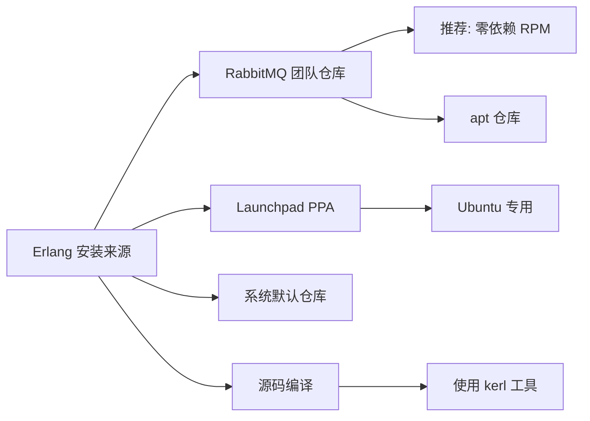

### Debian/Ubuntu 安装 Erlang

```bash
# 添加 RabbitMQ 团队签名密钥
curl -1sLf "https://keys.openpgp.org/vks/v1/by-fingerprint/0A9AF2115F4687BD29803A206B73A36E6026DFCA" \
  | sudo gpg --dearmor | sudo tee /usr/share/keyrings/com.rabbitmq.team.gpg > /dev/null

# 安装 Erlang 包（以 Ubuntu 22.04 为例）
sudo apt-get install -y erlang-base \
  erlang-asn1 erlang-crypto erlang-eldap erlang-ftp erlang-inets \
  erlang-mnesia erlang-os-mon erlang-parsetools erlang-public-key \
  erlang-runtime-tools erlang-snmp erlang-ssl \
  erlang-syntax-tools erlang-tftp erlang-tools erlang-xmerl
```

### RHEL/CentOS 安装 Erlang（零依赖 RPM）

```bash
# 导入签名密钥
rpm --import 'https://github.com/rabbitmq/signing-keys/releases/download/3.0/cloudsmith.rabbitmq-erlang.E495BB49CC4BBE5B.key'

# 安装 Erlang
dnf install -y erlang
```

---

## 1.5 包签名验证

> [!TIP]
> 验证下载包的签名可以确保软件来自可信来源，防止篡改。

### 导入 RabbitMQ 签名密钥

```bash
# 方法1：直接下载
curl -L https://github.com/rabbitmq/signing-keys/releases/download/3.0/rabbitmq-release-signing-key.asc \
  --output rabbitmq-release-signing-key.asc
gpg --import rabbitmq-release-signing-key.asc

# 方法2：从密钥服务器获取
gpg --keyserver "hkps://keys.openpgp.org" \
  --recv-keys "0x0A9AF2115F4687BD29803A206B73A36E6026DFCA"
```

### 验证包签名

```bash
# 下载包和签名文件后验证
gpg --verify rabbitmq-server-generic-unix-4.2.0.tar.xz.asc \
  rabbitmq-server-generic-unix-4.2.0.tar.xz

# 成功时显示 "Good signature"
# 失败时显示 "BAD signature" - 不要使用该软件包！
```

---

## 1.6 Debian/Ubuntu 安装

### 安装流程图

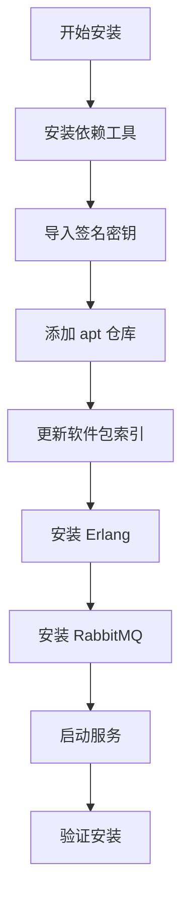

### 完整安装脚本（Ubuntu 22.04 示例）

```bash
#!/bin/bash
# RabbitMQ 安装脚本 - Ubuntu 22.04 (Jammy)

# 1. 安装依赖
sudo apt-get update -y
sudo apt-get install curl gnupg apt-transport-https -y

# 2. 导入签名密钥
curl -1sLf "https://keys.openpgp.org/vks/v1/by-fingerprint/0A9AF2115F4687BD29803A206B73A36E6026DFCA" \
  | sudo gpg --dearmor | sudo tee /usr/share/keyrings/com.rabbitmq.team.gpg > /dev/null

# 3. 添加仓库
sudo tee /etc/apt/sources.list.d/rabbitmq.list <<EOF
## Erlang 仓库
deb [arch=amd64 signed-by=/usr/share/keyrings/com.rabbitmq.team.gpg] https://deb1.rabbitmq.com/rabbitmq-erlang/ubuntu/jammy jammy main
deb [arch=amd64 signed-by=/usr/share/keyrings/com.rabbitmq.team.gpg] https://deb2.rabbitmq.com/rabbitmq-erlang/ubuntu/jammy jammy main

## RabbitMQ 仓库
deb [arch=amd64 signed-by=/usr/share/keyrings/com.rabbitmq.team.gpg] https://deb1.rabbitmq.com/rabbitmq-server/ubuntu/jammy jammy main
deb [arch=amd64 signed-by=/usr/share/keyrings/com.rabbitmq.team.gpg] https://deb2.rabbitmq.com/rabbitmq-server/ubuntu/jammy jammy main
EOF

# 4. 更新并安装
sudo apt-get update -y
sudo apt-get install -y erlang-base \
  erlang-asn1 erlang-crypto erlang-eldap erlang-ftp erlang-inets \
  erlang-mnesia erlang-os-mon erlang-parsetools erlang-public-key \
  erlang-runtime-tools erlang-snmp erlang-ssl \
  erlang-syntax-tools erlang-tftp erlang-tools erlang-xmerl

sudo apt-get install rabbitmq-server -y --fix-missing

# 5. 启动并启用服务
sudo systemctl start rabbitmq-server
sudo systemctl enable rabbitmq-server

# 6. 验证
sudo systemctl status rabbitmq-server
```

### 版本固定（可选）

防止意外升级，在 `/etc/apt/preferences.d/erlang` 中配置：

```ini
# 固定 Erlang 版本到 26.x
Package: erlang*
Pin: version 1:26.*
Pin-Priority: 1000
```

---

## 1.7 RHEL/CentOS/Fedora 安装

### 支持的发行版

- Fedora 40 - 42
- CentOS Stream 9
- RHEL 8.x, 9.x
- Rocky Linux 8.x, 9.x
- Alma Linux 8.x, 9.x
- Amazon Linux 2023

### 完整安装脚本（RHEL 9/CentOS Stream 9）

```bash
#!/bin/bash
# RabbitMQ 安装脚本 - RHEL 9 / CentOS Stream 9

# 1. 导入签名密钥
rpm --import 'https://github.com/rabbitmq/signing-keys/releases/download/3.0/rabbitmq-release-signing-key.asc'
rpm --import 'https://github.com/rabbitmq/signing-keys/releases/download/3.0/cloudsmith.rabbitmq-erlang.E495BB49CC4BBE5B.key'
rpm --import 'https://github.com/rabbitmq/signing-keys/releases/download/3.0/cloudsmith.rabbitmq-server.9F4587F226208342.key'

# 2. 创建仓库配置文件
cat > /etc/yum.repos.d/rabbitmq.repo << 'EOF'
## Erlang 仓库
[modern-erlang]
name=modern-erlang-el9
baseurl=https://yum1.rabbitmq.com/erlang/el/9/$basearch
        https://yum2.rabbitmq.com/erlang/el/9/$basearch
repo_gpgcheck=1
enabled=1
gpgkey=https://github.com/rabbitmq/signing-keys/releases/download/3.0/cloudsmith.rabbitmq-erlang.E495BB49CC4BBE5B.key
gpgcheck=1
sslverify=1
sslcacert=/etc/pki/tls/certs/ca-bundle.crt
metadata_expire=300

[modern-erlang-noarch]
name=modern-erlang-el9-noarch
baseurl=https://yum1.rabbitmq.com/erlang/el/9/noarch
        https://yum2.rabbitmq.com/erlang/el/9/noarch
repo_gpgcheck=1
enabled=1
gpgkey=https://github.com/rabbitmq/signing-keys/releases/download/3.0/cloudsmith.rabbitmq-erlang.E495BB49CC4BBE5B.key
gpgcheck=1
sslverify=1
sslcacert=/etc/pki/tls/certs/ca-bundle.crt
metadata_expire=300

## RabbitMQ 仓库
[rabbitmq-el9]
name=rabbitmq-el9
baseurl=https://yum2.rabbitmq.com/rabbitmq/el/9/$basearch
        https://yum1.rabbitmq.com/rabbitmq/el/9/$basearch
repo_gpgcheck=1
enabled=1
gpgkey=https://github.com/rabbitmq/signing-keys/releases/download/3.0/cloudsmith.rabbitmq-server.9F4587F226208342.key
       https://github.com/rabbitmq/signing-keys/releases/download/3.0/rabbitmq-release-signing-key.asc
gpgcheck=1
sslverify=1
sslcacert=/etc/pki/tls/certs/ca-bundle.crt
metadata_expire=300

[rabbitmq-el9-noarch]
name=rabbitmq-el9-noarch
baseurl=https://yum2.rabbitmq.com/rabbitmq/el/9/noarch
        https://yum1.rabbitmq.com/rabbitmq/el/9/noarch
repo_gpgcheck=1
enabled=1
gpgkey=https://github.com/rabbitmq/signing-keys/releases/download/3.0/cloudsmith.rabbitmq-server.9F4587F226208342.key
       https://github.com/rabbitmq/signing-keys/releases/download/3.0/rabbitmq-release-signing-key.asc
gpgcheck=1
sslverify=1
sslcacert=/etc/pki/tls/certs/ca-bundle.crt
metadata_expire=300
EOF

# 3. 安装
dnf update -y
dnf install -y logrotate
dnf install -y erlang rabbitmq-server

# 4. 启动服务
systemctl enable rabbitmq-server
systemctl start rabbitmq-server

# 5. 验证
systemctl status rabbitmq-server
```

---

## 1.8 通用 Unix 二进制包安装

适用于无法使用包管理器的环境，或需要在同一机器运行多个版本的场景。

### 安装步骤

```bash
# 1. 下载并解压
wget https://github.com/rabbitmq/rabbitmq-server/releases/download/v4.2.0/rabbitmq-server-generic-unix-4.2.0.tar.xz
tar -xf rabbitmq-server-generic-unix-4.2.0.tar.xz

# 2. 移动到合适目录
sudo mv rabbitmq_4.2.0 /usr/local/rabbitmq

# 3. 添加到 PATH（可选）
export PATH=$PATH:/usr/local/rabbitmq/sbin

# 4. 启动服务器
# 前台运行
/usr/local/rabbitmq/sbin/rabbitmq-server

# 后台运行
/usr/local/rabbitmq/sbin/rabbitmq-server -detached

# 5. 停止服务器
/usr/local/rabbitmq/sbin/rabbitmqctl shutdown
```

### 文件位置

| 目录类型 | 默认位置 |
|----------|----------|
| 基础目录 | `$RABBITMQ_HOME` (安装目录) |
| 配置文件 | `$RABBITMQ_HOME/etc/rabbitmq/rabbitmq.conf` |
| 数据目录 | `$RABBITMQ_HOME/var/` |
| 日志目录 | `$RABBITMQ_HOME/var/log/` |

---

## 1.9 服务管理

### 使用 systemd 管理服务

```bash
# 启动服务
sudo systemctl start rabbitmq-server

# 停止服务
sudo systemctl stop rabbitmq-server

# 重启服务
sudo systemctl restart rabbitmq-server

# 查看状态
sudo systemctl status rabbitmq-server

# 设置开机自启
sudo systemctl enable rabbitmq-server

# 禁用开机自启
sudo systemctl disable rabbitmq-server
```

### 检查节点状态

```bash
# 检查节点是否运行
rabbitmq-diagnostics status

# 检查集群状态
rabbitmqctl cluster_status

# 健康检查
rabbitmq-diagnostics check_running
rabbitmq-diagnostics check_local_alarms
```

---

## 1.10 系统资源限制调优

> [!CAUTION]
> 生产环境必须调整文件描述符限制。默认值 1024 对消息代理来说太低了！

### 推荐配置

| 环境类型 | 推荐文件描述符数 |
|----------|------------------|
| 开发环境 | 4096 |
| 生产环境 | 65536+ |

### systemd 配置方法

创建 `/etc/systemd/system/rabbitmq-server.service.d/limits.conf`：

```ini
[Service]
LimitNOFILE=65536
```

然后重载配置：

```bash
sudo systemctl daemon-reload
sudo systemctl restart rabbitmq-server
```

### 验证限制设置

```bash
# 通过 CLI 查看
rabbitmq-diagnostics status | grep -A 5 "File Descriptors"

# 通过 ulimit 查看
ulimit -n

# 通过 /proc 查看（需要 RabbitMQ 进程 PID）
cat /proc/$(pgrep -f rabbitmq)/limits | grep "Max open files"
```

---

## 1.11 默认用户与安全

> [!WARNING]
> RabbitMQ 默认创建 `guest/guest` 用户，**仅允许本地连接**。生产环境应立即创建新用户并删除 guest 用户。

### 创建管理员用户

```bash
# 创建新用户
rabbitmqctl add_user admin your_secure_password

# 设置管理员权限
rabbitmqctl set_user_tags admin administrator

# 授予所有 vhost 的完全权限
rabbitmqctl set_permissions -p / admin ".*" ".*" ".*"

# 删除 guest 用户（生产环境推荐）
rabbitmqctl delete_user guest
```

---

## 1.12 安装验证清单

完成安装后，请按以下清单验证：

- [ ] RabbitMQ 服务已启动：`systemctl status rabbitmq-server`
- [ ] 节点状态正常：`rabbitmq-diagnostics status`
- [ ] 端口正在监听：`ss -tlnp | grep -E "5672|15672"`
- [ ] 管理插件已启用（可选）：`rabbitmq-plugins enable rabbitmq_management`
- [ ] 可以访问管理界面：<http://localhost:15672>
- [ ] 已创建管理员用户并删除 guest 用户

---

# 第二章: 使用 RabbitMQ

> 本章介绍 RabbitMQ 的核心概念，包括消息发布、交换机、队列、消费者等基础组件的使用。

## 2.1 核心架构概览

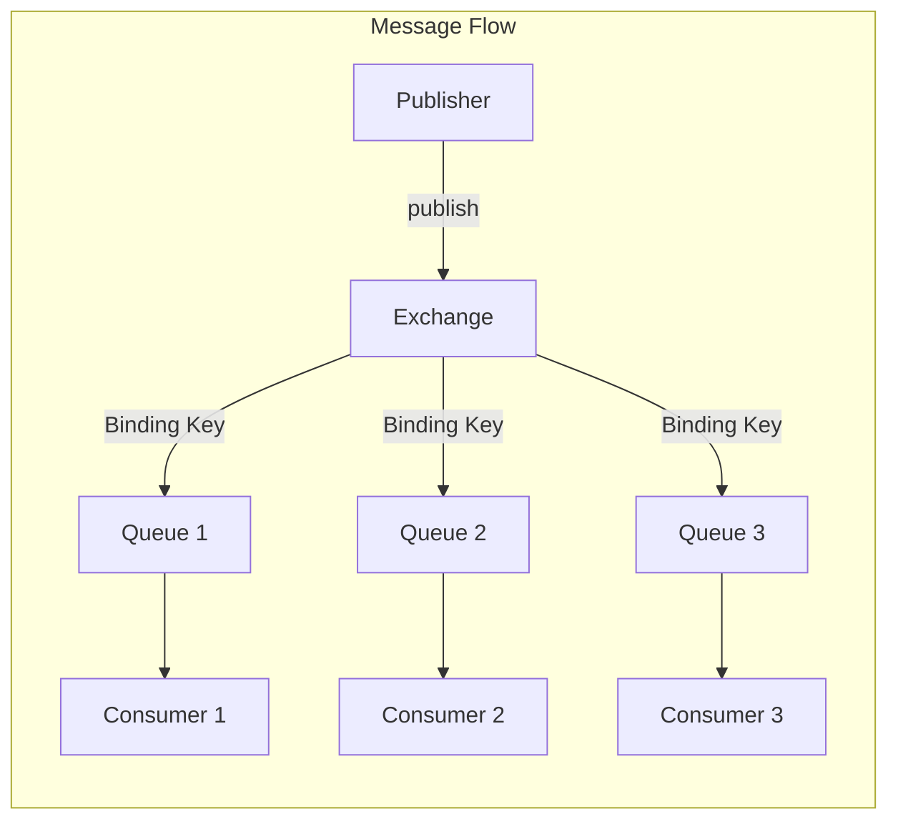

### 核心组件说明

| 组件 | 说明 |
|------|------|
| **Publisher** | 发布者/生产者，发送消息到 Exchange |
| **Exchange** | 交换机，根据路由规则将消息分发到队列 |
| **Binding** | 绑定关系，定义 Exchange 与 Queue 之间的路由规则 |
| **Queue** | 队列，存储消息等待消费者处理 |
| **Consumer** | 消费者，从队列中获取并处理消息 |

---

## 2.2 发布者 (Publisher)

### 发布者生命周期

> [!TIP]
> 发布者通常是长期存在的：在整个生命周期中发布多条消息。为单条消息打开连接是**不推荐**的做法。

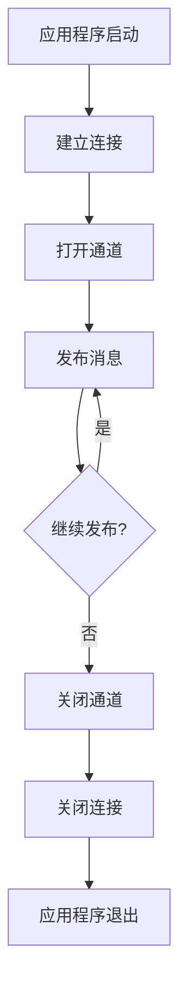

### 协议差异

| 协议 | 发布目标 | 确认机制 |
|------|----------|----------|
| AMQP 0-9-1 | Exchange | Publisher Confirms |
| AMQP 1.0 | Link | Settled/Unsettled |
| MQTT | Topic | QoS 1 PUBACK |
| STOMP | Destination | Receipts |

### 消息属性 (AMQP 0-9-1)

#### 传递属性（由 RabbitMQ 设置）

| 属性 | 类型 | 说明 |
|------|------|------|
| `delivery-tag` | 整数 | 传递标识符，用于确认 |
| `redelivered` | 布尔值 | 是否为重新投递的消息 |
| `exchange` | 字符串 | 路由此消息的交换机 |
| `routing-key` | 字符串 | 发布者使用的路由键 |
| `consumer-tag` | 字符串 | 消费者标识符 |

#### 消息属性（由发布者设置）

| 属性 | 类型 | 说明 | 必需 |
|------|------|------|------|
| `delivery-mode` | 1 或 2 | 1=瞬时, 2=持久 | 是 |
| `content-type` | 字符串 | MIME类型，如 `application/json` | 否 |
| `content-encoding` | 字符串 | 编码，如 `gzip` | 否 |
| `message-id` | 字符串 | 消息唯一标识 | 否 |
| `correlation-id` | 字符串 | 关联请求和响应 | 否 |
| `reply-to` | 字符串 | 响应队列名称 | 否 |
| `expiration` | 字符串 | 消息 TTL（毫秒） | 否 |
| `timestamp` | 时间戳 | 消息创建时间 | 否 |
| `type` | 字符串 | 消息类型，如 `orders.created` | 否 |
| `user-id` | 字符串 | 发布者用户ID（需验证） | 否 |
| `app-id` | 字符串 | 应用程序名称 | 否 |
| `headers` | Map | 自定义头信息 | 否 |

### 发布者确认 (Publisher Confirms)

> [!IMPORTANT]
> 发布者确认是确保消息安全到达 RabbitMQ 的关键机制。生产环境**必须**启用。

#### 确认策略对比

| 策略 | 吞吐量 | 实现复杂度 | 推荐场景 |
|------|--------|------------|----------|
| 流式确认（异步） | ⭐⭐⭐ 高 | 中 | **推荐** - 生产环境 |
| 批量确认 | ⭐⭐ 中 | 低 | 中等吞吐量场景 |
| 单条确认（同步） | ⭐ 低 | 低 | **不推荐** - 严重影响性能 |

#### 流式确认示例 (Java)

```java
// 1. 启用发布者确认
channel.confirmSelect();

// 2. 维护未确认消息映射
ConcurrentNavigableMap<Long, String> outstandingConfirms = 
    new ConcurrentSkipListMap<>();

// 3. 注册确认监听器
channel.addConfirmListener(
    // 成功确认回调
    (sequenceNumber, multiple) -> {
        if (multiple) {
            outstandingConfirms.headMap(sequenceNumber, true).clear();
        } else {
            outstandingConfirms.remove(sequenceNumber);
        }
    },
    // 失败回调 (nack)
    (sequenceNumber, multiple) -> {
        String body = outstandingConfirms.get(sequenceNumber);
        System.err.println("Message nacked: " + body);
        // 重试逻辑...
    }
);

// 4. 发布消息
long sequenceNumber = channel.getNextPublishSeqNo();
outstandingConfirms.put(sequenceNumber, message);
channel.basicPublish(exchange, routingKey, null, message.getBytes());
```

---

## 2.3 交换机 (Exchange)

### 交换机类型

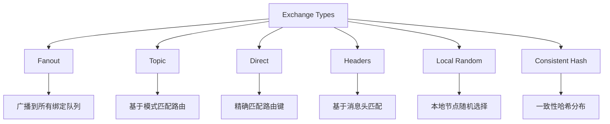

### 交换机类型详解

#### Fanout 交换机

将消息广播到**所有**绑定的队列，忽略路由键。

```bash
# 使用场景：日志广播、事件通知
# 路由键被忽略
```

#### Topic 交换机

使用模式匹配进行路由：

- `*` 匹配**一个**单词
- `#` 匹配**零个或多个**单词

| 绑定模式 | 匹配的路由键 | 不匹配的路由键 |
|----------|-------------|---------------|
| `regions.na.cities.*` | `regions.na.cities.toronto` | `regions.na.cities` |
| `audit.events.#` | `audit.events`, `audit.events.users.signup` | `audit.users` |
| `#` | 任何路由键（类似 Fanout） | - |

#### Direct 交换机

精确匹配路由键。

```bash
# 绑定键 "abc" 只匹配路由键 "abc"
```

#### 默认交换机

- 名称为空字符串 (`""`)
- 预先存在，无需声明
- 自动将队列绑定到以队列名称为路由键的绑定
- **不应用于自定义拓扑**

### 交换机属性

| 属性 | 说明 | 推荐值 |
|------|------|--------|
| `durable` | 是否持久化 | `true`（生产环境） |
| `auto-delete` | 最后一个绑定移除时是否删除 | `false` |
| `internal` | 是否仅供内部使用 | 按需 |
| `arguments` | 可选参数（如备用交换机） | 按需 |

### 交换机到交换机绑定 (E2E)

可以将一个交换机绑定到另一个交换机，扩展路由拓扑：

```java
// Java 示例
Channel ch = conn.createChannel();
ch.exchangeBind("destination", "source", "routingKey");
```

> [!NOTE]
> E2E 绑定不会重新发布消息，而是扩展路由。目标交换机的入口消息速率指标不会更新。

---

## 2.4 备用交换机 (Alternate Exchange)

当消息无法路由到任何队列时，备用交换机提供"兜底"路由。

### 配置方法

#### 方法1：使用策略（推荐）

```bash
rabbitmqctl set_policy AE "^my-direct$" \
  '{"alternate-exchange":"my-ae"}' \
  --apply-to exchanges
```

#### 方法2：声明时指定

```java
Map<String, Object> args = new HashMap<>();
args.put("alternate-exchange", "my-ae");
channel.exchangeDeclare("my-direct", "direct", false, false, args);
```

### 备用交换机工作流程

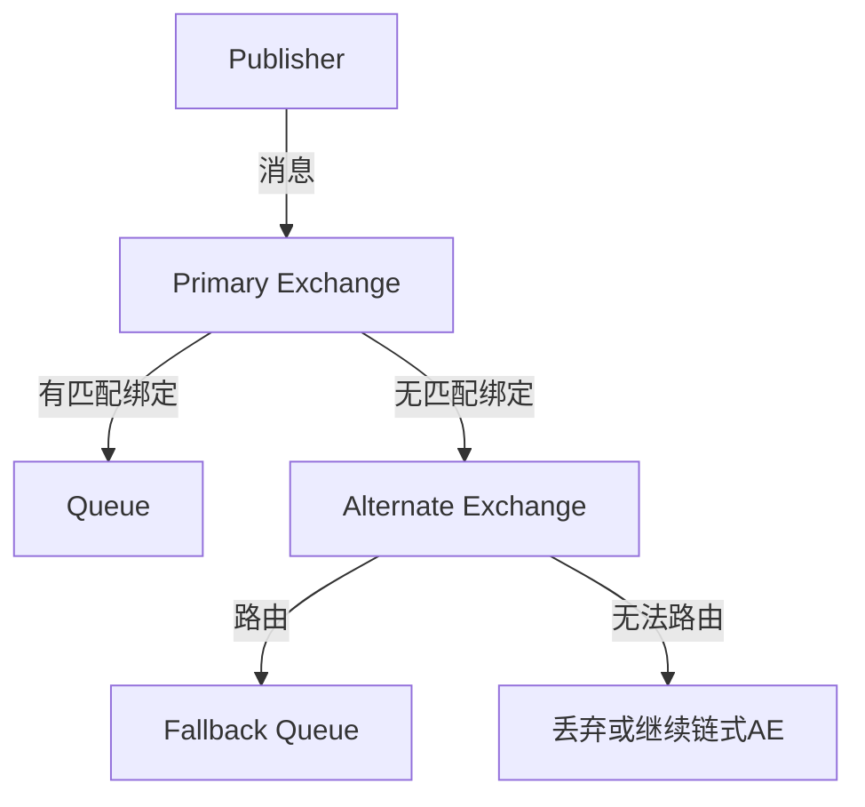

### 典型使用场景

1. **检测无法路由的消息** - 将所有无法路由的消息收集到监控队列
2. **"否则"路由** - 特殊消息被特定处理，其余走默认处理

---

## 2.5 本地随机交换机 (Local Random Exchange)

> [!IMPORTANT]
> RabbitMQ 4.0 新增的交换机类型，专为 RPC 场景设计。

### 特点

- 消息**始终**路由到本地节点的队列
- 多个本地队列时随机选择
- 确保最低发布延迟（无跨节点传输）

### 使用限制

> [!WARNING]
>
> - 要求每个节点都有消费者，否则消息**会丢失**
> - 不适合与负载均衡器配合使用
> - 消费者数量应**大于等于**集群节点数

### 适用场景


---

## 2.6 直接回复 (Direct Reply-To)

无需创建显式回复队列即可实现 RPC 模式。

### 优势

- 无队列元数据写入（降低元数据存储负载）
- 更少的 Erlang 进程
- 更低的延迟

### 限制

> [!CAUTION]
>
> - 语义为**最多一次**传递，回复可能丢失
> - 请求者断开连接时，回复将被丢弃
> - 不适合需要缓冲或持久化回复的场景

### AMQP 0-9-1 使用方法

```java
// 1. 从伪队列消费（no-ack 模式）
channel.basicConsume("amq.rabbitmq.reply-to", true, consumer);

// 2. 发布请求时设置 reply-to
AMQP.BasicProperties props = new AMQP.BasicProperties.Builder()
    .replyTo("amq.rabbitmq.reply-to")
    .correlationId(UUID.randomUUID().toString())
    .build();
channel.basicPublish("", requestQueue, props, request.getBytes());

// 3. 响应者使用请求中的 reply-to 发送回复
channel.basicPublish("", replyTo, replyProps, response.getBytes());
```

---

## 2.7 连接阻塞通知

当 RabbitMQ 资源不足（内存或磁盘）时，会阻塞发布连接。

### 客户端通知机制

支持此功能的客户端可以接收 `connection.blocked` 和 `connection.unblocked` 通知。

#### Java 客户端示例

```java
connection.addBlockedListener(new BlockedListener() {
    public void handleBlocked(String reason) throws IOException {
        log.warn("Connection blocked: " + reason);
        // 暂停发布，等待解除阻塞
    }

    public void handleUnblocked() throws IOException {
        log.info("Connection unblocked");
        // 恢复发布
    }
});
```

#### .NET 客户端示例

```csharp
conn.ConnectionBlocked += (sender, args) => {
    Console.WriteLine($"Connection blocked: {args.Reason}");
};

conn.ConnectionUnblocked += (sender, args) => {
    Console.WriteLine("Connection unblocked");
};
```

---

## 2.8 发送者选择路由

发布者可以使用**多个路由键**发送单条消息。

### AMQP 0-9-1 实现

使用 `CC` 和 `BCC` 头：

```java
Map<String, Object> headers = new HashMap<>();
// CC 路由键（对消费者可见）
headers.put("CC", Arrays.asList("queue1", "queue2"));
// BCC 路由键（传递前删除，消费者不可见）
headers.put("BCC", Arrays.asList("audit-queue"));

AMQP.BasicProperties props = new AMQP.BasicProperties.Builder()
    .headers(headers)
    .build();

channel.basicPublish("", "main-queue", props, message.getBytes());
```

### AMQP 1.0 实现

使用 `x-cc` 消息注解：

```java
Message msg = new Message();
msg.setMessageAnnotations(Map.of("x-cc", List.of("queue1", "queue2")));
```

---

## 2.9 用户 ID 验证

RabbitMQ 可以验证消息中的 `user-id` 属性。

### 工作原理

- 如果设置了 `user-id`，必须等于连接用户的名称
- 未设置则不验证
- 发布者可以设置 `impersonator` 标签来绕过验证

```java
AMQP.BasicProperties properties = new AMQP.BasicProperties.Builder()
    .userId("guest")  // 必须匹配连接用户
    .build();
channel.basicPublish("amq.fanout", "", properties, "test".getBytes());
```

---

## 2.10 无法路由消息的处理

### 处理策略

| 情况 | `mandatory=false`（默认） | `mandatory=true` |
|------|---------------------------|------------------|
| 无匹配绑定 | 丢弃或路由到 AE | 退回给发布者 |
| 交换机不存在 | 通道错误 | 通道错误 |

### 监控指标

在管理 UI 中可以查看无法路由消息的统计：

- `messages_unroutable_dropped_rate` - 丢弃速率
- `messages_unroutable_returned_rate` - 退回速率

### 最佳实践

```java
// 设置退回消息处理器
channel.addReturnListener((replyCode, replyText, exchange, 
                           routingKey, properties, body) -> {
    log.warn("Message returned: {} - {}", replyCode, replyText);
    // 重试或记录错误
});

// 使用 mandatory 标志发布
channel.basicPublish(exchange, routingKey, true, null, message.getBytes());
```

---

## 2.11 发布者问题排查

### 常见问题与解决方案

| 问题 | 可能原因 | 解决方案 |
|------|----------|----------|
| 连接失败 | 网络问题、认证失败 | 检查网络、凭据 |
| 消息丢失 | 未启用确认、AE 未配置 | 启用 Publisher Confirms |
| 吞吐量低 | 同步确认、连接频繁创建 | 使用异步确认、长连接 |
| 通道错误 | 发布到不存在的交换机 | 检查拓扑声明顺序 |

### 诊断命令

```bash
# 查看连接
rabbitmqctl list_connections name state

# 查看通道
rabbitmqctl list_channels connection name number

# 查看交换机绑定
rabbitmq-diagnostics list_bindings --vhost "/"

# 查看无法路由消息指标
```

---

## 2.12 消费者 (Consumer)

### 消费者概述

消费者是从队列获取并处理消息的应用程序。消费者需要先注册订阅，RabbitMQ 会将消息推送给它。

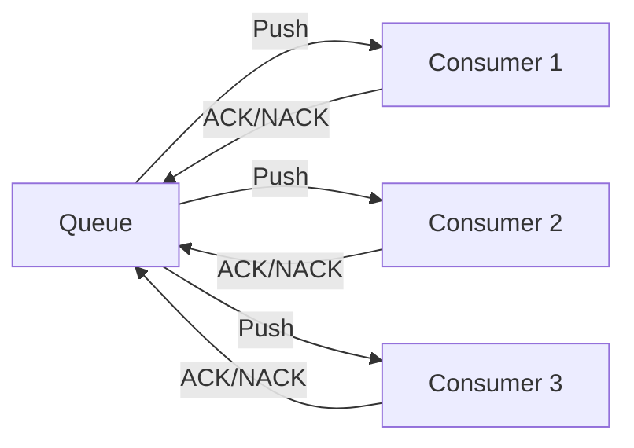

### 消费者生命周期

> [!TIP]
> 消费者应该是长期存在的。为单条消息注册消费者是**不推荐**的做法。

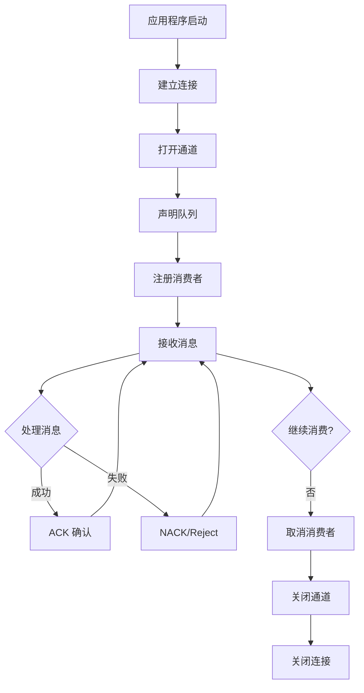

### 消费者标签

每个消费者都有唯一标识符（Consumer Tag），用于：

- 确定为给定传递调用哪个处理程序
- 取消消费者

---

## 2.13 确认模式

### 两种确认模式

| 模式 | 说明 | 使用场景 |
|------|------|----------|
| **自动确认** (Auto-ACK) | 消息发送后立即确认，无需客户端响应 | 对丢失不敏感的场景 |
| **手动确认** (Manual-ACK) | 客户端必须显式确认消息 | **生产环境推荐** |

### 手动确认操作

| 操作 | 说明 | 消息命运 |
|------|------|----------|
| `basic.ack` | 确认消息已成功处理 | 从队列删除 |
| `basic.nack` | 拒绝消息，支持批量操作 | 重新入队或丢弃 |
| `basic.reject` | 拒绝单条消息 | 重新入队或丢弃 |

### Java 示例

```java
// 手动确认模式
channel.basicConsume("my-queue", false, new DefaultConsumer(channel) {
    @Override
    public void handleDelivery(String consumerTag, Envelope envelope,
                               AMQP.BasicProperties properties, byte[] body) {
        try {
            // 处理消息
            processMessage(body);
            // 成功则确认
            channel.basicAck(envelope.getDeliveryTag(), false);
        } catch (Exception e) {
            // 失败则拒绝并重新入队
            channel.basicNack(envelope.getDeliveryTag(), false, true);
        }
    }
});
```

### 批量确认

```java
// 批量确认：确认所有 delivery_tag <= 指定值的消息
channel.basicAck(deliveryTag, true);  // multiple = true

// 批量拒绝
channel.basicNack(deliveryTag, true, true);  // multiple = true, requeue = true
```

---

## 2.14 消费者预取 (Prefetch)

### 为什么需要 Prefetch

预取限制了消费者可以持有的**未确认消息数量**，防止消费者被大量消息压垮。

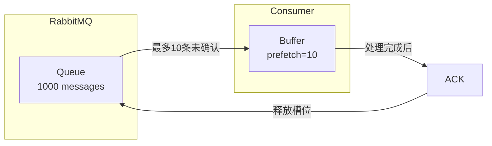

### 预取配置

```java
// 每个消费者最多 10 条未确认消息
channel.basicQos(10);
channel.basicConsume("my-queue", false, consumer);

// 禁用预取限制（不推荐）
channel.basicQos(0);
```

### 预取作用域

| 作用域 | 配置方式 | 说明 |
|--------|----------|------|
| **每消费者** (默认) | `basicQos(10, false)` | 每个消费者独立 10 条限制 |
| **每通道** | `basicQos(15, true)` | 通道内所有消费者共享 15 条限制 |

### 组合使用

```java
channel.basicQos(10, false);  // 每消费者限制
channel.basicQos(15, true);   // 通道限制
// 结果：每个消费者最多 10 条，通道总共最多 15 条
```

### 默认预取配置

在 `advanced.config` 中设置：

```erlang
[
  {rabbit, [
    {default_consumer_prefetch, {false, 250}}
  ]}
].
```

---

## 2.15 消费者优先级

当有多个消费者时，可以设置优先级确保高优先级消费者优先接收消息。

### 工作原理

- 默认优先级为 0
- 数字越大优先级越高
- 高优先级消费者**阻塞**时，消息才会发送给低优先级消费者

### 配置方式

```java
Map<String, Object> args = new HashMap<>();
args.put("x-priority", 10);  // 优先级 10
channel.basicConsume("my-queue", false, args, consumer);
```

### 消费者状态

| 状态 | 说明 |
|------|------|
| **活跃** (Active) | 可以立即接收消息 |
| **阻塞** (Blocked) | 达到 prefetch 限制或网络拥塞 |

> [!NOTE]
> RabbitMQ 不会等待被阻塞的高优先级消费者，如果有活跃的低优先级消费者，消息会立即发送。

---

## 2.16 单活跃消费者 (Single Active Consumer)

确保一次只有一个消费者从队列消费，适用于需要严格消息顺序的场景。

### 启用方式

```java
Map<String, Object> arguments = new HashMap<>();
arguments.put("x-single-active-consumer", true);
channel.queueDeclare("my-queue", true, false, false, arguments);
```

### 工作流程

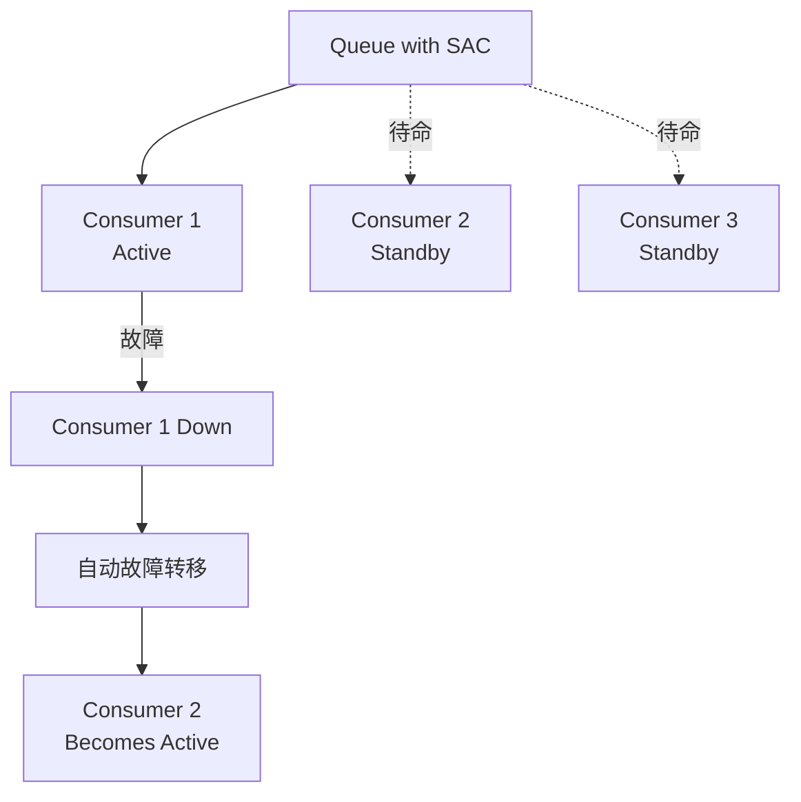

### 与独占消费者对比

| 特性 | 独占消费者 | 单活跃消费者 |
|------|------------|--------------|
| 故障转移 | 需要应用处理 | **自动** |
| 多消费者注册 | 不允许 | 允许（待命） |
| Quorum 队列支持 | 不支持 | **支持** |
| 策略配置 | - | 不支持 |

### 注意事项

> [!WARNING]
>
> - 无法通过策略启用（只能通过队列参数）
> - 与独占消费者互斥
> - 消息始终发送给活跃消费者，即使它正在处理中

---

## 2.17 消费者取消通知

当消费被意外取消时（如队列被删除），客户端可以收到通知。

### 触发场景

- 队列被删除
- 集群中队列所在节点故障
- 复制队列的领导者变更

### Java 处理示例

```java
channel.basicConsume(queue, new DefaultConsumer(channel) {
    @Override
    public void handleCancel(String consumerTag) throws IOException {
        log.warn("Consumer cancelled unexpectedly: " + consumerTag);
        // 重新注册消费者或执行清理
    }
});
```

---

## 2.18 传递确认超时

RabbitMQ 强制执行确认超时，防止消费者长时间不确认消息。

### 默认配置

- 默认超时：**30 分钟**
- 检查间隔：1 分钟

### 超时后果

```text
Consumer 'consumer-tag-xxx' on channel 1 and queue 'my-queue' 
has timed out waiting for a consumer acknowledgement of a delivery 
with delivery tag = 10. Timeout used: 1800000 ms.
```

- 通道关闭（`PRECONDITION_FAILED`）
- 未确认消息重新入队

### 配置超时值

#### 全局配置 (rabbitmq.conf)

```ini
# 1 小时（毫秒）
consumer_timeout = 3600000
```

#### 每队列配置（策略）

```bash
rabbitmqctl set_policy queue_consumer_timeout ".*" \
  '{"consumer-timeout": 3600000}' \
  --apply-to classic_queues
```

#### 禁用超时（不推荐）

```erlang
%% advanced.config
[
  {rabbit, [
    {consumer_timeout, undefined}
  ]}
].
```

---

## 2.19 消费者容量指标

管理 UI 显示每个队列的**消费者容量**指标，表示队列能够立即向消费者传递消息的时间比例。

### 指标解读

| 容量值 | 含义 | 建议操作 |
|--------|------|----------|
| 100% | 消费者可以跟上生产速度 | 无需调整 |
| < 100% | 队列可能成为瓶颈 | 增加消费者、提高 prefetch、优化处理逻辑 |
| 0% | 没有消费者 | 检查消费者状态 |

---

## 2.20 消费者问题排查

### 常见问题与解决方案

| 问题 | 可能原因 | 解决方案 |
|------|----------|----------|
| 消息积压 | 消费者处理慢 | 增加消费者、提高 prefetch |
| 确认超时 | 处理时间过长 | 增加超时值、优化处理逻辑 |
| 消息重复 | 未正确确认 | 检查 ACK 逻辑、实现幂等处理 |
| 消费者被取消 | 队列被删除/节点故障 | 实现 handleCancel 回调 |

### 诊断命令

```bash
# 查看消费者列表
rabbitmqctl list_consumers

# 查看队列消费者数量
rabbitmqctl list_queues name consumers

# 查看未确认消息数
rabbitmqctl list_queues name messages_unacknowledged

# 查看消费者容量
rabbitmqctl list_queues name consumer_capacity
```

---

## 2.21 队列 (Queue)

### 队列概述

队列是消息的有序集合，提供 FIFO（先进先出）语义。

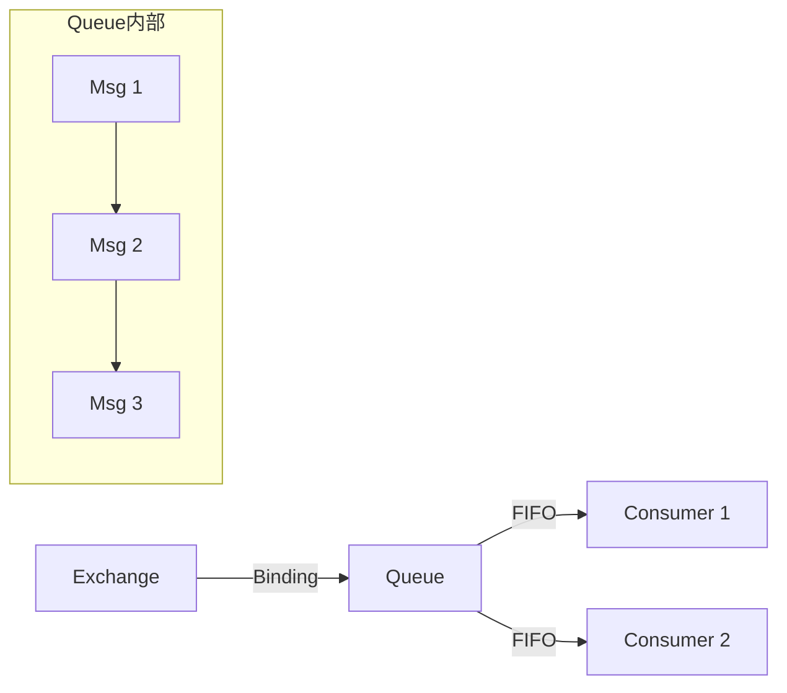

### 队列类型对比

| 特性 | Quorum Queue | Classic Queue |
|------|--------------|---------------|
| **复制** | ✅ 基于 Raft 共识 | ❌ 单副本 |
| **数据安全** | ⭐⭐⭐ 高 | ⭐ 低 |
| **性能** | 中等 | 高 |
| **持久化** | 必须持久化 | 可选 |
| **独占队列** | ❌ 不支持 | ✅ 支持 |
| **毒消息处理** | ✅ 支持 | ❌ 不支持 |
| **推荐场景** | 生产环境 | 临时/测试 |

### 队列属性

| 属性 | 说明 |
|------|------|
| `name` | 队列名称（最多 255 字节 UTF-8） |
| `durable` | 是否持久化（重启后存在） |
| `exclusive` | 是否独占（仅声明连接可用） |
| `auto-delete` | 最后一个消费者取消时是否自动删除 |
| `arguments` | 可选参数（x-arguments） |

---

## 2.22 仲裁队列 (Quorum Queue)

> [!IMPORTANT]
> Quorum Queue 是 RabbitMQ 4.x **推荐的生产环境队列类型**，基于 Raft 共识算法提供数据复制和高可用。

### 声明仲裁队列

```java
Map<String, Object> args = new HashMap<>();
args.put("x-queue-type", "quorum");
channel.queueDeclare("my-quorum-queue", true, false, false, args);
```

### 复制架构

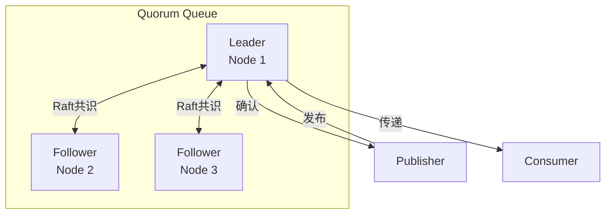

### 容错能力

| 集群节点数 | 可容忍故障数 | 最小 Quorum |
|------------|--------------|-------------|
| 3 | 1 | 2 |
| 5 | 2 | 3 |
| 7 | 3 | 4 |

> [!TIP]
> 推荐使用 **3 或 5 个节点**。超过 5 个节点时性能会显著下降。

### 毒消息处理 (Poison Message)

Quorum Queue 会跟踪消息重传次数，超过限制后自动死信或丢弃。

```bash
# 设置传递限制为 20（RabbitMQ 4.0 默认值）
rabbitmqctl set_policy qq-delivery-limit "^qq\." \
  '{"delivery-limit": 20}' \
  --apply-to quorum_queues
```

### Quorum Queue 限制

- 不支持非持久化队列
- 不支持独占队列
- 不支持全局 QoS（仅支持每消费者 QoS）
- 不支持服务器命名队列

---

## 2.23 经典队列 (Classic Queue)

经典队列是非复制的 FIFO 队列实现，适用于不优先考虑数据安全的场景。

### 特点

- 单副本（不复制）
- 支持独占队列
- 支持消息优先级
- RabbitMQ 4.0 仅支持版本 2

### 版本 2 存储

- 所有消息写入磁盘（带缓冲）
- 最多 2048 条消息保留在内存中
- 大消息（>4KB）存储到共享消息存储

> [!WARNING]
> 非持久化非独占经典队列已**弃用**，应使用持久队列或独占队列替代。

---

## 2.24 消息 TTL

TTL（Time-To-Live）定义消息在队列中的存活时间。

### 配置方式

#### 队列级别 TTL（策略）

```bash
# 所有消息在队列中最多存活 60 秒
rabbitmqctl set_policy TTL ".*" \
  '{"message-ttl": 60000}' \
  --apply-to queues
```

#### 队列级别 TTL（x-arguments）

```java
Map<String, Object> args = new HashMap<>();
args.put("x-message-ttl", 60000);  // 60 秒（毫秒）
channel.queueDeclare("my-queue", true, false, false, args);
```

#### 消息级别 TTL

```java
AMQP.BasicProperties props = new AMQP.BasicProperties.Builder()
    .expiration("60000")  // 60 秒
    .build();
channel.basicPublish(exchange, routingKey, props, message.getBytes());
```

> [!NOTE]
> 同时设置队列 TTL 和消息 TTL 时，取**较小值**。

### 队列 TTL（队列过期）

未使用的队列在指定时间后自动删除：

```bash
# 队列 30 分钟未使用后过期
rabbitmqctl set_policy expiry ".*" \
  '{"expires": 1800000}' \
  --apply-to queues
```

---

## 2.25 队列长度限制

### 配置方式

```bash
# 限制队列最多 10000 条消息
rabbitmqctl set_policy max-length "^limited\." \
  '{"max-length": 10000}' \
  --apply-to queues

# 限制队列最大 100MB
rabbitmqctl set_policy max-bytes "^limited\." \
  '{"max-length-bytes": 104857600}' \
  --apply-to queues
```

### 溢出行为

| 策略 | 说明 |
|------|------|
| `drop-head` | 丢弃队列头部（最旧）消息 **（默认）** |
| `reject-publish` | 拒绝新消息，发布者收到 `basic.nack` |
| `reject-publish-dlx` | 拒绝并死信新消息 |

```bash
# 设置溢出行为
rabbitmqctl set_policy overflow "^qq\." \
  '{"max-length": 1000, "overflow": "reject-publish"}' \
  --apply-to queues
```

---

## 2.26 死信交换机 (DLX)

当消息无法正常消费时，可以路由到死信交换机进行特殊处理。

### 死信触发条件

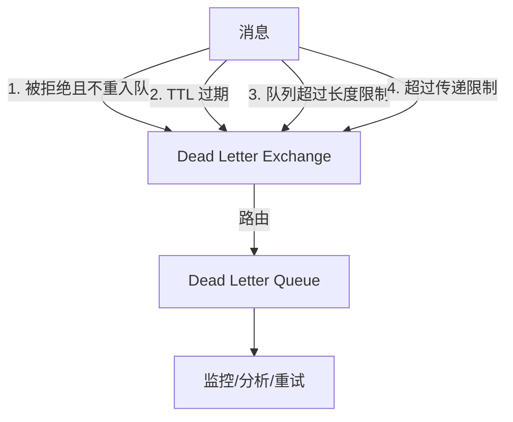

### 配置方式（策略）

```bash
rabbitmqctl set_policy DLX ".*" \
  '{"dead-letter-exchange": "my-dlx", "dead-letter-routing-key": "dead"}' \
  --apply-to queues
```

### 配置方式（x-arguments）

```java
Map<String, Object> args = new HashMap<>();
args.put("x-dead-letter-exchange", "my-dlx");
args.put("x-dead-letter-routing-key", "dead");
channel.queueDeclare("my-queue", true, false, false, args);
```

### 死信原因

| 原因 | 说明 |
|------|------|
| `rejected` | 消息被消费者拒绝 |
| `expired` | 消息 TTL 过期 |
| `maxlen` | 队列长度超限 |
| `delivery_limit` | 超过传递限制（仅 Quorum Queue） |

### 至少一次死信（仅 Quorum Queue）

> [!IMPORTANT]
> Quorum Queue 支持**至少一次**死信保证，需要额外配置。

```bash
rabbitmqctl set_policy at-least-once-dlx "^qq\." \
  '{"dead-letter-exchange": "my-dlx", "dead-letter-strategy": "at-least-once", "overflow": "reject-publish"}' \
  --apply-to quorum_queues
```

---

## 2.27 优先级队列

消息可以按优先级排序，高优先级消息优先传递。

### 声明优先级队列

```java
Map<String, Object> args = new HashMap<>();
args.put("x-max-priority", 4);  // 推荐 2-4 个优先级
channel.queueDeclare("priority-queue", true, false, false, args);
```

### 发布带优先级的消息

```java
AMQP.BasicProperties props = new AMQP.BasicProperties.Builder()
    .priority(5)  // 优先级 0-255
    .build();
channel.basicPublish(exchange, routingKey, props, message.getBytes());
```

### Quorum Queue 优先级（RabbitMQ 4.0+）

Quorum Queue 使用简化的优先级模型：

| 消息优先级 | 内部映射 |
|------------|----------|
| 0-4 | 普通优先级 |
| 5+ | 高优先级 |

> [!NOTE]
> Quorum Queue 以 **2:1** 的比例传递高优先级消息，确保普通消息不会被饿死。

### 注意事项

> [!WARNING]
>
> - 优先级队列**无法通过策略配置**（必须在声明时指定）
> - 优先级过多（>10）会消耗更多 CPU 和内存
> - 过期消息可能被卡在高优先级消息后面

---

## 2.28 队列问题排查

### 常见问题与解决方案

| 问题 | 可能原因 | 解决方案 |
|------|----------|----------|
| 消息积压 | 消费者处理慢 | 增加消费者、优化处理逻辑 |
| 内存使用高 | 队列过长 | 设置 max-length 限制 |
| 磁盘使用高 | Quorum Queue 段文件未截断 | 确保消费者及时确认 |
| 队列不可用 | 失去 Quorum | 恢复节点或重建队列 |

### 诊断命令

```bash
# 列出所有队列
rabbitmqctl list_queues name type durable messages consumers

# 查看队列详情
rabbitmqctl list_queues name arguments policy

# 查看队列内存使用
rabbitmqctl list_queues name memory

# 查看 Quorum Queue 成员
rabbitmq-queues quorum_status <queue-name>

# 重新平衡 Quorum Queue 领导者
rabbitmq-queues rebalance quorum
```

---

## 2.29 Streams

### Stream 概述

Stream 是一种**持久化、复制的仅追加日志**数据结构，与队列相比具有独特的消费语义：

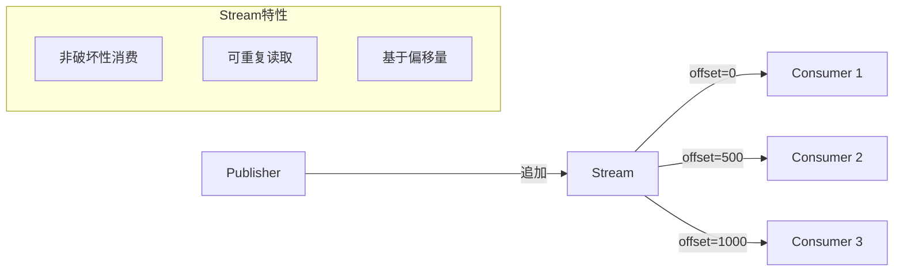

### Stream vs Queue 对比

| 特性 | Stream | Queue |
|------|--------|-------|
| **消费模式** | 非破坏性（消息不删除） | 破坏性（消费后删除） |
| **重复读取** | ✅ 支持从任意偏移量读取 | ❌ 消费即删除 |
| **多消费者** | 各自维护偏移量 | 竞争消费 |
| **数据保留** | 基于时间/大小策略 | 消费后删除 |
| **吞吐量** | 极高（百万/秒） | 高（十万/秒） |
| **内存占用** | 极低（全在磁盘） | 中等 |

### Stream 用例

> [!TIP]
> Stream 适用于以下四种场景：

| 用例 | 说明 |
|------|------|
| **大规模扇出** | 多消费者读取相同消息，无需创建多个队列 |
| **消息重放** | 可从任意时间点重新消费历史消息 |
| **高吞吐量** | 每秒可处理数百万消息 |
| **大量积压** | 可高效存储海量消息，内存开销最小 |

### 消费偏移量 (Offset)

消费者可从以下位置开始消费：

| 偏移量类型 | 说明 |
|------------|------|
| `first` | 从第一条消息开始 |
| `last` | 从最后一个块开始 |
| `next` | 从下一条新消息开始（默认） |
| 数值 | 指定精确偏移量 |
| 时间戳 | 指定时间点（POSIX 时间） |
| 间隔 | 相对时间（如 `1h`、`7D`） |

### 数据保留策略

Stream 使用保留策略控制数据生命周期：

| 参数 | 说明 | 示例 |
|------|------|------|
| `max-age` | 最大保留时间 | `7D`（7天）、`1M`（1月） |
| `max-length-bytes` | 最大字节大小 | `10GB` |

### Stream 限制

- 不支持 TTL（使用保留策略替代）
- 不支持消息优先级
- 不支持死信交换机
- 不支持独占队列
- 必须设置 QoS 预取

---

## 2.30 Super Streams（分区流）

Super Stream 是将大型流分区为多个小流的扩展机制。

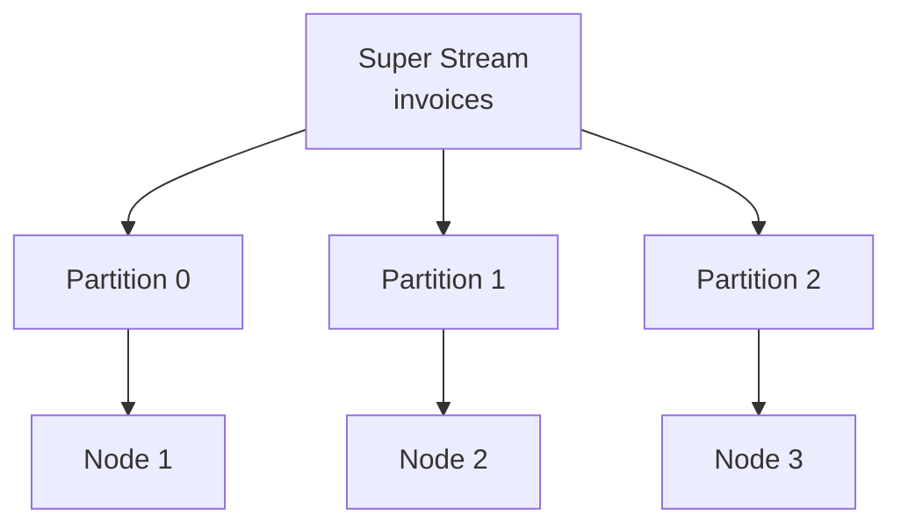

### 创建 Super Stream

```bash
# 创建 3 分区的 Super Stream
rabbitmq-streams add_super_stream invoices --partitions 3
```

### 适用场景

- 单个 Stream 已达到性能瓶颈
- 需要跨多节点分散负载
- 与单活跃消费者配合保持分区内顺序

> [!WARNING]
> Super Stream 增加了复杂性，仅在确定单个 Stream 无法满足需求时使用。

---

## 2.31 Stream 插件

Stream 协议提供比 AMQP 更高的吞吐量和更丰富的功能。

### Core vs Stream 插件对比

| 特性 | Core (AMQP) | Stream 插件 |
|------|-------------|-------------|
| **协议** | AMQP 0.9.1 / 1.0 | RabbitMQ Stream |
| **端口** | 5672 | 5552 |
| **吞吐量** | 十万/秒 | 百万/秒 |
| **偏移量跟踪** | 外部存储 | 内置服务器端 |
| **发布去重** | ❌ | ✅ |
| **Super Stream** | ❌ | ✅ |
| **子条目压缩** | 未压缩 | Gzip/Snappy/LZ4/Zstd |

### 启用 Stream 插件

```bash
rabbitmq-plugins enable rabbitmq_stream
```

### 关键配置

| 配置项 | 说明 | 默认值 |
|--------|------|--------|
| `stream.listeners.tcp.1` | TCP 监听端口 | 5552 |
| `stream.listeners.ssl.1` | TLS 监听端口 | 5551 |
| `stream.heartbeat` | 心跳超时（秒） | 60 |
| `stream.advertised_host` | 广告主机名（容器环境） | - |
| `stream.initial_credits` | 发布者流控阈值 | 50000 |

---

## 2.32 Stream 客户端连接

### 连接最佳实践

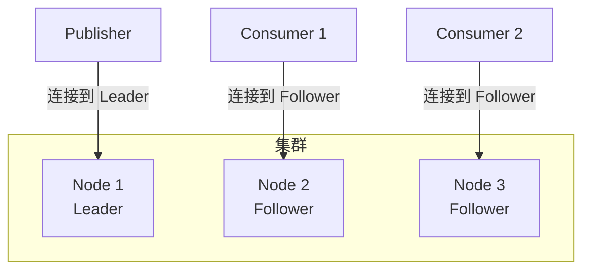

| 角色 | 连接目标 | 原因 |
|------|----------|------|
| **发布者** | Stream Leader 节点 | 避免网络跳转 |
| **消费者** | Stream Follower 节点 | 减轻 Leader 负载 |

### Metadata 命令

客户端使用 `metadata` 命令发现 Stream 拓扑：

1. 查询 Stream 位置
2. 获取 Leader 和 Follower 节点信息
3. 连接到相应节点

### 容器/负载均衡器场景

> [!IMPORTANT]
> 在容器化环境中，默认主机名可能无法解析，需配置 `advertised_host` 和 `advertised_port`。

**负载均衡器变通方案**：

- 始终连接负载均衡器
- 检查连接的实际节点
- 重试直到连接到正确节点

---

## 2.33 Stream 过滤

Stream 支持三阶段过滤机制，可大幅提升消费效率：


### 阶段 1：布隆过滤器

布隆过滤器在**块级别**进行快速过滤：

| 特性 | 说明 |
|------|------|
| **效率** | 极高（跳过整个块的磁盘读取） |
| **假阳性** | 可能存在 |
| **假阴性** | 绝不存在 |
| **配置** | `x-stream-filter-size-bytes`（默认 16 字节） |

> 发布时设置 `x-stream-filter-value` 消息注解，消费时指定过滤值。

### 阶段 2：AMQP 过滤表达式

服务器端**消息级别**过滤，支持两种表达式：

**属性过滤表达式**：

- 匹配 properties 部分字段
- 匹配 application-properties 键值
- 支持前缀/后缀匹配

**SQL 过滤表达式**：

- 类似 SQL WHERE 子句语法
- 支持 AND/OR/NOT 逻辑运算
- 支持比较、算术、LIKE、IN 等操作

### 阶段 3：客户端过滤

客户端库或应用程序进行最终过滤，灵活性最高。

### 三种过滤方式对比

| 特性 | 布隆过滤器 | AMQP 表达式 | 客户端过滤 |
|------|------------|-------------|------------|
| **执行位置** | 服务器（块级） | 服务器（消息级） | 客户端 |
| **假阳性** | 可能 | 无 | 无 |
| **复杂度** | 低 | 高（SQL） | 任意 |
| **性能** | 百万/秒 | 十万/秒 | 取决于客户端 |
| **协议** | 全部 | 仅 AMQP 1.0 | 全部 |

> [!TIP]
> 最佳实践：结合布隆过滤器（跳过不相关块）+ AMQP/SQL 表达式（精确匹配），实现高效的服务器端过滤。

---

## 2.34 发布消息去重

Stream 支持基于**生产者名称**和**发布 ID** 的消息去重：

### 去重机制

| 元素 | 要求 |
|------|------|
| **生产者名称** | 唯一、稳定、可读（如 `order-service-1`） |
| **发布 ID** | 严格递增序列（可有间隙） |

### 工作原理

1. Broker 跟踪每个命名生产者的最高发布 ID（限制）
2. 过滤掉发布 ID ≤ 限制的消息
3. 生产者重启后查询限制值，从中断处恢复

> [!WARNING]
> 发布 ID 必须严格递增，乱序可能导致消息意外过滤。

---

## 2.35 Stream 问题排查

### 诊断命令

```bash
# 查看 Stream 状态
rabbitmq-streams stream_status <stream-name>

# 添加/删除副本
rabbitmq-streams add_replica <stream-name> <node>
rabbitmq-streams delete_replica <stream-name> <node>

# 重启 Stream
rabbitmq-streams restart_stream <stream-name>

# 创建 Super Stream
rabbitmq-streams add_super_stream <name> --partitions 3
```

### 常见问题

| 问题 | 原因 | 解决方案 |
|------|------|----------|
| 消费者无法连接 | 连接到无副本节点 | 使用 metadata 发现拓扑 |
| 吞吐量低 | 使用 AMQP 而非 Stream 协议 | 启用 Stream 插件 |
| 磁盘增长快 | 未配置保留策略 | 设置 `max-age` 或 `max-length-bytes` |
| 容器环境连接失败 | 主机名不可解析 | 配置 `advertised_host` |

---

## 2.36 连接 (Connection)

### 连接概述

RabbitMQ 使用**长连接**，所有协议操作都在同一 TCP 连接上进行。

```mermaid
graph LR
    App[Application] -->|TCP| RMQ[RabbitMQ Node]
    
    subgraph 连接生命周期
        A[建立 TCP] --> B[协议协商]
        B --> C[身份验证]
        C --> D[执行操作]
        D --> E[关闭连接]
    end
```

### 支持的协议与端口

| 协议 | 纯 TCP 端口 | TLS 端口 |
|------|-------------|----------|
| AMQP 0-9-1 | 5672 | 5671 |
| AMQP 1.0 | 5672 | 5671 |
| MQTT | 1883 | 8883 |
| STOMP | 61613 | 61614 |
| Stream | 5552 | 5551 |

### 连接生命周期

1. 应用程序配置连接端点（主机名、端口）
2. 解析主机名为 IP 地址
3. 建立 TCP 连接
4. 协议协商
5. 身份验证
6. 执行操作（发布、消费、管理拓扑）
7. 关闭连接

> [!IMPORTANT]
> 连接不再需要时**必须关闭**，否则会耗尽节点资源。

### 连接泄漏与监控

| 问题 | 表现 | 解决方案 |
|------|------|----------|
| **连接泄漏** | 连接数单调增长 | 确保应用程序正确关闭连接 |
| **高连接流失** | 打开/关闭速率持续 >100/秒 | 使用长连接或连接代理 |

> PHP 等运行时不使用长连接，可使用 [AMQProxy](https://github.com/cloudamqp/amqproxy) 缓解流失。

### 流控制 (Flow Control)

当发布速度超过队列处理能力时，RabbitMQ 会对发布连接应用流控制。

> [!TIP]
> 建议发布者和消费者使用**独立连接**，避免流控制影响消费操作。

### 客户端提供的连接名称

为便于在日志和管理 UI 中识别连接，强烈建议设置 `connection_name`：

```bash
# Management UI 中可以看到连接名称
# 有助于识别哪个应用程序建立了连接
```

---

## 2.37 通道 (Channel)

### 通道概述

通道是 **AMQP 0-9-1** 特有的多路复用机制，允许在单个 TCP 连接上建立多个逻辑连接。

```mermaid
graph TD
    C[Connection TCP] --> Ch1[Channel 1]
    C --> Ch2[Channel 2]
    C --> Ch3[Channel 3]
    
    Ch1 -->|发布| E1[Exchange]
    Ch2 -->|消费| Q1[Queue]
    Ch3 -->|管理| Topo[Topology]
```

### 通道 vs 连接

| 特性 | 连接 | 通道 |
|------|------|------|
| **资源消耗** | 高（TCP 套接字、缓冲区） | 低（共享连接） |
| **多路复用** | - | 共享单个 TCP 连接 |
| **推荐用法** | 应用程序级 | 线程/进程级 |

### 通道生命周期

- 连接建立后立即打开通道
- 所有协议操作在通道上执行
- 连接关闭时所有通道自动关闭
- 通道应**长期存在**，避免频繁开关

### 通道异常（软错误）

| 错误码 | 名称 | 原因 |
|--------|------|------|
| `403` | ACCESS_REFUSED | 无权访问资源 |
| `404` | NOT_FOUND | 队列/交换机不存在 |
| `405` | RESOURCE_LOCKED | 独占队列被其他连接占用 |
| `406` | PRECONDITION_FAILED | 重新声明时属性不匹配 |

> [!NOTE]
> 通道异常会关闭通道，但应用程序可以打开新通道重试。

### 每连接/每节点通道限制

| 配置项 | 说明 | 默认值 |
|--------|------|--------|
| `channel_max` | 每连接最大通道数 | 2047 |
| `channel_max_per_node` | 每节点最大通道数 | 无限制 |

### 通道监控

```bash
# 列出连接及通道数
rabbitmqctl list_connections name channels

# 列出通道详情
rabbitmqctl list_channels connection consumer_count messages_unacknowledged prefetch_count
```

### 通道泄漏检测

| 指标 | 健康状态 | 异常状态 |
|------|----------|----------|
| 通道数趋势 | 稳定 | 持续增长 |
| 通道流失率 | 低（<100/秒） | 高（>100/秒） |
| 通道/连接比 | 个位数 | 过高 |

---

## 2.38 心跳 (Heartbeat)

### 心跳作用

心跳用于检测**死连接**（TCP 连接实际已断开但未被感知）：

1. 及时发现断开的连接
2. 防止"空闲"连接被网络设备/代理终止
3. 触发应用程序重连逻辑

### 心跳机制

```mermaid
sequenceDiagram
    participant C as Client
    participant S as Server
    
    Note over C,S: 协商心跳超时（如 60 秒）
    
    loop 每 30 秒（超时/2）
        C->>S: 心跳帧
        S->>C: 心跳帧
    end
    
    Note over C,S: 两次心跳未收到 → 断开连接
```

### 心跳配置

| 参数 | 说明 | 推荐值 |
|------|------|--------|
| `heartbeat` | 超时时间（秒） | 60（默认） |
| 发送间隔 | timeout / 2 | 30 秒 |
| 误判阈值 | 连续 2 次未收到 | - |

> [!WARNING]
>
> - **不建议禁用心跳**（设为 0）
> - 超时值 **不应低于 5 秒**，否则易产生误报
> - 推荐范围：**5-20 秒**

### 各协议心跳

| 协议 | 心跳机制 | 配置方式 |
|------|----------|----------|
| AMQP 0-9-1 | 内置 | `heartbeat` 参数 |
| MQTT | keepalive | 连接时设置 |
| STOMP | heart-beat | 连接头部 |

### TCP Keepalive

TCP 层的 keepalive 机制可作为心跳的补充：

- 需要内核级调优
- 适用于无法配置应用层心跳的场景
- 覆盖所有 TCP 连接（包括 Shovel/Federation）

### 心跳与负载均衡器

心跳产生的周期性流量可防止空闲连接被代理/负载均衡器关闭：

- 30 秒超时 → 每 15 秒产生流量
- 足以满足大多数负载均衡器的空闲超时设置

---

## 2.39 连接与通道问题排查

### 诊断命令

```bash
# 列出所有连接
rabbitmqctl list_connections name peer_host state channels

# 列出所有通道
rabbitmqctl list_channels connection consumer_count messages_unacknowledged

# 检查内存使用
rabbitmq-diagnostics memory_breakdown
```

### 常见问题

| 问题 | 原因 | 解决方案 |
|------|------|----------|
| 连接数持续增长 | 连接泄漏 | 确保正确关闭连接 |
| 高流失率 | 短连接/频繁重连 | 使用长连接或 AMQProxy |
| 通道异常频繁 | 资源访问问题 | 检查权限和队列声明 |
| 心跳超时断开 | 网络问题/负载高 | 增加超时值或检查网络 |
| 流控制频繁 | 发布速度过快 | 分离发布/消费连接 |

---

## 2.40 AMQP 0-9-1 协议扩展

RabbitMQ 实现了一系列 AMQP 0-9-1 规范的扩展功能：

### 发布扩展

| 扩展 | 说明 |
|------|------|
| **发布者确认** | 轻量级机制了解 RabbitMQ 何时接收消息 |
| **阻塞连接通知** | 连接被阻塞/解除阻塞时收到通知 |

### 消费扩展

| 扩展 | 说明 |
|------|------|
| **消费者取消通知** | 消费者被服务器取消时收到通知 |
| **basic.nack** | 支持一次拒绝多条消息 |
| **消费者优先级** | 优先向高优先级消费者发送消息 |
| **直接回复** | RPC 客户端无需声明队列接收回复 |

### 路由扩展

| 扩展 | 说明 |
|------|------|
| **交换机到交换机绑定** | 消息通过多个交换机路由 |
| **备用交换机** | 路由无法投递的消息 |
| **发送者选择分布** | 发布者直接决定路由位置 |

### 消息生命周期扩展

| 扩展 | 说明 |
|------|------|
| **消息 TTL** | 消息存活时间（队列级/消息级） |
| **队列 TTL** | 未使用队列自动删除 |
| **死信交换机** | 拒绝/过期消息重新路由 |
| **队列长度限制** | 设置队列最大长度 |
| **优先级队列** | 支持消息优先级 |

### 身份验证扩展

| 扩展 | 说明 |
|------|------|
| **User-ID 验证** | 服务器验证消息 User-ID 属性 |
| **身份验证失败通知** | 客户端收到显式认证失败通知 |
| **update-secret** | 为活动连接更新凭证 |

---

## 2.41 消息拦截器

消息拦截器允许在 Broker 级别拦截和修改消息。

### 拦截阶段

```mermaid
graph LR
    P[Publisher] -->|入站拦截| RMQ[RabbitMQ]
    RMQ -->|出站拦截| C[Consumer]
    
    subgraph 拦截点
        I1[入站: 路由前]
        I2[出站: 协议转换前]
    end
```

| 阶段 | 时机 | 用途 |
|------|------|------|
| **入站** | 消息进入，路由到队列前 | 添加时间戳、验证、注解 |
| **出站** | 消息传递给客户端，协议转换前 | 添加发送时间戳 |

> [!NOTE]
> 通过 RabbitMQ Streams 协议发送的消息**不会被拦截**。

### 内置拦截器

#### 入站时间戳拦截器

```ini
message_interceptors.incoming.set_header_timestamp.overwrite = true
```

添加的注解/头部：

- AMQP 1.0/Streams: `x-opt-rabbitmq-received-time`（毫秒）
- AMQP 0.9.1: `timestamp_in_ms` 头部 + `timestamp` 属性

#### 路由节点拦截器

```ini
message_interceptors.incoming.set_header_routing_node.overwrite = true
```

添加 `x-routed-by` 注解，指示接收并路由消息的节点。

#### MQTT 客户端 ID 拦截器

```ini
mqtt.message_interceptors.incoming.set_client_id_annotation.enabled = true
```

添加 `x-opt-mqtt-client-id` 注解。

#### 出站时间戳拦截器

```ini
message_interceptors.outgoing.timestamp.enabled = true
```

添加 `x-opt-rabbitmq-sent-time` 注解（毫秒时间戳）。

### 自定义拦截器

可通过实现 `rabbit_msg_interceptor` Erlang 行为开发自定义拦截器，并通过插件集成。

---

## 2.42 插件系统

RabbitMQ 支持通过插件扩展核心功能。

### 插件管理命令

```bash
# 启用插件
rabbitmq-plugins enable <plugin-name>

# 禁用插件
rabbitmq-plugins disable <plugin-name>

# 列出所有插件
rabbitmq-plugins list

# 列出插件（JSON格式）
rabbitmq-plugins list --formatter=json

# 查看插件目录
rabbitmq-plugins directories
```

### 启用方式

| 方式 | 说明 |
|------|------|
| 在线启用 | 连接运行中节点，实时启用/禁用 |
| 离线模式 | `--offline` 修改 enabled_plugins 文件 |
| 预配置 | 部署时生成 enabled_plugins 文件 |

### 核心插件列表

| 插件 | 功能 |
|------|------|
| `rabbitmq_management` | HTTP API 和管理 UI |
| `rabbitmq_prometheus` | Prometheus 监控支持 |
| `rabbitmq_federation` | 跨集群消息联邦 |
| `rabbitmq_shovel` | 消息"铲子"传输 |
| `rabbitmq_mqtt` | MQTT 协议支持 |
| `rabbitmq_stomp` | STOMP 协议支持 |
| `rabbitmq_auth_backend_ldap` | LDAP 认证 |
| `rabbitmq_auth_backend_oauth2` | OAuth 2.0 认证 |

### 插件目录

```bash
# 可通过环境变量设置多个目录（冒号分隔）
PLUGINS_DIR="/usr/lib/rabbitmq/plugins:/usr/lib/rabbitmq/lib/rabbitmq_server-3.x/plugins"
```

---

## 2.43 管理插件 (Management)

### 功能概述

```mermaid
graph TD
    MG[Management Plugin] --> UI[Web UI :15672]
    MG --> API[HTTP API]
    MG --> CLI[rabbitmqadmin]
    
    UI --> M1[监控队列/连接]
    UI --> M2[管理用户/权限]
    UI --> M3[策略/参数管理]
    
    API --> E1[定义导入/导出]
    API --> E2[指标查询]
```

### 用户权限标签

| 标签 | 权限 |
|------|------|
| `(无)` | 无法访问管理插件 |
| `management` | 查看自己的 vhost 资源、连接、通道 |
| `policymaker` | management + 策略/参数管理 |
| `monitoring` | management + 所有 vhost 统计、节点级数据 |
| `administrator` | 全部权限，包括用户/vhost 管理 |

### 创建只读监控用户

```bash
# 创建 monitoring 用户
rabbitmqctl add_user monitoring '<password>'
rabbitmqctl set_user_tags monitoring monitoring
# 授予空权限（只读）
rabbitmqctl set_permissions -p '/' monitoring '^$' '^$' '^$'
```

### 配置示例

```ini
# 端口配置
management.tcp.port = 15672
management.tcp.ip = 0.0.0.0

# HTTPS 配置
management.ssl.port = 15671
management.ssl.cacertfile = /path/to/ca.pem
management.ssl.certfile = /path/to/cert.pem
management.ssl.keyfile = /path/to/key.pem
```

### OAuth 2.0 认证

```ini
management.oauth_enabled = true
management.oauth_client_id = rabbit_user_client
management.oauth_scopes = openid profile rabbitmq.*
```

---

## 2.44 Federation 联邦

Federation 允许在独立集群之间复制或移动消息。

### 联邦架构

```mermaid
graph LR
    subgraph 上游集群
        UE[上游交换机]
        UQ[上游队列]
    end
    
    subgraph 下游集群
        FE[联邦交换机]
        FQ[联邦队列]
    end
    
    UE -->|消息流复制| FE
    UQ -->|消息移动| FQ
```

### 联邦类型对比

| 类型 | 行为 | 用途 |
|------|------|------|
| **交换机联邦** | 复制消息流到下游 | 分发/备份 |
| **队列联邦** | 移动消息到有消费者的位置 | 负载均衡 |

### 配置步骤

1. **定义上游**：

```bash
rabbitmqctl set_parameter federation-upstream my-upstream \
  '{"uri":"amqp://remote-host","expires":3600000}'
```

2. **创建策略**：

```bash
rabbitmqctl set_policy --apply-to exchanges federate-me "^amq\." \
  '{"federation-upstream-set":"all"}'
```

### 上游参数

| 参数 | 说明 | 默认值 |
|------|------|--------|
| `uri` | AMQP URI（可多个） | 必需 |
| `prefetch-count` | 未确认消息数 | 1000 |
| `reconnect-delay` | 重连延迟秒数 | 1 |
| `ack-mode` | 确认模式 | on-confirm |
| `max-hops` | 最大跳数（交换机） | 1 |
| `expires` | 上游队列过期时间 | none |

### 监控命令

```bash
# 查看联邦链接状态
rabbitmqctl federation_status
```

---

## 2.45 Shovel 铲子

Shovel 是消息传输工具，将消息从源移动到目标。

### Shovel 工作流程

```mermaid
sequenceDiagram
    participant S as 源队列
    participant SH as Shovel
    participant D as 目标交换机
    
    SH->>S: 消费消息
    S-->>SH: 返回消息
    SH->>D: 重新发布
    D-->>SH: 确认
    SH->>S: ACK 消息
```

### 动态 vs 静态 Shovel

| 特性 | 动态 Shovel | 静态 Shovel |
|------|-------------|-------------|
| 配置方式 | 运行时参数 | advanced.config |
| 变更生效 | 无需重启 | 需要重启 |
| 拓扑声明 | 自动 | 手动 |
| 推荐程度 | **推荐** | 传统方式 |

### 动态 Shovel 示例

```bash
rabbitmqctl set_parameter shovel my-shovel \
  '{"src-protocol":"amqp091","src-uri":"amqp://","src-queue":"source-queue",
    "dest-protocol":"amqp091","dest-uri":"amqp://remote-server","dest-queue":"target-queue"}'
```

### Shovel 参数

| 参数 | 说明 |
|------|------|
| `src-uri` | 源连接 URI |
| `src-queue` | 源队列 |
| `dest-uri` | 目标连接 URI |
| `dest-queue` | 目标队列 |
| `ack-mode` | `on-confirm`（默认）、`on-publish`、`no-ack` |
| `reconnect-delay` | 重连延迟（秒） |
| `src-delete-after` | 传输后行为：`never`、`queue-length`、数值 |

### 监控命令

```bash
# 查看 Shovel 状态
rabbitmqctl shovel_status

# 重启 Shovel
rabbitmqctl restart_shovel <name>
```

---

## 2.46 STOMP 协议插件

STOMP（Simple Text Oriented Messaging Protocol）是简单文本消息协议。

### 启用与配置

```bash
rabbitmq-plugins enable rabbitmq_stomp
```

```ini
# 端口配置
stomp.listeners.tcp.1 = 61613
stomp.listeners.ssl.1 = 61614

# 默认用户
stomp.default_user = guest
stomp.default_pass = guest
```

### 目标类型

| 目标格式 | 说明 |
|----------|------|
| `/exchange/<name>[/<key>]` | 发布到交换机 |
| `/queue/<name>` | 网关管理的队列 |
| `/amq/queue/<name>` | 现有队列（不自动创建） |
| `/topic/<name>` | 主题（发布/订阅） |
| `/temp-queue/<name>` | RPC 临时队列 |

### 通配符映射

| STOMP | AMQP 0.9.1 | 说明 |
|-------|------------|------|
| `/` | `.` | 级别分隔符 |
| `+` | `*` | 单级通配符 |
| `#` | `#` | 多级通配符 |

---

## 2.47 Web STOMP 插件

通过 WebSocket 使用 STOMP 协议。

```bash
rabbitmq-plugins enable rabbitmq_web_stomp
```

```ini
# 配置端口
web_stomp.tcp.port = 15674

# TLS 配置
web_stomp.ssl.port = 15673
web_stomp.ssl.cacertfile = /path/to/ca.pem
web_stomp.ssl.certfile = /path/to/cert.pem
web_stomp.ssl.keyfile = /path/to/key.pem
```

WebSocket 端点：`ws://127.0.0.1:15674/ws`

---

## 2.48 MQTT 协议插件

MQTT（Message Queuing Telemetry Transport）是物联网标准协议。

### 支持版本

- MQTT 3.1
- MQTT 3.1.1
- MQTT 5.0

### 启用配置

```bash
rabbitmq-plugins enable rabbitmq_mqtt
```

```ini
# 端口配置
mqtt.listeners.tcp.default = 1883
mqtt.listeners.ssl.default = 8883

# 虚拟主机
mqtt.vhost = /

# 交换机
mqtt.exchange = amq.topic

# 预取数
mqtt.prefetch = 10

# 会话过期（秒）
mqtt.max_session_expiry_interval_seconds = 86400

# 匿名连接
mqtt.allow_anonymous = true
```

### QoS 级别

| QoS | 名称 | 说明 |
|-----|------|------|
| 0 | 最多一次 | 无确认，可能丢失 |
| 1 | 至少一次 | 有确认，可能重复 |
| 2 | 仅一次 | **不支持** |

### 队列类型选择

| 条件 | 队列类型 |
|------|----------|
| QoS 0 + Clean Session | MQTT QoS 0 队列（进程邮箱） |
| QoS 1 + 持久会话 | 经典队列或仲裁队列 |

```ini
# 使用仲裁队列（仅限新集群）
mqtt.durable_queue_type = quorum
```

### 主题映射

| MQTT | AMQP 0.9.1 |
|------|------------|
| `cities/london` | `cities.london` |
| `+` | `*` |
| `#` | `#` |

### 限制

- QoS 2 不支持
- 重新认证不支持
- 共享订阅不支持
- 保留消息仅节点本地

---

## 2.49 Web MQTT 插件

通过 WebSocket 使用 MQTT 协议。

```bash
rabbitmq-plugins enable rabbitmq_web_mqtt
```

```ini
# 配置端口
web_mqtt.tcp.port = 15675

# TLS 配置
web_mqtt.ssl.port = 15676
web_mqtt.ssl.cacertfile = /path/to/ca.pem
web_mqtt.ssl.certfile = /path/to/cert.pem
web_mqtt.ssl.keyfile = /path/to/key.pem
```

WebSocket 端点：`ws://127.0.0.1:15675/ws`

---

## 2.50 插件与协议对比

### 协议插件对比

| 协议 | 插件 | 端口 | Web 端口 | 用途 |
|------|------|------|----------|------|
| AMQP 0.9.1 | 核心 | 5672/5671 | - | 通用消息 |
| AMQP 1.0 | 核心 | 5672/5671 | - | 标准协议 |
| STOMP | rabbitmq_stomp | 61613/61614 | 15674 | 简单文本 |
| MQTT | rabbitmq_mqtt | 1883/8883 | 15675 | 物联网 |
| Stream | rabbitmq_stream | 5552 | - | 高吞吐日志 |

### 数据传输插件对比

| 功能 | Federation | Shovel |
|------|------------|--------|
| **方向** | 多对多 | 点对点 |
| **消息复制** | 交换机复制消息流 | 移动消息 |
| **负载均衡** | 队列联邦支持 | 不支持 |
| **拓扑管理** | 自动 | 手动 |
| **协议** | AMQP 0.9.1 | AMQP 0.9.1/1.0 |
| **用途** | 集群互联 | 数据迁移 |

---

# 第三章: 管理 RabbitMQ

> 本章介绍 RabbitMQ 的日常管理操作，包括配置、权限、集群、资源管理等。

## 3.1 命令行工具概览

```mermaid
graph TD
    CLI[RabbitMQ CLI 工具] --> A[rabbitmqctl]
    CLI --> B[rabbitmq-diagnostics]
    CLI --> C[rabbitmq-plugins]
    CLI --> D[rabbitmq-queues]
    CLI --> E[rabbitmq-streams]
    CLI --> F[rabbitmq-upgrade]
    CLI --> G[rabbitmqadmin]
    
    A --> A1[节点管理]
    A --> A2[用户管理]
    A --> A3[权限管理]
    A --> A4[虚拟主机管理]
    
    B --> B1[健康检查]
    B --> B2[状态诊断]
    
    C --> C1[插件启用/禁用]
    
    D --> D1[队列管理]
    
    G --> G1[HTTP API 客户端]
```

### CLI 工具说明

| 工具 | 用途 |
|------|------|
| `rabbitmqctl` | 服务管理、用户权限、集群管理 |
| `rabbitmq-diagnostics` | 健康检查、状态诊断 |
| `rabbitmq-plugins` | 插件管理 |
| `rabbitmq-queues` | 仲裁队列副本管理 |
| `rabbitmq-streams` | Stream 副本管理 |
| `rabbitmq-upgrade` | 升级相关操作 |
| `rabbitmqadmin` | HTTP API 命令行客户端 |

### Erlang Cookie 认证

CLI 工具使用共享密钥（Erlang Cookie）与节点通信。

| 平台 | Cookie 位置 |
|------|-------------|
| Linux | `/var/lib/rabbitmq/.erlang.cookie` |
| macOS | `$HOME/.erlang.cookie` |
| Windows | `%USERPROFILE%\.erlang.cookie` |

```bash
# 查看 Cookie 信息
rabbitmq-diagnostics erlang_cookie_sources
```

### 常用命令

```bash
# 节点状态
rabbitmq-diagnostics status

# 集群状态
rabbitmqctl cluster_status

# 停止节点
rabbitmqctl shutdown

# 连接远程节点
rabbitmqctl -n rabbit@remote-host status
```

---

## 3.2 配置详解

### 配置文件类型

| 文件 | 格式 | 用途 |
|------|------|------|
| `rabbitmq.conf` | ini (sysctl) | 主配置文件 |
| `advanced.config` | Erlang | 高级配置 |
| `rabbitmq-env.conf` | shell | 环境变量 |

### 配置文件位置

| 平台 | 路径 |
|------|------|
| Linux (deb/rpm) | `/etc/rabbitmq/` |
| Generic Unix | `$RABBITMQ_HOME/etc/rabbitmq/` |
| Windows | `%APPDATA%\RabbitMQ\` |
| macOS (Homebrew) | `/opt/homebrew/etc/rabbitmq/` |

### 查找配置文件

```bash
# 通过 CLI 查看配置路径
rabbitmq-diagnostics status

# 查看有效配置
rabbitmq-diagnostics environment
```

### rabbitmq.conf 示例

```ini
# 监听端口
listeners.tcp.default = 5672

# TLS 配置
listeners.ssl.default = 5671
ssl_options.cacertfile = /path/to/ca.pem
ssl_options.certfile = /path/to/cert.pem
ssl_options.keyfile = /path/to/key.pem

# 内存阈值
vm_memory_high_watermark.relative = 0.6

# 磁盘阈值
disk_free_limit.absolute = 2GB

# 默认用户（仅首次启动有效）
default_user = admin
default_pass = secret

# 日志
log.console = true
log.console.level = info
log.file.level = debug
```

### 环境变量插值

```ini
# 使用环境变量
default_user = ${RABBITMQ_DEFAULT_USER}
default_pass = ${RABBITMQ_DEFAULT_PASS}

# 部分值插值
cluster_name = ${REGION}-cluster
```

---

## 3.3 文件与目录位置

### 关键目录

| 环境变量 | Linux 默认值 | 用途 |
|----------|--------------|------|
| `RABBITMQ_MNESIA_DIR` | `/var/lib/rabbitmq/mnesia` | 数据目录 |
| `RABBITMQ_LOG_BASE` | `/var/log/rabbitmq` | 日志目录 |
| `RABBITMQ_PLUGINS_DIR` | `/usr/lib/rabbitmq/plugins` | 插件目录 |
| `RABBITMQ_CONFIG_FILE` | `/etc/rabbitmq/rabbitmq` | 配置文件 |

### 数据目录迁移

```bash
# 停止服务前备份
rabbitmqctl stop_app

# 设置新的数据目录
export RABBITMQ_MNESIA_DIR=/new/path/mnesia

# 重启服务
rabbitmq-server -detached
```

---

## 3.4 日志配置

### 日志输出方式

| 输出 | 配置键 | 说明 |
|------|--------|------|
| 文件 | `log.file` | 默认启用 |
| 控制台 | `log.console` | 容器环境常用 |
| Syslog | `log.syslog` | 集中日志管理 |

### 日志级别

| 级别 | 说明 |
|------|------|
| `debug` | 最详细 |
| `info` | 默认 |
| `warning` | 警告 |
| `error` | 错误 |
| `critical` | 严重 |
| `none` | 禁用 |

### 配置示例

```ini
# 文件日志
log.file = /var/log/rabbitmq/rabbit.log
log.file.level = info

# 控制台日志（容器）
log.console = true
log.console.level = info
log.file = false

# JSON 格式
log.file.formatter = json

# 日志轮转
log.file.rotation.size = 10485760
log.file.rotation.count = 5
```

### 运行时调整日志级别

```bash
# 设置为 debug
rabbitmqctl set_log_level debug

# 恢复为 info
rabbitmqctl set_log_level info

# 跟踪日志
rabbitmq-diagnostics log_tail -n rabbit@localhost -N 100
```

---

## 3.5 虚拟主机

### 概念

```mermaid
graph TD
    RMQ[RabbitMQ] --> VH1[/vhost1]
    RMQ --> VH2[/vhost2]
    RMQ --> VH3[/production]
    
    VH1 --> E1[Exchanges]
    VH1 --> Q1[Queues]
    VH1 --> U1[Users/Permissions]
    
    VH2 --> E2[Exchanges]
    VH2 --> Q2[Queues]
    VH2 --> U2[Users/Permissions]
```

> 虚拟主机提供逻辑隔离，每个 vhost 拥有独立的队列、交换机、绑定和权限。

### 管理命令

```bash
# 创建虚拟主机
rabbitmqctl add_vhost qa1

# 带元数据创建
rabbitmqctl add_vhost qa1 --description "QA环境" --default-queue-type quorum

# 列出虚拟主机
rabbitmqctl list_vhosts name description tags default_queue_type

# 删除虚拟主机
rabbitmqctl delete_vhost qa1
```

### 默认队列类型

```bash
# 设置默认队列类型为仲裁队列
rabbitmqctl update_vhost_metadata qa1 --default-queue-type quorum
```

### 删除保护

```bash
# 启用删除保护
rabbitmqctl set_vhost_deletion_protection qa1 true

# 禁用删除保护
rabbitmqctl set_vhost_deletion_protection qa1 false
```

### 资源限制

```bash
# 限制最大连接数
rabbitmqctl set_vhost_limits -p qa1 '{"max-connections": 100}'

# 限制最大队列数
rabbitmqctl set_vhost_limits -p qa1 '{"max-queues": 500}'

# 查看限制
rabbitmqctl list_vhost_limits

# 清除限制
rabbitmqctl clear_vhost_limits -p qa1
```

---

## 3.6 用户与权限

### 权限模型

```mermaid
graph LR
    U[用户] --> |授权| VH[虚拟主机]
    VH --> C[Configure权限]
    VH --> W[Write权限]
    VH --> R[Read权限]
    
    C --> |创建/删除| RES[队列/交换机]
    W --> |发布消息| RES
    R --> |消费消息| RES
```

### 用户管理

```bash
# 添加用户
rabbitmqctl add_user admin 'P@ssw0rd!'

# 使用预哈希密码
rabbitmqctl add_user --pre-hashed-password admin '$(rabbitmqctl hash_password "P@ssw0rd!")'

# 修改密码
rabbitmqctl change_password admin 'NewP@ss!'

# 删除用户
rabbitmqctl delete_user admin

# 列出用户
rabbitmqctl list_users
```

### 权限管理

```bash
# 授予完全权限（configure, write, read）
rabbitmqctl set_permissions -p /production admin ".*" ".*" ".*"

# 只读权限
rabbitmqctl set_permissions -p /production reader "^$" "^$" ".*"

# 只写权限
rabbitmqctl set_permissions -p /production writer "^$" ".*" "^$"

# 撤销权限
rabbitmqctl clear_permissions -p /production admin

# 列出权限
rabbitmqctl list_permissions -p /production
rabbitmqctl list_user_permissions admin
```

### 用户标签

| 标签 | Management UI 权限 |
|------|-------------------|
| `(无)` | 无法访问 |
| `management` | 查看自己的 vhost 资源 |
| `policymaker` | management + 策略管理 |
| `monitoring` | management + 所有节点统计 |
| `administrator` | 全部权限 |

```bash
# 设置标签
rabbitmqctl set_user_tags admin administrator

# 设置多个标签
rabbitmqctl set_user_tags viewer monitoring management
```

### 用户限制

```bash
# 限制最大连接数
rabbitmqctl set_user_limits admin '{"max-connections": 10}'

# 限制最大通道数
rabbitmqctl set_user_limits admin '{"max-channels": 20}'

# 查看限制
rabbitmqctl list_user_limits admin

# 清除限制
rabbitmqctl clear_user_limits admin
```

---

## 3.7 身份验证机制

### 认证后端

| 后端 | 说明 |
|------|------|
| `internal` | 内置数据库（默认） |
| `ldap` | LDAP/AD 认证 |
| `http` | HTTP API 认证 |
| `oauth2` | OAuth 2.0/JWT 认证 |

### 配置多个后端

```ini
# 先尝试 LDAP，失败后回退到内部
auth_backends.1 = ldap
auth_backends.2 = internal
```

### 混合身份验证与授权

```ini
# LDAP 认证 + 内部授权
auth_backends.1.authn = ldap
auth_backends.1.authz = internal
```

### Guest 用户限制

```ini
# 默认：guest 只能从 localhost 连接
loopback_users.guest = true

# 允许远程连接（不推荐用于生产）
loopback_users = none
```

### TLS 证书认证

```bash
# 启用 EXTERNAL 机制
rabbitmq-plugins enable rabbitmq_auth_mechanism_ssl
```

```ini
# 配置认证机制
auth_mechanisms.1 = EXTERNAL
auth_mechanisms.2 = PLAIN
```

---

## 3.8 密码与凭据

### 密码哈希算法

```ini
# 使用 SHA-512（默认 SHA-256）
password_hashing_module = rabbit_password_hashing_sha512
```

### 密码复杂度验证

```ini
# 最小长度验证
credential_validator.validation_backend = rabbit_credential_validator_min_password_length
credential_validator.min_length = 12

# 正则验证
credential_validator.validation_backend = rabbit_credential_validator_password_regexp
credential_validator.regexp = ^[a-zA-Z0-9]{12,}$
```

### 计算密码哈希

```bash
# 使用 CLI
rabbitmqctl hash_password 'mypassword'

# 使用 HTTP API
curl -su guest:guest GET localhost:15672/api/auth/hash_password/mypassword
```

### 无密码用户（证书认证）

```bash
# 创建用户后清除密码
rabbitmqctl add_user certuser temppass
rabbitmqctl clear_password certuser
```

---

## 3.9 权限示例

### 常见场景

```bash
# 应用用户：只能操作特定前缀的队列
rabbitmqctl set_permissions -p /app appuser \
  "^app\." \    # configure: 只能创建 app.* 队列
  "^app\." \    # write: 只能发布到 app.* 
  "^app\."      # read: 只能消费 app.* 队列

# 监控用户：只读权限
rabbitmqctl set_permissions -p / monitoring \
  '^$' \        # configure: 无
  '^$' \        # write: 无
  '.*'          # read: 可读所有

# 管理员：完全权限
rabbitmqctl set_permissions -p / admin '.*' '.*' '.*'
```

### 定义预配置（启动时导入）

```json
{
  "users": [
    {
      "name": "admin",
      "password_hash": "...",
      "tags": ["administrator"]
    }
  ],
  "vhosts": [
    {"name": "/"},
    {"name": "production"}
  ],
  "permissions": [
    {
      "user": "admin",
      "vhost": "/",
      "configure": ".*",
      "write": ".*",
      "read": ".*"
    }
  ]
}
```

```ini
# 配置启动时加载定义
load_definitions = /path/to/definitions.json
```

---

## 3.10 集群架构

```mermaid
graph TD
    subgraph Cluster[RabbitMQ Cluster]
        N1[Node 1<br/>Disc Node]
        N2[Node 2<br/>Disc Node]
        N3[Node 3<br/>RAM Node]
        
        N1 <--> N2
        N2 <--> N3
        N1 <--> N3
    end
    
    LB[Load Balancer] --> N1
    LB --> N2
    LB --> N3
    
    Client[Client] --> LB
```

<!-- 待填充内容 -->

---

## 3.11 策略 (Policies)

### 策略概念

```mermaid
graph TD
    P[策略 Policy] --> |正则匹配| Q[队列]
    P --> |正则匹配| E[交换机]
    P --> |正则匹配| S[流 Stream]
    
    P --> D[策略定义]
    D --> TTL[message-ttl]
    D --> ML[max-length]
    D --> DLX[dead-letter-exchange]
    D --> FED[federation-upstream-set]
```

> 策略是动态配置队列/交换机可选参数的声明式机制，无需重新声明资源。

### 策略属性

| 属性 | 说明 |
|------|------|
| `name` | 策略名称 |
| `pattern` | 正则表达式匹配队列/交换机名称 |
| `definition` | 键值对，注入到匹配资源的参数 |
| `priority` | 优先级，数值越大优先级越高 |
| `apply-to` | 应用目标：`queues`/`exchanges`/`all` |

### 创建策略

```bash
# 设置 TTL 策略
rabbitmqctl set_policy ttl-policy \
  "^ttl\." '{"message-ttl": 60000}' \
  --priority 1 \
  --apply-to queues

# 设置死信策略
rabbitmqctl set_policy dlx-policy \
  "^dlx\." '{"dead-letter-exchange": "dlx.exchange"}' \
  --priority 2 \
  --apply-to queues

# 组合策略（TTL + 队列长度限制）
rabbitmqctl set_policy combined-policy \
  "^my\." '{"message-ttl": 300000, "max-length": 10000}' \
  --priority 1 \
  --apply-to queues
```

### apply-to 选项

| 值 | 说明 |
|----|------|
| `queues` | 所有队列类型（含流） |
| `classic_queues` | 仅经典队列 |
| `quorum_queues` | 仅仲裁队列 |
| `streams` | 仅流 |
| `exchanges` | 仅交换机 |
| `all` | 所有（默认） |

### 删除策略

```bash
rabbitmqctl clear_policy ttl-policy
```

### 列出策略

```bash
rabbitmqctl list_policies -p /
```

---

## 3.12 运营商策略

### 运营商策略 vs 普通策略

| 特性 | 普通策略 | 运营商策略 |
|------|----------|------------|
| 管理者 | 应用开发 | 平台运维 |
| 用途 | 业务配置 | 资源限制/护栏 |
| 优先级 | 低 | 高（覆盖普通策略） |
| 支持参数 | 全部 | 有限（TTL/长度限制等） |

### 运营商策略支持的参数

| 参数 | 经典队列 | 仲裁队列 | 流 |
|------|:--------:|:--------:|:--:|
| `max-length` | ✓ | ✓ | |
| `max-length-bytes` | ✓ | ✓ | ✓ |
| `message-ttl` | ✓ | ✓ | |
| `expires` | ✓ | ✓ | |
| `delivery-limit` | | ✓ | |

### 创建运营商策略

```bash
# 设置队列过期时间限制
rabbitmqctl set_operator_policy queue-ttl \
  ".*" '{"expires": 3600000}' \
  --priority 0 \
  --apply-to queues

# 设置队列长度上限
rabbitmqctl set_operator_policy max-length-limit \
  ".*" '{"max-length": 100000, "max-length-bytes": 104857600}' \
  --priority 0 \
  --apply-to queues
```

### 冲突解决

当运营商策略与普通策略冲突时，取**更保守**的值：

```
运营商策略: max-length = 50
普通策略:   max-length = 100
生效值:     max-length = 50  # 取小值

运营商策略: max-length = 50
普通策略:   max-length = 20
生效值:     max-length = 20  # 取小值
```

---

## 3.13 运行时参数

### 参数类型

| 类型 | 作用域 | 示例 |
|------|--------|------|
| vhost 参数 | 虚拟主机 | Federation upstream、Shovel |
| 全局参数 | 集群 | 集群名称、集群标签 |

### vhost 参数管理

```bash
# 设置参数
rabbitmqctl set_parameter -p / federation-upstream my-upstream \
  '{"uri":"amqp://remote-host"}'

# 列出参数
rabbitmqctl list_parameters -p /

# 清除参数
rabbitmqctl clear_parameter -p / federation-upstream my-upstream
```

### 全局参数管理

```bash
# 设置集群名称
rabbitmqctl set_cluster_name my-cluster

# 设置集群标签
rabbitmqctl set_global_parameter cluster_tags \
  '{"region":"us-east-1","env":"production"}'

# 列出全局参数
rabbitmqctl list_global_parameters
```

### 配置文件预设集群标签

```ini
cluster_tags.region = us-east-1
cluster_tags.environment = production
cluster_tags.owner = platform-team
```

---

## 3.14 定义导入导出

### 定义内容

| 内容 | 说明 |
|------|------|
| 用户 | 用户名、密码哈希、标签 |
| vhost | 虚拟主机名称、元数据 |
| 权限 | 用户权限 |
| 拓扑 | 队列、交换机、绑定 |
| 策略 | 普通策略、运营商策略 |
| 参数 | 运行时参数 |

### 导出定义

```bash
# 导出到文件
rabbitmqctl export_definitions /path/to/definitions.json

# 使用 rabbitmqadmin
rabbitmqadmin definitions export /path/to/definitions.json

# 使用 HTTP API
curl -u guest:guest http://localhost:15672/api/definitions > definitions.json
```

### 导入定义

```bash
# 从文件导入
rabbitmqctl import_definitions /path/to/definitions.json

# 使用 rabbitmqadmin
rabbitmqadmin definitions import /path/to/definitions.json
```

### 启动时导入定义

```ini
# 从本地文件导入
definitions.local.path = /etc/rabbitmq/definitions.json

# 从 HTTPS URL 导入
definitions.import_backend = https
definitions.https.url = https://config-server/definitions.json

# 仅在内容变化时导入
definitions.skip_if_unchanged = true
```

### 定义文件示例

```json
{
  "rabbit_version": "4.0.0",
  "vhosts": [
    {"name": "/"},
    {"name": "production"}
  ],
  "users": [
    {
      "name": "admin",
      "password_hash": "...",
      "hashing_algorithm": "rabbit_password_hashing_sha256",
      "tags": ["administrator"]
    }
  ],
  "permissions": [
    {
      "user": "admin",
      "vhost": "/",
      "configure": ".*",
      "write": ".*",
      "read": ".*"
    }
  ],
  "queues": [
    {
      "name": "my-queue",
      "vhost": "/",
      "durable": true,
      "auto_delete": false,
      "arguments": {"x-queue-type": "quorum"}
    }
  ],
  "exchanges": [
    {
      "name": "my-exchange",
      "vhost": "/",
      "type": "topic",
      "durable": true
    }
  ],
  "bindings": [
    {
      "source": "my-exchange",
      "vhost": "/",
      "destination": "my-queue",
      "destination_type": "queue",
      "routing_key": "my.#"
    }
  ]
}
```

---

## 3.15 元数据存储

### 元数据存储内容

```mermaid
graph TD
    MS[元数据存储] --> U[用户/权限]
    MS --> V[虚拟主机]
    MS --> T[拓扑：队列/交换机/绑定]
    MS --> P[策略]
    MS --> R[运行时参数]
    
    MSG[消息] --> |不存储于| MS
```

### 后端对比

| 特性 | Mnesia | Khepri |
|------|--------|--------|
| 引入版本 | 原始 | 4.0+ |
| 算法 | 分布式数据库 | Raft 共识 |
| 网络分区 | 需配置恢复策略 | 自动处理 |
| 推荐 | 已弃用 | 推荐 |

### Khepri 特点

- 基于 **Raft 共识算法**
- 与仲裁队列、流使用相同算法
- 网络分区处理更加确定性
- 需要多数节点在线才能写入

---

## 3.16 启用 Khepri

### 检查当前后端

```bash
rabbitmq-diagnostics metadata_store_status
```

### 启用 Khepri

```bash
# 方式1：启用功能标志
rabbitmqctl enable_feature_flag khepri_db

# 方式2：启动时通过环境变量
RABBITMQ_FEATURE_FLAGS="+khepri_db" rabbitmq-server
```

### 启用条件

- **所有集群节点在线**
- **集群处于健康状态**
- **建议在非高峰时段执行**

### 迁移过程

1. 同步集群成员到 Khepri
2. 复制 Mnesia 数据到 Khepri
3. 将 Mnesia 表标记为只读
4. 完成剩余数据迁移
5. 切换到 Khepri

### 回滚

> ⚠️ 一旦启用 Khepri，**无法回退到 Mnesia**

如需回退，使用蓝绿部署迁移到新集群。

---

## 3.17 Khepri 运维注意事项

### 一致性模型

| 场景 | Mnesia | Khepri |
|------|--------|--------|
| 声明确认 | 所有节点提交 | 多数节点提交 |
| 可见性 | 立即全局可见 | 可能有短暂延迟 |

### 影响场景

```mermaid
sequenceDiagram
    participant C1 as 客户端1 (节点1)
    participant C2 as 客户端2 (节点3)
    participant R1 as 节点1
    participant R2 as 节点2
    participant R3 as 节点3
    
    C1->>R1: 声明队列Q
    R1->>R2: 复制成功
    Note over R1,R2: 多数节点确认
    R1->>C1: 确认成功
    C1->>C2: 通知队列已创建
    C2->>R3: 发布消息到Q
    Note over R3: 可能尚未看到队列Q
```

### 变通策略

1. **注入短暂暂停**：声明后等待 1-2 秒
2. **使用静态拓扑**：避免动态声明
3. **连接同一节点**：多连接使用同一节点

### 少数派节点行为

- 元数据写入操作（声明队列等）会**超时**
- 与 Mnesia 的 `pause_minority` 策略类似
- 客户端收到错误，可稍后重试

### 故障恢复

1. 领导者故障时自动选举新领导者
2. 恢复节点自动同步变更
3. 对应用程序透明

---

## 3.18 Khepri 已知问题

| 问题 | 说明 |
|------|------|
| 批量删除较慢 | 大量实体删除性能不如 Mnesia |
| 超时处理 | 少数派节点写操作可能超时 |
| 数据丢失恢复 | 节点数据永久丢失后难以重新加入 |

### 最佳实践

- 在非高峰时段启用 Khepri
- 确保集群健康再执行迁移
- 测试工作负载与 Khepri 兼容性
- 监控 Raft 领导者状态

---

## 3.19 网络配置

### 端口列表

| 端口 | 协议 | 用途 |
|------|------|------|
| 4369 | EPMD | 节点发现服务 |
| 5672 | AMQP | 客户端连接（非TLS） |
| 5671 | AMQPS | 客户端连接（TLS） |
| 5552 | Stream | Stream协议（非TLS） |
| 5551 | Stream | Stream协议（TLS） |
| 6000-6500 | Stream | Stream 复制 |
| 15672 | HTTP | Management UI |
| 15671 | HTTPS | Management UI (TLS) |
| 15692 | Prometheus | 指标端点 |
| 25672 | Clustering | 节点间通信 |
| 35672-35682 | CLI | CLI 工具连接 |
| 1883 | MQTT | MQTT（非TLS） |
| 8883 | MQTTS | MQTT（TLS） |
| 61613 | STOMP | STOMP（非TLS） |

### 网络接口配置

```ini
# 监听所有接口
listeners.tcp.default = 5672

# 监听特定接口
listeners.tcp.1 = 192.168.1.99:5672

# 仅 IPv6
listeners.tcp.1 = :::5672

# 双栈（IPv4 + IPv6）
listeners.tcp.1 = 127.0.0.1:5672
listeners.tcp.2 = ::1:5672
```

### 禁用非 TLS 连接

```ini
listeners.tcp = none
listeners.ssl.default = 5671
```

---

## 3.20 TLS/SSL 配置

### TLS 配置架构

```mermaid
graph LR
    C[客户端] -->|TLS| RMQ[RabbitMQ]
    
    subgraph TLS配置
        CA[CA证书]
        CERT[服务器证书]
        KEY[私钥]
    end
    
    RMQ --> CA
    RMQ --> CERT
    RMQ --> KEY
```

### 基本 TLS 配置

```ini
listeners.ssl.default = 5671

ssl_options.cacertfile = /path/to/ca_certificate.pem
ssl_options.certfile = /path/to/server_certificate.pem
ssl_options.keyfile = /path/to/server_key.pem

# 对等方验证
ssl_options.verify = verify_peer
ssl_options.fail_if_no_peer_cert = true

# 私钥密码（可选）
ssl_options.password = secret
```

### TLS 版本控制

```ini
# 仅启用 TLS 1.2 和 1.3
ssl_options.versions.1 = tlsv1.3
ssl_options.versions.2 = tlsv1.2
```

### 密码套件配置

```ini
# TLSv1.3 密码套件
ssl_options.ciphers.1 = TLS_AES_256_GCM_SHA384
ssl_options.ciphers.2 = TLS_AES_128_GCM_SHA256
ssl_options.ciphers.3 = TLS_CHACHA20_POLY1305_SHA256

# TLSv1.2 密码套件
ssl_options.ciphers.4 = ECDHE-ECDSA-AES256-GCM-SHA384
ssl_options.ciphers.5 = ECDHE-RSA-AES256-GCM-SHA384
```

### 证书对等方验证

| 配置 | 说明 |
|------|------|
| `verify = verify_peer` | 启用对等方验证 |
| `verify = verify_none` | 禁用验证 |
| `fail_if_no_peer_cert = true` | 客户端必须提供证书 |
| `depth = 2` | 证书链验证深度 |

---

## 3.21 使用 tls-gen 生成证书

```bash
# 克隆 tls-gen
git clone https://github.com/rabbitmq/tls-gen tls-gen
cd tls-gen/basic

# 生成证书
make PASSWORD=bunnies
make verify
make info

# 查看生成的文件
ls -l ./result
# ca_certificate.pem      - CA 证书
# server_certificate.pem  - 服务器证书
# server_key.pem          - 服务器私钥
# client_certificate.pem  - 客户端证书
# client_key.pem          - 客户端私钥
```

---

## 3.22 节点间通信

### EPMD 配置

```bash
# 限制 EPMD 监听接口
export ERL_EPMD_ADDRESS=192.168.1.99

# 修改 EPMD 端口
export ERL_EPMD_PORT=4370
```

### 节点间通信端口

```ini
# 自定义分发端口范围
inet_dist_listen_min = 35672
inet_dist_listen_max = 35672
```

### IPv6 节点间通信

```bash
# 启用 IPv6 节点间通信
export RABBITMQ_SERVER_ADDITIONAL_ERL_ARGS="-proto_dist inet6_tcp"
```

---

## 3.23 网络滴答时间 (Net Tick)

### 概念

节点间定期交换"滴答"消息检测连接状态，类似心跳机制。

### 配置

```erlang
% advanced.config
[
  {kernel, [{net_ticktime, 120}]}
].
```

### 影响

| net_ticktime | 故障检测 | 风险 |
|--------------|----------|------|
| 增大（如120s） | 更慢 | 对短暂网络中断更宽容 |
| 减小（如30s） | 更快 | 可能产生误报分区 |

> 默认值 60 秒，修改需集群所有节点一致。

---

## 3.24 代理协议

### 启用代理协议

```ini
# AMQP
proxy_protocol = true

# MQTT
mqtt.proxy_protocol = true

# STOMP
stomp.proxy_protocol = true
```

### 用途

- 在代理/负载均衡器后获取真实客户端 IP
- 支持 HAProxy、AWS ELB 等

> ⚠️ 启用后客户端必须通过支持代理协议的代理连接

---

## 3.25 网络调优

### TCP 缓冲区大小

```ini
# 提高吞吐量（增加 RAM 使用）
tcp_listen_options.sndbuf = 196608
tcp_listen_options.recbuf = 196608

# 降低 RAM 使用（降低吞吐量）
tcp_listen_options.sndbuf = 32768
tcp_listen_options.recbuf = 32768
```

### 连接积压

```ini
# 处理连接突发
tcp_listen_options.backlog = 4096
```

### 禁用 Nagle 算法

```ini
tcp_listen_options.nodelay = true
```

### 内核参数调优

```bash
# 增加文件描述符限制
sysctl -w fs.file-max=200000

# TCP 连接相关
sysctl -w net.core.somaxconn=4096
sysctl -w net.ipv4.tcp_max_syn_backlog=8192
sysctl -w net.ipv4.tcp_fin_timeout=15

# TIME_WAIT 重用
sysctl -w net.ipv4.tcp_tw_reuse=1
```

---

## 3.26 网络故障排查

### 检查监听器

```bash
rabbitmq-diagnostics listeners

# 输出示例
# Interface: [::], port: 5672, protocol: amqp
# Interface: [::], port: 5671, protocol: amqp/ssl
# Interface: [::], port: 15672, protocol: http
```

### 检查端口

```bash
# 检查端口监听
sudo lsof -n -i4TCP:5672 | grep LISTEN

# 使用 ss
sudo ss --tcp -f inet --listening --numeric --processes

# TCP 连接状态
netstat --all --numeric --tcp --programs
```

### 测试连接

```bash
# 使用 telnet
telnet localhost 5672

# 测试 TLS 连接
openssl s_client -connect localhost:5671 -tls1_2
```

### TLS 故障排查

```bash
# 验证 TLS 支持
rabbitmq-diagnostics tls_versions

# 列出密码套件
rabbitmq-diagnostics cipher_suites --format openssl --silent

# 使用 OpenSSL 测试
openssl s_client -connect localhost:5671 \
  -cert client_cert.pem -key client_key.pem \
  -CAfile ca_cert.pem
```

### 常见 TLS 错误

| 错误 | 原因 |
|------|------|
| `Unknown CA` | CA 证书不在信任链中 |
| `Certificate Expired` | 证书已过期 |
| `ekeyfile/ecertfile` | 密钥或证书文件无效 |
| `bad record mac` | 网络问题或客户端 TLS 实现错误 |

---

## 3.27 集群基础

### 集群架构

```mermaid
graph TD
    subgraph 集群
        N1[节点1<br/>rabbit@node1]
        N2[节点2<br/>rabbit@node2]
        N3[节点3<br/>rabbit@node3]
    end
    
    N1 <-->|Erlang分布| N2
    N2 <-->|Erlang分布| N3
    N1 <-->|Erlang分布| N3
    
    C[客户端] --> N1
    C --> N2
    C --> N3
```

### 集群中复制的内容

| 内容 | 复制 | 说明 |
|------|------|------|
| 用户、虚拟主机、权限 | ✅ | 所有节点共享 |
| 队列、交换机、绑定 | ✅ | 元数据复制 |
| 运行时参数、策略 | ✅ | 所有节点共享 |
| 消息 | ❌/✅ | 仲裁队列复制，经典队列不复制 |

### 节点名称

```bash
# 短名称（同一域内）
rabbit@hostname1

# 长名称（FQDN）
rabbit@node1.messaging.svc.local

# 启用长名称
export RABBITMQ_USE_LONGNAME=true
```

### 集群端口

| 端口 | 用途 |
|------|------|
| 4369 | EPMD 节点发现 |
| 25672 | 节点间通信 |
| 35672-35682 | CLI 工具 |
| 6000-6500 | Stream 复制 |

---

## 3.28 集群形成

### 节点发现机制

| 机制 | 配置 Backend | 说明 |
|------|--------------|------|
| 配置文件 | `classic_config` | 预定义节点列表 |
| DNS | `dns` | 通过 DNS A/AAAA 记录 |
| Kubernetes | `k8s` | Kubernetes API |
| AWS | `aws` | EC2 实例标签/ASG |
| Consul | `consul` | HashiCorp Consul |
| etcd | `etcd` | 分布式 KV 存储 |

### 配置文件发现

```ini
cluster_formation.peer_discovery_backend = classic_config
cluster_formation.classic_config.nodes.1 = rabbit@node1
cluster_formation.classic_config.nodes.2 = rabbit@node2
cluster_formation.classic_config.nodes.3 = rabbit@node3
```

### DNS 发现

```ini
cluster_formation.peer_discovery_backend = dns
cluster_formation.dns.hostname = discovery.rabbitmq.local
```

### Kubernetes 发现

```ini
cluster_formation.peer_discovery_backend = k8s
# 4.1+ 默认使用最低序数索引节点作为种子
```

### 手动加入集群

```bash
# 在 rabbit@node2 上
rabbitmqctl stop_app
rabbitmqctl join_cluster rabbit@node1
rabbitmqctl start_app

# 检查集群状态
rabbitmqctl cluster_status
```

---

## 3.29 Erlang Cookie

### 概念

节点间通信的共享密钥，所有集群节点必须相同。

### Cookie 文件位置

| 平台 | 位置 |
|------|------|
| Linux | `/var/lib/rabbitmq/.erlang.cookie` |
| macOS | `$HOME/.erlang.cookie` |
| Windows | `C:\Users\%USERNAME%\.erlang.cookie` |
| Docker | `RABBITMQ_ERLANG_COOKIE` 环境变量 |

### 检查 Cookie 信息

```bash
rabbitmq-diagnostics erlang_cookie_sources
```

### Cookie 不匹配错误

```text
* TCP connection succeeded but Erlang distribution failed
* suggestion: is the cookie set correctly?
```

---

## 3.30 网络分区处理

### 检测分区

```bash
rabbitmq-diagnostics cluster_status

# 分区示例输出
# Network Partitions
# Node flopsy@warp10 cannot communicate with hare@warp10
```

### 分区处理策略

| 策略 | 配置值 | 行为 |
|------|--------|------|
| Ignore | `ignore` | 默认，不自动处理 |
| Pause Minority | `pause_minority` | 暂停少数派节点 |
| Pause If All Down | `pause_if_all_down` | 指定节点全宕机才暂停 |
| Autoheal | `autoheal` | 自动恢复，重启非获胜分区 |

### 配置分区处理

```ini
# Pause Minority（推荐3+节点）
cluster_partition_handling = pause_minority

# Autoheal
cluster_partition_handling = autoheal

# Pause If All Down
cluster_partition_handling = pause_if_all_down
cluster_partition_handling.pause_if_all_down.recover = autoheal
cluster_partition_handling.pause_if_all_down.nodes.1 = rabbit@node1
cluster_partition_handling.pause_if_all_down.nodes.2 = rabbit@node2
```

### 策略选择

| 场景 | 推荐策略 |
|------|----------|
| 高可用网络（单机架） | `ignore` |
| 跨可用区（3+节点） | `pause_minority` |
| 重视服务连续性 | `autoheal` |

> ⚠️ 双节点集群不应使用 `pause_minority`，任何故障都会暂停所有节点

---

## 3.31 集群节点管理

### 节点数量建议

- 使用**奇数个节点**（3, 5, 7）
- **强烈不建议双节点集群**（无法达成共识）
- 4节点与3节点可用性相同

### 移除节点

```bash
# 方法1：在目标节点执行
rabbitmqctl stop_app
rabbitmqctl reset
rabbitmqctl start_app

# 方法2：从集群其他节点移除
rabbitmqctl forget_cluster_node rabbit@nodeX
```

### 重置节点

```bash
# 停止应用
rabbitmqctl stop_app
# 重置（删除所有数据）
rabbitmqctl reset
# 重新启动
rabbitmqctl start_app
```

### 强制启动节点

```bash
# 对等节点不可用时强制启动
rabbitmqctl force_boot
rabbitmq-server -detached
```

### 队列领导者放置

```ini
# 均衡分布（推荐）
queue_leader_locator = balanced

# 客户端本地
queue_leader_locator = client-local
```

---

## 3.32 集群 TLS 配置

### 节点间 TLS 配置文件

```erlang
% /etc/rabbitmq/inter_node_tls.config
[
  {server, [
    {cacertfile, "/path/to/ca_certificate.pem"},
    {certfile, "/path/to/server_certificate.pem"},
    {keyfile, "/path/to/server_key.pem"},
    {verify, verify_peer},
    {fail_if_no_peer_cert, true}
  ]},
  {client, [
    {cacertfile, "/path/to/ca_certificate.pem"},
    {certfile, "/path/to/client_certificate.pem"},
    {keyfile, "/path/to/client_key.pem"},
    {verify, verify_peer}
  ]}
].
```

### 启用节点间 TLS

```bash
# rabbitmq-env.conf
ERL_SSL_PATH="/usr/lib64/erlang/lib/ssl-9.4/ebin"

SERVER_ADDITIONAL_ERL_ARGS="-pa $ERL_SSL_PATH \
  -proto_dist inet_tls \
  -ssl_dist_optfile /etc/rabbitmq/inter_node_tls.config"

RABBITMQ_CTL_ERL_ARGS="-pa $ERL_SSL_PATH \
  -proto_dist inet_tls \
  -ssl_dist_optfile /etc/rabbitmq/inter_node_tls.config"
```

---

## 3.33 EC2 部署注意事项

### 实例选择

- 使用 64 位实例
- 确保足够内存并启用交换空间
- EBS 卷注意 IOPS 限制

### 存储配置

```bash
# 数据目录
/var/lib/rabbitmq/

# 日志目录
/var/log/rabbitmq/

# 可创建符号链接到 EBS 卷
```

### AWS 节点发现

```ini
cluster_formation.peer_discovery_backend = aws
cluster_formation.aws.region = us-east-1
cluster_formation.aws.use_autoscaling_group = true
# 或使用实例标签
cluster_formation.aws.instance_tags.environment = production
cluster_formation.aws.instance_tags.service = rabbitmq
```

---

---

## 3.34 资源限制

### 资源限制架构

```mermaid
graph TD
    subgraph 限制层级
        CL[集群级别]
        NL[节点级别]
        VL[虚拟主机级别]
        UL[用户级别]
        QL[队列/流级别]
    end
    
    CL --> NL
    NL --> VL
    VL --> UL
    UL --> QL
```

### 虚拟主机限制

```bash
# 设置最大连接数
rabbitmqctl set_vhost_limits -p "/" '{"max-connections": 256}'

# 设置最大队列数
rabbitmqctl set_vhost_limits -p "/" '{"max-queues": 1024}'

# 清除限制
rabbitmqctl clear_vhost_limits -p "/"
```

### 用户限制

```bash
# 设置用户最大连接数
rabbitmqctl set_user_limits user1 '{"max-connections": 64}'

# 设置最大通道数
rabbitmqctl set_user_limits user1 '{"max-channels": 10}'

# 清除限制
rabbitmqctl clear_user_limits user1
```

### 连接限制配置

```ini
# 每连接最大通道数
channel_max = 128

# 握手超时
handshake_timeout = 10000

# TLS 握手超时
ssl_handshake_timeout = 5000

# 心跳间隔
heartbeat = 60

# 每通道最大消费者数
consumer_max_per_channel = 10
```

### 节点级别限制

```ini
# 最大连接数
connection_max = 10000

# 每节点最大通道数
channel_max_per_node = 50000

# 最大消息大小（默认 128MiB）
max_message_size = 134217728

# 消费者确认超时（30分钟）
consumer_timeout = 1800000
```

### 队列限制（通过策略）

| 参数 | 说明 |
|------|------|
| `max-length` | 最大消息数 |
| `max-length-bytes` | 最大字节数 |
| `message-ttl` | 消息过期时间 |
| `queue-ttl` | 队列过期时间 |
| `delivery-limit` | 最大投递次数（仲裁队列） |

---

## 3.35 内存管理

### 内存告警机制

```mermaid
graph LR
    M[内存使用] --> T{超过阈值?}
    T -->|是| A[触发告警]
    A --> B[阻止发布者]
    T -->|否| N[正常运行]
```

### 配置内存阈值

```ini
# 相对阈值（默认 60%）
vm_memory_high_watermark.relative = 0.6

# 绝对阈值（推荐容器环境）
vm_memory_high_watermark.absolute = 4GB

# 支持单位
# GB, MB, TB (10的幂)
# Gi, Mi, Ti (2的幂，Kubernetes风格)
```

### 运行时调整

```bash
# 设置相对阈值
rabbitmqctl set_vm_memory_high_watermark 0.7

# 设置绝对阈值
rabbitmqctl set_vm_memory_high_watermark absolute "4G"
```

### 内存计算策略

```ini
# RSS 策略（默认Linux）查询进程驻留集大小
vm_memory_calculation_strategy = rss

# Allocated 策略（默认Windows）查询分配器
vm_memory_calculation_strategy = allocated
```

---

## 3.36 内存使用分析

### 内存细分命令

```bash
# 查看内存使用细分
rabbitmq-diagnostics memory_breakdown

# 使用 rabbitmqadmin
rabbitmqadmin show memory_breakdown_in_bytes --node rabbit@hostname
rabbitmqadmin show memory_breakdown_in_percent --node rabbit@hostname
```

### 内存分类

| 类别 | 说明 |
|------|------|
| `quorum_queue_procs` | 仲裁队列进程 |
| `binary` | 消息正文和元数据 |
| `allocated_unused` | 已分配未使用 |
| `connection_other` | 连接相关内存 |
| `connection_readers` | TCP读取缓冲区 |
| `connection_writers` | TCP写入缓冲区 |
| `connection_channels` | 通道内存 |
| `plugins` | 插件使用内存 |
| `code` | 字节码和元数据 |
| `mnesia` | 内部数据库 |

### 强制垃圾回收

```bash
# 强制GC并查看释放最多内存的进程
rabbitmqctl eval 'recon:bin_leak(10).'
rabbitmqctl force_gc
```

### 内核页面缓存

> ⚠️ Stream 工作负载可能导致大量页面缓存。页面缓存由OS内核管理，不计入RabbitMQ内存使用。

```bash
# 非容器环境检查
cat /proc/meminfo | grep -E "(Cached|Buffers)"

# 容器环境检查
cat /sys/fs/cgroup/memory/memory.stat
```

---

## 3.37 磁盘告警

### 配置磁盘限制

```ini
# 绝对限制（推荐）
disk_free_limit.absolute = 2GB

# 相对限制（相对于RAM）
disk_free_limit.relative = 1.0
```

### 工作原理

- 默认限制：50MB
- 检查频率：约每10秒
- 接近限制时：最高 10次/秒
- 触发时：阻止所有发布者
- 集群范围：任一节点触发则全集群阻止

### 运行时调整

```bash
rabbitmqctl set_disk_free_limit "2GB"

# 或设置相对于内存的比例
rabbitmqctl set_disk_free_limit mem_relative 1.0
```

---

## 3.38 资源告警

### 告警触发条件

```mermaid
graph TD
    subgraph 告警源
        M[内存超阈值]
        D[磁盘空间不足]
        F[文件描述符耗尽]
    end
    
    M --> A[资源告警]
    D --> A
    F --> A
    
    A --> B[阻止发布连接]
    A --> C[禁用心跳监控]
```

### 告警行为

| 告警类型 | 触发条件 | 影响 |
|----------|----------|------|
| 内存告警 | 超过 `vm_memory_high_watermark` | 阻止发布者 |
| 磁盘告警 | 低于 `disk_free_limit` | 阻止发布者 |
| 文件描述符 | 接近系统限制 | 拒绝新连接 |

### 连接状态

| 状态 | 含义 |
|------|------|
| `blocking` | 连接尚未发布，可继续 |
| `blocked` | 连接已发布，已暂停 |

### 客户端通知

```python
# 客户端可以监听 connection.blocked 通知
# 应用程序应处理发布失败
# 使用发布者确认跟踪消息
```

---

## 3.39 流控制

### 概念

当发布速度超过队列处理能力时，RabbitMQ 自动降低发布连接速度。

### 流控状态

- 连接显示 `flow` 状态表示正在被限速
- 通道和队列也可能处于 `flow` 状态
- 对客户端表现为网络带宽降低

### 检测方法

```bash
# 查看连接状态
rabbitmqctl list_connections pid state

# 查看通道状态
rabbitmqctl list_channels pid connection state

# 查看队列状态
rabbitmqctl list_queues name state
```

### 流控传播

```mermaid
graph LR
    Q[队列积压] --> C[通道受限]
    C --> CONN[连接受限]
    CONN --> P[发布者降速]
```

### 最佳实践

- 监控 `flow` 状态连接数
- 检查消费者是否跟上发布速度
- 调整预取计数 (`prefetch_count`)
- 增加消费者数量分摊负载

---

## 3.40 备份与恢复

### 数据类型

| 类型 | 内容 | 存储位置 |
|------|------|----------|
| 定义（元数据） | 用户、vhost、队列、交换机、绑定、策略 | 内部数据库（复制到所有节点） |
| 消息 | 消息正文和状态 | `msg_stores`、`quorum`、`stream` 目录 |

### 备份定义

```bash
# 导出定义（推荐方式）
rabbitmqctl export_definitions /path/to/definitions.json

# 或通过 HTTP API
curl -u guest:guest http://localhost:15672/api/definitions > definitions.json

# 导入定义
rabbitmqctl import_definitions /path/to/definitions.json
```

### 备份消息

> ⚠️ 备份消息必须先停止节点

```bash
# 查找数据目录
rabbitmq-diagnostics status | grep -A 2 "Node data directory"

# 停止节点后复制
/var/lib/rabbitmq/mnesia/rabbit@hostname/
├── msg_stores/     # 经典队列消息
├── quorum/         # 仲裁队列消息
└── stream/         # 流消息
```

### 恢复注意事项

- 必须使用相同的节点名称恢复
- 仲裁队列/流不支持节点重命名
- 恢复消息前先确保定义已存在

---

## 3.41 运行时调优

### 调度器配置

```bash
# 设置调度器数量（CPU核心数）
export RABBITMQ_SERVER_ADDITIONAL_ERL_ARGS="+S 4:4"

# 禁用推测性忙等待（降低CPU使用）
export RABBITMQ_SERVER_ADDITIONAL_ERL_ARGS="+sbwt none +sbwtdcpu none +sbwtdio none"
```

### 线程统计

```bash
# 查看线程时间分布
rabbitmq-diagnostics runtime_thread_stats
```

| 状态 | 说明 |
|------|------|
| `emulator` | 代码执行 |
| `port` | I/O 活动 |
| `gc` | 垃圾回收 |
| `sleep` | 休眠/空闲 |

### 内存分配器

```bash
# 默认分配器参数
RABBITMQ_DEFAULT_ALLOC_ARGS="+MBas ageffcbf +MHas ageffcbf +MBlmbcs 512 +MHlmbcs 512 +MMmcs 30"

# 预分配更大区域减少碎片
export RABBITMQ_SERVER_ADDITIONAL_ERL_ARGS="+MMscs 1024"
```

### 进程和Atom限制

```bash
# Erlang 进程数量（默认约100万）
export RABBITMQ_MAX_NUMBER_OF_PROCESSES=2000000

# Atom 限制（默认500万）
export RABBITMQ_MAX_NUMBER_OF_ATOMS=10000000
```

### 节点间通信缓冲区

```bash
# 增大缓冲区（默认128MB，值为KB）
export RABBITMQ_DISTRIBUTION_BUFFER_SIZE=256000
```

---

## 3.42 持久化配置

### 队列类型存储特性

| 队列类型 | 存储方式 | 可调参数 |
|----------|----------|----------|
| 仲裁队列 | Raft WAL日志 | WAL段大小 |
| 流 | 日志文件 | 无 |
| 经典队列 v2 | 新索引+存储 | 嵌入阈值 |
| 经典队列 v1 | 索引+消息存储 | 嵌入阈值 |

### 仲裁队列 WAL 配置

```ini
# WAL 文件达到此大小时刷新到磁盘
raft.wal_max_size_bytes = 32000000
```

> 建议分配至少 WAL 大小 3 倍的内存

### 经典队列版本切换

```ini
# 默认使用 v2（推荐）
classic_queue.default_version = 2
```

### 消息嵌入队列索引

```ini
# 小于此字节的消息嵌入队列索引（默认 4096）
queue_index_embed_msgs_below = 4096
```

---

## 3.43 生产环境检查清单

### 最低硬件要求

| 资源 | 最低要求 |
|------|----------|
| CPU | 4 核心 |
| 内存 | 4 GiB |
| 存储 | 持久化 SSD/NVMe |

> ⚠️ RabbitMQ 不应与其他 I/O 密集型服务共置

### 存储建议

- 使用持久化存储（非瞬态）
- 优先本地 SSD/NVMe over NAS
- 数据目录不得共享
- 避免分布式文件系统

### 内存配置

```ini
# 内存阈值（推荐 0.4-0.7）
vm_memory_high_watermark.relative = 0.6

# 容器环境使用绝对值
vm_memory_high_watermark.absolute = 4GB
```

### 磁盘配置

```ini
# 磁盘空间限制（推荐与内存阈值相同）
disk_free_limit.absolute = 4GB
```

### 文件句柄限制

```bash
# 生产环境至少 50K
# 推荐计算：连接数 × 2 + 队列数
ulimit -n 500000
```

### 安全检查

- [ ] 删除默认 guest 用户
- [ ] 每个应用使用独立用户
- [ ] 禁用匿名登录
- [ ] 配置 TLS 加密
- [ ] 限制节点间通信端口访问
- [ ] 确保 Erlang Cookie 使用安全值

### 集群检查

- [ ] 使用奇数节点（3、5、7）
- [ ] 选择分区处理策略
- [ ] 节点时间同步（NTP）
- [ ] 配置队列复制因子

### 网络带宽估算

```
最小带宽 = 消息速率 × 消息大小 × 110% × 8 bit/B
例：20K msg/s × 6KB × 1.1 × 8 = ~1 Gbps
```

### 应用程序最佳实践

- 使用长连接而非频繁开关
- 发布者和消费者使用独立连接
- 实现自动重连机制
- 减少不必要的通道使用
- 避免轮询消费（basic.get）

---

# 第四章: 监控 RabbitMQ

> 本章介绍 RabbitMQ 的可观测性，包括指标采集、告警配置、调试工具等。

## 4.1 监控概述

### 4.1.1 基础设施与内核级指标

对于 RabbitMQ 节点，需要监控的基础设施和操作系统级别指标包括：

| 类别 | 关键指标 |
|------|----------|
| **CPU** | 使用率、iowait、steal（虚拟化环境）|
| **内存** | 可用内存、已用内存、缓存/缓冲区 |
| **磁盘** | 可用空间、IOps、吞吐量、读写延迟 |
| **网络** | 吞吐量、TCP 连接数、打开的文件描述符 |
| **虚拟化** | 虚拟机时间同步状态 |

### 4.1.2 RabbitMQ 关键指标分类

```mermaid
graph TD
    subgraph 节点指标
        N1[内存使用]
        N2[磁盘空间]
        N3[文件描述符]
        N4[TCP/Socket 连接]
        N5[进程限制]
    end
    
    subgraph 集群指标
        C1[节点健康状态]
        C2[网络分区]
        C3[资源告警]
    end
    
    subgraph 消息指标
        M1[队列深度]
        M2[消息速率]
        M3[消费者数量]
        M4[Unacked 消息]
    end
    
    subgraph 连接指标
        L1[连接总数]
        L2[通道总数]
        L3[连接状态]
    end
```

### 4.1.3 健康检查端点

RabbitMQ 提供多种健康检查端点：

| 端点 | 用途 | 适用场景 |
|------|------|----------|
| `/api/health/checks/alarms` | 检查资源告警 | 基本健康检查 |
| `/api/health/checks/local-alarms` | 检查本地节点告警 | 单节点检查 |
| `/api/health/checks/node-is-quorum-critical` | 检查仲裁队列临界状态 | 节点维护前 |
| `/api/health/checks/port-listener/:port` | 检查端口监听状态 | 协议可用性 |
| `/api/health/checks/virtual-hosts` | 检查所有 vhost | 应用健康检查 |

**CLI 健康检查命令：**

```bash
# 基本检查
rabbitmq-diagnostics check_running
rabbitmq-diagnostics check_local_alarms

# Kubernetes 存活探针推荐
rabbitmq-diagnostics check_port_connectivity

# 就绪探针推荐
rabbitmq-diagnostics check_if_node_is_quorum_critical
```

### 4.1.4 日志监控

推荐监控的日志事件：

```bash
# 连接错误
connection_closed_with_no_data_received

# 认证失败
rabbit_auth_backend_*

# 集群问题
mnesia_* | inconsistent_cluster

# 资源告警
alarm_set | alarm_cleared
```

---

## 4.2 Prometheus 集成

### 4.2.1 架构概览

```mermaid
graph LR
    RMQ[RabbitMQ<br/>rabbitmq_prometheus 插件] -->|:15692/metrics| P[Prometheus]
    P -->|PromQL| G[Grafana]
    P -->|AlertRules| AM[Alertmanager]
    AM -->|Notify| N[通知渠道]
    
    subgraph RabbitMQ Cluster
        RMQ
        RMQ2[Node 2]
        RMQ3[Node 3]
    end
```

### 4.2.2 启用 Prometheus 插件

```bash
# 启用插件
rabbitmq-plugins enable rabbitmq_prometheus

# 验证端点
curl -s localhost:15692/metrics | head -20

# 聚合端点（所有节点指标）
curl -s localhost:15692/metrics/cluster
```

### 4.2.3 Prometheus 抓取配置

```yaml
# prometheus.yml
scrape_configs:
  # 每个节点单独抓取（推荐）
  - job_name: rabbitmq-individual
    static_configs:
      - targets:
          - rabbit1:15692
          - rabbit2:15692
          - rabbit3:15692
    metrics_path: /metrics

  # 或使用聚合端点
  - job_name: rabbitmq-cluster
    static_configs:
      - targets: ['rabbit1:15692']
    metrics_path: /metrics/cluster
```

### 4.2.4 核心监控指标

**队列指标：**

| 指标名 | 含义 |
|--------|------|
| `rabbitmq_queue_messages` | 队列消息总数 |
| `rabbitmq_queue_messages_ready` | 可投递消息数 |
| `rabbitmq_queue_messages_unacked` | 未确认消息数 |
| `rabbitmq_queue_consumers` | 消费者数量 |
| `rabbitmq_queue_messages_published_total` | 发布消息计数器 |
| `rabbitmq_queue_messages_delivered_total` | 投递消息计数器 |

**连接与通道指标：**

| 指标名 | 含义 |
|--------|------|
| `rabbitmq_connections` | 当前连接数 |
| `rabbitmq_channels` | 当前通道数 |
| `rabbitmq_connection_incoming_bytes_total` | 入站流量 |
| `rabbitmq_connection_outgoing_bytes_total` | 出站流量 |

**节点指标：**

| 指标名 | 含义 |
|--------|------|
| `rabbitmq_process_resident_memory_bytes` | 进程 RSS 内存 |
| `rabbitmq_disk_space_available_bytes` | 可用磁盘空间 |
| `rabbitmq_alarms_memory_used_watermark` | 内存告警状态 |
| `rabbitmq_alarms_free_disk_space_watermark` | 磁盘告警状态 |

### 4.2.5 常用告警规则

```yaml
groups:
  - name: rabbitmq-alerts
    rules:
      # 队列积压告警
      - alert: RabbitMQQueueBacklog
        expr: rabbitmq_queue_messages > 10000
        for: 5m
        labels:
          severity: warning
        annotations:
          summary: "队列 {{ $labels.queue }} 积压消息超过 10000"

      # 资源告警触发
      - alert: RabbitMQResourceAlarm
        expr: rabbitmq_alarms_memory_used_watermark == 1
        for: 0m
        labels:
          severity: critical
        annotations:
          summary: "节点 {{ $labels.instance }} 触发内存告警"

      # 节点下线
      - alert: RabbitMQNodeDown
        expr: up{job="rabbitmq"} == 0
        for: 1m
        labels:
          severity: critical
        annotations:
          summary: "RabbitMQ 节点 {{ $labels.instance }} 不可达"

      # Unacked 消息堆积
      - alert: RabbitMQUnackedMessagesHigh
        expr: rabbitmq_queue_messages_unacked > 1000
        for: 5m
        labels:
          severity: warning
        annotations:
          summary: "队列 {{ $labels.queue }} 有大量未确认消息"
```

### 4.2.6 性能调优

```ini
# rabbitmq.conf

# 减少详细指标暴露（生产环境推荐）
prometheus.return_per_object_metrics = false

# 调整抓取超时
prometheus.tcp_listen_options.send_timeout = 15000
```

---

## 4.3 事件交换机

### 4.3.1 概述

`rabbitmq_event_exchange` 插件将内部事件发布到 `amq.rabbitmq.event` 主题交换机，允许应用程序订阅系统事件。

```mermaid
graph LR
    subgraph RabbitMQ
        E[内部事件] -->|发布| EX[amq.rabbitmq.event<br/>topic exchange]
        EX -->|connection.*| Q1[连接事件队列]
        EX -->|queue.*| Q2[队列事件队列]
        EX -->|user.*| Q3[用户事件队列]
    end
    
    Q1 --> C1[审计消费者]
    Q2 --> C2[监控消费者]
    Q3 --> C3[安全消费者]
```

### 4.3.2 启用插件

```bash
rabbitmq-plugins enable rabbitmq_event_exchange
```

### 4.3.3 可用事件类型

| 路由键模式 | 事件类型 |
|------------|----------|
| `connection.created` | 新连接建立 |
| `connection.closed` | 连接关闭 |
| `channel.created` | 通道创建 |
| `channel.closed` | 通道关闭 |
| `queue.created` | 队列声明 |
| `queue.deleted` | 队列删除 |
| `exchange.created` | 交换机声明 |
| `exchange.deleted` | 交换机删除 |
| `binding.created` | 绑定创建 |
| `binding.deleted` | 绑定删除 |
| `user.created` | 用户创建 |
| `user.deleted` | 用户删除 |
| `user.authentication.success` | 认证成功 |
| `user.authentication.failure` | 认证失败 |
| `permission.created` | 权限授予 |
| `permission.deleted` | 权限撤销 |
| `vhost.created` | 虚拟主机创建 |
| `vhost.deleted` | 虚拟主机删除 |
| `alarm.set` | 告警触发 |
| `alarm.cleared` | 告警解除 |
| `policy.set` | 策略设置 |
| `policy.cleared` | 策略清除 |

### 4.3.4 订阅事件示例

**Python 示例：**

```python
import pika

connection = pika.BlockingConnection(pika.ConnectionParameters('localhost'))
channel = connection.channel()

# 声明队列并绑定到事件交换机
result = channel.queue_declare(queue='', exclusive=True)
queue_name = result.method.queue

# 订阅所有连接事件
channel.queue_bind(
    exchange='amq.rabbitmq.event',
    queue=queue_name,
    routing_key='connection.*'
)

# 订阅所有用户认证事件
channel.queue_bind(
    exchange='amq.rabbitmq.event',
    queue=queue_name,
    routing_key='user.authentication.*'
)

def callback(ch, method, properties, body):
    print(f"Event: {method.routing_key}")
    print(f"Properties: {properties.headers}")
    print(f"Body: {body}")

channel.basic_consume(queue=queue_name, on_message_callback=callback, auto_ack=True)
channel.start_consuming()
```

### 4.3.5 常见用例

- **安全审计**：监控 `user.authentication.*` 事件记录登录尝试
- **资源追踪**：监控 `queue.created`/`queue.deleted` 跟踪队列生命周期
- **告警集成**：监控 `alarm.*` 事件触发外部告警
- **合规日志**：记录所有管理操作用于审计

---

## 4.4 Firehose 调试

### 4.4.1 概述

Firehose 是一个调试功能，将所有经过 broker 的消息副本发布到特殊交换机，用于调试和追踪消息流。

> **⚠️ 警告**：Firehose 会显著增加系统负载，仅用于调试目的，禁止在生产环境启用！

```mermaid
graph LR
    P[Publisher] -->|消息| EX[交换机]
    EX -->|路由| Q[目标队列]
    
    EX -.->|副本| FE[amq.rabbitmq.trace<br/>Firehose Exchange]
    Q -.->|副本| FE
    
    FE -->|publish.*| TQ1[发布追踪队列]
    FE -->|deliver.*| TQ2[投递追踪队列]
    
    TQ1 --> D[调试应用]
    TQ2 --> D
```

### 4.4.2 启用与禁用

```bash
# 启用 Firehose（仅调试用）
rabbitmqctl trace_on

# 指定 vhost
rabbitmqctl trace_on -p my_vhost

# 禁用 Firehose
rabbitmqctl trace_off

# 禁用指定 vhost
rabbitmqctl trace_off -p my_vhost
```

### 4.4.3 追踪消息格式

启用后，消息会被发布到 `amq.rabbitmq.trace` 交换机：

| 路由键格式 | 含义 |
|------------|------|
| `publish.{exchangename}` | 发布到指定交换机的消息 |
| `deliver.{queuename}` | 投递到指定队列的消息 |

**追踪消息头部包含：**

| Header | 含义 |
|--------|------|
| `exchange_name` | 原始交换机名称 |
| `routing_keys` | 消息的路由键列表 |
| `connection` | 发布者连接名称 |
| `channel` | 发布者通道号 |
| `user` | 发布消息的用户 |
| `routed_queues` | 消息路由到的队列列表 |
| `redelivered` | 是否为重新投递（仅 deliver 事件）|

### 4.4.4 订阅追踪消息

```bash
# 使用 rabbitmqadmin 订阅所有追踪消息
rabbitmqadmin declare queue name=trace-queue

rabbitmqadmin declare binding \
    source=amq.rabbitmq.trace \
    destination=trace-queue \
    routing_key="#"

# 获取追踪消息
rabbitmqadmin get queue=trace-queue count=10
```

**Python 示例：**

```python
import pika

connection = pika.BlockingConnection(pika.ConnectionParameters('localhost'))
channel = connection.channel()

# 绑定到所有发布事件
result = channel.queue_declare(queue='', exclusive=True)
queue_name = result.method.queue

channel.queue_bind(
    exchange='amq.rabbitmq.trace',
    queue=queue_name,
    routing_key='publish.#'
)

def callback(ch, method, properties, body):
    print(f"Traced: {method.routing_key}")
    print(f"Headers: {properties.headers}")
    print(f"Body: {body[:100]}...")

channel.basic_consume(queue=queue_name, on_message_callback=callback, auto_ack=True)
channel.start_consuming()
```

### 4.4.5 使用场景

| 场景 | 说明 |
|------|------|
| **消息路由调试** | 验证消息是否正确路由到目标队列 |
| **消息内容检查** | 检查消息格式和内容是否正确 |
| **性能分析** | 分析消息流量和模式 |
| **故障排查** | 追踪消息丢失或延迟原因 |

### 4.4.6 注意事项

1. **性能影响**：Firehose 会复制每条消息，大幅增加负载
2. **存储压力**：追踪队列会快速积累消息，需及时消费
3. **安全风险**：追踪消息包含完整消息内容，注意敏感数据
4. **临时使用**：调试完成后必须立即禁用

---

# 附录

## A. 常用端口列表

| 端口 | 用途 |
|------|------|
| 5672 | AMQP |
| 5671 | AMQP over TLS |
| 15672 | Management UI |
| 15692 | Prometheus metrics |
| 25672 | Inter-node communication |
| 4369 | epmd |
| 1883 | MQTT |
| 8883 | MQTT over TLS |
| 61613 | STOMP |

## B. 常用命令速查表

### 服务管理

```bash
# 启动/停止/重启
rabbitmqctl start_app
rabbitmqctl stop_app
rabbitmqctl stop

# 状态检查
rabbitmqctl status
rabbitmqctl cluster_status
rabbitmq-diagnostics check_running
```

### 用户与权限

```bash
# 用户管理
rabbitmqctl add_user <user> <password>
rabbitmqctl delete_user <user>
rabbitmqctl change_password <user> <newpass>
rabbitmqctl list_users

# 权限管理
rabbitmqctl set_permissions -p <vhost> <user> ".*" ".*" ".*"
rabbitmqctl clear_permissions -p <vhost> <user>
rabbitmqctl list_permissions -p <vhost>
```

### 队列与交换机

```bash
# 列出资源
rabbitmqctl list_queues name messages consumers
rabbitmqctl list_exchanges name type
rabbitmqctl list_bindings

# 队列操作
rabbitmqctl purge_queue <queue>
rabbitmqctl delete_queue <queue>
```

### 集群管理

```bash
# 加入集群
rabbitmqctl stop_app
rabbitmqctl join_cluster rabbit@node1
rabbitmqctl start_app

# 离开集群
rabbitmqctl stop_app
rabbitmqctl reset
rabbitmqctl start_app

# 强制启动
rabbitmqctl force_boot
```

### 定义导入导出

```bash
# 导出
rabbitmqctl export_definitions /path/to/definitions.json

# 导入
rabbitmqctl import_definitions /path/to/definitions.json
```

## C. 配置参数参考

### 核心配置 (rabbitmq.conf)

| 参数 | 默认值 | 说明 |
|------|--------|------|
| `listeners.tcp.default` | 5672 | AMQP 端口 |
| `listeners.ssl.default` | 5671 | AMQP-TLS 端口 |
| `management.listener.port` | 15672 | 管理界面端口 |
| `vm_memory_high_watermark.relative` | 0.4 | 内存告警阈值（相对值） |
| `disk_free_limit.relative` | 1.0 | 磁盘告警阈值（相对于 RAM） |
| `channel_max` | 2047 | 每连接最大通道数 |
| `heartbeat` | 60 | 心跳间隔（秒） |
| `default_vhost` | / | 默认虚拟主机 |
| `default_user` | guest | 默认用户名 |
| `default_pass` | guest | 默认密码 |
| `log.file.level` | info | 日志级别 |

### 集群配置

| 参数 | 默认值 | 说明 |
|------|--------|------|
| `cluster_formation.peer_discovery_backend` | classic_config | 节点发现方式 |
| `cluster_partition_handling` | ignore | 分区处理策略 |
| `cluster_keepalive_interval` | 10000 | 集群心跳间隔（毫秒） |

### 队列配置

| 参数 | 默认值 | 说明 |
|------|--------|------|
| `queue_leader_locator` | client-local | 队列领导者放置策略 |
| `quorum_queue.x-max-in-memory-length` | - | 仲裁队列内存中最大消息数 |
| `classic_queue.default_version` | 2 | 经典队列默认版本 |

## D. 故障排查指南

### 连接问题

| 症状 | 可能原因 | 解决方案 |
|------|----------|----------|
| 连接被拒绝 | 端口未监听 | 检查 `rabbitmqctl status` |
| 认证失败 | 密码错误/用户不存在 | 检查 `rabbitmqctl list_users` |
| 权限不足 | 缺少 vhost 权限 | 使用 `set_permissions` 授权 |
| 连接断开 | 心跳超时 | 调整心跳间隔或网络 |

### 消息堆积

| 症状 | 可能原因 | 解决方案 |
|------|----------|----------|
| 队列消息增长 | 消费者慢/不存在 | 增加消费者或优化处理 |
| Unacked 堆积 | 消费者未确认 | 检查 prefetch 和 ack 逻辑 |
| 发布被阻塞 | 资源告警触发 | 检查内存/磁盘，清理队列 |

### 集群问题

| 症状 | 可能原因 | 解决方案 |
|------|----------|----------|
| 节点无法加入 | Cookie 不匹配 | 同步 `.erlang.cookie` |
| 网络分区 | 网络抖动/节点挂起 | 根据策略恢复或手动干预 |
| 节点不可用 | 进程崩溃/OOM | 检查日志，重启节点 |

### 性能问题

| 症状 | 可能原因 | 解决方案 |
|------|----------|----------|
| 吞吐量低 | 持久化慢/网络瓶颈 | 使用 SSD，优化网络 |
| 延迟高 | 队列过长/资源不足 | 扩容，优化队列数量 |
| 内存增长 | 消息堆积/连接泄漏 | 清理队列，限制连接 |

### 诊断命令

```bash
# 整体状态
rabbitmq-diagnostics status

# 内存使用分析
rabbitmq-diagnostics memory_breakdown

# 网络连接检查
rabbitmq-diagnostics check_port_connectivity

# 告警检查
rabbitmq-diagnostics check_local_alarms

# 日志检查
tail -f /var/log/rabbitmq/rabbit@hostname.log
```

## E. 术语表

| 术语 | 英文 | 说明 |
|------|------|------|
| 交换机 | Exchange | 接收消息并根据绑定规则路由到队列 |
| 队列 | Queue | 存储消息的缓冲区 |
| 绑定 | Binding | 交换机与队列之间的路由规则 |
| 路由键 | Routing Key | 用于消息路由的字符串标识 |
| 虚拟主机 | Virtual Host (vhost) | 逻辑隔离的消息代理实例 |
| 生产者 | Publisher/Producer | 发送消息的客户端应用 |
| 消费者 | Consumer | 接收并处理消息的客户端应用 |
| 通道 | Channel | 复用 TCP 连接的轻量级连接 |
| 连接 | Connection | 应用与 RabbitMQ 之间的 TCP 连接 |
| 确认 | Acknowledgement (ack) | 消费者确认已处理消息 |
| 预取 | Prefetch | 限制未确认消息的数量 |
| 持久化 | Durable | 重启后保留的队列/交换机/消息 |
| 死信 | Dead Letter | 无法正常处理的消息 |
| 仲裁队列 | Quorum Queue | 基于 Raft 的复制队列 |
| 流 | Stream | 高吞吐量的追加日志结构 |
| 联邦 | Federation | 跨集群消息复制 |
| Shovel | Shovel | 队列间消息转发工具 |
| 策略 | Policy | 动态应用于队列/交换机的配置 |
| 告警 | Alarm | 资源超限触发的警告状态 |
| 流控 | Flow Control | 背压机制，防止过载 |

---

## 更新日志

| 日期 | 版本 | 更新内容 |
|------|------|----------|
| 2025-12-05 | v1.0 | 初始版本，创建文档框架 |
| 2025-12-05 | v2.0 | 完成第一章（安装与升级）和第二章（使用 RabbitMQ） |
| 2025-12-05 | v3.0 | 完成第三章（管理 RabbitMQ）43 个小节 |
| 2025-12-05 | v4.0 | 完成第四章（监控 RabbitMQ）4 个小节及附录完善 |
