# etcd 学习笔记

> **版本**: 基于 etcd v3.4.x  
> **目标读者**: SRE / 运维工程师 / 后端开发工程师  
> **文档说明**: 本笔记系统性地介绍 etcd 的核心原理、常见问题诊断、应用场景及运维体系

---

## 目录

### 第一部分：etcd 概述与基础架构

- [第1章 etcd 简介](#第1章-etcd-简介)
- [第2章 etcd 整体架构](#第2章-etcd-整体架构)

### 第二部分：核心原理深度解析

- [第3章 读请求执行流程](#第3章-读请求执行流程)
- [第4章 写请求执行流程](#第4章-写请求执行流程)
- [第5章 Raft 共识算法](#第5章-raft-共识算法)
- [第6章 MVCC 多版本并发控制](#第6章-mvcc-多版本并发控制)
- [第7章 Watch 机制](#第7章-watch-机制)
- [第8章 事务机制](#第8章-事务机制)
- [第9章 Lease 租约机制](#第9章-lease-租约机制)
- [第10章 鉴权机制](#第10章-鉴权机制)
- [第11章 boltdb 存储引擎](#第11章-boltdb-存储引擎)
- [第12章 压缩机制](#第12章-压缩机制)

### 第三部分：常见问题诊断与优化

- [第13章 数据一致性问题](#第13章-数据一致性问题)
- [第14章 db 大小问题](#第14章-db-大小问题)
- [第15章 延时问题分析](#第15章-延时问题分析)
- [第16章 内存问题分析](#第16章-内存问题分析)
- [第17章 性能优化 - 读性能](#第17章-性能优化---读性能)
- [第18章 性能优化 - 写性能与稳定性](#第18章-性能优化---写性能与稳定性)

### 第四部分：应用场景与实践

- [第19章 分布式 KV 服务实战](#第19章-分布式-kv-服务实战)
- [第20章 Kubernetes 中的 etcd](#第20章-kubernetes-中的-etcd)
- [第21章 分布式锁](#第21章-分布式锁)
- [第22章 配置与服务发现](#第22章-配置与服务发现)

### 第五部分：选型与运维

- [第23章 分布式协调服务选型](#第23章-分布式协调服务选型)
- [第24章 高可靠运维体系](#第24章-高可靠运维体系)

### 附录

- [附录A：etcd 常用命令速查](#附录a-etcd-常用命令速查)
- [附录B：关键 Metrics 速查](#附录b-关键-metrics-速查)
- [附录C：常见问题 FAQ](#附录c-常见问题-faq)

---

# 第一部分：etcd 概述与基础架构

---

## 第1章 etcd 简介

### 1.1 etcd 的前世今生

#### 1.1.1 etcd 的诞生背景与发展历程

etcd 诞生于 2013 年，由 CoreOS 公司开发，其名称来源于 Linux 系统的 `/etc` 目录（存放配置文件）加上 "d"（distributed，分布式）。它是一个开源的**分布式可靠键值存储**，主要用于分布式系统中的配置共享和服务发现。

**发展历程：**

| 时间 | 里程碑事件 |
|------|-----------|
| 2013年 | CoreOS 发布 etcd v0.1，作为 CoreOS 集群的核心组件 |
| 2014年 | etcd v0.4 发布，开始被 Kubernetes 采用 |
| 2015年 | etcd v2.0 发布，Raft 协议实现趋于稳定 |
| 2017年 | etcd v3.0 发布，引入 MVCC、gRPC 等重大革新 |
| 2018年 | etcd 捐赠给 CNCF，成为云原生关键基础设施 |
| 2019年 | etcd v3.4 发布，成为 CNCF 毕业项目 |

> **核心定位**：etcd 定位于一个**可靠的分布式协调服务**，它不仅仅是一个简单的键值存储，更是分布式系统的"神经中枢"，负责存储关键的元数据信息。

#### 1.1.2 为什么 Kubernetes 选择 etcd

Kubernetes 作为容器编排领域的事实标准，需要一个可靠的组件来存储集群的所有状态数据（如 Pod、Service、ConfigMap 等资源对象）。在众多候选方案中，Kubernetes 最终选择了 etcd，主要基于以下原因：

**1. 强一致性保证**

etcd 基于 Raft 共识算法实现，保证了集群中所有节点数据的强一致性。这对于 Kubernetes 来说至关重要——想象一下如果不同节点看到的集群状态不一致，调度器可能会做出错误的调度决策。

**2. Watch 机制支持**

Kubernetes 的控制器模式（Controller Pattern）高度依赖 Watch 机制。控制器需要实时感知资源变化，然后执行相应的协调逻辑。etcd 提供的 Watch 机制正好满足了这一需求。

**3. 高可用设计**

etcd 天然支持多节点集群部署，只要超过半数节点存活，集群就能继续提供服务。这与 Kubernetes 追求的高可用目标完全契合。

**4. 事务支持**

etcd 提供的事务机制支持原子性的多 key 操作和条件判断，这使得 Kubernetes 能够安全地实现乐观并发控制，防止资源更新冲突。

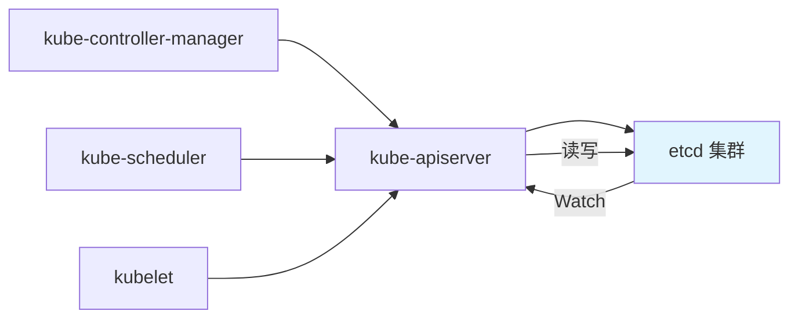

#### 1.1.3 协调服务的核心特性需求

一个优秀的分布式协调服务需要具备以下核心特性：

| 特性 | 说明 | etcd 实现方式 |
|-----|------|-------------|
| **高可用** | 部分节点故障不影响服务 | Raft 协议，多数节点存活即可服务 |
| **数据一致性** | 所有节点数据一致 | Raft 日志复制 + 强一致性读 |
| **低容量高性能** | 存储元数据，读写性能好 | B+ tree 索引 + boltdb 存储 |
| **Watch 机制** | 实时感知数据变化 | MVCC + 事件流式推送 |
| **可维护性** | 易于部署、监控、备份 | 丰富的 API 和工具链 |

> **重要提示**：etcd 是为存储**少量关键元数据**而设计的，官方建议单个 value 不超过 1.5MB，db 总大小不超过 8GB。它不适合作为通用的大数据存储方案。

---

### 1.2 etcd v2 的局限性

在深入了解 etcd v3 之前，我们有必要了解 etcd v2 存在的问题，这有助于理解 v3 版本各项改进的设计动机。

#### 1.2.1 不支持范围查询和分页

etcd v2 的数据模型是**层次化的目录结构**，类似于文件系统。虽然这种模型直观，但存在明显的局限：

- **无法高效地范围查询**：查询某个前缀下的所有 key 需要递归遍历
- **不支持分页**：当目录下有大量 key 时，一次性返回所有数据可能导致内存暴涨
- **更新效率低**：每次修改都需要从根节点开始遍历

```
# etcd v2 目录结构示例
/
├── registry/
│   ├── pods/
│   │   ├── default/
│   │   │   ├── pod-1
│   │   │   └── pod-2
│   │   └── kube-system/
│   │       └── pod-3
│   └── services/
│       └── ...
```

#### 1.2.2 Watch 机制不可靠（滑动窗口）

etcd v2 的 Watch 机制基于**滑动窗口**实现，只在内存中保留最近 1000 条历史事件：

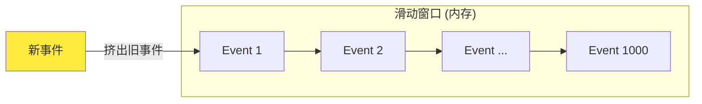

**问题**：

- 如果 client 断开连接时间较长，重连后可能发现需要的事件已被滑出窗口
- 只能重新全量获取数据，导致大量 expensive request
- 在高并发写入场景下，事件容易丢失

#### 1.2.3 HTTP/1.x 性能瓶颈

etcd v2 使用 HTTP/1.x + JSON 协议：

| 问题 | 影响 |
|-----|------|
| HTTP/1.x 不支持多路复用 | 每个 Watch 需要独立连接，连接数爆炸 |
| JSON 序列化开销大 | CPU 消耗高，延迟增加 |
| 短连接模式 | 频繁建立/断开连接，资源浪费 |

在 Kubernetes 这样的大规模集群中，可能同时存在数千个 Watch 连接，HTTP/1.x 的架构根本无法承载。

#### 1.2.4 内存占用高

由于 etcd v2 的数据全部存储在内存中（目录树结构），没有持久化的多版本历史数据支持：

- **内存占用与数据量成正比**：大量 key 会导致内存暴涨
- **无法支撑大规模集群**：Kubernetes 集群 key 数量可能达到数十万级别
- **重启恢复慢**：需要从 WAL 日志完整回放

---

### 1.3 etcd v3 的革新

针对 v2 版本的种种问题，etcd v3 进行了全面的架构重设计，实现了质的飞跃。

#### 1.3.1 MVCC 多版本并发控制

MVCC（Multi-Version Concurrency Control）是 etcd v3 最核心的改进之一：

**核心思想**：每次修改操作不是覆盖原值，而是创建新版本，保留历史版本。

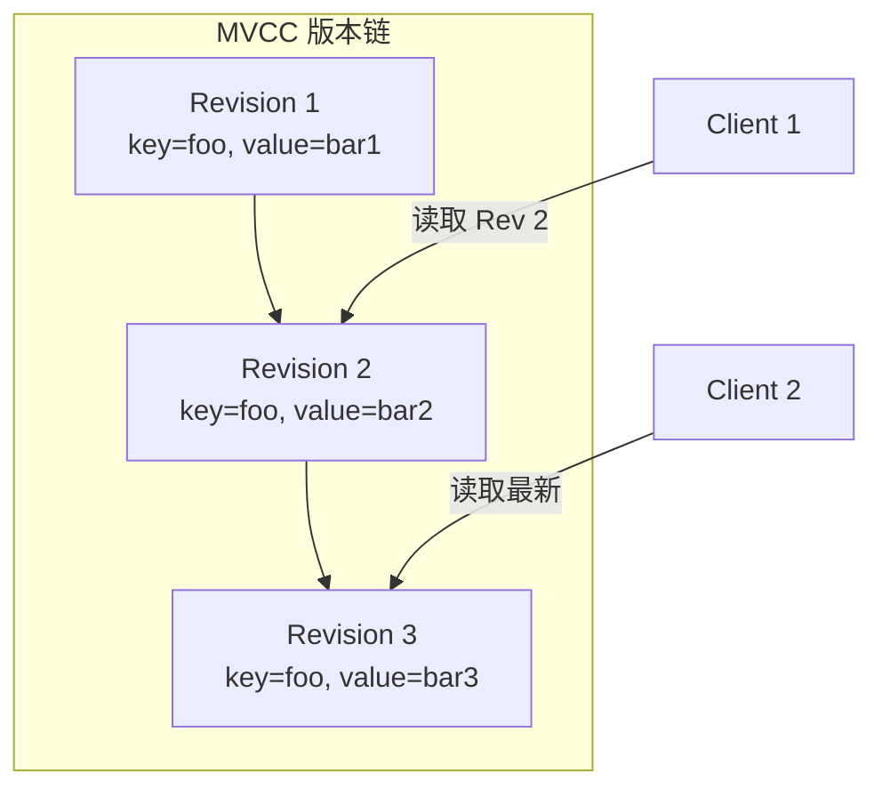

**带来的好处**：

| 特性 | 说明 |
|-----|------|
| **可靠的 Watch** | 基于 Revision 增量同步，不再丢失事件 |
| **事务隔离** | 支持快照读，读操作不阻塞写操作 |
| **历史版本查询** | 可以查询任意历史时刻的数据状态 |
| **乐观并发控制** | 基于版本号进行冲突检测 |

> **版本号概念**：每次写操作（put/delete）都会使全局 Revision 递增。Revision 是 etcd 的逻辑时钟，是实现 Watch、事务等特性的基础。

#### 1.3.2 gRPC 协议与 HTTP/2 多路复用

etcd v3 使用 gRPC + Protocol Buffers 替代了 HTTP/1.x + JSON：

| 特性 | v2 (HTTP/1.x + JSON) | v3 (gRPC + Protobuf) |
|-----|---------------------|---------------------|
| 连接复用 | 不支持 | HTTP/2 多路复用 |
| 序列化效率 | JSON 文本格式 | Protobuf 二进制格式 |
| Watch 连接 | 每个 Watch 独立连接 | 单连接支持多个 Watch |
| 延迟 | 较高 | 更低 |
| 带宽消耗 | 较大 | 更小 |

**HTTP/2 多路复用示意**：

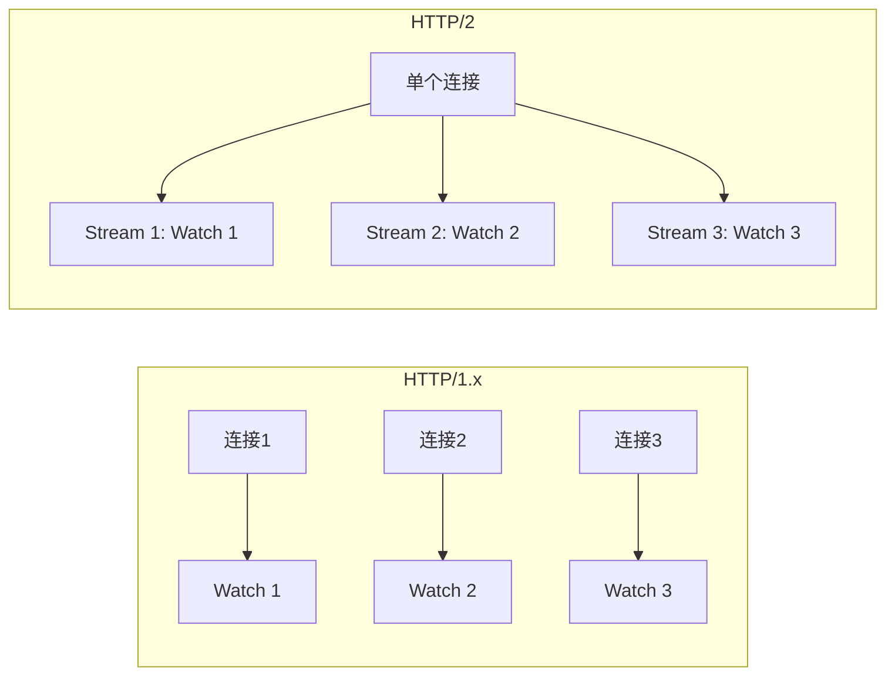

#### 1.3.3 Lease 租约机制

etcd v3 引入了 Lease（租约）机制，用于实现 key 的自动过期和客户端活性检测：

**核心概念**：

- **Lease**：一个带有 TTL（生存时间）的租约对象
- **Grant**：创建租约，指定 TTL
- **Attach**：将 key 关联到某个 Lease
- **KeepAlive**：续约，刷新 TTL
- **Revoke**：撤销租约，关联的所有 key 自动删除

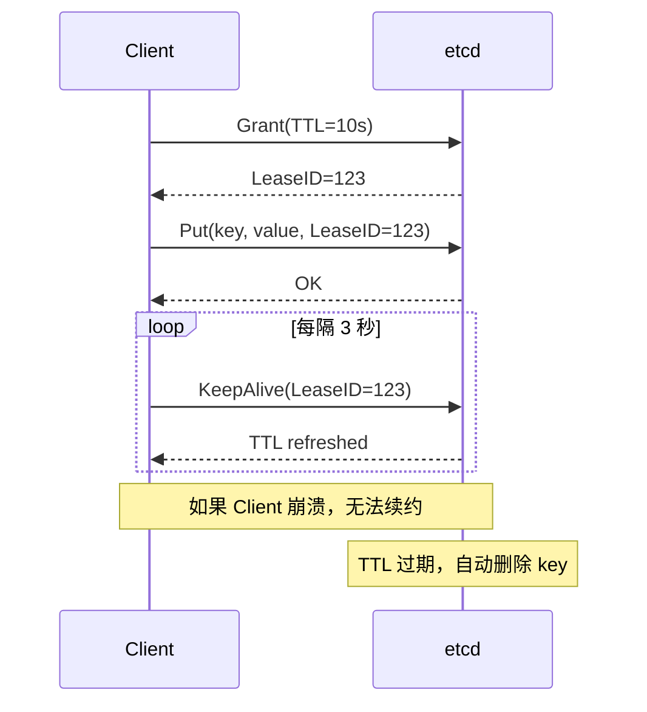

**典型应用场景**：

- **服务注册与发现**：服务实例注册时关联 Lease，实例下线后自动摘除
- **分布式锁**：锁 key 关联 Lease，持有者崩溃后锁自动释放
- **Leader 选举**：Leader key 关联 Lease，Leader 失联后自动触发重新选举

#### 1.3.4 B-tree 索引与 boltdb 持久化

etcd v3 采用了全新的存储架构：

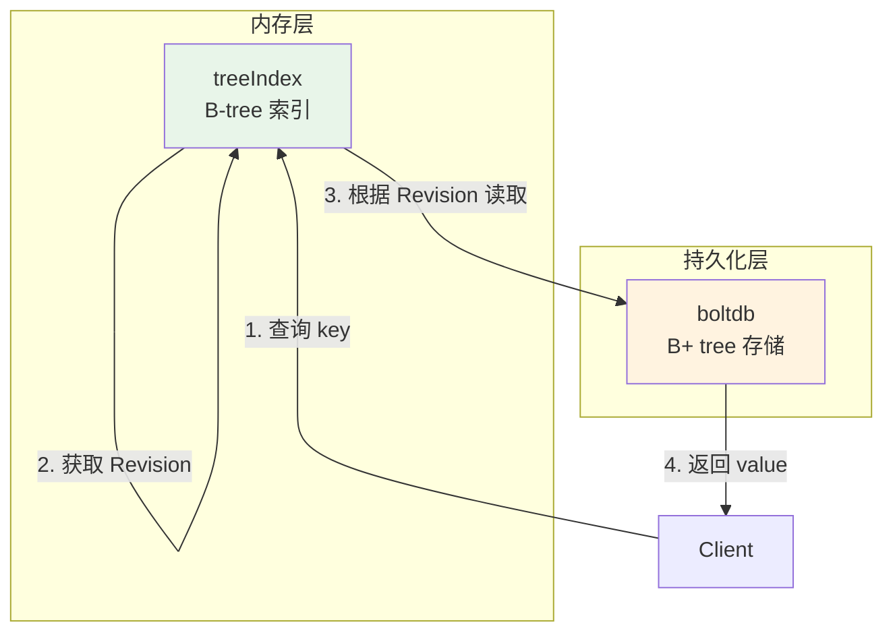

**两层架构说明**：

| 层级 | 组件 | 数据结构 | 存储内容 |
|-----|------|---------|---------|
| 内存索引层 | treeIndex | B-tree | key → Revision 映射 |
| 持久化层 | boltdb | B+ tree | Revision → (key, value) |

**优势**：

- **内存高效**：只在内存中保留索引，数据持久化到磁盘
- **支持大规模数据**：不再受内存大小限制（受限于磁盘）
- **范围查询高效**：B-tree 天然支持有序遍历
- **读性能优异**：热点数据通过 mmap 缓存在内存

---

### 1.4 本章小结

本章介绍了 etcd 的发展历程、Kubernetes 选择 etcd 的原因，以及 etcd v2 到 v3 的重大演进。核心要点：

| 主题 | 关键点 |
|-----|-------|
| etcd 定位 | 分布式协调服务，存储关键元数据 |
| K8s 选择原因 | 强一致性、Watch、高可用、事务 |
| v2 问题 | 无范围查询、Watch 不可靠、HTTP/1.x 性能差、内存占用高 |
| v3 革新 | MVCC、gRPC/HTTP/2、Lease、B-tree + boltdb |

> **知识延伸**：在后续章节中，我们将深入探讨 etcd 的内部实现原理，包括 Raft 共识算法、MVCC 机制、Watch 实现等核心内容。

---

## 第2章 etcd 整体架构

### 2.1 五层架构概述

etcd 采用分层架构设计，按照功能职责可以划分为五个层次。理解这个架构对于排查问题、优化性能至关重要。

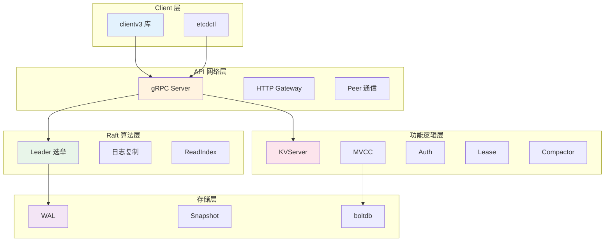

#### 2.1.1 Client 层

Client 层提供了与 etcd 集群交互的客户端库和工具：

| 组件 | 说明 | 特性 |
|-----|------|-----|
| **clientv3** | Go 语言客户端库 | 支持负载均衡、故障自动转移、Watch 多路复用 |
| **etcdctl** | 命令行工具 | 基于 clientv3 封装，支持所有 etcd 操作 |
| **grpc-gateway** | HTTP 代理 | 允许 HTTP/1.x 客户端访问 etcd v3 API |

**负载均衡算法演进**：

```
etcd 3.3 及之前:  Pinned endpoint（固定选择一个节点）
                  问题：可能导致负载不均衡
                  
etcd 3.4+:        Round-robin（轮询）
                  优势：请求均匀分布到各个节点
```

> **重要提示**：建议使用 etcd 3.4+ 版本的 clientv3 库，早期版本存在负载均衡 Bug，可能导致第一个节点异常时 client 无法正常访问。

#### 2.1.2 API 网络层（gRPC Server）

API 网络层负责处理 client 与 server、server 与 server 之间的网络通信：

| 通信类型 | 协议 | 端口 | 用途 |
|---------|------|------|-----|
| client → server | gRPC (HTTP/2) | 2379 | 客户端请求 |
| client → server | HTTP/1.x (兼容) | 2379 | 通过 grpc-gateway 转发 |
| server ↔ server | HTTP | 2380 | Raft 日志复制、Leader 选举 |

**gRPC 相比 HTTP/1.x 的优势**：

- **二进制协议**：Protobuf 序列化，比 JSON 更紧凑高效
- **多路复用**：单连接支持多个并发请求/响应
- **流式传输**：支持双向流，适合 Watch 场景
- **Server Push**：服务端可主动推送数据

#### 2.1.3 Raft 算法层

Raft 算法层是 etcd 实现高可用和数据一致性的核心：

| 功能模块 | 职责 |
|---------|------|
| **Leader 选举** | 集群启动或 Leader 故障时选举新 Leader |
| **日志复制** | Leader 将写请求复制到 Follower 节点 |
| **ReadIndex** | 实现线性读，确保读取最新数据 |
| **成员变更** | 动态添加/删除集群节点 |

> **核心原则**：任何写操作必须经过 Leader 处理，并被多数节点（N/2+1）确认后才能提交。

#### 2.1.4 功能逻辑层

功能逻辑层实现了 etcd 的核心业务特性：

| 模块 | 功能 | 详细说明 |
|-----|------|---------|
| **KVServer** | 键值操作 | 处理 Get/Put/Delete/Txn 等请求 |
| **MVCC** | 多版本控制 | treeIndex（内存索引）+ boltdb（持久化） |
| **Auth** | 鉴权认证 | 用户认证、RBAC 权限控制 |
| **Lease** | 租约管理 | TTL、KeepAlive、自动过期 |
| **Compactor** | 数据压缩 | 清理历史版本，回收存储空间 |
| **Watcher** | 事件监听 | 实时推送 key 变化事件 |

#### 2.1.5 存储层

存储层负责数据的持久化和恢复：

| 组件 | 功能 | 数据内容 |
|-----|------|---------|
| **WAL** | 预写日志 | Raft 日志条目，保证 crash 后数据不丢失 |
| **Snapshot** | 快照 | 某时刻的完整数据状态，用于快速恢复 |
| **boltdb** | 持久化存储 | B+ tree 结构，存储实际的 key-value 数据 |

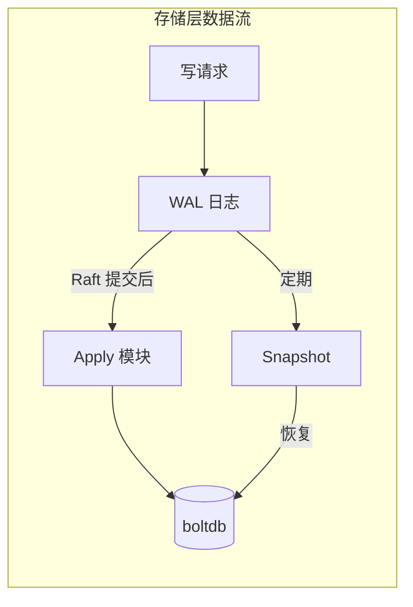

### 2.2 核心模块交互关系图

下面是一个完整的读请求执行流程图，展示了各模块之间的协作关系：

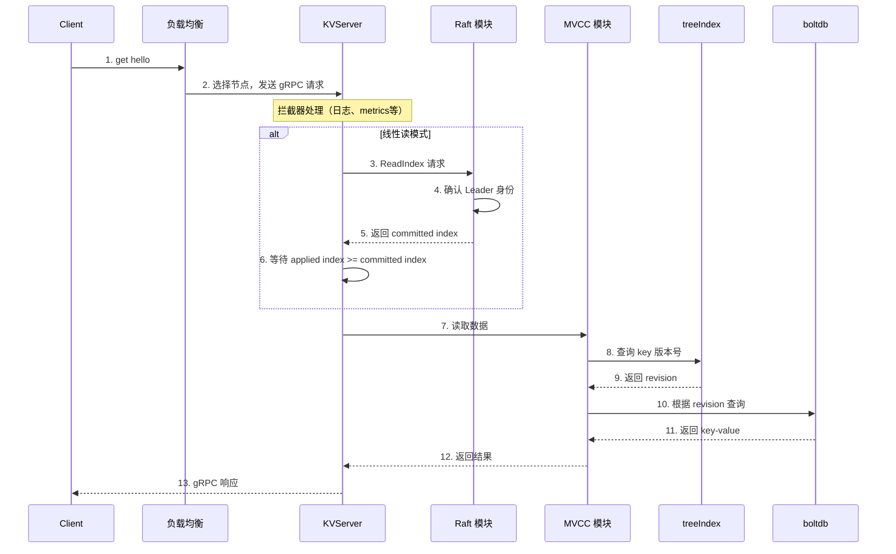

---

## 第3章 读请求执行流程

### 3.1 客户端请求发起

当你执行一个简单的 `etcdctl get hello` 命令时，背后发生了一系列复杂的操作。

```bash
$ etcdctl get hello --endpoints http://127.0.0.1:2379
hello
world
```

#### 3.1.1 负载均衡策略（Round-robin）

etcd clientv3 库采用 **Round-robin（轮询）** 算法在多个 endpoint 之间分配请求：

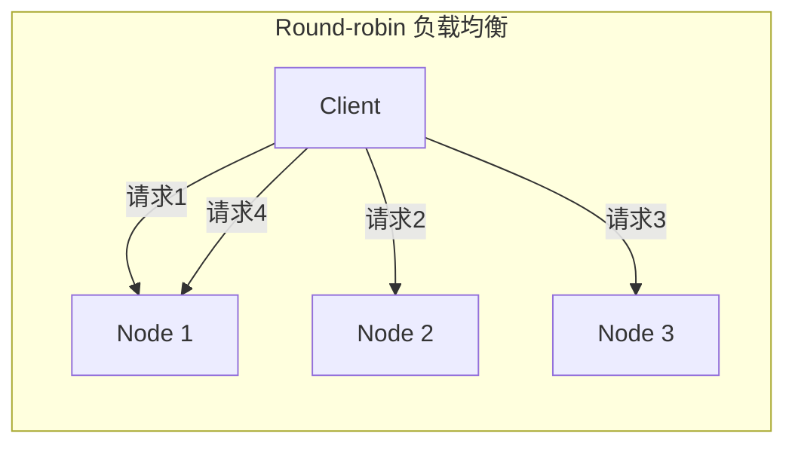

**关键特性**：

| 特性 | 说明 |
|-----|------|
| **长连接** | 与每个 endpoint 保持 gRPC 长连接 |
| **故障转移** | 节点异常时自动切换到其他健康节点 |
| **健康检查** | 定期检测节点可用性 |

**配置建议**：

```bash
# 生产环境建议配置多个 endpoints
etcdctl get hello --endpoints=http://node1:2379,http://node2:2379,http://node3:2379
```

#### 3.1.2 gRPC 连接建立

client 与 server 之间使用 gRPC 协议通信，基于 HTTP/2 实现：

| 特性 | HTTP/1.x | HTTP/2 (gRPC) |
|-----|----------|---------------|
| 连接复用 | 不支持 | 多路复用 |
| 数据格式 | 文本 (JSON) | 二进制 (Protobuf) |
| 头部压缩 | 无 | HPACK 压缩 |
| 请求模式 | 请求-响应 | 支持双向流 |

### 3.2 KVServer 模块处理

请求到达 etcd server 后，首先进入 KVServer 模块。

#### 3.2.1 拦截器链（Interceptor Chain）

etcd 使用 gRPC 拦截器实现了一系列非侵入式的横切关注点：


**拦截器功能列表**：

| 拦截器 | 功能 |
|-------|------|
| **Debug 日志** | 记录请求详情，便于问题排查 |
| **Metrics 统计** | 采集请求延时、错误码等指标 |
| **慢查询日志** | 超过阈值的请求打印告警日志（含来源 IP） |
| **Leader 检查** | 某些操作要求集群必须有 Leader |
| **Learner 限制** | Learner 节点只允许特定接口访问 |

#### 3.2.2 请求认证与限速

如果启用了鉴权，请求还需要经过认证和授权检查：

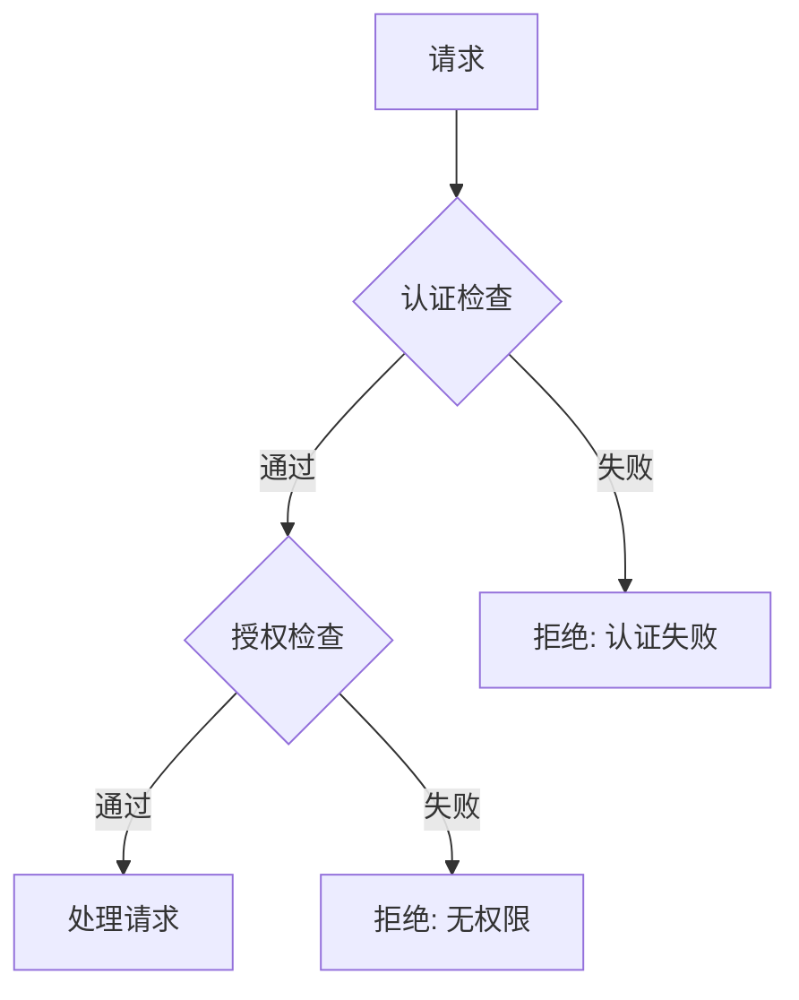

### 3.3 读模式详解

etcd 提供两种读模式，适用于不同的业务场景。

#### 3.3.1 串行读（Serializable Read）

**原理**：直接从本节点的状态机读取数据，不经过 Raft 协议。

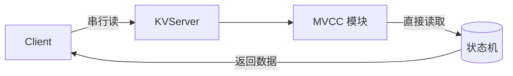

**特点**：

| 优点 | 缺点 |
|-----|------|
| 低延时 | 可能读到旧数据 |
| 高吞吐量 | 不保证线性一致性 |
| 不依赖 Leader | 各节点数据可能不一致 |

**适用场景**：

- 定时数据统计、监控采集
- 对数据时效性要求不高的查询
- 只读的旁路系统

**使用方式**：

```bash
# etcdctl 指定串行读
etcdctl get hello --consistency=s

# Go 代码
resp, err := cli.Get(ctx, "hello", clientv3.WithSerializable())
```

#### 3.3.2 线性读（Linearizable Read）

**原理**：确保读取到的数据反映了集群的最新共识状态。

**为什么需要线性读？**

考虑以下场景：

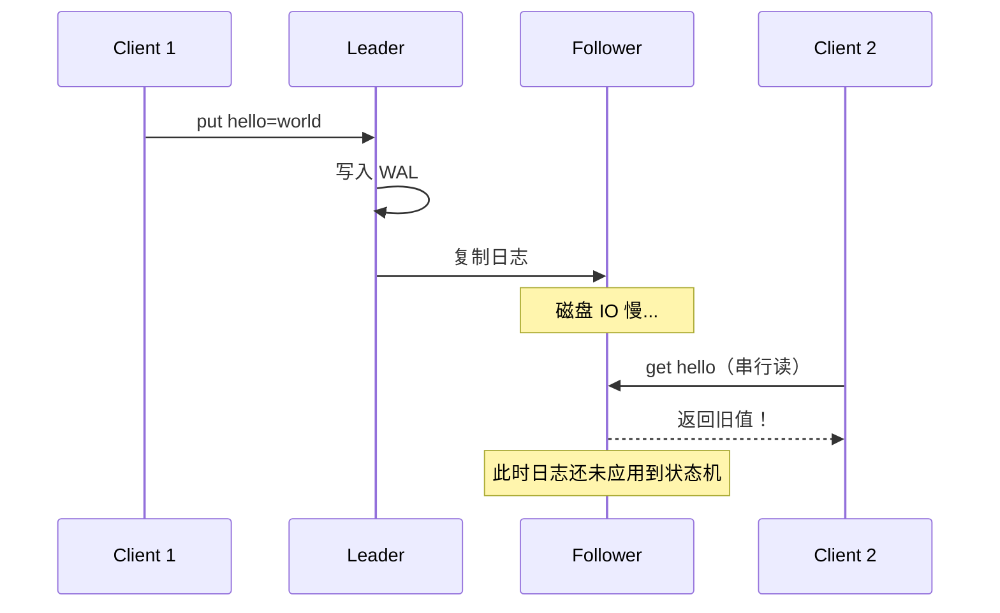

如果使用串行读，Client 2 可能读到旧数据。线性读通过 ReadIndex 机制解决这个问题。

**特点**：

| 优点 | 缺点 |
|-----|------|
| 强一致性 | 延时略高 |
| 访问多节点如同单节点 | 需要与 Leader 交互 |
| 适合金融、交易等场景 | 吞吐量略低于串行读 |

> **默认行为**：etcd 默认使用线性读模式。

#### 3.3.3 ReadIndex 机制原理

ReadIndex 是 etcd 3.1 引入的线性读优化机制，取代了早期的 Raft Log Read。

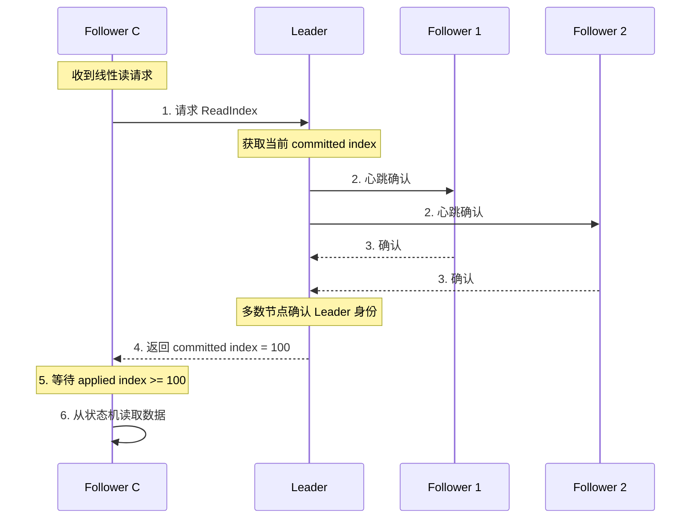

**ReadIndex 流程详解**：

| 步骤 | 操作 | 目的 |
|-----|------|------|
| 1 | Follower 向 Leader 请求 ReadIndex | 获取 Leader 最新的 committed index |
| 2 | Leader 发送心跳给其他节点 | 确认自己仍是合法 Leader（防止脑裂） |
| 3 | 多数节点响应心跳 | 证明 Leader 身份有效 |
| 4 | Leader 返回 committed index | 告知 Follower 当前最新提交位置 |
| 5 | Follower 等待本地追赶 | 确保 applied index >= committed index |
| 6 | 从本地状态机读取 | 此时数据已是最新 |

**ReadIndex vs Raft Log Read**：

| 对比项 | Raft Log Read (早期) | ReadIndex (3.1+) |
|-------|---------------------|------------------|
| 原理 | 读请求也走 Raft 日志 | 只获取 committed index |
| 磁盘 IO | 需要写 WAL | 不需要 |
| 性能 | 较差 | 较好 |
| 复杂度 | 简单但低效 | 稍复杂但高效 |

### 3.4 MVCC 模块数据获取

线性读完成后，请求进入 MVCC 模块获取实际数据。

#### 3.4.1 treeIndex 索引查询

treeIndex 是基于 Google 开源的 btree 库实现的内存索引模块：

**数据结构**：

```
treeIndex (B-tree)
├── key: "foo" -> keyIndex { revisions: [1, 3, 5] }
├── key: "bar" -> keyIndex { revisions: [2, 4] }
└── key: "hello" -> keyIndex { revisions: [6] }
```

**查询流程**：


**为什么选择 B-tree 而不是 Hash 表？**

| 特性 | B-tree | Hash 表 |
|-----|--------|---------|
| 范围查询 | ✅ 高效 | ❌ 不支持 |
| 有序遍历 | ✅ 天然有序 | ❌ 无序 |
| 前缀查询 | ✅ 支持 | ❌ 不支持 |
| 点查询 | O(log n) | O(1) |

etcd 需要支持范围查询（如 `get --prefix`），因此 B-tree 是更合适的选择。

#### 3.4.2 boltdb 数据读取

从 treeIndex 获取版本号后，需要从 boltdb 读取实际的 key-value 数据。

**数据存储格式**：

```
boltdb 存储结构:
├── Bucket: "key"           # 用户数据
│   ├── revision=1 -> {key: "foo", value: "v1", ...}
│   ├── revision=2 -> {key: "bar", value: "v1", ...}
│   └── revision=6 -> {key: "hello", value: "world", ...}
└── Bucket: "meta"          # etcd 元数据
    └── ...
```

**读取流程**：

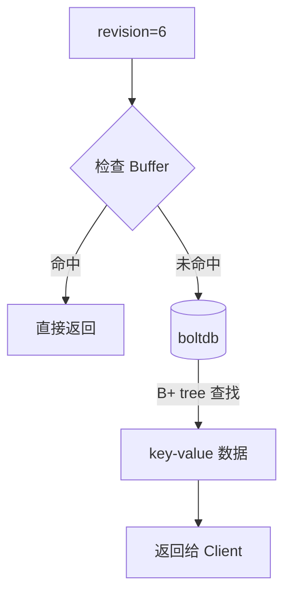

**Buffer 缓存机制**：

etcd 在访问 boltdb 前会先检查内存中的读事务 buffer：

- **命中**：直接返回，无需磁盘 IO
- **未命中**：通过 boltdb Cursor 在 B+ tree 中查找

### 3.5 本章小结

本章详细介绍了 etcd 读请求的完整执行流程：

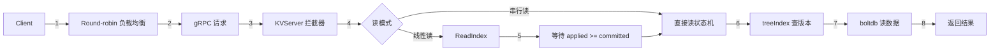

**核心要点总结**：

| 主题 | 关键点 |
|-----|-------|
| 负载均衡 | Round-robin 轮询，建议 3.4+ 版本 |
| 两种读模式 | 串行读（快但可能旧）vs 线性读（强一致） |
| ReadIndex | 获取 committed index，等待本地追赶 |
| MVCC 查询 | treeIndex 获取版本号 → boltdb 读数据 |

> **性能建议**：如果业务对数据一致性要求不高，使用串行读可以获得更好的性能。如果需要强一致性，使用默认的线性读。

---

## 第4章 写请求执行流程

写请求与读请求不同，它涉及更多的模块和复杂的一致性保证机制。本章将详细介绍一个 `put` 请求从 client 发起到数据持久化的完整流程。

```bash
$ etcdctl put hello world --endpoints http://127.0.0.1:2379
OK
```

### 4.1 写请求整体流程

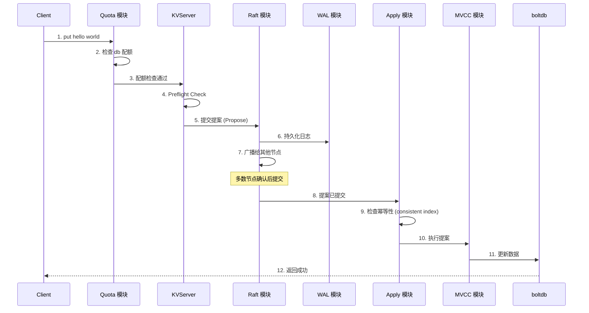

### 4.2 Quota 配额模块

Quota 模块是写请求遇到的第一道关卡，负责检查 db 配额。

#### 4.2.1 db 大小配额检查

**常见错误**：

```
etcdserver: mvcc: database space exceeded
```

这是使用 etcd 时最常见的错误之一。当 etcd db 文件大小超过配额时，整个集群将变为**只读模式**，拒绝所有写入请求。

**触发原因**：

| 原因 | 说明 |
|-----|------|
| 默认配额过小 | 默认 quota-backend-bytes 仅为 2GB |
| 未配置压缩策略 | 历史版本不断累积 |
| 数据量增长 | 业务数据、K8s 集群规模增大 |
| boltdb Bug | etcd 3.2.10 之前版本备份可能触发 |

**工作原理**：

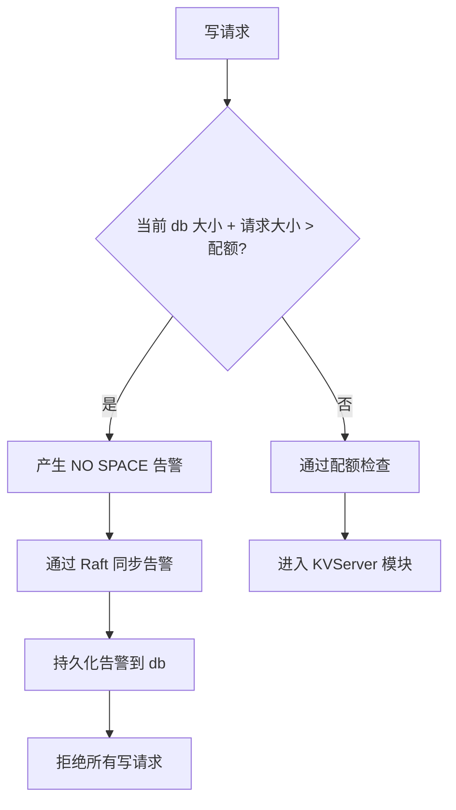

#### 4.2.2 配额告警机制

当配额检查失败时，etcd 会触发 `NO SPACE` 告警：

1. **告警产生**：写入请求导致 db 超限
2. **告警同步**：通过 Raft 日志同步给所有节点
3. **告警持久化**：存储到 db 中
4. **写入拒绝**：API 层和 Apply 模块都拒绝写入

**解决步骤**：

```bash
# 1. 调大配额（建议不超过 8GB）
etcd --quota-backend-bytes=$((8*1024*1024*1024))

# 2. 取消告警（必须！否则仍然拒绝写入）
etcdctl alarm disarm

# 3. 检查并配置压缩策略
etcdctl compact <revision>

# 4. 可选：碎片整理（对性能有影响）
etcdctl defrag
```

> **重要提示**：调大配额后，必须执行 `etcdctl alarm disarm` 取消告警，否则集群仍然拒绝写入。

### 4.3 KVServer 前置检查

通过 Quota 检查后，请求进入 KVServer 模块。在提交 Raft 提案前，还需要进行一系列前置检查。

#### 4.3.1 请求合法性校验

KVServer 会执行以下检查（Preflight Check）：

```mermaid
graph TB
    Req[写请求] --> C1{committed - applied > 5000?}
    C1 --> |是| E1[too many requests]
    C1 --> |否| C2{Token 有效?}
    C2 --> |否| E2[invalid auth token]
    C2 --> |是| C3{请求大小 > 1.5MB?}
    C3 --> |是| E3[request is too large]
    C3 --> |否| Pass[通过检查]
    
    style E1 fill:#ffcdd2
    style E2 fill:#ffcdd2
    style E3 fill:#ffcdd2
    style Pass fill:#c8e6c9
```

**检查项说明**：

| 检查项 | 阈值 | 错误信息 |
|-------|------|---------|
| 日志堆积 | committed - applied > 5000 | `etcdserver: too many requests` |
| Token 验证 | Token 无效 | `auth: invalid auth token` |
| 请求大小 | > 1.5MB | `etcdserver: request is too large` |

#### 4.3.2 限速判断（committed vs applied index）

**为什么要限速？**

```mermaid
graph LR
    subgraph "正常情况"
        CI1[committed index: 100]
        AI1[applied index: 98]
        D1[差值: 2]
    end
    
    subgraph "异常情况"
        CI2[committed index: 10000]
        AI2[applied index: 4000]
        D2[差值: 6000 > 5000]
    end
```

- **committed index**：已被多数节点确认的日志索引
- **applied index**：已应用到状态机的日志索引

当两者差值过大时，说明 Apply 模块处理不过来（可能是磁盘 IO 慢），此时继续接受新请求会导致：

- 内存中日志条目堆积
- 可能导致 OOM
- 进一步恶化性能

#### 4.3.3 提案提交（Propose）

通过所有检查后，KVServer 会：

1. **生成唯一 ID**：标识此请求
2. **创建通知 channel**：等待结果返回
3. **提交提案**：向 Raft 模块发起 Propose

```go
// 伪代码
proposalID := generateUniqueID()
ch := make(chan Result)
pendingProposals[proposalID] = ch

raft.Propose(ctx, encodeProposal(put, "hello", "world"))

// 等待结果或超时
select {
case result := <-ch:
    return result
case <-time.After(7 * time.Second):
    return ErrTimeout
}
```

> **超时时间**：默认 7 秒 = 5秒磁盘IO延时 + 2×1秒竞选超时

### 4.4 WAL 日志持久化

Raft 模块收到提案后，Leader 需要将日志持久化到 WAL 文件，并广播给其他节点。

#### 4.4.1 WAL 日志结构

WAL（Write Ahead Log）是 etcd 保证数据不丢失的关键机制。

```mermaid
graph LR
    subgraph "WAL 文件结构"
        R1[记录1: 元数据]
        R2[记录2: 日志条目]
        R3[记录3: 状态信息]
        R4[记录4: 日志条目]
        R5[记录5: CRC]
    end
    
    R1 --> R2 --> R3 --> R4 --> R5
```

**WAL 记录格式**：

```
+---------+--------+------+
|  Type   |  CRC   | Data |
+---------+--------+------+
| 类型标识 | 校验码  | 数据  |
+---------+--------+------+
```

**WAL 记录类型**：

| 类型 | 说明 | 写入时机 |
|-----|------|---------|
| 文件元数据 | 节点 ID、集群 ID | WAL 文件创建时 |
| 日志条目 | Raft 日志（如 put 提案） | 每次写请求 |
| 状态信息 | 任期号、投票信息 | 选举、状态变更时 |
| CRC | 上一个 WAL 文件的 CRC | 创建/切割 WAL 文件时 |
| 快照 | 快照的任期号、索引 | 生成快照时 |

#### 4.4.2 Raft 日志条目结构

```go
type Entry struct {
    Term  uint64    // Leader 任期号
    Index uint64    // 日志索引（单调递增）
    Type  EntryType // 日志类型
    Data  []byte    // 提案内容
}
```

| 字段 | 说明 |
|-----|------|
| **Term** | Leader 任期号，每次选举递增 |
| **Index** | 日志条目索引，全局单调递增 |
| **Type** | 普通命令（EntryNormal）或配置变更（EntryConfChange） |
| **Data** | 序列化后的 put 提案内容 |

#### 4.4.3 fsync 持久化机制

WAL 模块持久化日志的流程：

```mermaid
graph TB
    E[Raft Entry] --> Serialize[序列化 Entry]
    Serialize --> CalcCRC[计算 CRC]
    CalcCRC --> Build[构建 WAL 记录]
    Build --> Write[写入 WAL 文件]
    Write --> Fsync[调用 fsync]
    Fsync --> Done[持久化完成]
```

**关键步骤**：

1. 序列化 Raft 日志条目
2. 计算 CRC 校验码
3. 写入记录长度 + 记录内容
4. **调用 fsync 刷盘**（确保数据真正写入磁盘）

> **性能影响**：fsync 是同步操作，磁盘 IO 性能直接影响写吞吐量。建议使用 SSD 盘。

### 4.5 Apply 模块

当多数节点持久化日志后，Raft 模块通知 etcdserver 该提案已提交，然后进入 Apply 模块执行。

#### 4.5.1 consistent index 幂等性保证

**问题**：如果 Apply 过程中 etcd crash，重启后如何避免重复执行？

**解决方案**：引入 `consistent index` 字段

```mermaid
graph TB
    subgraph "Apply 模块执行流程"
        Entry[Raft Entry<br/>Index=100] --> Check{Entry.Index <= consistent index?}
        Check --> |是| Skip[跳过执行]
        Check --> |否| Execute[执行提案]
        Execute --> Update[更新 consistent index = 100]
    end
```

**工作原理**：

1. **持久化存储**：`consistent index` 存储在 boltdb 的 meta bucket 中
2. **原子更新**：执行提案和更新 consistent index 在同一个事务中
3. **重启恢复**：从 WAL 重放日志时，跳过已执行的条目

```
重启恢复流程:
1. 从 boltdb 读取 consistent index = 99
2. 从 WAL 重放日志条目
3. Index <= 99 的条目跳过
4. Index > 99 的条目执行
```

#### 4.5.2 状态机应用流程

Apply 模块从 FIFO 队列中依次处理提案：

```mermaid
graph LR
    subgraph "FIFO 队列"
        P1[提案1] --> P2[提案2] --> P3[提案3]
    end
    
    P1 --> Apply[Apply 模块]
    Apply --> C1{已执行?}
    C1 --> |是| Skip[跳过]
    C1 --> |否| C2{NO SPACE 告警?}
    C2 --> |是| Reject[拒绝]
    C2 --> |否| MVCC[执行 MVCC 操作]
```

### 4.6 MVCC 写操作

Apply 模块调用 MVCC 模块执行实际的写入操作。

#### 4.6.1 版本号生成

版本号（Revision）是 etcd 的逻辑时钟：

```mermaid
graph LR
    subgraph "全局 Revision"
        R1[启动: revision=1]
        R2[put foo: revision=2]
        R3[put bar: revision=3]
        R4[delete foo: revision=4]
    end
    
    R1 --> R2 --> R3 --> R4
```

**Revision 结构**：

```go
type Revision struct {
    Main int64  // 主版本号（事务ID）
    Sub  int64  // 子版本号（事务内操作序号）
}
// 例如: {2, 0} 表示主版本2，子版本0
```

**版本号恢复**：

etcd 重启时，不需要单独持久化全局版本号。它通过遍历 boltdb 中的 key（版本号作为 key），找到最大的版本号作为 `currentRevision`。

#### 4.6.2 treeIndex 索引更新

执行 `put hello world` 时，treeIndex 的更新流程：

```mermaid
graph TB
    subgraph "treeIndex 更新"
        Cur[currentRevision=1] --> Inc[自增: revision={2,0}]
        Inc --> Query[查询 key=hello 是否存在]
        Query --> |不存在| Create[创建 keyIndex]
        Query --> |存在| Update[追加 revision]
        Create --> Store[存储到 B-tree]
        Update --> Store
    end
```

**keyIndex 结构变化**：

```
# put hello world (revision=2)
keyIndex {
    key: "hello",
    modified: {2, 0},
    generations: [
        {
            created: {2, 0},
            revisions: [{2, 0}]
        }
    ]
}

# put hello world2 (revision=5)
keyIndex {
    key: "hello",
    modified: {5, 0},
    generations: [
        {
            created: {2, 0},
            revisions: [{2, 0}, {5, 0}]
        }
    ]
}
```

#### 4.6.3 boltdb 数据写入

treeIndex 更新后，需要将数据持久化到 boltdb：

**boltdb key**：版本号 `{2, 0}`

**boltdb value**：包含以下信息的结构体

| 字段 | 说明 | 示例 |
|-----|------|-----|
| key | 用户 key 名称 | "hello" |
| create_revision | 创建时的版本号 | 2 |
| mod_revision | 最后修改的版本号 | 2 |
| version | key 自身修改次数 | 1 |
| value | 用户 value | "world" |
| lease | 租约 ID（如有） | 0 |

> **为什么要存储 key 名称？** 因为 boltdb 的 key 是版本号，重启时需要根据 value 中的 key 名称重建 treeIndex。

#### 4.6.4 批量事务提交优化

**问题**：每次写入都提交事务，性能太差（需要 B+ tree 平衡、脏页刷盘等）。

**解决方案**：批量提交 + bucket buffer

```mermaid
graph TB
    subgraph "写入优化"
        W1[写请求1] --> Buffer[Bucket Buffer]
        W2[写请求2] --> Buffer
        W3[写请求3] --> Buffer
        
        Buffer --> |异步 100ms| Commit[批量提交事务]
        Commit --> Disk[(磁盘)]
    end
    
    subgraph "读取流程"
        R[读请求] --> ReadBuffer{从 Buffer 读?}
        ReadBuffer --> |命中| Return1[返回数据]
        ReadBuffer --> |未命中| Boltdb[从 boltdb 读]
        Boltdb --> Return2[返回数据]
    end
```

**优化策略**：

| 优化点 | 方法 |
|-------|------|
| 顺序写入 | boltdb key 是递增版本号，天然顺序写 |
| 高填充率 | 调整 FillPercent，减少 page 分裂 |
| 批量提交 | 默认每 100ms 批量提交一次事务 |
| 读缓存 | bucket buffer 缓存未提交数据，保证读一致性 |

### 4.7 本章小结

本章详细介绍了 etcd 写请求的完整执行流程：

```mermaid
graph LR
    A[Client] --> B[Quota 配额检查]
    B --> C[KVServer 前置检查]
    C --> D[Raft 提案]
    D --> E[WAL 持久化]
    E --> F[多数确认]
    F --> G[Apply 幂等执行]
    G --> H[MVCC 写入]
    H --> I[boltdb 批量提交]
```

**核心要点总结**：

| 模块 | 关键功能 |
|-----|---------|
| **Quota** | db 配额检查，超限产生 NO SPACE 告警 |
| **KVServer** | 限速（committed vs applied）、请求大小检查 |
| **WAL** | 日志持久化，保证 crash-safe |
| **Apply** | consistent index 实现幂等性 |
| **MVCC** | 版本号生成、treeIndex/boltdb 更新 |
| **批量提交** | 异步 batch commit，提升吞吐量 |

**常见错误处理**：

| 错误 | 原因 | 解决方法 |
|-----|------|---------|
| `database space exceeded` | db 超过配额 | 调大配额 + 取消告警 + 配置压缩 |
| `too many requests` | 日志堆积过多 | 检查磁盘 IO、减少写入 |
| `request is too large` | 请求超过 1.5MB | 拆分大 value |
| `request timed out` | 超时未返回 | 检查网络、磁盘、集群状态 |

---

## 第5章 Raft 共识算法

Raft 是 etcd 实现高可用和数据强一致性的核心算法。本章将深入介绍 Raft 的三个子问题：Leader 选举、日志复制和安全性，帮助你理解 etcd 如何在节点故障、网络分区等异常场景下保持服务可用和数据一致。

### 5.1 分布式系统一致性挑战

#### 5.1.1 单点故障问题

早期的数据存储服务通常部署在单节点上。单节点存在**单点故障**风险：一旦宕机，整个服务不可用，对业务影响巨大。

```mermaid
graph LR
    subgraph "单节点架构"
        C[Client] --> S[单节点服务]
        S --> |宕机| X[服务不可用]
    end
```

为解决单点问题，引入了**多副本**技术：

- 提高服务可用性
- 提升读吞吐量
- 支持就近部署，降低访问延迟

#### 5.1.2 主从复制的缺陷

多副本常用的技术方案是**主从复制**，根据同步策略分为三种：

| 复制模式 | 原理 | 优点 | 缺点 |
|---------|------|------|------|
| **全同步复制** | 主节点等待所有从节点确认 | 强一致性 | 任一从节点故障导致不可用 |
| **异步复制** | 主节点立即返回，异步同步 | 高可用性 | 可能丢失数据 |
| **半同步复制** | 至少一个从节点确认即返回 | 平衡一致性和可用性 | 仍存在数据丢失风险 |

```mermaid
graph TB
    subgraph "全同步复制"
        M1[Master] --> |同步| S1[Slave 1]
        M1 --> |同步| S2[Slave 2]
        S1 --> |确认| M1
        S2 --> |确认| M1
        M1 --> |全部确认后| C1[返回成功]
    end
    
    subgraph "异步复制"
        M2[Master] --> C2[立即返回]
        M2 --> |异步| S3[Slave 1]
        M2 --> |异步| S4[Slave 2]
    end
```

**去中心化复制**（如 AWS Dynamo）允许任意节点接受写请求，通过 w/r 参数控制一致性级别，但需要处理写入冲突。

#### 5.1.3 共识算法的必要性

传统复制算法的困境：

- 为保证可用性，多数只能提供**最终一致性**
- 无法在一致性和可用性之间实现最佳平衡

**共识算法**基于**复制状态机**模型提出，通过以下组件保证一致性：

```mermaid
graph TB
    subgraph "复制状态机"
        C[共识模块] --> L[日志模块]
        L --> SM[状态机]
    end
    
    subgraph "节点1"
        C1[共识] --> L1[日志]
        L1 --> SM1[状态机]
    end
    
    subgraph "节点2"
        C2[共识] --> L2[日志]
        L2 --> SM2[状态机]
    end
    
    C1 <--> |同步| C2
    SM1 -.- |状态一致| SM2
```

**核心思想**：

1. 共识模块保证各节点日志一致
2. 各节点基于相同的日志、顺序执行指令
3. 最终各节点状态机结果一致

**Raft vs Paxos**：

- **Paxos**：共识算法祖师爷，但过于复杂，难以实现
- **Raft**：Stanford 大学 Diego 提出，以**可理解性、易实现**为目标

Raft 将复杂的共识问题拆分为三个子问题：

1. **Leader 选举**：Leader 故障后快速选出新 Leader
2. **日志复制**：Leader 负责复制日志到 Follower
3. **安全性**：确保数据一致性和完整性

---

### 5.2 Leader 选举

#### 5.2.1 节点角色（Follower/Candidate/Leader）

Raft 定义了三种节点状态：

| 角色 | 说明 | 职责 |
|-----|------|------|
| **Follower** | 跟随者 | 同步 Leader 日志，响应请求，etcd 启动默认状态 |
| **Candidate** | 竞选者 | 发起 Leader 选举，请求投票 |
| **Leader** | 领导者 | 处理写请求，复制日志，发送心跳维持身份 |

**状态转换关系**：

```mermaid
stateDiagram-v2
    [*] --> Follower: 启动
    
    Follower --> Candidate: 心跳超时
    Candidate --> Leader: 获得多数投票
    Candidate --> Follower: 发现新 Leader
    Candidate --> Candidate: 选举超时，重新选举
    Leader --> Follower: 发现更高任期
```

#### 5.2.2 心跳机制与选举超时

```mermaid
sequenceDiagram
    participant L as Leader (A)
    participant F1 as Follower (B)
    participant F2 as Follower (C)
    
    loop 正常情况
        L->>F1: MsgHeartbeat
        L->>F2: MsgHeartbeat
        F1-->>L: MsgHeartbeatResp
        F2-->>L: MsgHeartbeatResp
    end
    
    Note over L: Leader A crash
    
    Note over F1,F2: 心跳超时 > 选举超时
    
    F1->>F1: 转为 Candidate
    F1->>F2: MsgVote (请求投票)
    F2-->>F1: 投票给 B
    
    Note over F1: 获得多数票，成为 Leader
```

**关键参数**：

| 参数 | 默认值 | 说明 |
|-----|-------|------|
| `heartbeat-interval` | 100ms | Leader 发送心跳的间隔 |
| `election-timeout` | 1000ms | Follower 等待心跳的超时时间 |

> **调优建议**：根据网络延迟和磁盘 IO 情况调整这两个参数。如果参数设置不当，可能导致频繁的 Leader 切换，影响服务稳定性。

#### 5.2.3 任期号（Term）概念

Raft 将时间划分成一个个**任期（Term）**，类似于逻辑时钟：

```mermaid
graph LR
    subgraph "任期号演进"
        T1[Term 1<br/>Leader A] --> E1[选举]
        E1 --> T2[Term 2<br/>Leader B]
        T2 --> E2[选举]
        E2 --> T3[Term 3<br/>Leader C]
    end
```

**任期号的作用**：

- 比较各节点数据新旧
- 识别过期的 Leader
- 作为 Raft 算法的逻辑时钟

**规则**：

- 每个任期最多只有一个 Leader
- 任期号单调递增
- 节点发现更高任期号时，立即转为 Follower

#### 5.2.4 PreVote 机制（避免无效选举）

**问题场景**：

```mermaid
graph TB
    subgraph "网络分区"
        A[节点 A<br/>网络隔离] --> |不断自增任期号| A
        B[Leader B] <--> C[Follower C]
    end
    
    Note[A 恢复后，高任期号触发重新选举<br/>但 A 数据落后，无法当选<br/>导致无效选举]
```

节点 A 因网络问题与集群隔离后，会不断自增任期号发起选举。当网络恢复后，它的高任期号会触发集群重新选举，但由于数据落后，它无法当选，造成**无效选举**。

**解决方案：PreVote（预投票）**

etcd 3.4 引入 `PreVote` 参数（默认 false）：

```mermaid
stateDiagram-v2
    Follower --> PreCandidate: 心跳超时
    PreCandidate --> Candidate: 预投票成功
    PreCandidate --> Follower: 预投票失败
    Candidate --> Leader: 正式投票成功
```

**PreVote 流程**：

1. Follower 心跳超时后，先进入 **PreCandidate** 状态
2. **不自增任期号**，发起预投票
3. 若获得多数节点认可，才进入 Candidate 状态
4. 否则保持 Follower 状态，避免无效选举

```bash
# 启用 PreVote
etcd --pre-vote=true
```

---

### 5.3 日志复制

#### 5.3.1 日志条目结构

Raft 日志由有序的日志条目组成：

```
+-------+-------+-------+-------+-------+-------+
| Index | 1     | 2     | 3     | 4     | 5     | 6     |
+-------+-------+-------+-------+-------+-------+
| Term  | 1     | 1     | 1     | 2     | 2     | 2     |
+-------+-------+-------+-------+-------+-------+
| Data  | x←1   | y←2   | z←3   | x←4   | y←5   | hello |
+-------+-------+-------+-------+-------+-------+
```

**日志条目字段**：

| 字段 | 说明 |
|-----|------|
| **Index** | 日志索引，全局单调递增 |
| **Term** | 创建该条目时的 Leader 任期号 |
| **Data** | 提案内容（如 put hello world） |

#### 5.3.2 MatchIndex 与 NextIndex

Leader 维护两个核心字段来追踪 Follower 进度：

| 字段 | 说明 | 用途 |
|-----|------|------|
| **NextIndex** | 下一个要发送给 Follower 的日志索引 | 决定发送哪些日志 |
| **MatchIndex** | Follower 已复制的最大日志索引 | 决定哪些日志可提交 |

```mermaid
graph TB
    subgraph "Leader 视角"
        L[Leader B<br/>日志: 1,2,3,4,5,6]
        
        FA[Follower A<br/>MatchIndex=4<br/>NextIndex=5]
        FC[Follower C<br/>MatchIndex=6<br/>NextIndex=7]
    end
    
    L --> |发送 5,6| FA
    L --> |无需发送| FC
```

#### 5.3.3 日志提交规则

**日志复制整体流程**：

```mermaid
sequenceDiagram
    participant C as Client
    participant L as Leader B
    participant FA as Follower A
    participant FC as Follower C
    
    C->>L: 1. put hello world
    L->>L: 2. 生成日志条目 (Index=6)
    
    par 并行复制
        L->>FA: 3. MsgApp (日志条目 6)
        L->>FC: 3. MsgApp (日志条目 6)
    end
    
    L->>L: 4. 持久化到 WAL
    
    FA-->>L: 5. MsgAppResp (Match=5)
    FC-->>L: 5. MsgAppResp (Match=6)
    
    Note over L: 6. 计算提交位置<br/>Index 6 被 2/3 节点复制<br/>可以提交
    
    L->>L: 7. 更新 commitIndex=6
    L->>FA: 8. 心跳通知 commitIndex
    L->>FC: 8. 心跳通知 commitIndex
    
    L->>L: 9. 应用到状态机
    L-->>C: 10. 返回成功
```

**提交条件**：

> 一个日志条目被确定为**已提交**的前提是：它需要被 Leader 同步到**一半以上节点**。

```mermaid
graph LR
    subgraph "3节点集群"
        L[Leader<br/>Index 6 ✓]
        F1[Follower 1<br/>Index 6 ✓]
        F2[Follower 2<br/>Index 5]
    end
    
    Note[2/3 节点有 Index 6<br/>可以提交]
```

#### 5.3.4 etcd Raft 模块交互

etcd 的 Raft 模块是一个**纯算法库**，不直接进行网络和存储操作：

```mermaid
graph TB
    subgraph "etcd Raft 模块"
        Input[输入: Msg 消息] --> Raft[Raft 算法]
        Raft --> Output[输出: Ready 结构]
    end
    
    subgraph "上层应用 (etcdserver)"
        Ready[Ready 结构] --> WAL[持久化到 WAL]
        Ready --> Net[网络发送]
        Ready --> Apply[应用到状态机]
    end
    
    Output --> Ready
```

**Ready 结构包含**：

- 待持久化的日志条目
- 待发送给 peer 的消息
- 已提交的日志条目
- 线性查询结果

**完整流程**：

1. KV 模块提交 MsgProp 提案
2. Raft 模块生成日志条目，输出 Ready
3. etcdserver 从 Ready 获取消息
4. 通过 HTTP 协议广播 MsgApp 给 Follower
5. 持久化日志到 WAL
6. 追加到 Raft 日志存储（MemoryStorage）
7. Follower 回复 MsgAppResp
8. Leader 更新 MatchIndex，计算 commitIndex
9. 应用已提交日志到状态机

---

### 5.4 安全性保证

Raft 通过一系列规则确保数据一致性和完整性。

#### 5.4.1 选举规则限制

**规则 1：日志完整性检查**

节点收到投票请求时，会检查候选者的日志：

```mermaid
graph TB
    Vote[收到投票请求] --> C1{候选者任期号 < 自己?}
    C1 --> |是| Reject1[拒绝投票]
    C1 --> |否| C2{任期号相同，日志更短?}
    C2 --> |是| Reject2[拒绝投票]
    C2 --> |否| Accept[投票给候选者]
```

**示例**：

```
Follower A: 日志长度=4, 最后任期=2
Follower C: 日志长度=6, 最后任期=2

A 发起选举时，C 会拒绝投票给 A
因为 C 的日志比 A 更长
```

**规则 2：同一任期只能投一票**

- 每个节点在同一任期内只能投票给一个候选者
- 投票信息需要持久化，防止重启后重复投票

#### 5.4.2 Leader 完全特性

> 如果某个日志条目在某个任期中已经被提交，那么这个条目必然出现在**所有更高任期的 Leader** 日志中。

```mermaid
graph LR
    subgraph "Term 2"
        L2[Leader B<br/>日志: 1,2,3,4,5,6]
    end
    
    subgraph "Term 3"
        L3[Leader C<br/>必须包含日志 1-6]
    end
    
    L2 --> |crash| L3
```

这确保了已提交的数据不会丢失。

#### 5.4.3 只附加原则

> Leader 只能追加日志条目，**不能删除**已持久化的日志条目。

```mermaid
graph LR
    Log[日志: 1 → 2 → 3 → 4 → 5]
    New[新条目 6]
    
    Log --> |只能追加| New
    Log --> |禁止删除| X[×]
```

当 Follower 日志与 Leader 冲突时，Leader 会**覆盖** Follower 的冲突日志，而不是删除自己的日志。

#### 5.4.4 日志匹配特性

Leader 发送追加日志 RPC 时，会包含：

- 新日志条目
- **前一条日志的索引和任期号**

```mermaid
sequenceDiagram
    participant L as Leader
    participant F as Follower
    
    L->>F: MsgApp (prevIndex=5, prevTerm=2, entries=[6])
    
    alt Follower 索引5处任期号一致
        F-->>L: 成功，追加日志 6
    else 不一致
        F-->>L: 拒绝
        Note over L: 回退 NextIndex，重试
    end
```

**归纳法保证一致性**：

1. 初始状态：日志为空，满足一致性
2. 每次追加：要求上一条日志与 Leader 一致
3. 结论：最终整个日志集必然一致

---

### 5.5 本章小结

本章详细介绍了 Raft 共识算法的核心原理：

```mermaid
graph TB
    subgraph "Raft 三子问题"
        LE[Leader 选举]
        LR[日志复制]
        S[安全性]
    end
    
    LE --> |心跳/超时| LE
    LE --> |选出 Leader| LR
    LR --> |多数确认| S
    S --> |规则保证| Consistency[强一致性]
```

**核心要点总结**：

| 子问题 | 关键机制 |
|-------|---------|
| **Leader 选举** | 心跳机制、任期号、随机超时、PreVote |
| **日志复制** | MsgApp/MsgAppResp、MatchIndex/NextIndex、多数确认 |
| **安全性** | 选举限制、Leader 完全特性、只附加原则、日志匹配 |

**高可用保证**：

- 只要集群**半数以上节点存活**且可相互通信
- Leader 宕机后可快速选举新 Leader
- 继续对外提供服务

**数据一致性保证**：

- 日志条目被多数节点复制后才提交
- 选举规则确保新 Leader 包含所有已提交日志
- 日志匹配特性确保各节点日志一致

---

## 第6章 MVCC 多版本并发控制

MVCC（Multiversion Concurrency Control）是 etcd v3 的核心特性之一，它解决了 etcd v2 中 Watch 机制不可靠的问题，同时为事务隔离提供了基础。本章将深入介绍 MVCC 的实现原理。

### 6.1 什么是 MVCC

#### 6.1.1 并发控制机制对比

| 机制 | 类型 | 原理 | 优点 | 缺点 |
|-----|------|------|------|------|
| **悲观锁** | 事先预防 | 先获取锁才能修改 | 实现简单 | 粒度大、高并发下阻塞严重 |
| **乐观锁(MVCC)** | 事后检测 | 多版本+冲突检测 | 读写不阻塞、高并发性能好 | 实现复杂 |

**悲观锁**假设冲突会发生，因此必须先获取锁（读写锁、互斥锁、两阶段锁等）。

**MVCC（乐观锁）**假设冲突不会发生：

- 更新时不覆盖原数据，而是**新增一个版本**
- 每个数据都有**版本号**（逻辑时间）
- 事务提交时检测冲突

#### 6.1.2 MVCC 核心思想

```mermaid
graph LR
    subgraph "MVCC 版本演进"
        V1[revision=2<br/>hello=world1]
        V2[revision=3<br/>hello=world2]
        V3[revision=4<br/>hello deleted]
    end
    
    V1 --> |put| V2
    V2 --> |del| V3
```

**核心特点**：

- 每次修改生成新版本，不覆盖原数据
- 可以读取任意历史版本的快照数据
- 删除也是新增一条带删除标记的记录

**MVCC 解决的问题**：

1. **可靠的 Watch 机制**：基于历史版本实现
2. **事务隔离**：以较低开销实现各种隔离级别
3. **读写不冲突**：基于多版本实现并发读写

### 6.2 MVCC 特性体验

```bash
# 1. 创建 key hello
$ etcdctl put hello world1
OK

# 2. 查看详细信息
$ etcdctl get hello -w=json
{
    "kvs":[{
        "key":"aGVsbG8=",
        "create_revision":2,
        "mod_revision":2,
        "version":1,
        "value":"d29ybGQx"
    }],
    "count":1
}

# 3. 再次修改
$ etcdctl put hello world2
OK

# 4. 指定版本号读取历史数据
$ etcdctl get hello --rev=2
hello
world1

# 5. 删除 key
$ etcdctl del hello
1

# 6. 删除后仍可读取历史版本
$ etcdctl get hello --rev=3
hello
world2
```

**版本号字段说明**：

| 字段 | 说明 |
|-----|------|
| `create_revision` | key 创建时的全局版本号 |
| `mod_revision` | key 最后一次修改时的版本号 |
| `version` | key 自身的修改次数（从 1 开始） |

### 6.3 MVCC 整体架构

```mermaid
graph TB
    subgraph "MVCC 模块"
        RT[ReadTxn 读事务] --> TI[treeIndex]
        WT[WriteTxn 写事务] --> TI
        
        RT --> BE[Backend]
        WT --> BE
        
        subgraph "treeIndex"
            BT[B-tree 内存索引]
        end
        
        subgraph "Backend"
            Buffer[Buffer 缓存]
            BTX[BatchTx 写事务]
            RTX[ReadTx 读事务]
            Boltdb[(boltdb)]
        end
    end
    
    TI --> |key 到 revision| BE
    BE --> |revision 到 value| Boltdb
```

**核心组件**：

| 组件 | 功能 |
|-----|------|
| **treeIndex** | 基于 B-tree 实现 key 索引，存储 key 与版本号的映射 |
| **Backend/boltdb** | 持久化存储，key 为版本号，value 为用户数据 |
| **ReadTxn** | 读事务，处理 range 请求 |
| **WriteTxn** | 写事务，处理 put/delete 请求 |

### 6.4 treeIndex 索引模块

#### 6.4.1 为什么使用 B-tree

**设计选择**：

| 数据结构 | 是否支持范围查询 | 性能 | etcd 选择 |
|---------|----------------|------|----------|
| 哈希表 | 不支持 | O(1) 点查 | 不适用 |
| 平衡二叉树 | 支持 | 树高较高 | 不适用 |
| **B-tree** | 支持 | 树高更低、查询次数少 | 采用 |

etcd 使用 Google 开源的 btree 库，创建**最大度为 32** 的 B-tree（叶子节点最多存储 63 个 key）。

#### 6.4.2 keyIndex 数据结构

treeIndex 中每个节点存储一个 `keyIndex` 结构：

```go
type keyIndex struct {
    key         []byte       // 用户 key 名称
    modified    revision     // 最后一次修改的版本号
    generations []generation // key 的多代版本信息
}
```

**generation 结构**（表示 key 的一个生命周期）：

```go
type generation struct {
    ver     int64      // key 的修改次数
    created revision   // 此代创建时的版本号
    revs    []revision // 修改版本号列表
}
```

**generations 的含义**：

- 每次**创建** key 产生新的 generation
- key 被**删除**后再创建，会产生新的 generation
- 一个 key 可能经历多次创建→删除循环，形成多代

#### 6.4.3 revision 版本号结构

```go
type revision struct {
    main int64 // 主版本号，全局递增，随 put/txn/delete 事务递增
    sub  int64 // 子版本号，事务内递增，从 0 开始
}
```

**示例**：

```bash
# 事务执行
$ etcdctl txn -i
compares:

success requests (get,put,del):
put hello 1
get hello
put world 2

# 结果:
# hello 的 revision = {2, 0}  (main=2, sub=0)
# world 的 revision = {2, 1}  (main=2, sub=1)
```

### 6.5 MVCC 更新 key 原理

执行 `put hello world1` 的完整流程：

```mermaid
sequenceDiagram
    participant C as Client
    participant MVCC as MVCC 模块
    participant TI as treeIndex
    participant BE as Backend/boltdb
    
    C->>MVCC: put hello world1
    
    MVCC->>TI: 1. 查询 key 的 keyIndex
    TI-->>MVCC: 空 (首次创建)
    
    MVCC->>MVCC: 2. 生成版本号 revision{2,0}
    
    MVCC->>BE: 3. 写入 boltdb<br/>key={2,0}, value=KeyValue结构
    
    MVCC->>TI: 4. 更新 treeIndex<br/>创建 keyIndex
    
    Note over BE: 5. 异步批量提交到磁盘
```

**boltdb 存储的 value 结构**（mvccpb.KeyValue）：

| 字段 | 说明 | 示例值 |
|-----|------|-------|
| key | 用户 key | "hello" |
| value | 用户 value | "world1" |
| create_revision | 创建时版本号 | 2 |
| mod_revision | 最后修改版本号 | 2 |
| version | key 修改次数 | 1 |
| lease | 租约 ID | 0 |

**首次创建后的 keyIndex 状态**：

```text
keyIndex {
    key:      "hello"
    modified: {2, 0}
    generations: [
        {
            ver:     1
            created: {2, 0}
            revs:    [{2, 0}]
        }
    ]
}
```

**再次修改后的 keyIndex 状态**（put hello world2）：

```text
keyIndex {
    key:      "hello"
    modified: {3, 0}
    generations: [
        {
            ver:     2
            created: {2, 0}
            revs:    [{2, 0}, {3, 0}]
        }
    ]
}
```

**boltdb 数据**：

| boltdb key | boltdb value (KeyValue) |
|------------|------------------------|
| {2, 0} | key=hello, value=world1, create_rev=2, mod_rev=2, ver=1 |
| {3, 0} | key=hello, value=world2, create_rev=2, mod_rev=3, ver=2 |

### 6.6 MVCC 查询 key 原理

```mermaid
graph TB
    subgraph "读事务流程"
        Q[get hello] --> RT[创建 ReadTxn]
        RT --> TI[从 treeIndex 获取版本号]
        TI --> |返回最新版本| BE[从 boltdb 读取]
        
        subgraph "读取优先级"
            Buffer[1. Buffer 缓存]
            Boltdb[2. boltdb]
        end
        
        BE --> Buffer
        Buffer --> |未命中| Boltdb
    end
```

**并发读特性（ConcurrentReadTx）**：

etcd 3.4 实现了并发读：

- 创建读事务时，**全量拷贝**写事务未提交的 buffer 数据
- 读写事务不再阻塞在同一个 buffer 锁上
- 实现**全并发读**

**指定版本号读取**：

```bash
# 读取版本号 2 时的快照数据
$ etcdctl get hello --rev=2
```

流程：

1. treeIndex 遍历 generation 的 revisions 数组
2. 找到**小于等于指定版本号**的最大版本号
3. 以该版本号为 key 从 boltdb 读取

### 6.7 MVCC 删除 key 原理

etcd 采用**延迟删除（Lazy Delete）**机制。

```mermaid
graph LR
    subgraph "删除操作"
        Del[del hello] --> NewRev[生成 revision 4,0,t]
        NewRev --> Bolt[写入 boltdb<br/>带 tombstone 标记]
        NewRev --> Tree[更新 treeIndex<br/>追加空 generation]
    end
```

**删除后的 keyIndex 状态**：

```text
keyIndex {
    key:      "hello"
    modified: {4, 0}
    generations: [
        {
            ver:     3
            created: {2, 0}
            revs:    [{2, 0}, {3, 0}, {4, 0, t}]  // t = tombstone
        },
        {empty}  // 空 generation 表示已删除
    ]
}
```

**boltdb 数据**：

| boltdb key | boltdb value |
|------------|--------------|
| {4, 0, t} | key=hello (仅包含 key，无 value) |

**删除标记的用途**：

| 用途 | 说明 |
|-----|------|
| **Watch 事件** | 生成 Delete 事件通知 watcher |
| **重启恢复** | 重建 treeIndex 时识别已删除的 key |
| **误删恢复** | 压缩前可通过版本号读取已删除数据 |

**真正删除时机**：

通过**压缩（Compaction）**组件异步完成，清理 treeIndex 和 boltdb 中的历史数据。

### 6.8 本章小结

```mermaid
graph TB
    subgraph "MVCC 核心组件"
        TI[treeIndex<br/>B-tree 索引]
        BE[Backend<br/>boltdb 存储]
    end
    
    subgraph "key 到 revision"
        TI --> |keyIndex| Rev[版本号]
    end
    
    subgraph "revision 到 value"
        Rev --> BE
        BE --> KV[KeyValue 结构]
    end
```

**核心要点**：

| 操作 | treeIndex | boltdb |
|-----|-----------|--------|
| **创建** | 新建 keyIndex + generation | 插入 revision 到 KeyValue |
| **更新** | 追加 revision 到 revisions 数组 | 插入新 revision 到 KeyValue |
| **删除** | 追加空 generation | 插入带 tombstone 的 revision |
| **查询** | 查找 revision | 根据 revision 读取 value |

**MVCC 带来的能力**：

| 能力 | 实现方式 |
|-----|---------|
| **保存历史版本** | 每次修改生成新 revision |
| **可靠 Watch** | 基于历史版本实现 |
| **事务隔离** | 基于版本号进行冲突检测 |
| **读写不冲突** | ConcurrentReadTx 并发读 |
| **误删恢复** | 延迟删除 + 版本号查询 |

---

## 第7章 Watch 机制

Watch 是 etcd 的核心特性之一，也是 Kubernetes 控制器工作的基础。本章将深入介绍 Watch 机制的设计与实现，解决四大核心问题：事件获取机制、事件存储、可靠推送、高效匹配。

### 7.1 Watch 特性体验

```bash
# 1. 写入数据
$ etcdctl put hello world1
$ etcdctl put hello world2

# 2. 从版本号 1 开始监听
$ etcdctl watch hello -w=json --rev=1
{
    "Events":[
        {
            "kv":{
                "key":"aGVsbG8=",
                "create_revision":2,
                "mod_revision":2,
                "version":1,
                "value":"d29ybGQx"
            }
        },
        {
            "kv":{
                "key":"aGVsbG8=",
                "create_revision":2,
                "mod_revision":3,
                "version":2,
                "value":"d29ybGQy"
            }
        }
    ]
}
```

**Watch 的核心价值**：

- 快速获取数据变化事件
- 避免使用轮询模式导致的 expensive request
- Kubernetes 控制器依赖 Watch 感知资源变化

**四大核心问题**：

| 问题 | 描述 |
|-----|------|
| **事件获取** | 使用轮询还是推送？ |
| **事件存储** | 历史事件保留多久？版本号的作用？ |
| **可靠推送** | 网络波动时是否丢弃事件？ |
| **高效匹配** | 上万个 watcher，如何快速找到监听某 key 的 watcher？ |

### 7.2 轮询 vs 流式推送

#### 7.2.1 etcd v2：HTTP/1.x 轮询

**问题**：

- 每个 watcher 对应一个 TCP 连接
- client 定时轮询获取变更事件
- 成千上万 watcher 时，产生大量 QPS
- 消耗大量 socket、内存资源
- 扩展性、稳定性无法满足 Kubernetes 需求

#### 7.2.2 etcd v3：HTTP/2 gRPC 流式推送

```mermaid
graph TB
    subgraph "etcd v3 多路复用"
        subgraph "一个 TCP 连接"
            S1[gRPC Stream 1] --> |Watcher 1,2,3| Server[Server]
            S2[gRPC Stream 2] --> |Watcher 4,5| Server
        end
        
        Client[Client] --> S1
        Client --> S2
    end
```

**HTTP/2 多路复用原理**：

- HTTP 消息被分解为独立的**帧（Frame）**
- 每个帧标识属于哪个**流（Stream）**
- 多个流可以并行、交错发送
- 解决了 HTTP/1 的请求阻塞问题

**etcd v3 优化效果**：

| 对比项 | etcd v2 | etcd v3 |
|-------|---------|---------|
| 协议 | HTTP/1.x | HTTP/2 gRPC |
| 事件获取 | 轮询 | 流式推送 |
| 连接模式 | 每个 watcher 一个连接 | 多路复用 |
| 资源消耗 | 高 | 低 |

**clientv3 库封装**：

| API | 功能 |
|-----|------|
| `Watch` | 创建 watcher |
| `Close` | 关闭 watcher |
| `RequestProgress` | 请求进度通知 |

clientv3 还支持：

- 自动重连到健康节点
- 使用最大版本号重新创建 watcher
- 避免旧事件回放

### 7.3 滑动窗口 vs MVCC

#### 7.3.1 etcd v2 滑动窗口

```go
type EventHistory struct {
    Queue      eventQueue  // 环形数组
    StartIndex uint64
    LastIndex  uint64
    rwl        sync.RWMutex
}
```

**严重缺陷**：

- 固定容量 1000 条事件
- 写请求较多时事件易丢失
- 网络波动时 client 可能错过事件
- client 不得不发起 expensive List 操作获取最新数据

#### 7.3.2 etcd v3 MVCC 持久化

```mermaid
graph TB
    subgraph "etcd v3 事件存储"
        Write[写请求] --> MVCC[MVCC 模块]
        MVCC --> Boltdb[(boltdb 持久化)]
        
        Watch[Watch 请求] --> MVCC
        MVCC --> |历史事件| Watch
    end
```

**优势**：

- 历史版本保存在 boltdb 磁盘中
- 重启后历史事件不丢失
- 通过压缩策略控制保存的历史版本数

**版本号的作用**：

```bash
# client 断连后，通过版本号增量同步
$ etcdctl watch hello --rev=100
```

- 版本号是 etcd 的逻辑时钟
- 网络闪断后，通过版本号获取错过的历史事件
- 无需全量同步，是增量同步的核心

### 7.4 可靠事件推送机制

#### 7.4.1 Watch 整体架构

```mermaid
graph TB
    subgraph "Client"
        EC[etcdctl watch]
    end
    
    subgraph "gRPC Server"
        GS[gRPCWatchServer]
        SWS[serverWatchStream]
    end
    
    subgraph "MVCC WatchableKV"
        WS[WatchStream]
        
        Synced[synced watcherGroup]
        Unsynced[unsynced watcherGroup]
        Victim[victim watcherBatch]
        
        SWL[syncWatchersLoop]
        SVL[syncVictimsLoop]
    end
    
    EC --> GS --> SWS --> WS
    WS --> Synced
    WS --> Unsynced
    
    SWL --> Unsynced
    SVL --> Victim
```

**核心组件**：

| 组件 | 功能 |
|-----|------|
| **serverWatchStream** | 处理 client 的 create/cancel watcher 请求 |
| **recvLoop** | 接收 client 请求 |
| **sendLoop** | 发送事件给 client |
| **WatchableKV** | Watch 核心实现模块 |
| **syncWatchersLoop** | 推送历史事件 |
| **syncVictimsLoop** | 重试推送失败的事件 |

#### 7.4.2 Watcher 分类

etcd 将 watcher 分为三类，实现轻重分离：

| 类型 | 含义 | 条件 |
|-----|------|------|
| **synced** | 数据已同步完毕，等待新变更 | 未指定版本号，或版本号 >= currentRev |
| **unsynced** | 数据未同步完成，正在追赶 | 指定版本号 < currentRev |
| **victim** | 推送失败，等待重试 | channel buffer 满 |

```mermaid
stateDiagram-v2
    [*] --> Synced: 版本号 >= currentRev
    [*] --> Unsynced: 版本号 < currentRev
    
    Synced --> Victim: buffer 满
    Unsynced --> Synced: 历史事件推送完成
    Victim --> Unsynced: 重试成功，还有历史事件
    Victim --> Synced: 重试成功，已同步
```

#### 7.4.3 最新事件推送机制

```mermaid
sequenceDiagram
    participant C as Client
    participant MVCC as MVCC
    participant WG as synced watcherGroup
    participant WS as serverWatchStream
    
    C->>MVCC: put hello world
    MVCC->>MVCC: 保存 KeyValue 到 changes 数组
    MVCC->>WG: notify(rev, events)
    WG->>WG: 匹配监听此 key 的 watcher
    WG->>WS: 发送事件到 channel
    WS->>C: sendLoop 推送事件
```

> **注意**：notify 在修改事务结束时**同步调用**，必须轻量级、高性能、无阻塞。

#### 7.4.4 异常场景重试机制

**问题**：Watch channel buffer（默认 1024）满了怎么办？

**解决方案**：不丢弃事件，转入 victim 重试

```mermaid
graph TB
    Full[channel buffer 满] --> Remove[从 synced 移除]
    Remove --> Victim[加入 victim watcherBatch]
    Victim --> Retry[syncVictimsLoop 重试]
    
    Retry --> |推送成功| Check{minRev <= currentRev?}
    Check --> |是| Unsynced[加入 unsynced]
    Check --> |否| Synced[加入 synced]
    
    Retry --> |推送失败| Victim
```

**syncVictimsLoop 工作流程**：

1. 遍历 victim watcherBatch
2. 尝试重新推送堆积的事件
3. 推送失败：再次加入 victim 等待下次重试
4. 推送成功：根据版本号决定加入 synced 或 unsynced

#### 7.4.5 历史事件推送机制

**syncWatchersLoop** 负责 unsynced watcher 的历史事件推送。

**工作流程**：

1. 选择一批 unsynced watcher
2. 找出最小版本号
3. 从 boltdb 查询历史事件
4. 匹配 watcher 并发送事件
5. 移动到 synced

**处理压缩版本号**：

> **重要**：若监听的版本号小于压缩版本号，etcd 返回 `ErrCompacted`。Client 需处理此错误，重新获取最新版本号后再 Watch。

### 7.5 高效事件匹配

**问题**：上万个 watcher，如何快速找到监听某 key 的 watcher？

#### 7.5.1 数据结构

etcd 使用两种数据结构：

| 数据结构 | 用途 | 时间复杂度 |
|---------|------|-----------|
| **map** | 监听单个 key 的 watcher | O(1) |
| **区间树** | 监听 key 范围/前缀的 watcher | O(logN) |

**工作流程**：

1. 创建 watcher 时，将 key 范围插入区间树
2. 区间的值保存监听该范围的 watcher 集合（watcherSet）
3. 产生事件时：
   - 从 map 查找单 key watcher
   - 从区间树查找与 key 相交的所有区间
   - 获取对应的 watcher 集合

### 7.6 本章小结

**版本演进对比**：

| 特性 | etcd v2 | etcd v3 |
|-----|---------|---------|
| 协议 | HTTP/1.x 轮询 | HTTP/2 gRPC 流式推送 |
| 连接 | 每个 watcher 一个连接 | 多路复用 |
| 事件存储 | 滑动窗口（内存 1000 条） | MVCC（磁盘持久化） |
| 可靠性 | 事件易丢失 | 高可靠 |

**Watcher 状态转换**：

| 状态 | 触发条件 | 下一步 |
|-----|---------|-------|
| **synced** | 等待新事件 | 收到事件后推送 |
| **unsynced** | 有历史事件待推送 | syncWatchersLoop 推送 |
| **victim** | buffer 满 | syncVictimsLoop 重试 |

**常见错误处理**：

| 错误 | 原因 | 处理方式 |
|-----|------|---------|
| `ErrCompacted` | 版本号被压缩 | 重新获取最新版本号，再次 Watch |
| 连接断开 | 网络波动 | clientv3 自动重连 + 版本号续 Watch |

---

## 第8章 事务机制

etcd v3 提供了迷你事务 API，支持多 key 的原子操作，基于 MVCC 版本号实现各种隔离级别的事务。本章将深入介绍 etcd 事务的 ACID 特性实现。

### 8.1 事务 API 结构

#### 8.1.1 迷你事务基本结构

```go
client.Txn(ctx).If(cmp1, cmp2, ...).Then(op1, op2, ...).Else(op1, op2, ...)
```

**组成部分**：

| 语句 | 功能 |
|-----|------|
| **If** | 条件表达式列表，全部通过则执行 Then |
| **Then** | 条件通过时执行的操作（get/put/delete） |
| **Else** | 条件不通过时执行的操作 |

#### 8.1.2 If 语句支持的检查项

| 检查项 | 说明 | 示例 |
|-------|------|------|
| **mod_revision** | key 最近一次修改的版本号 | `mod("Alice") = "2"` |
| **create_revision** | key 的创建版本号 | `create("lock") = "0"` 判断 key 不存在 |
| **version** | key 的修改次数 | `version("key") < "3"` |
| **value** | key 的值 | `value("Alice") = "200"` |

**比较运算符**：等于、大于、小于、不等于

#### 8.1.3 转账事务示例

```bash
# Alice 和 Bob 初始资金各 200 元
# Alice 向 Bob 转账 100 元

$ etcdctl txn -i
compares:
value("Alice") = "200"   # 检查 Alice 资金

success requests (get, put, del):
put Alice 100            # Alice: 200 - 100 = 100
put Bob 300              # Bob: 200 + 100 = 300

failure requests (get, put, del):
get Alice
get Bob

SUCCESS
OK
OK
```

### 8.2 事务执行流程

```mermaid
graph TB
    Client[Client 发起事务] --> KV[gRPC KV Server]
    KV --> Raft[Raft 模块]
    Raft --> Apply[Apply 模块]
    
    Apply --> Compares{ApplyCompares<br/>检查 If 条件}
    Compares --> |通过| Then[ApplyTxn/Then]
    Compares --> |不通过| Else[ApplyTxn/Else]
    
    Then --> MVCC[MVCC 写事务]
    Else --> MVCC2[MVCC 读/写事务]
```

### 8.3 ACID 特性实现

ACID 是衡量事务的四个特性：

| 特性 | 含义 |
|-----|------|
| **Atomicity（原子性）** | 所有操作要么全部成功，要么全部失败 |
| **Consistency（一致性）** | 事务前后数据满足恒等约束 |
| **Isolation（隔离性）** | 事务执行过程中的可见性 |
| **Durability（持久性）** | 事务提交后数据不丢失 |

#### 8.3.1 原子性与持久性

**问题**：执行转账过程中 crash，如何保证原子性？

```mermaid
sequenceDiagram
    participant C as Client
    participant E as etcd
    participant W as WAL
    participant B as boltdb
    
    C->>E: 转账事务
    E->>W: 写 WAL 日志
    E->>E: put Alice 100
    
    Note over E: T1: crash<br/>Alice 扣款完成<br/>Bob 未到账
    
    E->>E: put Bob 300
    E-->>C: 返回成功
    
    Note over B: T2: crash<br/>boltdb 事务提交中
```

**T1 时间点 crash**：

| 状态 | 说明 |
|-----|------|
| MVCC 写事务 | 持有 boltdb 写锁 |
| 数据状态 | 仅在内存中，未提交 |
| consistent index | 未更新 |
| boltdb 提交 | 未执行 |

**恢复机制**：重启后重放 WAL 日志，重新执行事务。不会出现 Alice 扣款成功、Bob 未到账的情况。

**T2 时间点 crash**：

| 状态 | 说明 |
|-----|------|
| consistent index | 与 key-value 在同一 boltdb 事务中提交 |
| 失败情况 | 要么全部成功，要么全部失败 |
| 恢复机制 | 根据 consistent index 判断是否需要重放 |

#### 8.3.2 一致性

**不同场景下的一致性含义**：

| 场景 | 含义 |
|-----|------|
| 分布式多副本 | 各副本数据是否一致 |
| CAP 原理 | 可线性化 |
| 一致性哈希 | 数据分片算法 |
| **事务一致性** | 事务前后满足恒等约束 |

**转账案例的恒等约束**：

- 系统内资金总额转账前后一致
- 各账号资产不能小于 0

**并发转账问题**：

```mermaid
sequenceDiagram
    participant A as 事务A: Alice→Bob 100
    participant B as 事务B: Mike→Bob 100
    participant E as etcd
    
    Note over E: 初始: Alice=200, Bob=200, Mike=200<br/>总资金=600
    
    A->>E: 读取 Bob=200
    B->>E: 读取 Bob=200
    
    A->>E: put Bob 300
    B->>E: put Bob 300 (覆盖!)
    
    Note over E: 结果: Alice=100, Bob=300, Mike=100<br/>总资金=500 (丢失100!)
```

**问题根因**：缺少对 Bob 账号版本号的检查，导致资金被覆盖。

**解决方案**：在事务提交时增加版本号检查（冲突检测）。

#### 8.3.3 隔离性

**四种隔离级别**：

| 级别 | 说明 | 问题 |
|-----|------|------|
| **未提交读** | 能读取未提交事务 | 脏读 |
| **已提交读** | 只能读取已提交数据 | 不可重复读 |
| **可重复读** | 同一事务中多次读取结果一致 | 幻读 |
| **串行化** | 最高隔离级别 | 并发性能差 |

### 8.4 各隔离级别实现

#### 8.4.1 未提交读（脏读问题）

```mermaid
sequenceDiagram
    participant R as 读事务
    participant W as 写事务(转账)
    participant B as boltdb
    
    W->>W: put Alice 100 (内存)
    
    R->>B: 快照读 Alice, Bob
    B-->>R: Alice=200, Bob=200
    
    Note over R: etcd 通过批量提交避免脏读<br/>未提交的修改不会回写 buffer
    
    W->>W: put Bob 300 (内存)
    W->>B: 批量提交事务
```

**etcd 避免脏读的机制**：

- 读请求使用 boltdb **快照读**
- 写事务**批量提交**到 boltdb
- 只有事务提交后才更新 buffer

#### 8.4.2 已提交读与可重复读

**已提交读**：默认行为，每次读取都是当前读，返回最新已提交数据。

**不可重复读问题**：

```text
时刻 T1: 读取 Alice=200, Bob=200
时刻 T2: 其他事务修改 Alice=100, Bob=300
时刻 T3: 再次读取 Alice=100, Bob=300 (结果不一致)
```

**可重复读实现**：

| 方案 | 原理 |
|-----|------|
| **MVCC 快照读** | 指定版本号读取，始终读取同一快照 |
| **STM 读缓存** | 事务框架维护读缓存，后续读取从缓存获取 |

#### 8.4.3 串行化快照隔离

**实现要点**：

1. 事务开始时获取当前版本号 rev
2. 后续读请求都带上 rev（快照读）
3. **事务提交时进行冲突检测**（核心！）

```mermaid
sequenceDiagram
    participant A as 事务A: Alice→Bob
    participant B as 事务B: Mike→Bob
    participant E as etcd
    
    Note over E: Mike.rev=4, Bob.rev=3, Alice.rev=2<br/>资产各200
    
    A->>E: 读取 Alice.rev=2, Bob.rev=3
    B->>E: 获取 MVCC 写锁
    B->>E: Mike→Bob 转账完成
    Note over E: Mike=100, Bob=300<br/>Mike.rev=5, Bob.rev=5
    
    A->>E: 获取 MVCC 写锁
    A->>E: 提交事务<br/>检查 mod(Alice)=2, mod(Bob)=3
    E-->>A: 失败! Bob.rev 已变为5
    
    A->>E: 重新读取版本号
    A->>E: 提交新事务<br/>检查 mod(Alice)=2, mod(Bob)=5
    E-->>A: 成功!
    Note over E: Alice=100, Bob=400
```

### 8.5 正确的转账实现

#### 8.5.1 步骤一：读取账号信息和版本号

```bash
$ etcdctl txn -i -w=json
compares:

success requests (get, put, del):
get Alice
get Bob

# 返回结果包含 mod_revision
# Alice: mod_revision=2, value=200
# Bob: mod_revision=3, value=300
```

#### 8.5.2 步骤二：带版本号检查的转账

```bash
$ etcdctl txn -i
compares:
mod("Alice") = "2"    # 检查 Alice 版本号
mod("Bob") = "3"      # 检查 Bob 版本号

success requests (get, put, del):
put Alice 100
put Bob 400

failure requests (get, put, del):
get Alice
get Bob

SUCCESS
OK
OK
```

**关键点**：

- 使用 `mod_revision` 做冲突检测
- 冲突时执行 Else 分支，重新获取最新版本号
- 应用层重试，发起新的转账事务

### 8.6 STM 事务框架

etcd 提供了 **STM（Software Transactional Memory）** 框架，简化事务编程：

```go
// STM 事务示例
_, err := concurrency.NewSTM(client, func(stm concurrency.STM) error {
    // 读取
    alice := stm.Get("Alice")
    bob := stm.Get("Bob")
    
    // 业务逻辑
    aliceVal, _ := strconv.Atoi(alice)
    bobVal, _ := strconv.Atoi(bob)
    
    if aliceVal < 100 {
        return errors.New("insufficient funds")
    }
    
    // 写入
    stm.Put("Alice", strconv.Itoa(aliceVal-100))
    stm.Put("Bob", strconv.Itoa(bobVal+100))
    
    return nil
})
```

**STM 支持的隔离级别**：

| 级别 | 说明 |
|-----|------|
| `SerializableSnapshot` | 串行化快照隔离 |
| `Serializable` | 串行化 |
| `RepeatableReads` | 可重复读 |
| `ReadCommitted` | 已提交读 |

### 8.7 本章小结

**事务 API 结构**：

```mermaid
graph LR
    If[If 条件检查] --> |通过| Then[Then 操作]
    If --> |不通过| Else[Else 操作]
```

**ACID 实现总结**：

| 特性 | 实现机制 |
|-----|---------|
| **原子性** | WAL 日志 + consistent index + boltdb 事务 |
| **一致性** | 数据库 + 业务程序共同保障 |
| **隔离性** | MVCC 机制 + boltdb 事务 |
| **持久性** | WAL + boltdb 持久化 |

**隔离级别对比**：

| 级别 | etcd 支持 | 实现方式 |
|-----|----------|---------|
| 未提交读 | 不存在 | 批量提交 + 快照读 |
| 已提交读 | 支持 | 默认当前读 |
| 可重复读 | 支持 | MVCC 快照读 / STM 缓存 |
| 串行化快照 | 支持 | 快照读 + 版本号冲突检测 |

**核心要点**：

- 使用 `mod_revision` 进行冲突检测
- 冲突时由 client 重试
- 推荐使用 STM 框架简化编程

---

## 第9章 Lease 租约机制

Lease（租约）是 etcd 提供的一种活性检测机制，基于 TTL 特性实现 key 的自动过期删除。本章将深入介绍 Lease 的核心原理、性能优化和 checkpoint 机制。

### 9.1 什么是 Lease

#### 9.1.1 活性检测的两种方案

| 方案 | 原理 | 示例 |
|-----|------|------|
| **被动型检测** | 探测节点定时拨测目标 | Redis Sentinel |
| **主动型上报** | 节点定期发送心跳 | etcd Lease |

**Lease 的约定**：

- client 和 etcd server 之间约定有效期（TTL）
- 有效期内，etcd 不会删除关联到 Lease 上的 key-value
- 若未在有效期内续租，etcd 会自动删除 Lease 及其关联的数据

#### 9.1.2 Lease 的应用场景

| 场景 | 说明 |
|-----|------|
| **Leader 选举** | Leader 持有锁的 Lease，故障后自动释放 |
| **服务发现** | 故障节点自动从注册中心剔除 |
| **分布式锁** | 锁持有者异常时自动释放锁 |
| **Kubernetes Events** | 过期事件自动淘汰 |

### 9.2 Lease 整体架构

```mermaid
graph TB
    subgraph "Client"
        C[etcdctl/clientv3]
    end
    
    subgraph "Lessor 模块"
        Grant[Grant API]
        Revoke[Revoke API]
        TTL[LeaseTimeToLive API]
        KA[LeaseKeepAlive API]
        
        LM[LeaseMap 内存]
        Heap[最小堆]
        
        RevokeTask[RevokeExpiredLease<br/>定时任务]
        CPTask[CheckpointScheduledLease<br/>定时任务]
    end
    
    subgraph "存储"
        Boltdb[(boltdb<br/>Lease bucket)]
    end
    
    C --> Grant
    C --> Revoke
    C --> TTL
    C --> KA
    
    Grant --> LM
    Grant --> Boltdb
    
    RevokeTask --> Heap
    CPTask --> LM
```

**核心 API**：

| API | 功能 |
|-----|------|
| `Grant` | 创建 Lease，持久化到 boltdb |
| `Revoke` | 撤销 Lease，删除关联数据 |
| `LeaseTimeToLive` | 获取 Lease 有效期和剩余时间 |
| `LeaseKeepAlive` | 续期 Lease |

**后台任务**：

| 任务 | 功能 |
|-----|------|
| `RevokeExpiredLease` | 定时检查并撤销过期 Lease |
| `CheckpointScheduledLease` | 定时同步 Lease 剩余 TTL |

### 9.3 Lease 创建与 key 关联

#### 9.3.1 创建 Lease

```bash
# 创建 TTL 为 600 秒的 Lease
$ etcdctl lease grant 600
lease 326975935f48f814 granted with TTL(600s)

# 查看 Lease 信息
$ etcdctl lease timetolive 326975935f48f814
lease 326975935f48f814 granted with TTL(600s), remaining(590s)
```

**创建流程**：

```mermaid
sequenceDiagram
    participant C as Client
    participant L as Lessor
    participant R as Raft
    participant B as boltdb
    
    C->>L: Grant(TTL=600s)
    L->>R: 日志同步
    R->>L: Apply
    L->>L: 保存到 LeaseMap
    L->>B: 持久化到 Lease bucket
    L-->>C: 返回 LeaseID
```

#### 9.3.2 key 关联 Lease

```bash
# 将 key 关联到 Lease
$ etcdctl put node healthy --lease 326975935f48f814
OK

# 查看 key 的 Lease 信息
$ etcdctl get node -w=json
{
    "kvs":[{
        "key":"bm9kZQ==",
        "Lease":3632563850270275608,
        ...
    }]
}
```

**关联原理**：

```mermaid
graph TB
    subgraph "MVCC 模块"
        Put[put node --lease xxx]
        KV[KeyValue 结构]
    end
    
    subgraph "Lessor 模块"
        Attach[Attach 方法]
        ItemSet[Lease ItemSet<br/>关联的 key 集合]
    end
    
    Put --> KV
    KV --> |LeaseID| Attach
    Attach --> ItemSet
```

**数据持久化**：

- boltdb 的 value（KeyValue 结构）包含 LeaseID
- etcd 重启时，通过 LeaseID 重建 Lease 与 key 的关联

### 9.4 Lease 续期性能优化

#### 9.4.1 etcd v2 的问题

| 问题 | 影响 |
|-----|------|
| TTL 属性在 key 上 | 每个 key 需要单独续期 |
| HTTP/1.x 协议 | 每个续期请求一个连接 |
| 不支持连接复用 | 连接数爆炸 |

#### 9.4.2 etcd v3 的优化

```mermaid
graph LR
    subgraph "v2: 每个 key 一个连接"
        K1[key1 TTL=60] --> C1[连接1]
        K2[key2 TTL=60] --> C2[连接2]
        K3[key3 TTL=60] --> C3[连接3]
    end
```

```mermaid
graph LR
    subgraph "v3: 复用 Lease + gRPC 多路复用"
        K1[key1]
        K2[key2]
        K3[key3]
        
        L[Lease TTL=60]
        
        K1 --> L
        K2 --> L
        K3 --> L
        
        L --> |gRPC Stream| S[Server]
    end
```

**优化点**：

| 优化 | 效果 |
|-----|------|
| **TTL 绑定 Lease** | 相同 TTL 的 key 复用同一 Lease |
| **gRPC HTTP/2** | 多路复用，一个连接支持多个 Lease 续期 |
| **流式传输** | 减少连接建立开销 |

### 9.5 过期 Lease 淘汰机制

#### 9.5.1 早期方案（O(N)）

```text
遍历所有 Lease → 检查是否过期 → 过期则删除
问题：Lease 数量大时性能差
```

#### 9.5.2 最小堆方案（O(log N)）

```mermaid
graph TB
    subgraph "最小堆（按过期时间排序）"
        H1[Lease A<br/>过期时间: 10:00]
        H2[Lease B<br/>过期时间: 10:05]
        H3[Lease C<br/>过期时间: 10:10]
        H4[Lease D<br/>过期时间: 10:15]
        
        H1 --> H2
        H1 --> H3
        H2 --> H4
    end
    
    Check[每 500ms 检查堆顶]
    Check --> H1
```

**时间复杂度对比**：

| 操作 | O(N) 遍历 | 最小堆 |
|-----|----------|--------|
| 检查过期 | O(N) | O(1) |
| 插入/更新 | - | O(log N) |
| 删除 | - | O(log N) |

#### 9.5.3 淘汰流程

```mermaid
sequenceDiagram
    participant H as 最小堆
    participant L as Lessor
    participant R as Raft
    participant F as Follower
    
    loop 每 500ms
        L->>H: 检查堆顶 Lease
        H-->>L: 已过期的 LeaseID
    end
    
    L->>L: 放入 expiredC channel
    L->>R: 发起 Revoke 请求
    R->>F: Raft Log 同步
    
    Note over L,F: 各节点执行删除
    L->>L: 删除 Lease 关联的 key
    L->>L: 从 LeaseMap 删除
    L->>L: 从 boltdb 删除
```

### 9.6 Checkpoint 机制

#### 9.6.1 问题场景

**Leader 切换时的问题**：

```mermaid
sequenceDiagram
    participant L1 as 旧 Leader
    participant L2 as 新 Leader
    participant F as Follower
    
    Note over L1: Lease TTL=60s<br/>剩余 30s
    
    L1->>L1: crash
    
    Note over L2: 当选新 Leader
    L2->>L2: 重建最小堆
    L2->>L2: 从 boltdb 读取 Lease
    
    Note over L2: 问题: 未持久化剩余 TTL<br/>Lease 被自动续期为 60s!
```

**后果**：

- 频繁 Leader 切换时，Lease 永远无法过期
- 大量 key 堆积
- db 大小超过配额

#### 9.6.2 Checkpoint 解决方案

```mermaid
graph TB
    subgraph "Leader 节点"
        CPTask[CheckpointScheduledLease<br/>定时任务]
        KA[KeepAlive 请求]
    end
    
    subgraph "Follower 节点"
        LM[LeaseMap]
    end
    
    CPTask --> |Raft Log<br/>同步剩余 TTL| LM
    KA --> |checkpoint 机制<br/>同步剩余 TTL| LM
```

**工作原理**：

| 触发时机 | 行为 |
|---------|------|
| **定时任务** | Leader 定期批量同步 Lease 剩余 TTL 给 Follower |
| **KeepAlive** | 续期时同步重置后的 TTL 给 Follower |

**启用方式**：

```bash
# 实验特性，对性能有一定影响
etcd --experimental-enable-lease-checkpoint=true
```

### 9.7 本章小结

**Lease 核心流程**：

```mermaid
graph LR
    Create[创建 Lease] --> Attach[关联 key]
    Attach --> KeepAlive[定期续期]
    KeepAlive --> |正常| KeepAlive
    KeepAlive --> |超时| Expire[过期淘汰]
    Expire --> Delete[删除 key]
```

**核心机制总结**：

| 机制 | 实现 |
|-----|------|
| **创建** | 持久化到 boltdb Lease bucket |
| **关联 key** | MVCC KeyValue 结构存储 LeaseID |
| **续期优化** | Lease 复用 + gRPC 多路复用 |
| **过期淘汰** | 最小堆 O(log N) + Revoke 请求 |
| **Checkpoint** | 同步剩余 TTL，避免 Leader 切换续期问题 |

**版本演进**：

| 版本 | TTL 位置 | 协议 | 淘汰算法 |
|-----|---------|------|---------|
| v2 | key 上 | HTTP/1.x | O(N) 遍历 |
| v3 | Lease 上 | gRPC HTTP/2 | O(log N) 最小堆 |

---

## 第10章 鉴权机制

etcd 鉴权模块用于保护数据安全，防止匿名访问和越权操作。本章将深入介绍 etcd 的认证机制（密码/证书）和授权机制（RBAC）。

### 10.1 鉴权整体架构

#### 10.1.1 控制面与数据面

```mermaid
graph TB
    subgraph "控制面"
        Client[etcdctl] --> AuthServer[AuthServer]
        AuthServer --> Raft[Raft 模块]
        Raft --> Apply[Apply 模块]
        Apply --> AuthStore[AuthStore]
        AuthStore --> Boltdb[(boltdb<br/>authUsers/authRoles)]
    end
```

```mermaid
graph TB
    subgraph "数据面"
        Req[请求] --> Auth[认证]
        Auth --> Token[Token 验证]
        Token --> Authz[授权 RBAC]
        Authz --> MVCC[MVCC 模块]
    end
```

#### 10.1.2 鉴权流程

| 阶段 | 功能 |
|-----|------|
| **认证** | 验证 client 身份是否合法 |
| **Token 分配** | 认证通过后分配凭据，避免重复认证 |
| **授权** | 检查是否有权限操作请求的数据 |

### 10.2 认证机制

etcd 支持两种认证机制：

| 机制 | 适用场景 | 特点 |
|-----|---------|------|
| **密码认证** | 内网 HTTP 场景 | 简单易用 |
| **证书认证** | HTTPS 安全场景 | 高安全、高性能 |

#### 10.2.1 密码认证

**启用鉴权**：

```bash
# 创建 root 用户
$ etcdctl user add root:root
User root created

# 启用鉴权
$ etcdctl auth enable
Authentication Enabled

# 未认证请求被拒绝
$ etcdctl put hello world
Error: etcdserver: user name is empty
```

**密码安全存储**：

为防止密码泄露后被暴力破解，etcd 采用了多重保护：

| 措施 | 说明 |
|-----|------|
| **Blowfish 算法** | 高安全性 hash 函数 |
| **随机 salt** | 相同密码输出不同结果，防彩虹表 |
| **可配置 cost** | 增加计算迭代次数，提高破解成本 |

```mermaid
graph LR
    Password[明文密码] --> Salt[加随机 salt]
    Salt --> Hash[Blowfish 迭代 hash]
    Hash --> Store[存储到 boltdb<br/>authUsers bucket]
```

**创建用户**：

```bash
$ etcdctl user add alice:alice --user root:root
User alice created
```

#### 10.2.2 Token 机制

认证通过后，etcd 返回 Token 给 client，避免频繁的密码验证：

**Simple Token**：

| 特点 | 说明 |
|-----|------|
| 实现简单 | 随机字符串 |
| 有状态 | server 需内存存储映射 |
| TTL 过期 | 默认 5 分钟 |
| 可描述性弱 | client 无法获取过期时间等信息 |

> 仅建议在开发、测试环境使用

**JWT Token**：

```mermaid
graph LR
    subgraph "JWT 结构"
        H[Header<br/>alg, typ]
        P[Payload<br/>username, exp, revision]
        S[Signature]
    end
    
    H --> |Base64| E1[编码]
    P --> |Base64| E2[编码]
    E1 --> |"."连接| Join[header.payload]
    E2 --> Join
    Join --> |私钥签名| S
```

**JWT 组成部分**：

| 部分 | 内容 |
|-----|------|
| **Header** | 签名算法（RSA/ESA）、类型（JWT） |
| **Payload** | 用户名、过期时间、revision |
| **Signature** | 私钥签名 |

**JWT 优势**：

| 对比 | Simple Token | JWT Token |
|-----|-------------|-----------|
| 状态 | 有状态 | 无状态 |
| 可描述性 | 弱 | 强（含用户名、过期时间） |
| 安全性 | 一般 | 高 |
| 推荐环境 | 开发/测试 | **生产环境** |

```bash
# 生产环境推荐使用 JWT
etcd --auth-token='jwt'
```

#### 10.2.3 证书认证

使用 HTTPS 协议时，etcd 支持 x509 证书认证：

```bash
# 查看证书内容
openssl x509 -noout -text -in client.pem
```

**证书关键字段**：

| 字段 | 说明 |
|-----|------|
| **CN (Common Name)** | etcd 取此字段作为用户名 |
| 有效期 | 证书有效时间 |
| 签发者 | CA 信息 |

**启用证书认证**：

```bash
etcd --client-cert-auth=true
```

**证书认证优势**：

| 对比 | 密码认证 | 证书认证 |
|-----|---------|---------|
| 稳定性 | 存在 Token 过期问题 | 无 Token 过期 |
| 性能 | 需调用昂贵的 Authenticate 接口 | 高性能 |
| 安全性 | 一般 | 高（HTTPS 加密） |

### 10.3 授权机制（RBAC）

认证通过后，etcd 使用 RBAC 检查用户权限。

#### 10.3.1 RBAC 组成

```mermaid
graph LR
    User[User 用户] --> Role[Role 角色]
    Role --> Perm[Permission 权限]
    
    subgraph "权限定义"
        Perm --> Key[key 范围]
        Perm --> Type[权限类型<br/>READ/WRITE/READWRITE]
    end
```

| 组件 | 说明 | 示例 |
|-----|------|------|
| **User** | 用户 | alice |
| **Role** | 角色 | admin |
| **Permission** | 权限（key 范围 + 操作类型） | [hello, helly] READWRITE |

#### 10.3.2 权限授予流程

```bash
# 1. 创建角色
$ etcdctl role add admin --user root:root
Role admin created

# 2. 授予角色权限（[hello, helly] 范围读写权限）
$ etcdctl role grant-permission admin readwrite hello helly --user root:root
Role admin updated

# 3. 将角色授予用户
$ etcdctl user grant-role alice admin --user root:root
Role admin is granted to user alice
```

**权限验证**：

```bash
# 在授权范围内，成功
$ etcdctl put hello world --user alice:alice
OK

# 超出授权范围，失败
$ etcdctl put hey hey --user alice:alice
Error: etcdserver: permission denied
```

#### 10.3.3 权限检查性能优化

**问题**：一个用户可能有成百上千个权限，如何高效检查？

**解决方案**：区间树

```mermaid
graph TB
    subgraph "区间树"
        Root["[a-z]"]
        L1["[a-m]"]
        L2["[n-z]"]
        L11["[hello-helly]"]
        
        Root --> L1
        Root --> L2
        L1 --> L11
    end
    
    Check[检查 key=hello] --> L11
    L11 --> |O(log N)| Result[有权限]
```

- 时间复杂度：O(log N)
- 高效支持大量权限列表的场景

### 10.4 本章小结

**鉴权体系架构**：

```mermaid
graph LR
    Request[请求] --> Auth[认证]
    Auth --> |密码/证书| Token[Token/无状态]
    Token --> RBAC[RBAC 授权]
    RBAC --> |有权限| MVCC[MVCC]
    RBAC --> |无权限| Deny[permission denied]
```

**认证机制对比**：

| 机制 | 安全性 | 性能 | 适用场景 |
|-----|-------|------|---------|
| 密码 + Simple Token | 一般 | 中 | 开发/测试 |
| 密码 + JWT Token | 高 | 中 | 生产环境 |
| **证书认证** | 最高 | 最高 | **推荐生产环境** |

**核心设计目标**：

| 目标 | 实现方式 |
|-----|---------|
| **安全性** | Blowfish 加密、salt、证书、RBAC |
| **性能** | Token 降低认证开销、区间树加速权限检查 |
| **一致性** | 鉴权指令通过 Raft 同步 |
| **扩展性** | Token Provider 可扩展、RBAC 细粒度控制 |

---

## 第11章 boltdb 存储引擎

boltdb 是 etcd 底层的 key-value 存储引擎，负责持久化所有数据。本章将深入介绍 boltdb 的磁盘布局、核心数据结构、B+ tree 原理和事务提交机制。

### 11.1 boltdb 概述

**db 文件位置**：`<etcd-data-dir>/member/snap/db`

**存储内容**：

- key-value 数据
- Lease 信息
- Auth（用户、角色、权限）
- Member、Cluster 元数据

**读写机制**：

| 操作 | 方式 |
|-----|------|
| 读取 | mmap 内存映射，快速读取 |
| 写入 | fwrite + fdatasync 持久化 |

### 11.2 磁盘布局

```mermaid
graph TB
    subgraph "db 文件结构"
        M0[Page 0: meta page]
        M1[Page 1: meta page]
        FL[Page 2: freelist page]
        BP[Page 3-N: branch page]
        LP[Page N+1: leaf page]
        FP[Free pages]
    end
    
    M0 --> M1 --> FL --> BP --> LP --> FP
```

**Page 类型**：

| 类型 | flags | 说明 |
|-----|-------|------|
| **meta page** | 0x04 | db 元数据（固定前两页） |
| **branch page** | 0x01 | B+ tree 索引节点 |
| **leaf page** | 0x02 | B+ tree 叶子节点 |
| **freelist page** | 0x10 | 空闲页管理 |
| **free page** | - | 空闲页 |

### 11.3 核心数据结构

#### 11.3.1 Page 结构

```go
type page struct {
    id       pgid    // 页 ID
    flags    uint16  // 页类型
    count    uint16  // 元素数量（branch/leaf）
    overflow uint32  // 溢出页数量
    ptr      uintptr // 数据起始位置
}
```

#### 11.3.2 Meta Page 结构

```go
type meta struct {
    magic    uint32  // 文件标识 0xED0CDAED
    version  uint32  // 版本号
    pageSize uint32  // 页大小（通常 4KB）
    flags    uint32
    root     bucket  // 根 bucket 信息
    freelist pgid    // freelist 页 ID
    pgid     pgid    // 总页数
    txid     txid    // 最近写事务 ID
    checksum uint64  // 校验码
}
```

**使用 bbolt 工具查看**：

```bash
# 查看 page 0 内容
$ bbolt dump ./member/snap/db 0

# 查看所有 page 类型
$ bbolt pages ./member/snap/db
ID       TYPE       ITEMS  OVRFLW
======== ========== ====== ======
0        meta       0
1        meta       0
2        free
3        freelist   2
4        leaf       10
5        free
```

#### 11.3.3 Bucket 结构

```go
type bucket struct {
    root     pgid   // bucket 根节点 page id
    sequence uint64 // 自增序列号
}
```

etcd 默认创建的 bucket：

| Bucket | 用途 |
|--------|------|
| `key` | 存储用户 key-value |
| `lease` | 存储 Lease |
| `auth` | 认证信息 |
| `authUsers` | 用户信息 |
| `authRoles` | 角色信息 |
| `members` | 集群成员 |
| `meta` | 元数据 |

### 11.4 B+ Tree 管理

#### 11.4.1 Branch Page（索引节点）

```mermaid
graph TB
    subgraph "Branch Page 结构"
        Header[page header]
        E1[branchPageElement 1]
        E2[branchPageElement 2]
        K1[key 1]
        K2[key 2]
    end
    
    Header --> E1 --> E2
    E1 -.-> K1
    E2 -.-> K2
```

```go
type branchPageElement struct {
    pos   uint32 // key 偏移量
    ksize uint32 // key 大小
    pgid  pgid   // 子节点 page id
}
```

#### 11.4.2 Leaf Page（叶子节点）

```mermaid
graph TB
    subgraph "Leaf Page 结构"
        Header[page header]
        E1[leafPageElement 1]
        E2[leafPageElement 2]
        KV1[key-value 1]
        KV2[key-value 2]
    end
    
    Header --> E1 --> E2
    E1 -.-> KV1
    E2 -.-> KV2
```

```go
type leafPageElement struct {
    flags uint32 // 类型标识
    pos   uint32 // key 偏移量
    ksize uint32 // key 大小
    vsize uint32 // value 大小
}
```

**Leaf Page flags**：

| flags | 含义 |
|-------|------|
| 0x00 | key-value 数据 |
| 0x01 | bucket 数据 |

#### 11.4.3 B+ Tree 查找流程

```mermaid
graph TB
    subgraph "B+ Tree 查找 key r94"
        Root[root page<br/>branch]
        B1[branch page<br/>keys: r0, r5, r9]
        L1[leaf page<br/>r9, r91, r92...]
        
        Root --> |"r94 >= r9"| B1
        B1 --> |"二分查找"| L1
        L1 --> |"插入位置"| Insert[r91, r92, r94...]
    end
```

### 11.5 Freelist 管理

freelist 记录哪些 page 是空闲的：

```bash
$ bbolt page ./member/snap/db 3
page ID:    3
page Type:  freelist
Total Size: 4096 bytes
Item Count: 2

2
5   # 页 2 和 5 是空闲的
```

**Freelist 结构**：

```mermaid
graph LR
    Header[page header<br/>flags=0x10]
    IDs[空闲页 ID 数组<br/>2, 5, ...]
    
    Header --> IDs
```

### 11.6 boltdb API 与操作原理

#### 11.6.1 Open 原理

```mermaid
sequenceDiagram
    participant A as Application
    participant B as boltdb
    participant F as db 文件
    
    A->>B: bolt.Open()
    B->>F: 打开文件 + 文件锁
    B->>B: mmap 映射到内存
    B->>B: 读取 meta page 0/1
    B->>B: 校验 magic/version/checksum
    B-->>A: 返回 db 对象
```

#### 11.6.2 Put 原理

```go
// 示例代码
db, _ := bolt.Open("db", 0600, nil)
tx, _ := db.Begin(true)  // 写事务
b, _ := tx.CreateBucketIfNotExists([]byte("key"))
b.Put([]byte("r94"), []byte("world"))
tx.Commit()
```

**Put 流程**：

```mermaid
graph TB
    Start[Put r94=world] --> Find[从 root page 查找]
    Find --> BTree[B+ tree 二分搜索]
    BTree --> Leaf[找到 leaf page]
    Leaf --> Insert[插入到 node 内存结构]
    Insert --> Wait[等待事务提交]
```

> **注意**：Put 只是更新内存中的 node 数据结构，未持久化到磁盘

### 11.7 事务提交原理

```mermaid
graph TB
    Commit[tx.Commit] --> Rebalance[1. B+ tree 重平衡/分裂]
    Rebalance --> Freelist[2. 持久化 freelist]
    Freelist --> DirtyPage[3. fdatasync dirty pages]
    DirtyPage --> Meta[4. 持久化 meta page]
    Meta --> Done[提交完成]
```

**四大步骤**：

| 步骤 | 说明 |
|-----|------|
| **重平衡/分裂** | 确保 B+ tree 满足特性 |
| **持久化 freelist** | 更新空闲页信息 |
| **持久化 dirty pages** | fdatasync 写入磁盘 |
| **持久化 meta page** | 更新 txid、freelist 等 |

**B+ tree 分裂示例**：

```mermaid
graph TB
    subgraph "分裂前"
        L1[leaf: r9, r91, r92, r93, r94]
    end
    
    subgraph "分裂后"
        B[branch: r92]
        L2[leaf: r9, r91]
        L3[leaf: r92, r93, r94]
        
        B --> L2
        B --> L3
    end
```

### 11.8 本章小结

**磁盘布局**：

| 页类型 | 作用 |
|-------|------|
| meta page | db 元数据（txid, freelist, root bucket） |
| branch page | B+ tree 索引节点 |
| leaf page | key-value / bucket 数据 |
| freelist page | 空闲页管理 |

**核心流程**：

```mermaid
graph LR
    Open[Open] --> |mmap| Memory[内存映射]
    Memory --> Put[Put/Get]
    Put --> |更新 node| Node[内存 node]
    Node --> Commit[Commit]
    Commit --> |fdatasync| Disk[磁盘持久化]
```

**为什么 etcd 适合读多写少**：

- 读操作：mmap 直接从内存读取，O(log N)
- 写操作：需要 B+ tree 重平衡、fdatasync 持久化，开销较大

**常用 bbolt 命令**：

| 命令 | 功能 |
|-----|------|
| `bbolt pages` | 查看所有 page 类型 |
| `bbolt buckets` | 列出所有 bucket |
| `bbolt dump <page>` | 查看指定 page 内容 |
| `bbolt page <page>` | 查看 page 详情 |

---

## 第12章 压缩机制

随着 etcd 不断更新、删除 key，treeIndex 索引和 boltdb 会持续增长，最终可能导致 OOM 或 db 超配额。本章将介绍 etcd 的压缩机制，帮助你回收历史版本数据。

### 12.1 压缩整体架构

```mermaid
graph TB
    subgraph "触发方式"
        API[人工 Compact API]
        Periodic[周期性压缩]
        Revision[版本号压缩]
    end
    
    subgraph "执行流程"
        KV[KV Server]
        Raft[Raft 模块]
        Apply[Apply 模块]
        MVCC[MVCC Compact]
        Queue[FIFO 队列]
        
        TreeIndex[压缩 treeIndex]
        Boltdb[删除 boltdb key]
    end
    
    API --> KV
    Periodic --> KV
    Revision --> KV
    
    KV --> Raft --> Apply --> MVCC
    MVCC --> Queue
    Queue --> TreeIndex --> Boltdb
```

### 12.2 手动压缩

```bash
# 1. 获取当前版本号
$ rev=$(etcdctl endpoint status --write-out="json" | egrep -o '"revision":[0-9]*' | egrep -o '[0-9].*')
$ echo $rev
9

# 2. 执行压缩
$ etcdctl compact $rev
Compacted revision 9

# 常见错误
$ etcdctl compact $rev
Error: etcdserver: mvcc: required revision has been compacted  # 已压缩过

$ etcdctl compact 12
Error: etcdserver: mvcc: required revision is a future revision  # 版本号过大
```

> **注意**：压缩只回收历史版本，不会删除 key 的最新版本数据

### 12.3 自动压缩模式

etcd 支持两种自动压缩模式：

| 模式 | 参数 | 适用场景 |
|-----|------|---------|
| **periodic** | 时间周期（如 1h） | 保留最近一段时间的版本 |
| **revision** | 版本数（如 10000） | 保留指定数量的历史版本 |

**配置参数**：

```bash
etcd \
  --auto-compaction-mode=periodic \
  --auto-compaction-retention=1h
```

| 参数 | 说明 |
|-----|------|
| `--auto-compaction-mode` | periodic 或 revision |
| `--auto-compaction-retention` | 保留时间/版本数，0 表示禁用 |

#### 12.3.1 周期性压缩（periodic）

**原理**：

```mermaid
sequenceDiagram
    participant C as Periodic Compactor
    participant M as MVCC
    participant S as Server
    
    Note over C: 将 1h 划分为 10 个区间<br/>每 6 分钟采样一次
    
    loop 每 6 分钟
        C->>M: 获取当前版本号
        C->>C: 追加到 rev 数组
    end
    
    Note over C: 检查是否超过 1h
    C->>C: 取 rev 数组首元素
    C->>S: 发起 Compact 请求
```

**工作流程**：

1. 将保留时间（如 1h）划分为 10 个区间
2. 每 6 分钟获取当前版本号，追加到 rev 数组
3. 当时间间隔超过 1h，取首个版本号发起压缩

#### 12.3.2 版本号压缩（revision）

**原理**：

```go
// 每 5 分钟执行一次
rev := currentRev - retention  // 当前版本 - 保留数
server.Compact(rev)
```

**工作流程**：

1. 每 5 分钟获取当前最大版本号
2. 减去配置的保留版本数
3. 发起 Compact 请求

### 12.4 压缩执行原理

```mermaid
graph TB
    subgraph "Compact 请求处理"
        Check1{版本号已压缩?}
        Check2{版本号过大?}
        Save[保存 scheduledCompactedRev]
        Queue[加入 FIFO 队列]
    end
    
    subgraph "异步执行"
        Task1[压缩 treeIndex]
        Task2[删除 boltdb key]
        Done[更新 finishedCompactedRev]
    end
    
    Start[Compact 请求] --> Check1
    Check1 --> |是| Err1[ErrCompacted]
    Check1 --> |否| Check2
    Check2 --> |是| Err2[ErrFutureRev]
    Check2 --> |否| Save --> Queue
    
    Queue --> Task1 --> Task2 --> Done
```

#### 12.4.1 压缩 treeIndex

```mermaid
graph TB
    Clone[克隆 B-tree] --> Traverse[遍历 keyIndex]
    Traverse --> Remove[移除 <= CompactedRev 的版本]
    Remove --> Keep[保留最大版本号]
    Keep --> Check{最大版本有 tombstone?}
    Check --> |是| Delete[删除 keyIndex]
    Check --> |否| Return[返回有效版本 map]
```

**关键点**：

- 克隆 B-tree 避免影响读写性能
- 保留 keyIndex 最大版本号（最新数据）
- 若最大版本有 tombstone 标记，删除整个 keyIndex

#### 12.4.2 删除 boltdb key

```mermaid
sequenceDiagram
    participant S as scheduleCompaction
    participant B as boltdb
    participant T as treeIndex
    
    loop 遍历 [0, CompactedRev]
        S->>B: 获取 key
        S->>T: 检查 key 是否有效
        T-->>S: 返回结果
        S->>B: 无效则删除 key
    end
    
    Note over S: 每批 100 个 key<br/>间隔 10ms
    
    S->>B: 更新 finishedCompactedRev
```

**性能优化**：

- 每次删除 100 个 key
- 批次间隔 10ms
- 避免影响正常读写

### 12.5 为什么压缩后 db 大小不减少？

**问题**：执行压缩后，db 文件大小并未减少

**原因**：

```mermaid
graph TB
    Delete[删除 key] --> Release[释放 branch/leaf page]
    Release --> Freelist[加入 freelist]
    Freelist --> |新写请求| Reuse[从 freelist 申请]
    
    Note[db 文件大小不变<br/>释放的页成为空闲页]
```

| 行为 | 说明 |
|-----|------|
| 删除 key | 释放 branch/leaf page |
| 释放的页 | 加入 freelist，不归还磁盘 |
| 新写请求 | 优先从 freelist 申请页 |
| db 大小 | 保持稳定，不会缩小 |

**原因**：调整 db 大小是昂贵操作，影响性能

**结论**：在写请求稳定的情况下，压缩释放的空闲页可满足新写请求需求，db 大小会趋于稳定。

### 12.6 本章小结

**压缩触发方式**：

| 方式 | 命令/配置 |
|-----|---------|
| 手动 | `etcdctl compact <rev>` |
| 周期性 | `--auto-compaction-mode=periodic` |
| 版本号 | `--auto-compaction-mode=revision` |

**压缩核心任务**：

| 任务 | 内容 |
|-----|------|
| **压缩 treeIndex** | 移除历史版本，保留最新版本 |
| **删除 boltdb key** | 遍历并删除无效 key |

**持久化版本号**：

| 版本号 | 用途 |
|-------|------|
| `scheduledCompactedRev` | 已调度的压缩版本号 |
| `finishedCompactedRev` | 已完成的压缩版本号 |

> 持久化版本号确保 crash 后重启能恢复压缩任务，保证数据一致性

**最佳实践**：

- 生产环境建议启用自动压缩
- 根据业务场景选择 periodic 或 revision 模式
- 监控 db 大小，确保处于健康状态

---

# 第三部分：实践篇

## 第13章 数据一致性问题

etcd 基于 Raft 实现数据一致性，但这并不意味着它绝对不会出现数据不一致。本章将通过真实案例，分析不一致的根本原因，并介绍预防和检测的最佳实践。

### 13.1 不一致问题概述

要理解为什么"强一致"的 etcd 也会不一致，首先需要理解复制状态机架构。

**复制状态机架构**：

```mermaid
graph LR
    Client[Client] --> Leader[Leader]
    Leader --> Raft[Raft 一致性模块]
    Raft --> Log[日志模块]
    Log --> Apply[Apply 流程]
    Apply --> State[状态机/boltdb]
```

**图解说明**：

请求从 Client 到实际生效要经过以下步骤：

1. **Raft 一致性模块**：确保日志在多数节点持久化
2. **日志模块**：按顺序存储操作日志
3. **Apply 流程**：将日志应用到状态机
4. **状态机**：最终的数据存储（boltdb）

**Raft 只能保证日志一致性**：

| 阶段 | 一致性保证 |
|-----|-----------|
| 日志复制 | ✅ Raft 保证 |
| Apply 到状态机 | ❌ 业务逻辑保证 |

**要点解读**：Raft 只负责确保各节点的日志完全一致，但从日志到状态机的 Apply 过程是异步的，如果这个过程出现 bug，就会导致状态机不一致。

> **核心认知**：Raft 保证的是"日志一致"，不是"状态一致"。状态一致需要 Apply 逻辑无 bug。

### 13.2 真实案例：消失的 Node

这是一个真实的生产案例，帮助你理解不一致问题是如何发生的。

**现象**：

- Deployment 滚动更新异常
- Node 莫名其妙消失
- 部分 etcd 节点找不到数据

**排查思路**：

```mermaid
graph TB
    Start[问题排查] --> Check1{集群是否分裂?}
    Check1 --> |检查 cluster_id| C1[一致则排除]
    
    C1 --> Check2{Raft 日志同步?}
    Check2 --> |etcd-dump-logs| C2[正常则排除]
    
    C2 --> Check3{Apply 流程?}
    Check3 --> |检查 revision 差异| C3[发现大偏差]
    
    C3 --> Check4{鉴权版本号?}
    Check4 --> Root[根因：auth revision 不一致]
```

**图解说明**：

排查数据不一致需要**逐层排查**：

1. 首先排除集群分裂（cluster_id 不一致）
2. 其次确认 Raft 日志同步正常
3. 最后检查 Apply 流程——这往往是问题根源

**诊断命令**：

```bash
# 查看各节点状态
$ etcdctl endpoint status --cluster -w json | python -m json.tool

# 关键字段对比
# - cluster_id：是否一致（排除分裂）
# - raftIndex / raftAppliedIndex：Raft 日志同步
# - revision：MVCC 版本号差异
```

**代码说明**：通过对比各节点的 revision，可以快速发现不一致。正常情况下各节点 revision 差异应在个位数。

**根因**：

1. etcd 重启时，鉴权命令未持久化 `consistent index`
2. 导致鉴权命令重复执行
3. `RoleGrantPermission` 接口未实现幂等
4. 鉴权版本号不一致 → Apply 失败 → 数据不一致

> **教训**：Apply 逻辑必须实现**幂等性**，否则重启可能导致状态机不一致。

### 13.3 其他典型不一致 Bug

| Bug | 触发条件 | 影响版本 | 修复版本 |
|-----|---------|---------|---------|
| **鉴权版本号不一致** | 重启 + 鉴权操作 | 所有 v3 | v3.3.21 / v3.4.8 |
| **Lease Revoke 鉴权** | 升级 3.2→3.3 | 混合版本 | v3.3.x |
| **defrag 临时文件** | defrag 未正常结束 | 早期版本 | v3.2.29 / v3.3.19 / v3.4.4 |

**要点解读**：从上表可以看出，不一致问题往往在**版本升级**或**重启**时触发。生产环境应尽量使用 v3.4.9 以上的稳定版本。

### 13.4 不一致的根本原因

从架构层面分析，不一致的根源在于 Raft 的边界。

```mermaid
graph TB
    subgraph "Raft 保证"
        Log[日志一致性]
    end
    
    subgraph "无法保证"
        Apply[Apply 逻辑错误]
        Ops[运维操作异常<br/>如 defrag]
        Compat[版本兼容性问题]
    end
    
    Log --> |确保| OK[各节点日志一致]
    Apply --> Fail[状态机数据不一致]
    Ops --> Fail
    Compat --> Fail
```

**图解说明**：

- **Raft 只管日志**：日志复制到多数节点才算成功
- **三类隐患**：Apply bug、运维操作、版本兼容——这些都不在 Raft 保证范围内

**核心问题**：

- Raft 算法边界：只负责日志复制
- Apply 流程：属于业务逻辑，无重试机制
- 运维操作：直接修改底层存储

### 13.5 最佳实践

#### 13.5.1 开启数据毁坏检测

```bash
# 启动时检测
etcd --experimental-initial-corrupt-check=true

# 运行时定期检测
etcd --experimental-corrupt-check-time=5m
```

**代码说明**：启动时检测可以在节点启动时发现不一致；运行时检测可以定期扫描，及时告警。

**检测原理**：

1. 遍历 treeIndex 所有 key
2. 获取 boltdb 中的 value
3. 计算 crc32 hash
4. 比较各节点 hash 值

> 推荐使用 v3.4.9 以上版本

#### 13.5.2 应用层一致性检测

| 检测方法 | 说明 |
|---------|------|
| **key 数量监控** | 定时统计各节点 key 数（带 WithCountOnly） |
| **revision 监控** | 比较各节点 revision 差异 |
| **MVCC metrics** | 监控 `mvcc_put_total` 等指标 |

```bash
# 统计 key 数量（高效方式）
$ etcdctl get "" --prefix --count-only
```

#### 13.5.3 定时数据备份

```bash
# 手动备份
$ etcdctl snapshot save backup.db

# 定时备份（推荐每 30 分钟）
# 可使用 etcd-operator 的 backup-operator
```

> 重要变更前务必备份！

#### 13.5.4 良好的运维规范

| 规范 | 说明 |
|-----|------|
| **版本一致** | 集群各节点版本必须一致 |
| **使用稳定版** | 优先选择新的稳定版本 |
| **灰度升级** | 先测试、再灰度、后全量 |
| **查看 changelog** | 评估版本兼容性 |

### 13.6 本章小结

**不一致的原因**：

| 类型 | 示例 |
|-----|------|
| **Apply 逻辑错误** | 鉴权版本号不一致 |
| **版本兼容问题** | 升级导致接口行为变化 |
| **运维操作异常** | defrag 临时文件未清理 |

**预防措施**：

```mermaid
graph LR
    Detect[数据检测] --> Backup[定时备份]
    Backup --> Ops[规范运维]
    Ops --> Version[版本管理]
```

| 措施 | 工具/方法 |
|-----|---------  |
| 启动检测 | `--experimental-initial-corrupt-check` |
| 运行检测 | `--experimental-corrupt-check-time` |
| 应用监控 | key 数量、revision、MVCC metrics |
| 备份恢复 | `etcdctl snapshot save/restore` |

> **一句话总结**：Raft 不等于强一致，Apply 才是隐患源。

---

## 第14章 db 大小问题

"etcd 不建议存储超过 8GB 的数据"——这是官方的明确建议。但为什么会有这个限制？大 db 文件会带来哪些问题？本章将深入分析 db 大小对集群各模块的影响。

### 14.1 db 大小六大影响面

大 db 文件会从六个维度影响 etcd 的性能和稳定性。

```mermaid
graph TB
    DB[大 db 文件] --> Startup[启动耗时增加]
    DB --> Memory[内存要求提高]
    DB --> TreeIndex[treeIndex 性能下降]
    DB --> Boltdb[boltdb 事务延时]
    DB --> Stability[集群稳定性风险]
    DB --> Snapshot[快照生成/恢复慢]
```

**图解说明**：db 大小问题是一个**系统性问题**，会影响 etcd 的各个层面，从启动、内存到日常请求、集群同步。

| 影响面 | 说明 |
|-------|------|
| **启动耗时** | 需遍历 boltdb 重建 treeIndex |
| **内存配置** | mmap 映射，需足够内存避免缺页中断 |
| **treeIndex** | 百万级 key 查询延时增加 |
| **boltdb** | freelist 管理导致事务延时抖动 |
| **稳定性** | expensive request 易导致 OOM、丢包 |
| **快照** | 生成慢、传输慢、可能陷入死循环 |

### 14.2 启动耗时

为什么大 db 会导致启动慢？理解启动流程就能明白。

**启动流程**：

```mermaid
sequenceDiagram
    participant E as etcd
    participant B as boltdb
    participant T as treeIndex
    
    E->>B: 打开 db 文件
    E->>B: mmap 映射到内存
    
    loop 遍历所有 key-value
        E->>B: 批量读取 10000 条
        E->>T: 构建 keyIndex
        T->>T: 加锁插入 B-tree
    end
    
    E->>E: 启动完成
```

**图解说明**：启动时需要**遍历 boltdb 中所有 key-value，重建内存中的 treeIndex**。这个过程是单线程串行的，并且需要持有全局锁。

**瓶颈**：

- treeIndex 插入需要全局锁
- 单 goroutine 串行构建
- 百万级 key 启动可能需要数分钟

```text
2021-02-15 02:25:55 | etcdmain: etcd Version: 3.4.9
2021-02-15 02:26:58 | recovered store from snapshot  # 耗时 1 分钟
2021-02-15 02:27:19 | ready to serve client requests
```

> 这个真实日志显示，100 万 key 的集群启动用了 1 分多钟。

### 14.3 节点内存配置

boltdb 使用 mmap 将 db 文件映射到内存，因此内存配置与 db 大小密切相关。

**mmap 机制**：

```mermaid
graph LR
    DB[db 文件] --> |mmap| Memory[物理内存]
    Memory --> |读操作| Fast[快速响应]
    
    subgraph "内存不足"
        Miss[缺页中断] --> Disk[磁盘 IO]
        Disk --> Slow[延时抖动]
    end
```

**图解说明**：当物理内存充足时，db 文件会被完全缓存，所有读操作都在内存完成。当内存不足时，系统会触发**缺页中断**，需要从磁盘加载数据，导致延时抖动。

| 场景 | 行为 |
|-----|------|
| 内存 > db 大小 | 全部缓存，读无磁盘 IO |
| 内存 < db 大小 | 触发缺页中断，延时抖动 |

> **黄金法则**：节点内存规格 > db 文件大小

### 14.4 treeIndex 性能

随着 key 数量增加，treeIndex 的查询性能会下降。

**trace 日志分析**：

```json
{
  "msg": "trace range",
  "duration": "146.432768ms",
  "steps": [
    "'range keys from in-memory treeIndex' (duration: 95.925033ms)",
    "'range keys from bolt db' (duration: 47.932118ms)"
  ]
}
```

**代码说明**：从 trace 可以看出，treeIndex 查询占用了 96ms，这在正常情况下是不可接受的。

| key 数量 | 范围查询延时 |
|---------|------------|
| 1 万 | 毫秒级 |
| 10 万 | 数十毫秒 |
| 100 万 | 上百毫秒 |

**开启 trace**：

```bash
etcd --logger=zap  # etcd 3.4+ 需显式开启
```

### 14.5 boltdb 性能

boltdb 的 freelist 管理算法是性能的关键因素。

**freelist 管理**：

| 实现 | 时间复杂度 | 版本 |
|-----|-----------|------|
| **array** | O(N) 申请，O(NlogN) 释放 | etcd 3.4 默认 |
| **hashmap** | O(1) | etcd 3.5 默认 |

**要点解读**：array 模式下，每次事务提交都需要遍历空闲页列表。当 db 很大且碎片严重时，这个开销会非常大。

**问题场景**：

- 16G db，400 万 page
- 存在大量碎片空闲页
- 每次事务需遍历查找连续页

**优化配置**：

```go
// bbolt 参数
FreeListType: "hashmap"   // 使用 hashmap 管理
NoFreelistSync: true      // 不持久化 freelist，重启时重建
```

### 14.6 集群稳定性

大 db 最严重的影响是**稳定性风险**，一个不当的查询可能导致集群不可用。

**expensive request 类型**：

| 类型 | 问题 | 优化版本 |
|-----|------|---------|
| **count only** | 遍历并追加到数组，内存暴涨 | v3.5 优化 |
| **limit 查询** | limit 未下推到索引层 | v3.5 优化 |
| **大包查询** | 单次返回大量数据 | 建议分页 |

**trace 日志示例**：

```json
{
  "msg": "trace range",
  "response_count": 1232274,
  "duration": "9.063748801s",
  "steps": [
    "'range keys from in-memory index tree' (693ms)",
    "'range keys from bolt db' (8.2s)"
  ]
}
```

> 单次查询 123 万 key，耗时 9 秒！这期间 etcd 基本无法响应其他请求。

**最佳实践**：

- 避免全量查询，使用分页
- 控制单 value 大小
- 监控 expensive request

### 14.7 快照影响

大 db 还会导致**快照相关的连锁问题**。

**快照问题**：

| 问题 | 说明 |
|-----|------|
| 备份慢 | 大 db 导致快照生成耗时长 |
| 长事务 | 只读事务阻止 page 回收，db 持续增长 |
| 传输慢 | Leader → Follower 消耗大量网络带宽 |
| 死循环 | Follower 重建慢，无法追赶，持续触发快照 |

```mermaid
graph TB
    Slow[Follower 落后] --> Snap[Leader 生成快照]
    Snap --> Send[发送快照]
    Send --> Rebuild[Follower 重建]
    Rebuild --> |重建太慢| Slow
```

**图解说明**：这是一个致命的死循环——Follower 落后 → Leader 发快照 → Follower 处理慢 → 继续落后。在极端情况下，集群可能永远无法恢复正常。

### 14.8 本章小结

**db 大小影响汇总**：

| 影响 | 原因 | 优化 |
|-----|------|------|
| 启动慢 | 重建 treeIndex | 控制 key 数量 |
| 内存高 | mmap 映射 | 节点内存 > db |
| 查询慢 | treeIndex 延时 | 减少范围查询 |
| 事务抖动 | freelist O(N) | 使用 hashmap |
| OOM 风险 | expensive request | 分页查询 |
| 快照慢 | 大文件传输 | 控制 db 大小 |

**最佳实践**：

| 建议 | 说明 |
|-----|------|
| **db Quota** | 建议不超过 8G |
| **key 数量** | 控制在百万级以内 |
| **value 大小** | 尽量小，避免大 value |
| **分页查询** | 避免全量拉取 |
| **监控** | 关注 db 大小、key 数量增长 |

> **一句话总结**：db 越大，问题越多。控制 db 大小是 etcd 运维的第一要务。

---

## 第15章 延时问题分析

"apply request took too long"、"request timed out"——这些是 etcd 运维中最常见的告警。当延时问题发生时，如何快速定位原因？本章将介绍系统性的延时分析方法论。

### 15.1 延时分析思路

写请求从客户端到最终生效，要经过多个阶段，任何一个都可能成为瓶颈。

**写请求可能的瓶颈点**：

```mermaid
graph LR
    Client --> Network[网络传输]
    Network --> WAL[WAL 持久化]
    WAL --> Raft[Raft 日志复制]
    Raft --> Apply[Apply 状态机]
    Apply --> Boltdb[boltdb 事务提交]
```

**图解说明**：延时问题分析的关键是**逐个排查**以上5个阶段。

| 瓶颈点 | 依赖 |
|-------|------|
| 网络 | 网络延时、带宽 |
| WAL | 磁盘顺序写性能 |
| boltdb | 磁盘随机写性能 |
| Apply | CPU、内存资源 |

### 15.2 问题定位工具

| 工具类型 | 工具 |
|---------|------|
| **metrics** | Prometheus 指标 |
| **trace 日志** | 各阶段耗时详情 |
| **etcd 日志** | 警告、错误日志 |
| **系统工具** | iostat、blktrace、pprof |

### 15.3 网络问题

**相关 metrics**：

| 指标 | 说明 |
|-----|------|
| `etcd_network_peer_round_trip_time_seconds` | 节点间 RTT |
| `etcd_network_peer_sent_failures_total` | 发送失败数 |
| `etcd_network_active_peers` | 活跃连接数 |
| `etcd_network_client_grpc_sent_bytes_total` | 出流量 |
| `etcd_network_client_grpc_received_bytes_total` | 入流量 |

**诊断命令**：

```bash
# 网络连通性
ping/traceroute/mtr

# 网卡状态
ethtool eth0
ifconfig eth0  # 查看丢包

# 连接状态
netstat -anp | grep etcd

# 抓包分析
tcpdump -i eth0 port 2380
```

**常见问题**：

- expensive request 导致网卡带宽满、丢包
- 跨可用区部署 RTT 较高

### 15.4 磁盘 I/O 问题

**核心 metrics**：

| 指标 | 说明 | 正常值 |
|-----|------|-------|
| `etcd_disk_wal_fsync_duration_seconds` | WAL fsync 延时 | P99 < 10ms |
| `etcd_disk_backend_commit_duration_seconds` | 事务提交延时 | P99 < 120ms |

**进一步细分**：

| 指标 | 说明 |
|-----|------|
| `disk_backend_commit_rebalance_duration` | B+ tree 重平衡耗时 |
| `disk_backend_commit_spill_duration` | B+ tree 分裂耗时 |

**etcd 日志告警**：

```go
// WAL fsync 超过 1 秒会打印警告
"slow fdatasync", took: 1.2s, expected: 1s
```

**诊断思路**：

| 情况 | 可能原因 |
|-----|---------|
| wal_fsync 高 | 磁盘性能差、cgroup blkio 限制 |
| backend_commit 高 + wal_fsync 正常 | freelist O(N) 问题、空闲页碎片化 |

**工具**：

```bash
# 磁盘 I/O 分析
iostat -x 1

# 块层 I/O 追踪
blktrace -d /dev/sda
```

> **建议**：使用 SSD 磁盘，确保事务提交稳定

### 15.5 expensive request

**trace 特性**（etcd 3.4+）：

```bash
# 开启 trace（需 zap logger）
etcd --logger=zap
```

**读请求 trace 日志**：

```json
{
  "msg": "trace range",
  "duration": "318.774µs",
  "steps": [
    "'agreement among raft nodes before linearized reading' (255µs)",
    "'get authentication metadata' (2.97µs)",
    "'range keys from in-memory index tree' (44µs)",
    "'range keys from bolt db' (8.6µs)",
    "'filter and sort the key-value pairs' (578ns)",
    "'assemble the response' (643ns)"
  ]
}
```

**写请求 trace 日志**：

```json
{
  "msg": "trace put",
  "duration": "6.826ms",
  "steps": [
    "'process raft request' (6.65ms)",
    "'get key's previous created_revision and leaseID' (23µs)",
    "'marshal mvccpb.KeyValue' (1.8µs)",
    "'store kv pair into bolt db' (30µs)",
    "'attach lease to kv pair' (661ns)"
  ]
}
```

**expensive request 示例**：

```json
{
  "msg": "apply request took too long",
  "took": "1.84s",
  "request": "key:\"vip\" range_end:\"viq\"",
  "response": "range_response_count:250 size:262150651"
}
// 250 条 key，250MB 数据，1.63 秒在 boltdb 遍历
```

### 15.6 gRPC 接口级 metrics

```bash
# 开启详细 metrics
etcd --metrics=extensive
```

**示例 metrics**：

```text
grpc_server_handled_total{grpc_code="OK",grpc_method="Put"} 251

grpc_server_handling_seconds_bucket{grpc_method="Put",le="0.1"} 240
# 251 个 Put 请求，240 个在 100ms 内完成
```

### 15.7 容量与资源瓶颈

**线性读延时高的 trace**：

```json
{
  "msg": "trace linearizableReadLoop",
  "duration": "855ms",
  "steps": [
    "'read index received' (824µs)",
    "'applied index is now lower than readState.Index' (854ms)"
  ]
}
// 等待 applied index 追赶 Leader 耗时 854ms
```

**原因**：写请求过多，本节点追赶 Leader 慢

**诊断指标**：

| 指标 | 说明 |
|-----|------|
| `etcd_server_slow_apply_total` | 慢 apply 请求数 |
| `etcd_server_proposals_pending` | 待处理提案数 |

**系统资源分析**：

```bash
# CPU 分析
ps aux | grep etcd
top -p <pid>
mpstat 1
perf top

# 内存分析
free -h

# pprof 分析
curl http://localhost:2379/debug/pprof/profile > cpu.prof
curl http://localhost:2379/debug/pprof/heap > heap.prof
```

### 15.8 本章小结

**延时原因汇总**：

| 原因 | 表现 | 工具 |
|-----|------|-----|
| **网络** | RTT 高、丢包 | ping、netstat、metrics |
| **磁盘** | fsync/commit 慢 | iostat、blktrace |
| **expensive request** | 大包查询、全量遍历 | trace 日志 |
| **容量** | 写请求过多 | slow_apply metrics |
| **资源** | CPU/内存不足 | pprof、top |

**关键 metrics**：

```text
# 磁盘
etcd_disk_wal_fsync_duration_seconds
etcd_disk_backend_commit_duration_seconds

# 网络
etcd_network_peer_round_trip_time_seconds

# 容量
etcd_server_slow_apply_total
```

**最佳实践**：

- 使用 SSD 磁盘
- 避免 expensive request
- 监控磁盘、网络 metrics
- 开启 trace 日志定位问题

---

## 第16章 内存问题分析

"明明只存了 1 个 1MB 的 key，为什么 etcd 内存占用几个 G？"——这是一个常见疑问。答案在于 etcd 的多版本存储、日志保留和 mmap 机制。本章将深入分析内存占用来源。

### 16.1 内存分析思路

写请求流程中多个模块都会消耗内存，理解这个流程是分析内存问题的基础。

**写请求流程中的内存占用**：

```mermaid
graph TB
    Client[Client 连接] --> gRPC[gRPC Server]
    gRPC --> RaftLog[raftLog 内存数组]
    RaftLog --> TreeIndex[treeIndex B-tree]
    TreeIndex --> Boltdb[boltdb mmap]
    
    subgraph "其他内存开销"
        Watcher[Watcher]
        Lease[Lease Heap]
        Query[expensive request]
    end
```

| 模块 | 内存占用因素 |
|-----|-------------|
| **raftLog** | 日志条目数量和大小 |
| **treeIndex** | key 数量、历史版本数 |
| **boltdb** | db 文件大小（mmap） |
| **watcher** | 连接数、Stream 数、watcher 数 |
| **expensive request** | 查询结果大小 |

### 16.2 raftLog 内存

**数据结构**：

```go
type raftLog struct {
    storage   Storage    // 已持久化的日志（MemoryStorage）
    unstable  unstable   // 未持久化的日志
    committed uint64
    applied   uint64
}

type MemoryStorage struct {
    ents []pb.Entry  // 内存数组存储日志条目
}
```

**内存控制机制**：

| 参数 | 默认值 | 说明 |
|-----|-------|------|
| `--snapshot-count` | 100000 | 每 N 次写请求触发快照 |
| `DefaultSnapshotCatchUpEntries` | 5000 | 保留的日志条目数 |

**内存估算**：

- 1MB value × 5000 条 ≈ 5GB 内存
- 保留日志用于 slow Follower 追赶

### 16.3 treeIndex 内存

**数据结构**：

```go
type keyIndex struct {
    key         []byte
    modified    revision
    generations []generation  // 历史版本记录
}
```

**内存占用因素**：

- key 长度
- 历史版本数量
- key 总数

**优化方法**：

- 控制 key 长度
- 配置合理的压缩策略（compact）

### 16.4 boltdb mmap 内存

**mmap 机制**：

```mermaid
graph LR
    DB[db 文件] --> |mmap + MAP_POPULATE| Memory[物理内存]
    Memory --> |读请求| Fast[直接内存访问]
    
    subgraph "内存不足"
        Swap[页换出] --> PageFault[缺页中断]
        PageFault --> DiskIO[磁盘 IO]
    end
```

| 场景 | 表现 |
|-----|------|
| 内存充足 | 读请求无磁盘 IO |
| 内存不足 | 缺页中断，延时抖动 |

**优化方法**：

- compact 回收旧版本
- defrag 碎片整理
- 控制 db 文件大小

### 16.5 Watcher 内存

**内存公式**：

```text
memory = c1 × connections + c2 × streams + c3 × watchers
```

**各部分开销**：

| 组件 | 内存开销 |
|-----|---------|
| 每个连接 (c1) | ~17 KB |
| 每个 gRPC Stream (c2) | ~18 KB |
| 每个 watcher (c3) | ~350 bytes |
| 每个 watcher buffer | 1024 事件 |

**监控指标**：

| 指标 | 说明 |
|-----|------|
| `etcd_debugging_mvcc_pending_events_total` | 堆积的事件数 |
| `etcd_debugging_slow_watcher_total` | 慢 watcher 数 |

### 16.6 expensive request 内存

**示例**：

```go
// 查询 100 个 1MB 的 key
kvs := make([]mvccpb.KeyValue, limit)
for i, revpair := range revpairs[:len(kvs)] {
    // 每次反序列化消耗内存
    kvs[i].Unmarshal(vs[0])
}
// 至少消耗 100MB 内存 + 100MB 流量
```

**高风险操作**：

- 大包查询（多 key 或大 value）
- count-only（百万级 key）
- limit 查询（未优化版本）

### 16.7 其他内存问题

| 问题 | 说明 | 解决方案 |
|-----|------|---------|
| **v2 API** | v2 数据存内存树，watcher 无多路复用 | 停用 v2 API |
| **goroutine 泄露** | 日志阻塞导致 | 监控 `go_goroutines` |
| **etcd bug** | lease keepalive 等 | 升级版本 |

**v2 监控**：

```text
etcd_debugging_store_*  # v2 存储相关指标
```

### 16.8 案例：1 key 占用数 G 内存

**测试场景**：

```bash
# 1MB value，更新 1000 次
for i in {1..1000}; do
  dd if=/dev/urandom bs=1024 count=1024 | etcdctl put key
done

# compact + defrag
etcdctl compact $(etcdctl endpoint status --write-out=json | ...)
etcdctl defrag --cluster
```

**结果**：

- db 大小：1MB
- 进程内存：~2GB

**原因**：raftLog 保留 5000 条日志 × 1MB = 5GB 理论上限

### 16.9 本章小结

**内存占用因素**：

| 模块 | 因素 | 优化 |
|-----|------|-----|
| **raftLog** | 日志条目 × value 大小 | 控制 value 大小 |
| **treeIndex** | key 数 × 版本数 | compact |
| **boltdb** | db 文件大小 | compact + defrag |
| **watcher** | 连接数 + 事件堆积 | 监控 slow watcher |
| **查询** | 结果集大小 | 分页查询 |

**监控指标**：

```text
# 内存相关
go_memstats_alloc_bytes
go_goroutines

# watcher 相关
etcd_debugging_mvcc_pending_events_total
etcd_debugging_slow_watcher_total

# v2 相关
etcd_debugging_store_*
```

**最佳实践**：

- 控制 key、value 大小
- 配置合理的压缩策略
- 监控内存和 goroutine 数量
- 避免 expensive request

---

## 第17章 性能优化 - 读性能

etcd 官方压测线性读可达 14 万 QPS，但这是理想场景。实际生产中，你的读性能可能只有几千甚至几百。本章将分析各个璶颈点并给出优化方案。

### 17.1 读性能分析链路

一个读请求从 Client 到响应返回要经过 8 个阶段，任何一个都可能成为璶颈。

```mermaid
graph TB
    Client --> LB[1. 负载均衡]
    LB --> Auth[2. 鉴权]
    Auth --> Read[3. 读模式选择]
    Read --> ReadIndex[4. ReadIndex]
    ReadIndex --> ApplyWait[5. ApplyWait]
    ApplyWait --> RBAC[6. RBAC 权限校验]
    RBAC --> TreeIndex[7. treeIndex 查询]
    TreeIndex --> Boltdb[8. boltdb 读取]
```

### 17.2 负载均衡优化

| 版本 | 负载均衡策略 | 问题 |
|-----|-------------|------|
| etcd < 3.4 | 固定连接 | 单节点过载 |
| etcd >= 3.4 | Round-robin | 节点负载均衡 |

**建议**：

- 低版本使用 Load Balancer 访问 etcd
- 便于集群扩缩容，无需调整 client 配置

### 17.3 鉴权优化

**Authenticate 接口性能**：

| 版本 | 性能 | P99 延时 |
|-----|------|---------|
| < v3.4.9 | ~16 QPS | 18 秒 |
| >= v3.4.9 | ~200 QPS | < 1 秒 |

**优化建议**：

| 建议 | 说明 |
|-----|------|
| **使用证书鉴权** | 避免密码计算开销，性能几乎无损 |
| **复用 token** | 减少 Authenticate 调用 |
| **升级版本** | 使用 v3.4.9+ 版本 |

### 17.4 读模式选择

**性能对比**（1000 client，单 key）：

| 读模式 | QPS | 平均延时 |
|-------|-----|---------|
| 串行读 | 32 万 | 2.5 ms |
| 线性读 | 19 万 | 4.9 ms |

```bash
# 串行读压测
benchmark --endpoints=addr --conns=100 --clients=1000 \
  range hello --consistency=s --total=500000

# 线性读压测
benchmark --endpoints=addr --conns=100 --clients=1000 \
  range hello --consistency=l --total=500000
```

**选择建议**：

- 对一致性要求不高 → 串行读
- Learner 节点 → 串行读实现就近访问

### 17.5 ReadIndex 与网络延时

| 部署方式 | RTT | 性能影响 |
|---------|-----|---------|
| 同可用区 | 0.1-0.2 ms | 最佳性能 |
| 跨可用区 | ~2 ms | 性能下降 |
| 跨城部署 | > 10 ms | 显著下降 |

**建议**：

- 尽量同可用区部署
- 使用 Learner 实现异地容灾

### 17.6 磁盘 IO 与写 QPS 影响

**写 QPS 对读性能的影响**：

| 写 QPS | 线性读 QPS | 下降比例 |
|-------|-----------|---------|
| 0 | 19 万 | - |
| 1000 | 15 万 | 21% |
| 5000 | 10 万 | 47% |
| 10000 | 6 万 | 68% |

> 线性读需等待本节点 applied index 追上 Leader

**建议**：使用 SSD 磁盘

### 17.7 expensive request 优化

**问题**：

| 场景 | 影响 |
|-----|------|
| 查询大量 key | 遍历耗时、内存暴涨 |
| 大 key-value | 性能剧烈下降 |

**大 value 性能影响**：

| value 大小 | 线性读 QPS | 平均延时 |
|-----------|-----------|---------|
| 小 value | 17 万 | 5 ms |
| 1 MB | 1163 | 818 ms |

**优化方案**：

| 方案 | 说明 |
|-----|------|
| **List + Watch** | 启动时全量，后续增量 |
| **数据分片** | 按 namespace 等拆分 |
| **分页查询** | 避免一次拉取大量数据 |
| **引入缓存** | 缓存 expensive 结果 |

### 17.8 锁优化

| 模块 | 锁问题 | 优化 |
|-----|-------|------|
| **AuthStore** | 密码校验占用锁时间长 | v3.4.9 缩小锁范围 |
| **treeIndex** | compact 遍历阻塞读 | 克隆 treeIndex |
| **boltdb** | 读写锁竞争 | etcd 3.1-3.4 多次优化 |

### 17.9 本章小结

**读性能优化核心思路**：

```mermaid
graph LR
    LB[负载均衡] --> Auth[证书鉴权]
    Auth --> Mode[选择读模式]
    Mode --> Deploy[同可用区部署]
    Deploy --> SSD[使用 SSD]
    SSD --> Avoid[避免 expensive request]
```

| 优化点 | 方法 |
|-------|------|
| **负载均衡** | Round-robin 或 Load Balancer |
| **鉴权** | 优先证书鉴权，复用 token |
| **读模式** | 评估是否可用串行读 |
| **部署** | 同可用区，使用 SSD |
| **请求** | 避免大量 key、大 value 查询 |
| **架构** | List + Watch，数据分片 |

---

## 第18章 性能优化 - 写性能与稳定性

写入大量数据时遇到 "etcdserver: too many requests" 错误？本章将分析写性能瓶颈并介绍 gRPC proxy 扩展方案。

### 18.1 写性能分析链路

```mermaid
graph TB
    Client --> LB[1. 负载均衡]
    LB --> Quota[2. db quota 检查]
    Quota --> KV[3. KVServer 限速]
    KV --> Raft[4. Raft Leader]
    Raft --> Network[5. 网络同步]
    Raft --> WAL[6. WAL 持久化]
    WAL --> Snapshot[7. 快照]
    
    subgraph "Apply 流程"
        RBAC[8. RBAC] --> TreeIndex[9. treeIndex]
        TreeIndex --> Boltdb[10. boltdb]
    end
```

### 18.2 db quota 配置

| 配置项 | 默认值 | 建议 |
|-------|-------|------|
| `--quota-backend-bytes` | 2 GB | 根据业务调整，不超过 8G |
| 压缩策略 | - | 5 分钟以上压缩一次 |

> 超过 quota 后集群只读，无法写入

### 18.3 限速机制

**限速条件**：

```text
committed index - applied index > 5000
→ 返回 "etcdserver: too many requests"
```

**触发原因**：

| 原因 | 说明 |
|-----|------|
| **long expensive read** | 持有读锁导致写阻塞 |
| **磁盘慢** | boltdb 事务提交慢 |
| **defrag 操作** | 持有锁导致写阻塞 |

### 18.4 心跳与选举参数

**相关参数**：

| 参数 | 默认值 | 建议 |
|-----|-------|------|
| `--heartbeat-interval` | 100 ms | 100-400 ms |
| `--election-timeout` | 1000 ms | >= 10 × heartbeat |

**Leader 不稳定的原因**：

| 原因 | 解决方案 |
|-----|---------|
| 磁盘 IO 慢 | 使用 SSD |
| CPU 过高 | 扩容节点 |
| 网络延时大 | 同可用区部署 |

**监控指标**：

```text
etcd_server_leader_changes_seen_total  # Leader 切换次数
etcd_wal_fsync_durations_seconds_bucket  # WAL 延时
```

### 18.5 网络与磁盘 IO

**SSD vs 非 SSD 性能对比**：

| 磁盘类型 | 写 QPS | 平均延时 |
|---------|--------|---------|
| SSD | 51298 | 189 ms |
| 非 SSD | 35255 | 279 ms |

**压测命令**：

```bash
benchmark --endpoints=addr --conns=100 --clients=1000 \
  put --key-size=8 --sequential-keys --total=10000000 --val-size=256
```

### 18.6 快照参数优化

| 参数 | 版本 | 默认值 |
|-----|------|-------|
| `--snapshot-count` | < 3.2 | 10000 |
| `--snapshot-count` | >= 3.2 | 100000 |

**权衡**：

- 值过大：内存消耗高
- 值过小：频繁触发快照重建

> 快照重建代价高昂，应尽量避免

### 18.7 大 value 问题

**1 MB value 写性能**：

| 场景 | 写 QPS | P99 延时 |
|-----|-------|---------|
| 小 value | 51298 | 189 ms |
| 100 KB | 1119 | 324 ms |
| 1 MB | 几乎不可用 | 4 秒 |

**问题**：

- 频繁更新大 key → db 快速膨胀 → 超 quota
- boltdb COW 机制导致空间放大

**优化方案**：

| 方案 | 说明 |
|-----|------|
| 减少更新频率 | 增量更新 |
| 拆分数据 | 细粒度 key |
| K8s 实践 | Node 心跳优化，拆分状态 |

### 18.8 boltdb 锁优化历史

| 版本 | 优化 |
|-----|------|
| 3.0 | Raft log read 线性读 |
| 3.1 | ReadIndex 线性读 |
| 3.2 | 互斥锁 → 读写锁 |
| 3.4 | 全并发读，去除 buffer 锁 |

### 18.9 gRPC Proxy 扩展

```mermaid
graph LR
    Clients --> Proxy[gRPC Proxy]
    Proxy --> Etcd1[etcd 1]
    Proxy --> Etcd2[etcd 2]
    Proxy --> Etcd3[etcd 3]
```

**功能**：

| 功能 | 说明 |
|-----|------|
| **扩展读** | 读缓存，降低连接数 |
| **扩展 Watch** | 合并相同 key 的 watcher |
| **扩展 Lease** | 合并 keepalive 心跳 |
| **故障切换** | 自动切换到正常节点 |

### 18.10 本章小结

**写性能优化层次**：

| 层次 | 优化项 |
|-----|-------|
| **应用层** | 避免大 value、增量更新 |
| **etcd 参数** | quota、心跳、快照参数 |
| **操作系统** | 磁盘调度、内存配置 |
| **硬件** | SSD 磁盘、同可用区网络 |
| **扩展** | gRPC Proxy |

**关键建议**：

| 建议 | 说明 |
|-----|------|
| 使用 SSD | 写性能提升 45% |
| 控制 value 大小 | 避免频繁更新大 key |
| 调整心跳参数 | 避免频繁 Leader 切换 |
| gRPC Proxy | 扩展读、Watch、Lease |

---

## 第19章 分布式 KV 服务实战

在学习了 etcd 的核心原理后，你是否想亲手构建一个简单的分布式 KV 服务？本章将基于 etcd 的 `raftexample` 项目，带你从零构建一个支持多存储引擎的分布式 KV 服务（metcd）。通过这个实战项目，你将深入理解 Raft 算法在工程中的应用，以及存储引擎的选型原则。

### 19.1 整体架构

我们首先需要设计 metcd 的整体架构。一个典型的分布式 KV 服务需要包含以下核心组件：

```mermaid
graph TB
    Client --> API[API 层]
    API --> Raft[Raft 共识模块]
    Raft --> WAL[WAL 日志]
    Raft --> SM[状态机]
    
    subgraph "状态机"
        SM --> Memory[内存 map]
        SM --> Boltdb[boltdb]
        SM --> Leveldb[leveldb]
    end
```

**图解说明**：

上图展示了 metcd 的分层架构，自上而下分为四个层次：

1. **API 层**：接收客户端的读写请求，提供 HTTP REST 接口
2. **Raft 共识模块**：负责在多个节点间达成一致，确保数据可靠性
3. **WAL 日志**：Write-Ahead Log，持久化 Raft 日志条目，保证 crash 后数据不丢失
4. **状态机**：存储实际的 key-value 数据，支持多种存储引擎切换

> **设计亮点**：通过接口抽象，状态机可以灵活切换不同的存储引擎（内存、boltdb、leveldb），满足不同业务场景的性能需求。

### 19.2 API 设计

在设计分布式 KV 服务的 API 时，我们需要综合考虑多个因素。不同的选择会对系统的性能、易用性和安全性产生显著影响。

**设计考虑因素**：

| 因素 | 说明 |
|-----|------|
| 性能 | gRPC vs HTTP |
| 易用性 | 调试方便 |
| 开发效率 | Protobuf 跨平台 |
| 安全性 | HTTPS |
| 幂等性 | 降低使用复杂度 |

**要点解读**：

对于学习项目而言，我们选择 HTTP REST 接口。虽然 gRPC 在性能上更优，但 HTTP 接口更容易调试和测试，可以直接用 `curl` 命令验证功能。在生产环境中，建议使用 gRPC 以获得更好的性能。

**metcd API 示例**：

```bash
# Put 接口 - 写入数据
curl -L http://127.0.0.1:3379/hello -XPUT -d world

# Get 接口 - 读取数据
curl -L http://127.0.0.1:3379/hello
world
```

**代码说明**：上述命令展示了 metcd 最基本的读写操作。URL 路径即为 key，请求体为 value。这种设计简洁直观，符合 RESTful 风格。

### 19.3 复制状态机

Raft 算法的核心是复制状态机模型。理解这个模型对于构建分布式系统至关重要。下面我们通过一个写请求的完整流程来理解它的工作原理。

```mermaid
sequenceDiagram
    participant Client
    participant Server
    participant Raft
    participant WAL
    participant Storage
    
    Client->>Server: Put hello=world
    Server->>Raft: Propose
    Raft->>WAL: 持久化日志
    Raft->>Raft: 广播给 Follower
    Raft-->>Server: Committed
    Server->>Storage: Apply
    Server-->>Client: OK
```

**图解说明**：

上图展示了一个写请求从发起到完成的 6 个关键步骤：

1. **Client 发起请求**：客户端向 Server 发送 Put hello=world 请求
2. **Server 提交提案**：将请求封装成 Raft 提案（Propose）
3. **持久化日志**：Raft 模块先将日志持久化到 WAL，防止数据丢失
4. **复制到 Follower**：Leader 广播日志给其他 Follower 节点
5. **确认提交**：多数节点确认后，日志标记为已提交（Committed）
6. **应用到状态机**：将数据写入存储引擎，返回成功给客户端

> **关键理解**：只有当日志被多数节点持久化后才算提交成功。这确保了即使 Leader 崩溃，新选出的 Leader 也一定拥有这条日志，数据不会丢失。

### 19.4 多存储引擎

为了让 metcd 能够适应不同的业务场景，我们设计了一个抽象的存储接口，支持多种存储引擎。

**KVStore 接口抽象**：

```go
type KVStore interface {
    Lookup(key string) (string, bool)
    Propose(k, v string)
    ReadCommits(commitC <-chan *string, errorC <-chan error)
    Snapshot() ([]byte, error)
    RecoverFromSnapshot(snapshot []byte) error
    Close() error
}
```

**代码说明**：

- `Lookup`：查询 key 对应的 value
- `Propose`：提交写请求
- `ReadCommits`：从 Raft 模块读取已提交的日志并应用
- `Snapshot/RecoverFromSnapshot`：支持快照和恢复

**存储引擎选择**：

| 场景 | 推荐引擎 | 原因 |
|-----|---------|------|
| 读多写少 | boltdb | B+ tree 读快 |
| 写多读少 | leveldb | LSM tree 写快 |

**要点解读**：选择存储引擎时，关键要分析业务的读写比例。etcd 本身选择 boltdb 是因为它主要用于存储元数据，读操作远多于写操作。如果你的场景是日志收集、时序数据等写密集型，leveldb 会是更好的选择。

### 19.5 boltdb vs leveldb

两种存储引擎的底层数据结构完全不同，这决定了它们各自的性能特点。

**boltdb（B+ tree）**：

| 特点 | 说明 |
|-----|------|
| 数据结构 | B+ tree |
| 读性能 | 直接从内存读取 |
| 写性能 | 随机写磁盘，较慢 |

boltdb 使用 B+ tree 组织数据，所有数据通过 mmap 映射到内存，读取时直接访问内存，速度极快。但写入需要更新 B+ tree 节点并 fsync 到磁盘，存在随机写，性能较低。

**leveldb（LSM tree）**：

```mermaid
graph TB
    Write[写请求] --> WAL[WAL 日志]
    Write --> Mem[Memtable-skiplist]
    Mem --> Imm[Immutable Memtable]
    Imm --> L0[Level 0 SST]
    L0 --> L1[Level 1 SST]
    L1 --> L2[Level 2+ SST]
```

**图解说明**：

LSM tree 的核心思想是将随机写转换为顺序写，显著提升写性能：

1. **写入 WAL**：先写 WAL 保证持久性
2. **写入 Memtable**：数据写入内存中的 skiplist
3. **转为 Immutable**：Memtable 满后变为只读
4. **Flush 到 Level 0**：Immutable 刷写为 SST 文件
5. **Compaction**：后台逐层合并 SST 文件

| 特点 | 说明 |
|-----|------|
| 写优化 | 随机写 → 顺序写 WAL + 内存 |
| 读流程 | Memtable → Immutable → Level 0 → Level N |
| Compaction | 后台合并 SST 文件 |

> **性能对比**：leveldb 写性能可达 boltdb 的 5-10 倍，但读性能可能更低，因为数据可能分布在多个 Level 的 SST 文件中。

### 19.6 Raft 算法库

etcd 提供了一个高度抽象的 Raft 库，允许开发者灵活定制网络和存储模块。理解 Node API 是使用这个库的关键。

**Node API**：

| 接口 | 说明 |
|-----|------|
| `Propose` | 提交提案 |
| `Ready` | 获取状态机输出 |
| `Advance` | 通知已处理 Ready |
| `Step` | 提交收到的消息 |
| `Campaign` | 发起选举 |
| `ReadIndex` | 线性读 |

**要点解读**：

- `Propose` 和 `Ready` 是最核心的两个接口，分别代表输入和输出
- 应用层需要在一个循环中不断调用 `Ready()` 获取输出，处理后调用 `Advance()` 通知 Raft 模块

**Ready 结构**：

| 字段 | 说明 | 持久化 |
|-----|------|-------|
| `HardState` | Term、Vote | WAL |
| `Entries` | 待持久化日志 | WAL |
| `Messages` | 待发送消息 | - |
| `CommittedEntries` | 已提交日志 | 状态机 |
| `Snapshot` | 快照 | 存储 |

**要点解读**：

Ready 结构包含了 Raft 模块所有需要处理的输出。其中 `HardState` 和 `Entries` 必须持久化到 WAL，`Messages` 需要通过网络发送给其他节点，`CommittedEntries` 需要应用到状态机。

### 19.7 raftNode 结构

raftNode 是 metcd 中连接 Raft 库和应用逻辑的核心结构。

```go
type raftNode struct {
    proposeC    <-chan string       // 提案输入
    confChangeC <-chan ConfChange   // 配置变更
    commitC     chan<- *string      // 已提交日志输出
    
    node        raft.Node           // Raft 核心
    raftStorage *raft.MemoryStorage // 日志存储
    wal         *wal.WAL            // WAL 模块
    transport   *rafthttp.Transport // 网络模块
}
```

**代码说明**：

- `proposeC`：从 HTTP 层接收写请求
- `commitC`：向状态机发送已提交的日志
- `node`：etcd Raft 库的核心对象
- `wal`：使用 etcd 的 WAL 模块持久化日志
- `transport`：使用 etcd 的 rafthttp 模块进行节点间通信

### 19.8 核心循环

serveChannels 是 raftNode 的主循环，负责处理提案和 Ready 输出。

```go
func (rc *raftNode) serveChannels() {
    // 处理提案
    go func() {
        for {
            select {
            case prop := <-rc.proposeC:
                rc.node.Propose(ctx, []byte(prop))
            case cc := <-rc.confChangeC:
                rc.node.ProposeConfChange(ctx, cc)
            }
        }
    }()
    
    // 处理 Ready
    for {
        select {
        case <-ticker.C:
            rc.node.Tick()
        case rd := <-rc.node.Ready():
            rc.wal.Save(rd.HardState, rd.Entries)
            rc.transport.Send(rd.Messages)
            rc.publishEntries(rd.CommittedEntries)
            rc.node.Advance()
        }
    }
}
```

**代码说明**：

这段代码展示了 Raft 应用的标准模式：

1. **提案处理 goroutine**：监听 proposeC 通道，将请求提交给 Raft
2. **主循环**：
   - 定期调用 `Tick()` 驱动 Raft 内部计时器（心跳、选举超时）
   - 从 `Ready()` 获取输出并处理：持久化日志、发送消息、应用已提交日志
   - 调用 `Advance()` 通知处理完成

> **注意**：必须先持久化日志，再发送消息，这是 Raft 算法正确性的保证。

### 19.9 存储引擎实现

最后，我们来看具体的存储引擎实现。不同引擎的 API 风格有所不同。

**boltdb Put**：

```go
func (s *boltdbKVStore) Put(key, value string) error {
    tx, _ := s.db.Begin(true)
    defer tx.Rollback()
    
    bucket, _ := tx.CreateBucketIfNotExists([]byte("keys"))
    bucket.Put([]byte(key), []byte(value))
    return tx.Commit()
}
```

**代码说明**：boltdb 使用事务模型。每次写入需要开启事务、获取 Bucket、写入数据、提交事务。`defer tx.Rollback()` 确保异常时事务正确回滚。

**leveldb Put**：

```go
func (s *leveldbKVStore) Put(key, value string) error {
    return s.db.Put([]byte(key), []byte(value), nil)
}
```

**代码说明**：leveldb 的 API 更加简洁，一行代码即可完成写入。这也体现了写优化设计——写入操作只需追加到 WAL 和 Memtable，不需要复杂的事务管理。

### 19.10 本章小结

通过本章的学习，我们从零构建了一个分布式 KV 服务 metcd，涵盖了 API 设计、Raft 集成、存储引擎选型等核心环节。

**metcd 架构总结**：

| 层次 | 组件 |
|-----|------|
| API | HTTP REST |
| 共识 | etcd Raft 库 |
| 日志 | WAL 模块 |
| 网络 | rafthttp |
| 存储 | boltdb / leveldb / memory |

**核心要点**：

| 要点 | 说明 |
|-----|------|
| 接口抽象 | KVStore 接口支持多引擎 |
| boltdb | 适合读多写少 |
| leveldb | 适合写多读少（LSM tree） |
| Raft 库 | Node API + Ready 结构 |

> **进一步学习**：建议你 clone etcd 的 raftexample 项目，动手运行并扩展它，这是理解 Raft 工程实现的最佳方式。

---

## 第20章 Kubernetes 中的 etcd

Kubernetes 是 etcd 最重要的应用场景之一。作为 K8s 的唯一数据存储后端，etcd 承载着整个集群的状态数据。本章将以创建 Pod 为例，深入分析 etcd 在 Kubernetes 集群中的作用和工作机制。

### 20.1 Kubernetes 架构

理解 etcd 在 K8s 中的角色，首先需要了解 Kubernetes 的整体架构。

```mermaid
graph TB
    subgraph "Master 节点"
        API[kube-apiserver]
        Scheduler[kube-scheduler]
        Controller[kube-controller-manager]
        etcd[(etcd)]
        API --> etcd
    end
    
    subgraph "Node 节点"
        Kubelet[kubelet]
        Proxy[kube-proxy]
    end
    
    Scheduler --> API
    Controller --> API
    Kubelet --> API
    Proxy --> API
```

**图解说明**：

上图展示了 Kubernetes 的核心架构，关键点包括：

1. **kube-apiserver 是唯一与 etcd 交互的组件**。Scheduler、Controller、Kubelet 等都通过 API Server 间接访问 etcd
2. **Master 节点**：运行 API Server、Scheduler、Controller Manager 和 etcd
3. **Node 节点**：运行 Kubelet 和 Kube-proxy，负责实际的 Pod 运行

> **设计原则**：通过 API Server 统一管理对 etcd 的访问，可以实现细粒度的权限控制、缓存优化和一致性保障。

### 20.2 资源存储格式

K8s 将所有资源以特定的 key 格式存储在 etcd 中。理解这个格式对于排查问题至关重要。

**etcd key 格式**：

```text
/registry/{资源类型}/{namespace}/{资源名}
```

**示例**：

```text
/registry/pods/kube-system/coredns-7fcc6d65dc-jvj26
/registry/deployments/default/nginx-deployment
/registry/configmaps/kube-system/coredns
```

**代码说明**：从 key 格式可以看出，K8s 使用层级前缀组织资源，这使得可以高效地查询特定命名空间下的所有资源。

**查询方式性能**：

| 查询方式 | 实现 | 性能 |
|---------|------|------|
| 按名称 | key-value 查询 | 最快 |
| 按 namespace | 范围查询 | 快 |
| 按标签 | 遍历后过滤 | 慢 |

**要点解读**：

按标签查询是最慢的操作，因为 etcd 不支持二级索引。kubectl 获取带标签筛选的资源时，API Server 需要先从 etcd 拉取所有资源，然后在内存中过滤。这就是为什么**应避免频繁的标签查询**，尤其是在大规模集群中。

### 20.3 kube-apiserver 请求链路

当一个请求到达 API Server 时，会经过多个处理阶段。

```mermaid
graph LR
    Request --> Auth[认证]
    Auth --> Limit[限速]
    Limit --> Audit[审计]
    Audit --> RBAC[授权]
    RBAC --> Admission[准入控制]
    Admission --> Storage[存储]
```

**图解说明**：

API Server 的请求处理链路包含 6 个核心模块：

1. **认证（Authentication）**：验证请求者身份（证书、Token 等）
2. **限速（Rate Limiting）**：防止 API Server 过载
3. **审计（Audit）**：记录操作日志，便于安全审计
4. **授权（Authorization）**：检查是否有权限执行操作
5. **准入控制（Admission）**：校验/修改请求内容
6. **存储（Storage）**：与 etcd 交互

| 模块 | 说明 |
|-----|------|
| 认证 | x509证书、token、webhook |
| 限速 | 默认读400/s 写200/s |
| 授权 | RBAC（1.12+ 默认） |
| 准入 | 静态/动态扩展 |

> **性能考虑**：默认限速对于大规模集群可能不足，需要根据实际情况调整 `--max-requests-inflight` 和 `--max-mutating-requests-inflight` 参数。

### 20.4 资源安全创建（Txn）

在高并发场景下，如何确保资源创建的安全性？

**问题**：如果使用简单的 Put 接口，两个客户端同时创建同名资源，后者会覆盖前者，造成数据丢失而不是报错。

**解决方案**：kube-apiserver 使用 etcd 的 **Txn 事务接口**进行资源创建。

```go
txnResp, err := s.client.KV.Txn(ctx).If(
    notFound(key),  // mod_revision:0
).Then(
    clientv3.OpPut(key, string(newData), opts...),
).Commit()
```

**代码说明**：

- `If(notFound(key))`：检查 key 的 mod_revision 是否为 0（即不存在）
- `Then(OpPut(...))`：如果不存在则创建
- 如果 key 已存在，事务失败，返回冲突错误

**etcd 日志示例**：

```text
request_content: "compare:<target:MOD 
  key:\"/registry/deployments/default/nginx-deployment\" 
  mod_revision:0 > 
  success:<request_put:<key:\"...\" value_size:421 >> 
  failure:<>"
```

通过 etcd 的审计日志，可以清晰看到 K8s 使用 Txn 进行安全创建的细节。

### 20.5 ResourceVersion

ResourceVersion 是 K8s 乐观锁的核心。理解它与 etcd 版本号的关系非常重要。

**Get 请求中的取值**：

| ResourceVersion | 含义 | 数据来源 |
|-----------------|------|---------|
| 未指定（空） | 线性读 | etcd 最新数据 |
| "0" | 任意版本 | kube-apiserver 缓存 |
| 非 0 | 精确版本 | 缓存（等待版本匹配） |

**要点解读**：

使用 `ResourceVersion=0` 可以从 API Server 缓存读取，显著降低 etcd 负载。这在 Informer 等组件中被广泛使用。

**Watch 请求中的取值**：

| ResourceVersion | 含义 |
|-----------------|------|
| 未指定 | 返回当前状态 + 监听新变更 |
| "0" | 从任意版本开始监听 |
| 非 0 | 从精确版本开始监听 |

**与 etcd 版本号的关系**：

- Get：使用 key 的 ModRevision
- List：使用 etcd 当前版本号

### 20.6 创建 Pod 完整流程

现在让我们通过一个完整的 Pod 创建流程，观察 etcd 在其中扮演的角色。

```mermaid
sequenceDiagram
    participant kubectl
    participant API as kube-apiserver
    participant etcd
    participant DC as Deployment Controller
    participant RSC as ReplicaSet Controller
    participant Scheduler
    participant Kubelet
    
    kubectl->>API: Create Deployment
    API->>etcd: Txn Put Deployment
    DC->>API: Watch Deployment
    DC->>API: Create ReplicaSet
    API->>etcd: Txn Put ReplicaSet
    RSC->>API: Watch ReplicaSet
    RSC->>API: Create Pod
    API->>etcd: Txn Put Pod
    Scheduler->>API: Watch Pod
    Scheduler->>API: Bind Pod to Node
    Kubelet->>API: Watch Pod
    Kubelet->>Kubelet: Create Container
```

**图解说明**：

这个流程展示了 Kubernetes 声明式 API 的精髓：

1. **用户创建 Deployment**：kubectl → API Server → etcd
2. **Deployment Controller 响应**：Watch 到新 Deployment，创建 ReplicaSet
3. **ReplicaSet Controller 响应**：Watch 到新 ReplicaSet，创建 Pod
4. **Scheduler 响应**：Watch 到未调度的 Pod，选择 Node 并绑定
5. **Kubelet 响应**：Watch 到分配给自己的 Pod，创建容器

> **核心机制**：整个流程基于 Watch 机制实现松耦合的异步协调。各个 Controller 独立工作，通过 etcd 作为协调中心。

### 20.7 Lease 复用

K8s 中有大量短生命周期资源（如 Event），如果每个资源都创建独立的 Lease，会给 etcd 带来巨大压力。

**问题**：大量 Event 等资源产生大量 Lease，每个 Lease 都需要 KeepAlive 续约。

**解决方案**：

- TTL 差异在 1 分钟内的 key 共享同一个 Lease
- 通过 Bucket 机制将 TTL 相近的资源聚合

这个优化显著减少了 etcd 需要管理的 Lease 数量，降低了 KeepAlive 的网络开销。

### 20.8 本章小结

通过本章的学习，我们深入了解了 etcd 在 Kubernetes 中的核心作用。

**etcd 在 K8s 中的核心作用**：

| 功能 | 说明 |
|-----|------|
| 资源存储 | prefix + 资源类型 + namespace + 名称 |
| 安全写入 | Txn 事务（mod_revision:0 检查） |
| 数据监听 | Watch 机制（ResourceVersion） |
| 生命周期 | Lease 复用 |

**最佳实践**：

| 建议 | 说明 |
|-----|------|
| 避免频繁标签查询 | 导致 etcd 范围遍历 |
| 使用缓存 | ResourceVersion=0 从缓存读取 |
| 避免 kubectl 高频查询 | 可能产生 expensive request |

> **延伸阅读**：建议深入学习 kube-apiserver 的 Cacher 机制，了解它如何在 API Server 层面缓存 etcd 数据。

---

## 第21章 分布式锁

在软件开发过程中，我们经常需要对共享资源进行互斥操作，否则系统数据一致性就会出现问题。典型场景如商品库存操作、Kubernetes 调度器为 Pod 分配 Node 等。

在单节点多线程环境中，使用本地互斥锁即可。但在分布式架构中，你需要使用**分布式锁**来解决资源互斥问题。本章将对比 Redis 和 etcd 分布式锁实现，分析 etcd 锁为何更安全。

### 21.1 分布式锁核心要素

一个可靠的分布式锁必须具备以下三个核心要素：

| 要素 | 说明 | 重要性 |
|-----|------|-------|
| **互斥性/安全性** | 同一时间只允许一个 client 持有锁 | ⭐⭐⭐ 最重要 |
| **活性** | 避免死锁，支持超时自动释放 | ⭐⭐⭐ 防止服务中断 |
| **高可用/高性能** | 加锁释放锁过程性能高、服务可用 | ⭐⭐ 业务需求 |

> **核心原则**：无论遭遇高负载、宕机、还是网络分区，都需确保锁的互斥性和安全性。

### 21.2 真实案例：茅台超卖事故

让我们从一个真实的 P0 级生产事故说起。某电商平台在茅台秒杀活动中，因 Redis 分布式锁实现问题导致严重超卖。

**Redis 简易分布式锁实现**：

```bash
SET key value EX 10 NX  # 加锁（10秒过期，key不存在时才创建）
Del key                  # 释放锁
```

**事故原因分析**：

```mermaid
sequenceDiagram
    participant Client as 抢购Client
    participant Auth as 用户认证服务
    participant Redis as Redis
    participant Stock as 库存服务
    
    Client->>Redis: SET lock EX 10 NX
    Redis-->>Client: OK（获得锁）
    Client->>Auth: 校验用户身份
    Note over Auth: 服务高负载<br/>阻塞30秒
    Note over Redis: 10秒后锁过期
    Note over Redis: 其他Client获得锁
    Auth-->>Client: 校验通过
    Client->>Stock: 扣减库存
    Client->>Redis: Del lock
    Note over Redis: 删除了别人的锁！
```

**问题根因**：

| 问题 | 说明 | 后果 |
|-----|------|------|
| 锁过期时间不合理 | 业务执行时间超过锁TTL | 锁提前释放 |
| 释放他人的锁 | 未校验锁的持有者 | 恶性循环 |
| 库存校验不原子 | get and compare 方式 | 无法防止超卖 |

**正确做法**：

1. 写入锁时使用**唯一标识**（如 UUID）作为 value
2. 释放锁时用 Lua 脚本**原子校验**持有者
3. 库存操作使用**原子命令**（如 Decr 并检查返回值）

### 21.3 Redis 分布式锁问题

除了实现层面的问题，Redis 分布式锁本身也存在架构层面的安全隐患。

**问题1：主备切换丢锁**

Redis 采用**异步复制**协议，Master 写入成功后立即返回给 client，但数据可能还未同步到 Slave。

```mermaid
sequenceDiagram
    participant ClientA
    participant ClientB
    participant Master
    participant Slave
    
    ClientA->>Master: SET key EX 10 NX
    Master-->>ClientA: OK（获得锁）
    Note over Master: 尚未同步到Slave
    Master-xMaster: Crash!
    Note over Slave: 升级为Master
    ClientB->>Slave: SET key EX 10 NX
    Slave-->>ClientB: OK（也获得锁！）
    Note over ClientA,ClientB: 两个Client都持有锁
```

**问题2：网络分区脑裂**

当发生网络分区时，Redis Sentinel 可能将 Slave 提升为新 Master，导致集群出现两个 Master。

**问题3：RedLock 的局限性**

Redis 作者提出的 RedLock 算法基于多个独立 Redis Master（通常5个），需要多数节点加锁成功。但它**依赖系统时钟**，当时钟发生跳跃时仍可能出现安全问题。

| 方案 | 原理 | 问题 |
|-----|------|------|
| 单节点 | SET NX | 单点故障 |
| 主备 | 异步复制 | 主备切换丢锁 |
| Sentinel | 自动切换 | 脑裂风险 |
| RedLock | 多节点投票 | 依赖时钟 |

### 21.4 etcd 分布式锁优势

相比 Redis，etcd 基于 **Raft 强一致性协议**，从根本上解决了数据丢失问题。

| 对比项 | Redis | etcd |
|-------|-------|------|
| **一致性协议** | 异步复制 | Raft 强一致 |
| **数据安全** | 可能丢失 | 多数节点确认 |
| **活性检测** | TTL 被动过期 | Lease 主动续约 |
| **变更通知** | 无原生支持 | Watch 实时推送 |
| **锁等待** | 需要轮询 | Watch 阻塞等待 |

> **核心差异**：Redis 为了性能牺牲了一致性，etcd 为了安全性选择了 Raft。

### 21.5 etcd 锁实现原理

etcd 分布式锁通过 **Txn + Lease + Watch** 三大机制确保安全性、活性和高可用。

#### 21.5.1 Txn 保证安全性（互斥）

事务机制确保加锁操作的原子性，检查 key 不存在时才写入：

```go
// 事务：key不存在时创建，否则获取当前值
txn := client.Txn(ctx).If(
    v3.Compare(v3.CreateRevision(key), "=", 0),  // key不存在
).Then(
    v3.OpPut(key, val, v3.WithLease(lease)),    // 创建并关联Lease
).Else(
    v3.OpGet(key),                               // 获取已存在的锁信息
)
resp, _ := txn.Commit()
```

**为什么用 CreateRevision 而不是 ModRevision？**

- `CreateRevision = 0` 表示 key 从未被创建过
- `ModRevision` 只表示最后修改版本，无法判断 key 是否存在

#### 21.5.2 Lease 保证活性（避免死锁）

Lease 机制确保即使 client 崩溃，锁也能自动释放：

```mermaid
graph LR
    subgraph "正常流程"
        C1[Client] --> L1[创建Lease TTL=10s]
        L1 --> K1[Put锁Key关联Lease]
        K1 --> KA[KeepAlive续约]
        KA --> U1[Unlock释放]
    end
    
    subgraph "异常流程"
        C2[Client] --> L2[创建Lease]
        L2 --> K2[Put锁Key]
        K2 --> CR[Client Crash]
        CR --> EX[Lease过期]
        EX --> DEL[锁自动删除]
    end
```

**关键点**：

1. 锁 key 绑定到 Lease，Lease 过期时 key 自动删除
2. Client 通过 KeepAlive 定期续约，保持锁持有
3. Crash 后无法续约，Lease 过期后锁自动释放

#### 21.5.3 Watch 提升可用性（高效等待）

当锁被他人持有时，Watch 机制允许 client 高效等待：

```go
// 监听锁key的变化
wch := client.Watch(ctx, key, v3.WithRev(rev))
for wr := range wch {
    for _, ev := range wr.Events {
        if ev.Type == mvccpb.DELETE {
            // 锁已释放，尝试重新获取
            tryAcquireLock()
        }
    }
}
```

**对比轮询方式**：

| 方式 | 实时性 | 资源消耗 | 实现复杂度 |
|-----|-------|---------|-----------|
| 轮询 | 依赖间隔 | 高（持续请求） | 简单 |
| Watch | 实时 | 低（长连接） | 略复杂 |

### 21.6 concurrency 包使用

etcd 官方提供了 `concurrency` 包，封装了分布式锁的完整实现：

```go
import "go.etcd.io/etcd/clientv3/concurrency"

func main() {
    cli, _ := clientv3.New(clientv3.Config{...})
    defer cli.Close()
    
    // 创建 Session（内部管理 Lease 和 KeepAlive）
    s, _ := concurrency.NewSession(cli, concurrency.WithTTL(10))
    defer s.Close()
    
    // 创建 Mutex
    m := concurrency.NewMutex(s, "/my-lock/")
    
    // 加锁（阻塞直到获得锁）
    if err := m.Lock(context.TODO()); err != nil {
        log.Fatal(err)
    }
    
    // 执行业务逻辑...
    fmt.Println("持有锁，执行临界区代码")
    
    // 释放锁
    if err := m.Unlock(context.TODO()); err != nil {
        log.Fatal(err)
    }
}
```

**内部实现原理**：

| 步骤 | 操作 | 说明 |
|-----|------|------|
| 1 | 创建 key | 写入 `/my-lock/{LeaseID}`，每个 client 有唯一 key |
| 2 | 事务检查 | If CreateRevision=0 Then Put，确保安全 |
| 3 | 获取最小 revision | 遍历前缀下所有 key，revision 最小者获得锁 |
| 4 | Watch 等待 | 如果不是最小，Watch 比自己 revision 小的 key |

**为什么这样设计？**

这种设计实现了**公平锁**：按 revision 顺序排队，先到先得，避免饥饿。

### 21.7 本章小结

**etcd 分布式锁安全性保障**：

```mermaid
graph TB
    subgraph "三大核心机制"
        Txn[Txn 事务] --> Safe[互斥性/安全性]
        Lease[Lease 租约] --> Live[活性/防死锁]
        Watch[Watch 监听] --> HA[高可用/高效等待]
    end
    
    subgraph "底层保障"
        Raft[Raft 强一致] --> Data[数据不丢失]
    end
```

| 机制 | 作用 | 解决的问题 |
|-----|------|-----------|
| **Raft** | 多数节点确认后才返回成功 | Redis 主备切换丢锁 |
| **Txn** | 原子检查并创建 | 并发加锁冲突 |
| **Lease** | 故障后自动释放锁 | Client 崩溃导致死锁 |
| **Watch** | 快速感知锁释放 | 低效轮询 |

**分布式锁方案对比总结**：

| 方案 | 一致性 | 性能 | 可靠性 | 适用场景 |
|-----|-------|------|-------|---------|
| Redis 单节点 | 弱 | ⭐⭐⭐ | ⭐ | 临时测试 |
| Redis 主备 | 弱 | ⭐⭐⭐ | ⭐⭐ | 可容忍偶发不一致 |
| RedLock | 中 | ⭐⭐ | ⭐⭐ | 对时钟要求不高 |
| ZooKeeper | 强 | ⭐⭐ | ⭐⭐⭐ | Java 技术栈 |
| **etcd** | 强 | ⭐⭐ | ⭐⭐⭐ | Go/K8s/金融等严格场景 |

> **选型建议**：如果业务对数据一致性要求极高（如金融、交易场景），推荐使用 etcd 分布式锁。如果对性能要求极高且可容忍极端情况下的不一致，可以考虑 Redis。

---

## 第22章 配置与服务发现

在微服务架构中，服务实例动态扩缩、配置实时变更是常态。如何让服务之间相互发现？如何让配置变更实时生效？本章以 Apache APISIX 为例，介绍 etcd 在配置系统和服务发现中的应用。

### 22.1 架构演进

软件架构经历了从单体到微服务的演进过程，每次演进都带来了新的挑战。

```mermaid
graph LR
    A[单体架构] --> B[分布式架构]
    B --> C[微服务架构]
```

| 架构 | 特点 | 问题 |
|-----|------|------|
| 单体 | 简单、开发快 | 耦合高、扩展差 |
| 分布式 | 垂直拆分 | 模块间通信 |
| 微服务 | 细粒度拆分 | 服务发现复杂 |

**要点解读**：随着架构演进，服务发现成为核心挑战。单体架构时代，所有功能在一个进程内直接调用。到了微服务时代，服务可能有几十上百个实例，且实例 IP 动态变化。这时就需要一个**注册中心**来协调服务发现。

### 22.2 服务发现原理

服务发现的核心是让服务提供者自动注册，让服务消费者实时感知。

```mermaid
graph TB
    Client --> Proxy[Proxy/Gateway]
    Proxy --> S1[Service 1]
    Proxy --> S2[Service 2]
    Proxy --> S3[Service 3]
    
    S1 --> etcd[(etcd)]
    S2 --> etcd
    S3 --> etcd
    Proxy --> etcd
```

**图解说明**：

上图展示了基于 etcd 的服务发现架构：

1. **服务注册**：S1/S2/S3 启动时向 etcd 注册自己的地址
2. **服务发现**：Proxy 从 etcd 获取后端服务列表
3. **请求路由**：Client 请求 Proxy，Proxy 根据服务列表转发

**工作流程**：

| 组件 | 行为 |
|-----|------|
| **服务启动** | Txn/Put 注册地址，关联 Lease |
| **服务运行** | KeepAlive 续约 Lease |
| **服务异常** | Lease 过期，自动删除 |
| **Proxy** | Range 获取初始配置，Watch 监听变化 |

> **为什么用 Lease？** 如果服务崩溃而不主动注销，其他服务如何知道它已不可用？通过 Lease 自动过期机制，etcd 能自动删除失联服务的注册信息。

### 22.3 Apache APISIX 架构

Apache APISIX 是一个高性能 API 网关，它是 etcd 在服务发现领域最成功的应用之一。

```mermaid
graph TB
    subgraph "控制面"
        Admin[Admin API]
        Admin --> etcd[(etcd)]
    end
    
    subgraph "数据面"
        APISIX[APISIX Gateway]
        APISIX --> etcd
    end
    
    Client --> APISIX
    APISIX --> Backend[后端服务]
```

**图解说明**：

APISIX 采用控制面与数据面分离的架构：

- **控制面**（Admin API）：管理员通过 Admin API 下发路由、服务配置到 etcd
- **数据面**（APISIX Gateway）：网关从 etcd Watch 配置变更，实时更新路由规则

**功能**：

| 功能 | 说明 |
|-----|------|
| 服务发现 | 动态路由配置 |
| 限速 | 请求频率控制 |
| 鉴权 | 用户认证授权 |
| 日志 | 访问日志记录 |
| 监控 | 性能指标收集 |

### 22.4 etcd 数据存储格式

理解 APISIX 在 etcd 中的数据存储格式，对排查配置问题非常有帮助。

```bash
etcdctl get "/apisix" --prefix --keys-only
```

```text
/apisix/routes/12
/apisix/routes/22
/apisix/services/1
/apisix/services/2
/apisix/ssl/1
/apisix/upstreams/
```

**代码说明**：APISIX 使用 `/apisix/{功能类型}/{id}` 的 key 格式组织数据。这种设计使得可以按功能类型批量查询，例如获取所有路由：`/apisix/routes/`。

**Value 示例**：

```json
{
  "id": "1",
  "upstream": {
    "type": "roundrobin",
    "nodes": {"172.18.5.12:80": 1},
    "scheme": "http"
  }
}
```

服务配置以 JSON 格式存储，包含负载均衡算法、后端节点地址等信息。

### 22.5 Watch 机制应用

APISIX 通过 Watch 机制实现配置的实时更新，这是其核心竞争力之一。

**工作流程**：

1. 启动时 Range 获取配置
2. Watch 监听增量变化
3. 实时更新路由规则

**常见问题**：

| 问题 | 原因 | 解决 |
|-----|------|------|
| 配置不更新 | 未处理 ErrCompacted | 重建 watcher |

**要点解读**：`ErrCompacted` 是 Watch 使用中最常见的错误。当 Watch 的 revision 已被 etcd 压缩时会触发此错误。正确做法是捕获这个错误，然后重新创建 Watcher。APISIX 早期版本就因为未正确处理此错误而导致配置不更新的问题。

### 22.6 鉴权机制应用

在多租户环境中，APISIX 使用 etcd 鉴权机制保证配置的安全性。

**常见问题**：

| 问题 | 原因 | 解决 |
|-----|------|------|
| etcd 高负载 | 频繁 Authenticate | 复用 token 和 client |

**要点解读**：etcd 的 Authenticate 接口使用 bcrypt 算法验证密码，这是一个 CPU 密集型操作。如果每次请求都调用 Authenticate，会严重影响 etcd 性能。正确做法是**复用认证后的 token 和 client 连接**。

### 22.7 Lease 特性应用

APISIX 支持创建带 TTL 的路由，这通过 etcd Lease 实现。

**TTL 路由示例**：

```bash
curl http://127.0.0.1:9080/apisix/admin/routes/2?ttl=60 \
  -H 'X-API-KEY: xxx' -X PUT -d '{
    "uri": "/api/v1",
    "upstream": {
      "type": "roundrobin",
      "nodes": {"127.0.0.1:80": 1}
    }
  }'
```

**代码说明**：`ttl=60` 表示这个路由将在 60 秒后自动删除。这对于临时测试、蓝绿发布等场景非常有用。

**实现**：

```lua
local data = etcd_cli:grant(ttl)
etcd_cli:set(key, value, {lease = data.body.ID})
```

先创建 Lease 获取 ID，再将 key 与 Lease 关联。

### 22.8 事务特性应用

APISIX 使用 etcd 事务防止并发写冲突，实现乐观锁。

**目的**：防止并发写冲突

```lua
local compare = {{
    key = key,
    target = "MOD",
    result = "EQUAL",
    mod_revision = mod_revision,
}}
local success = {{
    requestPut = {key = key, value = value}
}}
etcd_cli:txn(compare, success)
```

**代码说明**：

- `compare`：检查当前 mod_revision 是否与预期一致
- `success`：如果一致则执行 Put
- 如果不一致说明有其他客户端修改过，事务失败

这种**乐观锁**机制避免了多人同时修改配置导致的覆盖问题。

### 22.9 本章小结

通过本章的学习，我们了解了 etcd 在 API 网关和服务发现场景中的应用。

**etcd 在 APISIX 中的应用**：

| 特性 | 应用 |
|-----|------|
| **Key-Value** | 存储路由、服务配置 |
| **Watch** | 实时配置更新 |
| **鉴权** | 多租户安全访问 |
| **Lease** | 服务自动过期剔除 |
| **Txn** | 防止并发写冲突 |

**最佳实践**：

| 建议 | 说明 |
|-----|------|
| 处理 ErrCompacted | 重建 watcher |
| 复用 token | 避免频繁 Authenticate |
| 使用 Lease | 服务异常自动剔除 |
| 使用 Txn | mod_revision 乐观锁 |

> **延伸阅读**：如果你正在使用或考虑使用 APISIX，建议阅读其官方文档中关于 etcd 部署和优化的章节。

---

## 第23章 分布式协调服务选型

在构建分布式系统时，选择合适的协调服务是关键决策之一。etcd、ZooKeeper、Consul 是业界最主流的三个选择。本章将从多个维度对比这三者，帮助你根据实际场景做出合适的选型决策。

### 23.1 架构对比

三个系统在设计理念上有着显著差异。

| 组件 | 共识算法 | 存储 | 特点 |
|-----|---------|------|------|
| **etcd** | Raft | boltdb | Go 生态 |
| **ZooKeeper** | Zab | 内存 ConcurrentHashMap | Java 生态 |
| **Consul** | Raft + Gossip | Radix Tree | 多数据中心 |

**要点解读**：

- **etcd** 使用 Raft 算法和 boltdb 持久化存储，设计简洁，是 Kubernetes 的标配
- **ZooKeeper** 使用 Zab 协议，数据主要存储在内存中，依赖快照持久化，适合 Java/大数据生态
- **Consul** 混合使用 Raft（Server 间强一致）和 Gossip（Server-Client 最终一致），原生支持多数据中心

### 23.2 Zab 协议

ZooKeeper 使用的 Zab（ZooKeeper Atomic Broadcast）协议与 Raft 类似，但细节有所不同。

**四个阶段**：

| 阶段 | 说明 |
|-----|------|
| Phase 0 | Leader 选举 |
| Phase 1 | 发现（收集数据） |
| Phase 2 | 同步（复制数据） |
| Phase 3 | 广播（处理请求） |

**ZooKeeper 实现**：

- **Fast Leader Election**：合并 Phase 0 和 1，加速选举
- **Recovery Phase**：新 Leader 与 Follower 同步数据
- **Broadcast Phase**：正常处理读写请求

> **与 Raft 对比**：Zab 的 epoch 对应 Raft 的 term，ZXID 对应 Raft 的日志索引。两者核心思想相似，但 Zab 更复杂，这也是 Raft 诞生的原因之一——可理解性。

### 23.3 Gossip 协议

Consul 的一个独特设计是使用 Gossip 协议进行节点发现和健康检查。

**原理**：节点周期性选择部分节点同步消息，消息像病毒一样逐步扩散

**应用**：

- Consul 节点发现
- Redis Cluster
- Apache Cassandra

Gossip 的优点是去中心化、扩展性好，缺点是最终一致性，不适合需要强一致的场景。

### 23.4 读模式对比

三个系统对读一致性的默认行为不同，这对业务场景选型非常重要。

| 组件 | 默认读 | 强一致读 | 弱一致读 |
|-----|-------|---------|---------|
| etcd | 线性读 | ✅ | 串行读 |
| ZooKeeper | 可能 stale | sync() 后读 | 默认 |
| Consul | 基于 Lease | consistent | stale |

**要点解读**：

- **etcd** 默认提供线性读（强一致），如需更高性能可使用串行读
- **ZooKeeper** 默认可能读到 stale 数据，需要调用 `sync()` 后再读才能保证一致性
- **Consul** 的 `consistent` 模式需要转发到 Leader 读取

### 23.5 功能特性对比

从功能丰富度看，Consul 内置功能最多，etcd/ZooKeeper 更偏底层。

| 特性 | etcd | ZooKeeper | Consul |
|-----|------|-----------|--------|
| **分布式锁** | concurrency 包 | Curator 库 | 原生支持 |
| **服务发现** | 应用层实现 | 应用层实现 | 原生框架 |
| **健康检查** | Lease | 临时节点 | 分布式 Agent |
| **多数据中心** | ❌ | ❌ | ✅ |
| **线性读** | ✅ | ❌ | ✅ |
| **事务** | ✅ 完整 | 版本检查 | ✅ |
| **权限** | RBAC | ACL | ACL |

**要点解读**：

- 如果需要**多数据中心**支持，Consul 是唯一选择
- 如果需要**原生服务发现**，Consul 最方便
- 如果只需要可靠的 KV 存储 + Watch，etcd 最简洁

### 23.6 数据模型对比

数据模型的差异会影响 API 设计和使用方式。

| 组件 | 模型 | 存储限制 |
|-----|------|---------|
| etcd | 扁平 Key-Value | 几 GB |
| ZooKeeper | 层次树状（Znode） | 几百 MB |
| Consul | Key-Value | value ≤ 512B |

**要点解读**：

- etcd 使用扁平 KV 模型，通过 key 前缀模拟层次结构
- ZooKeeper 使用树状结构，更适合表达层级关系
- Consul 对单个 value 大小限制最严格（512B）

**ZooKeeper 节点类型**：

| 类型 | 说明 |
|-----|------|
| 持久节点 | 永久存在 |
| 临时节点 | 会话结束删除 |
| 顺序节点 | 带序号 |

### 23.7 Watch 特性对比

Watch 机制的差异对实现配置热更新等场景影响很大。

| 组件 | 实现 | 特点 |
|-----|------|------|
| etcd | MVCC | 支持范围监听 |
| ZooKeeper | 一次性触发器 | 需重新设置 |
| Consul | 滑动窗口 | 仅前缀监听 |

**要点解读**：

- **etcd** 的 Watch 基于 MVCC，支持从任意历史版本开始监听，不会丢失事件
- **ZooKeeper** 的 Watch 是一次性的，触发后需要重新设置，可能丢失事件
- **Consul** 使用 blocking query，类似长轮询

### 23.8 选型建议

根据不同场景，给出以下选型建议。

| 场景 | 推荐 |
|-----|------|
| Go 语言项目 | **etcd** |
| Java/大数据 | **ZooKeeper** |
| 多数据中心 | **Consul** |
| 国内项目 | etcd（文档丰富） |
| 国外项目 | Consul |
| Java 微服务 | Nacos |

> **选型思路**：优先考虑团队技术栈和生态，其次考虑功能需求，最后考虑性能。三个系统性能差异不大，主要差异在功能和生态。

### 23.9 本章小结

**CAP 角度**：etcd、ZooKeeper、Consul 都是 CP 系统，在网络分区时优先保证一致性

**核心差异**：

| 方面 | etcd | ZooKeeper | Consul |
|-----|------|-----------|--------|
| 算法 | Raft | Zab | Raft+Gossip |
| 原生锁/服务发现 | ❌ | ❌ | ✅ |
| 多数据中心 | ❌ | ❌ | ✅ |
| 健康检查 | Lease | 临时节点 | 分布式 |
| 生态 | Go/K8s | Java/大数据 | HashiCorp |

> **一句话总结**：etcd 最简洁、ZooKeeper 最成熟、Consul 功能最全。

---

## 第24章 高可靠运维体系

etcd 作为分布式系统的核心组件，其稳定性直接决定了上层应用的可用性。本章将介绍如何构建一套完整的高可靠 etcd 集群运维体系，涵盖部署、监控、备份、巡检到混沌工程的全生命周期管理。

### 24.1 运维体系概览

一个完整的 etcd 运维体系应该包含以下六个环节：

```mermaid
graph TB
    Deploy[集群部署] --> Member[成员管理]
    Member --> Monitor[监控告警]
    Monitor --> Backup[备份还原]
    Backup --> Inspect[巡检]
    Inspect --> HA[高可用]
    HA --> Chaos[混沌工程]
```

**图解说明**：

这六个环节形成闭环，持续提升 etcd 集群的可靠性：

1. **集群部署**：选择合适的部署方式和环境
2. **成员管理**：集群扩缩容、节点替换
3. **监控告警**：实时感知集群状态
4. **备份还原**：数据安全兜底
5. **巡检**：主动发现问题
6. **混沌工程**：验证故障恢复能力

### 24.2 集群部署方案

选择合适的部署环境是运维的第一步。

| 方案 | 优点 | 缺点 |
|-----|------|------|
| 物理机 | 性能最佳 | 成本高、扩容慢 |
| 虚拟机 | 稳定、隔离好 | 虚拟化开销 |
| 裸容器 | 交付快 | 无调度自愈 |
| Kubernetes | 自愈、弹性扩容 | 依赖较重 |

**要点解读**：对于大多数场景，推荐使用 Kubernetes 部署。虽然引入了 K8s 依赖，但获得的自愈能力和弹性扩容能力远超成本。

**Kubernetes 部署方案**：

| 方案 | 特点 |
|-----|------|
| bitnami/etcd | helm 一键部署，基于 StatefulSet |
| kubeadm | Static Pod，用于 K8s 集群 etcd |
| etcd-operator | 已废弃，仅用备份功能 |

```bash
helm repo add bitnami https://charts.bitnami.com/bitnami
helm install my-etcd bitnami/etcd
```

**代码说明**：bitnami/etcd 是目前最推荐的 Helm Chart，默认配置已包含持久化和安全相关设置。

### 24.3 集群组建

理解集群组建参数对于排查启动问题非常重要。

**initial-cluster-state 参数**：

| 值 | 说明 |
|---|------|
| new | 新建集群 |
| existing | 加入已有集群 |

> **常见错误**：新节点加入已有集群时忘记改为 `existing`，导致数据冲突。

**发现机制**：

| 方式 | 说明 |
|-----|------|
| Static | 节点信息已知固定 |
| Dynamic | 通过服务发现组件 |

对于生产环境，推荐使用 Static 方式配置初始集群，更加可控。

### 24.4 监控告警体系

有效的监控是运维的眼睛。etcd 暴露了丰富的 Prometheus 指标。

**核心 Metrics 分类**：

| 分类 | 示例 |
|-----|------|
| 磁盘 | wal_fsync_duration, backend_commit_duration |
| 网络 | peer_round_trip_time |
| MVCC | db_total_size, keys_total |
| Server | has_leader, leader_changes_total |

**要点解读**：

- `wal_fsync_duration`：大于 10ms 需要关注磁盘性能
- `leader_changes_total`：频繁变化说明集群不稳定
- `db_total_size`：接近 quota 需要及时压缩

**Prometheus 配置**：

```yaml
scrape_configs:
  - job_name: etcd
    static_configs:
    - targets: ['10.0.0.1:2379','10.0.0.2:2379']
```

**ServiceMonitor（动态配置）**：

```yaml
apiVersion: monitoring.coreos.com/v1
kind: ServiceMonitor
metadata:
  name: etcd-monitor
spec:
  endpoints:
  - port: http-metrics
    scheme: https
  selector:
    matchLabels:
      app: etcd
```

### 24.5 备份与还原

备份是数据安全的最后一道防线。

**备份方式**：

| 方式 | 说明 |
|-----|------|
| 手动 | `etcdctl snapshot save` |
| 定时任务 | cron 每小时备份 |
| Operator | EtcdBackup CRD |
| Learner | 跨地域热备 |

**要点解读**：

- 至少每小时备份一次
- 备份应存储到独立存储系统（如 S3）
- 定期验证备份可恢复

```bash
etcdctl snapshot save backup.db
etcdctl snapshot status backup.db --write-out=table
```

### 24.6 巡检

主动巡检能在问题影响业务前发现隐患。

**巡检项**：

| 检查项 | 说明 |
|-------|------|
| 数据一致性 | 各节点 key 数差异 |
| 大 Key-Value | 影响性能 |
| Key 数量 | 异常增长 |
| 写入 QPS | 异常高频写入 |

**要点解读**：

大 Key-Value 会导致内存和网络双重压力。建议设置告警：单个 value 超过 1MB 需要关注。

### 24.7 高可用建议

以下是生产环境的高可用最佳实践。

| 建议 | 说明 |
|-----|------|
| 多可用区部署 | 3节点分布3个AZ |
| 容器化自愈 | K8s 故障恢复 |
| 合理 quota | 避免 db quota 满 |
| 压缩策略 | 定期清理历史版本 |

> **黄金规则**：永远不要把所有 etcd 节点部署在同一个可用区。

### 24.8 混沌工程

混沌工程用于验证系统在故障场景下的表现。

**chaos-mesh 资源类型**：

| 类型 | 说明 |
|-----|------|
| IOChaos | 磁盘IO延时/错误 |
| NetworkChaos | 网络延时/丢包 |
| PodChaos | Pod异常重启 |
| StressChaos | CPU/内存压测 |

**IO 延时注入示例**：

```yaml
apiVersion: chaos-mesh.org/v1alpha1
kind: IoChaos
metadata:
  name: io-delay
spec:
  action: latency
  selector:
    labelSelectors:
      app: etcd
  delay: '100ms'
  duration: '400s'
```

**代码说明**：这会向 etcd Pod 注入 100ms 的 IO 延时，持续 400 秒。通过观察 etcd 在此期间的表现，验证监控告警是否及时触发。

### 24.9 本章小结

本章介绍了 etcd 高可靠运维体系的六大核心要素。

**运维体系核心要素**：

| 要素 | 工具/方法 |
|-----|---------  |
| 部署 | ansible / helm / kubeadm |
| 监控 | Prometheus + Grafana |
| 告警 | Alertmanager |
| 备份 | snapshot / Operator |
| 巡检 | CRD + Operator |
| 混沌 | chaos-mesh |

> **运维口诀**：「部署要多 AZ，监控要全面，备份要定时，巡检要主动，混沌要常做」

---

# 附录

## 附录A: etcd 常用命令速查

### 集群操作

```bash
# 查看集群状态
etcdctl endpoint status --write-out=table
etcdctl endpoint health

# 查看成员列表
etcdctl member list --write-out=table

# 添加成员
etcdctl member add <name> --peer-urls=<urls>

# 删除成员
etcdctl member remove <member-id>
```

### 键值操作

```bash
# 写入
etcdctl put key value
etcdctl put key value --lease=<lease-id>

# 读取
etcdctl get key
etcdctl get key --rev=<revision>
etcdctl get "" --prefix --keys-only  # 获取所有key

# 删除
etcdctl del key
etcdctl del "" --prefix  # 删除所有key

# 范围查询
etcdctl get key1 key2  # [key1, key2)
```

### Watch 操作

```bash
# 监听单个key
etcdctl watch key

# 监听前缀
etcdctl watch --prefix /foo/

# 从指定版本开始监听
etcdctl watch key --rev=<revision>
```

### Lease 操作

```bash
# 创建租约
etcdctl lease grant <ttl>

# 续约
etcdctl lease keep-alive <lease-id>

# 撤销租约
etcdctl lease revoke <lease-id>

# 查看租约
etcdctl lease timetolive <lease-id>
```

### 备份还原

```bash
# 备份
etcdctl snapshot save backup.db

# 查看备份状态
etcdctl snapshot status backup.db --write-out=table

# 还原
etcdctl snapshot restore backup.db --data-dir=/var/lib/etcd-new
```

---

## 附录B: 关键 Metrics 速查

### 集群健康

| Metric | 说明 |
|--------|------|
| `etcd_server_has_leader` | 是否有leader (1=有) |
| `etcd_server_leader_changes_seen_total` | leader切换次数 |
| `etcd_server_proposals_failed_total` | 失败的proposal数 |
| `etcd_server_proposals_pending` | 待处理proposal数 |

### 磁盘性能

| Metric | 说明 |
|--------|------|
| `etcd_disk_wal_fsync_duration_seconds` | WAL fsync延时 |
| `etcd_disk_backend_commit_duration_seconds` | 后端提交延时 |

### 存储状态

| Metric | 说明 |
|--------|------|
| `etcd_mvcc_db_total_size_in_bytes` | db文件总大小 |
| `etcd_mvcc_db_total_size_in_use_in_bytes` | db实际使用大小 |
| `etcd_debugging_mvcc_keys_total` | key总数 |
| `etcd_mvcc_pending_compactions` | 待压缩数 |

### 网络

| Metric | 说明 |
|--------|------|
| `etcd_network_peer_round_trip_time_seconds` | 节点间RTT |
| `etcd_network_peer_sent_bytes_total` | 节点间发送字节 |

### gRPC

| Metric | 说明 |
|--------|------|
| `grpc_server_handled_total` | gRPC请求总数 |
| `grpc_server_handling_seconds` | 请求处理延时 |

---

## 附录C: 常见问题 FAQ

### Q1: etcd 适合存储多大的数据？

官方建议：

- 单个 value ≤ 1.5MB
- db 总大小 ≤ 8GB
- etcd 用于存储元数据，不适合大数据存储

### Q2: 如何选择节点数量？

| 节点数 | 容错 | 建议 |
|-------|------|------|
| 1 | 0 | 仅测试 |
| 3 | 1 | 生产最小 |
| 5 | 2 | 推荐生产 |
| 7 | 3 | 大规模 |

### Q3: 线性读和串行读如何选择？

| 类型 | 一致性 | 性能 | 场景 |
|-----|-------|------|------|
| 线性读 | 强 | 低 | 默认，关键数据 |
| 串行读 | 弱 | 高 | 可容忍短暂不一致 |

### Q4: db quota 满了怎么办？

1. 压缩旧版本: `etcdctl compact <revision>`
2. 碎片整理: `etcdctl defrag`
3. 增加 quota: `--quota-backend-bytes`
4. 解除告警: `etcdctl alarm disarm`

### Q5: 如何判断 etcd 性能问题？

检查以下指标：

- `etcd_disk_wal_fsync_duration_seconds` > 10ms
- `etcd_disk_backend_commit_duration_seconds` > 25ms
- `etcd_network_peer_round_trip_time_seconds` > 100ms

### Q6: etcd vs ZooKeeper vs Consul 如何选择？

| 场景 | 推荐 |
|-----|------|
| Go/Kubernetes | etcd |
| Java/大数据 | ZooKeeper |
| 多数据中心 | Consul |

---

> **文档版本**: v1.0  
> **最后更新**: 2025-12-19  
> **作者**: etcd 学习笔记
