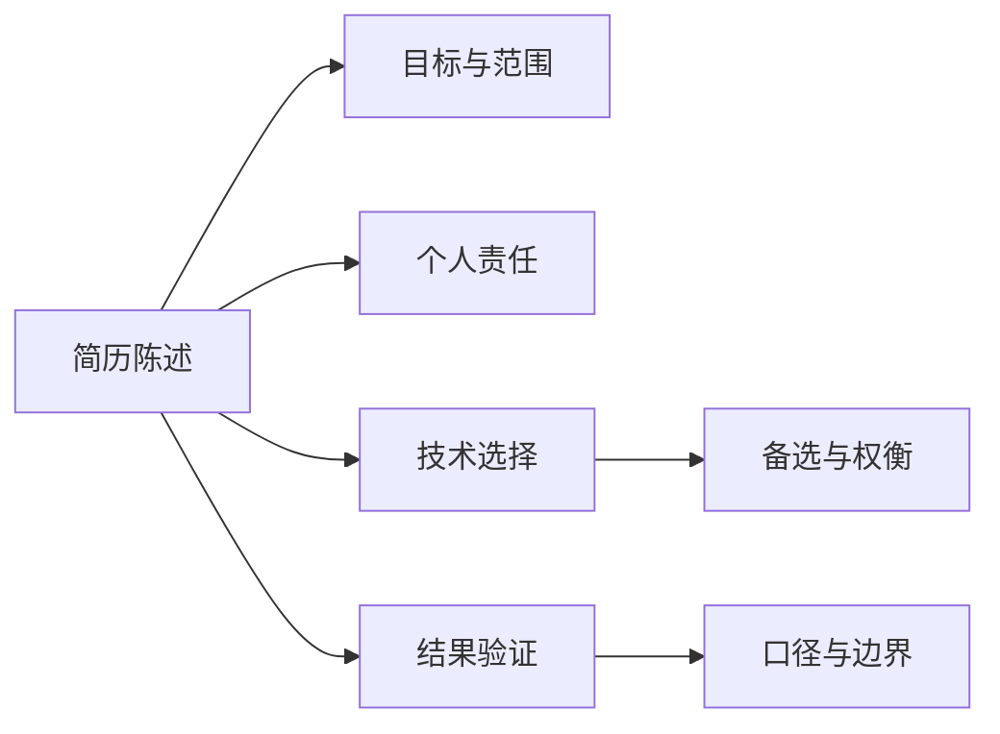
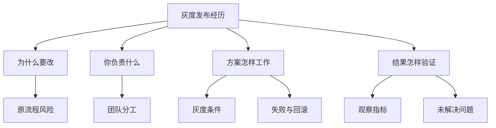

# 从岗位需求到可信简历

## 第一章 · 建立正确的求职评价模型

### 面试官会从哪些信息判断你能不能胜任？

面试官不是在寻找一个抽象意义上“最优秀”的人，而是在有限时间里判断：你能否在这个岗位的约束下持续完成工作，并且风险是否可以接受。这个结论不会只来自某一个答案，而会来自简历、技术讨论、项目案例、行为案例和你提出的问题。

#### 先把岗位要求翻译成可观察的表现

“熟悉 Kubernetes”本身不是可观察的表现；能够解释一次发布失败的定位顺序、说明为何选择滚动更新、展示如何验证恢复，才是工作能力的线索。面试官通常会同时关注四类信息：你做成过什么、你怎样做、当时有哪些约束、结果由什么证明。

| 岗位要求 | 面试中可观察的表现 | 单独出现时的局限 |
| --- | --- | --- |
| 技术基础 | 能解释机制、适用条件和故障边界 | 背过答案也可能做到 |
| 实际经验 | 能还原目标、责任、决策和结果 | 项目可能是团队成果 |
| 学习潜力 | 能说明陌生问题的拆解和反馈过程 | 一次表现可能受题目熟悉度影响 |
| 合作能力 | 能讲清分歧、沟通和共同结果 | 自我评价不能替代事实 |
| 求职动机 | 对岗位工作有具体理解和取舍 | 热情表达不等于能够胜任 |

#### 用“结论—事实—解释—边界”组织证据

可信回答可以先给结论，再给一个具体事实，解释你的关键动作，最后说明边界。例如：“我能独立处理常见线上故障。上季度支付回调积压时，我先按队列延迟和消费错误率缩小范围，确认是连接池配置导致重试放大；我完成限流和参数修正，并用积压下降曲线验证恢复。跨地域容灾由另一位同事负责，我参与了评审但不是负责人。”

这个结构同时回答了能力、方法、结果和责任范围。它比“我排障能力很强”更容易核实，也给面试官留下了合理的追问入口。

#### 不要把一次回答当作最终判决

面试是抽样观察。答错一个冷门知识点，不必推导成“基础很差”；答对一道熟悉题，也不能证明可以承担整个岗位。面试官通常会寻找多个相互支持的线索，并观察它们是否稳定。

准备时可以问自己：如果对方不接受我的自我评价，我能拿出哪两个不同场景的事实？如果某个事实存在偶然性，我能否解释它的适用范围？这两个问题会把准备从背诵形容词转向整理工作证据。

#### 一个判断怎样由多条信息逐步形成

假设岗位需要维护一套面向研发团队的发布平台。候选人说“我熟悉发布系统”，这只是一个待确认的结论。随着对话深入，面试官可能分别听到下面的信息：

1. 候选人能画出提交、构建、部署和回滚的主链路。
2. 他解释了为什么不能把数据库变更与应用回滚当成同一件事。
3. 他讲出一次发布后健康检查误报的处理过程。
4. 他明确说明权限审批不是自己设计的，只负责接入。
5. 面对“如果探针本身失效怎么办”的追问，他能提出独立监控和人工降级路径。

这些信息分别指向知识结构、实际经历、责任边界和陌生条件下的推理。任何一条都不能单独证明胜任，但它们互相支持时，判断会逐渐稳定。

反过来，如果候选人只反复列举工具，却无法说明发布失败的现象、决策和验证，面试官得到的不是“他一定没做过”，而是“当前谈话还没有提供足够信息”。这一区别很重要：面试官判断的是当次可观察信息，不是候选人完整人生。

#### 把自己的证据放进四格检查表

选一个岗位核心能力，在准备稿中完成下面四格：

| 检查项 | 要写下的内容 | 自检问题 |
| --- | --- | --- |
| 事实 | 一次具体事件和你的动作 | 别人能否追问到时间、对象和步骤 |
| 解释 | 动作为什么能说明该能力 | 是否只是把形容词换了一种说法 |
| 结果 | 怎样知道问题改善或目标完成 | 是否有口径、观察或验收方式 |
| 边界 | 哪些不由你负责或尚未验证 | 是否把团队成果全部归给自己 |

完成后把“能力名称”遮住，只读事实。如果听众仍能大致说出你展示的能力，说明材料比自我评价更有说服力。

### 简历筛选、技术面和主管面分别在确认什么？

不同环节的重点常常不同，但公司不会遵循完全相同的流程。把下面的分工理解为常见模型，而不是固定规则；具体安排仍应以招聘方说明为准。

#### 简历筛选先判断是否值得投入面试时间

筛选者需要快速确认基本条件、相关经历、职业路径和明显风险。他们看到的是压缩后的信息，因此会依赖标题、关键词、时间线和成果描述建立初步假设。简历的任务不是证明你已经通过面试，而是让合适的人愿意继续了解你。

简历中最有价值的信号通常是：与岗位直接相关的工作范围、你实际承担的责任、可解释的结果，以及经历之间是否连贯。技术名词堆积、没有上下文的百分比、含糊的“主导”会降低判断效率。

#### 技术面确认你能否把知识用于问题

技术面可能通过概念追问、编程、系统设计或项目讨论，观察你是否能澄清问题、建立模型、比较方案、处理边界并验证结果。题目只是载体，真正被观察的是思考和工程习惯。

例如，对方问缓存，不一定只想听淘汰算法。后续可能转向缓存穿透、数据一致性、容量估算、降级和监控。准备时应把一个知识点向“原理—选择—失败—验证”展开，而不是只背定义。

#### 主管面确认工作方式和团队条件是否匹配

主管更可能关心职责跨度、优先级判断、跨团队协作、成长方向和求职动机。他还会评估岗位能否满足你的期望，以及团队是否有条件使用你的长处。这里的“合适”是双向的，不等于只考察服从或性格。

面试前至少准备三个问题：这个岗位入职三个月要解决什么问题？当前最大的交付阻力是什么？团队怎样做技术决策和事故复盘？这些问题既帮助你判断岗位，也能让对方看到你关注真实工作。

#### 为每一环准备不同粒度的材料

- 简历筛选：一页内快速看懂的匹配信息。
- 技术讨论：能够下钻到细节、失败和权衡的案例。
- 主管沟通：能够上升到目标、协作和影响的经历。

同一个项目可以复用，但讲法应随问题改变。筛选阶段写结果，技术面讲关键决策，主管面讲为什么值得做以及怎样推动相关人达成结果。

#### 同一段经历在三个环节中的不同作用

假设你参与过一次监控平台迁移。三种场景不应该使用完全相同的叙述：

| 环节 | 先回答什么 | 适合保留的细节 | 暂时不必展开 |
| --- | --- | --- | --- |
| 简历筛选 | 经历与岗位是否相关 | 迁移范围、个人责任、结果 | 详细排障时间线 |
| 技术面 | 方案是否可靠 | 数据链路、兼容策略、失败处理 | 完整组织背景 |
| 主管面 | 能否承担相应范围 | 目标取舍、协作对象、风险升级 | 每个配置参数 |

简历里可以写：“负责 12 个服务的告警规则迁移和回滚演练，统一分级标准并完成两周观察。”技术面再解释如何避免新旧规则同时触发、怎样确认没有漏报。主管面则说明为什么先统一分级、如何处理业务团队不愿迁移的顾虑。

三种说法事实一致，关注点不同。若为了迎合不同面试官而改变项目规模、职责或结果，后续汇总时容易产生可信度问题。

#### 面试前向招聘方确认什么

流程说明不清时，可以礼貌确认：

- 总共大约几轮，每轮的角色和时长是什么。
- 是否包含现场编码、系统设计或案例展示。
- 使用什么会议和协作工具，能否使用自己熟悉的语言。
- 是否需要准备作品、演示或其他材料。
- 哪一轮适合讨论岗位目标、值班和团队协作。

这些问题是为了做好准备，不是索取具体题目。招聘方无法提供某项信息时，准备一个通用流程即可，不必把未知解释为负面信号。

### 面试没通过，就一定是能力不够吗？

不一定。面试结果是“岗位、候选人、竞争情况和当次观察”共同作用的产物。能力不足是可能原因之一，但不是唯一解释。复盘的目标也不是为自己开脱，而是把可改变的问题和不可控制的因素分开。

#### 常见原因可以分成四组

第一组是岗位不匹配，例如团队急需数据库内核经验，而你的优势在平台工程。第二组是能力或经验确实存在缺口。第三组是已有能力没有被看见，例如案例讲得太笼统、误解题意或紧张失常。第四组是流程与外部条件，例如岗位调整、候选人比较或面试覆盖不足。

只有招聘团队知道完整决策依据，候选人通常只能基于现场信息提出假设。因此不要把“对方追问很多”直接解释为失败，也不要把礼貌的正面反馈当作通过承诺。

#### 用事实复盘，而不是用情绪定性

面试后尽快记录：问了什么、你怎样回答、对方在哪些地方追问或纠正、哪些题没有完成、时间怎样分配。然后分别标记知识缺口、理解偏差、表达问题、经验不足、压力影响和岗位匹配疑问。

一个有用的复盘条目应该能导向动作。例如，“系统设计不好”太宽泛；“没有先确认峰值流量，直接选择消息队列，导致后续容量讨论没有依据”可以转化为下一次的设计检查项。

#### 处理不能确认的原因

如果招聘方愿意提供反馈，可以礼貌询问一两个具体问题，例如“为了后续改进，您能否指出最需要加强的一项能力？”不要要求披露其他候选人的信息，也不要争论结论。

拿不到反馈时，保留多种解释，优先修复重复出现的问题。一次失利可能是噪声；三次都在需求澄清处失速，就值得专项练习。

#### 复盘后要结束本轮判断

给复盘设置截止点：列出最多三项改进行动，安排到下一周，然后停止反复猜测。面试结果不等同于完整的职业评价，更不等同于个人价值。可执行的复盘会让一次失败产生收益，而无证据的自责只会消耗下一轮状态。

#### 用“事实—解释—动作”避免错误归因

下面是一次系统设计未通过后的示例复盘。示例中的结论仍然是假设，不是招聘方的真实评价：

| 现场事实 | 可能解释 | 可以验证的动作 |
| --- | --- | --- |
| 五分钟后才确认用户规模 | 需求澄清习惯不足 | 连续练习三道题并在两分钟内列关键条件 |
| 面试官三次追问个人责任 | 项目叙述一直使用“我们” | 重写案例开场并让听众复述个人负责部分 |
| 缓存一致性追问没有完成 | 知识缺口或时间不足 | 先补机制，再做一个带条件变化的口头练习 |
| 对方提前结束最后一题 | 时间安排或信息已足够 | 不能单凭此项下结论 |

表格最后一行尤其重要：有些事实没有足够信息支持行动，不需要强行解释。复盘不是把每个细节都变成自己的错误。

#### 判断某个问题是否值得优先修复

依次问四个问题：

1. 这个问题在不同轮次或不同公司重复出现了吗？
2. 它影响的是岗位核心能力，还是偶尔出现的次要知识？
3. 我能在下一轮前通过练习改变具体行为吗？
4. 改进是否能通过录音、模拟或小实验验收？

四项都成立时，应进入最高优先级。只有情绪强烈、没有重复事实时，先保留观察，不急着彻底否定自己的方向。

### 面试只是公司挑人吗？你应该怎样反过来判断团队是否合适？

面试是一项双向选择。公司在判断你的胜任风险，你也需要判断工作内容、管理方式和回报是否符合自己的目标。真正的风险不是“问得太多显得挑剔”，而是在信息不足时接受一个会长期消耗你的岗位。

#### 先定义自己的必要条件和偏好

把条件分三层：不能接受、强烈偏好、可以协商。不能接受的可能包括长期无补偿值班、职责与招聘描述严重不符；强烈偏好可能是有真实平台建设空间；可协商项可能是具体技术栈。

这种排序能避免被单一亮点带走。高薪不能自动抵消不可持续的工作节奏，热门技术也不能替代清晰职责。

#### 从具体工作提问，而不是要求口号

可以询问最近一个季度团队最重要的交付、一次典型故障如何协作、技术债怎样进入计划、新人前三个月由谁提供反馈。具体问题比“团队文化好吗”更容易得到可验证的信息。

还要观察回答方式：对方是否愿意承认挑战，是否能说清岗位成功标准，不同面试官的描述是否大体一致。单个细节不能定论，但多个相互矛盾的答案需要继续确认。

#### 把观察写成待验证假设

例如，面试官多次被打断不必立刻等同于“不尊重候选人”，可能只是时间紧张；但如果流程频繁变更、岗位职责无人说清、对事故处理避而不谈，就形成了需要向招聘方核实的组合信号。

面试结束后可使用四列记录：观察到的事实、你的解释、其他可能解释、下一步确认问题。这样既不会忽视直觉，也不会把直觉包装成事实。

#### 把一段模糊体验改成可确认的问题

假设候选人面试后觉得“这个团队好像总在救火”。如果直接把它写成结论，很容易被一位面试官的表达方式影响。更稳妥的记录是：

- 事实：两位面试官都提到近期发布频繁，主管说当前季度重点是降低故障恢复时间。
- 第一种解释：业务变化快，团队存在较多紧急工作。
- 第二种解释：团队正在集中治理历史问题，短期压力不代表常态。
- 待确认问题：最近一个月值班中，计划内工作和紧急处置各占多少？故障后通常怎样安排修复？

如果后续回答能给出近期例子、轮值安排和改进计划，你就获得了更具体的信息；如果不同角色继续给出矛盾答案，担忧的权重才应提高。

#### 做一张双向选择卡

在每次面试前写下三类条件：

| 类型 | 示例 | 面试中怎样确认 |
| --- | --- | --- |
| 必须满足 | 职责确实包含平台建设 | 问前三个月目标与实际时间分配 |
| 明确不能接受 | 长期无明确轮换的高频值班 | 问轮值人数、频率与补休方式 |
| 可以权衡 | 技术栈不是最熟悉的方案 | 问学习支持和迁移计划 |

卡片的作用是防止面试结束后只记得氛围或品牌。条件可以随理解变化，但不要在拿到结果后才临时降低原本的底线。

#### 最终比较的是整组条件

至少从工作内容、直属管理、团队协作、成长空间、稳定性、工作强度和总回报评估。若拿到多个机会，给“不能接受项”一票否决权，再比较其余条件。适合你的团队不一定最有名，而是能够让你的能力、生活约束和发展目标同时成立。

### 刚毕业、经验不多时，面试官会重点看什么？

经验较少时，面试官很难用多年成果判断你，通常会更多观察基础、学习速度、责任感和成长可能性。这不意味着标准更低，而是证据类型不同。

#### 基础是否能支持继续学习

基础不是冷门细节数量，而是能否用核心概念分析问题。比如解释进程与线程时，除了定义，还能结合资源隔离、调度开销和故障影响说明选择。遇到追问时，能够从已知条件继续推理，比背出完整术语更有价值。

#### 小经历也能展示完整能力

课程设计、实验室项目、开源贡献、实习任务和个人工具都可以使用。关键是缩小叙述范围并明确责任：你解决了什么具体问题，做了哪个选择，怎样验证，后来如何改进。

“我们做了一个校园预约系统”信息很弱；“我负责冲突检测，先用数据库唯一约束保证正确性，再增加友好错误提示，并用并发测试验证重复预约不会成功”就能支持工程判断。

#### 学习能力需要过程证据

不要只说“我学习很快”。准备一次真实学习经历：起点是什么、目标是什么、最初哪里理解错了、用了哪些资料和练习、谁给了反馈、最后在哪里用上。面试官会从纠错能力和迁移能力判断潜力。

#### 诚实边界本身也是职业信号

没有生产经验就明确说没有，不要把实验环境说成线上实践。可以补充：“我只在个人集群验证过，知道生产环境还要考虑权限、升级和监控；如果负责这项工作，我会先确认现有规范并做小范围演练。”

毕业生最值得准备的不是虚构“大项目”，而是把有限经历讲深：每个选择有理由，每个结果有验证，每个不足有后续行动。

#### 把“小任务”展开成完整案例

假设你在实习中只负责一项脚本改造：每天把多台测试机的磁盘使用情况汇总成报告。它仍然可以提供多种观察：

- 问题：原来由同事逐台登录检查，容易遗漏。
- 约束：你只有普通账号，不能安装新的常驻服务。
- 方案：通过已有远程接口定时获取数据，统一单位并标记采集失败。
- 取舍：没有直接做自动清理，因为删除策略和所有权尚未明确。
- 验证：与人工结果对照一周，发现两台机器的挂载点最初未纳入。
- 改进：补充配置清单和失败告警，再交给值班同事试用。

这个案例没有夸张规模，却能说明需求理解、权限边界、错误处理和验证习惯。面试官继续问“如果机器数量变多怎么办”，你也可以基于真实方案推理，而不必声称已经处理过大规模环境。

#### 新人材料自检

为每个案例确认：

- 是否能说清任务是谁提出、为什么值得做。
- 是否有一个由自己作出的选择，而不是只有执行指令。
- 是否记录过错误、反馈或修改。
- 是否能区分教学环境、实习环境和生产环境。
- 是否知道团队成果中自己的准确位置。
- 是否准备了一个“如果重来会怎么做”的回答。

如果某项经历没有结果数字，可以用验收过程、使用者反馈或问题是否再次出现来说明结果，不需要为了显得成熟而制造业务指标。

## 第二章 · 将面试准备变成一项可执行工程

### 拿到一份岗位描述后，应该先准备什么？

先不要从第一行技术名词开始逐个背诵。岗位描述是需求输入，你要把它转换成“要求—证据—缺口—行动”的准备清单。

#### 拆出任务、能力和约束

把描述中的内容分成三类：入职后要完成的任务、完成任务需要的能力、工作环境的约束。例如“建设容器平台”是任务，“Kubernetes 运维和自动化”是能力，“多集群、值班、合规环境”是约束。

注意动词和频率词。“负责”“主导”“独立”暗示责任深度；“优先”“加分”通常不是硬门槛；“高并发”“跨地域”需要进一步确认实际规模，不能自行脑补。

#### 建立岗位匹配表

| 要求 | 重要度 | 我的证据 | 风险 | 准备动作 |
| --- | --- | --- | --- | --- |
| 故障处理 | 高 | 两次值班案例 | 结果指标不完整 | 补齐时间线与监控截图含义 |
| 自动化 | 高 | 写过发布工具 | 只在单团队使用 | 准备范围和复用边界 |
| 云成本 | 中 | 做过一次清理 | 缺少持续治理 | 补基本模型并诚实说明 |

重要度来自岗位描述、招聘沟通和常识的综合判断。不要为了填满表格伪造证据；空白格就是需要学习或主动确认的地方。

#### 先处理硬门槛和高频任务

如果岗位明确要求轮值而你无法接受，应尽早确认；如果主要工作是数据库可靠性，而你只准备容器知识，方向就偏了。有限时间优先投入高重要度且有机会补齐的缺口，再准备核心案例和自我介绍。

#### 用问题结束第一轮分析

岗位描述不可能完整。记录需要向招聘方确认的问题，例如团队规模、服务规模、当班频率、岗位是新建还是补位、入职三个月的目标。好的准备不是假装所有信息已知，而是清楚哪些决定依赖进一步信息。

#### 完整拆解一个示例岗位

下面是一段虚构的岗位描述：

> 负责内部容器平台的稳定性建设，维护 Kubernetes 集群和发布链路；推动监控、容量与故障演练自动化；与研发团队协作提升交付效率。有大规模集群经验者优先。

不要马上列出 Kubernetes 的全部知识点。先翻译成工作问题：

| 原始表述 | 可能对应的工作 | 需要准备的个人材料 | 仍需确认 |
| --- | --- | --- | --- |
| 平台稳定性 | 故障预防、发现和恢复 | 一次故障和一次预防性改进 | 可用性目标与值班范围 |
| 发布链路 | 构建、部署、回滚与权限 | 发布工具或迁移案例 | 当前工具和主要痛点 |
| 容量自动化 | 采集、估算、扩缩与告警 | 容量判断或资源治理案例 | 集群规模与峰值特征 |
| 与研发协作 | 收集需求、推广和支持 | 一次跨团队落地案例 | 平台用户数量与支持方式 |
| 大规模优先 | 规模经验是加分项 | 诚实说明自己处理过的量级 | “大规模”的实际含义 |

最后一项不能直接理解为硬门槛。“优先”通常意味着比较优势，仍需要结合其他要求和招聘沟通判断。

#### 从匹配表生成准备清单

把每项标成绿、黄、红三种状态：

- 绿色：有直接经历，重点补齐细节和追问。
- 黄色：有相邻经历，需要说明可迁移部分和未验证边界。
- 红色：没有基础或不满足必要条件，需要学习、确认或放弃。

每个黄色项写一句迁移说明。例如：“没有维护过百节点集群，但处理过多团队共享集群的配额与抢占问题；规模差异下还需重新验证控制面容量和升级流程。”这比把相邻经验直接说成同等经验更可信。

完成清单后，准备顺序应当是：确认硬门槛 → 补核心红项的最低基础 → 深挖绿色证据 → 练习黄色边界 → 最后才处理低重要度名词。

### 知识点这么多，怎样安排有限的准备时间？

准备时间永远有限，排序比“全部学完”重要。有效计划应同时覆盖知识、案例、表达和现场状态，避免把所有时间花在刷题或阅读上。

#### 按风险和收益排序

可以将内容分为四象限：高重要且薄弱、高重要且已有基础、低重要但薄弱、低重要且熟悉。第一象限优先补到能够解释核心概念和常见场景；第二象限重点整理深入案例；后两类只保留最低限度。

“薄弱”也要细分：完全没学过、知道但说不清、做过但想不起细节、能讲但经不起追问。不同问题对应不同动作，不能都用“再看一遍资料”解决。

#### 一个七天的示例节奏

- 第一天：拆 JD，建立匹配表，列三项最大风险。
- 第二至三天：补核心知识，并把每项连接到一个工作场景。
- 第四天：整理三个主案例和两个失败案例。
- 第五天：练自我介绍、项目讲述和陌生题思考。
- 第六天：做一次限时模拟，记录卡顿位置。
- 第七天：修正薄弱点，完成设备和资料检查，保证休息。

周期更长时重复“练习—反馈—修正”，而不是无限扩展资料清单。

#### 给学习设置可验收的输出

“学习 Redis”无法判断完成。可以改成：五分钟解释缓存的用途与代价；画出一次缓存击穿处理流程；说明两个不使用缓存的场景；回答数据一致性追问。输出标准会暴露理解缺口。

#### 保留恢复时间

临近面试熬夜可能增加知识输入，却损害回忆、语言组织和情绪控制。最后一天不再开大型新主题，重点做轻量回顾、路线和设备确认。准备的目标是现场可用，而不是资料浏览量最大。

#### 把“学习过”改成四种可验收输出

同一知识点应至少有一种外部输出，而不是只在笔记里画线：

1. **口头解释**：两分钟讲清要解决的问题、机制和限制。
2. **图示**：不用资料画出关键链路，并指出一个故障点。
3. **情境判断**：给出两个条件不同的场景，说明选择为什么变化。
4. **小实验**：构造一次成功和一次失败，观察结果是否符合理解。

例如学习“重试”时，不能只记指数退避。你应能解释重试为何可能放大故障，画出客户端、网关和下游都重试时的调用增长，再说明幂等、预算和熔断如何约束它。

#### 用准备看板控制范围

| 条目 | 当前状态 | 完成定义 | 下一动作 | 最晚时间 |
| --- | --- | --- | --- | --- |
| 核心项目 | 能讲背景 | 能承受三轮随机追问 | 补失败方案和结果口径 | 周三 |
| 系统设计 | 容易先画组件 | 两分钟内确认四个关键条件 | 做两道陌生题录音 | 周四 |
| 线上环境 | 未实测共享 | 实际会议软件完整走通 | 与同伴测试一次 | 周五 |

每天结束时只移动有“完成定义”的条目。已经浏览但无法输出的内容仍然算进行中。若进度落后，删除低优先级条目，而不是压缩睡眠或同时开启更多主题。

#### 识别准备过度

以下信号说明计划需要收缩：

- 收藏的资料不断增加，但主案例还没有讲过一遍。
- 能背很多细节，却不能回答目标岗位每天在做什么。
- 每次模拟都发现同一表达问题，却继续用阅读代替练习。
- 最后两天仍在进入完全陌生的大主题。
- 计划没有留出设备检查、通勤和恢复时间。

准备过度不等于努力太多，而是投入没有继续降低最重要的面试风险。

### 经历不多时，怎样整理出可以讲清楚的案例？

案例的价值不由项目规模决定，而由它能否展示你怎样面对真实约束。小任务只要有明确目标、行动、判断和结果，也能成为强案例。

#### 先广泛盘点，再选择主案例

按学习、实习、项目、故障、协作、改进六类回忆事件。每件事只写一句事实，不急着润色。随后选择与你目标岗位最相关、你参与最深、细节还能还原的三到五件。

可以用这些提示唤醒记忆：哪次任务比预计更难？哪次你改变了原方案？哪次别人不同意你？哪次结果不理想？哪次你发现了没人明确分配的问题？

#### 把事件还原成决策过程

为每个案例补齐：背景和目标、你的责任、关键困难、候选方案、选择理由、具体行动、结果验证、后续反思。不是每个案例都必须宏大，但必须能回答“为什么这样做”。

例如，个人日志工具也可以讲出需求取舍：最初追求全文检索，测试后发现启动速度更影响日常使用，于是改成按日期索引并延迟加载。这里展示的是观察、取舍和验证。

#### 区分团队成果和个人贡献

先承认团队共同结果，再明确你负责的部分。可以说：“团队完成迁移，我负责告警规则和回滚演练；数据库数据校验由同事负责，我参与评审。”这种边界不会削弱贡献，反而提高可信度。

#### 为追问准备第二层细节

主叙述控制在两三分钟，但为每个节点准备细节：当时的规模、失败过的方案、指标定义、沟通对象、复盘后的改变。若一个故事只能顺畅背一遍，改变提问顺序就无法回答，说明还没有真正整理好。

#### 从经历盘点到案例卡

经历盘点可以先宽后窄。第一轮只写事件，第二轮才制作案例卡：

| 案例卡字段 | 要回答的问题 |
| --- | --- |
| 触发事件 | 为什么当时必须处理 |
| 目标 | 成功意味着什么 |
| 约束 | 时间、权限、数据或协作有什么限制 |
| 个人责任 | 哪些决定和动作由你承担 |
| 关键分叉 | 至少有哪些可行方案 |
| 行动 | 你具体做了什么 |
| 验证 | 怎样知道结果成立 |
| 后续 | 失败、反馈和改进是什么 |

一张卡不必直接变成面试话术。它先确保事实完整，第二册的表达练习再根据问题选择顺序。

#### 一个普通案例怎样服务多个问题

假设你给团队补了一套发布前检查。它可以支持不同能力，但每次只能突出相关部分：

- 讲学习：你怎样理解陌生发布流程并验证规则。
- 讲改进：你怎样从重复事故中识别检查缺口。
- 讲协作：你怎样与开发和测试约定阻断条件。
- 讲影响：没有管理权限时怎样推动大家采用。
- 讲失败：第一版规则为何误报，怎样修正。

这不是用一个故事回答所有问题，而是证明同一真实事件包含多个可核实侧面。准备时要为每个侧面标注不同事实，避免每道题都背同一段完整故事。

#### 追问压力测试

让同伴随机选择下面问题，不按你准备的顺序提问：

1. 如果不做，会产生什么实际影响？
2. 这个决定是谁作出的？
3. 你最初的方案哪里错了？
4. 结果数字从哪里来？
5. 其他人承担了什么？
6. 如果规模扩大十倍，原方案还成立吗？

不能回答时先标记事实缺口，不要立刻编一个更顺的故事。回到可访问的记录核实；无法核实时，缩小正式表述。

### 为什么只在脑中想答案，到了现场还是说不清？

脑内思考允许跳步、回看和模糊替代；口头表达必须在线性时间里选择重点、组成句子并响应对方。两者是不同技能，因此“我明明知道”不等于“我能让别人听懂”。

#### 说出来才会暴露结构问题

脑内回答常省略主语、因果和背景。录音后你可能发现结论到一分钟后才出现，技术名词没有解释，或者故事里一直说“我们”却没说明自己的责任。这些问题仅靠默想很难察觉。

#### 采用逐级练习

第一遍看提纲讲，不追求流畅；第二遍只看三个关键词；第三遍限时两分钟；第四遍让同伴随机追问；第五遍在被打断后重新组织。每轮只修一类问题，例如先修结论位置，再修例子细节。

#### 练习不同长度的同一内容

同一项目准备 30 秒、2 分钟和 5 分钟版本。30 秒说明目标、责任和结果；2 分钟增加困难与关键决策；5 分钟才展开技术细节和复盘。这样面对时间变化时，你是在调整层级，而不是临场删句子。

#### 用听众反馈验证而非自我感觉

请听众复述他听到的重点，并提出一个最想继续问的问题。如果复述与目标不同，说明你的信息排序有问题；如果完全没有追问入口，可能讲得过于抽象或封闭。练习的验收标准不是“背得顺”，而是对方能准确理解并自然深入。

#### 看一段脑内正确、口头失焦的回答

问题是：“你在项目中遇到过最困难的技术问题是什么？”

> “我们系统用了很多组件，开始是单体，后来业务发展很快，所以就做了微服务。中间用了消息队列、缓存和容器，大家也经常讨论。后来有一次发布出问题，我参与排查，最后处理好了。”

回答者脑中可能有完整经历，听众却不知道困难是什么、他负责什么、采取了什么行动。“组件很多”也没有解释困难为何成立。

可以先改成一条主线：

> “最困难的是一次订单事件重复消费，因为问题只在重试和服务重启重叠时出现。我负责定位消费端和补偿任务。先通过事件标识关联两条处理路径，确认不是队列重复投递，而是补偿任务没有检查完成状态；随后补幂等检查并回放历史事件验证。这个修复解决了当前问题，但生产者端的全链路标识由另一位同事继续完善。”

改写不是追求“标准答案”，而是让听众获得问题、责任、诊断、结果和边界。

#### 四轮口头训练法

第一轮只追求事实完整，不限时；第二轮压缩到两分钟；第三轮由同伴在任意位置打断并追问；第四轮换一个问法，例如从“最困难”改成“你怎样解决问题”。

每轮只记录三项：

- 第一句是否直接回答问题。
- 个人责任是否在三十秒内出现。
- 结尾是否包含结果或下一步。

如果第四轮又回到背稿顺序，说明掌握的是文本，不是经历。此时应回到案例卡，用关键词重新组织，而不是继续背句子。

#### 用评分记录变化，而不是凭流畅感

每次录音后只记录可观察项：

| 项目 | 需要观察的事实 | 下一次动作 |
| --- | --- | --- |
| 问题对齐 | 第一句是否回答原问题 | 开口前先复述关注点 |
| 信息顺序 | 结论在第几秒出现 | 把背景压缩到一句 |
| 责任边界 | 是否区分我和团队 | 开场加入个人责任 |
| 事实细节 | 是否有动作和验证 | 补案例卡的结果字段 |
| 对话空间 | 是否能在两分钟停下 | 只保留一个主决定 |
| 追问恢复 | 被打断后能否继续主线 | 用三个关键词定位 |

不要把“声音不够好听”“停顿了两次”自动算成问题。停顿如果用于思考且没有破坏理解，可能完全正常。

连续三轮只改同一项。例如先让结论提前，再处理责任边界。一次改六项会让表达变得僵硬，也看不出哪项训练有效。

#### 练习结束的判断

当你能用不同长度讲同一事实、能接受随机追问、发现口误后能修正，并且听众复述与目标一致，这个案例就已进入可用状态。无需追求每次用词完全相同；自然变化说明你掌握的是经历而非台词。

## 第三章 · 将完整经历压缩成一份可信简历

### 为什么简历既要让人快速看懂，也要经得住追问？

简历同时服务两个场景：筛选者在短时间内决定是否继续，面试官据此选择追问入口。只有速度没有深度，简历会像关键词广告；只有细节没有层次，重要信息会被淹没。

#### 第一层解决快速定位

姓名和联系方式清楚，职业定位与目标岗位一致，最近且相关的经历靠前。每段经历先让人看懂业务或系统是什么，再写责任和结果。标题、时间、公司或项目名称的格式应稳定，让读者不用猜信息层级。

#### 第二层提供可核实的线索

一条经历最好包含动作、对象、关键约束和结果。例如：“重构告警路由规则，按服务等级合并重复通知，使夜间无效呼叫从每周约 20 次降到 6 次；统计窗口为上线后四周。”数字有口径，动作有对象，面试官可以继续问规则和风险。

#### 删除无法防守的亮点

如果写“主导全公司云原生转型”，你需要解释范围、决策权、参与团队和结果。如果事实只是给一个项目编写部署脚本，应缩小表述。夸大可能赢得一次面试，却会在追问中损害整份简历的可信度。

#### 做一次双视角检查

用三十秒只看标题和每条首句，确认是否能知道你适合什么岗位；再选择任意三条，连续追问“具体怎么做、为什么、结果怎么知道、你负责什么”。两种检查都通过，简历才兼顾快速理解和深入核验。

#### 做一次三十秒筛选实验

把简历交给一个不熟悉你工作的人，只给三十秒，然后收起。请他回答：

1. 你目前最像哪类工程师？
2. 最近一段经历主要解决什么问题？
3. 哪两项能力与目标岗位最相关？
4. 哪一句最想继续确认？

如果他只能记住技术名词，说明职责和结果不够突出；如果他记住结果却不知道你做了什么，说明个人责任不清；如果没有任何追问，可能是内容太抽象，也可能是亮点没有给出具体入口。

#### 比较两种项目描述

> 版本 A：负责公司监控平台建设，使用多种开源组件，实现统一监控告警，显著提升稳定性。

> 版本 B：负责应用告警接入与分级规则，将 12 个服务的重复通知合并到统一路由；上线后按四周窗口统计，夜间无需处置的呼叫从每周约 20 次降到 6 次。指标采集平台由基础设施团队维护。

版本 B 并不覆盖完整项目，却更容易快速理解，也能继续追问：怎样定义无需处置、合并是否造成漏报、为什么选择四周、其他团队负责什么。经得住追问并不等于把所有答案写进简历，而是每个强结论背后都有真实材料。

#### 阅读顺序与写作顺序不同

你可能按时间回忆经历，但读者通常先看最近职位、标题、首条成果和技术环境。写完后从读者视线重新排序：最相关的责任放在前面，背景压缩成一句，细节留给面试。不要为了保持回忆顺序，让最能证明匹配的内容藏在段落末尾。

### 一份简历怎样同时体现匹配度、可信度和个人特点？

这三个目标不是靠三个独立栏目实现，而应体现在信息选择和表达中：选择与岗位相关的经历，用具体事实支撑，再保留真正代表你工作方式的差异。

#### 匹配度来自取舍

同一份经历可有多种写法。申请可靠性岗位时，突出容量、故障、自动化和恢复；申请开发岗位时，突出接口、数据模型、测试和交付。不是改写事实，而是从真实经历中选择与岗位更相关的角度。

#### 可信度来自细节一致

时间线、职位、项目范围和结果口径应相互一致。量化不等于随处写百分比；没有可靠数字时，可以写范围、频率、前后变化或验证方法。比起“性能提升 300%”，说明压测条件和关键瓶颈更有说服力。

#### 个人特点来自重复出现的真实选择

如果你擅长把人工操作产品化，可以选择两个不同项目展示：一次把发布步骤改成流水线，一次把巡检结果做成自助页面。重复出现的行动模式比“热爱自动化”的自我标签更能形成记忆点。

#### 用一张筛选表决定去留

每条内容问四个问题：与目标岗位有关吗？能用事实解释吗？我能回答追问吗？它是否增加了新的信息？如果只有第一项为“是”，需要补证据；如果前三项都为“是”但第四项为“否”，可能与别处重复，应压缩。

#### 三个目标可能发生冲突

为了匹配度，你可能想加入岗位中的全部关键词；为了可信度，又需要删掉没有做过的内容；为了个人特点，还想保留一段不直接相关但很能代表自己的经历。解决方式不是让每条都承担三个目标，而是给整份简历分工。

| 内容位置 | 首要任务 | 可以承担的第二任务 |
| --- | --- | --- |
| 职业概述 | 快速说明匹配方向 | 留下一个个人特点 |
| 最近经历 | 提供最强事实 | 展示责任成长 |
| 代表项目 | 展开关键能力 | 体现判断和取舍 |
| 较早经历 | 补足连续性 | 保留必要背景 |
| 技能清单 | 帮助快速定位 | 不承担能力证明 |

技能清单可以让筛选者找到关键词，但真正的可信度应由经历承担。把“精通、熟练、了解”分成许多等级，如果没有一致标准，也不会自动增加可信度。

#### 找到属于你的重复行动模式

回看私人经历清单，圈出在不同事件中反复出现的动作。例如：总能把模糊故障转成可观测指标；经常把人工交接改成自助流程；善于把跨团队分歧转成共同验收条件。

选择其中一个与岗位相关的模式，用两段不同经历支撑。不要直接把它写成口号，可在职业概述中给出方向，再让项目条目提供事实。若只能找到一次事件，就把它当单个案例，不急着上升为个人特点。

#### 版本管理检查

不同岗位使用不同简历时，为文件标注岗位或日期，并保存对应 JD。面试前确认招聘方收到的是哪一版。版本可以改变信息排序和详略，不能改变同一事实的规模、时间和责任。否则你自己也可能在面试中混用口径。

### 怎样把“能力很强”改写成具体可信的事实？

形容词是结论，事实才让读者有机会形成自己的判断。改写时不要只是加数字，而要补齐行动、难点、选择、结果和责任边界。

#### 从抽象词追问到可观察行为

“沟通能力强”可以追问：与谁沟通？双方分歧是什么？你做了什么？决定如何形成？结果怎样？“精通 Linux”可以追问：处理过哪些实际问题？能解释哪些机制？在哪种规模下使用？

一个改写例子：

> 原句：具有优秀的跨团队协作能力。
>
> 改写：在日志平台迁移中协调应用、网络和安全三方确认切换窗口；将争议项拆成数据保留、访问权限和回滚条件，形成书面清单并逐项验收，最终按计划迁移 18 个服务。

例子中的数字仅用于说明写法；真实简历必须使用可核实的数据。

#### 结果必须说明口径

结果可以是业务结果、工程指标、风险降低或交付完成。若写“故障减少 40%”，应知道比较周期、故障定义和你的改动与变化之间的关系。不能证明因果时，可以写“上线后观察到”而非“使其必然下降”。

#### 不要把所有句子都塞成公式

简历需要自然可读。有些职责只需说明范围，有些亮点值得完整展开。优先把最相关、最能体现判断的三到五条写深，其余用简洁事实交代，避免每一行都机械重复“通过……实现……提升……”。

#### 当场口述是最后检验

读出每一条，并准备回答：最难的地方是什么？你为何这样选？失败过吗？同事负责什么？结果如何验证？若答不出来，继续补经历记录或收窄措辞，直到书面表达与真实记忆一致。

#### 从一句空泛陈述逐步改写

原句：

> 熟悉自动化运维，具备很强的效率优化能力。

第一步，找事件：“每周环境初始化需要人工执行十多个步骤。”第二步，找动作：“我把现有步骤整理成幂等脚本，并加入输入校验。”第三步，找结果：“由两位同事连续试用三周，初始化平均用时从约四十分钟降到十二分钟。”第四步，补边界：“账号审批仍是人工流程。”

最终可以写成：

> 将测试环境初始化的重复操作整理为幂等脚本，补充参数校验和失败提示；经两位同事连续三周使用，平均处理时间由约四十分钟降到十二分钟，账号审批仍沿用原流程。

这里的数字是教学示例。真实简历必须使用自己的可核实口径；无法确认平均值时，可以写“从十多个手工步骤缩减为一次命令并保留审批环节”。

#### 区分动作强度

| 动词 | 通常需要说明什么 | 常见夸大风险 |
| --- | --- | --- |
| 参与 | 参与了哪部分以及具体产出 | 用它掩盖完全旁观 |
| 负责 | 责任范围和验收对象 | 把协作结果都算作本人 |
| 设计 | 关键约束、备选和决定 | 只画过局部图却声称总体设计 |
| 主导 | 决策、协调和结果责任 | 只是提出建议或执行安排 |
| 优化 | 基线、改动和结果 | 没有比较就写大幅提升 |

动词不是越强越好。准确动词能让后续追问集中在你真正有内容的部分。

#### 数字可信度检查

对每个数字问：来源在哪里、统计窗口多长、指标定义是什么、是否能归因于你的改动、有没有被省略的副作用。五项中有两项答不出，就降低精度或改用过程性结果。数字的作用是缩小理解范围，不是装饰。

### 为什么要先写一份只给自己看的完整经历清单？

公开简历必须短，真实职业经历却复杂。如果直接在一页纸上回忆，最容易保留的是职务和大项目名称，关键决策、失败和反馈反而会丢失。私人经历清单是简历和面试案例的素材库。

#### 记录什么

按时间列出项目和事件，为每项保存背景、目标、规模、参与者、你的责任、关键选择、失败尝试、结果、数据口径和后续变化。还可记录当时收到的反馈、相关文档位置和哪些内容涉及保密。

不要为了好看而只记成功。一次回滚、一次误判、一次协作冲突，往往能回答失败、学习、合作和改进类问题。

#### 私人清单与公开简历的边界

私人清单可以长，可以保留提示词，但仍不应存放无权保存的公司秘密、客户数据或凭据。公开简历只选择岗位相关且允许披露的内容，并对敏感规模做区间化或抽象化。

#### 从素材库生成不同版本

当目标岗位变化时，从同一清单重新选择证据，而不是修改几个关键词。平台岗位选自动化、可靠性和跨团队案例；研发岗位选设计、实现、测试和性能案例。事实不变，信息优先级改变。

#### 定期维护而非求职前突击

每完成一个阶段或复盘一次事故，就用十分钟更新。记录“当时为什么这样做”尤其重要，因为半年后你可能记得结果，却忘记约束和备选方案。持续积累会显著降低下一次求职准备成本。

#### 一份可长期维护的经历模板

可以为每个事件保存下面字段：

```text
事件名称：
发生时间与持续周期：
背景和目标：
当时的规模与限制：
参与者和我的责任：
关键问题：
考虑过的方案：
我的决定与动作：
失败或修正：
结果及验证口径：
他人反馈：
后续影响：
允许公开的范围：
可用于回答的问题：
```

这个模板是私人记忆工具，不应原样塞进简历。某些字段暂时没有内容很正常，它们用于提醒你核实，而不是要求每个项目都制造曲折故事。

#### 从完整记录压缩到公开表述

压缩时分三轮：

1. 删除敏感信息和无权披露的数据。
2. 根据目标岗位只保留最相关的责任、选择和结果。
3. 把剩余背景压缩到读者能理解结果所需的最小范围。

不要反向操作：先写一个漂亮句子，再回忆有没有发生过。正确顺序是先有完整事实，再进行选择和压缩。

#### 记录不成功的工作

私人清单应保留未上线、被否决、效果不佳和中途接手的任务。它们可能帮助你解释风险判断、失败复盘、协作和学习。公开使用时必须说明真实结果，不能把“完成方案验证”写成“推动全面落地”。

#### 给经历清单建立维护节奏

经历清单不需要每天写。适合更新的节点包括：项目阶段结束、一次故障复盘完成、收到明确反馈、职责范围变化、某个结果完成长期验证。

一次更新可以只回答四个问题：发生了什么、我作了什么选择、结果怎样知道、以后会怎样改变。相关文档只记录允许保存的位置提示，不复制无权带走的内部资料。

每季度回看一次，将事件标记为：仍适合公开、需要脱敏、事实待核实、已经不再相关。求职时再按岗位选择，而不是从多年记录中临时搜索记忆。

#### 处理记忆与记录不一致

若你记得“故障下降很多”，记录却只有告警数量变化，不要把两者当成同一指标。以可核实记录为准，或明确写“告警减少”，不能升级为“故障减少”。

时间久远导致细节无法确认时，降低精度：“约十个服务”“一个版本周期”，并准备说明这是回忆范围。精度降低比编造确定数字安全。

#### 私人记录也要有边界

不要保存凭据、客户数据、完整生产日志或受限制文档。经历清单要帮助回忆自己的工作，不是建立公司资料副本。离职后只能使用仍有权持有的信息和个人记忆。

### 面试官可能从简历的哪些地方继续追问？

几乎每个强结论、技术名词、数字和职责词都可能成为追问入口。准备的正确方式不是猜出固定问题，而是检查每条内容是否能向下展开。

#### 四类高概率入口

- 责任词：“负责”“主导”“设计”会引出权限、协作和个人贡献。
- 结果词：“提升”“降低”“稳定”会引出口径、基线和因果。
- 技术词：框架、协议和架构会引出原理、选择和失败模式。
- 转折点：跳槽、空档、短期项目或角色变化会引出动机和背景。

#### 建立追问树

以“搭建监控平台”为例，第一层可能问目标和用户，第二层问指标采集与存储，第三层问高基数、告警噪声和容量，旁支还会问你负责什么、为何不买现成方案、上线后如何验收。



#### 优先修补最危险的节点

如果一句话核心技术不是你负责，就明确参与方式；如果数字来源已找不到，就改为可核实的描述；如果项目过久细节模糊，回看允许访问的记录或降低表述精度。不要靠临场编造填空。

#### 让同伴从简历随机抽问

请对方避开你预先准备的顺序，随机挑名词和结果追问。你需要先确认问题，再用简短结论回答。如果三轮追问后仍能说明事实、理由和边界，这条简历内容才算经得住面试。

#### 一棵完整的简历追问树

以“将配置发布改造成灰度流程”为例：



树的第一层确认事实，第二层才进入深度。你不必在简历中写出这些答案，但至少应在私人经历清单里有依据。

#### 演练一段连续追问

> 面试官：你说“负责灰度发布”，具体负责哪些部分？
>
> 候选人：我负责灰度规则、状态展示和回滚演练；底层流量网关由另一个团队维护。
>
> 面试官：为什么先做规则，而不是直接替换网关？
>
> 候选人：当时主要问题是各团队发布条件不一致，网关已有按标签分流能力。我们先统一规则，能在不更换基础设施的情况下验证流程。
>
> 面试官：怎么知道统一后更安全？
>
> 候选人：先选两个低风险服务试运行，检查灰度期间错误率、回滚耗时和人工绕过次数。错误率没有上升，但发现回滚提示不清，第二轮才补状态展示。

这段对话的价值不是措辞，而是每次回答都能提供下一层事实，同时保留分工和未解决问题。

#### 对高风险表述做最后处理

以下内容应优先检查：无法解释的百分比、跨度异常大的职责、只出现一次的热门技术、与时间线不一致的项目、涉及敏感数据的成果。处理方式只有核实、改写、删除或明确边界，不包括准备一套临场圆法。

## 第四章 · 为稳定发挥准备心理状态和沟通环境

### 为什么越想表现好，面试时反而越容易紧张？

当你把面试解释为一次决定个人价值的考试，结果的重要性和不确定性会同时升高。注意力开始转向“我看起来怎么样”，工作记忆被自我监控占用，原本熟悉的内容也可能无法顺畅调用。

#### 区分有用唤醒和失控焦虑

轻微紧张可以提高专注；呼吸急促、语速失控、反复空白则会干扰表现。目标不是让自己完全不紧张，而是识别信号并恢复到可交流状态。

#### 把目标从完美答案改为共同澄清

你不需要证明无所不知。现场目标可以改成：听懂问题，说明假设，给出当前最佳思路，遇到边界时诚实沟通。这些动作都在你的控制范围内，也更接近真实工作。

#### 准备一个短恢复动作

卡住时可以停两秒，复述问题并写下已知条件：“我先确认一下，目标是在内存受限时降低查询延迟，对吗？我会从访问模式和一致性要求开始分析。”短暂停顿通常比连续填充语气词更稳。

面试前可做两轮缓慢呼吸、喝水、放松肩颈，再回顾三个主案例的关键词。不要在最后十分钟刷新大量陌生题目。

#### 识别紧张正在怎样影响你

紧张不是一个单一状态，可以从身体、注意力和行为分别观察：

| 信号 | 可能影响 | 当场动作 |
| --- | --- | --- |
| 呼吸变快、肩颈僵硬 | 语速加快，句子变短 | 放慢一次呼气，喝一口水 |
| 一直想“对方怎么看我” | 听漏问题条件 | 复述问题并写下关键词 |
| 急于填满沉默 | 没有结论就开始展开 | 明确说需要十秒整理 |
| 一处答错后反复回想 | 后续问题继续失焦 | 记录一个词，留到轮次后复盘 |
| 过度坚持原答案 | 害怕改口显得不专业 | 说明新信息改变了哪项假设 |

识别信号的目的不是监控每个动作，而是在失控前选择一个简单恢复点。一次只做一个动作，避免同时要求自己控制呼吸、表情、语速和措辞。

#### 做一次压力递增练习

按难度逐步增加：

1. 对着录音讲熟悉案例。
2. 打开摄像头并限时两分钟。
3. 请熟人随机打断和追问。
4. 请不熟悉项目的人进行连续模拟。
5. 在两轮模拟之间只休息五分钟，练习状态重置。

每一级稳定两次后再增加难度。若一开始就安排高压对抗，练到的可能只是忍耐焦虑，而不是清晰回答。

#### 卡住后的示范恢复

> “我刚才把故障现象和根因混在了一起。我重新按时间说明：首先看到的是请求超时，当时还不能确定数据库有问题；接下来我比较了应用和数据库连接数，才把范围缩小。”

这种修正会暴露错误，却也展示你能重新建立逻辑。相比继续沿错误路线说下去，短暂停顿和主动重组更接近真实工作。

#### 面试外的边界

如果焦虑在多周内持续影响睡眠、食欲或日常工作，或者出现强烈身体不适，应优先寻求合适的专业帮助。学习笔记提供的是面试场景中的准备和恢复方法，不承担诊断或治疗作用。

#### 面试当天的一次状态重置

假设第一轮项目题答得混乱，你开始反复回想。轮次间可以用五分钟完成：

1. 写下一条事实：“个人责任出现得太晚。”
2. 写下一条下一轮动作：“项目开场三十秒内说明责任。”
3. 停止继续分析结果，离开屏幕活动和补水。
4. 回到岗位目标和下一轮形式，不临时重写所有故事。

这个动作把复盘延迟到流程结束，只保留一个可执行修正。若继续回忆每个表情和措辞，下一轮注意力会被上一轮占用。

#### 不要把镇定误解为毫无情绪

声音轻微发抖、需要短暂停顿并不等于表现失败。稳定发挥的标准是仍能听清、说明假设、修正错误和完成交流，而不是让别人看不出紧张。

面试官也可能通过解释流程、给思考时间和提供工具降低无关压力。候选人可以提出合理需求，例如请对方重述断音部分；这不是暴露能力不足。

#### 为高风险触发点预先写一句话

- 听不清：“刚才最后一个条件有些断音，能否请您重述？”
- 需要思考：“我整理十秒，先比较两个方案。”
- 发现偏题：“我刚才展开了实现，您的问题是个人责任，我重新回答。”
- 忘记细节：“具体参数我记不准，我先说明机制和查证方式。”

预先练习的是恢复动作，不是所有问题的固定话术。

#### 用可控暴露降低陌生感

从录音回答开始，逐步增加摄像头、限时、陌生提问者和连续追问。每次练习后只修一两个问题。若焦虑长期严重影响睡眠和日常生活，应考虑寻求专业支持；面试技巧不能替代医疗或心理帮助。

### 线上面试前，哪些细节最容易影响发挥？

线上面试减少了面对面交流的信息，也增加了设备和环境故障。技术准备之外，需要把声音、画面、共享工具和备用联络方式当作完整链路测试。

#### 声音优先于画面

确认麦克风无回声和持续噪声，耳机电量充足，输入设备没有选错。用实际会议软件录一段，而不是只看系统音量条。网络波动时，清晰声音通常比高分辨率画面更重要。

#### 画面和环境保持可交流

摄像头接近视线高度，面部光线稳定，背景不过度暴露个人信息。关闭通知、自动更新和可能弹窗的软件。桌面只保留面试需要的窗口，避免共享屏幕时泄露消息或敏感文件。

#### 提前熟悉协作工具

确认会议链接、浏览器权限、在线编辑器、白板或屏幕共享是否可用。若需要编码，测试输入法、快捷键和网络代理。准备纸笔用于列条件，但不要让面试官误以为你在查询答案，可在使用时说明。

#### 设计降级方案

保存招聘联系人和备用电话；准备手机热点、电源和第二副耳机。断线后先重新加入，再用约定渠道说明情况。故障发生时简短陈述现状和下一步，比不断道歉更有帮助。

线上交流中还要更明确地确认轮次：“我先给结论，再展开两个原因。”出现声音重叠时主动停下，请对方继续。缺少肢体提示时，语言结构本身要承担更多导航作用。

#### 按真实链路做一次技术彩排

不要只测试摄像头预览。使用实际会议软件完成下面流程：

1. 从邀请链接进入，确认账号名称和权限。
2. 切换麦克风和耳机，录制一分钟回放。
3. 共享单个窗口，再切换到白板或编辑器。
4. 在对方视角检查字体、主题和光标是否可见。
5. 模拟网络断开，改用热点或电话重新加入。
6. 结束共享，确认桌面和剪贴板没有暴露敏感信息。

如果条件允许，请同伴从另一台设备观看。自己看到清楚，不代表传输后的画面和声音同样清楚。

#### 线上编码和画图的特殊准备

在线编辑器可能没有自动补全，也可能使用陌生快捷键。提前确认如何运行、重置和保存；使用白板时练习放大、连线、移动元素和删除。工具操作不应占据主要注意力。

如果共享屏幕延迟明显，可以把思路口头分段，并在完成一个小步骤后停一下，让对方跟上。不要因为画面卡顿而连续重复整段答案。

#### 故障时怎样沟通

> “我这里听到的声音开始断续。我先关闭视频确认音频是否恢复；如果仍不稳定，我会用邀请中的电话号码接入。刚才我们讨论到缓存失效后的回源限制，恢复后我从这里继续。”

这段说明包含现状、动作、备选和恢复点。反复道歉却不说明下一步，会让双方更难继续。

#### 保护交流边界

使用私人设备时创建干净桌面或单独用户环境，关闭消息预览和云盘同步提示。未经允许不要录音、录像或保存面试题。需要纸笔时可以直接说明用途，例如“我记一下规模条件，避免后面遗漏”。

### 上场前最后检查一次，应该确认哪些内容？

最后检查不是再学一轮，而是确保人、信息和环境都进入可用状态。可以在前一晚完成大部分事项，当天只做短确认。

#### 前一晚

- 核对时间、时区、形式、联系人和会议地址。
- 保存目标岗位描述和提交的简历版本，避免拿错版本。
- 准备身份证明、纸笔、水和必要设备。
- 测试网络、摄像头、麦克风、共享屏幕和备用方案。
- 停止大型新主题，保证睡眠和通勤余量。

#### 面试前一小时

确认环境安静、设备接电、通知关闭。浏览岗位匹配表，只回顾自我介绍、三个主案例、一个失败案例和要问对方的问题。检查自己是否清楚哪些经历不能披露。

#### 开始前五分钟

提前进入等待区，调整坐姿和呼吸。把目标写成三个动作：听清问题、结论先行、诚实说明边界。若线下面试，提前到达但不要过早打扰接待人员。

#### 结束前后的动作

面试中记录只能使用招聘方允许的方式，不能擅自录音。结束前确认后续流程并表示感谢；结束后尽快写事实复盘，不要立即用记忆拼凑通过或失败的结论。

一份成熟的检查清单会随实践更新。每次只加入真正发生过或风险较高的事项，避免清单不断膨胀，反而让关键项失去可见性。

#### 一张可直接使用的最终清单

| 时间 | 必查事项 | 通过标准 |
| --- | --- | --- |
| 前一晚 | 时间、时区、地点、联系人 | 日历与邀请一致 |
| 前一晚 | 简历版本和岗位描述 | 能离线打开正确文件 |
| 前一晚 | 设备、网络和备用方案 | 完成一次真实软件彩排 |
| 前一晚 | 休息与通勤安排 | 留出明确缓冲时间 |
| 前一小时 | 环境、供电、通知 | 安静且不会自动弹窗 |
| 前一小时 | 三个主案例和反向问题 | 只看关键词也能开始讲 |
| 前五分钟 | 音视频与坐姿 | 输入设备正确，画面稳定 |
| 结束后 | 事实记录 | 十五分钟内写下问题和卡点 |

清单应打印或放在一个无需切换窗口的位置。面试前不断翻完整笔记会增加焦虑，也可能挤占设备检查时间。

#### 为突发情况预先写决定

- 迟到风险：提前联系谁，用什么渠道说明预计时间。
- 会议链接失效：先尝试哪个入口，多久后使用备用联系方式。
- 身体不适：什么程度下应申请改期，而不是勉强继续。
- 环境突然变吵：能否换房间、使用降噪或暂停说明。
- 文件打不开：是否有本地副本和无格式文本。

预先决定能减少临场犹豫。申请改期可能影响安排，但在无法有效交流时，尽早、诚实说明通常比无声缺席更负责。

#### 面试结束后的十五分钟

先记录事实：问题、回答主线、提示、未完成项和岗位信息。再记录情绪和解释。不要先搜索所谓标准答案，因为新信息会改写你对现场的记忆。

最后只选一个最值得保留到下一轮的动作，例如“所有设计题先确认峰值和一致性”。其他问题留到完整复盘，不在疲惫状态下做职业结论。
