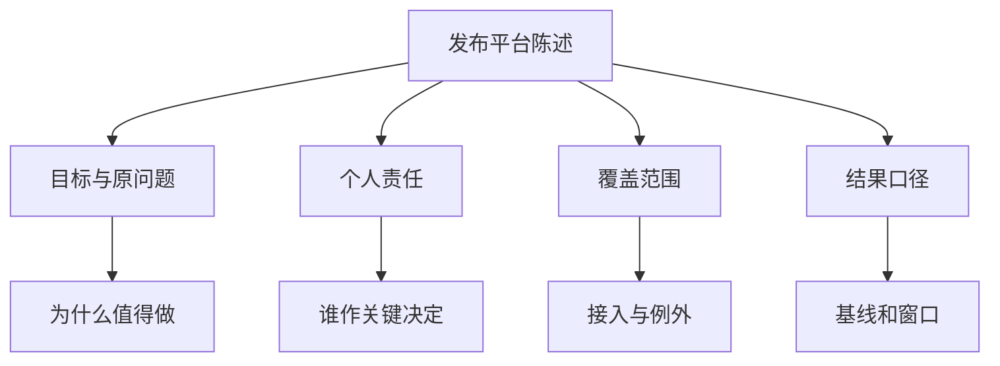
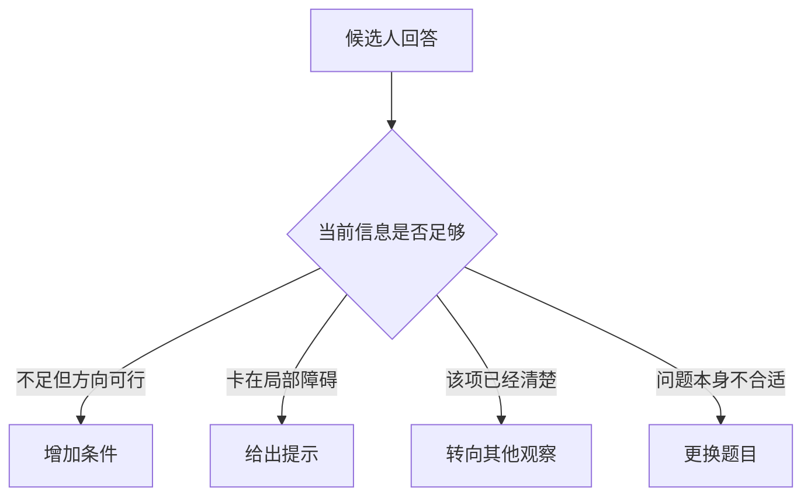
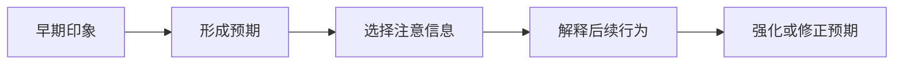
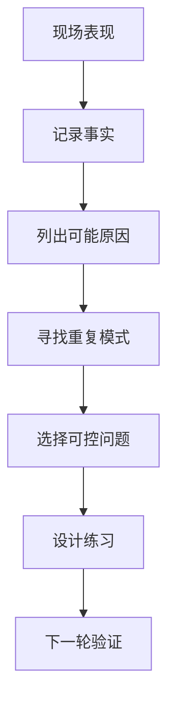
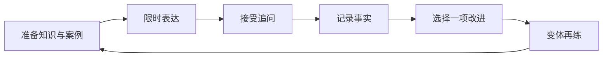

# 候选人如何理解面试评价机制

## 第一章 · 评价工作从岗位模型进入面试计划

### 面试官为什么要先弄清团队需要什么人？

没有岗位模型，面试只能变成凭个人喜好聊天。团队必须先回答要解决什么问题、责任范围多大、哪些能力入职即需具备、哪些可以培养，才能选择相应的观察方式。

#### 共通能力和岗位特性需要同时存在

工程岗位通常都关心问题解决、代码质量、沟通和合作，但不同团队权重不同。数据库内核岗位可能强调系统基础和低层调试，内部平台岗位更重视产品意识、自动化和跨团队推动。即使同一职位名称，实际工作也可能完全不同。

#### 级别改变观察标准

初级岗位更可能接受经验较少，关注基础、反馈吸收和成长速度；资深岗位则会要求在模糊约束下作出判断、承担更大范围并影响他人。工作年限只是参考，不能替代对实际责任的判断。

#### 必需项和可培养项要分开

如果值班响应是岗位核心，无法在压力下定位问题可能是高风险；某个内部工具不会使用，通常可以入职后学习。混淆两者会把易学的知识点当门槛，也可能放过真正影响工作的缺口。

#### 同一个职位名称为什么会有不同标准

假设两支团队都招聘“平台工程师”。甲团队已有成熟平台，岗位主要帮助应用接入、处理运行问题并改进自助体验；乙团队刚开始建设，需要从需求访谈、架构到推广承担更大范围。

| 观察方向 | 甲团队可能更关注 | 乙团队可能更关注 |
| --- | --- | --- |
| 技术深度 | 已有系统的排障和维护 | 从约束到架构的选择 |
| 协作 | 支持请求与用户反馈 | 跨团队建立共同规则 |
| 交付 | 持续改进与稳定运营 | 从零到一和阶段取舍 |
| 风险 | 变更安全与响应速度 | 方向错误与推广失败 |

这不是两套通用标准，只说明岗位名称不足以确定评价重点。候选人若只根据职位名称准备，可能把大量时间投入错误方向。

#### 岗位模型怎样进入问题

例如团队问题是“重大变更依赖少数资深同事”，岗位任务可能是建立可复用发布机制。相应问题应观察候选人如何识别风险、设计回滚和推动采用，而不是只考某个工具命令。

#### 候选人能从哪里看出重点

岗位描述中的职责动词、招聘方对前三个月目标的说明、不同轮次反复出现的问题，都能提供线索。但这些线索仍可能不完整。某道题出现不代表它是唯一核心，某个面试官的个人偏好也不等于团队正式标准。

#### 候选人可以怎样行动

从岗位描述提取任务、能力、约束和级别信号，向招聘方确认入职三个月的目标。回答时把证据对齐具体工作，不要试图证明自己“什么都强”。如果发现岗位定义与面试问题长期不一致，也应把它作为反向判断的信息。

可以把一条岗位要求分别写成“入职即需”“可在三个月内补齐”“需要进一步确认”三类，并为前两类准备不同证据。这个练习能防止把所有关键词当成同等门槛，也能暴露你与岗位之间真正需要讨论的风险。

### 为什么一场面试通常需要多人分轮完成？

有限时间无法由一个人稳定观察所有能力，多轮可以分配重点、交叉验证并减少单一判断的影响。但轮次越多不一定越准确；没有计划的重复提问只会增加成本。

#### 每轮应有明确观察任务

一轮可能重点看编码和问题分解，另一轮看系统设计，主管轮看职责跨度与协作。分工不意味着完全隔离：沟通和诚实会贯穿多轮，但主要证据应避免全部落在同一人身上。

#### 交叉观察用于确认模式

同一能力在不同场景中的表现可以互相支持。例如编码题和项目案例都显示候选人先澄清需求，这比单次行为更稳定。若结果冲突，团队需要检查题目、提示、状态和解释是否不同，而不是简单平均分数。

#### 特殊角色负责整合

常见流程会有招聘主管、流程协调者或资深面试官负责计划和汇总，但名称、权限因组织而异。某些公司由一人最终决定，某些依赖集体讨论，不能把特定公司的做法当成通用制度。

#### 一份简单的分轮覆盖示例

| 轮次 | 主要场景 | 重点观察 | 可能与其他轮交叉 |
| --- | --- | --- | --- |
| 编程讨论 | 完成一个小任务 | 澄清、实现、测试 | 沟通、接受提示 |
| 系统设计 | 设计开放系统 | 约束、权衡、故障 | 技术基础、表达 |
| 项目讨论 | 深挖真实经历 | 责任、决策、结果 | 学习、协作 |
| 主管沟通 | 职责与动机 | 范围、优先级、匹配 | 项目、合作 |

每轮有主目标，仍会自然观察其他行为。如果各轮都只问同一种算法，覆盖数量增加，信息种类却没有增加。

#### 为什么同一能力可能出现两次

交叉观察不是重复原题，而是在不同情境确认稳定性。例如需求澄清既能在编程题中出现，也能在项目经历中出现。前者是受控问题，后者是真实工作；两个场景一致时，判断更稳定。

若表现不一致，可能有多种原因：题目熟悉度、紧张、提示方式、时间不足，或能力本来就依赖情境。讨论的任务是解释差异，不是简单平均分数。

#### 分轮也有成本和局限

轮次增加会消耗双方时间，也可能带来疲劳和先入为主。结构化分工只能降低单人偏差，不能保证结论完全正确。面试团队还可能漏掉关键能力、重复观察或记录不足。

候选人不应因为“多轮都问了”就把结果视为绝对测量，也不必把每轮问题变化理解成流程混乱；应结合招聘方说明和实际体验判断。

#### 候选人可以怎样行动

提前询问轮次和大致主题，为同一能力准备不同证据。多轮中保持事实和边界一致，但不要逐字重复同一故事。若被问到已讨论的问题，可以简短说明前一轮涉及过，再从当前面试官关心的角度回答。

例如，同一次迁移可以在编码轮讲自动化实现，在设计轮讲切换与回滚，在主管轮讲跨团队协调。三种讲法共享事实，却各自回答不同观察目标；数字、角色和结果口径必须保持一致。

### 面试官拿到简历后，会先形成哪些判断？

简历会触发对匹配度、经验深度、职业路径和追问方向的初步假设。这些是假设，不应是最终结论；高质量面试会用对话验证或推翻它们。

#### 快速筛选关注可定位信息

职位、时间线、相关技术、项目范围和结果帮助判断是否值得继续。筛选时间短，信息层级混乱或关键词与事实脱节会增加理解成本。

#### 强动词和数字会提高追问概率

“主导”“从零建设”“提升 80%”暗示较大责任和结果。面试官会问范围、基线、参与者、决策权和统计口径。数字本身不等于可信；能解释如何得到才有意义。

#### 空白和转折会形成疑问

角色频繁变化、项目时间重叠、技术跨度很大或经历缺少结果，都可能产生追问。这不意味着负面，只是需要上下文。合理的职业选择经过说明后，初始疑问可以消失。

#### 一条简历会产生哪些初始假设

教学示例：

> 主导统一发布平台建设，覆盖 30 个服务，将发布效率提升 70%。

阅读者可能形成多项假设：候选人负责总体方案；30 个服务确实完成接入；效率有明确基线；候选人处理过推广与运行问题。它也会产生疑问：平台原来是什么、70% 指耗时还是人工步骤、谁决定“主导”。

这些都不是结论。高质量面试会把它们转换为问题，而不是因为句子亮眼就直接认定能力。

#### 可能的追问路径

若候选人说明自己负责接入库和迁移协调，而非总体架构，初始假设就会被修正。这不是“降级”，而是让实际贡献更准确。

#### 简历中的空白不只有负面解释

一段较短经历可能来自项目结束、团队调整或主动选择；职业空档也可能有不愿公开的个人原因。面试官可以询问与岗位有关的事实，但不应自动补上负面故事。

候选人也不必过度解释所有人生细节。准备一段简短、真实且与职业时间线有关的说明，然后把重点带回当前能力和目标。

#### 简历强弱还受读者影响

招聘人员、技术同事和主管可能从同一句话看到不同问题。候选人无法控制全部解读，但可以通过清晰结构、准确动词和可核实口径减少无谓歧义。

#### 候选人可以怎样行动

逐条建立追问树，确保责任、选择、结果和边界都能说明。对敏感或不便披露的信息提前准备合规表述。不要根据简历“看起来厉害”就放松准备；面试的作用正是验证这些陈述。

找一位不了解你经历的人随机抽取五个动词和数字追问。只要某处需要用“差不多”“反正很多”维持故事，就回到经历清单核实或收窄表述。无法披露的细节应换成区间和验证方法，而不是临场沉默。

### 面试官问一道题时，真正想观察什么？

题目是观察工具，不是目的。面试官可能借它观察知识基础、需求澄清、分解能力、取舍、代码习惯、反馈吸收或沟通方式。候选人只有理解这一点，才不会把全部注意力放在猜标准答案。

#### 同一题可以服务不同目标

缓存题可以考机制，也可以考系统权衡；项目失败题可以看责任感，也可以看复盘能力。面试官应在计划中明确主要观察项，否则题目很容易变成随意聊天。

#### 过程提供比最终结果更多的信息

候选人是否确认条件、如何建立假设、遇到反例怎样修正、完成后是否验证，这些都接近真实工作。答对可能来自熟悉原题，答错也可能来自一时计算失误，所以需要结合过程解释。

#### 提示后的变化同样重要

面试官可能故意提供新条件或小提示，观察候选人能否接收信息。接受提示不等于能力差；重复忽略条件、无法说明为何坚持原方案，才可能形成担忧。

#### 一道题中有哪些可观察节点

以“设计一个任务重试机制”为例，面试官可以观察：

| 对话阶段 | 候选人行为 | 可能支持的理解 |
| --- | --- | --- |
| 开始 | 确认失败类型和成功标准 | 能否识别需求差异 |
| 建模 | 区分可重试与不可重试 | 是否理解错误语义 |
| 选择 | 比较立即重试、退避和人工介入 | 是否能权衡成本 |
| 变化 | 新增非幂等操作条件 | 能否修正原方案 |
| 验证 | 提出指标、测试和停止条件 | 是否有运行意识 |

表格中的“可能支持”很重要。一次行为不能直接等同于稳定人格或全部能力。

#### 结果相同，过程可能不同

两位候选人都提出指数退避。第一位因为记得常见答案，无法说明为什么；第二位从下游恢复时间、调用量和用户时限推导出来，并指出非幂等操作不能直接重试。最终名词相同，提供的信息不同。

反过来，候选人没有说出术语，却能提出逐步延长间隔、限制总次数和加入随机扰动，也可能已经理解核心机制。面试官若只匹配关键词，会漏掉真实理解。

#### 面试官介入也会改变观察

提示太早会掩盖候选人原本能否发现问题，完全不提示又可能让整轮停在一个障碍上。候选人无法控制介入策略，应关注自己收到什么新信息、怎样使用，而不是计算提示次数猜结果。

#### 不是所有问题都设计得好

题目可能与岗位无关、条件含糊或只考记忆。理解评价逻辑不意味着替所有问题合理化。候选人仍可澄清、展示过程，并把问题质量作为反向判断团队的一项线索，但不要根据单题给团队下完整结论。

#### 候选人可以怎样行动

先澄清目标，再让关键推理可听见。不要揣摩隐藏答案，而要回应已经给出的条件。结束时总结结论、限制和验证方式，让面试官容易记录实际观察。

答完后可以做一次三句收束：“我选择什么”“最重要的依据是什么”“什么条件会让我改变选择”。如果三句无法覆盖前面的讨论，说明回答可能缺少主线；如果三句全是技术名词，则需要补回用户或业务目标。

## 第二章 · 问题质量取决于能否产生有效观察

### 为什么答对几个知识点仍然不能证明能够胜任？

知识是工作能力的一部分，但胜任还要求把知识用于不完整、变化和有风险的环境。孤立知识题容易受记忆、题库熟悉度和表达状态影响，不能覆盖完整工作。

#### 知道名称不等于理解机制

候选人可能说出一致性哈希，却无法解释节点变化如何影响数据分布；也可能背出事务隔离级别，却不能分析实际并发现象。继续问用途、代价和反例，才能区分层次。

#### 理解机制不等于能完成工程工作

生产环境还包含需求、接口、测试、部署、监控、协作和维护。一个算法答案无法证明会设计可回滚的变更，也无法证明能与相关团队达成约定。

#### 评价需要组合观察

知识讨论、编程、设计、项目和行为案例各自提供一部分信息。多个场景指向相同能力时，判断更稳；如果只有一个亮点或一次失误，应保留不确定性。

#### 从“知道”到“胜任”之间还有哪些层次

以数据库索引为例：

| 层次 | 候选人可能表现 | 仍未回答的问题 |
| --- | --- | --- |
| 记忆 | 能说出常见索引结构 | 是否理解查询怎样使用 |
| 理解 | 能解释查找和写入代价 | 能否面对真实数据分布 |
| 应用 | 能根据查询设计索引 | 是否会验证与维护 |
| 判断 | 能比较索引、改写查询与缓存 | 是否考虑团队和运行成本 |
| 运营 | 能从执行计划和指标发现失效 | 是否处理过变化和回退 |

岗位不一定要求达到所有层次。关键是评价标准应与实际责任对应，而不是把“知道一个术语”当成全部能力。

#### 答对也可能留下疑问

候选人迅速给出一个最优算法，但没有确认输入是否有序，也没有测试重复数据。结果正确，却仍可能留下需求和质量习惯的疑问。相反，候选人最终只完成基线方案，但澄清、验证和复杂度判断清楚，也提供了有价值的信息。

这不意味着过程永远比结果重要。岗位需要实现能力时，长期不能完成代码仍是风险。评价需要同时看结果、过程和题目条件。

#### 单一知识题容易受哪些因素影响

- 候选人恰好见过原题。
- 术语在不同团队中用法不同。
- 记忆状态与实际应用能力不一致。
- 问题过冷门，与岗位日常工作关系弱。
- 评分只匹配关键词，没有追问机制和边界。

候选人无法控制题目质量，但可以通过解释、举例和边界，让理解尽可能可见。

#### 多种观察如何互补

技术定义可以确认基础，编程观察局部实现，设计观察开放判断，项目案例验证真实责任，行为问题了解协作与修正。它们不是互相替代，也不应机械平均。岗位核心项需要更可靠的观察，次要项可以接受更大未知。

#### 候选人可以怎样行动

准备知识时增加真实场景、选择理由、失败模式和验证。若面试只问记忆题，也要先准确作答，不必强行展开；有机会时用一句相关经验说明你怎样把知识用于工作。

自测时不要只问“这是什么”，再增加“何时不用”“怎样知道它失效”“与相邻方案怎样选”。一个概念能回答正面定义却无法处理这三个问题，通常仍停留在可识别、不可应用的阶段。

### 一个面试问题怎样才算真正有用？

有用的问题与岗位相关、条件可说明、允许展示过程、难度可调，并能产生可记录的行为。它不必新奇，也不必只有一个答案。

#### 先有观察目标，再选载体

想观察故障定位，就应提供逐步出现的现象和数据；想观察 API 设计，就应给用户和兼容约束。拿一道熟悉题只是因为“大家都问”，很容易测不到目标能力。

#### 比较两个问题的观察价值

问题甲：“请背出某协议的全部状态码。”如果岗位日常可以查文档，这道题主要观察记忆，且正确答案的工作相关性有限。

问题乙：“一次部署后健康检查反复失败，但应用日志没有错误。你会怎样确认问题发生在哪一层？”它允许候选人澄清、提出假设、请求信息、解释排查顺序，并可根据新数据调整难度。

问题乙不一定天然公平。面试官仍要提供足够条件、避免内部术语，并知道自己想观察的是诊断过程而非猜中预设根因。

#### 有用问题的五个条件

| 条件 | 要回答什么 |
| --- | --- |
| 相关 | 与岗位哪项工作有关 |
| 可开始 | 候选人是否有足够背景进入问题 |
| 可观察 | 哪些行为能够被记录 |
| 可调整 | 怎样增加或降低约束 |
| 可收束 | 在有限时间内怎样形成完整片段 |

如果一道题只有“难”和“新奇”，却无法说明这些条件，得到的结果很难解释。

#### 问题应允许不止一条合理路线

系统设计、故障和行为问题通常有多种解法。面试官可以有参考点，但不应强迫候选人猜自己的设计。真正的观察来自候选人如何根据条件比较路线。

候选人遇到强烈引导时，可以确认新条件：“这个约束意味着您希望优先讨论一致性，对吗？”仍然以题面为准，不必争辩谁的方案更高级。

#### 面试问题也应有结束

不断加入条件直至候选人失败，会让所有人最终都表现为不会。合理做法是在核心观察已经出现后收束，保留时间给其他项。候选人不必因最后一个变体没完成就否定此前表现。

#### 好问题允许逐层深入

基础版本应让候选人能开始，后续通过规模、故障、一致性或时间约束调节。面试官沿候选人的路线追问，比强行引向预设方案更能看到真实判断。

#### 可比较不等于完全标准化

统一核心条件和评价点可以增加公平性，但面试仍需根据回答互动。只有题目、没有行为描述的评分表会制造虚假精确。相反，完全自由聊天也难以比较。

#### 候选人可以怎样行动

遇到题目先确认目标和条件；如果题意模糊，提出对方案影响最大的澄清问题。不要因为题目常见就直接背答案，面试官改变一个条件即可暴露脱离理解的记忆。

高质量问题也不保证每位候选人都熟悉背景。若业务名词陌生，可以请求一个具体例子，再用自己的话复述目标。确认背景不是索要解法；一旦信息足够，就应承担合理假设并开始推进。

### 面试官怎样判断你是听说过，还是真正做过？

真实经验通常包含具体环境、时间顺序、责任边界、失败尝试和验证细节。只听说过的人容易停留在通用结论，或在追问时出现前后不一致。

#### 从细节的一致性判断

面试官会问规模、输入、决策参与者、当时看到的现象和操作顺序。真正做过不保证记得所有数字，但通常能解释哪些记得、哪些需查记录，以及为什么采取某个动作。

#### 从备选和代价判断

实践很少只有一个方案。为什么选择当前方案、放弃了什么、上线后出现什么副作用，这些内容难以靠术语堆砌替代。

#### 真实性不是靠“细节越多越真”

记住命令参数不一定代表亲自负责，忘记某个数字也不代表没做过。更稳定的判断来自细节之间是否一致：目标怎样影响选择，选择怎样产生结果，责任边界是否在多轮追问中保持不变。

#### 一次由浅入深的项目追问

> 面试官：你说负责告警治理，最初的问题是什么？
>
> 候选人：夜间通知很多，但真正需要立即处理的比例很低。
>
> 面试官：你怎样知道，不是值班同事主观觉得烦？
>
> 候选人：我们回看了四周呼叫，按是否执行处置分类。第一版分类由我和两位值班同事复核。
>
> 面试官：你个人负责什么？
>
> 候选人：我负责数据整理、分级规则和路由实现；业务影响等级由各服务负责人确认。
>
> 面试官：规则上线后有什么副作用？
>
> 候选人：两条低频故障被合并得太晚，所以又给关键交易加独立规则。我的初始方案没有覆盖这个边界。

回答包含数据来源、分工和修正。面试官不需要知道内部名词，也能判断候选人是否真正参与。

#### 常见不一致信号

- 项目规模随追问不断变化。
- 一开始声称总体负责，细节中所有决定都由别人作出。
- 结果数字没有定义或比较窗口。
- 只能讲最终方案，不知道曾经的限制和失败。
- 对相邻模块细节非常确定，却说不出自己的接口。

这些信号只能产生疑问，不能自动证明虚构。紧张、时间久远和保密限制也可能造成信息缺口，需要继续澄清。

#### 实验经历也可以真实

候选人明确说“我只在本地三节点环境验证过”，并说明实验方法、观察和生产差异，仍然提供真实学习信息。把实验说成线上运行，才会在规模、故障和责任追问中产生问题。

#### 从责任边界判断

“我们完成了”之后会继续问“你具体负责什么”。准确说参与评审、实现模块或组织迁移，比把团队成果全部归己更可靠。对同事模块知道接口但不了解内部，也符合真实协作。

#### 候选人可以怎样行动

整理经历时保留目标、约束、关键决定、失败、结果和分工。没有生产经验就说实验或学习环境，并解释迁移到生产还需考虑什么。不要为了通过真实性追问而透露公司秘密。

可以为每个项目准备一张责任表：亲自实现、共同决定、参与评审、仅了解接口。面试官切换到非本人负责部分时，先说明所在层级，再回答你确实知道的内容。这样不会因紧张把团队知识误说成个人实践。

### 为什么面试官会不断改变条件或追问反例？

条件变化可以检验你的结论是否依赖背诵，反例可以暴露适用边界。真实工作中的需求、流量和故障都会变化，能否调整模型比守住最初答案更重要。

#### 新条件在测试哪条假设

把单区域改为跨地域，考察延迟与一致性；把读多写少改为写入密集，考察缓存和存储选择；加入重复消息，考察幂等。面试官应让变化与观察目标有关，而不是无限增加难度。

#### 修正结论不是自相矛盾

专业判断本来就依赖条件。你可以说：“新增强一致要求后，我会放弃刚才的异步确认，并重新评估延迟。”说明改变发生在哪一层，会让推理更清楚。

#### 反例防止绝对化

当你说“微服务更易扩展”，对方可能问小团队和简单业务。目的可能是确认你知道组织成本、分布式故障和运维负担，而非要求你否定微服务。

#### 一条条件怎样改变设计

候选人最初为图片处理任务选择异步队列，因为用户可以稍后查看结果。面试官随后增加条件：“这是身份验证步骤，用户必须在十秒内得到结果。”

这个条件改变了用户时限，却不一定要求删除所有异步处理。候选人可以把关键验证保持同步，把审计、通知和非关键分析异步化。评价重点在于他能否指出哪部分假设改变，而不是整张图推倒重来。

#### 有些新增条件不改变核心方案

面试官说“用户数量增加一倍”，候选人不应自动加入所有分布式组件。若原容量余量足够，可能只需重新估算并保持方案。能解释“为什么暂时不变”，同样是有效判断。

| 新条件 | 先检查什么 | 可能改变什么 |
| --- | --- | --- |
| 强一致 | 哪些操作必须立刻可见 | 写路径、缓存、跨地域 |
| 峰值增大 | 当前瓶颈和余量 | 分区、队列、限流 |
| 数据敏感 | 访问和保留要求 | 加密、权限、日志 |
| 外部依赖不稳 | 失败语义 | 超时、重试、降级 |
| 团队规模很小 | 运维能力 | 组件数量与托管选择 |

#### 反例在检查语言是否绝对

“缓存一定提高性能”“重试总能提高成功率”“微服务更适合扩展”都忽略条件。面试官给反例时，候选人可以先承认原则边界，再说明原场景为什么仍适用。

若候选人为了避免反例而只说“看情况”，仍没有判断。有效回答需要说清看哪些情况、怎样改变选择。

#### 追问没有无限准确性

条件越加越多，题目可能越来越远离岗位，也可能因为时间不足无法验证所有推理。候选人可以礼貌确认本轮优先级，面试官也应在已有信息足够时收束。最后一个问题未完成，不代表此前信息全部失效。

#### 候选人可以怎样行动

每次条件变化先复述，再指出受影响的假设、组件或结论。若仍坚持原方案，给出理由和验证。不要把追问数量解释为敌意，也不要为了迎合对方无理由地频繁改口。

练习时让同伴连续加入三个条件，其中一个实际上不影响方案。你不仅要会改变，还要能解释为什么某个条件不改变核心选择。机械地每问必改，与机械地坚持到底同样暴露模型不清。

### 编程题、设计题和项目讨论分别在考察什么？

三者观察范围有交叉，但证据粒度不同。编程题接近局部实现，设计题观察开放约束下的系统判断，项目讨论验证真实经历中的责任和决策。

| 形式 | 主要可观察内容 | 常见局限 |
| --- | --- | --- |
| 编程题 | 澄清、分解、代码、测试、复杂度 | 熟题效应，时间与工作环境不同 |
| 设计题 | 需求、规模、接口、权衡、故障 | 条件假设多，评价主观性较高 |
| 项目讨论 | 真实责任、决策、结果、协作 | 依赖记忆，项目背景差异大 |

#### 组合使用才能减少盲区

项目讲得好不保证能独立编码；编程流畅也不保证能管理系统风险。面试计划会根据岗位选择组合和权重，而不是把每种形式机械等分。

#### 形式本身不能自动保证公平

题目相关性、提示方式、时间、面试官能力和评价记录都会影响结果。高质量流程会关注观察事实，不把“我喜欢这个解法”当作能力标准。

#### 同一能力在三种形式中的表现

以“需求澄清”为例：

| 形式 | 可观察行为 | 可能遗漏 |
| --- | --- | --- |
| 编程题 | 确认输入、输出与边界 | 真实利益相关者沟通 |
| 设计题 | 明确用户、规模和质量目标 | 实施后的反馈 |
| 项目讨论 | 还原真实需求变化与协作 | 依赖候选人记忆和叙述 |

三个场景相互补充。面试官如果只用一种形式推断全部能力，应保留更大不确定性。

#### 编程题的结果不只有“通过样例”

候选人可能写出代码，但变量含义不清、没有处理错误，也无法解释复杂度；另一位候选人代码未全部完成，却展示了清晰方案和测试。岗位若要求日常独立实现，完成度仍重要，但不能忽略过程差异。

#### 设计题没有唯一标准图

设计题条件往往不完整。有效观察来自候选人怎样定义范围、估算、比较方案和处理失败。若评价只看是否出现缓存、队列或某种数据库，就把开放问题降成关键词测试。

#### 项目讨论需要防止叙述优势

表达流畅的人可能把普通经历讲得很完整，内向或使用非母语的人可能需要更多澄清。面试官应追具体事实，而不是把故事性直接等同于能力。候选人则要用结构降低表达差异，不必表演戏剧化情节。

#### 为什么还会加入其他小任务

API 设计、测试讨论、代码评审或故障分析可以补主形式的盲区。它们应围绕岗位需要选择，不是越多越全面。面试时间有限，每加入一种任务都在放弃另一种观察。

#### 候选人如何解释单项发挥

复盘时分别记录“这个形式观察了什么”和“没有观察什么”。编程题卡顿需要修复相应问题，但不应自动推导成项目能力、学习能力和团队合作全部失败。最终结果仍可能受核心门槛影响，只是自我诊断要保持准确。

#### 候选人可以怎样行动

分别练习每种形式的完整流程。编程结束主动测试，设计先问条件，项目先说目标和责任。遇到不熟悉的形式，可以确认工具和预期，不需要假装已经习惯。

复盘时分别记录“这次形式允许观察什么”和“没有观察到什么”。例如在线编辑器能看到代码过程，却未必反映日常使用文档和 IDE 的效率。这样能避免把单项发挥扩张为对全部能力的判断。

## 第三章 · 对话流程会改变证据的数量与质量

### 一场完整的面试通常怎样展开？

常见单轮会经历开场、背景建立、核心问题、候选人提问和收尾。不同公司、岗位和轮次会变化，重点不是背流程，而是理解每个阶段怎样帮助双方交换信息。

#### 开场用于建立规则和安全感

面试官介绍自己、时间安排、协作工具和问题形式，候选人可以确认是否允许查文档、如何共享代码。清晰开场能减少与能力无关的焦虑和误解。

#### 核心阶段应形成完整小任务

一个问题最好从需求澄清推进到方案、实现或验证，而不是连续抛出互不相关的碎片题。面试官会根据时间介入，确保关键观察项有覆盖。

#### 收尾仍是评价和选择的一部分

候选人提问帮助了解岗位，也显示关注点。面试官应说明后续流程但不能随意承诺结果。双方都可以补充先前遗漏的信息。

#### 四十五分钟里信息怎样逐步增加

以下只是常见示例，不是统一流程：

| 阶段 | 可能用时 | 主要目的 | 候选人容易忽略 |
| --- | ---: | --- | --- |
| 开场 | 3 分钟 | 建立规则和背景 | 未确认工具与时间 |
| 经历切入 | 7 分钟 | 选择相关追问入口 | 背完整简历 |
| 核心任务 | 25 分钟 | 观察完整工作片段 | 过早陷入细节 |
| 变化与收束 | 5 分钟 | 检查边界和总结 | 没说明未完成部分 |
| 反向提问 | 5 分钟 | 双方补充岗位信息 | 临时问低价值问题 |

实际顺序会变化。重点是核心观察需要足够连续时间，不能被开场和碎片问题耗尽。

#### 为什么“完整小任务”比连续快问更有信息

如果面试官连续问十个定义，只能看到一组记忆结果。让候选人完成一次从澄清到验证的小任务，能看到各能力怎样连接，也能区分偶然失误和稳定习惯。

例如故障题从现象开始，候选人提出假设，面试官提供一条日志，再观察他如何修正、处置和验证。即使没有猜中预设根因，过程仍可记录。

#### 流程失控会造成什么

开场背景过长会压缩核心题；面试官频繁打断可能让候选人无法形成完整表达；候选人在一个旁支讲太久，也会让其他能力没有机会出现。最后评价中的“没有观察到”可能只是时间分配问题。

#### 收尾不是结果暗示

面试官热情介绍团队可能是正常候选人体验，简短收尾也可能只是时间耗尽。候选人不应从告别语气判断通过与否。更可靠的做法是确认后续流程并完成自己的事实复盘。

#### 候选人可以怎样行动

开场确认时长和形式；核心阶段主动总结进度；临近结束若任务未完，说明剩余步骤和验证方式；提问环节选择真正影响决策的问题。流程意外变化时，先确认新的时间和目标。

做一次四十五分钟模拟并在第十五、三十五分钟设置提醒。提醒出现时只总结当前结论、剩余风险和下一步，不重新讲背景。这个练习能提升流程感，又不会让你频繁看钟破坏交流。

### 面试官会怎样根据你的回答调整后续问题？

面试不是固定问卷。面试官会根据已有证据决定深入、转向、提示或结束，以在有限时间里覆盖最重要的不确定项。

#### 回答顺利时可能增加深度

对方可能增加规模、故障或反例，寻找你的能力边界。题目越来越难不等于评价变差；它可能说明基础观察已足够。

#### 回答受阻时可能给支架

面试官可能缩小问题、提供示例或提示。随后会观察你是否理解并继续推进。提示数量本身不能单独决定评价，关键是提示后的变化。

#### 已有证据充分时会转向空白项

如果问题分解已表现清楚，对方可能不再追同类题，而去观察测试、沟通或项目责任。突然换题不一定表示上一题失败。

#### 面试官可能采取的四种调整

四种调整从候选人视角可能都表现为“面试官插话”，实际原因不同，不能只凭动作猜结论。

#### 同一句回答可能触发不同追问

候选人说：“我们使用缓存降低查询延迟。”如果责任真实性不清，面试官会问谁决定和实现；如果机制不清，会问失效和一致性；如果结果不清，会问基线和指标；如果边界不清，会增加写入频繁条件。

追问方向反映当前未知，不一定代表已有答案错误。候选人应回答新问题，而不是重新背一遍缓存定义。

#### 提示后的表现怎样被理解

候选人收到“输入已经有序”的提示后，能否立即调整复杂度、解释原方案为什么浪费，以及修改测试？提示给了一个事实，后续修正仍由候选人完成。

若候选人只重复提示，或者口头同意但代码仍按无序处理，面试官可能记录没有有效使用信息。接受提示不是说“知道了”，而是让模型和行动发生变化。

#### 被打断也可能是时间控制

回答已经偏离问题或细节超出本轮目标时，面试官会收束。候选人可以用一句话确认：“好的，我先停在实现细节，回到您问的个人责任。”不断抢回原话题会进一步消耗时间。

#### 候选人可以怎样行动

关注显式条件，不猜测面试官心理。被打断时用一句话确认转向：“好的，我们先不展开缓存一致性，改看故障处理。”若你认为关键结论尚未说出，可以简短补充后再进入新题。

把“对方换题”记录为流程事实，而不是自动记成失败。如果后续反馈或重复模式表明自己确实太慢，再训练答案层级；在没有证据时，不要为了猜测而重写所有准备内容。

### 为什么候选人和面试官经常对同一场面试感受不同？

双方掌握的信息不同。候选人体验题目难度、紧张和互动感，面试官则依据岗位标准、分工和其他轮次汇总。友好不等于通过，追问尖锐也不等于否定。

#### 体验与观察不是同一指标

候选人可能因没写完代码觉得失败，但面试官已观察到很强的分解和修正；也可能因为题目熟悉而自觉顺利，却没有说明测试和边界。

#### 面试官也可能误判

第一印象、相似偏好、题目熟悉度和记录质量都可能造成偏差。多轮和结构化反馈只能降低风险，不能消除。候选人不应把结果当作绝对真相。

#### 沟通信号容易被错误解释

面试官看时间可能是控制流程，沉默可能是在记录；候选人停顿可能是在思考，并非不会。高质量双方会用语言说明动作，减少猜测。

#### 两种视角如何形成不同结论

教学场景：候选人在编程题中完成了主要逻辑，但最后两个测试未跑完。

候选人的体验可能是：“代码没全部通过，肯定失败。”面试官记录可能是：“需求澄清和方案清楚，边界测试有意识，但实现时间偏慢。”另一位面试官若岗位把完成速度视为核心，风险权重又会不同。

体验关注“我是否完成”，评价还会问“完成过程中观察到了什么、岗位要求什么”。两者都不是完整真相。

可以把常见错读分开：

| 现场信号 | 候选人容易解释为 | 还可能是什么 |
| --- | --- | --- |
| 追问越来越难 | 前面一直答错 | 基础信息已经足够，正在寻找边界 |
| 面试官频繁记录 | 对答案不满意 | 正在保存事实或控制时间 |
| 最后一题没完成 | 整场失败 | 时间不足或核心过程已观察 |
| 面试官介绍团队 | 已经通过 | 固定候选人体验流程 |
| 很快换题 | 当前表现差 | 该项已清楚或题目不合适 |

表格只能阻止过早下结论，不能用“另一种解释”反向证明表现良好。复盘仍应回到可见事实和重复模式。

#### 友好和严格都不是结果信号

有些面试官始终友好地给提示，仍然会如实记录不足；有些人表达直接、连续追问，却可能认为候选人表现很好。交流风格与推荐意见不能简单绑定。

同样，面试官主动介绍团队可能是统一流程，而不是暗示录用。候选人可以享受良好交流，但不要据此停止复盘或做外部承诺。

#### 评价标准对候选人并不完全可见

候选人不知道其他轮次、目标级别、竞争情况和内部岗位变化。即使准确回忆自己的表现，也无法完整预测结果。过度猜测会把不可见变量全部解释为个人能力。

#### 面试官也只有有限样本

候选人可能因陌生工具、网络延迟或当天状态没有展示日常水平。成熟流程会尝试区分，但无法彻底消除。结果是特定条件下的风险判断，不是永久能力证书。

#### 怎样做更可靠的自我复盘

把“感觉”与“事实”分栏：紧张程度、互动舒适度可以记录，但改进行动要基于回答、追问和未完成项。连续多轮后寻找重复模式，比解释一位面试官的表情更可靠。

#### 候选人可以怎样行动

面试后记录事实而非表情解读。将“对方皱眉”保留为观察，不直接写成“答案错误”。复盘自己可控制的行为，同时承认最终决策中存在无法获知的因素。

如果想校准主观感受，可以在复盘中分别打两项分：当时紧张程度和回答完成程度。连续几次后可能发现二者并不总同步；这能减少“感觉糟糕所以一定答得糟糕”的错误推断。

### 线上交流会让面试官少看到哪些信息？

线上环境压缩了眼神、姿态、白板协作和非正式交流，还引入网络延迟、声音重叠和设备差异。信息减少可能影响双方判断，因此需要用更明确的语言和工具补偿。

#### 非语言反馈变弱

候选人难以判断面试官是否理解，面试官也难观察候选人的协作节奏。镜头位置和画面延迟还可能制造“缺少眼神交流”的错觉，不应被过度解释。

#### 思考过程更容易消失

共享屏幕只显示代码时，纸面草图和表情不可见。长时间静默会让对方不知道你在做什么。主动说明当前假设和下一步，可以恢复部分可观察性。

#### 技术故障会污染评价

断音、输入延迟和不熟悉编辑器可能被误认为沟通或编码问题。面试官应区分环境事实与能力判断，必要时重述、延时或改用备用方式。

#### 线上环境减少了哪些观察

| 面对面容易看到 | 线上可能丢失 | 可用的补偿方式 |
| --- | --- | --- |
| 白板上的完整草图 | 只共享一个窗口 | 主动共享白板或口头描述结构 |
| 停顿时正在阅读还是思考 | 镜头和视线有限 | 说明当前检查的条件 |
| 双方准备开口的细微信号 | 网络延迟造成抢话 | 明确让对方先说 |
| 指向某个图形的手势 | 画面不同步 | 使用节点名称和光标定位 |
| 环境中的设备故障 | 对方只听到中断 | 说明现状和替代方案 |

补偿的目标是让工作过程可见，不是要求候选人持续讲话。

#### 沉默在线上更容易被误解

面对面时，面试官可能看到候选人在画图；线上只看到静止画面，十几秒沉默就难以判断。候选人可以说：“我正在比较两种分区方式，先写下数据分布和扩容代价。”然后安静思考。

过度直播每个念头也会干扰推理。只在阶段变化、关键假设和发现错误时说明即可。

#### 网络故障应与能力记录分开

如果声音丢失导致候选人没有听到新增条件，后续错误不能简单解释为忽略信息。理想情况下双方确认断点并重述。候选人恢复后主动复述当前条件，有助于减少误差。

#### 线上也可能增加某些信息

共享编辑器能保留代码变化，远程工具更接近日常分布式协作。评价不应假设线上一定更差，而应知道不同形式观察到的内容不同。

#### 候选人如何判断环境影响

复盘时记录具体故障持续多久、遗漏什么、是否恢复，而不是笼统写“网络不好”。如果主要过程仍完成，就不要把全部问题归给网络；如果关键条件确实丢失，可以在允许的反馈渠道说明事实。

#### 候选人可以怎样行动

提前测试真实软件，准备热点和备用音频；在线上更频繁地标记结构和状态。故障发生时简短说明现状、尝试动作和替代方案，并在恢复后确认遗漏的问题。

线上练习要包含一次主动共享和一次中断恢复：确认共享范围、放大可读内容、断线后用一句话恢复上下文。只测试能否进入会议，仍没有覆盖最容易影响证据质量的环节。

### 为什么第一轮面试会影响后面几轮？

第一轮可能决定是否继续，也可能产生供后续核实的疑问。即使流程要求面试官独立评价，轮次安排、简历标注或招聘方沟通仍可能影响后续重点。

#### 合理影响是补充覆盖

如果第一轮已经充分观察编码，后续可以把时间放在设计；如果发现某项经验不清楚，下一轮可以从不同场景验证。这样能提高整体信息量。

#### 不合理影响是先入为主

若后续面试官先看到强烈结论，可能只寻找支持它的证据。成熟流程会要求先独立记录，再讨论；即便如此，偏差也不能完全消除。

#### 候选人的状态也会延续

第一轮设备故障或发挥不佳可能增加后续焦虑，顺利开场也可能提升信心。候选人需要在轮次间重置，而不是不断预测结果。

#### 合理的信息传递是什么

第一轮发现候选人的简历中某个项目责任不清，后续轮次可以从设计或协作角度再确认；第一轮已充分观察代码实现，后续可以减少重复，把时间给运行和维护。信息传递的目标是补足空白，不是告诉后续面试官“这个人好或不好”。

#### 先入为主怎样发生

如果后续面试官先看到“沟通差”这个宽标签，他可能把每次停顿都解释为支持标签，却忽略候选人在复杂问题中清楚总结。更好的传递应是具体事实：“项目问题中两次没有回答个人责任，需要继续确认。”

候选人通常无法知道内部怎样传递信息。理解这种风险不是为了猜流程，而是认识到多轮也不能彻底消除偏差。

#### 第一轮的不同功能

| 流程设计 | 第一轮可能承担的任务 | 对后续的影响 |
| --- | --- | --- |
| 初步筛选 | 确认基本门槛和动机 | 决定是否继续 |
| 完整轮次之一 | 覆盖预定能力 | 补充其他角度 |
| 主管开场 | 对齐岗位和级别 | 调整后续重点 |
| 技术开场 | 建立项目与基础认识 | 选择深入入口 |

具体公司可能完全不同，候选人应以招聘方说明为准。

#### 候选人状态如何产生连续影响

第一轮答错后不断在脑中重播，会占用下一轮注意力；第一轮过于顺利，也可能让人减少澄清、变得急躁。轮次之间最有用的是恢复身体状态、确认下一轮形式，并保留一个具体修正动作。

#### 后续面试官重复提问怎么办

可以说：“前一轮也简要谈过这个项目，我从您关心的系统设计角度重新说明。”然后完整回答。不要只说“我已经讲过”，因为对方可能没有看到前一轮内容，也可能在独立确认一致性。

#### 不要临时改写事实

如果第一轮发现某个数字不准确，后续应明确纠正：“我刚核对了一下，接入服务是 12 个，不是刚才口误的 20 个。”诚实修正比为了保持表面一致继续使用错误数字更可靠。

#### 候选人可以怎样行动

每轮都按当前问题提供完整且一致的事实。若对方提到前一轮疑问，直接补充，不急于辩护。轮次间只记录要修正的一个动作，补水和休息，把尚未知道的评价留到流程结束。

可以准备一张只含关键词的重置卡：岗位目标、三个主案例、回答动作和两个反向问题。每轮前看一分钟即可，避免复盘上一轮时临时改写事实或把负面猜测带进下一轮。

## 第四章 · 录用建议由分散观察逐步汇聚

### 面试结束后，面试官通常会记录哪些内容？

高质量反馈应记录考察重点、使用的问题或场景、观察到的行为、优势、担忧和结论。不同组织的模板和评级不同，但“事实与解释分开”具有普遍价值。

#### 先写观察事实

例如：“候选人没有确认输入可重复，第一次实现遗漏去重；提示后补充集合并重新测试。”这比“粗心”更可复核。事实应包含足够上下文，但无需逐字转录整场对话。

#### 再说明事实支持什么判断

同一事实可能有多种解释。未完成编码可能源于问题理解、时间控制或实现能力。反馈需要说明推断，并保留不确定性，不能用形容词替代分析。

#### 优势和风险都应被记录

只列好或只列坏容易失真。面试官还应说明本轮没有覆盖什么，防止沉默被误解为通过或失败证据。

#### 从现场行为到反馈的三层写法

教学示例：候选人在设计任务重试时，先提出无限重试；面试官提示用户操作可能不幂等后，候选人改为按错误类型决定，并补总时限。

| 层次 | 可写内容 | 不应混写 |
| --- | --- | --- |
| 观察事实 | 初始方案、提示和修改 | “缺乏经验”这类判断 |
| 解释 | 能使用新条件修正，但最初漏掉副作用 | 把单题扩张成人格结论 |
| 建议 | 在该项上有正面和风险信息 | 用一句模糊印象结束 |

事实让其他人能够复核，解释说明面试官如何理解，建议才连接岗位标准。

#### 一份反馈还应写清“没有看到”

本轮没有时间测试代码，不等于代码能力弱；项目没有问到跨团队合作，也不等于合作正常。明确覆盖缺口能防止汇总时把空白自动当成中性证据。

#### 为什么要及时记录

面试结束后细节会很快被总体感受替代。及时记录能保留候选人做了什么、提示发生在哪里、哪项测试完成。延迟越久，“感觉不错”或“有点乱”越容易占据反馈。

#### 观点必须能回到事实

如果反馈写“不能接受建议”，讨论时应能还原候选人收到什么建议、怎样回应、是否有其他合理原因。单次坚持原路线可能源于没听懂，也可能是有理由不同意。没有上下文的标签不应获得过高权重。

#### 候选人怎样让记录更准确

用明确阶段词说明结论、假设和修正；完成后简短总结；发现面试官误解责任时及时纠正。目的不是操控评价，而是降低双方理解偏差。

#### 候选人可以怎样行动

回答时给明确结论、具体动作、结果和边界，降低记录歧义。结束前可用半分钟总结关键方案。不要要求查看内部反馈，但可以在流程允许时询问一项改进建议。

在模拟中让听众根据你的回答写三行反馈：观察事实、能力解释、仍有疑问。若事实栏只能写“感觉不错”，说明回答缺少可记录行为；若疑问与题目无关，说明信息层级可能失控。

### 第一印象会怎样影响面试判断？

第一印象会影响注意力和解释：一旦形成“很强”或“很弱”的预期，人更容易注意支持它的信息。它无法完全消除，只能通过结构化问题、事实记录和独立评价降低影响。

#### 印象来源常与能力混杂

表达流畅、学校或公司背景、穿着、口音、网络状态都可能影响直觉，其中很多并不直接代表岗位能力。面试官需要回到观察目标，避免把熟悉感当作胜任。

#### 光环和确认偏差会延续

一个漂亮开场可能让后续错误被宽容，一个早期失误也可能让正确回答被低估。多轮独立观察、统一核心问题和事后事实复核是常见缓解方式。

#### 第一印象如何改变后续解释

候选人来自熟悉公司、表达流畅，面试官可能更早相信其结论，减少追问；候选人开场紧张，面试官可能把正常停顿解释为不会。两种情况都让后续信息受到最初预期影响。

结构化问题和事实记录试图打断这条循环，但人类判断无法完全摆脱它。

#### 哪些因素与岗位能力关系较弱

学校、前公司品牌、口音、摄像头画质、共同兴趣和表达风格都可能影响熟悉感。某些信息与经历背景有关，但不能直接替代对目标岗位工作的观察。

候选人无需隐藏背景，也不应利用品牌跳过事实。面试官则需要问自己：当前判断能否写成与工作相关的具体行为？

#### 早期失误可以怎样修正

候选人发现自我介绍把团队成果说成个人成果，可以主动澄清：“我刚才说得太宽，统一方案是团队共同决定，我负责接入库和迁移协调。”这条具体修正比不断强调自己诚实更有效。

技术回答出错时也一样：指出错误、重新建立条件、继续推进。试图掩盖更容易让第一印象固化。

#### 不要为了印象模仿人格

外向、语速快和自信姿态不是通用胜任标准。准备清晰开场和可核实材料即可。长期维持不真实表演会占用注意力，并可能让不同轮次的风格和事实不一致。

#### 候选人如何复盘印象问题

若多次反馈都指向表达失焦，修正结构；若只是自己觉得“不够自信”，先找录音或听众事实。不要把所有结果归因于气场，也不要否认沟通确实可能影响信息是否被看见。

#### 候选人无需追求表演人格

清楚、准时、尊重和准备充分能降低无关噪声，但不需要模仿外向或过度自信。过度包装可能造成事实不一致，反而引出更大风险。

#### 候选人可以怎样行动

开场用清晰定位建立上下文，技术故障或口误及时说明并恢复。若察觉面试官误解，礼貌纠正事实：“我补充一下，这部分是我参与评审，不是独立实现。”把精力放在可观察行为，而不是猜测对方喜好。

纠正应尽量短，并给出可验证版本。不断解释自己“其实很强”只会增加印象争论；补充一个职责、一次动作或一个结果，才能让评价重新回到事实。

### 不同面试官意见不一致时，会怎样处理？

不一致很常见，因为观察场景、题目、标准和候选人状态不同。成熟讨论不会直接用人数覆盖少数意见，而会检查各自事实、评价目标和解释链。

#### 先确认是否在讨论同一能力

“编码差”可能实际是需求没听清；另两轮看到的实现能力正常。团队需要拆开理解、分解、代码和沟通，避免宽标签制造伪冲突。

#### 比较事实的质量和重复性

有具体行为、上下文和多次出现的模式，通常比单一印象更有分量。但单次严重事件也可能重要，取决于岗位和事实可靠性，不能机械要求出现两次。

#### 检查标准和覆盖缺口

面试官可能对级别标准理解不同，也可能某项只被一轮观察。如果关键数据不足，组织有时会增加一轮或使用其他可靠材料；是否这样做取决于流程与成本。

#### 先把宽标签拆开

面试官甲说“编码能力不足”，事实是候选人没有听清去重要求，沿错误输入模型实现；面试官乙和丙在其他题中看到代码组织和测试正常。冲突可能不在编码，而在需求理解或当轮沟通。

讨论需要分别检查：问题是否理解、方案是否合理、代码是否完成、测试是否覆盖、提示是否使用。宽标签拆开后，意见可能不再真正矛盾。

#### 一个跨轮次分歧示例

| 轮次 | 观察事实 | 初始解释 |
| --- | --- | --- |
| 编程 | 未确认重复输入，第一次实现错误 | 编码基础弱 |
| 设计 | 多次主动确认一致性和规模 | 需求分析较强 |
| 项目 | 讲出因误解需求造成返工的经历 | 曾有沟通问题并已改进 |

这些信息不能用二比一投票。团队需要看编程轮错误发生在哪一步、项目中的改进是否已经在其他场景出现，以及岗位对快速澄清的要求。

#### 分歧可能来自标准而非候选人

一位面试官按初级岗位判断，另一位按资深岗位判断，同一表现自然得到不同结论。讨论应先对齐目标职责和级别，再比较事实。否则争论候选人“好不好”没有共同参照。

#### 什么时候可能补充观察

只有关键项信息不足且流程允许时，组织才可能增加讨论或轮次。加面会消耗候选人和团队时间，也可能产生新噪声，不是所有分歧都应靠更多题解决。

#### 候选人无法控制内部争论

最有帮助的是让各轮事实一致、边界清楚、变化有条件。若结果未通过，不要根据“意见可能分歧”编出内幕。能获得具体反馈就用于校准，不能获得时保留多种解释。

#### 候选人可以怎样行动

在不同轮次保持责任和数据口径一致，条件变化时明确解释。不要试图让每位面试官听到完全相同的背稿；多角度但事实一致的案例更能经受汇总。

复盘跨轮次差异时可画两列：问题条件和你的表现。如果同一能力在不同条件下差异很大，先找输入、提示、疲劳和时间等解释，再决定是否是稳定短板。无法解释的波动可以保留为不确定，不必强求一个故事。

### 零散的面试表现是怎样汇总成最终结论的？

常见做法是先收集各轮独立反馈，再围绕岗位必需项、优势、风险、覆盖缺口和目标级别讨论。具体是主管决定、集体共识还是委员会裁定，因组织而异。

#### 汇总不是简单平均分

关键能力的明显缺口可能比多个次要亮点更重要；某项突出优势也不能自动抵消岗位硬门槛。权重应来自岗位模型，而不是面试官个人偏好。

#### 事实会被归纳成模式

项目题和设计题都显示先确认约束，可以支持需求分析优势；多轮出现忽略反馈，可能形成合作或适应风险。模式必须回到具体事实，不能只传播标签。

#### 不确定性仍会保留

有限面试无法消除所有疑问。最终结论是在已有信息下接受或拒绝风险，不是对候选人全部能力的永久认证。级别、团队名额和业务阶段也可能影响决策。

#### 从分散事实到岗位风险

教学示例中，四轮分别得到：代码实现清楚但测试不足；设计能识别容量问题；项目责任边界准确；两次忽略面试官关于用户目标的提示。

汇总时不应把四条变成平均 3 分。团队会先看岗位：如果角色需要独立设计面向用户的平台，忽略用户目标可能是重要风险；如果主要负责明确任务下的实现，代码与项目事实的权重可能更高。

#### 优势不能自动抵消硬门槛

候选人系统设计很强，但岗位每天需要独立交付代码，而多轮都无法完成基本实现，突出优势不一定能抵消缺口。反过来，一个次要工具不会使用，也不应推翻其他核心事实。

“硬门槛”应来自真实工作，而不是因为某位面试官特别喜欢某项技能。

#### 模式怎样形成

至少两个不同场景出现相似行为，才更可能形成稳定解释。例如设计题没有确认数据保留，项目中也说不清成功标准，都可能指向需求澄清风险。但必须检查两件事是否真的相似，不能只因为结果都“不完整”就合并。

#### 单次严重事件怎么办

有些行为即使只出现一次也可能重要，例如明确造假、泄露不应披露的信息或严重不尊重他人。具体如何处理因组织而异，但事实可靠性和上下文仍需确认，不能依赖传闻或含糊印象。

#### 覆盖缺口会保留不确定

某项没有被任何轮次观察，团队可以接受未知、寻找其他材料或补充观察。不能把“没有负面信息”当作“已经通过”。候选人也应理解，结果可能受到流程没能充分展示能力的影响。

#### 最终结论还受岗位状态影响

岗位取消、级别调整或团队需求变化可能影响结果，却不属于候选人现场能力。招聘方未必能披露全部背景。复盘时把这些保留为不可控因素，不要用它们逃避重复的个人问题，也不要把所有结果都归咎于自己。

#### 候选人可以怎样行动

围绕岗位关键能力准备多个相互支持的事实，并清楚说明边界。结果出来后把它视为特定岗位和特定流程的结论；能获得具体反馈就使用，不能获得时不要编造内部决策原因。

拿到拒绝结果时，先检查是否有重复可控问题，再看岗位匹配；拿到录用结果也要复盘侥幸答对和仍未确认的工作条件。结果只改变机会状态，不会替你完成能力诊断或团队选择。

## 第五章 · 候选人可以据此调整准备与复盘方法

### 与其猜具体题目，候选人更应该提前准备什么？

题目可以无限变化，稳定的准备对象是岗位要求、知识结构、真实经历、问题解决流程和现场状态。猜题可能提高熟题命中，却容易在条件变化时失效。

#### 准备岗位能力地图

从工作任务推导核心能力，为每项准备知识、案例和缺口处理。硬门槛优先，低相关冷门知识后置。向招聘方确认轮次和工具，不要求泄露具体题目。

#### 准备可展开的经历素材

至少整理成功、失败、学习、协作、推动和排障案例。每个案例能说明目标、责任、决策、行动、结果和反思，并能在不同问题下选择合适角度。

#### 准备通用问题流程

知识题用“问题—机制—选择—边界—验证”，编程题用“澄清—方案—实现—测试”，设计题用“目标—规模—数据—组件—故障”，行为题用真实时间线和结果。

#### 为什么猜题的收益很有限

猜中原题可以减少思考时间，却也可能让候选人跳过澄清、直接背出方案。面试官只需改变一个条件，记忆就会失效。更糟的是，大量收集题目会挤占整理真实经历和口头练习的时间。

理解评价逻辑后，准备对象应从“会不会出现这道题”变成“岗位需要哪些稳定表现”。

#### 建立能力到材料的映射

| 岗位能力 | 知识准备 | 经历证据 | 现场练习 |
| --- | --- | --- | --- |
| 故障处理 | 超时、重试、观测基础 | 一次完整排障 | 逐步提供信息的故障题 |
| 系统设计 | 接口、数据、容量、故障 | 一次架构取舍 | 陌生系统设计变体 |
| 工程质量 | 测试、错误、发布 | 一次质量改进 | 小型编码与评审 |
| 协作推动 | 分歧和决策方式 | 一次跨团队案例 | 随机行为追问 |

一项能力最好有不同类型的材料，避免只用自我评价或只用一道题证明。

#### 准备包为什么要可演示

“看完系统设计资料”无法验收；“二十分钟内完成需求、估算、主链路和一个故障讨论”可以演示。“整理项目”也应改成“陌生听众能复述目标、责任和结果”。

可演示输出让你知道准备是否进入现场可用状态，而不是停在熟悉感。

#### 陌生变体如何设计

不要只更换系统名字。可以改变时限、一致性、故障、团队能力或数据敏感性。例如把“图片处理”改成“身份验证”，核心时限变化会迫使你重做同步与异步边界。

#### 保留边界与退出条件

岗位明显不匹配或硬门槛无法在当前周期补齐时，继续广泛猜题不是高收益动作。可以调整目标、延长准备周期，或诚实说明相邻经验。准备策略也需要取舍。

#### 候选人可以怎样行动

安排一次陌生变体模拟，不允许使用背过的原题；录音检查表达；完成线上或线下环境预检。把准备成果定义为可演示输出，而不是阅读页数。

一个可验收的准备包应至少包含：岗位匹配表、三到五个可追问案例、一轮完整技术练习、反向问题和现场清单。每项都能被演示或检查，才算真正进入可用状态。

### 怎样回答才能减少面试官心里的疑问？

减少疑问不等于把答案说得越长越好，而是让关键判断有上下文、有证据、有责任边界，并主动处理最可能的歧义。

#### 先对齐问题

复述关注点，必要时确认范围。对“你负责什么”直接回答个人责任，不先讲整个团队历史；对“为什么选择”给判断依据，不只描述实现。

#### 让因果可追踪

结论之后说明事实和理由，数字附口径，项目附规模，结果附验证。若结论依赖假设，明确指出。这样面试官不需要猜你的推理缺口。

#### 主动声明边界

说明哪些是团队成果、哪些由你完成、哪些只是了解。不会的部分准确陈述，并给出分析或查证方向。边界越稳定，已提供的信息越可信。

#### 控制信息层级

先给两分钟主干，停下来接受追问。过长回答会制造新的疑问，甚至掩盖原问题。可以用“我先说结论，细节有两个”帮助听众定位。

#### 面试官心里的疑问从哪里来

疑问通常来自信息缺口或前后不一致：不知道你做了什么，不知道为什么这样做，不知道结果怎样确认，不知道结论是否适用于新条件，或不同轮次的说法不一致。

减少疑问不是一次性说完所有细节，而是让主问题先闭合，再允许对方选择需要深入的位置。

#### 比较两种回答

问题：“这个改进是你主导的吗？”

> 回答甲：“对，我们团队整体都是我来推动的，大家配合也很好，技术方案主要用了自动化。”

> 回答乙：“我负责提出告警分级方案、实现路由规则并组织两个服务试点；是否推广到全团队由主管决定，业务等级由各服务负责人确认。试点后主管同意分批推广，我继续负责接入支持。”

乙没有把所有事情归给自己，却让责任、决策权和结果更清楚。面试官仍可追问方案和推广阻力。

#### 数字怎样减少而不是增加疑问

“提升 70%”若没有对象和口径，会制造新问题。“发布人工操作从 12 步减到 4 步，比较的是同一类常规发布；数据库变更仍需人工审批”更易理解。

无法披露精确数字时说明区间、趋势或验证方法。不能披露和没有数据是不同情况，应准确表达。

#### 主动处理明显歧义

使用“主导、架构、优化、稳定”等宽词时，紧跟范围。项目跨多个团队时，先区分团队结果和个人责任。技术结论依赖读写比例时，先说明假设。这些小动作能减少后续用于澄清词义的时间。

#### 仍然允许存在未知

面试不可能让所有疑问归零。没有做过的规模、不了解的模块和未验证的推断应保持未知。可信回答的目标是让关键已知可靠、关键未知清楚，而不是制造全知形象。

#### 候选人可以怎样行动

对简历每条强陈述做三轮追问，删除无法核实的数字和夸大动词。模拟时让听众复述你的结论；复述错误说明结构仍需调整。

还可以让听众只根据回答写出“已确认”和“仍未知”。你的目标不是让未知归零，而是让岗位关键疑问得到足够证据，并把确实不知道的部分清楚标出。回答过长却仍不能分类，通常说明缺少结论和边界。

### 复盘面试结果时，怎样找出真正的问题？

候选人通常看不到完整反馈，因此“真正的问题”只能通过事实、重复模式和有限外部反馈逐步逼近。不要用一个表情或最终结果倒推所有环节。

#### 先重建事件

记录问题、回答、追问、提示、转向和时间。把“我觉得答得差”改写为可观察事实，例如“没有给出数据规模，方案讨论到第八分钟才开始”。

#### 按失误类型分类

区分知识缺口、经验不足、问题理解、推理、表达、时间控制、压力环境和岗位匹配。同一表面结果可能来自不同原因，对应的改进也不同。

#### 寻找跨轮次和跨面试的重复

一次卡顿可能是偶然；多次没有澄清需求、项目贡献总说不清，就形成优先问题。也要识别稳定优势，避免复盘只收集负面。

#### 检验替代解释

“面试官打断我”可能因为回答偏题，也可能只是时间不足。写出至少两个解释，再看哪一个有更多事实支持。无法确认的内容保持未决。

#### 用复盘树避免过早下结论

树中不能从现场表现直接跳到“我不适合这个方向”。中间需要事实、替代解释和重复性。

#### 一个失败表象的不同原因

系统设计没有完成，可能是：基础知识缺口；开始前未限定范围；计算和画图太慢；没有理解题目；面试官频繁改变方向；网络中断。不同原因对应学习、流程、表达或环境动作。

复盘应问“哪条事实支持这个原因”。如果只因为最终没完成就选择最严重解释，行动容易失焦。

#### 跨多轮寻找模式

| 重复事实 | 更可能的问题 | 验证方式 |
| --- | --- | --- |
| 三次都晚于两分钟给结论 | 信息排序 | 录音并让听众标记结论时间 |
| 多次追问个人责任 | 分工表达 | 一分钟责任练习 |
| 条件变化后仍用原方案 | 模型修正 | 变体题和反例 |
| 熟悉题也出现空白 | 压力提取 | 递进模拟与恢复动作 |

一次出现只记录，重复出现才提高优先级。严重岗位硬伤除外，但也应基于具体事实。

#### 外部反馈怎样使用

招聘方给出“系统设计深度不足”时，可以追问允许披露的一项具体表现，但不争论结论。再与自己的记录对照：是容量、数据、故障还是权衡没展开？宽反馈仍需要转成可练习行为。

#### 同时寻找稳定优势

如果多轮都能清楚说明责任、接受提示并修正，这些也是模式。优势可以作为下一轮策略：把真实项目作为技术讨论入口，用清晰修正降低陌生题风险。复盘不只是修缺点。

#### 设定停止猜测的时间

没有反馈的结果不可能被完全解释。完成事实记录、列出最多三项行动后停止。继续回忆面试官语气不会增加可靠信息，反而影响下一轮状态。

#### 候选人可以怎样行动

选一个高频且可控的问题，设计一周内可验收的练习；能获得招聘方反馈时用它校正，但不与对方争论。下一轮后检查行为是否改变，而不只是重新判断心情。

例如问题是“项目贡献总说不清”，验收不能写成“多看看案例”，而应是“一分钟内说出团队结果、个人责任和协作接口，并承受两轮随机追问”。练习动作与失败类型直接对应，复盘才会产生积累。

### 为什么面试能力需要在多次实践中逐步形成？

面试要求在压力下同时调用知识、经历、语言和互动判断。阅读可以建立理解，却不能替代口头提取、实时修正和对陌生追问的适应，这些只能通过反馈练习形成。

#### 每次实践暴露不同层次

第一次可能发现没有结构，第二次发现案例缺细节，第三次才暴露条件变化时推理不稳。一次模拟无法覆盖所有问题，真实面试也会带来不同互动。

#### 有反馈的重复才有效

重复背同一答案会提高流畅度，却可能固化缺点。每轮应记录一个事实、选择一项改进、在变体中验证。反馈可以来自录音、同伴复述、模拟追问和实际结果。

#### 建立个人练习循环

练习强度应逐步增加：先独自讲，再录音，再与熟人模拟，最后与不熟悉的人限时练习。每次保留恢复时间，避免把高压模拟变成长期消耗。

#### 为什么理解不等于压力下可用

阅读时可以回看，写作时可以修改，面试回答却要在线性时间中听题、选择经历、组织语言和响应追问。能力本身存在，并不保证在这个条件下能被稳定提取。

多次练习不是学习“表演”，而是降低表达过程对工作记忆的占用，让注意力用于问题本身。

#### 一条递进训练路线

| 阶段 | 加入的难度 | 通过标准 |
| --- | --- | --- |
| 提纲表达 | 允许看关键词 | 主线完整，无事实矛盾 |
| 脱稿录音 | 限时 | 结论和责任及时出现 |
| 熟人追问 | 打乱顺序 | 不依赖背稿仍能回答 |
| 陌生人模拟 | 缺少项目背景 | 能解释必要上下文 |
| 连续轮次 | 疲劳和切换 | 能完成状态重置 |

不要一开始就追求最高压力。每阶段稳定后再增加一个变量，才能知道问题来自哪里。

#### 反馈必须落到下一次行为

“讲得有点绕”需要转成“第一分钟没有结论”；“技术不够深”需要转成“不能解释失败模式和验证”。反馈越具体，训练越能验收。

下一轮只修一到三项。一次同时控制语速、眼神、手势、结构、术语和时间，注意力会被自我监控占满。

#### 刻意加入错误和变化

练习不能永远使用熟悉题和顺利故事。让同伴给反例、打断、改变条件，甚至让你发现初始方案错误。真正要练的是识别和修正，不是保持完美表面。

#### 怎样判断练习有效

连续三次出现结论更早、边界更清楚、变体修正更快，说明行为在改变。只觉得越来越熟，却无法处理新问法，可能只是记住了文本。

#### 练习也需要恢复和边界

高压模拟过密会积累疲劳，降低真实学习。安排复盘和休息；如果焦虑显著影响日常生活，考虑专业支持，而不是无限加大暴露强度。

#### 候选人可以怎样行动

建立轻量日志，记录日期、场景、最明显问题、改进行动和下次验证。连续三轮后回看趋势，而不是用单次好坏评价自己。面试能力的成熟标志不是从不出错，而是能听清、诚实、修正，并持续把真实能力呈现出来。

当同一问题连续多轮不再出现，就降低练习频率，把时间让给新的高风险项；如果持续存在，则改变训练方式或寻找外部反馈。循环的价值在于根据证据调整，而不是永远重复同一套模拟。
