# Kubernetes 学习笔记

**目录**

1. 第 1 章 · Kubernetes 架构原则和对象设计
   - 1.1 云计算与 Borg 如何奠定 Kubernetes 的设计背景
   - 1.2 Kubernetes 的控制面和节点组件如何协同
   - 1.3 kubectl 与 kubeconfig 如何完成基础操作
   - 1.4 Kubernetes 为什么强调声明式 API 和分层架构
   - 1.5 API 对象的 TypeMeta Metadata Spec Status 如何表达系统状态
   - 1.6 Pod Service Deployment StatefulSet 等核心对象如何组合业务
2. 第 2 章 · Kubernetes 控制平面组件 etcd
   - 2.1 etcd 在 Kubernetes 控制面中承担什么职责
   - 2.2 etcdctl 和基础操作如何支撑日常管理
   - 2.3 Raft 如何处理选举 日志复制和一致性
   - 2.4 v3 存储模型 Watch 和 Lease 如何工作
   - 2.5 etcd 的备份 压缩 碎片整理和容量管理如何做
   - 2.6 高可用 etcd 如何部署并接入 Kubernetes
   - 2.7 etcd 生产环境的性能 存储 备份和安全如何取舍
   - 2.8 API Server 访问 etcd 时的一致性语义是什么
   - 2.9 etcd 常见故障如何识别和排查
3. 第 3 章 · Kubernetes 控制平面组件 API Server
   - 3.1 API Server 的定位和访问控制链路是什么
   - 3.2 认证和 Webhook 认证服务如何接入
   - 3.3 RBAC ABAC 和角色规划如何决定授权边界
   - 3.4 准入控制和 Webhook 插件如何改变请求生命周期
   - 3.5 限流和 API Priority and Fairness 如何保护控制面
   - 3.6 高可用 API Server 和运行参数如何设计
   - 3.7 多租户 Kubernetes 集群如何划分隔离边界
   - 3.8 apimachinery 和 API 对象实现如何支撑扩展
   - 3.9 代码生成 调试和资料如何串起 Kubernetes API 开发
4. 第 4 章 · Kubernetes 调度器和控制器
   - 4.1 kube-scheduler 和调度框架如何工作
   - 4.2 调度约束和优先级策略如何影响 Pod 落点
   - 4.3 Controller Manager 和控制器模式如何维持期望状态
   - 4.4 kubelet 如何管理节点和 Pod 生命周期
   - 4.5 CRI 如何连接 kubelet 和容器运行时
   - 4.6 CNI 和集群网络插件如何提供 Pod 网络
   - 4.7 CSI 和 Kubernetes 存储模型如何管理卷
   - 4.8 Rook CSI 组件和生产实践如何落地
5. 第 5 章 · Pod 生命周期管理和服务发现
   - 5.1 Pod 生命周期完整管理如何定义状态和驱逐
   - 5.2 健康检查 Hook 和优雅终止如何保护服务可用性
   - 5.3 应用配置 数据保存和部署可用性如何设计
   - 5.4 服务发现和微服务高可用有哪些典型模型
   - 5.5 Service Endpoint 和 EndpointSlice 如何表达后端集合
   - 5.6 kube-proxy iptables 和 IPVS 如何实现服务转发
   - 5.7 DNS CoreDNS 和 Ingress 如何完成域名和入口管理
   - 5.8 L4 L7 负载均衡 边缘加速和实践建议如何取舍
6. 第 6 章 · 生产化集群管理
   - 6.1 计算节点如何规划边界和设计原则
   - 6.2 操作系统选择和构建如何影响集群稳定性
   - 6.3 节点资源管理如何处理 Capacity Allocatable 和驱逐
   - 6.4 节点异常检测和 node-problem-detector 如何工作
   - 6.5 常用节点问题排查手段如何组织
   - 6.6 Extended Resource 如何扩展节点资源模型
   - 6.7 高可用集群如何构建和声明式管理
   - 6.8 Cluster Autoscaler 如何支撑节点自动伸缩
   - 6.9 集群管理实践案例如何串起生产化经验
   - 6.10 多租户集群管理如何设计隔离和配额
7. 第 7 章 · Kubernetes 生产化运维
   - 7.1 镜像仓库如何支撑企业级交付
   - 7.2 镜像安全如何覆盖扫描 策略和准入控制
   - 7.3 基于 Kubernetes 的 DevOps 如何改变研发运维边界
   - 7.4 GitHub Action 如何实现自动化流水线
   - 7.5 Jenkins 在 Kubernetes 上如何运行持续集成
   - 7.6 Tekton 如何抽象云原生流水线
   - 7.7 Argo CD 和 GitOps 如何管理持续交付
   - 7.8 监控和日志系统如何支撑生产运维
8. 第 8 章 · 应用迁移至 Kubernetes 平台
   - 8.1 应用接入 Kubernetes 前需要评估什么
   - 8.2 应用迁移至 Kubernetes 时如何处理数据 配置和发布
   - 8.3 Helm 和应用 Spec 管理如何降低交付复杂度
   - 8.4 metrics-server 和指标链路如何为弹性提供数据
   - 8.5 HPA 自动扩缩容如何计算和执行
   - 8.6 VPA 垂直扩缩容如何推荐和更新资源
   - 8.7 云原生成本优化和 Crane 如何结合 FinOps
   - 8.8 社区弹性能力如何补足预测和资源回收
9. 第 9 章 · Istio 高级流量管理
   - 9.1 微服务架构如何从单体演进到服务治理
   - 9.2 服务网格和 Sidecar 为什么成为流量治理基础
   - 9.3 Envoy 数据平面如何处理线程 xDS 和过滤器
   - 9.4 Istio 流量管理对象如何组合请求路由能力
   - 9.5 超时 重试 故障注入 镜像和断路器如何治理流量
   - 9.6 ServiceEntry WorkloadEntry Gateway 和多集群扩展如何使用
   - 9.7 跟踪采样和应用埋点如何补全可观测性
10. 第 10 章 · Kubernetes 集群联邦和 Istio 多集群管理
   - 10.1 多集群治理为什么成为分布式云的关键能力
   - 10.2 集群联邦模型和控制面架构如何设计
   - 10.3 联邦对象 调度和 DNS 如何跨集群生效
   - 10.4 Clusternet 如何管理多集群应用分发
   - 10.5 Istio 多集群部署如何处理跨地域流量
   - 10.6 ServiceEntry Locality 和规模控制如何降低多集群复杂度
   - 10.7 基于联邦的统一流量模型未来如何演进
11. 第 11 章 · Kubernetes 和 Istio 安全保证
   - 11.1 云原生语境下的安全保证覆盖哪些生命周期
   - 11.2 容器运行时和 Kubernetes 集群安全如何落地
   - 11.3 Taint 和节点隔离如何控制工作负载落点
   - 11.4 Kubernetes NetworkPolicy 如何定义网络访问边界
   - 11.5 Calico NetworkPolicy 如何扩展网络安全策略
   - 11.6 零信任架构如何改变服务访问模型
   - 11.7 Istio 安全模型和身份如何建立服务信任
   - 11.8 Istio 认证如何实现 mTLS 和策略控制
   - 11.9 Istio 授权如何精细化控制服务访问


## 第 1 章 · Kubernetes 架构原则和对象设计

### 云计算与 Borg 如何奠定 Kubernetes 的设计背景

Kubernetes 不是从“怎么运行一个容器”开始设计的，而是从“怎么把大量计算、网络、存储资源抽象成一个可调度的平台”开始设计的。理解这一点很重要：容器只是运行单元，Kubernetes 真正解决的是大规模集群里资源分配、应用高可用、故障恢复、服务发现和平台扩展的问题。

传统的小规模部署里，团队可以手工给几台服务器安装系统、配置中间件、部署应用、替换故障机器。但当业务从单体应用演进到微服务，实例数量可能从几十个变成几千个，手工操作会变成主要风险：耗人、慢、不可重复，而且很难保证每次操作都一致。云计算平台的价值就是把计算、存储、网络抽象成统一资源池，让业务只声明“我要多少实例、多少 CPU、多少内存、什么访问方式”，平台负责选择节点、启动应用、处理故障和调度资源。

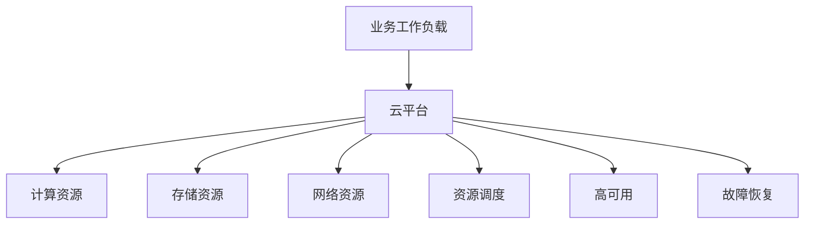

云平台大体有两条演进路线：

| 路线 | 典型系统 | 核心思路 | 优势 | 局限 |
|---|---|---|---|---|
| 虚拟化平台 | OpenStack VMware | 把物理机切成虚拟机再部署应用 | 隔离清晰 容易承接传统架构 | 应用和基础设施割裂 资源开销较高 |
| 作业调度平台 | Google Borg | 直接在大规模机器池上调度进程或容器 | 资源利用率高 调度和故障恢复自动化 | 对平台抽象和控制面要求更高 |

早期 PaaS 形态并不统一，很多企业会自建面向内部业务的应用托管入口，也有网站把 PaaS 能力包装成面向开发者的在线服务。这个历史背景说明了一个现实：应用平台的需求一直存在，只是早期缺少统一对象模型和开放生态，Kubernetes 后来把“应用运行、服务发现、配置、权限、扩缩容”收敛成了标准 API。

Borg 是 Kubernetes 的重要思想来源。它不是简单的容器运行系统，而是 Google 内部长期运行在线服务和离线任务的大规模集群管理系统。在线业务如 Gmail、Google Docs、Web Search 需要长期运行和高可用；离线任务如批处理、数据分析、对账作业更关注吞吐和资源利用率。Borg 把两类 workload 放在同一个资源池里管理，在资源空闲时运行离线任务，在在线业务需要资源时让高优先级任务抢占资源。

Borg 这张能力图的重点不是 Google 产品清单，而是说明一个调度平台要同时托住“长期在线服务”和“短时计算任务”。关键点是，在线服务的命根子是高可用，离线任务的价值是填平资源波谷；两类任务放进同一个资源池以后，调度系统才有机会做混部、抢占和整体成本优化。

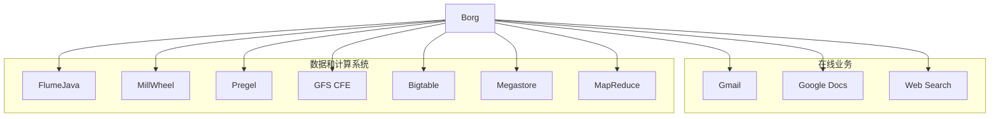

这也解释了为什么 Kubernetes 从一开始就不是“容器命令集合”。它继承的是“用户声明作业，平台隐藏调度和故障处理细节”的思路：用户不用知道实例落在哪台机器上，平台必须知道哪些节点健康、哪些资源可用、哪些副本需要迁移。

Borg 的几个基础概念可以直接映射到 Kubernetes 的设计直觉：

| Borg 概念 | 含义 | 对 Kubernetes 的启发 |
|---|---|---|
| Workload | 在线任务和离线任务 | 平台需要同时支持服务型应用和批处理任务 |
| Cell | 一个由大量机器组成的管理单元 | Kubernetes 集群也需要控制故障域和管理规模 |
| Job Task | Job 描述业务请求 Task 是具体执行单元 | Kubernetes 用 Deployment Job Pod 等对象拆分职责 |
| Naming | 服务命名和发现机制 | Kubernetes 用 Service DNS Ingress 等对象解决服务访问 |
| Borglet | 每台机器上的执行 Agent | Kubernetes 节点上的 kubelet 扮演类似角色 |
| Borgmaster | 集群大脑和调度入口 | Kubernetes 控制面承担统一管控职责 |

Cell 大小本身就是架构取舍。单个 Kubernetes 集群理论上可以做到数千节点规模，但集群越大，控制面故障、错误配置或大规模对象变更影响的范围也越大；集群越小，故障域更容易隔离，但集群数量增加后升级、监控、配额和权限维护成本也会上升。生产上通常要按业务边界、地域、容量和运维能力决定 Cell 或集群的大小，而不是盲目追求单集群最大规模。

Borg 调度的本质是大规模装箱问题。Best Fit 会优先把任务塞进最合适、最接近填满的机器，减少资源碎片，也方便把空闲机器收缩下线；Worst Fit 则优先选择最空闲的机器，让节点忙闲更均匀，降低单机热点。生产调度不会每次都全量重算，Borg 还用了几类优化：Score caching 在状态变化不大时复用评分结果，Equivalence classes 把同一个 Job 里相同 Task 的调度计算合并，Relaxed randomization 只随机抽取一部分机器做可行性检查，用局部最优换取调度吞吐。

Borg 架构本身并不神秘：用户提交配置或命令，控制面接收请求、保存状态、调度任务，节点 Agent 负责真正启动进程并汇报状态。复杂性隐藏在调度、状态一致性、故障恢复和资源隔离里。

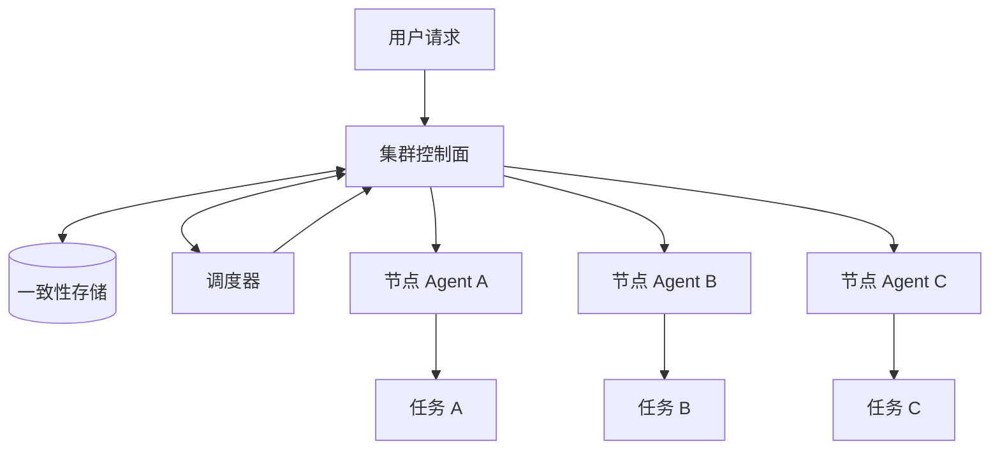

Borg 自己的高可用也很重要。Borgmaster 不是单实例大脑，而是多副本部署，典型设计里有 5 个 master 实例，并通过基于 Paxos 的一致性存储保存关键状态。看平台高可用时要分两层：业务运行在平台上是否高可用，平台控制面自身是否高可用；如果控制面失去调度和故障转移能力，业务副本还在运行，也会逐步失去恢复能力。

Borg 给 Kubernetes 留下的核心经验有三条。

第一，平台要对用户隐藏资源管理和故障处理细节。用户不应该关心应用最终落在哪台机器，也不应该为每一次节点故障手工迁移实例。

第二，资源利用率来自调度能力和 workload 混部。在线业务通常有波峰波谷，如果晚上访问量下降，大量 CPU 和内存闲置，平台就可以把离线任务调度上去，提高整体利用率。

后来 Google Autopilot 论文进一步把这个问题推进到动态资源调整：用户填写的 request 和 limit 往往并不准确，平台可以在 Pod 启动一段时间后持续观察真实用量，再用“真实用量加安全余量”的方式保守下调申请量，把多余资源回收给其他作业。这类思路也是后续 HPA、VPA 和资源推荐系统的重要基础：资源配置不只是人工拍脑袋，而应当由运行数据持续校正。

第三，高可用不是单一功能，而是贯穿对象设计、调度、控制器、状态存储和节点执行的系统目标。Kubernetes 后续的 Deployment、ReplicaSet、Service、StatefulSet、Job 等对象，都是围绕不同类型业务的高可用和可恢复性展开。

跨城或多地域部署的价值，也可以从网络配置事故理解：如果某个城市或机房因为 BGP 路由配置错误导致入口整体不可达，只在单地部署的应用会被一起带走；如果应用、入口和依赖已经跨故障域部署，并且流量调度能绕开故障地域，就更容易把影响限制在局部。高可用不是“某个组件多副本”这么简单，而是要把配置错误、网络隔离和控制面故障都当作可能发生的故障源。

### Kubernetes 的控制面和节点组件如何协同

Kubernetes 可以看作 Borg 思想在容器时代的开源化演进。它把容器镜像、声明式 API、控制器模式和插件生态组合起来，让用户用统一的对象模型描述应用和基础设施之间的关系。

Borg 到 Kubernetes 的迁移，可以先看“入口、控制面、状态存储、调度器、节点代理”这几个位置。Borg 里用户通过配置和命令进入 BorgMaster，Kubernetes 里用户通过 `kubectl`、配置文件或 Dashboard 进入 API Server；Borglet 对应 kubelet；Paxos 存储在 Kubernetes 中换成 etcd；容器镜像仓库成为节点拉取 workload 的外部依赖。

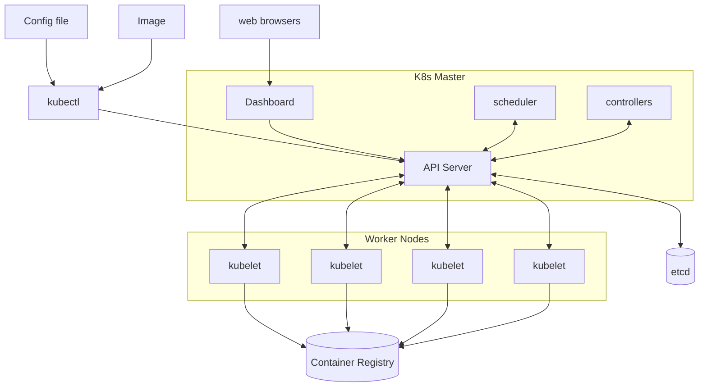

这类系统的架构层面并不神秘，复杂性藏在实现里。看图时不要只背组件名，要抓住调用方向：所有控制逻辑都围绕 API Server 读写对象，节点侧只执行分配到自己的 Pod，镜像仓库只是运行时拉取镜像的外部系统。

Kubernetes 集群由控制面和工作节点两部分组成。控制面负责接收请求、保存状态、做调度和运行控制器；工作节点负责拉取镜像、启动容器、配置网络、挂载存储和上报运行状态。

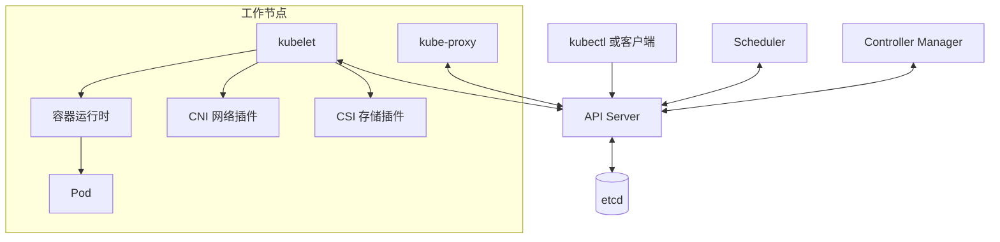

关键组件的职责如下：

| 组件 | 主要职责 | 设计要点 |
|---|---|---|
| API Server | 暴露 REST API 认证授权 准入控制 聚合 API | 所有组件访问集群状态的统一入口 |
| etcd | 保存集群状态 | 只有 API Server 直接访问 etcd |
| Scheduler | 为未绑定节点的 Pod 选择节点 | 本质上是特殊控制器 |
| Controller Manager | 运行 Deployment ReplicaSet Node 等控制器 | 持续推动实际状态逼近期望状态 |
| kubelet | 管理节点上的 Pod 生命周期 | 监听绑定到本节点的 Pod 并调用运行时 |
| kube-proxy | 为 Service 配置转发规则 | 根据 Service 和 Endpoints 维护负载均衡 |
| 容器运行时 | 拉取镜像 启停容器 | 通过 CRI 接入 kubelet |
| CNI CSI | 网络和存储插件接口 | 让平台支持不同厂商和实现 |

表里“通过 CRI 接入 kubelet”这一句值得单独展开。kubelet 和具体容器运行时之间隔着一层协议适配：kubelet 内部作为 gRPC client，按 CRI 的 protobuf 定义发起请求；CRI Shim 作为 gRPC server 接收统一的 CRI 调用，把它翻译成具体运行时的调用，最终由容器运行时创建和管理容器。

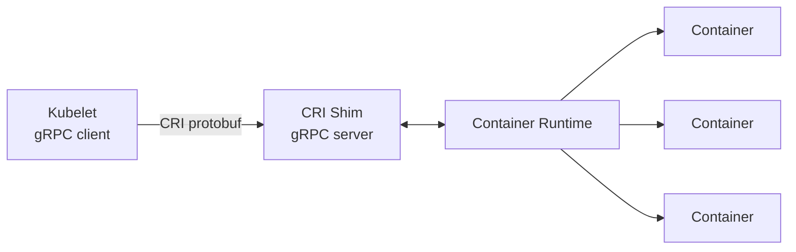

这条接口边界正是 Kubernetes 能接入不同运行时的原因：kubelet 只依赖 CRI，不需要理解运行时内部实现。课程里的说法是，Kubernetes 把接口定好，由 runtime 来实现——跑 Docker 可以，用 containerd 直接运行容器也可以，甚至接 Kata 这类轻量虚拟机方案也可以。支持原生 CRI 的运行时直接实现该服务，需要兼容适配的场景则由 Shim 承担转换。CNI 和 CSI 沿用同样的设计：平台定义 API，网络和存储插件实现细节。

kubelet 自身也不是“启动容器”的单一进程。课程里强调它是节点上的初始化系统，节点上所有其他 Pod 都由它拉起，所以它内部聚合了一组分工明确的管理模块：

| 模块组 | 组件 | 主要职责 |
|---|---|---|
| 服务接口 | `:10250 API`、`:10255 只读 API`、`:10248 /healthz` | 提供管理、只读查询和健康检查入口 |
| 核心协调 | `syncLoop`、`PodWorker` | 接收 Pod 变化并串行化单个 Pod 的同步操作 |
| 健康与资源 | `ProbeManager`、`OOMWatcher`、`GPUManager`、`cAdvisor` | 探针、OOM 监控、设备管理和资源统计 |
| 状态与驱逐 | `StatusManager`、`EvictionManager`、`Disk SpaceManager` | 状态回写、资源压力检测和驱逐 |
| 生命周期管理 | `Image GC`、`Container GC`、`ImageManager`、`VolumeManager`、`CertificateManager` | 镜像、容器、卷和证书管理 |

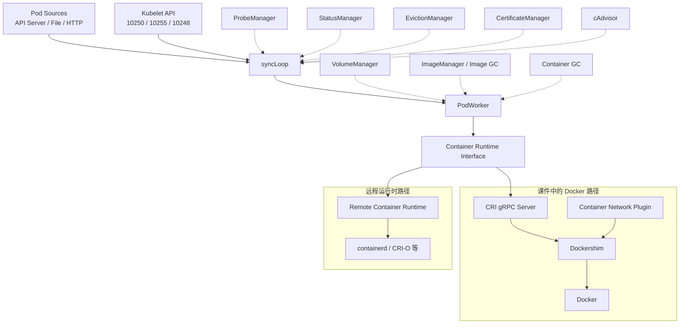

课程里把这些模块串成一句话：syncLoop 负责接收 Pod 变化、PodWorker 负责启停 Pod，ProbeManager 给每个应用做健康检查，OOMWatcher 盯着节点内存，Image GC 和 Container GC 回收不再使用的镜像和容器；对下统一调用 CRI、CNI、CSI 起容器，同时把节点和 Pod 状态汇报给 API Server。这张图用的是课件当时的组件结构，保留了 Dockershim 路径；路径本身已成历史，但“上层控制逻辑统一经过 CRI 调用底层运行时”这个结构没有变。

生产集群里的控制面组件通常也会容器化运行，这就是 self-hosting：Kubernetes 用自己的 Pod 模型管理 API Server、Controller Manager、Scheduler、etcd、kube-proxy 等组件。这里有一个边界必须记住：kubelet 不能依赖 Kubernetes 自己先把它调度起来，它是节点上的初始化系统，通常由 systemd 拉起，然后负责启动其他 Pod。

这种启动链路依赖 Static Pod。kubelet 配置里可以指定 `staticPodPath`，它会持续扫描这个目录里的 Pod 清单，直接在本机启动这些 Pod，不需要先经过调度器；kubeadm 部署控制面时，API Server、etcd、Scheduler、Controller Manager 等清单就放在这条路径下。Static Pod 启动后，kubelet 会在 API Server 里创建一个对应的 Mirror Pod 记录，所以 `kubectl get pod -n kube-system` 看到的是静态 Pod 在 API 侧的镜像对象，而不是由调度器分配出来的普通 Pod。

把控制面本身做成高可用时，最常见的形态是堆叠式 etcd 拓扑：每台 Master 同时运行 API Server、Controller Manager、Scheduler 和一个 etcd member，API Server 通过负载均衡器对外提供统一入口，三个 etcd member 组成 Raft 集群。kubeadm 的高可用部署默认就是这种形态，控制面组件全部以 Static Pod 起在每台 Master 上；课程里讲生产部署时给的参照也是这条路线——用 kubespray 这类工具先通过 Ansible 完成操作系统层配置，再用 kubeadm 完成控制平面配置，Master 节点必须高可用。

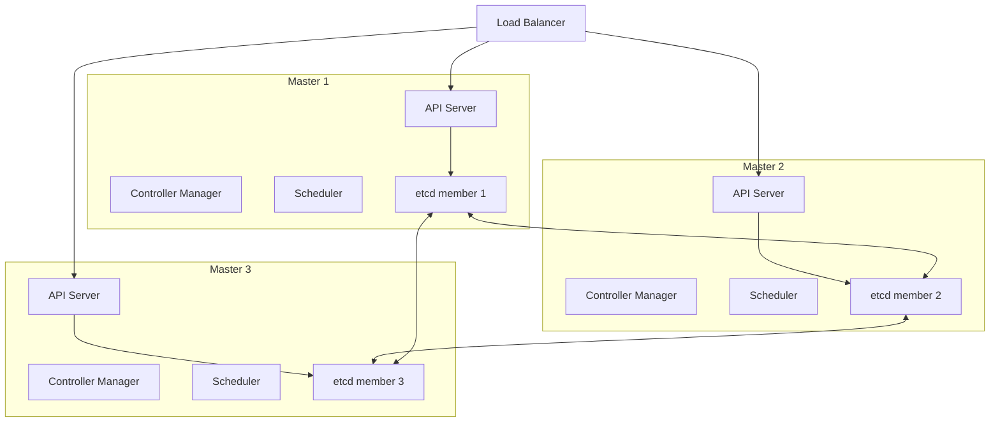

堆叠式部署节省主机，但控制平面与 etcd 共享故障域：单台 Master 故障会同时损失一个 API Server 副本和一个 etcd member。因此节点数量、etcd quorum、磁盘性能和备份恢复必须当成一个整体来设计，而不能只盯着“API Server 有三个副本”。

API Server 是唯一的集群 API 入口，因此它不是简单的反向代理。一个请求进入后，会经过认证、限流、审计、授权、聚合 API、准入变更、Schema 校验和准入校验，最后才落到 etcd。排查 API 对象创建失败时，要先判断失败发生在这条链路的哪一段：是没有身份、没有权限、Webhook 卡住、对象非法，还是 etcd 写入失败。

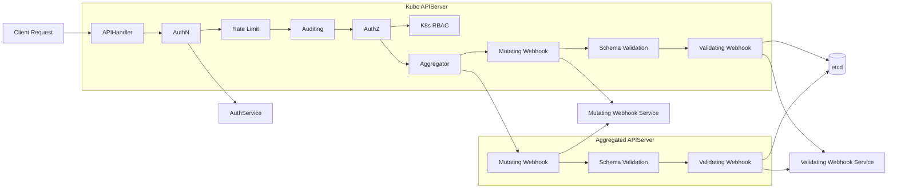

这张图还说明了“只有 API Server 直接访问 etcd”的含义：其他组件看似在管理 Pod、Service 或 Node，本质上都是通过 API Server 读写对象。绕开 API Server 等于绕开认证、授权、准入、审计和版本转换，生产环境除极端救场外不应这么做。

Aggregator 是对 API Server 组件能力的扩展，而 CRD 是对对象模型的扩展，二者适合解决不同问题。典型例子是 `metrics-server`：它提供 `metrics.k8s.io` 这类聚合 API，`kubectl top node` 或 `kubectl top pod` 的请求先进入原生 API Server，再由聚合层路由到扩展 API Server 返回资源指标。这样用户仍然访问同一个 Kubernetes API 入口，但背后可以挂载额外 API 服务。

etcd 的 Watch 机制承担了 Kubernetes 内部“事件总线”的角色。控制器不是反复轮询全量对象，而是通过长连接观察对象变化，由 etcd 和 API Server 把变化事件推出来；因此很多分布式系统里需要额外消息队列串联状态变化的场景，在 Kubernetes 控制面里由对象存储加 Watch 完成。API Server 启动后还会维护 watch cache：它从 etcd 监听全量数据并缓存到内存，大多数组件的 list/watch 读请求先在 API Server 缓存层被满足，写请求才落回 etcd。这样做是为了保护 etcd 这种强一致存储，不让大量控制器的读流量直接击穿到后端。

创建 Deployment 的过程可以说明控制面协同方式。用户看起来只是执行了一条命令，但背后是多个控制器和节点组件按职责分段处理。

```bash
kubectl create deployment nginx --image=nginx:alpine
kubectl get deployment
kubectl describe deployment nginx
kubectl get replicaset
kubectl get pod -o wide
```

这条链路可以拆成 8 个步骤：

1. 用户提交 Deployment 对象到 API Server。
2. API Server 完成认证、授权、校验，把对象持久化到 etcd。
3. Deployment Controller 监听到新的 Deployment，创建 ReplicaSet。
4. ReplicaSet Controller 监听到 ReplicaSet，创建 Pod。
5. Scheduler 监听到未设置 `nodeName` 的 Pod，为它选择节点并写回绑定结果。
6. 目标节点的 kubelet 监听到绑定到本节点的 Pod，开始创建流程。
7. kubelet 调用容器运行时拉镜像和启动容器，调用 CNI 配置网络，必要时调用 CSI 挂载存储。
8. Pod 状态持续写回 API Server，控制器根据状态继续调谐。

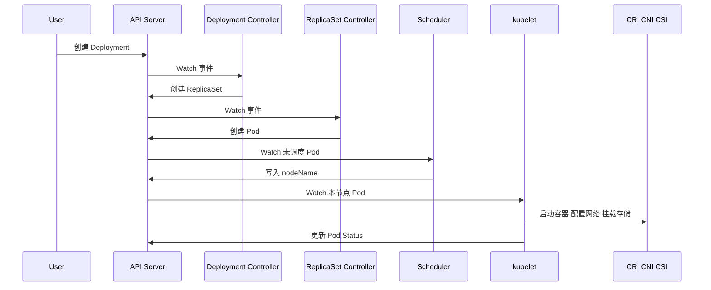

这个过程体现了 Kubernetes 的一个关键设计：每个控制器只负责自己那一段相对简单的逻辑。Deployment Controller 只关心 Deployment 到 ReplicaSet；ReplicaSet Controller 只关心副本数和 Pod；Scheduler 只关心未调度 Pod；kubelet 只关心本节点 Pod。这种拆分让系统可以通过对象和事件串起来，而不是把所有逻辑压进一个巨大的控制器。

控制器通常通过 Informer 工作。Informer 启动时先 List 当前对象，再 Watch 后续变化，把对象缓存到本地 store 中，同时把事件投递给 handler 和 workqueue。写控制器或 Operator 时，读取完整对象应该优先读本地缓存，只有更新对象时才调用 API Server。否则大量控制器频繁读取 API Server，会把控制面压垮。

这条原则不是纸面优化。一个生产案例是，eBay 一次 Calico 安全策略相关升级中，新版本对 API Server 轮询过密，在小规模测试环境里没有暴露问题，到了大规模生产集群后把 API Server 和控制面打挂，而且恢复困难。根因就是没有把状态放进本地缓存并通过 Watch 增量感知变化，而是用高频轮询放大了控制面读压力。写控制器或接入网络、安全插件时，裸读 API Server 必须被当成生产风险审查。

从控制器接口看，Informer 负责接收事件，Lister 负责从本地缓存读取对象，EventHandler 把 Add、Delete、Update 事件转换成 key 放入 workqueue，worker 再按 key 处理业务逻辑。这里的 key 通常是 `namespace/name`，它比把完整对象反复塞进队列更稳定，也更容易重试。

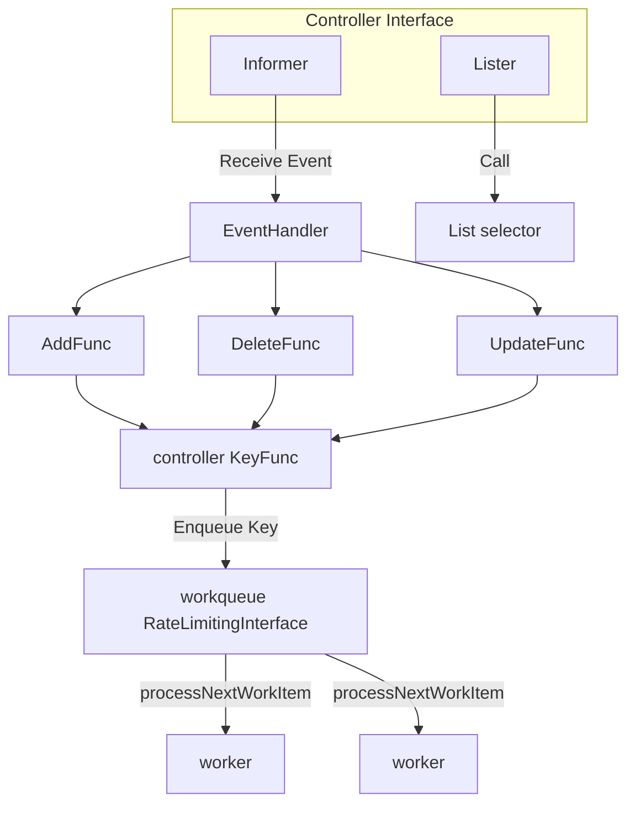

这里有一个常见误区需要澄清：local store 是控制器进程内存里的缓存，不是本机 kube 目录下的 cache。真正的对象副本由 shared informer 维护；读对象走本地缓存，写对象才回 API Server，这是控制面能承受大量控制器的关键。

Informer 内部还要理解两个细节。Reflector 收到 API Server 返回的 JSON 或 protobuf 数据后，会按对象类型和 `json` tag 反序列化成 Go struct，再送入后续缓存链路；DeltaFIFO 保存的是对象变化的增量队列，可以理解成一段环形缓冲，持续接收 Add、Update、Delete 事件，让 worker 只处理变化。shared informer 的价值就在于多个控制器复用同一份本地对象缓存，同时尽量保持缓存版本和 API Server 观察到的版本一致。

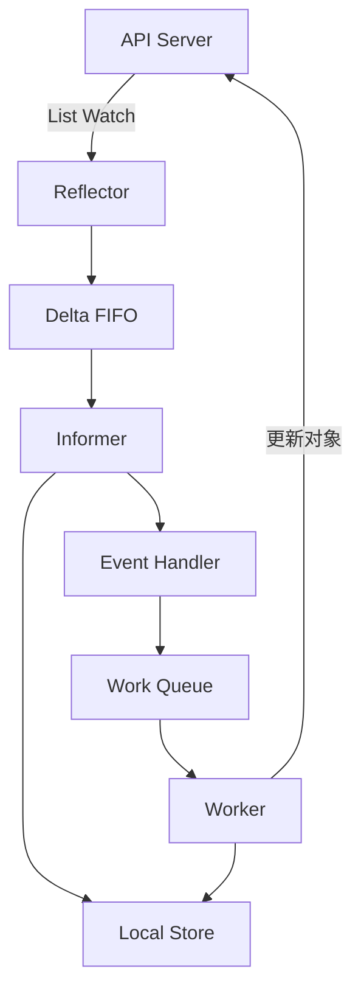

### kubectl 与 kubeconfig 如何完成基础操作

`kubectl` 是访问 Kubernetes API 的命令行入口。它不是直接管理节点或容器，而是读取 kubeconfig 中的集群地址、用户凭据和上下文配置，然后向 API Server 发起请求。

kubeconfig 的核心结构有三类：

| 字段 | 含义 |
|---|---|
| `clusters` | API Server 地址和证书配置 |
| `users` | 用户身份和认证凭据 |
| `contexts` | cluster user namespace 的组合 |

`current-context` 决定了不显式指定 `--context` 时 kubectl 默认访问哪个集群、使用哪个用户身份和哪个 namespace。`user` 单独拆出来，是因为它包含证书、token、exec 登录插件等认证信息；同一个 cluster 可以配多个 user，同一个 user 也可以被多个 context 复用。多集群环境里要先确认当前 context，再执行会改变对象的命令，避免把发布或删除操作打到错误集群。

常见操作命令如下：

```bash
kubectl config current-context
kubectl config get-contexts
kubectl get pod -A
kubectl get pod nginx -o yaml
kubectl describe pod nginx
kubectl logs nginx
kubectl exec -it nginx -- sh
kubectl get pod -w
kubectl get ns default -v 9
```

这些命令分别对应几类日常工作：

| 命令 | 用途 | 排查价值 |
|---|---|---|
| `kubectl get` | 查看对象列表或 YAML | 快速确认对象是否存在 状态是否符合预期 |
| `kubectl describe` | 查看对象详情和 Event | 排查调度失败 镜像拉取失败 探针失败 |
| `kubectl logs` | 查看容器标准输出 | 排查应用自身错误 |
| `kubectl exec` | 进入容器执行命令 | 临时诊断网络 文件 配置 |
| `kubectl get -w` | Watch 对象变化 | 观察滚动升级 调度 状态变化 |

`kubectl -v 9` 是理解命令行和 REST API 关系的实用技巧。例如 `kubectl get ns default -v 9` 会打印加载 kubeconfig、选择 context、构造 HTTP 请求和接收响应的详细日志，能直观看到 kubectl 只是 Kubernetes REST API 的客户端封装。调试认证、代理、证书或 API 路径问题时，这比只看最终报错更有帮助。

创建对象时还要区分 `create` 和 `apply`。`kubectl create` 的语义是“创建一个还不存在的对象”，对象已存在时会失败，适合一次性创建或明确要求不存在的场景；`kubectl apply` 则是声明式提交，不存在则创建，存在则按配置 patch 更新，更适合作为日常交付和 GitOps 流程的默认方式。

一个典型的“从对象到运行实例”的排查顺序是：

```bash
kubectl get deployment nginx
kubectl describe deployment nginx
kubectl get replicaset -l app=nginx
kubectl get pod -l app=nginx -o wide
kubectl describe pod -l app=nginx
kubectl logs -l app=nginx
```

Event 本身也是 Kubernetes 对象，但它通常不孤立存在，而是附着在 Deployment、ReplicaSet、Pod 等主对象上，用来描述最近发生了什么。`describe` 的价值就在这里：它不只展示对象 Spec 和 Status，还会展示控制器、调度器、kubelet 产生的事件链。

### Kubernetes 为什么强调声明式 API 和分层架构

Kubernetes 最核心的系统范式是声明式。命令式系统关注“你应该怎么做”，声明式系统关注“我希望最终是什么样”。可以用遥控器和空调做类比：电视遥控器更像命令式，按一次换一次台；空调设置目标温度更像声明式，用户只声明希望 25 度，系统自己根据当前室温不断调节。

在传统云计算分类里，IaaS 主要托管网络、存储、服务器和虚拟化；PaaS 继续托管操作系统、运行时和中间件；SaaS 则连应用也交给云厂商。Kubernetes 的边界更模糊：它既面向基础设施运维，也面向应用发布，因为它用一套对象 API 把集群、应用、网络、存储、权限和配额都纳入统一模型。

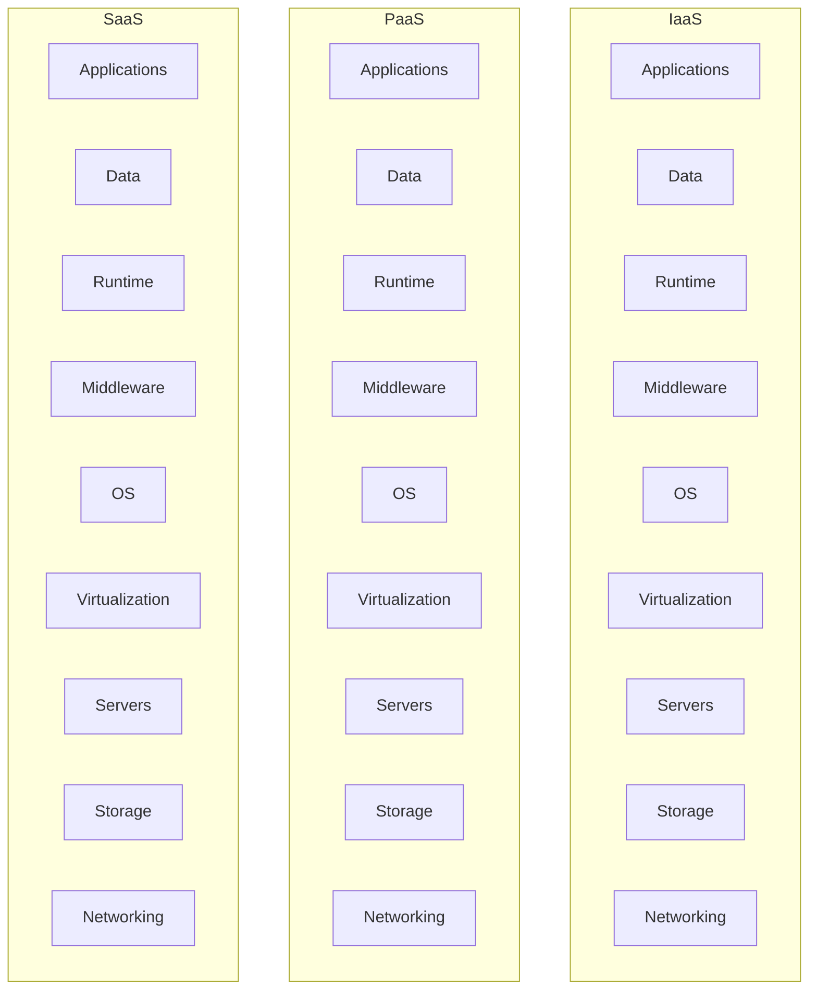

这里要关注的不是考试式分类，而是工程分工：传统企业需要自己管理一长串技术栈，云平台把其中一部分自动化。Kubernetes 进一步把“应用怎么发布、怎么发现服务、怎么扩缩容、怎么挂存储”变成 API 对象，应用团队和平台团队围绕同一套对象协作。

声明式 API 的好处是可重复、可恢复、可调谐。客户端请求中断时，用户可以重新提交同一份对象；控制器故障恢复后，可以根据 API Server 中保存的期望状态继续工作；节点故障时，控制器可以重新创建 Pod 并触发调度。

这背后对应分布式系统里的幂等性：客户端可能因为超时、断网或进程重启重复提交同一份请求，服务端要能去重或把重复请求收敛到同一个结果。声明式 API 天然适合这个模型，因为用户提交的是“我期望副本数是 3”这类名词化的期望状态，而不是“再增加 1 个副本”这样的动作。重复 `apply` 同一份对象时，期望值没有变，控制器只需要继续把实际状态调到这个目标。

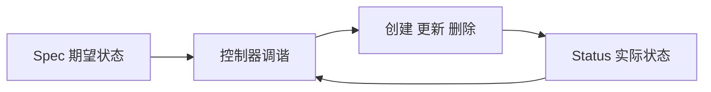

Kubernetes API 设计原则可以总结为：

| 原则 | 解释 |
|---|---|
| API 应该是声明式 | 对象描述期望状态而不是一次性操作步骤 |
| 对象应互补且可组合 | Deployment ReplicaSet Pod Service 分别承担不同职责 |
| 高层 API 表达业务意图 | Deployment 表达部署和升级 StatefulSet 表达有状态应用 |
| 低层 API 服务高层控制 | Pod Volume Condition 等基础结构被多处复用 |
| 避免隐藏机制 | 外部 API 应明确表达系统行为 |
| 操作复杂度可控 | API 操作复杂度应与对象数量线性相关 |
| 状态不依赖连接 | 对象状态不能依赖客户端是否在线 |
| 避免全局状态依赖 | 减少控制器间隐式耦合 |

逐条拆开看，这些原则解决的是控制器长期演进的问题。

| 原则 | 工程含义 |
|---|---|
| API 应该是声明式 | 字段要表达名词性的期望值，例如“副本数是 3”，而不是“增加 1 个副本”，这样服务端不用区分重试和新动作 |
| 对象应互补且可组合 | Deployment 管发布，ReplicaSet 管副本，Pod 管运行实例，能拆开组合说明边界足够松耦合 |
| 高层 API 表达业务意图 | 先抽象业务语义再写控制器，例如 Deployment 表达可回滚发布，而不是暴露一串创建和删除命令 |
| 低层 API 服务高层控制 | Pod、Volume、Condition、Status 这类结构要能被多个高层对象复用，避免每个控制器自造一套状态模型 |
| 避免隐藏机制 | 外部 API 要把关键行为显式暴露出来，不能让用户靠猜控制器内部约定来理解系统动作 |
| 操作复杂度可控 | 控制器处理对象时要避免无界全量扫描，list、watch、selector 和索引设计要让复杂度随对象规模可预期增长 |
| 状态不依赖连接 | 客户端断线后对象状态仍保存在 API Server 中，控制器和客户端重连后可以继续从对象状态恢复 |
| 避免全局状态依赖 | 减少隐式全局开关和跨控制器耦合，用 ownerReference、selector、status 等显式关系传递状态 |

不同业务场景还应提供不同外部 API，例如 StatefulSet 和 ReplicaSet 直接拆成两个对象，比在一个对象里写大量 if/else 更清晰。

这些原则最终会落到控制面结构上：UI、CLI 和外部系统都通过 API Server 进入，Scheduler 和 Controller 也只和 API Server 交互，etcd 保存事实状态。Image、Pod、ReplicaSet、StatefulSet、Service 等对象不是 UI 层概念，而是 API Server 统一管理的资源模型。

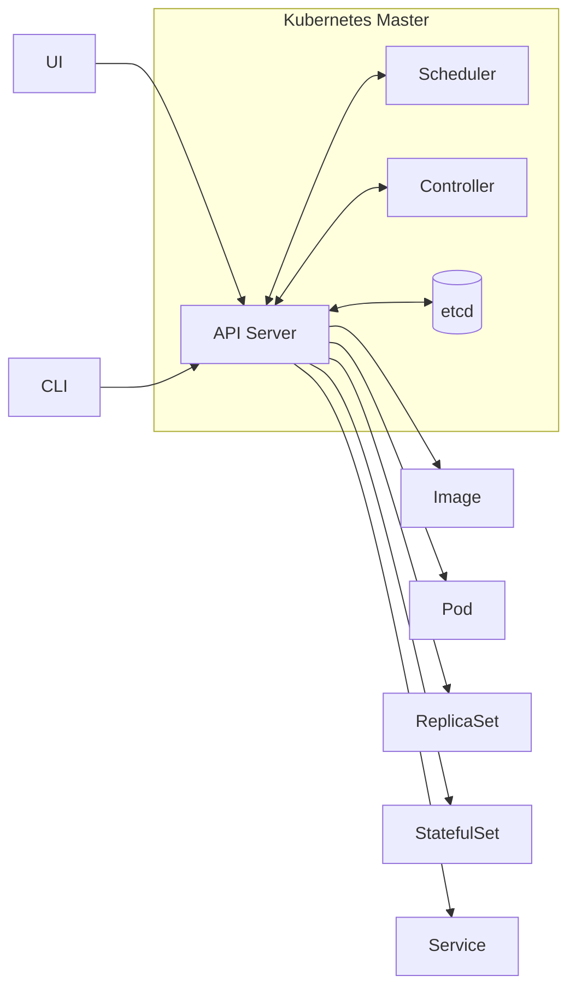

因此，排查 Kubernetes 时要少问“这个组件直接改了什么”，多问“它 watch 了什么对象、写回了什么对象、哪个控制器会继续接力”。这是后面理解调度器、控制器和 Operator 的统一入口。

为什么 Deployment 不直接控制所有 Pod，而是中间还有 ReplicaSet？因为 Kubernetes 倾向于用多个小对象拆分职责。Deployment 负责版本发布和滚动升级，ReplicaSet 负责维持某个 Pod 模板的副本数，Pod 负责描述实际运行实例。如果把所有逻辑塞进 Deployment，它会同时处理发布策略、副本计数、Pod 创建、版本历史等大量分支，控制器逻辑会迅速复杂化。

对象组合的关系可以这样理解：

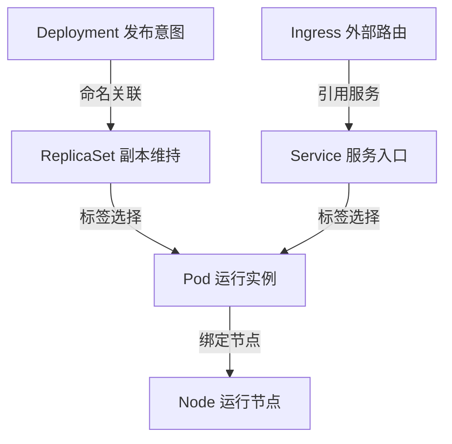

Kubernetes 的分层架构也服务于扩展性：

| 层级 | 内容 | 作用 |
|---|---|---|
| 核心层 | Pod Node Namespace Service API Machinery | 提供最小可运行抽象 |
| 应用层 | Deployment StatefulSet DaemonSet Job CronJob | 面向不同 workload 类型 |
| 治理层 | RBAC ResourceQuota NetworkPolicy PSP 或替代策略 | 控制权限 配额 安全和隔离 |
| 接口层 | kubectl client-go SDK | 让用户和外部系统接入 |
| 生态层 | Helm Operator Istio Knative 各类插件 | 在 Kubernetes API 上扩展业务能力 |
| 底层插件 | CRI CNI CSI Cloud Provider Registry | 对接不同运行时 网络 存储和云厂商 |

安全也是 Kubernetes 设计理念中的一条主线，不只是后面某个安全章节的附属内容。控制面通信依赖 TLS，认证可以接内部 ServiceAccount，也可以对接外部用户和认证系统；授权通过 RBAC 等机制限制谁能看、改哪些对象；Namespace 提供资源边界，Secret 用来承载敏感数据，并在生产中配合 etcd at-rest encryption 或 KMS 做加密保存；数据面还可以用 Taint 隔离节点、用 Pod 安全策略或其替代机制约束容器权限、用 NetworkPolicy 限制不同 Pod 之间的端口和协议访问。生产上要把这些层叠起来看，而不是只开一个 RBAC 就认为集群已经安全。

把生态系统展开看，应用开发、渐进式发布、公共服务、数据面对象、控制面组件、集群管理和基础设施管理分别承担不同关注点。也可以拆成两个视角：集群管理员关注控制面、节点、认证授权、网络存储和备份恢复；应用开发者关注镜像构建、资源需求、服务发现、扩缩容和发布流水线。

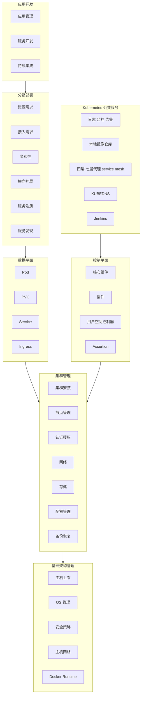

这张图适合用来判断问题归属：Pod 启不来可能是数据面对象写错，也可能是节点、运行时、镜像仓库、网络或配额问题；Service 不通可能是 Selector、kube-proxy、DNS、Ingress 或网络插件问题。Kubernetes 的复杂性来自生态宽度，而不是某一个对象难懂。

Kubernetes 的分层图进一步说明了它为什么能长期扩展：核心层只保留 API 和执行所需的最小对象，应用层提供 Deployment、StatefulSet、CronJob 等 workload 抽象，治理层提供 RBAC 和配额等策略，接口层让外部工具接入，底层接口把运行时、网络、存储、云厂商和身份提供方解耦。

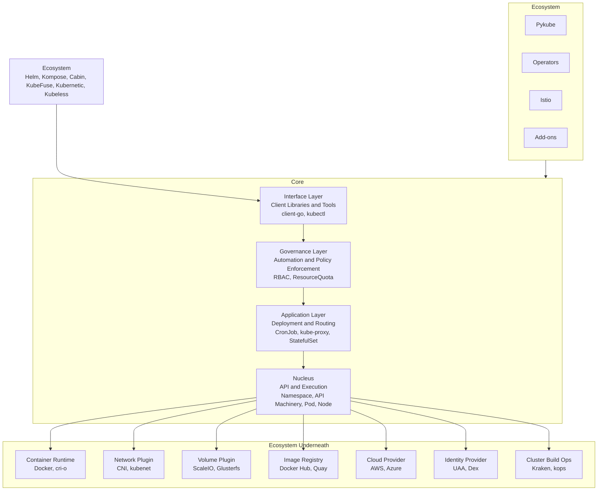

这种分层让 Kubernetes 不局限在某一种云、某一种网络、某一种存储或某一种业务模型上。它定义 API 和接口，具体实现由生态系统补齐。技术选型时真正困难的是“围绕 Kubernetes 的方案太多”，所以必须先判断自己要解决的是核心对象问题、底层插件问题，还是上层生态问题。

### API 对象的 TypeMeta Metadata Spec Status 如何表达系统状态

Kubernetes 的所有管理能力都落在 API 对象上。一个对象通常包含四类属性：`TypeMeta`、`Metadata`、`Spec`、`Status`。

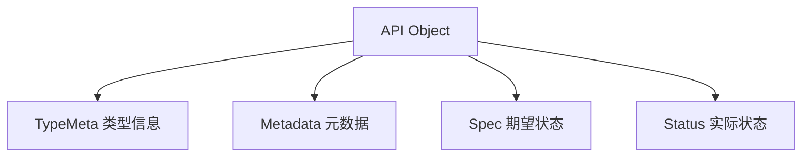

`TypeMeta` 用来说明对象是什么类型，核心字段是 `apiVersion` 和 `kind`。

```yaml
apiVersion: apps/v1
kind: Deployment
```

`apiVersion` 背后包含 Group 和 Version。例如 `apps/v1` 表示 `apps` API 组里的 `v1` 版本；核心组对象如 Pod 常写作 `v1`。`kind` 表示对象类型，如 Pod、Service、Deployment、StatefulSet。

Group、Kind、Version 合在一起决定了一个对象的 API 身份。Version 不只是字符串，它表达 API 的成熟度和兼容路径：`alpha` 通常适合实验和演示，`beta` 表示功能接近可用但仍可能调整，`v1` 才是稳定生产版本。Kubernetes 社区持续发版，对象 API 会从 `v1alpha1`、`v1beta1` 演进到 `v1`，也可能迁移 API Group，例如 Deployment 曾从 `extensions/v1beta1` 迁到 `apps/v1`。

API Server 内部通过 conversion 机制处理这种演进：外部可以暴露多个版本，进入 API Server 后会转换成内部版本处理和存储，需要返回给客户端时再转换成请求的外部版本。这样同一个对象可以兼容不同客户端版本，也解释了为什么 API 设计一旦进入稳定版本就必须谨慎，破坏兼容会影响所有依赖该对象的控制器和工具。

`Metadata` 用来唯一标识对象并提供通用控制信息。最关键的是 `namespace` 和 `name`。同一个 namespace 内，某类对象通常通过 name 唯一标识；不同 namespace 之间可以存在同名对象。

```yaml
metadata:
  name: nginx
  namespace: default
  labels:
    app: nginx
    env: prod
  annotations:
    description: "web frontend"
```

Metadata 里的重要字段包括：

| 字段 | 用途 |
|---|---|
| `name` | 对象名称 |
| `namespace` | 对象所在命名空间 |
| `labels` | 面向选择和关联 |
| `annotations` | 面向扩展信息和非选择型元数据 |
| `finalizers` | 删除前的清理保护 |
| `resourceVersion` | 乐观锁和 Watch 版本 |
| `ownerReferences` | 表达对象归属和级联删除关系 |

Finalizer 可以理解成对象删除前的一把逻辑锁。对象带有 `metadata.finalizers` 时，执行 `kubectl delete` 并不会立刻从存储中消失，API Server 只会给它打上 `deletionTimestamp`，对象会停留在 `Terminating` 状态。典型用途是清理外部资源：例如控制器先释放外部分配的 IP、DNS 记录或云资源，确认清理完成后再移除 finalizer，对象才会被真正删除。排查“对象一直删不掉”时，要看 finalizer 是不是仍然存在；手工清空 finalizer 数组会让对象立即进入物理删除流程，因此只能在确认外部清理风险后操作。

一个最小演示可以这样看：先给测试 Pod 加 finalizer，再删除它，此时对象还在，只是出现了 `deletionTimestamp`；清空 finalizer 后对象才会真正消失。

```bash
kubectl patch pod hello --type merge -p '{"metadata":{"finalizers":["example.com/cleanup"]}}'
kubectl delete pod hello
kubectl get pod hello -o jsonpath='{.metadata.deletionTimestamp}'
kubectl patch pod hello --type merge -p '{"metadata":{"finalizers":null}}'
```

`resourceVersion` 则是 Kubernetes 对象并发更新的乐观锁。多个控制器可能先读到同一个对象版本，控制器 A 更新成功后版本号变化，控制器 B 再带着旧版本提交更新时，API Server 会发现版本不一致并返回 `409 Conflict`。正确的控制器逻辑不是忽略这个错误，而是重新 get 或从 informer 等到最新对象，在新版本上重新计算修改并重试。否则并发调谐时就可能出现更新丢失。

Label 和 Selector 是 Kubernetes 对象组合的核心。Label 是对象上的 key value 标记，Selector 是筛选条件。ReplicaSet 通过 Selector 找到属于自己的 Pod，Service 通过 Selector 找到后端 Pod。

```yaml
selector:
  matchLabels:
    app: nginx
template:
  metadata:
    labels:
      app: nginx
```

Label 不提供唯一性，它适合表达“这一组对象属于同一类”。下面这个图要和 Deployment、ReplicaSet、Service 一起看：Selector 会匹配所有带有相同标签的对象，而不是只匹配某一个固定名字的对象。

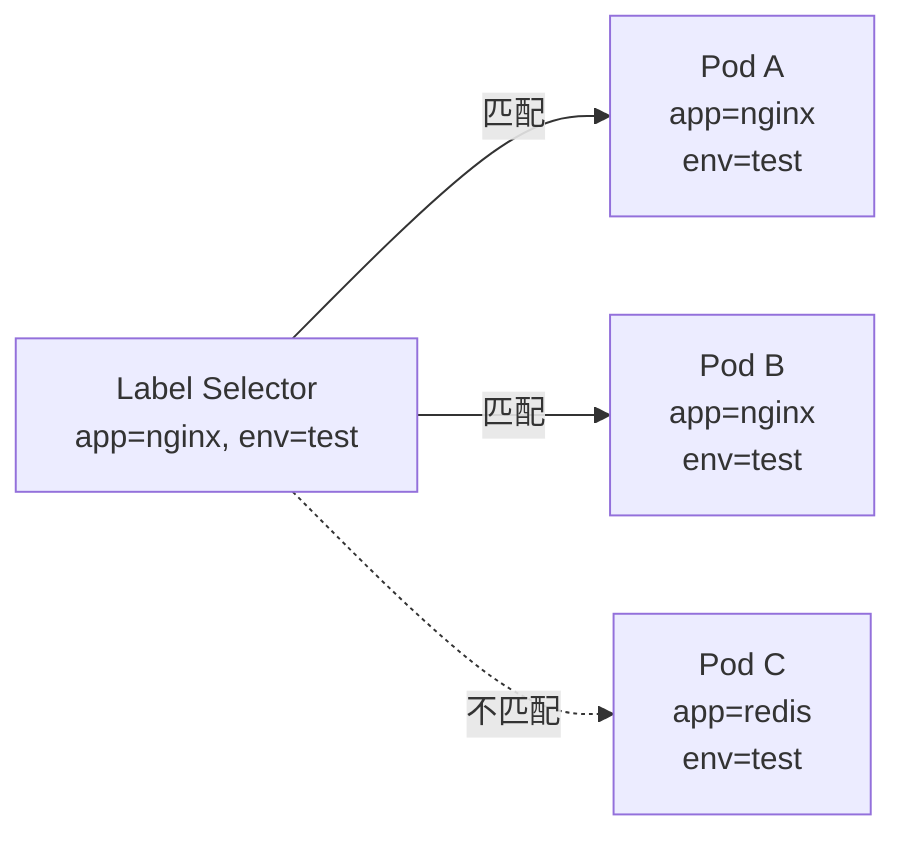

Label 的另一类用途是成本和治理维度标记：给对象标记部门、项目、环境和语言，后续就可以按这些维度统计资源消耗。Annotation 不参与选择，更适合保存部署工具、审计、滚动升级状态、安全策略或外部系统所需的附加信息。

`Spec` 是用户声明的期望状态，`Status` 是系统观察到的实际状态。控制器的职责就是不断比较 Spec 和 Status，并采取动作让实际状态逼近期望状态。

```mermaid
flowchart LR
    Spec["Spec<br/>期望状态"]
    Controller["Controller<br/>调谐循环"]
    Cluster["Cluster Runtime<br/>实际运行"]
    Status["Status<br/>实际状态"]

    Spec --> Controller
    Controller --> Cluster
    Cluster --> Status
    Status --> Controller
```

这张图对应“控制器是闭环系统”这个核心模型。用户写 Spec，系统观察 Status；如果 Status 不等于 Spec，控制器就继续创建、更新、删除或重试。不要让用户手工维护 Status，否则闭环会失去边界。

```yaml
apiVersion: apps/v1
kind: Deployment
metadata:
  name: nginx
spec:
  replicas: 3
  selector:
    matchLabels:
      app: nginx
  template:
    metadata:
      labels:
        app: nginx
    spec:
      containers:
        - name: nginx
          image: nginx:1.25
status:
  replicas: 3
  readyReplicas: 3
  availableReplicas: 3
```

在实际开发控制器时，要特别注意：用户通常只写 Spec，Status 由控制器更新。不要把真实运行状态混进 Spec，也不要让用户手工维护 Status。这样才能保证“期望”和“实际”的边界清晰。

### Pod Service Deployment StatefulSet 等核心对象如何组合业务

Kubernetes 的核心对象不是彼此孤立的，而是组合起来描述完整业务。一个 Web 服务至少需要运行单元、工作负载控制器、服务发现和入口路由；有状态服务还需要稳定身份和持久化存储；平台扩展则需要 CRD 和自定义控制器。

先用对象总览建立坐标：Node 和 Namespace 解决资源与边界，Pod 是运行单元，ConfigMap 和 Secret 解决配置，Service 和 Ingress 解决访问，ReplicaSet、Deployment、StatefulSet、Job、DaemonSet 解决不同 workload，PV/PVC 解决存储，CRD 解决扩展。

```mermaid
mindmap
  root((Kubernetes 对象))
    资源和边界
      Node
      Namespace
    运行单元
      Pod
    配置和凭据
      ConfigMap
      Secret
    身份
      User Account
      Service Account
    服务访问
      Service
      Ingress
    工作负载
      ReplicaSet
      Deployment
      StatefulSet
      Job
      DaemonSet
    存储
      PersistentVolume
      PersistentVolumeClaim
    扩展
      CustomResourceDefinition
```

这张总览适合在排查时反向定位：应用不可用时，先确认 Pod 是否存在，再看 Deployment/ReplicaSet 是否在维持副本，Service 是否选中了 Pod，Ingress 是否指向 Service，配置和存储是否被正确挂载。

#### Node 和 Namespace

Node 是计算节点抽象，可以是物理机或虚拟机。它描述节点资源、健康状态、网络状态和运行条件。基础设施团队关注 Node，因为节点维护、故障、扩缩容都会影响调度和工作负载运行。

Namespace 是资源组织和隔离边界。它像一个虚拟目录，把不同团队、环境或项目的对象放在不同空间里，再结合 RBAC 和 ResourceQuota 做权限和配额控制。

```bash
kubectl get node
kubectl get namespace
kubectl get pod -n kube-system
```

#### Pod

Pod 是 Kubernetes 调度和运行的基本单位。它不是单个容器，而是一组强关联容器的集合。Pod 内多个容器共享网络 namespace、可以共享 Volume，也可以共享部分安全上下文。

Pod 之所以重要，是因为它打通了基础设施和应用接入两个视角。基础设施侧可以通过 Pod 知道应用实例在哪里运行、需要多少资源、如何迁移；应用侧可以通过 Pod 描述镜像、资源、环境变量、健康检查和存储挂载。

Pod 内多容器适合 sidecar 等强耦合场景。共享网络 namespace 意味着同一个 Pod 里的容器可以通过 `localhost` 互访；共享 Volume 则常用于主容器产生日志或数据，sidecar 负责采集、同步或代理。Pod 是调度单元，调度器不会把同一个 Pod 里的容器拆到不同节点。

```mermaid
flowchart TB
    subgraph Pod["Pod"]
        Net["共享 Network Namespace"]
        Vol["共享 Volumes"]
        Sec["共享 Security Context"]
        C1["Container nginx"]
        C2["Container sidecar"]
    end

    C1 --- Net
    C2 --- Net
    C1 --- Vol
    C2 --- Vol
    C1 --- Sec
    C2 --- Sec
```

```yaml
apiVersion: v1
kind: Pod
metadata:
  name: hello
  labels:
    app: hello
spec:
  containers:
    - name: nginx
      image: nginx:1.25
      ports:
        - containerPort: 80
      resources:
        requests:
          cpu: "100m"
          memory: "64Mi"
        limits:
          cpu: "500m"
          memory: "128Mi"
```

资源限制要先区分可压缩资源和不可压缩资源。CPU 是可压缩资源，内核可以通过时间片和配额把 CPU 分给多个容器，超过 limit 时应用通常表现为变慢；内存是不可压缩资源，进程实际占用超过限制后更可能被 OOMKill。生产上因此要格外谨慎地设置 memory request 和 limit，而 CPU 偶发被压缩通常还能通过延迟上升被业务吸收。

资源值也不应该只靠主观估计。Autopilot 这类系统把资源推荐和回收平台化，在应用运行稳定后根据真实用量加安全余量动态回收多申请的资源，避免 request 和 limit 长期偏离真实负载。

人工估算 resources 时，可以用“高峰 QPS 乘以安全 buffer”做压测输入。例如线上高峰大约 50 QPS，就按 60 到 70 QPS 压测，观察 CPU、内存、延迟和错误率，再反推 requests 和 limits。这样得到的是容量模型，而不是从平均负载或单次手工请求猜一个资源值。

孤立 Pod 不适合生产服务。删除一个普通 Pod 后，服务会直接消失；而通过 Deployment 创建的 Pod 被删除后，ReplicaSet Controller 会发现实际副本数小于期望副本数，然后创建新的 Pod。这就是控制器模式带来的自愈能力。

这个差异可以用一个最小演示观察：

```bash
kubectl run lonely-nginx --image=nginx:1.25
kubectl delete pod lonely-nginx
kubectl get pod lonely-nginx

kubectl create deployment nginx --image=nginx:1.25 --replicas=1
kubectl get pod -l app=nginx
kubectl delete pod -l app=nginx
kubectl get pod -l app=nginx -w
```

第一组命令删除的是孤立 Pod，删除后没有控制器负责补回；第二组命令删除的是 Deployment 管理下的 Pod，ReplicaSet 会重新创建一个新 Pod。这里能看到“故障转移”不等于真正高可用：单副本自愈仍然会中断几秒，生产服务还需要多副本、Service 负载均衡、readinessProbe 和滚动更新策略一起配合。

从应用运行角度看，Pod Spec 还承载环境变量、启动命令、Secret、Volume、资源限制和健康检查。可以把它和容器职责分开看：镜像负责代码分发，Pod Spec 负责把配置、资源、网络、存储和探针补齐，平台才知道如何运行这个实例。

```mermaid
flowchart TB
    Pod["Pod Spec"]
    Env["env<br/>环境变量"]
    Command["command args<br/>启动命令"]
    Secret["secret<br/>敏感配置"]
    Volume["volumeMounts<br/>挂载存储"]
    Resources["resources<br/>CPU Memory"]
    Probes["probes<br/>健康检查"]

    Pod --> Env
    Pod --> Command
    Pod --> Secret
    Pod --> Volume
    Pod --> Resources
    Pod --> Probes
```

Pod 网络图要和“共享 network namespace”一起理解。一个 Pod 只有一个 Pod IP，多个容器共享它；同 Pod 内通过 `localhost` 通信，跨 Pod 通信则需要走 Pod IP、Service 或更高层入口。

```mermaid
flowchart TB
    subgraph Pod["Pod"]
        IP["Pod IP"]
        Loopback["localhost 127.0.0.1"]
        C1["Container A"]
        C2["Container B"]
    end

    C1 --- IP
    C2 --- IP
    C1 <-->|"localhost"| C2
```

健康检查决定了 Kubernetes 什么时候重启容器、什么时候把 Pod 从 Service 后端摘除、什么时候认为启动失败。滚动升级里的 `maxUnavailable` 也依赖这个状态：Deployment 判断能不能继续滚动，依赖 Pod 的 ready 状态，而 ready 状态常常来自 readinessProbe。

```mermaid
flowchart TB
    Probe["Probe"]
    Liveness["LivenessProbe<br/>不健康则重启"]
    Readiness["ReadinessProbe<br/>未就绪则摘除流量"]
    Startup["StartupProbe<br/>启动失败则重启"]
    Exec["Exec"]
    TCP["TCP socket"]
    HTTP["HTTP"]

    Probe --> Liveness
    Probe --> Readiness
    Probe --> Startup
    Liveness --> Exec
    Liveness --> TCP
    Liveness --> HTTP
    Readiness --> Exec
    Readiness --> TCP
    Readiness --> HTTP
    Startup --> Exec
    Startup --> TCP
    Startup --> HTTP
```

生产经验是：无状态 Web 服务至少要配置 readinessProbe，否则新 Pod 启动但业务还没准备好时，Service 可能过早转发流量；livenessProbe 要谨慎，探针过激会把慢启动或短暂抖动误判成进程故障，造成重启风暴。

删除或滚动升级 Pod 时，还要理解优雅终止流程。kubelet 会先向容器主进程发送 `SIGTERM`，应用应在收到信号后停止接收新请求，并尽快处理完已有请求；Pod 通常会变为 NotReady，Service 不再把新流量转发过来。kubelet 会等待 `terminationGracePeriodSeconds`，默认 30 秒，超时后再发送 `SIGKILL` 强制结束进程。能不能真正做到无损终止，取决于业务是否正确处理 TERM 信号；如果是在线会议这类必须等用户自然退出的场景，就需要把 grace period 设得更长，并让应用在业务完成后主动退出。

#### Service

Pod IP 会变化，Pod 删除重建后 IP 也可能变化。Service 用来给一组 Pod 提供稳定访问入口。它通过 Label Selector 找到后端 Pod，再由 kube-proxy 或其他数据面实现负载均衡。

```yaml
apiVersion: v1
kind: Service
metadata:
  name: nginx
spec:
  selector:
    app: nginx
  ports:
    - port: 80
      targetPort: 80
  type: ClusterIP
```

Service 的意义不是“暴露一个端口”这么简单，而是把动态变化的 Pod 集合抽象成稳定服务。其他应用访问 Service，不需要关心后端 Pod 的创建、删除、扩缩容和 IP 变化。

Service 图的关键是三段关系：API Server 保存 Service 和后端信息，kube-proxy 在节点上配置转发规则，ServiceIP 再通过 Selector 找到后端 Pod。Pod 副本扩缩容时，后端集合会变，但客户端看到的入口保持稳定。

```mermaid
flowchart TB
    Client["Client"]
    APIServer["apiserver"]
    KubeProxy["kube-proxy"]
    ServiceIP["ServiceIP<br/>iptables"]
    Selector["Label Selector"]

    subgraph Node["Node"]
        Pod1["Backend Pod 1<br/>labels app=web<br/>port 9376"]
        Pod2["Backend Pod 2<br/>labels app=web<br/>port 9376"]
        Pod3["Backend Pod 3<br/>labels app=web<br/>port 9376"]
    end

    APIServer --> KubeProxy
    KubeProxy --> ServiceIP
    Client --> ServiceIP
    ServiceIP --> Selector
    Selector --> Pod1
    Selector --> Pod2
    Selector --> Pod3
```

排查 Service 时优先看三件事：Selector 是否能选中 Pod，Pod 是否 Ready，节点上的转发规则是否正常。只看 Service YAML 往往不够，因为服务可用性取决于对象、控制面和节点数据面的组合。

#### Deployment 和 ReplicaSet

Deployment 是无状态应用最常用的工作负载对象。它描述副本数、Pod 模板和发布策略。Deployment 不直接逐个管理 Pod，而是创建 ReplicaSet；ReplicaSet 再通过 Selector 维持 Pod 副本数。

ReplicaSet 的语义非常窄：给定 selector 和 `replicas`，持续保证匹配的 Pod 数量等于期望值。删除 Deployment 下的 Pod 后，ReplicaSet 会发现实际数量从 1 变成 0，于是创建新 Pod，这就是自愈的最小闭环。

```mermaid
flowchart LR
    RS["ReplicaSet<br/>replicas=3<br/>selector app=web"]
    P1["Pod A<br/>app=web"]
    P2["Pod B<br/>app=web"]
    P3["Pod C<br/>app=web"]

    RS --> P1
    RS --> P2
    RS --> P3
```

```yaml
apiVersion: apps/v1
kind: Deployment
metadata:
  name: nginx
spec:
  replicas: 3
  selector:
    matchLabels:
      app: nginx
  template:
    metadata:
      labels:
        app: nginx
    spec:
      containers:
        - name: nginx
          image: nginx:1.25
```

滚动升级时，Deployment 会创建新的 ReplicaSet，逐步增加新版本副本数，同时减少旧版本副本数。这个过程通过对象和控制器完成，用户只需要更新 Deployment 的 Spec。

Deployment 图要和 PodTemplate 哈希一起看。修改镜像字段后，Deployment Controller 会根据新的 PodTemplate 算出新哈希，创建新的 ReplicaSet，然后按滚动策略把新副本升上来、旧副本降下去。

⚠️ 经验：Deployment 到 ReplicaSet 的关联里有一部分是“基于命名规范”的耦合，PodTemplate hash 被写进 ReplicaSet 名称和控制器逻辑中。生产风险在于，如果 hash 算法因为 bug 修复或版本演进发生变化，新控制器按新规则可能找不到旧 ReplicaSet，于是按新 hash 再建一套 ReplicaSet；旧 ReplicaSet 仍在，新 ReplicaSet 又拉起同样副本，集群实例数会直接翻番。写 Operator 或控制器时，只要业务逻辑依赖对象命名规则，就必须保证规则长期稳定；如果不得不改，必须同时处理旧命名的兼容和迁移。

```mermaid
flowchart LR
    Deployment["Deployment"]
    NewRS["New ReplicaSet"]
    OldRS["Old ReplicaSet"]

    New1["Replica"]
    New2["Replica"]
    New3["Replica"]
    Old1["Replica"]

    Deployment --> NewRS
    Deployment --> OldRS
    NewRS --> New1
    NewRS --> New2
    NewRS --> New3
    OldRS --> Old1
```

`maxSurge` 表示升级时最多能额外拉起多少新副本，`maxUnavailable` 表示最多允许多少副本不可用。这两个参数的目标是让发布过程不把所有副本一次性打掉，从而在版本更新时继续提供服务。

从 `watch` 视角看，滚动升级不是瞬间替换，而是两个 ReplicaSet 的副本数交错变化。以 3 副本为例，新 ReplicaSet 可能从 0 逐步变成 1、2、3，旧 ReplicaSet 同时从 3 降到 2、1、0；Deployment 会根据 `maxSurge`、`maxUnavailable` 和新 Pod Ready 状态决定是否继续下一步。默认策略通常按 25% 计算可额外创建和可不可用副本，实际行为要结合副本数取整和 readiness 判断。

```bash
kubectl set image deployment/nginx nginx=nginx:1.26
kubectl rollout status deployment/nginx
kubectl rollout history deployment/nginx
kubectl rollout undo deployment/nginx
kubectl get rs -w
```

#### StatefulSet

StatefulSet 面向有状态应用。它为每个副本提供稳定名称、稳定网络身份和独立存储，并保证有序创建、更新和删除。

适合 StatefulSet 的场景包括：

- MySQL
- PostgreSQL
- ZooKeeper
- etcd
- 需要稳定身份和持久化数据的中间件

Deployment 更适合“任意副本都一样”的无状态服务；StatefulSet 更适合“每个副本都有身份和数据”的服务。

```mermaid
flowchart LR
    SS["StatefulSet"]
    P1["Replica 1<br/>稳定名称<br/>独立存储"]
    P2["Replica 2<br/>稳定名称<br/>独立存储"]
    P3["Replica 3<br/>稳定名称<br/>独立存储"]

    SS -->|"create update delete"| P1
    SS -->|"create update delete"| P2
    SS -->|"create update delete"| P3
```

有状态应用不是“带数据库就一定上 StatefulSet”这么简单。复杂有状态系统往往有角色、启动顺序、故障恢复和数据修复逻辑，单靠 StatefulSet 只能解决稳定身份和存储绑定，真正的自动化运维常需要领域专家把经验写进 Operator。

#### Job 和 DaemonSet

Job 用来运行一次性或批处理任务，目标是确保指定数量的 Pod 成功完成。DaemonSet 用来确保每个目标节点上都运行一个 Pod，常用于日志采集、监控 Agent、网络插件、存储插件等节点级组件。

Job 适合“跑完就结束”的任务，例如批处理、数据校验、一次性迁移。它关注成功完成数量，而不是长期保持 Running。

```mermaid
flowchart TB
    JobPending["Job<br/>1 of 3"]
    JobDone["Job<br/>3 of 3"]
    P1["Pod<br/>running"]
    P2["Pod<br/>succeeded"]
    P3["Pod<br/>succeeded"]
    P4["Pod<br/>succeeded"]

    JobPending --> P1
    JobPending --> P2
    JobPending --> P3
    JobDone --> P2
    JobDone --> P3
    JobDone --> P4
```

DaemonSet 则是节点级守护进程模型。它不表达“我要 3 个副本”，而是表达“每个符合条件的节点都要有一个”。网络插件、日志采集和监控 Agent 通常属于这一类。

```mermaid
flowchart LR
    DS["DaemonSet"]

    subgraph Nodes["节点集合"]
        P1["Pod"]
        P2["Pod"]
        P3["Pod"]
        N1["Node"]
        N2["Node"]
        N3["Node"]
    end

    DS --> P1
    DS --> P2
    DS --> P3
    P1 -.-> N1
    P2 -.-> N2
    P3 -.-> N3
```

生产排查里，Job 要看 completions、parallelism 和失败重试；DaemonSet 要看 desired、current、ready 和节点选择条件。如果 DaemonSet 没有跑满，通常要检查 taint、nodeSelector、资源不足和镜像拉取。

```bash
kubectl get job
kubectl get daemonset -A
```

#### ConfigMap Secret PV PVC 和 CRD

ConfigMap 用于非敏感配置，Secret 用于密码、证书、Token 等敏感信息。二者都可以作为环境变量或文件挂载到 Pod 中。

“镜像放代码，外部对象放配置”是 Pod 配置注入的基本思路。环境变量可以直接写固定 `value`，也可以通过 `fieldRef` 读取 Pod 自身字段，例如 `metadata.name`、`metadata.namespace`，还可以从 ConfigMap 或 Secret 的某个 key 注入。另一条路径是 Volume：把 ConfigMap、Secret 或 PVC mount 到容器目录，让应用像读本地文件一样读取配置、证书或持久化数据。选择环境变量还是文件挂载，取决于应用读取方式、是否需要热更新以及配置是否敏感。

```yaml
env:
  - name: POD_NAME
    valueFrom:
      fieldRef:
        fieldPath: metadata.name
  - name: APP_MODE
    valueFrom:
      configMapKeyRef:
        name: app-config
        key: mode
  - name: DB_PASSWORD
    valueFrom:
      secretKeyRef:
        name: db-secret
        key: password
volumeMounts:
  - name: app-config
    mountPath: /etc/app
volumes:
  - name: app-config
    configMap:
      name: app-config
```

PersistentVolume 和 PersistentVolumeClaim 把存储资源从 Pod 生命周期中解耦出来。Pod 可以删除和重建，但 PVC 绑定的持久化数据仍然保留。

PV/PVC 图体现的是“管理员或 StorageClass 提供存储，业务通过 PVC 声明需求，Pod 引用 PVC”。这样 Pod 的生命周期和数据生命周期被拆开，工作负载重建时不会天然丢数据。

```mermaid
flowchart LR
    Admin["管理员 StorageClass"]
    PV["PersistentVolume<br/>实际存储"]
    PVC["PersistentVolumeClaim<br/>存储声明"]
    Pod["Pod"]

    Admin --> PV
    PVC -->|"绑定"| PV
    Pod -->|"引用"| PVC
```

CRD 允许用户定义自己的 Kubernetes API 对象。配合自定义控制器，就可以把业务系统也纳入声明式 API 和控制器调谐模型。Operator 本质上就是 CRD 加控制器的一种成熟实践。

一个真实例子是网络插件里的 IP 地址管理。Calico 安装后会创建多类自定义资源，例如表示地址段和地址分配状态的 IPBlock 相关对象；每分配或释放一个 Pod IP，控制器就更新对应对象里的占用信息。这里的重点不是记住某个字段，而是看到 CRD 的用途：平台可以把“IP 地址段、策略、外部资源、业务集群”等领域对象变成 Kubernetes API，再由控制器把这些对象调谐成真实基础设施状态。

```mermaid
flowchart TB
    CRD["CRD 定义新对象"]
    CR["自定义资源"]
    Controller["自定义控制器"]
    API["API Server"]
    Runtime["业务系统"]

    CRD --> API
    CR --> API
    Controller -->|"Watch 自定义资源"| API
    Controller -->|"Reconcile"| Runtime
    Controller -->|"Update Status"| API
```

把这些对象组合起来，一个常见无状态应用的发布链路是：

```mermaid
flowchart TB
    Image["容器镜像"]
    Deployment["Deployment"]
    ReplicaSet["ReplicaSet"]
    Pod["Pod 副本"]
    Service["Service"]
    Ingress["Ingress"]
    Client["外部用户"]
    Config["ConfigMap Secret"]

    Image --> Deployment
    Config --> Pod
    Deployment --> ReplicaSet
    ReplicaSet --> Pod
    Service --> Pod
    Ingress --> Service
    Client --> Ingress
```

这一章的核心结论是：Kubernetes 的复杂性不是来自“对象多”，而是来自它把云平台必须解决的问题拆成了多个可组合对象和控制器。对象负责表达期望，控制器负责调谐状态，API Server 负责统一入口，etcd 负责保存状态，节点组件负责执行。理解这条主线，后续学习 etcd、API Server、调度器、控制器、服务发现和生产运维时就会有清晰的坐标系。


## 第 2 章 · Kubernetes 控制平面组件 etcd

### etcd 在 Kubernetes 控制面中承担什么职责

etcd 是 Kubernetes 控制平面的唯一持久化存储。所有 Kubernetes 对象最终都要通过 API Server 写入 etcd，控制器、调度器、kubelet、kube-proxy 以及用户的 kubectl 都不应该直接把 etcd 当作日常入口，而是通过 API Server 读写对象。

#### etcd 的定位

etcd 最早由 CoreOS 开源，是一个基于 Raft 协议的分布式 key-value 存储。它不是关系型数据库，不提供 SQL 语义，也不适合作为通用业务数据库。它更像是分布式系统里的状态账本：每一次关键状态变化都按确定顺序写入，多成员通过一致性协议确认，客户端可以按 key 或前缀读取，也可以 watch 变化。

在 Kubernetes 里，etcd 存的是集群期望状态和当前状态相关对象，例如 Namespace、Pod、Service、ConfigMap、Secret、EndpointSlice、Node、CRD 对象等。API Server 负责把 Kubernetes API 的对象模型映射成 etcd 的 key 和 value，控制器再围绕这些对象形成控制循环。

```mermaid
flowchart LR
    User["kubectl"]
    Controller["Controller Manager"]
    Scheduler["Scheduler"]
    Kubelet["Kubelet"]
    APIServer["API Server"]
    Etcd["etcd"]

    User -->|"请求"| APIServer
    Controller -->|"读写对象"| APIServer
    Scheduler -->|"读写对象"| APIServer
    Kubelet -->|"上报状态"| APIServer
    APIServer -->|"持久化"| Etcd
    Etcd -->|"返回状态"| APIServer
```

#### 它为什么适合做控制面存储

Kubernetes 选择 etcd，核心原因不是它能存很多业务数据，而是它的能力刚好匹配控制面的状态协调需求。

| 能力 | 对 Kubernetes 的意义 |
|---|---|
| key-value 存储 | 每个 API 对象可以映射为一个稳定 key |
| 前缀查询 | 可以按资源类型或命名空间列出对象 |
| Watch | 控制器可以监听对象变化，而不是频繁轮询 |
| Lease | 可以表达临时状态和会话生命周期 |
| Revision | 每次变更都有全局版本，可支撑 ResourceVersion |
| Raft | 多成员复制后保证提交顺序和数据安全 |
| TLS | 支持 API Server 到 etcd 以及 member 间加密通信 |

etcd 在控制面里的价值可以概括为三句话：

- 它保存状态：API Server 把对象写入 etcd，控制器从这些对象恢复和推进系统。
- 它传播变化：Watch 让控制器得到对象变化事件，Kubernetes 因此成为异步事件驱动系统。
- 它保护一致性：Raft 让多个 member 对写入顺序达成共识，避免控制面状态各说各话。

生产案例也能说明 etcd 的定位不只是 Kubernetes 的附属组件。eBay 支付系统曾基于 etcd 支撑 100 万 TPS 级别的状态协调，这说明 etcd 本身是 Production-grade 的一致性 KV 存储；只是放到 Kubernetes 控制面里时，更应该把它当作元数据和协调状态存储，而不是业务明细库。

#### 服务发现 配置共享和消息通知

从更一般的分布式系统语境看，除了 Kubernetes，etcd 也可以用于共享配置、服务注册发现和轻量消息通知。

选型时可以把 consul 和 etcd 的主场分清：consul 更强调服务发现、健康检查和 HashiCorp 生态整合；etcd 更强调分布式 KV、一致性、Watch 和 Kubernetes 控制面兼容性。Kubernetes 场景里如果只是为了控制面状态、配置共享或对象事件通知，优先复用 etcd 能减少额外技术栈和运维面。

服务注册发现的关键是续约。服务实例把自己的地址写入 etcd，并绑定一个 lease。如果实例持续 keepalive，key 保持存在；如果实例挂掉或网络断开，lease 到期后 key 自动删除，消费者下一次查询就不会拿到失效实例。

```mermaid
flowchart LR
    Provider["服务提供者"]
    Consumer["服务消费者"]
    Etcd["etcd"]
    Lease["Lease"]

    Provider -->|"注册实例"| Etcd
    Provider -->|"续约"| Lease
    Lease -->|"绑定 key"| Etcd
    Consumer -->|"查询实例"| Etcd
    Etcd -->|"返回健康实例"| Consumer
```

消息通知则依赖 Watch。生产者修改某个 key 或某个前缀下的对象，消费者 watch 这个 key 或范围，etcd 把变更事件推给消费者。Kubernetes 控制器的 informer 机制，本质上就是 API Server 之上的 List and Watch 模式。

```mermaid
flowchart LR
    Producer["生产者"]
    Consumer["消费者"]
    Etcd["etcd<br/>消息中心"]

    Producer -->|"发布"| Etcd
    Consumer -->|"订阅"| Etcd
    Etcd -->|"事件通知"| Consumer
```

关键点是：etcd 的 Watch 让 Kubernetes 不需要再引入一个独立消息队列来通知控制器。对象变化写入后，订阅者通过事件流得到通知，整个控制面就从“定期轮询”变成“异步事件驱动”。这也是控制器要 List and Watch，而不是频繁全量 List 的原因。

#### key 的目录化组织

etcd 的 key 本质上是字符串，但工程上常把 key 设计成路径式结构，例如 `/registry/pods/default/nginx-xxx`。这样做有三个好处：

- 唯一性：资源类型、命名空间、对象名共同确定一个对象。
- 可查询：可以通过前缀列出某类对象或某个命名空间下的对象。
- 可监听：可以 watch 一个前缀来订阅一类对象变化。

Kubernetes 中常见的 etcd key 形态如下：

```text
/registry/namespaces/default
/registry/pods/default/nginx-6f9b9c
/registry/services/specs/kube-system/kube-dns
/registry/configmaps/default/app-config
```

这也解释了为什么排查时常用 `--prefix` 和 `--keys-only`。对于 Kubernetes 对象，value 通常很大，而且会被序列化。先看 key，再定点查看 value，效率和可读性都更好。

### etcdctl 和基础操作如何支撑日常管理

etcdctl 是 etcd 的命令行客户端，也是学习 etcd 最直接的入口。生产环境中它常用于检查成员状态、查看 endpoint 健康、保存快照、恢复数据、压缩历史版本和处理告警。

#### 安装和客户端生态

示例使用二进制包安装 etcd。实际生产中常见部署方式包括直接二进制、systemd、kubeadm 静态 Pod、容器镜像和 Helm chart。无论哪种方式，核心组件通常包括两个可执行文件：

- `etcd`：服务端进程。
- `etcdctl`：命令行客户端。

下载二进制包的基础方式如下：

```bash
ETCD_VER=v3.4.17
DOWNLOAD_URL=https://github.com/etcd-io/etcd/releases/download

mkdir -p /tmp/etcd-download-test
curl -L "${DOWNLOAD_URL}/${ETCD_VER}/etcd-${ETCD_VER}-linux-amd64.tar.gz" \
  -o "/tmp/etcd-${ETCD_VER}-linux-amd64.tar.gz"

tar xzvf "/tmp/etcd-${ETCD_VER}-linux-amd64.tar.gz" \
  -C /tmp/etcd-download-test \
  --strip-components=1
```

常见客户端包括：

| 客户端 | 用途 |
|---|---|
| `etcdctl` | 运维和调试 |
| Go client | Kubernetes 和多数云原生项目的主要客户端 |
| Java client | Java 应用接入 etcd |
| Python client | 脚本化管理和自动化任务 |

客户端需要知道 endpoint。单节点测试时可以只连一个 endpoint，生产环境通常会配置多个 endpoint，并配合 TLS 证书访问。

#### 单节点启动和基础读写

本地测试时可以显式指定 client 和 peer 端口，避免与已有 Kubernetes 集群中的 etcd 冲突。

这个端口选择不是随意的：Kubernetes 自带控制面 etcd 常以 hostNetwork 方式占用主机默认的 `2379` 客户端端口和 `2380` peer 端口。本地演练另起一个 etcd 进程时，改成 `12379/12380` 这类端口能避免和现有控制面冲突。

```bash
etcd \
  --name default \
  --data-dir /tmp/etcd-default \
  --listen-client-urls http://127.0.0.1:12379 \
  --advertise-client-urls http://127.0.0.1:12379 \
  --listen-peer-urls http://127.0.0.1:12380 \
  --initial-advertise-peer-urls http://127.0.0.1:12380 \
  --initial-cluster default=http://127.0.0.1:12380 \
  --initial-cluster-state new
```

查看成员：

```bash
ETCDCTL_API=3 etcdctl \
  --endpoints=http://127.0.0.1:12379 \
  member list \
  --write-out=table
```

写入和读取：

```bash
ETCDCTL_API=3 etcdctl --endpoints=http://127.0.0.1:12379 put /a b
ETCDCTL_API=3 etcdctl --endpoints=http://127.0.0.1:12379 get /a
```

前缀查询：

```bash
ETCDCTL_API=3 etcdctl --endpoints=http://127.0.0.1:12379 get --prefix /
ETCDCTL_API=3 etcdctl --endpoints=http://127.0.0.1:12379 get --prefix / --keys-only
```

Watch 一个 key 或前缀：

```bash
ETCDCTL_API=3 etcdctl --endpoints=http://127.0.0.1:12379 watch /a
ETCDCTL_API=3 etcdctl --endpoints=http://127.0.0.1:12379 watch --prefix /registry/pods/default
```

#### Lease 和临时 key

v3 里 TTL 主要由 lease 表达。先创建 lease，再把 key 绑定到 lease。lease 到期后，与它绑定的 key 会被自动删除。

```bash
ETCDCTL_API=3 etcdctl --endpoints=http://127.0.0.1:12379 lease grant 30
ETCDCTL_API=3 etcdctl --endpoints=http://127.0.0.1:12379 put /services/api/10.0.0.7 "ready" --lease=<lease-id>
ETCDCTL_API=3 etcdctl --endpoints=http://127.0.0.1:12379 lease keep-alive <lease-id>
```

这个机制适合服务发现和会话状态。服务实例只要持续 keepalive，注册信息就存在；实例异常退出后，不需要额外清理动作，lease 到期会把临时 key 删除。

#### CAS 和事务

CAS 是 Compare-And-Swap，也就是满足条件时才写入。它避免了先读、再判断、再写这类多步操作里的竞态问题。etcd v3 通过 transaction 表达这种原子条件写。

从 CAS 条件语义看，最常见的是三类判断：

| condition | 含义 | 典型用途 |
|---|---|---|
| `prevExist` | 目标 key 当前是否存在 | 新建对象时要求“只有不存在才创建” |
| `prevValue` | 目标 key 当前值是否等于指定值 | 状态机式更新，只有状态仍符合预期才推进 |
| `prevIndex` | 目标 key 当前修改索引是否等于指定索引 | 乐观并发控制，避免覆盖并发写入 |

分布式锁、leader election 和 Kubernetes `resourceVersion` 乐观锁，底层都依赖这类“先比较再写入”的原子条件。

```bash
ETCDCTL_API=3 etcdctl --endpoints=http://127.0.0.1:12379 txn <<'EOF'
mod("/locks/job-a") = "0"

put /locks/job-a holder-1

get /locks/job-a
EOF
```

典型用途包括：

- 分布式锁：只有 key 不存在或版本符合预期时才能抢锁。
- 乐观并发控制：对象更新必须基于最新版本。
- 选主：多个候选者竞争同一个 key，只有一个条件写成功。

Kubernetes 的对象更新也体现了类似思想。对象的 `resourceVersion` 来自 etcd revision，客户端更新对象时如果携带了过期版本，API Server 会拒绝这次更新，避免覆盖其他控制器已经写入的新状态。

#### Kubernetes 集群内访问 etcd

kubeadm 常把 etcd 作为静态 Pod 运行。静态 Pod 由 kubelet 读取本机 manifest 拉起，不依赖 API Server 调度。etcd 数据目录通常通过 hostPath 挂载到容器内，例如 `/var/lib/etcd`。

```yaml
apiVersion: v1
kind: Pod
metadata:
  name: etcd-control-plane
  namespace: kube-system
spec:
  hostNetwork: true
  containers:
    - name: etcd
      image: registry.k8s.io/etcd:3.5.0
      command:
        - etcd
        - --data-dir=/var/lib/etcd
      volumeMounts:
        - name: etcd-data
          mountPath: /var/lib/etcd
  volumes:
    - name: etcd-data
      hostPath:
        path: /var/lib/etcd
        type: DirectoryOrCreate
```

日常排查时，不一定要在主机额外安装客户端。很多 kubeadm 环境里的 etcd 容器已经带有 `etcdctl`，可以先进入静态 Pod，再在容器内使用本地证书访问：

```bash
kubectl -n kube-system exec -it etcd-<node-name> -- sh
ETCDCTL_API=3 etcdctl \
  --endpoints=https://127.0.0.1:2379 \
  --cacert=/etc/kubernetes/pki/etcd/ca.crt \
  --cert=/etc/kubernetes/pki/etcd/server.crt \
  --key=/etc/kubernetes/pki/etcd/server.key \
  endpoint status --write-out=table
```

控制面 etcd 即使容器化，也不应该把数据真正写进容器默认 rootfs。容器 rootfs 通常基于 overlayfs 的 copy-on-write 分层，写入需要经过 upper layer 合并，fsync 延迟远高于直接写主机磁盘。etcd 的 WAL 是写敏感负载，数据目录必须通过 hostPath 或 local PV 挂到本机磁盘，避免 overlayfs 拖慢整个控制面。

这解释了一个常见问题：etcd Pod 重启不等于数据丢失。只要主机上的数据目录没有被删除，Pod 重新拉起后仍能挂载同一份数据。真正危险的是数据目录损坏、磁盘丢失、误删 key 或错误恢复。

### Raft 如何处理选举 日志复制和一致性

Raft 是 etcd 能成为分布式存储的核心。它解决两个问题：集群听谁的，以及写入如何被多个成员确认。前者是 leader election，后者是 log replication。

早期分布式协调系统常用 ZooKeeper，背后思想更接近 Paxos 系列一致性协议。Raft 可以理解成把 Paxos 中最难落地的部分拆成更清晰的 leader election、log replication 和 safety 规则，工程实现和排查心智更直接，这也是 etcd 选择 Raft 的重要原因。

#### 三种角色和多数派

Raft 节点有三种角色：

| 角色 | 说明 |
|---|---|
| Follower | 默认角色，接收 Leader 心跳和日志 |
| Candidate | 选举期间的候选者，向其他节点拉票 |
| Leader | 当前任期的主节点，负责发起日志复制 |

所有关键决定都依赖 quorum，也就是多数派。对于 `n` 个 member，quorum 是 `floor(n / 2) + 1`。

| member 数 | quorum | 可容忍故障数 |
|---|---:|---:|
| 1 | 1 | 0 |
| 3 | 2 | 1 |
| 5 | 3 | 2 |

因此 etcd 集群通常使用奇数个 member。偶数个 member 不会提升多数派容错能力，反而更容易在选举中出现票数均分，增加无主时间。

从一次写请求看，Raft 的核心路径是：客户端请求进入 Leader，Leader 追加日志并复制给 Follower，超过半数确认后才 Apply 到状态机。图里的一致性模块负责“谁说了算”，日志模块负责“按什么顺序说”，状态机负责“最终把变更应用为可读状态”。

```mermaid
flowchart LR
    Client["客户端"]

    subgraph Cluster["Raft 服务器集群"]
        Leader["Leader"]
        F1["Follower"]
        F2["Follower"]
        Consistency["一致性模块"]
        Log["日志模块"]
        StateMachine["状态机"]
    end

    Client -->|"请求"| Leader
    Leader -->|"追加日志 复制"| Log
    Leader -->|"AppendEntries"| F1
    Leader -->|"AppendEntries"| F2
    F1 -->|"确认"| Leader
    F2 -->|"确认"| Leader
    Log -->|"多数确认后 Apply"| StateMachine
    Consistency --> Leader
```

这个图背后的核心判断是：单机写入最快但不安全，分布式写入必须牺牲一部分延迟来换取多数派确认。生产排查里，只要写请求失败，就要先判断是否还存在可用 Leader 和 quorum。

#### 选举流程

所有节点启动时都是 Follower。如果在 election timeout 内没有收到 Leader 心跳，Follower 会变成 Candidate，并向其他节点请求投票。Candidate 获得多数票后成为 Leader。Leader 成功后会持续发送 heartbeat，避免其他节点再次发起选举。

```mermaid
stateDiagram-v2
    [*] --> Follower
    Follower --> Candidate: 心跳超时
    Candidate --> Leader: 获得多数票
    Candidate --> Follower: 收到新任期心跳
    Leader --> Follower: 发现更高任期
```

选举超时时间会引入随机性，常见范围为 150ms 到 300ms。随机化的目的是避免多个 Follower 同时变成 Candidate，导致反复平票。

#### 任期和脑裂处理

Raft 用 term 表示任期。每次新选举都会进入新任期，一个任期最多只能有一个有效 Leader。如果网络分区导致短时间内看起来存在两个 Leader，只有拥有多数派的分区能提交写入；少数派即使保留旧 Leader，也无法获得多数确认。

```mermaid
flowchart TB
    subgraph OldTerm["旧任期少数派"]
        A["member A"]
        B["member B"]
    end

    subgraph NewTerm["新任期多数派"]
        C["member C"]
        D["member D"]
        E["member E"]
    end

    B -->|"写入失败"| A
    C -->|"复制日志"| D
    C -->|"复制日志"| E
    D -->|"确认"| C
    E -->|"确认"| C
```

网络恢复后，新任期 Leader 的心跳会覆盖旧任期状态。旧任期中未提交的日志会被回滚，已由多数派提交的日志继续作为权威状态。

#### 日志复制

写请求的基本流程如下：

1. 客户端写请求到达 Leader。如果到达 Follower，Follower 会把写请求转发给 Leader。
2. Leader 把请求追加到本地 Raft log 的 unstable 状态。
3. Leader 把日志写入 WAL，并通过 AppendEntries 发给 Follower。
4. Follower 把日志写入自己的 WAL，返回确认。
5. Leader 收到多数确认后把日志标记为 committed。
6. Leader apply 到 MVCC 状态机，并在后续心跳中推进 Follower 的 commit index。
7. Follower 根据 commit index 把对应日志 apply 到自己的状态机。

```mermaid
sequenceDiagram
    participant C as Client
    participant L as Leader
    participant F1 as FollowerOne
    participant F2 as FollowerTwo
    participant WAL as WAL
    participant MVCC as MVCC

    C->>L: put key
    L->>L: 写入 unstable log
    L->>WAL: 持久化 WAL
    L->>F1: AppendEntries
    L->>F2: AppendEntries
    F1-->>L: Ack
    F2-->>L: Ack
    L->>L: Commit
    L->>MVCC: Apply
    L-->>C: Success
```

要注意 `commit` 和 `apply` 的区别：

| 阶段 | 含义 | 是否可被普通读取看到 |
|---|---|---|
| unstable | 已进入内存日志，尚未持久化和多数确认 | 否 |
| WAL | 已持久化为预写日志 | 否 |
| committed | 多数成员确认 | 取决于是否已 apply |
| applied | 写入 MVCC 状态机 | 是 |

WAL 是状态机之前的安全缓冲。它解决的问题是：日志尚未 apply 时，如果进程重启，etcd 仍然可以从 WAL 恢复已确认的写入，再继续 apply 到状态机。

WAL 文件本身是二进制格式，不能直接用普通文本工具阅读。需要分析 Raft 行为或排查一致性问题时，可以使用 etcd 自带的 `etcd-dump-log` 把 WAL dump 成可读文本，再结合 term、index、entry 类型和 member 日志判断问题发生在哪个阶段。

写入成功响应时机可以通过启动配置选择，背后是强弱语义取舍。默认弱一致语义下，Leader 在日志被多数成员写入 WAL 并 commit 后即可返回成功，不等待所有 Follower 都把 entry apply 到 MVCC 状态机；强一致语义则要求所有 Follower 完成 apply 并二次确认后，Leader 才返回成功。强一致会多一轮等待，延迟明显拉长，吞吐下降；默认弱一致在极端情况下可能出现“客户端已收到成功，但部分 Follower 尚未 apply”的窗口。对 Kubernetes 控制面而言，默认弱一致通常足够，因为对象控制器会持续 reconcile，少量瞬时差异可以通过控制循环修正。

committed log 图展示了另一个判断方法：只要一条日志被多数成员持有，它就可以成为稳定状态；尾部只存在于少数节点的日志，即使某个 Leader 本地看得到，也不能算真正提交。

```mermaid
flowchart TB
    subgraph LeaderA["Leader A"]
        A1["1:a"] --> A2["2:b"] --> A3["3:c"] --> A4["4:d"] --> A5["5:e"] --> A6["6:f"] --> A7["7:g"] --> A8["8:h"]
    end

    subgraph FollowerB["Follower B"]
        B1["1:a"] --> B2["2:b"] --> B3["3:c"] --> B4["4:d"] --> B5["5:e"] --> B6["6:f"] --> B7["7:g"]
    end

    subgraph FollowerC["Follower C"]
        C1["1:a"] --> C2["2:b"] --> C3["3:c"] --> C4["4:d"] --> C5["5:e"]
    end

    A1 --- B1
    A1 --- C1
    A5 --- B5
    A5 --- C5
```

在这个图里，`a` 到 `e` 已经出现在多数成员上，可以视为已提交；`f`、`g`、`h` 仍只是 Leader 或少数成员上的尾部日志。网络分区恢复后，新任期 Leader 会让旧任期未提交日志回滚，再复制多数派已经确认的日志。

#### Raft log 和 WAL 的区别

Raft log 和 WAL 要分开理解：

| 对象 | 位置 | 作用 |
|---|---|---|
| Raft log | 内存数据结构 | 组织请求状态，记录 unstable committed applied |
| WAL | 磁盘文件 | 持久化日志，支撑崩溃恢复 |
| MVCC Store | 内存索引加 BoltDB | 保存最终可读取的数据状态 |

Raft log 更像一致性模块内部的调度结构，WAL 更像崩溃恢复的事实记录。只有写入最终 apply 到 MVCC 后，普通读请求才能看到新的 key-value 状态。

#### Learner 角色

新 member 加入集群时，往往落后 Leader 很多日志。如果它一加入就参与投票，会带来两个问题：

- Leader 需要向它同步大量数据，可能占用网络和 CPU。
- 新节点数据很旧，立即参与投票会影响选举稳定性。

更严重的连锁后果是：Leader 给新节点补大量历史日志时，peer 网络带宽可能被吃满，心跳发不出去；健康 Follower 收不到心跳后会误以为 Leader 故障，开始发起新选举。新节点自身数据又严重落后，参与投票时容易制造无效票或拉长选举过程。Learner 不参与投票、不计入 quorum，本质上就是把“追数据”和“影响集群稳定性”解耦。

Learner 的设计就是为了解决这个问题。它只接收日志，不参与投票，也不改变 quorum。等数据追上后，再提升为正式 voting member。

```mermaid
flowchart LR
    Leader["Leader"]
    Follower["Follower"]
    Learner["Learner"]

    Leader -->|"复制日志"| Follower
    Leader -->|"同步历史日志"| Learner
    Learner -->|"追平后提升"| Follower
```

生产中扩容或替换 member 时，应优先理解 learner 的作用，而不是简单把空节点直接放进投票集合。

#### 一致性取舍

Raft 用多数确认在一致性和可用性之间做折中。单节点最快，但没有数据冗余；三节点只要两个确认即可提交，性能和容错比较平衡；五节点能容忍两个故障，但每次写入的复制和确认成本更高。

从工程角度要记住：

- 写入成功不是单机写入成功，而是多数成员确认后的成功。
- 少数派分区可以读到本地状态，但不能提交新写入。
- Leader 频繁切换通常意味着网络、磁盘或成员健康存在问题。
- 跨地域拉长 quorum 会放大延迟，Raft 对 RTT 非常敏感。

### v3 存储模型 Watch 和 Lease 如何工作

etcd v3 的存储模型由 MVCC、内存索引、BoltDB、WatchableStore 和 Lessor 共同组成。理解这个模型后，Kubernetes 的 ResourceVersion、Watch、分页和对象冲突都会更容易理解。

#### v3 Store 的组成

```mermaid
flowchart LR
    Client["Client"]
    KVServer["KVServer"]
    Raft["Raft"]
    WAL["WAL"]
    Store["MVCC Store"]
    Index["Tree Index"]
    Bolt["BoltDB"]
    Watch["WatchableStore"]
    Lease["Lessor"]

    Client -->|"读写请求"| KVServer
    KVServer -->|"写请求"| Raft
    Raft -->|"持久化"| WAL
    Raft -->|"提交后应用"| Store
    Store -->|"维护索引"| Index
    Store -->|"保存数据"| Bolt
    Watch -->|"监听变化"| Store
    Lease -->|"管理过期"| Store
```

核心组件如下：

| 组件 | 作用 |
|---|---|
| Tree Index | 内存 btree 索引，记录 key 到 revision 的映射 |
| BoltDB | 后端持久化数据库，保存按 revision 编码的 key-value |
| MVCC | 多版本并发控制，保存对象历史版本 |
| WatchableStore | 管理 watcher 和事件推送 |
| Lessor | 管理 lease 及其过期删除 |

#### Revision 的含义

etcd 每次写事务都会推进全局 revision。一个 revision 可以拆成两部分：

- `main revision`：事务级别的全局版本。
- `sub revision`：同一事务内多个变更的顺序号。

对于一个 key，etcd 会记录：

| 字段 | 含义 |
|---|---|
| create revision | key 第一次创建时的 revision |
| mod revision | key 最近一次修改时的 revision |
| version | key 在当前 generation 中修改了多少次 |
| generation | key 删除后再次创建会进入新 generation |

Tree Index 在内存中维护 key 到 revision 的映射，value 可以理解成如下结构：

```text
{
  modified: 4.0,
  generation: [
    { ver: 1, created: 3, revs: [3, 4] }
  ]
}
```

`modified` 指向当前最新 revision；`generation` 数组记录这个 key 的完整生命周期。同一个 key 每经历一轮“创建、修改、删除、重新创建”，就进入新的 generation；每个 generation 内部再记录这一轮经历过的所有 revisions。etcd 因此可以先在 Tree Index 中按 key 找到目标 revision，再到 BoltDB 里按 revision 读取实际 value，从而支持读历史版本和从旧 revision 开始 watch。

这就是为什么同一个 key 可以读历史版本，也解释了 Kubernetes 对象的 `resourceVersion` 为什么会持续变大。它不是对象自己的简单自增号，而是 etcd 全局 revision 的投影。

#### 写入链路

写请求进入 etcd 后，会先经过预检查：

- 配额检查：后端空间是否超过限制。
- 限速检查：请求是否超出处理能力。
- 鉴权检查：用户和角色是否允许操作。
- 包大小检查：单个请求不能过大，对象大小不要超过约 1.5MiB。

预检查通过后，请求进入 KVServer，再进入 Raft。只有多数成员确认 WAL 后，Leader 才 commit，并将变更 apply 到 MVCC。MVCC 更新内存索引，再写入 BoltDB。

```mermaid
flowchart LR
    Request["写请求"]
    Precheck["预检查"]
    KVServer["KVServer"]
    Raft["Raft"]
    Quorum["多数确认"]
    MVCC["MVCC"]
    Index["Tree Index"]
    Disk["BoltDB"]

    Request --> Precheck
    Precheck --> KVServer
    KVServer --> Raft
    Raft --> Quorum
    Quorum --> MVCC
    MVCC --> Index
    MVCC --> Disk
```

这个流程解释了为什么 Kubernetes 对象设计要克制。对象过大时，不只是 API Server 序列化慢，etcd 还要把它写 WAL、复制给 Follower、等待确认、写入后端存储，整个控制面都会被拖慢。

#### 读历史版本

etcd 支持按 revision 读取历史值。默认读取当前值；指定 revision 后，etcd 会返回那个全局版本时 key 的状态。

```bash
ETCDCTL_API=3 etcdctl --endpoints=http://127.0.0.1:12379 put /demo/key v1
ETCDCTL_API=3 etcdctl --endpoints=http://127.0.0.1:12379 put /demo/key v2
ETCDCTL_API=3 etcdctl --endpoints=http://127.0.0.1:12379 get /demo/key --rev=<old-revision>
```

历史版本不是无限保留的。compact 之后，被压缩掉的旧 revision 不能再读取或 watch。如果控制器断线太久，重新 watch 时指定的 revision 已被 compact，API Server 会要求客户端重新 list，再从新的 resourceVersion 继续 watch。

#### Watch 的 synced 和 unsynced

Watch 可以监听单个 key，也可以监听一个范围。etcd 内部会把 watcher 分组：

| watcher 状态 | 含义 |
|---|---|
| synced | 已追上当前 revision，只等新事件 |
| unsynced | 请求从较旧 revision 开始，需要先补历史事件 |

当客户端从旧 revision 开始 watch 时，etcd 需要从 BoltDB 读取历史事件，把缺失事件补齐，再把 watcher 放回 synced 组。若请求的 revision 已经被 compact，watch 无法继续，只能重新 list。

```mermaid
flowchart LR
    WatchRequest["Watch 请求"]
    CheckRev["检查 revision"]
    Synced["Synced Watcher"]
    Unsynced["Unsynced Watcher"]
    History["读取历史事件"]
    Event["推送事件"]

    WatchRequest --> CheckRev
    CheckRev -->|"已追上"| Synced
    CheckRev -->|"需要补齐"| Unsynced
    Unsynced --> History
    History --> Synced
    Synced --> Event
```

#### Watch 对 Kubernetes 的意义

Kubernetes 控制器的正确姿势是 List and Watch，而不是周期性全量 List。全量 List 会把大对象集合反复从 API Server 和 etcd 拉出来，容易占满 API Server 到 etcd 的连接和 HTTP/2 stream。Watch 则让控制器从某个 ResourceVersion 之后持续接收增量事件。

典型控制器逻辑是：

1. 先 List 当前对象集合，拿到 list 的 ResourceVersion。
2. 以这个 ResourceVersion 发起 Watch。
3. Watch 断开后，从最后处理到的 ResourceVersion 继续。
4. 如果 revision 太旧，重新 List 再 Watch。

#### Lease 的过期删除

Lease 管理的是时间。key 绑定到 lease 后，只要 lease 续约，key 保持存在；lease 到期，key 自动删除。它常用于：

- 服务发现里的实例保活。
- 临时锁。
- 会话状态。
- 短生命周期任务标记。

Kubernetes 控制面自身更多依赖 API 对象和控制器循环，但理解 Lease 有助于理解 etcd 在其他分布式系统里的用途。

### etcd 的备份 压缩 碎片整理和容量管理如何做

etcd 运维最怕两个方向的问题：数据不可恢复，以及空间或磁盘 I/O 让集群停止写入或不可用。备份、compact、defrag、配额和监控要作为一组能力来看。

#### 关键启动参数

etcd 参数大致分为成员参数、集群参数和安全参数。

| 参数 | 类别 | 作用 |
|---|---|---|
| `--name` | member | 当前 member 名称 |
| `--data-dir` | member | 数据目录 |
| `--listen-client-urls` | client | 监听客户端请求 |
| `--advertise-client-urls` | client | 对客户端公布地址 |
| `--listen-peer-urls` | peer | 监听成员间通信 |
| `--initial-advertise-peer-urls` | peer | 对其他 member 公布 peer 地址 |
| `--initial-cluster` | cluster | 初始 member 列表 |
| `--initial-cluster-state` | cluster | 新集群或加入已有集群 |
| `--initial-cluster-token` | cluster | 集群初始化 token |
| `--cert-file` | TLS | client server 证书 |
| `--key-file` | TLS | client server 私钥 |
| `--trusted-ca-file` | TLS | client server CA |
| `--peer-cert-file` | TLS | peer 证书 |
| `--peer-key-file` | TLS | peer 私钥 |
| `--peer-trusted-ca-file` | TLS | peer CA |

有状态服务的启动参数比无状态 Web 服务敏感得多。新建集群、加入已有集群、从快照恢复、替换 member，这些场景的参数不能混用。恢复时如果把 `new` 和已有元数据乱配，可能导致集群无法启动或成员身份不匹配。

#### 快照备份

etcdctl 的 snapshot 是最基础的灾备方式。保存快照时，需要使用有权限访问 etcd 的 endpoint 和证书。

```bash
ETCDCTL_API=3 etcdctl \
  --endpoints=https://127.0.0.1:2379 \
  --cacert=/etc/kubernetes/pki/etcd/ca.crt \
  --cert=/etc/kubernetes/pki/apiserver-etcd-client.crt \
  --key=/etc/kubernetes/pki/apiserver-etcd-client.key \
  snapshot save /backup/etcd-snapshot.db
```

恢复快照时，要为每个 member 指定新的数据目录和初始集群信息：

```bash
ETCDCTL_API=3 etcdctl snapshot restore /backup/etcd-snapshot.db \
  --name infra0 \
  --data-dir /var/lib/etcd-restore/infra0 \
  --initial-cluster infra0=https://10.0.0.10:2380,infra1=https://10.0.0.11:2380,infra2=https://10.0.0.12:2380 \
  --initial-advertise-peer-urls https://10.0.0.10:2380 \
  --initial-cluster-token etcd-cluster-restore
```

快照是全量状态。只要快照时间点正确，一份快照可以用于恢复整个集群的多个 member。但恢复不是简单复制数据目录。数据目录里包含 member 元数据、peer 信息和集群身份，直接把某个 member 的目录复制给另一个 member 通常不可取。正确做法是 snapshot restore，让 etcd 根据参数重建 member 元数据。

完整 HA 演练可以按这条链路速记：

1. 准备 client 和 peer TLS 证书，确认 3 个 member 的名称、client URL、peer URL。
2. 启动 3 member 集群，用 `endpoint status` 确认 leader、raft index 和 db size。
3. 写入几组测试 key，并记录当前 revision。
4. 执行 `snapshot save` 保存快照，再用 `snapshot status` 校验快照 revision 和 hash。
5. 停掉全部 member，移走或删除旧 data-dir，模拟全量数据丢失。
6. 对 3 个 member 分别执行 `snapshot restore`，为每个 member 指定自己的 `--name`、`--data-dir` 和 `--initial-advertise-peer-urls`。
7. 用恢复后的 data-dir 重新启动 3 member 集群。
8. 再次执行 `endpoint status`、读取测试 key，并确认 revision、leader 和 member 列表符合预期。

#### 备份频率和增量方案

备份频率是 RPO 和性能之间的取舍。

| 策略 | 优点 | 风险 |
|---|---|---|
| 间隔很长 | 对集群影响小 | 故障时丢失更多状态 |
| 间隔很短 | 数据更新 | 快照期间空间和 I/O 压力更高 |
| 快照加增量事件 | 兼顾恢复点和空间 | 实现复杂，需要可靠回放 |

一个可落地的增强方案是：定期做 snapshot，同时从快照 revision 之后持续记录事件增量。参考频度可以从“每 30 分钟保存一次 snapshot、每 1 分钟形成一批增量事件、每 10 秒把 events 写回磁盘”开始评估，再根据对象写入量、恢复点要求和存储能力调整。恢复时先 restore snapshot，再回放增量事件，把状态推进到更接近故障前的时间点；远端存储需要同时保存 snapshot 和增量事件。

```mermaid
flowchart LR
    Etcd["etcd"]
    Snapshot["定期快照"]
    Watcher["事件监听"]
    Delta["增量事件"]
    Remote["远端存储"]
    Restore["恢复流程"]

    Etcd --> Snapshot
    Etcd --> Watcher
    Watcher --> Delta
    Snapshot --> Remote
    Delta --> Remote
    Remote --> Restore
```

⚠️ 经验：snapshot 不是越频繁越好。etcd 保存 snapshot 时会锁住当前数据视图，锁住期间的新读写需要开辟额外空间记录增量变化；如果 snapshot 周期设得过密，后端文件和磁盘占用会快速膨胀，甚至触发连续磁盘告警。eBay 早期曾因为 snapshot 设得过密而频繁收到 PagerDuty 磁盘告警，值班人员需要反复上线清理空间。高频 snapshot 还会拉高 I/O 压力，反过来拖慢 WAL fsync 和写入提交。

生产上要明确两个问题：

- 备份文件放在哪里：只放本地无法抵御主机或磁盘丢失，应上传到可靠远端。
- 多久演练一次恢复：没有演练过的备份不能算可靠备份。

#### 容量限制

常用容量经验值：

| 项目 | 建议 |
|---|---|
| 单对象大小 | 不建议超过约 1.5MiB |
| 默认后端配额 | 约 2GiB |
| 生产上限 | 通常不建议超过 8GiB |

etcd 后端文件会通过 mmap 映射到内存。DB 文件越大，内存占用、GC 压力、查询代价和恢复时间都会增加。8GiB 上限不是任意数字，而是多条链路叠加后的工程边界：BoltDB 文件会被 mmap 整体映射；Tree Index 还要在内存里维护 key 到 revision 和 generation 的 btree 索引；etcd 又是 Go 进程，大堆和大量临时对象会放大 GC 扫描与回收成本。真实进程的驻留内存往往显著超过 DB 文件大小，所以生产上通常不建议让 backend size 逼近或超过 8GiB。

Kubernetes 存储的是元数据，不应该把大块业务数据塞进 API 对象。ConfigMap、Secret、CRD status 都要控制体积。

设置配额示例：

```bash
etcd --quota-backend-bytes=$((8 * 1024 * 1024 * 1024))
```

#### no space 告警

当后端空间超过配额，etcd 会触发 `NOSPACE` alarm。此时读请求仍可能成功，但写请求会失败，集群会进入无法更新对象的状态。

检查状态和告警：

```bash
ETCDCTL_API=3 etcdctl \
  --endpoints=https://127.0.0.1:2379 \
  --cacert=/etc/kubernetes/pki/etcd/ca.crt \
  --cert=/etc/kubernetes/pki/apiserver-etcd-client.crt \
  --key=/etc/kubernetes/pki/apiserver-etcd-client.key \
  endpoint status \
  --write-out=table

ETCDCTL_API=3 etcdctl \
  --endpoints=https://127.0.0.1:2379 \
  --cacert=/etc/kubernetes/pki/etcd/ca.crt \
  --cert=/etc/kubernetes/pki/apiserver-etcd-client.crt \
  --key=/etc/kubernetes/pki/apiserver-etcd-client.key \
  alarm list
```

处理顺序通常是先确认备份，再 compact，随后 defrag，最后 disarm alarm。

```bash
ETCDCTL_API=3 etcdctl --endpoints=https://127.0.0.1:2379 compact <revision>
ETCDCTL_API=3 etcdctl --endpoints=https://127.0.0.1:2379 defrag
ETCDCTL_API=3 etcdctl --endpoints=https://127.0.0.1:2379 alarm disarm
```

#### compact 和 defrag 的区别

compact 和 defrag 经常一起出现，但作用不同。

| 操作 | 作用 | 注意事项 |
|---|---|---|
| compact | 删除旧 revision 的历史版本 | 被压缩的 revision 不能再 watch |
| defrag | 整理后端文件碎片并回收空间 | 会影响成员 I/O，需滚动执行 |

compact 只是让旧版本不可用，BoltDB 文件未必立刻变小。defrag 才会整理后端存储，把逻辑删除后的空间真正归还。生产中不要对所有 member 同时 defrag，应逐个 member 执行，避免瞬时影响整个 quorum。

自动压缩示例：

```bash
etcd --auto-compaction-retention=1
```

⚠️ 经验：auto-compaction 是生产必开项，不只是“节省空间”的可选优化。早期没有 `--auto-compaction-retention` 的环境里，DB 接近 8GiB 配额后会触发 `NOSPACE` alarm，写入被拒绝，值班人员需要频繁上线手动执行 `compact`。eBay 曾在这类环境中每天收到大量 PagerDuty 告警；启用自动压缩后，旧 revision 会持续清理，类似工单才从日常噪音变成异常事件。

#### WAL 和 snapshot-count

etcd 数据目录通常包含 `wal` 和 `snap`。WAL 记录增量变更，snapshot 用于缩短恢复路径。WAL 无限制增长会拖慢恢复，因此 etcd 会按一定阈值创建快照并裁剪旧 WAL。默认每约一万条 WAL 记录做一次 snapshot，可通过 `--snapshot-count` 调整。

| 参数方向 | 太小的影响 | 太大的影响 |
|---|---|---|
| snapshot-count | 快照频繁，I/O 压力高 | WAL 多，恢复慢，空间增长 |
| auto-compaction | 历史版本保留少，旧 watch 易失败 | 历史版本多，空间增长 |
| quota-backend-bytes | 太小易停止写入 | 太大增加内存和恢复成本 |

容量管理不是单条命令，而是监控、告警、压缩、碎片整理和备份策略的组合。

### 高可用 etcd 如何部署并接入 Kubernetes

高可用 Kubernetes 首先要有高可用 etcd。API Server 可以横向部署，Controller Manager 和 Scheduler 可以通过 leader election 高可用，但最终状态存储如果不可用，整个控制面仍会失去写入能力。

#### 1 个 3 个和 5 个 member 的取舍

| member 数 | 优点 | 缺点 | 适用场景 |
|---|---|---|---|
| 1 | 最快，最简单 | 无冗余，数据安全差 | 本地测试 |
| 3 | 性能和容错平衡 | 坏 1 个后必须尽快修 | 常规生产 |
| 5 | 可容忍 2 个故障 | 写入成本更高 | 大规模或高运维要求生产 |

三节点集群坏一个仍能写，因为剩余两个满足 quorum。但此时容错已经用完，如果第二个 member 再故障，写入会停止。五节点集群坏一个时仍有更大缓冲，但每次写入需要复制到更多 member，性能会下降。

运维视角看，三 member 和五 member 的差异主要体现在值班压力。三 member 挂一个后虽然还能提交写入，但只剩两个健康 member；如果没有及时修复，又挂一个，就无法满足 quorum，API Server 写 Node 心跳、Pod 状态和控制器进度都会失败。Node 心跳更新不上会让节点变成 NotReady，eviction controller 可能误判节点下线并驱逐大量 Pod；新 Pod 又因为控制面写入失败而创建不出来。五 member 挂一个时还剩四个 voting member，quorum 仍是三个，通常能给运维留下更从容的修复窗口。

etcd 不适合频繁弹性扩缩容。member 数量、证书、磁盘、网络和 quorum 都要提前规划。需要变更 member 时，要用 `member add`、`member remove` 等流程，不能简单复制目录或随意拉起新实例。

#### 堆叠式拓扑

堆叠式把 API Server、Controller Manager、Scheduler 和 etcd 放在同一批控制平面节点上。kubeadm 的默认高可用形态通常就是堆叠式。

```mermaid
flowchart TB
    LB["Load Balancer"]
    M1["Master One API Server etcd"]
    M2["Master Two API Server etcd"]
    M3["Master Three API Server etcd"]

    LB --> M1
    LB --> M2
    LB --> M3
    M1 -->|"peer"| M2
    M2 -->|"peer"| M3
    M3 -->|"peer"| M1
```

优点：

- API Server 到本地 etcd 的读链路延迟低。
- 部署简单，主机数量少。
- 静态 Pod 管理方便，kubelet 可以原地重启控制面组件。

缺点：

- 控制平面组件和 etcd 竞争 CPU、内存、网络和磁盘。
- 节点故障会同时损失 API Server 和 etcd member。
- 管理节点规格太小时容易互相拖累。

#### 外部 etcd 拓扑

外部 etcd 把 etcd member 单独放在另一组主机上，控制平面节点只运行 API Server、Controller Manager 和 Scheduler。

```mermaid
flowchart TB
    LB["Load Balancer"]
    AP1["API Server One"]
    AP2["API Server Two"]
    AP3["API Server Three"]
    E1["etcd One"]
    E2["etcd Two"]
    E3["etcd Three"]

    LB --> AP1
    LB --> AP2
    LB --> AP3
    AP1 --> E1
    AP2 --> E2
    AP3 --> E3
    E1 -->|"peer"| E2
    E2 -->|"peer"| E3
    E3 -->|"peer"| E1
```

优点：

- API Server 和 etcd 资源隔离。
- etcd 可以使用专用本地 SSD。
- 控制面节点故障不一定影响 etcd member。

缺点：

- 主机数量更多。
- API Server 到 etcd 的网络链路变长。
- 运维复杂度更高，需要独立维护 etcd 集群。

选择原则是：如果控制平面节点资源足够，堆叠式更简单且延迟更低；如果节点资源紧张或需要强隔离，外部 etcd 更稳妥。

#### 证书和安全接入

生产 etcd 不应裸奔。至少要启用两类 TLS：

- client TLS：API Server 或 etcdctl 到 etcd 的连接。
- peer TLS：etcd member 之间的连接。

API Server 接入 etcd 的典型参数如下：

```bash
kube-apiserver \
  --etcd-cafile=/etc/kubernetes/pki/etcd/ca.crt \
  --etcd-certfile=/etc/kubernetes/pki/apiserver-etcd-client.crt \
  --etcd-keyfile=/etc/kubernetes/pki/apiserver-etcd-client.key \
  --etcd-servers=https://127.0.0.1:2379
```

这些参数本质上和 etcdctl 的 endpoint、cert、key、cacert 是一类东西。API Server 是 etcd 的客户端，必须知道 etcd endpoint，并用证书证明身份。

#### etcd Operator 和 Helm chart

在 Kubernetes 内部署 etcd 时常见两类方案：

| 方案 | 说明 | 注意 |
|---|---|---|
| etcd-operator | 通过 CRD 和控制器管理 etcd 集群 | 原项目已归档，适合学习 operator 思路 |
| Bitnami chart | 通过 Helm 和 StatefulSet 部署 etcd | 适合在已有集群中拉起业务用 etcd |

这类方案适合在一个已经存在的 Kubernetes 集群里再部署 etcd，例如种子集群托管其他集群控制面，或某些业务需要独立 etcd。它们不适合解决第一个 Kubernetes 集群启动前的 etcd bootstrap 问题，因为那时还没有 API Server 和调度系统。

Operator 的典型模型如下：

```mermaid
flowchart LR
    CR["EtcdCluster"]
    Operator["etcd operator"]
    Pod["etcd Pod"]
    Volume["Local Volume"]
    Backup["Backup Controller"]
    Remote["Remote Storage"]
    Restore["Restore Resource"]

    Operator -->|"Watch"| CR
    Operator -->|"Create"| Pod
    Pod --> Volume
    Backup -->|"Snapshot"| Remote
    Restore -->|"Read"| Remote
    Restore -->|"Recover"| Pod
```

学习重点不是照搬旧项目，而是理解控制器如何 watch 自定义资源，再创建 Pod、挂载存储、执行备份和恢复。

#### Kubernetes 对象如何落入 etcd

Kubernetes 每类对象都有对应 storage 实现。API Server 处理 REST 请求后，会通过 storage 层把对象写入 etcd。key 通常在 `/registry` 前缀下组织。

```text
/registry/namespaces/default
/registry/pods/default/nginx
/registry/services/specs/default/web
/registry/secrets/default/db-password
```

对象路径和 API 路径之间有映射关系。早期 Kubernetes 对象里的 selfLink 就能直观看到这种关系，虽然新版本已经移除 selfLink，但 API 路径、资源类型、命名空间和对象名仍然共同决定存储位置。

“只有 API Server 直接访问主 etcd”是 Kubernetes 控制面的常规边界，但有些组件会选择自带独立 etcd，把自己的大量状态从主 etcd 隔离出来。例如网络插件或调度扩展如果需要维护高频、海量的内部状态，可以用组件独立 etcd 承载，避免组件状态膨胀拖慢 Kubernetes 主控制面。Calico 早期就存在这种独立数据存储模式；无论选主 etcd 还是独立 etcd，都要把故障边界和运维责任讲清楚。

#### 不要绕过 API Server

日常生产中不应直接在 etcd 里修改 Kubernetes 对象。原因很直接：

- API Server 有认证、授权、准入、默认值、校验、版本转换和审计。
- API Server 有 watch cache，直接改 etcd 可能造成缓存和实际状态短暂不一致。
- 错误删除 `/registry` 前缀会毁掉整个集群状态。
- value 的编码和版本语义不是给人工直接编辑准备的。

只有在 API Server 已经被异常对象打挂、必须批量删除某类对象救场时，才可能考虑直接操作 etcd。即便如此，也应先保存快照，精确确认前缀，再执行删除。

真实事故往往不是不知道风险，而是前缀写错。原本只想删某一类对象，命令里少写了资源名或命名空间，实际变成对 `/registry` 级别做 `del --prefix`，结果整个集群对象数据被清空。救场前应先执行同一前缀的 `get --prefix --keys-only`，确认输出只包含目标对象，再把删除命令中的前缀逐字核对。

### etcd 生产环境的性能 存储 备份和安全如何取舍

生产 etcd 的目标不是把参数堆满，而是在延迟、可用性、恢复能力和运维成本之间做清晰取舍。多个生产案例都指向同一件事：etcd 是控制面的根，如果它被拖慢，API Server 和整个集群都会连锁反应。

#### API Server 到 etcd 的通信压力

API Server 和 etcd 之间通过 gRPC 通信，底层是 HTTP/2。HTTP/2 会复用 TCP connection，一个 connection 内再复用多个 stream。这样能提升效率，但也带来一个风险：某一类大流量请求可能占满 stream，让其他对象请求排队。

一个典型事故是：DaemonSet 中的程序在每个节点上周期性全量 list Pod，且绕过 API Server 缓存要求直接访问 etcd。大规模集群里，这会让 API Server 每分钟发起大量超大 list 请求，Pod 数据可能一次超过 100MiB，最终阻塞其他对象请求，Node 心跳更新不过去，控制器误判节点异常并触发驱逐。

应对原则：

- 控制器要 watch，不要频繁全量 list。
- 大集合查询要分页。
- API Server 要开启限流和优先级保护。
- 大规模对象要评估 watch cache 和 etcd stream 压力。

分页查询示意：

```bash
kubectl get pods --all-namespaces --chunk-size=500
```

#### 本地 SSD 优先

etcd 对磁盘 fsync 延迟非常敏感。生产中不推荐把主存储放在远端存储上。远端存储看起来更可靠，但网络延迟、抖动和吞吐瓶颈会直接影响 WAL 和 BoltDB 写入。

最佳实践：

- 使用本地 SSD。
- 给 etcd 独立磁盘或独立分区。
- 避免与高 I/O 业务共享磁盘。
- 监控 fsync 延迟和 backend commit 延迟。
- 必要时提高 etcd 进程 I/O 优先级。

```bash
ionice -c2 -n0 -p "$(pgrep etcd)"
```

曾经尝试把 5 个 member 中 1 个放到 remote storage 上做准备份，这类方案通常会失败：remote member 跟不上，Leader 要不断补发日志，反而加重 Leader 压力，甚至导致分裂和频繁选举。

#### 网络延迟要低

Raft 每次写入都要复制和确认，网络 RTT 会直接进入写入延迟。跨地域部署同一个 quorum 很危险，跨洲延迟更会显著拖慢提交。

建议：

- etcd quorum 放在同地域低延迟网络内。
- 不要把同一个 etcd 集群跨大区或跨洲拉伸。
- 异地容灾靠备份和恢复，不靠跨地域 quorum。
- 如确有高延迟链路，要谨慎调整 heartbeat 和 election timeout。

常见参数方向：

| 参数 | 作用 | 调整思路 |
|---|---|---|
| `--heartbeat-interval` | Leader 心跳间隔 | 网络延迟大时可适当增大 |
| `--election-timeout` | 选举超时 | 应显著大于心跳间隔 |
| `--snapshot-count` | WAL 到 snapshot 的阈值 | 写入频率高时需要评估恢复时间和 I/O |

不要用参数掩盖坏网络。etcd 的 peer 网络本身必须稳定。

#### 控制对象大小和数量

Kubernetes API 对象不是业务数据仓库。尤其要注意：

- ConfigMap 不要塞大文件。
- Secret 要控制大小，并开启静态加密。
- CRD status 不要无限追加历史。
- Event 和高频 CRD 可以考虑独立 etcd backend。
- 控制器不要制造大量无主对象。

API Server 支持把某些资源覆盖到独立 etcd backend。常见候选是 Event，因为 Event 量大、生命周期短、重要性低。某些超大规模 CRD 也可以评估独立存储，避免拖累主 etcd。比如上百万级 CRD 对象的场景，第一步通常不是先追求更大的主 etcd 机器，而是评估把这类 CRD 拆到独立 backend，让核心 Pod、Node、Service 等控制面对象不被业务扩展对象挤占容量和 I/O。

#### Secret 静态加密

etcd 使用 TLS 保护传输，但落盘内容仍需要额外考虑。Kubernetes 支持 encryption at rest，把 Secret 等敏感资源在写入 etcd 前加密。

```yaml
apiVersion: apiserver.config.k8s.io/v1
kind: EncryptionConfiguration
resources:
  - resources:
      - secrets
    providers:
      - aescbc:
          keys:
            - name: key1
              secret: <base64-encoded-key>
      - identity: {}
```

启用后，直接从 etcd 读取 Secret value 也无法得到明文。密钥轮换、配置顺序和历史数据重写需要单独规划。

#### 监控指标

生产环境至少要关注：

| 指标方向 | 关注点 |
|---|---|
| leader | 是否频繁切换 |
| raft index | member 是否追得上 |
| db size | 是否接近配额 |
| fsync latency | 磁盘是否拖慢 WAL |
| backend commit latency | BoltDB 写入是否变慢 |
| network RTT | peer 之间是否抖动 |
| alarm | 是否出现 no space |
| snapshot duration | 备份是否拖慢集群 |

只看 DB size 不够。不同 member 的 DB size 可能因 snapshot、compact、defrag 时机不同而不完全一致，要结合 revision、raft index、leader 状态和延迟一起判断。

#### 备份演练比备份命令更重要

生产上要把备份当成持续流程：

- 定期 snapshot。
- 远端保存。
- 校验快照可读。
- 定期演练 restore。
- 明确恢复步骤和责任人。

etcd 故障常常需要人工判断，尤其是 member 替换、数据目录损坏、集群恢复、证书变化、节点 IP 变化等场景。自动化能降低重复劳动，但不能替代恢复演练。

### API Server 访问 etcd 时的一致性语义是什么

API Server 是 Kubernetes 访问 etcd 的唯一核心入口。理解 API Server 的 List、Watch、ResourceVersion 和缓存语义，是写控制器和排查状态不一致问题的关键。

#### ResourceVersion 来自 etcd revision

Kubernetes 对象的 `metadata.resourceVersion` 对应 etcd 中对象最近一次修改的 revision。它有两个常见层次：

| 位置 | 含义 |
|---|---|
| 单个对象 | 该对象最后一次修改的版本 |
| List 响应 | 生成这次 list 结果时的整体版本 |

控制器用 ResourceVersion 做两件事：

- 乐观并发控制：更新对象时必须基于当前版本，否则返回冲突。
- Watch 起点：从某个版本之后继续监听变化。

```mermaid
flowchart LR
    List["List 对象"]
    RV["ResourceVersion"]
    Watch["Watch 变化"]
    Update["更新对象"]
    Conflict["版本冲突"]

    List --> RV
    RV --> Watch
    RV --> Update
    Update -->|"版本过旧"| Conflict
```

#### List and Watch

控制器通常先 List，再 Watch。

```http
GET /api/v1/namespaces/default/pods
GET /api/v1/namespaces/default/pods?watch=1&resourceVersion=<rv>
```

第一步拿到当前对象集合和 list 的 ResourceVersion。第二步从这个版本之后监听增量。只要 Watch 持续，控制器就不需要反复全量 List。

Watch 返回的是事件流，事件类型通常包括：

| 事件 | 含义 |
|---|---|
| ADDED | 对象被创建 |
| MODIFIED | 对象被更新 |
| DELETED | 对象被删除 |

如果客户端断开太久，指定的 ResourceVersion 已被 etcd compact，API Server 无法补齐历史事件，客户端需要重新 List。

#### resourceVersion 参数语义

不同 `resourceVersion` 参数代表不同读取语义。

| 参数 | 语义 | 常见效果 |
|---|---|---|
| 未设置 | Most Recent | 读取尽可能新的结果，必要时可能访问 etcd |
| `"0"` | Any | 可从缓存返回足够新的数据 |
| 非零值 | Not Older Than | 返回不早于指定版本的数据 |

对控制器来说，不要随意强制每次请求都绕过缓存访问 etcd。API Server 的 watch cache 是为降低 etcd 压力设计的。只有对一致性有明确要求时，才应选择更强读语义。

#### 分页和 continue token

大规模集群里，一次 List 所有对象非常危险。API Server 支持 limit 和 continue 分页。

```http
GET /api/v1/pods?limit=500
GET /api/v1/pods?limit=500&continue=<continue-token>
```

客户端应持续携带 continue token 读取下一页，直到服务端不再返回 token。分页可以减少单次响应体大小，也能避免一个超大 List 长时间占用 API Server 和 etcd 资源。

#### Label 过滤的位置

通过 label selector 查询对象时，过滤往往发生在 API Server 侧。也就是说，API Server 可能需要从 etcd 或缓存取出一批对象，再按 label 过滤。大集合上的复杂 selector 仍然可能带来明显成本。

这也是为什么 Kubernetes 对对象索引、cache 和 controller informer 有很多工程优化。写控制器时，不要把 label selector 当成无限便宜的数据库索引。

#### 读缓存和直查 etcd 的取舍

API Server 对 etcd 的访问和自身 watch cache 之间有取舍：

- 从缓存读，延迟低，对 etcd 压力小，但要接受缓存语义。
- 直接读 etcd，一致性更强，但成本高，会增加 etcd 负担。
- 全量 List 最贵，Watch 增量最适合控制器长期运行。

控制器最佳实践是监听而不是轮询。尤其是 DaemonSet 这类每个节点都会起实例的程序，如果每个实例都周期性 list 大集合，会把控制面放大成灾难。

#### API Server 健康检查 etcd

早期 API Server 对 etcd 的健康检查可能只看端口是否可达。这会带来误判：etcd 端口还开着，但真实 API 已经不响应或不可写，API Server 仍然把请求发过去，最终导致节点状态更新失败。

更可靠的做法是用真实 etcd API 判断可读写状态。如果 API Server 发现自己连接的 etcd 不健康，就应该让自身健康检查失败，从负载均衡后端摘除，避免 kubelet 和客户端继续把请求打到坏链路上。

```mermaid
flowchart LR
    Kubelet["Kubelet"]
    LB["Load Balancer"]
    APIBad["API Server Bad"]
    APIGood["API Server Good"]
    EtcdBad["etcd Bad"]
    EtcdGood["etcd Good"]

    Kubelet --> LB
    LB --> APIBad
    LB --> APIGood
    APIBad -->|"真实检查失败"| EtcdBad
    APIGood -->|"真实检查成功"| EtcdGood
    APIBad -->|"健康失败"| LB
```

### etcd 常见故障如何识别和排查

etcd 故障的表现经常出现在 API Server、Node、Pod 驱逐或控制器异常上，而不是直接显示为 etcd 报错。排查时要从控制面症状一路追到 member、Raft、磁盘、网络和容量。

#### 故障速查表

| 现象 | 可能原因 | 优先检查 |
|---|---|---|
| 写请求失败 | no space alarm 或 quorum 不足 | alarm list 和 endpoint status |
| 频繁 leader election | 网络抖动 磁盘慢 member 跟不上 | leader changes 和 peer RTT |
| API Server 卡顿 | 大量 List 或 etcd 延迟高 | API Server 请求指标和 etcd 延迟 |
| Node 变 Unknown | Node 心跳写不进 etcd | API Server 到 etcd 链路 |
| Watch 断开后无法续上 | revision 被 compact | 客户端重新 List |
| DB size 持续增长 | 历史 revision 多 未 defrag 备份过频 | compact defrag snapshot 策略 |
| 少数 member 落后 | 磁盘或网络慢 | raft index 和日志复制延迟 |

#### no space 导致写入停止

当 etcd 后端配额耗尽时，典型表现是读还能成功，写失败。此时控制面无法创建、更新或删除对象，节点心跳、Pod 状态、控制器更新都会受影响。

排查：

```bash
ETCDCTL_API=3 etcdctl --endpoints=https://127.0.0.1:2379 endpoint status --write-out=table
ETCDCTL_API=3 etcdctl --endpoints=https://127.0.0.1:2379 alarm list
```

处理：

```bash
ETCDCTL_API=3 etcdctl --endpoints=https://127.0.0.1:2379 compact <revision>
ETCDCTL_API=3 etcdctl --endpoints=https://127.0.0.1:2379 defrag
ETCDCTL_API=3 etcdctl --endpoints=https://127.0.0.1:2379 alarm disarm
```

处理前先确认备份，处理后要找增长原因。只解除 alarm 不解决根因，很快会再次停止写入。

#### 网络分区和少数派

五节点 etcd 如果分成 2 和 3 两组，3 节点组能形成 quorum，2 节点组不能提交写入。少数派上的旧 Leader 可能仍能响应某些本地读，但写请求无法多数确认。

```mermaid
flowchart TB
    subgraph Minority["少数派"]
        M1["member One"]
        M2["member Two"]
    end

    subgraph Majority["多数派"]
        M3["member Three"]
        M4["member Four"]
        M5["member Five"]
    end

    M1 -->|"写入失败"| M2
    M3 -->|"写入成功"| M4
    M3 -->|"写入成功"| M5
```

如果 API Server 还把 kubelet 心跳写到少数派或坏 member 上，Node 状态可能更新失败，进一步触发误驱逐。可靠的 API Server etcd 健康检查能降低这类连锁故障。

#### 频繁选主

频繁 leader election 通常说明 Leader 心跳无法稳定到达 Follower，或 Follower 无法及时处理日志。常见原因：

- peer 网络抖动。
- 跨地域延迟过高。
- Leader 或 Follower 磁盘 fsync 慢。
- 某个 member 落在远端存储上，长期跟不上。
- CPU 或 GC 压力过大。
- 大请求或大对象拖慢复制。

排查时不要只重启 etcd。应同时看 peer RTT、fsync latency、backend commit latency、raft index 差距和系统资源。

#### API Server 到 etcd 链路阻塞

大规模 List 是典型诱因。尤其是每个节点一个实例的程序，如果都周期性 List Pod 或 Node，会把请求放大成节点数倍。控制面正确做法是：

- 使用 informer。
- 初始 List 后 Watch。
- 大结果分页。
- 不强制绕过缓存。
- 配置 API Priority and Fairness 和限流。

#### 直接操作 etcd 的风险

紧急救场时之所以有时不得不到 etcd，是因为 API Server 不提供真正的批量对象操作。每个 Kubernetes 对象都有自己的 `resourceVersion` 乐观锁，锁粒度在对象级，正常删除必须逐对象经过认证、授权、准入、校验、存储更新和事件通知。当某个失控控制器突然写出海量对象，已经把 API Server 打到不响应时，通过 API Server 一个个删除往往来不及。

这种场景下，最后手段才是使用 `etcdctl del --prefix /registry/<resource>/<namespace>` 精确删除问题前缀，让 API Server 和控制器先恢复。这个操作绕过了 Kubernetes API 的保护链，必须先保存 snapshot，并用 `get --prefix --keys-only` 二次确认前缀。

直接在 etcd 里删除 Kubernetes 对象是最后手段，不是常规运维手法。尤其危险的命令是对 `/registry` 做大范围前缀删除。一旦误删，集群状态可能整体丢失。

如果必须救场，最小流程应是：

1. 保存 etcd 快照。
2. 用 `get --prefix --keys-only` 精确确认目标 key。
3. 只删除明确有问题的前缀。
4. 观察 API Server 和控制器恢复情况。
5. 复盘为什么对象会异常暴涨。

#### 数据丢失的后果

etcd 不是只保存 YAML。它保存的是整个集群的状态事实。数据丢失可能导致：

- Pod IP 分配记录丢失，出现 IP 重复。
- Node 状态和 Pod 状态不一致。
- Service 后端集合混乱。
- 控制器基于错误状态做错误恢复。
- Secret 和配置丢失。

如果是把当前集群对象迁移到另一个集群，不要直接恢复 etcd 快照。另一个集群的节点、IP、证书、运行时状态都不同。更合理的方法是导出业务对象清单，在目标集群重新创建，让调度器和控制器重新计算状态。

#### member 故障恢复

单个 member 故障时，不一定要从快照恢复整个集群。常见做法是：

- 如果只是进程异常，先原地重启。
- 如果数据目录损坏，可以移除该 member 后重新加入。
- 如果节点损坏，准备新节点，按流程 `member remove` 和 `member add`。
- 如果 IP 或证书变化，要重新处理 peer 地址和证书。
- 新节点用 learner 追数据，追平后再提升。

整体恢复要特别谨慎。恢复前先停止相关 etcd 进程或静态 Pod，恢复数据目录，再按正确参数启动。恢复过程中不要让旧数据目录和新恢复目录混用。

#### 排查命令清单

查看成员：

```bash
ETCDCTL_API=3 etcdctl --endpoints=https://127.0.0.1:2379 member list --write-out=table
```

查看 endpoint 状态：

```bash
ETCDCTL_API=3 etcdctl --endpoints=https://127.0.0.1:2379 endpoint status --write-out=table
```

查看健康：

```bash
ETCDCTL_API=3 etcdctl --endpoints=https://127.0.0.1:2379 endpoint health
```

查看告警：

```bash
ETCDCTL_API=3 etcdctl --endpoints=https://127.0.0.1:2379 alarm list
```

查看 Kubernetes 对象 key：

```bash
ETCDCTL_API=3 etcdctl \
  --endpoints=https://127.0.0.1:2379 \
  get /registry/pods/default \
  --prefix \
  --keys-only
```

保存快照：

```bash
ETCDCTL_API=3 etcdctl --endpoints=https://127.0.0.1:2379 snapshot save /backup/etcd-snapshot.db
```

这些命令只是入口。真正判断故障时，要把 etcd 指标、API Server 指标、节点状态和最近变更放在一起看。


## 第 3 章 · Kubernetes 控制平面组件 API Server

### API Server 的定位和访问控制链路是什么

`kube-apiserver` 是 Kubernetes 控制面的统一 REST API 入口。它看起来像一个普通的 HTTP Server，但在 Kubernetes 里承担的是控制面 API 网关、对象生命周期入口、控制面组件通信枢纽和 etcd 访问代理这几类职责。

从控制面和数据面的角度看，API Server 只属于控制面。业务流量访问 Pod、Service 或 Ingress 时，通常不经过 API Server；但任何对 Kubernetes 对象的创建、查询、更新、删除、watch、patch、exec、proxy 等控制操作，都会先进入 API Server。Scheduler、Controller Manager、kubelet、kubectl、聚合 API、CRD Controller 和各类 Operator 也都通过 API Server 读写集群状态。

API Server 的核心定位可以概括为三句话：

| 维度 | 说明 |
|---|---|
| 入口 | 对外暴露 Kubernetes REST API，承接 kubectl、客户端库和控制器请求 |
| 枢纽 | Scheduler、Controller Manager、kubelet 等组件不直接互相调用，而是通过 API Server 交换对象状态 |
| 守门 | 请求进入 etcd 前必须经过认证、授权、审计、限流、准入、对象校验和存储策略 |

可以先把 API Server 理解成一条从请求到 etcd 的访问控制链。这个图的重点不是“所有内部细节”，而是让人记住：请求写入存储前，必须依次经过身份、权限、对象变更、对象校验和最终准入这些关口。

```mermaid
flowchart LR
    Req["API request"]
    Handler["API HTTP handler"]
    Auth["Authentication<br/>Authorization"]
    Mutating["Mutating admission"]
    Schema["Object Schema<br/>Validation"]
    Validating["Validating admission"]
    Etcd["Persisted to etcd"]
    MW1["Webhook"]
    MW2["Webhook"]
    VW["Validating Webhook"]

    Req --> Handler --> Auth --> Mutating --> Schema --> Validating --> Etcd
    Mutating <--> MW1
    Mutating <--> MW2
    Validating <--> VW
```

这条链路里有几个容易忽略的点。

第一，认证和授权不是一件事。认证只回答“你是谁”，认证失败通常返回 HTTP 401；授权回答“你能不能做这次操作”，授权失败通常返回 HTTP 403。在静态 token 和证书认证示例里，请求能被识别成某个用户，但因为还没有授权，最终仍然被拒绝，这正是二者分离的表现。

第二，准入控制是 Kubernetes 和普通 API 网关差异很大的地方。传统系统里认证和授权可能已经够用，但 Kubernetes 要把请求对象落成集群状态，所以还要做默认值注入、镜像策略、配额检查、命名空间生命周期检查等额外动作。`Mutating Admission` 可以改对象，`Validating Admission` 只能决定放行或拒绝。

第三，Webhook 不是附属小功能，而是平台扩展点。认证、准入和镜像策略都可以通过 Webhook 把企业已有系统接进来；但 Webhook 一旦成为必经链路，它的可用性、超时、证书和容量就会直接影响 API Server 的请求成功率。

从内部结构看，API Server 还可以拆成 handler chain、路由资源处理和 API 对象实现三层。代码视图里，`request-timeout`、认证、审计、impersonation、max-in-flight 和授权都放在资源处理之前，是为了说明这些逻辑属于横切保护层；真正进入资源 handler 后，才开始解码、版本转换、默认值、准入、校验、REST 操作和存储。

```mermaid
flowchart TB
    Request["请求"]

    subgraph HandlerChain["handler chain"]
        Panic["panic recovery"]
        Timeout["request timeout"]
        Authn["authentication"]
        Audit["audit"]
        Impersonation["impersonation"]
        MaxInFlight["max in flight"]
        Authz["authorization"]
    end

    subgraph Routing["路由和资源处理"]
        Aggregator["kube aggregator<br/>CRDs aggregated apiservers"]
        Mux["mux"]
        Decode["decoding"]
        Conversion["version conversion<br/>defaulting"]
        Admission["admission"]
        Validation["validation"]
        Rest["REST logic<br/>get create list update delete watch patch"]
        Encode["encoding"]
    end

    subgraph APIImpl["API 对象实现"]
        Scheme["Scheme"]
        Registry["Generic Registry"]
        Strategy["Strategy<br/>Prepare Validate"]
        Storage["storage conversion<br/>defaulting"]
    end

    Etcd["etcd"]
    Webhooks["mutating validating webhooks"]
    Response["响应或 404"]

    Request --> Panic --> Timeout --> Authn --> Audit --> Impersonation --> MaxInFlight --> Authz
    Authz --> Aggregator --> Mux --> Decode --> Conversion --> Admission --> Validation --> Rest --> Encode --> Response
    Admission <--> Webhooks
    Validation <--> Webhooks
    Decode --> Scheme
    Rest --> Registry
    Registry --> Strategy
    Rest --> Storage
    Storage <--> Etcd
```

这张内部图适合用来定位问题。请求还没进入资源 handler 就失败，优先看认证、授权、限流、审计或 impersonation；对象已经进入 handler 但写不进去，优先看解码、版本转换、准入、schema 校验、strategy 和 storage。`panic recovery` 也说明 API Server 会把异常兜住，避免单个 handler 崩溃拖垮整个进程。

审计日志也在这条链路上。API 请求本质上是在对 Kubernetes 对象做 CRUD，审计日志能记录谁在什么时候修改了什么对象。在生产支持场景里，审计日志经常用来回答“谁删了服务”“谁改了配置”这类问题。没有审计日志时，平台团队很难还原责任链。

`Impersonation` 允许一个请求携带模拟用户信息。它不常用，但在集群联邦、上层平台代用户下发请求等场景里有价值。比如上层联邦系统用高权限 kubeconfig 向下层集群提交对象，但通过 impersonation header 标记原始用户，下层集群仍可按原始用户做授权判断。

`kube-aggregator` 让 API Server 不只是一个内置资源处理器。它可以把不同 API Group 的请求转发到聚合 API Server。CRD 和 Aggregated API 都依赖这类扩展思想，只是 CRD 更偏声明式扩展对象，Aggregated API 更偏把一段新的 API Server 接入到主 API Server 后面。阅读旧版本资料或老代码时还会看到 `ThirdPartyResource`，简称 TPR；它是 CRD 的早期形态，后来改名为 `CustomResourceDefinition`，可以把旧文档里的 TPR 按 CRD 的历史名称理解。

API Server 是唯一直接访问 etcd 的 Kubernetes 控制面入口。其他组件如果想读写对象，应该访问 API Server，而不是绕过它直接操作 etcd。否则认证、授权、准入、校验、版本转换、审计和 watch cache 都会被绕过。

把这张内部图压缩成阅读清单，可以拆成几层：

| 层次 | 典型内容 | 作用 |
|---|---|---|
| Handler Chain | timeout、authentication、audit、impersonation、flow control、authorization | 在进入资源处理前完成横切逻辑 |
| Routing | aggregator、mux、resource handler | 决定请求由哪个 API 或哪个资源处理 |
| Object Processing | decoding、conversion、defaulting、admission、validation | 把请求负载变成内部对象并完成准入和校验 |
| REST Logic | get、list、create、update、delete、watch、patch | 实现资源的 REST 语义 |
| Registry and Storage | Generic Registry、Strategy、Store、watch cache、etcd storage | 把 API 对象持久化并暴露 watch 能力 |

这也是阅读 API Server 代码时的主路径：先看请求如何进入 handler chain，再看 APIGroup 如何 install handler，最后看对象如何通过 registry、strategy、storage 写入 etcd。

### 认证和 Webhook 认证服务如何接入

认证是访问控制链路的第一关。Kubernetes 支持同时启用多个认证插件，请求只要被其中一个插件成功识别，就会得到一个 `UserInfo`，里面包含 `username`、`uid`、`groups` 和 `extra` 等信息。后续授权和准入都会依赖这些身份信息。

生产环境还要确认 `--insecure-port` 保持关闭。新版本里它默认是 `0`，表示不监听不安全端口；但这个参数仍然存在。一旦为了调试或兼容早期配置把它打开，走该端口的请求会绕过认证、授权和准入链路，任何能访问这个端口的客户端都可能直接操作集群对象，权限体系会失去意义。

常见认证方式如下：

| 认证方式 | 适用场景 | 关键配置或特征 |
|---|---|---|
| X509 客户端证书 | 管理员、控制面组件、强身份场景 | `--client-ca-file` 校验证书，证书 CN 常作为用户名，Organization 常作为 group |
| 静态 Token 文件 | 小规模测试、临时多用户隔离 | `--token-auth-file` 指向 CSV 文件 |
| 静态密码文件 | 早期或简单场景 | `--basic-auth-file` 指向 CSV 文件，生产中不推荐 |
| Bootstrap Token | kubelet 加入集群等引导流程 | 用于集群 bootstrap |
| ServiceAccount | Pod 内组件、Controller、Operator 访问 API Server | token 挂载到 Pod 的 serviceaccount 目录 |
| OpenID Connect | 企业统一身份、OAuth 体系 | 与 OIDC Provider 对接 |
| Webhook Token Authentication | 对接 AD、LDAP、Keystone、内部 SSO 等外部认证系统 | API Server 发送 TokenReview 给外部认证适配器 |
| Anonymous | 未认证请求 | 通常要谨慎关闭或严格限制 |

静态 token 文件的逻辑很直接：管理员把 token、用户名、UID、group 写在文件里，API Server 启动时读取该文件。客户端请求时携带 `Authorization: Bearer <token>`，API Server 匹配成功后就知道这是哪个用户。

```text
token,user,uid,"group1,group2"
cncamp-token,cncamp,1000,"developer,qa"
```

X509 证书认证依赖 Kubernetes 集群 CA。客户端用 CSR 申请证书，管理员 approve 后拿到证书，再把证书和私钥写入 kubeconfig。API Server 只要信任签发该证书的 CA，就能从证书里识别用户和 group。证书认证的优点是强身份和双向 TLS，缺点是对证书体系不熟的团队上手成本较高。

完整的客户端证书签发流程可以按下面的顺序理解。用户先在本地生成私钥和 CSR，把 CSR 包装成 Kubernetes 的 `CertificateSigningRequest` 对象；管理员审批后，Kubernetes 会把签好的客户端证书写入 `status.certificate`，最后再把证书和私钥配置进 kubeconfig。

```bash
openssl genrsa -out jane.key 2048
openssl req -new -key jane.key -out jane.csr -subj "/CN=jane/O=developers"

CSR_B64=$(base64 < jane.csr | tr -d '\n')
cat > jane-csr.yaml <<EOF
apiVersion: certificates.k8s.io/v1
kind: CertificateSigningRequest
metadata:
  name: jane
spec:
  request: ${CSR_B64}
  signerName: kubernetes.io/kube-apiserver-client
  usages:
    - client auth
EOF

kubectl apply -f jane-csr.yaml
kubectl certificate approve jane
kubectl get csr jane -o jsonpath='{.status.certificate}' | base64 -d > jane.crt
kubectl config set-credentials jane \
  --client-certificate=jane.crt \
  --client-key=jane.key
```

ServiceAccount 是 Kubernetes 内部最常用的系统身份。创建 namespace 时，控制器会创建默认 ServiceAccount；创建 ServiceAccount 时，也会有对应 token 供 Pod 使用。Pod 默认会把当前 ServiceAccount token 挂载到 `/run/secrets/kubernetes.io/serviceaccount/`，应用或控制器可直接读取其中的 `token` 访问 API Server，读取 `ca.crt` 校验 API Server 证书，读取 `namespace` 判断自己所在的 namespace。很多镜像里 `/var/run/secrets/kubernetes.io/serviceaccount/` 也会指向同一类运行时目录。需要强调的是，ServiceAccount 只是身份，不等于有权限；没有 RBAC 授权时，它同样不能读写资源。

```bash
kubectl create serviceaccount demo -n default
kubectl get serviceaccount demo -n default
kubectl get secret -n default
```

Webhook 认证适合企业生产化落地。许多公司已经有 AD、LDAP、Keystone、GitHub Enterprise、内部 SSO 或其他认证平台，没有必要为 Kubernetes 再维护一套用户系统。Webhook 认证的思想是：API Server 不直接理解外部 token，而是把 token 包装成 Kubernetes 规范的 `TokenReview`，交给外部认证服务判断。

```mermaid
sequenceDiagram
    participant Client as Client
    participant APIServer as API Server
    participant Webhook as Auth Webhook
    participant Backend as Enterprise Auth

    Client->>APIServer: Bearer Token
    APIServer->>Webhook: TokenReview
    Webhook->>Backend: 校验 token
    Backend-->>Webhook: 用户和 group
    Webhook-->>APIServer: TokenReview status
    APIServer-->>Client: 进入授权或返回失败
```

TokenReview 请求可以理解为下面这种对象：

```yaml
apiVersion: authentication.k8s.io/v1
kind: TokenReview
spec:
  token: "<bearer-token>"
```

认证成功时，Webhook 服务返回：

```yaml
apiVersion: authentication.k8s.io/v1
kind: TokenReview
status:
  authenticated: true
  user:
    username: janedoe@example.com
    uid: "42"
    groups:
      - developers
      - qa
```

Webhook 认证服务本质上是一个适配器。它要做三件事：

1. 接收并解码 API Server 发来的 TokenReview。
2. 把 token 转给真正的外部认证后端校验。
3. 把外部认证结果转换成 Kubernetes TokenReview status 返回。

例如用 GitHub Personal Access Token 作为认证后端时，Webhook 服务不需要保存 Kubernetes 用户密码。它只要从 `TokenReview.spec.token` 取出 token，作为 PAT 调用 GitHub `/user` API；如果 GitHub 返回有效用户，就把返回的 `login` 映射成 Kubernetes `username`，再按组织、团队或本地策略补充 `groups`。Keystone、LDAP、企业 SSO 的接入方式也类似，差别只在于外部校验接口和用户组映射规则不同。

API Server 通过 kubeconfig 风格的配置文件找到 Webhook 服务：

```yaml
kind: Config
apiVersion: v1
clusters:
  - name: enterprise-auth
    cluster:
      server: https://auth-webhook.example.com/authenticate
users:
  - name: apiserver
    user:
      token: shared-secret
contexts:
  - name: webhook
    context:
      cluster: enterprise-auth
      user: apiserver
current-context: webhook
```

对应的 API Server 参数通常包括：

```bash
kube-apiserver \
  --authentication-token-webhook-config-file=/etc/kubernetes/authn-webhook/config.yaml \
  --authentication-token-webhook-cache-ttl=2m
```

`--authentication-token-webhook-cache-ttl` 用来缓存认证结果。TTL 太短会增加外部认证系统压力，TTL 太长会延迟权限撤销或 token 失效的生效时间。Keystone 故障案例说明，认证后端如果被大量 API Server 或客户端无间隔重试击穿，会造成长时间恢复困难。生产环境至少要考虑三类保护：

| 风险 | 后果 | 缓解 |
|---|---|---|
| token 集中过期 | 大量请求同时重新认证 | 合理设置 TTL 和 token 过期策略 |
| 客户端无 backoff 重试 | 认证后端被请求打满 | 客户端加指数退避和 circuit breaker |
| 认证服务无自我保护 | 后端故障被放大 | Webhook 和后端都加限流和容量预留 |

一个典型生产事故链路发生在 Keystone 对接场景。客户端使用 Go 的 `gophercloud` 库，token 正常情况下会缓存约 8 小时；当 token 正好过期时，库会自动 refresh。问题在于这个 refresh 调用点没有 backoff：Keystone 返回临时错误后，客户端会立即重试，几毫秒 RTT 就能形成高频打点。多个集群的 API Server 如果在相近时间刷新 token，请求会集中打到 Keystone；越多 API Server 的 token 同时过期，失败重试越猛烈，恢复窗口越窄。修复方向包括：给 `gophercloud` refresh 加指数退避，Keystone 侧加 rate limit，故障恢复时先关停部分入口和应用流量，再逐步放量。

Webhook 服务可以跑在主机上、作为 API Server sidecar，或作为集群内服务。生产中更常见的是让它具备高可用能力，并确保 API Server 能稳定访问。它如果是认证链路里必须调用的组件，就要按控制面关键组件对待。

### RBAC ABAC 和角色规划如何决定授权边界

授权负责判断“某个身份能否对某个目标执行某个动作”。认证成功后，API Server 会把请求里的用户、group、verb、resource、subresource、namespace、API group、non-resource URL 等属性交给授权模块判断。

授权判断关注的典型属性如下：

| 属性 | 示例 | 含义 |
|---|---|---|
| user | `alice` | 请求主体 |
| group | `developers` | 请求主体所属用户组 |
| verb | `get` `list` `create` `update` `patch` `delete` | 操作动作 |
| resource | `pods` `secrets` `deployments` | 资源类型 |
| subresource | `pods/status` `pods/log` | 子资源 |
| namespace | `default` `qa` | namespace 作用域 |
| apiGroup | `apps` `rbac.authorization.k8s.io` | API 分组 |
| nonResourceURL | `/healthz` `/metrics` | 非资源类路径 |

Kubernetes 支持 ABAC、RBAC、Webhook 和 Node 等授权模块。Node 授权主要限制 kubelet 只能访问与自身节点相关的对象；Webhook 授权适合接外部授权系统，但在 Kubernetes 资源权限里不如 RBAC 常用；ABAC 概念灵活，但在 Kubernetes 中管理成本高。

ABAC 的问题在于它依赖 Master 节点上的静态文件。要改授权策略，通常需要改文件并重启 API Server。对于生产集群，这种方式不透明、不易自动化，也不符合 Kubernetes “用 API 对象声明系统状态”的习惯。

RBAC 更适合 Kubernetes，因为它把权限本身建模为 Kubernetes 对象：

```mermaid
flowchart LR
    User["User"]
    Group["Group"]
    SA["ServiceAccount"]
    RoleBinding["RoleBinding"]
    ClusterRoleBinding["ClusterRoleBinding"]
    Role["Role"]
    ClusterRole["ClusterRole"]
    Perm["资源和动作"]

    User --> RoleBinding
    Group --> RoleBinding
    SA --> RoleBinding
    User --> ClusterRoleBinding
    Group --> ClusterRoleBinding
    RoleBinding --> Role
    RoleBinding --> ClusterRole
    ClusterRoleBinding --> ClusterRole
    Role --> Perm
    ClusterRole --> Perm
```

四类核心对象的区别如下：

| 对象 | 作用域 | 作用 |
|---|---|---|
| Role | Namespace | 定义某个 namespace 内的资源权限 |
| ClusterRole | Cluster | 定义集群级权限，也可被 namespace 内 RoleBinding 引用 |
| RoleBinding | Namespace | 把 Role 或 ClusterRole 绑定给 namespace 内的 subject |
| ClusterRoleBinding | Cluster | 把 ClusterRole 绑定给全局 subject |

Role 示例：

```yaml
apiVersion: rbac.authorization.k8s.io/v1
kind: Role
metadata:
  namespace: default
  name: pod-reader
rules:
  - apiGroups: [""]
    resources: ["pods"]
    verbs: ["get", "watch", "list"]
```

RoleBinding 可以在 namespace 内引用 ClusterRole。这样能复用全局角色定义，但权限只在 RoleBinding 所在 namespace 生效。

```yaml
apiVersion: rbac.authorization.k8s.io/v1
kind: RoleBinding
metadata:
  name: read-secrets
  namespace: development
subjects:
  - kind: User
    name: dave
    apiGroup: rbac.authorization.k8s.io
roleRef:
  kind: ClusterRole
  name: secret-reader
  apiGroup: rbac.authorization.k8s.io
```

如果改成 ClusterRoleBinding，就会在整个集群范围内生效：

```yaml
apiVersion: rbac.authorization.k8s.io/v1
kind: ClusterRoleBinding
metadata:
  name: read-secrets-global
subjects:
  - kind: User
    name: dave
    apiGroup: rbac.authorization.k8s.io
roleRef:
  kind: ClusterRole
  name: secret-reader
  apiGroup: rbac.authorization.k8s.io
```

Group 信息通常来自认证系统。Webhook 认证返回的 `groups` 会进入授权链路，因此可以把权限绑定给用户组，而不是逐个绑定给用户。

```yaml
apiVersion: rbac.authorization.k8s.io/v1
kind: ClusterRoleBinding
metadata:
  name: manager-read-secrets
subjects:
  - kind: Group
    name: manager
    apiGroup: rbac.authorization.k8s.io
roleRef:
  kind: ClusterRole
  name: secret-reader
  apiGroup: rbac.authorization.k8s.io
```

ServiceAccount 也有固定的 group 命名。比如下面的配置表示给 `qa` namespace 下所有 ServiceAccount 绑定权限：

```yaml
apiVersion: rbac.authorization.k8s.io/v1
kind: ClusterRoleBinding
metadata:
  name: qa-serviceaccounts-read-secrets
subjects:
  - kind: Group
    name: system:serviceaccounts:qa
    apiGroup: rbac.authorization.k8s.io
roleRef:
  kind: ClusterRole
  name: secret-reader
  apiGroup: rbac.authorization.k8s.io
```

角色规划不是简单地把所有权限发给所有人。生产集群通常至少要区分管理员、普通用户、应用运维、平台控制器和业务 ServiceAccount。

| 主体 | 常见权限边界 | 规划建议 |
|---|---|---|
| 平台管理员 | 管理控制面、全局资源、基础设施资源 | 不一定默认拥有业务 Secret 读权限，安全要求高时要剥离 |
| 普通用户 | 管理自己 namespace 内对象 | 是否能读其他 namespace 由组织策略决定 |
| 应用 SRE | 需要排障和查看业务状态 | 可读范围要清晰，写权限要受控 |
| Operator 或 Controller | 只访问负责的 API 资源 | 以 ServiceAccount 授予最小权限 |
| 默认 ServiceAccount | 无默认业务权限 | 不要依赖默认账号做组件权限 |

授权规划还要注意几个工程陷阱。

第一，`update` 和 `patch` 是不同 verb。组件从全量更新改成 patch 后，如果 RBAC 没增加 `patch` 权限，代码可能在本地正常、生产失败。

第二，CRD 是全局资源。普通用户即使能开发控制器，也不一定应该直接创建 CRD；管理员创建 CRD 后，还要给对应用户或组件授予读写该 CRD 实例的权限。

第三，权限具有传递性。某个用户拥有创建 RoleBinding 的权限时，就可能把自己拥有的角色绑定给别人。大组织需要这种自服务能力，但必须明确治理边界。

第四，Role 和 RoleBinding 不要无限膨胀。授权判断需要遍历匹配对象，海量绑定会增加 API Server 负担。权限策略应以代码仓库和声明式配置管理，而不是手工编辑散落在集群里的对象。

第五，namespace 规划决定权限隔离效果。如果所有业务都塞在一个 namespace，RBAC 很难做到清晰隔离，最后往往只能再套一层外部平台，反而重复造轮子。

### 准入控制和 Webhook 插件如何改变请求生命周期

准入控制发生在授权之后、对象持久化之前。认证和授权主要关心“是谁”和“能不能做”，准入控制进一步关心“请求对象本身是否应该被接受，是否需要被修改，是否满足平台策略”。

准入控制通常作用于下面几类操作：

| 操作 | 是否进入准入控制 | 说明 |
|---|---|---|
| create | 是 | 创建对象前可补默认值、加 annotation、做策略校验 |
| update | 是 | 更新对象前可校验变更是否合法 |
| delete | 是 | 删除前可检查生命周期和策略 |
| connect | 是 | exec、attach、proxy 等连接类操作 |
| get list watch | 通常否 | 读操作一般不进入准入控制 |

准入控制可分成两大类：

| 类型 | 能否修改对象 | 典型用途 |
|---|---|---|
| Mutating Admission | 可以 | 注入默认字段、补 annotation、调整安全上下文、改写镜像策略 |
| Validating Admission | 不可以 | 校验对象是否合法、镜像是否合规、租户策略是否满足 |

请求生命周期可以抽象为：

```mermaid
flowchart LR
    Req["已认证请求"]
    Authz["授权通过"]
    Mutate["Mutating Admission"]
    Schema["Schema Validation"]
    Validate["Validating Admission"]
    Store["写入存储"]
    Reject["拒绝请求"]

    Req --> Authz --> Mutate --> Schema --> Validate --> Store
    Mutate --> Reject
    Schema --> Reject
    Validate --> Reject
```

常见准入插件包括：

| 插件 | 作用 |
|---|---|
| AlwaysAdmit | 接受所有请求 |
| AlwaysPullImages | 总是拉取镜像，多租户或镜像 tag 不可靠时可用 |
| ImagePolicyWebhook | 通过外部 webhook 判断镜像是否合规 |
| ServiceAccount | 自动创建默认 ServiceAccount，并确保 Pod 引用的 ServiceAccount 存在 |
| SecurityContextDeny | 拒绝非法安全上下文 |
| ResourceQuota | 限制 namespace 内资源使用量 |
| LimitRanger | 为 Pod 设置默认 request 和 limit |
| NamespaceLifecycle | 阻止 terminating namespace 接收新对象 |
| DefaultStorageClass | 为 PVC 设置默认 StorageClass |
| NodeRestriction | 限制 kubelet 访问与自身无关的资源 |

`AlwaysPullImages` 真正解决的不是“镜像越新越好”，而是同一个 image tag 被重新构建并覆盖推回 registry 的风险。不规范流水线里，开发者修了 bug 却沿用旧 tag，`imagePullPolicy=IfNotPresent` 会让已有老镜像的节点跳过拉取，Pod 看似重建成功，实际运行的仍然是旧代码。开启 `AlwaysPullImages` 或把 Pod 的 `imagePullPolicy` 设为 `Always` 后，每次创建 Pod 都会访问 registry 拉取镜像，可以覆盖这类 tag override 风险；代价是大规模批量启动 Pod 时会显著增加镜像仓库压力。更理想的治理方式是标准 CI 每次产出不可变新 tag，允许 tag 被覆盖的团队才需要强制 Always。

准入 Webhook 与认证 Webhook 类似，也遵循 Kubernetes 定义的对象协议。认证 Webhook 收到的是 TokenReview，准入 Webhook 收到的是 AdmissionReview。外部服务处理后，把允许、拒绝、patch 等信息写回 AdmissionReview response。

```mermaid
sequenceDiagram
    participant APIServer as API Server
    participant Webhook as Admission Webhook
    participant Policy as Policy Logic

    APIServer->>Webhook: AdmissionReview
    Webhook->>Policy: 执行策略
    Policy-->>Webhook: allow deny patch
    Webhook-->>APIServer: AdmissionReview response
```

MutatingWebhookConfiguration 示例：

```yaml
apiVersion: admissionregistration.k8s.io/v1
kind: MutatingWebhookConfiguration
metadata:
  name: namespace-mutating.webhook.k8s.io
webhooks:
  - name: namespace-mutating.webhook.k8s.io
    admissionReviewVersions: ["v1"]
    sideEffects: None
    failurePolicy: Fail
    clientConfig:
      service:
        namespace: platform-system
        name: namespace-admission
        path: /mutate
        port: 443
      caBundle: ${SERVER_CA_B64}
    rules:
      - apiGroups: [""]
        apiVersions: ["v1"]
        operations: ["CREATE"]
        resources: ["namespaces"]
```

这里有几个关键字段：

| 字段 | 含义 |
|---|---|
| `clientConfig` | API Server 如何访问 Webhook 服务 |
| `caBundle` | API Server 校验 Webhook HTTPS 证书所需 CA |
| `rules` | 哪些资源、版本和操作会触发 Webhook |
| `failurePolicy` | Webhook 不可用时失败还是忽略 |
| `sideEffects` | 声明 Webhook 是否有副作用 |

Webhook 可以部署在集群内部，典型流程是准备一个 admission webhook demo 工程，运行部署脚本生成 CA、key 和服务端证书，把证书写入 Secret，创建提供 HTTPS 服务的 Deployment 和 Service，再创建 `MutatingWebhookConfiguration`。部署后可以创建一个测试 Pod 验证 webhook 是否生效，例如把 Pod 的 `securityContext` 自动注入为 `runAsNonRoot: true` 和 `runAsUser: 1234`。

多个 Mutating Webhook 同时命中同一个请求时，会按 `MutatingWebhookConfiguration` 里的 `webhooks` 数组顺序依次执行；前一个 webhook 修改后的对象，会成为后一个 webhook 收到的输入。因此有依赖关系的变更要显式安排顺序，例如先注入通用 label，再由后续 webhook 基于这些 label 决定是否补安全上下文。Validating Webhook 不修改对象，通常在对象完成 mutating 和 schema 校验后再做最终策略判断。

准入 Webhook 的生产风险很直接：如果某类请求必须经过 Webhook，而 Webhook 挂了，相关资源创建或更新就会失败，通常表现为 API Server 等待 Webhook 超时。因此 Webhook 要有清晰的日志、超时设置、高可用副本和故障策略。它可以跑在集群内，这样复用 Kubernetes 的高可用和服务发现能力；但要避免启动顺序问题，比如 Webhook 自己的 Pod 创建也触发了还未就绪的 Webhook。

最危险的启动问题是 Mutating WebhookConfiguration 已经生效，但提供 webhook 服务的 Pod 自己还没 Ready。此时任何新 Pod 创建都会先调用这个不可用的 webhook，连 webhook 自身 Pod 也无法创建，集群会进入“需要 webhook 才能建 Pod，但 webhook 需要先有 Pod 才能 Ready”的死锁。救场流程通常是：

1. 临时删除钩子：`kubectl delete mutatingwebhookconfiguration <name>`。
2. 等 webhook Deployment 的 Pod 创建并 Ready。
3. 重新 apply WebhookConfiguration。

更稳妥的规避方式是在 `namespaceSelector` 或 `objectSelector` 中排除 webhook 自己所在的 namespace，确保它的启动路径不依赖自己。

多租户里常用 Mutating Webhook 给 namespace 注入创建者信息：

```yaml
apiVersion: v1
kind: Namespace
metadata:
  name: team-a
  annotations:
    platform.example.com/created-by: alice
```

随后 RBAC Controller watch namespace 创建事件，读取 `created-by` annotation，自动在该 namespace 中创建 RoleBinding，把 namespace 管理权限授予创建者。ResourceQuota Controller 也可以 watch namespace 创建事件，自动创建配额对象。

ResourceQuota 的准入效果可以这样理解：

```yaml
apiVersion: v1
kind: ResourceQuota
metadata:
  name: object-count
  namespace: team-a
spec:
  hard:
    count/configmaps: "1"
    count/secrets: "10"
    pods: "20"
    services: "5"
```

当 `ResourceQuota` admission plugin 开启后，再创建超出配额的对象时，API Server 会在准入阶段拒绝请求。它不是调度器行为，而是 API 对象创建前的策略检查。

### 限流和 API Priority and Fairness 如何保护控制面

API Server 是控制面入口，如果没有限流，一个异常客户端、错误控制器或批量 list 请求就可能把控制面压垮。Kubernetes 集群不一定被恶意攻击才会出问题，错误的 DaemonSet、控制器无 backoff 重试、无节制 list 都可能造成类似 DoS 的效果。

常见限流算法有四类：

| 算法 | 思路 | 优点 | 缺点 |
|---|---|---|---|
| 固定窗口 | 固定时间段计数，超过阈值拒绝 | 简单 | 窗口边界容易突刺 |
| 滑动窗口 | 把大窗口拆成小窗口并滑动统计 | 比固定窗口更平滑 | 维护成本更高 |
| 漏斗算法 | 请求进队列，以固定速率流出 | 输出稳定 | 不支持合理突发 |
| 令牌桶 | 请求先拿令牌，令牌按固定速率补充 | 支持一定 burst | 持续超量仍会被拒绝 |

令牌桶可以表达为：

```mermaid
flowchart LR
    Req["请求"]
    Bucket["令牌桶"]
    Check["获取令牌"]
    Accept["处理请求"]
    Drop["拒绝请求"]

    Bucket --> Check
    Req --> Check
    Check --> Accept
    Check --> Drop
```

写 Kubernetes 控制器时，很多重试和退避场景不需要自己实现限流器。client-go 的 workqueue 已经提供了 `workqueue.NewItemExponentialFailureRateLimiter`、`workqueue.NewMaxOfRateLimiter`、`workqueue.DefaultControllerRateLimiter` 等实现，用来给失败任务做按 key 限速、指数退避和有限突发控制。在并行 worker 或 `parallel workqueue` 场景里，可以把这类机制理解成框架内置的令牌桶和退避组合：控制器只负责把失败对象重新入队，实际的 retry/backoff 节奏交给 workqueue。

API Server 传统限流主要靠两个参数：

| 参数 | 含义 |
|---|---|
| `--max-requests-inflight` | 同时处理的 non-mutating 请求上限 |
| `--max-mutating-requests-inflight` | 同时处理的 mutating 请求上限 |

常见规模化经验值如下：

| 集群规模 | `max-requests-inflight` | `max-mutating-requests-inflight` |
|---|---:|---:|
| 默认 | 400 | 200 |
| 1000 到 3000 节点 | 1500 | 500 |
| 大于 3000 节点 | 3000 | 1000 |

APF 启用后，这两个传统 inflight 参数仍然生效。它们不是被 APF 替代，而是作为 API Server 的全局总并发上限；APF 在这个总上限之上，再按照 FlowSchema 和 PriorityLevel 做细分配额、排队和公平性控制。所以排查 429 或关键请求长时间等待时，不能只看 APF 队列，也要确认 `--max-requests-inflight` 和 `--max-mutating-requests-inflight` 是否已经成为整体瓶颈。

传统限流能保护 API Server 不被无限请求撑爆，但有明显缺陷：

| 问题 | 说明 |
|---|---|
| 粒度粗 | 只按全局并发计数，不区分用户、组件、资源和优先级 |
| 单队列 | 一个异常客户端可能堵住所有请求 |
| 不公平 | 正常用户被排到队尾后可能饿死 |
| 无优先级 | kubelet 心跳、leader election 等关键请求可能和普通请求一起被挡 |

API Priority and Fairness，简称 APF，是 Kubernetes 1.18 后引入的更精细化流控机制。它把请求先分类，再分配优先级，并在同一优先级内使用公平排队，避免单个 flow 饿死其他 flow。

```mermaid
flowchart LR
    Req["传入请求"]
    FS["FlowSchema"]
    Flow["Flow"]
    PL["PriorityLevel"]
    QS["QueueSet"]
    Fair["Fair Queuing"]
    Run["执行请求"]

    Req --> FS --> Flow --> QS --> Fair --> Run
    FS --> PL --> QS
```

APF 的两个核心对象是：

| 对象 | 作用 |
|---|---|
| FlowSchema | 根据用户、group、ServiceAccount、namespace、verb、resource、URL 等属性匹配请求，并指向某个 PriorityLevel |
| PriorityLevelConfiguration | 定义优先级、并发份额、队列数量、每个 flow 可使用的队列数量和队列长度 |

FlowSchema 示例：

```yaml
apiVersion: flowcontrol.apiserver.k8s.io/v1beta1
kind: FlowSchema
metadata:
  name: service-accounts
spec:
  distinguisherMethod:
    type: ByUser
  matchingPrecedence: 9000
  priorityLevelConfiguration:
    name: workload-low
  rules:
    - subjects:
        - kind: ServiceAccount
          serviceAccount:
            namespace: "*"
            name: "*"
      resourceRules:
        - apiGroups: ["*"]
          namespaces: ["*"]
          resources: ["*"]
          verbs: ["*"]
```

PriorityLevelConfiguration 示例：

```yaml
apiVersion: flowcontrol.apiserver.k8s.io/v1beta1
kind: PriorityLevelConfiguration
metadata:
  name: global-default
spec:
  type: Limited
  limited:
    assuredConcurrencyShares: 20
    limitResponse:
      type: Queue
      queuing:
        queues: 128
        handSize: 6
        queueLengthLimit: 50
```

关键字段含义：

| 字段 | 含义 |
|---|---|
| `assuredConcurrencyShares` | 当前优先级可获得的并发份额 |
| `queues` | 当前优先级的队列数量 |
| `handSize` | 一个 flow 通过 shuffle sharding 最多参与选择的队列数量 |
| `queueLengthLimit` | 单个队列可排队请求数 |
| `distinguisherMethod` | 用 namespace、user 等维度区分不同 flow |

APF 的直觉是：每个 PriorityLevel 有一组队列，一个 flow 不会占用全部队列，而是通过 shuffle sharding 只落到少数队列里。即使某个 ServiceAccount 发送大量请求，它最多影响自己命中的那几条队列，不会把同优先级的所有队列都填满，更不会影响其他优先级。

默认优先级通常包括：

| 优先级 | 典型用途 |
|---|---|
| `exempt` | 豁免流控的最高优请求，如 `system:masters` |
| `system` 或 `node-high` | kubelet、节点状态、关键系统请求 |
| `leader-election` | kube-scheduler、kube-controller-manager 等 leader election |
| `workload-high` | 高优先级工作负载 |
| `workload-low` | 普通或低优先级工作负载 |
| `global-default` | 默认分类 |
| `catch-all` | 兜底分类，通常份额较低 |

APF 满队列时，请求仍会被拒绝。它不是无限排队，而是在有限队列内吸收短暂突发，并用优先级和公平性保护关键流量。

调试 APF 可以使用 API Server 的 debug 接口：

```bash
kubectl get --raw /debug/api_priority_and_fairness/dump_priority_levels
kubectl get --raw /debug/api_priority_and_fairness/dump_queues
kubectl get --raw /debug/api_priority_and_fairness/dump_requests
```

排查 429、请求等待、关键组件请求被阻塞时，可以按下面顺序看：

1. 请求匹配到了哪个 FlowSchema。
2. 该 FlowSchema 指向哪个 PriorityLevel。
3. PriorityLevel 当前 waiting 和 executing 请求数量。
4. 该优先级下是否有某个 flow 占满队列。
5. 传统 inflight 参数是否过低，因为它们仍然限制 APF 之上的总并发。

### 高可用 API Server 和运行参数如何设计

API Server 是无状态 REST Server，比 etcd 更容易做高可用。它的高可用本质是：起多个 API Server 实例，并在前面放一个统一负载均衡入口。

```mermaid
flowchart TB
    Client["外部客户端"]
    Internal["集群内部组件"]
    LB["Load Balancer VIP"]
    A1["API Server 1"]
    A2["API Server 2"]
    A3["API Server 3"]
    Etcd["etcd 集群"]

    Client --> LB
    Internal --> LB
    LB --> A1
    LB --> A2
    LB --> A3
    A1 --> Etcd
    A2 --> Etcd
    A3 --> Etcd
```

构建高可用 API Server 时要注意：

| 项目 | 说明 |
|---|---|
| 证书 | 多副本应使用同一 CA 签发，LB VIP 或域名要写入证书 SAN |
| 负载均衡 | 可用 HAProxy、硬件 LB 或云厂商 LB |
| etcd | 所有 API Server 连接同一个 etcd 集群 |
| 配置 | 认证、授权、准入、ServiceAccount、etcd、证书等关键参数保持一致 |
| 入口 | 外部客户端和内部组件要有明确稳定的访问入口 |

API Server 启动参数示例：

```bash
kube-apiserver \
  --client-ca-file=/etc/kubernetes/pki/ca.crt \
  --authorization-mode=Node,RBAC \
  --authentication-token-webhook-config-file=/etc/kubernetes/authn-webhook/config.yaml \
  --service-account-key-file=/etc/kubernetes/pki/sa.pub \
  --tls-cert-file=/etc/kubernetes/pki/apiserver.crt \
  --tls-private-key-file=/etc/kubernetes/pki/apiserver.key \
  --kubelet-client-certificate=/etc/kubernetes/pki/apiserver-kubelet-client.crt \
  --kubelet-client-key=/etc/kubernetes/pki/apiserver-kubelet-client.key \
  --enable-admission-plugins=NodeRestriction,ResourceQuota,LimitRanger \
  --service-cluster-ip-range=10.96.0.0/12 \
  --advertise-address=192.168.2.30 \
  --etcd-servers=https://127.0.0.1:2379 \
  --max-requests-inflight=1500 \
  --max-mutating-requests-inflight=500
```

控制面组件通常优先用 static Pod 管理，而不是裸二进制进程。原因是 kubelet 可以读取本地 manifest 启动 API Server，并提供容器重启、liveness probe、资源限制和 mirror Pod 可观测性。

static Pod 的启动关系可以概括为：

```mermaid
flowchart LR
    Config["kubelet 配置"]
    Path["staticPodPath"]
    Manifest["控制面 Pod 清单"]
    Kubelet["kubelet"]
    Runtime["容器运行时"]
    APIServer["API Server Pod"]
    Mirror["Mirror Pod"]

    Config --> Path --> Manifest --> Kubelet --> Runtime --> APIServer
    Kubelet --> Mirror
```

从 kubelet 视角看，static Pod 的来源不止本地目录一种。最常见的是 `staticPodPath` 扫描本地 manifest 目录，kubeadm 部署控制面通常就是这种方式；还可以通过 `--manifest-url` 从某个 HTTP URL 获取 manifest；也可以由 kubelet 监听 API Server 中与自身相关的 Pod 配置。生产里第一种最常见，后两种更适合理解 kubelet 的配置来源设计，而不是日常首选部署方式。

运行参数设计里，资源预留非常关键。随着对象数量、watch 连接、缓存和并发请求增长，API Server CPU 和内存都会上升。CPU 太少会导致控制面响应慢，内存太小会导致 API Server OOM。生产环境不要只按当前规模给资源，要为未来集群规模预留。

一个反面案例是 eBay 早期管理大规模 Kubernetes 集群时，API Server 曾长期只给到 1 CPU 左右运行。对象数量和 watch 连接上来后，控制面操作会明显变慢，批量 list、准入调用、编码解码和 watch 分发都在争抢很少的 CPU，内存压力也更容易把进程推向 OOM。API Server 虽然是无状态组件，但它不是轻量边车；控制面节点和 static Pod 资源请求应按集群规模规划，不能只用小机型勉强承载。

API Server 还承担保护 etcd 的职责。etcd 读写压力不应该被客户端无节制透传，因此要关注 watch cache、ListWatch 和客户端访问方式。

| 机制 | 说明 | 风险 |
|---|---|---|
| watch cache | API Server 内部对象缓存，常用环形缓冲区思路 | 缓存太小会增加 miss |
| `--watch-cache-sizes` | 可按资源调整缓存大小 | 热点资源需要更大缓存 |
| `resourceVersion=0` | 客户端信任 API Server 缓存数据 | 使用不当可能穿透到 etcd |
| ListWatch | 初次 list 后用 watch 接增量事件 | 反复全量 list 会放大压力 |
| Informer | 合并 watch 和本地缓存 | 多个 Informer 可复用以减少连接 |

如果客户端频繁对全量 Pod 做 list，即使带了 label selector，过滤也可能发生在 API Server 侧。API Server 仍可能从 etcd 拉取大量数据，再在本地过滤，最终压垮 API Server 和 etcd。正确姿势是用 Informer 或 ListWatch，尽量让控制器处理增量事件。

还要注意 API Server 到 etcd 的连接复用方式。API Server 访问 etcd 使用 gRPC over HTTP/2，同一个 API Group 的对象请求会复用同一条 TCP connection，不同请求通过不同 stream 传输。core group 里的 Pod 和 Node 属于同一组；如果某个 DaemonSet 或控制器在每个节点周期性全量 list Pod，大集群里单次响应体可能达到上百 MB，并把这条连接的 HTTP/2 stream quota 占满。同组的 Node 心跳请求就可能排不上 stream，节点状态上报失败，随后被标记为 Unknown，eviction controller 又可能触发大规模 Pod 驱逐。写控制器时避免反复全量 list，不只是为了降低查询成本，也是为了不阻塞同组关键对象的控制面通道。

高可用入口也要统一。集群内通常有 `default/kubernetes` Service，内部组件可以通过它访问 API Server；外部用户通常通过 LB VIP 或域名访问。问题在于，如果不同控制面组件分别使用不同入口，一边入口故障、一边入口正常，就可能造成组件看到的集群状态不一致。例如 kubelet 无法汇报心跳，而 controller-manager 还能访问 API Server，就可能触发不必要的节点失联和 Pod 驱逐。生产环境要明确控制面组件访问入口，并确保入口自身高可用。

### 多租户 Kubernetes 集群如何划分隔离边界

多租户 Kubernetes 集群不是一个单独功能，而是把认证、授权、准入、配额、调度隔离、网络隔离和审计组合起来的系统方案。Kubernetes 提供的是 building blocks，最终怎么组合取决于组织模型和安全要求。

多租户目标可以拆成三类：

| 目标 | 说明 | 典型机制 |
|---|---|---|
| 授信 | 只允许可信用户进入集群 | 关闭匿名访问，接入企业认证，使用 ServiceAccount |
| 控制面隔离 | 租户只能读写授权范围内的对象 | RBAC、namespace、审计、impersonation |
| 资源隔离 | 租户不能无限占用集群资源 | ResourceQuota、LimitRange、调度策略 |
| 应用访问隔离 | 租户应用之间按策略互访 | NetworkPolicy、防火墙、服务网格授权 |

最简单的多用户集群可以用 ServiceAccount 分配身份，但生产环境通常需要接企业认证系统。通过 Webhook 认证接入 AD、LDAP、Keystone 或内部 SSO 后，Kubernetes 可以获得用户和 group，再用 RBAC 给 group 授权。

一个可落地的 namespace 自服务方案如下：

```mermaid
flowchart TB
    User["可信用户"]
    Authn["企业认证"]
    APIServer["API Server"]
    NSWebhook["Namespace Admission"]
    Namespace["租户 Namespace"]
    RBACCtrl["RBAC Controller"]
    QuotaCtrl["Quota Controller"]
    Binding["RoleBinding"]
    Quota["ResourceQuota"]

    User --> Authn --> APIServer
    APIServer --> NSWebhook --> Namespace
    Namespace --> RBACCtrl --> Binding
    Namespace --> QuotaCtrl --> Quota
```

这个方案的步骤是：

1. 关闭匿名访问，只允许可信用户或 ServiceAccount 访问。
2. 用户通过企业认证系统登录，API Server 获得 username 和 groups。
3. RBAC 允许用户创建 namespace，但不直接授予全局管理员权限。
4. Mutating Admission 在 namespace 创建时写入创建者 annotation。
5. RBAC Controller watch namespace，自动创建 RoleBinding，把该 namespace 的管理权限授予创建者。
6. Quota Controller watch namespace，自动创建 ResourceQuota 和 LimitRange。
7. 管理员通过策略决定租户能否读其他 namespace，能否创建集群级资源。

RBAC 设计上，一般会有管理员角色和普通用户角色。管理员是否能读业务 Secret 要单独讨论，安全要求高的企业通常会把业务 Secret 读权限从平台管理员权限里剥离。普通用户是否能读其他 namespace，也要结合组织内部协作模式决定；有些企业允许跨 namespace 只看不改，有些完全不可见。

多租户方案还要治理集群级资源。CRD、ClusterRole、ClusterRoleBinding、Node、PersistentVolume、APIService 这类对象影响范围大，不应随意开放给普通租户。普通租户如果需要 CRD，通常应通过申请流程让管理员创建，再授予对应 namespace 或 group 使用权限。

应用访问隔离不是 API Server 单独解决的。RBAC 只能限制 Kubernetes 对象访问，不能阻止业务流量访问某个 Service。服务访问隔离要靠 NetworkPolicy、CNI 能力、防火墙、Ingress 策略或服务网格授权来完成。

多租户排查时要把边界说清楚：

| 问题 | 排查方向 |
|---|---|
| 用户无法访问集群 | 看认证插件、token、证书、Webhook 返回的 UserInfo |
| 用户能登录但不能操作 | 看 RBAC、RoleBinding、ClusterRoleBinding 和 verb |
| namespace 创建后没有权限 | 看 admission 是否写入创建者 annotation，RBAC Controller 是否创建绑定 |
| 创建对象被拒绝 | 看 ResourceQuota、LimitRange、准入 Webhook |
| 能看到不该看的对象 | 看 namespace 规划、RoleBinding 作用域和 ClusterRoleBinding |
| 业务之间能互访 | 看 NetworkPolicy 和服务层授权 |

### apimachinery 和 API 对象实现如何支撑扩展

`apimachinery` 是 Kubernetes API 体系的基础库。它定义了对象元数据、运行时对象、GroupVersionKind、Scheme、序列化、转换、校验和代码生成等基础能力。理解 apimachinery，可以帮助我们理解 CRD、Aggregated API Server、Operator 和 Kubernetes 对象代码结构。

Kubernetes API 对象可以先用 GKV 理解：

| 概念 | 含义 | 示例 |
|---|---|---|
| Group | API 分组 | core、apps、batch、rbac.authorization.k8s.io |
| Kind | 对象类型 | Pod、Deployment、ConfigMap |
| Version | API 版本 | v1、v1beta1、v1alpha1 |

Version 需要特别注意。外部版本面向客户端，内部版本用于服务端处理和存储逻辑，storage version 用于持久化。API Server 通过 conversion 在不同版本之间转换，从而支持老客户端和新 API 同时存在。

```mermaid
flowchart LR
    ClientV1["外部版本 v1"]
    ConvertIn["转换到内部版本"]
    Internal["内部版本"]
    ConvertOut["转换到目标版本"]
    ClientV2["外部版本 v2"]
    Store["存储版本"]

    ClientV1 --> ConvertIn --> Internal
    Internal --> ConvertOut --> ClientV2
    Internal --> Store
```

API 版本演进通常经历 alpha、beta、stable。alpha 表示可演示但可能大改；beta 表示功能基本完成但仍可能调整；stable 表示生产就绪，API 语义应保持稳定。Kubernetes API 只承诺向前兼容 3 个 minor 版本，通常可以理解为当前版本加前 2 个 minor；第 4 个 minor 里，旧的 beta API 就可能被删除。跳过太多版本升级集群时，老控制器继续调用 `v1beta1` 这类旧 API 可能直接遇到 404。生产升级前必须阅读 CHANGELOG，确认 CRD、控制器、客户端库和 manifests 是否还在兼容窗口内。

Group 的定义通常在 `register.go` 一类文件中完成。核心内容是定义 GroupVersion，把对象加入 Scheme。

```go
const GroupName = ""

var SchemeGroupVersion = schema.GroupVersion{
    Group:   GroupName,
    Version: runtime.APIVersionInternal,
}

var (
    SchemeBuilder = runtime.NewSchemeBuilder(addKnownTypes)
    AddToScheme   = SchemeBuilder.AddToScheme
)

func addKnownTypes(scheme *runtime.Scheme) error {
    scheme.AddKnownTypes(SchemeGroupVersion, &Pod{}, &PodList{})
    return nil
}
```

一个 Kubernetes 对象通常由四部分组成：

| 部分 | 作用 |
|---|---|
| TypeMeta | 描述 `apiVersion` 和 `kind` |
| ObjectMeta | 描述 `name`、`namespace`、labels、annotations、ownerReferences、finalizers 等通用元数据 |
| Spec | 用户期望状态 |
| Status | 系统观测到的当前状态 |

```go
type Demo struct {
    metav1.TypeMeta   `json:",inline"`
    metav1.ObjectMeta `json:"metadata,omitempty"`

    Spec   DemoSpec   `json:"spec,omitempty"`
    Status DemoStatus `json:"status,omitempty"`
}

type DemoList struct {
    metav1.TypeMeta `json:",inline"`
    metav1.ListMeta `json:"metadata,omitempty"`

    Items []Demo `json:"items"`
}
```

对象定义里的 tag 有两类用途。`json`、protobuf 等 tag 用于序列化；`+k8s`、`+genclient` 等注释 tag 用于代码生成。

常见代码生成 tag：

```go
// +k8s:deepcopy-gen=package
```

```go
// +k8s:deepcopy-gen:interfaces=k8s.io/apimachinery/pkg/runtime.Object
// +genclient
// +genclient:nonNamespaced
```

对象最终如何写入 etcd，要看 REST storage 和 Strategy。以 ConfigMap 这类资源为例，storage 会指定如何创建对象、如何创建列表对象、资源名是什么，以及 create、update、delete 使用什么策略。

```go
func NewREST(optsGetter generic.RESTOptionsGetter) *REST {
    store := &genericregistry.Store{
        NewFunc: func() runtime.Object {
            return &api.ConfigMap{}
        },
        NewListFunc: func() runtime.Object {
            return &api.ConfigMapList{}
        },
        DefaultQualifiedResource: api.Resource("configmaps"),
        CreateStrategy: configmap.Strategy,
        UpdateStrategy: configmap.Strategy,
        DeleteStrategy: configmap.Strategy,
    }
    return &REST{store}
}
```

Strategy 是对象业务逻辑的关键位置。它负责创建前处理、更新前处理、创建校验、更新校验等。

```go
func (strategy) PrepareForCreate(ctx context.Context, obj runtime.Object) {
    _ = obj.(*api.ConfigMap)
}

func (strategy) Validate(ctx context.Context, obj runtime.Object) field.ErrorList {
    cfg := obj.(*api.ConfigMap)
    return validation.ValidateConfigMap(cfg)
}

func (strategy) PrepareForUpdate(ctx context.Context, newObj, oldObj runtime.Object) {
    _ = newObj.(*api.ConfigMap)
    _ = oldObj.(*api.ConfigMap)
}
```

Subresource 是理解 Kubernetes 对象实现的重要概念。比如 `pod/status` 是 Pod 的子资源。更新 status 时，API Server 会丢弃请求里对 spec 的修改；更新主资源时，也不会让 status 被顺手改掉。这样可以减少 kubelet 频繁上报 status 与其他控制器更新 spec 之间的版本冲突。

```go
func (podStatusStrategy) PrepareForUpdate(ctx context.Context, obj, old runtime.Object) {
    newPod := obj.(*api.Pod)
    oldPod := old.(*api.Pod)

    newPod.Spec = oldPod.Spec
    newPod.DeletionTimestamp = nil
    newPod.OwnerReferences = oldPod.OwnerReferences
}
```

Subresource 也可以单独授权。例如某个组件可以被允许更新 `pods/status`，但不能修改 `pods` 的 spec。

```yaml
apiVersion: rbac.authorization.k8s.io/v1
kind: Role
metadata:
  name: pod-status-writer
  namespace: node-agent
rules:
  - apiGroups: [""]
    resources: ["pods/status"]
    verbs: ["get", "update", "patch"]
```

APIGroup 注册则是把资源 storage map 安装到 API Server handler 上。核心 API Group 和扩展 API Group 的 install 方法不同，但本质都是把某个 group/version/resource 的请求路由到对应 storage 和 handler。

```go
configMapStorage := configmapstore.NewREST(restOptionsGetter)

restStorageMap := map[string]rest.Storage{
    "configmaps": configMapStorage,
}

apiGroupInfo.VersionedResourcesStorageMap["v1"] = restStorageMap

if err := m.GenericAPIServer.InstallLegacyAPIGroup(
    genericapiserver.DefaultLegacyAPIPrefix,
    &apiGroupInfo,
); err != nil {
    klog.Fatalf("Error registering group versions: %v", err)
}
```

把这些串起来，可以得到一条 API 对象实现链路：

```mermaid
flowchart LR
    GKV["Group Kind Version"]
    Types["types.go"]
    Scheme["Scheme"]
    Strategy["Strategy"]
    Storage["REST Storage"]
    Handler["API Handler"]
    Cache["Watch Cache"]
    Etcd["etcd"]

    GKV --> Types --> Scheme --> Strategy --> Storage --> Handler --> Cache --> Etcd
```

### 代码生成 调试和资料如何串起 Kubernetes API 开发

Kubernetes API 开发大量依赖代码生成。原因是每个对象都需要 DeepCopy、Clientset、Informer、Lister、版本转换等重复代码，如果全靠手写，开发和维护成本都会很高。

常见代码生成工具如下：

| 工具 | 作用 |
|---|---|
| `deepcopy-gen` | 为对象生成 DeepCopy 方法 |
| `client-gen` | 生成 Clientset，封装对象 CRUD |
| `informer-gen` | 生成 Informer 框架，用于 watch 和缓存 |
| `lister-gen` | 生成 Lister，用于从本地缓存 Get 和 List |
| `conversion-gen` | 生成不同版本之间的转换方法 |

生成脚本常见依赖：

```bash
BUILD_TARGETS=(
  vendor/k8s.io/code-generator/cmd/client-gen
  vendor/k8s.io/code-generator/cmd/lister-gen
  vendor/k8s.io/code-generator/cmd/informer-gen
)
```

DeepCopy 生成命令示例：

```bash
${GOPATH}/bin/deepcopy-gen \
  --input-dirs ${VERSIONED_PACKAGE} \
  -O zz_generated.deepcopy \
  --bounding-dirs ${OUTPUT_PACKAGE} \
  --go-header-file ${SCRIPT_ROOT}/hack/boilerplate.go.txt
```

开发 API 对象时，可以按下面顺序理解：

1. 定义 group、version 和对象类型。
2. 把对象加入 Scheme。
3. 给对象补必要 codegen tags。
4. 生成 DeepCopy、Clientset、Informer、Lister、Conversion。
5. 定义 REST storage 和 Strategy。
6. 注册 APIGroup 或通过 CRD 暴露对象。
7. 给控制器 ServiceAccount 配 RBAC。
8. 用 Informer 监听对象变化，而不是频繁全量 list。

调试 API Server 或 API 对象问题时，建议按访问控制链路逐段拆：

| 症状 | 优先排查 |
|---|---|
| 401 | 证书、token、ServiceAccount、Webhook 认证服务、匿名访问配置 |
| 403 | Role、ClusterRole、RoleBinding、ClusterRoleBinding、verb、subresource |
| 创建或更新失败 | Mutating Webhook、Validating Webhook、ResourceQuota、LimitRange、对象 schema |
| 请求 429 或长时间等待 | inflight 限流、APF FlowSchema、PriorityLevel、队列状态 |
| API Server 慢 | CPU、内存、watch cache、全量 list、etcd 延迟、Webhook 超时 |
| 控制器不工作 | ServiceAccount 权限、watch 目标资源、CRD 是否已注册、Informer 是否同步 |
| status 更新异常 | subresource 权限、Strategy 是否覆盖非 status 字段 |
| HA 状态不一致 | LB VIP、内部入口、证书 SAN、etcd 连接、static Pod 健康检查 |

常用命令：

```bash
kubectl auth can-i get pods --as alice -n team-a
kubectl auth can-i patch deployments --as system:serviceaccount:ops:controller -n team-a
kubectl get rolebinding,clusterrolebinding -A
kubectl describe mutatingwebhookconfiguration namespace-mutating.webhook.k8s.io
kubectl get --raw /debug/api_priority_and_fairness/dump_priority_levels
kubectl get --raw /debug/api_priority_and_fairness/dump_queues
kubectl get --raw /debug/api_priority_and_fairness/dump_requests
kubectl logs -n kube-system kube-apiserver-control-plane
```

理解 `kubectl` 的底层 HTTP 方法也有助于排查大对象更新。可以把 `kubectl create -f` 和 `kubectl replace -f` 记成 PUT 整对象写入：完整对象作为 request body 交给 API Server 做创建或替换；`kubectl apply -f` 则走 PATCH 增量修改，只提交字段级变更，并依赖 last-applied-configuration 等信息做三方 merge。对象很大时，PATCH 通常能减少网络传输和服务端反序列化成本；但从 replace 切到 apply 时，字段管理和三方 merge 的结果可能和“整对象覆盖”的直觉不同。调试时可以给命令加 `-v=9`，直接观察请求方法和 URL，确认当前操作到底是 PUT 风格的整对象写入，还是 PATCH 风格的增量修改。

排查认证问题时，也可以先让 `kubectl` 打出底层请求，再用 `curl` 手动重放。下面的命令先观察访问 `default` namespace 时的 HTTP 方法、URL 和请求头，再把 token 放进 `Authorization: Bearer` 头里直接请求 API Server。返回 401 通常表示 token 没被认证链识别；返回 403 则表示身份已经识别出来，但 RBAC 或其他授权模块不允许这次操作。

```bash
kubectl get ns default -v=9

APISERVER=$(kubectl config view --minify -o jsonpath='{.clusters[0].cluster.server}')
TOKEN=$(kubectl create token default)
curl -k \
  -H "Authorization: Bearer ${TOKEN}" \
  "${APISERVER}/api/v1/namespaces/default"
```

如果要读 API Server 代码，不建议一开始就从全量代码硬啃。可以沿着启动和 handler 注册主线看：

| 主题 | 阅读关注点 |
|---|---|
| 启动入口 | API Server command 如何创建并运行 |
| 认证加载 | authentication plugin 如何组装 |
| 授权加载 | authorization mode 如何变成 authorizer chain |
| 准入加载 | admission plugin 和 webhook 如何配置 |
| APIGroup install | legacy APIGroup 和普通 APIGroup 如何注册 handler |
| Storage 创建 | generic registry、strategy、etcd storage 如何建立 |
| watch cache | `new cache from config` 如何保护 etcd |

API Server 代码走读资料：

```text
https://cncamp.notion.site/kube-apiserver-10d5695cbbb14387b60c6d622005583d
```

最后，把本章串成一条主线：API Server 是控制面入口；认证确认身份；授权决定边界；准入补齐平台策略；限流和 APF 保护控制面；高可用和缓存保护运行稳定性；多租户把这些能力组合成平台方案；apimachinery、Strategy、Storage 和代码生成则支撑 Kubernetes API 的可扩展实现。


## 第 4 章 · Kubernetes 调度器和控制器

### kube-scheduler 和调度框架如何工作

#### kube-scheduler 的定位

`kube-scheduler` 的职责很单一：为还没有绑定节点的 Pod 选择一个合适的 Node。它监听 API Server 中 `spec.nodeName` 为空的 Pod，经过过滤、评分和绑定后，把 Pod 与某个节点关联起来。调度器不会直接创建容器，也不会配置网络或挂载存储；这些动作都发生在目标节点上的 kubelet 中。

调度器要回答的问题不是“怎么运行 Pod”，而是“这个 Pod 应该落到哪个节点”。这个问题背后有多维约束：

| 维度 | 调度器需要考虑什么 | 常见对象或策略 |
| --- | --- | --- |
| 资源 | CPU 内存 临时存储 GPU 是否足够 | `requests` `allocatable` |
| 公平性 | 高优先级和同优先级请求如何排序 | `PriorityClass` 队列排序 |
| 亲和性 | Pod 应该靠近或远离哪些节点和 Pod | `nodeAffinity` `podAffinity` |
| 隔离 | 哪些节点只允许特定 Pod 使用 | `taints` `tolerations` |
| 数据本地性 | 计算是否应该靠近数据或镜像 | 镜像本地性 本地卷 |
| 可用性 | 副本是否应该打散到不同拓扑域 | 反亲和 拓扑标签 |
| 内部干扰 | 不同工作负载混部后是否互相影响 | 资源画像 反亲和 拓扑分布 |
| 截止时间 | 批任务或训练任务是否有完成时限 | deadline 队列调度 gang scheduling |

关键边界是：Kubernetes 默认调度器主要服务在线业务，通常是一个 Pod 一个 Pod 地基于事件调度。对 AI 训练、大数据批处理、需要 gang scheduling 或 deadline 保障的作业，默认调度器往往不够，需要 Volcano 等增强调度器或自定义调度器。

#### 从旧术语到调度框架

旧版调度器常用 `predicates` 和 `priorities` 描述调度流程。现代调度框架把这些能力拆成更明确的扩展点，例如 `QueueSort`、`PreFilter`、`Filter`、`PostFilter`、`PreScore`、`Score`、`Reserve`、`Permit`、`PreBind`、`Bind`、`PostBind`。理解时可以仍然抓住三段主线：

1. 先排序：待调度 Pod 进入队列，高优先级 Pod 可以排在前面。
2. 再过滤：不满足硬约束的节点被排除。
3. 后评分和绑定：候选节点被打分，最高分节点被选中，然后写回绑定关系。

```mermaid
flowchart LR
    P["待调度 Pod"]
    Q["调度队列"]
    F["过滤节点"]
    S["节点评分"]
    R["预留资源"]
    B["绑定节点"]
    A["API Server"]
    K["目标节点 kubelet"]

    P --> Q
    Q --> F
    F --> S
    S --> R
    R --> B
    B --> A
    A --> K
```

`Filter` 类似旧版 predicate，回答“能不能调度”。`Score` 类似旧版 priority，回答“更适合调度到哪里”。一个节点只要在硬约束上失败，就不会进入评分阶段；评分阶段再结合权重计算总分。

#### 调度器只做绑定

一个 Pod 的生命周期从创建到运行会经过多个组件，调度器只负责其中的绑定动作：

```mermaid
sequenceDiagram
    participant U as User
    participant A as API Server
    participant S as Scheduler
    participant K as Kubelet
    participant R as Runtime
    participant N as CNI

    U->>A: 创建 Pod
    S->>A: 监听未绑定 Pod
    S->>A: 写入绑定关系
    K->>A: 监听本节点 Pod
    K->>R: 创建 sandbox
    R->>N: 配置 Pod 网络
    K->>R: 启动容器
    K->>A: 回写 Pod 状态
```

所以排查 Pod 卡住时要先看卡在哪一段：

| 现象 | 更可能的位置 | 典型检查 |
| --- | --- | --- |
| Pod 长期 `Pending` 且没有节点 | 调度阶段 | `kubectl describe pod` 看 scheduler event |
| Pod 已绑定节点但 `ContainerCreating` | kubelet 启动阶段 | 看 volume CNI image runtime 事件 |
| Pod 有 IP 但容器未就绪 | 容器或探针阶段 | 看容器日志和 readiness liveness |
| 节点 Ready 但 Pod 总落到坏节点 | 调度只看到节点状态 | 标记节点不可调度或修正 node condition |

#### 默认调度器和多调度器

Pod 默认会带上 `spec.schedulerName: default-scheduler`。如果集群中部署了多个调度器，Pod 可以显式选择：

```yaml
apiVersion: v1
kind: Pod
metadata:
  name: batch-worker
spec:
  schedulerName: volcano
  containers:
    - name: worker
      image: busybox
      command: ["sh", "-c", "sleep 3600"]
```

多调度器常见于默认调度器无法满足需求的场景：

| 场景 | 默认调度器的问题 | 增强方向 |
| --- | --- | --- |
| gang scheduling | 多个 Pod 需要一起成功或一起失败 | 批调度器整体评估 PodGroup |
| 高频批作业 | 单 Pod 事件调度效率不足 | 批量调度和周期调度 |
| AI 训练 | GPU 拓扑 队列 配额 组调度复杂 | Volcano 等批调度系统 |
| 大数据作业 | 任务和数据本地性强相关 | 自定义调度器或扩展插件 |

实践经验是：默认调度器稳定、省心，但能力偏基础。在线业务通常足够；如果要压榨调度吞吐、处理大批量作业依赖或强组调度，就应该从一开始设计专门的调度能力。

一个便于建立数量级的参考是：在 100 个节点的集群中并发创建 8000 个 Pod，默认调度器大约需要 2 分钟才能完成调度。这个数字不能直接当作所有集群的容量承诺，但它说明了高频批作业和在线业务的调度压力不同。批量训练、离线计算或短生命周期任务如果把大量 Pod 同时推入队列，就需要提前评估调度吞吐、队列公平性和作业整体完成时间。

### 调度约束和优先级策略如何影响 Pod 落点

#### requests 是调度依据

调度器主要依据 `resources.requests` 判断节点是否有足够资源，而不是依据 `limits`。`requests` 表示“至少需要多少资源才能启动并稳定运行”，`limits` 表示“运行时最多允许用多少资源”。

```yaml
apiVersion: apps/v1
kind: Deployment
metadata:
  name: nginx-demo
spec:
  replicas: 2
  selector:
    matchLabels:
      app: nginx-demo
  template:
    metadata:
      labels:
        app: nginx-demo
    spec:
      containers:
        - name: nginx
          image: nginx:1.25
          resources:
            requests:
              cpu: "100m"
              memory: "128Mi"
            limits:
              cpu: "1"
              memory: "512Mi"
```

CPU 和内存的运行时行为不同：

| 资源 | 调度时看什么 | 运行时超限后果 | 备注 |
| --- | --- | --- | --- |
| CPU | `requests.cpu` | 被 cgroup 限速 | CPU 可压缩 超限通常变慢 |
| 内存 | `requests.memory` | 可能 OOMKilled | 内存不可压缩 |
| 临时存储 | `requests.ephemeral-storage` | 超限可能被驱逐 | kubelet 负责监控和清理 |
| GPU | 扩展资源 request | 不能超配普通 GPU 设备 | 依赖 device plugin |

Init Container 的资源计算有特殊规则：普通容器的 request 是求和，因为它们会并行运行；多个 init container 是取最大值，因为它们顺序运行。Pod 的最终 request 可以理解为：

```text
max(sum(app containers), max(init containers))
```

即使 init container 执行完退出，它的资源需求仍要纳入调度计算，因为 Pod 可能重启，init container 也可能再次运行。

##### requests/limits 如何落到 cgroup 和 QoS

调度器只用 `requests` 做节点容量判断，但 kubelet 和运行时会把 `requests`、`limits` 转成 cgroup 约束。理解这个落点，才能把调度、限速、OOM 和压力驱逐串起来。

| 字段 | cgroup 侧含义 | 运行时效果 |
| --- | --- | --- |
| `requests.cpu` | 换算为 `cpu.shares` 相对权重 | CPU 竞争时按权重分配 1 CPU 对应 1024 shares 100m 约为 102 |
| `limits.cpu` | 换算为 CFS `period/quota` | 硬性限速 例如 100000us period 和 100000us quota 表示最多 1 CPU |
| `requests.memory` | 作为调度和 QoS 判断依据 | 不直接限制进程内存上限 |
| `limits.memory` | 写入内存上限 | 超过后可能触发容器 OOMKilled |

`cpu.shares` 是相对值，只在 CPU 有竞争时生效；`quota` 是硬上限，即使节点 CPU 空闲也会限制容器最多使用多少 CPU。内存没有类似 CPU 的平滑限速，超过 limit 更容易表现为 OOM。

Pod 的 QoS Class 由容器资源声明决定：

| QoS Class | 条件 | 节点压力下的含义 |
| --- | --- | --- |
| `Guaranteed` | 每个容器都设置 CPU 和内存 request/limit 且二者相等 | 最后被驱逐的一类 配合 static CPU manager 可做独占 cpuset |
| `Burstable` | 至少有一个 request 但不满足 Guaranteed | 中间层级 会结合 request 和实际用量判断 |
| `BestEffort` | 没有设置 CPU 和内存 request/limit | 最容易在节点压力下被驱逐 |

压力驱逐和优先级抢占不是同一套机制。抢占由 scheduler 根据 `PriorityClass` 为高优先级 Pod 腾位置；压力驱逐由 kubelet 根据节点压力、QoS、实际用量和优先级保护节点。

##### namespace 级资源默认值和约束

`LimitRange` 可以在 namespace 内限制单个容器或 Pod 的 CPU、内存最大值和最小值，也可以给没有写 resources 的容器注入默认 request/limit。

```yaml
apiVersion: v1
kind: LimitRange
metadata:
  name: default-container-resources
spec:
  limits:
    - type: Container
      defaultRequest:
        cpu: "100m"
        memory: "128Mi"
      default:
        cpu: "500m"
        memory: "512Mi"
      max:
        cpu: "2"
        memory: "2Gi"
      min:
        cpu: "50m"
        memory: "64Mi"
```

它的副作用是默认值会注入到每一个容器上，包括多个业务容器和 init container。一个看似轻量的 Pod 如果包含多个容器，最终 request 可能被放大；init container 也会参与 Pod request 计算。生产中更常用 `LimitRange` 约束上下限，默认注入要结合命名空间内的应用形态谨慎使用。

#### 过滤策略决定能不能落点

典型过滤条件包括：

| 过滤策略 | 判断内容 | 失败后的结果 |
| --- | --- | --- |
| `PodFitsResources` | 节点可分配资源是否满足 request | 节点被过滤 |
| `PodFitsHostPorts` | HostPort 是否冲突 | 节点被过滤 |
| `MatchNodeSelector` | 节点标签是否匹配 | 节点被过滤 |
| `NodeAffinity` | 硬亲和是否满足 | 节点被过滤 |
| `MatchInterPodAffinity` | Pod 亲和和反亲和是否满足 | 节点被过滤 |
| `PodToleratesNodeTaints` | Pod 是否容忍节点污点 | 节点被过滤 |
| `NoVolumeZoneConflict` | 卷和节点拓扑是否冲突 | 节点被过滤 |
| `CheckNodeMemoryPressure` | 节点是否内存压力过大 | 节点被过滤 |
| `CheckNodeDiskPressure` | 节点是否磁盘压力过大 | 节点被过滤 |

这些策略是硬约束，一旦不满足，后续评分再高也无效。日常排查 `Pending` Pod 时，最直接的入口是：

```bash
kubectl describe pod <pod-name>
kubectl get events --sort-by=.lastTimestamp
kubectl describe node <node-name>
```

调度失败事件通常会直接说明原因，例如资源不足、node selector 不匹配、没有容忍污点、卷拓扑冲突等。

#### 评分策略决定更适合哪里

过滤后会得到候选节点集合，评分插件再给每个节点打分。分数可以来自资源、亲和性、镜像、拓扑打散等因素，最终按权重汇总。

| 评分策略 | 偏好 | 适合场景 |
| --- | --- | --- |
| `SelectorSpreadPriority` | 同一组副本尽量分散 | 提升副本可用性 |
| `InterPodAffinityPriority` | 靠近满足亲和的 Pod | 低延迟服务调用 |
| `LeastRequestedPriority` | 选择资源使用较少节点 | 均衡长期在线服务 |
| `MostRequestedPriority` | 选择资源使用较多节点 | 装箱 批作业 集群缩容 |
| `BalancedResourceAllocation` | CPU 和内存使用更均衡 | 避免单一资源碎片 |
| `ImageLocalityPriority` | 选择已有镜像的节点 | 大镜像启动加速 |
| `NodeAffinityPriority` | 满足软节点偏好 | 业务偏好但不强制 |
| `TaintTolerationPriority` | 更匹配污点容忍 | 软隔离资源池 |
| `NodePreferAvoidPodsPriority` | 避免带 `preferAvoidPods` 提示的节点 | 早期高权重避让策略 |
| `ServiceSpreadingPriority` | 同一 Service 后端尽量分散 | 早期策略 后续被 `SelectorSpreadPriority` 替代 |
| `EqualPriority` | 所有候选节点同分 | 默认不使用 常用于关闭评分差异的特殊场景 |

```mermaid
flowchart TB
    N["候选节点"]
    R["资源评分"]
    A["亲和评分"]
    I["镜像评分"]
    T["拓扑评分"]
    W["加权求和"]
    X["最高分节点"]

    N --> R
    N --> A
    N --> I
    N --> T
    R --> W
    A --> W
    I --> W
    T --> W
    W --> X
```

装箱和打散是生产中经常需要权衡的两种目标：

| 目标 | 倾向 | 优点 | 风险 |
| --- | --- | --- | --- |
| 装箱 | 尽量填满少数节点 | 方便空出节点 降低成本 | 局部热点更明显 |
| 打散 | 尽量分散到空闲节点 | 服务质量更稳定 | 资源碎片更多 |

#### nodeSelector 和 NodeAffinity

`nodeSelector` 是最简单的节点选择方式，只支持等值标签匹配：

```bash
kubectl label nodes worker-1 disktype=ssd
```

```yaml
apiVersion: v1
kind: Pod
metadata:
  name: nginx-ssd
spec:
  nodeSelector:
    disktype: ssd
  containers:
    - name: nginx
      image: nginx:1.25
```

`NodeAffinity` 是 `nodeSelector` 的增强版，支持表达式、硬约束和软偏好：

```yaml
apiVersion: v1
kind: Pod
metadata:
  name: nginx-affinity
spec:
  affinity:
    nodeAffinity:
      requiredDuringSchedulingIgnoredDuringExecution:
        nodeSelectorTerms:
          - matchExpressions:
              - key: topology.kubernetes.io/zone
                operator: In
                values: ["az-1", "az-2"]
      preferredDuringSchedulingIgnoredDuringExecution:
        - weight: 80
          preference:
            matchExpressions:
              - key: disktype
                operator: In
                values: ["ssd"]
  containers:
    - name: nginx
      image: nginx:1.25
```

字段名里的 `IgnoredDuringExecution` 表示：调度时检查，运行后即使标签变化，也不会因此把已经运行的 Pod 赶走。

亲和性这一组规则可以用下面的图统一理解。`NodeAffinity` 看的是节点标签，`PodAffinity` 和 `PodAntiAffinity` 看的是已有 Pod 标签，再通过 `topologyKey` 把关系投射到 node、rack、zone 等拓扑域上。

```mermaid
flowchart TB
    Pod["待调度 Pod"]
    NodeLabels["Node 标签"]
    ExistingPods["已有 Pod 标签"]
    Topology["拓扑域<br/>node rack zone"]
    NodeAffinity["NodeAffinity"]
    PodAffinity["PodAffinity"]
    Decision["候选节点过滤或加分"]

    Pod --> NodeAffinity
    NodeLabels --> NodeAffinity --> Decision
    Pod --> PodAffinity
    ExistingPods --> PodAffinity
    Topology --> PodAffinity --> Decision
```

排查亲和性问题时先分清“看节点”还是“看 Pod”。如果表达式依赖节点标签，就检查 Node 上的 label 是否存在、大小写是否一致；如果规则依赖 `PodAffinity`，就要检查已有 Pod 的 label、namespace selector 和 `topologyKey` 是否能共同命中。硬约束会直接让 Pod 保持 `Pending`，软偏好只会影响评分。

修改亲和性时还要注意 `kubectl apply` 的合并语义。把硬性 `requiredDuringSchedulingIgnoredDuringExecution` 改成软性 `preferredDuringSchedulingIgnoredDuringExecution` 时，如果 API Server 上的旧对象没有真正移除 required 规则，最终可能变成“旧硬约束仍在，新软偏好又被追加”，Pod 仍然保持 `Pending`。排查时不要只看本地 YAML，要用下面的命令确认集群里对象的实际内容；确实需要替换旧规则时，使用 `kubectl replace -f` 或删除后重建。

```bash
kubectl get pod <pod-name> -o yaml
kubectl get deploy <deploy-name> -o yaml
```

#### PodAffinity 和 PodAntiAffinity

`PodAffinity` 不是看节点标签，而是看节点上已有 Pod 的标签，再结合拓扑域判断是否应该靠近或远离。它常用于两类目标：

1. 让强依赖服务靠近，例如同节点或同可用区，减少调用延迟。
2. 让同一个应用的副本远离，例如不同节点或不同可用区，提高可用性。

```yaml
apiVersion: apps/v1
kind: Deployment
metadata:
  name: web
spec:
  replicas: 3
  selector:
    matchLabels:
      app: web
  template:
    metadata:
      labels:
        app: web
    spec:
      affinity:
        podAntiAffinity:
          requiredDuringSchedulingIgnoredDuringExecution:
            - labelSelector:
                matchLabels:
                  app: web
              topologyKey: kubernetes.io/hostname
      containers:
        - name: web
          image: nginx:1.25
```

这个示例要求同一节点上不能已有 `app=web` 的 Pod，因此会把副本打散到不同节点。硬反亲和在节点数不足时会导致部分副本无法调度，生产中要结合副本数、节点数和拓扑标签一起设计。

#### Taints 和 Tolerations

`Taint` 打在 Node 上，表达“这个节点排斥某些 Pod”；`Toleration` 写在 Pod 上，表达“我能容忍某类污点”。两者常用于专用节点、控制面节点隔离、故障转移和节点压力处理。

```bash
kubectl taint nodes worker-1 dedicated=bigdata:NoSchedule
```

```yaml
apiVersion: v1
kind: Pod
metadata:
  name: bigdata-job
spec:
  tolerations:
    - key: dedicated
      operator: Equal
      value: bigdata
      effect: NoSchedule
  containers:
    - name: job
      image: busybox
      command: ["sh", "-c", "sleep 3600"]
```

三种 effect 的差异：

| effect | 调度效果 | 对已运行 Pod 的影响 |
| --- | --- | --- |
| `NoSchedule` | 不容忍就不能新调度上来 | 不驱逐已运行 Pod |
| `PreferNoSchedule` | 尽量不调度上来 | 不强制 |
| `NoExecute` | 不容忍不能新调度 | 还会驱逐不容忍的已运行 Pod |

需要注意：Pod 加了 toleration 并不等于一定会调度到带污点节点。它只是允许 Pod 进入这类节点；如果没有额外 `nodeSelector` 或 `nodeAffinity`，调度器仍可能把 Pod 放到没有污点的普通节点。严格专用资源池通常要同时使用污点容忍和节点标签。

##### 多租户隔离注意：toleration 不是权限

Taint/Toleration 是调度条件，不是授权机制。只要租户能看到 Node 上的 taint，就可以在自己的 Pod 中写入相同 toleration，让工作负载进入别人的专用节点。这类“偷用节点”的风险在共享集群里很现实。

更可靠的做法是把调度约束和权限边界分开设计：

| 防护点 | 作用 |
| --- | --- |
| 限制普通租户读取 Node 详情 | 避免直接暴露专用节点 taint 和 label |
| Validating Admission Webhook | 校验谁能使用哪些 toleration 或 node label |
| taint 加 label/nodeAffinity | 既排斥普通 Pod 又把合法 Pod 拉向专用池 |
| namespace 配额和审计 | 防止租户绕过资源池后继续扩大影响 |

因此，taint 适合表达“节点排斥谁”，但不能单独表达“谁被授权使用这批节点”。

#### 节点故障和默认容忍

Kubernetes 会给普通 Pod 自动加上一些默认容忍，例如节点 `not-ready` 或 `unreachable` 的 `NoExecute` 容忍，常见宽限时间是 300 秒。含义是：节点短暂抖动时不要立刻驱逐 Pod，超过宽限时间后再由 Node Lifecycle Controller 处理驱逐。

```yaml
tolerations:
  - key: node.kubernetes.io/not-ready
    operator: Exists
    effect: NoExecute
    tolerationSeconds: 300
  - key: node.kubernetes.io/unreachable
    operator: Exists
    effect: NoExecute
    tolerationSeconds: 300
```

DaemonSet Pod 往往有更多、更宽的 toleration，因为它们本来就是节点级基础组件，例如 kube-proxy、CNI agent、日志采集、node-problem-detector。节点异常时，这些组件通常不应该像普通业务 Pod 一样轻易漂移。

#### PriorityClass 和抢占

`PriorityClass` 用数字表示优先级，数值越大优先级越高。调度器会用它做队列排序，也可能在资源不足时抢占低优先级 Pod。

```yaml
apiVersion: scheduling.k8s.io/v1
kind: PriorityClass
metadata:
  name: high-priority
value: 100000
globalDefault: false
description: high priority business workload
---
apiVersion: v1
kind: Pod
metadata:
  name: important-nginx
spec:
  priorityClassName: high-priority
  containers:
    - name: nginx
      image: nginx:1.25
```

抢占的基本思路是：当高优先级 Pod 无法调度时，调度器评估删除哪些低优先级 Pod 后可以满足资源需求，然后驱逐低优先级 Pod，为高优先级 Pod 腾出位置。

抢占和节点压力驱逐不是同一类事情：

| 类型 | 触发者 | 主要依据 | 目标 |
| --- | --- | --- | --- |
| 优先级抢占 | scheduler | `PriorityClass` | 让高优先级 Pod 可调度 |
| 节点压力驱逐 | kubelet | QoS 用量 节点压力 | 保护节点 |
| 节点故障驱逐 | Node Lifecycle Controller | node condition 和 toleration | 故障转移 |

节点压力驱逐会优先考虑 `BestEffort` Pod，然后再看 `Burstable` Pod 的 request、实际用量和优先级。`Guaranteed` Pod 也不是绝对不会被驱逐，只是在资源声明完整且用量受控时保护等级更高。

### Controller Manager 和控制器模式如何维持期望状态

#### 控制器模式的本质

Kubernetes 控制器的核心是 reconcile loop：观察当前状态，比较期望状态，然后做一次推进。如果失败，就把任务放回队列等待下一次重试。它不依赖一次事务完成所有事情，而是依赖最终一致性。

```mermaid
flowchart LR
    W["监听对象变化"]
    K["生成对象 key"]
    Q["限速队列"]
    L["本地缓存读取"]
    R["执行 reconcile"]
    U["更新状态"]
    E["失败重试"]

    W --> K
    K --> Q
    Q --> L
    L --> R
    R --> U
    R --> E
    E --> Q
```

这解释了 Kubernetes 的很多行为：删除一个 Pod 后，如果它属于 ReplicaSet，ReplicaSet Controller 会发现副本数不足，再创建新 Pod；删除 Namespace 时并不是立即物理删除，而是打上删除时间戳和 finalizer，由 Namespace Controller 清理子资源后再完成删除。

#### Informer Lister 和 WorkQueue

控制器通常由以下几部分组成：

| 组件 | 作用 | 为什么重要 |
| --- | --- | --- |
| Informer | List Watch API 对象变化 | 事件来源 |
| Lister | 从本地缓存读取对象 | 降低 API Server 压力 |
| EventHandler | 处理 add update delete 事件 | 把对象转成 key |
| WorkQueue | 存放待处理 key | 合并事件 限速重试 |
| Worker | 消费 key 执行业务逻辑 | 真正 reconcile |

Informer 的机制可以理解为：

```mermaid
flowchart TB
    A["API Server"]
    R["Reflector"]
    D["Delta FIFO"]
    I["Informer"]
    C["Indexer Cache"]
    H["事件处理器"]
    Q["WorkQueue"]
    W["Worker"]

    A --> R
    R --> D
    D --> I
    I --> C
    I --> H
    H --> Q
    Q --> W
    W --> C
```

优秀的控制器不会在事件回调里做复杂工作，而是把对象 key 放入队列。Worker 取 key 后再从缓存读取完整对象。这样可以减少重复事件、控制重试节奏，并避免每个控制器都高频打 API Server。

控制器 worker 数量是有限的，reconcile 中的外部调用必须设置超时。曾经出现过 Endpoint Controller 因 HTTP client 没有 timeout，网络调用长期挂起，所有 worker 被占满后不再消费队列，Service 后端更新随之停摆的问题。自研控制器或 Operator 访问外部系统时，要给 API、云厂商、存储、网络设备调用设置明确超时，并把失败转成可重试错误。

#### Controller Manager 里有哪些控制器

`kube-controller-manager` 不是一个单一控制器，而是一组内置控制器的集合。常见控制器包括：

| 控制器 | 负责对象 | 典型职责 |
| --- | --- | --- |
| Deployment Controller | Deployment | 创建和滚动 ReplicaSet |
| ReplicaSet Controller | ReplicaSet | 维持 Pod 副本数 |
| Job Controller | Job | 创建 Pod 并跟踪完成数 |
| CronJob Controller | CronJob | 按计划创建 Job |
| HPA Controller | HorizontalPodAutoscaler | 根据指标横向调整副本数 |
| DaemonSet Controller | DaemonSet | 每个目标节点运行一个 Pod |
| StatefulSet Controller | StatefulSet | 管理有序副本和稳定身份 |
| ReplicationController | ReplicationController | ReplicaSet 前身 维持副本数的历史对象 |
| Node Lifecycle Controller | Node Pod | 处理 NotReady 和驱逐 |
| Namespace Controller | Namespace | 删除 namespace 下的资源 |
| ResourceQuota Controller | ResourceQuota | 维护配额状态 |
| Endpoint Controller | Service Pod | 维护 Service 后端 |
| Service Controller | Service | 为 `LoadBalancer` Service 对接外部负载均衡 |
| ServiceAccount Controller | ServiceAccount Namespace | 确保 namespace 中存在默认 ServiceAccount |
| Garbage Collector | 所有对象 | 根据 ownerReference 级联删除 |
| Volume Controller | PV PVC | 处理卷绑定和生命周期 |

这些控制器共同遵循同一套模式，只是监听对象和 reconcile 逻辑不同。

##### Job 行为速记

Job 用 `completions` 表示总共要成功完成多少个 Pod，用 `parallelism` 表示最多同时运行多少个 Pod。Job 创建的 Pod 不能使用 `restartPolicy: Always`，常见选择是 `Never` 或 `OnFailure`；失败重试次数由 `backoffLimit` 等字段控制。

Job Pod 进入 `Completed` 后，容器进程已经退出，不再消耗 CPU、内存这类运行资源。对象和日志通常会保留一段时间，方便查看执行结果；删除 Job 或启用 TTL 清理后，相关 Pod 再由控制器和垃圾回收链路清掉。

#### Deployment 到 Pod 的协同链路

用户创建一个 Deployment 后，不是由一个组件完成所有事情，而是多个控制器通过 API Server 接力：

```mermaid
flowchart LR
    U["用户"]
    A["API Server"]
    D["Deployment Controller"]
    R["ReplicaSet Controller"]
    P["Pod 对象"]
    S["Scheduler"]
    K["Kubelet"]
    C["CRI"]
    N["CNI"]
    V["CSI"]

    U --> A
    A --> D
    D --> A
    A --> R
    R --> P
    P --> S
    S --> A
    A --> K
    K --> V
    K --> C
    C --> N
```

这种分层让每个控制器只关注自己的对象：Deployment 不直接创建容器，ReplicaSet 不负责调度，Scheduler 不负责启动，kubelet 不负责副本数。系统通过对象状态解耦，而不是通过组件之间互相直接调用。

#### StatefulSet 如何维持稳定身份

Deployment 和 ReplicaSet 管理的是一组可替换副本，Pod 名字通常带随机后缀，个体本身不重要。StatefulSet 管理的是一组有顺序、有身份的实例，Pod 名字按序号生成，例如 `mysql-0`、`mysql-1`、`mysql-2`。即使 Pod 重建，序号和身份也保持稳定。

StatefulSet 依赖几个关键机制：

| 机制 | 作用 |
| --- | --- |
| 稳定 Pod 名称 | 每个副本有固定序号 便于成员发现和主从关系维护 |
| `serviceName` | 指向一个 Headless Service 生成稳定网络身份 |
| Headless Service | 不分配普通 ClusterIP 直接为 Pod 生成 DNS 记录 |
| `hostname` 和 `subdomain` | 让 Pod 获得稳定 FQDN |
| `volumeClaimTemplates` | 为每个 Pod 自动创建独立 PVC |
| `rollingUpdate.partition` | 按序号控制滚动升级范围 |

典型 DNS 形式如下：

```text
mysql-0.mysql.default.svc.cluster.local
mysql-1.mysql.default.svc.cluster.local
mysql-2.mysql.default.svc.cluster.local
```

Pod IP 可以变化，但稳定域名和独立 PVC 不随重建丢失。对数据库、消息队列、分布式协调组件这类有状态应用，这比 Deployment 的“任意副本可替换”模型更合适。

StatefulSet 的灰度升级也不同于 Deployment。Deployment 常用 `maxSurge` 和 `maxUnavailable` 控制副本批次；StatefulSet 可以用 `partition` 指定只升级序号大于等于某个值的 Pod。例如副本数为 5 且 `partition: 3` 时，通常只会先升级 `pod-3` 和 `pod-4`，便于保留低序号实例作为稳定基线。

#### ownerReference 和级联删除

Kubernetes 对象经常形成父子关系，例如 StatefulSet 创建 Pod 和 ControllerRevision，DaemonSet 创建 Pod，ReplicaSet 创建 Pod。这种关系记录在子对象的 `metadata.ownerReferences` 中。

```yaml
metadata:
  ownerReferences:
    - apiVersion: apps/v1
      kind: ReplicaSet
      name: web-7c9c9d8f6
      uid: 11111111-2222-3333-4444-555555555555
      controller: true
```

Garbage Collector 会观察这些关系，构建对象图。当父对象被删除时，它可以把子对象一起清理掉。这样用户只需要删除 Deployment 或 StatefulSet，而不必手工追踪每个 Pod、ReplicaSet 或 ControllerRevision。

##### GC graph builder 和删除传播策略

Garbage Collector 会 watch 集群对象，读取每个对象的 `ownerReferences`，并在内部通过 graph builder 维护一张父子关系图。删除父对象时，GC 根据这张图决定如何处理子对象。

删除传播策略常见有三类：

| 策略 | 行为 | 适合场景 |
| --- | --- | --- |
| `background` | 父对象先删除 子对象后台清理 | 默认级联清理 |
| `foreground` | 先删除子对象 父对象等待子对象清理完成 | 希望明确等待清理完成 |
| `orphan` | 删除父对象 保留子对象并断开 ownerReference | 临时接管子对象或保留现场 |

生产环境要谨慎使用 `kubectl delete` 的级联参数。把本来想 orphan 的对象删成级联删除，可能会把 Deployment 下的 ReplicaSet 和 Pod 一起清掉，造成业务直接消失。新版命令用 `--cascade=background|foreground|orphan` 这类枚举比旧式 true/false 更清晰，但仍建议在删除前先确认对象的 owner 链。

Namespace 删除是理解控制器事件语义的好例子。用户执行 `kubectl delete namespace demo` 后，Namespace 对象通常不会立刻从 API Server 消失，而是先被写入 `deletionTimestamp`，并保留 finalizer。对监听 Namespace 的 informer 来说，这更像一次 update 事件：对象还在，只是进入 terminating 状态。

随后 Namespace Controller 会通过 discovery API 找出所有 namespaced APIResource，再逐类清理该 namespace 下的对象。只有子资源和 finalizer 都处理完，Namespace 才会被最终删除。因此排查 namespace 长时间 `Terminating` 时，要检查的是残留资源、不可用 APIService、对象 finalizer 和控制器清理日志，而不是只盯着最初的 delete 命令。

#### DaemonSet 为什么更适合节点组件

DaemonSet 用于“每个目标节点一个 Pod”的场景。CNI agent、kube-proxy、日志采集、节点问题检测、CSI node plugin 都常用 DaemonSet。

它和 Deployment 的差异：

| 对象 | 副本模型 | 节点故障时 | 常见用途 |
| --- | --- | --- | --- |
| Deployment | 指定副本数 | Pod 可漂移到其他节点 | 普通业务服务 |
| DaemonSet | 每个目标节点一个 | 通常留在本节点 | 节点级基础组件 |
| StatefulSet | 有序稳定副本 | 依赖存储和身份策略 | 有状态服务 |

DaemonSet Pod 通常带有更多 toleration，因为即使节点存在网络、磁盘、PID 或 NotReady 状态，节点级组件也可能需要继续留在本节点做诊断或恢复。

DaemonSet 不是“副本数等于节点数的 Deployment”。它由控制器根据节点列表和 selector 决定哪些节点应该各有一个 Pod；节点新增时自动补建，节点删除时清理对应 Pod。它也支持滚动升级，但历史版本通常通过 `ControllerRevision` 记录 PodTemplate 变化，而不是像 Deployment 那样通过新旧 ReplicaSet 承接副本。

| 方面 | DaemonSet | Deployment | StatefulSet |
| --- | --- | --- | --- |
| 历史版本对象 | `ControllerRevision` | ReplicaSet | `ControllerRevision` |
| 升级策略 | `RollingUpdate` 或 `OnDelete` | `RollingUpdate` 或 `Recreate` | `RollingUpdate` 或 `OnDelete` |
| Pod 分布 | 每个目标节点一个 | 按副本数任意分布 | 按有序身份分布 |
| 故障语义 | 节点级组件通常留在原节点 | 普通业务可漂移 | 依赖身份和存储策略 |

DaemonSet Pod 默认或常见配置会容忍更多节点状态，例如 `not-ready`、`unreachable`、`disk-pressure`、`memory-pressure`、`pid-pressure`、`unschedulable`。很多场景下这些容忍不会设置短暂的 `tolerationSeconds`，因为 CNI、kube-proxy、日志采集、CSI node plugin 等组件正是节点异常时仍需要保留的基础能力。

#### Cloud Controller Manager

Cloud Controller Manager 把云厂商相关逻辑从核心 controller manager 中拆出来。它通过云 API 和 Kubernetes API 同步状态。

| 控制器 | 云侧动作 | Kubernetes 侧动作 |
| --- | --- | --- |
| Node Controller | 查询云主机是否存在和健康 | 更新 Node 状态或删除 Node |
| Route Controller | 配置云网络路由 | 让 Pod 网段可达 |
| Service Controller | 创建云负载均衡 | 为 `LoadBalancer` Service 分配入口 |

生产落地时，标准 CCM 不一定完全覆盖企业环境。很多公司会引入厂商提供的 service controller、ingress controller、负载均衡 controller 或自研控制器，把 F5、云负载均衡、账号、配额、网络设备接入 Kubernetes。

#### 控制器凭证安全

`kube-controller-manager` 持有的 kubeconfig 权限极高，因为它需要创建、更新、删除大量集群对象。这个凭证一旦泄露，攻击者几乎等同于拿到集群级管理权限。

生产集群要把控制平面组件当成高敏感工作负载处理：

| 风险点 | 防护做法 |
| --- | --- |
| 普通用户能查看 kube-system Pod | 用 RBAC 限制读取控制面 Pod 和 Secret |
| 普通用户能 exec 进控制器 Pod | 禁止非管理员 exec 到控制平面组件 |
| kubeconfig 明文挂载 | 控制节点文件权限和 Pod volume 权限 |
| 日志或诊断包带出凭证 | 脱敏采集并限制诊断包分发 |
| 自研控制器权限过大 | 使用最小 RBAC 而不是复用集群管理员凭证 |

#### Leader Election

Scheduler 和 Controller Manager 可以部署多个副本，但同一时间通常只能有一个 leader 执行写操作，否则多个副本同时 reconcile 可能互相打架。Kubernetes 使用 Lease、ConfigMap 或 Endpoints 作为分布式锁资源。

```mermaid
sequenceDiagram
    participant C1 as controller 1
    participant C2 as controller 2
    participant A as API Server
    participant L as Lease

    C1->>A: 更新 holderIdentity
    A->>L: 写入 leader 信息
    C2->>A: 尝试获取锁
    A-->>C2: 租约仍有效
    C1->>A: 周期续约
    C1-->>C1: 执行 reconcile
```

这不是 etcd Raft 那样的投票选举，更像“抢一把锁”。leader 周期性更新 `renewTime`；如果超过租约未续约，其他实例就可以抢锁成为新 leader。它带来的价值是秒级接管，而不是等 Pod 在节点故障后经过分钟级驱逐和重建。

这里没有日志复制、法定多数或候选人投票。多个 scheduler 或 controller-manager 实例只是竞争更新同一个 Lease、Endpoint 或 ConfigMap，`holderIdentity` 表示当前持锁者，`leaseDurationSeconds` 和 `renewTime` 决定锁是否过期。常见租约窗口是十几秒量级，例如 leader 超过 15 秒没有续约，其他实例就可以通过一次成功的 update 接管。

### kubelet 如何管理节点和 Pod 生命周期

#### kubelet 的两个核心职责

kubelet 运行在每个节点上，是 Pod 生命周期管理的执行者。它主要做两件事：

1. 向 API Server 注册和上报节点状态。
2. 监听分配到本节点的 Pod，并通过 CRI、CNI、CSI 把 Pod 真正运行起来。

kubelet 内部包含多个 manager：

| 组件 | 职责 |
| --- | --- |
| syncLoop | 接收 Pod 更新并驱动同步 |
| PodWorker | 对单个 Pod 执行 syncPod |
| ProbeManager | 执行 liveness readiness startup probe |
| StatusManager | 回写 Pod 状态 |
| EvictionManager | 处理内存 磁盘 PID 压力驱逐 |
| VolumeManager | 准备 挂载 卸载卷 |
| ImageManager | 拉取镜像和镜像 GC |
| ContainerGC | 清理退出容器 |
| cAdvisor | 采集容器和节点资源指标 |
| PLEG | 从运行时感知 Pod 生命周期事件 |
| Kubelet API | 暴露节点侧 HTTPS API metrics 和健康检查入口 |
| CertificateManager | 管理 kubelet 客户端和服务端证书生命周期 |

```mermaid
flowchart TB
    A["API Server"]
    L["syncLoop"]
    W["PodWorker"]
    P["ProbeManager"]
    E["EvictionManager"]
    V["VolumeManager"]
    G["Image GC"]
    S["StatusManager"]
    R["CRI Runtime"]
    C["cAdvisor"]
    X["PLEG"]
    API["Kubelet API"]
    Cert["CertificateManager"]

    A --> L
    L --> W
    L --> P
    L --> E
    L --> V
    L --> G
    W --> R
    R --> X
    X --> L
    C --> L
    S --> A
    API --> L
    Cert --> A
```

Kubelet API 常见端口包括：`10250` 提供认证授权后的 HTTPS API，可用于日志、exec、metrics 等节点操作；`10255` 是历史 read-only 端口，生产应关闭或避免暴露；`10248` 常用于本地健康检查。`CertificateManager` 负责 kubelet 与控制面通信所需证书的轮转，证书异常会影响节点注册、状态上报和 kubelet API 安全访问。

#### Pod 配置来源

kubelet 可以从三个来源接收 Pod 配置：

| 来源 | 用途 |
| --- | --- |
| API Server | 常规集群 Pod |
| 本地 manifest 文件 | 静态 Pod 例如控制面组件 |
| HTTP endpoint | 较少使用 可由外部系统提供清单 |

无论来源如何，kubelet 都会把收到的 Pod 清单和本地运行状态进行比较，计算下一步 action：创建、更新、杀掉、重启或回写状态。

#### Pod 启动顺序

一个已经完成调度的 Pod，在 kubelet 侧大致会经历以下顺序：

```mermaid
flowchart TB
    P["接收 Pod"]
    A["本地准入检查"]
    C["准备 cgroup"]
    D["创建数据目录"]
    V["等待卷就绪"]
    S["创建 sandbox"]
    N["配置网络"]
    I["运行 init 容器"]
    M["运行业务容器"]
    T["回写状态"]

    P --> A
    A --> C
    C --> D
    D --> V
    V --> S
    S --> N
    N --> I
    I --> M
    M --> T
```

这里最容易混淆的是 CSI、CRI、CNI 的相对顺序：

1. kubelet 先确保 volume attach 和 mount 条件满足。
2. kubelet 调 CRI 创建 Pod sandbox。
3. 容器运行时为 sandbox 准备网络命名空间并调用 CNI。
4. 网络就绪后，kubelet 拉镜像、创建 init container 和业务容器。
5. 状态由 kubelet 回写 API Server。

如果 PVC、ConfigMap、Secret 或 CSI 卷没有就绪，Pod 可能停在 `ContainerCreating`，甚至还没有走到真正创建业务容器的步骤。

#### pause sandbox 为什么存在

Pod 是一组容器的组合。Kubernetes 通常会先创建一个极小的 `pause` sandbox container，再把 Pod 的网络命名空间挂在它上面。业务容器、init container 共享这个 sandbox 提供的基础环境。

这样设计有几个好处：

| 设计点 | 价值 |
| --- | --- |
| pause 进程极小且稳定 | 不容易因为业务逻辑崩溃 |
| 网络挂在 sandbox 上 | 业务容器重启时 Pod IP 可保持稳定 |
| init container 可复用网络 | 初始化阶段也能访问网络资源 |
| 多容器共享 Pod 网络 | 同一 Pod 内容器可通过 localhost 通信 |

所以 CRI 接口里会区分 PodSandbox 和 Container。kubelet 先 `RunPodSandbox`，再 `CreateContainer` 和 `StartContainer`。

#### PLEG 和节点规模

PLEG 的全称是 Pod Lifecycle Event Generator。它会周期性从容器运行时 relist 当前节点上的 Pod 和容器状态，生成生命周期事件，再反馈给 kubelet。节点上 Pod 数过多、运行时响应慢或运行时卡死，都可能让 relist 超时，进而影响节点状态判断。

PLEG 不是只看增量事件，它会反复向 CRI runtime 拉取当前节点所有 Pod 和容器状态。通常一次 relist 结束后很快进入下一轮；如果 runtime 不响应，或者单节点 Pod 数量过多导致 relist 时间过长，PLEG 事件就无法及时送回 kubelet。进一步传导后，kubelet 可能不能及时更新 Pod 生命周期和节点健康，控制面看到的就是节点异常甚至 NotReady。

这解释了为什么 Kubernetes 对单节点 Pod 数量需要有限制：不是进程理论上跑不了更多，而是 kubelet、runtime、PLEG、网络、日志、指标采集和 GC 都有规模成本。`PLEG is not healthy`、runtime latency 升高和 Node NotReady 往往要放在同一条链路里排查。

#### Pod 状态和重启

常见 Pod phase：

| Phase | 含义 |
| --- | --- |
| `Pending` | 已创建但还没有完全运行 可能未调度或镜像卷网络未就绪 |
| `Running` | 已绑定节点 且至少一个容器运行或启动中 |
| `Succeeded` | 所有容器成功退出 不再重启 |
| `Failed` | 至少一个容器失败退出 且不会再重启 |
| `Unknown` | API Server 无法获知 Pod 状态 通常节点通信异常 |

容器级状态还包括 waiting、running、terminated。重启行为由 `restartPolicy` 和控制器共同决定：

| 配置或对象 | 行为 |
| --- | --- |
| `restartPolicy: Always` | 容器退出后 kubelet 继续重启 |
| `restartPolicy: OnFailure` | 失败退出才重启 |
| `restartPolicy: Never` | 不重启容器 |
| Deployment ReplicaSet | Pod 被删除后控制器创建新 Pod |
| Job | 跟踪成功数和失败策略 |

裸 Pod 被驱逐或删除后不会自己回来；由 Deployment、ReplicaSet、StatefulSet、DaemonSet、Job 等控制器创建的 Pod 才会由控制器继续维持期望状态。

#### 健康检查和优雅终止

kubelet 负责执行容器探针：

| 探针 | 作用 |
| --- | --- |
| startupProbe | 判断应用是否完成慢启动 |
| livenessProbe | 判断应用是否还活着 失败会重启容器 |
| readinessProbe | 判断是否可接收流量 失败会从 Service 后端摘除 |

```yaml
apiVersion: v1
kind: Pod
metadata:
  name: probe-demo
spec:
  terminationGracePeriodSeconds: 30
  containers:
    - name: web
      image: nginx:1.25
      lifecycle:
        preStop:
          exec:
            command: ["sh", "-c", "sleep 5"]
      readinessProbe:
        httpGet:
          path: /
          port: 80
        periodSeconds: 5
      livenessProbe:
        httpGet:
          path: /
          port: 80
        periodSeconds: 10
```

生产中要避免把 readiness 和 liveness 混用。readiness 适合表达“暂时不能接流量”，liveness 适合表达“进程已经坏到需要重启”。配置过激的 liveness probe 可能导致应用在高负载时被反复重启。

### CRI 如何连接 kubelet 和容器运行时

#### CRI 的定位

CRI 是 Container Runtime Interface，它把 kubelet 和具体容器运行时解耦。kubelet 只需要通过 CRI gRPC 接口发请求，运行时负责真正创建 sandbox、拉镜像、创建容器、启动容器、停止容器和查询状态。

```mermaid
flowchart LR
    K["kubelet"]
    G["CRI gRPC"]
    R["containerd 或 CRI O"]
    O["OCI runtime"]
    C["容器进程"]
    I["镜像服务"]

    K --> G
    G --> R
    R --> O
    O --> C
    R --> I
```

CRI 有两大类服务：

| 服务 | 典型接口 | 作用 |
| --- | --- | --- |
| RuntimeService | `RunPodSandbox` `CreateContainer` `StartContainer` `StopContainer` | 管理 sandbox 和容器 |
| ImageService | `PullImage` `ListImages` `RemoveImage` | 管理镜像 |

课件给出了两个服务的完整接口清单，按职责分组后能看清 CRI 的能力边界：

| 服务 | 接口分组 | 课件列出的接口 |
|---|---|---|
| RuntimeService | Pod sandbox | `RunPodSandbox`、`StopPodSandbox`、`RemovePodSandbox`、`PodSandboxStatus`、`ListPodSandbox`、`PortForward` |
| RuntimeService | 容器生命周期 | `CreateContainer`、`StartContainer`、`StopContainer`、`RemoveContainer`、`ListContainers`、`ContainerStatus`、`UpdateContainerResources` |
| RuntimeService | 交互和日志 | `Exec`、`ExecSync`、`Attach`、`ReopenContainerLog` |
| RuntimeService | 运行时状态 | `Version`、`Status`、`UpdateRuntimeConfig` |
| RuntimeService | 统计 | `ContainerStats`、`ListContainerStats` |
| ImageService | 镜像管理 | `ListImage`、`PullImage`、`ImageStatus`、`RemoveImage`、`ImageFsInfo` |

Pod sandbox 提供 Pod 级共享环境，容器生命周期接口在 sandbox 内创建业务容器；镜像接口独立出来，使 kubelet 可以在创建容器前完成拉取、状态查询和磁盘空间统计。`kubectl exec`、`kubectl logs` 这些日常命令最终也落在 `Exec`、`Attach`、`ReopenContainerLog` 这组接口上。

CRI 不负责镜像构建，也不负责 push 镜像。因此即使生产节点使用 containerd，研发侧仍然可以用 Dockerfile 和 `docker build` 或其他构建工具生成 OCI 镜像。

#### 高级运行时和低级运行时

容器运行时可以分成两层：

| 层次 | 例子 | 职责 |
| --- | --- | --- |
| 高级运行时 | dockershim containerd CRI-O | 对 kubelet 暴露 CRI 管理镜像和容器 |
| 低级运行时 | runc | 根据 OCI 规范创建命名空间 cgroup 和进程 |
| 安全运行时 | Kata Containers gVisor | 用虚拟化或用户态内核增强隔离 |

高级运行时承上启下：上接 kubelet 的 CRI 请求，下接 OCI runtime。安全运行时可以提升隔离，但通常带来额外资源开销，是否使用取决于租户隔离、安全要求和成本。

#### Docker containerd 和 CRI-O

早期 kubelet 通过 dockershim 调 Docker daemon，再由 Docker 调 containerd 和 runc。containerd 直接实现 CRI 后，调用链缩短：

```mermaid
flowchart TB
    K1["kubelet"]
    D1["dockershim"]
    D2["dockerd"]
    C1["containerd"]
    R1["runc"]
    K2["kubelet"]
    C2["containerd CRI"]
    R2["runc"]

    K1 --> D1
    D1 --> D2
    D2 --> C1
    C1 --> R1
    K2 --> C2
    C2 --> R2
```

Docker daemon 是完整产品，包含 Kubernetes 节点并不需要的能力。去掉 dockershim 后，节点运行时更轻，组件边界更清晰。生产切换运行时时，需要重点检查：

| 检查项 | 原因 |
| --- | --- |
| sandbox image | 国内环境可能拉不到默认镜像 |
| cgroup driver | kubelet 和 runtime 必须一致 |
| CRI socket endpoint | kubelet 要连接正确 unix socket |
| 镜像缓存 | Docker 镜像缓存和 containerd 镜像缓存不共用 |
| 运维命令 | `docker ps` 要替换为 `crictl ps` 或 `ctr` |

常见 `crictl` 命令：

```bash
crictl pods
crictl ps -a
crictl images
crictl inspectp <pod-sandbox-id>
crictl inspect <container-id>
crictl logs <container-id>
```

`crictl pods` 查看 sandbox，`crictl ps` 查看用户容器，这和 CRI 把 PodSandbox 与 Container 分开的模型一致。

从 Docker 切到 containerd 时，可以按演练流程拆成几步做，重点是先让 kubelet 和运行时指向同一个 CRI socket，再确认节点能重新拉起 Pod：

```bash
systemctl stop kubelet docker containerd
containerd config default > /etc/containerd/config.toml

# 编辑 /etc/containerd/config.toml：
# 1. 把 sandbox_image 改成当前环境可拉取的 pause 镜像
# 2. 把 SystemdCgroup 改为 true，和 kubelet cgroup driver 保持一致

systemctl restart containerd

# 编辑 kubelet 启动参数或 kubeadm-flags.env：
# --container-runtime=remote
# --container-runtime-endpoint=unix:///run/containerd/containerd.sock

systemctl restart kubelet
crictl info
crictl images
```

切换后，原来 Docker daemon 里的镜像缓存不会自动变成 containerd 缓存。节点上排查运行中容器和镜像时，应优先使用 `crictl ps`、`crictl pods`、`crictl images`，而不是继续用 `docker ps` 判断 kubelet 实际使用的运行时状态。

#### 运行时故障会被调度放大

一个典型生产问题是：如果某个节点 Ready，但 CRI 已经无法创建容器，调度器仍可能认为该节点资源充足，于是不断把新 Pod 调过去，用户看到的就是“整个集群都不好用”。这不是调度器直接感知运行时细节，而是节点健康上报不准确导致的放大效应。

PID 资源也可能把局部故障放大成集群问题。容器有独立 PID namespace，但 fork 出来的进程仍消耗宿主机 PID。坏程序如果不断 fork 子进程，节点 PID 被耗尽后会触发 PID pressure，严重时节点变成 NotReady。随后 Node Lifecycle Controller 驱逐 Pod，ReplicaSet、Deployment、DaemonSet 等控制器又在其他节点重建同一个坏 Pod，错误行为就可能被带到新节点，形成滚动式破坏。

```mermaid
flowchart LR
    A["坏 Pod 不断 fork"]
    B["宿主机 PID 耗尽"]
    C["节点 PID pressure 或 NotReady"]
    D["控制器驱逐或重建"]
    E["坏 Pod 落到新节点"]
    F["故障扩散"]

    A --> B --> C --> D --> E --> F
```

因此要关注 PID limit、kubelet `CheckNodePIDPressure`、node-problem-detector、异常节点自动 cordon，以及发布系统对坏版本的快速暂停能力。

生产上要通过以下方式降低风险：

| 手段 | 作用 |
| --- | --- |
| node-problem-detector | 把运行时 内核 文件系统问题转成 NodeCondition |
| kubelet runtime 监控 | 及时发现 CRI 超时和 PLEG 异常 |
| 自动 cordon | 坏节点先停止接收新 Pod |
| 运行时版本统一 | 降低节点行为漂移 |
| 镜像和容器 GC | 防止磁盘压力拖垮运行时 |

### CNI 和集群网络插件如何提供 Pod 网络

#### Kubernetes 网络模型

Kubernetes 期望 Pod 网络满足几个基础目标：

1. Pod 与 Pod 可以直接互通，不需要 NAT。
2. Node 与 Pod 可以互通。
3. Pod 内看到的 IP 和集群内其他对象访问的 IP 一致。
4. Service、Ingress、外部入口是更上层的服务发现和流量治理能力，不属于 CNI 的核心职责。

CNI 主要负责 Pod 到 Pod、Pod 到 Node 的基础网络。Service 转发由 kube-proxy 或替代数据面负责，Ingress 负责外部入口。

#### CNI 的调用机制

CNI 插件不是运行在 Pod 里的进程，而是由容器运行时在节点上调用的可执行文件。节点上通常有两个目录：

| 路径 | 内容 |
| --- | --- |
| `/etc/cni/net.d` | CNI 配置文件 |
| `/opt/cni/bin` | CNI 插件二进制 |

配置文件可以是 `.conf`、`.conflist` 等格式。如果是链式插件，运行时按配置顺序调用。例如一个 CNI 链可能包括 IPAM、主网络插件、带宽限制插件。

CNI 插件通常可以拆成三类看：

| 类型 | 典型职责 | 例子 |
| --- | --- | --- |
| IPAM 插件 | 分配和回收 Pod IP 维护地址池状态 | host-local Calico IPAM |
| 主网络插件 | 创建 veth 配置 sandbox network namespace 设置路由并实现同主机和跨主机互通 | bridge Flannel Calico Cilium |
| Meta 插件 | 在主网络完成后追加能力 | bandwidth firewall portmap |

Meta 插件不一定负责连通性。例如 bandwidth 插件会结合 Pod annotation 和 Linux traffic control 限制 ingress/egress；firewall 插件负责写防火墙规则；portmap 插件处理 HostPort 映射。链式配置的关键是顺序和职责边界清晰，避免把 IP 分配、主网络连通和附加策略混在一起排查。

```mermaid
flowchart LR
    R["容器运行时"]
    C["CNI 配置"]
    I["IPAM 插件"]
    M["主网络插件"]
    B["带宽插件"]
    P["Pod 网络命名空间"]
    S["Pod 状态"]

    C --> R
    R --> I
    I --> M
    M --> B
    B --> P
    P --> S
```

CNI 的两个关键动作是：

| 动作 | 触发时机 | 结果 |
| --- | --- | --- |
| ADD | Pod sandbox 创建后 | 分配 IP 创建网卡 配置路由 |
| DEL | Pod 删除或 sandbox 清理 | 回收 IP 删除网络配置 |

同一个 sandbox 的 ADD 不应该被重复发送。重复 ADD 可能导致重复分配 IP、重复创建 veth、重复写路由或防火墙规则，轻则返回错误，重则留下脏网络状态。运行时需要记录调用结果，避免把同一个网络命名空间当成新 sandbox 再初始化一次。

DEL 的要求正好相反：它应该尽量可重复。清理过程中可能遇到网络命名空间已经消失、veth 已经被删、IPAM 记录已经释放等情况，插件应尽量把这些状态视为“已经清理完成”。这类幂等性设计可以让 kubelet 和运行时在失败重试、节点重启或残留清理时更容易收敛。

运行时通过环境变量和 stdin JSON 把 Pod、sandbox、网络命名空间、操作类型传给插件。插件执行完成后返回 IP、路由、DNS 等结果，运行时再把 Pod IP 交给 kubelet，kubelet 回写 Pod 状态。

#### CNI 插件是如何安装到节点的

Calico、Flannel 等插件通常用 DaemonSet 部署。DaemonSet 的 init container 会把 CNI 二进制和配置文件复制到宿主机目录。这样 containerd 或 CRI-O 在创建 Pod 网络时，就能在宿主机文件系统中找到对应插件。

```yaml
apiVersion: apps/v1
kind: DaemonSet
metadata:
  name: cni-installer
spec:
  selector:
    matchLabels:
      app: cni-installer
  template:
    metadata:
      labels:
        app: cni-installer
    spec:
      hostNetwork: true
      initContainers:
        - name: install-cni
          image: example/cni-installer:latest
          volumeMounts:
            - name: cni-bin
              mountPath: /host/opt/cni/bin
            - name: cni-conf
              mountPath: /host/etc/cni/net.d
      containers:
        - name: agent
          image: example/cni-agent:latest
      volumes:
        - name: cni-bin
          hostPath:
            path: /opt/cni/bin
        - name: cni-conf
          hostPath:
            path: /etc/cni/net.d
```

这解释了为什么 CNI DaemonSet 权限通常很高：它需要写宿主机 CNI 目录，配置路由、设备或 iptables，有些插件还需要读取节点网络状态。

#### Flannel

Flannel 是较早期、简单易用的 CNI 方案。它通常为每个节点分配一个 Pod 子网，同节点 Pod 通过网桥通信，跨节点 Pod 通过封装网络通信。常见后端是 VXLAN。

```mermaid
flowchart LR
    P1["Pod A"]
    B1["node1 网桥"]
    F1["node1 flanneld"]
    V1["VXLAN 隧道"]
    F2["node2 flanneld"]
    B2["node2 网桥"]
    P2["Pod B"]

    P1 --> B1
    B1 --> F1
    F1 --> V1
    V1 --> F2
    F2 --> B2
    B2 --> P2
```

Flannel 的优点是部署简单、学习成本低。缺点是能力相对单一，网络策略、复杂路由和大规模可观测能力不如 Calico、Cilium 这类完整方案。VXLAN 封装还会带来一定性能开销和排查复杂度。

#### Calico

Calico 更偏三层路由和网络策略能力。它可以使用 IP-in-IP、VXLAN，也可以通过 BGP 动态交换路由。Calico 常见组件和对象包括：

| 组件或对象 | 作用 |
| --- | --- |
| calico node | 节点网络 agent 通常 DaemonSet 运行 |
| CNI plugin | 被运行时调用 配置 Pod 网络 |
| Calico IPAM | 分配和回收 Pod IP |
| BIRD | BGP daemon 用于交换路由 |
| IPPool | 定义可用 Pod 地址池 |
| IPAMBlock | 记录某段 IP 的分配 |
| IPAMHandle | 跟踪 IP 分配归属 |
| NetworkPolicy | 定义网络访问控制 |

一个简化的 Calico IPPool：

```yaml
apiVersion: projectcalico.org/v1
kind: IPPool
metadata:
  name: default-ipv4-ippool
spec:
  cidr: 192.168.0.0/16
  blockSize: 26
  ipipMode: Never
  vxlanMode: CrossSubnet
  natOutgoing: true
  nodeSelector: all()
```

Calico IPAM 会把大地址池切成 block，例如 `/26` 表示每块 64 个地址。节点拿到 block 后，Pod 创建时从 block 中分配 IP，并记录到 Calico 对象里。

从组件层面看，每个 Calico 节点上其实跑着三个关键 Agent，课程里以 IP-in-IP 模式的部署图展开过它们的分工：

- Felix：在主机上编程路由、接口和网络策略，是真正“配网络”的组件。
- BIRD：BGP daemon，节点之间维持长连接，把本节点的 Pod 网段路由发布给其他节点。
- confd：监听配置数据，为 BIRD 等组件生成配置。

当底层网络不能直接路由 Pod 网段时，节点之间用 IP-in-IP 隧道承载 Pod 流量：容器一和容器二互通时不动内层包，在外面再加一层以宿主机地址为包头的 IP 包，流转到对端后把外层卸掉。

```mermaid
flowchart TB
    PodSubnets["Pod Subnets"]

    subgraph N1["Node 1 / Master"]
        A1["Felix<br/>BIRD<br/>confd"]
    end

    subgraph N2["Node 2 / Minion"]
        A2["Felix<br/>BIRD<br/>confd"]
    end

    subgraph N3["Node 3 / Minion"]
        A3["Felix<br/>BIRD<br/>confd"]
    end

    PodSubnets --> A2
    PodSubnets --> A3
    A1 <-->|"IP-in-IP tunnel"| A2
    A1 <-->|"IP-in-IP tunnel"| A3
    A2 <-->|"IP-in-IP tunnel"| A3
```

这张图里“路由分发”和“数据封装”是两个层面的事：BIRD 负责让节点知道目标 Pod 网段在哪里，IP-in-IP 隧道负责在底层网络中实际承载跨节点的数据包。

#### Calico 路由模式如何工作

同节点 Pod 通常通过 veth pair 和本机路由互通。跨节点时，如果使用 BGP 模式，每个节点上的 BIRD 会把本节点 Pod 子网告诉其他节点，节点路由表就知道某个 Pod 网段应该发往哪个 Node。

先看同节点流量。Calico 在 Pod 网络命名空间里通常会配置一个类似 `169.254.1.1` 的默认网关地址；Pod 对这个网关发 ARP 请求时，主机侧通过 proxy ARP 响应一个固定占位 MAC，常见排查输出里会看到被描述为全 1 或全 e 的地址，形如 `ee:ee:ee:ee:ee:ee`。数据包从 Pod 的 `eth0` 进入 veth pair，到达宿主机后不走二层网桥泛洪，而是由宿主机路由表把目标 Pod IP 指向另一个 Calico veth 口，再进入目标容器。

```bash
# 在 Pod 内查看默认路由和 ARP 表
ip route
arp -n

# 在宿主机查看指向 Calico veth 的 Pod 路由
ip route | grep <pod-ip>
```

```mermaid
flowchart LR
    P1["node1 Pod"]
    N1["node1 路由表"]
    B1["node1 BIRD"]
    B2["node2 BIRD"]
    N2["node2 路由表"]
    P2["node2 Pod"]

    P1 --> N1
    N1 --> B1
    B1 --> B2
    B2 --> N2
    N2 --> P2
```

BGP 可以简单理解为路由交换协议：每个节点把自己拥有的 Pod 网段发布出去，也接收其他节点发布的 Pod 网段。这样即使 Pod IP 是独立私有网段，节点也能知道下一跳在哪里。

不同网络模式的取舍：

| 模式 | 优点 | 风险或成本 |
| --- | --- | --- |
| VXLAN | 通用 不要求底层路由感知 Pod 网段 | 封装开销 排查更复杂 |
| IP-in-IP | 实现简单 适合跨三层网络 | 封装开销 依赖环境支持 |
| BGP 路由 | 少封装 性能好 | 路由规模和网络知识要求更高 |
| Underlay 直通 | 性能最好 | IP 规划和底层网络改造成本高 |

VXLAN 模式值得把一个包的完整路径走一遍。课程里的例子是 Pod 1 地址 `10.0.1.10`、Pod 2 地址 `10.0.2.10`，两台宿主机分别是 `192.168.1.10` 和 `192.168.1.11`。Pod IP 在底层网络里不可见、直接路由出不去，所以每台主机上都有一个 `vxlan.calico` 设备——不管插件配成什么模式，这些设备都会准备好。所有跨节点的包出去时都从这个设备走一圈，在内层包外加上宿主机的源/目标 IP 和 UDP 4789 端口；到对端后由对端的 VXLAN 设备解封装，再把原始 Pod 报文交付进容器。

```mermaid
flowchart LR
    P1["Pod 1<br/>10.0.1.10"]
    V1["vxlan.calico<br/>10.0.1.1"]
    E1["VXLAN 封装<br/>UDP 4789<br/>外层 192.168.1.10 -> 192.168.1.11"]
    NIC1["eth0<br/>192.168.1.10"]
    Network["Underlay Network"]
    NIC2["eth0<br/>192.168.1.11"]
    E2["VXLAN 解封装"]
    V2["vxlan.calico<br/>10.0.2.1"]
    P2["Pod 2<br/>10.0.2.10"]

    P1 -->|"内层 10.0.1.10 -> 10.0.2.10"| V1
    V1 --> E1 --> NIC1 --> Network --> NIC2 --> E2 --> V2
    V2 -->|"内层地址保持不变"| P2
```

封装后同时存在两组地址：内层报文是 `10.0.1.10 -> 10.0.2.10`，自始至终不变；外层报文是 `192.168.1.10 -> 192.168.1.11`，UDP 端口 `4789`，只在底层网络中有意义。排查 VXLAN 问题时抓包要分清自己看到的是哪一层。

使用 BGP 模式时，小集群可以让节点之间直接互相建立 BGP 会话。节点数量变大后，全互联会让每个节点维护越来越多邻居和路由更新，运维复杂度也会上升。大规模集群通常要评估 route reflector，把“所有节点彼此全连接”改成“普通节点连接反射器”，由反射器负责转发路由信息。

#### CNI 生产选择

生产环境选择 CNI 时，不应只看“能不能通”，还要看以下问题：

| 问题 | 为什么重要 |
| --- | --- |
| 是否支持 NetworkPolicy | 多租户和东西向访问控制 |
| 数据面是封装 路由 还是 eBPF | 影响性能和排查方式 |
| IPAM 是否可靠 | IP 泄漏会导致 Pod 无法启动 |
| 组件是否 DaemonSet 化 | 影响节点加入和升级流程 |
| 是否支持双栈 | IPv4 IPv6 演进 |
| 可观测性和排障工具 | 网络故障通常影响面大 |
| 与 kube-proxy 的关系 | eBPF 数据面可能替代部分转发 |

常见选择方向是：入门可用 Flannel，生产更常评估 Calico 或 Cilium。Calico 成熟、策略能力强；Cilium 基于 eBPF，性能和可观测能力有优势，但对内核版本和团队能力要求更高。

### CSI 和 Kubernetes 存储模型如何管理卷

#### 存储的三层分类

Kubernetes 中的存储可以分为三类：

| 类型 | 生命周期 | 典型用途 | 注意事项 |
| --- | --- | --- | --- |
| 运行时存储 | 容器生命周期 | 镜像层 rootfs 写入层 | overlayfs 写业务数据性能差 |
| 临时存储 | Pod 生命周期 | `emptyDir` 缓存 临时文件 | Pod 删除后清理 |
| 持久化存储 | 独立于 Pod | 数据库 文件 服务数据 | 通过 PV PVC StorageClass 管理 |

关键原则是不要把业务数据写在容器 rootfs 中。运行时存储主要用于启动容器和镜像层，日志和业务数据应该使用合适的 volume。

#### emptyDir hostPath 和 Local Volume

`emptyDir` 是最常用的临时卷之一。它由 kubelet 在 Pod 数据目录下创建，Pod 删除时被清理。

```yaml
apiVersion: v1
kind: Pod
metadata:
  name: emptydir-demo
spec:
  containers:
    - name: app
      image: busybox
      command: ["sh", "-c", "sleep 3600"]
      volumeMounts:
        - name: cache
          mountPath: /cache
  volumes:
    - name: cache
      emptyDir:
        sizeLimit: 2Gi
```

`emptyDir.medium: Memory` 可以把临时卷放在内存里，适合高性能临时数据，但要控制大小，避免挤压节点内存。

普通 `emptyDir` 实际落在 kubelet 管理的 Pod 数据目录下，常见路径形态类似 `/var/lib/kubelet/pods/<pod-uid>/volumes/kubernetes.io~empty-dir/<volume-name>`。它不经过容器镜像的 overlayfs 写入层，读写行为更接近宿主机本地文件系统；Pod 删除后，kubelet 会清理这段临时数据。

`emptyDir.sizeLimit` 用来约束临时存储规模。超过限制后，Pod 可能被 kubelet 按临时存储压力驱逐，随后 emptyDir 数据也会随 Pod 清理而消失。因此它适合缓存、临时计算结果和 sidecar 共享文件，不适合保存必须恢复的业务数据。

`hostPath` 直接把宿主机路径挂进 Pod：

```yaml
volumes:
  - name: host-logs
    hostPath:
      path: /var/log
      type: Directory
```

`hostPath` 适合集群管理员类组件，例如日志采集、CNI 安装器、节点诊断；普通业务应谨慎使用。它的风险是：

1. Pod 漂移到其他节点后数据不一致。
2. Pod 删除后宿主机数据不会自动清理。
3. 权限过大时可能破坏宿主机。

Local Volume 比随意使用 hostPath 更规范，它把本地磁盘以 PV 暴露出来，但仍然绑定节点。调度器必须把使用该本地卷的 Pod 调到拥有该卷的节点。

#### PV PVC 和 StorageClass

三个核心对象：

| 对象 | 谁创建 | 表达什么 |
| --- | --- | --- |
| StorageClass | 管理员 | 集群提供哪类存储 |
| PersistentVolume | 管理员或 provisioner | 一块具体可用的卷 |
| PersistentVolumeClaim | 用户 | 我需要多大 什么类型 什么访问模式 |

```mermaid
flowchart LR
    S["StorageClass"]
    C["PVC"]
    P["PV"]
    B["后端存储"]
    D["Pod"]
    K["kubelet"]

    S --> C
    C --> P
    P --> B
    D --> C
    K --> P
```

PVC 和 PV 通常是一一绑定。PVC 不是数组式绑定多个 PV；一个 PVC 会记录一个 `volumeName`。如果 PV 比 PVC 申请大，多余容量可能浪费；如果 PV 小于 PVC 需求，就无法绑定。

一个静态 PV 和 PVC 示例：

```yaml
apiVersion: v1
kind: PersistentVolume
metadata:
  name: local-hostpath-pv
spec:
  capacity:
    storage: 10Gi
  accessModes:
    - ReadWriteOnce
  storageClassName: manual
  persistentVolumeReclaimPolicy: Retain
  hostPath:
    path: /data/pv001
---
apiVersion: v1
kind: PersistentVolumeClaim
metadata:
  name: local-hostpath-pvc
spec:
  accessModes:
    - ReadWriteOnce
  storageClassName: manual
  resources:
    requests:
      storage: 1Gi
```

Pod 引用 PVC：

```yaml
apiVersion: v1
kind: Pod
metadata:
  name: web-with-pvc
spec:
  containers:
    - name: web
      image: nginx:1.25
      volumeMounts:
        - name: web-data
          mountPath: /usr/share/nginx/html
  volumes:
    - name: web-data
      persistentVolumeClaim:
        claimName: local-hostpath-pvc
```

#### 动态供应

动态供应由 StorageClass 中的 provisioner 和 CSI driver 完成。用户创建 PVC 后，external-provisioner 监听到这个 PVC，调用 CSI driver 创建后端卷，再创建 PV 并绑定 PVC。

```mermaid
sequenceDiagram
    participant U as User
    participant A as API Server
    participant P as external provisioner
    participant D as CSI Driver
    participant B as Backend

    U->>A: 创建 PVC
    P->>A: 监听 PVC
    P->>D: CreateVolume
    D->>B: 创建后端卷
    D-->>P: 返回卷标识
    P->>A: 创建 PV
    P->>A: 绑定 PVC
```

StorageClass 常见字段：

| 字段 | 作用 | 生产关注点 |
| --- | --- | --- |
| `provisioner` | 指定 CSI provisioner | 必须和驱动一致 |
| `reclaimPolicy` | PVC 删除后 PV 如何处理 | 数据盘慎用 Delete |
| `volumeBindingMode` | 何时绑定卷 | 本地卷常用 WaitForFirstConsumer |
| `allowVolumeExpansion` | 是否允许扩容 | 依赖驱动能力 |
| `parameters` | 存储后端参数 | pool zone fsType 等 |

`volumeBindingMode: WaitForFirstConsumer` 对本地卷或拓扑敏感存储很重要。它会等 Pod 调度时再绑定卷，避免先绑定到某个可用区的 PV，随后 Pod 又无法调度到对应节点。

#### CSI 为什么出现

早期 Kubernetes 把很多存储插件放在核心代码中，也就是 in-tree 插件。这样会导致核心仓库膨胀、驱动发布和 Kubernetes 发布耦合。演进路径是：

```mermaid
flowchart LR
    I["in tree 插件"]
    F["FlexVolume"]
    C["CSI"]

    I --> F
    F --> C
```

FlexVolume 通过本地可执行文件解耦了一部分逻辑，但 CSI 进一步把接口标准化，让存储厂商可以独立发布驱动。CSI 通过 gRPC 和 unix socket 通信，不需要把驱动编译进 kubelet。

在控制器侧 Pod 里，常见形态是一个 Kubernetes 标准 sidecar 加一个厂商 driver 容器。sidecar 负责 watch PVC、VolumeAttachment、VolumeSnapshot 等 Kubernetes 对象，厂商 driver 负责真正调用后端存储 API；二者把同一个 `emptyDir.medium: Memory` 挂到相同路径，在里面放 Unix socket。sidecar 的 `--csi-address` 和 driver 的 endpoint 指向同一个 socket 路径，于是 Kubernetes 框架代码和厂商实现可以在同一个 Pod 内解耦协作。

#### CSI 组件架构

一个完整 CSI 驱动通常分为控制器侧和节点侧：

| 组件 | 位置 | 作用 |
| --- | --- | --- |
| CSI controller driver | 控制器侧 | 创建 删除 扩容 快照卷 |
| external-provisioner | 控制器侧 | 监听 PVC 创建 PV |
| external-attacher | 控制器侧 | 处理 VolumeAttachment |
| external-resizer | 控制器侧 | 处理扩容 |
| external-snapshotter | 控制器侧 | 处理快照 |
| CSI node driver | 每个节点 | 挂载和卸载卷 |
| node-driver-registrar | 每个节点 | 向 kubelet 注册 CSI driver |

```mermaid
flowchart LR
    A["API Server"]
    P["external provisioner"]
    T["external attacher"]
    CD["CSI controller driver"]
    B["存储后端"]
    K["kubelet"]
    R["node driver registrar"]
    ND["CSI node driver"]
    Pod["Pod"]

    A --> P
    A --> T
    P --> CD
    T --> CD
    CD --> B
    R --> K
    K --> ND
    ND --> B
    ND --> Pod
```

节点侧驱动通常以 DaemonSet 运行，权限较高，因为它要在宿主机执行 mount、处理设备、向 kubelet 暴露 socket。注册成功后，kubelet 才知道某个 CSI driver 的名字、socket 和能力。

驱动发现和注册可以单独拆开看。`node-driver-registrar` 一边连驱动暴露的 plugin socket，一边通知 kubelet plugin manager，同时还会让 API Server 中出现对应的 `CSIDriver` 对象。节点侧组件通常以每节点 agent 形式运行：控制器侧负责 provision、attach、resize、snapshot，节点侧负责 register、mount、unmount。

```mermaid
flowchart LR
    Driver["CSI Driver"]
    Registrar["node driver registrar"]
    Kubelet["kubelet plugin manager"]
    Socket["plugin socket"]
    CSIDriver["CSIDriver 对象"]
    APIServer["API Server"]

    Driver --> Socket
    Registrar --> Socket
    Registrar --> Kubelet
    Registrar --> CSIDriver
    CSIDriver --> APIServer
```

生产排查时，如果 PVC 已经绑定但 Pod 仍卡在挂载阶段，不能只看 provisioner。还要到目标节点检查 CSI node plugin 是否存在、registrar 日志是否完成注册、kubelet 插件目录下 socket 是否正常、`CSIDriver` 名称是否和 StorageClass 的 provisioner 名称匹配。注册链路断了，kubelet 就无法调用正确的节点侧驱动。

controller 侧和 node 侧动作可以按对象触发源拆开：

| 侧别 | 触发对象或入口 | 典型动作 |
| --- | --- | --- |
| controller | PVC StorageClass | provision 创建后端卷并创建 PV |
| controller | VolumeAttachment | attach 或 detach 卷到节点 |
| controller | PVC 扩容请求 | resize 后端卷并更新容量 |
| controller | VolumeSnapshot | snapshot 或 restore 卷快照 |
| controller | 驱动部署和能力声明 | register 控制器能力 让 sidecar 监听对应对象 |
| node | kubelet plugin manager | register 节点侧 CSI driver |
| node | kubelet Pod 启动流程 | node publish mount 到 Pod 可见路径 |
| node | Pod 删除或迁移 | unmount node unpublish 并清理设备 |

不同动作通常由不同 sidecar watch 不同对象触发。PVC 已创建不代表 attach 已完成，attach 完成也不代表目标节点 mount 成功，排查时要沿着对象链和组件链分别看。

#### Attach Mount 和 Pod 启动

当 Pod 使用 PVC 时，整体链路是：

1. PVC 绑定 PV。
2. Pod 被调度到某个节点。
3. Attach Detach Controller 或 CSI attacher 让卷与节点建立关系。
4. kubelet 等待卷 attach 和 mount 完成。
5. kubelet 创建 sandbox、配置网络、启动容器。

如果卷未创建、未 attach、未 mount，Pod 会卡在 kubelet 启动前半段。排查入口：

```bash
kubectl describe pvc <pvc-name>
kubectl describe pv <pv-name>
kubectl describe pod <pod-name>
kubectl get volumeattachment
kubectl logs -n <storage-namespace> <csi-controller-pod>
kubectl logs -n <storage-namespace> <csi-node-pod>
```

### Rook CSI 组件和生产实践如何落地

#### Rook 是什么

Rook 是运行在 Kubernetes 上的存储编排系统，常见用法是管理 Ceph 集群，并通过 CSI 为 Kubernetes 提供块存储、文件存储或对象存储。它的核心思想是：用 Operator 监听 CRD，再创建和维护存储系统组件。

```mermaid
flowchart TB
    A["Kubernetes API"]
    O["Rook Operator"]
    C["CephCluster"]
    P["Ceph Pool"]
    E["Ceph 组件"]
    S["StorageClass"]
    D["Rook Ceph CSI"]
    V["PVC"]
    Pod["Pod"]

    C --> A
    P --> A
    A --> O
    O --> E
    S --> D
    V --> S
    D --> E
    Pod --> V
```

Rook Operator 会创建和维护 Ceph mon、mgr、osd、mds、rgw 等组件。Rook Discover 可以扫描节点磁盘，发现可用于 Ceph 的块设备。CSI 组件则负责把 Ceph 存储暴露给 Kubernetes PVC。

安装和发现流程可以按“先有裸盘，再由 Operator 拉起控制面”理解。给节点新增一块空盘后，先在宿主机用 `lsblk` 确认能看到类似 `sdb` 的 block device；Rook Discover 会在节点上收集这些设备信息，Operator watch 到 `CephCluster` 这类 CRD 后，再根据设备、节点和配置创建 Ceph mon、mgr、osd 等控制面和数据面组件。随后 Rook 还会部署 StorageClass、CSI controller plugin、CSI node plugin 和 provisioner，让 PVC 可以动态创建 Ceph 卷。

```bash
lsblk
kubectl -n rook-ceph get pod
kubectl -n rook-ceph get cephcluster
kubectl get storageclass
```

#### Rook 中的关键对象

| 对象 | 作用 |
| --- | --- |
| `CephCluster` | 定义 Ceph 集群版本 数据目录 mon mgr osd 等 |
| `CephBlockPool` | 定义块存储 pool 副本数 故障域 设备类型 |
| `StorageClass` | 把 PVC 请求路由到 Rook Ceph CSI provisioner |
| `PVC` | 用户申请块存储或文件存储 |
| `CSIDriver` | 向 Kubernetes 声明 CSI driver |

`CephBlockPool` 不只是“一个 pool 名称”，它定义了数据冗余和放置策略。常见字段包括副本数、故障域和设备类型：

```yaml
apiVersion: ceph.rook.io/v1
kind: CephBlockPool
metadata:
  name: replicapool
  namespace: rook-ceph
spec:
  replicated:
    size: 3
  failureDomain: host
  deviceClass: ssd
```

`replicated.size: 3` 表示每份数据保留 3 个副本；`failureDomain: host` 表示副本尽量分散到不同主机，避免单主机故障同时带走多个副本。节点故障后，Ceph/Rook 会根据集群健康和副本策略补齐副本。这里的副本是存储数据冗余，不是 etcd 那种基于 leader 和投票的共识副本。

简化的 StorageClass：

```yaml
apiVersion: storage.k8s.io/v1
kind: StorageClass
metadata:
  name: rook-ceph-block
provisioner: rook-ceph.rbd.csi.ceph.com
parameters:
  clusterID: rook-ceph
  pool: replicapool
  imageFormat: "2"
reclaimPolicy: Delete
allowVolumeExpansion: true
volumeBindingMode: Immediate
```

生产中要特别谨慎 `reclaimPolicy: Delete`。它适合临时环境和可丢弃数据；对数据库或关键业务，通常要评估 `Retain`、备份、快照和恢复流程。

#### Rook CSI 的通信方式

Rook Ceph CSI 通常会部署两类 Pod：

| Pod 类型 | 运行方式 | 职责 |
| --- | --- | --- |
| controller plugin | Deployment | provision attach resize snapshot |
| node plugin | DaemonSet | node publish mount unmount register |

controller plugin 里常见两个容器：Kubernetes CSI sidecar 和 Ceph CSI driver。二者通过共享的 unix socket 通信。node plugin 也类似，通过 kubelet 插件目录下的 socket 和 kubelet 通信。

```mermaid
flowchart LR
    A["API Server"]
    P["CSI sidecar"]
    S["unix socket"]
    D["Ceph CSI driver"]
    C["Ceph Cluster"]
    K["kubelet"]
    N["CSI node plugin"]
    Pod["业务 Pod"]

    A --> P
    P --> S
    S --> D
    D --> C
    K --> N
    N --> C
    N --> Pod
```

这类插件通常需要较高权限，因为节点侧要访问宿主机设备、mount namespace、kubelet 插件目录和存储后端。

#### 从 PVC 到 Rook Ceph 卷

使用 Rook Ceph 动态供应时，用户只需要创建 PVC 并指定 StorageClass：

```yaml
apiVersion: v1
kind: PersistentVolumeClaim
metadata:
  name: data-rbd
spec:
  accessModes:
    - ReadWriteOnce
  storageClassName: rook-ceph-block
  resources:
    requests:
      storage: 20Gi
```

后续由系统完成：

1. external-provisioner 监听 PVC。
2. provisioner 通过 socket 调用 Ceph CSI driver。
3. Ceph CSI 在 Ceph pool 中创建 RBD image。
4. provisioner 创建 PV 并绑定 PVC。
5. Pod 使用 PVC 时，节点侧 CSI driver 把卷映射并挂载到 Pod。

#### 本地存储和网络存储的取舍

把本地卷和网络卷放在一起比较，核心取舍是性能、可用性和运维复杂度：

| 类型 | 优点 | 缺点 | 适合场景 |
| --- | --- | --- | --- |
| hostPath | 简单 直接访问宿主机 | 安全和漂移风险高 | 节点管理组件 |
| static Local PV | 高 IOPS 独占盘 | 节点绑定 故障恢复复杂 | 高性能本地数据 |
| dynamic Local Volume | 大容量 灵活 | 可能共享底层盘 I/O | 对性能不极端敏感 |
| Ceph RBD | 可动态供应 可复制 | 运维复杂 有网络开销 | 通用块存储 |
| CephFS | 多读写共享 | 元数据和权限管理复杂 | 共享文件存储 |
| 云盘 | 云厂商托管 | 受可用区和厂商限制 | 云上通用持久化 |

关键业务上 Kubernetes 前要先回答：数据是否允许漂移、是否允许丢失、RPO 和 RTO 是多少、是否有备份恢复演练、存储性能是否可观测。

#### 调度 网络 存储的联动

调度、网络、存储不是孤立的：

| 联动点 | 说明 |
| --- | --- |
| 本地卷和调度 | Pod 必须调度到拥有本地 PV 的节点 |
| 拓扑卷和调度 | 云盘可能只能挂到同可用区节点 |
| CNI 和 kubelet | CNI 不就绪会导致节点或 Pod 网络异常 |
| CSI 和 kubelet | volume 未就绪会阻塞 Pod 创建 |
| taint 和 DaemonSet | 存储 网络 agent 要容忍节点污点 |
| requests 和驱逐 | request 影响调度 QoS 影响压力驱逐 |

```mermaid
flowchart TB
    P["Pod 需求"]
    S["调度器"]
    N["目标节点"]
    V["CSI 卷"]
    C["CNI 网络"]
    R["CRI 运行时"]
    K["kubelet"]
    O["运行中 Pod"]

    P --> S
    S --> N
    N --> K
    K --> V
    K --> R
    R --> C
    C --> O
    V --> O
```

#### 生产实践清单

调度：

- 所有业务 Pod 都应设置合理 `requests`，不要只写 `limits`。
- 关键业务用 `PriorityClass`，但要明确抢占影响。
- 使用反亲和或拓扑分布约束打散副本。
- 专用节点使用 taint 和 label 双重约束。
- 批处理和 AI 作业提前评估 gang scheduling 和队列能力。

控制器：

- 自研控制器使用 informer、lister、rate-limiting workqueue。
- reconcile 逻辑要幂等，失败后可重试。
- 不要高频直接 list API Server。
- 多副本控制器开启 leader election。
- 用 ownerReference 和 finalizer 明确资源生命周期。

kubelet 和运行时：

- 统一 kubelet 与运行时的 cgroup driver。
- 监控 PLEG relist、runtime latency、image GC、container GC。
- 控制单节点 Pod 数量，避免 kubelet 和 runtime 压力过大。
- 节点异常要能转成 NodeCondition，必要时自动 cordon。
- 用 `crictl` 建立运行时层排查能力。

网络：

- CNI 方案要覆盖 IPAM、网络策略、升级和排障。
- Flannel 适合简单场景，Calico 或 Cilium 更适合生产策略需求。
- BGP 模式关注路由规模，VXLAN 模式关注封装开销。
- CNI DaemonSet 权限和容忍要符合节点级组件定位。

存储：

- 普通业务避免使用 hostPath。
- StorageClass 要清楚定义回收策略、绑定模式、扩容能力。
- 本地卷必须和调度策略一起设计。
- CSI controller 和 node plugin 都要纳入监控。
- Rook 或 Ceph 上生产前要做好容量、故障域、备份、恢复和升级演练。

最终要形成一个整体判断：调度决定 Pod 去哪里，kubelet 决定 Pod 怎么在节点上运行，CRI 负责容器，CNI 负责网络，CSI 负责卷，Controller Manager 负责持续把系统拉回期望状态。掌握这条链路，才能把 `Pending`、`ContainerCreating`、`CrashLoopBackOff`、网络不通、卷挂载失败和节点驱逐这些问题串起来排查。


## 第 5 章 · Pod 生命周期管理和服务发现

### Pod 生命周期完整管理如何定义状态和驱逐

Pod 是 Kubernetes 里把应用和基础设施连接起来的核心对象。一个业务实例不是简单地“启动一个容器”就结束了，而是要经历 API 写入、调度、节点接管、卷挂载、网络配置、镜像拉取、容器启动、健康检查、流量接入、终止清理等一整条链路。理解这条链路，才能在看到 `Pending`、`ContainerCreating`、`CrashLoopBackOff`、`Evicted`、`Terminating` 这些状态时快速判断问题大概发生在哪一段。

Pod 的完整生命周期可以抽象成下面这条控制链：

```mermaid
flowchart TB
    Creator["创建者"]
    APIServer["API Server"]
    Scheduler["Scheduler"]
    Kubelet["kubelet"]
    Runtime["容器运行时"]
    CNI["CNI"]
    Volume["存储插件"]
    Pod["Pod"]
    Status["状态回报"]

    Creator -->|创建 Pod| APIServer
    APIServer -->|进入 Pending| Scheduler
    Scheduler -->|绑定节点| APIServer
    APIServer -->|通知节点| Kubelet
    Kubelet -->|挂载卷| Volume
    Kubelet -->|配置网络| CNI
    Kubelet -->|启动容器| Runtime
    Runtime -->|运行实例| Pod
    Kubelet -->|持续检查| Status
    Status -->|写回状态| APIServer
    Creator -->|删除 Pod| APIServer
    APIServer -->|终止通知| Kubelet
```

创建 Pod 的主体不一定是用户本人，也可能是 Deployment、ReplicaSet、StatefulSet、DaemonSet、Job、CronJob 等控制器。它们最终都会把期望副本落成 Pod 对象，然后由调度器和 kubelet 接力完成运行。

#### Phase Conditions 和展示状态

Pod 的 `status.phase` 是高层状态，常见值包括 `Pending`、`Running`、`Succeeded`、`Failed`、`Unknown`。但 `kubectl get pod` 看到的 `STATUS` 不完全等于 phase，它通常由 phase、conditions、containerStatuses、initContainerStatuses 和 reason 共同计算出来。

```mermaid
stateDiagram-v2
    [*] --> Pending: 对象创建
    Pending --> Running: 调度和容器创建完成
    Running --> Succeeded: 所有容器成功退出
    Running --> Failed: 容器失败且不再重启
    Pending --> Failed: 准入或资源失败
    Running --> Unknown: 节点状态不可达
    Unknown --> Running: 状态恢复
    Unknown --> Failed: 无法恢复
    Running --> Terminating: 删除请求
    Terminating --> Gone: 清理完成
    Gone --> [*]
```

| 观察项 | 含义 | 排查价值 |
|---|---|---|
| `phase` | Pod 的总阶段 | 判断生命周期主线走到哪里 |
| `conditions` | 调度 初始化 Ready 等子状态 | 判断是调度 容器就绪 还是整体 Ready 出问题 |
| `containerStatuses` | 每个容器的运行 等待 终止和重启次数 | 判断是否 CrashLoop OOM 或镜像问题 |
| `events` | 控制器 kubelet 插件产生的事件 | 判断调度失败 拉镜像失败 挂载失败 驱逐原因 |
| `nodeName` 和 `podIP` | 节点绑定和 Pod 网络地址 | 判断是否已经完成调度和网络分配 |

常见 `STATUS` 可以按下面方式理解：

| `kubectl get pod` 状态 | 常见 phase | 典型原因 |
|---|---|---|
| `Pending` | `Pending` | 还未调度 或 kubelet 尚未创建容器 |
| `ContainerCreating` | `Pending` | 镜像 拉取 卷挂载 网络准备仍在进行 |
| `Running` | `Running` | 至少一个容器在运行或重启中 |
| `Completed` | `Succeeded` | Job 或短任务容器正常结束 |
| `StartError` | `Running` 或 `Pending` | 容器运行时启动失败 Pod phase 可能仍未直接暴露失败根因 |
| `CrashLoopBackOff` | `Running` | 容器反复异常退出 应优先看业务日志 |
| `CreateContainerConfigError` | `Pending` | ConfigMap Secret 卷或容器配置缺失 |
| `ErrImagePull` | `Pending` | 镜像仓库不可达 镜像名错误或认证失败 |
| `ImagePullBackOff` | `Pending` | 镜像拉取失败后进入退避重试 |
| `Init:0/1` | `Pending` | Init Container 尚未完成 |
| `Init:CrashLoopBackOff` | `Pending` | Init Container 反复失败 |
| `OutOfcpu` | `Failed` 或 `Pending` | Pod 已绑定节点后 kubelet admit 阶段发现 CPU 不足 |
| `OutOfMemory` | `Failed` 或 `Pending` | Pod 已绑定节点后 kubelet admit 阶段发现内存不足 |
| `OOMKilled` | `Running` | 容器超过内存限制被杀 |
| `Evicted` | `Failed` | 节点资源压力或临时存储超限触发驱逐 |
| `Error` | `Failed` | 容器失败且 restartPolicy 不再重试 |
| `Unknown` | `Running` 或未知 | 节点不可达 或 CSI CNI 等插件导致状态不可获取 |

看到 `CrashLoopBackOff` 时，不要只盯控制面对象，核心线索往往在容器日志、启动命令、环境变量和依赖服务。看到 `CreateContainerConfigError` 时，优先 `kubectl describe pod` 看事件，因为它常常是 ConfigMap、Secret 或挂载配置不存在。看到 `Unknown` 时，要扩大到节点、kubelet、CSI、CNI 和网络连通性。

一个典型排查例子是存储插件被删掉后，原本挂载 Rook 卷的 Pod 状态变成 `Unknown`。此时 `kubectl describe pod` 的事件可能出现 `unable to attach volume`、`CSI driver not found` 之类信息。它说明问题不在业务进程本身，而在 kubelet 无法通过对应 CSI driver 完成卷 attach 或状态同步；这类场景要同时检查 CSI driver 对象、CSI controller、node plugin DaemonSet 和存储系统状态。

#### QoS 和资源保障

节点资源压力下，kubelet 需要决定先牺牲哪些 Pod。Pod 的 QoS Class 正是这个决策的重要输入。关键点是，CPU 属于可压缩资源，抢不到时应用通常只是变慢；内存、磁盘、PID 等不可压缩资源一旦不足，节点必须做出驱逐或终止动作来保护自己。

| QoS Class | 资源配置条件 | 资源保障 | 被驱逐风险 |
|---|---|---|---|
| `Guaranteed` | 每个容器都设置 CPU 和内存 request limit 且二者相等 | 最高 | 最低 |
| `Burstable` | 至少设置了一个 CPU 或内存 request limit 但不满足 Guaranteed | 有底线 可突发 | 中等 |
| `BestEffort` | 没有设置任何 CPU 和内存 request limit | 没有明确保障 | 最高 |

驱逐顺序通常从 `BestEffort` 开始，再到 `Burstable`，最后才考虑 `Guaranteed`。这并不意味着所有应用都应该设成 `Guaranteed`。如果所有应用都按峰值设置 request 等于 limit，集群资源利用率会很低；如果所有应用都用 `BestEffort`，节点压力上来时业务稳定性又会很差。比较实际的做法是基于压测、监控和峰值模型设置 request，再给 limit 留出合理突发空间。

实践中出现过一种反面模式：平台为了追求“最高保障”，把几乎所有 Pod 都配置成 `Guaranteed`，并让 request 等于 limit。排查后会发现节点看似已经被 request 预留出去，例如只剩少量可调度 CPU，但真实利用率可能只有几个百分点，业务负载永远吃不上这些被静态切走的资源。QoS 的目标不是让所有应用都站到最高等级，而是让关键服务有明确底线，让普通服务保留合理突发空间，并通过监控持续校准 request。

```yaml
apiVersion: v1
kind: Pod
metadata:
  name: api-server
spec:
  containers:
  - name: app
    image: example/api:v1
    resources:
      requests:
        cpu: "500m"
        memory: "512Mi"
      limits:
        cpu: "1"
        memory: "1Gi"
```

QoS 和 PriorityClass 容易混淆，但它们发生在不同阶段：

| 概念 | 主要使用阶段 | 解决的问题 |
|---|---|---|
| `PriorityClass` | 调度时 | 高优先级 Pod 调不下去时能否抢占低优先级 Pod |
| `QoS Class` | 节点运行时 | 节点资源承压后 kubelet 优先驱逐谁 |

可以把 PriorityClass 理解为“怎么获得运行机会”，把 QoS 理解为“节点自保时谁更容易被杀”。生产中两者都要设计，但不要用 PriorityClass 代替 request limit，也不要指望 QoS 解决调度抢占。

#### Eviction 和 Taint Based Eviction

Eviction 不是普通删除。它通常发生在节点压力、节点不可达、磁盘或内存不足等场景中，由 kubelet 或控制器通过驱逐语义让 Pod 离开当前节点。常见触发因素包括：

| 压力类型 | 典型来源 | 风险 |
|---|---|---|
| MemoryPressure | 内存使用逼近阈值 | OOM 或驱逐 |
| DiskPressure | rootfs imagefs 或 ephemeral storage 爆满 | 日志写满 节点不可用 |
| PIDPressure | 进程数耗尽 | 新进程无法启动 |
| NodeNotReady | 节点重启 网络中断 kubelet 异常 | 控制面无法确认 Pod 状态 |

Kubernetes 还会给 Pod 自动增加针对 `node.kubernetes.io/not-ready` 和 `node.kubernetes.io/unreachable` 的 toleration，默认通常允许短时间容忍节点异常。常见默认值是 300 秒，也就是节点短暂不可达时先等待约 5 分钟，避免网络抖动或节点短重启就立刻把所有 Pod 迁走。eBay 这类大规模环境曾把相关容忍时间调到 900 秒，用来覆盖部分节点重启超过 5 分钟的场景；但时间越长，故障实例占位时间也越长，必须按业务可用性、重启耗时和副本冗余一起评估。

```yaml
apiVersion: v1
kind: Pod
metadata:
  name: tolerant-app
spec:
  tolerations:
  - key: "node.kubernetes.io/unreachable"
    operator: "Exists"
    effect: "NoExecute"
    tolerationSeconds: 900
  containers:
  - name: app
    image: example/app:v1
```

驱逐相关排查建议：

| 现象 | 优先检查 |
|---|---|
| Pod `Evicted` | `kubectl describe pod` 中的 reason 和 message |
| 多个 Pod 同时异常 | 节点 conditions 和 kubelet 日志 |
| 日志盘爆满 | 容器日志滚动配置 应用日志速率 emptyDir 大小 |
| 内存压力 | requests limits QoS OOMKilled 事件 |
| 节点不可达 | Node condition 网络 kubelet 心跳 tolerationSeconds |

### 健康检查 Hook 和优雅终止如何保护服务可用性

Pod 能不能稳定对外服务，不只取决于容器进程是否启动。很多应用进程已经启动，但配置还没加载、缓存还没预热、依赖连接池还没建立，这时接入流量会导致请求失败。Kubernetes 通过探针、ReadinessGates 和生命周期 Hook，让应用把“活着”“启动完成”“可以接流量”“准备退出”这些语义显式告诉平台。

#### 三类探针的职责

| 探针 | 判断内容 | 失败后动作 | 典型用途 |
|---|---|---|---|
| `startupProbe` | 应用是否完成启动 | 启动期失败达到阈值后重启容器 | 慢启动应用 避免 liveness 过早介入 |
| `livenessProbe` | 应用是否还活着 | kubelet 杀死容器 再按 restartPolicy 处理 | 死锁 卡死 进程无法服务 |
| `readinessProbe` | 应用是否可以接流量 | Pod 标记 NotReady 并从 Service 后端摘除 | 依赖未就绪 缓存预热 发布摘流 |

`readinessProbe` 对优雅启动尤其重要。没有 readiness 时，容器进程一起来就可能被 Service 选中，流量会在应用真正可服务之前进入。`livenessProbe` 失败不会重启整个 Pod，它杀的是容器进程，是否重启取决于 Pod 的 `restartPolicy`。`startupProbe` 成功后通常不再执行，之后再交给 liveness 和 readiness。

`startupProbe` 不是 `initialDelaySeconds` 的简单替代。`initialDelaySeconds` 只是按经验延迟检查，设短了会在应用尚未完成加载、缓存预热或依赖初始化时不断打健康检查，严重时反而拖慢启动；设长了又会让真正的启动失败迟迟暴露。`startupProbe` 表达的是“启动阶段由它独占判断”：在它成功之前，liveness 和 readiness 不介入；它成功之后，startup 检查停止，容器才进入常规存活和就绪检查。默认语义也要分清：liveness 在探测前相当于先认为容器还活着，而 readiness 在通过前会让 Pod 保持 NotReady，不进入 Service 后端。

探针支持三种动作：

| 动作 | 说明 | 适用场景 |
|---|---|---|
| `exec` | 在容器内执行命令 退出码 0 表示成功 | 需要复杂脚本检查 |
| `tcpSocket` | kubelet 连接容器端口 | TCP 服务或只需判断端口可达 |
| `httpGet` | kubelet 请求 HTTP 路径 200 到 399 表示成功 | Web 服务健康接口 |

```yaml
apiVersion: v1
kind: Pod
metadata:
  name: probe-demo
spec:
  containers:
  - name: app
    image: example/app:v1
    startupProbe:
      httpGet:
        path: /startupz
        port: 8080
      periodSeconds: 10
      failureThreshold: 30
    livenessProbe:
      httpGet:
        path: /healthz
        port: 8080
      periodSeconds: 10
      failureThreshold: 3
    readinessProbe:
      httpGet:
        path: /readyz
        port: 8080
      initialDelaySeconds: 5
      periodSeconds: 5
      failureThreshold: 2
```

常用参数的含义如下：

| 参数 | 含义 | 注意事项 |
|---|---|---|
| `initialDelaySeconds` | 容器启动后延迟多久开始检查 | 慢启动应用不要只靠它硬猜时间 |
| `periodSeconds` | 检查周期 | 过短会增加 kubelet 和应用压力 |
| `timeoutSeconds` | 单次检查超时时间 | 超时会被算作失败 |
| `successThreshold` | 连续成功多少次才算成功 | readiness 可用来避免抖动 |
| `failureThreshold` | 连续失败多少次才算失败 | 避免单次毛刺导致杀容器 |

#### ReadinessGates 扩展 Ready 条件

有些 Ready 条件不在应用容器内部。例如外部 DNS 记录是否写好、外部负载均衡是否注册成功、数据预热控制器是否完成、证书或路由是否已经发布。`ReadinessGates` 允许把这些外部 condition 纳入 Pod Ready 判断。

```yaml
apiVersion: v1
kind: Pod
metadata:
  name: gated-app
spec:
  readinessGates:
  - conditionType: "example.com/dns-ready"
  containers:
  - name: app
    image: example/app:v1
status:
  conditions:
  - type: "example.com/dns-ready"
    status: "False"
```

声明 readiness gate 后，只有外部控制器把对应 condition 更新为 `True`，Pod 才会进入 Ready。它本质上是给平台扩展 Ready 语义的钩子，通常需要自定义 controller 配合，而不是人工手动改状态。

```mermaid
flowchart LR
    Pod["Pod"]
    Probe["readinessProbe"]
    Controller["外部控制器"]
    Condition["自定义条件"]
    Ready["Ready"]
    Service["Service 后端"]

    Pod --> Probe
    Pod --> Controller
    Controller --> Condition
    Probe --> Ready
    Condition --> Ready
    Ready --> Service
```

#### PostStart 和优雅启动

`PostStart` 是容器创建后的 Hook，可以执行额外脚本或 HTTP 请求。它适合做一些不应该固化进镜像 entrypoint 的初始化动作，例如写入启动标记、通知外部系统、做一次轻量初始化。

需要注意两点：

| 注意点 | 说明 |
|---|---|
| 不保证先后顺序 | Kubernetes 不保证 `PostStart` 一定早于容器 entrypoint 执行 |
| 会影响运行状态 | `PostStart` 未结束前 容器不会被标记为 running |

这张图适合用来记住 Hook 和主进程之间的关系：容器创建后，entrypoint 和 `PostStart` 都会被触发，但它们不是严格串行关系。关键点是，`PostStart` 可以让 Running 状态延后，却不能代替应用自身的启动状态管理；真正接流量还要靠 readiness。

```mermaid
flowchart LR
    Created["Created Container"]
    Started["Started Container"]
    Entrypoint["Run Entrypoint"]
    PostStart["Run PostStart"]
    Ready["Container Ready"]

    Created --> Started
    Started -.-> Entrypoint
    Started -.-> PostStart
    PostStart --> Ready
```

```yaml
apiVersion: v1
kind: Pod
metadata:
  name: poststart-demo
spec:
  containers:
  - name: app
    image: busybox
    command: ["sh", "-c", "sleep 3600"]
    lifecycle:
      postStart:
        exec:
          command:
          - sh
          - -c
          - echo ready > /tmp/poststart-message
```

如果启动逻辑很重，更推荐让应用自己实现启动状态，并用 `startupProbe` 和 `readinessProbe` 暴露出来。Hook 适合补充，不适合承载复杂业务流程。

#### PreStop terminationGracePeriodSeconds 和信号

删除 Pod 时，Kubernetes 不会默认直接暴力杀进程。典型流程是先把 Pod 标记为 terminating，再执行 `PreStop`，然后发送 `SIGTERM`，等待 `terminationGracePeriodSeconds`，最后如果进程仍未退出再发送 `SIGKILL`。

```mermaid
flowchart TB
    Delete["删除请求"]
    Terminating["进入 Terminating"]
    EndpointRemove["摘除后端"]
    PreStop["执行 PreStop"]
    SIGTERM["发送 SIGTERM"]
    Drain["处理存量请求"]
    SIGKILL["发送 SIGKILL"]
    Gone["清理完成"]

    Delete --> Terminating
    Terminating --> EndpointRemove
    Terminating --> PreStop
    PreStop --> SIGTERM
    SIGTERM --> Drain
    Drain -->|正常退出| Gone
    Drain -->|超时| SIGKILL
    SIGKILL --> Gone
```

`terminationGracePeriodSeconds` 默认是 30 秒，这个窗口同时包含 `PreStop` 执行时间和 `SIGTERM` 后进程自行退出的时间。如果 `PreStop` 执行太久，应用收到 `SIGTERM` 后几乎没有剩余时间排空连接。

把这个窗口拆成时间线更容易排查 `Terminating` 卡住：先执行 `PreStop`，再发 `SIGTERM`，直到 grace period 到期才会发 `SIGKILL`。排查时要注意，`sh -c` 这类入口可能吞掉或忽略 `SIGTERM`，这时等待再长也只是拖延，最终仍会被 `SIGKILL` 强杀。

```mermaid
timeline
    title terminationGracePeriodSeconds
    PreStop : duration 1
    kill -SIGTERM : duration 2
    kill -SIGKILL : grace period timeout
```

```yaml
apiVersion: apps/v1
kind: Deployment
metadata:
  name: nginx
spec:
  replicas: 3
  selector:
    matchLabels:
      app: nginx
  template:
    metadata:
      labels:
        app: nginx
    spec:
      terminationGracePeriodSeconds: 60
      containers:
      - name: nginx
        image: nginx:1.25
        lifecycle:
          preStop:
            exec:
              command:
              - sh
              - -c
              - nginx -s quit
        readinessProbe:
          httpGet:
            path: /
            port: 80
```

优雅终止要应用配合：

| 事项 | 实践建议 |
|---|---|
| SIGTERM 处理 | 应用收到信号后停止接收新请求 |
| 存量请求 | 等待正在处理的请求完成 或设置业务超时 |
| 长连接 | 根据连接最长持续时间设置更长 grace period |
| PID 1 | 避免 `sh -c` 吞掉信号 必要时使用 `tini` |
| PreStop | 只做必要动作 不要占满整个 grace period |
| 日志和文件 | 如果 PreStop 做备份 要控制时长和失败处理 |

有状态应用在节点下架前，有时会把本地状态、日志片段或最后一份快照写到远端文件服务，这类动作可以放进 `PreStop`。但 `PreStop` 不是额外赠送的时间，它会消耗 `terminationGracePeriodSeconds`；如果备份脚本卡住，应用拿到 `SIGTERM` 后就几乎没有时间排空连接。稳妥做法是给备份命令设置业务超时、允许失败后继续退出，并把真正耗时的数据复制设计成平时持续同步，而不是全部压到停止瞬间。

对于 HTTP 服务，应用内通常要实现类似“收到 SIGTERM 后关闭 listener 并 drain 连接”的逻辑。对于视频会议、长连接网关等服务，grace period 可能需要远大于默认 30 秒，但应用也必须在连接结束后主动退出，否则滚动升级会被拖住。

### 应用配置 数据保存和部署可用性如何设计

云原生应用要尽量做到无状态、可替换、可快速启动、可优雅退出。Pod 所在节点可能重启，Pod IP 可能变化，Pod 名称可能变化，甚至 kubelet 升级也可能导致容器重建。应用如果把状态隐含在本地文件或单个实例里，平台再强也很难保证高可用。

#### 配置和镜像要分离

镜像应该包含应用二进制、运行依赖和启动入口，不应该把环境配置写死在镜像里。否则改一个配置就要重新构建镜像、跑流水线、发布版本，变更成本很高。

Kubernetes 常见配置注入方式如下：

| 来源 | 注入方式 | 用途 |
|---|---|---|
| `ConfigMap` | 环境变量或 Volume | 普通配置 开关 文件模板 |
| `Secret` | 环境变量或 Volume | 密码 token 证书等敏感信息 |
| `Downward API` | 环境变量或 Volume | Pod 名称 namespace labels annotations 等元信息 |
| 外部配置系统 | sidecar init container 或应用直接读取 | 大型企业配置中心 动态配置 |

```yaml
apiVersion: v1
kind: ConfigMap
metadata:
  name: app-config
data:
  APP_MODE: "prod"
  app.yaml: |
    featureFlag: true
---
apiVersion: v1
kind: Pod
metadata:
  name: config-demo
spec:
  containers:
  - name: app
    image: example/app:v1
    env:
    - name: APP_MODE
      valueFrom:
        configMapKeyRef:
          name: app-config
          key: APP_MODE
    volumeMounts:
    - name: config
      mountPath: /etc/app
  volumes:
  - name: config
    configMap:
      name: app-config
```

Secret 只解决对象类型和访问控制问题，不等于天然安全。生产环境还要关注 etcd 加密、RBAC 最小权限、审计、镜像内是否泄露敏感变量，以及应用日志是否打印密钥。

ConfigMap 更新后，应用不会自动重载配置。常见路径有两类：一种是应用或少量控制器直接 watch API Server 中的 ConfigMap，拿到新版本后主动刷新内存配置；这种方式适合控制面组件或低频配置，不适合让大量业务 Pod 同时长连 watch API Server。另一种是把 ConfigMap 以 Volume 挂到容器内，应用只 watch 本地文件变更并自行 reload；这条路径的更新依赖 kubelet 把新对象同步成投影文件，通常存在几十秒到约一分钟级延迟。无论哪种方式，reload 都需要应用或配套控制器自己实现，Kubernetes 只负责把配置对象或文件更新到位。

#### 数据保存要匹配生命周期

容器 rootfs、Pod、节点和网络存储的生命周期不同。设计数据保存方案时，先问清楚数据是否需要跨容器重启、跨 Pod 重建、跨节点故障继续存在。

| 存储位置 | 容器重启后 | Pod 重建后 | 节点故障后 | 适用场景 | 风险 |
|---|---|---|---|---|---|
| 容器 rootfs | 通常不可依赖 | 丢失 | 丢失 | 临时运行态 | 不适合保存业务数据 |
| `emptyDir` | 保留 | 丢失 | 丢失 | 同 Pod 多容器共享 临时缓存 | 要设置 sizeLimit 并控制日志 |
| `hostPath` | 保留 | 取决于是否回到同节点 | 节点坏则不可用 | 节点管理类 Pod | 权限和清理风险高 |
| Local Volume | 保留 | 绑定节点 | 节点坏则不可用 | 高 IOPS 本地盘 | 需要备份和节点亲和 |
| Network Volume | 保留 | 保留 | 取决于存储系统 | 持久化业务数据 | 性能和网络依赖要评估 |

日志是很常见的隐性风险。即使容器运行时配置了日志滚动，如果应用在滚动间隔内以极高速度写日志，也可能把节点磁盘打满，触发 DiskPressure 和驱逐。应用侧要控制日志速率、日志级别和单请求日志量。

日志输出优先推荐写到 `stdout` 和 `stderr`，由容器运行时把日志落到节点本地并执行滚动，再由节点侧日志系统采集到 ELK、Loki 或其他平台。若应用坚持写容器内文件，节点侧采集器不一定知道文件路径，通常需要 sidecar、容器内 agent，或明确的 volume 挂载和采集规则。文件日志方案还要考虑容器重启后的路径保留、日志轮转、权限和磁盘上限，否则很容易把“为了排障保留日志”变成新的驱逐来源。

#### 中断是常态

运行在 Kubernetes 上的容器可能被以下事件中断：

| 中断来源 | 说明 | 应对策略 |
|---|---|---|
| kubelet 升级 | 某些版本变更可能触发容器重建 | 阅读变更记录 分批升级 冗余部署 |
| 节点重启 | 安全补丁 内核升级 硬件维护 | 多副本 跨故障域 tolerationSeconds |
| 节点下架 | 管理员 drain 节点 | PDB 控制主动驱逐影响 |
| 节点崩溃 | 网络或硬件不可用 | 控制故障域 副本迁移 数据备份 |
| 滚动更新 | Deployment 或 StatefulSet 更新模板 | maxSurge maxUnavailable readiness |
| 探针失败 | liveness 或 readiness 状态变化 | 设计可靠探针 避免误杀 |
| 资源压力 | 内存 磁盘 PID 压力 | request limit QoS 日志和临时存储治理 |

kubelet 升级要单独评估运行中容器的重建风险。kubelet 判断本地容器是否符合当前 Pod 期望状态时，会基于 Pod 和容器相关字段计算 hash；如果新版本改变了 hash 计算规则，升级后的 kubelet 重新扫描旧容器时可能认为它们已经不匹配，从而批量重建节点上的业务 Pod。升级前应逐条阅读变更记录，确认是否影响本地容器识别逻辑，并通过分批升级、多副本和跨故障域部署降低一次性重建的影响。

#### 多实例和滚动更新

高可用的基本模型是多实例加负载均衡。Deployment 的 rolling update 通过 `maxSurge` 和 `maxUnavailable` 控制发布过程。

| 参数 | 含义 | 影响 |
|---|---|---|
| `maxSurge` | 更新时最多额外创建多少新 Pod | 先起新实例再删旧实例 提升可用性 |
| `maxUnavailable` | 更新时最多允许多少 Pod 不可用 | 控制发布过程中可用副本下限 |

```yaml
apiVersion: apps/v1
kind: Deployment
metadata:
  name: api
spec:
  replicas: 3
  strategy:
    type: RollingUpdate
    rollingUpdate:
      maxSurge: 1
      maxUnavailable: 0
  selector:
    matchLabels:
      app: api
  template:
    metadata:
      labels:
        app: api
    spec:
      containers:
      - name: api
        image: example/api:v2
        readinessProbe:
          httpGet:
            path: /readyz
            port: 8080
```

如果 namespace 的 ResourceQuota 卡得很紧，`maxSurge` 需要的额外 Pod 可能创建不出来，滚动更新会停住。更新策略要和配额、资源请求、PDB 一起设计。

PDB 是应用和基础设施之间的约定：应用告诉平台主动维护时最多能同时损失多少副本，平台在 drain、升级等主动驱逐场景中尊重这个约束。

```yaml
apiVersion: policy/v1
kind: PodDisruptionBudget
metadata:
  name: api-pdb
spec:
  maxUnavailable: 1
  selector:
    matchLabels:
      app: api
```

以 `kubectl drain` 为例，如果某个应用只有一个可用副本，而 PDB 设置为 `maxUnavailable: 0`，Eviction API 会拒绝驱逐，节点维护就会被卡住。若 PDB 设置为 `maxUnavailable: 1`，即使同时 drain 十个节点，只要这些节点上都有该应用的 Pod，也只能先驱逐一个；等新 Pod 在其他节点启动并通过 readiness 后，预算恢复，后续驱逐才会继续。PDB 因此不是提示性配置，而是会实实在在阻塞主动驱逐路径的保护规则。

发布期间这三层职责可以画成一张协作图：

```mermaid
flowchart LR
    Deploy["Deployment\n滚动更新策略"]
    OldRS["旧 ReplicaSet"]
    NewRS["新 ReplicaSet"]
    OldPod["旧 Pod\nReady"]
    NewPod["新 Pod\nreadinessProbe"]
    EndpointSlice["EndpointSlice\nReady 地址集合"]
    Service["Service\n转发到就绪后端"]
    PDB["PDB\n主动驱逐预算"]
    Drain["节点 drain\n维护驱逐"]

    Deploy -->|按 maxSurge 创建| NewRS
    Deploy -->|按 maxUnavailable 缩容| OldRS
    OldRS --> OldPod
    NewRS --> NewPod
    NewPod -->|探针通过| EndpointSlice
    OldPod --> EndpointSlice
    EndpointSlice --> Service
    Drain -->|Eviction API| PDB
    PDB -->|允许后驱逐| OldPod
```

新 ReplicaSet 创建出的 Pod 必须通过 `readinessProbe`，才会进入 EndpointSlice 并成为 Service 后端。PDB 只约束 drain、升级这类主动驱逐路径，不限制 readiness 失败导致的摘流；因此发布可用性要同时看滚动更新参数、探针和 PDB。

还要注意 Deployment 模板哈希。修改 Pod template 中的 labels、annotations、容器配置、探针等字段，都会生成新的 ReplicaSet 并触发重建。用于控制面查询的 label 和业务自身的 label 要规划清楚，避免一次“补标签”导致线上 Pod 全量滚动。

### 服务发现和微服务高可用有哪些典型模型

Pod IP 和 Pod 名称都不适合直接交给消费者。Pod 调度到不同节点会换 IP，Pod 被控制器重建会换名称，节点故障和驱逐也会让实例集合持续变化。服务发现解决的是：消费者如何用一个相对稳定的名字或入口找到动态变化的服务实例。

微服务高可用通常由两部分组成：

| 能力 | 作用 |
|---|---|
| 冗余部署 | 避免单实例故障导致服务整体不可用 |
| 负载均衡 | 把请求分散到健康实例并绕开异常实例 |

#### 四类服务发现模型

| 模型 | 工作方式 | 优点 | 局限 |
|---|---|---|---|
| 集中式 LB | 消费者访问统一 LB LB 转发到后端 | 对业务透明 便于集中健康检查 | LB 成为独立基础设施依赖 |
| 进程内 LB | 客户端从注册中心取实例列表并自行负载均衡 | 链路短 策略灵活 | 业务要集成客户端库 |
| 独立 LB 进程 | sidecar 或本机 agent 查询注册表并转发 | 业务侵入小 治理统一 | 代理数量多 成本更高 |
| DNS LB | DNS 返回一个或多个地址 | 简单 通用 | TTL 缓存和摘除延迟难控制 |

```mermaid
flowchart TB
    Consumer["消费者"]
    Registry["注册中心"]
    CentralLB["集中式 LB"]
    Sidecar["独立代理"]
    DNS["DNS"]
    ProviderA["服务实例 A"]
    ProviderB["服务实例 B"]

    Consumer -->|查询| DNS
    Consumer -->|访问| CentralLB
    CentralLB --> ProviderA
    CentralLB --> ProviderB
    ProviderA -->|注册心跳| Registry
    ProviderB -->|注册心跳| Registry
    Consumer -->|客户端查询| Registry
    Consumer -->|直连| ProviderA
    Consumer -->|本地访问| Sidecar
    Sidecar -->|查询| Registry
    Sidecar --> ProviderB
```

四类模型里，独立 LB 进程值得单独画出来，课程里把它定位成集中式 LB 和进程内 LB 之间的折中：在进程内 LB 的基础上做一次改造，把负载均衡部分从业务代码里提出来，作为一个独立进程跑在同一台主机或同一个 Pod 里。业务进程和负载均衡进程是两个进程，服务发现时业务去本地这个进程里查询，由它发现服务并转发请求。

```mermaid
flowchart LR
    subgraph ConsumerHost["Consumer Host / Pod"]
        Consumer["Consumer"]
        LB["独立 LB 进程"]
        Consumer --> LB
    end

    Registry["Service Registry"]
    Provider["Service Provider"]

    LB -->|"Discover"| Registry
    Provider -->|"Register & KeepAlive"| Registry
    LB -->|"Load Balancing & Invoke"| Provider
```

这一模式兼具两边的特征：相比集中式 LB，转发路径更短，单个公共 LB 不再是所有调用的瓶颈；相比进程内 LB，业务代码不需要嵌入服务发现和负载均衡库，“业务归业务，负载均衡归负载均衡”，两边的配置和版本可以独立管理。代价是每个部署单元多一个进程，需要统一管理它的版本、资源、健康检查和配置。独立 LB 监听自己的端口，和业务进程的端口不冲突。后面 Istio 的 sidecar 模式就是这条路线的延伸。

Kubernetes 的 Service DNS kube-proxy 组合，本质上把这些模型拆成了对象和控制循环：Service 给出稳定入口，Endpoint 或 EndpointSlice 表达后端集合，kube-proxy 或其他数据面在节点上完成转发，CoreDNS 把 Service 名称解析成可访问入口。

#### 为什么名字比 IP 更适合发布

Service 的 ClusterIP 比 Pod IP 稳定，但它仍然不是最适合对人或上游系统发布的标识。Service 删除重建后 ClusterIP 可能变化，NodePort 也可能重新分配。更合理的方式是发布 DNS 名称：

```text
nginx.default.svc.cluster.local
nginx.default
nginx
```

同 namespace 内可用短名，跨 namespace 可以用 `service.namespace`，需要全局唯一时使用完整 FQDN。DNS 名称承接了“人类可记忆”和“后端可变化”之间的转换。

### Service Endpoint 和 EndpointSlice 如何表达后端集合

Service 是 Kubernetes 中描述服务发布和负载均衡的对象。它最重要的两部分是 `selector` 和 `ports`：selector 通过 label 选出后端 Pod，ports 描述服务端口和后端容器端口之间的映射。

```yaml
apiVersion: v1
kind: Service
metadata:
  name: nginx
spec:
  selector:
    app: nginx
  ports:
  - name: http
    protocol: TCP
    port: 80
    targetPort: 8080
```

在这个例子里，消费者访问 Service 的 `80` 端口，最终会转发到后端 Pod 的 `8080` 端口。`port` 是 Service 暴露端口，`targetPort` 是真实后端端口，selector 选出来的 Pod IP 是真实后端 IP。

#### Endpoint 是中间表

Service 和 Pod 是多对多关系：一个 Service 可以选中多个 Pod，一个 Pod 也可能被多个 Service 选中。Endpoint 就像中间表，记录某个 Service 当前对应哪些后端地址。

当 Service 定义了 selector，Endpoint Controller 会自动创建同名 Endpoint，并把匹配 Pod 的 IP 和端口写进去。Ready 的地址进入 `addresses`，未 Ready 的地址进入 `notReadyAddresses`。默认情况下，Service 不会把流量转给 NotReady Pod。

```mermaid
flowchart LR
    Service["Service"]
    Selector["Selector"]
    Endpoint["Endpoint"]
    Ready["Ready 地址"]
    NotReady["NotReady 地址"]
    PodA["Pod A"]
    PodB["Pod B"]
    Proxy["kube-proxy"]

    Service --> Selector
    Selector --> PodA
    Selector --> PodB
    Service --> Endpoint
    Endpoint --> Ready
    Endpoint --> NotReady
    Ready --> PodA
    NotReady --> PodB
    Endpoint --> Proxy
```

有些场景需要不管 Pod 是否 Ready 都发布地址，例如 StatefulSet 某些启动互联场景，可以设置：

```yaml
apiVersion: v1
kind: Service
metadata:
  name: database
spec:
  publishNotReadyAddresses: true
  selector:
    app: database
  ports:
  - port: 5432
```

这个开关会改变默认语义，使用前要确认消费者能够处理尚未就绪的后端。

#### EndpointSlice 解决规模问题

大规模集群中，一个 Service 后面可能有成百上千个 Pod。如果所有后端都写在一个 Endpoint 对象里，任何一个 Pod Ready 状态变化都要推送整个对象，API Server、watch 链路和每个节点的 kube-proxy 都会承压。

EndpointSlice 的思路是把大 Endpoint 切成多个较小对象。局部后端变化时，只更新对应 slice，减少 watch 推送量和网络带宽。

```yaml
apiVersion: discovery.k8s.io/v1
kind: EndpointSlice
metadata:
  name: nginx-abc
  labels:
    kubernetes.io/service-name: nginx
addressType: IPv4
ports:
- name: http
  protocol: TCP
  port: 8080
endpoints:
- addresses:
  - 10.244.1.10
  conditions:
    ready: true
- addresses:
  - 10.244.2.11
  conditions:
    ready: false
```

#### 没有 selector 的 Service

Service 可以不写 selector。此时 Kubernetes 不会自动创建 Endpoint 或 EndpointSlice，需要用户或控制器手工创建同名后端对象。这个能力常用于把集群外 VM、外部数据库、迁移中的服务映射成集群内 Service。

```yaml
apiVersion: v1
kind: Service
metadata:
  name: legacy-api
spec:
  ports:
  - port: 80
    targetPort: 8080
---
apiVersion: v1
kind: Endpoints
metadata:
  name: legacy-api
subsets:
- addresses:
  - ip: 192.168.10.20
  ports:
  - port: 8080
```

这样集群内应用访问 `legacy-api` 时，可以像访问本地 Kubernetes Service 一样访问外部服务。

#### Service 类型和访问入口

| 类型 | 是否有 ClusterIP | 对外暴露方式 | 适用场景 |
|---|---|---|---|
| `ClusterIP` | 有 | 集群内部访问 | 默认类型 内部服务 |
| `NodePort` | 有 | 每个节点开放端口 | 没有外部 LB 时临时或简单暴露 |
| `LoadBalancer` | 有 | 云厂商或数据中心 LB | 生产外部入口 |
| `ExternalName` | 无 | DNS CNAME | 映射外部域名 |
| Headless | 无 | DNS 返回后端 Pod IP | StatefulSet 或客户端直连实例 |

这些类型是包含关系，不是互斥关系。`ClusterIP` 是默认的集群内部入口；`NodePort` 通常在 ClusterIP 之上再给每个节点分配一个固定端口；`LoadBalancer` 通常继续复用 ClusterIP 和 NodePort，再由外部 LB 或云控制器把外部地址挂上来。对 kube-proxy 来说，这些入口最终复用同一组 EndpointSlice 后端链，只是入口匹配规则不同。因此集群内 Pod 访问 LoadBalancer Service 的名字或 ClusterIP 时，通常仍在本机转发规则中直接到后端，不需要绕到外部 LB。

理解 Service 时要把 Pod 和 Service 分开：Pod 跟节点和副本生命周期绑定，Service 更像 API Server 和 etcd 中的一条相对静态记录。只要对象不被删除重建，ClusterIP 和 NodePort 就保持稳定；如果删除后重新创建，即使命名相同，也可能重新分配地址或端口。

```mermaid
flowchart TB
    Service["Service"]
    ClusterIP["ClusterIP"]
    NodePort["NodePort"]
    LoadBalancer["LoadBalancer"]
    ExternalName["ExternalName"]
    Headless["Headless<br/>clusterIP None"]

    Service --> ClusterIP
    Service --> NodePort
    Service --> LoadBalancer
    Service --> ExternalName
    Service --> Headless
```

ClusterIP 由 API Server 在创建 Service 时根据 `service-cluster-ip-range` 分配。NodePort 也由 API Server 在创建 Service 时根据 `service-node-port-range` 分配，默认常见范围是 30000 到 32767。这里的稳定性是“对象存续期间相对稳定”，不是永久绑定；Service 删除重建后，ClusterIP 和 NodePort 都可能重新分配。

NodePort 范围不要盲目扩大。大规模平台如果把 `service-node-port-range` 从默认范围扩到更大的区间，要同时核对节点内核的临时源端口范围，例如 `net.ipv4.ip_local_port_range`。一旦 NodePort 池和主机进程使用的 ephemeral/source port range 重叠，就可能出现某个进程先占用临时端口，随后 kube-proxy 或入口组件无法使用同一 NodePort 的情况，表现为端口随机不可用。端口池不足时，更稳妥的方向通常是减少 NodePort 暴露面，或改用专门的 L4/L7 入口层。

Service 的拓扑和流量策略也会影响转发。它不是简单“偏向本地”，而是要区分硬策略和软策略：

| 策略 | 行为 | 风险和适用场景 |
|---|---|---|
| 硬本地优先 | 只在本节点 本可用区或本地域选择后端 找不到就不转发 | 能强约束故障域和链路距离 但本地无副本时会直接不可用 |
| 软本地优先 | 按 hostname zone region 全集群逐级 fallback | 兼顾就近访问和可用性 适合集群跨机房或跨地域部署 |

拓扑感知流量适合让本地客户端优先访问本地实例，减少微服务调用链跨地域绕行；但它会改变后端分布，容量规划和故障演练都要把 fallback 路径算进去。

### kube-proxy iptables 和 IPVS 如何实现服务转发

Service 和 EndpointSlice 只是对象，真正把 Service IP 或 NodePort 转成后端 Pod IP 的，是每个节点上的数据面。默认情况下，这个角色由 kube-proxy 承担。

kube-proxy 在每个节点运行，watch API Server 里的 Service、Endpoint、EndpointSlice 变化，然后在本机配置转发规则。由于每个节点都配置了全量 Service 规则，所以从集群任意节点发起到 Service 的访问，都能被本机规则处理并转发到后端。

```mermaid
flowchart TB
    APIServer["API Server"]
    Service["Service"]
    Slice["EndpointSlice"]
    ProxyA["节点 A kube-proxy"]
    ProxyB["节点 B kube-proxy"]
    RulesA["节点 A 转发规则"]
    RulesB["节点 B 转发规则"]
    Client["客户端 Pod"]
    Backend["后端 Pod"]

    Service --> APIServer
    Slice --> APIServer
    APIServer -->|watch| ProxyA
    APIServer -->|watch| ProxyB
    ProxyA --> RulesA
    ProxyB --> RulesB
    Client --> RulesA
    RulesA --> Backend
```

#### kube-proxy 模式

| 模式 | 工作方式 | 特点 |
|---|---|---|
| `userspace` | 流量先转到用户态代理再转后端 | 早期方案 性能较低 |
| `iptables` | 写入 iptables NAT 规则做 DNAT | 易理解 常见 规则规模大时首包慢 |
| `ipvs` | 在内核 IPVS 中维护虚拟服务和后端 | 增量更新 性能和规模更好 |
| `winuserspace` | Windows 用户态代理 | Windows 节点场景 |

#### iptables 如何转发 Service

iptables 基于 Linux Netfilter hook 工作。Service 转发核心是 DNAT：把目标地址从 Service IP 改成某个后端 Pod IP。

```mermaid
flowchart LR
    In["网络入口"]
    Pre["PREROUTING"]
    Route["路由判断"]
    Input["INPUT"]
    Forward["FORWARD"]
    Output["OUTPUT"]
    Post["POSTROUTING"]
    Out["网络出口"]
    Local["本地进程"]

    In --> Pre
    Pre --> Route
    Route --> Input
    Route --> Forward
    Local --> Output
    Output --> Post
    Forward --> Post
    Post --> Out
```

把每个 Hook 上挂的表也展开，可以看到三类主要路径上规则的实际执行顺序：

```mermaid
flowchart TB
    In["网卡接收"]
    Pre["PREROUTING<br/>raw -> conntrack -> mangle -> nat"]
    Route["Routing Decision"]
    Input["INPUT<br/>mangle -> filter"]
    Forward["FORWARD<br/>mangle -> filter"]
    Output["OUTPUT<br/>raw -> conntrack -> mangle -> nat -> filter"]
    Post["POSTROUTING<br/>mangle -> nat"]
    Local["Local Process"]
    Out["网卡发送"]

    In --> Pre --> Route
    Route -->|"目标是本机"| Input --> Local
    Route -->|"需要转发"| Forward --> Post --> Out
    Local --> Output --> Post
```

- 入站本机流量：经过 `PREROUTING`，路由判断后进入 `INPUT`，最终交给本地进程。
- 转发流量：经过 `PREROUTING`、`FORWARD` 和 `POSTROUTING`。
- 本机发起流量：从本地进程进入 `OUTPUT`，再经过 `POSTROUTING` 发出。

课程里特别强调了用户态和内核态的分工。iptables 最早是个防火墙配置工具，它本身不处理任何数据包；真正处理包的是内核协议栈里的 Netfilter 框架，iptables 和 IPVS 都是挂在这个框架上的插件。日常排查只需要关心两张表：filter 做防火墙，nat 做地址转换。一个包从网卡到规则执行的链路是：网卡收到数据包后发硬中断唤醒 CPU，CPU 触发软中断交给每个核上的 softIRQ 处理进程，由它在内核里构造 SKB（socket buffer），SKB 经过 Netfilter 的 Hook 点时，Netfilter 读取 iptables 事先写入的规则做匹配，按 NAT 规则修改包头。

```mermaid
flowchart LR
    Iptables["用户空间 iptables"]
    Rules["NAT table / User-defined chains<br/>PREROUTING / OUTPUT / POSTROUTING"]
    NIC["网卡"]
    CPU["CPU"]
    SoftIRQ["softIRQ Handler"]
    SKB["构造 SKB<br/>Header + Data"]
    Netfilter["Netfilter"]

    Iptables -->|"写入规则"| Rules
    NIC -->|"硬件中断"| CPU
    CPU -->|"软中断"| SoftIRQ
    SoftIRQ --> SKB --> Netfilter
    Rules -->|"读取匹配规则"| Netfilter
    Netfilter -->|"按 NAT 规则修改包头"| SKB
```

kube-proxy 在 NAT 表中安装 `KUBE-SERVICES`、`KUBE-SVC-*`、`KUBE-SEP-*` 等链。入口流量经过 `PREROUTING`，本机进程发出的流量经过 `OUTPUT`，都会跳到 Kubernetes 规则链检查是否命中 Service IP、NodePort 或 LoadBalancer IP。命中后按概率或规则选择后端，并 DNAT 到 Pod IP。

一个关键点是：iptables 模式下，ClusterIP 通常不绑定在任何网卡上，它只是规则中的虚拟目标地址。因此 `ping ClusterIP` 不通不能说明 Service 不通。要用 TCP 或 HTTP 测试端口，例如 `curl`、`nc` 或应用协议请求。

```bash
kubectl get svc nginx -o wide
kubectl get endpoints nginx -o wide
kubectl get endpointslice -l kubernetes.io/service-name=nginx

iptables-save -t nat | rg KUBE-SERVICES
iptables-save -t nat | rg "10.96.0.0|nginx"
```

iptables 模式的主要限制是规则数量。首包需要沿规则链匹配，Service 和后端越多，链越长；连接建立后可依赖 conntrack 减少后续包成本，但大规模 Service 下规则同步和首包延迟仍可能成为问题。

iptables 模式的负载均衡本质上是随机链。以三个后端为例，`KUBE-SVC-*` 链里第一条规则可以用 `statistics --mode random --probability 0.333...` 命中第一个 `KUBE-SEP-*` 后端，第二条在剩余流量中用约 `0.5` 概率命中第二个后端，最后一条兜底到第三个后端。真正做选择的是连接首包；首包命中 DNAT 后会写入 conntrack，后续包按连接表继续转发。规模问题也集中在这两点：大 Service 首包可能要从上到下匹配大量规则，传统 kube-proxy 同步 iptables 时又常常重新生成并替换整张 NAT 规则表，规则很多时会消耗 CPU 并影响软中断和业务进程。这也是大规模场景常评估 IPVS 或 eBPF 数据面的原因。

把 kube-proxy 写入的各条链连起来，就是一个数据包命中 Service 的完整路径。课程演示时就是沿这条链一步步 `iptables-save` 看下来的：PREROUTING 和 OUTPUT 各加了一条跳转，让所有进来的包和本机发出的包都先过 `KUBE-SERVICES`；在那里按 ClusterIP、协议、端口匹配跳到某个 `KUBE-SVC-*`；再按概率撞进某个 `KUBE-SEP-*` 完成 DNAT。

```mermaid
flowchart TB
    External["来自其他主机的请求"]
    LocalPod["本地 Pod"]
    Pre["PREROUTING"]
    Output["OUTPUT"]
    Services["KUBE-SERVICES"]
    NodePorts["KUBE-NODEPORTS"]
    SVC["KUBE-SVC-&lt;service hash&gt;"]
    SEP["KUBE-SEP-&lt;endpoint hash&gt;"]
    Mark["KUBE-MARK-MASQ"]
    DNAT["DNAT to Endpoint"]
    Post["POSTROUTING"]
    KPost["KUBE-POSTROUTING"]
    Masq["MASQUERADE<br/>mark 0x4000/0x4000"]

    External --> Pre --> Services
    LocalPod --> Output --> Services
    Services -->|"匹配 ClusterIP"| SVC
    Services -->|"匹配 NodePort"| NodePorts
    NodePorts --> SVC
    SVC -->|"statistic random<br/>按概率选择"| SEP
    SEP --> Mark --> DNAT --> Post --> KPost --> Masq
```

各条链的职责可以按层理解：

- `KUBE-SERVICES`：Service 总入口，匹配 ClusterIP、端口和协议。
- `KUBE-NODEPORTS`：处理 NodePort 入口。
- `KUBE-SVC-*`：表示一个 Service，在多个 Endpoint 之间按概率选择。
- `KUBE-SEP-*`：表示一个具体 Endpoint，执行必要的 SNAT 标记和 DNAT。
- `KUBE-MARK-MASQ`、`KUBE-POSTROUTING`：为需要源地址转换的流量打上 `0x4000` 标记，并在出口执行 `MASQUERADE`。

并非所有数据包都要 SNAT；是否进入 MASQUERADE 路径取决于来源、目标和 kube-proxy 生成的匹配条件。读懂这套链之后，`iptables-save -t nat` 的输出就从一堆乱码变成了可以按链名分层阅读的配置。

#### NodePort 和 LoadBalancer 的转发

NodePort 会在所有节点上打开同一个端口，并配置转发规则。外部访问任意节点的该端口，都可以被转到 Service 后端。kubelet 只关心本节点 Pod，而 kube-proxy 看到的是全量 Service，因此每个节点都能作为入口。

LoadBalancer 类型依赖外部 LB 或云厂商控制器创建负载均衡器，并把外部 IP 写入 Service status。即使 Service 是 LoadBalancer 类型，集群内部 Pod 访问这个 Service 名或 ClusterIP 时，通常仍然由本机 kube-proxy 规则直接转发，不需要绕到外部 LB。

外部 LB 集成大致有两条路径。通用路径是 LB 指向各节点的 NodePort，优点是后端成员相对稳定，代价是链路多一跳并依赖节点端口。另一种路径是在 Pod IP 全局可路由的网络里，让 LB 直接挂 Pod IP；这可以减少一层转发，但会把 Pod 的频繁重建、CrashLoop、readiness 变化直接传给传统 LB 配置面。很多硬件 LB 的管理 CPU 和配置接口并不是为每天成千上万次成员变更设计的，最终可能被大量 reconfigure 请求压垮。

```mermaid
flowchart LR
    External["外部客户端"]
    LB["外部 LB"]
    NodePort["NodePort"]
    Proxy["kube-proxy"]
    ServiceIP["Service IP"]
    PodA["Pod A"]
    PodB["Pod B"]
    Internal["内部客户端"]

    External --> LB
    LB --> NodePort
    NodePort --> Proxy
    Internal --> ServiceIP
    ServiceIP --> Proxy
    Proxy --> PodA
    Proxy --> PodB
```

#### IPVS 如何扩展转发能力

IPVS 是 Linux 内核中的四层负载均衡能力。相比 iptables 规则链，IPVS 用内核数据结构维护虚拟服务和真实后端，更适合大量 Service 和大量后端的场景。它支持多种调度算法，例如 round robin、least connection、source hashing 和 Maglev 等。

IPVS 模式下，kube-proxy 通常会把 Service IP 绑定到一个 dummy 设备上，例如 `kube-ipvs0`，让路由判断能认为这个 VIP 属于本机，再由 IPVS 接管转发。

IPVS 仍然工作在 Linux 网络包处理路径里。下面这张图把入口、路由、本地进程、转发和出口放在一起：`LOCAL_IN` 和 `LOCAL_OUT` 上的 IPVS hook 可以接管发往虚拟服务的请求，并把它导向真实后端。把它和 iptables 放在同一个 Netfilter 框架下比较时，重点不是背链名，而是理解 kube-proxy 最终是在节点内核路径上完成地址转换。

```mermaid
flowchart LR
    In["网络入口"]
    Pre["PREROUTING"]
    Route1["路由"]
    LocalIn["LOCAL_IN"]
    Forward["FORWARD"]
    LocalOut["LOCAL_OUT"]
    Route2["路由"]
    Post["POSTROUTING"]
    Out["网络出口"]
    LocalProc["本地进程"]

    In --> Pre --> Route1
    Route1 --> LocalIn --> LocalProc --> LocalOut --> Route2 --> Post --> Out
    Route1 --> Forward --> Post
    LocalIn -.->|"ip_vs_remote_request / ip_vs_reply"| Forward
    LocalOut -.->|"ip_vs_local_request / ip_vs_reply"| Route2
```

```bash
ip addr show kube-ipvs0
ipvsadm -Ln
ipvsadm -Ln --stats
conntrack -L | rg "10.96."
```

| 对比项 | iptables | IPVS |
|---|---|---|
| 转发结构 | 规则链匹配 | 内核虚拟服务表 |
| 更新方式 | 规则同步成本较高 | 更适合增量更新 |
| 大规模 Service | 首包和规则维护压力较大 | 性能更稳定 |
| 可观测命令 | `iptables-save` | `ipvsadm` |
| 依赖 | iptables conntrack | IPVS 内核模块 conntrack |

如果节点没有可用 IPVS 模块，kube-proxy 可能回退到 iptables。排查时要先确认 kube-proxy 实际启动模式，而不是只看期望配置。

在更复杂的入口方案里，IPVS 还可以和 BGP、ECMP、tunnel 或 DSR 组合。一种生产入口设计是入口节点通过 VIP 承接外部流量，再用 IPIP tunnel 把请求封到后端网关 Pod；后端解封后交给 Envoy，响应可以按直回思路返回客户端。这样做的好处是保留原始客户端信息并降低入口节点回程压力，但要求网络、路由和后端网关都配合。

```mermaid
flowchart LR
    Client["客户端<br/>66.0.0.1"]
    Router["路由器"]
    TORIn["TOR<br/>10.0.2.1"]
    TOROut["TOR<br/>10.0.3.1"]

    subgraph ControlNode["入口 K8S Node"]
        Director["Controller Pod<br/>lo: 10.0.0.1<br/>IPVS Director"]
    end

    subgraph GatewayNode["后端 K8S Node"]
        Gateway["Gateway Pod<br/>eth0: 10.0.3.48<br/>tunl0: 10.0.0.1"]
        Envoy["Envoy<br/>listener 0.0.0.0:80"]
    end

    Client -->|"1. 原始请求<br/>src 66.0.0.1 / dst VIP 10.0.0.1"| Router
    Router -->|"BGP / ECMP"| TORIn --> Director
    Director -->|"2. IPVS tunnel<br/>10.0.0.1:80 -> 10.0.3.48:80"| Gateway
    Gateway -->|"3. 解封装"| Envoy
    Envoy -->|"4. 响应直回<br/>src VIP 10.0.0.1 / dst 66.0.0.1"| TOROut
    TOROut --> Client
```

### DNS CoreDNS 和 Ingress 如何完成域名和入口管理

Service IP 比 Pod IP 稳定，但真正适合作为服务发布入口的是域名。Kubernetes 通过 CoreDNS 为 Service 和 Pod 提供集群内 DNS 解析，让消费者用服务名访问动态后端。

#### CoreDNS 的工作机制

CoreDNS 一方面是内存态 DNS Server，提供 UDP 和 TCP DNS 查询；另一方面也像控制器一样 watch Service、EndpointSlice、Pod 等对象，并把对象变化转成 DNS 记录。

```mermaid
flowchart LR
    Service["Service"]
    Slice["EndpointSlice"]
    Pod["Pod"]
    CoreDNS["CoreDNS"]
    Client["客户端 Pod"]
    Resolv["resolv conf"]
    Upstream["上游 DNS"]

    Service --> CoreDNS
    Slice --> CoreDNS
    Pod --> CoreDNS
    Client --> Resolv
    Resolv --> CoreDNS
    CoreDNS -->|集群记录| Client
    CoreDNS -->|外部递归| Upstream
```

在企业网络里，也可以把这套对象到域名的控制逻辑扩展到集群外。平台自研 DNS 控制器 watch Service 或 Ingress 后，把统一的 FQDN 写入企业 DNS：集群内访问同一个名字时解析到 ClusterIP 或内部入口，集群外访问时解析到 LoadBalancer IP 或边缘入口。对于 Headless Service，外部发布要更克制，通常通过 annotation 白名单挑选少量需要暴露的实例记录，避免把海量 Pod A 记录直接灌进企业 DNS。

普通 Service 的完整域名格式通常是：

```text
<service>.<namespace>.svc.<cluster-domain>
```

默认集群域常见为 `cluster.local`。例如：

```text
nginx.default.svc.cluster.local
```

Pod 内的 `/etc/resolv.conf` 通常包含集群 DNS Service 的 ClusterIP、search domain 和 `ndots` 配置。短名解析依赖 search domain 自动补全。

```text
nameserver 10.96.0.10
search default.svc.cluster.local svc.cluster.local cluster.local
options ndots:5
```

同 namespace 访问 `nginx`，解析器会按 search domain 补全并查询；跨 namespace 访问可以用 `nginx.default` 或完整 FQDN。查询外部域名时，CoreDNS 如果本地没有记录，会按配置转发到上游 DNS。

客户端拿到 Service FQDN 后，实际要走的递归解析顺序可以先按下面这条链路理解：

```mermaid
sequenceDiagram
    participant Client
    participant Recursive
    participant Root
    participant TLD
    participant Authoritative

    Client->>Recursive: query www.example.com A
    Recursive->>Root: query www.example.com A
    Root-->>Recursive: refer com NS
    Recursive->>TLD: query www.example.com A
    TLD-->>Recursive: refer example.com NS
    Recursive->>Authoritative: query www.example.com A
    Authoritative-->>Recursive: answer address
    Recursive-->>Client: return address
```

不过集群内 Service 查询通常止于 CoreDNS，因为 CoreDNS 已经从 Kubernetes 对象中生成了 `*.svc.cluster.local` 记录；只有外部域名才会继续转发到递归 DNS，并进一步走根、TLD 和权威 DNS。理解这条链路有助于判断 `ndots` 与上游延迟的放大效应：短名、search domain、A/AAAA 双栈查询和上游递归变慢叠加后，单次应用连接可能被放大成多次 DNS 往返。

典型 DNS 延迟问题常见于默认 UDP 查询、客户端同时发送 A 和 AAAA 查询、kube-proxy 转发 CoreDNS Service，以及外部递归 DNS 偶发慢响应组合在一起，表面上可能表现为约 5 秒的解析超时。CoreDNS 扩容能解决容量不足，但不一定解决每个节点到 CoreDNS 或上游 DNS 的链路延迟。NodeLocal DNSCache 通过 DaemonSet 在每个节点提供本地缓存，减少跨节点查询和集中 CoreDNS 压力；再配合合理 TTL、减少无意义 search 尝试、关闭不需要的 IPv6 查询，才能从客户端到上游逐段收敛延迟。

#### 不同 Service 的 DNS 记录

| Service 类型 | DNS 记录 | 返回目标 |
|---|---|---|
| 普通 ClusterIP NodePort LoadBalancer | A 或 AAAA | Service ClusterIP |
| Headless Service | A 或 AAAA | Ready Pod IP 列表 |
| StatefulSet Headless | A 或 AAAA | 每个 Pod 的稳定 FQDN |
| ExternalName | CNAME | 外部域名 |

Headless Service 常用于 StatefulSet，因为每个副本都需要稳定身份。例如 StatefulSet 副本可以形成如下名字：

```text
mysql-0.mysql.default.svc.cluster.local
mysql-1.mysql.default.svc.cluster.local
mysql-2.mysql.default.svc.cluster.local
```

Headless Service 本身没有 ClusterIP，CoreDNS 会把 Service FQDN 解析成 Ready Pod IP 列表。如果 Pod 设置了 `hostname` 和 `subdomain`，CoreDNS 还会为单个 Pod 生成独立 FQDN。StatefulSet 正是依赖这一点：`serviceName` 指向一个 Headless Service，控制器再为每个副本填入固定序号的 hostname 和对应 subdomain，于是 `mysql-0`、`mysql-1` 这类实例名即使 Pod 重建也保持可预测，适合数据库、消息队列等需要稳定成员身份的系统。

但不要把 DNS 轮询误当成完美负载均衡。DNS 有 TTL，客户端可能缓存结果，也可能忽略服务端给出的 TTL。Pod 漂移后，旧地址可能在客户端缓存里停留一段时间。普通 Service 解析到 ClusterIP 后，再由 kube-proxy 或其他数据面选择后端，通常比直接依赖 DNS 返回 Pod IP 更稳。

#### DNSPolicy 和自定义 DNS

| DNSPolicy | 行为 | 适用场景 |
|---|---|---|
| `ClusterFirst` | 优先使用集群 DNS | 默认 大多数业务 |
| `Default` | 继承节点 DNS 配置 | 不需要解析集群内服务 |
| `None` | 完全自定义 DNS 配置 | 特殊 DNS 后缀或自建 DNS |

`ClusterFirst` 会把 Pod 的 `/etc/resolv.conf` 指向 CoreDNS Service，并配置集群 search domain。`Default` 不是“推荐默认值”，它会继承宿主机 DNS，通常无法解析 `*.svc.cluster.local` 这类集群内 Service 名称，适合确实不需要服务发现的 Pod。`None` 表示完全自定义 nameserver、search 和 ndots，适合必须使用特定 DNS 后缀或自建 DNS 的应用；但如果没有把集群 DNS 和 search domain 配进去，集群内 Service 解析也会失效。

```yaml
apiVersion: v1
kind: Pod
metadata:
  name: custom-dns
spec:
  dnsPolicy: "None"
  dnsConfig:
    nameservers:
    - 10.96.0.10
    searches:
    - default.svc.cluster.local
    - svc.cluster.local
    options:
    - name: ndots
      value: "2"
  containers:
  - name: app
    image: busybox
    command: ["sleep", "3600"]
```

CoreDNS 本身可以横向扩容。如果 DNS 查询量很高，还可以提高 TTL、使用 NodeLocal DNSCache 或在节点本地部署缓存层，减少集中 CoreDNS 的压力。优化 DNS 前要先区分是 CoreDNS 容量问题、上游 DNS 延迟、ndots 导致的多次查询，还是客户端缓存行为导致。

#### Ingress 和 Ingress Controller

Ingress 是七层入口规则对象，描述 host、path、TLS 和后端 Service 的关系。Ingress Controller 是实际控制器，它 watch Ingress、Service、EndpointSlice、Secret 等对象，并把期望状态转成 Nginx、Envoy、HAProxy、Traefik 或云厂商 LB 的配置。

Ingress Controller 常以 Pod 或 Deployment 运行，里面可以同时包含控制器逻辑和数据面代理。控制器逻辑 watch Ingress、Service、EndpointSlice、Secret 等对象，生成代理配置并触发热加载；真正接收请求、做 TLS termination、按 host/path 转发的是 Nginx、Envoy、HAProxy 或 Traefik 这类代理进程。外部流量通常还要先经过一个 Service、NodePort 或 LoadBalancer，才能进入 Ingress Controller Pod。

```yaml
apiVersion: networking.k8s.io/v1
kind: Ingress
metadata:
  name: web
spec:
  ingressClassName: nginx
  tls:
  - hosts:
    - app.example.com
    secretName: app-tls
  rules:
  - host: app.example.com
    http:
      paths:
      - path: /
        pathType: Prefix
        backend:
          service:
            name: web
            port:
              number: 80
```

`ingressClassName` 决定这个 Ingress 由哪个 Ingress Controller 接管，避免 Nginx、Traefik、Envoy 等多个 controller 同时处理同一个对象。`tls.hosts` 应与规则里的域名匹配，`secretName` 指向当前 namespace 下保存证书和私钥的 TLS Secret；Ingress Controller 读取 Secret 后，再把证书内容转换成具体代理的数据面配置。

手工理解 TLS Secret 的链路时，可以先用自签证书演示一次。生产环境通常会接入 cert-manager 或企业证书系统，但底层对象仍然是当前 namespace 里的 `kubernetes.io/tls` Secret：

```bash
openssl req -x509 -nodes -days 365 -newkey rsa:2048 \
  -keyout tls.key -out tls.crt -subj "/CN=app.example.com"

kubectl create secret tls app-tls \
  --cert=tls.crt \
  --key=tls.key

kubectl describe secret app-tls
```

Ingress Controller watch 到 `app-tls` 后，会读取其中的 `tls.crt` 和 `tls.key`，并把它们转换成 Nginx、Envoy 或其他代理的数据面证书配置。这样外部 HTTPS 请求在入口代理处完成 TLS 终止，再按 host/path 转发到后端 Service。

```mermaid
flowchart LR
    Client["客户端"]
    DNS["DNS"]
    LB["外部 LB"]
    Controller["Ingress Controller"]
    Rule["Ingress 规则"]
    ServiceA["Service A"]
    ServiceB["Service B"]

    Client --> DNS
    DNS --> LB
    LB --> Controller
    Rule --> Controller
    Controller -->|host path A| ServiceA
    Controller -->|host path B| ServiceB
```

Ingress 让一个入口承载多个服务，适合 HTTP 和 HTTPS 的 host path 路由、TLS 终止、证书管理、灰度入口和七层观测。它不是 kube-proxy 的替代品，而是位于更外层的七层流量管理对象。

Ingress 标准对象也有清晰边界。它的稳定字段主要覆盖 host、path、backend 和 TLS，复杂七层治理通常超出标准 spec，例如 TLS version、cipher、DH 参数、按 Header 转发、Header 或 URI rewrite、统一正则语义、SSL redirect、细粒度灰度和安全策略等。不同 controller 往往用 annotations 扩展这些能力，结果是可移植性变差。需要长期治理能力时，应评估 Gateway API、Contour `HTTPProxy`、Istio 等模型，把 Gateway、Route 和目标策略拆成更明确的对象。

### L4 L7 负载均衡 边缘加速和实践建议如何取舍

Kubernetes 的服务发现不是单一技术。实际生产入口常常由 DNS、L4 负载均衡、L7 代理、Ingress Controller、Service、EndpointSlice、kube-proxy 和 Pod 探针共同组成。不同层解决的问题不同，取舍时要看协议、规模、延迟、可观测性和运维能力。

#### L4 和 L7 的职责差异

| 层级 | 主要依据 | 常见实现 | 适合能力 | 代价 |
|---|---|---|---|---|
| L4 | IP 端口 协议 | IPVS LVS 硬件 LB 云 LB | TCP UDP 转发 高性能 VIP | 不理解 HTTP 语义 |
| L7 | Host Path Header TLS | Nginx Envoy HAProxy Traefik | 路由 TLS 灰度 镜像 观测 | 链路更长 代理要扩容 |

四层入口通常围绕 VIP、BGP、ECMP、IPVS、DSR 或 tunnel 展开。七层入口通常围绕 Ingress、Envoy 或 Nginx 配置、TLS 证书、HTTP 路由和热加载展开。

```mermaid
flowchart LR
    Client["客户端"]
    DNS["DNS Provider"]
    VIP["VIP"]
    Router["BGP ECMP"]
    L4["L4 Provider"]
    L7["L7 Proxy"]
    Service["Service"]
    Pod["Pod"]

    Client --> DNS
    DNS --> VIP
    VIP --> Router
    Router --> L4
    L4 --> L7
    L7 --> Service
    Service --> Pod
```

在数据中心里，L4 可以是硬件负载均衡，也可以是基于 Linux 和 IPVS 的软件负载均衡。软件方案的优势是声明式、可编排、扩容快，不完全依赖硬件采购周期。配合 BGP 和 ECMP，可以让多个入口节点同时宣告 VIP，构建多活入口。

这类四层集群可以看成“声明式控制面 + 多个 VIP 宣告节点 + 后端 Pod”的组合。理解 BGP/ECMP 时要注意，多个入口节点不是主备等一个节点故障，而是 active-active 同时承接流量；只要路由和健康检查正确，入口层就可以横向扩展。

```mermaid
flowchart LR
    Client["client"]
    Router["router<br/>ECMP"]
    API["k8s API Server<br/>declarative model"]
    L4["L4 cluster"]
    N1["node 1<br/>VIP adv"]
    N2["node 2<br/>VIP adv"]
    N3["node 3<br/>VIP adv"]
    Pod1["Pod"]
    Pod2["Pod"]
    Pod3["Pod"]

    API --> L4
    Client --> Router
    Router --> N1 --> Pod1
    Router --> N2 --> Pod2
    Router --> N3 --> Pod3
    L4 --> N1
    L4 --> N2
    L4 --> N3
```

#### L4 Provider L7 Provider 和 Ingress Controller

一个完整入口控制面通常可以拆成几个 provider：

| 组件 | 职责 |
|---|---|
| DNS Provider | 根据 Ingress host 或 Service 注解写入 DNS 记录 |
| L4 Provider | 分配 VIP 宣告路由 配置 IPVS 或 LB 转发 |
| L7 Provider | 生成 Nginx Envoy HAProxy 等七层代理配置 |
| Ingress Controller | watch Kubernetes 对象 协调各 provider 达成期望状态 |

这个拆分的好处是把“域名怎么配”“VIP 怎么来”“四层怎么进”“七层怎么路由”变成可组合的声明式控制循环。对外部用户来说，只需要创建 Service 或 Ingress；对平台来说，控制器负责把对象变化转化为 DNS、路由、LB 和代理配置。

七层集群关注的是 HTTP 语义，而不是只看五元组。典型例子包括 gRPC、TLS 终止、Header 路由和路径路由：长连接和应用层协议要做均衡、证书、安全策略或灰度时，需要 Nginx、Envoy、HAProxy、Traefik 这类 L7 Proxy。

gRPC 是最容易误判的例子。它基于 HTTP/2，一个 TCP 连接上可以复用很多请求；而 Service 和 kube-proxy 的四层转发只在连接层按五元组选择后端。若某个客户端建立了一条很重的长连接，连接内的大量请求可能长期落在同一个 Pod 上，无法做到请求级均衡。需要请求级分摊、按方法或 Header 治理、细粒度超时和重试时，应使用 Envoy、Nginx 等七层代理，或让客户端实现应用层负载均衡。

```mermaid
flowchart LR
    Client["client"]
    DNS["DNS"]
    L7A["L7 Proxy node A"]
    L7B["L7 Proxy node B"]
    App1["App1 Pod"]
    App2["App2 Pod"]

    Client --> DNS
    DNS --> L7A
    DNS --> L7B
    L7A --> App1
    L7A --> App2
    L7B --> App1
    L7B --> App2
```

#### CDN POP 和边缘加速

CDN 主要解决静态内容就近缓存，但它不一定解决动态请求回源路径不确定的问题。跨大陆访问中，RTT 高、互联网路径绕行、TLS 握手成本和运营商链路差异都会影响体验。边缘 POP 的思路是在用户附近部署小型入口集群，把 TLS 终止、缓存、安全检查和七层路由前移，再通过更可控的线路回源。

```mermaid
flowchart LR
    User["用户"]
    GTM["GTM DNS"]
    CDN["CDN"]
    POP["边缘 POP"]
    Security["安全策略"]
    Origin["源站数据中心"]
    App["后端应用"]

    User --> GTM
    GTM --> CDN
    CDN --> POP
    POP --> Security
    Security --> Origin
    Origin --> App
```

边缘架构常见能力包括：

| 能力 | 价值 |
|---|---|
| 就近 DNS 或 GTM | 把用户引到更近入口 |
| CDN 缓存 | 减少静态内容回源 |
| TLS Offload | 降低源站 TLS 压力 |
| POP Proxy | 动态请求从边缘进入优化链路 |
| WAF 和安全策略 | 在边缘拦截异常流量 |
| 多区域 LB | 控制故障域和跨地域流量 |

eBay 的边缘 POP 思路是把小型 Kubernetes 入口集群部署到更靠近用户的位置，在边缘运行 DNS Provider、IPVS Provider 和 Ingress Provider。用户先就近进入 POP，在边缘完成 TLS offload、缓存、安全检查和七层路由，再通过专线或更可控的骨干链路回源。一个典型收益是欧洲用户访问美国源站时，传统互联网或第三方 CDN 路径可能约 140 ms，自研 POP 回源链路可降到约 40 ms，减少约 100 ms；对电商、广告和搜索类系统来说，这类百毫秒级收益会直接影响转化和收入。

跨地域高可用不能只靠 DNS 或 GTM 切流。某个地域故障后，即使权威 DNS 删除坏地域记录，客户端缓存和递归 DNS 缓存仍可能在 TTL 内继续返回旧地址，流量会持续打到故障地域。更稳的入口设计是在 DNS 之下再放跨地域 L4/L7 网关：正常时可以让大部分流量回本地，例如 99% 走本地域、1% 探测或分摊到其他地域；本地故障时从 LB member 或路由成员中摘掉本地线路，让流量在入口层快速切到其他数据中心。这样 DNS 负责粗粒度就近，入口网关负责秒级健康检查和切流。

#### 实践建议

Pod 生命周期和服务发现要一起设计，不能只写 Deployment 或只配 Ingress。

| 主题 | 建议 |
|---|---|
| Pod 状态 | 排查时同时看 phase conditions containerStatuses events |
| 资源 | 基于压测和监控设置 request limit 重要服务避免 BestEffort |
| 驱逐 | 关注节点内存 磁盘 PID 压力 合理设置 tolerationSeconds |
| 探针 | readiness 控制接流量 liveness 控制自愈 startup 保护慢启动 |
| Hook | PostStart 做轻量初始化 PreStop 做摘流或备份 |
| 终止 | 应用处理 SIGTERM 避免 shell 吞信号 设置合适 grace period |
| 配置 | ConfigMap Secret Downward API 与镜像解耦 |
| 数据 | 关键数据不要写 rootfs 持久化使用合适 Volume |
| 部署 | 使用多副本 rolling update PDB 反亲和和拓扑分布 |
| Service | 不直接发布 Pod IP 用 Service 和 DNS 名称暴露 |
| EndpointSlice | 大规模 Service 优先关注 EndpointSlice 变化和 ready 条件 |
| kube-proxy | 大规模集群评估 IPVS 排查时看实际代理模式 |
| DNS | 注意 ndots TTL 客户端缓存 CoreDNS 容量和上游延迟 |
| Ingress | 把 host path TLS DNS LB 证书纳入声明式管理 |
| L4 L7 | L4 追求高性能入口 L7 负责 HTTP 治理和安全能力 |
| CDN POP | 静态缓存和动态加速分开设计 控制回源链路和故障域 |

最后可以用一条端到端链路检查服务是否真正可用：

```mermaid
flowchart LR
    Request["请求"]
    Name["服务名"]
    CoreDNS["CoreDNS"]
    Service["Service"]
    Slice["EndpointSlice"]
    Proxy["kube-proxy"]
    Probe["Readiness"]
    Pod["Pod"]
    Termination["优雅终止"]

    Request --> Name
    Name --> CoreDNS
    CoreDNS --> Service
    Service --> Slice
    Slice --> Probe
    Probe --> Proxy
    Proxy --> Pod
    Pod --> Termination
```

这条链路中的任一环都可能导致“服务不可访问”：DNS 解析不对、Service selector 错误、EndpointSlice 里没有 Ready 地址、kube-proxy 规则异常、Pod readiness 未通过、应用终止不优雅。生产排查时按链路分层验证，比只看一个对象更可靠。


## 第 6 章 · 生产化集群管理

### 计算节点如何规划边界和设计原则

生产化集群管理和“把 Kubernetes 手工搭起来”不是同一件事。手工安装解决的是第一天交付，生产化管理解决的是长期运行：节点如何批量上架、升级、替换，控制面如何高可用，节点异常如何自动发现，资源不够时如何扩容，多个团队共享集群时如何隔离。

从计算节点视角看，一个节点不只是 Pod 的运行位置。它同时承载宿主机操作系统、内核、kubelet、kube-proxy、容器运行时、CNI、CSI、日志采集、监控采集、node-problem-detector、系统守护进程和安全基线。规划节点时要把这些基础组件当成集群的一部分，而不是把节点理解成“纯业务资源”。

```mermaid
flowchart TB
    Prod["生产化集群"]
    Node["计算节点管理"]
    Control["控制面管理"]
    Ops["持续运维"]
    Tenant["多租户治理"]
    OS["操作系统"]
    Resource["资源预留"]
    Health["节点健康"]
    Extend["扩展资源"]
    HA["高可用"]
    Lifecycle["生命周期"]
    Quota["配额隔离"]

    Prod --> Node
    Prod --> Control
    Prod --> Ops
    Prod --> Tenant
    Node --> OS
    Node --> Resource
    Node --> Health
    Node --> Extend
    Control --> HA
    Ops --> Lifecycle
    Tenant --> Quota
```

计算节点规划至少要回答这些问题：

| 规划项 | 要回答的问题 | 生产化关注点 |
|---|---|---|
| 规格 | CPU 内存 磁盘 网络 GPU 如何组合 | 同一集群常有多种节点池 不能假设所有节点等价 |
| 操作系统 | 使用通用 Linux 还是容器优化 OS | 内核版本 运行时支持 安全补丁 升级回滚 |
| 网络 | 节点网段 Pod 网段 Service 网段如何规划 | 跨机房延迟 CNI 能力 网络策略 带宽限制 |
| 运行时 | containerd Docker 或其他 CRI | cgroup driver 日志策略 镜像存储路径 |
| 资源预留 | 节点上哪些资源不能交给业务 Pod | kube reserved system reserved eviction threshold |
| 健康检测 | kubelet 之外的底层问题如何发现 | NPD 自定义探针 告警 自动隔离 |
| 生命周期 | 节点如何上架 升级 排空 下线 | 自动化和可重复 不依赖人工 SSH 修补 |

生产环境要坚持一个原则：不要把节点当成长期手工维护的宠物机，而要尽量把它当成可替换资源。节点上发生的每一次手工变更，如果没有进入镜像、配置管理或声明式对象，就会成为环境漂移。短期看只是一次修补，长期看可能在升级、替换或故障恢复时变成不可追踪的问题。

因此生产化节点设计通常遵循三条原则：

1. 最小化。宿主机只安装启动 Kubernetes 节点所需的核心组件，调试工具放进专用容器镜像，需要时以特权调试容器或跳板 Pod 进入。
2. 不可变。操作系统、内核参数、运行时配置和 kubelet 参数由镜像或配置系统统一交付，避免登录节点临时修改。
3. 可替换。节点异常后优先 cordon、drain、修复或替换，而不是让问题节点长期带病运行。

节点还要服务于业务容量规划。一个集群里可能同时存在大内存节点、SSD 节点、GPU 节点、通用计算节点和控制面专属节点。生产调度要依赖标签、污点、亲和性、拓扑标签和资源请求，把不同类型的工作负载放到合适的节点池，而不是让所有 Pod 在所有节点上随机混跑。

```bash
kubectl label node worker-ssd-1 nodepool=ssd disk=nvme
kubectl label node worker-gpu-1 nodepool=gpu accelerator=nvidia
kubectl taint node control-plane-1 node-role.kubernetes.io/control-plane=:NoSchedule
```

### 操作系统选择和构建如何影响集群稳定性

宿主机操作系统是生产 Kubernetes 的底座。通用操作系统如 Ubuntu、CentOS、Fedora、RHEL 生态成熟，排障工具丰富；容器优化系统如 CoreOS、Red Hat Atomic、RancherOS 等更强调最小化、镜像化和原子升级。选择哪一类 OS，不只看能不能启动 kubelet，还要看生命周期管理能力。

评估操作系统时，应覆盖这些维度：

| 维度 | 关键问题 |
|---|---|
| 生态成熟度 | 是否有长期维护 安全补丁 社区和厂商支持 |
| 内核能力 | 是否支持当前 CNI CSI 容器运行时和性能特性 |
| 安全能力 | 是否支持 SELinux AppArmor 只读根文件系统 最小攻击面 |
| 构建方式 | 是否能从源码 包清单或镜像声明稳定重建 |
| 升级回滚 | 是否支持灰度 原子切换 快速回滚 |
| 调试方式 | 最小 OS 下如何进入节点排查网络 存储 运行时问题 |

Atomic 和 ostree 提供了不可变主机操作系统的典型思路。Atomic 不是单纯的发行版，而是一套把 RPM 包源构造成 ostree 版本树的工具链。它把系统内容组织成类似镜像的版本，节点启动时加载某个 commit；升级时部署新版本，启动失败时可以回滚到旧版本。

```mermaid
flowchart LR
    RPM["RPM 源"]
    Tree["treefile"]
    Compose["rpm ostree compose"]
    Repo["ostree repo"]
    Image["OS 镜像"]
    Node["节点启动"]
    Rollback["回滚版本"]

    RPM --> Compose
    Tree --> Compose
    Compose --> Repo
    Repo --> Image
    Image --> Node
    Node --> Rollback
```

这种构建方式类似容器镜像：容器镜像通过 Dockerfile 描述安装内容，ostree 通过 treefile 和 RPM 源描述 OS 内容。区别是 ostree 生成的是可启动操作系统树，最终会写入 bootloader 管理的启动目标。

Atomic/ostree 的不可变并不是所有路径都不能写。常见设计是让 `/usr` 等系统内容随 ostree commit 管理，把根文件系统视为版本化产物；节点运行时主要保留 `/etc` 和 `/var` 这类可变边界：`/etc` 保存节点级配置差异，`/var` 保存日志、容器运行时数据、kubelet 状态和临时数据。这样升级 OS 时替换的是系统版本树，节点特有配置和运行数据不会因为每次切换 commit 被覆盖。

因此，Go、JDK、业务二进制和大量排障工具不适合塞进基础 OS 版本树。基础 OS 只负责内核、系统服务、运行时和安全基线；应用运行环境交给容器镜像，排障工具交给临时调试容器。公有云或私有云场景也可以先构建 ostree，再转换成平台支持的镜像格式，让虚拟机和物理机共用同一套 OS 版本来源。

一个典型的 OS 构建流程如下：

1. 从可信 RPM 源或内部包仓库拉取快照。
2. 用 treefile 描述要安装的最小包集合、内核版本和基础配置。
3. 通过 rpm-ostree compose 生成 ostree commit。
4. 把 ostree repo 发布为内部 HTTP 服务或镜像仓库。
5. 物理机通过 PXE、kickstart 加载 ostree；虚拟机通过 image builder 转成云平台支持的镜像格式。
6. 节点启动后安装或启动 kubelet、运行时、CNI 等节点组件。

这条流水线的关键不是某个命令，而是把 OS 当成可构建产物。常见落地方式是物理机通过 kickstart 直接加载 ostree，虚拟机则需要再转成 OpenStack 或云平台支持的镜像格式；调试工具不塞进宿主机，而是另外构建成容器镜像，需要时进入节点排查。

```mermaid
flowchart LR
    Source["OS packages / config"]
    Builder["Packer / rpm-ostree / image builder"]
    Image["OS image"]
    Test["集成测试 / 安全扫描"]
    Registry["镜像仓库 / 镜像服务"]
    Updater["OS updater"]
    Node["k8s node"]

    Source --> Builder --> Image --> Test --> Registry
    Registry --> Updater --> Node
```

```bash
rpm-ostree compose tree --repo=/srv/ostree/repo node-os.yaml
ostree --repo=/srv/ostree/repo refs
ostree admin status
ostree admin deploy node-os:stable
```

最小化 OS 的一个实践是：基础镜像里不放 Go、JDK、大量网络诊断工具和业务调试包。调试工具可以构建成单独镜像，用 host network、host PID、host mount 或临时容器进入节点。这样做的收益是减少安全漏洞暴露面，也减少批量升级时的包依赖复杂度。

```bash
kubectl run node-debug \
  --rm -it \
  --image=registry.example.com/ops/debug-tools:latest \
  --overrides='{"spec":{"hostNetwork":true,"hostPID":true}}' \
  -- /bin/bash
```

生产环境中，操作系统构建最容易被低估的是批量失败风险。单节点能启动不代表大规模升级可靠。要特别关注：

| 风险 | 说明 | 建议 |
|---|---|---|
| 网络依赖 | 节点拉取 ostree 或镜像时依赖内部仓库 | 仓库高可用并支持灰度发布 |
| bootloader | 新内核或 initramfs 可能启动失败 | 每个版本做启动测试并保留旧版本 |
| 根分区 | rootfs 扩容或日志路径不当会触发 DiskPressure | 分离 runtime 数据和系统分区 |
| cloud-init | 云上自定义镜像初始化脚本可能漂移 | 把脚本纳入版本化测试 |
| 运行时 | OS 变更可能影响 cgroup driver 或 CRI socket | 升级后验证 kubelet runtime CNI |

不可变基础设施不是说永远不能原地升级，而是说变更要可声明、可追踪、可回滚。大规模集群中，完全替换节点最干净，但成本高；ostree 的 A/B 切换和原子回滚提供了一条更轻量的路径。具体选择要看节点规模、故障域、升级窗口和业务容忍度。

### 节点资源管理如何处理 Capacity Allocatable 和驱逐

节点资源管理要解决两个问题：控制面如何知道节点有什么资源，kubelet 如何在节点资源承压时保护宿主机不被拖垮。生产环境还要把硬件拓扑纳入规划，避免只看 CPU 和内存总量。

NUMA Node 是多路 CPU 服务器上的重要概念。每个 CPU socket 通常连接一组本地内存，访问本地内存比跨 socket 访问远端内存更快；CPU、内存、PCIe 设备、GPU、网卡之间也存在拓扑距离。低延迟服务、HPC、DPDK、GPU 推理或需要 CPU pinning 的工作负载，如果被分配到跨 NUMA 的 CPU 和远端设备，可能在资源总量看起来充足时仍出现延迟抖动。

kubelet 的 CPU Manager 和 Topology Manager 用来把这类拓扑信息纳入节点侧分配决策。CPU Manager 可以为 Guaranteed Pod 做静态 CPU 绑定，Topology Manager 会汇总 CPU、Device Plugin、内存管理等 hint，尽量让容器使用同一 NUMA Node 上的 CPU、设备和本地内存。它解决的是单节点内部的拓扑对齐，不等同于调度器的跨节点选择；调度器仍要依赖 node label、拓扑标签和扩展资源先把 Pod 放到合适节点上。

| 场景 | 风险 | 生产化处理 |
|---|---|---|
| 低延迟在线服务 | 跨 NUMA 访问带来尾延迟 | Guaranteed QoS CPU pinning Topology Manager |
| GPU 或智能网卡 | CPU 和设备不在同一拓扑域 | Device Plugin 暴露拓扑信息 |
| 混部节点 | 高优业务和低优任务抢同一 socket | 节点池隔离 CPU 绑定和优先级策略 |

Node 对象的状态包含基本信息、资源信息和健康条件。基本信息包括 IP、操作系统、内核版本、运行时版本、kubelet 版本等；资源信息包括 CPU、内存、临时存储、Pod 数以及扩展资源；健康条件包括 Ready、MemoryPressure、DiskPressure、PIDPressure、NetworkUnavailable。

早期 kubelet 频繁更新完整 NodeStatus 会给 API Server 和 etcd 带来压力。后来 Kubernetes 引入 Lease 对象，把高频心跳和低频资源状态拆开：kubelet 高频更新轻量 Lease，较低频率更新完整 NodeStatus。这样大规模集群里节点心跳成本明显降低。

这张时序图说明了为什么大规模集群要拆心跳：Lease 只更新轻量 `renewTime`，适合高频保活；NodeStatus 才携带 conditions、capacity、版本和地址等重信息。节点数上去以后，任何全量对象频繁变化都会放大为 API Server、etcd 和 watch 链路压力。

```mermaid
sequenceDiagram
    participant K as kubelet
    participant API as API Server
    participant Node as NodeStatus
    participant Lease as Node Lease

    K->>Lease: 高频 renewTime 心跳
    K->>Node: 周期性上报 conditions / capacity
    API-->>K: watch / list node 相关对象
```

```bash
kubectl get node worker-1 -o yaml
kubectl get lease -n kube-node-lease worker-1 -o yaml
kubectl describe node worker-1
```

Capacity 和 Allocatable 是节点容量管理的核心概念。

| 字段 | 含义 |
|---|---|
| `Capacity` | 节点总容量 例如 CPU 内存 存储 Pod 数 |
| `kube-reserved` | 预留给 kubelet kube-proxy 容器运行时等 Kubernetes 组件 |
| `system-reserved` | 预留给 systemd journald sshd 内核和系统服务 |
| `eviction-threshold` | 为驱逐阈值保留的安全水位 |
| `Allocatable` | 调度器和 Pod 可以使用的资源上限 |

```mermaid
flowchart LR
    Capacity["Capacity"]
    Kube["kube reserved"]
    System["system reserved"]
    Eviction["eviction threshold"]
    Allocatable["Allocatable"]

    Capacity --> Kube
    Capacity --> System
    Capacity --> Eviction
    Capacity --> Allocatable
```

kubelet 可以通过配置文件显式预留资源。生产节点不应把物理内存全部暴露给业务 Pod，否则 systemd、journald、kubelet、containerd、日志采集和监控进程会与业务容器竞争不可压缩资源。

```yaml
apiVersion: kubelet.config.k8s.io/v1beta1
kind: KubeletConfiguration
kubeReserved:
  cpu: "500m"
  memory: "1Gi"
  ephemeral-storage: "2Gi"
systemReserved:
  cpu: "500m"
  memory: "1Gi"
  ephemeral-storage: "2Gi"
evictionHard:
  memory.available: "500Mi"
  nodefs.available: "10%"
  imagefs.available: "15%"
  nodefs.inodesFree: "5%"
evictionSoft:
  memory.available: "1Gi"
evictionSoftGracePeriod:
  memory.available: "2m"
```

节点资源还要区分可压缩资源和不可压缩资源。CPU 属于可压缩资源，争抢时通常表现为变慢；内存、磁盘空间、inode、PID 等属于不可压缩资源，耗尽后节点可能直接失稳。kubelet 的 eviction 主要针对不可压缩资源。

CPU 可压缩不等于生产上可以任意压缩。kubelet 不会因为 CPU 繁忙主动驱逐 Pod，但延迟敏感服务可能在节点 CPU 使用率达到 45% 到 50% 后 TPS 和 P99 延迟就明显恶化。提高利用率要配合 PriorityClass、CPU request、cgroup 限制、节点池分层和压测基线，不能把“节点还能跑”理解成“业务还能接受”。

kubelet 的资源判断依赖观测链路。它内嵌的 cAdvisor 会周期性采集节点、容器和文件系统资源用量，底层数据主要来自 cgroup、procfs、sysfs 和容器运行时目录；这些数据再被用于 eviction、QoS 判断、`kubectl top`/metrics-server、Prometheus 采集和排障分析。较新版本中，cAdvisor 的部分职责会逐步收敛或由 CRI/其他采集路径承接，但 cgroup 仍是运行时资源限制和用量统计的基础入口。

驱逐信号常见如下：

| 信号 | 含义 |
|---|---|
| `memory.available` | 节点可用内存低于阈值 |
| `nodefs.available` | kubelet 工作目录和日志所在文件系统空间不足 |
| `nodefs.inodesFree` | nodefs inode 不足 |
| `imagefs.available` | 镜像和容器可写层所在文件系统空间不足 |
| `imagefs.inodesFree` | imagefs inode 不足 |
| `pid.available` | 可用进程数不足 |

PID 也是节点共享资源。宿主机可用 PID 总量由内核参数控制，kubelet 可以配置 Pod 级 PID limit，限制单个 Pod 内可创建的进程数，防止 fork bomb 或进程泄露先把宿主机拖垮。当 `pid.available` 低于阈值时，节点会进入 `PIDPressure`，调度器会过滤该节点，避免继续把新 Pod 放到已经缺少进程号的机器上。

soft eviction 和 hard eviction 的区别在于紧急程度。soft eviction 达到阈值后会等待 grace period，给 Pod 优雅终止机会；hard eviction 达到阈值后立即终止容器进程，优先保护节点本身。

```mermaid
flowchart TB
    Monitor["监控资源"]
    Threshold["达到阈值"]
    Reclaim["先回收"]
    Rank["排序 Pod"]
    Evict["驱逐 Pod"]
    Status["保留状态"]

    Monitor --> Threshold
    Threshold --> Reclaim
    Reclaim --> Rank
    Rank --> Evict
    Evict --> Status
```

内存压力下，kubelet 会优先考虑实际使用超过 request 的 Pod，再结合 Priority 和超过 request 的程度排序。BestEffort Pod 因为没有 request，通常最容易成为候选；Burstable Pod 如果 request 很低但实际使用很高，也容易被驱逐；Guaranteed Pod 更受保护，但并不意味着在所有极端情况下绝对不会受影响。

```yaml
apiVersion: v1
kind: Pod
metadata:
  name: qos-demo
spec:
  containers:
  - name: app
    image: nginx
    resources:
      requests:
        cpu: "500m"
        memory: "512Mi"
      limits:
        cpu: "1"
        memory: "512Mi"
```

磁盘压力下，kubelet 会先尝试回收节点资源：

| 文件系统 | 典型路径 | 回收动作 |
|---|---|---|
| nodefs | kubelet 工作目录 容器日志 本地卷 | 删除退出容器 清理日志和可回收数据 |
| imagefs | 镜像层 容器可写层 | 删除未使用镜像和可回收镜像数据 |

如果回收后仍低于阈值，kubelet 才会驱逐 Pod。被驱逐的 Pod 会保留 Evicted 状态，管理员可以通过它看到驱逐原因。这不是浪费，而是故障证据：如果直接删除，后续排查会失去线索。

```bash
kubectl get pod -A --field-selector=status.phase=Failed
kubectl describe pod <pod-name> -n <namespace>
kubectl get events -A --sort-by=.lastTimestamp
```

容器资源限制最终会落到 cgroup。不同 QoS 的 Pod 会被放到不同 cgroup 层级，CPU 通过 share 和 quota 控制，内存通过 limit 和 OOM 分数参与保护。

| QoS | 形成条件 | 压力下的行为直觉 |
|---|---|---|
| Guaranteed | 每个容器 CPU 和内存 request 等于 limit | 最受保护 适合关键服务 |
| Burstable | 设置了部分 request 或 request 小于 limit | 取决于 request Priority 和实际用量 |
| BestEffort | 未设置 request 和 limit | 最容易被驱逐或被 OOM Killer 选中 |

这些 QoS 最终会落到宿主机 cgroup 树上。调度阶段看 request，运行阶段看 cgroup、OOM 分数、实际用量和驱逐策略；如果应用不写 request/limit，就等于把运行时保护交给平台兜底。

```mermaid
flowchart TB
    Root["system.slice / kubepods.slice"]
    Guaranteed["Guaranteed Pod cgroup"]
    Burstable["kubepods-burstable.slice"]
    BestEffort["kubepods-besteffort.slice"]
    PodB["Burstable Pod"]
    PodE["BestEffort Pod"]
    ContainerB["container cgroup"]
    ContainerE["container cgroup"]

    Root --> Guaranteed
    Root --> Burstable --> PodB --> ContainerB
    Root --> BestEffort --> PodE --> ContainerE
```

OOM Killer 是内核路径，eviction 是 kubelet 提前自保路径。Kubernetes 会通过 `oom_score_adj` 让 Guaranteed 更不容易被杀，让 BestEffort 更容易被杀。生产关键服务应明确 request、limit 和 PriorityClass，不能依赖默认值。

内核真正选择牺牲进程时看的是 `oom_score`。这个值可以理解为“进程消耗的内存占节点容量的基础分，再叠加 `oom_score_adj` 调整值”。Kubernetes 会按 QoS 设置不同的 `oom_score_adj`：Guaranteed 通常接近 -997 或 -998，BestEffort 为 1000，Burstable 会根据 memory request 与节点内存容量计算，request 越可靠越不容易被选中。

现场排查 OOM 要落到具体 PID，而不是只看 Pod 名称：

```bash
crictl inspect <container-id> | jq '.info.pid'
cat /proc/<pid>/oom_score
cat /proc/<pid>/oom_score_adj
journalctl -k | rg -i "killed process|out of memory"
kubectl describe pod -n <namespace> <pod-name>
```

如果 `oom_score_adj` 很高，通常要检查 Pod 是否是 BestEffort，或者 Burstable Pod 的 memory request 是否过低；如果 `oom_score` 高但 QoS 看起来正确，就要继续看容器实际内存、节点总内存和同节点其他进程的竞争情况。

节点资源管理还包括日志、卷、网络和 PID：

```yaml
apiVersion: v1
kind: Pod
metadata:
  name: network-limit-demo
  annotations:
    kubernetes.io/ingress-bandwidth: 10M
    kubernetes.io/egress-bandwidth: 10M
spec:
  containers:
  - name: app
    image: nginx
    resources:
      requests:
        ephemeral-storage: "1Gi"
      limits:
        ephemeral-storage: "2Gi"
```

网络带宽 annotation 不是 Kubernetes 核心自动限速开关。它需要 CNI 链路中启用 bandwidth 或同类 meta plugin，插件通常通过 Linux traffic control 对 Pod veth 设备配置 qdisc 和 filter，实现 ingress/egress 限流。没有这个 CNI 前置能力时，annotation 只会留在对象元数据里，不会真正限制流量。

容器本地写入也要明确边界。容器可写层通常基于 overlayfs，适合少量临时写入，不适合高频随机读写；`emptyDir`、容器日志、本地缓存和部分临时目录会共享节点磁盘，多个 Pod 同时狂写会互相影响并触发 DiskPressure。驱逐发生时，如果数据只存在本地路径或 `emptyDir`，kubelet 为保护节点可能清理被驱逐 Pod 的本地数据，应用不能把它当成可靠存储。

Dockerfile 里的 `VOLUME` 也不应作为 Kubernetes 存储设计。Docker 自己创建的 volume 不受 Kubernetes PVC、StorageClass、调度和回收策略统一管理，容易在节点上留下不可见状态。生产应用应优先使用 PVC、CSI、本地卷或明确的 `emptyDir`，并把容量、生命周期和故障恢复语义写清楚。对 buffered IO 的限制在 cgroup v1 场景下并不完整，高写入业务还要结合 cgroup v2、磁盘 I/O 隔离和节点池规划评估。

日志尤其容易引发误判。应用在虚拟机里大量输出 debug log 可能只是慢，在容器里可能堵塞 log driver 或打满 nodefs，最终导致 Pod 卡住或节点 DiskPressure。生产平台要同时限制容器日志大小、日志文件数量和应用日志速率。

### 节点异常检测和 node-problem-detector 如何工作

Kubernetes 默认能感知 kubelet 心跳、基础 NodeCondition 和部分资源压力，但它无法自动识别所有底层问题。节点可能仍然 Ready，但内核日志已经出现死锁、文件系统损坏、NTP 异常、容器运行时卡住、网卡错误或硬件故障。这样的节点继续接收 Pod，会把业务故障扩大。

node-problem-detector 用来补足这类节点层面的异常检测。它通常以 DaemonSet 运行在每个节点上，读取内核日志、系统日志、运行时健康状态或自定义插件输出，然后把结果上报到 Kubernetes。

```mermaid
flowchart LR
    Kernel["内核日志"]
    System["系统日志"]
    Runtime["运行时健康"]
    Plugin["自定义插件"]
    NPD["node problem detector"]
    Condition["NodeCondition"]
    Event["Event"]
    API["API Server"]

    Kernel --> NPD
    System --> NPD
    Runtime --> NPD
    Plugin --> NPD
    NPD --> Condition
    NPD --> Event
    Condition --> API
    Event --> API
```

NPD 常见监控来源包括：

| 模块 | 检测内容 | 上报方式 |
|---|---|---|
| Kernel Monitor | kernel deadlock kernel panic filesystem corruption | NodeCondition Event |
| System Log Monitor | 系统服务异常 容器运行时异常 | NodeCondition Event |
| Custom Plugin Monitor | 企业自定义脚本输出 | NodeCondition Event |
| Health Checker | kubelet runtime 网络探测 | NodeCondition Event |

一个最小化的 NPD 部署要注意权限和宿主机路径挂载。它需要读取宿主机日志，并且需要更新 Node status 或创建 Event 的权限。只有 DaemonSet 不够，RBAC 权限缺失时无法上报节点状态。

常见排障现象是：NPD Pod 已经在每台节点上运行，容器日志也能看到本地检测结果，但 NodeCondition 和 Event 没有变化。这时优先检查它使用的 ServiceAccount 是否绑定了更新 `nodes/status`、创建 `events` 等权限；权限补齐后，NPD 才能把宿主机异常写回 API Server。部分发行版会把 NPD manifest 放进插件目录，由 addon manager 周期扫描并创建或更新基础插件；无论是手工 `kubectl apply`，还是由 addon manager 加载，ServiceAccount、ClusterRole、ClusterRoleBinding 和 hostPath 挂载都必须作为一个整体交付。

```yaml
apiVersion: apps/v1
kind: DaemonSet
metadata:
  name: node-problem-detector
  namespace: kube-system
spec:
  selector:
    matchLabels:
      app: node-problem-detector
  template:
    metadata:
      labels:
        app: node-problem-detector
    spec:
      serviceAccountName: node-problem-detector
      containers:
      - name: npd
        image: registry.example.com/node-problem-detector:latest
        securityContext:
          privileged: true
        volumeMounts:
        - name: kernel-log
          mountPath: /dev/kmsg
        - name: system-log
          mountPath: /var/log
      volumes:
      - name: kernel-log
        hostPath:
          path: /dev/kmsg
      - name: system-log
        hostPath:
          path: /var/log
```

NPD 只负责发现和上报问题，不负责闭环修复。它把异常写到 NodeCondition 或 Event 后，后续要由告警系统、自定义控制器、运维平台或 Cluster API 的 MachineHealthCheck 消费。

典型闭环如下：

1. NPD 检测到文件系统损坏或运行时 hang。
2. NPD 更新 NodeCondition 并发送 Event。
3. 告警系统通知值班人员，或自动化控制器监听到 condition。
4. 控制器给节点打 taint 或执行 cordon，阻止新 Pod 调度。
5. 对可恢复问题执行重启或重装，对硬件问题执行替换。
6. 修复完成后解除隔离，或删除旧节点并创建新节点。

NPD 的价值在于把“宿主机知道的问题”变成 Kubernetes 可消费的信号，但它本身不是闭环。NPD 只上报，不负责改变调度和修复节点；真正的处理要接告警、自定义控制器或后面的 MachineHealthCheck。

```mermaid
flowchart TB
    Detect["NPD 发现异常"]
    Report["上报 NodeCondition / Event"]
    Alert["监控告警"]
    Cordon["cordon / taint"]
    Drain["drain Pod"]
    Repair["修复或替换节点"]

    Detect --> Report --> Alert --> Cordon --> Drain --> Repair
```

```bash
kubectl describe node worker-1
kubectl get events --field-selector involvedObject.kind=Node
kubectl cordon worker-1
kubectl taint node worker-1 node-problem=true:NoSchedule
```

这里要特别区分“检测问题”和“处理问题”。内核软锁、运行时短暂无响应、网络抖动可能通过重启恢复；文件系统损坏可能需要重装；磁盘、内存、CPU 等硬件故障才适合走送修或替换。过于激进的自动替换策略可能因为探针 bug 一次性下线大量节点，所以生产系统通常会设置每日最大修复数量、故障域限制和人工确认阈值。

### 常用节点问题排查手段如何组织

节点排障要从 API 侧、节点侧、资源侧和配置侧同时看。只看 `kubectl get pod` 往往不够，因为问题可能发生在 kubelet、容器运行时、CNI、文件系统、日志、证书或系统服务上。

```mermaid
flowchart LR
    Symptom["故障现象"]
    API["API 侧"]
    Node["节点侧"]
    Resource["资源侧"]
    Config["配置侧"]
    Action["处置动作"]

    Symptom --> API
    Symptom --> Node
    API --> Resource
    Node --> Resource
    Resource --> Config
    Config --> Action
```

常用命令可以按层次组织：

| 层次 | 命令 | 目的 |
|---|---|---|
| API 侧 | `kubectl describe node` | 看 NodeCondition taint capacity allocatable |
| API 侧 | `kubectl get events -A` | 看调度失败 驱逐 镜像拉取失败 |
| Pod 侧 | `kubectl logs --previous` | 看上一次崩溃前日志 |
| 节点侧 | `journalctl -u kubelet` | 看 kubelet 运行和驱逐决策 |
| 运行时 | `crictl ps -a` | 看容器状态和运行时事件 |
| 资源侧 | `df -h` `df -i` `free -m` | 看磁盘 inode 内存压力 |
| 网络侧 | `ip addr` `ip route` `iptables-save` | 看主机网络和转发规则 |

Pod 日志排查常见用法：

```bash
kubectl logs -n kube-system coredns-xxx -c coredns
kubectl logs -n app web-xxx --all-containers
kubectl logs -n app web-xxx --previous
kubectl describe pod -n app web-xxx
```

systemd 服务排查常见用法：

```bash
journalctl -u kubelet -S "2026-06-02 10:00:00"
journalctl -u kubelet --follow
journalctl -u containerd -S "2026-06-02 10:00:00"
systemctl status kubelet
systemctl status containerd
```

如果生产环境不能直接 SSH，可以使用跳板机、跳板 Pod 或调试容器。一种常见模式是把 jump box 做成一个受控 Pod，运维人员通过 `kubectl exec` 进入这个 Pod，再访问内网资源。这种方式比到处开放 SSH 更容易审计。

节点排障还要知道几个关键目录：

| 路径 | 含义 |
|---|---|
| `/var/lib/kubelet` | kubelet 工作目录 Pod 数据目录和插件目录 |
| `/var/log` | 系统日志和部分容器日志 |
| `/var/lib/containerd` | containerd 镜像和容器数据 |
| `/var/lib/docker` | Docker 镜像和容器数据 |
| `/sys/fs/cgroup` | cgroup 资源限制和用量 |
| `/etc/kubernetes` | kubeadm 常见控制面配置和证书目录 |

排障时不要只盯着“为什么 Pod 起不来”，还要问“节点是否仍然适合接收 Pod”。如果节点已经 MemoryPressure 或 DiskPressure，第一步通常不是继续重试部署，而是隔离节点、释放压力、保留证据并判断是否修复或替换。

```bash
kubectl cordon worker-1
kubectl drain worker-1 --ignore-daemonsets --delete-emptydir-data
kubectl uncordon worker-1
```

### Extended Resource 如何扩展节点资源模型

Extended Resource 用于把 Kubernetes 内置 CPU、内存、存储之外的资源纳入调度模型。典型场景包括 GPU、FPGA、智能网卡、专用硬件、内部二次售卖资源或平台自定义配额资源。

扩展资源本质上是写入 Node `status.capacity` 和 `status.allocatable` 的一类命名资源。资源名通常使用域名前缀，避免和内置资源冲突。

```bash
kubectl patch node worker-1 \
  --subresource=status \
  --type=merge \
  -p '{"status":{"capacity":{"example.com/reclaimed-cpu":"2"},"allocatable":{"example.com/reclaimed-cpu":"2"}}}'

kubectl get node worker-1 -o yaml
```

Pod 使用扩展资源时，需要在 request 和 limit 中声明。扩展资源不能超售，通常 request 和 limit 必须一致，因为 kubelet 不理解这个资源的实际语义，也不会为它做类似 CPU 共享或内存驱逐的保护。

```yaml
apiVersion: v1
kind: Pod
metadata:
  name: extended-resource-demo
spec:
  containers:
  - name: app
    image: nginx
    resources:
      requests:
        example.com/reclaimed-cpu: "1"
      limits:
        example.com/reclaimed-cpu: "1"
```

扩展资源要分清调度声明和真实供给。你可以把 `example.com/foo` 写到 NodeStatus，调度器会基于数量做过滤，但容器真正能不能使用这个硬件或能力，要依赖运行时、Device Plugin 或平台控制器完成。GPU 就是典型例子：调度层面通过扩展资源表达数量，运行时层面还要由设备插件把 GPU 设备挂进容器。

| 资源类型 | 调度层表达 | 运行层要求 |
|---|---|---|
| GPU | `nvidia.com/gpu` | NVIDIA device plugin 和运行时支持 |
| 智能网卡 | 厂商域名扩展资源 | CNI 或设备插件配置 |
| FPGA | 厂商域名扩展资源 | 设备发现和挂载逻辑 |
| reclaimed CPU | 平台自定义扩展资源 | 节点 agent 动态计算并限制低优任务 |

一种实践案例是把低利用率节点的空闲 CPU 回收为扩展资源，供批处理或低优先级任务使用。很多企业从物理机或虚拟机迁移到 Kubernetes 后，request 设置偏保守，CPU 利用率可能长期只有 10% 左右。如果直接要求业务改 request，业务方会担心稳定性。另一种做法是在节点上运行 agent，动态计算可回收资源并写成 Extended Resource，让低优任务申请这种资源。

```mermaid
flowchart LR
    Metrics["节点指标"]
    Agent["资源回收 Agent"]
    Status["NodeStatus"]
    Job["低优任务"]
    Scheduler["调度器"]
    Node["目标节点"]

    Metrics --> Agent
    Agent --> Status
    Job --> Scheduler
    Status --> Scheduler
    Scheduler --> Node
```

这种方式的价值是可以在不改动高优在线业务 request 的情况下，提升资源利用率。但它必须解决两个问题：

1. 真实资源控制。低优任务拿到扩展资源后，运行时仍要限制它不能压垮高优业务。
2. 冲突处置。当 CPU、磁盘或网络出现竞争时，平台要能保高优、压低优，必要时牺牲低优任务。

尤其要避免把 reclaimed CPU 理解成“免费 CPU”。低优任务使用的是高优业务没有声明或暂时没有使用的余量，一旦在线业务进入峰值，平台必须能通过 cgroup、优先级、抢占、驱逐或自定义 agent 把低优任务压下去。没有这条保护链路，资源回收会把利用率提升变成在线业务抖动。

扩展资源还可以和调度器扩展点结合。早期可以用 scheduler extender，让外部服务参与过滤和打分；新版本更推荐基于调度框架插件实现。无论哪种方式，核心都是把“调度可见的资源”和“运行时真实控制”连接起来。

Scheduler Extender 可以声明自己管理哪些扩展资源。`managedResources` 用来告诉默认调度器某类资源由外部 extender 负责，`ignoredByScheduler: true` 表示默认调度器不过问这类资源的过滤、打分或绑定决策，而是把相关 Pod 交给外部服务处理。

```json
{
  "extenders": [
    {
      "urlPrefix": "https://scheduler-extender.example.com",
      "filterVerb": "filter",
      "prioritizeVerb": "prioritize",
      "bindVerb": "bind",
      "managedResources": [
        {
          "name": "example.com/reclaimed-cpu",
          "ignoredByScheduler": true
        }
      ]
    }
  ]
}
```

### 高可用集群如何构建和声明式管理

高可用不是只把 API Server 起多个副本。真正的生产高可用要从数据中心、控制面、节点、依赖服务和运维流程一起设计。

跨地域时首先要选择集群形态。单集群跨地域可以把北京、上海、深圳等地域的节点纳入同一个控制面，通过 region/zone label、拓扑约束和本地优先访问让应用跨地域部署；优点是业务只面对一个 Kubernetes API，调度和服务发现模型统一。代价是 etcd leader election、API Server 到节点心跳、watch 分发和控制面数据同步都会承受跨地域延迟，集群规模上限和故障隔离能力会下降。

另一种方式是每个地域一个集群，再用多集群管理、应用分发、联邦、Clusternet 或 GitOps 把期望状态下发到多个集群。它让控制面和 etcd 留在本地域，故障边界更清晰，但会引入跨集群发布、身份、流量、数据复制和可观测性治理。生产选型不能只看“多地域”这个目标，还要看控制面延迟、数据一致性、团队管理边界和业务访问链路。

| 层级 | 高可用设计 |
|---|---|
| 数据中心 | 多地域 多可用区 独立供电 制冷 网络和存储 |
| 控制面 | API Server 多副本 etcd quorum Scheduler 和 Controller Manager leader election |
| 节点层 | 控制面节点和工作节点分离 节点池和故障域规划 |
| 入口层 | API Server 前置 LB 或 VIP Ingress 和 Service 高可用 |
| 依赖层 | 镜像仓库 DNS 证书服务 监控 日志系统自身高可用 |
| 运维层 | 备份 恢复 灰度升级 回滚 自动修复 |

```mermaid
flowchart TB
    Client["客户端"]
    LB["负载均衡"]
    API["API Server 多副本"]
    Etcd["etcd quorum"]
    CM["控制器调度器"]
    Worker["工作节点"]
    App["业务 Pod"]
    Ops["监控告警"]

    Client --> LB
    LB --> API
    API --> Etcd
    API --> CM
    CM --> API
    API --> Worker
    Worker --> App
    Ops --> API
    Ops --> Worker
```

控制面节点通常不跑普通业务 Pod。etcd 要独立磁盘和稳定网络，API Server 要有足够 CPU 和内存，Controller Manager 和 Scheduler 通过 leader election 多副本运行。客户端和 kubelet 不直接依赖某个 API Server 实例，而是通过 LB、VIP、Keepalived 或 HAProxy 访问统一入口。

API Server 基本是无状态组件，遇到短时访问压力时可以临时增加实例顶住请求峰值。但新增实例必须同时接入前置 LB 或 VIP 后端池，否则进程虽然启动了，客户端和 kubelet 的流量仍然只会打到旧实例。若在同一台控制面节点上临时运行多个 API Server，还要避免监听端口、证书路径和审计日志路径冲突；扩完后用 LB 健康检查和 API Server 指标确认新实例实际承载了请求。

控制面健康检查不能只看进程存活和指标。生产集群应设计 synthetic assertion，也就是定时模拟真实用户路径：创建一个临时 namespace、Deployment、Service，等待 Pod Ready，再通过 CoreDNS 解析和 Service 访问验证控制面、调度、CNI、kube-proxy、DNS、准入和证书链路是否整体可用。组件存活只能说明进程还在，synthetic assertion 才能证明用户真的能创建并访问工作负载。

```bash
kubectl create namespace synthetic-check
kubectl create deployment echo -n synthetic-check --image=registry.example.com/echo:latest
kubectl expose deployment echo -n synthetic-check --port=80
kubectl run probe -n synthetic-check --rm -i --restart=Never \
  --image=registry.example.com/ops/curl:latest \
  -- curl -fsS http://echo.synthetic-check.svc.cluster.local
kubectl delete namespace synthetic-check
```

控制面活着只是起点。课件把生产级 Kubernetes 的高可用拆成从基础设施到应用交付的多层职责，并明确区分应用开发者、集群管理员和企业公共服务的边界：

| 层级 | 关键能力 | 主要责任方 |
|---|---|---|
| 应用开发 | 应用管理、服务开发、持续集成 | 应用开发者 |
| 分级部署 | 资源需求、接入需求、亲和性、横向扩展、服务注册、服务发现 | 应用开发者与平台共同约定 |
| Kubernetes 公共服务 | 日志/监控/告警、本地镜像仓库、四层/七层代理或 Service Mesh、KubeDNS、Jenkins | 集群管理员 |
| 企业公共服务 | DNS、企业镜像仓库、ELB、用户管理 | 企业基础平台 |
| 数据平面 | Pod、PVC、Service、Ingress | Kubernetes 平台 |
| 控制平面 | 核心组件、插件、用户空间控制器、Assertion | 集群管理员 |
| 集群管理 | 集群安装、节点管理、认证授权、网络、存储、配额管理、备份恢复 | 集群管理员 |
| 基础架构管理 | 主机上架、OS 管理、安全策略、主机网络、Container Runtime | 基础设施与集群管理员 |

课程里把这张图讲成两条线。一条是平台和企业服务的整合：企业 DNS 要和集群内 CoreDNS 打通，让同一个域名在集群内外都能解析到服务；镜像仓库必须自建或加本地缓存，Docker Hub 的限流和生产环境不能连外网都是现实约束；对外服务要整合企业 ELB，用户管理要和集群认证授权集成。另一条是人员分工：应用开发者关注从写代码、持续集成到分级部署的链路——单实例资源需求、副本数和跨数据中心冗余、接入带宽和 TLS、亲和与反亲和、扩缩容、服务注册发现——日常打交道的是 Pod、PVC、Service、Ingress 这些数据平面对象；集群管理员负责控制平面、集群安装运维和公共服务，还要开发 assertion 这类用户空间控制器来持续验证集群健康。两类角色面向的是同一套 API，这正是 Kubernetes 作为约定语言的价值。

这张分层图也是对“高可用不是把 API Server 扩成多副本”的最好注解：任意一层存在单点——DNS、镜像仓库、认证、网络、存储或发布流水线不可用——都会让上层业务的“高可用”失效。

生产化管理还要把单台节点的全生命周期画出来：从资产上架、安装 OS、加入集群，到维护、升级、异常修复和最终替换。安装只是开始，后续几年持续运行时，节点才会真正暴露成本和风险。

```mermaid
stateDiagram-v2
    [*] --> Provisioning: 创建主机
    Provisioning --> Bootstrapping: 安装 OS / runtime
    Bootstrapping --> Joining: kubeadm / kubelet bootstrap
    Joining --> Ready: Node Ready
    Ready --> Cordoned: 维护 / 升级
    Cordoned --> Draining: drain
    Draining --> Upgrading: OS / kubelet upgrade
    Upgrading --> Ready: 验证通过
    Ready --> Unhealthy: NodeCondition 异常
    Unhealthy --> Repairing: 自动修复
    Repairing --> Ready: 修复成功
    Repairing --> Deleting: 替换节点
    Deleting --> [*]
```

常见安装方案的边界如下：

| 方案 | 优势 | 局限 |
|---|---|---|
| 二进制手工安装 | 最能理解组件细节 灵活 | 步骤复杂 难重复 难持续运维 |
| kubeadm | 官方工具 管理证书和控制面生命周期 | OS 运行时 cgroup swap 等仍需外部处理 |
| Kubespray | 基于 Ansible 自动化安装多节点集群 | 更偏安装工具 装完后的状态漂移要额外管理 |
| KOPS | 面向特定云基础设施的集群管理 | Provider 适配受限 |
| Cluster API | 用声明式对象管理集群生命周期 | 依赖基础设施 provider 实现 |

用 kubeadm 搭多控制面时，关键不是简单多跑几个控制面组件，而是统一入口和证书链路。应先准备稳定的 `controlPlaneEndpoint`，例如 LB、VIP、HAProxy/Keepalived 或公共域名；API Server 证书的 SAN 要包含这个公共入口，也要覆盖各控制面节点的 IP 或域名。否则 kubelet、kubectl 或新增控制面节点访问公共入口时会遇到 TLS 校验失败。

```bash
kubeadm init \
  --control-plane-endpoint k8s-api.example.com:6443 \
  --upload-certs \
  --config kubeadm-ha.yaml

kubeadm join k8s-api.example.com:6443 \
  --token <token> \
  --discovery-token-ca-cert-hash sha256:<hash> \
  --control-plane \
  --certificate-key <certificate-key>
```

后续新增控制面节点时，要确认新节点已经加入前置 LB，证书 SAN 覆盖了入口和节点地址，证书分发或续期流程仍然可用。多控制面故障很多不是组件本身没启动，而是新 API Server 没有流量、证书不被信任，或者 kubelet 仍指向单点地址。

Kubespray 的价值是把操作系统配置、运行时安装、kubeadm 安装、证书生成、组件部署等步骤放进 Ansible playbook 中。它比手工安装稳定得多，也适合学习多节点高可用集群的完整流程。

Kubespray 的核心输入是 inventory、group vars 和 playbook。Ansible 每条任务有超时和重试，第一次跑多节点集群时经常会因为下载、证书、系统配置或镜像拉取失败而需要重试；这正说明安装工具和长期控制器不是一回事。

```mermaid
flowchart LR
    Inventory["inventory.ini<br/>master / node / etcd"]
    Vars["group_vars<br/>k8s_cluster / all"]
    Playbook["cluster.yml"]
    Ansible["Ansible"]
    Masters["control-plane nodes"]
    Workers["worker nodes"]
    Etcd["etcd nodes"]

    Inventory --> Ansible
    Vars --> Ansible
    Playbook --> Ansible
    Ansible --> Masters
    Ansible --> Workers
    Ansible --> Etcd
```

```bash
cp -r inventory/sample inventory/prod
declare -a IPS=(10.0.0.10 10.0.0.11 10.0.0.12)
CONFIG_FILE=inventory/prod/hosts.yaml python3 contrib/inventory_builder/inventory.py ${IPS[@]}
ansible-playbook -i inventory/prod/hosts.yaml cluster.yml -b -v
```

实操时，第一步通常不是运行 playbook，而是准备控制机到所有节点的免密 SSH，并用 Ansible ping 验证主机名、用户、sudo 和 Python 环境都可用。网络受限环境还要提前覆盖镜像源和下载源变量，例如 Kubernetes 组件镜像仓库、etcd/CoreDNS 镜像仓库、containerd 包源和离线下载目录；变量名会随 Kubespray 版本变化，应以所用版本的 `inventory/*/group_vars` 为准。

```bash
ssh-copy-id root@10.0.0.10
ssh-copy-id root@10.0.0.11
ssh-copy-id root@10.0.0.12

ansible -i inventory/prod/hosts.yaml all -m ping -b
ansible-playbook -i inventory/prod/hosts.yaml cluster.yml -b -v
```

Ansible 超时不一定表示目标节点完全失败。安装过程中拉取大镜像、初始化证书或启动容器运行时可能超过单个 task 的等待时间，但后台动作已经完成了一部分；再次执行同一个 playbook 时，已经满足条件的步骤通常会被跳过或快速通过。因此重试前应先看失败 task 的具体模块、目标节点和日志，不要盲目清空节点从头开始。

但 Kubespray 仍然更像“安装和配置自动化”。生产系统还需要集群扩缩容、节点健康检查、自动修复、Kubernetes 升级、OS 升级、插件版本管理和多集群治理。只靠一次 playbook 无法保证集群长期状态与期望状态一致。

Cluster API 的思路是把集群本身也变成 Kubernetes API 对象。先有一个管理集群，里面运行 Cluster API 的 CRD 和控制器；用户或平台在管理集群里声明一个工作负载集群，控制器再通过基础设施 provider、bootstrap provider、control plane provider 去创建真实集群。

需要区分控制权故障和业务集群故障。管理集群或 CAPI 控制器不可用时，已经运行的工作负载集群不会立刻停止，原有 API Server、etcd、节点和业务 Pod 仍按各自集群的状态运行；但如果这段时间里某台 worker 损坏、需要扩容或需要滚动升级，管理集群无法继续调谐，恢复和变更能力就会受影响。因此管理集群自身也要备份、监控和高可用，但不能把它的短时故障等同于所有工作负载集群同时故障。

```mermaid
flowchart TB
    Mgmt["管理集群"]
    Cluster["Cluster"]
    KCP["KubeadmControlPlane"]
    MD["MachineDeployment"]
    MS["MachineSet"]
    Machine["Machine"]
    Infra["基础设施 Provider"]
    Boot["Bootstrap Provider"]
    Workload["工作负载集群"]

    Mgmt --> Cluster
    Cluster --> KCP
    Cluster --> MD
    MD --> MS
    MS --> Machine
    Machine --> Infra
    Machine --> Boot
    KCP --> Workload
    Machine --> Workload
```

核心对象关系和 Deployment 管 Pod 很像：

| 对象 | 类比 | 职责 |
|---|---|---|
| `Cluster` | 集群级根对象 | 描述网络 控制面 基础设施引用 |
| `MachineDeployment` | Deployment | 描述一组机器副本和滚动升级策略 |
| `MachineSet` | ReplicaSet | 维护同一模板的一组 Machine |
| `Machine` | Pod | 表示一台虚拟机或物理机 |
| `MachineHealthCheck` | 健康控制器 | 根据 condition 判断机器是否要修复 |
| `KubeadmControlPlane` | 控制面 Deployment | 管理控制面副本 证书 kubeadm 配置和滚动升级 |
| Infrastructure Provider | 云或数据中心适配器 | 创建 删除 主机 网络 负载均衡 |
| Bootstrap Provider | 节点启动配置 | 生成 kubeadm join 证书和节点参数 |
| Control Plane Provider | 控制面控制器 | 把控制面期望状态转成真实控制面节点 |

`KubeadmControlPlane` 负责控制面副本数、kubeadm 配置、证书、版本和控制面滚动升级；Bootstrap Provider 负责生成一台机器如何加入集群的启动数据；Infrastructure Provider 负责创建底层虚拟机、物理机、网络和负载均衡。把这三者分开看，才能理解 CAPI 为什么不是一个“创建机器脚本”，而是把集群生命周期拆成多个可替换 provider 的控制循环。

MachineDeployment 和 MachineHealthCheck 是生产集群自动化的关键。MachineDeployment 管机器副本数、版本和滚动替换；MachineHealthCheck 根据 Machine 或 Node condition 判断是否不健康，并触发删除或替换。它可以和 NPD 衔接：NPD 发现底层异常，写入 NodeCondition；MHC 观察到符合规则的不健康 condition 后触发修复。

这张图把 MHC 的动作链压缩成一个最小模型：它不直接修机器，而是判断某台 Machine 对应的 Node 是否进入 Unhealthy，再通过删除和重建让控制器补出新机器。自动替换是重操作，要有 `maxUnhealthy` 之类的保护，不能因为一次异常判断把整批节点换掉。

```mermaid
flowchart LR
    MHC["MachineHealthCheck"]
    Machine["Machine"]
    Node["Node"]
    Unhealthy["Unhealthy"]
    Delete["Delete Machine"]
    Recreate["Recreate Machine"]

    MHC --> Machine
    Machine --> Node
    Node --> Unhealthy
    Unhealthy --> Delete --> Recreate
```

```yaml
apiVersion: cluster.x-k8s.io/v1beta1
kind: MachineHealthCheck
metadata:
  name: worker-health
spec:
  clusterName: prod-a
  selector:
    matchLabels:
      nodepool: worker
  unhealthyConditions:
  - type: Ready
    status: Unknown
    timeout: 300s
  - type: Ready
    status: "False"
    timeout: 300s
  maxUnhealthy: 10%
  nodeStartupTimeout: 10m
```

自动修复不能一刀切。生产环境可以按问题类型分级处理：

| 问题类型 | 可能动作 |
|---|---|
| 临时网络不通 端口探测失败 | 重启节点或重启组件 |
| OS 或文件系统异常 | cordon 后重装系统 |
| 磁盘 内存 CPU 硬件故障 | 删除 Machine 并送修或替换 |
| 大范围异常 | 停止自动修复 转人工确认 |

声明式管理的优势不是“命令更少”，而是控制器可以持续调谐。你声明需要 100 台 worker，坏 1 台后系统会补回 1 台；你声明 MachineDeployment 从 100 改到 120，provider 会创建 20 台；你声明版本升级，控制器会按策略滚动替换或升级节点。生产化的目标是把一次性脚本变成可审计、可重试、可恢复的控制循环。

本地理解 CAPI 可以先用 kind 创建一个管理集群，再用 Docker infrastructure provider 拉起一个工作负载集群。这个实验不代表生产基础设施，只用于观察 Cluster、KubeadmControlPlane、MachineDeployment 和 Machine 如何被控制器调谐成真实节点。

```bash
kind create cluster --name capi-management
clusterctl init --infrastructure docker

clusterctl generate cluster workload-a \
  --flavor development \
  --kubernetes-version v1.30.0 \
  --control-plane-machine-count=1 \
  --worker-machine-count=2 > workload-a.yaml

kubectl apply -f workload-a.yaml
clusterctl get kubeconfig workload-a > workload-a.kubeconfig
kubectl --kubeconfig workload-a.kubeconfig get nodes

kubectl scale machinedeployment workload-a-md-0 --replicas=3
```

### Cluster Autoscaler 如何支撑节点自动伸缩

Cluster Autoscaler 解决的是节点级弹性，不是 Pod 级弹性。HPA 看到业务负载上升后增加 Pod 副本；如果这些 Pod 因资源不足 Pending，Cluster Autoscaler 才评估是否扩容节点。

扩容触发条件通常是：Pod Pending，且 Pending 原因是资源不足，而不是镜像拉取失败、亲和性写错、PVC 不可绑定或权限问题。

```mermaid
flowchart TB
    Pending["Pending Pod"]
    CA["Cluster Autoscaler"]
    Estimator["Estimator"]
    Provider["Cloud Provider"]
    Group["NodeGroup"]
    Node["新节点"]
    Scheduler["调度器"]
    Sim["Simulator"]
    Remove["缩容节点"]

    Pending --> CA
    CA --> Estimator
    Estimator --> Provider
    Provider --> Group
    Group --> Node
    Node --> Scheduler
    CA --> Sim
    Sim --> Remove
```

Cluster Autoscaler 的主要模块：

| 模块 | 职责 |
|---|---|
| Autoscaler 主循环 | 发现 Pending Pod 和低利用率节点 |
| Estimator | 估算扩容需要多少节点和哪类节点 |
| Simulator | 模拟缩容时 Pod 能否迁移到其他节点 |
| Cloud Provider | 调用云厂商或基础设施接口创建和删除节点 |
| NodeGroup | 表示可伸缩的一组同规格节点 |

NodeGroup 是 CA 能工作的硬前提。CA 不能凭空创建任意节点，它只能操作已经接入 provider 的可伸缩节点组，例如云上的 Auto Scaling Group、Managed Instance Group，或者 CAPI 管理的 MachineDeployment。每个 NodeGroup 都带有实例规格、镜像、价格、容量上限、可用区和污点标签等约束，扩容策略是在这些候选组中选择，而不是直接向集群“加资源”。

扩容时，CA 不只是简单加一台机器。它要考虑新节点启动后 DaemonSet 会先占用一部分资源，再计算剩余资源能容纳多少 Pending Pod。集群里如果有多种 NodeGroup，还要选择扩哪一组。

常见扩容策略包括：

| 策略 | 含义 | 适用场景 |
|---|---|---|
| random | 随机选择可行 NodeGroup | 简单但成本不可控 |
| most-pods | 选择能容纳最多 Pending Pod 的节点组 | 大量小 Pod |
| least-waste | 选择资源浪费最少的节点组 | 控成本和碎片 |
| price | 选择价格更低的节点组 | 云上成本优化 |

Spot 或竞价实例的本质是云厂商把暂时空闲的容量以更低价格出售，但不承诺长期可用性和稳定 SLA。它适合 CI 构建、批处理、可重试任务、低优先级离线计算或有多副本容错的无状态服务；不适合单实例数据库、控制面、核心网关和强状态工作负载。把 Spot 节点接入 CA 时，应为对应 NodeGroup 标注价格、容量上限、污点和可抢占属性，并用 PriorityClass、toleration、PDB、重试队列和按需实例兜底，避免低价容量被回收时直接变成业务不可用。

缩容比扩容更复杂。CA 要判断低利用率节点上的 Pod 是否可以迁走，不能因为删除节点导致 Pod 又 Pending。它要考虑 PDB、DaemonSet、local storage、node affinity、taint toleration、优先级和调度约束。

```yaml
apiVersion: policy/v1
kind: PodDisruptionBudget
metadata:
  name: web-pdb
spec:
  minAvailable: 2
  selector:
    matchLabels:
      app: web
```

Cluster Autoscaler 和 Cluster API 可以自然衔接。传统 CA 直接调用云厂商 API 扩缩 NodeGroup；如果集群用 Cluster API 管理，CA 可以只修改 MachineDeployment 的副本数，由 CAPI provider 创建或删除真实机器。这样 CA 更专注于弹性决策，基础设施变更交给 CAPI。

```bash
kubectl scale machinedeployment prod-worker-a --replicas=12
kubectl get machine
kubectl get node
```

CA 的限制也要提前理解：

1. 它不是瞬时弹性。创建虚拟机或物理机可能需要几分钟，突发流量不能完全依赖 CA。
2. 它要求节点属于可伸缩 NodeGroup。孤立节点或手工创建节点通常不适合自动伸缩。
3. 它依赖准确的 requests。业务不写 request 或 request 严重偏离真实需求，会让扩缩容判断失真。
4. 它不能替代应用级弹性。HPA、VPA、PDB、PriorityClass、拓扑约束仍然要正确设计。

业务 requests 的初始值可以从压测反推，而不是只凭经验填写。先确认当前线上 TPS、目标峰值和预留增长系数，再用 5 倍、10 倍或更高倍率压测观察单副本 CPU、内存和延迟曲线；把满足目标 P99 和错误率要求时的资源消耗作为 request 基线，再根据峰值波动和副本数设置 limit。这样得到的 requests 更适合 CA 和调度器做容量判断。

这种方法也会暴露成本取舍：如果按极端峰值配置 request，平均 CPU 利用率可能长期偏低；如果按平均值配置，突发流量下又可能排队、限流或扩容不及时。生产上通常要把压测结果、HPA 扩容速度、CA 节点启动时间、PDB 和业务降级策略一起看。

### 集群管理实践案例如何串起生产化经验

生产化集群管理的实践路径通常是：先把物理或虚拟资源对象化，再把集群对象化，最后用控制器把对象关系变成自动化动作。企业自有基础设施里的实践模型和 Cluster API 思路高度一致，只是实现更早、更贴近内部资产系统。

一个企业级模型可以这样拆：

| 模型 | 表达内容 |
|---|---|
| Region | 数据中心或地域 |
| Availability Zone | 可用区和故障域 |
| Rack | 机架和半机架故障域 |
| ComputeAsset | 物理服务器或基础设施资产 |
| Cluster | Kubernetes 集群期望状态 |
| NodePool | 一组同规格节点 |
| ComputeNode | 某个期望节点 |
| ClusterDeployment | 集群版本 发布策略和升级状态 |

```mermaid
flowchart TB
    CMDB["资产系统"]
    Asset["ComputeAsset"]
    Cluster["Cluster"]
    Pool["NodePool"]
    CNode["ComputeNode"]
    Provision["Provision Controller"]
    Salt["Salt 控制"]
    Node["Kubernetes Node"]
    Deploy["ClusterDeployment"]
    Upgrade["Upgrade Controller"]

    CMDB --> Asset
    Cluster --> Pool
    Pool --> CNode
    CNode --> Asset
    CNode --> Provision
    Provision --> Node
    Provision --> Salt
    Deploy --> Upgrade
    Upgrade --> Salt
```

这套模型的关键是把现实世界的资产纳入 Kubernetes 式 API。CMDB 里有机器上架信息，平台把这些信息同步成 ComputeAsset；用户声明一个 Cluster 和若干 NodePool；控制器根据 NodePool 的 replica 创建 ComputeNode；Provision Controller 再选择合适资产、安装 OS、配置运行时、安装 Kubernetes 组件并注册 Node。

以物理资产为例，CMDB 负责记录真实机器的资产编号、机房、可用区、机架、半机架、电源路由和维修状态；`ComputeAsset` 是平台对这台机器的资源抽象，包含 CPU、内存、GPU、磁盘、网卡、provider、AZ、rack 和可分配状态；`ComputeNode` 则是某个 Cluster/NodePool 下的期望节点。控制器创建 ComputeNode 后，会按 NodePool 的规格、标签、污点和故障域要求选择一个匹配的 ComputeAsset，并把两者绑定起来。

如果底层是物理机，可以通过 PXE、kickstart、ostree 加载操作系统；如果底层是 OpenStack 等虚拟化平台，可以通过基础设施 API 创建虚拟机，再加载镜像。安装 Kubernetes 组件也可以用 kubeadm、Ansible、Salt 或内部工具，本质都是把手工步骤自动化并纳入状态机。

持续发布也是声明式的。一次 Kubernetes 版本升级不应该靠人逐台执行命令，而应有 ClusterDeployment 描述版本、目标集群、批次和策略，再由控制器推进。

```mermaid
flowchart LR
    Code["代码变更"]
    CI["CI 测试"]
    Release["发布构建"]
    Sign["镜像签名"]
    Publish["发布产物"]
    Deploy["ClusterDeployment"]
    Batch["分批升级"]
    Status["状态回写"]

    Code --> CI
    CI --> Release
    Release --> Sign
    Sign --> Publish
    Publish --> Deploy
    Deploy --> Batch
    Batch --> Status
```

大规模升级要结合故障域。半机架常被用作故障域：一个机架可能有两路供电，每半个机架是一组故障域。业务如果按半机架做反亲和，平台升级时就可以按半机架分批，既提高速度，又避免同一业务所有副本同时被重启。

更具体地说，一个高密度机架可能接近百台服务器，左右两路供电分别覆盖约半个机架；某一路供电、PDU 或交换链路异常时，受影响范围往往不是单台机器，而是一组约几十台机器。把 half-rack 写成标签或拓扑域后，副本反亲和、批量升级和自动修复都能围绕真实故障边界展开。

实践里还要处理几个常见取舍：

| 场景 | 经验 |
|---|---|
| 镜像仓库 | 生产环境应有内部镜像仓库和缓存 避免依赖公网拉取 |
| 监控 | Prometheus 能快速接入容器指标 但大规模和长周期存储要规划 |
| 日志 | 日志量过大可能压垮节点 需要应用规范和节点日志轮转 |
| 专属节点 | 某些高风险或大存储组件可以用专属节点 如 Prometheus |
| 原地升级 | 对大规模集群更快 但必须保证版本可追踪和可回滚 |
| 替换升级 | 更符合不可变原则 但对几千节点集群成本高 |

本地镜像仓库缓存不是越多越好。缓存节点可以让工作节点优先从集群内拉镜像，缓存未命中时再回源到主仓库，减少公网依赖和跨地域拉取延迟；但缓存内容最终要落到本地磁盘，镜像层解压和回源写入会消耗磁盘 I/O，可能与业务日志、容器可写层或 Prometheus 这类本地写入 workload 抢资源。是否在集群内放缓存，应结合节点磁盘类型、镜像发布频率、拉取峰值和是否有专用缓存节点来决定。

Prometheus 的资源消耗也来自它保留较完整的原始时间序列。原始数据让查询、聚合和事后分析更灵活，但长保留期会带来磁盘、内存索引和查询放大的压力；传统监控系统能保存很久，往往是因为提前做了聚合或降采样，准确性和查询自由度会下降。多集群、大规模和长周期场景通常要引入分片、远端存储或长周期查询层，代价是查询路径更复杂，跨分片聚合也需要额外规划。

Prometheus 案例很典型。它可能写入大量本地数据，如果使用 hostPath 且没有专属节点，发生驱逐后可能把数据留在一个节点，Pod 漂移到另一个节点又继续写爆第二个节点。此类工作负载更适合专属节点池、明确存储方案和严格容量监控。

生产化经验最终会落到两个能力上：把领域知识写成控制器，把运维动作变成声明式对象。这样集群管理员的价值不再是反复 SSH 救火，而是把故障分类、升级策略、容量策略和隔离策略沉淀为平台能力。

### 多租户集群管理如何设计隔离和配额

多租户是指多个用户组、团队或业务共享同一个 Kubernetes 集群或平台，但在身份、权限、资源、网络、数据和运行时行为上互相隔离。Kubernetes 本身是松散组合架构，多租户不是一个单独开关，而是一组能力的组合。

多租户治理要先回答“租户是谁”。认证是基础，可以对接企业身份系统、OIDC、Webhook、证书或 ServiceAccount。认证之后，授权和准入策略才能判断某个用户能访问哪些 namespace、能执行哪些动作、能创建哪些类型的 Pod。

一条完整请求链路应拆成五步：认证把请求识别为 user、group 或 ServiceAccount；授权器根据 RBAC 等策略判断它能不能对某个资源执行某个 verb；准入控制继续检查对象内容是否符合平台策略，例如是否允许特权容器、hostPath 或指定镜像仓库；ResourceQuota 和 LimitRange 约束租户资源总账和单对象边界；审计日志记录谁在什么时候对哪个对象做了什么，便于事后追踪。多租户不能只靠 Namespace 和 RBAC 表格，还要把认证、授权、准入、配额和审计串起来。

| 阶段 | 输入 | 决策问题 |
|---|---|---|
| Authentication | 证书 token OIDC Webhook ServiceAccount | 这个请求是谁 |
| Authorization | user group serviceAccount verb resource namespace | 它能不能做这个动作 |
| Admission | Pod spec metadata namespace policy | 这个对象内容是否允许进入集群 |
| Quota | namespace scope hard usage | 租户总量是否超限 |
| Audit | request response user object | 事后如何追踪和归责 |

```mermaid
flowchart TB
    User["用户"]
    Auth["认证"]
    RBAC["RBAC"]
    NS["Namespace"]
    Quota["ResourceQuota"]
    Net["NetworkPolicy"]
    Policy["准入策略"]
    NodePool["节点池"]

    User --> Auth
    Auth --> RBAC
    RBAC --> NS
    NS --> Quota
    NS --> Net
    NS --> Policy
    NS --> NodePool
```

隔离手段可以分为四类：

| 隔离类型 | 手段 | 目标 |
|---|---|---|
| 权限隔离 | Namespace RBAC RoleBinding ClusterRole | 限制对象访问和操作动词 |
| 网络隔离 | NetworkPolicy CNI 策略 | 限制租户间东西向访问 |
| 数据隔离 | Secret PVC ConfigMap 权限和存储策略 | 防止租户读取彼此数据 |
| 运行时隔离 | Pod 安全策略 RuntimeClass taint nodeAffinity | 限制特权能力或绑定节点池 |

Namespace 是最常见的租户边界。一个租户可以拥有一个或多个 namespace，平台在创建 namespace 时自动创建 RBAC、ResourceQuota、LimitRange、NetworkPolicy 和准入策略。这样租户管理员可以管理自己的应用，但不能越权访问其他租户或集群级资源。

```yaml
apiVersion: v1
kind: ResourceQuota
metadata:
  name: tenant-quota
  namespace: tenant-a
spec:
  hard:
    requests.cpu: "20"
    requests.memory: 40Gi
    limits.cpu: "40"
    limits.memory: 80Gi
    pods: "100"
    persistentvolumeclaims: "20"
```

ResourceQuota 还可以通过 scope 只约束某类对象或某类 QoS。下面的 `NotBestEffort` 表示只统计非 BestEffort Pod，常用于限制有 requests/limits 的工作负载总量，避免高 QoS 应用无边界占用租户配额。

```yaml
apiVersion: v1
kind: ResourceQuota
metadata:
  name: tenant-not-best-effort
  namespace: tenant-a
spec:
  scopes:
  - NotBestEffort
  hard:
    requests.cpu: "20"
    requests.memory: 40Gi
    limits.cpu: "40"
    limits.memory: 80Gi
    pods: "80"
```

LimitRange 负责默认值和单个容器或 Pod 的上下限，ResourceQuota 负责 namespace 总账；scope 则让 ResourceQuota 可以只作用于特定类别。两者配合，才能同时避免 BestEffort 泛滥、单个 Pod 过大和租户总量失控。

LimitRange 用于补默认 request 和 limit，避免租户创建大量 BestEffort Pod：

```yaml
apiVersion: v1
kind: LimitRange
metadata:
  name: tenant-defaults
  namespace: tenant-a
spec:
  limits:
  - type: Container
    defaultRequest:
      cpu: "100m"
      memory: "128Mi"
    default:
      cpu: "500m"
      memory: "512Mi"
```

网络隔离通常从默认拒绝开始，再按业务需要放行：

```yaml
apiVersion: networking.k8s.io/v1
kind: NetworkPolicy
metadata:
  name: default-deny
  namespace: tenant-a
spec:
  podSelector: {}
  policyTypes:
  - Ingress
  - Egress
```

节点隔离要谨慎使用。把每个部门都固定到自己的节点池，短期看满足了组织边界，长期看可能重新制造资源孤岛，降低 Kubernetes 动态调度的价值。只有在合规、安全、硬件、性能或强隔离需求明确时，才建议使用独立节点池、taint/toleration 和 nodeAffinity。

如果确实需要专属节点池，调度约束通常由 taint、toleration 和 nodeAffinity 共同完成。很多团队想要“自己的节点”其实只是沿用旧流程；如果没有明确合规或性能理由，过度节点隔离会让资源利用率下降，节点故障时 Pod 也更难漂移。

```mermaid
flowchart LR
    Tenant["租户 workload"]
    Toleration["toleration"]
    Affinity["nodeAffinity / nodeSelector"]
    NodePool["专属节点池<br/>taint=tenant-a"]
    Pod["Pod"]

    Tenant --> Pod
    Pod --> Toleration
    Pod --> Affinity
    Toleration --> NodePool
    Affinity --> NodePool
```

```yaml
apiVersion: v1
kind: Pod
metadata:
  name: tenant-a-app
  namespace: tenant-a
spec:
  tolerations:
  - key: tenant
    operator: Equal
    value: tenant-a
    effect: NoSchedule
  affinity:
    nodeAffinity:
      requiredDuringSchedulingIgnoredDuringExecution:
        nodeSelectorTerms:
        - matchExpressions:
          - key: tenant
            operator: In
            values:
            - tenant-a
  containers:
  - name: app
    image: nginx
```

一个实用的多租户模板通常包括：

1. 每个租户创建独立 namespace。
2. 自动绑定租户管理员和只读角色。
3. 强制 ResourceQuota 和 LimitRange。
4. 默认禁止跨 namespace 网络访问。
5. 禁止特权容器、hostNetwork、hostPID、危险 hostPath。
6. 对高风险租户或特殊硬件使用独立节点池。
7. 采集租户资源用量、API 操作、审计事件和网络访问指标。

多租户不是越隔离越好，而是在安全、成本、资源利用率和运维复杂度之间取平衡。对于普通业务，Namespace、RBAC、Quota、NetworkPolicy 和准入策略已经能覆盖大部分需求；对于监管、支付、核心数据库、GPU 或大存储类工作负载，再叠加专属节点池和更强运行时隔离。


## 第 7 章 · Kubernetes 生产化运维

### 镜像仓库如何支撑企业级交付

镜像仓库是容器平台的制品分发中心。传统虚拟机时代，企业常把编译产物放到文件服务器，再由部署脚本或 Agent 拉取到每台机器上。容器化以后，交付物从 War 包、二进制包变成了容器镜像，镜像仓库就承担了原来文件服务器和应用分发系统的大部分职责：保存镜像元数据、保存镜像层、支持客户端推送和拉取，并把镜像版本和运行环境绑定起来。

容器技术对生产化交付的价值，不只在于隔离进程，更在于把操作系统依赖、应用包、启动命令和运行配置封装成可复现的镜像。Docker 或 containerd 客户端与镜像仓库配合后，就形成了从源代码到镜像再到 Kubernetes 工作负载的标准分发链路。

#### 镜像仓库的核心职责

一个镜像仓库通常包含 Registry、Repository、Tag、Manifest 和 Blob 几层概念。

| 概念 | 含义 | 生产化关注点 |
|---|---|---|
| Registry | 镜像仓库服务本身，例如企业内网 Harbor | 高可用、认证、授权、容量、网络连通性 |
| Repository | 镜像命名空间或项目，例如 `team-a/httpserver` | 项目隔离、配额、成员权限 |
| Tag | 镜像版本标签，例如 `v1.2.3` | 禁止长期复用同一 tag，生产版本要可追溯 |
| Manifest | 镜像清单，描述镜像层和构建历史 | 删除镜像通常先删 manifest |
| Blob | 镜像层二进制大对象 | 多个镜像可共享，需垃圾回收判断引用关系 |

```mermaid
graph TD
    Source["源代码"]
    CI["持续集成"]
    Image["容器镜像"]
    Registry["镜像仓库"]
    Manifest["Manifest"]
    Blob["Blob Layers"]
    Runtime["容器运行时"]
    Pod["Pod"]

    Source --> CI
    CI --> Image
    Image --> Registry
    Registry --> Manifest
    Registry --> Blob
    Runtime --> Registry
    Runtime --> Pod
```

镜像仓库内部并不是简单保存一个压缩包。Manifest 描述镜像由哪些层组成、每一层的 digest 是什么、构建命令和历史是什么；Blob 则保存真正的层数据。通过 `docker image history` 或 `crictl inspecti` 可以看到镜像的构建历史和元数据。理解这一点很重要，因为后续的垃圾回收、安全扫描和准入策略都依赖 manifest 与 blob 的关系。

从仓库内部看，Registry 下面会分出多个 Repository，每个镜像版本再指向元数据和共享的 blob 层。可以用传统文件服务器类比这一点：过去 War 包上传到 file server，再由 Agent 拉到机器上；容器化后，上传的是 manifest 和二进制层，运行时按 tag 或 digest 找到清单，再按清单拉取各层。

```mermaid
flowchart LR
    Registry["镜像仓库"]
    RepoA["Repository A"]
    RepoB["Repository B"]
    ImageA1["镜像 nginx 1.8"]
    ImageA2["镜像 nginx 1.9"]
    ImageB1["镜像 redis 3.0"]
    MetaA["镜像元数据"]
    MetaB["镜像元数据"]
    Blob["块存储<br/>blob layers"]

    Registry --> RepoA
    Registry --> RepoB
    RepoA --> ImageA1
    RepoA --> ImageA2
    RepoB --> ImageB1
    ImageA1 --> MetaA
    ImageA2 --> MetaA
    ImageB1 --> MetaB
    MetaA --> Blob
    MetaB --> Blob
```

这个结构解释了为什么生产镜像要避免覆盖 tag。tag 只是指向某个 manifest 的引用，覆盖 tag 会让不同节点因为本地缓存和拉取策略拿到不同镜像。更稳妥的做法是让 Git tag、镜像 tag 和部署仓库中的版本引用一一对应。

#### OCI Distribution Spec

OCI Distribution Spec 规定了镜像分发 API。只要实现这些接口，一个系统就可以成为兼容标准客户端的镜像仓库。常见接口包括：

| 方法 | 路径 | 用途 |
|---|---|---|
| `GET` | `/v2/` | 检查 Registry 服务是否可用 |
| `GET` | `/v2/_catalog` | 列出仓库目录 |
| `GET` | `/v2/<name>/tags/list` | 列出 Repository 下的 tag |
| `GET` | `/v2/<name>/manifests/<reference>` | 拉取镜像清单 |
| `PUT` | `/v2/<name>/manifests/<reference>` | 上传镜像清单 |
| `DELETE` | `/v2/<name>/manifests/<reference>` | 删除镜像清单 |
| `GET` | `/v2/<name>/blobs/<digest>` | 拉取镜像层 |
| `POST` | `/v2/<name>/blobs/uploads/` | 启动镜像层上传 |
| `PUT` | `/v2/<name>/blobs/uploads/<session_id>` | 完成镜像层上传 |

OCI 标准让仓库、客户端和运行时解耦。企业可以使用 Docker Hub、公有云镜像服务、GitLab Registry、Harbor 或自研仓库，只要客户端和运行时遵循同一分发协议，就可以完成镜像拉取和推送。

#### 公有仓库和私有仓库的取舍

公有镜像仓库的优点是开放、低成本、免运维和生态丰富，但生产环境直接依赖公有仓库风险很高：

- 公有仓库可能限流或不可用，导致大规模部署失败。
- 生产网络通常与公网隔离，运行时无法稳定拉取外部镜像。
- 企业镜像可能包含内部依赖、敏感配置或专有二进制，不应暴露到公网。
- 安全扫描、签名、镜像准入和审计策略通常需要企业内部系统配合。

实践中最容易忽视的是准备阶段的限流风险。例如多个节点同时从 Docker Hub 拉取基础镜像时，匿名额度、出口 IP 共享和公网抖动都可能让 Pod 进入 `ImagePullBackOff`。临时切换到可用 mirror 只能解决一次验证，不能作为生产依赖；生产发布链路应把外部镜像先同步到内部仓库，再从内网统一拉取。

因此生产集群一般会建设企业级私有镜像仓库，并把生产、预生产、测试集群的拉取路径都收敛到内网仓库。公有仓库可以作为上游来源，但要经过同步、扫描、签名和审批后再进入内部仓库。

#### Harbor 的企业级能力

Harbor 是 CNCF 毕业项目，常被用作企业级镜像仓库。它在 Docker Distribution 之上补充了项目管理、用户管理、RBAC、复制、审计、镜像扫描、签名和垃圾回收等能力。

```mermaid
graph TD
    User["用户"]
    Portal["Harbor Portal"]
    Core["Core Service"]
    Auth["Auth Service"]
    Registry["Registry"]
    Scanner["Scanner"]
    Replication["Replication"]
    GC["Garbage Collector"]
    DB["Database"]
    Redis["Redis"]
    Storage["Object Storage"]

    User --> Portal
    Portal --> Core
    Core --> Auth
    Core --> Registry
    Core --> Scanner
    Core --> Replication
    Core --> GC
    Core --> DB
    Core --> Redis
    Registry --> Storage
```

课件里完整的组件架构图把入口和外部系统也画了出来，更接近 Harbor 实际部署后的形态：

```mermaid
flowchart LR
    NotaryClient["Notary Client"]
    DockerClient["Docker Client"]
    Browser["Browser"]
    Nginx["Nginx"]

    subgraph Harbor["Harbor"]
        Notary["Notary"]
        Registry["Registry V2"]
        Core["Core Service<br/>UI / API / Auth"]
        Replication["Replication Job Services"]
        Scanner["Vulnerability Scanning"]
        Admin["Admin Service"]
        Log["Log Collector"]
        DB[("DB")]
    end

    Remote["Remote Harbor Instance"]
    LDAP[("AD / LDAP")]

    NotaryClient <--> Nginx
    DockerClient <--> Nginx
    Browser <--> Nginx
    Nginx <--> Notary
    Nginx <--> Registry
    Nginx <--> Core
    Core <--> Registry
    Core --> Scanner
    Core <--> Admin
    Core <--> Log
    Core <--> DB
    Core <--> LDAP
    Registry --> Scanner
    Registry --> Replication --> Remote
```

按课程里的讲法过一遍组件边界：

- Nginx 是统一入口，浏览器、Docker Client 和 Notary Client 的请求都从这里转发。
- Core Service 是最核心的模块，包含 UI、API、认证和授权、项目管理；可以对接 AD/LDAP 与企业认证集成。
- Registry V2 是最终保存和分发镜像内容的地方，`docker push` 和 `docker pull` 的请求落在这里。
- Notary 负责内容信任和镜像签名。
- Vulnerability Scanning 对镜像执行漏洞扫描。
- Replication Job Services 在 Harbor 实例之间搬运镜像。课程里举的例子是跨云迁移：应用从阿里云搬到腾讯云时镜像仓库也要跟着搬，否则跨云拉镜像既慢又贵，复制服务就是干这个的。
- DB、Log Collector、Admin Service 分别支撑持久化、日志收集和系统管理。

Harbor 的常见角色如下：

| 角色 | 典型权限 | 适用场景 |
|---|---|---|
| Guest | 拉取公开项目镜像 | 测试或公共基础镜像 |
| Developer | 拉取和推送项目镜像 | 应用团队日常构建 |
| Maintainer | 管理项目内镜像和成员 | 项目负责人 |
| Admin | 管理全局配置和系统能力 | 平台管理员 |

基本安装可以通过 Helm 完成：

```bash
helm repo add harbor https://helm.goharbor.io
helm repo update
helm fetch harbor/harbor --untar
kubectl create namespace harbor
helm install harbor ./harbor -n harbor
```

本地或测试环境如果没有 Ingress、LoadBalancer 和 PVC，需要额外调整暴露方式和存储配置。生产环境则应优先使用持久化卷或对象存储，并为 Portal、Core、Registry 等关键服务设计横向扩展和备份策略。

Harbor 高可用不能只理解成把 Pod 副本数调大。Portal、Core 和 Registry 可以放在负载均衡之后横向扩展，但镜像 blob 必须落到共享后端或对象存储，Database、Redis 和持久化卷则是状态核心，需要单独设计备份、恢复和容量规划。如果 Harbor 还承担 Helm chart 分发，ChartMuseum 或 OCI artifact 仓库也要纳入制品存储和备份范围。

推送镜像的基本流程是登录、打 tag、推送：

```bash
docker login harbor.example.com
docker tag httpserver:local harbor.example.com/team-a/httpserver:v1.0.0
docker push harbor.example.com/team-a/httpserver:v1.0.0
```

需要注意，Harbor Portal 只是管理入口，负责项目、用户、权限、扫描报告和复制策略等操作；真正承接 `docker push` 和 `docker pull` 的是 Registry 入口，客户端最终访问的是 OCI Distribution 的 `/v2/` API。测试时如果通过 NodePort 或 HTTP 暴露 Registry，需要在 Docker daemon 或 containerd 中配置可信仓库或 insecure registry。进入 Registry 后端存储目录时，通常能看到 `repositories/` 和 `blobs/` 两类结构，前者保存仓库和 tag 引用，后者保存可复用的层数据。

如果测试环境使用 HTTP 或自签名证书，需要在 Docker daemon 或 containerd 中配置可信仓库或 insecure registry。生产环境不建议长期使用不安全访问方式，应使用正式证书、统一认证和审计。

#### 复制和垃圾回收

Harbor 的复制能力用于跨仓库、跨机房或跨云同步镜像。典型场景包括：

- 从公有仓库同步基础镜像到企业内网。
- 从一个云厂商迁移到另一个云厂商时迁移镜像。
- 在多地域生产集群中就近拉取镜像。
- 为灾备仓库准备镜像副本。

删除镜像时，镜像仓库通常先删除 manifest 记录，而不会立即删除 blob。原因是多个镜像可能共享相同基础层。如果删除某个应用镜像时直接删除共享 blob，其他镜像会被破坏。垃圾回收需要扫描所有 manifest 的引用关系，只有未被任何 manifest 引用的 blob 才能真正清理。

```mermaid
graph TD
    ImageA["Image A"]
    ImageB["Image B"]
    Base["Base Layer"]
    LayerA["App Layer A"]
    LayerB["App Layer B"]
    Delete["Delete Manifest"]
    Scan["GC Scan"]
    Keep["Keep Shared Blob"]
    Remove["Remove Orphan Blob"]

    ImageA --> Base
    ImageA --> LayerA
    ImageB --> Base
    ImageB --> LayerB
    Delete --> Scan
    Scan --> Keep
    Scan --> Remove
```

生产环境要把垃圾回收作为容量治理的一部分，而不是等仓库存储满了再处理。常见实践是定期清理过期 tag、限制项目配额、保留最近 N 个版本、对长期不用的镜像做归档，并在低峰期运行 GC。

#### Dragonfly 镜像加速

大规模集群中，如果所有节点同时从中心镜像仓库拉取大镜像，很容易压垮仓库和网络。Kubernetes 在镜像拉取失败时会重试，重试又会放大仓库压力，最终形成部署失败和仓库过载的循环。

Dragonfly 用 P2P 分发降低源站压力。节点上的 dfdaemon 或 dfget proxy 拦截镜像拉取请求，先查本地缓存和邻近节点，必要时再从中心仓库拉取。Cluster Manager 负责调度分块和 peer 关系。

```mermaid
graph TD
    RuntimeA["Runtime A"]
    RuntimeB["Runtime B"]
    DaemonA["Dfdaemon A"]
    DaemonB["Dfdaemon B"]
    Manager["Cluster Manager"]
    Registry["Main Registry"]
    CacheA["Local Cache A"]
    CacheB["Local Cache B"]

    RuntimeA --> DaemonA
    RuntimeB --> DaemonB
    DaemonA --> Manager
    DaemonB --> Manager
    Manager --> Registry
    DaemonA --> CacheA
    DaemonB --> CacheB
    CacheA --> DaemonB
    CacheB --> DaemonA
```

Dragonfly 不只是让节点互相拉取镜像，还把镜像分发中的生产能力做成平台特性：

| 能力 | 生产意义 |
|---|---|
| P2P 分块分发 | 降低中心仓库和出口带宽压力 |
| 非侵入式接入 | 通过 dfdaemon 或 proxy 接入运行时，减少业务镜像改造 |
| 机器级限速和并发控制 | 防止单机下载占满磁盘 IO 或网络 |
| 被动式 CDN | 节点缓存自然形成边缘分发层 |
| 高一致性和磁盘保护 | 避免缓存损坏、空间失控和重复下载 |
| 异常节点自动隔离 | 避免慢节点或坏节点拖垮整轮发布 |
| 标准 HTTP 头和 Registry 鉴权兼容 | 保留企业仓库已有认证、授权和审计链路 |

Dragonfly 适合节点数很多、镜像很大、发布并发高的企业集群。它也有成本：P2P 缓存会增加节点磁盘占用和 IO，需要结合业务规模、发布频率和仓库压力权衡。小规模公有云集群不一定需要镜像加速；超大规模集群则通常需要镜像缓存、分批发布和拉取策略配合。

镜像预热也要结合 `imagePullPolicy` 使用。如果镜像 tag 每次版本都唯一，`IfNotPresent` 可以减少重复拉取；如果长期复用同一 tag，则会破坏版本追溯，也让本地缓存语义变得混乱。生产镜像应使用不可变 tag，并把 Git tag、镜像 tag 和部署配置关联起来。

常见预热方式有两类：一类是在发布前用 DaemonSet、运维脚本或节点批处理分批执行 `crictl pull`、`docker pull`，让节点本地先具备目标镜像；另一类是通过 Dragonfly、镜像缓存或区域镜像仓库提前填充分发层缓存。前者更直接，但要控制并发和失败重试；后者更适合大规模集群，但需要先确认缓存命中、鉴权透传和磁盘水位。

```bash
crictl pull harbor.example.com/team-a/httpserver:v1.0.0
kubectl rollout restart deployment/httpserver -n prod
```

`imagePullPolicy: Always` 能减少复用旧 tag 的风险，但在大规模发布中会放大仓库压力。更推荐的组合是不可变镜像 tag 加 `IfNotPresent`，再配合预热、P2P 分发或分批发布；如果已经部署了稳定的 Dragonfly 或其他 P2P 分发层，额外预热的收益可能下降，应根据镜像大小、节点规模和发布窗口决定。

### 镜像安全如何覆盖扫描 策略和准入控制

镜像安全是生产集群的第一道供应链防线。Kubernetes 运行的是镜像，镜像中包含基础系统、运行时、依赖库、应用二进制、配置文件和构建历史。只要镜像来源不可控、基础镜像过旧、构建层泄露密钥或扫描结果没有接入准入策略，生产集群就可能把风险直接带入运行时。

#### 常见镜像风险

| 风险 | 说明 | 防护思路 |
|---|---|---|
| 敏感信息进入镜像层 | 密钥、Token、证书曾经写入镜像，即使后续 `rm` 也可能留在底层 | 使用 Secret 注入，构建上下文中排除敏感文件 |
| 基础镜像过旧 | 系统库和运行时包含已知 CVE | 固定可信基础镜像，定期重建 |
| 依赖包漏洞 | 应用包、语言库、系统包存在漏洞 | 依赖扫描和镜像扫描同时做 |
| 来源不可控 | 从公共仓库拉取未知维护者镜像 | 建立内部基础镜像和白名单 |
| tag 不可追溯 | 同一 tag 被多次覆盖 | 使用不可变版本 tag 和 digest |
| 权限过大 | 镜像默认 root 用户或包含高危工具 | 使用非 root 用户和最小化镜像 |

Dockerfile 中清理文件不等于删除风险，因为镜像是分层的。假设某一层写入了私钥，后一层再删除私钥，最终镜像的可见文件系统里也许没有私钥，但底层 layer 仍可能被解析出来。因此敏感信息不能进入构建上下文，不能通过 `ARG` 或 `RUN echo` 写入镜像层，也不能依赖后续删除来补救。

```dockerfile
FROM gcr.io/distroless/base-debian12
WORKDIR /app
COPY --chown=65532:65532 httpserver /app/httpserver
USER 65532:65532
EXPOSE 8080
ENTRYPOINT ["/app/httpserver"]
```

镜像安全的基本原则是：基础镜像可信、依赖最少、用户权限最小、版本可追溯、构建过程不带密钥、上线前有扫描、准入时能拦截。

#### 镜像扫描的工作方式

镜像扫描服务会从仓库拉取镜像，解析 manifest，解压 blob 层，提取系统包、语言依赖、可执行文件和文件内容，再与 CVE 字典和企业策略匹配。扫描结果通常保存到数据库中，供 Harbor、CI/CD 平台或 Kubernetes 准入控制查询。

```mermaid
graph TD
    Registry["镜像仓库"]
    Scanner["扫描服务"]
    Metadata["解析元数据"]
    Layers["解压镜像层"]
    Packages["提取依赖"]
    CVE["CVE 数据"]
    Policy["安全策略"]
    Result["扫描结果"]
    Gate["准入策略"]

    Registry --> Scanner
    Scanner --> Metadata
    Scanner --> Layers
    Layers --> Packages
    Packages --> Result
    CVE --> Result
    Policy --> Result
    Result --> Gate
```

常见扫描方案包括 Harbor 内置扫描、Clair、Anchore、Aqua、Twistlock 和 Qualys 等。Harbor 可以集成 Clair 或其他 scanner，扫描结果用于判断镜像是否存在高危漏洞、是否违反企业策略、是否允许被部署。

Clair 这类扫描器内部也不是单一进程。前端 API 接收扫描请求，索引组件分析 layer 内容，漏洞组件维护 CVE 字典，通知组件把变更推给上层系统。扫描器选型和镜像仓库关系很大；如果使用 Harbor，常见路径就是接入 Harbor 支持的 scanner，再把扫描报告存入可查询的结果库。

```mermaid
flowchart TB
    HTTP["HTTP Interface"]
    Notifier["Notifier"]
    ClairCore["ClairCore"]
    LibIndex["LibIndex"]
    LibVuln["Libvuln"]
    Updaters["Updaters"]
    NotifyStore["Notification Storage"]
    VulnStore["Vulnerability Storage"]
    LayerStore["Layer Content Storage"]

    HTTP --> ClairCore
    ClairCore --> LibIndex
    ClairCore --> LibVuln
    ClairCore --> Notifier
    Notifier --> NotifyStore
    LibVuln --> Updaters
    Updaters --> VulnStore
    LibIndex --> LayerStore
```

这张图的生产含义是：扫描结果有时效性。CVE 字典更新后，同一个 digest 可能得到新的风险结论；准入策略应绑定 digest 和扫描时间，不能只记住“这个 tag 曾经通过”。

扫描结果需要分级处理。不是所有 CVE 都能立即修复，也不是所有漏洞都适用于当前运行环境。生产流程中通常需要：

- 将 Critical 和 High 级漏洞作为默认拦截条件。
- 对不适用或误报漏洞建立例外机制。
- 对紧急发布提供有时效的白名单。
- 要求白名单到期后必须重新扫描或修复。
- 把扫描报告和镜像 digest 绑定，避免 tag 覆盖导致结果失效。

#### 准入策略如何拦截不安全镜像

离线扫描只能发现问题，真正阻止风险进入集群需要接入 Kubernetes 准入链路。创建或更新 Pod 时，API Server 会经过认证、授权和准入控制。镜像准入策略可以检查 Pod 中所有镜像是否来自可信仓库、是否完成扫描、是否通过安全策略。

```mermaid
graph TD
    Request["创建 Pod 请求"]
    Authn["认证"]
    Authz["授权"]
    Admission["准入控制"]
    ImageCheck["镜像策略检查"]
    ScanDB["扫描结果库"]
    Allow["允许创建"]
    Deny["拒绝创建"]
    Etcd["写入 etcd"]

    Request --> Authn
    Authn --> Authz
    Authz --> Admission
    Admission --> ImageCheck
    ImageCheck --> ScanDB
    ScanDB --> Allow
    ScanDB --> Deny
    Allow --> Etcd
```

常见思路是使用 ImagePolicyAdmission 或 Webhook，把准入控制和镜像扫描结果连接起来。Webhook 逻辑可以是：

1. 收集 Pod spec 中所有容器和 initContainer 的镜像。
2. 解析 registry、repository、tag 或 digest。
3. 查询扫描服务或扫描结果库。
4. 判断是否来自可信仓库，是否完成扫描，是否满足漏洞阈值。
5. 对安全镜像放行，对不安全镜像拒绝。
6. 对有时效白名单的镜像临时放行并记录审计。

一个简化的准入 Webhook 配置可以这样表达：

```yaml
apiVersion: admissionregistration.k8s.io/v1
kind: ValidatingWebhookConfiguration
metadata:
  name: image-security-policy
webhooks:
- name: image-policy.platform.example.com
  admissionReviewVersions: ["v1"]
  sideEffects: None
  failurePolicy: Fail
  rules:
  - apiGroups: [""]
    apiVersions: ["v1"]
    operations: ["CREATE", "UPDATE"]
    resources: ["pods"]
  clientConfig:
    service:
      namespace: platform-security
      name: image-policy-webhook
      path: /validate
```

准入控制只能拦截新的创建或更新请求。已经运行的 Pod 如果在准入策略上线前进入集群，不会自动被重新检查。它一旦被删除、重建、驱逐或重新调度，新 Pod 创建时才会受到准入策略影响。因此生产环境还需要配合存量扫描、控制器巡检、事件告警和风险下线流程。

准入策略的 `failurePolicy` 也要谨慎选择。设置为 `Fail` 可以避免扫描系统不可用时放过风险镜像，但也可能因为扫描服务故障阻塞业务发布；设置为 `Ignore` 则更可用，但安全边界变弱。生产环境通常需要高可用扫描服务、缓存扫描结果、降级策略、例外审批和清晰的告警。

### 基于 Kubernetes 的 DevOps 如何改变研发运维边界

Kubernetes 生产化运维不是单纯把应用搬到集群里，而是把交付流程、配置管理、测试、发布、监控、回滚和审计一起纳入平台化体系。容器镜像解决运行环境一致性，Kubernetes 通过声明式 API 解决调度和编排，二者结合后，最直接的收益就是 Kubernetes DevOps。

#### 传统运维模式的问题

传统模式中，研发、测试和运维经常按阶段割裂：

- 研发在本地或实验室环境完成代码，交付时才发现生产依赖不完整。
- 测试依赖人工操作，反馈周期长，覆盖不稳定。
- 运维直到上线阶段才接触系统，部署文档不完整时容易出错。
- 平台不知道每台机器运行了哪些应用，应用也不知道底层平台如何变化。
- 灰度发布、监控、日志、回滚、审计各团队各做一套。

容器化以后，应用交付物是面向应用的镜像；Kubernetes 部署描述是声明式 spec。平台可以知道哪些工作负载运行在哪里，应用团队也能通过同一套 YAML 描述测试、预生产和生产环境。部署不再是登录机器执行脚本，而是变更受版本控制的对象。

环境一致性问题在 POC 和客户交付中尤其典型。例如 IBM 团队在招商银行 IDC 做 C++ 软件 POC 时，实验室环境依赖齐全，到了客户机房却没有外网，只能用 U 盘补依赖；裸 Linux 每运行一次就报一个缺失的 `.so`，从早上补到下午才把动态库补齐。这个场景说明“本地能跑”不等于“换环境能跑”。镜像把基础系统依赖、应用包和启动命令封装在同一个交付物里，价值不只是方便部署，更是让研发、测试和生产使用同一份运行环境。

基于 Docker 的开发模式通常分为三类：

| 模式 | 做法 | 解决的问题 |
|---|---|---|
| 开发测试环境容器化 | 本地、测试和预生产使用同一个镜像验证依赖 | 降低环境漂移和依赖遗漏 |
| 持续集成容器化 | CI 拉取源码、编译包、运行测试并打入镜像 | 让构建环境可复现，产出可信镜像 |
| 应用交付容器化 | 交付 Kubernetes Deployment、Service 等 spec | 避免登录机器执行脚本，交付过程可审计 |

```mermaid
graph LR
    Plan["Plan"]
    Code["Code"]
    Build["Build"]
    Test["Test"]
    Release["Release"]
    Deploy["Deploy"]
    Operate["Operate"]
    Monitor["Monitor"]

    Plan --> Code
    Code --> Build
    Build --> Test
    Test --> Release
    Release --> Deploy
    Deploy --> Operate
    Operate --> Monitor
    Monitor --> Plan
```

#### 从 Function Ready 到 Production Ready

功能完成不等于生产就绪。Function Ready 只表示功能逻辑满足需求；Production Ready 还要求系统能部署、能升级、能观测、能告警、能恢复、能审计。

| 维度 | Function Ready | Production Ready |
|---|---|---|
| 功能 | 主流程可用 | 主流程、异常路径和回滚路径可验证 |
| 部署 | 可以手工部署 | 可以通过流水线和声明式配置部署 |
| 监控 | 可能没有指标 | 暴露健康、性能和业务指标 |
| 日志 | 能输出日志 | 日志可集中采集和按标签查询 |
| 告警 | 问题靠人发现 | 异常由规则和断言主动触发 |
| 文档 | 使用说明 | 用户手册、管理手册和排障手册 |
| 运维 | 临时处理 | 有交接标准和稳定运行责任人 |

DevOps 闭环的上游是产品管理，而不只是流水线工具。产品需要先定义长期愿景和业务价值，再拆成年度或季度路线图、版本能力和 MVP；Sprint 中再把需求列表拆成设计、编码、测试、Demo 和部署。产品经理负责竞品分析、价值排序和跨团队协调，架构师负责技术路线、架构取舍和演进边界。只有愿景、路线图、MVP 和 Sprint 都能连接到交付流水线，Plan 才不会退化成临时需求队列。

Dev 和 Ops 的边界不是完全消失，而是前后阶段要有明确协作。研发应该参与构建、测试、发布和早期运维；当能力稳定后，日常运维可以移交给 Operation 团队。移交前需要满足压力测试、监控、告警、日志、部署文档和排障手册等条件。这样既避免研发完全脱离生产，也避免研发长期被日常运维打断。

```mermaid
flowchart LR
    subgraph Dev["Dev 重点"]
        DPlan["Plan"]
        DCode["Code"]
        DBuild["Build"]
        DTest["Test"]
    end

    subgraph Shared["重叠区域"]
        Release["Release"]
        Deploy["Deploy"]
    end

    subgraph Ops["Ops 重点"]
        Operate["Operate"]
        Monitor["Monitor"]
        Feedback["问题反馈"]
    end

    DPlan --> DCode --> DBuild --> DTest --> Release --> Deploy --> Operate --> Monitor --> Feedback --> DPlan
```

这张边界图适合用来判断责任交接是否成熟：Release 和 Deploy 是协作区，不能只由研发“扔包”，也不能只由运维“猜配置”。进入 Operate 和 Monitor 阶段后，值班、告警、日志、Dashboard 和用户支持要能形成反馈，再回到下一轮 Plan。

系统架构会反过来决定组织架构。单体三层架构中，前端、后端、DBA 往往是资源池式排期，几百万行代码共享发布节奏，协调成本高，也很难有人掌握完整系统上下文。微服务架构更适合按服务边界组织团队：一个服务有自己的前端、后端、数据库模型和开发运维责任人，只要接口、SLO 和上下游契约清楚，团队就能对该服务的生命周期、发布节奏、回滚和重构全权负责。这是 DevOps 能成立的组织前提，而不是把 Dev 和 Ops 简单合并成一个岗位。

#### DevOps 流程中的代码仓库和部署仓库

生产化 DevOps 通常至少有两类仓库：

- 应用源代码仓库：保存业务代码、Dockerfile、单元测试、构建脚本和 CI 配置。
- 部署配置仓库：保存 Kubernetes spec、环境参数、ConfigMap、Secret 引用、Ingress、Helm chart 或 Kustomize overlay。

```mermaid
graph TD
    AppRepo["应用代码仓库"]
    CI["持续集成"]
    Registry["镜像仓库"]
    DeployRepo["部署配置仓库"]
    CD["持续部署"]
    Test["测试集群"]
    Staging["预生产集群"]
    Prod["生产集群"]
    Monitor["监控反馈"]

    AppRepo --> CI
    CI --> Registry
    CI --> DeployRepo
    DeployRepo --> CD
    CD --> Test
    CD --> Staging
    CD --> Prod
    Prod --> Monitor
    Monitor --> AppRepo
```

持续集成的重点是把源代码变成可信镜像。持续部署的重点是把可信镜像和环境配置部署到正确集群，并在每个阶段验证结果。测试环境可以自动化推进；预生产和生产环境通常需要审批、变更窗口、灰度策略和回滚计划。

课件用两张流程图把这条边界画得很清楚。先看持续集成：

```mermaid
flowchart LR
    Code["代码"] --> Repo["提交代码仓库"]

    Repo --> Compile["代码编译"]
    Repo --> Static["代码静态分析"]
    Repo --> Unit["单元测试"]
    Repo --> Review["代码审核"]
    Repo --> E2E["端到端测试"]

    Compile --> Merge["代码合并"]
    Static --> Merge
    Unit --> Merge
    Review --> Merge
    E2E --> Merge

    Merge --> Build["镜像构建"]
    Build --> Push["镜像推送"]
    Push --> PreRelease["版本预发布"]

    PreRelease --> Integration["集成测试"]
    Integration --> Stress["压力测试"]
    Stress --> Chaos["混乱测试"]
    Chaos --> ProdRelease["生产版本发布"]
```

持续集成的核心产物不是“代码已经提交”，而是通过编译、静态分析、单元测试、代码审核这些质量门禁后完成镜像构建与推送，生成可供后续环境验证的候选版本。课程里强调了版本对应关系的实践：发预发布版本时给镜像打标签，同时回 Git 仓库打同名 tag，让生产系统上任何一个镜像版本都能直接找到对应的源代码；预发布版本走完集成、压力、混乱测试之后，才回来发生产版本。混乱测试源自 Netflix 的 Chaos Monkey——故意制造丢包、超时、随机杀实例这类故障，验证局部故障不会拖垮全局，故障恢复后系统还能继续运行而不是留下一堆脏数据。

再看持续部署：

```mermaid
flowchart LR
    PreUpdate["预生产版本更新"]
    Integration["集成测试<br/>Kubernetes 环境"]
    Stress["压力测试<br/>Kubernetes 环境"]
    Chaos["混乱测试<br/>Kubernetes 环境"]
    Staging["预生产<br/>Kubernetes 环境"]
    Prod["生产<br/>Kubernetes 环境"]
    ProdUpdate["生产版本更新"]
    Approval["生产系统变更请求审批"]
    Observe["健康检查 + 性能指标"]

    PreUpdate --> Integration --> Stress --> Chaos --> Staging --> Prod
    ProdUpdate --> Staging
    Approval --> Prod
    Observe -.-> Integration
    Observe -.-> Stress
    Observe -.-> Chaos
    Observe -.-> Staging
    Observe -.-> Prod
```

这张图的关键是：测试、预生产和生产不是同一个环境的不同标签，而是各自独立的 Kubernetes 集群，Tekton 这类流水线工具贯穿环境推进的全过程。每个阶段的发布都跟着自己的测试，用健康检查和性能指标作为晋级到下一个环境的依据；生产变更还要过审批控制。课程里反复说的一句话是“每一个阶段的发布跟着自己的测试，确保这个发布没问题，再往下一个阶段去走”。

如果把生产化流水线展开，代码仓库、部署仓库、依赖管理、监管服务和监控反馈会构成一个闭环。CI 的核心输出是镜像仓库里的可信镜像，CD 的核心输入则是部署仓库里的 Kubernetes Spec；两个仓库分离后，源代码变更和环境配置变更都能被审计。

```mermaid
flowchart TB
    Monitor["监控"]
    Health["健康状态"]
    Metrics["性能指标"]
    CI["持续集成"]
    CD["持续部署"]
    Dependency["依赖管理服务"]
    Governance["全局监管服务"]
    GitHub["GitHub"]

    subgraph AppRepos["应用代码仓库"]
        App1["源代码 + Tekton Specs"]
        App2["源代码 + Tekton Specs"]
    end

    subgraph DeployRepo["部署代码仓库"]
        DeploySpec["crd.yaml<br/>Deployment.yaml<br/>Service.yaml<br/>Ingress.yaml<br/>ConfigMap.yaml<br/>Secret.yaml"]
    end

    GitHub --> AppRepos
    GitHub --> DeployRepo
    AppRepos --> CI
    CI -->|"编译代码 / 测试 / 构建镜像"| CD
    DeployRepo --> CD
    CD -->|"测试环境"| CDTest["测试环境"]
    CD -->|"预生产环境"| CDPre["预生产环境"]
    CD -->|"生产环境"| CDProd["生产环境"]
    Dependency --> CI
    Governance --> CD
    Monitor --> Health
    Monitor --> Metrics
    CDTest --> Monitor
    CDPre --> Monitor
    CDProd --> Monitor
```

生产经验上，依赖管理和全局监管不应被当成装饰。依赖管理负责语言包、基础镜像和构建依赖的可控性；全局监管负责审批、配额、安全策略和环境推进规则。监控反馈回到流水线，才能让“上线成功”不仅等于对象创建成功，也等于应用在目标环境中健康运行。

#### 分支管理和版本追溯

生产化分支管理要让任何生产版本都能找到对应源代码和镜像。常见策略是：

- `main` 保存主开发线，新功能先进入主线。
- `feature/*` 保存短期功能分支，通过 PR 回合主线。
- `release/*` 保存待发布版本，主线修复需要 cherry-pick 到相关 release 分支。
- `hotfix/*` 保存线上紧急修复，修复后回合主线和相关 release 分支。
- Git tag 与镜像 tag 对齐，例如 Git tag `v1.2.3` 对应镜像 `httpserver:v1.2.3`。

CI 阶段可以为每次 commit 构建临时镜像，例如使用 commit sha 作为 tag；生产发布应使用正式版本 tag，并在部署仓库中明确引用。不要让生产系统直接使用主分支最新 commit，也不要让生产镜像长期使用 `latest`。

#### GitOps 的生产意义

GitOps 的核心是用 Git 管理运维变更。所有部署配置、参数变更和集群对象期望状态都进入 Git，经过 PR、Review、审批和流水线同步到集群。这样做的收益是：

- 变更有历史，可以追踪是谁在什么时候改了什么。
- 变更可 Review，减少手工误操作。
- 环境状态可复现，测试、预生产、生产可以共享模板。
- 出现问题可以通过 Git 回滚。
- 手工改集群会被检测为漂移，必要时会被自动刷回。

GitOps 也有代价。紧急故障时，如果所有变更都必须走 PR 和审批，可能影响止血速度。因此成熟团队通常会设计 break glass 机制：允许极少数紧急变更临时绕过流程，但必须自动记录审计，事后补回 Git，并复盘为什么常规流程来不及处理。

自动化控制器能力越强，越要防止错误被自动放大。一个典型事故模式是同步配置里的设备 ID 或 name 写错：控制器原本应该把期望状态同步到 A 设备，实际却连到新设备，发现目标配置都不存在，于是按期望状态批量重建。结果旧设备没有变化，新设备被写入大量错误配置，清理成本极高。GitOps 的 PR、Review 和审批不是形式主义，它们能让人提前发现“为什么这个 ID 变了”这类危险信号。

### GitHub Action 如何实现自动化流水线

GitHub Action 是低成本、免运维的 CI 入口，适合开源项目、小团队和以 GitHub 为核心协作的平台。它把流水线配置放在代码仓库中，通过 push、pull request、tag 等事件触发 job。

#### 工作流结构

GitHub Action 的基本结构包括：

- `on`：定义触发条件，例如 pull request 或 push。
- `jobs`：定义一个或多个任务。
- `runs-on`：定义运行环境。
- `steps`：定义 checkout、设置语言环境、构建、测试、打包和推送等步骤。

一个 Go 项目的基础工作流如下：

```yaml
name: go-ci

on:
  pull_request:
    branches:
    - main
  push:
    branches:
    - main

jobs:
  build:
    runs-on: ubuntu-latest
    steps:
    - uses: actions/checkout@v4
    - uses: actions/setup-go@v5
      with:
        go-version: "1.22"
    - name: Build
      run: go build ./...
    - name: Test
      run: go test ./...
```

这类流水线创建成本很低。仓库里出现 PR 后，GitHub 会自动创建运行环境，拉取代码，执行构建和测试，并把结果回写到 PR 状态中。对于开源项目，它还能与代码审查自然结合：只有测试通过、Review 通过后才合并。

#### 从代码到镜像

如果要构建并推送容器镜像，可以在 workflow 中增加登录镜像仓库、构建镜像和推送镜像步骤：

```yaml
name: image-ci

on:
  push:
    tags:
    - "v*"

jobs:
  image:
    runs-on: ubuntu-latest
    permissions:
      contents: read
      packages: write
    steps:
    - uses: actions/checkout@v4
    - name: Login registry
      run: echo "$REGISTRY_PASSWORD" | docker login "$REGISTRY_HOST" -u "$REGISTRY_USER" --password-stdin
    - name: Build image
      run: docker build -t "$REGISTRY_HOST/team-a/httpserver:${GITHUB_REF_NAME}" .
    - name: Push image
      run: docker push "$REGISTRY_HOST/team-a/httpserver:${GITHUB_REF_NAME}"
```

生产使用时要注意：

- 密码和 Token 必须放在安全的 secret 中，不能写入仓库。
- 构建 tag 要和 Git tag 或 commit sha 绑定。
- 镜像推送后应触发扫描，扫描通过后才允许部署。
- 内网项目或大规模企业构建可能需要自托管 runner。
- 如果需要复杂审批、多环境发布和多集群部署，GitHub Action 通常要与 Jenkins、Tekton 或 Argo CD 配合。

对开源项目来说，GitHub Action 的低成本优势很明显：仓库、触发器、托管 runner、构建日志和基础权限模型都已经在 GitHub 内部，维护者只需要提交 `.github/workflows/*.yaml` 就能完成测试、构建镜像和发布制品。轻量项目可以把镜像推到 GitHub Container Registry 或内部 Harbor，把 tag 绑定到 Git tag 或 commit sha；这样不需要先自建 Jenkins Master，也不需要维护一套独立 runner 池。

GitHub Action 的优势是简单，劣势是企业内网、安全隔离、复杂权限、多租户配额和大规模并发需要额外设计。它适合作为轻量 CI，不一定适合作为所有生产 CD 的唯一平台。

### Jenkins 在 Kubernetes 上如何运行持续集成

Jenkins 是许多企业已有的 CI 平台。把 Jenkins 迁移到 Kubernetes 上，通常不是为了改变 Jenkins 的全部使用方式，而是让构建 Agent 动态运行在 Kubernetes Pod 中，用完即删，从而提升资源利用率并统一构建环境。

如果企业还没有准备好把在线业务全部容器化，可以先从 CI 场景落地 Kubernetes。CI 尤其是构建和测试属于低 SLA 的离线业务，任务失败通常影响交付效率，不会直接打断线上流量；同时它又高度依赖编译器、语言包、系统库、镜像构建器和测试环境，非常适合验证容器环境一致性的收益。先把 CI Agent 放到 Kubernetes 上运行，团队可以在低风险场景中熟悉镜像、调度、权限、存储、日志和资源配额，再逐步把经验迁移到在线服务。

#### 完整 CI/CD 流程先定义质量门禁

Jenkins 只是执行工具，真正重要的是质量门禁顺序。以 Kubernetes 社区的流程为例：PR 出来后，构建、单测、端到端测试和代码审查可以并行推进；合并到主线后，还要经过正式构建、兼容性测试、升级测试、长时间稳定性观察，再进入预生产和生产。

```mermaid
flowchart LR
    Dev["Development"]
    PR["Pull Request"]
    Build["Build"]
    Unit["Unit Test"]
    E2E["E2E Test"]
    Review["Code Review"]
    Merge["Merge"]
    Main["Main"]
    Official["Official Build"]
    Conformance["E2E Conformance Test"]
    Upgrade["Upgrading Test"]
    Soak["Soak"]
    PreProd["Pre-prod"]
    Prod["Prod"]

    Dev --> PR
    PR --> Build --> Unit --> E2E --> Review --> Merge --> Main
    Main --> Official --> Conformance --> Upgrade --> Soak --> PreProd --> Prod
```

这张图的重点不是每个团队都要照搬所有节点，而是生产环境必须有明确的门禁语义：哪些失败会阻断合并，哪些失败会阻断发布，哪些测试覆盖回归，哪些测试覆盖升级。没有门禁定义，Jenkins Job 再多也只是脚本集合。

分布式系统还需要把 Chaos Testing 纳入质量门禁的候选项。它的目标不是随机制造混乱，而是主动注入局部故障，例如网络丢包、请求超时、随机杀死服务实例或临时断开依赖服务，用来验证局部故障是否会扩散成全局不可用。更严重的问题是故障恢复后系统表面重新运行，但已经留下脏数据、重复写入或状态不一致；这类问题只有在故障注入测试中提前暴露，才有机会通过幂等、补偿、重试边界和数据校验修正。

#### Kubernetes 上的 Jenkins 架构

Jenkins Master 可以作为 StatefulSet 或 Deployment 运行，并挂载 PVC 保存插件、Job 配置和工作目录。Jenkins Kubernetes Plugin 允许 Master 通过 Kubernetes API 创建临时 Agent Pod。Agent 连接 Master 后执行构建，构建完成后退出。

```mermaid
sequenceDiagram
    participant Dev as Developer
    participant Git as Git Server
    participant Master as Jenkins Master
    participant API as Kubernetes API
    participant Agent as Agent Pod

    Dev->>Git: submit PR
    Git->>Master: trigger job
    Master->>API: create agent pod
    Agent->>Master: connect by JNLP
    Master->>Agent: run build
    Agent-->>Master: return result
    Master->>API: delete agent pod
```

关键配置可以按层拆开：

| 配置层 | 要点 |
|---|---|
| Master 镜像 | 基于官方 Jenkins 镜像预装 Kubernetes Plugin、必要语言插件和 docker-jnlp-slave 相关能力 |
| Jenkins Home | 使用 PVC 保存插件、Job 配置和工作目录；也可以用 SCM plugin 把关键配置版本化 |
| Cloud Provider | 配置 API Server 地址、目标 namespace、Jenkins ServiceAccount 和连接凭据 |
| RBAC | 限定 Master 只能在指定 namespace 创建、查看和删除 Agent Pod |
| Pod Template | 用 label 绑定 Job，定义 agent 镜像、工作目录、环境变量、资源请求和 volume mount |
| 构建能力 | 明确使用 Docker socket、DinD、Kaniko 或 BuildKit，并匹配对应权限和镜像仓库凭据 |

一个简化的 Agent Pod 模板可以这样表达：

```yaml
apiVersion: v1
kind: Pod
metadata:
  labels:
    jenkins-agent: go-builder
spec:
  serviceAccountName: jenkins-agent
  containers:
  - name: jnlp
    image: jenkins/inbound-agent:latest
    args: ["$(JENKINS_SECRET)", "$(JENKINS_NAME)"]
  - name: go
    image: golang:1.22
    command: ["sleep"]
    args: ["999999"]
```

#### Docker in Docker 的几种方案

Jenkins 构建镜像时，难点是如何在构建容器中执行镜像构建。常见方案有三种：

| 方案 | 做法 | 优点 | 风险 |
|---|---|---|---|
| Docker in Docker | 在构建容器内运行 Docker daemon，通常需要 privileged | 语义直观 | 权限过高，隔离弱 |
| 挂载 Docker Socket | 把宿主机 Docker socket 挂到构建容器 | 构建快，复用宿主机 daemon | 基本等价于把宿主机控制权交给容器 |
| Kaniko 或 BuildKit | 不依赖宿主机 Docker daemon，在容器内构建并推送 | 更适合 Kubernetes | 需要适配构建参数和缓存 |

Docker in Docker 示例：

```bash
docker run --privileged -d docker:dind
```

挂载 Docker Socket 示例：

```bash
docker run -v /var/run/docker.sock:/var/run/docker.sock docker:cli docker ps
```

Kaniko 示例：

```bash
/kaniko/executor \
  --context=/workspace \
  --dockerfile=/workspace/Dockerfile \
  --destination=harbor.example.com/team-a/httpserver:v1.0.0
```

生产环境应尽量减少 privileged 和宿主机 socket 挂载。构建系统本身是多租户高风险入口，攻击者如果能控制构建任务，就可能横向影响节点、镜像仓库和源码仓库。更稳妥的方式是使用最小权限的构建器、隔离 namespace、独立节点池、只读源码凭据和短期镜像仓库凭据。

#### Jenkins 的生产化运维要点

Jenkins 在企业中常见两种模式：

- 一个团队共享一个 Master，统一管理多个 Job。
- 平台为每个业务团队或项目创建独立 Master，隔离插件、配置和权限。

当流水线数量非常多时，单个 Master 会有性能瓶颈，需要按团队或业务域拆分。Master 本身一般不是在线业务，短时不可用不会直接影响生产流量，但会影响交付效率，因此重点是保存配置、备份 Job、控制插件版本、限制并发和避免构建缓存撑满磁盘。

Jenkins Master 的拆分通常按组织边界、权限边界和插件差异来做，而不是只按机器资源来做。一个共享 Master 上插件越多、Job 越杂，升级和排障越容易互相影响；拆成多个 Master 后，可以让高频构建团队、强隔离团队和遗留团队分别维护自己的配置。由于 CI 多数属于离线业务，HA 取舍也不同于在线服务：核心是备份 Jenkins Home、Job 配置、凭据、插件版本和构建产物索引，必要时能快速恢复；盲目做复杂双活反而可能引入插件状态、队列状态和构建缓存一致性问题。

Jenkins 适合已有 Jenkins 技能和大量历史流水线的团队。它的迁移成本低，能快速把 CI 搬到 Kubernetes 上；但它仍然保留了较多脚本式配置和插件运维成本。新建云原生流水线时，可以评估 Tekton。

### Tekton 如何抽象云原生流水线

Tekton 是基于 Kubernetes 声明式 API 的云原生流水线系统。它把 CI/CD 中的任务、步骤、运行实例和触发器都表达为 Kubernetes 对象，让流水线像 Deployment、Service 一样被声明、提交、审计和控制。

从演进历史看，Tekton 来源于 Knative Build 的拆分和独立化。Knative Build 试图用 Kubernetes 对象描述构建过程，后来相关能力逐步发展成更通用的 Tekton Pipelines：不再只绑定 Knative 场景，而是把 Task、Pipeline、Run 和 Trigger 作为通用 CI/CD API 提供给平台。

#### 为什么需要 Tekton

Jenkins 的常见不足是：

- 复杂 Job 依赖大量脚本，复用困难。
- 脚本调试成本高，流水线逻辑和平台能力耦合。
- Master 和插件需要单独维护。
- Agent 扩展受 Master 能力限制。
- 配置不完全符合 Kubernetes 声明式管理方式。

Tekton 的改进方向是把流水线对象化。平台团队可以定义可复用 Task，业务团队组合 Pipeline，运行时由 Kubernetes 调度 Pod。扩容能力来自集群本身，而不是某个 CI Master。

这种声明式模型也有长期维护代价。Tekton 把流水线能力暴露为 CRD 后，这些 CRD 就成为平台 API：字段含义、默认值、版本升级、弃用路径和向前兼容都不能随意改。盲目把所有流程都 CRD 化，会把一次工具设计变成长期 API 承诺；平台团队需要提前设计版本策略、校验规则、默认值和迁移路径，避免后续每次升级都破坏业务流水线。

#### 核心对象

| 对象 | 含义 | 类比 |
|---|---|---|
| Task | 一个可复用任务，由多个 Step 组成 | 构建模块 |
| Step | Task 内的一个容器步骤 | 单个命令或动作 |
| Pipeline | 多个 Task 的编排 | 流水线定义 |
| TaskRun | 一次 Task 执行 | 任务实例 |
| PipelineRun | 一次 Pipeline 执行 | 流水线实例 |
| ClusterTask | 集群级可复用 Task | 全局模板 |
| EventListener | 接收外部事件的监听服务 | Webhook 入口 |
| TriggerBinding | 从事件中提取参数 | 参数绑定 |
| TriggerTemplate | 根据参数创建资源 | 运行模板 |

```mermaid
graph TD
    Pipeline["Pipeline"]
    TaskA["Task Build"]
    TaskB["Task Test"]
    TaskC["Task Push"]
    TaskD["Task Deploy"]
    Run["PipelineRun"]
    PodA["Pod Build"]
    PodB["Pod Test"]
    PodC["Pod Push"]
    PodD["Pod Deploy"]

    Pipeline --> TaskA
    Pipeline --> TaskB
    Pipeline --> TaskC
    Pipeline --> TaskD
    Run --> PodA
    Run --> PodB
    Run --> PodC
    Run --> PodD
```

一个最小 Task 可以这样定义：

```yaml
apiVersion: tekton.dev/v1
kind: Task
metadata:
  name: hello
spec:
  params:
  - name: username
    type: string
  steps:
  - name: echo
    image: ubuntu:22.04
    script: |
      echo "hello $(params.username)"
```

执行 Task 时创建 TaskRun：

```yaml
apiVersion: tekton.dev/v1
kind: TaskRun
metadata:
  generateName: hello-run-
spec:
  taskRef:
    name: hello
  params:
  - name: username
    value: platform
```

Task 只是定义，TaskRun 才是一次执行。Tekton 控制器看到 TaskRun 后会创建对应 Pod，由 Pod 中的容器执行步骤。Pipeline 和 PipelineRun 也是同样关系。

#### 构建镜像的 Pipeline

一个构建镜像的 Pipeline 通常包含 checkout、test、build、push 几类 Task。输入可以是 Git 仓库和 revision，输出可以是镜像地址和 digest。

```mermaid
flowchart LR
    Git["Git Repository"]
    Pipeline["Pipeline"]
    Build["Build Task"]
    Test["Test Task"]
    Package["Package Task"]
    Image["Image"]

    Git --> Pipeline --> Build --> Test --> Package --> Image
```

Tekton 的资源模型可以表达更广泛的输入输出。输入侧常见 Git repository、Pull Request、revision、参数和 workspace；输出侧可以是镜像、镜像 digest、目标 Kubernetes Cluster、存储位置或 CloudEvent。TaskRun 和 PipelineRun 通过参数、resourceRef、ServiceAccount、Secret 和 workspace 把 Git 凭据、镜像仓库凭据、集群访问凭据以及资源引用注入执行环境。

理解 `Task` 和 `TaskRun`、`Pipeline` 和 `PipelineRun` 的区别很关键：前者是定义，后者才是一次执行。Git 仓库、revision、镜像地址和凭据通常通过参数、资源引用或 ServiceAccount 注入；最终每个 TaskRun 会落成实际 Pod，因此权限、Secret、构建缓存和镜像推送都要按 Kubernetes 对象来治理。

```yaml
apiVersion: tekton.dev/v1
kind: Pipeline
metadata:
  name: image-pipeline
spec:
  params:
  - name: repo-url
  - name: revision
  - name: image
  tasks:
  - name: test
    taskRef:
      name: go-test
    params:
    - name: repo-url
      value: $(params.repo-url)
    - name: revision
      value: $(params.revision)
  - name: build
    runAfter: ["test"]
    taskRef:
      name: build-and-push
    params:
    - name: image
      value: $(params.image)
```

这种声明式对象的优势是可复用和可组合。平台团队可以提供 `go-test`、`build-and-push`、`scan-image`、`deploy-preview` 等标准 Task，业务团队只需要引用。

#### Tekton Triggers

完整流水线不能只靠手工创建 PipelineRun，还需要由 Git 事件触发。Tekton Triggers 通过 EventListener、TriggerBinding、TriggerTemplate 把外部事件转成 PipelineRun。

```mermaid
graph TD
    Git["Git Webhook"]
    Service["Listener Service"]
    Listener["EventListener"]
    Interceptor["Interceptor"]
    Binding["TriggerBinding"]
    Template["TriggerTemplate"]
    Run["PipelineRun"]
    Pipeline["Pipeline"]

    Git --> Service
    Service --> Listener
    Listener --> Interceptor
    Interceptor --> Binding
    Binding --> Template
    Template --> Run
    Run --> Pipeline
```

真实接入 GitLab、GitHub 或内部 Git 服务时，触发链路至少包含外部 webhook、EventListener Service、Interceptor、TriggerBinding、TriggerTemplate 和最终生成的 PipelineRun。排障时应沿着这条链路逐段确认：webhook 是否打到 Service，EventListener 是否鉴权通过，payload 字段是否被 Binding 提取，Template 是否生成了期望参数，PipelineRun 对应的 Pod 是否因资源、镜像或权限失败。把 GitLab、镜像仓库、Tekton 控制器和构建 Pod 都放在一套小规格验证集群里时，CPU、内存和存储很容易互相抢占，失败现象可能表现为 webhook 超时、Pod Pending、镜像拉取慢或控制器重试积压。

EventListener 示例：

```yaml
apiVersion: triggers.tekton.dev/v1beta1
kind: EventListener
metadata:
  name: git-push-listener
spec:
  serviceAccountName: tekton-triggers
  triggers:
  - name: push-trigger
    interceptors:
    - ref:
        name: github
      params:
      - name: eventTypes
        value: ["push"]
    bindings:
    - ref: git-push-binding
    template:
      ref: image-pipeline-template
```

TriggerTemplate 根据事件参数创建 PipelineRun：

```yaml
apiVersion: triggers.tekton.dev/v1beta1
kind: TriggerTemplate
metadata:
  name: image-pipeline-template
spec:
  params:
  - name: repo-url
  - name: revision
  resourcetemplates:
  - apiVersion: tekton.dev/v1
    kind: PipelineRun
    metadata:
      generateName: image-pipeline-run-
    spec:
      pipelineRef:
        name: image-pipeline
      params:
      - name: repo-url
        value: $(tt.params.repo-url)
      - name: revision
        value: $(tt.params.revision)
      - name: image
        value: harbor.example.com/team-a/httpserver:$(tt.params.revision)
```

Tekton 的学习重点不是 CRD 原理，而是理解这些对象如何组合。它很适合新建云原生 CI 平台，也适合大规模并发构建。但它的对象较多，初学时会比 Jenkins 更抽象，需要平台团队封装默认模板、凭据管理、日志查看、失败重试和权限边界。

### Argo CD 和 GitOps 如何管理持续交付

Argo CD 是 Kubernetes 的声明式 GitOps 持续交付工具。它把 Git 仓库中的目标状态和集群中的实际状态持续比较，发现偏差时标记为 OutOfSync，并支持手动或自动同步。

#### Argo CD 的核心定位

Argo CD 关注 CD，不负责替代所有 CI。典型组合是：

- GitHub Action、Jenkins 或 Tekton 负责构建、测试、扫描和推送镜像。
- CI 把新镜像 tag 写入部署配置仓库，或由发布流程修改配置仓库。
- Argo CD 监听部署配置仓库，将目标状态同步到一个或多个 Kubernetes 集群。

```mermaid
graph TD
    CI["CI System"]
    Registry["镜像仓库"]
    ConfigRepo["GitOps 仓库"]
    Argo["Argo CD"]
    AppController["Application Controller"]
    ClusterA["测试集群"]
    ClusterB["预生产集群"]
    ClusterC["生产集群"]
    Drift["状态漂移"]

    CI --> Registry
    CI --> ConfigRepo
    ConfigRepo --> Argo
    Argo --> AppController
    AppController --> ClusterA
    AppController --> ClusterB
    AppController --> ClusterC
    ClusterC --> Drift
    Drift --> Argo
```

Argo CD 的关键能力包括：

- 以 Git 仓库作为期望状态来源。
- 支持 YAML、Helm、Kustomize 等常见配置方式。
- 可视化应用资源树和同步状态。
- 支持自动同步、手动同步、差异展示和回滚。
- 支持多集群、多环境、多 namespace 管理。
- 支持 Sync Hook 和部署动作扩展。

#### 架构组件

Argo CD 通常包含：

| 组件 | 职责 |
|---|---|
| API Server | 提供 UI、CLI、REST 和 gRPC 接口 |
| Repository Server | 拉取 Git 仓库并生成目标 Kubernetes 对象 |
| Application Controller | 对比目标状态和集群状态，执行同步 |
| Redis | 缓存应用和仓库状态 |
| Dex 或 SSO 集成 | 接入企业身份认证 |

安装示例：

```bash
kubectl create namespace argocd
kubectl apply -n argocd -f https://raw.githubusercontent.com/argoproj/argo-cd/stable/manifests/install.yaml
```

生产环境要关注 SSO、RBAC、项目隔离、仓库凭据、集群凭据、审计日志和备份。Argo CD 管的是部署权限，一旦配置过宽，就可能让错误变更影响多个集群。

Argo CD 与 Tekton 可以共存，但它们都会安装 CRD、控制器、ServiceAccount、ClusterRole 和 webhook 相关对象。排障时不要只看 UI 状态，应先确认 CRD 是否存在重复版本、API group 是否匹配当前清单、控制器日志是否出现反序列化或权限错误，以及 RBAC 是否允许目标 namespace 创建 PipelineRun、Application 或相关资源。常见处理方式是隔离安装 namespace，固定 chart 和 CRD 版本，升级前先比对 `kubectl get crd`、`kubectl api-resources`、事件和控制器日志，再决定是升级 CRD、回滚清单还是拆分环境。

#### Application 示例

Argo CD 的 Application 绑定仓库路径、目标集群和目标 namespace：

```yaml
apiVersion: argoproj.io/v1alpha1
kind: Application
metadata:
  name: httpserver-prod
  namespace: argocd
spec:
  project: default
  source:
    repoURL: https://github.com/example/platform-deploy
    targetRevision: main
    path: apps/httpserver/overlays/prod
  destination:
    server: https://kubernetes.default.svc
    namespace: httpserver
  syncPolicy:
    automated:
      prune: true
      selfHeal: true
```

`prune` 表示 Git 中删除的对象会从集群删除；`selfHeal` 表示手工改集群导致的漂移会被自动修复。它们是 GitOps 的强能力，也是需要谨慎启用的能力。生产环境应明确哪些应用允许自动同步，哪些应用必须人工确认，哪些资源需要保留或特殊保护。

#### GitOps 的运维边界

GitOps 不意味着运维不再存在，而是运维变更的入口从命令行迁移到 Git。对生产平台而言，它带来三类改进：

- 审计：每次变更都有 PR、审批、diff 和提交记录。
- 一致性：配置仓库是唯一可信来源，集群漂移可以被发现。
- 自动化：同步、健康检查、回滚和多集群复制可以自动完成。

但 GitOps 也不能替代全部现场判断。紧急止血、云厂商故障、控制面异常、网络隔离、配置仓库不可用等场景下，仍然需要人工应急流程。好的平台会把例外也设计进流程，而不是依赖私下手工操作。

### 监控和日志系统如何支撑生产运维

生产运维的核心不是上线后才看日志，而是在系统设计阶段就定义可观测性。日志、指标、告警、Dashboard、断言检查和排障流程共同构成生产监控体系。没有监控，平台只能等用户报障；没有日志，故障发生后难以定位根因；没有告警和断言，异常不会主动触达值班人员。

#### 数据系统视角

日志和指标都可以看作数据系统。完整链路包括采集、预处理、存储、查询、可视化、告警和分析。

```mermaid
graph TD
    Collect["数据采集"]
    Shape["清洗塑形"]
    Enrich["标签补充"]
    Store["数据存储"]
    Query["查询分析"]
    Dashboard["Dashboard"]
    Alert["告警"]
    Runbook["处理手册"]

    Collect --> Shape
    Shape --> Enrich
    Enrich --> Store
    Store --> Query
    Query --> Dashboard
    Query --> Alert
    Alert --> Runbook
```

采集方式可以是 Pull，也可以是 Push。Prometheus 主要使用 Pull，由 Prometheus 主动发现目标并抓取指标；短生命周期任务可以先推到 Pushgateway，再由 Prometheus 拉取。日志采集通常由节点级 Agent 或 Sidecar 读取容器日志，再推送到集中存储。

原始数据进入系统后通常不能直接查询。日志和指标需要先做去重、塑形、字段标准化和标签补充，才能支撑后续按应用、namespace、集群、版本、实例和请求维度过滤。指标还可以进一步做统计、趋势预测和异常检测，但预测准确性、标签基数、保留时间和查询成本会互相牵制。生产系统设计可观测性链路时，要同时考虑“能不能查到”和“查到这件事要付出多少成本”。

生产系统要在精度、保留时间和成本之间取舍。指标越精确、采样间隔越短、保留时间越长，存储和查询成本越高。日志也是同理，日志量失控时，任何采集系统都可能阻塞、丢弃或占用过多带宽。

#### 日志系统和 Loki

单体应用时代，排障可以登录机器看日志。分布式系统中，应用可能跨几百上千个节点运行，一个请求可能经过多个微服务，手工找日志几乎不可行。日志系统的价值是集中采集、按标签查询、与时间线对齐，并为根因分析提供上下文。

Loki 是 Grafana 生态中的日志系统。它和 Elasticsearch 类日志系统最大的区别是：Loki 主要索引标签，不对日志正文做大规模全文索引，因此索引体积小、存储成本低，适合与 Prometheus 的标签体系配合。

Loki stack 常见组件：

| 组件 | 职责 |
|---|---|
| Promtail | 在节点上采集日志，为日志流添加 label，发送到 Loki |
| Loki Distributor | 接收写入请求，批处理并分发日志 |
| Loki Ingester | 压缩和写入日志块，处理顺序约束 |
| Loki Querier | 执行 LogQL 查询 |
| Grafana | 以 Loki 为数据源查询和展示日志 |

Loki 的写入路径决定了它的扩展方式。Promtail 把日志流推给 Distributor 后，Distributor 先把写入请求聚合成批，再通过 gRPC 长连接分发给多个 Ingester。Distributor 使用一致性哈希把日志流映射到 Ingester，避免 Ingester 数量变化时触发全量 rehash，扩缩容时只迁移受影响的哈希区间。Ingester 负责压缩日志块并写入长期存储，同时检查同一日志流中的时间戳顺序；如果日志乱序超过允许窗口，会拒绝写入并返回错误。Querier 使用 LogQL 查询长期存储和必要的内存数据，因此日志 label、流稳定性和时间戳顺序都会直接影响写入可靠性和查询效率。

```mermaid
graph TD
    PodA["Pod A"]
    PodB["Pod B"]
    Promtail["Promtail"]
    Distributor["Distributor"]
    Ingester["Ingester"]
    Storage["Log Storage"]
    Querier["Querier"]
    Grafana["Grafana"]

    PodA --> Promtail
    PodB --> Promtail
    Promtail --> Distributor
    Distributor --> Ingester
    Ingester --> Storage
    Grafana --> Querier
    Querier --> Storage
```

安装 Loki、Prometheus 和 Grafana 可以使用 Helm：

```bash
helm repo add grafana https://grafana.github.io/helm-charts
helm repo update
helm upgrade --install loki grafana/loki-stack \
  --set grafana.enabled=true \
  --set prometheus.enabled=true \
  --set prometheus.alertmanager.persistentVolume.enabled=false \
  --set prometheus.server.persistentVolume.enabled=false
```

这类一键安装适合快速验证，但生产环境要严格核对 chart 版本、Kubernetes 版本和 RBAC API 兼容性。旧 chart 可能仍引用已移除的 PodSecurityPolicy，或使用不再适合当前集群的 `rbac.authorization.k8s.io` 字段；ServiceAccount 如果缺少 list/watch Pod、Node、Endpoint、Service、ConfigMap 等权限，Prometheus target 会缺失，Loki 或 Promtail 也可能采不到日志。升级前应先用 `helm template` 渲染清单，再检查 ClusterRole、ClusterRoleBinding、APIService、DaemonSet 和 PVC 设置。

生产日志实践要注意：

- 优先让业务日志输出到标准输出，由节点日志系统统一采集。
- 遗留应用如果必须写文件，可以用 Sidecar 或节点 Agent 采集，但要控制资源。
- 日志采集器可能占用 CPU、内存、文件句柄和网络带宽。
- 日志过快会造成阻塞或丢失，平台不能无限兜底，业务必须控制日志级别。
- 日志更多用于故障后根因分析，常态巡检更依赖指标和告警。
- 大规模日志需要对象存储、分布式文件系统或企业统一日志平台承接。

Kubernetes 集群日志 Dashboard 不应只展示业务 Pod 日志。控制面和节点组件日志同样是排障入口：

| 视图 | 典型内容 |
|---|---|
| API Server 日志 | 请求延迟、认证授权失败、admission 拒绝、状态码分布 |
| Kubelet 日志 | Pod 启停、镜像拉取、探针失败、volume mount、PLEG 异常 |
| Controller Manager 日志 | 工作队列积压、对象同步失败、云资源创建删除失败 |
| Scheduler 日志 | 调度失败原因、不可调度 Pod、插件耗时 |
| Kube Proxy 日志 | 规则同步失败、Service/Endpoint 更新异常 |
| Etcd 日志 | leader 切换、慢请求、磁盘 fsync 延迟、空间告警 |
| API 请求统计 | Verb、状态码、资源类型、namespace、Top client IP 和请求直方图 |

#### Prometheus 监控架构

Prometheus 是 Kubernetes 监控的事实标准。它通过服务发现找到目标，按固定间隔抓取指标，保存到本地 TSDB，通过 PromQL 查询，并把告警发送给 Alertmanager。

```mermaid
graph TD
    Targets["Targets Exporters"]
    SD["Service Discovery"]
    Prometheus["Prometheus Server"]
    TSDB["Time Series DB"]
    PromQL["PromQL"]
    Grafana["Grafana"]
    Alertmanager["Alertmanager"]
    Notify["通知渠道"]
    Pushgateway["Pushgateway"]
    ShortJob["Short Job"]

    SD --> Prometheus
    Targets --> Prometheus
    ShortJob --> Pushgateway
    Pushgateway --> Prometheus
    Prometheus --> TSDB
    Prometheus --> PromQL
    PromQL --> Grafana
    Prometheus --> Alertmanager
    Alertmanager --> Notify
```

Kubernetes 中常见指标来源包括：

- kubelet 和 cAdvisor：节点、容器 CPU、内存、磁盘、网络指标。
- kube-apiserver、scheduler、controller-manager：控制面组件指标。
- kube-state-metrics：Kubernetes 对象状态指标。
- node-exporter：节点系统指标。
- 应用自身 `/metrics`：业务指标和请求指标。

应用 Pod 可以通过 annotation 声明采集端口：

```yaml
apiVersion: v1
kind: Pod
metadata:
  name: httpserver
  annotations:
    prometheus.io/scrape: "true"
    prometheus.io/port: "8080"
spec:
  containers:
  - name: httpserver
    image: harbor.example.com/team-a/httpserver:v1.0.0
    ports:
    - name: metrics
      containerPort: 8080
```

这里有两个容易漏掉的要求：`prometheus.io/scrape` 必须明确打开，`prometheus.io/port` 指向的端口也要在 `containers[].ports` 中定义，否则服务发现和目标展示可能无法正确关联端口。Prometheus 按配置中的 `scrape_interval` 周期性 pull 这些 target；只写 annotation 但应用没有暴露 `/metrics`，Prometheus 仍会把目标标成异常。

应用代码也必须真正暴露指标端点。以 Go 应用为例：

```go
package main

import (
    "net/http"

    "github.com/prometheus/client_golang/prometheus"
    "github.com/prometheus/client_golang/prometheus/promhttp"
)

var requestLatency = prometheus.NewHistogram(prometheus.HistogramOpts{
    Namespace: "httpserver",
    Name:      "request_latency_seconds",
    Help:      "request latency in seconds",
    Buckets:   prometheus.ExponentialBuckets(0.01, 2, 15),
})

func main() {
    prometheus.MustRegister(requestLatency)
    http.Handle("/metrics", promhttp.Handler())
    http.ListenAndServe(":8080", nil)
}
```

业务指标接入通常分三步：第一，启动时注册 `/metrics` handler，让 Prometheus 能拉取指标；第二，用 `prometheus.MustRegister` 注册 Histogram、Counter 或 Gauge；第三，在业务 handler 中记录开始时间，函数退出时 `Observe` 本次耗时，把请求延迟写入 Histogram bucket。只有代码路径真的执行到指标记录，Dashboard 上的业务延迟、错误率和请求量才有意义。

#### 指标类型和 PromQL

Prometheus 常见指标类型：

| 类型 | 特征 | 示例 |
|---|---|---|
| Counter | 单调递增 | 请求总数、错误总数 |
| Gauge | 可增可减 | 当前 Pod 数、队列长度 |
| Histogram | 按 bucket 统计分布 | 请求延迟、响应大小 |
| Summary | 客户端计算分位数 | 延迟分位数 |

Histogram 是生产中非常常用的性能指标。它会暴露三类时间序列：`<basename>_bucket{le="..."}` 记录每个 bucket 上边界内的累计样本数，`<basename>_sum` 记录样本值总和，`<basename>_count` 记录样本总数。`histogram_quantile` 依赖 `_bucket` 序列计算分位数；`_sum / _count` 则可以计算平均值。

它会把请求耗时落入多个 bucket，再通过 PromQL 计算分位数。例如计算 95 分位延迟：

```promql
histogram_quantile(
  0.95,
  sum(rate(httpserver_request_latency_seconds_bucket[5m])) by (le)
)
```

这条语句的含义是：取过去 5 分钟每个 bucket 的变化率，按 bucket 上界聚合，再计算 95 分位。Dashboard 中常同时展示 P50、P90、P95、P99，帮助判断平均性能和长尾延迟。

#### Grafana Dashboard 和告警

Grafana 负责把 Prometheus、Loki 等数据源可视化。它可以展示节点资源、控制面健康、应用延迟、错误率、日志查询结果和告警状态。生产环境常直接复用社区 Dashboard，再按企业指标命名和 label 体系调整。

Dashboard 的复用通常有两种方式：一种是导出 JSON 后纳入 Git 管理，再在不同环境中替换 datasource、变量和 label；另一种是在 Grafana 的 Import 页面直接输入社区 Dashboard ID。导入后最常见的问题不是图表本身坏了，而是 datasource uid、job label、namespace label 或 Prometheus 指标名与本地环境不一致。生产环境应把最终 JSON 固化到仓库，配合 ConfigMap、Grafana provisioning 或 GitOps 发布，避免手工导入后无人知道改过哪些面板。

告警由 Prometheus 规则和 Alertmanager 共同完成。Prometheus 根据表达式判断是否触发，Alertmanager 负责分组、抑制、静默和通知。

告警规则示例：

```yaml
groups:
- name: node-alerts
  rules:
  - alert: HostCpuUsageHigh
    expr: 1 - avg by (instance) (rate(node_cpu_seconds_total{mode="idle"}[5m])) > 0.85
    for: 1m
    labels:
      severity: high
    annotations:
      summary: "host cpu usage high"
      description: "instance {{ $labels.instance }} cpu usage is above threshold"
```

告警设计要避免两个极端：没有告警导致问题靠用户发现；告警过多导致值班人员麻木。好的告警应该有明确动作，能指向 runbook，能区分 warning、high、critical，能避免重复通知，并能在依赖组件故障时做抑制。

#### 生产监控体系

生产监控系统不只是 Prometheus 加 Grafana。至少需要三类能力：

| 能力 | 说明 | 示例 |
|---|---|---|
| Metrics | 持续采集资源、组件和业务指标 | CPU、内存、请求量、延迟、错误率 |
| Alert | 根据规则主动通知异常 | 节点不可用、API Server 延迟高、错误率升高 |
| Assertion | 周期性模拟用户行为并断言结果 | 创建 Service 后检查 VIP 是否连通 |

Assertion 很适合发现指标没有覆盖的问题。例如周期性创建 Pod、Service、Ingress，验证 DNS、Service VIP、Ingress 路由和控制器状态是否符合预期。它更接近用户视角，能补足单纯组件指标的盲区。

Prometheus 本身也必须被监控。大集群中 Prometheus 内存和磁盘压力很大，可能发生 OOM、重启后加载时间过长、磁盘写满、节点漂移等问题。如果监控系统不可用，平台会失去告警和数据，故障影响会被放大。生产实践中常见措施包括：

- 为 Prometheus 规划独立节点或固定节点池。
- 设置合理保留时间和采样间隔。
- 使用远程存储或分片方案承接大规模指标。
- 监控 Prometheus 自身的存活、抓取失败率、规则执行耗时和 TSDB 状态。
- 多集群之间互相监控监控系统存活状态。
- 为 Alertmanager 和通知链路设计冗余。
- 对关键告警配置定期演练和静默审计。

监控、日志和链路追踪的边界要分清：Metrics 是低成本的数值时间序列，适合趋势、告警和容量判断；Logs 是离散事件和上下文，适合故障后还原现场；Tracing 把一次请求经过的服务、span、耗时和错误串起来，适合定位跨服务延迟和调用链断点。三者需要通过 cluster、namespace、pod、service、version、trace_id 等标签或字段对齐，但不能互相替代。只靠日志会很贵，只靠指标缺少上下文，只靠 tracing 又覆盖不了节点和控制面状态。

日志、指标、告警和 GitOps 最终要形成闭环：变更从 Git 进入，CI/CD 负责构建和发布，Prometheus 与 Loki 观察运行状态，Grafana 展示趋势，Alertmanager 通知异常，断言系统模拟用户行为，运维人员按 runbook 处理并把修复重新提交到 Git。这样 Kubernetes 平台才从“能运行应用”走向“能长期生产化运维”。


## 第 8 章 · 应用迁移至 Kubernetes 平台

### 应用接入 Kubernetes 前需要评估什么

应用迁移到 Kubernetes 不是把进程塞进容器就结束。它同时改变运行环境、交付方式、故障处理方式和成本责任边界。评估时要从四个目标出发：稳定性、可用性、性能和安全；再分别落到单实例、应用整体和平台协作三个视角。

```mermaid
flowchart TB
    Goal["迁移目标<br/>稳定性<br/>可用性<br/>性能<br/>安全"]
    Instance["单实例视角"]
    App["应用整体视角"]
    Platform["平台协作视角"]
    Resource["资源需求"]
    Config["配置管理"]
    Data["数据保存"]
    Health["健康检查"]
    Replica["冗余部署"]
    Traffic["服务发布"]
    Scale["弹性伸缩"]
    Security["镜像和通信安全"]
    Disruption["中断预算"]
    Cost["成本责任"]

    Goal --> Instance
    Goal --> App
    Goal --> Platform
    Instance --> Resource
    Instance --> Config
    Instance --> Data
    Instance --> Health
    App --> Replica
    App --> Traffic
    App --> Scale
    App --> Security
    Platform --> Disruption
    Platform --> Cost
```

#### 接入评估从目标开始

应用接入前至少要回答这些问题：

| 维度 | 评估问题 | Kubernetes 化后的关注点 |
|---|---|---|
| 稳定性 | 应用在节点故障、重启、驱逐、升级时是否还能提供服务 | 副本数、Pod 分散、readiness、PDB、故障转移 |
| 可用性 | 应用是否能快速启动、健康检查是否准确 | 启动耗时、探针设计、优雅终止、服务摘流 |
| 性能 | 容器资源识别是否准确、日志和存储是否影响延迟 | cgroup、CPU 和内存 request、日志阻塞、磁盘 IO |
| 安全 | 镜像、配置、数据和通信是否符合安全要求 | 最小镜像、Secret、网络访问控制、运行权限 |
| 成本 | 资源申请是否过量、是否具备弹性能力 | requests、limits、HPA、VPA、FinOps、Crane |

迁移评估还要承认职责差异：业务团队通常倾向于多申请资源，因为业务故障是直接责任；平台团队则关心整体成本和资源利用率。因此迁移评估不能只问“这个应用能不能跑”，还要问“它以什么成本、什么稳定性边界、什么自动化程度运行”。

安全评估也不能只停在“镜像是否有漏洞”这类检查项。以 eBay 曾发生的数据库泄露事件为例，安全事故的影响会穿透技术、赔偿、品牌信任和长期架构演进，后续往往需要多年补强身份认证、数据访问边界、审计、密钥管理和纵深防御。应用迁移到 Kubernetes 时，Secret、ServiceAccount、网络策略、镜像供应链和数据库访问权限都应一起纳入迁移清单。

#### 容器化有额外开销和风险

容器共享宿主机内核，隔离边界不等同于虚拟机。迁移时要特别关注这些额外开销：

| 风险 | 表现 | 迁移建议 |
|---|---|---|
| 日志阻塞 | 容器 log driver 在阻塞模式下可能拖慢业务线程 | 控制日志量，评估阻塞和非阻塞模式取舍 |
| 内核参数共享 | 某个应用需要特殊 sysctl 时可能影响同节点其他容器 | 通过节点池隔离特殊工作负载 |
| PID 泄露 | fork bomb 或 exec probe 残留子进程耗尽节点 PID | 设置 pod PID 限制，使用 `tini` 回收子进程 |
| fd 泄露 | 文件描述符耗尽后同节点应用受影响 | 监控 fd 使用，限制异常进程 |
| 磁盘共享 | 日志、临时文件或 rootfs 写入打满节点磁盘 | 使用 emptyDir size limit，避免写 rootfs |
| 运行时误判资源 | Java、Node.js、Go 可能按宿主机资源初始化线程或堆 | 从 cgroup 或 Downward API 读取真实资源 |

日志风险在生产中经常表现为“应用看起来不是业务逻辑慢，而是写日志被拖住”。当 Docker 或容器运行时的 log driver 处于 blocking 模式时，应用 stdout/stderr 写入会受到本地文件、采集器或磁盘 I/O 背压影响；debug log 暴增时，业务线程可能被阻塞到启动失败或请求超时。切到 non-blocking 模式可以保护业务线程，但缓冲区满后日志可能丢弃，因此需要在业务日志级别、日志速率、审计要求和 SLO 之间明确取舍。

exec probe 也可能制造 PID 泄露。典型场景是 readiness probe 每隔几秒执行一个 shell 命令，命令内部又访问网络或下游服务；如果超时后 kubelet 只杀掉 probe 子进程，而容器 PID 1 不负责回收孙进程，就会不断积累僵尸进程，最终耗尽节点或 Pod 的 PID 额度。`tini`、exec 形式 entrypoint、合理的 timeoutSeconds，以及避免在 probe 中执行复杂外部调用，都是迁移时要提前检查的细节。

容器内执行 `top`、读取 `/proc/cpuinfo`、读取 `/proc/meminfo` 或运行 `df -k`，看到的可能是宿主机级别信息。应用如果依赖这些信息来设置线程数、GC 并发、堆大小或内部监控，就可能在容器内误判资源。

```bash
# 判断是否运行在 Kubernetes Pod 中
cat /proc/1/cgroup

# 读取 cgroup v1 下的内存和 CPU 限制
cat /sys/fs/cgroup/memory/memory.limit_in_bytes
cat /sys/fs/cgroup/memory/memory.usage_in_bytes
cat /sys/fs/cgroup/cpu/cpu.cfs_quota_us
cat /sys/fs/cgroup/cpu/cpu.cfs_period_us
cat /sys/fs/cgroup/cpuacct/cpuacct.usage
```

如果应用无法直接适配容器资源，可选方案包括在应用内部读取 cgroup、通过 Downward API 注入资源限制，或使用 lxcfs、Kata 等运行时方案。前两者通常更轻量；后者能改善隔离或资源可见性，但会增加节点和运行时复杂度。

迁移前还要审查 Dockerfile 本身。Dockerfile 不是构建细节，而是应用进入 Kubernetes 后的运行边界：

| 检查项 | 要确认的内容 |
|---|---|
| 基础镜像 | 是否可信、足够小，运行时库、CA 证书、时区和 libc 兼容性是否满足应用 |
| 调试工具 | 是否真的需要长期放入业务镜像，还是通过临时调试容器按需注入 |
| 主进程语义 | 容器内是否有明确前台主进程，PID 1 是否能转发信号并回收子进程 |
| 代码配置分离 | 镜像只承载代码和运行时依赖，环境差异通过 Pod Spec、ConfigMap、Secret 注入 |
| 分层构建 | 依赖安装、代码复制和构建产物是否分层，是否利用缓存并避免把构建工具带入运行镜像 |
| entrypoint | `ENTRYPOINT` 和 `CMD` 是否清晰，优先使用 exec 形式，避免 shell 形式吞掉 SIGTERM |

极简镜像和 `from scratch` 镜像能减少体积、启动时间和攻击面，但容器内通常没有 shell、包管理器、curl、netstat 等排障工具。生产镜像不应为了日常排障长期塞入大量工具；更合理的方式是把业务镜像做小，把诊断工具放进专用 debug image，在需要时通过 `kubectl debug` 或临时调试容器注入到同一个 Pod 的相关 namespace 中。这样既保留排障入口，也避免扩大业务镜像的供应链风险。

#### Pod Spec 是迁移清单

把应用迁移到 Kubernetes 时，Pod Spec 是最核心的接入清单。它把运行参数、容器组合、资源限制、配置来源、探针和终止行为都显式化。

迁移检查项包括：

| 检查项 | 要确认的内容 |
|---|---|
| init container | 是否需要一次性初始化网络规则、授权 token、数据目录或依赖检查 |
| 主容器数量 | 是否单容器即可，还是需要 sidecar 处理代理、日志、监控或安全能力 |
| namespace 共享 | 是否需要共享 PID、IPC、NET、UTS、MNT 等 namespace |
| securityContext | 是否需要 privileged、capabilities、runAsUser、只读根文件系统 |
| 配置来源 | 环境变量、ConfigMap、Secret、Downward API、volume mount 如何组合 |
| 优雅终止 | preStop、terminationGracePeriodSeconds、摘流时间是否匹配 |
| 健康检查 | liveness、readiness、startup probe 是否区分清楚 |
| DNS 策略 | ClusterFirst、hostNetwork 下的 DNS 策略是否影响解析 |
| 镜像策略 | imagePullPolicy 是否匹配发布流程，是否避免覆盖 tag |

一个常见的资源注入方式是通过 Downward API 把 Pod 元数据和容器资源限制传给应用：

```yaml
apiVersion: v1
kind: Pod
metadata:
  name: runtime-aware-app
spec:
  containers:
  - name: app
    image: registry.example.com/app:v1
    resources:
      requests:
        cpu: 250m
        memory: 512Mi
      limits:
        cpu: 500m
        memory: 1Gi
    env:
    - name: POD_NAME
      valueFrom:
        fieldRef:
          fieldPath: metadata.name
    - name: POD_NAMESPACE
      valueFrom:
        fieldRef:
          fieldPath: metadata.namespace
    - name: CPU_LIMIT
      valueFrom:
        resourceFieldRef:
          containerName: app
          resource: limits.cpu
```

`imagePullPolicy` 也要和发布策略一起考虑。它有三种常见策略：

| 策略 | 行为 | 迁移关注点 |
|---|---|---|
| `Always` | 每次启动容器前都尝试拉取镜像 | 能减少 tag 覆盖后的缓存不一致，但会增加镜像仓库压力和启动依赖 |
| `IfNotPresent` | 本地不存在该 tag 时才拉取 | 不会比对远端 tag 是否变化，同一 tag 被覆盖后不同节点可能运行不同版本 |
| `Never` | 不拉取镜像，只使用本地已有镜像 | 适合预加载或离线场景，本地缺镜像会直接启动失败 |

生产环境不应覆盖同一个镜像 tag，因为覆盖后不同节点的本地缓存可能不一致，灰度和回滚都会变得不可控。更稳妥的方式是每次发布使用不可变 tag，并由 Deployment、Helm 或 GitOps 工具推动版本变更。

### 应用迁移至 Kubernetes 时如何处理数据 配置和发布

迁移阶段的核心问题是：应用数据放哪里，配置怎么注入，副本如何高可用，服务怎么发布，有状态应用能不能被原生对象直接管理。无状态应用通常比较适合先迁移；有状态应用要先证明业务运维逻辑能自动化，再决定是否上 Kubernetes。

#### 数据管理先区分生命周期

Pod 数据不能默认写入容器 rootfs。rootfs 随容器生命周期变化，且缺少容量隔离和备份语义。迁移时应把数据按生命周期和性能要求拆开。

```mermaid
flowchart TB
    Pod["Pod"]
    Rootfs["容器 rootfs"]
    Temp["emptyDir 临时数据"]
    Host["hostPath 节点路径"]
    Local["本地 PV"]
    Network["网络 PV"]
    Config["ConfigMap Secret"]
    Backup["备份卷"]

    Pod --> Rootfs
    Pod --> Temp
    Pod --> Host
    Pod --> Local
    Pod --> Network
    Pod --> Config
    Network --> Backup
```

| 存储类型 | Pod 重启后 | 重新调度后 | 典型用途 | 风险 |
|---|---|---|---|---|
| rootfs | 不可靠 | 不可靠 | 镜像内静态文件 | 不要写业务数据 |
| emptyDir | 保留到 Pod 删除 | 不保留 | 临时文件、缓存、短期日志 | 需控制 size limit |
| hostPath | 保留在节点 | 不保留 | 节点管理类组件 | 安全风险高 |
| local PV | 保留在节点 | 通常绑定节点 | 高性能数据盘 | 需要备份和节点故障预案 |
| 网络 PV | 保留 | 保留 | 持久化业务数据 | 依赖网络存储稳定性 |
| ConfigMap Secret | 随对象管理 | 可重新挂载 | 配置和敏感信息 | 不适合大数据文件 |

本地盘适合高 IO 场景，但天然和节点绑定，节点损坏时必须依赖备份或应用自身复制。网络盘适合数据安全和可迁移性要求更高的场景，但要评估延迟、吞吐和存储系统可用性。对 MySQL 这类写盘频繁的应用，常见组合是 local volume 做数据盘，network volume 做备份盘。

#### 配置要和镜像分离

配置迁移的目标是让镜像成为可复用制品，让环境差异通过声明式配置表达。常见注入方式有两类：

| 方式 | 适用场景 | 注意事项 |
|---|---|---|
| 环境变量 | 少量启动参数、开关、Pod 元数据、资源限制 | 修改后通常需要重建 Pod 才能生效 |
| volume mount | 配置文件、证书、脚本、密钥文件 | 应用需支持文件变更或重启加载 |

配置来源包括 ConfigMap、Secret 和 Downward API。ConfigMap 存非敏感配置，Secret 存敏感数据，Downward API 暴露 Pod 名称、命名空间、标签、注解、Pod IP 和资源限制等运行时信息。

```mermaid
flowchart LR
    AppCode["应用程序"]
    Config["配置"]
    Image["容器镜像"]
    Runtime["运行时参数"]
    Kubernetes["Kubernetes Pod Spec"]

    AppCode --> Image
    Config -.->|"外置"| Kubernetes
    Runtime -.->|"env / args / volume"| Kubernetes
    Image --> Kubernetes
```

这张图对应十二要素应用里的“代码和配置分离”。容器化迁移时不要把环境差异固化进镜像；镜像只承载应用代码和运行时依赖，配置通过环境变量、挂载文件或 Downward API 进入 Pod Spec。尤其是 CPU limit、Pod IP、命名空间这类运行时信息，应用可以读取注入值，而不是在容器里误读宿主机 `/proc` 信息。

```yaml
apiVersion: v1
kind: ConfigMap
metadata:
  name: web-config
data:
  app.conf: |
    log_level = "info"
    listen = "0.0.0.0:8080"
---
apiVersion: v1
kind: Pod
metadata:
  name: web
spec:
  containers:
  - name: web
    image: registry.example.com/web:v1
    volumeMounts:
    - name: config
      mountPath: /etc/web
  volumes:
  - name: config
    configMap:
      name: web-config
```

配置管理还要考虑发布节奏。配置变更如果会影响流量、证书、数据库连接或业务开关，应纳入同一套发布流程，而不是绕过发布系统手工修改。

#### 高可用部署依赖应用和平台约定

Kubernetes 是动态环境。节点升级、kubelet 重启、运行时异常、节点替换、节点 crash、网络抖动都可能让 Pod 被重启或重新调度。高可用迁移要把这些变化变成可预期事件。

高可用设计至少要确认：

| 问题 | 设计要点 |
|---|---|
| 需要多少实例 | 按峰值、过载能力和故障容忍度确定副本数 |
| 故障域如何划分 | 跨节点、机架、可用区、地域或集群部署 |
| 流量如何摘除 | readiness probe、preStop、服务发现和负载均衡同步 |
| 更新如何灰度 | 按地域或故障域分批更新，保留回滚路径 |
| 节点维护如何协作 | PDB、cordon、drain 和 eviction 需要共同遵守 |
| 非自主故障如何处理 | PDB 不能阻止节点 crash，需要冗余和故障转移 |

PDB 用于约束自主中断，例如管理员 drain 节点或通过 eviction API 驱逐 Pod。它不能阻止断电、节点 crash、内存压力驱逐这类非自主中断。

```yaml
apiVersion: policy/v1
kind: PodDisruptionBudget
metadata:
  name: web-pdb
spec:
  minAvailable: 60%
  selector:
    matchLabels:
      app: web
```

不同应用类型的 PDB 策略不同：

| 应用类型 | PDB 思路 | 说明 |
|---|---|---|
| 无状态多副本 | `minAvailable: 60%` 或 `maxUnavailable: 40%` | 让平台知道最多能同时中断多少副本 |
| 单实例有状态 | `maxUnavailable: 0` | 主动维护前需要人工或自动化流程确认 |
| 多实例有状态 | 按仲裁或主从要求设置最少可用数 | 例如 etcd 不能破坏 quorum |

节点维护的标准动作通常是：

```bash
kubectl cordon <node-name>
kubectl drain <node-name>
```

如果应用只删除 Pod 而不走 eviction，PDB 不会发挥约束作用。平台侧要遵守 PDB，应用侧也要正确声明自己的中断预算。

节点故障迁移还要和 PDB 分开理解。每个 Pod 默认会带有 `node.kubernetes.io/not-ready` 和 `node.kubernetes.io/unreachable` 两个 `NoExecute` toleration，默认 `tolerationSeconds` 为 300 秒。NodeLifecycle Controller 发现节点进入 NotReady 或 Unreachable 后，不会立刻把 Pod 迁走，而是等待容忍时间；超过 300 秒仍未恢复时，控制器会驱逐该节点上的 Pod，让副本控制器在其他节点重建。PDB 约束的是 drain、eviction API 等自主中断，不能阻止这种节点不可达后的默认驱逐。

这个默认值会影响故障恢复策略。节点重启如果经常能在 5 分钟内恢复，过早驱逐可能造成不必要的重建和数据迁移；但容忍时间过长，又会让不可用 Pod 更久地占着期望副本。单实例有状态应用、需要人工确认的数据库实例和跨可用区复制链路，应显式设计 toleration、PDB、readiness 和故障转移流程，而不是只依赖默认 300 秒。

被 kubelet 驱逐的 Pod 可能会以 `Evicted` 状态继续留在 API 里，容器已经退出且不再占用运行资源，但对象记录保留了驱逐原因、消息和时间线。这个状态不是新的工作负载副本，而是排障证据；节点磁盘压力、内存压力或 PID 压力消失后，可以再按保留策略清理历史 `Evicted` Pod，避免把故障证据和当前容量混在一起判断。

#### 服务发布要覆盖内部和外部入口

应用迁移后，服务发布要同时考虑集群内访问、集群外访问、DNS、证书、七层路由和上下游依赖。

| 发布方式 | 适用场景 | 迁移关注点 |
|---|---|---|
| ClusterIP | 集群内部稳定访问 | 只能对内，依赖 kube-proxy 和 Service 网络 |
| Headless Service | StatefulSet 稳定域名、服务发现 | Pod 域名和顺序标识更重要 |
| NodePort | 简单暴露节点端口 | 端口管理和安全边界较粗 |
| LoadBalancer | 云上对外暴露服务 | 需要和云 ELB 或企业负载均衡集成 |
| Ingress Gateway | 七层路由、证书、域名、灰度 | 需要控制器、证书和路由策略 |
| ExternalName | 访问外部服务别名 | 不做流量代理，只做 DNS 映射 |

服务发布的常见问题包括 DNS TTL 缓存、ClusterIP 只对内、kube-proxy 在 iptables 或 IPVS 模式下的规模限制、kube-proxy drift、Pod 频繁变更造成后端列表抖动，以及 gRPC 这类长连接协议对负载均衡方式的特殊要求。

```mermaid
flowchart LR
    Client["客户端"]
    DNS["DNS"]
    Ingress["Ingress 或 Gateway"]
    Service["Service"]
    Endpoints["EndpointSlice"]
    PodA["Pod A"]
    PodB["Pod B"]
    LB["外部负载均衡"]

    Client --> DNS
    DNS --> LB
    LB --> Ingress
    Ingress --> Service
    Service --> Endpoints
    Endpoints --> PodA
    Endpoints --> PodB
```

#### 有状态应用要先评估自动化能力

无状态应用通常使用 Deployment 管理，重点是副本数、滚动升级和回滚：

```yaml
apiVersion: apps/v1
kind: Deployment
metadata:
  name: web
spec:
  revisionHistoryLimit: 10
  strategy:
    type: RollingUpdate
    rollingUpdate:
      maxSurge: 25%
      maxUnavailable: 1
```

有状态应用通常使用 StatefulSet 管理，重点是稳定身份、稳定网络名、有序扩缩容和 PVC 模板：

```yaml
apiVersion: apps/v1
kind: StatefulSet
metadata:
  name: mysql
spec:
  serviceName: mysql-headless
  replicas: 3
  volumeClaimTemplates:
  - metadata:
      name: data
    spec:
      accessModes:
      - ReadWriteOnce
      resources:
        requests:
          storage: 100Gi
```

StatefulSet 能提供稳定的 Pod 名称、顺序标号、Headless Service 域名和独立 PVC，但它不等于“所有有状态应用都生产就绪”。如果应用本身的集群管理、主从切换、备份恢复、版本升级、健康检查和故障转移需要复杂流程，StatefulSet 只能提供基础容器编排，不能替代业务运维逻辑。

StatefulSet 的稳定网络名来自 `serviceName` 指向的 Headless Service。控制器会为每个 Pod 设置稳定的 `hostname` 和 `subdomain`，CoreDNS 据此生成类似 `mysql-0.mysql-headless.default.svc.cluster.local` 的稳定域名。`volumeClaimTemplates` 则是 PVC 模板，控制器会按 ordinal 为每个 Pod 创建独立 PVC，例如 `data-mysql-0`、`data-mysql-1`，而不是让多个 Pod 共用同一个 PVC。

升级 StatefulSet 不能照搬 Deployment 的 `maxSurge` 思路。Deployment 可以先创建一批新 Pod，再替换旧 Pod，升级期间容量可以保持甚至短暂超过原有副本数。StatefulSet 的每个 ordinal 绑定固定身份和独占 PVC，旧的 `mysql-0` 未释放前新的 `mysql-0` 通常无法同时存在，因此很多有状态升级天然是先停后起，期间会损失一部分服务能力。数据库、队列和存储类应用在规划滚动升级时，要按 quorum、主从角色、数据恢复时间和单 Pod 容量重新计算可用性。

判断有状态应用能否迁移，可按下面路径评估：

1. 单实例是否可接受。非核心数据库、测试环境或可容忍按备份恢复的业务，可以先用 StatefulSet 加 PVC。
2. 多实例是否能自动发现成员。类似部分分布式存储或搜索系统，如果自身 discovery 机制成熟，Kubernetes 管理成本较低。
3. 集群运维能否自动化。主从切换、配置重写、备份恢复、扩缩容、版本升级是否能由程序完成。
4. 是否已有成熟 Operator。如果已有活跃项目，可先评估复用，再决定是否二次开发。

#### Operator 和 CRD 把业务运维变成控制循环

Operator 的本质是 CRD 加自定义控制器。CRD 定义“期望状态”，控制器 watch 这些对象，再通过 reconcile 把实际状态推进到期望状态。

```mermaid
flowchart TB
    User["用户"]
    CRD["自定义资源"]
    APIServer["API Server"]
    Store["etcd"]
    Controller["自定义控制器"]
    Workload["Pod Service 配置"]
    Status["状态回写"]

    User -->|创建对象| APIServer
    APIServer --> CRD
    CRD --> Store
    Controller -->|watch| APIServer
    Controller -->|reconcile| Workload
    Controller --> Status
    Status --> APIServer
```

从控制器内部看，`reconcile` 不是一次孤立的函数调用，而是 Informer 事件、KeyFunc、workqueue 和 worker 组成的循环管道。worker 通常借助 Lister 从本地缓存读取最新对象，再决定是否创建、更新、删除下游资源。

```mermaid
flowchart LR
    APIServer["API Server"]
    Informer["Informer\n监听对象变化"]
    Cache["本地缓存"]
    KeyFunc["KeyFunc\nnamespace/name"]
    Queue["workqueue\n去重 限速 重试"]
    Worker["worker"]
    Lister["Lister\n读缓存"]
    Reconcile["reconcile\n推进期望状态"]
    Status["status / event\n结果回写"]

    APIServer -->|watch| Informer
    Informer --> Cache
    Informer --> KeyFunc
    KeyFunc --> Queue
    Queue --> Worker
    Worker --> Lister
    Lister --> Cache
    Worker --> Reconcile
    Reconcile --> Status
    Status --> APIServer
    Reconcile -->|失败后重新入队| Queue
```

这套模式让控制器既能合并重复事件，又能对失败对象限速重试，避免热点对象反复触发昂贵处理。它和上一张外部循环图关注的边界不同：外部图说明用户、API Server、控制器和工作负载如何协作，内部图说明控制器进程如何把 watch 事件变成稳定的 reconcile 执行。

CRD 开发通常要完成这些工作：

| 工作 | 内容 |
|---|---|
| 定义模型 | 设计 spec、status、字段校验和版本 |
| 设置权限 | RBAC、ServiceAccount、访问边界 |
| 编写控制器 | informer、workqueue、worker、reconcile |
| 状态回写 | 把集群状态、错误、条件写回 status |
| 准入控制 | 必要时使用 validating 或 mutating webhook |
| 发布对象 | 生成 CRD、RBAC、Deployment 和 webhook 配置 |

CRD 的名字和机制也经历过兼容演进。早期 Kubernetes 曾使用 ThirdPartyResource 承载扩展对象，后来演进为 CustomResourceDefinition。对已经使用旧扩展对象的集群，迁移不是简单改名：通常要先导出旧对象，升级控制面和 API 资源定义，再用迁移脚本把对象转换成新的 CRD 形态，中间还可能需要停止写入。这类历史案例说明，扩展 API 一旦被业务依赖，就要像正式 API 一样设计版本、迁移和兼容策略。

生产可用的 Operator 不能只停在 CRD schema 和 reconcile。CRD 字段缺失、非法组合或删除前置条件不满足时，如果全部留给控制器异步处理，轻则状态反复失败，重则控制器处理非法对象时 crash。常见做法是把 defaulting 和 validating 放进准入链路：

| 能力 | 作用 | 生产关注点 |
|---|---|---|
| Defaulting webhook | 在对象创建或更新时补齐缺省值 | 让用户只填写关键字段，控制器看到的是完整 spec |
| Validating webhook | 在创建、更新、删除时校验字段和状态 | 拒绝非法规格、危险删除、不可支持的升级路径 |
| MutatingWebhookConfiguration | 告诉 API Server 哪些请求要调用缺省值服务 | 要匹配 group、version、resource、operation 和 namespace 选择器 |
| ValidatingWebhookConfiguration | 告诉 API Server 哪些请求要调用校验服务 | failurePolicy、timeoutSeconds 和 sideEffects 会影响 API 可用性 |

Webhook 服务必须通过 HTTPS 暴露。API Server 会通过 Service 调用 webhook，并依赖 webhook configuration 中的 `caBundle` 信任服务端证书；证书可以用 OpenSSL 手工生成，也可以用 cert-manager 签发和续期。部署链路通常包括 webhook Deployment、Service、TLS Secret 挂载、CA bundle 注入、额外 RBAC，以及镜像构建、推送和部署命令。kubebuilder 能生成脚手架和清单，但生产环境仍要理解证书轮转、Service 可达性、准入超时和失败策略，否则 webhook 本身会变成 API 创建路径上的新故障点。

kubebuilder 可以辅助生成工程骨架：

```bash
kubebuilder init --domain example.io
kubebuilder create api --group apps --version v1 --kind MyDatabase
make generate
make manifests
make install
make run
```

#### MySQL 和 Galera 说明有状态迁移的复杂度

MySQL 上 Kubernetes 的难点不在 Kubernetes 本身，而在 MySQL 的业务运维逻辑。单实例 MySQL 加 PVC 可以跑，但生产化要先定义“生产”的标准：能否接受按天备份恢复，是否要求跨机房高可用，写入延迟是否可接受，主故障后是否自动切换，冲突如何处理。

常见 MySQL 高可用模式包括：

| 模式 | 特点 | 挑战 |
|---|---|---|
| 单主多从 | 写入固定到 master，slave 承担读或备份 | 主故障切换、DNS TTL、跨地域写延迟 |
| 多主 Galera | 多节点都可写，适合特定多活场景 | 双向同步开销高，写冲突和性能限制明显 |
| 双向复制 | 两地通过 binlog 复制和回放 | 冲突检测、冲突解决、链路稳定性 |
| Operator 管理 | 把集群运维逻辑封装为控制器 | 需要选择成熟项目或自研业务逻辑 |

Galera 示例能说明配置复杂性：

```ini
[mysqld]
binlog_format=ROW
default-storage-engine=innodb
innodb_autoinc_lock_mode=2
bind-address=0.0.0.0

wsrep_on=ON
wsrep_provider=/usr/lib/galera/libgalera_smm.so
wsrep_cluster_name="prod_cluster"
wsrep_cluster_address="gcomm://mysql-0.mysql,mysql-1.mysql,mysql-2.mysql"
wsrep_sst_method=rsync
wsrep_node_address="mysql-0.mysql"
wsrep_node_name="mysql-0"
```

迁移 MySQL 集群时要处理：

| 项目 | 说明 |
|---|---|
| 角色差异 | Primary Component 和其他节点配置不同 |
| 启动顺序 | 主节点初始化和其他节点加入顺序不同 |
| 配置重写 | 主故障后可能需要重新选择 Primary 并刷新配置 |
| 健康检查 | `wsrep_ready`、`wsrep_connected` 等状态应影响 readiness |
| 持久化 | 每个 Pod 需要独立 PVC，数据盘和备份盘分离 |
| 备份恢复 | CronJob 定期备份，恢复时能从备份卷导入 |
| 版本升级 | 升级顺序、故障转移、回滚和数据一致性都要明确 |

Galera 的 Primary Component 还要处理启动状态和恢复边界。首次启动 Primary 节点时，集群会生成并记录视图状态，常见状态文件是 `gvwstate.dat`；后续节点加入时需要依据当前 Primary Component 同步数据和成员关系。单个节点故障或替换时，通常可以通过存活集群追数据恢复；如果整个集群同时丢失 Primary Component，就不能简单拉起任意 Pod 继续写入，而要根据最后一致状态、备份盘和恢复流程重新引导集群。

因此 Galera 自动化至少要区分两类场景：单节点替换时重建 Pod、挂载新 PVC、加入现有 Primary 并追数据；整集群恢复时从备份卷导入数据、选择安全的引导节点、重建 Primary Component，再让其他节点按顺序加入。把这两类路径混在一起，会让控制器在最危险的故障场景下做出错误决策。

示例健康检查语句：

```sql
SHOW GLOBAL STATUS LIKE 'wsrep_ready';
SHOW GLOBAL STATUS LIKE 'wsrep_connected';
SHOW STATUS LIKE 'wsrep_local_recv_queue_avg';
```

如果这些流程原本依赖人工操作，迁移前要先把它们自动化。自动化成熟后，再把脚本或程序转化为 Kubernetes 控制器模式，才有稳定上云原生平台的基础。

### Helm 和应用 Spec 管理如何降低交付复杂度

Kubernetes 应用往往不只一个 YAML。一个完整应用可能包含 Deployment、Service、Ingress、ConfigMap、Secret、ServiceAccount、RBAC、PDB、HPA、CRD、webhook 配置等多个对象。直接维护几十个清单文件容易在环境差异、版本升级和回滚时出错。

Helm 的价值是把一组 Kubernetes Spec 组织成可模板化、可打包、可发布、可升级的 chart。

```mermaid
flowchart LR
    Values["values"]
    Templates["templates"]
    Chart["Chart"]
    Render["Helm render"]
    Manifest["Kubernetes 清单"]
    APIServer["API Server"]
    Release["Release"]

    Values --> Render
    Templates --> Render
    Chart --> Render
    Render --> Manifest
    Manifest --> APIServer
    APIServer --> Release
```

#### Chart 把可变和不变拆开

Helm chart 通常把应用配置拆成两部分：

| 部分 | 内容 | 作用 |
|---|---|---|
| templates | Deployment、Service、Ingress 等模板 | 保留不同环境都一致的结构 |
| values | 镜像、端口、副本数、开关、资源、域名等参数 | 承载环境差异和发布变量 |

典型目录结构：

```text
myapp/
  Chart.yaml
  values.yaml
  charts/
  templates/
    deployment.yaml
    service.yaml
    ingress.yaml
    hpa.yaml
    serviceaccount.yaml
```

创建和安装 chart：

```bash
helm create myapp
helm upgrade --install myapp ./myapp
helm list
helm status myapp
```

复用仓库中的 chart：

```bash
helm repo add grafana https://grafana.github.io/helm-charts
helm repo update
helm search repo grafana
helm pull grafana/loki-stack
helm upgrade --install loki ./loki-stack
```

Chart 分发可以理解为“配置包分发”，它和镜像分发解决的问题不同。镜像仓库保存可运行的容器层，Chart Museum、GitHub Pages 或 OCI 兼容仓库保存的是 chart 包、模板和值文件；Release 则是某个 chart 带着某组 values 在某个集群中的一次安装实例。生产发布时，镜像 tag、chart version、values 版本和 Git 提交应能互相追溯，否则回滚时很难判断到底是镜像变了、模板变了，还是环境参数变了。

#### Release 管理应用生命周期

Helm 3 之后不再需要服务端组件。Helm client 与 Helm library 渲染 chart，再与 kube-apiserver 交互。Release 信息可以存储在 Kubernetes 中，常见方式是 Secret。

Helm 管理的生命周期包括：

| 操作 | 作用 |
|---|---|
| install | 首次安装一个 release |
| upgrade | 修改 values 或 chart 版本后升级 |
| rollback | 回滚到历史 release |
| uninstall | 删除 release 相关资源 |
| pull package repo | 分发和复用 chart |

Helm 不能替代应用设计，也不能保证模板一定正确。它降低的是 Spec 管理复杂度。chart 中哪些字段放进 values，需要根据发布过程中经常变化的内容决定；把所有字段都参数化会让 chart 难以维护，把所有字段都写死又失去跨环境复用能力。

### metrics-server 和指标链路如何为弹性提供数据

HPA、VPA 和很多资源推荐能力都依赖指标。Kubernetes 的基础资源指标链路由 kubelet、metrics-server、API aggregation layer 和 kube-apiserver 共同组成。

#### Aggregated API Server 扩展 kube-apiserver

kube-apiserver 本质上是按 API group 和 version 分发请求的 HTTP 服务。Aggregated API Server 允许把某些 API 路径交给外部服务处理。metrics-server 就是以聚合 API 的方式挂到 kube-apiserver 后面。

```mermaid
flowchart LR
    Client["kubectl 或控制器"]
    MainAPI["kube apiserver"]
    APIService["APIService"]
    Proxy["聚合代理"]
    MetricsAPI["metrics server"]
    Kubelet["kubelet Summary API"]

    Client --> MainAPI
    MainAPI --> APIService
    APIService --> Proxy
    Proxy --> MetricsAPI
    MetricsAPI --> Kubelet
```

`APIService` 对象描述某个 group version 由哪个 Service 处理。对于 metrics-server，典型路径是 `metrics.k8s.io`。客户端访问 kube-apiserver，kube-apiserver 根据 APIService 把请求代理给 metrics-server。

#### metrics-server 只保存当前点指标

metrics-server 从 kubelet Summary API 或相关指标端点采集 Node 和 Pod 的 CPU、Memory 使用情况，聚合后通过 Metrics API 暴露。它不是长期监控系统，不负责历史存储。

关键特点：

| 特点 | 说明 |
|---|---|
| 数据来源 | kubelet 暴露的节点和 Pod 资源用量 |
| 数据范围 | CPU 和 Memory 等基础资源指标 |
| 数据存储 | 只维护当前点或短期内存数据 |
| 使用方 | `kubectl top`、HPA Controller、部分资源推荐组件 |
| 局限 | 不保存历史，不覆盖业务指标和复杂外部指标 |

查看当前资源指标：

```bash
kubectl top node
kubectl top pod
kubectl top pod -v=9
```

当执行 `kubectl top pod` 时，客户端实际访问的是 kube-apiserver 上的 Metrics API 路径。kube-apiserver 把请求转发给 metrics-server，metrics-server 汇聚 kubelet 指标后返回。

加上 `-v=9` 后，kubectl 会输出更详细的 HTTP 调试信息，可以看到请求路径进入 `apis/metrics.k8s.io/v1beta1/...`。这能直接验证 `kubectl top` 不是从本地缓存或普通 Pod API 读取数据，而是经过 Aggregated API Server 转到 metrics-server。

部署 metrics-server 前应把安装前提当成检查清单，而不是只看 Deployment 是否 Running：

| 检查项 | 说明 |
|---|---|
| 聚合层启用 | kube-apiserver 需要启用 aggregation layer，并能处理 `APIService` 注册 |
| APIService 可用 | `v1beta1.metrics.k8s.io` 应指向 `kube-system/metrics-server` 且状态为 Available |
| 网络可达 | kube-apiserver 必须能访问 metrics-server Service，metrics-server 也要能访问 kubelet 指标端点 |
| 认证授权 | metrics-server 需要正确的 ServiceAccount、ClusterRole、ClusterRoleBinding 和请求头认证配置 |
| 证书链路 | 聚合代理和后端服务的 CA、Serving 证书或跳过校验参数要和集群安全策略匹配 |

这些前提缺一项，`kubectl top`、HPA 的 Resource 指标和依赖 Metrics API 的推荐组件都会不可用。

```mermaid
sequenceDiagram
    participant User as 用户
    participant API as kube apiserver
    participant MS as metrics server
    participant K as kubelet
    User->>API: kubectl top pod
    API->>MS: 请求 Metrics API
    MS->>K: 拉取 Summary API
    K-->>MS: 返回 CPU Memory
    MS-->>API: 返回聚合结果
    API-->>User: 展示当前指标
```

HPA 使用 Resource 指标时依赖 metrics-server。如果要基于 QPS、延迟、队列长度、业务错误率等指标扩缩容，则需要自定义 metrics adapter 或 external metrics provider，把业务指标转换为 HPA 可消费的指标。

### HPA 自动扩缩容如何计算和执行

HPA 负责横向扩缩容，也就是调整 Pod 副本数。它适合副本之间可替换、可以通过增加实例提升吞吐的应用。HPA 不扩节点，节点层面的扩缩容属于 Cluster Autoscaler 等组件。

#### HPA 通过 scale 子资源调整副本数

Deployment、ReplicaSet、StatefulSet 等带副本数的对象通常都有 `scale` 子资源。HPA 通过目标对象的 `scaleTargetRef` 找到工作负载，再根据指标调整副本数。

横向、纵向和节点级弹性要放在一张图里看。HPA 改工作负载副本数，VPA 改 Pod 资源请求，Cluster Autoscaler 则在有 Pending Pod 或节点空闲时调整节点规模。这三者解决的问题不同，不能把“业务扩容”和“节点扩容”混为一谈。

```mermaid
flowchart TB
    subgraph HPA["HorizontalPodAutoscaler"]
        HPAObj["target utilization<br/>averageUtilization 60<br/>minReplicas / maxReplicas"]
    end

    subgraph VPA["VerticalPodAutoscaler"]
        VPAObj["minAllowed / maxAllowed<br/>cpu / memory"]
    end

    Workload["Deployment / StatefulSet"]
    PodA["Pod"]
    PodB["Pod"]
    Resources["Pod resources"]
    CA["ClusterAutoscaler"]
    NodeA["Node"]
    NodeB["Node"]
    NodeC["Node"]

    HPAObj -->|"Scale out / in"| Workload
    Workload --> PodA
    Workload --> PodB
    VPAObj -->|"调整 requests"| Resources
    Resources --> PodA
    Resources --> PodB
    PodA --> NodeA
    PodB --> NodeB
    CA -->|"节点扩容"| NodeC
```

生产设计里要先判断应用适合哪种弹性：副本可替换、增加实例能提升吞吐的业务优先 HPA；副本数难以增加、资源申请长期不准的业务才考虑 VPA；节点容量不够时才进入 CA 或虚拟节点等基础设施弹性。

```yaml
apiVersion: autoscaling/v2
kind: HorizontalPodAutoscaler
metadata:
  name: web-hpa
spec:
  scaleTargetRef:
    apiVersion: apps/v1
    kind: Deployment
    name: web
  minReplicas: 2
  maxReplicas: 10
  metrics:
  - type: Resource
    resource:
      name: cpu
      target:
        type: Utilization
        averageUtilization: 60
```

HPA 支持的指标类型包括：

| 指标类型 | 说明 | 示例 |
|---|---|---|
| Resource | Pod 资源指标 | CPU 使用率、Memory 使用率 |
| Pods | 每个 Pod 的自定义指标 | 每 Pod QPS、packets per second |
| Object | 某个 Kubernetes 对象上的指标 | Ingress 请求量 |
| External | 集群外部指标 | 队列长度、云服务指标、预测指标 |

一个目标工作负载最好只绑定一个 HPA。多个 HPA 同时控制同一个对象的副本数，会造成不可预期的伸缩行为。

#### 算法简单但需要稳定策略

HPA 的核心计算可以概括为：

```text
期望副本数 = ceil(当前副本数 * 当前指标 / 期望指标)
```

如果当前 CPU 利用率是 120%，目标是 60%，当前副本数是 3，则期望副本数为 6。缩容同理，但 HPA 会通过容忍值和稳定窗口减少抖动。

常见控制策略包括：

| 策略 | 作用 |
|---|---|
| tolerance | 指标和目标差距很小时不触发伸缩 |
| downscale stabilization | 缩容等待一段窗口，避免高峰后马上缩掉 |
| behavior scaleUp | 控制扩容速度和步长 |
| behavior scaleDown | 控制缩容速度和步长 |

```yaml
behavior:
  scaleUp:
    policies:
    - type: Pods
      value: 4
      periodSeconds: 60
  scaleDown:
    stabilizationWindowSeconds: 300
    policies:
    - type: Percent
      value: 10
      periodSeconds: 60
```

滚动升级时，HPA 管理 Deployment 的 `replicas` 字段，Deployment Controller 再管理下层 ReplicaSet。`replicas` 在 API 设计中使用指针类型的一个原因，是要区分“用户未设置”和“用户明确设置为 0”，给 HPA 这类控制器留下接管空间。

#### HPA 的主要问题是滞后

HPA 的限制不是公式复杂，而是闭环存在时间窗口：

```mermaid
flowchart LR
    Load["业务压力上升"]
    Collect["指标采集"]
    Report["指标上报"]
    HPA["HPA 计算"]
    Scale["更新副本数"]
    Schedule["调度 Pod"]
    Start["容器和应用启动"]
    Ready["Pod Ready"]

    Load --> Collect
    Collect --> Report
    Report --> HPA
    HPA --> Scale
    Scale --> Schedule
    Schedule --> Start
    Start --> Ready
```

滞后来自多个环节：

| 环节 | 延迟来源 |
|---|---|
| 指标采集 | kubelet、cAdvisor、监控采样不是实时 |
| 指标聚合 | metrics-server 或 adapter 周期性采集 |
| 控制循环 | HPA Controller 周期性计算 |
| 调度启动 | 新 Pod 需要调度、拉镜像、挂载网络和存储 |
| 应用 ready | Java 等应用可能启动数分钟甚至更久 |

因此，HPA 对平滑增长的业务更有效；对微博热点、突发声明、抢购流量这类瞬时峰值，等指标超过阈值再扩容可能已经来不及。解决思路包括预留基础容量、优化应用启动时间、使用业务指标、提前预测、结合 AHPA 或事件驱动伸缩。

HPA 还可能把压力从应用层放大到下游依赖。比如基于 QPS 或 CPU 把 Web 副本从 10 个扩到 50 个，如果数据库连接池、缓存热点、外部接口限额和消息队列消费能力没有同步设计，新增副本会同时制造更多连接、更多缓存 miss 和更多写入请求。生产上要把 HPA 与限流、连接池上限、熔断、队列削峰、下游容量和压测结果一起评估，不能只看应用 Pod 是否扩起来。

### VPA 垂直扩缩容如何推荐和更新资源

VPA 负责纵向扩缩容，也就是推荐或调整单个 Pod 的 CPU 和内存 request。它适合副本数不能随意增加、资源申请长期不准、希望降低人工调参成本的场景。但 VPA 的生产化风险高于 HPA，因为更新资源往往需要重建 Pod。

#### VPA 的目标是让 request 更接近真实需求

VPA 的价值包括：

| 价值 | 说明 |
|---|---|
| 提高节点利用率 | 避免长期按峰值或拍脑袋申请资源 |
| 减少压测成本 | 用历史观测辅助确定 CPU 和内存请求值 |
| 持续推荐 | 业务负载变化后自动生成新建议 |
| 处理 OOM 线索 | OOM 事件会影响内存推荐 |

VPA 通常不直接解决“突发流量来临时快速扩容”的问题。它更像资源请求推荐器和纵向资源更新器。

#### VPA 架构由推荐和更新组成

```mermaid
flowchart LR
    Metrics["metrics server"]
    History["历史指标存储"]
    APIServer["API Server"]
    VPAObj["VPA 对象"]
    Recommender["Recommender"]
    Updater["Updater"]
    Admission["Admission Controller"]
    Pod["Pod"]

    Metrics --> APIServer
    APIServer --> History
    History --> Recommender
    APIServer --> VPAObj
    VPAObj --> Recommender
    Recommender --> VPAObj
    Updater --> Pod
    Admission --> Pod
```

主要组件：

| 组件 | 职责 |
|---|---|
| VerticalPodAutoscaler | 定义目标工作负载、资源边界和更新模式 |
| Recommender | 根据当前指标、历史指标和 OOM 事件计算推荐值 |
| Updater | 在允许自动更新时驱逐旧 Pod 触发重建 |
| Admission Controller | 新 Pod 创建时把推荐资源写入 Pod Spec |
| History Storage | 保存历史利用率和事件，常用 Prometheus 等系统 |
| Checkpoint | 保存推荐器直方图状态，降低对外部监控的硬依赖 |

VPA 对象示例：

```yaml
apiVersion: autoscaling.k8s.io/v1
kind: VerticalPodAutoscaler
metadata:
  name: web-vpa
spec:
  targetRef:
    apiVersion: apps/v1
    kind: Deployment
    name: web
  updatePolicy:
    updateMode: "Off"
  resourcePolicy:
    containerPolicies:
    - containerName: web
      minAllowed:
        cpu: 100m
        memory: 128Mi
      maxAllowed:
        cpu: "2"
        memory: 2Gi
```

`Off` 模式只给推荐，不自动驱逐 Pod，适合先观察。`Auto` 模式会允许 Updater 根据推荐值驱逐并重建 Pod，风险更高。

#### 推荐算法依赖历史分布

VPA 推荐器会把过去一段时间的资源使用样本放入直方图，并按时间衰减权重。默认观察窗口约 8 天，用来覆盖一周业务周期；样本越新权重越高，默认约 24 小时为一个半衰期。

```mermaid
flowchart TB
    Samples["资源样本"]
    Histogram["直方图"]
    Decay["时间权重衰减"]
    Percentile["分位数计算"]
    Recommendation["资源推荐"]
    Checkpoint["Checkpoint"]

    Samples --> Histogram
    Histogram --> Decay
    Decay --> Percentile
    Percentile --> Recommendation
    Histogram --> Checkpoint
```

CPU 和内存的推荐思路不同。CPU 是可压缩资源，通常关注高分位使用量，让容器超过 request 的时间保持在可接受范围内。内存不可压缩，超过限制可能 OOM，因此推荐更保守。

更具体地看，CPU 推荐通常锚定过去窗口的高分位使用量，常见目标接近 95 分位，使短时突发仍能被 CFS throttling 等机制吸收。内存不可压缩，超过限制后可能直接触发 OOM，因此推荐会比 CPU 更保守，并把 OOM 事件作为强信号。推荐器不会保存每个原始样本，而是把 CPU 和 Memory 样本放入指数增长的 bucket 直方图，再对旧样本按半衰期降低权重；Checkpoint 用来保存这些直方图状态，避免推荐器重启后完全丢失历史。

把 Recommender 的执行过程展开，就是课件里的主循环图。它启动时先决定是否从 Checkpoint 恢复历史状态——使用 Checkpoint 就从 VPACheckpoint 对象初始化直方图，不使用就从 History Provider（如 Prometheus）初始化历史样本——然后进入周期执行的 `RunOnce` 循环，课程里提到这个循环大约每 15 秒跑一轮：

```mermaid
flowchart TB
    Start([Start])
    Check{"useCheckpoints?"}
    History["InitFromHistoryProvider"]
    Checkpoints["InitFromCheckpoints"]
    RunOnce["RunOnce"]
    LoadVPAs["LoadVPAs"]
    LoadPods["LoadPods"]
    Metrics["LoadRealTimeMetrics"]
    Update["UpdateVPAs"]
    Maintain["MaintainCheckpoints"]
    GC["GarbageCollect"]

    Start --> Check
    Check -->|"N"| History --> RunOnce
    Check -->|"Y"| Checkpoints --> RunOnce
    RunOnce --> LoadVPAs --> LoadPods --> Metrics --> Update --> Maintain --> GC
    GC --> LoadVPAs
```

每一轮按固定顺序工作：

1. 读取当前集群的所有 VPA 对象。
2. 加载这些 VPA 管理的 Pod。
3. 抓取这些 Pod 的实时资源指标。
4. 结合 Checkpoint 里的历史分布和实时指标计算推荐值，更新 VPA 的 status。
5. 新采的样本点要写回直方图，所以维护 Checkpoint。
6. 清理不再需要的历史对象，再开始下一轮。

Checkpoint 的意义就在第 4、5 步：推荐器重启后可以从 VPACheckpoint 对象延续历史分布，不必依赖外部监控系统重新回放八天的样本。这套滑动窗口加半衰期的思路出自 Google 的 Autopilot 论文，课程里特意点了出处。

#### VPA 的局限决定了使用方式

VPA 的主要风险包括：

| 风险 | 说明 |
|---|---|
| 重建 Pod | 当前主流实现通过驱逐和重建更新资源 |
| 调度变化 | 新资源请求可能让 Pod 被调度到其他节点 |
| 与 HPA 冲突 | 若 HPA 也基于 CPU 或 Memory，二者可能互相影响 |
| webhook 依赖 | Admission Controller 故障会影响 Pod 创建链路 |
| 配额限制 | 推荐值可能超过 ResourceQuota 或节点可用资源 |
| 多 VPA 匹配 | 多个 VPA 匹配同一 Pod 会造成未定义行为 |
| 裸 Pod 限制 | 没有副本控制器管理的 Pod 被删除后无人重建，VPA Updater 不会自动驱逐这类 Pod |
| 成熟度 | 大规模生产使用前需要谨慎验证 |

裸 Pod 在 `Auto` 模式下实际接近 `Initial` 模式：Admission Controller 可以在新 Pod 创建时写入推荐资源，但 Updater 不会为了更新资源主动删除它。迁移时应优先让工作负载由 Deployment、StatefulSet、Job 等控制器管理，再评估 VPA 自动更新。

VPA 对有状态应用有一定价值，因为有些有状态应用无法通过增加副本解决资源不足，只能让单实例资源更合适。但这要求 Operator、PDB、readiness 和故障转移策略足够成熟，确保逐个重建不会破坏服务。

社区也长期讨论 Pod 资源原地调整能力。若未来 Pod resources 能在不重建 Pod 的情况下变更，VPA 的适用面会扩大；但这会挑战 Pod Spec 不变性、调度器、kubelet、配额和其他控制器的既有假设。

### 云原生成本优化和 Crane 如何结合 FinOps

弹性和成本优化的核心矛盾是：业务稳定性通常靠冗余换来，而冗余会降低资源利用率。只追求降本会伤害业务，只追求稳定会造成长期浪费。因此成本优化不能只靠某个控制器，还需要组织、流程、指标和工具共同推动。

#### FinOps 是文化 流程和工具的组合

FinOps 可以理解为 Finance 和 Operations 的结合。它不是单一技术，而是让工程、平台、业务、管理层、财务和采购共同围绕云成本做决策的方法。

```mermaid
flowchart LR
    Culture["思想统一"]
    Process["流程推动"]
    Tools["工具链支撑"]
    Report["成本可视化"]
    Optimize["优化建议"]
    Execute["自动执行"]
    Result["成本优化"]

    Culture --> Process
    Process --> Tools
    Tools --> Report
    Report --> Optimize
    Optimize --> Execute
    Execute --> Result
```

FinOps 的典型阶段：

| 阶段 | 目标 | Kubernetes 中的对应能力 |
|---|---|---|
| Inform | 看清成本和资源归属 | 标签、注解、命名空间、成本报表、资源用量 |
| Optimize | 发现浪费并给建议 | request 推荐、闲置识别、弹性评分 |
| Operate | 执行优化并持续治理 | HPA、VPA、Crane、配额、自动化策略 |

成本分配依赖标签和组织模型。应用需要按业务、部门、环境、产品线、优先级等维度打标签，才能把资源用量和账单归属到责任主体。否则平台只能看到集群总成本，无法知道哪个业务浪费最多。

FinOps 不是平台团队单独做降本。参与方可以拆成工程、业务、管理、财务和采购：工程团队负责资源使用和自动化治理，业务负责人决定稳定性边界，管理层提供 KPI 和激励，财务采购负责购买方式和费率谈判。

```mermaid
flowchart LR
    Engineer["工程 / 运维 / 基础架构"]
    Product["业务主管 / 产品负责人"]
    Management["管理层"]
    Finance["财务 / 采购"]
    FinOps["FinOps 团队"]
    Cloud["自建数据中心 / 公有云 / 混合云"]

    Engineer --> FinOps
    Product --> FinOps
    Management --> FinOps
    Finance --> FinOps
    FinOps --> Cloud
    Cloud -->|"费率谈判"| Finance
```

这也是为什么只给业务发一份“请降低 request”的报表通常不够。业务担心稳定性，平台担心成本，财务关心账单，管理层关心目标是否可考核；FinOps 要把这些目标放到同一条流程里，才有持续推动力。

#### 云原生成熟度模型把优化变成可考核目标

云原生成熟度模型可以把资源利用率和弹性能力转换成业务侧、产品侧、部门侧和平台侧评分。这个模型不一定复杂，但有效，因为它把“希望大家节约资源”变成了可观察、可比较、可激励的目标。

| 评分对象 | 指标示例 | 目的 |
|---|---|---|
| Workload 利用率 | 真实使用量除以 request | 找出过量申请 |
| Workload 弹性 | 一段时间内是否发生合理伸缩 | 推动业务具备弹性 |
| 产品综合分 | 多个 workload 汇总 | 对产品线负责 |
| 部门综合分 | 多个产品汇总 | 对组织负责 |
| 集群利用率 | 集群整体利用率和装箱率 | 对平台资源池负责 |
| CA 得分 | 节点弹性是否与业务需求相关 | 避免为刷分而机械扩缩节点 |

```mermaid
flowchart TB
    KPI["KPI / OKR / 激励活动"]
    Process["流程推动"]
    Util["利用率"]
    Elastic["弹性伸缩能力"]
    BusinessScore["业务侧得分提升到 80 分"]
    PlatformScore["平台集群侧得分提升到 80 分"]
    Assist["辅助指标"]

    KPI --> Process
    Process --> Util
    Process --> Elastic
    Util --> BusinessScore
    Elastic --> PlatformScore
    Assist --> BusinessScore
    Assist --> PlatformScore
```

这种评分的关键不是公式多精巧，而是能持续暴露问题：哪些业务 request 远大于真实使用，哪些业务没有弹性能力，哪些集群长期低水位运行，哪些成本被错误归属。

一个典型反例是：如果只看“节点数量是否变化”，有人可能用脚本定时增减节点来刷 CA 分数，但这并不代表节点弹性真正由业务压力触发。因此成熟度模型需要把利用率、弹性次数、业务相关性和辅助指标组合起来，避免指标被机械满足。

#### Crane 是面向云原生成本优化的一站式方案

Crane 全称 Cloud Resource Analytics and Economics。它试图把成本展示、成本分析、资源预测、弹性、资源回收、成本分配、服务分级和质量保证连接起来。

```mermaid
flowchart TB
    Crane["Crane"]
    Cost["成本展示"]
    Analysis["成本分析"]
    Prediction["资源预测"]
    Reclaim["资源回收"]
    Elastic["多维弹性"]
    Allocation["成本分配"]
    SLO["服务等级"]
    QoS["质量保证"]

    Crane --> Cost
    Crane --> Analysis
    Crane --> Prediction
    Crane --> Reclaim
    Crane --> Elastic
    Crane --> Allocation
    Crane --> SLO
    Crane --> QoS
```

Crane 的能力矩阵可以进一步拆成“监控输入、预测推荐、成本展示、弹性、资源回收和服务质量”。其中预测器是核心连接点：它既能服务成本展示，也能驱动 AHPA、IVPA 和节点空闲资源回收；服务等级策略则负责在利用率变高后保护高优业务。

```mermaid
flowchart TB
    Monitor["指标监控<br/>Prometheus / Barad"]
    Prediction["资源预测 / 推荐<br/>Moving Window / DSP"]
    Cost["成本展示"]
    Elastic["多维弹性<br/>AdvancedHPA / InstanceVPA / HPA / HPC"]
    Schedule["基于服务等级的主动回避<br/>PriorityClass / QoSEnsurancePolicy"]
    Resources["资源使用<br/>CPUShare / CPU QoS / qGPU"]
    Reclaim["资源再分配 / 空闲资源回收"]

    Monitor --> Prediction
    Prediction --> Cost
    Prediction --> Elastic
    Prediction --> Reclaim
    Schedule --> Elastic
    Resources --> Elastic
```

HPA 和 VPA 都缺预测，Crane 先用历史波形和实时指标推断未来资源，再把预测结果给成本、弹性和资源回收模块消费。资源利用率提高以后，CPU load、steal time、排队时间等内核指标也要进入 QoS 判断，否则高优业务可能在 CPU 利用率不高时已经变慢。

Crane 的核心能力是预测器。预测器可以从 Prometheus、metrics-server、节点本地采集等数据源获取历史和实时数据，再通过 percentile、DSP、移动窗口等算法预测未来资源使用。

DSP 可以用更直观的方式理解：如果某个业务每天早晚高峰、工作日和周末都有稳定波形，就可以把历史资源曲线当成信号处理，拆出周期、趋势和噪声，再预测下一小时或下一天可能出现的波峰波谷。类似傅里叶分析的思路适合这种周期性明显的曲线；如果流量完全由突发事件驱动，历史周期再漂亮也不能替代预案、限流和基础容量。

```mermaid
flowchart LR
    Data["指标数据源"]
    Aggregate["按 Pod 或 Node 汇聚"]
    Predictor["Predictor"]
    Model["预测模型"]
    TSP["TimeSeriesPrediction"]
    Workload["Workload 预测"]
    Node["Node 预测"]

    Data --> Aggregate
    Aggregate --> Predictor
    Predictor --> Model
    Model --> TSP
    TSP --> Workload
    TSP --> Node
```

预测结果有两个重要用途：

1. 按 workload 汇聚，用于预测某个业务未来一段时间需要多少资源，驱动更早的弹性伸缩。
2. 按 node 汇聚，用于预测节点未来空闲资源，更新 extended resource，实现资源回收和再分配。

Crane 还可以把资源用量转换成成本展示，让业务看到自己消耗了多少 CPU、内存和费用。对业务而言，直接看到成本比只看到核数更有推动力。

阅读 Go-Crane 源码时，可以先按 API 和 controller 两层建立地图：API 层定义 CRD types，覆盖 autoscaling、analytic、prediction、qos/ensurance 等能力域；controller 层负责各类控制循环、metrics adapter、预测数据同步和策略执行入口。先从 CRD 的 spec/status 看平台暴露了哪些对象，再顺着对应 controller 看 reconcile 如何消费 Prometheus、metrics-server 或节点指标，比直接从单个算法文件开始读更容易把 Crane 的成本、预测、弹性和质量保障能力串起来。

### 社区弹性能力如何补足预测和资源回收

HPA、VPA、Cluster Autoscaler 都是基础弹性能力，但它们各有边界。HPA 有滞后，VPA 往往要重建 Pod，Cluster Autoscaler 扩节点也需要时间。社区和厂商增强能力通常围绕三个方向展开：提前预测、回收空闲资源、快速获得弹性容量。

#### AHPA 用预测指标提前驱动 HPA

AdvancedHorizontalPodAutoscaler 的核心思路是：不等真实指标已经超过阈值，而是把预测结果转换成 External Metrics，让 HPA 看到“未来会到达的指标”，从而提前扩容。

```mermaid
flowchart LR
    Prometheus["Prometheus"]
    Predictor["Predictor"]
    TSP["TimeSeriesPrediction"]
    Adapter["Metrics Adapter"]
    APIServer["kube apiserver"]
    AHPA["Advanced HPA"]
    HPA["HPA"]
    Workload["Workload"]

    Prometheus -->|历史指标| Predictor
    Predictor -->|更新预测| TSP
    TSP -->|读取预测| Adapter
    Adapter -->|外部指标| APIServer
    AHPA -->|同步策略| HPA
    APIServer --> HPA
    HPA -->|扩缩副本| Workload
```

AHPA 适合周期性明显的业务，例如每天固定峰谷、工作日和周末模式稳定、活动开始前有可预测流量的场景。对于完全不可预测的突发热点，预测能力仍然有限，但它至少能覆盖大量“有规律但人工脚本不可靠”的弹性场景。

#### IVPA 通过资源回收实现实时纵向优化

社区 VPA 的一个痛点是调整资源常常需要重建 Pod。Crane 的 Instance VPA 思路是：不直接修改 Pod 的原始 CPU 和内存 request，而是根据预测结果把节点空闲资源以 extended resource 的形式回收到节点，再通过调度策略和 webhook 分配给低优或可回收工作负载。

```mermaid
flowchart TB
    NodePrediction["Node 预测"]
    Controller["NodeResourceController"]
    Extended["Extended Resource"]
    Policy["SchedulingPolicy"]
    Webhook["Mutating Webhook"]
    Batch["低优任务"]
    Online["在线业务"]

    NodePrediction --> Controller
    Controller --> Extended
    Policy --> Webhook
    Extended --> Webhook
    Webhook --> Batch
    Online --> NodePrediction
```

这种方式的重点是“回收没用但被 request 占住的资源”。在线业务仍按原 request 保持稳定性预期，低优任务则使用回收资源。当节点压力升高时，可以按照 PriorityClass 和 QoS 策略限制或驱逐低优任务，保护高优业务。

#### 虚拟节点补足节点弹性速度

Cluster Autoscaler 需要创建或加入真实节点，速度受云主机创建、镜像、启动和注册影响。虚拟节点通过 Virtual Kubelet 或类似机制，在集群中模拟一个容量很大的节点，背后连接弹性容器资源池。

```mermaid
flowchart LR
    Cluster["Kubernetes 集群"]
    Scheduler["Scheduler"]
    RealNode["真实节点"]
    VirtualNode["虚拟节点"]
    Pool["弹性容器资源池"]
    PodA["普通 Pod"]
    PodB["弹性 Pod"]
    Service["Service"]

    Cluster --> Scheduler
    Scheduler --> RealNode
    Scheduler --> VirtualNode
    RealNode --> PodA
    VirtualNode --> Pool
    Pool --> PodB
    Service --> PodA
    Service --> PodB
```

虚拟节点的特点：

| 特性 | 说明 |
|---|---|
| 快速扩容 | 集群资源不足时 Pod 可调度到虚拟节点背后的弹性池，部分实现可支持每分钟超过 1000 个 Pod 的突发扩容 |
| 快速缩容 | 集群资源恢复后优先缩掉虚拟节点上的 Pod |
| 原生兼容 | Pod 仍可接入 Service，并与集群资源、Pod 网络保持互通 |
| 厂商相关 | 资源池、网络和计费能力通常依赖云厂商 |

虚拟节点适合突发容量和临时计算，不一定适合所有有状态或强本地依赖工作负载。迁移设计时要确认网络互通、Service 后端发现、Pod 到 Pod 访问、日志监控、镜像拉取、Secret 挂载、存储支持和计费方式；还要确认调度约束、DaemonSet、hostPath、特权容器、设备插件等能力是否被虚拟节点实现支持。

#### 资源隔离用 PriorityClass QoS 和内核能力兜底

资源利用率提高后，节点上更容易出现干扰。内存、磁盘、PID 等不可压缩资源不足时，kubelet 会按策略驱逐；CPU 是可压缩资源，默认只会变慢，但延迟敏感业务可能在 CPU load、steal time 或调度排队上升时已经受影响。

资源隔离需要多层配合：

| 层级 | 能力 | 作用 |
|---|---|---|
| 调度层 | PriorityClass、taint、affinity | 控制不同优先级业务落点 |
| 配额层 | ResourceQuota、LimitRange | 限制命名空间和容器资源边界 |
| QoS 层 | Guaranteed、Burstable、BestEffort | 影响资源压力下的驱逐顺序 |
| 策略层 | NodeQoSEnsurancePolicy、PodQoSEnsurancePolicy | 定义异常检测和处置动作 |
| 内核层 | cgroup、cpuset、CPU QoS、磁盘 quota、tc | 控制 CPU、内存、磁盘、网络干扰 |

```mermaid
flowchart TB
    Metrics["指标采集"]
    Policy["QoS 策略"]
    Analyzer["异常分析"]
    Action["处置动作"]
    Throttle["限速"]
    Evict["驱逐"]
    Disable["禁止调度"]
    Kernel["cgroup 和内核隔离"]

    Metrics --> Analyzer
    Policy --> Analyzer
    Analyzer --> Action
    Action --> Throttle
    Action --> Evict
    Action --> Disable
    Throttle --> Kernel
```

常见资源隔离手段：

| 资源 | 隔离方式 |
|---|---|
| CPU | cgroup cpu、cpuset、CPU QoS、优先级调度 |
| Memory | cgroup memory limit、内存回收、OOM 保护 |
| Disk | cgroup IO、磁盘权重、xfs 或 ext4 quota |
| Network | tc、HTB、qdisc、egress 限速 |
| GPU 等扩展资源 | Extended Resource、设备插件、调度策略 |

更细的资源隔离实现会进入内核和调度器层面。RQS-M 这类资源质量保障体系通常不只看 cgroup quota，而是把 CPU QoS、超线程 siblings、内存回收、块设备 IO、网络限速和文件系统 quota 串起来：CPU 侧可以结合 cpuset、CFS 权重、CPU burst 或线程隔离；超线程场景要避免高优业务和低优任务落在同一组 HT thread siblings 上互相干扰；内存侧要关注 page cache、主动回收和 OOM 保护；磁盘侧要区分 DIO、buffered IO、blkio 权重以及 xfs/ext4 quota；网络侧则用 tc、HTB、qdisc 等机制限制 egress 或按优先级排队。

一些厂商会在标准内核能力外增加定制调度能力，例如基于 TKernel 或在 CFS 之下增加 BVT/BT 类调度器，让低优任务只消费高优任务不用的空闲时间片。迁移到这类高利用率资源池时，应用侧不能只填写 request 和 limit，还要标注 PriorityClass、QoS 等级、可抢占性和业务 SLO，让平台能在 CPU、内存、磁盘、网络多个维度上执行隔离策略。

资源隔离的目标不是让低优任务永远不运行，而是在高优任务 SLO 受威胁时有明确的让路机制。Crane 这类系统把预测、PriorityClass、QoS 策略和主动回避结合起来，正是为了在高利用率和业务稳定性之间建立可执行的边界。


## 第 9 章 · Istio 高级流量管理

### 微服务架构如何从单体演进到服务治理

单体架构把多个业务模块放在同一个应用和同一套发布链路里。早期系统常见的形态是一个应用服务器承载销售、仓储、结算、折扣等模块，运维人员在少量机器上完成部署和配置。它的好处是链路短、依赖少、排查边界集中；问题是所有模块共享生命周期，一个模块变更、扩容或故障都可能影响整个系统。

先从一个最小的单体结构看“模块还在一个发布单元内”这件事。进销存系统是这种形态的典型例子：业务模块很多，但部署、扩容和故障边界仍然绑在同一个应用服务器上。

```mermaid
flowchart LR
    subgraph MonoA["App Server"]
        MA1["Module"]
        MA2["Module"]
        MA3["Module"]
        MA4["Module"]
    end
    Admin["Admin Server<br/>Deployment & Configuration"]
    subgraph MonoB["App Server"]
        MB1["Module"]
        MB2["Module"]
        MB3["Module"]
        MB4["Module"]
    end
    MA1 <--> Admin
    Admin <--> MB1
```

这个阶段的治理动作主要发生在应用服务器和管理服务器上。它容易理解，但只要销售模块、仓储模块或折扣模块需要独立扩容，就会暴露出边界过粗的问题。

微服务架构的变化不是“把系统拆小”这么简单，而是让服务边界、团队边界、发布边界和资源边界都显式化。每个服务可以独立部署、独立扩缩容、独立维护 SLA，也可以按业务压力决定副本数量和高可用等级。但拆分以后，原来进程内的方法调用变成了跨网络调用，系统必须面对服务发现、负载均衡、认证授权、超时、重试、熔断、链路追踪和灰度发布等治理问题。

```mermaid
flowchart LR
    Mono["Monolith"]
    Modules["Business Modules"]
    Services["Microservices"]
    Registry["Service Registry"]
    Gateway["API Gateway"]
    Governance["Traffic Governance"]

    Mono --> Modules
    Modules --> Services
    Services --> Registry
    Gateway --> Services
    Services --> Governance
```

单体到微服务的收益和代价可以这样理解：

| 维度 | 单体架构 | 微服务架构 | 治理需求 |
|---|---|---|---|
| 发布 | 一个整体发布 | 服务独立发布 | 灰度发布 回滚 金丝雀 |
| 扩容 | 整体扩容 | 按服务扩容 | 服务级容量和负载均衡 |
| 故障 | 故障边界粗 | 故障边界细但依赖多 | 超时 重试 熔断 降级 |
| 依赖 | 进程内依赖 | 网络依赖 | 服务发现 TLS 认证授权 |
| 观测 | 日志集中在应用内 | 链路跨多个服务 | 指标 日志 Trace |

Kubernetes 已经提供了微服务运行的基础能力。Deployment 负责副本管理，Service 负责稳定访问入口，CoreDNS 负责服务名解析，kube-proxy 通过 iptables 或 IPVS 完成四层转发。服务 A 调用服务 B 时，可以直接访问 `service.namespace.svc.cluster.local`，再由 Service 转到后端 Pod。

拆成微服务以后，业务边界变成多个独立服务，入口通常由 API Gateway 汇聚，服务发现则成为每个服务都要依赖的基础设施。这里需要注意，复杂性并没有消失：只是从单体内部的模块依赖，转成了跨服务、跨网络、跨版本的治理问题。

```mermaid
flowchart LR
    Client["Client"] --> Gateway["API Gateway"]
    Gateway --> Sales["Sales"]
    Gateway --> Warehouse["Warehouse"]
    Gateway --> Accounting["Accounting"]
    Gateway --> Discount["Discount"]
    Sales -.-> Registry["Service Registry"]
    Warehouse -.-> Registry
    Accounting -.-> Registry
    Discount -.-> Registry
```

这张图的重点是“业务服务之间开始需要共同设施”。如果没有统一治理层，每个服务都要自己接注册中心、自己处理认证、自己处理重试和熔断，语言栈和框架差异会让平台升级非常困难。

这条路径能解决基础连通性，但不能解决高级治理。Service 的核心能力偏四层，它不理解 HTTP Header、URI、gRPC 方法、用户身份、请求耗时和响应状态，也不能为每个服务定制复杂的负载均衡策略。Ingress 支持七层规则，但它主要面向集群外到集群内的入口流量，不适合统一管理集群内部所有东西向流量。

| Kubernetes 原生能力 | 可以解决 | 难以解决 |
|---|---|---|
| Service | 稳定虚拟 IP 服务发现 基础负载均衡 | 按 Header 路由 按版本分流 请求级治理 |
| CoreDNS | 服务名到地址解析 | 服务版本 用户身份 流量策略 |
| kube-proxy | 四层转发 | 应用层协议感知和高级负载均衡 |
| Ingress | 北南向 HTTP 入口 | 全网格东西向流量和统一出站策略 |

在微服务系统里，经常出现的故障不是“服务完全死掉”，而是“半死不活”：后端实例仍能建立连接，但响应很慢、偶发 5xx、只在某些 URI 上失败。调用方如果没有超时和重试策略，线程可能一直等待；如果负载均衡策略只看最少连接，异常实例反而可能因为连接很快失败而持续被选中，导致局部故障放大为全局故障。

因此，服务治理不是附属功能，而是微服务架构能否稳定运行的关键能力：

| 治理能力 | 解决的问题 | 示例 |
|---|---|---|
| 服务发现 | 服务实例动态变化后仍能定位目标 | Pod 扩缩容后自动更新端点 |
| 负载均衡 | 请求按合适策略分配到后端 | 随机 轮询 最少请求 本地优先 |
| 超时 | 防止调用方无限等待 | ratings 超过 10s 直接失败 |
| 重试 | 对可恢复错误做有限补偿 | 5xx 或超时后重试 3 次 |
| 熔断 | 隔离异常实例或限制并发 | 连接池满后快速失败 |
| 降级 | 非关键依赖异常时保护主链路 | 广告或推荐服务异常时隐藏模块 |
| 认证授权 | 确认调用方身份和权限 | 服务间 mTLS 和授权策略 |
| 可观测性 | 看到请求从哪里来 到哪里去 慢在哪里 | Metrics Logs Tracing |

因此，服务治理要从“每个服务自己带一套能力”转成“平台统一提供横切能力”。系统边界图把业务服务、治理层和基础设施服务放在一起：TLS、认证授权、服务发现、熔断和负载均衡都不应该散落在每个业务代码库里。

```mermaid
flowchart LR
    subgraph Biz["业务服务"]
        Sales["Sales"]
        Warehouse["Warehouse"]
        Accounting["Accounting"]
        Discount["Discount"]
    end

    subgraph MeshCap["网格能力"]
        MeshLayer["统一治理层"]
        TLS["TLS"]
        AU["AU"]
        SD["SD"]
        CB["CB"]
        LB["LB"]
    end

    subgraph Infra["基础设施服务"]
        Registry["Service Registry"]
        Auth["Auth Server"]
        Gateway["API Gateway"]
    end

    TLS --> MeshLayer
    AU --> MeshLayer
    SD --> MeshLayer
    CB --> MeshLayer
    LB --> MeshLayer
    MeshLayer -.-> Sales
    MeshLayer -.-> Warehouse
    MeshLayer -.-> Accounting
    MeshLayer -.-> Discount
    Sales -.-> Registry
    Warehouse -.-> Registry
    Accounting -.-> Registry
    Discount -.-> Registry
    Auth -.-> MeshLayer
    Gateway --> Sales
    Gateway --> Warehouse
    Gateway --> Accounting
    Gateway --> Discount
```

这里的口头解释可以概括为一句话：微服务开发仍然是微服务开发，Istio 关注的是服务发布以后如何被管起来。把治理层抽出来以后，业务团队少写网络控制逻辑，平台团队则要承担更严格的模板、校验和排障责任。

传统微服务框架常把这些能力通过 SDK 嵌入业务代码，例如服务注册、客户端负载均衡、熔断库、认证库和追踪库。这样能工作，但会带来语言绑定和业务耦合。Java 服务可以复用一套框架，Go、Node.js、Python 服务又要重做适配；平台组件升级也可能迫使业务重新发布。

服务网格的目标是把这些横切能力从业务进程中抽离，让业务代码继续处理业务逻辑，让平台侧统一处理流量治理。也就是说，业务仍然定义“我要访问哪个服务”，但如何发现目标、如何加密、如何重试、如何熔断、如何采集指标，由网格的数据平面和控制平面完成。

Istio 的设计目标可以概括为“最大化透明度”和“支持增量治理”。最大化透明度是指应用仍然创建普通 Pod、访问普通 Service 名，平台通过 Sidecar 注入和 iptables 捕获把流量接入代理，业务代码不需要为每一种语言重复接入治理 SDK。增量治理是指服务可以按命名空间、工作负载或调用链路逐步纳入网格，规则变化也应尽量只影响相关代理，避免一次配置调整引发全网格抖动。

这两个目标还带来统一模型的价值：入口流量、服务间东西向流量和出口流量都能用相同的 Gateway、VirtualService、DestinationRule、ServiceEntry 等对象表达；VM 或集群外工作负载也可以逐步接入，而不是要求所有系统一次性迁移完成。

### 服务网格和 Sidecar 为什么成为流量治理基础

服务网格把服务间通信改造成经过代理的通信。每个业务 Pod 旁边注入一个 Sidecar 代理，业务容器发出的请求先进入本地代理，再由代理根据控制面下发的配置决定真实目标；目标 Pod 收到流量时，也先经过本地代理，再转交给业务容器。

```mermaid
flowchart LR
    AppA["Service A"]
    ProxyA["Sidecar A"]
    ProxyB["Sidecar B"]
    AppB["Service B"]
    Control["Control Plane"]

    AppA --> ProxyA
    ProxyA --> ProxyB
    ProxyB --> AppB
    Control -.-> ProxyA
    Control -.-> ProxyB
```

这条链路看起来比直连多了两跳，但它换来了统一治理入口。因为所有请求都经过代理，平台就能在代理中完成服务发现、负载均衡、TLS、认证授权、超时、重试、故障注入、指标采集和链路追踪。业务进程仍然可以暴露普通 HTTP 服务，真正跨机器传输时由代理升级成 mTLS。

Sidecar 模式的关键是边界清晰：

| 角色 | 关注内容 |
|---|---|
| 业务容器 | 业务 API 数据处理 依赖调用 |
| Sidecar 代理 | 流量拦截 路由 转发 加密 遥测 |
| 控制平面 | 监听配置变化 生成代理配置 下发证书和发现数据 |
| 平台团队 | 治理模板 安全基线 可观测性 运维排查 |

在 Kubernetes 中，Istio 通过 Sidecar 注入实现这件事。常见方式是在命名空间上开启自动注入：

```bash
kubectl label namespace bookinfo istio-injection=enabled
```

开启后，Pod 创建请求会经过 Istio 的 Mutating Webhook。Webhook 会改写 Pod Spec，加入一个 init container 和一个 Sidecar 容器：

| 注入内容 | 作用 |
|---|---|
| `istio-init` 或等价初始化逻辑 | 写入 Pod 网络命名空间内的 iptables 重定向规则 |
| `istio-proxy` | 运行 Envoy 代理 接收控制面配置 承载数据面转发 |
| 管理端口和环境变量 | 连接 istiod 获取配置 证书和遥测参数 |

从 Kubernetes admission 视角看，给 namespace 打上 `istio-injection=enabled` 后，新建 Pod 会命中 `istio-sidecar-injector` 这个 MutatingWebhook。原本只有一个业务容器的 Pod，创建后会多出 `istio-proxy` Sidecar 和 `init container`，`kubectl get pod` 中常见状态会从单容器变成 `2/2` ready。这个现象能把“透明注入”与 Kubernetes 在创建阶段改写 Pod Spec 的机制对应起来。

也可以用手动注入查看变更后的资源：

```bash
istioctl kube-inject -f bookinfo.yaml
```

Sidecar 的透明性来自 iptables 劫持。Pod 内所有容器共享同一个网络命名空间，init container 写入的 iptables 规则会影响业务容器和 Sidecar 容器。出站 TCP 流量通常被重定向到 Envoy 的 `15001`，入站 TCP 流量通常被重定向到 Envoy 的 `15006`。Envoy 自身一般以 UID `1337` 运行，iptables 规则会放行来自该 UID 的流量，避免代理发出的请求再次被自己劫持造成循环。

```bash
# 出站流量进入 Envoy outbound
-A OUTPUT -p tcp -j ISTIO_OUTPUT
-A ISTIO_OUTPUT -m owner --uid-owner 1337 -j RETURN
-A ISTIO_OUTPUT -p tcp -j ISTIO_REDIRECT
-A ISTIO_REDIRECT -p tcp -j REDIRECT --to-ports 15001

# 入站流量进入 Envoy inbound
-A PREROUTING -p tcp -j ISTIO_INBOUND
-A ISTIO_INBOUND -p tcp --dport 15090 -j RETURN
-A ISTIO_INBOUND -p tcp -j ISTIO_IN_REDIRECT
-A ISTIO_IN_REDIRECT -p tcp -j REDIRECT --to-ports 15006
```

出站链路可以拆成下面几步：

1. 业务容器访问 `reviews:9080`。
2. DNS 仍由 CoreDNS 解析，得到 Service ClusterIP。
3. Pod 内 iptables 把出站 TCP 请求劫持到 `15001`。
4. Envoy 的 outbound listener 根据原始目标端口找到对应虚拟监听器。
5. Envoy 匹配 route，找到目标 cluster。
6. cluster 通过 EDS 获取真实 endpoint，即目标 Pod IP。
7. Envoy 发出请求，因为请求来自 UID `1337`，iptables 放行。

入站链路则是：

1. 远端 Envoy 把请求发到目标 Pod IP 和业务端口。
2. 目标 Pod 内 PREROUTING 规则把请求劫持到 `15006`。
3. Envoy 的 inbound listener 判断这是本地服务流量。
4. Envoy 根据 route 和 cluster 把请求转发给本地业务容器端口。
5. 业务响应原路返回，代理负责记录指标和 trace 信息。

```mermaid
flowchart LR
    ClientApp["Client App"]
    OutRule["Outbound Rule"]
    OutProxy["Envoy 15001"]
    Network["Network"]
    InRule["Inbound Rule"]
    InProxy["Envoy 15006"]
    ServerApp["Server App"]

    ClientApp --> OutRule
    OutRule --> OutProxy
    OutProxy --> Network
    Network --> InRule
    InRule --> InProxy
    InProxy --> ServerApp
```

这种设计带来了明显收益，也带来了成本。

| 收益 | 说明 |
|---|---|
| 语言无关 | Java Go Node.js Python 服务都通过代理治理 |
| 业务低侵入 | 大量网络治理能力不需要写进业务 SDK |
| 策略集中 | 平台可以用统一 CRD 管理入口 东西向 出口流量 |
| 可观测性直接 | 请求经过代理即可采集指标 日志和 Trace |
| 安全升级自然 | 服务间明文调用可由 Sidecar 升级为 mTLS |

| 成本 | 说明 |
|---|---|
| 链路变长 | 请求多经过本地和远端代理 |
| 资源开销 | 每个 Pod 多一个代理容器 消耗 CPU 和内存 |
| 排查复杂 | 要同时理解 Kubernetes Service iptables Envoy 配置和 Istio 对象 |
| 配置规模 | 默认可见服务过多时 Sidecar 配置会膨胀 |
| 规则风险 | VirtualService DestinationRule 等对象通过 host subset 等字段松耦合 需要模板化和校验 |

配置规模是大规模网格最容易被低估的成本。Istio 默认会发现可见的 Service、Pod、Endpoint 以及相关 Istio 配置，并把代理需要的 listener、route、cluster、endpoint 信息下发到 Sidecar。如果所有命名空间的服务都互相可见，每个 Sidecar 都会加载大量本不访问的目标，导致 Envoy 内存开销上升、`istiod` 生成配置变慢，xDS 推送也更容易成为控制面瓶颈。

治理思路是从服务可见性入手。可以用 Istio 配置对象的 `exportTo` 明确配置只导出给指定命名空间，用 `Sidecar` 资源的 `egress.hosts` 限制某类工作负载能看到哪些服务；在多租户或超大规模集群中，还可以把默认策略调整为不全量导出，再按业务依赖显式开放。这样能从源头减少 Sidecar 配置体积和控制面推送压力。

Istio 的架构也经历过演进。早期控制平面由 Pilot、Mixer、Citadel、Galley 等多个组件组成：

| 早期组件 | 职责 |
|---|---|
| Pilot | 服务发现和流量配置下发 |
| Mixer | 策略检查和遥测适配 |
| Citadel | 证书签发和安全能力 |
| Galley | 配置校验和适配 |

这种拆法职责清晰，但运维复杂。控制面组件多，升级顺序、故障定位和依赖关系都变难。后来 Istio 把核心控制面合并到 `istiod`，同时移除或收敛 Mixer 相关路径，把大量遥测工作下沉到 Envoy 和 Telemetry V2。

```mermaid
flowchart LR
    subgraph Old["早期架构"]
        A["Service A"] <--> PA["Proxy"]
        PA --> PB["Proxy"]
        PB <--> B["Service B"]
        Pilot["Pilot"] -.->|"Config data"| PA
        Pilot -.->|"Config data"| PB
        Mixer["Mixer"] -.->|"Policy checks<br/>Telemetry"| PA
        Mixer -.->|"Policy checks<br/>Telemetry"| PB
        Citadel["Citadel"] -.->|"TLS certs"| PA
        Citadel -.->|"TLS certs"| PB
    end

    subgraph New["收敛后架构"]
        In["Ingress traffic"] --> ProxyA["Proxy"]
        ProxyA <--> ServiceA["Service A"]
        ProxyA --> ProxyB["Proxy"]
        ProxyB <--> ServiceB["Service B"]
        ProxyB --> Out["Egress traffic"]
        Istd["istiod<br/>Pilot / Citadel / Galley"]
        Istd -.->|"Discovery / Configuration / Certificates"| ProxyA
        Istd -.->|"Discovery / Configuration / Certificates"| ProxyB
    end
```

这张图的重点是演进动机：早期组件拆得很细，策略检查、遥测、证书和配置下发都在不同组件里，真实运维会变重。收敛到 `istiod` 后，数据面仍然是 Envoy，控制面的核心职责变成统一生成发现数据、网络配置和证书材料。

```mermaid
flowchart TB
    CRD["Istio CRD"]
    K8s["Kubernetes Objects"]
    Istiod["istiod"]
    Cert["Certificates"]
    Proxy["Envoy Proxies"]
    Traffic["Service Traffic"]

    CRD --> Istiod
    K8s --> Istiod
    Cert --> Istiod
    Istiod --> Proxy
    Proxy --> Traffic
```

控制面和数据面可以这样区分：

| 平面 | Istio 中的对象 | 主要职责 |
|---|---|---|
| 控制平面 | `istiod` Istio CRD Kubernetes Service Endpoint Secret | 监听状态和配置 生成 Envoy 配置 下发证书 |
| 数据平面 | Envoy Sidecar Ingress Gateway Egress Gateway | 执行真实转发 路由 负载均衡 TLS 遥测 |

`istiod` 本质上也是控制器。它 watch Kubernetes API Server 中的 Service、Pod、Endpoint、Secret 以及 Istio 自己的 CRD，把“平台状态”和“治理配置”合并成 Envoy 可理解的 xDS 配置，再通过 gRPC 长连接推送给每个代理。代理启动时会先拉取一份配置，后续再接收控制面合并后的增量或推送。

### Envoy 数据平面如何处理线程 xDS 和过滤器

Envoy 是 Istio 数据平面的核心。它原本是一个高性能 L4/L7 代理，被 Istio 选中并不是因为它只会反向代理，而是因为它适合云原生动态环境：支持 HTTP/2 和 gRPC，支持丰富过滤器，支持热重启，更重要的是支持通过 API 动态配置。

和传统反向代理相比，Envoy 的关键优势是“控制面友好”。在 Kubernetes 中，Service、Endpoint、Pod、Secret 和路由规则不断变化，如果每次变化都要生成本地配置文件并重启代理，连接会被频繁中断。Envoy 可以通过 xDS API 从管理服务器获取配置并更新内存中的监听器、路由、集群和端点，不必依赖频繁重启。

这也是 Istio 选择 Envoy 作为数据面的重要原因。Nginx 和 HAProxy 都是成熟代理，但常见传统用法更偏“配置文件 + reload”；在 Endpoint 高频变化的云原生场景中，频繁重载会让连接排空、状态迁移和配置一致性变复杂。Envoy 从设计上更适合被控制面驱动，动态 API、热重启和 connection draining 能减少配置变化时的连接中断。

| 对比点 | Nginx / HAProxy 常见传统模式 | Envoy 在服务网格中的价值 |
|---|---|---|
| 配置更新 | 以配置文件和 reload 为主 | 通过 xDS API 动态更新内存配置 |
| 连接处理 | reload 时要额外处理连接排空 | 支持热重启和 connection draining |
| 协议支持 | 常用于 HTTP/TCP 代理 | 原生适配 HTTP/2 gRPC 和多层 filter |
| 控制面集成 | 需要额外胶水层生成配置 | 天然面向管理服务器和发现 API |
| 高频 Endpoint 变化 | 配置生成和 reload 成本较高 | EDS 可单独更新 endpoint 集合 |

| 能力 | Envoy 的价值 |
|---|---|
| HTTP/2 和 gRPC | 同时支持下游和上游的现代协议 |
| 动态配置 | xDS 推送配置 不需要每次重启 |
| 过滤器 | L4 L7 都能扩展处理逻辑 |
| 热重启 | 配置或版本变更时尽量保留连接 |
| 可观测性 | 原生生成指标 访问日志 Trace Header |

Envoy 采用单进程多线程模型。主线程负责协调、监听配置、管理控制面连接和分发更新；工作线程负责真正的网络连接处理。一个连接一旦被某个 worker 接收，就会绑定到该 worker 的生命周期中，减少跨线程协调和锁竞争。底层事件模型通常基于非阻塞 I/O，例如 epoll，worker 数量一般建议接近所在节点可用硬件线程数。

```mermaid
flowchart TB
    Main["Main Thread"]
    XDS["xDS Stream"]
    TLS["Thread Local Slot"]
    WorkerA["Worker Thread A"]
    WorkerB["Worker Thread B"]
    Listener["Listener"]
    Route["Route"]
    Cluster["Cluster"]
    Endpoint["Endpoint"]

    XDS --> Main
    Main --> TLS
    TLS --> WorkerA
    TLS --> WorkerB
    WorkerA --> Listener
    WorkerB --> Listener
    Listener --> Route
    Route --> Cluster
    Cluster --> Endpoint
```

理解 Envoy 配置，核心是理解四个层级：

| 层级 | Envoy 概念 | Kubernetes 或 Istio 中的近似来源 |
|---|---|---|
| 入口 | Listener | Gateway Sidecar 端口 捕获端口 |
| 路由 | Route VirtualHost RouteMatch | VirtualService |
| 目标集合 | Cluster | Service DestinationRule ServiceEntry |
| 实例 | Endpoint Host | Pod IP WorkloadEntry |

一个请求进入 Envoy 后，大致流程是：先命中 listener，再进入 filter chain，然后由 HTTP Connection Manager 找到 virtual host 和 route，最后选择 cluster 中的 endpoint 发出请求。这个过程也解释了为什么 `istioctl proxy-config` 排障时通常按 Listener、Route、Cluster、Endpoint 的顺序看。

```bash
istioctl proxy-config listeners productpage-v1-xxx -n bookinfo
istioctl proxy-config routes productpage-v1-xxx -n bookinfo
istioctl proxy-config clusters productpage-v1-xxx -n bookinfo
istioctl proxy-config endpoints productpage-v1-xxx -n bookinfo
```

用一份最小静态配置也能把这条链路串起来。`admin` 暴露本地管理端口，便于查看 `/config_dump`；`static_resources.listeners` 定义 Envoy 对外监听的端口；HTTP Connection Manager 里的 `route_config.virtual_hosts` 定义域名和路径匹配；`clusters` 定义被路由选中的后端集合。排查时，`static_resources.listeners` 对应 listener，`route_config.virtual_hosts` 和 routes 对应 route，`clusters` 对应 cluster，`load_assignment.endpoints` 对应 endpoint。请求访问 `10000` 端口后，先命中 listener，再按 `prefix` 匹配 route，随后转到 `local_service` cluster，最后由 cluster 中的 endpoint 指向真实后端。

```yaml
admin:
  address:
    socket_address:
      address: 127.0.0.1
      port_value: 9901
static_resources:
  listeners:
  - name: listener_0
    address:
      socket_address:
        address: 0.0.0.0
        port_value: 10000
    filter_chains:
    - filters:
      - name: envoy.filters.network.http_connection_manager
        typed_config:
          route_config:
            virtual_hosts:
            - name: backend
              domains: ["*"]
              routes:
              - match:
                  prefix: "/api"
                route:
                  cluster: local_service
  clusters:
  - name: local_service
    type: LOGICAL_DNS
    load_assignment:
      cluster_name: local_service
      endpoints:
      - lb_endpoints:
        - endpoint:
            address:
              socket_address:
                address: httpserver.default.svc.cluster.local
                port_value: 8080
```

这些命令背后看的仍然是 Envoy 配置。Envoy 自身在本地管理端口提供 `config_dump`，可以一次性导出完整配置，但生产环境里的 dump 往往很大，listener、route、cluster、endpoint 之间又是弱关联，直接肉眼查很容易迷路。`istioctl proxy-config` 相当于按 Envoy 层级帮你过滤和整理 `config_dump`，因此适合定位“VirtualService 写了但 route 没生成”“cluster 存在但 endpoint 为空”“listener 没有挂到预期端口”等问题。

xDS 是一组发现 API 的统称。早期 Envoy v1 API 偏 JSON/REST 和轮询，强类型能力弱，配置传播延迟也大。v2 以后使用 proto3，并通过 gRPC 流式 API 传递，控制面可以更快、更确定地把配置推给代理。

| xDS | 全称 | 作用 |
|---|---|---|
| LDS | Listener Discovery Service | 下发监听器和过滤链 |
| RDS | Route Discovery Service | 下发路由和虚拟主机 |
| CDS | Cluster Discovery Service | 下发目标服务集合 |
| EDS | Endpoint Discovery Service | 下发目标实例地址和健康状态 |
| SDS | Secret Discovery Service | 下发证书和密钥材料 |
| HDS | Health Discovery Service | 支持分布式健康检查信息 |
| ADS | Aggregated Discovery Service | 在单条双向 gRPC 流中组织多个发现服务 |

HDS 表达的是主动健康检查结果的分发思路：在多网关或多 Envoy 场景下，如果每个代理都主动探测同一组后端，健康检查流量本身就可能变成压力源，因此可以让部分成员执行检查，再把结果共享给其他代理。它和 DestinationRule 里的 `outlierDetection` 不是同一类机制；主动检查可以访问 `/healthz` 这类专用端点判断实例是否整体健康，被动异常剔除则根据真实业务请求的超时、连接失败或 5xx 计数把 endpoint 暂时移出负载均衡池。

```mermaid
flowchart LR
    Istiod["istiod"]
    ADS["ADS Stream"]
    LDS["LDS"]
    RDS["RDS"]
    CDS["CDS"]
    EDS["EDS"]
    SDS["SDS"]
    Envoy["Envoy"]

    Istiod --> ADS
    ADS --> LDS
    ADS --> RDS
    ADS --> CDS
    ADS --> EDS
    ADS --> SDS
    LDS --> Envoy
    RDS --> Envoy
    CDS --> Envoy
    EDS --> Envoy
    SDS --> Envoy
```

配置之间存在依赖关系。通常 cluster 信息要先存在，route 才能引用目标 cluster；listener 要存在，route 才有挂载位置；endpoint 变化又最频繁，需要相对轻量地更新。ADS 的价值就是把多个发现接口放在同一个有序流里，让控制面对配置顺序有更强控制。

`istiod` 处理配置更新时，通常不是每个事件立即全量推送。它会为 Kubernetes Service、Endpoint、Pod、Secret 以及 Istio CRD 注册 handler 和 watch，资源变化先进入全局 push channel。worker 会用一个很短的 debounce 窗口合并一批 push request，常见默认量级约为 100ms，然后再为每条 Envoy ADS 连接写入该连接自己的 push channel。

Envoy 启动后会先在双向 gRPC 流上发送 DiscoveryRequest，向 `istiod` 拉取一份可用的全量配置；后续资源变化则由 `istiod` 根据代理身份、命名空间、Sidecar 可见范围和相关规则生成 LDS、RDS、CDS、EDS、SDS 等 xDS 更新，再通过对应连接下发。这个流水线解释了三个生产现象：配置不会严格逐事件立即生效；`istiod` 多副本可以按代理连接分摊压力；当 Service 和 Endpoint 数量很大时，配置生成、队列积压和连接级发送都会成为排障重点。

```mermaid
flowchart TB
    API["API Server"]
    Watch["Watch Resources"]
    Queue["Push Queue"]
    Debounce["Debounce Merge"]
    Generate["Generate xDS"]
    Conn["Proxy Connection"]
    Send["gRPC Send"]
    Envoy["Envoy"]

    API --> Watch
    Watch --> Queue
    Queue --> Debounce
    Debounce --> Generate
    Generate --> Conn
    Conn --> Send
    Send --> Envoy
```

Envoy 的过滤器模型是另一个重点。它不是把所有逻辑写成一个固定转发函数，而是在不同层级挂载 filter。Listener filter 可以在 TLS 握手早期读取 SNI，Network filter 可以处理 TCP 连接和 HTTP Connection Manager，HTTP filter 可以做鉴权、限流、遥测、路由等处理。

| 过滤器层级 | 示例 | 作用 |
|---|---|---|
| Listener Filter | TLS Inspector | 从连接早期信息识别 SNI 和协议 |
| Network Filter | HTTP Connection Manager | 把连接解析成 HTTP 请求 |
| HTTP Filter | Auth Rate Limit Router Telemetry | 执行七层逻辑和最终路由 |
| Router Filter | Router | 把请求交给目标 cluster |

```mermaid
flowchart LR
    Listener["Listener"] --> FilterChain["FilterChain<br/>FilterChainMatch"]
    FilterChain --> ListenerFilter["Listener Filter<br/>TLS Inspector"]
    ListenerFilter --> NetworkFilter["Network Filter<br/>HTTP Conn Manager"]
    NetworkFilter --> HTTPFilter["HTTP Filter<br/>Mixer / Router"]
    HTTPFilter --> VirtualHost["VirtualHost<br/>Domain"]
    VirtualHost --> Route["Route<br/>RouteMatch / Route / Cluster"]
    Route --> Cluster["ClusterManager<br/>Cluster"]
    Cluster --> Endpoint1["Endpoint"]
    Cluster --> Endpoint2["Endpoint"]
    Cluster --> Endpoint3["Endpoint"]

    Up1["Upstream"] --> Endpoint1
    Up2["Upstream"] --> Endpoint2
    Up3["Upstream"] --> Endpoint3
```

排查时要顺着这张图看，而不是只盯着一个 VirtualService。listener 没有生成，入口端口就不存在；route 没有挂上，host 或 path 匹配就不会生效；cluster 或 endpoint 不正确，请求即使命中路由也转不到真实 Pod。`istioctl proxy-config` 的 listener、route、cluster、endpoint 顺序，本质上就是沿着这条处理链路做定位。

SNI 是网关 HTTPS 场景中的典型例子。一个 Ingress Gateway 可能只监听一个 443 端口，但服务多个域名，每个域名证书不同。客户端 TLS 握手时会带上要访问的域名，Envoy 通过 TLS Inspector 读出 SNI，再选择对应证书完成握手。

Envoy 也支持通过 WASM 等方式扩展过滤器，但这类扩展要谨慎。它能让平台在现有配置基础上插入自定义逻辑，也可能引入性能开销和维护复杂度。生产里更常见的做法是优先使用 Istio 和 Envoy 已有能力，只有在标准 CRD 无法表达业务规则时才考虑 EnvoyFilter 或 WASM 插件。

### Istio 流量管理对象如何组合请求路由能力

Istio 流量治理围绕一组 CRD 展开。它们不是彼此替代，而是负责不同层级：Gateway 管入口监听，VirtualService 管路由匹配和转发，DestinationRule 管目标服务策略，ServiceEntry 和 WorkloadEntry 扩展服务注册表，Sidecar 控制代理可见配置范围。

| 对象 | 主要用途 | 对应 Envoy 概念 |
|---|---|---|
| Gateway | 为入口或出口网关定义端口 协议 TLS | Listener |
| VirtualService | 定义 host uri header sourceLabels 等路由规则 | Route VirtualHost |
| DestinationRule | 定义 subset 负载均衡 TLS 连接池 断路器 | Cluster Policy |
| ServiceEntry | 把网格外服务加入服务注册表 | Cluster |
| WorkloadEntry | 把 VM 或外部实例建模成工作负载 | Endpoint |
| Sidecar | 控制工作负载可见服务和出入站配置 | Proxy Scope |

```mermaid
flowchart TB
    Gateway["Gateway"]
    VS["VirtualService"]
    DR["DestinationRule"]
    SE["ServiceEntry"]
    WE["WorkloadEntry"]
    Envoy["Envoy"]
    Backend["Workload"]

    Gateway --> VS
    VS --> DR
    SE --> VS
    WE --> SE
    DR --> Envoy
    Envoy --> Backend
```

一次请求真正执行时，Gateway 只决定入口监听，VirtualService 决定“按 host、URI、header 或来源匹配到哪里”，DestinationRule 决定“目标 subset 怎么连接、怎么负载均衡、是否启用 TLS 和断路器”。灰度发布中常见的“按百分比或 header 把请求导到哪个 subset”，执行时走的就是这条链路。

```mermaid
sequenceDiagram
    participant C as Client
    participant G as Gateway
    participant VS as VirtualService
    participant DR as DestinationRule
    participant E as Envoy
    participant V1 as Service v1
    participant V2 as Service v2

    C->>G: HTTP/TCP request
    G->>VS: host / uri / header match
    VS->>DR: destination + subset
    DR->>E: policy: lb / tls / circuit breaker
    alt subset v1
        E->>V1: forward
    else subset v2
        E->>V2: forward
    end
```

这也解释了两个常见排查点：第一，VirtualService 中引用的 subset 必须能在 DestinationRule 中找到；第二，DestinationRule 里的 subset label 必须能选中真实 Pod，否则 Envoy 会生成空 endpoint 或请求落到非预期后端。

VirtualService 是使用最频繁的对象。它描述“什么请求应该转发到哪里”。请求可以按 host、URI、Header、端口、方法、sourceLabels 等条件匹配；目标可以是某个服务，也可以是某个 subset。下面是按权重切分 `reviews` 流量的例子：

```yaml
apiVersion: networking.istio.io/v1beta1
kind: VirtualService
metadata:
  name: reviews
spec:
  hosts:
  - reviews
  http:
  - route:
    - destination:
        host: reviews
        subset: v1
      weight: 75
    - destination:
        host: reviews
        subset: v2
      weight: 25
```

权重之和应为 100。这个规则适合金丝雀发布：先把少量流量导向新版本，观察错误率、延迟、业务指标和用户反馈，再逐步放大。如果新版本异常，可以快速把权重调回旧版本。

DestinationRule 定义“到目标服务以后如何连接”。它常用来把同一个 Service 下的 Pod 按 label 拆成 subset，并为服务或 subset 配置负载均衡、连接池、TLS 和熔断策略。

```yaml
apiVersion: networking.istio.io/v1beta1
kind: DestinationRule
metadata:
  name: reviews
spec:
  host: reviews
  trafficPolicy:
    loadBalancer:
      simple: RANDOM
  subsets:
  - name: v1
    labels:
      version: v1
  - name: v2
    labels:
      version: v2
    trafficPolicy:
      loadBalancer:
        simple: ROUND_ROBIN
```

VirtualService 和 DestinationRule 的关系要特别注意。VirtualService 中引用的 `subset: v2` 必须在 DestinationRule 中存在，并且 subset label 必须能选中真实 Pod。这里是松耦合关系，字段写错不一定立刻报错，但规则可能不生效。生产中通常要用 Helm 或其他模板固定模式，并用 `istioctl analyze` 和代理配置检查做验证。

这种松耦合不只发生在 subset 上。Istio 规则常由 Gateway、VirtualService、DestinationRule、ServiceEntry、WorkloadEntry 和 Kubernetes Service 一起完成，`hosts`、`gateways`、`destination.host`、`subset`、selector、Pod label 以及请求 Host Header 都依赖字符串或标签关联。字段拼错、命名空间写错、短域名和 FQDN 混用不当，通常不会让 YAML 创建失败，而是导致 Envoy 没有生成预期 route/cluster，或者请求根本匹配不到对应 virtual host。

生产校验不能只停留在 `kubectl apply` 成功。更稳妥的做法是把常见规则固化成 Helm/Kustomize 模板，提交前跑 `istioctl analyze`，上线后按 listener、route、cluster、endpoint 顺序检查代理配置，并配合端到端探测确认真实请求路径。这样才能发现“对象存在但规则静默不生效”的问题。

```bash
istioctl analyze -n bookinfo
istioctl proxy-config routes productpage-v1-xxx -n bookinfo
istioctl proxy-config clusters productpage-v1-xxx -n bookinfo
```

按 Header 做灰度是另一种常见能力。例如只让带有 `end-user: jason` 的请求进入 v2，其余请求仍走 v1：

```yaml
apiVersion: networking.istio.io/v1beta1
kind: VirtualService
metadata:
  name: reviews
spec:
  hosts:
  - reviews
  http:
  - match:
    - headers:
        end-user:
          exact: jason
    route:
    - destination:
        host: reviews
        subset: v2
  - route:
    - destination:
        host: reviews
        subset: v1
```

这种规则适合内部用户、特定客户、测试账号或 Beta 用户组。业务系统可以在 API Gateway 或认证层为用户打上稳定 Header，Istio 根据 Header 把请求导到不同版本。

URI 匹配和重写常用于入口网关。例如同一个域名下，`/simple/hello` 转到 HTTP 服务并重写为 `/hello`，`/nginx` 转到 Nginx 并重写为 `/`：

```yaml
apiVersion: networking.istio.io/v1beta1
kind: VirtualService
metadata:
  name: simple
spec:
  hosts:
  - simple.example.com
  gateways:
  - simple-gateway
  http:
  - match:
    - uri:
        prefix: /simple/hello
    rewrite:
      uri: /hello
    route:
    - destination:
        host: httpserver
        port:
          number: 80
  - match:
    - uri:
        prefix: /nginx
    rewrite:
      uri: /
    route:
    - destination:
        host: nginx
        port:
          number: 80
```

规则顺序很重要。Istio 会按 VirtualService 中的顺序匹配 HTTP 路由。越精确的规则应放在前面，兜底规则应放在后面。如果第一条就是 `prefix: /`，后面的具体路径规则就可能永远匹配不到。

这类问题在生产里经常表现为“配置看起来正确，但流量总是走默认后端”。例如先写了一个 `prefix: /` 的兜底规则，再写 `/api/v1/orders` 或带 Header 的精细规则，Envoy 按顺序命中第一条后就不会继续向下匹配。经验原则是 URI 越长、Header 条件越精确、用户或来源范围越窄的规则越靠前，兜底规则始终放到最后；上线前应使用 `istioctl proxy-config routes` 检查 Envoy 最终生成的 route 顺序。

```yaml
http:
- match:
  - uri:
      prefix: /api/v1/orders
  route:
  - destination:
      host: orders-v1
- match:
  - uri:
      prefix: /
  route:
  - destination:
      host: frontend
```

sourceLabels 可以根据调用方工作负载标签做路由。例如只有来自 `app: reviews` 的请求才导向特定目标。这类规则适合流量泳道、调用方隔离和按来源服务定制后端版本。

```yaml
apiVersion: networking.istio.io/v1beta1
kind: VirtualService
metadata:
  name: ratings
spec:
  hosts:
  - ratings
  http:
  - match:
    - sourceLabels:
        app: reviews
    route:
    - destination:
        host: ratings
        subset: reviews-lane
  - route:
    - destination:
        host: ratings
        subset: stable
```

入口流量一般由 Gateway 和 VirtualService 组合。Gateway 只定义端口、协议、TLS 和适用的网关工作负载；VirtualService 绑定这个 Gateway 后，才定义七层路由。

```yaml
apiVersion: networking.istio.io/v1beta1
kind: Gateway
metadata:
  name: bookinfo-gateway
spec:
  selector:
    istio: ingressgateway
  servers:
  - port:
      number: 80
      name: http
      protocol: HTTP
    hosts:
    - bookinfo.example.com
```

```yaml
apiVersion: networking.istio.io/v1beta1
kind: VirtualService
metadata:
  name: bookinfo
spec:
  hosts:
  - bookinfo.example.com
  gateways:
  - bookinfo-gateway
  http:
  - match:
    - uri:
        prefix: /productpage
    route:
    - destination:
        host: productpage
        port:
          number: 9080
```

从 Envoy 角度看，Gateway 让 ingress gateway Pod 里的 Envoy 起对应 listener，VirtualService 让 listener 下挂 route，DestinationRule 影响 route 选中 cluster 后的连接策略。这样 Istio 用少数对象统一表达了入口流量、东西向流量和出口流量。

### 超时 重试 故障注入 镜像和断路器如何治理流量

高级流量管理的目标不是让规则“看起来复杂”，而是在真实故障和发布变化中保护系统。微服务链路越长，越需要把超时、重试、故障注入、流量镜像和断路器这类机制平台化，否则每个业务团队都要重复实现并承担不一致风险。

#### 超时和重试

超时用来给一次请求设置最大等待时间。调用方忘记设置超时时，代理可以在中间层补上保护，避免连接和线程无限等待。

```yaml
apiVersion: networking.istio.io/v1beta1
kind: VirtualService
metadata:
  name: ratings
spec:
  hosts:
  - ratings
  http:
  - route:
    - destination:
        host: ratings
        subset: v1
    timeout: 10s
```

重试用于处理临时错误。重试必须有上限，否则会在故障时放大流量。生产策略通常要同时限制 `attempts`、`perTryTimeout` 和可重试错误类型。

```yaml
apiVersion: networking.istio.io/v1beta1
kind: VirtualService
metadata:
  name: ratings
spec:
  hosts:
  - ratings
  http:
  - route:
    - destination:
        host: ratings
        subset: v1
    retries:
      attempts: 3
      perTryTimeout: 2s
      retryOn: 5xx,connect-failure,refused-stream
```

超时和重试要配套设计。每次重试的超时不能大于整体调用预算，上游服务也要知道下游服务的最大处理时间。否则一层层重试叠加，会形成重试风暴。

| 配置 | 建议 |
|---|---|
| `timeout` | 按业务端到端预算设置 不是越长越好 |
| `attempts` | 通常少量重试即可 过多会放大故障 |
| `perTryTimeout` | 应小于整体 timeout |
| `retryOn` | 只对可恢复错误重试 不要盲目重试所有失败 |

#### 故障注入

故障注入用于模拟异常，而不是等待生产环境自然出错。Istio 可以在代理层注入延迟或错误响应，不需要停 Pod、拔网线或临时写 iptables 规则。它适合做混沌测试、降级链路验证和超时重试策略验证。

延迟注入示例：

```yaml
apiVersion: networking.istio.io/v1beta1
kind: VirtualService
metadata:
  name: ratings
spec:
  hosts:
  - ratings
  http:
  - fault:
      delay:
        percentage:
          value: 10
        fixedDelay: 5s
    route:
    - destination:
        host: ratings
        subset: v1
```

错误注入示例：

```yaml
apiVersion: networking.istio.io/v1beta1
kind: VirtualService
metadata:
  name: ratings
spec:
  hosts:
  - ratings
  http:
  - fault:
      abort:
        percentage:
          value: 10
        httpStatus: 500
    route:
    - destination:
        host: ratings
        subset: v1
```

故障注入最适合验证这些问题：

| 场景 | 要观察 |
|---|---|
| 下游延迟变高 | 上游是否及时超时 是否触发降级 |
| 下游偶发 5xx | 重试次数是否合理 错误率是否可控 |
| 非关键服务异常 | 主链路是否仍可返回 |
| 局部实例异常 | 断路器是否把异常 endpoint 剔除 |

#### 流量镜像

流量镜像把真实请求复制一份发给影子版本。主请求仍然走稳定版本，影子请求的响应会被丢弃，不影响用户看到的结果。Envoy 通常会为镜像请求增加 shadow 语义，表示它只是旁路请求。

```yaml
apiVersion: networking.istio.io/v1beta1
kind: VirtualService
metadata:
  name: httpbin
spec:
  hosts:
  - httpbin
  http:
  - route:
    - destination:
        host: httpbin
        subset: v1
      weight: 100
    mirror:
      host: httpbin
      subset: v2
    mirrorPercentage:
      value: 100
```

流量镜像适合在不切真实流量的情况下观察新版本行为，例如日志、性能、资源消耗和兼容性。要注意影子版本会收到真实请求内容，因此仍要考虑隐私、幂等性和副作用。对写请求做镜像时，影子后端必须隔离写入目标，避免重复扣费、重复下单或污染生产数据。

#### 规则委托

当一个域名下面有大量服务和路径时，把所有规则写进一个 VirtualService 会很难维护。规则委托允许顶层 VirtualService 把某些路径交给其他命名空间或团队维护。

```yaml
apiVersion: networking.istio.io/v1beta1
kind: VirtualService
metadata:
  name: bookinfo
spec:
  hosts:
  - bookinfo.example.com
  gateways:
  - bookinfo-gateway
  http:
  - match:
    - uri:
        prefix: /productpage
    delegate:
      name: productpage
      namespace: team-product
  - match:
    - uri:
        prefix: /reviews
    delegate:
      name: reviews
      namespace: team-review
```

被委托的 VirtualService 再定义本团队内部的细分规则：

```yaml
apiVersion: networking.istio.io/v1beta1
kind: VirtualService
metadata:
  name: productpage
  namespace: team-product
spec:
  http:
  - match:
    - uri:
        prefix: /productpage/v1
    route:
    - destination:
        host: productpage-v1.team-product.svc.cluster.local
  - route:
    - destination:
        host: productpage.team-product.svc.cluster.local
```

规则委托的价值是权限下放和配置拆分。平台团队维护域名和顶层路径，业务团队维护自己命名空间内的细分规则。控制面最终会把这些规则合并成 Envoy 配置再下发。

#### 断路器和异常实例剔除

断路器通常配置在 DestinationRule 中。它包含两类常见能力：连接池限制和异常实例检测。连接池限制用于保护后端不被过多连接或请求打满；异常实例检测用于被动发现不健康 endpoint，并把它暂时踢出负载均衡池。

```yaml
apiVersion: networking.istio.io/v1beta1
kind: DestinationRule
metadata:
  name: httpbin
spec:
  host: httpbin
  trafficPolicy:
    connectionPool:
      tcp:
        maxConnections: 100
      http:
        http1MaxPendingRequests: 100
        maxRequestsPerConnection: 10
    outlierDetection:
      consecutive5xxErrors: 3
      interval: 5s
      baseEjectionTime: 30s
      maxEjectionPercent: 50
```

| 字段 | 含义 |
|---|---|
| `maxConnections` | 到目标服务的最大 TCP 连接数 |
| `http1MaxPendingRequests` | HTTP 等待队列上限 |
| `maxRequestsPerConnection` | 单连接最大请求数 |
| `consecutive5xxErrors` | 连续 5xx 达到阈值后认为异常 |
| `interval` | 异常检测周期 |
| `baseEjectionTime` | endpoint 被踢出的基础时长 |
| `maxEjectionPercent` | 最多剔除后端实例比例 |

断路器要避免两种极端。太保守会让异常实例继续承接请求，太激进会把大量实例踢出导致容量骤降。生产中通常先用观测数据评估后端错误模式，再逐步收紧阈值。

还要区分主动健康检查和被动异常剔除。主动检查会按固定周期访问后端的健康端点，例如 `/healthz`，它判断的是实例是否整体可服务；真实业务 URI 的 5xx 未必表示实例整体不可用，可能只是某个接口或依赖异常。`outlierDetection` 则完全基于真实请求结果，把连续 5xx、超时或连接失败达到阈值的 endpoint 临时剔除。两者可以互补，但不能互相替代：主动检查更适合发现实例级不可用，被动剔除更适合隔离真实流量中表现异常的后端。

### ServiceEntry WorkloadEntry Gateway 和多集群扩展如何使用

Istio 的服务注册表不只来自 Kubernetes Service。ServiceEntry 可以把网格外服务加入 Istio 的服务发现模型，让网格内服务像访问内部服务一样访问外部服务，并继续套用 VirtualService 和 DestinationRule。

#### ServiceEntry 管理外部服务

最常见场景是允许网格内服务访问外部域名：

```yaml
apiVersion: networking.istio.io/v1beta1
kind: ServiceEntry
metadata:
  name: external-api
spec:
  hosts:
  - api.external.example.com
  location: MESH_EXTERNAL
  ports:
  - number: 443
    name: https
    protocol: HTTPS
  resolution: DNS
```

如果启用了严格出站控制，ServiceEntry 可以明确声明哪些外部服务可访问。之后还可以为这个 host 配置 VirtualService 做路由，为 DestinationRule 配置 TLS、负载均衡或连接策略。

ServiceEntry 也能描述网格内部但不由 Kubernetes 管理的服务，例如传统 VM 上的服务。此时通常把 `location` 设为 `MESH_INTERNAL`，再配合 WorkloadEntry 表示具体实例。

```yaml
apiVersion: networking.istio.io/v1beta1
kind: ServiceEntry
metadata:
  name: details-svc
spec:
  hosts:
  - details.bookinfo.com
  location: MESH_INTERNAL
  ports:
  - number: 80
    name: http
    protocol: HTTP
  resolution: STATIC
  workloadSelector:
    labels:
      app: details-legacy
```

#### WorkloadEntry 纳入 VM 工作负载

WorkloadEntry 把一个非 Kubernetes 工作负载建模成 Istio endpoint。它可以带地址、标签和 serviceAccount，使 VM 或裸机服务进入网格治理范围。

```yaml
apiVersion: networking.istio.io/v1beta1
kind: WorkloadEntry
metadata:
  name: details-vm-1
spec:
  serviceAccount: details-legacy
  address: 2.2.2.2
  labels:
    app: details-legacy
    instance-id: vm1
```

这类对象适合迁移阶段。应用还没有完全迁入 Kubernetes，但希望 Kubernetes 内服务可以通过统一服务名访问传统实例，并逐步把流量切到新 Pod。它也适合跨环境服务发现，但要注意网络可达性、证书身份和健康检查。

#### Gateway 管理入口流量

Gateway 负责在网格边缘打开监听器。它和 Kubernetes Ingress 的定位相似，但模型更灵活：Gateway 定义端口、协议、TLS 和选择哪个网关工作负载；VirtualService 定义具体七层路由。

HTTP Gateway：

```yaml
apiVersion: networking.istio.io/v1beta1
kind: Gateway
metadata:
  name: simple-gateway
spec:
  selector:
    istio: ingressgateway
  servers:
  - port:
      number: 80
      name: http
      protocol: HTTP
    hosts:
    - simple.example.com
```

HTTPS Gateway：

```yaml
apiVersion: networking.istio.io/v1beta1
kind: Gateway
metadata:
  name: secure-gateway
spec:
  selector:
    istio: ingressgateway
  servers:
  - port:
      number: 443
      name: https
      protocol: HTTPS
    hosts:
    - secure.example.com
    tls:
      mode: SIMPLE
      credentialName: secure-example-credential
```

证书建议用 Kubernetes Secret 通过 `credentialName` 引用，而不是直接把证书文件路径写进 Gateway。这样证书管理、轮换和权限控制更符合 Kubernetes 的声明式模型。

```bash
kubectl create secret tls secure-example-credential \
  --cert=server.crt \
  --key=server.key \
  -n istio-system
```

本地没有配置 DNS 时，可以用 `curl --resolve` 同时验证解析和 HTTPS SNI：

```bash
curl --resolve secure.example.com:443:${GATEWAY_IP} \
  https://secure.example.com/simple/hello -v
```

这条命令只在本次 curl 中把 `secure.example.com:443` 解析到 ingress gateway IP，但 URL 里仍保留域名，因此 TLS 握手会携带 `secure.example.com` 作为 SNI。这样既能验证流量是否到达网关，也能验证 Envoy 是否按域名选择到正确证书；直接访问 `https://${GATEWAY_IP}` 则无法覆盖同样的 SNI 场景。

Gateway 安全加固至少要关注：

| 加固项 | 建议 |
|---|---|
| TLS | 对公网入口启用 HTTPS 并统一证书轮换 |
| Host 限制 | Gateway 和 VirtualService 都限制明确域名 |
| 最小暴露 | 只开放业务需要的端口 |
| mTLS | 服务间通信启用网格身份和加密 |
| 授权 | 在后续安全策略中按身份 方法 路径限制访问 |
| 高可用 | Ingress Gateway 多副本部署并受 PDB 保护 |

入口 Gateway 是集中式关键路径，它和普通 Sidecar 的风险不同。Sidecar 通常只影响所在工作负载，而 ingress gateway 承接外部进入网格的北南向流量；如果 ingress gateway Pod 全部异常，集群入口流量会直接中断。因此生产中要做多副本、反亲和、PDB、容量评估、滚动升级和变更验证，发布时不能一次性重启全部入口网关。

还要把 Gateway 的可用性和控制面的可用性分开看。控制平面 `istiod` 短暂重启通常不会让已下发的数据面配置立即失效，但证书轮换、配置下发和新代理连接会受影响；入口 Gateway 全部不可用则会立刻打断外部流量。生产准入时应至少验证网关副本滚动、证书 Secret 轮换、配置变更、横向扩容和故障恢复路径。

把入口网关、服务间 Sidecar 和出口网关串成一次完整请求，可以看清三类流量在网格中的位置：

```mermaid
flowchart LR
    Client["外部客户端"]
    Ingress["Ingress Gateway\n北南向入口"]
    SvcA["Service A Pod"]
    SidecarA["Sidecar A"]
    SvcB["Service B Pod"]
    SidecarB["Sidecar B"]
    Egress["Egress Gateway\n受控出口"]
    External["外部服务"]
    Istiod["istiod\n配置与证书"]

    Client --> Ingress
    Ingress --> SidecarA
    SidecarA --> SvcA
    SvcA --> SidecarA
    SidecarA --> SidecarB
    SidecarB --> SvcB
    SvcB --> SidecarB
    SidecarB --> Egress
    Egress --> External
    Istiod -.xDS / SDS.-> Ingress
    Istiod -.xDS / SDS.-> SidecarA
    Istiod -.xDS / SDS.-> SidecarB
    Istiod -.xDS / SDS.-> Egress
```

图中入口段对应 Gateway 和 VirtualService，服务间东西向流量主要由 Sidecar、VirtualService、DestinationRule 和 mTLS 策略执行，出口段可以通过 ServiceEntry、VirtualService 和 Egress Gateway 显式控制。Egress Gateway 默认不是自动启用的出口必经点，出口策略要在安装和流量规则中明确声明。

#### 多集群扩展

Istio 多集群有多种模式，核心差异在于控制面数量、服务网络是否互通、跨集群流量是否经 Gateway。

| 模式 | 适用场景 | 特点 |
|---|---|---|
| 多控制面加 Gateway | 集群网络不互通 或跨地域隔离 | 每个集群有控制面 跨集群经东西向网关 |
| Primary Remote | 多个集群可由一个主控制面管理 | Remote 集群轻量控制面 主要做注入和证书 |
| 互通网络 | Pod 网络或服务网络可达 | 代理可直接访问远端 endpoint |
| 网关互联 | 网络不可直达或需边界控制 | 远端服务通过 Gateway 暴露 |

```mermaid
flowchart LR
    C1["Cluster One"]
    C2["Cluster Two"]
    CP1["Control Plane One"]
    CP2["Control Plane Two"]
    GW1["East West Gateway One"]
    GW2["East West Gateway Two"]
    S1["Service A"]
    S2["Service B"]

    CP1 --> C1
    CP2 --> C2
    S1 --> GW1
    GW1 --> GW2
    GW2 --> S2
```

当 Pod 网络已经互通时，代理可以直接寻址远端 endpoint，不必再经东西向网关；如果网络隔离或需要边界控制，则通常让跨集群流量经过 Gateway。

```mermaid
flowchart TB
    subgraph Direct["互通网络模式"]
        DA["Cluster A\nSidecar"]
        DB["Cluster B\nRemote Endpoint"]
        DA -->|Pod IP / endpoint 直达| DB
    end

    subgraph GatewayMode["网关互联模式"]
        GA["Cluster A\nSidecar"]
        GWA["East West Gateway A"]
        GWB["East West Gateway B"]
        GB["Cluster B\nService"]
        GA --> GWA
        GWA -->|跨集群边界| GWB
        GWB --> GB
    end
```

网关互联适合网络隔离、跨地域边界控制和统一入口审计，代价是多一跳并需要给 Gateway 做容量和高可用设计。互通网络省掉网关转发路径，但要求底层网络可达、服务身份和信任域一致，且要明确故障隔离边界。

在 Primary Remote 模式中，主集群控制面可以读取远端集群的 kubeconfig，watch 远端集群中的 Service、Endpoint 和 Istio 配置，把多个集群的服务发现结果合并起来。Remote 集群本地仍需要基本组件处理 Sidecar 注入和证书。

多集群带来的挑战主要有四类：

| 挑战 | 说明 |
|---|---|
| 网络连通性 | Pod 网段是否互通 跨集群是否走网关 |
| 身份一致性 | 服务身份和证书信任域如何统一 |
| 配置规模 | 多集群 Service Endpoint 汇总后配置更大 |
| 故障边界 | 一个集群故障时是否影响其他集群路由 |

因此，多集群不是简单地“把更多集群接进来”。它需要配合 locality、服务可见性、export 策略、网关容量、证书信任域和故障切换策略一起设计。大规模环境尤其要关注 Sidecar 配置膨胀，可用 `exportTo` 或 Sidecar 资源限制可见服务范围，避免每个代理都加载全网格所有服务。

### 跟踪采样和应用埋点如何补全可观测性

服务网格让指标、日志和链路追踪更容易统一，但它不能完全替代应用埋点。代理能看到网络请求，却不一定知道业务语义；代理能创建或转发 span，却需要应用把追踪上下文继续传给下游服务，完整调用链才能串起来。

Istio 的遥测能力覆盖基础 HTTP、HTTP/2、gRPC 和 TCP 指标。Telemetry V2 以后，大量指标由 Envoy 直接生成并暴露给 Prometheus，减少了早期 Mixer 适配路径带来的性能和稳定性问题。

| 指标 | 含义 |
|---|---|
| `istio_requests_total` | 请求总数 |
| `istio_request_duration_milliseconds` | 请求处理时延 |
| `istio_request_bytes` | 请求大小 |
| `istio_response_bytes` | 响应大小 |
| `istio_tcp_sent_bytes_total` | TCP 发送字节数 |
| `istio_tcp_received_bytes_total` | TCP 接收字节数 |
| `istio_tcp_connections_opened_total` | TCP 打开连接数 |
| `istio_tcp_connections_closed_total` | TCP 关闭连接数 |

指标适合回答“整体是否异常”：错误率是否升高、延迟是否升高、某个服务 QPS 是否异常、TCP 连接是否暴涨。链路追踪适合回答“单个请求慢在哪里”：请求经过哪些服务，每一段耗时多少，哪个下游服务拖慢了整条链路。

```mermaid
sequenceDiagram
    participant Client
    participant Gateway
    participant ServiceA
    participant ServiceB
    participant ServiceC
    participant Jaeger

    Client->>Gateway: request
    Gateway->>ServiceA: trace context
    ServiceA->>ServiceB: trace context
    ServiceB->>ServiceC: trace context
    Gateway-->>Jaeger: span
    ServiceA-->>Jaeger: span
    ServiceB-->>Jaeger: span
    ServiceC-->>Jaeger: span
```

Trace 的两个核心概念是：

| 概念 | 含义 |
|---|---|
| Trace ID | 一次完整业务请求的全局标识 |
| Span ID | 请求在某个服务或某段调用中的局部标识 |

Istio 可以和 Jaeger、Zipkin 等系统集成。示例配置中可以指定 Zipkin 或 Jaeger collector 地址：

```bash
istioctl upgrade \
  --set values.global.tracer.zipkin.address=jaeger-collector:9411
```

采样率决定多少请求会被记录为 trace。小流量验证时可以临时设成 100%，这样每个请求都能在 Jaeger 中看到，便于确认链路是否完整；生产环境通常不会设置为 100%，因为 trace 采集会增加代理和后端存储压力。默认较低采样率更常见，关键业务可以根据排障需要临时提高。

| 采样策略 | 适用场景 | 风险 |
|---|---|---|
| 低采样率 | 常态生产运行 | 少量请求可能没有 trace |
| 临时高采样 | 故障排查 灰度验证 | 存储和代理开销增加 |
| 全量采样 | 小流量演示或短时压测 | 不适合大流量长期运行 |

应用必须转发追踪 Header。Istio 能在代理层生成并发送 span，但如果服务 A 调服务 B 时没有把上下文 Header 传下去，Jaeger 里就可能出现多条断开的 trace，而不是一条完整链路。

常见需要传播的 Header 包括：

| Header | 作用 |
|---|---|
| `x-request-id` | 请求标识 |
| `x-b3-traceid` | B3 Trace ID |
| `x-b3-spanid` | B3 Span ID |
| `x-b3-parentspanid` | 父 Span ID |
| `x-b3-sampled` | 采样标识 |
| `x-b3-flags` | 调试标识 |
| `x-ot-span-context` | OpenTracing 上下文 |

Go 服务中可以用类似方式把上游 Header 传给下游请求：

```go
func copyTracingHeaders(in http.Header, out http.Header) {
    keys := []string{
        "x-request-id",
        "x-b3-traceid",
        "x-b3-spanid",
        "x-b3-parentspanid",
        "x-b3-sampled",
        "x-b3-flags",
        "x-ot-span-context",
    }

    for _, key := range keys {
        if value := in.Get(key); value != "" {
            out.Set(key, value)
        }
    }
}

func callNext(r *http.Request, url string) (*http.Response, error) {
    req, err := http.NewRequest("GET", url, nil)
    if err != nil {
        return nil, err
    }
    copyTracingHeaders(r.Header, req.Header)
    return http.DefaultClient.Do(req)
}
```

在某些语言或框架中，Header key 的大小写处理会变化。Go 的 `http.Header` 读取和写入时可能把 key 规范化成 `X-B3-Traceid` 这类 CamelCase 形式；如果下游代理、网关或追踪组件要求 B3 headers 使用小写名称，应用在透传时就要按要求保留或转换成 `x-b3-traceid`、`x-b3-spanid` 等小写形式。否则值虽然存在，链路上下文也可能因为 Header 名不符合预期而断开。

可观测性还要和流量治理结合使用。灰度发布时看 v1 和 v2 的请求量、错误率、P99 延迟和业务指标；故障注入时看重试次数、超时比例和上游错误是否被放大；断路器生效时看 endpoint 剔除、连接池饱和和调用方失败率。只有把规则、指标和 Trace 放在一起看，才能判断 Istio 规则是否真的保护了业务。

Service Mesh 也会带来额外网络路径。传统 Sidecar 模式下，请求在 Pod 内需要经过 socket、TCP/IP、iptables、Envoy，再进入网络；目标端也要经过类似路径。流量会被反复捕获到 Sidecar，所有这些劫持都发生在 Pod 内部，所以要做 tracing、安全保证和复杂流量管理，就必须理解这条网络栈。

```mermaid
flowchart LR
    subgraph PodA["Kubernetes Pod A"]
        ServiceA["Service"]
        SocketA["Socket"]
        TCPA["TCP/IP"]
        IPTA["iptables"]
        EthA["Ethernet / Loopback"]
        ProxyA["Sidecar Proxy"]
        ServiceA --> SocketA --> TCPA --> IPTA --> ProxyA --> EthA
    end

    Net["Network"]

    subgraph PodB["Kubernetes Pod B"]
        EthB["Ethernet / Loopback"]
        ProxyB["Sidecar Proxy"]
        IPTB["iptables"]
        TCPB["TCP/IP"]
        SocketB["Socket"]
        ServiceB["Service"]
        EthB --> ProxyB --> IPTB --> TCPB --> SocketB --> ServiceB
    end

    EthA --> Net --> EthB
```

Cilium 等基于 eBPF 的数据平面尝试减少这类开销，例如在更早的内核 hook 点处理数据包，或用 socket 级优化减少不必要的数据拷贝。它的目标不是取消服务治理，而是在保留策略表达的同时减少不必要的内核栈绕行。

```mermaid
flowchart LR
    subgraph PodA["Kubernetes Pod A"]
        ServiceA["Service"]
        SocketA["Socket"]
        CiliumA["Cilium / eBPF"]
        EthA["Ethernet"]
        ServiceA --> SocketA --> CiliumA --> EthA
    end

    Net["Network"]

    subgraph PodB["Kubernetes Pod B"]
        EthB["Ethernet"]
        CiliumB["Cilium / eBPF"]
        SocketB["Socket"]
        ServiceB["Service"]
        EthB --> CiliumB --> SocketB --> ServiceB
    end

    EthA --> Net --> EthB
```

不过，性能优化不能替代治理设计。Sidecar 带来的开销要通过压测、真实流量和容量模型评估；采样率、代理资源、网关副本、Sidecar 可见范围和规则数量都要纳入生产设计。Istio 的价值是提供一套统一的治理模型，但越灵活的系统越需要模板、校验、观测和渐进式发布来控制复杂度。


## 第 10 章 · Kubernetes 集群联邦和 Istio 多集群管理

### 多集群治理为什么成为分布式云的关键能力

多集群治理的背景不是“集群数量变多”这么简单，而是业务运行位置发生了变化：应用可能同时运行在自建数据中心、公有云、边缘云、测试环境、生产环境和不同安全区中。Kubernetes 统一了单个资源池内的抽象，多集群治理则进一步回答：这些资源池如何统一接入、统一分发应用、统一发现服务、统一处理流量和故障。

分布式云可以理解为多云、混合云和边缘云的进一步扩展。它强调云能力不只存在于某一个公有云地域，而是分布在企业自有机房、公有云资源池、边缘节点和存量硬件中，并通过统一平台服务同一组业务目标。

```mermaid
flowchart TB
    Cloud["分布式云"]
    Public["公有云"]
    Private["私有云"]
    Edge["边缘云"]
    Legacy["存量资源"]
    Platform["统一管控平台"]
    Apps["业务应用"]

    Public --> Platform
    Private --> Platform
    Edge --> Platform
    Legacy --> Platform
    Platform --> Apps
    Cloud --> Public
    Cloud --> Private
    Cloud --> Edge
    Cloud --> Legacy
```

多集群治理常见驱动力如下：

| 驱动力 | 典型场景 | 对平台的要求 |
|---|---|---|
| 成本优化 | 平时保留基础容量，突发流量弹到公有云 | 能按需分发应用并回收资源 |
| 弹性和灵活性 | 节点利用率低时压缩本地容量，峰值时扩展到其他资源池 | 能把工作负载放到不同集群 |
| 避免厂商锁定 | 同一个企业同时使用多个云厂商 | 应用模型不能强绑定单一厂商 API |
| 获取云上新能力 | 某些云厂商先提供新特性 | 平台要允许局部接入新能力 |
| 容灾和多活 | 两地三中心或多数据中心部署 | 应用和流量要能跨故障域切换 |
| 数据保护 | 敏感数据留在私有云，非敏感计算放到公有云 | 需要按业务和数据等级选择运行位置 |
| 响应速度 | 深圳机房服务北京用户延迟较高 | 服务应尽量部署到离用户更近的地域 |
| 存量利旧 | 淘汰机器仍可跑 CI 或低优先级任务 | 需要把异构资源纳入统一调度视角 |

同样的入口治理思路也适用于平台依赖。例如容器镜像仓库在多个 region 各部署一份时，可以在 registry 入口上叠加 Smart DNS；不同地域的节点或 `kubelet` 拉取同一个镜像域名时，解析到本地镜像仓库的 LB VIP，从而减少跨地域拉取延迟和出网成本。镜像仓库入口本质上也是一个 federated 应用入口，只是消费方从业务客户端变成了集群节点。

这里要区分三个概念：

| 概念 | 含义 | 重点 |
|---|---|---|
| 多集群 | 同一个或多个基础设施上存在多个 Kubernetes 集群 | 集群之间如何管理和协同 |
| 多云 | 业务同时使用多个云厂商 | 避免厂商锁定和利用不同云能力 |
| 分布式云 | 公有云、私有云、边缘和存量资源被统一纳管 | 云能力无处不在且服务同一业务目标 |

单集群也可以做一部分跨地域高可用。例如把北京、上海、深圳的节点加入同一个 Kubernetes 集群，再给节点打上 `topology.kubernetes.io/region` 和 `topology.kubernetes.io/zone` 标签。调度时通过亲和性把 Pod 分散到不同地域，服务访问时通过拓扑感知优先访问本地实例。

```yaml
apiVersion: v1
kind: Pod
metadata:
  name: api-with-affinity
spec:
  affinity:
    podAffinity:
      requiredDuringSchedulingIgnoredDuringExecution:
      - labelSelector:
          matchLabels:
            app: api
        topologyKey: topology.kubernetes.io/zone
---
apiVersion: v1
kind: Service
metadata:
  name: api
spec:
  selector:
    app: api
  ports:
  - port: 80
    targetPort: 8080
  topologyKeys:
  - topology.kubernetes.io/zone
  - topology.kubernetes.io/region
```

这种方式的前提是所有节点网络互通，因为单集群 CNI 通常要求节点之间能够直接连通，容器网络才能正常工作。它适合规模不大、网络延迟可接受、地域之间互联质量较好的场景。

当规模继续扩大时，单集群方案会遇到边界：

1. etcd 存储对象数量和对象大小有限，数据越多，存储和内存压力越大。
2. API Server、Controller、Informer、Lister 都会缓存对象，集群越大，控制面内存和重启恢复时间越长。
3. 控制器处理队列会随着对象数量膨胀，某些控制器重启后可能长时间追不上状态。
4. NodePort、进程数、端口范围、路由规模等底层资源会限制服务数量。
5. 单个控制面故障会扩大影响范围，即使正在运行的 Pod 不一定立刻停止，调度、扩缩容和故障转移也会受影响。
6. 不同环境和安全区往往天然隔离，不能简单用一个集群横跨所有区域。

这些边界有很具体的工程表现。大规模 Kubernetes 集群通常会把单集群控制在约 5000 个节点、150000 个 Pod、300000 个容器这一量级内；超过这个范围后，继续把节点塞进同一个控制面，收益往往小于风险。etcd 数据量也不只是磁盘容量问题，实践中通常按 8Gi 级别控制，因为对象越多，etcd 内存中的 KV index、API Server 的 watch cache、各控制器的 informer 和 lister 本地缓存都会同步放大。某个控制器如果因为 OOM 重启，需要重新 list 对象、重建缓存并处理积压队列，可能几十分钟追不上状态，严重时会反复 OOM，表现为扩缩容、滚动发布或故障恢复长期不可用。

NodePort 也有硬边界。默认范围是 `30000-32767`，Service 数量很大时有些平台会扩展这个范围，但如果扩到类似 `30000-50000`，就可能和节点的 source port range 重叠，带来连接复用、端口冲突和排障困难等网络问题。判断是否要拆集群时，不能只看节点数，还要同时看 etcd 数据量、API Server cache、控制器队列恢复时间、Service/NodePort 数量和网络端口规划。

控制面节点数量也不是按 worker 节点比例线性计算。Master 节点通常在 1、3、5 之间做取舍：单节点只适合实验或低风险环境；中小生产集群通常使用 3 个控制面节点；非常大的生产集群可以使用 5 个控制面节点来提升容错能力。5 个节点比 3 个节点能承受更多节点故障，但 etcd 写入需要更多成员达成多数派，写路径和网络同步成本也更高。因此 Master 数量的核心依据是 etcd quorum、API Server 并发压力、数据安全和运维容错，而不是 worker 数量翻倍就把 Master 数量也翻倍。

生产环境还应隔离控制面和数据面。控制面节点通常打上 `node-role.kubernetes.io/control-plane` 相关 taint，只运行 API Server、Controller Manager、Scheduler、etcd 和平台关键组件，业务 Pod 运行在 worker 节点。这样可以避免业务负载抢占控制面 CPU、内存和磁盘，也能减少控制面异常时对业务数据面资源的连带影响。

还要注意，应用高可用不等于数据层高可用。把 Deployment、Service 和入口网关分发到多个集群，只解决计算层和流量入口的可用性；数据库、缓存和消息系统仍要单独设计。跨地域 MySQL 可以选择单点主库、异步或半同步复制、双向复制，或者基于 Paxos、Galera 等协议的多地写入，但没有一种方案能同时做到不牺牲性能、不牺牲数据安全、不牺牲一致性。跨地域数据层必然受 CAP 约束，需要明确可用性、延迟、冲突处理和数据丢失窗口，不能只完成计算和入口多活就宣称业务已经多活。

因此多集群治理的本质是控制故障域并降低复杂度。平台不应该要求用户分别拿到几十个 kubeconfig，再一个集群一个集群地部署对象；更合理的方式是提供一个统一入口，让用户声明应用、资源和流量意图，再由控制面决定分发到哪些集群、如何覆盖差异、如何汇总状态。

```mermaid
flowchart TB
    User["用户"]
    Entry["统一入口"]
    Policy["策略"]
    ClusterA["集群 A"]
    ClusterB["集群 B"]
    ClusterC["集群 C"]
    Status["状态汇聚"]

    User --> Entry
    Entry --> Policy
    Policy --> ClusterA
    Policy --> ClusterB
    Policy --> ClusterC
    ClusterA --> Status
    ClusterB --> Status
    ClusterC --> Status
    Status --> Entry
```

从架构取舍看，多集群不是为了追求更复杂，而是把不可避免的复杂性收敛到平台层。应用高可用、资源弹性、跨地域访问、跨安全区发布、智能 DNS 和服务网格治理都需要这个平台层来承接。

### 集群联邦模型和控制面架构如何设计

集群联邦的核心定义是：把多个 Kubernetes 集群注册到一个统一控制平面，为用户提供统一 API 入口，并由联邦控制器把联邦层的声明同步到成员集群。它本身不提供算力，真正运行 Pod 的仍然是成员集群。

集群联邦通常承担四类职责：

| 职责 | 说明 |
|---|---|
| 集群管理 | 注册成员集群，保存 API Endpoint、认证信息、健康状态和地域信息 |
| 应用分发 | 把 Namespace、Deployment、Service、ConfigMap、CRD 等对象分发到目标集群 |
| 服务发现 | 汇总各集群入口地址，配合 DNS 或网关生成全局访问入口 |
| 高可用和迁移 | 根据策略调整副本分布，在故障或迁移时隐藏具体集群差异 |

典型联邦控制面包含 Federation API Server、联邦 etcd、Federation Controller Manager，以及若干成员集群。用户请求先进入联邦 API Server，联邦控制器再根据对象声明访问成员集群 API Server，并创建或更新本地 Kubernetes 对象。

```mermaid
flowchart TB
    Kubectl["kubectl"]
    FedApi["Federation API Server"]
    FedEtcd["Federation etcd"]
    FedCtrl["Federation Controller Manager"]
    ClusterA["成员集群 A"]
    ClusterB["成员集群 B"]
    ClusterC["成员集群 C"]
    ApiA["API Server A"]
    ApiB["API Server B"]
    ApiC["API Server C"]
    WorkloadA["工作负载 A"]
    WorkloadB["工作负载 B"]
    WorkloadC["工作负载 C"]

    Kubectl --> FedApi
    FedApi --> FedEtcd
    FedCtrl --> FedApi
    FedCtrl --> ApiA
    FedCtrl --> ApiB
    FedCtrl --> ApiC
    ClusterA --> ApiA
    ClusterB --> ApiB
    ClusterC --> ApiC
    ApiA --> WorkloadA
    ApiB --> WorkloadB
    ApiC --> WorkloadC
```

联邦控制面本身也要高可用。一种做法是把联邦 etcd 的实例放到多个地域中，使某个地域故障时仍能保留联邦层入口。但这里要注意：联邦层主要管理对象声明，控制面跨地域延迟通常不等于业务请求延迟。真正敏感的是数据面访问路径，业务流量仍要通过本地优先、故障转移和流量治理来处理。

基于联邦的应用高可用访问链路通常是：全局 DNS 或 Smart DNS 选择一个健康集群入口，流量到达该集群自己的 LoadBalancer VIP、F5 或自研 IPVS LB，再进入 Ingress 或 API Gateway，最后由 Service 转发到 Pod。每个成员集群都有独立入口地址，全局 DNS 把这些入口组合成一个服务名；某个私有云或数据中心不可用时，可以把解析结果或上层权重切到另一个私有云、公有云或边缘集群。

```mermaid
flowchart LR
    Client["客户端"]
    DNS["全局 DNS / Smart DNS"]
    LBA["集群 A LB VIP"]
    LBB["集群 B LB VIP"]
    GatewayA["Ingress / API Gateway A"]
    GatewayB["Ingress / API Gateway B"]
    ServiceA["Service A"]
    ServiceB["Service B"]
    PodA["Pod A"]
    PodB["Pod B"]

    Client --> DNS
    DNS --> LBA
    DNS --> LBB
    LBA --> GatewayA
    LBB --> GatewayB
    GatewayA --> ServiceA
    GatewayB --> ServiceB
    ServiceA --> PodA
    ServiceB --> PodB
```

KubeFed 中有两个重要角色：

| 角色 | 含义 |
|---|---|
| Host Cluster | 运行 KubeFed API 和控制器的集群，也就是联邦控制面所在集群 |
| Member Cluster | 被联邦控制面纳管的成员集群，提供 API Endpoint 和访问凭证 |

Host Cluster 也可以同时作为 Member Cluster 加入联邦。加入集群时，`kubefedctl join` 会在 Host Cluster 中创建 `KubeFedCluster` 对象，保存成员集群的访问地址、CA Bundle、Secret 引用和状态。

```yaml
apiVersion: core.kubefed.io/v1beta1
kind: KubeFedCluster
metadata:
  name: cluster-shanghai
spec:
  apiEndpoint: https://api.cluster-shanghai.example.com
  caBundle: LSOtLS0tLS1...
  secretRef:
    name: cluster-shanghai-token
status:
  conditions:
  - type: Ready
    status: "True"
    reason: ClusterReady
  region: cn-east
  zones:
  - shanghai-a
```

`KubeFedCluster` 是联邦控制器访问成员集群的基础。如果 Endpoint 写错、Token 无效、CA 不匹配或网络不通，成员集群会进入 NotReady 状态，联邦对象自然无法被正确分发。

在 Kind 或 Docker 本地环境中，`kubefedctl join` 生成的 `spec.apiEndpoint` 可能来自宿主机 kubeconfig，例如 `https://127.0.0.1:65150`。这个地址对宿主机可用，但 KubeFed 控制器运行在集群 Pod 内，访问 Pod 自己的 loopback 无法打到宿主机转发端口，成员集群会保持 NotReady。应改成控制器网络可达的 API Server 地址，例如 Kind control-plane 容器 IP、集群网络内 Service 地址或可从 Pod 访问的宿主机地址；连通性、CA 和 token 都正确后，status condition 才会出现 `reason: ClusterReady`。

KubeFed 的 API 被拆成多个 API Group：

| API Group | 作用 |
|---|---|
| `core.kubefed.k8s.io` | 集群配置、联邦资源配置、控制器配置 |
| `types.kubefed.k8s.io` | 被联邦化后的 Kubernetes 资源 |
| `scheduling.kubefed.k8s.io` | 副本调度和分配策略 |
| `multiclusterdns.kubefed.k8s.io` | 跨集群 DNS 相关配置 |

KubeFed v1 和 v2 的主要差异在对象模型。早期方式更像是在联邦层创建普通对象，再用标签决定下发到哪些集群；问题是 Kubernetes API 变化很快，上层对象需要不断跟随下层 API 演进，而且不同集群的局部差异不容易表达。v2 以后改用 CRD，把每一种被联邦化的资源包装成 Federated 对象，并把通用模板、目标集群和本地化覆盖拆开表达。

`FederatedTypeConfig` 用来定义“哪个原生资源可以被联邦化，以及它对应哪个 Federated 资源”。例如让 ConfigMap 支持联邦分发，需要声明原生 `ConfigMap` 与 `FederatedConfigMap` 的映射关系。

```yaml
apiVersion: core.kubefed.io/v1beta1
kind: FederatedTypeConfig
metadata:
  name: configmaps
spec:
  federatedType:
    group: types.kubefed.io
    kind: FederatedConfigMap
    pluralName: federatedconfigmaps
    scope: Namespaced
    version: v1beta1
  propagation: Enabled
  targetType:
    kind: ConfigMap
    pluralName: configmaps
    scope: Namespaced
    version: v1
```

这套模型的好处是通用：Deployment、Namespace、Secret、ConfigMap、Service，甚至自定义 CRD，都可以通过类似方式变成 Federated 类型。控制器只需要根据 TypeConfig 理解目标类型、联邦类型和是否启用分发。

`kubefedctl` 是把标准 Kubernetes 对象纳入这套模型的关键工具。`kubefedctl enable <resource>` 用来为某类资源启用 Federated CRD 和 `FederatedTypeConfig`，例如启用 Deployment、ConfigMap、Secret 或 Namespace；`kubefedctl federate` 用来把已经存在的原生对象转换成联邦对象。转换后，原始对象的主体进入 `spec.template`，目标集群选择进入 `spec.placement`，不同集群差异再通过 `spec.overrides` 表达。

```bash
kubefedctl enable deployments
kubefedctl enable configmaps
kubefedctl enable namespaces

kubefedctl federate namespace demo
kubefedctl federate deployment nginx -n demo
kubefedctl federate configmap app-config -n demo
```

这意味着 KubeFed 并不是直接把一个普通 Deployment 写到所有成员集群，而是先通过 CRD 生成 `FederatedDeployment` 这一类联邦资源，再由同步控制器把模板渲染成各成员集群中的原生 Deployment。Namespace、Secret、ConfigMap 甚至平台自定义 CRD 也遵循同样的联邦化流程。

从平台实现角度看，联邦控制面至少要有这些能力：

1. 管理成员集群清单和凭证。
2. 把原生资源映射成联邦资源。
3. 根据 Placement 选择目标集群。
4. 根据 Override 生成每个集群的最终对象。
5. 把对象分发到成员集群。
6. 汇总分发结果和成员集群状态。
7. 对调度、DNS、流量入口等高阶能力提供可插拔控制器。

```mermaid
flowchart LR
    TypeConfig["类型配置"]
    FedObject["联邦对象"]
    Placement["目标集群"]
    Override["本地覆盖"]
    Propagation["对象分发"]
    Status["状态汇聚"]
    ClusterA["集群 A"]
    ClusterB["集群 B"]

    TypeConfig --> FedObject
    FedObject --> Placement
    FedObject --> Override
    Placement --> Propagation
    Override --> Propagation
    Propagation --> ClusterA
    Propagation --> ClusterB
    ClusterA --> Status
    ClusterB --> Status
```

需要特别注意，联邦不是把所有集群变成一个巨型集群。成员集群仍然可以独立使用，也仍然有自己的 API Server、etcd、控制器和网络边界。联邦层的价值是统一声明和统一编排，而不是消除成员集群的独立性。

### 联邦对象 调度和 DNS 如何跨集群生效

KubeFed 联邦对象通常由三段组成：`template`、`placement`、`overrides`。这三个字段对应多集群分发最基本的三个问题：分发什么，发到哪里，每个地方有什么差异。

| 字段 | 解决的问题 | 示例 |
|---|---|---|
| Template | 要下发的原生 Kubernetes 对象长什么样 | Deployment 模板 副本数 镜像 标签 |
| Placement | 要下发到哪些成员集群 | cluster1 cluster2 或按 label 选择 |
| Override | 目标集群中的局部差异 | 某集群副本数不同 某集群镜像版本不同 |

```mermaid
flowchart LR
    FedDeploy["FederatedDeployment"]
    Template["Template"]
    Placement["Placement"]
    Override["Override"]
    ClusterA["集群 A 对象"]
    ClusterB["集群 B 对象"]

    FedDeploy --> Template
    FedDeploy --> Placement
    FedDeploy --> Override
    Template --> ClusterA
    Template --> ClusterB
    Placement --> ClusterA
    Placement --> ClusterB
    Override --> ClusterB
```

一个典型的 `FederatedDeployment` 可以这样表达：

在创建 namespaced 联邦对象前，要先把对应 Namespace 联邦化并下发到成员集群。例如下面示例使用 `metadata.namespace: demo`，那么 `demo` 这个 Namespace 本身也应先通过 `kubefedctl federate namespace demo` 或 `FederatedNamespace` 分发到目标集群。否则同步控制器在成员集群中创建 Deployment 时，可能遇到 namespace not federated 或 namespace 不存在，导致 `FederatedDeployment` 下发失败。多集群分发同样存在依赖顺序，Namespace 往往是第一批要处理的基础对象。

```yaml
apiVersion: types.kubefed.io/v1beta1
kind: FederatedDeployment
metadata:
  name: nginx
  namespace: demo
spec:
  template:
    metadata:
      labels:
        app: nginx
    spec:
      replicas: 3
      selector:
        matchLabels:
          app: nginx
      template:
        metadata:
          labels:
            app: nginx
        spec:
          containers:
          - name: nginx
            image: nginx:1.25
  placement:
    clusters:
    - name: cluster-a
    - name: cluster-b
  overrides:
  - clusterName: cluster-b
    clusterOverrides:
    - path: /spec/replicas
      value: 1
```

这段配置表示：联邦层维护一个通用 Deployment 模板，默认副本数为 3；对象会下发到 `cluster-a` 和 `cluster-b`；但在 `cluster-b` 中，副本数被覆盖为 1。

Placement 可以直接列出集群，也可以用 `clusterSelector` 按标签选择集群：

```yaml
placement:
  clusterSelector:
    matchLabels:
      region: cn-east
      environment: prod
```

如果同时声明具体集群列表和 selector，一般以明确集群列表为准。设计上要避免语义模糊，因为多集群分发一旦选错目标，就可能把应用发布到错误环境。

Override 的能力很强，也很危险。它通常基于路径修改模板字段，例如改副本数、镜像版本或某些开关。数组字段不适合开放式覆盖，因为数组元素依赖下标；模板中数组顺序一变，覆盖路径就可能指向错误元素。生产平台通常会把 Override 做成白名单，只允许覆盖少数经过验证的字段，避免用户通过 Patch 删除关键 spec 或制造全局故障。

联邦调度主要解决全局副本数如何分配到多个集群。KubeFed 的 `ReplicaSchedulingPreference` 可以指定总副本数、默认权重，以及每个集群的最小和最大副本数。调度控制器会把计算结果写回联邦对象的 overrides，再由同步控制器下发到成员集群。

```yaml
apiVersion: scheduling.kubefed.io/v1alpha1
kind: ReplicaSchedulingPreference
metadata:
  name: nginx
  namespace: demo
spec:
  targetKind: FederatedDeployment
  totalReplicas: 15
  clusters:
    "*":
      weight: 2
      maxReplicas: 12
    cluster-a:
      minReplicas: 1
      maxReplicas: 3
      weight: 1
```

```mermaid
flowchart LR
    RSP["副本调度策略"]
    Scheduler["调度控制器"]
    FedDeploy["联邦 Deployment"]
    Override["副本数覆盖"]
    ClusterA["集群 A 副本"]
    ClusterB["集群 B 副本"]
    ClusterC["集群 C 副本"]

    RSP --> Scheduler
    Scheduler --> Override
    Override --> FedDeploy
    FedDeploy --> ClusterA
    FedDeploy --> ClusterB
    FedDeploy --> ClusterC
```

观察 `ReplicaSchedulingPreference` 生效时，要看 `FederatedDeployment` 本身，而不是只看成员集群里的 Deployment。`targetKind: FederatedDeployment` 让策略找到要调度的联邦对象，`totalReplicas` 计算出的结果会先写入该对象的 `spec.overrides`，例如为某个集群生成 `/spec/replicas` 的覆盖值，再由同步控制器把最终副本数下发到成员集群。这个写回路径也可用于单集群灰度：先只把某个目标集群副本数调低或调高，验证后再扩大到其他集群。

多集群 DNS 的目标是把多个集群中的服务入口汇聚成一个全局可访问的服务名。最简单做法是：每个集群暴露一个 LoadBalancer Service 或 Ingress，拿到各自的 VIP 或域名后，把它们注册到全局 DNS。客户端解析全局域名后，可以访问任一健康集群。

更智能的 DNS 会按来源地址、地域、健康状态和权重返回不同地址。内部客户端请求 DNS 时，DNS 可以根据客户端源 IP 判断来自哪个集群或哪个网段；如果本地 Endpoint 健康，就返回本地地址；如果本地不可用，则逐级 CNAME 到可用区、地域或全局域名。

```mermaid
flowchart TB
    Client["客户端"]
    LocalDns["本地 DNS"]
    AzDns["可用区 DNS"]
    RegionDns["地域 DNS"]
    GlobalDns["全局 DNS"]
    LocalSvc["本地服务"]
    RemoteSvc["远端服务"]

    Client --> LocalDns
    LocalDns -->|本地健康| LocalSvc
    LocalDns -->|本地故障| AzDns
    AzDns -->|可用区故障| RegionDns
    RegionDns -->|地域故障| GlobalDns
    GlobalDns --> RemoteSvc
```

KubeFed 曾经提供过 `ServiceDNSRecord`、`IngressDNSRecord`、`DNSEndpoint` 等能力，并通过 ExternalDNS 同步到 DNS Provider。这个方向的核心逻辑是：

1. 联邦 DNS 控制器监听 Federated Service 或 Federated Ingress。
2. 控制器获取各成员集群中的 LoadBalancer VIP 或 Ingress 地址。
3. 控制器生成 DNSEndpoint。
4. ExternalDNS 把 DNSEndpoint 写入真实 DNS Provider。
5. DNS Provider 根据自身能力实现 RoundRobin、地域优先、健康检查或权重。

这类能力后来从 KubeFed 中移出，原因是 DNS 与厂商设备、网络规划和业务策略强相关。做一个落地方案不难，做一个所有企业都能直接使用的通用产品很难。

在生产设计中，DNS 适合做入口选择和灰度，但不能把所有故障切换都寄托在 DNS 上。DNS 有 TTL，客户端也可能缓存解析结果。如果业务要求秒级切换，通常还需要在 DNS 之后叠加负载均衡、网关和服务网格策略。

Smart DNS 或 GTM 背后通常不是单个配置进程，而是一组设备或服务阵列。用户写入一个域名策略后，配置还要同步到多台设备或多个节点，因此写入路径通常不会很快。即使自建 CoreDNS 插件实现 locality、weight 或 health check，客户端缓存和 TTL 仍然存在，DNS 适合做入口选择和常态灰度，不适合作为唯一的紧急切流手段。

### Clusternet 如何管理多集群应用分发

Clusternet 是一个面向混合云、分布式云和边缘场景的多集群管理与应用分发项目。它的定位和 KubeFed 接近，但设计上更轻量，也更强调原生 Kubernetes 访问体验。

Clusternet 试图解决的核心问题包括：

| 问题 | KubeFed 传统方式的限制 | Clusternet 的思路 |
|---|---|---|
| 子集群访问 | 联邦层主要看到联邦对象，不方便直接查看子集群 Pod 和 Node | 通过聚合 API 和 agent 转发访问子集群资源 |
| 网络隔离 | Push 模式要求上层控制面能访问下层 API Server | 支持 Push 和 Pull 两种模式 |
| 应用分发 | 每类对象联邦化后都要处理模板和同步 | 用户操作原生对象，平台转换成 Manifest |
| RBAC | 子集群凭证放在联邦层会有安全顾虑 | 可使用子集群自己的身份访问 |
| 资源类型 | KubeFed 对 Helm Chart 支持不直接 | 支持原生对象 CRD Helm Chart |

Clusternet 的架构由 Parent Cluster、`clusternet-hub`、Child Cluster 中的 `clusternet-agent` 和子集群 API Server 组成。`clusternet-hub` 可以理解为聚合 API Server，agent 和 hub 之间通过长连接打通路径。用户在 Parent Cluster 上发起请求，请求可以转到 agent，再由 agent 访问子集群 API Server。

在访问模型上，Clusternet 的关键差异是尽量不把所有子集群长期访问凭证集中保存在父集群控制器里。子集群加入和访问可以使用 Bootstrap Token、Service Token 或 TLS 证书等方式建立连接；用户从 Parent Cluster 查看或操作子集群资源时，可以沿用自己在子集群中的身份和 RBAC 约束。这样既能通过统一入口执行 `get`、`list`、`watch`、`patch`、`exec`、`logs` 等原生操作，又能减少“父集群持有所有子集群高权限 token”的集中风险。

```mermaid
flowchart TB
    User["用户"]
    ParentApi["父集群 API"]
    Hub["clusternet hub"]
    AgentA["agent A"]
    AgentB["agent B"]
    ApiA["子集群 API A"]
    ApiB["子集群 API B"]
    WorkloadA["子集群资源 A"]
    WorkloadB["子集群资源 B"]

    User --> ParentApi
    ParentApi --> Hub
    Hub --> AgentA
    Hub --> AgentB
    AgentA --> ApiA
    AgentB --> ApiB
    ApiA --> WorkloadA
    ApiB --> WorkloadB
```

Push 和 Pull 是 Clusternet 的一个重要差异化能力：

| 模式 | 工作方式 | 适合场景 |
|---|---|---|
| Push | 父集群控制器读取上层对象并主动写入子集群 | 网络允许父集群访问子集群 API Server |
| Pull | 子集群 agent 或控制器 watch 父集群对象，再拉取到本地 | 安全区隔离 子集群 API Server 不方便对上层开放 |

这种差异很实用。很多生产系统会分成安全区和非安全区，安全区内 API Server 地址和端口不允许被外部控制面直接访问。如果只支持 Push，应用分发会卡在防火墙和访问路径上；Pull 模式只需要让子集群访问上层控制面，网络开口更少。

在进入对象模型之前，先看多集群应用分发要解决的差异化问题：

1. 给同一批资源统一打标签，便于跨集群检索、计费和治理。
2. 按业务、环境、地域或安全区标记目标集群。
3. 在不同集群中调整副本数、镜像地址、资源配额或开关。
4. 注入环境配置、证书、Sidecar 或平台代理。
5. 支持灰度升级、变更暂停、继续发布和回滚。
6. 处理重复定义、覆盖顺序和多团队同时修改带来的冲突。

`Manifest`、`Subscription`、`Base`、`Globalization`、`Localization` 和 `Description` 这些对象，正是为了把上述问题拆成可声明、可审计、可回滚的控制器流程，而不是让用户手工在每个集群里拼 YAML。

Clusternet 的应用分发对象链路可以概括为：

1. 用户通过 `kubectl clusternet apply` 提交原生 Kubernetes 对象。
2. 插件把对象转换为 `Manifest`，保存在父集群。
3. 用户创建 `Subscription`，声明哪些资源要分发到哪些集群。
4. 控制器生成 `Base`，作为面向目标集群的基础描述。
5. `Globalization` 和 `Localization` 对分发对象做全局或局部覆盖。
6. 渲染后的 `Description` 下发到目标集群。

```mermaid
flowchart LR
    Native["原生对象"]
    Manifest["Manifest"]
    Subscription["Subscription"]
    Base["Base"]
    Globalization["Globalization"]
    Localization["Localization"]
    Description["Description"]
    Child["子集群"]

    Native --> Manifest
    Manifest --> Subscription
    Subscription --> Base
    Base --> Globalization
    Base --> Localization
    Globalization --> Description
    Localization --> Description
    Description --> Child
```

命令观察上也要区分父集群原生视角和 Clusternet 聚合视角。通过 `kubectl clusternet apply` 提交 Namespace 或 Deployment 时，插件会把对象包装成 `Manifest`，通常保存在系统保留 namespace 中；这和直接在父集群创建一个 namespace 不是一回事。因此普通 `kubectl get ns demo` 看到的是父集群原生 namespace 视角，可能看不到这个待分发对象。排查时应使用 `kubectl clusternet get ns demo` 查看聚合视角，再用 `kubectl get manifests -A`、`kubectl get descriptions -A` 观察分发前保存的对象和渲染后准备下发的 `Description`。

一个 `Subscription` 会指定订阅者和要分发的资源：

```yaml
apiVersion: apps.clusternet.io/v1alpha1
kind: Subscription
metadata:
  name: app-demo
  namespace: default
spec:
  subscribers:
  - clusterAffinity:
      matchLabels:
        clusters.clusternet.io/cluster-id: dc91021d-2361-4f6d-a404-7c33b9e01118
  feeds:
  - apiVersion: apps/v1
    kind: Deployment
    name: nginx
    namespace: demo
  - apiVersion: v1
    kind: Service
    name: nginx
    namespace: demo
  - apiVersion: v1
    kind: Namespace
    name: demo
```

`Localization` 用于某个集群的本地化覆盖，例如给分发后的 Deployment 增加标签或调整副本数：

```yaml
apiVersion: apps.clusternet.io/v1alpha1
kind: Localization
metadata:
  name: nginx-localization
  namespace: clusternet-51821
priority: 300
feed:
  apiVersion: apps/v1
  kind: Deployment
  name: nginx
  namespace: demo
overrides:
- name: add-cluster-label
  type: MergePatch
  value: |
    {"metadata":{"labels":{"running-in":"cluster-a"}}}
- name: scale-replicas
  type: JSONPatch
  value: |-
    - op: replace
      path: /spec/replicas
      value: 1
```

Clusternet 的优势不是完全替代所有联邦方案，而是把多集群管理中的几个痛点变轻：用户尽量操作原生 Kubernetes 对象；平台通过插件和聚合 API 做转换；子集群访问可以通过 agent 代理；应用分发可以覆盖原生对象、CRD 和 Helm Chart。

在学习 Clusternet 时要抓住三个层次：

| 层次 | 关键对象或组件 | 要理解的问题 |
|---|---|---|
| 集群连接 | clusternet hub clusternet agent ManagedCluster | 父集群如何纳管子集群 |
| 资源存储 | Manifest | 用户提交的原生对象如何在父集群保存 |
| 应用分发 | Subscription Base Description Globalization Localization | 资源如何选择目标集群并渲染差异 |

应用分发的价值在大规模场景中非常明显。如果一个应用需要部署到 10 个可用区，每次发布都要操作 Deployment、Service、Ingress、ConfigMap、Secret 和 CRD，手工逐集群执行会变成高风险工作。多集群分发把这些操作收敛到声明式对象和控制器，让用户只表达“这些资源发到这些集群，并在这些集群做这些覆盖”。

### Istio 多集群部署如何处理跨地域流量

多集群应用分发解决“对象如何到达多个集群”，但生产系统还要解决“请求如何到达正确的实例”。跨地域流量治理比单集群服务发现更复杂，因为它要同时处理性能、可用性、DNS TTL、负载均衡层次、证书、安全和规模。

主备数据中心是早期常见模式：主数据中心承接全部流量，备用数据中心平时几乎不接流量。这种模式有两个明显问题。第一，备用资源长期闲置，成本不经济。第二，备用环境长期不被真实流量验证，真正切换时容易发现版本不一致、配置缺失、防火墙未开等问题，导致故障恢复时间变长。

多活数据中心更符合现代高可用目标。生产应用在多个数据中心同时部署，每个数据中心都有本地负载均衡和跨数据中心负载均衡。大部分请求留在本地，少量请求跨地域，用于验证远端链路和提供故障转移能力。

```mermaid
flowchart TB
    DNS["Smart DNS"]
    CrossA["跨地域 LB A"]
    CrossB["跨地域 LB B"]
    LocalA["本地 LB A"]
    LocalB["本地 LB B"]
    PodA["本地实例 A"]
    PodB["本地实例 B"]

    DNS --> CrossA
    DNS --> CrossB
    CrossA -->|本地优先| LocalA
    CrossB -->|本地优先| LocalB
    CrossA -->|少量远端| LocalB
    CrossB -->|少量远端| LocalA
    LocalA --> PodA
    LocalB --> PodB
```

为什么不直接把 DNS 指到每个数据中心的本地 LB？因为 DNS 有 TTL，客户端和中间服务都可能缓存解析结果。当某个数据中心故障时，DNS 记录即使已经更新，客户端仍可能继续访问旧地址。把关键切换放到负载均衡层，可以把分钟级 DNS 生效问题压缩到秒级流量切换。

eBay 这类大型电商多活入口常见一加二部署思路：生产应用至少跨 3 个数据中心，每个数据中心至少保持多个副本，例如不少于 3 个 Pod。入口权重可以让 99% 流量留在本地，1% 流量走远端；这 1% 不只是灰度流量，也是在持续验证远端链路，避免真正故障时才发现防火墙、版本或配置问题。

一种典型的生产规模背景如下：

| 维度 | 示例规模 |
|---|---|
| 主数据中心 | 3 个 |
| 边缘数据中心 | 20 个以上 |
| Kubernetes 集群 | 100 个以上 |
| 物理节点 | 100000 级别 |
| 单集群节点 | 最高约 5000 |
| 单集群 Pod | 100000 级别 |
| 单集群服务 | 5000 到 10000 |

在这种规模下，不能让每个应用自己维护跨地域入口和故障切换。平台需要统一流量模型，并把 Kubernetes Service、Istio Gateway、VirtualService、DestinationRule、证书和 DNS 状态打通。

Istio 多集群部署模型可以按可用区组织：

1. 所有 Kubernetes 集群注册到集群联邦。
2. 数据中心内部按供电、制冷和网络故障域划分可用区。
3. 每个可用区里有多个 Kubernetes 集群。
4. 每个可用区选择一个网关集群部署 Istio Primary。
5. 同一可用区内其他业务集群部署 Istio Remote。
6. Remote 集群把 kubeconfig 交给 Primary，使 Primary 能发现本可用区内服务。
7. 所有集群使用同一 Root CA，并在同一环境中使用相同 Trust Domain。
8. 同可用区内服务调用走 Sidecar，跨可用区调用走 Gateway。

Primary 和 Remote 的职责不同。Primary 是完整 Istio 控制面，负责本可用区内的服务发现、配置分发、证书信任和跨集群管理；Remote 并不是另一套完整控制面，它的 `istiod` 权限更有限，主要处理本地权限管理、sidecar injector、证书签发等本地动作。Remote 通过交出 kubeconfig，让 Primary 能 watch Remote 集群中的 Service、Endpoint、Pod 和 Istio 配置，因此 Primary 才能统一发现同可用区内多个业务集群的服务。

| 模型 | 部署位置 | 主要职责 | 不负责或弱化的职责 |
|---|---|---|---|
| Primary | 网关集群或可用区核心集群 | 完整控制面 服务发现 xDS 配置 证书信任 多集群 watch | 不承接所有业务 Pod |
| Remote | 同可用区业务集群 | 本地注入 本地证书 本地权限配合 | 不独立完成完整服务发现 |

```mermaid
flowchart TB
    Federation["集群联邦"]
    PrimaryA["Istio Primary A"]
    RemoteA1["Remote 集群 A1"]
    RemoteA2["Remote 集群 A2"]
    PrimaryB["Istio Primary B"]
    RemoteB1["Remote 集群 B1"]
    RemoteB2["Remote 集群 B2"]
    GatewayA["网关 A"]
    GatewayB["网关 B"]

    Federation --> PrimaryA
    Federation --> PrimaryB
    PrimaryA --> RemoteA1
    PrimaryA --> RemoteA2
    PrimaryB --> RemoteB1
    PrimaryB --> RemoteB2
    RemoteA1 -->|本区 Sidecar| RemoteA2
    RemoteB1 -->|本区 Sidecar| RemoteB2
    GatewayA -->|跨区 Gateway| GatewayB
    PrimaryA --> GatewayA
    PrimaryB --> GatewayB
```

入站流量架构一般拆成四层和七层：

| 层次 | 组件 | 职责 |
|---|---|---|
| L4 | Service Controller IPVS XDP BGP IPIP | 分配 VIP 配置转发 宣告路由 承接入口流量 |
| L7 | Istio Ingress Gateway Envoy | 处理 HTTP TLS 路由 证书 访问日志 tracing |
| Mesh | Sidecar | 处理服务间 mTLS 路由 熔断 可观测性 |

四层入口中，Service Controller 会监听 LoadBalancer Service，为它分配 VIP，并通过 IPVS 或 XDP 配置转发规则。路由侧通过 BGP 宣告 VIP 或 VIP 网段。对于 IPIP 转发，Ingress Gateway Pod 内需要绑定 Tunnel 设备和 VIP，内核识别并解包后把请求交给 Envoy。回包可以走 DSR，直接从七层网关回到客户端，不再绕回四层负载均衡。

BGP 宣告粒度通常会随规模演进。早期 VIP 数量少时，可以为每个 VIP 宣告一条 `/32` 路由，路由器精确知道某个单 IP 应该到哪个四层入口。规模变大后，VIP 数量持续增加会撑大路由表，平台通常会把一组 VIP 所在子网做汇聚，按网段一次宣告，再由四层网关内部完成更细粒度的转发。XDP 是 eBPF 在网卡或内核较早路径上的挂载点，可用于更早地处理和转发数据包，减少进入后续网络栈后的开销。

```mermaid
flowchart TB
    Client["客户端"]
    Router["路由器"]
    Bgp["BGP 宣告"]
    L4["四层网关"]
    Tunnel["IPIP Tunnel"]
    Envoy["Ingress Envoy"]
    Sidecar["Sidecar"]
    App["应用"]

    Client --> Router
    Router --> L4
    L4 --> Tunnel
    Tunnel --> Envoy
    Envoy --> Sidecar
    Sidecar --> App
    L4 --> Bgp
    Envoy -->|DSR 回包| Router
```

应用高可用接入链路可以概括为：Smart DNS 先把客户端导向某地域入口；IPVS 或其他四层入口把请求交给 Istio Ingress Gateway；Ingress Gateway 到 Sidecar 之间使用 Istio mTLS；Sidecar 再把请求交给应用容器。

这条链路里的 TLS 要分层理解。外部客户端到 Ingress Gateway 的 HTTPS 通常在 Gateway 上终止，Gateway `tls.mode: SIMPLE` 使用业务域名证书处理南北向 TLS；进入网格后，Gateway 到 Sidecar、Sidecar 到 Sidecar 使用 Istio mTLS，`DestinationRule` 中通常配置 `ISTIO_MUTUAL`，它关注的是服务身份、双向认证和网格内部传输安全。不要把外部证书终止和网格内部 mTLS 混成一个配置点。

| 链路 | 典型配置 | 安全语义 |
|---|---|---|
| Client -> Smart DNS -> L4 LB | DNS / VIP / 监听端口 | 入口选择和四层转发 |
| L4 LB -> Istio Ingress Gateway | Gateway `tls.mode: SIMPLE` | 对外 HTTPS 证书终止 |
| Ingress Gateway -> Sidecar | DestinationRule `ISTIO_MUTUAL` | 网格内部双向认证 |
| Sidecar -> Sidecar | PeerAuthentication / DestinationRule | 服务身份和东西向加密 |

```yaml
apiVersion: networking.istio.io/v1beta1
kind: Gateway
metadata:
  name: app-gateway
spec:
  selector:
    istio: ingressgateway
  servers:
  - hosts:
    - app.example.com
    port:
      name: https
      number: 443
      protocol: HTTPS
    tls:
      mode: SIMPLE
      credentialName: app-cert
```

多环境共享同一集群时，还要控制 Istio 对象可见性。测试环境可能同时包含研发、集成测试、压力测试等 namespace。如果所有环境共用一个 Istio 控制面，规模和隔离都会出问题。较新的 Istio 支持 `discoverySelector`，可以让每套 Istio 只发现带特定 label 的 namespace，从而在同一 Kubernetes 集群中运行多套互相隔离的 Istio 控制面。这里的多套 Istio 指的是互相隔离的控制面，而不是简单把一个 `istiod` 多起几个副本。

```yaml
meshConfig:
  discoverySelectors:
  - matchLabels:
      environment: staging
```

课件给了一个真实落地的例子：在同一个网关集群里划分 `istio-dev`、`istio-stg` 和 `istio-lnp` 三套环境。Istio 有 root namespace 的概念，默认是 `istio-system`，但安装时可以指定装到任何 namespace——课程里的做法就是装了三套完全独立的 Istio，分别落在这三个 namespace 里。每套环境拥有自己的 istiod、Istio Ingress Gateway 和配置对象，并通过 `exportTo` 限制对象只在本环境可见。

```mermaid
flowchart TB
    API["Kube-APIServer"]

    subgraph Dev["istio-dev / development"]
        DevIstiod["istiod"]
        DevGW["Istio Ingress GW"]
        DevObj["Gateway<br/>VirtualService<br/>Service<br/>exportTo: istio-dev"]
        DevIstiod <-->|"xDS"| DevGW
        DevObj --> DevIstiod
    end

    subgraph Stg["istio-stg / integration"]
        StgIstiod["istiod"]
        StgGW["Istio Ingress GW"]
        StgObj["Gateway<br/>VirtualService<br/>Service<br/>exportTo: istio-stg"]
        StgIstiod <-->|"xDS"| StgGW
        StgObj --> StgIstiod
    end

    subgraph Lnp["istio-lnp / lnp"]
        LnpIstiod["istiod"]
        LnpGW["Istio Ingress GW"]
        LnpObj["Gateway<br/>VirtualService<br/>Service<br/>exportTo: istio-lnp"]
        LnpIstiod <-->|"xDS"| LnpGW
        LnpObj --> LnpIstiod
    end

    API <-->|"Watch Config & Status"| DevIstiod
    API <-->|"Watch Config & Status"| StgIstiod
    API <-->|"Watch Config & Status"| LnpIstiod
```

隔离规则可以拆成四条：

- `Gateway` 和 `VirtualService` 用 `exportTo` 指向本环境 namespace。
- Kubernetes `Service` 通过 `networking.istio.io/exportTo` 标注限定可见性。
- 各环境 istiod 只把本环境可见的配置通过 xDS 下发给对应的 Ingress Gateway。
- API Server 仍是统一的配置和状态来源，但数据平面配置在逻辑上按环境完全隔离。

注意这里的“三套 Istio”不是 istiod 或 Gateway 的副本数——副本数是同一环境内的横向扩展；这里是三套彼此无关的控制面，目的就是在共享网关集群中避免开发、集成和生产类环境互相看到或引用对方的服务与路由。

网关集群的设计还有一个工程原因：入口网关承担大量 HTTPS 握手和解密。如果把所有网关打散到业务集群，SSL 加速卡等硬件资源难以集中使用；把某个集群专门作为网关集群，可以把硬件加速、证书、Ingress Gateway 和 L4 入口集中管理。

### ServiceEntry Locality 和规模控制如何降低多集群复杂度

跨地域流量治理不能把所有远端 Pod 都塞进本地 Istio。大规模集群中 Pod 数量可能达到百万级，Pod Ready 状态和 IP 又频繁变化。如果把每个远端 Pod 都作为本地 Envoy 的 Endpoint，Istiod 和 Envoy 都会被压垮，跨地域负载均衡也很难做批量切换。

更可控的方案是把远端服务先收敛成稳定的四层入口，例如每个应用在远端集群暴露一个 LoadBalancer Service。然后本地集群通过 `WorkloadEntry` 指向这个远端 VIP 或域名，把远端一组 Pod 抽象成一个稳定端点。

```yaml
apiVersion: networking.istio.io/v1beta1
kind: WorkloadEntry
metadata:
  name: app-remote
  namespace: demo
spec:
  address: app.demo.svc.cluster-b.example.com
  labels:
    app: demo-api
  locality: region-b/zone-b/subzone-1
```

`ServiceEntry` 可以通过 `workloadSelector` 同时选中本地 Pod 和远端 `WorkloadEntry`。只要它们有相同 label，Envoy 最终会把它们看成同一个服务的可选上游。

```yaml
apiVersion: networking.istio.io/v1beta1
kind: ServiceEntry
metadata:
  name: demo-api
  namespace: demo
spec:
  hosts:
  - demo-api.example.com
  ports:
  - name: http
    number: 80
    protocol: HTTP
    targetPort: 8080
  resolution: STATIC
  workloadSelector:
    labels:
      app: demo-api
```

入口 Gateway 和 VirtualService 再把外部请求路由到这个 ServiceEntry 的 host：

```yaml
apiVersion: networking.istio.io/v1beta1
kind: Gateway
metadata:
  name: demo-api
  namespace: demo
spec:
  selector:
    istio: ingressgateway
  servers:
  - hosts:
    - demo-api.example.com
    port:
      name: http
      number: 80
      protocol: HTTP
---
apiVersion: networking.istio.io/v1beta1
kind: VirtualService
metadata:
  name: demo-api
  namespace: demo
spec:
  gateways:
  - demo-api
  hosts:
  - demo-api.example.com
  http:
  - route:
    - destination:
        host: demo-api.example.com
        port:
          number: 80
```

这个模型把本地 Pod 和远端 LB VIP 放进同一个 Envoy Cluster。好处是：本地流量可以直接进入本地 Pod，避免多绕一层本地 LB；远端流量则只看到稳定 VIP，不需要承接远端 Pod 的高频变化。

```mermaid
flowchart LR
    Envoy["Envoy Cluster"]
    LocalPod1["本地 Pod A"]
    LocalPod2["本地 Pod B"]
    RemoteWE["远端 WorkloadEntry"]
    RemoteLB["远端 LB VIP"]
    RemotePods["远端 Pod 组"]

    Envoy --> LocalPod1
    Envoy --> LocalPod2
    Envoy --> RemoteWE
    RemoteWE --> RemoteLB
    RemoteLB --> RemotePods
```

Locality 是这套方案能做地域优先和故障转移的关键。Istio 可以从多个来源获得 locality：

| 来源 | 示例 | 说明 |
|---|---|---|
| Node label | `topology.kubernetes.io/region` `topology.kubernetes.io/zone` | Pod 会继承所在节点的地域信息 |
| Pod label | `istio-locality: region/zone/subzone` | 可覆盖节点 locality |
| WorkloadEntry | `locality: region/zone/subzone` | 用于 VM 或远端入口等非 Pod 工作负载 |

`DestinationRule` 的 `localityLbSetting` 可以定义两类策略：按比例分发和故障转移。

按比例分发适合需要持续验证远端链路或做灰度的场景，例如 99% 流量留在本地，1% 流量发到远端：

```yaml
apiVersion: networking.istio.io/v1beta1
kind: DestinationRule
metadata:
  name: demo-api
  namespace: demo
spec:
  host: demo-api.example.com
  trafficPolicy:
    loadBalancer:
      localityLbSetting:
        enabled: true
        distribute:
        - from: region-a/zone-a/*
          to:
            region-a/zone-a/*: 99
            region-b/zone-b/*: 1
    outlierDetection:
      consecutive5xxErrors: 100
      interval: 10s
      baseEjectionTime: 10s
    tls:
      mode: ISTIO_MUTUAL
```

故障转移策略适合正常情况下永远访问本地，只在本地健康度下降时转移到远端：

```yaml
apiVersion: networking.istio.io/v1beta1
kind: DestinationRule
metadata:
  name: demo-api-failover
  namespace: demo
spec:
  host: demo-api.example.com
  trafficPolicy:
    loadBalancer:
      localityLbSetting:
        enabled: true
        failover:
        - from: region-a/zone-a
          to: region-b/zone-b
    outlierDetection:
      consecutive5xxErrors: 1
      interval: 2s
      baseEjectionTime: 10m
    tls:
      mode: ISTIO_MUTUAL
```

`outlierDetection` 是 locality failover 能工作的关键健康信号之一。主动健康检查是 Envoy 或负载均衡组件持续对后端端口、HTTP 路径或 TCP 连接发探测，失败后主动把目标摘除；被动健康检查不单独发心跳，而是在真实请求出现超时、连接失败、503 或连续 5xx 时，按规则把异常 endpoint ejection 一段时间。Istio 的 `outlierDetection` 属于被动健康检查和熔断能力，它让 Envoy 根据真实流量判断某些 endpoint、locality 或远端入口不健康，并配合 `localityLbSetting.failover` 把流量切到备用地域。没有足够的错误信号或真实流量时，failover 不会凭空知道远端链路是否可用，这也是少量 `distribute` 流量有价值的原因。

二者的取舍很明确：

| 策略 | 优点 | 代价 |
|---|---|---|
| distribute | 能持续验证远端链路 能按比例灰度 | 永远有少量跨地域流量 |
| failover | 正常时性能最好 本地优先彻底 | 远端链路平时缺少真实流量验证 |

规模控制是 Istio 多集群部署的另一个关键点。默认情况下，Istiod 会发现集群中所有 Service、Endpoint、Pod 和 Istio 配置，并把大量 xDS 配置推给 Envoy。如果集群有 10000 个 Service，每个 Service 暴露 80 和 443 两个端口，单 CDS 就可能产生 20000 个 Envoy Cluster；多集群和 SNI 路由还会进一步放大数量。

降低规模压力可以从几个方向入手：

1. 用 namespace 隔离项目，避免所有应用堆在一个 namespace。
2. 在 `meshConfig` 中把默认可见性限制在当前 namespace。
3. 对确实需要跨 namespace 调用的服务，用 `exportTo` 显式开放。
4. 用 `discoverySelector` 让 Istiod 只管理目标 namespace。
5. 远端服务用 LB VIP 或网关聚合，不把所有远端 Pod 注入本地网格。

namespace 不是随便放的标签容器，而是 Istio 规模控制的关键边界。把所有应用塞进一个 namespace，可能让一个 namespace 中同时存在上万个 Deployment 和上万个 Service；Istio 在服务发现和配置生成时要遍历 Service、端口、Endpoint 和 Pod label 关系，规模一大就容易接近 `Service x Workload` 的笛卡尔积放大。社区通常会把这类问题视为部署模型反模式，而不是单靠给 Istio 控制面加缓存或提性能补丁就能解决。生产上应按项目、环境和治理边界拆 namespace，并用独立控制面、`discoverySelector`、`exportTo` 和默认可见性收敛每套 Istio 需要管理的对象集合。

```yaml
meshConfig:
  defaultServiceExportTo:
  - "."
  defaultVirtualServiceExportTo:
  - "."
  defaultDestinationRuleExportTo:
  - "."
```

`exportTo: "."` 表示默认只对当前 namespace 可见。这样可以避免每个 Sidecar 都拿到全集群所有服务配置。需要跨 namespace 暴露时，再在 Service、VirtualService 或 DestinationRule 中按需配置 `exportTo`。

不过，`discoverySelector` 也不是万能的。它能减少 Istiod 对对象的后续处理和推送范围，但受 Kubernetes watch 机制限制，Istiod 仍可能先接收大量事件再在本地过滤。超大规模场景真正理想的方向，是让 Kubernetes Server 端就能按 namespace label 或其他条件过滤 watch 数据。

### 基于联邦的统一流量模型未来如何演进

KubeFed 和 Clusternet 主要解决对象分发，Istio 解决网格流量治理。真正的生产平台还需要把两者结合起来：用户在联邦层声明一个全局流量入口，平台自动生成各集群中的 Kubernetes Service、Istio Gateway、VirtualService、DestinationRule、WorkloadEntry、证书和 DNS 配置，并汇总状态。

统一流量模型可以理解为一个联邦化的 AccessPoint。它把入站流量相关对象组织成一个更高层 CRD。

Spec 侧通常包含：

| 字段 | 作用 |
|---|---|
| Scope | 声明目标可用区或目标集群 |
| TrafficTemplate | 包含 Istio networking 对象和 Kubernetes Service 模板 |
| Override | 对不同目标集群做局部修改 |
| PlacementPolicy | 决定入口配置跟随哪些后端部署位置 |
| RolloutPolicy | 控制多集群灰度发布 暂停 继续 |
| RuntimePolicy | 定义运行期策略和约束 |

Status 侧通常包含：

| 状态 | 说明 |
|---|---|
| Conditions | 每个阶段的就绪和错误信息 |
| L4 状态 | VIP 是否分配 BGP 是否宣告 |
| L7 状态 | Gateway 和路由是否配置完成 |
| 证书状态 | 证书是否安装 版本是否正确 |
| 访问地址 | 网关 VIP FQDN 和关联 DNS 结果 |

```mermaid
flowchart TB
    AccessPoint["AccessPoint"]
    Placement["PlacementPolicy<br/>选择目标集群"]
    Rollout["RolloutPolicy<br/>单集群灰度 / 暂停 / 继续"]
    Runtime["RuntimePolicy"]
    FedDeploy["FederatedDeployment"]
    Clusters["目标集群"]
    Gateway["四层 / 七层网关配置"]
    WorkloadEntry["WorkloadEntry<br/>Locality"]
    Status["状态汇聚<br/>VIP / FQDN / 证书 / 路由完成度"]

    AccessPoint --> Placement
    AccessPoint --> Rollout
    AccessPoint --> Runtime
    Placement --> FedDeploy
    FedDeploy --> Clusters
    Placement --> Clusters
    AccessPoint --> Gateway
    AccessPoint --> WorkloadEntry
    Gateway --> Status
    WorkloadEntry --> Status
    Status --> AccessPoint
```

PlacementPolicy 可以是固定目标，也可以是 follow 模式。固定目标表示用户明确选择 cluster-a、cluster-b；follow 模式表示流量入口跟随后端工作负载，例如 `FederatedDeployment` 分发到哪里，AccessPoint 就自动把入口配置发到哪里。这样可以避免应用部署位置和流量入口位置需要维护两份配置。

RolloutPolicy 是生产治理中非常重要但社区方案常常缺失的能力。多集群配置不能一改就全局生效，否则一个错误路由、错误端口或错误证书会同时影响所有数据中心。更稳妥的方式是按可用区或集群逐步发布：先推一个集群，暂停等待验证，再继续推下一个集群。

```mermaid
stateDiagram-v2
    [*] --> Validate
    Validate --> ClusterA
    ClusterA --> Pause
    Pause --> ClusterB
    ClusterB --> ClusterC
    ClusterC --> Done
    Pause --> Rollback
    Rollback --> Done
```

NameService 则负责全局服务名和 DNS 策略。它不是替代 AccessPoint，而是把 AccessPoint 暴露出来的 VIP 或 FQDN 注册成全局域名。

NameService 的 Spec 可以包含：

| 字段 | 说明 |
|---|---|
| Global Name FQDN | 对外或对内访问的全局域名 |
| TTL | DNS 记录缓存时间 |
| DNSPolicy | RoundRobin Locality Ratio 等策略 |
| HealthCheck Port | DNS 设备或控制器执行健康检查的端口 |
| Target | 指向 AccessPoint 或目标 Service FQDN |
| Ratio | 多目标权重 |

```mermaid
flowchart LR
    NameService["NameService"]
    Spec["Spec<br/>Global Name FQDN / TTL / DNSPolicy / Target"]
    Status["Status<br/>Conditions / DNS 结果 / 错误信息"]
    DNS["DNS Provider"]
    Targets["目标 Service<br/>FQDN + Ratio"]

    NameService --> Spec
    NameService --> Status
    Spec --> DNS
    Spec --> Targets
    DNS --> Status
    Targets --> Status
```

这张图对应 DNS 层的一个重要边界：DNS 可以做权重和本地优先，但它不是最可靠的紧急切流手段。NameService 必须把 AccessPoint、网关 VIP、证书和后端健康状态汇总进 status，再决定哪些目标可以进入 DNS Provider。

```yaml
apiVersion: traffic.platform.example.com/v1alpha1
kind: NameService
metadata:
  name: demo-api
spec:
  globalName: demo-api.global.example.com
  ttl: 30
  dnsPolicy:
    type: Locality
  healthCheck:
    port: 8080
  targets:
  - fqdn: demo-api.ap-cn-east.example.com
    ratio: 99
  - fqdn: demo-api.ap-cn-south.example.com
    ratio: 1
```

NameService Controller 会读取 AccessPoint status 中的入口地址。如果某个目标集群的 VIP 尚未分配、证书未就绪或网关配置未完成，就不应提前把它写入全局 DNS。这个状态联动能减少“DNS 已指向但服务未就绪”的风险。

HealthCheck Port 的设计也要尽量利用 DNS 或 GTM 设备自身能力。很多 Smart DNS、GTM 或负载均衡设备已经支持按端口、HTTP 路径或 TCP 连接做健康检查，NameService 把端口和目标地址交给设备后，设备可以直接探测并从解析结果中摘除失败目标。如果由控制面频繁 watch 每个 endpoint 状态，再通过 Provider API 高频改 DNS，路径更长、写入更慢，也会给 DNS Provider 带来额外压力。NameService Controller 更适合做目标收敛和状态门禁：从 AccessPoint status 中读取 ready 的 VIP、FQDN 和证书状态，只有目标就绪后才写入 DNS；紧急切流仍应主要依赖 L4/L7 负载均衡和网格策略，因为 DNS TTL 和客户端缓存不可控。

```mermaid
flowchart LR
    AccessPoint["AccessPoint 状态"]
    NameService["NameService"]
    Controller["DNS 控制器"]
    DNS["Smart DNS"]
    Client["客户端"]

    AccessPoint --> NameService
    NameService --> Controller
    Controller --> DNS
    Client --> DNS
```

AccessPoint Controller 的职责可以概括为：

1. 解析 TrafficTemplate，拆出 Kubernetes Service 和 Istio 对象。
2. 根据 Scope 或 PlacementPolicy 选择目标集群。
3. 根据 Override 渲染每个集群的最终配置。
4. 创建或更新 L4 Service、Gateway、VirtualService、DestinationRule 和 WorkloadEntry。
5. 读取证书、VIP、FQDN、网关路由等状态。
6. 把目标集群状态汇总回联邦层。
7. 把聚合后的状态再传播回成员集群，让每个集群能看到自身和兄弟集群的入口状态。
8. 按 RolloutPolicy 控制灰度、暂停、继续和回滚。

状态回灌很重要。每个成员集群不仅要知道自己的 VIP、证书和路由是否就绪，也要能看到其他成员集群的入口健康、DNS 目标和证书状态。这样本地控制器、网关和流量策略才能基于兄弟集群状态做跨集群故障判断、远端链路验证和 NameService target 生成，而不是只有联邦层知道全局状态。

这种统一模型的意义是让用户不用分别理解每个集群中的所有底层对象。用户声明“我要一个入口，后端跟随这个 FederatedDeployment，本地优先，远端 1% 验证，证书用这个引用，DNS 用 Locality 策略”，平台负责把它翻译成各集群的 Service、Istio 和 DNS 配置。

未来演进主要有三个方向。

第一，全面构建基于 Mesh 的流量管理。传统跨地域流量大量依赖 DNS 和南北向网关，服务间调用即使发生在同一集群，也可能先解析全局域名，再绕到外部入口，最后再回到目标服务。服务网格可以把这类调用下沉到 Sidecar 层，根据 VirtualService 中的 `mesh` gateway 把原本绕外部入口的流量转成本地东西向流量。

```mermaid
flowchart LR
    ServiceA["服务 A"]
    DNS["Smart DNS"]
    Ingress["入口网关"]
    ServiceB["服务 B"]
    Sidecar["Sidecar 路由"]

    ServiceA --> DNS
    DNS --> Ingress
    Ingress --> ServiceB
    ServiceA --> Sidecar
    Sidecar --> ServiceB
```

第二，在用户无感知的前提下逐步把南北流量转换成东西流量。这个过程需要基于访问日志、tracing 和拓扑分析判断“某个经由外部入口的调用，其实目标服务在本地可达”。确认后，再把 Gateway 侧配置同步到 Sidecar 侧，使调用直接在网格内部完成。这个方向需要谨慎灰度，因为它可能影响成千上万个服务和海量 Pod。

第三，对数据平面做加速和按需发现。Cilium、eBPF、XDP、Lazy Load、按需服务发现等能力都可能减少控制面和数据面的压力。大规模场景下，未来平台不应默认把所有服务状态推给所有 Sidecar，而应让 Envoy 只拿到自己真正需要的服务、路由和证书。

多集群治理的最终目标不是让用户记住更多 CRD，而是把“应用在哪里运行、入口在哪里暴露、流量如何本地优先、故障如何切换、配置如何灰度、状态如何汇聚”收敛成统一声明。Kubernetes 联邦负责对象和集群层面的统一，Istio 负责流量和安全层面的统一，NameService 与 AccessPoint 则把两者连接成面向业务的多集群流量模型。


## 第 11 章 · Kubernetes 和 Istio 安全保证

### 云原生语境下的安全保证覆盖哪些生命周期

云原生安全不是上线前补一个扫描步骤，而是贯穿开发、分发、部署和运行的完整生命周期。安全与效率经常存在张力：如果把安全全部放在最后验收，团队会在发布前被漏洞、权限、合规问题反复打断；如果把安全前移到开发和流水线，单次检查会增加成本，但整体修复成本更低。

#### 从 CIA 到云原生安全

传统安全的三个基础目标仍然适用：

| 目标 | 含义 | 云原生落点 |
|---|---|---|
| 机密性 | 只有被授权的主体能访问数据 | 身份认证、RBAC、Secret 管理、传输加密 |
| 完整性 | 数据和工件未被非法篡改 | 镜像签名、摘要校验、TLS、审计日志 |
| 可用性 | 合法用户和系统能持续使用资源 | 配额、限流、节点隔离、运行时监控 |

云原生场景下还要把计算、存储、访问和运行环境一起纳入治理。一个服务可能由镜像、Kubernetes 对象、ServiceAccount、Secret、Ingress、Sidecar 和多个网络策略共同组成，任何一环权限过大或缺少验证，都可能放大攻击面。

```mermaid
flowchart LR
    Dev["开发"]
    Dist["分发"]
    Deploy["部署"]
    Run["运行"]
    Access["访问安全"]
    Storage["存储安全"]
    Compute["计算安全"]
    Env["环境安全"]

    Dev --> Dist --> Deploy --> Run
    Access --> Dev
    Access --> Dist
    Access --> Deploy
    Access --> Run
    Storage --> Deploy
    Storage --> Run
    Compute --> Deploy
    Compute --> Run
    Env --> Deploy
    Env --> Run
```

#### 开发阶段

开发阶段的目标是把明显问题挡在提交前。开发者不仅写业务代码，也会写 Dockerfile、Kubernetes Manifest、IaC 模板和配置文件，这些都可能引入安全风险。

```mermaid
flowchart LR
    IDE["Developer IDE"]
    IaC["Infrastructure as Code"]
    Dockerfile["Dockerfile"]
    Manifest["K8s Manifest"]
    Code["Custom Code"]
    PreCommit["Pre-commit Hook"]
    Scan["Security Scan<br/>Static Analysis / Vulnerability Scan / IaC Scan / K8s Manifest Scan"]
    SCM["Commit to SCM"]

    IDE --> IaC
    IDE --> Dockerfile
    IDE --> Manifest
    IDE --> Code
    IaC --> PreCommit
    Dockerfile --> PreCommit
    Manifest --> PreCommit
    Code --> PreCommit
    PreCommit --> Scan
    Scan -->|Passed| SCM
    Scan -->|Fail| IDE
```

这张图对应“安全前移”的工程思路。开发者不用成为密码学专家，但不能把 FTP、不安全端口、明文 token、root 镜像和危险 Manifest 留到上线前才处理。扫描失败回到 IDE 虽然会影响当次效率，却能避免上线前被 P0 漏洞打断整个发布计划。

常见检查包括：

| 检查类型 | 检查对象 | 典型问题 |
|---|---|---|
| 静态代码扫描 | 应用源码 | 不安全协议、敏感信息硬编码、已知危险 API |
| 依赖漏洞扫描 | 第三方库和基础镜像 | CVE、过期组件、恶意依赖 |
| IaC 扫描 | Terraform、Ansible 等 | 过宽安全组、未加密存储、默认密码 |
| Dockerfile 扫描 | 镜像构建文件 | root 用户运行、过大基础镜像、泄露 token |
| Manifest 扫描 | Pod、Deployment、Service 等 | 特权容器、hostPath、未设置资源限制 |

静态扫描只能发现代码和配置中的已知模式，动态扫描还要把应用或虚机实际跑起来检查运行面暴露。例如扫描器可以发现进程监听了不该开放的端口、启用了 FTP 这类不安全服务，或把调试接口暴露到外部网络；这类问题应在开发或集成环境直接阻断，而不是等到部署阶段再靠防火墙兜底。

敏感凭据也要纳入开发阶段检查。企业账号密码、API token、云访问密钥一旦被提交到公共 GitHub 仓库，即使随后删除提交，也可能已经被索引、克隆或自动化程序抓取。代码扫描、提交钩子和仓库侧 secret scanning 应同时启用，并把泄露后的 token 轮换作为标准处置流程。

示例：把简单检查放到提交前。

```bash
# 示例命令仅表示检查思路
docker build -t app:dev .
trivy image app:dev
kubectl apply --dry-run=server -f k8s/
```

#### 分发阶段

分发阶段关注工件本身是否可信。容器镜像、Helm Chart、Manifest 包和二进制文件进入仓库前，需要经过测试、扫描、签名和摘要校验。

```mermaid
flowchart LR
    Build["构建工件"]
    Test["测试"]
    Scan["漏洞扫描"]
    Sign["签名"]
    Registry["镜像仓库"]
    Verify["完整性校验"]
    Release["发布"]

    Build --> Test --> Scan --> Sign --> Registry --> Verify --> Release
```

镜像安全的核心不是只扫一次，而是持续扫描。即使镜像构建时没有漏洞，基础镜像和依赖库之后也可能被披露新漏洞，所以生产镜像仓库应支持漏洞更新、重新评估和阻断策略。

#### 部署阶段

部署阶段要在工作负载进入集群前做准入控制。典型策略包括：

- 镜像必须来自可信仓库。
- 镜像摘要或签名必须通过校验。
- 禁止特权容器和危险 capability。
- 限制 hostNetwork、hostPID、hostIPC、hostPath。
- 要求显式设置 ServiceAccount，而不是复用默认账号。
- 要求 Secret、ConfigMap、Volume 和网络策略符合租户边界。

```mermaid
flowchart TB
    Preflight["Pre Flight Checks"]
    ImageIntegrity["Validate Image<br/>Integrity and Signature"]
    ImageRuntime["Apply Image Runtime Policies<br/>Vulnerabilities"]
    HostSecurity["Host Security<br/>Compliance Controls"]
    ContainerPolicy["Apply Runtime Container Policies"]
    RuntimePolicies["Runtime Policies"]
    Deploy["Deploy"]

    Preflight --> ImageIntegrity
    Preflight --> ImageRuntime
    Preflight --> HostSecurity
    RuntimePolicies --> ContainerPolicy
    ImageIntegrity --> Deploy
    ImageRuntime --> Deploy
    HostSecurity --> Deploy
    ContainerPolicy --> Deploy
```

部署前检查的关键是“没过就不让进集群”。镜像签名、漏洞策略、主机合规和运行时策略都属于准入前后的一组门禁，不能只靠人工约定。启用集群级限制前，要先确认系统组件和基础设施组件有对应授权，否则 kubelet、CNI、网关等关键 Pod 可能先被自己挡住。

Kubernetes 的准入控制、策略引擎、Pod Security、镜像准入和 RBAC 都属于这个阶段的重要能力。

#### 运行阶段

运行时安全关注服务已经跑起来之后是否继续保持可信状态。重点包括：

- 容器内只允许运行预期进程。
- 运行用户最小权限，根文件系统尽量只读。
- 监控异常网络连接、端口暴露和横向移动。
- 通过 NetworkPolicy 和服务网格限制东西向访问。
- 通过 mTLS、认证、授权和审计记录服务访问。
- 通过日志、审计和告警回溯谁在什么时间做了什么。

```mermaid
flowchart TB
    subgraph App["Application"]
        MeshCP["Service Mesh Control Plane"]
        AppProc["App / Process"]
        AppAccess["Access<br/>Service Mesh / Ingress"]
        Transit["In-transit Data / Mem"]
        OSControl["OS Process Control"]
        NetEnc["Network Encryption"]
        ServiceAccess["Service Access Control"]
        QoS["QoS"]
        MemProtect["Memory Protection"]
        MeshAudit["Audit<br/>Service Access Log / Mesh Audit Log"]
    end

    subgraph Orchestration["Workload Orchestration"]
        ControlPlane["Control Plane"]
        Workload["Container / Pod / Function"]
        NetAccess["Access<br/>CNI / Ingress"]
        Volumes["Data Volumes"]
        RBAC["RBAC"]
        Admission["Admission Control"]
        NetPolicy["Network Policy"]
        PodSecurity["Pod Security"]
        ContainerSec["Container Security"]
        ImageAuth["Image Authorization"]
        OrchAudit["Audit<br/>Orchestration Audit Log"]
    end

    subgraph Cloud["Cloud / Environment"]
        CloudOrch["Cloud Orchestration"]
        Compute["Compute<br/>VM / Bare-Metal"]
        CloudAccess["Access<br/>VPC / ELB"]
        Storage["Storage"]
        IAM["IAM / RBAC"]
        SecGroup["Security Groups"]
        SecureBoot["Secure Boot"]
        ImmutableOS["Immutable OS"]
        StorageEnc["Storage Encryption"]
        CloudAudit["Audit<br/>Cloud Access Log / OS Audit Log / Flow Logs"]
    end

    subgraph Foundations["Security Foundations"]
        Registry["Artifact Registry"]
        Identity["Identity & Access Control"]
        Secrets["Secrets Management"]
        Threat["Vulnerability & Threat Intelligence Feeds"]
        Compliance["Compliance"]
        Policies["Policies"]
    end

    App --> Orchestration --> Cloud
    Foundations -.->|支撑| App
    Foundations -.->|支撑| Orchestration
    Foundations -.->|支撑| Cloud
```

运行时安全不能只看 Pod 本身。应用层要关注服务访问、传输加密和审计；编排层要关注 RBAC、准入、NetworkPolicy、Pod Security 和镜像授权；云和环境层还要关注 VPC、安全组、加密存储、不可变 OS 和云审计。任何一层松动，都会给横向移动或权限提升留下入口。

运行时的关键思路是持续验证，而不是部署时验证一次就永久信任。

### 容器运行时和 Kubernetes 集群安全如何落地

容器运行时安全从镜像、用户、Linux namespace、capability 和文件系统权限开始；Kubernetes 集群安全则在控制面通信、认证授权、准入控制、Secret 加密、Pod Security 和审计层面继续收敛权限。

#### 以非 root 身份运行容器

容器内 root 不应被视为安全默认值。某些运行时、挂载方式或错误配置会让容器内 root 获得对主机目录、网络或内核能力的危险访问。常见做法是在构建镜像时创建普通用户，并在 Dockerfile 中切换用户。

```dockerfile
FROM ubuntu:22.04
RUN useradd --uid 10001 --create-home appuser
USER 10001
WORKDIR /app
```

在 Kubernetes 中还应通过 `securityContext` 强制声明运行身份：

```yaml
apiVersion: v1
kind: Pod
metadata:
  name: app
spec:
  securityContext:
    runAsNonRoot: true
    runAsUser: 10001
    runAsGroup: 10001
    fsGroup: 10001
  containers:
  - name: app
    image: registry.example.com/app:v1
    securityContext:
      allowPrivilegeEscalation: false
      readOnlyRootFilesystem: true
      capabilities:
        drop:
        - ALL
```

这里的关键点不是 YAML 本身，而是最小权限原则：

- 不需要 root 就不要 root。
- 不需要 capability 就全部 drop。
- 不需要写根文件系统就设为只读。
- 必须写文件时，只开放明确的目录和权限。

非 root 容器落地时，日志优先写到 `stdout` 和 `stderr`，再由容器运行时、节点日志采集器或平台日志系统接走。这样应用不需要为了写日志获得根目录或系统日志目录的写权限。如果确实必须写本地文件，应只为该用户授权特定挂载目录，例如 `/var/lib/app` 或 `/tmp/app`，并避免把整个根文件系统、宿主机目录或共享卷开放为可写。

#### User Namespace 和 rootless container

User Namespace 可以把容器内用户映射为主机上的非 root 用户。即使容器内看到的是 root，映射到主机后也不是主机 root，从而降低容器逃逸后的破坏能力。

Rootless container 则让容器运行时本身以非 root 身份启动。Podman 这类运行时更适合这种模型；Docker 传统 daemon 常以 root 运行，因此要额外关注 daemon 权限边界。

这两类能力都能降低风险，但也会带来文件挂载、用户映射、目录权限和运行时兼容性的复杂度。生产落地时通常与安全基线、镜像规范和节点运行时统一规划。

#### Kubernetes 控制面通信安全

Kubernetes 控制面默认应通过 TLS 通信：

- etcd 成员之间使用 peer 证书。
- API Server 访问 etcd 使用客户端证书。
- kubelet、controller-manager、scheduler、kubectl 等访问 API Server 时通过 kubeconfig 或证书认证。
- 不应开启 API Server 的 insecure 端口。

```mermaid
flowchart TB
    subgraph EtcdCA["etcd CA 颁发和验证的证书"]
        Etcd1["etcd 成员 1"]
        Etcd2["etcd 成员 2"]
        Etcd3["etcd 成员 3"]
        Etcd1 <-->|etcd peering| Etcd2
        Etcd2 <-->|etcd peering| Etcd3
    end

    subgraph APIServers["API Server 高可用层"]
        API1["API Server 1"]
        API2["API Server 2"]
        API3["API Server 3"]
    end

    LB["负载均衡器 / DNS"]

    subgraph K8sCA["Kubernetes CA 颁发和验证的证书"]
        KubeletA["kubelet<br/>Node A"]
        KubeletB["kubelet<br/>Node B"]
        KubeletC["kubelet<br/>Node C"]
        Kubectl["kubectl / API 客户端"]
    end

    API1 <-->|etcd 客户端证书| Etcd1
    API2 <-->|etcd 客户端证书| Etcd2
    API3 <-->|etcd 客户端证书| Etcd3
    Kubectl -->|TLS| LB
    LB --> API1
    LB --> API2
    LB --> API3
    API1 <-->|TLS| KubeletA
    API2 <-->|TLS| KubeletB
    API3 <-->|TLS| KubeletC
```

控制面安全不只靠 TLS。认证、授权、准入、审计和配额共同组成访问控制链路：

| 环节 | 作用 | 例子 |
|---|---|---|
| 认证 | 确认请求者是谁 | X.509、ServiceAccount、OIDC |
| 授权 | 判断能否执行操作 | RBAC、ABAC |
| 准入 | 创建或修改前做策略校验 | NodeRestriction、Pod Security、Webhook |
| 审计 | 记录谁做了什么 | API Server audit log |
| 配额 | 限制资源消耗 | ResourceQuota、LimitRange |

所有访问 API Server 的客户端都要进入这条链路，不只是 `kubectl`。节点上的 kubelet、kube-proxy，控制面的 scheduler、controller-manager，卷插件、聚合 API、准入 Webhook 以及自动化运维程序，本质上都是 API 客户端。小规模集群可以使用静态 token、bootstrap token 或 X.509 客户端证书；企业集群通常会接入 OIDC、LDAP 或统一身份系统，再用 RBAC 把用户、组和 ServiceAccount 绑定到明确权限上。

ResourceQuota 也不只是一个抽象的“限额”开关。namespace 级配额通常会约束 CPU request/limit、内存 request/limit、持久化存储容量、PVC 数量、Pod 数量、Service 数量、LoadBalancer Service 数量以及对象总数。配额和 LimitRange 配合使用时，前者限制团队能消耗多少总量，后者限制单个工作负载的默认值和上下限。

审计日志需要在 API Server 上显式配置。集群即使具备审计能力，如果没有设置 `--audit-policy-file` 和审计后端，例如 `--audit-log-path` 或 webhook 后端，就不会留下足够的 API 调用证据。生产集群应把 audit log 作为安全基线，至少记录对象写操作、权限变更、Secret 访问和准入拒绝事件，便于在事故后还原“谁在什么时间对哪个对象做了什么”。

```yaml
apiVersion: audit.k8s.io/v1
kind: Policy
rules:
- level: RequestResponse
  verbs:
  - create
  - update
  - patch
  - delete
  resources:
  - group: ""
    resources:
    - secrets
- level: Metadata
  resources:
  - group: "*"
    resources:
    - "*"
```

#### RBAC 和最小授权

RBAC 的设计重点是按团队、namespace、服务账号和职责拆分权限。生产集群里不要把 `cluster-admin` 当作默认权限，也不要让大量应用共享同一个高权限 ServiceAccount。

生产环境通常还会禁止业务 Pod 直接使用 namespace 自动创建的 `default` ServiceAccount。默认账号长期存在，容易被多个应用为了省事复用；一旦它被绑定了过宽权限，或其 token 通过日志、镜像、调试入口泄露，影响面会覆盖整个 namespace 甚至更大范围。更稳妥的做法是为每个工作负载显式创建 ServiceAccount，并只绑定它需要的 Role 或 ClusterRole。

一个只允许读取 Pod 的 Role 示例：

```yaml
apiVersion: rbac.authorization.k8s.io/v1
kind: Role
metadata:
  name: pod-reader
  namespace: team-a
rules:
- apiGroups:
  - ""
  resources:
  - pods
  verbs:
  - get
  - list
  - watch
```

绑定到明确的 ServiceAccount：

```yaml
apiVersion: rbac.authorization.k8s.io/v1
kind: RoleBinding
metadata:
  name: read-pods
  namespace: team-a
subjects:
- kind: ServiceAccount
  name: app-reader
  namespace: team-a
roleRef:
  kind: Role
  name: pod-reader
  apiGroup: rbac.authorization.k8s.io
```

PodSecurityPolicy 的 `use` 权限说明了策略对象本身也应该纳入 RBAC 权限边界。PSP 作为一种资源，需要通过 Role 或 ClusterRole 授权给用户、组或 ServiceAccount 后才能使用。新版本集群通常会使用 Pod Security Admission 或策略引擎替代 PSP，但角色规划思路相同：系统组件、管理员、普通用户应有不同安全等级。

验证 PSP 授权链路时，可以先在目标 namespace 中创建一个低权限 ServiceAccount，再用 `kubectl auth can-i` 按该身份检查它是否能 `use` 指定策略：

```bash
kubectl create namespace psp-demo
kubectl create serviceaccount fake -n psp-demo

kubectl auth can-i use podsecuritypolicy/restricted \
  --as system:serviceaccount:psp-demo:fake \
  -n psp-demo
```

未授权时，上面的检查应返回 `no`，使用该 ServiceAccount 创建需要 PSP 放行的 Pod 也会被准入控制拒绝。授权通常由一个限定 `resourceNames` 的 ClusterRole 加上 namespace 内 RoleBinding 完成：

```yaml
apiVersion: rbac.authorization.k8s.io/v1
kind: ClusterRole
metadata:
  name: use-restricted-psp
rules:
- apiGroups:
  - policy
  resources:
  - podsecuritypolicies
  resourceNames:
  - restricted
  verbs:
  - use
---
apiVersion: rbac.authorization.k8s.io/v1
kind: RoleBinding
metadata:
  name: fake-use-restricted-psp
  namespace: psp-demo
subjects:
- kind: ServiceAccount
  name: fake
  namespace: psp-demo
roleRef:
  kind: ClusterRole
  name: use-restricted-psp
  apiGroup: rbac.authorization.k8s.io
```

绑定后再次执行 `kubectl auth can-i use podsecuritypolicy/restricted --as system:serviceaccount:psp-demo:fake -n psp-demo`，应返回 `yes`。这条链路能帮助区分“策略本身存在”和“某个主体被授权使用该策略”两个问题。

#### Secret 和存储加密

Secret 常存放 token、密码、证书和私钥，因此不能只依赖对象名叫 Secret。需要同时关注三个层面：

| 层面 | 风险 | 防护 |
|---|---|---|
| API 访问 | 用户或工作负载读取不该读的 Secret | RBAC 最小授权 |
| etcd 落盘 | etcd 数据泄露后明文暴露 | EncryptionConfiguration |
| 使用方式 | key 和 cert 或 token 被集中泄露 | 分离存储、动态注入、短周期轮换 |

Kubernetes 可以配置资源落盘加密：

```yaml
apiVersion: apiserver.config.k8s.io/v1
kind: EncryptionConfiguration
resources:
- resources:
  - secrets
  providers:
  - aescbc:
      keys:
      - name: key1
        secret: c2VjcmV0IGlzIHNlY3VyZQ==
  - kms:
      name: production-kms
      endpoint: unix:///var/run/kms/socket
      cachesize: 100
  - identity: {}
```

Provider 顺序很重要：写入时使用第一个 provider，读取时按顺序尝试解密。`identity` 表示不加密，通常只作为兼容旧数据的兜底项。

证书和私钥也不应该因为 Kubernetes Secret 支持键值存储就随意放在一起。标准 TLS Secret 常把 `tls.crt` 和 `tls.key` 放在同一个对象里，便于 Ingress 或 Istio Gateway 通过 `credentialName` 引用；但在更严格的密钥管理要求下，私钥和证书只有在最终使用的工作负载内才允许同时出现。此时应把私钥放在 KMS、HSM 或专门的 Secret provider 中，通过 CSI driver、External Secrets 或自定义 SDS/provider 动态注入，而不是长期把 key 和 cert 打包进一个可被大量主体读取的 Secret。

#### NodeRestriction

`NodeRestriction` 是 Kubernetes 准入控制器，用于限制 kubelet 的权限边界。它解决的是 RBAC 难以表达的节点维度问题：一个节点上的 Pod 可能来自多个 namespace，但 kubelet 只能管理调度到自己节点上的 Pod。

开启后，kubelet 受到这些限制：

- 只能修改自己的 Node 对象。
- 只能修改绑定到自己节点的 Pod 对象。
- 不能删除 Node 对象。
- 不能修改带有 `node-restriction.kubernetes.io/` 前缀的受保护标签。

这能降低 kubelet kubeconfig 泄露后的影响范围，避免攻击者借节点身份修改其他节点或其他 Pod。

#### Pod Security 和安全上下文

Pod Security 的核心是限制 Pod 和容器能向主机申请什么权限。实际理解时可以把它拆成三层：

| 层次 | 作用域 | 控制内容 | 例子 |
|---|---|---|
| Container-level SecurityContext | 只影响指定容器 | 容器进程权限和文件系统行为 | `privileged`、`capabilities`、`allowPrivilegeEscalation`、`readOnlyRootFilesystem` |
| Pod-level SecurityContext | 影响 Pod 内全部容器和 Volume | 默认用户、组、SELinux、seccomp 和卷属主 | `runAsUser`、`runAsGroup`、`fsGroup`、`supplementalGroups`、`seccompProfile` |
| 集群级 Pod 安全策略 | 准入时限制哪些声明可以被接受 | 对工作负载权限做统一约束 | 禁止特权容器、禁止 hostPath、限制 hostNetwork、限制 hostPorts |

容器级安全上下文只约束对应容器，不会改变共享 Volume 的属主和权限；Pod 级安全上下文会影响 Pod 内所有容器，并可通过 `fsGroup`、`supplementalGroups` 等字段影响 Volume 挂载后的权限。集群级策略则在对象创建或更新时拦截不符合基线的 Pod。

常见高风险字段：

| 字段 | 风险 |
|---|---|
| `privileged: true` | 容器获得接近主机级别的权限 |
| `allowPrivilegeEscalation: true` | 进程可能提升权限 |
| `hostNetwork: true` | Pod 共享主机网络命名空间 |
| `hostPID: true` | Pod 可看到主机进程 |
| `hostIPC: true` | Pod 可访问主机 IPC namespace |
| `hostPath` | Pod 可挂载主机文件路径 |
| 未 drop capabilities | 进程保留不必要的 Linux 能力 |

这些字段不能只按“出现即错误”机械判断，系统级 DaemonSet 往往确实需要更高权限，但要能解释权限来源并限制到必要组件。Calico Node 就是典型例子：init container 需要把 CNI 插件复制到主机目录，因此会挂载 CNI 相关 `hostPath`，并需要足够权限写入主机文件系统；主容器负责创建网络设备、配置路由和维护 iptables 规则，通常需要 `privileged`，并经常使用 `hostNetwork` 直接操作节点网络命名空间。这个权限模型适合 CNI 组件，不应被普通业务容器照搬。

Istio sidecar 也体现了最小权限和必要权限的组合。负责流量重定向的 init container 可以先 `drop: ALL`，再只添加 `NET_ADMIN` 和 `NET_RAW`，用于写入 iptables 规则和处理网络包；主 `istio-proxy` 容器则以固定的非 root 身份运行，常见 UID/GID 为 `1337`。iptables 规则会识别这个用户，让代理自己发出的流量直接返回，避免 Envoy 出站连接再次被重定向到自己形成重复劫持。

PSP 已在新版本中被 Pod Security Admission 和策略引擎取代，但它覆盖的控制项仍然是设计安全基线时的检查清单：

- `privileged`、`allowPrivilegeEscalation`、capabilities 的默认添加、允许添加和强制删除。
- 可使用的 `volumes` 类型，例如是否允许 `hostPath`。
- `hostNetwork`、`hostPID`、`hostIPC` 以及 `hostPorts` 范围。
- SELinux 上下文、`runAsUser`、`runAsGroup`。
- `supplementalGroups`、`fsGroup`。
- `readOnlyRootFilesystem`、seccomp、AppArmor 等运行时限制。

生产落地时应先为系统组件准备高权限策略并完成绑定，再开启集群级限制，否则 API Server、kubelet 创建 mirror pod 或基础设施组件可能被准入控制挡住。普通用户则使用受限策略，例如禁止特权、禁止 host namespace、强制非 root、限制 volume 类型。

#### 镜像安全和准入

镜像安全贯穿分发和部署两个阶段。一个可落地的基线可以写成：

| 要求 | 目的 |
|---|---|
| 使用可信基础镜像 | 降低未知依赖和恶意镜像风险 |
| 固定镜像摘要 | 避免 tag 漂移 |
| 构建后扫描漏洞 | 阻断已知高危问题 |
| 镜像签名 | 证明工件来源和完整性 |
| 准入阶段校验来源和签名 | 防止绕过流水线直接部署 |
| 禁止镜像内写入密码和 token | 防止分发后泄露 |

示例：部署时使用摘要而不是可漂移 tag。

```yaml
apiVersion: apps/v1
kind: Deployment
metadata:
  name: api
spec:
  replicas: 2
  selector:
    matchLabels:
      app: api
  template:
    metadata:
      labels:
        app: api
    spec:
      containers:
      - name: api
        image: registry.example.com/api@sha256:1111111111111111111111111111111111111111111111111111111111111111
```

### Taint 和节点隔离如何控制工作负载落点

Taint 和 Toleration 用于控制 Pod 能不能调度到某些节点。它不是网络隔离，也不是运行时隔离，而是调度层面的准入机制。

#### Taint 的基本用法

给节点增加 taint：

```bash
kubectl taint nodes node-a tenant=team-a:NoSchedule
```

删除 taint：

```bash
kubectl taint nodes node-a tenant:NoSchedule-
```

Pod 通过 toleration 表示可以容忍该 taint：

```yaml
apiVersion: v1
kind: Pod
metadata:
  name: team-a-app
spec:
  tolerations:
  - key: tenant
    operator: Equal
    value: team-a
    effect: NoSchedule
  containers:
  - name: app
    image: registry.example.com/app:v1
```

`operator` 有两种常见写法。`Equal` 要求 `key`、`value` 和 `effect` 都匹配，适合精确容忍某个租户或某类节点；`Exists` 只要求 taint key 存在，不关心 value，适合表达“只要是这类 taint 都能容忍”。

```yaml
tolerations:
- key: dedicated
  operator: Exists
  effect: NoSchedule
```

常见 effect：

| effect | 含义 |
|---|---|
| `NoSchedule` | 不容忍该 taint 的新 Pod 不能调度上来 |
| `PreferNoSchedule` | 尽量不调度上来，但不是强制 |
| `NoExecute` | 不容忍的 Pod 会被驱逐，新 Pod 也不能调度 |

#### 多租户节点隔离

在多租户集群中，某些租户希望关键业务不与其他租户共享节点。可以将节点打上租户 taint，再让该租户 Pod 带上 toleration。

```mermaid
flowchart TB
    NodeA["节点 A 具备 tenant a taint"]
    NodeB["节点 B 具备 tenant b taint"]
    PodA["租户 A Pod"]
    PodB["租户 B Pod"]
    PodX["普通 Pod"]
    RejectA["不能调度到节点 A"]
    RejectB["不能调度到节点 B"]

    PodA --> NodeA
    PodB --> NodeB
    PodX --> RejectA
    PodX --> RejectB
```

这种方案适合强隔离或合规场景，但不应滥用。把一个大集群切成许多小资源池，会降低资源利用率，也会降低故障腾挪空间。更常见的做法是：

- 用 namespace、RBAC、ResourceQuota 做租户边界。
- 用 NetworkPolicy 做网络边界。
- 用 Pod Security 限制危险权限。
- 用亲和性、反亲和性和拓扑约束表达调度偏好。
- 只在确实需要独占硬件或强隔离时使用 taint 分池。

对于 CPU 或延迟敏感工作负载，盲目拆节点池不一定是最好的隔离方式。可以让 kubelet 启用 `static` CPU Manager policy，并把关键 Pod 做成 Guaranteed QoS：CPU request 和 limit 相等，且申请整数个 CPU。满足条件后，kubelet 可以把独占 CPU 分配给该 Pod，使敏感工作负载和普通工作负载在 CPU 调度层面隔离，通常比把节点切成许多小池子更能兼顾性能稳定性和集群利用率。

```yaml
apiVersion: v1
kind: Pod
metadata:
  name: latency-sensitive
spec:
  containers:
  - name: app
    image: registry.example.com/app:v1
    resources:
      requests:
        cpu: "2"
        memory: 2Gi
      limits:
        cpu: "2"
        memory: 2Gi
```

### Kubernetes NetworkPolicy 如何定义网络访问边界

Kubernetes `NetworkPolicy` 用于在三层和四层控制 Pod 的入站和出站流量。它的本质是白名单策略：当 Pod 被策略选中后，未被允许的方向会被拒绝。

#### Pod 的隔离状态

默认情况下，Pod 是非隔离的，可以接受任何来源流量，也可以发出任意出站流量。只有当某个 NetworkPolicy 选择了它，它才在对应方向进入隔离状态。

重要规则：

- 策略必须由支持 NetworkPolicy 的 CNI 插件实现。
- 多个策略不会互相覆盖，而是并集生效。
- 入站访问需要目标 Pod 的 ingress 允许。
- 出站访问需要源 Pod 的 egress 允许。
- 两边任意一边不允许，连接就不成立。

```mermaid
flowchart LR
    Src["源 Pod"]
    Egress["源端出站允许"]
    Ingress["目标入站允许"]
    Dst["目标 Pod"]
    Deny["拒绝"]

    Src --> Egress
    Egress --> Ingress
    Ingress --> Dst
    Egress --> Deny
    Ingress --> Deny
```

#### 关键字段

| 字段 | 作用 |
|---|---|
| `podSelector` | 选择策略作用的目标 Pod |
| `policyTypes` | 指定 Ingress、Egress 或两者 |
| `ingress.from` | 定义允许访问目标 Pod 的来源 |
| `egress.to` | 定义目标 Pod 允许访问的目的地 |
| `ports` | 限制协议和端口 |
| `namespaceSelector` | 选择 namespace |
| `ipBlock` | 选择 CIDR 网段 |

空的 `podSelector: {}` 表示选择当前 namespace 下所有 Pod。

`policyTypes` 未显式填写时会按规则推导：默认至少包含 `Ingress`；如果策略里写了 `egress` 规则，则同时包含 `Egress`。为了避免读者误判策略方向，生产配置通常显式写出 `Ingress`、`Egress` 或两者。需要注意，选择了 Pod 之后，隔离只发生在对应方向：只有 Ingress 策略不会限制出站，只有 Egress 策略不会限制入站。

#### 默认拒绝和精确放行

默认拒绝所有入站：

```yaml
apiVersion: networking.k8s.io/v1
kind: NetworkPolicy
metadata:
  name: default-deny-ingress
  namespace: prod
spec:
  podSelector: {}
  policyTypes:
  - Ingress
```

常见默认策略可以按四种基线理解：

| 策略 | 语义 | 典型用途 |
|---|---|---|
| default deny ingress | 拒绝当前 namespace 所有 Pod 的入站流量 | 建立最小入站基线 |
| allow all ingress | 允许当前 namespace 所有 Pod 接收入站流量 | 作为显式放行或迁移过渡 |
| allow all egress | 允许当前 namespace 所有 Pod 发起出站流量 | 避免只启用入站隔离时误伤出站 |
| default deny all | 入站和出站都默认拒绝 | 高安全 namespace 的起点 |

允许所有入站：

```yaml
apiVersion: networking.k8s.io/v1
kind: NetworkPolicy
metadata:
  name: allow-all-ingress
  namespace: prod
spec:
  podSelector: {}
  policyTypes:
  - Ingress
  ingress:
  - {}
```

允许所有出站：

```yaml
apiVersion: networking.k8s.io/v1
kind: NetworkPolicy
metadata:
  name: allow-all-egress
  namespace: prod
spec:
  podSelector: {}
  policyTypes:
  - Egress
  egress:
  - {}
```

同时默认拒绝入站和出站：

```yaml
apiVersion: networking.k8s.io/v1
kind: NetworkPolicy
metadata:
  name: default-deny-all
  namespace: prod
spec:
  podSelector: {}
  policyTypes:
  - Ingress
  - Egress
```

隔离数据库 Pod，只允许指定前端访问 Redis 端口：

```yaml
apiVersion: networking.k8s.io/v1
kind: NetworkPolicy
metadata:
  name: db-allow-frontend
  namespace: prod
spec:
  podSelector:
    matchLabels:
      role: db
  policyTypes:
  - Ingress
  - Egress
  ingress:
  - from:
    - podSelector:
        matchLabels:
          role: frontend
    ports:
    - protocol: TCP
      port: 6379
  egress:
  - to:
    - ipBlock:
        cidr: 10.0.0.0/24
    ports:
    - protocol: TCP
      port: 5978
```

来源和目的可以组合 Pod、namespace 与 CIDR。下面的示例把数据库入站限制为三类来源：同 namespace 的 frontend Pod、带 `purpose: app` 标签的 namespace 中的 client Pod、以及办公网段中排除一段子网后的地址。

```yaml
apiVersion: networking.k8s.io/v1
kind: NetworkPolicy
metadata:
  name: db-allow-combined-sources
  namespace: prod
spec:
  podSelector:
    matchLabels:
      role: db
  policyTypes:
  - Ingress
  ingress:
  - from:
    - podSelector:
        matchLabels:
          role: frontend
    - namespaceSelector:
        matchLabels:
          purpose: app
      podSelector:
        matchLabels:
          role: client
    - ipBlock:
        cidr: 172.17.0.0/16
        except:
        - 172.17.1.0/24
    ports:
    - protocol: TCP
      port: 6379
```

同一个 `from` 列表中的多个条目是“或”的关系；同一个条目里同时写 `namespaceSelector` 和 `podSelector` 时表示二者同时满足。`ipBlock.except` 用来从大网段中排除更小的子网，常用于允许办公网或出口网段时排除不可信地址段。

NetworkPolicy 很适合做 namespace 内部或 namespace 之间的基础隔离，但它通常只处理 L3/L4 条件。若要按 HTTP path、JWT claim 或 service identity 授权，需要服务网格或应用层策略。

### Calico NetworkPolicy 如何扩展网络安全策略

Calico 在 Kubernetes NetworkPolicy 的基础上提供更丰富的策略能力。它既支持 Kubernetes 原生策略，也支持 `projectcalico.org/v3` 下的 Calico NetworkPolicy 和 GlobalNetworkPolicy。

#### Calico 策略能力

Calico NetworkPolicy 是 namespace 级资源，使用 selector 匹配 endpoint。它比原生 NetworkPolicy 更灵活，常见增强包括：

| 能力 | 说明 |
|---|---|
| 更丰富的 selector | 支持表达式式标签选择 |
| action | 可以显式 Allow、Deny、Log、Pass |
| GlobalNetworkPolicy | 集群级策略，可跨 namespace 生效 |
| HostEndpoint | 可把节点网卡纳入策略控制 |
| 更细的顺序控制 | 通过策略层级和顺序表达优先级 |

示例：允许特定来源访问 envoy 工作负载。

```yaml
apiVersion: projectcalico.org/v3
kind: NetworkPolicy
metadata:
  name: allow-tcp-90
  namespace: prod
spec:
  selector: app == "envoy"
  types:
  - Ingress
  - Egress
  ingress:
  - action: Allow
    protocol: TCP
    source:
      nets:
      - 192.168.0.0/16
      selector: role == "frontend"
      namespaceSelector: project == "platform"
    destination:
      ports:
      - 80
      - 6040:6050
  egress:
  - action: Allow
    destination:
      ports:
      - 443
```

#### Calico 的底层执行

可以通过 toolbox 容器、ping 测试和 iptables 规则观察 Calico 策略效果。Calico 会把策略转换为节点上的规则链，例如 `cali-INPUT`、`cali-FORWARD` 和 workload 相关链。典型处理逻辑包括：

- 已建立连接放行。
- 无效连接丢弃。
- 命中允许策略后打 mark 并返回。
- 没有策略通过时丢弃。
- 对 VXLAN 和 workload 流量做专门链路处理。

```mermaid
flowchart TB
    Packet["数据包"]
    Input["Calico 输入链"]
    Dispatch["工作负载分发链"]
    Policy["策略链"]
    Profile["配置链"]
    Accept["接受"]
    Drop["丢弃"]

    Packet --> Input --> Dispatch --> Policy
    Policy --> Accept
    Policy --> Profile
    Profile --> Accept
    Profile --> Drop
    Policy --> Drop
```

Calico 策略适合在需要更强网络隔离、全局默认拒绝、主机端点防护或策略审计时使用。它与 Kubernetes 原生 NetworkPolicy 的关系不是替代一切，而是补充更细的表达能力。

### 零信任架构如何改变服务访问模型

传统网络安全常以边界为中心：外网不可信，内网相对可信，DMZ、WAF、防火墙和入侵检测部署在边界上。这种模型在云原生环境中会遇到问题，因为服务、节点、Pod、用户、设备和办公网络都在动态变化，边界很难固定。

#### 从边界信任到持续验证

零信任的核心原则是：从不默认信任，始终验证。

传统边界模型先把外网、DMZ 和内网切开，再把防火墙、IDS、WAF 放在入口处。它在固定机房时代有效，但到了 Pod、节点、用户设备和服务实例都频繁变化的云原生环境里，内网默认可信会变成横向移动的温床。

```mermaid
flowchart LR
    Internet["Internet / Outside Zone"]
    Firewall["边界防护<br/>Firewall / IDS / WAF"]
    DMZ["DMZ Zone"]
    Inside["Inside Zone"]
    App["Application Server"]
    DB["Database Server"]

    Internet --> Firewall --> DMZ --> Inside
    Inside --> App
    Inside --> DB
```

因此，零信任不是不要边界，而是不把网络位置当成充分信任条件。每次访问都要重新看主体身份、设备和服务状态、请求上下文、策略条件和审计信号。

| 传统边界模型 | 零信任模型 |
|---|---|
| 按网络位置判断可信度 | 按身份、上下文和策略判断可信度 |
| 内网通常被默认信任 | 内外网都视为不可信 |
| 静态访问控制 | 动态访问控制 |
| 重点保护入口边界 | 每次访问都要认证和授权 |
| 横向移动风险高 | 通过微隔离缩小影响范围 |

```mermaid
flowchart LR
    Subject["访问主体"]
    Identity["身份验证"]
    Context["上下文评估"]
    Policy["动态策略"]
    Access["最小授权访问"]
    Audit["审计和监测"]

    Subject --> Identity --> Context --> Policy --> Access --> Audit
    Audit --> Context
```

零信任网络建立在几个假设上：

- 网络中始终存在威胁。
- 内部和外部流量都可能不可信。
- 不能只依靠网络位置建立信任。
- 用户、设备、服务和流量都应被认证和授权。
- 访问决策应基于尽可能多的数据源动态评估。

#### 零信任三类关键技术

零信任架构可以用 SIM 三类技术理解：

| 技术 | 全称 | 作用 |
|---|---|---|
| SDP | Software Defined Perimeter | 软件定义边界，隐藏和保护服务入口 |
| IAM | Identity and Access Management | 身份管理，提供唯一身份和生命周期管理 |
| MSG | Micro Segmentation | 微隔离，将访问边界切到工作负载级别 |

SDP 把控制流和数据流分开：访问主体先向控制面证明身份、设备状态和上下文，控制面通过后才暴露服务入口或下发连接信息；未通过验证的主体连目标服务的网络位置都不应该看到。IAM 负责给人、设备、服务和自动化程序建立唯一身份，并管理入职、离职、过期、异常登录、权限回收等生命周期事件。微隔离则把传统数据中心的大网段拆成工作负载级安全段，让东西向访问必须显式放行，即使攻击者进入某个 Pod 或节点，也不能天然访问同网段里的其他服务。

```mermaid
flowchart TB
    ZT["Zero Trust"]
    Data["Data"]
    People["People"]
    Networks["Networks"]
    Workloads["Workloads"]
    Devices["Devices"]
    Visibility["Visibility & Analytics"]
    Automation["Automation & Orchestration"]

    ZT --> Data
    ZT --> People
    ZT --> Networks
    ZT --> Workloads
    ZT --> Devices
    ZT --> Visibility
    ZT --> Automation
```

把零信任落到 Kubernetes 和 Istio 时，Data 对应 Secret、存储加密和敏感接口；People 和 Devices 对应企业 IAM、OIDC 和访问上下文；Workloads 对应 ServiceAccount、SPIFFE、mTLS 和 AuthorizationPolicy；Visibility 与 Automation 则对应审计、遥测、告警和自动化策略下发。

在 Kubernetes 和 Istio 中，这些理念分别落到：

- ServiceAccount 和 SPIFFE 身份。
- RBAC 和 AuthorizationPolicy。
- NetworkPolicy 和 Calico 网络隔离。
- mTLS 和证书轮换。
- 请求级 JWT 认证。
- Envoy 代理侧审计和遥测。

### Istio 安全模型和身份如何建立服务信任

微服务架构让服务数量增加、调用链变长、东西向流量增多，也让安全边界从入口网关延伸到每一次服务调用。Istio 的安全目标是把服务间认证、加密、授权和审计从业务代码中剥离出来，由数据平面代理和控制平面统一管理。

#### Istio 安全目标

| 目标 | 含义 |
|---|---|
| 默认安全 | 应用不用改代码，也能获得身份、证书和加密能力 |
| 深度防御 | 与已有身份、证书、审计和策略系统集成 |
| 零信任网络 | 在不可信网络上建立服务到服务的安全通信 |

Istio 安全架构包含：

- CA 负责密钥和证书管理。
- istiod 分发认证、授权和网络配置。
- Envoy Sidecar 和边缘代理作为策略执行点。
- 扩展和遥测能力用于审计、指标和访问日志。

```mermaid
flowchart TB
    Istiod["istiod"]
    CA["证书机构"]
    Policy["安全策略"]
    ProxyA["服务 A 代理"]
    ServiceA["服务 A"]
    ProxyB["服务 B 代理"]
    ServiceB["服务 B"]
    Gateway["入口代理"]

    Istiod --> CA
    Policy --> Istiod
    Istiod --> ProxyA
    Istiod --> ProxyB
    Istiod --> Gateway
    Gateway --> ProxyA
    ProxyA --> ServiceA
    ServiceA --> ProxyA
    ProxyA --> ProxyB
    ProxyB --> ServiceB
```

#### Istio 身份模型

Istio 使用服务身份判断请求来源。不同平台的身份来源不同，在 Kubernetes 中通常来自 ServiceAccount。

| 平台 | 身份来源 |
|---|---|
| Kubernetes | Kubernetes ServiceAccount |
| GKE 或 GCE | GCP ServiceAccount |
| AWS | IAM 用户或角色 |
| 本地环境 | 用户账号、自定义服务账号或服务名称 |

Istio 与 SPIFFE 身份模型兼容。Kubernetes 中常见身份格式如下：

```text
spiffe://cluster.local/ns/default/sa/sleep
```

这个身份表达三件事：信任域、namespace 和 ServiceAccount。服务端可以根据调用方身份做授权，客户端也可以验证服务端证书中的身份是否被授权运行目标服务。

安全命名解决的是“服务名称”和“证书身份”之间的绑定问题。客户端访问 `reviews.default.svc.cluster.local` 时，真正参与 mTLS 握手的是服务端代理证书中的 SPIFFE 身份，例如 `spiffe://cluster.local/ns/default/sa/reviews`。Istio 控制面会监视 Kubernetes Service、Endpoint、Pod 和 ServiceAccount，把服务发现名称映射到被允许承载该服务的身份，再把这份映射安全分发给代理。客户端代理在校验证书时不只检查证书是否由可信 CA 签发，还会检查该身份是否被授权运行目标服务名。

#### SDS 和证书供应

Istio 通过 Secret Discovery Service 为 Envoy 提供证书和私钥。流程如下：

```mermaid
sequenceDiagram
    participant Envoy as Envoy
    participant Agent as istio agent
    participant Istiod as istiod
    participant CA as CA

    Envoy->>Agent: 请求证书和密钥
    Agent->>Agent: 生成私钥和 CSR
    Agent->>Istiod: 提交 CSR 和凭据
    Istiod->>CA: 验证并签名 CSR
    CA-->>Istiod: 返回证书
    Istiod-->>Agent: 下发证书
    Agent-->>Envoy: 提供证书和私钥
```

工作负载启动后，Envoy 向同 Pod 内的 `istio-agent` 请求身份材料；agent 生成私钥和 CSR，发送给 istiod CA；CA 验证凭据并签发证书；agent 再把证书和私钥通过 SDS 提供给 Envoy。证书临近过期时，agent 会重复流程完成轮换。

对于 Istio Gateway，标准做法可以通过 `credentialName` 引用 Kubernetes TLS Secret，再由 SDS 把证书材料送给网关代理。但如果安全规范要求私钥和证书不能长期存放在同一个 Secret 中，就需要定制 SDS 或 Secret provider：例如证书从证书管理系统读取，私钥从 KMS/HSM 或专用 provider 读取，只在 Gateway Pod 内存中短暂组合后交给 Envoy 使用。

证书轮换依赖 istiod 和 CA 持续可用。Istio 证书通常有效期较短，短时控制面故障不会立刻切断已有数据面连接；但如果 istiod 长时间不可用，工作负载和 Gateway 无法续签证书，证书超过有效期后 mTLS 握手会失败，局部控制面故障就可能演变成全网格通信故障。生产设计需要监控 istiod 健康、CSR 签发失败、证书剩余有效期和 Gateway SDS 状态，并准备升级回滚和临时证书恢复路径。

#### Gateway 升级和流量导入风险

Istio Gateway 升级可以采用滚动升级或 A/B 方式，但入口网关直接承接用户流量，readiness 不能只表示进程存活。新网关 Pod 可能已经拿到 LDS/RDS 并被判定为 ready，但 EDS、AuthorizationPolicy、PeerAuthentication 或其他策略还没有全量推送到 Envoy；此时外部负载均衡器开始导流，就可能出现短暂 503 或策略不一致。

生产中应把网关 ready 条件设计得更保守：简单场景可以增加 `initialDelaySeconds`，给 xDS 和策略收敛留出缓冲；高要求场景应使用自定义探针，确认关键 listener、route、cluster endpoint 和安全策略已经进入预期状态后再接流量。升级窗口还要观察 Envoy 配置同步状态、SDS 状态和 5xx 指标，而不是只看 Kubernetes Pod Ready。

后端工作负载终止时也有类似风险。某个 Pod 已进入 `terminating`，但四层负载均衡或网关的 endpoint 权重尚未归零时，连接仍可能被导向正在退出的实例。滚动升级和缩容流程应先把目标实例权重调为 0 或从上游 endpoint 中摘除，等待连接排空后再终止容器。

### Istio 认证如何实现 mTLS 和策略控制

Istio 认证分为两类：PeerAuthentication 处理服务到服务身份认证，RequestAuthentication 处理最终用户或请求级凭据认证。

#### PeerAuthentication 和 RequestAuthentication

| 类型 | 认证对象 | 典型机制 | 作用 |
|---|---|---|---|
| PeerAuthentication | 服务工作负载 | mTLS | 验证对端服务身份 |
| RequestAuthentication | 最终用户请求 | JWT | 验证请求携带的用户凭据 |

PeerAuthentication 由 Envoy 在服务间通信时自动执行，应用代码无需修改。RequestAuthentication 要求应用或上游网关把 token 放入请求中，Istio 根据 issuer、JWKS 和 token 位置验证请求。

```mermaid
flowchart LR
    User["最终用户"]
    Token["JWT"]
    Client["客户端服务"]
    ProxyA["客户端代理"]
    ProxyB["服务端代理"]
    Server["服务端服务"]

    User --> Token --> Client --> ProxyA
    ProxyA --> ProxyB
    ProxyB --> Server
```

认证策略有作用域。namespace 级策略可以覆盖一组工作负载，selector 级策略只覆盖命中的工作负载；未命中的工作负载仍按更外层或默认策略处理。生产排查时不能只看 YAML 是否存在，还要看它是否真的选中了目标代理。

```mermaid
flowchart TB
    Admin["Administrators"] --> Istiod["istiod"]
    Istiod --> PolicyFoo["Authentication policy<br/>namespace: Foo<br/>targets: all"]
    Istiod --> PolicyBar["Authentication policy<br/>namespace: Bar<br/>target: Workload X"]

    subgraph Foo["namespace Foo"]
        WorkloadA["Workload A"]
        ProxyA["Proxy"]
        WorkloadB["Workload B"]
        ProxyB["Proxy"]
        WorkloadA <--> ProxyA
        WorkloadB <--> ProxyB
        ProxyA <-->|mTLS| ProxyB
    end

    subgraph Bar["namespace Bar"]
        WorkloadX["Workload X"]
        ProxyX["Proxy"]
        WorkloadY["Workload Y"]
        ProxyY["Proxy"]
        WorkloadX <--> ProxyX
        WorkloadY <--> ProxyY
    end

    PolicyFoo -.-> ProxyA
    PolicyFoo -.-> ProxyB
    PolicyBar -.-> ProxyX
```

#### mTLS 认证流程

当客户端工作负载访问服务端工作负载时：

1. 客户端出站流量被重定向到本地 Envoy。
2. 客户端 Envoy 与服务端 Envoy 发起 mTLS 握手。
3. 客户端 Envoy 校验服务端证书和安全命名映射。
4. 服务端 Envoy 校验客户端证书和身份。
5. 双方建立加密连接。
6. 服务端 Envoy 在授权通过后把请求转发给本地服务。

```mermaid
sequenceDiagram
    participant Client as Client
    participant CProxy as Client Proxy
    participant SProxy as Server Proxy
    participant Server as Server

    Client->>CProxy: 发起请求
    CProxy->>SProxy: mTLS 握手
    CProxy->>CProxy: 校验服务端身份
    SProxy->>SProxy: 校验客户端身份
    CProxy->>SProxy: 加密请求
    SProxy->>Server: 本地转发
```

#### mTLS 模式

PeerAuthentication 常见模式：

| 模式 | 含义 | 使用场景 |
|---|---|---|
| `PERMISSIVE` | 同时接受明文和 mTLS | 迁移期 |
| `STRICT` | 只接受 mTLS | 网格内强制加密 |
| `DISABLE` | 禁用 mTLS | 特殊端口或兼容场景 |

未设置网格级 PeerAuthentication 时，Istio 通常采用 `PERMISSIVE`，这样能让未注入 sidecar 的客户端和已启用 mTLS 的客户端同时访问同一服务，便于迁移。但 `PERMISSIVE` 不是强制加密：它允许明文请求继续进入服务端代理。`DISABLE` 或端口级禁用 mTLS 后，代理之间会按明文通信，除非客户端侧 DestinationRule 另有 TLS 配置。因此生产中要把 `STRICT` 作为最终目标，并用指标和访问日志确认是否仍有 plaintext 流量。

服务端配置严格 mTLS：

```yaml
apiVersion: security.istio.io/v1beta1
kind: PeerAuthentication
metadata:
  name: reviews-strict
  namespace: foo
spec:
  selector:
    matchLabels:
      app: reviews
  mtls:
    mode: STRICT
```

端口级别禁用 mTLS：

```yaml
apiVersion: security.istio.io/v1beta1
kind: PeerAuthentication
metadata:
  name: example-port-policy
  namespace: foo
spec:
  selector:
    matchLabels:
      app: example-app
  portLevelMtls:
    8080:
      mode: DISABLE
```

客户端侧的 TLS 行为通过 DestinationRule 描述：

```yaml
apiVersion: networking.istio.io/v1beta1
kind: DestinationRule
metadata:
  name: ratings-istio-mtls
  namespace: prod
spec:
  host: ratings.prod.svc.cluster.local
  trafficPolicy:
    tls:
      mode: ISTIO_MUTUAL
```

`ISTIO_MUTUAL` 表示使用 Istio 自动管理的证书。`SIMPLE` 表示普通 TLS，`MUTUAL` 表示手工指定客户端证书、私钥和 CA。

普通 TLS 只校验服务端证书，常用于访问网格外 HTTPS 服务：

```yaml
apiVersion: networking.istio.io/v1beta1
kind: DestinationRule
metadata:
  name: external-simple-tls
  namespace: prod
spec:
  host: api.external.example.com
  trafficPolicy:
    tls:
      mode: SIMPLE
      sni: api.external.example.com
```

手工 mTLS 需要显式提供客户端证书、私钥和 CA，适合接入非 Istio 管理证书体系：

```yaml
apiVersion: networking.istio.io/v1beta1
kind: DestinationRule
metadata:
  name: external-mutual-tls
  namespace: prod
spec:
  host: payments.external.example.com
  trafficPolicy:
    tls:
      mode: MUTUAL
      clientCertificate: /etc/certs/client-cert.pem
      privateKey: /etc/certs/client-key.pem
      caCertificates: /etc/certs/ca-cert.pem
      sni: payments.external.example.com
```

#### RequestAuthentication 和 JWT

RequestAuthentication 用来验证请求中的 JWT。它会检查 issuer、签名和 token 位置。需要注意：只配置 RequestAuthentication 时，不带 token 的请求默认仍可能被接受；如果要强制要求认证，必须配合 AuthorizationPolicy。

```yaml
apiVersion: security.istio.io/v1beta1
kind: RequestAuthentication
metadata:
  name: ingress-jwt
  namespace: istio-system
spec:
  selector:
    matchLabels:
      istio: ingressgateway
  jwtRules:
  - issuer: testing@secure.istio.io
    jwksUri: https://issuer.example.com/.well-known/jwks
```

这也体现了认证和授权的边界：认证回答“你是谁”，授权回答“你能访问什么”。JWT 验证通过只说明请求者身份可信，不代表它可以访问所有服务。

### Istio 授权如何精细化控制服务访问

Istio 授权由 Envoy 中的授权引擎执行。请求到达代理时，Envoy 根据当前 AuthorizationPolicy 评估来源、目标、操作和条件，然后返回允许或拒绝。

#### 授权策略的基本规则

| 规则 | 含义 |
|---|---|
| 支持 `ALLOW` 和 `DENY` | 允许策略和拒绝策略都可表达 |
| `DENY` 优先 | 拒绝策略命中时优先拒绝 |
| 有允许策略时默认拒绝未匹配请求 | 工作负载被 ALLOW 策略覆盖后，没匹配的请求不会被放行 |
| 未设置 selector 时作用于同 namespace 所有工作负载 | 根 namespace 可作用于全网格 |

策略目标由 `metadata.namespace` 和可选的 `selector` 共同决定。普通 namespace 中的策略只影响该 namespace：设置 `selector` 时只作用于匹配标签的工作负载；不设置 `selector` 时作用于同 namespace 的全部工作负载。root namespace 中的策略可以作用于整个网格，默认 root namespace 通常是 `istio-system`，也可以通过网格配置调整。全局策略要格外谨慎，因为一个空 `selector` 的 `DENY` 策略可能把全网格流量一起拒绝。

```mermaid
flowchart TB
    Admin["Administrators"]
    ApiServer["API Server configuration"]
    Istiod["istiod"]
    Authz["Authorization policies"]

    subgraph Mesh["Istio Mesh"]
        WorkloadA["Workload A"]
        ProxyA["Proxy A<br/>authorization engine"]
        WorkloadB["Workload B"]
        ProxyB["Proxy B<br/>authorization engine"]
        WorkloadA <--> ProxyA
        ProxyA <-->|mTLS| ProxyB
        ProxyB <--> WorkloadB
    end

    Admin --> Authz --> ApiServer --> Istiod
    Istiod -.->|policy| ProxyA
    Istiod -.->|policy| ProxyB
    ProxyA -->|ALLOW / DENY| WorkloadA
    ProxyB -->|ALLOW / DENY| WorkloadB
```

授权策略由管理员提交到 API Server，经 istiod 分发到各个 Envoy，再由每个代理本地执行。它和认证的边界很清楚：mTLS 或 JWT 让代理知道请求者是谁，AuthorizationPolicy 再根据 principal、namespace、method、path、port 和 claim 判断这次访问是否被允许。

#### AuthorizationPolicy 结构

核心字段：

| 字段 | 作用 |
|---|---|
| `metadata.namespace` | 策略所在 namespace |
| `selector` | 选择目标工作负载 |
| `action` | ALLOW 或 DENY |
| `rules.from` | 请求来源，如 principal、namespace |
| `rules.to` | 请求操作，如 method、path、port |
| `rules.when` | 附加条件，如 JWT claim、请求头 |

允许来自指定 ServiceAccount 或 dev namespace 的 GET 请求，并要求 issuer 匹配：

```yaml
apiVersion: security.istio.io/v1beta1
kind: AuthorizationPolicy
metadata:
  name: httpbin
  namespace: foo
spec:
  selector:
    matchLabels:
      app: httpbin
      version: v1
  action: ALLOW
  rules:
  - from:
    - source:
        principals:
        - cluster.local/ns/default/sa/sleep
    - source:
        namespaces:
        - dev
    to:
    - operation:
        methods:
        - GET
    when:
    - key: request.auth.claims[iss]
      values:
      - https://accounts.google.com
```

AuthorizationPolicy 的字符串值支持多种匹配模式：

| 模式 | 示例 | 含义 |
|---|---|---|
| 完全匹配 | `GET` | 必须完全相等 |
| 前缀匹配 | `/api/*` | 匹配指定前缀 |
| 后缀匹配 | `*/admin` | 匹配指定后缀 |
| 存在匹配 | `*` | 字段存在即可 |

`when` 不只适合 JWT claim，也可以引用请求头、来源属性和连接上下文。下面的策略只允许带 `version: v1` 请求头的 GET 请求访问 `/api/` 前缀路径：

```yaml
apiVersion: security.istio.io/v1beta1
kind: AuthorizationPolicy
metadata:
  name: httpbin-header-version
  namespace: foo
spec:
  selector:
    matchLabels:
      app: httpbin
  action: ALLOW
  rules:
  - to:
    - operation:
        methods:
        - GET
        paths:
        - /api/*
    when:
    - key: request.headers[version]
      values:
      - v1
```

拒绝非 `foo` namespace 来源：

```yaml
apiVersion: security.istio.io/v1beta1
kind: AuthorizationPolicy
metadata:
  name: httpbin-deny
  namespace: foo
spec:
  selector:
    matchLabels:
      app: httpbin
      version: v1
  action: DENY
  rules:
  - from:
    - source:
        notNamespaces:
        - foo
```

#### 默认允许、默认拒绝和公开访问

允许 default namespace 中所有工作负载的全部访问：

```yaml
apiVersion: security.istio.io/v1beta1
kind: AuthorizationPolicy
metadata:
  name: allow-all
  namespace: default
spec:
  action: ALLOW
  rules:
  - {}
```

拒绝 admin namespace 中所有工作负载访问：

```yaml
apiVersion: security.istio.io/v1beta1
kind: AuthorizationPolicy
metadata:
  name: deny-all
  namespace: admin
spec: {}
```

如果只允许经过认证的主体，可以使用 principal 通配：

```yaml
apiVersion: security.istio.io/v1beta1
kind: AuthorizationPolicy
metadata:
  name: authenticated-only
  namespace: foo
spec:
  selector:
    matchLabels:
      app: httpbin
  action: ALLOW
  rules:
  - from:
    - source:
        principals:
        - "*"
```

如果工作负载需要公开访问，则不要限制 source，只限制操作：

```yaml
apiVersion: security.istio.io/v1beta1
kind: AuthorizationPolicy
metadata:
  name: public-read
  namespace: foo
spec:
  selector:
    matchLabels:
      app: httpbin
  action: ALLOW
  rules:
  - to:
    - operation:
        methods:
        - GET
        - POST
```

#### TCP 工作负载的授权边界

Istio 授权也可以用于 TCP 工作负载，但不能依赖 HTTP 专属字段。对 MongoDB 这类 TCP 服务，应使用 principal、namespace、port 等协议无关字段。

```yaml
apiVersion: security.istio.io/v1beta1
kind: AuthorizationPolicy
metadata:
  name: mongodb-policy
  namespace: default
spec:
  selector:
    matchLabels:
      app: mongodb
  action: ALLOW
  rules:
  - from:
    - source:
        principals:
        - cluster.local/ns/default/sa/bookinfo-ratings-v2
    to:
    - operation:
        ports:
        - "27017"
```

最终可以把 Istio 安全控制理解成三层：

| 层次 | 对象 | 回答的问题 |
|---|---|---|
| 身份 | ServiceAccount、SPIFFE、证书 | 调用方和服务端是谁 |
| 认证 | PeerAuthentication、RequestAuthentication | 身份或请求凭据是否可信 |
| 授权 | AuthorizationPolicy | 可信身份能访问哪些服务和操作 |

这三层配合 mTLS、NetworkPolicy、RBAC 和审计，才能形成从集群控制面到服务调用面的完整安全保证。
