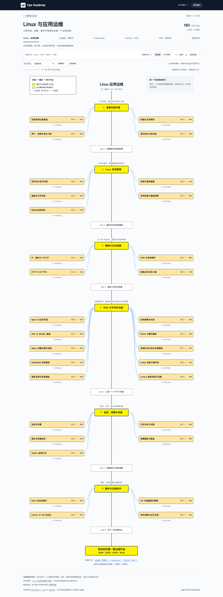
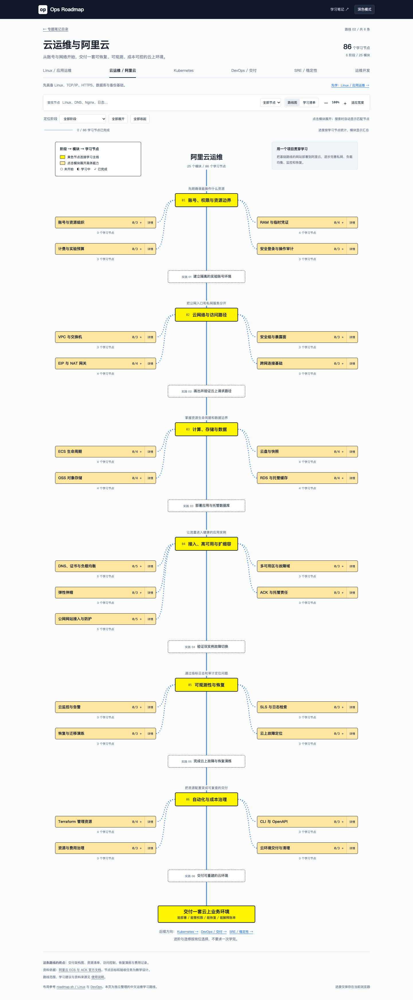
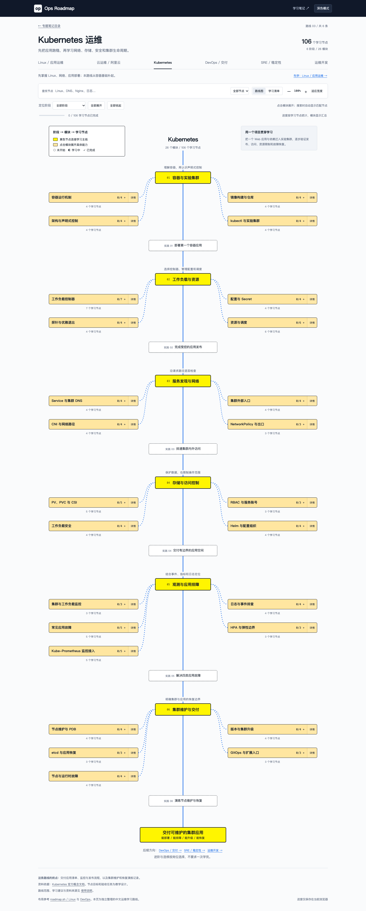
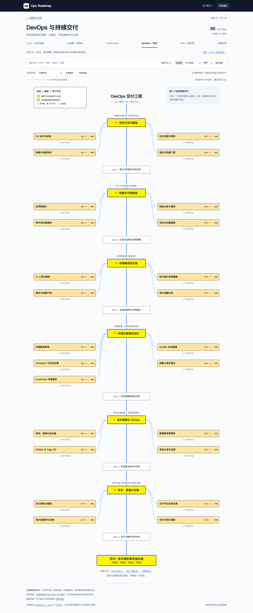
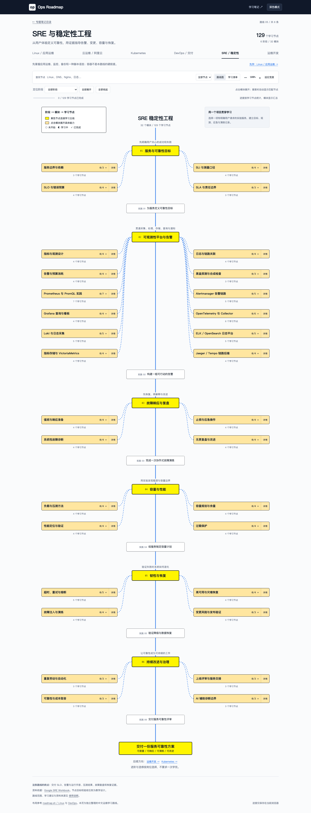
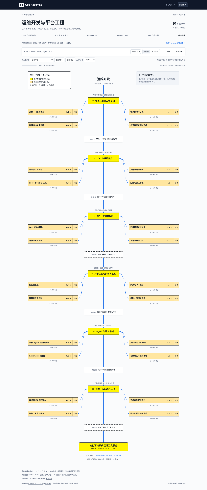

# 运维学习路线

面向准备入行、转行或补齐基础的学习者，按「阶段 → 能力模块 → 学习节点」组织运维知识，说明先学什么、掌握到什么程度，以及如何用实践检查自己。

[打开学习路线](./index.html) · [返回专题笔记目录](../index.html)

路线负责安排学习顺序，`topics/` 中的笔记负责深入讲解。建议先完成 Linux 基础，再按目标岗位选择分支，不需要学完全部路线才开始实践。

## 六条路线

| 方向 | 学习入口 | 主要目标 | 学习节点 |
| --- | --- | --- | ---: |
| Linux / 应用运维 | [开始学习](./index.html#linux) | 部署、监控、排障与恢复小型业务系统；按需深入 Nginx、MQ 与服务发现 | 160 |
| 云运维 / 阿里云 | [开始学习](./index.html#cloud) | 管理云资源、权限、网络、恢复与费用 | 86 |
| Kubernetes | [开始学习](./index.html#kubernetes) | 维护容器应用，处理网络、存储、安全与集群故障 | 106 |
| DevOps / 交付 | [开始学习](./index.html#devops) | 建设可追踪、可验证、可回滚的交付流程 | 86 |
| SRE / 稳定性 | [开始学习](./index.html#sre) | 定义服务目标，建设可观测性、应急、容量与恢复能力 | 129 |
| 运维开发 | [开始学习](./index.html#platform) | 编写可靠工具、API、异步任务与受控运维服务 | Python 91 / Go 92 |

共 **36 个阶段、164 个模块、663 个学习节点**。总数包含 Python、Go 两种备选语言的专属节点；运维开发两分支合计 96 个，页面根据主修选择显示对应内容。

“入门”相对于当前路线，云运维、Kubernetes、SRE 和开发路线都列有前置要求。“入门 / 进阶 / 选修”表示优先级，“了解 / 会用 / 会排障”表示掌握深度。

## 页面预览

以下截图采用统一桌面布局，每张展示一条路线的全部六个阶段和能力模块。具体学习节点可在页面中展开，查看目标、前置知识与实践验收。

### Linux / 应用运维



### 云运维 / 阿里云



### Kubernetes



### DevOps / 交付



### SRE / 稳定性



### 运维开发



## 使用方法

1. 选择路线，先看标题下的前置能力说明。
2. 点击模块名称展开节点，点击“详情”查看模块范围和综合练习。
3. 用“定位阶段”聚焦当前学习阶段；使用搜索查找工具或能力。
4. 按需要筛选入门必修、进阶能力或选修内容。搜索和筛选会自动展开匹配模块。
5. 完成节点验收后，标记“学习中”或“已完成”；模块会汇总子节点进度。

可观测性主要在 **SRE 第 2 阶段**，包含 Prometheus/PromQL、Alertmanager、Grafana、OpenTelemetry、日志平台、指标存储和链路查询。**Linux 第 4 阶段**补充 Nginx、消息队列、RabbitMQ、Kafka、服务发现与 Consul；第 5 阶段提供 Zabbix 选修。**Kubernetes 第 5 阶段**包含监控 Operator 与 CRD 接入。

同类产品按岗位和实验条件选择，例如 RabbitMQ / Kafka、Loki / ELK、Jaeger / Tempo，不要求同时维护所有产品。

## 本地打开

在仓库根目录启动静态服务：

```bash
python3 -m http.server 8000
```

访问 <http://127.0.0.1:8000/learning-paths/>。

也可直接打开 `learning-paths/index.html`。页面不需要构建、后端或外部运行库；仓库内笔记链接依赖当前目录结构。HTTP 方式更适合长期记录学习进度。

## 学习进度

进度保存在当前浏览器的 `localStorage` 中，不会上传或跨设备同步。相同协议、主机与端口下，从临时页面进入正式页面会继续使用原有记录；更换端口、浏览器或切换文件打开方式，不保证共享进度。

运维开发的 Python / Go 专属节点分别记录状态，切换主修不会删除另一分支的记录。旧版模块级状态保留供复核，不会自动把拆分后的全部子节点标为已完成。

## 内容与资料边界

这是一份带实践目标的学习导航，尚未为每个节点提供完整教材、实验包、标准答案或自动评分。部分资料链接指向相关专题或官方产品目录，需要按节点范围选择章节。暂无专属资料的节点会明确提示。

学习顺序和验收标准是本项目的教学设计，并不等于厂商认证大纲或岗位录用标准。需要云账号、集群或故障注入的练习，应在自己授权、可恢复的实验环境完成。

路线图的视觉组织参考 [roadmap.sh Linux](https://roadmap.sh/linux) 与 [DevOps](https://roadmap.sh/devops)，中文内容、层级、优先级和验收任务独立整理。

## 维护结构

```text
learning-paths/
├── index.html              # 页面入口
├── styles.css              # 页面与路线图样式
├── app.js                  # 布局、筛选、详情和本地进度
├── data/
│   ├── linux-route.js      # Linux 阶段与模块
│   ├── routes-content.js   # 其余五条路线的阶段与模块
│   └── skills/             # 细分节点、补充模块及分类
├── assets/                 # README 使用的实际页面截图
└── README.md
```

- 阶段与模块没有固定数量限制，布局根据内容计算。
- `data/skills/schema.js` 定义节点字段；各路线文件保存目标与验收任务；`catalog.js` 组合最终数据并设置优先级和语言分支。
- 节点 ID 用于保存进度，不应因排序或文案调整而变更。
- 修改内容后核对统计、资料路径和六路线交互；视觉变化后重新拍摄截图。
- 本目录是独立学习导航，不由 `scripts/build-roadmaps.sh` 生成，也不计入根目录的专题笔记和标准 Roadmap 数量。
