# Prometheus 学习笔记

> 基于Prometheus官网文档，结合Prometheus 3.5 & Alertmanager 0.27整理而成，适合初学者系统学习Prometheus监控系统。

---

## 目录

- [1. 介绍](#1-介绍)
  - [1.1 概述](#11-概述)
  - [1.2 快速开始](#12-快速开始)
  - [1.3 与其他监控系统对比](#13-与其他监控系统对比)
- [2. 核心概念](#2-核心概念)
  - [2.1 数据模型](#21-数据模型)
  - [2.2 指标类型](#22-指标类型)
  - [2.3 作业和实例](#23-作业和实例)
- [3. Prometheus服务器](#3-prometheus服务器)
  - [3.1 快速开始](#31-快速开始)
  - [3.2 安装](#32-安装)
  - [3.3 配置](#33-配置)
  - [3.4 规则配置](#34-规则配置)
  - [3.5 查询基础](#35-查询基础)
  - [3.6 存储](#36-存储)
- [4. 告警系统](#4-告警系统)
  - [4.1 告警概述](#41-告警概述)
- [5. 最佳实践](#5-最佳实践)
  - [5.1 指标和标签命名](#51-指标和标签命名)
  - [5.2 监控埋点](#52-监控埋点)
- [6. 总结](#6-总结)
  - [6.1 核心要点](#61-核心要点)
  - [6.2 学习路径建议](#62-学习路径建议)

---

## 1. 介绍

### 1.1 概述

#### 1.1.1 什么是 Prometheus？

Prometheus 是一个开源的系统监控和告警工具包，最初由 SoundCloud 构建。自2012年诞生以来，许多公司和组织已经采用了Prometheus，该项目拥有非常活跃的开发者和用户社区。2016年，Prometheus作为继Kubernetes之后的第二个托管项目加入了云原生计算基金会（CNCF）。

**核心特点：**

- Prometheus以时间序列数据的形式收集和存储指标
- 指标信息与记录时的时间戳一起存储
- 支持可选的键值对标签（labels）用于多维度数据标识

#### 1.1.2 主要特性

Prometheus的主要功能特性包括：

1. **多维数据模型**：时间序列数据由指标名称和键值对标签标识
2. **灵活的查询语言**：PromQL可以充分利用多维度特性
3. **不依赖分布式存储**：单个服务器节点是自治的
4. **Pull模式采集**：通过HTTP协议主动拉取时间序列数据
5. **Push支持**：通过中间网关支持推送时间序列数据
6. **服务发现**：通过服务发现或静态配置来发现目标
7. **多种可视化方式**：支持多种图形和仪表板展示方式

#### 1.1.3 什么是指标（Metrics）？

指标是数值测量的通俗术语。时间序列是指随时间记录的变化。不同应用需要测量的内容各不相同：

- **Web服务器**：请求时间、请求数量、错误率
- **数据库**：活动连接数、活动查询数、查询延迟
- **应用程序**：内存使用、垃圾回收次数、CPU使用率

**为什么指标很重要？**

指标在理解应用程序运行状态方面起着重要作用。例如：当Web应用变慢时，通过请求数量指标，可以判断是否因高流量导致，从而决定是否需要增加服务器。

#### 1.1.4 Prometheus 组件

Prometheus生态系统由多个组件组成，其中许多是可选的：

| 组件                        | 说明                                            | 是否必需 |
| --------------------------- | ----------------------------------------------- | -------- |
| **Prometheus Server** | 主服务器，抓取并存储时间序列数据                | ✅ 必需  |
| **Client Libraries**  | 客户端库，用于应用程序代码埋点                  | ✅ 必需  |
| **Push Gateway**      | 支持短生命周期作业的推送网关                    | ⚪ 可选  |
| **Exporters**         | 专用导出器，用于HAProxy、StatsD、Graphite等服务 | ⚪ 可选  |
| **Alertmanager**      | 告警管理器，处理告警                            | ⚪ 可选  |
| **Support Tools**     | 各种支持工具                                    | ⚪ 可选  |

大多数Prometheus组件使用Go语言编写，易于构建和部署为静态二进制文件。

#### 1.1.5 Prometheus 架构

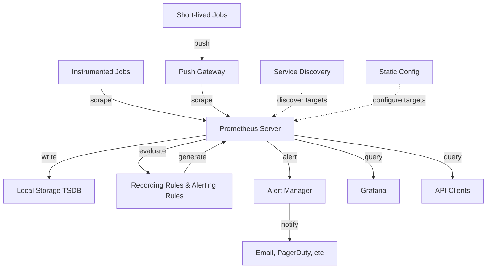

**架构说明：**

1. **数据采集**：

   - Prometheus直接从被监控的作业（instrumented jobs）中抓取指标
   - 对于短生命周期的作业，通过Push Gateway间接抓取
2. **数据存储**：

   - 所有抓取的样本都存储在本地
   - 本地时间序列数据库（TSDB）保证高性能
3. **规则处理**：

   - **Recording Rules**：聚合现有数据并记录新的时间序列
   - **Alerting Rules**：根据规则生成告警
4. **告警处理**：

   - Alertmanager处理告警通知
   - 支持分组、去重、静默等功能
5. **数据可视化**：

   - Grafana或其他API消费者可视化数据
   - 内置表达式浏览器

#### 1.1.6 何时适合使用 Prometheus？

**适合的场景：**

✅ **记录纯数值时间序列**：Prometheus非常适合记录任何纯数值时间序列

✅ **机器中心监控**：适合以机器为中心的监控

✅ **服务化架构监控**：特别适合高度动态的面向服务架构

✅ **多维数据支持**：在微服务世界中，多维数据收集和查询是其特殊优势

✅ **高可靠性**：

- 设计目标是在故障期间让你快速诊断问题
- 每个Prometheus服务器都是独立的
- 不依赖网络存储或其他远程服务
- 当基础设施其他部分损坏时仍可依赖

**不适合的场景：**

❌ **需要100%准确性**：

- 如用于按请求计费，Prometheus不是好选择
- 收集的数据可能不够详细和完整
- 建议使用其他系统进行计费数据收集和分析
- Prometheus用于其余的监控部分

**核心价值观：可靠性**

> Prometheus重视可靠性。即使在故障条件下，你也始终可以查看系统的可用统计信息。

---

### 1.2 快速开始

本节将指导你完成Prometheus的安装、配置和监控第一个资源。

#### 1.2.1 下载 Prometheus

1. 下载适合你平台的最新版本Prometheus
2. 解压下载的文件：

```bash
tar xvfz prometheus-*.tar.gz
cd prometheus-*
```

3. Prometheus服务器是一个名为 `prometheus`的单一二进制文件（Windows上为 `prometheus.exe`）
4. 查看帮助信息：

```bash
./prometheus --help
```

#### 1.2.2 配置 Prometheus

Prometheus使用YAML格式进行配置。下载包中包含一个示例配置文件 `prometheus.yml`。

**基本配置示例：**

```yaml
global:
  scrape_interval:     15s      # 全局抓取间隔
  evaluation_interval: 15s      # 全局规则评估间隔

rule_files:
  # - "first.rules"             # 规则文件位置
  # - "second.rules"

scrape_configs:
  - job_name: prometheus        # 作业名称
    static_configs:
      - targets: ['localhost:9090']  # 目标地址
```

**配置块说明：**

| 配置块                   | 说明                                     |
| ------------------------ | ---------------------------------------- |
| **global**         | 控制Prometheus服务器的全局配置           |
| `scrape_interval`      | 控制Prometheus抓取目标的频率（默认15秒） |
| `evaluation_interval`  | 控制Prometheus评估规则的频率（默认15秒） |
| **rule_files**     | 指定Prometheus服务器要加载的规则文件位置 |
| **scrape_configs** | 控制Prometheus监控哪些资源               |

**scrape_configs 详解：**

- `job_name`：作业名称，这里是"prometheus"
- `static_configs`：静态配置的目标
- `targets`：目标地址列表

默认配置中，Prometheus监控自己。它会抓取URL：`http://localhost:9090/metrics`

> **约定**：Prometheus期望目标在 `/metrics`路径上提供指标。

#### 1.2.3 启动 Prometheus

使用新创建的配置文件启动Prometheus：

```bash
./prometheus --config.file=prometheus.yml
```

启动后：

- Prometheus开始运行
- 访问状态页面：`http://localhost:9090`
- 等待约30秒让它收集自身的数据
- 访问指标端点：`http://localhost:9090/metrics`

#### 1.2.4 使用表达式浏览器

Prometheus内置了表达式浏览器用于查询数据。

**访问方式：**

1. 访问：`http://localhost:9090/graph`
2. 在"Graph"标签页中选择"Table"视图

**查询示例：**

**1. 查询总请求数：**

```promql
promhttp_metric_handler_requests_total
```

这将返回多个时间序列，每个都有不同的标签（如不同的状态码）。

**2. 按条件过滤：**

```promql
promhttp_metric_handler_requests_total{code="200"}
```

只返回HTTP状态码为200的请求。

**3. 统计时间序列数量：**

```promql
count(promhttp_metric_handler_requests_total)
```

#### 1.2.5 使用图形界面

在表达式浏览器中切换到"Graph"标签页可以绘制图形。

**绘制每秒请求率示例：**

```promql
rate(promhttp_metric_handler_requests_total{code="200"}[1m])
```

这将显示过去1分钟内返回状态码200的每秒HTTP请求率。

你可以尝试：

- 调整图形范围参数
- 修改其他设置
- 观察数据变化

#### 1.2.6 监控其他目标

仅从Prometheus自身收集指标并不能很好地展示Prometheus的能力。

**推荐下一步：**

- 探索其他导出器（Exporters）的文档
- 推荐：使用Node Exporter监控Linux或macOS主机指标

**学习路径建议：**


---

### 1.3 与其他监控系统对比

本节将Prometheus与其他流行的监控系统进行对比，帮助你了解Prometheus的优势和适用场景。

#### 1.3.1 Prometheus vs. Graphite

##### 范围对比

| 系统                 | 定位                 | 功能范围                                    |
| -------------------- | -------------------- | ------------------------------------------- |
| **Graphite**   | 被动时间序列数据库   | 查询语言 + 图形功能，其他功能由外部组件处理 |
| **Prometheus** | 完整的监控和趋势系统 | 内置主动抓取、存储、查询、图形化和告警      |

**Prometheus优势：**

- 主动发现问题，而不是被动等待
- 了解系统应该是什么样子（哪些端点应该存在，什么模式意味着问题等）

##### 数据模型对比

**Graphite示例：**

```
stats.api-server.tracks.post.500 -> 93
```

指标名称由点分隔的组件组成，隐式编码维度。

**Prometheus示例：**

```promql
api_server_http_requests_total{method="POST",handler="/tracks",status="500",instance="<sample1>"} -> 34
api_server_http_requests_total{method="POST",handler="/tracks",status="500",instance="<sample2>"} -> 28
api_server_http_requests_total{method="POST",handler="/tracks",status="500",instance="<sample3>"} -> 31
```

**Prometheus数据模型优势：**

- ✅ 显式编码维度为键值对（标签）
- ✅ 通过查询语言轻松过滤、分组和匹配
- ✅ 保留实例维度，可深入分析单个有问题的实例
- ✅ 避免只存储聚合数据

##### 存储对比

| 系统                 | 存储方式                   | 特点                                                         |
| -------------------- | -------------------------- | ------------------------------------------------------------ |
| **Graphite**   | Whisper格式（RRD风格）     | 期望样本定期到达；每个时间序列一个文件；新样本覆盖旧样本     |
| **Prometheus** | 本地文件，每个时间序列一个 | 允许任意间隔存储样本；新样本简单追加；旧数据可任意长时间保留 |

**Prometheus存储优势：**

- ✅ 适合短生命周期、频繁变化的时间序列集合
- ✅ 灵活的数据保留策略

##### 总结

**选择Prometheus的理由：**

- ✅ 更丰富的数据模型和查询语言
- ✅ 更易于运行和集成
- ✅ 更适合动态环境

**选择Graphite的理由：**

- ✅ 需要集群化解决方案
- ✅ 需要长期存储历史数据

---

#### 1.3.2 Prometheus vs. InfluxDB

InfluxDB是一个开源时间序列数据库，提供商业版用于扩展和集群。

##### 范围对比

**公平比较：**需要将Kapacitor与InfluxDB一起考虑，因为它们的组合才能覆盖Prometheus + Alertmanager的问题领域。

| 组合                                | 功能                                                               |
| ----------------------------------- | ------------------------------------------------------------------ |
| **InfluxDB**                  | 数据存储 + 连续查询（类似Prometheus recording rules）              |
| **Kapacitor**                 | 类似Prometheus recording rules + alerting rules + Alertmanager通知 |
| **Prometheus + Alertmanager** | 更强大的查询语言 + 分组、去重、静默功能                            |

##### 数据模型/存储

**InfluxDB数据模型：**

- 第一级标签：tags（类似Prometheus的labels）
- 第二级标签：fields（使用受限）
- 支持纳秒级时间戳
- 支持数据类型：float64、int64、bool、string

**Prometheus数据模型：**

- 标签：labels
- 支持数据类型：float64（字符串支持有限）
- 毫秒级时间戳精度

**存储差异：**

- **InfluxDB**：使用日志结构合并树（LSM）+ 预写日志，按时间分片
- **Prometheus**：每个时间序列只追加文件

> InfluxDB的存储更适合事件日志，Prometheus更适合指标记录。

##### 架构对比

**开源版本：**

- 两者的服务器都是独立运行的
- 只依赖本地存储进行核心功能
- 运行简单

**商业版本对比：**

| 特性       | InfluxDB商业版              | Prometheus开源版              |
| ---------- | --------------------------- | ----------------------------- |
| 水平扩展   | ✅ 设计为分布式存储集群     | ⚠️ 需要手动分片             |
| 管理复杂度 | ❌ 需管理分布式存储系统     | ✅ 运行简单                   |
| 可靠性     | ⚠️ 依赖集群健康           | ✅ 独立服务器提供更好故障隔离 |
| HA告警     | ✅ Enterprise Kapacitor支持 | ✅ 完全开源的冗余选项         |

##### 总结

**选择InfluxDB的理由：**

- ✅ 主要用于事件日志
- ✅ 需要商业集群化方案用于长期数据存储
- ✅ 可接受副本间最终一致性

**选择Prometheus的理由：**

- ✅ 主要收集指标
- ✅ 更强大的查询语言、告警和通知功能
- ✅ 更高的图形化和告警可用性和正常运行时间
- ✅ 完全开源和独立的项目

---

#### 1.3.3 Prometheus vs. OpenTSDB

OpenTSDB是基于Hadoop和HBase的分布式时间序列数据库。

##### 对比总结

**数据模型：**

- 几乎相同：时间序列由任意键值对标识
- Prometheus允许标签值中使用任意字符，OpenTSDB限制更多
- OpenTSDB缺少完整的查询语言，只能通过API进行简单聚合和数学运算

**存储：**

- **OpenTSDB**：基于Hadoop和HBase实现
  - ✅ 易于水平扩展
  - ❌ 需要从一开始就接受运行Hadoop/HBase集群的复杂性
- **Prometheus**：
  - ✅ 初始运行更简单
  - ⚠️ 超过单节点容量后需要显式分片

**选择建议：**

- **选择Prometheus**：需要更丰富的查询语言和完整的监控系统
- **选择OpenTSDB**：已运行Hadoop且重视长期存储

---

#### 1.3.4 Prometheus vs. Nagios

Nagios是1990年代起源的监控系统（原名NetSaint）。

##### 核心差异

| 特性               | Nagios                                     | Prometheus                   |
| ------------------ | ------------------------------------------ | ---------------------------- |
| **监控方式** | 基于脚本退出码的"检查"                     | 时间序列指标收集             |
| **告警**     | 个别告警静默，无分组/路由/去重             | 支持分组、路由、去重         |
| **数据模型** | 基于主机，每个主机有服务，每个服务执行检查 | 基于指标，支持标签和查询语言 |
| **存储**     | 无存储（仅当前检查状态）                   | 本地时间序列数据库           |
| **配置**     | 文件配置，独立服务器                       | 支持服务发现                 |

**监控类型对比：**

- **Nagios**：黑盒监控（blackbox probing）
- **Prometheus**：白盒监控（whitebox monitoring）

##### 总结

**选择Nagios的理由：**

- ✅ 基本监控小型/静态系统
- ✅ 黑盒探测就足够

**选择Prometheus的理由：**

- ✅ 需要白盒监控
- ✅ 动态或基于云的环境

---

#### 1.3.5 Prometheus vs. Sensu

Sensu是一个开源监控和可观测性管道，提供额外可扩展功能的商业发行版。可重用现有Nagios插件。

##### 核心定位

**Sensu：**

- 可观测性管道
- 专注于将可观测性数据作为事件流进行处理和告警
- 提供可扩展的事件过滤、聚合、转换和处理框架

**Prometheus：**

- 时间序列监控系统
- 专注于指标收集、存储和查询

##### 数据模型对比

**Sensu Events：**

- 结构化数据格式
- 由实体名称、事件名称和可选的键值元数据标识
- 可包含一个或多个指标点
- 指标格式：JSON对象（名称、标签、时间戳、值）

**Prometheus：**

- 时间序列数据
- 由指标名称和标签标识
- 值为float64类型

##### 架构

**Sensu：**

- 所有组件都可以集群化以实现高可用性
- 提高事件处理吞吐量

**Prometheus：**

- 服务器独立运行
- 可通过运行冗余副本实现高可用

##### 总结

**选择Sensu的理由：**

- ✅ 收集和处理混合可观测性数据（指标和/或事件）
- ✅ 整合多个监控工具
- ✅ 需要Nagios风格的插件或检查脚本
- ✅ 更强大的事件处理平台

**选择Prometheus的理由：**

- ✅ 主要收集和评估指标
- ✅ 监控同质化的Kubernetes基础设施
- ✅ 更强大的查询语言
- ✅ 内置支持历史数据分析

---

#### 1.3.6 对比总结表

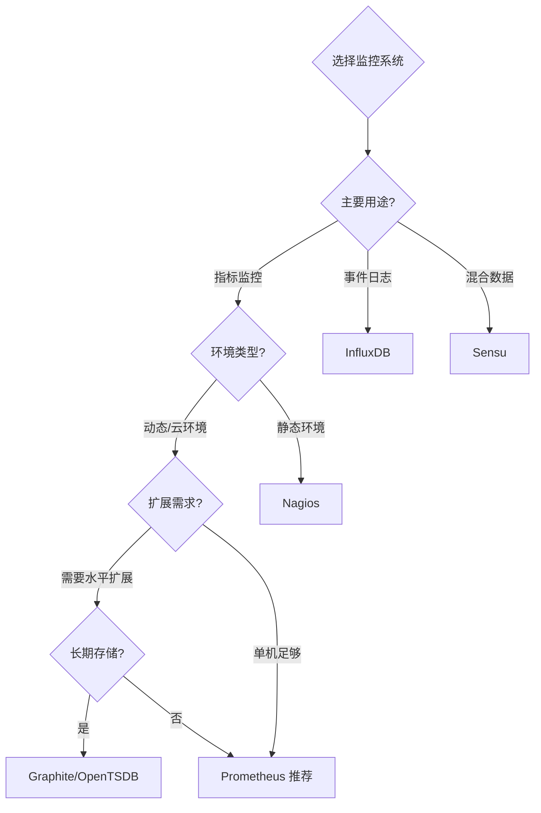

**快速决策指南：**

| 如果你需要...                        | 推荐方案               |
| ------------------------------------ | ---------------------- |
| 动态环境、强大查询语言、完整监控系统 | ✅**Prometheus** |
| 事件日志、商业集群化、长期存储       | InfluxDB               |
| 混合可观测性数据、整合多种监控工具   | Sensu                  |
| 已有Hadoop、需要超大规模存储         | OpenTSDB               |
| 集群化长期历史数据存储               | Graphite               |
| 小型静态系统、基本黑盒监控           | Nagios                 |

---

## 2. 核心概念

### 2.1 数据模型

#### 2.1.1 时间序列

Prometheus从根本上将所有数据存储为**时间序列**：属于同一指标和同一组标记维度的带时间戳值的流。

**核心概念：**

- **时间序列**：带有时间戳的数值流
- 每个时间序列由**指标名称**和**可选的键值对标签**唯一标识
- Prometheus还可以根据查询结果生成临时派生的时间序列

**时间序列数据结构：**

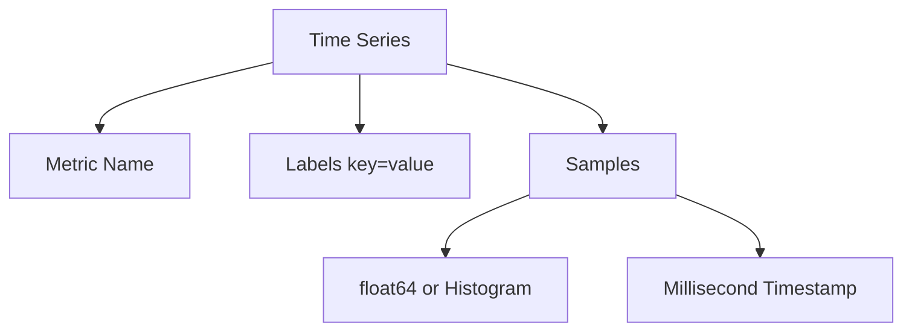

#### 2.1.2 指标名称（Metric Names）

指标名称用于指定被测量系统的通用特征。

**命名规范：**

| 规范               | 说明                                                                   |
| ------------------ | ---------------------------------------------------------------------- |
| **SHOULD**   | 指定被测量系统的通用特征（如 `http_requests_total` - HTTP请求总数）  |
| **MAY**      | 可以使用任何UTF-8字符                                                  |
| **SHOULD**   | 匹配正则表达式 `[a-zA-Z_:][a-zA-Z0-9_:]*` 以获得最佳体验和兼容性     |
| **特殊符号** | 冒号 `:` 保留用于用户定义的recording rules，导出器或直接埋点不应使用 |

**命名示例：**

```promql
# 推荐的命名方式
http_requests_total              # HTTP请求总数
node_cpu_seconds_total           # CPU使用秒数
process_resident_memory_bytes    # 进程常驻内存字节数
```

⚠️ **UTF-8支持说明**：

- Prometheus v3.0.0才相对较新地添加了对指标和标签名称的UTF-8支持
- 生态系统可能需要时间来采用新的引用机制
- 为获得最佳兼容性，建议遵循推荐的字符集

#### 2.1.3 标签（Labels）

标签用于捕获同一指标名称的不同实例，是Prometheus的**维度数据模型**的核心。

**标签的作用：**

- 区分同一指标的不同维度
- 支持基于维度的过滤和聚合
- 任何标签值的更改（包括添加或删除标签）都会创建新的时间序列

**标签命名规范：**

| 规范               | 说明                                                             |
| ------------------ | ---------------------------------------------------------------- |
| **MAY**      | 可以使用任何UTF-8字符                                            |
| **MUST**     | 以 `__`（两个下划线）开头的标签名保留给Prometheus内部使用      |
| **SHOULD**   | 匹配正则表达式 `[a-zA-Z_][a-zA-Z0-9_]*` 以获得最佳体验和兼容性 |
| **标签值**   | 可包含任何UTF-8字符                                              |
| **空值处理** | 具有空标签值的标签被认为等同于不存在的标签                       |

**标签使用示例：**

```promql
# 所有使用POST方法到/api/tracks端点的HTTP请求
api_http_requests_total{method="POST", handler="/api/tracks"}

# 不同实例的相同指标
api_http_requests_total{method="POST", handler="/api/tracks", instance="server1"}
api_http_requests_total{method="POST", handler="/api/tracks", instance="server2"}
```

**维度数据模型优势：**

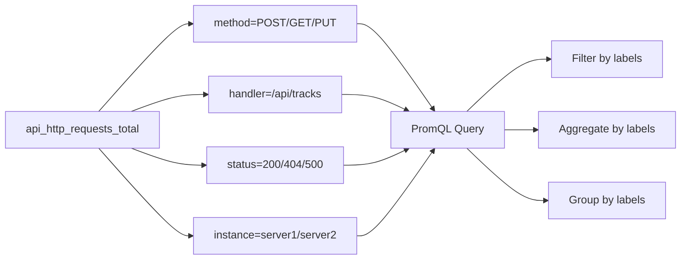

#### 2.1.4 样本（Samples）

样本构成实际的时间序列数据。

**样本组成：**

| 组成部分         | 说明                                      |
| ---------------- | ----------------------------------------- |
| **值**     | float64或原生直方图（native histogram）值 |
| **时间戳** | 毫秒精度的时间戳                          |

**数据结构示例：**

```
时间戳              值
1609459200000    123.45
1609459215000    124.67
1609459230000    125.89
```

#### 2.1.5 时间序列表示法

**标准表示法：**

```promql
<metric name>{<label name>="<label value>", ...}
```

**实际示例：**

```promql
# 基本格式
api_http_requests_total{method="POST", handler="/messages"}

# 带多个标签
http_request_duration_seconds{method="GET", handler="/api/users", status="200", instance="localhost:8080"}
```

**UTF-8字符表示法：**

对于包含推荐集之外的UTF-8字符的名称，必须使用引号：

```promql
# UTF-8字符需要引号
{"<metric name>", <label name>="<label value>", ...}
```

**特殊表示法：**

指标名称在内部表示为特殊标签 `__name__`：

```promql
# 这两种表示法等价
api_http_requests_total{method="POST"}
{__name__="api_http_requests_total", method="POST"}
```

**表示法对比：**

| 表示法                                      | 使用场景                   |
| ------------------------------------------- | -------------------------- |
| `metric_name{label="value"}`              | 标准场景，推荐使用         |
| `{"metric_name", label="value"}`          | 指标名称包含特殊UTF-8字符  |
| `{__name__="metric_name", label="value"}` | 高级查询，动态指标名称匹配 |

---

### 2.2 指标类型

Prometheus客户端库提供四种核心指标类型。这些类型目前仅在客户端库（为特定类型的使用启用定制API）和传输协议中区分。

⚠️ **重要说明**：Prometheus服务器尚未使用类型信息，会将所有数据扁平化为无类型时间序列（未来可能会改变）。

#### 2.2.1 Counter（计数器）

**定义：**

Counter是一个累积指标，表示单个单调递增的计数器，其值只能**增加**或在重启时**重置为零**。

**适用场景：**

✅ **适合使用Counter：**

- 已处理的请求数量
- 已完成的任务数量
- 发生的错误数量
- 网络字节数（发送/接收）

❌ **不适合使用Counter：**

- 可能减少的值（如当前运行的进程数）
- 应该使用Gauge的场景

**Counter示例：**

```promql
# 请求总数
http_requests_total

# 使用rate()函数计算每秒请求率
rate(http_requests_total[5m])

# 使用increase()函数计算增量
increase(http_requests_total[1h])
```

**Counter特征：**


**最佳实践：**

1. Counter名称应以 `_total` 结尾
2. 使用 `rate()` 或 `increase()` 函数处理Counter
3. Counter重置后Prometheus会自动处理

---

#### 2.2.2 Gauge（仪表盘）

**定义：**

Gauge是表示单个数值的指标，该数值可以**任意上升或下降**。

**适用场景：**

✅ **适合使用Gauge：**

- 温度
- 当前内存使用量
- 并发请求数
- 队列大小
- CPU使用率
- 磁盘可用空间

**Gauge示例：**

```promql
# 当前内存使用量（字节）
process_resident_memory_bytes

# 当前并发请求数
http_requests_in_flight

# 温度
node_temperature_celsius
```

**Gauge特征：**

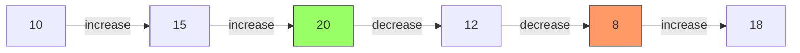

**Counter vs Gauge对比：**

| 特性     | Counter                    | Gauge                                        |
| -------- | -------------------------- | -------------------------------------------- |
| 数值变化 | 只增不减（除非重置）       | 可增可减                                     |
| 重启行为 | 重置为0                    | 可能保持或改变                               |
| 典型后缀 | `_total`                 | 无特定后缀                                   |
| 常用函数 | `rate()`, `increase()` | 直接使用，或 `avg()`, `max()`, `min()` |
| 使用场景 | 累积计数（请求、错误等）   | 当前状态（内存、温度等）                     |

---

#### 2.2.3 Histogram（直方图）

**定义：**

Histogram对观察值（通常是请求持续时间或响应大小）进行采样，并在可配置的桶（bucket）中计数。

**Histogram暴露的时间序列：**

基础指标名称为 `<basename>` 的Histogram会在抓取时暴露多个时间序列：

| 时间序列                                            | 说明                                            |
| --------------------------------------------------- | ----------------------------------------------- |
| `<basename>_bucket{le="<upper inclusive bound>"}` | 观察桶的累积计数器                              |
| `<basename>_sum`                                  | 所有观察值的总和                                |
| `<basename>_count`                                | 已观察到的事件计数（等同于 `{le="+Inf"}` 桶） |

**Histogram示例：**

```promql
# 基础指标名称
http_request_duration_seconds

# 实际暴露的时间序列
http_request_duration_seconds_bucket{le="0.1"}   # <= 0.1秒的请求数
http_request_duration_seconds_bucket{le="0.5"}   # <= 0.5秒的请求数
http_request_duration_seconds_bucket{le="1.0"}   # <= 1.0秒的请求数
http_request_duration_seconds_bucket{le="2.5"}   # <= 2.5秒的请求数
http_request_duration_seconds_bucket{le="+Inf"}  # 所有请求数
http_request_duration_seconds_sum                # 所有请求耗时总和
http_request_duration_seconds_count              # 请求总数
```

**计算分位数（Quantile）：**

```promql
# 计算95分位数（p95）
histogram_quantile(0.95, rate(http_request_duration_seconds_bucket[5m]))

# 计算50分位数（中位数）
histogram_quantile(0.5, rate(http_request_duration_seconds_bucket[5m]))

# 计算99分位数
histogram_quantile(0.99, rate(http_request_duration_seconds_bucket[5m]))
```

**Histogram工作原理：**

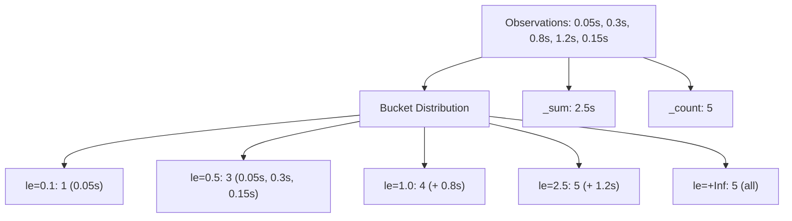

**原生直方图（Native Histograms）：**

🆕 **Prometheus v2.40+ 实验性功能**

- 只需要一个时间序列
- 包含动态数量的桶以及总和和计数
- 以极低的成本实现更高的分辨率
- 🚧 功能仍在完善中

**Prometheus v3.0变化：**

- 经典直方图的 `le` 标签值在摄取期间被规范化
- 遵循OpenMetrics规范数字格式

---

#### 2.2.4 Summary（摘要）

**定义：**

与Histogram类似，Summary也对观察值进行采样（通常是请求持续时间和响应大小）。它提供观察总数和所有观察值的总和，同时在**滑动时间窗口**上计算可配置的分位数。

**Summary暴露的时间序列：**

基础指标名称为 `<basename>` 的Summary会在抓取时暴露多个时间序列：

| 时间序列                        | 说明                                    |
| ------------------------------- | --------------------------------------- |
| `<basename>{quantile="<φ>"}` | 流式φ-分位数（0 ≤ φ ≤ 1）的观察事件 |
| `<basename>_sum`              | 所有观察值的总和                        |
| `<basename>_count`            | 已观察到的事件计数                      |

**Summary示例：**

```promql
# 基础指标名称
http_request_duration_seconds

# 实际暴露的时间序列
http_request_duration_seconds{quantile="0.5"}   # 50分位数（中位数）
http_request_duration_seconds{quantile="0.9"}   # 90分位数
http_request_duration_seconds{quantile="0.99"}  # 99分位数
http_request_duration_seconds_sum              # 所有请求耗时总和
http_request_duration_seconds_count            # 请求总数
```

**Histogram vs Summary对比：**

| 特性                   | Histogram                                     | Summary                      |
| ---------------------- | --------------------------------------------- | ---------------------------- |
| **分位数计算**   | 服务器端计算（使用 `histogram_quantile()`） | 客户端计算                   |
| **聚合能力**     | ✅ 可以聚合多个实例                           | ❌ 无法聚合                  |
| **误差范围**     | 受桶配置影响                                  | 精确（在配置的时间窗口内）   |
| **资源消耗**     | 服务器端                                      | 客户端                       |
| **时间序列数量** | 桶数量 + 2（sum和count）                      | 分位数数量 + 2（sum和count） |
| **分位数灵活性** | ✅ 可以在查询时动态计算任意分位数             | ❌ 只能使用预配置的分位数    |
| **适用场景**     | 需要聚合，对精度要求不极致                    | 需要精确分位数，单实例监控   |

**选择建议流程：**

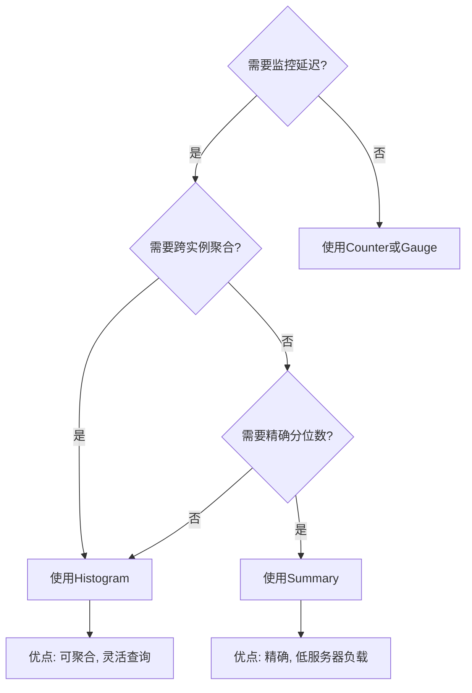

**Prometheus v3.0变化：**

- `quantile` 标签值在摄取期间被规范化
- 遵循OpenMetrics规范数字格式

**指标类型总结：**

| 指标类型            | 典型用途           | 典型命名后缀                      | 关键特点                   |
| ------------------- | ------------------ | --------------------------------- | -------------------------- |
| **Counter**   | 累积计数           | `_total`                        | 只增不减，可重置           |
| **Gauge**     | 当前状态           | 无特定后缀                        | 可增可减                   |
| **Histogram** | 延迟分布，大小分布 | `_bucket`, `_sum`, `_count` | 服务器端分位数计算，可聚合 |
| **Summary**   | 精确分位数         | `_sum`, `_count`              | 客户端分位数计算，不可聚合 |

---

### 2.3 作业和实例

#### 2.3.1 基本概念

在Prometheus术语中：

| 概念               | 定义                                                           | 示例                         |
| ------------------ | -------------------------------------------------------------- | ---------------------------- |
| **Instance** | 可以抓取的端点，通常对应单个进程                               | `1.2.3.4:5670`             |
| **Job**      | 具有相同目的的实例集合（例如为了可扩展性或可靠性而复制的进程） | `api-server` (包含4个实例) |

**关系图示：**

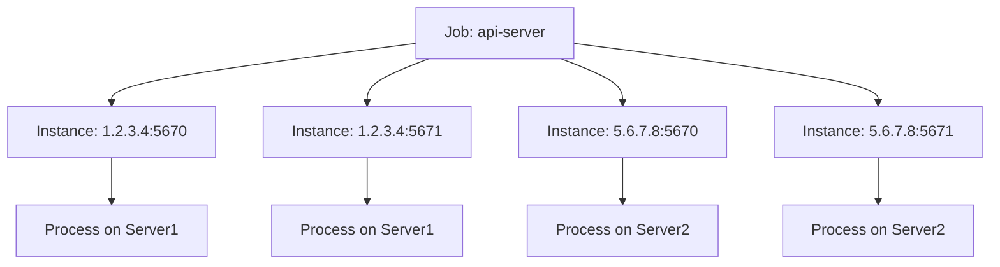

**实际示例：**

```yaml
# API服务器作业，包含4个副本实例
job: api-server
  instance 1: 1.2.3.4:5670
  instance 2: 1.2.3.4:5671
  instance 3: 5.6.7.8:5670
  instance 4: 5.6.7.8:5671
```

#### 2.3.2 自动生成的标签

当Prometheus抓取目标时，会**自动附加**一些标签到抓取的时间序列，这些标签用于标识被抓取的目标。

**自动附加的标签：**

| 标签         | 值                                       | 说明         |
| ------------ | ---------------------------------------- | ------------ |
| `job`      | 目标所属的配置的作业名称                 | 来自配置文件 |
| `instance` | 被抓取的目标URL的 `<host>:<port>` 部分 | 自动提取     |

**标签冲突处理：**

如果抓取的数据中已经存在这些标签，行为取决于 `honor_labels` 配置选项。

**配置示例：**

```yaml
scrape_configs:
  - job_name: 'api-server'
    static_configs:
      - targets:
        - '1.2.3.4:5670'
        - '1.2.3.4:5671'
        - '5.6.7.8:5670'
        - '5.6.7.8:5671'
```

**结果时间序列示例：**

```promql
http_requests_total{job="api-server", instance="1.2.3.4:5670", method="POST"}
http_requests_total{job="api-server", instance="1.2.3.4:5671", method="POST"}
http_requests_total{job="api-server", instance="5.6.7.8:5670", method="POST"}
http_requests_total{job="api-server", instance="5.6.7.8:5671", method="POST"}
```

#### 2.3.3 自动生成的时间序列

对于每个实例抓取，Prometheus会在以下时间序列中存储样本：

**核心健康指标：**

| 时间序列                                                                              | 说明                                         | 值             |
| ------------------------------------------------------------------------------------- | -------------------------------------------- | -------------- |
| `up{job="<job-name>", instance="<instance-id>"}`                                    | 实例健康状态                                 | 1=健康, 0=失败 |
| `scrape_duration_seconds{job="<job-name>", instance="<instance-id>"}`               | 抓取持续时间                                 | 秒数           |
| `scrape_samples_post_metric_relabeling{job="<job-name>", instance="<instance-id>"}` | 指标重新标记后剩余的样本数量                 | 数量           |
| `scrape_samples_scraped{job="<job-name>", instance="<instance-id>"}`                | 目标暴露的样本数量                           | 数量           |
| `scrape_series_added{job="<job-name>", instance="<instance-id>"}`                   | 此次抓取中新增的时间序列的近似数量（v2.10+） | 数量           |

**up时间序列的重要性：**

`up` 时间序列对于实例可用性监控非常有用：

```promql
# 检查实例是否在线
up{job="api-server", instance="1.2.3.4:5670"}

# 统计在线实例数量
sum(up{job="api-server"})

# 检测离线实例
up{job="api-server"} == 0

# 计算实例可用率
avg_over_time(up{job="api-server"}[24h])
```

**监控抓取过程：**

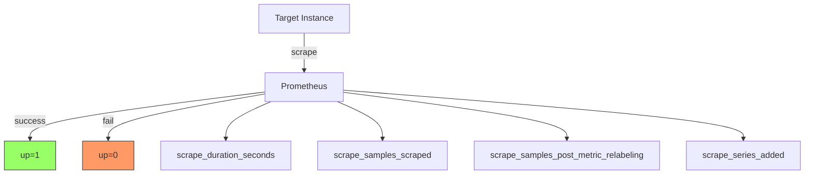

#### 2.3.4 额外抓取指标

使用 `extra-scrape-metrics` 功能标志时，可以获得以下额外指标：

| 时间序列                                                               | 说明                             | 特殊值          |
| ---------------------------------------------------------------------- | -------------------------------- | --------------- |
| `scrape_timeout_seconds{job="<job-name>", instance="<instance-id>"}` | 目标的配置抓取超时时间           | -               |
| `scrape_sample_limit{job="<job-name>", instance="<instance-id>"}`    | 目标的配置样本限制               | 0=无限制        |
| `scrape_body_size_bytes{job="<job-name>", instance="<instance-id>"}` | 最近一次成功抓取的未压缩响应大小 | -1=超限, 0=失败 |

**使用示例：**

```promql
# 检查哪些实例接近样本限制
scrape_samples_scraped / scrape_sample_limit > 0.8

# 监控抓取响应大小
scrape_body_size_bytes{job="api-server"}

# 检查抓取超时配置
scrape_timeout_seconds{job="api-server"}
```

**实例健康监控告警示例：**

```yaml
# 告警规则示例
groups:
  - name: instance_health
    rules:
      - alert: InstanceDown
        expr: up == 0
        for: 5m
        labels:
          severity: critical
        annotations:
          summary: "实例 {{ $labels.instance }} 宕机"
          description: "作业 {{ $labels.job }} 的实例 {{ $labels.instance }} 已经宕机超过5分钟"
    
      - alert: HighScrapeDuration
        expr: scrape_duration_seconds > 1
        for: 5m
        labels:
          severity: warning
        annotations:
          summary: "抓取耗时过长"
          description: "实例 {{ $labels.instance }} 的抓取时间超过1秒"
```

**Job和Instance使用最佳实践：**

1. **合理划分Job**：

   - 相同功能的实例归为一个Job
   - 不同环境使用不同Job（如 `api-server-prod`, `api-server-dev`）
2. **利用自动标签**：

   - 使用 `job` 和 `instance` 标签进行过滤和聚合
   - 在告警规则中引用这些标签
3. **监控健康状态**：

   - 设置基于 `up` 指标的告警
   - 监控 `scrape_duration_seconds` 检测性能问题
4. **服务发现**：

   - 使用服务发现自动管理实例列表
   - 避免静态配置大量实例

---

## 3. Prometheus服务器

### 3.1 快速开始

本节是"Hello World"风格的教程，展示如何安装、配置和使用简单的Prometheus实例。

#### 3.1.1 下载和运行Prometheus

**下载步骤：**

```bash
# 1. 下载适合你平台的最新版本Prometheus
tar xvfz prometheus-*.tar.gz
cd prometheus-*

# 2. 在启动之前，先配置它
```

#### 3.1.2 配置Prometheus监控自身

Prometheus通过抓取HTTP指标端点从目标收集指标。由于Prometheus以相同方式暴露自身数据，它也可以抓取和监控自己的健康状况。

**保存以下配置为 `prometheus.yml`：**

```yaml
global:
  scrape_interval:     15s  # 默认每15秒抓取一次目标
  
  # 与外部系统（联邦、远程存储、Alertmanager）通信时附加这些标签
  external_labels:
    monitor: 'codelab-monitor'

# 抓取配置包含一个要抓取的端点
# 这里是Prometheus自身
scrape_configs:
  # job名称作为标签 `job=<job_name>` 添加到从此配置抓取的任何时间序列
  - job_name: 'prometheus'
  
    # 覆盖全局默认值，每5秒抓取一次此作业的目标
    scrape_interval: 5s
  
    static_configs:
      - targets: ['localhost:9090']
```

**配置说明：**

- **global**: 全局配置部分

  - `scrape_interval`: 抓取间隔（默认15秒）
  - `external_labels`: 外部标签，用于与外部系统通信时标识
- **scrape_configs**: 定义要监控的资源

  - `job_name`: 作业名称
  - `static_configs`: 静态配置的目标列表

#### 3.1.3 启动Prometheus

```bash
# 启动Prometheus
# 默认情况下，Prometheus将数据库存储在./data（标志--storage.tsdb.path）
./prometheus --config.file=prometheus.yml
```

**验证运行：**

- 访问状态页面：`http://localhost:9090`
- 访问指标端点：`http://localhost:9090/metrics`
- 等待约30秒让它从自身的HTTP指标端点收集数据

#### 3.1.4 使用表达式浏览器

访问 `http://localhost:9090/graph` 并选择"Graph"标签页中的"Table"视图。

**查询示例：**

```promql
# 1. 查看Prometheus自身的目标间隔长度
prometheus_target_interval_length_seconds

# 2. 只查看99分位延迟
prometheus_target_interval_length_seconds{quantile="0.99"}

# 3. 统计返回的时间序列数量
count(prometheus_target_interval_length_seconds)
```

#### 3.1.5 使用图形界面

切换到"Graph"标签页来绘制图形。

**绘图示例：**

```promql
# 绘制每秒创建的chunks的速率
rate(prometheus_tsdb_head_chunks_created_total[1m])
```

你可以尝试调整图形范围参数和其他设置。

#### 3.1.6 启动示例目标

让我们添加额外的目标供Prometheus抓取。使用Node Exporter作为示例目标。

```bash
tar -xzvf node_exporter-*.*.tar.gz
cd node_exporter-*.*

# 在不同终端中启动3个示例目标
./node_exporter --web.listen-address 127.0.0.1:8080
./node_exporter --web.listen-address 127.0.0.1:8081
./node_exporter --web.listen-address 127.0.0.1:8082
```

现在你应该有示例目标在以下地址监听：

- `http://localhost:8080/metrics`
- `http://localhost:8081/metrics`
- `http://localhost:8082/metrics`

#### 3.1.7 配置Prometheus监控示例目标

在 `prometheus.yml` 的 `scrape_configs` 部分添加以下作业定义：

```yaml
scrape_configs:
  - job_name: 'node'
  
    # 覆盖全局默认值，每5秒抓取一次此作业的目标
    scrape_interval: 5s
  
    static_configs:
      # 生产目标组
      - targets: ['localhost:8080', 'localhost:8081']
        labels:
          group: 'production'
    
      # 金丝雀目标组
      - targets: ['localhost:8082']
        labels:
          group: 'canary'
```

**分组说明：**

- 前两个端点标记为 `group="production"`
- 第三个端点标记为 `group="canary"`
- 这允许在查询时区分不同环境的实例

重启Prometheus实例，然后在表达式浏览器中验证Prometheus现在有这些端点暴露的时间序列信息，例如 `node_cpu_seconds_total`。

#### 3.1.8 配置规则聚合抓取数据

虽然在我们的示例中不是问题，但对数千个时间序列进行聚合的查询在即时计算时可能会变慢。为了提高效率，Prometheus可以通过配置的记录规则将表达式预先记录到新的持久化时间序列中。

**示例场景：**

我们想记录所有CPU的平均每秒CPU时间速率（保留job、instance和mode维度），在5分钟窗口上测量。

**PromQL表达式：**

```promql
avg by (job, instance, mode) (rate(node_cpu_seconds_total[5m]))
```

**创建记录规则文件 `prometheus.rules.yml`：**

```yaml
groups:
- name: cpu-node
  rules:
  - record: job_instance_mode:node_cpu_seconds:avg_rate5m
    expr: avg by (job, instance, mode) (rate(node_cpu_seconds_total[5m]))
```

**更新 `prometheus.yml` 添加规则文件：**

```yaml
global:
  scrape_interval:     15s
  evaluation_interval: 15s  # 每15秒评估一次规则
  
  external_labels:
    monitor: 'codelab-monitor'

rule_files:
  - 'prometheus.rules.yml'

scrape_configs:
  - job_name: 'prometheus'
    scrape_interval: 5s
    static_configs:
      - targets: ['localhost:9090']
  
  - job_name: 'node'
    scrape_interval: 5s
    static_configs:
      - targets: ['localhost:8080', 'localhost:8081']
        labels:
          group: 'production'
      - targets: ['localhost:8082']
        labels:
          group: 'canary'
```

重启Prometheus，验证新的指标 `job_instance_mode:node_cpu_seconds:avg_rate5m` 现在可以通过表达式浏览器查询或绘图。

#### 3.1.9 重新加载配置

Prometheus实例可以在不重启进程的情况下重新加载配置。

**Linux系统：**

```bash
# 发送SIGHUP信号
kill -s SIGHUP <PID>
```

将 `<PID>` 替换为你的Prometheus进程ID。

#### 3.1.10 优雅关闭实例

虽然Prometheus具有恢复机制以应对突然的进程故障，但建议使用信号或中断进行Prometheus实例的干净关闭。

**Linux系统：**

```bash
# 发送SIGTERM或SIGINT信号
kill -s SIGTERM <PID>

# 或在控制终端按下中断字符（默认 ^C）
```

**快速开始流程图：**

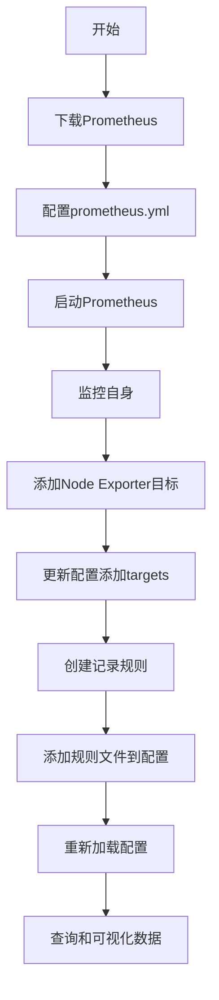

---

### 3.2 安装

Prometheus提供多种安装方式，适合不同的使用场景。

#### 3.2.1 使用预编译二进制文件

Prometheus为大多数官方组件提供预编译二进制文件。

**优点：**

- ✅ 快速部署
- ✅ 无需编译环境
- ✅ 适合生产环境

**下载地址：**

访问 [Prometheus下载页面](https://prometheus.io/download/) 查看所有可用版本。

#### 3.2.2 从源代码构建

对于需要从源代码构建Prometheus组件的情况，请参阅相应仓库中的Makefile目标。

**适用场景：**

- 需要自定义修改
- 特定平台支持
- 开发和调试

#### 3.2.3 使用Docker

所有Prometheus服务都可以作为Docker镜像在Quay.io或Docker Hub上获得。

**基本运行：**

```bash
# 最简单的运行方式
docker run -p 9090:9090 prom/prometheus
```

这将使用示例配置启动Prometheus并在端口9090上暴露它。

**重要提示：**

Prometheus镜像使用volume来存储实际指标。对于生产部署，强烈建议使用命名volume来简化Prometheus升级时的数据管理。

#### 3.2.4 Docker命令行参数

Docker镜像以许多默认命令行参数启动，这些参数可以在Dockerfile中找到。

⚠️ **注意**：如果要向 `docker run` 命令添加额外的命令行参数，需要重新添加默认参数，因为它们会被覆盖。

#### 3.2.5 Volumes & Bind-mount

有多种方式提供自己的配置：

**方式1：挂载配置文件**

```bash
docker run \
    -p 9090:9090 \
    -v /path/to/prometheus.yml:/etc/prometheus/prometheus.yml \
    prom/prometheus
```

**方式2：挂载配置目录**

```bash
docker run \
    -p 9090:9090 \
    -v /path/to/config:/etc/prometheus \
    prom/prometheus
```

#### 3.2.6 保存Prometheus数据

Prometheus数据存储在容器内的 `/prometheus` 目录中，因此每次重启容器时数据都会被清除。

**创建持久化存储：**

```bash
# 1. 创建持久化volume
docker volume create prometheus-data

# 2. 使用持久化存储运行Prometheus容器
docker run \
    -p 9090:9090 \
    -v /path/to/prometheus.yml:/etc/prometheus/prometheus.yml \
    -v prometheus-data:/prometheus \
    prom/prometheus
```

**Docker持久化架构：**

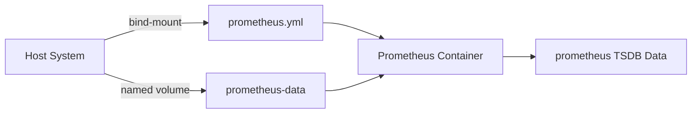

#### 3.2.7 自定义镜像

为了避免在主机上管理文件并挂载它，可以将配置烘焙到镜像中。

**创建自定义镜像：**

1. 创建新目录，包含Prometheus配置和Dockerfile：

```dockerfile
FROM prom/prometheus
ADD prometheus.yml /etc/prometheus/
```

2. 构建和运行：

```bash
# 构建镜像
docker build -t my-prometheus .

# 运行镜像
docker run -p 9090:9090 my-prometheus
```

**适用场景：**

- 配置相对静态
- 跨所有环境配置相同
- 简化部署流程

**更高级的选项：**

- 使用工具在启动时动态渲染配置
- 使用守护进程定期更新配置

**安装方式对比：**

| 安装方式         | 适用场景             | 优点                 | 缺点                   |
| ---------------- | -------------------- | -------------------- | ---------------------- |
| 预编译二进制     | 生产环境、快速部署   | 简单、稳定           | 需要手动管理进程       |
| 源代码构建       | 自定义需求、开发     | 灵活、可定制         | 需要编译环境           |
| Docker基本运行   | 快速测试、学习       | 快速启动             | 数据不持久化           |
| Docker持久化     | 生产环境、持久化需求 | 数据持久化、易于管理 | 需要管理volume         |
| 自定义Docker镜像 | 静态配置、批量部署   | 配置烘焙、部署简单   | 配置变更需重新构建镜像 |

---

### 3.3 配置

Prometheus通过命令行标志和配置文件进行配置。

#### 3.3.1 配置概述

**配置方式：**

- **命令行标志**：配置不可变的系统参数（如存储位置、保留在磁盘和内存中的数据量等）
- **配置文件**：定义抓取作业及其实例，以及要加载哪些规则文件

**查看所有命令行标志：**

```bash
./prometheus -h
```

#### 3.3.2 配置热重载

Prometheus可以在运行时重新加载其配置。触发方式：

1. **发送SIGHUP信号**（Linux）：

```bash
kill -s SIGHUP <PID>
```

2. **HTTP POST请求**（需启用 `--web.enable-lifecycle` 标志）：

```bash
curl -X POST http://localhost:9090/-/reload
```

⚠️ **注意**：如果新配置格式不正确，更改不会被应用。

#### 3.3.3 配置文件

**基本结构：**

```yaml
global:
  # 全局配置，所有其他上下文中有效
  scrape_interval: 15s       # 抓取间隔，默认1分钟
  evaluation_interval: 15s   # 规则评估间隔，默认1分钟
  scrape_timeout: 10s        # 抓取超时时间
  
  # 与外部系统通信时附加的标签
  external_labels:
    cluster: 'prod-cluster'
    region: 'us-east-1'

# 规则文件列表
rule_files:
  - 'alerts/*.yml'
  - 'rules/*.yml'

# 抓取配置文件列表
scrape_config_files:
  - 'scrape_configs/*.yml'

# 抓取配置列表
scrape_configs:
  - job_name: 'prometheus'
    static_configs:
      - targets: ['localhost:9090']

# 告警配置
alerting:
  alertmanagers:
    - static_configs:
        - targets: ['localhost:9093']

# 远程写入配置
remote_write:
  - url: 'http://remote-storage:9090/api/v1/write'

# 远程读取配置
remote_read:
  - url: 'http://remote-storage:9090/api/v1/read'
```

**重要配置参数：**

| 参数                    | 说明                                 | 默认值    |
| ----------------------- | ------------------------------------ | --------- |
| `scrape_interval`     | 抓取目标的频率                       | 1m        |
| `scrape_timeout`      | 抓取请求超时时间（不能大于抓取间隔） | 10s       |
| `evaluation_interval` | 评估规则的频率                       | 1m        |
| `external_labels`     | 与外部系统通信时附加的标签           | -         |
| `body_size_limit`     | 未压缩响应体大小限制                 | 0(无限制) |
| `sample_limit`        | 单次抓取接受的样本数量限制           | 0(无限制) |
| `label_limit`         | 单个样本的标签数量限制               | 0(无限制) |

#### 3.3.4 服务发现配置

Prometheus支持多种服务发现机制来动态发现监控目标，避免手动维护静态配置。

**服务发现的优势：**

- 🔄 自动发现新增/删除的实例
- 🎯 减少人工配置错误
- 📈 适应动态基础设施（容器、云环境）
- 🔧 支持自动标签管理

**常用服务发现机制：**

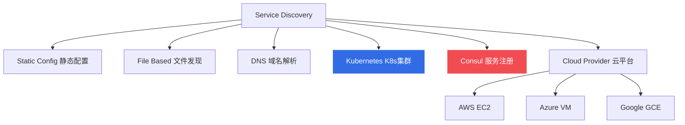

---

##### 1. Static Config（静态配置）

最基础的配置方式，手动指定目标列表。

**配置示例：**

```yaml
scrape_configs:
  - job_name: 'static-targets'
    static_configs:
      - targets: 
          - 'localhost:9090'
          - '192.168.1.10:9100'
          - '192.168.1.11:9100'
        labels:
          env: 'production'
          team: 'platform'
      
      - targets:
          - '192.168.2.10:9100'
        labels:
          env: 'staging'
```

**适用场景：**
- 小规模部署
- 固定的监控目标
- 测试和开发环境

---

##### 2. File-based Service Discovery（基于文件的服务发现）

通过监控文件变化来动态更新目标列表。

**配置示例：**

```yaml
scrape_configs:
  - job_name: 'file-sd'
    file_sd_configs:
      - files:
          - '/etc/prometheus/targets/*.json'
          - '/etc/prometheus/targets/*.yml'
        refresh_interval: 30s
```

**目标文件格式（JSON）：**

```json
[
  {
    "targets": ["host1:9100", "host2:9100"],
    "labels": {
      "env": "production",
      "job": "node-exporter"
    }
  },
  {
    "targets": ["host3:9100"],
    "labels": {
      "env": "staging",
      "job": "node-exporter"
    }
  }
]
```

**目标文件格式（YAML）：**

```yaml
- targets:
    - 'host1:9100'
    - 'host2:9100'
  labels:
    env: 'production'
    job: 'node-exporter'

- targets:
    - 'host3:9100'
  labels:
    env: 'staging'
    job: 'node-exporter'
```

**适用场景：**
- 与外部系统集成（通过脚本生成文件）
- 中等规模部署
- 需要灵活性但不依赖特定服务发现工具

---

##### 3. DNS Service Discovery（DNS服务发现）

基于DNS记录（A, AAAA, SRV）发现目标。

**配置示例：**

```yaml
scrape_configs:
  # SRV记录
  - job_name: 'dns-srv'
    dns_sd_configs:
      - names:
          - '_prometheus._tcp.example.com'
        type: SRV
        refresh_interval: 30s
  
  # A记录
  - job_name: 'dns-a'
    dns_sd_configs:
      - names:
          - 'node1.example.com'
          - 'node2.example.com'
        type: A
        port: 9100
        refresh_interval: 30s
```

**DNS SRV记录示例：**

```bash
# 创建SRV记录
_prometheus._tcp.example.com. 300 IN SRV 0 0 9090 node1.example.com.
_prometheus._tcp.example.com. 300 IN SRV 0 0 9090 node2.example.com.
```

**适用场景：**
- 使用DNS管理服务
- 简单的服务发现需求
- 与现有DNS基础设施集成

---

##### 4. Kubernetes Service Discovery（Kubernetes服务发现）

从Kubernetes API自动发现Pod、Service、Node等资源。

**角色类型：**

| 角色            | 说明                                   | 使用场景               |
| --------------- | -------------------------------------- | ---------------------- |
| `node`          | 发现集群节点                           | 监控节点指标           |
| `pod`           | 发现Pod及其容器                        | 监控应用指标           |
| `service`       | 发现Service                            | 黑盒监控               |
| `endpoints`     | 发现Service的Endpoint                  | 监控服务后端           |
| `endpointslice` | 发现EndpointSlice（推荐）              | 大规模集群             |
| `ingress`       | 发现Ingress                            | 监控入口               |

**Pod发现配置示例：**

```yaml
scrape_configs:
  - job_name: 'kubernetes-pods'
    kubernetes_sd_configs:
      - role: pod
        namespaces:
          names:
            - default
            - monitoring
    
    relabel_configs:
      # 只抓取有prometheus.io/scrape=true注解的Pod
      - source_labels: [__meta_kubernetes_pod_annotation_prometheus_io_scrape]
        action: keep
        regex: true
      
      # 使用prometheus.io/path注解指定metrics路径
      - source_labels: [__meta_kubernetes_pod_annotation_prometheus_io_path]
        action: replace
        target_label: __metrics_path__
        regex: (.+)
      
      # 使用prometheus.io/port注解指定端口
      - source_labels: [__address__, __meta_kubernetes_pod_annotation_prometheus_io_port]
        action: replace
        regex: ([^:]+)(?::\d+)?;(\d+)
        replacement: $1:$2
        target_label: __address__
      
      # 添加namespace标签
      - source_labels: [__meta_kubernetes_namespace]
        action: replace
        target_label: kubernetes_namespace
      
      # 添加pod名称标签
      - source_labels: [__meta_kubernetes_pod_name]
        action: replace
        target_label: kubernetes_pod_name
```

**Node发现配置示例：**

```yaml
scrape_configs:
  - job_name: 'kubernetes-nodes'
    kubernetes_sd_configs:
      - role: node
    
    scheme: https
    tls_config:
      ca_file: /var/run/secrets/kubernetes.io/serviceaccount/ca.crt
    bearer_token_file: /var/run/secrets/kubernetes.io/serviceaccount/token
    
    relabel_configs:
      # 标注node名称
      - source_labels: [__meta_kubernetes_node_name]
        action: replace
        target_label: node
```

**常用的Kubernetes元标签：**

| 元标签                                    | 说明              |
| ----------------------------------------- | ----------------- |
| `__meta_kubernetes_namespace`             | 命名空间          |
| `__meta_kubernetes_pod_name`              | Pod名称           |
| `__meta_kubernetes_pod_ip`                | Pod IP            |
| `__meta_kubernetes_pod_label_<labelname>` | Pod标签           |
| `__meta_kubernetes_node_name`             | Node名称          |
| `__meta_kubernetes_service_name`          | Service名称       |

**适用场景：**
- Kubernetes环境
- 容器化应用
- 微服务架构

---

##### 5. Consul Service Discovery（Consul服务发现）

从Consul服务注册中心发现服务。

**配置示例：**

```yaml
scrape_configs:
  - job_name: 'consul-services'
    consul_sd_configs:
      - server: 'consul.example.com:8500'
        datacenter: 'dc1'
        services: 
          - 'web'
          - 'api'
        tags:
          - 'production'
        refresh_interval: 30s
    
    relabel_configs:
      # 使用service名称作为job标签
      - source_labels: [__meta_consul_service]
        target_label: job
      
      # 添加datacenter标签
      - source_labels: [__meta_consul_dc]
        target_label: datacenter
      
      # 使用consul的tags
      - source_labels: [__meta_consul_tags]
        regex: ',.*production.*,'
        action: keep
```

**Consul元标签：**

| 元标签                          | 说明               |
| ------------------------------- | ------------------ |
| `__meta_consul_service`         | 服务名称           |
| `__meta_consul_dc`              | 数据中心           |
| `__meta_consul_tags`            | 服务标签列表       |
| `__meta_consul_address`         | 服务地址           |
| `__meta_consul_service_port`    | 服务端口           |
| `__meta_consul_node`            | 节点名称           |

**适用场景：**
- 使用Consul作为服务注册中心
- 微服务架构
- 多数据中心环境

---

##### 6. Cloud Provider Service Discovery（云平台服务发现）

**AWS EC2配置示例：**

```yaml
scrape_configs:
  - job_name: 'ec2-nodes'
    ec2_sd_configs:
      - region: us-east-1
        access_key: YOUR_ACCESS_KEY
        secret_key: YOUR_SECRET_KEY
        port: 9100
        filters:
          - name: tag:Environment
            values: [production]
          - name: instance-state-name
            values: [running]
        refresh_interval: 60s
    
    relabel_configs:
      # 使用实例ID作为instance标签
      - source_labels: [__meta_ec2_instance_id]
        target_label: instance_id
      
      # 使用私有IP
      - source_labels: [__meta_ec2_private_ip]
        target_label: instance
        regex: (.*)
        replacement: ${1}:9100
      
      # 添加标签
      - source_labels: [__meta_ec2_tag_Name]
        target_label: instance_name
```

**Azure VM配置示例：**

```yaml
scrape_configs:
  - job_name: 'azure-vms'
    azure_sd_configs:
      - subscription_id: YOUR_SUBSCRIPTION_ID
        tenant_id: YOUR_TENANT_ID
        client_id: YOUR_CLIENT_ID
        client_secret: YOUR_CLIENT_SECRET
        port: 9100
        refresh_interval: 300s
```

**GCE配置示例：**

```yaml
scrape_configs:
  - job_name: 'gce-instances'
    gce_sd_configs:
      - project: my-project
        zone: us-central1-a
        filter: labels.environment="production"
        port: 9100
        refresh_interval: 60s
```

**适用场景：**
- AWS/Azure/GCP云环境
- 使用云平台自动伸缩
- 需要与云平台标签集成

---

##### 7. Relabel配置（重标签）

Relabel是服务发现的关键功能，用于：
- 过滤目标
- 修改标签
- 提取元数据

**常用Relabel操作：**

```yaml
relabel_configs:
  # 1. 保留特定标签的目标
  - source_labels: [__meta_kubernetes_pod_annotation_prometheus_io_scrape]
    action: keep
    regex: true
  
  # 2. 删除不需要的目标
  - source_labels: [__meta_kubernetes_namespace]
    action: drop
    regex: kube-system
  
  # 3. 替换标签值
  - source_labels: [__meta_kubernetes_pod_name]
    action: replace
    target_label: pod
  
  # 4. 从多个标签构建新标签
  - source_labels: [__meta_kubernetes_namespace, __meta_kubernetes_pod_name]
    separator: '/'
    target_label: kubernetes_pod
  
  # 5. 修改抓取地址
  - source_labels: [__address__]
    regex: '([^:]+)(?::\d+)?'
    replacement: '${1}:9100'
    target_label: __address__
  
  # 6. 标签映射（labelmap）
  - action: labelmap
    regex: __meta_kubernetes_pod_label_(.+)
```

**Relabel动作类型：**

| 动作          | 说明                                     |
| ------------- | ---------------------------------------- |
| `replace`     | 替换目标标签值（默认）                   |
| `keep`        | 保留匹配的目标                           |
| `drop`        | 删除匹配的目标                           |
| `labelmap`    | 映射标签名称                             |
| `labeldrop`   | 删除匹配的标签                           |
| `labelkeep`   | 保留匹配的标签                           |
| `hashmod`     | 对标签值进行哈希取模                     |
| `lowercase`   | 转换为小写                               |
| `uppercase`   | 转换为大写                               |

**Relabel流程图：**

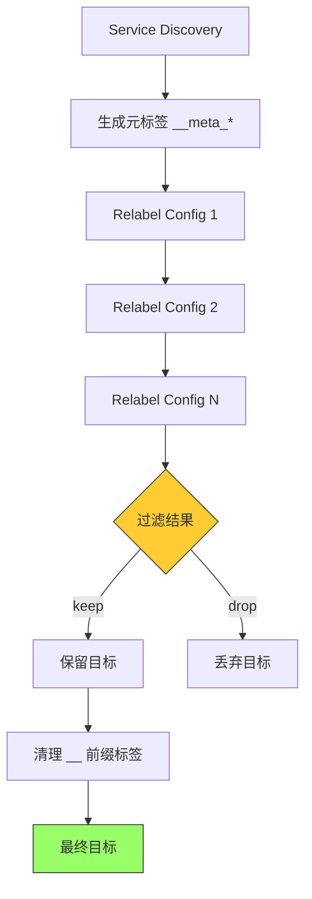

---

##### 8. 服务发现最佳实践

**1. 选择合适的服务发现机制：**

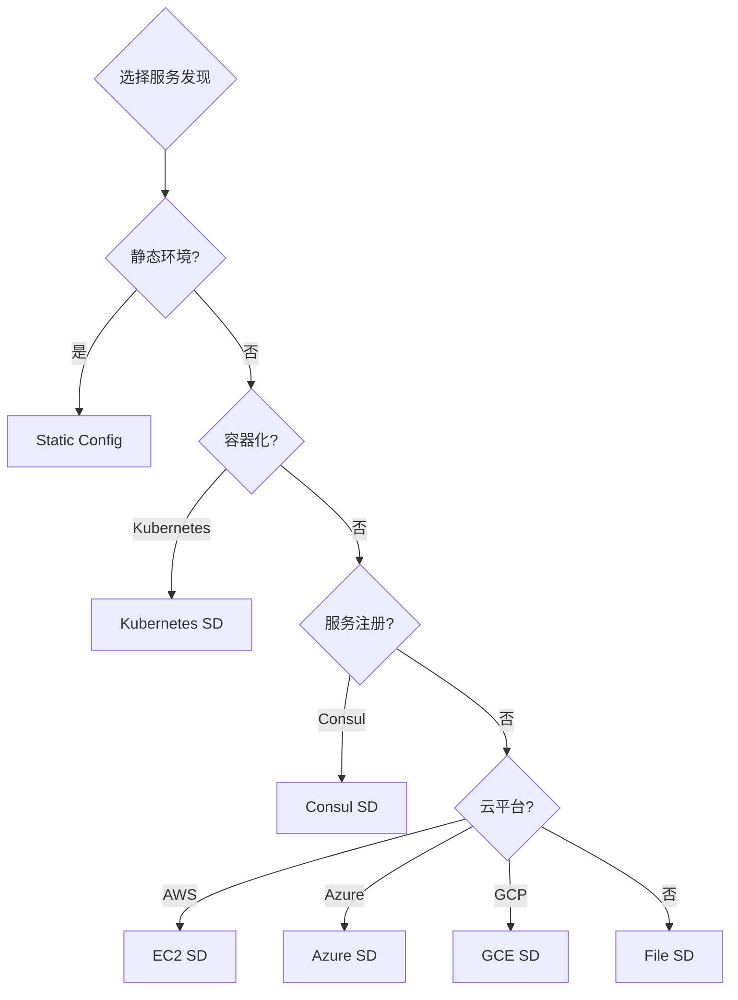

**2. 使用标签组织目标：**

```yaml
# 推荐：使用标签区分不同维度
static_configs:
  - targets: ['host1:9100', 'host2:9100']
    labels:
      env: production
      region: us-east
      team: platform
      service: api
```

**3. Relabel优化：**

- 尽早过滤不需要的目标（使用`keep`/`drop`）
- 减少不必要的标签（使用`labeldrop`）
- 保持标签命名一致性

**4. 性能考虑：**

- 合理设置`refresh_interval`（避免过于频繁）
- 使用标签选择器减少发现范围
- 大规模环境使用EndpointSlice而非Endpoints

**5. 监控服务发现：**

```promql
# 监控发现的目标数量
prometheus_sd_discovered_targets

# 监控刷新失败
prometheus_sd_refresh_failures_total

# 按服务发现机制分组
sum(prometheus_sd_discovered_targets) by (name)
```

---

### 3.4 规则配置

#### 3.4.1 记录规则 (Recording Rules)

**定义：**

记录规则允许你预先计算频繁需要或计算昂贵的表达式，并将其结果保存为新的时间序列集。

**使用场景：**

- ✅ 加速仪表板查询
- ✅ 预聚合复杂计算
- ✅ 降低查询延迟

**语法：**

```yaml
groups:
  - name: example_rules
    interval: 30s  # 规则评估间隔，覆盖global设置
    rules:
      - record: job:http_requests:rate5m
        expr: sum by(job) (rate(http_requests_total[5m]))
        labels:
          team: backend
```

**规则组配置：**

| 字段             | 说明                                   | 默认值                     |
| ---------------- | -------------------------------------- | -------------------------- |
| `name`         | 组名称，文件内必须唯一                 | 必需                       |
| `interval`     | 组内规则的评估间隔                     | global.evaluation_interval |
| `limit`        | 告警规则和记录规则可产生的系列数量限制 | 0(无限制)                  |
| `query_offset` | 规则评估时间戳向过去偏移的时长         | global.rule_query_offset   |

**记录规则示例：**

```yaml
groups:
  - name: node_rules
    interval: 30s
    rules:
      # CPU使用率
      - record: instance:node_cpu:avg_rate5m
        expr: 100 - (avg by (instance) (irate(node_cpu_seconds_total{mode="idle"}[5m])) * 100)
    
      # 内存使用百分比
      - record: instance:node_memory_utilization:ratio
        expr: |
          (1 - (node_memory_MemAvailable_bytes / node_memory_MemTotal_bytes))
          * 100
    
      # 磁盘使用率
      - record: instance:node_disk_utilization:ratio
        expr: |
          (node_filesystem_size_bytes - node_filesystem_avail_bytes)
          / node_filesystem_size_bytes
```

**语法检查：**

```bash
# 使用promtool检查规则文件语法
promtool check rules /path/to/rules.yml
```

#### 3.4.2 告警规则 (Alerting Rules)

**定义：**

告警规则允许基于PromQL表达式定义告警条件，并将触发的告警发送到外部服务。

**语法：**

```yaml
groups:
  - name: example_alerts
    rules:
      - alert: HighRequestLatency
        expr: job:request_latency_seconds:mean5m{job="myjob"} > 0.5
        for: 10m
        keep_firing_for: 5m
        labels:
          severity: page
          team: backend
        annotations:
          summary: "High request latency on {{ $labels.job }}"
          description: "{{ $labels.job }} has latency of {{ $value }}s"
```

**告警规则字段：**

| 字段                | 说明                                  | 默认值       |
| ------------------- | ------------------------------------- | ------------ |
| `alert`           | 告警名称，必须是有效的标签值          | 必需         |
| `expr`            | PromQL表达式，结果为告警              | 必需         |
| `for`             | 告警持续时间，超过此时间才触发        | 0s(立即触发) |
| `keep_firing_for` | 条件不满足后继续触发告警的时间        | 0s           |
| `labels`          | 附加到告警的标签                      | 可选         |
| `annotations`     | 告警的附加信息（描述、runbook链接等） | 可选         |

**告警模板：**

标签和注释值可以使用模板：

```yaml
groups:
  - name: instance_alerts
    rules:
      # 实例宕机告警
      - alert: InstanceDown
        expr: up == 0
        for: 5m
        labels:
          severity: critical
        annotations:
          summary: "实例 {{ $labels.instance }} 宕机"
          description: "作业 {{ $labels.job }} 的实例 {{ $labels.instance }} 已宕机超过5分钟"
    
      # API延迟告警
      - alert: APIHighRequestLatency
        expr: api_http_request_latencies_second{quantile="0.5"} > 1
        for: 10m
        labels:
          severity: warning
        annotations:
          summary: "{{ $labels.instance }} 请求延迟过高"
          description: "{{ $labels.instance }} 中位数延迟超过1秒 (当前值: {{ $value }}s)"
    
      # 磁盘空间不足告警
      - alert: DiskSpaceLow
        expr: |
          (node_filesystem_avail_bytes / node_filesystem_size_bytes) * 100 < 10
        for: 15m
        labels:
          severity: warning
        annotations:
          summary: "磁盘空间不足"
          description: "{{ $labels.instance }} 的 {{ $labels.mountpoint }} 可用空间低于10%"
```

**模板变量：**

- `$labels.<labelname>`：访问标签值
- `$value`：表达式的数值结果
- `$externalLabels`：外部标签

**告警状态：**

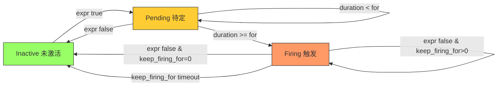

---

### 3.5 查询基础

#### 3.5.1 PromQL简介

Prometheus提供名为PromQL（Prometheus Query Language）的函数式查询语言，允许用户实时选择和聚合时间序列数据。

**查询类型：**

1. **即时查询（Instant Query）**：在单个时间点评估
2. **范围查询（Range Query）**：在起始和结束时间之间的等间隔步骤上评估

#### 3.5.2 数据类型

PromQL表达式可以评估为以下四种类型之一：

| 类型                     | 说明                                           | 使用场景       |
| ------------------------ | ---------------------------------------------- | -------------- |
| **Instant Vector** | 一组时间序列，每个包含单个样本，共享相同时间戳 | 最常用         |
| **Range Vector**   | 一组时间序列，每个包含一段时间内的数据点       | 与函数配合使用 |
| **Scalar**         | 简单的浮点数值                                 | 数学计算       |
| **String**         | 简单的字符串值                                 | 当前未使用     |

#### 3.5.3 时间序列选择器

**即时向量选择器：**

```promql
# 基本选择
http_requests_total

# 标签过滤
http_requests_total{job="prometheus", method="GET"}

# 标签匹配操作符
=   # 等于
!=  # 不等于
=~  # 正则匹配
!~  # 正则不匹配

# 示例
http_requests_total{environment=~"staging|testing|development", method!="GET"}
```

**范围向量选择器：**

```promql
# 选择过去5分钟的数据
http_requests_total{job="prometheus"}[5m]

# 时间单位
ms  # 毫秒
s   # 秒
m   # 分钟
h   # 小时
d   # 天
w   # 周
y   # 年
```

**offset修饰符：**

```promql
# 5分钟前的值
http_requests_total offset 5m

# 一周前的5分钟速率
rate(http_requests_total[5m] offset 1w)

# 负offset（向未来查询）
rate(http_requests_total[5m] offset -1w)
```

**@ 修饰符：**

```promql
# 在特定Unix时间戳的值
http_requests_total @ 1609746000

# 在特定时间的速率
rate(http_requests_total[5m] @ 1609746000)

# 使用start()和end()
http_requests_total @ start()
rate(http_requests_total[5m] @ end())
```

#### 3.5.4 常用操作符

**算术操作符：**

```promql
+  # 加
-  # 减
*  # 乘
/  # 除
%  # 取模
^  # 幂运算

# 示例
node_memory_MemTotal_bytes - node_memory_MemFree_bytes
```

**比较操作符：**

```promql
==  # 等于
!=  # 不等于
>   # 大于
<   # 小于
>=  # 大于等于
<=  # 小于等于

# 示例
http_requests_total > 100
```

**逻辑操作符：**

```promql
and  # 且
or   # 或
unless  # 排除

# 示例
up{job="api"} and on(instance) rate(http_requests_total[5m]) > 10
```

**聚合操作符：**

```promql
sum       # 求和
min       # 最小值
max       # 最大值
avg       # 平均值
stddev    # 标准差
stdvar    # 标准方差
count     # 计数
count_values  # 计算具有相同值的元素数量
bottomk   # 最小的k个元素
topk      # 最大的k个元素
quantile  # 分位数

# 示例
sum by(job) (http_requests_total)
avg without(instance) (http_requests_total)
topk(5, http_requests_total)
```

#### 3.5.5 常用函数

**速率计算：**

```promql
# rate: 计算每秒平均增长率（适用于Counter）
rate(http_requests_total[5m])

# irate: 计算每秒即时增长率（更敏感）
irate(http_requests_total[5m])

# increase: 计算时间范围内的增量
increase(http_requests_total[1h])
```

**数学函数：**

```promql
abs()      # 绝对值
ceil()     # 向上取整
floor()    # 向下取整
round()    # 四舍五入
sqrt()     # 平方根
ln()       # 自然对数
log2()     # 以2为底的对数
log10()    # 以10为底的对数
```

**时间函数：**

```promql
time()           # 当前Unix时间戳
minute()         # 分钟(0-59)
hour()           # 小时(0-23)
day_of_month()   # 月中的天(1-31)
day_of_week()    # 周中的天(0-6，0是周日)
month()          # 月份(1-12)
year()           # 年份

# 示例：计算运行时长
time() - process_start_time_seconds
```

**聚合函数：**

```promql
# avg_over_time: 时间范围内的平均值
avg_over_time(http_requests_total[5m])

# min_over_time: 时间范围内的最小值
min_over_time(cpu_usage[1h])

# max_over_time: 时间范围内的最大值
max_over_time(cpu_usage[1h])

# sum_over_time: 时间范围内的总和
sum_over_time(http_requests_total[1h])

# count_over_time: 时间范围内的样本数
count_over_time(up[5m])
```

**预测函数：**

```promql
# predict_linear: 线性预测
predict_linear(disk_free_bytes[1h], 4 * 3600)  # 预测4小时后的值

# deriv: 导数
deriv(cpu_usage[5m])

# delta: 变化量
delta(cpu_temp_celsius[2h])
```

**直方图函数：**

```promql
# histogram_quantile: 计算分位数
histogram_quantile(0.95, rate(http_request_duration_seconds_bucket[5m]))

# histogram_quantile: 计算中位数
histogram_quantile(0.5, sum by(le) (rate(http_request_duration_seconds_bucket[5m])))
```

**标签操作：**

```promql
# label_replace: 替换标签
label_replace(up, "new_label", "$1", "instance", "([^:]+):.*")

# label_join: 连接标签
label_join(up, "new_label", "-", "job", "instance")
```

#### 3.5.6 查询示例

**CPU使用率：**

```promql
# 总体CPU使用率
100 - (avg by (instance) (irate(node_cpu_seconds_total{mode="idle"}[5m])) * 100)

# 按模式分组的CPU使用率
sum by(mode) (rate(node_cpu_seconds_total[5m])) * 100
```

**内存使用：**

```promql
# 内存使用百分比
(1 - (node_memory_MemAvailable_bytes / node_memory_MemTotal_bytes)) * 100

# 可用内存（GB）
node_memory_MemAvailable_bytes / 1024 / 1024 / 1024
```

**磁盘I/O：**

```promql
# 磁盘读取速率（MB/s）
rate(node_disk_read_bytes_total[5m]) / 1024 / 1024

# 磁盘写入速率（MB/s）
rate(node_disk_written_bytes_total[5m]) / 1024 / 1024
```

**网络流量：**

```promql
# 网络接收速率（Mbps）
rate(node_network_receive_bytes_total[5m]) * 8 / 1000 / 1000

# 网络发送速率（Mbps）
rate(node_network_transmit_bytes_total[5m]) * 8 / 1000 / 1000
```

**HTTP请求：**

```promql
# 请求速率
sum(rate(http_requests_total[5m])) by (job)

# 错误率
sum(rate(http_requests_total{status=~"5.."}[5m])) / sum(rate(http_requests_total[5m]))

# P95延迟
histogram_quantile(0.95, sum(rate(http_request_duration_seconds_bucket[5m])) by (le))
```

---

### 3.6 存储

#### 3.6.1 本地存储

Prometheus包含本地磁盘时间序列数据库，也可选地与远程存储系统集成。

**磁盘布局：**

Prometheus的本地时间序列数据库以高效的自定义格式在本地存储上存储数据。

```
./data
├── 01BKGV7JBM69T2G1BGBGM6KB12/    # 2小时数据块
│   ├── chunks/                     # 时间序列样本
│   │   └── 000001
│   ├── tombstones                  # 删除记录
│   ├── index                       # 索引文件
│   └── meta.json                   # 元数据
├── chunks_head/                    # 当前块（内存）
│   └── 000001
└── wal/                            # 预写日志
    ├── 000000002
    └── checkpoint.00000001/
        └── 00000000
```

**数据块组织：**

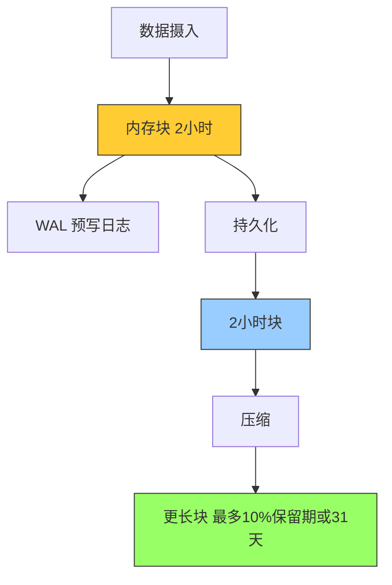

**关键特性：**

1. **数据块**：

   - 摄入的样本分组为2小时的块
   - 每个块包含chunks子目录、元数据文件和索引文件
   - 最终压缩成更长的块（最多保留期的10%或31天）
2. **预写日志（WAL）**：

   - 当前块保存在内存中，通过WAL防止崩溃
   - WAL文件存储在wal目录中，128MB分段
   - 保留最少3个WAL文件
   - 高流量服务器可能保留更多WAL文件以保持至少2小时原始数据
3. **删除机制**：

   - 通过API删除序列时，删除记录存储在单独的tombstone文件中
   - 不会立即从chunk段中删除数据

#### 3.6.2 存储配置

**重要标志：**

```bash
# 数据库存储路径
--storage.tsdb.path=data/

# 按时间保留数据
--storage.tsdb.retention.time=15d

# 按大小保留数据
--storage.tsdb.retention.size=50GB

# WAL压缩（默认启用）
--storage.tsdb.wal-compression
```

**容量规划：**

```
所需磁盘空间 = 保留时间(秒) × 每秒摄入样本数 × 每样本字节数
```

- Prometheus平均每个样本存储1-2字节
- 通过减少时间序列数量或增加抓取间隔来降低摄入速率
- 减少序列数量比增加抓取间隔更有效（因为序列内样本的压缩）

**示例计算：**

```
假设：
- 摄入速率：10万样本/秒
- 每样本：2字节
- 保留时间：15天

所需空间 = 15 × 24 × 3600 × 100000 × 2
         = 259,200,000,000 字节
         ≈ 259 GB
```

**保留策略：**

- 如果同时指定时间和大小保留策略，以先触发的为准
- 过期块清理在后台进行，最多可能需要2小时删除过期块
- 块必须完全过期后才会被删除
- 建议设置保留大小为分配磁盘空间的80-85%

#### 3.6.3 远程存储集成

Prometheus的本地存储限于单节点的可扩展性和持久性。Prometheus提供一组接口，允许与远程存储系统集成。

**集成方式：**

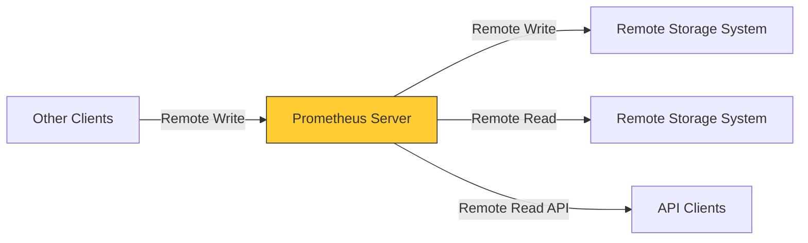

**四种集成方式：**

1. **Remote Write发送**：Prometheus将摄入的样本写入远程URL
2. **Remote Write接收**：Prometheus从其他客户端接收样本
3. **Remote Read查询**：Prometheus从远程URL读取样本数据
4. **Remote Read服务**：Prometheus向客户端返回样本数据

**配置示例：**

```yaml
# 远程写入
remote_write:
  - url: "http://remote-storage-1:9090/api/v1/write"
    queue_config:
      capacity: 10000
      max_shards: 200
      max_samples_per_send: 1000

# 远程读取
remote_read:
  - url: "http://remote-storage-1:9090/api/v1/read"
    read_recent: true
```

**协议：**

- 使用snappy压缩的protocol buffer编码通过HTTP
- 写入协议有1.0稳定版本和2.0实验版本
- 读取协议尚未被视为稳定API

**限制：**

- 远程读取路径上，Prometheus只从远程端获取原始序列数据
- 所有PromQL评估仍在Prometheus本身进行
- 这意味着远程读取查询有一定的可扩展性限制

#### 3.6.4 数据回填

**使用场景：**

从其他监控系统或时间序列数据库迁移指标数据到Prometheus。

**前提条件：**

- 源数据必须转换为OpenMetrics格式
- 不要回填最近3小时的数据（可能与当前head块重叠）
- 原生直方图和陈旧标记不被此过程支持

**使用promtool回填：**

```bash
# 从OpenMetrics格式创建块
promtool tsdb create-blocks-from openmetrics <input file> [<output directory>]

# 指定更长的块持续时间（适合长时间范围回填）
promtool tsdb create-blocks-from openmetrics \
    --max-block-duration=31d \
    input.txt \
    data/
```

**回填记录规则：**

```bash
# 为记录规则创建历史数据
promtool tsdb create-blocks-from rules \
    --start 1617079873 \
    --end 1617097873 \
    --url http://prometheus:9090 \
    rules.yaml
```

---

## 4. 告警系统

### 4.1 告警概述

Prometheus的告警分为两部分：

1. **Prometheus服务器**：根据告警规则发送告警到Alertmanager
2. **Alertmanager**：管理告警，包括静默、抑制、聚合和发送通知

**告警流程：**

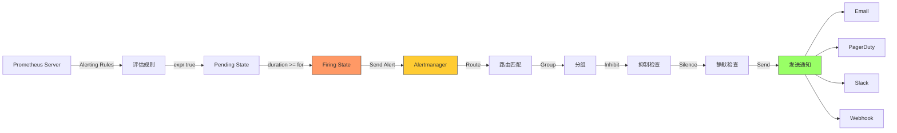

**设置告警的主要步骤：**

1. 设置和配置Alertmanager
2. 配置Prometheus与Alertmanager通信
3. 在Prometheus中创建告警规则

---

## 5. 最佳实践

### 5.1 指标和标签命名

#### 5.1.1 指标命名规范

**指标名称必须遵循：**

```promql
[a-zA-Z_:][a-zA-Z0-9_:]*
```

**命名建议：**

| 规则                   | 说明                                     | 示例                               |
| ---------------------- | ---------------------------------------- | ---------------------------------- |
| **应用前缀**     | 使用单词应用前缀（命名空间）             | `prometheus_notifications_total` |
| **单一单位**     | 不要混合单位                             | 使用秒，不要混用秒和毫秒           |
| **使用基本单位** | 使用秒、字节、米，而非毫秒、兆字节、公里 | `process_cpu_seconds_total`      |
| **后缀描述单位** | 复数形式，计数使用 `_total` 后缀       | `http_request_duration_seconds`  |
| **有意义的聚合** | `sum()` 或 `avg()` 应该有意义        | 请求持续时间、数据传输字节数       |

**命名示例：**

```promql
# 推荐
http_requests_total
node_memory_usage_bytes
http_request_duration_seconds
process_cpu_seconds_total
foobar_build_info
data_pipeline_last_record_processed_timestamp_seconds

# 不推荐
http_responses_500_total  # 应使用标签区分状态码
node_memory_usage_mb      # 应使用基本单位bytes
request_duration_ms       # 应使用基本单位seconds
```

**为什么在指标名称中包含单位和类型？**

1. **可靠性和UX**：在纯YAML配置中查看PromQL表达式时，能立即理解指标类型和单位
2. **避免冲突**：缺少单位信息会导致某些序列冲突（例如 `process_cpu` 可能代表秒或毫秒）

#### 5.1.2 标签使用

**标签用于区分被测量事物的特征：**

```promql
# 使用标签区分不同维度
api_http_requests_total{operation="create"}
api_http_requests_total{operation="update"}
api_http_requests_total{operation="delete"}

# 区分请求阶段
api_request_duration_seconds{stage="extract"}
api_request_duration_seconds{stage="transform"}
api_request_duration_seconds{stage="load"}
```

**⚠️ 重要注意事项：**

- 不要将标签名放入指标名称中（引入冗余）
- 每个唯一的标签键值对组合代表新的时间序列
- 不要使用高基数标签（如用户ID、电子邮件地址）

**基本单位表：**

| 类别   | 基本单位 | 备注                                                     |
| ------ | -------- | -------------------------------------------------------- |
| 时间   | seconds  | -                                                        |
| 温度   | celsius  | 实用性考虑，特殊情况可用kelvin                           |
| 长度   | meters   | -                                                        |
| 字节   | bytes    | -                                                        |
| 比特   | bytes    | 始终使用bytes，即使bits更常见                            |
| 百分比 | ratio    | 值为0-1，通常使用 `A_per_B` 模式                       |
| 电压   | volts    | -                                                        |
| 电流   | amperes  | -                                                        |
| 能量   | joules   | -                                                        |
| 功率   | watts    | 优先导出joules计数器，然后 `rate(joules[5m])` 得到瓦特 |
| 质量   | grams    | 避免与kilo前缀冲突                                       |

---

### 5.2 监控埋点

#### 5.2.1 埋点原则

**核心原则：监控一切**

- 每个库、子系统和服务至少应该有几个指标
- 埋点应该是代码的组成部分
- 在使用指标的同一文件中实例化指标类

#### 5.2.2 三类服务

**1. 在线服务系统（Online-serving）**

人或其他系统期望立即响应。例如：数据库查询、HTTP请求。

**关键指标：**

- 执行的查询数量
- 错误数
- 延迟
- 进行中的请求数

```promql
# 请求总数
http_requests_total

# 请求延迟
http_request_duration_seconds

# 进行中的请求
http_requests_in_flight

# 错误率
rate(http_requests_total{status=~"5.."}[5m]) / rate(http_requests_total[5m])
```

**2. 离线处理（Offline processing）**

没有人主动等待响应，批量处理工作很常见。

**关键指标：**

- 每个阶段传入的项目数
- 进行中的项目数
- 最后处理时间
- 发送出去的项目数

```promql
# 队列深度
queue_depth

# 最后处理时间
last_processed_timestamp_seconds

# 处理速率
rate(items_processed_total[5m])
```

**3. 批处理作业（Batch jobs）**

不连续运行，很难抓取。

**关键指标：**

- 最后成功时间
- 每个主要阶段花费的时间
- 总运行时间
- 最后完成时间（成功或失败）
- 处理的记录总数

这些都是gauge，应该推送到PushGateway。

```promql
# 最后成功时间
job_last_success_timestamp_seconds

# 运行时长
job_runtime_seconds

# 处理记录数
job_records_processed_total
```

#### 5.2.3 子系统埋点

**库：**

库应该提供无需额外配置的埋点。

- 访问进程外资源（网络、磁盘、IPC）：跟踪总查询数、错误和延迟
- 区分不同资源的使用（例如数据库连接池区分数据库）

**日志：**

- 每行日志代码应该有一个相应的计数器递增
- 导出应用程序整体记录的info/error/warning行总数

**失败：**

- 每次失败都应该递增计数器
- 应该有另一个指标表示总尝试次数，以便计算失败率

**线程池：**

- 排队的请求数
- 使用中的线程数
- 总线程数
- 处理的任务数和耗时
- 队列等待时间

**缓存：**

- 总查询数
- 命中数
- 总延迟
- 缓存后端系统的查询数、错误和延迟

#### 5.2.4 注意事项

**使用标签：**

```promql
# 好的做法
http_responses_total{code="500"}
http_responses_total{code="403"}

# 不好的做法
http_responses_500_total
http_responses_403_total
```

**不要过度使用标签：**

- 每个标签集是一个额外的时间序列（RAM、CPU、磁盘、网络开销）
- 尝试将指标的基数保持在10以下
- 超过100基数的指标或可能增长到该大小的指标，调查替代方案

**Counter vs Gauge：**

- 如果值可以下降，使用Gauge
- Counter只能上升（和重置）
- 不要对Gauge使用 `rate()`

**时间戳，而非时间差：**

```promql
# 好的做法
my_timestamp_metric  # Unix时间戳

# 查询时计算时间差
time() - my_timestamp_metric

# 不好的做法
my_time_since_metric  # 需要更新逻辑，可能卡住
```

**避免缺失指标：**

- 在事情发生之前不存在的时间序列难以处理
- 提前为你知道可能存在的任何时间序列导出默认值（如0）
- 大多数Prometheus客户端库（Go、Java、Python）会自动为无标签指标导出0

---

## 6. 总结

本笔记涵盖了Prometheus的核心概念和实践：

### 6.1 核心要点

**数据模型：**

- 时间序列由指标名称和标签唯一标识
- 四种指标类型：Counter、Gauge、Histogram、Summary
- Job和Instance是Prometheus的基本组织单位

**服务器配置：**

- 支持热重载配置
- 记录规则用于预聚合复杂查询
- 告警规则定义告警条件
- 本地TSDB存储，支持远程存储集成

**查询语言：**

- PromQL提供强大的时间序列查询和聚合
- 丰富的函数支持（速率、聚合、预测等）
- 支持即时查询和范围查询

**最佳实践：**

- 规范的命名约定提高可维护性
- 合理的埋点策略确保监控覆盖
- 避免高基数标签
- 监控一切，但要智能地监控

### 6.2 学习路径建议

```mermaid
graph TD
    Start[开始学习] --> Basics[1. 基础概念]
    Basics --> Install[2. 安装配置]
    Install --> Query[3. 查询语言]
    Query --> Rules[4. 规则配置]
    Rules --> Alerting[5. 告警系统]
    Alerting --> Practice[6. 最佳实践]
    Practice --> Advanced[7. 高级主题]
  
    Advanced --> Federation[联邦]
    Advanced --> RemoteStorage[远程存储]
    Advanced --> HA[高可用]
    Advanced --> Scale[规模化]
```

---

*本笔记基于Prometheus官方文档整理，持续更新中...*
