# Ops Roadmap 思维导图预览

这张图根据 `topics/` 的实际内容组织，采用从左向右展开的树形布局，以“总览 → 分类 → 专题”为主。架构设计按五个分册展示，Agent 扩展工程进一步展开 Skills 与 MCP，其余专题暂不展开 Markdown 分册。

```mermaid
flowchart LR
  root((Ops Roadmap))

  root --> systems[系统基础]
  systems --> network[计算机网络基础]
  systems --> container[容器核心技术]
  systems --> linux[Linux 底层原理]
  systems --> linuxPerformance[Linux 性能优化]
  systems --> ebpf[eBPF 运维与故障排查]

  root --> architecture[架构设计]
  architecture --> architectureFoundations[基础、复杂度与质量]
  architecture --> architecturePerformance[性能、容量与流量治理]
  architecture --> architectureDistributed[数据与分布式系统]
  architecture --> architectureReliability[高可用与灾备]
  architecture --> architectureEvolution[微服务治理、演进与案例]

  root --> cloudNative[云原生]
  cloudNative --> docker[Docker]
  cloudNative --> helm[Helm]
  cloudNative --> kubernetes[Kubernetes]
  cloudNative --> kubernetesNetworking[Kubernetes 容器网络]
  cloudNative --> consul[Consul]
  cloudNative --> etcd[etcd]
  cloudNative --> terraform[Terraform]

  root --> observability[可观测性]
  observability --> elk[ELK 与 OpenSearch]
  observability --> loki[Loki]
  observability --> otel[OpenTelemetry]
  observability --> prometheus[Prometheus]
  observability --> kubePrometheus[Kube-Prometheus]
  observability --> victoriaMetrics[VictoriaMetrics]
  observability --> victoriaMetricsFlags[VictoriaMetrics Flags]
  observability --> victoriaMetricsPromql[VictoriaMetrics PromQL]

  root --> dataSystems[数据系统]
  dataSystems --> mysql[MySQL]
  dataSystems --> kafka[Kafka]
  dataSystems --> rabbitmq[RabbitMQ]

  root --> programming[编程与自动化]
  programming --> pythonForOperations[Python 运维自动化与工程实践]
  programming --> goForOperations[Go 运维开发与云原生工程]

  root --> delivery[持续交付]
  delivery --> ansible[Ansible]
  delivery --> jenkins[Jenkins]
  delivery --> gitops[GitOps]
  delivery --> argoCd[Argo CD]
  delivery --> deliveryGovernance[交付治理与容量保障]
  delivery --> aiNativeSdlc[AI 原生 SDLC]

  root --> webInfra[Web 基础设施]
  webInfra --> nginx[Nginx]
  webInfra --> traefik[Traefik]

  root --> aiInfra[AI 基础设施]
  aiInfra --> gpu[GPU AI Infrastructure]

  root --> aiops[AIOps]
  aiops --> llmAiops[LLM-AIOps 中文学习路线]

  root --> aiAgent[AI Agent]
  aiAgent --> deepAgent[DeepAgent]
  aiAgent --> claudeAgentSdk[Claude Agent SDK]
  aiAgent --> agentExtensions[Agent 扩展工程]
  agentExtensions --> agentSkills[Agent Skills]
  agentExtensions --> mcp[MCP]

  classDef rootNode fill:#1d4ed8,stroke:#1e3a8a,color:#ffffff,stroke-width:3px
  classDef categoryNode fill:#dbeafe,stroke:#3b82f6,color:#172554,stroke-width:2px
  class root rootNode
  class systems,architecture,cloudNative,observability,dataSystems,programming,delivery,webInfra,aiInfra,aiops,aiAgent categoryNode
```

> 说明：思维导图用于展示知识版图；可点击入口见 [README 内容导航](./README.md#内容导航)，交互式学习路线图见 [首页](./index.html)。
