# Agent Skills 工程化学习笔记：面向运维与 SRE

## 第 1 章 · 理解 Skill 如何承载专业知识与工作流程

### 1.1 Skill 为什么适合沉淀运维经验

运维工程师常遇到这样的情况：Agent 会写命令、读日志，也能解释常见故障，但第一次接触团队的环境时，仍需要你解释服务命名、检查顺序、结果口径和操作边界。Agent Skills 让这些重复解释的内容成为可维护的技能包。本章先建立对技能包和加载过程的认识，后续再学习怎样编写和评估它。

本笔记按所提供的八份材料顺序重组。第 2 章沿用掷骰子入门案例，第 3～6 章增加“分析本地模拟巡检结果并生成报告”的教学改编案例。案例中的规则与数据用于练习，不代表通用生产标准；图示均根据文字机制重建。

#### 从通用 Agent 能力到具体团队的操作知识

模型知道 HTTP 200 的常见含义，却未必知道某团队的 `/health` 只检查进程存活。模型可以分析磁盘容量，却不知道团队规定的告警阈值、数据过期标准和报告格式。这些差异来自具体环境，不是把模型换成“更聪明”的版本就必然能消除。

Skill 将完成某类任务所需的专业知识与操作方法交给 Agent。它的价值应体现在实际行为：少走无关步骤，采用正确的数据口径，在证据不足时明确保留未知，并交付可复核的结果。

#### 将领域知识、重复步骤和输出约定封装为技能包

可以先将现有经验分成三类，再决定如何写入技能：

| 经验类型 | 运维场景中的内容 | 技能中应表达的形式 |
| --- | --- | --- |
| 环境知识 | 同名服务分布于不同集群 | 指明识别服务时需要的维度 |
| 工作步骤 | 先检查采集时间，再分析指标 | 有依赖顺序的执行指令 |
| 输出约定 | 结论必须关联原始数据 | 报告模板和证据要求 |

技能的载体是目录及文件，因而可以用版本控制记录修改。审阅时应关心“这条规则为什么改变、影响哪些任务”，而不只是文档排版。团队阈值发生变化时，相应规则、示例和测试也需要一起更新。

#### 用巡检与故障分析场景理解可复用和可审计的含义

可复用意味着同一种方法适用于不同输入，例如对不同日期的巡检快照执行相同的校验、统计和报告流程。它不意味着每次得到相同文字，更不意味着将某次事故的根因复制到下一次事故。

可审计需要留下输入、技能版本、执行记录和输出之间的联系。只保存技能文件，不能证明某次任务使用过它；只保存一份语言流畅的报告，也不能证明结论来自实际数据。学习时可以选择一条自己的 Runbook，找出其中必须补充给 Agent 的环境知识，再说明如何观察它是否被正确使用。

### 1.2 一个技能包如何组织指令与配套资源

#### SKILL.md 如何提供元信息和任务指令

技能包的入口是 `SKILL.md`。文件开头的元信息帮助 Agent 判断“什么时候需要这个技能”，后面的正文说明“使用后应该怎样完成任务”。两部分承担不同职责：把执行细节全部塞进描述会增加目录负担；把适用条件只写在正文里，又可能让尚未加载正文的 Agent 看不到它。

一个入门技能可以只有这一个文件。先把任务边界、必要步骤和输出讲清，再根据实际需要增加资源。目录数量多、文件层级深，都不能直接说明技能质量高。

#### 脚本、参考资料和模板分别承载什么内容

下面是教学技能的结构示意，文件将在对应章节解释；这棵树本身不会安装或创建技能。

```text
ops-inspection-report/
├── SKILL.md
├── scripts/
│   └── summarize.py
├── references/
│   └── inspection-rules.md
└── assets/
    └── report-template.md
```

`scripts/` 适合放确定性的输入校验、统计或格式转换。`references/` 适合放完整规则和接口说明。`assets/` 适合放可以直接用于输出的模板。一个文件应放在哪里，取决于它在工作流中的用途，而非后缀：Markdown 既可以是参考文档，也可以是报告模板。

#### 从单文件技能逐步扩展到可维护的资源目录

拆文件的依据是复用频率和加载条件。例如每次任务都必须执行的五个步骤应留在入口正文；只有输入格式异常时才需要查阅的详细错误说明可以独立存放。引用处应明确何时读，避免出现“更多资料请自行寻找”这样的模糊交接。

检查结构是否有效，可以观察一次执行：Agent 是否找到入口，是否在需要规则时读到正确文件，是否反复重新编写已经存在的脚本。如果资源存在但始终没有被使用，先检查入口中的说明和路径，而不是继续增加文件。

### 1.3 Agent 如何发现、激活并执行 Skill

#### 发现阶段为什么只加载名称与描述

渐进式披露，也可理解为按需加载，是 Skills 的关键机制。会话开始时，宿主通常先提供可用技能的名称和描述。模型由此知道有哪些能力可用，不必预先读入每个技能的全部正文。

这减少了未使用技能占据的上下文。目录仍然有成本：技能越多、描述越长，模型需要理解和选择的信息就越多。渐进加载解决的是无差别装入全文的问题，并不意味着安装再多技能都没有代价。

#### 激活阶段如何将完整指令加入上下文

当任务适合某个技能时，Agent 通过读取文件或调用宿主提供的激活工具获得指令。模型随后可以依据指令决定下一步。这里的“激活”指内容进入工作上下文，不等同于某个后台服务已经启动。

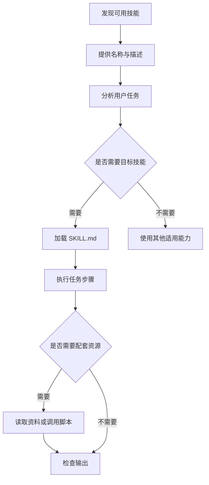

图中描述了逻辑阶段，不要求所有客户端具有相同的内部接口。用户显式选择技能时，也可能由宿主直接注入正文，不再经过模型自行发起的文件读取。

#### 执行阶段如何按需使用脚本与参考资料

执行时，技能指令、工具能力和当前环境共同决定结果。指令要求读取 JSON，Agent 还需要可用的文件读取能力；指令要求运行 Python，环境还需要解释器和必要权限。

排查时可以沿链路逐层寻找证据：目录中有目标技能，说明发现成功；上下文或激活记录包含其正文，说明加载成功；工具日志及产物符合要求，才能进一步说明执行是否正确。不要因为第一层正常，就跳过后两层检查。

### 1.4 如何理解开放格式与跨客户端复用

#### 开放格式如何支持共享和版本管理

开放格式约定技能如何包装，让不同工具能够识别相同的入口和资源结构。对团队而言，技能可以像 Runbook 一样进入代码仓库，经过审阅、更新和版本回退。它承载的是可共享的程序性知识，而不是只能在一次对话中使用的临时上下文。

版本记录最好包含改变的理由。例如“新增输入时间检查，因为旧版将过期快照当作当前状态”，比“优化提示词”更便于后续维护者理解行为变化。若修改会影响输出字段，应同步修改消费这些字段的脚本和评估案例。

#### 可携带的技能内容与实际执行环境有什么关系

跨客户端复用需要逐项确认适配条件：

| 层次 | 可复用的内容 | 迁移时需要确认的事项 |
| --- | --- | --- |
| 技能包 | 元信息、步骤、配套文件 | 客户端能否发现并解析 |
| 工具接口 | 所需操作的目的与输入 | 实际工具名和参数是否匹配 |
| 执行环境 | 依赖与数据前提 | 解释器、网络、权限和路径是否可用 |
| 观察机制 | 应取得哪些成功证据 | 从哪种日志或产物取得证据 |

因此，迁移一个技能时，应先做最小任务验证。若它依赖特定工具调用语法，优先将这种要求集中说明，避免与通用工作流程混在一起，导致迁移时很难识别需要修改的部分。

#### 本笔记如何从技能使用者逐步进入编写者和集成者视角

第 2 章让你能够创建、加载并观察一个技能；第 3 章解决知识如何写成指令；第 4、5 章分别评估选择是否合适、执行是否有收益；第 6 章处理脚本接口；第 7 章讨论宿主如何接入 Skills。

只编写技能时，不必先实现发现器和激活工具，但需要了解这些环节会如何影响自己的技能。可以用三个问题检查入门理解：技能未被发现时应该查哪里？技能被加载后还可能因为什么失败？怎样证明结果改善确实与技能有关？后续章节将分别给出操作方法。

## 第 2 章 · 掌握技能包规范并完成第一个 Skill

### 2.1 如何建立符合约定的技能目录

本章把概念落到文件和观察步骤上。先理解包内格式，再使用简单案例检查发现、激活与执行。包内结构与宿主扫描路径是两个问题：前者由技能格式规定，后者需要结合目标客户端确认。

#### 目录名与 SKILL.md 文件名需要满足哪些要求

最小技能是一个目录，其中包含名称精确为 `SKILL.md` 的入口文件。不要写成 `skill.md` 后仅凭当前文件系统能打开，就认为可以在所有环境使用。目录名需要与元信息中的 `name` 对应。

```text
roll-dice/
└── SKILL.md
```

目录名描述技能的稳定职责，例如 `roll-dice`。将日期或临时任务编号塞进名称，会使用户和模型难以辨认技能实际用途。版本信息更适合通过 Git 或额外元信息记录。

#### 如何区分必需结构与可选资源约定

必需的是入口和必要元信息，`scripts/`、`references/`、`assets/` 属于可选的资源组织约定。纯分析或固定格式输出任务，可以没有脚本；需要复杂确定性转换的任务，再增加脚本。

验收目录时可按“入口存在—名称一致—资源引用存在”的顺序检查。空目录既不提供知识，也不会自动形成能力。如果初版还没有配套资源，可以直接省略这些目录，减少维护者的误解。

#### 相对引用如何以技能根目录为基准组织

指令中可以引用 `references/rules.md`，它表示技能目录下的参考文件。命令实际执行时，Shell 的相对路径却由工作目录决定。因此宿主或 Agent 必须把技能相对路径正确转换为执行时可用的路径。

例如用户在业务仓库根目录提出任务，而技能安装在另一个目录，此时直接运行 `python3 scripts/summarize.py` 可能找到错误文件。可靠做法是先确定技能根目录，再使用绝对脚本路径；用户输入路径也应在改变工作目录之前解析。第 6 章提供完整示例。

### 2.2 如何编写名称与触发描述

#### YAML frontmatter 与 Markdown 正文如何分隔

`SKILL.md` 以两条 `---` 包围的 YAML 元信息开头，结束分隔线之后是 Markdown 指令。下面是教学示例：

```yaml
---
name: ops-inspection-report
description: >-
  分析已有的本地巡检 JSON 快照并生成带证据的中文报告。
  当用户需要整理巡检结果、识别异常和缺失检查项时使用。
---
```

描述采用块标量，可以避免普通未加引号字符串中的 `: ` 被 YAML 误解为新的结构。缩进必须一致；不要把 Tab 与空格混用。元信息正确只说明文件可解析，正文是否有效仍需执行评估。

#### name 的长度、字符和目录一致性约束

提供的规范要求名称长度为 1～64 个字符，不能以连字符开头或结尾，不能有连续连字符，并与父目录一致。为了跨工具使用时减少差异，本笔记统一采用 ASCII 小写字母、数字和单个连字符命名；不依赖非 ASCII 字符的解析差异。相关字段已对照[格式规范](https://agentskills.io/specification)核对。

| 名称 | 判断 | 原因 |
| --- | --- | --- |
| `ops-inspection-report` | 合适 | 职责明确且符合上述命名方式 |
| `Ops-Report` | 不合适 | 含大写字母 |
| `ops--report` | 不合适 | 含连续连字符 |
| `ops-report-` | 不合适 | 以连字符结尾 |

修改目录名时要同步修改 `name` 和引用它的配置、测试请求。否则可能出现文件存在但加载时名称不一致，或者运行记录仍指向旧名称的问题。

#### description 如何同时表达能力和适用场景

“帮助处理运维工作”只表达领域，无法让模型区分巡检汇总、部署和故障修复。更好的描述指出输入是什么、用户要得到什么、哪些场景适用。对巡检报告技能，“分析已有快照”就比“解决系统故障”更接近实际能力。

规范中的描述长度上限为 1024 个字符，不是 1024 个 Token。即使没有超过上限，也不必堆满所有相关术语。先写清主要职责，再用正反例测试检查边界；第 4 章将介绍怎样有依据地扩展描述，而不是凭感觉增加关键词。

### 2.3 如何声明环境要求与可选元信息

#### license 与 metadata 如何记录许可和附加信息

`license` 可以记录许可名称或指向配套许可文件。它声明的是该技能包采用的许可信息，不会自动解决引用资源的许可兼容问题。`metadata` 用于附加信息，按所提供规范，其键和值均为字符串；版本号加引号可以避免被 YAML 当成数值。

```yaml
---
name: ops-inspection-report
description: 分析已有巡检 JSON 快照并输出有证据的中文报告。
compatibility: Requires Python 3.10+ and read access to local input files.
metadata:
  author: sre-learning
  version: "0.1"
  input-schema: "inspection-v1"
---
```

示例未指定许可，因为教程不应替读者决定其真实技能的许可。`metadata.version` 也不会自动构成包管理或升级机制；是否读取它，由宿主及团队流程决定。

#### compatibility 如何说明环境与依赖前提

该字段用于描述特定环境需求，例如需要 Python、某个命令行工具、网络连接或某类客户端。提供的规范要求非空时最多 500 个字符。仅依赖文本推理的技能通常不需要为了完整而添加空泛的兼容性声明。

环境说明应帮助执行者提前判断能否运行。写“需要 Python 3.10+”比“需要正确环境”可操作；如果任务需要远程 API，还应在正文说明配置来源及失败处理。声明本身不安装依赖、不授予文件权限，也不保证宿主会自动检查每项条件。

#### allowed-tools 的实验性质及客户端支持边界

材料将 `allowed-tools` 标为实验性字段，其具体支持依赖客户端。[规范中的说明](https://agentskills.io/specification#allowed-tools-field)确认了这一边界。下面仅展示源材料风格的字段形式：

```yaml
allowed-tools: Bash(git:*) Bash(jq:*) Read
```

这里的工具名称和模式语法不能移植后直接假定生效。实际能否运行命令，仍受宿主权限系统约束。排查权限问题时，应检查宿主实际采用的策略和拒绝信息；修改 Skill 的文字描述不能代替权限授权。

### 2.4 如何安排正文、脚本、参考资料与模板

#### 正文如何组织步骤、输入输出示例和边界情况

正文没有统一的强制章节模板，但需要形成可执行的方法。一种适合运维任务的组织方式是：明确输入，读取必要规则，按顺序执行，检查产物，再交付结果。遇到缺少输入、无权限或格式异常时，也应说明下一步。

例如“分析异常并给建议”没有约定异常依据；“按规则表逐项判断，记录原始值和阈值，对缺失项标记未知”则明确了行动和成功条件。正文的详细程度要服务于实际判断，不应重复解释 Agent 已熟悉的大量基础知识。

#### scripts、references 与 assets 如何配合使用

| 内容 | 放置位置 | 加载或调用条件 |
| --- | --- | --- |
| 数据校验和统计 | `scripts/summarize.py` | 输入路径确认后调用 |
| 指标单位和判定规则 | `references/inspection-rules.md` | 开始判断之前读取 |
| 报告结构 | `assets/report-template.md` | 开始组织报告之前读取 |
| 每次都要遵守的顺序 | `SKILL.md` 正文 | 技能激活时加载 |

把规则放进参考资料之后，还需要入口明确引用它。脚本若已实现同一规则，应通过规则版本和测试维持一致。否则 Agent 依据文档判为正常，脚本却判为异常，输出将无法解释。

#### 如何按需加载内容并避免过深的引用链

材料建议主文件控制在 500 行以内，正文少于约 5000 Token，将详细资料按需拆开。这是上下文组织建议，不是所有宿主统一实施的硬限制，字符数量也不能直接换算为 Token 数量。

“输入解析失败时读取 `references/input-errors.md`”给出了明确的加载条件。“请参阅参考资料，参考资料再去查另一份总目录”会增加查找成本，并可能让关键步骤丢在链路中。对于每次都必须知道的非显然规则，应放在入口或确保每次明确加载，而不是寄希望于模型自行发现。

### 2.5 如何创建并观察第一个可运行 Skill

#### 准备客户端并创建 roll-dice 技能文件

源教程以 VS Code 与 GitHub Copilot 的 Agent 模式为环境，路径使用 `.agents/skills/roll-dice/SKILL.md`。已对照[入门教程](https://agentskills.io/skill-creation/quickstart)核对该安排。先在练习项目中创建目录，再用编辑器保存下面的完整文件；其他客户端需要确认各自的发现路径。

````markdown
---
name: roll-dice
description: 当用户要求掷骰子或生成 d6、d20 的随机点数时使用，通过终端随机数命令返回结果。
---

根据用户请求确定骰子面数，未指定时先询问。
本练习支持 2 到 100 面的整数，不接受表达式作为面数。
使用可用的终端工具实际运行随机数命令，不自行编造结果。

在 Bash 中掷 d20：

```bash
echo $((RANDOM % 20 + 1))
```

在 PowerShell 中掷 d20：

```powershell
Get-Random -Minimum 1 -Maximum 21
```

其他面数采用相同方式替换已验证的整数。
报告实际点数；命令无法执行时说明原因。
````

这里增加了输入范围和“必须实际运行”的要求，属于对源案例的教学改编。先限制面数，能让练习聚焦技能加载与工具调用，不必同时处理任意数值表达式。

#### 如何将用户参数传递到实际命令

用户提出“掷 d20”时，Agent 需要提取整数 20，将其转换为命令参数。Bash 的示例通过取模再加一得到范围内的数；PowerShell 的 `Maximum` 使用不包含的上界，所以 d20 对应 21，见 [Get-Random 参数说明](https://learn.microsoft.com/en-us/powershell/module/microsoft.powershell.utility/get-random#-maximum)。

这个 Bash 示例用于学习工具调用，不用于安全随机数或严格公平抽签：有限取值的随机源经过取模可能产生轻微偏差。执行 Shell 也需要匹配，`RANDOM` 不能作为所有 POSIX `sh` 的通用变量。遇到不支持的 Shell，应明确选择 Bash 或使用当前平台对应的实现。

#### 如何通过技能列表和工具调用确认执行过程

在源教程的环境中，打开项目，进入 Copilot Chat 的 Agent 模式，使用 `/skills` 检查技能是否出现，然后提出“掷一次 d20”。具体界面若有变化，以客户端当前提供的技能列表入口为准。运行终端命令如需授权，由宿主按其权限流程处理。

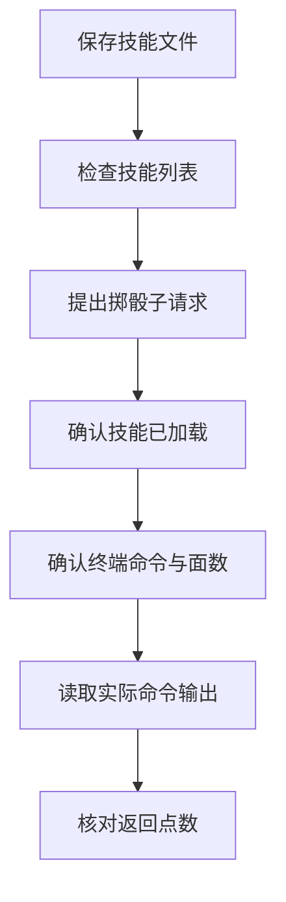

一次合格观察至少包含：目标技能被加载、命令中的面数正确、输出为范围内整数。聊天中出现一个 1～20 的数字，只证明答案在范围内，不能证明前面三个动作发生过。本笔记的客户端交互步骤是读者练习，交付时不将其标为已在客户端执行。

### 2.6 如何排查格式正确却没有正常工作的 Skill

#### 使用格式校验工具检查命名与元信息

材料提供了 `skills-ref` 参考校验工具。已安装该工具时，可以从练习项目目录执行：

```bash
skills-ref validate .agents/skills/roll-dice
```

它用于检查元信息和命名等格式条件。若提示找不到命令，属于工具未安装或不在 PATH，不是技能语法错误；不要把所有失败都归因于 `SKILL.md`。安装方式应参考该工具的实际版本说明，本笔记不为演示自动安装它。

#### 从文件位置、技能发现和描述匹配定位问题

可以把故障拆成四层，按最先没有证据的一层排查：

| 层次 | 要取得的证据 | 常见排查方向 |
| --- | --- | --- |
| 格式 | 校验可通过 | YAML、名称、入口文件 |
| 发现 | 可用目录中有目标技能 | 安装位置、项目范围、信任或禁用状态 |
| 激活 | 指令进入当前上下文 | 描述、请求意图、显式激活入口 |
| 执行 | 工具输出和最终结果符合要求 | 解释器、参数、依赖、权限、工作目录 |

只有目录里有文件，却没有可用技能记录时，先检查扫描配置；不应立即通过加长描述修复。技能已经加载但调用脚本失败时，应转向执行环境。这样能够避免把一个路径问题反复当成提示词问题优化。

#### 区分返回了答案与确实执行了所需工具

对于要求真实数据或真实随机数的任务，观察重点是工具证据。对于纯文本格式整理任务，未调用命令不一定是错误，验收依据取决于技能承诺的行为。

练习时可以保留两组记录：一次技能正常工作，一次人为把文件移出发现目录。比较发现列表和执行行为，验证自己的定位方法。若记录不足，应写“无法确认是否加载”，不要把没有看到证据直接计作“确定未加载”。这一原则会继续用于触发评估。

## 第 3 章 · 把真实运维经验写成可执行的技能指令

### 3.1 如何从真实任务和项目资料提炼技能知识

技能文件能加载，只解决了入口问题。要让它有用，需要提供真正影响决策的经验。本章使用 `ops-inspection-report` 作为教学改编：分析已有的本地 JSON 快照，生成带原始证据的报告。它不连接真实主机，也不负责执行修复。

#### 从成功步骤、人工纠正和输入输出格式提取稳定做法

先回顾一次由你参与并确认结果的任务。记录 Agent 最初缺少哪些信息、在哪一步被纠正、最终采用了什么方法。例如你曾提醒“缺失 CPU 数据不能算作 0”，这就是有价值的技能知识；“认真分析”则无法改变具体行为。

将经验写成规则前，要说明输入单位和成功条件。本案例约定以下模拟规则，版本为 `inspection-v1`。它们用于统一整本笔记的练习口径，不是 CPU、内存或数据新鲜度的生产建议。

| 项目 | 本练习规则 | 不满足时的处理 |
| --- | --- | --- |
| 快照时间 | 必须带时区 | 无法解析则拒绝输入 |
| 数据新鲜度 | 相对指定评估时间，年龄在 0～300 秒内 | 过期或未来时间使各项状态变为 `unknown` |
| CPU 使用率 | 0～100 的数值，达到 85 判为 `alert` | 缺失或 null 为 `unknown` |
| 内存使用率 | 0～100 的数值，达到 90 判为 `alert` | 缺失或 null 为 `unknown` |
| 非法数据 | 字符串、布尔值、非有限数、越界数不是合法指标 | 拒绝输入，不能擅自纠正 |
| 汇总粒度 | 每台主机的每个指标算一项 | 不把指标项数量当作主机数量 |

用于后续章节的 `inspection.json` 内容如下：

```json
{
  "schema_version": "inspection-v1",
  "captured_at": "2026-09-07T01:00:00Z",
  "checks": [
    {"host": "app-01", "cpu_pct": 92, "memory_pct": 75},
    {"host": "app-02", "cpu_pct": 40, "memory_pct": 91},
    {"host": "app-03", "cpu_pct": null, "memory_pct": 35}
  ]
}
```

以 `2026-09-07T01:02:00Z` 为评估时间，该数据新鲜，包含 3 台主机、6 个指标项，其中 2 项告警、1 项未知、3 项正常。所有后续预期结果都应能从这张规则表和这份输入推出。

#### 从 Runbook、接口说明和故障记录补充团队上下文

Runbook 提供操作顺序，接口说明提供字段语义，故障记录提供容易误判的边界，代码修复记录则能说明此前假设在哪些情况下失效。整理时保留这些材料各自解决的问题，而不是将多个文档拼接成一个很长的入口。

本例还需补充：`checks` 必须是非空数组，主机名不能为空且不得重复；报告只描述指定时间点的快照，不推断长期趋势。即使一台主机 CPU 超阈值，也不能仅凭这一个采样断言应用存在死循环或必须重启。

#### 将单次任务中的具体答案改写为可迁移的方法

“app-01 的 CPU 异常”是这次输入的答案；“逐项比较原始指标与规则，记录主机、指标、原值和阈值”才是可复用方法。技能应编码后者，并用前者作为示例检查读者是否理解。

练习时把 app-01 的 CPU 改成 84，其他条件保持不变。正确方法应使告警项从 2 减为 1，而不是继续输出旧结论。这样的输入变化能很快发现技能是在执行规则，还是被示例答案牵引。

### 3.2 如何划定职责并控制技能正文的复杂度

#### 围绕一项连贯工作定义技能边界

一个连贯任务应具有相对稳定的输入、处理目标和输出。对本例而言，“读巡检快照—分析异常和缺失项—生成报告”可以构成一个技能。若加入登录主机、扩容、部署和告警规则管理，触发范围与权限要求都会明显扩大。

| 划分方式 | 执行时可能出现的问题 | 调整方向 |
| --- | --- | --- |
| 一个技能只读取一个字段 | 完成报告要加载很多技能 | 合并连贯步骤 |
| 一个技能包办所有运维工作 | 难以准确触发，步骤常不适用 | 按输入与结果划分任务 |
| 一个技能完成快照分析报告 | 输入输出稳定，可独立验收 | 作为本例的职责边界 |

边界明确不妨碍组合。报告可以为后续诊断提供线索，但技能不能把“生成建议”直接解释成“已获准执行建议”。这也是保持当前任务结果可解释的重要条件。

#### 判断哪些信息是 Agent 缺少的关键知识

审阅每段指令时问：删除这段后，Agent 最可能做错什么？指标单位、缺失值语义、阈值来源通常值得保留；一页 JSON 基础教程一般不属于本技能每次需要加载的知识。

学习笔记可以详细讲原理，实际 `SKILL.md` 则应聚焦执行。两者读者不同：本笔记帮助人系统学习，技能文件帮助模型完成一类任务。不要把整份学习笔记直接作为入口正文，否则每次报告生成都要付出不必要的阅读成本。

#### 用明确的读取条件实现参考资料按需加载

可以在入口中直接写：

```markdown
读取输入后，先读取 references/inspection-rules.md。
其中的 inspection-v1 定义字段、阈值和缺失值处理方式。
输入版本不匹配时停止分析并报告不支持的版本。
准备报告时读取 assets/report-template.md。
```

这里规则必须在判断前读取，因此不能写成“必要时参考”。较少遇到的格式迁移细节可以另设文件，并明确仅在识别到对应版本时读取。检查一次正常输入和一次不支持版本输入，观察路径是否按设计分流，即可验证拆分是否有帮助。

### 3.3 如何为不同操作设置恰当的控制程度

#### 何时解释目标和原因并保留选择空间

报告的叙述顺序可以根据结果调整：告警较多时先讲影响最大的异常，数据主要缺失时先解释未知范围。只要原始证据和计数完整，没必要固定每句话的措辞。

适合保留灵活性的指令应解释原因，例如“优先展示异常和未知项，让读者先看到需要确认的问题”。模型由此知道选择顺序的目的，面对只有未知项的输入，也能合理组织内容。

#### 何时固定步骤、命令参数和执行顺序

涉及规则一致性时应更明确：先确认版本与数据类型，再判断时间有效性，最后比较指标阈值。若顺序颠倒，过期的高 CPU 数据可能先被标为当前告警，后面再提到采样过期，读者就难以理解最终结论。

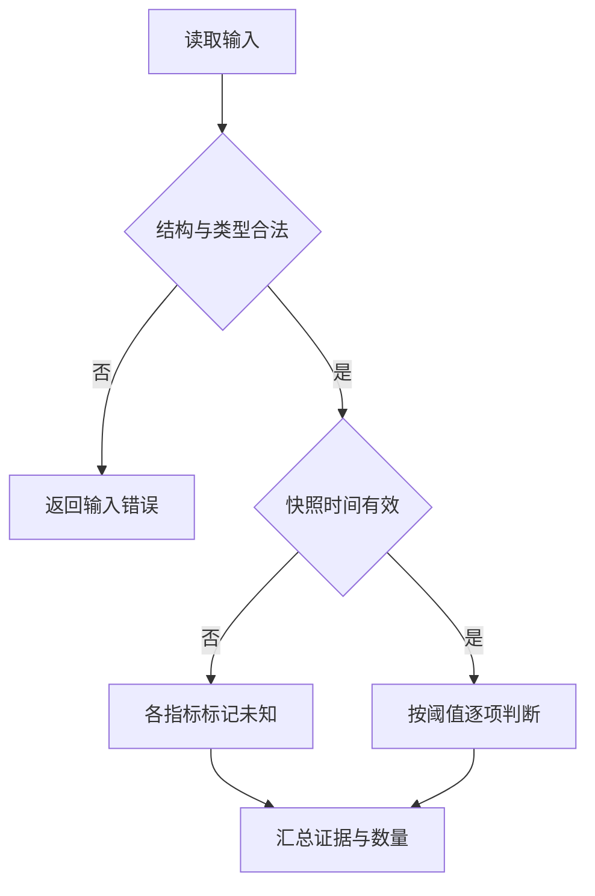

固定顺序应来自任务脆弱点。例如结果聚合和格式化可以调整实现方式，但不能跳过数据类型检查，直接把字符串转成数值后当作原始数据。

#### 如何给出默认做法与清晰的替代条件

默认方案减少试错。例如“使用配套统计脚本；运行失败时报告错误，不重新猜测统计规则”适合已经验证的确定性计算。教学早期尚未提供脚本时，也可以让 Agent 手工按规则分析，但必须明确这属于不同版本的实现。

替代条件应可观察，如“输入版本不是 inspection-v1”或“Python 不可用”。“觉得有必要时换一种办法”无法在执行记录中复核。给出默认做法后，还要检查它在目标环境中可用，否则只是将不确定性转移到了第一条命令。

### 3.4 如何用易错点、模板和清单提高执行一致性

#### 将反复出现的错误写成具体的环境知识

有价值的易错点通常打破直觉。例如源材料用健康端点说明：某个端点返回 200 只代表 Web 服务存活，不能证明数据库连接正常。写入技能时必须说明它属于哪个系统的约定，不能推广成所有 `/health` 的语义。

本例的关键易错点是：null 不是 0；未知项不能计入正常项；“2 项告警”不等于“2 台故障主机”；短时利用率异常不能直接证明根因。把这些规则与具体输入例子一起写出，比一句“避免误判”更容易被正确执行。

#### 用输出模板明确证据、结论与建议的组织方式

可将下面内容保存为教学技能的 `assets/report-template.md`。方括号是待替换位置，不是应该原样保留的最终报告内容。

```markdown
# 巡检快照报告

快照时间：[输入时间]
评估时间：[指定时间]
规则版本：[版本]

## 总体结果

[主机数、指标项总数、正常数、告警数、未知数及总体状态]

## 异常与未知项

| 主机 | 指标 | 原始值 | 状态 | 依据 |
| --- | --- | --- | --- | --- |
| [主机] | [指标] | [原始值] | [状态] | [阈值或未知原因] |

## 建议与限制

[给出与证据对应的检查建议，说明单次快照能支持和不能支持的结论]
```

模板约束组织方式，不能代替分析。若没有告警也没有未知项，应明确写无此类项目，而非编造一条异常来填表。若输入结构非法，则交付可理解的输入错误，不生成看似正常的巡检报告。

#### 用检查清单表达多步骤任务的依赖和完成状态

检查清单适合帮助 Agent 维护进度，但每项必须有完成依据。例如“完成统计”的依据应是六个指标项全部有状态且计数之和为六，而不是已经读过文件。

```markdown
- [ ] 确认输入路径、规则版本与评估时间
- [ ] 校验结构和各指标类型
- [ ] 判定时间有效性并计算每项状态
- [ ] 核对正常数、告警数、未知数之和
- [ ] 按模板生成报告并核对证据
```

对于很短的任务，完整清单可能增加负担。应根据步骤依赖选用，而不是每个技能都附上几十项检查。运行时可以将勾选状态与具体产物关联，方便发现“标记完成却没有证据”的问题。

### 3.5 如何把校验环节嵌入任务执行过程

#### 为每个关键产物指定检查方式

输出是 JSON，就检查能否解析及字段约束；输出是报告，就检查关键数据和说明是否完整。校验应来自真实业务要求。例如本例要求汇总数量等于逐项结果数，并要求未知项在报告中可见。

同一份错误输出若由同一条错误规则生成再自检，仍可能通过。因此需要把预期规则和已知答案的测试样例作为独立依据。脚本算出了数字，不意味着数字一定正确；第 5 章会将这类条件写成结果断言。

#### 用结构化中间计划连接意图与实际操作

对于批量或有状态任务，先生成明确目标和参数的计划，再依据事实校验，能降低直接执行含糊意图的风险。对应到报告任务，中间结果可以记录每个主机指标的状态和依据，再由模板生成文字。

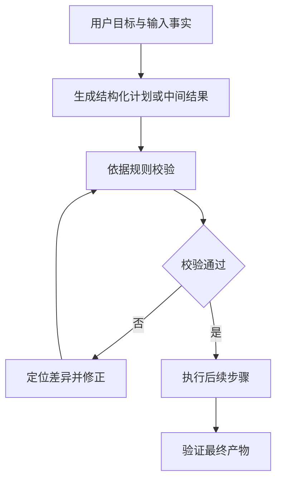

图中的循环不意味着无限重试。若输入缺失且无法补齐，或出现权限拒绝，应该报告阻塞原因；只有可修正的产物错误才应进入修正环节。对于变更任务，计划被校验通过也不自动等于取得执行授权。

#### 将校验失败信息转化为可执行的修正步骤

“计数不正确”难以定位；“指标项共 6 个，但三类计数之和为 5，app-03 的 CPU 未纳入未知数”则直接指出缺失证据。错误信息越接近数据和规则，下一轮修正越容易保持范围。

练习时故意把 null 项归为正常，然后要求校验报告。正确修正是将该项状态及相关计数同步更正，而不是仅添加一句“部分数据可能不完整”。修正后再核对全部计数，避免修一处又让另一处引用旧结果。

### 3.6 如何通过真实执行记录修订第一版 Skill

#### 同时回看最终输出和中间执行轨迹

最终报告可以看起来正确，但中间可能经历多次无效尝试、读取无关目录或采用错误规则后偶然得到正确数字。执行轨迹能帮助判断技能是在稳定地提供方法，还是只改善了措辞。

复盘记录至少包括输入版本、使用的技能版本、读取的关键资料、工具调用和最终产物。读者应能据此回答：错误最早在哪里出现？后续步骤有没有放大它？如果缺少某一类记录，应补充采集能力，而不是根据最终文字反推全部过程。

#### 识别模糊指令、无关步骤和缺少默认选择的问题

| 可观察现象 | 原因假设 | 下一次修改 |
| --- | --- | --- |
| 反复选择 JSON 库 | 默认方案不明确 | 指定标准库即可完成的路径 |
| 主动查线上监控 | 输入边界不明确 | 强调只分析指定本地快照 |
| 漏掉 null 指标 | 缺失值规则不明确 | 给出未知项语义及测试 |
| 报告正确但耗时很长 | 执行了无关流程 | 删除不适用步骤并回归比较 |

表中的原因是待验证假设。一次修订尽量围绕一个稳定问题，使下一轮结果能够解释。若同时更换模型、脚本和报告模板，就很难判断改善来自哪个变化。

#### 将重复生成的逻辑沉淀为可复用脚本

当多次执行都重新编写相同的输入校验和统计代码时，就适合把它们放进 `scripts/`。这让确定性计算可单独测试，Agent 则集中解释结果与组织报告。但尚未创建脚本时，不应在入口声称它已经可用。

下面是一份不依赖配套脚本的第一版教学技能。将 3.1 的规则表整理进参考文件，并保存 3.4 的模板后即可用于练习；到第 6 章再替换计算步骤。

```markdown
---
name: ops-inspection-report
description: >-
  当用户要分析已有的本地巡检 JSON 快照、整理异常与缺失检查项、
  生成带证据的中文巡检报告时使用。不用于连接主机采集数据或执行修复。
compatibility: Requires read access to the specified local files.
metadata:
  version: "0.1"
---

确认用户输入文件和带时区的评估时间，缺少必要信息时先询问。
读取 references/inspection-rules.md，按 inspection-v1 校验输入。
逐主机逐指标判断状态，保留原始值和判断依据。
先处理数据新鲜度，再判断阈值；未知值不能当作正常。
核对各类计数之和等于指标项总数。
读取 assets/report-template.md 并输出报告。
只依据给定快照提出下一步检查建议，不推断已证实的根因或执行修复。
```

本章产出的是可进入测试的初版方法。技能是否容易被选择、是否确实改善结果，需要通过接下来的两类评估回答。

## 第 4 章 · 优化描述并验证技能是否正确触发

### 4.1 如何让描述表达真实意图与职责边界

一个技能只有在合适的任务上被使用，才有机会提供价值。本章评估的是“选择行为”：相关任务能否加载它，不相关但相似的任务是否会误用它。先保持技能正文不变，集中改进描述，可以减少归因混乱。

#### 名称和描述如何影响模型对技能的选择

在目录阶段，模型主要看到名称与描述，尚未读入详细步骤。因此，正文写得再完整，也不能弥补描述完全没有表达适用范围的问题。触发测试就是检查这份简短目录信息是否足以帮助模型作出合适选择。

选择通常由模型结合请求和上下文判断，不应当作确定性关键词匹配。某个请求含有“巡检”，不代表一定要使用报告技能；一个请求没出现“巡检”，也可能实际上需要分析巡检结果。宿主的行为指令、其他可用技能和模型版本都会影响选择，评估时需要记录这些条件。

#### 用用户目标与典型情境描述适用范围

| 描述 | 问题或作用 |
| --- | --- |
| “处理 JSON” | 无法区分统计、格式转换和巡检分析 |
| “解决所有运维问题” | 范围超过当前技能实际能力 |
| “分析已有巡检 JSON 快照并生成有证据的报告” | 明确输入与结果 |
| 增加“用户要整理异常和缺失检查项时使用” | 补充不直接点名巡检的意图 |

可以采用“当用户需要……时使用”的表达，让描述直接承担选择指令。内容应围绕用户想达到的目标，而不是内部实现。例如用户通常不会说“请运行 summarize.py”，却会说“这批结果里哪些需要跟进”。

#### 平衡覆盖范围、相邻任务边界和描述长度

源材料鼓励主动列出容易遗漏的适用情境，但这不意味着越宽越好。对本例，“排查服务器实时故障”和“整理已有快照”共享运维词汇，实际任务却不同。描述应保留这种输入和行动边界。

短到无法判断职责的描述需要补充，长到列举几十种同义词的描述需要归纳。先挑能代表真实需求的几个类别，再通过测试确认是否遗漏；不要为了消灭一个特殊表述而不断增加孤立关键词。

### 4.2 如何设计有区分度的触发测试集

#### 覆盖显式关键词、隐含意图和不同表达方式

测试查询包含用户请求及 `should_trigger` 标签。正例应覆盖简短请求、带文件路径的请求、口语表达，以及更大任务中包含的报告整理环节。标签依据技能职责制定，不能根据当前模型是否会触发倒推。

以下是 `eval_queries.json` 的教学节选，不是完整评估集：

```json
[
  {
    "id": "positive-01",
    "query": "请按 inspection-v1 分析 data/inspection.json 的巡检快照，以 2026-09-07T01:02:00Z 为评估时间，生成异常和缺失项报告。",
    "should_trigger": true
  },
  {
    "id": "positive-02",
    "query": "同事给了我 data/inspection.json，帮我看看哪些机器指标超标、哪些没采到，整理成值班报告。评估时间是 2026-09-07T01:02:00Z。",
    "should_trigger": true
  },
  {
    "id": "negative-01",
    "query": "把 data/inspection.json 原样转成 YAML，不需要分析指标或生成报告。",
    "should_trigger": false
  },
  {
    "id": "negative-02",
    "query": "设计一套线上巡检采集器，定期连接服务器采集指标。",
    "should_trigger": false
  }
]
```

#### 用相近任务测试误触发而非只选明显无关请求

“写一首诗”几乎无法检验巡检技能边界。更有价值的负例是格式转换、采集器开发、实时排障或修改监控规则，因为这些请求可能含相同文件名和领域词汇。

应分别记录为什么不该触发：格式转换没有指标判断目标，采集器开发没有现成快照输入，执行修复超出报告技能范围。如果两名评审对标签分歧明显，应先修订技能边界或测试请求，再优化描述。含糊标签会让优化目标本身不稳定。

#### 为测试请求补充真实的上下文、文件与任务复杂度

源材料建议从约 20 条查询开始，正负例大致平衡。这是启动规模，不是统计充分性的保证。应覆盖真正遇到的请求类别，并让所引用的测试文件在运行环境里实际存在，避免把路径错误误判为技能问题。

可以将来自同一种模板的近似改写归为一组。例如只替换 `app-01` 与 `app-02` 的两条查询，并不能代表两种独立情境。设计时保留口语、缩写和上下文差异，重点检查能力边界，而不只是措辞覆盖率。

### 4.3 如何观察技能加载并计算触发结果

#### 确认技能已经注册并处于可发现状态

测试前先保存可用技能目录，确认名称、描述版本和路径正确。将模型、客户端版本、其他安装技能以及运行配置作为测试条件记录。技能根本没有被注册时，所有正例失败无法说明描述写得不好。

自动选择测试中，请求应使用自然任务表达，不附加“必须调用这个技能”。显式点名可以验证加载通道，但它绕过了本章要测的自然选择问题。可将显式加载测试作为单独的预检查，而不混入触发率统计。

#### 从执行记录判断是否实际加载了目标 Skill

有效证据包括：成功读取了目标路径的 `SKILL.md`，专用激活工具成功返回了其内容，或者宿主记录了明确的指令注入事件。只看到一次失败的激活请求，不能算成功加载；只看到 Agent 自称“正在使用技能”，也不足以证明加载。

源材料提供了一个客户端 JSON 日志检测脚本，但其字段和工具名属于具体实现。本笔记改用下面的规范化记录示例，采集适配层需要对接实际日志：

```json
{
  "query_id": "positive-01",
  "run": 1,
  "skill_name": "ops-inspection-report",
  "status": "valid",
  "loaded": true,
  "evidence": {
    "kind": "successful_skill_read",
    "path": "/workspace/skills/ops-inspection-report/SKILL.md",
    "event_id": "event-17"
  }
}
```

这是教学设计的记录格式，不是某客户端的标准输出。运行超时、日志缺失和权限错误应记录为 `invalid` 或其他明确异常状态，并保留原因。只有观察覆盖完整且确认没有加载，才能把 `loaded` 记为 `false`。

#### 通过重复运行、阈值与异常记录解释测试结果

对同一查询运行多次，触发率计算为“成功加载次数 ÷ 有效运行次数”。源材料以重复 3 次和 0.5 阈值作为起点；本练习规定大于 0.5 视为倾向触发，小于 0.5 视为倾向不触发，恰好相等时追加观察或标记不确定。

| 查询 | 标签 | 加载次数／有效运行数 | 结果解释 |
| --- | --- | --- | --- |
| A | 应触发 | 3/3 | 本轮稳定加载 |
| B | 应触发 | 1/3 | 本轮有漏触发问题 |
| C | 不应触发 | 2/3 | 本轮有误触发问题 |
| D | 不应触发 | 0/2，另有 1 次无效 | 暂时符合方向，但需补齐无效运行 |

表中数字是演示值。统计报告应同时给出计划次数、有效次数和异常次数，不能丢弃失败运行后仅展示漂亮的触发率。20 条请求每条运行 3 次意味着 60 次调用，正式执行前应估计时间和用量。

### 4.4 如何划分训练集与验证集并避免过拟合

#### 保持正反例比例并固定数据划分

如果所有查询既用于改写描述又用于汇报效果，就容易写出只适应这些句子的描述。训练集用于发现和修正问题，验证集用于比较修改是否能推广到未参与改写的请求。源材料采用约 60% 与 40% 的划分建议。

若有 10 条正例和 10 条负例，可以让训练集包含各 6 条，验证集包含各 4 条。固定随机种子或直接保存划分后的文件，避免每次随机分组造成成绩不可比较。高度近似的请求尽量放在同一组，减少同一模板同时出现在训练和验证中的信息泄漏。

#### 用训练集失败案例指导修改

改写描述时只提供训练集失败及其原因。例如多个正例都以“交接材料”描述报告需求，可以概括为“整理已有检查结果供值班交接”，而不是将每条句子逐字添加到描述。

验证集的具体失败措辞不应同时交给改写模型，否则它实际上已成为训练材料。需要查看验证表现时，可由评估者保留具体查询，向选版过程提供汇总指标。对小型人工练习，也可以通过固定的两份文件维持这一分工。

#### 用验证集比较泛化表现而非反复记忆测试措辞

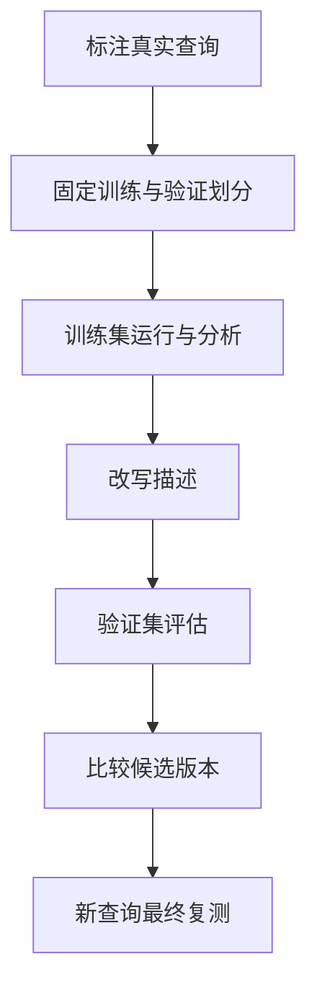

验证集被反复用于选版，也会逐渐影响决策，因此最后再准备一批全新查询很有价值。本方法是减少过拟合的工程流程，不是保证泛化的数学证明。模型或宿主大幅变化后，旧结果也应重新验证。

### 4.5 如何迭代描述并确认最终修改有效

#### 从失败请求归纳类别而非堆叠孤立关键词

漏触发先检查职责是否表达完整，误触发先检查与相邻能力的边界。若正例文件本身不存在，应修复测试环境；若标签不合理，应修订案例。只有证据指向描述时才改描述，避免把所有问题都写成更长的提示词。

可以保存每版描述与修改理由，例如“补充已有检查结果的交接用途，保持不采集和不修复的范围”。这样后续发现新误触发时，能够回溯是哪次扩展改变了选择行为。

#### 比较多轮结果并选择表现合适的描述版本

下面是示例选版记录，查询级通过率按前一节的重复运行规则计算：

| 版本 | 训练通过查询数 | 验证通过查询数 | 解释 |
| --- | --- | --- | --- |
| v1 | 8/12 | 5/8 | 隐含报告意图覆盖不足 |
| v2 | 11/12 | 7/8 | 覆盖改善且边界相对清晰 |
| v3 | 12/12 | 5/8 | 训练成绩提高，验证下降 |

不能因为 v3 最后生成或训练全通过就直接采用。此例更值得选择 v2，再用新请求检查。源材料提到数轮迭代即可作为起点；如果长期没有改善，应回看测试质量、技能边界及宿主选择机制，而不是无限补充措辞。

#### 更新技能后使用全新请求复核触发边界

将选中的描述写回技能后，确认当前会话实际读取了新版本；必要时按宿主规则重载或新开会话。检查描述长度，再准备 5～10 条未参与优化的正负例进行复测。

最终交付记录应保留描述版本、数据划分、有效运行数、漏触发和误触发分布。若结果只来自人工试用两条请求，应如实写为冒烟观察。触发表现改善之后，还需要证明被激活的技能能把任务做好，这就是下一章的目标。

## 第 5 章 · 用对照评估判断 Skill 是否提升任务质量

### 5.1 如何将任务目标转化为可评估的测试案例

输出看起来合理，并不说明技能稳定有效。本章将任务拆成测试输入、预期结果、评分证据和成本记录，并比较使用技能与基线的差异。所有示例成绩均为教学数据；真实模型评估需要读者在所选客户端运行。

#### 明确测试请求、输入文件和预期成果

一个案例应让运行者知道做什么，也让评估者知道怎样判断。请求不能只有“分析一下”；应提供文件、规则依据、评估时间和输出位置。预期结果由输入和规则推出，不由被测 Agent 自己给自己定义。

对于 3.1 的快照，已知答案是 3 台主机、6 项指标、2 项告警、1 项未知、3 项正常。总体状态在本练习中采用 `alert` 优先，其次 `unknown`，最后 `ok`；同时保留三类计数，不能让总体告警状态掩盖未知项。

#### 从少量真实任务开始并加入边界案例

第一轮可先准备三个案例：标准快照、过期快照、非法输入。它们分别检查正常分析能力、证据时效边界和输入错误处理。

| 案例 | 如何从标准输入构造 | 关键预期 |
| --- | --- | --- |
| mixed | 使用 3.1 原始数据，评估时间为 01:02 UTC | 2 告警、1 未知、3 正常 |
| stale | 数据不变，评估时间改成 01:10 UTC | 6 项未知，不能声称是当前正常或告警 |
| invalid | 将 app-01 的 CPU 改为字符串 `"92%"` | 报告输入错误，不擅自转换后分析 |

时间均指示例日期 2026-09-07。先用少量案例跑通评估流程，再加入阈值恰好相等、空列表、重复主机和未来时间等条件，比一开始写很多无法运行的测试更容易发现实际问题。

#### 区分触发评估与执行质量评估的目标

质量评估可以显式启用目标技能，使它有机会执行，从而专注检查正文和资源的收益。第 4 章的自然触发测试则不能这样做。两类评估分开后，可以定位是“没选中正确方法”，还是“方法被选中但执行无效”。

```json
{
  "skill_name": "ops-inspection-report",
  "evals": [
    {
      "id": "mixed",
      "prompt": "按 inspection-v1 分析 inspection.json，以 2026-09-07T01:02:00Z 为评估时间，生成带原值和依据的中文巡检报告。",
      "expected_output": "3 台主机共 6 项指标，告警 2 项、未知 1 项、正常 3 项，并说明单次快照的限制。",
      "files": ["evals/files/inspection.json"]
    }
  ]
}
```

这里展示的是 `evals/evals.json` 的组织形式。运行器需要将 `files` 中的数据放到请求可见的位置；不能只把路径作为文本传给模型，却不提供真实文件。

### 5.2 如何建立独立运行环境与对照基线

#### 比较使用技能、不使用技能或旧版技能的结果

评估新增技能时，可以比较 `with_skill` 和 `without_skill`；评估技能升级时，可以比较新版本和 `old_skill`。两组应使用相同任务输入、模型配置和运行限制，只改变本次要研究的因素。

“不使用技能”不能仅仅是不显式传入路径。如果目标技能仍在默认目录或先前会话中，Agent 仍可能自动加载它。基线需要真正不提供目标技能，并通过运行记录确认；否则对照已经被污染。

#### 用干净上下文和一致输入降低运行间干扰

每次运行使用独立会话或等效隔离环境，避免继承上一轮解释、正确答案和产物。输入文件可以复制到各自的运行目录，输出目录分别保存。是否使用子代理由环境决定，重点是隔离，而不是工具名称。

教学延伸：比较时还应声明规则资料是否两边都可见。如果基线看不到团队规则而技能组能看到，测得的是“技能包提供知识与方法”的整体收益；如果两边都能读取同样规则，只是技能组具有额外执行指导，测得的更接近组织方法的收益。两者都可以有价值，但不能混为一个结论。

#### 保存版本快照、任务产物与每轮评估记录

```text
ops-inspection-report/
├── SKILL.md
├── references/
├── assets/
└── evals/
    ├── evals.json
    └── files/inspection.json
ops-inspection-report-workspace/
├── skill-snapshot/
└── iteration-1/
    ├── mixed/
    │   ├── with_skill/
    │   │   ├── outputs/
    │   │   ├── transcript.json
    │   │   ├── timing.json
    │   │   └── grading.json
    │   └── without_skill/
    │       └── 同类运行记录
    └── benchmark.json
```

这是目录设计，不是已经运行的产物列表。比较旧版本时，快照要包含正文、脚本和规则，不能只保留入口而继续读取已经改变的引用文件。每轮新增 `iteration-N`，保留此前记录，才能追踪某次修改到底改善了什么。

### 5.3 如何用可验证断言和证据给输出评分

#### 根据首轮输出细化可观察的成功条件

先有清楚的任务预期，再参考首轮产物细化断言。例如报告使用怎样的文件名可以在首轮确定，但“null 必须算未知”是预先存在的规则，不能因为输出没有做到就放宽。

| 弱断言 | 更可验证的表达 |
| --- | --- |
| 报告专业 | 列出每个异常项的主机、指标、原值与依据 |
| 包含总结 | 总结明确列出 3 正常、2 告警、1 未知 |
| 使用指定的一句话 | 无论措辞如何，都不得声称缺失项已正常 |
| 有建议 | 建议与观察到的数据有关，未将猜测写成已证实根因 |

不要机械要求每份报告包含三条建议。若只有一个问题，强制数量可能诱导无依据的内容。断言应来自使用者真正关心的结果。

#### 为机械检查和需要判断的内容选择合适评估方式

JSON 能否解析、计数是否正确、输出文件是否存在，适合程序检查。建议是否贴合证据、报告是否容易理解，可以交给人工或模型评审；模型评审也需要查看真实产物，而不只是被测模型的自我总结。

比较两个版本的表达质量时，可以隐藏版本身份，交换展示顺序进行盲评，降低“新版本应该更好”的偏见。即使两者都通过格式断言，也可能在事实和推断的区分上存在明显差异，这需要语义审阅。

#### 将每个通过或失败结果关联到具体产物证据

以下演示一次不完整报告的评分：

```json
{
  "assertion_results": [
    {
      "text": "告警项数量为 2",
      "passed": true,
      "evidence": "report.md 的总体结果给出 2 项告警，明细列出 app-01 CPU 和 app-02 内存。"
    },
    {
      "text": "app-03 CPU 缺失被列为未知项",
      "passed": false,
      "evidence": "report.md 仅包含两项告警，未列出 app-03 CPU，也未报告未知项数量。"
    }
  ],
  "summary": {"passed": 1, "failed": 1, "total": 2, "pass_rate": 0.5}
}
```

证据需能被另一位评审定位。产物未保存或无法打开时，不能给通过；应记录评估异常并补齐。对于明明已完整取得产物、但要求内容确实缺失的情况，则可以给失败，不能一直归为“未知”回避判定。

### 5.4 如何比较质量收益、耗时与 Token 成本

#### 记录通过数量、耗时和 Token 用量

在每次运行结束时保存用量和持续时间，并注明字段来自何处。不同工具对 Token 的统计口径可能不同，缓存输入、输出、子任务用量是否计入，应使用同一规则；无法取得的数据保留为空或注明缺失，不填成 0。

```json
{
  "total_tokens": 3800,
  "duration_ms": 45000,
  "measurement_note": "教学示例值，真实评估应记录宿主提供的用量口径"
}
```

时间还可能受依赖首次安装、缓存命中和排队影响。若要比较工作流本身，应至少注明冷启动与热缓存条件。一次运行耗时减少不一定来自指令优化，也可能只是第二次没有再下载依赖。

#### 解释通过率差值与成本变化

下面是演示数据，表示同一组断言在两种配置下的聚合结果：

| 指标 | 无技能 | 有技能 | 差值 |
| --- | --- | --- | --- |
| 断言通过率 | 0.33 | 0.83 | +0.50，即 50 个百分点 |
| 平均耗时 | 32 秒 | 45 秒 | +13 秒 |
| 平均 Token | 2100 | 3800 | +1700 |

质量提高的同时可能增加成本。能否接受取决于任务价值和错误代价，应把两者放在一起判断。通过率增加 0.50 是增加 50 个百分点，不应写成相对提高 50%。同时明确这是断言通过率，不是主机健康率或任务全部成功的比例。

如果不同案例的断言数差异很大，要注明采用“每个案例通过率的平均值”还是“所有通过断言数除以所有断言数”。前者每个案例权重相同，后者断言多的案例权重更大；不能在版本间切换口径。

#### 理解样本规模、重复运行和统计波动的影响

只有少数案例且每例运行一次时，优先展示具体通过与失败数量。标准差不能凭空填入；若用于讨论同一案例的运行稳定性，需要该案例的多次重复结果。

应区分两种变化：同一案例反复运行有时正确、有时错误，反映随机性或指令歧义；不同案例的平均成绩不同，可能只是任务难度差异。把所有数字混在一起算一个标准差，未必能解释任何一个问题。对于小样本，保留逐例记录通常比增加统计术语更有用。

### 5.5 如何从失败模式与执行轨迹定位改进点

#### 找到缺少区分度或不合理的断言

如果“输出包含 Markdown 标题”在两组中始终通过，它对证明技能增益没有太大帮助。源材料建议删除或替换缺少区分度的断言；实践时也可将必要的格式条件保留为基本门槛，但不要靠大量此类条件抬高总体成绩。

若两组都无法满足某项要求，先检查测试是否提供了必要数据。例如要求分析趋势却只提供一条快照，本身就缺少依据。正确处理是调整任务或输入，而不是逼迫技能编出趋势。

#### 识别真正由技能带来的收益和不稳定结果

| 结果模式 | 重点检查 | 可能的后续动作 |
| --- | --- | --- |
| 两组始终通过 | 是否只是基本能力 | 作为基本门槛，减少增益统计权重 |
| 两组始终失败 | 输入、要求和断言是否合理 | 修订测试或补充必需资料 |
| 仅有技能时通过 | 哪条知识或步骤起作用 | 保留有效规则并扩充同类案例 |
| 同一案例表现不稳定 | 指令是否有多种解释 | 增加关键例子并重复验证 |

例如无技能组将 null 当作 0，而技能组正确标记未知，这说明缺失值规则可能产生了作用。还应换主机、换缺失字段、换表达方式测试，避免只记住标准输入中的 app-03。

#### 结合耗时异常与执行记录查找无效步骤

某个案例比其他案例慢很多时，查看它是否反复选择工具、重新写统计脚本、读取无关资料或重试同一种权限错误。只看总耗时无法区分必要分析与无效动作。

修改应与证据对应。若时间消耗来自重复解析数据，配套脚本可能有帮助；若来自报告模板过于复杂，应精简模板；若来自网络失败，改描述通常无效。每次提出改动后，都用同一组案例回归检查质量是否倒退。

### 5.6 如何结合人工反馈完成下一轮迭代

#### 让人工审阅补充断言未覆盖的问题

人工需要看实际文件，并回答报告是否帮助值班工程师采取下一步行动。例如“告警明细准确，但未知项被藏在文末，容易被忽略”就指出了格式断言之外的使用问题。

```json
{
  "mixed": "将未知项与告警项一并列入明细，避免读者把缺失检查当成正常。",
  "stale": "",
  "invalid": "错误信息应指出 app-01.cpu_pct 需要数值，而不是只说 JSON 不正确。"
}
```

此示例中空字符串表示该案例已经审阅且没有具体问题。真实系统若还存在“尚未审阅”状态，应该另设状态字段，不能让空值同时承担两种含义。

#### 汇总失败断言、具体反馈和执行轨迹形成修改依据

三类证据互相补充：断言指出哪里不符合要求，人工反馈指出哪里不好用，执行记录帮助解释为什么发生。修订时将它们与当前技能版本一起看，避免只为某一句反馈添加临时规则。

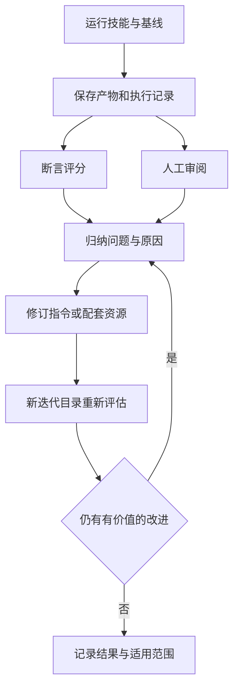

#### 在新迭代目录中回归验证并判断何时停止修改

可以按以下顺序完成一次练习：保存第 3 章的规则和模板，准备 mixed、stale、invalid 输入；在独立会话分别运行技能组与基线组；保存产物及执行记录；按 5.3 的方式评分；针对一类失败修订后，在新目录重跑全部案例。

停止条件可以是关键断言已满足、人工反馈稳定为空，或多轮没有实质收益。停止不表示技能适用于所有任务；记录测试覆盖范围，保留仍未解决的问题。源材料提及可用 `skill-creator` 自动化部分评估流程，但是否能直接复用其运行器，要看目标环境与工具接口。

本笔记提供方法和可复现的数据条件，不包含已经完成的模型 A/B 评估。第 6 章的确定性脚本可以本地验证，这类脚本测试与真实 Agent 对照实验是不同证据，不能互相替代。

## 第 6 章 · 为 Agent 设计可靠的脚本与命令接口

### 6.1 如何选择一次性命令或配套脚本

技能中的文字负责描述方法，脚本适合承担可重复的确定性处理。本章把巡检案例的校验与统计写成完整 Python 程序，说明它如何接收参数、返回结果及处理错误。目标是让 Agent 有稳定接口可调用，而不是每次临时重写同一逻辑。

#### 用现有工具完成边界清晰的简单操作

已有工具能完成一项简单操作时，可以在技能中声明该命令及前提，不必另外封装。材料列举了多种按需运行工具的方式：

| 方式 | 所需环境 | 在技能中需要说明的事项 |
| --- | --- | --- |
| `uvx` | 已安装 uv | 工具版本及首次获取依赖的条件 |
| `pipx run` | 已安装 pipx | 包版本和隔离环境行为 |
| `npx` | Node.js 与 npm | 包、版本和执行参数 |
| `bunx` | Bun | 是否确实采用 Bun 环境 |
| `deno run` | Deno | 运行权限及参数分隔 |
| `go run` | Go 工具链 | 包路径、版本和编译条件 |

例如已安装 uv 的环境可以执行 `uvx ruff@0.8.0 check .`。此处沿用材料版本用于说明固定版本的语法，不将它作为当前推荐版本。`uvx` 的隔离运行与版本选择方式已核对 [uv 工具指南](https://docs.astral.sh/uv/guides/tools/)。

#### 将复杂参数组合与重复逻辑收敛到脚本

如果一次性命令同时包含复杂引号、多层 JSON 查询、时间计算和异常分支，写入技能后很容易在参数替换时出错。此时应将处理过程放入脚本，让 Agent 只需要传入明确的输入文件和评估时间。

| 情况 | 合适做法 | 验收重点 |
| --- | --- | --- |
| 检查一个文件的已知格式 | 直接调用成熟工具 | 命令参数和退出状态 |
| 解析巡检快照并分类统计 | 配套脚本 | 规则、边界和输出结构 |
| 每次生成完全相同的代码 | 固化代码后测试 | 是否减少重复工作且保持正确性 |

封装也有维护成本。仅为给一条简单命令换个名字而新增脚本，未必有价值；应优先封装容易重复出错的逻辑。

#### 声明运行环境、网络前提和工具版本

工具已安装不代表依赖已缓存，缓存存在也不保证换一台机器后仍可运行。技能应说明首次运行是否可能下载包，以及失败时如何报告。对于无网络环境，可以预装依赖或使用只依赖标准库的实现。

本章的 `summarize.py` 使用 Python 3.10+ 标准库，不访问网络。这样可以把示例验证集中在输入、规则与接口行为上。若你的实际技能需要第三方库，再按下一节的方法声明依赖。

### 6.2 如何组织脚本依赖与执行路径

#### 从技能根目录解析脚本与配套文件路径

技能写作时用相对路径便于搬迁，执行时则应先得到实际技能位置。以下是读者练习中的 Bash 调用方式，假设技能放在练习项目的 `.agents/skills/ops-inspection-report` 下，输入文件已按 3.1 保存为当前目录的 `inspection.json`：

```bash
skill_root="$PWD/.agents/skills/ops-inspection-report"
inspection_input="$PWD/inspection.json"
python3 "$skill_root/scripts/summarize.py" \
  --input "$inspection_input" \
  --as-of 2026-09-07T01:02:00Z \
  --output -
```

`skill_root` 必须来自已确认的安装位置，不能在技能正文里硬编码为作者的个人目录。上面保留当前工作目录，并传入绝对路径，所以脚本不依赖调用者是否切换到了技能目录；参数加引号也能处理路径中的空格。

#### 使用内联依赖声明构建自包含脚本

对于确实需要第三方依赖的 Python 脚本，可以采用以下独立演示。它不属于巡检统计脚本，只用来解释脚本元数据：

```python
# /// script
# requires-python = ">=3.10"
# dependencies = ["beautifulsoup4>=4.12,<5"]
# ///
from bs4 import BeautifulSoup

document = BeautifulSoup("<p>inspection</p>", "html.parser")
print(document.get_text())
```

将其保存为 `scripts/extract.py` 后，可以使用 `uv run scripts/extract.py` 运行。内联声明由支持该格式的运行器读取；直接执行 `python3 scripts/extract.py` 不会自动安装依赖。相关运行与锁定方式已核对 [uv 脚本指南](https://docs.astral.sh/uv/guides/scripts/)。

材料也展示了其他语言的做法：Deno 可以在导入中标明依赖来源和版本，Bun 有特定条件下的自动安装行为，Ruby 可以通过 `bundler/inline` 声明依赖。这些属于运行器能力，不是 Agent Skills 格式额外提供的功能，采用前应确认实际版本及项目环境。

#### 区分版本范围、精确版本、锁定文件与缓存的作用

`>=4.12,<5` 表示允许的版本范围，未来可能解析为不同版本；精确固定直接依赖版本仍不一定固定全部间接依赖；锁定文件进一步记录解析结果；缓存则主要降低获取成本。这四者解决的问题不同。

对 uv 的脚本示例，可通过 `uv lock --script scripts/extract.py` 生成脚本锁定文件，并随脚本维护。实际复现还应考虑 Python 版本与系统平台。不要将使用 `@latest` 描述为固定版本，也不要把“本机已有缓存”当成部署到其他环境的依赖交付方案。

### 6.3 如何设计适合自动调用的参数与错误接口

#### 通过参数、环境变量或标准输入接收完整输入

自动调用应尽量在一次命令中提供完整参数，避免运行到一半等待终端输入。材料按非交互环境给出建议；有些宿主具备交互能力，但面向通用自动化仍应以非交互接口作为基线。

下面是完整教学脚本，保存为技能目录下的 `scripts/summarize.py`。它执行 3.1 的规则，拒绝重复 JSON 键、重复主机和非法指标。有效输入中的额外字段不参与统计；缺失 CPU 或内存键按未知处理。它只分析当前快照，不采集数据，也不执行修复。

```python
import argparse
import json
import math
import sys
from datetime import datetime
from pathlib import Path

THRESHOLDS = {"cpu_pct": 85, "memory_pct": 90}


def parse_time(value):
    if not isinstance(value, str) or "T" not in value:
        raise ValueError("time must be an ISO datetime with timezone")
    result = datetime.fromisoformat(value.replace("Z", "+00:00"))
    if result.tzinfo is None or result.utcoffset() is None:
        raise ValueError("time must include timezone")
    return result


def unique_object(pairs):
    result = {}
    for key, value in pairs:
        if key in result:
            raise ValueError(f"duplicate JSON key: {key}")
        result[key] = value
    return result


def reject_constant(value):
    raise ValueError(f"non-standard JSON constant: {value}")


def summarize(data, as_of):
    if not isinstance(data, dict):
        raise ValueError("input must be a JSON object")
    if data.get("schema_version") != "inspection-v1":
        raise ValueError("schema_version must be inspection-v1")
    captured = parse_time(data.get("captured_at"))
    evaluated = parse_time(as_of)
    checks = data.get("checks")
    if not isinstance(checks, list) or not checks:
        raise ValueError("checks must be a non-empty array")

    hosts = set()
    validated = []
    for index, check in enumerate(checks):
        if not isinstance(check, dict):
            raise ValueError(f"checks[{index}] must be an object")
        host = check.get("host")
        if not isinstance(host, str) or not host.strip():
            raise ValueError(f"checks[{index}].host must be non-empty")
        host = host.strip()
        if host in hosts:
            raise ValueError(f"duplicate host: {host}")
        hosts.add(host)
        for metric, threshold in THRESHOLDS.items():
            value = check.get(metric)
            if value is not None and (
                type(value) not in (int, float)
                or not 0 <= value <= 100
                or not math.isfinite(value)
            ):
                raise ValueError(f"{host}.{metric} must be 0..100 or null")
            validated.append((host, metric, value, threshold))

    age = (evaluated - captured).total_seconds()
    fresh = 0 <= age <= 300
    counts = {"ok": 0, "alert": 0, "unknown": 0}
    results = []
    for host, metric, value, threshold in validated:
        if not fresh:
            status, reason = "unknown", "snapshot_outside_time_window"
        elif value is None:
            status, reason = "unknown", "missing_value"
        elif value >= threshold:
            status, reason = "alert", "at_or_above_threshold"
        else:
            status, reason = "ok", "below_threshold"
        counts[status] += 1
        results.append({
            "host": host, "metric": metric, "value": value,
            "threshold": threshold, "status": status, "reason": reason,
        })

    overall = "alert" if counts["alert"] else (
        "unknown" if counts["unknown"] else "ok"
    )
    return {
        "rule_version": "inspection-v1",
        "captured_at": captured.isoformat(),
        "as_of": evaluated.isoformat(),
        "age_seconds": age, "fresh": fresh,
        "host_count": len(hosts), "total": len(results),
        "counts": counts, "overall": overall, "results": results,
    }


def main():
    parser = argparse.ArgumentParser(
        description="Summarize an inspection-v1 snapshot without network access.",
        epilog="Exit codes: 0=completed, 2=invalid input, 3=file I/O error. "
               "Example: python3 summarize.py --input inspection.json "
               "--as-of 2026-09-07T01:02:00Z --output -",
    )
    parser.add_argument("--input", required=True, type=Path, help="input JSON file")
    parser.add_argument("--as-of", required=True, help="ISO datetime with timezone")
    parser.add_argument("--output", required=True, help="new output file, or - for stdout")
    args = parser.parse_args()
    try:
        data = json.loads(
            args.input.read_text(encoding="utf-8"),
            object_pairs_hook=unique_object,
            parse_constant=reject_constant,
        )
        result = summarize(data, args.as_of)
        payload = json.dumps(result, ensure_ascii=False, allow_nan=False, indent=2)
        if args.output == "-":
            print(payload)
        else:
            with Path(args.output).open("x", encoding="utf-8") as stream:
                stream.write(payload + "\n")
    except (ValueError, UnicodeError) as exc:
        print(f"Invalid input: {exc}", file=sys.stderr)
        return 2
    except OSError as exc:
        print(f"File I/O error: {exc}", file=sys.stderr)
        return 3
    return 0


if __name__ == "__main__":
    raise SystemExit(main())
```

把评估时间设计为必填参数，使同一份输入可以得到可复现结果。如果脚本隐式读取当前时间，昨天的测试输入今天可能全部过期，质量变化就混入了时间变化。脚本先校验全部输入，再分类，避免对一半数据报错却已经输出另一半“成功结果”。

#### 在帮助信息中说明必填项、默认值和调用示例

运行 `python3 scripts/summarize.py --help` 应能看到三个必填参数、用途、示例和退出码。缺少参数时，`argparse` 直接返回用法错误，不停下来询问用户。

其中 `--output -` 表示明确选择 stdout；传文件路径时只创建新文件，目标已存在会报错。这些行为要写进入口说明，Agent 才能正确决定输出位置和重试方式。脚本没有 `--dry-run`，因为读取和统计不修改被巡检系统；不能在示例调用中添加它并声称受到支持。

#### 用明确的错误原因、可选值与退出码支持纠错

`app-01.cpu_pct must be 0..100 or null` 指出了主机、字段与合法值范围，比“处理失败”更容易采取下一步行动。退出码 2 表示输入或参数错误，3 表示文件 I/O 错误，应分别检查数据和路径权限。

退出码 0 表示脚本完成分析，不表示被巡检对象全部正常。主机有告警时仍可以成功生成报告，业务状态应读取 `overall` 和 `counts`。将执行状态与巡检状态混成一个退出码，会让 Agent 把发现告警误解为脚本运行失败并反复重试。

### 6.4 如何让脚本输出便于 Agent 理解与组合

#### 为结果选择明确的结构化数据格式

结构化输出让后续步骤能够按字段取值，不依赖列宽或一句话的措辞。本脚本返回每项结果，同时提供 `counts` 和 `overall`。对标准输入，关键字段应为以下内容；这是完整输出的节选：

```json
{
  "host_count": 3,
  "total": 6,
  "counts": {"ok": 3, "alert": 2, "unknown": 1},
  "overall": "alert",
  "fresh": true,
  "age_seconds": 120.0
}
```

Agent 可以用 `results` 生成明细表，用 `counts` 生成总结，再检查两者是否一致。报告保留 `captured_at`、`as_of` 和规则版本，使读者能够判断数据代表哪个时间点。仅有“整体告警”四个字无法支持这种追溯。

#### 将业务结果与过程诊断分别输出

stdout 专门承载程序结果，stderr 承载错误和诊断。若在 JSON 前打印“开始处理”，下游整体解析就可能失败。示例成功时不额外打印进度，失败时向 stderr 返回原因，并设置非零退出码。

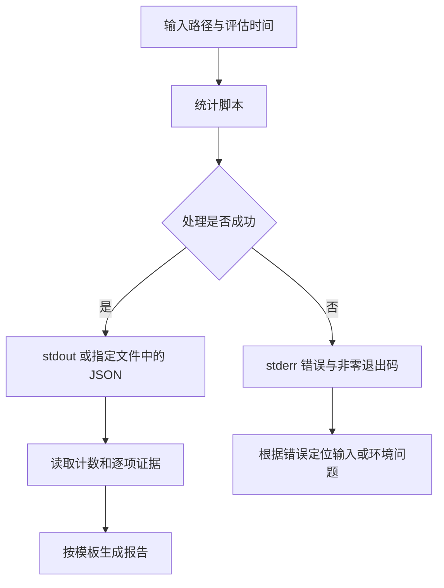

使用子进程调用时，应先检查退出码，再决定是否解析结果。若失败后仍读取上次遗留的结果文件，就会把旧结果冒充成新结果。因此每轮评估使用独立输出路径，或明确验证产物确实属于本轮。

#### 通过摘要、分页或输出文件控制结果体积

本示例为小规模快照设计，一次读取整个文件并输出全部指标，没有实现流式解析和分页。数据较大时应显式输出到文件，再读取摘要；`--output` 已支持这一形式，但不改变程序内存占用。

真正扩展到大规模主机时，可以设计单独的摘要视图和带 `--offset`、`--limit` 的明细查询接口，并增加输入大小上限或流式处理。这些属于后续实现选择，不是本脚本已有功能。输出被宿主截断时，应标明未取得完整结果，不能假定未展示的主机都正常。

### 6.5 如何处理重试、状态变更与预演

#### 通过幂等设计降低重复调用的影响

Agent 可能因为超时或不清楚结果而重试。读取相同快照、使用相同评估时间，应该得到相同的业务结果；本脚本符合这一计算性质。但输出到文件时采用独占创建，第二次写同一路径会拒绝，防止悄悄覆盖已有数据。

两种行为并不矛盾：计算可重复，文件落盘明确保护既有产物。收到目标已存在错误时，先核对现有文件是否是本轮所需结果，或选择新的输出路径，不要把它当作统计错误反复执行。

#### 用输入约束与默认行为减少歧义

本例拒绝 `"92%"`、`true` 和超范围数值，因为猜测转换可能掩盖采集端格式变化。空数组也不能直接解释为“所有主机正常”；它可能代表采集失败，所以作为非法输入处理。

验证脚本时至少覆盖下列不同结果，不能只运行一次正常输入：

| 测试 | 预期 |
| --- | --- |
| CPU 为 85，内存为 90 | 两项都告警，检验阈值等号 |
| 单台主机两个指标均缺失 | 两项未知 |
| 快照年龄恰好 300 秒 | 仍按指标规则分析 |
| 快照年龄 301 秒或来自未来 | 全部指标未知 |
| 主机名重复、指标为布尔值或字符串 | 输入错误 |
| 输入文件不存在 | I/O 错误，不能给出正常报告 |

#### 为有状态操作提供预演和明确的执行条件

源材料建议变更类脚本考虑 `--dry-run`、明确目标和确认参数。预演应列出准备影响的资源及动作，执行时重新核对条件。它能帮助用户审阅计划，却不保证执行时外部状态完全相同。

本巡检技能没有变更系统的职责，因此不需要为了练习引入删除、重启或扩容命令。接入统计脚本时，将第 3 章初版技能的“逐项计算”步骤替换为以下说明，并更新环境要求为 Python 3.10+：

```markdown
读取 references/inspection-rules.md 后，调用 scripts/summarize.py。
以技能根目录解析脚本路径，以用户任务上下文解析输入路径。
传入 --input、--as-of 和 --output，输出路径应属于本次任务。
退出码为 0 后读取结构化结果；非零时先报告具体错误。
使用 results 列出异常和未知项，使用 counts 生成汇总。
按 assets/report-template.md 生成报告，不改变脚本给出的判定规则。
```

完成替换后，重新运行第 5 章的对照案例。脚本测试通过只能证明确定性处理正确；Agent 是否传了正确文件和时间、是否完整保留未知项，仍需检查实际执行与报告。

## 第 7 章 · 在自建 Agent 中接入完整的 Skills 生命周期

### 7.1 如何按作用域发现并供给技能资源

前六章主要站在技能作者视角，本章转向宿主集成者。一个自建 Agent 需要负责发现技能、解析入口、向模型展示目录、加载指令及维护上下文。以下内容根据集成材料整理，目录优先级、容错策略和缓存方式属于实现选择，不是全部客户端必须具有相同代码路径。

#### 根据部署方式确定项目级、用户级与内置技能来源

先回答两个问题：技能实际存放在哪里？模型能否直接读这些文件？本地 Agent 可以扫描目录，云端 Agent 可能需要从仓库、对象存储或配置服务取得资源。获得资源之后，才进入统一的解析与加载流程。

| 作用域 | 典型用途 | 资源供给方式 |
| --- | --- | --- |
| 项目级 | 当前仓库约定和工作流 | 随项目目录提供 |
| 用户级 | 跨项目个人技能 | 本地用户目录或远程配置同步 |
| 组织级 | 团队标准流程 | 管理员分发的配置仓库或资源包 |
| 内置 | 产品默认能力 | 随宿主部署产物提供 |

材料建议考虑客户端专用路径与 `.agents/skills/` 约定。格式规范定义技能目录内部有什么，并不统一规定所有安装位置。集成文档应明确实际扫描路径，避免用户将“某客户端常用路径”当作自身产品承诺。

#### 设置目录扫描范围、排除项和扫描上限

发现器应寻找包含精确文件名 `SKILL.md` 的技能目录，并跳过明显无关的 `.git`、`node_modules` 等目录。是否遵守 `.gitignore`、是否扫描祖先目录，需要结合产品使用场景决定并记录。

扫描上限用于限制意外的大目录遍历，例如深度或目录数量上限；源材料给出的数值只是示例。若达到上限，应返回诊断而非静默声称“没有技能”。教学延伸：采用符号链接时还要避免循环，并确认最终路径属于允许读取范围，不能只检查表面上的目录前缀。

#### 为容器、云端和沙箱环境供给本地不存在的资源

用户机器上有某个技能，不意味着远程执行容器能看到它。项目级技能可以随检出仓库进入容器，用户级和组织级资源则需要另外供给。仅发送目录名称，而没有传输文件和配套资源，无法完成加载。

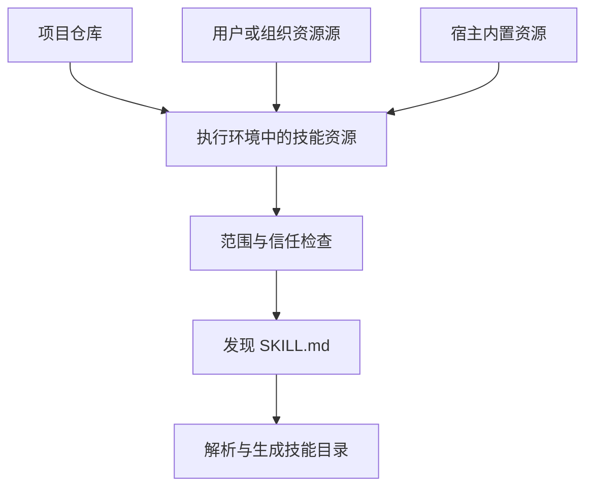

远程资源下载失败应在发现诊断中可见，并说明缺少哪个作用域。已有本地资源是否继续可用，是产品需要明确的降级策略。否则模型只看到技能数量减少，用户却不知道是配置变化还是资源供给失败。

### 7.2 如何处理同名冲突与来源信任

#### 为不同作用域和同作用域冲突制定确定性规则

两个技能同名时，发现器需要明确采用哪个。源材料采用项目级优先于用户级的约定；对于同一作用域的多个路径，先找到或后找到都可实现，但必须保持稳定。不能依赖文件系统遍历的偶然顺序。

例如你规定“项目专用路径优先于项目共享路径，项目作用域优先于用户作用域”，就应写成可测试规则。另一款宿主可以采用不同策略，但必须让用户能够查到最终结果。变化优先级时还需评估现有用户会加载哪个版本。

#### 记录覆盖与跳过信息以便排查技能来源

可以提供以下教学设计的诊断记录：

```json
{
  "name": "ops-inspection-report",
  "selected": "/workspace/project/.agents/skills/ops-inspection-report/SKILL.md",
  "shadowed": ["/workspace/user-skills/ops-inspection-report/SKILL.md"],
  "reason": "project_scope_precedence"
}
```

它回答了“到底用了哪一个技能”和“为什么另一个没生效”。排查用户修改技能后毫无变化的问题时，先查看最终选中路径，常常比分析模型行为更有效。生产诊断输出还应根据使用场景控制敏感路径的展示范围。

#### 在读取项目技能前处理不受信任的仓库内容

项目技能来自仓库内容。刚克隆的仓库可能包含未经用户确认的指令，因此加载信任检查应发生在内容进入模型工作上下文之前。否则虽然脚本尚未执行，行为指导已经影响了模型。

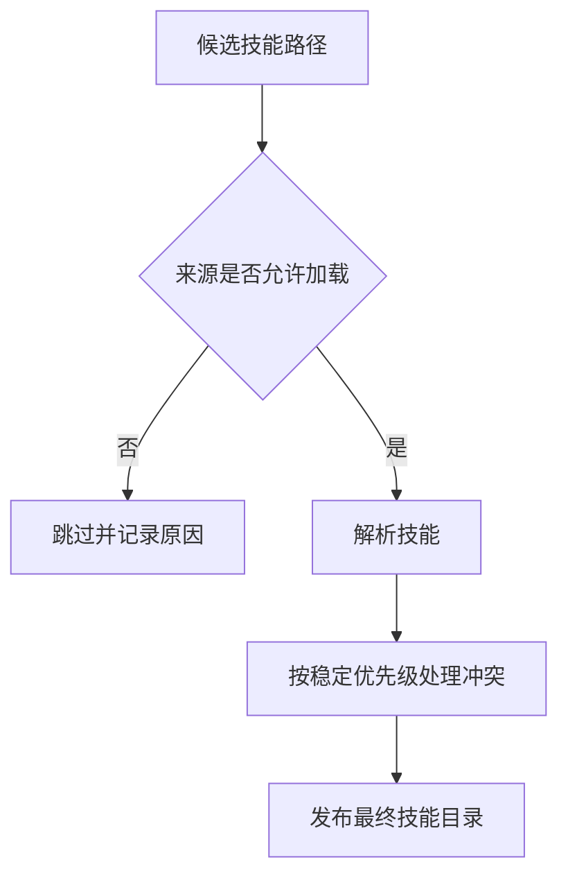

信任来源与执行权限也应分开：允许读取一个技能，不能推导出允许它访问任意目录或执行任何命令。这样的划分让用户能分别管理“接受哪些工作方法”和“允许哪些实际操作”。

### 7.3 如何解析元信息并处理不规范文件

#### 分离 YAML 元信息与 Markdown 正文

解析器先找到文件开头的 YAML 分隔区间，再用 YAML 解析器读取元信息；关闭分隔线后的文本作为正文。不要用任意一个后续 `---` 猜测元信息位置，也不要用字符串包含关系判断字段是否存在。

取得 `name`、`description` 等字段后，还需要检查类型和必要条件。例如 `description` 被解析成数组，即使字段存在，也不符合预期的文本接口。正文中的 Markdown 标题则应保持原样，供激活时使用。

#### 区分可告警加载、可尝试修复和应跳过的错误

第 2 章讲的是作者应遵守的格式，第 7 章的源材料还讨论了宿主为了兼容其他客户端而采用宽松加载的选择：

| 情况 | 作者侧处理 | 集成侧可考虑的处理 |
| --- | --- | --- |
| 名称与目录不一致 | 修改为一致 | 告警后按明确策略加载 |
| 名称超过约定长度 | 缩短名称 | 兼容模式告警，严格模式拒绝 |
| 描述为空或缺失 | 补充适用说明 | 跳过并记录错误 |
| YAML 无法解析 | 修正原文件 | 有限兼容修复失败后跳过 |

源材料提到未加引号的冒号值可作为兼容修复对象。实现时应限制在明确识别的错误模式，保留原始内容及诊断，不静默重写用户文件。兼容加载成功也不能在格式验证报告中写成“完全符合规范”。

#### 保存名称、描述、位置与诊断信息

最小运行时记录通常需要名称、描述和入口位置。集成者还可保存作用域、正文摘要、资源根目录、版本指纹和告警信息，用于激活与诊断。以下为简化示例：

```json
{
  "name": "ops-inspection-report",
  "description": "分析已有巡检 JSON 快照并生成有证据的报告。",
  "location": "/workspace/project/.agents/skills/ops-inspection-report/SKILL.md",
  "scope": "project",
  "diagnostics": []
}
```

发现阶段保存正文能减少激活时 I/O，激活时重新读取则容易取得最新文件。两者都有取舍。教学延伸：若目录描述与激活正文可能来自不同版本，最好记录内容指纹并制定刷新规则，避免模型依据旧描述选择到已改变职责的正文。

### 7.4 如何向模型提供可用技能目录

#### 组织名称、描述与资源位置等目录信息

目录披露只展示模型选择技能所需的信息，而不加载全部正文。XML、JSON 或列表都可以使用，关键是字段清晰、内容正确转义，并保证名称可以唯一定位到最终选中的技能。

```xml
<available_skills>
  <skill>
    <name>ops-inspection-report</name>
    <description>分析已有的本地巡检 JSON 快照并整理异常及未知项。</description>
    <location>/workspace/skills/ops-inspection-report/SKILL.md</location>
  </skill>
</available_skills>
```

如果模型通过文件读取激活，路径通常需要可见；如果专用工具负责查找并返回根目录，目录可以只提供名称和描述。材料中每项约几十至一百 Token 的数字只是量级示意，实际成本取决于描述、编码格式与模型分词方式。

#### 告诉模型何时加载以及如何解析相对引用

仅列出技能名字，模型未必知道如何使用。目录旁应有简短的行为说明，例如“任务适用时先读取对应入口，再按入口指示加载参考资料；相对路径以该技能目录为基准”。使用专用工具时则说明工具名称和调用方式。

| 目录位置 | 适合的接入方式 | 需要考虑的事项 |
| --- | --- | --- |
| 系统提示中的专门区域 | 模型已有文件读取能力 | 目录更新与提示长度 |
| 专用激活工具的描述 | 工具负责技能查找和加载 | 工具定义更新与可用名称约束 |

选择一种能够稳定维护的方式即可。不要同时放入多个不一致的目录副本，否则模型可能看到旧路径，激活工具却只接受新名称。

#### 过滤不可用技能并正确处理空目录

用户禁用、权限不允许或不参与模型自动选择的技能，应按产品策略从自动选择目录中过滤。某些宿主的禁用自动调用标记属于扩展字段，不能当作所有技能实现都支持的标准。

如果允许用户显式调用但禁止模型自行选择，可以将其保留在用户可选入口，并在实际激活时继续检查权限。完全没有可用技能时，省略空目录和没有有效选项的激活工具。这样模型不会浪费动作尝试不存在或不能使用的能力。

### 7.5 如何实现激活与按需资源访问

#### 支持模型选择与用户显式指定两类激活入口

模型驱动激活通常是模型读目录后，自行读取文件或请求专用工具。用户显式激活可以采用命令或提及语法，由宿主查找并注入指令。具体符号不由技能格式统一规定，需要由产品定义。

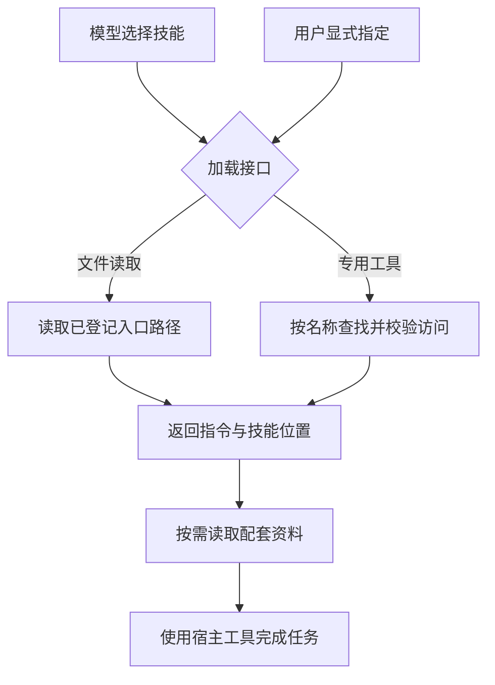

专用激活工具可以把名称限制为当前可用集合，并在服务端再次校验，避免模型请求不存在的技能。激活工具失败时应返回明确的未找到、已禁用或无权限信息，不能返回空正文后假装成功。

#### 选择返回完整文件或仅返回正文并提供定位信息

文件读取自然返回完整 `SKILL.md`；专用工具可以选择保留元信息，或只返回正文。若剥离元信息，也应确保执行时需要的兼容性要求仍然能够取得。

结构化包装有利于后续识别技能内容，例如：

```xml
<skill_content name="ops-inspection-report">
  <base_directory>/workspace/skills/ops-inspection-report</base_directory>
  <instructions>先核对输入和评估时间，再读取规则并调用统计脚本。</instructions>
  <resources>
    <file>references/inspection-rules.md</file>
    <file>scripts/summarize.py</file>
    <file>assets/report-template.md</file>
  </resources>
</skill_content>
```

这是包装形式演示，实际返回需要完整指令，而不是只返回示例中的一句摘要。包装标签帮助宿主定位内容，但不自动赋予其中指令高于系统规则的优先级。

#### 枚举配套资源、按需读取并处理权限范围

返回资源清单可以帮助模型知道有哪些文件，而不一次性读入所有文件。资源很多时应限制清单长度并标注不完整，提供后续查询路径。入口中的明确加载条件仍然重要，单纯列出文件无法告诉模型何时使用。

源材料建议允许读取已授权技能目录，减少配套资料逐个弹窗的负担。实现时可将读取范围绑定到已解析的技能根目录，同时保留脚本执行、网络访问和文件写入各自的权限检查。读权限不等于执行权限，配套文件也不应借相对路径逃逸到未授权区域。

### 7.6 如何在长会话中维护技能上下文

#### 在上下文压缩过程中保留有效技能指令

长会话会压缩或裁剪历史内容。如果活跃技能指令被一起丢弃，模型可能继续执行却忘记原来的规则。集成材料建议保护这部分内容，例如给技能工具输出加标记，或通过结构化包装识别需要保留的指令。

保护并不意味着所有历史技能永久驻留。宿主需要管理哪些技能仍与当前任务有关，以及压缩后是否实际保留。如果采用重新加载，应确保恢复的是相同版本或明确处理版本变化；不能仅凭“本会话曾经加载过”就认定现在仍有效。

#### 记录激活状态并避免重复注入相同内容

可以记录名称、版本标识以及内容是否仍在上下文中。再次请求相同有效内容时省略重复注入；内容已被裁剪、版本已变化或执行进入独立会话时，则不能机械跳过。

完整生命周期可按下面的图检查：

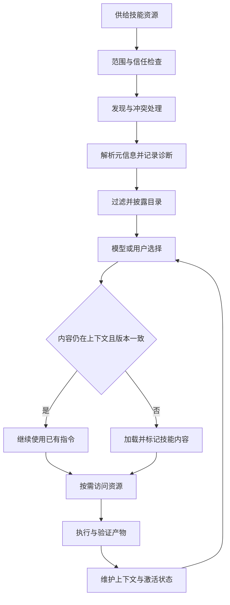

图中的回路表示后续请求继续使用同一生命周期，并非要求一个任务无休止执行。任务完成后应交付产物；是否保留技能供后续请求使用，由会话管理策略决定。

#### 理解可选子代理执行模式的隔离方式与适用条件

部分宿主允许把复杂技能交给独立子会话执行，再将结果返回主会话。它可以减少主上下文中的执行细节，但子会话需要获得完整技能、必要输入、资源权限和明确的输出要求。主会话仍需检查实际产物，不能把一段完成摘要当作全部证据。

对多数初学者，先跑通主会话中的发现、加载和执行即可。只有工作流复杂度或上下文隔离确实需要时，再考虑子代理模式。不要把这种可选集成能力当成技能作者必须实现的前提。

可用下面的检查表回顾整个学习路径，并将问题定位到具体层次：

| 观察到的问题 | 回看章节 | 应优先取得的证据 |
| --- | --- | --- |
| 技能目录里没有目标条目 | 第 2、7 章 | 扫描路径、解析诊断、信任与过滤结果 |
| 不该用时使用，该用时没用 | 第 4 章 | 正反例、加载记录和描述版本 |
| 已加载但报告遗漏或错误 | 第 3、5 章 | 规则、逐项输出、断言与执行轨迹 |
| 命令卡住、参数错或结果无法解析 | 第 6 章 | 帮助信息、退出码、stdout 与 stderr |
| 长任务后忘记技能要求 | 第 7 章 | 压缩过程、指令保留和激活状态 |

完成学习后，可以选择团队的一项低风险、输入清晰的重复工作：先形成可复用步骤，再建立最小技能，分别测试触发和质量，必要时固化脚本，最后把来源、版本与结果证据纳入维护流程。每一步都应能回答“这项设计解决了哪个可观察的问题”，这样才有依据判断技能是否值得长期保留。
