# Claude Agent SDK 中文学习文档

> 适用人群: 运维工程师 / SRE
> 
> 文档定位: 基于 Claude Agent SDK 官网文档整理的系统化中文学习笔记
> 
> 术语说明: 下文将 `Claude Agent SDK` 简称为 `Agent SDK`

## 学习目标

### 概述


1. 理解 Claude Agent SDK 的定位 能力边界 和与 Claude Code 及普通 LLM API 的差异
2. 掌握 Agent SDK 的核心能力 包括工具调用 会话管理 权限控制 Hooks 流式输出 结构化输出 子代理和 MCP 扩展
3. 能从运维工程师和 SRE 视角评估如何把 Agent SDK 用于自动化巡检 变更审核 运行手册执行 审批流和外部系统集成
4. 为后续落地生产级 Agent 打下基础 尤其关注安全 审计 成本 可恢复性 和托管方式

## 阅读建议

### 概述


1. 建议先读第 1 章到第 3 章 先建立整体认识和 API 使用方式
2. 如果你主要关心生产落地 可重点关注第 7 章到第 16 章 包括权限 Hooks 用户输入 会话 托管 安全部署和 MCP
3. 如果你主要关心工程扩展能力 可重点关注第 17 章到第 22 章 包括自定义工具 子代理 Slash 命令 技能 成本跟踪和插件
4. 文中默认以 Python 和 TypeScript 两种官方支持语言为主 但会更偏向运维和 SRE 易落地的理解方式

## 术语约定

### 概述


为避免同一概念在不同章节里出现多种说法 本文采用以下约定:

- `Agent` 译作“代理” 需要强调产品形态时保留 `Agent`
- `Tool` 译作“工具”
- `Session` 译作“会话”
- `Subagent` 译作“子代理”
- `Hook` 或 `Hooks` 保留原名 首次出现时按“Hook 机制”理解
- `system prompt` 译作“系统提示词”
- `Structured Output` 译作“结构化输出”
- `Slash Commands` 译作“Slash 命令”
- `Skills` 译作“技能”
- `MCP` 保留原缩写 首次出现时按“外部工具协议接入层”理解即可

## 目录

### 概述


- [1. 概述 (Overview)](#1-概述-overview)
- [2. 快速入门 (Quickstart)](#2-快速入门-quickstart)
- [3. Python SDK 参考 (Python SDK Reference)](#3-python-sdk-参考-python-sdk-reference)
- [4. 输入模式 (Streaming Input vs Single Message)](#4-输入模式-streaming-input-vs-single-message)
- [5. 停止原因处理 (Stop Reasons)](#5-停止原因处理-stop-reasons)
- [6. 实时流式输出 (Streaming Output)](#6-实时流式输出-streaming-output)
- [7. 权限配置 (Permissions)](#7-权限配置-permissions)
- [8. Hooks 机制 (Hooks)](#8-hooks-机制-hooks)
- [9. 审批与用户输入 (User Input)](#9-审批与用户输入-user-input)
- [10. 会话管理 (Sessions)](#10-会话管理-sessions)
- [11. 文件检查点与回滚 (File Checkpointing)](#11-文件检查点与回滚-file-checkpointing)
- [12. 托管与部署 (Hosting)](#12-托管与部署-hosting)
- [13. 结构化输出 (Structured Outputs)](#13-结构化输出-structured-outputs)
- [14. 修改系统提示词 (Modifying System Prompts)](#14-修改系统提示词-modifying-system-prompts)
- [15. 安全部署 (Secure Deployment)](#15-安全部署-secure-deployment)
- [16. MCP 外部工具集成 (MCP)](#16-mcp-外部工具集成-mcp)
- [17. 自定义工具 (Custom Tools)](#17-自定义工具-custom-tools)
- [18. 子代理 (Subagents)](#18-子代理-subagents)
- [19. Slash 命令 (Slash Commands)](#19-slash-命令-slash-commands)
- [20. 技能 (Skills)](#20-技能-skills)
- [21. 成本与用量跟踪 (Cost Tracking)](#21-成本与用量跟踪-cost-tracking)
- [22. 插件 (Plugins)](#22-插件-plugins)

## 1. 概述 (Overview)

### 本章目标

本章用于建立对 Claude Agent SDK 的第一层整体认知 重点回答下面几个问题:

- Claude Agent SDK 到底是什么
- 它和普通的 Claude API 或 Claude Code CLI 有什么区别
- 它默认提供了哪些能力
- 为什么它对运维工程师和 SRE 有现实价值
- 第一个可以跑起来的 Agent 最少需要哪些条件

### 原文要点整理

`overview.html` 是整个官方文档的总入口 页面重点传达了以下信息:

1. Claude Agent SDK 本质上是把 Claude Code 背后的 Agent 能力以库的形式开放出来 让开发者可以在 Python 和 TypeScript 程序里直接使用
2. 它不是单纯的文本生成 SDK 而是带有工具调用能力的 Agent SDK Claude 可以自动读文件 写文件 编辑代码 执行命令 搜索代码 搜索网页和抓取网页
3. SDK 内置了 Agent 循环（Agent loop） 也就是模型发起工具调用 运行工具 再继续推理的完整闭环 开发者不需要像普通 API 那样手写一整套 tool loop
4. 入门步骤非常直接 安装 SDK 配置 API Key 之后就能运行一个最小 Agent
5. 除了基础工具能力 官方还强调了 Hooks Subagents MCP Permissions Sessions 等生产级能力 说明这个 SDK 的定位并不是玩具 demo 而是面向真实 Agent 应用
6. SDK 还可以读取 Claude Code 的一部分文件系统配置 比如 Skills Slash 命令和项目级记忆等 这意味着 CLI 和 SDK 之间具备较强的迁移和复用空间
7. 文档明确把 Agent SDK 放在 Claude 平台的能力矩阵里进行对比 它位于普通 Client SDK 和 CLI 之间 更适合程序化自动化和生产集成

### 核心概念

#### 1. Claude Agent SDK 是什么

可以把 Claude Agent SDK 理解成一个可编程的代理运行时（Agent Runtime） 它把 Claude Code 的几个关键能力打包给开发者:

- 模型推理能力
- 工具调用能力
- 多轮 Agent 循环
- 上下文和会话管理
- 权限控制
- 与外部系统集成的扩展接口

这意味着你不只是调用一个模型 然后拿到一段文本 而是在运行一个可以自主完成任务的 Agent。

#### 2. 它和普通 Client SDK 的差异

普通 Client SDK 更接近原始大模型 API 你负责:

- 发送 prompt
- 接收模型返回的 `tool_use`
- 自己执行工具
- 把工具结果再喂回模型
- 控制多轮循环何时结束

而在 Agent SDK 中 这些事情被封装好了 你只需要提供目标和配置 Claude 就会自己完成工具调用闭环。

这也是它最适合运维自动化场景的原因之一 因为很多运维任务天然就是多步流程 例如:

- 读取配置
- 搜索日志
- 执行诊断命令
- 汇总结果
- 给出修复建议

#### 3. 它和 Claude Code CLI 的差异

官方给出的定位很清晰:

- CLI 适合交互式开发和一次性任务
- SDK 适合 CI CD 自定义应用和生产自动化

可以简单理解成:

- 如果你想在终端里直接和 Claude 协作 用 CLI
- 如果你想把 Claude 嵌进你的平台 工单系统 自动化系统 Web 服务或内部工具 用 SDK

#### 4. 内置工具能力

Overview 页面首先强调的是开箱即用的工具能力 常见内置工具包括:

- `Read` 读取文件
- `Write` 创建文件
- `Edit` 精确修改文件
- `Bash` 执行终端命令
- `Glob` 按模式查找文件
- `Grep` 按内容搜索文件
- `WebSearch` 搜索网络信息
- `WebFetch` 抓取网页内容
- `AskUserQuestion` 向用户发起澄清问题

对 SRE 而言 这类工具集已经足够支撑很多高频任务 例如:

- 分析配置仓库
- 读取部署文件
- 汇总巡检结果
- 自动生成变更说明
- 辅助编写或修正脚本

#### 5. 生产级能力并不止于工具

Overview 页面还快速引出了后续章节的几个重要主题:

- `Hooks` 用于拦截 审计 阻断或改写 Agent 行为
- `Subagents` 用于把复杂任务拆分给专门子代理
- `MCP` 用于接入外部系统和第三方工具
- `Permissions` 用于控制工具权限和审批策略
- `Sessions` 用于跨多轮交互保留上下文
- Claude Code 的文件系统特性 如 `Skills` `Slash 命令` `CLAUDE.md` 和 `Plugins`

这些能力叠加起来 才让 Agent SDK 真正具备进入生产环境的基础。

### 一个高层理解图

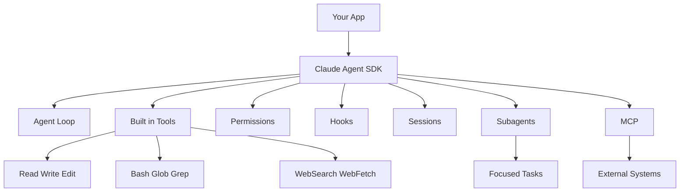

这个图可以帮助你先建立一个正确的心智模型:

- 你的业务系统调用 Agent SDK
- Agent SDK 内部维护 Agent loop
- Claude 通过内置工具和扩展能力执行任务
- 权限 Hooks 和会话管理决定它能做什么 何时暂停 如何被审计
- 外部能力通过 MCP 和子代理进一步扩展

### 关键代码或配置示例

#### 1. 最小可运行示例

下面是 Overview 页面里最核心的最小样例之一 它说明 Agent SDK 的使用入口非常直接:

```python
import asyncio
from claude_agent_sdk import query, ClaudeAgentOptions


async def main():
    async for message in query(
        prompt="What files are in this directory?",
        options=ClaudeAgentOptions(allowed_tools=["Bash", "Glob"]),
    ):
        if hasattr(message, "result"):
            print(message.result)


asyncio.run(main())
```

这个例子的含义是:

- 你向 `query()` 提交任务目标
- 通过 `ClaudeAgentOptions` 控制允许的工具
- SDK 以异步流的方式返回消息
- 最终结果可以从结果消息中读取

对运维工程师来说 这已经足够做一个最简单的目录检查型 Agent 或配置扫描 Agent。

#### 2. 安装和认证

Python 安装:

```bash
pip install claude-agent-sdk
```

TypeScript 安装:

```bash
npm install @anthropic-ai/claude-agent-sdk
```

基础认证方式:

```bash
export ANTHROPIC_API_KEY=your-api-key
```

Overview 页面还提到三类第三方后端认证方式:

- Amazon Bedrock 通过 `CLAUDE_CODE_USE_BEDROCK=1`
- Google Vertex AI 通过 `CLAUDE_CODE_USE_VERTEX=1`
- Microsoft Azure 通过 `CLAUDE_CODE_USE_FOUNDRY=1`

这说明 Agent SDK 不只绑定 Anthropic 原生 API 也为企业常见的云上模型接入方式预留了路径。

#### 3. 只读审查型 Agent 示例

如果你暂时不想让 Agent 修改代码或执行高风险操作 可以先从只读权限开始:

```python
import asyncio
from claude_agent_sdk import query, ClaudeAgentOptions


async def main():
    async for message in query(
        prompt="Review this code for best practices",
        options=ClaudeAgentOptions(
            allowed_tools=["Read", "Glob", "Grep"],
        ),
    ):
        if hasattr(message, "result"):
            print(message.result)


asyncio.run(main())
```

这种模式非常适合运维和 SRE 在初期试点时使用 比如:

- 仅读取部署仓库做配置审计
- 只分析日志样本不落地修改
- 只生成巡检摘要和告警解释

### Claude Code 文件系统能力与 SDK 的关系

Overview 页面有一个容易被忽略但很关键的点 就是 SDK 可以加载 Claude Code 的文件系统配置能力。要启用这些能力 需要显式设置:

- Python 使用 `setting_sources=["project"]`
- TypeScript 使用 `settingSources: ["project"]`

启用后 可以读取项目中的一些约定式配置:

- `Skills` 来自 `.claude/skills/SKILL.md`
- `Slash 命令` 来自 `.claude/commands/*.md`
- `Memory` 来自 `CLAUDE.md` 或 `.claude/CLAUDE.md`
- `Plugins` 通过 `plugins` 选项程序化加载

这意味着 如果你的团队已经在 Claude Code CLI 中维护了一套项目级知识和命令体系 那么迁移到 SDK 时可以复用一部分资产 而不是从零开始。

### 运维工程师 / SRE 关注点

从 SRE 视角读这一页 最值得记住的不是安装命令 而是以下五点:

1. `Agent SDK = 可编排的代理运行时`
- 它更像一个能自主完成多步任务的执行引擎 而不是单次问答接口

2. `权限边界必须从第一天就设计`
- 既然它能读文件 写文件 执行命令 权限控制就不是附加项 而是系统设计的一部分

3. `审计能力需要提前考虑`
- Hooks 和后续的用户审批机制 非常适合接入审计日志 变更记录 工单审批和操作留痕

4. `会话能力很适合复杂排障`
- 真实故障排查通常不是一句 prompt 解决的 会话恢复和上下文延续是高价值能力

5. `外部系统接入是落地关键`
- 仅靠本地文件和 Bash 不足以支撑企业运维场景 未来通常要通过 MCP 或自定义工具接入监控 CMDB 工单系统 发布系统和内部 API

### 实战建议

如果你准备以 SRE 身份试点 Claude Agent SDK 建议先按下面顺序推进:

1. 先做只读 Agent
- 只开 `Read` `Glob` `Grep`
- 不要一开始就开放 `Edit` 和 `Bash`

2. 先做低风险场景
- 配置审计
- 日志归纳
- 发布前检查
- 巡检报告生成

3. 从 Day 1 加入审计
- 后续结合 Hooks 记录所有文件访问 工具调用和关键决策

4. 明确运行环境隔离
- 测试环境和生产环境使用不同凭据
- 不要让同一套 Agent 默认拿到生产写权限

5. 先把 Claude Code CLI 和 Agent SDK 的边界想清楚
- 人工交互探索用 CLI
- 要嵌入平台和自动化流程时再落到 SDK

### 小结

Overview 页最核心的信息可以压缩成一句话:

`Claude Agent SDK 是把 Claude Code 的 Agent 能力以编程库方式开放出来 让你在 Python 或 TypeScript 中构建具备工具调用 权限控制 会话管理 扩展接入和生产落地能力的 AI Agent。`

对于运维工程师和 SRE 来说 它的价值不在于“能聊天” 而在于它具备成为自动化诊断 审批辅助 配置审计 运行手册执行器和外部系统编排器的潜力。

后续章节会逐步展开这些能力 尤其是快速入门 Python SDK 权限 Hooks 会话 托管 安全部署和 MCP 这些真正决定能否落地生产的部分。

## 2. 快速入门 (Quickstart)

### 本章目标

本章的目标不是把所有能力讲全 而是带你完成一次最小闭环:

- 准备运行环境
- 创建一个带缺陷的示例文件
- 写出一个最小可运行的 Agent
- 让 Claude 自动读取文件 识别问题 并修改文件
- 理解 Quickstart 背后最关键的几个概念 包括 `query` `prompt` `options` `allowed_tools` 和 `permission_mode`

如果你是运维工程师或 SRE 可以把这一章理解成 “如何在本地先跑通第一个可控 Agent”。

### 原文要点整理

`quickstart.html` 的结构非常清晰 它用一个修复 Python 代码 bug 的例子 把 Agent SDK 的最小上手流程串起来:

1. 准备基础环境 包括 Node.js 18+ 或 Python 3.10+ 以及 Anthropic 账号
2. 创建一个独立项目目录 安装 Agent SDK
3. 配置 API Key 文档示例使用项目目录下的 `.env`
4. 创建一个故意带 bug 的 `utils.py`
5. 编写 `agent.py` 或 `agent.ts` 调用 `query()`
6. 给 Claude 一个明确任务 允许它使用 `Read` `Edit` `Glob` 等工具
7. 运行 Agent 观察 Claude 如何分析文件 调用工具 并完成修改
8. 再通过增减工具和调整选项 把 Agent 扩展成更强或更严格的版本

Quickstart 真正想说明的不是“修 bug”本身 而是 Agent SDK 的执行模型:

- 你给目标
- 你给权限和配置
- Claude 自己决定用哪些工具
- SDK 负责协调整个 Agent loop

### 核心概念

#### 1. Quickstart 的最小闭环

这一页展示的最小闭环其实只有四步:

1. 让 Claude 看见目标文件
2. 允许它使用必要工具
3. 把执行过程以流式消息输出出来
4. 等待结果落地到文件

这说明 Agent SDK 的门槛并不高 你不需要先搭一整套复杂平台 就能验证 Agent 是否适合你的场景。

#### 2. `query()` 是 Agent 的入口

Quickstart 明确把 `query()` 作为核心入口函数。它返回一个异步迭代器 也就是你会持续收到消息流 而不是一次性只拿到一段最终文本。

这些消息可能包括:

- Claude 的文本输出
- 工具调用信息
- 工具执行后的结果
- 最终完成状态

这对运维场景很重要 因为很多任务不是瞬间完成的 你往往需要看到中间进度 判断 Agent 在做什么。

#### 3. `prompt` 决定任务目标

Quickstart 中的示例 prompt 是:

`Review utils.py for bugs that would cause crashes. Fix any issues you find.`

这个 prompt 的特点很值得学习:

- 任务对象明确 是 `utils.py`
- 任务范围明确 是会导致崩溃的 bug
- 期望动作明确 是修复问题

对 SRE 来说 后续你可以直接类比成:

- 检查某个部署清单中的高风险配置
- 分析某段日志里的异常模式
- 修复某个脚本中的健壮性问题

#### 4. `options` 决定边界和行为

Quickstart 的 `options` 只有两个最关键字段:

- `allowed_tools` 或 `allowedTools`
- `permission_mode` 或 `permissionMode`

它们分别决定:

- Agent 可以做什么
- Agent 在做这些事情时需不需要人类介入审批

这也是 Agent SDK 最重要的工程思想之一: `能力` 和 `权限` 必须同时配置。

#### 5. Quickstart 本质上在演示 Agent loop

官方示例代码的核心不是打印输出 而是这段循环:

- Claude 思考
- Claude 请求工具
- SDK 执行工具
- Claude 观察结果
- Claude 再决定下一步
- 直到任务完成或失败

这和传统 API 调用最大的区别就是 你不必自己手写这个循环。

### 快速入门执行流程图

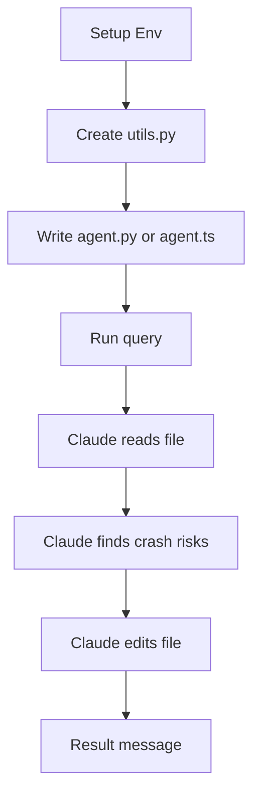

你可以把这个流程看成一个最小的 Agent 运行链路。后续你做运维自动化时 只是把 `utils.py` 换成配置文件 日志 工单内容 或巡检脚本。

### 关键代码或配置示例

#### 1. 环境准备

Quickstart 给出的先决条件是:

- Node.js `18+` 或 Python `3.10+`
- Anthropic 账号

项目初始化方式分别是:

TypeScript:

```bash
mkdir my-agent && cd my-agent
npm install @anthropic-ai/claude-agent-sdk
```

Python 使用 `uv`:

```bash
mkdir my-agent && cd my-agent
uv init && uv add claude-agent-sdk
```

Python 使用 `pip`:

```bash
mkdir my-agent && cd my-agent
python3 -m venv .venv && source .venv/bin/activate
pip3 install claude-agent-sdk
```

认证方式示例:

```bash
ANTHROPIC_API_KEY=your-api-key
```

官方文档同时提到 Bedrock Vertex AI 和 Azure Foundry 三种第三方后端开关 说明 Quickstart 虽然简单 但其接入路径面向企业环境并不封闭。

#### 2. 示例缺陷文件

Quickstart 用一个很小的 `utils.py` 演示 Claude 如何发现“边界条件导致崩溃”的问题:

```python
def calculate_average(numbers):
    total = 0
    for num in numbers:
        total += num
    return total / len(numbers)


def get_user_name(user):
    return user["name"].upper()
```

这两个 bug 分别是:

1. 空列表导致除零异常
2. `None` 导致类型异常

这个设计很巧妙 因为它逼着 Agent 去做两件事:

- 理解代码含义
- 识别边界条件

#### 3. 最小 Agent 示例

下面这个 Python 版本是整页 Quickstart 的核心样例:

```python
import asyncio
from claude_agent_sdk import query, ClaudeAgentOptions, AssistantMessage, ResultMessage


async def main():
    async for message in query(
        prompt="Review utils.py for bugs that would cause crashes. Fix any issues you find.",
        options=ClaudeAgentOptions(
            allowed_tools=["Read", "Edit", "Glob"],
            permission_mode="acceptEdits",
        ),
    ):
        if isinstance(message, AssistantMessage):
            for block in message.content:
                if hasattr(block, "text"):
                    print(block.text)
                elif hasattr(block, "name"):
                    print(f"Tool: {block.name}")
        elif isinstance(message, ResultMessage):
            print(f"Done: {message.subtype}")


asyncio.run(main())
```

这个例子要注意四个点:

1. `query()` 返回的是流 不是一次性响应
2. `allowed_tools` 只开放了完成任务所需的最小工具集
3. `acceptEdits` 允许 Claude 自动修改文件 避免编辑阶段被审批阻塞
4. 代码里显式区分 `AssistantMessage` 和 `ResultMessage` 这是后续处理流式输出的重要基础

#### 4. Quickstart 中的自定义方向

文档还给了三个最有代表性的扩展方向:

- 加 `WebSearch` 让 Agent 获取外部信息
- 加 `system_prompt` 定制输出风格和行为约束
- 加 `Bash` 让 Agent 运行命令并进入更强的自动化模式

其中 `Bash` 是一个分水岭:

- 没有 `Bash` 时 Agent 主要在文件层工作
- 有了 `Bash` 之后 Agent 可以写测试 执行测试 运行脚本 甚至触发更复杂的系统操作

对 SRE 而言 这意味着风险级别会明显上升 权限策略必须同步升级。

### 运维工程师 / SRE 关注点

Quickstart 看起来像“代码修 bug 教程” 但对运维工程师和 SRE 更有价值的是下面这些迁移思路:

1. 把示例文件替换成真实运维对象
- `utils.py` 可以换成 `nginx.conf`
- 可以换成 Kubernetes YAML
- 也可以换成告警脚本 巡检脚本 Terraform 文件或 Helm values

2. 把“修 bug”替换成“识别风险并修正”
- 检查会导致服务不可用的配置项
- 检查空值和边界条件
- 自动补充缺失配置或注释

3. 把“实时打印 Claude 推理过程”替换成“平台侧事件流”
- 在你的平台里 这些消息可以进入前端日志窗口
- 也可以进入审计系统或任务执行时间线

4. 从最小权限开始
- Quickstart 为了演示效率直接用 `acceptEdits`
- 真正落地时 更稳妥的路径通常是先只读 再开编辑 最后才考虑 `Bash`

5. 先在隔离目录验证
- 文档建议在单独目录启动项目 这对 SRE 很重要
- 先把 Agent 约束在可控工作目录中 再逐步扩大作用范围

### 实战建议

如果你要把 Quickstart 的思路迁移到运维和 SRE 场景 建议按下面节奏落地:

1. 第一阶段 只做只读分析
- 使用 `Read` `Glob` `Grep`
- 任务如 配置审计 日志归纳 发布前静态检查

2. 第二阶段 开启受控编辑
- 增加 `Edit`
- 用于自动补注释 修复明显格式问题 生成变更建议稿

3. 第三阶段 再考虑 `Bash`
- 用于执行测试 巡检脚本 或只读诊断命令
- 生产环境必须结合权限控制 审批和沙箱

4. prompt 要写得像工单而不是聊天
- 指定目标文件
- 指定错误范围
- 指定期望动作
- 指定输出要求

5. 把 Quickstart 当成验收模板
- 能否正确读取文件
- 能否调用正确工具
- 能否在限制权限下完成任务
- 能否把结果稳定输出给上层系统

### 小结

Quickstart 的核心价值在于 它用最少的代码演示了 Agent SDK 的完整工作方式:

- 通过 `query()` 启动 Agent loop
- 用 `prompt` 描述任务目标
- 用 `options` 约束工具和权限
- 以流式消息观察 Claude 的执行过程
- 让 Claude 在受控条件下直接完成文件分析和修改

对运维工程师和 SRE 来说 这一章最重要的收获不是“如何修 Python bug” 而是理解一个生产级 Agent 的最小起步姿势:

`先限定目录 再限定工具 再限定权限 然后观察 Agent 是否能在安全边界内稳定完成任务。`

## 3. Python SDK 参考 (Python SDK Reference)

### 本章目标

本章是面向 Python 使用者的 API 地图。读完后你应该能回答:

- Python SDK 的两个主要入口分别是什么
- 什么时候用 `query()` 什么时候用 `ClaudeSDKClient`
- `ClaudeAgentOptions` 里最关键的配置项有哪些
- Python SDK 会返回哪些消息类型
- 如何在 Python 中接入 Hooks 自定义工具 MCP 沙箱和会话恢复

### 原文要点整理

`python-sdk.html` 是一份完整 API 参考，信息量最大。它的核心结构可以压缩为五部分:

1. 入口函数和核心类
- `query()` 适合一次性会话或新开会话
- `ClaudeSDKClient` 适合持续会话和交互式场景

2. 关键配置对象
- `ClaudeAgentOptions` 几乎承载了所有行为控制 例如工具 权限 会话 模型 Hooks 子代理 MCP 插件和沙箱

3. 消息和内容块类型
- `AssistantMessage`
- `ResultMessage`
- `SystemMessage`
- `StreamEvent`
- 各种 `ContentBlock`

4. 扩展能力
- 自定义 MCP 工具
- Hooks
- Programmatic subagents
- Structured output
- Plugins

5. 生产相关能力
- 错误类型
- 沙箱配置
- 文件检查点
- 未沙箱命令的权限回退机制

### 核心概念

#### 1. `query()` 和 `ClaudeSDKClient` 的定位差异

Python SDK 提供了两个核心入口:

- `query()` 每次调用都会创建一个新会话
- `ClaudeSDKClient` 用于维护持续会话

官方的建议可以简单理解为:

- 一次性任务 用 `query()`
- 连续对话 多轮任务 中断恢复 流式输入 用 `ClaudeSDKClient`

对运维场景而言:

- 配置扫描 代码审查 巡检摘要适合 `query()`
- 故障排查助手 值班排障会话 需要人工多轮介入的系统更适合 `ClaudeSDKClient`

#### 2. `ClaudeAgentOptions` 是行为控制中心

这个类相当于 Agent 的控制面板。最重要的字段包括:

- `allowed_tools`
- `disallowed_tools`
- `permission_mode`
- `can_use_tool`
- `hooks`
- `resume`
- `continue_conversation`
- `mcp_servers`
- `agents`
- `setting_sources`
- `include_partial_messages`
- `output_format`
- `sandbox`
- `enable_file_checkpointing`

一个很关键的细节是:

- `allowed_tools` 是“自动批准”的工具列表
- 它不是“只允许这些工具”
- 真正的拒绝要靠 `disallowed_tools` 或权限规则

这点很容易误解 对安全设计影响很大。

#### 3. Python SDK 的消息模型

Python SDK 的消息流主要由以下对象组成:

- `SystemMessage` 会话初始化和系统元数据
- `AssistantMessage` Claude 的完整回复
- `ResultMessage` 最终结果 成本和用量
- `StreamEvent` 流式增量事件 仅在开启 `include_partial_messages=True` 后可见

对 SRE 来说 这里的重点是:

- `AssistantMessage` 更适合给用户界面展示
- `ResultMessage` 更适合做审计 成本统计 最终状态判断
- `StreamEvent` 更适合进度条 实时 UI 和故障诊断

#### 4. `ClaudeSDKClient` 提供持续会话能力

`ClaudeSDKClient` 支持的关键方法包括:

- `query()` 发送新请求
- `receive_response()` 读取当前响应直到 `ResultMessage`
- `receive_messages()` 读取全部消息
- `interrupt()` 中断当前任务
- `set_permission_mode()` 动态切换权限模式
- `rewind_files()` 按用户消息回滚文件
- `get_mcp_status()` 查看 MCP 服务状态

这意味着你可以把它当成一个可长期保持上下文的 Agent 会话对象。

#### 5. Hooks 自定义工具和沙箱都是 Python 一等能力

Python 参考页明确表明 Python SDK 不是阉割版。它具备:

- Hooks
- 自定义 MCP 工具
- Structured output
- 子代理
- 插件
- 沙箱
- 文件检查点

所以如果你的内部平台主要是 Python 栈 完全可以直接基于官方 SDK 做生产集成。

### Python SDK 能力地图

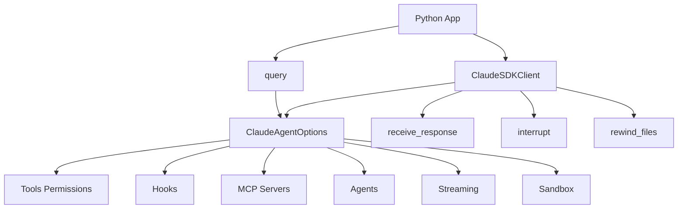

### 关键代码或配置示例

#### 1. 使用 `query()` 发起一次任务

```python
import asyncio
from claude_agent_sdk import query, ClaudeAgentOptions


async def main():
    options = ClaudeAgentOptions(
        system_prompt="You are an expert Python developer",
        permission_mode="acceptEdits",
        cwd="/home/user/project",
    )

    async for message in query(prompt="Create a Python web server", options=options):
        print(message)


asyncio.run(main())
```

适合场景:

- 一次性代码分析
- 单次配置审计
- 单个工单执行

#### 2. 使用 `ClaudeSDKClient` 保持连续会话

```python
import asyncio
from claude_agent_sdk import ClaudeSDKClient


async def main():
    async with ClaudeSDKClient() as client:
        await client.query("Read the authentication module")
        async for message in client.receive_response():
            print(message)

        await client.query("Now explain where it is called")
        async for message in client.receive_response():
            print(message)


asyncio.run(main())
```

适合场景:

- 持续排障
- 多轮问答
- 需要保留上下文的运维辅助

#### 3. 典型 `ClaudeAgentOptions` 配置

```python
from claude_agent_sdk import ClaudeAgentOptions

options = ClaudeAgentOptions(
    allowed_tools=["Read", "Edit", "Bash"],
    disallowed_tools=["WebFetch"],
    permission_mode="acceptEdits",
    resume="session-id",
    include_partial_messages=True,
    setting_sources=["project"],
    enable_file_checkpointing=True,
)
```

建议把这些字段按职责来理解:

- 工具与权限: `allowed_tools` `disallowed_tools` `permission_mode` `can_use_tool`
- 上下文与会话: `resume` `continue_conversation` `fork_session`
- 可观察性: `include_partial_messages` `stderr`
- 扩展集成: `mcp_servers` `agents` `plugins`
- 运行环境: `cwd` `env` `add_dirs` `sandbox`

#### 4. Hook 示例

```python
from claude_agent_sdk import query, ClaudeAgentOptions, HookMatcher


async def log_tool_use(input_data, tool_use_id, context):
    print(f"Tool used: {input_data.get('tool_name')}")
    return {}


options = ClaudeAgentOptions(
    hooks={
        "PreToolUse": [HookMatcher(hooks=[log_tool_use])],
        "PostToolUse": [HookMatcher(hooks=[log_tool_use])],
    }
)
```

这个模式非常适合:

- 记录审计日志
- 拦截危险 Bash
- 做合规校验

#### 5. 沙箱配置示例

```python
from claude_agent_sdk import query, ClaudeAgentOptions, SandboxSettings

sandbox_settings: SandboxSettings = {
    "enabled": True,
    "autoAllowBashIfSandboxed": True,
    "network": {"allowLocalBinding": True},
}

async for message in query(
    prompt="Build and test my project",
    options=ClaudeAgentOptions(sandbox=sandbox_settings),
):
    print(message)
```

参考页特别强调:

- 文件系统和网络访问的精细限制不只靠 `sandbox`
- 还要结合 permission rules
- `allowUnsandboxedCommands` 一旦开启 必须有严密审批逻辑

### 运维工程师 / SRE 关注点

1. Python SDK 已经足够完整
- 不是只能做简单问答
- 它可以承担生产级 Agent 平台的主干能力

2. `allowed_tools` 不等于白名单
- 这是最容易误判的点
- 真正的安全控制要再看 `disallowed_tools` `permission_mode` `can_use_tool` 和 Hooks

3. `setting_sources` 默认是 `None`
- 这意味着默认不会加载文件系统中的 Claude 配置
- 对隔离型平台是好事
- 对想复用项目内 `CLAUDE.md` 和 Skills 的团队需要显式开启

4. `ResultMessage` 自带成本和用量
- 这对平台计费和资源治理很重要

5. 沙箱不是全部安全边界
- 参考页明确提醒 未沙箱命令回退到权限系统
- 如果 `bypassPermissions` 和 `allowUnsandboxedCommands` 叠加 风险极高

### 实战建议

1. 如果你在做后台任务或 CI 用 `query()`
2. 如果你在做交互式排障助手 用 `ClaudeSDKClient`
3. 先显式声明 `cwd` 和 `setting_sources`
4. 默认开启审计型 Hooks
5. 把 `sandbox` `permission_mode` `can_use_tool` 一起设计 不要分开看
6. 平台侧统一处理 `ResultMessage` 做成本统计 失败归因 和最终状态记录

### 小结

Python SDK 参考页最重要的结论是:

`Python SDK 提供了完整的 Agent 运行能力 其中 query() 适合一次性任务 ClaudeSDKClient 适合持续会话 而 ClaudeAgentOptions 则是几乎所有安全 行为 和扩展能力的统一入口。`

## 4. 输入模式 (Streaming Input vs Single Message)

### 本章目标

本章帮助你区分 Agent SDK 的两种输入方式:

- 流式输入模式
- 单消息输入模式

重点不是 API 形式本身 而是理解它们在交互能力 中断能力 图像输入 Hook 支持和会话连续性上的差异。

### 原文要点整理

`streaming-vs-single-mode.html` 说明 Agent SDK 有两种输入模式:

1. `Streaming Input Mode`
- 默认且推荐
- Agent 作为长生命周期进程运行
- 支持消息队列 中断 图像输入 Hooks 和自然多轮会话

2. `Single Message Input`
- 更简单
- 更像一次性请求
- 更适合无状态运行环境

文档明确表态:

- 如果没有特殊限制 优先使用流式输入

### 核心概念

#### 1. 流式输入是“长连接式 Agent 会话”

流式输入并不只是“边生成边返回” 它真正指的是:

- 应用持续向 Agent 送消息
- Agent 会话持续存活
- 中途可以追加消息或中断当前执行
- 文件系统状态和会话上下文持续保留

这更接近一个真正的交互式 Agent。

#### 2. 单消息输入是“单轮任务投递”

单消息模式更像:

- 发一个请求
- 等一个结果
- 需要继续时再通过 `continue_conversation` 或会话恢复来衔接

它的好处是:

- 模型交互更简单
- 易于接到 Lambda 这类无状态运行环境

代价是:

- 少了图像直传
- 少了动态队列
- 少了中断控制
- 少了 Hook 集成

#### 3. Python 和 TypeScript 的表现形式不同

文档中的示例有一个容易忽略的点:

- TypeScript 里 `query()` 可以直接接收异步消息生成器
- Python 中更推荐用 `ClaudeSDKClient` 来承载流式输入

因此 “模式” 和 “具体 API 入口” 要分开理解。

### 输入模式对比图

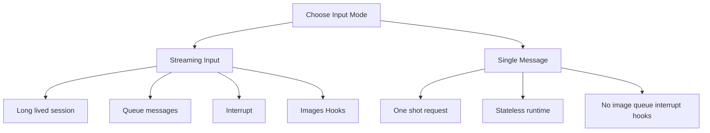

### 关键代码或配置示例

#### 1. 流式输入示例

Python 版本使用 `ClaudeSDKClient`:

```python
from claude_agent_sdk import ClaudeSDKClient, ClaudeAgentOptions
import asyncio


async def streaming_analysis():
    async def message_generator():
        yield {
            "type": "user",
            "message": {
                "role": "user",
                "content": "Analyze this codebase for security issues",
            },
        }

    options = ClaudeAgentOptions(max_turns=10, allowed_tools=["Read", "Grep"])

    async with ClaudeSDKClient(options) as client:
        await client.query(message_generator())
        async for message in client.receive_response():
            print(message)


asyncio.run(streaming_analysis())
```

这个模式适合:

- 安全审计助手
- 多轮故障排查
- 需要上传图像或架构图的分析场景

#### 2. 单消息模式示例

```python
from claude_agent_sdk import query, ClaudeAgentOptions, ResultMessage
import asyncio


async def single_message_example():
    async for message in query(
        prompt="Explain the authentication flow",
        options=ClaudeAgentOptions(max_turns=1, allowed_tools=["Read", "Grep"]),
    ):
        if isinstance(message, ResultMessage):
            print(message.result)


asyncio.run(single_message_example())
```

适合:

- 后台异步任务
- 简单一次性分析
- 无状态函数

### 运维工程师 / SRE 关注点

1. 在线值班助手优先流式输入
- 因为你需要中断 追问 继续分析和插入新证据

2. CI 或批处理任务优先单消息
- 因为任务固定 环境短生命周期 更容易封装

3. 图像和 Hook 支持是重要分界
- 如果你需要架构图截图 审批流 运行中的细粒度拦截 单消息模式就不够用了

4. 流式输入更像“会话型 Agent”
- 单消息更像“任务型 Agent”

### 实战建议

1. 交互式系统默认选流式输入
2. 批处理和离线任务默认选单消息
3. 如果前期不确定 先用单消息验证 Prompt 和权限设计 再升级为流式输入
4. 如果涉及人工审批 中断恢复 图像分析 直接选流式输入 不要绕路

### 小结

这一章最关键的结论是:

`流式输入模式是 Agent SDK 的推荐主路径 它适合真实交互式 Agent 单消息模式则适合简单 一次性 和无状态任务。`

## 5. 停止原因处理 (Stop Reasons)

### 本章目标

本章解释 Agent 为什么停止生成 以及你应该如何据此做:

- 成功判断
- 拒绝识别
- Token 截断重试
- 错误归因
- 监控埋点

### 原文要点整理

`stop-reasons.html` 讲的是底层 API 返回的 `stop_reason`。它能帮助你区分:

- 正常结束
- 输出被 token 限制截断
- 模型拒绝回答
- 生成停在 stop sequence
- 错误发生前最后一次停止原因

文档特别指出:

- TypeScript 可以直接从 `ResultMessage` 取 `stop_reason`
- Python 当前不能直接从 `ResultMessage` 读取
- Python 需要借助 `StreamEvent` 里的 `message_delta` 事件做绕过

### 核心概念

#### 1. `stop_reason` 是“结束语义”而不是“任务状态”

不要把 `stop_reason` 和最终业务结果混为一谈。

例如:

- `end_turn` 只表示模型正常完成一轮生成
- 但任务是否真正成功 还要结合 `ResultMessage.subtype`

所以更稳妥的判断方式是:

- 先看结果类型是否成功
- 再看 `stop_reason` 解释为何结束

#### 2. 常见停止原因

文档列出的值包括:

- `end_turn` 正常结束
- `max_tokens` 达到输出 token 上限
- `stop_sequence` 命中停止序列
- `refusal` 模型拒绝执行
- `tool_use` 最后输出是工具调用
- `null` 还没有有效 API 响应或是回放旧会话结果

其中对平台最有价值的通常是:

- `refusal`
- `max_tokens`
- `null`

#### 3. 错误结果也可能有 `stop_reason`

官方明确说明 即使是:

- `error_max_turns`
- `error_max_budget_usd`
- `error_during_execution`

也仍然可能携带 `stop_reason`。它表示错误出现前最后一次 assistant 消息的停止原因。

这对排障很有用 因为你能知道:

- 是模型正常说完后才撞上外层限制
- 还是工具调用阶段被截断

#### 4. Python 需要流式事件绕过

Python 当前没有在 `ResultMessage` 上直接暴露 `stop_reason`。因此:

- 必须开启 `include_partial_messages=True`
- 监听 `StreamEvent`
- 从 `message_delta` 的 `delta` 里提取 `stop_reason`

### 关键代码或配置示例

#### 1. TypeScript 中直接读取

```typescript
for await (const message of query({
  prompt: "Write a poem about the ocean"
})) {
  if (message.type === "result") {
    console.log("Stop reason:", message.stop_reason);
  }
}
```

#### 2. Python 中通过 `StreamEvent` 读取

```python
from claude_agent_sdk import query, ClaudeAgentOptions, ResultMessage
from claude_agent_sdk.types import StreamEvent
import asyncio


async def get_stop_reason(prompt: str):
    stop_reason = None
    result = None
    options = ClaudeAgentOptions(include_partial_messages=True)

    async for message in query(prompt=prompt, options=options):
        if isinstance(message, StreamEvent):
            if message.event.get("type") == "message_delta":
                delta = message.event.get("delta", {})
                if "stop_reason" in delta:
                    stop_reason = delta["stop_reason"]
        elif isinstance(message, ResultMessage):
            result = message.result

    return stop_reason, result
```

### 运维工程师 / SRE 关注点

1. `refusal` 应单独打标签
- 这不是普通失败
- 往往需要提示用户修改任务描述或做策略解释

2. `max_tokens` 很适合作为自动重试信号
- 可以提高 token 限制
- 或让模型继续

3. `null` 常提示会话回放或更早阶段失败
- 适合做异常监控

4. Python 平台如果要统一日志 需要自己补采 `stop_reason`

### 实战建议

1. 平台侧把 `ResultMessage.subtype` 和 `stop_reason` 一起记录
2. 对 `refusal` 输出更友好的用户提示
3. 对 `max_tokens` 设计自动续写或重试策略
4. Python 服务默认在关键任务里开启部分流式事件采样 便于补齐停止原因

### 小结

`stop_reason` 的价值在于解释 Agent 为什么停下 它特别适合做拒绝识别 截断重试 和可观测性埋点 但不能单独替代任务成功判断。`

## 6. 实时流式输出 (Streaming Output)

### 本章目标

本章讲的是“如何实时看到 Agent 正在输出什么”。重点包括:

- 如何开启流式输出
- `StreamEvent` 是什么
- 如何实时展示文本
- 如何实时展示工具调用
- 流式输出有哪些已知限制

### 原文要点整理

`streaming-output.html` 说明 Agent SDK 默认只给你完整的 `AssistantMessage`。如果想实时拿到增量文本和工具调用过程 需要开启:

- Python: `include_partial_messages=True`
- TypeScript: `includePartialMessages=true`

开启后 你会额外收到 `StreamEvent` 消息 其中封装了原始 Claude API 流式事件。

文档重点讲了三件事:

1. 如何从 `content_block_delta` 中提取文本增量
2. 如何跟踪工具调用的开始 输入增量 和结束
3. 如何把这些事件组装成一个可用的实时 UI

### 核心概念

#### 1. 输入流式和输出流式不是一回事

这页文档讲的是输出流式:

- 也就是 Agent 回消息给你时是否边生成边送达

它和上一章的输入模式不同:

- 输入模式解决“你怎么发消息给 Agent”
- 输出流式解决“Agent 怎么实时把结果回给你”

#### 2. `StreamEvent` 是底层事件的包装

开启部分消息后 你收到的不只是最终文本 而是事件流 例如:

- `message_start`
- `content_block_start`
- `content_block_delta`
- `content_block_stop`
- `message_delta`
- `message_stop`

所以你的程序不能只 `print(message)`，而要自己解析事件。

#### 3. 文本和工具都可以流式显示

文本类输出通常来自:

- `content_block_delta`
- 且 `delta.type == "text_delta"`

工具调用过程通常关注:

- `content_block_start` 工具开始
- `content_block_delta` 且 `input_json_delta` 输入增量
- `content_block_stop` 工具结束

这让你可以做出比“转圈等待”更可解释的 Agent UI。

### 流式输出消息流

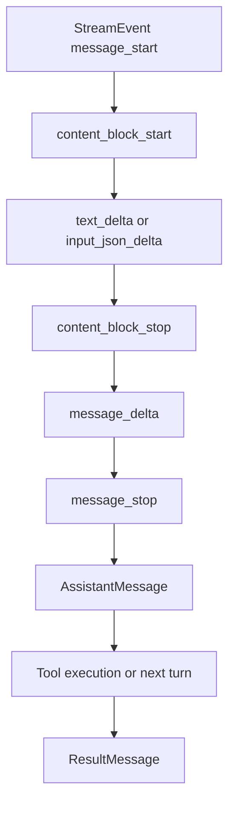

### 关键代码或配置示例

#### 1. 实时打印文本

```python
from claude_agent_sdk import query, ClaudeAgentOptions
from claude_agent_sdk.types import StreamEvent
import asyncio


async def stream_text():
    options = ClaudeAgentOptions(include_partial_messages=True)

    async for message in query(prompt="Explain how databases work", options=options):
        if isinstance(message, StreamEvent):
            event = message.event
            if event.get("type") == "content_block_delta":
                delta = event.get("delta", {})
                if delta.get("type") == "text_delta":
                    print(delta.get("text", ""), end="", flush=True)

    print()


asyncio.run(stream_text())
```

#### 2. 实时跟踪工具调用

```python
from claude_agent_sdk import query, ClaudeAgentOptions
from claude_agent_sdk.types import StreamEvent
import asyncio


async def stream_tool_calls():
    options = ClaudeAgentOptions(
        include_partial_messages=True,
        allowed_tools=["Read", "Bash"],
    )

    current_tool = None
    tool_input = ""

    async for message in query(prompt="Read the README.md file", options=options):
        if isinstance(message, StreamEvent):
            event = message.event
            event_type = event.get("type")

            if event_type == "content_block_start":
                content_block = event.get("content_block", {})
                if content_block.get("type") == "tool_use":
                    current_tool = content_block.get("name")
                    tool_input = ""

            elif event_type == "content_block_delta":
                delta = event.get("delta", {})
                if delta.get("type") == "input_json_delta":
                    tool_input += delta.get("partial_json", "")

            elif event_type == "content_block_stop":
                if current_tool:
                    print(f"{current_tool}: {tool_input}")
                    current_tool = None


asyncio.run(stream_tool_calls())
```

#### 3. 构建简化 UI

文档里的 UI 示例本质是:

- 工具执行时显示状态提示
- 普通文本持续流式打印
- 最终收到 `ResultMessage` 后标记完成

这是构建控制台 Agent 前端或 Web 聊天前端时最实用的模式。

### 运维工程师 / SRE 关注点

1. 流式输出极适合可观测性
- 能看到 Agent 当前在读文件 还是在调用工具
- 对排障和信任建立很重要

2. 工具流式比文本流式更有价值
- 对运维平台而言 “当前在执行什么动作” 往往比 Claude 正在说什么更重要

3. `message_delta` 还可携带停止原因和 usage
- 这让流式事件兼具实时 UI 和监控价值

4. 不是所有功能都能流式
- 扩展思考和结构化输出都有已知限制

### 实战建议

1. 平台 UI 默认同时显示文本流和工具状态
2. 日志系统单独记录工具调用开始和结束事件
3. 对长任务显示当前工具名 避免用户误以为卡死
4. 如果启用了 structured output 不要指望 JSON 结果以增量形式到达

### 小结

`Streaming Output` 的核心价值在于把 Agent 的工作过程显性化。它不仅能改善用户体验 还能够为审计 监控 和问题定位提供更细粒度的事件流。`

## 7. 权限配置 (Permissions)

### 本章目标

本章解释 Claude Agent SDK 的权限系统是如何做决策的。你需要读懂:

- 工具请求到底按什么顺序被批准或拒绝
- `allowed_tools` 和 `disallowed_tools` 的真实含义
- 各种 `permission_mode` 的行为差异
- 为什么 `bypassPermissions` 风险极高

### 原文要点整理

`permissions.html` 讲的是 Agent SDK 的权限判断主链路。官方给出的顺序是:

1. Hooks
2. Deny rules
3. Permission mode
4. Allow rules
5. `canUseTool` 回调

这意味着权限系统不是只有一个开关 而是多层叠加:

- Hooks 可以最先拦截或改写
- Deny 规则优先级很高
- `permission_mode` 提供全局行为
- Allow 规则负责自动批准
- 还没决出结果时才进入人工或程序化审批

### 核心概念

#### 1. 权限评估顺序决定一切

这一页最重要的内容就是评估顺序。你可以把它理解成:

- 先看有没有更高优先级的安全逻辑
- 再看有没有明确禁止
- 再看当前全局模式怎么处理
- 再看有没有明确允许
- 最后才问人或问回调

顺序错误会直接导致安全设计误判。

#### 2. `allowed_tools` 是自动批准 不是可用工具全集

文档反复强调:

- `allowed_tools=["Read", "Grep"]` 的意思是这两个工具自动批准
- 不是说 Claude 只能看到这两个工具

如果工具不在 `allowed_tools` 里:

- 它仍然可能被 Claude 请求
- 然后进入后续权限流程

#### 3. `disallowed_tools` 是硬拒绝

`disallowed_tools` 的优先级更接近“硬封禁”:

- 即使在 `bypassPermissions` 模式下也有效
- Deny 规则比全局放行更早执行

所以如果你必须放开一些自动化能力 但又想死死封住部分工具 这才是更可靠的做法。

#### 4. 权限模式是全局行为开关

文档列出的模式包括:

- `default`
- `dontAsk` 仅 TypeScript
- `acceptEdits`
- `bypassPermissions`
- `plan`

其中最常用的理解方式是:

- `default` 进入常规审批流
- `acceptEdits` 自动通过文件编辑
- `bypassPermissions` 几乎全放开
- `plan` 只规划不执行

#### 5. `bypassPermissions` 会传递给子代理

这一点非常关键:

- 开启 `bypassPermissions` 后 子代理会继承它
- 子代理可能有不同提示词和更松散的任务边界

所以这个模式不只是“主代理变大胆” 而是“整个代理树都失去审批约束”。

### 权限评估流程图

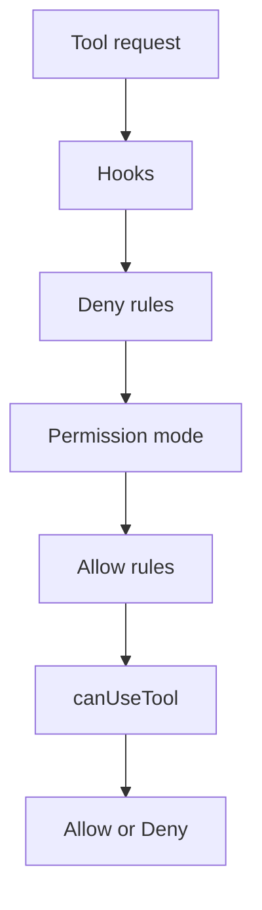

### 关键代码或配置示例

#### 1. 基础权限模式设置

```python
from claude_agent_sdk import query, ClaudeAgentOptions

async for message in query(
    prompt="Help me refactor this code",
    options=ClaudeAgentOptions(
        permission_mode="default",
    ),
):
    print(message)
```

#### 2. 自动批准指定工具

```python
options = ClaudeAgentOptions(
    allowed_tools=["Read", "Glob", "Grep"],
)
```

适合:

- 只读分析 Agent
- 配置巡检 Agent
- 文档检索 Agent

#### 3. 硬阻断危险工具

```python
options = ClaudeAgentOptions(
    allowed_tools=["Read", "Glob", "Grep"],
    disallowed_tools=["Bash"],
)
```

这比只写 `allowed_tools` 更安全 因为它能明确阻止 `Bash`。

#### 4. `acceptEdits` 的使用边界

文档说明 `acceptEdits` 会自动批准:

- `Edit`
- `Write`
- 一些文件系统命令 如 `mkdir` `touch` `rm` `mv` `cp`

但它不会自动批准所有 Bash。

### 运维工程师 / SRE 关注点

1. 权限设计一定要看顺序 不能只看字段名
2. `allowed_tools` 不是安全边界
3. `disallowed_tools` 才适合定义硬禁区
4. `plan` 模式很适合“先出方案 后审批再执行”
5. `bypassPermissions` 只能用于高度隔离且完全信任的环境

### 实战建议

1. 默认从 `default` 或只读模式开始
2. 初期试点优先使用:
- `allowed_tools=["Read", "Glob", "Grep"]`
- `disallowed_tools=["Bash", "Write", "Edit"]`

3. 如果要允许修改 优先 `acceptEdits` 而不是 `bypassPermissions`
4. 如果要上生产 一定把权限规则和 Hooks 一起设计
5. 子代理场景下 尤其避免无脑使用 `bypassPermissions`

### 小结

`Permissions` 这一章最重要的认知是 权限控制不是单一开关 而是一条多层决策链。真正的安全设计要同时考虑 Hooks Deny 规则 Permission mode Allow 规则 和 canUseTool 回调。`

## 8. Hooks 机制 (Hooks)

### 本章目标

本章讲 Hooks 如何把 Agent 从“能工作”提升到“可控 可审计 可治理”。重点包括:

- Hook 在什么时机触发
- 如何通过 matcher 精确匹配
- Hook 能做哪些事
- 多个 Hook 如何串联
- 哪些场景最适合运维平台接入

### 原文要点整理

`hooks.html` 的核心主张很明确:

- Hook 是 Agent 生命周期上的拦截器
- 你可以在关键事件发生时运行自己的逻辑

它支持的典型用途包括:

- 阻断危险操作
- 记录审计日志
- 改写输入输出
- 触发人工审批
- 跟踪子代理和通知事件

### 核心概念

#### 1. Hook 的执行链路

Hook 的执行过程大致是:

1. Agent 触发某个事件
2. SDK 找到该事件上的 Hook
3. matcher 过滤哪些 Hook 需要执行
4. 回调收到上下文
5. 回调返回决策或附加信息

这本质上是一个策略执行层。

#### 2. 常见 Hook 事件

文档列出的高价值事件包括:

- `PreToolUse`
- `PostToolUse`
- `PostToolUseFailure`
- `UserPromptSubmit`
- `Stop`
- `SubagentStart`
- `SubagentStop`
- `PermissionRequest`
- `Notification`

其中对 SRE 最常见的三类是:

- `PreToolUse` 做拦截
- `PostToolUse` 做审计
- `PermissionRequest` 做外部通知

#### 3. matcher 只按事件目标匹配

例如工具型 Hook 中:

- matcher 常常匹配工具名
- 不是直接按文件路径匹配

如果你要按路径过滤:

- 必须在回调里继续检查 `tool_input.file_path`

#### 4. Hook 既能阻断 也能改写

`PreToolUse` Hook 可以:

- `deny`
- `allow`
- `ask`
- `updatedInput`
- `systemMessage`

这意味着 Hook 不只是“日志插件” 它能实质改变 Agent 行为。

#### 5. Hook 可以异步做副作用

文档还介绍了 async 输出:

- 适合发 webhook
- 写日志
- 记指标

这类 Hook 不必阻塞主执行流。

### Hook 工作流

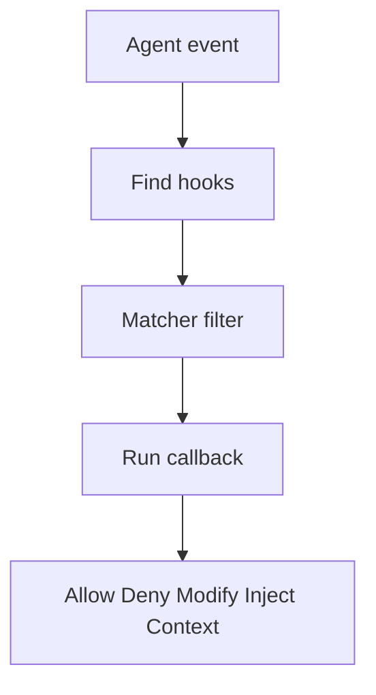

### 关键代码或配置示例

#### 1. 阻止修改 `.env`

```python
from claude_agent_sdk import ClaudeSDKClient, ClaudeAgentOptions, HookMatcher


async def protect_env_files(input_data, tool_use_id, context):
    file_path = input_data["tool_input"].get("file_path", "")
    file_name = file_path.split("/")[-1]

    if file_name == ".env":
        return {
            "hookSpecificOutput": {
                "hookEventName": input_data["hook_event_name"],
                "permissionDecision": "deny",
                "permissionDecisionReason": "Cannot modify .env files",
            }
        }
    return {}


options = ClaudeAgentOptions(
    hooks={
        "PreToolUse": [HookMatcher(matcher="Write|Edit", hooks=[protect_env_files])]
    }
)
```

#### 2. 改写写入路径

文档中的另一个经典模式是把写入路径自动重写到沙箱目录:

```python
async def redirect_to_sandbox(input_data, tool_use_id, context):
    if input_data["tool_name"] == "Write":
        original_path = input_data["tool_input"].get("file_path", "")
        return {
            "hookSpecificOutput": {
                "hookEventName": input_data["hook_event_name"],
                "permissionDecision": "allow",
                "updatedInput": {
                    **input_data["tool_input"],
                    "file_path": f"/sandbox{original_path}",
                },
            }
        }
    return {}
```

#### 3. 串联多个 Hook

```python
options = ClaudeAgentOptions(
    hooks={
        "PreToolUse": [
            HookMatcher(hooks=[rate_limiter]),
            HookMatcher(hooks=[authorization_check]),
            HookMatcher(hooks=[input_sanitizer]),
            HookMatcher(hooks=[audit_logger]),
        ]
    }
)
```

这是很适合平台化的做法:

- 每个 Hook 只做一件事
- 顺序清晰
- 易于审查和复用

### 运维工程师 / SRE 关注点

1. Hooks 是审计和合规的关键入口
2. `PreToolUse` 很适合挡住高风险 Bash 和敏感路径写入
3. `PostToolUse` 适合做统一操作日志
4. `Notification` 和 `PermissionRequest` 可用于发 Slack 或工单提醒
5. `SubagentStop` 很适合观察并行子任务的完成情况

### 实战建议

1. 默认至少配两类 Hook:
- `PreToolUse` 安全控制
- `PostToolUse` 审计留痕

2. 用 matcher 先缩小范围 再在回调内细查参数
3. 多 Hook 串联时保持单一职责
4. 需要快速放行主流程的记录型 Hook 使用 async 输出
5. 把 Hook 输出接入日志 平台事件线 和告警系统

### 小结

`Hooks` 是 Claude Agent SDK 的治理层。没有 Hooks Agent 只是能执行任务 有了 Hooks 之后 Agent 才真正具备审计 安全控制 事件联动 和平台级接入能力。`

## 9. 审批与用户输入 (User Input)

### 本章目标

本章解释 Agent 在什么时候必须停下来等人类输入 以及你的应用如何把这些输入回传给 SDK。重点包括:

- 工具审批请求
- 澄清问题 `AskUserQuestion`
- `canUseTool` 回调
- 回调返回格式

### 原文要点整理

`user-input.html` 说明 Claude 需要用户输入时主要有两类情况:

1. 工具审批
- 比如删除文件 执行命令 修改配置

2. 澄清问题
- 通过 `AskUserQuestion` 工具向用户提出多选问题

这两类都会触发同一个入口:

- `canUseTool`

也就是说 在 SDK 看来:

- 审批和澄清 都属于“Agent 等待外部决策”的暂停点

### 核心概念

#### 1. `canUseTool` 是审批与问答的统一入口

你的应用需要提供一个回调:

- 接收 `tool_name`
- 接收工具输入
- 返回 allow 或 deny

当 `tool_name == "AskUserQuestion"` 时:

- 就不是普通工具审批
- 而是 Claude 在向用户提问题

#### 2. 工具审批不只是允许或拒绝

文档明确列出了几种响应方式:

- 批准原始请求
- 批准但修改输入
- 拒绝并说明原因
- 拒绝并给出替代建议
- 彻底改变方向 通过流式输入重新下指令

这意味着审批回调本身也可以成为一种治理层。

#### 3. `AskUserQuestion` 是结构化澄清接口

Claude 提问时会给你一组结构化问题:

- `question`
- `header`
- `options`
- `multiSelect`

你的任务不是自己改写问题 而是:

- 展示这些选项
- 收集用户选择
- 把答案映射回 `answers`

#### 4. Python 有一个重要前提

文档特别提醒:

- Python 中 `can_use_tool` 需要流式模式
- 并且需要一个返回 `{"continue_": True}` 的 `PreToolUse` dummy hook

否则流会提前关闭 审批回调不会被触发。

### 人机协作流程图

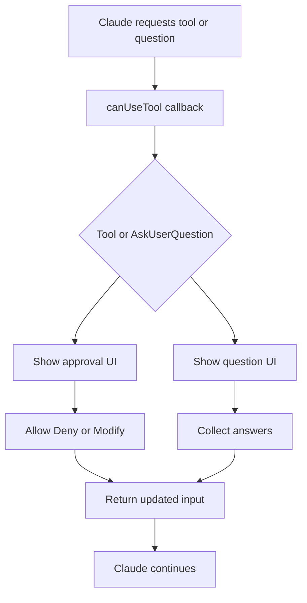

### 关键代码或配置示例

#### 1. 工具审批回调

```python
from claude_agent_sdk.types import PermissionResultAllow, PermissionResultDeny


async def can_use_tool(tool_name, input_data, context):
    if tool_name == "Bash":
        approved = input("Allow this action? (y/n): ")
        if approved.lower() == "y":
            return PermissionResultAllow(updated_input=input_data)
        return PermissionResultDeny(message="User denied this action")

    return PermissionResultAllow(updated_input=input_data)
```

#### 2. Python 的 dummy hook 约束

```python
from claude_agent_sdk.types import HookMatcher


async def dummy_hook(input_data, tool_use_id, context):
    return {"continue_": True}
```

这是 Python 审批流里非常关键的兼容要求。

#### 3. 处理 `AskUserQuestion`

```python
async def can_use_tool(tool_name, input_data, context):
    if tool_name == "AskUserQuestion":
        return PermissionResultAllow(
            updated_input={
                "questions": input_data.get("questions", []),
                "answers": {
                    "How should I format the output?": "Summary",
                },
            }
        )
```

注意返回值里必须带:

- 原始 `questions`
- 以及 `answers` 映射

### 运维工程师 / SRE 关注点

1. `canUseTool` 很适合接人工审批流
- 比如高风险 Bash
- 生产配置变更
- 数据删除

2. `AskUserQuestion` 很适合在 plan 模式里补需求
- 例如问用户用哪个集群
- 输出要摘要还是详细
- 是否允许写文件

3. 审批回调可以做“批准但改写”
- 例如把路径重定向到沙箱
- 把命令换成只读版本

4. 不要把所有用户输入都塞进 `AskUserQuestion`
- 它适合多选澄清
- 更复杂的表单应使用自定义工具

### 实战建议

1. 高风险动作一定走 `canUseTool`
2. 批准时优先返回“受限版输入” 而不是原始输入
3. Python 项目提前处理 dummy hook 兼容问题
4. 需要复杂审批链时 不要强行堆在终端交互里 而是对接工单或审批系统
5. 对 plan 模式搭配 `AskUserQuestion` 形成“先问清 再规划”的工作流

### 小结

`User Input` 这一章的核心是 Agent 在需要外部决策时并不会自己猜 它会通过 canUseTool 把审批和澄清问题抛给你的应用 由你决定如何让人类参与。`

## 10. 会话管理 (Sessions)

### 本章目标

本章讲清楚 Claude Agent SDK 的会话如何创建 恢复 和分叉。读完后你应该知道:

- Session ID 从哪里来
- 怎样恢复上次会话
- 什么是 fork session
- 会话能力对 SRE 场景有什么现实价值

### 原文要点整理

`sessions.html` 介绍了三件核心事情:

1. 新会话启动时 SDK 会返回 session ID
2. 你可以用 `resume` 恢复该会话
3. 恢复时可以选择继续原会话 或 fork 出一个新分支

这让 Agent 不再局限于“一问一答” 而具备了连续上下文能力。

### 核心概念

#### 1. 会话 ID 是恢复上下文的关键

每次新会话开始时 第一条系统初始化消息里会带 session ID。你的系统应该:

- 读取它
- 持久化它
- 在后续请求中决定是否恢复

#### 2. `resume` 让会话跨请求延续

当你传入:

- `resume=session_id`

Claude 会加载之前的上下文和历史 然后继续工作。这很适合:

- 上次没处理完的排障
- 断点续跑
- 工单多次往返

#### 3. `fork_session` 允许从同一点分叉

默认恢复会继续写入原会话历史。但如果设置:

- `fork_session=True`

就会从当前恢复点生成一个新会话 ID。

这特别适合:

- 从同一个根因分析起点尝试两种方案
- 保留原会话不被污染
- 做方案对比

### 会话分支图

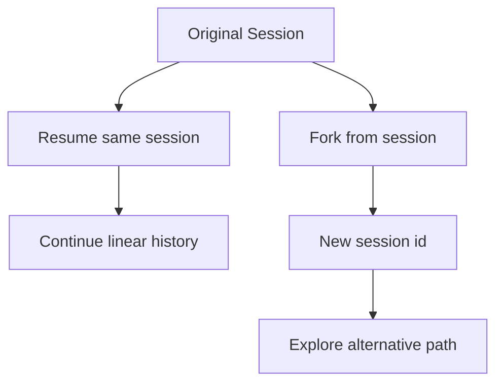

### 关键代码或配置示例

#### 1. 获取 session ID

```python
from claude_agent_sdk import query, ClaudeAgentOptions

session_id = None

async for message in query(
    prompt="Help me build a web application",
    options=ClaudeAgentOptions(model="claude-opus-4-6"),
):
    if hasattr(message, "subtype") and message.subtype == "init":
        session_id = message.data.get("session_id")
```

#### 2. 恢复会话

```python
async for message in query(
    prompt="Continue where we left off",
    options=ClaudeAgentOptions(resume=session_id),
):
    print(message)
```

#### 3. Fork 会话

```python
async for message in query(
    prompt="Try a different approach",
    options=ClaudeAgentOptions(
        resume=session_id,
        fork_session=True,
    ),
):
    print(message)
```

### 运维工程师 / SRE 关注点

1. 会话恢复非常适合长链路排障
- 上一轮已经读过日志和配置
- 下一轮可以直接继续 不必重复喂上下文

2. 会话分叉很适合方案对比
- 一条线做保守修复
- 一条线做重构或激进优化

3. Session ID 应纳入任务系统
- 可绑定工单
- 可绑定告警事件
- 可绑定某次值班排障记录

4. 会话恢复和文件检查点是天然搭档
- 一个保留认知上下文
- 一个保留文件状态回滚能力

### 实战建议

1. 平台端把 session ID 作为一等数据保存
2. 对关键任务支持“继续会话”和“从此处分叉”两个按钮
3. 将会话和工单 告警 变更单关联
4. 对长会话定期审计上下文漂移和成本增长

### 小结

`Sessions` 让 Claude Agent SDK 从一次性工具调用升级为可持续协作的会话系统。恢复能力适合断点续跑 分叉能力适合探索替代方案 两者都非常适合真实的运维与 SRE 工作流。`

## 11. 文件检查点与回滚 (File Checkpointing)

### 本章目标

本章解释 Agent 改坏文件之后如何回到先前状态。重点包括:

- 文件检查点跟踪哪些修改
- 如何拿到 checkpoint UUID
- 如何调用回滚
- 它与会话恢复的关系
- 它的能力边界和局限

### 原文要点整理

`file-checkpointing.html` 的定位很明确:

- 跟踪 Agent 通过 `Write` `Edit` `NotebookEdit` 做出的文件修改
- 在后续任意时刻按 checkpoint 回滚文件状态

文档同时强调:

- 它只回滚文件状态
- 不回滚对话历史
- 也不会捕获 Bash 直接改文件的行为

### 核心概念

#### 1. 检查点跟踪的是“工具级写入”

只有这几类工具写入会被记录:

- `Write`
- `Edit`
- `NotebookEdit`

如果 Agent 用 Bash 执行:

- `echo > file`
- `sed -i`

这类改动默认不在检查点系统里。

#### 2. 回滚是“文件回到过去” 不是“对话回到过去”

这是最重要的边界:

- 文件会恢复
- 会话认知不会回退

也就是说 Claude 仍然记得它做过什么 只是磁盘状态被你恢复了。

#### 3. 需要额外启用并获取用户消息 UUID

要用文件检查点 至少需要:

- `enable_file_checkpointing=True`
- `extra_args={"replay-user-messages": None}`

后者的作用是让你在消息流里拿到用户消息 UUID 作为 restore point。

#### 4. 恢复通常依赖会话恢复

常见操作方式是:

1. 捕获 checkpoint UUID
2. 保存 session ID
3. 之后用 `resume=session_id`
4. 建立连接后调用 `rewind_files(checkpoint_id)`

### 文件回滚流程图

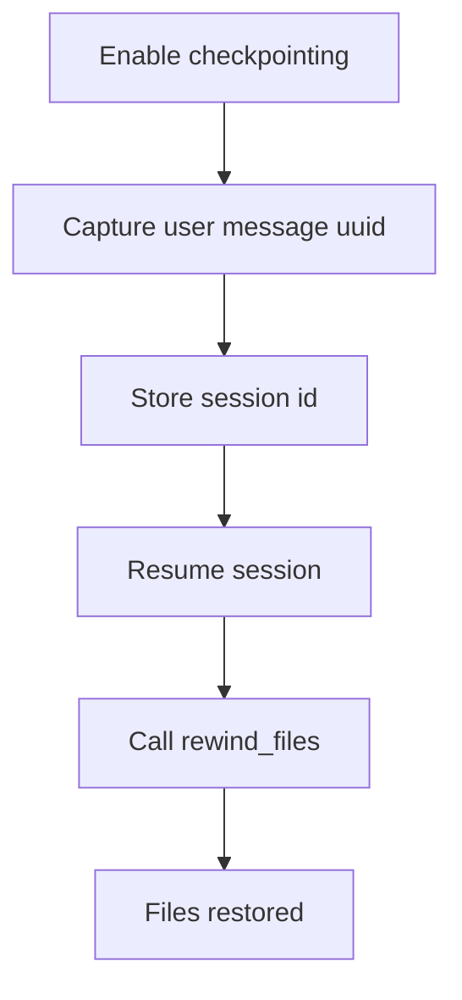

### 关键代码或配置示例

#### 1. 启用检查点

```python
from claude_agent_sdk import ClaudeAgentOptions

options = ClaudeAgentOptions(
    enable_file_checkpointing=True,
    permission_mode="acceptEdits",
    extra_args={"replay-user-messages": None},
)
```

#### 2. 捕获 checkpoint 和 session

```python
checkpoint_id = None
session_id = None

async for message in client.receive_response():
    if isinstance(message, UserMessage) and message.uuid and not checkpoint_id:
        checkpoint_id = message.uuid
    if isinstance(message, ResultMessage) and not session_id:
        session_id = message.session_id
```

#### 3. 恢复文件

```python
async with ClaudeSDKClient(
    ClaudeAgentOptions(enable_file_checkpointing=True, resume=session_id)
) as client:
    await client.query("")
    async for message in client.receive_response():
        await client.rewind_files(checkpoint_id)
        break
```

#### 4. 多个恢复点

文档还给出了保存多个检查点的模式:

- 每次用户消息都记录一个 UUID
- 带上描述和时间戳
- 后续可回退到某个中间状态

这很适合:

- 多轮重构
- 分阶段修改
- 每一步都想留撤销点

### 运维工程师 / SRE 关注点

1. 文件回滚非常适合高风险变更前保护
2. 与 `acceptEdits` 结合后 可形成“先自动改 再人工验收 不满意就回滚”
3. 它不覆盖 Bash 改写文件 所以高风险 Bash 仍需独立控制
4. 检查点与 Session ID 一起保存 才真正可恢复

### 实战建议

1. 任何允许自动编辑的 Agent 默认开启文件检查点
2. 对关键任务保存多个 checkpoint 而不是只保留一个
3. 在 UI 或工单系统里暴露“回到上一步”的能力
4. 对 Bash 文件写入单独限制 避免产生“以为可回滚 实际不可回滚”的错觉

### 小结

`File Checkpointing` 给 Agent 增加了很关键的可恢复性。它不能替代权限控制 但能显著降低自动编辑带来的试错成本。`

## 12. 托管与部署 (Hosting)

### 本章目标

本章解释 Agent SDK 为什么不能按普通无状态 API 去托管 以及常见的生产部署模式。重点包括:

- 运行环境要求
- 容器和沙箱的重要性
- 几种典型部署模式
- 如何评估会话与容器生命周期

### 原文要点整理

`hosting.html` 强调 Agent SDK 与传统 LLM API 的根本差异:

- 它是长运行过程
- 会执行命令
- 会修改文件
- 会维护持久上下文

因此它更像“有状态任务执行器” 而不是简单 HTTP 调用。

文档给出四类生产模式:

1. Ephemeral Sessions
2. Long-Running Sessions
3. Hybrid Sessions
4. Single Containers

### 核心概念

#### 1. 容器沙箱是默认推荐部署形态

文档明确建议:

- 把 SDK 跑在沙箱化容器中

因为你需要:

- 进程隔离
- 资源限制
- 网络控制
- 临时文件系统

#### 2. Agent 是长生命周期进程

与 stateless API 不同 Agent SDK 会:

- 持续保留 shell 环境
- 持续保留工作目录
- 连续处理多轮交互

这意味着托管设计必须考虑:

- 生命周期管理
- 空闲回收
- 会话恢复
- 资源配额

#### 3. 四种部署模式各有适用场景

- `Ephemeral Sessions` 适合一次性任务
- `Long-Running Sessions` 适合持续服务型 Agent
- `Hybrid Sessions` 适合间歇交互但要恢复上下文
- `Single Containers` 更适合多 Agent 紧密协作 但隔离更难

### 托管模式图

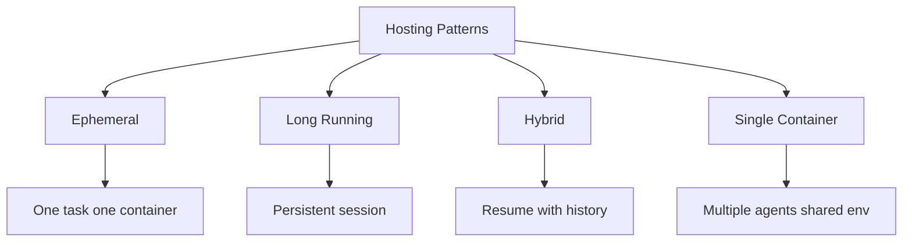

### 关键代码或配置示例

这一章不是代码页 但给了清晰的资源建议:

- Python `3.10+` 或 Node `18+`
- Claude Code CLI
- 推荐起步资源大约 `1GiB RAM` `5GiB disk` `1 CPU`
- 出站 HTTPS 到 `api.anthropic.com`

对生产环境 这些只是下限 实际应按任务类型扩容。

### 运维工程师 / SRE 关注点

1. Agent 不适合随便塞进无状态函数
- 尤其当你依赖多轮会话 工具执行 文件修改时

2. 容器成本通常不是主成本
- 文档明确说 token 才是主成本
- 但容器生命周期仍影响整体吞吐和延迟

3. 需要监控的不只是接口成功率
- 还包括容器健康
- 会话时长
- Agent turns
- MCP 连接状态

4. `maxTurns` 很重要
- Agent 不会自己超时
- 需要上层限制死循环

### 实战建议

1. 一次性任务先用 `Ephemeral Sessions`
2. 值班助手或持续机器人用 `Long-Running Sessions`
3. 既要节省资源又要保留上下文时选 `Hybrid Sessions`
4. 从第一天就把日志 指标 健康探针带上

### 小结

`Hosting` 这一章的核心是 Claude Agent SDK 不是普通 stateless 推理服务 它更像一个有状态 执行型 需要隔离和生命周期管理的运行单元。`

## 13. 结构化输出 (Structured Outputs)

### 本章目标

本章讲如何让 Agent 返回稳定可编程的 JSON 结果 而不是自由文本。重点包括:

- 为什么需要 structured output
- 如何定义 schema
- JSON Schema 与 Pydantic/Zod 的关系
- 失败时如何处理

### 原文要点整理

`structured-outputs.html` 的核心结论是:

- Agent 可以照常使用工具完成多步任务
- 但最终结果会按照你定义的 schema 返回

这解决了一个典型问题:

- 模型会说话
- 但你的系统需要结构化数据

### 核心概念

#### 1. Structured output 解决“文本不可直接消费”的问题

自由文本适合聊天 不适合程序处理。结构化输出适合:

- UI 渲染
- 数据库存储
- 下游自动化
- 规则判断

#### 2. Schema 是结果契约

你需要定义:

- 输出是对象还是数组
- 有哪些字段
- 哪些字段必填
- 可选字段如何表达

Agent 会在完成工具使用后 尝试返回满足这个契约的 JSON。

#### 3. Python 推荐 Pydantic

文档建议:

- 简单场景可直接写 JSON Schema
- Python 更适合用 Pydantic 生成 schema 再做校验

这样可以同时获得:

- 类型提示
- 运行时校验
- 更清晰的错误信息

#### 4. 结构化输出失败会有专门错误

当 Agent 多次尝试仍无法满足 schema 时:

- `ResultMessage.subtype` 会变成 `error_max_structured_output_retries`

所以你要把它当成独立错误类型处理。

### 关键代码或配置示例

#### 1. 最小 JSON Schema 示例

```python
schema = {
    "type": "object",
    "properties": {
        "company_name": {"type": "string"},
        "founded_year": {"type": "number"},
        "headquarters": {"type": "string"},
    },
    "required": ["company_name"],
}
```

#### 2. 在 `output_format` 中启用

```python
from claude_agent_sdk import query, ClaudeAgentOptions, ResultMessage

async for message in query(
    prompt="Research Anthropic and provide key company information",
    options=ClaudeAgentOptions(
        output_format={"type": "json_schema", "schema": schema}
    ),
):
    if isinstance(message, ResultMessage) and message.structured_output:
        print(message.structured_output)
```

#### 3. 使用 Pydantic

```python
from pydantic import BaseModel


class Step(BaseModel):
    step_number: int
    description: str
    estimated_complexity: str


class FeaturePlan(BaseModel):
    feature_name: str
    summary: str
    steps: list[Step]
    risks: list[str]
```

然后:

```python
output_format={
    "type": "json_schema",
    "schema": FeaturePlan.model_json_schema(),
}
```

#### 4. 失败处理

```python
if isinstance(message, ResultMessage):
    if message.subtype == "success" and message.structured_output:
        print(message.structured_output)
    elif message.subtype == "error_max_structured_output_retries":
        print("Could not produce valid output")
```

### 运维工程师 / SRE 关注点

1. 结构化输出非常适合自动化编排
- 例如返回巡检结果
- 风险项列表
- 修复计划
- SQL 审计摘要

2. Schema 要与现实任务匹配
- 信息未必总能拿到
- 必填字段过多会增加失败率

3. 它和多步工具调用兼容
- 适合先检索 再汇总 再返回结构化数据

4. 流式输出与结构化输出不能简单混为一谈
- 最终结构化 JSON 出现在 `ResultMessage`

### 实战建议

1. 先设计最小 schema 再逐步加字段
2. 对不稳定信息使用可选字段
3. 在平台侧统一校验 `structured_output`
4. 对失败子类型设计降级路径 比如退回普通文本或重试更简单 schema

### 小结

`Structured Outputs` 让 Agent 的结果从“能读”变成“能接入系统”。对运维和 SRE 平台来说 它是从辅助分析走向自动化编排的关键一步。`

## 14. 修改系统提示词 (Modifying System Prompts)

### 本章目标

本章解释如何改变 Agent 的默认行为风格与规则。重点包括:

- 默认系统提示词（system prompt）是什么样
- 四种修改方式有什么差别
- `CLAUDE.md` 和 `setting_sources` 的关系
- 什么时候该 append 什么时候该完全自定义

### 原文要点整理

`modifying-system-prompts.html` 提供了四种方式:

1. `CLAUDE.md`
2. Output styles
3. 使用 `systemPrompt` 追加说明
4. 完全自定义 `systemPrompt`

文档特别强调:

- SDK 默认使用的是最小系统提示词
- 它不等于完整 Claude Code 提示词
- 如果想保留 Claude Code 的默认行为 需要显式指定 preset

### 核心概念

#### 1. 默认不是完整 Claude Code 系统提示词

这一点非常重要:

- SDK 默认只带最基本工具说明
- 不自动包含 Claude Code 的完整编码指南 响应风格 和项目上下文

如果你要完整 Claude Code 风格 应显式设置:

- `system_prompt={"type":"preset","preset":"claude_code"}`

#### 2. `CLAUDE.md` 是项目长期记忆

它适合保存:

- 项目约定
- 测试命令
- 目录结构
- 团队规范

但它不会自动加载 必须显式启用:

- `setting_sources=["project"]`

#### 3. append 是最安全的定制方式

如果你只想加一层偏好:

- 比如更严格的测试要求
- 更详细的注释
- 特定审查重点

最稳妥的方式是在 `claude_code` preset 上追加说明 而不是完全替换。

#### 4. 完全自定义系统提示词 意味着你要自己承担完整责任

一旦使用自定义字符串完全替代:

- 默认工具说明可能丢失
- 内建安全和风格约束也可能丢失
- 环境上下文不再自动保留

### 四种方式对比

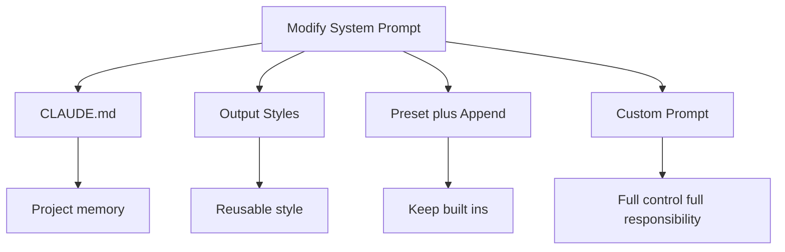

### 关键代码或配置示例

#### 1. 使用 Claude Code preset

```python
options=ClaudeAgentOptions(
    system_prompt={
        "type": "preset",
        "preset": "claude_code",
    }
)
```

#### 2. 加载 `CLAUDE.md`

```python
options=ClaudeAgentOptions(
    system_prompt={
        "type": "preset",
        "preset": "claude_code",
    },
    setting_sources=["project"],
)
```

#### 3. append 增量指令

```python
options=ClaudeAgentOptions(
    system_prompt={
        "type": "preset",
        "preset": "claude_code",
        "append": "Always include detailed docstrings and type hints in Python code.",
    }
)
```

#### 4. 完全自定义

```python
custom_prompt = \"\"\"You are a Python coding specialist.
Follow these guidelines:
- Write clean, well-documented code
- Use type hints for all functions
\"\"\"

options=ClaudeAgentOptions(system_prompt=custom_prompt)
```

### 运维工程师 / SRE 关注点

1. `CLAUDE.md` 很适合沉淀团队运维规范
- 常用巡检命令
- 变更前检查清单
- 配置风格约束

2. Output styles 适合构建不同角色 Agent
- 例如值班助手
- 安全审计助手
- 变更评审助手

3. 生产环境优先 append 而不是全替换
- 因为你通常不想丢掉默认工具指令和安全边界

### 实战建议

1. 项目级规则放 `CLAUDE.md`
2. 可复用角色风格放 Output styles
3. 临时任务偏好用 append
4. 除非非常清楚后果 否则不要直接全量自定义 `system_prompt`

### 小结

`Modifying System Prompts` 的核心不是“怎么让 Claude 更像你想要的样子” 而是“怎么在不破坏默认能力和安全前提下进行可控定制”。`

## 15. 安全部署 (Secure Deployment)

### 本章目标

本章从生产安全视角讲如何部署 Agent。重点包括:

- Threat model 是什么
- 隔离技术怎么选
- 凭据怎么不暴露给 Agent
- 文件系统和网络怎么收口

### 原文要点整理

`secure-deployment.html` 明确把 Agent 的风险定义为:

- Prompt injection
- 模型误判
- 动态生成的危险操作

它给出的总原则是:

- Isolation
- Least privilege
- Defense in depth

### 核心概念

#### 1. 把 Agent 当成半可信执行体

这页文档的安全观很务实:

- Agent 很强大
- 但不能完全信任
- 所以要像运行半可信代码一样部署它

#### 2. 关键安全边界是“把敏感资源放到 Agent 外面”

比如:

- API key 不直接给 Agent
- 而是放在代理层注入

这样即使 Agent 被恶意 prompt 诱导:

- 它也拿不到真正凭据

#### 3. 隔离技术各有权衡

文档比较了:

- Sandbox runtime
- Containers
- gVisor
- Virtual machines

强度大致越来越高 代价也越来越高。

#### 4. 代理模式是推荐的凭据管理方法

官方建议:

- 通过代理转发请求
- 由代理注入认证信息
- Agent 只看到工具接口或无凭据请求

这对多租户场景尤其重要。

#### 5. 文件系统挂载本身就可能泄密

即使只读挂载代码 仍可能暴露:

- `.env`
- 云凭据
- kubeconfig
- 私钥

所以“只读”不等于“安全”。

### 安全分层图

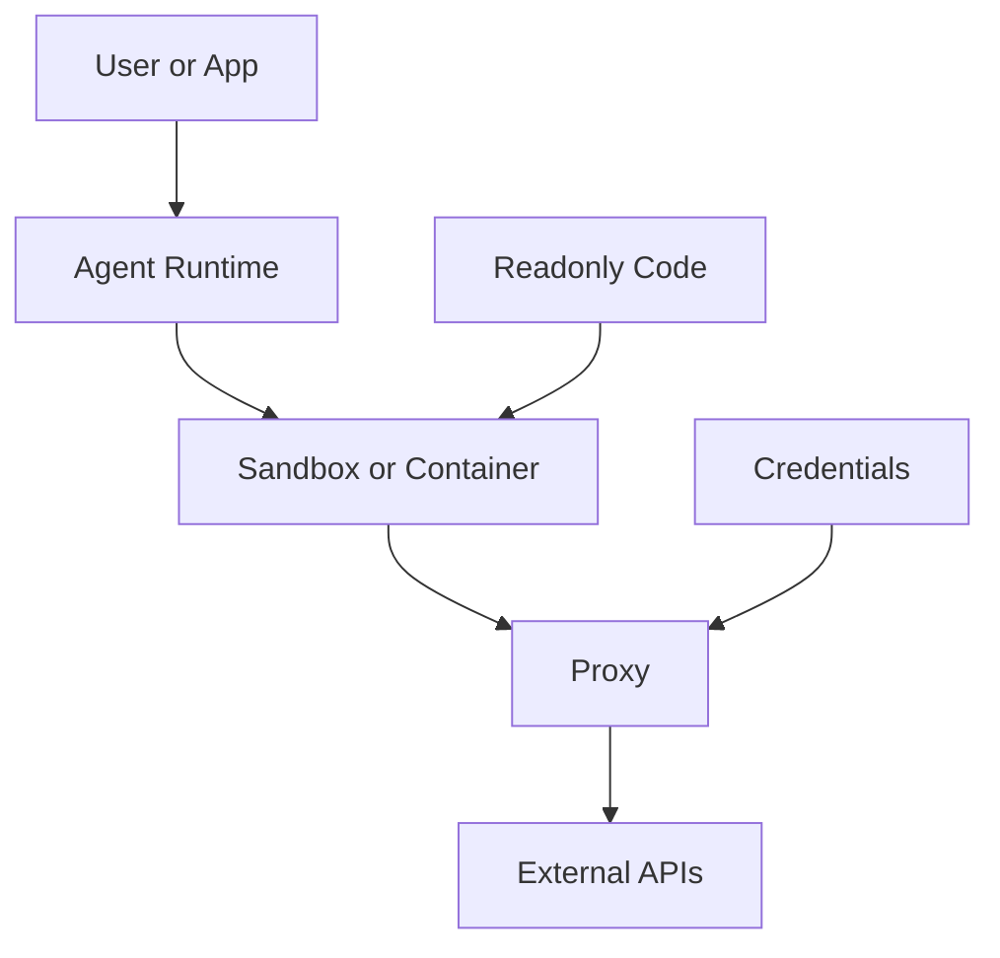

### 关键代码或配置示例

#### 1. 典型容器硬化参数

文档给出的 Docker 示例重点包括:

- `--cap-drop ALL`
- `--security-opt no-new-privileges`
- `--read-only`
- `--tmpfs`
- `--network none`
- `--user 1000:1000`

这反映了标准硬化思路:

- 去能力
- 只读根文件系统
- 临时可写区
- 禁网
- 非 root

#### 2. 代理配置

文档提到:

- `ANTHROPIC_BASE_URL`
- `HTTP_PROXY`
- `HTTPS_PROXY`

其中:

- `ANTHROPIC_BASE_URL` 更适合采样请求代理
- 通用 HTTPS 服务若要真正注入凭据 往往还需要 TLS 终止代理

### 运维工程师 / SRE 关注点

1. 安全不是只配权限模式
- 还要控制网络 文件系统 凭据和隔离层

2. 多租户场景优先考虑更强隔离
- 如 gVisor 或 microVM

3. 所有出网流量最好经代理
- 便于审计
- 便于域名白名单
- 便于凭据注入

4. 挂载目录前先清点秘密文件
- 只读挂载也会泄露

### 实战建议

1. 生产默认使用容器或更强隔离
2. 机密凭据尽量不进 Agent 边界
3. 默认只开放必要目录和必要域名
4. 用代理统一做:
- 凭据注入
- 出网限制
- 审计日志

5. 高风险场景优先自定义工具或 MCP 代理访问外部服务

### 小结

`Secure Deployment` 的核心思想是 不要试图让 Agent 永远不犯错 而是通过隔离 最小权限 和分层防护 把错误的破坏范围限制在可接受边界内。`

## 16. MCP 外部工具集成 (MCP)

### 本章目标

本章讲如何通过 MCP 把 Agent 接到数据库 API 浏览器 文档系统和内部平台。重点包括:

- MCP 是什么
- 如何添加 MCP server
- MCP 工具如何授权
- stdio 和 HTTP/SSE 的差异
- 大量工具时如何开启 tool search
- 认证和排错要点

### 原文要点整理

`mcp.html` 是扩展能力的核心章节。它说明:

- MCP 是连接外部工具和数据源的开放标准
- 服务可以是本地进程 远程 HTTP/SSE 服务 或 SDK 内嵌 server
- MCP 工具默认也要受权限系统控制

### 核心概念

#### 1. MCP 是 Agent 的外部能力总线

有了 MCP 之后 Agent 不再只会:

- 读本地文件
- 跑本地命令

而是可以访问:

- GitHub
- Slack
- Postgres
- 浏览器自动化
- 内部 API

#### 2. MCP 工具名称有固定前缀

命名规则是:

- `mcp__<server-name>__<tool-name>`

这让权限控制和日志识别都更明确。

#### 3. MCP 工具也必须显式授权

文档强调:

- 不授权 Claude 即使看到工具 也不能调用

最常见方式是:

- `allowed_tools=["mcp__github__*"]`

或者进入更宽松的权限模式。

#### 4. 三种传输方式

- `stdio` 本地进程型 MCP server
- `http` 或 `sse` 远程服务型 MCP server
- SDK MCP servers 代码内嵌

选型通常取决于:

- 工具是否部署在本机
- 是否需要跨网络访问
- 是否由你自己直接编写

#### 5. Tool search 用来解决工具太多占上下文的问题

当 MCP 工具很多时:

- 工具定义会吃掉上下文窗口

官方提供 `ENABLE_TOOL_SEARCH`:

- 默认 `auto`
- 超过阈值时延迟加载

这对大型企业工具平台很重要。

### MCP 接入图

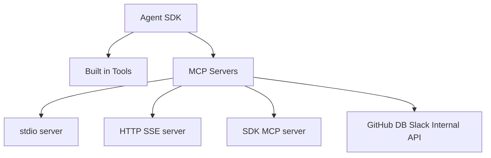

### 关键代码或配置示例

#### 1. 添加 HTTP MCP server

```python
options = ClaudeAgentOptions(
    mcp_servers={
        "claude-code-docs": {
            "type": "http",
            "url": "https://code.claude.com/docs/mcp",
        }
    },
    allowed_tools=["mcp__claude-code-docs__*"],
)
```

#### 2. 添加 stdio MCP server

```python
options = ClaudeAgentOptions(
    mcp_servers={
        "github": {
            "command": "npx",
            "args": ["-y", "@modelcontextprotocol/server-github"],
            "env": {"GITHUB_TOKEN": os.environ["GITHUB_TOKEN"]},
        }
    },
    allowed_tools=["mcp__github__list_issues"],
)
```

#### 3. 启用 tool search

```python
options = ClaudeAgentOptions(
    mcp_servers={...},
    env={"ENABLE_TOOL_SEARCH": "auto:5"},
)
```

#### 4. 检查服务连接状态

```python
if isinstance(message, SystemMessage) and message.subtype == "init":
    failed_servers = [
        s for s in message.data.get("mcp_servers", [])
        if s.get("status") != "connected"
    ]
```

### 运维工程师 / SRE 关注点

1. MCP 是企业落地最关键的扩展点
- 因为真实运维场景离不开外部系统

2. 权限要细到 server 或 tool 级别
- 不要一上来全放开 `mcp__*`

3. Tool search 对大型工具集很重要
- 否则上下文会被工具定义吃掉

4. 认证信息要优先走环境变量 头部 或代理
- 不要把密钥写进 prompt

5. 连接状态必须在 `init` 消息阶段就检查
- 否则 Agent 运行到一半才发现工具不可用

### 实战建议

1. 先从只读 MCP 工具开始
- GitHub issue 查询
- 文档查询
- 数据库只读查询

2. 用 `allowed_tools` 做最小授权
3. 对远程 MCP 服务统一纳入网络与代理治理
4. 对连接失败做启动期告警
5. 工具数很多时提前启用 tool search

### 小结

`MCP` 是 Claude Agent SDK 连接企业外部系统的标准化扩展面。对运维和 SRE 平台来说 它往往决定了 Agent 能否真正融入现有工具链。`

## 17. 自定义工具 (Custom Tools)

### 本章目标

本章讲如何把你自己的业务能力封装成 Agent 可调用工具。重点包括:

- 自定义工具和 MCP 的关系
- 如何定义工具 schema
- 怎样限制允许的工具
- 工具错误怎么返回

### 原文要点整理

`custom-tools.html` 的核心思路是:

- 自定义工具本质上通过 in-process MCP server 暴露给 Agent
- TypeScript 用 `tool` 和 `createSdkMcpServer`
- Python 用 `@tool` 和 `create_sdk_mcp_server`

也就是说 自定义工具不是旁路机制 而是 SDK 内嵌版 MCP。

### 核心概念

#### 1. 自定义工具是业务能力的标准封装层

适合封装:

- 数据库查询
- 内部 API 调用
- CMDB 查询
- 发布系统操作
- 审批系统接入

对 SRE 来说 这比让 Claude 直接拼 Bash 或拼 HTTP 更可靠。

#### 2. 工具输入必须有 schema

工具定义至少包含:

- 名称
- 描述
- 输入 schema
- 异步执行函数

这意味着你可以把工具当作“有类型的能力接口”。

#### 3. 工具暴露后仍需权限控制

工具名称会变成:

- `mcp__<server>__<tool>`

然后继续受 `allowed_tools` 控制。这一点非常重要:

- 定义工具不等于默认放开工具

#### 4. 自定义工具更适合收口外部系统访问

比如:

- 不让 Agent 直接访问数据库
- 而是只给一个 `query_database` 工具
- 由工具内部完成认证 审计 和安全过滤

### 关键代码或配置示例

#### 1. Python 自定义工具

```python
from claude_agent_sdk import tool, create_sdk_mcp_server
from typing import Any


@tool(
    "get_weather",
    "Get current temperature for a location using coordinates",
    {"latitude": float, "longitude": float},
)
async def get_weather(args: dict[str, Any]) -> dict[str, Any]:
    return {
        "content": [
            {
                "type": "text",
                "text": "Temperature: 72F",
            }
        ]
    }


custom_server = create_sdk_mcp_server(
    name="my-custom-tools",
    version="1.0.0",
    tools=[get_weather],
)
```

#### 2. 接入 Agent

```python
options = ClaudeAgentOptions(
    mcp_servers={"my-custom-tools": custom_server},
    allowed_tools=["mcp__my-custom-tools__get_weather"],
)
```

#### 3. 数据库工具示意

文档里的数据库例子很有代表性:

- Agent 调 `query_database`
- 工具内部访问 DB
- 返回结构化文本结果

这比直接给 Agent DB 凭据更可控。

#### 4. 错误处理

工具内部应捕获异常并返回可解释错误:

```python
except Exception as e:
    return {
        "content": [{"type": "text", "text": f"Failed to fetch data: {str(e)}"}]
    }
```

### 运维工程师 / SRE 关注点

1. 自定义工具是接内部系统的首选方式
2. 它天然适合加认证 审计 限流 结果脱敏
3. schema 设计决定了工具是否稳定好用
4. 工具应尽量幂等或可回放

### 实战建议

1. 先把高价值只读能力封装成工具
- 查询服务状态
- 查 CMDB
- 查工单
- 查监控

2. 写工具时把错误转为可读文本 不要把原始堆栈直接暴露给模型
3. 用 `allowed_tools` 精确开放单个工具
4. 不要让工具函数内部再随意拼接高危命令

### 小结

`Custom Tools` 是把企业内部能力安全地暴露给 Agent 的最佳入口。对运维平台来说 它往往比直接开放 Bash 更可控 也更容易治理。`

## 18. 子代理 (Subagents)

### 本章目标

本章讲如何把复杂任务拆给多个专门 Agent。重点包括:

- 子代理为什么有价值
- 如何定义子代理
- 怎样限制子代理工具
- 如何观测和恢复子代理

### 原文要点整理

`subagents.html` 把子代理定义为:

- 主代理可派生的独立 Agent 实例
- 用于聚焦上下文 并行处理 和专项能力注入

文档推荐的方式是程序化定义 `agents`。

### 核心概念

#### 1. 子代理的本质是上下文隔离

主代理不必把所有搜索细节都塞进主上下文。子代理可以:

- 单独探索
- 单独分析
- 最后只把结论带回来

这对大型代码库或复杂运维调查很重要。

#### 2. 子代理还能并行

一个经典场景是:

- 一个子代理看安全
- 一个看测试
- 一个看架构

相比主代理串行做 会明显更快。

#### 3. 触发子代理依赖 `Task` 工具

要启用子代理:

- 主代理必须有 `Task`
- 子代理自身不能再有 `Task`

因为子代理不能继续生成子代理。

#### 4. 描述字段决定 Claude 是否会自动委派

`description` 不是装饰字段 它直接影响:

- Claude 会不会选中这个子代理

所以描述要写成“什么时候用它”。

#### 5. 子代理也可恢复

文档说明:

- 子代理 transcript 独立保存
- 可以在同一 session 中继续恢复
- `parent_tool_use_id` 可帮助识别哪些消息来自子代理

### 主代理与子代理关系图

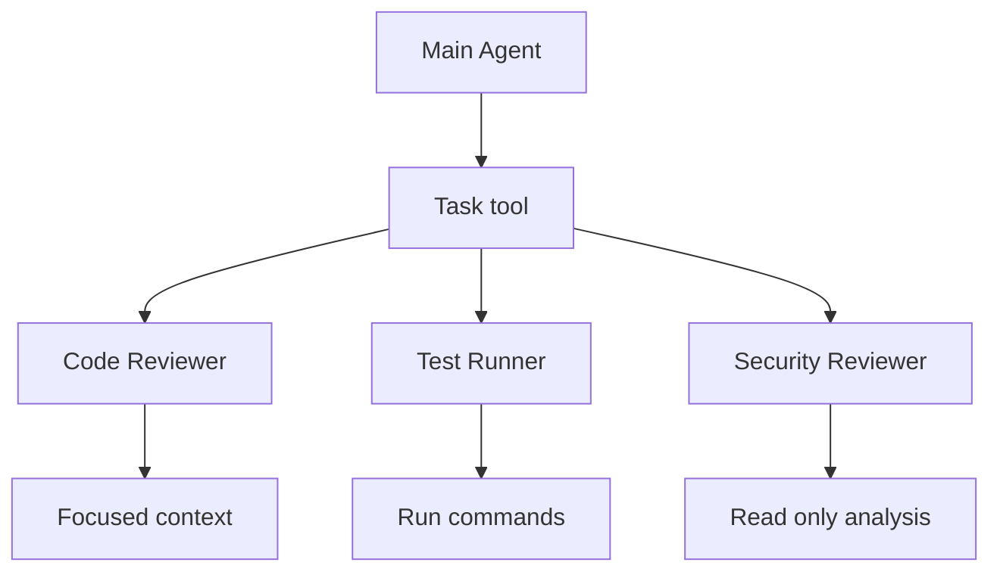

### 关键代码或配置示例

#### 1. 定义两个子代理

```python
from claude_agent_sdk import query, ClaudeAgentOptions, AgentDefinition

async for message in query(
    prompt="Review the authentication module for security issues",
    options=ClaudeAgentOptions(
        allowed_tools=["Read", "Grep", "Glob", "Task"],
        agents={
            "code-reviewer": AgentDefinition(
                description="Expert code review specialist.",
                prompt="Analyze code quality and suggest improvements.",
                tools=["Read", "Grep", "Glob"],
                model="sonnet",
            ),
            "test-runner": AgentDefinition(
                description="Runs and analyzes test suites.",
                prompt="Run tests and explain failures.",
                tools=["Bash", "Read", "Grep"],
            ),
        },
    ),
):
    print(message)
```

#### 2. 检测子代理执行

文档给出的判定点包括:

- `Task` 工具调用
- `parent_tool_use_id`

这让你可以在日志里识别:

- 谁派生了子代理
- 哪些消息属于子代理上下文

#### 3. 恢复子代理

恢复时需要:

- 保存主 session ID
- 从消息内容里提取 agent ID
- 再用 `resume=session_id` 配合 agent ID 继续

### 运维工程师 / SRE 关注点

1. 子代理很适合拆分复杂调查任务
2. 每个子代理应有最小工具集
3. 高风险能力不要默认继承给所有子代理
4. 子代理日志和 transcript 应单独可追踪

### 实战建议

1. 给子代理明确角色和使用时机
2. 工具集尽量最小化
3. 高价值场景优先尝试:
- 安全审查子代理
- 测试执行子代理
- 文档总结子代理
- 指标分析子代理

4. 平台监控中单独标记 `Task` 和 `parent_tool_use_id`

### 小结

`Subagents` 让 Agent 从单线程思考升级为分工协作系统。对运维和 SRE 来说 它尤其适合复杂排障和多维度分析。`

## 19. Slash 命令 (Slash Commands)

### 本章目标

本章讲如何在 SDK 中使用和扩展 Claude Code 的 Slash 命令。重点包括:

- 内建 Slash 命令如何发现和调用
- 自定义命令如何落在文件系统
- 命令里的参数 占位符 文件引用和 Bash 嵌入

### 原文要点整理

`slash-commands.html` 说明 Slash 命令本质上是以 `/` 开头的特殊指令。SDK 支持:

- 读取已有命令列表
- 直接发送 `/compact` `/clear`
- 从 `.claude/commands/` 载入自定义命令

### 核心概念

#### 1. Slash 命令是会话控制层

它不只是“快捷短语” 还可以:

- 压缩上下文
- 清空对话
- 调用自定义工作流模板

#### 2. 自定义命令本质上是 Markdown 模板

一个命令文件通常包含:

- frontmatter
- 命令正文

frontmatter 可以定义:

- `description`
- `allowed-tools`
- `argument-hint`

正文则是给 Claude 的任务模板。

#### 3. 命令支持动态参数和文件引用

文档列出了几个很实用的能力:

- `$1` `$2` `$ARGUMENTS` 参数占位
- `@file` 引入文件内容
- `!` 内联 Bash 输出

这意味着 Slash 命令非常适合沉淀团队固定工作流。

### 关键代码或配置示例

#### 1. 发送内建命令

```python
async for message in query(prompt="/compact", options={"max_turns": 1}):
    if message.type == "system" and message.subtype == "compact_boundary":
        print("Compaction completed")
```

#### 2. 自定义命令文件

例如 `.claude/commands/code-review.md`:

```markdown
---
allowed-tools: Read, Grep, Glob, Bash(git diff:*)
description: Comprehensive code review
---

## Changed Files
!`git diff --name-only HEAD~1`

## Detailed Changes
!`git diff HEAD~1`
```

#### 3. 参数化命令

```markdown
---
argument-hint: [issue-number] [priority]
description: Fix a GitHub issue
---

Fix issue #$1 with priority $2.
```

### 运维工程师 / SRE 关注点

1. Slash 命令很适合沉淀运维标准动作
- 发布前检查
- 配置审计
- 变更复盘
- 值班交接

2. `@file` 和 `!bash` 让命令模板非常强大
3. 需要注意命令本身也会引入工具权限问题

### 实战建议

1. 把高频流程沉淀成自定义命令
2. 优先做只读型命令模板
3. 对 Bash 嵌入严格限制范围
4. 给命令命名和描述统一规范

### 小结

`Slash 命令` 是把重复性操作模板化的方式。它特别适合团队沉淀运维工作流和固定审查清单。`

## 20. 技能 (Skills)

### 本章目标

本章讲 Skills 如何让 Claude 在适当时机自动调用专门能力。重点包括:

- Skills 与 subagents 的差别
- SDK 如何加载 Skills
- 为什么必须启用 `Skill` 工具和 `setting_sources`
- SDK 中的工具限制注意事项

### 原文要点整理

`skills.html` 把 Skill 定义为:

- 放在文件系统里的 `SKILL.md`
- Claude 根据描述自动发现并按需触发

它不是程序化注册的能力 而是文件系统工件。

### 核心概念

#### 1. Skill 是模型自主调用的专长模块

与 subagent 不同:

- subagent 更像可分派子任务执行者
- Skill 更像按场景自动触发的专用能力说明书

#### 2. SDK 默认不会加载 Skills

必须显式配置:

- `setting_sources=["user", "project"]`

否则 `.claude/skills/` 不会被扫描。

#### 3. 还必须开放 `Skill` 工具

只加载目录还不够 还要:

- `allowed_tools=["Skill", ...]`

这样 Claude 才能实际调用 Skill。

#### 4. SDK 中 `SKILL.md` 的 `allowed-tools` frontmatter 不生效

这是很关键的差异:

- CLI 里 Skill frontmatter 可能控制工具
- SDK 里仍应以主配置中的 `allowed_tools` 为准

### 关键代码或配置示例

```python
from claude_agent_sdk import query, ClaudeAgentOptions

options = ClaudeAgentOptions(
    cwd="/path/to/project",
    setting_sources=["user", "project"],
    allowed_tools=["Skill", "Read", "Write", "Bash"],
)

async for message in query(
    prompt="Help me process this PDF document", options=options
):
    print(message)
```

### 运维工程师 / SRE 关注点

1. Skills 很适合沉淀团队最佳实践
- 故障排查套路
- 日志分析流程
- 配置审查规则

2. 它比把所有知识都塞进 prompt 更可维护
3. 项目级与用户级 Skill 可以分层管理
4. 权限控制仍由主 SDK 配置决定

### 实战建议

1. 先为高频且规则稳定的场景写 Skills
2. Skill 描述要写清触发条件
3. 在 SDK 中显式开启:
- `setting_sources`
- `Skill` 工具

4. 对 Skill 做专门测试 不要只看它是否存在

### 小结

`Skills` 让 Claude 能够按场景自动套用专业工作流。对于运维团队 它非常适合沉淀重复性强 规则明确的操作知识。`

## 21. 成本与用量跟踪 (Cost Tracking)

### 本章目标

本章讲如何正确统计 Agent 成本和 token 用量。重点包括:

- 每次 `query()` 的成本如何读取
- TypeScript 与 Python 的粒度差异
- 多步工具调用如何避免重复计数
- 错误和缓存 token 如何处理

### 原文要点整理

`cost-tracking.html` 给出的核心结论是:

- 每次 `query()` 调用最终都会有 `ResultMessage`
- 它的 `total_cost_usd` 是该次调用的权威成本
- Python 主要看最终累计
- TypeScript 还可以看每一步和每个模型的拆分

### 核心概念

#### 1. 成本统计单位首先是 `query()` 调用

不是整个 session 自动累计。

这意味着:

- 如果你一个会话里调用了三次 `query()`
- 需要自己把三次结果累加

#### 2. Python 和 TypeScript 暴露粒度不同

- Python 重点看 `ResultMessage.total_cost_usd` 和 `usage`
- TypeScript 还能在 assistant message 上看每步 usage

#### 3. 并行工具调用会导致消息重复

TypeScript 文档特别提醒:

- 多个 assistant message 可能共享同一个 message ID
- 如果你逐条累加 会重复统计
- 必须按 message ID 去重

#### 4. 失败调用也会消耗成本

即使最终结果是 error:

- 仍然应该读取 `total_cost_usd`

因为失败前已经消耗了 token。

#### 5. 缓存 token 要单独看

SDK 会自动使用 prompt caching。你可以在 usage 中看到:

- `cache_creation_input_tokens`
- `cache_read_input_tokens`

这对成本优化分析很有帮助。

### 关键代码或配置示例

#### 1. 读取单次调用总成本

```python
from claude_agent_sdk import query, ResultMessage

async for message in query(prompt="Summarize this project"):
    if isinstance(message, ResultMessage):
        print(f"Total cost: ${message.total_cost_usd or 0}")
```

#### 2. 累计多次调用成本

```python
total_spend = 0.0

for prompt in prompts:
    async for message in query(prompt=prompt):
        if isinstance(message, ResultMessage):
            cost = message.total_cost_usd or 0
            total_spend += cost
```

#### 3. TypeScript 去重思路

这章最重要的 TypeScript 细节是:

- 按 `message.message.id` 去重
- 避免把并行工具调用重复统计成多步

### 运维工程师 / SRE 关注点

1. 计费统计最好在平台层统一做
2. 失败调用也必须记账
3. 长会话成本容易被低估 因为它分散在多次 `query()`
4. 子代理和多模型时 更要看 per-model usage

### 实战建议

1. 永远以 `ResultMessage.total_cost_usd` 为主
2. session 级成本自行累计
3. TypeScript 平台对每步 usage 去重统计
4. 单独监控缓存命中相关 token
5. 对高成本任务加预算阈值和告警

### 小结

`Cost Tracking` 的核心不是“看一眼花了多少钱” 而是建立一套可信的成本口径。对 SRE 来说 这直接关系到预算治理 配额控制 和平台可持续运行。`

## 22. 插件 (Plugins)

### 本章目标

本章讲如何通过插件把命令 子代理 Skills Hooks 和 MCP server 成组加载进 Agent SDK。重点包括:

- 插件是什么
- 如何加载本地插件
- 如何验证插件已生效
- 插件命令的命名空间规则

### 原文要点整理

`plugins.html` 把插件描述为 Claude Code 扩展包。一个插件可以包含:

- Commands
- Agents
- Skills
- Hooks
- MCP servers

SDK 通过本地路径加载插件目录。

### 核心概念

#### 1. 插件是扩展能力的打包分发形式

如果说:

- Slash command 是单个模板
- Skill 是单个专长
- MCP server 是单个外部能力

那么 Plugin 更像把这些东西打成一个可复用包。

#### 2. 插件通过本地路径加载

你需要传入:

- 相对路径或绝对路径

路径应指向插件根目录 即包含:

- `.claude-plugin/plugin.json`

#### 3. 插件加载后会出现在 init 消息里

最可靠的验证方式是检查:

- `message.plugins`
- `message.slash_commands`

这样能确认插件是否真的被 SDK 识别。

#### 4. 插件命令带命名空间

插件命令格式为:

- `plugin-name:command-name`

这有助于避免和其他命令冲突。

### 插件组成图

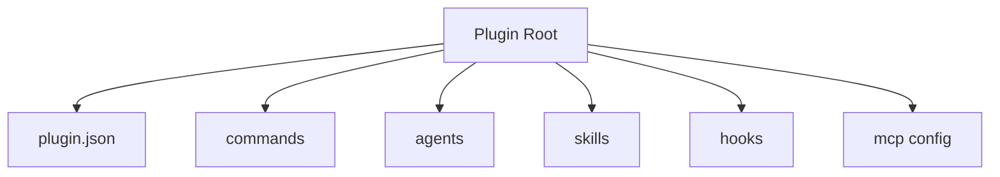

### 关键代码或配置示例

#### 1. 加载插件

```python
from claude_agent_sdk import query, ClaudeAgentOptions

options = ClaudeAgentOptions(
    plugins=[{"type": "local", "path": "./my-plugin"}],
    max_turns=3,
)

async for message in query(
    prompt="What custom commands do you have available?", options=options
):
    print(message)
```

#### 2. 验证插件

```python
if message.type == "system" and message.subtype == "init":
    print(message.data.get("plugins"))
    print(message.data.get("slash_commands"))
```

#### 3. 使用插件命令

```python
async for message in query(
    prompt="/demo-plugin:greet",
    options={"plugins": [{"type": "local", "path": "./plugins/demo-plugin"}]},
):
    print(message)
```

### 运维工程师 / SRE 关注点

1. 插件很适合团队共享整套运维工作流
2. 项目内可维护 project-specific plugin 保持一致性
3. 多插件来源时要注意路径和优先级
4. 插件本身也应纳入版本控制和审计

### 实战建议

1. 将成熟的命令 Skill Hook 和 MCP 配置打包为团队插件
2. 在 init 阶段做插件加载健康检查
3. 命令调用统一使用命名空间
4. 相对路径不稳定时直接用绝对路径

### 小结

`Plugins` 是 Claude Agent SDK 的组织化扩展机制。对团队化运维场景 它能把零散能力打包成统一可复用的工作流组件。`
