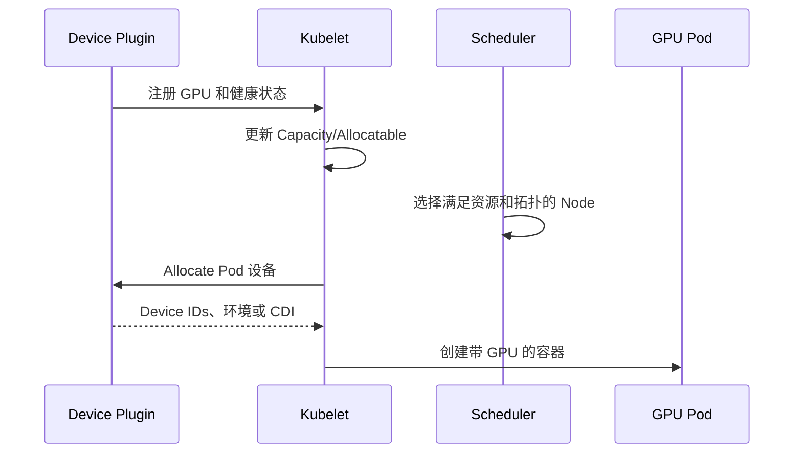
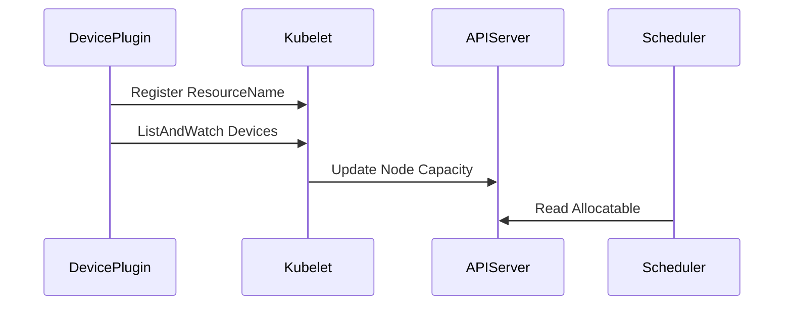

# GPU AI Infrastructure 学习笔记 · Kubernetes GPU

## 第 1 章 · Kubernetes 如何交付 GPU

### Device Plugin 把 GPU 注册为扩展资源

Kubernetes 原生只理解 CPU、内存等标准资源。NVIDIA Device Plugin 通过 kubelet Device Plugin API 发现 GPU，并把它们注册为 `nvidia.com/gpu` 等 Extended Resource。调度器据此判断 Pod 是否有足够资源，插件的 Allocate 响应再把设备信息传给容器运行时。



`nvidia.com/gpu` 出现在 Node Capacity 只表示资源注册成功，不表示所有容器都能加载 CUDA，也不表示设备健康和性能达到基线。

#### Extended Resource 使用整数并由设备插件管理

标准 `nvidia.com/gpu` 通常以整数计数，Pod 在 `limits` 中声明设备数量。Extended Resource 不支持 Kubernetes 原生的超额使用语义，调度器也不知道一张 GPU 内部的显存或 SM，除非 Device Plugin、MIG 或 HAMi 暴露了更细的资源模型。

资源被分配后不会像 CPU 那样被 kubelet 压缩。设备不可用、插件丢失或 Pod 持有异常时，Node Capacity/Allocatable、Pod Request 和实际设备状态可能暂时不一致，需要同时检查 kubelet Checkpoint 和插件日志。

#### Device Plugin 生命周期包含注册、ListAndWatch 和 Allocate

插件向 kubelet 注册 Resource Name，通过 ListAndWatch 持续报告 Device ID 和 Health，Pod 创建时由 kubelet调用 Allocate。插件进程重启后要恢复设备发现；设备变为 Unhealthy 后，新的分配应减少，但已运行 Pod 的处理取决于设备和应用状态。

### Driver、Toolkit、Runtime 和 Kubelet 是一条交付链

节点必须先具备可工作的 NVIDIA Driver，容器运行时需要 NVIDIA Container Toolkit 或 CDI，Device Plugin 才能发现并分配设备，kubelet 才能把资源状态报告给控制面。任意一层失败都会让 Pod Pending、容器启动失败或应用看不到 GPU。

```bash
kubectl describe node <node> | sed -n '/Capacity:/,/System Info:/p'
kubectl get pods -A -o wide | rg -i 'nvidia|gpu|device-plugin'
nvidia-smi
```

节点上线检查应区分“硬件存在”“资源已注册”“容器能用”“真实工作负载通过”四个阶段。

#### 从 Node Status 判断注册是否完成

`Capacity` 表示 kubelet 已接受设备插件上报，`Allocatable` 还会受健康状态和已知保留影响。Pod 已分配设备不会从 Allocatable 数字中直接扣除，Scheduler 通过已绑定 Pod Request 计算剩余量，因此排障要同时看 Node 和 Pod。

```bash
kubectl get node <node> -o json | jq '.status.capacity,.status.allocatable'
kubectl get pods -A --field-selector spec.nodeName=<node> -o json | \
  jq '.items[] | {ns:.metadata.namespace,name:.metadata.name,resources:.spec.containers[].resources}'
```

#### Kubelet Device Plugin Checkpoint 是运行状态证据

kubelet 会保存设备分配 Checkpoint。插件或 kubelet 异常后，Checkpoint 与实际 Pod/设备状态不一致可能阻塞分配。该文件属于 kubelet 内部状态，不应在线手工编辑；先保存证据并按节点维护流程恢复 kubelet/插件。

## 第 2 章 · GPU 节点调度和拓扑

### GPU Feature Discovery 暴露硬件能力

GPU Feature Discovery（GFD）根据 GPU 型号、Compute Capability、驱动、MIG、显存和其他能力给节点添加标签。标签可以帮助调度器区分 GPU 代际、MIG Profile、节点池和实验/生产环境。

标签不是实时性能指标，也不能代替拓扑矩阵。硬件替换、MIG 重配或驱动升级后，需要确认 GFD 标签是否重新生成，避免调度器把旧能力当成当前事实。

#### 标签适合表达稳定能力而不是瞬时健康

GPU Product、Family、Memory、Compute Capability、MIG Capability 适合 Node Label；温度、利用率、ECC 增量应进入监控，不应不断改 Label。高频 Label 更新会增加 API Server/etcd 压力，也可能让 Scheduler 在瞬时抖动中反复改变选择。

```bash
kubectl get node <node> --show-labels
kubectl get node <node> -o json | jq '.metadata.labels | with_entries(select(.key|test("nvidia|gpu")))'
```

#### 业务标签和自动发现标签要分层

GFD 负责硬件事实，平台另加 Node Pool、Environment、Failure Domain 和 Workload Class。不要手工覆盖 GFD 管理的标签；业务 Label 也不能伪造硬件能力。

### Label、Taint、Affinity 和 Topology 表达不同约束

| 机制 | 解决的问题 | GPU 平台场景 |
| --- | --- | --- |
| Label/Selector | 节点或工作负载分类 | GPU 型号、MIG、节点池 |
| Taint/Toleration | 阻止普通工作负载进入 GPU 节点 | 专用 GPU 节点 |
| Node Affinity | 选择满足条件的节点 | 代际、区域、拓扑域 |
| Pod Affinity/Anti-affinity | 控制副本或 Worker 的相对位置 | 分散故障域、靠近数据 |
| Topology Spread | 在域之间均衡副本 | 机架、区域、节点 |
| Device Plugin Topology | 将设备与 NUMA 关系交给调度 | CPU/GPU/NIC 对齐 |

资源请求只写 GPU 数量时，调度器可能无法表达通信密集型 Job 对 GPU 组、CPU 和 NIC 的要求。需要结合节点标签、Topology Manager、CPU Manager 和具体调度扩展能力验证实际分配。

#### CPU Manager 和 Topology Manager 处理节点内对齐

Guaranteed Pod 在 CPU Manager Static Policy 下可以获得独占 CPU；Topology Manager 汇总 CPU、Device Plugin 和 Memory 等 Hint，尝试把资源放在同一 NUMA 域。它们处理节点内分配，不负责跨节点选择。

```yaml
apiVersion: kubelet.config.k8s.io/v1beta1
kind: KubeletConfiguration
cpuManagerPolicy: static
topologyManagerPolicy: restricted
topologyManagerScope: pod
```

策略变更通常需要节点维护和 kubelet 状态清理流程。启用前必须验证目标 Pod QoS、CPU Request、GPU Plugin Topology Hint 和 NUMA 布局，否则 Strict/Restricted Policy 可能让 Pod 在资源总量充足时仍然 Admission 失败。

#### RuntimeClass 选择 GPU Runtime Handler

某些 containerd 部署通过 RuntimeClass 选择 NVIDIA Runtime Handler：

```yaml
apiVersion: node.k8s.io/v1
kind: RuntimeClass
metadata:
  name: nvidia
handler: nvidia
```

Pod 的 `runtimeClassName` 必须与 containerd 中的 Handler 一致。采用 CDI 或 Operator 默认 Runtime 配置时是否还需要显式 RuntimeClass，取决于版本和部署方式；平台应只保留一条清晰的设备注入主路径。

### GPU Pod 的请求、限制和可见性需要一起验证

```yaml
apiVersion: v1
kind: Pod
metadata:
  name: cuda-smoke
spec:
  tolerations:
  - key: accelerator
    operator: Equal
    value: gpu
    effect: NoSchedule
  containers:
  - name: cuda
    image: nvidia/cuda:12.4.1-base-ubuntu22.04
    command: ["nvidia-smi"]
    resources:
      limits:
        nvidia.com/gpu: 1
```

验证不能只看 Pod Running，还要检查容器内 GPU 数量、GPU UUID、驱动、CUDA Smoke Test 和 Node 上资源 Allocatable。`CUDA_VISIBLE_DEVICES` 的编号是容器视图，不能当作跨节点稳定身份。

#### Extended Resource 通常只写 Limit

设备插件资源通常不可超卖，Kubernetes 会把未显式填写的 Request 按 Limit 处理。Admission Policy 可以要求 GPU Limit 为正整数、禁止只写不存在的 Resource Name，并为 GPU Pod 自动加 Toleration/RuntimeClass。

#### 多容器 Pod 要明确设备属于哪个容器

Resource Request 位于 Container 级别。Sidecar 不应默认获得主容器 GPU；需要共享设备的多容器模式必须验证 Runtime/CDI 行为、权限和同一 Pod 内的故障影响。监控按 Pod 聚合时仍要保留 Container 维度。

## 第 3 章 · GPU Operator 和节点生命周期

### GPU Operator 把节点组件作为可管理对象部署

GPU Operator 通常协调 Driver、Container Toolkit、Device Plugin、GFD、DCGM 和 DCGM Exporter 等组件。它减少手工安装和版本漂移，但并不隐藏组件边界；排障仍应定位具体 Operand、DaemonSet、Validator 和 Node。

```bash
kubectl get pods -n gpu-operator -o wide
kubectl get ds -n gpu-operator
kubectl describe clusterpolicy -n gpu-operator
kubectl logs -n gpu-operator <pod> --all-containers --tail=200
```

Operator Pod 全部 Running 只说明控制器和工作负载进程存在，还需检查 Node 上驱动、资源注册、DCGM Field 和 CUDA 验证 Pod。

#### 常见 Operand 各自承担一段链路

| Operand | 职责 | 常见失败表现 |
| --- | --- | --- |
| Driver | 安装内核驱动 | `nvidia-smi` 失败、模块未加载 |
| Container Toolkit | 配置 Runtime/CDI | 宿主机成功但容器无 GPU |
| Device Plugin | 注册和分配扩展资源 | `nvidia.com/gpu` 缺失 |
| GFD | 生成 GPU 能力标签 | 调度标签缺失或陈旧 |
| MIG Manager | 应用 MIG 布局 | Profile/Label 与实例不一致 |
| DCGM | Host Engine 和诊断 | Field/Health 不可用 |
| DCGM Exporter | Prometheus 指标 | Target Up 但 Field 为空 |
| Validator | 验证驱动、Toolkit、CUDA | Operator 状态阻塞在验证阶段 |

排障时先找到失败 Operand 对应的 Node，再查看 Init Container、主容器、Node Label 和 Host 文件。删除 Operator Controller 通常不会修复节点内核模块或 Runtime 配置。

### 节点上线、Drain 和恢复是一个生命周期

```text
硬件和固件验收
  ↓
Driver/Fabric/Toolkit 安装
  ↓
Operator Operand 健康
  ↓
Device Plugin 和 GFD 注册
  ↓
DCGM、容器、CUDA Smoke Test
  ↓
单卡/多卡/网络基准
  ↓
解除 Cordon 接收作业
```

维护时先 Cordon，按照作业类型和 Checkpoint 能力 Drain，再保存拓扑、错误和版本证据。恢复时要重新跑最小容器、资源注册、DCGM、P2P/NCCL 和真实工作负载验证，不能只依赖 Pod Ready。

#### Drain 前要处理 GPU 长作业和本地状态

普通 `kubectl drain` 不理解训练 Checkpoint 是否完成，也不保证分布式 Job 一致退出。平台应先暂停 Queue/Admission，通知或触发 Checkpoint，确认所有 Rank 退出，再驱逐 Operator 之外的工作负载。Local NVMe 上的 Dataset Cache 和 Checkpoint 还需明确是否可丢失。

```bash
kubectl cordon <node>
kubectl get pods -A --field-selector spec.nodeName=<node>
kubectl drain <node> --ignore-daemonsets --delete-emptydir-data
```

命令选项必须按工作负载和数据策略审查，不能在有未持久化 Checkpoint 时机械使用 `--delete-emptydir-data`。

### Driver CRD、预编译 Driver 和升级回滚需要兼容边界

Operator 管理的 Driver 可能通过内核模块构建、预编译 Driver 或镜像方式交付。内核版本、签名策略、Secure Boot、GPU 型号和容器 Runtime 都会影响安装。升级前必须确认目标节点池的回滚包、重启窗口和旧内核/模块仍可恢复。

升级验证应覆盖：`nvidia-smi`、Fabric Manager、DCGM、Device Plugin、容器 GPU、Kubernetes Allocatable、单卡和多卡测试。若资源数量突然减少或同一节点多个 GPU Pod 失败，应保持 Cordon，先定位节点级故障。

#### 预编译 Driver 依赖精确的 OS/Kernel 组合

预编译模块减少节点现场编译时间，但要求目标 Kernel/发行版存在匹配制品。节点自动升级 Kernel 后可能找不到模块，因此 OS Patch 和 Driver Rollout 必须联动，并在重启前确认下一 Kernel 的 Driver 可用。

#### Driver 管理模式不能在节点池内混杂

部分节点使用 Host Package，部分由 Operator Driver Container 管理，会让版本、升级和故障归属混乱。节点池应选择一种权威来源，并用 Label/Policy 阻止 Operator 在预装 Driver 节点重复安装。

## 第 4 章 · 队列、配额和资源碎片

### ResourceQuota 不能解决 GPU 型号和拓扑碎片

ResourceQuota 能限制 Namespace 或项目的扩展资源总量，但不能表达 GPU 型号、MIG Profile、NVLink 域、GPU-NIC 亲和性和可拼接布局。平台报告应同时展示总 Allocatable、已分配、Active、按型号/Profile 分布和不可拼接的碎片。

```yaml
apiVersion: v1
kind: ResourceQuota
metadata:
  name: gpu-quota
spec:
  hard:
    requests.nvidia.com/gpu: "8"
    limits.nvidia.com/gpu: "8"
```

实际是否同时需要 requests/limits 条目取决于 Pod 资源写法和策略。HAMi、MIG 和 Time-Slicing 的 Resource Name 也应分别配额，避免用户绕过物理 GPU 配额申请另一个逻辑资源。

#### 碎片要按可调度组合度量

GPU Fragmentation 不是一个统一百分比，至少要分成五类：

| 碎片类型 | 还剩下什么 | 为什么仍无法放置 | 最小关联证据 |
| --- | --- | --- | --- |
| 物理数量 | 集群总计还有 N 张整卡 | 空闲卡散落在不同节点，单个节点放不下 Job Shape | Pending 请求卡数、每节点 Allocatable 和已分配卡数 |
| 拓扑 | 单节点空闲卡数足够 | 不在同一 NVLink/NVSwitch Group、NUMA 或所需路径 | GPU UUID、Topology Matrix、Pod 拓扑约束和 Filter Reason |
| MIG Profile | 尚有空闲 Slice/GI/CI | 现有 Geometry 不能拼出作业请求的 Profile | 物理 Geometry、Resource Name/Count、Pending Profile |
| HAMi Memory/Core | 显存或 Core 某一维有余量 | 同一物理 GPU 上的设备数、显存和 Core 不能同时满足 | Allocation Annotation、GPU UUID、Memory/Core 账本和最终 Filter Reason |
| GPU-NIC | GPU Group 可用 | 邻近 HCA/Port、Rail 或对应 CPU/Memory 已被占用 | GPU-NIC-NUMA 映射、NIC 资源、Rank 需求和调度结果 |

“可用 GPU”是健康且未记账给其他工作负载的单个资源；“可放置 GPU”是在同一时刻同时满足作业数量、Resource Name/Profile、拓扑、CPU/Memory、Taint/Affinity、Queue/Quota 和 GPU-NIC 条件的组合。容量报表因此要计算 `placeable(job_shape, current_state)`，而不是从全集群空闲数做减法。

判断碎片是否已经造成业务影响，要把 Pending Job Shape 逐一在当前节点状态上求值：若有符合组合却仍 Pending，转向 Queue、Quota、Scheduler/Extender 或控制器路径；若所有节点都缺同一项组合条件，才是对应类型的真实碎片。

### Priority、Preemption 和 Gang Scheduling 服务不同目标

Priority 让调度器区分作业重要性，Preemption 允许高优先级作业抢占低优先级资源；被抢占训练必须有 Checkpoint 和恢复机制。Gang Scheduling 要求分布式 Job 的一组 Worker 同时获得资源，避免只启动部分 Worker 后长期占卡等待。

Volcano 提供 Batch/Queue/Gang 能力，Kueue 提供 Job Admission、ClusterQueue 和配额借用。它们位于工作负载队列层，不能替代 Device Plugin、GPU Operator 或 HAMi 的设备交付和限制能力。

#### PriorityClass 表达相对优先级

```yaml
apiVersion: scheduling.k8s.io/v1
kind: PriorityClass
metadata:
  name: gpu-training-high
value: 100000
preemptionPolicy: PreemptLowerPriority
globalDefault: false
description: "High priority GPU training with checkpoint support"
```

高 Priority 不保证立刻运行，仍受 GPU 数、Topology、Quota 和 Gang 约束。PriorityClass 是集群级资源，应由平台管理，不能让租户任意创建更高值。

#### Gang Scheduling 防止部分 Worker 占卡等待

分布式 Job 需要 8 个 Worker 时，如果只启动 4 个，它们可能占用 GPU 等待剩余 Worker。Gang/PodGroup 在满足最小成员前不让组进入运行，降低死锁式浪费。它也会增加大 Job 等待，因此 Queue 需要 Backfill 小 Job 或预留完整节点。

#### Kueue Admission 和运行时调度分工

Kueue 决定 Job 是否获得 ClusterQueue 配额，默认 Scheduler 决定具体 Node，Device Plugin 决定具体设备。排障 Pending 时先判断卡在哪一层，避免把未 Admission 的 Job 当成 Node GPU 不足。

### 节点生命周期和作业调度要共同设计

GPU 节点维护、故障隔离、队列暂停、作业重试和 Checkpoint Recovery 不能各自独立。节点 Drain 时要避免新作业进入，队列要知道容量变化，训练系统要能从最近 Checkpoint 恢复，恢复后的节点还要通过 GPU、网络和共享方案验证。

## 第 5 章 · GPU 节点生命周期 Runbook

### 新节点上线要经过隔离区而不是直接加入生产调度

#### 上线阶段

1. Node 注册后保持 Cordon，并添加 `gpu-validation=pending` 等内部状态标签。
2. 核对 BMC、OS、Kernel、Firmware、Driver 和 GPU/NIC Inventory。
3. 验证 Fabric Manager、Toolkit、Device Plugin、GFD、DCGM 和 Exporter。
4. 运行单卡 Burn-in、P2P/NCCL、必要的 RDMA/Storage 测试。
5. 运行 Kubernetes CUDA、Framework、MIG/HAMi 和监控验证。
6. 保存基线并移除 Pending 标签，最后 Uncordon。

#### 上线失败的处理

任何设备数量、PCIe Link、ECC/XID、NVLink/Fabric、容器注入或 Allocatable 异常都保持隔离。不要为了让 Node Ready 而关闭 Validator 或删除健康检查；应修复对应层并从该层向上重新验证。

### Driver Upgrade 需要 Canary、Drain 和回滚

#### 变更前

- 确认目标 Driver 支持 GPU、Kernel、CUDA/Framework、FM/DCGM 和 vGPU/MIG；
- 保存当前包、Kernel、Operator Policy、拓扑和性能基线；
- 选择 Canary Node，暂停新 Job，确认 Checkpoint；
- 定义回滚条件和旧 Driver 恢复步骤。

#### 变更后

```bash
nvidia-smi
systemctl status nvidia-fabricmanager
dcgmi discovery -l
kubectl describe node <node> | rg -i 'nvidia.com|capacity|allocatable' -C 2
```

再运行容器、Framework、P2P/NCCL 和目标工作负载。版本正确但性能下降超过阈值同样触发回滚。

### GPU Operator Upgrade 要检查 CRD、Policy 和 Operand Rollout

Operator Upgrade 可能改变 CRD Schema、默认 Operand Image、Device Plugin 参数、MIG/CDI 行为和指标。先阅读 Release Notes，导出 ClusterPolicy/ConfigMap/Helm Values，并在 Canary Node Pool 禁止自动扩散到所有节点。

#### Rollout 观察项

- Operator/Operand Image 和 Ready 状态；
- Driver 是否被意外切换管理模式；
- Runtime、CDI Spec 和 Device Plugin 注册；
- GFD/MIG Label 和 Resource Name；
- DCGM Metric 名称和 Pod Mapping；
- 现有 GPU Pod 是否被重启或失去设备。

升级后用新旧节点运行同一 Pod 和模型，确认资源、性能、监控一致，再扩大范围。

### 故障节点恢复必须经过重新准入

节点重启后 Ready 只代表 kubelet 心跳恢复。根据原故障重新运行 PCIe/GPU/DCGM、Fabric、Runtime、Device Plugin、MIG/HAMi、P2P/NCCL 和 Workload Test，并确认原错误 Counter 不再增长。

如果硬件被替换，更新 UUID/BDF、资产、GFD/CDI、监控和拓扑基线。旧 GPU UUID 的告警、配额或 CMDB 引用应清理，避免监控把新设备与旧故障混在一起。

## 第 6 章 · 调度、配额和碎片案例

### Binpack 和 Spread 应按 Workload Class 使用

训练 Job 采用 Binpack 可以保留完整空闲节点和 NVSwitch 域，减少未来大 Job 的碎片；在线推理副本采用 Spread 可以跨节点/机架提高可用性。对所有 Workload 使用同一策略会在性能、碎片和可用性之间失衡。

平台可定义 Workload Class：`training-large` 要求整节点/完整 GPU Group，`inference-critical` 强制跨故障域，`batch-shared` 允许 HAMi/Time-Slicing。Admission 将 Class 转成资源、Affinity、Priority 和 Queue 策略。

#### 整理动作要与碎片类型匹配

| 动作 | 适合的阻塞 | 不能解决什么 | 变更边界 |
| --- | --- | --- | --- |
| Binpack | 清空更多完整 GPU 或整节点，为大 Job 保留组合 | 不能把不同节点的空闲 GPU 合成单节点拓扑 | 优先调整 Queue/Admission/Scheduler Policy，可先在新 Job 上生效 |
| Spread | 降低单卡邻居干扰，跨节点或故障域分散副本 | 不保留整节点，可能增加大作业碎片 | 策略变更，既有 Pod 不会自动重排 |
| 整节点队列或预留 | 通信密集大训练需要完整 Fabric Group | 不会提高小作业的单卡利用率 | Queue/Quota/Reservation 变更；清理已占用节点时才需 Drain |
| MIG 重配 | Pending 需求的 Profile 无法由当前 Geometry 提供 | 不会解决 Queue、Quota 或非 MIG GPU 数量不足 | 节点 Cordon/Drain，由 MIG Manager 等声明式机制应用，部分平台可能需重启 |
| HAMi 联合 Binpack | 单维有余量，但 Memory/Core/设备数分散在不同 GPU | 不能把软隔离变成 MIG 的硬件故障隔离 | 新作业可先改策略；迁移已有 Pod 必须考虑中断、账本回收和重建 |

Queue/Policy 变更只影响之后的 Admission 和放置，不会自动改变正在运行的 Pod、MIG Geometry 或物理拓扑。涉及已有作业迁移、MIG 实例销毁重建、驱动/插件重启或节点设备变更时，必须进入维护边界：暂停新调度、Cordon，确认 Checkpoint/服务容量，Drain，声明式应用目标状态，验证后再 Uncordon。

### Preemption 必须和 Checkpoint 成本一起计算

抢占释放 GPU 的收益，要减去被抢占 Job 已完成但未 Checkpoint 的计算、写入/恢复时间、重新排队和缓存预热成本。高优 Job 等待 5 分钟并不一定值得中断一个距离 Checkpoint 只剩 2 分钟的训练。

调度平台应记录 Last Checkpoint、Estimated Recovery、Preemption Count 和 Wasted GPU Time，并为不可恢复 Job 禁止自动抢占。

### GPU 碎片 Dashboard 要展示不可用原因

| 碎片类型 | 例子 | 可能动作 |
| --- | --- | --- |
| 数量碎片 | 每节点各空闲 1 张，无法放 8 卡 Job | Binpack、整节点 Queue |
| 拓扑碎片 | 4 张空闲但不在同一 GPU Group | 拓扑感知调度 |
| MIG 碎片 | 空闲 Slice 无法组成目标 Profile | Drain 后重配布局 |
| HAMi 碎片 | 显存够但 Core 比例不足 | 联合资源 Binpack |
| NIC 碎片 | GPU 可用但邻近 HCA 已占用 | GPU-NIC 联合调度 |

Dashboard 同时显示 Pending Job 的需求形状，才能判断碎片是否真正阻塞业务。没有 Pending 大 Job 时，零散空闲不一定需要立即重排。

#### 从证据到恢复验收形成闭环

整理前先固化三份证据：需求侧保存 Pending Job 的 Pod/Job UID、Queue、Priority、GPU 数量、Profile、Memory/Core 和拓扑约束；集群侧保存 Node Allocatable、已分配 Pod、GPU UUID/MIG UUID、HAMi 账本、GPU-NIC-NUMA 映射；决策侧保存 Queue Admission、Scheduler Filter/Score 和 Extender/Device Plugin 记录。没有这三类快照，整理后只能看到“Pod 已运行”，无法证明原碎片或账本不一致已修复。

变更期间要保持唯一权威来源：MIG Layout 由目标 Config/Label 和 Manager 控制，HAMi 由 Scheduler Allocation Annotation、Device Plugin 与节点账本对账，Kubernetes 整卡则核对 Kubelet Checkpoint、Device Plugin Healthy 与 Node Capacity/Allocatable。不要在控制器工作时手工改一份中间状态，否则可能出现重复分配、幽灵配额或旧 Resource Name 继续暴露。

恢复验收按原 Job Shape 重放，并同时满足：

1. 物理 Inventory、MIG Geometry/HAMi 账本与 Node Capacity/Allocatable 一致；
2. 删除或迁移的 Pod 不再占用 GPU UUID、MIG 实例或共享份额，新 Pod 不会得到重复分配；
3. 原 Pending Job 通过预期 Queue 和策略获得可解释的 Node/GPU 组合；
4. 容器内可见 UUID、MIG Profile 或 HAMi Memory/Core 限制与调度结果一致；
5. 拓扑密集作业的 P2P/NCCL 或 GPU-NIC 路径回到基线，共享作业的邻居干扰仍在 SLO 内；
6. 观察窗口内没有新的 Pending 同型 Job、资源数量抖动、账本残留或控制器重复重配。

如果整理后只是通过放松 Topology/Affinity、改申请 Profile 或减少 GPU 数才让 Job 运行，应记录为需求降级，而不是碎片修复。

## 第 7 章 · Device Plugin 协议与资源注册

### Device Plugin 通过 Kubelet Socket 注册资源名

Device Plugin 在节点上运行，通过 Kubelet Device Plugin Socket 注册 `ResourceName`，随后持续报告 Device ID 与 Health。Kubelet 把健康设备数量计入 Node Capacity/Allocatable，Scheduler 只看到整数扩展资源，不直接理解 GPU 显存、NVLink 或进程状态。



Plugin Pod Running 不代表注册成功。检查 Node Capacity、Kubelet Log、Plugin Log 和 Socket；资源曾存在后消失，还要看 Kubelet 重启、Plugin 重注册和 Driver 健康。

### ListAndWatch 把物理健康转换为可分配数量

Plugin 报告的 Device ID 可使用 UUID 等稳定标识，并标记 Healthy/Unhealthy。Kubelet 不会因为 `nvidia-smi` 暂时失败就自动理解全部硬件语义，最终行为取决于 Plugin 如何检测和上报。

GPU 被标 Unhealthy 后，已运行 Pod 的行为与新 Pod 分配是两个问题：新分配应停止，已有 CUDA Context 可能已经失败，也可能暂时继续。平台需要 Node Condition 和事件 Runbook 处理，而不能只等待 Resource Count 变化。

### Allocate 阶段生成容器所需设备和环境

Kubelet 在 Pod Admission 时调用 Allocate。响应可以包含 Device Node、Environment、Mount、Annotation 或 CDI Device。随后 CRI Runtime 创建容器并执行最终注入。

```text
Pod Request
  -> Scheduler chooses Node
  -> Kubelet Device Manager selects Device ID
  -> Device Plugin Allocate
  -> CRI and OCI Spec
  -> Container sees GPU
```

Pod 已调度但 CreateContainer 失败，应检查 Allocate Response、CDI Spec、Runtime Handler 和 Device Permission；不能只看 Scheduler Event。

#### Preferred Allocation 不是全局拓扑调度器

Plugin 可对本节点候选设备表达偏好，但 Scheduler 在选节点时未必知道具体 Device ID。要保证 NVLink Clique、NUMA 或 NIC 亲和，需要 Scheduler Extension、DRA、Node Pool 或整节点策略共同参与。

## 第 8 章 · GPU Operator Operand 依赖和状态判断

### ClusterPolicy 声明组件而 Operand 实现节点能力

GPU Operator 根据 ClusterPolicy 部署 Driver、Toolkit、Device Plugin、GFD、DCGM Exporter、MIG Manager、Validator 等 Operand。不同安装模式可禁用 Driver 或 Toolkit，使用预装 Host 组件；因此“Operator 默认会装全部”不是可靠假设。

```text
ClusterPolicy
├── Driver
├── ContainerToolkit
├── DevicePlugin
├── GPUFeatureDiscovery
├── DCGMExporter
├── MIGManager
└── Validators
```

各 Operand 有依赖顺序：Driver 未 Ready 时 Toolkit/Plugin 验证通常失败；Runtime 未重配时 Pod 无法注入；Plugin 未注册时 Node 没有扩展资源；Exporter 可运行但没有有效 Field。

### Node Label 是 Operator 状态机的可观察输出之一

Operator 使用 Node Label/State 驱动组件部署与验证。排障要比较期望 Label、实际 DaemonSet Pod、容器日志和 Node Event。手工修改状态 Label 可能短暂绕过控制器，却造成声明与实际不一致。

```bash
kubectl get clusterpolicy
kubectl get pods -n gpu-operator -o wide
kubectl get node <node> --show-labels
kubectl describe node <node>
```

命名空间以安装配置为准。执行变更前先导出 ClusterPolicy 与 Helm Values，避免只靠当前 Pod 推断配置来源。

### Validator 失败要按它验证的层次处理

Driver Validator、Toolkit Validator、CUDA Workload Validator 和 Plugin Validator 证明的范围不同。一个 Validator 失败，不应直接重装整个 Operator。

| 失败点 | 先检查 |
|---|---|
| Driver | Module、Device、Kernel、Host Package |
| Toolkit | Runtime Config、Hook/CDI、CRI Restart |
| CUDA | 最小 Container、Library、Device Permission |
| Plugin | Socket、Registration、Node Capacity |
| MIG | Mode、Geometry、Manager State |

控制器反复重试会覆盖最初错误，事件系统应保留 First Failure Log 和发生时的 Node State。

## 第 9 章 · 队列、配额、Gang 与公平性

### ResourceQuota 管数量但不自动管理队列顺序

Namespace ResourceQuota 可限制扩展资源请求总量，却不提供跨 Namespace 的排队、公平份额或借用策略。多个团队共享 GPU 时，需要 Queue/Quota Controller 统一回答谁先运行、闲置额度能否借用和何时收回。

### Gang Scheduling 避免分布式 Job 占住部分 GPU

一个 8 Pod 训练 Job 若只启动 6 个，已运行 Pod 可能占 GPU 等待剩余 Rank，既无法训练又阻塞其他 Job。Gang 以 PodGroup/Workload 为单位，资源满足最小成员后一起准入。

Gang 提高作业完整性，但大 Job 可能长期等待并造成 Head-of-Line Blocking。需要 Backfill、小 Job Queue 或公平策略平衡吞吐。

### Priority 和 Preemption 必须防止低优租户饥饿

PriorityClass 影响调度顺序和抢占，但过多高优级会失去区分度。平台应限制谁能使用关键优先级，设置队列配额和 Aging，并监控被抢占次数、浪费 GPU Hour 与恢复时间。

Kueue、Volcano 或其他系统的对象不同，但评估都应覆盖 Admission、Cohort/Borrowing、Gang、Preemption、Topology 和可观测性，而不是只比较是否支持 Queue 名称。

## 第 10 章 · GPU 节点完整生命周期

### 上线前把硬件事实转成可调度事实

节点上线依次验证 BMC/BIOS/Firmware、OS/Kernel、Driver/Fabric、Runtime、Plugin、GFD Label、DCGM、P2P/NCCL/RDMA 和真实 Smoke Test。通过后才解除 Taint 或加入生产 Node Pool。

```text
Inventory -> Health -> Driver -> Runtime -> Kubernetes
          -> Topology -> Network -> Benchmark -> Ready
```

把未经基准的新节点直接加入集群，会让首个业务 Job 代替验收发现问题。

### Drain 前先识别不可中断和本地状态

普通 `kubectl drain` 不理解训练 Checkpoint、MPS Client、Host Process 和本地 Dataset Cache。维护编排应先停止新 Queue Admission，通知 Job Checkpoint，确认 PodDisruptionBudget 与 Eviction，再检查 GPU Process 归零。

DaemonSet、Static Pod、Local Storage 和裸机进程需要单独处理。强制删除 Pod 可能丢失训练进度，且 CUDA Context 未及时退出会阻止 Driver 升级。

### 升级以节点池 Canary 和可回滚组合推进

Driver、Kernel、Toolkit、Device Plugin、Operator、HAMi、OFED 和 Firmware 是组合版本。Canary 节点先验证功能、性能、数值和恢复，再分批扩大。每批设置最大不可用 GPU 数和观察窗口。

回滚不是只 `helm rollback`：如果 Driver/Kernel/Firmware 已变更，需要对应 OS Image、Package Cache 和重启流程。MIG Layout、CDI Spec 和 Node Label 也要恢复一致。

### 故障隔离分为调度隔离和物理隔离

Cordon 阻止新 Pod，不会停止已运行任务；Taint 可表达故障原因；Drain 迁移可驱逐工作负载；BMC Power-Off 或物理下架是更强隔离。应按 XID/ECC/Fabric/安全事件严重度选择。

节点恢复后不能直接 Uncordon。要验证 Inventory、健康计数、资源注册、拓扑、通信、监控和基准，并清理临时 Taint/Annotation，保留事件与维修记录。

## 第 11 章 · DRA 与未来设备交付边界

### DRA 将设备请求从整数资源扩展到结构化声明

传统 Extended Resource 主要表达整数数量，DRA 通过 ResourceClaim、DeviceClass 和 Driver 等对象描述设备选择与分配生命周期，为属性匹配、共享和结构化参数提供接口。具体 API 随 Kubernetes 版本演进，部署前必须核对 Feature Gate 与 Driver 支持。

DRA 不是自动解决 GPU Topology、共享隔离和队列公平的产品。Driver 仍需实现设备发现、选择、准备和释放，Scheduler 也需要使用可用属性做决策。

### CDI、NRI、DRA 位于不同层次

| 机制 | 主要位置 | 解决的问题 |
|---|---|---|
| CDI | OCI Runtime 设备描述 | 如何把已选设备注入容器 |
| NRI | CRI Runtime 扩展 | 如何在容器生命周期调整 Spec |
| DRA | Kubernetes 资源分配 | 如何声明、选择、准备设备 |

三者可组合而非互相替代。架构图必须标出谁决定“选哪张卡”、谁生成“容器看到什么”、谁维护“资源是否释放”。

### 迁移新资源接口要保持双栈观测

从 Device Plugin 扩展资源迁移到 DRA 时，旧 Pod、Quota、Dashboard、Admission 和计费可能仍依赖 `nvidia.com/gpu`。试点节点池应同时核对 Claim State、实际 Device、Pod 可见性和旧指标，避免资源在两个账本中重复或遗漏。

## 第 12 章 · GPU Pod 资源声明与验证

### GPU 扩展资源通常只写 Limit

Kubernetes 扩展资源不能 Overcommit，GPU Request/Limit 语义与 CPU/Memory 不完全相同。常见 Pod 只在 `limits` 声明 GPU，Kubernetes 将 Request 视为相同值；若同时填写，二者必须一致。

```yaml
apiVersion: v1
kind: Pod
metadata:
  name: gpu-smoke
spec:
  restartPolicy: Never
  containers:
    - name: cuda
      image: registry.example/cuda-smoke@sha256:example
      resources:
        limits:
          nvidia.com/gpu: 1
      command: ["nvidia-smi", "-L"]
```

Digest 为示例，必须替换为组织验证过的镜像。未声明 GPU 却依赖 Runtime 自动暴露所有卡，会绕过调度和配额，生产应禁止。

### RuntimeClass 只选择运行时配置不选择 GPU

```yaml
apiVersion: node.k8s.io/v1
kind: RuntimeClass
metadata:
  name: nvidia
handler: nvidia
```

Pod 引用 RuntimeClass 后，CRI 使用对应 Handler；GPU 仍由扩展资源或 DRA 分配。若集群把 NVIDIA Runtime 设为默认，可不要求每个 Pod 显式填写，但平台必须统一约定。

### Node Selector 只引用稳定且受治理的 Label

GFD 会生成型号、显存、Compute Capability、MIG 等 Label。用户不应依赖易变或版本私有 Label。平台抽象稳定 Workload Class，例如 GPU Family、Memory Tier、Fabric Tier，并由自动化从发现结果派生。

```yaml
nodeSelector:
  platform.example/gpu-memory-tier: large
  platform.example/fabric-tier: nvlink
```

自定义 Domain 仅示意。Label 变更需同步 Admission、Quota 和文档。

### Smoke Pod 同时验证设备、Framework 和归属

Smoke Test 输出 Pod/Node、GPU UUID、Framework Device、简单计算和退出码。仅运行 `nvidia-smi` 会漏掉 CUDA Context/Framework Library 问题。测试结束确认资源归还和 Node Allocatable 不变。

## 第 13 章 · Taint、Affinity 与拓扑策略示例

### GPU 节点用 NoSchedule 避免普通 Pod 占据关键资源

```yaml
tolerations:
  - key: platform.example/gpu
    operator: Equal
    value: "true"
    effect: NoSchedule
```

Toleration 只是允许进入，不保证 Pod 调度到 GPU 节点；还需 GPU Resource 或 Node Affinity。不要给所有 Namespace 默认注入宽泛 Toleration。

### Required Affinity 表达硬约束而 Preferred 表达偏好

硬件/兼容约束如 Compute Capability、MIG Resource 应用 Required；希望靠近某 Zone/Cache 可用 Preferred。把所有偏好设硬约束会造成 Pending 和碎片。

### Pod Anti-Affinity 需要结合故障域和容量

在线推理副本跨 Node/Rack 分散可提高可用性，但 GPU 节点少时 Strict Anti-Affinity 会阻止扩容。Topology Spread 的 `maxSkew` 和 `whenUnsatisfiable` 按 SLO 与容量选择。

### Topology Manager Admission 失败要保留 Hint 证据

Pod 因 NUMA Affinity 被拒绝时，Event 可能只显示 Topology Affinity Error。采集 CPU Manager State、Device Plugin Hint、Pod CPU/Memory/GPU Request 和 Node NUMA Free。扩大资源请求有时更难满足，不应盲目重试。

## 第 14 章 · Operator 安装与升级检查表

### 安装前确认平台前置条件

安装前要先确定哪一层拥有节点组件的最终控制权，否则预装 Driver、Operator Driver、旧 Device Plugin 和新的 Runtime 配置可能互相覆盖。把支持矩阵、节点池范围、网络出口和回滚方式作为变更输入保存，而不是安装失败后再补查。

- Kubernetes/OS/Kernel/Runtime 在支持矩阵；
- 节点已有 Driver 还是由 Operator 管理；
- Secure Boot、Proxy、Registry Mirror 和 Air-Gap；
- GPU/NIC/Fabric Manager 所有权；
- Pod Security、PriorityClass 和资源预留；
- MIG/HAMi/Time-Slicing 目标模式；
- Monitoring Namespace、ServiceMonitor 和告警；
- 旧 Device Plugin/Toolkit 已清理或明确共存边界。

### 安装后按依赖顺序验证

Driver -> Toolkit -> Runtime -> Device Plugin -> GFD -> DCGM -> MIG/HAMi -> Workload。每层保存版本、Pod、Node Label、Resource 和 Smoke Test。不要因为 ClusterPolicy Ready 就跳过节点抽检。

### 升级先比较 CRD 和 Helm Values 差异

新 Chart 可能改变 CRD、默认 Operand Image、Security Context 和 Label。先渲染 Manifest/Diff，备份旧 Values/CRD，再 Canary。CRD Schema 变化可能让简单 Helm Rollback 不完整。

### 卸载要避免破坏仍被工作负载依赖的 Host 组件

删除 Operator 可能删除 Driver DaemonSet、CDI、Runtime Config 或 Node Label。卸载前 Drain、确认目标接管方案，卸载后验证 Host Driver/Runtime 状态。不要在业务运行时把 Operator 当普通无状态 Chart 删除。

## 第 15 章 · 节点故障和控制器一致性案例

### Kubelet 重启后资源数量没有恢复

检查 Plugin Socket 重建、Registration、ListAndWatch、Kubelet Device Manager Checkpoint 和 Node Capacity。不要先删除 Node Object；这会扩大 Pod/身份影响。恢复后运行新 Pod 和异常退出回收测试。

### Driver Pod Running 但宿主机无 GPU

DaemonSet Running 只代表容器进程存在。检查 Build/Load Log、Host Module、Device Node、Kernel API Mismatch 和 Validator。若 Module 无法加载，隔离节点并处理 Kernel/Header/签名。

### MIG Manager 显示 Success 但资源名未更新

比较物理 MIG Geometry、Device Plugin Strategy、GFD Label、Kubelet Capacity 和已有 Pod。可能是 Plugin 未重启、旧 Checkpoint 或 Layout 只部分应用。禁止反复切 MIG Mode，先保存状态。

### HAMi 显示有余量但 Pod 长期 Pending

检查余量是否同时满足 Device Count、Memory 和 Core，节点是否被 Taint/CPU/NUMA 淘汰，Extender 是否可达，账本是否有删除 Pod 残留。以最终 Filter Reason 定位，不只看 Dashboard 总显存。

## 第 16 章 · Kubernetes GPU 平台日常核对

### Node Capacity 与物理 Inventory 一致

每日比较预期 GPU/MIG/HAMi Resource、Allocatable、Plugin Healthy 和物理 UUID，并保留比较时的 Node、Plugin 与驱动版本。差异节点先 Cordon，区分硬件缺失、插件未注册和共享账本残留，不让新的 Allocate 才发现问题。

### Operator Operand 全部在目标版本

核对 ClusterPolicy、DaemonSet Image Digest、Ready/Desired、Validator 和 Node Label，按节点池确认滚动是否完成。Pod 处于 Running 仍可能使用旧 Image 或旧配置，版本漂移应单独告警并阻止扩大流量。

### Driver/Runtime 有效配置一致

核对 Loaded Driver、containerd Effective Config、RuntimeClass Handler、CDI Spec 和最小 GPU Pod 的实际设备视图。磁盘上存在配置不等于 Runtime 已读取；配置与容器结果不一致时，保留 CRI/kubelet 日志后再重启运行时。

### GFD Label 与真实硬件一致

比较型号、显存、Compute Capability、MIG/Fabric Label 与物理 Inventory，并识别过期或人工覆盖的标签。调度只依赖治理后的稳定 Label；温度、利用率和 ECC 增量等瞬时状态应留在监控中，不要写入高频标签。

### Pending Pod 按最终原因归类

将 Pending 原因归类为配额/Queue、GPU 数或类型、Topology、CPU/Memory、Taint/Affinity、Image/Volume 以及 HAMi/DRA 决策，并记录最终 Filter/Admission 证据。Dashboard 同时展示 Pod 的需求 Shape，避免把所有等待都归因于“GPU 不足”。

### 已分配 GPU 与容器可见一致

串联 Kubelet Checkpoint、Plugin Allocation、CDI/OCI、Pod UID 和 Framework Device，确认同一 UUID 从分配到容器可见保持一致。发现资源记账一张而进程使用另一张时，暂停该节点新分配并保存容器检查结果，避免直接清理账本造成重复分配。

### MIG Layout 与节点池模板一致

核对 Physical Instance、GFD Label、Resource Name/Count、监控 Entity 和是否存在遗留 Context。发现 Layout 漂移时标记节点待维护，不要在仍有活跃 Pod 时自动重配；应通过 Drain 和声明式 Manager 恢复模板。

### HAMi 账本与进程使用一致

将 Pod Annotation、Assigned UUID、Memory/Core Limit 与物理进程列表关联，并在删除 Pod 后确认共享份额回收。出现残留或重复分配时，同时检查 HAMi Reconciler、Device Plugin 和 Kubelet 状态，不能只修改调度侧数字。

### 共享邻居干扰在 SLO 内

按同卡租户记录 Memory/Compute 使用、P99 或 Step 时间以及 OOM/XID 事件，和共享方案的预期 SLO 对照。关键池出现未知邻居或超 SLO 时先限制新共享请求，再迁移或隔离受影响工作负载并保留时间窗口证据。

### Queue 与配额无持续饥饿

持续观察 Wait P50/P95/Max、Fairshare/Borrow、Preemption、Pending Shape 和 Quota 使用，按租户和 Workload Class 分解。高优队列不应长期吞掉低优租户的最小份额；发现饥饿时调整配额、借用或 Aging，而不是简单提高所有 Priority。

### GPU 碎片有业务需求上下文

将数量、拓扑、MIG、HAMi 和 NIC 碎片与实际等待 Job 的资源 Shape 对照，并记录无法调度的具体约束。没有大 Job 或 SLA 需求时，零散空闲不需要为追求整齐而强制重排，以免制造迁移和重配置风险。

### 节点维护状态跨系统一致

对照 CMDB Maintenance/Fault、Kubernetes Cordon/Taint、Queue Admission、Incident 和 Work Order 的状态及时间戳。任何一方仍处于维护或故障状态时，自动化不得 Uncordon；恢复操作必须留下操作者、验证结果和解除隔离依据。

### Telemetry 覆盖所有可分配设备

核对 Exporter Fresh、Parent/MIG Entity、Pod Mapping、GPU Count 和 Alert Delivery，确认每个可分配设备都有可追溯实体。Telemetry 缺失或过期的节点进入 Unknown/限制状态，先修复采集链路再恢复生产调度。

### 异常退出资源可回收

通过 Force Delete、OOM、Node/Kubelet/Plugin Restart 等场景验证 Device/Share 归还，并检查 GPU Process、CDI 和调度账本无残留。把回收演练纳入周期测试；账本过早释放或长期残留都可能造成同一设备的重复分配或假碎片。

### 版本 EOL 和证书到期提前处理

建立 Kubernetes、Driver、Operator、HAMi、Runtime 以及 Registry、License、Webhook Certificate 的 EOL/到期清单，关联节点池和负责人。到期前完成兼容 Bundle、Canary 和回滚演练，不在生产窗口临时替换核心组件。
