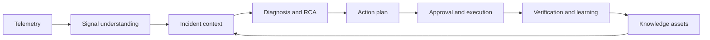
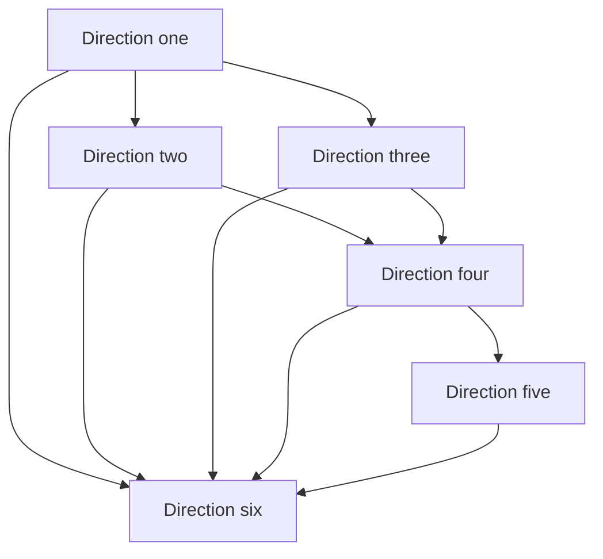
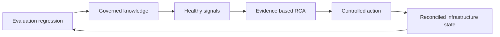

# LLM-AIOps 中文学习路线总览

> 这份总览负责回答“先学什么、六个方向怎样连接、读到什么程度再继续”。具体概念、论文方法、公式和工程检查项位于六份专题笔记，此处不重复专题正文。

## 📚 目录

### 阅读导航

- 领域总图。
- 六个方向的职责与依赖。
- 分阶段学习路线。
- 按角色和目标选择入口。
- 学习产出与检查点。
- 资料边界和专题入口。

## 这套路线解决什么问题

### 从模型能力转向系统能力

LLM-AIOps 不是把聊天模型接到监控平台。

它连接：

- 可观测信号。
- 运维知识。
- 事件上下文。
- 诊断工具。
- 根因证据。
- 处置工作流。
- 人工决策。
- 安全执行。

学习时应持续追问：

1. 输入来自哪里？
2. 输出属于哪种运维任务？
3. 结论有哪些证据？
4. 模型能调用什么工具？
5. 工具权限和失败怎样处理？
6. 如何验证真实效果？
7. 什么时候必须人工接管？

### 三条主线

#### 信息线

原始遥测和文档怎样变成可用上下文。

#### 推理线

异常怎样经过查询、定位和验证形成根因。

#### 行动线

根因候选怎样经过计划、审批、执行、验证和回滚形成受控闭环。

### 总体链路



上图是跨方向编辑性综合。

## 六个方向如何衔接

### 方向一建立判断坐标

[方向一：基础范式、评测与可信性](01-foundations-evaluation-trust-roadmap.html)

它回答：

- 任务是什么。
- 输入输出是什么。
- 怎样评测。
- 何时可信。
- 离生产还有多远。

方向一是所有后续专题的共同前置。

### 方向二组织知识和事件上下文

[方向二：运维知识工程与人机协作](02-ops-knowledge-and-collaboration-roadmap.html)

它连接告警、工单、SOP、Runbook、Postmortem 和历史案例。

主要产出是可追溯知识与分层 Incident Context。

### 方向三把遥测转成异常证据

[方向三：可观测性智能与信号理解](03-observability-and-signals-roadmap.html)

它处理日志生成、日志解析、异常检测、时间序列和多信号关联。

主要产出是结构化信号、异常位置和候选症状。

它不提前确认根因。

### 方向四形成根因证据链

[方向四：故障诊断、定位与根因推理](04-diagnosis-and-rca-roadmap.html)

它使用历史案例、工具、拓扑、代码、因果和 Agent 工作流验证候选根因。

主要产出是带证据、反证、不确定性和置信度的根因结论。

### 方向五把结论转成受控行动

[方向五：故障缓解、自动修复与自治运维](05-remediation-and-autonomy-roadmap.html)

它明确区分建议、计划、审批、执行、验证和回滚。

主要产出是受策略约束、可审计、可停止的有限自动化。

### 方向六应用到基础设施和 AI 平台

[方向六：基础设施与 AI 平台智能运维](06-infrastructure-and-ai-platform-roadmap.html)

它把前五个方向用于 IaC、云资源生命周期、LLM 训练平台诊断和推理服务运维。

主要产出是 IaC 状态护栏、基础设施 Agent 边界，以及训练与推理平台运行框架。

### 依赖关系



方向二和方向三可以并行学习。

方向四依赖二者提供上下文和异常证据。

方向五依赖方向四提供诊断输入。

方向六综合复用全部能力。

## 补强后的生产闭环

### 六个方向用交接条件连接

补强后的学习主线不是让六个 Agent 首尾相接，而是让每一阶段输出可验证的交接对象：



上图是跨方向编辑性综合。

### 评测回归到知识治理

方向一为模型、Prompt、数据、Embedding、检索器和工具建立版本化回归。只有通过离线回放、影子评估和风险阈值的版本，才进入方向二的知识与检索链路；失败样本必须经确认后回流，不能直接成为权威知识。

### 知识治理到信号健康

方向二提供带 owner、版本、ACL 和删除传播状态的知识。方向三提供带事件时间、新鲜度、采样和 provenance 的遥测。两者都要暴露过期、缺失和权限状态，避免方向四把不可见或过期数据解释成正常证据。

### 信号健康到 RCA

方向三交付结构化异常和可观测性控制面健康，而不是根因。方向四维护候选、支持证据、反证和未知项；遇到候选集缺失、OOD、权限不足、拓扑过期或证据冲突时拒答并升级。

### RCA 到安全动作

方向四的确认结论只产生候选行动。方向五把行动绑定 Plan 版本、资源前置条件、审批、租约、幂等、补偿、急停和人工接管。高置信 RCA 也不能绕过动作风险控制。

### 安全动作到基础设施状态

方向六强调命令返回不是最终状态。IaC Apply、云 API、Operator 和推理发布都可能部分成功或最终一致；执行后必须对账 State、远端资源、业务 SLI 和成本，再把真实结果送回评测与知识治理。

### 新增学习入口

- 方向一：统计可靠性、版本回归与 Threat Model。
- 方向二：端到端知识摄取、多租户 ACL 与知识质量 SLO。
- 方向三：Metrics、Traces、多信号 provenance 与监控系统自身健康。
- 方向四：支付超时贯穿案例、未知故障升级与 30 篇主方向论文导航。
- 方向五：并发 Plan、未知状态对账、Kill Switch、Break-glass 与 Game Day。
- 方向六：IaC State 恢复、声明式工具比较、推理平台与容量灾备。

### 资料覆盖边界

方向三的本地资料显著偏日志；Metrics 和 Trace 扩展是工程性综合。方向六只有四篇主方向译文；GPU、调度器、推理服务、灾备和成本扩展同样是工程性综合或待补资料地图。专题中已明确标注这些边界，不把它们包装成论文实验结论。

## 推荐学习阶段

### 阶段一：建立任务边界

阅读方向一。

完成后应能：

- 区分摘要、检测、定位、RCA 和修复。
- 判断论文评价的是文本、工具轨迹还是真实环境状态。
- 识别幻觉、证据和校准问题。

建议产出一张论文任务卡。

### 阶段二：理解知识与信号

并行阅读方向二和方向三。

方向二回答“已有知识怎样组织”。

方向三回答“运行信号怎样加工”。

完成后应能构造不含根因结论的 Incident Context。

### 阶段三：学习诊断

阅读方向四。

完成后应能：

- 维护多个候选根因。
- 设计只读查询。
- 保存支持证据和反证。
- 用拓扑和因果约束候选。
- 设置停止和人工升级。

### 阶段四：学习受控行动

阅读方向五。

完成后应能把自然语言 Runbook 改写为：

- 前置条件。
- 精确目标。
- 工具动作。
- 预期结果。
- 失败分支。
- 验证。
- 回滚。
- 审批等级。

### 阶段五：进入平台场景

阅读方向六。

完成后应能：

- 评价生成 IaC 的功能和意图正确性。
- 审查 Plan、语义约束和策略。
- 为基础设施 Agent 设计最小权限。
- 拆解训练平台性能问题。

### 阶段六：综合实践

设计一个只读 Incident Diagnosis Copilot。

它可以：

- 读取脱敏遥测。
- 检索已审核知识。
- 构建 Incident Context。
- 推荐只读查询。
- 维护候选根因。
- 输出证据化报告。

它不直接执行生产动作。

在完成评测、权限和回放后，再讨论有限写权限。

## 按角色选择入口

### SRE 与值班工程师

推荐顺序：

```text
方向一 -> 方向三 -> 方向四 -> 方向五 -> 方向二 -> 方向六
```

先掌握信号、诊断和行动边界，再系统补充知识治理。

### AIOps 研发工程师

推荐顺序：

```text
方向一 -> 方向二 -> 方向三 -> 方向四 -> 方向五 -> 方向六
```

按完整系统链路推进。

### 平台工程师

推荐顺序：

```text
方向一 -> 方向六 -> 方向五 -> 方向三 -> 方向四 -> 方向二
```

先建立 IaC 和权限边界，再补齐信号和诊断。

### 安全与治理人员

推荐顺序：

```text
方向一 -> 方向五 -> 方向二 -> 方向六 -> 方向四
```

重点关注证据、数据权限、工具权限、审批、审计和回滚。

### 研究人员

推荐顺序：

```text
方向一 -> 目标专题 -> 方向四评测章节 -> 方向五生产边界
```

先固定任务和指标，再分析方法创新。

## 按目标选择入口

### 要做运维问答或知识助手

阅读方向一和方向二。

补充方向五的权限和审计章节。

### 要做日志解析或异常检测

阅读方向一和方向三。

若输出进入诊断，再阅读方向四。

### 要做 RCA Copilot

阅读方向二、三、四。

先做只读工具和证据链。

### 要做自动修复

必须阅读方向一、四、五。

不能跳过诊断证据、审批、验证和回滚。

### 要做 IaC Copilot

阅读方向一、五、六。

把生成结果放入现有 Plan 和 Policy 流水线。

### 要运维 LLM 训练平台

阅读方向三、四、六。

把训练作业、GPU、网络、存储和调度器纳入统一上下文。

## 学习检查点

### 检查点一：任务卡

可以为任何论文写出：

- 问题。
- 输入。
- 输出。
- 数据。
- 方法。
- 指标。
- 人工角色。
- 生产距离。

### 检查点二：证据链

可以把输出拆成：

- 确认事实。
- 工具观测。
- 历史经验。
- 模型假设。
- 反证。
- 缺失信息。

### 检查点三：工具契约

可以为工具定义：

- 参数 Schema。
- 权限。
- 返回状态。
- 超时。
- 副作用。
- 失败处理。
- 审计。

### 检查点四：评测设计

可以同时评价：

- 最终答案。
- 证据质量。
- 工具轨迹。
- 环境状态。
- 人工工作量。
- 安全和成本。

### 检查点五：行动闭环

可以明确区分：

- 推荐。
- 计划。
- 审批。
- 执行。
- 技术验证。
- 业务验证。
- 回滚。

### 检查点六：生产成熟度

不会因为论文或系统名称包含 Agent、Autonomous 或 Self-Healing 就判断已达到生产自治。

会检查真实数据、工具、权限、审批、验证、回滚、长期运行和失败证据。

## 总体判断

### 较接近落地的能力

- 摘要与报告草稿。
- 运维问答和 RAG。
- 日志结构化。
- 告警和异常解释。
- 查询推荐。
- IaC 草稿和 Plan 解释。

这些能力通常可保持人工最终判断。

### 仍需重点验证的能力

- 跨服务 RCA 泛化。
- 多 Agent 长轨迹稳定性。
- 开放式根因置信度。
- 未知故障处理。
- 基础设施语义正确性。

### 风险最高的能力

- 自动修改生产配置。
- 自动数据库操作。
- 跨租户基础设施管理。
- 不可逆数据动作。
- 无独立验证的闭环自治。

自动化等级应由场景风险和证据决定。

## 专题入口

### 六份专题笔记

1. [基础范式、评测与可信性](01-foundations-evaluation-trust-roadmap.html)
2. [运维知识工程与人机协作](02-ops-knowledge-and-collaboration-roadmap.html)
3. [可观测性智能与信号理解](03-observability-and-signals-roadmap.html)
4. [故障诊断、定位与根因推理](04-diagnosis-and-rca-roadmap.html)
5. [故障缓解、自动修复与自治运维](05-remediation-and-autonomy-roadmap.html)
6. [基础设施与 AI 平台智能运维](06-infrastructure-and-ai-platform-roadmap.html)

### 仓库导航

- [仓库论文目录](https://github.com/Jun-jie-Huang/awesome-LLM-AIOps/blob/main/README.md)
- [项目仓库](https://github.com/Jun-jie-Huang/awesome-LLM-AIOps)

### 资料边界

专题正文以上游 `awesome-LLM-AIOps` 项目已有中文译文和可核对论文内容为依据。

编辑性流程、分层和检查表会明确作为综合设计使用。

不同论文的数据集、实验环境、定位粒度和工具条件不同，不直接比较绝对数值。

原始资料来自上游 `awesome-LLM-AIOps` 项目的 `paper/`、`translations/` 和 `extracted/`，本路线图不修改这些事实源。

HTML 由本仓库统一构建脚本生成，并由根目录 `index.html` 集中导航。
