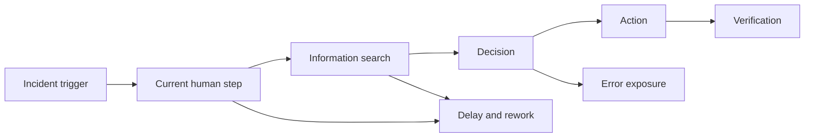
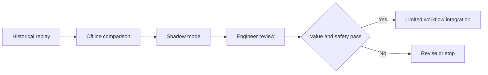
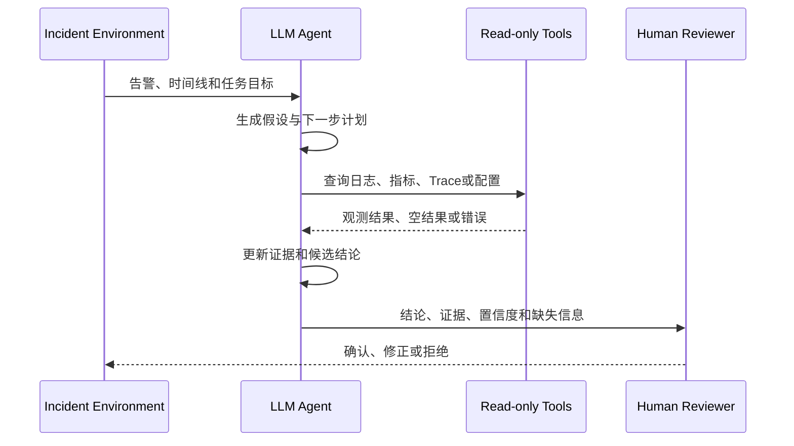
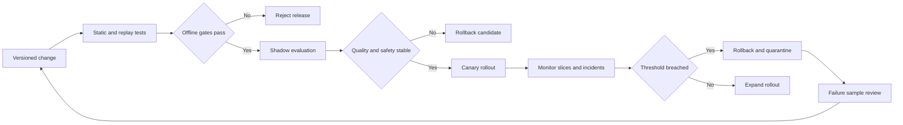
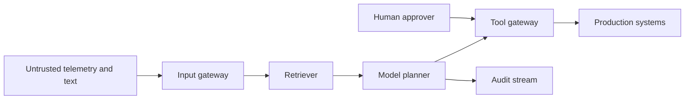
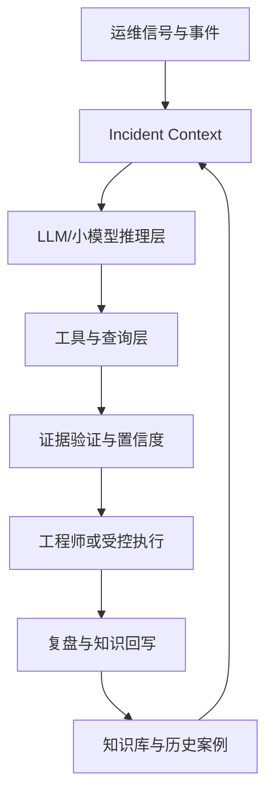
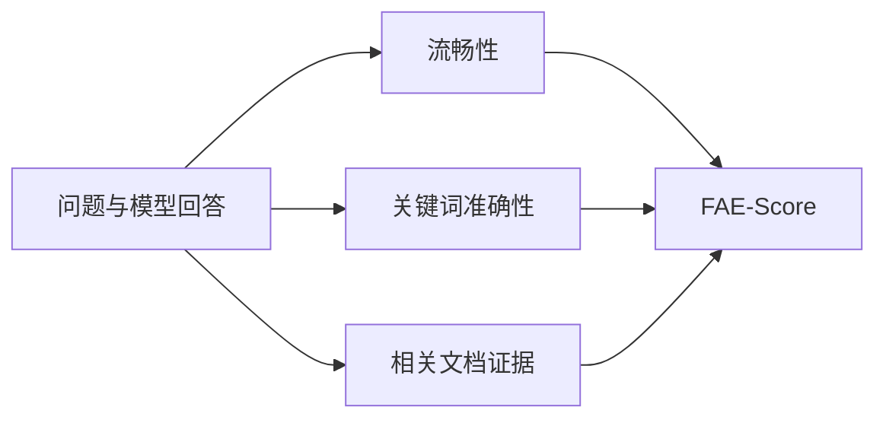
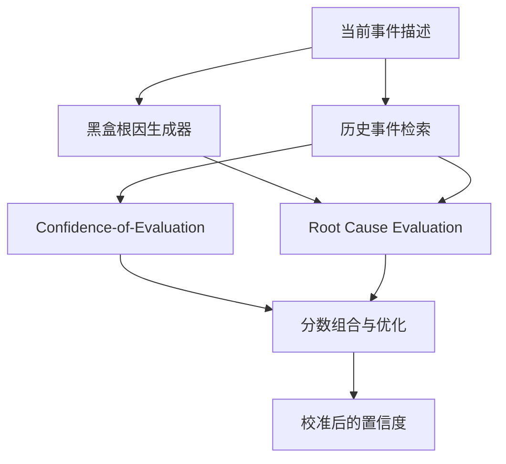

# 方向一：基础范式、评测与可信性

> 本方向是整个 LLM-AIOps 路线的入口。它先定义“运维任务是什么”和“效果如何判断”，再讨论模型是否值得被工程师信任。

## 📚 目录

### 阅读导航

- [方向定位](#方向定位)
- [学习目标](#学习目标)
- [落地之前的思考](#落地之前的思考)
- [第一阶段：建立领域坐标](#第一阶段建立领域坐标)
- [第二阶段：理解运维任务和数据](#第二阶段理解运维任务和数据)
- [第三阶段：理解评测方法](#第三阶段理解评测方法)
- [第四阶段：理解可信性](#第四阶段理解可信性)
- [第五阶段：从实验到生产](#第五阶段从实验到生产)
- [论文阅读路线](#论文阅读路线)
- [本方向总结](#本方向总结)
- [来源索引](#来源索引)

## 方向定位

### 这个方向研究什么

LLM-AIOps 关注的是如何用语言模型理解运维信息、组织诊断上下文、调用工具并协助事件处理。它并不意味着用一个模型替代监控、规则、统计检测或工程师判断。

本方向包含四类基础问题：

1. LLM-AIOps 与传统 AIOps、Copilot、Agent 和 Autonomous Operations 的关系。
2. Incident Lifecycle 中的任务边界和数据输入。
3. 领域问答、Agent 任务和生产事件的评测方式。
4. 幻觉、置信度、证据链、安全和生产可用性。

### 为什么要先学习它

同一个“LLM 运维系统”可能只做日志摘要，也可能能调用查询工具并生成修复计划。如果不先拆开任务，容易把日志解析误读成 RCA，把方案推荐误读成自动修复，把实验室里的 Agent 误读成生产自治。

## 学习目标

### 学完后应该能回答的问题

- LLM 在 AIOps 中增加了哪些能力？
- 一个系统是知识助手、诊断 Copilot、行动建议器还是自治 Agent？
- 论文评价的是最终答案、诊断过程、工具调用还是实际恢复？
- 为什么 BLEU、ROUGE 或单一准确率不足以评价运维系统？
- 什么时候应该让 Agent 拒答或请求人工确认？
- 如何把论文指标映射到 MTTD、MTTR、人工采纳率、误操作率和单次成本？

### 学完后应该具备的阅读能力

- 从论文的输入、输出和实验环境判断真实贡献。
- 区分论文直接结论、跨论文综合和本路线图的编辑性解释。
- 识别完整译文、仅摘要资料和原文待确认项。
- 看到公式时能解释变量、假设和运维含义，而不是只记住名称。

## 落地之前的思考

### 先证明问题存在，而不是先选择模型

本章是面向真实项目的工程性综合，不是某一篇论文的直接结论。

开始 LLM-AIOps 项目前，第一份材料不应是模型选型表，而应是当前工作流的事实记录。

至少选取一类边界清楚的任务，记录：

- 谁在什么事件阶段执行它。
- 输入来自哪些系统。
- 当前需要多少人工时间。
- 哪些步骤最容易遗漏或返工。
- 错误会造成什么后果。
- 现有规则、脚本和平台能力为什么没有解决。

例如“降低 MTTR”不是足够具体的问题。

它可能实际指向完全不同的工作：

| 表面目标 | 真实瓶颈 | 可能的优先方案 |
|---|---|---|
| 降低 MTTR | 值班人员找不到服务 owner | 改善服务目录与路由规则 |
| 降低 MTTR | 告警重复且噪声高 | 告警治理与聚合 |
| 降低 MTTR | 查询语句难写 | 查询模板或只读 Copilot |
| 降低 MTTR | 证据分散在多个系统 | Incident Context 聚合 |
| 降低 MTTR | Runbook 已过期 | 知识治理而不是换模型 |
| 降低 MTTR | 修复动作执行慢 | 受控工作流自动化 |

只有瓶颈包含非结构化理解、上下文组合、开放式解释或动态工具编排时，LLM 才可能提供独特价值。

若问题可以被稳定规则、SQL、PromQL、状态机或固定工作流完整表达，应优先采用确定性方案。

确定性方案通常更便宜、更容易测试，也更容易解释失败原因。

可以先画出现状流程：



图中每一个延迟、返工和错误暴露点都应有真实案例支撑。

不要因为团队拥有模型预算，就把所有流程问题重新命名为“智能化需求”。

### 把任务、决策和风险切成最小单元

“建设运维 Agent”不是可评测的任务定义。

落地前应把系统拆成可观察的决策单元：

1. 输入是什么。
2. 输出是什么。
3. 输出由谁使用。
4. 是否调用工具。
5. 是否改变环境。
6. 错误能否被及时发现。
7. 失败后能否恢复。

同一个产品可以包含多个风险完全不同的单元：

| 决策单元 | 示例输出 | 主要风险 |
|---|---|---|
| 信息提取 | 从工单抽取服务名和时间 | 字段遗漏 |
| 摘要 | 生成事件时间线草稿 | 事实混入推测 |
| 检索 | 返回相关 Runbook | 版本或权限错误 |
| 查询建议 | 生成只读 PromQL | 查询成本和误导 |
| 根因候选 | 给出多个解释 | 过早收敛 |
| 行动计划 | 生成变更步骤 | 对象、顺序或前置条件错误 |
| 自动执行 | 调用生产工具 | 扩大故障和不可逆损失 |

评测、权限和审批应绑定决策单元，而不是绑定“产品名称”。

一个系统可以允许模型自动完成字段提取，同时要求根因结论由工程师确认，并禁止模型直接执行写操作。

落地范围越具体，越容易找到有效数据、建立基线和解释改进来源。

任务边界还应包含明确的非目标。

例如只读诊断试点可以写明：

- 不生成唯一根因承诺。
- 不调用写工具。
- 不自动关闭事件。
- 不覆盖安全事件。
- 不在遥测缺失时继续推断。

非目标不是保守声明，而是防止试点在评测前不断扩张。

### 先建立不用 LLM 的基线

没有现有流程基线，项目只能证明“系统能够运行”，不能证明“系统带来价值”。

基线至少包括三组数据。

#### 质量基线

- 当前任务正确率或人工复核通过率。
- 严重遗漏、误路由和错误建议的数量。
- 不同服务、严重度和故障类型上的分层结果。
- 工程师之间的一致性。

#### 效率基线

- 完成任务的中位时间与长尾时间。
- 查询、切换系统和等待权限的次数。
- 每个事件需要多少人参与。
- 重复劳动和返工比例。

#### 经营与风险基线

- 当前工具和人工成本。
- 错误结果造成的恢复时间或业务损失。
- 审计、合规与数据暴露成本。
- 因流程复杂而放弃执行的比例。

评测设计应同时保留现有人工流程、确定性自动化和 LLM 方案：

| 对照组 | 回答的问题 |
|---|---|
| 当前人工流程 | 新系统是否真的改善工作 |
| 规则或模板 | LLM 是否带来不可替代的增量 |
| 检索但不生成 | 改进来自知识召回还是语言生成 |
| LLM 但不调用工具 | 工具编排是否真正增加价值 |
| 完整候选系统 | 端到端收益能否覆盖风险和成本 |

基线样本不能只选择系统擅长的成功案例。

应包含常见事件、长尾事件、未知故障、数据缺失、权限拒绝和工具错误。

如果专家本身无法对样本给出稳定标签，应先解决任务定义和标注分歧。

模型不能替团队掩盖“什么算正确”尚未达成共识的问题。

### 检查数据、工具和组织是否准备好

模型准备好不等于组织准备好。

落地前可以使用以下准备度矩阵：

| 维度 | 最低前提 | 未满足时的结果 |
|---|---|---|
| 数据 | 可访问、可脱敏、有时间和对象标识 | 无法复现或泄漏敏感信息 |
| 知识 | 有 owner、版本和有效期 | 检索放大过期做法 |
| 工具 | 参数、权限、错误语义稳定 | Agent 无法区分空结果与失败 |
| 评测 | 有代表性样本和人工裁决规则 | 分数无法解释 |
| 安全 | 有信任边界和威胁模型 | Prompt 或工具权限失控 |
| 运行 | 有日志、成本、延迟和版本记录 | 线上退化无法定位 |
| 责任 | 有产品、SRE、安全和业务 owner | 错误无人接管 |

尤其要提前确认责任链：

- 谁批准数据进入模型上下文。
- 谁维护 Prompt、检索器和工具 Schema。
- 谁定义上线阈值。
- 谁在输出有争议时裁决。
- 谁可以停止服务或回退到人工流程。
- 谁承担长期成本和知识维护。

如果这些责任只能回答“由 AI 团队负责”，说明系统还没有进入真实业务流程。

AI 团队可以维护模型，但不能替代服务 owner 对事实和风险负责。

### 用最小试点验证价值，并提前写退出条件

第一阶段不应追求端到端自治。

更合适的试点通常具备以下特征：

- 高频，能够在合理时间收集样本。
- 低风险，错误不会直接改变生产状态。
- 输入相对稳定，能获得历史回放。
- 输出可以由专家快速复核。
- 当前流程有明确痛点和基线。
- 价值可以在任务层而不是宣传层衡量。

推荐从影子模式开始：



试点立项时同时写下成功条件和退出条件。

成功条件可以包括：

- 关键任务质量不低于人工或规则基线。
- 中位处理时间有稳定改善。
- 严重错误率低于事先约定阈值。
- 工程师采纳率和信任理由可解释。
- 单次成本和延迟满足预算。
- 数据、权限和审计没有越界。

退出条件可以包括：

- 连续多个评测周期无法超过简单基线。
- 收益主要来自数据清理，而非模型能力。
- 长尾错误无法被人工及时发现。
- 维护成本超过节省的人工成本。
- 关键工具或知识没有稳定 owner。
- 业务要求的可解释性无法满足。

停止一个不合适的 LLM 项目不是失败。

它说明团队通过低成本试点避免了把不确定系统带入生产。

最终应形成一页决策记录：问题、基线、候选方案、选择理由、风险、试点范围、成功条件、退出条件和责任人。

这页记录是后续阅读评测论文、比较模型和设置上线闸门的共同起点。

## 第一阶段：建立领域坐标

### 传统 AIOps 与 LLM-AIOps

传统 AIOps 通常围绕规则、统计模型、机器学习分类器和固定数据管道解决检测、聚合、预测或定位问题。LLM 的新增能力主要来自自然语言理解、跨来源摘要、开放式解释、交互式追问和工具编排。

这些能力有明确代价：模型输出可能不稳定，长上下文和工具调用会增加时延与成本，模型可能生成没有证据支持的解释。因此，LLM 更适合被看作运维工作流中的一个推理和交互组件，而不是所有检测算法的替代品。

**来源：** AIOps 综述；Incident Lifecycle 系统综述。

### Incident Lifecycle

Incident Lifecycle 系统综述把事件处理放到生命周期中观察。路线图采用以下学习化表达：

```text
Prepare → Detect → Triage → Diagnose/Contain → Recover → Post-incident
```

- **Prepare**：准备监控、知识、值班和排障流程。
- **Detect**：从指标、日志、Trace、告警或用户报告发现异常。
- **Triage**：判断严重性、影响范围和负责团队。
- **Diagnose/Contain**：收集证据、定位故障并先降低影响。
- **Recover**：执行修复、验证恢复并在必要时回滚。
- **Post-incident**：生成报告、复盘并更新知识。

综述资料显示，已有研究更多集中在 Detect 和 Contain，Prepare 与 Post-incident 的自动化相对少。这是综述对其入选研究的统计，不应直接外推到整个行业。

**来源：** [Incident Lifecycle 系统综述](https://arxiv.org/pdf/2410.04334)。

### Copilot、Agent 与自治运维

可以把系统能力理解为一条连续谱：

| 能力形态 | 主要输出 | 人工参与 |
|---|---|---|
| 知识助手 | 文档、历史案例和术语解释 | 全程人工判断 |
| 诊断 Copilot | 摘要、候选原因和查询建议 | 工程师执行和确认 |
| Tool-using Agent | 计划并调用只读工具收集证据 | 监督工具和结论 |
| Action Recommendation | 生成缓解或修复方案 | 审核后执行 |
| Guarded Automation | 在限定权限和场景中自动执行 | 处理例外和审批高风险动作 |
| Limited Autonomy | 自动诊断、执行、验证和回滚 | 只覆盖有限、可逆场景 |

“Autonomous”在论文中可能只是系统目标、实验环境名称或多 Agent 架构描述。判断实际自治等级时，应检查是否有真实工具、权限控制、动作验证、回滚和生产数据证据。

**来源：** AIOpsLab、ITBench、Building AI Agents for Autonomous Clouds、STRATUS。

## 第二阶段：理解运维任务和数据

### 运维任务的基本分类

同一事件可以被拆成多个不同任务：

| 任务 | 输入 | 输出 | 是否等于 RCA |
|---|---|---|---|
| Question Answering | 运维问题、文档或日志 | 解释或操作知识 | 否 |
| Incident Reporting | 事件时间线和原始记录 | 摘要、报告或影响说明 | 否 |
| Alert Aggregation | 多条告警和知识 | 事件分组 | 否 |
| Triage | 告警、影响和历史信息 | 优先级、类别、责任路由 | 否 |
| Anomaly Detection | 指标、日志或时间序列 | 异常标签或分数 | 否 |
| Fault Localization | 观测信号和拓扑 | 异常组件或位置 | 部分相关 |
| Root Cause Analysis | 多源证据和系统上下文 | 根因候选及解释 | 是 |
| Mitigation/Remediation | 根因、SOP 和权限 | 方案、计划或动作结果 | 否 |

OpsEval 将运维问题按任务和能力组织，而不是只用一个总分评价所有场景。这种拆分有助于理解为什么问答模型的高分不能直接推出 RCA 或自动修复能力。

### 运维数据和上下文

Incident Lifecycle 综述把 Logs、Metrics 和 Traces 视为常见观测数据，也记录了事件报告、代码和部署配置等额外来源。生产 GenAI 云服务事件研究进一步使用指标、日志、Trace 和值班讨论线程分析事件症状与根因。

学习时可以按四层理解数据：

1. **信号层**：Metrics、Logs、Traces、Events 和 Alerts。
2. **事件层**：工单、时间线、影响范围、服务和版本。
3. **知识层**：SOP、TSG、Runbook、历史案例和 Postmortem。
4. **系统层**：拓扑、代码、配置、变更、数据库和网络状态。

LLM 并不会自动补齐缺失上下文。上下文的时间范围、服务边界、版本和权限必须明确提供，否则模型可能把相似但不适用的历史事件当作当前事实。

### 数据私有性和生产事件偏差

Ops 数据经常包含企业内部架构、故障记录和凭证相关信息，公开数据集相对有限。OpsEval 通过多企业贡献、子领域分类、人工审核和部分公开的方式构建基准，但仍保留测试数据以降低泄漏风险。生产事件实证研究则提醒我们，生成式 AI 云服务的故障症状和根因分布具有领域特性。

这意味着公开 benchmark 更适合比较方法和发现问题，不足以单独证明某个 Agent 在你的生产环境有效。

### 本阶段小结

- 先定义事件任务，再讨论模型能力。
- 先说明数据和权限，再讨论自治等级。
- 先确认评测环境，再比较论文数字。

## 第三阶段：理解评测方法

### 领域问答评测

OpsEval 的核心观点是：BLEU 和 ROUGE 关注文本表面重合，无法充分判断运维答案是否覆盖关键操作、术语是否正确、证据是否充分。它将 QA 评价拆为流畅性（Fluency）、准确性（Accuracy）和证据（Evidence）三个维度。

#### FAE-Score 的准确性公式

译文给出的准确性是模型输出与标准答案关键词匹配的 F1：

$$
\mathrm{Accuracy}=2\cdot\frac{P\cdot R}{P+R}
\tag{1}
$$

其中：

$$
P=\frac{\#\mathrm{Matched\ Keywords}}{\#\mathrm{Keywords\ in\ Model\ Output}}
\tag{2}
$$

$$
R=\frac{\#\mathrm{Matched\ Keywords}}{\#\mathrm{Keywords\ in\ Ground\ Truth}}
\tag{3}
$$

这里的 `P` 表示模型回答中的关键词有多少被标准答案支持，`R` 表示标准答案中的关键点有多少被覆盖。它比单纯比较词面更接近“关键运维知识是否被说出来”，但仍依赖关键词提取和评判模型，不能自动保证因果解释正确。

#### FAE-Score 的证据公式

证据分支通过相关文档检索和 ROUGE Recall 衡量回答与参考文档的重合：

$$
\mathrm{Evidence}=\mathrm{ROUGE}_{\mathrm{Recall}}(R,D)
=\frac{\#\mathrm{Overlapping\ Words}}{\#\mathrm{Words\ in}\ D}
\tag{4}
$$

`R` 是模型生成的回答，`D` 是检索到的相关文档。这个分数只能说明回答覆盖了参考文档中的多少内容，不能证明检索文档本身正确，也不能证明回答没有遗漏关键风险。

#### 如何解读 FAE-Score

译文报告的表 5b 中，FAE-Score 与专家总分的 Pearson 相关系数为 `0.91848`，高于 ROUGE、BLEU 和 RAGAS；摘要和贡献段落还出现 `0.9185`、`0.9175` 等不同写法。该数字存在原文记录差异，路线图只表达“FAE-Score 与专家评价高度相关”，不把某一个小数当作精确共识。

### Agent 和系统级评测

AIOpsLab 和 ITBench 将评测从静态问答推进到更接近系统任务的环境：Agent 需要理解事件、选择工具、完成 IT 自动化任务，并由环境状态或任务结果反馈。阅读这类论文时要拆开四个层次：

1. **任务定义**：故障、变更或自动化目标是否明确。
2. **环境状态**：是公开数据、模拟系统还是真实生产快照。
3. **行动权限**：Agent 能否只读、能否执行、执行范围是否受限。
4. **验收条件**：只看文本答案，还是检查系统状态和业务结果。

### 过程指标和生产指标

论文常用准确率、Top-K、Recall、MRR、任务成功率或专家评分。生产环境还需要关心：

| 生产问题 | 可对应的指标 |
|---|---|
| 多久发现事件 | MTTD |
| 多久形成可用诊断 | MTTI、诊断时延 |
| 多久恢复服务 | MTTR、业务 SLO 恢复时间 |
| 建议是否被采用 | 建议采纳率、人工修改率 |
| 动作是否安全 | 误操作率、回滚率、权限违规次数 |
| 系统是否可运营 | 单次成本、调用次数、时延、失败率 |

这些不是可以直接从论文分数换算出来的等价指标，而是上线评估时需要补充的观察面。

### Benchmark 的常见陷阱

#### 数据泄漏

OpsEval 使用测试集与改写参考集的损失差异进行泄漏检查：

$$
\Delta L=L_{test}-L_{ref}
$$

译文说明 `\Delta L<0` 可能意味着测试数据泄漏。这个判断依赖参考集构造和阈值解释，使用时应结合数据生成过程，不应把公式当作普适检测器。

#### 公开子集和隐藏测试集

OpsEval 公开部分 QA 供初步评估，同时保留大部分测试数据以降低答案泄漏。路线图在引用结果时会标明公开程度和可复现边界。

#### 评测环境与生产环境

静态数据集不包含实时拓扑、数据缺失、权限、业务影响和工具失败；模拟环境可以补充交互，但仍不等于长期生产运行。

### 一个完整评测应该记录什么

评测一个运维 Agent 时，建议把一次任务记录成一条事件轨迹，而不是只保留最后一句答案：



每个步骤至少记录：

| 记录项 | 为什么需要 |
|---|---|
| 输入上下文 | 判断模型是否一开始就缺少关键信息 |
| 工具名称和参数 | 判断 Agent 是否选择了合理查询 |
| 工具返回状态 | 区分没有异常和查询失败 |
| 中间假设 | 发现过早收敛和忽略反证 |
| 最终结论 | 评价任务目标是否完成 |
| 证据引用 | 判断结论是否可核对 |
| 置信度和拒答 | 判断是否适合交给人工或自动流程 |
| 时延、Token 和费用 | 判断是否能在值班场景使用 |

### 为什么最终答案不够

两个 Agent 可能给出相同的根因：一个经过三次正确查询并排除了两个候选，另一个没有查询任何数据，只是生成了听起来合理的解释。只看最终文本会把两者视为同样成功，但生产风险完全不同。

因此，过程评测至少要关注：

- 查询是否覆盖关键数据源；
- 查询顺序是否浪费时间或扩大权限；
- 工具失败后是否停止并暴露不确定性；
- 结论是否引用了真正相关的证据；
- 人工是否能够复现和纠正推理。

### 本阶段小结

研究指标是观察窗口，不是生产承诺。一个可用的评测需要同时看答案、过程、证据、风险、成本和业务结果。

## 第四阶段：理解可信性

### 幻觉、过度自信和缺失上下文

运维场景的错误回答可能表现为：编造不存在的命令参数、把历史事件套到当前服务、忽略反例、给出没有回滚的高风险动作，或者用很确定的语气掩盖证据不足。

因此，可信输出至少应包含：

- 当前结论或候选结论；
- 支持结论的日志、指标、Trace、文档或工具结果；
- 尚未验证的假设；
- 缺失的信息；
- 置信度或建议的人工复核等级；
- 不满足条件时的拒答说明。

### 置信度校准

LM-PACE 将置信度理解为“预测正确的概率”，而不是模型表达得有多自信。对输入 `X_i` 和预测 `\hat{y}_i`，校准要求：

$$
\Pr(l_i\mid \tilde{P}_i=p)=p,\quad \forall p\in[0,1].
\tag{5}
$$

`l_i` 表示第 `i` 个预测正确这一事件，`\tilde{P}_i` 是模型给出的置信度。直观上，所有置信度约为 `0.7` 的样本，长期来看约有 70% 应该正确。

实践中通常把概率区间分桶，并用 Expected Calibration Error（ECE）量化预测置信度与实际正确率的差异：

$$
\mathrm{ECE}=\sum_{m=1}^{M}\frac{|B_m|}{n}\left|\mathrm{acc}(B_m)-\mathrm{conf}(B_m)\right|.
\tag{6}
$$

其中 `B_m` 是第 `m` 个置信度桶中的样本，`n` 是总样本数，`acc(B_m)` 是该桶的实际正确率，`conf(B_m)` 是该桶的平均预测置信度。ECE 越小，通常表示校准越好；但分桶数量、样本量和任务定义都会影响结果。

### 黑盒模型下的置信度

LM-PACE 假设根因生成器是黑盒，只能看到事件描述和生成的根因文本，无法访问权重、logits 或 token 概率。它先检索相似历史事件，再让独立的 LLM 评估“当前证据是否足够”和“候选根因是否被历史证据支持”，最后组合评分并优化置信度。

这条路线的启发是：当模型内部概率不可用时，可以构建外部评估器；但外部评估器本身仍然可能出错，历史案例也可能过时或与当前服务不匹配。

### 推理失败

RCA 推理失败研究关注模型停滞、偏置、困惑、过早收敛和忽略反证等现象。路线图将把“错误类型”和“改进手段”分开：Reflection、Memory、Prompt Optimization 或强化微调是手段，不是错误已经被解决的证据。

### 安全、隐私和成本

生产 Agent 还面临敏感日志、Prompt Injection、Telemetry Poisoning、Unsafe Tool Call、Permission Escalation、延迟和调用费用。这里只建立判断框架；具体执行和回滚设计放到方向五。

### 证据链的最小格式

一个面向工程师的诊断结论，可以采用下面的结构：

```text
结论：候选根因是 <组件/配置/变更>

支持证据：
1. <时间窗口内的指标或告警>
2. <相关日志或 Trace>
3. <变更、拓扑或历史案例>

反证或未知：
- <尚未查询的数据>
- <与候选根因冲突的信号>

置信度：<校准后的区间或等级>
建议：<只读查询 / 人工确认 / 进入审批流程>
拒答条件：<证据不足、数据过期或动作风险过高>
```

这不是论文统一采用的输出协议，而是结合 LM-PACE、OpsEval 和 RCA 推理失败研究整理出的编辑性模板。最终正文会明确它属于路线图的实践建议。

### 置信度的三种错误

#### 低置信度但正确

模型给出保守分数并请求人工复核。对于高风险动作，这通常比自信执行更可接受，但会增加人工工作量。

#### 高置信度且正确

只有在长期评估中，置信度和实际正确率保持稳定对应，才可以把这种输出作为自动化入口。单个案例不能证明校准有效。

#### 高置信度但错误

这是最危险的情况。需要回溯输入上下文、检索结果、工具调用、推理步骤和评分器，而不是只调整 Prompt 语气。

### 本阶段小结

可信性不是一个单独的模型参数，而是数据、评测、解释、权限和人机协作共同产生的系统属性。

## 第五阶段：从实验到生产

### 四个生产距离问题

阅读任何论文时，先问：

1. 数据是真实生产数据、脱敏数据、公开数据还是合成数据？
2. 环境是静态问答、离线事件、模拟系统还是在线系统？
3. Agent 是否调用真实工具，工具权限和失败处理是什么？
4. 结果是否经过系统状态、业务 SLO 和长期运行验证？

### 可信运维 Agent 的最小条件

一个只读诊断 Agent 至少应能：

- 说明它看到了哪些数据；
- 引用支持结论的证据；
- 区分事实、假设和建议；
- 暴露缺失信息；
- 在低置信度或高风险时拒答；
- 记录工具调用和成本；
- 由工程师确认后再进入执行流程。

### 对运维工程师的启发

论文阅读不应停在“哪个模型分数更高”。更实用的问题是：这个系统减少了哪一步人工工作？是否降低了误报或 MTTR？工程师是否愿意采纳？当它错时，谁能发现并恢复？

### 从论文指标到上线闸门

可以用三道闸门把研究结果转成工程判断：

| 闸门 | 需要回答的问题 | 不能直接接受的证据 |
|---|---|---|
| 数据闸门 | 数据是否代表目标服务、版本和故障分布？ | 只有公开通用数据集上的高分 |
| 过程闸门 | Agent 是否提供证据、暴露缺失信息并正确使用工具？ | 只有最终答案文本 |
| 动作闸门 | 建议是否可审核、可验证、可回滚且权限最小？ | 论文标题中的“Autonomous” |

### 一次只读诊断评估的示例

假设要评估一个只读 Agent 是否能定位 API 延迟升高：

1. 输入包含告警时间、服务名、版本和影响范围。
2. Agent 先查询延迟、错误率和请求量。
3. 如果延迟异常但错误率正常，继续查询 Trace 和最近变更。
4. 每个候选根因必须附带时间窗口和数据来源。
5. 没有足够证据时输出“待确认”，而不是强行选择唯一根因。
6. 评价项包括定位粒度、证据覆盖、查询数量、总时延和人工采纳率。

这个例子不等于某篇论文的完整系统，而是把本方向的评测原则转成工程师可操作的检查流程。

## 深入专题：统计可靠性与持续回归治理

### 单次分数不是可靠结论

LLM、检索、Agent 工具轨迹和模拟环境都可能引入随机性。只报告一次运行的准确率，无法回答差异是否稳定、是否只来自抽样波动，也无法发现少数高风险服务上的退化。

一份最低限度的实验报告应同时给出：

- 数据集版本、划分方法和去重规则。
- 模型、Prompt、解码参数、检索器、Embedding 与工具版本。
- 每个随机源的种子；无法固定的外部 API 也要记录调用时间和版本标识。
- 至少多次独立运行的均值、标准差和分位数。
- 指标的置信区间，而不只给点估计。
- 与基线配对比较的显著性检验和效果量。
- 按任务、服务、严重度、已知或未知故障、权限条件分层的结果。
- 对阈值、上下文长度、检索数量和工具预算的敏感性分析。

这些要求是工程性综合，不表示本方向八篇论文都完整报告了全部项目。

### 置信区间、显著性与效果量回答不同问题

若某指标在 $n$ 个独立案例上得到样本均值 $\bar{x}$ 和样本标准差 $s$，大样本下可用近似区间：

$$
\bar{x}\pm z_{1-\alpha/2}\frac{s}{\sqrt{n}}
$$

小样本、比例指标、Top-K、长尾时延或同一事件多次运行时，优先使用与采样结构匹配的 bootstrap 或配对 bootstrap。不能把同一事件的多次随机运行伪装成更多独立事件。

| 工具 | 回答的问题 | 常见误用 |
|---|---|---|
| 置信区间 | 真值可能落在多宽范围 | 把窄区间当成无偏证据 |
| 显著性检验 | 差异是否难以用零假设解释 | 把 `p < 0.05` 当成生产价值 |
| 效果量 | 差异有多大 | 只报告方向不报告大小 |
| 分层结果 | 哪些子群改善或退化 | 只看总体平均掩盖高风险尾部 |
| 敏感性分析 | 结论对参数和假设是否稳健 | 只展示最优阈值 |

生产判断还要给出最小有意义差异。例如准确率提高 0.5 个百分点若换来两倍时延和三倍成本，未必值得上线。

### 多次运行与随机种子

固定种子用于复现，不用于隐藏波动。推荐区分三层重复：

1. 同一版本、同一数据、不同种子，测模型与 Agent 随机性。
2. 不同时间重复调用托管模型，测服务端不可见变化。
3. 不同事件时间窗回放，测生产分布变化。

报告均值时同时保留最差运行、失败类型和高风险样本。Agent 若某次成功、某次调用越权工具，平均任务完成率不能覆盖该安全失败。

### 分层与敏感性分析

至少按以下维度切片：

| 维度 | 要发现的风险 |
|---|---|
| 已知与未知故障 | 历史案例记忆是否冒充泛化 |
| 低风险与高风险动作 | 总体成功率是否掩盖危险错误 |
| 服务与团队 | 少数长尾服务是否持续失败 |
| 数据完整与缺失 | 系统是否会在证据不足时拒答 |
| 工具正常与失败 | Agent 是否把失败当空结果 |
| 短上下文与长上下文 | 关键证据是否被截断或淹没 |

敏感性分析应改变一个关键假设并观察结果曲线，如 `top_k`、相似度阈值、告警窗口、最大工具轮数和置信度闸门。只在开发集搜索最优值后报告该点，会高估稳定性。

### 版本变化后的回归矩阵

LLM-AIOps 系统的变更面不止模型：

| 变更对象 | 典型回归 | 必测内容 |
|---|---|---|
| 模型 | 推理、拒答、格式和工具选择变化 | Golden Set、轨迹与安全用例 |
| Prompt | 指令优先级或字段遗漏 | 结构契约、反证和边界条件 |
| 数据集 | 分布、标签或泄漏变化 | 去重、切片与历史可比性 |
| Embedding | 召回集合变化 | 关键证据召回与跨租户隔离 |
| 检索器或重排器 | 引用漂移、零结果变化 | Recall@K、引用支持和权限过滤 |
| 工具 | 参数或返回 Schema 变化 | 契约、错误状态、幂等与权限 |

任何一项变化都应产生新的系统版本指纹，不能只记录模型名。

### 离线回放、影子评估、灰度和回滚



上图是编辑性工程综合。

- 离线回放使用冻结事件快照，比较答案、证据、轨迹、拒答、时延和成本。
- 影子评估接收真实流量但不影响工程师决策或生产状态。
- 灰度按团队、服务和风险分层，避免只挑最容易的流量。
- 阈值包括质量下限、安全事件零容忍项、成本上限和人工升级率区间。
- 回滚必须覆盖模型、Prompt、索引、检索器和工具契约的兼容组合。
- 失败样本先审查标签、权限和隐私，再进入 Golden Set；不能把未经确认的模型答案当真值。

### Threat Model 从资产和信任边界开始

安全审查先定义需要保护的资产：生产状态、凭据、客户数据、内部拓扑、Runbook、模型与 Prompt、评测集、审计日志和发布闸门。

潜在攻击者包括外部用户、低权限内部账号、被攻陷的遥测源或知识源、恶意依赖，以及无恶意但配置错误的自动化组件。



信任边界位于不可信输入与摄取网关、租户索引与检索器、模型与工具网关、审批人与执行身份、运行系统与审计存储之间。每次跨边界都要验证身份、权限、数据标签、Schema 与完整性。

### 八类必须进入测试集的威胁

| 威胁 | 攻击路径 | 最低控制与测试 |
|---|---|---|
| Prompt Injection | 日志、工单、网页或文档夹带指令 | 数据与指令分离、来源标签、恶意语料回放 |
| 知识污染 | 错误 Runbook 或历史总结进入索引 | owner 审批、版本和撤回、冲突检测 |
| 越权调用 | Agent 选择超出任务的工具或参数 | 最小权限、策略网关、拒绝用例 |
| 数据泄漏 | 回答、引用、缓存或 Trace 暴露敏感信息 | chunk ACL、脱敏、租户隔离测试 |
| 评测泄漏 | 测试样本进入训练、Prompt 或检索库 | 数据谱系、时间切分、近重复检测 |
| 审计篡改 | 调用者修改或删除失败轨迹 | 追加写、独立存储、完整性校验 |
| Telemetry Poisoning | 伪造指标、日志或 Trace 引导诊断 | 多源交叉验证、来源信誉、异常摄取告警 |
| 供应链替换 | 模型、Embedding、依赖或工具镜像变化 | 签名、物料清单、版本固定和回归 |

Threat Model 的输出不是“系统安全”，而是一组可复验的攻击路径、控制、残余风险和 owner。

### 八篇主方向论文统一对照

下表只概括本路线图使用这些译文时的学习位置。“生产证据”描述资料类型，不把实验环境推断成长期生产部署。

| 论文 | 任务与数据 | 工具或环境 | 主要指标视角 | 生产证据与可复现线索 | 主要局限 |
|---|---|---|---|---|---|
| [AIOps 综述](https://arxiv.org/pdf/2406.11213) | 故障管理研究综述 | 文献集合 | 分类与覆盖 | 研究地图和引用链 | 不是单一系统实验 |
| [Incident Lifecycle 综述](https://arxiv.org/pdf/2410.04334) | 微服务事件生命周期文献 | 系统性检索流程 | 阶段和数据源分布 | 纳入标准与论文索引 | 统计受检索范围限制 |
| [AIOpsLab](https://arxiv.org/pdf/2501.06706) | 自治云 Agent 任务 | 可交互云环境和工具 | 任务结果与轨迹 | 环境化评测框架 | 与具体生产权限仍有距离 |
| [ITBench](https://arxiv.org/pdf/2502.05352) | 多类真实 IT 自动化任务 | Benchmark 环境 | 任务成功和 Agent 行为 | 任务与评测框架 | 任务覆盖不等于目标组织分布 |
| [生成式 AI 云事件实证](https://yinfangchen.github.io/assets/pdf/empirical_study.pdf) | 生产事件症状与根因 | 事件资料分析 | 分类分布与观察 | 真实事件研究 | 不是 Agent 能力评测 |
| [网络事件管理全景视图](https://www.microsoft.com/en-us/research/uploads/prod/2023/09/LLM4IcMs___HotNets__23-6.pdf) | 网络事件管理全链路 | 概念与研究综合 | 生命周期能力 | 结构化研究视角 | 不能替代具体部署证据 |
| [自治云 Agent 设计原则](https://arxiv.org/pdf/2407.12165) | 自治云 Agent 挑战 | Agent 架构讨论 | 能力和风险维度 | 设计原则与问题清单 | 原则不等于已验证控制 |
| [OpsEval](https://arxiv.org/pdf/2310.07637.pdf) | IT 运维领域问答 | 领域数据与自动评价 | FAE 等问答指标 | 数据构建与评测流程 | QA 分数不能外推到 RCA 和执行 |

## 论文阅读路线

### 入门论文

- [AIOps 综述](https://arxiv.org/pdf/2406.11213)
- [Incident Lifecycle 系统综述](https://arxiv.org/pdf/2410.04334)
- [OpsEval](https://arxiv.org/pdf/2310.07637.pdf)

### 进阶论文

- [OWL](https://openreview.net/pdf?id=SZOQ9RKYJu)
- [NetOps 能力实证](https://arxiv.org/pdf/2309.05557.pdf)
- [AIOpsLab](https://arxiv.org/pdf/2501.06706)
- [ITBench](https://arxiv.org/pdf/2502.05352)

### 深入论文

- [生成式 AI 云服务生产事件实证](https://yinfangchen.github.io/assets/pdf/empirical_study.pdf)
- [LM-PACE 置信度估计](https://arxiv.org/pdf/2309.05833.pdf)
- [RCA 推理失败](https://arxiv.org/abs/2601.22208)
- [低幻觉事件响应规划](https://www.ndss-symposium.org/ndss-paper/incident-response-planning-using-a-lightweight-large-language-model-with-reduced-hallucination/)

### 延伸阅读

- [AI 驱动的网络事件管理全景视图](https://www.microsoft.com/en-us/research/uploads/prod/2023/09/LLM4IcMs___HotNets__23-6.pdf)
- [自治云 Agent 的挑战与设计原则](https://arxiv.org/pdf/2407.12165)

## 公式和图表索引

### 本方向保留的公式

| 公式 | 用途 | 来源 |
|---|---|---|
| FAE Accuracy、Precision、Recall | 解释运维 QA 的关键点覆盖 | OpsEval，原 PDF 第 5 页 |
| FAE Evidence | 解释回答与参考文档的证据重合 | OpsEval，原 PDF 第 5 页 |
| `ΔL = L_test - L_ref` | 说明 benchmark 泄漏检查思路 | OpsEval，原 PDF 第 8–9 页 |
| 置信度校准定义 | 解释置信度与实际正确率的关系 | LM-PACE，原 PDF 第 5–6 页 |
| ECE | 量化置信度校准误差 | LM-PACE，原 PDF 第 6 页 |

### 本方向保留的图表

- Incident Lifecycle 的阶段与数据源统计：用于建立领域坐标。
- OpsEval 数据构建、评测和 FAE-Score 流水线：用于理解领域基准。
- AIOpsLab/ITBench 的 Agent、工具、环境和反馈流程：用于理解系统级评测。
- LM-PACE 的黑盒预测器、历史检索和置信度估计流程：用于理解可信性。

图表转为 Mermaid 或简化流程时，会标明“原论文图的改写”，不会让编辑性示意图看起来像原论文实验结果。

## 本方向总结

### 最值得记住的结论

1. LLM-AIOps 的核心增量是跨文本、观测数据和工具的上下文组织能力。
2. 任务定义决定评测指标；问答分数不能直接代表 RCA 或自动修复能力。
3. 运维 QA 需要关注关键事实、证据和术语，而不只是表面文本相似度。
4. 置信度必须与实际正确率对应，流畅语气不能代替校准。
5. 生产可信性还需要权限控制、动作验证、回滚和长期运行证据。
6. 论文中的 Autonomous 通常是设计目标或实验设定，不等于生产闭环自治。

### 本方向的学习顺序


### 继续学习前的检查清单

- [ ] 能区分检测、分诊、定位、RCA、缓解和修复。
- [ ] 能说出 Logs、Metrics、Traces、Tickets 和 Runbook 的差异。
- [ ] 能解释为什么 BLEU/ROUGE 不能单独评价 Ops QA。
- [ ] 能解释 FAE Accuracy 和 Evidence 的变量。
- [ ] 能解释 ECE 的含义和局限。
- [ ] 能识别数据泄漏、上下文缺失和工具失败。
- [ ] 能写出一条带证据、反证和拒答条件的诊断结论。
- [ ] 能区分 benchmark 成绩和生产收益。

## 深入专题：把论文阅读转成系统判断

### 一套 LLM-AIOps 系统通常由什么组成

论文名称各不相同，但反复出现的系统边界通常可以拆成六层：



#### 信号与事件层

包括指标、日志、Trace、告警、工单、变更和用户报告。这个层面决定 Agent 看到的事实范围。

常见问题：

- 时间戳不一致；
- 服务名或实例名发生变化；
- 关键字段没有记录；
- 采样导致异常片段缺失；
- 日志中混入未经清理的用户输入；
- 告警规则自身存在误报和重复。

#### Incident Context 层

它不是简单把所有文本拼接到 Prompt，而是要明确：

- 当前事件的时间窗口；
- 受影响的服务和版本；
- 关键症状；
- 已经执行过的查询和动作；
- 相关变更；
- 相似历史事件；
- 当前用户和 Agent 的权限。

#### 推理层

可以是通用 LLM、领域模型、小模型和规则的组合。研究论文常比较 Prompt、ICL、RAG、Fine-tuning、Agent 或 Multi-Agent，但实现手段不等于运维任务。

#### 工具层

工具可以是日志查询、监控查询、数据库诊断、Kubernetes API、网络探针、代码搜索或配置读取。工具层是模型与真实系统之间的边界，也是风险的集中位置。

#### 验证层

验证包括证据引用、规则检查、置信度校准、专家复核、动作模拟和恢复检测。没有验证层时，系统容易把自然语言连贯性误当成正确性。

#### 人和执行层

人可以确认结论、修正上下文、审批动作或处理异常分支。只有低风险、可逆和可验证的动作，才适合逐步自动化。

### 论文中“模型能力”的四种含义

阅读论文时，模型能力至少可能指四件不同的事：

| 表述 | 实际可能指什么 | 阅读时要追问 |
|---|---|---|
| 理解运维问题 | 能识别术语、实体和意图 | 是开放问答还是固定选项？ |
| 生成诊断结论 | 能输出候选故障或根因 | 是否有证据和反事实验证？ |
| 使用运维工具 | 能生成符合 API 的调用 | 参数是否经过校验？ |
| 完成运维任务 | 环境状态达到目标 | 成功条件是否包含业务恢复？ |

论文摘要中的“achieves autonomous operations”可能只覆盖其中一项。正文需要根据实验环境重新确认。

### 任务、方法和系统的三层阅读法

#### 第一问：论文解决的运维问题是什么

例如：

- LogGPT 的主问题是日志异常检测；
- RCAgent 的主问题是云事件 RCA；
- Nissist 的主问题是事件缓解建议；
- OpsEval 的主问题是运维领域 LLM 评测。

#### 第二问：论文用什么方法解决

可能包括：

- Prompt Engineering；
- In-Context Learning；
- RAG；
- Fine-tuning；
- Tool Use；
- Planning；
- Reflection；
- Knowledge Graph；
- Causal Reasoning。

同一种方法可以出现在完全不同的主任务中。

#### 第三问：方法是否组成了完整系统

要检查论文是否定义了：

- 输入数据如何接入；
- 上下文如何筛选；
- 工具如何调用；
- 结果如何验证；
- 失败如何处理；
- 工程师如何介入；
- 评测如何覆盖端到端流程。

### 一个方法为什么可能只适合低风险环节

以 RAG 为例，RAG 可以很好地返回相似 Runbook，但不能自动保证：

1. 文档仍然适用于当前版本；
2. 文档描述的资源就是当前资源；
3. 文档中的命令没有副作用；
4. 当前事件没有新的异常条件；
5. 执行动作后业务真的恢复。

所以 RAG 常适合知识检索、摘要和建议生成；进入执行链路后，还需要版本过滤、权限控制、审批、验证和回滚。

## 深入专题：评测设计的具体方法

### 建立任务卡片

每个评测任务可以先写成一张任务卡片：

| 字段 | 示例问题 |
|---|---|
| 任务名称 | Incident Triage |
| 触发条件 | 告警超过持续时间阈值 |
| 输入 | 告警、服务名、历史事件、影响范围 |
| 输出 | 严重性、类别、责任团队、理由 |
| 证据 | 告警时间、指标变化、相关工单 |
| 失败条件 | 数据不足、服务未知、冲突证据 |
| 人工动作 | 确认路由或修改优先级 |
| 评价 | 分类正确率、路由采纳率、漏报率 |

这种任务卡片可以防止把一个宽泛的“运维能力”直接交给模型评分。

### 静态问答评测

静态问答适合测试：

- 术语理解；
- 命令或配置解释；
- 固定知识检索；
- 多项选择能力；
- 对标准答案关键点的覆盖。

它不适合直接测试：

- 动态系统状态判断；
- 工具调用顺序；
- 业务恢复；
- 权限和回滚；
- 长期知识更新。

### 轨迹评测

轨迹评测保留 Agent 的中间步骤。可以从以下维度评分：

1. 是否先确认任务范围；
2. 是否选择最小必要权限；
3. 是否查询了能区分候选根因的数据；
4. 是否理解空结果和查询错误；
5. 是否更新了原有假设；
6. 是否在证据不足时停止；
7. 是否引用了与结论直接相关的证据；
8. 是否产生不必要的高成本调用。

### 环境状态评测

对有工具的 Agent，还应记录环境状态变化：

```text
初始状态 → 观测状态 → 计划状态 → 执行状态 → 验证状态
```

关键区别：

- 命令返回 0 不代表业务恢复；
- 指标恢复不代表数据没有丢失；
- 事件关闭不代表根因已确认；
- Agent 生成了回滚命令不代表回滚真的成功。

### 人工评价和自动评价如何结合

自动指标适合大规模筛查，人类专家适合判断复杂证据和业务影响。建议采用分层策略：

| 层次 | 评价方式 | 适合检查 |
|---|---|---|
| 第一层 | 规则或字符串 | 格式、字段、命令参数 |
| 第二层 | 自动语义指标 | 关键点覆盖、引用重合 |
| 第三层 | LLM Judge | 解释质量、证据相关性 |
| 第四层 | 专家复核 | 根因正确性、业务风险、动作可接受性 |
| 第五层 | 线上观测 | 采纳率、MTTR、回滚和误操作 |

LLM-as-a-Judge 本身也需要校准，不能因为使用了另一个 LLM 就把评价当成客观事实。

### 评测结果的最小报告格式

每篇系统论文的评测摘要可以统一整理成：

```markdown
#### 评测摘要

- 任务：
- 数据：
- 环境：
- 基线：
- 指标：
- 最佳结果：
- 过程是否评测：
- 是否使用真实工具：
- 是否有人工或生产验证：
- 作者报告的局限：
- 本路线图的保守解释：
```

## 深入专题：OpsEval 案例拆解

### 为什么需要运维领域基准

OpsEval 指出，运维知识会随 IT 系统变化，涉及多个私有子领域和专业术语。通用 NLP 基准无法回答：

- 模型是否理解具体运维命令；
- 模型是否覆盖排障答案中的关键步骤；
- 模型是否提供了有依据的解释；
- 模型是否在不同运维子领域保持稳定。

### 数据构成

译文记录 OpsEval 包含多项选择题和开放式问答，覆盖多个运维子领域，并采用企业材料、认证考试和运维教材等来源。部分数据公开用于初步评估，其余数据保留以减少泄漏。

阅读时要注意：数据规模是论文直接报告的事实，数据是否代表你的组织仍需要另行验证。

### FAE-Score 的三条分支



#### 流畅性

流畅性关注语法、连贯性、清晰度、风格和完整性。它回答“工程师能否顺畅读懂”，不回答“内容是否正确”。

#### 准确性

准确性使用关键词匹配的 Precision、Recall 和 F1。它能够减少无关词重复造成的虚高分，但关键词提取错误、同义表达和因果关系仍可能影响结果。

#### 证据

证据分支测量回答与相关文档之间的重合。高证据分数不代表文档正确，也不代表回答覆盖了所有风险；它更接近“回答是否引用了检索到的依据”。

### 一个具体 QA 案例

OpsEval 译文给出了 Linux 磁盘 I/O 瓶颈问题。标准答案包含 `iotop`、`iostat`、`tune2fs` 以及增加存储或重新分配负载等关键步骤。

这个案例适合用来说明：

1. 只回答“使用 iotop”可能流畅但不完整；
2. 提供很多命令但没有解释，可能增加噪声；
3. 没有参考文档或证据时，方案可能看似专业但不可靠；
4. 评价需要同时考虑关键点覆盖和证据支撑。

### OpsEval 的可迁移启发

- 运维 QA 评价应围绕领域关键点，而不是句子相似度。
- 基准应公开任务定义和样例，同时保护测试集。
- 多企业数据可以缓解单一组织数据偏差，但不能消除所有分布差异。
- 提示策略和上下文长度是运维评测的重要变量。

## 深入专题：LM-PACE 案例拆解

### 问题背景

RCA 生成器可能是黑盒模型，无法访问 logits、权重或内部概率。工程师需要知道一个根因建议是否值得采纳，但模型的自然语言置信表达不一定经过校准。

### 方法流程



### 检索数据的形式

历史数据库被表示为事件描述和真实根因的配对：

$$
D=\{h_i=(d_i,r_i):i=1,2,\ldots,n_{\max}\}.
\tag{7}
$$

对于查询事件，论文使用同一个编码器计算当前描述和历史描述的向量内积：

$$
\left\langle Enc(d_{query};\theta_{enc}),Enc(d_i;\theta_{enc})\right\rangle.
\tag{8}
$$

这里的重点不是记住编码器名称，而是理解：置信度估计器需要领域参考数据，单靠通用模型的语气无法保证校准。

### Token 预算约束

历史案例不能无限拼接。论文在固定 token 预算 `L` 下选择尽可能多的相关样本：

$$
k=\max(k')\quad\text{s.t.}\quad
\mathrm{len}([h^{[1]},\ldots,h^{[k']}])\le L.
\tag{9}
$$

这揭示了运维 RAG 的一个实际约束：更多案例不一定更好，检索质量、案例新鲜度和上下文预算必须一起设计。

### 置信度校准的运维含义

如果某一批输出都给出 0.9 置信度，却只有约一半正确，Agent 就是过度自信的。这样的系统不适合直接进入自动执行链路。

如果输出置信度较低但长期校准良好，它仍可以用于人工分流：高分任务进入快速复核，低分任务要求更多工具查询或交给专家。

### LM-PACE 的边界

- 历史案例与当前服务不匹配时，检索会误导评估；
- 外部置信度估计器仍可能产生错误判断；
- ECE 依赖样本量、分桶策略和正确性标签；
- 置信度只能表示预测可靠程度，不等于动作安全性。

## 深入专题：生产事件研究如何帮助评估

### 生产事件研究回答什么

生成式 AI 云服务生产事件实证研究关注真实服务中的事件症状、根因和缓解方式。这类研究的价值不是展示一个模型分数，而是帮助我们理解：实际事件分布是什么、哪些故障类型更常见、工程师会采取什么动作。

### 症状与根因不能混用

译文将症状分为无效推理、部署失败和性能下降，将根因分为基础设施、配置、代码、外部使用和操作错误等类别。

学习时应保持两张表：

| 症状 | 可能表现 |
|---|---|
| 无效推理 | 输出结果不符合预期、模型行为异常 |
| 部署失败 | 服务无法启动、发布流程失败 |
| 性能下降 | 延迟、吞吐、资源使用或稳定性恶化 |

| 根因 | 需要核对的证据 |
|---|---|
| 基础设施问题 | 节点、GPU、网络、存储和依赖状态 |
| 配置问题 | 配置差异、版本和变更记录 |
| 代码缺陷 | 代码变更、异常栈、回归测试 |
| 外部使用问题 | 输入、调用方式、配额和用户行为 |
| 操作错误 | 人工动作、权限和执行日志 |

一个性能下降事件可能由配置问题引起，也可能由基础设施问题引起。症状分类不能替代根因分析。

### 生产分布对 benchmark 的影响

如果公开 benchmark 主要包含软件故障，而生产系统主要遇到容量、依赖、配置和外部使用问题，那么 benchmark 排名不能直接代表生产适用性。规划阶段会把“数据分布是否匹配”作为所有论文的必读问题。

## 深入专题：从研究方法到选型判断

### Prompt Engineering

适合：任务格式稳定、需要快速验证、没有足够微调数据的场景。

优点：成本低、迭代快、容易解释。

限制：对提示和上下文敏感，输出格式可能漂移。

### RAG

适合：需要引用 SOP、历史事件、领域术语或最新配置的场景。

优点：知识可更新，模型权重不必重新训练。

限制：召回错误、文档过期、权限泄漏和上下文过长。

### Fine-tuning

适合：任务格式和领域术语相对稳定、拥有高质量标注或指令数据的场景。

优点：可以改变模型的领域表达和任务习惯。

限制：数据准备、版本漂移、更新成本和灾难性遗忘。

### Agent 与 Tool Use

适合：需要多步查询、主动收集证据或编排已有工具的场景。

优点：可以从被动回答转向调查流程。

限制：工具参数错误、权限扩大、调用成本和失败恢复。

### Knowledge Graph 与 Causal Reasoning

适合：服务拓扑、依赖关系、资源关系和故障传播路径比较明确的场景。

优点：为候选搜索提供结构约束。

限制：图谱维护成本高，真实系统关系持续变化；图结构正确也不等于当前根因成立。

### 小模型协作

适合：分类、过滤、规则判断和高频低成本任务。

优点：延迟和成本低，可提供稳定的边界判断。

限制：复杂开放式解释能力有限，需要设计与 LLM 的交接协议。

### 方法选型速查表

| 需求 | 优先考虑 | 需要额外验证 |
|---|---|---|
| 文档问答 | RAG、领域 Prompt | 文档时效、引用和权限 |
| 工单摘要 | Prompt、Fine-tuning | 事实覆盖和幻觉 |
| 日志解析 | 小模型、Prompt、缓存 | 模板漂移和成本 |
| RCA 查询 | Tool Use、RAG、拓扑 | 查询证据和工具失败 |
| 低风险修复 | Runbook Agent | 审批、验证和回滚 |
| IaC 变更 | 代码模型、语义检查 | 资源影响和策略 |

## 来源索引

### 来源可用性

本方向主要使用本地完整中文译文。最终正文会在论文标题旁保留译文路径，并在公式或图表旁标注原 PDF 页码。

### 资料边界

只有摘要或元数据的论文不会支撑详细架构、实验数字或局限性结论；它们只会出现在延伸阅读或相关研究说明中。
