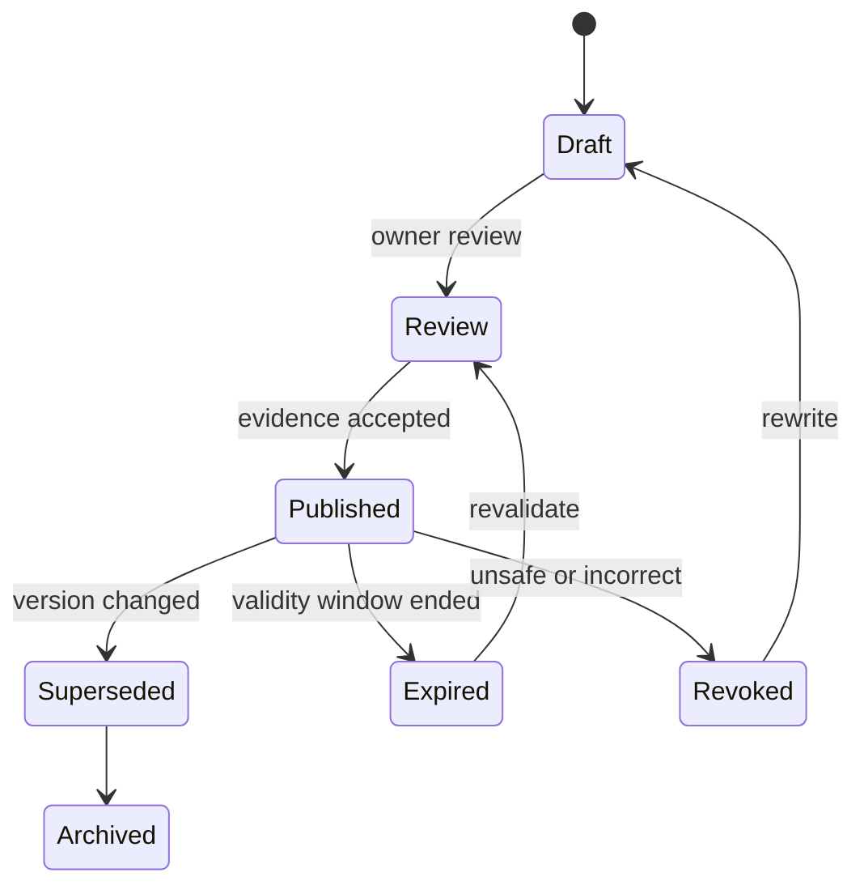
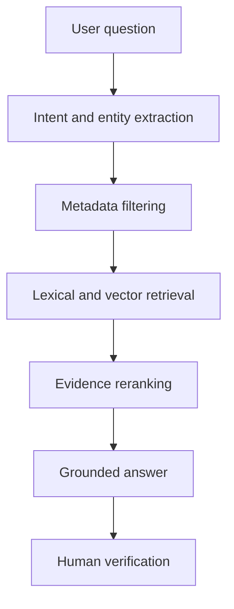
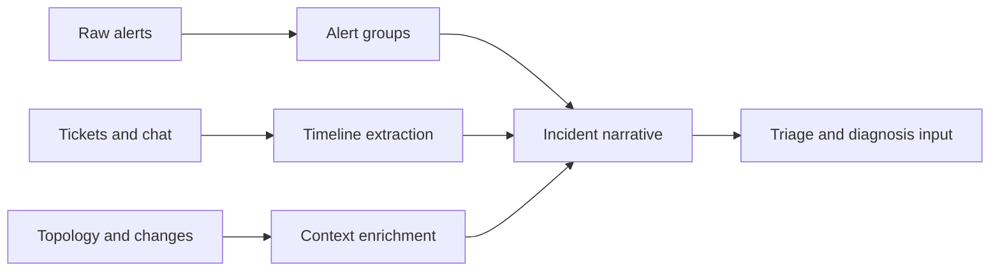
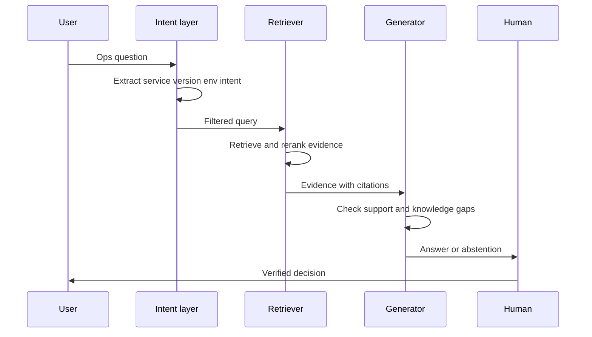
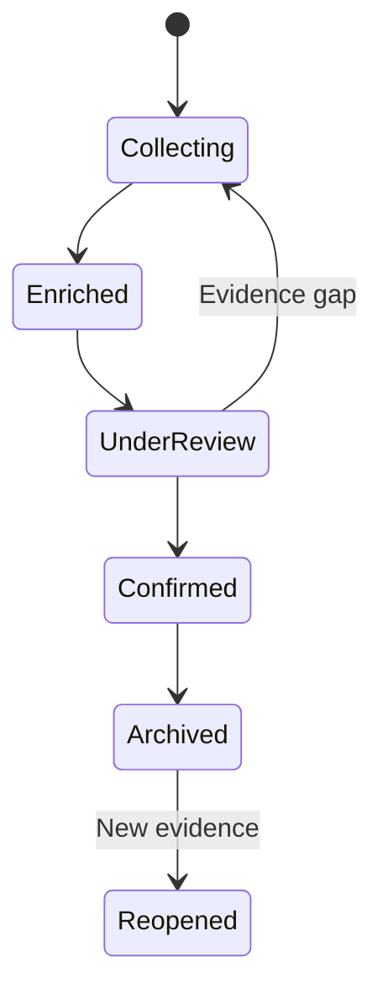
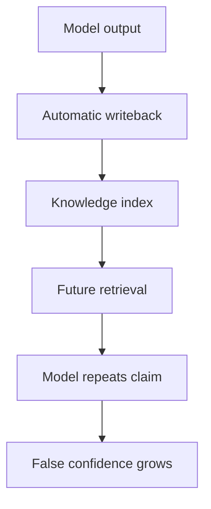
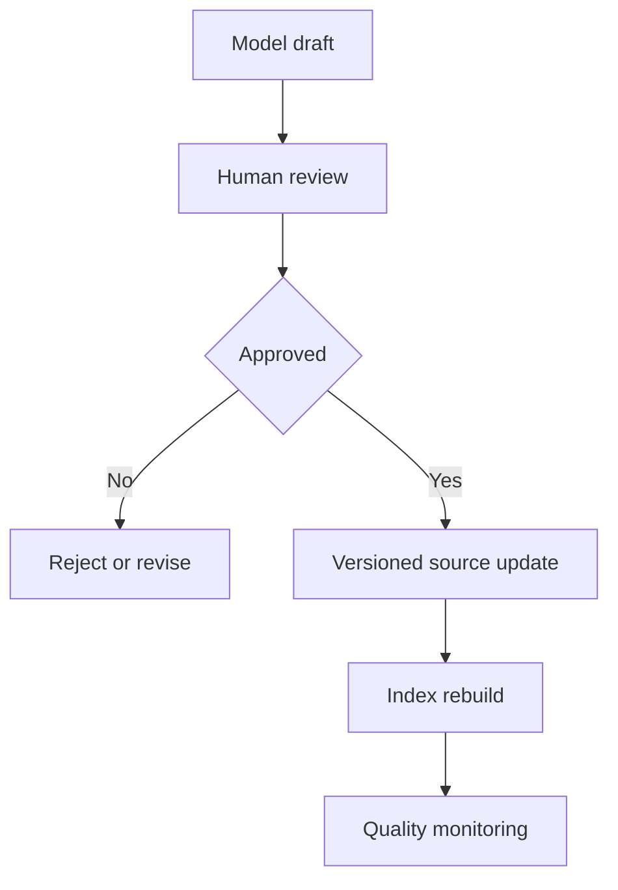
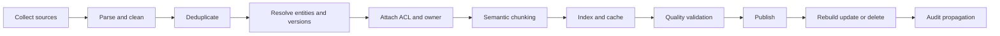
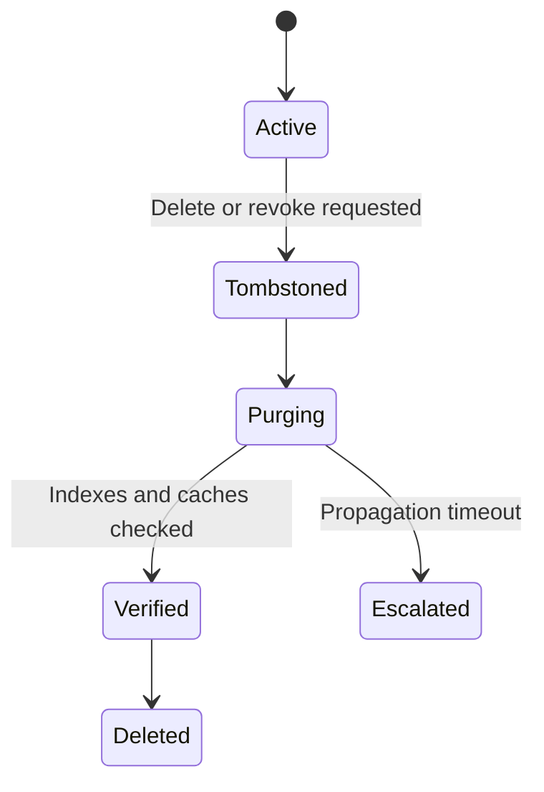
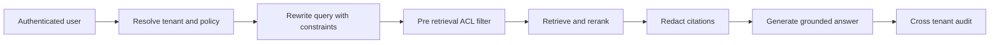

# 方向二：运维知识工程与人机协作

> 本方向讨论如何把告警、工单、聊天、SOP、Runbook 和复盘记录组织为可核对、可检索、可演进的运维知识，并让 AI 在明确的人机边界内辅助事件理解。

## 📚 目录

### 阅读导航

- [方向定位](#方向定位)
- [学习目标](#学习目标)
- [落地之前的思考](#落地之前的思考)
- [第一阶段：认识运维知识资产](#第一阶段认识运维知识资产)
- [第二阶段：从原始信息形成事件叙事](#第二阶段从原始信息形成事件叙事)
- [第三阶段：构建运维问答与 RAG](#第三阶段构建运维问答与-rag)
- [第四阶段：构建统一 Incident Context](#第四阶段构建统一-incident-context)
- [第五阶段：设计人机协作与知识闭环](#第五阶段设计人机协作与知识闭环)
- [论文阅读路线](#论文阅读路线)
- [来源索引](#来源索引)

## 方向定位

### 这个方向研究什么

运维知识工程研究的是知识如何被取得、整理、检索、使用、修订和治理。

它面对的原料非常杂乱：

- 监控系统输出告警和指标。
- 工单系统记录现象、影响和处理过程。
- 即时通信保存工程师的临时判断。
- CMDB 与服务目录描述对象关系。
- SOP、TSG 和 Runbook 描述预期操作。
- Postmortem 记录事件结束后的确认事实和改进项。
- 历史事件保存相似但未必仍然适用的经验。

LLM 的价值不只是“把文档问答做得更像聊天”。

它更重要的能力是把自然语言材料转成结构化候选信息，连接用户意图与异构资料，并用可读语言解释检索结果。

但模型生成的内容不是天然事实。

知识系统必须保存来源、版本、时间、环境、权限和人工确认状态。

### 与其他方向的边界

本方向关注知识如何组织和流转。

日志解析、时间序列异常检测属于方向三。

故障定位和根因推理属于方向四。

生成并执行修复动作属于方向五。

这里会讨论告警聚合、事件分诊和 Incident Context，因为它们把原始信号加工成可供诊断使用的知识。

它们仍不等于 RCA：

| 任务             | 主要问题                 | 输出                   | 是否确认根因 |
| ---------------- | ------------------------ | ---------------------- | ------------ |
| 告警聚合         | 哪些告警可能属于同一事件 | 告警组与关联依据       | 否           |
| 事件摘要         | 目前发生了什么           | 时间线、影响和状态     | 否           |
| 事件分诊         | 谁应先处理               | 严重性、类别、负责团队 | 否           |
| Incident Context | 诊断需要哪些证据         | 分层上下文包           | 否           |
| RCA              | 为什么发生               | 经证据支持的根因       | 是           |

### 本方向的核心判断

知识工程的目标不是堆积更多向量。

目标是让正确的人在正确的时间取得正确版本、正确权限范围内的证据。

一个可用的知识助手必须能回答三个附加问题：

1. 这条信息来自哪里？
2. 它对当前服务、环境和版本仍然适用吗？
3. 它是已确认事实、历史经验，还是模型提出的假设？

## 学习目标

### 学完后应该能回答的问题

- 运维知识有哪些来源？
- 为什么时间、服务、版本、环境和权限是必要元数据？
- SOP、TSG、Runbook 与 Postmortem 分别承担什么职责？
- 告警聚合、事件摘要和分诊如何形成事件叙事？
- 运维 RAG 为什么需要意图检测和元数据过滤？
- 如何识别召回错误、知识缺失和过期文档？
- Incident Context 怎样区分事实、观测、经验和假设？
- 哪些工作适合 AI，哪些判断必须由工程师负责？
- 人工反馈如何回写而不污染事实源？

### 学完后应该具备的设计能力

- 为运维知识对象设计最小元数据。
- 把一份混乱工单整理成证据化事件摘要。
- 为 OpsQA 设计意图分类、检索、重排和拒答流程。
- 为 Incident Context 设计事实分层和冲突处理。
- 为知识闭环设置审核、发布、过期和回滚机制。
- 用任务指标与工作流指标共同评价人机协作。

## 落地之前的思考

### 先确认知识问题，而不是直接建设向量库

本章是工程性综合，用来帮助团队判断知识工程是否值得启动，不代表某篇论文的原始实验结论。

知识项目最容易从“把所有文档接入 RAG”开始，但这通常绕过了真正的问题。

落地前应先回答：

- 工程师找不到的是哪一类信息。
- 信息缺失、过期、权限不清还是检索入口不统一。
- 当前问题在文档、工单、聊天还是服务目录中发生。
- 人工需要做的是搜索、判断、组合还是承担责任。
- 哪些知识可以被引用，哪些知识只能作为未确认线索。

同样的“问答效果差”，可能来自不同原因：

| 症状 | 更可能的根因 | 第一优先级 |
|---|---|---|
| 搜不到文档 | 索引覆盖或权限过滤错误 | 盘点摄取范围和 ACL |
| 找到旧 Runbook | owner、版本和有效期缺失 | 知识治理 |
| 结果很多但无法判断 | 文档缺少适用条件 | 补充结构化元数据 |
| 摘要看似完整但不可信 | 事实和推测混写 | 设计证据分层 |
| 相似事件误导当前事件 | 服务、版本或环境不匹配 | 元数据过滤和重排 |
| 工程师不用助手 | 不在现有事件流程里 | 工作流集成和责任设计 |

如果只是把混乱资料换成向量索引，系统会更快地返回混乱资料。

### 先画知识生命周期和责任边界

运维知识不是一次性文档，而是随着服务、版本、架构和事故不断变化的资产。

在编码前先画出一条生命周期：



每一种知识对象都应有责任人和状态，而不只是一个文件路径。

至少记录：

- 服务、组件、环境和租户。
- 适用版本与变更范围。
- 创建者、审核者和 owner。
- 来源事件或原始文档。
- 生效时间和失效时间。
- 权限范围与敏感等级。
- 是否允许模型引用。
- 是否允许生成行动建议。
- 发生错误时如何撤回。

可以先选择一种高频知识对象建立最小治理，而不是一次治理所有资料：

| 对象 | 适合的第一步 | 不应直接做的事 |
|---|---|---|
| Runbook | 加前置条件、版本和回滚 | 直接让 Agent 执行全部命令 |
| Postmortem | 标记确认事实与推测 | 把全文当成当前 SOP |
| 工单 | 保留时间线和责任人 | 不加状态就直接向量化 |
| 聊天记录 | 脱敏并标记临时判断 | 直接当作权威知识 |
| 服务目录 | 补 owner、依赖和环境 | 只维护展示名称 |

知识 owner 不是“资料上传人”。

owner 要能回答当前内容是否仍然有效，并承担撤回、修订和冲突处理。

### 证明知识质量能改善工作流

知识系统的质量不能只用召回率或答案相似度证明。

落地前应把收益拆成几个可观察层次：

1. 是否找到相关资料。
2. 资料是否适用于当前服务和版本。
3. 回答是否引用正确证据。
4. 工程师是否减少搜索和切换时间。
5. 事件处理是否减少错误分支和重复劳动。

建议建立如下基线：

| 指标层 | 示例指标 | 采样方式 |
|---|---|---|
| 覆盖 | 目标服务有 owner 和有效 Runbook 的比例 | 服务目录盘点 |
| 新鲜度 | 过期文档比例、最近审核间隔 | 版本与时间字段 |
| 检索 | Top-k 相关率、无结果率 | 标注问题集 |
| 事实 | 引用证据支持率、冲突率 | 专家抽样复核 |
| 协作 | 采纳率、修改率、拒答率 | 事件工作流日志 |
| 结果 | 分诊时间、重复查询次数、MTTR 变化 | 线上对照 |

检索质量评估要覆盖“应该拒答”的问题。

例如：

- 当前版本没有对应 Runbook。
- 用户没有访问该租户的权限。
- 历史事件与当前拓扑不匹配。
- 两份文档对同一参数给出冲突值。
- 资料只描述实验环境，没有生产适用范围。

这些样本如果被排除，系统的高分只说明它擅长回答简单问题。

### 先处理数据权限和事实污染

知识系统把原本分散的访问边界集中到一个检索入口，权限错误会被放大。

落地前至少画出三条边界：

- 谁可以摄取某类资料。
- 谁可以检索某类资料。
- 谁可以把资料用于行动建议。

“工程师能看到”不自动等于“模型可以跨事件复用”。

权限设计应考虑：

- 租户和组织边界。
- 生产与测试环境。
- 个人信息、凭据和安全事件。
- 临时授权和撤销传播。
- 缓存、Embedding 和日志中的副本。

事实污染也需要单独处理。

一条错误的自动摘要、未经确认的聊天判断或模型生成的 Postmortem，如果没有状态标记，就可能被下一轮检索当成事实。

最低限度应区分：

| 状态 | 是否可作为事实引用 | 是否可生成建议 |
|---|---:|---:|
| 原始观测 | 可以，需保留时间和来源 | 仅作为证据输入 |
| 专家确认事实 | 可以 | 可以 |
| 历史经验 | 需检查适用条件 | 可以作为候选 |
| 未确认判断 | 不可以直接断言 | 只能明确标注为假设 |
| 模型生成内容 | 不可以作为事实源 | 需人工审核后回写 |

删除和撤回必须传播到索引、缓存、向量库和下游摘要。

如果团队无法回答“撤回一份错误 Runbook 后多久不再被召回”，就不应把系统接入高风险诊断流程。

### 选择最小知识闭环并设置停止条件

首个试点最好选择一个 owner 明确、资料相对完整、问题高频且错误可人工拦截的场景。

例如只做某一类服务的事件上下文生成：


试点不应一开始就接入所有聊天记录和所有租户。

可以按以下顺序逐步扩展：

1. 一个服务族。
2. 一类事件问题。
3. 只读检索和引用。
4. 人工确认后的知识回写。
5. 多服务关联。
6. 与诊断或行动流程集成。

每一步都要保留回退到原有搜索和人工流程的入口。

成功条件可以包括：

- 目标资料覆盖率达到约定阈值。
- 过期和权限错误不高于基线。
- 引用支持率达到专家可接受水平。
- 工程师搜索时间减少且无需增加复核负担。
- 错误知识能在约定时间内撤回。

退出条件可以包括：

- 资料 owner 无法持续维护。
- 权限过滤无法证明可靠。
- 检索结果不如现有目录或搜索。
- 工程师需要花更多时间核对模型摘要。
- 反馈回写会污染事实源。
- 业务价值只来自一次性资料清理，无法持续。

真正的知识工程不是“上线一个聊天框”，而是建立可追溯、可撤回、有人负责的知识供应链。

## 第一阶段：认识运维知识资产

### 结构化知识与非结构化知识

结构化知识拥有稳定字段和显式关系。

常见例子包括：

- 服务标识与负责人。
- 集群、区域、环境和租户。
- 资源依赖与调用拓扑。
- 告警名称、级别和触发时间。
- 变更单号、版本号和发布时间。
- 工单状态、优先级和处理团队。

非结构化知识以自然语言为主。

常见例子包括：

- 排障聊天记录。
- 工单描述与处理备注。
- Runbook 的解释性段落。
- 事故复盘与经验总结。
- 外部故障新闻和供应商公告。

两类知识不能互相替代。

结构化字段适合过滤、连接、统计和权限控制。

自然语言适合保存背景、条件、例外和判断过程。

一个稳健系统通常先用结构化字段缩小范围，再对范围内文本做语义检索。



上图是本路线图的编辑性综合，不是某篇论文原图。

### 运维知识对象的最小元数据

只保存正文会让检索得到“语义相似但操作上错误”的结果。

建议每个知识对象至少附带：

| 字段               | 作用                  | 缺失风险           |
| ------------------ | --------------------- | ------------------ |
| `source_id`      | 回到事实源            | 无法核对           |
| `source_type`    | 区分工单、SOP、复盘等 | 混淆权威等级       |
| `service`        | 限定服务范围          | 跨服务误用         |
| `environment`    | 区分生产、预发和测试  | 在生产套用测试步骤 |
| `region`         | 限定地域              | 忽略区域差异       |
| `version_range`  | 指明适用版本          | 使用过期命令       |
| `valid_from`     | 表示生效时间          | 不知道何时开始适用 |
| `expires_at`     | 触发复审              | 陈旧知识长期存活   |
| `owner`          | 指定维护责任          | 无人修订           |
| `classification` | 表示敏感级别          | 权限泄漏           |
| `review_status`  | 区分草稿与已发布      | 模型草稿被当成事实 |

这些字段不是为了建立复杂标签数据库。

它们服务于可追溯、可过滤和可治理三个直接目标。

### SOP、TSG、Runbook 和 Postmortem

不同团队可能对这些词有不同习惯。

本路线图采用以下工作定义：

| 资产       | 主要目的       | 典型内容                   | 使用时机       |
| ---------- | -------------- | -------------------------- | -------------- |
| SOP        | 规范标准操作   | 前置条件、职责、步骤       | 日常重复流程   |
| TSG        | 引导故障排查   | 症状、检查项、决策分支     | 已知故障场景   |
| Runbook    | 支撑可执行操作 | 命令、参数、验证、回滚     | 人工或自动执行 |
| Postmortem | 沉淀确认经验   | 时间线、影响、根因、行动项 | 事件结束后     |

SOP 强调“应该怎样做”。

TSG 强调“看到这个症状时怎样查”。

Runbook 强调“怎样可靠执行”。

Postmortem 强调“这次实际发生了什么”。

同一段文本不能因为被向量化就获得相同权威等级。

生产 Runbook 的已审核命令通常比聊天中的临时建议更适合作为操作依据。

最近一次 Postmortem 的确认时间线通常比事件期间的猜测更适合作为历史事实。

### 文档新鲜度不是可选属性

运维知识会随系统变化而失效。

变化来源包括：

- 服务重命名。
- API 或 CLI 参数变化。
- 拓扑迁移。
- 权限模型调整。
- 告警规则更新。
- 依赖版本升级。
- 团队职责转移。

“检索到了文档”不表示“文档仍可执行”。

新鲜度检查可以包含：

1. 是否在有效版本范围内。
2. 最近一次审核距今多久。
3. 文档引用的资源是否仍存在。
4. 命令是否在隔离环境通过验证。
5. 负责人是否仍是当前 owner。
6. 是否存在更新版本或废弃标记。

### 企业私有知识为何重要

通用模型可能理解 Kubernetes、BGP 或数据库复制的公共概念。

它通常不知道企业内部服务别名、部署约束、审批流程和历史事故。

OWL、工业领域问答和 NetOps 能力研究从不同角度表明，领域数据、任务适配和评测集会显著影响模型表现。

这不意味着每个团队都应训练一个大模型。

可以按成本从低到高逐步选择：

1. 结构化 Prompt。
2. 受控词表与术语展开。
3. RAG。
4. 工具调用。
5. Instruction Tuning。
6. 领域继续预训练或专用模型。

先解决知识可用性和评测问题，通常比直接扩大模型更重要。

### 知识资产盘点示例

选择一个真实服务，列出以下内容：

- 服务目录入口。
- 当前 Runbook。
- 最近三次事件工单。
- 最近一次 Postmortem。
- 关键告警规则。
- 负责人和升级路径。
- 相关变更记录。

然后为每项记录 owner、更新时间、适用环境、权限和权威等级。

若无法填写，说明问题首先是知识治理，而不是生成模型能力。

### 本阶段小结

- 运维知识同时包含结构化关系与自然语言经验。
- 元数据决定检索结果能否安全落地。
- 文档类型代表不同目的和权威等级。
- 私有术语和环境差异限制通用模型。
- 知识新鲜度必须进入检索和审核流程。

## 第二阶段：从原始信息形成事件叙事

### 从信号到事件叙事

单条告警只表达某个规则在某时刻被触发。

事件叙事需要回答更完整的问题：

- 什么时候开始？
- 哪些服务和客户受影响？
- 观察到了什么症状？
- 做过哪些诊断和缓解动作？
- 当前状态是什么？
- 哪些内容仍待确认？

加工过程可以理解为：



上图是跨论文编辑性综合。

### 告警聚合解决什么问题

大规模系统中，同一底层故障可能沿依赖关系触发多层告警。

Knowledge-aware Alert Aggregation 给出的案例从 SSD 低电压开始，依次出现 OSD I/O 阻塞、进程异常、节点不健康、存储集群异常和 Redis 连接下降。

这些告警跨越硬件、平台和应用层。

它们未必具有高文本相似度。

罕见但关键的严重告警也未必有足够共现历史。

因此论文提出的 COLA 采用混合路线：

- 对频繁告警关系使用时间共现和拓扑知识。
- 对统计信息不足的关系使用 SOP 与 LLM 推断。
- 以轻量嵌入检索相似正负样本辅助 ICL。

### 时间关联与空间关联

论文用滑动窗口收集短时间内出现的告警。

若两个告警常在同一窗口出现，时间关联较强。

若两个告警所在组件在知识图或服务拓扑上接近，空间关联较强。

可将其学习化表示为：

$$
R(a_i,a_j)=T(a_i,a_j)-\alpha \hat{S}(a_i,a_j)
$$

其中：

- $T$ 表示由条件概率得到的时间关联。
- $\hat{S}$ 表示归一化后的嵌入距离。
- 距离越大，空间相似性越低，因此公式采用减法。
- $\alpha$ 控制空间项影响。

这是对论文关联评分的学习化转写。

实际符号与完整定义应以译文相应公式为准。

运维含义是：共时发生不足以证明相关，拓扑接近也不足以单独证明相关，二者结合能减少偶然共现。

### 告警聚合的边界

聚合结果是候选事件集合，不是因果链证明。

常见错误包括：

- 周期性告警造成虚假共现。
- 时间窗口过大合并无关事件。
- 时间窗口过小切断传播链。
- 拓扑信息过期。
- SOP 对新故障没有覆盖。
- LLM 用语义合理性替代真实依赖。

输出应保留每条关联的依据和不确定性。

例如：

```yaml
alert_pair:
  left: osd_io_blocked
  right: storage_cluster_unhealthy
  decision: related
  evidence:
    temporal_score: 0.86
    topology_path: osd_node -> storage_cluster
    sop_reference: SOP-STORAGE-017
  status: candidate
```

### 事件摘要不是压缩文字

Assess and Summarize 研究用 LLM 从多个关联事件生成云服务中断摘要。

它说明自动摘要可以显著缩短整理时间。

但生产摘要的价值不只由流畅性决定。

摘要必须覆盖：

- 受影响对象。
- 用户可见症状。
- 时间范围。
- 严重程度。
- 已确认技术事实。
- 当前处理状态。

缺少关键影响信息的短文本，即使语言流畅，也不是好摘要。

### 事实、推断与待确认项

推荐把摘要拆为明确区块：

```markdown
#### 已确认事实
- 10:02 起 checkout-api 的 5xx 比例持续升高。
- 影响区域为 ap-southeast-1。

#### 工具观测
- 数据库连接池使用率在 10:01 达到 100%。
- 10:00 有一次应用版本发布。

#### 当前假设
- 发布可能改变连接复用行为，尚未确认。

#### 待确认
- 是否存在数据库侧限流。
- 回滚能否恢复连接池水位。
```

这种格式阻止模型把“时间上接近”写成“已经证明”。

### 事件时间线的最小结构

每个时间点建议包含：

| 字段           | 含义                                      |
| -------------- | ----------------------------------------- |
| `timestamp`  | 统一时区后的时间                          |
| `event_type` | 告警、变更、观测、动作或状态更新          |
| `subject`    | 服务、资源或团队                          |
| `statement`  | 发生的事情                                |
| `source`     | 工单、监控或聊天链接                      |
| `confidence` | confirmed、observed、reported、hypothesis |

时间戳冲突时不应静默选择一个。

应保留两个来源并标注时钟、采集延迟或人工记录误差。

### FAIL 展示了外部事件知识的价值与偏差

FAIL 使用 LLM 从新闻报道中抽取软件故障信息，构建可分析的故障数据库。

它说明组织外部材料也能支持跨组织学习。

外部新闻并不是内部遥测的替代品。

新闻材料存在明显选择偏差：

- 更倾向报道影响大的事件。
- 技术细节可能不完整。
- 根因可能来自早期声明。
- 不同媒体可能重复同一来源。
- 公开描述会省略敏感信息。

因此外部案例适合用作风险模式和培训材料，不宜直接作为当前事件根因证据。

### 事件分诊的任务边界

事件分诊通常预测：

- 严重性或优先级。
- 故障类别。
- 负责团队。
- 是否需要升级。
- 分类理由或可解释证据。

Incident Triage 论文研究 LLM 生成准确且可解释的分诊结果。

分诊价值在于缩短路由时间、减少错误转派和帮助值班人员理解候选分类。

分诊输出仍是决策建议。

特别是高严重性判断和跨团队责任划分，应保留人工确认与升级机制。

### FaultProfIT 的层次标签视角

云事件类别常有层次结构。

例如：

```text
Storage
├── Disk
│   ├── Capacity
│   └── Hardware failure
└── Database
    ├── Connection
    └── Replication
```

FaultProfIT 把工单故障画像建模为层次化多标签问题，并用层次结构引导表示学习和对比学习。

这比平面分类更贴近运维现实：

- 一个事件可能同时属于多个标签。
- 父类正确但子类不确定仍有路由价值。
- 稀有子类可以利用父类结构学习。
- 分类错误应区分“同父类误差”和“跨大类误差”。

### 分类结果如何进入知识系统

预测标签不应覆盖原始工单字段。

推荐同时保存：

```yaml
classification:
  predicted:
    labels: [storage, disk, hardware_failure]
    model_version: fault-profiler-v3
    confidence: 0.78
  reviewed:
    labels: [storage, disk, power_issue]
    reviewer: oncall@example
    reviewed_at: 2026-08-03T10:30:00+08:00
```

这样可以分析模型偏差，也能避免预测值伪装成人工事实。

### 从聚合到叙事的生产检查表

- [ ] 所有时间是否统一时区？
- [ ] 告警组是否保留关联依据？
- [ ] 是否过滤周期性噪声？
- [ ] 摘要是否包含客户影响？
- [ ] 推断是否与确认事实分开？
- [ ] 每个关键句是否可回到来源？
- [ ] 分诊标签是否标明模型版本？
- [ ] 高严重性事件是否进入人工审核？
- [ ] 是否保存无法解决的冲突？

### 本阶段小结

- 告警聚合把信号归并为候选事件。
- 摘要把多源记录组织成事件叙事。
- 分诊把事件路由到类别、优先级和团队。
- 层次标签比单一平面标签更贴近复杂系统。
- 所有生成内容都应保留来源和确认状态。

## 第三阶段：构建运维问答与 RAG

### 从通用问答到 OpsQA

OpsQA 不是普通企业文档搜索的简单改名。

一个运维问题常隐含：

- 当前服务和资源。
- 生产或测试环境。
- 软件与硬件版本。
- 用户权限。
- 期望答案类型。
- 当前事件阶段。

“如何重启节点”可能是在问标准操作，也可能是在事件中询问风险和前置检查。

系统必须先理解意图，再选择知识与回答形式。

### 模型适配路线

| 路线               | 优势           | 主要代价       | 适合场景       |
| ------------------ | -------------- | -------------- | -------------- |
| Prompt             | 上手快         | 稳定性有限     | 原型与明确任务 |
| RAG                | 可更新、可引用 | 依赖检索质量   | 私有文档问答   |
| Instruction Tuning | 格式和任务适配 | 需要训练数据   | 稳定重复任务   |
| 领域继续预训练     | 学习术语与分布 | 训练成本高     | 大规模专用模型 |
| Tool Use           | 获取实时状态   | 权限和轨迹复杂 | 动态运维查询   |

OWL 代表面向 IT 运维的领域模型路线。

工业领域问答研究通过领域数据与增强方法考察专门问答能力。

NetOps 实证研究比较模型规模、少样本、指令微调、思维链和 RAG 等因素。

这些论文共同提醒：不能仅凭通用 benchmark 选择运维模型。

### 一个基础 RAG 管线



### iKnow 的意图感知设计

iKnow 先研究云运维人员常问的问题，以及基础 RAG 为什么失败。

其系统流程包含：

- 向量数据库。
- 意图检测与元数据提取。
- 意图引导的查询改写。
- 两阶段证据检索。
- 知识缺失检测。
- 意图引导的生成。

关键思想是：不同意图需要不同证据和答案结构。

例如：

| 意图     | 重点检索对象       | 期望回答               |
| -------- | ------------------ | ---------------------- |
| 概念解释 | 产品文档与术语表   | 定义、适用范围         |
| 操作步骤 | 当前版本 Runbook   | 前置、步骤、验证、回滚 |
| 故障排查 | TSG 与相似事件     | 检查顺序和证据需求     |
| 配置查询 | 实时工具与配置文档 | 当前值与来源           |
| 责任查询 | 服务目录与值班表   | owner 和升级路径       |

### 查询改写不能丢失约束

用户原问题：

```text
新加坡生产集群升级 1.29 后 ingress 频繁 502，先看什么？
```

一个有用的内部查询表示可以是：

```yaml
intent: troubleshoot
service: ingress
environment: production
region: singapore
version: "1.29"
symptom: frequent_http_502
requested_output: diagnostic_first_steps
```

若改写只保留“ingress 502 troubleshooting”，检索可能混入旧版本、测试环境或其他区域文档。

### 文档分块应尊重操作语义

固定字符分块可能把前置条件与危险命令分开。

运维知识更适合按以下边界切分：

- 文档标题与适用范围。
- 一个完整决策分支。
- 一组不可分割的操作步骤。
- 命令及其验证、失败和回滚说明。
- Postmortem 的时间线、根因和行动项。

每个块应继承文档级元数据。

同时保留相邻块或父章节引用，避免生成器只看到孤立命令。

### 混合检索与重排

运维资料既有自然语言，也有精确标识符。

向量检索擅长语义近似。

关键词检索擅长：

- 错误码。
- 告警名。
- 服务 ID。
- 配置键。
- 工单号。
- 命令参数。

因此常用混合检索：

$$
score(d,q)=\beta score_{semantic}(d,q)+(1-\beta)score_{lexical}(d,q)
$$

这是通用学习化表达，不是 iKnow 原论文公式。

最终还需结合元数据约束、文档权威等级和新鲜度重排。

### 两阶段证据检索

第一阶段追求召回，找出可能相关的材料。

第二阶段追求精确，判断候选材料是否真正回答当前意图。

第二阶段可以检查：

1. 服务是否匹配。
2. 环境和区域是否匹配。
3. 版本是否兼容。
4. 文档类型是否适合当前意图。
5. 内容是否覆盖问题实体。
6. 权限是否允许用户读取。
7. 文档是否已废弃。

### 知识缺失检测

RAG 最重要的能力之一是知道“没有足够知识”。

知识缺失可能表现为：

- 没有召回任何材料。
- 只召回低相似内容。
- 候选文档环境不匹配。
- 多个权威来源互相冲突。
- 文档只覆盖旧版本。
- 用户请求实时状态但系统只有静态文档。

此时系统应拒绝编造，并说明缺少什么。

示例：

```text
现有证据只覆盖 Kubernetes 1.27，无法确认 1.29 的操作步骤。
我找到了相关旧版 Runbook，但不会把它作为当前版本指令。
需要查询当前集群版本对应的发布说明或请 ingress owner 确认。
```

### 引用必须支持句子而不只是主题

“有引用”不等于“有证据”。

一个引用可能只与主题相关，却不支持具体结论。

建议逐条检查：

- 引用是否包含该事实。
- 引用是否适用于当前环境。
- 引用是否为当前版本。
- 引用是否具有足够权威。
- 引用是否遗漏相反条件。

回答可采用：

```yaml
answer_item:
  claim: "执行 drain 前需要确认 PodDisruptionBudget"
  source: "RUNBOOK-K8S-NODE-012#prechecks"
  applicability:
    environment: production
    version: ">=1.28,<1.31"
  evidence_status: supported
```

### RAG 的典型失败方式

#### 召回错误

语义相似但属于其他服务。

处理方式是结构化过滤、实体识别和负样本评测。

#### 文档过期

旧命令仍然具有高文本相关性。

处理方式是版本元数据、废弃标记和复审周期。

#### 相似事件误类比

症状相似不表示根因相同。

处理方式是把历史事件标为经验，不作为当前根因事实。

#### 无来源生成

模型用参数知识补全了看似合理的操作。

处理方式是强制句级支持、拒答和输出验证。

#### 权限泄漏

索引或缓存返回用户无权查看的材料。

处理方式是在检索前执行访问控制，并让缓存键包含权限上下文。

#### Prompt Injection

文档中的恶意文本诱导模型忽略系统规则。

处理方式是将检索内容视为不可信数据，隔离指令与证据，并限制工具权限。

### OpsQA 的评价方法

不应只看答案文本相似度。

建议评价：

| 层次   | 指标                             |
| ------ | -------------------------------- |
| 意图   | 意图分类准确率、实体提取 F1      |
| 检索   | Recall@k、MRR、有效文档命中率    |
| 证据   | 引用支持率、版本适配率           |
| 生成   | 正确性、完整性、可执行性         |
| 拒答   | 缺失知识识别率、错误拒答率       |
| 工作流 | 首次解决率、人工节省时间、升级率 |
| 安全   | 越权召回率、危险建议率           |

离线问题集应包含“不可回答问题”。

否则系统会被奖励为任何问题都给出答案。

### 本阶段小结

- OpsQA 必须显式理解服务、环境、版本和意图。
- RAG 的核心是证据选择，不只是向量搜索。
- 分块应保持操作步骤的完整语义。
- 混合检索适合同时处理自然语言与精确标识符。
- 知识缺失检测和拒答是生产能力。
- 权限控制必须发生在检索层。

## 第四阶段：构建统一 Incident Context

### Incident Context 是什么

Incident Context 是为一次事件诊断组织的、带时间和来源的证据包。

它不是把所有日志塞进模型上下文窗口。

它也不是一段模型自由生成的摘要。

一个有效上下文应让工程师知道：

- 当前确认了什么。
- 观察到了什么。
- 哪些变化与事件时间接近。
- 哪些历史案例可供参考。
- 哪些假设等待验证。
- 下一步还缺什么证据。

### 证据分层

建议至少分为四层：

| 层次       | 内容                   | 示例                  |
| ---------- | ---------------------- | --------------------- |
| 已确认事实 | 经人工或权威系统确认   | 影响区域和开始时间    |
| 工具观测   | 查询返回的当前状态     | 5xx、延迟、连接池水位 |
| 历史知识   | SOP、Runbook、相似事件 | 已知故障模式          |
| 模型假设   | 待验证解释             | 发布导致连接泄漏      |

四层可以互相引用，但不能互相覆盖。

工具观测也有采样、延迟和查询错误。

因此每项仍需保留时间和查询来源。

### 多源上下文的数据模型

```yaml
incident_context:
  incident_id: INC-2026-0803-017
  scope:
    services: [checkout-api, payment-db]
    environment: production
    regions: [ap-southeast-1]
  confirmed_facts: []
  observations: []
  changes: []
  alert_groups: []
  timeline: []
  historical_cases: []
  hypotheses: []
  evidence_gaps: []
  access_scope: sre-oncall
  generated_at: 2026-08-03T10:20:00+08:00
```

该结构是编辑性示例。

生产实现应按现有事件平台的数据契约裁剪。

### 关联键如何选择

多源信息通常通过以下键关联：

- `incident_id`：事件平台中的统一编号。
- `service_id`：稳定服务标识。
- `resource_id`：主机、Pod、数据库等对象。
- `trace_id`：连接同一请求路径。
- 时间窗口：连接同时或相邻发生的事件。
- 变更 ID：连接发布、配置和审批记录。
- 拓扑边：连接上游、下游和依赖关系。

服务名称不应作为唯一键。

别名、重命名和多语言显示会造成错误连接。

### 时间对齐

事件材料可能来自不同时间系统：

- 监控采集时间。
- 日志事件时间。
- 日志接收时间。
- Trace span 时间。
- 变更平台记录时间。
- 工程师聊天时间。

上下文需要记录原始时间、标准化时间和可能的时钟偏差。

只按显示顺序拼接会产生虚假的先后关系。

### 冲突处理

冲突不是需要被模型润色掉的噪声。

常见冲突包括：

- 两个工单给出不同开始时间。
- Runbook 与产品文档步骤不同。
- 监控显示恢复但用户仍报告失败。
- 历史事件对同一症状给出不同根因。

处理策略：

1. 保留冲突双方。
2. 标注来源和时间。
3. 比较权威等级与适用范围。
4. 请求工具查询或人工确认。
5. 决议后记录选择理由。

### 上下文预算

上下文窗口有限，更多文本未必更好。

选择内容时应按诊断价值排序：

1. 当前影响与范围。
2. 最近异常和关键变化。
3. 与候选症状直接相关的观测。
4. 当前服务的权威 Runbook。
5. 高相似且环境匹配的历史事件。
6. 低优先级背景信息。

原始大对象应保留引用，让模型按需进一步查询，而不是一次性复制。

### Incident Context 生命周期



这是编辑性状态模型。

事件进行中，上下文会持续变化。

因此每份快照应有生成时间和版本。

### 上下文的消费方

同一 Context 可被不同任务消费：

| 消费方     | 需要内容                   | 不应默认获得     |
| ---------- | -------------------------- | ---------------- |
| 值班工程师 | 影响、时间线、证据缺口     | 无关敏感数据     |
| 分诊系统   | 症状、服务、严重性         | 未审核根因       |
| RCA Agent  | 观测、拓扑、变化、工具入口 | 高风险写权限     |
| 状态页     | 已确认影响和进展           | 内部假设与秘密   |
| Postmortem | 完整确认时间线             | 未解决的匿名猜测 |

上下文不是“一份文本给所有人”。

它必须根据目的和权限投影。

### 本阶段小结

- Incident Context 是带来源、时间和状态的证据包。
- 事实、观测、历史知识和假设必须分层。
- 多源关联依赖稳定标识、时间和拓扑。
- 冲突需要保留并解决，不能被生成模型抹平。
- 上下文应按诊断价值和权限裁剪。

## 第五阶段：设计人机协作与知识闭环

### AI 适合承担什么

AI 适合处理高信息量、可复核、低风险的认知劳动：

- 汇总重复告警。
- 抽取时间线候选项。
- 生成事件摘要草稿。
- 推荐分类标签。
- 检索相似案例。
- 找出知识冲突和缺口。
- 生成 Runbook 修订草稿。
- 把自然语言问题转成只读查询候选。

这些任务的共同点是输出可由人或工具验证。

### 人必须负责什么

以下职责不应因为模型表达流畅而自动转移：

- 确认业务影响。
- 确认根因。
- 批准高风险或不可逆动作。
- 决定跨团队责任。
- 发布外部沟通。
- 审核知识入库。
- 接受剩余风险。

人机边界应由风险和可验证性决定，而不是由模型名称决定。

### 三种协作模式

| 模式            | AI 行为       | 人工行为         | 适用场景           |
| --------------- | ------------- | ---------------- | ------------------ |
| Suggest         | 生成候选      | 选择、修订、执行 | 新任务和高风险任务 |
| Review          | AI 先完成草稿 | 审核后发布       | 摘要、分类、文档   |
| Guarded Execute | 在策略内执行  | 审批例外并监督   | 已验证、可逆动作   |

本方向主要覆盖 Suggest 与 Review。

Guarded Execute 的详细设计属于方向五。

### 人工反馈的四种类型

#### 对话反馈

用户表示某次回答有用或无用。

它适合用于体验统计，不足以直接修改事实库。

#### 事实修订

工程师更正服务、时间、影响或状态。

它应写入事件系统，并保留修改人和审计记录。

#### 文档修订

工程师指出 Runbook 步骤过期。

它应进入文档评审流程，而不是直接覆盖已发布版本。

#### 模型监督信号

审核结果被用于训练或排序优化。

它需要去标识、质量筛选和数据版本管理。

### 不要把所有反馈自动写回向量库

未经审核的自动回写会形成知识污染闭环：



正确闭环应加入审核和发布：



### 知识回写状态机

```text
candidate -> reviewed -> approved -> published -> deprecated
              |            |
              v            v
           rejected      superseded
```

每次状态变化应记录：

- 操作者。
- 时间。
- 变更内容。
- 审核依据。
- 关联事件。
- 上一个版本。
- 回滚方式。

### 如何评价协作效果

文本相似度无法完整反映人机协作价值。

应同时观察：

#### 任务质量

- 摘要事实准确率。
- 关键影响覆盖率。
- 分诊准确率。
- 检索有效证据命中率。
- 引用支持率。

#### 人工工作量

- 摘要编辑距离或修改率。
- 单事件审核时间。
- 工程师追查来源的时间。
- 错误转派次数。
- 重复查询次数。

#### 工作流结果

- 分诊耗时。
- 首次正确路由率。
- 知识复用率。
- 建议采纳率。
- 因错误知识造成的返工率。

#### 安全与治理

- 越权检索次数。
- 过期文档命中次数。
- 无证据结论比例。
- 高风险建议拦截率。
- 未审核内容入库次数。

### 自动指标与人工评估

自动指标适合持续回归和大规模比较。

人工评估适合判断事实遗漏、可操作性、语境适配和风险。

推荐组合：

1. 用固定测试集检查意图、检索和引用。
2. 用专家双人抽样审核生成答案。
3. 用线上日志观察修改率和升级率。
4. 对高风险失败做案例复盘。
5. 按服务、语言、事件类型分层报告。

### 上线闸门

一个知识助手进入生产前至少应满足：

- [ ] 可以回到原始来源。
- [ ] 权限在检索前执行。
- [ ] 文档版本和新鲜度可过滤。
- [ ] 不可回答问题会拒答。
- [ ] 模型输出不会直接覆盖事实字段。
- [ ] 高风险建议有人工确认。
- [ ] 所有反馈回写有审核流程。
- [ ] 模型、索引和文档版本可追踪。
- [ ] 有离线回归集和线上质量指标。
- [ ] 系统故障时有人工流程可用。

### 本阶段小结

- AI 更适合生成可验证候选，不适合独占事实确认权。
- 人机边界由风险、可逆性和验证成本决定。
- 反馈必须按类型进入不同系统。
- 自动回写会放大模型错误。
- 协作评价要同时覆盖质量、工作量、结果和治理。

## 工程补充：知识摄取、租户隔离与发布治理

### 端到端摄取不止是分块和 Embedding

一个可运营的知识管线需要覆盖完整生命周期：



上图是工程性综合。各阶段都要记录输入版本、处理器版本、输出对象、错误和审计事件，否则无法解释某条引用为什么出现或为什么删除后仍能被召回。

### 采集、清洗与去重

采集器应保留来源 URL 或仓库路径、源系统对象 ID、修订版本、时间、作者、owner、密级和租户。清洗时移除导航噪声和重复模板，但不能丢失命令前置条件、警告、代码块和标题层级。

去重至少分三层：

| 层次         | 目标                 | 注意事项                 |
| ------------ | -------------------- | ------------------------ |
| 精确去重     | 相同字节或规范化文本 | 保留所有来源关系         |
| 近重复去重   | 同一文档的轻微改写   | 不能合并不同权限版本     |
| 语义冲突检测 | 同主题但结论不同     | 冲突不是重复，应进入审阅 |

若两个租户拥有相同内容，也不能为了节省空间而丢掉租户边界。物理内容可复用，授权元数据必须独立验证。

### 实体消歧与版本关联

`payment` 可能指服务、团队、Dashboard 或数据库。实体解析应结合对象类型、命名空间、环境、集群和有效时间，并保留不能确定的候选。

文档还要关联适用版本：

- 服务与 API 版本。
- Kubernetes 或云 Provider 版本。
- Runbook 修订与生效区间。
- 变更、事件和 Postmortem 的时间关系。
- 被替代文档和当前权威文档。

检索时若当前环境为 v42，v31 的 Runbook 可以作为历史证据，但不能无标记地排在当前版本之前。

### 权限标注必须早于分块

若先分块再猜测权限，标题、表格或代码块可能失去原文的访问标签。推荐把租户、主体、资源范围、密级和可引用字段在文档级解析后传播到每个 chunk，并在发布前验证继承结果。

每个 chunk 至少带：

```yaml
chunk_id: stable-document-and-section-id
tenant_id: tenant-a
source_id: runbook-184
source_version: 12
owner: team-payment
classification: internal
allowed_groups: [payment-oncall]
valid_from: 2026-07-01T00:00:00Z
valid_to: null
content_hash: sha256-placeholder
```

这是教学 Schema，不要求仓库建立数据库。

### 分块、索引和重建

分块应尊重操作语义：命令、前置条件、验证和回滚不能拆散。表格行若离开表头会失去含义，代码块若离开版本和环境说明会变成危险建议。

索引版本应绑定：Embedding 模型、分词或切分器、字段映射、过滤策略和构建时间。任何一项变化都应并行构建新索引，经离线回放和影子查询验证后再切换别名。

重建期间要定义：

- 新旧索引的一致性窗口。
- 增量更新如何与全量快照衔接。
- 缓存键是否包含索引和 ACL 版本。
- 构建失败时是否继续使用旧索引。
- 切换后怎样回滚且不复活已删除内容。

### 删除传播是一等能力

删除或撤权必须传播到源对象、chunk、稠密与稀疏索引、重排缓存、问答缓存、引用快照和下游副本。不能只从主数据库删一行。



删除记录需要不可变审计，但审计中不应保留被要求删除的敏感正文。可以保留对象 ID、hash、操作者、原因、时间和各副本确认状态。

### 多租户 RAG 的检索顺序

安全流程应为：认证主体，解析租户与授权范围，在召回前过滤，再重排和生成。不能先跨租户召回后依赖模型“不说出来”。



上图是工程性综合。

### chunk 级 ACL、索引与缓存隔离

- 检索前过滤使用授权主体和 chunk ACL，不能只按文档首页权限。
- 高隔离租户可使用独立索引；共享索引必须有不可绕过的租户过滤。
- 查询缓存、Embedding 缓存和答案缓存的键必须包含租户、权限版本和索引版本。
- 引用输出要脱敏标题、路径、作者和相邻片段，避免元数据泄漏。
- 审计要能发现跨租户零结果异常、过滤器缺失和缓存串租。

测试至少包含同文本不同权限、权限刚撤销、共享缓存命中、引用标题泄漏和管理员切换租户等用例。

### 轻量 Incident Knowledge Schema

下面的 Schema 用于统一术语和关联键，不要求实现复杂图数据库：

| 对象     | 最小字段                             | 关键关系                   |
| -------- | ------------------------------------ | -------------------------- |
| Service  | ID、名称、环境、owner、版本          | 依赖资源、团队和 Runbook   |
| Resource | ID、类型、区域、状态、owner          | 被服务使用，受变更影响     |
| Team     | ID、值班组、升级路径                 | 拥有服务和知识             |
| Incident | ID、时间、严重度、状态、影响         | 关联告警、证据、变更和行动 |
| Change   | ID、版本、窗口、操作者、对象         | 可能影响服务或资源         |
| Alert    | ID、规则版本、时间窗、实体           | 触发或关联事件             |
| Evidence | ID、来源、事件时间、provenance、质量 | 支持或反驳候选结论         |
| Runbook  | ID、版本、owner、适用范围、审批状态  | 指导诊断或缓解步骤         |

所有关系都应带来源和有效时间。`Service A depends_on B` 若没有时间范围，会在拓扑变化后误导诊断。

### 值班交接是状态转移

高质量交接包应包含：

- 当前影响、事件阶段和 Incident Commander。
- 已确认事实、候选解释、反证和未知项。
- 已执行查询与可复现链接。
- 正在进行、已停止和禁止执行的动作。
- 下一个区分性检查及其 owner。
- 关键时间点、审批、风险和升级路径。

接班人应显式确认已读取并指出冲突，不把聊天记录长度当成交接质量。

### 冲突审阅与权威发布

新知识进入发布态前经过：

1. 自动检测与现有 Runbook、配置和 Postmortem 的冲突。
2. 路由给拥有该服务或知识域的 owner。
3. reviewer 判断替代、并存、过期或需实验验证。
4. 审批后的版本成为权威入口，旧版本保留明确状态。
5. 发布事件触发索引、缓存与引用更新。

没有 owner 的知识不能自动成为权威知识。紧急事件中的临时笔记可以快速发布为 `provisional`，但必须有到期时间和后续审阅任务。

### 审批疲劳与 owner 责任

不是每个拼写修复都需要高级专家，也不能把模型生成的 Runbook 批量一键批准。按风险分级：

| 变更                     | 审批建议              |
| ------------------------ | --------------------- |
| 元数据和格式，不改变语义 | 自动检查后轻量审核    |
| 检索关键词和非执行说明   | 单 owner 审核         |
| 诊断命令与阈值           | owner 加值班 reviewer |
| 写操作、权限或不可逆步骤 | 双人复核并演练        |

Owner 对适用范围、新鲜度、冲突处置和撤回负责；平台团队负责管线、ACL 和审计，不替业务 owner 判断操作真伪。

### 知识质量指标和 SLO

| 指标          | 定义示例                      | 说明                         |
| ------------- | ----------------------------- | ---------------------------- |
| 过期率        | 超过复审期的已发布对象占比    | 按风险等级设置不同周期       |
| 冲突率        | 未解决冲突对象占比            | 冲突不能靠选最新时间自动消失 |
| 无 owner 比例 | owner 缺失或不可达对象占比    | 应阻止高风险知识发布         |
| 零结果率      | 授权查询无召回的比例          | 按租户、意图和服务分层       |
| 引用覆盖率    | 可核对事实中带有效引用的比例  | 还要检查引用是否真正支持句子 |
| 删除传播时延  | 撤权到所有副本确认的时间      | 同时报告超时和残留副本       |
| ACL 过滤失败  | 未授权 chunk 进入候选集的次数 | 安全指标应接近零容忍         |
| 新鲜度        | 来源更新到可检索版本的时间    | 区分正常更新与紧急撤回       |

质量指标要与 owner 和处置流程绑定。Dashboard 上的红色数字若没有升级和修复路径，不构成治理闭环。

## 论文阅读路线

### 入门：先理解信息整理任务

1. [Assess and Summarize](https://arxiv.org/pdf/2305.18084)：理解多事件信息如何形成中断摘要。
2. [Knowledge-aware Alert Aggregation](https://arxiv.org/pdf/2403.06485.pdf)：理解统计、拓扑知识、SOP 与 LLM 如何互补。
3. [Incident Triage](https://www.microsoft.com/en-us/research/uploads/prod/2024/08/ISSRE24_LLM4triage.pdf)：理解事件路由和解释任务。

阅读时先记录每篇论文的输入、输出和人工角色。

不要先比较不同实验中的绝对指标。

### 进阶：再理解领域知识适配

1. [工业领域问答](https://aclanthology.org/2023.emnlp-industry.29.pdf)：理解领域数据、增强和问答评测。
2. [OWL](https://openreview.net/pdf?id=SZOQ9RKYJu)：理解 IT 运维专用模型路线。
3. [iKnow](https://jun-jie-huang.github.io/assets/papers/ase25_iknow.pdf)：理解意图感知 OpsQA RAG。
4. [NetOps 能力实证](https://arxiv.org/pdf/2309.05557.pdf)：比较 Prompt、模型规模、微调、思维链和 RAG。

### 深入：研究事件知识的结构化

1. [FaultProfIT](https://dl.acm.org/doi/pdf/10.1145/3639477.3639754)：理解层次化多标签事件画像。
2. [FAIL](https://arxiv.org/pdf/2406.08221)：理解外部故障知识抽取及其偏差。

### 代表性论文对比

| 论文                              | 主要输入         | 主要输出       | 技术主线                 | 人工角色       |
| --------------------------------- | ---------------- | -------------- | ------------------------ | -------------- |
| Assess and Summarize              | 相关事件记录     | 中断摘要       | 领域处理与生成           | 审核摘要       |
| Knowledge-aware Alert Aggregation | 告警、拓扑、SOP  | 相关告警对或组 | 统计、图嵌入、LLM        | 核对事件范围   |
| Incident Triage                   | 事件文本         | 类别和解释     | LLM 分诊                 | 确认路由       |
| FaultProfIT                       | 事件工单         | 层次化标签     | 编码、层次表示、对比学习 | 修订标签       |
| iKnow                             | 运维问题与知识库 | 带证据答案     | 意图感知 RAG             | 验证与执行     |
| OWL                               | IT 运维数据      | 领域模型能力   | 领域适配                 | 任务使用与评测 |
| FAIL                              | 新闻材料         | 故障数据库     | LLM 信息抽取             | 验证抽取与偏差 |

## 本方向总结

### 最值得记住的结论

1. 运维知识的价值取决于来源、适用范围、新鲜度和权限，而不取决于向量数量。
2. 告警聚合、事件摘要和分诊共同构成事件叙事，但都不等于 RCA。
3. OpsQA 需要意图、实体、结构化过滤、混合检索、证据重排和拒答。
4. Incident Context 必须区分确认事实、工具观测、历史知识与模型假设。
5. AI 应提供可验证候选，人应保留事实确认和高风险决策权。
6. 未经审核的自动回写会把模型错误变成未来检索证据。

### 推荐学习顺序

1. 先盘点一个服务的知识资产。
2. 再把原始事件整理成证据化叙事。
3. 然后实现带版本与环境过滤的基础 RAG。
4. 再增加意图感知、缺失检测和权限控制。
5. 最后设计 Incident Context 与知识回写流程。

## 来源索引

### 本方向主要来源

以下论文入口统一指向仓库 `README.md` 中维护的公开原文地址，便于独立分享 HTML 后继续阅读。

- [评估与总结：利用大语言模型提升对服务中断的理解](https://arxiv.org/pdf/2305.18084)
- [大规模云系统中的知识感知告警聚合](https://arxiv.org/pdf/2403.06485.pdf)
- [大语言模型可实现准确且可解释的事件分诊](https://www.microsoft.com/en-us/research/uploads/prod/2024/08/ISSRE24_LLM4triage.pdf)
- [FaultProfIT：层次化故障模式分析](https://dl.acm.org/doi/pdf/10.1145/3639477.3639754)
- [FAIL：使用大语言模型分析新闻中的软件故障](https://arxiv.org/pdf/2406.08221)
- [工业领域特定问答](https://aclanthology.org/2023.emnlp-industry.29.pdf)
- [OWL：面向 IT 运维的大语言模型](https://openreview.net/pdf?id=SZOQ9RKYJu)
- [iKnow：意图引导的云运维 RAG](https://jun-jie-huang.github.io/assets/papers/ase25_iknow.pdf)
- [预训练大语言模型 NetOps 能力实证](https://arxiv.org/pdf/2309.05557.pdf)

### 资料与结论边界

正文中的论文方法、案例和实验判断以链接译文为依据。

Incident Context 分层、数据结构、状态机、上线清单和部分公式是本路线图为教学目的做的编辑性综合。

它们不冒充单篇论文原图或作者直接结论。

不同论文使用的数据集、模型、指标和实验环境不同。

本笔记不跨实验环境直接比较绝对数值。

跨方向涉及日志异常、RCA 和自动修复的内容只用于说明知识的上游和下游边界，详细方法分别放在方向三、方向四和方向五。
