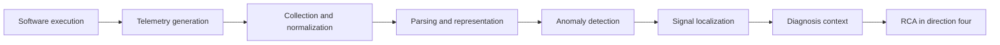
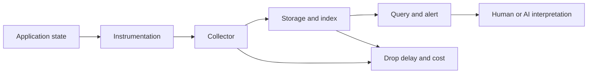
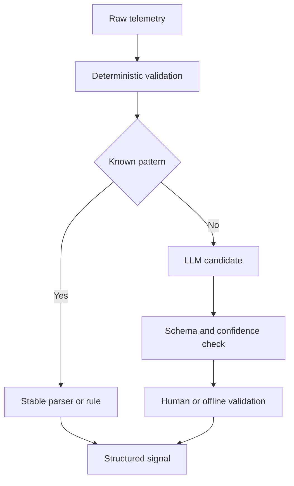
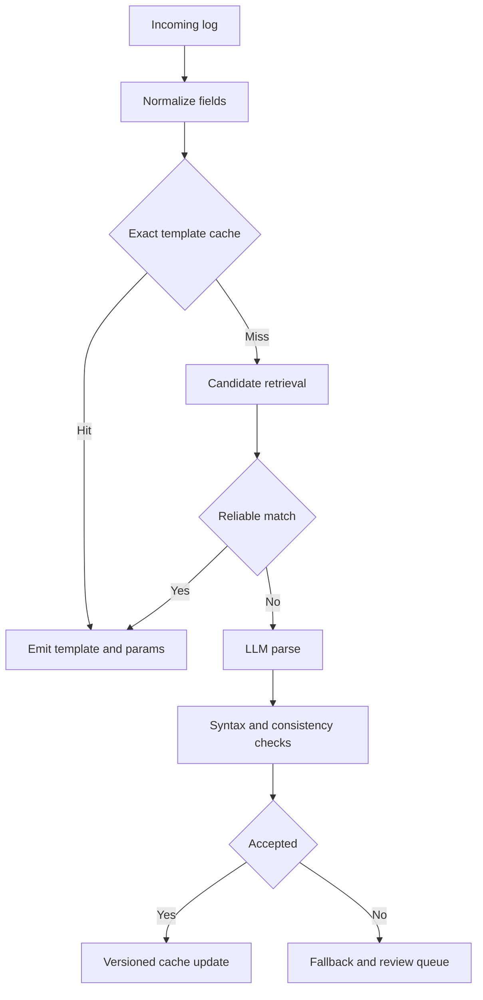
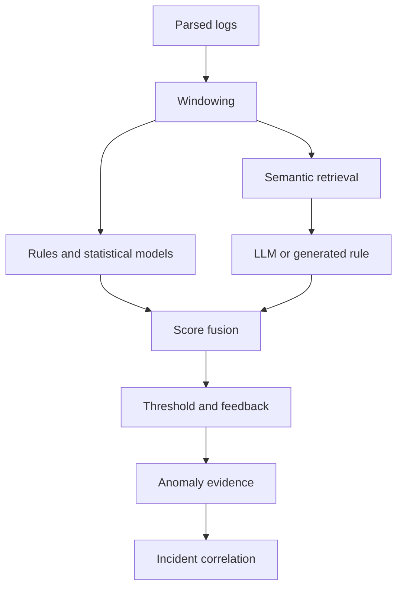
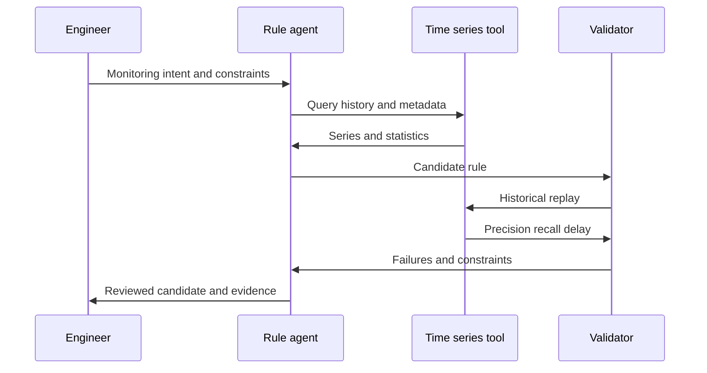
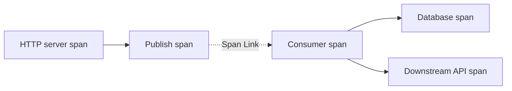
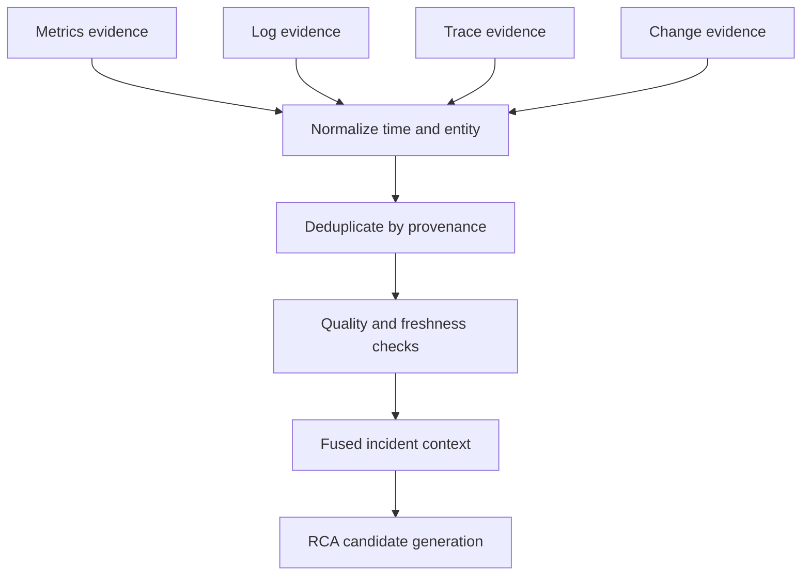

# 方向三：可观测性智能与信号理解

> 本方向从遥测如何产生开始，学习如何把日志、指标、时间序列、Trace、事件和告警转成结构化、可解释的异常证据，并明确它们与故障定位和 RCA 的边界。

## 📚 目录

### 阅读导航

- [方向定位](#方向定位)
- [学习目标](#学习目标)
- [落地之前的思考](#落地之前的思考)
- [第一阶段：理解信号产生与数据质量](#第一阶段理解信号产生与数据质量)
- [第二阶段：学习日志结构化](#第二阶段学习日志结构化)
- [第三阶段：学习日志异常检测](#第三阶段学习日志异常检测)
- [第四阶段：理解时间序列与告警](#第四阶段理解时间序列与告警)
- [第五阶段：构建多信号上下文](#第五阶段构建多信号上下文)
- [论文阅读路线](#论文阅读路线)
- [来源索引](#来源索引)

## 方向定位

### 这个方向研究什么

可观测性系统把运行中的软件状态转成可查询信号。

LLM 和传统机器学习可以帮助：

- 生成与插入日志语句。
- 把原始日志抽取为模板和参数。
- 判断日志序列是否异常。
- 解释时间序列异常。
- 生成或修订监控规则。
- 把多种信号组织为诊断上下文。

本方向关注“信号表达了什么”和“异常证据怎样形成”。

它不提前宣称真实根因。

### 四个容易混淆的层次

| 层次 | 核心问题 | 典型输出 | 示例 |
|---|---|---|---|
| 解析 | 这条原始记录的结构是什么 | 模板与参数 | `login failed user <*>` |
| 异常检测 | 观察是否偏离正常 | 异常分数或标签 | 失败率异常升高 |
| 故障定位 | 异常集中在哪里 | 服务、组件或资源 | payment-db 异常 |
| RCA | 为什么出现故障 | 经验证的根因与证据链 | 连接池配置错误 |

解析提供统一表示。

异常检测发现偏离。

定位缩小对象范围。

RCA 解释因果机制。

一篇论文即使输出自然语言“原因”，若没有跨信号验证、因果证据或干预验证，也不应自动归为完整 RCA。

### 信号处理主链



上图是本路线图的编辑性综合。

### 本方向的核心判断

模型上限受信号质量上限约束。

缺失关键日志、错误时间戳、不可连接的服务标识和失真的采样，无法通过更大的语言模型自动恢复为可靠事实。

因此应先问：

1. 信号是否被正确产生？
2. 信号是否能被稳定解析？
3. 异常定义是否符合业务语境？
4. 输出是否保留时间、对象和证据？
5. 系统是否在生产成本和延迟预算内？

## 学习目标

### 学完后应该能回答的问题

- Metrics、Logs、Traces、Events 与 Alerts 的语义有什么不同？
- 一条高质量日志语句应包含什么？
- 日志模板、常量 token 和变量 token 是什么？
- GA、PA、FGA 和 FTA 为什么可能得出不同结论？
- LLM 日志解析相对传统解析器增加了什么能力和成本？
- 示例选择、缓存、自纠正和开源模型分别解决什么问题？
- 日志异常检测与日志解析有什么输入输出差异？
- RAG、规则代码和 EVT 如何用于异常检测？
- 为什么时间序列不能简单转成文本后直接问 LLM？
- 如何把多信号组织成不包含未经证实根因的上下文？

### 学完后应该具备的实践能力

- 审查一个服务的遥测质量。
- 用四类指标评价日志解析器。
- 为在线解析设计缓存、回退和漂移处理。
- 为异常检测设计窗口、阈值和反馈流程。
- 区分异常证据、定位结论和 RCA 结论。
- 为 Metrics、Logs 与 Traces 设计关联键。

## 落地之前的思考

### 先问信号是否值得被解释

本章是工程性综合，讨论可观测性智能进入生产前的判断条件，不是论文实验结果的汇总。

可观测性项目很容易把“再加一个模型”当成缺口，但模型无法凭空修复不存在、不可关联或语义错误的信号。

开始前先挑一个具体观察问题：

- 哪个服务或资源的状态目前不可见。
- 哪类异常经常被发现得太晚。
- 工程师需要手工拼接哪些信号。
- 当前告警为什么噪声高或漏报多。
- 结果最终会用于解释、分诊、RCA 还是动作触发。

同一条日志或指标，在不同任务中的要求并不相同：

| 目标 | 必须保留的语义 | 常见误区 |
|---|---|---|
| 结构化 | 模板、变量、来源和时间 | 只保留自然语言摘要 |
| 异常检测 | 窗口、基线、单位和缺失状态 | 把缺失当成正常 |
| 定位 | 服务、实例、区域和版本 | 只输出一个异常分数 |
| 关联 | Trace、request、event 和变更键 | 只按相似文本拼接 |
| RCA 输入 | 时间因果和反证信息 | 提前写入根因结论 |
| 自动动作 | 目标对象和健康状态 | 让异常解释直接触发写操作 |

如果信号只适合展示，不能支撑下一步决策，就不应过早包装成“智能运维能力”。

### 先做遥测质量和成本基线

任何模型指标都应建立在遥测基线上。

至少盘点以下维度：

- 采集覆盖率。
- 时间戳准确性和时钟偏差。
- 服务、实例、区域、版本和租户标识。
- 日志模板稳定性。
- Metrics 的单位、标签和基线窗口。
- Trace 的采样率、传播完整性和异步关联。
- 告警规则与业务 SLI 的对应关系。
- 丢弃、限流、重采样和延迟到达比例。

可以先画出信号从产生到使用的路径：



每条边都应有 owner、SLO 和故障可见性。

推荐建立三类基线：

| 基线 | 需要记录的内容 | 用途 |
|---|---|---|
| 数据质量 | 缺失、延迟、重复、乱序和错误标签 | 防止把采集故障当业务异常 |
| 检测质量 | 误报、漏报、检测延迟和告警去重 | 比较规则与模型增量 |
| 运行成本 | 存储、查询、网络、模型调用和延迟 | 判断智能化是否经济 |

日志解析或异常检测的离线分数不能替代成本基线。

一个准确率更高的解析器，如果使日志 token、索引体积或查询延迟大幅增加，可能降低整体可靠性。

### 判断哪里需要模型，哪里应该保留确定性逻辑

可观测性流水线应拆成确定性层和推理层。

确定性逻辑更适合：

- 时间戳校验。
- 单位换算。
- 标签规范化。
- 字段 Schema 验证。
- 采样和限流。
- 已知模板匹配。
- 告警抑制和去重。

模型可能更适合：

- 新模板的候选归纳。
- 复杂日志的语义解释。
- 多信号之间的自然语言关联线索。
- 监控规则的草稿生成。
- 面向工程师的异常摘要。

模型输出仍应回到可验证结构：



不要让模型直接覆盖生产解析器或直接修改告警阈值。

新模板、规则或字段应先进入候选区，经过回放和人工确认后再发布。

### 检查信号能否支撑目标决策

“有日志”不等于“能诊断”。

落地前要把目标决策写成证据需求：

| 决策 | 最小证据 | 缺失时的行为 |
|---|---|---|
| 判断是否异常 | 当前值、窗口、历史基线 | 标记未知，不输出正常 |
| 判断影响范围 | 服务、实例、区域、租户 | 降低定位粒度 |
| 判断是否变更相关 | 版本、发布、配置和时间 | 仅列为候选 |
| 关联请求链路 | Trace 或请求关联键 | 不强行拼接链路 |
| 判断业务恢复 | 业务 SLI 和用户结果 | 不因技术指标恢复而关闭 |

每个异常输出至少保存：

- 观测时间和事件时间。
- 信号来源和查询范围。
- 原始值或可复现查询。
- 处理版本和特征版本。
- 缺失、延迟和权限状态。
- 异常分数以及阈值来源。

如果输出只有一句“检测到异常”，下游 RCA 无法判断它是业务事件、采集故障、版本漂移还是模型误报。

### 选择最小可验证信号闭环

第一个试点不应同时覆盖 Logs、Metrics、Traces、Events 和所有告警。

可以选择一个服务族和一种高频问题，按以下顺序推进：

1. 先验证采集覆盖和时间语义。
2. 再建立已知模板或异常的回放集。
3. 对照规则、统计方法和模型候选。
4. 让模型只生成结构化候选或解释草稿。
5. 由工程师确认后才进入 Incident Context。
6. 观察长期漂移、成本和查询延迟。

影子模式的闭环可以这样记录：

```text
生产信号 → 并行解析或检测 → 不影响现有告警 → 人工抽样 → 反馈回放集
```

成功条件应包含：

- 关键异常类型的检测延迟下降。
- 漏报和误报没有超过风险阈值。
- 输出保留对象、时间和 provenance。
- 解析或检测退化能自动告警。
- 模型调用成本在预算内。
- 旧规则和人工流程仍可接管。

退出条件应包含：

- 信号质量问题无法在模型层之外解决。
- 模型增益只出现在不代表生产的样本上。
- 新方案增加告警噪声或查询成本。
- 版本、标签或时间漂移无法被发现。
- 工程师无法复现模型使用的输入。
- 下游把异常候选误当成根因事实。

还要把“监控系统自身健康”列为试点的一等对象：

- Collector 是否丢数据或积压。
- 规则、解析器和模型版本是否发生变化。
- 查询是否超时或被限流。
- 标签基数和存储成本是否异常增长。
- 反馈样本是否覆盖新版本和新服务。

可观测性智能不能在自己的观测链路失效时继续输出确定结论。

可观测性智能的第一项交付不是一张漂亮的异常图，而是一组可复现、可回退、能说明缺失信息的结构化证据。

## 第一阶段：理解信号产生与数据质量

### 五类常见可观测性信号

#### Metrics

指标是按时间采样或聚合的数值。

它擅长表达趋势、比例、容量和服务级目标。

典型例子：

- 请求速率。
- 错误率。
- 延迟分位数。
- CPU 和内存使用率。
- 队列长度。

指标压缩能力强，但通常丢失单次请求细节。

#### Logs

日志是离散事件记录。

它可以保存错误码、资源标识、状态变化和局部上下文。

日志表达力强，但格式多样、数量巨大，并可能包含敏感数据。

#### Traces

Trace 描述一次请求跨组件传播的 span 集合。

它擅长显示调用路径、耗时分解和错误传播位置。

采样会让部分请求不可见。

缺失或错误的上下文传播会切断路径。

#### Events

事件是部署、扩缩容、配置修改、故障转移等离散状态变化。

它们经常是诊断的重要时间锚点。

时间接近仍不代表因果成立。

#### Alerts

告警是规则或检测器对信号作出的判断。

告警不是原始指标本身。

它包含阈值、窗口、抑制和路由策略造成的二次语义。

### 信号之间如何互补

| 信号 | 最擅长回答 | 主要盲区 |
|---|---|---|
| Metrics | 是否整体偏离 | 单次请求细节 |
| Logs | 局部发生了什么 | 全局趋势与完整路径 |
| Traces | 请求经过哪里 | 未采样请求和后台任务 |
| Events | 系统发生了什么变化 | 变化是否造成故障 |
| Alerts | 哪个规则需要关注 | 原始异常细节与真实根因 |

单信号通常不足以支撑 RCA。

本方向的目标是把每类信号加工成可连接的证据。

### 好日志从代码阶段开始

日志智能不能只在采集后补救。

日志语句设计至少包含四个决策：

1. 在哪里记录。
2. 使用什么级别。
3. 记录哪些变量。
4. 文本怎样表达事件语义。

日志位置决定能否观察关键分支。

日志级别决定噪声与告警价值。

变量决定能否关联请求和资源。

文本决定人和解析器能否理解事件。

### 自动日志生成研究解决什么

Automated Logging Generation 实证研究考察 LLM 生成日志语句的有效性。

FastLog 关注端到端地生成并插入日志语句。

Go Static 关注利用静态上下文生成更贴合代码语境的日志语句。

它们共同覆盖：

- 日志位置建议。
- 日志级别选择。
- 文本生成。
- 变量选择。
- 代码插入。

不能只用代码能否编译评价生成结果。

还要检查信息价值、敏感信息、性能开销和团队规范。

### 一条日志语句的审查清单

```go
logger.Error("payment authorization failed",
    "order_id", orderID,
    "provider", provider,
    "error_code", code,
)
```

审查问题：

- 事件语义是否明确？
- 是否有稳定、可关联的标识？
- 是否记录了必要但非敏感变量？
- 是否避免重复打印完整请求？
- 级别是否符合团队约定？
- 高频路径上的成本是否可接受？
- 是否能与指标或 Trace 连接？

### 日志的结构化优于拼接文本

结构化日志把字段与文本分开。

```json
{
  "timestamp": "2026-08-03T10:02:11.123+08:00",
  "level": "ERROR",
  "service": "payment-api",
  "trace_id": "4f8a...",
  "event": "payment_authorization_failed",
  "order_id": "redacted",
  "provider": "gateway-a",
  "error_code": "P203"
}
```

稳定字段支持过滤与连接。

敏感值应在源头脱敏，而不是寄希望于生成模型忽略。

### 数据质量问题

#### 缺失

关键路径没有埋点，或采集器丢弃数据。

结果是异常发生但没有可用证据。

#### 重复

重试、重放或采集配置导致同一事件被多次记录。

结果是频次异常被夸大。

#### 时间错误

时钟漂移、时区不一致或事件时间与接收时间混用。

结果是传播顺序和窗口聚合错误。

#### 命名漂移

服务、实例和区域名称随版本改变。

结果是跨源连接失败。

#### 模板漂移

代码变更使日志常量和参数位置变化。

结果是旧缓存和旧解析器失效。

#### 采样偏差

Trace 或日志采样只保留部分请求。

结果是异常分布不代表全部流量。

#### 敏感信息

日志包含凭据、个人数据或业务秘密。

结果是索引、Prompt 和模型调用扩大泄漏面。

### 遥测质量基线

每个服务可以维护：

| 维度 | 示例指标 |
|---|---|
| 完整性 | 带 trace_id 的错误日志比例 |
| 一致性 | 可映射到服务目录的日志比例 |
| 时效性 | 采集延迟 P95 |
| 稳定性 | 每版本新增或变化模板数 |
| 可解析性 | 成功解析消息比例 |
| 安全性 | 敏感字段扫描命中数 |
| 成本 | 每请求遥测字节数 |

质量基线发生变化时，应先调查采集或版本变化，再解释业务异常。

### 本阶段小结

- 不同信号回答不同问题。
- 告警是检测规则的输出，不是原始事实。
- 高质量日志需要在代码阶段设计。
- 自动日志生成必须评价语义、安全和成本。
- 数据质量直接限制后续解析、检测和诊断。

## 第二阶段：学习日志结构化

### 什么是日志解析

日志解析把原始日志消息拆成常量模板和动态参数。

原始消息：

```text
Failed password for alice from 10.0.0.8 port 55231
```

模板：

```text
Failed password for <*> from <*> port <*>
```

参数：

```json
["alice", "10.0.0.8", "55231"]
```

常量 token 描述事件类型。

变量 token 描述具体实体或数值。

### 解析结果的下游用途

- 统计模板频率。
- 构造事件序列。
- 压缩日志存储。
- 发现新模板。
- 为异常检测提供离散输入。
- 按参数值调查资源或用户。

错误解析会向下游传播。

把错误码误当参数会合并不同事件。

把请求 ID 误当常量会制造大量模板。

### 传统解析器与 LLM 解析器

传统解析器常使用：

- 频率。
- 相似度。
- 启发式规则。
- 前缀树或聚类。

它们速度快、成本低、可在本地运行。

LLM 解析器增加语义判断能力。

它能理解某些 token 在上下文中是实体还是常量，也能遵循自然语言规则。

代价包括：

- 调用成本。
- 生成延迟。
- 输出不稳定。
- 数据外发风险。
- Prompt 与模型版本漂移。

生产系统常采用分层管线，而不是所有日志逐条调用大模型。

### 四个核心评价指标

大规模评估论文指出，小规模 Loghub-2k 和单一消息级指标可能掩盖长尾模板错误。

Loghub-2.0 平均每个数据集约 360 万条标注消息和 249 个模板，显示了更明显的不平衡与复杂参数结构。

#### Group Accuracy

GA 衡量消息是否被正确分组。

只有解析器输出的模板消息集合与真值集合完全一致，该消息才算正确分组。

GA 关注“哪些消息在一起”。

#### Parsing Accuracy

PA 衡量每条消息的常量与参数 token 是否全部正确。

PA 关注“模板内容是否正确”。

对依赖参数的异常检测而言，PA 尤其重要。

#### FGA

FGA 是模板级分组指标。

令 $N_p$ 为解析器输出模板数，$N_c$ 为正确分组模板数，$N_g$ 为真值模板数：

$$
PGA=\frac{N_c}{N_p},\qquad RGA=\frac{N_c}{N_g}
$$

$$
FGA=\frac{2\times PGA\times RGA}{PGA+RGA}
$$

它平等对待高频和低频模板。

#### FTA

FTA 是模板内容准确性的模板级指标。

令 $\hat{N}_c$ 为 token 与真值完全相同的正确模板数：

$$
PTA=\frac{\hat{N}_c}{N_p},\qquad RTA=\frac{\hat{N}_c}{N_g}
$$

$$
FTA=\frac{2\times PTA\times RTA}{PTA+RTA}
$$

FTA 比较严格地检查常量和参数是否正确。

### 为什么消息级高分可能误导

假设 95% 的消息来自 1% 的高频模板。

解析器只处理好这 1% 模板，GA 或 PA 仍可能接近 0.95。

其余低频模板可能包含真正重要的错误和故障事件。

因此至少同时报告：

- GA。
- PA。
- FGA。
- FTA。
- 吞吐或总时间。
- 长尾模板分层结果。
- 参数密集模板结果。

### LLMParser 建立了探索性基线

LLMParser 研究不同开源 LLM、提示与训练规模在日志解析上的能力。

它代表“让语言模型直接学习模板抽取”的基础路线。

阅读这类工作时应检查：

1. 模型是否微调。
2. 训练数据是否与测试系统重叠。
3. Prompt 是否包含演示。
4. 输出格式如何约束。
5. 是否按消息调用模型。
6. 是否与传统解析器在同一数据和预处理下比较。

### In-Context Learning 的基本思想

不更新模型参数，而是在 Prompt 中提供日志与模板示例。

新日志根据示例学习常量和变量的划分。

示例质量比数量更重要。

不相似或标注错误的示例可能让模型错误复制模板边界。

### DivLog：多样化示例选择

DivLog 使用提示增强的 ICL 做日志解析。

其核心直觉是从候选示例中选择与当前日志相关且彼此多样的演示。

过度相似的示例浪费上下文预算。

过度不同的示例又不能提供有效模板线索。

因此示例选择是精度、覆盖和 token 成本之间的优化问题。

### LEMUR：熵采样与思维链合并

LEMUR 关注不确定或信息量高的日志采样，并合并推理结果。

熵采样的教学含义是：优先把昂贵标注或 LLM 预算花在模型最不确定的区域。

思维链可能帮助模型显式比较 token。

但生产输出不应依赖不可验证的自然语言推理。

最终模板必须通过格式和匹配检查。

### AdaParser：自生成示例与自纠正

AdaParser 减少对人工演示的依赖。

它让系统生成 ICL 示例，并通过自纠正改进解析结果。

这种路线解决冷启动成本，但引入新风险：

- 初始错误成为后续示例。
- 自我评价不等于真值验证。
- 错误模板可能在缓存中扩散。

因此自生成结果需要一致性检查、正则匹配或人工抽样。

### MicLog：渐进式元上下文学习

MicLog 结合加权 DBSCAN 采样、渐进式元上下文训练和多级缓存。

它体现了一条重要演进：

不是让更大模型逐条解析，而是学习怎样选择代表数据、构建可迁移上下文，并用缓存减少重复调用。

### HELP：分层嵌入与再平衡

HELP 通过分层嵌入组织日志，再让上下文感知模块解析，并用迭代再平衡调整分组。

分层思路可先按粗粒度特征缩小候选范围，再用语义模型处理难例。

这同时改善上下文相关性和并行能力。

### LILAC：自适应解析缓存

日志高度重复。

若一条新消息能与已知模板可靠匹配，就没有必要再次调用 LLM。

LILAC 的自适应缓存路线强调：

- 优先匹配已知模板。
- 对缓存未命中或不确定项调用 LLM。
- 新模板验证后进入缓存。
- 模板漂移时更新或淘汰。

缓存降低成本和延迟，但必须避免过宽匹配。

### LUNAR 与 LibreLog：无监督和开源部署

LUNAR 通过层次化日志分片、日志对比单元选择和无标注 LLM 解析减少人工标签依赖。

LibreLog 关注使用开源大模型实现准确、高效的无监督解析。

开源本地部署的价值包括：

- 日志不离开受控环境。
- 模型版本可固定。
- 成本更可预测。
- 可针对领域做优化。

它仍需要评测、资源容量和升级治理。

“开源”不自动表示“低成本”或“安全”。

### 免示例路线

Stronger, Cheaper and Demonstration-Free 关注不依赖演示的解析。

免示例可以减少：

- 人工标注。
- Prompt token。
- 示例泄漏。
- 跨系统迁移负担。

但系统仍要提供任务定义、输出约束和参数判定规则。

### 在线可解释解析

在线日志流持续产生新消息。

系统不能等待全量离线聚类后才输出模板。

在线解析需要：

- 有界处理延迟。
- 增量模板更新。
- 新模板检测。
- 漂移处理。
- 可解释的常量与参数划分。
- 失败回退。

Interpretable Online Log Analysis 使用 LLM 与提示策略探索在线、可解释日志分析。

在线解释应说明模板依据，而不是生成长篇自然语言猜测。

### 一个生产解析管线



### 缓存的正确性检查

缓存模板匹配新消息时应检查：

- 常量 token 是否全部匹配。
- 参数位置是否允许该类型值。
- 模板是否属于当前服务和版本。
- 模板是否已废弃。
- 匹配是否存在歧义。
- 是否出现参数吞噬过多文本。

### 模板漂移处理

版本升级可能改变：

- 固定文本。
- 参数顺序。
- 新增字段。
- 日志级别。
- 事件名称。

建议保存 `service + version + template_id`。

新版本先进入影子解析，对比旧模板命中、未知模板率和 FTA 抽样结果。

不要无条件把新模板合并进全局缓存。

### 解析器的生产评价

| 维度 | 指标 |
|---|---|
| 正确性 | GA、PA、FGA、FTA |
| 长尾 | 低频模板 FGA、FTA |
| 复杂度 | 参数密集模板 PA、FTA |
| 效率 | 行每秒、P95 延迟、LLM 调用率 |
| 成本 | 每百万行 token 和算力成本 |
| 稳定性 | 新模板率、缓存误命中率 |
| 安全 | 外发日志比例、脱敏失败数 |

### 本阶段小结

- 日志解析把消息拆为模板和参数。
- GA 与 PA 是消息级，FGA 与 FTA 是模板级。
- 长尾模板要求同时报告模板级指标。
- LLM 方法从直接解析演进到示例选择、自纠正、嵌入、缓存和开源部署。
- 生产系统应把 LLM 放在难例路径，而不是默认逐行调用。

## 第三阶段：学习日志异常检测

### 异常检测的输入和输出

日志异常检测判断单条日志或一段日志序列是否偏离正常模式。

输入可以是：

- 原始日志文本。
- 模板 ID。
- 模板参数。
- 固定时间窗口内的模板计数。
- 会话或请求级日志序列。
- 语义嵌入。

输出可以是：

- 二元标签。
- 异常分数。
- 异常类型。
- 触发规则。
- 自然语言解释。

输出不是根因。

### 三种异常

#### 点异常

单条记录本身异常。

例如从未见过的致命错误。

#### 上下文异常

记录只在特定时间、服务或状态下异常。

例如维护窗口内重启正常，业务高峰重启异常。

#### 序列异常

单条记录都常见，但顺序或频率异常。

例如认证失败后没有预期的回退事件。

### 从模板序列到语义判断

传统方法常把模板 ID 序列送入分类器或序列模型。

优点是输入紧凑、训练高效。

缺点是新模板、模板漂移和语义变化会破坏表示。

LLM 可以直接理解日志文本和领域描述，并生成解释。

但它可能忽略频率、周期和长序列统计。

### LogGPT 的提示式路线

LogGPT 探索用 ChatGPT 做日志异常检测。

其流程包括日志预处理、提示构造、响应解析和异常解释。

研究还考察提示、窗口大小和人工知识注入。

这说明 LLM 异常检测不是单次零样本问答。

窗口和知识会改变模型看到的上下文与判定边界。

### 窗口设计

窗口可按：

- 固定时间。
- 固定消息数。
- 会话 ID。
- 请求或 Trace ID。
- 业务事务。

窗口太小会切断完整序列。

窗口太大会混入并发请求和无关噪声。

窗口设计应与异常定义一致。

### RAGLog：用历史案例提供语境

RAGLog 检索与当前日志相关的历史正常或异常案例，再让模型判定。

它适合处理领域私有模式和少样本场景。

风险包括：

- 召回的案例来自其他版本。
- 相似文本对应不同运行状态。
- 标签错误进入示例。
- 过度依赖单个邻居。
- 测试样本或近重复样本泄漏。

检索结果必须带服务、版本、时间和标签来源。

### CodeAD：把语义知识编译为规则代码

CodeAD 使用 LLM 合成日志异常检测规则代码。

相比每个窗口都调用模型，规则代码可以：

- 本地执行。
- 低延迟处理。
- 明确审查条件。
- 版本化和回归测试。
- 统计具体规则命中。

它把 LLM 从在线分类器变成规则生成器。

生成代码仍需沙箱、测试和限制资源。

### 一条规则的教学示例

```python
def detect(events):
    auth_failures = [e for e in events if e.template_id == "AUTH_FAIL"]
    success = any(e.template_id == "AUTH_SUCCESS" for e in events)
    return len(auth_failures) >= 5 and not success
```

上线前应测试：

- 空窗口。
- 边界数量。
- 乱序事件。
- 重复事件。
- 模板缺失。
- 新版本字段。
- 大窗口性能。

### 不稳定日志

日志会随软件演进发生变化。

LLM Meets ML 研究在不稳定日志上的数据高效异常检测，并结合缓存增强推理、上下文增强提示和集成学习。

该路线说明 LLM 与小模型不是二选一。

可以让 LLM 处理新语义和少样本，让轻量模型或缓存处理稳定重复模式。

### 集成学习的价值

多个基模型可以提供不同偏差：

- 规则擅长已知边界。
- 统计模型擅长频次变化。
- 序列模型擅长顺序。
- LLM 擅长文本语义和解释。

集成不应只用多数投票。

还应根据服务、日志稳定性、模型置信度和验证历史动态选择。

### EVT 的阈值视角

极值理论关注分布尾部。

异常检测可以先得到连续异常分数，再对高分尾部拟合极值分布，推导阈值。

常见学习流程：

1. 计算正常样本异常分数。
2. 选取初始高阈值 $u$。
3. 对超过 $u$ 的超额值建模。
4. 按目标风险水平估计最终阈值。
5. 用人工反馈修正误报和漏报。

### 广义 Pareto 分布

超额值 $y=x-u$ 常用广义 Pareto 分布近似：

$$
G_{\xi,\beta}(y)=1-\left(1+\frac{\xi y}{\beta}\right)^{-1/\xi}
$$

其中：

- $u$ 是初始高阈值。
- $y$ 是超过阈值的超额值。
- $\xi$ 是形状参数。
- $\beta$ 是尺度参数。

该公式用于理解 EVT 尾部阈值思想。

具体论文实现、符号和反馈更新应以译文原公式为准。

### 反馈怎样调整检测器

反馈可以表示：

- 某次告警是误报。
- 某段未告警日志实际异常。
- 某服务进入特殊维护状态。
- 某个新版本改变正常基线。

反馈不应直接无界修改阈值。

应记录反馈者、事件、版本和生效范围，并在回放集上验证。

### 异常检测指标

$$
Precision=\frac{TP}{TP+FP}
$$

$$
Recall=\frac{TP}{TP+FN}
$$

$$
F1=\frac{2\times Precision\times Recall}{Precision+Recall}
$$

Precision 高表示告警中真异常比例高。

Recall 高表示真实异常被发现得多。

运维系统还需关注：

- 每小时误报数。
- 检测延迟。
- 事件级 Recall。
- 连续告警是否合并。
- 不同服务和故障类型的分层结果。

### 点级与事件级评价

一次持续十分钟的异常可能产生六百个异常点。

把每个点都算 TP 会夸大检测价值。

生产评价应定义：

- 一个事件的时间容忍窗口。
- 多个连续点如何合并。
- 提前或延迟检测如何计分。
- 一次事件多次告警是否算重复。

### 解释的证据要求

一个可用解释应说明：

- 哪些日志或模板异常。
- 与正常模式差异在哪里。
- 发生在哪个窗口和对象。
- 使用了什么规则或历史案例。
- 结论置信度和限制。

不应把“异常模板包含 connection failed”扩写为“数据库连接池配置错误”。

后者属于需要验证的根因假设。

### 异常检测生产管线



### 本阶段小结

- 异常检测处理点、上下文和序列偏离。
- LogGPT 展示 Prompt、窗口和知识注入路线。
- RAGLog 用历史案例增强语境，但受召回和标签质量限制。
- CodeAD 把 LLM 能力转成可审查、低延迟的规则代码。
- EVT 对异常分数尾部建模，反馈需要版本化验证。
- 检测解释不能越界声称根因。

## 第四阶段：理解时间序列与告警

### 时间序列包含什么结构

时间序列不仅是一串数值。

它可能包含：

- 趋势。
- 周期性。
- 季节性。
- 突变。
- 方差变化。
- 缺失和不规则采样。
- 多变量相关。
- 业务日历效应。

把数值直接拼成文本会丢失采样间隔、尺度和统计结构。

### 四类不同任务

| 任务 | 输入 | 输出 |
|---|---|---|
| 预测 | 历史窗口 | 未来数值或区间 |
| 检测 | 历史与当前窗口 | 异常分数或标签 |
| 规则生成 | 指标语义和历史 | 查询或阈值规则 |
| 解释 | 异常片段和上下文 | 模式描述与证据 |

论文报告“时间序列能力”时，要先确认属于哪一类。

### LLM 时间序列异常检测

Large Language Models Can Deliver Accurate and Interpretable Time Series Anomaly Detection 研究 LLM 在时间序列检测和解释上的能力。

它的重要启发是把统计信号、任务提示与自然语言解释结合。

但解释应与检测证据绑定。

模型看到一个尖峰，不应凭公共常识编造业务原因。

### 时间序列转写

常见表示方式包括：

- 原始数值序列。
- 归一化或量化 token。
- 趋势与分段统计摘要。
- 图像表示。
- 由工具计算的变化点和周期特征。

没有一种表示对所有指标都最好。

计数器、比率、延迟直方图和容量水位有不同语义。

### 先用工具提取统计特征

LLM 更适合消费经过工具计算的明确特征：

```yaml
metric: http_error_ratio
window: 10m
sampling_interval: 15s
baseline:
  median: 0.002
  mad: 0.0007
observation:
  max: 0.081
  change_point: 2026-08-03T10:01:45+08:00
seasonality_adjusted_zscore: 11.3
missing_points: 0
```

这比让模型自行从长数字串估算趋势更可验证。

### MonitorAssistant：从自然语言到监控配置

MonitorAssistant 研究用 LLM 简化云服务监控。

这类系统可帮助工程师表达监控意图、生成查询或规则，并解释配置。

关键风险是自然语言需求存在歧义。

“延迟过高”必须落实为：

- 哪个指标。
- 哪个分位数。
- 什么过滤范围。
- 多长窗口。
- 什么阈值。
- 持续多久。
- 如何处理无数据。

### 从意图到规则的示例

自然语言：

```text
生产 checkout 服务 P95 延迟连续十分钟超过 800ms 时告警。
```

候选 PromQL：

```promql
histogram_quantile(
  0.95,
  sum by (le) (
    rate(http_request_duration_seconds_bucket{
      env="prod",
      service="checkout"
    }[5m])
  )
) > 0.8
```

规则还需设置 `for: 10m`。

上线前必须用历史数据回放，并由工程师确认标签、单位和缺失数据语义。

### Argos：自主生成规则的 Agent 路线

Argos 关注通过 LLM 自主生成时间序列异常检测规则。

Agent 可以迭代：

1. 理解指标语义。
2. 分析历史数据。
3. 提出候选规则。
4. 执行回放。
5. 读取误报与漏报。
6. 修订规则。
7. 输出解释。

“自主”描述的是规则生成工作流。

生产发布仍需要权限、验证和审批。

### 规则生成闭环



### 告警不是异常本身

从指标到 Incident 至少经过：

```text
Metric sample
  -> detector or rule state
  -> alert instance
  -> routed notification
  -> grouped incident candidate
```

每层都可能改变语义。

例如抑制规则会隐藏某些告警，路由聚合会合并重复通知，Incident 平台又可能按服务归组。

分析时应保留原始查询和规则版本。

### 告警降噪与分组

告警降噪包括：

- 去重。
- 抑制。
- 静默。
- 依赖感知屏蔽。
- 时间聚合。
- 事件关联。

告警聚合与异常检测有交叉，但目标不同。

异常检测判断信号是否偏离。

告警聚合判断多个告警是否属于同一事件。

Knowledge-aware Alert Aggregation 在方向二详细讨论。

### 多变量时间序列

多个指标可能共同表达状态。

例如：

- 请求率下降。
- 错误率上升。
- 数据库连接数达到上限。
- CPU 仍然正常。

多变量检测需要处理不同尺度、采样频率和延迟。

相关性可以帮助发现共同变化，但不证明因果方向。

### 基线漂移

正常行为会因以下因素变化：

- 流量增长。
- 业务活动。
- 节假日。
- 新版本。
- 扩缩容。
- 区域迁移。

固定阈值可能逐渐产生误报。

自适应基线又可能把缓慢恶化吸收为正常。

因此需要回放、变更标注和人工反馈。

### 时间序列评价

除 Precision、Recall、F1 外，还应记录：

- 检测延迟。
- 每日误报数。
- 事件覆盖率。
- 告警持续时间。
- 首次触发稳定性。
- 规则变更后的回归结果。
- 不同季节与流量区间的分层效果。

### 本阶段小结

- 时间序列具有趋势、周期和多变量结构。
- 预测、检测、规则生成与解释是不同任务。
- LLM 应消费可验证统计特征，而不是凭文本化数字猜测。
- MonitorAssistant 和 Argos 展示自然语言监控与规则生成路线。
- 告警是规则输出，不能与原始异常或 Incident 混为一谈。

## 第五阶段：构建多信号上下文

### 多信号关联的目标

目标不是把所有数据拼成一个巨大 Prompt。

目标是让每条异常证据能回答：

- 何时发生。
- 发生在哪个对象。
- 来自哪种信号。
- 与哪些请求、服务和变化相关。
- 是原始观测、规则输出还是模型解释。

### 常见关联键

| 关联键 | 连接对象 | 局限 |
|---|---|---|
| 时间窗口 | 所有信号 | 同时不等于相关 |
| service_id | 服务级指标、日志、Trace | 命名需稳定 |
| resource_id | Pod、主机、数据库 | 资源生命周期短 |
| trace_id | 请求日志与 spans | 采样和传播可能缺失 |
| deployment_id | 变更与遥测 | 需要发布平台接入 |
| topology edge | 上下游信号 | 拓扑可能过期 |

至少使用时间加一个对象键。

只凭时间接近会把并发事件错误合并。

### 统一时间语义

每条数据建议保留：

- 原始事件时间。
- 接收时间。
- 标准化时区时间。
- 数据源时钟信息。
- 采样或聚合窗口。

指标点代表一个采样或聚合区间。

日志通常代表某个离散时刻。

Trace span 代表开始到结束区间。

三者不能只按字符串时间直接等价连接。

### 统一对象语义

同一服务可能在不同系统中叫：

- `checkout`。
- `checkout-api`。
- `svc-017`。
- Kubernetes label 中的 `app=checkout-v2`。

应通过服务目录映射到稳定 `service_id`。

映射本身要版本化，因为团队与架构会变化。

### 从异常到上下文的示例

```yaml
signal_context:
  window:
    start: 2026-08-03T10:00:00+08:00
    end: 2026-08-03T10:10:00+08:00
  subject:
    service_id: svc-checkout
    environment: production
    region: ap-southeast-1
  metrics:
    - name: http_error_ratio
      anomaly_score: 0.98
      evidence: query://metrics/abc
  logs:
    - template_id: DB_POOL_EXHAUSTED
      count: 92
      evidence: query://logs/def
  traces:
    - span_service: payment-db
      error_rate: 0.71
      evidence: query://traces/ghi
  changes:
    - deployment_id: deploy-2191
      time_relation: 2m_before_anomaly
  interpretation:
    status: symptom_candidate
    root_cause_confirmed: false
```

### 从信号解释到定位

若异常只出现在一个服务，可输出“异常集中于该服务”。

这是一种信号定位。

若 Trace 显示多个上游请求都在同一数据库 span 失败，可输出“失败共同点为数据库调用”。

这仍是候选故障位置。

要确认根因，还需检查数据库状态、配置、变化和干预结果。

### 不越界的输出语言

推荐：

```text
10:02 至 10:10，checkout-api 的错误率异常升高。
同一窗口内 DB_POOL_EXHAUSTED 模板出现 92 次。
失败 Trace 的共同 span 为 payment-db。
10:00 有一次应用发布。
这些证据支持优先检查应用到数据库的连接路径；尚不能确认发布是根因。
```

不推荐：

```text
10:00 的发布导致数据库连接池耗尽，是本次故障根因。
```

除非已有配置差异、复现、回滚或其他因果验证。

### 分层处理成本

生产信号量巨大。

可采用：

1. 规则和统计模型处理全量流。
2. 缓存处理已知日志模板。
3. 小模型处理稳定分类任务。
4. LLM 处理新模板、难例和解释。
5. 人工处理高影响和低置信度情况。

该层次将昂贵能力集中在信息增益高的样本。

### 离线与在线的选择

| 模式 | 适合任务 | 主要要求 |
|---|---|---|
| 离线批处理 | 模板盘点、规则回放、模型训练 | 完整性和可重复 |
| 准实时 | 告警聚合、异常解释 | 分钟级延迟 |
| 在线流式 | 日志解析、快速检测 | 有界延迟和回退 |
| 交互式 | 工程师查询与调查 | 权限、引用和可取消 |

不是所有信号理解都需要毫秒级 LLM 响应。

### 模型和数据版本

每个输出应能追踪：

- 原始数据时间范围。
- 预处理版本。
- 模板缓存版本。
- 检测器版本。
- 阈值或规则版本。
- LLM 与 Prompt 版本。
- 知识库快照。

否则异常结果变化时无法判断是系统变化还是分析管线变化。

### 隐私与最小化

在送入模型前：

- 删除凭据。
- 脱敏个人标识。
- 截断无关 payload。
- 按租户隔离。
- 应用访问控制。
- 记录数据外发边界。

只发送完成任务所需的最小证据。

### 生产上线检查表

- [ ] 日志模板和检测规则有版本。
- [ ] 指标单位与标签语义明确。
- [ ] Trace 采样率已知。
- [ ] 时间和服务标识可统一。
- [ ] 长尾模板有单独评测。
- [ ] 模板漂移有监控和回退。
- [ ] 异常检测按事件级评价。
- [ ] 解释引用具体信号证据。
- [ ] 输出明确“不等于根因”。
- [ ] LLM 调用有成本与延迟预算。
- [ ] 敏感数据在源头脱敏。
- [ ] 高影响异常有人工升级路径。

### 本阶段小结

- 多信号关联至少需要时间和稳定对象键。
- 指标、日志和 Trace 有不同时间语义。
- 异常共同点可以支持定位，但不能自动确认根因。
- 分层管线能平衡吞吐、成本和语义能力。
- 版本、隐私和回退是生产可观测性智能的一部分。

## 工程补充：Metrics、Traces 与信号健康

### 资料边界先行

本方向 24 篇主方向译文主要覆盖日志解析、日志异常检测、日志生成，以及少量时间序列异常与监控规则生成。下面关于 Metrics、Traces、采样、SLI/SLO 和监控控制面的内容是为了补齐生产可观测性链路的工程性综合，不是这些论文共同报告的实验结论。

### Counter、Gauge 与 Histogram 不能混用

| 类型 | 语义 | 正确问题 | 常见错误 |
|---|---|---|---|
| Counter | 只增或重置的累计量 | 一段时间发生多少次 | 直接比较两个实例的累计值 |
| Gauge | 可升可降的当前值 | 当前队列或温度是多少 | 对瞬时值盲目求 rate |
| Histogram | 按桶累计的分布 | 延迟分布与分位数怎样 | 先算实例分位数再平均 |

Counter 通常先对每条时间序列求 `rate`，再按所需维度聚合：

```promql
sum by (service) (
  rate(http_requests_total{status=~"5.."}[5m])
)
/
sum by (service) (
  rate(http_requests_total[5m])
)
```

应先求每条 Counter 的 `rate` 再 `sum`，以正确处理各实例独立重置。若先聚合原始 Counter，实例重启可能被其他实例增长掩盖。

### Histogram、分位数与聚合顺序

经典 Histogram 保存累计桶、总和与计数。跨实例计算 P99 时，应先按 `le` 和目标维度聚合桶的速率，再求分位数：

```promql
histogram_quantile(
  0.99,
  sum by (le, service) (
    rate(http_request_duration_seconds_bucket[5m])
  )
)
```

实例 P99 的平均值不等于全局 P99。分位数也不能告诉你尾部中每个请求的具体值；桶边界过粗会限制精度。

### 标签基数和缺失数据是语义问题

把 `user_id`、`request_id` 或完整 URL 放入指标标签，会制造高基数并推高采集、存储和查询成本。高基数字段更适合进入日志或 Trace，通过 exemplar 或稳定关联键连接。

“没有样本”至少有四种含义：没有流量、目标未发现、采集失败、查询标签不匹配。检测器不能把它们统一补成 0。建议同时携带：

- `sample_present` 或目标存活信号。
- scrape 成功率和最后成功时间。
- 数据新鲜度与预期采样间隔。
- 缺失原因与补值策略。

### Recording Rule 与 SLI/SLO

Recording Rule 用预计算降低重复查询成本并固定团队语义，但规则错误会把同一偏差传播给告警、Dashboard 和 Agent。每条规则应有 owner、版本、单元测试和回放样本。

以请求成功率为 SLI，窗口内错误预算消耗可抽象为：

$$
\text{BurnRate}=\frac{\text{observed error ratio}}{1-\text{SLO target}}
$$

Agent 解释告警时应引用 SLI 的定义、窗口和 SLO 目标，不能只看到指标名就推断业务影响。多窗口燃尽率比单一瞬时阈值更能区分短促尖峰与持续风险。

### Span、Span Link 与异步边界

Trace 由多个 Span 组成。父子关系通常表示同步调用或嵌套工作；异步消息、批处理和 fan-in 可能无法用单一父节点表达，应使用 Span Link 关联因果相关但不属于同一树枝的工作。



上图是工程性综合。

上下文传播若在代理、消息头、线程池或跨语言 SDK 处断裂，会产生孤立 Span。模型看到孤立慢 Span 时，不能默认它是根因或属于当前事件。

### 时钟偏差、断链和采样

| 问题 | 表现 | 诊断要求 |
|---|---|---|
| 时钟偏差 | 子 Span 看似早于父 Span | 记录时钟同步状态并容忍小范围偏差 |
| 上下文断链 | 同一请求被拆成多个 Trace | 使用稳定业务键和 Span Link 补充 |
| Head Sampling | 请求开始时决定是否采样 | 成本可控但可能丢失事后异常 |
| Tail Sampling | 收齐部分或全部 Trace 后决定 | 可保留错误慢请求但增加缓冲与延迟 |

采样率变化会改变错误 Trace 的可见性。比较两个时间窗前必须确认采样策略、Collector 版本和丢弃统计一致。

### 多信号融合先对齐再推理

融合记录建议至少包含：

| 字段 | 含义 |
|---|---|
| `event_time` | 信号实际发生时间 |
| `ingest_time` | 平台收到时间 |
| `window` | 聚合窗口或 Trace 生命周期 |
| `entity` | 服务、实例、资源或请求 |
| `sampling` | 采样策略与比例 |
| `freshness` | 当前时间减最新事件时间 |
| `provenance` | Collector、规则、查询和版本 |
| `quality_state` | 完整、缺失、截断、延迟或冲突 |

不同采样粒度不能靠字符串拼接融合。分钟级指标、单请求 Trace 和异步日志要先映射到共同时间区间与对象层级，同时保留原始粒度。

### 缺失、冲突与重复证据

- 缺失模态：没有 Trace 时继续使用指标和日志，但降低可回答范围，而不是生成虚构链路。
- 冲突证据：指标显示恢复而用户探针仍失败，应保留两个来源并调查覆盖范围。
- 重复证据：同一 OpenTelemetry 事件经日志和 Trace 导出，不应当成两份独立支持。
- 新鲜度：旧拓扑或延迟日志只能支持历史状态，不能证明当前状态。
- provenance：每个摘要句应能回到查询、规则、窗口和原始快照。



上图是工程性综合。

### 监控系统也必须被监控

当遥测管线失效时，业务“看起来正常”可能只是失明。至少监控：

- 目标发现和采集成功率、采集延迟、样本乱序与丢样。
- Collector 或 Agent 队列积压、丢弃、重试和导出失败。
- Recording Rule 评估失败、耗时和最后成功时间。
- 告警规则状态、通知队列、通知失败和静默配置变化。
- 查询错误率、延迟、超时、并发和缓存命中。
- 日志解析失败率、Trace 断链率和 Tail Sampling 缓冲压力。

这些健康信号应进入 Incident Context。若监控控制面不健康，异常检测结果必须标记 `observability_degraded`。

### 漂移和反馈污染的治理闭环

异常检测漂移可能来自业务季节性、发布、日志模板变化、采样策略变化、标签重命名或检测器更新。人工反馈也可能被误标、延迟确认或被模型建议锚定。

推荐闭环：

1. 冻结旧版本并对历史事件离线回放。
2. 新旧检测器同时影子运行，比较事件级召回、误报、检测时延和切片结果。
3. 反馈进入隔离区，由 owner 区分真异常、重复告警、数据缺失和规则问题。
4. 只用已确认样本更新阈值或模型，并记录数据版本。
5. 小流量灰度，监控告警量、零结果、缺失模态和人工覆盖。
6. 超过误报、漏报或时延阈值时回滚检测器、规则和关联配置的兼容版本。

阈值回滚必须恢复与之匹配的特征、窗口和基线；只把数值改回去而保留新特征定义，不能保证恢复旧行为。

## 论文阅读路线

### 第一步：建立日志解析共同语言

1. [日志解析技术的大规模评估](https://arxiv.org/pdf/2308.10828)：先掌握数据集、GA、PA、FGA 和 FTA。
2. [LLMParser](https://arxiv.org/pdf/2404.18001)：理解直接使用和适配 LLM 的基础路线。
3. [日志解析：ChatGPT 能走多远](https://arxiv.org/pdf/2306.01590.pdf)：补充闭源模型探索视角。

### 第二步：比较 ICL 与自适应方法

1. [DivLog](https://arxiv.org/pdf/2307.09950.pdf)：示例选择与 ICL。
2. [LEMUR](https://arxiv.org/pdf/2402.18205.pdf)：熵采样与推理合并。
3. [AdaParser](https://arxiv.org/pdf/2406.03376)：自生成示例与自纠正。
4. [MicLog](https://ojs.aaai.org/index.php/AAAI/article/view/37123)：渐进式元上下文与多级缓存。

### 第三步：研究效率与部署

1. [HELP](https://arxiv.org/pdf/2402.18205.pdf)：分层嵌入、上下文解析和再平衡。
2. [LILAC](https://arxiv.org/pdf/2310.01796.pdf)：自适应解析缓存。
3. [LUNAR](https://arxiv.org/pdf/2406.07174)：无监督分片与对比单元。
4. [LibreLog](https://www.arxiv.org/pdf/2408.01585)：开源模型与无监督解析。
5. [更强、更省且免示例](https://arxiv.org/pdf/2406.06156)：免演示路线。
6. [可解释在线日志分析](https://arxiv.org/pdf/2308.07610.pdf)：在线与解释约束。

### 第四步：进入日志异常检测

1. [LogGPT](https://arxiv.org/pdf/2309.01189.pdf)：Prompt、窗口与解释。
2. [RAGLog](https://arxiv.org/pdf/2311.05261.pdf)：历史案例检索。
3. [CodeAD](https://arxiv.org/pdf/2510.22986)：规则代码合成。
4. [LLM Meets ML](https://arxiv.org/pdf/2406.07467)：不稳定日志与集成。
5. [基于 EVT 与反馈的日志异常检测](https://arxiv.org/pdf/2306.05032.pdf)：尾部阈值与反馈。

### 第五步：补齐信号生成与时间序列

1. [自动日志生成实证研究](https://arxiv.org/pdf/2307.05950.pdf)。
2. [FastLog](https://arxiv.org/pdf/2311.02862)。
3. [Go Static](https://arxiv.org/pdf/2402.12958.pdf)。
4. [LLM 时间序列异常检测](https://arxiv.org/pdf/2405.15370v1)。
5. [MonitorAssistant](https://netman.aiops.org/wp-content/uploads/2024/07/MonitorAssistant_CameraReady-v1.5_submitted.pdf)。
6. [Argos](https://arxiv.org/pdf/2501.14170)。

### 代表性方法对比

| 方法 | 任务 | 主要机制 | 生产关注点 |
|---|---|---|---|
| LLMParser | 日志解析 | LLM 适配与提示 | 训练与推理成本 |
| DivLog | 日志解析 | 多样化 ICL 示例 | 示例质量和 token |
| AdaParser | 日志解析 | 自生成与自纠正 | 错误自增强 |
| LILAC | 日志解析 | 自适应缓存 | 缓存误命中和漂移 |
| LibreLog | 日志解析 | 开源无监督 LLM | 本地资源与版本治理 |
| LogGPT | 异常检测 | Prompt 与窗口 | 窗口、稳定性和解释 |
| RAGLog | 异常检测 | 历史案例检索 | 版本过滤和标签质量 |
| CodeAD | 异常检测 | 合成规则代码 | 沙箱、测试和发布 |
| EVT with Feedback | 异常检测 | 尾部建模与反馈 | 阈值漂移和审核 |
| Argos | 时间序列检测 | Agent 生成规则 | 回放、权限和审批 |

## 本方向总结

### 最值得记住的结论

1. 可观测性智能从信号质量开始，而不是从 Prompt 开始。
2. 日志解析、异常检测、故障定位和 RCA 是四种不同任务。
3. 日志解析必须同时看消息级和模板级指标，避免高频模板掩盖长尾失败。
4. LLM 解析的生产路线依赖示例选择、缓存、分层处理、开源部署和漂移治理。
5. 异常检测可以结合语义、RAG、规则代码、统计模型和反馈。
6. 时间序列规则需要明确指标语义、窗口、阈值、持续时间和缺失数据处理。
7. 多信号上下文的输出是结构化异常证据和候选位置，不是未经验证的根因。

### 推荐学习顺序

1. 先审查一个服务的遥测质量。
2. 再用 Loghub-2.0 论文掌握解析指标。
3. 比较直接 LLM、ICL、自纠正、缓存与开源解析路线。
4. 进入日志异常检测，掌握窗口和事件级评价。
5. 学习时间序列规则生成和回放。
6. 最后构建多信号上下文，为方向四 RCA 做准备。

## 来源索引

### 时间序列与监控

- [MonitorAssistant](https://netman.aiops.org/wp-content/uploads/2024/07/MonitorAssistant_CameraReady-v1.5_submitted.pdf)
- [LLM 时间序列异常检测](https://arxiv.org/pdf/2405.15370v1)
- [Argos](https://arxiv.org/pdf/2501.14170)

### 日志解析

- [LLMParser](https://arxiv.org/pdf/2404.18001)
- [DivLog](https://arxiv.org/pdf/2307.09950.pdf)
- [大规模日志解析评估](https://arxiv.org/pdf/2308.10828)
- [LEMUR](https://arxiv.org/pdf/2402.18205.pdf)
- [可解释在线日志分析](https://arxiv.org/pdf/2308.07610.pdf)
- [LILAC](https://arxiv.org/pdf/2310.01796.pdf)
- [LUNAR](https://arxiv.org/pdf/2406.07174)
- [MicLog](https://ojs.aaai.org/index.php/AAAI/article/view/37123)
- [AdaParser](https://arxiv.org/pdf/2406.03376)
- [HELP](https://arxiv.org/pdf/2402.18205.pdf)
- [更强、更省且免示例](https://arxiv.org/pdf/2406.06156)
- [日志解析：ChatGPT 能走多远](https://arxiv.org/pdf/2306.01590.pdf)
- [LibreLog](https://www.arxiv.org/pdf/2408.01585)

### 日志异常检测

- [CodeAD](https://arxiv.org/pdf/2510.22986)
- [LLM Meets ML](https://arxiv.org/pdf/2406.07467)
- [基于 EVT 与反馈的日志异常检测](https://arxiv.org/pdf/2306.05032.pdf)
- [LogGPT](https://arxiv.org/pdf/2309.01189.pdf)
- [RAGLog](https://arxiv.org/pdf/2311.05261.pdf)

### 日志生成

- [自动日志生成实证研究](https://arxiv.org/pdf/2307.05950.pdf)
- [FastLog](https://arxiv.org/pdf/2311.02862)
- [Go Static](https://arxiv.org/pdf/2402.12958.pdf)

### 资料与结论边界

论文方法、指标定义和研究观察以链接译文为依据。

信号处理主链、生产管线、上下文示例、检查表和部分公式说明是本路线图为教学目的做的编辑性综合。

Mermaid 图不冒充论文原图。

不同论文的数据规模、预处理、模型、Prompt、指标和硬件条件不同。

本笔记不直接横向比较不同实验中的绝对结果。

方向二的告警聚合只用于解释信号到事件的过渡。

真实故障定位、因果验证和 RCA 方法留在方向四。
