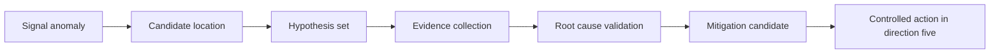
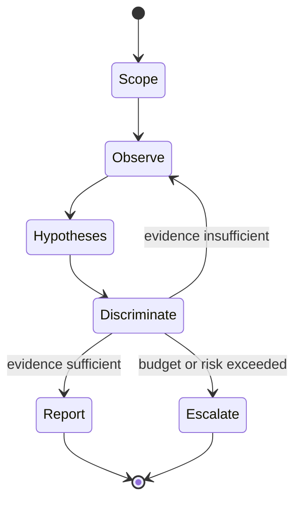
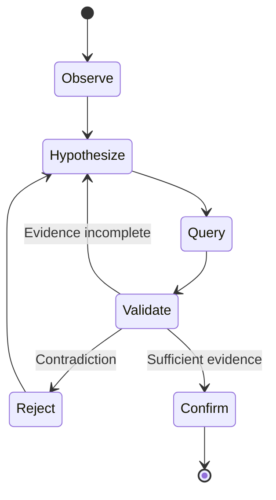
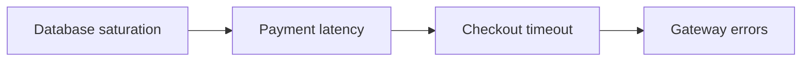
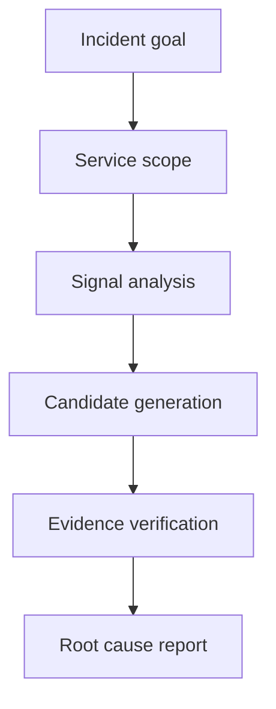
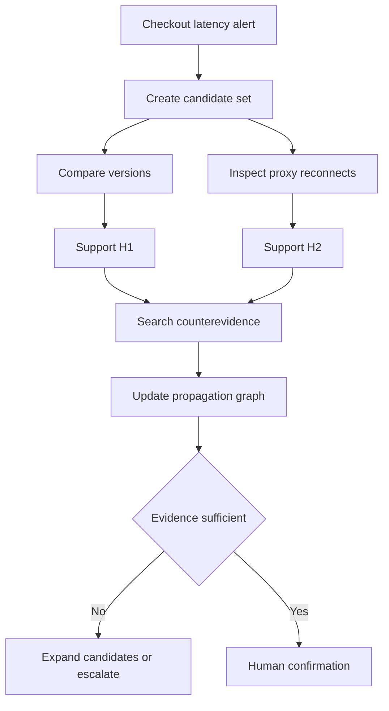

# 方向四：故障诊断、定位与根因推理

> 本方向学习如何从症状和异常证据出发，通过历史案例、主动查询、工具、拓扑、代码、因果约束与 Agent 工作流形成可验证的根因结论。

## 📚 目录

### 阅读导航

- 方向定位与任务边界。
- [落地之前的思考](#落地之前的思考)。
- 诊断证据链与主动调查。
- 历史案例、分类和生成。
- 工具增强诊断。
- 拓扑、代码与因果推理。
- Agent 化诊断。
- 可信度与 RCA 评测。
- 阅读路线和来源。

## 方向定位

### RCA 研究什么

根因分析回答“为什么发生”。

它需要从多个候选解释中找出与证据最一致、能够解释故障传播、并经验证支持的原因。

常见输入包括：

- 事件标题和描述。
- 指标异常。
- 日志与堆栈。
- Trace 和服务拓扑。
- 代码与配置。
- 发布和变更记录。
- 数据库、网络和 Kubernetes 状态。
- 历史事件及其确认根因。

### 六个容易混淆的输出

| 输出 | 回答的问题 | 示例 |
|---|---|---|
| 症状 | 用户或系统看到了什么 | 结算请求超时 |
| 异常实体 | 哪里表现异常 | payment-api P99 升高 |
| 故障类型 | 属于哪类问题 | 连接耗尽 |
| 候选根因 | 什么可能解释现象 | 发布改变连接复用 |
| 确认根因 | 哪个原因经证据验证 | 配置值从 100 降至 10 |
| 缓解动作 | 怎样降低影响 | 回滚发布 |

症状不是根因。

异常服务也不一定是起因服务。

缓解成功可以支持某个假设，但不总能唯一证明根因。

### 与方向三和方向五的边界

方向三产生结构化信号、异常位置和候选症状。

方向四建立证据链并推断根因。

方向五负责建议、审批、执行、验证和回滚。



上图是编辑性综合。

### RCA 的最低证据标准

一个根因结论至少应说明：

1. 根因实体是什么。
2. 故障机制是什么。
3. 它怎样产生已观察症状。
4. 哪些证据支持。
5. 哪些反证已排除。
6. 还有什么不确定性。
7. 通过什么查询、实验、回滚或修复验证。

## 学习目标

### 学完后应该能回答的问题

- 定位、分类、根因生成和因果解释有什么差别？
- 为什么一次 Prompt 不足以诊断真实云事件？
- 历史案例怎样帮助又怎样误导？
- 工具调用为什么需要验证？
- 拓扑、代码和因果图分别补充什么约束？
- Multi-Agent、规划、Reflection 和 Memory 改善了哪一环？
- 如何识别停滞、偏置、混淆和过早收敛？
- Top-K、MRR、执行成功率和校准各衡量什么？

### 学完后应该具备的能力

- 建立候选根因表。
- 设计只读诊断工具接口。
- 维护支持证据与反证。
- 用拓扑和传播路径缩小候选空间。
- 设置停止、拒答和人工升级条件。
- 设计服务级、实例级和代码级 RCA 评测。

## 落地之前的思考

### 先明确要减少哪一种诊断不确定性

本章是工程性综合，帮助团队在建设 RCA 系统之前判断问题是否具备可诊断条件，不是论文直接结论。

“我们需要 RCA”通常包含几种不同诉求：

- 更快找到受影响服务。
- 更快判断事件严重度。
- 更快排除常见原因。
- 给出多个可验证的根因候选。
- 生成给专家审阅的事件报告。
- 自动选择下一条只读查询。

这些诉求的证据要求和风险完全不同。

| 目标 | 可接受输出 | 不应承诺 |
|---|---|---|
| 影响定位 | 异常服务和时间范围 | 唯一根因 |
| 候选排序 | 带证据的 Top-K 假设 | 排名第一必然正确 |
| 查询推荐 | 能区分候选的下一步查询 | 自动修改系统 |
| 事件报告 | 事实、假设、未知项分层 | 把推测写成结论 |
| 根因确认 | 证据和验证动作闭环 | 仅凭文本相似度确认 |

如果团队只需要事件摘要或服务路由，不应直接建设完整 RCA Agent。

诊断粒度也必须先固定：

- 服务级。
- 实例或节点级。
- 依赖级。
- 代码变更级。
- 配置参数级。
- 业务流程级。

粒度越细，对拓扑、变更、代码和实验反馈的要求越高。

### 检查是否存在可用的诊断证据

根因推理不是凭空生成解释，而是把候选机制与观测证据对齐。

落地前先为目标事件列出证据矩阵：

| 证据类别 | 需要回答的问题 | 当前是否可取得 |
|---|---|---|
| 时间 | 异常何时开始，先后顺序是什么 | 是 / 否 |
| 范围 | 哪些服务、实例、区域受影响 | 是 / 否 |
| 变化 | 最近发生了什么发布、配置或流量变化 | 是 / 否 |
| 依赖 | 上游、下游和外部依赖是否健康 | 是 / 否 |
| 资源 | CPU、内存、连接、磁盘和网络是否异常 | 是 / 否 |
| 代码 | 错误栈、版本差异和回归是否存在 | 是 / 否 |
| 业务 | 用户请求、订单或 SLI 是否实际受损 | 是 / 否 |
| 反证 | 哪些候选已经被排除 | 是 / 否 |

如果关键列长期为空，模型只能提高叙事完整度，不能提高根因可靠性。

还要区分“查不到”和“没有发生”：

- 查询返回空结果。
- 查询执行失败。
- 数据尚未到达。
- 数据被权限过滤。
- 该系统根本没有采集。

这五种状态不能在上下文中被压缩成同一个空字符串。

诊断工具应提供可机器读取的状态：

```json
{
  "status": "partial",
  "query": "http_error_rate",
  "time_range": "2026-08-04T10:00:00Z/2026-08-04T10:15:00Z",
  "data": [],
  "reason": "telemetry_delayed",
  "source": "metrics-cluster-a"
}
```

### 先建立人工诊断和简单方法基线

RCA 系统至少要与三类对照比较：

1. 当前值班流程。
2. 基于规则、拓扑或变更的确定性方法。
3. 只读检索或历史案例方法。

基线记录不能只保存 Top-1 正确率。

建议分层记录：

| 维度 | 指标示例 |
|---|---|
| 定位 | 服务级、实例级和代码级命中 |
| 排序 | Top-K、MRR、候选覆盖 |
| 证据 | 支持证据覆盖、反证识别 |
| 过程 | 查询数量、无效调用、停止时机 |
| 人工 | 采纳率、修改率、复核时间 |
| 生产 | MTTD、MTTR、重复事件和误升级 |

样本还要按故障类型分层：

- 已知故障。
- 未知故障。
- 多故障同时发生。
- 依赖故障。
- 配置和代码变更。
- 数据缺失或权限受限。

一个系统在已知单故障上表现很好，并不能证明它能处理并发故障或未知故障。

评测答案也应保留“无法确认”的合法结果。

强迫系统在所有事件中选择唯一根因，会把不确定性伪装成准确率。

### 设计可验证的诊断边界

诊断 Agent 的能力边界应写成工具和状态约束，而不是一句“只读”。

最低边界包括：

- 工具只读权限。
- 可查询的服务、租户和时间范围。
- 单次查询超时与总预算。
- 结果大小和敏感字段过滤。
- 工具错误、部分结果和数据延迟的表达。
- 候选假设数量和停止条件。
- 证据引用格式。
- 人工升级入口。

一个合理的调查循环是：



“证据充分”必须由可检查条件定义，例如关键候选已被支持、主要反证已处理、影响范围一致，而不是由模型语气判断。

高风险事件要默认停在报告或人工升级层。

如果工具无法提供可靠的状态，先修工具契约，不要先扩大模型上下文。

### 选择最小 RCA 试点和退出条件

第一阶段适合选择：

- 服务范围明确。
- 事件历史足够。
- 查询工具已有审计。
- 根因标签由专家确认。
- 输出只读且可以复核。
- 误判不会触发自动修复。

试点可以从“下一步最有区分力的查询推荐”开始，而不是直接要求根因答案。

```text
事件输入 → 候选集合 → 查询推荐 → 证据包 → 人工判断 → 反馈回放
```

成功条件可以包括：

- 在固定服务族上减少无效查询。
- 候选根因覆盖率不低于人工基线。
- 证据引用可复现且能标注时间范围。
- 遇到未知或权限不足时正确升级。
- 工程师复核时间下降而不是增加。

退出条件可以包括：

- 系统经常把症状写成根因。
- 历史案例与当前版本不匹配。
- 多故障场景下候选集合快速崩溃。
- 工具错误被误读为空结果。
- 专家无法在合理时间复核证据。
- 结论无法通过回放或后续变更验证。

只有当诊断证据链稳定后，才应把输出交给方向五的行动流程。

RCA 的落地标准不是“模型能说出一个原因”，而是“系统知道为什么提出、还缺什么、如何验证，以及何时停止”。

## 第一阶段：建立诊断任务和证据链

### 诊断不是一次生成

真实诊断是循环：



每轮查询都应减少不确定性。

若查询不能区分任何候选，它只是在增加上下文噪声。

### 候选根因表

```markdown
| 候选 | 支持证据 | 反证 | 待查信息 | 状态 |
|---|---|---|---|---|
| 连接池耗尽 | pool_usage=100% | 数据库 CPU 正常 | 配置差异 | active |
| 数据库限流 | 超时集中于 DB span | 无 throttle 日志 | 限流指标 | weak |
| 网络丢包 | 个别重传 | 同区域其他服务正常 | 节点网络 | rejected |
```

候选集让系统能够显式比较解释。

只保留一个“当前最佳答案”容易导致确认偏差。

### 证据分级

| 级别 | 内容 | 可信边界 |
|---|---|---|
| 原始观测 | 查询得到的日志、指标、Trace | 受采样和查询正确性限制 |
| 结构化事实 | 事件、配置、拓扑和变更记录 | 受数据新鲜度限制 |
| 历史案例 | 相似事件与确认根因 | 不能直接证明当前事件 |
| 模型解释 | 对观测的语义总结 | 必须回到原始证据 |
| 干预结果 | 回滚或受控实验后的变化 | 需排除同时变化因素 |

### 诊断输入必须带时间和范围

每份输入至少包含：

- 服务和资源 ID。
- 环境、区域、租户。
- 事件时间窗口。
- 数据查询时间。
- 版本或部署 ID。
- 来源链接。
- 采样、聚合或过滤条件。

没有时间范围的日志片段可能来自另一次事件。

没有环境信息的配置可能来自预发。

### 查询推荐的价值

Xpert 研究用 LLM 推荐事件管理查询。

查询推荐比直接输出根因更容易验证：

- 查询是否存在。
- 参数是否正确。
- 结果是否与事件相关。
- 是否缩小候选范围。

它适合作为从知识助手迈向工具 Agent 的中间层。

### 主动调查计划

一个查询计划应包含：

```yaml
step:
  question: "连接池耗尽是否只发生在新版本实例"
  tool: metric_query
  parameters:
    service: checkout-api
    deployment_id: deploy-2191
    metric: db_pool_in_use_ratio
    window: 10m
  expected_if_true: "new deployment ratio near 1.0"
  expected_if_false: "all deployments similar"
  on_error: retry_once_then_escalate
```

预先写出真假预期能防止查询后随意解释。

### FLASH 与复发事件工作流

FLASH 面向重复事件的工作流自动化诊断。

复发场景适合自动化，因为：

- 已知调查步骤较稳定。
- 工具和参数可预先验证。
- 预期证据模式明确。
- 停止条件可定义。

其边界是新故障可能落在已知工作流之外。

### NetAssistant 的对话式网络诊断

网络诊断需要拓扑、设备状态、路由、流量和配置证据。

对话接口可以把工程师意图转换为查询并解释结果。

但自然语言不能代替：

- 设备级权限。
- 命令白名单。
- 配置快照。
- 路径和时间范围。
- 输出解析验证。

### D-Bot 的数据库诊断启发

数据库故障常跨越工作负载、查询、锁、缓存、存储和配置。

工具应返回结构化状态，而不是大段终端文本。

例如：

```json
{
  "query": "top_wait_events",
  "status": "ok",
  "observed_at": "2026-08-03T10:10:00+08:00",
  "rows": [{"event": "lock_wait", "share": 0.63}],
  "truncated": false
}
```

### 诊断摘要必须可逆

长日志和工具结果需要摘要。

RCACopilot 使用 LLM 压缩多源诊断信息，再结合历史事件做根因预测。

摘要应保留引用，使工程师能回到原始结果。

摘要不能删除反证或“不知道”。

### 本阶段小结

- RCA 是迭代收集和验证证据的过程。
- 候选表比单一答案更能抵抗确认偏差。
- 查询计划应说明它区分哪些假设。
- 复发事件适合受约束工作流。
- 摘要必须能回到原始工具输出。

## 第二阶段：历史案例、分类与开放生成

### 根因分类

分类从预定义标签集合中选择根因类别。

优点：

- 输出空间有限。
- 容易计算准确率和 F1。
- 便于路由和统计。
- 可以使用历史标注事件。

限制：

- 新根因不在标签空间。
- 标签粒度可能过粗。
- 服务变化使标签含义漂移。
- 正确类别不等于完整解释。

### 开放式根因生成

开放生成可以描述实体、机制和传播过程。

它更贴近工程师报告。

但评测更困难：

- 同一根因有多种表述。
- 文本相似不表示因果正确。
- 部分正确难以量化。
- 模型会加入未证实细节。

### 历史案例检索

RCACopilot、GPT-4 ICL 和多篇云 RCA 研究使用相似事件。

建议以以下条件过滤：

- 服务和组件。
- 环境和区域。
- 版本范围。
- 症状与异常模式。
- 传播路径。
- 事件时间和知识新鲜度。
- 根因是否经过人工确认。

### 相似症状不等于相同根因

“5xx 升高”可能来自：

- 上游超时。
- 配置错误。
- 容量不足。
- 凭据过期。
- 发布缺陷。
- 依赖限流。

案例检索是候选生成器，不是证明器。

### In-Context Learning

ICL 把历史事件、证据和确认根因放入 Prompt。

模型从演示学习任务格式和领域模式。

风险包括：

- 近重复数据泄漏。
- 错误案例标签。
- 示例顺序偏差。
- 少数服务被高频案例支配。
- 长上下文挤压当前事件证据。

### One-Shot 与小分类器协作

One-Shot RCA 路线探索 LLM 与小分类器协作。

小模型适合稳定、重复和有限标签任务。

LLM 适合解释、少样本和开放语义。

组合时应定义：

- 谁生成候选。
- 谁做最终判断。
- 冲突怎样处理。
- 置信度怎样校准。
- 新类别怎样进入标签体系。

### 根因与缓解步骤联合生成

有研究同时推荐根因和缓解步骤。

两项任务不应使用同一正确性判断。

根因可能正确但动作不适用于当前版本。

动作可能暂时缓解却没有修复根因。

输出应拆开：

```yaml
root_cause_candidate:
  statement: connection pool size regressed after deployment
  evidence_status: partially_supported
mitigation_candidate:
  action: rollback deployment
  execution_status: not_executed
```

### X-Lifecycle 的跨生命周期视角

事件数据不只来自诊断阶段。

检测、分诊、缓解和复盘信息可以互相增强。

但必须避免未来信息泄漏到历史时间点的离线评测。

若模型在“事件创建时预测根因”，就不能使用事件结束后的复盘文本。

### Prompt 优化

eARCO 关注高效的 Prompt 优化 RCA。

Prompt 可以改善：

- 任务定义。
- 输出结构。
- 证据引用。
- 候选比较。
- 停止条件。

Prompt 不能补回缺失遥测，也不能证明因果。

### Representation-Aware RCA

同一事件可以表示为原始日志、摘要、模板序列、拓扑子图或结构化表。

表示选择会改变模型能看到的关系。

Representation-Aware RCA 提醒我们：失败可能来自输入表示，而不只是模型推理。

### 信息压缩的取舍

过少压缩：

- 超出上下文。
- 噪声干扰。
- 工具结果重复。

过度压缩：

- 丢失反证。
- 丢失时间顺序。
- 丢失实体和数值。
- 把不确定性变成确定句。

### 本阶段小结

- 分类易评测但受标签空间限制。
- 开放生成表达力强但更难验证。
- 历史案例产生候选，不直接证明当前根因。
- 联合输出必须区分根因正确性与动作正确性。
- Prompt 和表示优化不能替代证据。

## 第三阶段：工具增强诊断

### ReAct 循环

工具增强 Agent 常使用：

```text
Thought -> Action -> Observation -> Thought
```

工程实现不必暴露内部思维文本。

需要保留的是可审计轨迹：

- 当前目标。
- 选择的工具。
- 结构化参数。
- 工具状态。
- 观察结果引用。
- 更新后的候选。
- 停止理由。

### RCAgent 的核心设计

RCAgent 使用本地模型和工具增强 Agent 处理隐私敏感云 RCA。

它区分：

- 控制器 Agent：规划和选择工具。
- 专家 Agent：执行日志或代码分析。
- 信息收集工具：查询云状态。
- `finalize`：以可解析格式结束。

它还处理上下文长度、动作有效性和本地模型稳定性。

### 工具接口应语义化

不要直接把任意 SQL 或 shell 暴露给模型。

更安全的接口：

```json
{
  "tool": "get_service_errors",
  "arguments": {
    "service_id": "svc-checkout",
    "start": "2026-08-03T10:00:00+08:00",
    "end": "2026-08-03T10:10:00+08:00",
    "severity_at_least": "ERROR"
  }
}
```

工具层负责参数校验、权限和查询构造。

### 工具文档

每个工具应说明：

- 用途。
- 参数类型和范围。
- 数据源。
- 返回模式。
- 权限级别。
- 成本和超时。
- 常见错误。
- 数据新鲜度。
- 是否有副作用。

### 观察结果状态

```yaml
observation:
  status: partial
  data: []
  error: null
  warnings:
    - "two shards unavailable"
  queried_at: 2026-08-03T10:12:00+08:00
  data_until: 2026-08-03T10:09:30+08:00
  truncated: true
```

空数组、失败、部分结果和真实“没有异常”必须区分。

### 工具失败模式

#### 参数错误

服务 ID 或时间范围非法。

不得把错误页摘要成“无异常”。

#### 权限拒绝

工具没有访问某租户数据。

应标为证据缺口。

#### 超时

查询未完成。

不得用部分结果确认根因。

#### 数据延迟

指标只更新到事件前。

结果不能代表当前状态。

#### 截断

日志过长只返回前 N 行。

Agent 必须知道未查看全部数据。

### 日志分析工具

RCAgent 对长日志做语义分区与聚类，再由专家 Agent 分析块。

这种设计减少一次性上下文，并让控制器消费摘要。

日志工具仍需提供原始行引用。

### 代码分析工具

代码工具可以从异常类或堆栈出发：

1. 找到对应文件。
2. 摘要方法和依赖。
3. 推荐下一批相关类。
4. 用任务队列避免重复。
5. 达到外部依赖或无新线索时停止。

代码静态关系说明“可能路径”，不证明运行时执行。

### 数据库、网络和集群工具

| 领域 | 只读工具示例 | 高风险动作 |
|---|---|---|
| 数据库 | 等待事件、慢查询、复制状态 | kill、failover、参数修改 |
| 网络 | 路径、路由、丢包、接口状态 | 路由和 ACL 修改 |
| Kubernetes | events、logs、describe、metrics | delete、rollout、scale |
| 云资源 | inventory、health、quota | replace、resize、delete |

方向四默认只读。

有副作用动作进入方向五的审批闭环。

### 动作有效性

模型可能：

- 调用不存在的工具。
- 使用错误参数名。
- 重复同一查询。
- 查询无关对象。
- 在证据不足时 finalize。

可用 JSON Schema、参数枚举、重试上限和轨迹检查稳定化。

### 观察压缩与快照键

长工具输出不应反复复制进上下文。

可以保存快照并返回：

```text
OBS-17: error log clusters for checkout-api, 10:00-10:10
```

后续步骤按需读取摘要或原始片段。

快照必须与事件、查询和权限绑定。

### 停止条件

Agent 应在以下情况停止：

- 达到工具或 token 预算。
- 连续查询没有信息增益。
- 关键工具不可用。
- 候选证据冲突且无法解决。
- 找到足够证据并满足验证标准。
- 需要写操作或更高权限。
- 人工要求停止。

### 工具轨迹评测

不仅评价最终答案，还评价：

- 工具选择正确率。
- 参数正确率。
- 无效调用率。
- 重复调用率。
- 关键证据覆盖率。
- 平均调用数和成本。
- 失败后的恢复行为。
- 停止时机。

### 本阶段小结

- 工具把 LLM 从静态文本推理连接到当前环境。
- 语义化工具比任意命令接口更安全。
- 工具状态必须区分失败、部分、截断和空结果。
- 日志与代码专家可压缩复杂信息。
- 最终答案和工具轨迹都需要评价。

## 第四阶段：拓扑、代码与因果推理

### 服务拓扑的作用

拓扑提供候选传播路径。

若 A 调用 B，B 调用 C，C 出现故障，则 A 和 B 都可能表现异常。

只按异常强度排序可能错误选择 A。

传播方向有助于把候选移向下游共同依赖。

### 拓扑不是永远正确

拓扑可能来自：

- 静态配置。
- 服务目录。
- Trace 聚合。
- 网络流量。
- 代码调用关系。

动态系统中它们都可能过期或不完整。

应记录拓扑来源和时间范围。

### Cloud Atlas 的因果洞见

Cloud Atlas 将语言模型与因果洞见结合，用于云系统故障定位。

其核心学习价值是用系统结构约束语言模型的候选空间。

LLM 负责语义理解。

因果或传播信息负责排除结构上不合理的解释。

### 故障传播图



若观测顺序和依赖方向与图一致，数据库成为强候选。

仍需验证饱和原因。

### Fault Propagation-Aware Benchmark

传统 benchmark 可能只检查是否命中根因节点。

传播感知评测还应考虑：

- 候选是否位于传播路径。
- 错误候选离根因多远。
- 症状节点是否被误判为根因。
- 多故障和共同依赖如何处理。
- 定位粒度是否一致。

### OpenRCA

OpenRCA 研究 LLM 能否定位软件故障根因。

阅读 benchmark 时必须记录：

- 输入包含什么信号。
- 根因标签是服务、实例、文件还是代码行。
- 是否允许工具。
- 是否提供拓扑。
- 测试故障是否见过。
- 是否有干扰异常。

### 代码知识

COCA 将代码知识用于分布式系统生成式 RCA。

代码可以解释：

- 错误消息由哪里产生。
- 配置怎样流入逻辑。
- 服务调用与数据处理路径。
- 哪些异常被捕获或重试。

代码版本必须与运行部署一致。

### 配置知识

配置差异经常比源代码更接近实际故障。

诊断应比较：

- 当前值与默认值。
- 故障前后差异。
- 不同实例差异。
- 环境覆盖顺序。
- 动态配置生效状态。
- 密钥和权限引用。

### FVDebug 的形式验证场景

FVDebug 面向形式验证失败的自动 RCA。

形式验证提供明确失败轨迹和约束。

它与云生产事件不同，但展示了结构化反例如何帮助 LLM 深入到缺陷位置。

### 贝叶斯网络

贝叶斯网络以有向无环图表示变量依赖。

联合概率可分解为：

$$
P(X_1,\ldots,X_n)=\prod_{i=1}^{n}P(X_i\mid Pa(X_i))
$$

$Pa(X_i)$ 表示 $X_i$ 的父节点。

观测证据后，可以更新候选根因后验概率。

### 贝叶斯更新

$$
P(H\mid E)=\frac{P(E\mid H)P(H)}{P(E)}
$$

- $H$ 是根因假设。
- $E$ 是观测证据。
- $P(H)$ 是先验。
- $P(E\mid H)$ 是该根因产生证据的可能性。
- $P(H\mid E)$ 是观察证据后的后验。

先验和条件概率若来自错误数据，后验同样不可靠。

### 相关、传播和因果

| 关系 | 能说明什么 | 不能说明什么 |
|---|---|---|
| 时间相关 | 同时或相邻变化 | 谁导致谁 |
| 拓扑传播 | 存在可能影响路径 | 当前故障确实沿此传播 |
| 统计因果 | 数据支持方向性关系 | 所有隐藏混杂已消除 |
| 干预验证 | 改变原因后结果变化 | 复杂并发变化下唯一性 |

### 反事实问题

一个强根因解释应回答：

“如果该原因不存在，症状是否仍会发生？”

可以通过：

- 回滚。
- 流量切换。
- 配置对照。
- 故障注入。
- 历史正常实例比较。

生产干预需要方向五的安全控制。

### 多根因与共同原因

系统可能同时存在多个故障。

一个共同底层原因也可能产生多条传播链。

RCA 输出不应强制只有一个标签。

应说明主因、促成因素和放大因素。

### 本阶段小结

- 拓扑约束传播路径，但可能过期。
- 代码和配置知识能把服务级定位深入到机制。
- 贝叶斯网络用于证据更新，不替代数据质量。
- 相关、传播和因果必须区分。
- 干预和反事实验证能增强根因结论。

## 第五阶段：Agent 化诊断

### Single-Agent

单 Agent 维护一个上下文并选择工具。

优点：

- 架构简单。
- 轨迹容易审计。
- 通信成本低。

缺点：

- 单一上下文容易过载。
- 错误判断会持续传播。
- 领域能力难以分工。

### Multi-Agent

多 Agent 可以按角色分工：

- 协调器。
- 日志分析员。
- 指标分析员。
- Trace 与拓扑分析员。
- 代码分析员。
- 反证审查员。

更多 Agent 不自动意味着更准确。

### 多 Agent 通信风险

- 重复查询。
- 摘要丢失。
- 错误观点相互强化。
- 角色边界重叠。
- token 与延迟上升。
- 投票把共同偏差当成共识。

### 角色感知 AgentFM

AgentFM 面向分布式数据库故障管理，使用角色感知多 Agent。

它提醒我们按数据源和专业能力分工，而不是创建多个同质聊天角色。

每个角色应拥有最小工具集合。

### MABC 与协作机制

MABC 探索受区块链思想启发的多 Agent 协作。

阅读此类方法时应区分：

- 消息共享协议。
- 候选根因共识。
- 证据是否独立。
- 谁能否决。
- 失败怎样归因。

### SOP 约束的 Flow-of-Action

Flow-of-Action 使用 SOP 增强多 Agent RCA。

SOP 提供：

- 合法调查顺序。
- 必查项。
- 分支条件。
- 角色职责。
- 终止条件。

它缩小自由搜索空间。

过期 SOP 也会系统性约束到错误路径。

### RCAFlow 的层级规划

RCAFlow 使用工作流信息和层级规划。

层级规划先选择诊断阶段，再选择具体工具动作。



高层计划稳定，低层动作可按观察调整。

### Recursion-of-Thought

递归推理把复杂问题拆成子问题。

例如：

1. 哪个调用路径异常？
2. 路径上哪个节点最早异常？
3. 该节点有哪些配置和代码变化？
4. 哪个变化能解释所有症状？

递归深度需要预算和停止条件。

### ThinkFL 的自精炼

ThinkFL 使用自精炼与强化微调进行故障定位。

自精炼可让模型复查候选、补充证据或修正输出。

若评审者与生成者共享同一偏差，自我反思仍可能确认错误答案。

### Agentic Memory

Agentic Memory Enhanced Recursive Reasoning 使用记忆增强递归定位。

记忆可保存：

- 已查工具。
- 关键证据。
- 被否定候选。
- 中间计划。
- 相似历史策略。

记忆不是事实源。

它需要事件隔离、过期和来源引用。

### Memory 污染

若错误根因被写入长期记忆，未来事件会重复引用。

长期记忆只应接收：

- 人工确认根因。
- 已审核工作流。
- 版本化工具经验。
- 明确适用范围。

### 协调器的职责

协调器应：

- 分配子任务。
- 去重查询。
- 合并证据而非只合并结论。
- 发现冲突。
- 管理预算。
- 决定继续、停止或升级。

### 反证 Agent

一个实用角色是专门寻找：

- 与当前候选矛盾的观测。
- 未解释的症状。
- 其他可能原因。
- 数据缺失。
- 工具失败。

它可以减少过早收敛。

### Agent 架构评测

| 维度 | 问题 |
|---|---|
| 有效性 | 是否找到正确粒度根因 |
| 效率 | 调用了多少工具和模型 |
| 协作 | 子任务是否重复或冲突 |
| 鲁棒性 | 工具失败后能否恢复 |
| 记忆 | 是否引用正确且适用的经验 |
| 安全 | 是否越权或请求写操作 |

### 本阶段小结

- Single-Agent 简单但容易上下文过载。
- Multi-Agent 的价值来自异质分工，不来自数量。
- SOP 和工作流约束搜索空间。
- 递归、自精炼和记忆分别改善分解、复查和状态保持。
- 错误共享和记忆污染会放大失败。

## 第六阶段：可信 RCA 与评测

### 常见推理失败

#### 停滞

Agent 反复查询同类数据，没有更新候选。

#### 偏置

过度依赖最近案例、首个异常或熟悉根因。

#### 混淆

把症状、故障位置、根因和动作混为一谈。

#### 过早收敛

找到一个合理解释后停止寻找反证。

#### 忽略反证

只引用支持当前候选的结果。

#### 工具误用

把失败、空结果或过期数据当成证据。

#### 表示失败

关键信息在摘要或序列化中丢失。

Stalled, Biased, and Confused 系统研究 LLM 在云 RCA 中的推理失败。

### 置信度的含义

校准良好的置信度应满足：

当系统对一组案例给出约 0.8 置信度时，这组案例应约有 80% 正确。

置信度不是语言强度。

“我非常确定”不是校准结果。

### LM-PACE

LM-PACE 面向黑盒根因生成器估计置信度。

它结合：

1. 历史事件检索。
2. COE：评估当前证据是否足够评价。
3. RCE：评价候选根因质量。
4. 优化映射得到最终置信度。

COE 重要，因为估计器可能根本没有足够信息公平判断。

### 期望校准误差

将预测按置信度分桶，常见 ECE 为：

$$
ECE=\sum_{b=1}^{B}\frac{|S_b|}{n}\left|acc(S_b)-conf(S_b)\right|
$$

- $S_b$ 是第 $b$ 个置信度桶。
- $acc(S_b)$ 是桶内实际正确率。
- $conf(S_b)$ 是桶内平均置信度。
- $n$ 是样本总数。

ECE 低表示整体更校准，但可能隐藏小样本高风险桶。

### 可靠性图

可靠性图比较每个置信区间的平均置信度和实际正确率。

高置信度错误最值得关注，因为工程师更可能采纳。

应单独审核 0.8 以上错误案例。

### 置信度使用方式

| 置信度与证据 | 建议行为 |
|---|---|
| 高置信且证据完整 | 优先人工确认 |
| 高置信但证据缺失 | 不应采纳，检查校准 |
| 中置信 | 收集区分性证据 |
| 低置信 | 扩展候选或升级专家 |
| 冲突证据 | 明确拒答 |

置信度不应直接触发生产写操作。

### Top-K 定位

若正确根因在前 $K$ 个候选中，则 Top-K 命中。

$$
Recall@K=\frac{1}{N}\sum_{i=1}^{N}\mathbf{1}[r_i\le K]
$$

$r_i$ 是第 $i$ 个案例中正确根因排名。

### MRR

$$
MRR=\frac{1}{N}\sum_{i=1}^{N}\frac{1}{r_i}
$$

MRR 更奖励正确根因排在前面。

若没有正确候选，该案例贡献为 0。

### 定位粒度不能混比

| 粒度 | 示例 |
|---|---|
| 服务级 | payment-db |
| 实例级 | payment-db-2 |
| 资源级 | connection-pool |
| 文件级 | PoolManager.go |
| 函数级 | resizePool |
| 代码行级 | config assignment line |

服务级 Top-1 不能直接与代码行 Top-1 比较。

### 最终答案之外的指标

- 工具调用成功率。
- 关键证据召回率。
- 反证覆盖率。
- 平均调查轮数。
- 诊断时延。
- 人工修改率。
- 拒答准确率。
- 置信度校准。
- 单事件成本。

### 真实生产距离

评价一项 RCA 研究时检查：

- 是否使用真实或合成事件。
- 是否使用当前多源数据。
- 是否有真实工具。
- 是否覆盖未知故障。
- 是否包含噪声和并发异常。
- 是否评价工具轨迹。
- 是否有工程师参与。
- 是否长期部署。
- 是否报告失败案例。

### 不因 Agent 名称判断自治

“Autonomous RCA Agent”可能只表示模型自动选择模拟工具。

生产自治还需要：

- 身份和权限。
- 工具可靠性。
- 审计。
- 预算。
- 停止条件。
- 置信度。
- 人工升级。

### 本阶段小结

- 推理失败应按停滞、偏置、混淆、工具和表示分类。
- 校准置信度反映真实正确概率，不是语言强度。
- LM-PACE 将证据充足度与根因评价分开。
- Top-K 和 MRR 依赖明确定位粒度。
- 生产 RCA 必须同时评价答案、轨迹、成本和人机协作。

## 贯穿案例：支付超时的证据驱动 RCA

### 案例初始状态

周二 10:02，结算成功率从 99.95% 降到 96.8%，`checkout-api` 的 P99 延迟升高。10:00 刚完成 `payment-api` v42 灰度，但同一时间数据库代理也发生连接抖动。

调查系统收到的不是“找出唯一答案”，而是一份带边界的事件状态：

| 字段 | 当前值 |
|---|---|
| 时间窗 | 09:55–10:10，另取前一小时作基线 |
| 影响范围 | 新加坡区约 3.2% 结算请求 |
| 已知变更 | `payment-api` v42 灰度到 20% 实例 |
| 初始异常 | checkout P99、payment 连接等待、数据库代理重连 |
| 未知项 | v42 是否改变连接复用；代理抖动是否为独立故障 |
| 动作边界 | 本方向只读调查，不执行回滚或扩容 |

这是编辑性工程案例，用来串联本章方法，不代表某篇论文的生产实验。

### 候选、支持证据与反证

初始候选不能只保留“最近发布”：

| 候选 | 支持证据 | 反证 | 下一条区分性查询 |
|---|---|---|---|
| H1 v42 降低连接池复用 | 发布与故障接近 | 旧版本也有少量等待 | 按版本比较连接新建率与等待时长 |
| H2 数据库代理独立抖动 | 代理在同窗重连 | 仅部分应用实例显著恶化 | 按后端与可用区比较重连和延迟 |
| H3 下游数据库容量不足 | 连接等待升高 | CPU 与活跃会话未饱和 | 查询队列、锁等待和连接上限 |
| H4 网络丢包 | Trace 出现下游耗时 | 暂无链路丢包证据 | 查询同路径流量与重传 |

候选表必须允许 `unknown`。若后续证据不能由 H1–H4 解释，系统应扩展候选，而不是把概率强行归一到已有集合。

### 工具查询和证据 provenance

调查计划优先选择能区分候选的只读查询：

1. 指标查询按版本和实例比较连接等待、连接新建率、请求量与错误率。
2. Trace 查询比较 v41、v42 的数据库 Span，并保留缺失 Span 比例。
3. 变更查询取得 v42 的配置差异、灰度对象和实际生效时间。
4. 数据库查询读取代理重连、后端切换、连接上限与锁等待。
5. 拓扑查询取得事件时窗内的动态依赖快照，而不是使用当前拓扑冒充历史拓扑。

每条证据至少记录 `query_id`、工具、参数、时间窗、采集时间、数据版本、权限范围、结果状态和原始快照键。摘要只能引用快照，不能替代快照。



上图是编辑性综合。

### 拓扑传播和时间顺序

调查发现 v42 实例的连接新建率是 v41 的数倍，代理重连影响两个版本，但 v42 的连接风暴放大了代理抖动。动态传播路径为：

```text
v42 配置变化
  -> 连接复用下降
  -> 数据库代理连接建立压力升高
  -> 代理抖动被放大
  -> payment-api 等待
  -> checkout-api P99 与成功率恶化
```

这里不能简单写成一个根因。更准确的分解是：

- 直接根因：v42 的连接复用配置错误。
- 促成因素：数据库代理在同一时窗发生重连。
- 放大因素：灰度实例集中访问同一代理分片。
- 症状节点：`payment-api` 和 `checkout-api`。

若代理抖动在没有 v42 时也足以造成同等影响，它可能是并发独立故障，而非促成因素。评测标签应允许集合或因果结构，不能只接受单一 Top-1 字符串。

### 反事实、混杂与不可执行干预

“回滚 v42 后恢复”支持 H1，但仍可能被同时结束的代理抖动混杂。更强的反事实比较是：在相同代理分片、相同流量和相同时间窗下，v41 与 v42 是否呈现稳定差异。

生产环境经常无法执行理想干预：

- 回滚代价过高或会丢失其他修复。
- 流量切换会改变负载这个混杂变量。
- 故障注入不允许在高严重度事件中进行。
- 当前拓扑已漂移，无法重建当时路径。
- 观察数据不足以识别唯一因果方向。

因此应把结论分成“观察证据支持”“干预证据支持”和“尚不可识别”。不可执行反事实不是让模型猜测的理由。

### 停止、拒答和人工升级

满足以下条件才可停止只读调查并请求人工确认：

- 至少一个候选能解释主要症状和传播顺序。
- 关键支持证据有可追溯快照。
- 已主动搜索最强替代解释与反证。
- 拓扑和配置版本与事件时窗一致。
- 剩余不确定性不会被隐藏在高置信措辞中。

以下情况必须拒答或升级：

| 情况 | 系统输出 | 后续动作 |
|---|---|---|
| 正确根因不在候选集 | `candidate_set_incomplete` | 扩展对象、时间窗或专家域 |
| 未知或 OOD 故障 | `unknown_failure_pattern` | 保留证据包并升级领域专家 |
| 工具无权限 | `insufficient_access` | 申请只读短期权限或人工查询 |
| 数据缺失或冲突 | `insufficient_evidence` | 指明缺口，不给唯一根因 |
| 拓扑过期 | `stale_topology` | 重建事件时窗快照 |
| 多个候选不可区分 | `ambiguous_hypotheses` | 输出候选集合和区分性查询 |

拒答质量应独立评测：既要避免证据不足时强答，也要避免证据充分时无谓升级。

### 人工确认与结果回流

Incident Commander 确认配置差异和传播链后，方向五才接管回滚审批。事件关闭后回流的不是一段未经审查的模型总结，而是：

- 已确认的直接根因、促成因素和影响范围。
- 查询与证据快照引用。
- 被否定候选及否定原因。
- 实际动作、恢复证据和时间线。
- 需要更新的规则、Runbook、测试和所有者。

回流记录必须经过 owner 审核并版本化。错误诊断、未确认猜测和含敏感信息的原始输出不能直接写入长期记忆。

### 多故障评测不能只看 Top-1

并发和层级原因下，应组合使用：

- 根因集合的 Precision、Recall 与 F1。
- 直接根因、促成因素、放大因素的角色准确率。
- 传播路径边或关键路径召回率。
- 候选集覆盖率与未知故障拒答率。
- 支持证据和反证覆盖率。
- 到达可行动结论的调查成本与时延。
- 拓扑漂移、权限缺失和缺失模态下的性能退化。

一个把直接根因排在第二但完整识别共同原因与传播链的系统，可能比偶然命中 Top-1 却给出错误机制的系统更有用。

## 论文阅读路线

### 入门：任务与基线

1. [Automatic RCA](https://arxiv.org/pdf/2305.15778.pdf)：多源收集、摘要和历史案例分类。
2. [Xpert](https://arxiv.org/pdf/2312.11988)：主动查询推荐。
3. [OpenRCA](https://openreview.net/pdf?id=M4qNIzQYpd)：定位能力与 benchmark。

### 进阶：工具和结构

1. [RCAgent](https://arxiv.org/pdf/2310.16340.pdf)：工具增强循环与本地模型。
2. [Cloud Atlas](https://arxiv.org/pdf/2407.08694)：因果洞见。
3. [COCA](https://arxiv.org/abs/2503.23051v1)：代码知识。
4. [贝叶斯网络 RCA](https://ieeexplore.ieee.org/abstract/document/10979844)：概率图。

### 深入：Agent 和可信性

1. [Flow-of-Action](https://www.arxiv.org/pdf/2502.08224)：SOP 约束。
2. [RCAFlow](https://ojs.aaai.org/index.php/AAAI/article/view/36991)：层级规划。
3. [Agentic Memory](https://arxiv.org/abs/2601.02732)：记忆与递归。
4. [LM-PACE](https://arxiv.org/pdf/2309.05833.pdf)：黑盒置信度校准。
5. [RCA 推理失败](https://arxiv.org/abs/2601.22208)：系统错误分析。
6. [传播感知 Benchmark](https://arxiv.org/pdf/2510.04711)：评价边界。

### 代表性路线对比

| 路线 | 代表方法 | 主要增量 | 主要风险 |
|---|---|---|---|
| 历史分类 | RCACopilot | 多源摘要和案例 | 未知类别与案例偏差 |
| 查询推荐 | Xpert | 主动调查入口 | 查询不一定有效 |
| 工具 Agent | RCAgent | 当前环境交互 | 工具误用和长轨迹 |
| 结构约束 | Cloud Atlas | 拓扑和因果 | 结构过期或错误 |
| 代码增强 | COCA | 深入机制 | 代码版本不匹配 |
| 工作流 Agent | RCAFlow | 层级计划 | 工作流限制未知故障 |
| 置信度 | LM-PACE | 黑盒校准 | 历史参考与估计器偏差 |

## 本方向总结

### 最值得记住的结论

1. RCA 是候选生成、证据查询、反证和验证的循环。
2. 历史案例、Prompt 和摘要只能增强推理，不能替代当前证据。
3. 工具接口必须语义化、只读、可审计，并准确表达失败状态。
4. 拓扑、代码和因果图分别约束传播、机制和概率关系。
5. Multi-Agent 的价值来自专业分工，错误通信和记忆污染会抵消收益。
6. 置信度必须校准，服务级、实例级和代码级定位不可直接混比。
7. 论文使用 Agent 不表示系统已达到生产自治。

### 推荐学习顺序

1. 先掌握任务边界和候选根因表。
2. 再学习历史案例与多源摘要。
3. 然后实现只读工具循环。
4. 加入拓扑、代码和传播约束。
5. 最后研究 Agent 规划、记忆、失败分析和校准。

## 来源索引

### 主方向论文

本方向正文以仓库 [论文目录](https://github.com/Jun-jie-Huang/awesome-LLM-AIOps/blob/main/README.md) 中方向四的 30 篇资料为范围。下表为逐篇直达入口；“学习位置”是编辑性导航，不是论文成熟度评级。

下表链接统一采用仓库 `README.md` 中的公开原文地址，分享 HTML 后无需依赖本地译文文件。

| # | 译文 | 学习位置 |
|---:|---|---|
| 1 | [D-Bot](https://arxiv.org/pdf/2312.01454.pdf) | 数据库诊断与工具协作 |
| 2 | [FLASH](https://www.microsoft.com/en-us/research/uploads/prod/2024/10/FLASH_Paper.pdf) | 复发事件工作流自动化 |
| 3 | [NetAssistant](https://www.usenix.org/system/files/nsdi24-wang-haopei.pdf) | 对话式网络诊断 |
| 4 | [AgentFM](https://arxiv.org/pdf/2504.06614) | 角色感知多 Agent 故障管理 |
| 5 | [Agentic Memory](https://arxiv.org/abs/2601.02732) | 记忆增强递归定位 |
| 6 | [LLM 与贝叶斯网络 RCA](https://ieeexplore.ieee.org/abstract/document/10979844) | 概率图与证据更新 |
| 7 | [GPT-4 上下文学习 RCA](https://arxiv.org/pdf/2401.13810v1.pdf) | 上下文学习与历史案例 |
| 8 | [Automatic RCA](https://arxiv.org/pdf/2305.15778.pdf) | 多源云事件根因分析 |
| 9 | [Cloud Atlas](https://arxiv.org/pdf/2407.08694) | 因果洞见与故障定位 |
| 10 | [COCA](https://arxiv.org/abs/2503.23051v1) | 代码知识增强 RCA |
| 11 | [eARCO](https://arxiv.org/pdf/2504.11505) | Prompt 优化与效率 |
| 12 | [探索 LLM RCA Agent](https://arxiv.org/pdf/2403.04123) | Agent RCA 能力边界 |
| 13 | [Flow-of-Action](https://www.arxiv.org/pdf/2502.08224) | SOP 增强多 Agent |
| 14 | [FVDebug](https://arxiv.org/abs/2510.15906) | 形式验证失败诊断 |
| 15 | [多 Agent RCA 框架](https://doi.org/10.1007/s40747-025-02096-0) | 专家分工与协作 |
| 16 | [PACE-LM](https://arxiv.org/pdf/2309.05833.pdf) | 根因置信度校准 |
| 17 | [LogPilot](https://www.zhihan-jiang.com/files/ASE25/LogPilot.pdf) | 意图感知告警诊断 |
| 18 | [MABC](https://arxiv.org/pdf/2404.12135) | 多 Agent 协作机制 |
| 19 | [OpenRCA](https://openreview.net/pdf?id=M4qNIzQYpd) | 软件故障定位 Benchmark |
| 20 | [RCAFlow](https://ojs.aaai.org/index.php/AAAI/article/view/36991) | 工作流知情层级规划 |
| 21 | [RCAgent](https://arxiv.org/pdf/2310.16340.pdf) | 工具增强自主调查 |
| 22 | [根因与缓解步骤推荐](https://arxiv.org/pdf/2301.03797.pdf) | 诊断到行动建议的边界 |
| 23 | [表示感知 RCA](https://dl.acm.org/doi/10.1145/3777911.3801108) | 输入表示与立场分析 |
| 24 | [故障传播感知 Benchmark](https://arxiv.org/pdf/2510.04711) | 传播结构与评测 |
| 25 | [停滞 偏置与困惑](https://arxiv.org/abs/2601.22208) | 推理失败分类 |
| 26 | [One-Shot RCA](https://dl.acm.org/doi/10.1145/3691620.3695475) | LLM 与小分类器协作 |
| 27 | [ThinkFL](https://arxiv.org/abs/2504.18776) | 强化微调与自精炼定位 |
| 28 | [Recursion-of-Thought](https://arxiv.org/abs/2605.14866) | 多 Agent 深层递归定位 |
| 29 | [X-Lifecycle](https://arxiv.org/pdf/2404.03662) | 跨生命周期事件学习 |
| 30 | [Xpert](https://arxiv.org/pdf/2312.11988) | 主动查询推荐 |

### 跨方向来源

- 方向三提供日志、指标、Trace 与异常证据。
- 方向二提供 Incident Context、历史事件和 SOP。
- 方向五承接动作审批、执行、验证和回滚。

### 资料边界

论文方法和研究观察以本地中文译文为依据。

证据分级、候选表、工具 Schema、停止条件、成熟度判断和部分流程图是教学性综合。

Mermaid 图不冒充论文原图。

不同论文使用不同故障注入、定位粒度、工具和数据集，绝对结果不直接横向比较。
