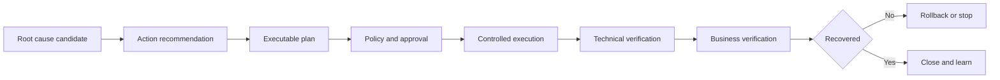
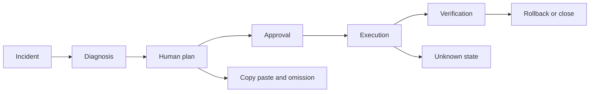
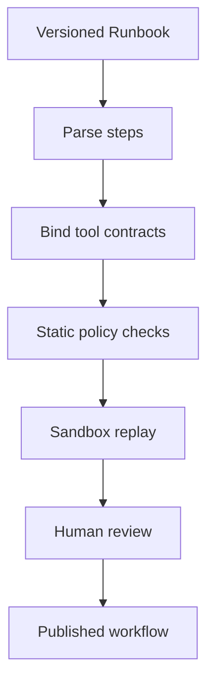
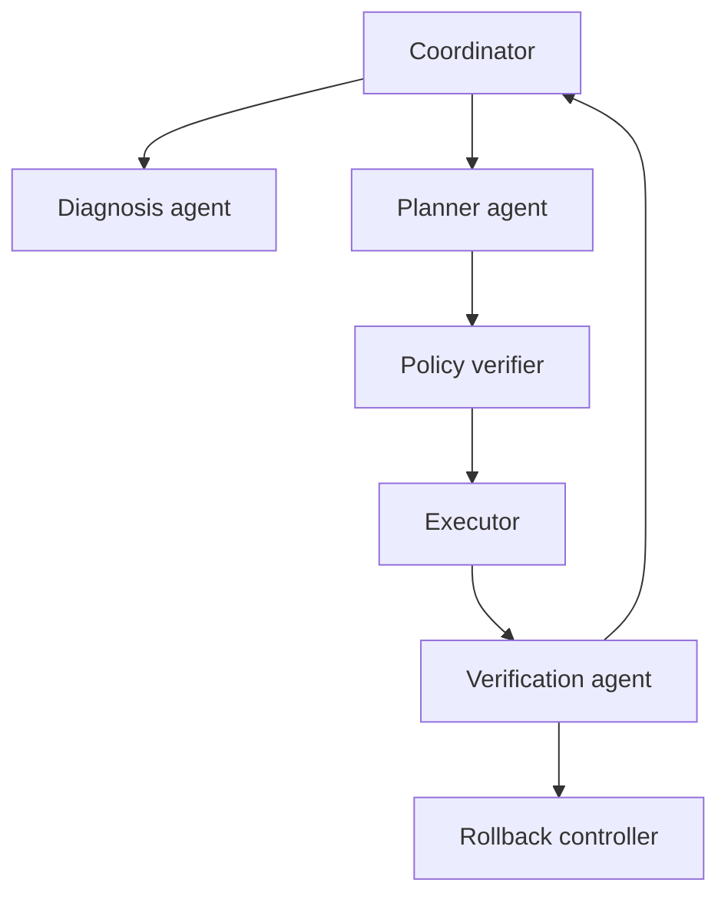
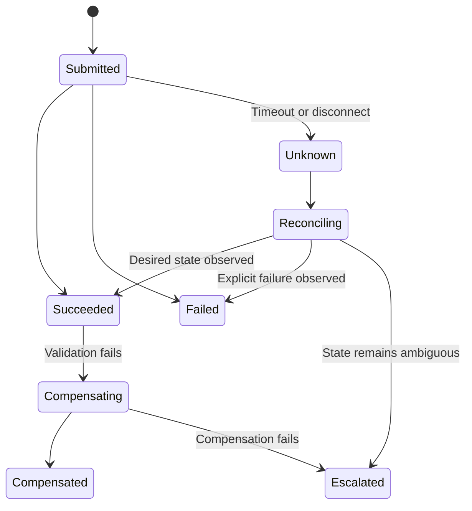

# 方向五：故障缓解、自动修复与自治运维

> 本方向研究如何把诊断结论转成受控行动。核心不是让 Agent 获得更多权限，而是建立建议、计划、审批、执行、验证、回滚和审计组成的安全闭环。

## 📚 目录

### 阅读导航

- 行动术语与风险边界。
- [落地之前的思考](#落地之前的思考)。
- 历史方案、RAG 和 TSG Copilot。
- 结构化 Runbook 与工具执行。
- 审批、验证、回滚和停止条件。
- 自治等级与生产成熟度。
- 安全威胁和评测。
- 阅读路线与来源。

## 方向定位

### Mitigation、Remediation 与 Resolution

| 概念 | 目标 | 示例 |
|---|---|---|
| Mitigation | 先降低用户影响 | 切流、扩容、隔离 |
| Remediation | 修复故障状态或原因 | 回滚配置、替换节点 |
| Recovery | 恢复可用服务 | 重启并恢复流量 |
| Resolution | 事件满足关闭条件 | SLO 稳定且风险受控 |

缓解不一定修复根因。

命令成功不等于恢复。

指标恢复也不一定表示用户体验恢复。

### 从建议到闭环



上图是编辑性综合。

任何论文只覆盖其中一段，都不应被称为完整生产自治。

### 行动系统的基本原则

1. 默认最小权限。
2. 默认可逆动作优先。
3. 计划与执行身份分离。
4. 高风险动作人工审批。
5. 所有动作有前置检查。
6. 所有执行有幂等键。
7. 所有结果分层验证。
8. 状态未知时停止扩大影响。
9. 审计记录不可由 Agent 改写。

## 学习目标

### 学完后应该能回答的问题

- 建议与真正自动修复之间缺少哪些环节？
- TSG、Runbook 和工作流怎样转成可执行契约？
- 怎样决定动作风险和审批点？
- 命令成功、资源恢复、SLO 恢复和用户恢复如何区分？
- 什么时候应回滚，什么时候应停止等待人工？
- 怎样设计幂等、超时、重试和部分成功处理？
- 如何判断一篇“Autonomous”论文的真实自治等级？
- Prompt Injection、遥测污染和权限提升如何影响执行 Agent？

### 学完后应该具备的能力

- 把自然语言步骤结构化为 Runbook。
- 为动作定义前置、预期、失败和回滚。
- 按爆炸半径与可逆性设置审批。
- 设计分层恢复验证。
- 建立动作评测和长期生产指标。

## 落地之前的思考

### 先确认为什么需要自动化动作

本章是工程性综合，讨论受控修复或自治运维启动前的决策，不是对某篇自动修复论文的实验结论复述。

“自动修复”可能是在解决不同问题：

- 工程师找不到正确的 Runbook。
- 执行命令需要重复复制粘贴。
- 审批等待时间过长。
- 验证步骤经常被遗漏。
- 常见低风险动作无法及时完成。
- 复杂故障需要跨系统协调。

前四类问题不一定需要 Agent 获得写权限。

可以先用检索、计划生成、命令校验、审批编排或验证自动化解决。

落地前应把现有动作流程画出来：



每一个自动化候选都应说明它消除的是哪一个瓶颈，以及为什么更低权限的方案不够。

### 先按动作风险而不是模型能力分级

自治等级不能从“模型看起来很强”推导出来。

先给动作分类：

| 风险维度 | 低风险示例 | 高风险示例 |
|---|---|---|
| 可逆性 | 切回旧路由、暂停非关键任务 | 删除数据、覆盖配置 |
| 爆炸半径 | 单个无状态实例 | 跨租户资源或核心数据库 |
| 可观测性 | 结果有明确健康指标 | 结果延迟且无法确认 |
| 幂等性 | 重复执行无副作用 | 重复执行产生重复数据 |
| 业务语义 | 技术资源重启 | 订单、支付和权限动作 |
| 回滚 | 自动且经过演练 | 需要人工临时决定 |

任何一项落入高风险，都应降低自动化等级。

建议将能力拆成：

1. 建议：只返回候选动作。
2. 计划：生成结构化步骤和风险。
3. 审批：由人确认具体资源和参数。
4. 执行：在租约、策略和最小权限下运行。
5. 验证：检查技术和业务结果。
6. 回滚：失败或状态未知时恢复或停止。

一套系统可以在低风险动作处于 L4，在数据库故障转移处于 L3，在数据删除处于 L0。

不应因为产品拥有统一 Agent，就给所有动作配置同一个自治等级。

### 检查动作契约、身份和恢复能力

自然语言 Runbook 不能直接作为生产执行接口。

每个动作至少需要结构化契约：

| 字段 | 需要说明的内容 |
|---|---|
| 目标 | 精确资源、范围和环境 |
| 前置条件 | 健康状态、版本、依赖和审批 |
| 参数 | 类型、枚举、上下限和默认值 |
| 预期结果 | 技术状态和业务信号 |
| 超时 | 单步和全流程上限 |
| 重试 | 次数、退避和是否安全 |
| 幂等键 | 如何避免重复动作 |
| 失败 | 可重试、需停止或需人工 |
| 回滚 | 具体动作、前提和验证 |
| 审计 | 谁、何时、为什么、改了什么 |

身份和权限应在计划阶段就确定，而不是执行时临时申请。

至少分离：

- 读取身份。
- 生成计划身份。
- 审批身份。
- 执行身份。
- 回滚身份。

短期凭据、资源租约和策略引擎必须能够拒绝越界目标。

“Agent 只调用一个内部 API”不是安全边界，真正的边界在 API 是否检查资源、租户、动作和审批状态。

状态未知是最危险的失败类型之一：

- 请求超时，但远端可能已经执行。
- API 返回错误，但资源已经部分变化。
- 指标延迟，验证暂时看不到恢复。
- 回滚命令成功，但业务状态仍未恢复。

因此执行器必须支持对账和人工接管，而不是只依赖命令返回码。

### 先用历史回放和 Game Day 验证闭环

生产自动化不能只用“命令执行成功率”评估。

至少准备三类验证：

| 验证 | 目的 | 必须观察 |
|---|---|---|
| 历史回放 | 检查计划和风险识别 | 参数、前置条件、候选动作 |
| 沙箱或预发 | 检查真实工具行为 | 部分成功、超时、重试和回滚 |
| Game Day | 检查组织接管能力 | 告警、审批、升级和沟通 |

Game Day 不只是演练系统，也要演练人：

- 谁收到自动动作通知。
- 谁可以暂停租约。
- 谁判断技术恢复和业务恢复。
- 谁在模型不可用时接管。
- 谁负责复盘错误计划。

测试集应主动包含：

- 目标资源已被其他变更占用。
- 参数处于边界值。
- 依赖服务同时异常。
- 监控数据缺失。
- 工具返回部分成功。
- 回滚动作本身失败。
- 两个 Agent 同时生成相互冲突的计划。

没有失败样本的自动修复评测，不能说明执行闭环可靠。

### 选择最小自动化范围并写清退出条件

首个生产试点最好满足：

- 低风险、可逆、幂等。
- 资源范围有限且 owner 明确。
- 技术和业务验证信号都存在。
- 现有 Runbook 已经被人工反复验证。
- 自动动作可以随时降级成计划或建议。

可以按下面的阶梯推进：

```text
只读建议 → 结构化计划 → 人工审批执行 → 单场景自动执行 → 有限闭环
```

每升一级都需要重新验证，而不是沿用上一级的分数。

成功条件可以包括：

- 自动动作的成功和回滚率优于人工基线。
- 未授权资源和参数被策略层拒绝。
- 状态未知能够在预算内被识别和接管。
- 业务 SLI 在动作后达到预期恢复。
- 审批、执行和验证审计完整。

退出条件可以包括：

- 回滚需要临时手工编写命令。
- 业务恢复无法被独立验证。
- 自动动作造成的误操作成本高于节省的时间。
- 运行团队无法持续参加 Game Day。
- 模型或工具版本变化后无法快速回放。
- 任何跨租户、不可逆或法规敏感动作没有人工批准。

人工接管也必须是可操作的产品能力，而不是页面上的一个按钮：

- 接管者能看到当前计划、权限和已发生的副作用。
- 接管者能暂停后续动作并保留现场。
- 接管者知道验证失败还是状态未知。
- 接管者能恢复到原有人工 Runbook。
- 接管过程和决定理由会进入审计与复盘。

自动化的终点不是 L6。

在高风险场景保持“生成计划并等待人工”可能是最成熟的工程选择。

## 第一阶段：从知识检索到行动建议

### 行动建议是什么

行动建议是一项尚未执行的候选处置。

它至少包含：

- 目标。
- 动作目的。
- 来源。
- 适用环境和版本。
- 依赖的诊断假设。
- 预期收益。
- 风险和副作用。
- 是否可逆。
- 所需权限。

### 历史方案 RAG

Incident Resolution Recommendation 使用 RAG 从历史支持资料推荐解决方案。

优势：

- 知识可更新。
- 可引用历史事件。
- 减少通用模型幻觉。
- 支持私有环境术语。

风险：

- 症状相似但根因不同。
- 历史动作已过期。
- 过去动作成功条件缺失。
- 旧版本资源语义变化。
- 权限和租户不匹配。

### 行动来源的权威等级

| 来源 | 默认权威 | 使用方式 |
|---|---|---|
| 已审核当前 Runbook | 高 | 可进入计划 |
| 当前版本产品文档 | 高 | 验证参数与约束 |
| 已确认历史事件 | 中 | 生成候选 |
| TSG | 中 | 引导调查和步骤 |
| 聊天记录 | 低 | 仅作线索 |
| 模型参数知识 | 低 | 不能直接执行 |

### RAG 推荐的最小输出

```yaml
recommendation:
  action: rollback deployment deploy-2191
  goal: restore previous connection pool behavior
  evidence:
    - runbook://checkout/rollback#v4
    - incident://INC-2026-0718
  applicability:
    environment: production
    version: "checkout 4.x"
  assumptions:
    - anomaly started after deployment
    - previous revision is healthy
  risk: medium
  execution_status: not_executed
```

### Nissist 的 TSG Copilot

Nissist 使用故障排查指南增强事件缓解 Copilot。

TSG 能提供：

- 场景范围。
- 检查顺序。
- 分支条件。
- 已知动作。
- 升级路径。

Copilot 可以检索、链接和解释步骤。

若没有工具执行，它仍属于建议系统。

### TSG 的失败方式

- 文档过期。
- 服务名称变化。
- 隐含前置条件未写。
- 危险步骤缺少警告。
- 回滚步骤缺失。
- 只覆盖单一故障。
- 文档与真实环境冲突。

### 事件响应规划

Incident Response Planning 使用轻量 LLM 生成多个候选响应，并通过前瞻规划选择预期恢复时间较短的动作。

它不直接接受第一个生成动作。

这种“生成多个候选再验证”的设计比单次生成更稳健。

### 响应阶段

安全事件响应可拆为：

- 评估。
- 遏制。
- 保护取证证据。
- 驱逐攻击者。
- 加固。
- 恢复。

这些阶段可能并行，也可能存在依赖。

### 候选动作评价

候选动作可以按以下维度评分：

- 预期恢复时间。
- 爆炸半径。
- 可逆性。
- 证据强度。
- 前置条件满足度。
- 操作复杂度。
- 对取证的影响。
- 对业务连续性的影响。

### 自验证的边界

让同一个 LLM预测动作结果可以筛掉部分明显错误。

它不是独立环境验证。

模型生成者和评估者可能共享同一幻觉。

更强验证来自：

- 规则与 Schema。
- 静态检查。
- 历史回放。
- 沙箱执行。
- canary。
- 当前环境观测。
- 人工审批。

### 行动计划模板

```markdown
#### 目标
恢复 checkout 成功率，同时保持订单数据一致性。

#### 前置条件
- 已确认上一个 revision 健康。
- 数据库迁移向后兼容。
- 回滚权限已审批。

#### 动作
将 checkout deployment 回滚至 revision 42。

#### 预期信号
- 新错误率在 5 分钟内下降。
- 订单创建成功率恢复。

#### 失败条件
- 错误率继续上升。
- 数据一致性检查失败。

#### 回滚
停止流量切换并恢复 revision 43。
```

### 建议评价

离线评价：

- 与已确认动作是否一致。
- 引用是否支持。
- 环境和版本是否匹配。
- 是否包含必要前置和风险。

线上评价：

- 工程师采纳率。
- 修改率。
- 首次有效建议率。
- 因错误建议增加的诊断时间。

采纳率高不等于动作正确。

团队可能因压力接受不良建议。

### 本阶段小结

- 推荐是候选，不是执行事实。
- RAG 必须过滤环境、版本和权威等级。
- TSG Copilot 的价值在于受控知识，不自动意味着工具执行。
- 多候选和前瞻规划能降低单次生成风险。
- 模型自验证必须由环境验证补充。

## 第二阶段：把 Runbook 转成可执行工作流

### 自然语言步骤为什么不够

“重启异常 Pod”缺少：

- 哪个 Pod。
- 哪个 namespace。
- 是否由控制器管理。
- 是否有足够副本。
- PodDisruptionBudget 是否允许。
- 怎样判断重启成功。
- 失败后怎样处理。

执行系统需要明确契约。

### Runbook Step Schema

```yaml
step_id: restart_canary_pod
goal: replace one unhealthy pod
preconditions:
  - healthy_replicas >= 3
  - pdb_disruptions_allowed >= 1
target_selector:
  namespace: checkout-prod
  labels:
    app: checkout
action:
  tool: kubernetes_delete_pod
  max_targets: 1
verification:
  - replacement_ready_within: 180s
  - error_rate_not_increase: true
on_failure: stop_and_escalate
rollback: not_applicable_resource_recreated_by_controller
```

### 前置条件

前置条件应由工具实时验证，不能只写在文档中。

常见条件：

- 目标存在且唯一。
- 当前状态与诊断一致。
- 有足够冗余。
- 不在冻结窗口。
- 没有冲突变更。
- 回滚资源可用。
- 审批仍有效。
- 遥测健康。

### 参数绑定

模型不能自由生成生产资源名。

应从事件上下文或资源选择器解析，再展示给审批者。

参数绑定必须防止：

- 通配符扩大目标。
- namespace 缺省到错误环境。
- 区域或租户混淆。
- 命令注入。
- 旧资源 ID 重用。

### LLexus 的 Agent 系统

LLexus 面向事件管理，将 TSG 和 Agent 工作流结合。

学习重点不是系统名称，而是：

- 如何理解文档步骤。
- 如何选择和调用工具。
- 如何保存事件状态。
- 如何处理分支。
- 人在哪里确认。

### 从文档到工作流编译



生成工作流不能直接发布。

### Auto-remediation of Microservices

该研究用 LLM 生成并执行 Ansible playbook，处理微服务运行时问题。

它把 LLM 放入 MAPE-K 相关流程的 Generate 和 Act 环节。

研究假定诊断与自然语言修复提示由运维人员提供。

因此其贡献主要是修复代码生成和实验执行，不等于完整自动诊断闭环。

### Ansible 作为执行表示

Ansible playbook 相比任意 shell：

- 结构化。
- 可审查。
- 支持模块和幂等。
- 可记录任务状态。
- 便于静态检查。

它仍可能包含危险模块、错误目标和非幂等命令。

### 平均正确性 AC

论文用 AC 评价每个 playbook 内任务正确比例的平均值。

学习化表达：

$$
AC=\frac{1}{m}\sum_{i=1}^{m}\frac{C_i}{N_i}
$$

- $m$ 是 playbook 数。
- $C_i$ 是第 $i$ 个 playbook 正确任务数。
- $N_i$ 是任务总数。

部分任务正确不表示 playbook 可安全执行。

一个关键错误任务足以造成破坏。

### pass@k

pass@k 衡量生成 $k$ 个候选时至少一个通过测试的概率。

它适合代码生成实验。

生产处置不能通过“多执行几次总有一次成功”使用 pass@k。

系统只能执行经过选择、审核和验证的一个计划。

### 生成代码检查

#### 语法检查

YAML 和模块参数是否合法。

#### Schema 检查

是否只使用允许模块。

#### 策略检查

是否触及禁用资源或超出目标数量。

#### 幂等检查

重复执行是否产生额外副作用。

#### Secret 检查

是否硬编码凭据。

#### Dry Run

能否得到准确变更预览。

#### 沙箱执行

在隔离环境检查真实结果。

### 工具执行身份

计划 Agent 不应持有长期管理员凭据。

推荐：

- 工作负载身份。
- 短期 token。
- 动作级权限。
- 环境和租户限定。
- 审批后签发。
- 执行结束自动过期。

### 幂等键

每次动作使用：

```text
incident_id + plan_version + step_id + target_version
```

重复请求返回原执行状态，而不是再次执行。

### 重试

只有明确可重试错误才自动重试。

| 错误 | 建议 |
|---|---|
| 网络瞬时失败 | 有界退避重试 |
| 权限拒绝 | 不重试，升级 |
| 前置条件变化 | 重新规划 |
| 状态未知 | 查询状态，不重复执行 |
| 业务验证失败 | 停止或回滚 |

### 部分成功

批量动作中，部分目标可能成功。

系统应记录每个目标状态。

不能把整体标成简单失败后全部重试。

### 本阶段小结

- 自然语言 Runbook 必须编译为明确工具契约。
- 前置条件需要实时验证。
- LLM 生成 Ansible 展示代码生成与执行，不等于完整自治。
- AC 和 pass@k 不足以表示生产安全。
- 身份、幂等、重试和部分成功决定执行可靠性。

## 第三阶段：审批、验证、回滚与停止

### 风险决定审批

风险可以由以下因素组合：

- 爆炸半径。
- 可逆性。
- 数据持久性。
- 证据强度。
- 动作熟悉度。
- 环境。
- 当前业务时段。
- 回滚可用性。
- 观测健康度。

### 风险矩阵

| 动作 | 爆炸半径 | 可逆性 | 默认审批 |
|---|---|---|---|
| 查询日志 | 小 | 完全 | 无 |
| 重启单个无状态 canary | 小 | 高 | 策略内自动 |
| 扩容副本 | 中 | 高 | 自动或快速审批 |
| 回滚单服务 | 中 | 中 | 人工审批 |
| 数据库 failover | 大 | 中 | 双人审批 |
| 删除数据 | 极大 | 低 | 禁止自动 |

这是编辑性示例。

### 审批不是一个按钮

审批界面应展示：

- 诊断结论和置信度。
- 支持与反证。
- 计划差异。
- 精确目标。
- 权限。
- 预期效果。
- 最坏影响。
- 验证和回滚。
- 超时和停止条件。

### 审批绑定计划版本

审批后任何参数或步骤变化都应使审批失效。

执行器验证：

```yaml
approval:
  plan_hash: sha256:...
  approved_targets: [checkout-prod]
  expires_at: 2026-08-03T11:00:00+08:00
  max_blast_radius: 1_service
```

### 四层验证

#### 工具层

API 或命令是否成功返回。

#### 资源层

目标资源是否达到期望状态。

#### 服务层

错误率、延迟、吞吐和饱和度是否恢复。

#### 业务层

订单、支付、登录等关键用户旅程是否恢复。

只有工具层成功不能关闭事件。

### 验证窗口

恢复需要稳定时间。

验证应定义：

- 观察时长。
- 基线。
- 允许波动。
- 无数据处理。
- 对照区域或 canary。
- 业务周期。

### Canary 执行

先在有限目标执行：

1. 选择一个实例或小流量分组。
2. 执行动作。
3. 观察技术和业务信号。
4. 达标后扩大。
5. 未达标则停止或回滚。

### 回滚前置条件

回滚必须在执行前验证：

- 旧版本存在。
- 数据格式兼容。
- 依赖仍支持旧版本。
- 回滚工具可用。
- 有足够容量。
- 回滚本身不会扩大影响。

### 自动回滚条件

- 核心错误率超过安全阈值。
- 业务成功率下降。
- canary 健康检查失败。
- 目标超出审批范围。
- 执行超时。
- 观测数据不可用且风险继续上升。

### 状态未知

超时后无法确定动作是否完成，是危险状态。

正确流程：

1. 不立即重复执行。
2. 查询目标实际状态。
3. 核对执行审计和幂等键。
4. 无法确认则停止并人工接管。

### 停止条件

系统在以下情况停止自动推进：

- 诊断置信度下降。
- 前置条件不再满足。
- 工具返回不一致状态。
- 爆炸半径超预算。
- 需要新权限。
- 回滚不可用。
- 遥测疑似污染。
- 人工接管。

### 恢复后验证

恢复后还要检查：

- 错误是否复发。
- 积压是否消退。
- 数据是否一致。
- 临时缓解是否需要撤销。
- 容量是否回归正常。
- 监控是否仍有效。
- 是否需要 Postmortem。

### STRATUS 的多 Agent 可靠性工程

STRATUS 使用多 Agent 支持现代云的自主可靠性工程。

阅读其“Autonomous”时要检查各 Agent 是否覆盖：

- 规划。
- 诊断。
- 执行。
- 验证。
- 协调。

还要检查实验是否真实包含审批、生产权限和回滚。

### 多 Agent 执行职责



策略验证和回滚控制不应完全依赖生成模型。

### 本阶段小结

- 风险决定审批强度。
- 审批必须绑定精确计划版本和目标。
- 验证需要覆盖工具、资源、服务和业务四层。
- 回滚能力必须在执行前确认。
- 状态未知时应查询和停止，而不是盲目重试。

## 第四阶段：自治等级

### 七级学习模型

| 级别 | 能力 | 工具权限 | 人工角色 |
|---|---|---|---|
| L0 | 文档检索 | 无 | 全部判断 |
| L1 | 排查建议 | 无或只读 | 选择查询 |
| L2 | 缓解候选 | 无 | 判断动作 |
| L3 | 可审核计划 | dry-run | 审批和执行 |
| L4 | 审批后执行 | 限定写权限 | 审批关键动作 |
| L5 | 低风险自动执行 | 策略内写权限 | 处理例外 |
| L6 | 自动验证与回滚的有限闭环 | 场景限定 | 监督与治理 |

这是跨论文编辑性综合，不是某篇论文提出的标准。

### L0 到 L2

重点是知识和建议质量。

需要：

- 引用。
- 版本过滤。
- 拒答。
- 人工执行。

风险主要是误导工程师。

### L3

系统生成结构化计划和 dry-run。

需要：

- Tool Schema。
- 目标解析。
- 静态策略。
- 计划 diff。
- 人工审批。

### L4

审批后由系统执行。

需要：

- 短期身份。
- 幂等。
- 审计。
- 有界重试。
- 分层验证。
- 回滚。

### L5

仅对低风险、熟悉、可逆场景自动执行。

需要：

- 场景白名单。
- 长期回放证据。
- 严格风险预算。
- canary。
- 实时异常停止。

### L6

有限闭环自动诊断、计划、执行、验证和回滚。

“有限”意味着：

- 只覆盖明确场景。
- 只用限定工具。
- 只操作限定资源。
- 只在观测健康时运行。
- 超界立即人工接管。

### 每一级的升级证据

从一个级别升级到下一级，需要证明：

- 离线回放通过。
- 沙箱与预发通过。
- canary 长期稳定。
- 失败可被检测。
- 回滚真实可用。
- 权限无法越界。
- 人工接管有效。
- 指标优于现有流程。

### 不适合自动化的场景

- 不可逆数据删除。
- 跨租户批量动作。
- 根因证据不足。
- 业务语义不清。
- 回滚不可用。
- 观测被污染或缺失。
- 多个并发变更。
- 新型安全事件。
- 法规要求人工批准。

### 自动化不是越高越好

在高风险、低频、不可逆场景，L3 可审核计划可能比 L6 更可靠、更经济。

自治等级应按场景决定，不按产品统一决定。

同一系统可以：

- 对日志查询处于 L5。
- 对无状态实例替换处于 L4。
- 对数据库 failover 处于 L3。
- 对数据删除保持 L0。

### 降级模式

系统应能从自动执行降级为：

- 只生成计划。
- 只提供建议。
- 只读查询。
- 完全人工流程。

触发原因包括模型变更、工具故障、指标异常和重大事件。

### 本阶段小结

- 自治是按场景划分的能力，不是产品标签。
- L3 到 L4 的关键变化是获得受控写权限。
- L5 只适合经过长期验证的低风险动作。
- L6 必须有限定场景、验证、回滚和人工接管。
- 高自治不总是更好的工程选择。

## 第五阶段：评测、生产边界与安全

### 动作质量指标

| 层次 | 指标 |
|---|---|
| 推荐 | 引用支持率、采纳率、修改率 |
| 计划 | 可执行率、策略通过率、前置完整率 |
| 工具 | 调用成功率、幂等冲突率 |
| 恢复 | 恢复率、恢复时间、SLO 恢复 |
| 安全 | 误操作率、越权率、回滚率 |
| 人机 | 审批时间、接管率、认知负担 |
| 成本 | 模型、工具和人工成本 |

### 任务完成率

任务完成必须定义结束状态。

“playbook 运行完”不是“事件完成”。

一个严格定义可以要求：

- 所有计划步骤完成或合理跳过。
- 资源达到目标状态。
- 服务 SLO 稳定。
- 业务探针通过。
- 无新增高严重性告警。
- 临时风险已登记。

### 恢复时间

恢复时间应明确起止点：

- 从检测开始？
- 从 Agent 接管开始？
- 到基础设施恢复？
- 到用户体验恢复？

不同定义不可直接比较。

### Auto-remediation 论文指标的边界

功能正确性和 AC 评价生成 playbook 的代码质量。

它们不能单独证明：

- 根因正确。
- 目标选择正确。
- 执行安全。
- SLO 恢复。
- 回滚有效。
- 长期生产可靠。

### 生产成熟度清单

- [ ] 真实或高保真环境。
- [ ] 当前环境数据。
- [ ] 真实工具契约。
- [ ] 明确身份与权限。
- [ ] 审批策略。
- [ ] dry-run 或 canary。
- [ ] 技术与业务验证。
- [ ] 自动回滚或安全停止。
- [ ] 完整审计。
- [ ] 长期运行和失败报告。
- [ ] 人工接管演练。

### Prompt Injection

攻击者可在日志、工单或文档中写入指令。

检索文本必须视为不可信数据。

防护包括：

- 指令与证据分离。
- Tool Schema。
- 参数白名单。
- 策略层独立校验。
- 不允许文本提升权限。

### Telemetry Poisoning

错误或恶意遥测会让 Agent 形成错误诊断并采取动作。

需要：

- 多源交叉验证。
- 数据完整性。
- 异常数据源检测。
- 采集身份。
- 关键动作前人工确认。

### Unsafe Tool Call

模型可能选择危险工具或参数。

执行器必须独立判断风险，不能仅依赖 Prompt 告知模型“谨慎”。

### Permission Escalation

Agent 不得自行请求或组合权限以绕过限制。

权限提升必须是外部审批流程。

### Credential Leakage

凭据不应出现在：

- Prompt。
- 工具返回。
- 日志。
- Agent Memory。
- 审批 diff。

使用代理执行器和短期身份。

### Supply Chain Risk

生成的脚本可能下载未知包或镜像。

需要：

- 允许仓库。
- 版本固定。
- 签名验证。
- SBOM。
- 网络出口限制。

### 审计事件

每次动作记录：

```yaml
audit_event:
  incident_id: INC-2026-0803
  plan_hash: sha256:...
  actor_model: planner-v4
  executor_identity: remediation-prod-checkout
  approvers: [alice, bob]
  target: checkout-prod
  started_at: 2026-08-03T10:20:00+08:00
  result: rolled_back
  evidence_links: []
```

### 生产事故学习

Agent 自身造成的失败也要 Postmortem。

分类：

- 错误诊断。
- 错误计划。
- 策略缺口。
- 审批误判。
- 工具故障。
- 验证缺失。
- 回滚失败。
- 审计不完整。

### 本阶段小结

- 评价必须从文本和代码扩展到真实恢复与安全。
- 指标需要明确恢复起止点。
- 生产成熟度依赖权限、审批、验证、回滚和长期证据。
- Prompt Injection 和遥测污染会通过工具放大。
- 执行策略必须独立于生成模型。

## 工程补充：并发、补偿与应急接管

### Plan 是带版本和租约的执行对象

同一事件中可能同时存在 Agent、工程师、控制器和自动扩缩容。一个动作单独正确，也可能与另一个正确动作组合成事故。因此执行 Plan 至少绑定：

- `plan_id` 与不可变 `plan_version`。
- 目标资源、期望版本和观察到的状态版本。
- 创建时间、过期时间和最大执行窗口。
- 所需资源锁或租约。
- 幂等键、审批记录和执行身份。
- 前置条件、成功条件、停止条件和补偿动作。

审批只对具体版本有效。审批后任何参数、目标、步骤或前置条件变化，都必须生成新版本并重新审查。

### 资源锁、租约与乐观并发

| 机制 | 适用场景 | 主要风险 |
|---|---|---|
| 资源锁 | 短时且必须串行的关键动作 | 持锁者失联造成死锁 |
| 租约 | 执行者可能崩溃的长动作 | 时钟或续租异常导致双持有 |
| 乐观并发 | 冲突少且资源有版本号 | 重试时必须重新规划 |
| 版本前置条件 | Kubernetes `resourceVersion` 等 | 不能保护跨资源不变量 |

例如扩容 Plan 基于副本数 3 生成，则执行时必须验证仍为 3。若工程师已扩到 5，Agent 不能机械执行“加 2”或把目标覆写回 5；它应标记 `precondition_failed` 并重新规划。

### 幂等键不能替代冲突检测

幂等键防止同一逻辑请求因重试重复执行，但不能判断两个不同 Plan 是否冲突。建议用以下组合键定位重复请求：

```text
incident_id + plan_version + step_id + target_resource
```

执行网关还要检测：

- 两个 Plan 是否写同一资源字段。
- 一个动作的前置条件是否被另一个动作破坏。
- Plan 是否超过 TTL 或基线快照已过期。
- 自动控制器是否会立即反向调节。
- 当前变更窗口是否已有人工操作。

### 部分成功需要事务边界

跨 API、集群和云资源的修复通常没有全局事务。每个步骤要声明它属于哪种边界：

| 边界 | 例子 | 失败处理 |
|---|---|---|
| 原子操作 | 单资源条件更新 | 失败则状态不变 |
| 可补偿步骤 | 切流后更新路由 | 执行反向动作并验证 |
| 不可逆步骤 | 数据删除或密钥吊销 | 强审批，不承诺自动回滚 |
| 最终一致步骤 | 云 API 创建和标签同步 | 轮询真实状态并对账 |

“回滚”是恢复旧版本，“补偿”是在无法原子撤销时采取反向业务动作。两者不能混为一个按钮。

### 重复回调、超时后成功与最终对账

超时只说明调用方没有及时收到结果，不说明服务端没有执行。若超时后立即重试一个非幂等创建操作，可能产生重复资源。



处于 `Unknown` 时禁止把步骤标为失败并盲目重试。对账器应使用操作 ID、幂等键和资源实际状态确认：请求是否被接受、对象是否创建、状态是否收敛、重复回调是否属于同一执行。

### Saga 式补偿计划

一个“切走故障节点并替换”的工作流可拆成：

| 步骤 | 正向动作 | 补偿动作 | 验证 |
|---|---|---|---|
| 1 | 从负载均衡摘除节点 | 重新加入旧节点 | 活跃连接排空且容量足够 |
| 2 | 创建替代节点 | 删除替代节点 | 健康检查与版本正确 |
| 3 | 加入替代节点 | 再次摘除 | SLI 稳定且错误率未升高 |
| 4 | 退役旧节点 | 通常不可即时恢复 | 备份与观察窗完成 |

补偿也可能失败，因此必须有独立预算、重试上限、停止条件和人工 owner。

### Kill Switch 必须独立于 Agent 故障域

急停能力若依赖同一个模型、编排器、消息队列或凭据，在控制面故障时可能不可用。Kill Switch 应由独立策略或执行网关实施，并能：

- 阻止新的写动作和租约续期。
- 撤销短期执行凭据。
- 保留只读观测和审计能力。
- 按租户、环境、动作类别或全局范围生效。
- 由值班人员通过不依赖 Agent 的路径触发。
- 定期演练并监控自身健康。

急停不等于强行终止所有正在执行的云 API；触发后仍要对账已提交动作的真实状态。

### Break-glass 是受审计的短期例外

当常规审批或身份系统不可用且事件影响持续扩大时，可使用 Break-glass：

1. 绑定具体 Incident、理由、目标资源和允许动作。
2. 使用短 TTL 凭据，并尽可能双人确认。
3. 禁止静态共享管理员密钥。
4. 全量记录命令、返回、操作者和时间。
5. 到期自动撤销，事件后强制复盘与权限审计。

Break-glass 不是绕过审计，而是在紧急情况下把例外变成更显式、更短期的受控流程。

### 审批疲劳与风险分级

如果每个低风险步骤都弹出审批，工程师会形成机械点击习惯；如果一个审批覆盖整个模糊计划，又无法知道实际批准了什么。

| 风险级别 | 示例 | 建议控制 |
|---|---|---|
| 低 | 只读查询、生成建议 | 自动执行并审计 |
| 中 | 小流量可逆配置 | 单人审批、Canary、自动停止 |
| 高 | 全局路由、数据或权限变更 | 双人复核、逐步执行、IC 在场 |
| 极高 | 不可逆删除、跨区域切换 | Incident Commander 接管或禁止 Agent |

审批界面只展示决策所需的差异、影响半径、证据、回滚条件和过期时间。相同低风险重复动作可按策略批量授权，但高风险动作不能被“已有一次批准”永久放行。

### Incident Commander 的接管语义

接管必须是系统状态，不是聊天中的一句“我来处理”：

- 暂停 Agent 新计划和当前租约续期。
- 标记哪些已提交动作仍在飞行中。
- 把最新资源状态、证据、审批和未知项交给 IC。
- 人工动作同样经过执行网关和审计。
- 恢复 Agent 前重新建立基线，旧 Plan 全部过期。

### Agent 控制面故障时的 fail-closed 与 fail-open

| 动作类型 | 默认策略 | 原因 |
|---|---|---|
| 新写操作 | fail-closed | 无法验证权限、状态和审计时不应继续 |
| 正在进行的高风险变更 | 停止扩展并对账 | 粗暴中断可能留下更坏的中间态 |
| 只读遥测 | 有限 fail-open | 保留态势感知但限制敏感数据 |
| 维持安全状态的控制器 | 按预批准策略运行 | 例如已有熔断不应依赖 LLM 在线 |
| 紧急人工处置 | Break-glass | 独立身份、短期授权和审计 |

选择依据是动作风险和系统不变量，不是简单规定所有组件都 fail-closed 或 fail-open。

### 回滚演练和 Game Day

上线前和定期运行 Game Day，至少覆盖：

- 执行器在提交后超时，但云端实际成功。
- 锁服务不可用或租约续期失败。
- 两个 Plan 同时修改同一资源。
- Canary 指标恢复但业务探针恶化。
- 回滚动作本身失败或版本已不可用。
- Agent 编排器失联，Kill Switch 仍能生效。
- 审批系统不可用，Break-glass 被启用和撤销。

演练验收不只看最终恢复，还要测急停时间、未知状态收敛时间、审计完整性、人工接管时间和是否出现重复副作用。

## 论文阅读路线

### 入门：建议和 Copilot

1. [RAG Incident Resolution Recommendation](https://arxiv.org/pdf/2409.13707)：历史方案检索与推荐。
2. [Nissist](https://arxiv.org/pdf/2402.17531)：TSG 增强缓解 Copilot。
3. [Incident Response Planning](https://www.ndss-symposium.org/ndss-paper/incident-response-planning-using-a-lightweight-large-language-model-with-reduced-hallucination/)：候选动作、前瞻规划和幻觉抑制。

### 进阶：Runbook 和代码执行

1. [LLexus](https://www.microsoft.com/en-us/research/publication/llexus-an-ai-agent-system-for-incident-management/)：事件管理 Agent 与 TSG 工作流。
2. [LLM Auto-remediation](https://dl.acm.org/doi/pdf/10.1145/3663529.3663855)：生成并执行 Ansible playbook。

### 深入：多 Agent 可靠性工程

1. [STRATUS](https://yinfangchen.github.io/assets/pdf/stratus_paper.pdf)：多 Agent 自主可靠性工程。

### 代表性路线对比

| 方法 | 主要输出 | 是否执行 | 关键边界 |
|---|---|---|---|
| RAG Recommendation | 解决方案候选 | 否 | 召回与适用性 |
| Nissist | TSG 缓解建议 | 依实现而定 | 文档新鲜度 |
| Response Planning | 响应计划 | 研究环境规划 | 自验证非环境验证 |
| LLexus | Agent 工作流 | 工具增强 | TSG 与工具边界 |
| Auto-remediation | Ansible playbook | 实验执行 | 上游诊断由人提供 |
| STRATUS | 多 Agent 可靠性任务 | 研究环境 | 生产权限和回滚证据 |

## 本方向总结

### 最值得记住的结论

1. 建议、计划、审批、执行、验证和回滚是不同状态。
2. 历史方案与 TSG 只能生成候选，适用范围必须核对。
3. 自然语言 Runbook 需要编译为受约束工具契约。
4. 代码正确性不等于目标、诊断和恢复正确性。
5. 审批必须绑定计划，验证必须覆盖技术和业务。
6. 自治是按风险场景划分的能力，不是系统名称。
7. 生产闭环需要最小权限、幂等、审计、停止和人工接管。

### 推荐学习顺序

1. 先学习行动术语和建议边界。
2. 再把 Runbook 结构化。
3. 加入策略、审批和短期身份。
4. 设计四层验证、canary 和回滚。
5. 最后评估自治等级、安全威胁和长期运行证据。

## 来源索引

### 本方向主要来源

以下论文入口统一指向仓库 `README.md` 中维护的公开原文地址，便于独立分享 HTML 后继续阅读。

- [Incident Response Planning](https://www.ndss-symposium.org/ndss-paper/incident-response-planning-using-a-lightweight-large-language-model-with-reduced-hallucination/)
- [Auto-remediation of Microservices](https://dl.acm.org/doi/pdf/10.1145/3663529.3663855)
- [LLexus](https://www.microsoft.com/en-us/research/publication/llexus-an-ai-agent-system-for-incident-management/)
- [Nissist](https://arxiv.org/pdf/2402.17531)
- [RAG Incident Resolution Recommendation](https://arxiv.org/pdf/2409.13707)
- [STRATUS](https://yinfangchen.github.io/assets/pdf/stratus_paper.pdf)

### 资料边界

论文方法、指标和实验观察以本地译文为依据。

七级自治模型、风险矩阵、审批契约、验证分层和部分 YAML 是教学性综合。

它们不冒充单篇论文提出的标准。

不同论文覆盖建议、规划、代码生成、实验执行或多 Agent 的不同片段，本文不因出现 “Agent” 或 “Autonomous” 就推断达到生产闭环。

方向四提供诊断输入；方向六复用本方向的基础设施 Agent 安全边界。
