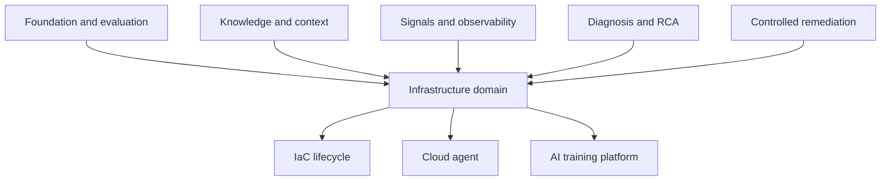
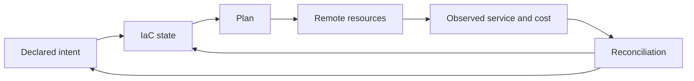
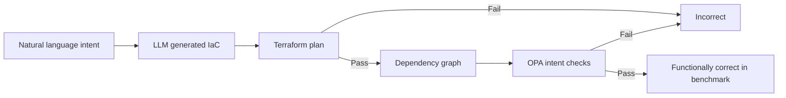
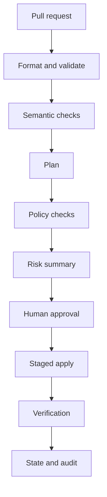
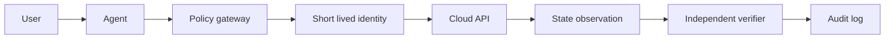
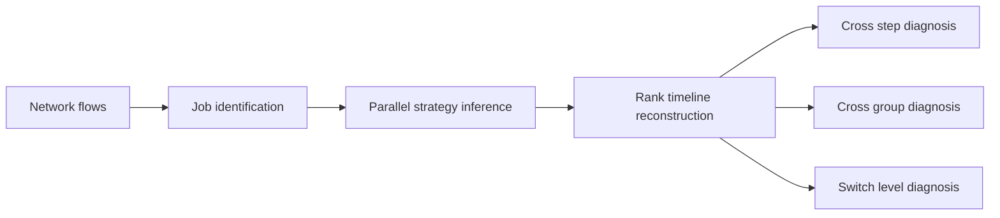
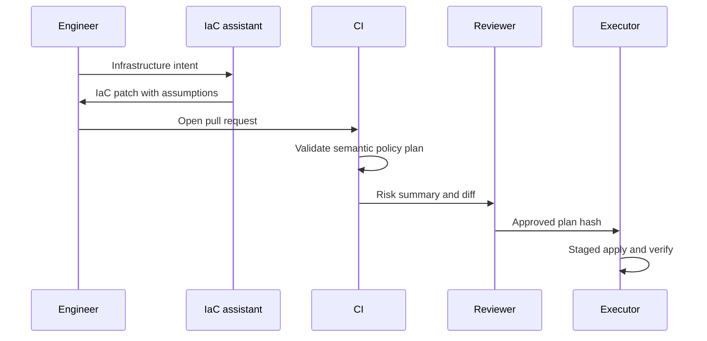
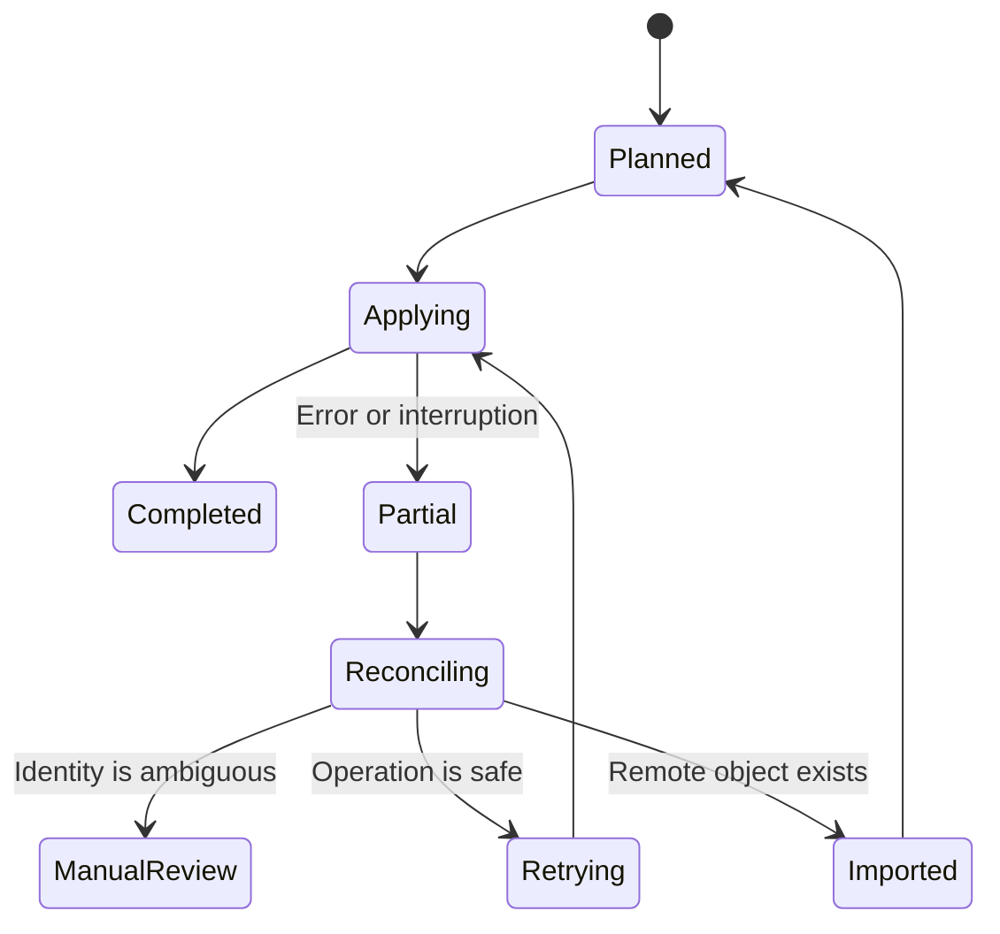

# 方向六：基础设施与 AI 平台智能运维

> 本方向把前五个方向的方法落到 IaC、云资源生命周期和大规模 LLM 训练平台。现有直接译文只有四篇，因此正文强调学习框架、工程控制和证据边界，不扩写不存在的实验共识。

## 📚 目录

### 阅读导航

- IaC 语义、生成与评测。
- [落地之前的思考](#落地之前的思考)。
- 语义检查和变更风险。
- 基础设施 Agent 的接口与权限。
- LLM 训练平台的黑盒诊断。
- DevOps、SRE 和 Platform Engineering 集成。
- 阅读路线和来源。

## 方向定位

### 三类问题

#### 基础设施定义

怎样生成、解释和验证 Terraform 等 IaC。

#### 基础设施管理

怎样让 Agent 通过 CLI、SDK、IaC 或平台 API 读取和修改云资源。

#### AI 平台运维

怎样诊断 GPU、网络、存储、调度器和训练框架共同构成的大规模训练平台。

### 与前五个方向的关系



方向六不是独立的新方法栈。

它把可信评测、知识、信号、诊断和安全执行应用到基础设施对象。

### 资料覆盖边界

本方向直接来源为：

- IaC-Eval。
- Cloud Infrastructure Management in the Age of AI Agents。
- Unearthing Semantic Checks for IaC。
- LLMPrism。

IaC-Eval 提供基准与功能正确性证据。

Semantic Checks 提供部署语义护栏研究。

Cloud Agent 论文提供管理模态、生命周期与初步案例。

LLMPrism 提供生产训练平台黑盒性能诊断证据。

四篇论文不能代表整个行业已形成自治基础设施共识。

## 学习目标

### 学完后应该能回答的问题

- IaC 与普通代码的语义差别是什么？
- 为什么语法正确和 `terraform plan` 成功仍不足？
- 基础设施意图规约怎样评价生成代码？
- 语义检查怎样发现跨属性和跨资源约束？
- IaC Plan 中 create、update、replace 和 delete 风险如何不同？
- CLI、SDK、IaC 与 ClickOps Agent 各有什么边界？
- 基础设施 Agent 为什么需要短期凭据和策略层？
- LLM 训练平台的性能问题为什么难以黑盒诊断？
- 网络流怎样恢复训练作业、并行策略和时间线？

### 学完后应该具备的能力

- 审查生成 IaC 的语法、意图、安全和变更风险。
- 为 IaC 构造机器可验证的意图条件。
- 为只读盘点、Plan 生成和执行定义不同权限。
- 识别训练减速的 GPU、网络、存储、调度和框架假设。
- 把 Agent 放入现有 CI/CD 和平台 API，而不是绕过控制。

## 落地之前的思考

### 先确认基础设施问题不是控制面问题

本章是工程性综合，讨论基础设施和 AI 平台引入 Agent 前的准备条件，不把少量论文外推成行业共识。

基础设施团队经常把不同问题混在“需要一个云 Agent”里：

- 资源盘点慢。
- Terraform 模块难写。
- Plan 难以审查。
- 云 API 参数太多。
- State 与远端资源不一致。
- GPU、网络和存储问题难以定位。
- 容量、成本和可靠性之间缺少共同视图。

这些问题的第一解法可能是模块、策略、State 修复、服务目录、容量报表或更好的平台 API，而不是 LLM。

先记录当前控制面：

| 对象 | 需要确认的事实 | 常见缺口 |
|---|---|---|
| IaC | 模块、Provider、Plan 和 Apply 流程 | 直接 ClickOps 绕过审查 |
| State | owner、备份、锁和恢复流程 | 只相信本地状态文件 |
| 云资源 | 资源、标签、租户和生命周期 | 资源没有责任人 |
| 权限 | 角色、短期身份和策略 | Agent 复用个人长效凭据 |
| AI 平台 | 作业、GPU、网络、存储和调度指标 | 只有训练日志没有平台时间线 |
| 成本 | 资源、模型、存储和网络成本归属 | 只看账单总额 |

如果控制面本身不可审计，Agent 会把不一致和隐含权限变成更快的错误操作。

### 先定义基础设施意图和状态真相

IaC 生成的难点不是 HCL 或 YAML 能否通过语法检查，而是生成结果是否表达了真实意图。

落地前应把意图写成可验证条件：

- 资源类型和数量。
- 网络边界和暴露范围。
- 加密、备份和保留策略。
- 可用区、容量和弹性要求。
- 依赖关系和生命周期。
- 成本上限和 owner 标签。
- 允许替换、禁止删除的对象。

一个 Plan 通过并不等于最终状态正确。

基础设施系统可能存在部分成功、最终一致和漂移，因此要明确三种状态：



状态真相应由多方对账，而不是由 Agent 的命令返回值决定。

至少要能回答：

- State 是否为最新版本。
- 远端资源是否被 ClickOps 修改。
- Apply 是否只完成了一部分。
- 业务 SLI 是否真的恢复。
- 成本和配额是否发生异常变化。

### 判断 Agent 接口是否足够受控

基础设施 Agent 的工具模态各有边界：

| 模态 | 适合任务 | 落地前要补的控制 |
|---|---|---|
| CLI | 单次查询、现有脚本复用 | 参数白名单、输出审计 |
| SDK | 结构化资源读取和操作 | 资源范围、异常和速率限制 |
| IaC | 可评审、可回滚的声明变更 | Plan、Policy、State 和 PR |
| ClickOps | 临时人工操作 | 严格限制，不作为默认路径 |
| 平台 API | 封装后的自助能力 | 业务约束、租约和审计 |

工具接口越接近底层云 API，模型搜索空间越大，越难证明不会越界。

更稳妥的做法是提供窄接口：

- `list_resources` 只读并限制租户。
- `generate_plan` 只写入分支或临时目录。
- `validate_policy` 返回机器可读违规项。
- `apply_plan` 必须携带 Plan Hash、审批号和租约。
- `reconcile_state` 只负责比较，不直接修复。

短期凭据应绑定动作和资源范围，执行结束立即失效。

不能让 Agent 通过解释自然语言的方式取得更高权限。

### 检查 AI 平台是否有诊断所需的时间线

LLM 训练和推理平台的问题经常跨越多个层次：

- 作业调度。
- GPU 利用率和显存。
- 节点健康。
- 网络通信和 Collective。
- 数据加载和存储。
- Checkpoint 与模型分发。
- 推理批处理、队列和 KV Cache。

在接入诊断 Agent 前，先确认这些对象能否按同一时间线关联：

| 关联键 | 连接的对象 |
|---|---|
| Job ID | 调度、训练日志和状态 |
| Run ID | 实验、模型版本和指标 |
| Node/GPU ID | 资源、错误和拓扑 |
| Rank/Worker ID | 并行策略和通信 |
| Checkpoint ID | 存储、恢复和数据完整性 |
| Deployment ID | 推理版本、流量和回滚 |

没有稳定关联键时，模型只能根据相似文本猜测原因。

平台诊断还应保留正常基线：

- 同类作业的吞吐和 step time。
- 网络通信的延迟与重传。
- GPU 空闲、降频和显存异常。
- 数据读取和 Checkpoint 时间。
- 调度等待与资源碎片。
- 推理延迟、吞吐和错误预算。

### 选择最小基础设施试点并设退出条件

第一阶段可以从只读和代码评审开始：

1. 资源盘点和 owner 标签检查。
2. IaC 草稿和意图规约生成。
3. Plan 风险摘要。
4. Policy 违规解释。
5. 训练作业性能时间线摘要。
6. 人工确认后的低风险资源建议。

不要从跨租户写操作、State 自动修复或 GPU 集群自动调度开始。

试点流程可以保持在既有控制面内：

```text
自然语言需求 → Agent 草稿 → IaC/Policy/Plan → 人工评审 → 现有流水线执行 → 对账
```

成功条件可以包括：

- 生成 IaC 的意图检查和 Plan 风险识别优于简单基线。
- Agent 无法访问未授权租户和资源。
- 所有写操作都关联变更 ID、Plan Hash 和审批号。
- Apply 后能对账 State、远端资源、业务 SLI 和成本。
- AI 平台诊断能够定位到可执行的下一步只读查询。

退出条件可以包括：

- State 漂移无法可靠检测。
- Policy 或 Provider 版本变化后无法回放。
- 资源 owner 和成本归属不完整。
- Agent 输出只能解释语法，不能解释意图和影响。
- 训练平台的关键时间线无法关联。
- 自动化收益不足以覆盖安全审查和维护成本。

基础设施场景还要提前明确跨团队责任：

- 平台团队维护模块、Provider 和自助 API。
- IaC owner 负责意图、Plan 和 State。
- SRE 负责运行指标、对账和恢复演练。
- 安全团队负责身份、策略和越权测试。
- 财务或平台运营负责成本归属和预算。

没有 owner 的资源、模块和训练作业不能交给 Agent 托管。

基础设施 Agent 的成熟标志不是能调用更多 API，而是能在状态不确定时停止，在意图不清时请求补充，在执行后主动对账，并始终留在现有工程控制面之内。

## 第一阶段：理解 IaC 语义与代码生成

### IaC 不是配置文本

IaC 声明期望基础设施状态。

它包含：

- 资源类型。
- 属性。
- 资源引用。
- 显式和隐式依赖。
- 模块。
- Provider 行为。
- 状态文件。
- 生命周期规则。
- 输入和输出。

一个字符差异可能导致资源替换或删除。

### Terraform 基本对象

```hcl
resource "aws_s3_bucket" "logs" {
  bucket = var.bucket_name

  lifecycle {
    prevent_destroy = true
  }
}
```

这里同时包含资源类型、逻辑名、用户输入和生命周期约束。

模型必须理解它们的部署语义，而不是只生成合法 HCL。

### 资源引用

```hcl
resource "aws_s3_bucket_versioning" "logs" {
  bucket = aws_s3_bucket.logs.id

  versioning_configuration {
    status = "Enabled"
  }
}
```

引用建立依赖。

硬编码字符串可能绕过依赖图并引用错误资源。

### State 的作用

Terraform State 映射代码对象和真实云资源。

Agent 修改 IaC 前必须知道：

- 当前 state 后端。
- 锁是否可用。
- 工作区。
- 是否有漂移。
- 是否存在 import 或 moved block。
- 敏感值如何保护。

不能把完整 state 直接发送到外部模型。

### Provider 语义

Provider 定义资源 Schema 和 API 行为。

同一属性在不同版本中可能：

- 默认值变化。
- 从可选变成必填。
- 触发资源替换。
- 被废弃。
- 改变枚举范围。

生成代码必须绑定 Provider 版本。

### IaC 生成任务

输入通常是自然语言意图。

输出是一个或多个资源和约束。

任务难点：

- 云服务数量多。
- 资源关系复杂。
- 文档快速变化。
- 安全默认值不总安全。
- 用户需求常不完整。
- 部署验证昂贵。

### IaC-Eval

IaC-Eval 包含 458 个人工整理场景，覆盖 AWS 服务和不同难度。

每个场景包含：

- 自然语言问题。
- 基础设施意图规约。

评估不直接部署资源。

它采用两阶段：

1. `terraform plan` 检查语法、Provider 要求并生成依赖图。
2. OPA 用 Rego 意图规约检查依赖图是否满足用户需求。

### 评估流程



这是对 IaC-Eval 流程的简化表达。

### 为什么不直接部署

部署：

- 需要真实云账号和权限。
- 可能耗时数分钟到数小时。
- 产生费用。
- 有安全和配额风险。
- 成功创建也不保证满足意图。

编译期意图验证更适合大规模 benchmark。

它仍不能替代真实环境验证。

### 基础设施意图规约

意图应拆成可判定条件：

```rego
package intent

deny[msg] {
  bucket := input.resources[_]
  bucket.type == "aws_s3_bucket"
  not bucket.encryption_enabled
  msg := "log bucket must enable encryption"
}
```

真实 IaC-Eval 规约以论文和仓库为准。

### pass@k

若每题生成 $n$ 个程序，其中 $c$ 个正确，从中选择 $k$ 个至少一个正确的无偏估计常写为：

$$
pass@k=1-\frac{\binom{n-c}{k}}{\binom{n}{k}}
$$

pass@1 最接近一次生成的成功率。

### IaC-Eval 的关键结果

论文报告最佳模型 GPT-4 在 IaC-Eval 上 pass@1 为 19.36%。

同一模型在 EvalPlus Python 基准上的结果显著更高。

这说明通用代码能力不能直接外推到 IaC。

### 意图检查过滤假阳性

论文观察到，只做 Terraform 编译会把大量未满足用户意图的程序判为正确。

加入意图规约后过滤了超过约一半编译阶段假阳性。

语法合法不是基础设施正确。

### 文本相似度不够

BLEU 和 CodeBERTScore 比较生成文本与参考代码。

IaC 可以有多个语义等价写法。

也可能只差一个关键属性却产生完全不同结果。

因此功能和意图验证优于文本相似。

### LLM-as-a-Judge 的局限

IaC-Eval 中 LLM 裁判会把大量错误解判为正确。

关键正确性不能只由另一个生成模型决定。

更可靠的是：

- 编译器。
- Provider Schema。
- OPA 策略。
- 静态分析。
- dry-run。
- 沙箱或临时账号部署。

### 增强策略

论文比较少样本、思维链、多轮编译反馈和 RAG。

少样本与 CoT 改进并不稳定。

多轮编译反馈对部分强模型有效。

RAG 在论文实验中是平均改善最明显的策略。

仍需防止检索旧 Provider 文档。

### IaC 生成安全检查

- [ ] 版本固定。
- [ ] 语法和 Schema 正确。
- [ ] 用户意图满足。
- [ ] 加密和访问策略符合要求。
- [ ] 没有公开暴露。
- [ ] 没有硬编码 Secret。
- [ ] 删除和替换受保护。
- [ ] 标签和成本约束满足。
- [ ] Plan 可审查。

### 本阶段小结

- IaC 表达资源、依赖、状态和生命周期。
- IaC-Eval 用 Plan 与 OPA 意图检查评价功能正确性。
- 编译通过、文本相似和 LLM 裁判都不足以确认正确。
- 通用代码 benchmark 不能代表 IaC 能力。
- RAG 需要版本化 Provider 文档。

## 第二阶段：语义检查与变更风险

### 语法、类型与语义

| 层次 | 示例错误 |
|---|---|
| 语法 | HCL 括号错误 |
| 类型 | 字符串传给数值字段 |
| Provider Schema | 缺少必填属性 |
| 资源内语义 | 属性组合不兼容 |
| 跨资源语义 | 子网与资源区域冲突 |
| 业务意图 | 缺少高可用副本 |
| 安全策略 | 存储桶公开 |

越往下越需要领域和组织知识。

### 通过 Plan 仍可能失败

Provider 只在部署 API 调用时检查部分条件。

可能出现：

- 标识符冲突。
- 创建请求失败。
- 异步轮询失败。
- 资源已创建但 State 不一致。
- 跨资源前置不满足。

### Unearthing Semantic Checks

该研究提出 Zodiac，自动挖掘和验证额外 IaC 语义检查。

它针对 Terraform 编译后仍会在部署中失败的语义约束。

方法学习主线：

1. 从 IaC 语料和文档发现候选关系。
2. 用统计信号过滤。
3. 用 LLM 补充候选细节。
4. 生成最小负例。
5. 通过部署测试验证候选检查。

### LLM 不是最终验证器

论文明确把 LLM 用于补全和辅助，而不是承担正确性关键验证。

候选检查需要形式推理和部署测试。

这是基础设施 LLM 系统的重要设计原则。

### 资源内约束

同一资源多个属性之间可能存在条件：

```text
if mode == private then public_ip must be false
```

Schema 可能只知道字段类型，不知道组合语义。

### 跨资源约束

例如：

- 负载均衡器与目标组协议兼容。
- 实例和子网位于兼容区域。
- 磁盘类型支持目标实例。
- 安全组规则允许必需流量。
- 加密密钥区域与资源一致。

### 隐式依赖

资源引用会生成显式依赖。

但业务关系可能由字符串、标签或外部名称表达。

Agent 应优先使用真实引用，避免依靠创建顺序。

### 默认值风险

省略属性可能采用 Provider 或云端默认值。

默认值随版本、区域或账号策略变化。

安全关键属性应显式声明。

### 开放世界限制

Zodiac 受开放世界假设限制。

语料中未出现或模板无法表达的检查可能无法发现。

部署失败也可能由未知检查造成，从而误归因于候选。

自动挖掘不能宣称完整覆盖。

### IaC 变更类型

#### Create

新增资源。

风险包括费用、配额、公开暴露和依赖错误。

#### Update in place

原地修改。

可能造成短暂中断或重载。

#### Replace

销毁旧资源并创建新资源。

可能丢失身份、IP、数据或连接。

#### Delete

删除资源。

通常风险最高，需保护和审批。

#### Read or refresh

同步真实状态。

可能暴露漂移，不应自动覆盖代码。

### Plan 审查

```text
Plan: 2 to add, 1 to change, 1 to destroy
```

审查不能只看数量。

必须看：

- 被替换的资源类型。
- 数据持久性。
- 依赖者。
- 生命周期规则。
- 是否跨区域或租户。
- 是否改变网络边界。
- 是否增加成本。

### Plan 结构化风险

```yaml
change:
  address: aws_db_instance.primary
  action: replace
  reasons: [engine_version_change]
  data_class: persistent
  dependents: 7
  estimated_downtime: unknown
  rollback: restore_snapshot
  approval: two_person
```

### Drift

漂移表示真实资源与 IaC State 或代码不一致。

原因包括：

- ClickOps 手工变更。
- 外部控制器。
- 云端默认变化。
- 紧急修复。
- 失败的部分部署。

Agent 应先报告漂移，再决定 import、修改代码或恢复资源。

### Policy as Code

OPA、Sentinel 或组织策略可检查：

- 允许区域。
- 标签。
- 加密。
- 公开访问。
- 资源规格。
- 删除保护。
- 成本预算。

策略层应独立于生成模型。

### 变更流水线



LLM 可以生成解释和风险摘要，但不能绕过任何确定性闸门。

### 本阶段小结

- 编译器只覆盖部分部署语义。
- Zodiac 挖掘并通过部署测试验证额外检查。
- LLM 可辅助候选生成，不能承担最终正确性验证。
- Plan 的 replace 和 delete 需要特殊风险处理。
- Drift、策略和 State 是 IaC 生产流程的一部分。

## 第三阶段：基础设施 Agent

### 四种管理模态

Cloud Infrastructure Management in the Age of AI Agents 比较：

- CLI。
- SDK。
- IaC。
- ClickOps。

它们为 Agent 提供不同交互表面。

### CLI Agent

优点：

- 命令易发现。
- 适合一次性查询。
- 输出可记录。

限制：

- 参数复杂。
- 多步骤状态管理困难。
- 文本输出易变化。
- shell 扩大注入风险。

### SDK Agent

优点：

- 类型化接口。
- 适合复杂程序控制。
- 错误结构较明确。

限制：

- API 面积巨大。
- 需要分页、重试和幂等。
- 云与版本差异明显。

### IaC Agent

优点：

- 声明式。
- Plan 可审查。
- State 支持更新。
- 变更可进入 Git 流程。

限制：

- 上下文包含大量 State。
- 语义正确性困难。
- Apply 可能替换资源。
- 紧急交互速度较慢。

### ClickOps Agent

优点：

- 能看到控制台当前状态。
- 无需编写代码。

限制：

- 多步骤容易失败。
- UI 变化脆弱。
- 慢且难以审计。
- 多云界面不同。

论文初步案例观察到复杂任务会放大 ClickOps 错误。

### 管理生命周期

基础设施 Agent 可能参与：

- 设计。
- 供应。
- 更新。
- 监控。
- 诊断。
- 修复。
- 优化。
- 退役。

每阶段风险不同。

### 只读能力

Agent 可以读取：

- 资源清单。
- 当前配置。
- 健康状态。
- 监控和事件。
- 账单和配额。
- 策略与合规结果。
- Plan 和变更历史。

只读仍需租户和敏感字段隔离。

### 写能力

Agent 可以候选生成：

- IaC patch。
- 扩缩容计划。
- 标签修订。
- 网络规则变更。
- 资源替换计划。
- 退役计划。

实际执行复用方向五闭环。

### 受控访问模型



上图是编辑性综合。

### Tool Gateway

工具网关负责：

- 身份映射。
- 参数 Schema。
- 资源范围。
- 速率限制。
- dry-run。
- 风险分类。
- 审批校验。
- 审计。

LLM 不直接持有云密钥。

### 最小权限分层

| 场景 | 权限 |
|---|---|
| 资源盘点 | list、get |
| 成本分析 | billing read |
| 生成 Plan | State read、无 Apply |
| 执行低风险变更 | 特定资源动作 |
| 删除或跨租户 | 默认禁止 |

### 短期身份

凭据应绑定：

- 用户或服务身份。
- 事件或变更单。
- 精确环境。
- 允许动作。
- 到期时间。
- 最大资源数。

### 状态感知

论文观察到更新任务需要看到已有云状态。

Agent 的上下文窗口无法容纳完整 State。

解决方式：

- 结构化查询。
- 资源子图。
- 按需工具。
- 快照引用。
- 差异摘要。

不要把全量 State 复制进 Prompt。

### 随机性与多步骤错误

Agent 行为具有随机性。

每增加一步，都增加失败概率和状态分支。

复杂任务应：

- 先生成完整计划。
- 由确定性执行器推进。
- 每步验证。
- 保存 checkpoint。
- 有总步数限制。

### IaC 优先于 ClickOps 的场景

- 多资源供应。
- 重复环境。
- 需要审计和复现。
- 复杂依赖。
- 长期维护。

ClickOps 更适合人工探索或无法编程访问的极少场景。

### 多云抽象风险

统一 Agent 接口可能隐藏云差异。

相同“VM”在身份、磁盘、网络和抢占语义上不同。

抽象层必须保留 Provider 特定约束。

### 成本优化 Agent

成本动作可能降低可靠性。

删除闲置资源前要验证：

- 是否由灾备使用。
- 是否有外部依赖。
- 是否在维护窗口临时空闲。
- 数据保留要求。
- 重建成本。

### Agent 生产闸门

- [ ] 只读和写工具分离。
- [ ] 身份短期且场景绑定。
- [ ] 资源范围明确。
- [ ] Plan 与策略独立检查。
- [ ] 审批绑定计划 Hash。
- [ ] Apply 幂等。
- [ ] 分阶段发布。
- [ ] 状态和业务验证。
- [ ] 回滚或停止。
- [ ] 审计不可变。

### 本阶段小结

- CLI、SDK、IaC 和 ClickOps 具有不同 Agent 适配性。
- 多步骤管理任务会放大随机错误。
- IaC 为复杂变更提供 Plan、State 和 Git 审计。
- Tool Gateway 隔离模型和云凭据。
- 基础设施写操作必须复用方向五闭环。

## 第四阶段：AI 训练平台黑盒诊断

### 训练平台为何特殊

大规模 LLM 训练：

- 使用数百到数万 GPU。
- 运行时间长。
- 同步通信密集。
- 单个慢节点拖慢全局。
- 多租户隐藏作业配置。
- GPU 小时成本极高。

性能下降即使不导致作业失败，也会浪费大量资源。

### 诊断层次

| 层次 | 候选问题 |
|---|---|
| Job | 数据、batch、checkpoint |
| Framework | PyTorch、DeepSpeed 配置 |
| Parallelism | DP、PP、TP 策略 |
| GPU | 降频、错误、利用率 |
| Node | CPU、内存、PCIe、NUMA |
| Network | 拥塞、带宽、丢包 |
| Storage | 数据和 checkpoint 吞吐 |
| Scheduler | 放置、碎片、抢占 |

### 平台提供方的黑盒视角

租户可能不允许平台读取：

- 模型结构。
- 训练代码。
- 数据。
- 并行配置。
- 框架内部指标。

侵入式 profiler 还会增加开销和兼容性问题。

### LLMPrism

LLMPrism 使用底层网络流非侵入式诊断生产 LLM 训练平台。

四个阶段：

1. 识别训练作业。
2. 识别并行策略。
3. 重建每个 GPU rank 的训练时间线。
4. 多维诊断性能退化。

### 诊断流程



这是对论文图 2 的简化表达。

### 作业识别

同一训练作业内的 GPU rank 会通信。

空间通信图可以从数千 GPU 中聚类出作业。

还需结合物理拓扑重建完整作业资源集合。

### 并行策略

常见策略：

#### Data Parallelism

多个 rank 处理不同数据分片并同步梯度。

常见集合通信为 AllReduce。

#### Pipeline Parallelism

模型层被分到不同 stage，激活在 stage 间传递。

通信模式更接近相邻流水阶段。

#### Tensor Parallelism

单层张量计算拆到多个 GPU。

通信频繁且对网络敏感。

实际作业可能组合多种策略。

### 时间线重建

LLMPrism 使用通信的时间规律识别训练步骤边界。

DP 通信结束可以标志步骤结束。

通信间隔近似代表计算阶段。

黑盒网络流由此转成每个 rank 的训练时间线。

### 变点检测

论文使用 BOCD 识别通信流间隔中的变化点。

变点划分离散训练步骤。

它依赖训练通信规律稳定这一观察。

### 跨步骤诊断

正常训练步骤时长相对稳定。

某些步骤突然变长，可能表示：

- 计算延迟。
- 网络慢。
- checkpoint。
- 数据加载阻塞。
- 节点抖动。

需要结合其他维度区分。

### 跨组诊断

不同 DP 组在同一步骤的通信时长应接近。

某个组显著慢，说明问题集中在其 rank、节点或网络路径。

### 交换机级诊断

按交换机聚合流可以识别：

- 并发 DP 通信过多。
- 平均带宽下降。
- 局部网络拥塞。
- 特定交换机瓶颈。

### 生产证据

论文报告 LLMPrism 自 2024 年 10 月部署在 Platform-X。

其评估包括 2,880 GPU 集群和多个 1,024 GPU 作业。

论文报告作业与并行策略识别、时间线重建误差和真实性能告警结果。

这是本方向中最直接的生产部署证据。

### 0.3% 误差怎样理解

论文报告时间线重建误差低于 0.3%。

它评价重建时间线与真值的接近程度。

不能直接解释为根因诊断准确率 99.7%。

时间线准确是后续诊断的基础能力。

### 隐私与可见性

网络流方法避免读取租户训练数据和代码。

但网络元数据本身仍可能敏感。

需要：

- 租户隔离。
- 保留期限。
- 访问审计。
- 聚合与脱敏。
- 用途限制。

### 网络流的盲区

网络流难以直接确认：

- GPU 内核低效。
- 数据预处理慢。
- 代码锁竞争。
- checkpoint 逻辑错误。
- 模型数值问题。

它能定位性能阶段和网络候选，再引导租户或平台进一步查询。

### 训练平台 Incident Context

```yaml
training_incident:
  job_id: job-1842
  ranks: 1024
  inferred_parallelism:
    dp: 128
    pp: 8
  symptom:
    step_time_increase: 34%
  localization:
    dp_group: 17
    switches: [leaf-23, leaf-24]
  evidence:
    timeline_window: 10m
    bandwidth_drop: "140Gbps to 45Gbps"
  conclusion:
    status: network_bottleneck_candidate
    root_cause_confirmed: false
```

### 从瓶颈到根因

“某交换机路径带宽下降”是强定位证据。

真实原因可能是：

- 拥塞配置。
- 硬件故障。
- 路由异常。
- 并发作业放置。
- 流量突发。

还需网络工具和干预验证。

### 训练平台验证

候选优化或修复后检查：

- step time。
- 训练吞吐。
- GPU 利用率。
- 通信带宽。
- checkpoint 时长。
- loss 曲线连续性。
- 作业是否保持正确。

性能恢复不能破坏训练语义。

### 本阶段小结

- LLM 训练平台跨 GPU、节点、网络、存储和框架。
- 多租户隐私让平台提供方处于黑盒视角。
- LLMPrism 用网络流识别作业、并行策略并重建时间线。
- 跨步骤、跨组和交换机分析支持性能定位。
- 时间线重建准确率不等于根因准确率。

## 第五阶段：与现有工程实践结合

### LLM 不绕过 CI/CD

LLM 适合：

- 生成 IaC 草稿。
- 解释 Plan。
- 总结风险。
- 推荐测试。
- 解释策略失败。

它不应绕过：

- 代码评审。
- 编译和静态检查。
- OPA 策略。
- 审批。
- 分阶段 Apply。
- 验证与审计。

### Pull Request 工作流



### SRE 集成

方向三提供：

- 指标、日志和 Trace。
- 异常检测。
- 信号关联。

方向四提供：

- 候选根因。
- 工具查询。
- 传播与因果。

方向五提供：

- 审批。
- 执行。
- 验证。
- 回滚。

方向六提供基础设施对象和平台 API。

### Platform Engineering

平台团队应提供“铺好的路”：

- 标准模块。
- 自助 API。
- 策略和配额。
- 安全默认值。
- 可观测性。
- 审计。
- 生命周期管理。

Agent 应通过这些受控入口工作。

### Golden Module

相比从零生成资源，优先选择审核过的模块：

```hcl
module "service_database" {
  source  = "registry.example/db/service"
  version = "4.2.1"

  service_id = "checkout"
  tier       = "critical"
}
```

模块把组织策略编码成默认结构。

### 自助 API

平台可暴露：

```json
{
  "operation": "create_service_database",
  "parameters": {
    "service_id": "checkout",
    "tier": "critical",
    "region": "ap-southeast-1"
  }
}
```

它比让 Agent 组合几十个底层云 API 更可靠。

### 变更和事件连接

每次 Apply 生成 `deployment_id`。

可观测信号应携带或可关联该 ID。

事件 Context 才能回答：

- 哪次变更发生在异常前。
- 哪些资源被替换。
- 哪个 Plan 和审批生效。
- 能否回滚。

### 成本、可靠性与安全三目标

基础设施优化不是单目标。

降低成本可能减少冗余。

提高可靠性可能增加资源。

提高安全可能增加操作摩擦。

Agent 应展示权衡，不能只优化一个数字。

### 组织职责

| 角色 | 职责 |
|---|---|
| 应用团队 | 声明需求与 SLO |
| 平台团队 | 提供模块、API 和策略 |
| SRE | 诊断与可靠性治理 |
| 安全团队 | 权限和策略 |
| 财务运营 | 成本约束 |
| Agent | 生成候选、查询和解释 |

责任不能因 Agent 出现而消失。

### 采用路径

#### 阶段一：只读

资源盘点、Plan 解释和训练性能摘要。

#### 阶段二：代码草稿

生成 IaC PR，由现有 CI 验证。

#### 阶段三：审批后执行

绑定 Plan Hash 和短期身份。

#### 阶段四：低风险有限自动化

只覆盖长期验证、可逆场景。

### 本阶段小结

- LLM 应进入现有工程控制，而不是替代它们。
- Golden Module 和自助 API 缩小 Agent 搜索空间。
- 变更 ID 连接 IaC 与可观测事件。
- 基础设施优化同时考虑成本、可靠性和安全。
- 采用路径应从只读开始逐步增加权限。

## 工程补充：状态恢复与 AI 平台运行边界

### 资料边界先行

本方向四篇主方向译文直接支持 IaC 生成评测、IaC 语义检查、基础设施 Agent 管理方式和生产 LLM 训练平台黑盒性能诊断。下面关于 Terraform 事务故障、GPU 调度、推理服务、容量、灾备和资源退役的内容，是面向生产闭环的工程性综合或待补资料地图，不作为四篇论文的直接实验结论。

### Apply 不是一个原子事务

IaC Apply 可能在创建部分资源后失败。此时“命令失败”不等于“基础设施没有变化”。恢复流程先回答：

- 哪些 API 请求已提交。
- 哪些资源已创建但尚未写入 State。
- 哪些资源仍在创建或最终一致传播中。
- State 中记录的对象是否与远端身份一致。
- 重试会继续、替换还是重复创建。



上图是工程性综合。

### State 锁丢失与双写

State 锁用于阻止多个执行者同时写同一状态，但锁服务故障、租约过期或操作者强制解锁可能产生双写。处理原则：

1. 停止新的 Apply，不立即再次强制解锁。
2. 确认锁持有者进程和远端操作是否仍在运行。
3. 备份 State 与版本历史，记录序列号和 lineage。
4. 比较 State、Provider 远端对象和执行日志。
5. 只在确认旧持有者不会继续写后恢复锁。
6. 重新生成 Plan，禁止复用锁丢失前的旧 Plan。

Agent 不应拥有无条件 `force-unlock` 权限。

### State 恢复与资源导入

State 损坏或丢失时，恢复顺序通常是：优先使用后端版本恢复；验证 lineage 和资源身份；对真实存在但未记录的对象使用 import；最后重新 Plan 并逐项审查。

Import 只把远端身份关联进 State，不会自动生成正确配置，也不会证明所有属性符合意图。恢复后 Plan 若显示大规模替换，应停止并检查 Provider Schema、默认值、敏感字段和对象 ID。

### Provider 最终一致性与执行中断

云 API 返回成功后，资源可能尚不能被读取、关联或删除。Provider 的重试和超时若不匹配服务语义，会出现：

- 创建成功但读取暂时 404。
- 对象存在但标签或策略尚未传播。
- 删除返回成功但名称仍被占用。
- 超时后远端继续创建，重试产生重复对象。

执行器应保存操作 ID 和客户端 token，使用资源唯一身份对账，并区分 `failed`、`unknown` 和 `eventually_consistent`。不能把所有超时都归为失败。

### 重复创建和事后对账

事后对账清单：

| 检查 | 目标 |
|---|---|
| State 资源地址与远端 ID | 找到未记录或错误关联对象 |
| 名称、标签和创建时间 | 识别重复资源 |
| Provider 操作 ID | 区分重试与独立请求 |
| 账单与配额变化 | 发现未被业务使用的残留资源 |
| 依赖资源引用 | 避免删除已被使用的“孤儿” |
| 新 Plan | 验证系统是否重新收敛 |

清理重复资源是潜在破坏性动作，必须由 owner 确认身份、流量和数据状态。

### 四类声明式工具的状态所有权

| 维度 | Terraform | CloudFormation | Pulumi | Kubernetes CRD 或 Operator |
|---|---|---|---|---|
| 状态所有权 | 外部 State 记录资源映射 | 云端 Stack 管理 | State 后端加语言程序 | API Server 期望状态与控制器协调 |
| Plan 或预览 | `plan` 显式差异 | Change Set | `preview` | 常见为 diff 或 dry-run，不等同统一 Plan |
| 漂移处理 | refresh 和 Plan 暴露差异 | Drift Detection 能力依资源而异 | refresh 与 preview | 控制器持续协调，人工改动可能被覆写 |
| 回滚语义 | 通过反向配置再 Apply | Stack 级回滚但可能失败 | 更新历史与反向部署 | 回到旧 Spec 仍取决于控制器和外部副作用 |
| Agent 接入风险 | State 锁、旧 Plan、Provider 副作用 | Stack 权限和回滚中间态 | 任意语言代码扩大执行面 | 持续 reconcile 可能与 Agent 竞争 |

Agent 接入前必须确认谁拥有最终期望状态。若 Agent 直接用 CLI 修改由 Operator 管理的资源，控制器可能立即改回；若 Agent 改 Spec，则必须理解控制器的异步收敛和失败状态。

### AI 平台覆盖边界

| 层 | 关键对象 | 主要信号 | 常见故障 |
|---|---|---|---|
| GPU | 卡、显存、互联、ECC、驱动 | 利用率、显存、温度、Xid | OOM、降频、坏卡、驱动异常 |
| 网络 | NIC、交换机、RDMA、Collective | 吞吐、重传、拥塞、通信耗时 | 链路退化、热点、集合通信拖尾 |
| 存储 | 对象存储、并行文件系统、本地盘 | IOPS、吞吐、元数据延迟、错误 | checkpoint 慢、读取抖动、容量满 |
| 调度器 | 队列、配额、拓扑和优先级 | 等待、抢占、碎片、公平性 | 饥饿、gang 调度失败、资源碎片 |
| 数据管线 | 数据集、shard、缓存、预处理 | 吞吐、空闲、失败样本、新鲜度 | 数据倾斜、坏 shard、供给不足 |
| 训练框架 | rank、step、collective、checkpoint | step time、loss、通信占比 | straggler、hang、数值异常 |
| 推理服务 | 模型副本、路由、批处理、缓存 | TTFT、TPOT、吞吐、拒绝、OOM | 冷启动、尾延迟、错误版本、过载 |

LLMPrism 直接覆盖生产训练平台黑盒性能诊断的一部分；其余各层需要专门资料、平台文档和故障数据补充。

### 推理服务的模型加载与预热

模型发布不是容器启动成功即完成。就绪条件至少包含：权重和 tokenizer 版本一致、分片完整、GPU kernel 初始化、关键 shape 编译或缓存、代表性请求预热，以及输出契约检查。

冷副本过早接流量会抬高 TTFT；预热又可能占用大量显存和 I/O。滚动发布要限制同时加载副本数，并保留旧版本容量直到新版本完成健康与质量验证。

### KV Cache、批处理和显存碎片

KV Cache 占用随并发、上下文长度、生成长度和模型结构增长。连续批处理能提升吞吐，但长请求可能造成队头阻塞或挤压短请求。

容量模型至少分解：

```text
GPU memory = model weights + runtime workspace + KV cache + fragmentation reserve
```

显存总量看似充足仍可能因碎片无法分配连续块。监控应同时看已分配、已保留、最大连续可用块、KV 驱逐、批大小和 OOM 类型。

### 路由、灰度与版本回滚

推理路由应考虑模型版本、adapter、上下文上限、硬件能力、租户配额和数据驻留。灰度时比较：

- TTFT、TPOT、端到端 P50/P99。
- 吞吐、排队、拒绝和超时。
- OOM、重启、KV Cache 命中与驱逐。
- 输出质量、安全和结构契约。
- 单请求 Token、GPU 时间和成本。

回滚不仅切回镜像，还要恢复权重、tokenizer、模板、adapter、路由规则、量化配置和兼容缓存。新版本生成的缓存若与旧版本不兼容，应隔离或失效。

### 容量规划、配额与公平共享

平均 GPU 利用率不能直接代表可承载量。容量规划需要工作负载分布：输入与输出 Token、并发、SLO、模型组合、批处理效率、故障冗余和发布预留。

多租户平台至少提供：

- 硬配额防止单租户耗尽集群。
- 保障配额为关键业务保留容量。
- 借用与回收策略利用空闲资源。
- 公平队列或优先级防止长请求饥饿其他租户。
- 抢占前提、通知和可恢复性要求。

Agent 的扩缩容建议必须受预算、配额和公平策略约束，不能只优化单个服务延迟。

### 灾备、RTO 与 RPO

训练和推理的恢复目标不同：

- 训练 RPO 由 checkpoint 间隔、异步写入和数据可重放性决定。
- 训练 RTO 包含重新分配 GPU、加载 checkpoint 和恢复数据游标。
- 推理 RPO 常关注路由配置、adapter 或会话状态丢失。
- 推理 RTO 包含权重分发、模型预热、DNS 或全局流量切换。

灾备演练要验证权重、镜像、配置、密钥、数据和容量是否在备用区域真实可用，而不是只验证对象已复制。

### 成本与资源退役

成本治理连接利用率、SLO 与生命周期：

- 识别长时间空闲 GPU、过度预留和低批处理效率。
- 把存储、网络、checkpoint 和模型分发纳入成本。
- 区分可回收实验资源和必须保留的生产冗余。
- 对过期模型、adapter、快照、镜像和缓存设置 owner 与保留期。

退役流程先确认无流量、无训练引用、无回滚依赖和合规保留要求，再撤销路由、归档必要证据、删除副本并核对账单与配额。模型权重或数据删除还要传播到缓存和灾备副本。

### 待补资料地图

后续扩展应优先补充可核对资料：GPU 与 Collective 通信故障、调度公平性、推理服务 SLO、KV Cache 和批处理、跨区域模型分发、训练 checkpoint 恢复，以及 AI 平台成本与退役。补充前，本章对这些主题保持工程性综合标记，不引用不存在的生产数字。

## 论文阅读路线

### 第一步：IaC 生成评测

阅读 [IaC-Eval](https://proceedings.neurips.cc/paper_files/paper/2024/file/f26b29298ae8acd94bd7e839688e329b-Paper-Datasets_and_Benchmarks_Track.pdf)。

重点记录：

- 458 个场景。
- 基础设施意图规约。
- Plan 与 OPA 两阶段。
- pass@1。
- 文本指标与 LLM 裁判局限。
- RAG、多轮和提示策略结果。

### 第二步：语义护栏

阅读 [Unearthing Semantic Checks](https://dl.acm.org/doi/pdf/10.1145/3694715.3695974)。

重点记录：

- 编译后部署失败。
- 候选检查挖掘。
- 统计过滤。
- 最小负例。
- 部署验证。
- 开放世界限制。

### 第三步：基础设施 Agent

阅读 [Cloud Infrastructure Management in the Age of AI Agents](https://dl.acm.org/doi/pdf/10.1145/3759441.3759443)。

重点比较 CLI、SDK、IaC 和 ClickOps。

把论文初步案例与方向五自治清单结合阅读。

### 第四步：AI 平台诊断

阅读 [LLMPrism](https://www.zhihan-jiang.com/files/DSN25/LLMPrism.pdf)。

重点理解空间通信、并行策略、时间模式和多维诊断。

### 四篇论文对比

| 论文 | 对象 | 任务 | 证据边界 |
|---|---|---|---|
| IaC-Eval | Terraform 程序 | 代码生成评测 | 编译期，不真实部署 |
| Semantic Checks | Terraform 语义 | 检查挖掘与验证 | 原型与部署测试 |
| Cloud Agents | 云资源生命周期 | Agent 管理模态 | 愿景与初步案例 |
| LLMPrism | LLM 训练平台 | 黑盒性能诊断 | 生产部署与网络流 |

## 本方向总结

### 最值得记住的结论

1. IaC 正确性包含语法、Provider、语义、意图、安全和真实变更影响。
2. IaC-Eval 说明通用代码能力不能直接外推到基础设施代码。
3. LLM 可生成候选和补全检查，但最终验证应由编译器、策略和环境完成。
4. CLI、SDK、IaC 和 ClickOps 适合不同管理任务，复杂多步任务会放大 Agent 随机错误。
5. 基础设施 Agent 必须通过 Tool Gateway、短期身份、Plan 和审批工作。
6. LLMPrism 展示网络流如何在黑盒训练平台中恢复作业结构和性能时间线。
7. 四篇资料覆盖有限，不能据此宣称基础设施自治已经成熟。

### 推荐学习顺序

1. 先用 IaC-Eval 建立功能正确性标准。
2. 再学习语义检查和 Plan 风险。
3. 比较四种云管理模态。
4. 复用方向五设计基础设施 Agent 权限。
5. 最后学习 LLMPrism 的训练平台黑盒诊断。

## 来源索引

### 直接来源

以下链接统一采用仓库 `README.md` 中的公开原文地址；本方向的工程性扩展不额外伪造论文入口。

- [IaC-Eval](https://proceedings.neurips.cc/paper_files/paper/2024/file/f26b29298ae8acd94bd7e839688e329b-Paper-Datasets_and_Benchmarks_Track.pdf)
- [Cloud Infrastructure Management in the Age of AI Agents](https://dl.acm.org/doi/pdf/10.1145/3759441.3759443)
- [Unearthing Semantic Checks for IaC](https://dl.acm.org/doi/pdf/10.1145/3694715.3695974)
- [LLMPrism](https://www.zhihan-jiang.com/files/DSN25/LLMPrism.pdf)

### 跨方向来源

- [方向一](01-foundations-evaluation-trust-roadmap.html)：评测与可信性。
- [方向二](02-ops-knowledge-and-collaboration-roadmap.html)：知识、RAG 和 Incident Context。
- [方向三](03-observability-and-signals-roadmap.html)：可观测信号。
- [方向四](04-diagnosis-and-rca-roadmap.html)：证据链和 RCA。
- [方向五](05-remediation-and-autonomy-roadmap.html)：权限、审批、验证和回滚。

### 资料边界

IaC-Eval 的数据规模、pass@1 和评测流程，Zodiac 的语义检查路线，以及 LLMPrism 的部署观察来自对应译文。

权限分层、Tool Gateway、Plan 风险结构、采用路径和部分示例是教学性综合。

Mermaid 图均标明或体现为简化流程，不冒充论文原图。

本方向不从四篇资料推导广泛行业成熟度，也不把基础设施 Agent 愿景当作已经部署的生产自治证据。
