# Consul 学习笔记 · 第二册：安全、集成与故障排除

## 第7章 安全
### 7.1 安全概述


本章介绍 Consul 的安全机制，包括 Gossip 加密、TLS 配置、ACL 系统和安全模型。

---


#### Consul 不是默认安全的

> **重要**: Consul **不是默认安全的**。必须显式启用以下机制才能保护集群。

#### 安全机制层次

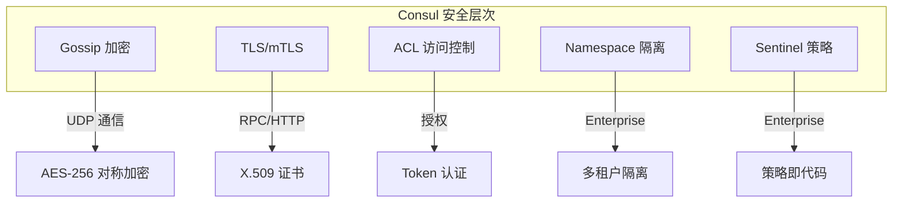

#### 安全组件

| 组件 | 功能 | 适用场景 |
|------|------|---------|
| **Gossip 加密** | 保护节点间 UDP 通信 | 所有部署 |
| **TLS** | 保护 RPC/HTTP 通信 | 所有部署 |
| **mTLS** | 双向 TLS 认证 | 生产环境 |
| **ACL** | 访问控制和授权 | 所有部署 |
| **Namespace** | 多租户隔离 | Enterprise |
| **Sentinel** | KV 策略控制 | Enterprise |

---

### 7.2 Gossip 加密

#### 什么是 Gossip 加密

Gossip 协议使用 UDP 进行节点间通信，需要使用对称密钥加密保护。

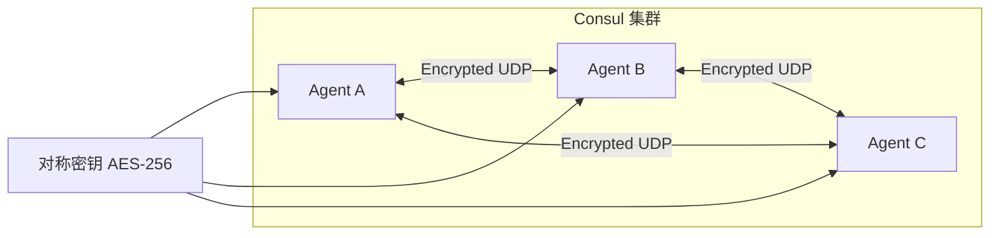

#### 生成加密密钥

```bash
# 生成 32 字节 Base64 编码的密钥
consul keygen

# 输出示例
# pUqJrVyVRj5jsiYEkM/tFQYfWyJIv4s3XkvDwy7Cu5s=
```

#### 配置 Gossip 加密

**Server 和 Client 配置:**

```json
{
  "encrypt": "pUqJrVyVRj5jsiYEkM/tFQYfWyJIv4s3XkvDwy7Cu5s=",
  "encrypt_verify_incoming": true,
  "encrypt_verify_outgoing": true
}
```

| 参数 | 说明 | 默认值 |
|------|------|--------|
| `encrypt` | 加密密钥 | 无 |
| `encrypt_verify_incoming` | 验证入站加密 | true |
| `encrypt_verify_outgoing` | 验证出站加密 | true |

#### 密钥轮换

```bash
# 1. 安装新密钥 (不作为主密钥)
consul keyring -install="新密钥"

# 2. 列出所有密钥
consul keyring -list

# 3. 设置新密钥为主密钥
consul keyring -use="新密钥"

# 4. 移除旧密钥
consul keyring -remove="旧密钥"
```

#### WAN 联邦注意事项

> **重要**: 多数据中心 WAN 联邦必须使用**相同的加密密钥**。

---

### 7.3 TLS 加密

#### TLS 概述

TLS 用于保护 RPC 和 HTTP API 通信，支持单向和双向 (mTLS) 认证。

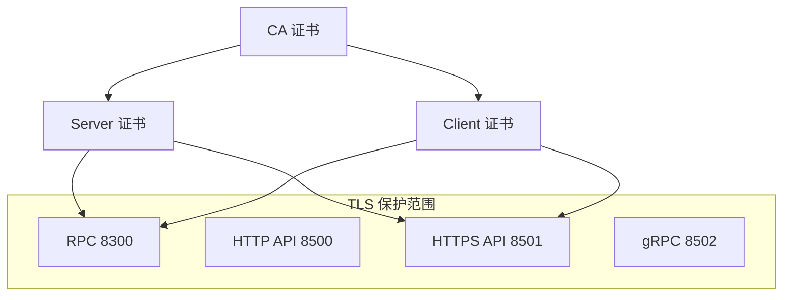

#### 证书要求

| 要求 | 说明 |
|------|------|
| **CA 证书** | 所有节点共享同一 CA |
| **服务器证书** | SAN 必须包含 `server.<dc>.<domain>` |
| **客户端证书** | 用于 mTLS 认证 |
| **扩展密钥用法** | clientAuth + serverAuth |

#### TLS 配置参数

```json
{
  "tls": {
    "defaults": {
      "ca_file": "/etc/consul.d/certs/ca.pem",
      "cert_file": "/etc/consul.d/certs/server.pem",
      "key_file": "/etc/consul.d/certs/server-key.pem",
      "verify_incoming": true,
      "verify_outgoing": true
    },
    "internal_rpc": {
      "verify_server_hostname": true
    }
  }
}
```

#### TLS 配置详解

| 参数 | 说明 | 推荐值 |
|------|------|--------|
| `verify_incoming` | 验证入站连接证书 | true |
| `verify_outgoing` | 验证出站连接证书 | true |
| `verify_server_hostname` | 验证服务器主机名 | true |
| `tls_min_version` | 最低 TLS 版本 | TLSv1_2 |

#### Server TLS 配置示例

```hcl
tls {
  defaults {
    ca_file   = "/etc/consul.d/certs/consul-agent-ca.pem"
    cert_file = "/etc/consul.d/certs/dc1-server-consul-0.pem"
    key_file  = "/etc/consul.d/certs/dc1-server-consul-0-key.pem"
    
    verify_incoming = true
    verify_outgoing = true
  }
  
  internal_rpc {
    verify_server_hostname = true
  }
}

auto_encrypt {
  allow_tls = true
}
```

#### Client TLS 配置示例

```hcl
tls {
  defaults {
    ca_file = "/etc/consul.d/certs/consul-agent-ca.pem"
    
    verify_incoming = false  # 仅限 localhost 访问
    verify_outgoing = true
  }
  
  internal_rpc {
    verify_server_hostname = true
  }
}

auto_encrypt {
  tls = true
}
```

#### Auto Encrypt

自动加密功能简化 Client 证书分发：

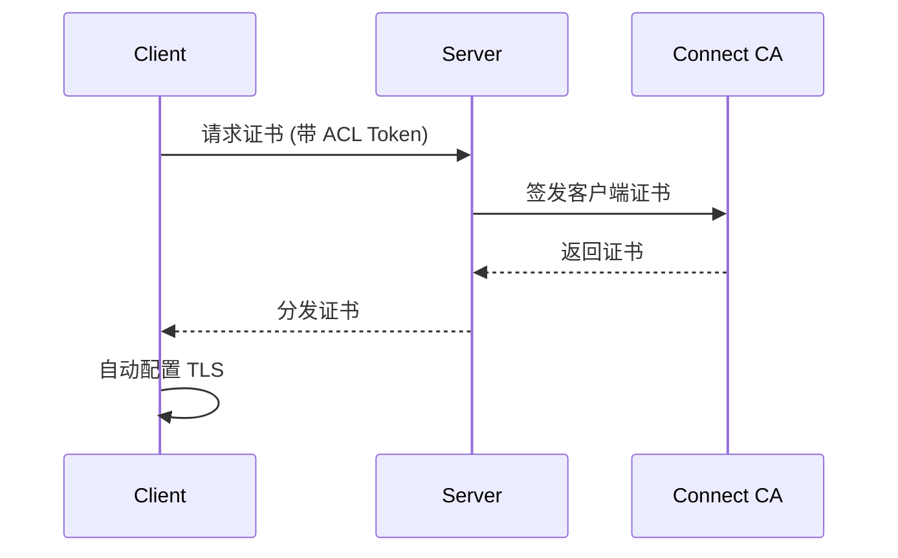

---

### 7.4 ACL 系统

#### ACL 概述

ACL (Access Control List) 提供基于 Token 的访问控制。

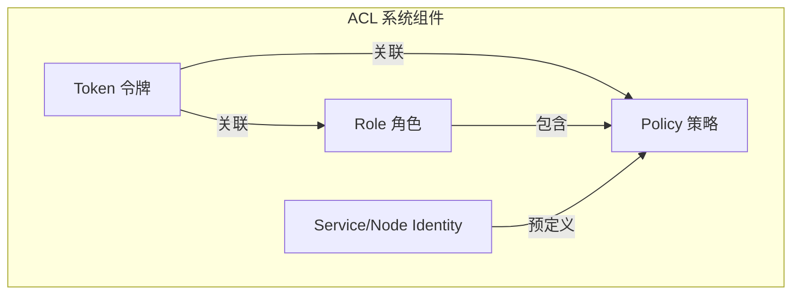

#### ACL 组件

| 组件 | 说明 |
|------|------|
| **Token** | 认证凭据，绑定策略或角色 |
| **Policy** | 权限规则集 |
| **Role** | 策略集合 |
| **Service Identity** | 服务预定义策略 |
| **Node Identity** | 节点预定义策略 |

#### 启用 ACL

```json
{
  "acl": {
    "enabled": true,
    "default_policy": "deny",
    "enable_token_persistence": true,
    "tokens": {
      "initial_management": "root-token-uuid"
    }
  }
}
```

#### ACL 初始化

```bash
# 1. 初始化 ACL 系统 (生成 bootstrap token)
consul acl bootstrap

# 输出示例
# AccessorID:       b3e4f67c-5a2b-9d0e-8c7f-6a1e3d4b5c6a
# SecretID:         e7f8a9b0-1c2d-3e4f-5a6b-7c8d9e0f1a2b
# Description:      Bootstrap Token (Global Management)
# ...

# 2. 设置 Token 环境变量
export CONSUL_HTTP_TOKEN="e7f8a9b0-1c2d-3e4f-5a6b-7c8d9e0f1a2b"
```

#### 策略规则语法

```hcl
# Agent 策略
agent_prefix "" {
  policy = "read"
}

agent "web-server" {
  policy = "write"
}

# KV 策略
key_prefix "" {
  policy = "deny"
}

key_prefix "config/" {
  policy = "read"
}

key_prefix "config/app/" {
  policy = "write"
}

# Service 策略
service_prefix "" {
  policy = "read"
}

service "web" {
  policy = "write"
}

# Node 策略
node_prefix "" {
  policy = "read"
}
```

#### 权限级别

| 权限 | 说明 |
|------|------|
| `deny` | 拒绝访问 |
| `read` | 只读访问 |
| `write` | 读写访问 |
| `list` | 列表访问 (仅 KV) |

#### 创建策略和 Token

```bash
# 1. 创建策略文件
cat > web-policy.hcl << 'EOF'
service "web" {
  policy = "write"
}
service_prefix "" {
  policy = "read"
}
node_prefix "" {
  policy = "read"
}
EOF

# 2. 创建策略
consul acl policy create \
  -name="web-service" \
  -rules=@web-policy.hcl

# 3. 创建 Token
consul acl token create \
  -description="Web Service Token" \
  -policy-name="web-service"
```

#### Service Identity

Service Identity 是预定义的服务策略快捷方式：

```bash
# 创建带 Service Identity 的 Token
consul acl token create \
  -description="Web Service Token" \
  -service-identity="web"
```

等效于:

```hcl
service "web" {
  policy = "write"
}
service_prefix "" {
  policy = "read"
  intentions = "read"
}
```

---

### 7.5 安全模型

#### 威胁模型

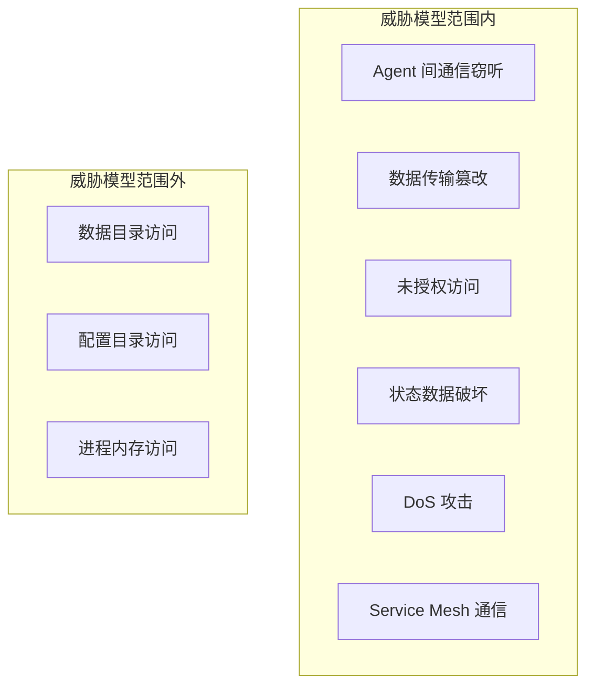

#### 安全边界

| 边界 | 保护机制 |
|------|---------|
| **Agent 通信** | Gossip 加密 + TLS |
| **API 访问** | TLS + ACL |
| **服务间通信** | mTLS (Service Mesh) |
| **数据持久化** | 文件系统权限 |

#### 用户角色

| 角色 | 信任级别 | 访问权限 |
|------|---------|---------|
| **System Admin** | 完全信任 | 系统级访问 |
| **Consul Admin** | 高度信任 | 管理 Token |
| **Consul Operator** | 受限信任 | 命名空间内操作 |
| **Developer** | 有限信任 | 应用相关 |
| **End User** | 不信任 | 无直接访问 |

#### 内部威胁

| 威胁 | 缓解措施 |
|------|---------|
| **恶意操作员** | Namespace 隔离、Sentinel 策略 |
| **被入侵应用** | 最小权限 Token、mTLS |
| **RPC 滥用** | mTLS 验证、ACL |
| **HTTP 滥用** | ACL + HTTPS |
| **DNS 滥用** | ACL Token |
| **Gossip 滥用** | 加密 + 定期轮换密钥 |

#### 外部威胁

| 威胁 | 缓解措施 |
|------|---------|
| **网络窃听** | 全链路加密 |
| **中间人攻击** | mTLS + 主机名验证 |
| **未授权访问** | ACL + 防火墙 |
| **凭据泄露** | 定期轮换、最小权限 |

---

### 7.6 安全配置检查清单

#### 必须配置

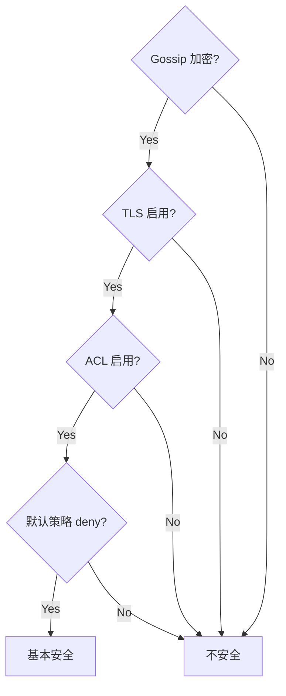

#### 生产环境完整配置

```json
{
  "datacenter": "dc1",
  "data_dir": "/opt/consul/data",
  "log_level": "INFO",
  
  "encrypt": "密钥",
  "encrypt_verify_incoming": true,
  "encrypt_verify_outgoing": true,
  
  "tls": {
    "defaults": {
      "ca_file": "/etc/consul.d/certs/ca.pem",
      "cert_file": "/etc/consul.d/certs/server.pem",
      "key_file": "/etc/consul.d/certs/server-key.pem",
      "verify_incoming": true,
      "verify_outgoing": true,
      "tls_min_version": "TLSv1_2"
    },
    "internal_rpc": {
      "verify_server_hostname": true
    }
  },
  
  "acl": {
    "enabled": true,
    "default_policy": "deny",
    "enable_token_persistence": true
  },
  
  "enable_script_checks": false,
  "enable_local_script_checks": true,
  "disable_remote_exec": true
}
```

#### 安全建议

| 类别 | 建议 |
|------|------|
| **证书** | 定期轮换、使用短 TTL |
| **Token** | 最小权限原则 |
| **密钥** | 定期轮换 Gossip 密钥 |
| **运行权限** | 非 root 用户运行 |
| **日志** | 启用审计日志 |
| **脚本检查** | 禁用远程脚本检查 |
| **远程执行** | 禁用 remote exec |

---

### 7.7 本章小结

#### 安全层次总览

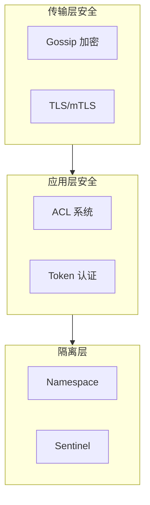

#### 快速配置指南

| 阶段 | 操作 |
|------|------|
| 1. 加密 | 启用 Gossip 加密 |
| 2. TLS | 配置 CA 和证书 |
| 3. ACL | 启用 ACL，默认 deny |
| 4. Token | 创建服务专用 Token |
| 5. 轮换 | 定期轮换密钥和证书 |

#### 最佳实践

1. **纵深防御** - 启用所有安全层
2. **最小权限** - Token 只授予必要权限
3. **定期轮换** - 密钥、证书、Token
4. **监控审计** - 启用日志和监控
5. **隔离运行** - 非 root、专用用户

---

> **下一章**: [第8章 ACL 详解](#第8章-acl-详解) - 深入了解 ACL 策略配置

---

## 第8章 ACL 详解
### 8.1 ACL 系统概述


本章深入介绍 Consul ACL 系统的各个组件，包括 Token、Policy、Role、Service Identity、Node Identity 和 Auth Methods。

---


#### ACL 工作流程

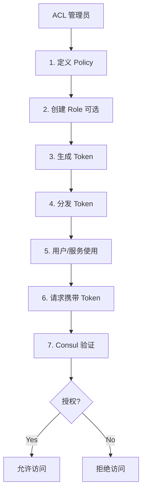

#### ACL 组件关系

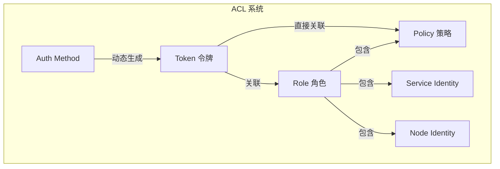

#### 核心组件

| 组件 | 说明 |
|------|------|
| **Token** | 认证凭据，包含 SecretID 用于 API 调用 |
| **Policy** | 权限规则集，定义对资源的访问权限 |
| **Role** | 策略集合，简化 Token 管理 |
| **Service Identity** | 服务预定义策略，自动生成服务所需权限 |
| **Node Identity** | 节点预定义策略，自动生成节点所需权限 |
| **Auth Method** | 外部认证方法，支持 K8s、JWT、AWS IAM |

---

### 8.2 Tokens 令牌

#### Token 属性

| 属性 | 说明 |
|------|------|
| `AccessorID` | 公开标识符，用于审计 |
| `SecretID` | 私密标识符，用于 API 认证 |
| `Description` | Token 描述 |
| `Policies` | 关联的策略列表 |
| `Roles` | 关联的角色列表 |
| `ServiceIdentities` | 关联的服务身份 |
| `NodeIdentities` | 关联的节点身份 |
| `Local` | 是否为本地 Token |
| `ExpirationTime` | 过期时间 |

#### 内置 Token

| Token | AccessorID | 说明 |
|-------|------------|------|
| **Anonymous** | `00000000-0000-0000-0000-000000000002` | 匿名请求使用 |
| **Initial Management** | 自定义 | Bootstrap Token，拥有全部权限 |
| **Agent Recovery** | 配置定义 | Agent 恢复使用 |

#### Token 使用方式

**服务配置:**

```json
{
  "service": {
    "id": "redis",
    "name": "redis",
    "token": "233b604b-b92e-48c8-a253-5f11514e4b50"
  }
}
```

**CLI 命令:**

```bash
# 使用 -token 参数
consul kv get -token="secret-id" config/app

# 使用环境变量 (推荐)
export CONSUL_HTTP_TOKEN="secret-id"
consul kv get config/app
```

**HTTP API:**

```bash
curl --header "X-Consul-Token: $CONSUL_HTTP_TOKEN" \
  http://localhost:8500/v1/agent/members
```

#### Agent Token 配置

```json
{
  "acl": {
    "tokens": {
      "default": "agent-default-token",
      "agent": "agent-token",
      "agent_recovery": "recovery-token",
      "replication": "replication-token"
    }
  }
}
```

| Token 类型 | 用途 |
|-----------|------|
| `default` | 默认 Token，用于一般请求 |
| `agent` | Agent 内部操作 (节点注册、Anti-Entropy) |
| `agent_recovery` | Agent 恢复用 Token |
| `replication` | ACL 复制用 Token |

---

### 8.3 Policies 策略

#### Policy 结构

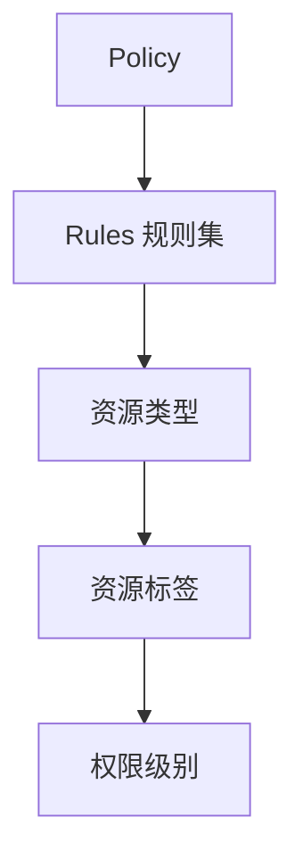

#### 规则语法

**基本语法:**

```hcl
<resource> "<label>" {
  policy = "<disposition>"
}
```

**无标签资源:**

```hcl
<resource> = "<disposition>"
```

#### 权限级别

| 权限 | 说明 |
|------|------|
| `deny` | 拒绝访问 |
| `read` | 只读 |
| `write` | 读写 |
| `list` | 列表 (仅 KV，需 acl.enable_key_list_policy=true) |

#### 资源类型

| 资源 | 说明 | 示例 |
|------|------|------|
| `acl` | ACL 系统 | `acl = "write"` |
| `agent` | Agent 操作 | `agent "node1" { policy = "read" }` |
| `event` | 用户事件 | `event_prefix "" { policy = "read" }` |
| `key` | KV 存储 | `key_prefix "config/" { policy = "write" }` |
| `keyring` | Gossip 密钥 | `keyring = "write"` |
| `node` | 节点目录 | `node_prefix "" { policy = "read" }` |
| `operator` | 集群操作 | `operator = "read"` |
| `mesh` | 服务网格 | `mesh = "write"` |
| `service` | 服务目录 | `service "web" { policy = "write" }` |
| `session` | Session 操作 | `session_prefix "" { policy = "write" }` |
| `query` | Prepared Query | `query_prefix "" { policy = "read" }` |

#### 前缀匹配

```hcl
# 精确匹配
service "web" {
  policy = "write"
}

# 前缀匹配 - 所有以 web- 开头的服务
service_prefix "web-" {
  policy = "read"
}

# 空前缀 - 匹配所有
service_prefix "" {
  policy = "read"
}
```

#### 匹配优先级

1. **精确匹配** > 前缀匹配
2. **最长前缀** > 短前缀
3. `deny` > `read` > `write` (同等匹配时)

#### Policy 示例

**完整示例:**

```hcl
# KV 策略
key_prefix "" {
  policy = "read"
}

key_prefix "config/app/" {
  policy = "write"
}

key "config/app/secret" {
  policy = "deny"
}

# 服务策略
service "web" {
  policy = "write"
}

service_prefix "" {
  policy = "read"
}

# 节点策略
node_prefix "" {
  policy = "read"
}

# 集群操作
operator = "read"
```

#### 创建 Policy

**CLI:**

```bash
consul acl policy create \
  -name="web-service" \
  -description="Policy for web service" \
  -rules=@web-policy.hcl
```

**API:**

```bash
curl -X PUT http://localhost:8500/v1/acl/policy \
  -H "X-Consul-Token: $CONSUL_HTTP_TOKEN" \
  -d '{
    "Name": "web-service",
    "Rules": "service \"web\" { policy = \"write\" }"
  }'
```

#### 内置 Policy

| Policy | ID | 说明 |
|--------|-----|------|
| `global-management` | `00000000-0000-0000-0000-000000000001` | 全局管理权限 |
| `global-read-only` | `00000000-0000-0000-0000-000000000002` | 全局只读权限 |

---

### 8.4 Roles 角色

#### Role 概述

Role 是策略的集合，便于复用和管理。

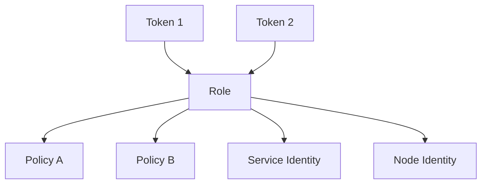

#### 创建 Role

**CLI:**

```bash
consul acl role create \
  -name="web-role" \
  -description="Role for web services" \
  -policy-name="web-policy" \
  -service-identity="web"
```

**API:**

```bash
curl -X PUT http://localhost:8500/v1/acl/role \
  -H "X-Consul-Token: $CONSUL_HTTP_TOKEN" \
  -d '{
    "Name": "web-role",
    "Policies": [{"Name": "web-policy"}],
    "ServiceIdentities": [{"ServiceName": "web"}]
  }'
```

#### Role 属性

| 属性 | 说明 |
|------|------|
| `ID` | 自动生成的 ID |
| `Name` | 角色名称 |
| `Description` | 描述 |
| `Policies` | 关联的策略 |
| `ServiceIdentities` | 服务身份 |
| `NodeIdentities` | 节点身份 |

---

### 8.5 Service Identity

#### 什么是 Service Identity

Service Identity 是一种快捷方式，自动为服务生成所需的策略。

#### 自动生成的策略

当使用 Service Identity 时，Consul 自动生成以下策略：

```hcl
# 允许服务注册
service "<service-name>" {
  policy = "write"
}

# 允许 sidecar proxy 注册
service "<service-name>-sidecar-proxy" {
  policy = "write"
}

# 允许发现其他服务
service_prefix "" {
  policy = "read"
}

# 允许读取节点信息
node_prefix "" {
  policy = "read"
}
```

#### 使用 Service Identity

**CLI:**

```bash
consul acl token create \
  -description="Service token for web" \
  -service-identity="web"
```

**API:**

```bash
curl -X PUT http://localhost:8500/v1/acl/token \
  -H "X-Consul-Token: $CONSUL_HTTP_TOKEN" \
  -d '{
    "ServiceIdentities": [
      {"ServiceName": "web"}
    ]
  }'
```

#### 限制数据中心

```bash
consul acl token create \
  -service-identity="web:dc1,dc2"
```

---

### 8.6 Node Identity

#### 什么是 Node Identity

Node Identity 为节点自动生成所需的策略。

#### 自动生成的策略

```hcl
# 允许节点注册
node "<node-name>" {
  policy = "write"
}

# 允许读取服务信息 (Anti-Entropy)
service_prefix "" {
  policy = "read"
}
```

#### 使用 Node Identity

**CLI:**

```bash
consul acl token create \
  -description="Agent token for node1" \
  -node-identity="node1:dc1"
```

---

### 8.7 Auth Methods 认证方法

#### Auth Methods 概述

Auth Methods 允许从外部系统动态创建 Token。

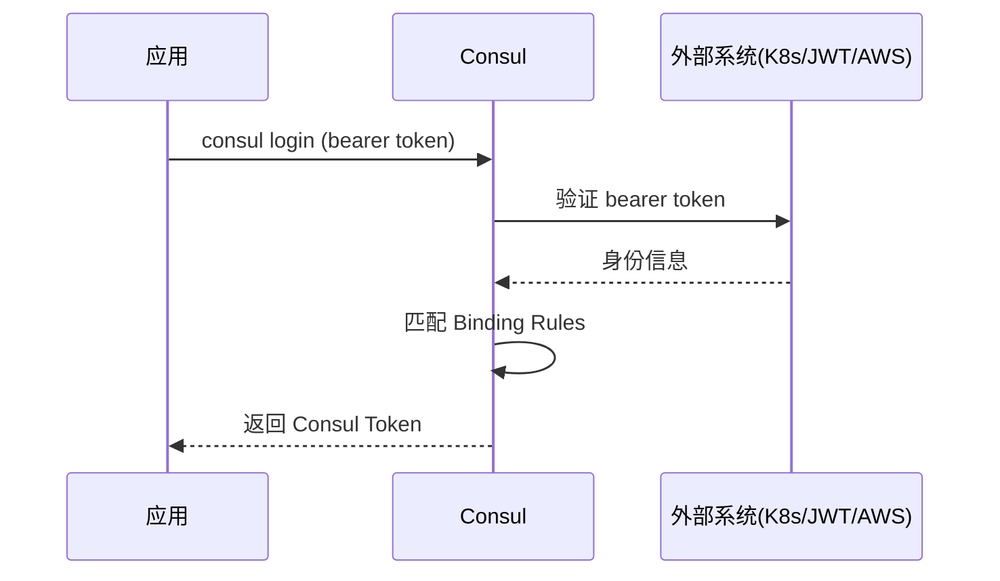

#### 支持的认证方法

| 类型 | 说明 | 用例 |
|------|------|------|
| **Kubernetes** | K8s ServiceAccount Token | Pod 自动获取 Token |
| **JWT** | JSON Web Token | 通用 JWT 认证 |
| **AWS IAM** | AWS IAM 凭证 | EC2/Lambda 自动认证 |
| **OIDC** | OpenID Connect (Enterprise) | 浏览器 SSO |

#### Binding Rules

Binding Rules 定义如何将外部身份映射到 Consul 角色或服务身份：

```json
{
  "AuthMethod": "kubernetes",
  "Selector": "serviceaccount.namespace==default",
  "BindType": "service",
  "BindName": "${serviceaccount.name}"
}
```

#### Kubernetes Auth Method

**创建 Auth Method:**

```bash
consul acl auth-method create \
  -type=kubernetes \
  -name=k8s-auth \
  -kubernetes-host="https://kubernetes.default.svc" \
  -kubernetes-ca-cert=@ca.crt \
  -kubernetes-service-account-jwt=@token
```

**创建 Binding Rule:**

```bash
consul acl binding-rule create \
  -method=k8s-auth \
  -bind-type=service \
  -bind-name='${serviceaccount.name}' \
  -selector='serviceaccount.namespace==default'
```

**应用登录:**

```bash
consul login -method=k8s-auth -bearer-token-file=/var/run/secrets/kubernetes.io/serviceaccount/token
```

#### JWT Auth Method

**创建 Auth Method:**

```bash
consul acl auth-method create \
  -type=jwt \
  -name=jwt-auth \
  -config='{
    "JWTValidationPubKeys": ["-----BEGIN PUBLIC KEY-----..."],
    "BoundAudiences": ["consul"],
    "ClaimMappings": {
      "sub": "user_id"
    }
  }'
```

#### AWS IAM Auth Method

**创建 Auth Method:**

```bash
consul acl auth-method create \
  -type=aws-iam \
  -name=aws-auth \
  -config='{
    "BoundIAMPrincipalARNs": [
      "arn:aws:iam::123456789012:role/ConsulClient"
    ]
  }'
```

**EC2 实例登录:**

```bash
consul login -method=aws-auth -aws-auto-bearer-token
```

---

### 8.8 常用 Token 创建示例

#### Service Token

```bash
consul acl token create \
  -description="Token for web service" \
  -service-identity="web"
```

#### Agent Token

```bash
consul acl token create \
  -description="Agent token for node1" \
  -node-identity="node1:dc1"
```

#### DNS Token

```hcl
# dns-policy.hcl
node_prefix "" {
  policy = "read"
}
service_prefix "" {
  policy = "read"
}
query_prefix "" {
  policy = "read"
}
```

```bash
consul acl policy create -name=dns-policy -rules=@dns-policy.hcl
consul acl token create -description="DNS Token" -policy-name=dns-policy
```

#### Replication Token

```hcl
acl = "write"
operator = "write"
service_prefix "" {
  policy = "read"
  intentions = "read"
}
```

---

### 8.9 本章小结

#### ACL 组件关系图

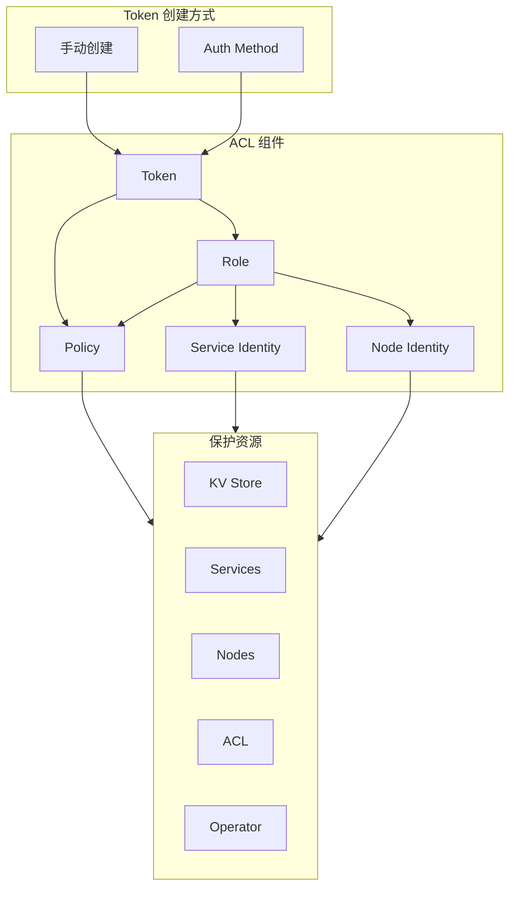

#### Token 类型选择

| 场景 | 推荐方案 |
|------|---------|
| 服务注册 | Service Identity |
| Agent 配置 | Node Identity |
| 自定义权限 | Custom Policy |
| K8s 环境 | Kubernetes Auth Method |
| 云环境 | AWS IAM / JWT Auth Method |

#### 最佳实践

1. **最小权限原则** - 只授予必要权限
2. **使用 Identity** - Service/Node Identity 简化配置
3. **使用 Role** - 复用策略，简化管理
4. **Token 过期** - 设置过期时间
5. **Auth Method** - 自动化 Token 管理
6. **定期审计** - 检查 Token 和 Policy

#### ACL 配置检查清单

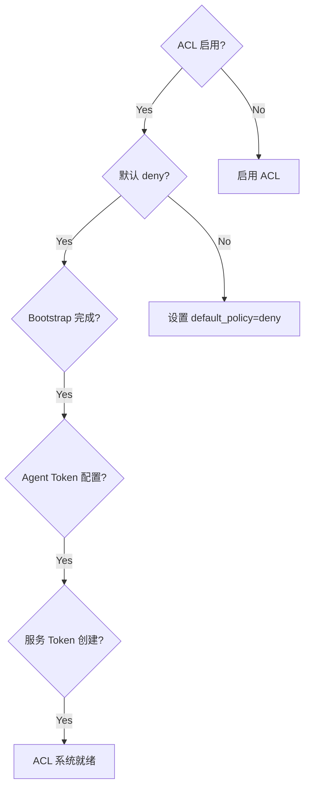

---

> **下一章**: [第9章 Agent 配置](#第9章-agent-配置) - 了解 Consul Agent 的详细配置选项

---

## 第9章 Agent 配置
### 9.1 Agent 概述


本章介绍 Consul Agent 的配置选项、CLI 参数、遥测监控、流量限制和实验性功能。

---


#### Agent 类型

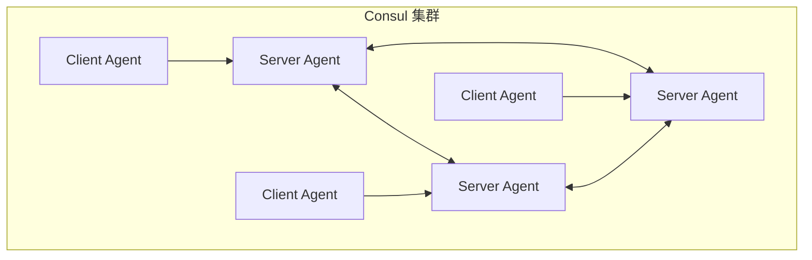

| 类型 | 角色 | 资源需求 | 数量建议 |
|------|------|---------|---------|
| **Server** | 存储集群状态、参与 Raft 共识 | 高 | 3-5 个/DC |
| **Client** | 转发请求、本地服务注册 | 低 | 每节点 1 个 |

#### Agent 生命周期

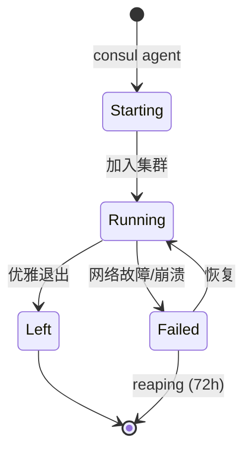

#### 端口要求

| 端口 | 协议 | 用途 |
|------|------|------|
| 8300 | TCP | Server RPC |
| 8301 | TCP/UDP | Serf LAN |
| 8302 | TCP/UDP | Serf WAN |
| 8500 | TCP | HTTP API |
| 8501 | TCP | HTTPS API |
| 8502 | TCP | gRPC |
| 8600 | TCP/UDP | DNS |

#### 网络延迟要求

| 指标 | 要求 |
|------|------|
| 平均 RTT | < 50ms |
| 99% RTT | < 100ms |

---

### 9.2 配置方式

#### 配置优先级

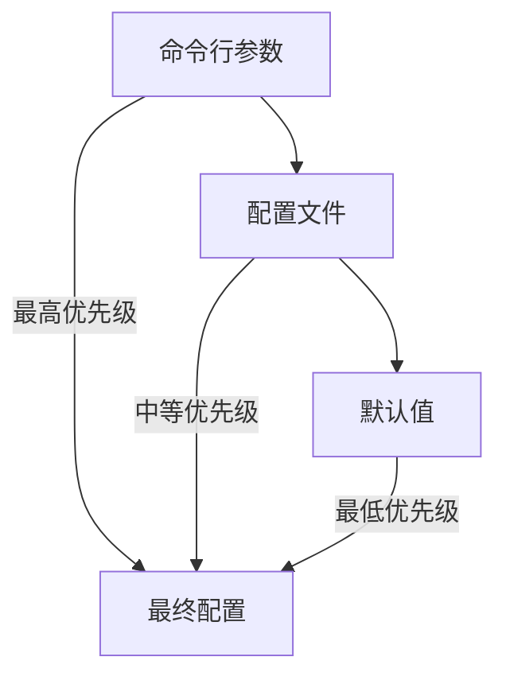

#### 配置文件格式

支持 **HCL** 和 **JSON** 格式：

**HCL 格式:**

```hcl
node_name = "consul-server"
server    = true
bootstrap_expect = 3

datacenter = "dc1"
data_dir   = "/opt/consul/data"

ui_config {
  enabled = true
}

addresses {
  http = "0.0.0.0"
}

retry_join = ["10.0.0.1", "10.0.0.2", "10.0.0.3"]
```

**JSON 格式:**

```json
{
  "node_name": "consul-server",
  "server": true,
  "bootstrap_expect": 3,
  "datacenter": "dc1",
  "data_dir": "/opt/consul/data",
  "ui_config": {
    "enabled": true
  },
  "retry_join": ["10.0.0.1", "10.0.0.2", "10.0.0.3"]
}
```

#### 加载配置

```bash
# 单个配置文件
consul agent -config-file=server.hcl

# 配置目录 (按字母顺序加载)
consul agent -config-dir=/etc/consul.d

# 组合使用
consul agent -config-dir=/etc/consul.d -config-file=override.hcl
```

#### 热重载配置

支持热重载的配置项：

- ACL Tokens
- Services/Checks
- Log Level
- TLS 证书

```bash
# 手动重载
consul reload

# 或发送 SIGHUP
kill -HUP $(pidof consul)
```

---

### 9.3 核心配置参数

#### Server 配置示例

```hcl
# 基本配置
node_name = "consul-server-1"
server    = true
bootstrap_expect = 3

datacenter = "dc1"
data_dir   = "/opt/consul/data"
log_level  = "INFO"

# 地址配置
bind_addr      = "{{ GetPrivateIP }}"
client_addr    = "0.0.0.0"
advertise_addr = "{{ GetPrivateIP }}"

# 集群加入
retry_join = ["consul-server-2", "consul-server-3"]

# UI
ui_config {
  enabled = true
}

# Service Mesh
connect {
  enabled = true
}

# 安全配置
encrypt = "密钥"

tls {
  defaults {
    ca_file   = "/etc/consul.d/certs/ca.pem"
    cert_file = "/etc/consul.d/certs/server.pem"
    key_file  = "/etc/consul.d/certs/server-key.pem"
    verify_incoming = true
    verify_outgoing = true
  }
}

acl {
  enabled        = true
  default_policy = "deny"
}
```

#### Client 配置示例

```hcl
node_name  = "consul-client-1"
server     = false
datacenter = "dc1"
data_dir   = "/opt/consul/data"
log_level  = "INFO"

bind_addr  = "{{ GetPrivateIP }}"
retry_join = ["consul-server-1", "consul-server-2", "consul-server-3"]

# 服务注册
service {
  name = "web"
  port = 8080
  check {
    http     = "http://localhost:8080/health"
    interval = "10s"
  }
}
```

#### 关键配置参数

| 参数 | 说明 | 默认值 |
|------|------|--------|
| `node_name` | 节点名称 | hostname |
| `server` | 是否为 Server | false |
| `bootstrap_expect` | 期望 Server 数量 | - |
| `datacenter` | 数据中心名称 | dc1 |
| `data_dir` | 数据目录 | - |
| `bind_addr` | 内部通信地址 | 0.0.0.0 |
| `client_addr` | API 监听地址 | 127.0.0.1 |
| `advertise_addr` | 广播地址 | bind_addr |
| `retry_join` | 自动加入地址 | - |

---

### 9.4 CLI 常用命令

#### Agent 启动

```bash
# 开发模式
consul agent -dev

# 生产模式
consul agent -config-dir=/etc/consul.d

# 指定数据目录
consul agent -data-dir=/opt/consul/data -server -bootstrap-expect=3
```

#### 常用 CLI 参数

| 参数 | 说明 |
|------|------|
| `-server` | 以 Server 模式运行 |
| `-bootstrap-expect=N` | 期望的 Server 数量 |
| `-retry-join=addr` | 自动加入地址 |
| `-data-dir=path` | 数据目录 |
| `-config-dir=path` | 配置目录 |
| `-bind=addr` | 绑定地址 |
| `-client=addr` | 客户端地址 |
| `-ui` | 启用 Web UI |
| `-encrypt=key` | Gossip 加密密钥 |
| `-log-level=level` | 日志级别 |

#### 动态地址模板

```bash
# 使用私有 IP
consul agent -bind='{{ GetPrivateIP }}'

# 使用特定网卡
consul agent -bind='{{ GetInterfaceIP "eth0" }}'

# 排除特定网卡
consul agent -bind='{{ GetPrivateInterfaces | exclude "name" "docker.*" | attr "address" }}'
```

---

### 9.5 遥测 (Telemetry)

#### 配置 Telemetry

```hcl
telemetry {
  disable_hostname = true
  prometheus_retention_time = "60s"
  
  # StatsD
  statsd_address = "127.0.0.1:8125"
  
  # DogStatsD
  dogstatsd_addr = "127.0.0.1:8125"
  dogstatsd_tags = ["env:production"]
}
```

#### 关键指标

| 指标 | 说明 | 告警阈值 |
|------|------|---------|
| `consul.raft.leader.lastContact` | Leader 最后联系时间 | > 200ms |
| `consul.raft.state.candidate` | 选举次数 | > 0 |
| `consul.autopilot.healthy` | 集群健康状态 | = 0 |
| `consul.runtime.alloc_bytes` | 内存分配 | > 90% 系统内存 |
| `consul.client.rpc.exceeded` | RPC 限流次数 | > 0 |

#### Prometheus 集成

```hcl
telemetry {
  prometheus_retention_time = "60s"
}
```

访问 `http://consul:8500/v1/agent/metrics?format=prometheus` 获取指标。

#### 指标分类

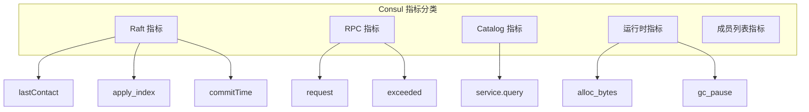

---

### 9.6 流量限制

#### 概述

流量限制保护 Server 免受过载：

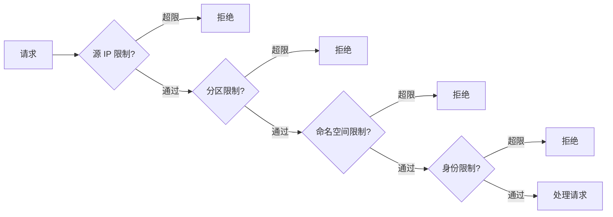

#### 配置示例

```hcl
limits {
  # 全局 RPC 限制
  rpc_rate = 1000
  rpc_max_burst = 2000
  
  # 每客户端限制
  rpc_max_conns_per_client = 100
}
```

#### 配置条目方式 (Enterprise)

```hcl
Kind = "control-plane-request-limit"
Name = "global-limit"
Mode = "enforcing"

read_rate  = 1000
write_rate = 500

kv {
  read_rate  = 500
  write_rate = 200
}

acl {
  read_rate  = 100
  write_rate = 50
}
```

---

### 9.7 配置条目 (Configuration Entries)

#### 概述

配置条目是集中式配置，存储在 Consul 中：

| 类型 | 用途 |
|------|------|
| `proxy-defaults` | 全局代理默认配置 |
| `service-defaults` | 服务默认配置 |
| `service-router` | 服务路由 |
| `service-splitter` | 流量分割 |
| `service-resolver` | 服务解析 |
| `ingress-gateway` | 入口网关 |
| `terminating-gateway` | 终止网关 |
| `mesh` | 网格全局配置 |

#### 管理配置条目

```bash
# 创建/更新
consul config write proxy-defaults.hcl

# 读取
consul config read -kind service-defaults -name web

# 列出
consul config list -kind service-defaults

# 删除
consul config delete -kind service-defaults -name web
```

---

### 9.8 实验性 WAL 日志存储

#### 概述

WAL (Write-Ahead Log) 是一种替代 BoltDB 的日志存储后端：

| 特性 | BoltDB | WAL |
|------|--------|-----|
| 写入性能 | 一般 | 更高 |
| 文件增长 | 持续增长 | 自动清理 |
| 空间利用 | 低效 (空闲页) | 高效 |
| 状态 | 默认 | 实验性 |

#### 启用 WAL

```hcl
raft_logstore {
  backend = "wal"
  
  verification {
    enabled  = true
    interval = "60s"
  }
}
```

#### 监控 WAL

关键指标：

- `consul.raft.wal.log_entries_written`
- `consul.raft.wal.segment_rotations`
- `consul.raft.wal.last_segment_age_seconds`

#### 回退到 BoltDB

如需回退：

1. 停止 Agent
2. 修改配置 `backend = "boltdb"`
3. 删除 WAL 文件
4. 从快照恢复

---

### 9.9 本章小结

#### Agent 配置层次

```mermaid
graph TD
    subgraph Config["配置层次"]
        CLI[命令行参数]
        File[配置文件]
        Entry[配置条目]
        Default[默认值]
    end
    
    CLI -->|覆盖| File
    File -->|覆盖| Default
    Entry -->|集中管理| Cluster[集群配置]
```

#### Server 配置检查清单

| 项目 | 检查点 |
|------|--------|
| 基础 | node_name、datacenter、data_dir |
| 集群 | bootstrap_expect、retry_join |
| 安全 | encrypt、tls、acl |
| 监控 | telemetry、log_level |

#### 最佳实践

1. **配置文件管理** - 使用配置目录、版本控制
2. **地址模板** - 使用 go-sockaddr 模板
3. **热重载** - 利用热重载减少重启
4. **监控告警** - 配置 Telemetry、设置告警
5. **流量保护** - 配置 RPC 限流
6. **数据备份** - 定期快照

---

> **下一章**: [第10章 集成](#第10章-集成) - 了解 Consul 与其他系统的集成

## 第10章 集成

### 概述


本章介绍 Consul 与外部系统的集成方式，包括 Consul 集成程序、NIA 网络基础设施自动化、Vault 证书管理、代理集成和社区工具。

#### 10.1 Consul 集成程序 (Consul Integration Program)

##### 10.1.1 集成架构概述

Consul 提供了完整的生态系统集成框架，通过 RESTful HTTP API 允许合作伙伴在多个层面构建扩展集成。

```mermaid
graph TD
    subgraph Ecosystem["Consul 集成生态系统"]
        DataPlane[数据平面 Data Plane]
        ControlPlane[控制平面 Control Plane]
        Platform[平台 Platform]
        Infrastructure[基础设施 Infrastructure]
        NIA[网络基础设施自动化 NIA]
    end
    
    DataPlane --> APM[APM/监控]
    DataPlane --> Logging[日志告警]
    DataPlane --> Gateway[API 网关]
    DataPlane --> Proxy[代理扩展]
    
    ControlPlane --> ClientServer[Client-Server 架构]
    
    Platform --> Cloud[云平台 AWS/GCP/Azure]
    Platform --> Container[容器 K8s/Docker]
    Platform --> VM[虚拟机/裸机]
    
    Infrastructure --> Firewall[防火墙]
    Infrastructure --> LB[负载均衡器]
    Infrastructure --> SDN[软件定义网络]
    Infrastructure --> DNS[DNS 自动化]
    
    NIA --> CTS[Consul-Terraform-Sync]
    CTS --> TerraformProvider[Terraform Provider]
```

##### 10.1.2 集成分类

| 集成层面 | 功能描述 | 示例集成 |
|---------|---------|---------|
| **数据平面** | 证书管理、ACL配置、可观测性、服务发现 | APM、日志、API网关、代理 |
| **控制平面** | Consul Client-Server 架构 | Service Mesh 控制 |
| **平台** | Agent 部署和配置自动化 | AWS、GCP、Azure、K8s |
| **基础设施** | 网络设备自动化配置 | 防火墙、负载均衡、SDN |
| **NIA** | 通过 CTS 自动化网络变更 | Terraform 模块 |

##### 10.1.3 数据平面集成

**APM (应用性能监控)**:

- Consul Telemetry 集成
- New Relic、Splunk SignalFX、SnappyFlow 集成
- OpenTelemetry 集成支持

**日志和告警**:

- PagerDuty 集成告警

**API 网关和 Ingress**:

- F5 Terminating Gateway
- Kong Ingress Controller
- Consul Transparent Proxy

##### 10.1.4 基础设施集成

**防火墙自动化**:

- Check Point 自动化防火墙
- Cisco FMC 动态对象

**软件定义网络 (SDN)**:

- Cisco ACI 自动化

**负载均衡器**:

- F5 BIG-IP 跨租户配置

**ADC (应用交付控制器)**:

- A10 ADC 与 Consul NIA

**DNS 自动化**:

- DNSimple 公网 DNS 记录

##### 10.1.5 集成程序流程

```mermaid
graph LR
    Step1[1. Engage<br/>初始接触] --> Step2[2. Enable<br/>文档和资源]
    Step2 --> Step3[3. Develop<br/>开发和测试]
    Step3 --> Step4[4. Review<br/>代码审查]
    Step4 --> Step5[5. Release<br/>发布集成]
    Step5 --> Step6[6. Support<br/>持续支持]
    
    Step4 -.->|迭代改进| Step3
```

##### 10.1.6 Consul 版本类型

| 版本类型 | 特点 | 适用场景 |
|---------|------|---------|
| **Self-Managed** | 开源、永久免费 | 自托管环境 |
| **HCP Consul** | 托管服务、云管理 | 简化运维 |
| **Consul Enterprise** | 自托管、高级功能 | 企业定制部署 |

---

#### 10.2 NIA 集成程序 (Network Infrastructure Automation)

##### 10.2.1 NIA 概述

网络基础设施自动化 (NIA) 基于声明式、工作流和服务驱动的网络自动化架构。

```mermaid
graph TD
    subgraph NIA["NIA 架构"]
        Consul[Consul 服务目录]
        CTS[Consul-Terraform-Sync]
        TF[Terraform]
        Provider[Terraform Provider]
        Network[网络基础设施]
    end
    
    Consul -->|服务变更| CTS
    CTS -->|触发自动化| TF
    TF -->|调用| Provider
    Provider -->|配置变更| Network
    
    Consul -->|直接集成| DirectAPI[直接 API 集成]
    DirectAPI -->|原生方式| Network
```

##### 10.2.2 工作原理

1. **Consul 作为数据源** - 存储基础设施状态
2. **CTS 守护进程** - 与 Consul Agent 同节点运行
3. **服务变更触发** - 自动执行自动化任务
4. **Terraform 模块** - 定义网络设备配置

**两种集成方式**:

- **Push 方式** (推荐): 使用 CTS + Terraform
- **Pull 方式**: 直接通过 Consul API 集成

##### 10.2.3 NIA 集成步骤

```mermaid
graph LR
    E1[1. Engage<br/>初始接触] --> E2[2. Enable<br/>开发指南]
    E2 --> R1[3. Develop<br/>开发模块]
    R1 --> R2[4. Review<br/>HashiCorp 审核]
    R2 --> R3[5. Release<br/>发布到 Registry]
    R3 --> S1[6. Support<br/>持续维护]
    
    R2 -.->|迭代| R1
```

##### 10.2.4 模块开发要求

**前提条件**:

- 拥有 Terraform Registry 上的 "verified" Provider

**命名规范**:

```
terraform-<provider>-<type>-cts
```

**许可证要求** (必须使用以下开源许可之一):

- Apache License 2.0
- MIT
- BSD / BSD 3-clause
- Eclipse Public License (EPL) 1.0
- Mozilla Public License (MPL) 2.0

##### 10.2.5 开发资源

| 资源类型 | 说明 |
|---------|------|
| CTS 文档 | 官方 Consul-Terraform-Sync 文档 |
| 模块编写指南 | 编写兼容 CTS 的 Terraform 模块教程 |
| 示例模块 | Simple Print Module 等参考实现 |
| 发布指南 | Terraform Registry 发布规范 |

---

#### 10.3 Vault 集成 (Vault as Service Mesh CA)

##### 10.3.1 概述

Vault 可作为 Consul Service Mesh 的证书颁发机构 (CA)，提供企业级的证书管理能力。

```mermaid
graph TD
    subgraph Vault["Vault PKI 引擎"]
        RootPKI[Root PKI Path<br/>根证书]
        IntPKI[Intermediate PKI Path<br/>中间证书]
    end
    
    subgraph Consul["Consul Service Mesh"]
        Server[Consul Server]
        Leaf[叶子证书]
    end
    
    RootPKI -->|签发| IntPKI
    IntPKI -->|签发| Leaf
    Server -->|管理| IntPKI
    Server -->|只读| RootPKI
```

**兼容性说明**:

- 支持 Vault 0.10.3 到 1.10.x
- Vault 1.11.0+ 需要 2022年12月13日后发布的 Consul 版本

##### 10.3.2 基本配置

```hcl
# Consul Server 配置
connect {
  ca_provider = "vault"
  
  ca_config {
    address             = "http://localhost:8200"
    token               = "<vault-token-with-necessary-policy>"
    root_pki_path       = "connect-root"
    intermediate_pki_path = "connect-dc1-intermediate"
  }
}
```

```json
{
  "Provider": "vault",
  "Config": {
    "Address": "http://localhost:8200",
    "Token": "<vault-token>",
    "RootPKIPath": "connect-root",
    "IntermediatePKIPath": "connect-dc1-intermediate"
  }
}
```

##### 10.3.3 配置参数

| 参数 | 类型 | 说明 |
|------|------|------|
| `address` | string | Vault 服务器地址 (必需) |
| `token` | string | Vault 访问令牌 (只写) |
| `auth_method` | map | Vault 认证方法配置 |
| `root_pki_path` | string | 根证书 PKI 路径 (必需) |
| `intermediate_pki_path` | string | 中间证书 PKI 路径 (必需) |
| `namespace` | string | Vault 命名空间 (Enterprise) |

**TLS 配置参数**:

| 参数 | 说明 |
|------|------|
| `ca_file` | Vault 通信 CA 证书路径 |
| `ca_path` | CA 证书目录路径 |
| `cert_file` | 客户端证书路径 |
| `key_file` | 客户端私钥路径 |
| `tls_server_name` | TLS SNI 主机名 |
| `tls_skip_verify` | 跳过 TLS 验证 |

##### 10.3.4 认证方法配置

支持的认证方法类型:

- `approle`
- `aws`
- `azure`
- `gcp`
- `jwt`
- `kubernetes`

```hcl
ca_config {
  auth_method {
    type       = "kubernetes"
    mount_path = "kubernetes"
    params {
      role = "consul-ca"
      jwt  = "<service-account-token>"
    }
  }
}
```

##### 10.3.5 通用 CA 配置选项

| 参数 | 默认值 | 说明 |
|------|-------|------|
| `leaf_cert_ttl` | 72h | 叶子证书 TTL (1h-1年) |
| `root_cert_ttl` | 87600h (10年) | 根证书 TTL |
| `intermediate_cert_ttl` | 8760h (1年) | 中间证书 TTL |
| `private_key_type` | ec | 密钥类型 (ec/rsa) |
| `private_key_bits` | 256 | 密钥位数 |
| `csr_max_concurrent` | 0 | CSR 并发限制 |
| `csr_max_per_second` | 50 | CSR 速率限制 |

##### 10.3.6 Vault ACL 策略配置

**两种 PKI 路径管理模式**:

```mermaid
graph TD
    subgraph VaultManaged["Vault 管理模式"]
        V1[预先创建 PKI 引擎]
        V2[Consul 只读 + 部分写入]
        V3[保留完全控制权]
    end
    
    subgraph ConsulManaged["Consul 管理模式"]
        C1[无需预创建 PKI]
        C2[Consul 完全自动化]
        C3[简化运维]
    end
    
    V1 --> V2 --> V3
    C1 --> C2 --> C3
```

**Vault 管理模式策略**:

```hcl
# 读取 PKI 挂载点
path "/sys/mounts/<root_pki_path>" {
  capabilities = [ "read" ]
}

path "/sys/mounts/<intermediate_pki_path>" {
  capabilities = [ "read" ]
}

path "/sys/mounts/<intermediate_pki_path>/tune" {
  capabilities = [ "update" ]
}

# 中间证书 PKI 操作
path "<intermediate_pki_path>/*" {
  capabilities = [ "create", "read", "update", "delete", "list" ]
}

# 根 PKI 读取
path "<root_pki_path>/cert/ca" {
  capabilities = [ "read" ]
}

# Token 续期
path "auth/token/renew-self" {
  capabilities = [ "update" ]
}

path "auth/token/lookup-self" {
  capabilities = [ "read" ]
}
```

**Consul 管理模式策略**:

```hcl
# 创建和管理 PKI 引擎
path "/sys/mounts/<root_pki_path>" {
  capabilities = [ "create", "read", "update", "delete", "list" ]
}

path "/sys/mounts/<intermediate_pki_path>" {
  capabilities = [ "create", "read", "update", "delete", "list" ]
}

# 完全 PKI 操作权限
path "<root_pki_path>/*" {
  capabilities = [ "create", "read", "update", "delete", "list" ]
}

path "<intermediate_pki_path>/*" {
  capabilities = [ "create", "read", "update", "delete", "list" ]
}
```

##### 10.3.7 敏感操作策略

更换 CA Provider 或修改 `RootPKIPath` 时需要额外权限:

```hcl
# 临时敏感操作权限
path "<root_pki_path>/root/sign-self-issued" {
  capabilities = [ "sudo", "update" ]
}
```

**安全操作流程**:

1. 创建包含敏感权限的新 Token
2. 更新 CA Provider 配置使用新 Token
3. 执行 CA 变更操作
4. 恢复使用普通权限 Token

---

#### 10.4 代理集成 (Proxy Integration)

##### 10.4.1 概述

Consul 支持扩展任何代理以集成 Service Mesh，内置代理适合开发环境，生产环境建议使用 Envoy。

```mermaid
graph TD
    subgraph ProxyType["代理集成层次"]
        L4[L4 层集成<br/>TCP 流量]
        L7[L7 层集成<br/>HTTP 路由]
    end
    
    L4 -->|基础功能| Security[流量加密]
    L4 -->|简单配置| BasicRouting[基础路由]
    
    L7 -->|高级功能| AdvRouting[高级路由]
    L7 -->|完整特性| Metrics[指标收集]
    L7 -->|动态配置| Retry[重试/超时]
    
    L4 --> BuiltIn[内置代理]
    L7 --> Envoy[Envoy 代理]
```

**集成要求**:

- 接受入站连接能力
- 建立出站连接能力
- 这两种能力通常都需要以支持完整 Sidecar 功能

##### 10.4.2 入站连接处理

```mermaid
sequenceDiagram
    participant Client as 客户端
    participant Proxy as Sidecar 代理
    participant API as Consul API
    participant Service as 目标服务
    
    Client->>Proxy: TLS 连接
    Proxy->>API: GET /v1/agent/connect/ca/leaf/
    API-->>Proxy: 客户端证书
    Proxy->>API: GET /v1/agent/connect/ca/roots
    API-->>Proxy: 根证书
    Proxy->>Proxy: 验证客户端证书
    Proxy->>API: POST /v1/agent/connect/authorize
    API-->>Proxy: 授权结果
    alt 授权通过
        Proxy->>Service: 转发请求
    else 授权拒绝
        Proxy-->>Client: 拒绝连接
    end
```

**关键 API 端点**:

| 端点 | 用途 |
|------|------|
| `/v1/agent/connect/ca/leaf/` | 获取客户端证书 |
| `/v1/agent/connect/ca/roots` | 获取 CA 根证书 |
| `/v1/agent/connect/authorize` | L4 连接授权 |
| `/v1/agent/connect/intentions/match` | L7 意图匹配 |

##### 10.4.3 授权方式

**L4 授权** (每连接):

- 使用 `/v1/agent/connect/authorize` 端点
- 基于服务身份 (TLS) 认证
- 适用于 TCP 层集成

**L7 授权** (每请求):

- 使用 `/v1/agent/connect/intentions/match` 端点
- 缓存意图规则到代理本地
- 支持 HTTP 路由规则

##### 10.4.4 持久连接与意图

**问题**: TCP 持久连接只在建立时授权，意图变更不会终止已有连接。

**解决策略**:

1. **配置连接最大生命周期**
   - 平衡连接开销与意图更新延迟
   - 建议设置几小时的最大生命周期

2. **定期重新授权**
   - 周期性对所有连接重新授权
   - 授权调用开销很小 (本地内存操作)

```mermaid
graph TD
    subgraph Strategy["持久连接策略"]
        MaxLife[最大生命周期]
        ReAuth[定期重授权]
    end
    
    MaxLife -->|建议| Hours[每小时续期]
    ReAuth -->|建议| Minute[每分钟授权]
    
    Hours -->|平衡| Overhead[减少开销]
    Minute -->|保证| Enforce[意图强制执行]
```

##### 10.4.5 出站连接处理

```mermaid
sequenceDiagram
    participant Service as 本地服务
    participant Proxy as Sidecar 代理
    participant API as Consul API
    participant Upstream as 上游服务
    
    Service->>Proxy: 出站请求
    Proxy->>API: GET /v1/agent/connect/ca/leaf/
    API-->>Proxy: 客户端证书
    Proxy->>API: GET /v1/discovery-chain/
    API-->>Proxy: 服务发现链
    Proxy->>API: GET /v1/health/connect/:service
    API-->>Proxy: 健康端点列表
    Proxy->>Upstream: mTLS 连接 + 客户端证书
    Upstream-->>Proxy: 响应
    Proxy-->>Service: 转发响应
```

##### 10.4.6 服务发现

**健康端点发现**:

- 使用 `/v1/health/connect/:service` API
- 支持 `cached` 查询参数
- 使用阻塞查询保持端点列表更新

**上游类型**:

| 类型 | 发现方式 | 说明 |
|------|---------|------|
| 服务 | Discovery Chain | 推荐方式 |
| Prepared Query | Prepared Query API | 传统方式，将被废弃 |

##### 10.4.7 环境变量

| 变量名 | 用途 |
|--------|------|
| `CONSUL_HTTP_TOKEN` | Consul ACL Token |
| `CONSUL_HTTP_ADDR` | Consul Agent 地址 |
| `CONSUL_CACERT` | CA 证书路径 |
| `CONSUL_CLIENT_CERT` | 客户端证书路径 |
| `CONSUL_CLIENT_KEY` | 客户端私钥路径 |

---

#### 10.5 Consul 工具

##### 10.5.1 官方工具

| 工具名称 | 功能描述 |
|---------|---------|
| **envconsul** | 从 Consul 读取环境变量并注入进程 |
| **Consul API Gateway** | Service Mesh 专用 Ingress 解决方案 |
| **Consul ESM** | 外部服务监控 |
| **Consul-Migrate** | 数据迁移工具 (0.5.1+ 升级) |
| **Consul Replicate** | 跨数据中心 KV 复制守护进程 |
| **Consul Template** | 通用模板渲染和通知 |
| **Consul-Terraform-Sync** | 网络基础设施自动化 |

##### 10.5.2 社区工具分类

```mermaid
graph TD
    subgraph Tools["Consul 社区工具"]
        Config[配置管理]
        Discovery[服务发现]
        Template[模板工具]
        Backup[备份恢复]
        Container[容器集成]
    end
    
    Config --> cfg4j[cfg4j]
    Config --> confita[confita]
    Config --> confd[confd]
    
    Discovery --> registrator[Registrator]
    Discovery --> fabio[Fabio]
    Discovery --> marathon[Marathon-Consul]
    
    Template --> consulTemplate[consul-templaterb]
    Template --> consult[consult]
    
    Backup --> backinator[consul-backinator]
    Backup --> git2consul[git2consul]
    
    Container --> dockerConsul[docker-consul]
    Container --> mesos[mesos-consul]
```

##### 10.5.3 配置管理工具

| 工具 | 语言/平台 | 功能 |
|------|----------|------|
| **cfg4j** | Java | 分布式应用配置库，自动从 Consul KV 读取和更新 |
| **crypt** | Go | 加密存储和检索配置参数 |
| **confd** | Go | 使用模板和 Consul 数据管理本地配置文件 |
| **consul-cli** | CLI | Consul HTTP API 命令行接口 |
| **consul-json** | Go | JSON 树与 Consul KV 对互相转换 |

##### 10.5.4 模板和同步工具

| 工具 | 功能 |
|------|------|
| **consul-templaterb** | Ruby ERB 高性能模板，支持进程管理 |
| **consult** | Ruby ERB 模板，支持 Consul+Vault，Rails 集成 |
| **git2consul** | Git 仓库镜像到 Consul KV |
| **gitsync-consul** | Go 语言 Git 到 Consul 同步工具 |
| **file2consul** | 从文件/Git 更新 Consul，支持多环境 |

##### 10.5.5 服务发现和负载均衡

| 工具 | 功能 |
|------|------|
| **Fabio** | 零配置、Consul 感知的 HTTP/HTTPS 路由器 |
| **Registrator** | Docker 服务注册桥接器 |
| **marathon-consul** | Marathon 到 Consul 服务注册桥接 |
| **mesos-consul** | Mesos 到 Consul 服务注册桥接 |
| **spring-cloud-consul** | Spring Cloud 服务发现、配置和事件 |

##### 10.5.6 框架集成

| 工具 | 框架 | 功能 |
|------|------|------|
| **dropwizard-consul** | Dropwizard | 服务发现和配置集成 |
| **embedded-consul** | JVM | 集成测试中运行 Consul |
| **gradle-consul-plugin** | Gradle | Consul 构建插件 |
| **hashi-ui** | Web | Consul 和 Nomad 现代化 UI |

##### 10.5.7 CI/CD 和开发工具

| 工具 | 功能 |
|------|------|
| **jenkinsci-consul** | Jenkins 服务发现和 KV 插件 |
| **IntelliJ Consul K/V** | IDEA K/V 存储编辑器 |
| **kvit** | 文件系统与 Consul KV 同步 |
| **consul-k8s-tools** | 多文件 Consul/Vault 模板处理 |

##### 10.5.8 环境和部署

| 工具 | 功能 |
|------|------|
| **docker-consul** | Docker 化 Consul Agent |
| **HashiBox** | Vagrant 环境，模拟 HA 云 |
| **mochimedia-digitalocean** | CentOS 7 一体化镜像 |
| **flynnbase** | Edge proxy 配置 Envoy |

#### 10.6 集成最佳实践

##### 检查清单

| 项目 | 检查点 |
|------|--------|
| 认证 | 使用适当的 Auth Method (Vault/K8s/JWT) |
| 授权 | 最小权限原则的 ACL Token |
| 证书 | 配置证书自动轮换 |
| 监控 | 集成 APM/日志/告警 |
| 自动化 | 使用 CTS 实现网络自动化 |

##### 推荐集成架构

```mermaid
graph TD
    subgraph External["外部系统"]
        Vault[HashiCorp Vault]
        K8s[Kubernetes]
        TF[Terraform]
        Monitor[监控系统]
    end
    
    subgraph Consul["Consul 集群"]
        Server[Consul Server]
        Client[Consul Client]
        Mesh[Service Mesh]
    end
    
    Vault -->|CA 证书| Server
    K8s -->|Auth Method| Server
    TF -->|CTS 自动化| Client
    Mesh -->|Telemetry| Monitor
    
    External -->|集成| Consul
```

---

> **下一章**: [第11章 故障排除](#第11章-故障排除) - 了解常见问题诊断和解决方法

## 第11章 故障排除

### 概述


本章介绍 Consul 常见故障的诊断和解决方法，包括服务间通信问题排查、常见错误信息解析和常见问题解答。

#### 11.1 服务间故障排除 (Service-to-Service Troubleshooting)

##### 11.1.1 故障排除概述

当 Service Mesh 中上游和下游服务之间的通信失败时，可以使用 `consul troubleshoot` 命令进行诊断。

```mermaid
graph TD
    subgraph Troubleshoot["故障排除流程"]
        Start[通信失败] --> Upstream[1. 获取上游信息]
        Upstream --> Proxy[2. 验证代理通信]
        Proxy --> Check{检查结果}
        Check -->|通过| Success[通信正常]
        Check -->|失败| Diagnose[诊断问题]
        Diagnose --> Fix[修复问题]
        Fix --> Start
    end
```

##### 11.1.2 自动检测的问题类型

| 问题类型 | 说明 |
|---------|------|
| 上游服务不存在 | 服务未注册到 Consul |
| 主机不健康 | 一个或多个主机健康检查失败 |
| 过滤器影响 | 有过滤器影响上游服务 |
| CA 证书过期 | mTLS CA 证书已过期 |
| 服务证书过期 | 服务的 mTLS 证书已过期 |

##### 11.1.3 前提条件

- Consul v1.15 或更高版本
- Service Mesh 功能已启用
- Kubernetes 环境需要安装 `consul-k8s` CLI

##### 11.1.4 VM/裸机环境排查

**步骤1: 获取上游信息**

```bash
# 获取上游服务信息
consul troubleshoot upstreams
```

**步骤2: 验证代理通信**

```bash
# 使用上游 IP 验证通信
consul troubleshoot proxy -upstream-ip 10.4.6.160
```

**示例输出**:

```
==> Validation
✓ Certificates are valid
✓ Envoy has 0 rejected configurations
✓ Envoy has detected 0 connection failure(s)
✓ Listener for upstream "backend" found
✓ Cluster "backend.default.dc1.internal.<uuid>.consul" for upstream "backend" found
✓ Healthy endpoints for cluster "backend.default.dc1.internal.<uuid>.consul" found
```

##### 11.1.5 Kubernetes 环境排查

**步骤1: 获取上游信息**

```bash
# 获取 Pod 的上游信息
consul-k8s troubleshoot upstreams -pod frontend-767ccfc8f9-6f6gx
```

**示例输出**:

```
==> Upstreams IPs (transparent proxy only) (1)
[10.4.6.160 240.0.0.3] true map[backend.default.dc1.internal.<uuid>.consul backend2.default.dc1.internal.<uuid>.consul]
```

**步骤2: 验证代理通信**

```bash
# 指定 Pod 和上游 IP 进行验证
consul-k8s troubleshoot proxy -pod frontend-767ccfc8f9-6f6gx -upstream-ip 10.4.6.160
```

##### 11.1.6 排查限制

| 限制项 | 说明 |
|-------|------|
| 意图检查 | 工具不检查服务意图配置 |
| 代理类型 | 仅验证 Sidecar 代理的 Envoy 配置 |
| 网关 | 不验证 Mesh Gateway 或 Terminating Gateway |

##### 11.1.7 透明代理排查提示

如果找不到上游地址或集群:

1. **检查意图配置** - 透明代理的上游基于意图配置
2. **DNS 查询验证** - 运行 `dig backend.svc.consul` 验证 DNS 解析

---

#### 11.2 常见错误信息

##### 11.2.1 配置文件错误

**绑定地址错误**:

```
Multiple private IPv4 addresses found. Please configure one with 'bind' and/or 'advertise'.
```

**解决方案**: 添加 `bind_addr` 配置指定网络接口

```hcl
# 使用 go-sockaddr 模板
bind_addr = "{{ GetInterfaceIP \"eth0\" }}"
```

**语法错误**:

```
Error parsing config.hcl: At 1:12: illegal char
Error parsing config.hcl: At 1:32: key 'foo' expected start of object ('{') or assignment ('=')
Error parsing server.json: invalid character '`' looking for beginning of value
```

**解决方案**: 使用 `jq` 工具定位 JSON 语法错误

```bash
jq . server.json
```

**无效主机名**:

```
Node name "consul_client.internal" will not be discoverable via DNS due to invalid characters.
```

**解决方案**: 配置有效的 DNS 名称作为节点名

##### 11.2.2 网络连接错误

**I/O 超时**:

```
Failed to join 10.0.0.99: dial tcp 10.0.0.99:8301: i/o timeout
```

**可能原因及解决方案**:

| 场景 | 解决方案 |
|------|---------|
| 同一 LAN | 检查防火墙是否阻止 Consul 端口 |
| 不同网络 | 检查 `retry_join` 配置是否正确 |

**性能问题**:

```
Raft Timeout
Request rate limit reached
```

**解决方案**:

- 监控 Consul Telemetry 和系统指标
- 增加 CPU 或内存分配
- 检查节点间网络性能

##### 11.2.3 文件描述符错误

```
Error accepting TCP connection: accept tcp [::]:8301: too many open files in system
Get http://localhost:8500/: dial tcp 127.0.0.1:31643: socket: too many open files
```

**解决方案**:

```bash
# 增加文件描述符限制 (Linux)
ulimit -n 65536
```

**systemd 配置**:

```ini
[Service]
LimitNOFILE=65536
```

##### 11.2.4 ACL 错误

```
RPC error making call: rpc error making call: ACL not found
```

**解决方案**:

- 确保 Token 有正确的权限
- 确保每次调用都提供了 Agent Token

##### 11.2.5 TLS 和证书错误

**证书错误**:

```
Remote error: tls: bad certificate
X509: certificate signed by unknown authority
```

**解决方案**:

- 确保客户端和服务器使用相同 CA 签发的证书
- 检查服务器证书 SAN 包含 `server.dc1.consul`

**HTTP/HTTPS 错误**:

```
Net/http: HTTP/1.x transport connection broken: malformed HTTP response "\x15\x03\x01\x00\x02\x02"
```

**解决方案**: 使用 HTTPS 而不是 HTTP 连接

```bash
export CONSUL_HTTP_ADDR=https://127.0.0.1:8501
```

##### 11.2.6 企业版许可证警告

```
License: expiration time: YYYY-MM-DD HH:MM:SS -0500 EST, time left: 29m0s
```

**解决方案**:

- 企业客户: 提供有效的许可证密钥
- 非企业用户: 使用开源版本二进制文件

##### 11.2.7 速率限制错误

| 错误码 | 含义 | 解决方案 |
|-------|------|---------|
| `RESOURCE_EXHAUSTED` | 请求速率超限 | 实现指数退避重试 |
| `503 Service Unavailable` | 服务暂不可用 | 等待 Leader 恢复容量 |

##### 11.2.8 Kubernetes 常见错误

**连接拒绝**:

```
Put http://10.0.0.10:8500/v1/catalog/register: dial tcp 10.0.0.10:8500: connect: connection refused
Get http://10.0.0.10:8500/v1/status/leader: dial tcp 10.0.0.10:8500: i/o timeout
```

**可能原因**: CNI 不支持 `hostPort`

**解决方案**: 启用 `hostNetwork`

```yaml
# values.yaml
client:
  hostNetwork: true
```

> ⚠️ **注意**: 使用 hostNetwork 有安全隐患，建议联系 CNI 提供商添加 hostPort 支持

**ACL 认证失败**:

```
consul-server-connection-manager: ACL auth method login failed: error="rpc error: code = PermissionDenied desc = Permission denied"
```

**解决方案**: 确保 Pod 的 `serviceAccountName` 与 Service 名称匹配

```yaml
# 错误配置
serviceAccountName: does-not-match  # ❌

# 正确配置  
serviceAccountName: static-server   # ✓ 应与 Service 名称一致
```

---

#### 11.3 常见问题 (FAQ)

##### 11.3.1 Kubernetes 相关

**Q: 升级时可以原地升级还是需要新建集群？**

A: 虽然新建集群更安全，但 Consul 支持原地升级。建议:

- 先在非生产环境升级
- 升级前备份 Consul 数据

**Q: 如何在 Consul Server 上运行 tcpdump？**

A:

1. 在 Helm values 中添加安全上下文配置
2. 执行 `helm upgrade` 更新
3. `kubectl exec` 进入容器
4. 安装 tcpdump 并运行

##### 11.3.2 通用问题

**Q: Consul 是否会"打电话回家"？**

A: Consul 使用 HashiCorp Checkpoint 服务检查更新和安全公告。发送的是匿名信息，可以禁用:

```hcl
# 禁用匿名签名
disable_anonymous_signature = true

# 完全禁用 Checkpoint
disable_update_check = true
```

**Q: Consul 是否依赖 UDP 广播或多播？**

A: Consul 有两个子系统:

- **服务目录**: 强一致性，使用共识协议复制
- **Gossip 协议**: 最终一致性，用于成员跟踪

客户端 API 与服务目录交互是强一致的，但目录更新可能通过 Gossip 协议延迟传播。

**Q: 失败或离开的节点会被移除吗？**

A: 是的，Consul 会自动清理死亡节点（称为 reaping）:

- 默认间隔: 72 小时
- 过程类似于正常离开，会注销所有关联服务
- 不建议仅为美观而更改此间隔

**Q: Consul 支持增量更新吗？**

A: 不支持。Consul 的 Watch/Blocking Query API 返回完整结果，客户端需要自己计算差异。这是设计决策，避免服务器维护复杂状态。

**Q: Consul 使用哪些网络端口？**

| 端口 | 协议 | 用途 |
|------|------|------|
| 8300 | TCP | Server RPC |
| 8301 | TCP+UDP | Serf LAN |
| 8302 | TCP+UDP | Serf WAN |
| 8500 | TCP | HTTP API |
| 8501 | TCP | HTTPS API |
| 8502 | TCP | gRPC |
| 8600 | TCP+UDP | DNS |

**Q: Consul 有资源限制要求吗？**

A: 默认 ulimits 通常足够，但需要注意:

- 文件描述符用于: 客户端连接、Gossip 连接、健康检查等
- KV 值默认最大 512KB，可通过 `kv_max_value_size` 配置调整

**Q: 哪些数据在数据中心之间复制？**

A: 默认不复制。跨数据中心请求通过 RPC 转发。可以使用:

- Consul 内置的 ACL 复制功能
- 外部工具如 consul-replicate

**Q: Consul Docker 镜像符合 OCI 标准吗？**

A: 是的，官方镜像使用 V2 格式，符合 OCI 标准。验证命令:

```bash
docker manifest inspect consul
```

**Q: Consul UI 支持哪些浏览器？**

A: 支持:

- ✅ Chrome
- ✅ Firefox  
- ✅ Safari
- ❌ Internet Explorer 11 (不支持)

---

#### 11.4 故障排除检查清单

```mermaid
graph TD
    subgraph Checklist["故障排除检查清单"]
        Network[网络连接]
        Config[配置文件]
        ACL[ACL/权限]
        TLS[TLS/证书]
        Health[健康检查]
        Resource[资源限制]
    end
    
    Network --> Port[端口是否开放]
    Network --> Firewall[防火墙规则]
    Network --> DNS[DNS 解析]
    
    Config --> Syntax[语法正确性]
    Config --> Bind[绑定地址]
    Config --> Join[集群加入配置]
    
    ACL --> Token[Token 有效性]
    ACL --> Policy[策略权限]
    
    TLS --> CA[CA 证书]
    TLS --> Cert[服务证书]
    TLS --> SAN[SAN 配置]
    
    Health --> Agent[Agent 状态]
    Health --> Service[服务健康]
    
    Resource --> FD[文件描述符]
    Resource --> Memory[内存使用]
```

##### 快速诊断命令

```bash
# 检查集群成员
consul members

# 检查 Leader
consul operator raft list-peers

# 检查服务健康
consul catalog services

# 验证 Agent 状态
consul info

# 检查意图
consul intention list

# 验证 ACL Token
consul acl token list
```

---

> **恭喜！** Consul 学习笔记全部章节已完成。
