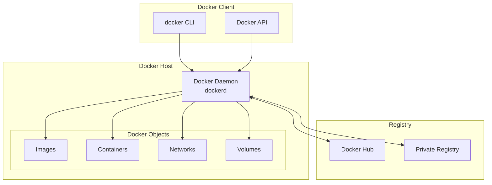
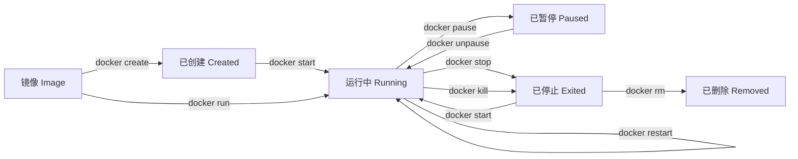
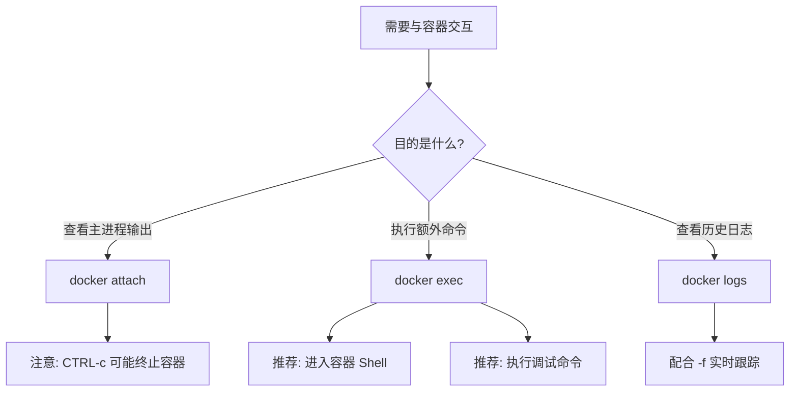
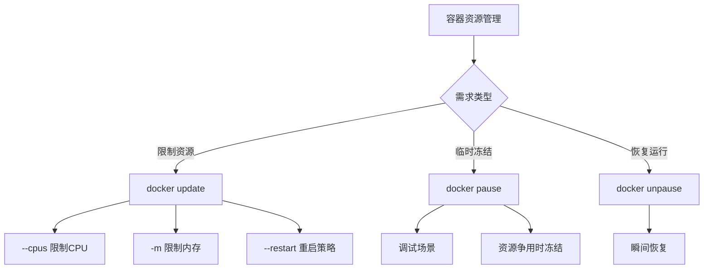
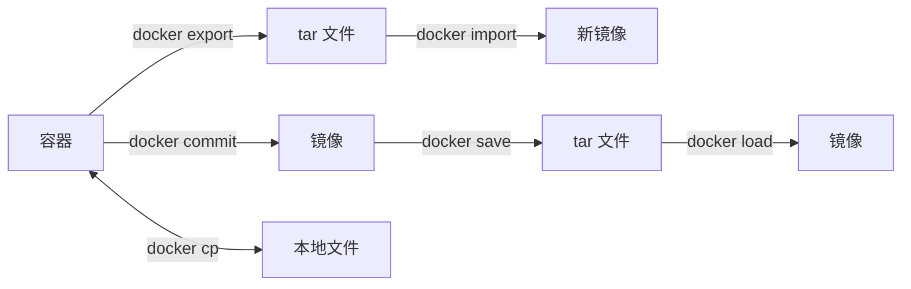
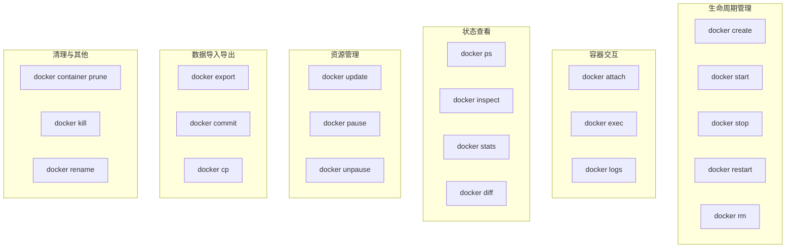
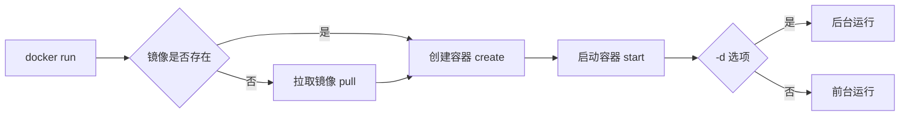
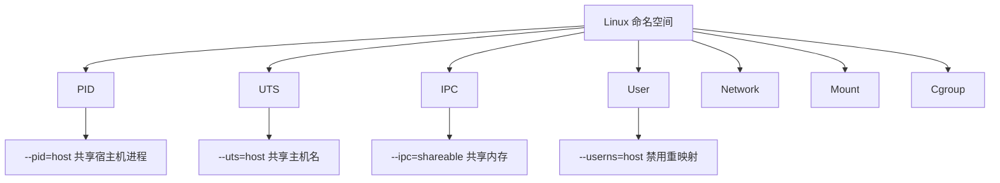

# Docker 学习笔记 · 第一册：基础与容器操作


> 📖 本文档是基于 Docker 官方文档整理的中文学习笔记，涵盖容器管理、镜像操作、网络配置、存储管理、Dockerfile 编写及 Docker Compose 编排等核心内容。
> 🎯 目标读者：运维工程师 / SRE / 容器技术初学者
> 📅 最后更新：2025-12

---

## 第一章：Docker 基础概述

### 1.1 Docker 简介

**Docker** 是一个开源的容器化平台，允许开发者将应用程序及其依赖打包到一个轻量级、可移植的容器中。容器可以在任何支持 Docker 的环境中一致地运行。

#### Docker 核心组件

| 组件                                  | 说明                                     |
| ------------------------------------- | ---------------------------------------- |
| **Docker Engine**               | Docker 的核心运行时，负责构建和运行容器  |
| **Docker CLI**                  | 命令行客户端，用于与 Docker Daemon 交互  |
| **Docker Daemon** (`dockerd`) | 后台守护进程，管理容器、镜像、网络和存储 |
| **Docker Registry**             | 镜像仓库，如 Docker Hub、私有 Registry   |

#### 容器 vs 虚拟机

| 特性               | 容器               | 虚拟机               |
| ------------------ | ------------------ | -------------------- |
| **启动速度** | 秒级               | 分钟级               |
| **资源占用** | MB 级              | GB 级                |
| **隔离级别** | 进程级（共享内核） | 完全隔离（独立内核） |
| **性能**     | 接近原生           | 有一定损耗           |
| **可移植性** | 高                 | 中等                 |

### 1.2 Docker 架构



#### 客户端-服务端通信流程

1. 用户通过 `docker` CLI 发送命令
2. CLI 将命令转换为 REST API 请求
3. Docker Daemon 接收请求并执行相应操作
4. Daemon 返回执行结果给 CLI
5. CLI 将结果展示给用户

---

## 第二章：容器管理 - 基础操作
### 2.1 容器生命周期概述


> 📁 本章内容来源于 Docker 官方文档 `容器管理/` 目录


容器的生命周期包含以下几个关键状态：



#### 容器状态说明

| 状态        | 描述                             |
| ----------- | -------------------------------- |
| `created` | 容器已创建但未启动               |
| `running` | 容器正在运行                     |
| `paused`  | 容器进程被暂停（冻结）           |
| `exited`  | 容器已停止运行                   |
| `dead`    | 容器处于死亡状态（无法正常删除） |

---

### 2.2 创建容器（docker create）

`docker create` 命令用于**创建一个新容器**，但**不启动**它。这在需要预先配置容器、稍后再启动的场景中非常有用。

#### 命令语法

```bash
docker create [OPTIONS] IMAGE [COMMAND] [ARG...]

# 别名
docker container create [OPTIONS] IMAGE [COMMAND] [ARG...]
```

#### 核心概念

- `docker create` 从指定镜像创建一个可写的容器层
- 容器创建后状态为 `created`，需使用 `docker start` 启动
- 相当于 `docker run -d` 但不启动容器

> 💡 **提示**：`docker create` 与 `docker run` 共享大部分选项，详细选项说明请参考 [第三章：docker run 命令详解](#第三章docker-run-命令详解)。

#### 常用选项

| 选项                  | 说明            |
| --------------------- | --------------- |
| `--name`            | 为容器指定名称  |
| `-i, --interactive` | 保持 STDIN 打开 |
| `-t, --tty`         | 分配伪终端      |
| `-v, --volume`      | 挂载存储卷      |
| `-p, --publish`     | 端口映射        |
| `-e, --env`         | 设置环境变量    |
| `--restart`         | 重启策略        |

#### 实战示例

**示例 1：创建并启动交互式容器**

```bash
# 创建交互式容器（带伪终端）
$ docker create -it --name mycontainer alpine
6d8af538ec541dd581ebc2a24153a28329acb5268abe5ef868c1f1a261221752

# 启动容器并附加到终端
$ docker start --attach -i mycontainer
/ # echo hello world
hello world
```

上述命令等价于：

```bash
$ docker run -it --name mycontainer2 alpine
/ # echo hello world
hello world
```

**示例 2：创建数据卷容器**

```bash
# 创建一个带数据卷的容器
$ docker create -v /data --name data ubuntu
240633dfbb98128fa77473d3d9018f6123b99c454b3251427ae190a7d951ad57

# 从其他容器使用该数据卷
$ docker run --rm --volumes-from data ubuntu ls -la /data
total 8
drwxr-xr-x  2 root root 4096 Dec  5 04:10 .
drwxr-xr-x 48 root root 4096 Dec  5 04:11 ..
```

**示例 3：创建绑定挂载容器**

```bash
# 创建绑定主机目录的容器
$ docker create -v /home/docker:/docker --name docker ubuntu
9aa88c08f319cd1e4515c3c46b0de7cc9aa75e878357b1e96f91e2c773029f03

# 从其他容器访问挂载的目录
$ docker run --rm --volumes-from docker ubuntu ls -la /docker
```

---

### 2.3 启动容器（docker start）

`docker start` 命令用于**启动一个或多个已停止的容器**。

#### 命令语法

```bash
docker start [OPTIONS] CONTAINER [CONTAINER...]

# 别名
docker container start [OPTIONS] CONTAINER [CONTAINER...]
```

#### 命令选项

| 选项                  | 说明                                  |
| --------------------- | ------------------------------------- |
| `-a, --attach`      | 附加到容器的 STDOUT/STDERR 并转发信号 |
| `-i, --interactive` | 附加容器的 STDIN                      |
| `--detach-keys`     | 覆盖分离容器的按键序列                |

#### 实战示例

**示例 1：启动已停止的容器**

```bash
# 启动名为 mycontainer 的容器
$ docker start mycontainer
mycontainer
```

**示例 2：启动并附加到容器**

```bash
# 启动容器并附加到终端（交互式）
$ docker start -ai mycontainer
/ # 
```

**示例 3：批量启动多个容器**

```bash
# 同时启动多个容器
$ docker start container1 container2 container3
```

---

### 2.4 停止容器（docker stop）

`docker stop` 命令用于**优雅地停止一个或多个运行中的容器**。

#### 命令语法

```bash
docker stop [OPTIONS] CONTAINER [CONTAINER...]

# 别名
docker container stop [OPTIONS] CONTAINER [CONTAINER...]
```

#### 停止流程

1. 向容器主进程发送 **SIGTERM** 信号（或自定义信号）
2. 等待优雅停止超时时间（默认 10 秒）
3. 如果容器仍未退出，发送 **SIGKILL** 强制终止

> 💡 **提示**：默认停止信号可通过 Dockerfile 的 `STOPSIGNAL` 指令或 `docker run --stop-signal` 选项配置。

#### 命令选项

| 选项              | 默认值  | 说明                         |
| ----------------- | ------- | ---------------------------- |
| `-s, --signal`  | SIGTERM | 发送给容器的信号             |
| `-t, --timeout` | 10      | 等待容器停止的超时时间（秒） |

#### 实战示例

**示例 1：停止单个容器**

```bash
$ docker stop my_container
my_container
```

**示例 2：使用自定义信号停止容器**

```bash
# 使用 SIGKILL 立即终止容器
$ docker stop -s SIGKILL my_container

# 使用信号编号
$ docker stop -s 9 my_container
```

**示例 3：设置超时时间**

```bash
# 等待 30 秒后再强制终止
$ docker stop -t 30 my_container

# 无限等待（不强制终止）
$ docker stop -t -1 my_container
```

**示例 4：批量停止容器**

```bash
# 停止多个指定容器
$ docker stop container1 container2 container3

# 停止所有运行中的容器
$ docker stop $(docker ps -q)
```

#### docker stop vs docker kill

| 特性               | docker stop            | docker kill           |
| ------------------ | ---------------------- | --------------------- |
| **默认信号** | SIGTERM                | SIGKILL               |
| **优雅停止** | ✅ 支持（有超时等待）  | ❌ 不支持（立即终止） |
| **适用场景** | 生产环境、需要清理资源 | 容器卡死、紧急终止    |

---

### 2.5 重启容器（docker restart）

`docker restart` 命令用于**重启一个或多个容器**，相当于先执行 `docker stop` 再执行 `docker start`。

#### 命令语法

```bash
docker restart [OPTIONS] CONTAINER [CONTAINER...]

# 别名
docker container restart [OPTIONS] CONTAINER [CONTAINER...]
```

#### 命令选项

| 选项              | 默认值  | 说明                         |
| ----------------- | ------- | ---------------------------- |
| `-s, --signal`  | SIGTERM | 发送给容器的停止信号         |
| `-t, --timeout` | 10      | 等待容器停止的超时时间（秒） |

#### 实战示例

**示例 1：重启单个容器**

```bash
$ docker restart my_container
my_container
```

**示例 2：使用自定义超时时间重启**

```bash
# 等待 20 秒后再强制重启
$ docker restart -t 20 my_container
```

**示例 3：使用自定义信号重启**

```bash
# 使用 SIGTERM 信号优雅重启
$ docker restart -s SIGTERM my_container
```

**示例 4：批量重启容器**

```bash
# 重启多个容器
$ docker restart container1 container2

# 重启所有运行中的容器
$ docker restart $(docker ps -q)
```

---

### 2.6 删除容器（docker rm）

`docker rm` 命令用于**删除一个或多个容器**。

#### 命令语法

```bash
docker rm [OPTIONS] CONTAINER [CONTAINER...]

# 别名
docker container rm [OPTIONS] CONTAINER [CONTAINER...]
docker container remove [OPTIONS] CONTAINER [CONTAINER...]
```

> ⚠️ **注意**：默认情况下，只能删除已停止的容器。要删除运行中的容器，需使用 `-f` 选项。

#### 命令选项

| 选项              | 说明                                 |
| ----------------- | ------------------------------------ |
| `-f, --force`   | 强制删除运行中的容器（使用 SIGKILL） |
| `-l, --link`    | 删除指定的链接                       |
| `-v, --volumes` | 删除容器关联的匿名卷                 |

#### 实战示例

**示例 1：删除已停止的容器**

```bash
$ docker rm my_container
my_container
```

**示例 2：强制删除运行中的容器**

```bash
$ docker rm --force redis
redis
```

> ⚠️ 使用 `--force` 会向容器主进程发送 SIGKILL 信号，然后删除容器。

**示例 3：删除容器及其匿名卷**

```bash
$ docker rm -v redis
redis
```

此命令会删除容器以及与其关联的匿名卷。**注意**：如果卷是具名卷，则不会被删除。

```bash
# 创建带有具名卷和匿名卷的容器
$ docker create -v awesome:/foo -v /bar --name hello redis
hello

# 删除容器及匿名卷
$ docker rm -v hello
# /foo 卷（具名）保留，/bar 卷（匿名）被删除
```

**示例 4：删除链接**

```bash
# 删除容器之间的网络链接
$ docker rm --link /webapp/redis
/webapp/redis
```

**示例 5：批量删除容器**

```bash
# 删除所有已停止的容器（推荐使用 prune）
$ docker rm $(docker ps --filter status=exited -q)

# 使用 xargs
$ docker ps --filter status=exited -q | xargs docker rm

# 推荐：使用 docker container prune
$ docker container prune
```

#### 最佳实践

| 场景               | 推荐命令                     |
| ------------------ | ---------------------------- |
| 删除单个容器       | `docker rm <container>`    |
| 强制删除运行中容器 | `docker rm -f <container>` |
| 删除容器及匿名卷   | `docker rm -v <container>` |
| 批量清理已停止容器 | `docker container prune`   |
| 清理所有未使用资源 | `docker system prune`      |

---

### 2.7 容器生命周期管理小结

#### 命令速查表

| 命令               | 作用               | 常用选项                           |
| ------------------ | ------------------ | ---------------------------------- |
| `docker create`  | 创建容器（不启动） | `--name`, `-v`, `-p`, `-e` |
| `docker start`   | 启动容器           | `-a`, `-i`                     |
| `docker stop`    | 优雅停止容器       | `-t`, `-s`                     |
| `docker restart` | 重启容器           | `-t`, `-s`                     |
| `docker rm`      | 删除容器           | `-f`, `-v`                     |

#### 组合使用示例

```bash
# 完整的容器生命周期
$ docker create --name myapp -p 8080:80 nginx    # 创建
$ docker start myapp                              # 启动
$ docker stop myapp                               # 停止
$ docker start myapp                              # 再次启动
$ docker restart myapp                            # 重启
$ docker stop myapp && docker rm myapp            # 停止并删除

# 快捷方式：使用 docker run 一步完成创建和启动
$ docker run -d --name myapp -p 8080:80 nginx
```

---

### 2.8 附加到容器（docker attach）

`docker attach` 命令用于**将本地终端的标准输入、输出和错误流附加到一个运行中的容器**，从而可以查看其输出或进行交互式控制。

#### 命令语法

```bash
docker attach [OPTIONS] CONTAINER

# 别名
docker container attach [OPTIONS] CONTAINER
```

#### 核心概念

- `docker attach` 将终端连接到容器的 **ENTRYPOINT/CMD** 进程
- 可以同时从不同会话多次附加到同一容器
- 使用 **CTRL-c** 发送 SIGINT/SIGKILL 信号（可能终止容器）
- 使用 **CTRL-p CTRL-q** 从容器分离（需容器以 `-it` 启动）

> ⚠️ **注意**：attach 命令显示的是容器主进程的输出。如果主进程没有输出，看起来像是命令卡住了。

#### 命令选项

| 选项              | 默认值 | 说明                     |
| ----------------- | ------ | ------------------------ |
| `--detach-keys` | -      | 覆盖分离容器的按键序列   |
| `--no-stdin`    | false  | 不附加 STDIN             |
| `--sig-proxy`   | true   | 将接收到的信号代理给进程 |

#### 分离按键序列

默认的分离按键序列是 `CTRL-p CTRL-q`，可以自定义为：

| 格式            | 示例                                                        |
| --------------- | ----------------------------------------------------------- |
| 单个字母        | `a`, `X`                                                |
| ctrl + 字母     | `ctrl-a`, `ctrl-z`                                      |
| ctrl + 特殊字符 | `ctrl-@`, `ctrl-[`, `ctrl-\\`, `ctrl-_`, `ctrl-^` |

#### 实战示例

**示例 1：附加到运行中的容器**

```bash
# 后台启动一个运行 top 的容器
$ docker run -d --name topdemo alpine top -b

# 附加到容器
$ docker attach topdemo
Mem: 2395856K used, 5638884K free, 2328K shrd, 61904K buff, 1524264K cached
CPU:   0% usr   0% sys   0% nic  99% idle   0% io   0% irq   0% sirq
Load average: 0.15 0.06 0.01 1/567 6
  PID  PPID USER     STAT   VSZ %VSZ CPU %CPU COMMAND
    1     0 root     R     1700   0%   3   0% top -b
```

**示例 2：分离而不终止容器（需要 -it）**

```bash
# 使用 -dit 启动容器（支持分离）
$ docker run -dit --name topdemo2 alpine top -b

# 附加到容器
$ docker attach topdemo2
Mem: 2405344K used, 5629396K free...
  PID  PPID USER     STAT   VSZ %VSZ CPU %CPU COMMAND
    1     0 root     R     1700   0%   3   0% top -b

# 按 CTRL-p CTRL-q 分离
read escape sequence

# 容器仍在运行
$ docker ps --filter name=topdemo2
CONTAINER ID   IMAGE     COMMAND    STATUS          NAMES
fde88b83c2c2   alpine    "top -b"   Up 21 seconds   topdemo2
```

**示例 3：获取容器的退出码**

```bash
# 启动容器
$ docker run --name test -dit alpine

# 附加并执行退出命令
$ docker attach test
/# exit 13

# 检查退出码
$ echo $?
13
```

**示例 4：自定义分离按键**

```bash
# 使用 ctrl-a 作为分离按键
$ docker attach --detach-keys="ctrl-a" mycontainer
```

#### docker attach vs docker exec

| 特性               | docker attach           | docker exec               |
| ------------------ | ----------------------- | ------------------------- |
| **连接目标** | 容器主进程（PID 1）     | 新建一个进程              |
| **终止容器** | CTRL-c 可能终止容器     | CTRL-c 只终止 exec 的进程 |
| **使用场景** | 查看主进程输出、调试    | 执行额外命令、进入 Shell  |
| **分离容器** | CTRL-p CTRL-q（需 -it） | 直接退出                  |

> 💡 **推荐**：在大多数场景下，推荐使用 `docker exec` 进入容器，更加灵活安全。

---

### 2.9 在容器中执行命令（docker exec）

`docker exec` 命令用于**在运行中的容器内执行新命令**，是进入容器进行调试和管理的最常用方式。

#### 命令语法

```bash
docker exec [OPTIONS] CONTAINER COMMAND [ARG...]

# 别名
docker container exec [OPTIONS] CONTAINER COMMAND [ARG...]
```

#### 核心概念

- `docker exec` 在运行中的容器内**启动一个新进程**
- 该命令只在容器主进程（PID 1）运行时有效
- 命令在容器的默认工作目录中执行
- **命令必须是可执行程序**，不能是链式命令

```bash
# ✅ 正确：使用 sh -c 执行链式命令
docker exec -it my_container sh -c "echo a && echo b"

# ❌ 错误：直接传入链式命令
docker exec -it my_container "echo a && echo b"
```

#### 命令选项

| 选项                  | 说明                   |
| --------------------- | ---------------------- |
| `-d, --detach`      | 后台运行命令           |
| `--detach-keys`     | 覆盖分离容器的按键序列 |
| `-e, --env`         | 设置环境变量           |
| `--env-file`        | 从文件读取环境变量     |
| `-i, --interactive` | 保持 STDIN 打开        |
| `--privileged`      | 以特权模式执行命令     |
| `-t, --tty`         | 分配伪终端             |
| `-u, --user`        | 指定执行命令的用户     |
| `-w, --workdir`     | 指定工作目录           |

#### 实战示例

**示例 1：进入容器交互式 Shell**

```bash
# 进入容器的 bash shell
$ docker exec -it mycontainer /bin/bash

# 或使用 sh（适用于 Alpine 等精简镜像）
$ docker exec -it mycontainer sh
```

**示例 2：执行单次命令**

```bash
# 查看容器内的进程
$ docker exec mycontainer ps aux

# 查看容器内的文件
$ docker exec mycontainer ls -la /app
```

**示例 3：后台执行命令**

```bash
# 后台创建文件
$ docker exec -d mycontainer touch /tmp/execWorks

# 验证文件是否创建
$ docker exec mycontainer ls /tmp/execWorks
/tmp/execWorks
```

**示例 4：设置环境变量**

```bash
# 执行命令时设置环境变量
$ docker exec -e VAR_A=1 -e VAR_B=2 mycontainer env
PATH=/usr/local/sbin:/usr/local/bin:/usr/sbin:/usr/bin:/sbin:/bin
HOSTNAME=f64a4851eb71
VAR_A=1
VAR_B=2
HOME=/root
```

> 💡 通过 `-e` 设置的环境变量**仅对当前 exec 进程有效**，不影响容器的其他进程。

**示例 5：指定工作目录**

```bash
# 默认工作目录
$ docker exec -it mycontainer pwd
/

# 指定工作目录
$ docker exec -it -w /root mycontainer pwd
/root
```

**示例 6：以特定用户执行命令**

```bash
# 以 www-data 用户执行命令
$ docker exec -u www-data mycontainer whoami
www-data

# 以 UID:GID 格式指定用户
$ docker exec -u 1000:1000 mycontainer id
uid=1000 gid=1000
```

**示例 7：在暂停的容器中执行命令（失败）**

```bash
$ docker pause mycontainer
mycontainer

$ docker exec mycontainer sh
Error response from daemon: Container mycontainer is paused, unpause the container before exec
```

> ⚠️ 无法在**已暂停**的容器中执行命令，需先 `docker unpause` 恢复容器。

#### 常用场景总结

| 场景           | 命令                                             |
| -------------- | ------------------------------------------------ |
| 进入容器 Shell | `docker exec -it <container> sh`               |
| 查看日志文件   | `docker exec <container> cat /var/log/app.log` |
| 安装调试工具   | `docker exec -it <container> apk add curl`     |
| 执行数据库命令 | `docker exec -it mysql mysql -u root -p`       |
| 检查网络连通性 | `docker exec <container> ping google.com`      |

---

### 2.10 查看容器日志（docker logs）

`docker logs` 命令用于**获取容器的日志输出**，包括 STDOUT 和 STDERR。

#### 命令语法

```bash
docker logs [OPTIONS] CONTAINER

# 别名
docker container logs [OPTIONS] CONTAINER
```

#### 核心概念

- `docker logs` 获取容器**执行时刻**存在的日志
- 使用 `--follow` 可以持续流式输出新日志
- 日志驱动不同，可用的功能也不同

> 💡 关于日志驱动的配置，请参考 [第七章：Docker Daemon](#第七章docker-daemon-守护进程)。

#### 命令选项

| 选项                 | 默认值 | 说明                                   |
| -------------------- | ------ | -------------------------------------- |
| `--details`        | -      | 显示日志的额外详情（环境变量、标签等） |
| `-f, --follow`     | -      | 持续输出日志（类似 `tail -f`）       |
| `--since`          | -      | 显示指定时间之后的日志                 |
| `--until`          | -      | 显示指定时间之前的日志                 |
| `-n, --tail`       | all    | 显示最后 N 行日志                      |
| `-t, --timestamps` | -      | 显示时间戳                             |

#### 时间格式说明

`--since` 和 `--until` 支持以下时间格式：

| 格式        | 示例                                     |
| ----------- | ---------------------------------------- |
| RFC 3339    | `2023-12-01T10:00:00Z`                 |
| UNIX 时间戳 | `1701421200`                           |
| 相对时间    | `42m`（42 分钟前）、`3h`（3 小时前） |

#### 实战示例

**示例 1：查看容器全部日志**

```bash
docker logs mycontainer
```

**示例 2：实时跟踪日志**

```bash
# 实时输出日志（类似 tail -f）
$ docker logs -f mycontainer

# 按 CTRL-c 停止跟踪
```

**示例 3：显示最后 N 行日志**

```bash
# 显示最后 100 行日志
$ docker logs --tail 100 mycontainer

# 显示最后 50 行并持续跟踪
$ docker logs --tail 50 -f mycontainer
```

**示例 4：显示时间戳**

```bash
$ docker logs -t mycontainer
2024-12-01T10:00:00.123456789Z Starting application...
2024-12-01T10:00:01.234567890Z Listening on port 8080
```

**示例 5：按时间范围过滤日志**

```bash
# 显示最近 30 分钟的日志
$ docker logs --since 30m mycontainer

# 显示特定时间之后的日志
$ docker logs --since 2024-12-01T10:00:00 mycontainer

# 显示某个时间段的日志
$ docker logs --since 2024-12-01T10:00:00 --until 2024-12-01T12:00:00 mycontainer
```

**示例 6：跟踪日志直到特定时间**

```bash
# 启动持续输出日志的容器
$ docker run --name test -d busybox sh -c "while true; do date; sleep 1; done"

# 实时跟踪日志，2 秒后停止
$ docker logs -f --until=2s test
Tue 14 Nov 2017 16:40:00 CET
Tue 14 Nov 2017 16:40:01 CET
Tue 14 Nov 2017 16:40:02 CET
```

**示例 7：显示日志详情**

```bash
# 显示额外的环境变量和标签信息
$ docker logs --details mycontainer
```

#### 日志最佳实践

| 建议                     | 说明                                      |
| ------------------------ | ----------------------------------------- |
| 使用 `--tail` 限制行数 | 避免大量日志导致内存问题                  |
| 配置日志轮转             | 防止日志文件无限增长                      |
| 使用 `--since` 过滤    | 只查看需要的时间范围                      |
| 考虑日志驱动             | 生产环境推荐使用 `json-file` + 轮转配置 |

---

### 2.11 容器交互命令小结

#### 命令速查表

| 命令              | 作用               | 常用选项                                |
| ----------------- | ------------------ | --------------------------------------- |
| `docker attach` | 附加到容器主进程   | `--detach-keys`, `--no-stdin`       |
| `docker exec`   | 在容器中执行新命令 | `-it`, `-d`, `-e`, `-u`, `-w` |
| `docker logs`   | 查看容器日志       | `-f`, `--tail`, `--since`, `-t` |

#### 使用场景对比



#### 快速操作示例

```bash
# 进入容器 Shell（最常用）
$ docker exec -it mycontainer sh

# 实时查看日志
$ docker logs -f mycontainer

# 查看最近 10 分钟的日志
$ docker logs --since 10m mycontainer

# 在容器中执行命令
$ docker exec mycontainer cat /etc/hosts
```

---

### 2.12 列出容器（docker ps / docker container ls）

`docker ps` 命令用于**列出容器**，是最常用的容器查看命令。

#### 命令语法

```bash
docker ps [OPTIONS]

# 别名
docker container ls [OPTIONS]
docker container list [OPTIONS]
docker container ps [OPTIONS]
```

#### 命令选项

| 选项             | 默认值 | 说明                               |
| ---------------- | ------ | ---------------------------------- |
| `-a, --all`    | -      | 显示所有容器（默认只显示运行中的） |
| `-f, --filter` | -      | 根据条件过滤输出                   |
| `--format`     | -      | 使用 Go 模板格式化输出             |
| `-n, --last`   | -1     | 显示最近创建的 N 个容器            |
| `-l, --latest` | -      | 显示最近创建的容器                 |
| `--no-trunc`   | -      | 不截断输出                         |
| `-q, --quiet`  | -      | 只显示容器 ID                      |
| `-s, --size`   | -      | 显示容器磁盘占用大小               |

#### 过滤器（--filter）

| 过滤器                   | 说明                                                               |
| ------------------------ | ------------------------------------------------------------------ |
| `id`                   | 容器 ID                                                            |
| `name`                 | 容器名称（支持部分匹配）                                           |
| `label`                | 标签（格式：`key` 或 `key=value`）                             |
| `exited`               | 退出码（需配合 `--all`）                                         |
| `status`               | 状态：created、restarting、running、removing、paused、exited、dead |
| `ancestor`             | 基于镜像过滤（镜像名、ID、摘要）                                   |
| `before` / `since`   | 在指定容器之前/之后创建的容器                                      |
| `volume`               | 挂载了指定卷的容器                                                 |
| `network`              | 连接到指定网络的容器                                               |
| `publish` / `expose` | 发布/暴露指定端口的容器                                            |
| `health`               | 健康状态：starting、healthy、unhealthy、none                       |

#### 格式化输出占位符

| 占位符          | 说明                           |
| --------------- | ------------------------------ |
| `.ID`         | 容器 ID                        |
| `.Image`      | 镜像 ID                        |
| `.Command`    | 启动命令                       |
| `.CreatedAt`  | 创建时间                       |
| `.RunningFor` | 运行时长                       |
| `.Ports`      | 暴露的端口                     |
| `.State`      | 容器状态                       |
| `.Status`     | 状态详情（包含时长和健康状态） |
| `.Size`       | 磁盘占用大小                   |
| `.Names`      | 容器名称                       |
| `.Labels`     | 所有标签                       |
| `.Mounts`     | 挂载的卷名                     |
| `.Networks`   | 连接的网络名                   |

#### 实战示例

**示例 1：查看运行中的容器**

```bash
$ docker ps
CONTAINER ID   IMAGE     COMMAND   CREATED         STATUS         PORTS     NAMES
9c3527ed70ce   busybox   "top"     14 seconds ago  Up 15 seconds            web
```

**示例 2：查看所有容器（包括已停止的）**

```bash
$ docker ps -a
CONTAINER ID   IMAGE     COMMAND   CREATED         STATUS                     PORTS     NAMES
9c3527ed70ce   busybox   "top"     14 seconds ago  Up 15 seconds                        web
4aace5031105   busybox   "top"     48 seconds ago  Exited (0) 30 seconds ago            app
```

**示例 3：只显示容器 ID**

```bash
# 常用于批量操作
$ docker ps -q
9c3527ed70ce
4aace5031105
```

**示例 4：显示磁盘占用**

```bash
$ docker ps --size
CONTAINER ID   IMAGE   COMMAND   CREATED      STATUS      PORTS   NAMES      SIZE
e90b8831a4b8   nginx   "/bin…"   11 weeks ago Up 4 hours          my_nginx   35.58 kB (virtual 109.2 MB)
```

- **size**：容器可写层的大小
- **virtual size**：只读镜像 + 可写层的总大小

**示例 5：按状态过滤**

```bash
# 只显示运行中的容器
$ docker ps --filter status=running

# 只显示已停止的容器
$ docker ps -a --filter status=exited

# 显示暂停的容器
$ docker ps --filter status=paused
```

**示例 6：按名称过滤（支持模糊匹配）**

```bash
docker ps --filter "name=web"
docker ps --filter "name=nostalgic"
```

**示例 7：按退出码过滤**

```bash
# 正常退出的容器（退出码 0）
$ docker ps -a --filter 'exited=0'

# 被 SIGKILL 终止的容器（退出码 137）
$ docker ps -a --filter 'exited=137'
```

**示例 8：按镜像过滤**

```bash
# 基于 ubuntu 镜像的容器
$ docker ps --filter ancestor=ubuntu

# 基于特定版本的镜像
$ docker ps --filter ancestor=ubuntu:24.04
```

**示例 9：按网络过滤**

```bash
docker ps --filter network=my_network
```

**示例 10：自定义输出格式**

```bash
# 只显示 ID 和命令
$ docker ps --format "{{.ID}}: {{.Command}}"
a87ecb4f327c: /bin/sh -c #(nop) MA

# 表格形式显示指定列
$ docker ps --format "table {{.ID}}\t{{.Names}}\t{{.Status}}"
CONTAINER ID   NAMES      STATUS
a87ecb4f327c   web        Up 2 hours

# JSON 格式输出
$ docker ps --format json
```

---

### 2.13 查看容器详情（docker inspect）

`docker inspect` 命令用于**显示容器的详细信息**，返回 JSON 格式的元数据。

#### 命令语法

```bash
docker inspect [OPTIONS] CONTAINER [CONTAINER...]

# 容器专用命令
docker container inspect [OPTIONS] CONTAINER [CONTAINER...]
```

> 💡 `docker inspect` 可以检查容器、镜像、网络、卷等多种对象，`docker container inspect` 专门用于容器。

#### 命令选项

| 选项             | 说明                   |
| ---------------- | ---------------------- |
| `-f, --format` | 使用 Go 模板格式化输出 |
| `-s, --size`   | 显示容器文件系统大小   |

#### 实战示例

**示例 1：查看容器完整信息**

```bash
$ docker inspect mycontainer
[
    {
        "Id": "d2cc496561d6d520cbc0236b4ba88c362c446a7619992123f11c809cded25b47",
        "Created": "2024-12-01T10:00:00.123456789Z",
        "Path": "/bin/sh",
        "Args": [],
        "State": {
            "Status": "running",
            "Running": true,
            "Paused": false,
            ...
        },
        ...
    }
]
```

**示例 2：获取容器 IP 地址**

```bash
$ docker inspect -f '{{range .NetworkSettings.Networks}}{{.IPAddress}}{{end}}' mycontainer
172.17.0.2
```

**示例 3：获取容器状态**

```bash
$ docker inspect -f '{{.State.Status}}' mycontainer
running
```

**示例 4：获取容器启动命令**

```bash
$ docker inspect -f '{{.Config.Cmd}}' mycontainer
[/bin/sh -c nginx -g 'daemon off;']
```

**示例 5：获取环境变量**

```bash
$ docker inspect -f '{{.Config.Env}}' mycontainer
[PATH=/usr/local/sbin:/usr/local/bin:/usr/sbin:/usr/bin:/sbin:/bin NGINX_VERSION=1.25.0]
```

**示例 6：获取挂载的卷信息**

```bash
docker inspect -f '{{json .Mounts}}' mycontainer | jq
```

**示例 7：获取端口映射**

```bash
$ docker inspect -f '{{json .NetworkSettings.Ports}}' mycontainer
{"80/tcp":[{"HostIp":"0.0.0.0","HostPort":"8080"}]}
```

**示例 8：获取容器进程 PID**

```bash
$ docker inspect -f '{{.State.Pid}}' mycontainer
12345
```

#### 常用 inspect 格式化查询

| 信息     | 查询命令                                                                                      |
| -------- | --------------------------------------------------------------------------------------------- |
| IP 地址  | `docker inspect -f '{{range .NetworkSettings.Networks}}{{.IPAddress}}{{end}}' <container>`  |
| MAC 地址 | `docker inspect -f '{{range .NetworkSettings.Networks}}{{.MacAddress}}{{end}}' <container>` |
| 容器状态 | `docker inspect -f '{{.State.Status}}' <container>`                                         |
| 重启次数 | `docker inspect -f '{{.RestartCount}}' <container>`                                         |
| 启动时间 | `docker inspect -f '{{.State.StartedAt}}' <container>`                                      |
| 日志路径 | `docker inspect -f '{{.LogPath}}' <container>`                                              |

---

### 2.14 查看容器资源使用（docker stats）

`docker stats` 命令用于**实时显示容器的资源使用统计**，包括 CPU、内存、网络和磁盘 IO。

#### 命令语法

```bash
docker stats [OPTIONS] [CONTAINER...]

# 别名
docker container stats [OPTIONS] [CONTAINER...]
```

#### 命令选项

| 选项            | 说明                         |
| --------------- | ---------------------------- |
| `-a, --all`   | 显示所有容器（包括已停止的） |
| `--format`    | 使用 Go 模板格式化输出       |
| `--no-stream` | 只获取一次结果，不持续刷新   |
| `--no-trunc`  | 不截断输出                   |

#### 输出列说明

| 列名                  | 说明                  |
| --------------------- | --------------------- |
| `CONTAINER ID`      | 容器 ID               |
| `NAME`              | 容器名称              |
| `CPU %`             | CPU 使用百分比        |
| `MEM USAGE / LIMIT` | 内存使用量 / 内存限制 |
| `MEM %`             | 内存使用百分比        |
| `NET I/O`           | 网络 I/O（接收/发送） |
| `BLOCK I/O`         | 块设备 I/O（读/写）   |
| `PIDS`              | 进程/线程数           |

#### 格式化输出占位符

| 占位符         | 说明                         |
| -------------- | ---------------------------- |
| `.Container` | 容器名称或 ID                |
| `.Name`      | 容器名称                     |
| `.ID`        | 容器 ID                      |
| `.CPUPerc`   | CPU 百分比                   |
| `.MemUsage`  | 内存使用量                   |
| `.MemPerc`   | 内存百分比（Windows 不可用） |
| `.NetIO`     | 网络 I/O                     |
| `.BlockIO`   | 块设备 I/O                   |
| `.PIDs`      | 进程数（Windows 不可用）     |

#### 实战示例

**示例 1：实时查看所有运行容器的资源使用**

```bash
$ docker stats
CONTAINER ID   NAME               CPU %   MEM USAGE / LIMIT     MEM %   NET I/O       BLOCK I/O     PIDS
b95a83497c91   awesome_brattain   0.28%   5.629MiB / 1.952GiB   0.28%   916B / 0B     147kB / 0B    9
67b2525d8ad1   foobar             0.00%   1.727MiB / 1.952GiB   0.09%   2.48kB / 0B   4.11MB / 0B   2
```

**示例 2：查看指定容器的统计**

```bash
docker stats nginx redis mysql
```

**示例 3：获取单次快照（不持续刷新）**

```bash
docker stats --no-stream
```

**示例 4：自定义输出格式**

```bash
# 只显示关键指标
$ docker stats --format "table {{.Container}}\t{{.CPUPerc}}\t{{.MemUsage}}"
CONTAINER           CPU %     MEM USAGE / LIMIT
fervent_panini      0.00%     56KiB / 15.57GiB
5acfcb1b4fd1        0.07%     32.86MiB / 15.57GiB
```

**示例 5：JSON 格式输出**

```bash
$ docker stats nginx --no-stream --format "{{ json . }}"
{"BlockIO":"0B / 13.3kB","CPUPerc":"0.03%","Container":"nginx","ID":"ed37317fbf42","MemPerc":"0.24%","MemUsage":"2.352MiB / 982.5MiB","Name":"nginx","NetIO":"539kB / 606kB","PIDs":"2"}
```

**示例 6：包含已停止的容器**

```bash
$ docker stats --all --no-stream
# 已停止的容器显示 0B / 0B
```

---

### 2.15 查看容器文件系统变更（docker diff）

`docker diff` 命令用于**显示容器文件系统自创建以来的变更**，可以查看哪些文件被添加、修改或删除。

#### 命令语法

```bash
docker diff CONTAINER

# 别名
docker container diff CONTAINER
```

#### 变更类型标识

| 符号  | 说明                              |
| ----- | --------------------------------- |
| `A` | 添加（Added）- 文件或目录被添加   |
| `D` | 删除（Deleted）- 文件或目录被删除 |
| `C` | 修改（Changed）- 文件或目录被修改 |

#### 实战示例

**示例 1：查看 nginx 容器的文件变更**

```bash
$ docker diff nginx_container
C /dev
C /dev/console
C /dev/core
C /dev/stdout
C /run
A /run/nginx.pid
C /var/lib/nginx/tmp
A /var/lib/nginx/tmp/client_body
A /var/lib/nginx/tmp/fastcgi
A /var/lib/nginx/tmp/proxy
C /var/log/nginx
A /var/log/nginx/access.log
A /var/log/nginx/error.log
```

**示例 2：结合 commit 使用**

```bash
# 查看容器的修改
$ docker diff mycontainer

# 如果修改满意，可以提交为新镜像
$ docker commit mycontainer myimage:v2
```

#### 使用场景

| 场景                   | 说明                         |
| ---------------------- | ---------------------------- |
| **调试问题**     | 查看容器运行后哪些文件被修改 |
| **安全审计**     | 检查容器是否有异常文件变更   |
| **创建新镜像**   | 在 commit 前确认变更内容     |
| **排查存储问题** | 了解容器写入了哪些文件       |

---

### 2.16 容器状态信息查看小结

#### 命令速查表

| 命令               | 作用         | 常用选项                             |
| ------------------ | ------------ | ------------------------------------ |
| `docker ps`      | 列出容器     | `-a`, `-q`, `-f`, `--format` |
| `docker inspect` | 查看容器详情 | `-f`                               |
| `docker stats`   | 查看资源使用 | `--no-stream`, `--format`        |
| `docker diff`    | 查看文件变更 | -                                    |

#### 运维场景速查

```bash
# 查看所有容器 ID
$ docker ps -aq

# 查看运行中容器的 IP 地址
$ docker inspect -f '{{range .NetworkSettings.Networks}}{{.IPAddress}}{{end}}' <container>

# 实时监控容器资源
$ docker stats

# 一次性获取统计快照
$ docker stats --no-stream --format "table {{.Name}}\t{{.CPUPerc}}\t{{.MemUsage}}"

# 查看容器文件变更
$ docker diff <container>

# 按状态过滤容器
$ docker ps -a --filter status=exited
```

---

### 2.17 动态更新容器配置（docker update）

`docker update` 命令用于**动态更新运行中或已停止容器的资源限制配置**，无需重建容器。

#### 命令语法

```bash
docker update [OPTIONS] CONTAINER [CONTAINER...]

# 别名
docker container update [OPTIONS] CONTAINER [CONTAINER...]
```

> ⚠️ **注意**：`docker update` 不支持 Windows 容器。

#### 命令选项

| 选项                     | 说明                              |
| ------------------------ | --------------------------------- |
| `--blkio-weight`       | 块 IO 权重（10-1000，0 表示禁用） |
| `--cpu-period`         | CPU CFS 调度周期                  |
| `--cpu-quota`          | CPU CFS 调度配额                  |
| `--cpu-rt-period`      | CPU 实时调度周期（微秒）          |
| `--cpu-rt-runtime`     | CPU 实时调度运行时间（微秒）      |
| `-c, --cpu-shares`     | CPU 份额（相对权重）              |
| `--cpus`               | CPU 核心数                        |
| `--cpuset-cpus`        | 允许使用的 CPU（如 0-3, 0,1）     |
| `--cpuset-mems`        | 允许使用的内存节点                |
| `-m, --memory`         | 内存限制                          |
| `--memory-reservation` | 内存软限制                        |
| `--memory-swap`        | 内存+Swap 总限制（-1 表示无限）   |
| `--pids-limit`         | 进程数限制（-1 表示无限）         |
| `--restart`            | 重启策略                          |

#### 实战示例

**示例 1：更新容器 CPU 份额**

```bash
# 将容器的 CPU 份额限制为 512
$ docker update --cpu-shares 512 mycontainer
mycontainer
```

**示例 2：同时更新多个容器的 CPU 和内存**

```bash
# 同时更新多个容器
$ docker update --cpu-shares 512 -m 300M container1 container2
container1
container2
```

**示例 3：更新容器重启策略**

```bash
# 设置容器失败时自动重启（最多 3 次）
$ docker update --restart=on-failure:3 mycontainer

# 设置容器总是自动重启
$ docker update --restart=always mycontainer

# 禁用自动重启
$ docker update --restart=no mycontainer
```

> ⚠️ 如果容器启动时使用了 `--rm` 标志，则无法更新其重启策略，因为 `AutoRemove` 和 `RestartPolicy` 互斥。

**示例 4：限制容器 CPU 核心数**

```bash
# 限制容器最多使用 2 个 CPU 核心
$ docker update --cpus 2 mycontainer

# 限制容器只能在 CPU 0 和 1 上运行
$ docker update --cpuset-cpus 0,1 mycontainer
```

**示例 5：更新内存限制**

```bash
# 设置内存硬限制为 512MB
$ docker update -m 512M mycontainer

# 设置内存软限制为 256MB
$ docker update --memory-reservation 256M mycontainer
```

#### 使用场景

| 场景          | 命令示例                                        |
| ------------- | ----------------------------------------------- |
| 限制资源使用  | `docker update --cpus 1 -m 256m <container>`  |
| 更新重启策略  | `docker update --restart=always <container>`  |
| 绑定 CPU 核心 | `docker update --cpuset-cpus 0,1 <container>` |
| 限制进程数    | `docker update --pids-limit 100 <container>`  |

---

### 2.18 暂停容器（docker pause）

`docker pause` 命令用于**暂停（冻结）容器内的所有进程**。

#### 命令语法

```bash
docker pause CONTAINER [CONTAINER...]

# 别名
docker container pause CONTAINER [CONTAINER...]
```

#### 核心概念

- 在 Linux 上，使用 **freezer cgroup** 技术暂停进程
- 与传统的 SIGSTOP 信号不同，容器内的进程**无法感知**自己被暂停
- 暂停期间，进程完全停止执行，不消耗 CPU，但**内存仍被占用**
- 在 Windows 上，只有 Hyper-V 容器可以被暂停

#### 实战示例

**示例 1：暂停单个容器**

```bash
$ docker pause mycontainer
mycontainer
```

**示例 2：暂停多个容器**

```bash
$ docker pause container1 container2 container3
container1
container2
container3
```

**示例 3：查看已暂停的容器**

```bash
$ docker ps --filter status=paused
CONTAINER ID   IMAGE     COMMAND   CREATED         STATUS                  PORTS   NAMES
673394ef1d4c   busybox   "top"     1 hour ago      Up 1 hour (Paused)              mycontainer
```

#### pause vs stop 对比

| 特性               | docker pause    | docker stop          |
| ------------------ | --------------- | -------------------- |
| **技术实现** | freezer cgroup  | SIGTERM/SIGKILL 信号 |
| **进程感知** | 不感知          | 收到信号             |
| **内存占用** | 保持            | 释放                 |
| **恢复速度** | 瞬间（unpause） | 需重启（start）      |
| **适用场景** | 临时冻结、调试  | 长期停止、维护       |

---

### 2.19 恢复暂停的容器（docker unpause）

`docker unpause` 命令用于**恢复暂停状态的容器**，使其继续运行。

#### 命令语法

```bash
docker unpause CONTAINER [CONTAINER...]

# 别名
docker container unpause CONTAINER [CONTAINER...]
```

#### 实战示例

**示例 1：恢复单个容器**

```bash
$ docker unpause mycontainer
mycontainer
```

**示例 2：恢复多个容器**

```bash
$ docker unpause container1 container2 container3
container1
container2
container3
```

**示例 3：暂停/恢复容器的完整流程**

```bash
# 启动容器
$ docker run -d --name myapp nginx

# 暂停容器
$ docker pause myapp
myapp

# 查看状态
$ docker ps --filter name=myapp
CONTAINER ID   IMAGE   COMMAND                  STATUS                  NAMES
abc123def456   nginx   "/docker-entrypoint.…"   Up 5 minutes (Paused)   myapp

# 恢复容器
$ docker unpause myapp
myapp

# 再次查看状态
$ docker ps --filter name=myapp
CONTAINER ID   IMAGE   COMMAND                  STATUS         NAMES
abc123def456   nginx   "/docker-entrypoint.…"   Up 5 minutes   myapp
```

---

### 2.20 容器资源管理小结

#### 命令速查表

| 命令               | 作用             | 常用选项                          |
| ------------------ | ---------------- | --------------------------------- |
| `docker update`  | 动态更新容器配置 | `--cpus`, `-m`, `--restart` |
| `docker pause`   | 暂停容器         | -                                 |
| `docker unpause` | 恢复暂停的容器   | -                                 |

#### 资源管理最佳实践



#### 运维场景示例

```bash
# 限制容器资源使用
$ docker update --cpus 2 -m 1g --restart=always myapp

# 临时冻结容器（不释放内存）
$ docker pause myapp

# 恢复容器运行
$ docker unpause myapp

# 批量更新重启策略
$ docker update --restart=always $(docker ps -q)
```

---

### 2.21 导出容器文件系统（docker export）

`docker export` 命令用于**将容器的文件系统导出为 tar 归档文件**。

#### 命令语法

```bash
docker export [OPTIONS] CONTAINER

# 别名
docker container export [OPTIONS] CONTAINER
```

#### 命令选项

| 选项             | 说明                            |
| ---------------- | ------------------------------- |
| `-o, --output` | 输出到文件（默认输出到 STDOUT） |

#### 核心概念

- 导出的是容器的**完整文件系统**
- **不包含**卷（volumes）中的数据
- 如果卷挂载覆盖了目录，导出的是底层目录内容，不是卷内容
- 可以导出运行中或已停止的容器

> ⚠️ **export vs save**：`docker export` 导出容器文件系统，`docker save` 导出镜像（包含层信息）。

#### 实战示例

**示例 1：导出容器到 tar 文件**

```bash
# 使用重定向
$ docker export mycontainer > container.tar

# 使用 -o 选项
$ docker export -o container.tar mycontainer
```

**示例 2：导出并压缩**

```bash
docker export mycontainer | gzip > container.tar.gz
```

**示例 3：导出后导入为新镜像**

```bash
# 导出容器
$ docker export mycontainer > container.tar

# 导入为新镜像
$ cat container.tar | docker import - myimage:latest
```

#### export vs save 对比

| 特性               | docker export     | docker save             |
| ------------------ | ----------------- | ----------------------- |
| **操作对象** | 容器              | 镜像                    |
| **输出内容** | 扁平化文件系统    | 分层镜像（含 metadata） |
| **包含历史** | 不包含            | 包含所有层              |
| **导入命令** | `docker import` | `docker load`         |
| **适用场景** | 迁移容器状态      | 分发/备份镜像           |

---

### 2.22 将容器提交为镜像（docker commit）

`docker commit` 命令用于**将容器的当前状态保存为新镜像**。

#### 命令语法

```bash
docker commit [OPTIONS] CONTAINER [REPOSITORY[:TAG]]

# 别名
docker container commit [OPTIONS] CONTAINER [REPOSITORY[:TAG]]
```

#### 命令选项

| 选项              | 默认值 | 说明                         |
| ----------------- | ------ | ---------------------------- |
| `-a, --author`  | -      | 镜像作者信息                 |
| `-c, --change`  | -      | 应用 Dockerfile 指令到新镜像 |
| `-m, --message` | -      | 提交信息                     |
| `-p, --pause`   | true   | 提交时暂停容器               |

#### --change 支持的 Dockerfile 指令

- `CMD` - 默认执行命令
- `ENTRYPOINT` - 入口点
- `ENV` - 环境变量
- `EXPOSE` - 暴露端口
- `LABEL` - 标签
- `ONBUILD` - 构建触发器
- `USER` - 执行用户
- `VOLUME` - 数据卷
- `WORKDIR` - 工作目录

#### 实战示例

**示例 1：基本提交**

```bash
$ docker ps
CONTAINER ID   IMAGE          COMMAND      CREATED      STATUS      NAMES
c3f279d17e0a   ubuntu:24.04   /bin/bash    7 days ago   Up 25 hrs   mycontainer

$ docker commit c3f279d17e0a myimage:v1
sha256:f5283438590d...
```

**示例 2：添加作者和提交信息**

```bash
docker commit -a "John Doe <john@example.com>" -m "Added nginx" mycontainer nginx-custom:v1
```

**示例 3：提交时修改环境变量**

```bash
docker commit --change "ENV DEBUG=true" mycontainer myimage:debug
```

**示例 4：提交时修改 CMD 和 EXPOSE**

```bash
$ docker commit \
  --change='CMD ["nginx", "-g", "daemon off;"]' \
  --change="EXPOSE 80" \
  mycontainer nginx-custom:v2
```

**示例 5：不暂停容器进行提交**

```bash
# 对于需要持续运行的容器
$ docker commit --pause=false mycontainer myimage:latest
```

#### 最佳实践

| 建议             | 说明                                 |
| ---------------- | ------------------------------------ |
| 使用 Dockerfile  | 优先使用 Dockerfile 构建可重复的镜像 |
| 添加提交信息     | 使用 `-m` 记录变更内容             |
| 指定作者         | 使用 `-a` 便于追踪来源             |
| 使用有意义的 tag | 避免使用 `latest`                  |

> 💡 `docker commit` 适用于调试和快速创建镜像，生产环境推荐使用 Dockerfile。

---

### 2.23 容器与主机间复制文件（docker cp）

`docker cp` 命令用于**在容器和本地文件系统之间复制文件或目录**。

#### 命令语法

```bash
# 从本地复制到容器
docker cp [OPTIONS] SRC_PATH CONTAINER:DEST_PATH

# 从容器复制到本地
docker cp [OPTIONS] CONTAINER:SRC_PATH DEST_PATH

# 别名
docker container cp ...
```

#### 命令选项

| 选项                  | 说明                              |
| --------------------- | --------------------------------- |
| `-a, --archive`     | 归档模式（保留所有 UID/GID 信息） |
| `-L, --follow-link` | 跟随源路径中的符号链接            |
| `-q, --quiet`       | 静默模式，不显示进度              |

#### 路径规则

**源路径是文件时：**

| 目标路径              | 行为                 |
| --------------------- | -------------------- |
| 不存在                | 创建文件             |
| 不存在且以 `/` 结尾 | 报错（目录必须存在） |
| 已存在是文件          | 覆盖                 |
| 已存在是目录          | 复制到目录中         |

**源路径是目录时：**

| 目标路径             | 行为               |
| -------------------- | ------------------ |
| 不存在               | 创建目录并复制内容 |
| 已存在是文件         | 报错               |
| 已存在是目录         | 复制整个目录到其中 |
| 源路径以 `/.` 结尾 | 只复制目录内容     |

#### 实战示例

**示例 1：从本地复制文件到容器**

```bash
docker cp ./config.yaml mycontainer:/app/config.yaml
```

**示例 2：从本地复制目录到容器**

```bash
docker cp ./app/ mycontainer:/opt/app
```

**示例 3：从容器复制文件到本地**

```bash
docker cp mycontainer:/app/logs/app.log ./app.log
```

**示例 4：从容器复制目录到本地**

```bash
docker cp mycontainer:/var/log/ ./container_logs/
```

**示例 5：只复制目录内容（使用 /.）**

```bash
# 复制目录内容而非目录本身
$ docker cp ./config/. mycontainer:/app/config/
```

**示例 6：通过管道传输（使用 tar）**

```bash
# 从容器导出并过滤
$ docker cp mycontainer:/var/logs/app.log - | tar x -O | grep "ERROR"

# 复制系统文件（cp 不支持的路径）
$ docker exec mycontainer tar Ccf /proc - cpuinfo | tar Cxf ./ -
```

**示例 7：保留文件权限**

```bash
docker cp -a ./scripts/ mycontainer:/usr/local/bin/
```

#### 使用场景

| 场景         | 命令示例                                                |
| ------------ | ------------------------------------------------------- |
| 提取日志文件 | `docker cp container:/var/log/app.log ./`             |
| 部署配置文件 | `docker cp ./nginx.conf container:/etc/nginx/`        |
| 备份数据     | `docker cp container:/data ./backup/`                 |
| 注入脚本     | `docker cp ./init.sh container:/docker-entrypoint.d/` |

> ⚠️ `docker cp` 不能复制 `/proc`、`/sys`、`/dev` 等系统目录，需使用 `docker exec` + `tar` 组合。

---

### 2.24 容器导入导出小结

#### 命令速查表

| 命令              | 作用                 | 常用选项               |
| ----------------- | -------------------- | ---------------------- |
| `docker export` | 导出容器文件系统     | `-o`                 |
| `docker commit` | 将容器提交为镜像     | `-m`, `-a`, `-c` |
| `docker cp`     | 容器与主机间复制文件 | `-a`, `-L`         |

#### 数据迁移流程



#### 运维场景示例

```bash
# 导出容器为 tar 文件
$ docker export mycontainer > container.tar

# 将容器提交为镜像
$ docker commit -m "added nginx config" mycontainer nginx-custom:v1

# 从容器提取日志
$ docker cp mycontainer:/var/log/nginx/ ./nginx_logs/

# 部署配置到容器
$ docker cp ./nginx.conf mycontainer:/etc/nginx/nginx.conf

# 导入 tar 为新镜像
$ cat container.tar | docker import - restored:latest
```

---

### 2.25 批量清理已停止容器（docker container prune）

`docker container prune` 命令用于**删除所有已停止的容器**，是清理环境的常用命令。

#### 命令语法

```bash
docker container prune [OPTIONS]
```

> 💡 没有 `docker prune` 别名，必须使用完整命令 `docker container prune`。

#### 命令选项

| 选项            | 说明                                                  |
| --------------- | ----------------------------------------------------- |
| `--filter`    | 过滤条件（如 `until=<timestamp>`、`label=<key>`） |
| `-f, --force` | 不提示确认直接删除                                    |

#### 过滤器说明

| 过滤器                  | 说明                         |
| ----------------------- | ---------------------------- |
| `until=<timestamp>`   | 只删除指定时间之前创建的容器 |
| `label=<key>`         | 只删除带有指定标签的容器     |
| `label=<key>=<value>` | 只删除标签值匹配的容器       |
| `label!=<key>`        | 只删除不带指定标签的容器     |

#### 时间格式

- **RFC3339**：`2024-12-01T10:00:00Z`
- **UNIX 时间戳**：`1701421200`
- **相对时间**：`10m`（10分钟前）、`1h`（1小时前）、`24h`（24小时前）

#### 实战示例

**示例 1：删除所有已停止的容器**

```bash
$ docker container prune
WARNING! This will remove all stopped containers.
Are you sure you want to continue? [y/N] y
Deleted Containers:
4a7f7eebae0f63178aff7eb0aa39cd3f0627a203ab2df258c1a00b456cf20063
f98f9c2aa1eaf727e4ec9c0283bc7d4aa4762fbdba7f26191f26c97f64090360

Total reclaimed space: 212 B
```

**示例 2：强制删除不提示确认**

```bash
docker container prune -f
```

**示例 3：删除超过 5 分钟前创建的容器**

```bash
docker container prune --force --filter "until=5m"
```

**示例 4：删除指定时间之前创建的容器**

```bash
docker container prune -f --filter "until=2024-12-01T10:00:00"
```

**示例 5：删除超过 24 小时的容器**

```bash
docker container prune -f --filter "until=24h"
```

**示例 6：按标签过滤删除**

```bash
# 删除带有 env=test 标签的已停止容器
$ docker container prune -f --filter "label=env=test"

# 删除不带 keep 标签的已停止容器
$ docker container prune -f --filter "label!=keep"
```

#### 相关清理命令

| 命令                       | 作用                             |
| -------------------------- | -------------------------------- |
| `docker container prune` | 清理所有已停止容器               |
| `docker image prune`     | 清理悬空镜像                     |
| `docker volume prune`    | 清理未使用的卷                   |
| `docker network prune`   | 清理未使用的网络                 |
| `docker system prune`    | **一键清理**所有未使用资源 |

---

### 2.26 强制终止容器（docker kill）

`docker kill` 命令用于**强制终止一个或多个运行中的容器**，默认发送 SIGKILL 信号。

#### 命令语法

```bash
docker kill [OPTIONS] CONTAINER [CONTAINER...]

# 别名
docker container kill [OPTIONS] CONTAINER [CONTAINER...]
```

#### 命令选项

| 选项             | 说明                             |
| ---------------- | -------------------------------- |
| `-s, --signal` | 发送给容器的信号（默认 SIGKILL） |

#### 核心概念

- 默认发送 **SIGKILL** 信号，立即终止容器
- 可以发送其他信号（如 SIGHUP、SIGINT）
- 信号名称的 `SIG` 前缀可选

> ⚠️ **注意**：如果容器的 ENTRYPOINT 或 CMD 使用 shell 形式（如 `/bin/sh -c`），信号**不会传递到子进程**，因为主进程不是 PID 1。

#### 常用信号

| 信号    | 编号 | 说明                   |
| ------- | ---- | ---------------------- |
| SIGKILL | 9    | 立即终止（不可捕获）   |
| SIGTERM | 15   | 请求终止（可捕获）     |
| SIGINT  | 2    | 中断（Ctrl+C）         |
| SIGHUP  | 1    | 挂起（常用于重载配置） |
| SIGUSR1 | 10   | 用户自定义信号 1       |

#### 实战示例

**示例 1：强制终止容器（默认 SIGKILL）**

```bash
$ docker kill mycontainer
mycontainer
```

**示例 2：发送 SIGHUP 信号（重载配置）**

```bash
# 以下命令等效
$ docker kill --signal=SIGHUP mycontainer
$ docker kill --signal=HUP mycontainer
$ docker kill --signal=1 mycontainer
```

**示例 3：发送 SIGTERM 信号**

```bash
docker kill -s SIGTERM mycontainer
```

**示例 4：终止多个容器**

```bash
docker kill container1 container2 container3
```

**示例 5：终止所有运行中的容器**

```bash
docker kill $(docker ps -q)
```

#### docker kill vs docker stop

| 特性               | docker kill        | docker stop     |
| ------------------ | ------------------ | --------------- |
| **默认信号** | SIGKILL            | SIGTERM         |
| **等待时间** | 无                 | 10 秒（可配置） |
| **进程感知** | 无法捕获           | 可捕获处理      |
| **适用场景** | 紧急终止、容器卡死 | 优雅停止        |

---

### 2.27 重命名容器（docker rename）

`docker rename` 命令用于**修改容器的名称**。

#### 命令语法

```bash
docker rename CONTAINER NEW_NAME

# 别名
docker container rename CONTAINER NEW_NAME
```

#### 实战示例

**示例 1：重命名容器**

```bash
docker rename old_name new_name
```

**示例 2：规范化容器命名**

```bash
# 将随机名称改为有意义的名称
$ docker rename quirky_einstein nginx-prod
```

**示例 3：添加版本后缀**

```bash
docker rename myapp myapp-v1
```

#### 使用场景

| 场景     | 说明                                         |
| -------- | -------------------------------------------- |
| 规范命名 | 将 Docker 自动生成的随机名替换为有意义的名称 |
| 版本迭代 | 为容器添加版本后缀                           |
| 环境区分 | 添加环境标识（如 `-dev`、`-prod`）       |
| 迁移准备 | 在迁移前重命名避免冲突                       |

---

### 2.28 第二章完整总结

#### 容器管理命令速查表



#### 按功能分类速查

| 类别                | 命令                                     | 说明               |
| ------------------- | ---------------------------------------- | ------------------ |
| **创建/启动** | `create`, `start`, `run`           | 容器创建和启动     |
| **停止/删除** | `stop`, `kill`, `rm`, `prune`    | 容器停止和清理     |
| **交互**      | `exec`, `attach`, `logs`           | 进入容器、查看输出 |
| **状态查看**  | `ps`, `inspect`, `stats`, `diff` | 查看容器信息       |
| **资源控制**  | `update`, `pause`, `unpause`       | 动态调整资源       |
| **数据操作**  | `cp`, `export`, `commit`           | 文件复制、导出镜像 |

#### 日常运维常用命令

```bash
# ===== 容器生命周期 =====
docker run -d --name myapp -p 8080:80 nginx     # 创建并启动
docker stop myapp                                 # 优雅停止
docker start myapp                                # 启动容器
docker restart myapp                              # 重启容器
docker rm myapp                                   # 删除容器

# ===== 容器交互 =====
docker exec -it myapp sh                          # 进入容器
docker logs -f --tail 100 myapp                   # 查看日志

# ===== 状态查看 =====
docker ps -a                                      # 列出所有容器
docker inspect myapp                              # 查看详情
docker stats --no-stream                          # 资源使用快照

# ===== 资源管理 =====
docker update --cpus 2 -m 512m myapp              # 更新资源限制
docker update --restart=always myapp              # 设置自动重启

# ===== 数据操作 =====
docker cp myapp:/var/log/ ./logs/                 # 复制日志
docker commit myapp myimage:v1                    # 提交为镜像

# ===== 清理 =====
docker container prune -f                         # 清理已停止容器
docker system prune -af                           # 清理所有未使用资源
```

---

*（第二章 容器管理 - 基础操作 完成）*

---

## 第三章：Docker Run 命令详解
### 3.1 命令概述


> `docker run` 是 Docker 最核心的命令，它将镜像拉取、容器创建和启动三个步骤合为一体。本章将详细讲解 `docker run` 的各个选项。


#### 基本语法

```bash
docker run [OPTIONS] IMAGE [COMMAND] [ARG...]

# 别名
docker container run [OPTIONS] IMAGE [COMMAND] [ARG...]
```

#### 命令执行流程



#### 选项分类概览

| 类别     | 主要选项                                            |
| -------- | --------------------------------------------------- |
| 容器标识 | `--name`, `--cidfile`                           |
| 运行模式 | `-d`, `-it`, `--rm`                           |
| 网络配置 | `-p`, `-P`, `--network`, `--hostname`       |
| 存储挂载 | `-v`, `--mount`, `--tmpfs`                    |
| 资源限制 | `--cpus`, `-m`, `--pids-limit`                |
| 环境配置 | `-e`, `--env-file`, `-w`                      |
| 安全配置 | `--privileged`, `--cap-add`, `--security-opt` |

---

### 3.2 容器标识与命名（--name, --cidfile）

#### --name：指定容器名称

`--name` 选项用于**为容器指定一个自定义名称**，方便后续管理和引用。

##### 基本用法

```bash
docker run --name <container_name> IMAGE
```

##### 实战示例

**示例 1：创建命名容器**

```bash
$ docker run --name test -d nginx:alpine
4bed76d3ad428b889c56c1ecc2bf2ed95cb08256db22dc5ef5863e1d03252a19

$ docker ps
CONTAINER ID   IMAGE          COMMAND                  CREATED        STATUS   PORTS     NAMES
4bed76d3ad42   nginx:alpine   "/docker-entrypoint.…"   1 second ago   Up       80/tcp    test
```

**示例 2：通过名称管理容器**

```bash
# 停止容器
$ docker stop test
test

# 删除容器
$ docker rm test
test
```

**示例 3：容器名称用于网络 DNS**

在用户定义的 bridge 网络中，容器名称可以作为 DNS 名称使用：

```bash
# 创建自定义网络
$ docker network create mynet

# 启动命名容器
$ docker run --name test --net mynet -d nginx:alpine

# 其他容器可以通过名称访问
$ docker run --net mynet busybox ping test
PING test (172.18.0.2): 56 data bytes
64 bytes from 172.18.0.2: seq=0 ttl=64 time=0.073 ms
64 bytes from 172.18.0.2: seq=1 ttl=64 time=0.411 ms
```

##### 命名规则与最佳实践

| 规则   | 说明                           |
| ------ | ------------------------------ |
| 唯一性 | 同一主机上容器名称必须唯一     |
| 可读性 | 使用有意义的名称便于管理       |
| 格式   | 支持字母、数字、下划线、连字符 |
| 长度   | 最小 1 字符，无明确最大限制    |

**推荐命名格式：**

```bash
# 项目-服务-环境
myapp-nginx-prod
myapp-mysql-dev

# 服务-版本
nginx-v1.25
redis-7.0

# 用途-编号
web-01
db-master
```

> 💡 如果不指定 `--name`，Docker 会自动分配一个随机名称（如 `vibrant_cannon`）。

---

#### --cidfile：将容器 ID 写入文件

`--cidfile` 选项用于**将容器 ID 写入指定文件**，常用于自动化脚本和进程管理。

##### 基本用法

```bash
docker run --cidfile <file_path> IMAGE
```

##### 核心特性

- 容器启动时创建文件，写入完整容器 ID
- 如果文件已存在，Docker 会报错（防止意外覆盖）
- 容器退出时文件保留，需手动清理

##### 实战示例

**示例 1：基本用法**

```bash
$ docker run --cidfile /tmp/docker_test.cid ubuntu echo "test"
test

$ cat /tmp/docker_test.cid
a1b2c3d4e5f6g7h8i9j0k1l2m3n4o5p6q7r8s9t0u1v2w3x4y5z6...
```

**示例 2：用于自动化脚本**

```bash
#!/bin/bash
CID_FILE="/var/run/myapp.cid"

# 启动容器并保存 ID
docker run --cidfile "$CID_FILE" -d nginx:alpine

# 后续操作使用保存的 ID
CONTAINER_ID=$(cat "$CID_FILE")
echo "Container started: $CONTAINER_ID"

# 停止容器
docker stop "$CONTAINER_ID"

# 清理 CID 文件
rm -f "$CID_FILE"
```

**示例 3：配合进程管理器使用**

类似于传统 PID 文件的用法：

```bash
# 检查容器是否运行
if [ -f /var/run/myapp.cid ]; then
    CID=$(cat /var/run/myapp.cid)
    if docker ps -q | grep -q "$CID"; then
        echo "Container is running"
    else
        echo "Container is stopped"
    fi
else
    echo "CID file not found"
fi
```

##### 使用场景

| 场景         | 说明                    |
| ------------ | ----------------------- |
| 自动化部署   | 脚本需要跟踪容器 ID     |
| 进程监控     | 类似 PID 文件的管理方式 |
| Systemd 集成 | 与 systemd 服务管理配合 |
| CI/CD 流水线 | 跟踪构建/测试容器       |

---

#### 容器标识小结

```bash
# 指定容器名称
$ docker run --name myapp -d nginx

# 保存容器 ID 到文件
$ docker run --cidfile /var/run/myapp.cid -d nginx

# 组合使用
$ docker run --name myapp --cidfile /var/run/myapp.cid -d nginx
```

---

### 3.3 运行模式选项（-d, -it, --rm）

容器的运行模式决定了它如何与终端交互以及退出后如何处理。

#### -d, --detach：后台运行模式

`-d` 选项让容器在**后台运行**（detached mode），不占用终端。

##### 基本用法

```bash
docker run -d IMAGE [COMMAND]
```

##### 核心特性

- 容器启动后立即返回容器 ID
- 容器在后台作为守护进程运行
- 使用 `docker logs` 查看输出
- 使用 `docker attach` 或 `docker exec` 进入容器

##### 实战示例

**示例 1：后台运行 nginx**

```bash
$ docker run -d -p 80:80 nginx:alpine
5101d3b7fe931c27c2ba0e65fd989654d297393ad65ae238f20b97a020e7295b

$ docker ps
CONTAINER ID   IMAGE          COMMAND                  STATUS         PORTS                NAMES
5101d3b7fe93   nginx:alpine   "/docker-entrypoint.…"   Up 5 seconds   0.0.0.0:80->80/tcp   wizardly_tesla
```

**示例 2：后台运行并查看日志**

```bash
$ docker run -d --name myapp nginx:alpine

# 查看日志
$ docker logs myapp

# 实时跟踪日志
$ docker logs -f myapp
```

> ⚠️ **注意**：后台容器的根进程退出时，容器也会停止。确保容器内的主进程持续运行。

**错误示例：**

```bash
# 错误：service 命令启动后立即退出
$ docker run -d nginx service nginx start

# 正确：直接运行 nginx 前台进程
$ docker run -d nginx nginx -g 'daemon off;'
```

---

#### -i, --interactive：保持 STDIN 开启

`-i` 选项保持容器的**标准输入（STDIN）开启**，允许向容器发送输入。

##### 基本用法

```bash
docker run -i IMAGE [COMMAND]
```

##### 实战示例

**示例 1：通过管道发送输入**

```bash
$ echo hello | docker run --rm -i busybox cat
hello
```

**示例 2：管道链式处理**

```bash
$ docker run --rm -i busybox echo "foo bar baz" \
  | docker run --rm -i busybox awk '{ print $2 }' \
  | docker run --rm -i busybox rev
rab
```

---

#### -t, --tty：分配伪终端

`-t` 选项为容器**分配一个伪终端（pseudo-TTY）**，提供终端功能。

##### 基本用法

```bash
docker run -t IMAGE [COMMAND]
```

##### -it 组合：交互式终端

`-i` 和 `-t` 通常**组合使用**，创建一个完整的交互式终端会话：

```bash
docker run -it IMAGE [COMMAND]
```

##### 实战示例

**示例 1：进入交互式 shell**

```bash
$ docker run -it debian bash
root@10a3e71492b0:/# ls
bin  boot  dev  etc  home  lib  ...
root@10a3e71492b0:/# exit
exit
```

**示例 2：-t 的作用（密码隐藏）**

不使用 `-t` 时，密码会显示明文：

```bash
$ docker run -i debian passwd root
New password: karjalanpiirakka9
Retype new password: karjalanpiirakka9
passwd: password updated successfully
```

使用 `-t` 时，密码被隐藏：

```bash
$ docker run -it debian passwd root
New password:
Retype new password:
passwd: password updated successfully
```

> 💡 这是因为 `-t` 启用了 TTY 的 echo-off 功能。

---

#### --rm：退出时自动删除容器

`--rm` 选项让容器**在退出时自动删除**，包括其关联的匿名卷。

##### 基本用法

```bash
docker run --rm IMAGE [COMMAND]
```

##### 核心特性

- 容器退出后自动删除
- 同时删除容器关联的**匿名卷**
- **命名卷不会被删除**
- 不能与 `--restart` 同时使用

##### 实战示例

**示例 1：一次性任务**

```bash
# 执行后自动清理
$ docker run --rm alpine echo "Hello, World!"
Hello, World!

# 容器已被自动删除
$ docker ps -a | grep alpine
# （无输出）
```

**示例 2：临时交互式会话**

```bash
$ docker run --rm -it ubuntu bash
root@abcd1234:/# apt update
root@abcd1234:/# exit
# 退出后容器自动删除
```

**示例 3：卷的删除行为**

```bash
# 匿名卷会被删除
$ docker run --rm -v /foo busybox touch /foo/test

# 命名卷不会被删除
$ docker run --rm -v mydata:/bar busybox touch /bar/test
# mydata 卷仍然存在
```

---

#### 运行模式对比

| 选项     | 作用            | 典型场景                   |
| -------- | --------------- | -------------------------- |
| `-d`   | 后台运行        | 服务型容器（nginx, mysql） |
| `-i`   | 保持 STDIN 开启 | 管道输入、脚本交互         |
| `-t`   | 分配伪终端      | 需要 TTY 功能的程序        |
| `-it`  | 交互式终端      | 进入容器调试、执行命令     |
| `--rm` | 退出后删除      | 一次性任务、测试           |

#### 组合使用示例

```bash
# 后台运行服务
$ docker run -d --name nginx -p 80:80 nginx

# 交互式调试
$ docker run -it --rm ubuntu bash

# 后台运行 + 退出删除（测试）
$ docker run -d --rm --name test nginx

# 交互式 + 后台（启动后分离）
$ docker run -dit --name myapp alpine sh
```

---

#### --detach-keys：自定义分离快捷键

`--detach-keys` 选项用于**自定义从容器分离的快捷键**，默认是 `Ctrl-p Ctrl-q`。

##### 基本用法

```bash
docker run --detach-keys="<sequence>" IMAGE
```

##### 支持的按键格式

- 字母：`a-z`
- Ctrl 组合：`ctrl-a`、`ctrl-@`、`ctrl-[`、`ctrl-\\`、`ctrl-_`、`ctrl-^`

##### 实战示例

```bash
# 使用 Ctrl-a 分离
$ docker run -it --detach-keys="ctrl-a" ubuntu bash
```

---

### 3.4 命名空间配置（--pid, --uts, --ipc, --userns）

Linux 命名空间是容器隔离的核心技术。Docker 允许通过选项配置容器使用的命名空间。

#### --pid：PID 命名空间

`--pid` 选项用于**配置容器的进程命名空间**。

##### 可选值

| 值                      | 说明                        |
| ----------------------- | --------------------------- |
| `""` (默认)           | 使用独立的 PID 命名空间     |
| `host`                | 共享宿主机的 PID 命名空间   |
| `container:<name\|id>` | 共享其他容器的 PID 命名空间 |

##### 核心概念

- **默认**：容器有独立的 PID 命名空间，进程 ID 从 1 开始
- **host**：容器可以看到宿主机上所有进程
- **container**：多个容器共享进程视图，用于调试

##### 实战示例

**示例 1：共享宿主机 PID 命名空间**

用于在容器中监控宿主机进程：

```bash
# 启动容器并共享宿主机 PID 命名空间
$ docker run --rm -it --pid=host alpine

# 在容器中安装并运行 htop
/ # apk add htop
/ # htop
# 可以看到宿主机上所有进程
```

**示例 2：共享其他容器的 PID 命名空间**

用于调试运行中的容器：

```bash
# 启动目标容器
$ docker run --rm --name my-nginx -d nginx:alpine

# 启动调试容器，共享 my-nginx 的 PID 命名空间
$ docker run --rm -it --pid=container:my-nginx \
  --cap-add SYS_PTRACE \
  alpine

# 在调试容器中跟踪 nginx 主进程
/ # apk add strace
/ # strace -p 1
strace: Process 1 attached
```

---

#### --uts：UTS 命名空间

`--uts` 选项用于**配置容器的 UTS（UNIX Time-sharing System）命名空间**，控制主机名和域名。

##### 可选值

| 值            | 说明                      |
| ------------- | ------------------------- |
| `""` (默认) | 使用独立的 UTS 命名空间   |
| `host`      | 共享宿主机的 UTS 命名空间 |

##### 核心概念

- **默认**：容器有独立的主机名（可通过 `--hostname` 设置）
- **host**：容器与宿主机共享主机名

> ⚠️ `--uts=host` 不能与 `--hostname` 或 `--domainname` 同时使用。

##### 实战示例

```bash
# 默认：容器有独立主机名
$ docker run --rm -it --hostname mycontainer alpine hostname
mycontainer

# 共享宿主机 UTS 命名空间
$ docker run --rm -it --uts=host alpine hostname
# 输出宿主机的主机名
```

---

#### --ipc：IPC 命名空间

`--ipc` 选项用于**配置容器的 IPC（进程间通信）命名空间**。

##### 可选值

| 值                      | 说明                                 |
| ----------------------- | ------------------------------------ |
| `""`                  | 使用守护进程默认值                   |
| `none`                | 独立的 IPC 命名空间，不挂载 /dev/shm |
| `private`             | 独立的 IPC 命名空间                  |
| `shareable`           | 独立但可共享的 IPC 命名空间          |
| `container:<name\|id>` | 加入其他容器的 IPC 命名空间          |
| `host`                | 使用宿主机的 IPC 命名空间            |

##### 核心概念

IPC 命名空间隔离的资源：

- **共享内存段**（System V shared memory）
- **信号量**（semaphores）
- **消息队列**（message queues）

##### 使用场景

| 场景                             | 配置                                            |
| -------------------------------- | ----------------------------------------------- |
| 高性能计算应用（需要共享内存）   | `--ipc=shareable` + `--ipc=container:donor` |
| 数据库（如 PostgreSQL 大页内存） | `--ipc=host` 或 `--ipc=shareable`           |
| 安全隔离                         | `--ipc=private`（默认）                       |

##### 实战示例

```bash
# 创建可共享 IPC 的容器
$ docker run -d --name ipc-donor --ipc=shareable nginx

# 其他容器加入该 IPC 命名空间
$ docker run --rm -it --ipc=container:ipc-donor alpine

# 使用宿主机 IPC 命名空间（用于特殊性能优化）
$ docker run --rm -it --ipc=host alpine
```

---

#### --userns：用户命名空间

`--userns` 选项用于**配置容器的用户命名空间**。

##### 可选值

| 值       | 说明                           |
| -------- | ------------------------------ |
| `""`   | 使用守护进程配置的用户命名空间 |
| `host` | 禁用用户命名空间重映射         |

##### 核心概念

- 当 Docker 守护进程启用了用户命名空间（user namespace remapping）时：
  - 容器内的 root（UID 0）被映射为宿主机上的非特权用户
  - 提高安全性，防止容器逃逸
- `--userns=host` 禁用此重映射，容器内 root 即为宿主机 root

> ⚠️ `--userns=host` 会降低安全性，仅在必要时使用。

##### 实战示例

```bash
# 禁用用户命名空间重映射
$ docker run --userns=host hello-world
```

---

#### 命名空间配置小结



#### 命名空间选项速查

| 选项         | 作用           | 常用值                                        |
| ------------ | -------------- | --------------------------------------------- |
| `--pid`    | PID 命名空间   | `host`, `container:<name>`                |
| `--uts`    | 主机名命名空间 | `host`                                      |
| `--ipc`    | IPC 命名空间   | `host`, `shareable`, `container:<name>` |
| `--userns` | 用户命名空间   | `host`                                      |

---

### 3.5 网络配置选项（--network, -p, --dns, --add-host）

网络配置是容器运行的核心配置之一，影响容器如何与外界通信。

#### --network：连接到网络

`--network` 选项用于**指定容器连接的网络**。

##### 预定义网络

| 网络                 | 说明                    |
| -------------------- | ----------------------- |
| `bridge`           | 默认网络，容器有独立 IP |
| `host`             | 共享宿主机网络栈        |
| `none`             | 无网络连接              |
| `container:<name>` | 共享其他容器的网络      |

##### 实战示例

**示例 1：连接到自定义网络**

```bash
# 创建自定义网络
$ docker network create my-net

# 启动容器并连接到该网络
$ docker run -itd --network=my-net busybox
```

**示例 2：指定静态 IP**

```bash
# 创建带子网的网络
$ docker network create --subnet 192.0.2.0/24 my-net

# 启动容器并指定 IP
$ docker run -itd --network=my-net --ip=192.0.2.69 busybox
```

**示例 3：连接多个网络**

```bash
$ docker network create --subnet 192.0.2.0/24 my-net1
$ docker network create --subnet 192.0.3.0/24 my-net2

# 容器同时连接两个网络
$ docker run -itd --network=my-net1 --network=my-net2 busybox
```

**示例 4：使用扩展语法**

```bash
$ docker run -itd \
  --network=name=my-net1,ip=192.0.2.42 \
  --network=name=my-net2,ip=192.0.3.42 \
  busybox
```

##### 扩展语法选项

| 选项            | 说明             |
| --------------- | ---------------- |
| `name`        | 网络名称（必需） |
| `alias`       | 网络作用域别名   |
| `ip`          | IPv4 地址        |
| `ip6`         | IPv6 地址        |
| `mac-address` | MAC 地址         |
| `driver-opt`  | 驱动选项         |

---

#### -p, --publish：发布端口

`-p` 选项用于**将容器端口映射到宿主机端口**。

##### 语法格式

```bash
-p [host_ip:]host_port:container_port[/protocol]
```

##### 实战示例

**示例 1：基本端口映射**

```bash
# 宿主机 8080 -> 容器 80
$ docker run -d -p 8080:80 nginx
```

**示例 2：绑定到特定 IP**

```bash
# 只监听 127.0.0.1
$ docker run -d -p 127.0.0.1:80:8080 nginx
```

**示例 3：随机端口**

```bash
# 宿主机随机端口 -> 容器 80
$ docker run -d -p 80 nginx

# 查看分配的端口
$ docker port <container_id>
```

**示例 4：指定协议（UDP）**

```bash
docker run -d -p 53:53/udp dns-server
```

**示例 5：端口范围**

```bash
docker run -d -p 8000-8010:8000-8010 myapp
```

> ⚠️ 如果不指定 host_ip，端口会绑定到 `0.0.0.0`（所有接口），可能存在安全风险。

---

#### -P, --publish-all：发布所有暴露端口

`-P` 选项用于**自动发布镜像中 EXPOSE 的所有端口**。

```bash
$ docker run -d -P nginx

# 查看端口映射
$ docker port <container_id>
80/tcp -> 0.0.0.0:32768
```

---

#### --expose：暴露端口（不发布）

`--expose` 选项用于**声明容器使用的端口**，但不映射到宿主机。

```bash
docker run --expose 80 nginx
```

> 💡 `--expose` 主要用于容器间通信和文档用途。

---

#### --dns：设置 DNS 服务器

`--dns` 选项用于**自定义容器的 DNS 服务器**。

```bash
docker run --dns 8.8.8.8 --dns 8.8.4.4 alpine
```

##### 相关选项

| 选项             | 说明                       |
| ---------------- | -------------------------- |
| `--dns`        | DNS 服务器地址             |
| `--dns-search` | DNS 搜索域                 |
| `--dns-option` | DNS 选项（如 `ndots:5`） |

##### 实战示例

```bash
$ docker run --rm \
  --dns 8.8.8.8 \
  --dns-search example.com \
  --dns-option ndots:3 \
  alpine cat /etc/resolv.conf

nameserver 8.8.8.8
search example.com
options ndots:3
```

---

#### --add-host：添加 hosts 条目

`--add-host` 选项用于**向容器的 /etc/hosts 添加条目**。

##### 语法格式

```bash
--add-host=<hostname>:<ip>
# 或
--add-host=<hostname>=<ip>
```

##### 实战示例

**示例 1：添加自定义主机**

```bash
$ docker run --add-host=myhost:192.168.1.100 alpine ping myhost
PING myhost (192.168.1.100): 56 data bytes
```

**示例 2：IPv6 地址**

```bash
docker run --add-host myhost=[2001:db8::33] alpine
```

**示例 3：host-gateway（访问宿主机）**

```bash
# 特殊值 host-gateway 解析为宿主机内部 IP
$ docker run --add-host host.docker.internal=host-gateway alpine

# 在容器中访问宿主机服务
$ curl host.docker.internal:8080
```

> 💡 `host-gateway` 是一个特殊值，自动解析为宿主机的内部 IP 地址。

---

#### --hostname：设置容器主机名

```bash
$ docker run --hostname mycontainer alpine hostname
mycontainer
```

---

#### --domainname：设置 NIS 域名

```bash
docker run --domainname example.com alpine
```

---

#### --mac-address：设置 MAC 地址

```bash
docker run --mac-address 92:d0:c6:0a:29:33 alpine
```

---

#### 网络配置小结

| 选项           | 作用         | 示例                          |
| -------------- | ------------ | ----------------------------- |
| `--network`  | 连接网络     | `--network=my-net`          |
| `-p`         | 发布端口     | `-p 8080:80`                |
| `-P`         | 发布所有端口 | `-P`                        |
| `--dns`      | DNS 服务器   | `--dns 8.8.8.8`             |
| `--add-host` | hosts 条目   | `--add-host=myhost:1.2.3.4` |
| `--hostname` | 主机名       | `--hostname myapp`          |

---

### 3.6 存储与挂载选项（-v, --mount, --tmpfs, --volumes-from）

容器的存储配置决定了数据如何持久化以及如何与宿主机共享数据。

#### -v, --volume：挂载卷或绑定目录

`-v` 选项用于**挂载数据卷或绑定宿主机目录**。

##### 语法格式

```bash
# 绑定挂载（bind mount）
-v <host_path>:<container_path>[:options]

# 命名卷（named volume）
-v <volume_name>:<container_path>[:options]

# 匿名卷（anonymous volume）
-v <container_path>
```

##### 常用选项

| 选项   | 说明             |
| ------ | ---------------- |
| `ro` | 只读挂载         |
| `rw` | 读写挂载（默认） |
| `z`  | SELinux 共享标签 |
| `Z`  | SELinux 私有标签 |

##### 实战示例

**示例 1：绑定挂载宿主机目录**

```bash
# 挂载当前目录到容器
$ docker run -v $(pwd):/app -w /app ubuntu pwd
/app

# 使用相对路径（Docker 23+）
$ docker run -v ./content:/content ubuntu ls /content
```

**示例 2：命名卷**

```bash
# 创建并使用命名卷
$ docker run -v mydata:/data alpine touch /data/test.txt

# 查看卷
$ docker volume ls
DRIVER    VOLUME NAME
local     mydata
```

**示例 3：只读挂载**

```bash
docker run -v /host/config:/config:ro alpine cat /config/app.conf
```

**示例 4：挂载主机文件**

```bash
docker run -v /etc/hosts:/etc/hosts:ro alpine cat /etc/hosts
```

> ⚠️ 如果宿主机路径不存在，Docker 会自动创建目录。

---

#### --mount：更明确的挂载语法

`--mount` 选项提供**更清晰、更明确的挂载语法**，推荐使用。

##### 语法格式

```bash
--mount type=<type>,source=<src>,target=<dst>[,options]
```

##### 挂载类型

| 类型       | 说明                   |
| ---------- | ---------------------- |
| `bind`   | 绑定挂载（宿主机路径） |
| `volume` | 数据卷                 |
| `tmpfs`  | 临时文件系统           |

##### 常用选项

| 选项                         | 说明           |
| ---------------------------- | -------------- |
| `source, src`              | 源路径或卷名   |
| `target, dst, destination` | 容器内目标路径 |
| `readonly, ro`             | 只读挂载       |
| `volume-opt`               | 卷驱动选项     |

##### 实战示例

**示例 1：绑定挂载**

```bash
docker run --mount type=bind,src=/data,dst=/data alpine ls /data
```

**示例 2：数据卷**

```bash
docker run --mount type=volume,src=mydata,dst=/data alpine touch /data/test
```

**示例 3：只读挂载**

```bash
docker run --mount type=bind,src=/config,dst=/config,readonly alpine
```

**示例 4：结合 --read-only**

```bash
# 容器根文件系统只读，但指定目录可写
$ docker run --read-only --mount type=volume,target=/writable alpine touch /writable/ok
```

---

#### -v vs --mount 对比

| 特性         | -v / --volume | --mount        |
| ------------ | ------------- | -------------- |
| 语法         | 简洁          | 明确           |
| 自动创建目录 | 是            | 否（报错）     |
| 推荐程度     | 兼容性好      | **推荐** |
| 可读性       | 较低          | 较高           |

---

#### --tmpfs：挂载临时文件系统

`--tmpfs` 选项用于**挂载内存文件系统**，数据不持久化。

##### 基本用法

```bash
docker run --tmpfs <container_path>[:options]
```

##### 常用选项

与 Linux `mount -t tmpfs -o` 相同：

- `rw` / `ro` - 读写/只读
- `noexec` - 禁止执行
- `nosuid` - 禁止 SUID
- `size=<bytes>` - 大小限制

##### 实战示例

```bash
# 挂载 tmpfs 到 /run
$ docker run -d --tmpfs /run:rw,noexec,nosuid,size=65536k myimage

# 查看挂载
$ docker exec mycontainer mount | grep tmpfs
tmpfs on /run type tmpfs (rw,nosuid,noexec,relatime,size=65536k)
```

##### 使用场景

| 场景     | 说明                     |
| -------- | ------------------------ |
| 敏感数据 | 密钥、令牌等不应写入磁盘 |
| 临时缓存 | 不需要持久化的缓存数据   |
| 高性能   | 需要高速 I/O 的临时存储  |

---

#### --volumes-from：从其他容器挂载卷

`--volumes-from` 选项用于**继承其他容器的卷挂载**。

##### 基本用法

```bash
docker run --volumes-from <container>[:mode] IMAGE
```

##### 模式选项

| 模式   | 说明                         |
| ------ | ---------------------------- |
| `rw` | 读写（默认，继承原容器模式） |
| `ro` | 只读                         |

##### 实战示例

**示例 1：共享数据卷**

```bash
# 创建数据容器
$ docker run -v /data --name data-container alpine

# 从数据容器挂载卷
$ docker run --volumes-from data-container alpine ls /data
```

**示例 2：只读模式**

```bash
docker run --volumes-from data-container:ro alpine
```

**示例 3：多容器共享卷**

```bash
# 创建带卷的容器
$ docker run -d -v webdata:/var/www --name web nginx

# 备份容器共享卷
$ docker run --volumes-from web -v $(pwd):/backup alpine \
    tar cvf /backup/webdata.tar /var/www
```

---

#### --read-only：根文件系统只读

`--read-only` 选项使**容器根文件系统只读**，提高安全性。

```bash
$ docker run --read-only alpine touch /test
touch: /test: Read-only file system

# 配合挂载使用
$ docker run --read-only -v /writable alpine touch /writable/ok
```

---

#### 存储配置小结

| 选项               | 作用           | 示例                                  |
| ------------------ | -------------- | ------------------------------------- |
| `-v`             | 挂载卷或目录   | `-v /host:/container`               |
| `--mount`        | 明确挂载语法   | `--mount type=bind,src=...,dst=...` |
| `--tmpfs`        | 内存文件系统   | `--tmpfs /run:size=64k`             |
| `--volumes-from` | 继承其他容器卷 | `--volumes-from data`               |
| `--read-only`    | 根文件系统只读 | `--read-only`                       |

---

### 3.7 资源限制选项（--memory, --cpus, --ulimit, --blkio-weight）

资源限制确保容器不会过度消耗系统资源，是生产环境容器管理的关键。

#### 内存限制

##### -m, --memory：设置内存上限

```bash
docker run -m <limit> IMAGE

# 支持单位：b, k, m, g
docker run -m 512m nginx
docker run --memory 1g nginx
```

##### --memory-reservation：内存软限制

当系统内存紧张时才生效的软限制：

```bash
docker run -m 1g --memory-reservation 512m nginx
```

##### --memory-swap：交换空间限制

| 值             | 说明                          |
| -------------- | ----------------------------- |
| 未设置         | swap = 2 × memory            |
| 与 memory 相同 | 禁用 swap                     |
| `-1`         | 无限制 swap                   |
| 大于 memory    | `swap - memory` = 可用 swap |

```bash
# 内存 1G，禁用 swap
docker run -m 1g --memory-swap 1g nginx

# 内存 1G，swap 1G（总共可用 2G）
docker run -m 1g --memory-swap 2g nginx
```

##### --oom-kill-disable：禁用 OOM Killer

```bash
# 禁用 OOM Killer（必须设置 -m）
docker run -m 512m --oom-kill-disable nginx
```

> ⚠️ **警告**：禁用 OOM Killer 可能导致系统不稳定。

---

#### CPU 限制

##### --cpus：限制 CPU 数量

```bash
# 限制使用 1.5 个 CPU
docker run --cpus 1.5 nginx

# 限制使用 0.5 个 CPU
docker run --cpus 0.5 nginx
```

##### --cpu-shares：CPU 相对权重

默认值 1024，用于 CPU 竞争时的相对优先级：

```bash
# 高优先级容器
docker run --cpu-shares 2048 high-priority-app

# 低优先级容器
docker run --cpu-shares 512 low-priority-app
```

> 💡 CPU shares 只在 CPU 竞争时生效，空闲时容器可使用所有可用 CPU。

##### --cpuset-cpus：绑定 CPU 核心

```bash
# 只使用 CPU 0 和 1
docker run --cpuset-cpus 0,1 nginx

# 使用 CPU 0-3
docker run --cpuset-cpus 0-3 nginx
```

##### --cpu-period / --cpu-quota：精细控制

```bash
# 每 100ms 内最多使用 50ms CPU（相当于 0.5 CPU）
docker run --cpu-period 100000 --cpu-quota 50000 nginx
```

---

#### --ulimit：设置资源限制

`--ulimit` 选项设置**容器的 ulimit 值**。

##### 语法格式

```bash
--ulimit <type>=<soft>[:<hard>]
```

##### 常用限制类型

| 类型        | 说明           |
| ----------- | -------------- |
| `nofile`  | 最大打开文件数 |
| `nproc`   | 最大进程数     |
| `core`    | 核心转储大小   |
| `memlock` | 最大锁定内存   |
| `stack`   | 最大栈大小     |

##### 实战示例

```bash
# 设置最大打开文件数
$ docker run --ulimit nofile=1024:1024 nginx

# 设置多个限制
$ docker run --ulimit nofile=65535 --ulimit nproc=4096 nginx

# 查看容器内 ulimit
$ docker run --rm --ulimit nofile=1024 alpine sh -c "ulimit -n"
1024
```

> ⚠️ **注意**：`nproc` 限制的是用户可用进程数，而非容器进程数。

---

#### Block I/O 限制

##### --blkio-weight：I/O 相对权重

范围 10-1000，默认 0（禁用）：

```bash
# 高 I/O 优先级
docker run --blkio-weight 500 nginx

# 低 I/O 优先级
docker run --blkio-weight 100 nginx
```

##### 设备级别限制

```bash
# 限制读取速率
docker run --device-read-bps /dev/sda:1mb nginx

# 限制写入速率
docker run --device-write-bps /dev/sda:1mb nginx

# 限制 IOPS
docker run --device-read-iops /dev/sda:100 nginx
docker run --device-write-iops /dev/sda:100 nginx
```

---

#### --pids-limit：进程数限制

限制容器内可创建的进程数量：

```bash
# 最多 100 个进程
docker run --pids-limit 100 nginx

# 无限制
docker run --pids-limit -1 nginx
```

---

#### --storage-opt：存储限制

限制容器文件系统大小（需要特定存储驱动支持）：

```bash
# 限制容器大小为 10G
docker run --storage-opt size=10G fedora
```

> 💡 仅支持 `btrfs`, `overlay2`, `zfs` 等存储驱动。

---

#### 资源限制小结

| 选项               | 作用        | 示例                     |
| ------------------ | ----------- | ------------------------ |
| `-m`             | 内存上限    | `-m 512m`              |
| `--cpus`         | CPU 数量    | `--cpus 2`             |
| `--cpu-shares`   | CPU 权重    | `--cpu-shares 1024`    |
| `--cpuset-cpus`  | 绑定 CPU    | `--cpuset-cpus 0,1`    |
| `--ulimit`       | ulimit 限制 | `--ulimit nofile=1024` |
| `--blkio-weight` | I/O 权重    | `--blkio-weight 500`   |
| `--pids-limit`   | 进程数限制  | `--pids-limit 100`     |

---

### 3.8 环境变量与元数据选项（-e, --env-file, -l, -h, -w）

环境变量和元数据用于配置容器运行时的行为和标识。

#### -e, --env：设置环境变量

`-e` 选项用于**向容器传递环境变量**。

##### 语法格式

```bash
# 指定变量名和值
-e VAR=value

# 传递宿主机环境变量
-e VAR
```

##### 实战示例

**示例 1：设置环境变量**

```bash
$ docker run -e MYVAR=foo --rm alpine env | grep MYVAR
MYVAR=foo
```

**示例 2：多个环境变量**

```bash
docker run -e VAR1=val1 -e VAR2=val2 alpine env
```

**示例 3：传递宿主机变量**

```bash
$ export MYVAR=hello
$ docker run -e MYVAR --rm alpine env | grep MYVAR
MYVAR=hello
```

**示例 4：用于数据库配置**

```bash
$ docker run -d \
  -e MYSQL_ROOT_PASSWORD=secret \
  -e MYSQL_DATABASE=myapp \
  -e MYSQL_USER=user \
  -e MYSQL_PASSWORD=password \
  mysql:8.0
```

---

#### --env-file：从文件加载环境变量

`--env-file` 选项用于**从文件批量加载环境变量**。

##### 文件格式

```bash
# 环境变量文件 (.env)
VAR1=value1
VAR2=value2
# 注释以 # 开头
DB_HOST=localhost
DB_PORT=3306
```

##### 实战示例

```bash
# 创建 .env 文件
$ cat > .env << EOF
APP_ENV=production
DB_HOST=mysql.example.com
DB_PORT=3306
LOG_LEVEL=info
EOF

# 加载环境变量
$ docker run --env-file .env alpine env
```

> 💡 每行一个变量，`#` 开头的行为注释。

---

#### -l, --label：添加元数据标签

`-l` 选项用于**为容器添加元数据标签**。

##### 语法格式

```bash
-l <key>=<value>
--label <key>=<value>
```

##### 实战示例

**示例 1：添加标签**

```bash
docker run -d -l app=nginx -l env=prod nginx
```

**示例 2：查看标签**

```bash
$ docker inspect --format '{{json .Config.Labels}}' <container>
{"app":"nginx","env":"prod"}
```

**示例 3：按标签过滤**

```bash
# 列出带特定标签的容器
$ docker ps -f label=app=nginx

# 删除带特定标签的容器
$ docker rm $(docker ps -aq -f label=env=test)
```

##### 常用标签规范

| 标签                        | 说明                     |
| --------------------------- | ------------------------ |
| `com.example.description` | 描述                     |
| `com.example.version`     | 版本                     |
| `maintainer`              | 维护者                   |
| `environment`             | 环境（dev/staging/prod） |

---

#### --label-file：从文件加载标签

类似于 `--env-file`，从文件批量加载标签：

```bash
$ cat > labels.txt << EOF
app=myapp
version=1.0
EOF

$ docker run --label-file labels.txt nginx
```

---

#### -h, --hostname：设置主机名

`-h` 选项用于**设置容器的主机名**。

```bash
$ docker run -h mycontainer alpine hostname
mycontainer

# 等同于
$ docker run --hostname mycontainer alpine hostname
```

---

#### -w, --workdir：设置工作目录

`-w` 选项用于**设置容器内的工作目录**。

```bash
$ docker run -w /app ubuntu pwd
/app

# 配合执行命令
$ docker run -v $(pwd):/app -w /app node npm install
```

##### 工作目录与挂载

```bash
# 常用开发模式：挂载 + 设置工作目录
$ docker run -it \
  -v $(pwd):/workspace \
  -w /workspace \
  --rm \
  python:3.11 python app.py
```

---

#### --entrypoint：覆盖入口点

`--entrypoint` 选项用于**覆盖镜像的 ENTRYPOINT**。

```bash
# 覆盖入口点为 sh
$ docker run --entrypoint sh nginx -c "echo hello"

# 清空入口点
$ docker run --entrypoint "" nginx echo "custom command"
```

---

#### 环境配置小结

| 选项             | 作用           | 示例                        |
| ---------------- | -------------- | --------------------------- |
| `-e`           | 设置环境变量   | `-e DB_HOST=localhost`    |
| `--env-file`   | 从文件加载变量 | `--env-file .env`         |
| `-l`           | 添加标签       | `-l app=nginx`            |
| `--label-file` | 从文件加载标签 | `--label-file labels.txt` |
| `-h`           | 设置主机名     | `-h mycontainer`          |
| `-w`           | 设置工作目录   | `-w /app`                 |
| `--entrypoint` | 覆盖入口点     | `--entrypoint sh`         |

---

### 3.9 安全配置选项（--privileged, --cap-add/drop, --security-opt, -u）

安全配置决定了容器的权限级别和访问控制，是生产环境的关键考量。

#### --privileged：特权模式

`--privileged` 选项授予容器**几乎所有宿主机权限**。

```bash
docker run --privileged IMAGE
```

##### 特权模式影响

| 方面             | 影响                        |
| ---------------- | --------------------------- |
| 设备访问         | 可访问所有宿主机设备        |
| 内核能力         | 拥有所有 Linux capabilities |
| AppArmor/SELinux | 绑定不受限制                |
| seccomp          | 禁用系统调用过滤            |

##### 实战示例

```bash
# Docker-in-Docker（DinD）
$ docker run --privileged -d docker:dind

# 访问宿主机设备
$ docker run --privileged -it ubuntu fdisk -l
```

> ⚠️ **警告**：特权模式严重降低安全性，仅在必要时使用！

---

#### --cap-add / --cap-drop：细粒度权限控制

比 `--privileged` 更安全的权限管理方式。

##### 基本用法

```bash
# 添加能力
docker run --cap-add <capability> IMAGE

# 移除能力
docker run --cap-drop <capability> IMAGE

# 添加所有，移除特定
docker run --cap-add ALL --cap-drop MKNOD IMAGE
```

##### 常用 Linux Capabilities

| 能力             | 说明                         |
| ---------------- | ---------------------------- |
| `NET_ADMIN`    | 网络管理（修改路由、防火墙） |
| `NET_RAW`      | 使用 RAW 和 PACKET 套接字    |
| `SYS_ADMIN`    | 系统管理（mount, swapon）    |
| `SYS_PTRACE`   | 跟踪进程（strace, gdb）      |
| `SYS_TIME`     | 修改系统时间                 |
| `MKNOD`        | 创建特殊文件                 |
| `CHOWN`        | 改变文件所有者               |
| `DAC_OVERRIDE` | 绕过文件权限检查             |

##### 实战示例

**示例 1：网络调试（tcpdump, iptables）**

```bash
docker run --cap-add NET_ADMIN --cap-add NET_RAW alpine tcpdump
```

**示例 2：进程调试（strace）**

```bash
docker run --cap-add SYS_PTRACE alpine strace ls
```

**示例 3：移除所有能力（最小权限）**

```bash
docker run --cap-drop ALL alpine
```

**示例 4：修改系统时间**

```bash
docker run --cap-add SYS_TIME alpine date -s "2024-01-01"
```

---

#### -u, --user：指定运行用户

`-u` 选项用于**指定容器内进程的运行用户**。

##### 语法格式

```bash
-u <user>[:<group>]
-u <uid>[:<gid>]
```

##### 实战示例

```bash
# 使用用户名
$ docker run -u nobody alpine id
uid=65534(nobody) gid=65534(nobody)

# 使用 UID
$ docker run -u 1000 alpine id
uid=1000 gid=0(root)

# 使用 UID:GID
$ docker run -u 1000:1000 alpine id
uid=1000 gid=1000

# 使用当前用户
$ docker run -u $(id -u):$(id -g) alpine id
```

> 💡 非 root 用户运行是容器安全最佳实践。

---

#### --security-opt：安全模块配置

`--security-opt` 选项用于**配置 AppArmor、SELinux、seccomp 等安全模块**。

##### 常用选项

| 选项                    | 说明                  |
| ----------------------- | --------------------- |
| `label:disable`       | 禁用 SELinux 标签     |
| `label:type:TYPE`     | 设置 SELinux 类型     |
| `apparmor=PROFILE`    | 使用 AppArmor 配置    |
| `apparmor=unconfined` | 禁用 AppArmor         |
| `seccomp=PROFILE`     | 使用 seccomp 配置文件 |
| `seccomp=unconfined`  | 禁用 seccomp          |
| `no-new-privileges`   | 禁止进程提权          |

##### 实战示例

**示例 1：禁止进程提权**

```bash
docker run --security-opt no-new-privileges:true alpine
```

**示例 2：禁用 AppArmor**

```bash
docker run --security-opt apparmor=unconfined alpine
```

**示例 3：禁用 seccomp**

```bash
docker run --security-opt seccomp=unconfined alpine
```

**示例 4：自定义 seccomp 配置**

```bash
docker run --security-opt seccomp=./my-profile.json alpine
```

---

#### --userns：用户命名空间

```bash
# 禁用用户命名空间重映射
$ docker run --userns=host alpine
```

---

#### --group-add：添加额外用户组

```bash
# 添加到 docker 组
$ docker run --group-add docker alpine id

# 添加多个组
$ docker run --group-add audio --group-add video alpine
```

---

#### 安全配置小结

| 选项               | 作用       | 示例                                 |
| ------------------ | ---------- | ------------------------------------ |
| `--privileged`   | 特权模式   | `--privileged`                     |
| `--cap-add`      | 添加能力   | `--cap-add NET_ADMIN`              |
| `--cap-drop`     | 移除能力   | `--cap-drop ALL`                   |
| `-u`             | 指定用户   | `-u 1000:1000`                     |
| `--security-opt` | 安全模块   | `--security-opt no-new-privileges` |
| `--group-add`    | 添加用户组 | `--group-add docker`               |

##### 安全最佳实践

```bash
# 最安全的运行方式
$ docker run \
  --cap-drop ALL \
  --security-opt no-new-privileges:true \
  --read-only \
  -u 1000:1000 \
  myapp
```

---

### 3.10 设备与 GPU 选项（--device, --gpus）

设备选项允许容器访问宿主机硬件设备。

#### --device：映射设备

`--device` 选项用于**将宿主机设备映射到容器内**。

##### 语法格式

```bash
--device=<host_device>:<container_device>:<permissions>
```

##### 权限选项

| 权限    | 说明                  |
| ------- | --------------------- |
| `r`   | 读取                  |
| `w`   | 写入                  |
| `m`   | 创建设备文件（mknod） |
| `rwm` | 完全访问（默认）      |

##### 实战示例

**示例 1：映射 USB 设备**

```bash
docker run --device /dev/ttyUSB0 alpine
```

**示例 2：映射声卡**

```bash
docker run --device /dev/snd alpine aplay test.wav
```

**示例 3：只读访问**

```bash
docker run --device /dev/video0:/dev/video0:r alpine
```

**示例 4：访问磁盘设备**

```bash
docker run --device /dev/sda alpine fdisk -l /dev/sda
```

---

#### --gpus：GPU 访问

`--gpus` 选项用于**配置容器的 GPU 访问**（需要 NVIDIA Container Toolkit）。

##### 前置条件

1. 安装 NVIDIA 驱动
2. 安装 NVIDIA Container Toolkit
3. 配置 Docker runtime

##### 语法格式

```bash
--gpus <specification>
```

##### 规格选项

| 选项                  | 说明         |
| --------------------- | ------------ |
| `all`               | 所有 GPU     |
| `"device=0"`        | 指定 GPU 0   |
| `"device=0,1"`      | 指定多个 GPU |
| `"device=GPU-UUID"` | 按 UUID 指定 |

##### 实战示例

**示例 1：使用所有 GPU**

```bash
docker run --gpus all nvidia/cuda:12.0-base nvidia-smi
```

**示例 2：指定 GPU**

```bash
# 使用 GPU 0
$ docker run --gpus "device=0" nvidia/cuda:12.0-base nvidia-smi

# 使用 GPU 0 和 1
$ docker run --gpus "device=0,1" nvidia/cuda:12.0-base nvidia-smi
```

**示例 3：限制 GPU 能力**

```bash
# 只允许计算和图形功能
$ docker run --gpus "all,capabilities=compute,utility" nvidia/cuda:12.0-base
```

##### GPU 能力列表

| 能力         | 说明              |
| ------------ | ----------------- |
| `compute`  | CUDA / 计算       |
| `compat32` | 32 位兼容         |
| `graphics` | OpenGL / 图形     |
| `utility`  | nvidia-smi 等工具 |
| `video`    | 视频编解码        |
| `display`  | 显示输出          |

---

#### 设备配置小结

| 选项         | 作用     | 示例                      |
| ------------ | -------- | ------------------------- |
| `--device` | 映射设备 | `--device /dev/ttyUSB0` |
| `--gpus`   | GPU 访问 | `--gpus all`            |

##### 完整 GPU 容器示例

```bash
$ docker run -d \
  --gpus all \
  --name ml-training \
  -v $(pwd)/data:/data \
  tensorflow/tensorflow:latest-gpu \
  python train.py
```

---

### 3.11 重启策略与信号选项（--restart, --stop-signal, --stop-timeout）

重启策略决定容器退出后的行为，信号选项控制容器的停止方式。

#### --restart：重启策略

`--restart` 选项用于**配置容器的重启策略**。

##### 策略类型

| 策略                 | 说明                             |
| -------------------- | -------------------------------- |
| `no`               | 不自动重启（默认）               |
| `on-failure[:max]` | 仅在非零退出码时重启，可限制次数 |
| `always`           | 始终重启                         |
| `unless-stopped`   | 始终重启，除非手动停止           |

##### 实战示例

**示例 1：失败时重启**

```bash
docker run --restart on-failure nginx
```

**示例 2：限制重启次数**

```bash
# 最多重启 3 次
$ docker run --restart on-failure:3 nginx
```

**示例 3：始终重启**

```bash
docker run --restart always nginx
```

**示例 4：unless-stopped（生产推荐）**

```bash
docker run --restart unless-stopped nginx
```

##### always vs unless-stopped

| 场景                     | always | unless-stopped   |
| ------------------------ | ------ | ---------------- |
| 容器退出                 | 重启   | 重启             |
| Docker 重启              | 重启   | 重启             |
| 手动 stop 后 Docker 重启 | 重启   | **不重启** |

> 💡 生产环境推荐使用 `unless-stopped`，便于维护时手动停止容器。

##### 修改运行中容器的重启策略

```bash
docker update --restart unless-stopped <container>
```

> ⚠️ `--restart` 不能与 `--rm` 同时使用。

---

#### --stop-signal：停止信号

`--stop-signal` 选项用于**指定停止容器时发送的信号**。

##### 基本用法

```bash
docker run --stop-signal <signal> IMAGE
```

##### 常用信号

| 信号        | 编号 | 说明           |
| ----------- | ---- | -------------- |
| `SIGTERM` | 15   | 默认，优雅终止 |
| `SIGKILL` | 9    | 强制终止       |
| `SIGINT`  | 2    | 中断（Ctrl+C） |
| `SIGQUIT` | 3    | 退出           |
| `SIGHUP`  | 1    | 挂起           |
| `SIGUSR1` | 10   | 用户自定义 1   |
| `SIGUSR2` | 12   | 用户自定义 2   |

##### 实战示例

```bash
# 使用 SIGINT 停止
$ docker run --stop-signal SIGINT nginx

# 使用信号编号
$ docker run --stop-signal 2 nginx
```

> 💡 确保应用程序正确处理自定义停止信号。

---

#### --stop-timeout：停止超时

`--stop-timeout` 选项用于**设置等待容器停止的超时时间**。

##### 基本用法

```bash
docker run --stop-timeout <seconds> IMAGE
```

##### 工作流程

1. Docker 发送 `--stop-signal` 指定的信号
2. 等待 `--stop-timeout` 秒
3. 如果容器未停止，发送 SIGKILL

##### 实战示例

```bash
# 等待 30 秒
$ docker run --stop-timeout 30 nginx

# 立即发送 SIGKILL（0 秒超时）
$ docker run --stop-timeout 0 nginx
```

##### 停止命令的超时

```bash
# 使用 docker stop 时指定超时
$ docker stop -t 30 <container>
```

---

#### 重启与信号配置小结

| 选项               | 作用     | 示例                         |
| ------------------ | -------- | ---------------------------- |
| `--restart`      | 重启策略 | `--restart unless-stopped` |
| `--stop-signal`  | 停止信号 | `--stop-signal SIGINT`     |
| `--stop-timeout` | 停止超时 | `--stop-timeout 30`        |

##### 生产环境推荐配置

```bash
$ docker run -d \
  --restart unless-stopped \
  --stop-timeout 30 \
  --name myapp \
  myapp:latest
```

---

### 3.12 日志配置选项（--log-driver, --log-opt）

日志配置决定了容器日志的收集和存储方式。

#### --log-driver：日志驱动

`--log-driver` 选项用于**指定容器的日志驱动**。

##### 可用驱动

| 驱动          | 说明                        |
| ------------- | --------------------------- |
| `json-file` | JSON 文件（默认）           |
| `syslog`    | 系统日志                    |
| `journald`  | systemd journal             |
| `gelf`      | Graylog Extended Log Format |
| `fluentd`   | Fluentd 日志收集器          |
| `awslogs`   | AWS CloudWatch Logs         |
| `splunk`    | Splunk HTTP Event Collector |
| `etwlogs`   | Windows ETW                 |
| `gcplogs`   | Google Cloud Logging        |
| `local`     | 本地日志驱动（优化存储）    |
| `none`      | 禁用日志                    |

##### 实战示例

```bash
# 使用 syslog 驱动
$ docker run --log-driver syslog nginx

# 禁用日志
$ docker run --log-driver none nginx

# 使用 journald
$ docker run --log-driver journald nginx
```

---

#### --log-opt：日志选项

`--log-opt` 选项用于**配置日志驱动的额外选项**。

##### json-file 驱动选项

| 选项         | 说明               | 默认值           |
| ------------ | ------------------ | ---------------- |
| `max-size` | 日志文件最大大小   | `-1`（无限制） |
| `max-file` | 保留的日志文件数   | `1`            |
| `compress` | 是否压缩轮转的日志 | `disabled`     |
| `labels`   | 记录容器标签       | -                |
| `env`      | 记录环境变量       | -                |

##### 实战示例

**示例 1：限制日志大小和文件数**

```bash
$ docker run \
  --log-driver json-file \
  --log-opt max-size=10m \
  --log-opt max-file=3 \
  nginx
```

**示例 2：启用日志压缩**

```bash
$ docker run \
  --log-driver json-file \
  --log-opt max-size=10m \
  --log-opt max-file=5 \
  --log-opt compress=true \
  nginx
```

**示例 3：记录容器标签和环境变量**

```bash
$ docker run \
  --log-opt labels=app,env \
  --log-opt env=APP_VERSION \
  -l app=myapp \
  -l env=prod \
  -e APP_VERSION=1.0 \
  nginx
```

---

#### syslog 驱动选项

| 选项                | 说明              |
| ------------------- | ----------------- |
| `syslog-address`  | syslog 服务器地址 |
| `syslog-facility` | syslog facility   |
| `syslog-format`   | 消息格式          |
| `tag`             | 日志标签          |

```bash
$ docker run \
  --log-driver syslog \
  --log-opt syslog-address=tcp://192.168.1.100:514 \
  --log-opt tag="{{.Name}}" \
  nginx
```

---

#### fluentd 驱动选项

| 选项                | 说明         |
| ------------------- | ------------ |
| `fluentd-address` | Fluentd 地址 |
| `fluentd-async`   | 异步发送     |
| `tag`             | 日志标签     |

```bash
$ docker run \
  --log-driver fluentd \
  --log-opt fluentd-address=localhost:24224 \
  --log-opt tag=docker.{{.Name}} \
  nginx
```

---

#### awslogs 驱动选项

| 选项               | 说明       |
| ------------------ | ---------- |
| `awslogs-region` | AWS 区域   |
| `awslogs-group`  | 日志组名称 |
| `awslogs-stream` | 日志流名称 |

```bash
$ docker run \
  --log-driver awslogs \
  --log-opt awslogs-region=us-east-1 \
  --log-opt awslogs-group=myapp-logs \
  --log-opt awslogs-stream=container-1 \
  nginx
```

---

#### 日志配置小结

| 选项             | 作用     | 示例                       |
| ---------------- | -------- | -------------------------- |
| `--log-driver` | 日志驱动 | `--log-driver json-file` |
| `--log-opt`    | 驱动选项 | `--log-opt max-size=10m` |

##### 生产环境推荐配置

```bash
$ docker run -d \
  --log-driver json-file \
  --log-opt max-size=100m \
  --log-opt max-file=5 \
  --log-opt compress=true \
  --name myapp \
  myapp:latest
```

> 💡 **提示**：可在 `/etc/docker/daemon.json` 中设置全局日志默认值。

---

### 3.13 其他选项（--pull, --init, --cgroup-parent）

本节介绍其他常用的 `docker run` 选项。

#### --pull：镜像拉取策略

`--pull` 选项用于**控制运行前是否拉取镜像**。

##### 策略选项

| 策略        | 说明                         |
| ----------- | ---------------------------- |
| `always`  | 始终拉取最新镜像             |
| `missing` | 仅在本地不存在时拉取（默认） |
| `never`   | 从不拉取，本地不存在则报错   |

##### 实战示例

```bash
# 始终拉取最新镜像
$ docker run --pull always nginx

# 仅在本地不存在时拉取
$ docker run --pull missing nginx

# 从不拉取
$ docker run --pull never nginx
```

> 💡 CI/CD 环境推荐使用 `--pull always` 确保使用最新镜像。

---

#### --init：使用 init 进程

`--init` 选项用于**在容器中运行 init 进程作为 PID 1**。

##### 为什么需要 init

- 正确处理信号转发
- 收割僵尸进程（zombie processes）
- 确保子进程能被正确终止

##### 实战示例

```bash
docker run --init alpine sh -c "sleep infinity"
```

##### 查看 init 进程

```bash
$ docker run --init alpine ps aux
PID   USER     TIME  COMMAND
    1 root      0:00 /sbin/docker-init -- sh
    7 root      0:00 sh
    8 root      0:00 ps aux
```

> 💡 对于不处理信号的应用程序，建议使用 `--init`。

---

#### --cgroup-parent：控制组父级

`--cgroup-parent` 选项用于**指定容器的 cgroup 父路径**。

```bash
docker run --cgroup-parent=/mygroup nginx
```

> 💡 用于高级资源隔离场景。

---

#### --runtime：容器运行时

指定容器使用的运行时：

```bash
# 使用 runc（默认）
$ docker run --runtime runc nginx

# 使用 nvidia 运行时（GPU）
$ docker run --runtime nvidia nvidia/cuda:12.0-base
```

---

#### --annotation：添加注解

添加容器注解（元数据）：

```bash
docker run --annotation "com.example.key=value" nginx
```

---

#### --platform：指定平台

指定容器的目标平台（多架构镜像）：

```bash
# 运行 ARM64 镜像
$ docker run --platform linux/arm64 nginx

# 运行 AMD64 镜像
$ docker run --platform linux/amd64 nginx
```

---

#### --health-cmd：健康检查

配置容器健康检查：

```bash
$ docker run \
  --health-cmd "curl -f http://localhost/ || exit 1" \
  --health-interval 30s \
  --health-timeout 10s \
  --health-retries 3 \
  --health-start-period 5s \
  nginx
```

##### 健康检查选项

| 选项                      | 说明         |
| ------------------------- | ------------ |
| `--health-cmd`          | 健康检查命令 |
| `--health-interval`     | 检查间隔     |
| `--health-timeout`      | 命令超时     |
| `--health-retries`      | 失败重试次数 |
| `--health-start-period` | 启动宽限期   |
| `--no-healthcheck`      | 禁用健康检查 |

---

#### 其他选项小结

| 选项                | 作用           | 示例                         |
| ------------------- | -------------- | ---------------------------- |
| `--pull`          | 镜像拉取策略   | `--pull always`            |
| `--init`          | 使用 init 进程 | `--init`                   |
| `--cgroup-parent` | cgroup 父级    | `--cgroup-parent=/mygroup` |
| `--runtime`       | 容器运行时     | `--runtime nvidia`         |
| `--platform`      | 目标平台       | `--platform linux/arm64`   |
| `--health-cmd`    | 健康检查       | `--health-cmd "curl ..."`  |

---

### 3.14 docker run 完整示例

将本章所学选项组合成一个生产级别的容器配置：

```bash
$ docker run -d \
  --name myapp \
  --hostname myapp-1 \
  --restart unless-stopped \
  --pull always \
  --init \
  \
  # 网络配置
  --network mynet \
  -p 8080:80 \
  --dns 8.8.8.8 \
  \
  # 存储配置
  -v /data/app:/app \
  --tmpfs /run:size=64k \
  --read-only \
  \
  # 资源限制
  -m 512m \
  --cpus 1 \
  --pids-limit 100 \
  \
  # 环境配置
  -e APP_ENV=production \
  --env-file .env \
  -l app=myapp \
  -l env=prod \
  \
  # 安全配置
  --cap-drop ALL \
  --security-opt no-new-privileges:true \
  -u 1000:1000 \
  \
  # 日志配置
  --log-driver json-file \
  --log-opt max-size=100m \
  --log-opt max-file=5 \
  \
  # 健康检查
  --health-cmd "curl -f http://localhost/ || exit 1" \
  --health-interval 30s \
  --health-retries 3 \
  \
  myapp:latest
```

---

---
