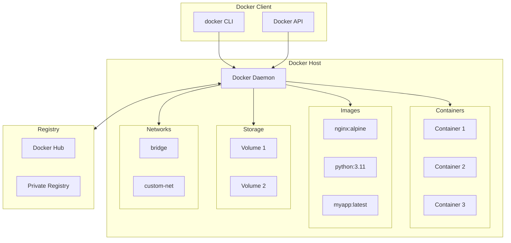
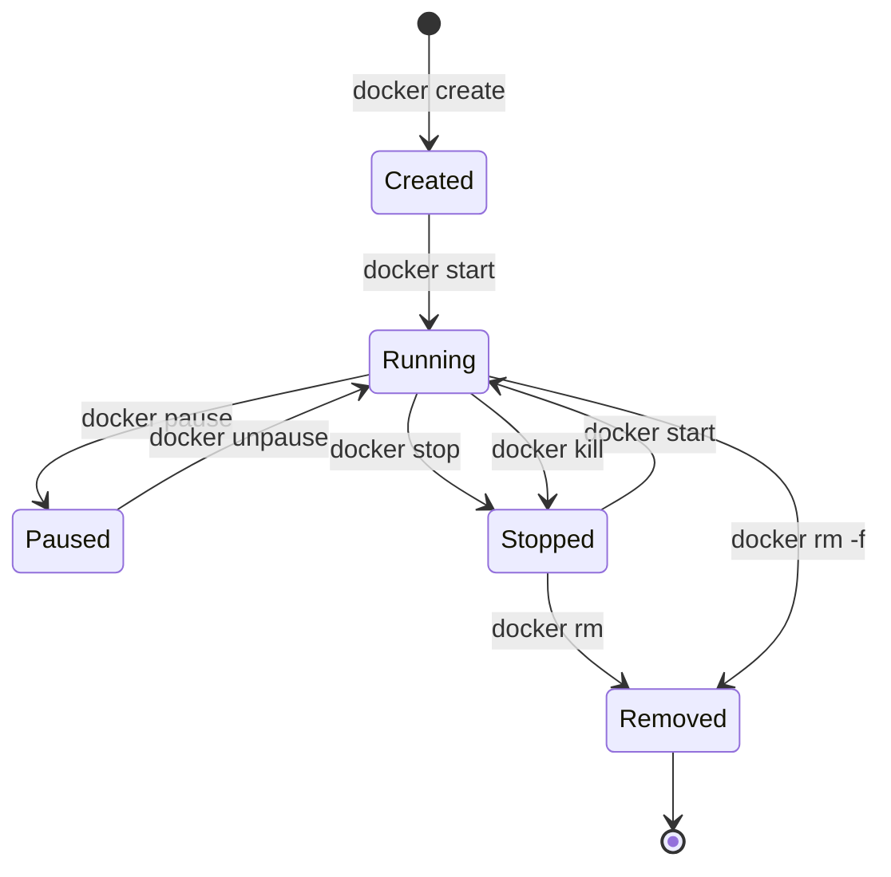

# Docker 学习笔记 · 第四册：Dockerfile 与附录

## 第十章 Dockerfile 篇

### 10.1 Dockerfile 概述与基础语法

#### 什么是 Dockerfile

Dockerfile 是一个文本文件，包含构建 Docker 镜像所需的所有指令。Docker 读取 Dockerfile 中的指令，自动构建镜像。

```dockerfile
# 简单示例
FROM ubuntu:22.04
RUN apt-get update && apt-get install -y nginx
EXPOSE 80
CMD ["nginx", "-g", "daemon off;"]
```

---

#### 基本语法规则

| 规则       | 说明                         |
| ---------- | ---------------------------- |
| 注释       | 以 `#` 开头                |
| 指令       | 不区分大小写，但建议大写     |
| 顺序       | 指令按顺序执行               |
| 第一条指令 | 必须是 `FROM`（除 ARG 外） |

```dockerfile
# 这是注释
FROM ubuntu:22.04    # 行尾注释

# 指令不区分大小写（但建议大写）
RUN echo "Hello"
run echo "World"     # 有效但不推荐
```

---

#### 指令分类

| 类别               | 指令                                   | 说明         |
| ------------------ | -------------------------------------- | ------------ |
| **基础**     | `FROM`                               | 指定基础镜像 |
| **构建参数** | `ARG`                                | 构建时变量   |
| **文件操作** | `COPY`, `ADD`                      | 复制文件     |
| **执行**     | `RUN`, `CMD`, `ENTRYPOINT`       | 执行命令     |
| **环境配置** | `ENV`, `WORKDIR`, `USER`         | 设置环境     |
| **网络**     | `EXPOSE`                             | 声明端口     |
| **存储**     | `VOLUME`                             | 声明挂载点   |
| **元数据**   | `LABEL`, `HEALTHCHECK`             | 元数据       |
| **高级**     | `ONBUILD`, `STOPSIGNAL`, `SHELL` | 高级功能     |

---

#### 构建上下文

构建上下文是 `docker build` 命令发送给 Docker 守护进程的文件集合。

```bash
# 当前目录作为构建上下文
docker build -t myimage .

# 指定 Dockerfile
docker build -t myimage -f path/to/Dockerfile .

# 指定上下文目录
docker build -t myimage -f Dockerfile /path/to/context
```

---

#### .dockerignore 文件

`.dockerignore` 文件用于排除不需要的文件，减少构建上下文大小。

```text
# .dockerignore 示例
# 注释
.git
.gitignore
*.md
!README.md
node_modules
npm-debug.log
Dockerfile*
docker-compose*
.env
.env.*
__pycache__
*.pyc
.DS_Store
```

##### 语法规则

| 模式   | 说明         |
| ------ | ------------ |
| `#`  | 注释         |
| `*`  | 匹配任意字符 |
| `?`  | 匹配单个字符 |
| `**` | 匹配多级目录 |
| `!`  | 排除例外     |

---

#### 多行指令

使用 `\` 进行换行。

```dockerfile
RUN apt-get update && \
    apt-get install -y \
    nginx \
    curl \
    vim && \
    rm -rf /var/lib/apt/lists/*
```

---

#### 解析器指令

解析器指令是特殊注释，必须在 Dockerfile 最前面。

```dockerfile
# syntax=docker/dockerfile:1
# escape=\

FROM ubuntu:22.04
```

##### 常用解析器指令

| 指令       | 说明                       |
| ---------- | -------------------------- |
| `syntax` | 指定 Dockerfile 语法版本   |
| `escape` | 设置转义字符（默认 `\`） |

---

#### 构建缓存

Docker 使用缓存加速构建。每条指令创建一个镜像层。

##### 缓存命中条件

1. 父层未变化
2. 指令未变化
3. 对于 `COPY`/`ADD`，文件内容未变化

##### 优化缓存利用

```dockerfile
# 不好的写法（依赖变化导致全部重建）
FROM node:18
COPY . /app
RUN npm install

# 好的写法（利用缓存）
FROM node:18
WORKDIR /app
COPY package*.json ./
RUN npm install
COPY . .
```

---

#### 实战示例

##### 示例 1：Python 应用

```dockerfile
# syntax=docker/dockerfile:1
FROM python:3.11-slim

WORKDIR /app

# 先复制依赖文件（利用缓存）
COPY requirements.txt .
RUN pip install --no-cache-dir -r requirements.txt

# 再复制应用代码
COPY . .

EXPOSE 8000

CMD ["python", "app.py"]
```

##### 示例 2：Node.js 应用

```dockerfile
# syntax=docker/dockerfile:1
FROM node:18-alpine

WORKDIR /app

# 安装依赖
COPY package*.json ./
RUN npm ci --only=production

# 复制应用
COPY . .

EXPOSE 3000

CMD ["node", "server.js"]
```

##### 示例 3：Go 应用

```dockerfile
# syntax=docker/dockerfile:1
FROM golang:1.21-alpine AS builder

WORKDIR /app
COPY go.mod go.sum ./
RUN go mod download

COPY . .
RUN CGO_ENABLED=0 go build -o /app/main .

FROM alpine:3.18
COPY --from=builder /app/main /main
EXPOSE 8080
CMD ["/main"]
```

---

#### 注意事项

> ⚠️ **最佳实践**：
>
> 1. 每个 Dockerfile 只有一个 `CMD` 指令生效
> 2. 使用 `.dockerignore` 减少构建上下文
> 3. 合并 `RUN` 指令减少层数
> 4. 将不常变化的指令放在前面
> 5. 使用官方基础镜像

---

### 10.2 构建阶段指令详解（FROM/ARG）

#### FROM 指令

`FROM` 指令指定基础镜像，是 Dockerfile 的第一条指令（除 ARG 外）。

##### 基本语法

```dockerfile
FROM <image>
FROM <image>:<tag>
FROM <image>@<digest>
FROM <image> AS <stage_name>
```

##### 基础镜像选择

| 类型     | 示例                     | 说明     |
| -------- | ------------------------ | -------- |
| 官方镜像 | `ubuntu`, `nginx`    | 官方维护 |
| 带标签   | `python:3.11`          | 指定版本 |
| 精简版   | `python:3.11-slim`     | 更小体积 |
| Alpine   | `python:3.11-alpine`   | 最小体积 |
| 摘要     | `python@sha256:abc...` | 固定版本 |
| scratch  | `scratch`              | 空镜像   |

##### 命名阶段

```dockerfile
FROM golang:1.21 AS builder
# 构建阶段

FROM alpine:3.18 AS runtime
# 运行阶段
```

##### 多阶段构建

```dockerfile
# 第一阶段：构建
FROM node:18 AS build
WORKDIR /app
COPY package*.json ./
RUN npm ci
COPY . .
RUN npm run build

# 第二阶段：运行
FROM nginx:alpine
COPY --from=build /app/dist /usr/share/nginx/html
```

---

#### ARG 指令

`ARG` 指令定义构建时变量。

##### 基本语法

```dockerfile
ARG <name>
ARG <name>=<default_value>
```

##### 构建时传递

```bash
docker build --build-arg VERSION=1.0.0 -t myimage .
```

##### 在 Dockerfile 中使用

```dockerfile
ARG VERSION=latest
ARG BASE_IMAGE=ubuntu

FROM ${BASE_IMAGE}:22.04

ARG VERSION
RUN echo "Building version: ${VERSION}"
```

##### ARG 作用域

```dockerfile
# FROM 之前的 ARG 只能用于 FROM
ARG BASE_IMAGE=alpine
FROM ${BASE_IMAGE}:3.18

# FROM 之后需要重新声明
ARG VERSION
RUN echo "Version: ${VERSION}"
```

##### 预定义 ARG

| 变量               | 说明                       |
| ------------------ | -------------------------- |
| `HTTP_PROXY`     | HTTP 代理                  |
| `HTTPS_PROXY`    | HTTPS 代理                 |
| `FTP_PROXY`      | FTP 代理                   |
| `NO_PROXY`       | 不代理的地址               |
| `TARGETPLATFORM` | 目标平台（如 linux/amd64） |
| `TARGETARCH`     | 目标架构（如 amd64）       |
| `TARGETOS`       | 目标操作系统（如 linux）   |
| `BUILDPLATFORM`  | 构建平台                   |

---

#### ARG vs ENV

| 特性     | ARG             | ENV                       |
| -------- | --------------- | ------------------------- |
| 作用时间 | 构建时          | 构建时 + 运行时           |
| 传递方式 | `--build-arg` | `-e` 或 `environment` |
| 持久化   | 不持久化到镜像  | 持久化到镜像              |
| 覆盖方式 | 构建时          | 运行时                    |

##### 结合使用

```dockerfile
ARG VERSION=1.0.0
ENV APP_VERSION=${VERSION}

# ARG 不会保留到运行时
# ENV 会保留，容器内可以访问
```

---

#### 实战示例

##### 示例 1：多平台构建

```dockerfile
# syntax=docker/dockerfile:1
ARG TARGETARCH

FROM golang:1.21-alpine AS builder
ARG TARGETARCH
WORKDIR /app
COPY . .
RUN GOARCH=${TARGETARCH} go build -o /app/main

FROM alpine:3.18
COPY --from=builder /app/main /main
CMD ["/main"]
```

##### 示例 2：可配置基础镜像

```dockerfile
ARG PYTHON_VERSION=3.11
ARG BASE_VARIANT=slim

FROM python:${PYTHON_VERSION}-${BASE_VARIANT}

WORKDIR /app
COPY requirements.txt .
RUN pip install -r requirements.txt
COPY . .

CMD ["python", "app.py"]
```

```bash
# 使用不同基础镜像构建
docker build --build-arg PYTHON_VERSION=3.10 --build-arg BASE_VARIANT=alpine .
```

##### 示例 3：版本注入

```dockerfile
ARG GIT_COMMIT=unknown
ARG BUILD_DATE=unknown
ARG VERSION=dev

FROM alpine:3.18

LABEL org.opencontainers.image.revision="${GIT_COMMIT}" \
      org.opencontainers.image.created="${BUILD_DATE}" \
      org.opencontainers.image.version="${VERSION}"

# 转换为环境变量（运行时可用）
ARG VERSION
ENV APP_VERSION=${VERSION}

COPY app /app
CMD ["/app"]
```

```bash
docker build \
  --build-arg GIT_COMMIT=$(git rev-parse HEAD) \
  --build-arg BUILD_DATE=$(date -u +"%Y-%m-%dT%H:%M:%SZ") \
  --build-arg VERSION=1.2.3 \
  -t myapp .
```

---

#### 注意事项

> ⚠️ **重要提示**：
>
> 1. `ARG` 值不会保留到运行时，敏感信息可用 ARG
> 2. 但 ARG 会记录在镜像历史中（`docker history`）
> 3. FROM 之前的 ARG 作用域仅限于 FROM 指令
> 4. 优先使用官方 `-slim` 或 `-alpine` 镜像

---

### 10.3 文件操作指令详解（COPY/ADD）

#### COPY 指令

`COPY` 指令从构建上下文复制文件到镜像中。

##### 基本语法

```dockerfile
COPY [--chown=<user>:<group>] <src>... <dest>
COPY [--chown=<user>:<group>] ["<src>",... "<dest>"]
```

##### 基本用法

```dockerfile
# 复制单个文件
COPY app.py /app/

# 复制多个文件
COPY app.py config.yaml /app/

# 复制目录
COPY src/ /app/src/

# 使用通配符
COPY *.py /app/
COPY package*.json /app/
```

##### 设置文件权限

```dockerfile
# 设置所有者（需要 Linux 镜像）
COPY --chown=node:node package.json /app/

# 设置权限（需要 BuildKit）
COPY --chmod=755 script.sh /app/
```

##### 多阶段构建复制

```dockerfile
FROM golang:1.21 AS builder
COPY . .
RUN go build -o /app

FROM alpine:3.18
COPY --from=builder /app /app
```

---

#### ADD 指令

`ADD` 指令功能类似 COPY，但额外支持 URL 下载和自动解压。

##### 基本语法

```dockerfile
ADD [--chown=<user>:<group>] <src>... <dest>
```

##### 自动解压

```dockerfile
# 自动解压 tar 文件
ADD archive.tar.gz /app/

# 支持的压缩格式
ADD archive.tar /app/
ADD archive.tar.gz /app/
ADD archive.tar.bz2 /app/
ADD archive.tar.xz /app/
```

##### 从 URL 下载

```dockerfile
# 从 URL 下载（不推荐）
ADD https://example.com/file.tar.gz /app/
```

---

#### COPY vs ADD

| 特性         | COPY | ADD      |
| ------------ | ---- | -------- |
| 复制本地文件 | ✅   | ✅       |
| 通配符       | ✅   | ✅       |
| `--chown`  | ✅   | ✅       |
| 自动解压 tar | ❌   | ✅       |
| 下载 URL     | ❌   | ✅       |
| 推荐使用     | ✅   | 仅解压时 |

> 💡 **最佳实践**：优先使用 `COPY`，仅在需要解压时使用 `ADD`

---

#### 路径规则

##### 源路径规则

| 规则            | 说明                         |
| --------------- | ---------------------------- |
| 相对路径        | 相对于构建上下文             |
| 不能使用 `..` | 不能超出构建上下文           |
| 目录            | 复制目录内容（不含目录本身） |
| 通配符          | 支持 Go filepath 模式        |

##### 目标路径规则

| 规则          | 说明               |
| ------------- | ------------------ |
| 绝对路径      | `/app/file`      |
| 相对路径      | 相对于 `WORKDIR` |
| 以 `/` 结尾 | 作为目录           |
| 自动创建      | 目标目录自动创建   |

---

#### 实战示例

##### 示例 1：Node.js 应用

```dockerfile
FROM node:18-alpine

WORKDIR /app

# 先复制依赖文件（利用缓存）
COPY package*.json ./
RUN npm ci --only=production

# 再复制应用代码
COPY --chown=node:node . .

USER node
CMD ["node", "server.js"]
```

##### 示例 2：Python 应用

```dockerfile
FROM python:3.11-slim

WORKDIR /app

# 复制并安装依赖
COPY requirements.txt .
RUN pip install --no-cache-dir -r requirements.txt

# 复制应用
COPY src/ ./src/
COPY config/ ./config/

CMD ["python", "src/main.py"]
```

##### 示例 3：多阶段构建

```dockerfile
# 构建阶段
FROM node:18 AS builder
WORKDIR /app
COPY package*.json ./
RUN npm ci
COPY . .
RUN npm run build

# 生产阶段
FROM nginx:alpine
COPY --from=builder /app/dist /usr/share/nginx/html
COPY nginx.conf /etc/nginx/nginx.conf
```

##### 示例 4：解压预打包文件

```dockerfile
FROM ubuntu:22.04

WORKDIR /app

# ADD 自动解压
ADD app-release.tar.gz ./

# 等价于
# COPY app-release.tar.gz ./
# RUN tar -xzf app-release.tar.gz && rm app-release.tar.gz
```

---

#### 注意事项

> ⚠️ **重要提示**：
>
> 1. 优先使用 `COPY` 而非 `ADD`
> 2. `ADD` 从 URL 下载不会利用缓存，推荐使用 `RUN curl`
> 3. 复制目录时，是复制目录内容而非目录本身
> 4. 使用 `.dockerignore` 排除不需要的文件

---

### 10.4 执行指令详解（RUN/CMD/ENTRYPOINT）

#### RUN 指令

`RUN` 指令在构建时执行命令，结果会被提交到镜像层。

##### 两种格式

```dockerfile
# Shell 格式（在 shell 中执行）
RUN apt-get update && apt-get install -y nginx

# Exec 格式（直接执行）
RUN ["apt-get", "update"]
RUN ["apt-get", "install", "-y", "nginx"]
```

##### Shell vs Exec 格式

| 特性        | Shell 格式     | Exec 格式 |
| ----------- | -------------- | --------- |
| 执行方式    | `/bin/sh -c` | 直接执行  |
| 变量替换    | ✅ 支持        | ❌ 不支持 |
| 管道/重定向 | ✅ 支持        | ❌ 不支持 |
| 信号处理    | 通过 shell     | 直接接收  |

##### RUN 最佳实践

```dockerfile
# 合并命令减少层数
RUN apt-get update && \
    apt-get install -y \
        nginx \
        curl \
        vim && \
    rm -rf /var/lib/apt/lists/*

# 使用 --no-install-recommends
RUN apt-get update && \
    apt-get install -y --no-install-recommends nginx && \
    rm -rf /var/lib/apt/lists/*

# pip 使用 --no-cache-dir
RUN pip install --no-cache-dir -r requirements.txt
```

---

#### CMD 指令

`CMD` 指令指定容器启动时的默认命令。

##### 三种格式

```dockerfile
# Exec 格式（推荐）
CMD ["executable", "param1", "param2"]

# 作为 ENTRYPOINT 的参数
CMD ["param1", "param2"]

# Shell 格式
CMD command param1 param2
```

##### 基本用法

```dockerfile
# 启动 nginx
CMD ["nginx", "-g", "daemon off;"]

# 启动 Python 应用
CMD ["python", "app.py"]

# Shell 格式
CMD python app.py
```

##### CMD 特点

- 只有最后一个 `CMD` 生效
- 可被 `docker run` 参数覆盖
- 如有 `ENTRYPOINT`，则作为其参数

---

#### ENTRYPOINT 指令

`ENTRYPOINT` 指令配置容器的入口程序。

##### 两种格式

```dockerfile
# Exec 格式（推荐）
ENTRYPOINT ["executable", "param1"]

# Shell 格式
ENTRYPOINT command param1
```

##### 基本用法

```dockerfile
ENTRYPOINT ["nginx", "-g", "daemon off;"]

# 配合 CMD 使用
ENTRYPOINT ["python"]
CMD ["app.py"]
```

##### ENTRYPOINT 特点

- 只有最后一个 `ENTRYPOINT` 生效
- 不会被 `docker run` 参数覆盖
- 可用 `--entrypoint` 覆盖

---

#### CMD vs ENTRYPOINT

| 特性     | CMD                 | ENTRYPOINT       |
| -------- | ------------------- | ---------------- |
| 用途     | 默认命令/参数       | 入口程序         |
| 可覆盖   | `docker run` 参数 | `--entrypoint` |
| 推荐格式 | Exec                | Exec             |
| 组合使用 | 作为参数            | 主命令           |

##### 组合规则表

| ENTRYPOINT    | CMD                          | 实际命令                 |
| ------------- | ---------------------------- | ------------------------ |
| 无            | `["nginx"]`                | `nginx`                |
| `["nginx"]` | 无                           | `nginx`                |
| `["nginx"]` | `["-g", "daemon off;"]`    | `nginx -g daemon off;` |
| `["nginx"]` | `docker run ... /bin/bash` | `nginx /bin/bash`      |

---

#### 实战示例

##### 示例 1：固定入口程序

```dockerfile
FROM python:3.11-slim

WORKDIR /app
COPY . .
RUN pip install --no-cache-dir -r requirements.txt

ENTRYPOINT ["python"]
CMD ["app.py"]
```

```bash
# 运行默认应用
docker run myapp

# 运行其他脚本
docker run myapp script.py
```

##### 示例 2：使用启动脚本

```dockerfile
FROM ubuntu:22.04

COPY docker-entrypoint.sh /
RUN chmod +x /docker-entrypoint.sh

ENTRYPOINT ["/docker-entrypoint.sh"]
CMD ["nginx", "-g", "daemon off;"]
```

```bash
#!/bin/bash
# docker-entrypoint.sh

# 初始化操作
echo "Starting..."

# 执行传入的命令
exec "$@"
```

##### 示例 3：信号处理

```dockerfile
FROM node:18-alpine

WORKDIR /app
COPY . .
RUN npm ci

# 使用 exec 格式确保信号正确传递
ENTRYPOINT ["node"]
CMD ["server.js"]
```

##### 示例 4：多命令应用

```dockerfile
FROM alpine:3.18

COPY app /usr/local/bin/

# 根据参数执行不同命令
ENTRYPOINT ["app"]
CMD ["serve"]
```

```bash
docker run myapp serve      # 运行服务
docker run myapp migrate    # 运行迁移
docker run myapp version    # 显示版本
```

---

#### 注意事项

> ⚠️ **重要提示**：
>
> 1. 优先使用 Exec 格式而非 Shell 格式
> 2. Shell 格式会导致 PID 1 不是应用进程
> 3. 使用 `exec` 确保信号正确传递
> 4. `CMD` 和 `ENTRYPOINT` 只有最后一个生效

---

### 10.5 环境配置指令详解（ENV/EXPOSE/WORKDIR/USER）

#### ENV 指令

`ENV` 指令设置环境变量，在构建时和运行时都可用。

##### 语法格式

```dockerfile
ENV <key>=<value> ...
ENV <key> <value>
```

##### 基本用法

```dockerfile
# 单个变量
ENV APP_HOME=/app

# 多个变量
ENV NODE_ENV=production \
    PORT=3000 \
    LOG_LEVEL=info

# 旧格式（不推荐）
ENV APP_HOME /app
```

##### 在指令中使用

```dockerfile
ENV APP_HOME=/app
WORKDIR $APP_HOME
COPY . $APP_HOME
RUN echo "App installed in $APP_HOME"
```

##### 运行时覆盖

```bash
docker run -e PORT=8080 myimage
docker run --env-file .env myimage
```

---

#### EXPOSE 指令

`EXPOSE` 指令声明容器监听的端口（仅作文档用途）。

##### 语法格式

```dockerfile
EXPOSE <port> [<port>/<protocol>...]
```

##### 基本用法

```dockerfile
# 单个端口
EXPOSE 80

# 多个端口
EXPOSE 80 443

# 指定协议
EXPOSE 80/tcp
EXPOSE 53/udp

# 组合
EXPOSE 80/tcp 443/tcp 53/udp
```

##### EXPOSE vs -p

| 操作           | 说明                   |
| -------------- | ---------------------- |
| `EXPOSE 80`  | 声明端口（无实际效果） |
| `-p 8080:80` | 发布端口到主机         |
| `-P`         | 发布所有 EXPOSE 端口   |

---

#### WORKDIR 指令

`WORKDIR` 指令设置工作目录。

##### 语法格式

```dockerfile
WORKDIR /path/to/workdir
```

##### 基本用法

```dockerfile
WORKDIR /app

# 相对路径
WORKDIR src
# 现在是 /app/src

# 使用变量
ENV APP_HOME=/app
WORKDIR $APP_HOME
```

##### 特点

- 自动创建目录
- 影响后续 `RUN`、`CMD`、`ENTRYPOINT`、`COPY`、`ADD`
- 可多次使用
- 推荐使用绝对路径

---

#### USER 指令

`USER` 指令设置运行时用户。

##### 语法格式

```dockerfile
USER <user>[:<group>]
USER <UID>[:<GID>]
```

##### 基本用法

```dockerfile
# 使用用户名
USER node

# 使用 UID
USER 1000

# 用户和组
USER node:node
USER 1000:1000
```

##### 创建用户

```dockerfile
# Alpine
RUN addgroup -S appgroup && adduser -S appuser -G appgroup
USER appuser

# Debian/Ubuntu
RUN groupadd -r appgroup && useradd -r -g appgroup appuser
USER appuser
```

---

#### 实战示例

##### 示例 1：Node.js 应用

```dockerfile
FROM node:18-alpine

# 环境变量
ENV NODE_ENV=production \
    PORT=3000

# 工作目录
WORKDIR /app

# 安装依赖
COPY package*.json ./
RUN npm ci --only=production

# 复制应用
COPY --chown=node:node . .

# 声明端口
EXPOSE 3000

# 使用非 root 用户
USER node

CMD ["node", "server.js"]
```

##### 示例 2：Python 应用

```dockerfile
FROM python:3.11-slim

ENV PYTHONDONTWRITEBYTECODE=1 \
    PYTHONUNBUFFERED=1 \
    PIP_NO_CACHE_DIR=1

WORKDIR /app

# 创建非 root 用户
RUN useradd -r -s /bin/false appuser

COPY requirements.txt .
RUN pip install -r requirements.txt

COPY --chown=appuser:appuser . .

EXPOSE 8000

USER appuser

CMD ["python", "-m", "uvicorn", "main:app", "--host", "0.0.0.0"]
```

##### 示例 3：多阶段构建

```dockerfile
FROM golang:1.21 AS builder

WORKDIR /build
COPY . .
RUN CGO_ENABLED=0 go build -o app

FROM alpine:3.18

ENV APP_ENV=production

# 创建非 root 用户
RUN adduser -D -s /bin/sh appuser

WORKDIR /app
COPY --from=builder /build/app .

EXPOSE 8080

USER appuser

CMD ["./app"]
```

---

#### 注意事项

> ⚠️ **重要提示**：
>
> 1. `ENV` 值会持久化到镜像，敏感信息用 `ARG`
> 2. `EXPOSE` 仅作文档，需 `-p` 发布端口
> 3. 始终使用 `WORKDIR` 而非 `RUN cd`
> 4. 生产环境必须使用非 root 用户运行

---

### 10.6 元数据指令详解（LABEL/VOLUME/HEALTHCHECK）

#### LABEL 指令

`LABEL` 指令为镜像添加元数据。

##### 语法格式

```dockerfile
LABEL <key>=<value> <key>=<value> ...
```

##### 基本用法

```dockerfile
# 单个标签
LABEL version="1.0"

# 多个标签
LABEL maintainer="admin@example.com" \
      version="1.0" \
      description="My Application"
```

##### OCI 标准标签

```dockerfile
LABEL org.opencontainers.image.title="My App" \
      org.opencontainers.image.description="Application description" \
      org.opencontainers.image.version="1.0.0" \
      org.opencontainers.image.authors="admin@example.com" \
      org.opencontainers.image.source="https://github.com/user/repo" \
      org.opencontainers.image.licenses="MIT" \
      org.opencontainers.image.created="2024-01-01T00:00:00Z" \
      org.opencontainers.image.revision="abc123"
```

##### 常用标签

| 标签                                  | 说明       |
| ------------------------------------- | ---------- |
| `org.opencontainers.image.title`    | 镜像名称   |
| `org.opencontainers.image.version`  | 版本号     |
| `org.opencontainers.image.authors`  | 作者       |
| `org.opencontainers.image.source`   | 源码地址   |
| `org.opencontainers.image.created`  | 创建时间   |
| `org.opencontainers.image.revision` | Git commit |

##### 查看标签

```bash
docker inspect --format='{{json .Config.Labels}}' myimage
```

---

#### VOLUME 指令

`VOLUME` 指令声明挂载点。

##### 语法格式

```dockerfile
VOLUME ["/data"]
VOLUME /data /logs
```

##### 基本用法

```dockerfile
# JSON 格式
VOLUME ["/var/lib/mysql"]

# 单个目录
VOLUME /data

# 多个目录
VOLUME /data /logs /config
```

##### VOLUME 特点

- 创建匿名卷
- 容器删除时数据保留（除非 `-v`）
- 可被 `-v` 覆盖

##### VOLUME vs -v

| 操作                | 说明       |
| ------------------- | ---------- |
| `VOLUME /data`    | 创建匿名卷 |
| `-v mydata:/data` | 命名卷     |
| `-v /host:/data`  | 绑定挂载   |

---

#### HEALTHCHECK 指令

`HEALTHCHECK` 指令定义容器健康检查。

##### 语法格式

```dockerfile
HEALTHCHECK [OPTIONS] CMD command
HEALTHCHECK NONE
```

##### 选项

| 选项                 | 默认值 | 说明         |
| -------------------- | ------ | ------------ |
| `--interval`       | 30s    | 检查间隔     |
| `--timeout`        | 30s    | 超时时间     |
| `--start-period`   | 0s     | 启动等待     |
| `--start-interval` | 5s     | 启动期间间隔 |
| `--retries`        | 3      | 失败重试次数 |

##### 返回值

| 返回值 | 状态               |
| ------ | ------------------ |
| 0      | healthy            |
| 1      | unhealthy          |
| 2      | reserved（不使用） |

##### 基本用法

```dockerfile
# HTTP 检查
HEALTHCHECK --interval=30s --timeout=10s --retries=3 \
    CMD curl -f http://localhost:8080/health || exit 1

# TCP 检查
HEALTHCHECK --interval=30s --timeout=10s \
    CMD nc -z localhost 3306 || exit 1

# 自定义脚本
HEALTHCHECK --interval=30s --timeout=10s \
    CMD /app/healthcheck.sh

# 禁用健康检查
HEALTHCHECK NONE
```

---

#### 实战示例

##### 示例 1：完整元数据

```dockerfile
FROM node:18-alpine

ARG GIT_COMMIT=unknown
ARG BUILD_DATE=unknown
ARG VERSION=dev

LABEL org.opencontainers.image.title="My API" \
      org.opencontainers.image.version="${VERSION}" \
      org.opencontainers.image.created="${BUILD_DATE}" \
      org.opencontainers.image.revision="${GIT_COMMIT}" \
      org.opencontainers.image.source="https://github.com/user/myapi"

WORKDIR /app
COPY . .
RUN npm ci

EXPOSE 3000

HEALTHCHECK --interval=30s --timeout=10s --retries=3 \
    CMD curl -f http://localhost:3000/health || exit 1

CMD ["node", "server.js"]
```

##### 示例 2：数据库镜像

```dockerfile
FROM postgres:15

LABEL maintainer="dba@example.com" \
      version="15.0"

# 声明数据目录
VOLUME ["/var/lib/postgresql/data"]

# 健康检查
HEALTHCHECK --interval=30s --timeout=10s --retries=5 \
    CMD pg_isready -U postgres || exit 1
```

##### 示例 3：Web 应用

```dockerfile
FROM nginx:alpine

LABEL org.opencontainers.image.title="Web Frontend" \
      org.opencontainers.image.version="1.0.0"

COPY dist /usr/share/nginx/html
COPY nginx.conf /etc/nginx/nginx.conf

EXPOSE 80

HEALTHCHECK --interval=30s --timeout=5s \
    CMD wget -q --spider http://localhost/ || exit 1
```

##### 示例 4：多服务健康检查

```dockerfile
FROM python:3.11-slim

WORKDIR /app
COPY . .
RUN pip install -r requirements.txt

# 检查多个服务
HEALTHCHECK --interval=30s --timeout=10s --start-period=60s \
    CMD python -c "import requests; requests.get('http://localhost:8000/health', timeout=5)" || exit 1

EXPOSE 8000

CMD ["uvicorn", "main:app", "--host", "0.0.0.0"]
```

---

#### 注意事项

> ⚠️ **重要提示**：
>
> 1. 使用 OCI 标准标签格式
> 2. `VOLUME` 创建的是匿名卷，生产环境推荐使用命名卷
> 3. `HEALTHCHECK` 命令应该轻量快速
> 4. 合理设置 `start-period` 给应用启动时间

---

### 10.7 高级指令详解（ONBUILD/STOPSIGNAL/SHELL）

#### ONBUILD 指令

`ONBUILD` 指令定义触发器，在子镜像构建时执行。

##### 语法格式

```dockerfile
ONBUILD <INSTRUCTION>
```

##### 基本用法

```dockerfile
# 基础镜像
FROM node:18-alpine
WORKDIR /app
ONBUILD COPY package*.json ./
ONBUILD RUN npm ci
ONBUILD COPY . .
```

##### 触发时机

1. 父镜像构建时：`ONBUILD` 指令被记录但不执行
2. 子镜像 `FROM` 父镜像时：`ONBUILD` 指令在 `FROM` 后立即执行

##### 不支持的指令

- `FROM`
- `MAINTAINER`（已弃用）
- `ONBUILD`（不能嵌套）

---

#### STOPSIGNAL 指令

`STOPSIGNAL` 指令设置容器停止时发送的信号。

##### 语法格式

```dockerfile
STOPSIGNAL signal
```

##### 基本用法

```dockerfile
# 使用信号名称
STOPSIGNAL SIGTERM

# 使用信号编号
STOPSIGNAL 15

# 立即终止
STOPSIGNAL SIGKILL
```

##### 常用信号

| 信号        | 编号 | 说明                 |
| ----------- | ---- | -------------------- |
| `SIGTERM` | 15   | 优雅终止（默认）     |
| `SIGINT`  | 2    | 中断（Ctrl+C）       |
| `SIGQUIT` | 3    | 退出并生成 core dump |
| `SIGKILL` | 9    | 强制终止             |
| `SIGUSR1` | 10   | 用户定义信号         |
| `SIGUSR2` | 12   | 用户定义信号         |

---

#### SHELL 指令

`SHELL` 指令设置默认 shell。

##### 语法格式

```dockerfile
SHELL ["executable", "parameters"]
```

##### 基本用法

```dockerfile
# Linux 默认
SHELL ["/bin/sh", "-c"]

# 使用 bash
SHELL ["/bin/bash", "-c"]

# Windows PowerShell
SHELL ["powershell", "-command"]

# Windows cmd
SHELL ["cmd", "/S", "/C"]
```

##### 使用场景

```dockerfile
# 需要 bash 特性（如数组）
SHELL ["/bin/bash", "-c"]
RUN arr=(1 2 3) && echo ${arr[0]}

# pipefail 确保管道错误被捕获
SHELL ["/bin/bash", "-o", "pipefail", "-c"]
RUN curl -s https://example.com | grep pattern
```

---

#### 实战示例

##### 示例 1：Node.js 基础镜像

```dockerfile
# Dockerfile.base
FROM node:18-alpine

WORKDIR /app

# 子镜像会自动执行这些
ONBUILD COPY package*.json ./
ONBUILD RUN npm ci --only=production
ONBUILD COPY . .

EXPOSE 3000
CMD ["node", "server.js"]
```

```dockerfile
# 子镜像只需
FROM mycompany/node-base:18
# ONBUILD 指令会自动执行
```

##### 示例 2：优雅停止

```dockerfile
FROM python:3.11-slim

WORKDIR /app
COPY . .
RUN pip install -r requirements.txt

# 使用 SIGTERM 优雅停止
STOPSIGNAL SIGTERM

# 应用需要处理 SIGTERM
CMD ["python", "app.py"]
```

```python
# app.py
import signal
import sys

def graceful_shutdown(signum, frame):
    print("Shutting down gracefully...")
    # 清理资源
    sys.exit(0)

signal.signal(signal.SIGTERM, graceful_shutdown)
```

##### 示例 3：使用 Bash

```dockerfile
FROM ubuntu:22.04

# 切换到 bash 并启用 pipefail
SHELL ["/bin/bash", "-o", "pipefail", "-c"]

# 现在可以使用 bash 特性
RUN echo "Hello" | grep -q "Hello" && echo "Found"

# 管道错误会导致构建失败
RUN false | true  # 这会失败
```

##### 示例 4：Python 基础镜像

```dockerfile
FROM python:3.11-slim

ENV PYTHONDONTWRITEBYTECODE=1 \
    PYTHONUNBUFFERED=1

WORKDIR /app

# 子镜像触发器
ONBUILD COPY requirements.txt .
ONBUILD RUN pip install --no-cache-dir -r requirements.txt
ONBUILD COPY . .

STOPSIGNAL SIGTERM

CMD ["python", "main.py"]
```

---

#### 注意事项

> ⚠️ **重要提示**：
>
> 1. `ONBUILD` 常用于创建语言/框架基础镜像
> 2. 应用应正确处理 `STOPSIGNAL` 实现优雅关闭
> 3. 使用 `pipefail` 确保管道中的错误被捕获
> 4. `ONBUILD` 不会传递到孙镜像

---

### 10.8 多阶段构建详解

多阶段构建允许在一个 Dockerfile 中使用多个 `FROM` 指令，显著减小最终镜像体积。

#### 基本概念

```dockerfile
# 第一阶段：构建
FROM node:18 AS builder
WORKDIR /app
COPY package*.json ./
RUN npm ci
COPY . .
RUN npm run build

# 第二阶段：运行
FROM nginx:alpine
COPY --from=builder /app/dist /usr/share/nginx/html
```

---

#### 核心语法

##### 命名阶段

```dockerfile
FROM image AS stage_name
```

##### 从阶段复制

```dockerfile
COPY --from=stage_name /src /dest
COPY --from=0 /src /dest          # 使用阶段索引
COPY --from=nginx:latest /etc/nginx/nginx.conf /etc/nginx/
```

---

#### 多阶段构建优势

| 优势            | 说明                   |
| --------------- | ---------------------- |
| 减小镜像体积    | 最终镜像不包含构建工具 |
| 单一 Dockerfile | 无需维护多个文件       |
| 更好的缓存      | 每个阶段独立缓存       |
| 安全性          | 不暴露源码和构建工具   |

---

#### 实战示例

##### 示例 1：Go 应用

```dockerfile
# 构建阶段
FROM golang:1.21-alpine AS builder

WORKDIR /app
COPY go.mod go.sum ./
RUN go mod download

COPY . .
RUN CGO_ENABLED=0 GOOS=linux go build -ldflags="-s -w" -o /app/main

# 运行阶段
FROM scratch

COPY --from=builder /app/main /main
COPY --from=builder /etc/ssl/certs/ca-certificates.crt /etc/ssl/certs/

EXPOSE 8080
ENTRYPOINT ["/main"]
```

##### 示例 2：Node.js 前端

```dockerfile
# 依赖阶段
FROM node:18-alpine AS deps
WORKDIR /app
COPY package*.json ./
RUN npm ci

# 构建阶段
FROM node:18-alpine AS builder
WORKDIR /app
COPY --from=deps /app/node_modules ./node_modules
COPY . .
RUN npm run build

# 运行阶段
FROM nginx:alpine

COPY --from=builder /app/dist /usr/share/nginx/html
COPY nginx.conf /etc/nginx/nginx.conf

EXPOSE 80
CMD ["nginx", "-g", "daemon off;"]
```

##### 示例 3：Python 应用

```dockerfile
# 构建阶段
FROM python:3.11-slim AS builder

WORKDIR /app

# 创建虚拟环境
RUN python -m venv /opt/venv
ENV PATH="/opt/venv/bin:$PATH"

COPY requirements.txt .
RUN pip install --no-cache-dir -r requirements.txt

# 运行阶段
FROM python:3.11-slim

# 复制虚拟环境
COPY --from=builder /opt/venv /opt/venv
ENV PATH="/opt/venv/bin:$PATH"

WORKDIR /app
COPY . .

RUN useradd -r appuser
USER appuser

EXPOSE 8000
CMD ["python", "-m", "uvicorn", "main:app", "--host", "0.0.0.0"]
```

##### 示例 4：Java 应用

```dockerfile
# 构建阶段
FROM maven:3.9-eclipse-temurin-17 AS builder

WORKDIR /app
COPY pom.xml .
RUN mvn dependency:go-offline

COPY src ./src
RUN mvn package -DskipTests

# 运行阶段
FROM eclipse-temurin:17-jre-alpine

WORKDIR /app
COPY --from=builder /app/target/*.jar app.jar

RUN addgroup -S app && adduser -S app -G app
USER app

EXPOSE 8080
ENTRYPOINT ["java", "-jar", "app.jar"]
```

##### 示例 5：Rust 应用

```dockerfile
# 构建阶段
FROM rust:1.73-alpine AS builder

RUN apk add --no-cache musl-dev

WORKDIR /app
COPY Cargo.toml Cargo.lock ./
RUN mkdir src && echo "fn main() {}" > src/main.rs
RUN cargo build --release && rm -rf src

COPY src ./src
RUN touch src/main.rs && cargo build --release

# 运行阶段
FROM scratch

COPY --from=builder /app/target/release/myapp /myapp

EXPOSE 8080
ENTRYPOINT ["/myapp"]
```

---

#### 高级技巧

##### 只构建特定阶段

```bash
docker build --target builder -t myapp:builder .
```

##### 从外部镜像复制

```dockerfile
COPY --from=busybox:latest /bin/busybox /busybox
```

##### 并行构建阶段

```dockerfile
# 这两个阶段可以并行构建
FROM node:18 AS frontend
WORKDIR /frontend
COPY frontend/ .
RUN npm ci && npm run build

FROM golang:1.21 AS backend
WORKDIR /backend
COPY backend/ .
RUN go build -o /app

# 最终阶段
FROM alpine:3.18
COPY --from=frontend /frontend/dist /static
COPY --from=backend /app /app
```

##### 使用 ARG 控制缓存（CI/CD 场景）

在 CI/CD 中，可以通过 `--build-arg` 配合 `--mount=type=cache` 控制缓存行为：

```dockerfile
# Nginx 前端多阶段构建示例
ARG NODE_VERSION=16.20
ARG NGINX_VERSION=latest
ARG CACHE_TARGET=/root/.npm/
ARG CACHE_ID=frontend-app

# 构建阶段
FROM node:${NODE_VERSION} AS builder
WORKDIR /app
COPY . .

ARG BUILD_CMD="npm config set registry http://registry.npmmirror.com && npm install && npm run build:prod"
ARG CACHE_TARGET
ARG CACHE_ID

# 使用 BuildKit 缓存挂载，CACHE_ID 用于隔离不同项目的缓存
RUN --mount=type=cache,target=${CACHE_TARGET},id=${CACHE_ID} \
    sh -c "${BUILD_CMD}"

# 运行阶段
FROM nginx:${NGINX_VERSION} AS runtime
ARG RELEASE_FILE=dist
COPY --from=builder /app/${RELEASE_FILE} /usr/share/nginx/html
```

**CI/CD 构建命令：**

```bash
# Jenkins 示例 - 使用 JOB_NAME 隔离不同任务的缓存
docker build \
  --build-arg CACHE_ID=$JOB_NAME \
  -t myapp:$BUILD_NUMBER \
  .

# 不同项目使用不同缓存
docker build --build-arg CACHE_ID=project-a -t project-a:latest .
docker build --build-arg CACHE_ID=project-b -t project-b:latest .

# 强制重建（使用唯一 ID 跳过缓存）
docker build --build-arg CACHE_ID=$JOB_NAME-$BUILD_NUMBER -t myapp:$BUILD_NUMBER .
```

**缓存挂载类型：**

| 类型       | 说明           | 示例                                       |
| ---------- | -------------- | ------------------------------------------ |
| `cache`  | 可重用缓存目录 | `--mount=type=cache,target=/root/.npm`   |
| `bind`   | 绑定主机目录   | `--mount=type=bind,source=.,target=/src` |
| `secret` | 敏感信息       | `--mount=type=secret,id=npmrc`           |
| `ssh`    | SSH 代理       | `--mount=type=ssh`                       |

**CACHE_ID 策略：**

| 策略     | CACHE_ID 值                 | 效果             |
| -------- | --------------------------- | ---------------- |
| 项目隔离 | `$JOB_NAME`               | 每个项目独立缓存 |
| 分支隔离 | `$JOB_NAME-$BRANCH`       | 不同分支独立缓存 |
| 每次重建 | `$JOB_NAME-$BUILD_NUMBER` | 完全跳过缓存     |
| 共享缓存 | `shared-npm-cache`        | 多项目共享缓存   |

---

#### 镜像大小对比

| 语言    | 单阶段 | 多阶段 | 减少 |
| ------- | ------ | ------ | ---- |
| Go      | ~800MB | ~10MB  | 99%  |
| Node.js | ~1GB   | ~30MB  | 97%  |
| Java    | ~500MB | ~200MB | 60%  |
| Python  | ~1GB   | ~200MB | 80%  |

---

#### 注意事项

> ⚠️ **最佳实践**：
>
> 1. 为阶段命名便于维护
> 2. 使用 `scratch` 或 `alpine` 作为最终基础镜像
> 3. 使用 `--target` 调试中间阶段
> 4. 静态链接二进制文件可使用 `scratch`
> 5. 不要忘记复制必要的运行时依赖（如 CA 证书）

---

*（第十章 Dockerfile 篇完成）*

---

## 第十一章 附录

### 11.1 Docker 架构图



---

### 11.2 容器生命周期



---

### 11.3 常用命令速查表

#### 容器操作

| 命令                              | 说明         |
| --------------------------------- | ------------ |
| `docker run -d --name c1 nginx` | 后台运行容器 |
| `docker run -it ubuntu bash`    | 交互式运行   |
| `docker ps -a`                  | 列出所有容器 |
| `docker stop c1`                | 停止容器     |
| `docker start c1`               | 启动容器     |
| `docker restart c1`             | 重启容器     |
| `docker rm c1`                  | 删除容器     |
| `docker rm -f $(docker ps -aq)` | 删除所有容器 |
| `docker exec -it c1 bash`       | 进入容器     |
| `docker logs -f c1`             | 查看日志     |
| `docker inspect c1`             | 查看详情     |
| `docker stats`                  | 资源监控     |

#### 镜像操作

| 命令                               | 说明     |
| ---------------------------------- | -------- |
| `docker pull nginx:alpine`       | 拉取镜像 |
| `docker push myrepo/myapp:v1`    | 推送镜像 |
| `docker images`                  | 列出镜像 |
| `docker rmi nginx`               | 删除镜像 |
| `docker build -t myapp:v1 .`     | 构建镜像 |
| `docker tag nginx myrepo/nginx`  | 标记镜像 |
| `docker save -o nginx.tar nginx` | 导出镜像 |
| `docker load -i nginx.tar`       | 导入镜像 |
| `docker history nginx`           | 查看历史 |
| `docker image prune -a`          | 清理镜像 |

#### 网络操作

| 命令                                   | 说明     |
| -------------------------------------- | -------- |
| `docker network create mynet`        | 创建网络 |
| `docker network ls`                  | 列出网络 |
| `docker network inspect mynet`       | 查看网络 |
| `docker network connect mynet c1`    | 连接网络 |
| `docker network disconnect mynet c1` | 断开网络 |
| `docker network rm mynet`            | 删除网络 |
| `docker network prune`               | 清理网络 |

#### 存储操作

| 命令                                | 说明       |
| ----------------------------------- | ---------- |
| `docker volume create myvol`      | 创建卷     |
| `docker volume ls`                | 列出卷     |
| `docker volume inspect myvol`     | 查看卷     |
| `docker volume rm myvol`          | 删除卷     |
| `docker volume prune`             | 清理卷     |
| `docker run -v myvol:/data nginx` | 挂载命名卷 |
| `docker run -v /host:/data nginx` | 绑定挂载   |

#### Docker Compose

| 命令                             | 说明       |
| -------------------------------- | ---------- |
| `docker compose up -d`         | 启动服务   |
| `docker compose down`          | 停止并删除 |
| `docker compose ps`            | 查看状态   |
| `docker compose logs -f`       | 查看日志   |
| `docker compose exec app bash` | 进入容器   |
| `docker compose build`         | 构建镜像   |
| `docker compose pull`          | 拉取镜像   |
| `docker compose restart`       | 重启服务   |

#### 系统管理

| 命令                       | 说明     |
| -------------------------- | -------- |
| `docker system df`       | 磁盘使用 |
| `docker system prune -a` | 全面清理 |
| `docker info`            | 系统信息 |
| `docker version`         | 版本信息 |

---

### 11.4 安全最佳实践

#### 镜像安全

| 实践         | 说明                           |
| ------------ | ------------------------------ |
| 使用官方镜像 | 优先选择官方维护的镜像         |
| 指定版本标签 | 避免使用 `latest`            |
| 使用精简镜像 | 优先 `alpine` 或 `slim`    |
| 扫描漏洞     | 使用 `docker scout` 或 Trivy |
| 签名验证     | 启用 Docker Content Trust      |

#### 容器运行时安全

| 实践         | 说明                                 |
| ------------ | ------------------------------------ |
| 非 root 用户 | `USER appuser`                     |
| 只读文件系统 | `--read-only`                      |
| 限制资源     | `--memory` / `--cpus`            |
| 禁用特权     | 避免 `--privileged`                |
| 删除能力     | `--cap-drop=ALL`                   |
| 禁止提权     | `--security-opt=no-new-privileges` |

#### Dockerfile 安全

```dockerfile
# 安全 Dockerfile 示例
FROM python:3.11-slim

# 创建非 root 用户
RUN groupadd -r app && useradd -r -g app app

# 设置工作目录
WORKDIR /app

# 复制依赖并安装
COPY --chown=app:app requirements.txt .
RUN pip install --no-cache-dir -r requirements.txt

# 复制应用
COPY --chown=app:app . .

# 切换用户
USER app

# 暴露端口
EXPOSE 8000

# 健康检查
HEALTHCHECK --interval=30s --timeout=10s \
    CMD curl -f http://localhost:8000/health || exit 1

CMD ["python", "app.py"]
```

#### Docker Compose 安全配置

```yaml
services:
  app:
    image: myapp:latest
    user: "1000:1000"
    read_only: true
    security_opt:
      - no-new-privileges:true
    cap_drop:
      - ALL
    deploy:
      resources:
        limits:
          cpus: '0.5'
          memory: 256M
    tmpfs:
      - /tmp
```

---

### 11.5 故障排查

#### 常见问题

| 问题         | 排查命令                              |
| ------------ | ------------------------------------- |
| 容器无法启动 | `docker logs <container>`           |
| 网络不通     | `docker network inspect`            |
| 磁盘空间不足 | `docker system df`                  |
| 镜像拉取失败 | `docker pull --debug`               |
| 容器 OOM     | `docker stats` / `docker inspect` |

#### 调试命令

```bash
# 查看容器详情
docker inspect <container>

# 查看容器进程
docker top <container>

# 查看容器变更
docker diff <container>

# 导出容器文件系统
docker export <container> > container.tar

# 查看构建历史
docker history <image>

# 进入容器调试
docker exec -it <container> sh

# 查看网络连接
docker exec <container> netstat -tlnp
```

---

*（Docker 学习笔记 完）*

---

> 📝 **文档信息**
>
> - **总行数**: 13,400+ 行
> - **总字节**: 270KB+
> - **章节数**: 11 章
> - **涵盖内容**: Docker 基础、容器管理、镜像操作、网络配置、存储管理、Dockerfile、Docker Compose
> - **目标读者**: SRE / 运维工程师 / 容器技术学习者
