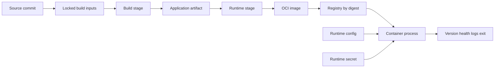
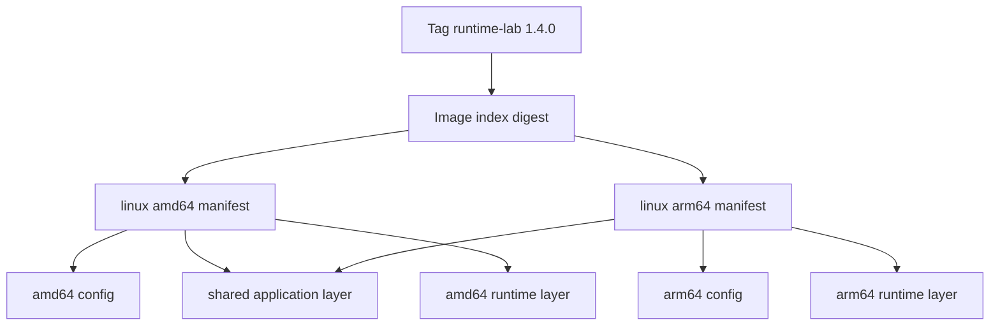
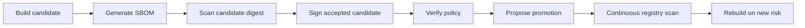
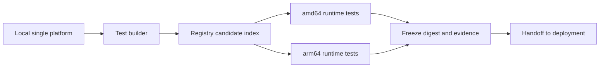

# Docker 学习笔记 · 第五册：应用容器化与多平台镜像构建

## 第 1 章 · 从应用产物定义镜像运行契约

### 源码、构建产物、运行时和镜像分别承担什么

容器化不是把源码目录完整复制进镜像，然后确认进程能够启动。真正要交付的是一份可重复验证的运行契约：同一个内容摘要在任何合格节点上，都使用相同入口、端口、配置方式和退出语义运行。源码、构建产物、运行时与镜像分别承担不同职责；边界混在一起时，镜像会携带编译器、测试缓存、凭据或机器相关状态，部署系统也无法判断它拿到的究竟是不是同一件制品。

| 层次 | 典型内容 | 应保持的不变量 | 不应混入 |
|---|---|---|---|
| 源码 | Java/Go/Node.js 源文件、前端组件 | 可由 Commit 精确定位 | 本机依赖目录、构建密钥 |
| 构建输入 | 锁文件、编译器版本、基础镜像 Digest | 能复现同一构建过程 | 未固定的远程脚本、可变下载 |
| 构建产物 | JAR、Go 二进制、生产依赖、静态文件 | 可独立测试并计算摘要 | 编译缓存、单元测试报告 |
| 运行时 | JRE、libc、CA、时区、Web Server | 满足产物的 ABI 与行为需要 | 完整 SDK、源码管理工具 |
| OCI 镜像 | 配置、只读文件系统层、入口和元数据 | 由 Digest 标识不可变内容 | 环境 Secret、运行日志、业务数据 |
| 容器实例 | 镜像加运行参数后的进程与可写层 | 可以销毁并由同一镜像重建 | 需要长期保留的唯一数据 |

本册统一使用 `runtime-lab` 作为示例应用。四种语言实现可以不同，但对外必须遵守同一个应用契约。

| 契约字段 | 约定 | 验证目的 |
|---|---|---|
| 监听地址 | `0.0.0.0:8080` | 避免只监听 loopback 导致容器外不可达 |
| `/version` | 返回版本、Commit、架构和实例 ID | 建立请求到镜像的导航字段 |
| `/livez` | 只判断进程能否继续工作 | 不把外部依赖抖动变成重启风暴 |
| `/readyz` | 判断当前实例能否接收新请求 | 供部署系统摘流和恢复 |
| 日志 | JSON 写入 stdout/stderr | 不依赖容器内持久日志文件 |
| 配置 | 环境变量或只读挂载 | 镜像不因环境变化而重建 |
| 终止 | 收到 SIGTERM 后停止接流并退出 | 支持滚动更新和计划中断 |
| 身份 | 固定非 root UID/GID | 避免默认 root 扩大攻击面 |

从输入到运行结果的关系如下。Dockerfile 描述转换过程，BuildKit 执行过程，Registry 保存结果；运行环境只消费镜像，不再现场编译。



构建前先写一份机器可审查的契约文件，避免 Dockerfile 变成隐式需求的唯一载体。

```yaml
application: runtime-lab
listen: 0.0.0.0:8080
entrypoint: /opt/runtime-lab/server
user:
  uid: 10001
  gid: 10001
endpoints:
  version: /version
  liveness: /livez
  readiness: /readyz
writablePaths:
  - /tmp
requiredConfig:
  - APP_VERSION
optionalConfig:
  - DEPENDENCY_URL
shutdownTimeoutSeconds: 20
```

验收不以 `docker build` 返回 0 为终点。至少要比较声明、镜像配置和实际进程三层结果。

```bash
docker image inspect runtime-lab:candidate \
  --format '{{json .Config}}' | jq '{User,Entrypoint,Cmd,Env,ExposedPorts}'

docker run --rm -d --name runtime-lab \
  -p 127.0.0.1:18080:8080 \
  -e APP_VERSION=dev \
  runtime-lab:candidate

curl --fail --silent http://127.0.0.1:18080/version | jq .
curl --fail --silent http://127.0.0.1:18080/livez
curl --fail --silent http://127.0.0.1:18080/readyz
docker logs runtime-lab
docker stop --time 20 runtime-lab
```

预期证据包括：镜像声明了非 root 用户；入口不是临时 Shell；三个端点状态码符合约定；日志含版本和实例字段；停止动作在超时前完成且退出码为 0。若只看到容器处于 `running`，仍不能证明端口、健康、配置和终止契约成立。

常见失败可按边界定位：构建阶段找不到依赖，先检查锁文件与网络输入；镜像能创建但入口不存在，检查产物复制路径和目标平台；进程启动但请求不通，检查监听地址和端口；重建容器后数据丢失，说明本应外置的数据写进了可写层。Dockerfile 指令语义可回看[第四册 Dockerfile 与附录](04-dockerfile-and-appendix.md)，本册只讨论应用场景和验证。

### PID 1、信号转发和退出码如何决定容器生命周期

容器的主进程是容器命名空间中的 PID 1。运行系统向容器发送停止请求时，首先把终止信号交给这个进程；PID 1 是否把信号交给业务进程、是否回收子进程、最后返回什么退出码，直接决定部署系统看到的是正常关闭、超时强杀还是崩溃重启。

Exec form 直接把可执行文件设为主进程：

```dockerfile
ENTRYPOINT ["/opt/runtime-lab/server"]
CMD ["--listen=0.0.0.0:8080"]
```

Shell form 通常会隐式经过 `/bin/sh -c`：

```dockerfile
CMD /opt/runtime-lab/server --listen=0.0.0.0:8080
```

后者的问题不是语法错误，而是信号首先到达 Shell。若 Shell 没有使用 `exec` 替换自己，业务进程可能收不到 SIGTERM，最终在停止超时后收到 SIGKILL。Shell 脚本确实需要展开变量或做启动检查时，应显式转交进程身份。

```sh
#!/bin/sh
set -eu

test -n "${APP_VERSION:-}" || {
  echo 'APP_VERSION is required' >&2
  exit 64
}

exec /opt/runtime-lab/server --listen="${LISTEN_ADDR:-0.0.0.0:8080}"
```

信号实验要观察时间线，而不是只看容器最终消失。

```bash
docker run --rm -d --name signal-ok runtime-lab:candidate
main_pid="$(docker inspect -f '{{.State.Pid}}' signal-ok)"
docker exec signal-ok ps -o pid,ppid,stat,args

started_at="$(date +%s)"
docker stop --signal SIGTERM --time 20 signal-ok
finished_at="$(date +%s)"
test "$((finished_at - started_at))" -lt 20
```

应用应在日志中记录四个事件：接收 SIGTERM、停止接收新请求、等待存量请求完成、主进程退出。若总是耗尽 20 秒，检查入口是不是 Shell、信号处理器是否注册、后台子进程是否仍持有连接。若立即退出但请求被截断，说明应用把“收到信号”等同于“立刻结束”。

子进程模型还带来僵尸进程问题。PID 1 对已退出子进程负有回收责任；业务程序频繁 fork 且自身不处理 `SIGCHLD` 时，可使用 Docker 的 `--init`，或在镜像中选择专门的轻量 init。不要为了回收子进程而塞入完整的进程管理系统。

```bash
docker run --rm --init -d --name child-lab runtime-lab:child
docker exec child-lab ps -eo pid,ppid,stat,args

# Z 状态表示存在未回收的僵尸进程
if docker exec child-lab ps -eo stat= | grep -q '^Z'; then
  echo 'zombie process detected' >&2
  exit 1
fi
```

退出码也属于接口。建议把失败类别固定下来，避免所有异常都返回 1。

| 退出场景 | 建议退出码 | 部署系统应如何解释 |
|---|---:|---|
| 正常 SIGTERM 完成 | 0 | 计划内停止，不计为应用故障 |
| 必需配置缺失 | 64 | 配置错误，重启不能自愈 |
| 依赖暂时不可达 | 69 或应用约定值 | 可重试，但要有退避和上限 |
| 进程未捕获 SIGTERM | 137 常见 | 多为 SIGKILL 或内存终止，需查时间线 |
| 显式 SIGTERM 结束 | 143 常见 | 检查运行时和应用是否约定为正常 |

对照实验应分别构建 exec form 与 shell form 两个候选，发送相同 SIGTERM，并记录接收日志、停止耗时、退出码和未完成请求数。不能仅凭 Dockerfile 静态阅读宣称优雅终止已经验证。更底层的 PID namespace、信号和僵尸进程原理见[容器基础专题](../../systems/container-fundamentals/guide.md)。

### 配置、Secret、可写目录和日志如何与镜像分离

不可变镜像只保存跨环境不变的程序和运行时。环境地址、凭据、日志与业务数据如果烘焙进镜像，同一版本就会因环境不同产生多个内容，更新配置也会被迫重建镜像，泄漏后还难以从历史层中移除。

| 信息 | 推荐入口 | 生命周期 | 验证重点 |
|---|---|---|---|
| 非敏感标量配置 | 环境变量 | 随容器创建固定 | 缺失时是否快速失败 |
| 较大配置文件 | 只读 bind/volume | 可由运行平台投射 | 应用是否支持重载 |
| Secret | 运行时 Secret 文件或受控 provider | 独立轮换 | 日志、inspect、镜像层均不出现明文 |
| 临时文件 | `/tmp` 的 tmpfs 或临时卷 | 随实例销毁 | 容量、权限、清理 |
| 业务持久数据 | 外部数据库或持久卷 | 独立于容器 | 重建容器后仍可取得 |
| 日志 | stdout/stderr | 由运行平台采集 | 结构字段、脱敏、背压 |

本地验证时，把根文件系统设为只读，只开放明确的临时路径。这会快速暴露应用在 `/app`、`/root` 或当前目录写文件的隐式假设。

```bash
docker run --rm -d --name readonly-lab \
  --read-only \
  --tmpfs /tmp:rw,noexec,nosuid,size=64m,uid=10001,gid=10001 \
  --mount type=bind,src="$PWD/config/runtime.yaml",dst=/etc/runtime-lab/runtime.yaml,readonly \
  -e APP_VERSION=dev \
  runtime-lab:candidate

docker inspect readonly-lab \
  --format '{{json .HostConfig.ReadonlyRootfs}} {{json .Mounts}}'
curl --fail http://127.0.0.1:18080/readyz
```

Secret 不应通过 Dockerfile 的 `ARG`、`ENV` 或 `COPY` 注入。即使后续 `RUN rm` 删除文件，旧层和构建历史仍可能保存内容。运行时 Secret 文件的最小验证如下。

```bash
secret_file="$(mktemp)"
chmod 600 "$secret_file"
printf '%s' 'example-value' > "$secret_file"

docker run --rm --name secret-lab \
  --mount type=bind,src="$secret_file",dst=/run/secrets/api-token,readonly \
  runtime-lab:candidate --check-secret=/run/secrets/api-token
```

真实值不得进入示例、命令历史或构建日志。验收只记录 Secret 标识、版本、读取成功与轮换时间，不记录明文。构建阶段确实需要访问私有依赖时，应使用 BuildKit Secret/SSH Mount，第 3 章会验证它没有进入层、History 和输出日志。

日志契约应采用稳定字段，至少包含时间、级别、服务、版本、实例、请求 ID、事件名和错误分类。

```json
{"ts":"2026-08-30T08:00:00Z","level":"info","service":"runtime-lab","version":"1.4.0","instance":"demo-1","event":"shutdown_started","request_id":null}
```

故障实验包括：删除必需配置，预期进程快速返回 64；把根文件系统改为只读，预期所有必要写入仍只发生在 `/tmp`；撤销 Secret 文件权限，预期启动失败且日志不打印内容；写满 tmpfs，预期应用产生明确的容量错误而不是损坏镜像层。恢复时补回配置或扩大经评审的临时卷，再用同一镜像重建容器。

### 非 root、只读文件系统和最小能力如何形成默认安全基线

容器隔离不等于进程天然安全。默认 root、可写根文件系统和完整 Linux capabilities 会让一次应用漏洞拥有更大的修改与横向移动空间。安全基线应在镜像构建阶段声明，在本地以收紧的运行参数验证，并由后续 Kubernetes 安全策略再次强制。

```dockerfile
FROM runtime-base@sha256:REPLACE_WITH_VERIFIED_DIGEST

ARG APP_UID=10001
ARG APP_GID=10001

RUN addgroup --system --gid ${APP_GID} app \
 && adduser --system --uid ${APP_UID} --ingroup app --home /nonexistent app

WORKDIR /opt/runtime-lab
COPY --chown=${APP_UID}:${APP_GID} server ./server

USER ${APP_UID}:${APP_GID}
EXPOSE 8080
ENTRYPOINT ["/opt/runtime-lab/server"]
```

不要在运行阶段用递归 `chown` 修补所有目录。产物复制时确定所有权，既减少层变化，也让“哪些路径允许写入”清晰可审。应用监听 8080 等非特权端口，避免为了 80 端口保留额外能力；对外端口映射由运行平台完成。

```bash
docker run --rm -d --name hardened-lab \
  --user 10001:10001 \
  --read-only \
  --cap-drop ALL \
  --security-opt no-new-privileges=true \
  --tmpfs /tmp:rw,noexec,nosuid,size=64m,uid=10001,gid=10001 \
  -p 127.0.0.1:18080:8080 \
  runtime-lab:candidate

docker exec hardened-lab sh -c 'test "$(id -u)" = 10001'
curl --fail http://127.0.0.1:18080/livez
```

若运行镜像没有 Shell，不要为了这条检查临时添加 Shell。可以让 `/version` 返回非敏感的 UID/GID，也可以在带调试工具的候选中验证文件权限，再对最终镜像做配置检查。

安全基线的负向测试比正向启动更重要。

```bash
# 根目录写入必须失败
docker exec hardened-lab touch /should-not-exist && exit 1 || true

# 提权必须失败
docker exec hardened-lab sh -c 'grep -E "^NoNewPrivs:[[:space:]]+1$" /proc/1/status'

# 主进程不能是 root
docker exec hardened-lab sh -c 'test "$(awk "/^Uid:/{print \$2}" /proc/1/status)" != 0'
```

预期失败与应用错误要区分：`Read-only file system` 说明程序写错了路径；`Permission denied` 可能是产物所有权错误；监听低端口失败说明契约与能力配置冲突；删除全部 capability 后功能异常，则要确认该能力是否真是业务必需。确需能力时只加单项，并保存“为什么需要、哪个 syscall/操作失败、加回后如何验证”的证据。

```bash
docker run --rm \
  --cap-drop ALL \
  --cap-add NET_BIND_SERVICE \
  runtime-lab:legacy-low-port
```

上例只是迁移旧应用的受控例外，不是默认模板。更优先的恢复动作是把应用端口改为 8080，移除能力后重复全部测试。验收证据应包含镜像 `Config.User`、运行 UID/GID、只读根、tmpfs 列表、capability 集合、`NoNewPrivs` 和三个端点结果；不能把“Dockerfile 中写了 USER”当成运行证明。

## 第 2 章 · 不同语言如何拆分 Build 与 Runtime Stage

### Java 应用如何从 Maven/Gradle 构建进入精简 JRE

Java 镜像的核心分界是：Build Stage 需要 JDK、Maven/Gradle、源码与测试工具，Runtime Stage 只需要运行目标字节码的 JRE、证书、时区与少量诊断接口。把整套构建环境带进运行镜像虽然简单，却扩大体积、漏洞面和可变输入。

```dockerfile
# syntax=docker/dockerfile:1
FROM eclipse-temurin:21-jdk AS build
WORKDIR /workspace
COPY .mvn/ .mvn/
COPY mvnw pom.xml ./
RUN --mount=type=cache,target=/root/.m2 ./mvnw -B -ntp dependency:go-offline
COPY src/ src/
RUN --mount=type=cache,target=/root/.m2 ./mvnw -B -ntp verify \
 && cp target/runtime-lab.jar /workspace/app.jar

FROM eclipse-temurin:21-jre
ARG APP_UID=10001
RUN useradd --system --uid ${APP_UID} --home-dir /nonexistent app
WORKDIR /opt/runtime-lab
COPY --from=build --chown=${APP_UID}:${APP_UID} /workspace/app.jar ./app.jar
USER ${APP_UID}:${APP_UID}
EXPOSE 8080
ENTRYPOINT ["java","-jar","/opt/runtime-lab/app.jar"]
```

Gradle 采用同样顺序：先复制 Wrapper、`settings.gradle*`、`build.gradle*` 和版本目录，再解析依赖；随后复制源码并执行 `./gradlew --no-daemon test bootJar`。运行阶段不能再调用 Maven/Gradle，否则网络下载和编译结果被推迟到启动时。

| 运行时 | 优点 | 代价 | 使用前提 |
|---|---|---|---|
| 通用 JRE | 更新和兼容路径清楚 | 体积稍大 | 默认选择 |
| `jlink` Runtime | 只带所需模块 | 漏模块会运行期失败 | 有模块分析和完整回归 |
| Distroless Java | 工具少、攻击面小 | 现场诊断依赖外部路径 | 已建立可观测和调试变体 |

容器内存上限不能全部分给 Java Heap，还要给 Metaspace、线程栈、Direct Buffer、JIT 和本地库留空间。百分比参数只是测试起点。

```bash
docker run --rm -d --name java-lab \
  --memory 512m --cpus 1 \
  -e JAVA_TOOL_OPTIONS='-XX:MaxRAMPercentage=65 -XX:InitialRAMPercentage=25' \
  -e APP_VERSION=java-dev \
  -p 127.0.0.1:18081:8080 runtime-lab-java:candidate
docker stats --no-stream java-lab
curl --fail http://127.0.0.1:18081/version
docker stop --time 20 java-lab
```

失败注入应覆盖：旧 JRE 运行新字节码、`jlink` 漏模块、堆上限挤占本地内存、Shell 包裹 Java 导致 SIGTERM 丢失。修复后重复启动、请求、内存和终止四组验证。保存 JAR SHA256、JDK/JRE 供应者与主版本、基础镜像 Digest、测试摘要、运行 UID 和停止时间线；`java -version` 成功不等于应用兼容。

### Go 应用如何处理静态链接、CGO 和目标平台

Go 能生成单个二进制，但“单个文件”不自动等于完全静态或跨平台。CGO、动态库、CA 证书、时区数据库、用户解析和 DNS 行为都可能让本机可运行的程序在精简镜像中失败。

```dockerfile
# syntax=docker/dockerfile:1
FROM --platform=$BUILDPLATFORM golang:1.25 AS build
ARG TARGETOS TARGETARCH VERSION=dev VCS_REF=unknown
WORKDIR /src
COPY go.mod go.sum ./
RUN --mount=type=cache,target=/go/pkg/mod go mod download
COPY . .
RUN --mount=type=cache,target=/go/pkg/mod \
    --mount=type=cache,target=/root/.cache/go-build \
    CGO_ENABLED=0 GOOS=${TARGETOS} GOARCH=${TARGETARCH} go test ./... \
 && CGO_ENABLED=0 GOOS=${TARGETOS} GOARCH=${TARGETARCH} \
    go build -trimpath -ldflags="-s -w -X main.version=${VERSION} -X main.commit=${VCS_REF}" \
    -o /out/server ./cmd/server

FROM gcr.io/distroless/static-debian12:nonroot
COPY --from=build /out/server /server
USER nonroot:nonroot
EXPOSE 8080
ENTRYPOINT ["/server"]
```

`FROM --platform=$BUILDPLATFORM` 避免 Go 编译器本身被 QEMU 模拟，`TARGETOS` 与 `TARGETARCH` 控制目标产物。含 SQLite、Kerberos、图像库或厂商 C SDK 的程序不能随意关闭 CGO，应选择目标平台原生构建、完整交叉工具链或受控模拟。

| 运行数据 | 缺失表现 | 恢复方式 |
|---|---|---|
| CA Bundle | HTTPS 出现 unknown authority | 复制证书或使用含证书的运行镜像 |
| zoneinfo | 时区加载失败 | 复制时区数据或嵌入 `time/tzdata` |
| libc loader | 文件存在却报 no such file | 静态链接或提供匹配 loader |
| 用户数据库 | 用户名解析失败 | 数字 UID 足够时接受或复制最小记录 |

```bash
docker run --rm --platform linux/amd64 runtime-lab-go:candidate --self-test
docker run --rm --platform linux/arm64 runtime-lab-go:candidate --self-test
docker run --rm runtime-lab-go:candidate /server --print-build-info
```

单一主机通过模拟执行 arm64 只能标为模拟验证。真实双架构证明必须在 amd64、arm64 节点重复 HTTPS、DNS、负载和 SIGTERM 测试，并保存平台 Manifest Digest。`file` 或 `readelf` 只能证明格式，不能证明行为。

### Node.js 应用如何控制依赖、生产安装和启动信号

Node.js 镜像必须由 lockfile 在目标 Linux 平台重新安装依赖，开发依赖只留在 Build Stage，运行阶段直接由 `node` 启动业务入口。宿主机的 `node_modules` 可能来自 macOS 或另一架构，不能复制进镜像。

```dockerfile
# syntax=docker/dockerfile:1
FROM node:24-bookworm-slim AS deps
WORKDIR /app
COPY package.json package-lock.json ./
RUN --mount=type=cache,target=/root/.npm npm ci

FROM deps AS build
COPY tsconfig.json ./
COPY src/ src/
RUN npm test && npm run build && npm prune --omit=dev

FROM node:24-bookworm-slim AS runtime
ENV NODE_ENV=production
WORKDIR /app
COPY --from=build --chown=node:node /app/package.json ./package.json
COPY --from=build --chown=node:node /app/node_modules ./node_modules
COPY --from=build --chown=node:node /app/dist ./dist
USER node
EXPOSE 8080
ENTRYPOINT ["node","dist/server.js"]
```

`.dockerignore` 排除本机依赖、输出、覆盖率、Git 和环境文件：

```text
node_modules
npm-debug.log*
coverage
dist
.git
.env*
```

`npm ci` 在 lockfile 不一致时应失败，而不是修改锁文件继续构建。原生扩展还要求 Build 与 Runtime 的 libc 兼容；Debian/glibc 阶段安装的 `.node` 文件不能默认搬到 Alpine/musl。

入口优先直接执行 Node，不让 `npm start` 或 Shell 成为信号中间层。应用收到 SIGTERM 后先停止接受新连接，再等待活动请求结束。

```javascript
process.on("SIGTERM", () => {
  console.log(JSON.stringify({ event: "shutdown_started" }));
  server.close((error) => process.exit(error ? 1 : 0));
});
```

故障定位顺序为：`MODULE_NOT_FOUND` 检查生产依赖和复制路径；ELF/libc 错误检查原生扩展平台；停止超时检查 npm/Shell 父进程与连接排空；权限错误检查 `COPY --chown`。修复必须由同一 lockfile 重建，不能进入容器手工安装。

### 前端静态站点如何把构建工具与 Web Server 分离

前端 Build Stage 需要 Node.js、包管理器和源码，运行阶段只需要静态文件与受控 Web Server。生产镜像运行 `npm run dev` 会保留热更新和开发依赖，也难以正确管理缓存与非 root 端口。

```dockerfile
# syntax=docker/dockerfile:1
FROM node:24-bookworm-slim AS build
WORKDIR /src
COPY package.json package-lock.json ./
RUN --mount=type=cache,target=/root/.npm npm ci
COPY . .
RUN npm test && npm run build

FROM nginxinc/nginx-unprivileged:stable-alpine
COPY nginx/default.conf /etc/nginx/conf.d/default.conf
COPY --from=build --chown=101:101 /src/dist/ /usr/share/nginx/html/
USER 101:101
EXPOSE 8080
```

```nginx
server {
    listen 8080;
    root /usr/share/nginx/html;
    location = /livez { access_log off; return 200 "ok\n"; }
    location /assets/ {
        try_files $uri =404;
        add_header Cache-Control "public, max-age=31536000, immutable";
    }
    location / {
        try_files $uri $uri/ /index.html;
        add_header Cache-Control "no-cache";
    }
}
```

带内容哈希的资源可以长期缓存，HTML 入口不能长期缓存。运行时 `config.js` 可以让同一 Digest 晋级多个环境，但浏览器可下载的文件绝不能包含 Secret。

```bash
docker run --rm -d --name frontend-lab --read-only \
  --tmpfs /tmp:rw,noexec,nosuid,size=16m,uid=101,gid=101 \
  -p 127.0.0.1:18082:8080 runtime-lab-frontend:candidate
curl --fail --head http://127.0.0.1:18082/
curl --fail --head http://127.0.0.1:18082/assets/app.CONTENT_HASH.js
curl --fail http://127.0.0.1:18082/client/side/route
```

保存状态码、Content-Type、Cache-Control、压缩编码和 SPA 深链结果。404 被统一改成 200、HTML 缓存导致新旧资源混用、以 root 监听 80、启动时修改只读文件，都是必须通过请求结果发现并修复的失败路径。

## 第 3 章 · 多阶段构建、Layer 与缓存如何降低成本

### Build Context 和 `.dockerignore` 如何决定性能与泄漏面

Build Context 是 Builder 可以读取的文件集合，不等于 Dockerfile 所在目录。Context 太大会增加传输、哈希和缓存判断成本，也让 `.git`、本机依赖、测试输出与凭据更容易被 `COPY . .` 意外带入层中。即使 Dockerfile 最终没有复制某个文件，Builder 能否接触它仍是安全边界。

先测量，再决定排除规则：

```bash
du -sh .
find . -type f -size +10M -print
git ls-files -co --exclude-standard | sort > /tmp/context-candidates.txt
DOCKER_BUILDKIT=1 docker build --progress=plain -t context-lab . 2>&1 | tee /tmp/build.log
```

典型 `.dockerignore`：

```dockerignore
.git
.github
.env
.env.*
*.pem
*.key
node_modules
target
dist
coverage
tmp
*.log

# 允许镜像内需要的受控产物
!dist/runtime-lab.jar
```

排除规则不能照抄模板。若 Dockerfile 需要 Wrapper、CA 或生成代码，过宽的 `*.jar`、`vendor`、`dist` 规则会让构建失败或偷偷使用旧产物。验证时要同时测试“敏感文件未进入”和“必要文件没有误排除”。

```bash
docker build --no-cache --progress=plain -t runtime-lab:context-test .
docker save runtime-lab:context-test -o /tmp/runtime-lab.tar

for forbidden in '.env' 'id_rsa' '.git/config' 'npm-debug.log'; do
  if tar -tf /tmp/runtime-lab.tar | grep -Fq "$forbidden"; then
    echo "forbidden path found: $forbidden" >&2
    exit 1
  fi
done
```

`docker save` 搜索文件名只是初筛，秘密可能被写进合并层、History 或日志。更可靠的流程还要扫描导出层内容，并用测试用 canary Secret 验证检测器能报警；不要使用真实凭据做实验。

多项目仓库应把 Context 缩到应用目录，或使用命名 Context 明确共享输入，而不是把仓库根全部发送给每个构建。

```bash
docker buildx build \
  --build-context shared=../../shared-runtime \
  -f services/api/Dockerfile \
  -t runtime-lab-api:candidate \
  services/api
```

Context 优化的验收指标包括传输字节数、首次哈希时间、敏感路径检测、必要文件清单和冷构建结果。恢复误排除时只收窄相关规则，并用 `--no-cache` 再建一次，避免旧缓存掩盖缺文件。

### Layer 和缓存失效规则如何影响 Dockerfile 顺序

构建缓存按指令和输入决定是否复用；某一步失效后，依赖它的后续步骤也需要重新执行。因此稳定且昂贵的依赖解析应靠前，频繁变化的源码应靠后。优化目标不是“命中越多越好”，而是在输入变化时只重建真正受影响的范围。

低效顺序：

```dockerfile
FROM node:24-bookworm-slim
WORKDIR /app
COPY . .
RUN npm ci
RUN npm test
```

推荐顺序：

```dockerfile
FROM node:24-bookworm-slim
WORKDIR /app
COPY package.json package-lock.json ./
RUN --mount=type=cache,target=/root/.npm npm ci
COPY src/ src/
COPY test/ test/
RUN npm test
```

建立变化矩阵，而不是只跑一次热构建：

| 变化 | 应失效的步骤 | 不应失效的步骤 | 结果校验 |
|---|---|---|---|
| 只改 README | 无应用层 | 依赖、编译 | Digest 是否按 Context 规则保持 |
| 改业务源码 | 源码复制、测试、编译 | 依赖下载 | 单测与产物更新 |
| 改 lockfile | 依赖及之后全部步骤 | 基础镜像拉取 | 依赖树与 SBOM 更新 |
| 改基础镜像 Digest | 所有后续步骤 | 无 | 安全回归全部执行 |
| 改构建参数 | 使用该参数的步骤及后续 | 参数前步骤 | 标签和二进制信息一致 |

```bash
docker buildx build --progress=plain --metadata-file /tmp/cold.json \
  --no-cache -t cache-lab:cold .
docker buildx build --progress=plain --metadata-file /tmp/hot.json \
  -t cache-lab:hot .
```

记录每一步 `CACHED`/`DONE` 和总耗时。然后只修改测试用源码，重复构建并确认依赖下载层仍命中。不要使用 `--no-cache` 作为长期修复；它能绕过坏缓存，却不能解释缓存为什么不安全或为什么意外失效。

Layer 数量也不是唯一目标。把所有命令合成一个巨大 `RUN` 会降低可读性和局部缓存复用；把下载与清理拆成两层，又会让被删除文件仍留在旧层。应按“共同生命周期”组合操作：

```dockerfile
RUN apt-get update \
 && apt-get install -y --no-install-recommends ca-certificates curl \
 && rm -rf /var/lib/apt/lists/*
```

失败信号包括：无关源码变更触发全量依赖下载；删除文件后镜像大小不降；构建日志显示旧产物被复用；同一 Commit 在不同 Builder 得到不同依赖。诊断顺序是 Context、指令文本、输入元数据、构建参数、外部 Cache 来源，最后才考虑清空缓存。

### Cache Mount、Secret Mount 和 SSH Mount 如何避免污染镜像层

BuildKit Mount 只在某条 `RUN` 执行期间可见。Cache Mount 保存可复用下载，Secret Mount 与 SSH Mount 提供短期凭据；它们都不应成为最终镜像层的一部分。三者用途不同，不能把 Secret 放进 Cache，也不能把缓存当成可信制品。

```dockerfile
# syntax=docker/dockerfile:1
FROM node:24-bookworm-slim AS build
WORKDIR /app
COPY package.json package-lock.json ./
RUN --mount=type=cache,id=npm-runtime-lab,target=/root/.npm,sharing=locked \
    npm ci
```

```dockerfile
FROM golang:1.25 AS build
WORKDIR /src
COPY go.mod go.sum ./
RUN --mount=type=cache,id=gomod-runtime-lab,target=/go/pkg/mod,sharing=locked \
    go mod download
```

私有包 Token 使用 Secret Mount：

```dockerfile
RUN --mount=type=secret,id=npmrc,target=/root/.npmrc,required=true \
    --mount=type=cache,id=npm-private,target=/root/.npm,sharing=locked \
    npm ci
```

```bash
docker buildx build \
  --secret id=npmrc,src="$PWD/.secrets/npmrc" \
  -t runtime-lab-node:candidate .
```

私有 Git 依赖使用 SSH agent 转发，不把私钥复制到 Context：

```dockerfile
RUN --mount=type=ssh,required=true \
    git clone --depth 1 git@example.invalid:platform/private-module.git /src/private-module
```

```bash
docker buildx build --ssh default -t runtime-lab-private:candidate .
```

安全验证使用一个专门 canary 字符串：

```bash
canary='BUILD_SECRET_CANARY_DO_NOT_SHIP'
docker history --no-trunc runtime-lab-private:candidate | grep -F "$canary" && exit 1 || true
docker save runtime-lab-private:candidate -o /tmp/private-image.tar
grep -aF "$canary" /tmp/private-image.tar && exit 1 || true
grep -F "$canary" /tmp/build.log && exit 1 || true
```

以上静态扫描不能证明所有编码形式都不存在，但能验证流程没有最明显的泄漏。生产还应使用专用 Secret Scanner，并限制日志与构建元数据访问。

Cache 来源必须划分信任域。Fork PR 不应导入主分支含私有依赖的写缓存；不同项目使用不同 `id` 或 Registry Cache 引用；外部缓存采用只读导入和受控写出；失败构建产生的缓存不能自动升级为可信发布输入。

| 故障 | 首查 | 恢复 |
|---|---|---|
| 私有依赖 401/403 | Secret 是否挂载、权限是否过期 | 轮换短期凭据并重试 |
| SSH host key 错误 | known_hosts 与目标域名 | 更新受审查主机密钥，禁止关闭校验 |
| 缓存权限错误 | UID、target、sharing 模式 | 修正专用缓存所有权 |
| Fork 读到私有缓存 | Cache namespace 与流水线条件 | 撤销缓存、轮换凭据、隔离 namespace |
| Secret 出现在日志 | 命令回显和工具 debug | 立即止损、删除日志访问、轮换 Secret |

### 怎样用时间、体积、层和重建范围验证优化是否有效

镜像优化不能只展示“从 900 MB 降到 12 MB”。过度压缩可能移除证书、时区、诊断路径或所需 libc，冷构建也可能因复杂缓存配置变慢。验收要同时观察时间、传输、内容、运行行为和维护成本。

```bash
/usr/bin/time -p docker buildx build --no-cache --load \
  -t runtime-lab:baseline -f Dockerfile.baseline . 2> /tmp/baseline.time
/usr/bin/time -p docker buildx build --load \
  -t runtime-lab:candidate -f Dockerfile . 2> /tmp/candidate.time

docker image inspect runtime-lab:baseline \
  --format '{{.Size}} {{.RootFS.Layers}}' > /tmp/baseline.image
docker image inspect runtime-lab:candidate \
  --format '{{.Size}} {{.RootFS.Layers}}' > /tmp/candidate.image
docker history --no-trunc runtime-lab:candidate
```

建议记录如下表，而不是凭终端截图判断：

| 指标 | Baseline | Candidate | 通过条件 |
|---|---:|---:|---|
| 冷构建秒数 | 待测 | 待测 | 不超过可接受预算 |
| 热构建秒数 | 待测 | 待测 | 常见源码变更显著减少 |
| 压缩后传输量 | 待测 | 待测 | Registry 实际推送下降 |
| 解压后镜像大小 | 待测 | 待测 | 节点磁盘压力下降 |
| Layer 数 | 待测 | 待测 | 无秘密、重复大文件和无效层 |
| 运行测试 | 通过/失败 | 通过/失败 | 候选必须完整通过 |
| CVE 与 SBOM | 基线 | 候选 | 风险可解释且有处置结论 |

重建范围要用三次变更实验确认：只改源码、只改依赖锁、只改基础镜像 Digest。每次保存 BuildKit plain log，标记预期命中与实际命中。若结果不一致，先定位输入关系，不能靠增加缓存时长掩盖错误。

运行回归至少包含 `/version`、HTTPS CA、DNS、时区、只读根、非 root、SIGTERM 和压力下内存。若候选镜像变小但任一契约失败，优化不通过。

清理实验产物：

```bash
docker rm -f runtime-lab-benchmark 2>/dev/null || true
docker image rm runtime-lab:baseline runtime-lab:candidate 2>/dev/null || true
rm -f /tmp/baseline.time /tmp/candidate.time /tmp/baseline.image /tmp/candidate.image
```

文档中的数值只能作为待填模板，除非本轮真的运行了对应环境。最终报告要区分静态配置审查、本机 Docker 实测、模拟架构执行和真实硬件测试，避免把预期输出写成已验证结论。

## 第 4 章 · 基础镜像如何在兼容、安全和可调试性之间取舍

### Full、Slim、Alpine、Distroless 和 Scratch 有何差异

基础镜像不是按体积从大到小排序后选最小项。它定义了 libc、动态链接器、CA、时区、包管理器、Shell、补丁来源和故障诊断入口。正确选择应从应用依赖和运营方式反推，而不是从下载大小反推。

| 类型 | 典型能力 | 主要收益 | 主要风险 | 合适场景 |
|---|---|---|---|---|
| Full 发行版 | Shell、包管理器、常见系统工具 | 兼容与排障直观 | 体积和组件面大 | 迁移初期、复杂原生依赖 |
| Slim | 保留发行版核心运行库 | 兼容与体积平衡 | 某些工具/locale 缺失 | 大多数 Java、Node、Python 运行时 |
| Alpine | musl、BusyBox、apk | 很小、更新明确 | glibc 兼容和 DNS/原生扩展差异 | 已验证的纯 Go 或兼容应用 |
| Distroless | 应用运行库，无通用 Shell | 运行面小 | 现场 exec 能力弱 | 已有外部诊断路径的服务 |
| Scratch | 空文件系统 | 最小内容 | CA、用户、时区、Shell 全需自备 | 真正静态且自包含的二进制 |

选型步骤：

1. 列出 ELF/字节码/脚本运行要求。
2. 列出 CA、时区、locale、字体、用户和动态库。
3. 确认供应者、更新频率、支持周期与多平台清单。
4. 用固定 Digest 构建候选。
5. 运行契约与故障注入全部通过后再比较体积。

```bash
docker buildx imagetools inspect example.invalid/runtime-base:21
docker image inspect runtime-lab:candidate \
  --format '{{.Os}}/{{.Architecture}} {{json .RepoDigests}}'
docker run --rm runtime-lab:candidate --self-test
```

体积减少并不必然降低漏洞数：Scanner 可能无法识别手工复制的库；没有包管理数据库会降低可见性；静态链接库的漏洞仍存在于二进制。安全判断应结合 SBOM、供应者公告、修复版本和应用可达性。

故障对照至少覆盖：HTTPS、DNS、Unicode/locale、时区、原生依赖、非 root 和调试入口。Full 通过但 Slim 失败时，先找实际缺失文件；Slim 通过但 Alpine 失败时，优先检查 libc 与原生扩展；Scratch 启动失败时，用 `readelf`、证书和数据文件清单定位，而不是把所有工具重新塞回最终镜像。

### glibc、musl、CGO 和原生依赖为什么会造成运行差异

容器共享宿主机内核，但用户态 ABI 来自镜像。glibc 与 musl 都实现 C 标准库，却在动态加载、DNS、locale、线程和边界行为上存在差异。程序在 Build Stage 成功链接，只说明当时环境成立，不能证明换一个 Runtime Stage 仍成立。

```bash
file /opt/runtime-lab/server
readelf -d /opt/runtime-lab/server | grep -E 'NEEDED|RPATH|RUNPATH'
readelf -l /opt/runtime-lab/server | grep 'Requesting program interpreter'
ldd /opt/runtime-lab/server || true
```

典型信号：

| 信号 | 常见原因 | 首个验证 |
|---|---|---|
| 文件存在却报 no such file | 动态 loader 路径不存在 | `readelf -l` |
| `GLIBC_x.y not found` | 构建环境 glibc 新于运行环境 | 对比构建/运行基线 |
| Node `.node` 无法加载 | 原生扩展架构或 libc 不匹配 | `file node_modules/**/*.node` |
| Go CGO 程序在 Alpine 失败 | 依赖 glibc loader/库 | `go env CGO_ENABLED` 与 ELF |
| DNS 延迟或结果不同 | resolver 实现、search/ndots、并发差异 | 固定 DNS 用例和抓取耗时 |
| 字符集显示错误 | locale/字体/ICU 数据缺失 | Unicode 与排序测试 |

建立一个不依赖业务流量的兼容性自测：解析同一组域名；访问受控 HTTPS；转换 UTC 与指定时区；读写 UTF-8；加载每个原生模块；输出 `uname -m` 和运行时版本。四类应用都应提供等价结果。

```bash
docker run --rm --network compat-lab runtime-lab:candidate --check-dns dependency
docker run --rm runtime-lab:candidate --check-https https://example.invalid/health
docker run --rm -e TZ=Asia/Singapore runtime-lab:candidate --check-timezone
docker run --rm runtime-lab:candidate --check-unicode '中文-Å-🙂'
```

若业务必须使用 glibc 原生库，就选择同发行版族的 Build/Runtime Stage，或在 Runtime Stage 安装供应者支持的库。不要下载来源不明的 glibc 兼容包塞进 Alpine。若选择 CGO 交叉编译，要固定目标 sysroot、编译器与架构，并在目标硬件运行测试。

兼容修复的证据应包含失败原文、ELF/模块信息、基础镜像 Digest、修复动作和回归结果。不能因为把 Alpine 换回 Full 后“能跑”就结束；还要说明具体缺失依赖，避免后续升级再次发生。

### 基础镜像版本和 Digest 如何进入升级与漏洞响应

Tag 适合人理解版本线，Digest 才是构建输入的内容身份。Dockerfile 可以同时保留两者：Tag 表达维护意图，Digest 锁定本次构建内容。

```dockerfile
FROM eclipse-temurin:21-jre@sha256:REPLACE_WITH_VERIFIED_DIGEST
```

升级机器人提出的不是“镜像有更新”这一句，而应是一份可审查变更：旧/新 Digest、上游版本、发布日期、SBOM 差异、修复 CVE、引入组件与回归结果。即使 Tag 不变，Digest 变化也必须触发完整构建和测试。

```bash
old_ref='eclipse-temurin:21-jre@sha256:OLD'
new_ref='eclipse-temurin:21-jre@sha256:NEW'

docker buildx imagetools inspect "$old_ref" --format '{{json .Manifest}}' > /tmp/old.json
docker buildx imagetools inspect "$new_ref" --format '{{json .Manifest}}' > /tmp/new.json
diff -u /tmp/old.json /tmp/new.json || true
```

漏洞响应流程：

```mermaid
flowchart LR
    Advisory["Vendor advisory"] --> Match["Match SBOM and runtime"]
    Match --> Decide["Reachability and severity"]
    Decide --> Update["Update base digest"]
    Update --> Build["Rebuild all platforms"]
    Build --> Test["Runtime regression"]
    Test --> Scan["Rescan and sign"]
    Scan --> Publish["Publish new digest"]
    Publish --> Retire["Retire vulnerable candidate"]
```



判断漏洞时区分四种情况：组件不在镜像；组件存在但代码路径不可达；存在且有临时缓解；存在且必须升级。Scanner 的 `fixed in` 是线索，不等于升级一定兼容。没有修复版本时，要记录网络隔离、功能禁用、监控和到期日期。

回退不是重新使用已知漏洞镜像的默认许可。若新基础镜像导致业务回归，可短时回到旧 Digest，但需要风险批准、补偿控制和明确期限；同时保留新旧 SBOM 与请求测试，推进前向修复。

验收证据至少包含：Dockerfile 中可读版本与 Digest、所有目标平台的基础 Manifest、SBOM 差异、漏洞处置表、四类应用回归、签名/证明引用及旧镜像下线计划。这里只讲构建输入，组织级门禁和晋级由 GitOps 02 负责。

### 无 Shell 镜像如何保留可运营的调试路径

无 Shell 镜像减少了运行时工具，却不会自动提供可观测性。若团队唯一 Runbook 是 `docker exec -it ... sh`，直接切换 Distroless/Scratch 会让故障恢复变慢。正确做法是把诊断能力从生产镜像迁到应用接口、运行平台和受控调试变体。

| 路径 | 能回答的问题 | 风险控制 |
|---|---|---|
| `/version` 与健康端点 | 版本、依赖、准备状态 | 不暴露 Secret 和内部拓扑 |
| 结构化日志/指标/Trace | 请求与资源行为 | 统一关联字段和保留期 |
| Docker inspect/events | 入口、用户、退出、OOM | 只读运行时权限 |
| Debug Tag | 文件、证书、动态库 | 同源构建、禁止进入生产 |
| Kubernetes Ephemeral Container | namespace 内临时诊断 | RBAC、审计、时限 |
| 节点侧工具 | 网络与 runtime 问题 | 限制节点访问与取证 |

同一 Dockerfile 可以产出运行和调试两个 Target，但二者必须共享同一应用产物。

```dockerfile
FROM gcr.io/distroless/static-debian12:nonroot AS runtime
COPY --from=build /out/server /server
USER nonroot:nonroot
ENTRYPOINT ["/server"]

FROM debian:bookworm-slim AS debug
RUN apt-get update \
 && apt-get install -y --no-install-recommends ca-certificates curl procps iproute2 \
 && rm -rf /var/lib/apt/lists/*
COPY --from=build /out/server /server
USER 10001:10001
ENTRYPOINT ["/server"]
```

```bash
docker buildx build --target runtime -t runtime-lab:candidate --load .
docker buildx build --target debug -t runtime-lab:debug-candidate --load .

runtime_sha="$(docker create runtime-lab:candidate | xargs docker export | shasum -a 256)"
debug_sha="$(docker create runtime-lab:debug-candidate | xargs docker export | shasum -a 256)"
printf 'runtime=%s debug=%s\n' "$runtime_sha" "$debug_sha"
```

上面的整个文件系统摘要不会相同，真正需要比对的是 `/server` 的内容摘要。运行时排障先收集 inspect、events、日志、端点和退出状态；只有这些证据不足时才启动 Debug 变体复现，不能把生产容器替换为长期带工具镜像。

```bash
docker inspect failing-lab > /tmp/failing.inspect.json
docker logs --timestamps failing-lab > /tmp/failing.log 2>&1
docker events --since 10m --until 0s > /tmp/failing.events
docker inspect failing-lab --format '{{json .State}}' | jq .
```

调试完成后要清理临时容器、撤销额外权限并保存结论。若故障只能在生产数据或网络中出现，应使用外部探针或经过审批的临时诊断，而不是为方便永久扩大镜像。

## 第 5 章 · 多平台镜像如何构建、发布和验证

### Image Index、平台 Manifest 和 Layers 如何组成多平台镜像

多平台镜像不是一个能在所有 CPU 上直接执行的文件，而是一个 Image Index 引用多个平台 Manifest；每个 Manifest 再引用自身 Config 和 Layers。客户端拉取时根据操作系统、架构和 Variant 选择具体 Manifest。



Tag 可以移动，Index Digest 标识整个平台集合，平台 Manifest Digest 标识某一个平台变体。交付记录要保存两层身份：部署配置通常固定 Index Digest，节点实际 `imageID` 则用于证明它拉到了哪个平台 Manifest。

```bash
image='registry.example.invalid/platform/runtime-lab:1.4.0'
docker buildx imagetools inspect "$image"
docker buildx imagetools inspect "$image" --raw | jq .
```

平台清单验收：

```bash
docker buildx imagetools inspect "$image" --raw \
  | jq -e '
      [.manifests[].platform | "\(.os)/\(.architecture)"]
      | sort
      | . == ["linux/amd64", "linux/arm64"]
    '
```

失败情形包括：Tag 只有 amd64；Index 中混入 `unknown/unknown` 的证明 Manifest 却被误计为运行平台；arm64 Variant 缺失；两个平台的版本标签不同；Registry 垃圾回收删掉被引用 Blob。诊断时先解析 Index，再检查选中 Manifest，最后检查 Blob，不能只看 Tag 页面。

验证节点行为时记录：主机 `uname -m`、Docker 报告架构、拉取引用、Index Digest、选中 Manifest、容器 `/version` 返回架构。若只在一个架构主机执行，不得写成双架构真实运行通过。

### QEMU、原生多节点和交叉编译三种策略如何选择

Docker 官方把多平台策略分为 QEMU 模拟、多个原生节点和语言交叉编译。选择依据是构建工具链、计算成本、原生依赖和运营能力，而不是偏好某条命令。

| 策略 | Dockerfile 改造 | 性能 | 兼容性 | 运维成本 |
|---|---|---|---|---|
| QEMU | 通常最少 | 编译/压缩可能很慢 | 可执行目标用户态程序 | 低到中 |
| 原生多节点 | 少 | 接近原生 | 最适合复杂原生构建 | 需要维护节点与缓存 |
| 交叉编译 | 需传目标参数 | 通常最快 | 依赖语言和 CGO/ABI | 工具链治理成本 |

先查看 Builder 支持的平台：

```bash
docker buildx inspect --bootstrap
docker run --rm --privileged tonistiigi/binfmt --version
```

生产环境不应每次都运行 privileged 的 binfmt 安装命令；它属于 Builder 主机初始化，并需受控。Docker Desktop 或当前 BuildKit 可能已提供模拟器，先检查再安装。

QEMU 性能对照：

```bash
/usr/bin/time -p docker buildx build \
  --platform linux/arm64 \
  --progress=plain \
  --no-cache \
  --output type=cacheonly .
```

原生多节点 Builder：

```bash
docker context create node-amd64 --docker host=ssh://builder-amd64.example.invalid
docker context create node-arm64 --docker host=ssh://builder-arm64.example.invalid
docker buildx create --name native-multi --use node-amd64
docker buildx create --name native-multi --append node-arm64
docker buildx inspect --bootstrap
```

交叉编译要求 Build Stage 固定 `$BUILDPLATFORM`，并将 `$TARGETOS/$TARGETARCH` 传给编译器。若代码含 CGO 或 Node 原生扩展，要补齐目标 sysroot 或回到原生节点。

决策 Runbook：先用 QEMU 证明流程；若耗时超预算，纯 Go/Rust 等评估交叉编译；复杂 Java/Node 原生依赖或需要目标平台测试时使用原生节点。每次更换策略都要比较产物摘要、SBOM、运行测试和耗时，不能只比较构建成功率。

### Buildx Builder、Driver、Cache 与输出模式如何配置

Builder 是 BuildKit 实例及其节点集合，Driver 决定它在哪里运行、支持哪些输出和缓存能力。`docker` Driver 使用 Engine 内置 Builder；`docker-container` Driver 提供独立 BuildKit 容器和更完整能力，但多平台结果通常不能直接载入传统本地镜像存储。

```bash
docker buildx create \
  --name runtime-lab-builder \
  --driver docker-container \
  --driver-opt network=host \
  --bootstrap \
  --use
docker buildx inspect runtime-lab-builder
```

本地单平台调试可使用 `--load`：

```bash
docker buildx build \
  --platform linux/amd64 \
  --load \
  -t runtime-lab:local .
```

多平台发布使用 `--push`：

```bash
docker buildx build \
  --platform linux/amd64,linux/arm64 \
  --cache-from type=registry,ref=registry.example.invalid/cache/runtime-lab:main \
  --cache-to type=registry,ref=registry.example.invalid/cache/runtime-lab:main,mode=max \
  --metadata-file /tmp/runtime-lab-build.json \
  --provenance=mode=max \
  --sbom=true \
  --push \
  -t registry.example.invalid/platform/runtime-lab:1.4.0 \
  -t registry.example.invalid/platform/runtime-lab:git-0123456789ab .
```

输出模式边界：

| 输出 | 用途 | 约束 |
|---|---|---|
| `--load` | 本机 Docker 单平台测试 | 传统存储不能承载完整多平台 Index |
| `--push` | Registry 多平台发布 | 会产生外部写入，先用候选命名空间 |
| `type=oci` | 导出 OCI Layout | 需另行导入或扫描 |
| `type=local` | 导出编译产物 | 不生成可运行镜像 |
| `type=cacheonly` | 只验证构建/填充缓存 | 无镜像交付物 |

Registry Cache 必须按项目、信任级别和分支隔离。主分支可读取受信 Cache 并写回；Fork 只读公开 Cache 或完全不导入；发布构建不从不可信 PR Cache 取得可执行产物。缓存加速不能越过依赖校验、测试和证明生成。

构建失败后收集 Builder 状态与磁盘使用：

```bash
docker buildx ls
docker buildx du --builder runtime-lab-builder
docker logs buildx_buildkit_runtime-lab-builder0 --tail 200
```

清理时指定 Builder，不执行影响整个开发机的无边界 prune：

```bash
docker buildx prune --builder runtime-lab-builder --filter 'until=168h'
docker buildx rm runtime-lab-builder
```

### 怎样在 amd64 和 arm64 上证明同一版本行为一致

“同一版本”意味着两个平台 Manifest 属于同一 Index，嵌入同一 Source SHA 和业务版本，并通过相同契约测试；不要求平台层 Digest 相同。CA、DNS、入口、依赖和性能可能因平台不同而出现差异，因此只验证可拉取远远不够。

统一测试清单：

```bash
set -eu

image_ref="$1"
expected_arch="$2"
name="runtime-lab-${expected_arch}"

docker pull --platform "linux/${expected_arch}" "$image_ref"
docker run --rm -d \
  --platform "linux/${expected_arch}" \
  --name "$name" \
  --read-only \
  --cap-drop ALL \
  --tmpfs /tmp:rw,noexec,nosuid,size=64m \
  -e APP_VERSION=1.4.0 \
  "$image_ref"

container_ip="$(docker inspect -f '{{range.NetworkSettings.Networks}}{{.IPAddress}}{{end}}' "$name")"
version_json="$(curl --fail --silent "http://${container_ip}:8080/version")"
test "$(jq -r .arch <<<"$version_json")" = "$expected_arch"
test "$(jq -r .version <<<"$version_json")" = '1.4.0'

docker exec "$name" /opt/runtime-lab/server --check-dns
docker exec "$name" /opt/runtime-lab/server --check-ca
docker stop --time 20 "$name"
```

真实执行时脚本分别在 amd64 与 arm64 Runner 上运行，并保存：

- Runner OS、内核、架构和容器运行时版本。
- 输入 Index Digest 与选中平台 Manifest Digest。
- `/version` 完整 JSON。
- DNS、CA、配置、读写、健康和 SIGTERM 结果。
- 基准请求延迟和资源使用，但不把不同规格机器直接横向比较。

常见跨平台错误：编译器变量没有传递导致两个 Manifest 都装 amd64 二进制；Node 原生扩展只发布一个架构；基础镜像缺目标平台；Java JNI 库架构不符；前端 Web Server 镜像平台集合不完整。恢复后必须重建整个 Index，不能在原 Tag 下只覆盖一个平台而不重新记录 Index Digest。

若当前只有一台 arm64 Mac 使用 QEMU 执行 amd64，报告应写“arm64 主机上的 amd64 模拟运行通过”；它不能替代 amd64 硬件。Manifest 静态检查、模拟执行和真实硬件执行三类证据必须分栏保存。

## 第 6 章 · 构建输出如何携带供应链元数据

### Digest、Tag 和版本标签如何同时服务机器与人

Tag 是可读导航，Digest 是内容身份，OCI Label 是镜像内的说明字段。三者互补：人用 `1.4.0` 或 `git-0123456789ab` 找候选，机器用 `sha256:...` 固定内容，排障者从 Label 找源码与版本。`latest` 既不能说明业务版本，也不能证明内容未变。

```dockerfile
ARG VERSION
ARG VCS_REF
ARG SOURCE_URL
ARG CREATED

LABEL org.opencontainers.image.title="runtime-lab" \
      org.opencontainers.image.version="$VERSION" \
      org.opencontainers.image.revision="$VCS_REF" \
      org.opencontainers.image.source="$SOURCE_URL" \
      org.opencontainers.image.created="$CREATED"
```

```bash
source_sha="$(git rev-parse HEAD)"
created="$(date -u +%Y-%m-%dT%H:%M:%SZ)"
docker buildx build \
  --build-arg VERSION=1.4.0 \
  --build-arg VCS_REF="$source_sha" \
  --build-arg SOURCE_URL=https://example.invalid/platform/runtime-lab \
  --build-arg CREATED="$created" \
  -t registry.example.invalid/platform/runtime-lab:1.4.0 \
  -t "registry.example.invalid/platform/runtime-lab:git-${source_sha}" \
  --push .
```

构建完成后从 Registry 解析 Index Digest，并用完整引用写入证据包：

```bash
digest="$(docker buildx imagetools inspect \
  registry.example.invalid/platform/runtime-lab:1.4.0 \
  --format '{{json .Manifest.Digest}}' | tr -d '"')"
printf '%s@%s\n' 'registry.example.invalid/platform/runtime-lab' "$digest"
```

Label 不属于安全证明，攻击者也可以自称来自某个 Commit。它负责导航，Provenance 和签名负责描述构建来源与签署身份，源码仓库负责验证 Commit。若 Tag 被覆盖，应以审计记录和先前保存的 Digest 识别变化，立即停止晋级。

版本验收要求 Tag、Label、`/version` 与 Provenance 中 Source SHA 一致。构建时间不应影响业务二进制，若追求可复现构建，可由 `SOURCE_DATE_EPOCH` 固定产物时间；但真实构建时间仍可保存在外部证明中。

### BuildKit 如何生成 SBOM 和 Provenance Attestation

SBOM 说明镜像包含哪些组件，Provenance 说明它由什么 Builder、源码和参数生成。它们是不同证据：有 SBOM 不代表构建可信，有 Provenance 也不代表组件无漏洞。BuildKit 可在构建输出旁生成 Attestation，并作为 OCI 关联内容推送到支持的 Registry。

```bash
docker buildx build \
  --platform linux/amd64,linux/arm64 \
  --sbom=true \
  --provenance=mode=max \
  --metadata-file /tmp/build-metadata.json \
  --push \
  -t registry.example.invalid/platform/runtime-lab:1.4.0 .
```

Bake 让目标、平台和证明成为版本化配置：

```hcl
variable "REGISTRY" {
  default = "registry.example.invalid/platform"
}

variable "VERSION" {
  default = "dev"
}

group "default" {
  targets = ["runtime-lab"]
}

target "runtime-lab" {
  context = "."
  dockerfile = "Dockerfile"
  platforms = ["linux/amd64", "linux/arm64"]
  tags = ["${REGISTRY}/runtime-lab:${VERSION}"]
  attest = [
    "type=sbom",
    "type=provenance,mode=max"
  ]
  cache-from = [
    "type=registry,ref=${REGISTRY}/cache/runtime-lab:main"
  ]
  cache-to = [
    "type=registry,ref=${REGISTRY}/cache/runtime-lab:main,mode=max"
  ]
}
```

```bash
VERSION=1.4.0 docker buildx bake --push
docker buildx imagetools inspect \
  registry.example.invalid/platform/runtime-lab:1.4.0 --raw | jq .
```

多平台镜像要确认每个生产平台都有对应 SBOM/Provenance，且 Index 级关联没有把 attestation 的 `unknown/unknown` Manifest 误当运行平台。检查内容至少包括源码 URI/Commit、Builder 身份、构建参数、基础材料和组件清单。

证明缺失、解析失败、字段不合规和验证器故障是四类不同状态。构建阶段缺证明应阻止候选完成；Registry 不支持关联内容时可导出独立文件，但必须把文件摘要和镜像 Digest 一起保存，不能只留易丢失的流水线附件。

### 漏洞扫描、签名和策略校验应该在何时执行

扫描查已知风险，签名绑定签署身份与内容，策略校验把组织规则变成门禁。三者不能互相替代。推荐在构建后、推送候选后、晋级前和持续运营期分层执行。



| 时点 | 输入 | 目标 | 失败动作 |
|---|---|---|---|
| 依赖解析后 | lockfile/组件 | 尽早发现开发依赖风险 | 阻止合并或记录例外 |
| 镜像构建后 | 本地/OCI Layout | 检查 OS 与应用包 | 不发布候选 |
| Registry 候选 | 真实 Digest | 防止扫描对象与发布对象不一致 | 隔离候选 |
| 签名前 | 扫描与测试证据 | 只签署被接受内容 | 不签名 |
| 晋级前 | Digest、签名、证明、策略 | 完成机器门禁 | 拒绝配置提案 |
| 运营期 | 已部署 Digest | 新 CVE 反查 | 评估、重建、替换 |

示例命令只展示接口，Scanner/Signer 版本和身份配置由组织平台确定：

```bash
image_ref='registry.example.invalid/platform/runtime-lab@sha256:REPLACE'
trivy image --exit-code 1 --severity CRITICAL "$image_ref"
cosign sign --yes "$image_ref"
cosign verify \
  --certificate-identity-regexp '^https://example.invalid/ci/' \
  --certificate-oidc-issuer https://token.actions.githubusercontent.com \
  "$image_ref"
```

风险例外必须绑定 Digest、CVE、可达性结论、补偿控制、Owner 和到期时间。禁止用全局 ignore 文件永久压制。签名验证失败时先区分内容变更、身份不符、透明日志/网络故障和验证器配置错误；不能在不明原因下切成“跳过验证”。

本册只给出构建侧时序，谁可签名、策略如何审批、候选如何进入生产属于 GitOps 02。

### 构建缓存和密钥如何避免跨项目污染与泄漏

共享 Builder 提高利用率，也把缓存、网络、Secret、日志和临时目录变成跨项目边界。威胁包括恶意 PR 读取主分支缓存、同名 Cache 被污染、长效 Registry Token 泄漏、失败 Pod 留下工作区，以及调试日志打印环境变量。

| 边界 | 默认策略 | 允许例外所需证据 |
|---|---|---|
| Fork PR | 不注入发布 Secret，不写可信 Cache | 无 |
| 同仓库非保护分支 | 只读公共依赖 Cache | 路径与键不可碰撞 |
| 保护分支 | 可写项目专属 Cache | 身份和审计完整 |
| 发布任务 | 短期身份、专用 Builder/namespace | Digest、证明、清理结果 |
| 跨项目共享 | 只共享不可执行公共下载 | 内容校验与 namespace 隔离 |

Cache 键至少包含项目、工具链主版本、平台和信任级别，不直接使用攻击者可控的任意字符串。导入缓存仍要执行 lockfile 校验、测试和产物证明。

```text
cache/runtime-lab/go1.25/linux-amd64/protected
cache/runtime-lab/node24/linux-arm64/protected
cache/runtime-lab/public-deps/linux-amd64/untrusted
```

Secret 使用短期、最小权限凭据，通过 BuildKit Secret/SSH Mount 注入；Registry Push 与 Cache Push 最好使用不同权限。日志默认关闭 `set -x`，失败采集要脱敏；工作区与临时凭据在成功、失败、取消三条路径都清理。

清理验证模板：

```bash
set -eu
workdir="$(mktemp -d)"
cleanup() {
  find "$workdir" -type f -exec sh -c 'printf "" > "$1"' _ {} \;
  rm -rf "$workdir"
}
trap cleanup EXIT INT TERM

test ! -e "$workdir/registry-token"
```

这里的示例仅用于说明流程；实际 CI Runner 应由隔离执行环境销毁工作区，不依赖脚本覆盖即可保证介质擦除。若发现跨项目泄漏，立即停止相关 Builder、吊销凭据、隔离 Cache、保存审计日志并重建受影响制品，不能只删除某个日志行。

## 第 7 章 · 用四类应用完成容器化验收

### 如何为 Java、Go、Node.js 和前端应用建立测试矩阵

最终验收使用同一输入版本和契约验证四类应用，但允许语言特有检查。矩阵中的每一格都要保存命令、时间、状态与证据路径；“不适用”需要理由，不能留空。

| 维度 | Java | Go | Node.js | 前端 |
|---|---|---|---|---|
| 构建输入 | Wrapper、POM/Gradle Lock | go.mod/go.sum | package-lock.json | package-lock.json |
| 最终产物 | JAR/分层 JAR | ELF 二进制 | dist + production modules | 静态 dist |
| 运行时 | JRE/jlink | Distroless/Scratch | Node runtime | 非 root Web Server |
| 原生风险 | JNI、JRE 模块 | CGO、libc | `.node` 扩展 | Web Server 平台 |
| 内存重点 | Heap 与 native | RSS、goroutine | V8 Heap 与 native | Server 连接/缓存 |
| 信号重点 | JVM shutdown hook | context cancellation | server.close | Web Server master/worker |
| 特有检查 | class version、CA | ELF、CGO、zoneinfo | lockfile、devDependencies | SPA、Header、404 |

公共维度：

- 冷构建与热构建时间。
- 镜像解压大小、推送字节和 Layer 复用。
- 非 root、只读根、最小 capability。
- `/version`、`/livez`、`/readyz` 或前端等价端点。
- stdout/stderr 结构化日志与 Secret 脱敏。
- SIGTERM、连接排空和退出码。
- amd64/arm64 平台 Manifest 与实际运行架构。
- SBOM、Provenance、扫描和签名。

统一元数据：

```yaml
experimentId: docker-p1-1.4.0
source:
  repository: https://example.invalid/platform/runtime-lab
  commit: 0123456789abcdef0123456789abcdef01234567
build:
  builder: runtime-lab-builder
  buildkitVersion: RECORD_AT_RUNTIME
  platforms:
    - linux/amd64
    - linux/arm64
contract:
  listen: 0.0.0.0:8080
  user: "10001:10001"
  readOnlyRoot: true
  shutdownTimeoutSeconds: 20
applications:
  - java
  - go
  - node
  - frontend
```

执行前校验工具和环境，不自动安装或修改全局 Builder：

```bash
set -eu
for command_name in docker jq curl; do
  command -v "$command_name" >/dev/null || {
    echo "missing command: $command_name" >&2
    exit 2
  }
done

docker version
docker buildx version
docker buildx inspect --bootstrap
```

每个应用使用同一标签规则：`candidate-<source sha>` 用于导航，验收后记录不可变 Digest。任何一项失败都不能用另一个语言的成功替代；例如 Go 镜像无 Shell 通过，不代表 Node 原生扩展已验证。

### 如何从单平台开发构建晋级到多平台发布

晋级分五道门：本地单平台、隔离 Builder、Registry 候选、双平台执行、最终证据冻结。每道门复用同一 Source SHA，不在中途重新编译一个“看起来相同”的镜像替换候选。



第一门只验证开发反馈：

```bash
docker buildx build \
  --platform "linux/$(docker info --format '{{.Architecture}}' | sed 's/x86_64/amd64/;s/aarch64/arm64/')" \
  --load \
  -t runtime-lab-go:local \
  apps/go
docker run --rm runtime-lab-go:local --self-test
```

第二门使用与发布相同的 Builder 配置，但只输出 `cacheonly` 或 OCI Layout，检查 Dockerfile、平台和证明配置：

```bash
docker buildx build \
  --builder runtime-lab-builder \
  --platform linux/amd64,linux/arm64 \
  --output type=oci,dest=/tmp/runtime-lab-go.oci.tar \
  apps/go
```

第三门推送到不可公开晋级的候选路径：

```bash
candidate="registry.example.invalid/candidates/runtime-lab-go:git-0123456789ab"
docker buildx build \
  --platform linux/amd64,linux/arm64 \
  --sbom=true \
  --provenance=mode=max \
  --push \
  -t "$candidate" apps/go
```

第四门由两个原生 Runner 分别按 Digest 拉取同一 Index，运行公共与语言特有测试。第五门只有在双平台结果、SBOM、Provenance、扫描和签名全部指向同一 Index Digest 时才生成交接记录。

| 门 | 失败示例 | 恢复后从哪里重跑 |
|---|---|---|
| 本地 | 单测或入口失败 | 本地构建 |
| Builder | 目标平台基础镜像缺失 | Builder 门 |
| 候选 | Registry 拒绝、证明缺失 | 候选推送 |
| 双平台 | arm64 原生依赖失败 | 修复后从构建重新开始 |
| 冻结 | 证据 Digest 不一致 | 查明变更并重新生成候选 |

不能在双平台测试失败后只覆盖 arm64 Tag，因为 Index Digest 会变化，先前 amd64 测试也不再对应最终 Index。所有平台重新构建是否必要取决于构建系统，但最终必须重新解析 Index 并证明测试对应当前内容。

### 如何注入依赖缺失、信号失败、权限和架构错误

故障注入不是制造随机错误，而是验证检测信号、诊断顺序与恢复动作。每个实验只改变一个变量，使用候选副本或专用 Target，不能污染待晋级 Digest。

#### 依赖缺失

Java 删除一个 `jlink` 模块，Go 移除 CA Bundle，Node 删除一个 production dependency，前端删掉 Web Server 配置。预期分别在特定路径失败，而基础 `/livez` 是否失败由契约决定。

```bash
docker run --rm runtime-lab-java:fault-missing-module --self-test-java
docker run --rm runtime-lab-go:fault-no-ca --check-https
docker run --rm runtime-lab-node:fault-missing-dep --self-test-node
docker run --rm runtime-lab-frontend:fault-no-config nginx -t
```

证据必须记录首个错误，不只记录退出码。恢复时把依赖加入受控 Build/Runtime Stage，再重建全新 Digest。

#### 信号失败

把 exec form 改为 shell form，或让应用忽略 SIGTERM：

```bash
docker run --rm -d --name fault-signal runtime-lab:fault-signal
started="$(date +%s)"
docker stop --time 5 fault-signal || true
ended="$(date +%s)"
test "$((ended - started))" -ge 5
docker inspect fault-signal --format '{{json .State}}' || true
```

预期看到停止耗尽 5 秒并需要强制终止。恢复为 `exec` 和正确 handler 后，停止时间应低于预算，活动请求应完成，退出状态符合契约。

#### 权限错误

用只读根与非 root 运行一个仍向工作目录写文件的候选：

```bash
docker run --rm \
  --user 10001:10001 \
  --read-only \
  --cap-drop ALL \
  runtime-lab:fault-write-root
```

预期出现可识别的只读或权限错误。恢复不是改回 root，而是把临时写入迁到显式 tmpfs/volume，并为固定 UID 设置所有权。

#### 架构错误

把 amd64 二进制复制到 arm64 Manifest：

```bash
docker run --rm --platform linux/arm64 runtime-lab-go:fault-amd64-binary
```

预期出现 `exec format error` 或等价失败。先检查 Index，再检查平台 Manifest 和 ELF；恢复时让编译器使用 `TARGETARCH`，重新生成整个候选 Index。

故障记录模板：

```yaml
faultId: architecture-wrong-binary
singleChangedVariable: go-binary-platform
expectedSignal:
  stage: container-start
  errorClass: exec-format
observedSignal:
  command: RECORD_AT_RUNTIME
  exitCode: RECORD_AT_RUNTIME
  stderr: RECORD_AT_RUNTIME
diagnosis:
  firstQuery: image-index-and-elf
  rootCause: RECORD_AFTER_REVIEW
recovery:
  action: rebuild-with-targetarch
  newDigest: RECORD_AFTER_REBUILD
cleanup:
  faultImageRemoved: false
```

### 什么证据能够证明镜像可以进入部署系统

“可部署”不是某一个 Job 的绿色图标，而是一组共同指向同一 Index Digest 的证据。最低集合包括来源、构建、内容、运行、安全、限制和清理七部分。

| 证据 | 必填字段 | 关闭条件 |
|---|---|---|
| 来源 | Repo、完整 Commit、审查引用 | Commit 可取得且与 Label 一致 |
| 构建 | Builder、平台、参数、时间 | Provenance 可解析 |
| 内容 | Index 与平台 Digest、OCI Labels | 平台集合准确 |
| 运行 | 四类应用矩阵、信号、健康 | 双平台原生测试通过或明确缺口 |
| 安全 | SBOM、扫描、签名、例外 | 策略通过或例外未过期 |
| 限制 | 未测环境、已知兼容边界 | Owner 接受且可查询 |
| 清理 | 临时 Secret、容器、Fault Image | 无残留外部写入 |

交接 Schema：

```yaml
apiVersion: evidence.platform.example/v1
kind: ImageCandidate
metadata:
  name: runtime-lab-1.4.0
  createdAt: RECORD_AT_RUNTIME
spec:
  source:
    repository: https://example.invalid/platform/runtime-lab
    commit: 0123456789abcdef0123456789abcdef01234567
  image:
    repository: registry.example.invalid/platform/runtime-lab
    indexDigest: sha256:RECORD_AFTER_BUILD
    platforms:
      linux/amd64: sha256:RECORD_PLATFORM_DIGEST
      linux/arm64: sha256:RECORD_PLATFORM_DIGEST
  contract:
    versionEndpoint: /version
    livenessEndpoint: /livez
    readinessEndpoint: /readyz
    shutdownTimeoutSeconds: 20
    uid: 10001
    readOnlyRoot: true
  attestations:
    sbom: oci://RECORD_REFERENCE
    provenance: oci://RECORD_REFERENCE
    signature: oci://RECORD_REFERENCE
  tests:
    java: evidence/java.json
    go: evidence/go.json
    node: evidence/node.json
    frontend: evidence/frontend.json
  limitations: []
status:
  result: pending
  reason: evidence-not-executed
```

文档示例中的 `RECORD_*` 明确表示尚未实测，不得替换成伪造成功值。真正执行后，证据生成器应拒绝空值、可变 Tag 和短 Commit。

```bash
evidence_file="$1"
yq -e '.spec.source.commit | length == 40' "$evidence_file"
yq -e '.spec.image.indexDigest | test("^sha256:[0-9a-f]{64}$")' "$evidence_file"
yq -e '.spec.image.platforms."linux/amd64" | test("^sha256:")' "$evidence_file"
yq -e '.spec.image.platforms."linux/arm64" | test("^sha256:")' "$evidence_file"
yq -e '.spec.limitations | type == "!!seq"' "$evidence_file"
```

部署系统接收的是 `repository@indexDigest` 和证据引用，不重新构建镜像。若验收后 Tag 移动，以 Digest 为准；若 Index Digest 变化，旧证据自动失效。GitOps 02 将继续处理候选身份、审批和晋级，本册到此只证明构建产物具备进入该流程的资格。

#### 可重复执行的本地验收脚本

下面脚本提供完整骨架。它默认只验证当前平台，不会声称完成双架构真实硬件测试；`PLATFORM`、`IMAGE` 与证据目录由操作者显式传入。

```bash
#!/usr/bin/env bash
set -Eeuo pipefail

: "${IMAGE:?set IMAGE to an immutable image reference}"
: "${PLATFORM:?set PLATFORM such as linux/amd64}"
: "${EVIDENCE_DIR:?set EVIDENCE_DIR}"

case "$IMAGE" in
  *@sha256:*) ;;
  *) echo 'IMAGE must use a digest' >&2; exit 64 ;;
esac

mkdir -p "$EVIDENCE_DIR"
container_name="runtime-lab-verify-${PLATFORM##*/}"
started_at="$(date -u +%Y-%m-%dT%H:%M:%SZ)"

cleanup() {
  docker rm -f "$container_name" >/dev/null 2>&1 || true
}
trap cleanup EXIT INT TERM

docker version > "$EVIDENCE_DIR/docker-version.txt"
docker info --format '{{json .}}' > "$EVIDENCE_DIR/docker-info.json"
docker buildx imagetools inspect "$IMAGE" --raw \
  > "$EVIDENCE_DIR/image-index.json"

docker pull --platform "$PLATFORM" "$IMAGE" \
  > "$EVIDENCE_DIR/pull.txt" 2>&1

docker run -d \
  --name "$container_name" \
  --platform "$PLATFORM" \
  --user 10001:10001 \
  --read-only \
  --cap-drop ALL \
  --security-opt no-new-privileges=true \
  --tmpfs /tmp:rw,noexec,nosuid,size=64m,uid=10001,gid=10001 \
  -e APP_VERSION=verification \
  -p 127.0.0.1::8080 \
  "$IMAGE" \
  > "$EVIDENCE_DIR/container-id.txt"

host_port="$(docker port "$container_name" 8080/tcp | awk -F: '{print $NF}')"

ready=0
for attempt in $(seq 1 30); do
  if curl --fail --silent \
      "http://127.0.0.1:${host_port}/readyz" \
      > "$EVIDENCE_DIR/readyz.txt"; then
    ready=1
    break
  fi
  sleep 1
done

if [ "$ready" -ne 1 ]; then
  docker logs "$container_name" > "$EVIDENCE_DIR/startup.log" 2>&1 || true
  docker inspect "$container_name" > "$EVIDENCE_DIR/startup.inspect.json"
  exit 1
fi

curl --fail --silent \
  "http://127.0.0.1:${host_port}/version" \
  | jq . > "$EVIDENCE_DIR/version.json"

curl --fail --silent \
  "http://127.0.0.1:${host_port}/livez" \
  > "$EVIDENCE_DIR/livez.txt"

docker inspect "$container_name" \
  > "$EVIDENCE_DIR/container.inspect.json"

docker logs --timestamps "$container_name" \
  > "$EVIDENCE_DIR/container.log" 2>&1

actual_uid="$(docker exec "$container_name" \
  /opt/runtime-lab/server --print-uid)"
test "$actual_uid" = '10001'

docker exec "$container_name" \
  /opt/runtime-lab/server --check-dns \
  > "$EVIDENCE_DIR/dns.txt"

docker exec "$container_name" \
  /opt/runtime-lab/server --check-ca \
  > "$EVIDENCE_DIR/ca.txt"

stop_started="$(date +%s)"
docker stop --time 20 "$container_name" \
  > "$EVIDENCE_DIR/stop.txt"
stop_finished="$(date +%s)"
stop_seconds="$((stop_finished - stop_started))"
test "$stop_seconds" -lt 20

docker inspect "$container_name" \
  > "$EVIDENCE_DIR/stopped.inspect.json"

jq -n \
  --arg image "$IMAGE" \
  --arg platform "$PLATFORM" \
  --arg startedAt "$started_at" \
  --argjson stopSeconds "$stop_seconds" \
  '{
    image: $image,
    platform: $platform,
    startedAt: $startedAt,
    checks: {
      readiness: "passed",
      liveness: "passed",
      version: "passed",
      nonRoot: "passed",
      dns: "passed",
      ca: "passed",
      gracefulStop: "passed"
    },
    stopSeconds: $stopSeconds,
    evidenceType: "local-runtime"
  }' > "$EVIDENCE_DIR/result.json"
```

脚本仍有明确边界：无 Shell 镜像需要应用自带只读的自检子命令；本地动态端口只证明 Docker 网络路径；`docker exec` 成功不是 Kubernetes 运行证明；当前平台通过不代表另一个平台通过。交接时把这些限制写入 `limitations`，由 Kubernetes 06 使用相同 Digest 继续完成集群侧运行就绪实验。

#### 验收资产如何组织并接受他人复查

验收证据应离开终端滚屏，按实验 ID 和平台保存。目录中只放脱敏结果，不放 Registry Token、私钥、完整环境变量或可恢复 Secret。

```text
evidence/
└── docker-p1-1.4.0/
    ├── candidate.yaml
    ├── environment/
    │   ├── builder.txt
    │   ├── docker-info.json
    │   └── tool-versions.txt
    ├── image/
    │   ├── index.json
    │   ├── amd64-manifest.json
    │   ├── arm64-manifest.json
    │   ├── labels.json
    │   └── history.txt
    ├── build/
    │   ├── cold-build.log
    │   ├── hot-build.log
    │   ├── source-change.log
    │   ├── dependency-change.log
    │   └── metadata.json
    ├── java/
    │   ├── amd64.json
    │   ├── arm64.json
    │   ├── memory.txt
    │   └── shutdown.log
    ├── go/
    │   ├── amd64.json
    │   ├── arm64.json
    │   ├── elf.txt
    │   └── shutdown.log
    ├── node/
    │   ├── amd64.json
    │   ├── arm64.json
    │   ├── production-deps.txt
    │   └── shutdown.log
    ├── frontend/
    │   ├── amd64.json
    │   ├── arm64.json
    │   ├── headers.txt
    │   └── spa-route.txt
    ├── security/
    │   ├── sbom-reference.txt
    │   ├── provenance-reference.txt
    │   ├── signature-reference.txt
    │   ├── scan.json
    │   └── exceptions.yaml
    ├── faults/
    │   ├── missing-dependency.yaml
    │   ├── ignored-sigterm.yaml
    │   ├── write-root.yaml
    │   └── wrong-architecture.yaml
    ├── cleanup/
    │   ├── containers.txt
    │   ├── temporary-images.txt
    │   └── secret-canary.txt
    └── result.yaml
```

根报告汇总证据位置和判定，不复制所有日志：

```yaml
apiVersion: evidence.platform.example/v1
kind: ContainerizationAcceptance
metadata:
  experimentId: docker-p1-1.4.0
  startedAt: RECORD_AT_RUNTIME
  finishedAt: RECORD_AT_RUNTIME
spec:
  source:
    repository: https://example.invalid/platform/runtime-lab
    commit: 0123456789abcdef0123456789abcdef01234567
    dirty: false
  candidate:
    repository: registry.example.invalid/platform/runtime-lab
    indexDigest: sha256:RECORD_AFTER_BUILD
    tags:
      - 1.4.0
      - git-0123456789ab
    platforms:
      - name: linux/amd64
        manifestDigest: sha256:RECORD_AMD64_DIGEST
        execution:
          mode: native
          runner: RECORD_RUNNER
      - name: linux/arm64
        manifestDigest: sha256:RECORD_ARM64_DIGEST
        execution:
          mode: native
          runner: RECORD_RUNNER
  contract:
    listenAddress: 0.0.0.0
    port: 8080
    versionPath: /version
    livenessPath: /livez
    readinessPath: /readyz
    uid: 10001
    gid: 10001
    readOnlyRoot: true
    capabilities: []
    noNewPrivileges: true
    writablePaths:
      - /tmp
    shutdownTimeoutSeconds: 20
  applications:
    java:
      artifact: app.jar
      runtime: jre-21
      evidence:
        amd64: java/amd64.json
        arm64: java/arm64.json
        memory: java/memory.txt
        shutdown: java/shutdown.log
    go:
      artifact: server
      cgoEnabled: false
      evidence:
        amd64: go/amd64.json
        arm64: go/arm64.json
        elf: go/elf.txt
        shutdown: go/shutdown.log
    node:
      artifact: dist/server.js
      runtime: node-24
      evidence:
        amd64: node/amd64.json
        arm64: node/arm64.json
        dependencies: node/production-deps.txt
        shutdown: node/shutdown.log
    frontend:
      artifact: dist
      runtime: nginx-unprivileged
      evidence:
        amd64: frontend/amd64.json
        arm64: frontend/arm64.json
        headers: frontend/headers.txt
        spaRoute: frontend/spa-route.txt
  attestations:
    sbom:
      reference: security/sbom-reference.txt
      verified: false
    provenance:
      reference: security/provenance-reference.txt
      verified: false
    signature:
      reference: security/signature-reference.txt
      verified: false
    scan:
      reference: security/scan.json
      policyResult: pending
  faults:
    missingDependency:
      reference: faults/missing-dependency.yaml
      detected: false
      recovered: false
    ignoredSigterm:
      reference: faults/ignored-sigterm.yaml
      detected: false
      recovered: false
    writeRoot:
      reference: faults/write-root.yaml
      detected: false
      recovered: false
    wrongArchitecture:
      reference: faults/wrong-architecture.yaml
      detected: false
      recovered: false
  cleanup:
    containers: cleanup/containers.txt
    images: cleanup/temporary-images.txt
    secretCanary: cleanup/secret-canary.txt
status:
  result: pending
  blockingFindings: []
  acceptedLimitations: []
  handoff:
    kubernetesRuntimeLab: pending
    gitopsPromotion: pending
```

静态审查脚本负责捕获明显的不一致。它不运行容器，也不替代真实平台测试。

```bash
#!/usr/bin/env bash
set -Eeuo pipefail

: "${REPORT:?set REPORT to result.yaml}"
: "${EVIDENCE_ROOT:?set EVIDENCE_ROOT}"

failures=0

fail() {
  printf 'FAIL %s\n' "$*" >&2
  failures=$((failures + 1))
}

pass() {
  printf 'PASS %s\n' "$*"
}

require_command() {
  command -v "$1" >/dev/null 2>&1 || {
    echo "missing command: $1" >&2
    exit 2
  }
}

require_file() {
  if [ -f "$EVIDENCE_ROOT/$1" ]; then
    pass "file $1"
  else
    fail "missing file $1"
  fi
}

require_command yq
require_command jq

commit="$(yq -r '.spec.source.commit' "$REPORT")"
case "$commit" in
  [0-9a-f][0-9a-f][0-9a-f][0-9a-f][0-9a-f][0-9a-f][0-9a-f][0-9a-f]* )
    if [ "${#commit}" -eq 40 ]; then
      pass 'full source commit'
    else
      fail 'source commit is not 40 characters'
    fi
    ;;
  *) fail 'source commit is not lowercase hexadecimal' ;;
esac

index_digest="$(yq -r '.spec.candidate.indexDigest' "$REPORT")"
if printf '%s' "$index_digest" | grep -Eq '^sha256:[0-9a-f]{64}$'; then
  pass 'index digest format'
else
  fail 'invalid index digest'
fi

platform_count="$(yq -r '.spec.candidate.platforms | length' "$REPORT")"
if [ "$platform_count" -eq 2 ]; then
  pass 'two declared platforms'
else
  fail 'expected two declared platforms'
fi

for platform in linux/amd64 linux/arm64; do
  count="$(yq -r \
    ".spec.candidate.platforms | map(select(.name == \"$platform\")) | length" \
    "$REPORT")"
  if [ "$count" -eq 1 ]; then
    pass "platform $platform"
  else
    fail "missing or duplicate platform $platform"
  fi
done

if [ "$(yq -r '.spec.source.dirty' "$REPORT")" = false ]; then
  pass 'clean source declaration'
else
  fail 'source declared dirty'
fi

if [ "$(yq -r '.spec.contract.uid' "$REPORT")" -ne 0 ]; then
  pass 'non-root uid'
else
  fail 'root uid is not accepted'
fi

if [ "$(yq -r '.spec.contract.readOnlyRoot' "$REPORT")" = true ]; then
  pass 'read-only root declared'
else
  fail 'read-only root not declared'
fi

if [ "$(yq -r '.spec.contract.capabilities | length' "$REPORT")" -eq 0 ]; then
  pass 'no added capabilities'
else
  fail 'capability exception requires review'
fi

for app in java go node frontend; do
  for platform_key in amd64 arm64; do
    relative="$(yq -r \
      ".spec.applications.$app.evidence.$platform_key" \
      "$REPORT")"
    require_file "$relative"
  done
done

for attestation in sbom provenance signature; do
  reference="$(yq -r \
    ".spec.attestations.$attestation.reference" \
    "$REPORT")"
  require_file "$reference"
  verified="$(yq -r \
    ".spec.attestations.$attestation.verified" \
    "$REPORT")"
  if [ "$verified" = true ]; then
    pass "$attestation verified"
  else
    fail "$attestation not verified"
  fi
done

for fault in \
  missingDependency \
  ignoredSigterm \
  writeRoot \
  wrongArchitecture
do
  reference="$(yq -r ".spec.faults.$fault.reference" "$REPORT")"
  require_file "$reference"
  detected="$(yq -r ".spec.faults.$fault.detected" "$REPORT")"
  recovered="$(yq -r ".spec.faults.$fault.recovered" "$REPORT")"
  if [ "$detected" = true ] && [ "$recovered" = true ]; then
    pass "fault $fault detected and recovered"
  else
    fail "fault $fault is incomplete"
  fi
done

for json_file in \
  environment/docker-info.json \
  image/index.json \
  build/metadata.json \
  security/scan.json
do
  require_file "$json_file"
  if [ -f "$EVIDENCE_ROOT/$json_file" ]; then
    jq empty "$EVIDENCE_ROOT/$json_file" || fail "invalid JSON $json_file"
  fi
done

if [ "$(yq -r '.status.blockingFindings | length' "$REPORT")" -eq 0 ]; then
  pass 'no blocking findings'
else
  fail 'blocking findings remain'
fi

if [ "$failures" -ne 0 ]; then
  printf '%s static checks failed\n' "$failures" >&2
  exit 1
fi

echo 'static evidence checks passed'
```

审查者应随机选择一个平台和一个应用，从 Index Digest 开始，独立解析平台 Manifest，按证据中的命令重跑 `/version`、权限和 SIGTERM，再核对结果文件。若重放依赖未记录的本地环境、可变 Tag 或已删除的临时文件，本次验收不具备可复查性。

#### 完成判定与后续边界

本册完成判定要求同时满足：

1. 28 个 H3 与 V2 一一对应。
2. 四类应用均有 Build/Runtime 分离方案。
3. Context、Layer、Mount 和多平台路径有成功与失败实验。
4. Index、平台 Manifest、SBOM、Provenance、签名和扫描引用同一候选。
5. 本机、模拟和原生硬件证据被准确区分。
6. 未执行的示例继续保留 `RECORD_*`，不伪装为成功输出。
7. 交接只提供不可变 Digest 和证据，不在下游重新构建。

交接前还要做一次反向复核：从证据包而不是构建终端出发，确认陌生审查者能够定位构建上下文、Dockerfile、Bake 定义、平台清单和运行验证记录。复核至少回答以下问题：

1. 候选 Index Digest 是否在报告、签名、SBOM、Provenance 和运行记录中保持一致。
2. 每个平台 Manifest 是否明确关联操作系统、架构、配置摘要和实际验证环境。
3. 缓存命中是否只用于解释性能，没有被当成镜像内容正确性的证明。
4. Secret、SSH Agent 与私有仓库凭据是否只通过临时挂载进入构建，没有落入 Layer 或日志。
5. Rootless、只读根文件系统、非特权端口和最小权限结果是否来自运行验证，而非 Dockerfile 静态推断。
6. 失败实验是否保留触发条件、错误信号、修复动作和重新验证结果。
7. 清理步骤是否仅删除本次实验创建的 Builder、缓存和临时容器，并保留审计证据。
8. 接收方是否能仅凭 Digest 与证据目录继续 Kubernetes 验收，而无需重新构建候选。

Kubernetes 06 会验证这个镜像在工作负载、配置、Service、资源、探针和故障场景中的表现；GitOps 02 会验证候选身份、权限和晋级。Docker 05 不代替这两类验收，也不因静态 Markdown 校验通过而宣称真实镜像已构建。
