# etcd 学习笔记 · 第二册：生产实践与参考

## 第三部分：实践篇

### 第13章 数据一致性问题

etcd 基于 Raft 实现数据一致性，但这并不意味着它绝对不会出现数据不一致。本章将通过真实案例，分析不一致的根本原因，并介绍预防和检测的最佳实践。

#### 13.1 不一致问题概述

要理解为什么"强一致"的 etcd 也会不一致，首先需要理解复制状态机架构。

**复制状态机架构**：


**图解说明**：

请求从 Client 到实际生效要经过以下步骤：

1. **Raft 一致性模块**：确保日志在多数节点持久化
2. **日志模块**：按顺序存储操作日志
3. **Apply 流程**：将日志应用到状态机
4. **状态机**：最终的数据存储（boltdb）

**Raft 只能保证日志一致性**：

| 阶段 | 一致性保证 |
|-----|-----------|
| 日志复制 | ✅ Raft 保证 |
| Apply 到状态机 | ❌ 业务逻辑保证 |

**要点解读**：Raft 只负责确保各节点的日志完全一致，但从日志到状态机的 Apply 过程是异步的，如果这个过程出现 bug，就会导致状态机不一致。

> **核心认知**：Raft 保证的是"日志一致"，不是"状态一致"。状态一致需要 Apply 逻辑无 bug。

#### 13.2 真实案例：消失的 Node

这是一个真实的生产案例，帮助你理解不一致问题是如何发生的。

**现象**：

- Deployment 滚动更新异常
- Node 莫名其妙消失
- 部分 etcd 节点找不到数据

**排查思路**：

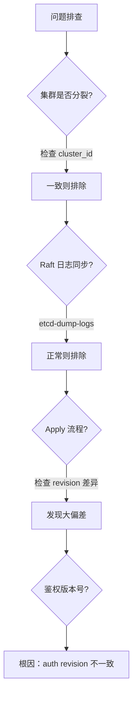

**图解说明**：

排查数据不一致需要**逐层排查**：

1. 首先排除集群分裂（cluster_id 不一致）
2. 其次确认 Raft 日志同步正常
3. 最后检查 Apply 流程——这往往是问题根源

**诊断命令**：

```bash
# 查看各节点状态
$ etcdctl endpoint status --cluster -w json | python -m json.tool

# 关键字段对比
# - cluster_id：是否一致（排除分裂）
# - raftIndex / raftAppliedIndex：Raft 日志同步
# - revision：MVCC 版本号差异
```

**代码说明**：通过对比各节点的 revision，可以快速发现不一致。正常情况下各节点 revision 差异应在个位数。

**根因**：

1. etcd 重启时，鉴权命令未持久化 `consistent index`
2. 导致鉴权命令重复执行
3. `RoleGrantPermission` 接口未实现幂等
4. 鉴权版本号不一致 → Apply 失败 → 数据不一致

> **教训**：Apply 逻辑必须实现**幂等性**，否则重启可能导致状态机不一致。

#### 13.3 其他典型不一致 Bug

| Bug | 触发条件 | 影响版本 | 修复版本 |
|-----|---------|---------|---------|
| **鉴权版本号不一致** | 重启 + 鉴权操作 | 所有 v3 | v3.3.21 / v3.4.8 |
| **Lease Revoke 鉴权** | 升级 3.2→3.3 | 混合版本 | v3.3.x |
| **defrag 临时文件** | defrag 未正常结束 | 早期版本 | v3.2.29 / v3.3.19 / v3.4.4 |

**要点解读**：从上表可以看出，不一致问题往往在**版本升级**或**重启**时触发。生产环境应尽量使用 v3.4.9 以上的稳定版本。

#### 13.4 不一致的根本原因

从架构层面分析，不一致的根源在于 Raft 的边界。

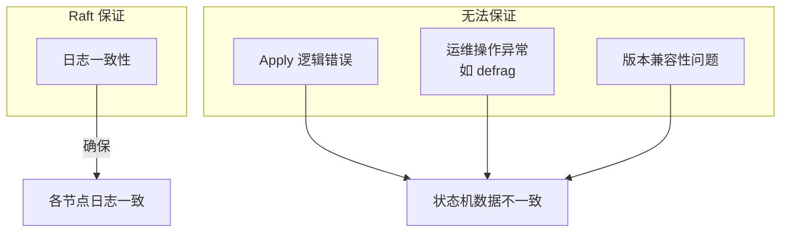

**图解说明**：

- **Raft 只管日志**：日志复制到多数节点才算成功
- **三类隐患**：Apply bug、运维操作、版本兼容——这些都不在 Raft 保证范围内

**核心问题**：

- Raft 算法边界：只负责日志复制
- Apply 流程：属于业务逻辑，无重试机制
- 运维操作：直接修改底层存储

#### 13.5 最佳实践

##### 13.5.1 开启数据毁坏检测

```bash
# 启动时检测
etcd --experimental-initial-corrupt-check=true

# 运行时定期检测
etcd --experimental-corrupt-check-time=5m
```

**代码说明**：启动时检测可以在节点启动时发现不一致；运行时检测可以定期扫描，及时告警。

**检测原理**：

1. 遍历 treeIndex 所有 key
2. 获取 boltdb 中的 value
3. 计算 crc32 hash
4. 比较各节点 hash 值

> 推荐使用 v3.4.9 以上版本

##### 13.5.2 应用层一致性检测

| 检测方法 | 说明 |
|---------|------|
| **key 数量监控** | 定时统计各节点 key 数（带 WithCountOnly） |
| **revision 监控** | 比较各节点 revision 差异 |
| **MVCC metrics** | 监控 `mvcc_put_total` 等指标 |

```bash
# 统计 key 数量（高效方式）
$ etcdctl get "" --prefix --count-only
```

##### 13.5.3 定时数据备份

```bash
# 手动备份
$ etcdctl snapshot save backup.db

# 定时备份（推荐每 30 分钟）
# 可使用 etcd-operator 的 backup-operator
```

> 重要变更前务必备份！

##### 13.5.4 良好的运维规范

| 规范 | 说明 |
|-----|------|
| **版本一致** | 集群各节点版本必须一致 |
| **使用稳定版** | 优先选择新的稳定版本 |
| **灰度升级** | 先测试、再灰度、后全量 |
| **查看 changelog** | 评估版本兼容性 |

#### 13.6 本章小结

**不一致的原因**：

| 类型 | 示例 |
|-----|------|
| **Apply 逻辑错误** | 鉴权版本号不一致 |
| **版本兼容问题** | 升级导致接口行为变化 |
| **运维操作异常** | defrag 临时文件未清理 |

**预防措施**：


| 措施 | 工具/方法 |
|-----|---------  |
| 启动检测 | `--experimental-initial-corrupt-check` |
| 运行检测 | `--experimental-corrupt-check-time` |
| 应用监控 | key 数量、revision、MVCC metrics |
| 备份恢复 | `etcdctl snapshot save/restore` |

> **一句话总结**：Raft 不等于强一致，Apply 才是隐患源。

---

### 第14章 db 大小问题

"etcd 不建议存储超过 8GB 的数据"——这是官方的明确建议。但为什么会有这个限制？大 db 文件会带来哪些问题？本章将深入分析 db 大小对集群各模块的影响。

#### 14.1 db 大小六大影响面

大 db 文件会从六个维度影响 etcd 的性能和稳定性。

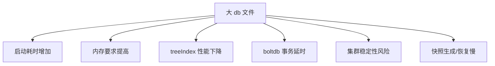

**图解说明**：db 大小问题是一个**系统性问题**，会影响 etcd 的各个层面，从启动、内存到日常请求、集群同步。

| 影响面 | 说明 |
|-------|------|
| **启动耗时** | 需遍历 boltdb 重建 treeIndex |
| **内存配置** | mmap 映射，需足够内存避免缺页中断 |
| **treeIndex** | 百万级 key 查询延时增加 |
| **boltdb** | freelist 管理导致事务延时抖动 |
| **稳定性** | expensive request 易导致 OOM、丢包 |
| **快照** | 生成慢、传输慢、可能陷入死循环 |

#### 14.2 启动耗时

为什么大 db 会导致启动慢？理解启动流程就能明白。

**启动流程**：

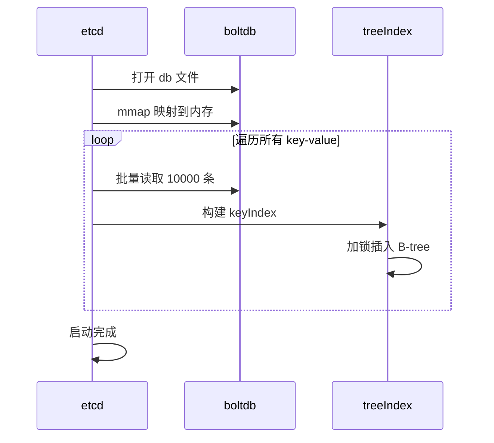

**图解说明**：启动时需要**遍历 boltdb 中所有 key-value，重建内存中的 treeIndex**。这个过程是单线程串行的，并且需要持有全局锁。

**瓶颈**：

- treeIndex 插入需要全局锁
- 单 goroutine 串行构建
- 百万级 key 启动可能需要数分钟

```text
2021-02-15 02:25:55 | etcdmain: etcd Version: 3.4.9
2021-02-15 02:26:58 | recovered store from snapshot  # 耗时 1 分钟
2021-02-15 02:27:19 | ready to serve client requests
```

> 这个真实日志显示，100 万 key 的集群启动用了 1 分多钟。

#### 14.3 节点内存配置

boltdb 使用 mmap 将 db 文件映射到内存，因此内存配置与 db 大小密切相关。

**mmap 机制**：

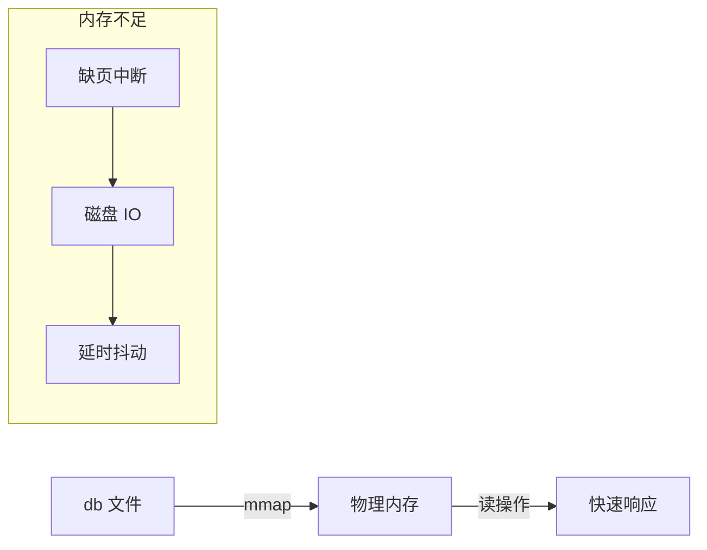

**图解说明**：当物理内存充足时，db 文件会被完全缓存，所有读操作都在内存完成。当内存不足时，系统会触发**缺页中断**，需要从磁盘加载数据，导致延时抖动。

| 场景 | 行为 |
|-----|------|
| 内存 > db 大小 | 全部缓存，读无磁盘 IO |
| 内存 < db 大小 | 触发缺页中断，延时抖动 |

> **黄金法则**：节点内存规格 > db 文件大小

#### 14.4 treeIndex 性能

随着 key 数量增加，treeIndex 的查询性能会下降。

**trace 日志分析**：

```json
{
  "msg": "trace range",
  "duration": "146.432768ms",
  "steps": [
    "'range keys from in-memory treeIndex' (duration: 95.925033ms)",
    "'range keys from bolt db' (duration: 47.932118ms)"
  ]
}
```

**代码说明**：从 trace 可以看出，treeIndex 查询占用了 96ms，这在正常情况下是不可接受的。

| key 数量 | 范围查询延时 |
|---------|------------|
| 1 万 | 毫秒级 |
| 10 万 | 数十毫秒 |
| 100 万 | 上百毫秒 |

**开启 trace**：

```bash
etcd --logger=zap  # etcd 3.4+ 需显式开启
```

#### 14.5 boltdb 性能

boltdb 的 freelist 管理算法是性能的关键因素。

**freelist 管理**：

| 实现 | 时间复杂度 | 版本 |
|-----|-----------|------|
| **array** | O(N) 申请，O(NlogN) 释放 | etcd 3.4 默认 |
| **hashmap** | O(1) | etcd 3.5 默认 |

**要点解读**：array 模式下，每次事务提交都需要遍历空闲页列表。当 db 很大且碎片严重时，这个开销会非常大。

**问题场景**：

- 16G db，400 万 page
- 存在大量碎片空闲页
- 每次事务需遍历查找连续页

**优化配置**：

```go
// bbolt 参数
FreeListType: "hashmap"   // 使用 hashmap 管理
NoFreelistSync: true      // 不持久化 freelist，重启时重建
```

#### 14.6 集群稳定性

大 db 最严重的影响是**稳定性风险**，一个不当的查询可能导致集群不可用。

**expensive request 类型**：

| 类型 | 问题 | 优化版本 |
|-----|------|---------|
| **count only** | 遍历并追加到数组，内存暴涨 | v3.5 优化 |
| **limit 查询** | limit 未下推到索引层 | v3.5 优化 |
| **大包查询** | 单次返回大量数据 | 建议分页 |

**trace 日志示例**：

```json
{
  "msg": "trace range",
  "response_count": 1232274,
  "duration": "9.063748801s",
  "steps": [
    "'range keys from in-memory index tree' (693ms)",
    "'range keys from bolt db' (8.2s)"
  ]
}
```

> 单次查询 123 万 key，耗时 9 秒！这期间 etcd 基本无法响应其他请求。

**最佳实践**：

- 避免全量查询，使用分页
- 控制单 value 大小
- 监控 expensive request

#### 14.7 快照影响

大 db 还会导致**快照相关的连锁问题**。

**快照问题**：

| 问题 | 说明 |
|-----|------|
| 备份慢 | 大 db 导致快照生成耗时长 |
| 长事务 | 只读事务阻止 page 回收，db 持续增长 |
| 传输慢 | Leader → Follower 消耗大量网络带宽 |
| 死循环 | Follower 重建慢，无法追赶，持续触发快照 |

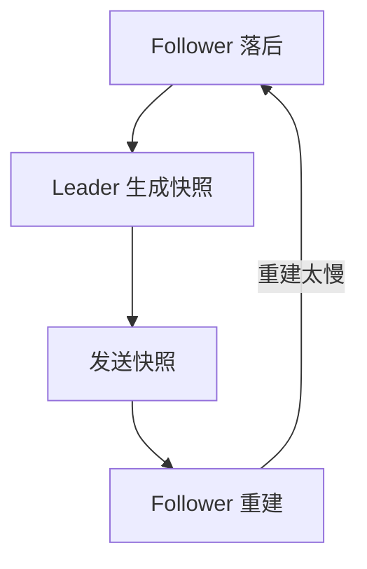

**图解说明**：这是一个致命的死循环——Follower 落后 → Leader 发快照 → Follower 处理慢 → 继续落后。在极端情况下，集群可能永远无法恢复正常。

#### 14.8 本章小结

**db 大小影响汇总**：

| 影响 | 原因 | 优化 |
|-----|------|------|
| 启动慢 | 重建 treeIndex | 控制 key 数量 |
| 内存高 | mmap 映射 | 节点内存 > db |
| 查询慢 | treeIndex 延时 | 减少范围查询 |
| 事务抖动 | freelist O(N) | 使用 hashmap |
| OOM 风险 | expensive request | 分页查询 |
| 快照慢 | 大文件传输 | 控制 db 大小 |

**最佳实践**：

| 建议 | 说明 |
|-----|------|
| **db Quota** | 建议不超过 8G |
| **key 数量** | 控制在百万级以内 |
| **value 大小** | 尽量小，避免大 value |
| **分页查询** | 避免全量拉取 |
| **监控** | 关注 db 大小、key 数量增长 |

> **一句话总结**：db 越大，问题越多。控制 db 大小是 etcd 运维的第一要务。

---

### 第15章 延时问题分析

"apply request took too long"、"request timed out"——这些是 etcd 运维中最常见的告警。当延时问题发生时，如何快速定位原因？本章将介绍系统性的延时分析方法论。

#### 15.1 延时分析思路

写请求从客户端到最终生效，要经过多个阶段，任何一个都可能成为瓶颈。

**写请求可能的瓶颈点**：


**图解说明**：延时问题分析的关键是**逐个排查**以上5个阶段。

| 瓶颈点 | 依赖 |
|-------|------|
| 网络 | 网络延时、带宽 |
| WAL | 磁盘顺序写性能 |
| boltdb | 磁盘随机写性能 |
| Apply | CPU、内存资源 |

#### 15.2 问题定位工具

| 工具类型 | 工具 |
|---------|------|
| **metrics** | Prometheus 指标 |
| **trace 日志** | 各阶段耗时详情 |
| **etcd 日志** | 警告、错误日志 |
| **系统工具** | iostat、blktrace、pprof |

#### 15.3 网络问题

**相关 metrics**：

| 指标 | 说明 |
|-----|------|
| `etcd_network_peer_round_trip_time_seconds` | 节点间 RTT |
| `etcd_network_peer_sent_failures_total` | 发送失败数 |
| `etcd_network_active_peers` | 活跃连接数 |
| `etcd_network_client_grpc_sent_bytes_total` | 出流量 |
| `etcd_network_client_grpc_received_bytes_total` | 入流量 |

**诊断命令**：

```bash
# 网络连通性
ping/traceroute/mtr

# 网卡状态
ethtool eth0
ifconfig eth0  # 查看丢包

# 连接状态
netstat -anp | grep etcd

# 抓包分析
tcpdump -i eth0 port 2380
```

**常见问题**：

- expensive request 导致网卡带宽满、丢包
- 跨可用区部署 RTT 较高

#### 15.4 磁盘 I/O 问题

**核心 metrics**：

| 指标 | 说明 | 正常值 |
|-----|------|-------|
| `etcd_disk_wal_fsync_duration_seconds` | WAL fsync 延时 | P99 < 10ms |
| `etcd_disk_backend_commit_duration_seconds` | 事务提交延时 | P99 < 120ms |

**进一步细分**：

| 指标 | 说明 |
|-----|------|
| `disk_backend_commit_rebalance_duration` | B+ tree 重平衡耗时 |
| `disk_backend_commit_spill_duration` | B+ tree 分裂耗时 |

**etcd 日志告警**：

```go
// WAL fsync 超过 1 秒会打印警告
"slow fdatasync", took: 1.2s, expected: 1s
```

**诊断思路**：

| 情况 | 可能原因 |
|-----|---------|
| wal_fsync 高 | 磁盘性能差、cgroup blkio 限制 |
| backend_commit 高 + wal_fsync 正常 | freelist O(N) 问题、空闲页碎片化 |

**工具**：

```bash
# 磁盘 I/O 分析
iostat -x 1

# 块层 I/O 追踪
blktrace -d /dev/sda
```

> **建议**：使用 SSD 磁盘，确保事务提交稳定

#### 15.5 expensive request

**trace 特性**（etcd 3.4+）：

```bash
# 开启 trace（需 zap logger）
etcd --logger=zap
```

**读请求 trace 日志**：

```json
{
  "msg": "trace range",
  "duration": "318.774µs",
  "steps": [
    "'agreement among raft nodes before linearized reading' (255µs)",
    "'get authentication metadata' (2.97µs)",
    "'range keys from in-memory index tree' (44µs)",
    "'range keys from bolt db' (8.6µs)",
    "'filter and sort the key-value pairs' (578ns)",
    "'assemble the response' (643ns)"
  ]
}
```

**写请求 trace 日志**：

```json
{
  "msg": "trace put",
  "duration": "6.826ms",
  "steps": [
    "'process raft request' (6.65ms)",
    "'get key's previous created_revision and leaseID' (23µs)",
    "'marshal mvccpb.KeyValue' (1.8µs)",
    "'store kv pair into bolt db' (30µs)",
    "'attach lease to kv pair' (661ns)"
  ]
}
```

**expensive request 示例**：

```json
{
  "msg": "apply request took too long",
  "took": "1.84s",
  "request": "key:\"vip\" range_end:\"viq\"",
  "response": "range_response_count:250 size:262150651"
}
// 250 条 key，250MB 数据，1.63 秒在 boltdb 遍历
```

#### 15.6 gRPC 接口级 metrics

```bash
# 开启详细 metrics
etcd --metrics=extensive
```

**示例 metrics**：

```text
grpc_server_handled_total{grpc_code="OK",grpc_method="Put"} 251

grpc_server_handling_seconds_bucket{grpc_method="Put",le="0.1"} 240
# 251 个 Put 请求，240 个在 100ms 内完成
```

#### 15.7 容量与资源瓶颈

**线性读延时高的 trace**：

```json
{
  "msg": "trace linearizableReadLoop",
  "duration": "855ms",
  "steps": [
    "'read index received' (824µs)",
    "'applied index is now lower than readState.Index' (854ms)"
  ]
}
// 等待 applied index 追赶 Leader 耗时 854ms
```

**原因**：写请求过多，本节点追赶 Leader 慢

**诊断指标**：

| 指标 | 说明 |
|-----|------|
| `etcd_server_slow_apply_total` | 慢 apply 请求数 |
| `etcd_server_proposals_pending` | 待处理提案数 |

**系统资源分析**：

```bash
# CPU 分析
ps aux | grep etcd
top -p <pid>
mpstat 1
perf top

# 内存分析
free -h

# pprof 分析
curl http://localhost:2379/debug/pprof/profile > cpu.prof
curl http://localhost:2379/debug/pprof/heap > heap.prof
```

#### 15.8 本章小结

**延时原因汇总**：

| 原因 | 表现 | 工具 |
|-----|------|-----|
| **网络** | RTT 高、丢包 | ping、netstat、metrics |
| **磁盘** | fsync/commit 慢 | iostat、blktrace |
| **expensive request** | 大包查询、全量遍历 | trace 日志 |
| **容量** | 写请求过多 | slow_apply metrics |
| **资源** | CPU/内存不足 | pprof、top |

**关键 metrics**：

```text
# 磁盘
etcd_disk_wal_fsync_duration_seconds
etcd_disk_backend_commit_duration_seconds

# 网络
etcd_network_peer_round_trip_time_seconds

# 容量
etcd_server_slow_apply_total
```

**最佳实践**：

- 使用 SSD 磁盘
- 避免 expensive request
- 监控磁盘、网络 metrics
- 开启 trace 日志定位问题

---

### 第16章 内存问题分析

"明明只存了 1 个 1MB 的 key，为什么 etcd 内存占用几个 G？"——这是一个常见疑问。答案在于 etcd 的多版本存储、日志保留和 mmap 机制。本章将深入分析内存占用来源。

#### 16.1 内存分析思路

写请求流程中多个模块都会消耗内存，理解这个流程是分析内存问题的基础。

**写请求流程中的内存占用**：

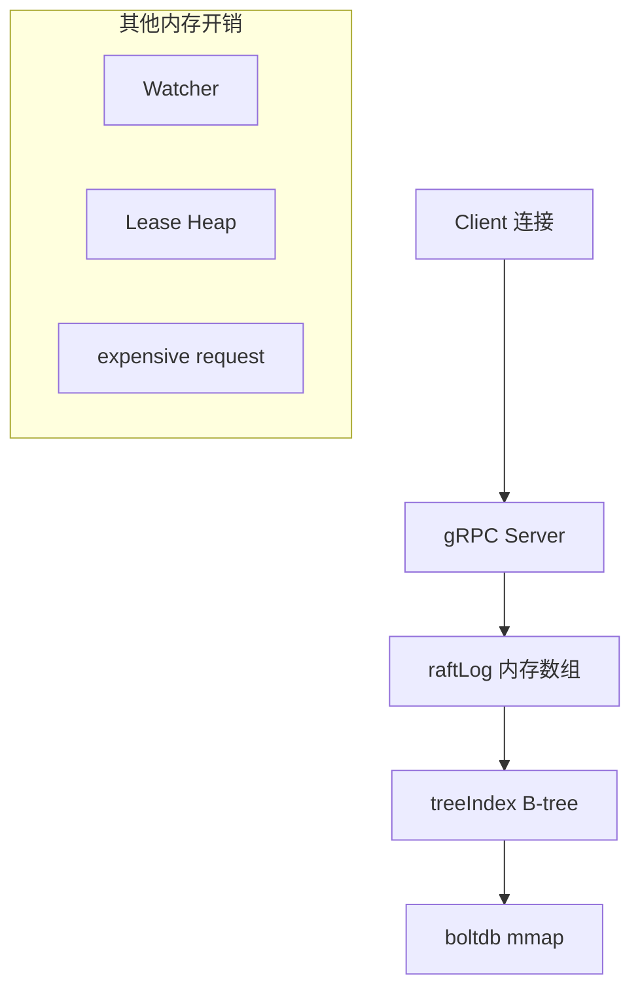

| 模块 | 内存占用因素 |
|-----|-------------|
| **raftLog** | 日志条目数量和大小 |
| **treeIndex** | key 数量、历史版本数 |
| **boltdb** | db 文件大小（mmap） |
| **watcher** | 连接数、Stream 数、watcher 数 |
| **expensive request** | 查询结果大小 |

#### 16.2 raftLog 内存

**数据结构**：

```go
type raftLog struct {
    storage   Storage    // 已持久化的日志（MemoryStorage）
    unstable  unstable   // 未持久化的日志
    committed uint64
    applied   uint64
}

type MemoryStorage struct {
    ents []pb.Entry  // 内存数组存储日志条目
}
```

**内存控制机制**：

| 参数 | 默认值 | 说明 |
|-----|-------|------|
| `--snapshot-count` | 100000 | 每 N 次写请求触发快照 |
| `DefaultSnapshotCatchUpEntries` | 5000 | 保留的日志条目数 |

**内存估算**：

- 1MB value × 5000 条 ≈ 5GB 内存
- 保留日志用于 slow Follower 追赶

#### 16.3 treeIndex 内存

**数据结构**：

```go
type keyIndex struct {
    key         []byte
    modified    revision
    generations []generation  // 历史版本记录
}
```

**内存占用因素**：

- key 长度
- 历史版本数量
- key 总数

**优化方法**：

- 控制 key 长度
- 配置合理的压缩策略（compact）

#### 16.4 boltdb mmap 内存

**mmap 机制**：

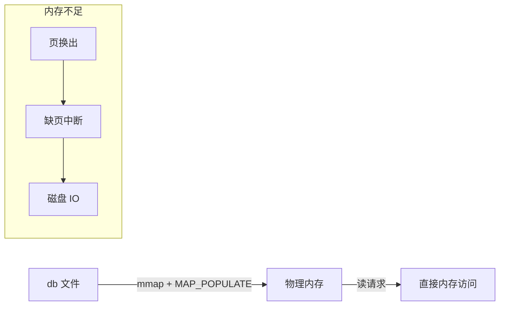

| 场景 | 表现 |
|-----|------|
| 内存充足 | 读请求无磁盘 IO |
| 内存不足 | 缺页中断，延时抖动 |

**优化方法**：

- compact 回收旧版本
- defrag 碎片整理
- 控制 db 文件大小

#### 16.5 Watcher 内存

**内存公式**：

```text
memory = c1 × connections + c2 × streams + c3 × watchers
```

**各部分开销**：

| 组件 | 内存开销 |
|-----|---------|
| 每个连接 (c1) | ~17 KB |
| 每个 gRPC Stream (c2) | ~18 KB |
| 每个 watcher (c3) | ~350 bytes |
| 每个 watcher buffer | 1024 事件 |

**监控指标**：

| 指标 | 说明 |
|-----|------|
| `etcd_debugging_mvcc_pending_events_total` | 堆积的事件数 |
| `etcd_debugging_slow_watcher_total` | 慢 watcher 数 |

#### 16.6 expensive request 内存

**示例**：

```go
// 查询 100 个 1MB 的 key
kvs := make([]mvccpb.KeyValue, limit)
for i, revpair := range revpairs[:len(kvs)] {
    // 每次反序列化消耗内存
    kvs[i].Unmarshal(vs[0])
}
// 至少消耗 100MB 内存 + 100MB 流量
```

**高风险操作**：

- 大包查询（多 key 或大 value）
- count-only（百万级 key）
- limit 查询（未优化版本）

#### 16.7 其他内存问题

| 问题 | 说明 | 解决方案 |
|-----|------|---------|
| **v2 API** | v2 数据存内存树，watcher 无多路复用 | 停用 v2 API |
| **goroutine 泄露** | 日志阻塞导致 | 监控 `go_goroutines` |
| **etcd bug** | lease keepalive 等 | 升级版本 |

**v2 监控**：

```text
etcd_debugging_store_*  # v2 存储相关指标
```

#### 16.8 案例：1 key 占用数 G 内存

**测试场景**：

```bash
# 1MB value，更新 1000 次
for i in {1..1000}; do
  dd if=/dev/urandom bs=1024 count=1024 | etcdctl put key
done

# compact + defrag
etcdctl compact $(etcdctl endpoint status --write-out=json | ...)
etcdctl defrag --cluster
```

**结果**：

- db 大小：1MB
- 进程内存：~2GB

**原因**：raftLog 保留 5000 条日志 × 1MB = 5GB 理论上限

#### 16.9 本章小结

**内存占用因素**：

| 模块 | 因素 | 优化 |
|-----|------|-----|
| **raftLog** | 日志条目 × value 大小 | 控制 value 大小 |
| **treeIndex** | key 数 × 版本数 | compact |
| **boltdb** | db 文件大小 | compact + defrag |
| **watcher** | 连接数 + 事件堆积 | 监控 slow watcher |
| **查询** | 结果集大小 | 分页查询 |

**监控指标**：

```text
# 内存相关
go_memstats_alloc_bytes
go_goroutines

# watcher 相关
etcd_debugging_mvcc_pending_events_total
etcd_debugging_slow_watcher_total

# v2 相关
etcd_debugging_store_*
```

**最佳实践**：

- 控制 key、value 大小
- 配置合理的压缩策略
- 监控内存和 goroutine 数量
- 避免 expensive request

---

### 第17章 性能优化 - 读性能

etcd 官方压测线性读可达 14 万 QPS，但这是理想场景。实际生产中，你的读性能可能只有几千甚至几百。本章将分析各个璶颈点并给出优化方案。

#### 17.1 读性能分析链路

一个读请求从 Client 到响应返回要经过 8 个阶段，任何一个都可能成为璶颈。

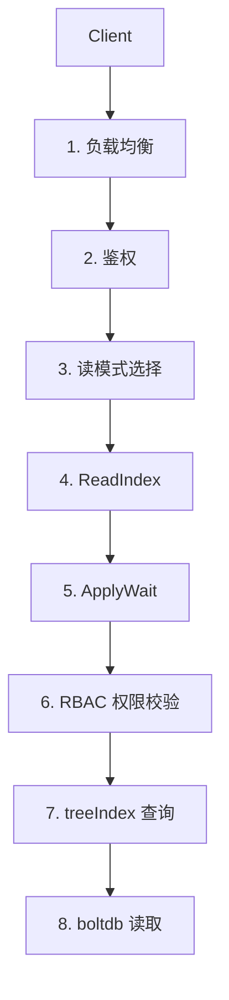

#### 17.2 负载均衡优化

| 版本 | 负载均衡策略 | 问题 |
|-----|-------------|------|
| etcd < 3.4 | 固定连接 | 单节点过载 |
| etcd >= 3.4 | Round-robin | 节点负载均衡 |

**建议**：

- 低版本使用 Load Balancer 访问 etcd
- 便于集群扩缩容，无需调整 client 配置

#### 17.3 鉴权优化

**Authenticate 接口性能**：

| 版本 | 性能 | P99 延时 |
|-----|------|---------|
| < v3.4.9 | ~16 QPS | 18 秒 |
| >= v3.4.9 | ~200 QPS | < 1 秒 |

**优化建议**：

| 建议 | 说明 |
|-----|------|
| **使用证书鉴权** | 避免密码计算开销，性能几乎无损 |
| **复用 token** | 减少 Authenticate 调用 |
| **升级版本** | 使用 v3.4.9+ 版本 |

#### 17.4 读模式选择

**性能对比**（1000 client，单 key）：

| 读模式 | QPS | 平均延时 |
|-------|-----|---------|
| 串行读 | 32 万 | 2.5 ms |
| 线性读 | 19 万 | 4.9 ms |

```bash
# 串行读压测
benchmark --endpoints=addr --conns=100 --clients=1000 \
  range hello --consistency=s --total=500000

# 线性读压测
benchmark --endpoints=addr --conns=100 --clients=1000 \
  range hello --consistency=l --total=500000
```

**选择建议**：

- 对一致性要求不高 → 串行读
- Learner 节点 → 串行读实现就近访问

#### 17.5 ReadIndex 与网络延时

| 部署方式 | RTT | 性能影响 |
|---------|-----|---------|
| 同可用区 | 0.1-0.2 ms | 最佳性能 |
| 跨可用区 | ~2 ms | 性能下降 |
| 跨城部署 | > 10 ms | 显著下降 |

**建议**：

- 尽量同可用区部署
- 使用 Learner 实现异地容灾

#### 17.6 磁盘 IO 与写 QPS 影响

**写 QPS 对读性能的影响**：

| 写 QPS | 线性读 QPS | 下降比例 |
|-------|-----------|---------|
| 0 | 19 万 | - |
| 1000 | 15 万 | 21% |
| 5000 | 10 万 | 47% |
| 10000 | 6 万 | 68% |

> 线性读需等待本节点 applied index 追上 Leader

**建议**：使用 SSD 磁盘

#### 17.7 expensive request 优化

**问题**：

| 场景 | 影响 |
|-----|------|
| 查询大量 key | 遍历耗时、内存暴涨 |
| 大 key-value | 性能剧烈下降 |

**大 value 性能影响**：

| value 大小 | 线性读 QPS | 平均延时 |
|-----------|-----------|---------|
| 小 value | 17 万 | 5 ms |
| 1 MB | 1163 | 818 ms |

**优化方案**：

| 方案 | 说明 |
|-----|------|
| **List + Watch** | 启动时全量，后续增量 |
| **数据分片** | 按 namespace 等拆分 |
| **分页查询** | 避免一次拉取大量数据 |
| **引入缓存** | 缓存 expensive 结果 |

#### 17.8 锁优化

| 模块 | 锁问题 | 优化 |
|-----|-------|------|
| **AuthStore** | 密码校验占用锁时间长 | v3.4.9 缩小锁范围 |
| **treeIndex** | compact 遍历阻塞读 | 克隆 treeIndex |
| **boltdb** | 读写锁竞争 | etcd 3.1-3.4 多次优化 |

#### 17.9 本章小结

**读性能优化核心思路**：


| 优化点 | 方法 |
|-------|------|
| **负载均衡** | Round-robin 或 Load Balancer |
| **鉴权** | 优先证书鉴权，复用 token |
| **读模式** | 评估是否可用串行读 |
| **部署** | 同可用区，使用 SSD |
| **请求** | 避免大量 key、大 value 查询 |
| **架构** | List + Watch，数据分片 |

---

### 第18章 性能优化 - 写性能与稳定性

写入大量数据时遇到 "etcdserver: too many requests" 错误？本章将分析写性能瓶颈并介绍 gRPC proxy 扩展方案。

#### 18.1 写性能分析链路

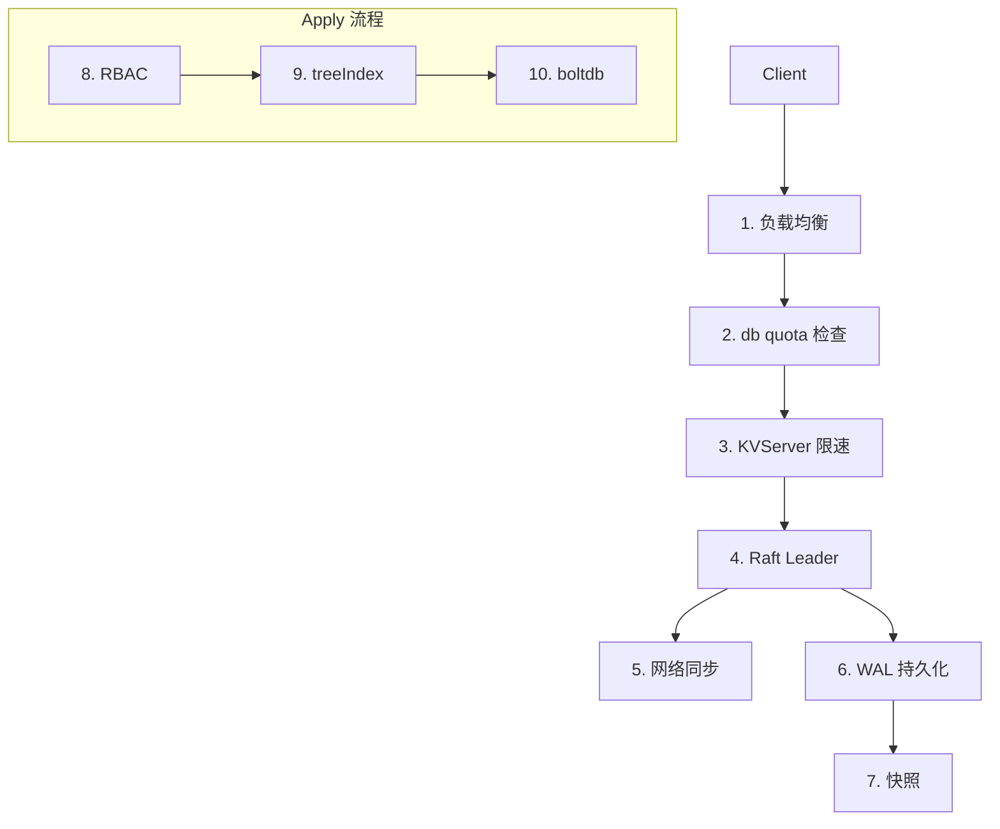

#### 18.2 db quota 配置

| 配置项 | 默认值 | 建议 |
|-------|-------|------|
| `--quota-backend-bytes` | 2 GB | 根据业务调整，不超过 8G |
| 压缩策略 | - | 5 分钟以上压缩一次 |

> 超过 quota 后集群只读，无法写入

#### 18.3 限速机制

**限速条件**：

```text
committed index - applied index > 5000
→ 返回 "etcdserver: too many requests"
```

**触发原因**：

| 原因 | 说明 |
|-----|------|
| **long expensive read** | 持有读锁导致写阻塞 |
| **磁盘慢** | boltdb 事务提交慢 |
| **defrag 操作** | 持有锁导致写阻塞 |

#### 18.4 心跳与选举参数

**相关参数**：

| 参数 | 默认值 | 建议 |
|-----|-------|------|
| `--heartbeat-interval` | 100 ms | 100-400 ms |
| `--election-timeout` | 1000 ms | >= 10 × heartbeat |

**Leader 不稳定的原因**：

| 原因 | 解决方案 |
|-----|---------|
| 磁盘 IO 慢 | 使用 SSD |
| CPU 过高 | 扩容节点 |
| 网络延时大 | 同可用区部署 |

**监控指标**：

```text
etcd_server_leader_changes_seen_total  # Leader 切换次数
etcd_wal_fsync_durations_seconds_bucket  # WAL 延时
```

#### 18.5 网络与磁盘 IO

**SSD vs 非 SSD 性能对比**：

| 磁盘类型 | 写 QPS | 平均延时 |
|---------|--------|---------|
| SSD | 51298 | 189 ms |
| 非 SSD | 35255 | 279 ms |

**压测命令**：

```bash
benchmark --endpoints=addr --conns=100 --clients=1000 \
  put --key-size=8 --sequential-keys --total=10000000 --val-size=256
```

#### 18.6 快照参数优化

| 参数 | 版本 | 默认值 |
|-----|------|-------|
| `--snapshot-count` | < 3.2 | 10000 |
| `--snapshot-count` | >= 3.2 | 100000 |

**权衡**：

- 值过大：内存消耗高
- 值过小：频繁触发快照重建

> 快照重建代价高昂，应尽量避免

#### 18.7 大 value 问题

**1 MB value 写性能**：

| 场景 | 写 QPS | P99 延时 |
|-----|-------|---------|
| 小 value | 51298 | 189 ms |
| 100 KB | 1119 | 324 ms |
| 1 MB | 几乎不可用 | 4 秒 |

**问题**：

- 频繁更新大 key → db 快速膨胀 → 超 quota
- boltdb COW 机制导致空间放大

**优化方案**：

| 方案 | 说明 |
|-----|------|
| 减少更新频率 | 增量更新 |
| 拆分数据 | 细粒度 key |
| K8s 实践 | Node 心跳优化，拆分状态 |

#### 18.8 boltdb 锁优化历史

| 版本 | 优化 |
|-----|------|
| 3.0 | Raft log read 线性读 |
| 3.1 | ReadIndex 线性读 |
| 3.2 | 互斥锁 → 读写锁 |
| 3.4 | 全并发读，去除 buffer 锁 |

#### 18.9 gRPC Proxy 扩展

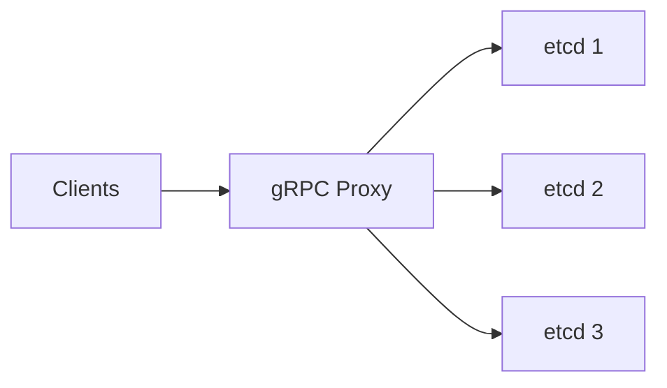

**功能**：

| 功能 | 说明 |
|-----|------|
| **扩展读** | 读缓存，降低连接数 |
| **扩展 Watch** | 合并相同 key 的 watcher |
| **扩展 Lease** | 合并 keepalive 心跳 |
| **故障切换** | 自动切换到正常节点 |

#### 18.10 本章小结

**写性能优化层次**：

| 层次 | 优化项 |
|-----|-------|
| **应用层** | 避免大 value、增量更新 |
| **etcd 参数** | quota、心跳、快照参数 |
| **操作系统** | 磁盘调度、内存配置 |
| **硬件** | SSD 磁盘、同可用区网络 |
| **扩展** | gRPC Proxy |

**关键建议**：

| 建议 | 说明 |
|-----|------|
| 使用 SSD | 写性能提升 45% |
| 控制 value 大小 | 避免频繁更新大 key |
| 调整心跳参数 | 避免频繁 Leader 切换 |
| gRPC Proxy | 扩展读、Watch、Lease |

---

### 第19章 分布式 KV 服务实战

在学习了 etcd 的核心原理后，你是否想亲手构建一个简单的分布式 KV 服务？本章将基于 etcd 的 `raftexample` 项目，带你从零构建一个支持多存储引擎的分布式 KV 服务（metcd）。通过这个实战项目，你将深入理解 Raft 算法在工程中的应用，以及存储引擎的选型原则。

#### 19.1 整体架构

我们首先需要设计 metcd 的整体架构。一个典型的分布式 KV 服务需要包含以下核心组件：

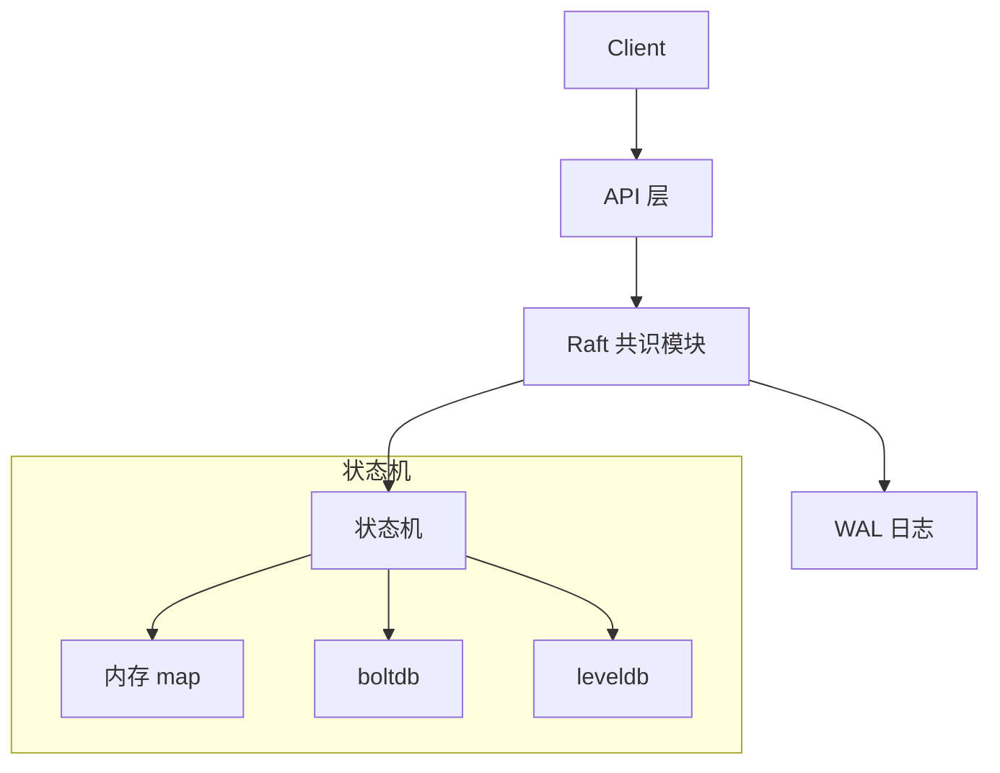

**图解说明**：

上图展示了 metcd 的分层架构，自上而下分为四个层次：

1. **API 层**：接收客户端的读写请求，提供 HTTP REST 接口
2. **Raft 共识模块**：负责在多个节点间达成一致，确保数据可靠性
3. **WAL 日志**：Write-Ahead Log，持久化 Raft 日志条目，保证 crash 后数据不丢失
4. **状态机**：存储实际的 key-value 数据，支持多种存储引擎切换

> **设计亮点**：通过接口抽象，状态机可以灵活切换不同的存储引擎（内存、boltdb、leveldb），满足不同业务场景的性能需求。

#### 19.2 API 设计

在设计分布式 KV 服务的 API 时，我们需要综合考虑多个因素。不同的选择会对系统的性能、易用性和安全性产生显著影响。

**设计考虑因素**：

| 因素 | 说明 |
|-----|------|
| 性能 | gRPC vs HTTP |
| 易用性 | 调试方便 |
| 开发效率 | Protobuf 跨平台 |
| 安全性 | HTTPS |
| 幂等性 | 降低使用复杂度 |

**要点解读**：

对于学习项目而言，我们选择 HTTP REST 接口。虽然 gRPC 在性能上更优，但 HTTP 接口更容易调试和测试，可以直接用 `curl` 命令验证功能。在生产环境中，建议使用 gRPC 以获得更好的性能。

**metcd API 示例**：

```bash
# Put 接口 - 写入数据
curl -L http://127.0.0.1:3379/hello -XPUT -d world

# Get 接口 - 读取数据
curl -L http://127.0.0.1:3379/hello
world
```

**代码说明**：上述命令展示了 metcd 最基本的读写操作。URL 路径即为 key，请求体为 value。这种设计简洁直观，符合 RESTful 风格。

#### 19.3 复制状态机

Raft 算法的核心是复制状态机模型。理解这个模型对于构建分布式系统至关重要。下面我们通过一个写请求的完整流程来理解它的工作原理。

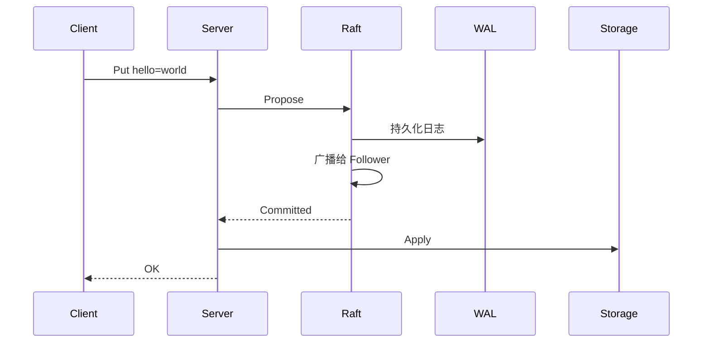

**图解说明**：

上图展示了一个写请求从发起到完成的 6 个关键步骤：

1. **Client 发起请求**：客户端向 Server 发送 Put hello=world 请求
2. **Server 提交提案**：将请求封装成 Raft 提案（Propose）
3. **持久化日志**：Raft 模块先将日志持久化到 WAL，防止数据丢失
4. **复制到 Follower**：Leader 广播日志给其他 Follower 节点
5. **确认提交**：多数节点确认后，日志标记为已提交（Committed）
6. **应用到状态机**：将数据写入存储引擎，返回成功给客户端

> **关键理解**：只有当日志被多数节点持久化后才算提交成功。这确保了即使 Leader 崩溃，新选出的 Leader 也一定拥有这条日志，数据不会丢失。

#### 19.4 多存储引擎

为了让 metcd 能够适应不同的业务场景，我们设计了一个抽象的存储接口，支持多种存储引擎。

**KVStore 接口抽象**：

```go
type KVStore interface {
    Lookup(key string) (string, bool)
    Propose(k, v string)
    ReadCommits(commitC <-chan *string, errorC <-chan error)
    Snapshot() ([]byte, error)
    RecoverFromSnapshot(snapshot []byte) error
    Close() error
}
```

**代码说明**：

- `Lookup`：查询 key 对应的 value
- `Propose`：提交写请求
- `ReadCommits`：从 Raft 模块读取已提交的日志并应用
- `Snapshot/RecoverFromSnapshot`：支持快照和恢复

**存储引擎选择**：

| 场景 | 推荐引擎 | 原因 |
|-----|---------|------|
| 读多写少 | boltdb | B+ tree 读快 |
| 写多读少 | leveldb | LSM tree 写快 |

**要点解读**：选择存储引擎时，关键要分析业务的读写比例。etcd 本身选择 boltdb 是因为它主要用于存储元数据，读操作远多于写操作。如果你的场景是日志收集、时序数据等写密集型，leveldb 会是更好的选择。

#### 19.5 boltdb vs leveldb

两种存储引擎的底层数据结构完全不同，这决定了它们各自的性能特点。

**boltdb（B+ tree）**：

| 特点 | 说明 |
|-----|------|
| 数据结构 | B+ tree |
| 读性能 | 直接从内存读取 |
| 写性能 | 随机写磁盘，较慢 |

boltdb 使用 B+ tree 组织数据，所有数据通过 mmap 映射到内存，读取时直接访问内存，速度极快。但写入需要更新 B+ tree 节点并 fsync 到磁盘，存在随机写，性能较低。

**leveldb（LSM tree）**：

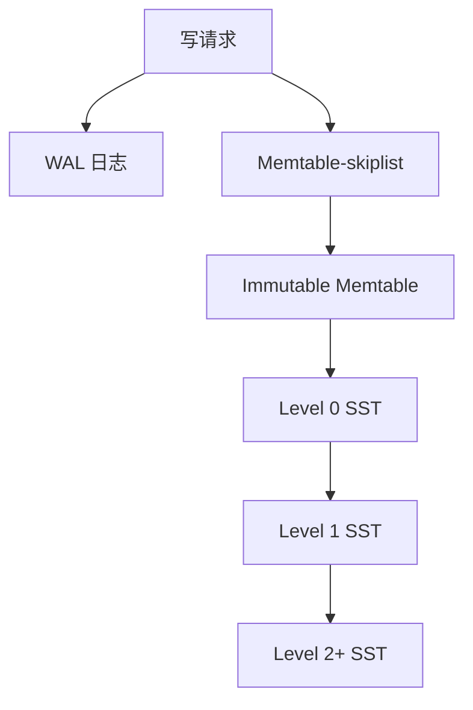

**图解说明**：

LSM tree 的核心思想是将随机写转换为顺序写，显著提升写性能：

1. **写入 WAL**：先写 WAL 保证持久性
2. **写入 Memtable**：数据写入内存中的 skiplist
3. **转为 Immutable**：Memtable 满后变为只读
4. **Flush 到 Level 0**：Immutable 刷写为 SST 文件
5. **Compaction**：后台逐层合并 SST 文件

| 特点 | 说明 |
|-----|------|
| 写优化 | 随机写 → 顺序写 WAL + 内存 |
| 读流程 | Memtable → Immutable → Level 0 → Level N |
| Compaction | 后台合并 SST 文件 |

> **性能对比**：leveldb 写性能可达 boltdb 的 5-10 倍，但读性能可能更低，因为数据可能分布在多个 Level 的 SST 文件中。

#### 19.6 Raft 算法库

etcd 提供了一个高度抽象的 Raft 库，允许开发者灵活定制网络和存储模块。理解 Node API 是使用这个库的关键。

**Node API**：

| 接口 | 说明 |
|-----|------|
| `Propose` | 提交提案 |
| `Ready` | 获取状态机输出 |
| `Advance` | 通知已处理 Ready |
| `Step` | 提交收到的消息 |
| `Campaign` | 发起选举 |
| `ReadIndex` | 线性读 |

**要点解读**：

- `Propose` 和 `Ready` 是最核心的两个接口，分别代表输入和输出
- 应用层需要在一个循环中不断调用 `Ready()` 获取输出，处理后调用 `Advance()` 通知 Raft 模块

**Ready 结构**：

| 字段 | 说明 | 持久化 |
|-----|------|-------|
| `HardState` | Term、Vote | WAL |
| `Entries` | 待持久化日志 | WAL |
| `Messages` | 待发送消息 | - |
| `CommittedEntries` | 已提交日志 | 状态机 |
| `Snapshot` | 快照 | 存储 |

**要点解读**：

Ready 结构包含了 Raft 模块所有需要处理的输出。其中 `HardState` 和 `Entries` 必须持久化到 WAL，`Messages` 需要通过网络发送给其他节点，`CommittedEntries` 需要应用到状态机。

#### 19.7 raftNode 结构

raftNode 是 metcd 中连接 Raft 库和应用逻辑的核心结构。

```go
type raftNode struct {
    proposeC    <-chan string       // 提案输入
    confChangeC <-chan ConfChange   // 配置变更
    commitC     chan<- *string      // 已提交日志输出
    
    node        raft.Node           // Raft 核心
    raftStorage *raft.MemoryStorage // 日志存储
    wal         *wal.WAL            // WAL 模块
    transport   *rafthttp.Transport // 网络模块
}
```

**代码说明**：

- `proposeC`：从 HTTP 层接收写请求
- `commitC`：向状态机发送已提交的日志
- `node`：etcd Raft 库的核心对象
- `wal`：使用 etcd 的 WAL 模块持久化日志
- `transport`：使用 etcd 的 rafthttp 模块进行节点间通信

#### 19.8 核心循环

serveChannels 是 raftNode 的主循环，负责处理提案和 Ready 输出。

```go
func (rc *raftNode) serveChannels() {
    // 处理提案
    go func() {
        for {
            select {
            case prop := <-rc.proposeC:
                rc.node.Propose(ctx, []byte(prop))
            case cc := <-rc.confChangeC:
                rc.node.ProposeConfChange(ctx, cc)
            }
        }
    }()
    
    // 处理 Ready
    for {
        select {
        case <-ticker.C:
            rc.node.Tick()
        case rd := <-rc.node.Ready():
            rc.wal.Save(rd.HardState, rd.Entries)
            rc.transport.Send(rd.Messages)
            rc.publishEntries(rd.CommittedEntries)
            rc.node.Advance()
        }
    }
}
```

**代码说明**：

这段代码展示了 Raft 应用的标准模式：

1. **提案处理 goroutine**：监听 proposeC 通道，将请求提交给 Raft
2. **主循环**：
   - 定期调用 `Tick()` 驱动 Raft 内部计时器（心跳、选举超时）
   - 从 `Ready()` 获取输出并处理：持久化日志、发送消息、应用已提交日志
   - 调用 `Advance()` 通知处理完成

> **注意**：必须先持久化日志，再发送消息，这是 Raft 算法正确性的保证。

#### 19.9 存储引擎实现

最后，我们来看具体的存储引擎实现。不同引擎的 API 风格有所不同。

**boltdb Put**：

```go
func (s *boltdbKVStore) Put(key, value string) error {
    tx, _ := s.db.Begin(true)
    defer tx.Rollback()
    
    bucket, _ := tx.CreateBucketIfNotExists([]byte("keys"))
    bucket.Put([]byte(key), []byte(value))
    return tx.Commit()
}
```

**代码说明**：boltdb 使用事务模型。每次写入需要开启事务、获取 Bucket、写入数据、提交事务。`defer tx.Rollback()` 确保异常时事务正确回滚。

**leveldb Put**：

```go
func (s *leveldbKVStore) Put(key, value string) error {
    return s.db.Put([]byte(key), []byte(value), nil)
}
```

**代码说明**：leveldb 的 API 更加简洁，一行代码即可完成写入。这也体现了写优化设计——写入操作只需追加到 WAL 和 Memtable，不需要复杂的事务管理。

#### 19.10 本章小结

通过本章的学习，我们从零构建了一个分布式 KV 服务 metcd，涵盖了 API 设计、Raft 集成、存储引擎选型等核心环节。

**metcd 架构总结**：

| 层次 | 组件 |
|-----|------|
| API | HTTP REST |
| 共识 | etcd Raft 库 |
| 日志 | WAL 模块 |
| 网络 | rafthttp |
| 存储 | boltdb / leveldb / memory |

**核心要点**：

| 要点 | 说明 |
|-----|------|
| 接口抽象 | KVStore 接口支持多引擎 |
| boltdb | 适合读多写少 |
| leveldb | 适合写多读少（LSM tree） |
| Raft 库 | Node API + Ready 结构 |

> **进一步学习**：建议你 clone etcd 的 raftexample 项目，动手运行并扩展它，这是理解 Raft 工程实现的最佳方式。

---

### 第20章 Kubernetes 中的 etcd

Kubernetes 是 etcd 最重要的应用场景之一。作为 K8s 的唯一数据存储后端，etcd 承载着整个集群的状态数据。本章将以创建 Pod 为例，深入分析 etcd 在 Kubernetes 集群中的作用和工作机制。

#### 20.1 Kubernetes 架构

理解 etcd 在 K8s 中的角色，首先需要了解 Kubernetes 的整体架构。

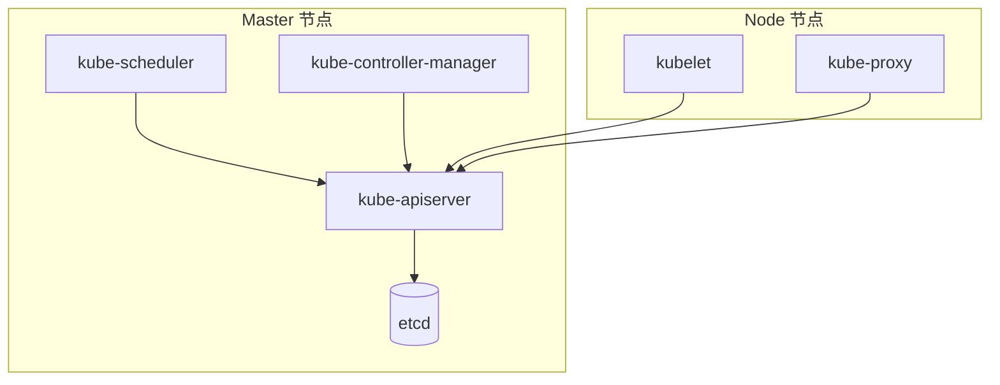

**图解说明**：

上图展示了 Kubernetes 的核心架构，关键点包括：

1. **kube-apiserver 是唯一与 etcd 交互的组件**。Scheduler、Controller、Kubelet 等都通过 API Server 间接访问 etcd
2. **Master 节点**：运行 API Server、Scheduler、Controller Manager 和 etcd
3. **Node 节点**：运行 Kubelet 和 Kube-proxy，负责实际的 Pod 运行

> **设计原则**：通过 API Server 统一管理对 etcd 的访问，可以实现细粒度的权限控制、缓存优化和一致性保障。

#### 20.2 资源存储格式

K8s 将所有资源以特定的 key 格式存储在 etcd 中。理解这个格式对于排查问题至关重要。

**etcd key 格式**：

```text
/registry/{资源类型}/{namespace}/{资源名}
```

**示例**：

```text
/registry/pods/kube-system/coredns-7fcc6d65dc-jvj26
/registry/deployments/default/nginx-deployment
/registry/configmaps/kube-system/coredns
```

**代码说明**：从 key 格式可以看出，K8s 使用层级前缀组织资源，这使得可以高效地查询特定命名空间下的所有资源。

**查询方式性能**：

| 查询方式 | 实现 | 性能 |
|---------|------|------|
| 按名称 | key-value 查询 | 最快 |
| 按 namespace | 范围查询 | 快 |
| 按标签 | 遍历后过滤 | 慢 |

**要点解读**：

按标签查询是最慢的操作，因为 etcd 不支持二级索引。kubectl 获取带标签筛选的资源时，API Server 需要先从 etcd 拉取所有资源，然后在内存中过滤。这就是为什么**应避免频繁的标签查询**，尤其是在大规模集群中。

#### 20.3 kube-apiserver 请求链路

当一个请求到达 API Server 时，会经过多个处理阶段。


**图解说明**：

API Server 的请求处理链路包含 6 个核心模块：

1. **认证（Authentication）**：验证请求者身份（证书、Token 等）
2. **限速（Rate Limiting）**：防止 API Server 过载
3. **审计（Audit）**：记录操作日志，便于安全审计
4. **授权（Authorization）**：检查是否有权限执行操作
5. **准入控制（Admission）**：校验/修改请求内容
6. **存储（Storage）**：与 etcd 交互

| 模块 | 说明 |
|-----|------|
| 认证 | x509证书、token、webhook |
| 限速 | 默认读400/s 写200/s |
| 授权 | RBAC（1.12+ 默认） |
| 准入 | 静态/动态扩展 |

> **性能考虑**：默认限速对于大规模集群可能不足，需要根据实际情况调整 `--max-requests-inflight` 和 `--max-mutating-requests-inflight` 参数。

#### 20.4 资源安全创建（Txn）

在高并发场景下，如何确保资源创建的安全性？

**问题**：如果使用简单的 Put 接口，两个客户端同时创建同名资源，后者会覆盖前者，造成数据丢失而不是报错。

**解决方案**：kube-apiserver 使用 etcd 的 **Txn 事务接口**进行资源创建。

```go
txnResp, err := s.client.KV.Txn(ctx).If(
    notFound(key),  // mod_revision:0
).Then(
    clientv3.OpPut(key, string(newData), opts...),
).Commit()
```

**代码说明**：

- `If(notFound(key))`：检查 key 的 mod_revision 是否为 0（即不存在）
- `Then(OpPut(...))`：如果不存在则创建
- 如果 key 已存在，事务失败，返回冲突错误

**etcd 日志示例**：

```text
request_content: "compare:<target:MOD 
  key:\"/registry/deployments/default/nginx-deployment\" 
  mod_revision:0 > 
  success:<request_put:<key:\"...\" value_size:421 >> 
  failure:<>"
```

通过 etcd 的审计日志，可以清晰看到 K8s 使用 Txn 进行安全创建的细节。

#### 20.5 ResourceVersion

ResourceVersion 是 K8s 乐观锁的核心。理解它与 etcd 版本号的关系非常重要。

**Get 请求中的取值**：

| ResourceVersion | 含义 | 数据来源 |
|-----------------|------|---------|
| 未指定（空） | 线性读 | etcd 最新数据 |
| "0" | 任意版本 | kube-apiserver 缓存 |
| 非 0 | 精确版本 | 缓存（等待版本匹配） |

**要点解读**：

使用 `ResourceVersion=0` 可以从 API Server 缓存读取，显著降低 etcd 负载。这在 Informer 等组件中被广泛使用。

**Watch 请求中的取值**：

| ResourceVersion | 含义 |
|-----------------|------|
| 未指定 | 返回当前状态 + 监听新变更 |
| "0" | 从任意版本开始监听 |
| 非 0 | 从精确版本开始监听 |

**与 etcd 版本号的关系**：

- Get：使用 key 的 ModRevision
- List：使用 etcd 当前版本号

#### 20.6 创建 Pod 完整流程

现在让我们通过一个完整的 Pod 创建流程，观察 etcd 在其中扮演的角色。

```mermaid
sequenceDiagram
    participant kubectl
    participant API as kube-apiserver
    participant etcd
    participant DC as Deployment Controller
    participant RSC as ReplicaSet Controller
    participant Scheduler
    participant Kubelet
    
    kubectl->>API: Create Deployment
    API->>etcd: Txn Put Deployment
    DC->>API: Watch Deployment
    DC->>API: Create ReplicaSet
    API->>etcd: Txn Put ReplicaSet
    RSC->>API: Watch ReplicaSet
    RSC->>API: Create Pod
    API->>etcd: Txn Put Pod
    Scheduler->>API: Watch Pod
    Scheduler->>API: Bind Pod to Node
    Kubelet->>API: Watch Pod
    Kubelet->>Kubelet: Create Container
```

**图解说明**：

这个流程展示了 Kubernetes 声明式 API 的精髓：

1. **用户创建 Deployment**：kubectl → API Server → etcd
2. **Deployment Controller 响应**：Watch 到新 Deployment，创建 ReplicaSet
3. **ReplicaSet Controller 响应**：Watch 到新 ReplicaSet，创建 Pod
4. **Scheduler 响应**：Watch 到未调度的 Pod，选择 Node 并绑定
5. **Kubelet 响应**：Watch 到分配给自己的 Pod，创建容器

> **核心机制**：整个流程基于 Watch 机制实现松耦合的异步协调。各个 Controller 独立工作，通过 etcd 作为协调中心。

#### 20.7 Lease 复用

K8s 中有大量短生命周期资源（如 Event），如果每个资源都创建独立的 Lease，会给 etcd 带来巨大压力。

**问题**：大量 Event 等资源产生大量 Lease，每个 Lease 都需要 KeepAlive 续约。

**解决方案**：

- TTL 差异在 1 分钟内的 key 共享同一个 Lease
- 通过 Bucket 机制将 TTL 相近的资源聚合

这个优化显著减少了 etcd 需要管理的 Lease 数量，降低了 KeepAlive 的网络开销。

#### 20.8 本章小结

通过本章的学习，我们深入了解了 etcd 在 Kubernetes 中的核心作用。

**etcd 在 K8s 中的核心作用**：

| 功能 | 说明 |
|-----|------|
| 资源存储 | prefix + 资源类型 + namespace + 名称 |
| 安全写入 | Txn 事务（mod_revision:0 检查） |
| 数据监听 | Watch 机制（ResourceVersion） |
| 生命周期 | Lease 复用 |

**最佳实践**：

| 建议 | 说明 |
|-----|------|
| 避免频繁标签查询 | 导致 etcd 范围遍历 |
| 使用缓存 | ResourceVersion=0 从缓存读取 |
| 避免 kubectl 高频查询 | 可能产生 expensive request |

> **延伸阅读**：建议深入学习 kube-apiserver 的 Cacher 机制，了解它如何在 API Server 层面缓存 etcd 数据。

---

### 第21章 分布式锁

在软件开发过程中，我们经常需要对共享资源进行互斥操作，否则系统数据一致性就会出现问题。典型场景如商品库存操作、Kubernetes 调度器为 Pod 分配 Node 等。

在单节点多线程环境中，使用本地互斥锁即可。但在分布式架构中，你需要使用**分布式锁**来解决资源互斥问题。本章将对比 Redis 和 etcd 分布式锁实现，分析 etcd 锁为何更安全。

#### 21.1 分布式锁核心要素

一个可靠的分布式锁必须具备以下三个核心要素：

| 要素 | 说明 | 重要性 |
|-----|------|-------|
| **互斥性/安全性** | 同一时间只允许一个 client 持有锁 | ⭐⭐⭐ 最重要 |
| **活性** | 避免死锁，支持超时自动释放 | ⭐⭐⭐ 防止服务中断 |
| **高可用/高性能** | 加锁释放锁过程性能高、服务可用 | ⭐⭐ 业务需求 |

> **核心原则**：无论遭遇高负载、宕机、还是网络分区，都需确保锁的互斥性和安全性。

#### 21.2 真实案例：茅台超卖事故

让我们从一个真实的 P0 级生产事故说起。某电商平台在茅台秒杀活动中，因 Redis 分布式锁实现问题导致严重超卖。

**Redis 简易分布式锁实现**：

```bash
SET key value EX 10 NX  # 加锁（10秒过期，key不存在时才创建）
Del key                  # 释放锁
```

**事故原因分析**：

```mermaid
sequenceDiagram
    participant Client as 抢购Client
    participant Auth as 用户认证服务
    participant Redis as Redis
    participant Stock as 库存服务
    
    Client->>Redis: SET lock EX 10 NX
    Redis-->>Client: OK（获得锁）
    Client->>Auth: 校验用户身份
    Note over Auth: 服务高负载<br/>阻塞30秒
    Note over Redis: 10秒后锁过期
    Note over Redis: 其他Client获得锁
    Auth-->>Client: 校验通过
    Client->>Stock: 扣减库存
    Client->>Redis: Del lock
    Note over Redis: 删除了别人的锁！
```

**问题根因**：

| 问题 | 说明 | 后果 |
|-----|------|------|
| 锁过期时间不合理 | 业务执行时间超过锁TTL | 锁提前释放 |
| 释放他人的锁 | 未校验锁的持有者 | 恶性循环 |
| 库存校验不原子 | get and compare 方式 | 无法防止超卖 |

**正确做法**：

1. 写入锁时使用**唯一标识**（如 UUID）作为 value
2. 释放锁时用 Lua 脚本**原子校验**持有者
3. 库存操作使用**原子命令**（如 Decr 并检查返回值）

#### 21.3 Redis 分布式锁问题

除了实现层面的问题，Redis 分布式锁本身也存在架构层面的安全隐患。

**问题1：主备切换丢锁**

Redis 采用**异步复制**协议，Master 写入成功后立即返回给 client，但数据可能还未同步到 Slave。

```mermaid
sequenceDiagram
    participant ClientA
    participant ClientB
    participant Master
    participant Slave
    
    ClientA->>Master: SET key EX 10 NX
    Master-->>ClientA: OK（获得锁）
    Note over Master: 尚未同步到Slave
    Master-xMaster: Crash!
    Note over Slave: 升级为Master
    ClientB->>Slave: SET key EX 10 NX
    Slave-->>ClientB: OK（也获得锁！）
    Note over ClientA,ClientB: 两个Client都持有锁
```

**问题2：网络分区脑裂**

当发生网络分区时，Redis Sentinel 可能将 Slave 提升为新 Master，导致集群出现两个 Master。

**问题3：RedLock 的局限性**

Redis 作者提出的 RedLock 算法基于多个独立 Redis Master（通常5个），需要多数节点加锁成功。但它**依赖系统时钟**，当时钟发生跳跃时仍可能出现安全问题。

| 方案 | 原理 | 问题 |
|-----|------|------|
| 单节点 | SET NX | 单点故障 |
| 主备 | 异步复制 | 主备切换丢锁 |
| Sentinel | 自动切换 | 脑裂风险 |
| RedLock | 多节点投票 | 依赖时钟 |

#### 21.4 etcd 分布式锁优势

相比 Redis，etcd 基于 **Raft 强一致性协议**，从根本上解决了数据丢失问题。

| 对比项 | Redis | etcd |
|-------|-------|------|
| **一致性协议** | 异步复制 | Raft 强一致 |
| **数据安全** | 可能丢失 | 多数节点确认 |
| **活性检测** | TTL 被动过期 | Lease 主动续约 |
| **变更通知** | 无原生支持 | Watch 实时推送 |
| **锁等待** | 需要轮询 | Watch 阻塞等待 |

> **核心差异**：Redis 为了性能牺牲了一致性，etcd 为了安全性选择了 Raft。

#### 21.5 etcd 锁实现原理

etcd 分布式锁通过 **Txn + Lease + Watch** 三大机制确保安全性、活性和高可用。

##### 21.5.1 Txn 保证安全性（互斥）

事务机制确保加锁操作的原子性，检查 key 不存在时才写入：

```go
// 事务：key不存在时创建，否则获取当前值
txn := client.Txn(ctx).If(
    v3.Compare(v3.CreateRevision(key), "=", 0),  // key不存在
).Then(
    v3.OpPut(key, val, v3.WithLease(lease)),    // 创建并关联Lease
).Else(
    v3.OpGet(key),                               // 获取已存在的锁信息
)
resp, _ := txn.Commit()
```

**为什么用 CreateRevision 而不是 ModRevision？**

- `CreateRevision = 0` 表示 key 从未被创建过
- `ModRevision` 只表示最后修改版本，无法判断 key 是否存在

##### 21.5.2 Lease 保证活性（避免死锁）

Lease 机制确保即使 client 崩溃，锁也能自动释放：

```mermaid
graph LR
    subgraph "正常流程"
        C1[Client] --> L1[创建Lease TTL=10s]
        L1 --> K1[Put锁Key关联Lease]
        K1 --> KA[KeepAlive续约]
        KA --> U1[Unlock释放]
    end
    
    subgraph "异常流程"
        C2[Client] --> L2[创建Lease]
        L2 --> K2[Put锁Key]
        K2 --> CR[Client Crash]
        CR --> EX[Lease过期]
        EX --> DEL[锁自动删除]
    end
```

**关键点**：

1. 锁 key 绑定到 Lease，Lease 过期时 key 自动删除
2. Client 通过 KeepAlive 定期续约，保持锁持有
3. Crash 后无法续约，Lease 过期后锁自动释放

##### 21.5.3 Watch 提升可用性（高效等待）

当锁被他人持有时，Watch 机制允许 client 高效等待：

```go
// 监听锁key的变化
wch := client.Watch(ctx, key, v3.WithRev(rev))
for wr := range wch {
    for _, ev := range wr.Events {
        if ev.Type == mvccpb.DELETE {
            // 锁已释放，尝试重新获取
            tryAcquireLock()
        }
    }
}
```

**对比轮询方式**：

| 方式 | 实时性 | 资源消耗 | 实现复杂度 |
|-----|-------|---------|-----------|
| 轮询 | 依赖间隔 | 高（持续请求） | 简单 |
| Watch | 实时 | 低（长连接） | 略复杂 |

#### 21.6 concurrency 包使用

etcd 官方提供了 `concurrency` 包，封装了分布式锁的完整实现：

```go
import "go.etcd.io/etcd/clientv3/concurrency"

func main() {
    cli, _ := clientv3.New(clientv3.Config{...})
    defer cli.Close()
    
    // 创建 Session（内部管理 Lease 和 KeepAlive）
    s, _ := concurrency.NewSession(cli, concurrency.WithTTL(10))
    defer s.Close()
    
    // 创建 Mutex
    m := concurrency.NewMutex(s, "/my-lock/")
    
    // 加锁（阻塞直到获得锁）
    if err := m.Lock(context.TODO()); err != nil {
        log.Fatal(err)
    }
    
    // 执行业务逻辑...
    fmt.Println("持有锁，执行临界区代码")
    
    // 释放锁
    if err := m.Unlock(context.TODO()); err != nil {
        log.Fatal(err)
    }
}
```

**内部实现原理**：

| 步骤 | 操作 | 说明 |
|-----|------|------|
| 1 | 创建 key | 写入 `/my-lock/{LeaseID}`，每个 client 有唯一 key |
| 2 | 事务检查 | If CreateRevision=0 Then Put，确保安全 |
| 3 | 获取最小 revision | 遍历前缀下所有 key，revision 最小者获得锁 |
| 4 | Watch 等待 | 如果不是最小，Watch 比自己 revision 小的 key |

**为什么这样设计？**

这种设计实现了**公平锁**：按 revision 顺序排队，先到先得，避免饥饿。

#### 21.7 本章小结

**etcd 分布式锁安全性保障**：

```mermaid
graph TB
    subgraph "三大核心机制"
        Txn[Txn 事务] --> Safe[互斥性/安全性]
        Lease[Lease 租约] --> Live[活性/防死锁]
        Watch[Watch 监听] --> HA[高可用/高效等待]
    end
    
    subgraph "底层保障"
        Raft[Raft 强一致] --> Data[数据不丢失]
    end
```

| 机制 | 作用 | 解决的问题 |
|-----|------|-----------|
| **Raft** | 多数节点确认后才返回成功 | Redis 主备切换丢锁 |
| **Txn** | 原子检查并创建 | 并发加锁冲突 |
| **Lease** | 故障后自动释放锁 | Client 崩溃导致死锁 |
| **Watch** | 快速感知锁释放 | 低效轮询 |

**分布式锁方案对比总结**：

| 方案 | 一致性 | 性能 | 可靠性 | 适用场景 |
|-----|-------|------|-------|---------|
| Redis 单节点 | 弱 | ⭐⭐⭐ | ⭐ | 临时测试 |
| Redis 主备 | 弱 | ⭐⭐⭐ | ⭐⭐ | 可容忍偶发不一致 |
| RedLock | 中 | ⭐⭐ | ⭐⭐ | 对时钟要求不高 |
| ZooKeeper | 强 | ⭐⭐ | ⭐⭐⭐ | Java 技术栈 |
| **etcd** | 强 | ⭐⭐ | ⭐⭐⭐ | Go/K8s/金融等严格场景 |

> **选型建议**：如果业务对数据一致性要求极高（如金融、交易场景），推荐使用 etcd 分布式锁。如果对性能要求极高且可容忍极端情况下的不一致，可以考虑 Redis。

---

### 第22章 配置与服务发现

在微服务架构中，服务实例动态扩缩、配置实时变更是常态。如何让服务之间相互发现？如何让配置变更实时生效？本章以 Apache APISIX 为例，介绍 etcd 在配置系统和服务发现中的应用。

#### 22.1 架构演进

软件架构经历了从单体到微服务的演进过程，每次演进都带来了新的挑战。

```mermaid
graph LR
    A[单体架构] --> B[分布式架构]
    B --> C[微服务架构]
```

| 架构 | 特点 | 问题 |
|-----|------|------|
| 单体 | 简单、开发快 | 耦合高、扩展差 |
| 分布式 | 垂直拆分 | 模块间通信 |
| 微服务 | 细粒度拆分 | 服务发现复杂 |

**要点解读**：随着架构演进，服务发现成为核心挑战。单体架构时代，所有功能在一个进程内直接调用。到了微服务时代，服务可能有几十上百个实例，且实例 IP 动态变化。这时就需要一个**注册中心**来协调服务发现。

#### 22.2 服务发现原理

服务发现的核心是让服务提供者自动注册，让服务消费者实时感知。

```mermaid
graph TB
    Client --> Proxy[Proxy/Gateway]
    Proxy --> S1[Service 1]
    Proxy --> S2[Service 2]
    Proxy --> S3[Service 3]
    
    S1 --> etcd[(etcd)]
    S2 --> etcd
    S3 --> etcd
    Proxy --> etcd
```

**图解说明**：

上图展示了基于 etcd 的服务发现架构：

1. **服务注册**：S1/S2/S3 启动时向 etcd 注册自己的地址
2. **服务发现**：Proxy 从 etcd 获取后端服务列表
3. **请求路由**：Client 请求 Proxy，Proxy 根据服务列表转发

**工作流程**：

| 组件 | 行为 |
|-----|------|
| **服务启动** | Txn/Put 注册地址，关联 Lease |
| **服务运行** | KeepAlive 续约 Lease |
| **服务异常** | Lease 过期，自动删除 |
| **Proxy** | Range 获取初始配置，Watch 监听变化 |

> **为什么用 Lease？** 如果服务崩溃而不主动注销，其他服务如何知道它已不可用？通过 Lease 自动过期机制，etcd 能自动删除失联服务的注册信息。

#### 22.3 Apache APISIX 架构

Apache APISIX 是一个高性能 API 网关，它是 etcd 在服务发现领域最成功的应用之一。

```mermaid
graph TB
    subgraph "控制面"
        Admin[Admin API]
        Admin --> etcd[(etcd)]
    end
    
    subgraph "数据面"
        APISIX[APISIX Gateway]
        APISIX --> etcd
    end
    
    Client --> APISIX
    APISIX --> Backend[后端服务]
```

**图解说明**：

APISIX 采用控制面与数据面分离的架构：

- **控制面**（Admin API）：管理员通过 Admin API 下发路由、服务配置到 etcd
- **数据面**（APISIX Gateway）：网关从 etcd Watch 配置变更，实时更新路由规则

**功能**：

| 功能 | 说明 |
|-----|------|
| 服务发现 | 动态路由配置 |
| 限速 | 请求频率控制 |
| 鉴权 | 用户认证授权 |
| 日志 | 访问日志记录 |
| 监控 | 性能指标收集 |

#### 22.4 etcd 数据存储格式

理解 APISIX 在 etcd 中的数据存储格式，对排查配置问题非常有帮助。

```bash
etcdctl get "/apisix" --prefix --keys-only
```

```text
/apisix/routes/12
/apisix/routes/22
/apisix/services/1
/apisix/services/2
/apisix/ssl/1
/apisix/upstreams/
```

**代码说明**：APISIX 使用 `/apisix/{功能类型}/{id}` 的 key 格式组织数据。这种设计使得可以按功能类型批量查询，例如获取所有路由：`/apisix/routes/`。

**Value 示例**：

```json
{
  "id": "1",
  "upstream": {
    "type": "roundrobin",
    "nodes": {"172.18.5.12:80": 1},
    "scheme": "http"
  }
}
```

服务配置以 JSON 格式存储，包含负载均衡算法、后端节点地址等信息。

#### 22.5 Watch 机制应用

APISIX 通过 Watch 机制实现配置的实时更新，这是其核心竞争力之一。

**工作流程**：

1. 启动时 Range 获取配置
2. Watch 监听增量变化
3. 实时更新路由规则

**常见问题**：

| 问题 | 原因 | 解决 |
|-----|------|------|
| 配置不更新 | 未处理 ErrCompacted | 重建 watcher |

**要点解读**：`ErrCompacted` 是 Watch 使用中最常见的错误。当 Watch 的 revision 已被 etcd 压缩时会触发此错误。正确做法是捕获这个错误，然后重新创建 Watcher。APISIX 早期版本就因为未正确处理此错误而导致配置不更新的问题。

#### 22.6 鉴权机制应用

在多租户环境中，APISIX 使用 etcd 鉴权机制保证配置的安全性。

**常见问题**：

| 问题 | 原因 | 解决 |
|-----|------|------|
| etcd 高负载 | 频繁 Authenticate | 复用 token 和 client |

**要点解读**：etcd 的 Authenticate 接口使用 bcrypt 算法验证密码，这是一个 CPU 密集型操作。如果每次请求都调用 Authenticate，会严重影响 etcd 性能。正确做法是**复用认证后的 token 和 client 连接**。

#### 22.7 Lease 特性应用

APISIX 支持创建带 TTL 的路由，这通过 etcd Lease 实现。

**TTL 路由示例**：

```bash
curl http://127.0.0.1:9080/apisix/admin/routes/2?ttl=60 \
  -H 'X-API-KEY: xxx' -X PUT -d '{
    "uri": "/api/v1",
    "upstream": {
      "type": "roundrobin",
      "nodes": {"127.0.0.1:80": 1}
    }
  }'
```

**代码说明**：`ttl=60` 表示这个路由将在 60 秒后自动删除。这对于临时测试、蓝绿发布等场景非常有用。

**实现**：

```lua
local data = etcd_cli:grant(ttl)
etcd_cli:set(key, value, {lease = data.body.ID})
```

先创建 Lease 获取 ID，再将 key 与 Lease 关联。

#### 22.8 事务特性应用

APISIX 使用 etcd 事务防止并发写冲突，实现乐观锁。

**目的**：防止并发写冲突

```lua
local compare = {{
    key = key,
    target = "MOD",
    result = "EQUAL",
    mod_revision = mod_revision,
}}
local success = {{
    requestPut = {key = key, value = value}
}}
etcd_cli:txn(compare, success)
```

**代码说明**：

- `compare`：检查当前 mod_revision 是否与预期一致
- `success`：如果一致则执行 Put
- 如果不一致说明有其他客户端修改过，事务失败

这种**乐观锁**机制避免了多人同时修改配置导致的覆盖问题。

#### 22.9 本章小结

通过本章的学习，我们了解了 etcd 在 API 网关和服务发现场景中的应用。

**etcd 在 APISIX 中的应用**：

| 特性 | 应用 |
|-----|------|
| **Key-Value** | 存储路由、服务配置 |
| **Watch** | 实时配置更新 |
| **鉴权** | 多租户安全访问 |
| **Lease** | 服务自动过期剔除 |
| **Txn** | 防止并发写冲突 |

**最佳实践**：

| 建议 | 说明 |
|-----|------|
| 处理 ErrCompacted | 重建 watcher |
| 复用 token | 避免频繁 Authenticate |
| 使用 Lease | 服务异常自动剔除 |
| 使用 Txn | mod_revision 乐观锁 |

> **延伸阅读**：如果你正在使用或考虑使用 APISIX，建议阅读其官方文档中关于 etcd 部署和优化的章节。

---

### 第23章 分布式协调服务选型

在构建分布式系统时，选择合适的协调服务是关键决策之一。etcd、ZooKeeper、Consul 是业界最主流的三个选择。本章将从多个维度对比这三者，帮助你根据实际场景做出合适的选型决策。

#### 23.1 架构对比

三个系统在设计理念上有着显著差异。

| 组件 | 共识算法 | 存储 | 特点 |
|-----|---------|------|------|
| **etcd** | Raft | boltdb | Go 生态 |
| **ZooKeeper** | Zab | 内存 ConcurrentHashMap | Java 生态 |
| **Consul** | Raft + Gossip | Radix Tree | 多数据中心 |

**要点解读**：

- **etcd** 使用 Raft 算法和 boltdb 持久化存储，设计简洁，是 Kubernetes 的标配
- **ZooKeeper** 使用 Zab 协议，数据主要存储在内存中，依赖快照持久化，适合 Java/大数据生态
- **Consul** 混合使用 Raft（Server 间强一致）和 Gossip（Server-Client 最终一致），原生支持多数据中心

#### 23.2 Zab 协议

ZooKeeper 使用的 Zab（ZooKeeper Atomic Broadcast）协议与 Raft 类似，但细节有所不同。

**四个阶段**：

| 阶段 | 说明 |
|-----|------|
| Phase 0 | Leader 选举 |
| Phase 1 | 发现（收集数据） |
| Phase 2 | 同步（复制数据） |
| Phase 3 | 广播（处理请求） |

**ZooKeeper 实现**：

- **Fast Leader Election**：合并 Phase 0 和 1，加速选举
- **Recovery Phase**：新 Leader 与 Follower 同步数据
- **Broadcast Phase**：正常处理读写请求

> **与 Raft 对比**：Zab 的 epoch 对应 Raft 的 term，ZXID 对应 Raft 的日志索引。两者核心思想相似，但 Zab 更复杂，这也是 Raft 诞生的原因之一——可理解性。

#### 23.3 Gossip 协议

Consul 的一个独特设计是使用 Gossip 协议进行节点发现和健康检查。

**原理**：节点周期性选择部分节点同步消息，消息像病毒一样逐步扩散

**应用**：

- Consul 节点发现
- Redis Cluster
- Apache Cassandra

Gossip 的优点是去中心化、扩展性好，缺点是最终一致性，不适合需要强一致的场景。

#### 23.4 读模式对比

三个系统对读一致性的默认行为不同，这对业务场景选型非常重要。

| 组件 | 默认读 | 强一致读 | 弱一致读 |
|-----|-------|---------|---------|
| etcd | 线性读 | ✅ | 串行读 |
| ZooKeeper | 可能 stale | sync() 后读 | 默认 |
| Consul | 基于 Lease | consistent | stale |

**要点解读**：

- **etcd** 默认提供线性读（强一致），如需更高性能可使用串行读
- **ZooKeeper** 默认可能读到 stale 数据，需要调用 `sync()` 后再读才能保证一致性
- **Consul** 的 `consistent` 模式需要转发到 Leader 读取

#### 23.5 功能特性对比

从功能丰富度看，Consul 内置功能最多，etcd/ZooKeeper 更偏底层。

| 特性 | etcd | ZooKeeper | Consul |
|-----|------|-----------|--------|
| **分布式锁** | concurrency 包 | Curator 库 | 原生支持 |
| **服务发现** | 应用层实现 | 应用层实现 | 原生框架 |
| **健康检查** | Lease | 临时节点 | 分布式 Agent |
| **多数据中心** | ❌ | ❌ | ✅ |
| **线性读** | ✅ | ❌ | ✅ |
| **事务** | ✅ 完整 | 版本检查 | ✅ |
| **权限** | RBAC | ACL | ACL |

**要点解读**：

- 如果需要**多数据中心**支持，Consul 是唯一选择
- 如果需要**原生服务发现**，Consul 最方便
- 如果只需要可靠的 KV 存储 + Watch，etcd 最简洁

#### 23.6 数据模型对比

数据模型的差异会影响 API 设计和使用方式。

| 组件 | 模型 | 存储限制 |
|-----|------|---------|
| etcd | 扁平 Key-Value | 几 GB |
| ZooKeeper | 层次树状（Znode） | 几百 MB |
| Consul | Key-Value | value ≤ 512B |

**要点解读**：

- etcd 使用扁平 KV 模型，通过 key 前缀模拟层次结构
- ZooKeeper 使用树状结构，更适合表达层级关系
- Consul 对单个 value 大小限制最严格（512B）

**ZooKeeper 节点类型**：

| 类型 | 说明 |
|-----|------|
| 持久节点 | 永久存在 |
| 临时节点 | 会话结束删除 |
| 顺序节点 | 带序号 |

#### 23.7 Watch 特性对比

Watch 机制的差异对实现配置热更新等场景影响很大。

| 组件 | 实现 | 特点 |
|-----|------|------|
| etcd | MVCC | 支持范围监听 |
| ZooKeeper | 一次性触发器 | 需重新设置 |
| Consul | 滑动窗口 | 仅前缀监听 |

**要点解读**：

- **etcd** 的 Watch 基于 MVCC，支持从任意历史版本开始监听，不会丢失事件
- **ZooKeeper** 的 Watch 是一次性的，触发后需要重新设置，可能丢失事件
- **Consul** 使用 blocking query，类似长轮询

#### 23.8 选型建议

根据不同场景，给出以下选型建议。

| 场景 | 推荐 |
|-----|------|
| Go 语言项目 | **etcd** |
| Java/大数据 | **ZooKeeper** |
| 多数据中心 | **Consul** |
| 国内项目 | etcd（文档丰富） |
| 国外项目 | Consul |
| Java 微服务 | Nacos |

> **选型思路**：优先考虑团队技术栈和生态，其次考虑功能需求，最后考虑性能。三个系统性能差异不大，主要差异在功能和生态。

#### 23.9 本章小结

**CAP 角度**：etcd、ZooKeeper、Consul 都是 CP 系统，在网络分区时优先保证一致性

**核心差异**：

| 方面 | etcd | ZooKeeper | Consul |
|-----|------|-----------|--------|
| 算法 | Raft | Zab | Raft+Gossip |
| 原生锁/服务发现 | ❌ | ❌ | ✅ |
| 多数据中心 | ❌ | ❌ | ✅ |
| 健康检查 | Lease | 临时节点 | 分布式 |
| 生态 | Go/K8s | Java/大数据 | HashiCorp |

> **一句话总结**：etcd 最简洁、ZooKeeper 最成熟、Consul 功能最全。

---

### 第24章 高可靠运维体系

etcd 作为分布式系统的核心组件，其稳定性直接决定了上层应用的可用性。本章将介绍如何构建一套完整的高可靠 etcd 集群运维体系，涵盖部署、监控、备份、巡检到混沌工程的全生命周期管理。

#### 24.1 运维体系概览

一个完整的 etcd 运维体系应该包含以下六个环节：

```mermaid
graph TB
    Deploy[集群部署] --> Member[成员管理]
    Member --> Monitor[监控告警]
    Monitor --> Backup[备份还原]
    Backup --> Inspect[巡检]
    Inspect --> HA[高可用]
    HA --> Chaos[混沌工程]
```

**图解说明**：

这六个环节形成闭环，持续提升 etcd 集群的可靠性：

1. **集群部署**：选择合适的部署方式和环境
2. **成员管理**：集群扩缩容、节点替换
3. **监控告警**：实时感知集群状态
4. **备份还原**：数据安全兜底
5. **巡检**：主动发现问题
6. **混沌工程**：验证故障恢复能力

#### 24.2 集群部署方案

选择合适的部署环境是运维的第一步。

| 方案 | 优点 | 缺点 |
|-----|------|------|
| 物理机 | 性能最佳 | 成本高、扩容慢 |
| 虚拟机 | 稳定、隔离好 | 虚拟化开销 |
| 裸容器 | 交付快 | 无调度自愈 |
| Kubernetes | 自愈、弹性扩容 | 依赖较重 |

**要点解读**：对于大多数场景，推荐使用 Kubernetes 部署。虽然引入了 K8s 依赖，但获得的自愈能力和弹性扩容能力远超成本。

**Kubernetes 部署方案**：

| 方案 | 特点 |
|-----|------|
| bitnami/etcd | helm 一键部署，基于 StatefulSet |
| kubeadm | Static Pod，用于 K8s 集群 etcd |
| etcd-operator | 已废弃，仅用备份功能 |

```bash
helm repo add bitnami https://charts.bitnami.com/bitnami
helm install my-etcd bitnami/etcd
```

**代码说明**：bitnami/etcd 是目前最推荐的 Helm Chart，默认配置已包含持久化和安全相关设置。

#### 24.3 集群组建

理解集群组建参数对于排查启动问题非常重要。

**initial-cluster-state 参数**：

| 值 | 说明 |
|---|------|
| new | 新建集群 |
| existing | 加入已有集群 |

> **常见错误**：新节点加入已有集群时忘记改为 `existing`，导致数据冲突。

**发现机制**：

| 方式 | 说明 |
|-----|------|
| Static | 节点信息已知固定 |
| Dynamic | 通过服务发现组件 |

对于生产环境，推荐使用 Static 方式配置初始集群，更加可控。

#### 24.4 监控告警体系

有效的监控是运维的眼睛。etcd 暴露了丰富的 Prometheus 指标。

**核心 Metrics 分类**：

| 分类 | 示例 |
|-----|------|
| 磁盘 | wal_fsync_duration, backend_commit_duration |
| 网络 | peer_round_trip_time |
| MVCC | db_total_size, keys_total |
| Server | has_leader, leader_changes_total |

**要点解读**：

- `wal_fsync_duration`：大于 10ms 需要关注磁盘性能
- `leader_changes_total`：频繁变化说明集群不稳定
- `db_total_size`：接近 quota 需要及时压缩

**Prometheus 配置**：

```yaml
scrape_configs:
  - job_name: etcd
    static_configs:
    - targets: ['10.0.0.1:2379','10.0.0.2:2379']
```

**ServiceMonitor（动态配置）**：

```yaml
apiVersion: monitoring.coreos.com/v1
kind: ServiceMonitor
metadata:
  name: etcd-monitor
spec:
  endpoints:
  - port: http-metrics
    scheme: https
  selector:
    matchLabels:
      app: etcd
```

#### 24.5 备份与还原

备份是数据安全的最后一道防线。

**备份方式**：

| 方式 | 说明 |
|-----|------|
| 手动 | `etcdctl snapshot save` |
| 定时任务 | cron 每小时备份 |
| Operator | EtcdBackup CRD |
| Learner | 跨地域热备 |

**要点解读**：

- 至少每小时备份一次
- 备份应存储到独立存储系统（如 S3）
- 定期验证备份可恢复

```bash
etcdctl snapshot save backup.db
etcdctl snapshot status backup.db --write-out=table
```

#### 24.6 巡检

主动巡检能在问题影响业务前发现隐患。

**巡检项**：

| 检查项 | 说明 |
|-------|------|
| 数据一致性 | 各节点 key 数差异 |
| 大 Key-Value | 影响性能 |
| Key 数量 | 异常增长 |
| 写入 QPS | 异常高频写入 |

**要点解读**：

大 Key-Value 会导致内存和网络双重压力。建议设置告警：单个 value 超过 1MB 需要关注。

#### 24.7 高可用建议

以下是生产环境的高可用最佳实践。

| 建议 | 说明 |
|-----|------|
| 多可用区部署 | 3节点分布3个AZ |
| 容器化自愈 | K8s 故障恢复 |
| 合理 quota | 避免 db quota 满 |
| 压缩策略 | 定期清理历史版本 |

> **黄金规则**：永远不要把所有 etcd 节点部署在同一个可用区。

#### 24.8 混沌工程

混沌工程用于验证系统在故障场景下的表现。

**chaos-mesh 资源类型**：

| 类型 | 说明 |
|-----|------|
| IOChaos | 磁盘IO延时/错误 |
| NetworkChaos | 网络延时/丢包 |
| PodChaos | Pod异常重启 |
| StressChaos | CPU/内存压测 |

**IO 延时注入示例**：

```yaml
apiVersion: chaos-mesh.org/v1alpha1
kind: IoChaos
metadata:
  name: io-delay
spec:
  action: latency
  selector:
    labelSelectors:
      app: etcd
  delay: '100ms'
  duration: '400s'
```

**代码说明**：这会向 etcd Pod 注入 100ms 的 IO 延时，持续 400 秒。通过观察 etcd 在此期间的表现，验证监控告警是否及时触发。

#### 24.9 本章小结

本章介绍了 etcd 高可靠运维体系的六大核心要素。

**运维体系核心要素**：

| 要素 | 工具/方法 |
|-----|---------  |
| 部署 | ansible / helm / kubeadm |
| 监控 | Prometheus + Grafana |
| 告警 | Alertmanager |
| 备份 | snapshot / Operator |
| 巡检 | CRD + Operator |
| 混沌 | chaos-mesh |

> **运维口诀**：「部署要多 AZ，监控要全面，备份要定时，巡检要主动，混沌要常做」

---

## 附录

### 附录A: etcd 常用命令速查

#### 集群操作

```bash
# 查看集群状态
etcdctl endpoint status --write-out=table
etcdctl endpoint health

# 查看成员列表
etcdctl member list --write-out=table

# 添加成员
etcdctl member add <name> --peer-urls=<urls>

# 删除成员
etcdctl member remove <member-id>
```

#### 键值操作

```bash
# 写入
etcdctl put key value
etcdctl put key value --lease=<lease-id>

# 读取
etcdctl get key
etcdctl get key --rev=<revision>
etcdctl get "" --prefix --keys-only  # 获取所有key

# 删除
etcdctl del key
etcdctl del "" --prefix  # 删除所有key

# 范围查询
etcdctl get key1 key2  # [key1, key2)
```

#### Watch 操作

```bash
# 监听单个key
etcdctl watch key

# 监听前缀
etcdctl watch --prefix /foo/

# 从指定版本开始监听
etcdctl watch key --rev=<revision>
```

#### Lease 操作

```bash
# 创建租约
etcdctl lease grant <ttl>

# 续约
etcdctl lease keep-alive <lease-id>

# 撤销租约
etcdctl lease revoke <lease-id>

# 查看租约
etcdctl lease timetolive <lease-id>
```

#### 备份还原

```bash
# 备份
etcdctl snapshot save backup.db

# 查看备份状态
etcdctl snapshot status backup.db --write-out=table

# 还原
etcdctl snapshot restore backup.db --data-dir=/var/lib/etcd-new
```

---

### 附录B: 关键 Metrics 速查

#### 集群健康

| Metric | 说明 |
|--------|------|
| `etcd_server_has_leader` | 是否有leader (1=有) |
| `etcd_server_leader_changes_seen_total` | leader切换次数 |
| `etcd_server_proposals_failed_total` | 失败的proposal数 |
| `etcd_server_proposals_pending` | 待处理proposal数 |

#### 磁盘性能

| Metric | 说明 |
|--------|------|
| `etcd_disk_wal_fsync_duration_seconds` | WAL fsync延时 |
| `etcd_disk_backend_commit_duration_seconds` | 后端提交延时 |

#### 存储状态

| Metric | 说明 |
|--------|------|
| `etcd_mvcc_db_total_size_in_bytes` | db文件总大小 |
| `etcd_mvcc_db_total_size_in_use_in_bytes` | db实际使用大小 |
| `etcd_debugging_mvcc_keys_total` | key总数 |
| `etcd_mvcc_pending_compactions` | 待压缩数 |

#### 网络

| Metric | 说明 |
|--------|------|
| `etcd_network_peer_round_trip_time_seconds` | 节点间RTT |
| `etcd_network_peer_sent_bytes_total` | 节点间发送字节 |

#### gRPC

| Metric | 说明 |
|--------|------|
| `grpc_server_handled_total` | gRPC请求总数 |
| `grpc_server_handling_seconds` | 请求处理延时 |

---

### 附录C: 常见问题 FAQ

#### Q1: etcd 适合存储多大的数据？

官方建议：

- 单个 value ≤ 1.5MB
- db 总大小 ≤ 8GB
- etcd 用于存储元数据，不适合大数据存储

#### Q2: 如何选择节点数量？

| 节点数 | 容错 | 建议 |
|-------|------|------|
| 1 | 0 | 仅测试 |
| 3 | 1 | 生产最小 |
| 5 | 2 | 推荐生产 |
| 7 | 3 | 大规模 |

#### Q3: 线性读和串行读如何选择？

| 类型 | 一致性 | 性能 | 场景 |
|-----|-------|------|------|
| 线性读 | 强 | 低 | 默认，关键数据 |
| 串行读 | 弱 | 高 | 可容忍短暂不一致 |

#### Q4: db quota 满了怎么办？

1. 压缩旧版本: `etcdctl compact <revision>`
2. 碎片整理: `etcdctl defrag`
3. 增加 quota: `--quota-backend-bytes`
4. 解除告警: `etcdctl alarm disarm`

#### Q5: 如何判断 etcd 性能问题？

检查以下指标：

- `etcd_disk_wal_fsync_duration_seconds` > 10ms
- `etcd_disk_backend_commit_duration_seconds` > 25ms
- `etcd_network_peer_round_trip_time_seconds` > 100ms

#### Q6: etcd vs ZooKeeper vs Consul 如何选择？

| 场景 | 推荐 |
|-----|------|
| Go/Kubernetes | etcd |
| Java/大数据 | ZooKeeper |
| 多数据中心 | Consul |

---

> **文档版本**: v1.0  
> **最后更新**: 2025-12-19  
> **作者**: etcd 学习笔记
