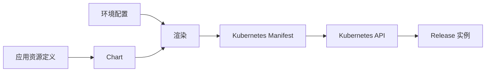
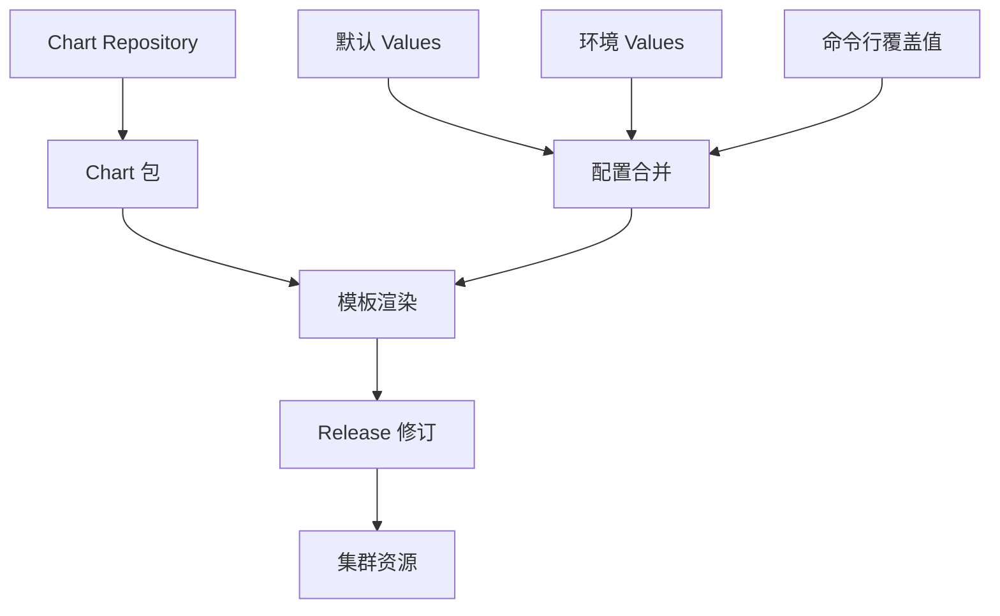
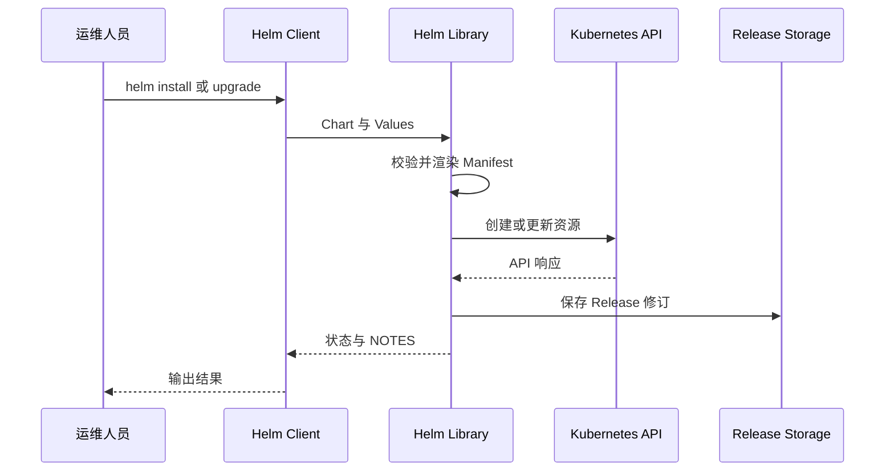
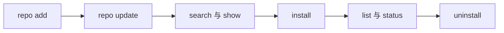
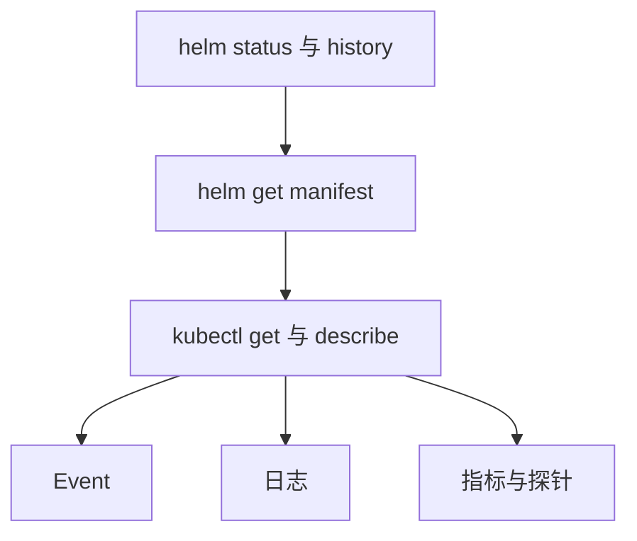
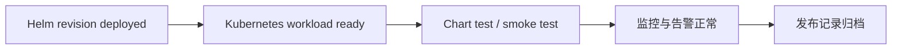

# Helm 学习笔记 · 第一册：基础与 Release 运维

> **适用对象**：Kubernetes 运维工程师、SRE、平台工程师和 Helm 初学者<br>
> **学习目标**：理解 Helm 的对象模型和执行链路，完成安装、首次发布以及 Release 的升级、回滚和观测。<br>
> **版本说明**：材料来自 Helm 4 文档快照。部分上游页面明确标注尚未完成 Helm 4 更新，涉及命令参数时应以本机 `helm help` 和目标集群的兼容矩阵为准。

## 第一章 · 认识 Helm 的定位、架构与核心对象

### Helm 为什么是 Kubernetes 的包管理器
<!-- src: 340051e0e422d4f0/Helm-Architecture.md -->

Helm 把一组 Kubernetes 资源清单、默认配置和说明文件封装成可版本化的 **Chart**，再把 Chart 与环境配置合并，形成一个可追踪的 **Release**。它解决的不是容器运行时问题，而是应用资源如何打包、复用、发布和演进的问题。

| 能力 | Helm 负责什么 | 不应误解为什么 |
| --- | --- | --- |
| Chart 开发 | 创建、校验和打包 Kubernetes 应用 | 不替代镜像构建 |
| 分发 | 从传统仓库或 OCI Registry 获取 Chart | 不替代 Kubernetes API Server |
| 发布 | 渲染模板并创建或更新集群资源 | 不持续调谐业务状态 |
| 生命周期 | 保存修订记录，支持升级、回滚和卸载 | 不等同于 Operator 的控制循环 |

Helm 适合“同一应用，多套环境”和“同一模板，多次实例化”的场景。例如，同一个 MySQL Chart 可以在不同命名空间安装成 `mysql-dev` 与 `mysql-prod` 两个 Release；它们共享模板，却拥有独立 Values、资源和修订历史。



#### Helm 与 kubectl 的分工

`kubectl` 面向单个或一组 Kubernetes API 对象；Helm 面向由 Chart 定义的一次发布。排障时两者通常配合：Helm 回答“发布了什么、用了哪些 Values、当前是第几次修订”，`kubectl` 回答“对象此刻为什么没有达到期望状态”。

#### Helm 适合解决哪些交付问题

Helm 的价值不只是在 YAML 中替换变量。一个成熟的 Chart 把应用交付过程中反复出现的决策固化为可版本化接口：需要创建哪些资源、哪些参数允许使用者调整、哪些资源存在依赖关系、安装完成后如何访问，以及升级时怎样兼容旧配置。

典型使用场景包括：

- 把 Deployment、Service、Ingress、ConfigMap、ServiceAccount 和 RBAC 作为一个整体发布。
- 为开发、测试和生产环境复用相同模板，只改变经过审查的 Values。
- 把数据库、缓存等第三方组件声明为依赖，并锁定依赖 Chart 版本。
- 在 CI 中先渲染和校验，再把同一份 Chart 发布到不同集群。
- 保存 Release 修订，以便查看历史输入、比较 Manifest 和执行回滚。

Helm 不会持续监控并纠正业务资源漂移。安装之后，如果人工修改了 Deployment，Helm 不会像 Operator 那样立即把它改回来；下一次升级才可能依据新的渲染结果覆盖这些变更。因此，团队仍需通过 GitOps、准入策略或漂移检测治理集群外修改。

#### Chart 与普通 YAML 目录的差别

| 比较维度 | 普通 YAML 目录 | Helm Chart |
| --- | --- | --- |
| 参数化 | 通常依赖文本替换或多份副本 | 使用 Values 与 Go Template |
| 版本 | 依赖 Git 提交 | Chart 自身有 SemVer 版本 |
| 发布实例 | 没有统一实例模型 | 以 Release 名称和修订管理 |
| 分发 | 复制源码目录 | `.tgz`、HTTP Repository 或 OCI |
| 历史 | 由外部工具记录 | Release Storage 保存修订 |
| 回滚 | 重新应用旧 YAML | `helm rollback` 创建新修订 |

### Chart、Config、Release 与 Repository 如何协作
<!-- src: d6e98726a5cdc436/Using-Helm.md -->

Helm 的核心词汇必须区分清楚：

| 对象 | 含义 | 典型例子 |
| --- | --- | --- |
| Chart | 应用包，包含元数据、模板和默认值 | `wordpress-1.2.3.tgz` |
| Config / Values | 注入 Chart 的配置 | 副本数、镜像标签、资源限制 |
| Release | Chart 与配置在集群中的一次具名安装 | `blog-prod` |
| Repository | 保存和索引 Chart 的位置 | HTTP Chart Repository、OCI Registry |
| Revision | Release 每次安装、升级或回滚产生的修订号 | `1`、`2`、`3` |

关系可以概括为：从 Repository 找到一个 Chart，将默认 Values 与环境覆盖值合并并渲染，然后以 Release 名称发布到某个命名空间。Chart 是“配方”，Release 是“按配方做出的实例”。



同一个 Chart 可以多次安装，Release 名称与命名空间共同构成日常管理时的重要定位信息。因此，生产环境应显式指定名称和命名空间，不要依赖临时生成的 Release 名称。

#### Config 的合并不是简单覆盖文件

配置来源按优先级合并后形成 `.Values`。高优先级的标量会覆盖低优先级标量；映射会逐层合并；某些列表通常作为整体替换。理解合并结果比记住某个命令更重要，因为最终渲染只看到合并后的 Values。

```text
Chart values.yaml
        ↓
父 Chart 或依赖导入值
        ↓
第一个 -f 文件
        ↓
后续 -f 文件
        ↓
--set --set-string --set-file --set-json
        ↓
最终 .Values
```

不要把 Release 与 Pod 混为一谈。一个 Release 通常管理许多 Kubernetes 对象，也可能没有 Pod；一个 Chart 也能在同一命名空间中安装多次，只要生成的资源名称不冲突。

#### Release 修订如何形成

首次安装产生修订 1。升级会把新 Chart、合并后的配置和渲染结果保存为下一修订；回滚也会产生新修订，而不是删除中间历史。修订号因此表达操作顺序，不等同于 Chart 版本。

| 操作 | Chart 版本可能变化 | Values 可能变化 | 是否增加修订 |
| --- | --- | --- | --- |
| `install` | 是 | 是 | 创建修订 1 |
| `upgrade` | 是 | 是 | 是 |
| `rollback` | 回到历史输入 | 回到历史输入 | 是 |
| `status` / `get` | 否 | 否 | 否 |
| `uninstall` | 否 | 否 | 不创建可运行修订 |

### Helm 客户端如何完成渲染、发布与状态管理
<!-- src: 340051e0e422d4f0/Helm-Architecture.md -->

Helm 4 的主要实现仍可从两层理解：

- **Helm Client**：接受命令，负责本地 Chart 开发、仓库管理和 Release 操作。
- **Helm Library**：执行加载 Chart、合并配置、渲染模板以及与 Kubernetes API 交互等核心逻辑，也可以被其他 Go 程序复用。



Helm 使用 Kubernetes 客户端库通过 REST API 与集群通信。Release 信息默认保存在集群内的 Secret 中，因此不需要另建 Helm 服务端数据库。命令实际操作哪个集群，取决于当前 kubeconfig、context、命名空间和显式参数。

#### 需要牢记的执行边界

1. 模板主要在客户端侧渲染，先用 `helm template` 可以观察将要提交的清单。
2. 安装命令返回成功不必然代表应用已经健康；是否等待资源就绪取决于 `--wait`、`--timeout` 等选项。
3. Helm 记录的是 Release 及其修订，业务健康仍需结合 Pod、Event、日志和指标判断。
4. 权限来自当前 Kubernetes 身份；Helm 不绕过 RBAC。

#### 从命令到 API Server 的完整路径

一次安装可以拆成六个可诊断阶段：

1. **定位 Chart**：解析本地路径、仓库引用、URL 或 OCI 引用，并按版本约束取得包。
2. **加载与校验**：读取 `Chart.yaml`、依赖、Values Schema 和模板文件。
3. **合并配置**：把默认值、父 Chart 值、文件和命令行值合并。
4. **渲染清单**：执行模板函数、能力判断和 Hook 分类，生成多文档 YAML。
5. **调用 Kubernetes**：按资源类型和 Hook 生命周期创建或更新对象。
6. **保存修订**：把 Release 信息写入选定存储后端，并返回状态和 NOTES。

不同错误对应不同阶段：`chart not found` 多发生在定位阶段，`nil pointer evaluating` 多发生在模板阶段，`no matches for kind` 多发生在 API 发现或服务端校验阶段，`forbidden` 则是 Kubernetes 授权失败。

#### Release Storage 保存了什么

默认 Secret 存储中包含序列化后的 Release 信息，包括 Chart、配置、Manifest、Hook、状态和修订元数据。它使 Helm 能够比较历史和回滚，也意味着拥有读取这些 Secret 权限的主体可能看到敏感 Values。

生产治理应同时考虑：

- 限制对 Helm Release Secret 的读取权限。
- 不把明文密码直接写进 Values；优先引用外部 Secret 管理系统生成的对象。
- 设置合理历史上限，避免修订无限增长。
- 备份集群时把 Release Storage 纳入恢复范围。

## 第二章 · 安装 Helm 并完成第一次发布

### 根据操作系统和维护策略选择安装方式
<!-- src: d6e98726a5cdc436/Installing-Helm.md -->

开始之前先确定版本策略。生产团队通常应固定经过验证的 Helm 版本，并明确升级窗口；个人实验环境可以使用包管理器跟随稳定版本。Canary 构建来自开发分支，不应直接进入生产流水线。

| 安装方式 | 优点 | 注意事项 |
| --- | --- | --- |
| 官方二进制 | 版本明确，便于校验和归档 | 需要自行放入 `PATH` |
| 官方安装脚本 | 自动识别平台并安装 | 执行前应下载并审阅脚本 |
| 系统包管理器 | 安装和升级方便 | 多数由社区维护，更新节奏可能不同 |
| 源码构建 | 适合开发和验证最新改动 | 需要 Go 工具链，不适合普通使用 |
| Canary | 可提前测试新功能 | 非正式版本，稳定性无保证 |

以官方二进制为例，下载与解压后的关键动作是把 `helm` 放入受控的可执行目录：

```bash
tar -zxvf helm-v4.0.0-linux-amd64.tar.gz
sudo install -m 0755 linux-amd64/helm /usr/local/bin/helm
helm version
```

macOS、Windows 和 Linux 也可使用平台包管理器：

```bash
# macOS
brew install helm

# Fedora
sudo dnf install helm

# Windows PowerShell with winget
winget install Helm.Helm
```

下载脚本后再执行比直接把网络内容管道给 shell 更易审计：

```bash
curl -fsSL -o get_helm.sh https://raw.githubusercontent.com/helm/helm/main/scripts/get-helm-4
less get_helm.sh
chmod 700 get_helm.sh
./get_helm.sh
```

安装完成后至少记录 `helm version` 输出、二进制来源和校验结果。团队 CI 应固定版本，避免开发机与流水线使用不同主版本。

#### 官方发行版与社区包管理器的信任边界

官方二进制和官方脚本由 Helm 项目发布；Homebrew、Chocolatey、Scoop、Winget、Snap 等包通常由社区维护。社区包并不一定不安全，但团队需要知道更新者、签名来源和版本滞后情况，不能把“能安装”直接等同于“供应链已验证”。

下载官方归档时建议同时验证校验和，并在制品库中归档：

```bash
curl -LO https://get.helm.sh/helm-v4.0.0-linux-amd64.tar.gz
curl -LO https://get.helm.sh/helm-v4.0.0-linux-amd64.tar.gz.sha256sum
sha256sum -c helm-v4.0.0-linux-amd64.tar.gz.sha256sum
```

示例版本来自材料快照，实际执行时应替换为团队批准版本。

#### 多版本并存与升级策略

平台团队可以把二进制按版本保存，再通过软链接或工具链清单选择当前版本。升级前至少在测试集群回归：传统仓库、OCI、模板渲染、插件、签名验证和关键 Release 升级。主版本变化还要检查插件 API 与 Go SDK 兼容性。

```text
/opt/helm/
├── v4.0.0/helm
├── v4.1.0/helm
└── current -> v4.0.0
```

### 准备 Kubernetes 集群并验证 Helm 环境
<!-- src: d6e98726a5cdc436/Quickstart-Guide.md -->

成功使用 Helm 需要三个前提：可访问的 Kubernetes 集群、正确配置的 Kubernetes 身份与安全策略、可工作的 Helm CLI。先验证 `kubectl`，再验证 Helm，能更快地区分集群连接问题和 Helm 问题。

```bash
kubectl config current-context
kubectl cluster-info
kubectl auth can-i create deployments.apps -n demo
helm version
helm env
```

建议创建专用命名空间进行第一次练习：

```bash
kubectl create namespace helm-lab
helm list --namespace helm-lab
```

#### 发布前检查清单

- kubeconfig 指向预期集群，不能只凭终端提示符判断。
- 身份至少拥有目标资源所需权限；涉及 CRD 或集群级 RBAC 时需要额外审查。
- Helm 与 Kubernetes 版本满足兼容矩阵。
- 目标命名空间和 Release 命名符合团队约定。
- 网络能够访问 Chart 来源及镜像仓库。

#### kubeconfig、Context 与 Namespace 的作用

Helm 复用 Kubernetes 客户端配置。`--kubeconfig` 选择配置文件，`--kube-context` 选择集群与身份组合，`--namespace` 选择 Release 的命名空间。命名空间参数不会自动把模板里硬编码到其他命名空间的资源改回来。

```bash
helm list \
  --kubeconfig ./kubeconfig-prod \
  --kube-context prod-admin \
  --namespace payments
```

在自动化中同时显式传入这三个边界，并在执行前打印目标集群的只读标识。不要依赖操作者上一次运行 `kubectl config use-context` 留下的状态。

#### 安装前进行权限预检

单个 `kubectl auth can-i create deployments` 不能覆盖整个 Chart。先渲染资源种类，再逐类核对权限；特别注意 Namespace、CRD、ClusterRole、Webhook 和 StorageClass 等集群级对象。

```bash
helm template web ./chart -f values-prod.yaml > rendered.yaml
kubectl auth can-i create services -n production
kubectl auth can-i create roles.rbac.authorization.k8s.io -n production
kubectl auth can-i create clusterroles.rbac.authorization.k8s.io
```

本地文件示例中的重定向用于操作者执行；笔记构建过程本身不会写这些文件。

### 从查找 Chart 到卸载 Release 走完最小闭环
<!-- src: d6e98726a5cdc436/Quickstart-Guide.md -->

第一次练习应覆盖仓库、Chart 和 Release 三种对象，而不是只执行一次 `install`。

```bash
# 1. 添加传统 Chart 仓库并刷新本地索引
helm repo add bitnami https://charts.bitnami.com/bitnami
helm repo update

# 2. 查找并检查 Chart
helm search repo bitnami/nginx
helm show chart bitnami/nginx
helm show values bitnami/nginx

# 3. 安装为一个具名 Release
helm install web bitnami/nginx \
  --namespace helm-lab \
  --set service.type=ClusterIP

# 4. 查看 Release
helm list --namespace helm-lab
helm status web --namespace helm-lab

# 5. 卸载
helm uninstall web --namespace helm-lab
```



`helm install --generate-name` 可以自动生成 Release 名称，但生产环境通常应显式命名。如果卸载时使用 `--keep-history`，历史记录会保留；不保留历史时，不能再依靠该历史直接回滚已卸载 Release。

#### 观察第一次安装创建了什么

安装输出中的 NOTES 只是一部分信息。完成后应检查 Release、渲染清单和 Kubernetes 对象标签是否一致：

```bash
helm get manifest web -n helm-lab
helm get values web -n helm-lab --all
kubectl get all -n helm-lab \
  -l app.kubernetes.io/instance=web
kubectl get events -n helm-lab --sort-by=.metadata.creationTimestamp
```

如果安装没有使用 `--wait`，命令可能在 Pod 尚未 Ready 时返回。即使使用 `--wait`，它也只等待 Helm 支持的就绪条件，不会验证登录、数据读写或业务事务。

#### 最小闭环中的常见错误

| 现象 | 可能原因 | 处理入口 |
| --- | --- | --- |
| `repo ... not found` | 未添加仓库或引用别名错误 | `helm repo list` |
| `failed to download` | 版本不存在、网络或认证失败 | `helm search repo --versions` |
| `cannot re-use a name` | 同名 Release 已存在或保留历史 | `helm list --all` |
| `forbidden` | 当前身份缺少资源权限 | `kubectl auth can-i` |
| `timed out waiting` | 调度、镜像、PVC 或探针未就绪 | Event 与 `kubectl describe` |
| 卸载后仍有对象 | Hook、CRD 或 keep 策略 | 检查 annotation 与所有权 |

## 第三章 · 管理 Release 的日常生命周期

### 查找、检查并选择待安装的 Chart
<!-- src: d6e98726a5cdc436/Using-Helm.md -->

`helm search hub` 面向 Artifact Hub 搜索公开 Chart，`helm search repo` 只搜索已经添加到本机的传统仓库索引。找到候选后，不应直接安装，应先检查元数据、默认值、README、CRD 和签名信息。

```bash
helm search hub wordpress --list-repo-url
helm repo add vendor https://example.com/charts
helm repo update
helm search repo vendor/wordpress --versions

helm show chart vendor/wordpress
helm show values vendor/wordpress
helm show readme vendor/wordpress
helm show crds vendor/wordpress
```

评估 Chart 时重点确认：维护者与来源、Chart 版本和应用版本、`kubeVersion`、依赖、默认暴露方式、持久化策略、RBAC/CRD、升级说明以及 Values 是否提供必要的安全开关。

#### 在选择 Chart 前建立审查清单

不要只看下载量。对外部 Chart 至少回答：

1. 上游是否持续维护，最近的安全问题如何响应。
2. Chart 包与源码标签是否能够对应，是否提供签名或 digest。
3. 默认 Values 是否开启公网入口、弱口令、特权容器或持久卷。
4. 依赖 Chart 是否锁定，是否从可信仓库下载。
5. 是否创建 CRD 和集群级 RBAC，卸载与升级如何处理。
6. 是否提供迁移说明，Values 的破坏性变更如何表达。

```bash
helm pull vendor/web --version 2.4.1 --untar
helm dependency list ./web
helm lint ./web --strict
rg 'kind: (ClusterRole|CustomResourceDefinition)' ./web
```

#### Artifact Hub 搜索与仓库搜索的区别

Artifact Hub 是跨仓库目录，返回包页面和仓库信息；`search repo` 只查本机已缓存的 `index.yaml`。因此 Hub 能搜到但本机不能安装，通常是还没有添加实际仓库，或者该项目已经迁移到 OCI。

### 安装 Release 并通过 Values 定制配置
<!-- src: d6e98726a5cdc436/Using-Helm.md -->

Helm 可以从仓库引用、本地目录、`.tgz` 包或完整 URL 安装 Chart。生产环境应固定 Chart 版本，并在执行前保存 Values 与渲染结果。

```yaml
# values-prod.yaml
replicaCount: 3
image:
  tag: "1.8.4"
resources:
  requests:
    cpu: 200m
    memory: 256Mi
service:
  type: ClusterIP
```

```bash
helm install web vendor/web \
  --version 2.4.1 \
  --namespace production \
  --create-namespace \
  --values values-prod.yaml \
  --wait \
  --timeout 10m
```

Values 的常见优先级是 Chart 默认值低于多个 `-f` 文件，后出现的文件覆盖先出现的文件，命令行 `--set` 再覆盖文件值。深层对象、列表和包含特殊字符的键用 `--set` 很难审阅，优先写入版本控制中的 YAML 文件。

```bash
helm install web vendor/web \
  -f values-common.yaml \
  -f values-prod.yaml \
  --set-string image.tag=2026.08
```

#### 安装前先渲染

```bash
helm lint ./chart
helm template web ./chart -f values-prod.yaml --namespace production
helm install web ./chart -f values-prod.yaml --dry-run --debug
```

本地渲染能发现 YAML 和模板问题，但依赖集群能力的 `lookup`、准入控制、配额和 API 兼容性仍需服务端验证。

#### Values 的精确覆盖方式

| 参数 | 适用数据 | 示例 |
| --- | --- | --- |
| `-f` / `--values` | 成组、可审查的 YAML 配置 | `-f values-prod.yaml` |
| `--set` | 简短标量与结构 | `--set replicaCount=3` |
| `--set-string` | 必须保留为字符串的值 | `--set-string image.tag=0012` |
| `--set-file` | 值来自文件内容 | `--set-file config=app.conf` |
| `--set-json` | JSON 标量、对象或数组 | `--set-json tolerations='[...]'` |

命令行包含逗号、点、方括号和反斜杠时容易受 shell 与 Helm 两层解析影响。复杂结构应放进 Values 文件；敏感值不要出现在命令行历史或 CI 日志中。

#### 安装来源的差异

```bash
# 传统仓库引用
helm install web vendor/web --version 2.4.1

# 本地解包目录
helm install web ./web

# 本地归档
helm install web ./web-2.4.1.tgz

# OCI Registry
helm install web oci://registry.example.com/charts/web --version 2.4.1
```

无论来源如何，生产审计都应保存最终 Chart digest、版本、Values 和渲染结果，而不只保存一条命令。

### 升级、回滚和卸载时如何控制变更风险
<!-- src: d6e98726a5cdc436/Using-Helm.md -->

升级会基于新 Chart 和新配置生成下一次修订。最重要的控制点是固定输入、先检查差异、设置等待条件，并提前知道回滚目标。

```bash
# 保存当前状态
helm get values web -n production -o yaml
helm get manifest web -n production
helm history web -n production

# 预演并升级
helm upgrade web vendor/web \
  --version 2.5.0 \
  -n production \
  -f values-prod.yaml \
  --wait \
  --timeout 10m

# 回滚到指定修订
helm rollback web 3 -n production --wait --timeout 10m
```

每次安装、升级和回滚都会推进修订号。回滚不是把历史指针简单向后移动，而是以旧配置和清单创建一个新的修订。因此，回滚后仍应检查数据库迁移、持久化数据和外部依赖，这些副作用未必能由 Kubernetes 清单逆转。

| 选项 | 作用 | 风险提示 |
| --- | --- | --- |
| `--wait` | 等待主要工作负载和服务达到就绪条件 | 不等同于业务探测通过 |
| `--timeout` | 限制等待 Kubernetes 操作的时间 | 应覆盖真实拉镜像和调度时间 |
| `--no-hooks` | 跳过 Hook | 可能绕过迁移或校验流程 |
| `--atomic` | 失败时清理或回滚 | 仍需理解外部副作用 |
| `--keep-history` | 卸载后保留历史 | 会留下 Release 记录 |

卸载前先确认资源所有权和保留策略：

```bash
helm uninstall web -n production --dry-run
helm uninstall web -n production --keep-history
```

Chart 可以用资源保留策略避免某些对象随卸载删除，但这会留下不再由 Release 管理的资源，必须建立后续接管和清理流程。

#### 升级前后的三方差异

一次可靠升级要比较三类状态：Git 中的期望配置、Helm 当前修订保存的状态、集群此刻的在线对象。只比较两个 Values 文件可能漏掉 Chart 模板变化，也可能漏掉人工漂移。

```text
期望 Chart 与 Values
        ↘
          差异评估 → 升级决策
        ↗
历史 Release 与在线对象
```

升级完成后检查：

- `helm history` 是否产生预期修订和描述。
- `helm get values --all` 是否得到预期合并结果。
- `helm get manifest` 是否使用目标 API 与镜像版本。
- Deployment rollout、Job、PVC 和 Hook 是否完成。
- 业务 SLI、错误率和关键事务是否正常。

#### `--reset-values` 与 `--reuse-values`

`--reset-values` 从新 Chart 默认值重新开始，再合并本次覆盖；`--reuse-values` 继承上一修订的用户值，再合并新输入。后者方便小改动，却可能让已经从新 Chart 删除或改义的旧键继续存在。跨大版本升级时，应基于新默认值显式维护 Values 文件。

#### 回滚的边界

回滚可以恢复 Kubernetes 清单和 Helm 配置，却无法自动撤销数据库 Schema、外部 DNS、对象存储数据、消息格式或 Hook 调用的外部 API。发布设计应为这些动作提供向前修复、兼容窗口或独立回退脚本。

### 观察 Release 历史、状态和实际生效内容
<!-- src: d6e98726a5cdc436/Using-Helm.md -->

Helm 的观测命令回答四个不同问题：

| 问题 | 命令 |
| --- | --- |
| 当前有哪些 Release | `helm list -A` |
| 某个 Release 当前是什么状态 | `helm status RELEASE -n NAMESPACE` |
| 它经历了哪些修订 | `helm history RELEASE -n NAMESPACE` |
| 实际保存了什么输入和输出 | `helm get values`、`helm get manifest`、`helm get all` |

```bash
helm list --all-namespaces --all
helm status web -n production --show-resources
helm history web -n production
helm get values web -n production --all -o yaml
helm get manifest web -n production
helm get hooks web -n production
helm get notes web -n production
```

发布排障应沿着“Release → Manifest → Kubernetes 对象 → 运行时信号”逐层下钻：



```bash
kubectl get all -n production -l app.kubernetes.io/instance=web
kubectl get events -n production --sort-by=.lastTimestamp
kubectl describe deployment web -n production
kubectl logs deployment/web -n production --all-containers
```

不要只根据 Helm 输出判断业务成功。`deployed` 表示 Helm 发布流程成功记录了该修订，应用是否可服务仍取决于 Kubernetes 状态、探针、流量和业务验证。

#### Release 状态如何解读

| 状态 | 含义 | 下一步 |
| --- | --- | --- |
| `deployed` | 当前修订已完成 Helm 发布 | 检查工作负载和业务 |
| `failed` | 安装或升级失败 | 查看描述、Hook 与 Event |
| `pending-install` | 安装仍在进行或中断 | 检查锁、Hook 和客户端中断 |
| `pending-upgrade` | 升级尚未完成 | 检查等待对象和超时 |
| `pending-rollback` | 回滚尚未完成 | 检查目标修订与 Hook |
| `superseded` | 已被更新修订替代 | 用于历史比较 |
| `uninstalled` | 资源已卸载但历史保留 | 决定恢复或清理历史 |

#### 从 Helm 证据定位到 Kubernetes 对象

`helm get manifest` 中的 `# Source:` 注释指向 Chart 模板文件。对象通常带 `app.kubernetes.io/instance` 和 `app.kubernetes.io/managed-by` 标签，可以据此把 Release 与在线对象关联。若 Chart 未遵循标签约定，只能根据 Manifest 的 GVK、命名空间和名称逐一核对。

#### 一次标准化发布记录应包含什么

```text
release: web
namespace: production
chart: vendor/web
chartVersion: 2.5.0
chartDigest: sha256:...
revision: 8
valuesRevision: git abc123
operator: ci-service-account
result: deployed
verification: rollout plus smoke test
```

这些信息使后续人员能够复现输入、解释变更并选择回滚目标。只保留 CI 的“任务成功”状态不足以完成发布审计。

#### 把 Release 证据串成时间线

单独看 `status` 容易误判。排障时应按修订建立时间线，把 Helm 记录、Kubernetes 事件与流水线日志对齐：

```text
10:00 revision 7 开始 upgrade
10:01 pre-upgrade Job 创建
10:03 Job 失败，容器退出码 1
10:03 revision 7 标记 failed
10:04 atomic rollback 开始
10:06 revision 8 deployed
```

Revision 8 可能是回滚产生的新修订，而不是“第 8 次业务升级”。描述字段、Chart 版本和 Manifest 差异要一起看。

#### Helm 状态与工作负载状态分开判断

| Helm 证据 | Kubernetes 证据 | 可能结论 |
| --- | --- | --- |
| deployed | Deployment Available | 发布与运行态均正常 |
| deployed | Pod CrashLoopBackOff | Helm 已提交成功，应用运行失败 |
| failed | 旧 Pod 仍 Available | 新修订失败，旧业务可能仍服务 |
| pending-upgrade | Hook Job Running | 操作可能仍在正常等待 |
| pending-upgrade | 无进程、无活动 Job | 客户端中断或历史状态残留 |
| uninstalled | PVC/CRD 仍存在 | 符合保留策略或需人工清理 |

因此“Helm 成功”不能替代业务健康，“Helm 失败”也不一定代表当前流量已经中断。

#### 标准化诊断包

```bash
incident_dir="helm-web-$(date +%Y%m%d-%H%M%S)"
mkdir -m 700 "$incident_dir"

helm version --short > "$incident_dir/helm-version.txt"
helm history web -n production > "$incident_dir/history.txt"
helm status web -n production -o yaml > "$incident_dir/status.yaml"
helm get values web -n production --all -o yaml > "$incident_dir/values.yaml"
helm get manifest web -n production > "$incident_dir/manifest.yaml"
kubectl get events -n production --sort-by=.lastTimestamp \
  > "$incident_dir/events.txt"
```

这是采集结构示例，不应未经脱敏直接上传。Values、Manifest 和 Event 都可能包含 Secret、内部地址、账号或业务标识。

#### 用最小实验掌握完整闭环

学习时可以在一次性 namespace 完成以下练习：

1. 固定 Chart Version，保存默认 Values；
2. 用自定义 Values 执行 dry-run 并保存 Manifest；
3. 安装后记录 revision、资源列表和 Notes；
4. 修改一个会触发 PodTemplate 变化的值并升级；
5. 比较两个 revision 的 Values 和 Manifest；
6. 制造一个可恢复失败，观察 `failed` 或 atomic 行为；
7. 回滚并确认新 revision 的含义；
8. 卸载后检查 PVC、CRD、Hook 和 keep 资源残留。

练习重点不是背命令，而是能回答每个阶段“Helm 保存了什么、API Server 接受了什么、控制器最终运行了什么”。

#### 结束发布前的四个确认



只有四层都通过，才应把变更标记为完成。若其中一层未验证，交接记录要明确写“未验证”及原因，而不是用 Helm 的 deployed 状态代替。
