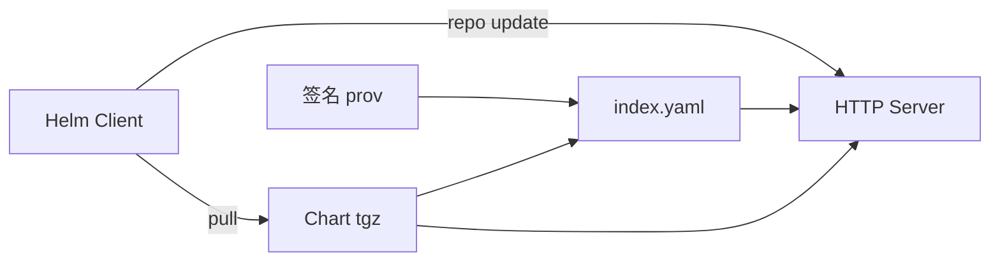
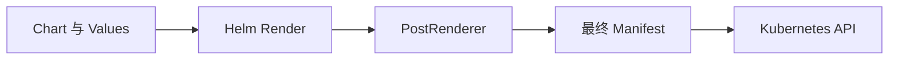
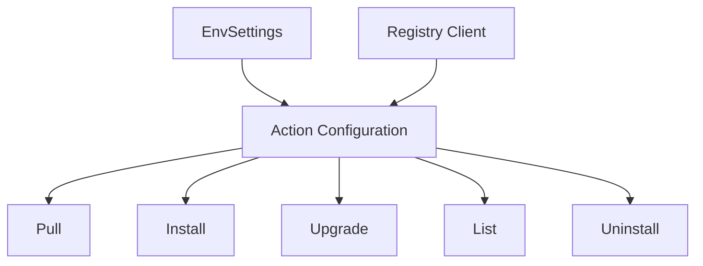
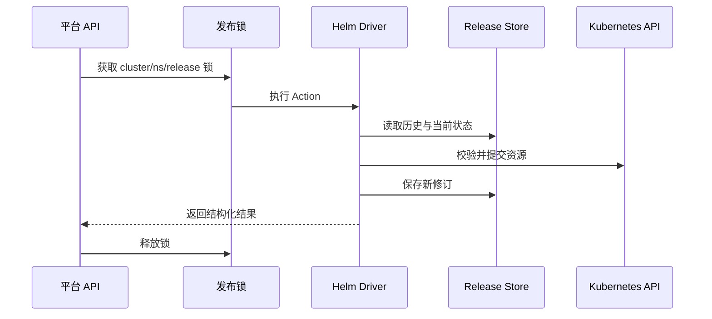

# Helm 学习笔记 · 第三册：仓库、安全与扩展

> **适用对象**：平台工程师、Chart 仓库维护者、安全工程师和需要嵌入 Helm 能力的开发者<br>
> **学习目标**：建立 Chart 分发和完整性校验流程，治理兼容性与权限，并理解插件、PostRenderer 和 Go SDK 的扩展边界。

## 第八章 · 发布和分发 Chart

### 理解传统 Chart Repository 的结构与索引
<!-- src: 340051e0e422d4f0/The-Chart-Repository-Guide.md -->

传统 Chart Repository 本质上是能通过 HTTP 提供 `index.yaml` 和 `.tgz` 文件的静态站点。`index.yaml` 汇总 Chart 元数据、版本、下载 URL 和摘要；包不必与索引同域，但同域部署最简单。

```text
repository/
├── index.yaml
├── web-1.2.0.tgz
├── web-1.2.0.tgz.prov
└── web-1.3.0.tgz
```



客户端添加仓库时会下载索引到本地缓存，`helm search repo` 查询的是本地索引，因此仓库更新后需要执行 `helm repo update`。

#### `index.yaml` 包含哪些信息

```yaml
apiVersion: v1
entries:
  web:
    - name: web
      version: 1.3.0
      appVersion: "2.8.1"
      created: 2026-08-20T00:00:00Z
      digest: sha256:...
      urls:
        - https://charts.example.com/web-1.3.0.tgz
generated: 2026-08-20T00:00:00Z
```

同名 Chart 的多个版本放在同一 entries 列表。客户端根据版本约束选择条目，再从 `urls` 下载包。Digest 用于检测内容变化，但没有签名身份时不能单独回答“谁发布了它”。

#### 客户端缓存与一致性

`helm repo add` 保存仓库名称和 URL，并下载索引；`helm repo update` 刷新缓存。包已经上传但索引未更新时，客户端搜索不到；索引已经更新但包尚未上传时，搜索可见却下载失败。

```bash
helm env
helm repo list
helm repo update vendor --debug
helm search repo vendor/web --versions
```

排障时从 `helm env` 找到 repository config 与 cache 的实际路径，不要假设所有平台都在相同目录。

#### 传统 Repository 与 OCI 的差异

| 维度 | 传统 Repository | OCI Registry |
| --- | --- | --- |
| 发现 | 集中 `index.yaml` | Registry Repository 与 tag |
| 上传 | Helm 本身不定义通用上传协议 | 内置 `helm push` |
| 引用 | `repo-name/chart` | `oci://host/path/chart` |
| 认证 | HTTP Basic、TLS 等 | Registry 认证 |
| 元数据 | 索引集中保存 | OCI Manifest 与 config |
| 复制 | 同步静态文件与索引 | 使用 Registry 复制能力 |

已有消费者依赖 `helm search repo` 时，迁移到 OCI 需要额外提供发现入口或文档。

### 创建、托管、同步和更新 Chart Repository
<!-- src: 340051e0e422d4f0/The-Chart-Repository-Guide.md; 0b443dd78fd28297/Syncing-Your-Chart-Repository.md -->

```bash
helm package ./charts/web
helm repo index ./public --url https://charts.example.com
```

向已有仓库增加版本时，先下载现有 `index.yaml`，再使用 `--merge` 合并；直接重建只会包含本地目录当前存在的包，容易丢失历史索引。

```bash
helm repo index ./public \
  --url https://charts.example.com \
  --merge ./public/index.yaml
```

上传 `.tgz`、`.prov` 和新索引时应考虑原子性：先上传不可变版本包，最后替换索引，避免客户端看到尚不存在的 URL。对象存储或普通 Web Server 必须正确提供 HTTPS、YAML 内容类型、缓存策略和访问控制。

#### 支持哪些托管方式

只要能稳定响应 HTTPS GET，就可以使用对象存储静态站点、GitHub Pages、普通 Web Server、ChartMuseum、Artifactory、Cloudsmith 或 GitLab Package Registry。选择时比较认证、不可变策略、审计、复制、备份和生命周期管理，而不只是“能否提供文件”。

#### 新建仓库的步骤

```bash
helm package ./charts/web --destination ./public
helm package ./charts/worker --destination ./public
helm repo index ./public --url https://charts.example.com
```

上传后从一台没有本地缓存的环境验证：

```bash
helm repo add verify https://charts.example.com
helm search repo verify/ --versions
helm pull verify/web --version 1.3.0 --verify
```

#### 增量更新的安全顺序

1. 下载当前远端 `index.yaml`。
2. 在隔离目录放入新 Chart 包和 provenance 文件。
3. 用 `helm repo index --merge` 生成新索引。
4. 校验旧版本条目仍在、新 URL 可访问、digest 正确。
5. 上传不可变 Chart 和 provenance。
6. 最后原子替换索引。
7. 从干净客户端刷新并拉取验证。

直接在不完整本地目录运行 `repo index` 会重建索引并移除未在本地出现的历史版本。

#### GCS 类对象存储同步

材料以对象存储目录为例。同步命令需要避免先删除远端旧包，生产仓库还应配置版本控制或回收站，以便索引发布错误时恢复。公开仓库可以匿名读取，但写权限只给发布流水线。

### 用 GitHub Actions 自动发布 Chart
<!-- src: 0b443dd78fd28297/Chart-Releaser-Action-to-Automate-GitHub-Page-Charts.md -->

Chart Releaser Action 可以把 Git 仓库中的 Chart 打包为 GitHub Release，并维护 GitHub Pages 上的索引。典型触发点是默认分支的 Chart 目录发生变更。

```yaml
name: release-charts
on:
  push:
    branches: [main]
permissions:
  contents: write
jobs:
  release:
    runs-on: ubuntu-latest
    steps:
      - uses: actions/checkout@v4
        with:
          fetch-depth: 0
      - uses: azure/setup-helm@v4
      - uses: helm/chart-releaser-action@v1
        env:
          CR_TOKEN: ${{ secrets.GITHUB_TOKEN }}
```

流水线应在发布前执行 lint、渲染、Schema 校验和安装测试，并确保同一 Chart 版本不可覆盖发布。

#### Chart Releaser 工作流的输入输出

典型仓库在默认分支保存 `charts/NAME` 源码，在 GitHub Release 保存 `.tgz`，在 `gh-pages` 分支保存 `index.yaml`。Chart Releaser 根据 Chart 版本判断需要创建哪些 Release。

发布前检查 Git 历史深度、目标分支、Pages 设置和 token 权限。`contents: write` 是高权限，应限制触发分支并防止不受信任的 Pull Request 直接获得发布凭据。

#### 建议增加的质量阶段

```yaml
- name: Lint
  run: helm lint charts/web --strict
- name: Render production values
  run: helm template web charts/web -f charts/web/ci/production-values.yaml
- name: Package
  run: helm package charts/web --destination .cr-release-packages
```

真正安装测试通常需要 KIND 或专用测试集群。测试通过后再允许 Releaser 创建不可变版本，失败时不能生成半成品索引。

### 用 OCI Registry 存储、签名和迁移 Chart
<!-- src: 340051e0e422d4f0/Use-OCI-based-registries.md -->

OCI Registry 可以在现有容器镜像基础设施中存放 Chart，统一认证、权限、复制和保留策略。上传引用不包含 Chart 名和标签，它们分别从 `Chart.yaml` 的 `name` 与 `version` 推导。

```bash
helm registry login registry.example.com
helm package ./web
helm push web-1.2.0.tgz oci://registry.example.com/helm

helm pull oci://registry.example.com/helm/web --version 1.2.0
helm install web oci://registry.example.com/helm/web --version 1.2.0
```

OCI 依赖在 `Chart.yaml` 中也使用不含依赖名的仓库路径。传统仓库迁移到 OCI 时，要同步迁移版本保留、签名、访问授权和消费者引用方式，不能只复制包。

#### OCI 引用规则

上传：

```text
helm push web-1.2.0.tgz oci://registry.example.com/platform
                              └── 不含 web 和 1.2.0
```

下载：

```text
oci://registry.example.com/platform/web --version 1.2.0
                                    └── 包含 Chart 名
```

Chart 名成为 OCI Repository basename，SemVer 成为 tag。构建元数据中的 `+` 在某些 OCI tag 表达中需要规范化，消费时仍按 Chart SemVer 理解。

#### OCI Manifest 的组成

Helm Chart 作为 OCI Artifact 存储，Manifest 引用 Chart content layer、config layer，以及存在时的 provenance layer。Registry 返回的 digest 对整个 Manifest 提供内容寻址依据。

#### OCI 依赖

```yaml
dependencies:
  - name: database
    version: 3.2.1
    repository: oci://registry.example.com/platform
```

`repository` 不含 `database`。执行 `helm dependency update` 后，依赖包进入 `charts/` 并记录锁定信息。

#### Registry 运营注意事项

- 某些 Registry 要求先创建 Project 或 Repository 命名空间。
- Robot Account 只授予指定路径的 pull 或 push 权限。
- 启用 tag 不可变，阻止相同版本被覆盖。
- 设置跨区域复制、保留和垃圾回收策略。
- Chart 与镜像可以共用 Registry，但权限与保留周期可能不同。
- 非 TLS 本地 Registry 只用于测试，生产不要依赖 `plain-http`。

### 用 Provenance 验证 Chart 的来源与完整性
<!-- src: 340051e0e422d4f0/Helm-Provenance-and-Integrity.md -->

Provenance 文件把 Chart 摘要与发布者签名绑定。验证成功表示包与签名时内容一致，并且签名能追溯到给定密钥；它不自动证明 Chart 安全、维护者可信或镜像无漏洞。

```bash
helm package --sign --key "release@example.com" --keyring secring.gpg ./web
helm verify web-1.2.0.tgz --keyring pubring.gpg
helm install web ./web-1.2.0.tgz --verify --keyring pubring.gpg
```

供应链还应管理密钥身份验证、轮换和吊销。OCI 场景可结合 Sigstore 工具链；无论采用哪种方案，都应在准入前按 digest 固定并验证制品。

#### Provenance 文件的工作流

1. Chart 作者完成源代码和版本审查。
2. `helm package --sign` 生成 `.tgz` 与相邻 `.prov`。
3. 仓库同时发布包与 provenance。
4. 消费者取得发布者公钥并验证其身份。
5. `helm verify` 校验签名和包摘要。
6. 验证成功后才进入渲染与安装阶段。

Provenance 文件包含 Chart 元数据和包摘要的签名表达。包被修改、`.prov` 与包不匹配、密钥不在 keyring 或签名无效都会导致验证失败。

#### 信任密钥而不只是导入密钥

从同一不可信下载页同时取得 Chart、`.prov` 和公钥，无法建立独立信任。公钥指纹应通过组织目录、线下渠道或已验证身份发布，并记录轮换和吊销。

#### 签名不能覆盖的风险

- 模板本身包含高权限或恶意资源。
- Chart 引用的镜像被覆盖或含漏洞。
- 默认 Values 暴露不安全服务。
- 安装身份权限过大。
- 签名密钥已经泄露但尚未吊销。

完整供应链还需要源码审查、依赖锁定、镜像签名、漏洞扫描、准入策略与审计日志。

## 第九章 · 处理兼容性、安全与存储治理

### 管理 Helm 与 Kubernetes 的版本偏差和发布节奏
<!-- src: 340051e0e422d4f0/Helm-Version-Support-Policy.md; 340051e0e422d4f0/Release-schedule-policy.md -->

Helm 与 Kubernetes 的支持范围会随版本变化，不能把材料中的某个版本号永久写成事实。升级前应核对当前 Helm 支持策略、目标 Kubernetes 版本以及 Chart 的 `kubeVersion`。

```bash
helm version
kubectl version
helm show chart oci://registry.example.com/helm/web --version 1.2.0
```

团队应为 Patch、Minor、Major 版本建立不同验证强度：Patch 做回归和安全验证，Minor 关注新增功能与废弃项，Major 必须阅读迁移指南并在影子环境演练。

#### 版本偏差不是单向兼容承诺

Helm 的支持策略定义客户端版本可配合哪些 Kubernetes 版本，不意味着任意旧 Chart 都能在这些集群上运行。Chart 自己使用的 API、Webhook 和 CRD 还要单独验证。

升级决策至少有三张矩阵：Helm Client 与 Kubernetes、Chart 与 Kubernetes、应用与 Chart。任意一张不兼容都可能导致发布失败。

#### Patch、Minor 与 Major 发布

| 类型 | 预期内容 | 团队动作 |
| --- | --- | --- |
| Patch | Bug 和安全修复 | 快速回归并部署 |
| Minor | 向后兼容功能与废弃提醒 | 插件、脚本和 Chart 回归 |
| Major | 允许破坏性变化 | 完整迁移项目 |

版本发布日期与维护窗口会变化，应以执行时官方策略为准。生产环境不应自动跟随“latest”。

#### 升级演练清单

- 渲染现有生产 Values。
- 验证传统仓库与 OCI 拉取。
- 验证签名和 keyring。
- 回归所有必需插件。
- 对关键 Release 执行 install、upgrade、rollback、uninstall。
- 测试 Hook、CRD、PostRenderer 和存储驱动。
- 比较 Manifest 并观察弃用警告。

### 在不同 Kubernetes 发行版中使用 Helm
<!-- src: 340051e0e422d4f0/Kubernetes-Distribution-Guide.md -->

Helm 面向符合 Kubernetes API 的集群，可用于托管云、KIND、Minikube、OpenShift 等环境。真正差异通常来自认证插件、默认 StorageClass、Ingress 实现、安全策略、LoadBalancer 能力和可用 API。

部署前用能力而不是发行版名称做检查：

```bash
kubectl api-resources
kubectl auth can-i --list -n target
kubectl get storageclass
helm template web ./chart --kube-version 1.32.0
```

#### 托管 Kubernetes 的常见差异

AKS、EKS、GKE 等托管集群通常通过云 CLI 或 exec credential plugin 完成认证。Helm 复用 kubeconfig，因此认证插件过期、缺失或使用错误账号会表现为 Helm 连接失败。

不同云的 LoadBalancer annotation、IAM 集成、StorageClass 和 Ingress Controller 不同。把这些差异放在 Values，而不是复制整套 Chart。

#### 本地与测试发行版

KIND、Minikube、MicroK8s 等适合 Chart 安装测试，但默认可能没有 LoadBalancer、动态存储或完整准入策略。测试成功只能证明该环境覆盖的能力。CI 可按 Chart 依赖安装必要 addon，并明确哪些生产能力未模拟。

#### OpenShift 等受限环境

更严格的安全上下文、随机 UID 和路由能力可能暴露 Chart 对 root、固定 UID 或特权容器的假设。Chart 应允许平台注入 securityContext，并避免写死宿主机路径。

#### 用能力探测代替发行版分支

优先根据 `.Capabilities.APIVersions.Has` 和公开 Values 决定是否生成可选资源。直接判断集群供应商会把模板绑定到品牌名称，也容易漏掉同能力的其他发行版。

### 识别并迁移已经废弃的 Kubernetes API
<!-- src: 340051e0e422d4f0/Deprecated-Kubernetes-APIs.md -->

Kubernetes 删除旧 API 后，包含旧 `apiVersion` 的 Chart 可能无法安装，旧 Release 的历史 Manifest 也可能阻碍升级。Chart 维护者应更新模板和 `kubeVersion`，使用者应在集群升级前扫描已部署 Release。

迁移顺序：盘点目标版本删除项、渲染所有 Values 组合、升级 Chart、验证对象转换和行为、再升级集群。不能只搜索源码，因为条件模板和历史修订可能隐藏旧 API。

#### Chart 维护者的迁移责任

维护者应在目标 Kubernetes 版本上渲染并安装 Chart，更新 `apiVersion` 与字段结构，提升 `kubeVersion` 下限，并在变更日志说明用户动作。仅替换 API 字符串可能不够，因为不同版本的 Schema 可能改变 selector、backend 或版本列表结构。

#### Helm 使用者的迁移责任

使用者要盘点所有 Release 的实际 Manifest，而不仅是当前 Chart 源码。旧修订中的废弃 API 可能影响回滚或升级解析。升级集群前先升级 Release 到兼容 Chart，并验证回滚策略不再依赖已删除 API。

```bash
helm list -A
helm get manifest RELEASE -n NAMESPACE
kubectl api-resources
```

#### CRD 转换需要额外小心

CRD 的 served/storage 版本、转换 Webhook 和现有对象存储版本不由普通 Helm 升级自动解决。先完成 CRD 与对象迁移，再升级依赖新版本的应用 Chart。

### 用 Kubernetes RBAC 限制 Helm 操作者权限
<!-- src: 340051e0e422d4f0/Role-based-Access-Control.md -->

Helm 使用 kubeconfig 中的身份，没有独立授权层。给日常发布账号分配命名空间级 Role/RoleBinding；只有确实需要 CRD、ClusterRole 等资源时才授予集群级权限。

```bash
kubectl auth can-i create deployments.apps -n app --as system:serviceaccount:ci:helm-deployer
kubectl auth can-i create customresourcedefinitions.apiextensions.k8s.io --as system:serviceaccount:ci:helm-deployer
```

Chart 的权限需求应进入 README 和安全审查，避免用 `cluster-admin` 掩盖缺失权限。

#### Namespace 级发布角色示意

```yaml
apiVersion: rbac.authorization.k8s.io/v1
kind: Role
metadata:
  name: helm-deployer
  namespace: app
rules:
  - apiGroups: ["", "apps", "batch", "networking.k8s.io"]
    resources: ["configmaps", "secrets", "services", "deployments", "jobs", "ingresses"]
    verbs: ["get", "list", "watch", "create", "update", "patch", "delete"]
```

这只是示意，实际资源和 verbs 必须从 Chart 渲染结果得出。Helm 为了比较和等待资源通常需要 get/list/watch，不能只授予 create。

#### 读写角色分离

审计人员可以只读取 Release Secret 和相关对象；发布账号拥有目标命名空间变更权限；CRD 与集群 RBAC 由平台管理员的独立流程执行。分离后，普通应用发布不再需要 cluster-admin。

#### 模拟身份预检

```bash
kubectl auth can-i --list \
  --as system:serviceaccount:ci:helm-deployer \
  -n app
```

预检结果还要结合准入策略。RBAC 允许不代表 Pod Security、OPA 或其他 Webhook 会接受对象。

### 为 SQL Release 存储后端分配最小权限
<!-- src: 340051e0e422d4f0/Permissions-management-for-SQL-storage-backend.md -->

SQL 后端适用于有特定集中存储需求的环境，但会引入数据库可用性、凭据和权限治理。初始化账号可建表和授权，运行账号只获得所需表操作权限；不要让 Helm 运行身份长期持有数据库管理员权限。

选择存储驱动时先回答：是否真的不能使用集群内 Secret、备份和恢复如何做、网络故障时发布如何失败、多个集群如何隔离数据。

#### 初始化与运行权限分开

SQL 管理账号负责创建数据库、表或初始权限；Helm 运行账号只获得 Release 表所需的 SELECT、INSERT、UPDATE、DELETE 等权限。完成初始化后撤销建库、建表和授权能力。

```sql
GRANT SELECT, INSERT, UPDATE, DELETE
ON ALL TABLES IN SCHEMA public
TO helm_runtime;
```

具体表和序列权限取决于驱动初始化结果，应在目标数据库核对，不要直接复制示例到生产。

#### 多租户与备份

不同集群或租户需要独立数据库、Schema 或受驱动支持的隔离键，并验证运行账号不能读取其他租户 Release。备份要与集群资源和外部数据形成一致恢复点；只有 SQL Release 历史不能恢复应用。

## 第十章 · 使用和开发 Helm 插件

### 理解插件类型、API 版本、运行时和目录结构
<!-- src: dea9de507a10787d/Overview.md; 340051e0e422d4f0/The-Helm-Plugins-Guide.md -->

插件扩展 Helm CLI，但不要求修改 Helm 核心。Helm 4 材料把插件区分为 CLI、Getter 和 PostRenderer 等类型，并支持 subprocess 与 Wasm 等运行时。插件根目录包含 `plugin.yaml`、可执行代码和可选平台配置。

```yaml
apiVersion: v1
type: cli/v1
name: system-info
version: 0.1.0
runtime: subprocess
config:
  usage: system-info
```

插件 API 和 manifest 字段会随主版本演进，不能把旧版 `plugin.yaml` 示例直接用于 Helm 4 而不验证。

#### 三类插件解决的问题不同

| 类型 | 接入点 | 输入 | 输出 | 典型用途 |
| --- | --- | --- | --- | --- |
| CLI | Helm 子命令分发 | 命令行参数与 Helm 环境 | 文本、文件或外部副作用 | 审计、迁移、批量管理 |
| Getter | Chart 下载阶段 | 自定义 URL 与认证配置 | Chart 字节流 | 内网协议、专有制品库 |
| PostRenderer | Manifest 提交前 | 标准输入中的多文档 YAML | 标准输出中的多文档 YAML | 注入标签、策略与 sidecar |

类型决定 Helm 在什么时候调用插件，也决定插件必须遵守的协议。CLI 插件通常最自由；Getter 和 PostRenderer 位于关键数据链路，输出格式错误会直接阻断安装或升级。

#### 插件目录与可移植构建

一个可分发插件至少要让使用者能够回答四个问题：插件是谁、支持哪个 Helm 插件 API、执行什么程序、怎样卸载或更新。建议目录保持简单：

```text
system-info/
├── plugin.yaml
├── README.md
├── LICENSE
└── bin/
    ├── system-info
    └── system-info.exe
```

不要让 `plugin.yaml` 指向开发机上的绝对路径。跨平台插件应明确支持的操作系统和架构，并让打包产物包含对应二进制。若运行时是 Wasm，则要固定模块及其运行权限，不应默认允许任意目录和网络访问。

#### Manifest 是调用契约

不同插件 API 版本的字段结构并不完全相同，开发时应以目标 Helm 版本的文档和校验器为准。无论具体字段名称如何变化，都应把以下内容视为发布契约：

- `apiVersion`：插件清单所遵循的 schema 版本；
- `type`：CLI、Getter 或 PostRenderer 的接口类型；
- `name` 与 `version`：命令发现、升级和审计所需身份；
- `runtime`：subprocess 或 Wasm 等执行方式；
- `config`：入口、参数、协议前缀、用法说明等类型专属配置；
- 平台约束：支持的 OS、架构以及相应入口。

发布前应在干净环境运行 manifest 校验，不要以“开发机上能执行”代替协议兼容验证。

#### 环境变量与参数边界

Helm 调用插件时会暴露一组 Helm 相关环境变量，例如插件目录、缓存目录、配置目录、数据目录、命名空间和 kubeconfig。插件应只读取完成任务所需的变量，并允许显式参数覆盖合理默认值。

环境变量可能包含路径或集群访问信息，因此日志中不应无差别打印整个环境。CLI 参数必须正确处理空格、Unicode 和以连字符开头的值；subprocess 入口不要把参数重新拼接成一段 shell 字符串，以免出现转义和注入问题。

#### 自动补全与帮助信息

CLI 插件应提供稳定的 `--help`，并让错误消息同时包含“发生了什么”和“下一步怎么做”。若插件 API 支持补全协议，可按当前位置返回候选项，但补全过程不能执行有副作用的操作，也不应因为网络不可达拖慢 shell。

### 安全地查找、安装、查看和卸载插件
<!-- src: dea9de507a10787d/Using-Plugins.md -->

插件以当前用户权限执行，可能读取 kubeconfig、环境变量和文件系统，应像安装本地程序一样审查来源、版本和安装 Hook。

```bash
helm plugin install https://example.com/plugin --version 1.2.0
helm plugin list
helm plugin update plugin-name
helm plugin uninstall plugin-name
```

生产环境应固定插件版本和校验值，并在隔离环境评估升级。不要把不可信仓库地址直接交给自动化安装。

#### 安装前审查清单

安装动作通常会拉取代码并可能运行安装 Hook。至少完成以下审查：

1. 确认仓库所有者、发布标签和提交是否可信；
2. 阅读 `plugin.yaml`，确认入口没有越界路径；
3. 阅读 install、update、delete Hook，查找下载和提权行为；
4. 核对二进制校验和或签名，而不是只依赖 HTTPS；
5. 在不含生产 kubeconfig 和云凭据的环境试运行；
6. 固定精确版本，记录审批人、来源和安装时间。

#### 生命周期操作的真实含义

`helm plugin list` 只说明 Helm 当前能发现哪些插件，并不证明入口安全或功能正常。`plugin update` 可能替换可执行文件，应像依赖升级一样审阅差异并回归测试。`plugin uninstall` 通常移除插件目录，但插件此前创建的外部资源、缓存和凭据不会自动消失。

团队环境可以维护一份允许清单：包含插件名、来源、版本、digest、支持的 Helm 主版本和责任人。CI 镜像中预装插件时，还要把插件纳入镜像 SBOM 和漏洞扫描。

#### 发现插件执行失败时

按以下顺序缩小范围：

```text
Helm 能否发现插件
  -> manifest 能否被目标版本解析
  -> 当前平台是否有匹配入口
  -> 文件是否可执行
  -> 直接运行入口是否成功
  -> Helm 传入的环境和参数是否符合预期
```

退出码非零时保留标准错误，但要先脱敏。插件在终端成功、在 CI 失败，常见原因是工作目录、HOME、PATH、代理、证书或 kubeconfig 不同。

### 开发 CLI、Getter 与 PostRenderer 插件
<!-- src: dea9de507a10787d/Developing-Plugins.md; fa02247a9e4fa3f3/Build-a-CLI-Plugin.md; fa02247a9e4fa3f3/Build-a-Getter-Plugin.md; fa02247a9e4fa3f3/Build-a-Postrenderer-Plugin.md -->

- CLI 插件增加新的 `helm NAME` 命令。
- Getter 插件支持新的 Chart 获取协议。
- PostRenderer 插件接收渲染后的 Manifest 并输出修改结果。

开发流程包括创建目录与 manifest、实现 subprocess 或 Wasm 入口、开发模式安装、测试输入输出和失败码。PostRenderer 必须保持 YAML 多文档边界；Getter 要处理认证和 TLS；CLI 插件不要静默修改集群。

#### CLI subprocess 插件

CLI 插件的入口应把命令行解析与业务逻辑分开，并遵循普通命令行程序约定：成功返回 0，用户输入错误和运行错误返回非零；普通结果写 stdout，诊断写 stderr。

```bash
#!/usr/bin/env bash
set -euo pipefail

case "${1:-}" in
  version)
    printf '%s\n' 'system-info 0.1.0'
    ;;
  *)
    printf '%s\n' 'usage: helm system-info version' >&2
    exit 2
    ;;
esac
```

真实插件还应处理 `SIGINT`、超时和临时文件清理。不要假定调用工作目录就是插件目录，应从 Helm 提供的插件根目录变量解析内置资源。

#### CLI Wasm 插件

Wasm 适合提供跨平台、受约束的执行单元，但宿主能力不是自动存在的。文件系统、环境变量、网络和时钟是否可用取决于 Helm 的 Wasm 运行时与授权配置。开发流程包括：

1. 为目标 WASI ABI 编译模块；
2. 只声明实际需要的宿主权限；
3. 用固定输入验证 stdout、stderr 和退出码；
4. 在不同目标平台的 Helm 中做兼容测试；
5. 将模块 digest 与插件版本绑定。

如果任务强依赖本地系统命令或动态库，subprocess 可能更合适；不要为了形式上的“沙箱化”把大量未经说明的权限重新开放给 Wasm。

#### Getter 插件的数据契约

Getter 为 Helm 增加新的 URL scheme，例如 `corp://team/chart`。它的核心责任是把引用解析为可验证的 Chart 内容，同时正确处理：

- URL 规范化和路径穿越防护；
- 身份认证、令牌刷新与凭据脱敏；
- 企业 CA、TLS 主机名和代理；
- 重定向策略与目标域名限制；
- 大文件、超时、重试和取消；
- 内容长度、digest 和签名验证；
- 明确区分“未找到”“未授权”“临时不可用”。

不要在 Getter 中把认证失败自动降级为匿名访问，也不要在错误消息中回显带凭据的 URL。

#### Getter 的最小测试矩阵

| 场景 | 期望 |
| --- | --- |
| 合法 URL | 返回完整 Chart 字节且 digest 匹配 |
| 不支持的 scheme | 明确拒绝，不尝试本地文件 |
| 401/403 | 返回认证或授权错误，不泄露 token |
| TLS 证书错误 | 默认失败，不静默跳过校验 |
| 下载中断 | 清理临时文件，返回非零 |
| context 取消 | 尽快终止网络和解压操作 |
| 恶意路径 | 不访问允许根目录之外的文件 |

#### PostRenderer 插件的流协议

subprocess PostRenderer 从 stdin 读取 Helm 渲染出的完整多文档 YAML，把变换后的结果写到 stdout。任何日志、进度条或调试文本都必须写 stderr，否则会污染 Manifest。

```bash
helm template web ./chart | ./bin/add-policy > rendered.yaml
kubectl apply --dry-run=server -f rendered.yaml
```

插件要保留 `---` 文档边界、注释的必要语义、资源顺序以及无法识别的字段。更稳妥的方式是使用 Kubernetes 结构化 YAML 库解析对象，再显式修改目标字段，而不是对文本做正则替换。

#### 开发模式与发布模式

开发阶段可以把本地目录链接或安装到插件目录，缩短反馈周期；发布阶段则必须从干净构建产出包，验证包内没有测试凭据、缓存和本地路径。至少运行三层测试：

- 单元测试：参数解析、URL 解析、对象变换；
- 契约测试：stdin/stdout、退出码、manifest schema；
- 集成测试：由目标 Helm 版本实际安装并执行。

若同时支持 Helm 多个主版本，应分别跑集成矩阵，而不是只声明兼容。

## 第十一章 · 通过高级接口扩展 Helm

### 用 PostRenderer 改写最终清单
<!-- src: 340051e0e422d4f0/Advanced-Helm-Techniques.md -->

PostRenderer 位于模板渲染与提交 API Server 之间，可统一注入标签、安全上下文或策略变换。



所有参与同一 Release 的操作者必须使用相同 PostRenderer，否则后续升级可能产生漂移。PostRenderer 是可执行代码，应版本化、签名并保存其配置。

#### 变换必须可重复

同一输入重复经过 PostRenderer 应得到相同输出。若每次都追加标签、容器或随机值，升级时会制造无意义差异甚至资源膨胀。可重复变换通常遵循“存在则更新，不存在才创建”的规则。

```text
输入 Manifest
  -> 解析全部 YAML 文档
  -> 按 apiVersion/kind/name/namespace 选择对象
  -> 检查目标字段是否已经存在
  -> 合并或替换
  -> 稳定序列化
  -> 输出 Manifest
```

#### 版本一致性是 Release 输入的一部分

Chart、Values 和 PostRenderer 三者共同决定最终 Manifest。因此发布记录应保存 PostRenderer 名称、版本、digest 和配置。GitOps 或 CI 流程中应从固定制品调用它，不能依赖操作者机器上的“最新版”。

PostRenderer 失败时 Helm 应停止提交；脚本不能吞掉解析错误后原样放行。涉及策略强制时，还应在 API Server 侧配置准入策略，避免绕过 Helm 的其他客户端直接提交不合规资源。

#### 适合与不适合的用途

适合统一注入组织级标签、Pod 安全字段、镜像拉取 Secret 或服务网格注解；不适合修补 Chart 的核心业务逻辑、隐藏不兼容 API，或产生需要独立生命周期管理的大量资源。能够在上游 Chart 解决的问题，优先回到模板和 Values。

### 选择 ConfigMap、Secret、Memory 或 SQL 存储后端
<!-- src: 340051e0e422d4f0/Advanced-Helm-Techniques.md -->

Release 存储决定历史保留位置。Secret 是常见默认选择；ConfigMap 可读性更强但不适合敏感内容；Memory 只适合测试；SQL 引入独立数据库。选择时比较机密性、容量、RBAC、备份、灾难恢复和运维成本。

| 驱动 | 持久性 | 访问控制 | 适用场景 | 主要风险 |
| --- | --- | --- | --- | --- |
| Secret | 集群内持久 | Kubernetes RBAC，可配合静态加密 | 大多数集群 | etcd 容量、集群权限过宽 |
| ConfigMap | 集群内持久 | Kubernetes RBAC | 无敏感配置的兼容场景 | 内容更容易被读取，不宜存机密 |
| Memory | 进程内 | 进程边界 | 单元测试、短生命周期工具 | 进程退出即丢失，不能多副本共享 |
| SQL | 集群外持久 | 数据库权限与网络策略 | 集中式平台、特殊容量需求 | 新增数据库可用性、备份和租户隔离责任 |

切换驱动并不会自动迁移旧历史。变更 `HELM_DRIVER` 前先盘点 Release、设计迁移和回退方案，并验证新驱动能读取预期历史。只迁移最新修订会影响回滚与审计。

#### 存储不是应用备份

Release 记录保存 Helm 所需状态，不包含数据库数据、PVC 内容和所有外部系统副作用。灾难恢复演练必须同时覆盖 Kubernetes 资源、Helm 历史、持久数据和外部依赖；恢复后再验证 `helm list`、`helm history` 与集群实际对象一致。

### 通过 Go SDK 调用 Helm 核心能力
<!-- src: 97fd329e1effbc74/Introduction.md; 340051e0e422d4f0/Advanced-Helm-Techniques.md -->

Go SDK 让控制器或平台服务复用 Helm 的 action、chart、cli 和 release 包。最小流程是创建环境设置、初始化 `action.Configuration`、构造具体 Action 并运行。

```go
settings := cli.New()
cfg := new(action.Configuration)
if err := cfg.Init(settings.RESTClientGetter(), settings.Namespace(), os.Getenv("HELM_DRIVER")); err != nil {
    return err
}
client := action.NewList(cfg)
releases, err := client.Run()
```

SDK 与 CLI 共享 kubeconfig、命名空间、Registry 和存储等概念。嵌入式程序必须处理 context、超时、日志、并发、凭据和版本兼容，不能只复制示例主函数。

#### 常用包的职责

| 包 | 主要职责 |
| --- | --- |
| `action` | Install、Upgrade、List、Pull 等高层操作 |
| `cli` | 环境设置、kubeconfig、namespace 和路径默认值 |
| `chart` / `chart/loader` | Chart 数据模型以及目录或归档加载 |
| `release` | Release、状态和 Hook 等领域对象 |
| `registry` | OCI 登录、拉取、推送与凭据交互 |
| `getter` | 按协议获取 Chart |
| `storage` / `driver` | Release 持久化抽象与具体驱动 |

应用代码应依赖高层 Action，而不是直接操作存储记录来模拟发布。直接修改 Secret 或 SQL 行会绕开状态机、校验和 Hook 语义。

#### 初始化 Configuration

`action.Configuration` 聚合 Kubernetes 客户端、Release 存储、日志函数和能力发现。它应按目标集群与命名空间初始化，初始化失败必须立即返回。

```go
settings := cli.New()
settings.SetNamespace("production")

cfg := new(action.Configuration)
err := cfg.Init(
    settings.RESTClientGetter(),
    settings.Namespace(),
    os.Getenv("HELM_DRIVER"),
    func(format string, args ...interface{}) {
        logger.Printf(format, args...)
    },
)
if err != nil {
    return fmt.Errorf("initialize helm action: %w", err)
}
```

示例中的日志函数可能收到 Chart 或 Kubernetes 的诊断信息，生产实现需要分级和脱敏。不要把一个包含可变 namespace 的 Configuration 无锁共享给所有租户请求。

#### Chart 定位与加载

Chart 参数可能是本地目录、`.tgz`、传统仓库引用或 OCI 引用。SDK 调用者需要先建立与 CLI 等价的定位选项，再加载 Chart：

```go
install := action.NewInstall(cfg)
install.ReleaseName = "web"
install.Namespace = "production"
install.Version = "1.4.0"

chartPath, err := install.ChartPathOptions.LocateChart(ref, settings)
if err != nil {
    return fmt.Errorf("locate chart %q: %w", ref, err)
}
ch, err := loader.Load(chartPath)
if err != nil {
    return fmt.Errorf("load chart: %w", err)
}
```

远程引用应固定版本或 digest，并配置 Registry Client、TLS 与凭据。加载成功只代表包可解析，仍需检查依赖和安装约束。

#### Values 的构造

SDK 不会替你定义团队的 Values 优先级。可以复用 Helm 的 values options，也可以在平台层解析多个 YAML 并合并，但必须保持与 CLI 一致的右侧优先、类型和 `null` 删除语义。

禁止将用户提供的任意字符串直接拼成 YAML。结构化 API 应接收 JSON/YAML 对象，做 schema 校验后再传给 Action；敏感值不要进入普通日志或错误上下文。

#### context、超时与取消

平台请求被取消时，Kubernetes 和 Registry 操作也应尽快停止。优先使用支持 context 的 Action 接口，并为下载、等待资源和 Hook 分别设置合理超时。HTTP 请求的 30 秒超时不等于 Helm 等待工作负载就绪的 10 分钟超时，二者要分别设计。

### 用 Action 和 Driver 构建自定义 Helm 工具
<!-- src: 97fd329e1effbc74/Examples.md -->

材料覆盖 Pull、Install、Upgrade、Uninstall、List 等 Action 以及负责串联它们的 Driver。工程实现应把配置初始化、Registry Client、Chart 定位、依赖下载和错误包装抽成稳定边界。



自定义平台还应实现审计、幂等请求、并发锁和失败恢复。SDK 提供 Helm 语义，不自动提供多租户隔离或发布编排。

#### Pull：只下载不发布

```go
pull := action.NewPull()
pull.Settings = settings
pull.Version = "1.4.0"
pull.DestDir = "./dist"
pull.Verify = true
pull.Keyring = "./keys/pubring.gpg"

result, err := pull.Run("vendor/web")
if err != nil {
    return fmt.Errorf("pull chart: %w", err)
}
logger.Printf("downloaded %s", result)
```

OCI Chart 还需给 Pull 或 ChartPathOptions 注入 Registry Client。下载目录应是受控临时目录，成功后再原子移动到制品区，防止半包被后续步骤使用。

#### Install：明确全部发布输入

```go
install := action.NewInstall(cfg)
install.ReleaseName = "web"
install.Namespace = "production"
install.CreateNamespace = true
install.Version = "1.4.0"
install.Wait = true
install.Atomic = true
install.Timeout = 10 * time.Minute

rel, err := install.RunWithContext(ctx, ch, vals)
if err != nil {
    return fmt.Errorf("install web: %w", err)
}
logger.Printf("release=%s revision=%d status=%s",
    rel.Name, rel.Version, rel.Info.Status)
```

Release 名、namespace、Chart 版本、Values、等待策略和超时都应进入审计记录。`Atomic` 改善失败清理，但不能撤销 Hook 调用的外部 API。

#### Upgrade：先读取再决策

升级前先读取当前 Release 和历史，判断请求是升级、首次安装还是重复提交。平台若提供 `upgrade --install` 等价能力，要定义“Release 不存在”的判定，不能把所有读取错误都当作不存在。

```go
upgrade := action.NewUpgrade(cfg)
upgrade.Namespace = "production"
upgrade.Version = "1.5.0"
upgrade.Wait = true
upgrade.Atomic = true
upgrade.Timeout = 10 * time.Minute

rel, err := upgrade.RunWithContext(ctx, "web", ch, vals)
```

应显式选择 reset 或 reuse Values 语义。平台 API 最好让调用方提交完整期望配置，从而避免旧值在多年升级中悄然累积。

#### List、Status 与 History：构建只读视图

```go
list := action.NewList(cfg)
list.All = true
list.AllNamespaces = true
list.SetStateMask()
rels, err := list.Run()
```

List 的默认过滤与排序不一定满足平台分页需求。跨 namespace 查询还要求集群级读取权限，不能因为 UI 有“全部”选项就扩大后端 ServiceAccount。Status 和 History 输出可能包含 Notes、Values 或描述，也要按租户授权过滤。

#### Uninstall：区分请求成功与清理完成

```go
uninstall := action.NewUninstall(cfg)
uninstall.Wait = true
uninstall.Timeout = 10 * time.Minute
uninstall.KeepHistory = false

resp, err := uninstall.Run("web")
```

卸载成功不代表 PVC、带 keep 策略的资源、CRD 或 Hook 外部副作用全部清理。平台应把这些残留作为显式结果展示，而不是只返回一个布尔值。

#### Driver 与编排层的边界

可以在 Action 之上封装 Driver，统一完成客户端初始化、Chart 解析、Values 校验、审计和指标，但 Driver 不应吞掉 Helm 状态。建议返回结构化结果：Release 身份、修订、状态、资源摘要、警告和原始错误链。



#### 并发、幂等与恢复

同一 Release 的两个升级不能并行执行。至少以集群、namespace、Release 三元组加锁，并为请求分配幂等键。超时后不要立即重试写操作，应先查询 Helm 状态和集群资源，判断前一次操作是否仍在运行。

对 pending 状态的自动修复必须保守：记录原始错误、确认没有存活操作、备份 Release 元数据，再由人工批准回滚或清理。直接删除 pending Secret 虽然可能“解锁”，但会破坏历史状态机。

#### 错误分类与可观测性

至少区分输入错误、认证失败、授权失败、Chart 获取失败、模板失败、API 校验失败、等待超时、Hook 失败和存储失败。对外返回稳定错误码，对内保留 Go 错误链。

建议指标包含 Action 类型、结果、耗时、目标集群、namespace、Chart 名和版本；不要把 Release Values、token 或完整错误正文放进高基数标签。日志用 request ID 串联下载、渲染、提交和等待阶段。

#### SDK 升级策略

Helm Go 包的 API 与行为可能随主版本变化。应用应固定模块版本，阅读 release notes，运行真实集群契约测试，并重点回归：Values 合并、能力发现、Hook、CRD、存储格式、Registry 认证和错误分类。不要让库版本随着间接依赖自动漂移。
