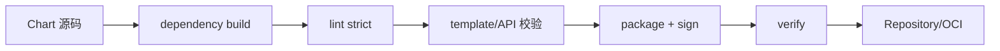
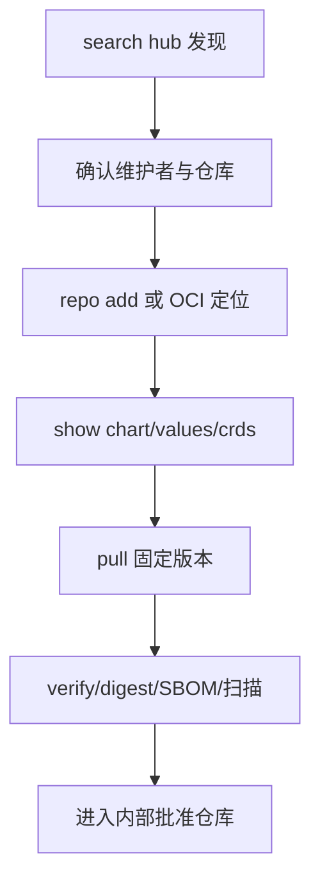
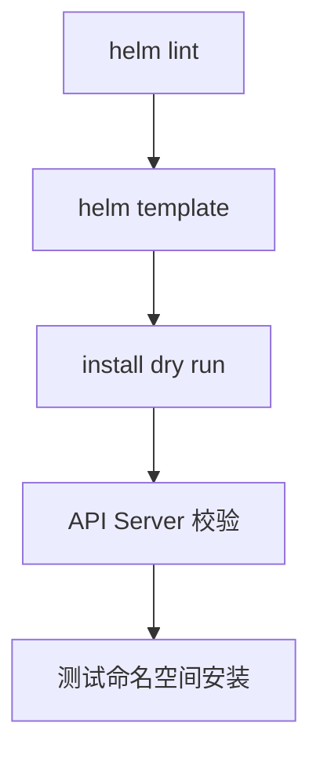
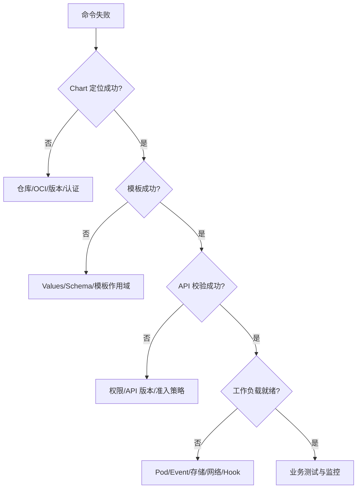

# Helm 学习笔记 · 第四册：命令参考与排障

> **定位**：这不是逐项复制 `--help` 的手册，而是按运维任务组织的命令地图。参数会随 Helm 版本变化，执行前使用 `helm COMMAND --help` 核对。<br>
> **安全提示**：`--debug`、`--dry-run`、`helm get values` 和渲染输出可能包含 Secret 或敏感 Values，不要直接写入公共日志。

## 第十二章 · 按 Chart 与仓库任务选择命令

### 创建、检查、打包和验证 Chart
<!-- src: e8ddd95ed0cc1bbe/helm-create.md; e8ddd95ed0cc1bbe/helm-lint.md; e8ddd95ed0cc1bbe/helm-package.md; e8ddd95ed0cc1bbe/helm-verify.md -->

| 命令 | 输入 | 主要输出 | 使用时机 |
| --- | --- | --- | --- |
| `helm create NAME` | 名称或路径 | Chart 脚手架 | 开始新 Chart |
| `helm lint CHART` | 目录或包 | 规范和模板问题 | 提交与发布前 |
| `helm package CHART` | Chart 目录 | 版本化 `.tgz` | 进入制品仓库前 |
| `helm verify PATH` | `.tgz` 和 `.prov` | 签名验证结果 | 使用外部制品前 |

```bash
helm create web
helm lint ./web --strict -f values-ci.yaml
helm package ./web --destination dist
helm verify dist/web-1.0.0.tgz --keyring pubring.gpg
```

`helm create` 在目标已有文件时可能覆盖冲突文件，应在空目录或版本控制下执行。`lint` 通过只代表 Chart 层检查通过，不证明目标 API Server 接受资源。

#### `helm create`：从可控脚手架开始

基本语法是：

```text
helm create NAME [flags]
```

`NAME` 同时影响目录名、`Chart.yaml` 的名称以及模板生成的资源名。创建后第一件事不是立刻安装，而是删除不需要的示例资源并检查以下文件：

```text
web/
├── Chart.yaml
├── values.yaml
├── charts/
├── templates/
│   ├── NOTES.txt
│   ├── _helpers.tpl
│   ├── deployment.yaml
│   ├── service.yaml
│   └── tests/
└── .helmignore
```

如果组织有统一 Chart 模板，应在版本控制中维护自己的 starter，然后使用目标 Helm 版本支持的 starter 参数，而不是每个项目手工删除和复制文件。脚手架升级也要经过 diff 审查，避免意外覆盖业务模板。

#### `helm lint`：静态质量门

```text
helm lint PATH [flags]
```

高价值选项及语义：

| 选项 | 作用 | 使用建议 |
| --- | --- | --- |
| `--strict` | 将警告按失败处理 | CI 默认启用 |
| `-f, --values` | 加载场景 Values | 至少覆盖最小和生产形态 |
| `--set` | 临时覆盖单值 | 用于边界测试，不代替版本化文件 |
| `--with-subcharts` | 一并检查依赖 Chart | umbrella Chart 发布前启用 |
| `--kube-version` | 模拟目标 Kubernetes 版本 | 兼容矩阵测试 |

```bash
helm lint ./web --strict -f tests/values-minimal.yaml
helm lint ./web --strict -f tests/values-production.yaml \
  --kube-version 1.34.0
```

Lint 失败通常分为元数据、schema、模板执行和规范建议四类。先处理第一条根因；一个缺失值可能触发后续几十条模板错误。

#### `helm package`：把源码冻结为制品

```text
helm package CHART_PATH [...] [flags]
```

打包读取 `Chart.yaml` 的 `version` 作为归档文件名的一部分。发布流水线应在打包前验证工作树来源和依赖锁，再把输出放入空的制品目录。

```bash
helm dependency build ./web
helm lint ./web --strict -f values-ci.yaml
helm package ./web \
  --destination dist \
  --sign \
  --key release@example.com \
  --keyring secring.gpg
```

可用参数允许覆盖 Chart Version 或 App Version，但常规发布不建议在命令行临时改版本，因为源码 `Chart.yaml` 将与制品不一致。需要覆盖时，应把生成结果和源码提交关联并明确审计。

打包后至少检查：文件名、Chart 元数据、依赖包、digest、`.prov`（若签名）和解包内容。不要把私钥或签名口令写在仓库和 CI 命令日志中。

#### `helm verify`：消费前验证

```text
helm verify PATH [flags]
```

验证需要 Chart 包旁存在匹配的 provenance 文件，并能从 keyring 找到签名公钥。它回答“包内容是否与签名时一致、签名者是否在我的信任环中”，不回答“Chart 是否安全”。

```bash
helm verify dist/web-1.4.0.tgz --keyring ./keys/trusted.gpg
```

典型失败包括 `.prov` 缺失、包摘要变化、公钥缺失、签名身份不受信和 keyring 格式错误。修复应从可信渠道重新取得包或公钥，不能以跳过验证作为自动回退。

#### 建议的 Chart 制品流水线



每一步都应消费上一步的固定产物。若在验证后重新打包，即使源码没变，新的归档也需要重新计算摘要并签名。

### 构建、更新和检查 Chart 依赖
<!-- src: e8ddd95ed0cc1bbe/helm-dependency.md; e8ddd95ed0cc1bbe/helm-dependency-build.md; e8ddd95ed0cc1bbe/helm-dependency-list.md; e8ddd95ed0cc1bbe/helm-dependency-update.md -->

```bash
helm dependency list ./web
helm dependency update ./web
helm dependency build ./web
```

| 命令 | 行为 | 可重复性 |
| --- | --- | --- |
| `dependency update` | 按 `Chart.yaml` 重新解析满足范围的版本并生成锁文件 | 结果可能随仓库变化 |
| `dependency build` | 优先按 `Chart.lock` 重建 `charts/` | 适合 CI 重放 |
| `dependency list` | 只列出声明与当前状态 | 不改文件 |

依赖下载失败时依次检查仓库 URL/别名、认证、TLS、仓库索引缓存、版本范围与 OCI 路径。

#### 依赖声明、锁文件和本地目录

依赖声明位于父 Chart 的 `Chart.yaml`，解析结果写入 `Chart.lock`，实际包存放于 `charts/`。三者含义不同：

```text
Chart.yaml    允许什么版本
Chart.lock    这次解析到了什么版本和摘要
charts/       当前真正参与渲染的依赖包
```

`dependency list` 会显示依赖名称、版本范围、仓库和当前状态。看到 `missing`、`unpacked` 或版本不匹配时，先确认 `charts/` 是否混入手工复制内容。

#### `dependency update`：重新求解

```text
helm dependency update CHART [flags]
```

它访问仓库，根据版本约束选取当前可用版本，下载到 `charts/` 并更新锁文件。适合维护者有意识地升级依赖：

```bash
helm repo update
helm dependency update ./web
git diff -- ./web/Chart.lock ./web/charts
helm lint ./web --with-subcharts --strict
```

版本范围如 `~1.4.0` 可能在不同日期解析到不同补丁版本，因此 CI 日常构建不应无条件运行 update。

#### `dependency build`：按锁重建

```text
helm dependency build CHART [flags]
```

当 `Chart.lock` 存在时，build 按锁定版本重建 `charts/`，适合可重复构建。没有锁文件时其行为会更接近 update，因此发布仓库应提交锁文件。

```bash
helm dependency build ./web --skip-refresh
```

`--skip-refresh` 可避免刷新传统仓库缓存，但前提是本机已经有可用索引。离线构建还需预先准备依赖包或缓存，不能只提交锁文件。

#### OCI 与传统仓库依赖

传统仓库依赖通常使用仓库 URL 或 `@alias`；OCI 依赖使用 `oci://` 引用。失败时不要只看最终的“could not download”，要确认：

1. 当前 Helm 是否已登录目标 Registry；
2. Chart 名和仓库路径是否重复；
3. 版本范围能否匹配远端 tag；
4. Registry 是否允许拉取 manifest 与 blob；
5. 企业 CA 与代理是否作用于该进程。

#### 依赖故障判读表

| 现象 | 可能原因 | 下一步 |
| --- | --- | --- |
| repository not found | alias 未添加或拼错 | `helm repo list`，核对 `Chart.yaml` |
| no matching version | 版本范围与索引不交集 | `search repo --versions` |
| digest mismatch | 锁文件与远端内容不一致 | 停止构建，审计制品是否被重写 |
| 401/403 | Registry/仓库认证或授权 | 重新登录并核对仓库级权限 |
| timeout | DNS、代理、网络或服务端慢 | 独立测试 URL，设置有界超时 |
| 本地成功 CI 失败 | 缓存、凭据或 CA 未带入 | 用干净容器重现并比较 `helm env` |

### 搜索、检查和拉取 Chart
<!-- src: e8ddd95ed0cc1bbe/helm-search.md; e8ddd95ed0cc1bbe/helm-search-hub.md; e8ddd95ed0cc1bbe/helm-search-repo.md; e8ddd95ed0cc1bbe/helm-show.md; e8ddd95ed0cc1bbe/helm-show-all.md; e8ddd95ed0cc1bbe/helm-show-chart.md; e8ddd95ed0cc1bbe/helm-show-crds.md; e8ddd95ed0cc1bbe/helm-show-readme.md; e8ddd95ed0cc1bbe/helm-show-values.md; e8ddd95ed0cc1bbe/helm-pull.md -->

| 目标 | 命令 |
| --- | --- |
| 在 Artifact Hub 找候选 | `helm search hub KEYWORD` |
| 在本地仓库索引查找 | `helm search repo KEYWORD --versions` |
| 看 Chart 元数据 | `helm show chart REF` |
| 看默认配置 | `helm show values REF` |
| 看使用说明 | `helm show readme REF` |
| 看 CRD | `helm show crds REF` |
| 看全部信息 | `helm show all REF` |
| 下载并可选解压 | `helm pull REF --version VERSION --untar` |

```bash
helm search hub ingress --list-repo-url
helm search repo vendor/web --versions
helm show all vendor/web --version 1.4.0
helm pull vendor/web --version 1.4.0 --destination dist
```

搜索结果的 Chart Version 与 App Version 含义不同。生产使用始终显式传 `--version`，下载后记录 digest 或验证签名。

#### `search hub` 与 `search repo` 的边界

```text
helm search hub [KEYWORD] [flags]
helm search repo [KEYWORD] [flags]
```

Hub 搜索面向公共目录发现，结果可能来自不同仓库；repo 搜索只读取本地已经配置并缓存的仓库索引。前者适合发现候选，后者适合从已批准来源选版本。

```bash
helm search hub postgresql --max-col-width 80
helm search repo database/postgresql --versions --devel
```

`--devel` 会包含预发布版本；按 SemVer 约束搜索时要明确预发布语义。搜索命中不表示本地索引最新，执行 `repo update` 后结果可能改变。

#### `show` 系列：安装前阅读 Chart

`helm show` 是命令组，子命令从同一个 Chart 引用提取不同部分：

```bash
helm show chart vendor/web --version 1.4.0
helm show values vendor/web --version 1.4.0 > /tmp/web-values.yaml
helm show readme vendor/web --version 1.4.0
helm show crds vendor/web --version 1.4.0
```

`show chart` 用来核对 name、version、appVersion、kubeVersion 和依赖；`show values` 是配置入口，不保证列出模板读取的所有动态值；`show crds` 用于评估集群范围影响；`show readme` 和 `show all` 用于查看作者说明。

重定向 Values 到文件后应先检查内容再修改。若输出包含 YAML 注释，经过某些解析器重写可能丢失说明。

#### `helm pull`：下载、验证与解包

```text
helm pull [chart URL | repo/chartname] [flags]
```

常用选项：

| 选项 | 作用 |
| --- | --- |
| `--version` | 固定 Chart Version |
| `--destination` | 指定归档目录 |
| `--untar` | 下载后解包 |
| `--untardir` | 指定解包父目录 |
| `--verify` | 下载后验证 provenance |
| `--prov` | 同时取得 provenance 文件 |
| `--keyring` | 指定受信公钥环 |

```bash
helm pull vendor/web \
  --version 1.4.0 \
  --destination dist \
  --prov --verify \
  --keyring ./keys/trusted.gpg
```

仅审阅源码时可使用 `--untar`，但自动化应避免解包到可能已有同名目录的位置。归档和解包结果都要防止路径穿越；来源不可信时在隔离目录处理。

#### 从发现到批准的流程



生产环境应从内部批准仓库消费，而不是每次安装都重新搜索公共目录。

### 添加、索引、查看、更新和移除传统仓库
<!-- src: e8ddd95ed0cc1bbe/helm-repo.md; e8ddd95ed0cc1bbe/helm-repo-add.md; e8ddd95ed0cc1bbe/helm-repo-index.md; e8ddd95ed0cc1bbe/helm-repo-list.md; e8ddd95ed0cc1bbe/helm-repo-remove.md; e8ddd95ed0cc1bbe/helm-repo-update.md -->

```bash
helm repo add vendor https://charts.example.com
helm repo list
helm repo update vendor
helm search repo vendor/
helm repo remove vendor
```

仓库维护者使用：

```bash
helm repo index ./public --url https://charts.example.com
helm repo index ./public --url https://charts.example.com --merge ./public/index.yaml
```

`repo add` 报错时检查 URL 末端能否取得有效 `index.yaml`。不应把 `--insecure-skip-tls-verify` 当长期修复，应部署可信 CA。

#### `repo add`：建立名称到 URL 的映射

```text
helm repo add NAME URL [flags]
```

仓库名只存在于本机 Helm 配置中，不是服务端对象。团队脚本应选择稳定别名，避免不同开发者把同一个 URL 命名成不同名称。

```bash
helm repo add vendor https://charts.example.com \
  --ca-file ./pki/company-ca.pem
```

私有仓库可以使用用户名密码、证书或实现提供的认证方式。凭据文件权限要受控，命令行密码可能进入 shell 历史和进程列表，优先使用安全凭据注入。

同名仓库已经存在时，先比较 URL；仅在确实要修改配置时使用强制更新类选项。静默覆盖可能把可信别名指向错误站点。

#### `repo list` 与配置诊断

```bash
helm repo list
helm repo list -o yaml
helm env
```

结构化输出适合审计脚本。若列表与预期不符，用 `helm env` 查看实际 repository config 路径；不同用户、容器或自定义 `HELM_CONFIG_HOME` 会读取不同配置。

#### `repo update`：刷新本地索引

```text
helm repo update [REPO1 [REPO2 ...]] [flags]
```

更新只刷新本地缓存，不升级已安装 Release，也不下载 Chart 包。指定仓库名可缩小失败面：

```bash
helm repo update vendor
helm search repo vendor/web --versions
```

流水线若依赖稳定解析，应先在受控步骤更新并保存选定版本，而不是让每次部署的搜索结果随索引漂移。

#### `repo remove`：移除本地配置

```text
helm repo remove NAME [...] [flags]
```

它不会删除服务端仓库、已下载 Chart 或已安装 Release。移除前检查 `Chart.yaml` 是否仍通过该 alias 声明依赖；否则后续 dependency build 会失败。

#### `repo index`：维护者生成索引

```text
helm repo index DIR [flags]
```

`--url` 决定 index 条目中的下载基址，必须是客户端最终可访问的位置。`--merge` 用于合并旧索引和当前目录的新包：

```bash
helm repo index ./public \
  --url https://charts.example.com \
  --merge ./downloaded-old-index.yaml
```

生成后先验证 YAML、包 URL 和 digest，再原子发布包与索引。若先发布 index、后上传包，客户端会短暂看到不可下载版本；若覆盖 index 时漏掉旧条目，旧版本会从搜索结果消失。

#### 传统仓库故障分层

```text
配置层: repo list 中名称和 URL 是否正确
网络层: DNS/TCP/TLS/代理是否可达
协议层: URL 是否返回有效 index.yaml
索引层: 目标 Chart 和版本是否存在
制品层: 条目 URL 能否下载且 digest 是否匹配
```

用这一顺序排查可以避免在 TLS 尚未建立时反复修改 Chart 版本。

### 登录 OCI Registry 并推送 Chart
<!-- src: e8ddd95ed0cc1bbe/helm-registry.md; e8ddd95ed0cc1bbe/helm-registry-login.md; e8ddd95ed0cc1bbe/helm-registry-logout.md; e8ddd95ed0cc1bbe/helm-push.md -->

```bash
printf '%s' "$REGISTRY_PASSWORD" | \
  helm registry login registry.example.com \
  --username ci --password-stdin

helm push dist/web-1.4.0.tgz oci://registry.example.com/helm
helm registry logout registry.example.com
```

`push` 的目标不写 Chart 名和 tag；Helm 从包元数据推导它们。401/403 通常是认证或仓库权限问题，404 可能是命名空间未创建，TLS 错误应检查 CA 与主机名。

#### `registry login`：写入凭据

```text
helm registry login HOST [flags]
```

CI 中使用 `--password-stdin`，并关闭命令回显：

```bash
set +x
printf '%s' "$REGISTRY_PASSWORD" | \
  helm registry login registry.example.com \
  --username "$REGISTRY_USERNAME" \
  --password-stdin
set -x
```

登录目标通常是 Registry 主机，不包含 `oci://`、Chart 仓库路径或 tag。凭据保存位置可由 Helm Registry 配置路径控制；共享 Runner 应使用任务级临时配置并在结束后清理。

#### `helm push`：推送已打包 Chart

```text
helm push CHART_PACKAGE OCI_URL [flags]
```

```bash
helm package ./web --destination dist
helm push dist/web-1.4.0.tgz oci://registry.example.com/platform
```

最终引用通常形如 `oci://registry.example.com/platform/web:1.4.0`。目标参数只写父仓库，是为了避免包中 name/version 与命令行目标互相矛盾。

推送成功后记录服务端返回的 digest，并用独立身份拉取验证：写权限成功不代表生产只读身份有拉取权限。

#### `registry logout`：移除本地凭据

```text
helm registry logout HOST [flags]
```

Logout 删除 Helm Registry 配置中的对应凭据，不会撤销服务端 token 或云 IAM 权限。凭据泄露时仍需在 Registry 或身份系统轮换。

#### OCI 排错决策

| 错误 | 核对 |
| --- | --- |
| unauthorized | 登录主机、token 有效期、用户名与认证域 |
| forbidden | push/pull 仓库级权限、命名空间策略 |
| manifest unknown | Chart 名、tag、仓库路径 |
| blob unknown | 上传不完整、复制或垃圾回收异常 |
| name invalid | Registry 命名规则、路径大小写 |
| certificate unknown | CA 链、SNI、企业代理 |
| digest mismatch | 内容被重写或传输/缓存异常，停止发布 |

不要用 `latest` 代替 Chart Version。即使 Registry 允许覆盖同名 tag，发布策略也应禁止重写已发布版本。

### 在本地渲染模板并定位配置问题
<!-- src: e8ddd95ed0cc1bbe/helm-template.md -->

```bash
helm template web ./chart \
  -n production \
  -f values-prod.yaml \
  --include-crds \
  --debug
```

常用模拟参数包括 `--kube-version`、`--api-versions`、`--is-upgrade` 和 `--show-only`。本地模式会伪造集群能力且不做完整服务端校验；需要调用 `lookup` 或服务端验证时使用受控的 `--dry-run=server`。

#### 基本语法与 Release 上下文

```text
helm template [NAME] [CHART] [flags]
```

虽然不创建 Release，模板仍会使用给定的 Release 名、namespace、是否升级、Kubernetes 版本和 API 能力。固定这些输入才能让 CI 与部署行为接近：

```bash
helm template web ./chart \
  --namespace production \
  --kube-version 1.34.0 \
  --api-versions monitoring.coreos.com/v1/ServiceMonitor \
  -f values-prod.yaml \
  > rendered.yaml
```

#### 定位单个模板

`--show-only` 可以只输出指定模板，路径相对于 Chart 根目录：

```bash
helm template web ./chart \
  -f values-prod.yaml \
  --show-only templates/deployment.yaml \
  --debug
```

它适合快速定位，但完整验证仍要渲染所有模板，因为命名模板、CRD 和其他对象可能存在冲突。

#### Values 输入与类型

```bash
helm template web ./chart \
  -f values-common.yaml \
  -f values-prod.yaml \
  --set-string image.tag=00123 \
  --set replicas=3
```

多个 Values 输入按命令顺序合并，后者覆盖前者。对看似数字但必须保留前导零、布尔字面量或大整数的值，使用文件或字符串选项并通过 schema 固定类型。

`--set-file` 可把文件内容作为值传入，适合证书或配置片段，但渲染输出会包含内容，仍应按敏感数据保护。

#### 模拟安装与升级

模板可能根据 `.Release.IsInstall`、`.Release.IsUpgrade` 或 Revision 分支：

```bash
helm template web ./chart --is-upgrade -f values-prod.yaml
```

本地模拟无法完整重建历史 Release 状态。对依赖旧 Values、三方合并或集群查询的升级，必须在测试集群执行真正的升级演练。

#### CRD 与 Hook

`--include-crds` 把 `crds/` 中的 CRD 纳入输出；默认行为需按目标 Helm 版本确认。Hook 对象会带注解，但 template 不会像真实安装那样按生命周期执行。验证 Hook 要检查权重、删除策略、ServiceAccount 和超时。

#### 客户端与服务端 dry-run

| 方式 | 是否连接集群 | 能发现 API | 能执行 `lookup` | 是否提交资源 |
| --- | --- | --- | --- | --- |
| `helm template` | 否 | 仅模拟 | 否 | 否 |
| client dry-run | 通常否 | 主要模拟 | 受模式限制 | 否 |
| server dry-run | 是 | 是 | 是 | 否 |
| 测试 namespace 安装 | 是 | 是 | 是 | 是 |

server dry-run 仍可能读取集群对象并在输出中带出 Secret。执行身份应使用最小只读/验证权限，日志需要脱敏。

#### 渲染后继续验证

```bash
helm template web ./chart -f values-prod.yaml > rendered.yaml
kubectl apply --dry-run=server -f rendered.yaml
```

还可以接 schema 校验、策略检查和自定义 lint。注意离线 schema 工具的 Kubernetes 版本要与目标集群一致。

#### 常见错误定位

| 错误片段 | 常见原因 |
| --- | --- |
| nil pointer evaluating | 父级 map 缺失、`with` 范围改变 |
| can't evaluate field | 对象类型或当前作用域不符 |
| wrong type for value | Values 类型与函数期待不同 |
| YAML parse error | 缩进、引号、多行文本错误 |
| no template associated | include/template 名称拼错或未加载 |
| could not find api | kubeVersion/API 能力分支错误 |

先用 `--debug` 查看错误附近渲染片段，再缩小到 `--show-only`；不要通过注释掉大量模板来掩盖根因。



## 第十三章 · 按 Release 生命周期选择命令

### 安装、升级、回滚和卸载 Release
<!-- src: e8ddd95ed0cc1bbe/helm-install.md; e8ddd95ed0cc1bbe/helm-upgrade.md; e8ddd95ed0cc1bbe/helm-rollback.md; e8ddd95ed0cc1bbe/helm-uninstall.md -->

```bash
helm install web vendor/web --version 1.4.0 \
  -n production --create-namespace -f values-prod.yaml \
  --wait --timeout 10m

helm upgrade web vendor/web --version 1.5.0 \
  -n production -f values-prod.yaml \
  --wait --timeout 10m

helm rollback web 3 -n production --wait --timeout 10m
helm uninstall web -n production --dry-run
```

| 阶段 | 高价值选项 | 注意事项 |
| --- | --- | --- |
| 安装 | `--version`、`-f`、`--wait`、`--atomic` | 固定 Chart 和配置输入 |
| 升级 | `--install`、`--reset-values`、`--reuse-values` | `reuse` 可能带入历史遗留值 |
| 回滚 | 修订号、`--wait`、`--no-hooks` | 外部副作用不一定回滚 |
| 卸载 | `--keep-history`、`--cascade`、`--dry-run` | Hook 和 keep 资源需单独清理 |

多个 `-f` 与 `--set` 都是右侧优先。dry-run 输出可能包含 Secret；若当前版本提供隐藏 Secret 的选项，应显式启用并仍按敏感日志处理。

#### `helm install`：创建第一个修订

```text
helm install RELEASE CHART [flags]
```

Release 名是目标 namespace 内 Helm 历史的身份；Chart 引用可以是目录、归档、传统仓库或 OCI。生产命令应同时固定集群上下文、namespace、Chart Version 和 Values：

```bash
helm install web oci://registry.example.com/platform/web \
  --version 1.4.0 \
  --kube-context prod-ap-southeast \
  --namespace production \
  --create-namespace \
  -f values-common.yaml \
  -f values-production.yaml \
  --wait --timeout 10m
```

`--generate-name` 适合临时环境，不适合要求稳定 Release 身份的生产系统。`--name-template` 会增加命名复杂度，需防止不同输入产生相同名称。

#### 安装前的模拟

```bash
helm install web ./chart \
  -n production \
  -f values-production.yaml \
  --dry-run=client --debug

helm install web ./chart \
  -n production \
  -f values-production.yaml \
  --dry-run=server --debug
```

客户端 dry-run 主要验证定位、Values 和渲染；服务端 dry-run 还会使用集群发现与验证。二者都不替代测试 namespace 的真实安装，因为调度、镜像拉取、存储绑定和 Job 运行只有创建后才能观察。

#### 等待、超时与原子安装

`--wait` 等待 Helm 关注的资源达到就绪条件，`--wait-for-jobs` 把 Job 纳入等待，`--timeout` 为单次 Kubernetes 操作设置边界。`--atomic` 会在安装失败时删除本次安装创建的 Release，并隐含等待语义。

```bash
helm install web ./chart -n production \
  --atomic --wait-for-jobs --timeout 15m
```

原子不等于事务：CRD、PVC、带 keep 策略对象、Hook 创建的外部资源和第三方 API 调用可能保留。超时也不说明根因，要继续检查 Pod、Job、Event、PVC 和 Admission Webhook。

#### Values 的命令行入口

| 入口 | 适合 | 风险 |
| --- | --- | --- |
| `-f file.yaml` | 可审查的环境配置 | 文件顺序决定覆盖 |
| `--set key=value` | 少量非敏感覆盖 | shell 转义和自动类型推断 |
| `--set-string` | 必须保持字符串 | 容易隐藏复杂配置 |
| `--set-file` | 证书、脚本、配置块 | 内容可能进入输出与历史 |
| `--set-json` | 数组、对象等结构值 | 引号和 shell 转义复杂 |

敏感值即使由临时文件传入，也可能保存在 Release 记录中。应结合 Kubernetes Secret、外部密钥系统和最小读取权限设计。

#### CRD 与 namespace

`--create-namespace` 只负责目标 namespace，不会按组织标准自动添加标签、配额和网络策略。生产 namespace 应由平台预置或在安装后立即核验治理策略。

`--skip-crds` 会影响 `crds/` 资源安装。使用前明确 CRD 由谁、以什么版本管理；一个应用 Chart 静默跳过 CRD 可能导致后续自定义资源创建失败。

#### `helm upgrade`：创建新修订

```text
helm upgrade RELEASE CHART [flags]
```

升级会使用当前 Release、目标 Chart 和新 Values 计算资源变化。先保存基线：

```bash
helm status web -n production -o yaml > before-status.yaml
helm get values web -n production --all -o yaml > before-values.yaml
helm get manifest web -n production > before-manifest.yaml
helm history web -n production
```

再在相同输入下模拟并审阅差异：

```bash
helm upgrade web ./chart -n production \
  -f values-production.yaml \
  --dry-run=server --debug > upgrade-preview.txt
```

#### `--install` 的便利与边界

```bash
helm upgrade --install web ./chart \
  -n production --create-namespace \
  -f values-production.yaml
```

该模式适合幂等部署入口，但“Release 不存在”与“无权读取 Release”必须区分。权限错误不应被当成首次安装继续执行。

#### reset、reuse 与显式配置

| 策略 | 新修订 Values 基线 | 风险 |
| --- | --- | --- |
| 默认 | 依据 Helm 当前版本的升级合并语义 | 团队理解不一致 |
| `--reset-values` | 新 Chart 默认值，再叠加本次输入 | 旧定制可能丢失 |
| `--reuse-values` | 旧 Release 值，再叠加本次输入 | 已废弃字段长期残留 |
| 完整 Values 文件 | 版本化期望状态 | 需要持续维护迁移 |

生产平台通常更适合提交完整、版本化的环境 Values，并在升级前通过 schema 和渲染验证。reset 与 reuse 是否能同时使用、冲突时行为如何，应以目标版本帮助为准。

#### `--force` 不是常规修复

强制更新可能通过替换策略重建资源，会触发不可用、不可变字段变化和新身份。只有审阅具体资源、确认数据与流量影响后才使用。大多数不可变字段问题应通过显式迁移、重命名或运维窗口处理。

#### 原子升级与清理

`--atomic` 在升级失败时尝试回滚到上一修订；`--cleanup-on-fail` 可清理由失败升级新创建的资源。两者都不能撤销外部副作用，也不能保证有状态应用数据回到旧格式。

数据库 schema 一旦向前迁移，回滚旧 Pod 可能无法工作。Chart 应将破坏性迁移设计为独立、可审计步骤，并提供向前修复策略。

#### `helm rollback`：回到历史修订

```text
helm rollback RELEASE [REVISION] [flags]
```

先查询历史并确认目标：

```bash
helm history web -n production --max 20
helm get values web -n production --revision 3 --all -o yaml
helm get manifest web -n production --revision 3
helm rollback web 3 -n production --wait --timeout 10m
```

省略或使用特殊修订号的行为应以目标版本帮助为准，自动化最好始终显式写目标 revision。回滚本身会产生新的修订，并不是删除中间历史。

#### 回滚前检查

1. 旧 Chart 是否还使用目标集群已删除的 API；
2. 数据库和存储格式是否向后兼容；
3. 旧镜像是否仍可拉取且未被重写；
4. CRD schema 是否允许旧资源字段；
5. Hook 是否会再次发送通知或执行迁移；
6. 流量和副本变化是否需要单独操作。

`--no-hooks` 可以跳过 Hook，但可能绕过 Chart 作者预期的恢复步骤；是否使用要基于具体 Hook 分析。

#### `helm uninstall`：删除 Release 管理的资源

```text
helm uninstall RELEASE [...] [flags]
```

```bash
helm uninstall web -n production --dry-run
helm uninstall web -n production --wait --timeout 10m
```

一次可传多个 Release 时，自动化仍建议逐个处理并记录结果，避免一个失败掩盖其他对象的状态。

`--keep-history` 保留 Release 历史并把状态标记为已卸载，方便审计，但会占用存储并影响同名 Release 后续操作。默认删除历史后，Helm 无法再通过该记录回滚。

#### 级联删除与残留资源

删除传播策略影响 ownerReference 管理的下游对象。前台删除会等待依赖清理，后台删除更快返回，孤儿策略会保留下游对象；具体参数值应与 Kubernetes 删除语义对应。

卸载后检查：

```bash
helm list -n production --all
kubectl get all,cm,secret,pvc -n production \
  -l app.kubernetes.io/instance=web
kubectl get events -n production --sort-by=.lastTimestamp
```

CRD 通常不会随应用 Release 自动删除，因为它可能服务多个实例。PVC、keep 资源和 Hook 资源也可能保留；是否删除必须由数据保留策略决定。

#### 生命周期选择表

| 目标 | 首选命令 | 不应混淆为 |
| --- | --- | --- |
| 首次创建 Release | `install` | `template` 不会创建资源 |
| 存在则升级、不存在则安装 | `upgrade --install` | 不能吞掉读取权限错误 |
| 恢复到历史版本 | `rollback REVISION` | 不是重新安装旧 Chart 包 |
| 删除 Release | `uninstall` | 不保证删除外部数据与 CRD |
| 仅预览 | dry-run/template | 不证明运行时就绪 |

### 查看 Release 列表、状态和修订历史
<!-- src: e8ddd95ed0cc1bbe/helm-list.md; e8ddd95ed0cc1bbe/helm-status.md; e8ddd95ed0cc1bbe/helm-history.md -->

```bash
helm list -A --all --output table
helm status web -n production --output yaml
helm history web -n production --max 20
```

`list` 默认受命名空间和状态过滤影响；排障时先确认是否漏了 `-A` 或 `--all`。状态可能包括 deployed、failed、superseded、pending-install、pending-upgrade、pending-rollback、uninstalling 和 uninstalled。

#### `helm list`：先理解默认过滤

```text
helm list [flags]
```

常用查询：

```bash
helm list -n production
helm list -A --all
helm list -n production --failed
helm list -n production --pending
helm list -n production --filter '^web-' --output json
```

`--all-namespaces` 需要跨 namespace 读取 Release 存储的权限。空结果可能表示目标 namespace 没有 Release，也可能是过滤、分页或权限导致。

#### 状态过滤与输出

`--deployed`、`--failed`、`--pending`、`--uninstalled` 等状态选项适合排障；具体可组合性以当前帮助为准。自动化使用 JSON/YAML 输出，不要解析对齐后的表格。

列表可以按名称或更新时间排序并限制数量。大量 Release 环境要设计分页；排序反转后分页游标的含义也会变化，脚本应固定完整参数。

#### `helm status`：看一个 Release 的当前视图

```text
helm status RELEASE [flags]
```

它通常展示状态、namespace、revision、更新时间、资源摘要、Notes 和测试信息。使用 `--revision` 可以查看历史修订状态：

```bash
helm status web -n production --revision 3 -o yaml
```

Status 来自 Release 记录和相关查询，不等价于完整健康检查。仍要观察 Deployment condition、Pod、Event、Service Endpoint 和业务探针。

某些版本提供显示资源或隐藏 Notes 的选项。包含资源详情时输出可能很大且含敏感信息，应限制日志保存范围。

#### `helm history`：建立时间线

```text
helm history RELEASE [flags]
```

每一行包含 revision、更新时间、状态、Chart 和描述。典型时间线：

```text
1  superseded  初次安装
2  superseded  升级到 1.4.0
3  failed      Hook 超时
4  deployed    回滚到 revision 2 产生的新修订
```

历史长度受 `--history-max` 或 `HELM_MAX_HISTORY` 等设置影响。被裁剪的修订无法再直接回滚，因此合规环境要把发布元数据和制品另行归档。

#### pending 状态的处理

发现 pending-install、pending-upgrade 或 pending-rollback 时：

1. 确认是否仍有 Helm 进程或流水线在运行；
2. 查看 Hook Job、Pod、Event 和 API Server 错误；
3. 检查操作是否因客户端断开而后台仍继续；
4. 导出 Release 历史和存储对象作为证据；
5. 再决定等待、回滚或人工修复。

不要未经确认直接删除 Release Secret 来“解锁”，这会破坏状态历史。

### 获取 Release 的 Values、Manifest、Hook、Notes 与元数据
<!-- src: e8ddd95ed0cc1bbe/helm-get.md; e8ddd95ed0cc1bbe/helm-get-all.md; e8ddd95ed0cc1bbe/helm-get-hooks.md; e8ddd95ed0cc1bbe/helm-get-manifest.md; e8ddd95ed0cc1bbe/helm-get-metadata.md; e8ddd95ed0cc1bbe/helm-get-notes.md; e8ddd95ed0cc1bbe/helm-get-values.md -->

| 命令 | 回答的问题 |
| --- | --- |
| `helm get values` | 用户提供了哪些值，或加 `--all` 看计算值 |
| `helm get manifest` | 该修订渲染出了什么资源 |
| `helm get hooks` | 发布包含哪些 Hook |
| `helm get notes` | Chart 作者给出的操作说明是什么 |
| `helm get metadata` | Release 元数据是什么 |
| `helm get all` | 一次获取上述主要内容 |

```bash
helm get values web -n production --all -o yaml
helm get manifest web -n production --revision 3
helm get all web -n production --revision 3
```

比较故障前后修订时，先导出同类内容再做差异，避免把用户 Values 与计算 Values 混为一谈。

#### `get values`：区分用户值与计算值

```text
helm get values RELEASE [flags]
```

不带 `--all` 时重点是用户提交的 Values；带 `--all` 时包含与 Chart 默认值合并后的计算结果。二者用途不同：

```bash
helm get values web -n production -o yaml > user-values.yaml
helm get values web -n production --all -o yaml > computed-values.yaml
```

迁移到新 Chart 版本时，不应把旧 computed Values 原样当作新用户 Values，否则旧默认值会被永久固化。

#### `get manifest`：查看 Helm 保存的渲染结果

```bash
helm get manifest web -n production --revision 4 > revision-4.yaml
```

它适合与新渲染结果、历史修订和 live 对象比较。注意 Kubernetes 默认值、Admission 变换、控制器写回和人工修改不会完整反映在保存的 Manifest 中。

```text
Helm Manifest vs 新渲染结果  -> 发布输入变化
Helm Manifest vs live object -> 集群默认/准入/控制器/人工漂移
```

#### `get hooks`

Hook 输出帮助定位 pre-install、post-upgrade、test 等资源的定义、权重和删除策略。它展示定义，不保证 Hook 资源仍存在；若删除策略已经清理 Job，应结合流水线日志和事件系统追踪。

#### `get notes`

Notes 是 Chart 作者根据 Values 渲染的使用说明，常包含访问方法、初始化命令和警告。自动化可以展示给操作者，但不能把 Notes 中的命令无审查执行。

#### `get metadata`

元数据适合轻量查询 Release 名、namespace、revision、状态、Chart 版本和部署时间。若平台只需要列表摘要，不必总是拉取完整 Manifest 和 Values。

#### `get all`

`get all` 便于人工采集一次性诊断包，但输出面广，可能包含 Secret、Values、Hook 和 Notes。应写入权限受控的临时文件，脱敏后再共享。

```bash
umask 077
helm get all web -n production --revision 4 > web-r4-diagnostic.txt
```

#### 修订差异操作

```bash
helm get values web -n production --revision 3 --all -o yaml > r3-values.yaml
helm get values web -n production --revision 4 --all -o yaml > r4-values.yaml
diff -u r3-values.yaml r4-values.yaml

helm get manifest web -n production --revision 3 > r3.yaml
helm get manifest web -n production --revision 4 > r4.yaml
diff -u r3.yaml r4.yaml
```

结构化 YAML 的键顺序可能产生噪声；严谨比较可先解析并规范化，但要保留原始文件供审计。

### 执行 Release 测试并判断失败位置
<!-- src: e8ddd95ed0cc1bbe/helm-test.md -->

```bash
helm test web -n production --logs --timeout 10m
helm test web -n production --filter name=smoke --logs
```

测试失败后检查测试 Pod/Job、日志、Event、Service 和 NetworkPolicy。测试进程退出 0 只证明测试定义覆盖的断言通过，不代表完整业务验收。

#### 测试是带 Hook 注解的工作负载

Chart Test 通常定义 Pod 或 Job，并使用测试 Hook 注解。它可以验证 DNS、Service、HTTP、数据库连接或迁移结果。测试镜像、ServiceAccount 和网络权限也属于 Chart 的供应链与权限面。

```yaml
apiVersion: v1
kind: Pod
metadata:
  name: "{{ include \"web.fullname\" . }}-smoke"
  annotations:
    "helm.sh/hook": test
spec:
  restartPolicy: Never
  containers:
    - name: curl
      image: curlimages/curl:8.12.1
      command: ["curl"]
      args: ["--fail", "http://web/healthz"]
```

镜像版本应固定，测试不能依赖交互输入。成功条件必须由进程退出码表达。

#### 过滤和日志

```bash
helm test web -n production \
  --filter name=smoke \
  --logs \
  --timeout 10m
```

过滤器可在大型 Chart 中选择测试子集，语法以目标版本帮助为准。`--logs` 便于 CI 收集证据，但日志可能包含响应正文和凭据，应在测试代码中脱敏。

#### 清理策略

测试资源是否在成功或失败后删除由 Hook 删除策略和 Helm 参数共同影响。排障需要保留失败 Pod 时，不要让删除策略过早清理；长期环境又不能无限堆积测试 Job。可以在 CI 保存日志和描述后再显式清理。

#### 分层诊断

```text
测试对象未创建 -> Hook 注解、模板、RBAC、Admission
对象 Pending    -> 调度、配额、PVC、镜像拉取
对象 Running    -> DNS、Service、NetworkPolicy、依赖可达性
对象 Failed     -> 容器退出码与日志
Helm 超时       -> Job 未结束、删除阻塞、timeout 太短
```

测试通过后仍需监控业务 SLI。Chart Test 更适合作为发布门中的一层，而不是唯一验收。

## 第十四章 · 配置 CLI、自动补全与插件命令

### 查询 Helm 根命令、版本、环境与常用速查操作
<!-- src: e8ddd95ed0cc1bbe/helm.md; e8ddd95ed0cc1bbe/helm-version.md; e8ddd95ed0cc1bbe/helm-env.md; d6e98726a5cdc436/Cheat-Sheet.md -->

```bash
helm help
helm version --short
helm env
helm COMMAND --help
```

常用环境变量包括：

| 环境变量 | 用途 |
| --- | --- |
| `HELM_CACHE_HOME` | 缓存根目录 |
| `HELM_CONFIG_HOME` | 配置根目录 |
| `HELM_DATA_HOME` | 数据根目录 |
| `HELM_NAMESPACE` | 默认命名空间 |
| `HELM_DRIVER` | Secret、ConfigMap、Memory 或 SQL 存储驱动 |
| `HELM_MAX_HISTORY` | 最大历史修订数 |
| `HELM_REGISTRY_CONFIG` | Registry 凭据配置路径 |
| `HELM_REPOSITORY_CACHE` | 传统仓库索引缓存路径 |
| `HELM_REPOSITORY_CONFIG` | 传统仓库列表配置路径 |
| `KUBECONFIG` | Kubernetes 连接配置 |

全局参数如 `--kube-context`、`--namespace`、`--kubeconfig`、`--debug` 会影响许多子命令。自动化中显式设置 context 和 namespace，避免依赖交互式环境的隐含默认值。

#### 根命令是全局行为入口

```text
helm [command]
```

`helm help` 列出命令组，`helm help COMMAND` 与 `helm COMMAND --help` 用于查看目标版本的语法。命令文档可能来自另一版本，最终以当前二进制帮助为准。

常见全局选项可分为四类：

| 类别 | 示例 | 风险控制 |
| --- | --- | --- |
| 集群定位 | `--kubeconfig`、`--kube-context`、`--namespace` | 自动化全部显式设置 |
| 认证与模拟 | impersonation、token、CA、TLS server name | 避免凭据出现在命令历史 |
| 客户端性能 | QPS、burst、timeout | 不用提高限流掩盖 API Server 故障 |
| 诊断 | `--debug` | 输出可能包含敏感内容 |

不要在脚本里依赖“当前 context”。即使命令只做读取，错误集群上的 `list` 也可能泄露环境信息；写命令则可能直接造成事故。

#### `helm version`：确认客户端身份

```text
helm version [flags]
```

```bash
helm version
helm version --short
helm version --template '{{ .Version }}'
```

完整输出适合人工诊断，短输出适合日志，模板输出适合脚本。若发行版带 Git commit、dirty 标记或构建元数据，也应纳入问题报告。

Helm 3/4 不依赖集群内 Tiller，因此 version 主要报告客户端构建；它不能证明 kubeconfig 可用。连接测试仍需执行受控的集群读取。

#### `helm env`：解释配置从哪里来

```text
helm env [flags]
```

其输出展示 Helm 解析后的关键路径和默认值。排查“同一命令不同机器结果不同”时，保存以下基线：

```bash
helm version --short
helm env
kubectl config current-context
helm repo list -o yaml
helm plugin list
```

分享 `helm env` 前检查是否含用户名、目录结构或内部地址。路径差异常常解释仓库列表、Registry 凭据和插件发现差异。

#### XDG 路径的分工

| 逻辑目录 | 典型内容 | 是否适合跨任务共享 |
| --- | --- | --- |
| Cache | 仓库索引、下载缓存 | 可缓存，但要防过期和污染 |
| Config | repositories、Registry 配置 | 含连接与凭据信息，严格保护 |
| Data | 插件等持久数据 | 与 Helm/插件版本绑定 |

CI 中可以给每个任务设置独立根目录，避免并行任务互相覆盖配置。只缓存仓库索引时，不要连带上传 Registry 凭据。

#### `HELM_DRIVER` 与历史

修改 `HELM_DRIVER` 会让同一个集群和 namespace 看到另一套 Release 存储。突然“所有 Release 消失”时，应比较当前 driver 与旧环境，而不是立即重新安装同名 Release。

SQL 驱动还需要数据库连接配置。连接串和密码应来自秘密注入，不能出现在 `helm env` 的公开采集物中。

#### 自动化前置检查

```bash
set -euo pipefail

expected_context='prod-ap-southeast'
actual_context="$(kubectl config current-context)"
test "$actual_context" = "$expected_context"

helm version --short
helm list --kube-context "$expected_context" \
  --namespace production --all
```

这是示意性防呆，真实流水线还应校验集群 UID 或 API Server 地址，避免同名 context 指向错误集群。

#### 输出格式与脚本稳定性

支持 `-o json|yaml` 的命令应使用结构化输出。脚本不要依赖表格列宽、颜色和自然语言错误文本；应检查退出码，再解析稳定字段。

命令升级后回归结构化 schema。即使 JSON 仍合法，字段增加、状态枚举扩展或时间格式变化也可能影响严格解析器。

#### 调试信息的使用边界

`--debug` 能显示 Chart 定位、渲染和 Kubernetes 操作细节，但也可能输出 Values、Manifest、Secret 或内部 URL。生产排障建议：

1. 写入权限为 0600 的临时文件；
2. 记录采集时间、命令版本和目标 context；
3. 在分享前脱敏 token、Secret data、密码和证书；
4. 问题结束后按保留策略销毁原始采集物。

#### 常见症状快速定位

| 症状 | 首查 |
| --- | --- |
| 找不到 Release | namespace、`helm list -A --all` |
| 找不到 Chart | `repo list`、`repo update`、引用和版本 |
| 模板 YAML 错误 | `lint`、`template --debug`、缩进和类型 |
| API 不支持 | `kubectl api-resources`、`kubeVersion`、废弃 API |
| 一直 pending | Hook、Event、权限、`--timeout` |
| 升级后配置未变 | `get values --all`、Values 优先级、渲染 Manifest |
| OCI push 被拒 | Registry 登录、路径权限、仓库是否存在 |

#### 一套可重复的排障采集

```bash
helm version --short
helm env
helm list -A --all -o yaml
helm history web -n production
helm status web -n production -o yaml
helm get values web -n production --all -o yaml
```

以上输出不应直接粘贴到公开 Issue。先缩小到目标 Release，并清除敏感字段。命令失败时同时记录退出码和 stderr；只有 stdout 可能丢掉真正原因。

#### 从症状走向根因



每次只跨过一个证据门，避免把“Pod 不就绪”误诊为 Chart 下载问题。

### 为 Bash、Zsh、Fish 和 PowerShell 配置自动补全
<!-- src: e8ddd95ed0cc1bbe/helm-completion.md; e8ddd95ed0cc1bbe/helm-completion-bash.md; e8ddd95ed0cc1bbe/helm-completion-zsh.md; e8ddd95ed0cc1bbe/helm-completion-fish.md; e8ddd95ed0cc1bbe/helm-completion-powershell.md -->

```bash
# Bash current session
source <(helm completion bash)

# Zsh current session
source <(helm completion zsh)

# Fish persistent
helm completion fish > ~/.config/fish/completions/helm.fish
```

```powershell
helm completion powershell | Out-String | Invoke-Expression
```

持久化位置取决于 shell 和系统。补全未生效时检查补全框架是否加载、文件是否处于搜索路径、是否开启了新会话；需要精简提示可使用 `--no-descriptions`。

#### Bash

当前会话可直接 source：

```bash
source <(helm completion bash)
```

持久化方式取决于发行版使用 bash-completion v1 还是 v2。常见做法是把生成文件放进系统或用户 completion 目录，再启动新 shell：

```bash
helm completion bash > /path/in/bash_completion.d/helm
```

写系统目录可能需要管理员权限；个人机器优先使用用户目录。不要每次按 Tab 都重新执行网络或慢命令。

#### Zsh

Zsh 必须先初始化补全系统，并确保生成文件所在目录位于 `fpath`：

```zsh
mkdir -p ~/.zfunc
helm completion zsh > ~/.zfunc/_helm
fpath=(~/.zfunc $fpath)
autoload -Uz compinit
compinit
```

若使用 Oh My Zsh、prezto 等框架，应遵循框架目录和加载顺序。出现 `command not found: compdef` 通常表示 `compinit` 尚未执行。

Zsh 的安全审计可能拒绝权限过宽的 completion 目录。修复目录所有者和写权限，不建议长期使用跳过安全检查的选项。

#### Fish

Fish 从用户 completions 目录自动加载：

```fish
mkdir -p ~/.config/fish/completions
helm completion fish > ~/.config/fish/completions/helm.fish
```

环境变量 `XDG_CONFIG_HOME` 被修改时，实际目录也会变化。用 `status --current-filename` 等 Fish 工具确认文件是否加载。

#### PowerShell

当前会话：

```powershell
helm completion powershell | Out-String | Invoke-Expression
```

持久化时把初始化片段加入 `$PROFILE`，并确认执行策略允许加载个人配置。生成脚本应与当前 Helm 版本匹配；升级 Helm 后重新生成。

#### `--no-descriptions`

四种 shell 的 completion 命令通常都可关闭候选描述。远程终端或补全框架显示异常时，这可以减少输出体积，但不会修复 PATH、fpath 或加载顺序问题。

#### 补全故障检查表

| 现象 | 检查 |
| --- | --- |
| `helm` 本身无候选 | Helm 是否在 PATH、脚本是否加载 |
| 子命令有、动态对象无 | kubeconfig、权限、网络、插件补全能力 |
| 新版本命令不出现 | 重新生成 completion 并开启新会话 |
| 启动 shell 报错 | profile 语法、生成脚本与 shell 类型 |
| 补全很慢 | 动态查询、网络超时、插件实现 |
| Zsh 拒绝目录 | 所有者和写权限不安全 |

补全只是效率工具，不是命令校验。执行前仍要读完整命令，尤其是 namespace、Release 名和删除参数。

### 安装、列出、打包、更新、校验和卸载插件
<!-- src: e8ddd95ed0cc1bbe/helm-plugin.md; e8ddd95ed0cc1bbe/helm-plugin-install.md; e8ddd95ed0cc1bbe/helm-plugin-list.md; e8ddd95ed0cc1bbe/helm-plugin-package.md; e8ddd95ed0cc1bbe/helm-plugin-update.md; e8ddd95ed0cc1bbe/helm-plugin-verify.md; e8ddd95ed0cc1bbe/helm-plugin-uninstall.md -->

```bash
helm plugin install https://example.com/acme-plugin --version 1.2.0
helm plugin list
helm plugin verify ./acme-plugin
helm plugin package ./acme-plugin --destination dist
helm plugin update acme-plugin
helm plugin uninstall acme-plugin
```

插件问题可按以下顺序定位：`helm plugin list` 确认名称和版本，`helm env` 查看插件目录，检查 `plugin.yaml` API 与 Helm 主版本兼容性，再直接执行插件入口观察退出码。插件能继承敏感环境和 Kubernetes 访问能力，来源不明时不要安装。

#### `plugin install`

```text
helm plugin install PATH_OR_URL [flags]
```

来源可以是本地目录或远程仓库，实际能力随 Helm 插件 API 版本变化。远程安装应固定版本或引用，并在隔离环境检查 install Hook：

```bash
helm plugin install https://example.com/acme-plugin \
  --version 1.2.0
```

安装完成不代表可信。至少执行 `plugin list`、manifest 校验、`PLUGIN --help` 和无凭据烟雾测试。

#### `plugin list`

```text
helm plugin list [flags]
```

列表通常展示名称、版本、类型或描述。若磁盘中有目录但列表不显示，检查插件数据目录、manifest 文件名/schema、权限和目标 Helm 主版本。

自动化盘点应同时记录插件包 digest；仅记录声明版本无法发现同版本内容被替换。

#### `plugin verify`

校验面向插件包或目录的结构与契约，具体要求依当前插件 API。它能发现 manifest 和打包问题，但不能证明代码没有恶意行为。

```bash
helm plugin verify ./acme-plugin
```

开发流水线应在每个支持平台产物上执行，而不是只验证源码目录。

#### `plugin package`

```text
helm plugin package PATH [flags]
```

打包前清除构建缓存、测试凭据和本地配置，确认二进制架构与 manifest 声明一致：

```bash
helm plugin verify ./acme-plugin
helm plugin package ./acme-plugin --destination dist
```

对包计算 digest 或签名，并在另一台干净机器验证安装。不要把源码目录能运行等同于发布包完整。

#### `plugin update`

更新可能拉取新代码、运行 update Hook 并替换入口。执行前记录旧版本和 digest，阅读 changelog 与权限变化，准备回退包。

```bash
helm plugin update acme-plugin
helm plugin list
helm acme-plugin --help
```

生产 CI 镜像更适合通过镜像版本升级插件，而不是在任务开始时拉取最新版。

#### `plugin uninstall`

```text
helm plugin uninstall NAME [...] [flags]
```

卸载会移除 Helm 管理的插件文件，并可能运行删除 Hook。它不会自动撤销云端 token、删除插件创建的集群资源或清理散落在其他目录的缓存。

卸载后检查插件目录和凭据系统；若插件曾拥有生产访问权，应按离职式流程撤销或轮换凭据。

#### 插件命令风险分级

| 操作 | 状态变化 | 建议控制 |
| --- | --- | --- |
| list | 只读 | 可用于常规盘点 |
| verify | 通常只读，但会解析不可信内容 | 隔离目录运行 |
| package | 写本地制品 | 使用干净输出目录 |
| install | 下载并执行潜在 Hook | 来源审批、固定版本、沙箱测试 |
| update | 替换已信任代码 | 变更审查、回退包、回归测试 |
| uninstall | 删除插件并可能执行 Hook | 先盘点外部资源和凭据 |

#### 插件与 Helm 主版本兼容

插件 API、manifest 字段、运行时和命令组在 Helm 主版本间可能变化。升级 Helm 前先建立矩阵：

```text
插件名 | 插件版本 | 插件 API | Helm 版本 | OS/Arch | 验证结果
```

逐个执行 list、verify、help 和核心无副作用命令，再在非生产集群做完整集成测试。某个 CLI 插件能启动，不代表它内部调用的旧 Helm 库仍与 Release 存储兼容。

#### 插件事故响应

若怀疑插件被篡改：停止执行，保存插件目录和 digest，隔离相关 Runner，轮换插件可访问的 Registry、云和 Kubernetes 凭据，审计它运行期间的集群与网络活动。只执行 uninstall 会丢失部分取证材料，也不会撤销已泄露凭据。
