# Kubernetes 容器网络学习笔记 · 第一册：网络基础


> 本文档是基于容器网络课程整理的系统性学习笔记，面向运维工程师/SRE，帮助深入理解 Kubernetes 容器网络。

---

## 网络基础

### 第1章 TCP/IP 协议栈

#### 🎯 学习目标

- 理解 OSI 七层模型与 TCP/IP 四层模型的区别与联系
- 掌握网络分层架构的设计思想
- 理解 TCP 和 UDP 协议的核心差异
- 学会使用 tcpdump 和 Wireshark 进行网络抓包分析

---

#### 1.1 OSI 七层模型与 TCP/IP 四层模型

##### 背景

在计算机网络发展早期，不同厂商的网络设备和协议互不兼容，导致设备之间无法互联互通。为了解决这个问题，国际标准化组织（ISO）提出了 **OSI（Open Systems Interconnection）参考模型**，将网络通信划分为七个层次，每一层负责特定的功能。

> [!NOTE]
> OSI 模型是一个**理论参考模型**，而实际生产环境中更多使用的是简化后的 **TCP/IP 四层模型**。

##### 原理

**分层架构的核心思想：术业有专攻**

网络分层的本质是**解耦**，使得：

- 每一层专注于自身的协议实现
- 不同厂商的设备只要遵循同一标准，就可以互联互通
- 便于问题定位和排查

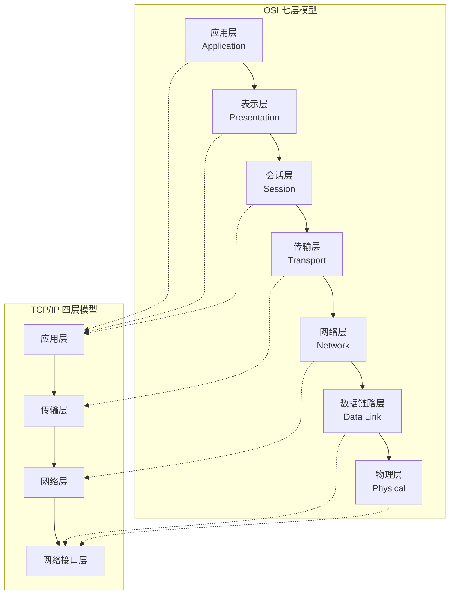
```mermaid
graph TD
    subgraph OSI["OSI 七层模型"]
        L7[应用层<br/>Application]
        L6[表示层<br/>Presentation]
        L5[会话层<br/>Session]
        L4[传输层<br/>Transport]
        L3[网络层<br/>Network]
        L2[数据链路层<br/>Data Link]
        L1[物理层<br/>Physical]
        
        L7 --> L6 --> L5 --> L4 --> L3 --> L2 --> L1
    end
    
    subgraph TCPIP["TCP/IP 四层模型"]
        T4[应用层]
        T3[传输层]
        T2[网络层]
        T1[网络接口层]
        
        T4 --> T3 --> T2 --> T1
    end
    
    L7 -.-> T4
    L6 -.-> T4
    L5 -.-> T4
    L4 -.-> T3
    L3 -.-> T2
    L2 -.-> T1
    L1 -.-> T1
```

**图解说明**：

上图展示了 OSI 七层模型与 TCP/IP 四层模型的对应关系：

- OSI 的**应用层、表示层、会话层**统一为 TCP/IP 的**应用层**
- OSI 的**传输层**对应 TCP/IP 的**传输层**
- OSI 的**网络层**对应 TCP/IP 的**网络层**
- OSI 的**数据链路层、物理层**合并为 TCP/IP 的**网络接口层**

##### 各层功能与核心协议

| 层级 | OSI 模型 | TCP/IP 模型 | 核心功能 | 代表协议/设备 |
|:---:|:---:|:---:|:---|:---|
| 7 | 应用层 | 应用层 | 为用户提供网络服务 | HTTP、FTP、DNS、DHCP |
| 6 | 表示层 | 应用层 | 数据编解码、压缩、加密 | SSL/TLS、JPEG |
| 5 | 会话层 | 应用层 | 建立、管理、终止会话 | RPC、NetBIOS |
| 4 | 传输层 | 传输层 | 端到端的可靠传输 | **TCP**、**UDP**、SCTP |
| 3 | 网络层 | 网络层 | 路由选择、逻辑寻址 | **IP**、ICMP、路由器 |
| 2 | 数据链路层 | 网络接口层 | 物理寻址、帧封装 | **MAC**、交换机、ARP |
| 1 | 物理层 | 网络接口层 | 比特流传输 | 光纤、双绞线、无线 |

**要点解读**：

对于容器网络学习，我们需要重点关注以下三层：

1. **传输层（L4）**：TCP/UDP 端口，这是应用开发最常接触的层
2. **网络层（L3）**：IP 地址、路由表，跨节点通信主要依赖此层
3. **数据链路层（L2）**：MAC 地址、交换机，同网段通信的基础

##### 关键点

> [!IMPORTANT]
> **运维排障思路**：当服务不可达时，应该逐层排查：
>
> 1. 物理层：网线是否连接正常？
> 2. 数据链路层：MAC 地址是否正确？ARP 表是否正确？
> 3. 网络层：IP 是否可达？路由表是否正确？
> 4. 传输层：端口是否监听？防火墙是否放行？
> 5. 应用层：服务是否正常启动？

---

#### 1.2 数据封装与解封装流程

##### 背景

当应用程序需要发送数据时，数据会从上层向下层逐级传递，每经过一层都会添加该层的**头部信息（Header）**，这个过程称为**封装（Encapsulation）**。接收端则进行相反的操作，称为**解封装（Decapsulation）**。

##### 原理

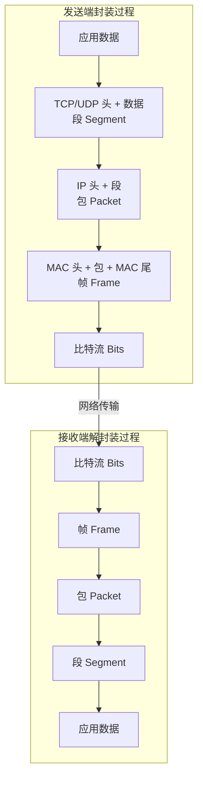
```mermaid
graph TB
    subgraph 发送端["发送端封装过程"]
        direction TB
        A1[应用数据] --> A2[TCP/UDP 头 + 数据<br/>段 Segment]
        A2 --> A3[IP 头 + 段<br/>包 Packet]
        A3 --> A4[MAC 头 + 包 + MAC 尾<br/>帧 Frame]
        A4 --> A5[比特流 Bits]
    end
    
    subgraph 接收端["接收端解封装过程"]
        direction TB
        B5[比特流 Bits] --> B4[帧 Frame]
        B4 --> B3[包 Packet]
        B3 --> B2[段 Segment]
        B2 --> B1[应用数据]
    end
    
    A5 -->|网络传输| B5
```

**图解说明**：

数据在发送端逐层封装，每层添加自己的协议头：

- **应用层**：生成原始数据
- **传输层**：添加 TCP/UDP 头（包含源端口、目的端口）
- **网络层**：添加 IP 头（包含源 IP、目的 IP、TTL）
- **数据链路层**：添加 MAC 头和尾（包含源 MAC、目的 MAC）
- **物理层**：转换为 0/1 比特流进行传输

##### 数据包结构示意

```
+------------------+----------+--------+----------+-----------------+
|   以太网帧头     |  IP 头   | TCP 头 |  数据    |   以太网帧尾    |
|  14 字节         | 20 字节  | 20 字节|  N 字节  |   4 字节        |
+------------------+----------+--------+----------+-----------------+
|←-- 二层 MAC --→|←-三层IP-→|←-四层-→|          |
```

**代码说明**：

以上结构展示了一个完整的以太网帧：

- **以太网帧头（14 字节）**：包含目的 MAC（6B）+ 源 MAC（6B）+ 类型（2B）
- **IP 头（20 字节）**：包含版本、TTL、源 IP、目的 IP 等
- **TCP 头（20 字节）**：包含源端口、目的端口、序列号、标志位等
- **以太网帧尾（4 字节）**：FCS 帧校验序列

---

#### 1.3 TCP 协议详解

##### 背景

TCP（Transmission Control Protocol，传输控制协议）是一种**面向连接**的、**可靠**的传输层协议。它通过三次握手建立连接、四次挥手断开连接，并提供流量控制、拥塞控制等机制来保证数据可靠传输。

##### 原理

###### 1.3.1 套接字（Socket）概念

**套接字 = IP 地址 + 端口号**

例如：`192.168.1.100:8080` 表示一个套接字

> [!NOTE]
> TCP 端口和 UDP 端口是独立的。同一个端口号（如 53）可以同时被 TCP 和 UDP 监听，因为它们属于不同的协议。

###### 1.3.2 TCP 三次握手

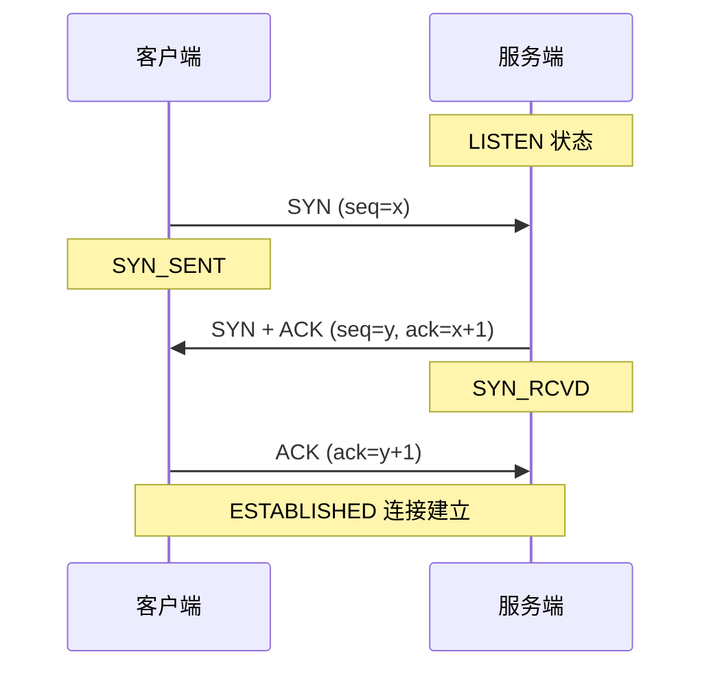
```mermaid
sequenceDiagram
    participant C as 客户端
    participant S as 服务端
    
    Note over S: LISTEN 状态
    C->>S: SYN (seq=x)
    Note over C: SYN_SENT
    S->>C: SYN + ACK (seq=y, ack=x+1)
    Note over S: SYN_RCVD
    C->>S: ACK (ack=y+1)
    Note over C,S: ESTABLISHED 连接建立
```

**图解说明**：

三次握手的过程：

1. **第一次握手**：客户端发送 SYN 包（同步序列号），进入 SYN_SENT 状态
2. **第二次握手**：服务端收到 SYN 后，回复 SYN+ACK 包，进入 SYN_RCVD 状态
3. **第三次握手**：客户端收到后回复 ACK，双方进入 ESTABLISHED 状态，连接建立

###### 1.3.3 TCP 标志位

| 标志位 | 名称 | 作用 |
|:---:|:---:|:---|
| SYN | Synchronize | 发起连接，同步序列号 |
| ACK | Acknowledge | 确认收到数据 |
| FIN | Finish | 请求关闭连接 |
| RST | Reset | 重置连接（异常终止） |
| PSH | Push | 立即推送数据给应用层 |
| URG | Urgent | 紧急数据 |

###### 1.3.4 MSS 与分片机制

**MSS（Maximum Segment Size）**：最大报文段长度，指 TCP 数据部分的最大长度。

```
MTU = 1500 字节（以太网默认）
MSS = MTU - IP头(20) - TCP头(20) = 1460 字节
```

**要点解读**：

> [!IMPORTANT]
> **为什么分片在 TCP 层做而不是 IP 层？**
>
> - TCP 有**序列号**，可以精确知道哪个片丢失，只需重传丢失的片
> - IP 没有重传机制，如果一个分片丢失，需要重传整个原始数据
> - 在 TCP 层分片可以**减少重传开销**

###### 1.3.5 TCP 卸载技术

当数据量较大时，TCP 分片等操作会消耗大量 CPU 资源。现代网卡支持将这些操作**卸载（Offload）**到硬件，减轻 CPU 负担：

| 技术 | 全称 | 作用 |
|:---:|:---|:---|
| TSO | TCP Segmentation Offload | 将 TCP 分片卸载到网卡 |
| GSO | Generic Segmentation Offload | 通用分片卸载 |
| GRO | Generic Receive Offload | 接收端合并小包 |
| LRO | Large Receive Offload | 大包接收卸载 |

**代码说明**：

查看网卡 offload 状态：

```bash
# 查看网卡 offload 配置
ethtool -k eth0

# 输出示例：
# tcp-segmentation-offload: on
# generic-segmentation-offload: on
# generic-receive-offload: on
# large-receive-offload: off
```

---

#### 1.4 UDP 协议特点

##### 背景

UDP（User Datagram Protocol，用户数据报协议）是一种**无连接**的、**不可靠**的传输层协议。它没有握手过程，发送数据时不保证对方能收到。

##### TCP 与 UDP 对比

| 特性 | TCP | UDP |
|:---:|:---:|:---:|
| 连接性 | 面向连接 | 无连接 |
| 可靠性 | 可靠（有确认、重传） | 不可靠 |
| 有序性 | 保证顺序 | 不保证 |
| 速度 | 较慢（握手开销） | 较快 |
| 头部大小 | 20 字节 | 8 字节 |
| 应用场景 | HTTP、数据库、文件传输 | DNS、视频流、游戏 |

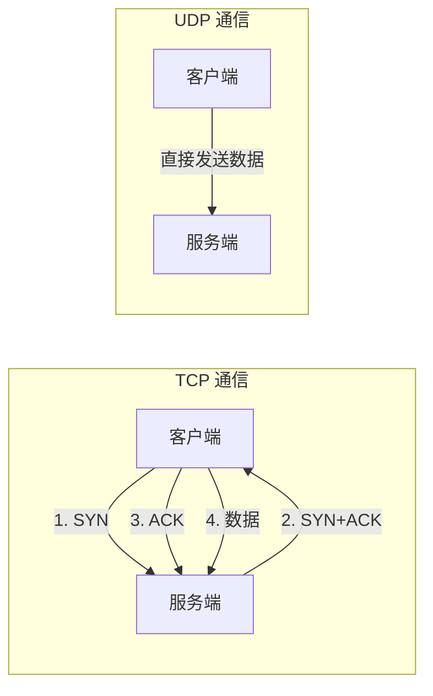
```mermaid
graph LR
    subgraph TCP["TCP 通信"]
        C1[客户端] -->|1. SYN| S1[服务端]
        S1 -->|2. SYN+ACK| C1
        C1 -->|3. ACK| S1
        C1 -->|4. 数据| S1
    end
    
    subgraph UDP["UDP 通信"]
        C2[客户端] -->|直接发送数据| S2[服务端]
    end
```

**图解说明**：

- **TCP**：需要三次握手建立连接后才能传输数据
- **UDP**：直接发送数据，无需建立连接，简单高效但不可靠

---

#### 1.5 使用 nc 工具进行网络测试

##### 背景

`nc`（netcat）是一个功能强大的网络工具，可以用于 TCP/UDP 端口监听、网络调试、数据传输等场景。

##### 常用命令

```bash
# ============ TCP 监听与连接 ============
# 服务端：监听 TCP 8088 端口（-l 表示 listen，-k 表示保持监听）
nc -lk 192.168.1.100 8088

# 客户端：连接 TCP 8088 端口
nc 192.168.1.100 8088

# ============ UDP 监听与连接 ============
# 服务端：监听 UDP 8088 端口（-u 表示使用 UDP）
nc -lu 192.168.1.100 8088

# 客户端：连接 UDP 8088 端口
nc -u 192.168.1.100 8088
```

**代码说明**：

- `-l`：listen 模式，作为服务端监听端口
- `-k`：keep-open，连接断开后保持监听
- `-u`：使用 UDP 协议（默认为 TCP）

---

#### 1.6 使用 tcpdump 和 Wireshark 进行抓包分析

##### 背景

网络抓包是排查网络问题的核心技能。`tcpdump` 是 Linux 下的命令行抓包工具，`Wireshark` 是图形化的抓包分析工具。

##### tcpdump 常用命令

```bash
# 基础抓包：在 eth0 接口抓包并保存到文件
tcpdump -i eth0 -w capture.pcap

# 抓取指定端口的 TCP 包
tcpdump -i eth0 port 8088

# 抓取指定 IP 的包
tcpdump -i eth0 host 192.168.1.100

# 详细显示包内容（-nn 不解析主机名和端口名）
tcpdump -i eth0 -nn -vv port 8088
```

**代码说明**：

| 选项 | 说明 |
|:---:|:---|
| `-i` | 指定网络接口 |
| `-w` | 写入文件（.pcap 格式） |
| `-nn` | 不解析主机名和端口名 |
| `-vv` | 详细输出 |

##### Wireshark 过滤技巧

| 过滤条件 | 说明 |
|:---|:---|
| `tcp.port == 8088` | 过滤 TCP 8088 端口 |
| `tcp.stream eq 0` | 过滤第一个 TCP 流 |
| `tcp.flags.syn == 1` | 过滤 SYN 包 |
| `tcp.len == 0` | 过滤无数据的 TCP 包（握手包） |
| `ip.addr == 192.168.1.100` | 过滤指定 IP |

---

#### 1.7 实战：TCP 与 UDP 抓包分析

##### 实验目的

通过 nc 工具模拟 TCP 和 UDP 通信，使用 tcpdump 抓包，用 Wireshark 分析数据包结构。

##### 实验步骤

**步骤一：TCP 抓包实验**

```bash
# 终端 1：启动 tcpdump 抓包
tcpdump -i eth0 -w tcp_capture.pcap port 8088

# 终端 2：启动 TCP 服务端
nc -lk 192.168.1.100 8088

# 终端 3：启动 TCP 客户端并发送数据
nc 192.168.1.100 8088
# 输入：hello CNI
```

**步骤二：用 Wireshark 分析 TCP 包**

使用 Wireshark 打开 `tcp_capture.pcap`，可以看到：

1. **三次握手**：前三个包（SYN → SYN+ACK → ACK）
2. **数据传输**：带有 PSH 标志的包，包含 "hello CNI" 数据
3. **四次挥手**：断开连接的 FIN 包

**步骤三：UDP 抓包实验**

```bash
# 终端 1：启动 tcpdump 抓包
tcpdump -i eth0 -w udp_capture.pcap udp port 8088

# 终端 2：启动 UDP 服务端
nc -lu 192.168.1.100 8088

# 终端 3：启动 UDP 客户端并发送数据
nc -u 192.168.1.100 8088
# 输入：hello UDP
```

**步骤四：对比分析**

| 对比项 | TCP | UDP |
|:---:|:---:|:---:|
| 握手过程 | 有三次握手 | **无握手** |
| 数据发送 | 有确认机制 | 直接发送 |
| 包数量 | 多（握手 + 数据 + 确认） | 少（仅数据包） |

---

#### 📝 章节小结

本章介绍了网络通信的基础知识：

1. **OSI 七层模型与 TCP/IP 四层模型**：理解网络分层架构的设计思想，掌握各层的职责
2. **数据封装与解封装**：理解数据在网络中传输时的打包和拆包过程
3. **TCP 协议**：掌握三次握手、四次挥手、标志位、MSS 分片等核心概念
4. **UDP 协议**：理解无连接、不可靠传输的特点和应用场景
5. **网络抓包**：学会使用 tcpdump 和 Wireshark 进行网络问题分析

> [!TIP]
> **学习建议**：
>
> 1. 动手实践 nc 和 tcpdump 命令
> 2. 使用 Wireshark 分析真实的网络包
> 3. 理解每一层的头部信息，这对后续学习容器网络非常重要

---

### 第2章 IP 地址与 MAC 地址精讲

#### 🎯 学习目标

- 掌握 IP 地址的点分十进制表示与二进制转换
- 理解有类地址（A/B/C/D/E）与无类地址（CIDR）的区别
- 熟练掌握 VLSM（可变长子网掩码）的计算方法
- 理解 MAC 地址的结构与 OUI 厂商标识
- 掌握二层交换与三层路由的核心区别
- 理解路由转发过程中 IP 和 MAC 地址的变化规律

---

#### 2.1 IP 地址基础

##### 背景

IP 地址是网络层的核心标识，用于在互联网中唯一标识一台设备的逻辑位置。与 MAC 地址不同，IP 地址是**逻辑地址**，可以根据网络规划进行分配和更改。

> [!NOTE]
> IP 地址是逻辑地址，它不与设备绑定。例如，你的手机今天在家获得 `192.168.1.100`，明天同事来你家用他的手机也可能获得这个地址。

##### 原理

###### 2.1.1 点分十进制与二进制转换

IPv4 地址是一个 **32 位的二进制数**，为了便于人类阅读，将其分为 4 组，每组 8 位（1 字节），转换为十进制后用点分隔，称为**点分十进制**。

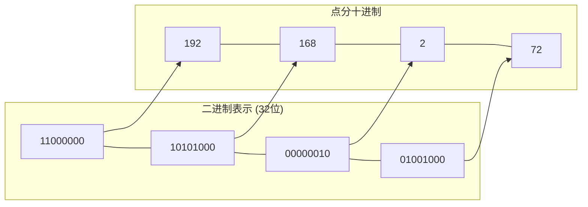
```mermaid
graph LR
    subgraph Binary["二进制表示 (32位)"]
        B1["11000000"] --- B2["10101000"] --- B3["00000010"] --- B4["01001000"]
    end
    
    subgraph Decimal["点分十进制"]
        D1["192"] --- D2["168"] --- D3["2"] --- D4["72"]
    end
    
    B1 --> D1
    B2 --> D2
    B3 --> D3
    B4 --> D4
```

**图解说明**：

上图展示了 IP 地址 `192.168.2.72` 的二进制与十进制转换：

- 每 8 位二进制对应一个十进制数
- 每个十进制数的范围是 0-255

**二进制权重计算表**：

| 位置 | 第7位 | 第6位 | 第5位 | 第4位 | 第3位 | 第2位 | 第1位 | 第0位 |
|:---:|:---:|:---:|:---:|:---:|:---:|:---:|:---:|:---:|
| 权重 | 128 | 64 | 32 | 16 | 8 | 4 | 2 | 1 |
| 示例 | 1 | 1 | 0 | 0 | 0 | 0 | 0 | 0 |
| 计算 | 128 | 64 | 0 | 0 | 0 | 0 | 0 | 0 |

**结果**：128 + 64 = **192**

###### 2.1.2 IP 地址分类（有类地址）

早期的 IP 地址按照**有类**方式划分为 A、B、C、D、E 五类：

| 类别 | 首位模式 | 网络位 | 主机位 | 地址范围 | 用途 |
|:---:|:---:|:---:|:---:|:---|:---|
| A 类 | 0xxxxxxx | 8 位 | 24 位 | 1.0.0.0 ~ 127.255.255.255 | 大型网络 |
| B 类 | 10xxxxxx | 16 位 | 16 位 | 128.0.0.0 ~ 191.255.255.255 | 中型网络 |
| C 类 | 110xxxxx | 24 位 | 8 位 | 192.0.0.0 ~ 223.255.255.255 | 小型网络 |
| D 类 | 1110xxxx | - | - | 224.0.0.0 ~ 239.255.255.255 | 组播地址 |
| E 类 | 1111xxxx | - | - | 240.0.0.0 ~ 255.255.255.255 | 保留/实验 |

**要点解读**：

> [!NOTE]
> 有类地址划分已经过时，现代网络普遍使用**无类域间路由（CIDR）**。但理解有类地址有助于理解网络发展历史和一些遗留配置。

###### 2.1.3 公有地址与私有地址

| 类别 | 私有地址范围 | 可用主机数 |
|:---:|:---|:---:|
| A 类 | 10.0.0.0 ~ 10.255.255.255 | 约 1677 万 |
| B 类 | 172.16.0.0 ~ 172.31.255.255 | 约 104 万 |
| C 类 | 192.168.0.0 ~ 192.168.255.255 | 约 6.5 万 |

**要点解读**：

- **私有地址**只能在内网使用，不能直接访问互联网
- 家庭路由器通常使用 `192.168.0.x` 或 `192.168.1.x`
- 大型企业通常使用 `10.x.x.x` 段，因为地址空间更大

---

#### 2.2 子网划分与 VLSM

##### 背景

在实际网络规划中，很少严格按照 A/B/C 类来划分网络。**VLSM（Variable Length Subnet Mask，可变长子网掩码）**允许我们根据实际需求灵活划分子网，这就是**无类域间路由（CIDR）**的核心思想。

##### 原理

###### 2.2.1 网络位与主机位

一个 IP 地址由两部分组成：

- **网络位**：标识所属网络（固定不变的部分）
- **主机位**：标识网络内的具体主机（可变的部分）

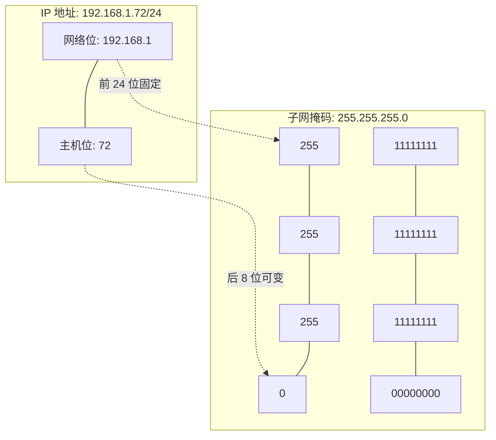
```mermaid
graph TD
    subgraph IP["IP 地址: 192.168.1.72/24"]
        NET["网络位: 192.168.1"] --- HOST["主机位: 72"]
    end
    
    subgraph Mask["子网掩码: 255.255.255.0"]
        M1["255"] --- M2["255"] --- M3["255"] --- M4["0"]
        M1_B["11111111"] --- M2_B["11111111"] --- M3_B["11111111"] --- M4_B["00000000"]
    end
    
    NET -.-> |"前 24 位固定"| M1
    HOST -.-> |"后 8 位可变"| M4
```

**图解说明**：

- `/24` 表示前 24 位是网络位（固定），后 8 位是主机位（可变）
- 子网掩码 `255.255.255.0` 的二进制表示中，`1` 表示网络位，`0` 表示主机位

###### 2.2.2 VLSM 计算实例

**问题**：如何将一个 /24 网络 `192.168.1.0/24` 划分为两个子网？

**解答**：

将掩码从 /24 变为 /25，即多借用 1 位作为网络位：

| 子网 | 网络地址 | 地址范围 | 广播地址 | 可用主机数 |
|:---:|:---|:---|:---|:---:|
| 子网1 | 192.168.1.0/25 | 192.168.1.1 ~ 192.168.1.126 | 192.168.1.127 | 126 |
| 子网2 | 192.168.1.128/25 | 192.168.1.129 ~ 192.168.1.254 | 192.168.1.255 | 126 |

**计算过程**：

```text
/24 掩码：11111111.11111111.11111111.00000000
/25 掩码：11111111.11111111.11111111.10000000
                                      ↑
                                   多借 1 位

第 25 位 = 0 → 子网1：主机位范围 0~127（0000000 ~ 1111111）
第 25 位 = 1 → 子网2：主机位范围 128~255（10000000 ~ 11111111）
```

###### 2.2.3 常用掩码速查表

| CIDR | 子网掩码 | 可用主机数 | 常用场景 |
|:---:|:---|:---:|:---|
| /30 | 255.255.255.252 | 2 | 点对点链路（路由器互联） |
| /29 | 255.255.255.248 | 6 | 小型服务器组 |
| /28 | 255.255.255.240 | 14 | 小型 VLAN |
| /27 | 255.255.255.224 | 30 | 小型办公室 |
| /26 | 255.255.255.192 | 62 | 中型 VLAN |
| /25 | 255.255.255.128 | 126 | 大型 VLAN |
| /24 | 255.255.255.0 | 254 | 标准子网 |
| /16 | 255.255.0.0 | 65534 | 大型网络 |

##### 关键点

> [!IMPORTANT]
> **CNI 中的 /32 掩码**
>
> 在 Kubernetes CNI 中，Pod IP 经常使用 `/32` 掩码。这意味着：
>
> - 所有 32 位都是网络位，没有主机位
> - 每个 Pod IP 都是一个独立的"网络"
> - **同节点的两个 Pod 之间也需要通过路由通信，而非二层交换**
>
> 这是理解 Calico 等 CNI 路由模式的关键！

---

#### 2.3 MAC 地址详解

##### 背景

MAC（Media Access Control）地址是**数据链路层**的物理地址，用于在同一局域网内唯一标识一个网络设备。与 IP 地址不同，MAC 地址通常与网卡硬件绑定，也称为**硬件地址**或**物理地址**。

##### 原理

###### 2.3.1 MAC 地址结构

MAC 地址是一个 **48 位（6 字节）** 的地址，通常用**冒号分十六进制**表示：

```text
AA:BB:CC:DD:EE:FF
└──┬──┘ └──┬──┘
  OUI     设备标识
(厂商)   (序列号)
```

| 部分 | 位数 | 说明 |
|:---:|:---:|:---|
| OUI | 前 24 位 | Organizationally Unique Identifier，厂商标识 |
| 设备标识 | 后 24 位 | 由厂商分配的设备序列号 |

**常见厂商 OUI**：

| OUI 前缀 | 厂商 |
|:---|:---|
| `00:50:56` | VMware |
| `FA:16:3E` | OpenStack |
| `52:54:00` | QEMU/KVM |
| `00:0C:29` | VMware |
| `00:1A:A0` | Dell |

###### 2.3.2 特殊 MAC 地址

| 类型 | 地址 | 说明 |
|:---:|:---|:---|
| 广播 MAC | `FF:FF:FF:FF:FF:FF` | 发送给同一广播域内所有设备 |
| 组播 MAC | `01:xx:xx:xx:xx:xx` | 第 8 位为 1，发送给一组设备 |

###### 2.3.3 MAC 地址表与学习机制

交换机通过**MAC 地址表**来转发数据帧：

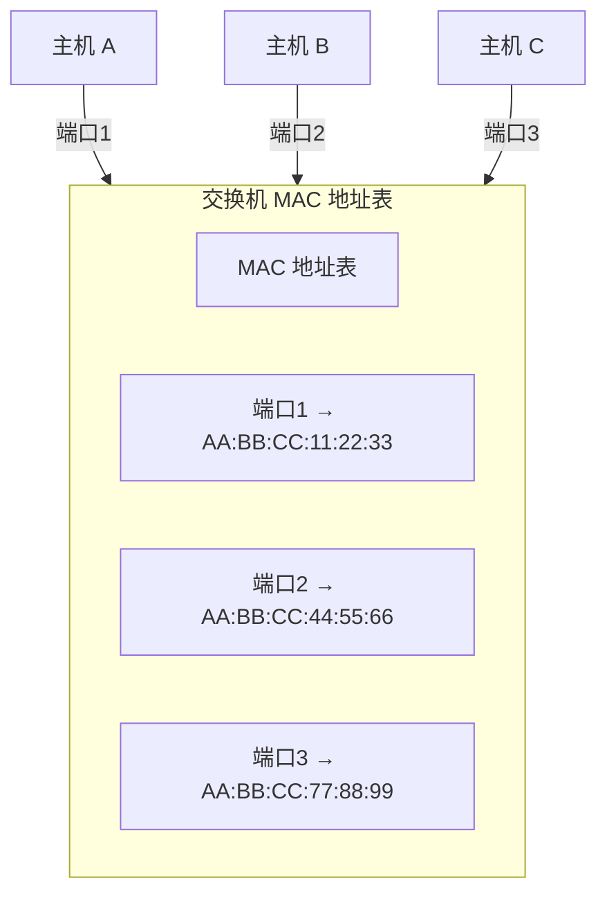
```mermaid
graph TD
    subgraph Switch["交换机 MAC 地址表"]
        T[MAC 地址表]
        E1["端口1 → AA:BB:CC:11:22:33"]
        E2["端口2 → AA:BB:CC:44:55:66"]
        E3["端口3 → AA:BB:CC:77:88:99"]
    end
    
    P1[主机 A] -->|端口1| Switch
    P2[主机 B] -->|端口2| Switch
    P3[主机 C] -->|端口3| Switch
```

**图解说明**：

交换机的学习过程：

1. 收到数据帧后，记录**源 MAC 地址**与**入端口**的对应关系
2. 查找**目的 MAC 地址**对应的端口，从该端口转发
3. 如果找不到目的 MAC，则**泛洪**到所有端口（除入端口外）
4. 表项有**老化时间**，长时间无流量会被删除

---

#### 2.4 二层交换与三层路由

##### 背景

网络通信的核心问题是：**数据包应该发给谁？如何到达目的地？**

根据通信双方是否在**同一网段**，分为：

- **同网段通信**：走二层交换（基于 MAC 地址）
- **跨网段通信**：走三层路由（基于 IP 地址）

##### 原理

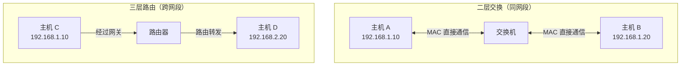
```mermaid
graph TD
    subgraph Layer2["二层交换（同网段）"]
        H1["主机 A<br/>192.168.1.10"] <-->|MAC 直接通信| SW[交换机]
        SW <-->|MAC 直接通信| H2["主机 B<br/>192.168.1.20"]
    end
    
    subgraph Layer3["三层路由（跨网段）"]
        H3["主机 C<br/>192.168.1.10"] -->|经过网关| R[路由器]
        R -->|路由转发| H4["主机 D<br/>192.168.2.20"]
    end
```

**图解说明**：

| 场景 | 判断依据 | 转发方式 | 地址变化 |
|:---:|:---|:---|:---|
| 同网段 | 目的 IP 与源 IP 在同一子网 | 二层交换 | MAC 不变 |
| 跨网段 | 目的 IP 与源 IP 不在同一子网 | 三层路由 | **MAC 每跳改变** |

###### 判断是否同网段的方法

已知：

- 主机 A：`192.168.1.2/24`
- 主机 B：`192.168.1.130/24`
- 主机 C：`192.168.1.130/25`

**分析**：

| 比较 | A 的网段 | B 的网段 | 是否同网段 |
|:---|:---|:---|:---:|
| A 和 B（/24） | 192.168.1.0 | 192.168.1.0 | ✅ 是 |
| A 和 C（不同掩码） | - | - | 需按各自掩码计算 |

**如果 A 使用 /25 掩码**：

- A (192.168.1.2/25)：网段 192.168.1.0，范围 0~127
- C (192.168.1.130/25)：网段 192.168.1.128，范围 128~255
- **结论：A 和 C 不在同一网段！**

---

#### 2.5 ARP 协议与 IP-MAC 映射

##### 背景

当主机知道目的 IP 但不知道目的 MAC 时，需要通过 **ARP（Address Resolution Protocol）** 协议来获取 MAC 地址。

##### 原理

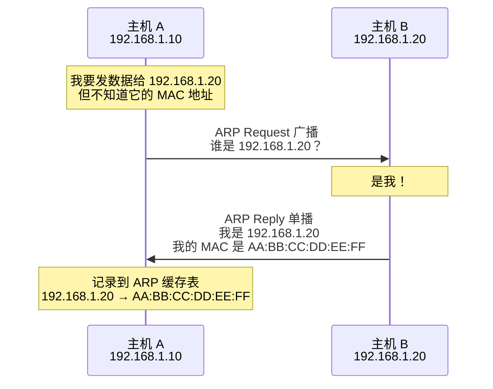
```mermaid
sequenceDiagram
    participant A as 主机 A<br/>192.168.1.10
    participant B as 主机 B<br/>192.168.1.20
    
    Note over A: 我要发数据给 192.168.1.20<br/>但不知道它的 MAC 地址
    A->>B: ARP Request 广播<br/>谁是 192.168.1.20？
    Note over B: 是我！
    B->>A: ARP Reply 单播<br/>我是 192.168.1.20<br/>我的 MAC 是 AA:BB:CC:DD:EE:FF
    Note over A: 记录到 ARP 缓存表<br/>192.168.1.20 → AA:BB:CC:DD:EE:FF
```

**图解说明**：

1. 主机 A 发送 **ARP 请求广播**，询问 `192.168.1.20` 的 MAC 地址
2. 主机 B 收到请求后，**单播回复**自己的 MAC 地址
3. 主机 A 将 IP-MAC 映射**缓存到 ARP 表**，后续通信直接使用

**查看 ARP 缓存**：

```bash
# Linux 查看 ARP 表
ip neigh show

# 或使用传统命令
arp -a
```

---

#### 2.6 路由转发过程中的 IP/MAC 变化规律

##### 背景

这是理解网络转发的**最核心知识点**。很多从业多年的工程师也不一定能说清楚：在路由转发过程中，哪些地址在变化，哪些不变？

##### 原理

**核心结论（非 NAT 场景）**：

| 地址类型 | 是否变化 | 说明 |
|:---:|:---:|:---|
| 源 IP | **不变** | 始终是发送方的 IP |
| 目的 IP | **不变** | 始终是接收方的 IP |
| 源 MAC | **每跳改变** | 变为上一跳设备的出接口 MAC |
| 目的 MAC | **每跳改变** | 变为下一跳设备的入接口 MAC |

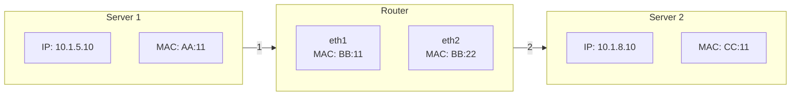
```mermaid
graph LR
    subgraph S1["Server 1"]
        IP1["IP: 10.1.5.10"]
        MAC1["MAC: AA:11"]
    end
    
    subgraph R["Router"]
        R_E1["eth1<br/>MAC: BB:11"]
        R_E2["eth2<br/>MAC: BB:22"]
    end
    
    subgraph S2["Server 2"]
        IP2["IP: 10.1.8.10"]
        MAC2["MAC: CC:11"]
    end
    
    S1 -->|1| R
    R -->|2| S2
```

**图解说明**：

当 Server 1 ping Server 2 时：

| 阶段 | 源 IP | 目的 IP | 源 MAC | 目的 MAC |
|:---:|:---:|:---:|:---:|:---:|
| S1 → R (eth1) | 10.1.5.10 | 10.1.8.10 | **AA:11** | **BB:11** |
| R (eth2) → S2 | 10.1.5.10 | 10.1.8.10 | **BB:22** | **CC:11** |

**要点解读**：

> [!IMPORTANT]
> **关键理解**：
>
> 1. **IP 地址决定最终目的地**，在整个路由过程中始终不变（NAT 除外）
> 2. **MAC 地址决定下一跳**，每经过一个路由器都会改变
> 3. 发送数据时，**目的 MAC 是网关的 MAC**，不是最终目标的 MAC
> 4. 这就是为什么同网段走交换（MAC 直达），跨网段走路由（MAC 逐跳变化）

##### 实验验证

**步骤一：创建测试环境（使用 Containerlab）**

```yaml
name: routing-lab
topology:
  nodes:
    router:
      kind: linux
      image: vyos/vyos:1.2.8
    server1:
      kind: linux
    server2:
      kind: linux
  links:
    - endpoints: ["router:eth1", "server1:net0"]
    - endpoints: ["router:eth2", "server2:net0"]
```

**步骤二：在 Server 2 上抓包**

```bash
# 在 Server 2 的 net0 接口抓包
tcpdump -i net0 -e -nn icmp

# 输出示例：
# 12:00:00.001 BB:22 > CC:11, 10.1.5.10 > 10.1.8.10: ICMP echo request
# 12:00:00.002 CC:11 > BB:22, 10.1.8.10 > 10.1.5.10: ICMP echo reply
```

**步骤三：分析结果**

- **源 MAC（BB:22）**：是路由器 eth2 的 MAC，不是 Server 1 的 MAC
- **源 IP（10.1.5.10）**：仍然是 Server 1 的 IP，没有变化

##### TTL 值的变化

**TTL（Time To Live）**：数据包的生存时间，每经过一个路由器减 1。

| 场景 | TTL 变化 | 说明 |
|:---:|:---:|:---|
| 二层交换 | 不变 | 不经过路由器 |
| 三层路由 | 减 1 | 每跳减 1 |

**作用**：防止数据包在网络中无限循环。当 TTL 减为 0 时，路由器丢弃该数据包。

```bash
# 通过 TTL 判断是否经过路由
ping 10.1.8.10

# 同网段：TTL = 64（Linux 默认）
# 跨一跳：TTL = 63
# 跨两跳：TTL = 62
```

---

#### 2.7 使用 Containerlab 进行网络实验

##### 背景

Containerlab 是一个强大的容器化网络实验工具，可以快速搭建包含路由器、交换机、主机的复杂网络拓扑，非常适合学习和验证网络知识。

##### 实验：二层交换 vs 三层路由

**二层交换拓扑**：

```yaml
name: layer2-lab
topology:
  nodes:
    bridge:
      kind: bridge
    server1:
      kind: linux
      exec:
        - ip addr add 10.1.5.10/24 dev net0
    server2:
      kind: linux
      exec:
        - ip addr add 10.1.5.11/24 dev net0
  links:
    - endpoints: ["bridge:eth1", "server1:net0"]
    - endpoints: ["bridge:eth2", "server2:net0"]
```

**验证**：

```bash
# 在 server1 ping server2
ping 10.1.5.11

# TTL = 64，说明没有经过路由器，走的二层交换
```

**三层路由拓扑**：

```yaml
name: layer3-lab
topology:
  nodes:
    router:
      kind: linux
      image: vyos/vyos:1.2.8
    server1:
      kind: linux
      exec:
        - ip addr add 10.1.5.10/24 dev net0
        - ip route add default via 10.1.5.1
    server2:
      kind: linux
      exec:
        - ip addr add 10.1.8.10/24 dev net0
        - ip route add default via 10.1.8.1
  links:
    - endpoints: ["router:eth1", "server1:net0"]
    - endpoints: ["router:eth2", "server2:net0"]
```

**验证**：

```bash
# 在 server1 ping server2
ping 10.1.8.10

# TTL = 63，说明经过了一跳路由器
```

---

#### 📝 章节小结

本章深入讲解了 IP 地址和 MAC 地址的核心知识：

1. **IP 地址基础**：点分十进制、二进制转换、有类地址分类
2. **VLSM 子网划分**：掌握网络位/主机位计算、快速确定地址范围
3. **MAC 地址结构**：48 位硬件地址、OUI 厂商标识
4. **二层交换 vs 三层路由**：
   - 同网段走交换，MAC 不变
   - 跨网段走路由，MAC 每跳改变
5. **路由转发中的地址变化**：
   - **IP 不变**（NAT 除外）
   - **MAC 每跳改变**

> [!TIP]
> **学习建议**：
>
> 1. 熟练掌握 VLSM 计算，这是网络工程师的基本功
> 2. 使用 Containerlab 动手搭建实验环境
> 3. 通过抓包验证 IP/MAC 地址的变化规律
> 4. 理解 `/32` 掩码在 CNI 中的应用场景

> [!CAUTION]
> **常见误区**：
>
> - ❌ 认为目的 MAC 就是目标主机的 MAC
> - ✅ 目的 MAC 是**下一跳**设备的 MAC（可能是网关）
>
> - ❌ 认为 IP 地址在路由过程中会变化
> - ✅ 在非 NAT 场景下，IP 地址**始终不变**

---

### 第3章 VETH 虚拟网络设备

#### 🎯 学习目标

- 理解 VETH Pair 的概念与工作原理
- 掌握 Linux 网络命名空间（Network Namespace）的基本操作
- 学会手工创建和配置 VETH Pair
- 理解 Linux Bridge 与 VETH 的结合使用
- 掌握 VETH 在容器网络（CNI）中的核心应用

---

#### 3.1 VETH Pair 概念与原理

##### 背景

在容器网络中，每个容器（Pod）都运行在独立的**网络命名空间（Network Namespace）**中，与宿主机的网络隔离。那么，容器如何与外界通信呢？

答案是：**VETH Pair（虚拟以太网设备对）**。

##### 原理

**VETH Pair** 是 Linux 内核提供的一种虚拟网络设备，它**总是成对出现**，就像一根虚拟的网线，一端插在容器内，一端插在宿主机上。

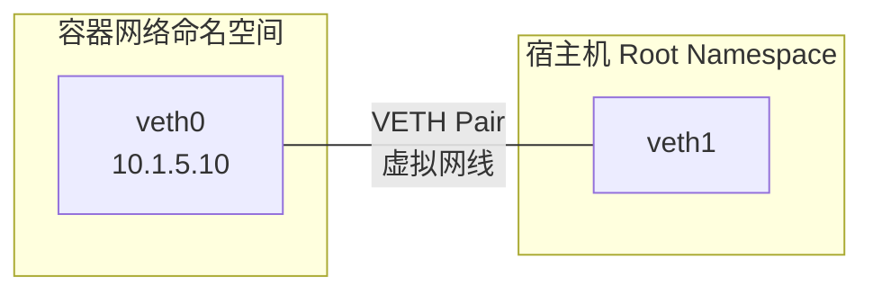
```mermaid
graph LR
    subgraph NS1["容器网络命名空间"]
        V1["veth0<br/>10.1.5.10"]
    end
    
    subgraph ROOT["宿主机 Root Namespace"]
        V2["veth1"]
    end
    
    V1 ---|"VETH Pair<br/>虚拟网线"| V2
```

**图解说明**：

- VETH Pair 由两个虚拟网卡组成，它们**总是成对创建**
- 从一端发送的数据包，会**立即出现在另一端**
- 通过 VETH Pair，可以实现**跨网络命名空间的通信**

##### 核心特性

| 特性 | 说明 |
|:---|:---|
| 成对出现 | 一个 VETH 设备必定有一个 Peer 设备 |
| 双向通信 | 从一端发送的包会从另一端收到 |
| 跨命名空间 | 两端可以分别位于不同的网络命名空间 |
| 即时传输 | 数据包在内核中直接传递，无需经过物理网络 |

> [!NOTE]
> **形象理解**：VETH Pair 就像一根虚拟网线，把容器内部和宿主机连接起来。从网线一端发送的数据，必然从另一端出来。

---

#### 3.2 VETH 在容器网络中的应用

##### 背景

在 Kubernetes 中，每个 Pod 都有自己独立的网络命名空间。Pod 内的应用要与外界通信，必须先将流量从 Pod 的网络命名空间"引出"到宿主机的 Root Namespace，然后才能进行后续的路由或转发。

##### 原理

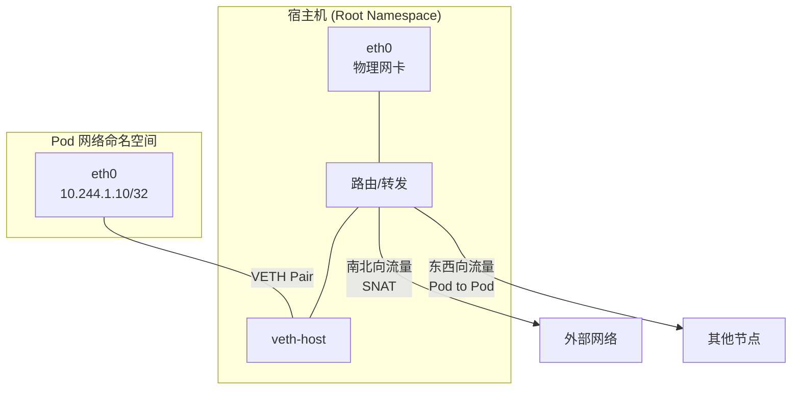
```mermaid
graph TD
    subgraph Host["宿主机 (Root Namespace)"]
        direction TB
        ETH0["eth0<br/>物理网卡"]
        ROUTING["路由/转发"]
        V2["veth-host"]
        
        ETH0 --- ROUTING --- V2
    end
    
    subgraph Pod["Pod 网络命名空间"]
        V1["eth0<br/>10.244.1.10/32"]
    end
    
    V1 ---|"VETH Pair"| V2
    
    ROUTING -->|"南北向流量<br/>SNAT"| INTERNET["外部网络"]
    ROUTING -->|"东西向流量<br/>Pod to Pod"| OTHER["其他节点"]
```

**图解说明**：

1. **Pod 网络命名空间**：Pod 内的 eth0 是 VETH Pair 的一端
2. **宿主机 Root Namespace**：VETH Pair 的另一端在宿主机上
3. **流量转发**：
   - **南北向流量**（Pod ↔ 外网）：从 VETH 到宿主机，经过 SNAT 后发出
   - **东西向流量**（Pod ↔ Pod）：从 VETH 到宿主机，根据路由转发到目标节点

##### CNI 实现模式

不同的 CNI 插件使用 VETH 的方式略有不同：

| CNI | VETH 使用方式 | 说明 |
|:---:|:---|:---|
| Flannel | VETH + Bridge | Pod 的 VETH 插入到 cni0 网桥 |
| Calico | VETH + Routing | Pod 的 VETH 直接路由，使用 /32 掩码 |
| Cilium | VETH + eBPF | 使用 eBPF 加速，可绕过部分内核协议栈 |

---

#### 3.3 手工创建 VETH Pair

##### 背景

理解 VETH Pair 的最好方式是亲手创建一个。通过手工操作，可以深入理解容器网络的底层实现。

##### 实现步骤

###### 步骤一：创建网络命名空间

```bash
# 创建两个网络命名空间
ip netns add ns1
ip netns add ns2

# 查看已创建的命名空间
ip netns list
```

**代码说明**：

- `ip netns add`：创建网络命名空间
- `ip netns list`：列出所有网络命名空间

###### 步骤二：创建 VETH Pair

```bash
# 创建 VETH Pair：veth01 和 veth10
ip link add veth01 type veth peer name veth10

# 查看创建的设备
ip link show type veth
```

**代码说明**：

- `ip link add ... type veth peer name ...`：创建一对 VETH 设备
- 此时两个设备都在 Root Namespace 中

###### 步骤三：分配到不同命名空间

```bash
# 将 veth01 移动到 ns1
ip link set veth01 netns ns1

# 将 veth10 移动到 ns2
ip link set veth10 netns ns2
```

###### 步骤四：配置 IP 地址并启用

```bash
# 在 ns1 中配置 IP 并启用接口
ip netns exec ns1 ip addr add 10.1.5.10/24 dev veth01
ip netns exec ns1 ip link set veth01 up
ip netns exec ns1 ip link set lo up

# 在 ns2 中配置 IP 并启用接口
ip netns exec ns2 ip addr add 10.1.5.11/24 dev veth10
ip netns exec ns2 ip link set veth10 up
ip netns exec ns2 ip link set lo up
```

###### 步骤五：测试连通性

```bash
# 从 ns1 ping ns2
ip netns exec ns1 ping 10.1.5.11

# 应该能够 ping 通，输出类似：
# PING 10.1.5.11 (10.1.5.11) 56(84) bytes of data.
# 64 bytes from 10.1.5.11: icmp_seq=1 ttl=64 time=0.050 ms
```

###### 步骤六：查看 VETH Pair 关系

```bash
# 在 ns1 中查看 veth01 的 peer index
ip netns exec ns1 ethtool -S veth01

# 输出示例：
# NIC statistics:
#      peer_ifindex: 12  # peer 的接口索引

# 在 ns2 中查看 veth10 的接口索引
ip netns exec ns2 ip link show veth10
# 应该显示接口索引为 12
```

###### 清理环境

```bash
# 删除命名空间（会自动删除其中的 VETH 设备）
ip netns del ns1
ip netns del ns2
```

---

#### 3.4 Linux Bridge 与 VETH

##### 背景

在 Flannel 等 CNI 插件中，同一节点上的多个 Pod 需要互相通信。如果每对 Pod 之间都创建一个 VETH Pair，网络结构会非常复杂。

解决方案：引入 **Linux Bridge（网桥）**，让所有 Pod 的 VETH 都"插"在同一个网桥上。

##### 原理

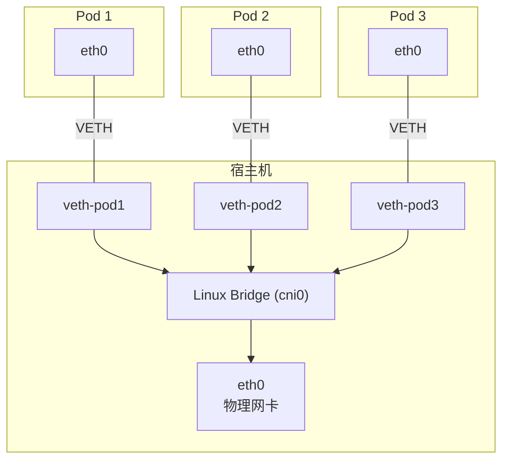
```mermaid
graph TD
    subgraph Host["宿主机"]
        BRIDGE["Linux Bridge (cni0)"]
        ETH0["eth0<br/>物理网卡"]
        
        V1H["veth-pod1"]
        V2H["veth-pod2"]
        V3H["veth-pod3"]
        
        V1H --> BRIDGE
        V2H --> BRIDGE
        V3H --> BRIDGE
        BRIDGE --> ETH0
    end
    
    subgraph Pod1["Pod 1"]
        V1P["eth0"]
    end
    
    subgraph Pod2["Pod 2"]
        V2P["eth0"]
    end
    
    subgraph Pod3["Pod 3"]
        V3P["eth0"]
    end
    
    V1P ---|VETH| V1H
    V2P ---|VETH| V2H
    V3P ---|VETH| V3H
```

**图解说明**：

- 每个 Pod 的 VETH 一端在 Pod 内（eth0），另一端插在宿主机的 cni0 网桥上
- 同节点的 Pod 之间通信：通过 cni0 网桥的**二层交换**完成
- 跨节点的 Pod 通信：从网桥经路由转发到物理网卡

##### 手工实现 Bridge + VETH

```bash
# 1. 创建两个命名空间
ip netns add ns1
ip netns add ns2

# 2. 创建 Linux Bridge
ip link add br0 type bridge
ip link set br0 up

# 3. 创建两对 VETH
ip link add int0 type veth peer name br-int0
ip link add int1 type veth peer name br-int1

# 4. 将 VETH 一端移入命名空间
ip link set int0 netns ns1
ip link set int1 netns ns2

# 5. 将 VETH 另一端插入 Bridge
ip link set br-int0 master br0
ip link set br-int1 master br0
ip link set br-int0 up
ip link set br-int1 up

# 6. 配置命名空间内的 IP
ip netns exec ns1 ip addr add 10.1.5.10/24 dev int0
ip netns exec ns1 ip link set int0 up
ip netns exec ns1 ip link set lo up

ip netns exec ns2 ip addr add 10.1.5.11/24 dev int1
ip netns exec ns2 ip link set int1 up
ip netns exec ns2 ip link set lo up

# 7. 测试连通性
ip netns exec ns1 ping 10.1.5.11
```

**代码说明**：

- `ip link set ... master br0`：将接口插入网桥，相当于把网线插入交换机
- 插入网桥后，该接口会显示 `master br0` 标识

##### 查看 Bridge 状态

```bash
# 查看所有网桥
brctl show

# 输出示例：
# bridge name     bridge id               STP enabled     interfaces
# br0             8000.aabbccdd1122       no              br-int0
#                                                         br-int1

# 查看网桥的 MAC 地址表
brctl showmacs br0
```

---

#### 3.5 VETH 在不同 CNI 中的应用

##### 背景

不同的 CNI 插件虽然都使用 VETH，但实现方式和网络模型有明显区别。

##### Flannel 的 Bridge 模式

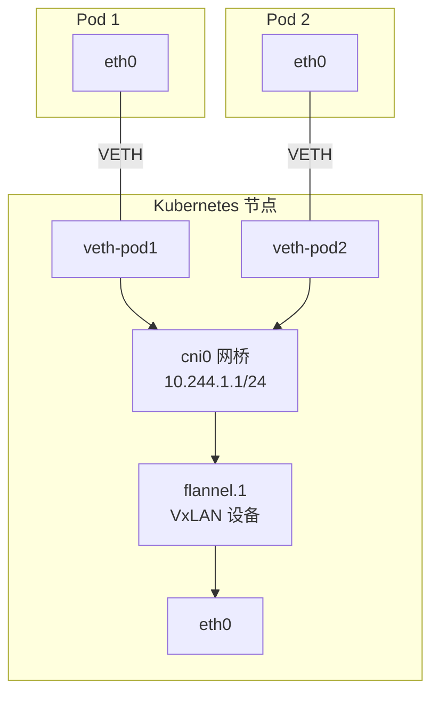
```mermaid
graph TD
    subgraph Node["Kubernetes 节点"]
        CNI0["cni0 网桥<br/>10.244.1.1/24"]
        FLANNEL["flannel.1<br/>VxLAN 设备"]
        ETH0["eth0"]
        
        V1["veth-pod1"] --> CNI0
        V2["veth-pod2"] --> CNI0
        CNI0 --> FLANNEL
        FLANNEL --> ETH0
    end
    
    subgraph Pod1["Pod 1<br/>10.244.1.10"]
        E1["eth0"]
    end
    
    subgraph Pod2["Pod 2<br/>10.244.1.11"]
        E2["eth0"]
    end
    
    E1 ---|VETH| V1
    E2 ---|VETH| V2
```

**要点解读**：

| 特性 | Flannel Bridge 模式 |
|:---|:---|
| Pod 掩码 | **/24**（同节点 Pod 同网段） |
| 同节点通信 | 通过 cni0 网桥**二层交换** |
| 跨节点通信 | 通过 flannel.1 VxLAN 封装 |
| 优点 | 配置简单，同节点通信高效 |
| 缺点 | 二层广播域可能导致广播风暴 |

##### Calico 的路由模式

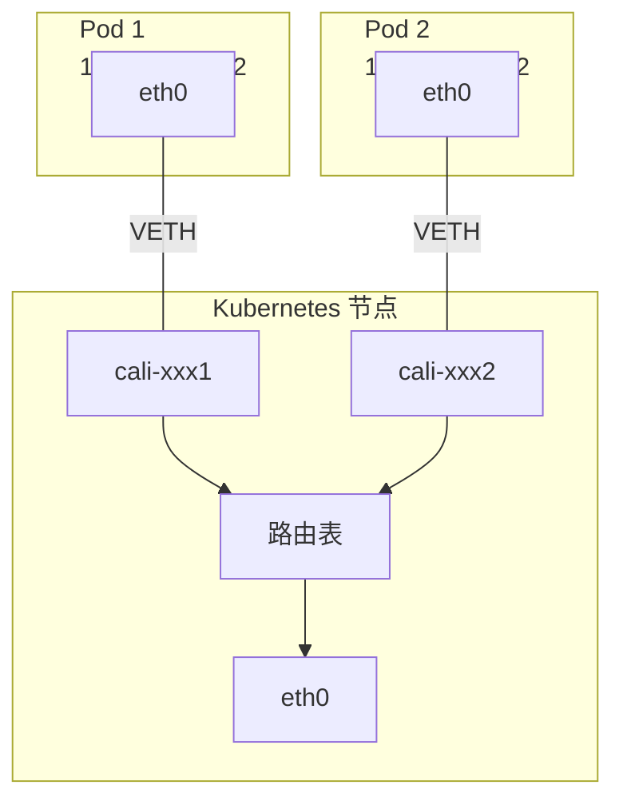
```mermaid
graph TD
    subgraph Node["Kubernetes 节点"]
        ROUTING["路由表"]
        ETH0["eth0"]
        
        V1["cali-xxx1"] --> ROUTING
        V2["cali-xxx2"] --> ROUTING
        ROUTING --> ETH0
    end
    
    subgraph Pod1["Pod 1<br/>10.244.1.10/32"]
        E1["eth0"]
    end
    
    subgraph Pod2["Pod 2<br/>10.244.1.11/32"]
        E2["eth0"]
    end
    
    E1 ---|VETH| V1
    E2 ---|VETH| V2
```

**要点解读**：

| 特性 | Calico 路由模式 |
|:---|:---|
| Pod 掩码 | **/32**（每个 Pod 独立网络） |
| 同节点通信 | 通过**路由表**三层转发 |
| 跨节点通信 | BGP 协议或 IPIP/VxLAN 封装 |
| 优点 | 无广播风暴，支持网络策略 |
| 缺点 | 需要维护路由表，配置较复杂 |

> [!IMPORTANT]
> **Calico 使用 /32 掩码的关键意义**：
>
> - 使用 /32 掩码意味着**没有任何 IP 与该 Pod 同网段**
> - 因此同节点的 Pod 之间也**必须走路由**，而非二层交换
> - 这使得 Calico 可以在**路由层面实施网络策略**

---

#### 3.6 使用 Containerlab 模拟 VETH 网络

##### 简单 VETH 拓扑

```yaml
name: veth-demo
topology:
  nodes:
    server1:
      kind: linux
      exec:
        - ip addr add 10.1.5.10/24 dev net0
    server2:
      kind: linux
      exec:
        - ip addr add 10.1.5.11/24 dev net0
  links:
    - endpoints: ["server1:net0", "server2:net0"]
```

**代码说明**：

- `links` 定义的连接会自动创建 VETH Pair
- server1 的 net0 和 server2 的 net0 通过 VETH 直连

##### Bridge + VETH 拓扑

```yaml
name: bridge-veth-demo
topology:
  nodes:
    bridge:
      kind: bridge
    server1:
      kind: linux
      exec:
        - ip addr add 10.1.5.10/24 dev net0
    server2:
      kind: linux
      exec:
        - ip addr add 10.1.5.11/24 dev net0
  links:
    - endpoints: ["bridge:eth1", "server1:net0"]
    - endpoints: ["bridge:eth2", "server2:net0"]
```

**代码说明**：

- `kind: bridge` 创建一个 Linux Bridge
- server1 和 server2 都通过 VETH 连接到这个 Bridge
- 可以使用 `brctl show` 查看 Bridge 上的接口

##### 部署与验证

```bash
# 部署拓扑
clab deploy -t veth-demo.yaml

# 进入容器测试
docker exec -it clab-veth-demo-server1 ping 10.1.5.11

# 查看 VETH Pair 关系
docker exec -it clab-veth-demo-server1 ethtool -S net0

# 清理环境
clab destroy -t veth-demo.yaml
```

---

#### 3.7 常见问题与排障

##### 问题1：ping 自己不通

**现象**：在命名空间内 ping 自己的 IP 地址不通

**原因**：loopback 接口（lo）未启用

**解决**：

```bash
ip netns exec ns1 ip link set lo up
```

> [!TIP]
> 创建网络命名空间后，记得启用 lo 接口。虽然 ping 自己通常不经过 lo，但某些协议栈处理需要 lo 处于 UP 状态。

##### 问题2：如何判断两个接口是否为 VETH Pair

**方法**：使用 `ethtool -S` 查看 peer_ifindex

```bash
# 查看 veth0 的 peer 接口索引
ethtool -S veth0 | grep peer_ifindex

# 对比另一端的接口索引
ip link show | grep "12:"  # 假设 peer_ifindex 是 12
```

##### 问题3：如何查看接口属于哪个 Bridge

**方法**：查看接口的 `master` 属性

```bash
ip link show veth0

# 输出中如果包含 master br0，说明该接口插在 br0 网桥上
# 例如：5: veth0@eth0: <BROADCAST,MULTICAST,UP> ... master br0 state UP
```

---

#### 📝 章节小结

本章深入讲解了 VETH 虚拟网络设备：

1. **VETH Pair 概念**：成对出现的虚拟网卡，用于跨网络命名空间通信
2. **CNI 中的应用**：所有主流 CNI 都使用 VETH 将 Pod 流量引入宿主机
3. **手工创建 VETH**：掌握 `ip link add ... type veth peer name ...` 命令
4. **Linux Bridge**：多个 VETH 可以插入同一个 Bridge，实现二层交换
5. **CNI 实现差异**：
   - Flannel：VETH + Bridge，同节点走二层
   - Calico：VETH + Routing（/32 掩码），同节点也走三层

> [!TIP]
> **学习建议**：
>
> 1. 动手执行手工创建 VETH 的全部步骤
> 2. 使用 Containerlab 快速搭建各种 VETH 拓扑
> 3. 对比 Flannel 和 Calico 的 VETH 使用方式
> 4. 理解 "VETH 是容器网络的基石" 这一核心概念

---

### 第4章 Host-Gateway 网络模式

#### 🎯 学习目标

- 理解 Host-Gateway（主机网关）模式的核心概念
- 掌握静态路由在容器网络中的应用
- 学会使用 Containerlab 模拟 Host-GW 网络
- 掌握手工配置 Host-GW 模式的完整步骤
- 理解 Host-GW 与 Overlay 网络的优劣对比

---

#### 4.1 Host-Gateway 概念与原理

##### 背景

在容器网络中，Pod 需要与其他节点上的 Pod 通信。实现跨节点通信有两种主要方式：

1. **Overlay 网络**：将容器网络封装在底层网络之上（如 VxLAN、IPIP）
2. **Host-Gateway**：利用主机的路由功能直接转发容器流量

**Host-Gateway（主机网关）**是最简单、性能最高的容器网络模式之一。

##### 原理

**Host-Gateway** 的核心思想：**把宿主机当作 Pod 的网关**。

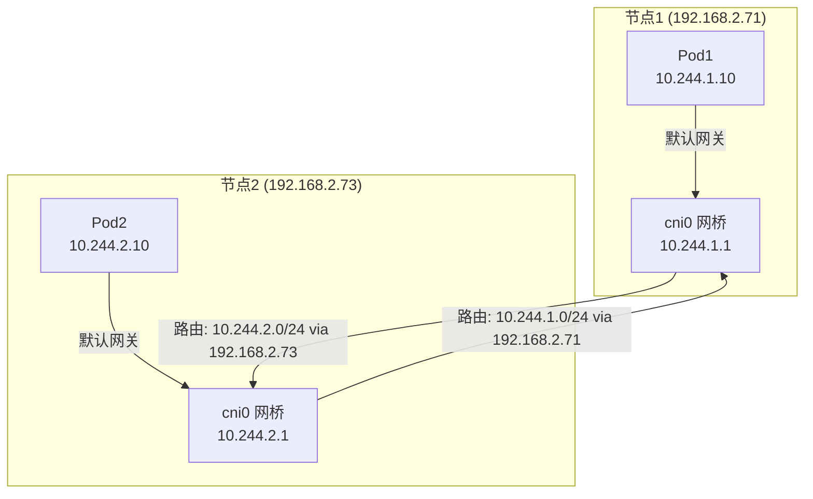
```mermaid
graph TD
    subgraph Node1["节点1 (192.168.2.71)"]
        GW1["cni0 网桥<br/>10.244.1.1"]
        P1["Pod1<br/>10.244.1.10"]
        P1 -->|"默认网关"| GW1
    end
    
    subgraph Node2["节点2 (192.168.2.73)"]
        GW2["cni0 网桥<br/>10.244.2.1"]
        P2["Pod2<br/>10.244.2.10"]
        P2 -->|"默认网关"| GW2
    end
    
    GW1 -->|"路由: 10.244.2.0/24 via 192.168.2.73"| GW2
    GW2 -->|"路由: 10.244.1.0/24 via 192.168.2.71"| GW1
```

**图解说明**：

1. Pod1 发送数据包到 Pod2（目的地址 10.244.2.10）
2. Pod1 的默认网关是 cni0 网桥（10.244.1.1）
3. 节点1 查询路由表：去往 10.244.2.0/24 的下一跳是 192.168.2.73
4. 数据包发送到节点2，节点2 将其转发给 Pod2

**关键理解**：

> [!NOTE]
> **Host-Gateway = 把主机当网关**
>
> 就像你家的无线路由器是你手机的网关一样，Pod 把宿主机当作自己的网关。所有出站流量都先发给宿主机，由宿主机负责路由转发。

---

#### 4.2 Host-GW 与 Overlay 网络对比

##### 原理对比

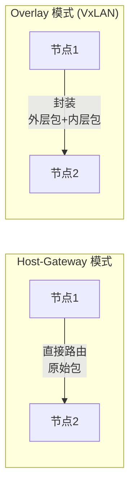
```mermaid
graph LR
    subgraph HostGW["Host-Gateway 模式"]
        H1["节点1"] -->|"直接路由<br/>原始包"| H2["节点2"]
    end
    
    subgraph Overlay["Overlay 模式 (VxLAN)"]
        O1["节点1"] -->|"封装<br/>外层包+内层包"| O2["节点2"]
    end
```

**图解说明**：

| 特性 | Host-Gateway | Overlay (VxLAN/IPIP) |
|:---|:---|:---|
| **性能** | ⭐⭐⭐⭐⭐ 最高 | ⭐⭐⭐ 有封装开销 |
| **MTU** | 无损耗（1500） | 有损耗（1450左右） |
| **配置复杂度** | 简单 | 中等 |
| **对底层网络要求** | 节点必须二层可达 | 节点只需三层可达 |
| **Pod IP 暴露** | 暴露在物理网络 | 封装隐藏 |
| **跨子网** | ❌ 不支持 | ✅ 支持 |

##### 适用场景

| 场景 | 推荐模式 |
|:---|:---|
| 节点在同一二层网络 | **Host-Gateway**（性能最优） |
| 节点跨子网/跨机房 | **Overlay**（必须封装） |
| 对性能敏感的业务 | **Host-Gateway** |
| 多云/混合云环境 | **Overlay** |

> [!IMPORTANT]
> **Host-GW 的限制**：
>
> 节点之间必须**二层可达**（在同一个广播域）。如果节点跨子网，数据包无法直接路由，必须使用 Overlay 封装。

---

#### 4.3 使用 Containerlab 实现 Host-GW

##### 背景

Containerlab 可以快速搭建包含路由器和主机的网络拓扑，非常适合理解 Host-GW 的工作原理。

##### 网络拓扑设计

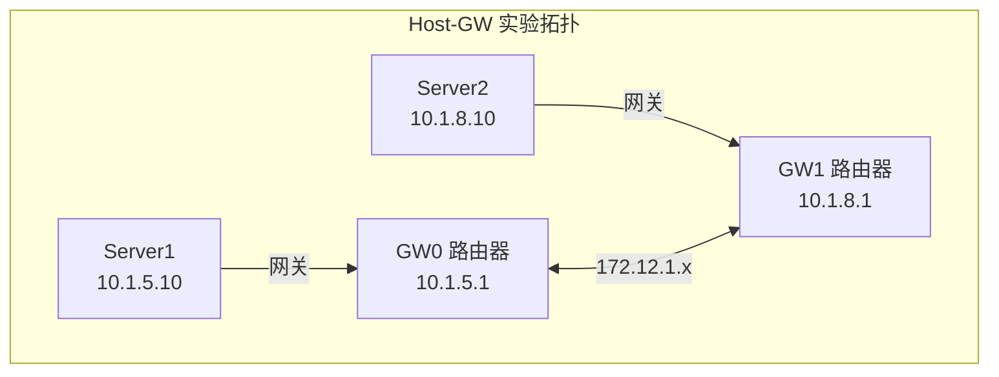
```mermaid
graph TD
    subgraph Topology["Host-GW 实验拓扑"]
        GW0["GW0 路由器<br/>10.1.5.1"]
        GW1["GW1 路由器<br/>10.1.8.1"]
        S1["Server1<br/>10.1.5.10"]
        S2["Server2<br/>10.1.8.10"]
        
        S1 -->|"网关"| GW0
        S2 -->|"网关"| GW1
        GW0 <-->|"172.12.1.x"| GW1
    end
```

**图解说明**：

- Server1 的网关是 GW0（10.1.5.1）
- Server2 的网关是 GW1（10.1.8.1）
- GW0 和 GW1 通过 172.12.1.x 互联
- GW0 需要知道如何到达 10.1.8.0/24，GW1 需要知道如何到达 10.1.5.0/24

##### Containerlab 配置文件

```yaml
name: host-gw-lab
topology:
  nodes:
    # 路由器 GW0
    gw0:
      kind: linux
      image: vyos/vyos:1.2.8
      startup-config: gw0.cfg
    
    # 路由器 GW1  
    gw1:
      kind: linux
      image: vyos/vyos:1.2.8
      startup-config: gw1.cfg
    
    # 服务器 Server1
    server1:
      kind: linux
      exec:
        - ip addr add 10.1.5.10/24 dev net0
        - ip route add default via 10.1.5.1
    
    # 服务器 Server2
    server2:
      kind: linux
      exec:
        - ip addr add 10.1.8.10/24 dev net0
        - ip route add default via 10.1.8.1
  
  links:
    # Server1 连接 GW0
    - endpoints: ["gw0:eth1", "server1:net0"]
    # Server2 连接 GW1
    - endpoints: ["gw1:eth1", "server2:net0"]
    # GW0 和 GW1 互联
    - endpoints: ["gw0:eth2", "gw1:eth2"]
```

##### GW0 路由配置 (gw0.cfg)

```text
# 接口配置
set interfaces ethernet eth1 address 10.1.5.1/24
set interfaces ethernet eth2 address 172.12.1.10/24

# 静态路由：去往 10.1.8.0/24 的下一跳是 GW1
set protocols static route 10.1.8.0/24 next-hop 172.12.1.11
```

##### GW1 路由配置 (gw1.cfg)

```text
# 接口配置
set interfaces ethernet eth1 address 10.1.8.1/24
set interfaces ethernet eth2 address 172.12.1.11/24

# 静态路由：去往 10.1.5.0/24 的下一跳是 GW0
set protocols static route 10.1.5.0/24 next-hop 172.12.1.10
```

##### 验证连通性

```bash
# 部署拓扑
clab deploy -t host-gw-lab.yaml

# 从 Server1 ping Server2
docker exec -it clab-host-gw-lab-server1 ping 10.1.8.10

# 观察 TTL 变化
# TTL = 62（经过两个路由器，从 64 减 2）

# 清理
clab destroy -t host-gw-lab.yaml
```

---

#### 4.4 手工实现 Host-GW 模式

##### 背景

理解 Host-GW 最好的方式是手工实现一个完整的配置，模拟 Flannel 的 Host-GW 模式。

##### 实验拓扑

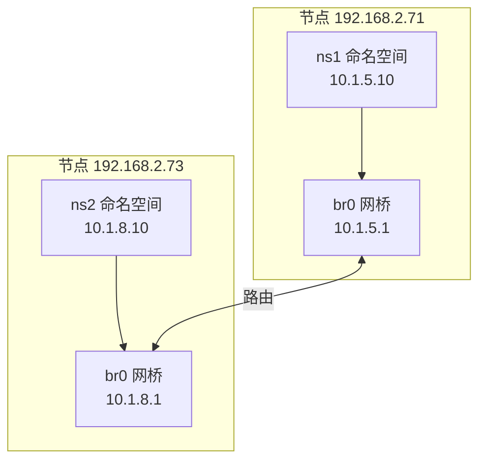
```mermaid
graph TD
    subgraph BPF71["节点 192.168.2.71"]
        BR0_1["br0 网桥<br/>10.1.5.1"]
        NS1["ns1 命名空间<br/>10.1.5.10"]
        NS1 --> BR0_1
    end
    
    subgraph BPF73["节点 192.168.2.73"]
        BR0_2["br0 网桥<br/>10.1.8.1"]
        NS2["ns2 命名空间<br/>10.1.8.10"]
        NS2 --> BR0_2
    end
    
    BR0_1 <-->|"路由"| BR0_2
```

##### 实现步骤（节点1: 192.168.2.71）

###### 步骤一：创建网络基础设施

```bash
# 创建网络命名空间（模拟 Pod）
ip netns add ns1

# 创建 Linux Bridge（模拟 cni0 网桥）
ip link add br0 type bridge
ip link set br0 up

# 创建 VETH Pair
ip link add int0 type veth peer name br-int0
```

###### 步骤二：配置命名空间内的网络

```bash
# 将 VETH 一端移入命名空间
ip link set int0 netns ns1

# 配置命名空间内的接口
ip netns exec ns1 ip addr add 10.1.5.10/24 dev int0
ip netns exec ns1 ip link set int0 up
ip netns exec ns1 ip link set lo up

# 配置默认路由（指向网关）
ip netns exec ns1 ip route add default via 10.1.5.1
```

###### 步骤三：配置宿主机网桥

```bash
# 将 VETH 另一端插入网桥
ip link set br-int0 master br0
ip link set br-int0 up

# 给网桥配置 IP（作为 Pod 的网关）
ip addr add 10.1.5.1/24 dev br0
```

###### 步骤四：添加跨节点路由

```bash
# 添加静态路由：去往 10.1.8.0/24 的下一跳是节点2
ip route add 10.1.8.0/24 via 192.168.2.73 dev ens160
```

##### 实现步骤（节点2: 192.168.2.73）

```bash
# 创建网络命名空间
ip netns add ns2

# 创建网桥
ip link add br0 type bridge
ip link set br0 up

# 创建 VETH Pair 并配置
ip link add int0 type veth peer name br-int0
ip link set int0 netns ns2

# 配置命名空间
ip netns exec ns2 ip addr add 10.1.8.10/24 dev int0
ip netns exec ns2 ip link set int0 up
ip netns exec ns2 ip link set lo up
ip netns exec ns2 ip route add default via 10.1.8.1

# 配置网桥
ip link set br-int0 master br0
ip link set br-int0 up
ip addr add 10.1.8.1/24 dev br0

# 添加跨节点路由
ip route add 10.1.5.0/24 via 192.168.2.71 dev ens160
```

##### 验证测试

```bash
# 从节点1的 ns1 ping 节点2的 ns2
ip netns exec ns1 ping 10.1.8.10

# 应该能够 ping 通，TTL = 62（经过两跳）
```

##### 查看路由表

```bash
# 节点1 路由表
ip route show

# 输出类似：
# 10.1.5.0/24 dev br0 proto kernel scope link src 10.1.5.1
# 10.1.8.0/24 via 192.168.2.73 dev ens160  # Host-GW 关键路由
```

**代码说明**：

- `10.1.8.0/24 via 192.168.2.73`：这就是 Host-GW 的核心路由
- 去往 Pod 网段（10.1.8.0/24）的流量，下一跳是对端节点（192.168.2.73）
- 这与 Flannel Host-GW 模式自动创建的路由完全一致

---

#### 4.5 Host-GW 在 Flannel 中的实现

##### 背景

Flannel 是 Kubernetes 中最常用的 CNI 插件之一。它支持多种后端模式，其中 Host-GW 是性能最高的模式。

##### Flannel Host-GW 架构

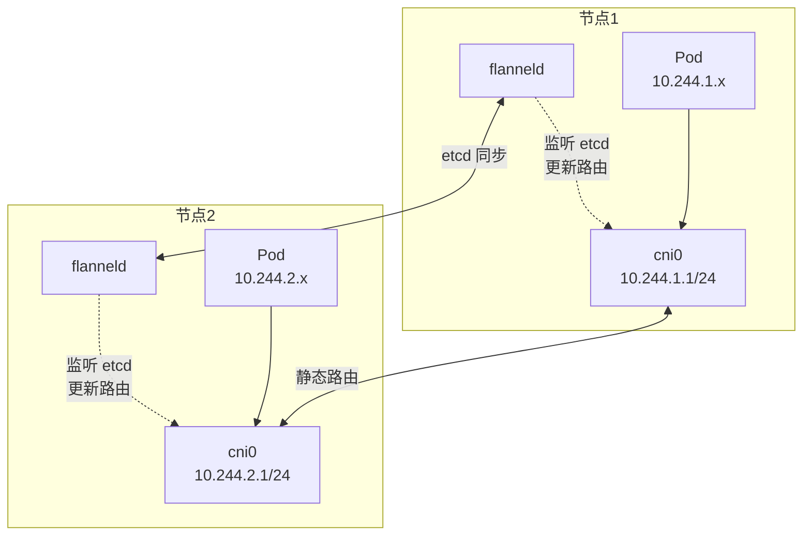
```mermaid
graph TD
    subgraph Node1["节点1"]
        CNI0_1["cni0<br/>10.244.1.1/24"]
        FLANNELD1["flanneld"]
        P1["Pod<br/>10.244.1.x"]
        P1 --> CNI0_1
        FLANNELD1 -.->|"监听 etcd<br/>更新路由"| CNI0_1
    end
    
    subgraph Node2["节点2"]
        CNI0_2["cni0<br/>10.244.2.1/24"]
        FLANNELD2["flanneld"]
        P2["Pod<br/>10.244.2.x"]
        P2 --> CNI0_2
        FLANNELD2 -.->|"监听 etcd<br/>更新路由"| CNI0_2
    end
    
    FLANNELD1 <-->|"etcd 同步"| FLANNELD2
    CNI0_1 <-->|"静态路由"| CNI0_2
```

**图解说明**：

1. **flanneld** 进程监听 etcd 中的网络配置
2. 当新节点加入或 Pod 网段变化时，flanneld 自动更新路由表
3. 每个节点的路由表包含所有其他节点的 Pod 网段路由

##### Flannel Host-GW 配置

```json
{
  "Network": "10.244.0.0/16",
  "Backend": {
    "Type": "host-gw"
  }
}
```

##### 查看 Flannel 创建的路由

```bash
# 在 Kubernetes 节点上查看路由表
ip route show | grep 10.244

# 输出示例（假设有三个节点）：
# 10.244.0.0/24 via 192.168.1.10 dev eth0  # 节点1 的 Pod 网段
# 10.244.1.0/24 dev cni0 proto kernel scope link src 10.244.1.1  # 本节点
# 10.244.2.0/24 via 192.168.1.12 dev eth0  # 节点3 的 Pod 网段
```

**要点解读**：

> [!IMPORTANT]
> **Flannel Host-GW 的路由特征**：
>
> - 本节点的 Pod 网段：`dev cni0`（直连）
> - 其他节点的 Pod 网段：`via <节点IP>`（通过节点路由）
> - flanneld 自动维护这些路由，无需手工配置

---

#### 4.6 Next Hop 的核心作用

##### 背景

在 Host-GW 模式中，**Next Hop（下一跳）**是最关键的概念。理解 Next Hop 对于排障和网络设计至关重要。

##### 原理

```mermaid
sequenceDiagram
    participant Pod1 as Pod1<br/>10.244.1.10
    participant Node1 as 节点1<br/>192.168.2.71
    participant Node2 as 节点2<br/>192.168.2.73
    participant Pod2 as Pod2<br/>10.244.2.10
    
    Pod1->>Node1: 目的: 10.244.2.10<br/>下一跳: 10.244.1.1 (网关)
    Note over Node1: 查路由表:<br/>10.244.2.0/24 via 192.168.2.73
    Node1->>Node2: 目的: 10.244.2.10<br/>下一跳: 192.168.2.73
    Note over Node2: 查路由表:<br/>10.244.2.0/24 dev cni0
    Node2->>Pod2: 目的: 10.244.2.10<br/>直接投递
```

**图解说明**：

1. **Pod1 → Node1**：Pod1 把所有出站流量发给默认网关
2. **Node1 查路由表**：发现去往 10.244.2.0/24 的下一跳是 192.168.2.73
3. **Node1 → Node2**：数据包发送到 Node2
4. **Node2 → Pod2**：Node2 发现目的地址在本地 cni0，直接投递

##### 关键点

| 概念 | 说明 |
|:---|:---|
| **默认网关** | Pod 的"下一跳"，通常是 cni0 网桥 |
| **静态路由** | 节点路由表中的跨节点路由 |
| **Next Hop** | 静态路由指定的下一跳地址 |
| **出接口** | 发送数据包的网卡接口 |

```bash
# 完整的路由条目格式
ip route add 10.244.2.0/24 via 192.168.2.73 dev eth0
#           ↑目的网段        ↑下一跳地址     ↑出接口
```

> [!CAUTION]
> **Next Hop 必须可达**：
>
> 如果 Next Hop 地址不可达（如跨子网），Host-GW 模式将无法工作。此时必须使用 Overlay 模式。

---

#### 4.7 常见问题与排障

##### 问题1：跨节点 Pod 通信失败

**检查步骤**：

```bash
# 1. 检查路由表是否正确
ip route show | grep 10.244

# 2. 检查下一跳是否可达
ping <下一跳IP>

# 3. 检查是否开启 IP 转发
cat /proc/sys/net/ipv4/ip_forward
# 如果是 0，需要开启：
echo 1 > /proc/sys/net/ipv4/ip_forward
```

##### 问题2：Host-GW 模式下节点跨子网

**现象**：节点在不同子网，Host-GW 无法工作

**原因**：Next Hop 不可达，ARP 无法解析

**解决方案**：改用 Overlay 模式（VxLAN 或 IPIP）

```json
{
  "Network": "10.244.0.0/16",
  "Backend": {
    "Type": "vxlan"
  }
}
```

##### 问题3：路由条目丢失

**现象**：flanneld 重启后路由丢失

**检查**：

```bash
# 检查 flanneld 是否正常运行
kubectl get pods -n kube-flannel

# 查看 flanneld 日志
kubectl logs -n kube-flannel <flannel-pod-name>
```

---

#### 📝 章节小结

本章深入讲解了 Host-Gateway 网络模式：

1. **核心概念**：把宿主机当作 Pod 的网关，利用路由转发容器流量
2. **工作原理**：Pod → 默认网关 → 查路由表 → 下一跳 → 目标节点
3. **优势**：性能最高、配置简单、无封装开销
4. **限制**：节点必须二层可达（同一广播域）
5. **实现方式**：
   - Flannel Host-GW 模式
   - Calico BGP 模式（类似原理）
   - 手工静态路由配置

> [!TIP]
> **学习建议**：
>
> 1. 使用 Containerlab 搭建 Host-GW 实验环境
> 2. 手工配置一次完整的 Host-GW 网络
> 3. 在真实 Kubernetes 集群中查看 Flannel 路由表
> 4. 理解 "Next Hop 必须可达" 这一核心约束

> [!IMPORTANT]
> **选择 Host-GW 还是 Overlay？**
>
> - **同一二层网络** → 优先选择 **Host-GW**（性能更好）
> - **跨子网/跨机房** → 必须使用 **Overlay**（VxLAN/IPIP）
> - **混合场景** → 可以使用 Calico 的 **ipip: CrossSubnet** 模式

---

### 第5章 CNI 网络模型

#### 🎯 学习目标

- 理解 CNI 网络的四大分类：Overlay、Underlay、Routing、高性能
- 掌握 Pod 数据包在宿主机上的转发路径
- 理解网卡复用技术（IPVLAN、MACVLAN）的原理与应用
- 了解高性能网络（SR-IOV、DPDK、VPP）的核心概念
- 掌握 Cilium eBPF 的优化原理

---

#### 5.1 CNI 网络模型概述

##### 背景

在 Kubernetes 中，CNI（Container Network Interface）负责为 Pod 配置网络。不同的 CNI 插件采用不同的网络模型，各有优劣。

##### 四大网络模型

```mermaid
graph TD
    CNI["CNI 网络模型"] --> Overlay["Overlay 网络<br/>叠加网络"]
    CNI --> Underlay["Underlay 网络<br/>底层网络"]
    CNI --> Routing["Routing 网络<br/>路由网络"]
    CNI --> HighPerf["高性能网络<br/>内核 Bypass"]
    
    Overlay --> VxLAN["VxLAN"]
    Overlay --> IPIP["IPIP"]
    Overlay --> GRE["GRE"]
    
    Underlay --> IPVLAN["IPVLAN"]
    Underlay --> MACVLAN["MACVLAN"]
    
    Routing --> HostGW["Host-GW"]
    Routing --> BGP["BGP"]
    
    HighPerf --> SRIOV["SR-IOV"]
    HighPerf --> DPDK["DPDK"]
    HighPerf --> eBPF["eBPF"]
```

**图解说明**：

| 类型 | 核心原理 | 代表性 CNI/技术 |
|:---|:---|:---|
| **Overlay** | 封装隧道，Pod IP 隐藏 | Flannel VxLAN、Calico IPIP |
| **Underlay** | 网卡复用，Pod 与宿主机同平面 | IPVLAN、MACVLAN |
| **Routing** | 路由转发，Pod IP 暴露 | Host-GW、Calico BGP |
| **高性能** | 绕过内核协议栈 | SR-IOV、DPDK、Cilium eBPF |

---

#### 5.2 Pod 数据包转发路径

##### 背景

理解 Pod 数据包在宿主机上的转发路径，是掌握 CNI 网络模型的关键。

##### 原理

```mermaid
graph TD
    subgraph Pod["Pod 网络命名空间"]
        APP["应用进程"]
        STACK1["协议栈处理<br/>TCP/IP"]
        ETH0["eth0 (VETH)"]
        APP --> STACK1 --> ETH0
    end
    
    subgraph Host["宿主机 Root Namespace"]
        VETH["veth-xxx"]
        BRIDGE["cni0 网桥"]
        STACK2["协议栈处理<br/>iptables/路由"]
        PHYS["物理网卡 eth0"]
        VETH --> BRIDGE --> STACK2 --> PHYS
    end
    
    ETH0 ---|"VETH Pair"| VETH
    PHYS --> EXT["外部网络"]
```

**图解说明**：

1. **Pod 内部协议栈**：应用发送数据包，经过 Pod 自己的 TCP/IP 协议栈
2. **VETH Pair 传输**：数据包通过 VETH Pair 传到宿主机
3. **宿主机协议栈**：再次经过宿主机的协议栈（iptables、路由查询等）
4. **物理网卡发出**：最终从物理网卡发送到外部网络

> [!IMPORTANT]
> **关键理解**：Pod 发送一个数据包，需要经过**两次协议栈处理**：
>
> 1. Pod 自己的协议栈（一次）
> 2. 宿主机的协议栈（一次）
>
> 这是容器网络相比传统网络有性能损耗的主要原因。

---

#### 5.3 Overlay 叠加网络

##### 背景

Overlay 网络通过**隧道封装**技术，将 Pod 网络"叠加"在物理网络之上，使 Pod IP 对外部网络不可见。

##### 原理

```mermaid
graph LR
    subgraph Node1["节点1"]
        P1["Pod1<br/>10.244.1.10"]
        FLANNEL1["flannel.1<br/>VxLAN 封装"]
    end
    
    subgraph Node2["节点2"]
        P2["Pod2<br/>10.244.2.10"]
        FLANNEL2["flannel.1<br/>VxLAN 解封装"]
    end
    
    P1 --> FLANNEL1
    FLANNEL1 -->|"外层: Node1 IP → Node2 IP<br/>内层: Pod1 IP → Pod2 IP"| FLANNEL2
    FLANNEL2 --> P2
```

**图解说明**：

| 特性 | 说明 |
|:---|:---|
| **封装方式** | VxLAN、IPIP、GRE、Geneve |
| **外层报头** | 宿主机 IP（物理网络可路由） |
| **内层报头** | Pod IP（物理网络不可见） |
| **优点** | 跨子网、跨机房通信 |
| **缺点** | 有封装开销、MTU 损耗 |

##### 常见 Overlay 协议对比

| 协议 | 封装开销 | 特点 | 使用场景 |
|:---|:---|:---|:---|
| **VxLAN** | 50 字节 | 基于 UDP，成熟稳定 | Flannel、Calico |
| **IPIP** | 20 字节 | 封装最小，性能较好 | Calico |
| **GRE** | 24+ 字节 | 支持多协议 | 较少使用 |
| **Geneve** | 可变 | 可扩展，未来趋势 | OVN |

> [!NOTE]
> **MTU 问题**：Overlay 封装会增加报头大小，需要调整 Pod 网络的 MTU。
>
> - VxLAN：MTU = 1450（1500 - 50）
> - IPIP：MTU = 1480（1500 - 20）

---

#### 5.4 Underlay 底层网络

##### 背景

Underlay 网络通过**网卡复用**技术，让 Pod 网络与宿主机网络处于同一平面，减少协议栈处理次数。

##### 原理

```mermaid
graph TD
    subgraph Host["宿主机"]
        PHYS["物理网卡 eth0<br/>192.168.1.10"]
        
        subgraph IPVLAN["IPVLAN 子接口"]
            IPV1["ipvlan0<br/>192.168.1.11"]
            IPV2["ipvlan1<br/>192.168.1.12"]
        end
        
        PHYS --> IPV1
        PHYS --> IPV2
    end
    
    subgraph Pod1["Pod1"]
        E1["eth0"]
    end
    
    subgraph Pod2["Pod2"]
        E2["eth0"]
    end
    
    IPV1 --> E1
    IPV2 --> E2
```

**图解说明**：

- 物理网卡通过 IPVLAN/MACVLAN 技术创建多个子接口
- 每个子接口分配给一个 Pod
- Pod 的 IP 地址与宿主机在同一网段
- **绕过了 Pod 内部的协议栈处理**

##### IPVLAN vs MACVLAN

| 特性 | IPVLAN | MACVLAN |
|:---|:---|:---|
| **MAC 地址** | 子接口与父接口 MAC **相同** | 子接口有**独立** MAC |
| **IP 地址** | 子接口有独立 IP | 子接口有独立 IP |
| **二层通信** | 不支持（需要三层） | 支持 |
| **适用场景** | IaaS 虚拟化环境 | 裸机 K8s 环境 |
| **内核版本** | 4.2+ 稳定 | 3.x 即可 |

##### 适用场景

| 场景 | 推荐技术 |
|:---|:---|
| OpenStack + K8s 环境 | **IPVLAN** |
| 裸机 K8s 环境 | **MACVLAN** |
| 高吞吐量需求 | IPVLAN/MACVLAN（多网卡） |
| 传统 Service 场景 | 不推荐（使用 Overlay/Routing） |

> [!TIP]
> **多网卡架构**：在实际生产中，Pod 通常有多张网卡：
>
> - **默认 CNI 网卡**：用于 Service 发现、K8s 网络
> - **IPVLAN/MACVLAN 网卡**：用于高速数据通信

---

#### 5.5 Routing 路由网络

##### 背景

Routing 网络模式通过**路由协议**直接转发 Pod 流量，Pod IP 完全暴露在物理网络中。

##### 原理

```mermaid
graph TD
    subgraph Node1["节点1<br/>192.168.1.10"]
        P1["Pod<br/>10.244.1.10"]
        RT1["路由表"]
    end
    
    subgraph Node2["节点2<br/>192.168.1.11"]
        P2["Pod<br/>10.244.2.10"]
        RT2["路由表"]
    end
    
    subgraph Switch["物理交换机/路由器"]
        RT3["路由表"]
    end
    
    P1 --> RT1
    RT1 -->|"10.244.2.0/24 via 192.168.1.11"| Switch
    Switch -->|"10.244.2.0/24 via 192.168.1.11"| RT2
    RT2 --> P2
```

**图解说明**：

| 模式 | 路由来源 | 适用场景 |
|:---|:---|:---|
| **Host-GW** | 静态路由（flanneld 维护） | 同二层网络 |
| **BGP** | 动态路由（BGP 协议） | 跨子网、大规模集群 |

##### Host-GW vs BGP

| 特性 | Host-GW | BGP |
|:---|:---|:---|
| **路由协议** | 静态路由 | BGP 动态路由 |
| **跨子网** | ❌ 不支持 | ✅ 支持 |
| **外部集成** | 不需要 | 需要与 ToR 交换机对接 |
| **复杂度** | 简单 | 较复杂 |
| **代表 CNI** | Flannel Host-GW | Calico BGP |

> [!IMPORTANT]
> **BGP 的核心价值**：
>
> 1. 可以将 Pod IP 发布到物理网络
> 2. 外部设备可以直接访问 Pod IP（无需 NodePort/LoadBalancer）
> 3. 支持 Service ClusterIP 的外部发布（Calico 特性）

---

#### 5.6 高性能网络

##### 背景

对于延迟敏感、高吞吐量的应用（如电信、视频流、金融交易），传统的内核协议栈处理已成为瓶颈。高性能网络技术通过**绕过内核协议栈**来实现极致性能。

##### 技术分类

```mermaid
graph TD
    HP["高性能网络技术"] --> SRIOV["SR-IOV<br/>网卡直通"]
    HP --> DPDK["DPDK<br/>用户态协议栈"]
    HP --> eBPF["eBPF<br/>内核优化"]
    
    SRIOV --> VF["VF 虚拟网卡<br/>直接分配给 Pod"]
    DPDK --> VPP["VPP 用户态转发"]
    eBPF --> CILIUM["Cilium<br/>bpf_redirect"]
```

##### SR-IOV（网卡直通）

```mermaid
graph TD
    subgraph Host["宿主机"]
        PF["物理网卡 PF<br/>e.g. Intel X710"]
        VF0["VF0"]
        VF1["VF1"]
        VF2["VF2"]
        
        PF --> VF0
        PF --> VF1
        PF --> VF2
    end
    
    VF0 -->|"直通"| Pod1["Pod1"]
    VF1 -->|"直通"| Pod2["Pod2"]
```

**要点解读**：

| 概念 | 说明 |
|:---|:---|
| **PF** | Physical Function，物理网卡 |
| **VF** | Virtual Function，虚拟子网卡 |
| **直通** | VF 直接分配给 Pod，绕过宿主机协议栈 |
| **硬件要求** | 需要支持 SR-IOV 的网卡（Intel、Mellanox） |

##### DPDK + VPP（用户态协议栈）

```mermaid
graph LR
    subgraph Traditional["传统模式"]
        A1["应用"] --> K1["内核协议栈"] --> N1["网卡驱动"] --> HW1["网卡"]
    end
    
    subgraph DPDK["DPDK 模式"]
        A2["应用"] --> VPP["VPP 用户态协议栈"] --> PMD["PMD 轮询驱动"] --> HW2["网卡"]
    end
```

**要点解读**：

| 技术 | 说明 |
|:---|:---|
| **DPDK** | Data Plane Development Kit，Intel 开源的高速数据包处理框架 |
| **VPP** | Vector Packet Processing，Cisco 开源的用户态协议栈 |
| **PMD** | Poll Mode Driver，轮询模式驱动，避免中断开销 |
| **性能** | 可达**千万级 PPS**，远超内核协议栈 |

##### Cilium eBPF 优化

```mermaid
graph TD
    subgraph Traditional["传统模式"]
        P1_T["Pod1 协议栈"] --> V1_T["veth1"] --> HOST_T["宿主机协议栈<br/>iptables/路由"] --> V2_T["veth2"] --> P2_T["Pod2 协议栈"]
    end
    
    subgraph eBPF["Cilium eBPF Host Routing"]
        P1_E["Pod1 协议栈"] --> V1_E["veth1<br/>TC hook"]
        V1_E -->|"bpf_redirect_peer"| V2_E["veth2"]
        V2_E --> P2_E["Pod2 协议栈"]
    end
```

**要点解读**：

| 函数 | 作用 | 适用场景 |
|:---|:---|:---|
| **bpf_redirect_peer** | 同节点 Pod 间数据包重定向 | Pod ↔ Pod（同节点） |
| **bpf_redirect_neigh** | 跨节点数据包直接发往物理网卡 | Pod → 外部网络 |

> [!TIP]
> **Cilium eBPF Host Routing 的效果**：
>
> - 同节点 Pod 通信：绕过宿主机协议栈和 iptables
> - 抓包现象：在 veth 上只能看到单向流量（因为数据包被 redirect 了）

---

#### 5.7 CNI 模式对比与选型

##### 综合对比

| 特性 | Overlay | Underlay | Routing | 高性能 |
|:---|:---|:---|:---|:---|
| **性能** | ⭐⭐⭐ | ⭐⭐⭐⭐ | ⭐⭐⭐⭐ | ⭐⭐⭐⭐⭐ |
| **跨子网** | ✅ | ❌ | 部分支持 | 取决于具体技术 |
| **配置复杂度** | 简单 | 中等 | 中等 | 复杂 |
| **Pod IP 可见性** | 隐藏 | 暴露 | 暴露 | 暴露 |
| **硬件要求** | 无 | 无 | 无 | SR-IOV 需要特定网卡 |

##### 选型建议

```mermaid
graph TD
    START["CNI 选型"] --> Q1{"节点跨子网？"}
    Q1 -->|"是"| Q2{"需要高性能？"}
    Q1 -->|"否"| Q3{"需要 NetworkPolicy？"}
    
    Q2 -->|"是"| BGP["Calico BGP + IPIP CrossSubnet"]
    Q2 -->|"否"| OVERLAY["Flannel VxLAN / Calico IPIP"]
    
    Q3 -->|"是"| Q4{"需要最高性能？"}
    Q3 -->|"否"| HOSTGW["Flannel Host-GW"]
    
    Q4 -->|"是"| CILIUM["Cilium eBPF"]
    Q4 -->|"否"| CALICO["Calico BGP"]
```

| 场景 | 推荐 CNI |
|:---|:---|
| 小型集群、测试环境 | **Flannel Host-GW** |
| 需要 NetworkPolicy | **Calico** 或 **Cilium** |
| 跨子网、大规模集群 | **Calico BGP** |
| 追求极致性能 | **Cilium eBPF Host Routing** |
| 电信/视频流/高频交易 | **SR-IOV + DPDK** |

---

#### 📝 章节小结

本章系统讲解了 CNI 网络模型：

1. **四大网络类型**：
   - **Overlay**：封装隧道（VxLAN、IPIP），跨子网通信
   - **Underlay**：网卡复用（IPVLAN、MACVLAN），同平面通信
   - **Routing**：路由转发（Host-GW、BGP），Pod IP 暴露
   - **高性能**：绕过内核（SR-IOV、DPDK、eBPF）

2. **数据包路径**：Pod 发包需经过两次协议栈处理（Pod + 宿主机）

3. **关键技术**：
   - VxLAN/IPIP 的封装原理
   - IPVLAN/MACVLAN 的网卡复用
   - SR-IOV 的网卡直通
   - Cilium eBPF 的 bpf_redirect 优化

4. **选型关键点**：
   - 跨子网 → Overlay 或 BGP
   - 同二层 → Host-GW（最简单高效）
   - 需要 NetworkPolicy → Calico 或 Cilium
   - 极致性能 → SR-IOV + DPDK 或 Cilium eBPF

> [!TIP]
> **学习建议**：
>
> 1. 理解"两次协议栈处理"是容器网络性能损耗的根源
> 2. 根据业务场景选择合适的网络模型
> 3. 关注 eBPF 技术的发展趋势
> 4. 高性能场景需要了解 SR-IOV、DPDK 的基本原理

---

### 第6章 CNI 工作原理

#### 🎯 学习目标

- 理解 CNI 的插件分类：Main、IPAM、Meta
- 掌握 CNI 的两大核心目录结构
- 理解 CNI 配置文件的格式与字段含义
- 掌握 IPAM（IP 地址管理）的工作机制
- 了解多网卡方案（Multus、Network Attachment Definition）

---

#### 6.1 CNI 概述

##### 背景

CNI（Container Network Interface）是 Kubernetes 网络的标准接口规范。它定义了容器运行时如何调用网络插件来配置 Pod 的网络。

##### 原理

```mermaid
graph TD
    KUBELET["kubelet"] -->|"创建 Pod"| CRI["容器运行时<br/>containerd/CRI-O"]
    CRI -->|"调用 CNI 插件"| CNI["CNI 插件"]
    CNI -->|"读取配置"| CONF["/etc/cni/net.d/"]
    CNI -->|"执行二进制"| BIN["/opt/cni/bin/"]
    CNI -->|"配置网络"| POD["Pod 网络"]
```

**图解说明**：

1. kubelet 调用容器运行时创建 Pod
2. 容器运行时调用 CNI 插件配置网络
3. CNI 插件读取 `/etc/cni/net.d/` 下的配置文件
4. CNI 插件执行 `/opt/cni/bin/` 下的二进制程序
5. 完成 Pod 网络配置（创建 VETH、分配 IP、配置路由等）

> [!NOTE]
> **CNI 的本质**：CNI 只是一个**接口规范**，定义了输入输出格式。具体网络实现由各 CNI 插件负责（如 Flannel、Calico、Cilium）。

---

#### 6.2 CNI 插件分类

##### 原理

CNI 插件分为三大类：

```mermaid
graph TD
    CNI["CNI 插件分类"] --> Main["Main 插件<br/>负责网络连通性"]
    CNI --> IPAM["IPAM 插件<br/>负责 IP 地址管理"]
    CNI --> Meta["Meta 插件<br/>辅助功能"]
    
    Main --> Bridge["bridge"]
    Main --> VETH["veth/ptp"]
    Main --> IPVLAN["ipvlan"]
    Main --> MACVLAN["macvlan"]
    Main --> SRIOV["sriov"]
    
    IPAM --> HostLocal["host-local"]
    IPAM --> DHCP["dhcp"]
    IPAM --> Static["static"]
    IPAM --> Whereabouts["whereabouts"]
    
    Meta --> PortMap["portmap"]
    Meta --> Bandwidth["bandwidth"]
    Meta --> Tuning["tuning"]
    Meta --> SBR["sbr"]
```

**图解说明**：

| 类型 | 职责 | 代表插件 |
|:---|:---|:---|
| **Main** | 创建网络接口、配置网络连通性 | bridge、veth、ipvlan、macvlan、sriov |
| **IPAM** | 分配和回收 IP 地址 | host-local、dhcp、static、whereabouts |
| **Meta** | 辅助功能（端口映射、带宽限制等） | portmap、bandwidth、tuning、sbr |

##### Main 插件详解

| 插件 | 功能 | 使用场景 |
|:---|:---|:---|
| **bridge** | 创建 Linux Bridge，VETH 插入 Bridge | Flannel、默认方案 |
| **ptp** | 点对点 VETH Pair | Calico |
| **ipvlan** | IPVLAN 子接口 | 高性能虚拟化环境 |
| **macvlan** | MACVLAN 子接口 | 裸机高性能 |
| **sriov** | SR-IOV VF 直通 | 电信/金融高性能 |

##### IPAM 插件详解

| 插件 | 作用域 | 特点 |
|:---|:---|:---|
| **host-local** | 单节点 | 最常用，每个节点独立管理 IP 池 |
| **dhcp** | 跨节点 | 使用 DHCP 服务器分配 IP |
| **static** | 固定 IP | 手工指定 IP，不自动分配 |
| **whereabouts** | 集群级 | 跨节点 IP 管理，多网卡常用 |

> [!IMPORTANT]
> **IPAM 插件的选择**：
>
> - 普通场景：**host-local**（Flannel、Calico 默认）
> - 多网卡场景：**whereabouts**（集群级 IP 管理）
> - 固定 IP 需求：**static**

---

#### 6.3 CNI 核心目录结构

##### 背景

理解 CNI 的目录结构，是排障和自定义网络配置的基础。

##### 两大核心目录

```mermaid
graph LR
    subgraph CNI["CNI 核心目录"]
        CONF["/etc/cni/net.d/<br/>配置文件目录"]
        BIN["/opt/cni/bin/<br/>二进制程序目录"]
    end
    
    CONF -->|"定义：怎么配置网络"| DESC["网络配置描述"]
    BIN -->|"执行：实际配置网络"| EXEC["网络配置执行"]
```

##### `/etc/cni/net.d/` - 配置文件目录

```bash
# 查看 CNI 配置文件
ls -la /etc/cni/net.d/

# 典型输出
# 10-flannel.conflist   # Flannel 配置
# 10-calico.conflist    # Calico 配置
# 10-cilium.conflist    # Cilium 配置
```

**配置文件命名规则**：

- 按数字前缀排序，数字小的优先加载
- `.conf` 格式：单个插件配置
- `.conflist` 格式：多个插件链式调用

##### `/opt/cni/bin/` - 二进制程序目录

```bash
# 查看 CNI 二进制程序
ls -la /opt/cni/bin/

# 典型输出
# bandwidth    # 带宽限制插件
# bridge       # Linux Bridge 插件
# dhcp         # DHCP IPAM 插件
# flannel      # Flannel 专用插件
# host-local   # host-local IPAM 插件
# ipvlan       # IPVLAN 插件
# macvlan      # MACVLAN 插件
# portmap      # 端口映射插件
# ptp          # 点对点 VETH 插件
# sbr          # Source Based Routing 插件
# sriov        # SR-IOV 插件
# tuning       # 网卡参数调优插件
# vlan         # VLAN 插件
```

**代码说明**：

- 这些二进制文件由 CNI 插件项目提供
- 容器运行时会调用这些二进制来配置网络
- 安装不同 CNI 时会添加对应的二进制（如 Calico 的 `calico`、`calico-ipam`）

---

#### 6.4 CNI 配置文件详解

##### 背景

CNI 配置文件定义了网络如何配置。理解配置文件结构，有助于自定义网络和排障。

##### 配置文件示例（Calico）

```json
{
  "name": "k8s-pod-network",
  "cniVersion": "0.3.1",
  "plugins": [
    {
      "type": "calico",
      "datastore_type": "kubernetes",
      "mtu": 0,
      "nodename_file_optional": false,
      "log_level": "Info",
      "log_file_path": "/var/log/calico/cni/cni.log",
      "ipam": {
        "type": "calico-ipam",
        "assign_ipv4": "true",
        "assign_ipv6": "false"
      },
      "container_settings": {
        "allow_ip_forwarding": false
      },
      "policy": {
        "type": "k8s"
      },
      "kubernetes": {
        "k8s_api_root": "https://10.96.0.1:443",
        "kubeconfig": "/etc/cni/net.d/calico-kubeconfig"
      }
    },
    {
      "type": "portmap",
      "snat": true,
      "capabilities": {
        "portMappings": true
      }
    },
    {
      "type": "bandwidth",
      "capabilities": {
        "bandwidth": true
      }
    }
  ]
}
```

**配置字段解析**：

| 字段 | 说明 |
|:---|:---|
| **name** | 网络名称 |
| **cniVersion** | CNI 规范版本 |
| **plugins** | 插件列表（链式调用） |
| **type** | 插件类型（对应 /opt/cni/bin/ 下的二进制） |
| **ipam** | IP 地址管理配置 |
| **datastore_type** | 数据存储类型（kubernetes/etcdv3） |
| **policy** | NetworkPolicy 实现方式 |

##### 链式调用示意图

```mermaid
graph LR
    Pod["Pod 创建"] --> P1["calico 插件<br/>创建 VETH、配置路由"]
    P1 --> P2["portmap 插件<br/>配置端口映射"]
    P2 --> P3["bandwidth 插件<br/>配置带宽限制"]
    P3 --> Done["网络配置完成"]
```

**图解说明**：

- CNI 插件按 `plugins` 数组顺序依次执行
- 每个插件完成特定功能后，传递给下一个插件
- 类似 Linux 管道的链式处理

---

#### 6.5 IPAM 工作机制

##### 背景

IPAM（IP Address Management）负责 Pod 的 IP 地址分配与回收。不同的 IPAM 插件有不同的管理范围和特点。

##### 原理

```mermaid
graph TD
    subgraph HostLocal["host-local IPAM（节点级）"]
        N1["节点1<br/>10.244.1.0/24"]
        N2["节点2<br/>10.244.2.0/24"]
        N3["节点3<br/>10.244.3.0/24"]
    end
    
    subgraph Whereabouts["whereabouts IPAM（集群级）"]
        POOL["IP 池<br/>10.244.0.0/16"]
        POOL --> PA["Pod A: 10.244.1.10"]
        POOL --> PB["Pod B: 10.244.2.20"]
        POOL --> PC["Pod C: 10.244.3.30"]
    end
```

**图解说明**：

| IPAM | 管理范围 | IP 池分配 | 适用场景 |
|:---|:---|:---|:---|
| **host-local** | 单节点 | 每个节点独立 IP 池 | 默认 CNI（Flannel/Calico） |
| **whereabouts** | 集群级 | 统一 IP 池，跨节点分配 | 多网卡、需要 IP 跨节点迁移 |

##### host-local 存储位置

```bash
# host-local 的 IP 分配记录存储位置
ls /var/lib/cni/networks/<network-name>/

# 每个文件名是已分配的 IP 地址
# 文件内容是 Pod 的 Container ID
```

##### whereabouts 存储方式

```bash
# whereabouts 使用 Kubernetes CRD 存储 IP 分配信息
kubectl get ippools.whereabouts.cni.cncf.io -A
kubectl get overlappingrangeipreservations.whereabouts.cni.cncf.io -A
```

---

#### 6.6 多网卡方案（Multus）

##### 背景

在高性能场景中，Pod 可能需要多张网卡：默认网卡用于 Service 通信，额外网卡用于高速数据传输。

##### 原理

```mermaid
graph TD
    subgraph Pod["Pod"]
        ETH0["eth0<br/>默认 CNI 网卡<br/>10.244.1.10"]
        NET1["net1<br/>MACVLAN 网卡<br/>192.168.1.100"]
        ETH0 --> SVC["Service 通信"]
        NET1 --> DATA["高速数据通信"]
    end
    
    MULTUS["Multus CNI<br/>多网卡编排"] --> ETH0
    MULTUS --> NET1
```

**图解说明**：

- **Multus CNI** 是一个 CNI "元插件"，可以调用其他 CNI 为 Pod 配置多张网卡
- **默认网卡（eth0）**：由集群默认 CNI（如 Calico）配置
- **额外网卡（net1, net2...）**：通过 Network Attachment Definition 配置

##### Network Attachment Definition (NAD)

```yaml
apiVersion: "k8s.cni.cncf.io/v1"
kind: NetworkAttachmentDefinition
metadata:
  name: macvlan-net
  namespace: default
spec:
  config: '{
    "cniVersion": "0.3.1",
    "type": "macvlan",
    "master": "eth0",
    "mode": "bridge",
    "ipam": {
      "type": "whereabouts",
      "range": "192.168.1.0/24",
      "gateway": "192.168.1.1"
    }
  }'
```

**配置说明**：

| 字段 | 说明 |
|:---|:---|
| **type** | 网卡类型（macvlan/ipvlan/sriov） |
| **master** | 父接口（物理网卡） |
| **mode** | MACVLAN 模式（bridge/vepa/private） |
| **ipam.type** | IP 管理方式（whereabouts 用于多网卡） |
| **ipam.range** | IP 地址范围 |

##### Pod 使用多网卡

```yaml
apiVersion: v1
kind: Pod
metadata:
  name: multi-nic-pod
  annotations:
    k8s.v1.cni.cncf.io/networks: macvlan-net
spec:
  containers:
  - name: app
    image: nginx
```

**代码说明**：

- 通过 `k8s.v1.cni.cncf.io/networks` 注解指定额外网卡
- 可以指定多个，用逗号分隔：`macvlan-net, sriov-net`

---

#### 6.7 Source Based Routing (SBR)

##### 背景

当 Pod 有多张网卡时，需要确保从某张网卡进来的流量，响应也从同一张网卡出去。这需要基于源地址的路由（SBR）。

##### 原理

```mermaid
graph LR
    subgraph Pod["Pod 多网卡"]
        ETH0["eth0<br/>10.244.1.10"]
        NET1["net1<br/>192.168.1.100"]
    end
    
    CLIENT["客户端<br/>192.168.1.50"]
    
    CLIENT -->|"请求到 net1"| NET1
    NET1 -->|"SBR: 响应从 net1 返回"| CLIENT
```

**配置示例**：

```bash
# 添加路由规则：从 192.168.1.0/24 出来的流量，查 table 100
ip rule add from 192.168.1.0/24 table 100

# 在 table 100 中添加默认路由
ip route add default via 192.168.1.1 dev net1 table 100
```

**要点解读**：

- **基于源地址路由** 优先级高于基于目的地址的路由
- 多网卡场景必须配置 SBR，否则响应流量可能走错网卡
- CNI 的 `sbr` 插件可以自动配置

---

#### 6.8 Pod 网络配置流程

##### 完整流程

```mermaid
sequenceDiagram
    participant Kubelet as kubelet
    participant CRI as 容器运行时
    participant CNI as CNI 插件
    participant Config as /etc/cni/net.d/
    participant Bin as /opt/cni/bin/

    Kubelet->>CRI: 创建 Pod
    CRI->>Config: 读取 CNI 配置文件
    Config-->>CRI: 返回配置（plugin 列表）
    CRI->>Bin: 调用 Main 插件（bridge/calico）
    Bin-->>CRI: 创建 VETH、配置路由
    CRI->>Bin: 调用 IPAM 插件（host-local）
    Bin-->>CRI: 分配 IP 地址
    CRI->>Bin: 调用 Meta 插件（portmap/bandwidth）
    Bin-->>CRI: 配置端口映射/带宽
    CRI-->>Kubelet: Pod 网络就绪
```

**流程说明**：

1. kubelet 调用容器运行时创建 Pod
2. 容器运行时读取 `/etc/cni/net.d/` 下的配置文件（按名称排序，优先加载）
3. 按配置文件中的 `plugins` 列表顺序：
   - 调用 Main 插件：创建网络接口
   - 调用 IPAM 插件：分配 IP 地址
   - 调用 Meta 插件：附加功能
4. 所有插件执行完成，Pod 网络就绪

---

#### 6.9 常见问题与排障

##### 问题1：Pod 网络配置失败

**检查步骤**：

```bash
# 1. 检查 CNI 配置文件是否存在
ls -la /etc/cni/net.d/

# 2. 检查 CNI 二进制是否存在
ls -la /opt/cni/bin/

# 3. 查看 kubelet 日志
journalctl -u kubelet | grep -i cni

# 4. 查看容器运行时日志
crictl logs <container-id>
```

##### 问题2：IP 地址分配失败

```bash
# 检查 host-local IPAM 的 IP 分配记录
ls /var/lib/cni/networks/

# 如果 IP 池耗尽，可以清理无效记录
# （谨慎操作，仅在确认 IP 未被使用时）
```

##### 问题3：多网卡 IP 冲突

```bash
# 检查 whereabouts 的 IP 分配
kubectl get ippools.whereabouts.cni.cncf.io -A -o wide

# 查看 IP 预留情况
kubectl get overlappingrangeipreservations -A
```

---

#### 📝 章节小结

本章深入讲解了 CNI 工作原理：

1. **CNI 插件分类**：
   - **Main 插件**：创建网络接口（bridge、veth、ipvlan、macvlan、sriov）
   - **IPAM 插件**：分配 IP 地址（host-local、dhcp、static、whereabouts）
   - **Meta 插件**：辅助功能（portmap、bandwidth、sbr）

2. **两大核心目录**：
   - `/etc/cni/net.d/`：配置文件，定义"怎么配置网络"
   - `/opt/cni/bin/`：二进制程序，"实际执行配置"

3. **配置文件结构**：链式调用多个插件

4. **IPAM 机制**：
   - host-local：节点级，每节点独立 IP 池
   - whereabouts：集群级，跨节点 IP 管理

5. **多网卡方案**：
   - Multus CNI 编排多网卡
   - Network Attachment Definition 定义额外网卡
   - SBR 保证多网卡响应路径正确

> [!TIP]
> **学习建议**：
>
> 1. 在实际集群中查看 `/etc/cni/net.d/` 和 `/opt/cni/bin/` 目录
> 2. 理解 CNI 配置文件中的 plugins 链式调用
> 3. 尝试使用 Multus 配置多网卡 Pod
> 4. 出现网络问题时，首先检查 CNI 配置文件和二进制

> [!IMPORTANT]
> **CNI 排障核心思路**：
>
> 1. 配置文件存在吗？（`/etc/cni/net.d/`）
> 2. 二进制存在吗？（`/opt/cni/bin/`）
> 3. 配置文件内容正确吗？（type、ipam 等字段）
> 4. IP 池是否耗尽？（检查 IPAM 存储）

---

## 第二部分：Cilium-CNI
