# Kubernetes 容器网络学习笔记 · 第二册：Cilium 基础与路由

## Cilium 基础与路由

### 第7章 eBPF 介绍与网络应用

#### 🎯 学习目标

- 理解 eBPF 技术的背景与核心概念
- 掌握 eBPF 程序的加载流程
- 理解 eBPF 在网络中的 Hook 点（XDP、TC）
- 掌握数据包收发流程与 eBPF 介入点
- 了解 eBPF Map 的作用

---

#### 7.1 eBPF 技术背景

##### 背景

eBPF（extended Berkeley Packet Filter）是 Linux 内核中的一项革命性技术。它允许在**不修改内核源码**的情况下，动态向内核注入特定逻辑。

##### 从 cBPF 到 eBPF

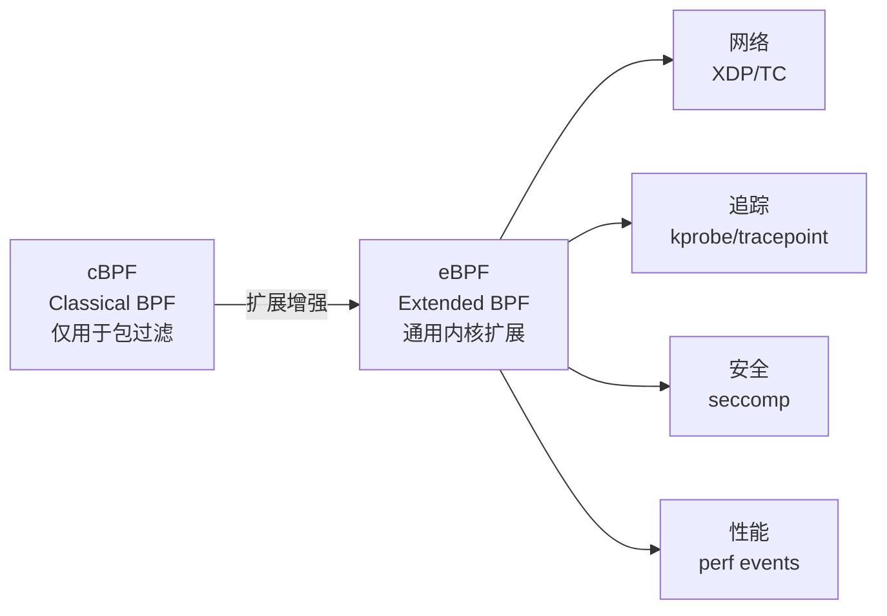

**图解说明**：

| 特性 | cBPF | eBPF |
|:---|:---|:---|
| **诞生时间** | 1992 年（伯克利大学） | 2014 年（Linux 3.18） |
| **功能范围** | 仅包过滤 | 网络、追踪、安全、性能等 |
| **寄存器** | 2 个 32 位 | 10 个 64 位 |
| **指令集** | 简单 | 丰富（跳转、调用等） |

##### eBPF 的核心价值

> [!IMPORTANT]
> **eBPF = 内核可编程化**
>
> - 传统方式：修改内核源码 → 重新编译 → 重启
> - eBPF 方式：编写 eBPF 程序 → 动态加载 → **无需重启**
>
> 这就像给内核"打补丁"，但不需要重新编译内核。

---

#### 7.2 eBPF 程序加载流程

##### 原理

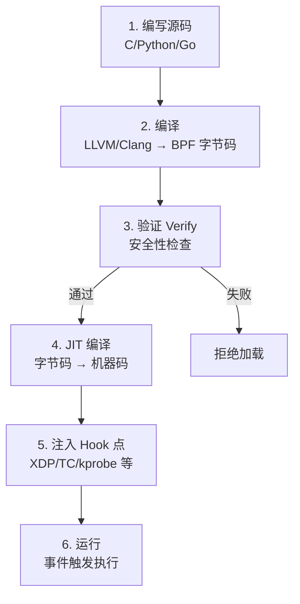

**流程说明**：

| 步骤 | 说明 |
|:---|:---|
| **编写源码** | 使用 C、Python、Go 等高级语言编写 |
| **编译** | 通过 LLVM/Clang 编译为 eBPF 字节码 |
| **验证 Verify** | 内核验证器检查：无死循环、无越界访问、执行时间有限 |
| **JIT 编译** | 将字节码编译为本机机器指令，提高执行效率 |
| **注入 Hook** | 将程序注入到内核的特定位置（Hook 点） |
| **运行** | 当事件（如数据包到达）触发时执行 |

> [!NOTE]
> **Verify 验证器的作用**：确保 eBPF 程序不会导致内核崩溃。检查项包括：
>
> - 无无限循环
> - 无越界内存访问
> - 执行指令数有上限
> - 仅能调用白名单内的内核函数

---

#### 7.3 eBPF 网络 Hook 点

##### 背景

eBPF 可以在网络数据包处理路径的**多个位置**注入程序，实现流量过滤、转发、修改等功能。

##### 核心 Hook 点

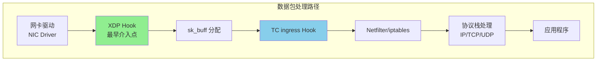

**图解说明**：

| Hook 点 | 位置 | 特点 | 适用场景 |
|:---|:---|:---|:---|
| **XDP** | 网卡驱动层 | 最早、最快 | DDoS 防护、简单丢弃/放行 |
| **TC** | sk_buff 分配后 | 功能丰富 | 流量整形、复杂策略 |
| **Netfilter** | 协议栈内部 | 传统方式 | iptables 规则 |
| **Socket** | 应用层接口 | 最靠近应用 | Service Mesh |

##### XDP vs TC 对比

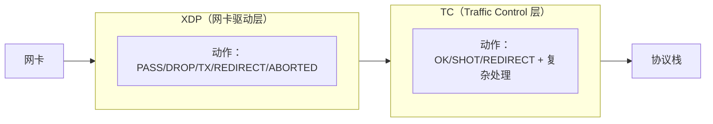

| 特性 | XDP | TC |
|:---|:---|:---|
| **位置** | 网卡驱动（最前） | sk_buff 分配后 |
| **速度** | ⭐⭐⭐⭐⭐ | ⭐⭐⭐⭐ |
| **功能复杂度** | 简单（无完整协议信息） | 复杂（可访问完整 sk_buff） |
| **Cilium 使用** | 部分功能（DDoS） | **主要使用** |
| **可实现功能** | DROP/PASS/TX/REDIRECT | SNAT/DNAT/策略/重定向 |

> [!IMPORTANT]
> **Cilium 主要使用 TC Hook**：
>
> - XDP 过于靠前，无法获取完整的协议信息
> - TC 可以实现地址转换（SNAT/DNAT）、策略路由等复杂功能
> - TC 在 Cilium 中替代了 iptables 的功能

---

#### 7.4 数据包收发流程

##### 背景

理解数据包在 Linux 内核中的收发流程，是理解 eBPF 网络优化的基础。

##### 收包流程（RX）

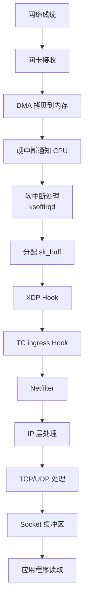

**流程说明**：

1. **网卡接收**：数据包到达物理网卡
2. **DMA 拷贝**：网卡通过 DMA 将数据拷贝到内存（Ring Buffer）
3. **硬中断**：通知 CPU 有数据到达
4. **软中断**：ksoftirqd 处理数据包
5. **分配 sk_buff**：为数据包分配内核数据结构
6. **XDP/TC Hook**：eBPF 程序介入点
7. **协议栈处理**：Netfilter → IP → TCP/UDP
8. **应用读取**：数据到达 Socket 缓冲区，应用程序读取

##### 发包流程（TX）

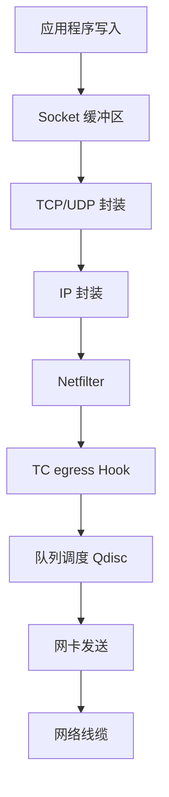

> [!TIP]
> **eBPF 优化的关键**：在数据包进入完整协议栈之前，在 XDP 或 TC 层面就完成处理，避免不必要的协议栈开销。

---

#### 7.5 TC ingress/egress 方向

##### 背景

理解 TC 的 ingress 和 egress 方向，对于理解 Cilium 的流量处理至关重要。

##### 原理

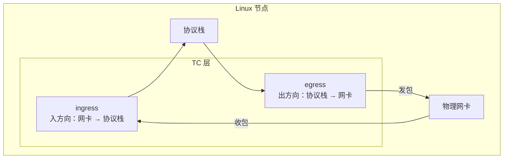

**图解说明**：

| 方向 | 定义 | 数据流向 |
|:---|:---|:---|
| **ingress** | 入方向 | 网卡 → 协议栈 |
| **egress** | 出方向 | 协议栈 → 网卡 |

##### 在 VETH 上的 ingress/egress

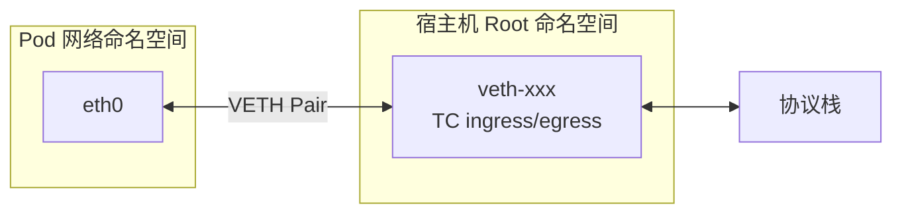

**Cilium 的处理方式**：

- 在 VETH 宿主机端的 **TC ingress** 挂载 eBPF 程序
- 当数据包从 Pod 发出时，到达 VETH 宿主机端的 ingress 方向
- eBPF 程序可以直接重定向（redirect），绕过宿主机协议栈

---

#### 7.6 eBPF Map

##### 背景

eBPF 程序运行在内核空间，如何与用户空间的程序通信？答案是 **eBPF Map**。

##### 原理

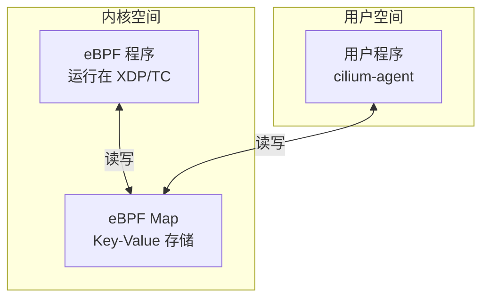

**图解说明**：

| 特性 | 说明 |
|:---|:---|
| **数据结构** | Key-Value 存储（类似 Python 字典） |
| **作用** | 内核空间 ↔ 用户空间通信桥梁 |
| **类型** | Hash、Array、LRU、Ring Buffer 等 |
| **持久化** | 可通过文件系统（/sys/fs/bpf/）持久化 |

##### 在 Cilium 中的应用

```bash
# 查看 Cilium 的 eBPF Map
cilium bpf ct list global      # 连接跟踪表
cilium bpf lb list             # 负载均衡表
cilium bpf policy get --all    # 策略表
cilium bpf endpoint list       # Endpoint 表
```

**代码说明**：

- Cilium Agent 将 Service、Endpoint、Policy 等信息写入 eBPF Map
- 内核中的 eBPF 程序读取 Map 进行决策
- 无需经过用户空间，实现高性能数据平面

---

#### 7.7 抓包与 eBPF Hook 点

##### 背景

使用 tcpdump 抓包时，可能会遇到"抓不到包"的情况。理解 eBPF Hook 点与 tcpdump 的位置关系，有助于排障。

##### 原理

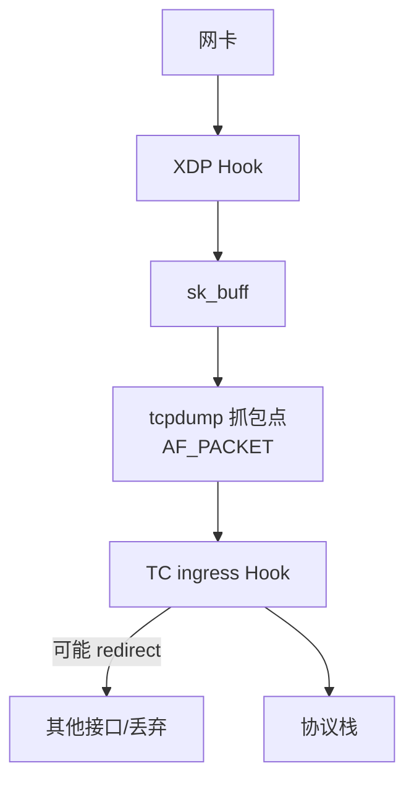

**图解说明**：

| 情况 | 能否抓到包 | 原因 |
|:---|:---|:---|
| **入方向，TC 未 redirect** | ✅ 能 | tcpdump 在 TC 之前 |
| **入方向，TC redirect** | ✅ 能 | 数据包先经过 tcpdump |
| **出方向，TC redirect** | ❌ 不能 | 数据包被 redirect，不经过 tcpdump |

> [!WARNING]
> **Cilium eBPF Host Routing 抓包现象**：
>
> - 在 VETH 上只能看到**单向流量**
> - 因为响应流量被 `bpf_redirect_peer` 直接重定向了
> - 排障时需要在 Pod 内部抓包，或使用 Cilium 的 `cilium monitor` 命令

---

#### 7.8 eBPF 在 Cilium 中的应用

##### Cilium 的 eBPF 程序分布

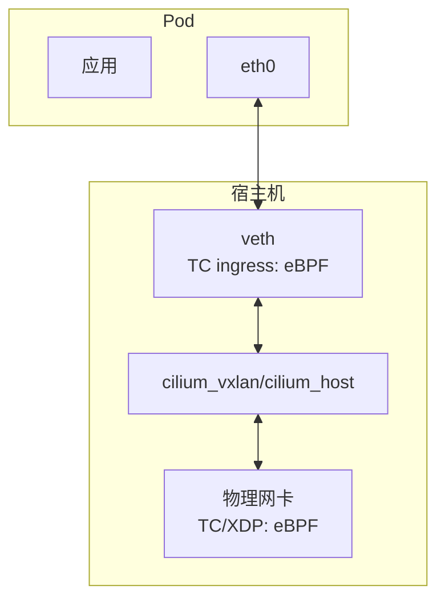

**Cilium 使用 eBPF 实现的功能**：

| 功能 | 传统方式 | Cilium eBPF 方式 |
|:---|:---|:---|
| **Service 负载均衡** | kube-proxy + iptables | eBPF Map + TC |
| **NetworkPolicy** | iptables 规则 | eBPF Map + TC |
| **SNAT/Masquerade** | iptables MASQUERADE | eBPF TC |
| **连接跟踪** | nf_conntrack | eBPF CT Map |
| **Host Routing** | 协议栈路由 | bpf_redirect_peer |

---

#### 📝 章节小结

本章介绍了 eBPF 技术及其在网络中的应用：

1. **eBPF 概念**：
   - 从 cBPF 演进而来的内核扩展技术
   - 无需重编译内核，动态加载程序
   - "给内核打补丁"的能力

2. **程序加载流程**：
   - 编写 → 编译 → Verify → JIT → 注入 Hook → 运行

3. **网络 Hook 点**：
   - **XDP**：网卡驱动层，最快但功能简单
   - **TC**：Traffic Control 层，Cilium 主要使用
   - ingress/egress 方向理解

4. **eBPF Map**：
   - 内核与用户空间通信的桥梁
   - Key-Value 存储结构

5. **在 Cilium 中的应用**：
   - 替代 iptables 实现 Service、NetworkPolicy
   - 使用 bpf_redirect 实现 Host Routing

> [!TIP]
> **学习建议**：
>
> 1. 记住 XDP 和 TC 的位置关系
> 2. 理解 ingress/egress 方向的定义
> 3. 了解 tcpdump 与 eBPF Hook 的位置关系
> 4. 使用 `cilium bpf` 命令查看 eBPF Map

> [!IMPORTANT]
> **核心记忆点**：
>
> - **XDP** 最快但功能简单，**TC** 功能丰富是 Cilium 主力
> - 数据包从网卡 → XDP → tcpdump → TC → 协议栈
> - Cilium 用 eBPF 替代 iptables，实现高性能数据平面

---

### 第8章 Cilium 及安装模式介绍

#### 🎯 学习目标

- 了解 Cilium 的核心架构与组件
- 掌握 Cilium 的三种安装模式及其区别
- 理解 native routing 与 host routing 的概念差异
- 学会使用 Helm 安装和配置 Cilium
- 掌握 Cilium 常用命令

---

#### 8.1 Cilium 概述

##### 背景

Cilium 是一个基于 eBPF 的高性能 CNI 插件，专为 Kubernetes 设计。它不仅提供网络连通性，还集成了安全策略、负载均衡、可观测性等功能。

##### 核心架构

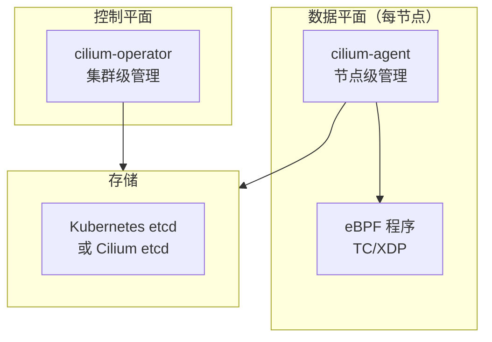

**组件说明**：

| 组件 | 位置 | 职责 |
|:---|:---|:---|
| **cilium-operator** | Deployment | 集群级资源管理（IPAM、BGP 等） |
| **cilium-agent** | DaemonSet | 节点级网络配置、eBPF 程序管理 |
| **cilium-envoy** | 嵌入 Agent | L7 策略、可观测性 |
| **hubble** | 可选组件 | 网络流量可视化 |

##### Cilium 核心功能

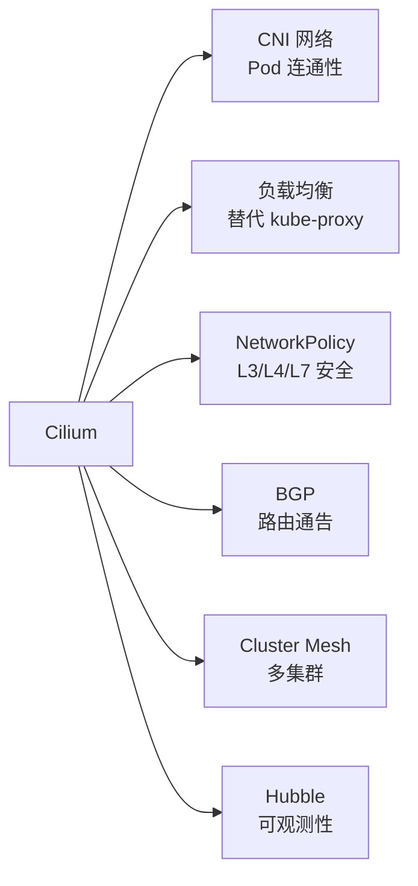

---

#### 8.2 三种安装模式

##### 背景

Cilium 提供三种安装模式，对应不同的功能层次和内核要求。理解这三种模式是使用 Cilium 的基础。

##### 模式概览

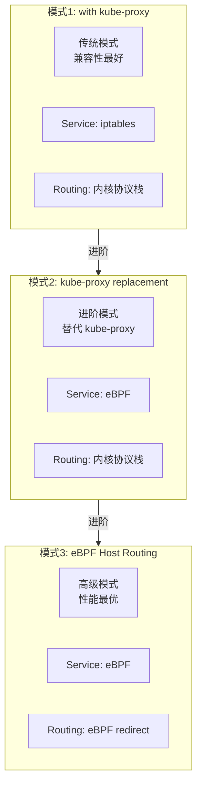

**模式对比**：

| 特性 | with kube-proxy | kube-proxy replacement | eBPF Host Routing |
|:---|:---|:---|:---|
| **Service 实现** | iptables | eBPF | eBPF |
| **Host 路由** | 内核协议栈 | 内核协议栈 | eBPF redirect |
| **性能** | 一般 | 较好 | 最优 |
| **内核要求** | 4.9+ | 4.19+ | 5.10+ |
| **兼容性** | 最好 | 较好 | 部分功能不支持 |

> [!IMPORTANT]
> **概念澄清**：
>
> - **native routing = direct routing = Host-GW** → 路由转发方式
> - **host routing** → eBPF 绕过宿主机协议栈的能力
>
> 这两个概念**完全不同**，不要混淆！

---

#### 8.3 模式1: with kube-proxy

##### 背景

这是最基础的模式，Cilium 只负责 CNI 网络连通性，Service 依然由 kube-proxy + iptables 实现。

##### 原理

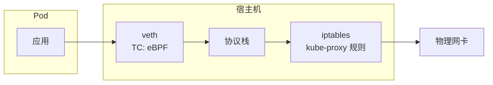

**图解说明**：

- Cilium 在 TC 层实现 Pod 网络
- Service 访问仍经过 iptables（kube-proxy 维护）
- 适合内核版本较低或需要最大兼容性的场景

##### Helm 安装参数

```bash
helm install cilium cilium/cilium --version 1.13.0 \
  --namespace kube-system \
  --set tunnel=disabled \
  --set autoDirectNodeRoutes=true \
  --set ipv4NativeRoutingCIDR="10.244.0.0/16"
```

**参数说明**：

| 参数 | 值 | 说明 |
|:---|:---|:---|
| `tunnel` | disabled | 禁用 VxLAN 隧道，使用 direct routing |
| `autoDirectNodeRoutes` | true | 自动配置节点间路由 |
| `ipv4NativeRoutingCIDR` | Pod CIDR | 不做 SNAT 的地址范围 |

---

#### 8.4 模式2: kube-proxy replacement

##### 背景

此模式下 Cilium 完全替代 kube-proxy，使用 eBPF 实现 Service 负载均衡，不再需要 iptables。

##### 原理

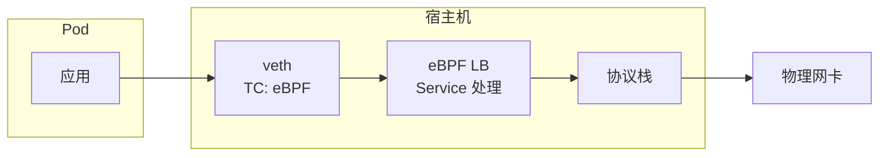

**图解说明**：

- Service ClusterIP、NodePort 由 eBPF 直接处理
- **不再需要 kube-proxy 和 iptables 规则**
- 性能提升明显（减少 iptables 规则匹配）

##### Helm 安装参数

```bash
helm install cilium cilium/cilium --version 1.13.0 \
  --namespace kube-system \
  --set kubeProxyReplacement=strict \
  --set k8sServiceHost=${API_SERVER_IP} \
  --set k8sServicePort=6443 \
  --set tunnel=disabled \
  --set autoDirectNodeRoutes=true \
  --set ipv4NativeRoutingCIDR="10.244.0.0/16"
```

**关键参数**：

| 参数 | 值 | 说明 |
|:---|:---|:---|
| `kubeProxyReplacement` | strict | 严格模式，完全替代 kube-proxy |
| `k8sServiceHost` | API Server IP | 必须提供，因为没有 kube-proxy |
| `k8sServicePort` | 6443 | API Server 端口 |

> [!NOTE]
> **kubeProxyReplacement 取值**：
>
> - `disabled`：不替代 kube-proxy
> - `partial`：部分替代
> - `strict`：严格替代，完全使用 eBPF

---

#### 8.5 模式3: eBPF Host Routing

##### 背景

这是性能最优的模式。除了替代 kube-proxy，还使用 eBPF 绕过宿主机协议栈的路由处理。

##### 原理

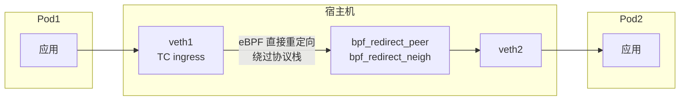

**图解说明**：

- 使用 `bpf_redirect_peer` 和 `bpf_redirect_neigh` 函数
- **绕过宿主机的协议栈处理**
- 同节点 Pod 通信只经过一次协议栈（Pod 内）

##### Host Routing 的核心价值

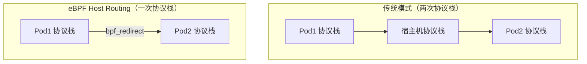

##### Helm 安装参数

```bash
helm install cilium cilium/cilium --version 1.13.0 \
  --namespace kube-system \
  --set kubeProxyReplacement=strict \
  --set k8sServiceHost=${API_SERVER_IP} \
  --set k8sServicePort=6443 \
  --set tunnel=disabled \
  --set autoDirectNodeRoutes=true \
  --set ipv4NativeRoutingCIDR="10.244.0.0/16" \
  --set bpf.masquerade=true
```

**新增关键参数**：

| 参数 | 值 | 说明 |
|:---|:---|:---|
| `bpf.masquerade` | true | 使用 eBPF 实现 SNAT（而非 iptables） |

> [!WARNING]
> **eBPF Host Routing 的限制**：
>
> - 不支持 IPsec 加密
> - 内核要求 5.10+
> - 部分高级功能可能受限

---

#### 8.6 安装参数详解

##### Helm Values 查找方法

```bash
# 1. 添加 Cilium Helm 仓库
helm repo add cilium https://helm.cilium.io/

# 2. 下载 chart 查看 values.yaml
helm pull cilium/cilium --version 1.13.0 --untar
cat cilium/values.yaml
```

**核心配置分类**：

| 配置类别 | 典型参数 |
|:---|:---|
| **网络模式** | `tunnel`, `routingMode`, `autoDirectNodeRoutes` |
| **kube-proxy** | `kubeProxyReplacement`, `k8sServiceHost` |
| **eBPF 功能** | `bpf.masquerade`, `hostRouting` |
| **IPAM** | `ipam.mode`, `ipam.operator.clusterPoolIPv4PodCIDR` |
| **调试** | `debug.enabled`, `debug.verbose` |

##### 常用安装参数对照表

| 需求 | 参数设置 |
|:---|:---|
| 使用 Direct Routing | `tunnel=disabled` |
| 使用 VxLAN | `tunnel=vxlan`（默认） |
| 替代 kube-proxy | `kubeProxyReplacement=strict` |
| 启用 eBPF masquerade | `bpf.masquerade=true` |
| 启用 BGP | `bgpControlPlane.enabled=true` |
| 启用 Hubble | `hubble.enabled=true` |

---

#### 8.7 Cilium 常用命令

##### cilium status

```bash
# 查看 Cilium 状态
cilium status

# 查看详细状态
cilium status --verbose
```

**输出解读**：

| 字段 | 说明 |
|:---|:---|
| `KubeProxyReplacement` | strict/partial/disabled |
| `Host Routing` | Legacy（传统）或 BPF（eBPF） |
| `Masquerading` | IPTables 或 BPF |
| `Tunnel Mode` | Disabled/VXLAN/Geneve |

##### cilium bpf 命令

```bash
# 查看 eBPF Service 表（替代 iptables -L）
cilium bpf lb list

# 查看连接跟踪表
cilium bpf ct list global

# 查看 Endpoint 信息
cilium bpf endpoint list

# 查看策略表
cilium bpf policy get --all
```

##### cilium monitor

```bash
# 实时监控数据包流向
cilium monitor

# 详细模式
cilium monitor -v

# 查看 datapath 事件
cilium monitor --type trace
```

---

#### 8.8 VxLAN vs Direct Routing

##### 背景

Cilium 支持两种基础网络模式：VxLAN（隧道）和 Direct Routing（路由）。

##### 对比

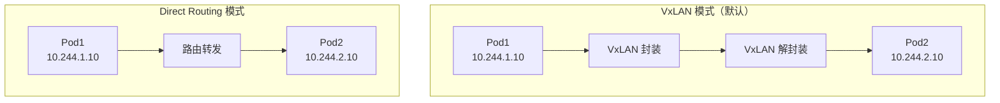

| 特性 | VxLAN | Direct Routing |
|:---|:---|:---|
| **跨子网** | ✅ 支持 | ❌ 需同二层 |
| **性能** | 有封装开销 | 更高 |
| **MTU** | 需调整（-50） | 无需调整 |
| **配置** | 默认 | `tunnel=disabled` |

---

#### 📝 章节小结

本章介绍了 Cilium 的架构与安装模式：

1. **Cilium 架构**：
   - cilium-operator：集群级控制平面
   - cilium-agent：节点级数据平面
   - eBPF 程序：实际的数据包处理

2. **三种安装模式**：

   | 模式 | Service | 路由 | 性能 |
   |:---|:---|:---|:---|
   | **with kube-proxy** | iptables | 协议栈 | 一般 |
   | **kube-proxy replacement** | eBPF | 协议栈 | 较好 |
   | **eBPF Host Routing** | eBPF | eBPF redirect | 最优 |

3. **关键概念澄清**：
   - **native/direct routing** = Host-GW 路由方式
   - **host routing** = eBPF 绕过协议栈
   - 两者是**完全不同**的概念！

4. **Helm 安装**：
   - `kubeProxyReplacement=strict`：替代 kube-proxy
   - `bpf.masquerade=true`：启用 eBPF Host Routing

> [!TIP]
> **学习建议**：
>
> 1. 准备三套安装脚本作为基础模板
> 2. 使用 `cilium status --verbose` 验证安装结果
> 3. 通过 `cilium bpf lb list` 验证 kube-proxy replacement
> 4. 参考官方 values.yaml 了解所有配置项

> [!IMPORTANT]
> **模式选择指南**：
>
> - **内核 < 4.19** → with kube-proxy
> - **内核 ≥ 4.19，追求稳定** → kube-proxy replacement
> - **内核 ≥ 5.10，追求极致性能** → eBPF Host Routing

---

### 第9章 Native-Routing-with-kubeProxy 模式

#### 🎯 学习目标

- 理解 Native Routing 与 Host-GW 的等价关系
- 掌握同节点 Pod 通信的数据包流程
- 掌握跨节点 Pod 通信的数据包流程
- 理解 32 位掩码的作用与 L3 路由转发
- 理解 Cilium eBPF ARP 劫持机制

---

#### 9.1 Native Routing 概述

##### 背景

Native Routing 是 Cilium 中与 VxLAN 隧道模式相对的另一种网络模式。它**不使用封装**，而是依赖节点间的路由进行 Pod 网络通信。

##### 核心概念

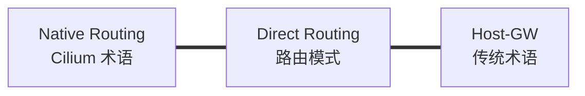

> [!IMPORTANT]
> **概念等价关系**：
>
> **Native Routing = Direct Routing = Host-GW**
>
> 三者描述的是同一种网络模式，只是不同场景下的叫法不同。

##### 启用 Native Routing

```bash
# 关键参数
--set tunnel=disabled                    # 禁用隧道
--set autoDirectNodeRoutes=true          # 自动配置节点路由
--set ipv4NativeRoutingCIDR="10.244.0.0/16"  # 原生路由网段
```

---

#### 9.2 Pod 的 32 位掩码

##### 背景

在 Cilium 中，Pod 的 IP 地址使用 **32 位掩码**（/32），这与传统 CNI 有所不同。

##### 原理

```bash
# Pod 内查看 IP
$ ip addr show eth0
inet 10.0.2.253/32 scope global eth0
```

**32 位掩码意味着什么？**

| 掩码 | 含义 | 结果 |
|:---|:---|:---|
| /24 | 同网段有 254 个主机 | 同网段走二层 |
| /32 | "网段"只有自己 | **与任何地址都不同网段** |

```mermaid
graph TD
    POD["Pod<br/>10.0.2.253/32"]
    
    POD --> CHECK{"与目的 IP 在同一网段？"}
    CHECK -->|"永远 No"| L3["走三层路由"]
```

> [!NOTE]
> **32 位掩码的设计目的**：
>
> - 强制所有流量走 **L3 路由**（而非 L2 交换）
> - 流量必须经过网关，便于 eBPF 程序介入处理
> - 这是 Cilium 能够劫持和重定向流量的基础

---

#### 9.3 同节点 Pod 通信

##### 背景

理解同节点 Pod 间的通信流程，是理解 Cilium 数据平面的第一步。

##### 场景描述

```
Pod A (10.0.2.253) → Pod B (10.0.2.36)
两个 Pod 位于同一节点
```

##### 网络拓扑

```mermaid
graph TD
    subgraph Pod_A["Pod A (10.0.2.253)"]
        APP_A["应用"]
        ETH_A["eth0<br/>10.0.2.253/32"]
    end
    
    subgraph Host["宿主机"]
        LXC_A["lxc-xxxx<br/>（对应 Pod A）"]
        LXC_B["lxc-yyyy<br/>（对应 Pod B）"]
        CILIUM_HOST["cilium_host<br/>10.0.2.131"]
    end
    
    subgraph Pod_B["Pod B (10.0.2.36)"]
        ETH_B["eth0<br/>10.0.2.36/32"]
        APP_B["应用"]
    end
    
    ETH_A <-->|"veth pair"| LXC_A
    ETH_B <-->|"veth pair"| LXC_B
```

##### 路由表分析

```bash
# Pod A 内部路由表
$ ip route
default via 10.0.2.131 dev eth0        # 默认路由，网关是 cilium_host
10.0.2.131 dev eth0 scope link         # 网关地址的直连路由
```

**关键点解读**：

| 路由条目 | 说明 |
|:---|:---|
| `default via 10.0.2.131` | 所有流量发往 cilium_host |
| `10.0.2.131 dev eth0` | 告诉系统如何到达网关 |

##### 数据包流程

```mermaid
sequenceDiagram
    participant PodA as Pod A<br/>10.0.2.253
    participant LXC_A as lxc-A<br/>(宿主机)
    participant LXC_B as lxc-B<br/>(宿主机)
    participant PodB as Pod B<br/>10.0.2.36
    
    Note over PodA: 查路由: 目的 IP 不在同网段<br/>需走网关 10.0.2.131
    PodA->>PodA: ARP: Who has 10.0.2.131?
    Note over PodA: eBPF 劫持 ARP 请求<br/>返回 lxc-A 的 MAC（非网关 MAC）
    PodA->>LXC_A: 发送数据包<br/>dst-MAC = lxc-A 的 MAC
    Note over LXC_A: eBPF 拦截<br/>查询 Pod B 对应的 lxc-B
    LXC_A->>LXC_B: eBPF redirect<br/>直接转发到 lxc-B
    LXC_B->>PodB: 通过 veth pair 送入 Pod B
```

##### ARP 劫持机制

**传统行为** vs **Cilium 行为**：

| 步骤 | 传统 CNI | Cilium |
|:---|:---|:---|
| ARP 请求 | 请求网关 MAC | 请求网关 MAC |
| ARP 响应 | 返回网关 MAC | **返回 lxc 网卡 MAC** |
| 数据包 dst-MAC | 填写网关 MAC | 填写 **lxc 网卡 MAC** |

```bash
# 验证 ARP 响应
$ arping -I eth0 10.0.2.131
# 返回的 MAC 是 lxc 网卡的 MAC，而非 cilium_host 的 MAC
```

> [!WARNING]
> **Cilium 的 ARP 劫持**：
>
> Pod 认为它在和网关通信，但实际上 eBPF 程序劫持了 ARP 响应，返回的是 veth pair 对端（lxc 网卡）的 MAC 地址。这使得数据包直接发往 lxc 网卡，而非经过完整的协议栈路由。

##### 关键发现

虽然路由表显示出接口是 `cilium_host`，但抓包发现：

```bash
# 在 cilium_host 上抓包
$ tcpdump -pne -i cilium_host icmp
# 没有任何包！

# 在 lxc-B 上抓包
$ tcpdump -pne -i lxc-yyyy icmp
# 能看到 ICMP 请求和响应！
```

> [!IMPORTANT]
> **同节点通信的精髓**：
>
> 1. 路由表说走 cilium_host，但实际 eBPF 将包 redirect 到 lxc 网卡
> 2. 数据包直接从 lxc-A → lxc-B，不经过协议栈路由
> 3. 这就是 Cilium 的 **"跳跃式转发"** 特性

---

#### 9.4 跨节点 Pod 通信

##### 背景

跨节点通信需要经过物理网络（或底层网络），流程比同节点通信多了节点间路由的步骤。

##### 场景描述

```
Pod A (10.0.2.253, Node 1) → Pod C (10.0.1.173, Node 2)
两个 Pod 位于不同节点
```

##### 网络拓扑

```mermaid
graph TD
    subgraph Node1["Node 1 (172.18.0.2)"]
        POD_A["Pod A<br/>10.0.2.253"]
        LXC_A["lxc-A"]
        ETH0_1["eth0<br/>172.18.0.2"]
    end
    
    subgraph Network["物理网络"]
        SWITCH["交换机/路由器"]
    end
    
    subgraph Node2["Node 2 (172.18.0.4)"]
        ETH0_2["eth0<br/>172.18.0.4"]
        LXC_C["lxc-C"]
        POD_C["Pod C<br/>10.0.1.173"]
    end
    
    POD_A --> LXC_A --> ETH0_1
    ETH0_1 --> SWITCH
    SWITCH --> ETH0_2
    ETH0_2 --> LXC_C --> POD_C
```

##### 宿主机路由表

```bash
# Node 1 路由表
$ ip route
default via 172.18.0.1 dev eth0
10.0.1.0/24 via 172.18.0.4 dev eth0     # 去 10.0.1.x 走 Node 2
10.0.2.0/24 via 10.0.2.131 dev cilium_host  # 本节点 Pod 网段
10.0.3.0/24 via 172.18.0.3 dev eth0     # 去 10.0.3.x 走 Node 3
```

**路由表解读**：

| 目的网段 | 下一跳 | 说明 |
|:---|:---|:---|
| 10.0.1.0/24 | 172.18.0.4 | Pod C 在 Node 2，走 Node 2 |
| 10.0.2.0/24 | cilium_host | 本节点 Pod，走内部网关 |
| 默认 | 172.18.0.1 | 其他流量走默认网关 |

##### 数据包流程

```mermaid
sequenceDiagram
    participant PodA as Pod A<br/>10.0.2.253
    participant LXC_A as lxc-A
    participant ETH1 as Node1 eth0<br/>172.18.0.2
    participant ETH2 as Node2 eth0<br/>172.18.0.4
    participant LXC_C as lxc-C
    participant PodC as Pod C<br/>10.0.1.173
    
    Note over PodA: 目的: 10.0.1.173<br/>走默认路由
    PodA->>LXC_A: 第1跳: veth pair
    Note over LXC_A: eBPF 查路由<br/>目的匹配 10.0.1.0/24
    LXC_A->>ETH1: 第2跳: 路由转发
    Note over ETH1: src-MAC: 172.18.0.2 的 MAC<br/>dst-MAC: 172.18.0.4 的 MAC
    ETH1->>ETH2: 第3跳: 物理网络
    Note over ETH2: 收包后查路由<br/>目的 10.0.1.173 是本地 Pod
    ETH2->>LXC_C: 第4跳: 转发到 lxc
    LXC_C->>PodC: 第5跳: veth pair
```

##### MAC 地址变化

```mermaid
graph LR
    subgraph Hop1["第1跳"]
        SRC_MAC1["src: Pod A eth0 MAC"]
        DST_MAC1["dst: lxc-A MAC"]
    end
    
    subgraph Hop2["第2跳"]
        SRC_MAC2["src: Node1 eth0 MAC<br/>(172.18.0.2)"]
        DST_MAC2["dst: Node2 eth0 MAC<br/>(172.18.0.4)"]
    end
    
    subgraph Hop3["第3跳"]
        SRC_MAC3["src: Node2 eth0 MAC"]
        DST_MAC3["dst: lxc-C MAC"]
    end
    
    Hop1 --> Hop2 --> Hop3
```

**抓包验证**（在 Node1 eth0 上）：

```bash
$ tcpdump -pne -i eth0 icmp
# src-MAC: 12:00:00:02 (Node1 eth0)
# dst-MAC: 12:00:00:04 (Node2 eth0)
# src-IP: 10.0.2.253 (不变)
# dst-IP: 10.0.1.173 (不变)
```

> [!TIP]
> **跨节点通信的核心规律**：
>
> - **IP 地址不变**：src-IP 和 dst-IP 全程保持
> - **MAC 地址逐跳变化**：每经过一个路由点，MAC 都会更新
> - 这就是 **L3 路由转发** 的本质

---

#### 9.5 Cilium 与传统 CNI 的差异

##### 架构对比

```mermaid
graph TD
    subgraph Traditional["传统 CNI (如 Flannel)"]
        T_POD["Pod"] --> T_VETH["veth"]
        T_VETH --> T_BRIDGE["Linux Bridge"]
        T_BRIDGE --> T_ROUTE["协议栈路由"]
        T_ROUTE --> T_ETH["物理网卡"]
    end
    
    subgraph Cilium["Cilium CNI"]
        C_POD["Pod"] --> C_VETH["veth"]
        C_VETH --> C_LXC["lxc 网卡"]
        C_LXC -->|"eBPF redirect"| C_LXC2["lxc 网卡"]
        C_LXC2 --> C_POD2["目的 Pod"]
    end
```

##### 关键差异

| 特性 | 传统 CNI | Cilium |
|:---|:---|:---|
| **路由执行者** | Linux 协议栈 | eBPF 程序 |
| **ARP 响应** | 真实网关 MAC | lxc 网卡 MAC（劫持） |
| **同节点转发** | 经过 Bridge | eBPF redirect |
| **抓包位置** | 网卡上可抓 | 部分位置抓不到 |
| **转发风格** | 一跳一跳 | "跳跃式"转发 |

---

#### 📝 章节小结

本章介绍了 Cilium Native-Routing 模式下的数据包转发流程：

1. **Native Routing 概念**：
   - 等价于 Host-GW 模式
   - 使用 `tunnel=disabled` 启用
   - 依赖节点间路由（非隧道封装）

2. **32 位掩码的作用**：
   - 强制所有流量走 L3 路由
   - 便于 eBPF 程序介入处理

3. **同节点 Pod 通信**：
   - eBPF 劫持 ARP，返回 lxc 网卡 MAC
   - 数据包通过 lxc 网卡直接 redirect，不走协议栈路由
   - 路由表显示走 cilium_host，实际走 lxc 网卡

4. **跨节点 Pod 通信**：
   - 遵循传统 L3 路由规则
   - IP 不变，MAC 逐跳变化
   - 依赖宿主机路由表（autoDirectNodeRoutes）

5. **与传统 CNI 的差异**：
   - ARP 劫持机制
   - eBPF redirect 替代协议栈路由
   - "跳跃式"转发

> [!TIP]
> **学习建议**：
>
> 1. 使用 `tcpdump` 在不同接口抓包，验证数据流向
> 2. 使用 `arping` 验证 ARP 响应的 MAC 地址
> 3. 对比路由表和实际抓包结果，理解 eBPF redirect

> [!IMPORTANT]
> **Native Routing with kube-proxy 模式核心特点**：
>
> - Pod 间流量：eBPF redirect（bypass 协议栈）
> - Service 流量：iptables（kube-proxy 维护）
> - 这是一个"混合"模式

---

### 第10章 Native-Routing-with-eBPF-HostRouting 模式

#### 🎯 学习目标

- 掌握 eBPF Host Routing 的核心函数
- 理解 `bpf_redirect_peer` 和 `bpf_redirect_neigh` 的作用
- 掌握同节点/跨节点 Pod 通信的数据流
- 理解 TC Hook 的位置与方向
- 了解 Socket LB 机制

---

#### 10.1 eBPF Host Routing 概述

##### 背景

eBPF Host Routing 是 Cilium 的**最高级模式**，它在 kube-proxy replacement 基础上，进一步使用 eBPF 绕过宿主机协议栈的路由处理，实现最高性能。

##### 核心优势

```mermaid
graph LR
    subgraph Traditional["传统模式"]
        T1["Pod"] --> T2["lxc 网卡"]
        T2 --> T3["协议栈<br/>（iptables 处理）"]
        T3 --> T4["物理网卡"]
    end
    
    subgraph eBPF["eBPF Host Routing"]
        E1["Pod"] --> E2["lxc 网卡"]
        E2 -->|"bpf_redirect"| E4["物理网卡"]
    end
```

> [!IMPORTANT]
> **核心优势**：跳过宿主机协议栈处理，减少：
>
> - 上下文切换
> - 数据包拷贝
> - 中断处理
> - iptables 规则匹配

---

#### 10.2 核心 eBPF 函数

##### 两个关键函数

```mermaid
graph TD
    subgraph Functions["eBPF 核心函数"]
        PEER["bpf_redirect_peer<br/>（内核 ≥ 5.10）"]
        NEIGH["bpf_redirect_neigh<br/>（内核 ≥ 5.10）"]
    end
    
    PEER -->|"用于"| SAME["同节点 Pod 通信"]
    NEIGH -->|"用于"| CROSS["跨节点通信"]
```

**函数对比**：

| 函数 | 作用 | 跳转目标 |
|:---|:---|:---|
| `bpf_redirect_peer` | 同节点 Pod 间 redirect | 直接到目的 Pod 的 eth0 |
| `bpf_redirect_neigh` | 跨节点通信 redirect | 从 lxc 网卡到物理网卡 |

##### 内核版本影响

| 内核版本 | 可用函数 | 跳转能力 |
|:---|:---|:---|
| < 5.10 | `bpf_redirect` | 只能跳到 lxc 网卡 |
| ≥ 5.10 | `bpf_redirect_peer` | 直接跳到 Pod 的 eth0 |

> [!NOTE]
> **为什么需要 5.10+ 内核**：
>
> - `bpf_redirect_peer` 在 Linux 5.10 引入
> - 它允许直接跳转到 veth pair 的对端（即 Pod 的 eth0）
> - 这使得数据包**完全绕过宿主机协议栈**

---

#### 10.3 同节点 Pod 通信

##### 场景描述

```
Pod A (10.0.2.253) → Pod B (10.0.2.141)
两个 Pod 位于同一节点，使用 eBPF Host Routing
```

##### 数据包流程

```mermaid
sequenceDiagram
    participant PodA as Pod A<br/>eth0
    participant LXC_A as lxc-A<br/>TC Hook
    participant LXC_B as lxc-B
    participant PodB as Pod B<br/>eth0
    
    Note over PodA: 发送 ICMP Request
    PodA->>LXC_A: 数据包到达 lxc-A
    Note over LXC_A: TC Hook 调用<br/>bpf_redirect_peer
    LXC_A->>PodB: 直接 redirect 到 Pod B 的 eth0
    Note over PodB: 收到 ICMP Request<br/>（绕过 lxc-B！）
    
    Note over PodB: 发送 ICMP Reply
    PodB->>LXC_B: 数据包到达 lxc-B
    Note over LXC_B: TC Hook 调用<br/>bpf_redirect_peer
    LXC_B->>PodA: 直接 redirect 到 Pod A 的 eth0
    Note over PodA: 收到 ICMP Reply<br/>（绕过 lxc-A！）
```

##### 抓包验证

```bash
# 在 lxc-A（Pod A 对应的网卡）抓包
$ tcpdump -pne -i lxc-xxxx icmp

# 结果：只能看到 ICMP Request，没有 Reply！
# 原因：Reply 通过 bpf_redirect_peer 直接送到 Pod A 的 eth0

# 在 Pod A 内部抓包
$ tcpdump -pne -i eth0 icmp

# 结果：ICMP Request 和 Reply 都有！
```

> [!WARNING]
> **抓包"诡异"现象**：
>
> - lxc 网卡上只能看到"去的包"（Request）
> - "回的包"（Reply）直接 redirect 到 Pod 的 eth0
> - 这是 eBPF Host Routing 的正常行为！

---

#### 10.4 跨节点 Pod 通信

##### 场景描述

```
Pod A (10.0.2.253, Node 1) → Pod C (10.0.1.193, Node 2)
两个 Pod 位于不同节点
```

##### 数据包流程

```mermaid
sequenceDiagram
    participant PodA as Pod A<br/>eth0
    participant LXC_A as lxc-A<br/>TC Hook
    participant ETH1 as Node1 eth0
    participant ETH2 as Node2 eth0<br/>TC Hook
    participant PodC as Pod C<br/>eth0
    
    Note over PodA: 发送 ICMP Request
    PodA->>LXC_A: 数据包到达 lxc-A
    Note over LXC_A: TC Hook 调用<br/>bpf_redirect_neigh
    LXC_A->>ETH1: redirect 到物理网卡<br/>（绕过协议栈路由！）
    ETH1->>ETH2: 物理网络传输
    Note over ETH2: TC Hook 调用<br/>bpf_redirect_peer
    ETH2->>PodC: redirect 到 Pod C 的 eth0
    Note over PodC: 收到 ICMP Request
```

##### 抓包验证

```bash
# 在 Node1 的 lxc-A 抓包
$ tcpdump -pne -i lxc-xxxx icmp
# 只有 ICMP Request，没有 Reply

# 在 Node1 的 eth0 抓包
$ tcpdump -pne -i eth0 icmp
# Request 和 Reply 都有！

# 说明：
# - 发出的包经过 lxc 网卡
# - 返回的包直接 redirect 到 Pod 的 eth0，不经过 lxc
```

---

#### 10.5 TC Hook 位置与方向

##### 背景

理解 TC Hook 的位置和方向，是理解 Cilium 数据平面的关键。

##### 四个关键 Hook

```mermaid
graph TD
    subgraph Pod["Pod 网络空间"]
        ETH0["eth0"]
    end
    
    subgraph Host["宿主机网络空间"]
        LXC["lxc 网卡"]
        CILIUM_HOST["cilium_host"]
        ETH["物理网卡 eth0"]
    end
    
    ETH0 <-->|"veth pair"| LXC
    
    LXC -->|"from_container<br/>（TC ingress）"| PROCESS["eBPF 处理"]
    ETH -->|"from_netdev<br/>（TC ingress）"| PROCESS
    PROCESS -->|"to_netdev<br/>（TC egress）"| ETH
    PROCESS -->|"to_container"| ETH0
```

**Hook 说明**：

| Hook 名称 | 位置 | 方向 | 作用 |
|:---|:---|:---|:---|
| `from_container` | lxc 网卡 | ingress | 处理 Pod 发出的包 |
| `to_container` | 调用函数 | - | 发往 Pod 的包 |
| `to_netdev` | 物理网卡 | egress | 发往外部的包 |
| `from_netdev` | 物理网卡 | ingress | 收到外部的包 |

##### 方向判断口诀

> **Ingress（进入）**：数据包进入某个网卡
>
> **Egress（发出）**：数据包从某个网卡发出

```
从 Pod 出来 → lxc ingress → from_container
发往外部网络 → eth0 egress → to_netdev
从外部收包 → eth0 ingress → from_netdev
```

---

#### 10.6 Socket LB 机制

##### 背景

在 eBPF Host Routing 模式下，Service 访问也通过 eBPF 实现（而非 iptables）。

##### 原理

```mermaid
sequenceDiagram
    participant App as 应用
    participant Socket as Socket 层<br/>eBPF Hook
    participant Pod as 目的 Pod
    
    Note over App: curl ClusterIP:Port
    App->>Socket: 发起连接
    Note over Socket: eBPF 拦截<br/>查询 Service → Pod 映射
    Socket->>Socket: 替换目的 IP:Port<br/>（Socket LB）
    Socket->>Pod: 直接连接 Pod IP
```

##### 与 iptables 的对比

| 特性 | iptables (kube-proxy) | Socket LB (eBPF) |
|:---|:---|:---|
| **DNAT 位置** | 宿主机协议栈 | Pod 的 Socket 层 |
| **第一跳目的 IP** | 仍是 ClusterIP | 已是 Pod IP |
| **SNAT** | 需要（externalTrafficPolicy: Cluster） | 可不需要 |
| **抓包看到的 IP** | ClusterIP → Pod IP 转换 | 直接是 Pod IP |

##### 抓包验证

```bash
# 访问 Service
$ curl 172.18.0.2:32000

# 在 Pod 内抓包
$ tcpdump -pne -i eth0 port 80

# 结果：目的 IP 直接是 Pod IP，不是 NodePort IP！
```

> [!TIP]
> **Socket LB 的意义**：
>
> - 在 Pod 发包前就完成 Service → Pod 的解析
> - 数据包从发出的第一跳就是 Pod IP
> - 不需要经过宿主机做 DNAT

---

#### 10.7 eBPF Host Routing 的限制

##### 不支持的场景

| 功能 | 是否支持 | 原因 |
|:---|:---|:---|
| **IPsec 加密** | ❌ | 需要经过协议栈处理 |
| **WireGuard 加密** | ❌ | 需要经过协议栈处理 |
| **某些 NetworkPolicy** | 部分 | 需要协议栈介入 |

> [!CAUTION]
> **如果需要加密**：
>
> 使用 IPsec 或 WireGuard 时，**不能启用 eBPF Host Routing**。
> 流量需要进入协议栈进行加解密处理。

---

#### 10.8 验证 eBPF Host Routing 状态

```bash
# 查看 Cilium 状态
$ cilium status --verbose

# 关键字段
KubeProxyReplacement:    Strict
Host Routing:            BPF     # ← 这里显示 BPF 表示已启用
Masquerading:            BPF
```

| Host Routing 值 | 含义 |
|:---|:---|
| `Legacy` | 传统模式，使用协议栈路由 |
| `BPF` | eBPF 模式，绕过协议栈 |

---

#### 📝 章节小结

本章介绍了 Cilium 最高级模式 —— eBPF Host Routing：

1. **核心函数**：
   - `bpf_redirect_peer`：同节点 Pod 间直接跳转
   - `bpf_redirect_neigh`：跨节点通信，lxc → 物理网卡

2. **同节点通信**：
   - lxc 网卡只能看到"去的包"
   - "回的包"直接 redirect 到 Pod 的 eth0

3. **跨节点通信**：
   - 发出的包：lxc → bpf_redirect_neigh → 物理网卡
   - 收到的包：物理网卡 → bpf_redirect_peer → Pod eth0

4. **TC Hook**：
   - `from_container`：lxc ingress，处理 Pod 发出的包
   - `from_netdev`：物理网卡 ingress，处理收到的包
   - `to_netdev`：物理网卡 egress，处理发出的包

5. **Socket LB**：
   - Service 解析在 Pod 的 Socket 层完成
   - 第一跳目的 IP 就是 Pod IP

6. **限制**：
   - 不支持 IPsec/WireGuard 加密
   - 需要内核 ≥ 5.10

> [!TIP]
> **学习要点**：
>
> 1. 理解两个 eBPF 函数的作用
> 2. 在不同接口抓包，验证 redirect 行为
> 3. 用 `cilium status` 确认 Host Routing: BPF

> [!IMPORTANT]
> **模式对比总结**：
>
> | 模式 | Service | Pod 路由 | 性能 |
> |:---|:---|:---|:---|
> | with kube-proxy | iptables | eBPF redirect | 一般 |
> | kube-proxy replacement | eBPF | eBPF redirect | 较好 |
> | **eBPF Host Routing** | **Socket LB** | **bpf_redirect_peer/neigh** | **最优** |

---

### 第11章 Cilium-VxLAN 模式

#### 🎯 学习目标

- 理解 VxLAN 诞生的背景与解决的问题
- 掌握 VxLAN 报文结构
- 理解 VTEP、VNI 等核心概念
- 掌握 Linux 下创建 VxLAN 设备的方法
- 理解 Overlay vs Underlay 网络

---

#### 11.1 VxLAN 诞生背景

##### 背景

**VxLAN**（Virtual eXtensible Local Area Network）是由 VMware、Cisco 等厂商提出的一种 Overlay 网络技术。

##### 解决的问题

```mermaid
graph TD
    subgraph Problem["传统问题"]
        P1["数据中心虚机迁移"]
        P2["迁移后 IP/MAC 需保持不变"]
        P3["跨三层网络无法实现"]
    end
    
    subgraph Solution["VxLAN 方案"]
        S1["将三层网络抽象为 '大二层'"]
        S2["IP/MAC 不变迁移"]
    end
    
    Problem --> Solution
```

**核心场景**：

| 场景 | 问题 | VxLAN 方案 |
|:---|:---|:---|
| 虚机迁移 | 跨机房后 IP/MAC 变化 | 封装后传输，IP/MAC 保持 |
| 多租户隔离 | VLAN ID 只有 4094 个 | VNI 支持 1600 万+ |
| 跨三层通信 | 二层网络无法跨越路由器 | Overlay 隧道穿越 |

##### 大二层概念

```mermaid
graph LR
    subgraph DC1["数据中心 A"]
        VM1["虚机<br/>10.1.1.2"]
        VTEP1["VTEP"]
    end
    
    subgraph Transport["传输网络<br/>（复杂的路由网络）"]
        R1["路由器"] --- R2["路由器"]
        R2 --- R3["路由器"]
    end
    
    subgraph DC2["数据中心 B"]
        VTEP2["VTEP"]
        VM2["虚机<br/>10.1.1.2<br/>迁移后"]
    end
    
    VTEP1 --> Transport
    Transport --> VTEP2
    
    classDef vtep fill:#f9f,stroke:#333
    class VTEP1,VTEP2 vtep
```

> [!NOTE]
> **大二层的本质**：
>
> 将中间复杂的三层路由网络**抽象**成一个"大交换机"。
> 无论底层网络多复杂，对上层应用来说就像在同一个二层局域网内。

---

#### 11.2 VxLAN 报文结构

##### 封装原理

```mermaid
graph TD
    subgraph Original["原始数据包"]
        O_ETH["原始 MAC 层"]
        O_IP["原始 IP 层"]
        O_TCP["原始 TCP/UDP"]
        O_DATA["应用数据"]
    end
    
    subgraph VxLAN["VxLAN 封装后"]
        V_ETH["外层 MAC"]
        V_IP["外层 IP"]
        V_UDP["UDP 8472"]
        V_HEADER["VxLAN Header<br/>（含 VNI）"]
        V_INNER["原始完整数据包"]
    end
    
    Original --> V_INNER
```

##### 报文各层说明

| 层级 | 内容 | 说明 |
|:---|:---|:---|
| **外层 MAC** | VTEP 的 MAC 地址 | 源/目的都是 VTEP 设备 |
| **外层 IP** | VTEP 的 IP 地址 | 如节点的物理网卡 IP |
| **UDP** | 端口 8472 | Cilium/Flannel 使用 8472 |
| **VxLAN Header** | 8 字节，含 VNI | 标识隧道/租户 |
| **内层包** | 原始完整以太网帧 | Pod 间通信的真实数据 |

```
+----------------+----------------+---------------+
|   外层 MAC     |   外层 IP      |    UDP 8472   |
+----------------+----------------+---------------+
|  VxLAN Header (VNI)  |      原始数据包         |
+----------------------+-------------------------+
```

> [!IMPORTANT]
> **VxLAN 的核心思想**：
>
> 把**原始数据包**作为**外层 UDP 的 Payload**。
> 相当于把一个信封（原始包）塞进另一个信封（VxLAN 包）发送。

---

#### 11.3 核心概念

##### VTEP

**VTEP**（VxLAN Tunnel End Point）是 VxLAN 隧道的端点设备。

```mermaid
graph LR
    subgraph Node1["Node 1"]
        POD1["Pod A"]
        VTEP1["VTEP<br/>cilium_vxlan"]
        ETH1["eth0<br/>172.18.0.2"]
    end
    
    subgraph Node2["Node 2"]
        ETH2["eth0<br/>172.18.0.3"]
        VTEP2["VTEP<br/>cilium_vxlan"]
        POD2["Pod B"]
    end
    
    POD1 --> VTEP1
    VTEP1 --> ETH1
    ETH1 <-->|"VxLAN 隧道"| ETH2
    ETH2 --> VTEP2
    VTEP2 --> POD2
```

**VTEP 的职责**：

| 方向 | 操作 | 说明 |
|:---|:---|:---|
| 发送 | **封装** | 添加外层 MAC/IP/UDP/VxLAN Header |
| 接收 | **解封装** | 剥离外层，露出原始包 |

##### VNI

**VNI**（VxLAN Network Identifier）是 VxLAN 的网络标识。

| 对比 | VLAN ID | VNI |
|:---|:---|:---|
| 位数 | 12 位 | 24 位 |
| 可用数量 | 4094 个 | 约 1600 万个 |
| 用途 | 传统交换机隔离 | 大规模多租户隔离 |

> [!TIP]
> **在 Cilium 中**：
>
> VNI 的使用比较灵活，不像传统网络那样要求两端 VNI 严格匹配。
> Cilium 可能会动态分配 VNI，这是虚拟化网络与传统网络的区别之一。

---

#### 11.4 Overlay vs Underlay

##### 概念对比

```mermaid
graph TD
    subgraph Overlay["Overlay 网络"]
        O1["Pod 网络"]
        O2["VxLAN 隧道"]
        O3["逻辑上的 '大二层'"]
    end
    
    subgraph Underlay["Underlay 网络"]
        U1["物理网络"]
        U2["节点间 IP 路由"]
        U3["交换机/路由器"]
    end
    
    Overlay -.->|"运行在其上"| Underlay
```

| 特性 | Overlay | Underlay |
|:---|:---|:---|
| **定义** | 构建在现有网络之上的逻辑网络 | 承载 Overlay 的物理网络 |
| **代表** | VxLAN、GRE、GENEVE | 数据中心交换机、路由器 |
| **优势** | 灵活、跨三层、多租户 | 性能高、延迟低 |
| **劣势** | 封装开销、MTU 减少 | 配置复杂、VLAN 数量有限 |

---

#### 11.5 Linux 创建 VxLAN 设备

##### 命令格式

```bash
ip link add <name> type vxlan \
    id <VNI> \
    dev <物理网卡> \
    local <本端 VTEP IP> \
    remote <对端 VTEP IP> \
    dstport <端口>
```

##### 示例

```bash
# 在 Node1 创建 VxLAN 设备
ip link add vxlan0 type vxlan \
    id 100 \
    dev eth0 \
    local 192.168.1.10 \
    remote 192.168.1.20 \
    dstport 8472

# 启用设备
ip link set vxlan0 up

# 配置 IP
ip addr add 10.0.0.1/24 dev vxlan0
```

**在对端 Node2 创建对称配置**：

```bash
ip link add vxlan0 type vxlan \
    id 100 \
    dev eth0 \
    local 192.168.1.20 \
    remote 192.168.1.10 \
    dstport 8472

ip link set vxlan0 up
ip addr add 10.0.0.2/24 dev vxlan0
```

##### 验证

```bash
# 查看 VxLAN 设备
ip -d link show vxlan0

# 测试连通性
ping 10.0.0.2

# 抓包验证
tcpdump -pne -i eth0 udp port 8472
```

---

#### 11.6 Cilium 的 VxLAN 实现

##### 启用方式

```bash
# 默认就是 VxLAN 模式，或显式指定
helm install cilium cilium/cilium \
    --set tunnel=vxlan    # 或 geneve
```

##### Cilium 创建的设备

```bash
# 查看 Cilium 创建的 VxLAN 设备
$ ip -d link show cilium_vxlan

# 输出示例
cilium_vxlan: <BROADCAST,MULTICAST,UP,LOWER_UP> mtu 1450 ...
    vxlan id 1 ... dstport 8472 ...
```

##### 与 Native Routing 的对比

| 特性 | VxLAN 模式 | Native Routing 模式 |
|:---|:---|:---|
| **跨节点通信** | VxLAN 封装 | 路由转发 |
| **底层网络要求** | 仅需 IP 可达 | 需要配置路由 |
| **MTU** | 减少（封装开销） | 保持原始 |
| **性能** | 略低（封装/解封装） | 较高 |
| **配置复杂度** | 低（默认即可） | 较高（需路由配置） |

---

#### 📝 章节小结

本章介绍了 VxLAN 技术及其在 Cilium 中的应用：

1. **VxLAN 背景**：
   - 解决数据中心虚机迁移问题
   - 支持大规模多租户（VNI 1600 万+）
   - 将三层网络抽象为"大二层"

2. **报文结构**：
   - 外层 MAC + IP + UDP（8472） + VxLAN Header
   - 内层是原始完整以太网帧
   - 原始包成为外层的 Payload

3. **核心概念**：
   - **VTEP**：隧道端点，负责封装/解封装
   - **VNI**：网络标识，24 位，约 1600 万个

4. **Overlay vs Underlay**：
   - Overlay 运行在 Underlay 之上
   - VxLAN 是典型的 Overlay 技术

5. **Linux 创建 VxLAN**：
   - 使用 `ip link add type vxlan` 命令
   - 需要指定 VNI、local、remote、dstport

6. **Cilium 实现**：
   - 默认使用 VxLAN 模式
   - 创建 `cilium_vxlan` 设备

> [!TIP]
> **选择 VxLAN 的场景**：
>
> - 节点跨三层网络（不在同一二层）
> - 底层网络配置受限
> - 快速部署，不想配置路由
> - 多租户隔离需求

> [!IMPORTANT]
> **VxLAN vs Native Routing 选择**：
>
> - **同二层网络** → Native Routing（性能更好）
> - **跨三层网络 / 配置简单** → VxLAN

---

### 第12章 Containerlab 实现通用 VxLAN 环境

#### 🎯 学习目标

- 掌握 Containerlab 搭建 VxLAN 实验环境
- 深入理解 VxLAN 数据包转发的三步走
- 理解 VxLAN 封装过程中 MAC 地址的变化
- 掌握 VxLAN 配置的关键参数
- 能够独立分析 VxLAN 抓包结果

---

#### 12.1 实验拓扑

##### 背景

Containerlab 是一个用于创建网络实验环境的工具，非常适合用来学习和验证网络概念。

##### 拓扑图

```mermaid
graph LR
    subgraph Node1["GW0 (网关0)"]
        VXLAN0["vxlan0<br/>1.1.1.1/24"]
        ETH2_0["eth2<br/>172.12.1.10"]
    end
    
    subgraph Node2["GW1 (网关1)"]
        ETH2_1["eth2<br/>172.12.1.11"]
        VXLAN1["vxlan0<br/>1.1.1.2/24"]
    end
    
    S0["Server0<br/>10.1.5.10"] --> Node1
    ETH2_0 <-->|"物理连接"| ETH2_1
    Node2 --> S1["Server1<br/>10.1.8.10"]
```

**拓扑说明**：

| 设备 | 接口 | IP 地址 | 说明 |
|:---|:---|:---|:---|
| Server0 | eth0 | 10.1.5.10 | 源端 Pod |
| GW0 | eth1 | 10.1.5.1 | Server0 的网关 |
| GW0 | eth2 | 172.12.1.10 | 物理互联接口 |
| GW0 | vxlan0 | 1.1.1.1 | VxLAN 隧道端点 |
| GW1 | vxlan0 | 1.1.1.2 | VxLAN 隧道端点 |
| GW1 | eth2 | 172.12.1.11 | 物理互联接口 |
| GW1 | eth1 | 10.1.8.1 | Server1 的网关 |
| Server1 | eth0 | 10.1.8.10 | 目的端 Pod |

---

#### 12.2 关键配置

##### VxLAN 接口配置

```bash
# 在 GW0 上配置
# 1. 创建 vxlan0 接口
ip link add vxlan0 type vxlan \
    id 10 \
    remote 172.12.1.11 \
    dstport 8472

# 2. 配置 IP 地址
ip addr add 1.1.1.1/24 dev vxlan0

# 3. 启用接口
ip link set vxlan0 up

# 4. 添加路由
ip route add 10.1.8.0/24 via 1.1.1.2 dev vxlan0
```

**配置参数说明**：

| 参数 | 值 | 说明 |
|:---|:---|:---|
| `id` | 10 | VNI ID，两端必须一致 |
| `remote` | 172.12.1.11 | 对端 VTEP 的物理 IP |
| `local` | (默认) | 本端物理 IP，默认使用同网段接口 |
| `dstport` | 8472 | VxLAN 目的端口 |

##### 为什么需要两套地址？

```mermaid
graph TD
    subgraph Virtual["虚拟地址（VxLAN 接口）"]
        V1["1.1.1.1 (vxlan0)"]
        V2["1.1.1.2 (vxlan0)"]
    end
    
    subgraph Physical["物理地址（eth2 接口）"]
        P1["172.12.1.10"]
        P2["172.12.1.11"]
    end
    
    V1 -.->|"借助"| P1
    V2 -.->|"借助"| P2
    P1 <-->|"物理连接"| P2
```

> [!IMPORTANT]
> **为什么需要物理地址**：
>
> VxLAN 接口是**虚拟接口**，没有物理网线连接。
> 数据包实际上需要通过**物理接口**（172.12.1.x）发送。
> 虚拟接口"借助"物理接口完成数据传输。

---

#### 12.3 数据包转发三步走

##### 核心概念

VxLAN 数据包转发可以分解为三个步骤：

```mermaid
sequenceDiagram
    participant Server as Server0<br/>10.1.5.10
    participant GW as GW0
    participant VXLAN as vxlan0 接口
    participant ETH as eth2 接口
    participant Remote as 远端
    
    rect rgb(200, 230, 200)
        Note over Server,GW: 第一步：引导到网关
        Server->>GW: 默认路由 via 10.1.5.1
    end
    
    rect rgb(200, 200, 230)
        Note over GW,VXLAN: 第二步：路由引入 VxLAN 接口
        GW->>VXLAN: 路由 10.1.8.0/24 via 1.1.1.2 dev vxlan0
    end
    
    rect rgb(230, 200, 200)
        Note over VXLAN,Remote: 第三步：VxLAN 封装
        VXLAN->>ETH: 封装 VxLAN 头部
        ETH->>Remote: 发送到 remote 172.12.1.11
    end
```

##### 三步详解

| 步骤 | 发生位置 | 关键操作 | 路由条目 |
|:---|:---|:---|:---|
| **第一步** | Server0 | 默认路由引导到网关 | `default via 10.1.5.1` |
| **第二步** | GW0 | 路由引入 VxLAN 接口 | `10.1.8.0/24 via 1.1.1.2 dev vxlan0` |
| **第三步** | vxlan0 | VxLAN 封装 + 发送 | 查询 remote/local 配置 |

> [!TIP]
> **通用套路**：
>
> 这三步是**所有 Overlay 网络**的通用模式：
>
> 1. 引导数据包到 VTEP 设备
> 2. 通过路由让数据包"经过" VxLAN 接口
> 3. VxLAN 接口进行封装并发送
>
> 无论是 VxLAN、IPIP、GRE，都是这个套路！

---

#### 12.4 抓包分析

##### 抓包命令

```bash
# 在 GW0 的 eth2 接口抓包
tcpdump -pne -i eth2 udp port 8472 -w vxlan.pcap
```

##### 抓包结果分析

```
外层 MAC: aa:ce:ab:xx:xx:xx -> 9a:83:2a:xx:xx:xx
外层 IP:  172.12.1.10 -> 172.12.1.11
UDP:      随机端口 -> 8472
VxLAN:    VNI = 10
内层 MAC: 76:29:63:xx:xx:xx -> 16:26:36:xx:xx:xx
内层 IP:  10.1.5.10 -> 10.1.8.10
```

##### MAC 地址来源

```mermaid
graph TD
    subgraph Outer["外层 MAC"]
        O_SRC["源 MAC: eth2 的 MAC"]
        O_DST["目的 MAC: 对端 eth2 的 MAC"]
    end
    
    subgraph Inner["内层 MAC"]
        I_SRC["源 MAC: vxlan0 的 MAC<br/>（不是 Server0 的！）"]
        I_DST["目的 MAC: 对端 vxlan0 的 MAC"]
    end
```

> [!WARNING]
> **内层 MAC 不是 Server 的**：
>
> 内层源 MAC 是 **vxlan0 接口**的 MAC 地址，而不是 Server0 的 MAC。
> 这是因为数据包"经过"了 vxlan0 接口，MAC 地址会被替换。

---

#### 12.5 为什么下一跳是 1.1.1.2？

##### 问题

为什么路由是 `10.1.8.0/24 via 1.1.1.2` 而不是 `via 172.12.1.11`？

##### 答案

```mermaid
graph TD
    A["包发往 172.12.1.11"] --> B{"172.12.1.11 是什么接口？"}
    B -->|"普通网卡 eth2"| C["不会做 VxLAN 封装<br/>包直接丢弃！"]
    
    D["包发往 1.1.1.2"] --> E{"1.1.1.2 是什么接口？"}
    E -->|"VxLAN 接口 vxlan0"| F["触发 VxLAN 封装<br/>正确转发！"]
```

> [!CAUTION]
> **关键点**：
>
> - 下一跳必须指向 **VxLAN 接口的 IP**（1.1.1.2）
> - 只有经过 VxLAN 接口，才会触发封装
> - 如果直接指向物理 IP（172.12.1.11），包不会被封装，无法到达目的地

---

#### 12.6 VxLAN 接口的 IP 地址作用

##### 问题

vxlan0 接口的 IP 地址（1.1.1.1/1.1.1.2）在通信过程中真的用到了吗？

##### 分析

| 观察点 | 结果 |
|:---|:---|
| 外层 IP | 172.12.1.10 → 172.12.1.11（物理接口 IP） |
| 内层 IP | 10.1.5.10 → 10.1.8.10（Server IP） |
| vxlan0 IP | **没有出现在数据包中** |

##### 那为什么还需要配置？

1. **路由匹配**：下一跳 1.1.1.2 需要有对应的接口
2. **ARP 学习**：需要知道 1.1.1.2 对应的 MAC 地址
3. **接口可达性**：用于判断 VxLAN 隧道是否可用

> [!NOTE]
> vxlan0 的 IP 地址主要用于**路由决策**和 **ARP 学习**，
> 而不是直接用于数据包封装。

---

#### 12.7 实践练习

##### 练习 1：使用 ip 命令搭建 VxLAN

在两台 Linux 机器上搭建 VxLAN 隧道：

```bash
# 机器 A (192.168.1.10)
ip link add vxlan0 type vxlan id 100 remote 192.168.1.20 dstport 8472
ip addr add 10.0.0.1/24 dev vxlan0
ip link set vxlan0 up

# 机器 B (192.168.1.20)
ip link add vxlan0 type vxlan id 100 remote 192.168.1.10 dstport 8472
ip addr add 10.0.0.2/24 dev vxlan0
ip link set vxlan0 up

# 测试
ping 10.0.0.2
```

##### 练习 2：观察 ARP 过程

```bash
# 清除 ARP 缓存
ip neigh del 10.0.0.2 dev vxlan0

# 抓包观察 ARP
tcpdump -pne -i eth0 udp port 8472

# 触发通信
ping 10.0.0.2
```

---

#### 📝 章节小结

本章通过 Containerlab 实验环境，深入理解了 VxLAN 的工作原理：

1. **实验拓扑**：
   - Server → GW (VTEP) → 物理网络 → GW (VTEP) → Server
   - 需要两套地址：虚拟地址 + 物理地址

2. **VxLAN 配置**：
   - VNI ID 两端一致
   - remote 指向对端物理 IP
   - dstport 通常为 8472

3. **三步转发**：
   - 第一步：引导到网关（默认路由）
   - 第二步：路由引入 VxLAN 接口
   - 第三步：VxLAN 封装并发送

4. **MAC 地址变化**：
   - 内层 MAC：vxlan0 接口的 MAC
   - 外层 MAC：物理接口的 MAC

5. **下一跳设置**：
   - 必须指向 VxLAN 接口的 IP
   - 不能直接指向物理 IP

> [!IMPORTANT]
> **Overlay 网络通用模式**：
>
> 无论是 VxLAN、IPIP 还是 GRE，都遵循相同的三步走：
>
> 1. 引导数据包到隧道设备
> 2. 路由让包"经过"隧道接口
> 3. 隧道接口进行封装
>
> 掌握这个模式，所有 Overlay 网络都能理解！

---

### 第13章 Cilium-VxLAN-DataPath

#### 🎯 学习目标

- 理解 Cilium VxLAN 与传统 VxLAN 的差异
- 掌握 Cilium eBPF Map 存储隧道信息的方式
- 理解 to_overlay / from_overlay eBPF Hook
- 掌握 Cilium Identity 概念
- 学会使用 cilium monitor 调试数据路径

---

#### 13.1 Cilium VxLAN 概述

##### 背景

Cilium 的 VxLAN 模式是其默认的 Overlay 方案，但实现方式与传统 VxLAN 有显著差异。

##### 与传统 VxLAN 的对比

```mermaid
graph LR
    subgraph Traditional["传统 VxLAN"]
        T1["vxlan0 接口<br/>有 IP 地址"]
        T2["路由引入流量"]
        T3["VNI 固定"]
    end
    
    subgraph Cilium["Cilium VxLAN"]
        C1["cilium_vxlan<br/>无 IP 地址"]
        C2["eBPF redirect 引入"]
        C3["VNI = Identity ID"]
    end
```

| 特性 | 传统 VxLAN | Cilium VxLAN |
|:---|:---|:---|
| **接口 IP** | 有（用于 ARP 学习） | 无 |
| **流量引入方式** | 路由（via VxLAN 接口） | eBPF redirect |
| **VNI 来源** | 静态配置 | Cilium Identity ID |
| **隧道信息存储** | 内核配置 | eBPF Map |
| **MAC 地址** | 替换为 vxlan0 的 MAC | 保留原始 Pod 的 MAC |

> [!IMPORTANT]
> **Cilium VxLAN 的核心差异**：
>
> - 不依赖路由，使用 **eBPF redirect** 引入流量
> - 不需要在 vxlan 接口配置 IP 地址
> - VNI ID 使用 **Cilium Identity**，而非静态配置

---

#### 13.2 cilium_vxlan 设备

##### 查看设备

```bash
# 查看 VxLAN 类型的设备
$ ip -d link show type vxlan

cilium_vxlan: <BROADCAST,MULTICAST,UP,LOWER_UP> ...
    vxlan id 1 ... dstport 8472 nolearning ...
```

##### 奇怪之处

```bash
# 传统 VxLAN 会显示 remote、local 等信息
# Cilium 的 cilium_vxlan 几乎没有这些信息！

$ ip -d link show cilium_vxlan
# 没有 remote
# 没有 local 
# 只有基本的 vxlan 配置
```

> [!NOTE]
> **为什么没有隧道信息？**
>
> 因为 Cilium 的隧道信息存储在 **eBPF Map** 中，而不是内核的 VxLAN 模块配置。

---

#### 13.3 eBPF Map 存储隧道信息

##### 查看隧道信息

```bash
# 查看 Cilium 的隧道 Map
$ cilium bpf tunnel list

TUNNEL             VALUE
10.0.2.0/24        172.18.0.3
10.0.0.0/24        172.18.0.2
```

**输出解释**：

| 字段 | 含义 |
|:---|:---|
| `TUNNEL` | 目标 Pod CIDR |
| `VALUE` | 对端 VTEP 的 IP（节点 IP） |

##### 隧道 Map 结构

```mermaid
graph TD
    subgraph Map["eBPF Tunnel Map"]
        E1["10.0.2.0/24 → 172.18.0.3"]
        E2["10.0.0.0/24 → 172.18.0.2"]
    end
    
    POD["Pod 发包<br/>目标: 10.0.2.x"]
    POD --> E1
    E1 --> VTEP["封装目标: 172.18.0.3"]
```

> [!TIP]
> **eBPF Map 的优势**：
>
> - 查询速度快（O(1) 复杂度）
> - 可动态更新，无需重启
> - 与 eBPF 程序紧密集成

---

#### 13.4 Cilium Identity

##### 概念

Cilium 为每个 Pod 分配一个 **Identity ID**，用于：

- 安全策略
- VxLAN 封装的 VNI

```bash
# 查看 Pod 的 Identity
$ cilium endpoint list

ENDPOINT   IDENTITY   LABELS                       STATUS
238        68863      k8s:app=web                  ready
145        68863      k8s:app=web                  ready
```

##### Identity vs Endpoint

```mermaid
graph TD
    subgraph Identity["Identity 68863"]
        E1["Endpoint 238<br/>Pod A"]
        E2["Endpoint 145<br/>Pod B"]
    end
    
    LABEL["共同标签:<br/>k8s:app=web"] --> Identity
```

| 概念 | 粒度 | 用途 |
|:---|:---|:---|
| **Identity** | 一类 Pod（相同标签） | 安全策略、VNI |
| **Endpoint** | 单个 Pod | 具体路由、状态 |

> [!IMPORTANT]
> **VNI = Identity ID**
>
> VxLAN 封装时，VNI 字段使用的是目标 Pod 的 Identity ID。
> 这使得同一类 Pod 共享相同的 VNI，便于策略管理。

---

#### 13.5 数据路径分析

##### 从 Pod 到 VxLAN 封装

```mermaid
sequenceDiagram
    participant Pod as Pod eth0
    participant LXC as lxc 网卡
    participant eBPF as eBPF Hook<br/>from_container
    participant VXLAN as cilium_vxlan
    participant Overlay as to_overlay Hook
    participant Stack as 内核协议栈
    participant ETH as eth0
    
    Pod->>LXC: 数据包
    LXC->>eBPF: TC Hook 处理
    Note over eBPF: 查询 Tunnel Map<br/>获取 remote IP
    eBPF->>VXLAN: bpf_redirect
    Note over VXLAN: to_overlay Hook<br/>VxLAN 封装
    VXLAN->>Stack: 封装后的 UDP 包
    Note over Stack: 第二次协议栈处理
    Stack->>ETH: 发送
```

##### 关键点

1. **不走路由**：流量通过 `bpf_redirect` 直接到 cilium_vxlan
2. **保留原始 MAC**：因为没有经过路由替换 MAC
3. **两次协议栈处理**：
   - 第一次：Pod 内部协议栈
   - 第二次：VxLAN 封装后，作为普通 UDP 包处理

---

#### 13.6 eBPF Hook 说明

##### to_overlay

```mermaid
graph LR
    LXC["lxc 网卡<br/>from_container"] -->|"bpf_redirect"| VXLAN["cilium_vxlan"]
    VXLAN -->|"to_overlay"| ENC["VxLAN 封装"]
    ENC --> STACK["内核协议栈"]
```

**to_overlay 职责**：

- 接收从 lxc 网卡 redirect 过来的包
- 调用内核 VxLAN 模块进行封装
- 但不替换 MAC 地址（与传统方式不同）

##### from_overlay

```mermaid
graph LR
    ETH["eth0<br/>from_netdev"] --> VXLAN["cilium_vxlan"]
    VXLAN -->|"from_overlay"| DEC["VxLAN 解封装"]
    DEC -->|"bpf_redirect_peer"| POD["目标 Pod eth0"]
```

**from_overlay 职责**：

- 处理接收到的 VxLAN 包
- 解封装
- 直接 redirect 到目标 Pod（跳过 lxc 网卡）

---

#### 13.7 抓包分析

##### VNI 的变化

```bash
# 抓包观察 VNI
tcpdump -pne -i eth0 udp port 8472 -w cilium_vxlan.pcap
```

**抓包结果**：

```
# 去程（Request）
VNI: 68863

# 回程（Reply）
VNI: 18705
```

> [!WARNING]
> **VNI 去回不一致**：
>
> - 去程 VNI = 目标 Pod 的 Identity
> - 回程 VNI = 源 Pod 的 Identity
> - 这与传统 VxLAN "两端 VNI 必须一致" 的规则不同！

##### MAC 地址分析

```
# 内层 MAC
源 MAC: Pod A 的 eth0 MAC（保留原始）
目的 MAC: 目标 Pod 的 MAC

# 外层 MAC
源 MAC: eth0 的 MAC
目的 MAC: 对端 eth0 的 MAC
```

---

#### 13.8 使用 cilium monitor 调试

##### 命令

```bash
# 进入 Cilium Agent Pod
kubectl exec -it -n kube-system cilium-xxxx -- bash

# 监控所有流量
cilium monitor -v

# 只监控特定 Pod
cilium monitor --related-to <endpoint-id>
```

##### 输出分析

```
# 第一次协议栈处理（Pod 内部）
-> endpoint 238 flow 0x1234 identity 68863
   ICMP 10.0.1.112 -> 10.0.2.237

# VxLAN 封装后
<- host flow 0x1234
   UDP 172.18.0.2:random -> 172.18.0.3:8472

# 收到回复
-> endpoint 238 flow 0x1234
   ICMP 10.0.2.237 -> 10.0.1.112 (reply)
```

**关键信息**：

- `identity`：Pod 的 Identity ID
- `endpoint`：Pod 的 Endpoint ID
- 两次处理：先是 ICMP，后是 UDP（封装后）

---

#### 13.9 Cilium VxLAN vs 传统 VxLAN 总结

| 方面 | 传统 VxLAN | Cilium VxLAN |
|:---|:---|:---|
| **流量引入** | 路由（下一跳是 VxLAN 接口 IP） | eBPF redirect |
| **VxLAN 接口 IP** | 必须配置 | 不需要 |
| **VNI** | 静态配置，两端一致 | 动态（Identity），去回可不同 |
| **隧道信息存储** | 内核 VxLAN 模块 | eBPF Map |
| **内层 MAC** | vxlan0 接口的 MAC | 原始 Pod 的 MAC |
| **抓包** | 在 vxlan0 能看到完整流量 | 蹦蹦跳跳，需多点抓包 |

---

#### 📝 章节小结

本章深入分析了 Cilium VxLAN 的数据路径：

1. **与传统 VxLAN 的差异**：
   - 不依赖路由，使用 eBPF redirect
   - cilium_vxlan 接口没有 IP 地址
   - VNI 使用 Identity ID

2. **eBPF Map 存储隧道信息**：
   - `cilium bpf tunnel list` 查看
   - Pod CIDR → 对端节点 IP

3. **Cilium Identity**：
   - 一类 Pod 共享一个 Identity
   - 用于安全策略和 VNI

4. **数据路径**：
   - lxc → bpf_redirect → cilium_vxlan
   - to_overlay Hook 封装
   - 两次协议栈处理

5. **调试方法**：
   - `cilium monitor` 监控流量
   - 多点抓包分析

> [!TIP]
> **学习建议**：
>
> 1. 先掌握传统 VxLAN 的"朴实"玩法
> 2. 再理解 Cilium 的 eBPF 增强方式
> 3. 使用 cilium monitor + 抓包 验证理解

> [!IMPORTANT]
> **Cilium VxLAN 数据路径特点**：
>
> - 流量"蹦蹦跳跳"，不是线性经过每个设备
> - 回程包可能跳过某些设备（如 lxc 网卡）
> - 需要多点抓包 + cilium monitor 才能完整理解

---

### 第14章 IPSec 手工实现

#### 🎯 学习目标

- 理解 IPSec 的基本概念和作用
- 掌握 IPSec 的两种模式：隧道模式和传输模式
- 理解 SA（安全联盟）和 SPI（安全参数索引）
- 学会使用 ip xfrm 命令手工配置 IPSec
- 掌握 Wireshark 解密 ESP 包的方法

---

#### 14.1 IPSec 基础

##### 背景

IPSec（Internet Protocol Security）是一个在 IP 层提供安全性的协议族，主要用于：

- 加密数据报文
- 保护数据机密性
- 防止中间人攻击

##### IPSec 的特性

```mermaid
graph TD
    subgraph Features["IPSec 特性"]
        F1["机密性<br/>数据加密"]
        F2["完整性<br/>数据未被篡改"]
        F3["抗重放<br/>防止重复攻击"]
        F4["来源认证<br/>验证发送者身份"]
    end
```

| 特性 | 说明 |
|:---|:---|
| **机密性** | 数据加密，抓包看不到明文内容 |
| **完整性** | 校验数据是否被篡改 |
| **抗重放** | 防止攻击者重复发送旧数据包 |
| **来源认证** | 验证数据确实来自声称的发送者 |

> [!NOTE]
> **与 TLS 的区别**：
>
> - TLS 工作在传输层（如 HTTPS）
> - IPSec 工作在网络层（IP 层）
> - IPSec 对上层应用透明

---

#### 14.2 IPSec 模式

##### 两种模式对比

```mermaid
graph LR
    subgraph Transport["传输模式"]
        T1["IP Header"] --> T2["ESP Header"]
        T2 --> T3["Payload"]
    end
    
    subgraph Tunnel["隧道模式"]
        N1["New IP Header"] --> N2["ESP Header"]
        N2 --> N3["Original IP Header"]
        N3 --> N4["Payload"]
    end
```

| 模式 | 适用场景 | IP 头数量 | 典型应用 |
|:---|:---|:---|:---|
| **传输模式** | 点对点直接通信 | 1 个 | 两台主机直接加密 |
| **隧道模式** | 网关间通信 | 2 个（内外） | CNI Pod 间通信、VPN |

> [!IMPORTANT]
> **Cilium 使用隧道模式**：
>
> 因为 Pod 间通信需要经过节点（网关），所以 Cilium IPSec 使用**隧道模式**。
> 数据包结构：`[新 IP][ESP][原始 IP][Payload]`

---

#### 14.3 ESP 封装结构

##### ESP 头部

```
+-------------------+
|   IP Header       |  ← 新的外层 IP（隧道模式）
+-------------------+
|   ESP Header      |  ← SPI + Sequence Number
+-------------------+
|   Original IP     |  ← 原始 IP 头（加密）
+-------------------+
|   Payload         |  ← 原始数据（加密）
+-------------------+
|   ESP Trailer     |  ← Padding + Next Header
+-------------------+
|   ESP Auth        |  ← 认证数据（可选）
+-------------------+
```

**ESP（Encapsulating Security Payload）**：封装安全载荷

| 字段 | 说明 |
|:---|:---|
| **SPI** | Security Parameter Index，安全参数索引 |
| **Sequence Number** | 序列号，用于抗重放 |
| **Payload** | 加密后的原始数据 |
| **Auth Data** | 认证数据（可选） |

---

#### 14.4 核心概念

##### SA（Security Association）

**安全联盟**：定义了 IPSec 通信的参数

```bash
# 查看 SA
$ ip xfrm state

src 192.168.2.71 dst 192.168.2.73
    proto esp spi 0x00000978 ...
    enc cbc(aes) 0x2668a9a6...
```

SA 包含的信息：

| 参数 | 说明 |
|:---|:---|
| `src/dst` | 源和目的 IP |
| `proto` | 协议（ESP） |
| `spi` | 安全参数索引 |
| `mode` | 模式（tunnel/transport） |
| `enc` | 加密算法和密钥 |

##### SPI（Security Parameter Index）

**安全参数索引**：32 位数值，用于标识 SA

```bash
# 抓包中查看 SPI
# ESP Header 中包含 SPI 字段
SPI: 0x00000978
```

> [!TIP]
> **解密 ESP 包需要**：
>
> 1. SPI（标识使用哪个 SA）
> 2. 加密算法
> 3. 密钥（Key）

---

#### 14.5 ip xfrm 命令

##### 命令框架

```bash
# xfrm = transform（转换）
# 用于配置 IPSec

# 查看 State（安全联盟）
ip xfrm state

# 查看 Policy（安全策略）
ip xfrm policy

# 简写
ip x s    # state
ip x p    # policy

# 清空配置
ip xfrm state flush
ip xfrm policy flush
```

##### State vs Policy

| 对象 | 作用 | 包含内容 |
|:---|:---|:---|
| **State** | 定义如何加密 | SPI、算法、密钥 |
| **Policy** | 定义哪些流量需要加密 | 源/目的、方向 |

---

#### 14.6 手工配置 IPSec

##### 实验拓扑

```mermaid
graph LR
    subgraph Node1["节点 1 (192.168.2.71)"]
        NS1["ns1<br/>1.1.1.2"]
        VETH1["veth"]
    end
    
    subgraph Node2["节点 2 (192.168.2.73)"]
        VETH2["veth"]
        NS2["ns1<br/>1.1.2.2"]
    end
    
    NS1 --> VETH1
    VETH1 <-->|"IPSec 隧道"| VETH2
    VETH2 --> NS2
```

##### 步骤 1：创建网络命名空间

```bash
# 节点 1 (192.168.2.71)
ip netns add ns1
ip link add veth type veth peer name ceth0
ip link set ceth0 netns ns1

# 配置 IP
ip netns exec ns1 ip addr add 1.1.1.2/24 dev ceth0
ip netns exec ns1 ip link set ceth0 up
ip netns exec ns1 ip link set lo up

# 添加路由
ip netns exec ns1 ip route add default via 1.1.1.1 dev ceth0
```

##### 步骤 2：添加路由

```bash
# 节点 1：去往 1.1.2.0/24 走 192.168.2.73
ip route add 1.1.2.0/24 via 192.168.2.73 src 192.168.2.71

# 节点 2：去往 1.1.1.0/24 走 192.168.2.71
ip route add 1.1.1.0/24 via 192.168.2.71 src 192.168.2.73
```

##### 步骤 3：配置 IPSec State

```bash
# 节点 1：添加 State
# 方向：71 -> 73（出）
ip xfrm state add \
    src 192.168.2.71 dst 192.168.2.73 \
    proto esp spi 0x00000978 \
    mode tunnel \
    enc "cbc(aes)" 0x2668a9a6b3c4d5e6f7a8b9c0d1e2f3a4

# 方向：73 -> 71（入）
ip xfrm state add \
    src 192.168.2.73 dst 192.168.2.71 \
    proto esp spi 0x00000978 \
    mode tunnel \
    enc "cbc(aes)" 0x2668a9a6b3c4d5e6f7a8b9c0d1e2f3a4
```

##### 步骤 4：配置 IPSec Policy

```bash
# 出方向 Policy
ip xfrm policy add \
    src 1.1.1.0/24 dst 1.1.2.0/24 \
    dir out \
    tmpl src 192.168.2.71 dst 192.168.2.73 \
    proto esp mode tunnel

# 入方向 Policy
ip xfrm policy add \
    src 1.1.2.0/24 dst 1.1.1.0/24 \
    dir in \
    tmpl src 192.168.2.73 dst 192.168.2.71 \
    proto esp mode tunnel

# 转发 Policy
ip xfrm policy add \
    src 1.1.2.0/24 dst 1.1.1.0/24 \
    dir fwd \
    tmpl src 192.168.2.73 dst 192.168.2.71 \
    proto esp mode tunnel
```

---

#### 14.7 验证配置

##### 查看 State

```bash
$ ip xfrm state

src 192.168.2.71 dst 192.168.2.73
    proto esp spi 0x00000978 reqid 16385 mode tunnel
    replay-window 0 
    enc cbc(aes) 0x2668a9a6b3c4d5e6f7a8b9c0d1e2f3a4

src 192.168.2.73 dst 192.168.2.71
    proto esp spi 0x00000978 reqid 16385 mode tunnel
    replay-window 0 
    enc cbc(aes) 0x2668a9a6b3c4d5e6f7a8b9c0d1e2f3a4
```

##### 查看 Policy

```bash
$ ip xfrm policy

src 1.1.1.0/24 dst 1.1.2.0/24 
    dir out priority 0 
    tmpl src 192.168.2.71 dst 192.168.2.73
        proto esp mode tunnel
```

##### 抓包验证

```bash
# 抓 ESP 包
tcpdump -pne -i eth0 esp

# 测试连通性
ip netns exec ns1 ping 1.1.2.2
```

---

#### 14.8 Wireshark 解密 ESP

##### 配置步骤

1. **打开 Preferences**：Edit → Preferences
2. **找到 ESP 协议**：Protocols → ESP
3. **添加 SA**：ESP SAs → Edit

##### 填写信息

| 字段 | 值 |
|:---|:---|
| Protocol | IPv4 |
| Src IP | * 或具体 IP |
| Dest IP | * 或具体 IP |
| SPI | 从抓包中复制（如 0x00000978） |
| Encryption | AES-CBC |
| Encryption Key | 密钥（16 进制） |

##### 解密结果

```
# 解密前
ESP (Encapsulating Security Payload)
    SPI: 0x00000978
    [Encrypted Data]

# 解密后
ESP (Encapsulating Security Payload)
    SPI: 0x00000978
    Inner IP: 1.1.1.2 -> 1.1.2.2
    ICMP: Echo Request
```

---

#### 14.9 Cilium IPSec 的特殊之处

##### 与通用 IPSec 的差异

```bash
# 查看 Cilium 的 IPSec State
$ ip xfrm state

src 10.0.0.165 dst 10.0.0.187
    proto esp spi 0x00000003 ...
    mark 0x3cb6 ...  # ← Cilium 特有
```

| 特点 | 通用 IPSec | Cilium IPSec |
|:---|:---|:---|
| **mark 字段** | 无 | 有（用于流量匹配） |
| **外层 IP** | 节点 IP（如 172.18.0.x） | Pod CIDR IP（如 10.0.0.x） |
| **密钥管理** | 手工或 IKE | Cilium 自动管理 |

> [!WARNING]
> **Cilium IPSec 的外层 IP 不是节点 IP**：
>
> 与 VxLAN 不同，Cilium IPSec 的外层 IP 使用 Pod CIDR 的 IP。
> 这需要通过**源地址路由（SBR）**来实现。

---

#### 14.10 实践练习

##### 练习 1：手工配置 IPSec

按照本章步骤，在两个 Linux 节点间配置 IPSec 隧道：

1. 创建网络命名空间
2. 添加路由
3. 配置 State 和 Policy
4. 验证 ping 连通性
5. 抓包查看 ESP 封装

##### 练习 2：使用 Wireshark 解密

1. 抓取 ESP 包
2. 配置 ESP SA 解密
3. 查看解密后的原始内容

---

#### 📝 章节小结

本章介绍了 IPSec 的基础知识和手工配置方法：

1. **IPSec 基础**：
   - 机密性、完整性、抗重放、来源认证
   - 工作在 IP 层

2. **两种模式**：
   - 传输模式：点对点
   - 隧道模式：网关间（Cilium 使用）

3. **核心概念**：
   - SA：安全联盟，定义加密参数
   - SPI：安全参数索引，标识 SA

4. **ip xfrm 命令**：
   - `ip xfrm state`：查看/配置 SA
   - `ip xfrm policy`：查看/配置策略

5. **手工配置步骤**：
   - 创建网络环境
   - 添加路由
   - 配置 State（加密参数）
   - 配置 Policy（流量匹配）

> [!TIP]
> **学习建议**：
>
> 1. 先在空白环境练习手工配置
> 2. 使用 Wireshark 解密验证理解
> 3. 再对比 Cilium IPSec 的特殊实现

> [!IMPORTANT]
> **IPSec 配置要点**：
>
> - State 需要双向配置（出和入）
> - Policy 需要 out/in/fwd 三个方向
> - 两端的 SPI、算法、密钥必须匹配

---

### 第15章 Cilium-IPSec-DataPath

#### 🎯 学习目标

- 理解 Cilium IPSec 的部署和配置方式
- 掌握 mark 字段在 IPSec 中的作用
- 理解 SBR（源地址路由）的工作原理
- 分析 Cilium IPSec 的数据路径
- 理解外层 IP 为何使用 cilium_host 地址

---

#### 15.1 Cilium IPSec 部署

##### 背景

Cilium 支持 IPSec 加密模式，可以对 Pod 间的流量进行加密。部署时需要：

1. 生成加密密钥
2. 配置 Cilium 启用 IPSec

##### 部署配置

```yaml
# 创建加密密钥 Secret
apiVersion: v1
kind: Secret
metadata:
  name: cilium-ipsec-keys
  namespace: kube-system
type: Opaque
stringData:
  keys: "3 rfc4106(gcm(aes)) 2668a9a6b3c4d5e6f7a8b9c0d1e2f3a4 128"
```

**密钥格式说明**：

| 字段 | 说明 |
|:---|:---|
| `3` | SPI（安全参数索引） |
| `rfc4106(gcm(aes))` | 加密算法 |
| `2668a9a6...` | 密钥（128 位） |
| `128` | 密钥长度 |

##### Helm 安装选项

```bash
helm install cilium cilium/cilium \
  --set encryption.enabled=true \
  --set encryption.type=ipsec
```

> [!WARNING]
> **注意**：Cilium IPSec 模式通常需要使用传统 kube-proxy，不支持完全替换 kube-proxy 的模式。
> 这是因为 IPSec 使用 xfrm 框架，与完全 eBPF 替换存在兼容性问题。

---

#### 15.2 Cilium IPSec 的 mark 字段

##### 与通用 IPSec 的差异

```bash
# 通用 IPSec（无 mark）
$ ip xfrm state
src 192.168.2.71 dst 192.168.2.73
    proto esp spi 0x00000978 ...
    enc cbc(aes) 0x2668a9a6...

# Cilium IPSec（有 mark）
$ ip xfrm state
src 10.0.0.159 dst 10.0.0.213
    proto esp spi 0x00000003 ...
    mark 0xd00/0xf00 output mark 0xe00/0xf00
    enc cbc(aes) 0x2668a9a6...
```

**mark 字段的作用**：

| 字段 | 说明 |
|:---|:---|
| `mark 0xd00/0xf00` | 入向流量匹配标记 |
| `output mark 0xe00/0xf00` | 出向流量标记 |

> [!IMPORTANT]
> **mark 的核心作用**：
>
> mark 用于将流量与特定的 IPSec SA（安全联盟）关联。
> Cilium 通过 mark 实现流量分类和路由选择。

---

#### 15.3 SBR（源地址路由）机制

##### 原理

SBR（Source Based Routing，源地址路由）是 Cilium IPSec 的关键机制。

```mermaid
graph TD
    subgraph Traditional["传统路由（基于目的地址）"]
        T1["查看目的 IP"]
        T2["匹配路由表"]
        T3["转发到下一跳"]
        T1 --> T2 --> T3
    end
    
    subgraph SBR["源地址路由"]
        S1["查看源 IP"]
        S2["匹配 ip rule"]
        S3["选择特定路由表"]
        S4["转发"]
        S1 --> S2 --> S3 --> S4
    end
```

| 路由方式 | 匹配依据 | 典型应用 |
|:---|:---|:---|
| **DBR** (Destination Based) | 目的 IP | 默认路由 |
| **SBR** (Source Based) | 源 IP | IPSec、多网卡、策略路由 |

##### 为什么需要 SBR

在 Cilium IPSec 中：

- IPSec 端点使用 `cilium_host` 的 IP（如 10.0.0.159）
- 而非节点的物理网卡 IP（如 172.18.0.2）
- 需要将流量引导到 `cilium_host` 进行 IPSec 处理

---

#### 15.4 ip rule 配置分析

##### 查看 ip rule

```bash
$ ip rule list

0:      from all lookup local
100:    from all fwmark 0xd00/0xf00 lookup 200
101:    from all fwmark 0xe00/0xf00 lookup 200
32766:  from all lookup main
32767:  from all lookup default
```

**规则解读**：

| 优先级 | 规则 | 说明 |
|:---|:---|:---|
| 0 | lookup local | 本地路由 |
| 100 | fwmark 0xd00 → table 200 | IPSec 入向流量 |
| 101 | fwmark 0xe00 → table 200 | IPSec 出向流量 |
| 32766 | lookup main | 主路由表 |

##### 查看路由表 200

```bash
$ ip route show table 200

10.0.0.0/24 dev cilium_host scope link
10.0.1.0/24 via 10.0.0.1 dev cilium_host
10.0.2.0/24 via 10.0.0.1 dev cilium_host
```

> [!TIP]
> **关键理解**：
>
> 被标记为 `0xd00` 或 `0xe00` 的流量会进入路由表 200，
> 然后通过 `cilium_host` 设备进行转发和 IPSec 处理。

---

#### 15.5 数据路径分析

##### 发送流程

```mermaid
graph LR
    subgraph Pod["源 Pod"]
        P1["应用发包"]
    end
    
    subgraph LXC["lxc 网卡"]
        L1["eBPF 处理"]
    end
    
    subgraph Host["节点"]
        H1["cilium_host<br/>10.0.0.159"]
        H2["xfrm 加密"]
        H3["eth0<br/>172.18.0.2"]
    end
    
    P1 --> L1
    L1 -->|"SBR"| H1
    H1 --> H2
    H2 -->|"路由"| H3
```

**流程说明**：

| 步骤 | 位置 | 操作 |
|:---|:---|:---|
| 1 | Pod | 发送原始数据包 |
| 2 | lxc 网卡 | eBPF 处理，打标记 |
| 3 | SBR 路由 | 根据标记匹配 table 200 |
| 4 | cilium_host | 进入 xfrm 框架 |
| 5 | xfrm | IPSec 加密封装 |
| 6 | eth0 | 通过物理网卡发出 |

##### 外层 IP 的来源

```bash
# 抓包查看
$ tcpdump -pne -i eth0 esp

# 外层 IP
src: 10.0.0.159 (cilium_host)
dst: 10.0.0.213 (对端 cilium_host)

# 内层 IP
src: 10.0.0.233 (Pod)
dst: 10.0.0.192 (目标 Pod)
```

> [!IMPORTANT]
> **为什么外层 IP 是 cilium_host**？
>
> 因为通过 SBR，流量被引导到 `cilium_host` 设备。
> xfrm 使用 `cilium_host` 的 IP 作为封装的源地址。
> 这与 `ip xfrm state` 中配置的 src/dst 一致。

---

#### 15.6 mark 与 xfrm state 的关联

##### 关联过程

```mermaid
graph TD
    subgraph Packet["数据包"]
        P1["原始包<br/>Pod → Pod"]
    end
    
    subgraph Mark["标记"]
        M1["eBPF 打标记<br/>mark = 0xe00"]
    end
    
    subgraph Rule["ip rule"]
        R1["fwmark 0xe00<br/>→ table 200"]
    end
    
    subgraph Table["table 200"]
        T1["via cilium_host"]
    end
    
    subgraph XFRM["xfrm state"]
        X1["mark 0xe00<br/>→ SA 匹配"]
    end
    
    P1 --> M1
    M1 --> R1
    R1 --> T1
    T1 --> X1
```

##### 查看关联

```bash
# ip xfrm state 中的 mark
$ ip xfrm state
src 10.0.0.159 dst 10.0.0.213
    mark 0xd00/0xf00 output mark 0xe00/0xf00
    ...

# ip rule 中的 fwmark
$ ip rule list
100: from all fwmark 0xd00/0xf00 lookup 200
101: from all fwmark 0xe00/0xf00 lookup 200

# table 200 中的路由
$ ip route show table 200
10.0.2.0/24 dev cilium_host
```

---

#### 15.7 抓包分析

##### 抓包位置

在节点上使用 `tcpdump -i any esp` 可能抓到多个包：

| 接口 | 抓到的包 | 说明 |
|:---|:---|:---|
| `cilium_host` | ESP 包 | IPSec 处理点 |
| `eth0` | ESP 包 | 物理网卡出口 |
| `lxc_xxx` | 原始包 | 未加密的 Pod 包 |

##### Wireshark 解密

1. 获取密钥：

```bash
$ ip xfrm state
src 10.0.0.159 dst 10.0.0.213
    proto esp spi 0x00000003
    enc cbc(aes) 0x2c...
```

1. 配置 Wireshark：

| 字段 | 值 |
|:---|:---|
| SPI | 0x00000003 |
| Algorithm | AES-CBC [RFC3602] |
| Key | 从 ip xfrm state 复制 |

---

#### 15.8 与 Flannel/Calico IPSec 的对比

##### 密钥管理差异

| 特性 | Cilium | Flannel/Calico |
|:---|:---|:---|
| **SPI** | 固定（如 0x3） | 可能不同 |
| **Key 方向** | 来回可能相同 | 来回可能不同 |
| **mark 字段** | 有 | 无 |
| **外层 IP** | cilium_host IP | 节点 IP |

> [!NOTE]
> **Flannel IPSec 的差异**：
>
> Flannel 的来去方向可能使用不同的 Key。
> 在 Wireshark 解密时需要配置两条 SA。

---

#### 15.9 密钥更新

##### 动态更新

Cilium 支持密钥轮换：

```bash
# 更新 Secret
kubectl patch secret cilium-ipsec-keys -n kube-system \
  -p '{"stringData":{"keys":"4 rfc4106(gcm(aes)) new_key_here 128"}}'

# Cilium 会自动检测并更新
```

> [!TIP]
> **安全建议**：
>
> - 定期轮换密钥（如每小时）
> - 即使密钥泄露，更新后攻击者无法解密新流量
> - Cilium 自动处理密钥分发

---

#### 15.10 实践练习

##### 练习 1：分析 SBR 配置

```bash
# 1. 查看 ip rule
ip rule list

# 2. 查看特定路由表
ip route show table 200

# 3. 分析 mark 与 table 的关系
```

##### 练习 2：抓包分析

```bash
# 1. 在 cilium_host 抓包
tcpdump -pne -i cilium_host esp

# 2. 在 eth0 抓包
tcpdump -pne -i eth0 esp

# 3. 对比两个接口的包
```

---

#### 📝 章节小结

本章介绍了 Cilium IPSec 的数据路径：

1. **部署方式**：
   - 创建 Secret 存储密钥
   - Helm 启用 IPSec

2. **mark 字段**：
   - Cilium 特有
   - 用于流量分类和 SA 匹配

3. **SBR 机制**：
   - Source Based Routing
   - 将流量引导到 cilium_host

4. **数据路径**：
   - Pod → lxc → SBR → cilium_host → xfrm → eth0
   - 外层 IP 使用 cilium_host 地址

5. **关联关系**：
   - mark ↔ ip rule ↔ table 200 ↔ cilium_host ↔ xfrm state

> [!TIP]
> **理解要点**：
>
> Cilium IPSec 的核心是通过 **mark + SBR** 将流量引导到 `cilium_host`，
> 然后由 xfrm 框架完成 IPSec 加密。

> [!IMPORTANT]
> **调试方法**：
>
> 1. `ip rule list` - 查看规则
> 2. `ip route show table 200` - 查看 SBR 路由
> 3. `ip xfrm state` - 查看 SA 信息
> 4. `tcpdump -i eth0 esp` - 抓包验证

---

### 第16章 WireGuard 手工实现

#### 🎯 学习目标

- 理解 WireGuard 的基本概念和特点
- 掌握 WireGuard 与 IPSec/OpenVPN 的区别
- 学会手工配置 WireGuard 隧道
- 理解 WireGuard 的数据包结构
- 了解 WireGuard 在 VPN 场景的应用

---

#### 16.1 WireGuard 简介

##### 背景

WireGuard 是一种现代、高效的 VPN 协议，于 Linux 5.6 内核正式合入。

##### 核心特点

```mermaid
graph TD
    subgraph Features["WireGuard 特点"]
        F1["简洁<br/>约 4000 行代码"]
        F2["高性能<br/>内核态实现"]
        F3["现代加密<br/>Curve25519"]
        F4["易配置<br/>类似 SSH"]
    end
```

| 特点 | 说明 |
|:---|:---|
| **简洁** | 内核代码仅约 4000 行（OpenVPN 约 10 万行） |
| **高性能** | 完全内核态实现，无用户态拷贝 |
| **现代加密** | 使用 Curve25519、ChaCha20 等 |
| **易配置** | 像配置 SSH 一样简单 |

> [!NOTE]
> **Linus Torvalds 评价**：
>
> "与 IPSec 和 OpenVPN 相比，WireGuard 更像一件**艺术品**"
> (Can I just once again state my love for it and hope it gets merged soon? Compared to the horrors that are OpenVPN and IPSec, it is a work of art.)

---

#### 16.2 与其他 VPN 技术对比

##### 技术对比

| 特性 | WireGuard | IPSec | OpenVPN |
|:---|:---|:---|:---|
| **代码量** | ~4000 行 | ~10万行 | ~10万行 |
| **运行位置** | 内核态 | 半内核半用户态 | 用户态 |
| **配置复杂度** | 简单 | 复杂 | 中等 |
| **协议** | UDP | ESP | UDP/TCP |
| **密钥管理** | 公钥/私钥 | IKE/手工 | 证书/密钥 |
| **内核版本** | ≥5.6 | 原生支持 | 无需 |

##### 性能对比

```mermaid
graph LR
    subgraph Performance["性能排名"]
        W["WireGuard<br/>最快"]
        I["IPSec<br/>中等"]
        O["OpenVPN<br/>较慢"]
    end
    
    W --> I --> O
```

> [!IMPORTANT]
> **WireGuard 的优势**：
>
> - 完全内核态 → 无上下文切换
> - 代码简洁 → bug 少、审计容易
> - 现代加密 → 更强安全性

---

#### 16.3 内核支持检查

##### 检查内核版本

```bash
# 查看内核版本
$ uname -r
5.15.0-generic

# WireGuard 需要 >= 5.6
# 如果版本低于 5.6，需要先升级内核
```

##### 安装 WireGuard 工具

```bash
# Ubuntu/Debian
apt install wireguard-tools

# CentOS/RHEL
yum install wireguard-tools
```

##### 验证安装

```bash
# 查看 wg 命令
$ which wg
/usr/bin/wg

# 检查模块
$ lsmod | grep wireguard
wireguard             81920  0
```

---

#### 16.4 手工配置 WireGuard

##### 实验拓扑

```mermaid
graph LR
    subgraph Node1["节点 1 (192.168.2.71)"]
        W1["wg0<br/>20.0.0.1/24"]
    end
    
    subgraph Node2["节点 2 (192.168.2.73)"]
        W2["wg0<br/>20.0.0.2/24"]
    end
    
    W1 <-->|"WireGuard 隧道<br/>UDP 51820"| W2
```

##### 步骤 1：生成密钥

```bash
# 节点 1：生成私钥
wg genkey > /etc/wireguard/private

# 从私钥提取公钥
cat /etc/wireguard/private | wg pubkey

# 保护私钥权限
chmod 600 /etc/wireguard/private
```

##### 步骤 2：创建 WireGuard 接口

```bash
# 创建 wg0 接口
ip link add wg0 type wireguard

# 配置 IP 地址
ip addr add 20.0.0.1/24 dev wg0

# 应用私钥
wg set wg0 private-key /etc/wireguard/private

# 设置监听端口
wg set wg0 listen-port 51820

# 启动接口
ip link set wg0 up
```

##### 步骤 3：添加 Peer

```bash
# 在节点 1 添加 peer（节点 2）
# PEER_PUBLIC_KEY = 节点 2 的公钥

wg set wg0 peer <PEER_PUBLIC_KEY> \
    allowed-ips 20.0.0.2/32 \
    endpoint 192.168.2.73:51820

# 同样在节点 2 添加 peer（节点 1）
```

---

#### 16.5 查看配置

##### wg 命令

```bash
$ wg

interface: wg0
  public key: aWE4xxx...
  private key: (hidden)
  listening port: 51820

peer: bXY5xxx...
  endpoint: 192.168.2.73:51820
  allowed ips: 20.0.0.2/32
  latest handshake: 4 seconds ago
  transfer: 1.2 KiB received, 984 B sent
```

**关键字段**：

| 字段 | 说明 |
|:---|:---|
| `public key` | 本端公钥 |
| `listening port` | 监听端口 |
| `peer` | 对端公钥 |
| `endpoint` | 对端地址:端口 |
| `allowed ips` | 允许的 IP 范围 |
| `latest handshake` | 最近握手时间 |

##### wg show 子命令

```bash
# 显示公钥
wg show wg0 public-key

# 显示私钥
wg show wg0 private-key

# 显示监听端口
wg show wg0 listen-port

# 显示所有 peer
wg show wg0 peers
```

---

#### 16.6 验证连通性

##### ping 测试

```bash
# 在节点 1 ping 节点 2
$ ping 20.0.0.2 -c 3

PING 20.0.0.2 (20.0.0.2) 56(84) bytes of data.
64 bytes from 20.0.0.2: icmp_seq=1 ttl=64 time=0.432 ms
```

##### 查看握手状态

```bash
$ wg

# 成功握手会显示：
peer: bXY5xxx...
  latest handshake: 4 seconds ago

# 未握手显示：
peer: bXY5xxx...
  (no handshake yet)
```

---

#### 16.7 数据包结构

##### WireGuard 封装格式

```
+-------------------+
|   IP Header       |  ← 外层 IP（节点 IP）
+-------------------+
|   UDP Header      |  ← 端口 51820
+-------------------+
|   WireGuard       |  ← WireGuard 协议头
+-------------------+
|   Encrypted       |  ← 加密的原始数据包
|   Payload         |
+-------------------+
```

> [!TIP]
> **与 VxLAN 类似**：
>
> - VxLAN: IP + UDP + VNI + 原始帧
> - WireGuard: IP + UDP + WG Header + 加密数据
>
> 两者都使用 UDP 封装。

##### 链路类型

```bash
# 抓包查看
$ tcpdump -pne -i wg0

listening on wg0, link-type RAW (Raw IP)...
```

**RAW IP**：

- 没有以太网头（无 MAC 地址）
- 类似于 tun 设备
- 只有三层 IP 信息

---

#### 16.8 抓包分析

##### 在 wg0 接口抓包

```bash
# wg0 上抓到的是明文（已解密）
$ tcpdump -pne -i wg0 icmp

# 注意：没有 MAC 地址，只有 IP
20.0.0.1 > 20.0.0.2: ICMP echo request
20.0.0.2 > 20.0.0.1: ICMP echo reply
```

##### 在物理接口抓包

```bash
# eth0 上抓到的是加密数据
$ tcpdump -pne -i eth0 udp port 51820

# 只能看到 WireGuard 协议，内容加密
192.168.2.71.51820 > 192.168.2.73.51820: UDP, length 128
```

##### Wireshark 过滤

```
# 过滤 WireGuard 协议
wireguard
```

> [!WARNING]
> **WireGuard 解密困难**：
>
> 与 IPSec 不同，WireGuard 的解密需要从内核内存提取密钥，
> 目前没有简单的方法在 Wireshark 中解密 WireGuard 流量。

---

#### 16.9 路由与流量引导

##### 路由规则

```bash
# 当添加 peer 时，系统自动添加路由
$ ip route show

20.0.0.0/24 dev wg0 proto kernel scope link src 20.0.0.1
```

**流量引导原理**：

1. 目的 IP 为 20.0.0.2
2. 匹配路由表，出接口为 wg0
3. wg0 查找 peer 配置
4. 使用 peer 的 endpoint 封装发送

> [!IMPORTANT]
> **与 IPSec 的区别**：
>
> - IPSec 使用 SBR（源地址路由）+ mark
> - WireGuard 使用 DBR（目的地址路由）
> - WireGuard 配置更简单

---

#### 16.10 UDP 封装的优势

##### 为什么使用 UDP

```mermaid
graph TD
    subgraph Question["为什么不用 TCP？"]
        Q1["TCP over TCP<br/>双重确认"]
        Q2["性能极差<br/>重传风暴"]
    end
    
    subgraph Answer["UDP 的优势"]
        A1["上层应用保证<br/>可靠传输"]
        A2["避免双重<br/>确认机制"]
        A3["高效传输<br/>低延迟"]
    end
```

**原因**：

- 原始数据如果是 TCP，已有可靠性保证
- UDP 封装 + TCP 上层 = 单层可靠传输
- TCP 封装 + TCP 上层 = 双层可靠传输（性能灾难）

> [!NOTE]
> **WireGuard 官方声明**：
>
> "我们不会支持 TCP 封装"
> 因为 TCP-over-TCP 会导致严重的性能问题。

---

#### 16.11 VPN 应用场景

##### 典型场景：远程访问家庭网络

```mermaid
graph LR
    subgraph Remote["远程设备"]
        R["笔记本<br/>10.0.0.2"]
    end
    
    subgraph Internet["公网"]
        I["路由器<br/>公网 IP"]
    end
    
    subgraph Home["家庭网络"]
        H["WireGuard 服务器<br/>192.168.1.100"]
        K["K8s 集群<br/>192.168.1.x"]
    end
    
    R <-->|"WireGuard"| I
    I <-->|"端口映射"| H
    H <--> K
```

##### 配置示例

**服务端（家庭）**：

```ini
[Interface]
Address = 10.0.0.1/24
PrivateKey = <SERVER_PRIVATE_KEY>
ListenPort = 51820

# 允许转发到内网
PostUp = iptables -A FORWARD -i wg0 -j ACCEPT
PostUp = iptables -t nat -A POSTROUTING -o eth0 -j MASQUERADE

[Peer]
PublicKey = <CLIENT_PUBLIC_KEY>
AllowedIPs = 10.0.0.2/32
```

**客户端（远程）**：

```ini
[Interface]
Address = 10.0.0.2/24
PrivateKey = <CLIENT_PRIVATE_KEY>

[Peer]
PublicKey = <SERVER_PUBLIC_KEY>
Endpoint = <公网IP>:51820
AllowedIPs = 10.0.0.0/24, 192.168.1.0/24
```

---

#### 16.12 实践练习

##### 练习 1：手工配置 WireGuard

按照本章步骤，在两个 Linux 节点间配置 WireGuard 隧道：

1. 生成密钥对
2. 创建 wg0 接口
3. 添加 peer
4. 测试连通性

##### 练习 2：抓包对比

```bash
# 1. 在 wg0 抓包（明文）
tcpdump -pne -i wg0 icmp

# 2. 在 eth0 抓包（密文）
tcpdump -pne -i eth0 udp port 51820

# 3. 对比两个接口的数据
```

---

#### 📝 章节小结

本章介绍了 WireGuard 的基础知识和手工配置方法：

1. **WireGuard 特点**：
   - 简洁（~4000 行代码）
   - 高性能（内核态）
   - 现代加密

2. **与其他 VPN 对比**：
   - 比 IPSec 配置简单
   - 比 OpenVPN 性能更好

3. **手工配置步骤**：
   - 生成密钥 → 创建接口 → 添加 peer

4. **数据包结构**：
   - IP + UDP + WireGuard Header + 加密数据
   - 类似 VxLAN 封装方式

5. **路由机制**：
   - 使用 DBR（目的地址路由）
   - 比 IPSec 的 SBR 更简单

> [!TIP]
> **学习建议**：
>
> 1. 先手工配置两节点隧道
> 2. 对比 wg0 和 eth0 的抓包数据
> 3. 理解 UDP 封装的优势

> [!IMPORTANT]
> **WireGuard 核心命令**：
>
> ```bash
> # 生成密钥
> wg genkey > private
> cat private | wg pubkey > public
>
> # 创建接口
> ip link add wg0 type wireguard
>
> # 查看配置
> wg show wg0
> ```

---

### 第17章 Cilium-WireGuard-DataPath

#### 🎯 学习目标

- 理解 Cilium WireGuard 的部署方式
- 掌握 SBR（源地址路由）在 WireGuard 中的应用
- 理解 fwmark 标记机制
- 分析 Cilium WireGuard 的数据路径
- 对比手工配置与 Cilium 的差异

---

#### 17.1 Cilium WireGuard 部署

##### 部署配置

```yaml
# 创建 WireGuard 密钥 Secret
apiVersion: v1
kind: Secret
metadata:
  name: cilium-wireguard-keys
  namespace: kube-system
type: Opaque
stringData:
  # 私钥（base64 编码）
  key: "..."
```

##### Helm 安装

```bash
helm install cilium cilium/cilium \
  --set encryption.enabled=true \
  --set encryption.type=wireguard \
  --set routingMode=native \
  --set kubeProxyReplacement=false
```

> [!NOTE]
> **注意**：Cilium WireGuard 使用 Native Routing 模式（Direct Routing）。

---

#### 17.2 Cilium WireGuard 接口

##### 查看接口

```bash
$ ip link show type wireguard

10: cilium_wg0: <POINTOPOINT,NOARP,UP,LOWER_UP> mtu 1420 ...
    link/none
```

**接口特点**：

| 属性 | 值 |
|:---|:---|
| 接口名 | `cilium_wg0` |
| 类型 | wireguard |
| MTU | 1420 |
| 标志 | POINTOPOINT, NOARP |

##### 查看 Peer

```bash
$ wg show cilium_wg0

interface: cilium_wg0
  public key: aWE4xxx...
  listening port: 51820

peer: bXY5xxx...
  endpoint: 10.0.0.2:51820
  allowed ips: 10.0.0.2/32
  
peer: cZA6xxx...
  endpoint: 10.0.0.3:51820
  allowed ips: 10.0.0.3/32
```

> [!TIP]
> **Peer 数量**：
>
> 3 节点集群，每个节点有 2 个 peer（其他 2 个节点）。
> allowed ips 使用 /32 掩码，对应每个 Pod IP。

---

#### 17.3 SBR vs DBR

##### 手工配置 vs Cilium

| 对比项 | 手工配置 | Cilium |
|:---|:---|:---|
| **路由方式** | DBR（目的地址） | SBR（源地址） |
| **路由表** | main | table 201 |
| **流量引导** | ip route | ip rule + fwmark |

##### 为什么 Cilium 使用 SBR

```mermaid
graph TD
    subgraph DBR["DBR（手工配置）"]
        D1["查看目的 IP"]
        D2["匹配 ip route"]
        D3["出接口 = wg0"]
        D1 --> D2 --> D3
    end
    
    subgraph SBR["SBR（Cilium）"]
        S1["eBPF 打 fwmark"]
        S2["匹配 ip rule"]
        S3["查 table 201"]
        S4["出接口 = cilium_wg0"]
        S1 --> S2 --> S3 --> S4
    end
```

> [!IMPORTANT]
> **SBR 的优势**：
>
> - 不污染默认路由表
> - 可以精确控制哪些流量需要加密
> - 与 eBPF 配合更灵活

---

#### 17.4 fwmark 标记机制

##### 标记过程

```mermaid
graph LR
    subgraph Pod["Pod"]
        P1["发送数据包"]
    end
    
    subgraph BPF["eBPF"]
        B1["在 skb 上<br/>mark = MARK_MAGIC_ENCRYPT"]
    end
    
    subgraph Rule["ip rule"]
        R1["fwmark 匹配<br/>→ table 201"]
    end
    
    subgraph WG["cilium_wg0"]
        W1["WireGuard 加密"]
    end
    
    P1 --> B1 --> R1 --> W1
```

##### 查看 ip rule

```bash
$ ip rule list

0:      from all lookup local
100:    from all fwmark 0x1/0xf0 lookup 201
32766:  from all lookup main
32767:  from all lookup default
```

**规则解读**：

| 优先级 | 条件 | 动作 |
|:---|:---|:---|
| 100 | fwmark = 0x1 (ENCRYPT) | 查 table 201 |

##### 查看 table 201

```bash
$ ip route show table 201

default dev cilium_wg0 scope link
```

> [!TIP]
> **核心理解**：
>
> 被 eBPF 标记为 `MARK_MAGIC_ENCRYPT` 的流量，
> 会匹配 ip rule，进入 table 201，
> 然后通过 `cilium_wg0` 发出。

---

#### 17.5 数据路径分析

##### 发送流程

```mermaid
graph LR
    subgraph Pod["源 Pod"]
        P1["应用发包"]
    end
    
    subgraph LXC["lxc 网卡"]
        L1["eBPF 处理"]
        L2["mark = ENCRYPT"]
    end
    
    subgraph SBR["SBR"]
        S1["ip rule 匹配"]
        S2["table 201"]
    end
    
    subgraph WG["cilium_wg0"]
        W1["WireGuard 加密<br/>UDP 51820"]
    end
    
    subgraph ETH["eth0"]
        E1["物理网卡发出"]
    end
    
    P1 --> L1 --> L2
    L2 --> S1 --> S2 --> W1 --> E1
```

**步骤说明**：

| 步骤 | 位置 | 操作 |
|:---|:---|:---|
| 1 | Pod | 发送原始数据包 |
| 2 | lxc | eBPF 处理，打 ENCRYPT 标记 |
| 3 | ip rule | fwmark 匹配 table 201 |
| 4 | table 201 | 默认路由到 cilium_wg0 |
| 5 | cilium_wg0 | WireGuard 加密封装 |
| 6 | eth0 | 通过物理网卡发出 |

##### 接收流程

```mermaid
graph LR
    subgraph ETH["eth0"]
        E1["收到 UDP 51820"]
    end
    
    subgraph Kernel["内核"]
        K1["检查端口"]
        K2["51820 → WireGuard"]
    end
    
    subgraph WG["cilium_wg0"]
        W1["WireGuard 解密"]
    end
    
    subgraph Route["路由"]
        R1["送到目标 Pod"]
    end
    
    E1 --> K1 --> K2 --> W1 --> R1
```

> [!NOTE]
> **接收判断**：
>
> 内核通过 UDP 端口 51820 判断是否为 WireGuard 流量。
> 监听在内核态（显示为 `-`），不是用户态进程。

---

#### 17.6 抓包分析

##### 抓包位置

```bash
# 在 eth0 抓包（加密数据）
tcpdump -pne -i eth0 udp port 51820 -w cilium_wg.pcap

# 在 cilium_wg0 抓包（解密后的明文）
tcpdump -pne -i cilium_wg0
```

##### Wireshark 分析

```
# 过滤 WireGuard 协议
wireguard
```

**抓包结果**：

| 接口 | 内容 |
|:---|:---|
| `eth0` | UDP 51820 + 加密数据 |
| `cilium_wg0` | Raw IP（无 MAC） |

> [!WARNING]
> **解密困难**：
>
> WireGuard 的密钥需要从内核内存提取，
> 目前无法像 IPSec 那样在 Wireshark 中直接解密。

---

#### 17.7 与手工配置的差异

##### 主要区别

| 对比项 | 手工配置 | Cilium |
|:---|:---|:---|
| **接口名** | wg0 | cilium_wg0 |
| **路由方式** | DBR（ip route） | SBR（ip rule + table 201） |
| **流量标记** | 无 | fwmark |
| **Peer 管理** | 手工添加 | 自动管理 |
| **allowed-ips** | 手工指定 | 自动添加 Pod IP |

> [!IMPORTANT]
> **为什么 Cilium 不用 DBR**：
>
> 手工配置时，目的地址路由很简单：
>
> ```
> 20.0.0.0/24 dev wg0
> ```
>
> 但 Cilium 环境中：
>
> - Pod IP 不在同一网段
> - 需要精确控制哪些流量加密
> - SBR + fwmark 更灵活

---

#### 17.8 性能对比

##### WireGuard vs IPSec

| 场景 | WireGuard | IPSec |
|:---|:---|:---|
| **MTU 1500** | 更高吞吐量 | 较低 |
| **MTU 9000** | 更高吞吐量 | 较低 |
| **CPU 占用** | 较低 | 较高 |

> [!NOTE]
> **Benchmark 说明**：
>
> Cilium 官方测试显示 WireGuard 性能优于 IPSec。
> 但实际性能取决于：网络环境、MTU、负载类型等。

```mermaid
graph TD
    subgraph Compare["性能对比（相对）"]
        W["WireGuard<br/>★★★★★"]
        I["IPSec<br/>★★★☆☆"]
    end
```

---

#### 17.9 实践练习

##### 练习 1：查看 Cilium WireGuard 配置

```bash
# 1. 查看 WireGuard 接口
ip link show type wireguard

# 2. 查看 Peer
wg show cilium_wg0

# 3. 查看 ip rule
ip rule list

# 4. 查看 table 201
ip route show table 201
```

##### 练习 2：验证数据路径

```bash
# 1. 在节点间 ping Pod
kubectl exec -it pod1 -- ping <pod2-ip>

# 2. 抓包验证
tcpdump -pne -i eth0 udp port 51820
```

---

#### 📝 章节小结

本章介绍了 Cilium WireGuard 的数据路径：

1. **部署方式**：
   - `encryption.type=wireguard`
   - 自动创建 `cilium_wg0` 接口

2. **SBR 机制**：
   - eBPF 打 fwmark 标记
   - ip rule 匹配 table 201
   - 路由到 cilium_wg0

3. **与手工配置的区别**：
   - 手工：DBR（目的地址路由）
   - Cilium：SBR（源地址路由）

4. **数据路径**：
   - 发送：Pod → eBPF(mark) → SBR → cilium_wg0 → eth0
   - 接收：eth0 → 51820端口 → cilium_wg0 → Pod

5. **性能**：
   - WireGuard 通常优于 IPSec

> [!TIP]
> **核心理解**：
>
> Cilium 通过 **fwmark + SBR** 将流量引导到 `cilium_wg0`，
> 然后由 WireGuard 完成加密封装。

> [!IMPORTANT]
> **调试命令**：
>
> ```bash
> # 查看规则
> ip rule list
>
> # 查看 SBR 路由
> ip route show table 201
>
> # 查看 WireGuard 状态
> wg show cilium_wg0
>
> # 抓包验证
> tcpdump -i eth0 udp port 51820
> ```

---
