# Kubernetes 容器网络学习笔记 · 第三册：Cilium 高级能力

## Cilium 高级能力

### 第十八章 Cilium-SocketLB

本章介绍 Cilium 独有的 Socket-based Load Balancing（Socket LB）特性，这是一种基于 eBPF 在 Socket 层面实现服务负载均衡的技术，能够显著优化集群内部的流量路径。

#### 18.1 背景与问题

##### 18.1.1 传统 Service 访问模式的问题

在传统的 Kubernetes 网络实现中（如 Flannel、Calico 等），当 Pod 访问 Service 时，数据包需要经历以下过程：

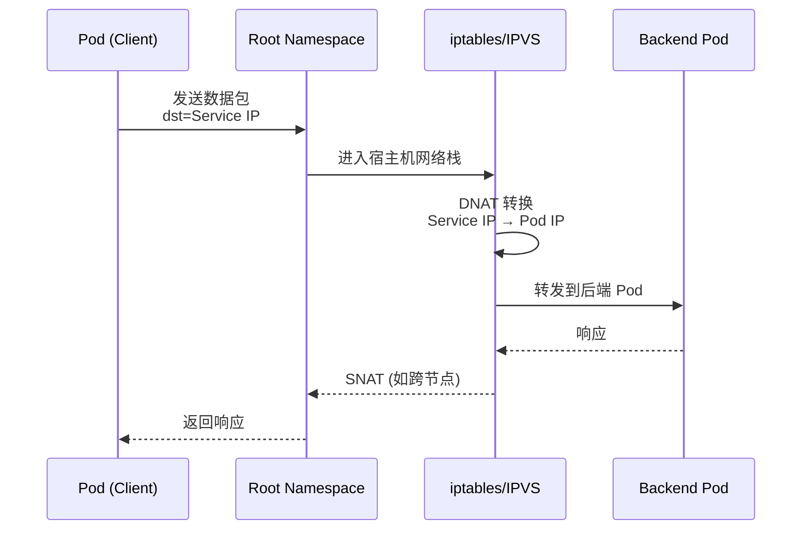

**问题分析**：

| 问题 | 描述 |
|:---|:---|
| **多层处理** | 数据包需先到 Root Namespace，再经 iptables/IPVS 处理 |
| **规则匹配** | iptables 链式匹配，规则多时性能下降 |
| **额外跳转** | 跨节点时还需要 SNAT，增加处理开销 |
| **延迟增加** | 整个处理流程增加了访问延迟 |

##### 18.1.2 理想的访问模式

用户期望的访问模式应该更加直接：

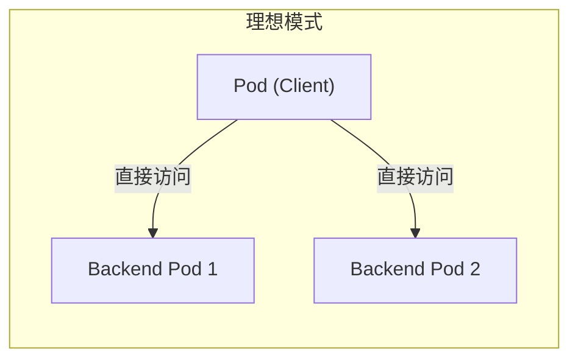

> [!NOTE]
> **理想状态**：Pod 发出的数据包直接以后端 Pod 的 IP 作为目的地址，无需经过中间的 NAT 转换。

#### 18.2 Socket LB 原理

##### 18.2.1 核心思想

Socket LB 的核心思想是：**在 Socket 层面提前完成负载均衡决策**，在数据包离开 Pod 之前就将 Service IP 替换为真实的后端 Pod IP。

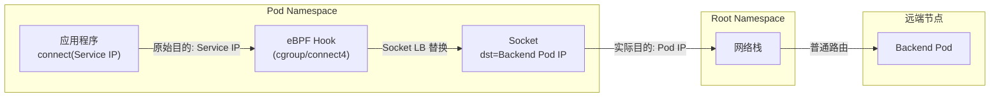

##### 18.2.2 工作机制

| 阶段 | 传统模式 | Socket LB 模式 |
|:---|:---|:---|
| **发包位置** | Pod 内发包，dst = Service IP | Pod 内发包，dst = **Backend Pod IP** |
| **NAT 位置** | Root Namespace (iptables) | Pod Namespace (eBPF) |
| **后续路由** | 需要 iptables 规则匹配 | 简单的跨节点/同节点路由 |
| **返回处理** | 可能需要 SNAT 反向转换 | 直接返回，无需额外处理 |

> [!IMPORTANT]
> **关键优势**：DNAT 提前在 Pod 命名空间内完成，后续流量变成简单的 Pod-to-Pod 通信，无需经过 iptables 规则链。

##### 18.2.3 eBPF 实现位置

Socket LB 通过 eBPF 程序挂载在 cgroup 的 socket 操作钩子上实现：

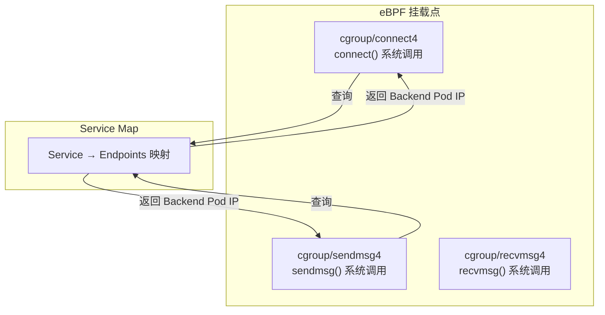

#### 18.3 传统模式抓包分析

##### 18.3.1 环境准备（以 Flannel 为例）

```bash
# 创建测试服务
kubectl apply -f demo-deployment.yaml

# 查看 Service
kubectl get svc demo-svc
# NAME       TYPE       CLUSTER-IP     EXTERNAL-IP   PORT(S)        AGE
# demo-svc   NodePort   172.18.0.2     <none>        80:32000/TCP   1m

# 查看 iptables 规则链
iptables -t nat -L | grep 32000
# 可以看到 KUBE-SVC-xxx 链
```

##### 18.3.2 抓包验证

```bash
# 进入 Pod 内抓包
kubectl exec -it frontend-pod -- tcpdump -i eth0 -n

# 在另一个终端，从 Pod 内访问 Service
kubectl exec -it frontend-pod -- curl 172.18.0.2:32000
```

**抓包结果分析**：

```
# TCP 三次握手
10.244.2.2.42962 > 172.18.0.2.32000: Flags [S]      # SYN: dst=Service IP
172.18.0.2.32000 > 10.244.2.2.42962: Flags [S.]    # SYN-ACK
10.244.2.2.42962 > 172.18.0.2.32000: Flags [.]     # ACK
```

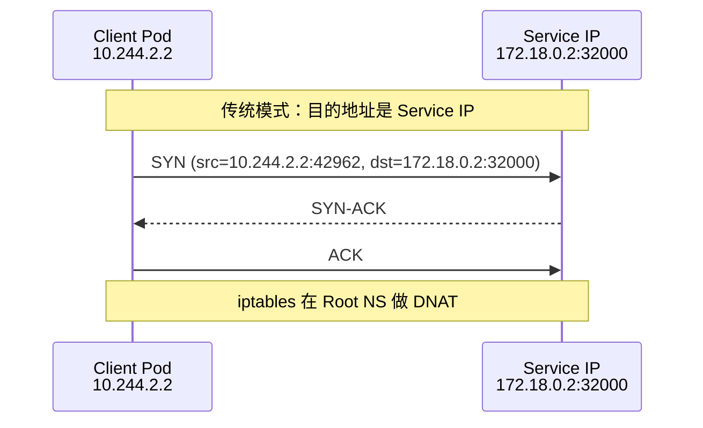

> [!NOTE]
> **观察要点**：
>
> - 目的 IP 是 Service IP（172.18.0.2），而非后端 Pod IP
> - 数据包需要到达 Root Namespace 后，由 iptables 进行 DNAT 转换
> - 这是传统的、符合直觉的实现方式

#### 18.4 Socket LB 模式抓包分析

##### 18.4.1 启用 Socket LB

通过 Helm 部署 Cilium 并启用 Socket LB：

```bash
helm install cilium cilium/cilium --namespace kube-system \
  --set kubeProxyReplacement=strict \
  --set socketLB.enabled=true
```

##### 18.4.2 验证配置

```bash
# 查看 Cilium 配置
cilium config view | grep -i socket
# socket-lb: enabled

# 或通过 cilium status
cilium status --verbose | grep -i socket
# KubeProxyReplacement Info: Socket LB: enabled
```

##### 18.4.3 抓包验证

```bash
# 进入 Pod 内抓包
kubectl exec -it frontend-pod -- tcpdump -i eth0 -n

# 从 Pod 内访问 Service
kubectl exec -it frontend-pod -- curl 172.18.0.2:32000
```

**抓包结果分析**：

```
# TCP 三次握手
10.0.0.221.58504 > 10.0.2.22.80: Flags [S]     # SYN: dst=Backend Pod IP !!!
10.0.2.22.80 > 10.0.0.221.58504: Flags [S.]   # SYN-ACK
10.0.0.221.58504 > 10.0.2.22.80: Flags [.]    # ACK
```

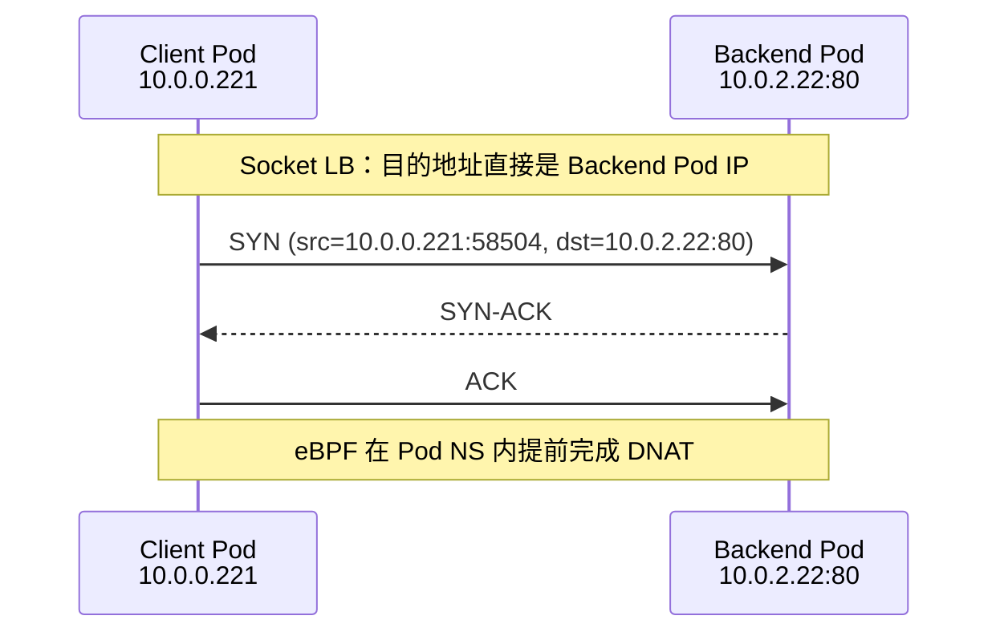

> [!IMPORTANT]
> **关键发现**：
>
> - 虽然应用访问的是 Service IP（172.18.0.2:32000）
> - 但抓包看到的目的 IP 直接是 Backend Pod IP（10.0.2.22:80）
> - 这说明 Socket LB 在数据包发出前就完成了地址替换

#### 18.5 对比总结

##### 18.5.1 数据路径对比

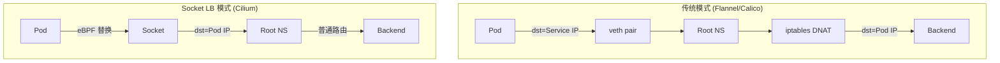

##### 18.5.2 核心差异表

| 对比项 | 传统模式 | Socket LB 模式 |
|:---|:---|:---|
| **DNAT 位置** | Root Namespace | Pod Namespace |
| **DNAT 时机** | 数据包到达宿主机后 | 数据包离开 Pod 前 |
| **实现技术** | iptables / IPVS | eBPF (cgroup hooks) |
| **抓包看到的目的 IP** | Service IP | Backend Pod IP |
| **后续处理** | 需要规则匹配 | 简单路由 |
| **性能开销** | 较高（规则链匹配） | 较低（Map 查询） |

##### 18.5.3 性能优势

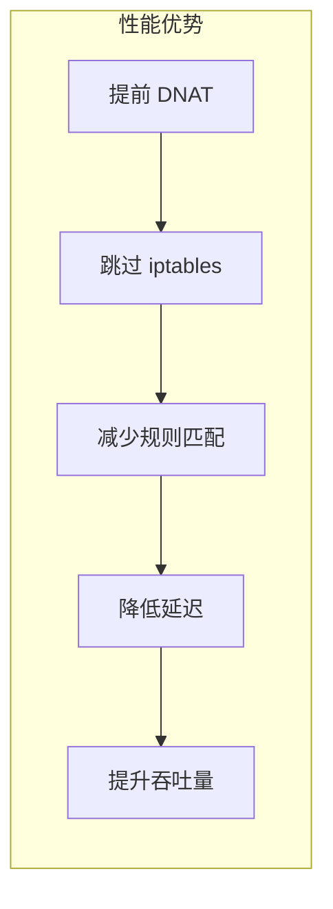

| 优势 | 说明 |
|:---|:---|
| **减少跳数** | 不需要经过 Root NS 的 iptables 处理 |
| **规避规则膨胀** | Service 多时，iptables 规则链很长 |
| **路径简化** | 变成简单的 Pod-to-Pod 通信 |
| **性能提升** | 减少 CPU 开销和延迟 |

#### 18.6 配置选项

##### 18.6.1 Helm 配置参数

```yaml
# values.yaml 关键配置
kubeProxyReplacement: strict  # 或 partial
socketLB:
  enabled: true
  hostNamespaceOnly: false    # 是否仅对 host namespace 生效
```

##### 18.6.2 模式说明

| 模式 | kubeProxyReplacement | 说明 |
|:---|:---|:---|
| **strict** | strict | 完全替换 kube-proxy，启用所有 eBPF 功能 |
| **partial** | partial | 部分替换，与 kube-proxy 共存 |

##### 18.6.3 验证命令

```bash
# 查看 Socket LB 状态
cilium status --verbose

# 查看详细配置
cilium config view

# 查看 BPF 程序
bpftool prog list | grep cgroup
```

#### 18.7 历史演进

| 版本阶段 | 功能名称 | 说明 |
|:---|:---|:---|
| **早期版本** | Host Reachable Services | 最初的功能名称 |
| **当前版本** | Socket LB | 统一命名为 Socket-based Load Balancing |

> [!TIP]
> 如果在旧版本 Cilium 文档中看到 "Host Reachable Services"，它与 Socket LB 描述的是同一功能。

#### 18.8 适用场景

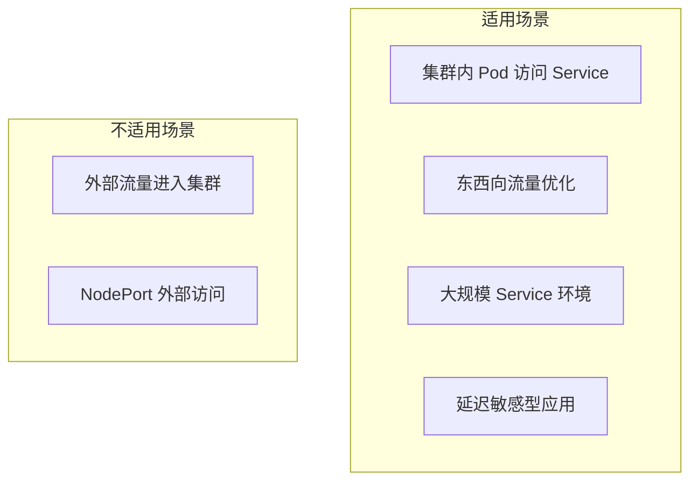

| 场景 | Socket LB 作用 |
|:---|:---|
| **Pod → ClusterIP** | ✅ 直接替换为后端 Pod IP |
| **Pod → NodePort（集群内）** | ✅ 同样可以优化 |
| **外部 → NodePort** | ❌ 需要其他机制（如 DSR） |

#### 18.9 章节小结

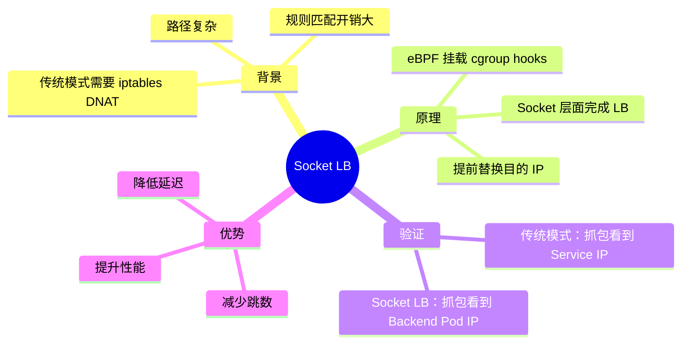

> [!IMPORTANT]
> **核心要点总结**：
>
> 1. **什么是 Socket LB**：在 Socket 层面通过 eBPF 实现的负载均衡，提前完成 Service IP 到 Backend Pod IP 的转换
>
> 2. **与传统模式区别**：
>    - 传统：Pod → Root NS → iptables DNAT → Backend
>    - Socket LB：Pod (eBPF DNAT) → Root NS → 直接路由 → Backend
>
> 3. **抓包验证**：
>    - 传统模式抓包看到 dst = Service IP
>    - Socket LB 模式抓包看到 dst = Backend Pod IP
>
> 4. **配置方法**：`kubeProxyReplacement=strict` 或单独设置 `socketLB.enabled=true`
>
> 5. **核心优势**：减少 iptables 规则匹配，降低延迟，提升大规模集群的 Service 访问性能

---

### 第十九章 Cilium-DSR 模式

本章介绍 Cilium 的 DSR（Direct Server Return）模式，这是一种优化南北向流量的技术，通过让后端 Pod 直接响应客户端，减少返回路径的跳数，降低入口节点的负载。

#### 19.1 背景与问题

##### 19.1.1 传统 SNAT 模式的数据路径

在传统的 NodePort/LoadBalancer 访问模式中，外部客户端访问集群内服务时，数据包需要经过 SNAT 处理：

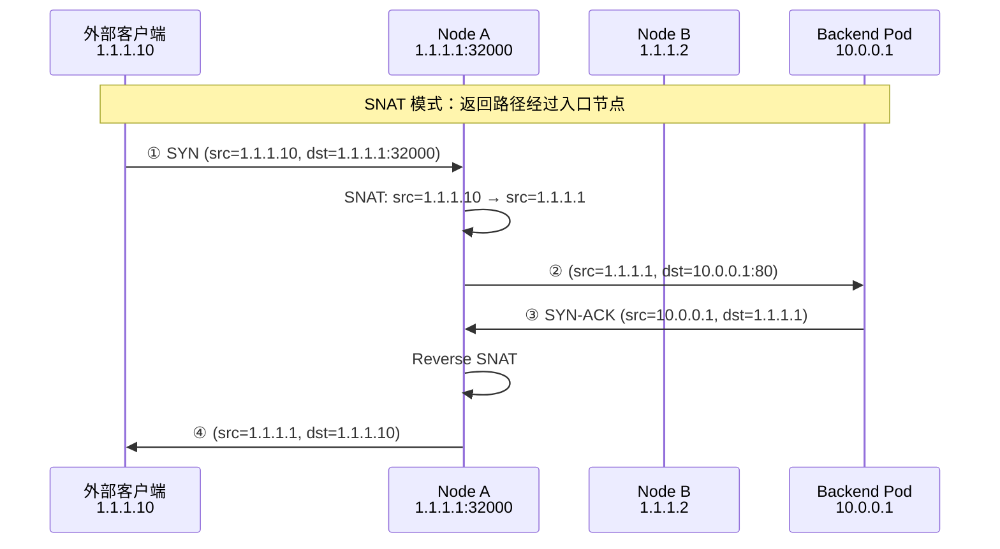

**SNAT 模式的问题**：

| 问题 | 描述 |
|:---|:---|
| **入口节点瓶颈** | 所有进出流量都经过入口节点，容易成为瓶颈 |
| **多一跳** | 返回响应需要先回到入口节点，再转发给客户端 |
| **源 IP 丢失** | Pod 看到的源 IP 是入口节点 IP，而非真实客户端 IP |
| **负载不均** | 入口节点承担额外的转发负担 |

##### 19.1.2 DSR 的核心思想

DSR（Direct Server Return）的核心思想是：**让后端 Pod 直接将响应发送给客户端，跳过入口节点**。

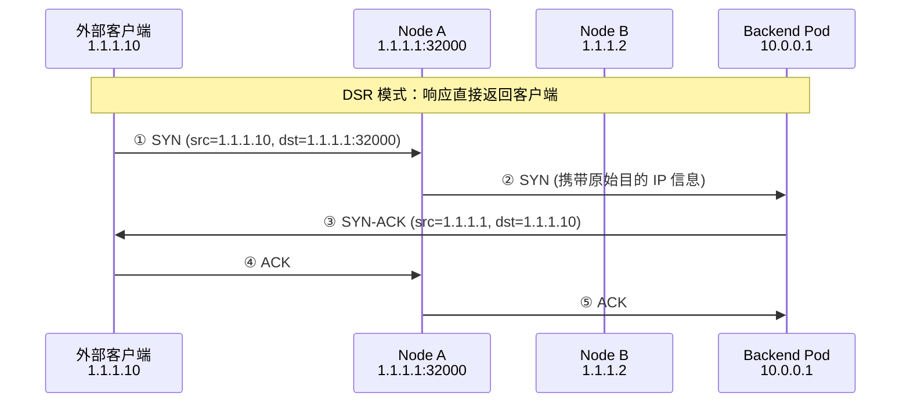

> [!IMPORTANT]
> **DSR 的关键**：后端 Pod 在发送响应时，必须使用客户端原始访问的目的 IP（入口节点 IP）作为源 IP，否则客户端会丢弃这个"意外"的响应包。

#### 19.2 DSR vs SNAT 对比

##### 19.2.1 数据路径对比

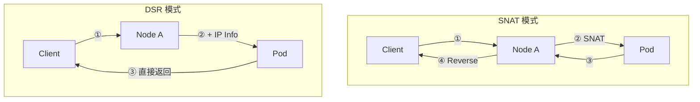

##### 19.2.2 核心差异表

| 对比项 | SNAT 模式 | DSR 模式 |
|:---|:---|:---|
| **返回路径** | Client ← Node A ← Pod | Client ← Pod (直接) |
| **跳数** | 请求 2 跳 + 响应 2 跳 = 4 跳 | 请求 2 跳 + 响应 1 跳 = 3 跳 |
| **入口节点负载** | 高（处理双向流量） | 低（只处理入向流量） |
| **源 IP 可见性** | Pod 看到 Node A IP | Pod 看到真实 Client IP |
| **响应包源 IP** | Node A IP | Node A IP (伪装) |

#### 19.3 核心挑战：IP 传递问题

##### 19.3.1 问题描述

DSR 模式的核心挑战是：**如何将客户端原始访问的目的 IP（入口节点 IP）传递给后端 Pod？**

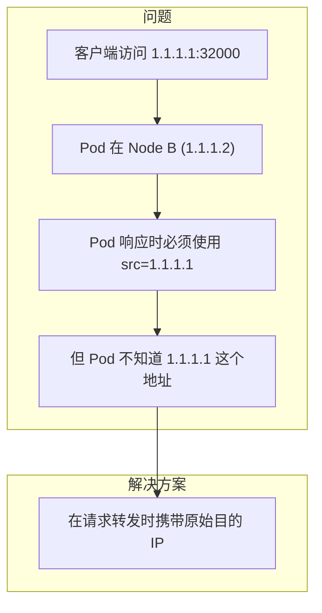

##### 19.3.2 IP 响应的要求

客户端发送请求后，期望收到来自原始目的 IP 的响应：

| 场景 | 客户端行为 |
|:---|:---|
| 响应源 IP = 原始目的 IP | ✅ 接受响应，通信正常 |
| 响应源 IP ≠ 原始目的 IP | ❌ 丢弃响应，认为是无效包 |

> [!NOTE]
> **类比理解**：就像你 ping 1.1.1.1，但收到 1.1.1.2 的 reply，这个 reply 会被丢弃，因为"你问的是 A，但 B 来回答了"。

#### 19.4 Cilium DSR 实现机制

##### 19.4.1 IP Options 方案

Cilium 原生使用 **IP Options 字段** 来传递原始目的 IP 信息：

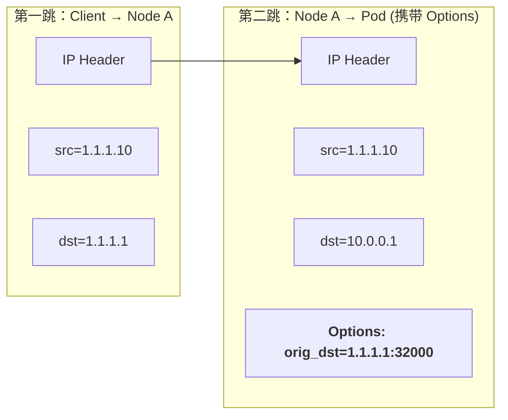

##### 19.4.2 IP Options 字段解析

```
IP Header Options 字段内容（十六进制）：
+------+------+------+------+------+------+------+------+
| 0x9a | ...  | 0xAC | 0x12 | 0x00 | 0x04 | 0x7D | 0x00 |
+------+------+------+------+------+------+------+------+
                 ↓      ↓      ↓      ↓      ↓      ↓
               172     18     0      4    32000端口高位
               
解析结果：原始目的 IP = 172.18.0.4，端口 = 32000
```

| 十六进制 | 十进制 | 含义 |
|:---|:---|:---|
| 0xAC | 172 | IP 第一段 |
| 0x12 | 18 | IP 第二段 |
| 0x00 | 0 | IP 第三段 |
| 0x04 | 4 | IP 第四段 |
| 0x7D00 | 32000 | 端口号 |

##### 19.4.3 抓包验证

**第一跳抓包（Client → Node A）**：

```
# 正常的 SYN 包，没有 Options 字段
172.18.0.1.38645 > 172.18.0.4.32000: Flags [S]
IP Header: 无 Options
```

**第二跳抓包（Node A → Pod）**：

```
# 携带 Options 字段的 SYN 包
172.18.0.1.38645 > 10.0.2.148.80: Flags [S]
IP Header Options: unknown (0x9a) [包含原始目的 IP]
```

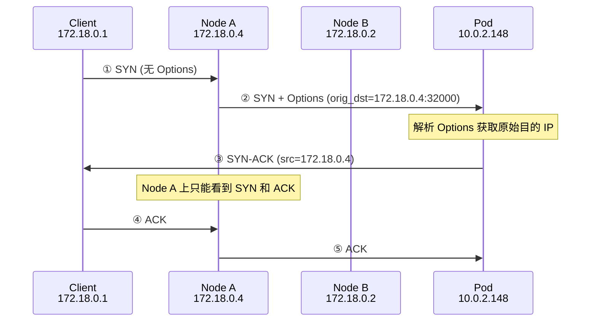

#### 19.5 TCP 三次握手详解

##### 19.5.1 握手过程分析

在 DSR 模式下，三次握手的包分布在不同路径：

| 包名 | 路径 | Node A 可见 | Node B/Pod 可见 |
|:---|:---|:---|:---|
| **SYN** | Client → A → Pod | ✅ | ✅ |
| **SYN-ACK** | Pod → Client | ❌ (跳过) | ✅ |
| **ACK** | Client → A → Pod | ✅ | ✅ |

> [!TIP]
> **抓包技巧**：在 Node A 上抓包只能看到 SYN 和 ACK，看不到 SYN-ACK；要看 SYN-ACK 需要在 Pod 所在节点抓包。

##### 19.5.2 TCP 三次握手简单理解

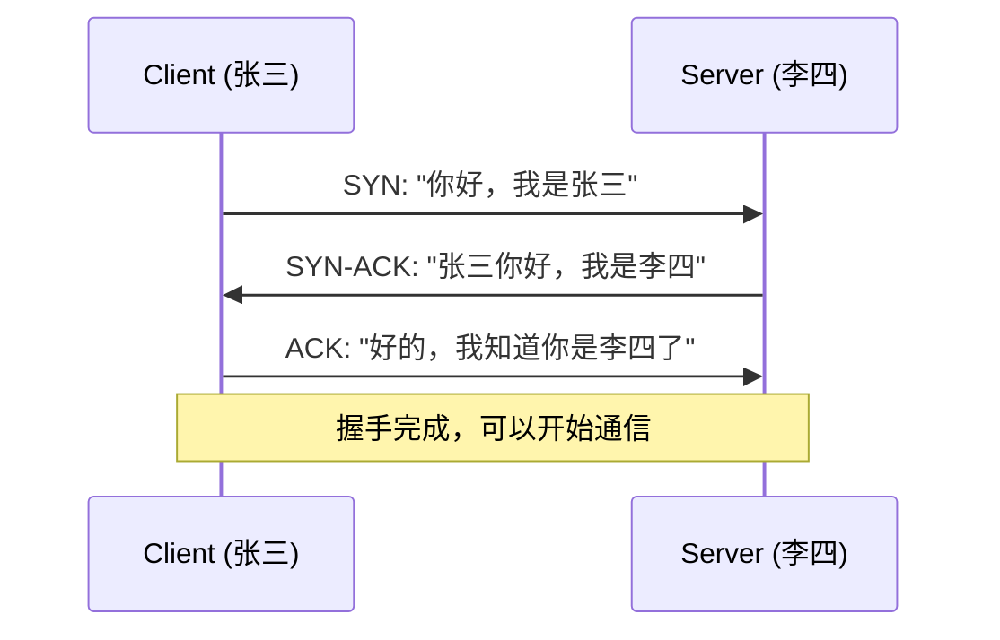

- **第一次握手 (SYN)**：证明自己的存在
- **第二次握手 (SYN-ACK)**：证明对方的存在 + 确认收到
- **第三次握手 (ACK)**：确认彼此都存在

#### 19.6 配置方法

##### 19.6.1 Helm 部署

```bash
helm install cilium cilium/cilium --namespace kube-system \
  --set kubeProxyReplacement=strict \
  --set loadBalancer.mode=dsr
```

##### 19.6.2 验证配置

```bash
# 查看 Cilium 状态
cilium status --verbose | grep -i "load"
# LoadBalancer Mode: DSR

# 或通过 config view
cilium config view | grep -i loadbalancer
# loadbalancer-mode: dsr
```

#### 19.7 进阶方案：IPIP 隧道

##### 19.7.1 IP Options 的局限性

| 问题 | 描述 |
|:---|:---|
| **TCP Fast Open 不兼容** | 使用 Options 字段会影响 TCP Fast Open |
| **交换机处理慢** | 交换机需要解析 Options，增加处理开销 |
| **Slow Path** | 触发非快速路径处理 |

##### 19.7.2 IPIP 隧道方案

字节跳动工程师提出了使用 **IPIP 隧道** 来传递原始 IP 信息的方案：

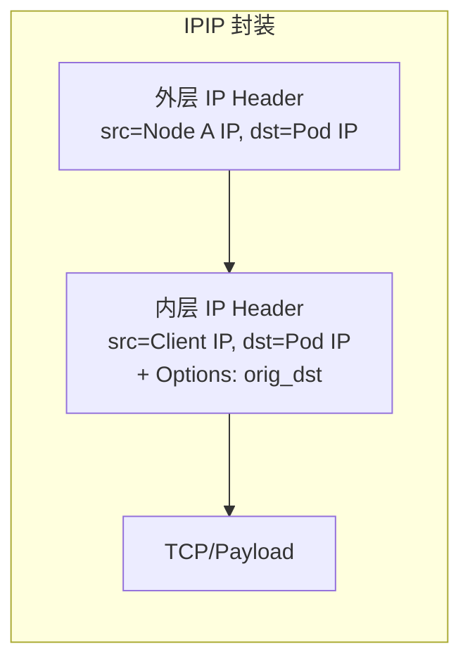

##### 19.7.3 IPIP vs IP Options 对比

| 对比项 | IP Options | IPIP 隧道 |
|:---|:---|:---|
| **交换机可见** | ✅ 可见，需解析 | ❌ 不可见，快速转发 |
| **处理路径** | Slow Path | Fast Path |
| **封装开销** | 低 | 略高（多一层 IP） |
| **实现状态** | Cilium 原生支持 | 需要二次开发 |

> [!NOTE]
> IPIP 隧道方案将 Options 信息"隐藏"在内层 IP 中，外层 IP 是标准包，交换机可以快速转发。

#### 19.8 应用场景

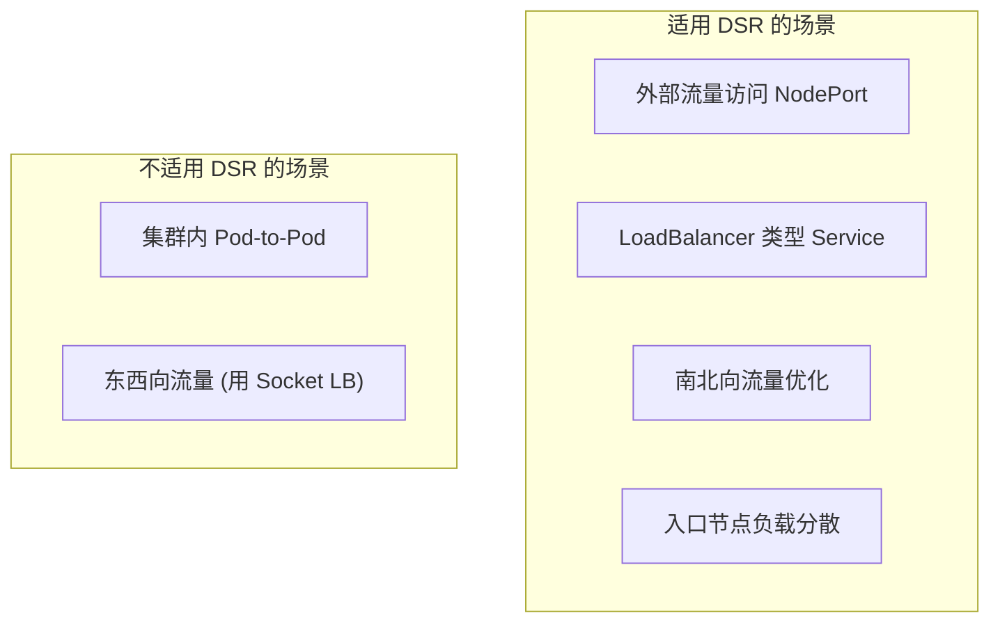

| 场景 | 推荐模式 |
|:---|:---|
| **外部 → ClusterIP/NodePort** | DSR |
| **外部 → LoadBalancer** | DSR |
| **Pod → Service（集群内）** | Socket LB |
| **需要源 IP 保留** | DSR (externalTrafficPolicy=Local) |

#### 19.9 与 LVS DSR 的关系

Cilium DSR 的思想源自 Linux LVS 的 DR 模式：

| LVS 术语 | Cilium 对应 |
|:---|:---|
| **Director** | 入口节点 (Node A) |
| **Real Server** | 后端 Pod |
| **VIP** | Service IP / NodePort |
| **DIP** | Pod IP |

> [!TIP]
> 学习 LVS 的 DR/NAT/TUN 模式可以帮助理解 Cilium DSR 的设计思想。

#### 19.10 章节小结

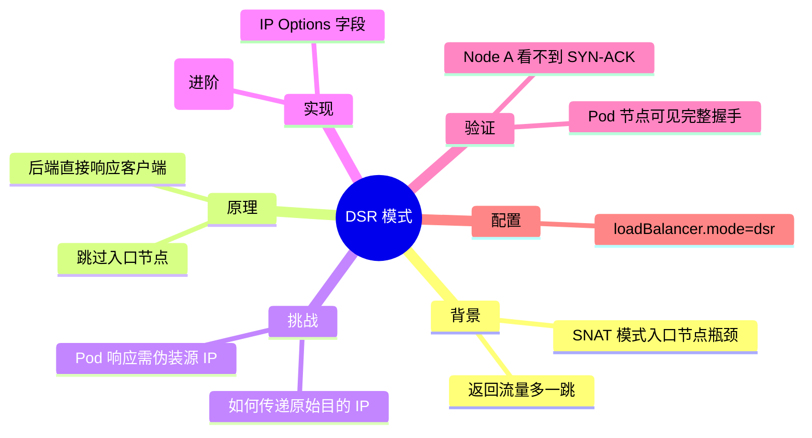

> [!IMPORTANT]
> **核心要点总结**：
>
> 1. **什么是 DSR**：Direct Server Return，后端 Pod 直接响应客户端，跳过入口节点
>
> 2. **解决的问题**：
>    - 减少返回路径跳数（4 跳 → 3 跳）
>    - 分散入口节点负载
>    - 保留真实客户端源 IP
>
> 3. **核心挑战**：如何将原始目的 IP 传递给后端 Pod
>
> 4. **Cilium 实现**：通过 IP Options 字段携带 `orig_dst` 信息
>
> 5. **抓包验证**：SYN-ACK 从 Pod 直接发往 Client，Node A 看不到
>
> 6. **配置方法**：`loadBalancer.mode=dsr`
>
> 7. **与 Socket LB 的区别**：
>    - Socket LB：优化东西向（集群内）流量
>    - DSR：优化南北向（外部访问）流量

---

### 第二十章 Cilium 双栈模式

本章介绍 Cilium 的 IPv4/IPv6 双栈（Dual Stack）支持，这是一种让 Pod 和 Service 同时拥有 IPv4 和 IPv6 地址的网络配置方式，是从 IPv4 向 IPv6 过渡的重要技术。

#### 20.1 背景与概念

##### 20.1.1 为什么需要双栈

随着 IPv4 地址资源枯竭和 IPv6 的推广，越来越多的企业开始进行 IPv6 改造：

```mermaid
graph LR
    subgraph "演进路径"
        A["纯 IPv4"] --> B["双栈过渡"]
        B --> C["纯 IPv6"]
    end
```

| 方案 | 描述 |
|:---|:---|
| **纯 IPv4** | 传统方案，地址资源紧张 |
| **假双栈** | 两个网卡分别承载 IPv4/IPv6 |
| **真双栈** | 同一网卡同时拥有 IPv4 和 IPv6 地址 |
| **纯 IPv6** | 未来目标，彻底解决地址问题 |

##### 20.1.2 双栈的定义

**真正的双栈（Dual Stack）**：一个网络接口上同时配置 IPv4 和 IPv6 地址，两种协议栈独立运行。

```mermaid
graph TB
    subgraph "双栈网卡"
        NIC["eth0"]
        IPv4["IPv4: 10.0.0.1/24"]
        IPv6["IPv6: fd00::1/64"]
        
        NIC --> IPv4
        NIC --> IPv6
    end
```

> [!NOTE]
> **假双栈 vs 真双栈**：
>
> - **假双栈**：两个接口分别提供 IPv4 和 IPv6 服务，客户端根据协议访问不同接口
> - **真双栈**：一个接口同时提供两种协议，客户端可以使用任意协议访问

#### 20.2 Cilium 双栈配置

##### 20.2.1 Helm 部署参数

```bash
helm install cilium cilium/cilium --namespace kube-system \
  --set ipv6.enabled=true \
  --set ipam.mode=kubernetes
```

| 参数 | 说明 |
|:---|:---|
| `ipv6.enabled=true` | 启用 IPv6 支持 |
| `ipv4.enabled=true` | 默认启用，无需显式设置 |
| `kubeProxyReplacement` | 双栈暂不支持 strict 模式 |

> [!WARNING]
> **注意事项**：Cilium 双栈模式目前不支持 `kubeProxyReplacement=strict`，需要保留 kube-proxy。

##### 20.2.2 Kind 集群配置

```yaml
# kind-config.yaml
kind: Cluster
apiVersion: kind.x-k8s.io/v1alpha4
networking:
  ipFamily: dual  # 关键配置：启用双栈
  podSubnet: "10.244.0.0/16,fd00:10:244::/56"
  serviceSubnet: "10.96.0.0/12,fd00:10:96::/112"
```

#### 20.3 Pod 双栈验证

##### 20.3.1 查看 Pod IP

```bash
# 简单查看（只显示一个 IP）
kubectl get pod -o wide

# 详细查看（显示所有 IP）
kubectl get pod -o yaml | grep -A 10 "podIPs"
```

**输出示例**：

```yaml
podIPs:
  - ip: "10.244.1.57"      # IPv4 地址
  - ip: "fd00::982a:..."   # IPv6 地址
```

##### 20.3.2 验证网卡配置

```bash
# 进入 Pod 查看 IP 地址
kubectl exec -it <pod-name> -- ip addr show eth0
```

**输出示例**：

```
2: eth0@if15: <BROADCAST,MULTICAST,UP,LOWER_UP> mtu 1500
    inet 10.244.1.57/32 scope global eth0
    inet6 fd00::982a:.../128 scope global
    inet6 fe80::xxxx/64 scope link
```

```mermaid
graph TB
    subgraph "Pod 网卡 eth0"
        A["IPv4: 10.244.1.57/32"]
        B["IPv6: fd00::982a.../128<br/>(Global)"]
        C["IPv6: fe80::xxxx/64<br/>(Link-local)"]
    end
```

> [!NOTE]
> **三种地址**：
>
> - **IPv4 地址**：Pod 的 IPv4 通信地址
> - **IPv6 Global 地址**：Pod 的 IPv6 全局通信地址
> - **IPv6 Link-local 地址**：以 `fe80::` 开头，仅用于本地链路通信

#### 20.4 Service 双栈支持

##### 20.4.1 Service 配置

```yaml
apiVersion: v1
kind: Service
metadata:
  name: demo-svc
spec:
  ipFamilyPolicy: PreferDualStack  # 优先双栈
  ipFamilies:
    - IPv4
    - IPv6
  selector:
    app: demo
  ports:
    - port: 80
```

| 字段 | 值 | 说明 |
|:---|:---|:---|
| `ipFamilyPolicy` | `PreferDualStack` | 优先使用双栈 |
| `ipFamilyPolicy` | `RequireDualStack` | 强制要求双栈 |
| `ipFamilies` | `[IPv4, IPv6]` | 指定支持的 IP 类型 |

##### 20.4.2 验证 Service IP

```bash
kubectl get svc demo-svc -o yaml | grep -A 5 "clusterIPs"
```

**输出示例**：

```yaml
clusterIPs:
  - "10.96.44.152"     # IPv4 ClusterIP
  - "fd00:10:96::xxx"  # IPv6 ClusterIP
```

#### 20.5 DNS 解析

##### 20.5.1 A 记录与 AAAA 记录

```mermaid
graph LR
    subgraph "DNS 记录类型"
        A["A 记录"] -->|"返回"| IPv4["IPv4 地址"]
        AAAA["AAAA 记录"] -->|"返回"| IPv6["IPv6 地址"]
    end
```

##### 20.5.2 解析示例

```bash
# 解析 IPv4 地址（A 记录）
nslookup -type=A demo-svc.default.svc.cluster.local
# 返回：10.96.44.152

# 解析 IPv6 地址（AAAA 记录）
nslookup -type=AAAA demo-svc.default.svc.cluster.local
# 返回：fd00:10:96::xxx
```

| 记录类型 | 返回内容 | 用途 |
|:---|:---|:---|
| **A** | IPv4 地址 | IPv4 客户端访问 |
| **AAAA** | IPv6 地址 | IPv6 客户端访问 |

#### 20.6 双栈路由

##### 20.6.1 IPv4 路由表

```bash
# Pod 内查看 IPv4 路由
ip route
```

```
default via 10.244.1.5 dev eth0
10.244.1.5 dev eth0 scope link
```

##### 20.6.2 IPv6 路由表

```bash
# Pod 内查看 IPv6 路由
ip -6 route
```

```
default via fe80::xxxx dev eth0
fd00::/64 dev eth0
```

```mermaid
graph TB
    subgraph "双栈路由"
        Pod["Pod"]
        
        subgraph "IPv4 路径"
            GW4["网关: 10.244.1.5"]
        end
        
        subgraph "IPv6 路径"
            GW6["网关: fe80::xxxx"]
        end
        
        Pod -->|"IPv4 流量"| GW4
        Pod -->|"IPv6 流量"| GW6
    end
```

#### 20.7 IPv6 邻居发现

##### 20.7.1 与 ARP 的区别

| 特性 | IPv4 ARP | IPv6 NDP |
|:---|:---|:---|
| **协议名称** | ARP | NDP (Neighbor Discovery Protocol) |
| **请求消息** | ARP Request | NS (Neighbor Solicitation) |
| **响应消息** | ARP Reply | NA (Neighbor Advertisement) |
| **复杂度** | 简单 | 复杂（有状态机） |
| **查看命令** | `arp -n` | `ip -6 neigh` |

##### 20.7.2 IPv6 地址类型

```mermaid
graph TB
    subgraph "IPv6 地址类型"
        Global["全局地址<br/>fd00::/8 或 2000::/3"]
        LinkLocal["链路本地地址<br/>fe80::/10"]
        Multicast["组播地址<br/>ff00::/8"]
    end
```

| 地址类型 | 前缀 | 用途 |
|:---|:---|:---|
| **Global** | `2000::/3` 或 `fd00::/8` | 全局通信 |
| **Link-local** | `fe80::/10` | 本地链路通信 |
| **Multicast** | `ff00::/8` | 组播通信 |

> [!NOTE]
> **Link-local 地址**：每个启用 IPv6 的网卡都会自动生成一个 `fe80::` 开头的链路本地地址，用于邻居发现等本地通信。

##### 20.7.3 邻居发现状态机

IPv6 邻居发现有多种状态：

```mermaid
stateDiagram-v2
    [*] --> INCOMPLETE
    INCOMPLETE --> REACHABLE: 收到 NA
    REACHABLE --> STALE: 超时
    STALE --> DELAY: 有数据发送
    DELAY --> PROBE: 超时
    PROBE --> REACHABLE: 收到 NA
    PROBE --> [*]: 失败
```

| 状态 | 说明 |
|:---|:---|
| **INCOMPLETE** | 正在解析，等待 NA 响应 |
| **REACHABLE** | 可达，最近确认过 |
| **STALE** | 过期，需要重新验证 |
| **DELAY** | 延迟探测 |
| **PROBE** | 主动探测中 |

#### 20.8 跨节点通信验证

##### 20.8.1 IPv6 Ping 测试

```bash
# Pod 内 ping IPv6 地址
ping6 fd00::9d86:...
```

##### 20.8.2 抓包分析

```bash
# 在节点上抓包
tcpdump -i lxc-xxx icmp6
```

**抓包输出**：

```
# NS/NA 消息（邻居发现）
fe80::xxxx > ff02::1:ffxx:xxxx: ICMP6, neighbor solicitation
fe80::xxxx > fe80::yyyy: ICMP6, neighbor advertisement

# Echo Request/Reply
fd00::982a > fd00::9d86: ICMP6, echo request
fd00::9d86 > fd00::982a: ICMP6, echo reply
```

#### 20.9 MAC 地址学习

##### 20.9.1 eBPF 的作用

Cilium 使用 eBPF 来处理 IPv6 邻居发现：

```mermaid
graph LR
    subgraph "MAC 地址学习"
        NS["NS 请求"] --> eBPF["eBPF Hook"]
        eBPF --> NA["NA 响应"]
        NA --> MAC["获取 MAC 地址"]
    end
```

> [!TIP]
> Cilium 的 eBPF 程序会劫持邻居发现请求，返回对应的 lxc 网卡 MAC 地址，类似于 Calico 中的 `169.254.1.1` 代理 ARP 机制。

##### 20.9.2 验证 MAC 地址

```bash
# 抓包查看目的 MAC
tcpdump -i lxc-xxx -e icmp6

# 输出示例
# src MAC: 7c:f9:26:... (Pod 网卡)
# dst MAC: b6:44:1b:... (lxc 网卡)
```

#### 20.10 配置总结

##### 20.10.1 完整配置流程

```mermaid
flowchart TB
    A["1. Kind 集群配置<br/>ipFamily: dual"] --> B["2. Helm 安装 Cilium<br/>ipv6.enabled=true"]
    B --> C["3. 部署 Pod<br/>自动获取双 IP"]
    C --> D["4. 创建 Service<br/>ipFamilyPolicy: PreferDualStack"]
    D --> E["5. 验证通信<br/>ping/ping6 测试"]
```

##### 20.10.2 关键配置对照表

| 层级 | 配置项 | 值 |
|:---|:---|:---|
| **Cluster** | `ipFamily` | `dual` |
| **Cilium** | `ipv6.enabled` | `true` |
| **Service** | `ipFamilyPolicy` | `PreferDualStack` |
| **Service** | `ipFamilies` | `[IPv4, IPv6]` |

#### 20.11 章节小结

```mermaid
mindmap
  root((双栈模式))
    概念
      同一网卡双 IP
      IPv4 + IPv6 共存
    配置
      ipv6.enabled=true
      ipFamilyPolicy: PreferDualStack
    Pod 验证
      kubectl get pod -o yaml
      ip addr show eth0
    Service 验证
      A 记录返回 IPv4
      AAAA 记录返回 IPv6
    IPv6 特性
      NDP 替代 ARP
      Link-local 地址
      状态机复杂
```

> [!IMPORTANT]
> **核心要点总结**：
>
> 1. **什么是双栈**：同一网卡同时拥有 IPv4 和 IPv6 地址
>
> 2. **配置要点**：
>    - Cilium: `ipv6.enabled=true`
>    - Service: `ipFamilyPolicy: PreferDualStack`
>
> 3. **验证方法**：
>    - Pod: `ip addr show eth0` 看到两个地址
>    - Service: `kubectl get svc -o yaml` 看到两个 ClusterIP
>
> 4. **DNS 解析**：
>    - A 记录 → IPv4 地址
>    - AAAA 记录 → IPv6 地址
>
> 5. **IPv6 特性**：
>    - 使用 NDP 替代 ARP
>    - 自动生成 Link-local 地址 (`fe80::`)
>    - 邻居状态机比 ARP 复杂
>
> 6. **当前限制**：双栈不支持 `kubeProxyReplacement=strict`

---

### 第二十一章 Cilium-LB-IPAM

本章介绍 Cilium 的 LB IPAM（LoadBalancer IP Address Management）功能，这是一个专门为 LoadBalancer 类型 Service 分配 IP 地址的工具，常与 BGP Control Plane 结合使用实现外部访问。

#### 21.1 背景与问题

##### 21.1.1 LoadBalancer Service 的困境

在裸金属（Bare Metal）Kubernetes 集群中，创建 LoadBalancer 类型的 Service 时，常遇到以下问题：

```mermaid
graph LR
    subgraph "云环境"
        A["创建 LB Service"] --> B["云厂商自动分配 IP"]
        B --> C["External IP 就绪"]
    end
    
    subgraph "裸金属环境"
        D["创建 LB Service"] --> E["无 IP 分配器"]
        E --> F["External IP: Pending"]
    end
```

| 环境 | LoadBalancer 支持 |
|:---|:---|
| **云环境（AWS/GCP/Azure）** | 云厂商自动分配公网 IP |
| **裸金属集群** | 默认无 IP 分配，状态为 Pending |

> [!NOTE]
> 很多初学者在部署 Ingress Controller 时遇到 `EXTERNAL-IP` 一直显示 `<pending>` 的问题，原因就是没有 LoadBalancer IP 分配器。

##### 21.1.2 常见解决方案

```mermaid
graph TB
    subgraph "LoadBalancer IP 解决方案"
        A["MetalLB"]
        B["Cilium LB IPAM"]
        C["kube-vip"]
        D["OpenELB"]
    end
```

| 方案 | 特点 |
|:---|:---|
| **MetalLB** | 独立项目，支持 L2 和 BGP 模式 |
| **Cilium LB IPAM** | Cilium 内置，需配合 BGP 使用 |
| **kube-vip** | 轻量级，支持 VIP 和 LB |

#### 21.2 核心概念

##### 21.2.1 LB IPAM 的职责

**LB IPAM 只负责分配 IP 地址，不负责流量转发！**

```mermaid
graph LR
    subgraph "LB IPAM 职责"
        A["IP Pool 管理"]
        B["IP 分配"]
        C["Service 标签匹配"]
    end
    
    subgraph "不负责"
        D["流量路由"]
        E["负载均衡"]
        F["外部可达性"]
    end
    
    A --> B --> C
```

> [!IMPORTANT]
> **关键理解**：LB IPAM 分配的 IP 地址默认不可路由，需要配合 **BGP Control Plane** 将地址宣告出去，才能实现外部访问。

##### 21.2.2 与 BGP 的关系

```mermaid
sequenceDiagram
    participant Svc as Service
    participant IPAM as LB IPAM
    participant BGP as BGP Control Plane
    participant Router as 外部路由器
    
    Svc->>IPAM: 请求 LoadBalancer IP
    IPAM->>Svc: 分配 IP（如 20.0.10.1）
    Note over Svc: EXTERNAL-IP 就绪
    BGP->>Router: 宣告 20.0.10.1
    Router->>Router: 更新路由表
    Note over Router: 地址变得可路由
```

#### 21.3 Cilium vs Calico 设计对比

##### 21.3.1 宣告的 IP 类型

```mermaid
graph TB
    subgraph "Cilium 方案"
        A["宣告 LoadBalancer IP"]
        B["符合 K8s 设计理念"]
        C["LB IP 本应外部可达"]
    end
    
    subgraph "Calico 方案"
        D["宣告 ClusterIP"]
        E["ClusterIP 变得外部可达"]
        F["可能违背设计初衷"]
    end
```

| 对比项 | Cilium | Calico |
|:---|:---|:---|
| **宣告的 IP** | LoadBalancer IP | ClusterIP |
| **设计契合度** | 符合 K8s 设计 | 略有争议 |
| **ClusterIP 暴露** | ❌ 保持内部 | ✅ 可外部访问 |

> [!TIP]
> Kubernetes 设计中 ClusterIP 是集群内部地址，Cilium 选择宣告 LB IP 更符合这一理念。

#### 21.4 配置与使用

##### 21.4.1 CRD 资源

Cilium 安装后会自动创建 `CiliumLoadBalancerIPPool` CRD：

```bash
# 查看 CRD
kubectl api-resources | grep cilium | grep pool

# 输出
ciliumloadbalancerippools  ippools,lbippool  cilium.io/v2alpha1  false  CiliumLoadBalancerIPPool
```

##### 21.4.2 创建 IP Pool

```yaml
apiVersion: cilium.io/v2alpha1
kind: CiliumLoadBalancerIPPool
metadata:
  name: blue-pool
spec:
  blocks:
    - cidr: "20.0.10.0/24"   # IP 地址池范围
  serviceSelector:
    matchLabels:
      color: blue             # 匹配的 Service 标签
---
apiVersion: cilium.io/v2alpha1
kind: CiliumLoadBalancerIPPool
metadata:
  name: red-pool
spec:
  blocks:
    - cidr: "30.0.10.0/24"
  serviceSelector:
    matchLabels:
      color: red
```

##### 21.4.3 IP Pool 结构说明

```mermaid
graph TB
    subgraph "IP Pool 结构"
        Pool["CiliumLoadBalancerIPPool"]
        Blocks["blocks<br/>(IP 地址段列表)"]
        CIDR["cidr: 20.0.10.0/24"]
        Selector["serviceSelector<br/>(Service 选择器)"]
        Labels["matchLabels<br/>color: blue"]
        
        Pool --> Blocks --> CIDR
        Pool --> Selector --> Labels
    end
```

| 字段 | 说明 |
|:---|:---|
| `blocks` | IP 地址段列表，支持多个 CIDR |
| `serviceSelector` | Service 标签选择器 |
| `matchLabels` | 精确匹配标签 |
| `matchExpressions` | 表达式匹配（可选） |

#### 21.5 Service 配置

##### 21.5.1 创建使用 IP Pool 的 Service

```yaml
apiVersion: v1
kind: Service
metadata:
  name: demo-svc
  labels:
    color: red    # 匹配 red-pool
spec:
  type: LoadBalancer  # 必须是 LoadBalancer 类型
  selector:
    app: demo
  ports:
    - port: 80
```

##### 21.5.2 验证 IP 分配

```bash
# 查看 Service
kubectl get svc demo-svc

# 输出示例
NAME       TYPE           CLUSTER-IP    EXTERNAL-IP    PORT(S)
demo-svc   LoadBalancer   10.96.1.100   30.0.10.208   80:31234/TCP
```

```mermaid
graph LR
    subgraph "IP 分配流程"
        A["Service<br/>labels: color=red"] --> B["匹配 red-pool"]
        B --> C["从 30.0.10.0/24 分配"]
        C --> D["EXTERNAL-IP: 30.0.10.208"]
    end
```

#### 21.6 工作原理

##### 21.6.1 标签匹配机制

```mermaid
flowchart TB
    subgraph "匹配流程"
        S["Service 创建<br/>type: LoadBalancer"]
        L["检查 Service labels"]
        P1["blue-pool<br/>matchLabels: color=blue"]
        P2["red-pool<br/>matchLabels: color=red"]
        IP1["分配 20.0.10.x"]
        IP2["分配 30.0.10.x"]
        
        S --> L
        L -->|"color=blue"| P1 --> IP1
        L -->|"color=red"| P2 --> IP2
    end
```

##### 21.6.2 多 Pool 匹配规则

| 场景 | 行为 |
|:---|:---|
| Service 标签匹配单个 Pool | 从该 Pool 分配 IP |
| Service 标签匹配多个 Pool | 从第一个匹配的 Pool 分配 |
| Service 无匹配标签 | IP 不分配，状态 Pending |

#### 21.7 与 MetalLB 对比

##### 21.7.1 功能对比

| 特性 | Cilium LB IPAM | MetalLB |
|:---|:---|:---|
| **IP 分配** | ✅ | ✅ |
| **L2 模式** | ❌ | ✅ |
| **BGP 模式** | ✅（需 BGP CP） | ✅ |
| **独立使用** | ❌（需配合 BGP） | ✅ |
| **CNI 集成** | ✅ 原生 | ❌ 独立部署 |

##### 21.7.2 选择建议

```mermaid
graph TB
    subgraph "选择指南"
        Q1["使用 Cilium CNI?"]
        Q2["有 BGP 基础设施?"]
        A1["Cilium LB IPAM<br/>+ BGP Control Plane"]
        A2["MetalLB L2 模式"]
        A3["MetalLB"]
        
        Q1 -->|"是"| Q2
        Q1 -->|"否"| A3
        Q2 -->|"是"| A1
        Q2 -->|"否"| A2
    end
```

#### 21.8 重要限制

> [!WARNING]
> **LB IPAM 单独使用时的限制**：
>
> 1. **IP 不可路由**：分配的 IP 只是写入 Service，外部无法访问
> 2. **需要 BGP**：必须配合 BGP Control Plane 宣告路由
> 3. **版本要求**：Cilium 1.13+ 支持 BGP 宣告 LB IP

##### 21.8.1 单独使用 LB IPAM 的效果

```bash
# Service 获得 IP，但无法访问
kubectl get svc
NAME       TYPE           EXTERNAL-IP    ...
demo-svc   LoadBalancer   30.0.10.208   ...

# 从集群外部访问
curl 30.0.10.208
# 超时 - IP 不可路由
```

#### 21.9 完整工作流程

##### 21.9.1 LB IPAM + BGP Control Plane

```mermaid
sequenceDiagram
    participant User as 用户
    participant Svc as Service
    participant IPAM as LB IPAM
    participant BGP as BGP CP
    participant TOR as ToR 交换机
    participant Client as 外部客户端
    
    User->>Svc: 创建 LB Service
    IPAM->>Svc: 分配 IP 30.0.10.208
    BGP->>TOR: BGP 宣告 30.0.10.208
    TOR->>TOR: 更新路由表
    Client->>TOR: 访问 30.0.10.208
    TOR->>Svc: 路由到集群节点
    Svc->>Client: 响应
```

##### 21.9.2 ECMP 负载均衡

配合 BGP 可实现 ECMP（等价多路径）负载均衡：

```
# 路由表示例
30.0.10.208 via 10.1.5.10  # Node 1
30.0.10.208 via 10.1.5.11  # Node 2
# = 等价路由，流量分担
```

#### 21.10 章节小结

```mermaid
mindmap
  root((LB IPAM))
    概念
      LoadBalancer IP 管理器
      只分配IP不负责路由
    配置
      CiliumLoadBalancerIPPool
      blocks + serviceSelector
    匹配
      Service labels 匹配 Pool
      分配对应网段 IP
    限制
      单独使用IP不可路由
      需配合BGP使用
    对比
      Cilium宣告LB IP
      Calico宣告ClusterIP
```

> [!IMPORTANT]
> **核心要点总结**：
>
> 1. **什么是 LB IPAM**：Cilium 内置的 LoadBalancer IP 地址分配器
>
> 2. **核心职责**：只负责分配 IP，不负责路由和负载均衡
>
> 3. **配置方式**：
>    - 创建 `CiliumLoadBalancerIPPool` 定义 IP 池
>    - Service 通过 labels 匹配 Pool
>
> 4. **重要限制**：
>    - 单独使用时 IP 不可路由
>    - 需要配合 BGP Control Plane 宣告路由
>
> 5. **与 Calico 对比**：
>    - Cilium：宣告 LB IP（符合 K8s 设计）
>    - Calico：宣告 ClusterIP（有争议）
>
> 6. **版本要求**：Cilium 1.13+ 才支持 BGP 宣告 LB IP

---

### 第二十二章 Cilium 带宽管理

本章介绍 Cilium 的带宽管理（Bandwidth Manager）功能，这是一种通过 EDT（Earliest Departure Time）时间戳机制在物理网卡上实现 Pod 流量限速的技术。

#### 22.1 背景与问题

##### 22.1.1 传统限速思路的局限

最直觉的限速方式是在 Pod 的网卡上做限制：

```mermaid
graph LR
    subgraph "传统思路"
        Pod["Pod eth0"] --> LXC["lxc 网卡"]
        LXC --> PHY["物理网卡"]
        
        Pod -.->|"❌ 在这限速"| Pod
        LXC -.->|"❌ 在这限速"| LXC
    end
```

**为什么不能在 veth 网卡上限速？**

| 问题 | 说明 |
|:---|:---|
| **Buffer Bloat** | veth 队列缓冲区容易被填满 |
| **TCP TSQ 处理差** | 影响 TCP 小队列优化 |
| **驱动限制** | veth pair 驱动不支持高级队列调度 |

> [!WARNING]
> Docker/Kubernetes 的 veth pair 虚拟网卡在带宽管理上存在天然限制，不适合做精确限速。

##### 22.1.2 Cilium 的解决方案

Cilium 选择在**物理网卡**上做限速，通过 EDT 时间戳告诉物理网卡何时发送数据包：

```mermaid
graph LR
    subgraph "Cilium 方案"
        Pod["Pod eth0"] --> LXC["lxc 网卡"]
        LXC --> |"EDT 时间戳"| PHY["物理网卡"]
        PHY -.->|"✅ 在这限速"| PHY
    end
```

#### 22.2 核心原理

##### 22.2.1 EDT (Earliest Departure Time)

EDT 是一个内核功能，数据包在发送时会携带一个时间戳，告诉网卡设备这个包最早什么时候可以发出：

```mermaid
sequenceDiagram
    participant Pod as Pod
    participant eBPF as eBPF Datapath
    participant NIC as 物理网卡
    
    Pod->>eBPF: 发送数据包
    eBPF->>eBPF: 计算 EDT 时间戳
    eBPF->>NIC: 数据包 + EDT
    Note over NIC: 根据 EDT 调度发送
    NIC->>NIC: 时间到才发送
```

> [!NOTE]
> **EDT 时间戳**是 Linux 内核 5.x 版本引入的功能，Cilium 利用这一特性实现精确的带宽控制。

##### 22.2.2 MQ + FQ 队列协作

物理网卡使用两种队列机制配合实现限速：

```mermaid
graph TB
    subgraph "队列调度架构"
        Packets["数据包流"] --> MQ["MQ (Multi-Queue)<br/>多队列分发"]
        MQ --> Q1["队列 1"]
        MQ --> Q2["队列 2"]
        MQ --> Q3["队列 N"]
        
        Q1 --> FQ["FQ (Fair Queue)<br/>公平队列"]
        Q2 --> FQ
        Q3 --> FQ
        
        FQ --> |"根据 EDT 调度"| NIC["网卡发送"]
    end
```

| 组件 | 全称 | 作用 |
|:---|:---|:---|
| **MQ** | Multi-Queue | 多队列，将流量分散到多个 CPU/队列 |
| **FQ** | Fair Queue | 公平队列，基于时间轮按 EDT 调度发包 |

##### 22.2.3 工作流程

```mermaid
flowchart TB
    A["1. Cilium Agent 监控 Pod 注解"]
    B["2. 读取带宽限制配置"]
    C["3. 将限制写入 eBPF Datapath"]
    D["4. 数据包发送时计算 EDT"]
    E["5. 物理网卡 FQ 根据 EDT 调度"]
    F["6. 实现带宽限速"]
    
    A --> B --> C --> D --> E --> F
```

#### 22.3 配置方法

##### 22.3.1 启用带宽管理

安装 Cilium 时需要开启 `bandwidthManager` 功能：

```bash
helm install cilium cilium/cilium --namespace kube-system \
  --set bandwidthManager.enabled=true \
  --set bandwidthManager.bbr=true \
  --set bpf.masquerade=true \
  --set kubeProxyReplacement=true
```

| 参数 | 说明 |
|:---|:---|
| `bandwidthManager.enabled=true` | 启用带宽管理功能 |
| `bandwidthManager.bbr=true` | 启用 BBR 拥塞控制算法 |

##### 22.3.2 验证功能启用

```bash
# 查看 Cilium 状态
cilium status

# 输出中确认
BandwidthManager:    EDT with BPF [BBR]
```

##### 22.3.3 Pod 注解配置

通过注解（Annotation）为 Pod 设置带宽限制：

```yaml
apiVersion: v1
kind: Pod
metadata:
  name: bandwidth-limited-pod
  annotations:
    kubernetes.io/egress-bandwidth: "50M"   # 限制出站带宽 50Mbps
    # kubernetes.io/ingress-bandwidth: "100M"  # 入站带宽（可选）
spec:
  containers:
    - name: app
      image: nginx
```

| 注解 | 说明 |
|:---|:---|
| `kubernetes.io/egress-bandwidth` | 限制出站（发送）带宽 |
| `kubernetes.io/ingress-bandwidth` | 限制入站（接收）带宽 |

> [!TIP]
> 常用单位：`K`（Kbps）、`M`（Mbps）、`G`（Gbps），如 `10M` 表示 10 Mbps。

#### 22.4 实现原理详解

##### 22.4.1 为什么在物理网卡限速

```mermaid
graph TB
    subgraph "veth 限速问题"
        V1["veth 队列满"]
        V2["Buffer Bloat"]
        V3["TCP 性能下降"]
        V1 --> V2 --> V3
    end
    
    subgraph "物理网卡优势"
        P1["硬件队列支持"]
        P2["MQ+FQ 调度"]
        P3["EDT 精确控制"]
        P1 --> P2 --> P3
    end
```

| 对比项 | veth 网卡 | 物理网卡 |
|:---|:---|:---|
| **队列支持** | 简单队列 | 多队列 + 硬件队列 |
| **调度能力** | 有限 | FQ 公平调度 |
| **性能影响** | 大（buffer bloat） | 小 |
| **限速精度** | 低 | 高（EDT 时间戳） |

##### 22.4.2 EDT 时间戳原理

```mermaid
sequenceDiagram
    participant App as 应用
    participant Kernel as 内核
    participant FQ as FQ 调度器
    participant NIC as 网卡
    
    App->>Kernel: 发送数据包
    Kernel->>Kernel: 计算 EDT = 当前时间 + 延迟
    Kernel->>FQ: 数据包 + EDT
    
    Note over FQ: 时间轮调度
    
    loop 每个时间片
        FQ->>FQ: 检查 EDT <= 当前时间?
        alt EDT 到达
            FQ->>NIC: 发送数据包
        else EDT 未到
            FQ->>FQ: 继续等待
        end
    end
```

**限速计算示例**：

```
原始带宽：1 Gbps = 每秒发送 1000M 数据
限制带宽：50 Mbps

计算：1000 / 50 = 20 倍

实现：每 20 个时间片才发送 1 个包
结果：带宽降低到 50 Mbps
```

#### 22.5 测试验证

##### 22.5.1 部署测试 Pod

```yaml
# 10M 带宽限制
apiVersion: v1
kind: Pod
metadata:
  name: netperf-10m
  annotations:
    kubernetes.io/egress-bandwidth: "10M"
spec:
  containers:
    - name: netperf
      image: networkstatic/netperf
---
# 100M 带宽限制
apiVersion: v1
kind: Pod
metadata:
  name: netperf-100m
  annotations:
    kubernetes.io/egress-bandwidth: "100M"
spec:
  containers:
    - name: netperf
      image: networkstatic/netperf
```

##### 22.5.2 使用 netperf 测试

```bash
# 获取服务端 IP
SERVER_IP=$(kubectl get pod netperf-server -o jsonpath='{.status.podIP}')

# 从限速 Pod 测试带宽
kubectl exec -it netperf-10m -- netperf -H $SERVER_IP -t TCP_STREAM

# 预期结果：~9.5 Mbps（接近 10M 限制）
```

##### 22.5.3 测试结果对照

| 配置 | 预期带宽 | 实测带宽 |
|:---|:---|:---|
| `egress-bandwidth: 10M` | 10 Mbps | ~9.5 Mbps |
| `egress-bandwidth: 100M` | 100 Mbps | ~93 Mbps |
| 无限制 | 网卡最大 | ~500+ Mbps |

#### 22.6 与传统方案对比

##### 22.6.1 与 CNI bandwidth 插件对比

```mermaid
graph TB
    subgraph "传统方案 - CNI bandwidth"
        A1["使用 tc 规则"]
        A2["在 veth 上限速"]
        A3["tbf/htb 队列"]
    end
    
    subgraph "Cilium 方案"
        B1["使用 eBPF + EDT"]
        B2["在物理网卡限速"]
        B3["MQ + FQ 调度"]
    end
```

| 特性 | CNI bandwidth 插件 | Cilium 带宽管理 |
|:---|:---|:---|
| **限速位置** | veth 网卡 | 物理网卡 |
| **实现方式** | tc (tbf/htb) | eBPF + EDT |
| **性能影响** | 较大 | 较小 |
| **精度** | 一般 | 高 |
| **TCP 优化** | 无 | TSQ 支持 |

#### 22.7 重要限制

> [!CAUTION]
> **使用限制**：
>
> 1. **不支持 Kind 环境**：Kind 使用 veth pair，无法正确限速
> 2. **需要物理/虚拟机环境**：必须有真正的物理网卡驱动
> 3. **内核版本要求**：需要支持 EDT 的内核（5.x+）
> 4. **主要限制 egress**：入站限速场景较少

#### 22.8 注意事项

##### 22.8.1 环境要求

```mermaid
graph LR
    subgraph "支持的环境"
        A["物理服务器"]
        B["VMware/KVM 虚拟机"]
        C["云服务器"]
    end
    
    subgraph "不支持的环境"
        D["Kind 集群"]
        E["Docker Desktop"]
    end
```

##### 22.8.2 驱动检查

```bash
# 查看网卡驱动
ethtool -i eth0 | grep driver

# 物理网卡驱动示例
driver: vmxnet3     # VMware
driver: virtio_net  # KVM
driver: ixgbe       # Intel 万兆
```

#### 22.9 章节小结

```mermaid
mindmap
  root((带宽管理))
    原理
      EDT时间戳
      物理网卡限速
      MQ+FQ队列
    配置
      bandwidthManager.enabled
      Pod注解方式
    限速注解
      egress-bandwidth
      ingress-bandwidth
    限制
      不支持Kind
      需要真实网卡
      内核5.x+
```

> [!IMPORTANT]
> **核心要点总结**：
>
> 1. **为什么不在 veth 限速**：Buffer Bloat、队列受限、精度差
>
> 2. **Cilium 方案**：在物理网卡使用 EDT 时间戳限速
>
> 3. **启用方式**：
>    - Helm: `bandwidthManager.enabled=true`
>    - Pod: `kubernetes.io/egress-bandwidth: "50M"`
>
> 4. **工作原理**：
>    - eBPF 为数据包打上 EDT 时间戳
>    - FQ 调度器根据 EDT 控制发包时机
>
> 5. **MQ + FQ 协作**：
>    - MQ（多队列）分散流量
>    - FQ（公平队列）按时间调度
>
> 6. **环境要求**：
>    - 需要真实物理/虚拟网卡
>    - 不支持 Kind（veth pair）
>    - 内核版本 5.x+

---

### 第二十三章 Cilium Ingress Controller

本章介绍 Cilium 原生的 Ingress Controller 功能，无需部署额外的 Ingress 控制器（如 Nginx Ingress），Cilium 可以直接提供七层负载均衡能力。

#### 23.1 背景与概念

##### 23.1.1 Ingress 回顾

Ingress 是 Kubernetes 中用于管理七层（HTTP/HTTPS）流量入口的资源：

```mermaid
graph LR
    Client["外部客户端"] --> LB["LoadBalancer<br/>L4 负载均衡"]
    LB --> IC["Ingress Controller<br/>L7 负载均衡"]
    IC --> |"基于 URI 路由"| Svc1["Service A"]
    IC --> |"基于 URI 路由"| Svc2["Service B"]
    Svc1 --> Pod1["Pod A"]
    Svc2 --> Pod2["Pod B"]
```

**四层 vs 七层负载均衡**：

| 特性 | 四层（L4） | 七层（L7） |
|:---|:---|:---|
| **工作层** | 传输层（TCP/UDP） | 应用层（HTTP/HTTPS） |
| **路由依据** | IP + 端口 | URL 路径、Host 头 |
| **SSL 卸载** | ❌ | ✅ |
| **典型场景** | Service LoadBalancer | Ingress |

##### 23.1.2 传统 Ingress 架构

```mermaid
graph TB
    subgraph "传统方案"
        Nginx["Nginx Ingress Controller"]
        Rules["Ingress Rules"]
        Backend["后端 Service/Pod"]
        
        Nginx --> |"解析 Rules"| Rules
        Rules --> |"路由到"| Backend
    end
```

需要额外部署 Nginx Ingress、Traefik 等控制器。

##### 23.1.3 Cilium Ingress Controller

Cilium 内置 Ingress Controller，无需额外组件：

```mermaid
graph TB
    subgraph "Cilium 方案"
        Cilium["Cilium Agent<br/>内置 Ingress Controller"]
        Envoy["Envoy L7 Proxy"]
        Rules["Ingress Rules"]
        Backend["后端 Service/Pod"]
        
        Cilium --> Envoy
        Envoy --> |"解析 Rules"| Rules
        Rules --> |"路由到"| Backend
    end
```

> [!TIP]
> Cilium 使用 Envoy 作为七层代理，提供 Ingress Controller 能力，同时为 Service Mesh 功能奠定基础。

#### 23.2 前置要求

##### 23.2.1 配置要求

| 要求 | 说明 |
|:---|:---|
| **kubeProxyReplacement** | 必须为 `strict` 或 `true` |
| **L7 Proxy** | 默认启用 |
| **Kubernetes 版本** | ≥ 1.19 |
| **Cilium 版本** | ≥ 1.13 |

##### 23.2.2 启用 Ingress Controller

```bash
helm install cilium cilium/cilium --namespace kube-system \
  --set kubeProxyReplacement=true \
  --set ingressController.enabled=true \
  --set ingressController.loadbalancerMode=dedicated
```

| 参数 | 说明 |
|:---|:---|
| `ingressController.enabled=true` | 启用 Ingress Controller |
| `ingressController.loadbalancerMode` | `dedicated`（专用）或 `shared`（共享） |

#### 23.3 HTTP 模式

##### 23.3.1 工作流程

```mermaid
sequenceDiagram
    participant Client as 客户端
    participant LB as LoadBalancer
    participant Envoy as Cilium Envoy
    participant Svc as Service
    participant Pod as Pod
    
    Client->>LB: HTTP 请求 (pass: /details)
    LB->>Envoy: 转发请求
    Envoy->>Envoy: 解析 Ingress Rules
    Envoy->>Svc: 匹配后端服务
    Svc->>Pod: 路由到 Pod
    Pod->>Client: 返回响应
```

##### 23.3.2 创建后端服务

```yaml
# 部署后端应用
apiVersion: apps/v1
kind: Deployment
metadata:
  name: productpage
spec:
  replicas: 1
  selector:
    matchLabels:
      app: productpage
  template:
    metadata:
      labels:
        app: productpage
    spec:
      containers:
        - name: productpage
          image: docker.io/istio/examples-bookinfo-productpage-v1:1.16.2
          ports:
            - containerPort: 9080
---
apiVersion: v1
kind: Service
metadata:
  name: productpage
spec:
  selector:
    app: productpage
  ports:
    - port: 9080
```

##### 23.3.3 创建 Ingress 资源

```yaml
apiVersion: networking.k8s.io/v1
kind: Ingress
metadata:
  name: basic-ingress
spec:
  ingressClassName: cilium    # 使用 Cilium Ingress Controller
  rules:
    - http:
        paths:
          - path: /details
            pathType: Prefix
            backend:
              service:
                name: details
                port:
                  number: 9080
          - path: /
            pathType: Prefix
            backend:
              service:
                name: productpage
                port:
                  number: 9080
```

##### 23.3.4 验证配置

```bash
# 查看 Ingress
kubectl get ingress

# 输出示例
NAME            CLASS    HOSTS   ADDRESS        PORTS
basic-ingress   cilium   *       172.18.0.200   80

# 测试访问
curl http://172.18.0.200/details | jq
```

#### 23.4 HTTPS 模式

##### 23.4.1 TLS 卸载原理

```mermaid
sequenceDiagram
    participant Client as 客户端
    participant Envoy as Cilium Envoy
    participant Pod as 后端 Pod
    
    Client->>Envoy: HTTPS (TLS 加密)
    Note over Envoy: TLS 卸载（解密）
    Envoy->>Pod: HTTP (明文)
    Pod->>Envoy: HTTP 响应
    Note over Envoy: TLS 加密
    Envoy->>Client: HTTPS 响应
```

> [!NOTE]
> **信任域划分**：
>
> - **非信任域**：客户端 ↔ Ingress Controller（HTTPS）
> - **信任域**：Ingress Controller ↔ 后端 Pod（HTTP）

##### 23.4.2 创建 TLS 证书

**方式一：使用 minica**

```bash
# 安装 minica
go install github.com/jsha/minica@latest

# 生成证书
minica --domains demo.cilium.rocks

# 创建 Secret
kubectl create secret tls demo-cert \
  --cert=demo.cilium.rocks/cert.pem \
  --key=demo.cilium.rocks/key.pem
```

**方式二：使用 OpenSSL**

```bash
# 生成自签名证书
openssl req -x509 -nodes -days 365 -newkey rsa:2048 \
  -keyout tls.key -out tls.crt \
  -subj "/CN=demo.cilium.rocks"

# 创建 Secret
kubectl create secret tls demo-cert \
  --cert=tls.crt --key=tls.key
```

**方式三：使用 cert-manager**

```yaml
apiVersion: cert-manager.io/v1
kind: Certificate
metadata:
  name: demo-cert
spec:
  secretName: demo-cert
  dnsNames:
    - demo.cilium.rocks
  issuerRef:
    name: letsencrypt-prod
    kind: ClusterIssuer
```

##### 23.4.3 创建 HTTPS Ingress

```yaml
apiVersion: networking.k8s.io/v1
kind: Ingress
metadata:
  name: tls-ingress
spec:
  ingressClassName: cilium
  tls:
    - hosts:
        - demo.cilium.rocks
      secretName: demo-cert     # 引用 TLS Secret
  rules:
    - host: demo.cilium.rocks   # 指定 Host
      http:
        paths:
          - path: /
            pathType: Prefix
            backend:
              service:
                name: productpage
                port:
                  number: 9080
```

##### 23.4.4 验证 HTTPS

```bash
# 添加 hosts 解析
echo "172.18.0.200 demo.cilium.rocks" >> /etc/hosts

# 测试 HTTPS 访问
curl -k -v https://demo.cilium.rocks/

# 查看 TLS 握手信息
curl -k -v https://demo.cilium.rocks/ 2>&1 | grep -A5 "SSL connection"
```

#### 23.5 与 LoadBalancer 配合

##### 23.5.1 MetalLB 集成

Ingress Controller 需要 LoadBalancer 类型的 Service 暴露外部访问：

```mermaid
graph LR
    Client["外部客户端"] --> MetalLB["MetalLB<br/>L2/BGP 模式"]
    MetalLB --> |"External IP"| Ingress["Cilium Ingress<br/>Controller"]
    Ingress --> Pod["后端 Pod"]
```

##### 23.5.2 MetalLB 配置

```yaml
# MetalLB L2 模式配置
apiVersion: metallb.io/v1beta1
kind: IPAddressPool
metadata:
  name: default
  namespace: metallb-system
spec:
  addresses:
    - 172.18.0.200-172.18.0.254
---
apiVersion: metallb.io/v1beta1
kind: L2Advertisement
metadata:
  name: default
  namespace: metallb-system
```

#### 23.6 Ingress 资源详解

##### 23.6.1 资源结构

```mermaid
graph TB
    subgraph "Ingress 结构"
        Ingress["Ingress"]
        Class["ingressClassName: cilium"]
        TLS["tls（可选）"]
        Rules["rules"]
        Host["host"]
        Paths["paths"]
        Backend["backend"]
        
        Ingress --> Class
        Ingress --> TLS
        Ingress --> Rules
        Rules --> Host
        Rules --> Paths
        Paths --> Backend
    end
```

##### 23.6.2 关键字段

| 字段 | 说明 |
|:---|:---|
| `ingressClassName` | 指定使用的 Ingress Controller |
| `tls.hosts` | TLS 证书适用的域名 |
| `tls.secretName` | 包含证书的 Secret 名称 |
| `rules.host` | 匹配的 Host 头（可选） |
| `rules.http.paths` | URL 路径匹配规则 |
| `backend.service` | 后端 Service 配置 |

#### 23.7 与传统方案对比

##### 23.7.1 功能对比

| 特性 | Nginx Ingress | Cilium Ingress |
|:---|:---|:---|
| **部署方式** | 独立 Deployment | CNI 内置 |
| **L7 代理** | Nginx | Envoy |
| **配置方式** | 注解 + ConfigMap | 标准 Ingress |
| **与 CNI 集成** | 独立 | 原生集成 |
| **Service Mesh** | 需额外组件 | 原生支持 |

##### 23.7.2 选择建议

```mermaid
graph TB
    Q1["使用 Cilium CNI?"]
    Q2["需要 Service Mesh?"]
    A1["Cilium Ingress<br/>原生集成"]
    A2["Nginx/Traefik<br/>成熟稳定"]
    
    Q1 -->|"是"| Q2
    Q1 -->|"否"| A2
    Q2 -->|"是"| A1
    Q2 -->|"否"| A1
```

#### 23.8 注意事项

> [!WARNING]
> **使用注意**：
>
> 1. **HTTP 模式异常**：部分版本可能出现 503 错误，建议创建资源后等待 2-3 分钟
> 2. **Host 必填（HTTPS）**：TLS 模式必须指定 host 字段
> 3. **LoadBalancer 依赖**：需要 MetalLB 或云厂商 LB 提供 External IP
> 4. **证书有效期**：自签证书需注意过期问题，生产环境建议使用 cert-manager

#### 23.9 章节小结

```mermaid
mindmap
  root((Cilium Ingress))
    概念
      Cilium内置L7代理
      基于Envoy
    启用
      ingressController.enabled
      kubeProxyReplacement
    HTTP模式
      ingressClassName: cilium
      path路由
    HTTPS模式
      TLS证书
      SSL卸载
    依赖
      LoadBalancer
      MetalLB/云LB
```

> [!IMPORTANT]
> **核心要点总结**：
>
> 1. **什么是 Cilium Ingress**：Cilium 内置的七层 Ingress Controller，基于 Envoy
>
> 2. **前置要求**：
>    - `kubeProxyReplacement=true`
>    - `ingressController.enabled=true`
>
> 3. **HTTP 模式**：
>    - `ingressClassName: cilium`
>    - 定义 path 和后端 Service
>
> 4. **HTTPS 模式**：
>    - 添加 `tls` 字段配置证书
>    - 必须指定 `host` 字段
>
> 5. **TLS 证书创建**：
>    - minica / OpenSSL / cert-manager
>    - 创建为 Kubernetes Secret
>
> 6. **依赖组件**：
>    - 需要 LoadBalancer（MetalLB/云 LB）提供外部 IP

---

### 第二十四章 Cilium Gateway API

本章介绍 Cilium 对 Kubernetes Gateway API 的支持。Gateway API 是 Ingress 的下一代替代方案，提供更强大、更标准化的七层流量管理能力。

#### 24.1 背景与概念

##### 24.1.1 什么是 Gateway API

Gateway API 是 Kubernetes SIG-Network 设计的新一代流量管理 API，目标是替代 Ingress：

```mermaid
graph TB
    subgraph "演进历程"
        Ingress["Ingress<br/>（传统方式）"] --> GatewayAPI["Gateway API<br/>（新一代）"]
    end
    
    subgraph "Gateway API 特点"
        A["更强表达能力"]
        B["角色分离"]
        C["跨命名空间"]
        D["可扩展性"]
    end
```

> [!NOTE]
> **Gateway API** 是 Kubernetes 官方推荐的 Ingress 替代方案，Cilium 通过 Envoy 原生支持 Gateway API。

##### 24.1.2 与 Ingress 对比

| 特性 | Ingress | Gateway API |
|:---|:---|:---|
| **API 成熟度** | 稳定（GA） | 逐步稳定（部分 Beta） |
| **表达能力** | 有限 | 更丰富 |
| **角色分离** | 无 | 支持（Infra/Cluster/App） |
| **TLS 管理** | 简单 | 更灵活 |
| **跨命名空间** | 复杂 | 原生支持 |
| **扩展性** | 注解（非标准） | 标准化扩展 |

##### 24.1.3 核心资源对象

```mermaid
graph TB
    subgraph "Gateway API 资源"
        GC["GatewayClass<br/>定义控制器类型"]
        GW["Gateway<br/>定义入口网关"]
        HR["HTTPRoute<br/>定义路由规则"]
        
        GC --> GW
        GW --> HR
        HR --> Svc["后端 Service"]
    end
```

| 资源 | 说明 |
|:---|:---|
| **GatewayClass** | 定义使用的 Gateway 控制器（如 Cilium） |
| **Gateway** | 定义入口网关（监听端口、TLS 配置） |
| **HTTPRoute** | 定义 HTTP 路由规则（类似 Ingress Rules） |

#### 24.2 前置要求

##### 24.2.1 配置要求

| 要求 | 说明 |
|:---|:---|
| **kubeProxyReplacement** | 必须为 `strict` 或 `true` |
| **L7 Proxy** | 默认启用 |
| **Gateway API CRDs** | 必须预先安装 |

##### 24.2.2 安装 Gateway API CRDs

**必须预先安装四个 CRD**：

```bash
# 安装 Gateway API CRDs
kubectl apply -f https://raw.githubusercontent.com/kubernetes-sigs/gateway-api/v1.0.0/config/crd/standard/gateway.networking.k8s.io_gatewayclasses.yaml
kubectl apply -f https://raw.githubusercontent.com/kubernetes-sigs/gateway-api/v1.0.0/config/crd/standard/gateway.networking.k8s.io_gateways.yaml
kubectl apply -f https://raw.githubusercontent.com/kubernetes-sigs/gateway-api/v1.0.0/config/crd/standard/gateway.networking.k8s.io_httproutes.yaml
kubectl apply -f https://raw.githubusercontent.com/kubernetes-sigs/gateway-api/v1.0.0/config/crd/standard/gateway.networking.k8s.io_referencegrants.yaml
```

> [!CAUTION]
> **必须先安装 CRDs**！如果不预先安装 Gateway API CRDs，Cilium 将无法启用 Gateway API 功能。

##### 24.2.3 启用 Gateway API

```bash
helm install cilium cilium/cilium --namespace kube-system \
  --set kubeProxyReplacement=true \
  --set gatewayAPI.enabled=true
```

| 参数 | 说明 |
|:---|:---|
| `gatewayAPI.enabled=true` | 启用 Gateway API 支持 |

#### 24.3 HTTP 模式

##### 24.3.1 工作流程

```mermaid
sequenceDiagram
    participant Client as 客户端
    participant GW as Gateway
    participant Route as HTTPRoute
    participant Svc as Service
    participant Pod as Pod
    
    Client->>GW: HTTP 请求
    GW->>Route: 匹配路由规则
    Route->>Svc: 转发到后端
    Svc->>Pod: 路由到 Pod
    Pod->>Client: 返回响应
```

##### 24.3.2 创建 Gateway

```yaml
apiVersion: gateway.networking.k8s.io/v1
kind: Gateway
metadata:
  name: cilium-gateway
spec:
  gatewayClassName: cilium    # 使用 Cilium 作为控制器
  listeners:
    - name: http
      protocol: HTTP
      port: 80
      allowedRoutes:
        namespaces:
          from: Same
```

##### 24.3.3 创建 HTTPRoute

```yaml
apiVersion: gateway.networking.k8s.io/v1
kind: HTTPRoute
metadata:
  name: http-route
spec:
  parentRefs:
    - name: cilium-gateway     # 关联 Gateway
  rules:
    - matches:
        - path:
            type: PathPrefix
            value: /details
      backendRefs:
        - name: details
          port: 9080
    - matches:
        - path:
            type: PathPrefix
            value: /
      backendRefs:
        - name: productpage
          port: 9080
```

##### 24.3.4 验证配置

```bash
# 查看 Gateway
kubectl get gateway

# 输出示例
NAME             CLASS    ADDRESS        READY
cilium-gateway   cilium   172.18.0.200   True

# 查看 HTTPRoute
kubectl get httproute

# 测试访问
LB_IP=$(kubectl get gateway cilium-gateway -o jsonpath='{.status.addresses[0].value}')
curl http://$LB_IP/details | jq
```

#### 24.4 HTTPS 模式

##### 24.4.1 TLS 配置架构

```mermaid
graph LR
    Client["客户端"] -->|"HTTPS"| GW["Gateway<br/>TLS 终结"]
    GW -->|"HTTP"| Route["HTTPRoute"]
    Route --> Pod["后端 Pod"]
```

##### 24.4.2 创建 TLS 证书

```bash
# 使用 minica 生成证书
minica --domains bookinfo.cilium.rocks

# 创建 Secret
kubectl create secret tls bookinfo-cert \
  --cert=bookinfo.cilium.rocks/cert.pem \
  --key=bookinfo.cilium.rocks/key.pem
```

##### 24.4.3 创建 HTTPS Gateway

```yaml
apiVersion: gateway.networking.k8s.io/v1
kind: Gateway
metadata:
  name: tls-gateway
spec:
  gatewayClassName: cilium
  listeners:
    - name: https
      protocol: HTTPS
      port: 443
      hostname: bookinfo.cilium.rocks
      tls:
        mode: Terminate
        certificateRefs:
          - name: bookinfo-cert    # 引用 TLS Secret
      allowedRoutes:
        namespaces:
          from: Same
```

##### 24.4.4 创建 HTTPS HTTPRoute

```yaml
apiVersion: gateway.networking.k8s.io/v1
kind: HTTPRoute
metadata:
  name: https-route
spec:
  parentRefs:
    - name: tls-gateway
  hostnames:
    - bookinfo.cilium.rocks      # 必须匹配 Gateway 的 hostname
  rules:
    - matches:
        - path:
            type: PathPrefix
            value: /
      backendRefs:
        - name: productpage
          port: 9080
```

##### 24.4.5 验证 HTTPS

```bash
# 添加 hosts 解析
LB_IP=$(kubectl get gateway tls-gateway -o jsonpath='{.status.addresses[0].value}')
echo "$LB_IP bookinfo.cilium.rocks" >> /etc/hosts

# 测试 HTTPS 访问
curl -k -v https://bookinfo.cilium.rocks/
```

#### 24.5 资源关系详解

##### 24.5.1 资源层级

```mermaid
graph TB
    subgraph "Gateway API 层级"
        GC["GatewayClass<br/>⬇ 定义控制器"]
        GW["Gateway<br/>⬇ 定义入口"]
        HR["HTTPRoute<br/>⬇ 定义路由"]
        Svc["Service<br/>⬇ 后端"]
        Pod["Pod"]
        
        GC --> GW
        GW --> HR
        HR --> Svc
        Svc --> Pod
    end
```

##### 24.5.2 与 Ingress 映射

| Ingress | Gateway API |
|:---|:---|
| `ingressClassName` | `GatewayClass` + `Gateway.gatewayClassName` |
| Ingress 资源 | `Gateway` + `HTTPRoute` |
| `rules.host` | `Gateway.listeners.hostname` |
| `rules.http.paths` | `HTTPRoute.rules.matches` |
| `tls` | `Gateway.listeners.tls` |

#### 24.6 与 Ingress 对比

##### 24.6.1 配置对比

```mermaid
graph TB
    subgraph "Ingress 方式"
        I1["Ingress<br/>（单一资源）"]
    end
    
    subgraph "Gateway API 方式"
        G1["GatewayClass"]
        G2["Gateway"]
        G3["HTTPRoute"]
        G1 --> G2 --> G3
    end
```

##### 24.6.2 功能对比

| 场景 | Ingress | Gateway API |
|:---|:---|:---|
| **基础 HTTP 路由** | ✅ | ✅ |
| **TLS 终结** | ✅ | ✅ |
| **Header 匹配** | 注解 | 原生支持 |
| **请求重写** | 注解 | 原生支持 |
| **流量拆分** | 注解 | 原生支持 |
| **跨命名空间** | 困难 | 简单 |

#### 24.7 实际应用场景

##### 24.7.1 场景一：多团队共享网关

```mermaid
graph TB
    GW["Gateway<br/>（Infra Team 管理）"]
    
    subgraph "Team A 命名空间"
        HR1["HTTPRoute A"]
        Svc1["Service A"]
    end
    
    subgraph "Team B 命名空间"
        HR2["HTTPRoute B"]
        Svc2["Service B"]
    end
    
    GW --> HR1
    GW --> HR2
    HR1 --> Svc1
    HR2 --> Svc2
```

##### 24.7.2 场景二：Service Mesh 集成

```mermaid
graph LR
    GW["Gateway API"] --> Envoy["Cilium Envoy"]
    Envoy --> SM["Service Mesh<br/>流量管理"]
```

> [!TIP]
> Gateway API 是 Service Mesh 的基础组件，Cilium 的 Gateway API 实现与其 Service Mesh 功能无缝集成。

#### 24.8 注意事项

> [!WARNING]
> **使用注意**：
>
> 1. **CRDs 必须预装**：Gateway API CRDs 必须在安装 Cilium 之前安装
> 2. **版本兼容性**：确保 CRDs 版本与 Cilium 版本兼容
> 3. **LoadBalancer 依赖**：Gateway 会创建 LoadBalancer 类型的 Service
> 4. **hostname 匹配**：HTTPS 模式下，HTTPRoute 的 hostnames 必须匹配 Gateway 的 hostname

#### 24.9 章节小结

```mermaid
mindmap
  root((Gateway API))
    概念
      Ingress替代
      更强表达能力
    核心资源
      GatewayClass
      Gateway
      HTTPRoute
    前置要求
      CRDs预装
      gatewayAPI.enabled
    HTTP模式
      Gateway定义入口
      HTTPRoute定义路由
    HTTPS模式
      TLS配置
      hostname匹配
```

> [!IMPORTANT]
> **核心要点总结**：
>
> 1. **什么是 Gateway API**：Ingress 的下一代替代方案，更强大的七层流量管理
>
> 2. **核心资源**：
>    - `GatewayClass`：定义控制器
>    - `Gateway`：定义入口网关
>    - `HTTPRoute`：定义路由规则
>
> 3. **前置要求**：
>    - 必须预装 Gateway API CRDs
>    - `gatewayAPI.enabled=true`
>
> 4. **HTTP 模式**：
>    - 创建 Gateway + HTTPRoute
>    - `gatewayClassName: cilium`
>
> 5. **HTTPS 模式**：
>    - Gateway 配置 TLS 证书
>    - HTTPRoute 配置 hostnames
>
> 6. **与 Ingress 区别**：
>    - 更丰富的表达能力
>    - 原生支持流量拆分、Header 匹配等
>    - 更好的跨命名空间支持

---

### 第二十五章 BGP 基础知识

本章介绍 BGP（Border Gateway Protocol）协议的基础知识。BGP 是 Cilium 实现跨网络路由通告的核心技术，理解 BGP 原理对于配置 Cilium BGP 功能至关重要。

#### 25.1 背景与概念

##### 25.1.1 为什么需要 BGP

在 Kubernetes 环境中，每个 Pod 都有独立的 IP 地址，导致路由条目数量急剧增加：

```mermaid
graph LR
    subgraph "传统虚拟机"
        VM1["VM1: 1 IP"]
        VM2["VM2: 1 IP"]
    end
    
    subgraph "Kubernetes Pod"
        Pod1["Pod1: 独立 IP"]
        Pod2["Pod2: 独立 IP"]
        Pod3["Pod3: 独立 IP"]
        PodN["Pod N: 独立 IP"]
    end
```

**路由条目膨胀**：

| 场景 | 节点数 | 路由条目数 |
|:---|:---|:---|
| 传统虚拟机 | 200 | ~200 |
| Kubernetes（100 Pod/节点） | 200 | ~20,000 |

> [!NOTE]
> 当路由条目达到数万甚至数十万时，传统 IGP 协议（如 OSPF）难以高效管理，需要使用 BGP 协议。

##### 25.1.2 路由协议分类

```mermaid
graph TB
    subgraph "路由协议"
        Static["静态路由<br/>手动配置"]
        IGP["IGP 内部网关协议<br/>OSPF / IS-IS"]
        BGP["BGP 边界网关协议<br/>iBGP / eBGP"]
    end
    
    Static --> |"简单场景"| IGP
    IGP --> |"大规模场景"| BGP
```

| 协议类型 | 代表 | 适用规模 | 特点 |
|:---|:---|:---|:---|
| **静态路由** | - | 小型 | 手动配置，简单直观 |
| **IGP** | OSPF、IS-IS | 中型园区网 | 自动学习，成百上千条 |
| **BGP** | iBGP、eBGP | 大型互联网 | 成千上万条，更灵活 |

##### 25.1.3 BGP 定义

**BGP（Border Gateway Protocol）**：边界网关协议

```mermaid
graph TB
    AS1["自治系统 AS 100<br/>（如：电信）"]
    AS2["自治系统 AS 200<br/>（如：联通）"]
    
    AS1 <-->|"BGP 邻居"| AS2
```

- **边界**：用于不同自治系统（AS）之间的路由交换
- **网关**：运行 BGP 的路由器称为 BGP 网关
- **协议**：基于 TCP 179 端口通信

#### 25.2 核心概念

##### 25.2.1 自治系统（AS）

**AS（Autonomous System）**：自治系统号，用于标识一个独立管理的网络域。

```mermaid
graph TB
    subgraph AS123["AS 123"]
        R1["Router 1"]
        R2["Router 2"]
        R3["Router 3"]
    end
    
    subgraph AS456["AS 456"]
        R4["Router 4"]
        R5["Router 5"]
    end
    
    R3 <-->|"eBGP"| R4
```

| 概念 | 说明 |
|:---|:---|
| **AS 号** | 全局唯一标识符（如 AS 100、AS 65000） |
| **私有 AS** | 64512 - 65534（类似私有 IP） |
| **公有 AS** | 需向 IANA 申请 |

##### 25.2.2 iBGP 与 eBGP

```mermaid
graph TB
    subgraph AS123["AS 123"]
        R1["R1"] <-->|"iBGP"| R2["R2"]
        R2 <-->|"iBGP"| R3["R3"]
    end
    
    subgraph AS456["AS 456"]
        R4["R4"]
    end
    
    R3 <-->|"eBGP"| R4
```

| 类型 | 全称 | 说明 |
|:---|:---|:---|
| **iBGP** | Internal BGP | 同一 AS 内部的 BGP 邻居 |
| **eBGP** | External BGP | 不同 AS 之间的 BGP 邻居 |

**关键区别**：

| 特性 | iBGP | eBGP |
|:---|:---|:---|
| **AS 号** | 相同 | 不同 |
| **直连要求** | 不需要直连 | 通常需要直连 |
| **TTL** | 大于 1（可跨路由器） | 默认 1（直连） |
| **Next-Hop** | 不修改 | 修改为自己 |

##### 25.2.3 BGP 邻居建立

BGP 使用 **TCP 179 端口**建立邻居关系：

```mermaid
sequenceDiagram
    participant R1 as Router 1
    participant R2 as Router 2
    
    R1->>R2: TCP 三次握手 (port 179)
    R1->>R2: Open 消息
    R2->>R1: Open 消息
    R1-->>R2: Keepalive
    R2-->>R1: Keepalive
    Note over R1,R2: 邻居关系建立 (Established)
```

> [!TIP]
> BGP 邻居不要求物理直连，只要 TCP 179 端口可达即可。这是 BGP 的重要特性。

#### 25.3 水平分割原则

##### 25.3.1 问题背景

**水平分割（Split Horizon）**：从 iBGP 对等体学习到的路由，不再通告给其他 iBGP 对等体。

```mermaid
graph LR
    R1["R1"] <-->|"iBGP"| R2["R2"]
    R2 <-->|"iBGP"| R3["R3"]
    
    R2 -.->|"❌ 不传递"| R1
```

**目的**：防止路由环路

**问题**：R1 无法学习到 R3 的路由

##### 25.3.2 解决方案

为了让所有路由器学习到完整路由，需要建立**全互联（Full Mesh）**：

```mermaid
graph TB
    R1["R1"] <--> R2["R2"]
    R2 <--> R3["R3"]
    R1 <--> R3
```

**问题**：邻居数量 = N × (N-1) / 2，规模增大时开销巨大

#### 25.4 路由反射器

##### 25.4.1 概念

**RR（Route Reflector）**：路由反射器，用于解决 iBGP 全互联问题。

```mermaid
graph TB
    RR["RR 路由反射器"]
    
    subgraph "RR Clients"
        C1["Client 1"]
        C2["Client 2"]
        C3["Client 3"]
    end
    
    NonC["Non-Client"]
    
    RR <--> C1
    RR <--> C2
    RR <--> C3
    RR <--> NonC
```

| 角色 | 说明 |
|:---|:---|
| **RR（Route Reflector）** | 路由反射器 |
| **Client** | RR 的客户端 |
| **Non-Client** | 非客户端的普通 iBGP 邻居 |

##### 25.4.2 反射规则

```mermaid
graph TB
    subgraph "路由反射规则"
        Rule1["规则 1：Non-Client → 反射给所有 Client"]
        Rule2["规则 2：Client → 反射给 Non-Client + 其他 Client"]
        Rule3["规则 3：eBGP → 反射给所有 Client + Non-Client"]
    end
```

| 路由来源 | 反射目标 |
|:---|:---|
| **Non-Client** | 所有 Client（不包括其他 Non-Client） |
| **Client** | Non-Client + 其他 Client |
| **eBGP Peer** | 所有 Client + Non-Client |

##### 25.4.3 反射示例

```mermaid
graph TB
    subgraph "AS 100"
        R2["R2<br/>RR"]
        R3["R3<br/>Client"]
        R4["R4<br/>Client"]
        R5["R5<br/>Non-Client"]
    end
    
    subgraph "AS 200"
        R1["R1"]
    end
    
    R1 <-->|"eBGP"| R2
    R2 <-->|"iBGP"| R3
    R2 <-->|"iBGP"| R4
    R2 <-->|"iBGP"| R5
```

**路由流向**：

| 场景 | 路由来源 | 反射目标 |
|:---|:---|:---|
| R5 → R2 | Non-Client | R3、R4（Client） |
| R3 → R2 | Client | R4（Client）+ R5（Non-Client） |
| R1 → R2 | eBGP | R3、R4、R5（所有） |

##### 25.4.4 理解技巧

> [!TIP]
> **记忆技巧**：
>
> - **Client = RR 的一部分**（对内分彼此，对外是整体）
> - **Non-Client = 普通邻居**（遵守水平分割）
> - **eBGP = 外部来源**（无水平分割限制）

#### 25.5 BGP 在 Kubernetes 中的应用

##### 25.5.1 典型拓扑

```mermaid
graph TB
    subgraph "数据中心"
        ToR1["ToR Switch 1<br/>AS 65001"]
        ToR2["ToR Switch 2<br/>AS 65002"]
        
        subgraph "Kubernetes Cluster"
            Node1["Node 1<br/>AS 65010"]
            Node2["Node 2<br/>AS 65010"]
            Node3["Node 3<br/>AS 65010"]
        end
    end
    
    ToR1 <-->|"eBGP"| Node1
    ToR1 <-->|"eBGP"| Node2
    ToR2 <-->|"eBGP"| Node3
```

##### 25.5.2 Cilium BGP 实现

Cilium 支持多种 BGP 后端：

| 后端 | 说明 |
|:---|:---|
| **GoBGP** | 当前推荐，原生 Go 实现 |
| **BIRD** | 早期版本使用 |
| **MetalLB BGP** | 与 MetalLB 集成 |

#### 25.6 章节小结

```mermaid
mindmap
  root((BGP 基础))
    概念
      边界网关协议
      TCP 179 端口
    自治系统
      AS 号
      私有/公有
    邻居类型
      iBGP 内部
      eBGP 外部
    水平分割
      防止环路
      全互联问题
    路由反射器
      RR
      Client
      Non-Client
```

> [!IMPORTANT]
> **核心要点总结**：
>
> 1. **什么是 BGP**：
>    - 边界网关协议，用于大规模路由管理
>    - 基于 TCP 179 端口
>
> 2. **AS 自治系统**：
>    - 独立管理的网络域
>    - 私有 AS：64512 - 65534
>
> 3. **iBGP vs eBGP**：
>    - iBGP：同一 AS 内部
>    - eBGP：不同 AS 之间
>
> 4. **水平分割**：
>    - 防止路由环路
>    - 导致全互联问题
>
> 5. **路由反射器**：
>    - 解决全互联问题
>    - Client 和 Non-Client 角色区分
>    - 三条反射规则
>
> 6. **Kubernetes 应用**：
>    - 用于 Pod/Service IP 通告
>    - Cilium 使用 GoBGP 实现

---

### 第二十六章 Cilium BGP Control Plane

本章介绍 Cilium BGP Control Plane 的配置与实践。通过 Kind + ContainerLab 构建完整的 BGP 测试环境，实现 Kubernetes Pod 网络与数据中心网络的互通。

#### 26.1 背景与架构

##### 26.1.1 Spine-Leaf 网络架构

现代数据中心普遍采用 Spine-Leaf 架构：

```mermaid
graph TB
    subgraph "Spine 层"
        Spine0["Spine 0<br/>AS 500"]
        Spine1["Spine 1<br/>AS 800"]
    end
    
    subgraph "Leaf 层"
        Leaf0["Leaf 0<br/>AS 65005"]
        Leaf1["Leaf 1<br/>AS 65008"]
    end
    
    subgraph "Kubernetes Nodes"
        Node0["Node 0<br/>10.1.5.10"]
        Node1["Node 1<br/>10.1.5.11"]
        Node2["Node 2<br/>10.1.8.10"]
        Node3["Node 3<br/>10.1.8.11"]
    end
    
    Spine0 <-->|"eBGP"| Leaf0
    Spine0 <-->|"eBGP"| Leaf1
    Spine1 <-->|"eBGP"| Leaf0
    Spine1 <-->|"eBGP"| Leaf1
    
    Leaf0 <-->|"iBGP"| Node0
    Leaf0 <-->|"iBGP"| Node1
    Leaf1 <-->|"iBGP"| Node2
    Leaf1 <-->|"iBGP"| Node3
```

| 层级 | 角色 | 说明 |
|:---|:---|:---|
| **Spine** | 核心交换机 | 负责跨 Leaf 流量转发 |
| **Leaf** | 接入交换机 | 连接服务器、充当 BGP RR |
| **Node** | K8s 节点 | 运行 Cilium BGP |

##### 26.1.2 BGP 邻居关系

```mermaid
graph LR
    subgraph "AS 65005"
        Leaf0["Leaf 0<br/>RR"]
        Node0["Node 0"]
        Node1["Node 1"]
    end
    
    subgraph "AS 500"
        Spine0["Spine 0"]
    end
    
    Leaf0 <-->|"iBGP"| Node0
    Leaf0 <-->|"iBGP"| Node1
    Leaf0 <-->|"eBGP"| Spine0
```

| 邻居类型 | 场景 | AS 关系 |
|:---|:---|:---|
| **iBGP** | Leaf ↔ Node | 同一 AS |
| **eBGP** | Spine ↔ Leaf | 不同 AS |

#### 26.2 环境搭建

##### 26.2.1 整体架构

```mermaid
graph TB
    subgraph "ContainerLab"
        Spine["Spine 交换机"]
        Leaf["Leaf 交换机"]
    end
    
    subgraph "Kind Cluster"
        CP["Control Plane"]
        Worker["Worker Nodes"]
    end
    
    subgraph "网络桥接"
        BR["Linux Bridge"]
    end
    
    Leaf <--> BR
    BR <--> CP
    BR <--> Worker
```

##### 26.2.2 网络复用原理

Kind 创建的容器通过网络复用方式与 ContainerLab 连接：

```mermaid
sequenceDiagram
    participant Kind as Kind 容器
    participant Server as ContainerLab Server
    participant Leaf as Leaf 交换机
    
    Note over Kind: eth0: 172.18.0.x<br/>（管理网络）
    Server->>Kind: 共享网络命名空间
    Server->>Kind: 添加 net0 网卡
    Note over Kind: net0: 10.1.5.x<br/>（业务网络）
    Kind->>Leaf: 通过 net0 通信
```

**关键配置**：

```yaml
# ContainerLab Server 配置
network-mode: container:clab-bgp-control-plane
exec:
  - ip route replace default via 10.1.5.1  # 替换默认路由
```

> [!NOTE]
> **核心原理**：通过 `container` 网络模式复用 Kind 容器的网络命名空间，再添加新网卡并替换默认路由，实现流量从 Kind 到 ContainerLab 的引导。

#### 26.3 Cilium BGP 配置

##### 26.3.1 Helm 安装参数

```bash
helm install cilium cilium/cilium --namespace kube-system \
  --set bgpControlPlane.enabled=true \
  --set ipam.mode=kubernetes \
  --set ipv4NativeRoutingCIDR=10.0.0.0/8 \
  --set tunnel=disabled
```

| 参数 | 说明 |
|:---|:---|
| `bgpControlPlane.enabled=true` | 启用 BGP Control Plane |
| `ipam.mode=kubernetes` | 使用 Kubernetes IPAM |
| `ipv4NativeRoutingCIDR` | 直接路由的 CIDR |
| `tunnel=disabled` | 禁用隧道模式 |

##### 26.3.2 CiliumBGPPeeringPolicy

```yaml
apiVersion: cilium.io/v2alpha1
kind: CiliumBGPPeeringPolicy
metadata:
  name: bgp-peering-policy
spec:
  nodeSelector:
    matchLabels:
      rack: rack0                      # 选择节点
  virtualRouters:
    - localASN: 65005                   # 本地 AS 号
      exportPodCIDR: true               # 宣告 Pod CIDR
      neighbors:
        - peerAddress: 10.1.5.1/32      # 邻居地址
          peerASN: 65005                # 邻居 AS 号
```

**关键字段说明**：

| 字段 | 说明 |
|:---|:---|
| `nodeSelector` | 选择应用策略的节点 |
| `localASN` | 本节点的 AS 号 |
| `exportPodCIDR` | 是否宣告 Pod CIDR |
| `peerAddress` | BGP 邻居地址 |
| `peerASN` | BGP 邻居的 AS 号 |

#### 26.4 交换机配置

##### 26.4.1 Leaf 交换机（路由反射器）

```bash
# Leaf 0 配置示例
router bgp 65005
  router-id 10.1.5.1
  
  # iBGP 邻居 - K8s 节点（作为 RR Client）
  neighbor 10.1.5.10 remote-as 65005
  neighbor 10.1.5.10 route-reflector-client
  
  neighbor 10.1.5.11 remote-as 65005
  neighbor 10.1.5.11 route-reflector-client
  
  # eBGP 邻居 - Spine 交换机
  neighbor 10.1.10.2 remote-as 500
  neighbor 10.1.12.2 remote-as 800
```

##### 26.4.2 Spine 交换机

```bash
# Spine 0 配置示例
router bgp 500
  router-id 10.1.10.1
  
  # eBGP 邻居 - Leaf 交换机
  neighbor 10.1.10.1 remote-as 65005
  neighbor 10.1.11.1 remote-as 65008
```

#### 26.5 ECMP 负载分担

##### 26.5.1 工作原理

```mermaid
graph TB
    subgraph "Leaf 0"
        L0["Leaf 0"]
    end
    
    subgraph "Spine 层"
        S0["Spine 0"]
        S1["Spine 1"]
    end
    
    subgraph "Leaf 1"
        L1["Leaf 1"]
    end
    
    L0 -->|"路径 1"| S0
    L0 -->|"路径 2"| S1
    S0 --> L1
    S1 --> L1
```

**ECMP（Equal-Cost Multi-Path）**：当有多条等价路径时，进行负载分担。

##### 26.5.2 配置启用

```bash
# 在 Leaf 交换机上启用
router bgp 65005
  maximum-paths 2
  bestpath as-path multipath-relax
```

##### 26.5.3 验证 ECMP

```bash
# 查看路由表
ip route show

# 输出示例 - 多个 nexthop
10.98.1.0/24 proto bgp 
    nexthop via 10.1.10.2 dev eth1 weight 1
    nexthop via 10.1.12.2 dev eth2 weight 1
```

#### 26.6 验证与测试

##### 26.6.1 查看 BGP 邻居状态

```bash
# 在 Leaf 交换机上
show ip bgp summary

# 或在 K8s 节点上
cilium bgp peers
```

##### 26.6.2 查看路由表

```bash
# 查看 BGP 路由
show ip bgp

# 验证 Pod 网络路由
ip route | grep 10.98
```

##### 26.6.3 跨节点 Pod 通信测试

```bash
# 从一个节点的 Pod ping 另一个节点的 Pod
kubectl exec -it test-pod -- ping <target-pod-ip>
```

#### 26.7 生产环境考量

##### 26.7.1 网络规划

```mermaid
graph TB
    subgraph "网络分离"
        Mgmt["管理网络<br/>eth0: 172.x.x.x"]
        Data["业务网络<br/>net0: 10.x.x.x"]
    end
```

| 网络类型 | 用途 | 示例 |
|:---|:---|:---|
| **管理网络** | SSH、监控 | 172.18.0.0/16 |
| **业务网络** | Pod 流量 | 10.1.0.0/16 |

##### 26.7.2 高可用设计

```mermaid
graph TB
    Node["K8s Node"]
    L0["Leaf 0"]
    L1["Leaf 1"]
    S0["Spine 0"]
    S1["Spine 1"]
    
    Node -->|"主路径"| L0
    Node -->|"备路径"| L1
    L0 --> S0
    L0 --> S1
    L1 --> S0
    L1 --> S1
```

#### 26.8 章节小结

```mermaid
mindmap
  root((BGP Control Plane))
    架构
      Spine-Leaf
      iBGP/eBGP
    环境
      Kind + ContainerLab
      网络复用
    配置
      CiliumBGPPeeringPolicy
      localASN/peerASN
    交换机
      RR 路由反射器
      ECMP 多路径
    验证
      BGP 邻居状态
      路由表检查
```

> [!IMPORTANT]
> **核心要点总结**：
>
> 1. **Spine-Leaf 架构**：
>    - Spine 负责跨 Leaf 转发
>    - Leaf 作为 BGP RR
>
> 2. **环境搭建**：
>    - Kind + ContainerLab 联合
>    - 网络复用实现流量引导
>
> 3. **Cilium 配置**：
>    - `bgpControlPlane.enabled=true`
>    - `CiliumBGPPeeringPolicy` 定义邻居
>
> 4. **关键参数**：
>    - `localASN`：本地 AS 号
>    - `peerASN`：邻居 AS 号
>    - `exportPodCIDR`：宣告 Pod 网络
>
> 5. **交换机配置**：
>    - Leaf 作为 RR，配置 `route-reflector-client`
>    - 启用 `maximum-paths` 实现 ECMP
>
> 6. **生产考量**：
>    - 管理网络与业务网络分离
>    - 多路径高可用设计

---

### 第二十七章 Cilium BGP with LB-IPAM

本章介绍如何将 Cilium BGP Control Plane 与 LoadBalancer IPAM 结合，实现 Service 的 External IP 可路由，从而让外部网络能够直接访问 Kubernetes 集群内的服务。

#### 27.1 背景与问题

##### 27.1.1 问题场景

在生产环境中，外部客户端需要访问 Kubernetes 集群内的服务：

```mermaid
graph LR
    Client["外部客户端"] --> |"访问 LB IP"| Router["网络设备"]
    Router --> |"?????"| Service["K8s Service"]
    Service --> Pod["Pod"]
```

**核心问题**：外部网络设备如何知道 Service 的 LB IP 在哪里？

##### 27.1.2 传统方案对比

| 方案 | 工作层级 | 说明 |
|:---|:---|:---|
| **MetalLB L2** | 二层 | ARP 响应，仅限同一子网 |
| **MetalLB BGP** | 三层 | 需要额外部署 |
| **Cilium BGP** | 三层 | CNI 原生集成 |

#### 27.2 Service Announcement 原理

##### 27.2.1 工作流程

```mermaid
sequenceDiagram
    participant Svc as LoadBalancer Service
    participant Cilium as Cilium Agent
    participant BGP as BGP 邻居
    participant Router as 外部路由器
    
    Svc->>Svc: 分配 External IP
    Cilium->>Cilium: 检测 Service 变化
    Cilium->>BGP: 宣告 LB IP 路由
    BGP->>Router: 路由传播
    Note over Router: 现在知道<br/>LB IP 怎么走了！
```

##### 27.2.2 核心概念

| 概念 | 说明 |
|:---|:---|
| **Service Announcement** | 将 Service 的 LB IP 通过 BGP 宣告 |
| **serviceSelector** | 选择哪些 Service 进行宣告 |
| **exportPodCIDR** | 宣告 Pod 网段（已在 26 章介绍） |

#### 27.3 CiliumBGPPeeringPolicy 配置

##### 27.3.1 完整配置示例

```yaml
apiVersion: cilium.io/v2alpha1
kind: CiliumBGPPeeringPolicy
metadata:
  name: bgp-peering-policy
spec:
  nodeSelector:
    matchLabels:
      rack: rack0
  virtualRouters:
    - localASN: 65005
      exportPodCIDR: true
      
      # 服务宣告配置（1.13+ 新增）
      serviceSelector:
        matchExpressions:
          - key: somekey
            operator: NotIn
            values:
              - never-used-value
      
      neighbors:
        - peerAddress: 10.1.5.1/32
          peerASN: 65005
```

##### 27.3.2 serviceSelector 详解

**宣告所有 LoadBalancer Service**：

```yaml
serviceSelector:
  matchExpressions:
    - key: somekey
      operator: NotIn
      values:
        - never-used-value
```

> [!NOTE]
> **原理解释**：使用一个不存在的 key-value 组合，`NotIn` 表示"不在列表中"，由于没有 Service 有这个标签，所以所有 Service 都满足条件。

**只宣告特定 Service**：

```yaml
serviceSelector:
  matchLabels:
    expose-bgp: "true"    # 只宣告带此标签的 Service
```

#### 27.4 MetalLB 集成方案

##### 27.4.1 架构图

```mermaid
graph TB
    subgraph "IP 分配"
        MetalLB["MetalLB<br/>分配 LB IP"]
    end
    
    subgraph "路由宣告"
        Cilium["Cilium BGP<br/>宣告路由"]
    end
    
    subgraph "外部网络"
        Router["路由器<br/>学习路由"]
    end
    
    MetalLB -->|"分配 172.18.0.200"| Service["LoadBalancer<br/>Service"]
    Service -->|"通知"| Cilium
    Cilium -->|"BGP Update"| Router
```

##### 27.4.2 配置步骤

**1. 安装 MetalLB**：

```bash
kubectl apply -f https://raw.githubusercontent.com/metallb/metallb/main/config/manifests/metallb-native.yaml
```

**2. 配置 IP 池**：

```yaml
apiVersion: metallb.io/v1beta1
kind: IPAddressPool
metadata:
  name: default
  namespace: metallb-system
spec:
  addresses:
    - 172.18.0.200-172.18.0.254
```

**3. 创建 LoadBalancer Service**：

```yaml
apiVersion: v1
kind: Service
metadata:
  name: my-service
spec:
  type: LoadBalancer
  selector:
    app: my-app
  ports:
    - port: 80
      targetPort: 8080
```

**4. 应用 BGP Peering Policy**（包含 serviceSelector）

##### 27.4.3 验证路由宣告

```bash
# 在路由器上查看路由表
show ip route

# 应能看到类似输出
B    172.18.0.200/32 via 10.1.5.10 ...
```

#### 27.5 Cilium LB-IPAM 方案

##### 27.5.1 与 MetalLB 的区别

```mermaid
graph LR
    subgraph "MetalLB 方案"
        ML["MetalLB"] -->|"分配 IP"| Svc1["Service"]
        ML -->|"ARP/BGP"| Net1["网络"]
    end
    
    subgraph "Cilium LB-IPAM 方案"
        IPAM["Cilium LB-IPAM"] -->|"分配 IP"| Svc2["Service"]
        BGP["Cilium BGP"] -->|"宣告路由"| Net2["网络"]
    end
```

| 特性 | MetalLB | Cilium LB-IPAM |
|:---|:---|:---|
| **IP 分配** | MetalLB 管理 | Cilium 管理 |
| **路由宣告** | MetalLB BGP 或 Cilium | Cilium BGP |
| **组件数量** | 需要额外部署 | CNI 原生 |

##### 27.5.2 配置 Cilium LB-IPAM

**1. 创建 IP Pool**：

```yaml
apiVersion: cilium.io/v2alpha1
kind: CiliumLoadBalancerIPPool
metadata:
  name: blue-pool
spec:
  blocks:
    - cidr: 30.0.10.0/24
  serviceSelector:
    matchLabels:
      color: blue
```

**2. 创建 Service 使用指定池**：

```yaml
apiVersion: v1
kind: Service
metadata:
  name: test-service
  labels:
    color: blue    # 匹配 IP Pool 的 serviceSelector
spec:
  type: LoadBalancer
  selector:
    app: test
  ports:
    - port: 80
```

**3. BGP 自动宣告**：

```bash
# 在路由器上验证
show ip route | grep 30.0

# 输出示例
B    30.0.10.22/32 via 10.1.5.10 ...
```

#### 27.6 完整流程演示

##### 27.6.1 从创建到访问

```mermaid
sequenceDiagram
    participant Admin as 管理员
    participant K8s as Kubernetes
    participant Cilium as Cilium
    participant Router as 路由器
    participant Client as 客户端
    
    Admin->>K8s: 创建 LoadBalancer Service
    K8s->>Cilium: 通知 Service 创建
    Note over Cilium: LB-IPAM 分配 IP<br/>30.0.10.22
    Cilium->>Router: BGP Update<br/>宣告 30.0.10.22/32
    Router->>Router: 更新路由表
    Client->>Router: 访问 30.0.10.22:80
    Router->>Cilium: 根据路由转发
    Cilium->>K8s: 到达 Service
    K8s->>Client: 返回响应
```

##### 27.6.2 验证命令

```bash
# 1. 查看 Service External IP
kubectl get svc

# 输出示例
NAME         TYPE           EXTERNAL-IP    PORT(S)
my-service   LoadBalancer   30.0.10.22     80:31234/TCP

# 2. 在路由器上验证路由
show ip bgp

# 3. 从外部访问测试
curl http://30.0.10.22/
```

#### 27.7 生产环境考量

##### 27.7.1 宣告策略选择

```mermaid
graph TB
    Q1["需要对外暴露?"]
    Q2["需要精细控制?"]
    A1["不配置 serviceSelector"]
    A2["配置 matchLabels"]
    A3["配置 matchExpressions<br/>宣告所有 LB"]
    
    Q1 -->|"否"| A1
    Q1 -->|"是"| Q2
    Q2 -->|"是"| A2
    Q2 -->|"否"| A3
```

##### 27.7.2 安全建议

| 建议 | 说明 |
|:---|:---|
| **精准宣告** | 只宣告需要对外的 Service |
| **网络隔离** | LB IP 与内部 IP 分开规划 |
| **访问控制** | 配合防火墙/NetworkPolicy |

#### 27.8 Cluster IP vs LB IP 宣告对比

##### 27.8.1 两种方式对比

| 项目 | Calico 方式 | Cilium 方式 |
|:---|:---|:---|
| **宣告内容** | Cluster IP | LoadBalancer IP |
| **适用场景** | 内部互通 | 对外服务 |
| **安全性** | 较低 | 较高 |
| **推荐程度** | ⭐⭐ | ⭐⭐⭐⭐ |

> [!WARNING]
> Cluster IP 本身是集群内部 IP，将其通过 BGP 宣告到外部网络存在安全隐患，不推荐在生产环境使用。

#### 27.9 章节小结

```mermaid
mindmap
  root((BGP + LB-IPAM))
    问题
      LB IP 不可路由
      外部无法访问
    方案
      Service Announcement
      BGP 宣告
    配置
      serviceSelector
      matchExpressions
    集成
      MetalLB
      Cilium LB-IPAM
    验证
      路由表检查
      外部访问测试
```

> [!IMPORTANT]
> **核心要点总结**：
>
> 1. **问题本质**：
>    - LoadBalancer IP 默认只在集群内有效
>    - 外部网络设备不知道如何路由
>
> 2. **解决方案**：
>    - 使用 BGP 将 LB IP 宣告到网络
>    - Cilium 1.13+ 支持 Service Announcement
>
> 3. **配置要点**：
>    - `serviceSelector` 控制宣告哪些 Service
>    - 使用 `NotIn` + 不存在的值宣告所有
>
> 4. **两种集成**：
>    - MetalLB（分配 IP）+ Cilium BGP（宣告）
>    - Cilium LB-IPAM（分配）+ Cilium BGP（宣告）
>
> 5. **验证方法**：
>    - 路由器查看 `show ip route`
>    - 外部 `curl` 测试访问
>
> 6. **最佳实践**：
>    - 宣告 LB IP 而非 Cluster IP
>    - 配合标签精细控制宣告范围

---

### 第二十八章 Cilium ClusterMesh

本章介绍 Cilium ClusterMesh 多集群网络互联功能。通过 ClusterMesh，多个 Kubernetes 集群可以形成逻辑上的统一集群，实现跨集群的服务发现、负载均衡和故障切换。

#### 28.1 背景与概念

##### 28.1.1 什么是 ClusterMesh

ClusterMesh 是 Cilium 提供的多集群连接方案：

```mermaid
graph LR
    subgraph "Cluster 1"
        Pod1A["Pod A"]
        Pod1B["Pod B"]
        Svc1["Service"]
    end
    
    subgraph "Cluster 2"
        Pod2A["Pod A"]
        Pod2B["Pod B"]
        Svc2["Service"]
    end
    
    Svc1 <-->|"ClusterMesh"| Svc2
```

| 特性 | 说明 |
|:---|:---|
| **多集群连接** | 多个物理集群形成逻辑统一 |
| **跨集群服务发现** | Service 可发现其他集群的 Pod |
| **统一负载均衡** | 请求可负载到多集群的 Pod |

##### 28.1.2 应用场景

```mermaid
graph TB
    subgraph "场景"
        HA["高可用容灾"]
        GEO["地理分布"]
        SCALE["水平扩展"]
    end
```

| 场景 | 说明 |
|:---|:---|
| **高可用容灾** | 一个集群故障，自动切换到另一个 |
| **地理分布** | 多地域部署，就近访问 |
| **水平扩展** | 突破单集群规模限制 |

#### 28.2 架构原理

##### 28.2.1 核心组件

```mermaid
graph TB
    subgraph "Cluster 1"
        API1["ClusterMesh API Server"]
        ETCD1["etcd"]
        Agent1["Cilium Agent"]
        Operator1["Cilium Operator"]
    end
    
    subgraph "Cluster 2"
        API2["ClusterMesh API Server"]
        ETCD2["etcd"]
        Agent2["Cilium Agent"]
        Operator2["Cilium Operator"]
    end
    
    Agent1 <-->|"NodePort/LB"| API2
    Agent2 <-->|"NodePort/LB"| API1
```

| 组件 | 作用 |
|:---|:---|
| **ClusterMesh API Server** | 提供跨集群状态同步接口 |
| **etcd** | 存储集群状态信息 |
| **Cilium Agent** | 同步信息到本地 |

##### 28.2.2 信息同步原理

```mermaid
sequenceDiagram
    participant Agent1 as Cluster1 Agent
    participant API1 as Cluster1 API
    participant API2 as Cluster2 API
    participant Agent2 as Cluster2 Agent
    
    Note over Agent2: 创建 Pod/Service
    Agent2->>API2: 上报状态
    API2->>API1: 同步信息
    API1->>Agent1: 推送更新
    Note over Agent1: 更新本地 Endpoint 列表
```

**核心要点**：

- 每个集群的 Agent 将本地 Pod/Service 信息上报到 ClusterMesh API
- API Server 之间相互同步
- Service 因此能"知道"其他集群的后端 Pod

#### 28.3 Global Service

##### 28.3.1 普通 Service vs Global Service

```mermaid
graph LR
    subgraph "普通 Service"
        LocalSvc["Service"]
        LocalPod1["Pod 1"]
        LocalPod2["Pod 2"]
        LocalSvc --> LocalPod1
        LocalSvc --> LocalPod2
    end
    
    subgraph "Global Service"
        GlobalSvc["Service"]
        GlobalPod1["Cluster1 Pod"]
        GlobalPod2["Cluster2 Pod"]
        GlobalSvc --> GlobalPod1
        GlobalSvc --> GlobalPod2
    end
```

##### 28.3.2 配置方式

只需在 Service 上添加注解：

```yaml
apiVersion: v1
kind: Service
metadata:
  name: my-service
  annotations:
    # 标记为 Global Service
    io.cilium/global-service: "true"
spec:
  selector:
    app: my-app
  ports:
    - port: 80
```

> [!NOTE]
> 只有添加了 `io.cilium/global-service: "true"` 注解的 Service 才会享有跨集群能力。普通 Service 仍然只在本集群内有效。

#### 28.4 Service Affinity（服务亲和性）

##### 28.4.1 三种模式

```mermaid
graph TB
    subgraph "Affinity 模式"
        Local["local<br/>本地优先"]
        Remote["remote<br/>远端优先"]
        None["无标注<br/>随机负载"]
    end
```

| 模式 | 注解值 | 行为 |
|:---|:---|:---|
| **Local** | `local` | 优先访问本集群 Pod |
| **Remote** | `remote` | 优先访问远端集群 Pod |
| **无标注** | 不设置 | 所有 Pod 随机负载 |

##### 28.4.2 配置示例

```yaml
apiVersion: v1
kind: Service
metadata:
  name: echo-local
  annotations:
    io.cilium/global-service: "true"
    io.cilium/service-affinity: "local"    # 本地优先
spec:
  selector:
    app: echo
  ports:
    - port: 80
---
apiVersion: v1
kind: Service
metadata:
  name: echo-remote  
  annotations:
    io.cilium/global-service: "true"
    io.cilium/service-affinity: "remote"   # 远端优先
spec:
  selector:
    app: echo
  ports:
    - port: 80
```

##### 28.4.3 应用场景

```mermaid
graph TB
    Q1["需要降低延迟?"]
    Q2["需要测试远端?"]
    A1["使用 local"]
    A2["使用 remote"]
    A3["不设置（随机）"]
    
    Q1 -->|"是"| A1
    Q1 -->|"否"| Q2
    Q2 -->|"是"| A2
    Q2 -->|"否"| A3
```

#### 28.5 故障切换（Failover）

##### 28.5.1 工作原理

```mermaid
sequenceDiagram
    participant Client as 客户端
    participant Svc as Global Service
    participant C1 as Cluster1 Pods
    participant C2 as Cluster2 Pods
    
    Note over C1, C2: 正常状态：两集群都有 Pod
    Client->>Svc: 请求
    Svc->>C1: 负载到 Cluster1
    Svc->>C2: 负载到 Cluster2
    
    Note over C1: Cluster1 故障！
    Client->>Svc: 请求
    Svc->>C2: 全部负载到 Cluster2
```

##### 28.5.2 测试验证

```bash
# 1. 正常状态 - 两个集群都响应
for i in {1..10}; do curl http://service; done
# 输出: Cluster1, Cluster2, Cluster1, Cluster2...

# 2. 模拟 Cluster2 故障（缩容到 0）
kubectl --context=cluster2 scale deploy backend --replicas=0

# 3. 再次测试 - 只有 Cluster1 响应
for i in {1..10}; do curl http://service; done
# 输出: Cluster1, Cluster1, Cluster1...
```

#### 28.6 环境搭建

##### 28.6.1 前置条件

| 要求 | 说明 |
|:---|:---|
| **Pod CIDR** | 各集群不能重叠 |
| **网络互通** | 集群间需能相互访问 |
| **CA 证书** | 需共享或继承 |

##### 28.6.2 安装步骤

**1. 安装 Cluster 1**：

```bash
cilium install --context kind-cluster1 --cluster-name cluster1 --cluster-id 1
```

**2. 安装 Cluster 2（继承 CA）**：

```bash
cilium install --context kind-cluster2 --cluster-name cluster2 --cluster-id 2 \
  --inherit-ca kind-cluster1
```

> [!NOTE]
> `--inherit-ca` 参数让 Cluster2 继承 Cluster1 的 CA 证书，这是最简单的方式。如果使用 Helm 安装则需要手动配置证书。

**3. 启用 ClusterMesh**：

```bash
# 在两个集群上启用
cilium clustermesh enable --context kind-cluster1 --service-type NodePort
cilium clustermesh enable --context kind-cluster2 --service-type NodePort
```

**4. 连接集群**：

```bash
cilium clustermesh connect --context kind-cluster1 --destination-context kind-cluster2
```

**5. 验证状态**：

```bash
cilium clustermesh status --context kind-cluster1
```

##### 28.6.3 连接方式

| 方式 | 适用场景 |
|:---|:---|
| **NodePort** | 开发测试环境 |
| **LoadBalancer** | 生产环境（需要 MetalLB 等） |

#### 28.7 网络通信模式

##### 28.7.1 两种模式

```mermaid
graph LR
    subgraph "隧道模式"
        T1["Pod A"] -->|"VXLAN 封装"| T2["Pod B"]
    end
    
    subgraph "直接路由"
        R1["Pod A"] -->|"BGP/静态路由"| R2["Pod B"]
    end
```

| 模式 | 说明 | 适用 |
|:---|:---|:---|
| **VXLAN** | Overlay 封装 | 网络设备无法配置 |
| **直接路由** | 需要底层路由支持 | 可控制网络设备 |

##### 28.7.2 跨集群通信

从 ClusterMesh 角度看，两个集群相当于一个逻辑集群，Pod 间通信与单集群内跨节点通信类似。

```bash
# 查看 tunnel 信息
cilium bpf tunnel list

# 会显示所有节点（包括其他集群的节点）
```

#### 28.8 验证与调试

##### 28.8.1 查看 ClusterMesh 状态

```bash
# 查看连接状态
cilium clustermesh status

# 查看节点列表（包含所有集群）
cilium node list
```

##### 28.8.2 查看 Service 后端

```bash
# 登录 Cilium Pod
kubectl exec -it cilium-xxx -- bash

# 查看 Service 后端列表
cilium service list

# 查看 Endpoint 详情（会显示 preferred 状态）
cilium bpf lb list
```

##### 28.8.3 验证输出示例

```
# preferred = 本集群的 Pod（affinity=local 时优先）
Backend         State
10.1.1.1:80     active, preferred
10.1.1.2:80     active, preferred
10.2.1.1:80     active              # 其他集群的 Pod
10.2.1.2:80     active
```

#### 28.9 限制与注意事项

| 限制 | 说明 |
|:---|:---|
| **集群数量** | 最多 255 个集群 |
| **Pod CIDR** | 不能重叠 |
| **Cluster ID** | 每个集群需唯一 |
| **CNI 要求** | 必须使用 Cilium |

#### 28.10 章节小结

```mermaid
mindmap
  root((ClusterMesh))
    概念
      多集群融合
      逻辑统一
    配置
      Global Service 注解
      Service Affinity
    功能
      跨集群发现
      故障切换
    部署
      inherit-ca
      clustermesh enable/connect
    模式
      VXLAN
      直接路由
```

> [!IMPORTANT]
> **核心要点总结**：
>
> 1. **ClusterMesh 本质**：
>    - 多个物理集群 → 一个逻辑集群
>    - Service 能发现所有集群的 Pod
>
> 2. **Global Service**：
>    - 注解：`io.cilium/global-service: "true"`
>    - 必须添加才有跨集群能力
>
> 3. **Service Affinity**：
>    - `local`：本地优先，降低延迟
>    - `remote`：远端优先，测试用途
>    - 无标注：随机负载
>
> 4. **故障切换**：
>    - 一个集群 Pod 消失
>    - 自动切换到其他集群
>
> 5. **部署关键**：
>    - Pod CIDR 不能重叠
>    - 使用 `--inherit-ca` 共享证书
>    - `clustermesh enable` + `connect`
>
> 6. **Cilium 独有**：
>    - ClusterMesh 是 Cilium CNI 特有功能
>    - 其他 CNI 不具备此能力

---

### Cilium CNI 部分总结

至此，Cilium CNI 的全部章节已完成。以下是 Cilium 各功能模块的概览：

```mermaid
mindmap
  root((Cilium CNI))
    基础
      eBPF 原理
      安装配置
      kube-proxy 替代
    网络模式
      VXLAN 隧道
      直接路由
      Native Routing
    Service
      ClusterIP
      NodePort
      LoadBalancer
      ExternalIPs
    高级功能
      Network Policy
      Hubble 可观测性
      带宽管理
      XDP 加速
    七层功能
      Ingress Controller
      Gateway API
    BGP
      BGP 基础
      Control Plane
      LB-IPAM 集成
    多集群
      ClusterMesh
```

---
