# Kubernetes 容器网络学习笔记 · 第四册：Calico 基础与隧道

## Calico 基础与隧道

### 第二十九章 Calico 基础介绍

本章介绍 Calico CNI 的基础知识，包括其支持的多种网络模式、核心组件和架构设计。Calico 是目前使用最广泛的 Kubernetes CNI 之一，在生产环境中积累了大量经验。

#### 29.1 Calico 概述

##### 29.1.1 什么是 Calico

Calico 是一个开源的网络和安全解决方案，提供：

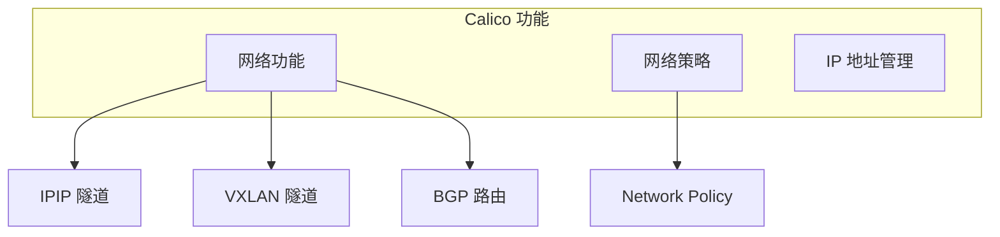

| 特性 | 说明 |
|:---|:---|
| **多种网络模式** | IPIP、VXLAN、BGP |
| **网络策略** | 支持 Kubernetes NetworkPolicy |
| **自有 IPAM** | calico-ipam，支持 IP 池管理 |
| **成熟稳定** | 在 OpenStack 时代即已存在 |

##### 29.1.2 官方资源

| 资源 | 地址 |
|:---|:---|
| **官网** | <https://www.tigera.io/project-calico/> |
| **文档** | <https://docs.tigera.io/> |
| **版本** | 社区版 3.25+，企业版另有 |

#### 29.2 网络模式对比

##### 29.2.1 支持的网络模式

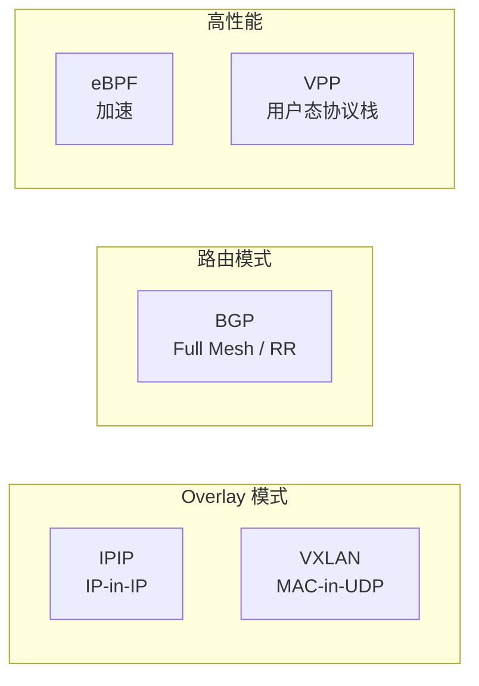

##### 29.2.2 模式对比

| 模式 | 封装方式 | 额外开销 | 适用场景 |
|:---|:---|:---|:---|
| **IPIP** | IP 包封装在 IP 中 | 20 字节 | 跨子网通信 |
| **VXLAN** | MAC 包封装在 UDP 中 | 50 字节 | 大二层网络 |
| **BGP** | 无封装，纯路由 | 0 | 同子网或可控网络 |

##### 29.2.3 Cross Subnet 模式

Calico 支持智能选择封装方式：

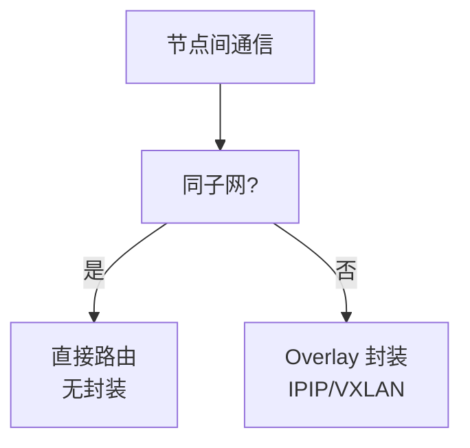

> [!NOTE]
> **Cross Subnet 模式**：节点在同一子网时使用直接路由（节省开销），跨子网时使用 Overlay 封装（保证连通）。这是生产环境常见的配置方式。

#### 29.3 核心组件

##### 29.3.1 组件架构

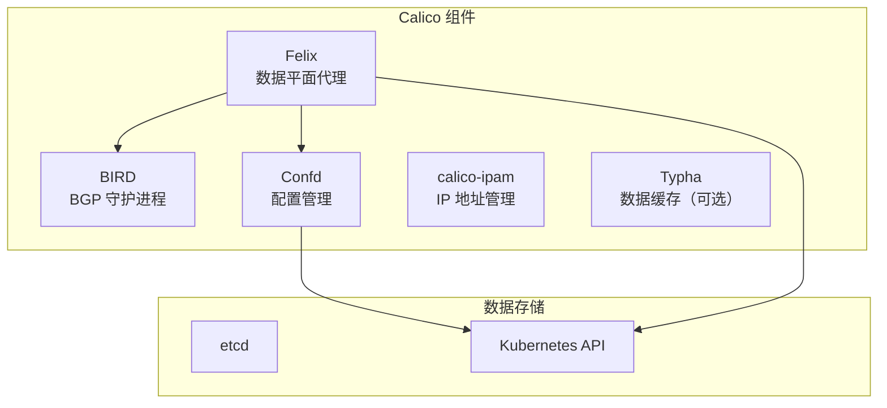

| 组件 | 作用 |
|:---|:---|
| **Felix** | 核心代理，管理路由、ACL、接口 |
| **BIRD** | BGP 守护进程，路由交换 |
| **Confd** | 监听配置变化，生成 BIRD 配置 |
| **Typha** | 大规模集群数据缓存 |

##### 29.3.2 BIRD 进程

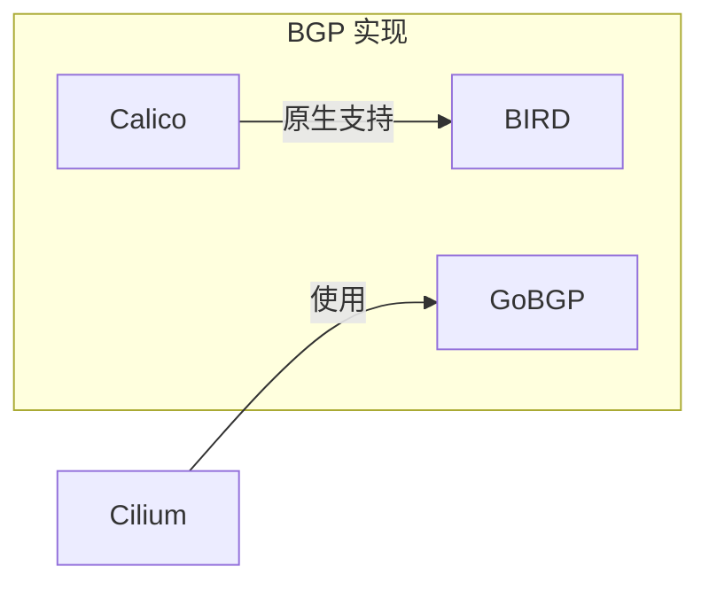

| 特性 | BIRD（Calico） | GoBGP（Cilium） |
|:---|:---|:---|
| **语言** | C | Go |
| **成熟度** | 非常成熟 | 较新 |
| **资源占用** | 较低 | 适中 |

#### 29.4 BGP 网络架构

##### 29.4.1 AS per Rack 模式

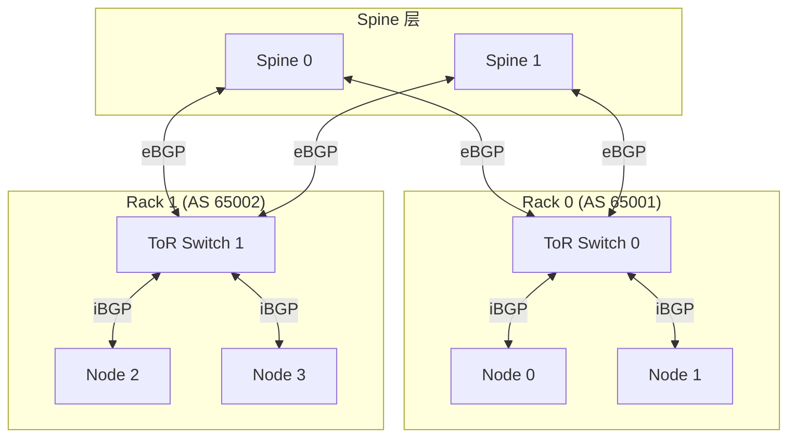

**特点**：

- 同一机架的节点共享同一 AS 号
- ToR 交换机作为 BGP 路由反射器（RR）
- Spine 与 ToR 之间建立 eBGP

##### 29.4.2 AS per Node 模式

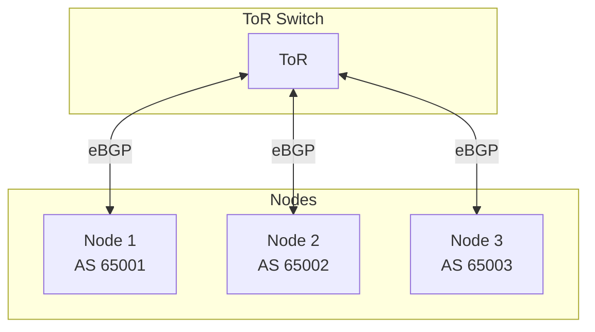

**特点**：

- 每个节点都是独立的 AS
- 节点间都是 eBGP 关系
- 配置更简单，适合小规模

##### 29.4.3 Downward Default 模式

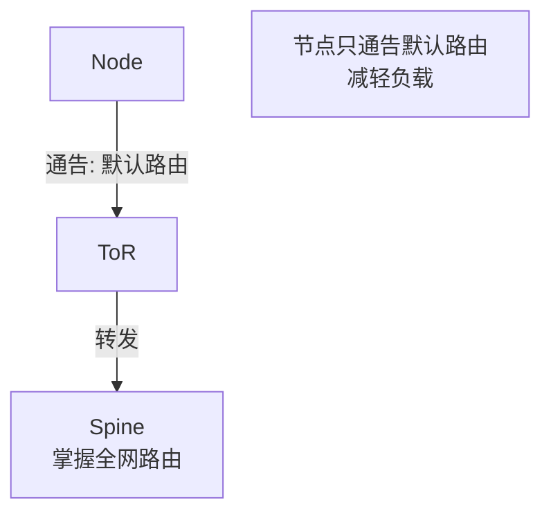

**特点**：

- 节点只向上通告默认路由
- 降低端侧设备压力
- 全网路由集中在 Spine 层

#### 29.5 VPP 高性能方案

##### 29.5.1 VPP 简介

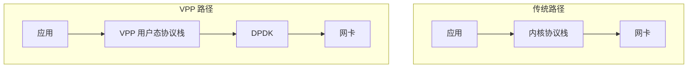

| 概念 | 说明 |
|:---|:---|
| **VPP** | 用户态协议栈，等价于内核协议栈 |
| **DPDK** | 绕过内核直接访问网卡 |
| **用途** | 高带宽场景（10G/25G/40G+） |

##### 29.5.2 VPP 与 Calico 集成

```yaml
# VPP 支持的功能
- 路由 (Routing)
- 负载均衡 (Load Balancing)
- 策略 (Policy)
- VXLAN / IPIP / IPsec / MPLS
```

> [!WARNING]
> VPP 方案门槛较高，需要深入理解用户态协议栈和 DPDK。目前主要用于电信/媒体处理等高带宽行业。

#### 29.6 calicoctl 工具

##### 29.6.1 基本用法

```bash
# 安装
curl -O -L https://github.com/projectcalico/calico/releases/download/v3.25.0/calicoctl-linux-amd64
mv calicoctl-linux-amd64 /usr/local/bin/calicoctl
chmod +x /usr/local/bin/calicoctl

# 常用命令
calicoctl get nodes
calicoctl get ippool
calicoctl get bgpconfig
calicoctl get bgppeer
```

##### 29.6.2 功能对比

| 工具 | 说明 |
|:---|:---|
| **calicoctl** | Calico 资源管理 |
| **cilium** | Cilium 资源管理 |
| **kubectl** | 通用 K8s 资源 |

#### 29.7 IP 池管理

##### 29.7.1 IP Pool 配置

```yaml
apiVersion: crd.projectcalico.org/v1
kind: IPPool
metadata:
  name: default-pool
spec:
  cidr: 10.244.0.0/16
  ipipMode: CrossSubnet
  vxlanMode: Never
  nodeSelector: all()
```

| 字段 | 说明 |
|:---|:---|
| `cidr` | Pod 使用的 IP 段 |
| `ipipMode` | IPIP 模式：Always/CrossSubnet/Never |
| `vxlanMode` | VXLAN 模式：Always/CrossSubnet/Never |
| `nodeSelector` | 哪些节点使用此池 |

##### 29.7.2 指定 Pod IP

```yaml
apiVersion: v1
kind: Pod
metadata:
  name: test-pod
  annotations:
    # 指定 Pod 使用特定 IP
    cni.projectcalico.org/ipAddrs: '["172.16.0.2"]'
spec:
  containers:
    - name: nginx
      image: nginx
```

#### 29.8 IPIP vs VXLAN 的区别

##### 29.8.1 与 Flannel 迁移

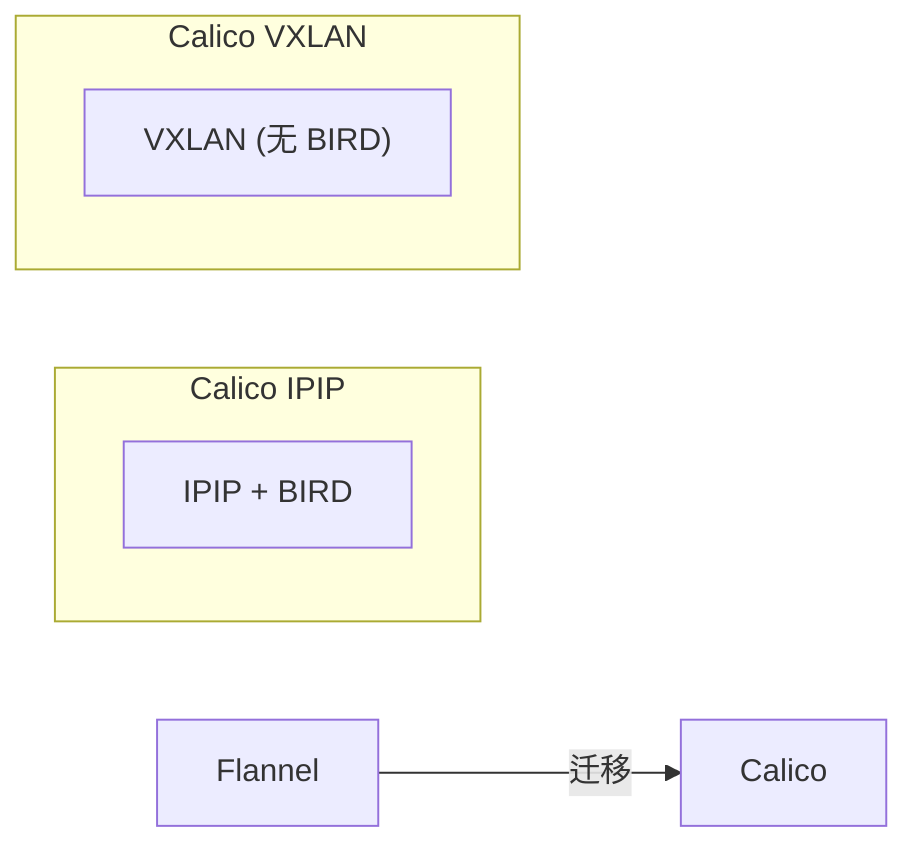

| 模式 | BIRD 进程 | 说明 |
|:---|:---|:---|
| **IPIP** | 需要 | 使用 BGP 分发路由 |
| **VXLAN** | 不需要 | 兼容 Flannel 迁移 |

> [!NOTE]
> VXLAN 模式不使用 BIRD 进程，是为了支持从 Flannel 迁移。因为 Flannel 的 VXLAN 模式也不使用 BGP。

#### 29.9 与 Cilium 对比

| 特性 | Calico | Cilium |
|:---|:---|:---|
| **BGP 实现** | BIRD | GoBGP |
| **eBPF 支持** | 有（可选） | 原生 |
| **高性能方案** | VPP/DPDK | XDP |
| **多集群** | Federation | ClusterMesh |
| **成熟度** | 非常成熟 | 较新但活跃 |

#### 29.10 章节小结

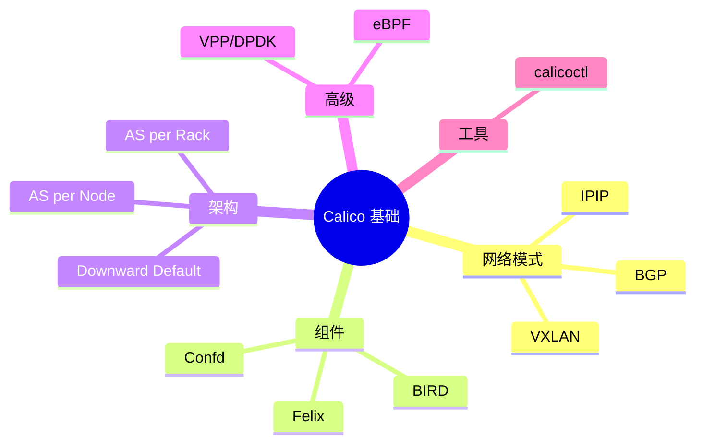

> [!IMPORTANT]
> **核心要点总结**：
>
> 1. **网络模式**：
>    - IPIP：IP 封装，20 字节开销
>    - VXLAN：MAC 封装，50 字节开销
>    - BGP：纯路由，无开销
>
> 2. **Cross Subnet**：
>    - 同子网走路由
>    - 跨子网走 Overlay
>    - 智能选择，兼顾性能
>
> 3. **BGP 架构**：
>    - AS per Rack：机架共享 AS
>    - AS per Node：节点独立 AS
>    - Downward Default：减轻端侧压力
>
> 4. **BIRD vs 无 BIRD**：
>    - IPIP 模式需要 BIRD
>    - VXLAN 模式不需要 BIRD
>
> 5. **高性能方案**：
>    - VPP：用户态协议栈
>    - DPDK：绕过内核
>    - 适用于高带宽场景
>
> 6. **工具**：
>    - calicoctl 管理 Calico 资源
>    - 类似 Cilium CLI

---

### 第三十章 Calico 环境准备

本章介绍 Calico CNI 的环境准备工作，包括集群创建、Calico 安装、管理工具配置和环境验证。这是后续学习 Calico 各种网络模式的基础。

#### 30.1 背景与目标

##### 30.1.1 学习环境需求

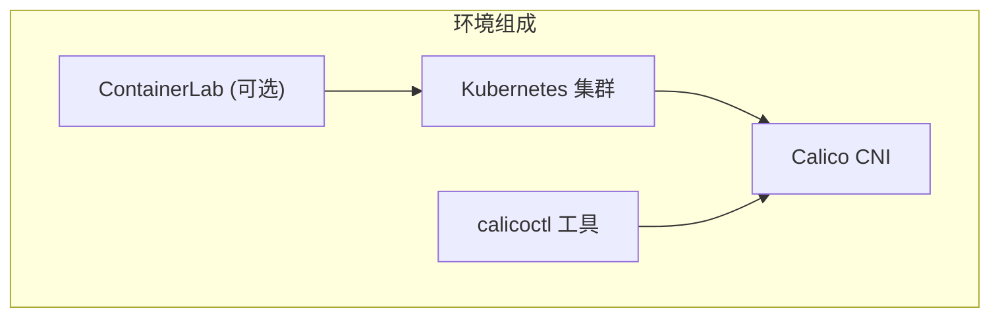

| 组件 | 版本 | 说明 |
|:---|:---|:---|
| **Kubernetes** | 1.25+ | 使用 kind 创建 |
| **Calico** | 3.23.x | 默认 IPIP 模式 |
| **calicoctl** | 与 Calico 版本匹配 | 管理 Calico 资源 |

##### 30.1.2 环境目标

| 目标 | 说明 |
|:---|:---|
| **Pod 互通** | Pod 之间可以相互 ping 通 |
| **Service 可达** | Service 可正常访问 |
| **跨节点通信** | 不同节点的 Pod 可互通 |

#### 30.2 集群创建

##### 30.2.1 使用 kind 创建集群

```yaml
# calico-cluster.yaml
kind: Cluster
apiVersion: kind.x-k8s.io/v1alpha4
networking:
  disableDefaultCNI: true    # 禁用默认 CNI
  podSubnet: "10.244.0.0/16" # Pod CIDR
nodes:
  - role: control-plane
  - role: worker
  - role: worker
```

```bash
# 创建集群
kind create cluster --name calico-demo --config calico-cluster.yaml

# 去除 master 节点污点（可选）
kubectl taint nodes --all node-role.kubernetes.io/control-plane-
```

##### 30.2.2 创建流程

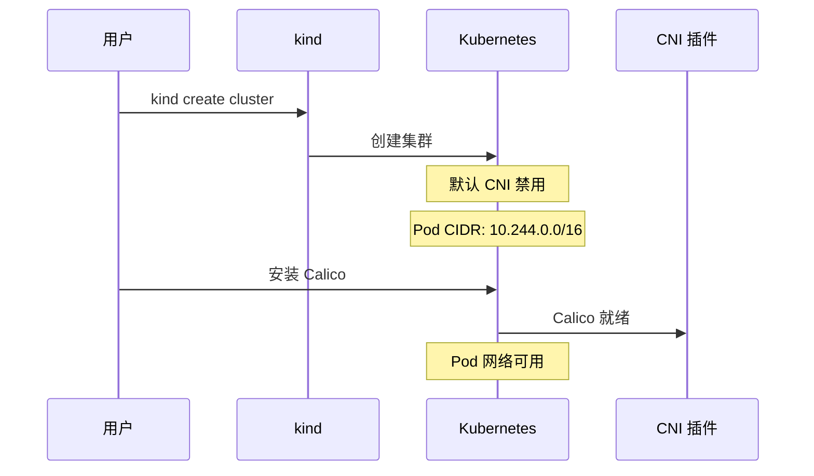

#### 30.3 安装 Calico

##### 30.3.1 安装方式对比

| 方式 | 适用场景 | 特点 |
|:---|:---|:---|
| **Quick Start** | 快速体验 | 使用 YAML Manifest |
| **Helm** | 生产环境 | 更灵活的配置 |
| **Operator** | 企业环境 | 声明式管理 |

##### 30.3.2 Quick Start 安装

```bash
# 安装 Calico Operator 和 CRD
kubectl create -f https://raw.githubusercontent.com/projectcalico/calico/v3.23.2/manifests/tigera-operator.yaml

# 安装 Calico 自定义资源
kubectl create -f https://raw.githubusercontent.com/projectcalico/calico/v3.23.2/manifests/custom-resources.yaml

# 等待 Pod 就绪
kubectl wait --for=condition=Ready pods --all -n calico-system --timeout=300s
kubectl wait --for=condition=Ready pods --all -n calico-apiserver --timeout=300s
```

##### 30.3.3 查看安装结果

```bash
# 查看 Calico Pod
kubectl get pods -n calico-system
kubectl get pods -n calico-apiserver

# 输出示例
NAME                                       READY   STATUS    RESTARTS   AGE
calico-kube-controllers-xxx                1/1     Running   0          5m
calico-node-xxx                            1/1     Running   0          5m
calico-typha-xxx                           1/1     Running   0          5m
```

#### 30.4 calicoctl 工具

##### 30.4.1 安装 calicoctl

```bash
# 下载 calicoctl（需与 Calico 版本匹配）
curl -L https://github.com/projectcalico/calico/releases/download/v3.23.2/calicoctl-linux-amd64 -o calicoctl

# 添加执行权限
chmod +x calicoctl
mv calicoctl /usr/local/bin/

# 验证版本
calicoctl version
```

##### 30.4.2 版本匹配重要性

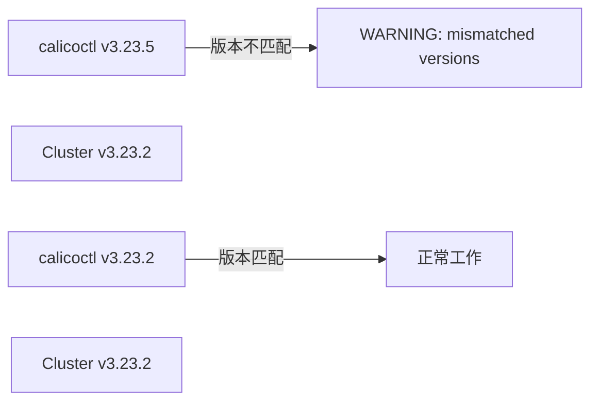

> [!WARNING]
> **版本匹配非常重要！** calicoctl 版本必须与集群中 Calico 版本一致，否则会出现 `mismatched versions` 警告。虽然可以使用 `--allow-version-mismatch` 强制运行，但不推荐在生产环境中这样做。

##### 30.4.3 常用命令

```bash
# 查看节点
calicoctl get nodes

# 查看 IP 池
calicoctl get ippool -o yaml

# 查看 BGP 配置
calicoctl get bgpconfig

# 查看 BGP Peer
calicoctl get bgppeer
```

#### 30.5 IPPool 配置详解

##### 30.5.1 默认 IPPool

```bash
# 查看 IPPool
calicoctl get ippool -o yaml
```

```yaml
apiVersion: projectcalico.org/v3
kind: IPPool
metadata:
  name: default-ipv4-ippool
spec:
  cidr: 10.244.0.0/16           # Pod CIDR
  ipipMode: Always              # IPIP 模式
  vxlanMode: Never              # 不使用 VXLAN
  natOutgoing: true             # 出站 NAT
  nodeSelector: all()           # 所有节点
  disabled: false               # 启用状态
```

##### 30.5.2 关键字段说明

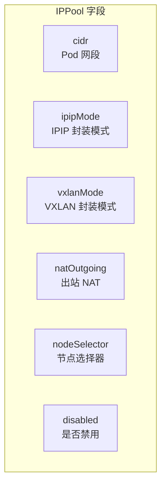

| 字段 | 可选值 | 说明 |
|:---|:---|:---|
| `ipipMode` | Always/CrossSubnet/Never | IPIP 封装策略 |
| `vxlanMode` | Always/CrossSubnet/Never | VXLAN 封装策略 |
| `natOutgoing` | true/false | Pod 出站是否 NAT |
| `nodeSelector` | all()/标签表达式 | 哪些节点使用此池 |
| `disabled` | true/false | 是否禁用此池 |

##### 30.5.3 封装模式对比

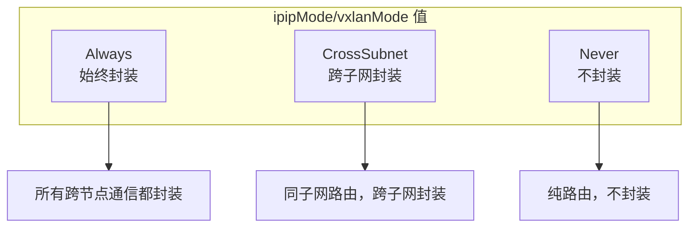

> [!NOTE]
> **IPIP 和 VXLAN 互斥**：不能同时设置 `ipipMode: Always` 和 `vxlanMode: Always`。通常只启用其中一种，另一种设为 `Never`。

#### 30.6 环境验证

##### 30.6.1 验证流程


##### 30.6.2 部署测试资源

```yaml
# test-pods.yaml
apiVersion: v1
kind: Pod
metadata:
  name: pod1
  labels:
    app: test
spec:
  containers:
    - name: busybox
      image: busybox
      command: ["sleep", "3600"]
---
apiVersion: v1
kind: Pod
metadata:
  name: pod2
  labels:
    app: test
spec:
  containers:
    - name: busybox
      image: busybox
      command: ["sleep", "3600"]
---
apiVersion: v1
kind: Service
metadata:
  name: test-svc
spec:
  selector:
    app: test
  ports:
    - port: 80
      targetPort: 80
```

```bash
# 创建测试资源
kubectl apply -f test-pods.yaml

# 等待 Pod 就绪
kubectl wait --for=condition=Ready pods --all --timeout=120s
```

##### 30.6.3 执行验证

```bash
# 获取 Pod IP
POD1_IP=$(kubectl get pod pod1 -o jsonpath='{.status.podIP}')
POD2_IP=$(kubectl get pod pod2 -o jsonpath='{.status.podIP}')

# Pod 间 ping 测试
kubectl exec pod1 -- ping -c 3 $POD2_IP

# Service 访问测试
SVC_IP=$(kubectl get svc test-svc -o jsonpath='{.spec.clusterIP}')
kubectl exec pod1 -- wget -qO- http://$SVC_IP --timeout=5

# 验证成功标志
echo "Pod 互通: OK"
echo "Service 可达: OK"
```

#### 30.7 ContainerLab 拓扑规划

##### 30.7.1 IPIP 学习拓扑

为后续学习 IPIP 模式，建议搭建以下拓扑：

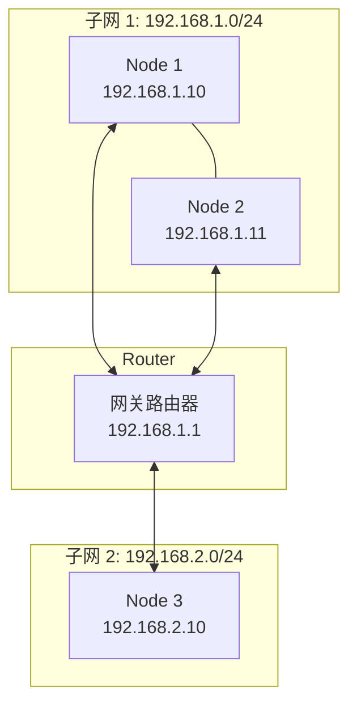

##### 30.7.2 拓扑说明

| 节点 | 子网 | 说明 |
|:---|:---|:---|
| Node 1 | 192.168.1.0/24 | 与 Node 2 同子网 |
| Node 2 | 192.168.1.0/24 | 与 Node 1 同子网 |
| Node 3 | 192.168.2.0/24 | 跨子网，需 IPIP |

**通信路径**：

- Node 1 ↔ Node 2：同子网，可直接路由
- Node 1 ↔ Node 3：跨子网，经过网关，需要 IPIP 封装

#### 30.8 IPAM 问题排查

##### 30.8.1 常见问题

| 问题 | 原因 | 解决方案 |
|:---|:---|:---|
| **IP 重复** | IPAM 数据库不一致 | 使用 calicoctl ipam check |
| **无法分配 IP** | IPPool 禁用或耗尽 | 检查 IPPool 状态 |
| **Pod 无 IP** | CNI 配置错误 | 检查 /etc/cni/net.d/ |

##### 30.8.2 IPAM 命令

```bash
# 检查 IPAM 状态
calicoctl ipam check

# 释放未使用的 IP
calicoctl ipam release --ip=10.244.x.x

# 显示 IPAM 使用情况
calicoctl ipam show

# 显示某个 IP 的分配信息
calicoctl ipam show --ip=10.244.x.x
```

> [!TIP]
> IBM 文档中有详细的 Calico IPAM 故障排查指南，搜索 "IBM Calico IPAM" 可以找到更多实用信息。

#### 30.9 章节小结

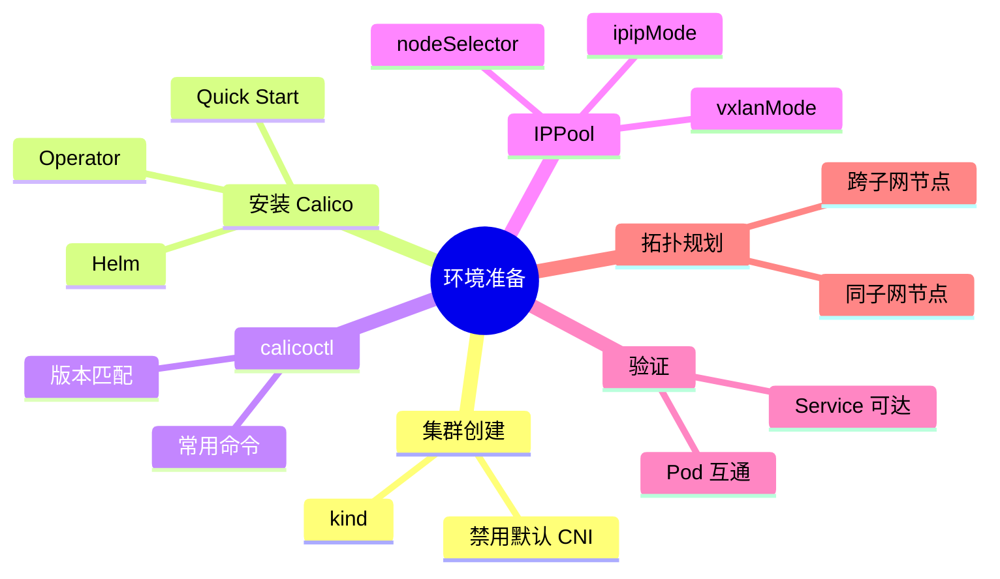

> [!IMPORTANT]
> **核心要点总结**：
>
> 1. **集群创建**：
>    - 使用 kind 创建集群
>    - 禁用默认 CNI：`disableDefaultCNI: true`
>    - 指定 Pod CIDR
>
> 2. **Calico 安装**：
>    - Quick Start 适合快速体验
>    - 安装 Operator + CustomResources
>    - 等待所有 Pod 就绪
>
> 3. **calicoctl 工具**：
>    - 版本必须与 Calico 匹配
>    - 避免使用 `--allow-version-mismatch`
>    - 可用于查看/管理 Calico 资源
>
> 4. **IPPool 配置**：
>    - `ipipMode`：Always/CrossSubnet/Never
>    - `vxlanMode`：与 ipipMode 互斥
>    - `nodeSelector`：all() 表示全部节点
>
> 5. **环境验证**：
>    - Pod 间 ping 测试
>    - Service 访问测试
>    - 两项都通过 = CNI 工作正常
>
> 6. **后续学习**：
>    - 搭建 ContainerLab 拓扑
>    - 准备同子网/跨子网场景
>    - 实践 IPIP/CrossSubnet 模式

---

### 第三十一章 Calico 同节点通信

本章深入分析 Calico 同节点 Pod 之间的通信原理，这是所有 Calico 网络模式（IPIP/VXLAN/BGP）的共同基础。同节点通信采用 L3 路由转发方式，核心技术是 Proxy ARP。

#### 31.1 背景与概述

##### 31.1.1 同节点通信的重要性

| 特点 | 说明 |
|:---|:---|
| **模式通用** | IPIP、VXLAN、BGP 同节点通信方式相同 |
| **L3 转发** | 采用三层路由方式，非二层交换 |
| **Proxy ARP** | 核心技术，打通 Pod 与 Root Namespace |

##### 31.1.2 与其他 CNI 对比

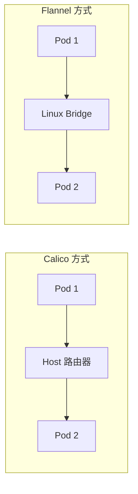

| CNI | 转发层级 | 设备 | 特点 |
|:---|:---|:---|:---|
| **Calico** | L3 路由 | Host 作为路由器 | 无广播，效率高 |
| **Flannel** | L2 交换 | Linux Bridge | 有广播，传统方式 |

#### 31.2 网络拓扑结构

##### 31.2.1 veth pair 连接

```mermaid
graph TB
    subgraph "Pod 1 (10.244.x.66/32)"
        eth0_1["eth0"]
    end
    
    subgraph "Host (Root Namespace)"
        cali1["cali-xxx1"]
        cali2["cali-xxx2"]
        Routing["路由表"]
    end
    
    subgraph "Pod 2 (10.244.x.65/32)"
        eth0_2["eth0"]
    end
    
    eth0_1 ---|"veth pair"| cali1
    eth0_2 ---|"veth pair"| cali2
    cali1 --> Routing
    cali2 --> Routing
```

**关键点**：

- 每个 Pod 的 eth0 通过 veth pair 连接到 Host
- Host 端的网卡名为 `cali-xxx` 格式
- Pod IP 使用 `/32` 掩码（与任何地址都不同网段）

##### 31.2.2 网卡特征

```bash
# 在 Pod 内查看网卡
ip link show eth0
# eth0@if5: ...

# 在 Host 上查看对应的 cali 网卡
ip link show | grep "^5:"
# 5: cali-xxx@if3: <BROADCAST,MULTICAST,UP,LOWER_UP> ...
```

| 网卡 | 位置 | MAC 地址 | 说明 |
|:---|:---|:---|:---|
| `eth0` | Pod 内 | 随机 MAC | Pod 的主网卡 |
| `cali-xxx` | Host | `ee:ee:ee:ee:ee:ee` | 全 1 固定 MAC |

#### 31.3 路由转发原理

##### 31.3.1 Pod 内路由表

```bash
# 在 Pod 内查看路由
ip route

# 输出示例
default via 169.254.1.1 dev eth0
169.254.1.1 dev eth0 scope link
```

**路由表解读**：

- **默认路由**：所有流量发往 `169.254.1.1`（网关）
- **出接口**：通过 `eth0` 发出
- **scope link**：本地链路范围

##### 31.3.2 为什么使用 /32 掩码

```mermaid
graph TB
    subgraph "Pod IP: 10.244.66.66/32"
        Any["任何其他 IP"]
    end
    
    Any -->|"不同网段"| L3["必须走 L3 路由"]
    L3 -->|"查询路由表"| Gateway["发往网关 169.254.1.1"]
```

| 掩码 | 含义 | 结果 |
|:---|:---|:---|
| `/32` | 只有自己在网段内 | 任何目的 IP 都走 L3 |
| `/24` | 256 个地址同网段 | 同网段走 L2 交换 |

> [!NOTE]
> 使用 `/32` 掩码强制所有流量走三层路由，这是 Calico L3 网络模型的核心设计。

##### 31.3.3 Host 路由表

```bash
# 在 Host 上查看路由
ip route | grep 10.244

# 输出示例
10.244.66.65 dev cali-xxx1 scope link
10.244.66.66 dev cali-xxx2 scope link
```

**解读**：到达每个 Pod IP 的路由，出接口就是连接该 Pod 的 cali 网卡。

#### 31.4 数据包转发流程

##### 31.4.1 同节点通信流程

```mermaid
sequenceDiagram
    participant Pod1 as Pod 1 (10.244.66.66)
    participant Cali1 as cali-xxx1
    participant Host as Host 路由表
    participant Cali2 as cali-xxx2
    participant Pod2 as Pod 2 (10.244.66.65)
    
    Pod1->>Pod1: 1. 查路由表，找到网关 169.254.1.1
    Pod1->>Pod1: 2. ARP 请求网关 MAC
    Note over Pod1: Proxy ARP 返回全 1 MAC
    Pod1->>Cali1: 3. 封包发送 (dst MAC: ee:ee:ee:ee:ee:ee)
    Cali1->>Host: 4. 进入 Host 路由表查询
    Host->>Host: 5. 查到 10.244.66.65 出口是 cali-xxx2
    Host->>Cali2: 6. 从 cali-xxx2 发出
    Cali2->>Pod2: 7. 到达 Pod 2
```

##### 31.4.2 数据包封装详解

**第一跳（Pod → Host）**：

| 字段 | 值 | 说明 |
|:---|:---|:---|
| Src IP | 10.244.66.66 | 源 Pod IP |
| Dst IP | 10.244.66.65 | 目的 Pod IP |
| Src MAC | Pod 1 的 MAC | eth0 的 MAC |
| Dst MAC | `ee:ee:ee:ee:ee:ee` | 网关（Proxy ARP 返回） |

**第二跳（Host → Pod 2）**：

| 字段 | 值 | 说明 |
|:---|:---|:---|
| Src IP | 10.244.66.66 | 保持不变 |
| Dst IP | 10.244.66.65 | 保持不变 |
| Src MAC | `ee:ee:ee:ee:ee:ee` | cali-xxx2 的 MAC |
| Dst MAC | Pod 2 的 MAC | 目的 Pod 的 MAC |

#### 31.5 Proxy ARP 机制

##### 31.5.1 什么是 Proxy ARP

```mermaid
graph LR
    subgraph "Pod"
        ARP["ARP Request<br/>Who has 169.254.1.1?"]
    end
    
    subgraph "Host cali 网卡"
        Proxy["Proxy ARP<br/>启用 proxy_arp"]
    end
    
    ARP -->|"请求"| Proxy
    Proxy -->|"用自己的 MAC 回复"| ARP
```

**Proxy ARP 原理**：

1. Pod 发送 ARP 请求查询 `169.254.1.1` 的 MAC
2. cali 网卡开启了 `proxy_arp` 功能
3. cali 网卡用自己的 MAC 地址（全 1）回复
4. Pod 得到 MAC 后即可封装数据包

##### 31.5.2 169.254.1.1 的意义

```bash
# 这个地址在 Host 上找不到
ip addr | grep 169.254
# 无输出

# 但 ARP 可以获得响应
arping -I eth0 169.254.1.1
# ARPING 169.254.1.1
# 60 bytes from ee:ee:ee:ee:ee:ee: index=0 ...
```

| 问题 | 答案 |
|:---|:---|
| 为什么找不到 169.254.1.1？ | 这个 IP 从未分配给任何接口 |
| 为什么 ARP 能成功？ | Proxy ARP 代为响应 |
| 为什么用链路本地地址？ | 避免与其他 IP 冲突 |

> [!IMPORTANT]
> **169.254.0.0/16 是链路本地地址（Link-Local）**，RFC 3927 规定这个网段用于无 DHCP 时的自动配置。Calico 使用它作为虚拟网关，因为：
>
> 1. 不会与真实 IP 冲突
> 2. 不需要实际分配给接口
> 3. 通过 Proxy ARP 即可工作

##### 31.5.3 查看 Proxy ARP 配置

```bash
# 查看 cali 网卡的 proxy_arp 设置
cat /proc/sys/net/ipv4/conf/cali*/proxy_arp
# 1   (启用状态)

# 或使用 sysctl
sysctl net.ipv4.conf.cali*.proxy_arp
```

#### 31.6 全 1 MAC 地址的原因

##### 31.6.1 为什么使用 ee:ee:ee:ee:ee:ee

```mermaid
graph TB
    subgraph "设计考虑"
        Stable["稳定性<br/>内核无法生成持久 MAC"]
        Unique["唯一性<br/>不与厂商 OUI 冲突"]
        Simple["简单性<br/>点对点链路不需唯一"]
    end
```

| 原因 | 说明 |
|:---|:---|
| **内核限制** | 内核不能为 veth 生成持久稳定的 MAC |
| **不冲突** | 全 1 不会与任何厂商 OUI 冲突 |
| **点对点** | veth pair 是点对点，MAC 只需本地有效 |

##### 31.6.2 MAC 地址作用域

```mermaid
graph TB
    subgraph "Pod 1 广播域"
        P1["Pod 1 eth0"]
        C1["cali-xxx1"]
        P1 <--> C1
    end
    
    subgraph "Pod 2 广播域"
        P2["Pod 2 eth0"]
        C2["cali-xxx2"]
        P2 <--> C2
    end
    
    subgraph "Host"
        Router["路由转发 (L3)"]
    end
    
    C1 --> Router
    Router --> C2
```

> [!TIP]
> **MAC 地址只需在冲突域/广播域内唯一**。每个 Pod 与其 cali 网卡组成独立的点对点链路，所以全部使用相同的 MAC 地址不会冲突。

##### 31.6.3 Calico 官方 FAQ

Calico 官网 FAQ 解答了这些常见疑问：

1. **Why do my containers have a route to 169.254.1.1?**
   - 这是虚拟网关，通过 Proxy ARP 工作

2. **Why can't I see 169.254.1.1 on my host?**
   - 不需要实际配置，Proxy ARP 代为响应

3. **Why do all cali* interfaces have the same MAC?**
   - 点对点链路，无需唯一 MAC

#### 31.7 与 Flannel 对比

##### 31.7.1 架构对比

```mermaid
graph TB
    subgraph "Calico L3 模式"
        CP1["Pod 1"] --> CR["Host (Router)"]
        CR --> CP2["Pod 2"]
        Note1["无广播<br/>路由转发"]
    end
    
    subgraph "Flannel Bridge 模式"
        FP1["Pod 1"] --> FB["Linux Bridge"]
        FB --> FP2["Pod 2"]
        Note2["有广播<br/>交换转发"]
    end
```

##### 31.7.2 特性对比

| 特性 | Calico | Flannel |
|:---|:---|:---|
| **转发层级** | L3（路由） | L2（交换） |
| **广播域** | 隔离（每 Pod 独立） | 共享（同节点共享） |
| **ARP 广播** | 无（Proxy ARP） | 有 |
| **效率** | 高（无广播开销） | 较低 |
| **隔离性** | 强 | 弱 |

#### 31.8 抓包验证

##### 31.8.1 在 Pod 内抓包

```bash
# 进入 Pod
kubectl exec -it pod1 -- sh

# 安装 tcpdump（如果没有）
apk add tcpdump

# 抓取 ICMP 包
tcpdump -i eth0 icmp -n
```

##### 31.8.2 在 Host 抓包

```bash
# 找到对应的 cali 网卡
ip link | grep cali

# 抓包
tcpdump -i cali-xxx -n icmp
```

##### 31.8.3 验证 MAC 地址

```bash
# Ping 测试后查看 ARP 缓存
ip neigh

# 示例输出
169.254.1.1 dev eth0 lladdr ee:ee:ee:ee:ee:ee REACHABLE
```

#### 31.9 章节小结

```mermaid
mindmap
  root((同节点通信))
    网络拓扑
      veth pair
      cali 网卡
      /32 掩码
    路由转发
      Pod 路由表
      Host 路由表
      L3 处理
    Proxy ARP
      169.254.1.1
      全 1 MAC
      代理响应
    设计优势
      无广播
      效率高
      隔离性强
```

> [!IMPORTANT]
> **核心要点总结**：
>
> 1. **网络拓扑**：
>    - Pod eth0 ↔ Host cali 网卡（veth pair）
>    - Pod IP 使用 /32 掩码
>    - 强制所有流量走 L3
>
> 2. **路由转发**：
>    - Pod 默认路由指向 169.254.1.1
>    - Host 路由表有到每个 Pod 的明细路由
>    - 出接口就是对应的 cali 网卡
>
> 3. **Proxy ARP**：
>    - cali 网卡开启 proxy_arp
>    - 代替 169.254.1.1 响应 ARP
>    - 返回自己的 MAC（全 1）
>
> 4. **全 1 MAC**：
>    - 所有 cali 网卡使用相同 MAC
>    - 点对点链路，本地有效
>    - 不与厂商 OUI 冲突
>
> 5. **与 Flannel 对比**：
>    - Calico: L3 路由，无广播
>    - Flannel: L2 交换，有广播
>
> 6. **排查技巧**：
>    - 不懂就查路由表 `ip route`
>    - 确认 ARP 缓存 `ip neigh`
>    - 抓包验证 `tcpdump`

---

### 第三十二章 Calico-Proxy-ARP 实践

本章通过手工实现 Proxy ARP 来深入理解 Calico 同节点通信的核心机制。通过实践，你将掌握 veth pair、路由配置、Proxy ARP 开关等关键技术点。

#### 32.1 背景与目标

##### 32.1.1 实验目标

```mermaid
graph LR
    subgraph "Namespace (ns1)"
        Pod["1.1.1.2/24"]
    end
    
    subgraph "Root Namespace"
        Host["Host"]
    end
    
    subgraph "External"
        Internet["外网"]
    end
    
    Pod -->|"1. Proxy ARP"| Host
    Host -->|"2. 路由转发"| Internet
```

| 目标 | 说明 |
|:---|:---|
| **理解 Proxy ARP** | 手工实现虚拟网关 169.254.1.1 |
| **掌握路由配置** | 先配网关路由，再配默认路由 |
| **解决回程问题** | 添加回程路由确保双向通信 |
| **外网访问** | 通过 SNAT 实现出公网 |

##### 32.1.2 实验拓扑

```mermaid
graph TB
    subgraph "Namespace: ns1"
        NS1["c-eth0<br/>1.1.1.2/24"]
    end
    
    subgraph "Root Namespace"
        Veth["veth"]
        Route["路由表"]
        SNAT["SNAT"]
    end
    
    subgraph "External"
        GW["网关"]
        Ext["外网 114.114.114.114"]
    end
    
    NS1 ---|"veth pair"| Veth
    Veth --> Route
    Route --> SNAT
    SNAT --> GW
    GW --> Ext
```

#### 32.2 查看 Calico Proxy ARP 配置

##### 32.2.1 Proxy ARP 开关位置

```bash
# 查看 cali 网卡的 proxy_arp 状态
cat /proc/sys/net/ipv4/conf/cali*/proxy_arp
# 输出: 1  (已启用)

# 查看 eth0 的 proxy_arp 状态
cat /proc/sys/net/ipv4/conf/eth0/proxy_arp
# 输出: 0  (未启用)
```

> [!NOTE]
> Proxy ARP 是针对**单个网卡**的配置：
>
> - `cali*` 网卡开启了 proxy_arp（值为 1）
> - `eth0` 等其他网卡默认关闭

##### 32.2.2 开关含义

| 值 | 含义 |
|:---|:---|
| `0` | 禁用 Proxy ARP |
| `1` | 启用 Proxy ARP |

#### 32.3 手工实现 Proxy ARP

##### 32.3.1 第一步：创建网络命名空间

```bash
# 创建命名空间 ns1
ip netns add ns1

# 验证
ip netns list
```

##### 32.3.2 第二步：创建 veth pair

```bash
# 创建 veth pair
# 一端: veth (留在 root namespace)
# 另一端: c-eth0 (放入 ns1)
ip link add veth type veth peer name c-eth0

# 启用两端网卡
ip link set c-eth0 up
ip link set veth up

# 将 c-eth0 移入 ns1
ip link set c-eth0 netns ns1

# 在 ns1 中启用并配置 IP
ip netns exec ns1 ip link set c-eth0 up
ip netns exec ns1 ip addr add 1.1.1.2/24 dev c-eth0
```

```mermaid
sequenceDiagram
    participant Root as Root Namespace
    participant NS1 as ns1 Namespace
    
    Root->>Root: 创建 veth pair (veth + c-eth0)
    Root->>NS1: 移动 c-eth0 到 ns1
    Root->>Root: 启用 veth
    NS1->>NS1: 启用 c-eth0
    NS1->>NS1: 配置 IP 1.1.1.2/24
```

##### 32.3.3 第三步：配置路由（关键！）

> [!IMPORTANT]
> **路由配置顺序非常重要**：必须先配置到网关的路由，再配置默认路由！

```bash
# 进入 ns1
ip netns exec ns1 bash

# 第一步：配置到网关 169.254.1.1 的路由
ip route add 169.254.1.1 dev c-eth0 scope link

# 第二步：配置默认路由，指向网关
ip route add default via 169.254.1.1 dev c-eth0

# 查看路由表
ip route
# default via 169.254.1.1 dev c-eth0
# 169.254.1.1 dev c-eth0 scope link
```

**为什么必须先配置网关路由？**

```mermaid
graph TB
    subgraph "正确顺序"
        A1["1. 配置 169.254.1.1 路由"] --> B1["系统知道如何到达网关"]
        B1 --> C1["2. 配置 default via 169.254.1.1"]
        C1 --> D1["成功！"]
    end
    
    subgraph "错误顺序"
        A2["1. 直接配置 default via 169.254.1.1"] --> B2["系统不知道如何到达网关"]
        B2 --> C2["报错！"]
    end
```

| 错误示例 | 原因 |
|:---|:---|
| `ip route add default via 169.254.1.1` | 系统不知道 169.254.1.1 怎么走 |

##### 32.3.4 第四步：启用 Proxy ARP

```bash
# 在 root namespace 中对 veth 启用 proxy_arp
echo 1 > /proc/sys/net/ipv4/conf/veth/proxy_arp

# 验证
cat /proc/sys/net/ipv4/conf/veth/proxy_arp
# 输出: 1
```

##### 32.3.5 第五步：验证 ARP 响应

```bash
# 在 ns1 中测试 ARP
ip netns exec ns1 arping -I c-eth0 169.254.1.1

# 输出示例
# ARPING 169.254.1.1 from 1.1.1.2 c-eth0
# Unicast reply from 169.254.1.1 [9B:12:0C:xx:xx:xx] ...
```

至此，第一跳（Pod → Host）已经打通！

#### 32.4 解决回程路由问题

##### 32.4.1 问题现象

```bash
# 在 ns1 中 ping Host 地址
ip netns exec ns1 ping -I 1.1.1.2 192.168.2.66

# 结果：不通！
```

##### 32.4.2 抓包分析

```bash
# 在 veth 上抓包
tcpdump -i veth icmp -n

# 输出
# ICMP echo request 1.1.1.2 -> 192.168.2.66
# (无 reply)

# 在 eth0 上抓包
tcpdump -i eth0 icmp -n

# 输出
# ICMP echo request 1.1.1.2 -> 192.168.2.66
# ICMP echo reply 192.168.2.66 -> 1.1.1.2  (发往默认网关！)
```

##### 32.4.3 问题原因

```mermaid
graph LR
    NS1["ns1<br/>1.1.1.2"] -->|"request"| Host["Host<br/>192.168.2.66"]
    Host -->|"reply"| GW["默认网关"]
    GW -->|"???"| Lost["包丢失"]
```

**原因**：Host 收到包后，要回复给 `1.1.1.2`，但 Host 路由表没有到 `1.1.1.2` 的路由，匹配默认路由发给了外部网关。

##### 32.4.4 解决方案：添加回程路由

```bash
# 在 root namespace 添加到 1.1.1.2 的路由
ip route add 1.1.1.2 dev veth scope link

# 或添加整个网段
ip route add 1.1.1.0/24 dev veth scope link

# 验证路由表
ip route | grep 1.1.1
# 1.1.1.2 dev veth scope link
```

```bash
# 再次测试
ip netns exec ns1 ping -I 1.1.1.2 192.168.2.66

# 结果：通了！
```

#### 32.5 实现外网访问

##### 32.5.1 问题：无法访问外网

```bash
ip netns exec ns1 ping 114.114.114.114
# 不通
```

**原因**：缺少 SNAT，外部网络不知道如何回复私有 IP `1.1.1.2`

##### 32.5.2 解决方案：配置 SNAT

```bash
# 启用 IP 转发
echo 1 > /proc/sys/net/ipv4/ip_forward

# 添加 SNAT 规则
iptables -t nat -A POSTROUTING -s 1.1.1.0/24 -j MASQUERADE

# 或指定出接口
iptables -t nat -A POSTROUTING -s 1.1.1.0/24 -o eth0 -j MASQUERADE
```

```bash
# 测试外网访问
ip netns exec ns1 ping 114.114.114.114
# 通了！
```

#### 32.6 完整实现脚本

```bash
#!/bin/bash
# proxy-arp-demo.sh - 手工实现 Proxy ARP

# 1. 创建命名空间
ip netns add ns1

# 2. 创建 veth pair
ip link add veth type veth peer name c-eth0
ip link set veth up
ip link set c-eth0 netns ns1
ip netns exec ns1 ip link set c-eth0 up
ip netns exec ns1 ip addr add 1.1.1.2/24 dev c-eth0

# 3. 配置路由（顺序重要！）
ip netns exec ns1 ip route add 169.254.1.1 dev c-eth0 scope link
ip netns exec ns1 ip route add default via 169.254.1.1 dev c-eth0

# 4. 启用 Proxy ARP
echo 1 > /proc/sys/net/ipv4/conf/veth/proxy_arp

# 5. 添加回程路由
ip route add 1.1.1.2 dev veth scope link

# 6. 启用 IP 转发和 SNAT（如需外网访问）
echo 1 > /proc/sys/net/ipv4/ip_forward
iptables -t nat -A POSTROUTING -s 1.1.1.0/24 -j MASQUERADE

echo "Proxy ARP 配置完成！"
echo "测试：ip netns exec ns1 ping 114.114.114.114"
```

#### 32.7 与 Calico 实现对比

```mermaid
graph TB
    subgraph "手工实现"
        M1["创建 veth pair"] --> M2["配置路由"]
        M2 --> M3["启用 proxy_arp"]
        M3 --> M4["添加回程路由"]
        M4 --> M5["配置 SNAT"]
    end
    
    subgraph "Calico 自动实现"
        C1["CNI 创建 cali* 网卡"] --> C2["注入 Pod 路由"]
        C2 --> C3["Felix 启用 proxy_arp"]
        C3 --> C4["自动维护路由表"]
        C4 --> C5["iptables 规则"]
    end
```

| 步骤 | 手工实现 | Calico 实现 |
|:---|:---|:---|
| **创建 veth** | `ip link add` | CNI 插件自动创建 |
| **配置路由** | `ip route add` | Felix 自动注入 |
| **Proxy ARP** | 写 `/proc/sys` | Felix 自动配置 |
| **回程路由** | 手动添加 | Felix 监听并维护 |
| **SNAT** | iptables 规则 | Felix 管理 iptables |

#### 32.8 扩展：东西向流量

##### 32.8.1 实验思路

要实现两个节点上的命名空间互通（东西向流量）：

```mermaid
graph LR
    subgraph "Node 1"
        NS1["ns1<br/>1.1.1.2/24"]
    end
    
    subgraph "Node 2"
        NS2["ns1<br/>1.1.2.2/24"]
    end
    
    NS1 <-->|"跨节点通信"| NS2
```

**需要添加的配置**：

1. **Node 1**：添加到 `1.1.2.0/24` 的路由，下一跳为 Node 2
2. **Node 2**：添加到 `1.1.1.0/24` 的路由，下一跳为 Node 1
3. 两边都配置 Proxy ARP

> [!TIP]
> 这就是 Calico Host-GW 模式的原理！通过路由表实现跨节点通信。

#### 32.9 关键技术总结

| 技术 | 作用 | 命令 |
|:---|:---|:---|
| **veth pair** | 连接命名空间 | `ip link add type veth peer` |
| **网关路由** | 定义如何到达网关 | `ip route add 169.254.1.1 dev xxx scope link` |
| **默认路由** | 定义默认出口 | `ip route add default via 169.254.1.1` |
| **Proxy ARP** | 代理 ARP 响应 | `echo 1 > /proc/sys/.../proxy_arp` |
| **回程路由** | 解决回包问题 | `ip route add x.x.x.x dev xxx` |
| **SNAT** | 外网访问 | `iptables -t nat -A POSTROUTING -j MASQUERADE` |

#### 32.10 章节小结

```mermaid
mindmap
  root((Proxy ARP 实践))
    基础配置
      创建 netns
      创建 veth pair
      配置 IP
    路由配置
      先配网关路由
      再配默认路由
      添加回程路由
    Proxy ARP
      /proc/sys 开关
      针对单个网卡
      返回自己 MAC
    外网访问
      IP 转发
      SNAT/MASQUERADE
    扩展
      东西向流量
      Host-GW 原理
```

> [!IMPORTANT]
> **核心要点总结**：
>
> 1. **Proxy ARP 开关**：
>    - 位置：`/proc/sys/net/ipv4/conf/<iface>/proxy_arp`
>    - 值 1 启用，值 0 禁用
>    - 针对单个网卡配置
>
> 2. **路由配置顺序**：
>    - **必须先配置网关路由**：`ip route add 169.254.1.1 dev xxx scope link`
>    - **再配置默认路由**：`ip route add default via 169.254.1.1`
>    - 顺序错误会报错！
>
> 3. **回程路由**：
>    - Host 需要知道如何回到 Pod
>    - 否则包会走默认路由发到外部网关
>    - 解决：添加到 Pod IP 的明细路由
>
> 4. **外网访问四要素**：
>    - veth pair 连接
>    - Proxy ARP 响应
>    - 路由表配置
>    - SNAT 地址转换
>
> 5. **与 Calico 对比**：
>    - 手工实现帮助理解原理
>    - Calico 通过 Felix 自动化这些配置
>    - 核心技术完全相同

---

### 第三十三章 Calico-IPIP 跨节点通信

本章详细讲解 Calico 在 IPIP 模式下如何实现跨节点 Pod 通信。IPIP 是一种 IP-in-IP 的 Overlay 封装技术，通过在原始 IP 包外再封装一层 IP 头来实现隧道传输。

#### 33.1 背景与概述

##### 33.1.1 为什么需要 IPIP

```mermaid
graph LR
    subgraph "Node 1 (172.18.0.4)"
        Pod1["Pod A<br/>10.24.197.x"]
    end
    
    subgraph "Node 2 (172.18.0.2)"
        Pod2["Pod B<br/>10.24.79.x"]
    end
    
    Pod1 -->|"跨节点通信"| Pod2
```

| 场景 | 问题 | 解决方案 |
|:---|:---|:---|
| **同节点** | L3 路由 + Proxy ARP | 直接转发 |
| **跨节点** | 节点间网络不认识 Pod IP | IPIP 隧道封装 |

##### 33.1.2 IPIP 模式特点

| 特性 | 说明 |
|:---|:---|
| **封装方式** | IP-in-IP（协议号 4） |
| **额外开销** | 20 字节（外层 IP 头） |
| **二层信息** | 无（只有 IP 头） |
| **隧道设备** | `tunl0` |

#### 33.2 跨节点通信流程

##### 33.2.1 整体数据流

```mermaid
sequenceDiagram
    participant PodA as Pod A (10.24.197.x)
    participant Node1 as Node 1 (172.18.0.4)
    participant tunl0_1 as tunl0
    participant Network as 物理网络
    participant tunl0_2 as tunl0
    participant Node2 as Node 2 (172.18.0.2)
    participant PodB as Pod B (10.24.79.x)
    
    PodA->>Node1: 1. 原始包发送
    Note over PodA,Node1: SRC: 10.24.197.x<br/>DST: 10.24.79.x
    Node1->>tunl0_1: 2. 查路由表匹配 tunl0
    tunl0_1->>Network: 3. IPIP 封装
    Note over tunl0_1,Network: 外层: 172.18.0.4 -> 172.18.0.2<br/>内层: 10.24.197.x -> 10.24.79.x
    Network->>tunl0_2: 4. 物理网络传输
    tunl0_2->>Node2: 5. IPIP 解封装
    Node2->>PodB: 6. 原始包送达
```

##### 33.2.2 详细步骤

| 步骤 | 位置 | 动作 |
|:---|:---|:---|
| 1 | Pod A | 发送 ICMP 包，DST 为 Pod B IP |
| 2 | Node 1 路由表 | 匹配到 Pod B 网段，下一跳 172.18.0.2，出接口 tunl0 |
| 3 | tunl0 设备 | IPIP 封装，外层 IP: 172.18.0.4 → 172.18.0.2 |
| 4 | eth0 | 二层封装 MAC，发送到物理网络 |
| 5 | Node 2 eth0 | 接收 IPIP 包 |
| 6 | Node 2 tunl0 | 解封装，露出原始包 |
| 7 | Node 2 路由表 | 匹配 Pod B 的 /32 路由，转发到 cali 网卡 |
| 8 | Pod B | 收到原始包 |

#### 33.3 路由表分析

##### 33.3.1 Node 1 路由表

```bash
# 查看 Node 1 路由表
ip route

# 输出示例
10.24.79.0/26 via 172.18.0.2 dev tunl0 proto bird onlink
10.24.197.0/26 dev cali-xxx scope link
```

| 路由条目 | 含义 |
|:---|:---|
| `10.24.79.0/26 via 172.18.0.2 dev tunl0` | 到 Node 2 Pod 网段，下一跳 172.18.0.2，出接口 tunl0 |
| `proto bird` | 由 BIRD 协议注入 |
| `onlink` | 下一跳在链路上（不需 ARP） |

##### 33.3.2 路由匹配流程

```mermaid
graph TB
    Start["Pod A 发包<br/>DST: 10.24.79.1"] --> Route["查路由表"]
    Route --> Match["匹配 10.24.79.0/26"]
    Match --> Gateway["下一跳: 172.18.0.2"]
    Gateway --> Dev["出接口: tunl0"]
    Dev --> IPIP["IPIP 封装"]
```

#### 33.4 tunl0 设备详解

##### 33.4.1 查看 tunl0 设备

```bash
ip link show tunl0

# 输出示例
tunl0@NONE: <NOARP,UP,LOWER_UP> mtu 1480 qdisc noqueue state UNKNOWN
    link/ipip 0.0.0.0 brd 0.0.0.0
```

| 属性 | 说明 |
|:---|:---|
| `NOARP` | 不处理 ARP（三层设备） |
| `link/ipip` | IPIP 类型隧道 |
| `mtu 1480` | MTU = 1500 - 20（IPIP 头） |

##### 33.4.2 tunl0 配置

```bash
ip -d link show tunl0

# 输出示例
tunl0@NONE: ...
    ipip remote any local any ttl inherit nopmtudisc
```

| 参数 | 说明 |
|:---|:---|
| `remote any` | 远端 IP 不固定（动态） |
| `local any` | 本端 IP 不固定（使用默认路由出接口 IP） |
| `ttl inherit` | TTL 继承自原始包 |

> [!NOTE]
> 当 `local` 和 `remote` 为 `any` 时，实际使用的 IP 由路由表决定：
>
> - **local**: 默认路由对应的接口 IP（如 eth0 的 IP）
> - **remote**: 路由条目中指定的下一跳 IP

#### 33.5 IPIP 封装原理

##### 33.5.1 IP-in-IP 结构

```mermaid
graph LR
    subgraph "IPIP 封装后"
        subgraph "外层 IP 头"
            OuterIP["SRC: 172.18.0.4<br/>DST: 172.18.0.2<br/>Protocol: 4 (IPIP)"]
        end
        subgraph "内层 IP 头"
            InnerIP["SRC: 10.24.197.x<br/>DST: 10.24.79.x<br/>Protocol: ICMP"]
        end
        subgraph "Payload"
            Data["ICMP 数据"]
        end
    end
    
    OuterIP --> InnerIP --> Data
```

| 字段 | 外层 IP | 内层 IP |
|:---|:---|:---|
| **Source IP** | 172.18.0.4（Node 1） | 10.24.197.x（Pod A） |
| **Dest IP** | 172.18.0.2（Node 2） | 10.24.79.x（Pod B） |
| **Protocol** | 4（IPIP） | 1（ICMP）等 |

##### 33.5.2 协议号

| 协议号 | 协议名 |
|:---|:---|
| 1 | ICMP |
| 4 | IPIP |
| 6 | TCP |
| 17 | UDP |

#### 33.6 抓包验证

##### 33.6.1 在 tunl0 上抓包

```bash
# 在 tunl0 上抓包
tcpdump -i tunl0 -nn -e

# 输出示例
IP 10.24.197.x > 10.24.79.x: ICMP echo request
```

> [!NOTE]
> 在 tunl0 上抓包显示的是 **Raw IP**（裸 IP），没有 MAC 地址。
> 这是因为 tunl0 是三层设备，不处理二层信息。

##### 33.6.2 在 eth0 上抓包

```bash
# 过滤 IPIP 协议
tcpdump -i eth0 -nn 'ip proto 4'

# 输出示例
IP 172.18.0.4 > 172.18.0.2: IP 10.24.197.x > 10.24.79.x: ICMP echo request
```

**抓包结果说明**：

| 层次 | 源地址 | 目的地址 |
|:---|:---|:---|
| **外层 IP** | 172.18.0.4（Node 1） | 172.18.0.2（Node 2） |
| **内层 IP** | 10.24.197.x（Pod A） | 10.24.79.x（Pod B） |

##### 33.6.3 Wireshark 分析

```bash
# 导出抓包文件
tcpdump -i eth0 -nn 'ip proto 4' -w ipip.pcap
```

在 Wireshark 中可以看到：

```
Ethernet II
  ├── IPv4 (外层): 172.18.0.4 -> 172.18.0.2, Protocol: IPIP (4)
  │     └── IPv4 (内层): 10.24.197.x -> 10.24.79.x, Protocol: ICMP
  │           └── ICMP: Echo request
```

#### 33.7 IPIP vs VXLAN

```mermaid
graph TB
    subgraph "IPIP 封装 (20 字节开销)"
        IPIP_Outer["外层 IP 头<br/>20 bytes"]
        IPIP_Inner["内层 IP 头"]
        IPIP_Data["Payload"]
        IPIP_Outer --> IPIP_Inner --> IPIP_Data
    end
    
    subgraph "VXLAN 封装 (50 字节开销)"
        VXLAN_Outer["外层 IP 头<br/>20 bytes"]
        VXLAN_UDP["UDP 头<br/>8 bytes"]
        VXLAN_Header["VXLAN 头<br/>8 bytes"]
        VXLAN_Inner["内层 MAC<br/>14 bytes"]
        VXLAN_InnerIP["内层 IP 头"]
        VXLAN_Data["Payload"]
        VXLAN_Outer --> VXLAN_UDP --> VXLAN_Header --> VXLAN_Inner --> VXLAN_InnerIP --> VXLAN_Data
    end
```

| 对比项 | IPIP | VXLAN |
|:---|:---|:---|
| **额外开销** | 20 字节 | 50 字节 |
| **二层信息** | 无 | 有（内层 MAC） |
| **VNI 隔离** | 无 | 有 |
| **协议类型** | IP 协议 4 | UDP 端口 4789 |
| **适用场景** | 简单隧道 | 多租户隔离 |

#### 33.8 手工创建 IPIP 设备

##### 33.8.1 创建 IPIP 隧道

```bash
# 在 Node 1 上创建
ip link add ipip0 type ipip local 172.18.0.4 remote 172.18.0.2
ip link set ipip0 up
ip addr add 1.1.1.1/24 dev ipip0

# 在 Node 2 上创建
ip link add ipip0 type ipip local 172.18.0.2 remote 172.18.0.4
ip link set ipip0 up
ip addr add 1.1.1.2/24 dev ipip0
```

##### 33.8.2 验证

```bash
# 查看设备
ip -d link show ipip0

# 输出示例
ipip0@NONE: <NOARP,UP,LOWER_UP> mtu 1480
    link/ipip 172.18.0.4 peer 172.18.0.2

# 测试连通性
ping 1.1.1.2
```

##### 33.8.3 与 Calico tunl0 对比

| 对比项 | 手工创建 | Calico tunl0 |
|:---|:---|:---|
| **local/remote** | 指定固定 IP | any（动态） |
| **路由** | 手动添加 | BIRD 自动注入 |
| **管理** | 手动 | Felix 自动 |

#### 33.9 kind 环境 MAC 地址规律

> [!TIP]
> 在 kind 创建的集群中，容器的 MAC 地址有规律：
>
> - 格式：`02:42:ac:xx:xx:xx`
> - 最后一位与 IP 地址最后一位相同
> - 例如：IP `172.18.0.4` 对应 MAC `02:42:ac:xx:xx:04`

#### 33.10 章节小结

```mermaid
mindmap
  root((IPIP 跨节点通信))
    路由表
      目标网段匹配
      下一跳为对端节点 IP
      出接口为 tunl0
    tunl0 设备
      NOARP 三层设备
      local/remote any
      MTU 1480
    IPIP 封装
      外层 IP 头 20 字节
      协议号 4
      无二层信息
    抓包验证
      tunl0 显示 Raw IP
      eth0 过滤 ip proto 4
      两层 IP 地址
    对比 VXLAN
      开销更小
      无 VNI 隔离
      无内层 MAC
```

> [!IMPORTANT]
> **核心要点总结**：
>
> 1. **IPIP 封装原理**：
>    - IP-in-IP，在原始 IP 包外再封装一层 IP 头
>    - 外层 IP：Node IP（local → remote）
>    - 内层 IP：Pod IP（src → dst）
>    - 协议号 4 表示 IPIP
>
> 2. **tunl0 设备**：
>    - Calico 自动创建的 IPIP 隧道设备
>    - `NOARP`：三层设备，不处理 ARP
>    - `local any remote any`：动态选择 IP
>    - MTU 1480（1500 - 20）
>
> 3. **路由决策**：
>    - 目标 Pod 网段匹配对应路由
>    - 下一跳为目标节点 IP
>    - 出接口为 tunl0 触发 IPIP 封装
>
> 4. **抓包技巧**：
>    - `tcpdump -i tunl0`：显示 Raw IP
>    - `tcpdump -i eth0 'ip proto 4'`：过滤 IPIP 包
>    - Wireshark 可看到两层 IP
>
> 5. **与 VXLAN 对比**：
>    - IPIP 开销 20 字节 < VXLAN 50 字节
>    - IPIP 无二层信息、无 VNI
>    - IPIP 更简单，VXLAN 支持多租户

---

### 第三十四章 Calico-IPIP CrossSubnet 模式

本章详细讲解 Calico IPIP 的 CrossSubnet 模式，这是一种智能混合模式：**同网段节点间走纯路由**，**跨网段节点间走 IPIP 封装**，从而在性能和兼容性之间取得平衡。

#### 34.1 背景与概述

##### 34.1.1 什么是 CrossSubnet

```mermaid
graph TB
    subgraph "子网 1: 10.1.5.0/24"
        Node1["Node 1<br/>10.1.5.10"]
        Node2["Node 2<br/>10.1.5.11"]
        SW1["交换机 br-pro0"]
    end
    
    subgraph "子网 2: 10.1.8.0/24"
        Node3["Node 3<br/>10.1.8.10"]
        Node4["Node 4<br/>10.1.8.11"]
        SW2["交换机 br-pro1"]
    end
    
    GW["网关 Gateway<br/>eth1: 10.1.5.1<br/>eth2: 10.1.8.1"]
    
    Node1 --- SW1
    Node2 --- SW1
    Node3 --- SW2
    Node4 --- SW2
    SW1 --- GW
    SW2 --- GW
    
    Node1 -.->|"同网段: 纯路由"| Node2
    Node1 ==>|"跨网段: IPIP 封装"| Node3
```

| 通信场景 | 模式 | 性能 |
|:---|:---|:---|
| **同网段节点** | 纯路由转发 | 高（无封装开销） |
| **跨网段节点** | IPIP 封装 | 中（20 字节开销） |

##### 34.1.2 三种 ipipMode 对比

| ipipMode | 同网段 | 跨网段 | 适用场景 |
|:---|:---|:---|:---|
| **Never** | 路由 | 路由 | 底层网络支持 Pod IP 路由 |
| **Always** | IPIP | IPIP | 所有场景都封装 |
| **CrossSubnet** | 路由 | IPIP | 混合场景，性能优化 |

#### 34.2 CrossSubnet 工作原理

##### 34.2.1 决策流程

```mermaid
flowchart TD
    Start["Pod A 发送数据包"] --> Check["检查目标 Pod 所在节点"]
    Check --> Same{"源节点与目标节点<br/>在同一子网？"}
    Same -->|"是"| Route["纯路由转发<br/>无 Overlay"]
    Same -->|"否"| IPIP["IPIP 封装<br/>通过 tunl0"]
    Route --> Dest["目标 Pod"]
    IPIP --> Dest
```

##### 34.2.2 路由表差异

**同网段路由条目**：

```bash
# Node 1 (10.1.5.10) 到 Node 2 (10.1.5.11) 的 Pod 网段
10.24.x.x/26 via 10.1.5.11 dev net0
```

**跨网段路由条目**：

```bash
# Node 1 (10.1.5.10) 到 Node 3 (10.1.8.10) 的 Pod 网段
10.24.x.x/26 via 10.1.8.10 dev tunl0 onlink
```

| 关键差异 | 同网段 | 跨网段 |
|:---|:---|:---|
| **出接口** | `net0`（物理网卡） | `tunl0`（IPIP 隧道） |
| **封装** | 无 | IPIP |
| **下一跳可达性** | 直接可达 | `onlink`（不检查） |

#### 34.3 配置 CrossSubnet 模式

##### 34.3.1 IPPool 配置

```yaml
apiVersion: crd.projectcalico.org/v1
kind: IPPool
metadata:
  name: default-ipv4-ippool
spec:
  cidr: 10.24.0.0/16
  ipipMode: CrossSubnet    # 关键配置
  vxlanMode: Never
  natOutgoing: true
  nodeSelector: all()
```

| 参数 | 值 | 说明 |
|:---|:---|:---|
| `ipipMode` | `CrossSubnet` | 跨网段时使用 IPIP |
| `vxlanMode` | `Never` | 不使用 VXLAN |

##### 34.3.2 修改现有 IPPool

```bash
# 查看当前配置
calicoctl get ippool default-ipv4-ippool -o yaml

# 修改 ipipMode
calicoctl patch ippool default-ipv4-ippool -p '{"spec":{"ipipMode":"CrossSubnet"}}'
```

#### 34.4 ContainerLab 跨网段拓扑

##### 34.4.1 拓扑架构

```mermaid
graph TB
    subgraph "Kind 集群"
        subgraph "子网 10.1.5.0/24"
            Control["control-plane<br/>10.1.5.10"]
            Worker1["worker<br/>10.1.5.11"]
        end
        subgraph "子网 10.1.8.0/24"
            Worker2["worker2<br/>10.1.8.10"]
            Worker3["worker3<br/>10.1.8.11"]
        end
    end
    
    subgraph "ContainerLab"
        BR0["br-pro0<br/>Linux Bridge"]
        BR1["br-pro1<br/>Linux Bridge"]
        GW["Gateway (VyOS)<br/>eth1: 10.1.5.1<br/>eth2: 10.1.8.1"]
    end
    
    Control --- BR0
    Worker1 --- BR0
    Worker2 --- BR1
    Worker3 --- BR1
    BR0 --- GW
    BR1 --- GW
```

##### 34.4.2 Kind 集群配置

```yaml
kind: Cluster
apiVersion: kind.x-k8s.io/v1alpha4
nodes:
- role: control-plane
  kubeadmConfigPatches:
  - |
    kind: InitConfiguration
    nodeRegistration:
      kubeletExtraArgs:
        node-ip: 10.1.5.10
- role: worker
  kubeadmConfigPatches:
  - |
    kind: JoinConfiguration
    nodeRegistration:
      kubeletExtraArgs:
        node-ip: 10.1.5.11
- role: worker
  kubeadmConfigPatches:
  - |
    kind: JoinConfiguration
    nodeRegistration:
      kubeletExtraArgs:
        node-ip: 10.1.8.10
- role: worker
  kubeadmConfigPatches:
  - |
    kind: JoinConfiguration
    nodeRegistration:
      kubeletExtraArgs:
        node-ip: 10.1.8.11
```

##### 34.4.3 网关配置要点

网关需要配置 SNAT 以确保集群能访问外网：

```bash
# VyOS 网关配置
set interfaces ethernet eth1 address '10.1.5.1/24'
set interfaces ethernet eth2 address '10.1.8.1/24'

# SNAT 配置
set nat source rule 100 outbound-interface 'eth0'
set nat source rule 100 source address '10.1.0.0/16'
set nat source rule 100 translation address 'masquerade'
```

#### 34.5 通信验证

##### 34.5.1 同网段通信（纯路由）

```bash
# 在 Node 1 (10.1.5.10) 上的 Pod 访问 Node 2 (10.1.5.11) 上的 Pod

# 查看路由表
ip route | grep "10.1.5.11"
# 10.24.x.x/26 via 10.1.5.11 dev net0  <- 出接口是 net0

# 抓包验证
tcpdump -i net0 -nn icmp
```

**抓包结果**：

```
IP 10.24.x.x > 10.24.y.y: ICMP echo request
```

> [!NOTE]
> 同网段通信时，数据包是普通的 IP 包，**没有 IPIP 封装**。
> MAC 地址会逐跳变化，IP 地址保持不变。

##### 34.5.2 跨网段通信（IPIP 封装）

```bash
# 在 Node 1 (10.1.5.10) 上的 Pod 访问 Node 3 (10.1.8.10) 上的 Pod

# 查看路由表
ip route | grep "10.1.8.10"
# 10.24.x.x/26 via 10.1.8.10 dev tunl0 onlink  <- 出接口是 tunl0

# 抓包验证
tcpdump -i net0 -nn 'ip proto 4'
```

**抓包结果**：

```
IP 10.1.5.10 > 10.1.8.10: IP 10.24.x.x > 10.24.y.y: ICMP echo request
```

> [!NOTE]
> 跨网段通信时，数据包有两层 IP：
>
> - **外层 IP**：10.1.5.10 → 10.1.8.10（Node IP）
> - **内层 IP**：10.24.x.x → 10.24.y.y（Pod IP）

#### 34.6 MAC 地址变化分析

##### 34.6.1 跨网段通信的 MAC 地址

```mermaid
sequenceDiagram
    participant Pod as Pod A
    participant Node1 as Node 1 (10.1.5.10)
    participant GW as Gateway
    participant Node3 as Node 3 (10.1.8.10)
    participant PodB as Pod B
    
    Pod->>Node1: IPIP 封装
    Note over Node1: SRC MAC: Node1 net0<br/>DST MAC: 10.1.5.1 (GW)
    Node1->>GW: 包发往网关
    Note over GW: SRC MAC: GW eth1<br/>DST MAC: 10.1.8.10
    GW->>Node3: 包发往 Node 3
    Node3->>PodB: IPIP 解封装
```

**关键点**：

1. **Node 1 发包时**：
   - SRC MAC：Node 1 net0 的 MAC
   - DST MAC：网关 10.1.5.1 的 MAC（因为 10.1.8.10 不在同网段）

2. **网关转发时**：
   - SRC MAC：网关 eth2 的 MAC
   - DST MAC：Node 3 net0 的 MAC

3. **IP 地址不变**：外层 IP 始终是 10.1.5.10 → 10.1.8.10

##### 34.6.2 为什么 ARP 表没有对端 IP

```bash
# 在 Node 1 上查看 ARP 表
arp -n | grep 10.1.8.10
# 无结果！
```

**原因**：Node 1 (10.1.5.10) 和 Node 3 (10.1.8.10) 不在同一子网，无法直接 ARP 解析。

实际过程：

1. Node 1 查路由，发现 10.1.8.10 的下一跳是网关 10.1.5.1
2. Node 1 ARP 解析 10.1.5.1 的 MAC
3. 数据包发给网关，由网关负责后续转发

#### 34.7 Always vs CrossSubnet

```mermaid
graph LR
    subgraph "Always 模式"
        A1["Node 1"] -->|"IPIP"| A2["Node 2"]
        A1 -->|"IPIP"| A3["Node 3"]
    end
    
    subgraph "CrossSubnet 模式"
        C1["Node 1"] -->|"路由"| C2["Node 2 (同网段)"]
        C1 -->|"IPIP"| C3["Node 3 (跨网段)"]
    end
```

| 对比项 | Always | CrossSubnet |
|:---|:---|:---|
| **同网段开销** | 20 字节 | 0 字节 |
| **跨网段开销** | 20 字节 | 20 字节 |
| **配置复杂度** | 低 | 中 |
| **适用场景** | 简单环境 | 大规模混合环境 |
| **性能** | 一般 | 同网段更优 |

#### 34.8 章节小结

```mermaid
mindmap
  root((IPIP CrossSubnet))
    模式原理
      同网段走路由
      跨网段走 IPIP
      智能判断子网
    配置方式
      ipipMode: CrossSubnet
      IPPool 资源配置
    路由表特征
      同网段: dev net0
      跨网段: dev tunl0 onlink
    抓包验证
      同网段: 普通 IP 包
      跨网段: 两层 IP
      过滤: ip proto 4
    MAC 地址
      跨网段先发给网关
      逐跳 MAC 变化
      IP 地址不变
```

> [!IMPORTANT]
> **核心要点总结**：
>
> 1. **CrossSubnet 模式**：
>    - 同网段节点：纯路由转发，无封装开销
>    - 跨网段节点：IPIP 封装，20 字节开销
>    - 配置：`ipipMode: CrossSubnet`
>
> 2. **路由表识别**：
>    - 同网段：`dev net0`（物理网卡）
>    - 跨网段：`dev tunl0 onlink`（隧道设备）
>
> 3. **抓包验证**：
>    - 同网段：`tcpdump -i net0 icmp`
>    - 跨网段：`tcpdump -i net0 'ip proto 4'`
>
> 4. **MAC 地址规律**：
>    - 跨网段时，DST MAC 是**网关的 MAC**
>    - ARP 表中不会有对端节点的 MAC
>    - 每一跳 MAC 变化，IP 不变
>
> 5. **适用场景**：
>    - 大规模集群，节点分布在多个子网
>    - 同机房节点走高速路由
>    - 跨机房节点走 IPIP 穿透

---

### 第三十五章 Calico-IPIP 手工实践

本章通过手工创建 IPIP 隧道设备，深入理解 IPIP 封装的底层原理。同时介绍 SBR（Source-Based Routing）策略路由的概念，为理解复杂网络场景打下基础。

#### 35.1 背景与目标

##### 35.1.1 为什么要手工实践

手工创建 IPIP 隧道的目的：

1. **加深理解**：通过亲手操作，理解 Calico 自动创建 `tunl0` 设备的底层机制
2. **排障能力**：掌握 IPIP 设备的配置方式，便于问题排查
3. **扩展思维**：理解如何将 Pod 流量引导至 Overlay 设备

##### 35.1.2 实验拓扑

```mermaid
graph LR
    subgraph "Node 1 (172.18.0.4)"
        IPIP1["ipip0<br/>1.1.1.1/24"]
    end
    
    subgraph "Node 2 (172.18.0.2)"
        IPIP2["ipip0<br/>1.1.2.1/24"]
    end
    
    IPIP1 <-->|"IPIP Tunnel<br/>Outer: 172.18.0.x"| IPIP2
```

| 节点 | 物理 IP | IPIP 接口地址 | Local | Remote |
|:---|:---|:---|:---|:---|
| Node 1 | 172.18.0.4 | 1.1.1.1/24 | 172.18.0.4 | 172.18.0.2 |
| Node 2 | 172.18.0.2 | 1.1.2.1/24 | 172.18.0.2 | 172.18.0.4 |

#### 35.2 手工创建 IPIP 隧道

##### 35.2.1 Node 1 配置

```bash
# 1. 创建 IPIP 设备
ip link add ipip0 type ipip local 172.18.0.4 remote 172.18.0.2

# 2. 启用接口
ip link set ipip0 up

# 3. 配置隧道内部地址
ip addr add 1.1.1.1/24 dev ipip0

# 4. 添加到对端网段的路由
ip route add 1.1.2.0/24 dev ipip0
```

##### 35.2.2 Node 2 配置

```bash
# 1. 创建 IPIP 设备（local/remote 互换）
ip link add ipip0 type ipip local 172.18.0.2 remote 172.18.0.4

# 2. 启用接口
ip link set ipip0 up

# 3. 配置隧道内部地址
ip addr add 1.1.2.1/24 dev ipip0

# 4. 添加到对端网段的路由
ip route add 1.1.1.0/24 dev ipip0
```

##### 35.2.3 配置命令详解

| 参数 | 说明 | 示例 |
|:---|:---|:---|
| `type ipip` | 设备类型为 IPIP | - |
| `local` | 本端物理 IP | 172.18.0.4 |
| `remote` | 对端物理 IP | 172.18.0.2 |
| 隧道地址 | 隧道内部通信地址 | 1.1.1.1/24 |
| 路由 | 指向对端隧道网段 | 1.1.2.0/24 |

#### 35.3 验证与抓包

##### 35.3.1 连通性测试

```bash
# 在 Node 1 上 ping Node 2 的隧道地址
ping -I 1.1.1.1 1.1.2.1
```

##### 35.3.2 抓包验证

```bash
# 在 Node 1 的物理网卡上抓包
tcpdump -i eth0 -nn 'ip proto 4'
```

**抓包结果**：

```
IP 172.18.0.4 > 172.18.0.2: IP 1.1.1.1 > 1.1.2.1: ICMP echo request
IP 172.18.0.2 > 172.18.0.4: IP 1.1.2.1 > 1.1.1.1: ICMP echo reply
```

```mermaid
graph LR
    subgraph "IPIP 封装包结构"
        Outer["外层 IP<br/>SRC: 172.18.0.4<br/>DST: 172.18.0.2<br/>Protocol: 4"]
        Inner["内层 IP<br/>SRC: 1.1.1.1<br/>DST: 1.1.2.1"]
        Payload["ICMP Data"]
    end
    Outer --> Inner --> Payload
```

##### 35.3.3 查看设备信息

```bash
# 查看 IPIP 设备详情
ip -d link show ipip0

# 输出示例
# ipip0@NONE: <POINTOPOINT,NOARP,UP,LOWER_UP> mtu 1480 ...
#     link/ipip 172.18.0.4 peer 172.18.0.2
```

| 属性 | 含义 |
|:---|:---|
| `link/ipip` | 设备类型为 IPIP |
| `172.18.0.4 peer 172.18.0.2` | Local 和 Remote IP |
| `mtu 1480` | MTU = 1500 - 20 (IPIP Header) |
| `NOARP` | 三层设备，无 ARP |

#### 35.4 IPIP vs VXLAN 配置对比

```mermaid
graph TB
    subgraph "IPIP 配置"
        I1["ip link add ipip0 type ipip"]
        I2["local/remote"]
        I3["完成！"]
        I1 --> I2 --> I3
    end
    
    subgraph "VXLAN 配置"
        V1["ip link add vxlan0 type vxlan"]
        V2["id (VNI)"]
        V3["dstport 4789"]
        V4["local/remote"]
        V5["FDB 表"]
        V6["完成！"]
        V1 --> V2 --> V3 --> V4 --> V5 --> V6
    end
```

| 对比项 | IPIP | VXLAN |
|:---|:---|:---|
| **配置复杂度** | 简单 | 较复杂 |
| **VNI** | 无 | 需要 |
| **端口** | 无 | 4789/8472 |
| **FDB 表** | 无 | 需要 |
| **封装开销** | 20 字节 | 50 字节 |
| **多租户** | 不支持 | 支持 |

#### 35.5 生产环境扩展思考

##### 35.5.1 Pod 流量如何到达 IPIP 设备

在实际生产环境中，Pod 的流量需要被引导到 IPIP 设备进行封装：

```mermaid
flowchart LR
    Pod["Pod<br/>(Network NS)"]
    VethPod["veth (Pod 端)"]
    VethHost["veth (Host 端)"]
    Route["路由表"]
    IPIP["IPIP 设备"]
    Physical["物理网卡"]
    
    Pod --> VethPod
    VethPod --> VethHost
    VethHost --> Route
    Route -->|"目标 Pod CIDR"| IPIP
    IPIP -->|"封装"| Physical
```

**关键步骤**：

1. **Pod 到 Host**：通过 veth pair + Proxy ARP
2. **Host 到 IPIP**：通过路由表（Calico 自动注入）
3. **IPIP 封装**：设备自动封装外层 IP

##### 35.5.2 Calico 的自动化

Calico 自动完成的工作：

- 创建 `tunl0` 设备（`remote any local any`）
- 通过 BGP 学习其他节点的 Pod CIDR
- 注入路由：`10.24.x.x/26 via <Node IP> dev tunl0 onlink`
- 根据 `ipipMode` 决定是否走隧道

#### 35.6 SBR (Source-Based Routing) 策略路由

##### 35.6.1 什么是 SBR

传统路由基于**目的地址 (DST)**，而 SBR 基于**源地址 (SRC)**：

```mermaid
graph TB
    subgraph "传统路由 (DST-Based)"
        D1["查目的 IP"] --> D2["查路由表"] --> D3["转发"]
    end
    
    subgraph "策略路由 (SRC-Based)"
        S1["查源 IP"] --> S2["匹配 Rule"] --> S3["选择路由表"] --> S4["转发"]
    end
```

##### 35.6.2 SBR 配置示例

```bash
# 创建策略路由规则
ip rule add from 192.168.1.0/24 table 100

# 在表 100 中添加默认路由
ip route add default via 10.0.0.1 table 100

# 查看规则
ip rule show
```

**输出示例**：

```
0:      from all lookup local
32765:  from 192.168.1.0/24 lookup 100
32766:  from all lookup main
32767:  from all lookup default
```

##### 35.6.3 SBR 应用场景

| 场景 | 说明 |
|:---|:---|
| **多网卡 (Multi-Homing)** | 不同网卡的流量走不同出口 |
| **Cilium CNI** | 使用 SBR 实现复杂策略 |
| **VPN 分流** | 特定源走 VPN 隧道 |
| **多 ISP** | 根据源选择出口 |

##### 35.6.4 多网卡场景的回程路由问题

```mermaid
sequenceDiagram
    participant Client as 客户端
    participant eth0 as eth0 (192.168.1.10)
    participant eth1 as eth1 (10.0.0.10)
    
    Note over Client,eth1: 请求从 eth0 进来
    Client->>eth0: 请求 192.168.1.10
    
    Note over eth0,eth1: 没有 SBR 时，可能从 eth1 回复
    eth1--xClient: 回复可能走错接口！
    
    Note over eth0,eth1: 有 SBR 时，确保从 eth0 回复
    eth0->>Client: 回复走正确接口 ✓
```

**问题**：没有 SBR 时，回复包可能从错误的接口发出

**解决**：为每个接口配置 SBR，确保回程路径正确

#### 35.7 CNI 网络实现套路总结

```mermaid
mindmap
  root((CNI 网络套路))
    设备创建
      veth pair
      bridge
      ipip/vxlan
      tun/tap
    流量引导
      路由表 DST
      策略路由 SBR
      iptables/nftables
      eBPF
    封装方式
      IPIP
      VXLAN
      GRE
      Geneve
      WireGuard
    路由协议
      BGP
      OSPF
      静态路由
    网关机制
      Proxy ARP
      Bridge
      L3 Routing
```

> [!IMPORTANT]
> **核心套路**：
>
> 1. **创建设备**：赋予封装能力（IPIP/VXLAN/GRE）
> 2. **引导流量**：通过路由表将流量导向设备
> 3. **封装转发**：设备自动封装 Overlay 包
> 4. **对端解封**：对端设备解封装后路由到目标

#### 35.8 章节小结

```mermaid
mindmap
  root((IPIP 手工实践))
    创建设备
      ip link add type ipip
      local/remote 参数
      MTU 自动 1480
    配置流程
      创建设备
      启用接口
      配置地址
      添加路由
    抓包验证
      ip proto 4
      两层 IP 头
    对比 VXLAN
      IPIP 更简单
      无 VNI/Port/FDB
    SBR 策略路由
      基于源地址
      多网卡场景
      回程路由问题
```

> [!TIP]
> **实践要点总结**：
>
> 1. **IPIP 设备创建**：
>
>    ```bash
>    ip link add ipip0 type ipip local <本端IP> remote <对端IP>
>    ```
>
> 2. **三步配置**：
>    - 启用接口：`ip link set ipip0 up`
>    - 配置地址：`ip addr add x.x.x.x/24 dev ipip0`
>    - 添加路由：`ip route add <对端网段> dev ipip0`
>
> 3. **抓包验证**：`tcpdump -i eth0 'ip proto 4'`
>
> 4. **生产扩展**：
>    - Pod → veth → 路由表 → IPIP 设备
>    - Calico 自动完成设备创建和路由注入
>
> 5. **SBR 策略路由**：
>    - 基于源地址选择路由表
>    - 解决多网卡回程路由问题
>    - Cilium 中有广泛应用

---

### 第三十六章 Calico-VxLAN 模式

本章介绍 Calico 的 VxLAN 封装模式，重点讲解 FDB（Forwarding Database）表机制以及与 IPIP 模式的区别。

#### 36.1 背景与概述

##### 36.1.1 VxLAN vs IPIP

| 对比项 | IPIP | VxLAN |
|:---|:---|:---|
| **封装层级** | Layer 3 (IP-in-IP) | Layer 2 over Layer 3 |
| **协议号** | IP Protocol 4 | UDP 4789 |
| **封装开销** | 20 字节 | 50 字节 |
| **BGP 依赖** | 需要（bird 组件） | 不需要 |
| **FDB 表** | 不需要 | 需要 |
| **多租户** | 不支持 | 支持（VNI） |
| **防火墙友好** | 可能被阻挡 | UDP 更易穿透 |

##### 36.1.2 何时选择 VxLAN

- **网络限制**：底层网络不支持 IP Protocol 4
- **防火墙穿透**：UDP 端口更易开放
- **无 BGP 需求**：不想维护 BGP 组件
- **大二层网络**：需要二层可达的场景

#### 36.2 VxLAN 模式配置

##### 36.2.1 IPPool 配置

```yaml
apiVersion: crd.projectcalico.org/v1
kind: IPPool
metadata:
  name: default-pool
spec:
  cidr: 10.244.0.0/16
  ipipMode: Never          # 禁用 IPIP
  vxlanMode: Always        # 启用 VxLAN
  natOutgoing: true
```

> [!IMPORTANT]
> **关键配置**：
>
> - `ipipMode` 和 `vxlanMode` 只能选一个
> - VxLAN 模式下需禁用 bird 相关组件

##### 36.2.2 禁用 BGP/bird 组件

VxLAN 模式不依赖 BGP，需要修改 Calico 部署配置：

```yaml
# calico-node DaemonSet 中
env:
  - name: CALICO_NETWORKING_BACKEND
    value: "vxlan"  # 原来是 "bird"

# 移除或注释 bird 相关探针
livenessProbe:
  exec:
    command:
      # - /bin/calico-node
      # - -bird-live
readinessProbe:
  exec:
    command:
      # - /bin/calico-node  
      # - -bird-ready
```

##### 36.2.3 网卡自动检测（Auto-Detect）

多网卡环境需指定业务网卡：

```yaml
env:
  - name: IP_AUTODETECTION_METHOD
    value: "interface=eth1"  # 指定网卡
    # 或使用 CIDR
    # value: "cidr=10.1.0.0/16"
```

**检测方法**：

| 方法 | 示例 | 说明 |
|:---|:---|:---|
| `first-found` | 默认 | 自动选择默认路由网卡 |
| `interface=` | `eth1` | 指定网卡名 |
| `cidr=` | `10.1.0.0/16` | 匹配 CIDR |
| `can-reach=` | `8.8.8.8` | 能到达的地址 |

#### 36.3 MTU 配置

##### 36.3.1 不同模式的 MTU

```mermaid
graph LR
    subgraph "物理网卡 MTU 1500"
        IPIP["IPIP<br/>MTU 1480<br/>(-20 字节)"]
        VxLAN["VxLAN<br/>MTU 1450<br/>(-50 字节)"]
        WG["WireGuard<br/>MTU 1440<br/>(-60 字节)"]
    end
```

| 模式 | MTU 计算 | 结果 |
|:---|:---|:---|
| IPIP | 1500 - 20 | 1480 |
| VxLAN | 1500 - 50 | 1450 |
| WireGuard + VxLAN | 1500 - 60 | 1440 |
| IPv6 + VxLAN | 1500 - 70 | 1430 |

##### 36.3.2 巨型帧环境

数据中心常用 9000 MTU 巨型帧：

```bash
# 通过 calicoctl 修改 MTU
calicoctl patch felixconfiguration default \
  --patch='{"spec": {"mtu": 8981}}'

# 验证
ip -d link show vxlan.calico
# mtu 8950 ...
```

#### 36.4 VxLAN 设备与 FDB 表

##### 36.4.1 vxlan.calico 设备

```bash
# 查看 VxLAN 设备
ip -d link show vxlan.calico

# 输出示例
# vxlan.calico: <BROADCAST,MULTICAST,UP,LOWER_UP> mtu 1450 ...
#     link/ether 66:c0:d0:7a:17:07 brd ff:ff:ff:ff:ff:ff
#     vxlan id 4096 local 172.18.0.3 dev eth0 srcport 0 0 dstport 4789 ...
```

| 属性 | 含义 |
|:---|:---|
| `vxlan id 4096` | VNI (VxLAN Network Identifier) |
| `local 172.18.0.3` | 本端 VTEP IP |
| `dstport 4789` | VxLAN UDP 端口 |
| `mtu 1450` | 1500 - 50 |

##### 36.4.2 FDB 表详解

**FDB (Forwarding Database)** 是 VxLAN 的核心机制，用于解决 **外层目的 IP** 的问题：

```mermaid
flowchart TB
    subgraph "路由表"
        Route["10.244.17.64/26 via 10.244.17.64<br/>dev vxlan.calico onlink"]
    end
    
    subgraph "ARP 表"
        ARP["10.244.17.64 -> 66:c0:d0:7a:xx:xx"]
    end
    
    subgraph "FDB 表"
        FDB["66:c0:d0:7a:xx:xx -> 172.18.0.4<br/>(outer dst IP)"]
    end
    
    Route --> ARP --> FDB
    FDB -->|"封装外层 IP"| VxLAN["VxLAN 封装"]
```

**查看 FDB 表**：

```bash
# 方法 1: bridge fdb show
bridge fdb show dev vxlan.calico | grep -v permanent

# 方法 2: ip monitor 观察动态添加
ip monitor all

# 输出示例
# 66:c0:d0:7a:17:07 dev vxlan.calico dst 172.18.0.4 self permanent
```

##### 36.4.3 FDB 表的核心含义

```mermaid
graph LR
    MAC["MAC 地址<br/>66:c0:d0:7a:xx:xx"] -->|"belongs to"| Host["Host IP<br/>172.18.0.4"]
    
    subgraph "VxLAN 封装"
        Inner["内层 DST MAC"]
        Outer["外层 DST IP"]
    end
    
    MAC --> Inner
    Host --> Outer
```

> [!IMPORTANT]
> **FDB 表的作用**：
>
> 1. **回答问题**：这个 MAC 地址属于哪个主机？
> 2. **解决问题**：VxLAN 封装时，外层 DST IP 用谁？
> 3. **自动学习**：类似 ARP，系统自动维护

**两层理解**：

1. **深层理解**：FDB 表示 MAC 地址与主机的映射，该 MAC 不一定是主机物理网卡的 MAC，只要在该主机的任意网卡上存在即可
2. **简单理解**：FDB 是自动维护的，可通过 `ip monitor all` 观察添加过程

#### 36.5 VxLAN 包封装分析

##### 36.5.1 完整封装结构

```mermaid
graph LR
    subgraph "外层 Ethernet"
        OMac["Outer MAC<br/>SRC: Node1 eth0<br/>DST: Node2 eth0"]
    end
    
    subgraph "外层 IP"
        OIP["Outer IP<br/>SRC: 172.18.0.3<br/>DST: 172.18.0.4"]
    end
    
    subgraph "UDP"
        UDP["UDP<br/>SRC: random<br/>DST: 4789"]
    end
    
    subgraph "VxLAN Header"
        VH["VNI: 4096"]
    end
    
    subgraph "内层 Ethernet"
        IMac["Inner MAC<br/>SRC: vxlan.calico local<br/>DST: vxlan.calico remote"]
    end
    
    subgraph "内层 IP"
        IIP["Inner IP<br/>SRC: Pod1 IP<br/>DST: Pod2 IP"]
    end
    
    OMac --> OIP --> UDP --> VH --> IMac --> IIP
```

##### 36.5.2 内层 MAC 地址变化

```mermaid
sequenceDiagram
    participant Pod as Pod (10.244.1.69)
    participant Veth as veth (Host 端)
    participant Route as 路由表
    participant VxLAN as vxlan.calico
    participant Eth as eth0
    
    Pod->>Veth: SRC MAC: Pod MAC<br/>DST MAC: 网关 MAC (ee:ee:ee...)
    Veth->>Route: 查路由表
    Route->>VxLAN: 下一跳: 10.244.17.64<br/>dev vxlan.calico
    Note over VxLAN: MAC 地址重写！
    VxLAN->>Eth: Inner SRC MAC: 本地 vxlan.calico MAC<br/>Inner DST MAC: 远端 vxlan.calico MAC
```

> [!WARNING]
> **关键点**：内层 MAC 地址不是原始 Pod 的 MAC！
>
> - **Inner SRC MAC**：本地 `vxlan.calico` 接口的 MAC
> - **Inner DST MAC**：远端 `vxlan.calico` 接口的 MAC（通过 ARP 表获取）

##### 36.5.3 抓包验证

```bash
# 在 eth0 上抓 VxLAN 包
tcpdump -i eth0 -nn udp port 4789 -w vxlan.pcap

# 或直接查看
tcpdump -i eth0 -nn -e udp port 4789

# 输出示例
# 02:42:ac:12:00:03 > 02:42:ac:12:00:04, IP 172.18.0.3.random > 172.18.0.4.4789: VXLAN...
#   66:c0:d0:xx > 66:c0:d0:yy, IP 10.244.1.69 > 10.244.17.65: ICMP...
```

#### 36.6 VxLAN vs IPIP 路由表对比

```bash
# IPIP 模式
10.244.17.64/26 via 172.18.0.4 dev tunl0 proto bird onlink

# VxLAN 模式  
10.244.17.64/26 via 10.244.17.64 dev vxlan.calico onlink
```

| 对比项 | IPIP | VxLAN |
|:---|:---|:---|
| **下一跳** | 物理节点 IP | Pod CIDR 网关 |
| **设备** | tunl0 | vxlan.calico |
| **extern IP 来源** | 路由表直接给出 | FDB 表查询 |
| **proto** | bird (BGP) | 无 |

#### 36.7 同节点通信

VxLAN 模式下，**同节点 Pod 通信与 IPIP 模式完全相同**：

```mermaid
flowchart LR
    Pod1["Pod1"] --> Veth1["veth"]
    Veth1 --> Route["路由表"]
    Route -->|"目的 Pod 在本机"| Veth2["veth"]
    Veth2 --> Pod2["Pod2"]
```

- 无 VxLAN 封装
- 纯三层路由 + Proxy ARP

#### 36.8 章节小结

```mermaid
mindmap
  root((Calico VxLAN 模式))
    配置
      vxlanMode Always
      ipipMode Never
      禁用 bird
    FDB 表
      MAC to Host IP
      自动学习
      bridge fdb show
    封装
      50 字节开销
      UDP 4789
      VNI 4096
    内层 MAC
      不是 Pod MAC
      vxlan.calico MAC
    MTU
      1500 - 50 = 1450
      巨型帧 9000
```

> [!TIP]
> **VxLAN 模式要点总结**：
>
> 1. **配置**：
>    - `vxlanMode: Always`，`ipipMode: Never`
>    - 需禁用 bird 相关组件
>
> 2. **FDB 表核心**：
>    - 解决：外层 DST IP 用谁？
>    - 查询：`bridge fdb show dev vxlan.calico`
>    - 机制：MAC 地址 → 主机 IP
>
> 3. **内层 MAC 变化**：
>    - 不是原始 Pod MAC
>    - SRC: 本地 `vxlan.calico` MAC
>    - DST: 远端 `vxlan.calico` MAC
>
> 4. **抓包**：`tcpdump -i eth0 udp port 4789`
>
> 5. **MTU**：1500 - 50 = 1450

---
