# Kubernetes 容器网络学习笔记 · 第五册：Calico 路由与生产实践

## Calico 路由与生产实践

### 第三十七章 Calico-VxLAN-CrossSubnet 模式

本章介绍 Calico VxLAN 的 CrossSubnet 模式，这是生产环境中最推荐的混合部署方案——同网段走高性能路由，跨网段走 overlay 封装。

#### 37.1 背景与概述

##### 37.1.1 为什么需要 CrossSubnet

在大型数据中心中，节点通常分布在不同的网段：

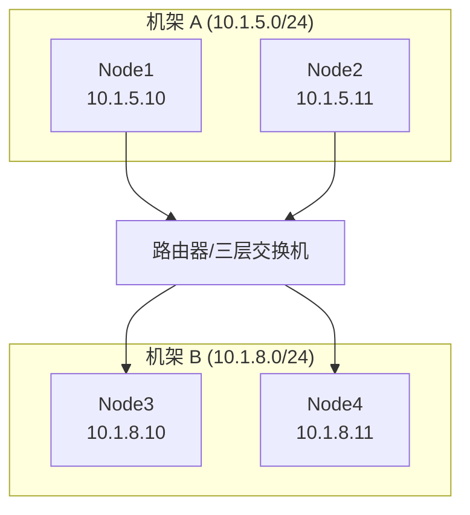

- **同机架**：节点在同一二层，可直接路由
- **跨机架**：节点在不同网段，需要三层转发

##### 37.1.2 CrossSubnet 模式原理

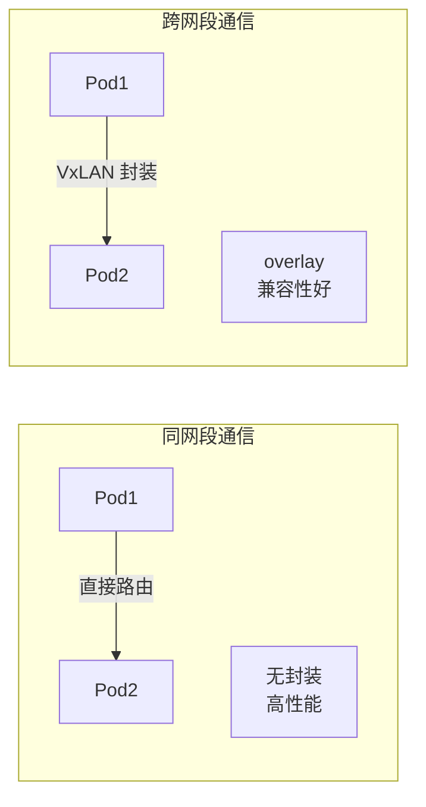

| 场景 | 封装方式 | 性能 | 依赖 |
|:---|:---|:---|:---|
| **同网段** | 无（纯路由） | 高 | - |
| **跨网段** | VxLAN | 较低 | FDB 表 |

##### 37.1.3 Always vs CrossSubnet

| 模式 | 同网段 | 跨网段 | 适用场景 |
|:---|:---|:---|:---|
| `Always` | VxLAN | VxLAN | 统一封装，简单 |
| `CrossSubnet` | 路由 | VxLAN | 混合环境，性能优先 |
| `Never` | 路由 | 路由 | 需要 BGP + 外部路由 |

#### 37.2 配置详解

##### 37.2.1 IPPool 配置

```yaml
apiVersion: crd.projectcalico.org/v1
kind: IPPool
metadata:
  name: default-pool
spec:
  cidr: 10.244.0.0/16
  ipipMode: Never              # 禁用 IPIP
  vxlanMode: CrossSubnet       # 跨网段 VxLAN
  natOutgoing: true
```

> [!IMPORTANT]
> **关键配置项**：
>
> - `vxlanMode: CrossSubnet` — 只在跨网段时封装
> - `ipipMode: Never` — 必须禁用 IPIP（二者互斥）
> - 仍需禁用 bird 相关组件

##### 37.2.2 Calico 如何判断"同网段"

Calico 根据节点 IP 和网络掩码判断：

```bash
# 假设节点 IP
Node1: 10.1.5.10/24
Node2: 10.1.5.11/24  # 同网段
Node3: 10.1.8.10/24  # 不同网段

# Calico 判断逻辑
10.1.5.10/24 & 10.1.5.11/24 → 同网段 (10.1.5.0) → 路由
10.1.5.10/24 & 10.1.8.10/24 → 不同网段 → VxLAN
```

#### 37.3 实验拓扑

##### 37.3.1 ContainerLab 跨网段环境

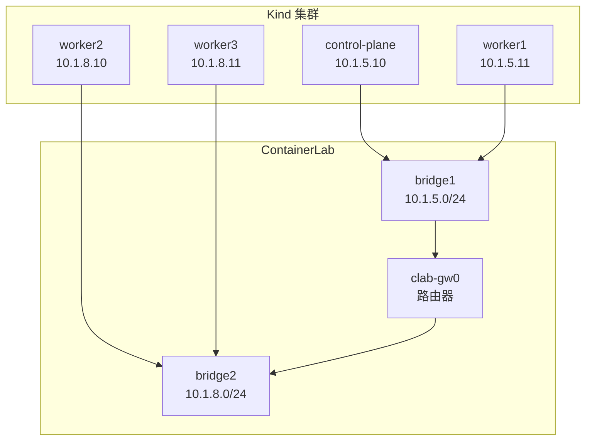

##### 37.3.2 路由器配置

```bash
# ContainerLab 路由器配置
interface net0
  ip address 10.1.5.1/24

interface net1  
  ip address 10.1.8.1/24

# SNAT for internet access
iptables -t nat -A POSTROUTING -o eth0 -j MASQUERADE
```

#### 37.4 同网段通信验证

##### 37.4.1 测试场景

```bash
# 从 control-plane (10.1.5.10) 上的 Pod
# ping worker1 (10.1.5.11) 上的 Pod
kubectl exec -it pod-on-control -- ping <pod-on-worker1-ip>
```

##### 37.4.2 抓包分析

```bash
# 在 control-plane 节点的 net0 接口抓包
tcpdump -i net0 -nn icmp

# 输出示例
# 10.244.1.69 > 10.244.175.1: ICMP echo request
# 10.244.175.1 > 10.244.1.69: ICMP echo reply
```

**特点**：

- **无 VxLAN 封装**
- **裸 ICMP 包**
- **MAC 地址逐跳变化**（标准路由行为）

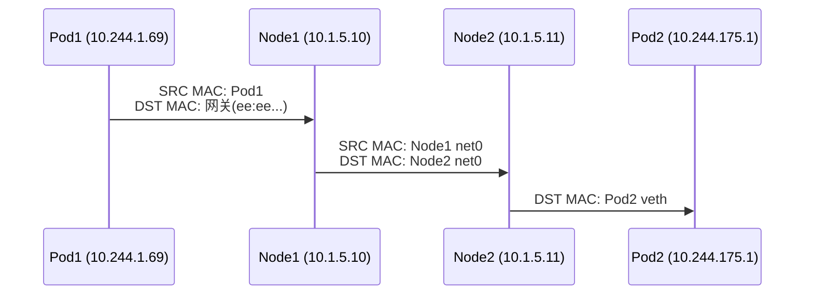

#### 37.5 跨网段通信验证

##### 37.5.1 测试场景

```bash
# 从 control-plane (10.1.5.10) 上的 Pod
# ping worker2 (10.1.8.10) 上的 Pod
kubectl exec -it pod-on-control -- ping <pod-on-worker2-ip>
```

##### 37.5.2 抓包分析

```bash
# 抓 VxLAN 包
tcpdump -i net0 -nn udp port 4789 -w vxlan-cross.pcap
```

**Wireshark 分析**：

```
Frame: 外层 Ethernet
├── SRC MAC: control-plane net0
├── DST MAC: router interface
├── Outer IP Header
│   ├── SRC: 10.1.5.10 (control-plane)
│   └── DST: 10.1.8.10 (worker2)
├── UDP Header
│   ├── SRC Port: random
│   └── DST Port: 4789
├── VxLAN Header
│   └── VNI: 4096
└── Inner Frame
    ├── Inner Ethernet
    │   ├── SRC MAC: vxlan.calico (local)
    │   └── DST MAC: vxlan.calico (remote)
    └── Inner IP
        ├── SRC: 10.244.1.69 (Pod1)
        └── DST: 10.244.73.x (Pod2)
```

#### 37.6 与 IPIP CrossSubnet 对比

| 对比项 | IPIP CrossSubnet | VxLAN CrossSubnet |
|:---|:---|:---|
| **同网段** | 路由 | 路由 |
| **跨网段** | IP-in-IP 封装 | VxLAN 封装 |
| **封装开销** | 20 字节 | 50 字节 |
| **协议** | IP Protocol 4 | UDP 4789 |
| **BGP 依赖** | 需要 bird | 不需要 |
| **FDB 表** | 不需要 | 需要 |
| **防火墙** | 可能受阻 | UDP 易穿透 |

#### 37.7 Overlay 的安全性优势

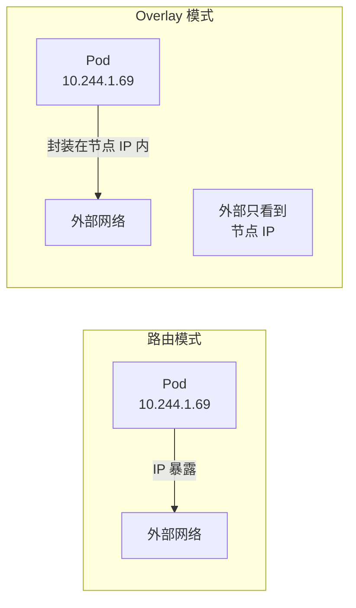

**Overlay 安全优势**：

1. **Pod IP 隐藏**：外部设备只看到节点 IP，不知道内部 Pod IP
2. **网络隔离**：中间网络设备无法直接访问 Pod
3. **零改造成本**：无需在外部网络配置 Pod 网段路由

#### 37.8 故障排查

##### 37.8.1 确认模式生效

```bash
# 查看 IPPool 配置
calicoctl get ippool -o yaml

# 确认 vxlanMode
spec:
  vxlanMode: CrossSubnet
```

##### 37.8.2 验证路由表

```bash
# 同网段节点 - 直接路由
ip route | grep <same-subnet-node-pod-cidr>
# 10.244.175.0/26 via 10.1.5.11 dev net0

# 跨网段节点 - VxLAN 路由
ip route | grep <cross-subnet-node-pod-cidr>  
# 10.244.73.0/26 via 10.244.73.0 dev vxlan.calico onlink
```

##### 37.8.3 常见问题

| 问题 | 原因 | 解决方案 |
|:---|:---|:---|
| 跨网段不通 | 路由器未配置 | 确保三层设备能转发 |
| FDB 表为空 | CNI 未正常启动 | 重启 calico-node |
| 同网段走 VxLAN | 掩码配置错误 | 检查节点 IP/掩码 |

#### 37.9 章节小结

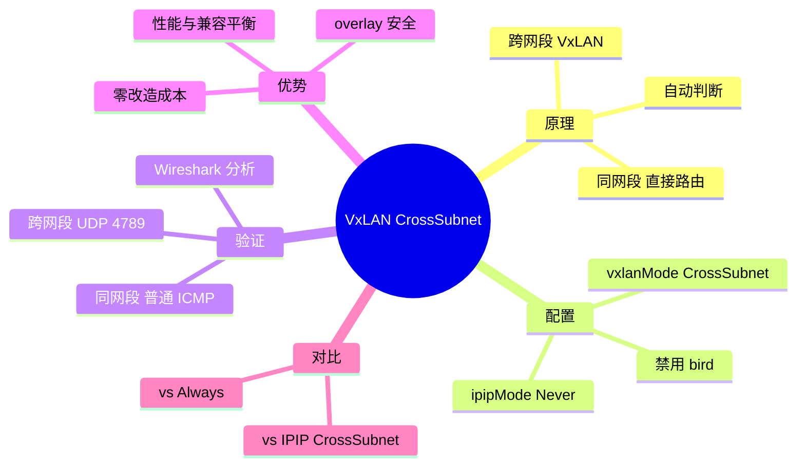

> [!TIP]
> **VxLAN CrossSubnet 要点总结**：
>
> 1. **核心原理**：
>    - 同网段走路由（高性能）
>    - 跨网段走 VxLAN（兼容性好）
>    - Calico 根据节点 IP/掩码自动判断
>
> 2. **配置**：`vxlanMode: CrossSubnet`
>
> 3. **验证方法**：
>    - 同网段：`tcpdump -i net0 icmp`（普通包）
>    - 跨网段：`tcpdump -i net0 udp port 4789`（VxLAN 包）
>
> 4. **适用场景**：
>    - 多机架/多网段的生产环境
>    - 追求性能与兼容性平衡
>    - 不想改造外部网络
>
> 5. **生产建议**：节点数 <200 时推荐使用

---

### 第三十八章 Calico-BGP-Fullmesh 模式

本章介绍 Calico 的 BGP Fullmesh 模式，这是 Calico 最"原生"的网络方案——不使用任何 overlay 封装，完全依赖 BGP 协议进行路由通告。

#### 38.1 背景与概述

##### 38.1.1 BGP 基础回顾

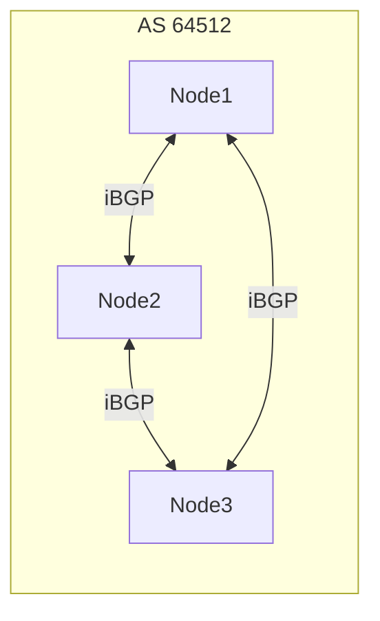

**BGP 核心概念**：

| 概念 | 说明 |
|:---|:---|
| **AS (自治系统)** | 统一管理的网络域 |
| **iBGP** | 同一 AS 内的 BGP |
| **eBGP** | 不同 AS 间的 BGP |
| **水平分割** | iBGP 学到的路由不再通告给其他 iBGP peer |
| **TCP 179** | BGP 使用 TCP 179 端口建立会话 |

##### 38.1.2 为什么需要 Fullmesh

由于 **BGP 水平分割规则**：

- iBGP peer 学到的路由不会通告给其他 iBGP peer
- 要让所有节点学到完整路由，必须**两两建立 BGP 邻居关系**
- 这就是 **Fullmesh（全网状连接）**

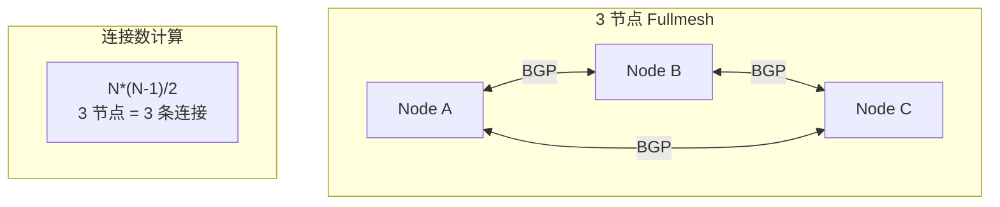

##### 38.1.3 Fullmesh 的适用场景

| 节点数 | 连接数 | 推荐方案 |
|:---|:---|:---|
| 10 | 45 | Fullmesh ✅ |
| 50 | 1,225 | Fullmesh ✅ |
| 100 | 4,950 | Fullmesh ✅ |
| **200** | 19,900 | **边界** |
| 500 | 124,750 | Route Reflector ✅ |

> [!IMPORTANT]
> **官方建议**：
>
> - 节点数 **< 200**：使用 Fullmesh
> - 节点数 **≥ 200**：使用 Route Reflector (RR)

#### 38.2 Fullmesh vs Overlay

| 对比项 | BGP Fullmesh | IPIP/VxLAN |
|:---|:---|:---|
| **封装** | 无 | 有 |
| **性能** | 最高 | 有开销 |
| **MTU** | 无损失 | 有损失 |
| **外部路由** | 需要配合 | 无需 |
| **复杂度** | 高 | 低 |
| **调试** | 需了解 BGP | 相对简单 |

#### 38.3 配置详解

##### 38.3.1 IPPool 配置

```yaml
apiVersion: crd.projectcalico.org/v1
kind: IPPool
metadata:
  name: default-pool
spec:
  cidr: 10.244.0.0/16
  ipipMode: Never              # 禁用 IPIP
  vxlanMode: Never             # 禁用 VxLAN
  natOutgoing: true
```

> [!IMPORTANT]
> **关键配置**：
>
> - `ipipMode: Never` — 禁用 IPIP 封装
> - `vxlanMode: Never` — 禁用 VxLAN 封装
> - 禁用 overlay 后，Calico 自动使用 BGP 路由

##### 38.3.2 BGP 配置（默认）

Calico 默认启用 BGP Fullmesh：

```yaml
apiVersion: crd.projectcalico.org/v1
kind: BGPConfiguration
metadata:
  name: default
spec:
  nodeToNodeMeshEnabled: true   # 启用 Fullmesh
  asNumber: 64512               # 默认 AS 号
```

#### 38.4 路由分析

##### 38.4.1 路由表特征

```bash
# 查看路由表
ip route show

# 输出示例
10.244.73.128/26 via 172.18.0.2 dev eth0 proto bird
10.244.83.128/26 via 172.18.0.3 dev eth0 proto bird
```

**关键特征**：

- **proto bird**：路由由 bird 进程（BGP daemon）维护
- **下一跳是 peer 节点 IP**：直接路由到对端节点
- **无 tunl0/vxlan.calico**：不使用隧道设备

##### 38.4.2 与 Overlay 路由对比

| 模式 | 路由示例 | 设备 |
|:---|:---|:---|
| BGP | `via 172.18.0.2 dev eth0 proto bird` | eth0 |
| IPIP | `via 172.18.0.2 dev tunl0 proto bird onlink` | tunl0 |
| VxLAN | `via 10.244.73.0 dev vxlan.calico onlink` | vxlan.calico |

#### 38.5 BGP 状态查看

##### 38.5.1 calicoctl node status

```bash
# 查看 BGP peer 状态
calicoctl node status

# 输出示例
Calico process is running.

IPv4 BGP status
+----------------+-------------------+-------+----------+-------------+
| PEER ADDRESS   | PEER TYPE         | STATE | SINCE    | INFO        |
+----------------+-------------------+-------+----------+-------------+
| 172.18.0.2     | node-to-node mesh | up    | 10:30:00 | Established |
| 172.18.0.3     | node-to-node mesh | up    | 10:30:00 | Established |
+----------------+-------------------+-------+----------+-------------+
```

**字段说明**：

| 字段 | 说明 |
|:---|:---|
| PEER ADDRESS | BGP 邻居 IP |
| PEER TYPE | `node-to-node mesh` = Fullmesh |
| STATE | `up` = 正常 |
| INFO | `Established` = TCP 179 连接已建立 |

##### 38.5.2 验证 TCP 179 连接

```bash
# 查看 BGP 端口连接
netstat -an | grep 179

# 输出
tcp   0   0 172.18.0.4:179   172.18.0.2:xxxxx   ESTABLISHED
tcp   0   0 172.18.0.4:179   172.18.0.3:xxxxx   ESTABLISHED
```

#### 38.6 bird 命令详解

##### 38.6.1 进入 bird 控制台

```bash
# 进入 calico-node Pod
kubectl exec -it calico-node-xxxxx -n kube-system -- /bin/sh

# 进入 bird 控制台
birdcl
# 或
birdc
```

##### 38.6.2 常用 bird 命令

```bash
# 查看接口
birdc> show interfaces

# 查看路由表
birdc> show route

# 查看 BGP 协议路由
birdc> show route protocol Mesh_172_18_0_2

# 查看协议状态
birdc> show protocols
```

**show route 输出示例**：

```
10.244.73.128/26   via 172.18.0.2 on eth0 [Mesh_172_18_0_2 10:30:00] * (100/0) [i]
10.244.83.128/26   via 172.18.0.3 on eth0 [Mesh_172_18_0_3 10:30:00] * (100/0) [i]
```

#### 38.7 AS Number 与配置文件

##### 38.7.1 查看 AS Number

```bash
# 通过 calicoctl
calicoctl get nodes -o yaml | grep asNumber

# 或查看 BGPConfiguration
calicoctl get bgpconfig default -o yaml
```

##### 38.7.2 bird 配置文件

```bash
# 配置文件位置
cat /etc/calico/confd/config/bird.cfg
```

```conf
# bird.cfg 示例
router id 172.18.0.4;

protocol bgp Mesh_172_18_0_2 {
  local as 64512;
  neighbor 172.18.0.2 as 64512;
  # ... 
}

protocol bgp Mesh_172_18_0_3 {
  local as 64512;
  neighbor 172.18.0.3 as 64512;
  # ...
}
```

#### 38.8 抓包验证

##### 38.8.1 跨节点 Pod 通信

```bash
# 抓包
tcpdump -i eth0 -nn icmp

# 输出示例
172.18.0.4 > 172.18.0.2: ICMP echo request
# 注意：这是节点 IP，不是 Pod IP！
```

**实际抓包**：

```bash
# Pod 间 ping
10.244.140.132 > 10.244.88.128: ICMP echo request
```

**特点**：

- **无封装**：直接看到 Pod IP
- **MAC 地址变化**：每跳变化
- **纯三层转发**

#### 38.9 Route Reflector 简介

当节点数超过 200 时，应使用 Route Reflector：

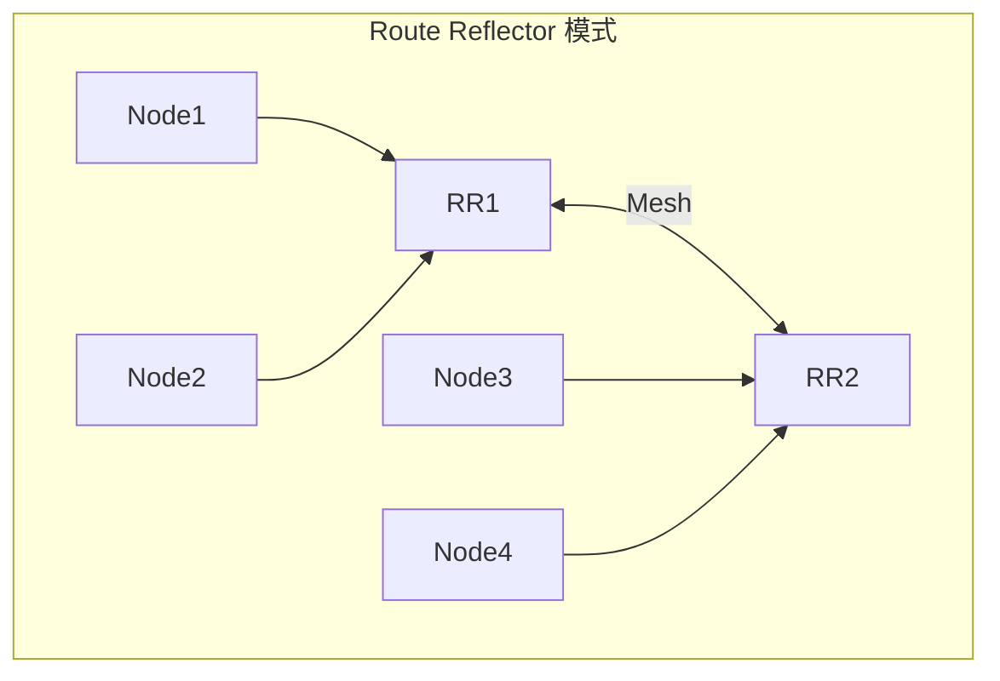

**RR 优势**：

- RR 之间 Fullmesh（少量连接）
- 普通节点只连接 RR（减少连接数）
- 多 RR 保证高可用

#### 38.10 章节小结

```mermaid
mindmap
  root((BGP Fullmesh))
    原理
      水平分割
      两两建立 peer
      N*(N-1)/2
    配置
      ipipMode Never
      vxlanMode Never
      nodeToNodeMesh true
    验证
      calicoctl node status
      ip route proto bird
      birdc show route
    特点
      无封装
      最高性能
      无 MTU 损失
    限制
      小于 200 节点
      超过用 RR
```

> [!TIP]
> **BGP Fullmesh 要点总结**：
>
> 1. **核心原理**：
>    - BGP 水平分割 → 需要 Fullmesh
>    - 连接数：N*(N-1)/2
>    - 官方建议：<200 节点
>
> 2. **配置**：禁用 IPIP/VxLAN，默认启用 BGP
>
> 3. **关键命令**：
>    - `calicoctl node status` — 查看 BGP peer
>    - `ip route` — 看到 `proto bird`
>    - `birdc show route` — BGP 路由详情
>
> 4. **抓包特点**：无封装，直接看到 Pod IP
>
> 5. **生产建议**：
>    - 小集群：Fullmesh
>    - 大集群：Route Reflector

---

### 第三十九章 Calico-BGP-RR 模式

本章介绍 Calico 的 BGP Route Reflector (RR) 模式，这是大规模集群（>200 节点）的推荐 BGP 方案，采用 AS per Rack 拓扑设计。

#### 39.1 背景与概述

##### 39.1.1 为什么需要 Route Reflector

回顾 Fullmesh 的问题：

| 节点数 | Fullmesh 连接数 |
|:---|:---|
| 100 | 4,950 |
| 200 | 19,900 |
| 500 | 124,750 |
| 1000 | 499,500 |

**Route Reflector 解决方案**：

- **RR 节点**：接收所有路由，反射给所有客户端
- **客户端**：只与 RR 建立连接
- **连接数**：从 N*(N-1)/2 降低到 N

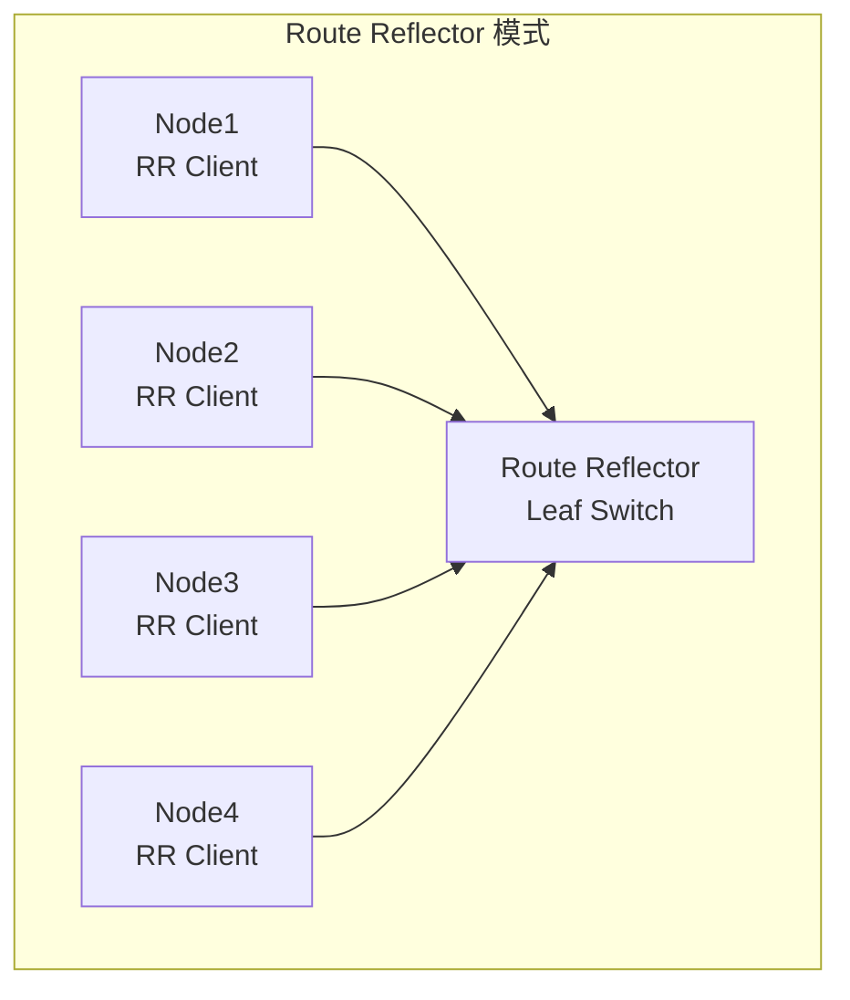

##### 39.1.2 AS per Rack 拓扑

生产环境推荐的 Leaf-Spine 架构：

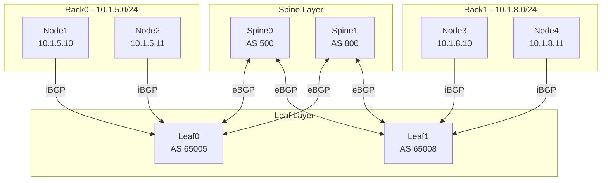

**架构说明**：

| 层级 | 说明 |
|:---|:---|
| **Spine** | 核心交换机，eBGP 互联 |
| **Leaf** | 接入交换机，作为 RR |
| **Node** | K8s 节点，RR Client |
| **iBGP** | 同 AS 内部（Node ↔ Leaf） |
| **eBGP** | 不同 AS 之间（Leaf ↔ Spine） |

#### 39.2 配置详解

##### 39.2.1 禁用 Node-to-Node Mesh

```yaml
apiVersion: crd.projectcalico.org/v1
kind: BGPConfiguration
metadata:
  name: default
spec:
  nodeToNodeMeshEnabled: false    # 关闭 Fullmesh！
  asNumber: 65005
```

或通过命令：

```bash
calicoctl patch bgpconfig default -p \
  '{"spec": {"nodeToNodeMeshEnabled": false}}'
```

##### 39.2.2 配置节点 BGP 属性

```yaml
apiVersion: crd.projectcalico.org/v1
kind: Node
metadata:
  name: node1
  labels:
    rack: rack0    # 机架标签
spec:
  bgp:
    ipv4Address: 10.1.5.10/24
    asNumber: 65005
```

##### 39.2.3 创建 BGP Peer

```yaml
apiVersion: crd.projectcalico.org/v1
kind: BGPPeer
metadata:
  name: rack0-to-leaf0
spec:
  peerIP: 10.1.5.1              # Leaf 交换机 IP
  asNumber: 65005               # 同 AS = iBGP
  nodeSelector: rack == 'rack0' # 只匹配 rack0 的节点
```

**nodeSelector 机制**：

```bash
# 查看节点标签
kubectl get nodes --show-labels | grep rack

# 输出
node1  rack=rack0
node2  rack=rack0
node3  rack=rack1
node4  rack=rack1
```

#### 39.3 Leaf 交换机配置

##### 39.3.1 VyOS 配置示例

```bash
# Leaf0 配置
set interfaces ethernet eth0 address 10.1.5.1/24
set interfaces ethernet eth1 address 10.1.10.2/24  # to Spine0
set interfaces ethernet eth2 address 10.1.12.2/24  # to Spine1

# BGP 配置
set protocols bgp 65005 router-id 10.1.5.1

# 宣告本地网段
set protocols bgp 65005 network 10.1.5.0/24

# 配置 RR Client (iBGP)
set protocols bgp 65005 neighbor 10.1.5.10 remote-as 65005
set protocols bgp 65005 neighbor 10.1.5.10 route-reflector-client
set protocols bgp 65005 neighbor 10.1.5.11 remote-as 65005
set protocols bgp 65005 neighbor 10.1.5.11 route-reflector-client

# 配置 eBGP (to Spine)
set protocols bgp 65005 neighbor 10.1.10.1 remote-as 500
set protocols bgp 65005 neighbor 10.1.12.1 remote-as 800

# SNAT for Internet
set nat source rule 10 outbound-interface eth0
set nat source rule 10 source address 10.1.5.0/24
set nat source rule 10 translation address masquerade
```

> [!IMPORTANT]
> **关键配置**：
>
> - `route-reflector-client`：指定节点为 RR 客户端
> - 同 AS（65005）= iBGP
> - 不同 AS（500, 800）= eBGP

#### 39.4 ECMP 等价多路径

##### 39.4.1 什么是 ECMP

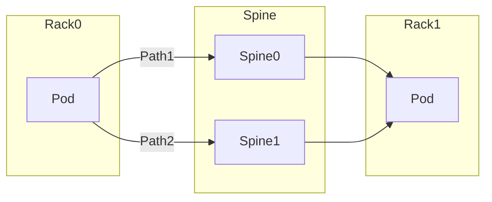

**ECMP (Equal Cost Multi-Path)**：

- 等价开销多路径
- 多条路径同时使用
- 负载分担 + 故障备份

##### 39.4.2 VyOS ECMP 配置

```bash
# 启用 ECMP
set protocols bgp 65005 maximum-paths ebgp 2
set protocols bgp 65005 maximum-paths ibgp 2
```

##### 39.4.3 验证 ECMP

```bash
# 查看路由表
show ip bgp

# 输出示例
   Network          Next Hop       Metric  Path
*> 10.1.8.0/24      10.1.10.1      0       500 65008 i
*=                  10.1.12.1      0       800 65008 i
```

- `*>` = 有效且最佳
- `*=` = 有效且等价（ECMP）

#### 39.5 验证步骤

##### 39.5.1 calicoctl node status

```bash
calicoctl node status

# 输出
IPv4 BGP status
+----------------+---------------+-------+----------+-------------+
| PEER ADDRESS   | PEER TYPE     | STATE | SINCE    | INFO        |
+----------------+---------------+-------+----------+-------------+
| 10.1.5.1       | node specific | up    | 10:30:00 | Established |
+----------------+---------------+-------+----------+-------------+
```

**关键变化**：

| Fullmesh | Route Reflector |
|:---|:---|
| `node-to-node mesh` | `node specific` |
| 多个 peer（所有节点） | 单个 peer（仅 RR） |

##### 39.5.2 验证 TCP 179

```bash
netstat -an | grep 179

# 输出
tcp  0  0 10.1.5.10:xxxxx  10.1.5.1:179  ESTABLISHED
```

##### 39.5.3 查看 Leaf 上的 BGP 状态

```bash
# VyOS
show ip bgp summary

# 输出
Neighbor        AS   MsgRcvd  MsgSent  State/PfxRcd
10.1.5.10    65005       100      100  Established
10.1.5.11    65005        98       98  Established
10.1.10.1      500       200      200  Established
10.1.12.1      800       195      195  Established
```

#### 39.6 Service IP Advertisement

##### 39.6.1 宣告 ClusterIP

```yaml
apiVersion: crd.projectcalico.org/v1
kind: BGPConfiguration
metadata:
  name: default
spec:
  nodeToNodeMeshEnabled: false
  asNumber: 65005
  serviceClusterIPs:
    - cidr: 10.96.0.0/16    # ClusterIP 范围
```

或通过命令：

```bash
calicoctl patch bgpconfig default -p \
  '{"spec": {"serviceClusterIPs": [{"cidr": "10.96.0.0/16"}]}}'
```

##### 39.6.2 验证路由传播

```bash
# 在 Leaf 上查看
show ip route bgp

# 输出
B    10.96.0.0/16 [200/0] via 10.1.5.10, eth0, ...
```

```bash
# 在 Spine 上查看
show ip bgp 10.96.0.0/16

# 路由已传播
```

**效果**：外部设备可以直接通过 BGP 路由访问 ClusterIP！

#### 39.7 故障排查

##### 39.7.1 常见问题

| 问题 | 排查命令 | 解决方案 |
|:---|:---|:---|
| BGP 未建立 | `calicoctl node status` | 检查 IP/AS 配置 |
| 路由缺失 | `ip route` | 检查 BGP 宣告 |
| ECMP 不生效 | `show ip bgp` | 检查 maximum-paths |
| 跨机架不通 | `tcpdump` | 检查 Spine 转发 |

##### 39.7.2 调试命令

```bash
# 查看 bird 日志
kubectl logs -n kube-system calico-node-xxxxx -c bird

# 进入 bird 控制台
kubectl exec -it calico-node-xxxxx -n kube-system -- birdcl

# 查看 BGP 路由
birdc> show route protocol Mesh_10_1_5_1
```

#### 39.8 二层隔离的安全优势

为什么使用不同网段（跨机架）：

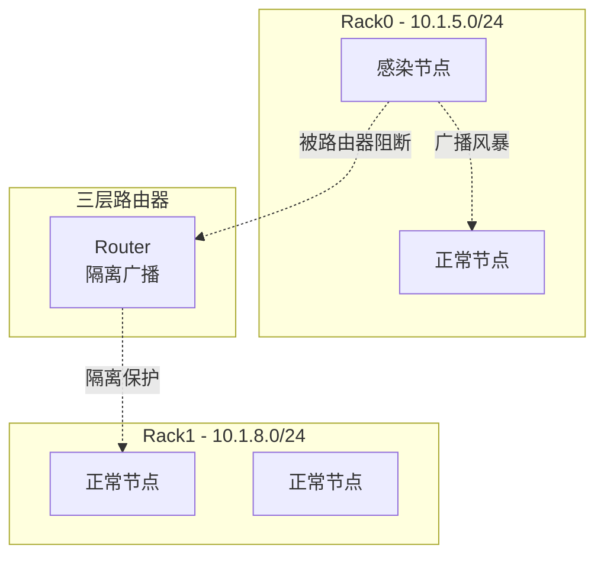

**优势**：

- 广播域隔离
- 故障范围控制
- 安全性增强

#### 39.9 章节小结

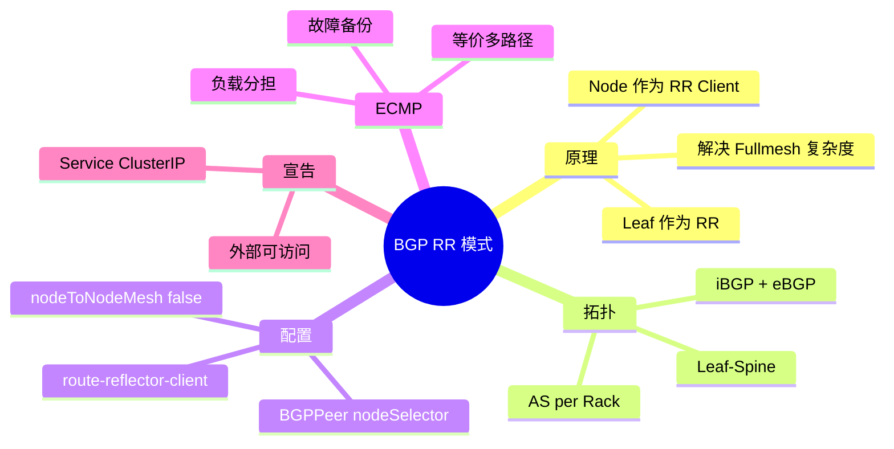

> [!TIP]
> **BGP RR 模式要点总结**：
>
> 1. **核心原理**：
>    - Leaf 交换机作为 Route Reflector
>    - K8s 节点作为 RR Client
>    - 连接数从 N² 降低到 N
>
> 2. **拓扑设计**：
>    - Leaf-Spine 架构
>    - AS per Rack（每机架一个 AS）
>    - iBGP（Node ↔ Leaf）+ eBGP（Leaf ↔ Spine）
>
> 3. **关键配置**：
>    - `nodeToNodeMeshEnabled: false` — 禁用 Fullmesh
>    - `BGPPeer` + `nodeSelector` — 按机架配置
>    - `route-reflector-client` — Leaf 配置
>
> 4. **ECMP**：等价多路径，实现负载分担和高可用
>
> 5. **Service 宣告**：ClusterIP 可通过 BGP 向外宣告
>
> 6. **适用场景**：大规模集群（>200 节点）

---

### 第四十章 Calico-eBPF-with-DSR 模式

本章介绍 Calico 的 eBPF 数据平面模式及 DSR（Direct Server Return）功能，这是一种高性能的替代方案，可以绑过 iptables 和 kube-proxy。

#### 40.1 背景与概述

##### 40.1.1 什么是 eBPF

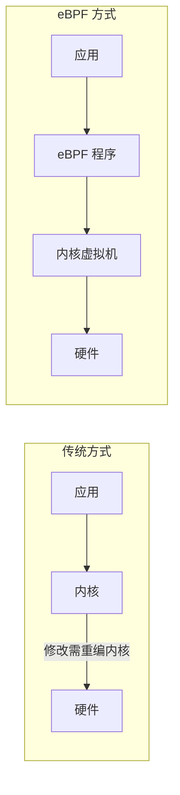

**eBPF (extended Berkeley Packet Filter)**：

- 内核中安全运行的虚拟机
- 无需修改或重编内核
- 动态加载/卸载程序
- 广泛用于：网络、监控、安全、存储

##### 40.1.2 Calico 与 eBPF 的结合

**背景**：

- 早期 Calico 不支持 eBPF
- 随着 Cilium 的崛起和 eBPF 技术火热
- Calico 3.x 版本引入 eBPF 数据平面

**eBPF 数据平面优势**：

| 对比项 | 传统 iptables | eBPF 数据平面 |
|:---|:---|:---|
| Service 实现 | kube-proxy + iptables | eBPF map |
| 性能 | O(n) 规则匹配 | O(1) hash 查找 |
| conntrack | 内核 conntrack | eBPF conntrack |
| CPU 开销 | 较高 | 较低 |
| 功能 | 完整 | 部分限制 |

#### 40.2 eBPF 数据平面原理

##### 40.2.1 Bypass kube-proxy

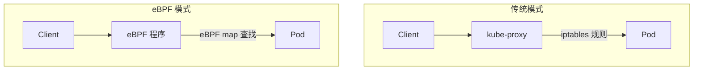

**工作机制**：

- Service ClusterIP → eBPF map
- 直接查找后端 Pod
- 绕过 iptables/IPVS

##### 40.2.2 限制与适用场景

**不推荐使用 eBPF 的场景**：

- Service Mesh control plane（仍需 iptables）
- Packet-by-packet 处理
- 需要完整 iptables 功能

**推荐使用 eBPF 的场景**：

- Connect-time Load Balancing
- XDP 加速
- 高性能需求

**平台兼容性**：

| 支持 | 不支持 |
|:---|:---|
| OpenShift, AKS, EKS | GKE, RKE |
| Ubuntu 20.04+ (5.4+ 内核) | 旧内核 (<4.18) |
| kubeadm 安装 | IPv6, SCTP |

#### 40.3 DSR 模式原理

##### 40.3.1 什么是 DSR

**DSR (Direct Server Return)**：

- 响应包不经过 Load Balancer
- 后端直接返回给客户端
- 减少 LB 负载，提升性能

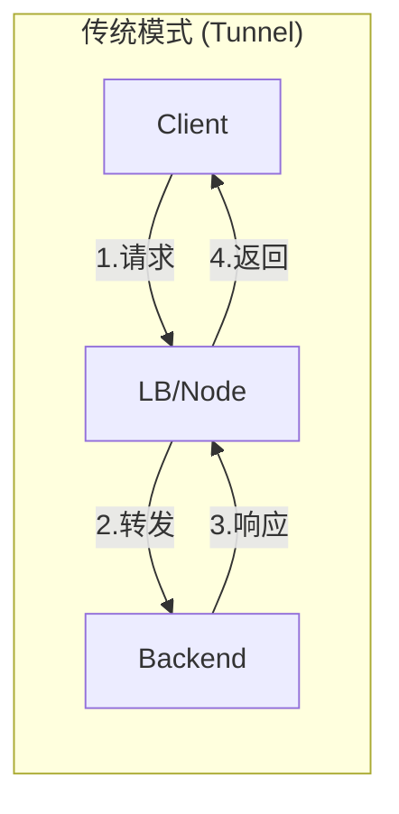

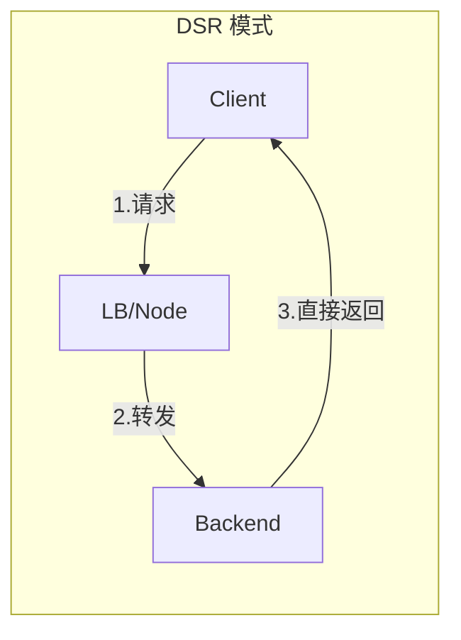

##### 40.3.2 Tunnel vs DSR 对比

**TCP 三次握手流程对比**：

| 步骤 | Tunnel 模式 | DSR 模式 |
|:---|:---|:---|
| SYN | Client → LB → Backend | Client → LB → Backend |
| SYN-ACK | Backend → LB → Client | Backend → Client (直接) |
| ACK | Client → LB → Backend | Client → LB → Backend |
| 总包数 | 6 个 | 4 个 |

#### 40.4 配置与实现

##### 40.4.1 启用 eBPF 数据平面

**步骤 1：创建 ConfigMap**

```yaml
apiVersion: v1
kind: ConfigMap
metadata:
  name: kubernetes-services-endpoint
  namespace: kube-system
data:
  KUBERNETES_SERVICE_HOST: "<API_SERVER_IP>"
  KUBERNETES_SERVICE_PORT: "6443"
```

**步骤 2：禁用 kube-proxy**

```bash
# Kind 集群：创建时设置
kubeProxyMode: none

# 现有集群：scale down
kubectl scale deployment kube-proxy -n kube-system --replicas=0
```

**步骤 3：启用 eBPF**

```bash
calicoctl patch felixconfiguration default \
  --patch='{"spec": {"bpfEnabled": true}}'
```

##### 40.4.2 启用 DSR 模式

```bash
calicoctl patch felixconfiguration default \
  --patch='{"spec": {"bpfExternalServiceMode": "DSR"}}'
```

**DSR 模式值**：

| 模式 | 说明 |
|:---|:---|
| `Tunnel` | 默认，VxLAN 封装双向 |
| `DSR` | 响应直接返回 |

##### 40.4.3 验证配置

```bash
# 检查 Felix 配置
calicoctl get felixconfiguration default -o yaml

# 检查 BPF 状态
kubectl exec -n kube-system calico-node-xxx -- \
  calico-node -bpf conntrack dump
```

#### 40.5 抓包分析

##### 40.5.1 Tunnel 模式抓包

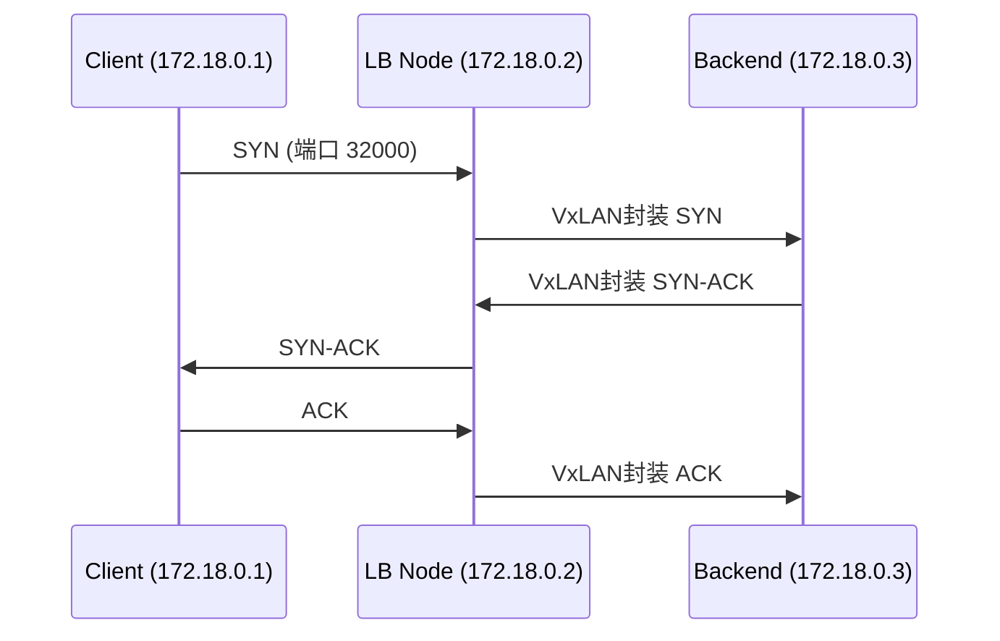

**特点**：

- 中间节点进行 VxLAN 封装
- 所有流量经过 LB 节点
- 共 6 个包完成握手

##### 40.5.2 DSR 模式抓包

```mermaid
sequenceDiagram
    participant C as Client (172.18.0.1)
    participant LB as LB Node (172.18.0.2)
    participant B as Backend (172.18.0.3)
    
    C->>LB: SYN (端口 32000)
    LB->>B: VxLAN封装 SYN
    B-->>C: SYN-ACK (直接返回！)
    C->>LB: ACK
    LB->>B: VxLAN封装 ACK
```

**特点**：

- SYN-ACK 从 Backend 直接返回 Client
- 减少 LB 负载
- 共 4 个包完成握手

##### 40.5.3 VxLAN 封装分析

```
# 外层 IP 头
Src: 172.18.0.2 (LB)
Dst: 172.18.0.3 (Backend)

# VxLAN 头
Port: 4789
VNI: xxx

# 内层 IP 头 (原始包)
Src: 172.18.0.1 (Client)
Dst: 172.18.0.2 (Service ClusterIP)
```

> [!IMPORTANT]
> **DSR 如何实现直接返回**：
>
> - VxLAN 内层包含原始 Client IP
> - Backend 解封装后获取 Client 地址
> - 直接构造响应包发送给 Client
> - 响应包源 IP 为 Service IP（非 Backend IP）

#### 40.6 验证步骤

##### 40.6.1 检查 eBPF 启用状态

```bash
# 查看 Felix 配置
calicoctl get felixconfiguration default -o yaml | grep bpf

# 输出
bpfEnabled: true
bpfExternalServiceMode: DSR
```

##### 40.6.2 验证无 kube-proxy

```bash
# 检查 iptables 规则（应该没有 Service 规则）
iptables -t nat -L KUBE-SERVICES

# 检查 conntrack（eBPF 模式下为空）
conntrack -L | grep <service-port>
```

##### 40.6.3 使用 BPF 工具查看

```bash
# 进入 calico-node Pod
kubectl exec -it calico-node-xxx -n kube-system -- sh

# 使用 calico-node 内置 BPF 工具
calico-node -bpf conntrack dump
calico-node -bpf routes dump
calico-node -bpf arp dump
```

#### 40.7 故障排查

##### 40.7.1 常见问题

| 问题 | 原因 | 解决方案 |
|:---|:---|:---|
| Service 不通 | eBPF 未正确加载 | 检查 Felix 日志 |
| 性能没提升 | kube-proxy 仍运行 | 禁用 kube-proxy |
| 部分功能失效 | 平台不支持 | 检查兼容性列表 |
| conntrack 查不到 | 正常现象 | eBPF 有自己的 conntrack |

##### 40.7.2 调试命令

```bash
# 查看 BPF 程序加载情况
tc -s qdisc show dev eth0

# 查看丢包统计
tc -s filter show dev eth0

# 查看 Felix 日志
kubectl logs -n kube-system calico-node-xxx -c felix | grep -i bpf
```

#### 40.8 章节小结

```mermaid
mindmap
  root((eBPF + DSR))
    eBPF
      内核虚拟机
      无需重编内核
      bypass iptables
      性能提升
    DSR
      Direct Server Return
      减少 LB 负载
      响应直接返回
    配置
      bpfEnabled true
      bpfExternalServiceMode DSR
      禁用 kube-proxy
    验证
      calico-node bpf
      conntrack 为空
      抓包分析
```

> [!TIP]
> **eBPF + DSR 模式要点总结**：
>
> 1. **eBPF 优势**：
>    - 绕过 iptables/kube-proxy
>    - O(1) 查找性能
>    - 降低 CPU 开销
>
> 2. **DSR 原理**：
>    - 响应包直接从 Backend 返回 Client
>    - 减少 LB 节点负载
>    - TCP 握手从 6 包减少到 4 包
>
> 3. **关键配置**：
>    - `bpfEnabled: true`
>    - `bpfExternalServiceMode: DSR`
>    - 禁用 kube-proxy
>
> 4. **验证方法**：
>    - `calico-node -bpf` 命令
>    - 抓包分析 TCP 握手流程
>    - conntrack 表为空（eBPF 管理）
>
> 5. **注意限制**：
>    - 内核版本要求 (>= 5.4)
>    - 部分平台不支持
>    - 功能不如 iptables 完整

---

### 第四十一章 Calico-VPP 模式

本章介绍 Calico 的 VPP（Vector Packet Processing）数据平面模式，这是一种高性能的用户态协议栈方案。

#### 41.1 背景与概述

##### 41.1.1 什么是 VPP

**VPP (Vector Packet Processing)**：

- 矢量包处理框架
- 用户态协议栈
- 思科开源项目 (fd.io)
- 高性能网络处理

```mermaid
graph LR
    subgraph "传统处理"
        P1["Packet 1"] --> K1["内核协议栈"]
        P2["Packet 2"] --> K1
        P3["Packet 3"] --> K1
    end
    
    subgraph "VPP 矢量处理"
        PV1["Packet Vector"] --> N1["Node 1"]
        N1 --> N2["Node 2"]
        N2 --> N3["Node 3"]
    end
```

**矢量处理优势**：

| 特性 | 传统逐包处理 | VPP 矢量处理 |
|:---|:---|:---|
| 处理方式 | 单包遍历所有层 | 批量处理同类包 |
| Cache 命中 | 低（频繁切换） | 高（连续访问） |
| 性能 | 较低 | 极高（百万 pps） |
| 扩展性 | 内核态修改 | Plugin 机制 |

##### 41.1.2 VPP 与 DPDK 的关系

```mermaid
graph TB
    subgraph "VPP 架构"
        App["应用层<br/>Calico/Plugin"]
        VPP["VPP 协议栈<br/>L2/L3/L4"]
        Driver["数据平面驱动"]
        NIC["网卡"]
    end
    
    App --> VPP
    VPP --> Driver
    Driver --> NIC
    
    subgraph "数据平面选项"
        D1["DPDK - 高性能"]
        D2["AF_PACKET - 兼容性"]
        D3["RDMA - 低延迟"]
        D4["Virtio - 虚拟化"]
    end
    
    Driver -.-> D1
    Driver -.-> D2
    Driver -.-> D3
    Driver -.-> D4
```

**组合说明**：

- **VPP**：提供用户态协议栈
- **DPDK**：提供快速数据通道
- **SR-IOV + DPDK**：生产环境最强组合

#### 41.2 VPP 工作原理

##### 41.2.1 Node Graph 处理模型

```mermaid
graph LR
    Input["DPDK Input"] --> ARP["ARP Input"]
    Input --> IP4["IP4 Input"]
    IP4 --> IP4Lookup["IP4 Lookup"]
    IP4Lookup --> IP4Rewrite["IP4 Rewrite"]
    IP4Rewrite --> Interface["Interface Output"]
    Interface --> TX["DPDK TX"]
```

**每个 Node 代表一个处理单元**：

- `dpdk-input`：从网卡接收
- `ip4-input`：IPv4 处理
- `ip4-lookup`：路由查找
- `interface-output`：发送

##### 41.2.2 传统模式 vs VPP 模式

**传统模式（内核协议栈）**：

```
Pod → veth → Bridge/Route → 内核协议栈 → NIC → 交换机
```

**VPP 模式（用户态协议栈）**：

```
Pod → tun/tap → VPP 协议栈 → DPDK/驱动 → NIC → 交换机
```

```mermaid
graph TB
    subgraph "Host Kernel"
        BGP["BIRD BGP"]
        Kubelet["kubelet"]
        Felix["Felix"]
        TUN["tun 设备"]
    end
    
    subgraph "VPP 用户态"
        VPPCore["VPP Core"]
        Routing["Routing"]
        LB["Load Balancing"]
        Policy["Policy"]
        DataPlane["Data Plane<br/>(DPDK/AF_PACKET)"]
    end
    
    subgraph "Pod"
        PodApp["应用"]
        PodTUN["tun 设备"]
    end
    
    PodApp --> PodTUN
    PodTUN --> VPPCore
    VPPCore --> DataPlane
    DataPlane --> NIC["物理网卡"]
    
    TUN <-.-> VPPCore
    BGP <-.-> TUN
```

#### 41.3 环境配置

##### 41.3.1 前置要求

**HugePages（大页内存）**：

```bash
# 查看当前配置
cat /proc/meminfo | grep Huge

# 配置 HugePages（2MB）
echo 1024 > /sys/kernel/mm/hugepages/hugepages-2048kB/nr_hugepages

# 或配置 1GB HugePages
echo 4 > /sys/kernel/mm/hugepages/hugepages-1048576kB/nr_hugepages
```

**Kubernetes 中查看 HugePages**：

```bash
kubectl describe node <node-name> | grep hugepages
# 输出
#   hugepages-1Gi: 0
#   hugepages-2Mi: 0
```

##### 41.3.2 网卡驱动绑定

**驱动类型对比**：

| 驱动 | 性能 | HugePages | 适用场景 |
|:---|:---|:---|:---|
| `af_packet` | 低 | 不需要 | 测试/兼容 |
| `uio_pci_generic` | 中 | 需要 | 通用 |
| `igb_uio` | 高 | 需要 | 已淘汰 |
| `vfio-pci` | 高 | 需要 | 生产推荐 |

**绑定网卡到 DPDK**：

```bash
# 查看当前状态
dpdk-devbind.py --status

# 绑定到 vfio-pci
dpdk-devbind.py --bind=vfio-pci 0000:82:00.0

# 绑定后，网卡在内核中不可见
ip link show  # 看不到该网卡
```

> [!WARNING]
> 网卡绑定到 DPDK 后，将从内核中消失。需要 VPP 创建 tap 设备维持 SSH 连接。

#### 41.4 安装与配置

##### 41.4.1 Calico VPP 安装

**步骤 1：准备空集群**

```bash
# kubeadm init 后，不安装 CNI
kubeadm init --pod-network-cidr=192.168.0.0/16
```

**步骤 2：安装 Calico Operator**

```bash
kubectl apply -f https://docs.projectcalico.org/manifests/calico.yaml
```

**步骤 3：安装 VPP 数据平面**

```yaml
# vpp-dataplane.yaml
apiVersion: v1
kind: ConfigMap
metadata:
  name: calico-vpp-config
  namespace: calico-vpp-dataplane
data:
  CALICOVPP_INTERFACE: eth0
  CALICOVPP_NATIVE_DRIVER: af_packet  # 或 dpdk
  SERVICE_PREFIX: 10.96.0.0/16
```

```bash
kubectl apply -f vpp-dataplane.yaml
```

##### 41.4.2 VPP 启动配置

```
# /etc/vpp/startup.conf
unix {
  nodaemon
  full-coredump
}

cpu {
  workers 1
  main-core 0
}

dpdk {
  dev 0000:82:00.0
}

plugins {
  plugin dpdk_plugin.so { enable }
  plugin ping_plugin.so { enable }
}

buffers {
  buffers-per-numa 131072
}
```

**关键配置说明**：

| 配置项 | 说明 |
|:---|:---|
| `cpu.workers` | 转发线程数 |
| `dpdk.dev` | 网卡 PCI 地址 |
| `plugins` | 启用的插件 |
| `buffers` | 内存缓冲区 |

#### 41.5 调试与验证

##### 41.5.1 进入 VPP 控制台

```bash
# Calico VPP 环境
kubectl exec -it calico-vpp-node-xxx -n calico-vpp-dataplane -- vppctl

# 或直接执行命令
kubectl exec calico-vpp-node-xxx -n calico-vpp-dataplane -- vppctl show interface
```

##### 41.5.2 常用 vppctl 命令

```bash
# 查看接口
vppctl show interface

# 查看接口统计
vppctl show interface addr

# 查看路由表
vppctl show ip fib

# 查看 ARP 表
vppctl show ip neighbor

# 查看隧道
vppctl show vxlan tunnel
vppctl show ipip tunnel

# 查看运行状态
vppctl show runtime
```

**输出示例**：

```
vpp# show interface
              Name               Idx    State  MTU     RX packets     TX packets
GigabitEthernet82/0/0             1      up     9000     12345678       87654321
tap0                              2      up     1500        54321          12345
tun0                              3      up     1500        11111          22222
```

#### 41.6 Pod 通信原理

##### 41.6.1 Pod 到 VPP 的连接

```mermaid
graph LR
    subgraph "Pod"
        App["应用进程"]
        NS["Network Namespace"]
        TUN["tun 设备"]
    end
    
    subgraph "VPP"
        VPPTun["VPP tun"]
        Route["路由处理"]
        Output["接口输出"]
    end
    
    App --> NS
    NS --> TUN
    TUN <--> VPPTun
    VPPTun --> Route
    Route --> Output
```

**tun vs tap 设备**：

| 类型 | 层级 | 用途 |
|:---|:---|:---|
| tun | L3（IP） | Pod 连接 VPP |
| tap | L2（Ethernet） | 需要 MAC 地址场景 |

##### 41.6.2 跨节点通信

```mermaid
sequenceDiagram
    participant Pod1 as Pod1 (Node1)
    participant VPP1 as VPP (Node1)
    participant NIC1 as NIC (Node1)
    participant NIC2 as NIC (Node2)
    participant VPP2 as VPP (Node2)
    participant Pod2 as Pod2 (Node2)
    
    Pod1->>VPP1: tun 设备
    VPP1->>NIC1: DPDK 发送
    NIC1->>NIC2: 物理网络(VxLAN/IPIP)
    NIC2->>VPP2: DPDK 接收
    VPP2->>Pod2: tun 设备
```

#### 41.7 限制与注意事项

##### 41.7.1 已知限制

| 功能 | 状态 |
|:---|:---|
| BGP | 必须启用 |
| Service Affinity | 不支持 |
| EndpointSlice | 不支持 |
| WireGuard | 部分限制 |
| IPv6 | 支持 |

##### 41.7.2 生产建议

> [!CAUTION]
> **VPP 模式仍为实验性功能**：
>
> - 官方标记为 "Not Production Ready"
> - 建议在测试环境充分验证
> - 生产环境考虑使用 Multus + VPP

**适用场景**：

- 高性能网络需求（流媒体、AI/ML）
- SR-IOV 环境
- 专用硬件加速

#### 41.8 章节小结

```mermaid
mindmap
  root((Calico VPP))
    VPP 概念
      矢量包处理
      用户态协议栈
      fd.io 开源
    数据平面
      DPDK 高性能
      AF_PACKET 兼容
      RDMA/Virtio
    配置
      HugePages
      网卡驱动绑定
      startup.conf
    架构
      Pod via tun
      VPP 协议栈
      快速转发
    验证
      vppctl
      show interface
      show ip fib
```

> [!TIP]
> **VPP 模式要点总结**：
>
> 1. **VPP 是什么**：
>    - 矢量包处理框架
>    - 用户态高性能协议栈
>    - 通过 Plugin 扩展功能
>
> 2. **与 DPDK 关系**：
>    - VPP 提供协议栈
>    - DPDK 提供快速数据通道
>    - 生产推荐：SR-IOV + DPDK
>
> 3. **关键配置**：
>    - HugePages 内存
>    - 网卡驱动绑定（vfio-pci）
>    - VPP startup.conf
>
> 4. **Pod 连接方式**：
>    - 通过 tun 设备连接到 VPP
>    - VPP 替代内核协议栈转发
>
> 5. **限制注意**：
>    - 必须启用 BGP
>    - 实验性功能，非生产就绪
>    - 需要物理机或虚拟机（非容器化）

---

### 第四十二章 Calico-Service-DataPath

本章深入分析 Calico 环境下 Kubernetes Service 的数据路径，包括 ClusterIP、NodePort、LoadBalancer 三种类型的 NAT 转换过程。

#### 42.1 背景与概述

##### 42.1.1 Service 类型回顾

| 类型 | 访问范围 | 使用场景 |
|:---|:---|:---|
| ClusterIP | 集群内部 | 默认类型，微服务通信 |
| NodePort | 集群外部 | 通过节点端口访问 |
| LoadBalancer | 外部 LB | 云环境，生产推荐 |
| Headless | 集群内部 | StatefulSet，直连 Pod |

##### 42.1.2 NAT 转换基础

**NAT 类型说明**：

| NAT 类型 | 说明 | 场景 |
|:---|:---|:---|
| SNAT | 修改源地址 | 内网访问外网 |
| DNAT | 修改目的地址 | 外网访问内网 |
| Reverse NAT | 反向还原 | 响应包还原地址 |

```mermaid
graph LR
    subgraph "SNAT 场景"
        A["内网 IP"] --> |修改源| B["公网 IP"]
    end
    
    subgraph "DNAT 场景"
        C["Service IP"] --> |修改目的| D["Pod IP"]
    end
```

#### 42.2 ClusterIP 数据路径

##### 42.2.1 工作原理

ClusterIP 是 Kubernetes 默认的 Service 类型，只能在集群内部访问。

```mermaid
sequenceDiagram
    participant PodA as Pod A (Client)
    participant VethA as veth pair
    participant Host as Node (iptables)
    participant PodB as Pod B (Backend)
    
    Note over PodA,PodB: 第一阶段: 发送请求
    PodA->>VethA: SRC: PodA IP<br/>DST: ClusterIP
    VethA->>Host: 进入 root namespace
    Note over Host: iptables 执行 DNAT<br/>ClusterIP → PodB IP
    Host->>PodB: SRC: PodA IP<br/>DST: PodB IP
    
    Note over PodA,PodB: 第二阶段: 返回响应
    PodB->>Host: SRC: PodB IP<br/>DST: PodA IP
    Note over Host: conntrack 执行 Reverse DNAT<br/>PodB IP → ClusterIP
    Host->>VethA: SRC: ClusterIP<br/>DST: PodA IP
    VethA->>PodA: 响应到达
```

##### 42.2.2 DNAT 详解

**请求阶段**：

```
Pod A 发送请求:
  原始包: SRC=10.244.1.10 (PodA), DST=10.96.0.100 (ClusterIP)
  
经过 iptables DNAT:
  转换后: SRC=10.244.1.10 (PodA), DST=10.244.2.20 (PodB)
```

**响应阶段**：

```
Pod B 返回响应:
  原始包: SRC=10.244.2.20 (PodB), DST=10.244.1.10 (PodA)

经过 conntrack Reverse DNAT:
  转换后: SRC=10.96.0.100 (ClusterIP), DST=10.244.1.10 (PodA)
```

> [!IMPORTANT]
> **为什么需要 Reverse DNAT？**
> Pod A 发送的请求目的是 ClusterIP，如果响应的源地址是 PodB IP，Pod A 会因为地址不匹配而丢弃该包。

##### 42.2.3 抓包验证

```bash
# 在 Client Pod 网卡抓包
kubectl exec client-pod -- tcpdump -i eth0 -nn

# 观察第一个 SYN 包
# SRC: 10.244.1.10 (PodA)
# DST: 10.96.0.100 (ClusterIP)

# 在 Host 网卡抓包
tcpdump -i eth0 -nn host 10.244.2.20

# 观察同一个 SYN 包 (DNAT 已完成)
# SRC: 10.244.1.10 (PodA)  
# DST: 10.244.2.20 (PodB) ← 目的地址已变化
```

#### 42.3 NodePort 数据路径

##### 42.3.1 工作原理

NodePort 允许从集群外部通过节点 IP + 端口访问服务。

```mermaid
sequenceDiagram
    participant Client as 外部客户端
    participant Node1 as Node1 (入口)
    participant Node2 as Node2
    participant PodB as Pod B (Backend)
    
    Note over Client,PodB: 第一阶段: 外部请求进入
    Client->>Node1: SRC: ClientIP<br/>DST: Node1:30000
    Note over Node1: SNAT + DNAT<br/>ClientIP→Node1IP<br/>Node1:30000→PodB:80
    Node1->>Node2: SRC: Node1 IP<br/>DST: PodB IP
    Node2->>PodB: 转发到 Pod
    
    Note over Client,PodB: 第二阶段: 响应返回
    PodB->>Node2: SRC: PodB IP<br/>DST: Node1 IP
    Node2->>Node1: 路由回 Node1
    Note over Node1: Reverse SNAT + DNAT<br/>还原所有地址
    Node1->>Client: SRC: Node1:30000<br/>DST: ClientIP
```

##### 42.3.2 为什么需要 SNAT？

```mermaid
graph TB
    subgraph "问题场景 (不做 SNAT)"
        C1["Client: 172.18.0.1"] --> N1["Node1: 172.18.0.2"]
        N1 --> |"DST=PodB"| P1["PodB: 10.244.2.20"]
        P1 --> |"SRC=PodB<br/>DST=Client"| C1
        style P1 fill:#f66
        Note1["❌ Client 收到 PodB 的响应<br/>但它期望的是 Node1 的响应"]
    end
```

**解决方案：SNAT**

- 请求时：将源地址改为 Node1 IP
- 响应时：PodB 将响应发回 Node1
- Node1 再做 Reverse NAT 发回 Client

##### 42.3.3 完整 NAT 过程

| 阶段 | 源地址 | 目的地址 | NAT 操作 |
|:---|:---|:---|:---|
| Client→Node1 | ClientIP | Node1:30000 | - |
| Node1→PodB | Node1 IP | PodB:80 | SNAT + DNAT |
| PodB→Node1 | PodB IP | Node1 IP | - |
| Node1→Client | Node1:30000 | ClientIP | Reverse NAT |

##### 42.3.4 抓包验证

```bash
# 在 Node1 上抓包
tcpdump -i eth0 -nn port 30000 -w nodeport.pcap

# 从外部访问
curl 172.18.0.2:30000

# 分析 pcap 文件
# 可以看到 4 种不同的地址组合
```

#### 42.4 LoadBalancer 数据路径

##### 42.4.1 工作原理

LoadBalancer 在 NodePort 基础上增加了外部负载均衡器。

```mermaid
sequenceDiagram
    participant Client as 外部客户端
    participant LB as L4 LoadBalancer
    participant Node1 as Node1
    participant PodB as Pod B (Backend)
    
    Client->>LB: SRC: ClientIP<br/>DST: LB IP
    Note over LB: DNAT: 选择后端节点<br/>LB IP → Node1 IP
    LB->>Node1: SRC: ClientIP<br/>DST: Node1:30000
    Note over Node1: 等同于 NodePort 流程
    Node1->>PodB: SNAT + DNAT
    PodB->>Node1: 响应
    Node1->>LB: Reverse NAT
    LB->>Client: 返回响应
```

##### 42.4.2 与 NodePort 的关系

```
LoadBalancer = 外部 L4 LB + NodePort

数据流:
Client → L4 LB (DNAT选择节点) → NodePort (SNAT+DNAT) → Pod
```

> [!TIP]
> **L4 LB 的作用**：
>
> - 隐藏后端节点 IP
> - 负载均衡到多个节点
> - 提供统一入口（外部 IP/VIP）

#### 42.5 iptables 规则分析

##### 42.5.1 Service 相关规则链

```bash
# 查看 Service 规则
iptables -t nat -L KUBE-SERVICES -n --line-numbers

# 查看特定 Service 的规则链
iptables -t nat -L KUBE-SVC-XXXXX -n
```

**规则链结构**：

```mermaid
graph TD
    A["PREROUTING/OUTPUT"] --> B["KUBE-SERVICES"]
    B --> C["KUBE-SVC-xxx<br/>(Service 入口)"]
    C --> D["KUBE-SEP-xxx<br/>(Endpoint 1)"]
    C --> E["KUBE-SEP-yyy<br/>(Endpoint 2)"]
    D --> F["DNAT 到 Pod1"]
    E --> G["DNAT 到 Pod2"]
```

##### 42.5.2 iptables trace 调试

```bash
# 添加 trace 规则
iptables -t raw -A PREROUTING -p tcp --dport 80 -j TRACE
iptables -t raw -A OUTPUT -p tcp --dport 80 -j TRACE

# 查看 trace 日志
dmesg -T | grep TRACE

# 清除 trace 规则
iptables -t raw -D PREROUTING -p tcp --dport 80 -j TRACE
iptables -t raw -D OUTPUT -p tcp --dport 80 -j TRACE
```

#### 42.6 conntrack 连接跟踪

##### 42.6.1 查看连接表

```bash
# 查看所有连接
conntrack -L

# 过滤特定端口
conntrack -L -p tcp --dport 80

# 查看 NAT 连接
conntrack -L -n
```

##### 42.6.2 conntrack 表项解读

```
tcp  6 117 TIME_WAIT 
  src=10.244.1.10 dst=10.96.0.100 sport=45678 dport=80 
  src=10.244.2.20 dst=10.244.1.10 sport=80 dport=45678

解读:
- 原始方向: PodA(10.244.1.10) → ClusterIP(10.96.0.100)
- 回复方向: PodB(10.244.2.20) → PodA(10.244.1.10)
- DNAT 映射: ClusterIP → PodB
```

#### 42.7 实验环境搭建

##### 42.7.1 测试 Pod 部署

```yaml
# test-pods.yaml
apiVersion: v1
kind: Pod
metadata:
  name: client-pod
spec:
  nodeName: node1  # 固定到 node1
  containers:
  - name: client
    image: curlimages/curl
    command: ["sleep", "infinity"]
---
apiVersion: v1
kind: Pod
metadata:
  name: backend-pod
  labels:
    app: backend
spec:
  nodeName: node2  # 固定到 node2，跨节点测试
  containers:
  - name: backend
    image: nginx
---
apiVersion: v1
kind: Service
metadata:
  name: backend-svc
spec:
  type: NodePort
  selector:
    app: backend
  ports:
  - port: 80
    targetPort: 80
    nodePort: 30000
```

##### 42.7.2 验证步骤

```bash
# 1. ClusterIP 测试
kubectl exec client-pod -- curl backend-svc

# 2. NodePort 测试 (从集群外)
curl <node-ip>:30000

# 3. 抓包分析
# 在不同位置抓包对比
```

#### 42.8 章节小结

```mermaid
mindmap
  root((Service DataPath))
    ClusterIP
      仅 DNAT
      集群内访问
      Reverse DNAT 还原
    NodePort
      SNAT + DNAT
      外部访问
      跨节点需 SNAT
    LoadBalancer
      L4 LB + NodePort
      负载均衡
      隐藏后端
    调试
      tcpdump 抓包
      iptables trace
      conntrack 查看
```

> [!TIP]
> **Service DataPath 要点总结**：
>
> 1. **ClusterIP**：
>    - 仅做 DNAT（ClusterIP → PodIP）
>    - conntrack 记录映射，响应时 Reverse DNAT
>
> 2. **NodePort**：
>    - SNAT + DNAT 双重转换
>    - SNAT 确保响应能回到入口节点
>
> 3. **LoadBalancer**：
>    - L4 LB 选择后端节点
>    - 后续流程等同 NodePort
>
> 4. **调试技巧**：
>    - `tcpdump` 抓包：注意抓包位置影响看到的地址
>    - `iptables trace`：追踪规则命中
>    - `conntrack -L`：查看 NAT 映射关系
>
> 5. **注意事项**：
>    - 抓包时 iptables 已处理完成
>    - 生产环境谨慎修改 iptables 规则
>    - 使用 BGP Fullmesh 简化分析（无 overlay）

---

### 第四十三章 Calico 生产实践

本章介绍 Calico 在生产环境中的网络设计和最佳实践，包括数据中心网络拓扑、BGP 架构选型、AS 模式对比。

#### 43.1 背景与概述

##### 43.1.1 参考文档

> [!IMPORTANT]
> **生产环境必读文档**：
>
> - Calico 官方文档：`Reference → Architecture → Calico IP Fabric`
> - IETF RFC 7938：*Use of BGP for Routing in Large-Scale Data Centers*
>
> **建议**：生产环境至少阅读 10 遍，理解每一句话的含义和技术依据。

##### 43.1.2 数据中心网络演进

| 时代 | 架构 | 特点 |
|:---|:---|:---|
| 传统 | 接入-汇聚-核心 | 生成树 + VRRP + BFD |
| 现代 | Spine-Leaf (Clos) | BGP 路由 + ECMP |

```mermaid
graph TB
    subgraph "传统三层架构"
        C1["核心层 Core"]
        A1["汇聚层 Aggregation"]
        A2["汇聚层 Aggregation"]
        S1["接入层 Access"]
        S2["接入层 Access"]
        S3["接入层 Access"]
        
        C1 --- A1
        C1 --- A2
        A1 --- S1
        A1 --- S2
        A2 --- S2
        A2 --- S3
    end
```

```mermaid
graph TB
    subgraph "Spine-Leaf 架构"
        SP1["Spine 1"]
        SP2["Spine 2"]
        L1["Leaf/ToR 1"]
        L2["Leaf/ToR 2"]
        L3["Leaf/ToR 3"]
        
        SP1 --- L1
        SP1 --- L2
        SP1 --- L3
        SP2 --- L1
        SP2 --- L2
        SP2 --- L3
    end
```

#### 43.2 BGP 网络拓扑模式

Calico 支持三种主要的 BGP 网络拓扑模式：

##### 43.2.1 模式对比

| 模式 | AS 分配 | 复杂度 | 适用场景 |
|:---|:---|:---|:---|
| AS Per Rack | 每机架一个 AS | 中 | 大型数据中心 |
| AS Per Node | 每节点一个 AS | 高 | 特殊需求 |
| Downward Default | 默认路由下发 | 低 | 推荐生产 |

#### 43.3 AS Per Rack 模式

##### 43.3.1 架构原理

每个机架（Rack）作为一个独立的自治系统（AS）。

```mermaid
graph TB
    subgraph "Spine 层"
        SP["Spine Switch<br/>AS 65000"]
    end
    
    subgraph "Rack A - AS 65001"
        ToR_A["ToR Switch<br/>Route Reflector"]
        N1["Node 1"]
        N2["Node 2"]
        N3["Node 3"]
    end
    
    subgraph "Rack B - AS 65002"
        ToR_B["ToR Switch<br/>Route Reflector"]
        N4["Node 4"]
        N5["Node 5"]
        N6["Node 6"]
    end
    
    SP ---|eBGP| ToR_A
    SP ---|eBGP| ToR_B
    ToR_A ---|iBGP| N1
    ToR_A ---|iBGP| N2
    ToR_A ---|iBGP| N3
    ToR_B ---|iBGP| N4
    ToR_B ---|iBGP| N5
    ToR_B ---|iBGP| N6
```

##### 43.3.2 工作原理

1. **机架内部（iBGP）**：
   - ToR 交换机作为 Route Reflector
   - 计算节点与 ToR 建立 iBGP
   - 同机架节点共享同一 AS 号

2. **机架之间（eBGP）**：
   - ToR 与 Spine 建立 eBGP
   - 不同机架使用不同 AS 号
   - Spine 交换机汇聚全网路由

##### 43.3.3 优势与劣势

| 方面 | 优势 | 劣势 |
|:---|:---|:---|
| 扩展性 | 机架级隔离 | 需要规划 AS 号 |
| 故障域 | 故障隔离在机架 | ToR 压力较大 |
| 管理 | 结构清晰 | 配置复杂 |

#### 43.4 AS Per Node 模式

##### 43.4.1 架构原理

每个计算节点作为一个独立的自治系统。

```mermaid
graph TB
    subgraph "Spine 层"
        SP["Spine Switch"]
    end
    
    subgraph "Leaf 层"
        ToR["ToR Switch"]
    end
    
    subgraph "Node 层"
        N1["Node 1<br/>AS 65001"]
        N2["Node 2<br/>AS 65002"]
        N3["Node 3<br/>AS 65003"]
    end
    
    SP ---|eBGP| ToR
    ToR ---|eBGP| N1
    ToR ---|eBGP| N2
    ToR ---|eBGP| N3
```

##### 43.4.2 特点分析

**优点**：

- 每个节点完全独立
- 路由隔离彻底

**缺点**：

- 节点 BGP 压力大（Bird 进程）
- AS 号管理复杂
- 开源 BGP 实现不如商业设备稳定

> [!WARNING]
> **不推荐在生产环境使用**
>
> 计算节点使用 Bird 提供 BGP 能力，其稳定性和性能不如商业路由设备。每个节点最多 200 个 Pod，路由条目有限，没必要每节点独立 AS。

#### 43.5 Downward Default 模式（推荐）

##### 43.5.1 架构原理

下级设备只向上级通告默认路由，全网路由只在 Spine 维护。

```mermaid
graph TB
    subgraph "Spine 层 - 全网路由"
        SP["Spine Switch<br/>掌握所有路由"]
    end
    
    subgraph "Leaf 层 - 默认路由"
        ToR1["ToR 1<br/>默认路由指向 Spine"]
        ToR2["ToR 2<br/>默认路由指向 Spine"]
    end
    
    subgraph "Node 层 - 默认路由"
        N1["Node 1"]
        N2["Node 2"]
        N3["Node 3"]
        N4["Node 4"]
    end
    
    SP --> |"下发默认路由"| ToR1
    SP --> |"下发默认路由"| ToR2
    ToR1 --> |"下发默认路由"| N1
    ToR1 --> |"下发默认路由"| N2
    ToR2 --> |"下发默认路由"| N3
    ToR2 --> |"下发默认路由"| N4
    
    N1 -.-> |"通告 Pod 网段"| ToR1
    N2 -.-> |"通告 Pod 网段"| ToR1
    ToR1 -.-> |"汇聚上报"| SP
```

##### 43.5.2 工作原理

```
路由通告方向（上行）：
Node → ToR → Spine
每级只通告本级路由，汇聚后上报

默认路由方向（下行）：
Spine → ToR → Node
每级下发默认路由，指向上级
```

##### 43.5.3 优势分析

| 方面 | 说明 |
|:---|:---|
| 设备负载 | 专业设备做专业的事，Spine 处理复杂路由 |
| 节点压力 | 计算节点只维护少量路由，释放资源 |
| 配置简化 | 下级设备配置简单，默认路由即可 |
| 可扩展性 | Spine 交换机能力强，支持大规模路由表 |

> [!TIP]
> **生产环境推荐使用 Downward Default 模式**
>
> 这种模式让专业设备处理复杂的 BGP 路由，计算节点专注于运行工作负载，是最合理的分工。

#### 43.6 Route Reflector 配置策略

##### 43.6.1 选择 Route Reflector

```mermaid
graph LR
    subgraph "方案1: ToR 作为 RR"
        ToR1["ToR Switch<br/>性能好"]
    end
    
    subgraph "方案2: 专用 RR 节点"
        RR1["RR Node 1"]
        RR2["RR Node 2"]
    end
    
    subgraph "方案3: 控制节点作为 RR"
        CP["Control Plane Node"]
    end
```

**选择建议**：

| 方案 | 适用场景 | 说明 |
|:---|:---|:---|
| ToR 交换机 | 大型数据中心 | 性能最好，需交换机支持 |
| 专用 RR 节点 | 中型集群 | 灵活，需额外资源 |
| 控制节点 | 小型集群 | 简单，复用现有资源 |

##### 43.6.2 Route Reflector 数量

```yaml
# 推荐配置: 至少 2 个 RR 实现高可用
# 使用 calicoctl 配置 RR
apiVersion: projectcalico.org/v3
kind: BGPConfiguration
metadata:
  name: default
spec:
  nodeToNodeMeshEnabled: false  # 禁用 Full Mesh
  asNumber: 65001
```

#### 43.7 AS 号规划

##### 43.7.1 私有 AS 号范围

| 类型 | 范围 | 说明 |
|:---|:---|:---|
| 2 字节私有 | 64512-65534 | 常用，1023 个 |
| 4 字节私有 | 4200000000-4294967294 | 扩展，约 9500 万个 |

##### 43.7.2 规划示例

```
数据中心 AS 规划示例：

Spine 层:
  - Spine-1: AS 65000
  - Spine-2: AS 65000 (同 AS，iBGP)

Leaf/ToR 层:
  - Rack-A: AS 65001
  - Rack-B: AS 65002
  - Rack-C: AS 65003
  ...
  - Rack-N: AS 6500N

注意: 每个 Rack 使用不同 AS 号
```

#### 43.8 生产环境选型建议

##### 43.8.1 决策流程

```mermaid
flowchart TD
    A["开始选型"] --> B{"集群规模"}
    B --> |"小型 <50 节点"| C["Full Mesh"]
    B --> |"中型 50-200 节点"| D["AS Per Rack<br/>+ Route Reflector"]
    B --> |"大型 >200 节点"| E["Downward Default<br/>+ Spine Leaf"]
    
    C --> F["控制节点作为 RR"]
    D --> G["ToR 作为 RR"]
    E --> H["Spine 承担路由"]
```

##### 43.8.2 模式选型建议

| 规模 | 推荐模式 | 理由 |
|:---|:---|:---|
| 小型 (<50) | Full Mesh | 简单，无需额外配置 |
| 中型 (50-200) | AS Per Rack + RR | 平衡复杂度和扩展性 |
| 大型 (>200) | Downward Default | 专业设备处理路由 |

#### 43.9 ContainerLab 实验

##### 43.9.1 验证不同 BGP 架构

```bash
# 使用 ContainerLab 模拟 Spine-Leaf 架构
# 可以验证：
# 1. AS Per Rack 模式
# 2. AS Per Node 模式  
# 3. Downward Default 模式

# 查看 BGP 邻居
calicoctl node status

# 查看路由表
ip route show
```

#### 43.10 章节小结

```mermaid
mindmap
  root((Calico 生产实践))
    网络拓扑
      传统三层
      Spine-Leaf
      Clos 架构
    BGP 模式
      AS Per Rack
      AS Per Node
      Downward Default
    Route Reflector
      ToR 交换机
      专用 RR 节点
      控制节点
    选型建议
      小型: Full Mesh
      中型: AS Per Rack
      大型: Downward Default
```

> [!TIP]
> **Calico 生产实践要点总结**：
>
> 1. **必读文档**：
>    - Calico IP Fabric 设计文档
>    - RFC 7938 数据中心 BGP 路由
>
> 2. **架构选型**：
>    - **Downward Default**：推荐生产使用
>    - **AS Per Rack**：大型数据中心
>    - **AS Per Node**：不推荐
>
> 3. **设计原则**：
>    - 专业设备做专业的事
>    - Spine 处理复杂路由
>    - 计算节点专注工作负载
>
> 4. **Route Reflector**：
>    - 小型：控制节点兼任
>    - 中大型：ToR 或专用节点
>    - 至少 2 个实现高可用
>
> 5. **验证测试**：
>    - 使用 ContainerLab 模拟
>    - 理解每种模式的路由流向
>    - 生产上线前充分测试

---

### 第四十四章 Calico-IPAM 高级用法

本章介绍 Calico IPAM（IP Address Management）的高级配置，包括基于拓扑分配 IP、固定 IP、IP 池迁移、CNI 插件链等。

#### 44.1 背景与概述

##### 44.1.1 CNI 的两大核心组件

一个完备的 CNI 包含两大核心组件：

```mermaid
graph LR
    subgraph "CNI 核心组件"
        IPAM["IPAM<br/>IP 地址管理"]
        Network["Network<br/>网络通路"]
    end
    
    IPAM --> Pod["Pod 获取 IP"]
    Network --> Connectivity["Pod 互通"]
```

| 组件 | 职责 | 重要性 |
|:---|:---|:---|
| IPAM | IP 地址分配和管理 | ⭐⭐⭐⭐⭐ |
| Network | 网络连通性 | ⭐⭐⭐⭐⭐ |

> [!IMPORTANT]
> **两者并重**：不要只关注网络通路，IPAM 在生产环境中同样重要！

##### 44.1.2 Calico IPAM 类型

| 类型 | 说明 | 功能 |
|:---|:---|:---|
| calico-ipam | Calico 原生 IPAM | 支持高级特性 |
| host-local | 主机本地 IPAM | 功能有限 |

#### 44.2 基于拓扑分配 IP（Node Selector）

##### 44.2.1 背景

在大型数据中心，需要根据物理拓扑（如机架/Rack）分配 IP 地址，便于管理和路由汇聚。

```mermaid
graph TB
    subgraph "Rack 0 - 192.168.0.0/24"
        Node1["Node 1"]
        Node2["Node 2"]
        Pod1["Pod: 192.168.0.x"]
        Pod2["Pod: 192.168.0.y"]
    end
    
    subgraph "Rack 1 - 192.168.1.0/24"
        Node3["Node 3"]
        Node4["Node 4"]
        Pod3["Pod: 192.168.1.x"]
        Pod4["Pod: 192.168.1.y"]
    end
    
    Node1 --> Pod1
    Node2 --> Pod2
    Node3 --> Pod3
    Node4 --> Pod4
```

##### 44.2.2 原理

通过 IPPool 的 `nodeSelector` 字段，限制 IP 池只能在特定节点上使用。

**默认配置**：

```yaml
# 默认 IPPool - 所有节点
apiVersion: projectcalico.org/v3
kind: IPPool
metadata:
  name: default-pool
spec:
  cidr: 10.244.0.0/16
  nodeSelector: all()  # 所有节点都使用此池
```

##### 44.2.3 实现步骤

**步骤 1：为节点打标签**

```bash
# 标记机架
kubectl label node node1 rack=rack-0
kubectl label node node2 rack=rack-0
kubectl label node node3 rack=rack-1
kubectl label node node4 rack=rack-1
```

**步骤 2：创建基于拓扑的 IP 池**

```yaml
# Rack 0 的 IP 池
apiVersion: projectcalico.org/v3
kind: IPPool
metadata:
  name: rack-0-pool
spec:
  cidr: 192.168.0.0/24
  ipipMode: Always
  natOutgoing: true
  nodeSelector: rack == "rack-0"
---
# Rack 1 的 IP 池
apiVersion: projectcalico.org/v3
kind: IPPool
metadata:
  name: rack-1-pool
spec:
  cidr: 192.168.1.0/24
  ipipMode: Always
  natOutgoing: true
  nodeSelector: rack == "rack-1"
```

**步骤 3：验证**

```bash
# 创建测试 Pod
kubectl create deployment test --image=nginx --replicas=4

# 查看 Pod IP 分配
kubectl get pods -o wide

# 预期结果:
# node1/node2 上的 Pod: 192.168.0.x
# node3/node4 上的 Pod: 192.168.1.x
```

##### 44.2.4 关键点

| 要点 | 说明 |
|:---|:---|
| 标签一致性 | 节点标签必须与 nodeSelector 匹配 |
| 路由汇聚 | 同机架 IP 相同网段，便于路由聚合 |
| 管理清晰 | 根据 IP 可快速定位物理位置 |
| 故障隔离 | 网段隔离有助于故障排查 |

#### 44.3 固定 IP 地址（Static IP）

##### 44.3.1 背景

某些应用（如数据库）需要固定 IP，即使 Pod 重建也保持相同 IP。

##### 44.3.2 原理

通过 Pod 注解指定固定 IP 地址。

```mermaid
sequenceDiagram
    participant User as 用户
    participant K8s as Kubernetes
    participant IPAM as Calico IPAM
    
    User->>K8s: 创建 Pod (带 IP 注解)
    K8s->>IPAM: 请求分配 IP
    IPAM->>IPAM: 检查注解中的 IP
    IPAM->>IPAM: 分配指定 IP
    IPAM->>K8s: 返回固定 IP
    K8s->>User: Pod 启动完成
```

##### 44.3.3 实现

**创建带固定 IP 的 Pod**：

```yaml
apiVersion: v1
kind: Pod
metadata:
  name: static-ip-pod
  annotations:
    cni.projectcalico.org/ipAddrs: '["192.168.0.100"]'
spec:
  containers:
  - name: nginx
    image: nginx
```

**验证**：

```bash
kubectl get pod static-ip-pod -o wide
# NAME            READY   STATUS    IP              NODE
# static-ip-pod   1/1     Running   192.168.0.100   node1
```

##### 44.3.4 固定 IP 的局限性

> [!WARNING]
> **Pod 重建时的 IP 冲突问题**
>
> 当 Pod 重建时，旧 Pod 的 IP 可能尚未释放，导致新 Pod 无法获取相同 IP。

**解决方案**：使用 IP 池（多个 IP）

```yaml
# 为有状态应用分配 IP 范围
apiVersion: projectcalico.org/v3
kind: IPPool
metadata:
  name: db-pool
spec:
  cidr: 192.168.100.0/28  # 16 个 IP
  nodeSelector: app == "database"
```

> [!TIP]
> **Spiderpool 项目**
>
> DaoCloud 开源的 [Spiderpool](https://github.com/spidernet-io/spiderpool) 项目对 Calico 的静态 IP 功能进行了增强，支持：
>
> - IP 池绑定到 Deployment
> - Pod 重建时自动复用 IP
> - 双栈 IP 地址管理

#### 44.4 IP 池迁移（Migration）

##### 44.4.1 背景

当需要更换 Pod 网段时，需要从旧 IP 池迁移到新 IP 池。

##### 44.4.2 原理

```mermaid
flowchart LR
    A["创建新 IP 池"] --> B["禁用旧 IP 池"]
    B --> C["重启 Pod"]
    C --> D["Pod 获取新 IP"]
```

##### 44.4.3 实现步骤

**步骤 1：创建新 IP 池**

```yaml
apiVersion: projectcalico.org/v3
kind: IPPool
metadata:
  name: new-pool
spec:
  cidr: 10.0.0.0/16
  ipipMode: Always
  natOutgoing: true
```

**步骤 2：禁用旧 IP 池**

```bash
# 查看当前 IP 池
calicoctl get ippool -o yaml

# 编辑旧池，添加 disabled: true
calicoctl patch ippool old-pool -p '{"spec": {"disabled": true}}'

# 验证
calicoctl get ippool
# NAME       CIDR            SELECTOR   DISABLED
# old-pool   10.244.0.0/16   all()      true
# new-pool   10.0.0.0/16     all()      false
```

**步骤 3：重启 Pod**

```bash
# 方法1: 滚动更新
kubectl rollout restart deployment <name>

# 方法2: 删除 Pod
kubectl delete pod --all -n <namespace>

# 方法3: 使用 drain 节点
kubectl drain <node> --ignore-daemonsets --delete-emptydir-data
```

**步骤 4：验证新 IP**

```bash
kubectl get pods -o wide
# Pod IP 现在应该是 10.0.x.x
```

##### 44.4.4 关键点

| 要点 | 说明 |
|:---|:---|
| 不可回滚 | 迁移后旧 IP 池已禁用 |
| 需重启 Pod | 需要 Pod 重建才能获取新 IP |
| 类似 DHCP | 类似 DHCP Server 更换后重新获取 IP |

#### 44.5 指定 IP 池（Specific Pool）

##### 44.5.1 背景

在同一机架内，不同应用需要从不同 IP 池分配地址。

##### 44.5.2 原理

通过 Pod 注解指定从哪个 IP 池分配地址。

```mermaid
graph TD
    subgraph "同一节点"
        DB["DB Pod<br/>注解: db-pool"]
        App["App Pod<br/>注解: app-pool"]
    end
    
    subgraph "IP 池"
        DBPool["db-pool<br/>192.168.100.0/28"]
        AppPool["app-pool<br/>192.168.200.0/24"]
    end
    
    DB --> DBPool
    App --> AppPool
```

##### 44.5.3 实现

**创建多个 IP 池**：

```yaml
# 数据库专用池
apiVersion: projectcalico.org/v3
kind: IPPool
metadata:
  name: db-pool
spec:
  cidr: 192.168.100.0/28
  ipipMode: Always
  natOutgoing: true
---
# 应用专用池
apiVersion: projectcalico.org/v3
kind: IPPool
metadata:
  name: app-pool
spec:
  cidr: 192.168.200.0/24
  ipipMode: Always
  natOutgoing: true
```

**使用注解指定 IP 池**：

```yaml
apiVersion: v1
kind: Pod
metadata:
  name: db-pod
  annotations:
    cni.projectcalico.org/ipv4pools: '["db-pool"]'
spec:
  containers:
  - name: mysql
    image: mysql:8.0
---
apiVersion: v1
kind: Pod
metadata:
  name: app-pod
  annotations:
    cni.projectcalico.org/ipv4pools: '["app-pool"]'
spec:
  containers:
  - name: nginx
    image: nginx
```

##### 44.5.4 与 Node Selector 的区别

| 功能 | Node Selector | 指定 IP 池 |
|:---|:---|:---|
| 粒度 | 节点级别 | Pod 级别 |
| 配置位置 | IPPool | Pod 注解 |
| 用途 | 机架隔离 | 应用隔离 |
| 灵活性 | 较低 | 较高 |

#### 44.6 CNI 插件链

##### 44.6.1 背景

Calico 支持 CNI 插件链，可以组合多个插件实现更多功能。

##### 44.6.2 插件链架构

```mermaid
graph LR
    Main["主插件<br/>Calico"]
    PM["Port Mapping<br/>端口映射"]
    BW["Bandwidth<br/>带宽限制"]
    SBR["SBR<br/>源路由"]
    Tuning["Tuning<br/>内核参数"]
    
    Main --> PM
    PM --> BW
    BW --> SBR
    SBR --> Tuning
```

##### 44.6.3 常用辅助插件

| 插件 | 类型 | 功能 |
|:---|:---|:---|
| portmap | 端口映射 | 支持 hostPort |
| bandwidth | 带宽限制 | QoS 流量控制 |
| sbr | 源路由 | Source Based Routing |
| tuning | 内核调优 | 设置 sysctl 参数 |

##### 44.6.4 配置示例

**查看 CNI 配置**：

```bash
cat /etc/cni/net.d/10-calico.conflist
```

**带插件链的配置**：

```json
{
  "name": "k8s-pod-network",
  "cniVersion": "0.3.1",
  "plugins": [
    {
      "type": "calico",
      "ipam": {
        "type": "calico-ipam"
      }
    },
    {
      "type": "portmap",
      "capabilities": {
        "portMappings": true
      }
    },
    {
      "type": "bandwidth",
      "capabilities": {
        "bandwidth": true
      }
    },
    {
      "type": "tuning",
      "sysctl": {
        "net.core.somaxconn": "1024"
      }
    }
  ]
}
```

##### 44.6.5 带宽限制示例

```yaml
apiVersion: v1
kind: Pod
metadata:
  name: bandwidth-limited-pod
  annotations:
    kubernetes.io/ingress-bandwidth: "10M"
    kubernetes.io/egress-bandwidth: "10M"
spec:
  containers:
  - name: nginx
    image: nginx
```

#### 44.7 IPAM 配置参考

##### 44.7.1 IPPool 完整字段

```yaml
apiVersion: projectcalico.org/v3
kind: IPPool
metadata:
  name: example-pool
spec:
  # 必填字段
  cidr: 192.168.0.0/24
  
  # 可选字段
  blockSize: 26              # 每节点分配的子网大小
  ipipMode: Always           # IPIP 模式: Always/CrossSubnet/Never
  vxlanMode: Never           # VxLAN 模式
  natOutgoing: true          # 出站 SNAT
  disabled: false            # 是否禁用
  nodeSelector: all()        # 节点选择器
  allowedUses:               # 允许的用途
    - Workload
    - Tunnel
```

##### 44.7.2 常用注解

| 注解 | 用途 | 示例 |
|:---|:---|:---|
| `cni.projectcalico.org/ipAddrs` | 指定固定 IP | `["192.168.0.100"]` |
| `cni.projectcalico.org/ipv4pools` | 指定 IPv4 池 | `["my-pool"]` |
| `cni.projectcalico.org/ipv6pools` | 指定 IPv6 池 | `["my-ipv6-pool"]` |

#### 44.8 章节小结

```mermaid
mindmap
  root((Calico IPAM 高级用法))
    基于拓扑分配
      Node Selector
      机架隔离
      路由汇聚
    固定 IP
      Pod 注解
      静态 IP
      Spiderpool 增强
    IP 池迁移
      禁用旧池
      重启 Pod
      获取新 IP
    指定 IP 池
      Pod 级别
      应用隔离
      更灵活
    CNI 插件链
      Port Mapping
      Bandwidth
      SBR
      Tuning
```

> [!TIP]
> **Calico IPAM 高级用法要点总结**：
>
> 1. **CNI 两大核心**：
>    - IPAM：IP 地址管理
>    - Network：网络通路
>
> 2. **基于拓扑分配（Node Selector）**：
>    - 节点打标签 + IPPool nodeSelector
>    - 同机架使用同网段，便于管理
>
> 3. **固定 IP**：
>    - 使用 `cni.projectcalico.org/ipAddrs` 注解
>    - 注意 Pod 重建时的 IP 冲突问题
>
> 4. **IP 池迁移**：
>    - 创建新池 → 禁用旧池 → 重启 Pod
>    - 类似 DHCP Server 更换
>
> 5. **指定 IP 池**：
>    - 使用 `cni.projectcalico.org/ipv4pools` 注解
>    - Pod 级别的精细控制
>
> 6. **CNI 插件链**：
>    - 多个插件组合使用
>    - 扩展功能：端口映射、带宽限制、内核调优

---
