# Kubernetes 容器网络学习笔记 · 第六册：Flannel

## Flannel CNI

### 第四十五章 Flannel-TUN-TAP 精讲

本章深入讲解 Linux TUN/TAP 虚拟网络设备，这是理解 Flannel UDP 模式等网络方案的基础。

#### 45.1 背景与概述

##### 45.1.1 Flannel 简介

Flannel 是由 CoreOS 开源的轻量级 CNI 方案，适合快速部署 Kubernetes 网络。

**资源获取**：

| 资源 | 地址 |
|:---|:---|
| GitHub | <https://github.com/flannel-io/flannel> |
| Slack | Kubernetes Slack #flannel 频道 |

##### 45.1.2 Flannel 与 Calico 的核心区别

| 特性 | Flannel | Calico |
|:---|:---|:---|
| 同节点通信 | L2 交换（Bridge） | L3 路由 |
| Pod 网络 | 挂在交换机上 | 挂在路由器上 |
| Pod 掩码 | /24（同网段） | /32（独立主机路由） |
| 复杂度 | 简单 | 较复杂 |

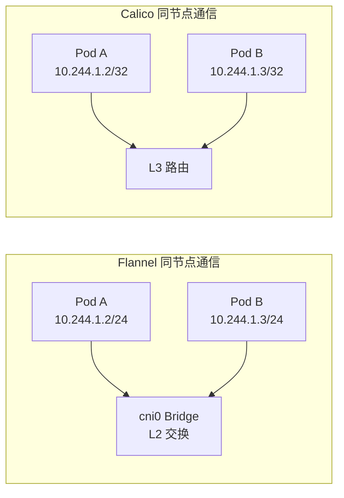

#### 45.2 TUN/TAP 设备原理

##### 45.2.1 什么是 TUN/TAP 设备

TUN/TAP 是 Linux 内核提供的虚拟网络设备，用于在**用户空间**和**内核空间**之间传递网络数据。

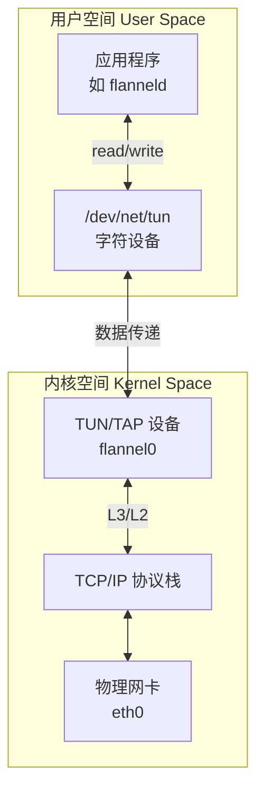

##### 45.2.2 TUN 与 TAP 的区别

| 特性 | TUN 设备 | TAP 设备 |
|:---|:---|:---|
| 工作层次 | L3 网络层 | L2 数据链路层 |
| 处理数据 | IP 包（裸 IP） | 以太网帧（含 MAC） |
| MAC 地址 | 无 | 有 |
| 典型应用 | VPN、Flannel UDP | 虚拟机网桥、OpenVPN TAP |
| 抓包格式 | raw IP packet | 完整以太网帧 |

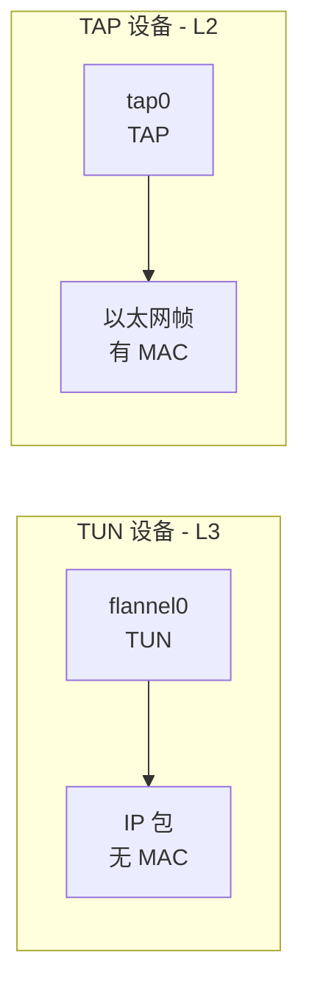

##### 45.2.3 TUN/TAP 数据传输流程

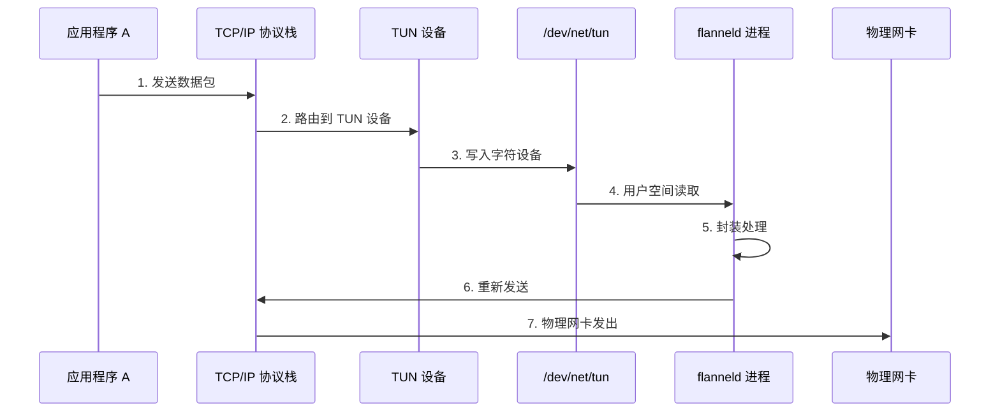

**数据流经过程说明**：

1. **应用发包**：用户空间应用产生数据包
2. **协议栈处理**：经过 TCP/IP 协议栈
3. **路由到 TUN**：根据路由表转发到 TUN 设备
4. **字符设备读取**：数据写入 `/dev/net/tun`
5. **用户空间处理**：flanneld 进程读取数据
6. **封装转发**：flanneld 封装后重新发送
7. **物理发送**：通过物理网卡发出

#### 45.3 TUN/TAP 与内核模块的效率对比

##### 45.3.1 效率差异

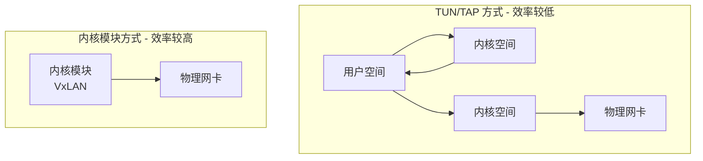

| 方式 | 数据路径 | 上下文切换 | 效率 |
|:---|:---|:---|:---|
| TUN/TAP | 用户空间 ↔ 内核空间 多次 | 多次 | 较低 |
| 内核模块 | 全程内核空间 | 无 | 较高 |

##### 45.3.2 为什么 TUN/TAP 效率低


**效率低的原因**：

1. **数据拷贝开销**：内核 ↔ 用户空间多次拷贝
2. **上下文切换**：用户态/内核态切换消耗 CPU
3. **中断处理**：额外的中断开销
4. **调度延迟**：用户空间进程调度不确定

> [!NOTE]
> **典型案例**：OpenVPN 使用 TUN/TAP 设备，效率低于 WireGuard（内核模块实现）

#### 45.4 Flannel 中的 TUN 设备实践

##### 45.4.1 查看 TUN 设备

```bash
# 查看网络设备详情
ip -d link show flannel0

# 输出示例
# flannel0: <POINTOPOINT,MULTICAST,NOARP,UP,LOWER_UP> mtu 1472 qdisc pfifo_fast
#     link/none
#     tun type tun pi off vnet_hdr off persist off
```

**关键信息解读**：

| 字段 | 含义 |
|:---|:---|
| `link/none` | 无 MAC 地址（TUN 设备特征） |
| `tun type tun` | TUN 类型设备 |
| `POINTOPOINT` | 点对点连接 |

##### 45.4.2 查看 TUN/TAP 设备类型

```bash
# 列出所有 TUN/TAP 设备
ip tuntap list

# 输出示例
# flannel0: tun
```

##### 45.4.3 查看设备关联进程

```bash
# 查看 TUN 设备关联的进程
ip -d tuntap show

# 输出示例
# flannel0: tun persist
#   Attached to processes: flanneld(1220)
```

**这说明**：

- `flannel0` 设备一端连接 TCP/IP 协议栈
- 另一端连接用户空间的 `flanneld` 进程

##### 45.4.4 验证进程

```bash
# 查看 flanneld 进程
ps aux | grep flanneld

# 输出示例
# root  1220  0.0  0.5 1234567 12345 ?  Sl  10:00  0:01 /opt/bin/flanneld

# 查看网络连接
netstat -anp | grep flanneld
```

#### 45.5 Flannel UDP 模式配置

##### 45.5.1 配置示例

```yaml
# ConfigMap 配置
apiVersion: v1
kind: ConfigMap
metadata:
  name: kube-flannel-cfg
  namespace: kube-flannel
data:
  net-conf.json: |
    {
      "Network": "10.244.0.0/16",
      "Backend": {
        "Type": "udp"
      }
    }
```

##### 45.5.2 挂载 TUN 设备

在非特权模式下，需要显式挂载 `/dev/net/tun`：

```yaml
apiVersion: apps/v1
kind: DaemonSet
metadata:
  name: kube-flannel-ds
spec:
  template:
    spec:
      containers:
      - name: kube-flannel
        volumeMounts:
        - name: dev-net-tun
          mountPath: /dev/net/tun
      volumes:
      - name: dev-net-tun
        hostPath:
          path: /dev/net/tun
```

> [!WARNING]
> **非特权模式注意事项**
>
> 在非特权模式（`privileged: false`）下：
>
> - 必须显式挂载 `/dev/net/tun`
> - 需要添加 `NET_ADMIN` 和 `NET_RAW` capabilities
> - 特权模式下无需额外配置

##### 45.5.3 验证 UDP 模式

```bash
# 查看 flanneld 日志
kubectl logs -n kube-flannel -l app=flannel

# 应该看到
# Found network config - Backend type: udp
```

#### 45.6 其他 TUN/TAP 应用场景

##### 45.6.1 常见应用

| 应用 | 设备类型 | 用途 |
|:---|:---|:---|
| OpenVPN | TUN/TAP | VPN 隧道 |
| Flannel UDP | TUN | 容器网络 |
| Calico VPP | TUN | 高性能转发 |
| 虚拟机网桥 | TAP | VM 网络 |
| WireGuard | 内核模块 | 高效 VPN |

##### 45.6.2 TUN 设备在 Calico VPP 中的应用


#### 45.7 章节小结

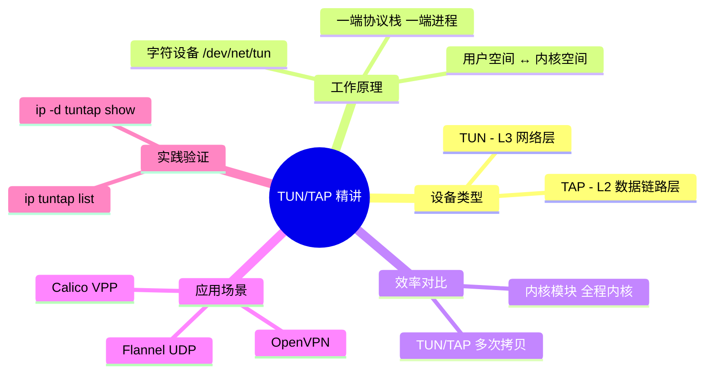

> [!TIP]
> **TUN/TAP 设备要点总结**：
>
> 1. **设备类型**：
>    - TUN：L3 网络层，处理 IP 包，无 MAC 地址
>    - TAP：L2 数据链路层，处理以太网帧，有 MAC 地址
>
> 2. **工作原理**：
>    - 一端连接 TCP/IP 协议栈（内核空间）
>    - 一端连接用户空间进程（如 flanneld）
>    - 通过 `/dev/net/tun` 字符设备通信
>
> 3. **效率对比**：
>    - TUN/TAP：用户空间处理，效率较低
>    - 内核模块（VxLAN）：全程内核处理，效率较高
>
> 4. **Flannel 配置**：
>    - UDP 模式使用 TUN 设备
>    - 非特权模式需挂载 `/dev/net/tun`
>    - 需要 `NET_ADMIN` 和 `NET_RAW` 权限
>
> 5. **验证命令**：
>    - `ip tuntap list`：列出 TUN/TAP 设备
>    - `ip -d tuntap show`：查看设备关联进程

---

### 第四十六章 Flannel-UDP 模式

本章深入讲解 Flannel 的 UDP 封装模式，包括同节点和跨节点的 Pod 通信原理及数据包封装机制。

#### 46.1 背景与概述

##### 46.1.1 Flannel 后端类型

Flannel 支持多种后端（Backend）类型：

| 后端类型 | 封装方式 | 性能 | 适用场景 |
|:---|:---|:---|:---|
| **UDP** | TUN + UDP 封装 | 较低 | 通用/测试 |
| **VxLAN** | 内核 VxLAN | 较高 | 生产推荐 |
| **host-gw** | 主机路由 | 最高 | 同子网 |
| **IPIP** | IP-in-IP | 中等 | 跨子网 |

##### 46.1.2 UDP 模式特点

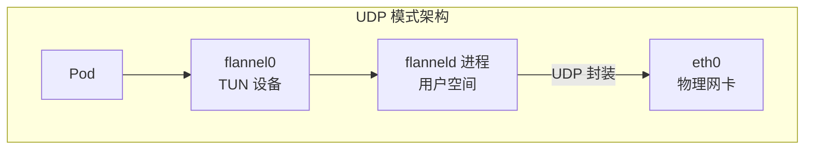

**UDP 模式核心特点**：

- 使用 TUN 设备连接内核与用户空间
- flanneld 进程在**用户空间**处理封装
- 通过 UDP 协议封装原始 IP 包
- 监听端口：**8285**

#### 46.2 同节点 Pod 通信

##### 46.2.1 通信架构

同节点 Pod 通信通过 **Linux Bridge** 实现 L2 交换。

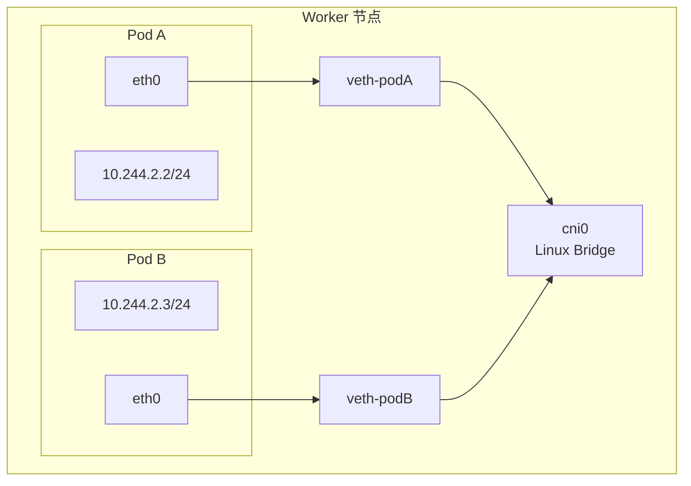

##### 46.2.2 通信原理

**路由表分析**（Pod 内部）：

```bash
# Pod 内查看路由
ip route

# 输出示例
10.244.2.0/24 dev eth0 scope link  # 同网段走 L2
default via 10.244.2.1 dev eth0     # 跨网段走网关
```

**关键点**：

| 特征 | 说明 |
|:---|:---|
| 掩码 | /24（同网段） |
| 网关 | 0.0.0.0（无网关） |
| 通信层次 | L2 交换 |
| 设备 | cni0 Bridge |

##### 46.2.3 Bridge MAC 地址学习

```bash
# 查看网卡所属 Bridge
ip -d link show veth-pod

# 输出示例
# veth-pod: ... master cni0 ...

# 查看 Bridge MAC 表
bridge fdb show dev cni0

# 输出示例
# 8e:b1:82:xx:xx:xx dev veth-podA master cni0
# 7a:c3:91:xx:xx:xx dev veth-podB master cni0
```

#### 46.3 跨节点 Pod 通信

##### 46.3.1 通信架构

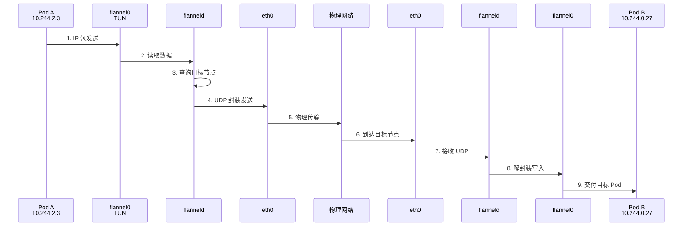

##### 46.3.2 路由表分析

```bash
# 宿主机路由表
ip route

# 输出示例
10.244.0.0/24 via 10.244.2.1 dev flannel0  # 目标网段走 flannel0
10.244.2.0/24 dev cni0 proto kernel        # 本地网段走 cni0
```

**路由匹配过程**：

1. 目标地址 `10.244.0.27`
2. 匹配路由 `10.244.0.0/24 via 10.244.2.1 dev flannel0`
3. 数据包发送到 `flannel0` TUN 设备

##### 46.3.3 TUN 设备与 flanneld

```bash
# 查看 flannel0 设备
ip -d link show flannel0

# 输出示例
# flannel0: <POINTOPOINT,MULTICAST,NOARP,UP,LOWER_UP>
#     link/none
#     tun type tun pi off

# 查看关联进程
ip -d tuntap show

# 输出示例
# flannel0: tun persist
#   Attached to processes: flanneld(1220)
```

##### 46.3.4 flanneld 工作原理

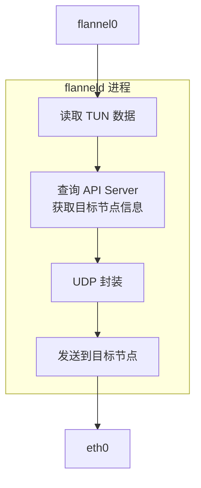

**flanneld 职责**：

| 职责 | 说明 |
|:---|:---|
| 监听 TUN | 从 flannel0 读取原始 IP 包 |
| 查询路由 | 从 API Server/etcd 获取 Pod 所在节点 |
| UDP 封装 | 将原始包封装为 UDP 数据 |
| 发送数据 | 通过 8285 端口发送到目标节点 |

#### 46.4 数据包封装分析

##### 46.4.1 封装结构

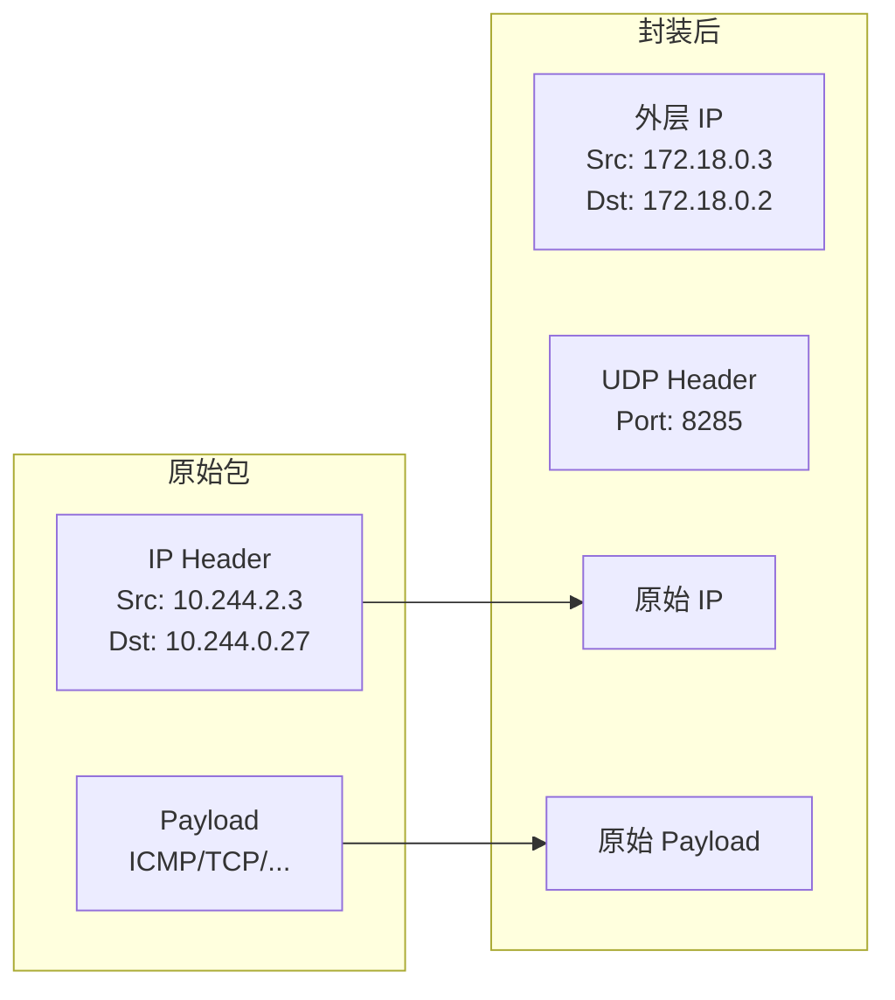

##### 46.4.2 封装字段详解

| 层次 | 字段 | 值 |
|:---|:---|:---|
| **外层 IP** | Src IP | 源节点物理 IP |
| | Dst IP | 目标节点物理 IP |
| **UDP** | Src Port | 随机高端口 |
| | Dst Port | 8285（flanneld） |
| **内层（原始）** | Src IP | 源 Pod IP |
| | Dst IP | 目标 Pod IP |
| | Payload | 原始数据 |

##### 46.4.3 抓包验证

```bash
# 在 flannel0 上抓包（裸 IP）
tcpdump -i flannel0 -nn

# 输出示例（raw IP，无 MAC）
# IP 10.244.2.3 > 10.244.0.27: ICMP echo request

# 在 eth0 上抓包（UDP 封装）
tcpdump -i eth0 -nn port 8285

# 输出示例
# IP 172.18.0.3.xxxxx > 172.18.0.2.8285: UDP, length xxx
```

**Wireshark 解码技巧**：

```
# 将 8285 端口的 UDP 数据解码为 IPv4
Analyze -> Decode As -> UDP port 8285 -> IPv4
```

#### 46.5 MTU 设置

##### 46.5.1 为什么 MTU 是 1472

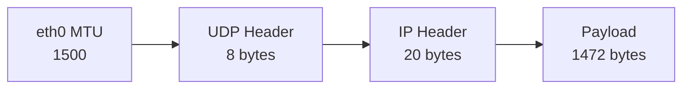

**MTU 计算**：

| 组成 | 大小 |
|:---|:---|
| 物理网卡 MTU | 1500 bytes |
| - 外层 IP Header | 20 bytes |
| - UDP Header | 8 bytes |
| = flannel0 MTU | **1472 bytes** |

> [!WARNING]
> **MTU 不匹配问题**
>
> 如果内层 MTU 设置过大，会导致：
>
> - 数据包分片
> - 传输效率降低
> - 可能出现通信失败

#### 46.6 UDP 模式配置

##### 46.6.1 ConfigMap 配置

```yaml
apiVersion: v1
kind: ConfigMap
metadata:
  name: kube-flannel-cfg
  namespace: kube-flannel
data:
  net-conf.json: |
    {
      "Network": "10.244.0.0/16",
      "Backend": {
        "Type": "udp"
      }
    }
```

##### 46.6.2 DaemonSet 配置（非特权模式）

```yaml
apiVersion: apps/v1
kind: DaemonSet
metadata:
  name: kube-flannel-ds
spec:
  template:
    spec:
      containers:
      - name: kube-flannel
        securityContext:
          privileged: false
          capabilities:
            add: ["NET_ADMIN", "NET_RAW"]
        volumeMounts:
        - name: dev-net-tun
          mountPath: /dev/net/tun
      volumes:
      - name: dev-net-tun
        hostPath:
          path: /dev/net/tun
```

> [!IMPORTANT]
> **非特权模式必须挂载 /dev/net/tun**
>
> 否则 flanneld 无法创建 flannel0 TUN 设备，Pod 会 CrashLoopBackOff

#### 46.7 UDP 模式 vs VxLAN 模式

##### 46.7.1 效率对比

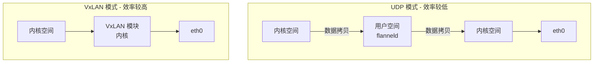

##### 46.7.2 对比表

| 特性 | UDP 模式 | VxLAN 模式 |
|:---|:---|:---|
| 封装位置 | 用户空间（flanneld） | 内核空间 |
| 数据拷贝 | 多次（内核↔用户） | 少（内核内） |
| 上下文切换 | 有 | 无 |
| 性能 | 较低 | 较高 |
| 调试难度 | 较易 | 较难 |
| 生产推荐 | ❌ | ✅ |

#### 46.8 章节小结

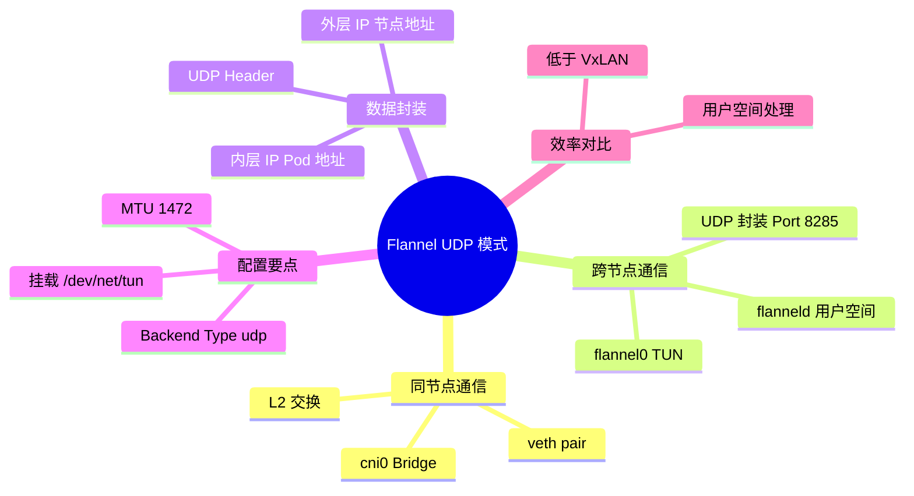

> [!TIP]
> **Flannel UDP 模式要点总结**：
>
> 1. **同节点通信**：
>    - 通过 `cni0` Linux Bridge 实现 L2 交换
>    - Pod 使用 /24 掩码，在同一网段
>    - 无需封装，直接二层转发
>
> 2. **跨节点通信**：
>    - 数据包发送到 `flannel0` TUN 设备
>    - flanneld 进程读取并 UDP 封装
>    - 通过 8285 端口发送到目标节点
>
> 3. **封装机制**：
>    - 外层：节点 IP + UDP 8285
>    - 内层：原始 Pod IP + 数据
>    - MTU 设置为 1472（1500-20-8）
>
> 4. **配置要点**：
>    - Backend Type 设置为 `udp`
>    - 非特权模式需挂载 `/dev/net/tun`
>    - 需要 `NET_ADMIN` 和 `NET_RAW` 权限
>
> 5. **生产建议**：
>    - UDP 模式效率低于 VxLAN
>    - 生产环境推荐使用 VxLAN 或 host-gw

---

### 第四十七章 Flannel-VxLAN 模式

本章深入讲解 Flannel 的 VxLAN 封装模式，包括配置方法、内核封装机制、ARP/FDB 表工作原理，以及 DirectRouting 优化模式。

#### 47.1 背景与概述

##### 47.1.1 VxLAN 模式定位

Flannel VxLAN 模式是**生产环境推荐**的后端类型：

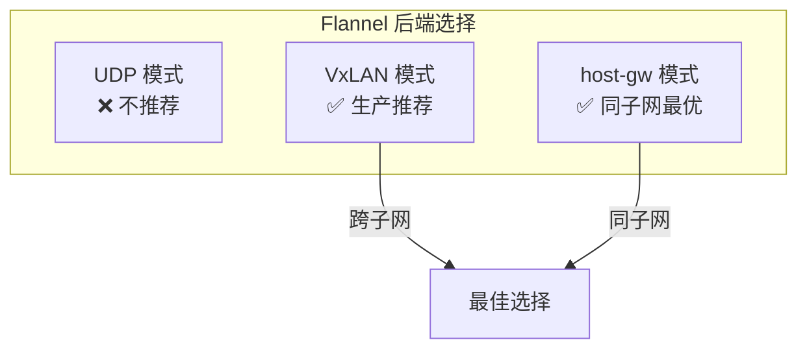

##### 47.1.2 与 Calico VxLAN 的关系

Flannel 官方明确表示 VxLAN 模式设计目标是支持从 Calico 迁移：

| 特性 | Flannel VxLAN | Calico VxLAN |
|:---|:---|:---|
| 封装机制 | 相同 | 相同 |
| FDB 表 | 相同 | 相同 |
| VNI | 1 | 4096 |
| 端口 | 8472 | 4789 |
| 网络策略 | 不支持 | 支持 |

> [!TIP]
> **生产建议**
>
> - 如需**网络策略**功能，使用 Calico
> - 如追求**简单稳定**，使用 Flannel
> - 可使用 **Flannel + Calico 组合**：Flannel 负责网络，Calico 负责策略

#### 47.2 VxLAN 配置

##### 47.2.1 ConfigMap 配置

```yaml
apiVersion: v1
kind: ConfigMap
metadata:
  name: kube-flannel-cfg
  namespace: kube-flannel
data:
  net-conf.json: |
    {
      "Network": "10.244.0.0/16",
      "Backend": {
        "Type": "vxlan"
      }
    }
```

##### 47.2.2 验证 VxLAN 设备

```bash
# 查看 flannel.1 VxLAN 设备
ip -d link show flannel.1

# 输出示例
# flannel.1: <BROADCAST,MULTICAST,UP,LOWER_UP>
#     link/ether 7c:a2:9a:xx:xx:xx brd ff:ff:ff:ff:ff:ff
#     vxlan id 1 local 172.18.0.2 dev eth0 srcport 0 0 dstport 8472 ...

# 查看 FDB 表
bridge fdb show dev flannel.1
```

#### 47.3 VxLAN 通信原理

##### 47.3.1 通信架构

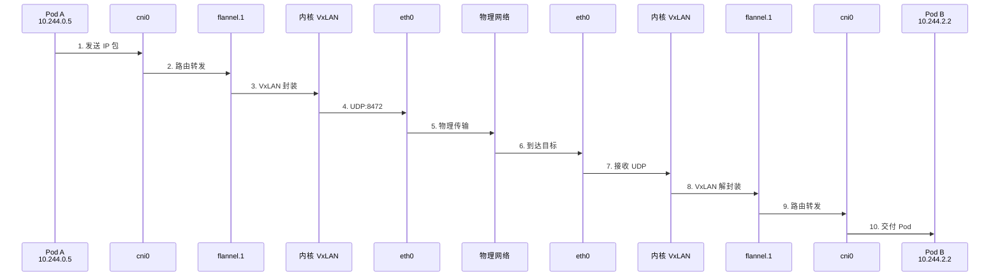

##### 47.3.2 路由表分析

```bash
# 宿主机路由表
ip route

# 输出示例
10.244.0.0/24 dev cni0 proto kernel scope link  # 本地网段
10.244.2.0/24 via 10.244.2.0 dev flannel.1      # 远端网段走 flannel.1
```

**路由决策过程**：

1. Pod 发送数据包到 `10.244.2.2`
2. 匹配路由 `10.244.2.0/24 via 10.244.2.0 dev flannel.1`
3. 下一跳 `10.244.2.0`，出接口 `flannel.1`

#### 47.4 ARP 与 FDB 表机制

##### 47.4.1 工作流程

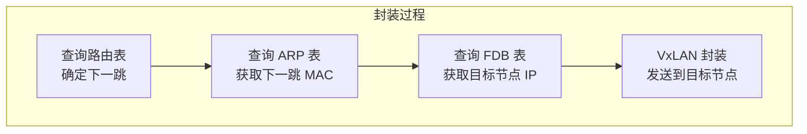

##### 47.4.2 ARP 表作用

```bash
# 查看 ARP 缓存
arp -n

# 或在 Pod 内查看
ip neigh

# 输出示例
10.244.2.0 dev flannel.1 lladdr 24:81:58:xx:xx:xx PERMANENT
```

**ARP 表功能**：

- 存储下一跳 IP 对应的 MAC 地址
- 用于封装内层以太网帧

##### 47.4.3 FDB 表作用

```bash
# 查看 FDB 表
bridge fdb show dev flannel.1

# 输出示例
24:81:58:xx:xx:xx dev flannel.1 dst 172.18.0.4 self permanent
```

**FDB 表功能**：

| 作用 | 说明 |
|:---|:---|
| MAC → Node IP | 将目标 MAC 映射到节点 IP |
| 确定封装目标 | 外层 IP 的目标地址 |
| 由 flanneld 维护 | 通过 API Server 同步 |

#### 47.5 内核空间封装优势

##### 47.5.1 VxLAN vs UDP 模式

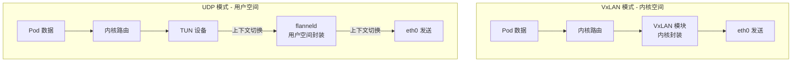

##### 47.5.2 性能对比

| 指标 | VxLAN 模式 | UDP 模式 |
|:---|:---|:---|
| 封装位置 | 内核空间 | 用户空间 |
| 上下文切换 | 无 | 有 |
| 数据拷贝 | 少 | 多 |
| CPU 开销 | 低 | 高 |
| 性能 | **高** | 低 |
| 端口 | 8472 | 8285 |

##### 47.5.3 识别内核进程

```bash
# 查看 8472 端口
netstat -anp | grep 8472

# 输出示例
udp        0      0 0.0.0.0:8472    0.0.0.0:*      -

# 注意: 进程名为 "-" 表示内核空间进程
# 用户空间进程会显示如: flanneld(1220)
```

#### 47.6 抓包分析

##### 47.6.1 抓包命令

```bash
# 在 eth0 上抓取 VxLAN 流量
tcpdump -i eth0 -nn port 8472 -w vxlan.pcap

# 测试跨节点通信
kubectl exec -it test-pod -- curl http://10.244.2.2:80
```

##### 47.6.2 Wireshark 解码

```
# 将 8472 端口解码为 VxLAN
Analyze -> Decode As -> UDP port 8472 -> VxLAN
```

##### 47.6.3 封装结构

```mermaid
graph LR
    subgraph "VxLAN 封装"
        L2_Out["外层 MAC"]
        IP_Out["外层 IP<br/>节点 IP"]
        UDP["UDP:8472"]
        VXLAN["VxLAN Header<br/>VNI=1"]
        L2_In["内层 MAC"]
        IP_In["内层 IP<br/>Pod IP"]
        Data["TCP/HTTP..."]
    end
    
    L2_Out --> IP_Out --> UDP --> VXLAN --> L2_In --> IP_In --> Data
```

#### 47.7 DirectRouting 模式

##### 47.7.1 概念说明

DirectRouting 是 VxLAN 模式的优化选项：

| 场景 | 通信方式 |
|:---|:---|
| 节点在**同一二层** | 直接路由（无封装） |
| 节点**跨二层** | VxLAN 封装 |

> [!NOTE]
> **与 Calico CrossSubnet 相同**
>
> DirectRouting 功能等同于 Calico 的 `ipipMode: CrossSubnet` 或 `vxlanMode: CrossSubnet`

##### 47.7.2 配置方法

```yaml
apiVersion: v1
kind: ConfigMap
metadata:
  name: kube-flannel-cfg
  namespace: kube-flannel
data:
  net-conf.json: |
    {
      "Network": "10.244.0.0/16",
      "Backend": {
        "Type": "vxlan",
        "DirectRouting": true
      }
    }
```

##### 47.7.3 路由表变化

```bash
# 启用 DirectRouting 后的路由表
ip route

# 同二层节点 - 直接路由
10.244.1.0/24 via 10.1.5.11 dev eth0   # 下一跳是节点 IP

# 跨二层节点 - VxLAN 封装
10.244.2.0/24 via 10.244.2.0 dev flannel.1  # 走 flannel.1
```

##### 47.7.4 拓扑示例

```mermaid
graph TB
    subgraph "二层域 A (10.1.5.0/24)"
        N1["Node1<br/>10.1.5.10"]
        N2["Node2<br/>10.1.5.11"]
    end
    
    subgraph "二层域 B (10.1.8.0/24)"
        N3["Node3<br/>10.1.8.10"]
        N4["Node4<br/>10.1.8.11"]
    end
    
    GW["网关/路由器"]
    
    N1 <-->|"直接路由"| N2
    N3 <-->|"直接路由"| N4
    N1 <-->|"VxLAN"| GW
    GW <-->|"VxLAN"| N3
```

##### 47.7.5 抓包验证

```bash
# 同二层通信 - 抓 eth0
tcpdump -i eth0 host 10.244.1.2 -w direct.pcap
# 结果: 无 VxLAN 封装，直接 IP 路由

# 跨二层通信 - 抓 flannel.1 或 eth0
tcpdump -i eth0 port 8472 -w vxlan.pcap
# 结果: VxLAN 封装
```

#### 47.8 VxLAN MTU 设置

##### 47.8.1 MTU 计算

```mermaid
graph LR
    ETH["eth0 MTU<br/>1500"] --> VXLAN["VxLAN Header<br/>50 bytes"]
    VXLAN --> Payload["flannel.1 MTU<br/>1450 bytes"]
```

| 组成 | 大小 |
|:---|:---|
| 物理网卡 MTU | 1500 bytes |
| - 外层 IP Header | 20 bytes |
| - UDP Header | 8 bytes |
| - VxLAN Header | 8 bytes |
| - 外层 MAC | 14 bytes |
| = flannel.1 MTU | **1450 bytes** |

#### 47.9 章节小结

```mermaid
mindmap
  root((Flannel VxLAN 模式))
    配置
      Backend Type vxlan
      DirectRouting true
    设备
      flannel.1 VxLAN
      端口 8472
      VNI 1
    机制
      ARP 表
      FDB 表
      内核封装
    DirectRouting
      同二层走路由
      跨二层走VxLAN
    优势
      内核空间处理
      无上下文切换
      生产推荐
```

> [!TIP]
> **Flannel VxLAN 模式要点总结**：
>
> 1. **配置方式**：
>    - `Backend.Type: "vxlan"`
>    - 可选 `DirectRouting: true` 优化同二层通信
>
> 2. **核心机制**：
>    - **ARP 表**：下一跳 IP → MAC 地址
>    - **FDB 表**：MAC 地址 → 目标节点 IP
>    - **内核封装**：UDP 8472 端口
>
> 3. **与 UDP 模式对比**：
>    - VxLAN 在内核空间封装，效率更高
>    - 无上下文切换，无多次数据拷贝
>    - 端口 8472（vs UDP 的 8285）
>
> 4. **DirectRouting 模式**：
>    - 同二层节点：直接路由，不封装
>    - 跨二层节点：VxLAN 封装
>    - 等同于 Calico CrossSubnet
>
> 5. **生产建议**：
>    - VxLAN 是 Flannel 生产推荐模式
>    - 如需网络策略，可结合 Calico 使用

---

### 第四十八章 Flannel-IPIP 模式

本章深入讲解 Flannel 的 IPIP 封装模式，包括配置方法、裸 IP 设备特性、NOARP 标志原理，以及 DirectRouting 优化模式。

#### 48.1 背景与概述

##### 48.1.1 IPIP 模式定位

IPIP（IP-in-IP）是一种轻量级的隧道封装方式：

```mermaid
graph TB
    subgraph "封装方式对比"
        VxLAN["VxLAN<br/>UDP + VxLAN Header<br/>50 bytes 开销"]
        IPIP["IPIP<br/>IP Header<br/>20 bytes 开销"]
        HostGW["host-gw<br/>无封装<br/>0 bytes 开销"]
    end
    
    VxLAN -->|"跨子网"| Use["适用场景"]
    IPIP -->|"跨子网"| Use
    HostGW -->|"同子网"| Use
```

##### 48.1.2 与 Calico IPIP 的关系

| 特性 | Flannel IPIP | Calico IPIP |
|:---|:---|:---|
| 封装机制 | IP-in-IP | IP-in-IP |
| 默认模式 | 需手动配置 | 默认开启 |
| BGP 路由 | 不支持 | 支持 |
| 网络策略 | 不支持 | 支持 |

> [!NOTE]
> **Flannel vs Calico IPIP**
>
> - Calico IPIP 模式结合了 BGP 路由宣告
> - Flannel IPIP 仅做封装，路由由 flanneld 静态维护

#### 48.2 IPIP 配置

##### 48.2.1 ConfigMap 配置

```yaml
apiVersion: v1
kind: ConfigMap
metadata:
  name: kube-flannel-cfg
  namespace: kube-flannel
data:
  net-conf.json: |
    {
      "Network": "10.244.0.0/16",
      "Backend": {
        "Type": "ipip"
      }
    }
```

##### 48.2.2 验证 IPIP 设备

```bash
# 查看 flannel.ipip 设备
ip -d link show flannel.ipip

# 输出示例
# flannel.ipip: <POINTOPOINT,NOARP,UP,LOWER_UP>
#     link/ipip 172.18.0.3 brd 0.0.0.0
#     ipip remote any local 172.18.0.3 ...

# 查看路由表
ip route | grep flannel.ipip
# 10.244.1.0/24 via 172.18.0.4 dev flannel.ipip
```

#### 48.3 IPIP 通信原理

##### 48.3.1 通信架构

```mermaid
sequenceDiagram
    participant PodA as Pod A<br/>10.244.0.5
    participant CNI as cni0
    participant IPIP as flannel.ipip
    participant Kernel as 内核 IPIP
    participant ETH as eth0
    participant Net as 物理网络
    participant ETH2 as eth0
    participant Kernel2 as 内核 IPIP
    participant IPIP2 as flannel.ipip
    participant CNI2 as cni0
    participant PodB as Pod B<br/>10.244.1.2
    
    PodA->>CNI: 1. 发送 IP 包
    CNI->>IPIP: 2. 路由转发
    IPIP->>Kernel: 3. IPIP 封装
    Kernel->>ETH: 4. 外层 IP
    ETH->>Net: 5. 物理传输
    Net->>ETH2: 6. 到达目标
    ETH2->>Kernel2: 7. 接收
    Kernel2->>IPIP2: 8. IPIP 解封装
    IPIP2->>CNI2: 9. 路由转发
    CNI2->>PodB: 10. 交付 Pod
```

##### 48.3.2 路由表分析

```bash
# 宿主机路由表
ip route

# 输出示例
10.244.0.0/24 dev cni0 proto kernel scope link      # 本地网段
10.244.1.0/24 via 172.18.0.4 dev flannel.ipip       # 远端走 IPIP
```

**路由决策过程**：

1. Pod 发送数据包到 `10.244.1.2`
2. 匹配路由 `10.244.1.0/24 via 172.18.0.4 dev flannel.ipip`
3. 下一跳 `172.18.0.4`（目标节点），出接口 `flannel.ipip`

#### 48.4 裸 IP 设备特性

##### 48.4.1 Raw 设备说明

flannel.ipip 是一个 **裸 IP（Raw IP）** 设备：

```mermaid
graph LR
    subgraph "普通以太网设备"
        E1["MAC Header"]
        E2["IP Header"]
        E3["Payload"]
    end
    
    subgraph "Raw IP 设备"
        R1["IP Header"]
        R2["Payload"]
    end
    
    E1 --> E2 --> E3
    R1 --> R2
```

**特点**：

| 特性 | 普通网卡 (eth0) | Raw 设备 (flannel.ipip) |
|:---|:---|:---|
| MAC 层 | 有 | 无 |
| 抓包显示 | 有 MAC 地址 | 无 MAC 地址 |
| tcpdump 类型 | LINUX_SLL | Raw |

##### 48.4.2 抓包验证

```bash
# 在 flannel.ipip 上抓包 - 无 MAC 层
tcpdump -i flannel.ipip -nn

# 输出示例 - 只有 IP 信息，无 MAC
# IP 10.244.0.5 > 10.244.1.2: ICMP echo request

# 在 eth0 上抓包 - 有完整 MAC 层
tcpdump -i eth0 -nn ip proto 4

# 输出示例 - IPIP 封装
# IP 172.18.0.3 > 172.18.0.4: IP 10.244.0.5 > 10.244.1.2 ...
```

#### 48.5 NOARP 标志详解

##### 48.5.1 标志含义

```bash
# 查看设备标志
ip link show flannel.ipip

# 输出示例
# flannel.ipip: <POINTOPOINT,NOARP,UP,LOWER_UP>
```

| 标志 | 含义 |
|:---|:---|
| POINTOPOINT | 点对点设备 |
| **NOARP** | 禁用 ARP 协议 |
| UP | 设备启用 |
| LOWER_UP | 底层链路可用 |

##### 48.5.2 为什么禁用 ARP

```mermaid
flowchart TB
    subgraph "ARP 功能"
        ARP["ARP 协议<br/>解析 IP → MAC"]
        GARP["GARP 消息<br/>地址冲突检测"]
    end
    
    subgraph "NOARP 原因"
        R1["裸 IP 设备无 MAC 层"]
        R2["避免地址冲突告警"]
        R3["隧道封装不需要 MAC"]
    end
    
    ARP --> R1
    GARP --> R2
```

**禁用 ARP 的场景**：

1. **裸 IP 设备**：flannel.ipip 没有 MAC 层，ARP 无意义
2. **避免 GARP 冲突**：多节点配置相同隧道网段时，避免 GARP 告警
3. **隧道封装**：IPIP/GRE 隧道直接使用 IP 封装，不需要 MAC 解析

> [!TIP]
> **NOARP 实际应用**
>
> 在 FE/BE（前端/后端）负载均衡架构中，BE 节点可能需要配置与 VIP 相同的地址用于响应。
> 此时需要设置 NOARP 避免 GARP 冲突告警。

#### 48.6 封装结构对比

##### 48.6.1 IPIP vs VxLAN

```mermaid
graph LR
    subgraph "IPIP 封装"
        I1["外层 IP<br/>20 bytes"]
        I2["内层 IP<br/>Pod 地址"]
        I3["Payload"]
    end
    
    subgraph "VxLAN 封装"
        V1["外层 MAC<br/>14 bytes"]
        V2["外层 IP<br/>20 bytes"]
        V3["UDP<br/>8 bytes"]
        V4["VxLAN<br/>8 bytes"]
        V5["内层 MAC<br/>14 bytes"]
        V6["内层 IP"]
        V7["Payload"]
    end
    
    I1 --> I2 --> I3
    V1 --> V2 --> V3 --> V4 --> V5 --> V6 --> V7
```

##### 48.6.2 开销对比

| 封装方式 | 额外开销 | MTU (1500基础) |
|:---|:---|:---|
| IPIP | 20 bytes | 1480 |
| VxLAN | 50 bytes | 1450 |
| host-gw | 0 bytes | 1500 |

#### 48.7 DirectRouting 模式

##### 48.7.1 配置方法

```yaml
apiVersion: v1
kind: ConfigMap
metadata:
  name: kube-flannel-cfg
  namespace: kube-flannel
data:
  net-conf.json: |
    {
      "Network": "10.244.0.0/16",
      "Backend": {
        "Type": "ipip",
        "DirectRouting": true
      }
    }
```

##### 48.7.2 工作原理

```mermaid
graph TB
    subgraph "节点 A (10.1.5.10)"
        PodA["Pod A"]
    end
    
    subgraph "节点 B (10.1.5.11) - 同二层"
        PodB["Pod B"]
    end
    
    subgraph "节点 C (10.1.8.10) - 跨二层"
        PodC["Pod C"]
    end
    
    PodA -->|"直接路由<br/>无封装"| PodB
    PodA -->|"IPIP 封装"| PodC
```

##### 48.7.3 路由表变化

```bash
# 启用 DirectRouting 后的路由表
ip route

# 同二层节点 - 直接路由
10.244.1.0/24 via 10.1.5.11 dev eth0    # 下一跳是节点 IP，走 eth0

# 跨二层节点 - IPIP 封装
10.244.2.0/24 via 10.1.8.10 dev flannel.ipip  # 走 flannel.ipip
```

##### 48.7.4 抓包验证

```bash
# 同二层通信 - 抓 eth0，port 80
tcpdump -i eth0 port 80 -nn -w direct.pcap
# 结果: 普通 TCP 包，无 IPIP 封装

# 跨二层通信 - 抓 IPIP 协议
tcpdump -i eth0 -nn ip proto 4 -w ipip.pcap
# 结果: IPIP 封装包
```

#### 48.8 抓包分析技巧

##### 48.8.1 IPIP 协议过滤

```bash
# IPIP 协议号为 4
tcpdump -i eth0 -nn ip proto 4

# 或使用协议名
tcpdump -i eth0 -nn ipip
```

##### 48.8.2 查看 HTTP 内容

```bash
# 使用 -X 或 -A 查看内容
tcpdump -i eth0 -nn -A port 80

# 输出示例
# GET / HTTP/1.1
# Host: 10.244.1.2
# ...
# HTTP/1.1 200 OK
# flannel-pod-name: xxx
```

#### 48.9 章节小结

```mermaid
mindmap
  root((Flannel IPIP 模式))
    配置
      Backend Type ipip
      DirectRouting true
    设备
      flannel.ipip
      Raw IP 裸设备
      NOARP 标志
    封装
      20 bytes 开销
      MTU 1480
      轻量高效
    DirectRouting
      同二层走路由
      跨二层走IPIP
    与VxLAN对比
      开销更小
      无MAC层
      内核封装
```

> [!TIP]
> **Flannel IPIP 模式要点总结**：
>
> 1. **配置方式**：
>    - `Backend.Type: "ipip"`
>    - 可选 `DirectRouting: true` 优化同二层通信
>
> 2. **设备特性**：
>    - `flannel.ipip` 是 Raw IP 裸设备
>    - 无 MAC 层，抓包只有 IP 信息
>    - NOARP 标志禁用 ARP 协议
>
> 3. **封装开销**：
>    - 仅 20 bytes（外层 IP Header）
>    - 比 VxLAN 少 30 bytes
>    - MTU = 1500 - 20 = 1480
>
> 4. **DirectRouting 模式**：
>    - 同二层节点：直接路由，走 eth0
>    - 跨二层节点：IPIP 封装，走 flannel.ipip
>    - 等同于 Calico CrossSubnet
>
> 5. **抓包技巧**：
>    - IPIP 协议：`tcpdump ip proto 4`
>    - flannel.ipip 上只能看到裸 IP，无 MAC

---

### 第四十九章 Flannel-HostGW 模式

本章深入讲解 Flannel 的 Host-Gateway 模式，包括配置方法、纯路由通信原理、MAC 地址变化规律，以及为什么只能在同二层网络中使用。

#### 49.1 背景与概述

##### 49.1.1 HostGW 模式定位

Host-Gateway 是 Flannel 中**性能最高**的后端类型：

```mermaid
graph TB
    subgraph "Flannel 后端性能对比"
        UDP["UDP 模式<br/>❌ 性能最低"]
        VxLAN["VxLAN 模式<br/>⭐ 中等"]
        IPIP["IPIP 模式<br/>⭐⭐ 较高"]
        HostGW["host-gw 模式<br/>⭐⭐⭐ 最高"]
    end
    
    UDP -->|"封装开销大"| Low["低效"]
    VxLAN -->|"50 bytes 开销"| Mid["中等"]
    IPIP -->|"20 bytes 开销"| High["较高"]
    HostGW -->|"无封装"| Best["最优"]
```

##### 49.1.2 核心特点

| 特性 | 说明 |
|:---|:---|
| 封装方式 | **无封装** |
| MTU | **1500**（无损耗） |
| 通信方式 | 纯三层路由 |
| 适用场景 | **同二层网络** |
| 性能 | **最高** |

#### 49.2 HostGW 配置

##### 49.2.1 ConfigMap 配置

```yaml
apiVersion: v1
kind: ConfigMap
metadata:
  name: kube-flannel-cfg
  namespace: kube-flannel
data:
  net-conf.json: |
    {
      "Network": "10.244.0.0/16",
      "Backend": {
        "Type": "host-gw"
      }
    }
```

##### 49.2.2 路由表验证

```bash
# 查看宿主机路由表
ip route

# 输出示例
10.244.0.0/24 dev cni0 proto kernel scope link           # 本地网段
10.244.1.0/24 via 172.18.0.4 dev eth0                    # 远端走物理网卡
10.244.2.0/24 via 172.18.0.5 dev eth0                    # 远端走物理网卡
```

**关键观察**：

- 远端网段的出接口是 `eth0`（物理网卡）
- 下一跳是**目标节点的物理 IP**
- 没有 `flannel.1`、`flannel.ipip` 等隧道设备

#### 49.3 HostGW 通信原理

##### 49.3.1 通信架构

```mermaid
sequenceDiagram
    participant PodA as Pod A<br/>10.244.0.5
    participant CNI as cni0
    participant Host1 as 宿主机 1<br/>172.18.0.3
    participant Net as 物理网络<br/>二层交换
    participant Host2 as 宿主机 2<br/>172.18.0.4
    participant CNI2 as cni0
    participant PodB as Pod B<br/>10.244.1.2
    
    PodA->>CNI: 1. 发送 IP 包
    CNI->>Host1: 2. 查路由表
    Host1->>Net: 3. 直接转发<br/>无封装
    Net->>Host2: 4. 二层交换
    Host2->>CNI2: 5. 查路由表
    CNI2->>PodB: 6. 交付 Pod
```

##### 49.3.2 路由核心原则

> [!IMPORTANT]
> **纯路由转发的黄金法则**
>
> 在没有 NAT 和 Overlay 封装的路由网络中：
>
> - **IP 地址不变**：源 IP 和目标 IP 全程不变
> - **MAC 地址变化**：每经过一跳，MAC 地址都会改变

##### 49.3.3 数据包变化过程

```mermaid
graph TB
    subgraph "第一跳：Pod → 宿主机"
        P1["Src IP: 10.244.0.5"]
        P2["Dst IP: 10.244.1.2"]
        P3["Src MAC: Pod eth0"]
        P4["Dst MAC: cni0 网关"]
    end
    
    subgraph "第二跳：宿主机 → 目标宿主机"
        Q1["Src IP: 10.244.0.5"]
        Q2["Dst IP: 10.244.1.2"]
        Q3["Src MAC: eth0"]
        Q4["Dst MAC: 目标节点 eth0"]
    end
    
    P1 --> Q1
    P2 --> Q2
```

**变化规律**：

| 字段 | 变化情况 |
|:---|:---|
| 源 IP | ❌ 不变 |
| 目标 IP | ❌ 不变 |
| 源 MAC | ✅ 变为出接口 MAC |
| 目标 MAC | ✅ 变为下一跳 MAC |

#### 49.4 为什么只能在同二层使用

##### 49.4.1 同二层场景

```mermaid
graph TB
    subgraph "同二层网络 - ✅ 可用 host-gw"
        N1["Node1<br/>172.18.0.3"]
        N2["Node2<br/>172.18.0.4"]
        SW["二层交换机"]
    end
    
    N1 <-->|"直接可达"| SW
    SW <-->|"直接可达"| N2
```

**同二层时**：

- 节点之间可以直接通过 MAC 地址转发
- 只需要配置静态路由，无需封装
- 每个节点都知道如何到达其他节点

##### 49.4.2 跨二层场景

```mermaid
graph TB
    subgraph "域 A"
        N1["Node1<br/>172.18.0.3"]
    end
    
    subgraph "路由器"
        R1["Router A"]
        R2["Router B"]
    end
    
    subgraph "域 B"
        N2["Node2<br/>10.1.8.10"]
    end
    
    N1 --> R1
    R1 --> R2
    R2 --> N2
```

**跨二层时的问题**：

| 问题 | 说明 |
|:---|:---|
| 路由器不知道 Pod 网段 | 中间路由器没有 `10.244.x.0/24` 的路由 |
| 无法转发 | 数据包到达路由器后会被丢弃或走默认路由 |
| 需要动态路由协议 | 必须使用 BGP 等协议宣告 Pod 网段 |

> [!CAUTION]
> **host-gw 限制**
>
> 如果节点不在同一二层网络，host-gw 模式**不能工作**！
>
> 跨二层场景请使用：
>
> - VxLAN 模式（推荐）
> - IPIP 模式
> - VxLAN/IPIP + DirectRouting 混合模式

#### 49.5 抓包分析

##### 49.5.1 抓包验证

```bash
# 在 eth0 上抓包
tcpdump -i eth0 -nn port 80

# 输出示例 - 无封装，直接是原始 IP 包
# 10.244.0.5.xxxxx > 10.244.1.2.80: Flags [S], ...
# 10.244.1.2.80 > 10.244.0.5.xxxxx: Flags [S.], ...
```

##### 49.5.2 包结构对比

```mermaid
graph LR
    subgraph "host-gw 模式"
        H1["MAC Header"]
        H2["IP Header<br/>Pod IP"]
        H3["TCP/Payload"]
    end
    
    subgraph "VxLAN 模式"
        V1["外层 MAC"]
        V2["外层 IP"]
        V3["UDP + VxLAN"]
        V4["内层 MAC"]
        V5["内层 IP"]
        V6["TCP/Payload"]
    end
    
    H1 --> H2 --> H3
    V1 --> V2 --> V3 --> V4 --> V5 --> V6
```

#### 49.6 性能对比

##### 49.6.1 各模式对比

| 模式 | 封装开销 | MTU | 性能 | 适用场景 |
|:---|:---|:---|:---|:---|
| host-gw | 0 bytes | 1500 | ⭐⭐⭐ | 同二层 |
| IPIP | 20 bytes | 1480 | ⭐⭐ | 跨二层 |
| VxLAN | 50 bytes | 1450 | ⭐ | 跨二层 |
| UDP | 28 bytes | 1472 | ❌ | 不推荐 |

##### 49.6.2 性能优势原因

```mermaid
flowchart LR
    subgraph "host-gw 优势"
        A["无封装"] --> B["无额外 Header"]
        B --> C["MTU 无损耗"]
        C --> D["CPU 开销最小"]
        D --> E["延迟最低"]
    end
```

#### 49.7 与 Calico 对比

| 特性 | Flannel host-gw | Calico (无封装) |
|:---|:---|:---|
| 路由方式 | 静态路由 | BGP 动态路由 |
| 跨子网支持 | ❌ 不支持 | ✅ 支持 |
| 网络策略 | ❌ 不支持 | ✅ 支持 |
| 复杂度 | 简单 | 较复杂 |

> [!TIP]
> **选择建议**
>
> - 如果节点在同二层且不需要网络策略：**Flannel host-gw**
> - 如果需要跨子网或网络策略：**Calico**

#### 49.8 章节小结

```mermaid
mindmap
  root((Flannel host-gw 模式))
    配置
      Backend Type host-gw
      无封装
    原理
      纯路由转发
      IP 不变 MAC 变
      下一跳是节点 IP
    限制
      只能同二层
      跨二层需封装
    优势
      MTU 1500
      零封装开销
      性能最高
    对比
      VxLAN 跨子网
      IPIP 轻量封装
      Calico BGP
```

> [!TIP]
> **Flannel host-gw 模式要点总结**：
>
> 1. **配置方式**：
>    - `Backend.Type: "host-gw"`
>    - 路由表直接指向目标节点 IP
>
> 2. **核心原理**：
>    - **无封装**：直接三层路由转发
>    - **IP 不变 MAC 变**：每跳 MAC 地址更新
>    - 出接口是物理网卡 `eth0`
>
> 3. **使用限制**：
>    - **只能在同二层网络使用**
>    - 跨二层需要封装（VxLAN/IPIP）
>    - 或使用 BGP 宣告路由（Calico）
>
> 4. **性能优势**：
>    - MTU 1500，无损耗
>    - 零封装开销
>    - CPU 开销最小
>
> 5. **适用场景**：
>    - 所有节点在同一二层网络
>    - 追求最高网络性能
>    - 不需要跨子网通信

---

### 第五十章 Flannel-IPsec 模式

本章深入讲解 Flannel 的 IPsec 模式，包括预共享密钥（PSK）配置、ESP 封装原理、xfrm 状态与策略、Wireshark 解密技巧，以及与其他模式的对比。

#### 50.1 背景与概述

##### 50.1.1 IPsec 模式定位

IPsec（IP Security）是 Flannel 中提供**加密传输**的后端类型：

```mermaid
graph TB
    subgraph "Flannel 后端功能对比"
        UDP["UDP 模式<br/>🔓 不加密"]
        VxLAN["VxLAN 模式<br/>🔓 不加密"]
        IPIP["IPIP 模式<br/>🔓 不加密"]
        HostGW["host-gw 模式<br/>🔓 不加密"]
        IPsec["IPsec 模式<br/>🔐 加密"]
        WireGuard["WireGuard 模式<br/>🔐 加密"]
    end
    
    IPsec -->|"ESP 封装+加密"| Secure["安全传输"]
    WireGuard -->|"现代加密"| Secure
```

##### 50.1.2 核心特点

| 特性 | 说明 |
|:---|:---|
| 加密协议 | ESP（Encapsulating Security Payload） |
| 密钥类型 | PSK（Pre-Shared Key） |
| 封装模式 | **Tunnel Mode** |
| 适用场景 | 跨不可信网络的安全通信 |
| 性能开销 | 加解密消耗 CPU |

#### 50.2 IPsec 配置

##### 50.2.1 生成 PSK

```bash
# 生成 96 位（12 字节）预共享密钥
dd if=/dev/urandom bs=12 count=1 2>/dev/null | base64
# 输出示例：iVzSdJHgXWNqpuJE
```

##### 50.2.2 ConfigMap 配置

```yaml
apiVersion: v1
kind: ConfigMap
metadata:
  name: kube-flannel-cfg
  namespace: kube-flannel
data:
  net-conf.json: |
    {
      "Network": "10.244.0.0/16",
      "Backend": {
        "Type": "ipsec",
        "PSK": "iVzSdJHgXWNqpuJE"
      }
    }
```

> [!IMPORTANT]
> **PSK 配置要点**
>
> - PSK 是**必选参数**，至少 96 位（12 字节 Base64）
> - 所有节点必须使用相同的 PSK
> - 生产环境建议使用更长的密钥

#### 50.3 IPsec 工作原理

##### 50.3.1 IPsec Tunnel 模式架构

```mermaid
sequenceDiagram
    participant PodA as Pod A<br/>10.244.0.5
    participant Kernel1 as Node1 内核<br/>ESP 封装
    participant Network as 物理网络<br/>加密传输
    participant Kernel2 as Node2 内核<br/>ESP 解封
    participant PodB as Pod B<br/>10.244.1.2
    
    PodA->>Kernel1: 1. 原始 IP 包
    Kernel1->>Kernel1: 2. xfrm policy 匹配
    Kernel1->>Kernel1: 3. ESP 加密+封装
    Kernel1->>Network: 4. 加密数据包
    Network->>Kernel2: 5. 传输
    Kernel2->>Kernel2: 6. ESP 解密+解封
    Kernel2->>PodB: 7. 原始 IP 包
```

##### 50.3.2 ESP 包结构

```mermaid
graph LR
    subgraph "IPsec ESP Tunnel 模式"
        A["外层 MAC<br/>节点 MAC"]
        B["外层 IP<br/>节点 IP"]
        C["ESP Header<br/>SPI + 序列号"]
        D["加密载荷<br/>内层 IP + 数据"]
        E["ESP Trailer<br/>填充 + 认证"]
    end
    
    A --> B --> C --> D --> E
```

**关键特点**：

- **内层无 MAC**：IPsec 是三层协议，封装时不包含内层 MAC
- **整体加密**：内层 IP 包被完全加密
- **完整性校验**：ESP 提供认证功能

#### 50.4 xfrm 状态与策略

##### 50.4.1 查看 xfrm 状态

```bash
# 查看 IPsec SA（Security Association）
ip xfrm state

# 输出示例
src 172.18.0.3 dst 172.18.0.4
    proto esp spi 0x0000a1b2 reqid 1 mode tunnel
    replay-window 0 
    auth-trunc hmac(sha256) 0x... 128
    enc cbc(aes) 0x...
```

##### 50.4.2 查看 xfrm 策略

```bash
# 查看 IPsec 策略
ip xfrm policy

# 输出示例
src 10.244.0.0/24 dst 10.244.1.0/24 
    dir out priority 100
    tmpl src 172.18.0.3 dst 172.18.0.4
        proto esp reqid 1 mode tunnel
```

##### 50.4.3 xfrm 工作流程

```mermaid
flowchart TB
    A["数据包到达内核"] --> B{"匹配 xfrm policy?"}
    B -->|"是"| C["查找对应 xfrm state"]
    B -->|"否"| D["普通路由转发"]
    C --> E["获取加密算法和密钥"]
    E --> F["ESP 封装+加密"]
    F --> G["添加外层 IP"]
    G --> H["发送到物理网络"]
```

> [!TIP]
> **IPsec 不依赖路由表**
>
> 与 host-gw 不同，IPsec Tunnel 模式通过 `xfrm policy` 决定转发，不需要在路由表中配置到远端 Pod 网段的路由。

#### 50.5 抓包与解密

##### 50.5.1 抓取 ESP 包

```bash
# 在 eth0 上抓取 ESP 协议包
tcpdump -i eth0 -nn esp -w ipsec.pcap
```

##### 50.5.2 Wireshark 解密配置

```mermaid
flowchart LR
    A["打开 Wireshark"] --> B["Edit → Preferences"]
    B --> C["Protocols → ESP"]
    C --> D["添加 SA"]
    D --> E["填写 SPI/算法/密钥"]
    E --> F["解密成功"]
```

**解密步骤**：

1. 从 `ip xfrm state` 获取 SPI、算法、密钥
2. 在 Wireshark 中：`Edit → Preferences → Protocols → ESP`
3. 添加 SA 条目：
   - Source/Destination IP
   - SPI 值
   - 加密算法（如 AES-GCM-128）
   - 密钥

#### 50.6 与其他模式对比

##### 50.6.1 封装方式对比

| 模式 | 封装 | 加密 | MTU | CPU 开销 |
|:---|:---|:---|:---|:---|
| host-gw | 无 | ❌ | 1500 | 最低 |
| IPIP | IP-in-IP | ❌ | 1480 | 低 |
| VxLAN | UDP+VxLAN | ❌ | 1450 | 中 |
| **IPsec** | **ESP+Tunnel** | **✅** | **~1400** | **高** |
| WireGuard | UDP | ✅ | ~1420 | 中 |

##### 50.6.2 IPsec vs WireGuard

```mermaid
graph TB
    subgraph "IPsec"
        I1["复杂配置"]
        I2["成熟稳定"]
        I3["多种算法"]
        I4["较高 CPU"]
    end
    
    subgraph "WireGuard"
        W1["简单配置"]
        W2["现代设计"]
        W3["固定算法"]
        W4["较低 CPU"]
    end
    
    I1 -.->|"对比"| W1
    I4 -.->|"对比"| W4
```

| 特性 | IPsec | WireGuard |
|:---|:---|:---|
| 复杂度 | 高 | 低 |
| 密钥管理 | PSK/证书 | 公钥 |
| 性能 | 中等 | 较高 |
| 内核集成 | 传统 | Linux 5.6+ 原生 |

#### 50.7 生产注意事项

> [!CAUTION]
> **IPsec 生产使用注意**
>
> 1. **性能开销**：每个数据包都需要加解密，高流量场景下 CPU 消耗显著
> 2. **MTU 调整**：ESP 封装会减少可用 MTU，注意调整应用配置
> 3. **密钥安全**：PSK 需要安全分发和存储
> 4. **调试复杂**：加密后的数据包难以直接分析

#### 50.8 章节小结

```mermaid
mindmap
  root((Flannel IPsec 模式))
    配置
      Type ipsec
      PSK 预共享密钥
    原理
      Tunnel 模式
      ESP 封装+加密
      xfrm state/policy
    特点
      三层协议
      内层无 MAC
      不依赖路由表
    解密
      ip xfrm state
      Wireshark ESP
    对比
      比 WireGuard 复杂
      CPU 开销高
      成熟稳定
```

> [!TIP]
> **Flannel IPsec 模式要点总结**：
>
> 1. **配置方式**：
>    - `Backend.Type: "ipsec"`
>    - PSK 是必选参数（至少 96 位）
>
> 2. **核心原理**：
>    - 使用 **ESP Tunnel 模式**封装和加密
>    - 通过 **xfrm policy** 决定转发（不依赖路由表）
>    - 三层协议，封装时不包含内层 MAC
>
> 3. **xfrm 命令**：
>    - `ip xfrm state`：查看 SA（密钥、算法）
>    - `ip xfrm policy`：查看转发策略
>
> 4. **抓包解密**：
>    - 抓包：`tcpdump esp`
>    - Wireshark 需配置 ESP SA 才能解密
>
> 5. **适用场景**：
>    - 跨不可信网络的安全通信
>    - 对数据传输有加密要求的场景

---

### 第五十一章 Flannel-WireGuard 模式

本章深入讲解 Flannel 的 WireGuard 模式，包括配置方法、公钥/私钥加密机制、flannel-wg 设备原理、peer 概念，以及与 IPsec 的对比。

#### 51.1 背景与概述

##### 51.1.1 WireGuard 模式定位

WireGuard 是 Flannel 中提供**现代加密传输**的后端类型：

```mermaid
graph TB
    subgraph "加密后端对比"
        IPsec["IPsec 模式<br/>🔐 传统加密<br/>复杂配置"]
        WireGuard["WireGuard 模式<br/>🔐 现代加密<br/>简单高效"]
    end
    
    IPsec -->|"ESP + PSK"| Encrypt["加密传输"]
    WireGuard -->|"ChaCha20 + 公钥"| Encrypt
```

##### 51.1.2 核心特点

| 特性 | 说明 |
|:---|:---|
| 加密算法 | ChaCha20-Poly1305 |
| 密钥类型 | 公钥/私钥对 |
| 传输协议 | UDP |
| 默认端口 | **51820** |
| 内核集成 | Linux 5.6+ 原生支持 |
| 性能 | 优于 IPsec |

#### 51.2 WireGuard 配置

##### 51.2.1 ConfigMap 配置

```yaml
apiVersion: v1
kind: ConfigMap
metadata:
  name: kube-flannel-cfg
  namespace: kube-flannel
data:
  net-conf.json: |
    {
      "Network": "10.244.0.0/16",
      "Backend": {
        "Type": "wireguard"
      }
    }
```

> [!TIP]
> **最简配置**
>
> WireGuard 后端只需要指定 `Type: "wireguard"`，无需像 IPsec 那样手动配置 PSK。密钥对由 Flannel 自动生成和分发。

##### 51.2.2 可选参数

| 参数 | 类型 | 说明 |
|:---|:---|:---|
| PSK | string | 可选的预共享密钥 |
| ListenPort | int | 监听端口（默认 51820） |
| MTU | int | 自动协商 |

#### 51.3 WireGuard 工作原理

##### 51.3.1 设备与路由

```bash
# 查看 WireGuard 设备
ip link show type wireguard

# 输出示例
5: flannel-wg: <POINTOPOINT,NOARP,UP,LOWER_UP> mtu 1420 qdisc noqueue
    link/none
```

```bash
# 路由表
ip route

# 输出示例
10.244.0.0/16 dev flannel-wg
```

##### 51.3.2 通信架构

```mermaid
sequenceDiagram
    participant PodA as Pod A<br/>10.244.0.5
    participant CNI as cni0
    participant WG as flannel-wg<br/>WireGuard 设备
    participant Network as 物理网络<br/>UDP 51820
    participant WG2 as flannel-wg
    participant CNI2 as cni0
    participant PodB as Pod B<br/>10.244.1.2
    
    PodA->>CNI: 1. 原始 IP 包
    CNI->>WG: 2. 路由匹配
    WG->>WG: 3. 加密+封装
    WG->>Network: 4. UDP 51820
    Network->>WG2: 5. 传输
    WG2->>WG2: 6. 解密+解封
    WG2->>CNI2: 7. 路由
    CNI2->>PodB: 8. 交付
```

##### 51.3.3 Peer 概念

```mermaid
graph TB
    subgraph "Node1 172.18.0.3"
        WG1["flannel-wg<br/>Private Key: xxx"]
        Peer1A["Peer: Node2<br/>Public Key: yyy<br/>Endpoint: 172.18.0.4:51820<br/>AllowedIPs: 10.244.1.0/24"]
        Peer1B["Peer: Node3<br/>Public Key: zzz<br/>Endpoint: 172.18.0.5:51820<br/>AllowedIPs: 10.244.2.0/24"]
    end
    
    WG1 --> Peer1A
    WG1 --> Peer1B
```

**Peer 配置说明**：

| 字段 | 说明 |
|:---|:---|
| Public Key | 对端的公钥（用于加密） |
| Endpoint | 对端的 IP:Port |
| AllowedIPs | 允许通过此 Peer 的 Pod 网段 |

#### 51.4 wg 命令详解

##### 51.4.1 安装工具

```bash
# Debian/Ubuntu
apt-get install wireguard-tools

# CentOS/RHEL
yum install wireguard-tools
```

##### 51.4.2 查看配置

```bash
# 查看 WireGuard 接口配置
wg show flannel-wg

# 输出示例
interface: flannel-wg
  public key: ABC123...
  private key: (hidden)
  listening port: 51820

peer: XYZ789...
  endpoint: 172.18.0.4:51820
  allowed ips: 10.244.1.0/24
  latest handshake: 5 seconds ago
  transfer: 1.2 MiB received, 800 KiB sent
```

##### 51.4.3 关键字段解读

```mermaid
flowchart LR
    subgraph "wg show 输出"
        A["listening port<br/>监听端口"]
        B["public key<br/>本端公钥"]
        C["peer<br/>对端公钥"]
        D["endpoint<br/>对端地址"]
        E["allowed ips<br/>允许的网段"]
        F["handshake<br/>握手状态"]
    end
    
    A --> B --> C --> D --> E --> F
```

#### 51.5 加密机制

##### 51.5.1 公钥/私钥

```mermaid
graph TB
    subgraph "Node1"
        Priv1["私钥 (保密)"]
        Pub1["公钥 (公开)"]
        Priv1 -->|"生成"| Pub1
    end
    
    subgraph "Node2"
        Priv2["私钥 (保密)"]
        Pub2["公钥 (公开)"]
        Priv2 -->|"生成"| Pub2
    end
    
    Pub1 -.->|"交换"| Node2
    Pub2 -.->|"交换"| Node1
```

**加密过程**：

| 步骤 | 说明 |
|:---|:---|
| 1 | Node1 用 **Node2 的公钥**加密数据 |
| 2 | 数据通过网络传输 |
| 3 | Node2 用 **自己的私钥**解密数据 |

##### 51.5.2 内核态处理

```bash
# 检查端口监听
ss -ulnp | grep 51820

# 输出示例
udp  UNCONN 0  0  0.0.0.0:51820  0.0.0.0:*
                           users:(("kernel",pid=-))
```

> [!IMPORTANT]
> **内核态进程**
>
> WireGuard 是 in-kernel 实现，端口由内核直接监听（pid 显示为 `-` 或 `kernel`），无用户态进程，性能更高。

#### 51.6 与其他模式对比

##### 51.6.1 加密模式对比

| 特性 | IPsec | WireGuard |
|:---|:---|:---|
| 配置复杂度 | 高（需手动 PSK） | 低（自动密钥） |
| 加密协议 | ESP (AES-GCM) | ChaCha20-Poly1305 |
| 内核支持 | 传统模块 | 5.6+ 原生 |
| 性能 | 中等 | 较高 |
| 代码行数 | ~400,000 | ~4,000 |

##### 51.6.2 Flannel 后端总结

```mermaid
graph TB
    subgraph "无加密"
        UDP["UDP<br/>❌ 废弃"]
        VxLAN["VxLAN<br/>⭐ 推荐"]
        IPIP["IPIP<br/>轻量"]
        HostGW["host-gw<br/>最快"]
    end
    
    subgraph "有加密"
        IPsec["IPsec<br/>传统"]
        WireGuard["WireGuard<br/>⭐ 现代"]
    end
```

| 模式 | 封装 | 加密 | 推荐场景 |
|:---|:---|:---|:---|
| VxLAN | ✅ | ❌ | 通用场景 |
| host-gw | ❌ | ❌ | 同二层高性能 |
| IPIP | ✅ | ❌ | 轻量跨子网 |
| IPsec | ✅ | ✅ | 传统安全需求 |
| **WireGuard** | ✅ | ✅ | **现代安全需求** |

#### 51.7 章节小结

```mermaid
mindmap
  root((Flannel WireGuard 模式))
    配置
      Type wireguard
      自动密钥管理
      端口 51820
    原理
      公钥/私钥
      Peer 概念
      UDP 封装
    设备
      flannel-wg
      内核态
      in-kernel
    命令
      wg show
      wg showconf
    优势
      配置简单
      性能高
      代码精简
```

> [!TIP]
> **Flannel WireGuard 模式要点总结**：
>
> 1. **配置方式**：
>    - `Backend.Type: "wireguard"`
>    - 密钥自动生成，无需手动配置 PSK
>
> 2. **核心原理**：
>    - 使用 **公钥/私钥**加密
>    - 通过 **Peer** 概念管理对端信息
>    - **UDP 51820** 端口传输
>
> 3. **关键设备**：
>    - `flannel-wg`：WireGuard 虚拟接口
>    - 内核态运行，无用户态进程
>
> 4. **核心命令**：
>    - `wg show flannel-wg`：查看配置
>    - `ip link show type wireguard`：查看设备
>
> 5. **与 IPsec 对比**：
>    - 配置更简单
>    - 性能更高
>    - Linux 5.6+ 原生支持

---
