# Kubernetes 容器网络学习笔记 · 第七册：Multus 与 IPAM

## Multus 与 IPAM

### 第五十二章 Multus 多网卡方案

本章深入讲解 Multus CNI 多网卡方案，包括核心架构、组件体系、NetworkAttachmentDefinition 配置、Pod 注解使用方式，以及典型应用场景。

#### 52.1 背景与概述

##### 52.1.1 为什么需要多网卡

传统 Pod 只有一个网卡（eth0），在以下场景存在局限：


**多网卡需求场景**：

| 场景 | 说明 |
|:---|:---|
| 转控分离 | 控制平面和数据平面使用不同网卡 |
| 高性能网络 | SR-IOV/DPDK 直通网卡 |
| 多租户隔离 | 不同业务使用不同网络 |
| 电信/金融 | NFV、流媒体处理 |

##### 52.1.2 Multus 定位

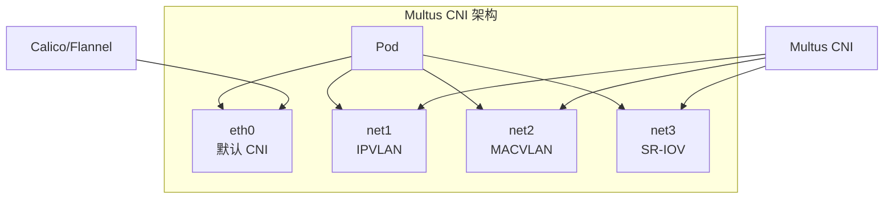

> [!IMPORTANT]
> **Multus 核心功能**
>
> Multus CNI 是一个 **Meta CNI**，不直接提供网络功能，而是协调多个 CNI 插件为 Pod 添加多张网卡。

#### 52.2 核心组件

##### 52.2.1 组件架构

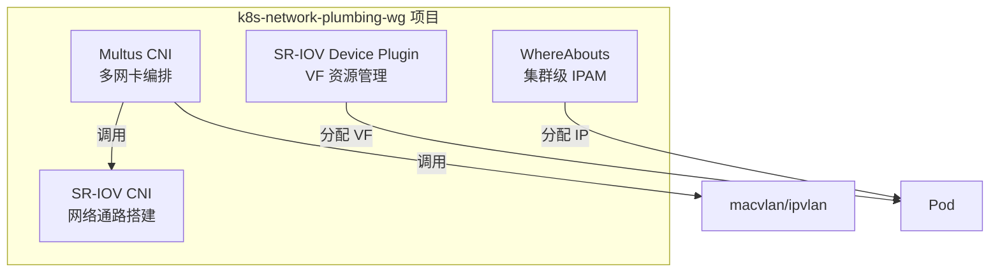

##### 52.2.2 组件职责

| 组件 | 职责 | 说明 |
|:---|:---|:---|
| **Multus CNI** | 多网卡编排 | Meta CNI，协调多个 CNI 插件 |
| **SR-IOV Device Plugin** | VF 资源管理 | 发现和通告 VF/PF 资源 |
| **SR-IOV CNI** | 网络通路搭建 | 构建 SR-IOV 网络连接 |
| **WhereAbouts** | 集群级 IPAM | 跨节点 IP 地址管理 |

##### 52.2.3 SR-IOV 概念

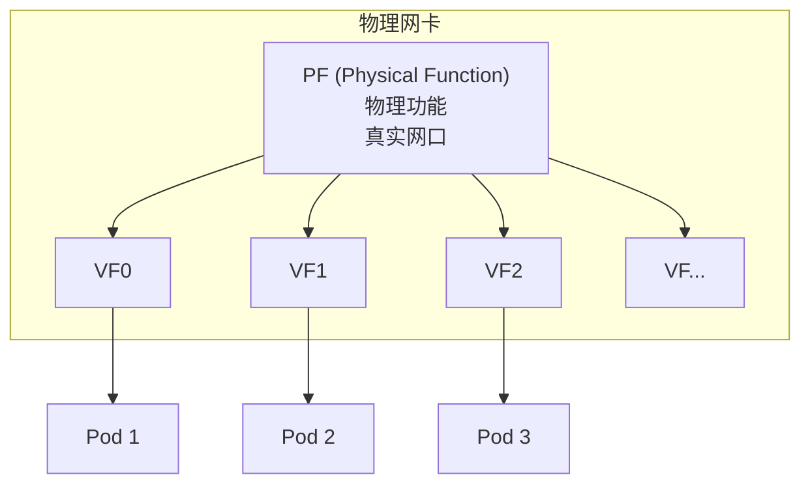

| 术语 | 全称 | 说明 |
|:---|:---|:---|
| PF | Physical Function | 物理网卡功能 |
| VF | Virtual Function | 虚拟化子网卡 |

#### 52.3 NetworkAttachmentDefinition

##### 52.3.1 NAD 概念

NetworkAttachmentDefinition（NAD）是 Multus 的核心 CRD：

```yaml
apiVersion: "k8s.cni.cncf.io/v1"
kind: NetworkAttachmentDefinition
metadata:
  name: macvlan-conf
  namespace: default
spec:
  config: '{
    "cniVersion": "0.3.1",
    "type": "macvlan",
    "master": "eth0",
    "mode": "bridge",
    "ipam": {
      "type": "whereabouts",
      "range": "192.168.1.0/24"
    }
  }'
```

##### 52.3.2 NAD 结构解析

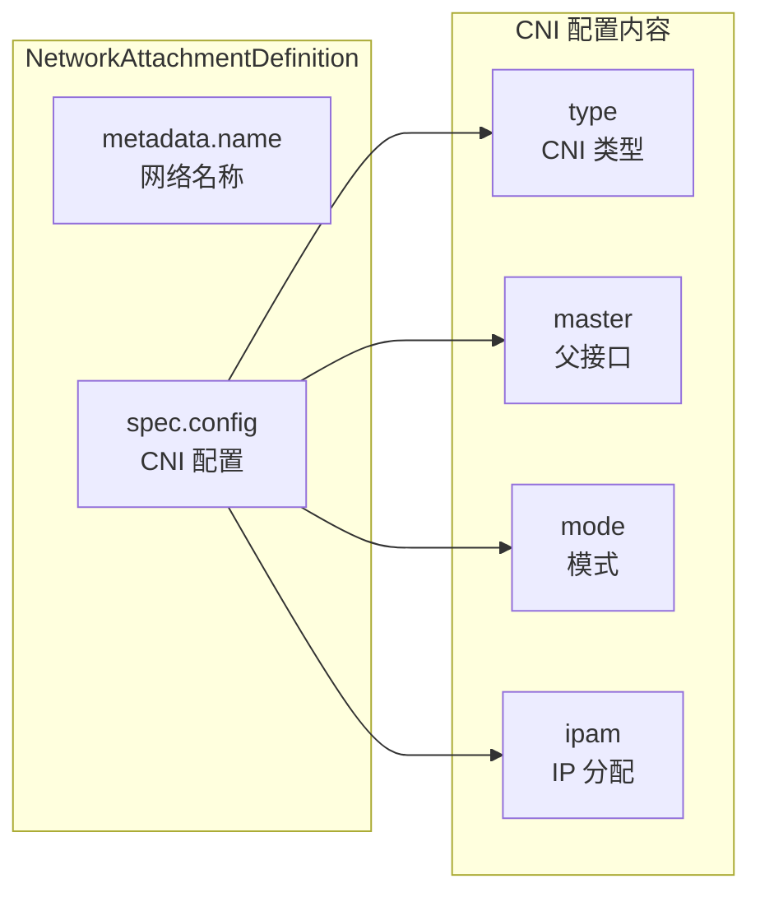

#### 52.4 Pod 多网卡配置

##### 52.4.1 注解方式

```yaml
apiVersion: v1
kind: Pod
metadata:
  name: multi-net-pod
  annotations:
    k8s.v1.cni.cncf.io/networks: macvlan-conf
spec:
  containers:
  - name: app
    image: nginx
```

##### 52.4.2 多网卡配置

```yaml
apiVersion: v1
kind: Pod
metadata:
  name: multi-net-pod
  annotations:
    # 添加多张网卡
    k8s.v1.cni.cncf.io/networks: |
      [
        {"name": "macvlan-conf"},
        {"name": "ipvlan-conf", "interface": "net2"}
      ]
spec:
  containers:
  - name: app
    image: nginx
```

##### 52.4.3 Pod 网络结构

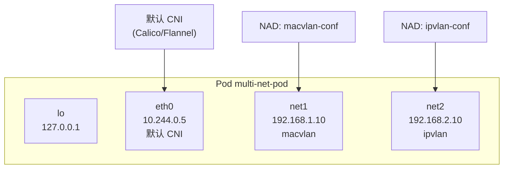

#### 52.5 安装部署

##### 52.5.1 安装 Multus

```bash
# 克隆项目
git clone https://github.com/k8snetworkplumbingwg/multus-cni.git
cd multus-cni

# 安装
kubectl apply -f deployments/multus-daemonset.yml
```

##### 52.5.2 安装 WhereAbouts

```bash
# 安装 WhereAbouts IPAM
kubectl apply -f https://raw.githubusercontent.com/k8snetworkplumbingwg/whereabouts/master/doc/crds/whereabouts.cni.cncf.io_ippools.yaml
kubectl apply -f https://raw.githubusercontent.com/k8snetworkplumbingwg/whereabouts/master/doc/crds/whereabouts.cni.cncf.io_overlappingrangeipreservations.yaml
```

##### 52.5.3 验证安装

```bash
# 检查 Multus DaemonSet
kubectl get pods -n kube-system | grep multus

# 检查 CNI 插件
ls /opt/cni/bin/ | grep -E "macvlan|ipvlan|multus"
```

#### 52.6 使用场景

##### 52.6.1 常用后端 CNI

| CNI 类型 | 特点 | 适用场景 |
|:---|:---|:---|
| **macvlan** | 虚拟 MAC 地址 | 裸机环境 |
| **ipvlan** | 共享 MAC 地址 | 云环境/OpenStack |
| **SR-IOV** | 硬件直通 | 高性能/DPDK |
| **bridge** | 软件桥接 | 通用场景 |

##### 52.6.2 macvlan vs ipvlan

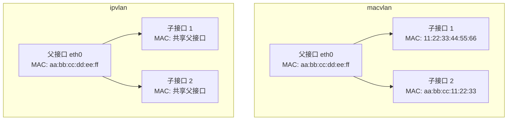

| 对比项 | macvlan | ipvlan |
|:---|:---|:---|
| MAC 地址 | 每个子接口独立 MAC | 共享父接口 MAC |
| 云环境 | ❌ 可能被拦截 | ✅ 推荐 |
| 裸机环境 | ✅ 推荐 | ✅ 可用 |
| 性能 | 高 | 更高 |

#### 52.7 章节小结

```mermaid
mindmap
  root((Multus 多网卡))
    定位
      Meta CNI
      多网卡编排
      英特尔开源
    组件
      Multus CNI
      SR-IOV Device Plugin
      SR-IOV CNI
      WhereAbouts IPAM
    配置
      NetworkAttachmentDefinition
      Pod 注解
      多网卡列表
    后端
      macvlan
      ipvlan
      SR-IOV
      bridge
    场景
      转控分离
      高性能网络
      电信/金融
```

> [!TIP]
> **Multus 多网卡方案要点总结**：
>
> 1. **核心概念**：
>    - Multus 是 **Meta CNI**，协调多个 CNI 插件
>    - 为 Pod 添加除 eth0 外的额外网卡
>
> 2. **核心组件**：
>    - **Multus CNI**：多网卡编排
>    - **SR-IOV Device Plugin**：VF 资源管理
>    - **WhereAbouts**：集群级 IPAM
>
> 3. **配置方式**：
>    - 创建 **NetworkAttachmentDefinition** CRD
>    - Pod 通过 **注解** 引用 NAD
>
> 4. **常用后端**：
>    - **macvlan**：裸机环境
>    - **ipvlan**：云环境（共享 MAC）
>    - **SR-IOV**：高性能直通
>
> 5. **典型场景**：
>    - 转控分离（控制面/数据面隔离）
>    - 电信 NFV、金融高频交易
>    - 流媒体处理

---

### 第五十三章 Multus IPVLAN L2 模式

本章深入讲解 IPVLAN L2 模式的工作原理、配置方法、适用场景，以及与 MACVLAN 的区别。

#### 53.1 背景与概述

##### 53.1.1 IPVLAN 简介

IPVLAN 是一种网卡复用技术，区别于 MACVLAN 的核心特点是：**子接口与父接口共享同一 MAC 地址**。

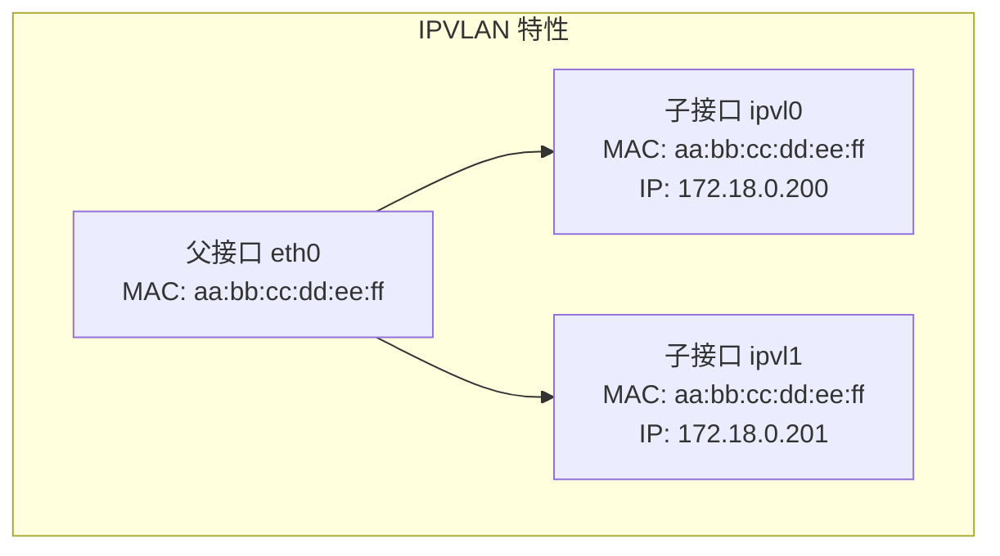

> [!IMPORTANT]
> **IPVLAN 核心特性**
>
> - 子接口与父接口 **MAC 地址相同**
> - 不同子接口通过 **IP 地址** 区分
> - 内核要求：**Linux 4.18+**

##### 53.1.2 IPVLAN 命名由来

| 类型 | 区分方式 | MAC 地址 | IP 地址 |
|:---|:---|:---|:---|
| **IPVLAN** | IP 区分 | 相同 | 不同 |
| **MACVLAN** | MAC 区分 | 不同 | 不同 |

##### 53.1.3 云环境适配

IPVLAN 在 **公有云/OpenStack** 环境中特别适用：

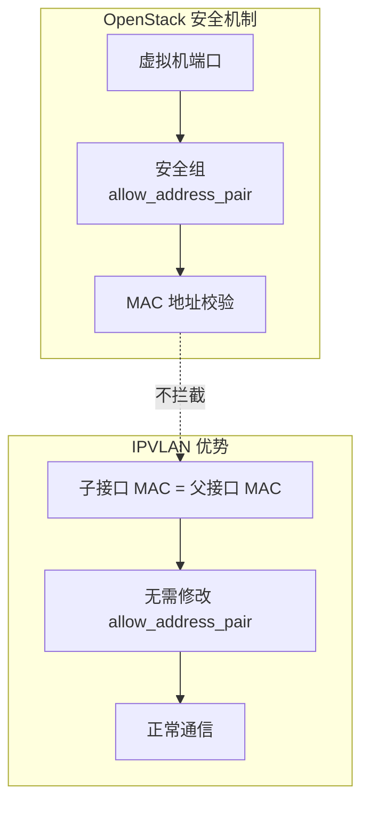

> [!NOTE]
> **云环境兼容性**
>
> OpenStack 默认只允许与端口 MAC 匹配的流量通过。IPVLAN 由于 MAC 相同，无需额外配置即可正常工作。MACVLAN 则需要设置 `allow_address_pair` 为 `0.0.0.0/0`。

#### 53.2 L2 模式原理

##### 53.2.1 L2 模式工作方式

在 L2 模式下，父接口相当于一个 **虚拟交换机**：

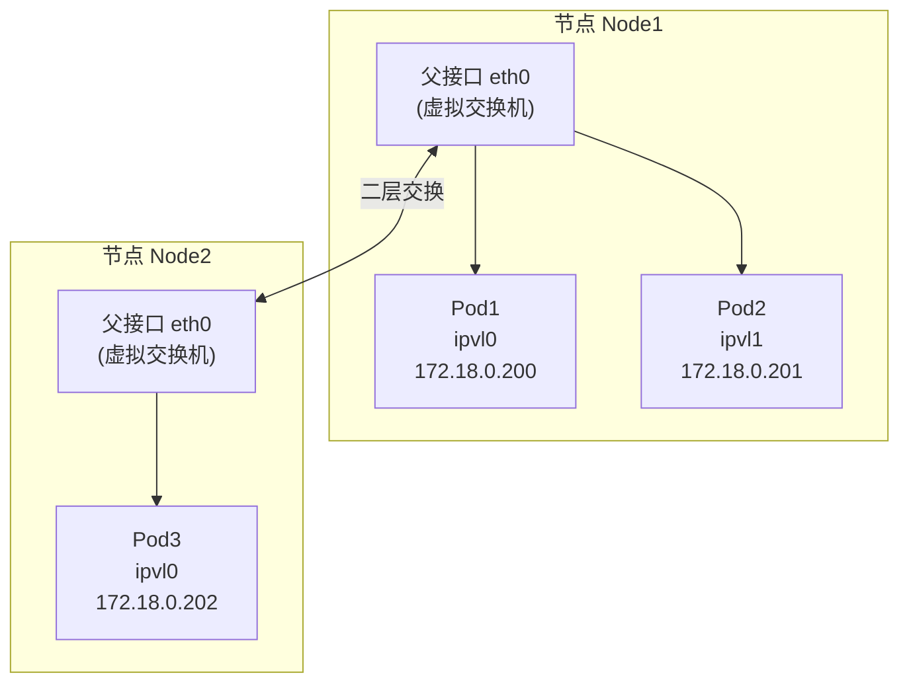

##### 53.2.2 L2 vs L3 模式

| 对比项 | L2 模式 | L3 模式 |
|:---|:---|:---|
| 工作层级 | 二层（交换） | 三层（路由） |
| 父接口角色 | 虚拟交换机 | 虚拟路由器 |
| 广播域 | 共享 | 隔离 |
| 适用场景 | 同子网通信 | 跨子网通信 |

#### 53.3 配置实现

##### 53.3.1 NetworkAttachmentDefinition

创建 IPVLAN L2 模式的 NAD：

```yaml
apiVersion: "k8s.cni.cncf.io/v1"
kind: NetworkAttachmentDefinition
metadata:
  name: ipvlan-l2-whereabouts-conf
spec:
  config: '{
    "cniVersion": "0.3.1",
    "name": "ipvlan-l2-whereabouts",
    "type": "ipvlan",
    "master": "eth0",
    "mode": "l2",
    "ipam": {
      "type": "whereabouts",
      "range": "172.18.0.200/24",
      "range_start": "172.18.0.200",
      "range_end": "172.18.0.205"
    }
  }'
```

##### 53.3.2 NAD 配置解析

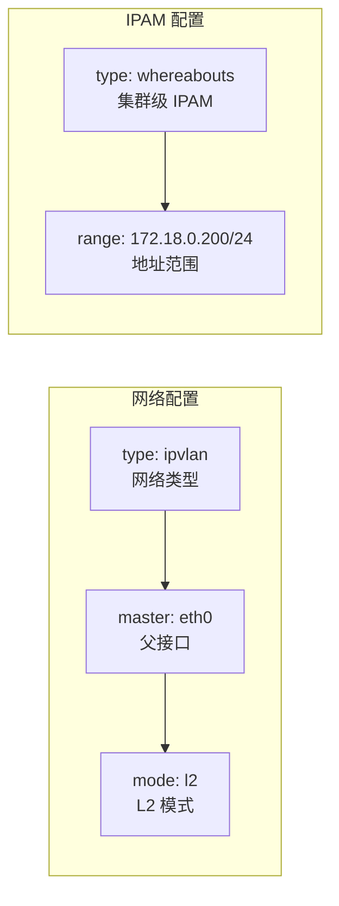

##### 53.3.3 Pod 配置

```yaml
apiVersion: v1
kind: Pod
metadata:
  name: ipvlan-pod1
  annotations:
    k8s.v1.cni.cncf.io/networks: ipvlan-l2-whereabouts-conf@eth1
spec:
  containers:
  - name: app
    image: busybox
    command: ["sleep", "3600"]
```

##### 53.3.4 注解语法

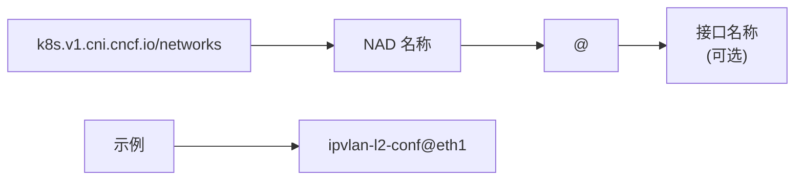

| 语法 | 说明 |
|:---|:---|
| `nad-name` | 使用默认接口名（net0, net1...） |
| `nad-name@eth1` | 指定接口名为 eth1 |

#### 53.4 通信验证

##### 53.4.1 验证 MAC 地址

```bash
# 查看节点 eth0 的 MAC
ip link show eth0
# 输出: link/ether 02:42:ac:12:00:02

# 进入 Pod 查看 eth1 的 MAC
kubectl exec ipvlan-pod1 -- ip link show eth1
# 输出: link/ether 02:42:ac:12:00:02  (与父接口相同)
```

##### 53.4.2 同节点通信

```bash
# Pod1 ping Pod2 (同节点)
kubectl exec ipvlan-pod1 -- ping -I eth1 172.18.0.201
```

##### 53.4.3 跨节点通信

```bash
# Pod1 ping Pod3 (跨节点)
kubectl exec ipvlan-pod1 -- ping -I eth1 172.18.0.202
```

> [!WARNING]
> **多网卡环境下的 ping 命令**
>
> 在多网卡环境中，务必使用 `-I <interface>` 指定源接口，否则可能走错网络路径。

##### 53.4.4 ARP 表验证

```bash
# 查看 ARP 表
kubectl exec ipvlan-pod1 -- arp -n

# 同节点 Pod：MAC 相同
# 172.18.0.201  02:42:ac:12:00:02

# 跨节点 Pod：MAC 为对端节点的父接口
# 172.18.0.202  02:42:ac:12:00:03
```

#### 53.5 IPVLAN vs MACVLAN

##### 53.5.1 对比总结

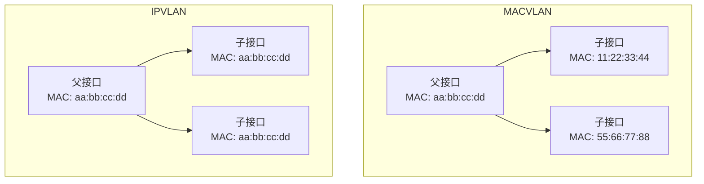

| 对比项 | MACVLAN | IPVLAN |
|:---|:---|:---|
| MAC 地址 | 子接口独立 | 子接口相同 |
| 云环境 | 可能被拦截 | ✅ 兼容 |
| 适用场景 | 裸机环境 | 云/虚拟化环境 |
| 内核要求 | 3.x+ | 4.18+ |
| 区分方式 | MAC | IP |

#### 53.6 章节小结

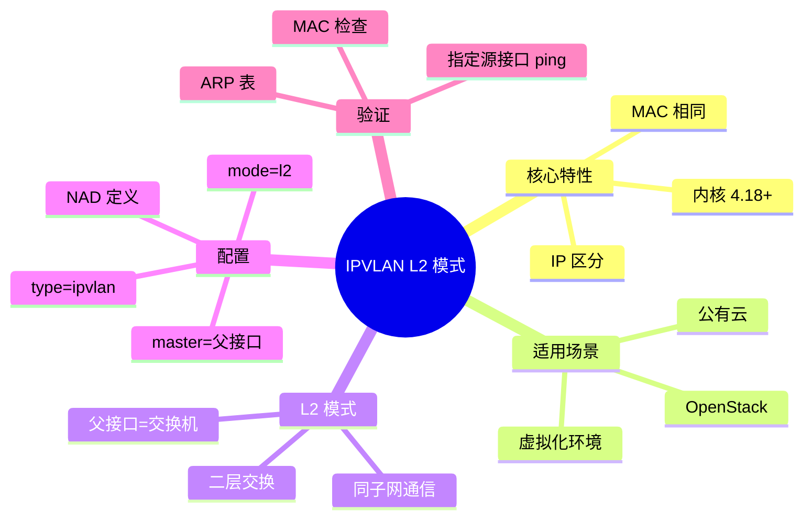

> [!TIP]
> **IPVLAN L2 模式要点总结**：
>
> 1. **核心特性**：
>    - 子接口与父接口 **MAC 地址相同**
>    - 通过 **IP 地址** 区分不同子接口
>
> 2. **适用场景**：
>    - **云环境**（OpenStack、公有云）
>    - 避免 MAC 地址被安全策略拦截
>
> 3. **L2 模式**：
>    - 父接口充当 **虚拟交换机**
>    - 子接口在同一广播域
>
> 4. **配置要点**：
>    - `type: ipvlan`
>    - `mode: l2`
>    - `master: eth0`（父接口）
>
> 5. **注意事项**：
>    - 多网卡环境下 ping 需指定 `-I <interface>`
>    - 内核版本要求 **Linux 4.18+**

---

### 第五十四章 Multus IPVLAN L3 模式

本章讲解 IPVLAN L3 模式的工作原理、配置方法、回程路由设置，以及与 L2 模式的区别。

#### 54.1 背景与概述

##### 54.1.1 L3 模式简介

在 L3 模式下，父接口充当 **虚拟路由器**，子接口可以配置 **不同子网** 的 IP 地址。

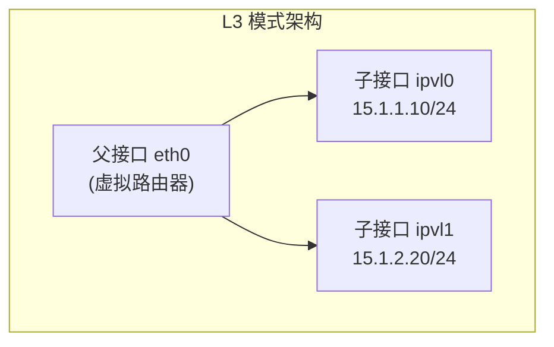

> [!IMPORTANT]
> **L3 模式核心特性**
>
> - 父接口充当 **路由器**（L2 模式是交换机）
> - 子接口可配置 **不同子网** 的地址
> - 需要添加 **回程路由** 实现跨子网通信

##### 54.1.2 L2 vs L3 模式对比

| 对比项 | L2 模式 | L3 模式 |
|:---|:---|:---|
| 父接口角色 | 虚拟交换机 | 虚拟路由器 |
| 子接口子网 | 必须相同 | 可以不同 |
| 通信方式 | 二层交换 | 三层路由 |
| 广播域 | 共享 | 隔离 |
| 路由配置 | 无需 | 需要回程路由 |

#### 54.2 L3 模式原理

##### 54.2.1 工作方式

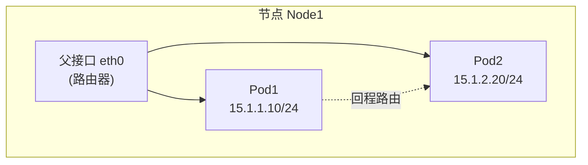

##### 54.2.2 路由查找过程

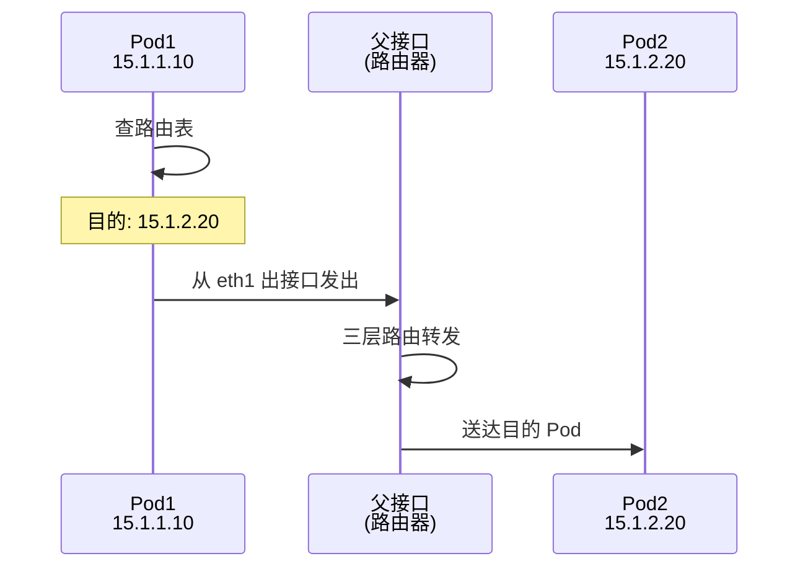

##### 54.2.3 无网关路由

L3 模式的一个关键特性是 **无网关路由**（仅指定出接口）：

```bash
# 传统路由（带网关）
ip route add 15.1.2.0/24 via 15.1.1.1 dev eth1

# 无网关路由（仅出接口）
ip route add 15.1.2.0/24 dev eth1
```

> [!NOTE]
> **无网关路由原理**
>
> 当出接口直连路由器时，只需指定出接口，无需指定下一跳网关。数据包从出接口发出后，直接到达路由器进行转发。

#### 54.3 配置实现

##### 54.3.1 NetworkAttachmentDefinition

创建 IPVLAN L3 模式的 NAD：

```yaml
apiVersion: "k8s.cni.cncf.io/v1"
kind: NetworkAttachmentDefinition
metadata:
  name: ipvlan-l3-conf-1
spec:
  config: '{
    "cniVersion": "0.3.1",
    "name": "ipvlan-l3-net1",
    "type": "ipvlan",
    "master": "eth0",
    "mode": "l3",
    "ipam": {
      "type": "whereabouts",
      "range": "15.1.1.0/24",
      "range_start": "15.1.1.10",
      "range_end": "15.1.1.20"
    }
  }'
---
apiVersion: "k8s.cni.cncf.io/v1"
kind: NetworkAttachmentDefinition
metadata:
  name: ipvlan-l3-conf-2
spec:
  config: '{
    "cniVersion": "0.3.1",
    "name": "ipvlan-l3-net2",
    "type": "ipvlan",
    "master": "eth0",
    "mode": "l3",
    "ipam": {
      "type": "whereabouts",
      "range": "15.1.2.0/24",
      "range_start": "15.1.2.10",
      "range_end": "15.1.2.20"
    }
  }'
```

##### 54.3.2 配置要点

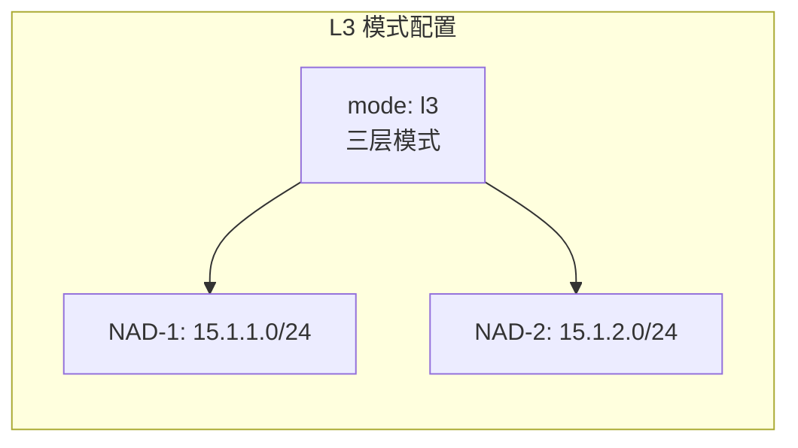

| 配置项 | 说明 |
|:---|:---|
| `mode: l3` | 启用 L3 路由模式 |
| 不同 NAD | 配置不同子网 |
| 同一 master | 共享父接口 |

##### 54.3.3 Pod 配置

```yaml
apiVersion: v1
kind: Pod
metadata:
  name: ipvlan-l3-pod1
  annotations:
    k8s.v1.cni.cncf.io/networks: ipvlan-l3-conf-1@eth1
spec:
  nodeName: node1  # 确保同节点
  containers:
  - name: app
    image: busybox
    command: ["sleep", "3600"]
---
apiVersion: v1
kind: Pod
metadata:
  name: ipvlan-l3-pod2
  annotations:
    k8s.v1.cni.cncf.io/networks: ipvlan-l3-conf-2@eth1
spec:
  nodeName: node1  # 确保同节点
  containers:
  - name: app
    image: busybox
    command: ["sleep", "3600"]
```

#### 54.4 回程路由配置

##### 54.4.1 为什么需要回程路由

默认情况下，Pod 只知道自己所在子网的路由：

```bash
# Pod1 (15.1.1.10) 默认路由表
15.1.1.0/24 dev eth1  # 只知道本子网

# Pod2 (15.1.2.20) 默认路由表
15.1.2.0/24 dev eth1  # 只知道本子网
```

Pod1 无法直接访问 Pod2，因为没有去往 `15.1.2.0/24` 的路由。

##### 54.4.2 添加回程路由

```bash
# 在 Pod1 中添加去往 Pod2 子网的路由
kubectl exec ipvlan-l3-pod1 -- ip route add 15.1.2.0/24 dev eth1

# 在 Pod2 中添加去往 Pod1 子网的路由
kubectl exec ipvlan-l3-pod2 -- ip route add 15.1.1.0/24 dev eth1
```

##### 54.4.3 验证通信

```bash
# Pod1 ping Pod2（需指定源接口）
kubectl exec ipvlan-l3-pod1 -- ping -I eth1 15.1.2.20
```

> [!WARNING]
> **关键注意事项**
>
> 1. 必须使用 `-I eth1` 指定源接口
> 2. L3 模式需要 **手动添加回程路由**
> 3. **同节点** 才可通过回程路由互通

#### 54.5 同节点 vs 跨节点

##### 54.5.1 限制说明

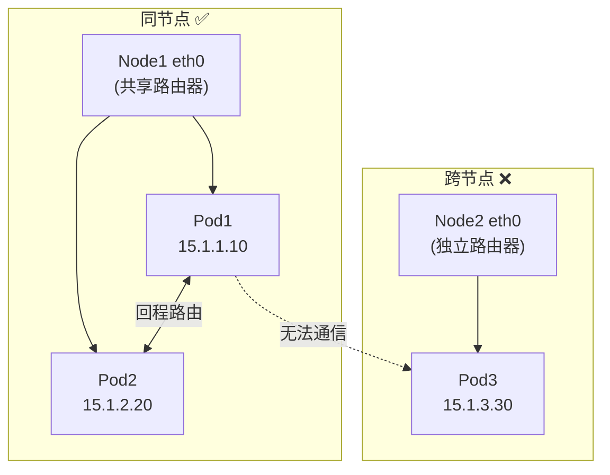

> [!CAUTION]
> **跨节点限制**
>
> L3 模式下，不同节点的 Pod **无法直接通过回程路由通信**，因为：
>
> - 每个节点的父接口是独立的路由器
> - 没有统一的路由平面
>
> 如需跨节点通信，需要额外的 **Underlay 网络** 或 **BGP 路由宣告**。

##### 54.5.2 适用场景

| 场景 | 是否支持 |
|:---|:---|
| 同节点不同子网 Pod | ✅ 支持（需回程路由） |
| 跨节点不同子网 Pod | ❌ 不支持（需额外配置） |
| 同节点同子网 Pod | ✅ 支持（使用 L2 模式更佳） |

#### 54.6 章节小结

```mermaid
mindmap
  root((IPVLAN L3 模式))
    核心特性
      父接口=路由器
      子接口可跨子网
      需回程路由
    配置要点
      mode=l3
      不同 NAD 不同子网
      同一 master
    回程路由
      ip route add
      仅出接口即可
      无需指定网关
    限制
      仅同节点有效
      跨节点不通
      需额外 Underlay
```

> [!TIP]
> **IPVLAN L3 模式要点总结**：
>
> 1. **核心原理**：
>    - 父接口充当 **虚拟路由器**
>    - 子接口可配置 **不同子网** IP
>
> 2. **回程路由**：
>    - 必须手动添加 `ip route add <对端子网> dev eth1`
>    - 无需指定网关，仅需出接口
>
> 3. **限制**：
>    - 仅 **同节点** Pod 可通过回程路由通信
>    - 跨节点需要额外网络配置
>
> 4. **与 L2 对比**：
>    - L2：交换机，同子网
>    - L3：路由器，跨子网

---

### 第五十五章 Multus IPVLAN SBR 模式

本章讲解 IPVLAN 的 SBR（Source-Based Routing，源地址路由）模式，实现多网卡同时访问外网的场景。

#### 55.1 背景与概述

##### 55.1.1 什么是 SBR

**SBR（Source-Based Routing）** 是一种基于 **源地址** 进行路由决策的技术，也称为"原地路由"或"策略路由"。

```mermaid
graph LR
    subgraph "传统路由"
        Dst["基于目的地址"]
    end
    
    subgraph "SBR 路由"
        Src["基于源地址"]
    end
    
    Dst --> D1["所有流量走默认网关"]
    Src --> S1["不同源地址走不同网关"]
```

> [!IMPORTANT]
> **SBR 核心价值**
>
> - 允许 Pod 拥有 **多张网卡同时访问外网**
> - 根据 **源 IP** 决定出口路由
> - 适用于 **多网络接入** 场景

##### 55.1.2 应用场景

| 场景 | 说明 |
|:---|:---|
| 多网卡上网 | 不同网卡走不同出口 |
| 网络隔离 | 内网/外网分离访问 |
| 流量分流 | 按源地址分配带宽 |

#### 55.2 SBR 原理

##### 55.2.1 核心组件

SBR 依赖 Linux 的 **策略路由** 机制，包含两个关键组件：

```mermaid
graph TB
    subgraph "SBR 组件"
        Rule["ip rule<br/>路由策略"]
        Table["ip route table<br/>路由表"]
    end
    
    Rule --> Table
    Table --> GW["网关出口"]
```

| 组件 | 命令 | 作用 |
|:---|:---|:---|
| ip rule | `ip rule add from <src> table <n>` | 定义策略：源地址 → 路由表 |
| ip route table | `ip route add default via <gw> table <n>` | 定义路由表内容 |

##### 55.2.2 工作流程

```mermaid
sequenceDiagram
    participant Pod as Pod<br/>172.18.0.200
    participant Rule as ip rule
    participant Table as table 100
    participant GW as 网关<br/>172.18.0.1
    
    Pod->>Rule: 发包 src=172.18.0.200
    Rule->>Rule: 匹配 from 172.18.0.0/24
    Rule->>Table: 查询 table 100
    Table->>Table: default via 172.18.0.1
    Table->>GW: 发送到网关
    GW->>Pod: SNAT 后访问外网
```

##### 55.2.3 优先级机制

```mermaid
graph TB
    subgraph "路由查找顺序"
        Step1["1. 检查 ip rule"]
        Step2["2. SBR 匹配则走对应 table"]
        Step3["3. 否则走默认路由表 main"]
    end
    
    Step1 --> Step2
    Step2 --> Step3
```

> [!NOTE]
> **SBR 优先级更高**
>
> 当配置了 SBR 后，即使目的地址在 **同一子网**，也会优先走 SBR 指定的网关，而非直接二层通信。

#### 55.3 配置实现

##### 55.3.1 手动配置 SBR

在 Pod 内手动添加 SBR 规则：

```bash
# 1. 添加路由表（table 100）
ip route add default via 172.18.0.1 dev eth1 table 100

# 2. 添加路由策略（从 172.18.0.0/24 来的包走 table 100）
ip rule add from 172.18.0.0/24 table 100
```

验证配置：

```bash
# 查看路由策略
ip rule show
# 输出: from 172.18.0.0/24 lookup 100

# 查看路由表
ip route show table 100
# 输出: default via 172.18.0.1 dev eth1
```

##### 55.3.2 NAD 自动配置 SBR

通过 NetworkAttachmentDefinition 自动配置 SBR：

```yaml
apiVersion: "k8s.cni.cncf.io/v1"
kind: NetworkAttachmentDefinition
metadata:
  name: ipvlan-sbr
spec:
  config: '{
    "cniVersion": "0.3.1",
    "name": "ipvlan-sbr-net",
    "type": "ipvlan",
    "master": "eth0",
    "mode": "l2",
    "ipam": {
      "type": "whereabouts",
      "range": "172.18.0.0/24"
    },
    "plugins": [
      {
        "type": "sbr"
      }
    ]
  }'
```

##### 55.3.3 配置对比

```mermaid
flowchart LR
    subgraph "手动配置"
        M1["ip route add"]
        M2["ip rule add"]
    end
    
    subgraph "自动配置(NAD)"
        A1["plugins: sbr"]
    end
    
    M1 --> Result["Pod 多网卡上外网"]
    M2 --> Result
    A1 --> Result
```

| 方式 | 优点 | 缺点 |
|:---|:---|:---|
| 手动配置 | 灵活可控 | 需要 init 容器或手动执行 |
| NAD 自动 | 自动化，无需干预 | 需要 SBR CNI 插件支持 |

#### 55.4 多网卡上外网验证

##### 55.4.1 场景说明

```mermaid
graph TB
    subgraph "Pod"
        eth0["eth0<br/>默认网卡"]
        eth1["eth1<br/>IPVLAN 网卡"]
    end
    
    subgraph "网关"
        GW0["默认网关"]
        GW1["IPVLAN 网关<br/>172.18.0.1"]
    end
    
    eth0 --> GW0
    eth1 --> GW1
    
    GW0 --> Internet["互联网"]
    GW1 --> Internet
```

##### 55.4.2 验证步骤

```bash
# 1. 从 eth0 访问外网（默认路由）
ping 114.114.114.114

# 2. 从 eth1 访问外网（SBR 路由）
ping -I 172.18.0.200 114.114.114.114

# 3. 抓包验证
tcpdump -i eth1 icmp
```

> [!TIP]
> **指定源地址的重要性**
>
> 使用 `ping -I <IP地址>` 而非 `ping -I <接口名>`，确保 SBR 规则正确匹配。

##### 55.4.3 抓包分析

```bash
# 在 eth1 上抓包
tcpdump -i eth1 -n icmp

# 预期输出（走 SBR）：
# 172.18.0.200 > 114.114.114.114: ICMP echo request
# 114.114.114.114 > 172.18.0.200: ICMP echo reply
```

#### 55.5 SBR 与 ARP 缓存交互

##### 55.5.1 首包行为

```mermaid
sequenceDiagram
    participant Pod1 as Pod1<br/>172.18.0.200
    participant SBR as SBR 规则
    participant GW as 网关<br/>172.18.0.1
    participant Pod2 as Pod2<br/>172.18.0.201
    
    Note over Pod1: 无 ARP 缓存
    Pod1->>SBR: 发包 dst=172.18.0.201
    SBR->>GW: 优先走网关
    GW->>Pod2: 转发
    Pod2->>Pod1: 回包（携带真实 MAC）
    Note over Pod1: 学习到 Pod2 MAC
```

##### 55.5.2 后续包行为

当 ARP 缓存存在后，行为可能改变：

| 情况 | 首包 | 后续包 |
|:---|:---|:---|
| 无 ARP 缓存 | 走 SBR → 网关 | 走 SBR → 网关 |
| 有 ARP 缓存 | 走 SBR → 网关 | 可能直接二层（ARP 优先级更高） |

> [!WARNING]
> **ARP 缓存影响**
>
> 当 Pod 学习到对端的真实 MAC 地址后，后续包可能 **绕过 SBR** 直接走二层。这是因为：
>
> - 本地 ARP 缓存优先级高于 SBR
> - 已知 MAC 时无需查询路由策略
>
> **清除 ARP 缓存验证**：
>
> ```bash
> ip neigh del 172.18.0.201 dev eth1
> ```

##### 55.5.3 双端 SBR 配置

当两端都配置 SBR 时：

```mermaid
sequenceDiagram
    participant Pod1 as Pod1<br/>172.18.0.200
    participant GW as 网关
    participant Pod2 as Pod2<br/>172.18.0.201
    
    Pod1->>GW: SBR → 网关
    GW->>Pod2: 转发
    Pod2->>GW: SBR → 网关
    GW->>Pod1: 转发
```

两端都会经过网关，确保 SBR 策略生效。

#### 55.6 章节小结

```mermaid
mindmap
  root((IPVLAN SBR))
    核心概念
      Source-Based Routing
      基于源地址路由
      策略路由
    关键命令
      ip rule add
      ip route table
    配置方式
      手动配置
      NAD 自动配置
    应用场景
      多网卡上外网
      网络隔离
      流量分流
    注意事项
      SBR 优先级高
      ARP 缓存影响
      指定源 IP
```

> [!TIP]
> **IPVLAN SBR 模式要点总结**：
>
> 1. **SBR 机制**：
>    - `ip rule`：定义源地址 → 路由表映射
>    - `ip route table`：定义路由表内容
>
> 2. **配置方式**：
>    - 手动：`ip route add` + `ip rule add`
>    - 自动：NAD 中 `plugins: [{"type": "sbr"}]`
>
> 3. **验证方法**：
>    - `ping -I <源IP>` 指定源地址
>    - `tcpdump -i eth1` 抓包确认
>
> 4. **注意事项**：
>    - SBR 优先级高于普通路由
>    - ARP 缓存可能影响后续包路径
>    - 双端配置 SBR 可确保策略生效

---

### 第五十六章 IPVLAN-SBR 深度解析

本章深入分析 SBR 的底层行为机制，包括首包处理、ICMP Redirect、单边与双边 SBR 差异，以及典型应用场景。

#### 56.1 背景与问题

##### 56.1.1 上章回顾

上一章介绍了 SBR 的基本配置和使用，但在实际抓包分析中发现了一些 **意外行为**：

- 首包发往网关，但后续包可能直接二层通信
- 存在 ICMP Redirect 消息
- 不同网络环境行为不同

##### 56.1.2 本章目标

```mermaid
mindmap
  root((SBR 深度解析))
    首包行为
      为什么走网关
      MAC 地址封装
    ICMP Redirect
      什么是重定向
      何时触发
    单边 vs 双边
      行为差异
      抓包分析
    环境差异
      Linux Bridge
      真实交换机
    应用场景
      多网卡多网关
      管理/业务分离
```

#### 56.2 SBR 首包行为分析

##### 56.2.1 首包封装过程

```mermaid
sequenceDiagram
    participant Pod1 as Pod1<br/>172.18.0.200
    participant SBR as SBR 规则
    participant GW as 网关<br/>172.18.0.1
    participant Pod2 as Pod2<br/>172.18.0.201
    
    Note over Pod1: 查路由：dst=172.18.0.201
    Pod1->>SBR: 匹配 from 172.18.0.0/24
    SBR->>Pod1: 走 table 100 → via 172.18.0.1
    Pod1->>Pod1: 发 ARP 请求网关 MAC
    Pod1->>GW: 封装: dst_mac=网关MAC
    GW->>Pod2: 转发到 Pod2
```

##### 56.2.2 为什么首包走网关

| 阶段 | 说明 |
|:---|:---|
| 无 ARP 缓存 | Pod1 不知道 Pod2 的 MAC |
| SBR 规则生效 | 指向 via 172.18.0.1 |
| ARP 请求网关 | 而非请求 Pod2 |
| 封装网关 MAC | dst_mac = 网关 MAC |

> [!NOTE]
> **关键点**
>
> SBR 规则指定了下一跳网关，因此 Pod1 会 **ARP 解析网关的 MAC**，而非目的 Pod 的 MAC。

##### 56.2.3 抓包验证

```bash
# Pod1 发送首包
tcpdump -i eth1 -en

# 首包内容：
# src_mac: 12:00:00:02 (Pod1)
# dst_mac: dc:cd:40:xx (网关)
# src_ip: 172.18.0.200
# dst_ip: 172.18.0.201
```

#### 56.3 ICMP Redirect 机制

##### 56.3.1 什么是 ICMP Redirect

```mermaid
sequenceDiagram
    participant Pod1 as Pod1
    participant GW as 网关
    participant Pod2 as Pod2
    
    Pod1->>GW: ICMP Echo Request
    GW->>Pod2: 转发
    GW-->>Pod1: ICMP Redirect
    Note over GW: 告诉 Pod1：以后直接发给 Pod2
    Pod2->>Pod1: ICMP Echo Reply
```

**ICMP Redirect**（重定向）是网关发送的一种通知消息：

> "你发给我的包，目的地和你在同一网段，你应该直接发给它，不需要经过我。"

##### 56.3.2 Redirect 消息格式

```
ICMP Type: 5 (Redirect)
Code: 1 (Redirect for Host)
Message: Redirect to 172.18.0.201
```

##### 56.3.3 Redirect 触发条件

| 条件 | 说明 |
|:---|:---|
| 源和目的同子网 | 172.18.0.200 ↔ 172.18.0.201 |
| 包经过网关 | 网关发现"绕路" |
| 网关启用 Redirect | Linux Bridge 默认启用 |

> [!WARNING]
> **ICMP Redirect 对 SBR 的影响**
>
> 收到 Redirect 后，Pod 可能 **绕过 SBR 策略**，直接二层通信。这可能不是期望的行为！

#### 56.4 单边 vs 双边 SBR

##### 56.4.1 单边 SBR（仅 Pod1 配置）

```mermaid
sequenceDiagram
    participant Pod1 as Pod1<br/>有 SBR
    participant GW as 网关
    participant Pod2 as Pod2<br/>无 SBR
    
    Pod1->>GW: ① 首包走网关
    GW->>Pod2: 转发
    GW-->>Pod1: ② ICMP Redirect
    Pod2->>Pod1: ③ 回包（直接二层）
    Note over Pod2: 发 ARP 请求 Pod1 MAC
    Note over Pod1: 后续包直接二层
```

**行为特点**：

- 首包：Pod1 → 网关 → Pod2
- 回包：Pod2 直接发给 Pod1（无 SBR）
- 后续：可能绕过 SBR

##### 56.4.2 双边 SBR（两端都配置）

```mermaid
sequenceDiagram
    participant Pod1 as Pod1<br/>有 SBR
    participant GW as 网关
    participant Pod2 as Pod2<br/>有 SBR
    
    Pod1->>GW: ① 首包走网关
    GW->>Pod2: 转发
    GW-->>Pod1: ② Redirect #1
    Pod2->>GW: ③ 回包也走网关
    GW->>Pod1: 转发
    GW-->>Pod2: ④ Redirect #2
    Note over Pod1,Pod2: 两次 Redirect 后恢复直接通信
```

**行为特点**：

- 首包：双方都走网关
- 两次 Redirect：各触发一次
- 后续：恢复直接通信

##### 56.4.3 对比总结

| 场景 | 首包路径 | Redirect 次数 | 后续包路径 |
|:---|:---|:---|:---|
| 单边 SBR | Pod1→GW→Pod2 | 1 次 | 可能直接二层 |
| 双边 SBR | 双方都走网关 | 2 次 | 恢复直接通信 |

#### 56.5 Linux Bridge vs 真实交换机

##### 56.5.1 行为差异

```mermaid
graph TB
    subgraph "Linux Bridge"
        LB_GW["网关"]
        LB_R["发送 ICMP Redirect"]
        LB_D["后续包直接二层"]
        
        LB_GW --> LB_R
        LB_R --> LB_D
    end
    
    subgraph "真实交换机(H3C等)"
        HW_GW["网关"]
        HW_F["每包都转发"]
        HW_N["无 Redirect"]
        
        HW_GW --> HW_F
        HW_F --> HW_N
    end
```

##### 56.5.2 差异对比

| 特性 | Linux Bridge | 真实交换机（H3C） |
|:---|:---|:---|
| ICMP Redirect | ✅ 启用 | ❌ 通常不发 |
| SBR 首包 | 走网关 | 走网关 |
| SBR 后续包 | 可能绕过 | 始终走网关 |
| 行为一致性 | 可能变化 | 稳定可预期 |

> [!CAUTION]
> **生产环境注意**
>
> Linux Bridge 环境下的 SBR 行为可能与真实交换机不同。测试时需要在 **目标生产环境** 中验证！

#### 56.6 SBR 典型应用场景

##### 56.6.1 多网卡多网关

```mermaid
graph TB
    subgraph "Pod/虚拟机"
        eth0["eth0<br/>管理网卡"]
        eth1["eth1<br/>业务网卡"]
    end
    
    subgraph "网关"
        GW0["管理网关<br/>10.0.0.1"]
        GW1["业务网关<br/>192.168.0.1"]
    end
    
    eth0 --> GW0
    eth1 --> GW1
    
    GW0 --> OM["SSH/运维管理"]
    GW1 --> BIZ["业务流量"]
```

##### 56.6.2 问题：多网关冲突

**场景**：一台机器有两张网卡，只能配置一个默认路由。

```bash
# 默认路由只能有一个出接口
ip route add default via 192.168.0.1 dev eth1

# SSH 从 eth0 进来，回包却走 eth1
# 导致：非对称路由，连接失败！
```

##### 56.6.3 SBR 解决方案

```bash
# 1. eth0（管理网）使用 SBR
ip route add default via 10.0.0.1 dev eth0 table 100
ip rule add from 10.0.0.0/24 table 100

# 2. eth1（业务网）使用默认路由
ip route add default via 192.168.0.1 dev eth1
```

```mermaid
flowchart LR
    subgraph "SBR 路由策略"
        SSH["SSH 请求<br/>from 10.0.0.x"]
        BIZ["业务请求<br/>from 192.168.x"]
    end
    
    SSH --> T100["table 100"]
    BIZ --> Main["default route"]
    
    T100 --> GW0["eth0 网关"]
    Main --> GW1["eth1 网关"]
```

##### 56.6.4 典型使用场景

| 场景 | eth0 (管理网) | eth1 (业务网) |
|:---|:---|:---|
| 运维管理 | SSH、监控 | - |
| 业务流量 | - | 应用数据 |
| 告警上报 | SBR 路由 | - |
| 外网访问 | - | 默认路由 |

#### 56.7 章节小结

```mermaid
mindmap
  root((SBR 深度解析))
    首包行为
      SBR 优先
      ARP 解析网关
      封装网关 MAC
    ICMP Redirect
      网关发送
      通知直连
      可能绕过 SBR
    单边 vs 双边
      单边=1 次 Redirect
      双边=2 次 Redirect
      后续恢复直连
    环境差异
      Linux Bridge 有 Redirect
      真实交换机无 Redirect
    应用场景
      多网卡多网关
      管理/业务分离
      解决非对称路由
```

> [!TIP]
> **IPVLAN-SBR 深度解析要点总结**：
>
> 1. **首包行为**：
>    - SBR 优先于普通路由
>    - 首包 ARP 解析网关 MAC
>
> 2. **ICMP Redirect**：
>    - 网关发现同子网绕路时发送
>    - 可能导致后续包绕过 SBR
>
> 3. **单边 vs 双边**：
>    - 单边 SBR：1 次 Redirect
>    - 双边 SBR：2 次 Redirect
>
> 4. **环境差异**：
>    - Linux Bridge：有 Redirect
>    - 真实交换机：通常无 Redirect
>
> 5. **应用场景**：
>    - 多网卡多网关
>    - SSH 管理 + 业务分离
>    - 解决非对称路由问题

---

### 第五十七章 MACVLAN-SBR 实践

本章介绍 MACVLAN 与 SBR 结合的实践配置，包括 MACVLAN 与 IPVLAN 的差异、NAD 配置方法、以及生产级多网卡环境的搭建。

#### 57.1 背景与概述

##### 57.1.1 MACVLAN vs IPVLAN 核心差异

```mermaid
graph TB
    subgraph "MACVLAN"
        MV_M["Master 接口"]
        MV_S1["子接口1<br/>MAC: AA:BB:CC:01"]
        MV_S2["子接口2<br/>MAC: AA:BB:CC:02"]
        MV_M --> MV_S1
        MV_M --> MV_S2
    end
    
    subgraph "IPVLAN"
        IV_M["Master 接口<br/>MAC: AA:BB:CC:00"]
        IV_S1["子接口1<br/>MAC: AA:BB:CC:00"]
        IV_S2["子接口2<br/>MAC: AA:BB:CC:00"]
        IV_M --> IV_S1
        IV_M --> IV_S2
    end
```

| 特性 | MACVLAN | IPVLAN |
|:---|:---|:---|
| MAC 地址 | **各不相同** | 共享父接口 MAC |
| 内核支持 | 3.x 早期版本 | 4.x+ |
| 理解难度 | 简单（传统模式） | 需理解共享 MAC |
| 公有云兼容 | 可能受限（MAC 检查） | 更友好 |
| 典型场景 | 传统网卡复用 | 云原生环境 |

> [!NOTE]
> **关键区别**
>
> - MACVLAN：每个子接口有 **独立的 MAC 地址**
> - IPVLAN：所有子接口 **共享父接口的 MAC 地址**

##### 57.1.2 MACVLAN 工作模式

| 模式 | 说明 | 使用场景 |
|:---|:---|:---|
| **bridge** | 子接口间可直接通信（最常用） | 生产环境默认 |
| private | 子接口间完全隔离 | 安全隔离 |
| vepa | 流量必须经过外部交换机 | 硬件卸载 |
| passthrough | 直通模式 | SR-IOV |

#### 57.2 基础 MACVLAN 配置

##### 57.2.1 NAD 配置示例

```yaml
apiVersion: "k8s.cni.cncf.io/v1"
kind: NetworkAttachmentDefinition
metadata:
  name: macvlan-basic
spec:
  config: '{
    "cniVersion": "0.3.1",
    "name": "macvlan-net",
    "type": "macvlan",
    "master": "eth0",
    "mode": "bridge",
    "ipam": {
      "type": "whereabouts",
      "range": "15.15.1.0/24"
    }
  }'
```

##### 57.2.2 配置要点

```mermaid
flowchart LR
    subgraph "NAD 配置"
        type["type: macvlan"]
        master["master: eth0"]
        mode["mode: bridge"]
    end
    
    type --> |网卡复用类型| macvlan["MACVLAN"]
    master --> |父接口| eth0["物理/虚拟网卡"]
    mode --> |工作模式| bridge["Bridge 模式"]
```

| 参数 | 说明 |
|:---|:---|
| type | `macvlan` - 网卡复用类型 |
| master | 父接口名称（复用哪张网卡） |
| mode | 工作模式，通常用 `bridge` |
| ipam | IP 地址管理，通常用 whereabouts |

#### 57.3 MACVLAN 基础验证

##### 57.3.1 创建测试 Pod

```yaml
apiVersion: v1
kind: Pod
metadata:
  name: macvlan-pod1
  annotations:
    k8s.v1.cni.cncf.io/networks: macvlan-basic
spec:
  containers:
  - name: test
    image: nicolaka/netshoot
    command: ["sleep", "infinity"]
```

##### 57.3.2 验证网络

```bash
# 查看 Pod 网卡
kubectl exec macvlan-pod1 -- ip a

# 输出示例：
# eth1: <BROADCAST,MULTICAST,UP>
#   link/ether 2a:b7:78:7c:xx:xx
#   inet 15.15.1.20/24

# MACVLAN 的 MAC 地址与父接口不同！
```

##### 57.3.3 同网段通信验证

```mermaid
sequenceDiagram
    participant Pod1 as Pod1<br/>15.15.1.20
    participant Pod2 as Pod2<br/>15.15.1.21
    
    Pod1->>Pod1: ARP: 谁是 15.15.1.21?
    Pod2->>Pod1: ARP Reply: 我是 2a:99:66:xx
    Pod1->>Pod2: ICMP Echo Request
    Pod2->>Pod1: ICMP Echo Reply
```

> [!TIP]
> **MACVLAN 同网段通信**
>
> MACVLAN 子接口之间的通信走 **二层直连**，因为 MAC 地址不同，可以正常 ARP 解析。

#### 57.4 MACVLAN + SBR 高级配置

##### 57.4.1 为什么需要 SBR

```mermaid
graph TB
    subgraph "问题场景"
        Pod["Pod<br/>eth0: 默认网卡<br/>eth1: MACVLAN"]
        Default["默认路由 - eth0"]
        External["外网 114.114.114.114"]
        
        Pod --> Default
        Default -.-> |"eth1 无法上外网"| External
    end
```

**问题**：MACVLAN 接口默认没有默认路由，无法访问外网。

**解决**：使用 SBR 为 MACVLAN 接口添加专属路由表。

##### 57.4.2 NAD + SBR 插件配置

```yaml
apiVersion: "k8s.cni.cncf.io/v1"
kind: NetworkAttachmentDefinition
metadata:
  name: macvlan-sbr
spec:
  config: '{
    "cniVersion": "0.3.1",
    "name": "macvlan-sbr-net",
    "plugins": [
      {
        "type": "macvlan",
        "master": "eth1",
        "mode": "bridge",
        "ipam": {
          "type": "whereabouts",
          "range": "15.15.1.0/24",
          "gateway": "15.15.1.1",
          "routes": [
            {"dst": "0.0.0.0/0"}
          ]
        }
      },
      {
        "type": "sbr"
      }
    ]
  }'
```

##### 57.4.3 plugins 链式配置

```mermaid
flowchart LR
    subgraph "plugins 链式调用"
        P1["Plugin 1<br/>macvlan"]
        P2["Plugin 2<br/>sbr"]
    end
    
    P1 --> |创建网卡| P2
    P2 --> |添加原地路由| Result["完成配置"]
```

| 插件 | 作用 |
|:---|:---|
| macvlan | 创建 MACVLAN 子接口 |
| sbr | 自动添加 `ip rule` + `ip route table` |

> [!IMPORTANT]
> **自动化 SBR**
>
> 通过 `plugins` 数组配置 `sbr` 插件，Pod 启动时 **自动** 添加原地路由，无需手动配置！

#### 57.5 Kind + ContainerLab 多网卡环境

##### 57.5.1 架构设计

```mermaid
graph TB
    subgraph "ContainerLab"
        GW["Gateway<br/>VyOS 路由器"]
        BR["Bridge"]
        
        GW --> BR
    end
    
    subgraph "Kind K8s 集群"
        M["Master<br/>eth0 + eth1"]
        W1["Worker1<br/>eth0 + eth1"]
        W2["Worker2<br/>eth0 + eth1"]
    end
    
    BR --> M
    BR --> W1
    BR --> W2
    
    subgraph "网卡来源"
        eth0_src["eth0 - Kind 网络"]
        eth1_src["eth1 - ContainerLab"]
    end
```

##### 57.5.2 多网段设计

| 网卡 | 网段 | 网关 | 用途 |
|:---|:---|:---|:---|
| eth0 | 172.20.20.0/24 | Kind 默认 | K8s 集群通信 |
| eth1 | 15.15.1.0/24 | 15.15.1.1 | MACVLAN 网络1 |
| eth2 | 16.16.1.0/24 | 16.16.1.1 | MACVLAN 网络2 |

#### 57.6 多网卡 Pod 配置

##### 57.6.1 三网卡 Pod 示例

```yaml
apiVersion: v1
kind: Pod
metadata:
  name: multi-nic-pod
  annotations:
    k8s.v1.cni.cncf.io/networks: macvlan-sbr-net1, macvlan-sbr-net2
spec:
  containers:
  - name: test
    image: nicolaka/netshoot
    command: ["sleep", "infinity"]
```

##### 57.6.2 Pod 网络结构

```mermaid
graph TB
    subgraph "Pod: multi-nic-pod"
        eth0["eth0<br/>K8s 默认网络<br/>10.244.x.x"]
        eth1["eth1<br/>MACVLAN 网络1<br/>15.15.1.2"]
        eth2["eth2<br/>MACVLAN 网络2<br/>16.16.1.2"]
    end
    
    eth0 --> K8s["K8s 集群通信"]
    eth1 --> Net1["业务网络1"]
    eth2 --> Net2["业务网络2"]
```

##### 57.6.3 验证 SBR 自动配置

```bash
# 查看路由规则
kubectl exec multi-nic-pod -- ip rule
# 输出：
# 0:     from all lookup local
# 100:   from 15.15.1.0/24 lookup 100
# 101:   from 16.16.1.0/24 lookup 101
# 32766: from all lookup main
# 32767: from all lookup default

# 查看路由表
kubectl exec multi-nic-pod -- ip route show table 100
# 输出：
# 15.15.1.0/24 dev eth1 scope link
# default via 15.15.1.1 dev eth1
```

#### 57.7 多网卡通信验证

##### 57.7.1 验证场景

```mermaid
flowchart TB
    subgraph "验证项目"
        T1["同网段 Pod 互通"]
        T2["跨网段 Pod 互通"]
        T3["每张网卡上外网"]
        T4["网关可达性"]
    end
```

##### 57.7.2 验证命令

```bash
# 同网段 Pod 互通
ping -I 15.15.1.2 15.15.1.3

# 跨网段 Pod 互通（通过网关）
ping -I 15.15.1.2 16.16.1.3

# 每张网卡上外网
ping -I 15.15.1.2 114.114.114.114
ping -I 16.16.1.2 114.114.114.114
```

#### 57.8 生产应用场景

##### 57.8.1 网卡功能分离

```mermaid
graph LR
    subgraph "Pod 多网卡"
        eth0["eth0<br/>O&M 管理"]
        eth1["eth1<br/>Data 业务"]
        eth2["eth2<br/>Media 媒体"]
    end
    
    eth0 --> OM["SSH/监控/运维"]
    eth1 --> Data["数据处理"]
    eth2 --> Media["流媒体传输"]
```

##### 57.8.2 典型行业应用

| 行业 | 网卡用途 | 说明 |
|:---|:---|:---|
| 电信 | Control/Data 分离 | 控制面与数据面隔离 |
| 流媒体 | Media/Signal 分离 | 媒体流与信令分离 |
| 金融 | Trade/Admin 分离 | 交易网络与管理网络隔离 |

#### 57.9 性能对比

| 方案 | 性能级别 | 说明 |
|:---|:---|:---|
| MACVLAN Bridge | ⭐⭐⭐⭐ | 接近物理网卡性能 |
| IPVLAN L2 | ⭐⭐⭐⭐ | 与 MACVLAN 相当 |
| SR-IOV + DPDK | ⭐⭐⭐⭐⭐ | 最高性能（硬件虚拟化） |
| Overlay (VxLAN) | ⭐⭐ | 封装开销较大 |

#### 57.10 章节小结

```mermaid
mindmap
  root((MACVLAN-SBR 实践))
    MACVLAN 特点
      独立 MAC 地址
      早期内核支持
      Bridge 模式最常用
    与 IPVLAN 对比
      MAC 独立 vs 共享
      理解难度
      云环境兼容性
    SBR 配置
      plugins 链式调用
      sbr 插件自动配置
      无需手动添加路由
    多网卡环境
      Kind + ContainerLab
      VyOS 网关
      多网段设计
    生产应用
      O&M/Data/Media 分离
      电信/流媒体/金融
```

> [!TIP]
> **MACVLAN-SBR 实践要点总结**：
>
> 1. **MACVLAN 特点**：每个子接口有独立 MAC 地址，Bridge 模式最常用
>
> 2. **与 IPVLAN 区别**：MACVLAN MAC 独立，IPVLAN MAC 共享
>
> 3. **SBR 自动配置**：使用 `plugins` 数组添加 `{"type": "sbr"}`
>
> 4. **多网卡环境**：Kind + ContainerLab 集成，多网卡可同时上外网
>
> 5. **生产应用**：网卡功能分离（管理/业务/媒体），电信、流媒体、金融行业常用

---

### 第五十八章 Multus-with-SRIOV-Kernel

本章介绍 SR-IOV Kernel 模式在 Kubernetes 中的应用，包括 SR-IOV 原理、硬件虚拟化技术、组件配置及与 Multus 的集成。

#### 58.1 背景与概述

##### 58.1.1 高性能网络需求

```mermaid
graph TB
    subgraph "传统网络路径"
        App["应用"]
        Socket["Socket 层"]
        TCPIP["TCP/IP 协议栈"]
        Driver["网卡驱动"]
        NIC["物理网卡"]
        
        App --> Socket --> TCPIP --> Driver --> NIC
    end
```

**问题**：当网卡带宽超过 10G 时，传统内核协议栈成为性能瓶颈。

**解决方案**：Kernel Bypass（内核旁路）技术。

##### 58.1.2 SR-IOV 核心概念

| 术语 | 说明 |
|:---|:---|
| **PF (Physical Function)** | 物理网卡，完整的 PCIe 功能 |
| **VF (Virtual Function)** | 虚拟网卡，PF 划分出的轻量级功能 |
| **SR-IOV** | Single Root I/O Virtualization，硬件虚拟化标准 |

```mermaid
graph TB
    subgraph "SR-IOV 架构"
        PF["PF - 物理网卡<br/>10G/25G/40G"]
        VF1["VF0"]
        VF2["VF1"]
        VF3["VF2"]
        VFn["VF..."]
        
        PF --> VF1
        PF --> VF2
        PF --> VF3
        PF --> VFn
    end
    
    subgraph "Pod"
        Pod1["Pod1<br/>使用 VF0"]
        Pod2["Pod2<br/>使用 VF1"]
    end
    
    VF1 --> Pod1
    VF2 --> Pod2
```

> [!NOTE]
> **SR-IOV 优势**
>
> - **硬件虚拟化**：VF 直接由硬件提供，不经过 Host OS 协议栈
> - **高性能**：接近物理网卡性能
> - **资源隔离**：每个 VF 独立的带宽和资源

#### 58.2 SR-IOV vs DPDK

##### 58.2.1 Kernel Bypass 层次

```mermaid
graph TB
    subgraph "裸机环境 - 双层 Bypass"
        Pod["Pod"]
        PodStack["Pod 协议栈"]
        HostStack["Host OS 协议栈"]
        HW["物理网卡"]
        
        Pod --> |"DPDK/VPP Bypass"| PodStack
        PodStack -.-> |"SR-IOV Bypass"| HostStack
        HostStack --> HW
    end
    
    style PodStack stroke-dasharray: 5 5
    style HostStack stroke-dasharray: 5 5
```

| 技术 | Bypass 层级 | 说明 |
|:---|:---|:---|
| **SR-IOV Kernel** | Host OS 协议栈 | VF 直通到 Pod |
| **DPDK/VPP** | Pod 协议栈 | 用户态协议栈处理 |
| **SR-IOV + DPDK** | 双层 Bypass | 最高性能 |

##### 58.2.2 适用场景

```mermaid
flowchart LR
    subgraph "SR-IOV Kernel"
        K1["通用高性能场景"]
        K2["简单配置"]
        K3["保留内核协议栈"]
    end
    
    subgraph "SR-IOV + DPDK"
        D1["极致性能场景"]
        D2["流媒体处理"]
        D3["电信 NFV"]
    end
```

#### 58.3 BIOS/内核预设置

##### 58.3.1 BIOS 设置

| 设置项 | 说明 |
|:---|:---|
| **VT-d** | Intel 虚拟化技术，必须开启 |
| **SR-IOV** | 网卡 SR-IOV 功能，必须开启 |

##### 58.3.2 内核参数

```bash
# 编辑 GRUB 配置
vi /etc/default/grub

# 添加内核参数
GRUB_CMDLINE_LINUX="intel_iommu=on iommu=pt"

# 更新 GRUB
grub2-mkconfig -o /boot/grub2/grub.cfg

# 重启生效
reboot
```

##### 58.3.3 HugePages（大页内存）配置

```bash
# 编辑配置
vi /etc/sysctl.d/hugepages.conf

# 添加内容
vm.nr_hugepages = 16
vm.hugetlb_shm_group = 0

# 应用配置
sysctl -p /etc/sysctl.d/hugepages.conf
```

| 参数 | 说明 |
|:---|:---|
| nr_hugepages | 大页数量（1G 页 x 16 = 16G） |
| 用途 | 提高内存命中率，减少 TLB miss |

> [!IMPORTANT]
> **HugePages 注意事项**
>
> - HugePages 是从系统内存中划分的
> - 例如：800G 内存，配置 300G HugePages，剩余 500G 可用
> - 需要根据 Pod 数量和单 Pod 内存需求规划

#### 58.4 VF 创建与管理

##### 58.4.1 创建 VF

```bash
# 查看网卡
ip link show

# 创建 VF（例如：eth2 创建 8 个 VF）
echo 8 > /sys/class/net/eth2/device/sriov_numvfs

# 验证
ip -d link show eth2
# 输出会显示 vf 0, vf 1, ..., vf 7
```

##### 58.4.2 VF 数量规划

| 网卡带宽 | VF 数量 | 单 VF 带宽 |
|:---|:---|:---|
| 10G | 8 | ~1.25G |
| 25G | 8 | ~3G |
| 40G | 16 | ~2.5G |

#### 58.5 SR-IOV Network Device Plugin

##### 58.5.1 组件作用

```mermaid
graph TB
    subgraph "SR-IOV 组件栈"
        DP["SR-IOV Network Device Plugin<br/>VF 管理、资源上报"]
        CNI["SR-IOV CNI<br/>网络通路搭建"]
        Multus["Multus CNI<br/>多网卡管理"]
    end
    
    DP --> |"发现 VF"| K8s["K8s 资源"]
    CNI --> |"注入 VF"| Pod["Pod"]
    Multus --> |"调度网卡"| CNI
```

##### 58.5.2 安装 Device Plugin

```bash
# 部署 SR-IOV Network Device Plugin
kubectl apply -f https://raw.githubusercontent.com/k8snetworkplumbingwg/sriov-network-device-plugin/master/deployments/k8s-v1.16/sriovdp-daemonset.yaml
```

##### 58.5.3 ConfigMap 配置

```yaml
apiVersion: v1
kind: ConfigMap
metadata:
  name: sriovdp-config
  namespace: kube-system
data:
  config.json: |
    {
      "resourceList": [
        {
          "resourceName": "sriov_netdevice",
          "selectors": {
            "vendors": ["8086"],
            "devices": ["154c"],
            "drivers": ["i40evf"],
            "pfNames": ["eth2", "eth3"]
          }
        }
      ]
    }
```

| 字段 | 说明 |
|:---|:---|
| resourceName | K8s 资源名称 |
| vendors | 网卡厂商 ID（如 8086 = Intel） |
| devices | 设备 ID |
| drivers | VF 驱动名称 |
| pfNames | PF 网卡名称 |

##### 58.5.4 验证资源

```bash
# 查看节点资源
kubectl describe node <node-name> | grep -A 10 "Allocatable"

# 输出示例：
# intel.com/sriov_netdevice: 16
# hugepages-1Gi: 64Gi
```

#### 58.6 SR-IOV CNI

##### 58.6.1 安装 SR-IOV CNI

```bash
# 部署 SR-IOV CNI
kubectl apply -f https://raw.githubusercontent.com/k8snetworkplumbingwg/sriov-cni/master/images/sriov-cni-daemonset.yaml
```

##### 58.6.2 CNI 工作原理

```mermaid
sequenceDiagram
    participant Kubelet
    participant Multus
    participant SRIOV_CNI as SR-IOV CNI
    participant Pod
    
    Kubelet->>Multus: 创建 Pod 请求
    Multus->>Multus: 解析 NAD 注解
    Multus->>SRIOV_CNI: 调用 SR-IOV CNI
    SRIOV_CNI->>SRIOV_CNI: 分配 VF
    SRIOV_CNI->>Pod: 注入 VF 网卡
    SRIOV_CNI->>Multus: 返回结果
    Multus->>Kubelet: 完成
```

#### 58.7 NAD 配置

##### 58.7.1 完整 NAD 示例

```yaml
apiVersion: "k8s.cni.cncf.io/v1"
kind: NetworkAttachmentDefinition
metadata:
  name: sriov-net
  annotations:
    k8s.v1.cni.cncf.io/resourceName: intel.com/sriov_netdevice
spec:
  config: '{
    "cniVersion": "0.3.1",
    "name": "sriov-network",
    "type": "sriov",
    "spoofchk": "on",
    "trust": "on",
    "vlan": 100,
    "ipam": {
      "type": "whereabouts",
      "range": "192.168.100.0/24",
      "range_start": "192.168.100.10",
      "range_end": "192.168.100.200"
    }
  }'
```

##### 58.7.2 关键参数说明

| 参数 | 说明 |
|:---|:---|
| **spoofchk** | MAC 欺骗检查，`on` 开启 |
| **trust** | 信任模式，`on` 允许接收 GARP |
| **vlan** | VLAN ID，可选 |
| resourceName | 引用 Device Plugin 定义的资源 |

> [!TIP]
> **trust 参数**
>
> - 开启后 VF 可以接收 GARP（Gratuitous ARP）消息
> - 避免 Pod 重启后因 MAC 地址变化导致的短暂不可达

#### 58.8 Pod 配置

##### 58.8.1 Pod 示例

```yaml
apiVersion: v1
kind: Pod
metadata:
  name: sriov-pod
  annotations:
    k8s.v1.cni.cncf.io/networks: sriov-net
spec:
  containers:
  - name: app
    image: nicolaka/netshoot
    command: ["sleep", "infinity"]
    resources:
      requests:
        intel.com/sriov_netdevice: "1"
      limits:
        intel.com/sriov_netdevice: "1"
```

##### 58.8.2 资源声明

```mermaid
flowchart LR
    subgraph "资源声明"
        A["resources.requests"]
        B["intel.com/sriov_netdevice: 1"]
    end
    
    A --> B
    B --> |"调度器检查"| Node["有 VF 的节点"]
    Node --> |"分配 VF"| Pod["Pod"]
```

> [!IMPORTANT]
> **必须声明资源**
>
> 与 MACVLAN/IPVLAN 不同，SR-IOV 必须在 Pod 中声明资源请求，否则调度器无法分配 VF。

#### 58.9 验证与调试

##### 58.9.1 验证命令

```bash
# 查看 Pod 网卡
kubectl exec sriov-pod -- ip a

# 查看网卡驱动
kubectl exec sriov-pod -- ethtool -i net1
# driver: i40evf

# 查看 VF 分配
ip -d link show eth2 | grep vf
```

##### 58.9.2 常见问题

| 问题 | 原因 | 解决 |
|:---|:---|:---|
| VF 数量为 0 | 未创建 VF | `echo N > sriov_numvfs` |
| 资源不可见 | ConfigMap 配置错误 | 检查 pfNames、drivers |
| Pod 无法调度 | VF 不足 | 增加 VF 或减少 Pod |

#### 58.10 章节小结

```mermaid
mindmap
  root((SR-IOV Kernel))
    原理
      PF 到 VF 映射
      硬件虚拟化
      Bypass Host OS
    预设置
      BIOS VT-d
      内核 IOMMU
      HugePages
    组件
      Device Plugin
      SR-IOV CNI
      Multus
    配置
      ConfigMap 资源定义
      NAD 网络配置
      Pod 资源声明
    关键参数
      spoofchk
      trust
      vlan
```

> [!TIP]
> **SR-IOV Kernel 要点总结**：
>
> 1. **原理**：PF 划分为多个 VF，VF 直通到 Pod，Bypass Host OS 协议栈
>
> 2. **预设置**：BIOS 开启 VT-d/SR-IOV，内核配置 IOMMU，配置 HugePages
>
> 3. **组件**：
>    - Device Plugin：管理 VF，上报资源
>    - SR-IOV CNI：搭建网络通路
>    - Multus：多网卡管理
>
> 4. **配置流程**：
>    - 创建 VF → 部署 Device Plugin → 部署 SR-IOV CNI → 创建 NAD → 创建 Pod
>
> 5. **关键参数**：`spoofchk`、`trust`、`vlan`、资源请求

---

### 第五十九章 Multus-with-SRIOV-DPDK-VPP

本章介绍 SR-IOV 结合 DPDK/VPP 的高性能网络方案，涵盖驱动配置、PMD 原理、CPU 绑核隔离等关键技术。

#### 59.1 背景与概述

##### 59.1.1 SR-IOV Kernel vs SR-IOV DPDK

```mermaid
graph TB
    subgraph "SR-IOV Kernel"
        K_VF["VF"]
        K_Kernel["内核协议栈"]
        K_Pod["Pod"]
        
        K_VF --> K_Kernel --> K_Pod
    end
    
    subgraph "SR-IOV DPDK"
        D_VF["VF"]
        D_VPP["VPP 用户态协议栈"]
        D_Pod["Pod"]
        
        D_VF --> D_VPP --> D_Pod
    end
```

| 对比项 | SR-IOV Kernel | SR-IOV DPDK |
|:---|:---|:---|
| 协议栈 | 内核协议栈 | 用户态协议栈（VPP） |
| Bypass 层级 | Host OS | Host OS + Pod 内核 |
| 驱动 | 原生驱动（i40evf, sfc_efx） | vfio-pci, igb_uio |
| 性能 | 高 | 极高 |
| 复杂度 | 低 | 高 |

##### 59.1.2 双层 Bypass 架构

```mermaid
graph TB
    subgraph "裸机 DPDK 完整架构"
        APP["应用"]
        VPP["VPP 用户态协议栈<br/>（DPDK Bypass Pod 内核）"]
        VF["VF（SR-IOV）<br/>（Bypass Host OS 内核）"]
        PF["物理网卡 PF"]
        
        APP --> VPP
        VPP --> VF
        VF --> PF
    end
```

> [!TIP]
> **双层 Bypass 理解**
>
> - **第一层**：SR-IOV VF 直通，Bypass Host OS 内核协议栈
> - **第二层**：DPDK/VPP 用户态协议栈，Bypass Pod 内核协议栈

#### 59.2 DPDK 驱动类型

##### 59.2.1 驱动对比

| 驱动 | 说明 | 推荐 |
|:---|:---|:---|
| **vfio-pci** | 现代推荐驱动，安全性好 | ✅ 生产推荐 |
| **igb_uio** | 早期驱动，需要更高权限 | ❌ 不推荐 |
| **uio_generic** | 通用驱动，性能较低 | ❌ 备选 |

##### 59.2.2 驱动选择原因

```mermaid
flowchart TD
    A["选择 DPDK 驱动"] --> B{"是否支持非特权模式?"}
    B -->|"是"| C["vfio-pci ✅"]
    B -->|"否"| D["igb_uio"]
    
    C --> E["安全性好<br/>capabilities 要求少"]
    D --> F["需要 privileged: true<br/>安全风险"]
```

> [!IMPORTANT]
> **生产环境驱动选择**
>
> - 优先使用 `vfio-pci`，支持非特权模式运行
> - 避免使用 `igb_uio`，需要更高权限
> - `vfio-pci` 对 capabilities 要求更少，更安全

#### 59.3 驱动绑定操作

##### 59.3.1 加载驱动模块

```bash
# 加载 vfio-pci 驱动
modprobe vfio-pci
```

##### 59.3.2 绑定 VF 到 DPDK 驱动

```bash
# 查看 VF 的 PCI 地址
lspci | grep -i ethernet

# 使用 dpdk-devbind 脚本绑定驱动
# 解绑原有驱动并绑定到 vfio-pci
for pci_addr in <VF_PCI_ADDR_LIST>; do
    dpdk-devbind.py -u $pci_addr
    dpdk-devbind.py -b vfio-pci $pci_addr
done

# 验证驱动绑定
dpdk-devbind.py --status
```

##### 59.3.3 验证 VF 配置

```bash
# 查看 VF 状态
ip -d link show eth6

# 输出示例：
# eth6: ... link/ether ...
#     vf 0 MAC ... spoof check on, trust on
#     vf 1 MAC ... spoof check on, trust on
#     ...
```

#### 59.4 DPDK PMD 原理

##### 59.4.1 中断模式 vs 轮询模式

```mermaid
sequenceDiagram
    participant NIC as 网卡
    participant Kernel as 内核
    participant App as 应用
    
    Note over NIC, App: 传统中断模式
    NIC->>Kernel: 硬中断
    Kernel->>Kernel: 软中断处理
    Kernel->>App: 数据包
    
    Note over NIC, App: DPDK PMD 轮询模式
    loop 持续轮询
        App->>NIC: 主动查询
        NIC-->>App: 返回数据包
    end
```

| 模式 | 中断模式 | PMD 轮询模式 |
|:---|:---|:---|
| 触发方式 | 被动（中断触发） | 主动（持续轮询） |
| CPU 使用 | 按需 | 100% 占用 |
| 延迟 | 较高 | 极低 |
| 适用场景 | 通用场景 | 高性能转发 |

##### 59.4.2 PMD 工作原理

```mermaid
graph LR
    subgraph "PMD Poll Mode Driver"
        CPU["专用 CPU<br/>100% 占用"]
        Ring["Ring Buffer"]
        VF["VF 网卡"]
        
        CPU --> |"持续轮询"| Ring
        VF --> Ring
        Ring --> VF
    end
```

> [!TIP]
> **PMD 核心特点**
>
> - CPU 持续轮询，不依赖中断
> - CPU 显示 100% 使用率（正常现象）
> - 实现纳秒级延迟

#### 59.5 CPU 绑核与隔离

##### 59.5.1 为什么需要 CPU 绑核

```mermaid
flowchart TD
    A["PMD 需要 CPU 持续轮询"] --> B["问题：CPU 被其他进程抢占"]
    B --> C["后果：数据包丢失/延迟"]
    C --> D["解决：CPU 绑核隔离"]
```

**问题**：PMD 需要 CPU 24 小时持续轮询，如果 CPU 被其他进程抢占，会导致数据包丢失。

**解决**：CPU 绑核隔离，确保 PMD 专用 CPU 不被抢占。

##### 59.5.2 禁用 irqbalance

```bash
# 停止 irqbalance 服务
systemctl stop irqbalance
systemctl disable irqbalance
```

> [!IMPORTANT]
> **irqbalance 说明**
>
> - irqbalance 会动态分配中断到不同 CPU
> - 对于 PMD 专用场景，必须禁用
> - 禁用后 CPU 使用更可控

##### 59.5.3 配置 CPU 隔离

```bash
# 编辑 GRUB 配置
vi /etc/default/grub

# 添加 isolcpus 参数
GRUB_CMDLINE_LINUX="intel_iommu=on iommu=pt isolcpus=4-51,56-103"

# 更新 GRUB
grub2-mkconfig -o /boot/grub2/grub.cfg

# 重启生效
reboot
```

##### 59.5.4 CPU 分配策略

```mermaid
graph LR
    subgraph "NUMA 0"
        SYS0["CPU 0-3<br/>系统预留"]
        APP0["CPU 4-51<br/>Pod 专用"]
    end
    
    subgraph "NUMA 1"
        SYS1["CPU 52-55<br/>系统预留"]
        APP1["CPU 56-103<br/>Pod 专用"]
    end
```

| CPU 范围 | 用途 |
|:---|:---|
| 0-3, 52-55 | 系统预留（K8s、基础服务） |
| 4-51, 56-103 | Pod 专用（PMD、VPP） |

#### 59.6 NAD 配置差异

##### 59.6.1 DPDK NAD 特点

```yaml
apiVersion: "k8s.cni.cncf.io/v1"
kind: NetworkAttachmentDefinition
metadata:
  name: sriov-dpdk-net
  annotations:
    k8s.v1.cni.cncf.io/resourceName: intel.com/sriov_dpdk
spec:
  config: '{
    "cniVersion": "0.3.1",
    "name": "sriov-dpdk-network",
    "type": "sriov",
    "vlan": 100
  }'
```

> [!WARNING]
> **DPDK 模式 IPAM 注意事项**
>
> - DPDK 模式下，VPP 接管协议栈
> - 传统 IPAM（如 whereabouts）**无法直接使用**
> - IP 配置需通过 VPP 内部机制完成

##### 59.6.2 ConfigMap 驱动配置

```yaml
apiVersion: v1
kind: ConfigMap
metadata:
  name: sriovdp-config
  namespace: kube-system
data:
  config.json: |
    {
      "resourceList": [
        {
          "resourceName": "sriov_dpdk",
          "selectors": {
            "vendors": ["8086"],
            "drivers": ["vfio-pci"],
            "pfNames": ["eth2", "eth3"]
          }
        },
        {
          "resourceName": "sriov_kernel",
          "selectors": {
            "vendors": ["8086"],
            "drivers": ["i40evf"],
            "pfNames": ["eth4", "eth5"]
          }
        }
      ]
    }
```

#### 59.7 Fast Path vs Slow Path

##### 59.7.1 概念对比

```mermaid
graph TB
    subgraph "Slow Path - 传统路径"
        S_App["应用"]
        S_Kernel["内核协议栈"]
        S_Driver["网卡驱动"]
        S_NIC["网卡"]
        
        S_App --> S_Kernel --> S_Driver --> S_NIC
    end
    
    subgraph "Fast Path - DPDK 路径"
        F_App["应用"]
        F_VPP["VPP/DPDK"]
        F_NIC["网卡 VF"]
        
        F_App --> F_VPP --> F_NIC
    end
```

| 路径 | 延迟 | 吞吐量 | 适用场景 |
|:---|:---|:---|:---|
| Slow Path | 高 | 一般 | 通用场景 |
| Fast Path | 极低 | 极高 | NFV、流媒体、金融 |

#### 59.8 生产应用场景

##### 59.8.1 典型应用领域

```mermaid
mindmap
  root((SR-IOV DPDK 应用))
    电信 NFV
      虚拟路由器
      虚拟防火墙
      vBNG
    流媒体处理
      视频转码
      CDN 边缘节点
      直播推流
    金融交易
      高频交易
      低延迟网关
      行情分发
    网络安全
      DDoS 防护
      流量清洗
      深度包检测
```

#### 59.9 章节小结

```mermaid
mindmap
  root((SR-IOV DPDK VPP))
    驱动选择
      vfio-pci 推荐
      igb_uio 不推荐
      dpdk-devbind 绑定
    PMD 原理
      轮询模式
      CPU 100%
      纳秒延迟
    CPU 隔离
      禁用 irqbalance
      isolcpus
      NUMA 感知
    配置差异
      IPAM 不适用
      VPP 配置 IP
      驱动区分资源
    性能优势
      双层 Bypass
      Fast Path
      极致性能
```

> [!TIP]
> **SR-IOV DPDK VPP 要点总结**：
>
> 1. **驱动选择**：优先 `vfio-pci`，安全且支持非特权模式
>
> 2. **PMD 原理**：Poll Mode Driver 持续轮询，CPU 100% 占用但延迟极低
>
> 3. **CPU 隔离**：
>    - 禁用 irqbalance
>    - 配置 isolcpus 参数
>    - NUMA 感知分配
>
> 4. **配置差异**：
>    - DPDK 模式下传统 IPAM 不适用
>    - 驱动类型区分 Kernel 和 DPDK 资源
>
> 5. **性能优势**：双层 Bypass + Fast Path = 极致性能

---

### 第六十章 K8s-CNI-IPAM 机制详解

本章系统介绍 Kubernetes CNI 中的 IPAM（IP Address Management）机制，涵盖各种 IPAM 类型、适用场景和选型建议。

#### 60.1 背景与概述

##### 60.1.1 CNI 的两大核心功能

```mermaid
graph LR
    subgraph "CNI 核心功能"
        NL["Network Links<br/>网络通路搭建"]
        IPAM["IPAM<br/>IP 地址管理"]
    end
    
    CNI["CNI 插件"] --> NL
    CNI --> IPAM
```

| 功能 | 说明 | 示例技术 |
|:---|:---|:---|
| Network Links | 搭建网络通路 | VXLAN, IPIP, BGP, VLAN |
| IPAM | IP 地址分配与管理 | host-local, whereabouts, DHCP |

> [!IMPORTANT]
> **CNI = Network Links + IPAM**
>
> 任何 CNI 方案都包含这两部分：
>
> - **Network Links**：解决 Pod 之间如何通信
> - **IPAM**：解决 Pod 如何获取 IP 地址

##### 60.1.2 为什么需要 IPAM

```mermaid
flowchart TD
    A["Pod 创建"] --> B["需要 IP 地址"]
    B --> C{"如何分配?"}
    C --> D["IPAM 机制"]
    D --> E["分配唯一 IP"]
    D --> F["避免 IP 冲突"]
    D --> G["管理 IP 生命周期"]
```

#### 60.2 IPAM 类型概述

##### 60.2.1 四种标准 IPAM

```mermaid
graph TB
    subgraph "CNI 标准 IPAM"
        DHCP["DHCP<br/>动态主机配置协议"]
        HL["host-local<br/>节点本地分配"]
        ST["static<br/>静态 IP"]
        WA["whereabouts<br/>集群级分配"]
    end
```

| IPAM 类型 | 分配范围 | 适用场景 | 使用频率 |
|:---|:---|:---|:---|
| **DHCP** | 外部 DHCP 服务器 | 传统网络对接 | 少 |
| **host-local** | 节点本地 | Flannel 等通用场景 | 高 |
| **static** | 手动指定 | 多网卡固定 IP | 中 |
| **whereabouts** | 集群级别 | Multus 多网卡 | 中 |

#### 60.3 host-local IPAM

##### 60.3.1 工作原理

```mermaid
graph TB
    subgraph "Node 1"
        N1_Range["子网: 10.244.0.0/24"]
        N1_Pod1["Pod1: 10.244.0.2"]
        N1_Pod2["Pod2: 10.244.0.3"]
    end
    
    subgraph "Node 2"
        N2_Range["子网: 10.244.1.0/24"]
        N2_Pod1["Pod1: 10.244.1.2"]
        N2_Pod2["Pod2: 10.244.1.3"]
    end
    
    subgraph "Node 3"
        N3_Range["子网: 10.244.2.0/24"]
        N3_Pod1["Pod1: 10.244.2.2"]
        N3_Pod2["Pod2: 10.244.2.3"]
    end
```

**核心特点**：

- 每个节点分配一个固定子网（如 /24）
- Pod IP 从节点子网中分配
- IP 与节点强关联

##### 60.3.2 配置示例

```json
{
  "ipam": {
    "type": "host-local",
    "subnet": "10.244.0.0/16",
    "rangeStart": "10.244.0.10",
    "rangeEnd": "10.244.0.250",
    "routes": [
      { "dst": "0.0.0.0/0" }
    ],
    "dataDir": "/var/lib/cni/networks"
  }
}
```

##### 60.3.3 优缺点分析

| 优点 | 缺点 |
|:---|:---|
| 简单易用 | IP 与节点绑定 |
| 性能好（本地分配） | 节点故障 IP 不可迁移 |
| 无外部依赖 | 每节点 IP 数量有限 |

> [!TIP]
> **Flannel 默认使用 host-local**
>
> - 每节点分配 /24 子网（254 个可用 IP）
> - 满足大多数场景（K8s 默认每节点最多 110 个 Pod）

#### 60.4 static IPAM

##### 60.4.1 适用场景

```mermaid
flowchart TD
    A["多网卡场景"] --> B["Pod 需要固定 IP"]
    B --> C["使用 static IPAM"]
    
    D["重型容器/VM 风格"]
    D --> E["多容器多进程"]
    E --> F["固定 IP 便于管理"]
```

**典型场景**：

- 多网卡环境（Multus）
- VM 风格的 Pod
- 需要固定 IP 对接外部系统

##### 60.4.2 配置示例

```yaml
apiVersion: "k8s.cni.cncf.io/v1"
kind: NetworkAttachmentDefinition
metadata:
  name: static-ip-net
spec:
  config: '{
    "cniVersion": "0.3.1",
    "name": "static-network",
    "type": "macvlan",
    "master": "eth0",
    "mode": "bridge",
    "ipam": {
      "type": "static",
      "addresses": [
        {
          "address": "192.168.1.100/24",
          "gateway": "192.168.1.1"
        }
      ],
      "routes": [
        { "dst": "0.0.0.0/0" }
      ]
    }
  }'
```

##### 60.4.3 为什么原生 K8s 不太需要 static IP

```mermaid
flowchart TD
    A["Pod 重启 IP 变化"] --> B{"影响访问?"}
    B -->|"否"| C["Service 抽象层"]
    C --> D["Endpoints 自动更新"]
    D --> E["iptables/IPVS 规则更新"]
    E --> F["外部访问不受影响"]
```

> [!NOTE]
> **Service 机制解耦了 IP 变化问题**
>
> - Pod IP 变化 → Endpoints 自动更新
> - Service ClusterIP/NodePort 保持不变
> - 外部通过 Service 访问，无需关心 Pod IP

#### 60.5 whereabouts IPAM

##### 60.5.1 Cluster-Wide vs Host-Local

```mermaid
graph TB
    subgraph "host-local"
        HL_N1["Node1: 10.244.0.0/24"]
        HL_N2["Node2: 10.244.1.0/24"]
        HL_N3["Node3: 10.244.2.0/24"]
    end
    
    subgraph "whereabouts"
        WA_Pool["集群 IP 池: 10.10.0.0/16"]
        WA_P1["Pod1: 10.10.0.1（任意节点）"]
        WA_P2["Pod2: 10.10.0.2（任意节点）"]
        WA_P3["Pod3: 10.10.0.3（任意节点）"]
        
        WA_Pool --> WA_P1
        WA_Pool --> WA_P2
        WA_Pool --> WA_P3
    end
```

| 特性 | host-local | whereabouts |
|:---|:---|:---|
| IP 分配范围 | 单节点 | 整个集群 |
| IP 迁移性 | 不支持 | 支持 |
| 实现复杂度 | 低 | 中 |
| 外部依赖 | 无 | 需要 CR 存储 |

##### 60.5.2 配置示例

```yaml
apiVersion: "k8s.cni.cncf.io/v1"
kind: NetworkAttachmentDefinition
metadata:
  name: whereabouts-net
spec:
  config: '{
    "cniVersion": "0.3.1",
    "name": "whereabouts-network",
    "type": "macvlan",
    "master": "eth1",
    "mode": "bridge",
    "ipam": {
      "type": "whereabouts",
      "range": "192.168.100.0/24",
      "exclude": [
        "192.168.100.0/32",
        "192.168.100.1/32",
        "192.168.100.255/32"
      ]
    }
  }'
```

#### 60.6 Cilium IPAM

##### 60.6.1 块分配机制

```mermaid
graph TB
    subgraph "Cilium IPAM"
        Pool["集群 Pod CIDR: 10.0.0.0/8"]
        
        B1["Block 1: 10.0.0.0/26<br/>（64 个 IP）"]
        B2["Block 2: 10.0.0.64/26<br/>（64 个 IP）"]
        B3["Block 3: 10.0.0.128/26<br/>（64 个 IP）"]
        
        Pool --> B1
        Pool --> B2
        Pool --> B3
        
        B1 --> N1["Node 1"]
        B2 --> N2["Node 2"]
        B3 --> N3["Node 3"]
    end
```

**Cilium 特点**：

- 使用 /26 块（64 个 IP）而非 /24
- 块可以动态扩展
- 支持更灵活的 IP 管理

##### 60.6.2 与 host-local 对比

| 特性 | host-local (/24) | Cilium (/26 块) |
|:---|:---|:---|
| 每节点 IP 数 | 254 | 可扩展（多块） |
| IP 利用率 | 可能浪费 | 更高效 |
| 灵活性 | 低 | 高 |

#### 60.7 公有云 VPC IPAM

##### 60.7.1 云厂商方案

```mermaid
graph LR
    subgraph "公有云方案"
        AWS["AWS VPC CNI"]
        Ali["阿里云 Terway"]
        GCP["GCP VPC-native"]
        Tencent["腾讯云 TKE CNI"]
    end
    
    VPC["VPC 网络"] --> AWS
    VPC --> Ali
    VPC --> GCP
    VPC --> Tencent
```

**特点**：

- 直接使用 VPC 子网 IP
- Pod IP 与 VPC 路由互通
- 无需 Overlay 封装

##### 60.7.2 阿里云 Terway 示例

```mermaid
graph TB
    subgraph "Terway 架构"
        VPC["VPC 网络"]
        ENI["弹性网卡 ENI"]
        Pod["Pod"]
        
        VPC --> ENI
        ENI --> Pod
    end
    
    subgraph "组件"
        Terway["Terway CNI<br/>Network Links"]
        Cilium["Cilium<br/>Network Policy"]
    end
```

> [!TIP]
> **Terway = VPC Network Links + Cilium Policy**
>
> - Network Links：基于 ENI 实现 VPC 互通
> - Policy：使用 Cilium 实现网络策略

#### 60.8 Spiderpool IPAM

##### 60.8.1 新一代集群级 IPAM

```mermaid
flowchart TD
    A["Spiderpool"] --> B["Cluster-Wide IPAM"]
    B --> C["多 IP 池支持"]
    C --> D["IP 固定/预留"]
    D --> E["与 whereabouts 对比增强"]
```

**Spiderpool 特性**：

- 来自 DaoCloud 开源
- 解决 IP 固定问题
- 支持多 IP 池定义
- 与 whereabouts 功能对比增强

##### 60.8.2 解决的问题

```mermaid
sequenceDiagram
    participant Pod as Pod
    participant IPAM as Spiderpool
    participant Pool as IP Pool
    
    Note over Pod, Pool: 问题场景：IP 未释放时重启
    Pod->>IPAM: 请求 IP
    IPAM->>Pool: 从多 IP 池分配
    Pool-->>IPAM: 返回可用 IP
    IPAM-->>Pod: 分配 IP
    
    Note over Pod, Pool: 支持多 IP 池避免单点问题
```

#### 60.9 IPAM 选型建议

##### 60.9.1 决策流程

```mermaid
flowchart TD
    A["选择 IPAM"] --> B{"场景类型?"}
    
    B -->|"通用 K8s"| C["host-local"]
    B -->|"多网卡 Multus"| D{"需要固定 IP?"}
    B -->|"公有云"| E["云厂商 VPC IPAM"]
    
    D -->|"是"| F["static / Spiderpool"]
    D -->|"否"| G["whereabouts"]
    
    C --> H["简单高效<br/>Flannel 默认"]
    F --> I["多网卡固定 IP<br/>VM 风格 Pod"]
    G --> J["集群级 IP 池<br/>跨节点分配"]
    E --> K["VPC 互通<br/>无 Overlay"]
```

##### 60.9.2 选型对照表

| 场景 | 推荐 IPAM | 原因 |
|:---|:---|:---|
| 通用 K8s 集群 | host-local | 简单、稳定、性能好 |
| Multus 多网卡 | whereabouts | 集群级 IP 池 |
| 固定 IP 需求 | static / Spiderpool | 支持 IP 固定 |
| 公有云 | 云厂商 IPAM | VPC 原生互通 |
| NFV/电信 | whereabouts + static | 复杂网络需求 |

#### 60.10 章节小结

```mermaid
mindmap
  root((CNI IPAM))
    IPAM 类型
      DHCP（少用）
      host-local（常用）
      static（多网卡）
      whereabouts（集群级）
    host-local
      节点子网分配
      简单高效
      Flannel 默认
    whereabouts
      Cluster-Wide
      IP 可迁移
      Multus 推荐
    云厂商
      VPC 互通
      ENI 直通
      Terway 等
    新方案
      Spiderpool
      多 IP 池
      IP 固定
```

> [!TIP]
> **CNI IPAM 要点总结**：
>
> 1. **CNI 双核心**：Network Links（网络通路）+ IPAM（地址管理）
>
> 2. **host-local**：节点级分配，简单高效，Flannel 等通用 CNI 默认使用
>
> 3. **static**：固定 IP，适用于多网卡、VM 风格 Pod
>
> 4. **whereabouts**：集群级 IP 池，适用于 Multus 多网卡场景
>
> 5. **云厂商**：VPC 原生 IPAM，Pod 直接使用 VPC IP，无 Overlay
>
> 6. **选型原则**：根据场景选择，简单场景用 host-local，复杂多网卡用 whereabouts/Spiderpool

---
