# Kubernetes 学习笔记 · 第一册：架构与控制平面

## 第 1 章 · Kubernetes 架构原则和对象设计

### 云计算与 Borg 如何奠定 Kubernetes 的设计背景

Kubernetes 不是从“怎么运行一个容器”开始设计的，而是从“怎么把大量计算、网络、存储资源抽象成一个可调度的平台”开始设计的。理解这一点很重要：容器只是运行单元，Kubernetes 真正解决的是大规模集群里资源分配、应用高可用、故障恢复、服务发现和平台扩展的问题。

传统的小规模部署里，团队可以手工给几台服务器安装系统、配置中间件、部署应用、替换故障机器。但当业务从单体应用演进到微服务，实例数量可能从几十个变成几千个，手工操作会变成主要风险：耗人、慢、不可重复，而且很难保证每次操作都一致。云计算平台的价值就是把计算、存储、网络抽象成统一资源池，让业务只声明“我要多少实例、多少 CPU、多少内存、什么访问方式”，平台负责选择节点、启动应用、处理故障和调度资源。

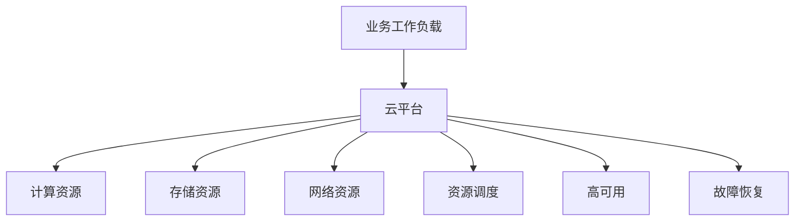

云平台大体有两条演进路线：

| 路线 | 典型系统 | 核心思路 | 优势 | 局限 |
|---|---|---|---|---|
| 虚拟化平台 | OpenStack VMware | 把物理机切成虚拟机再部署应用 | 隔离清晰 容易承接传统架构 | 应用和基础设施割裂 资源开销较高 |
| 作业调度平台 | Google Borg | 直接在大规模机器池上调度进程或容器 | 资源利用率高 调度和故障恢复自动化 | 对平台抽象和控制面要求更高 |

早期 PaaS 形态并不统一，很多企业会自建面向内部业务的应用托管入口，也有网站把 PaaS 能力包装成面向开发者的在线服务。这个历史背景说明了一个现实：应用平台的需求一直存在，只是早期缺少统一对象模型和开放生态，Kubernetes 后来把“应用运行、服务发现、配置、权限、扩缩容”收敛成了标准 API。

Borg 是 Kubernetes 的重要思想来源。它不是简单的容器运行系统，而是 Google 内部长期运行在线服务和离线任务的大规模集群管理系统。在线业务如 Gmail、Google Docs、Web Search 需要长期运行和高可用；离线任务如批处理、数据分析、对账作业更关注吞吐和资源利用率。Borg 把两类 workload 放在同一个资源池里管理，在资源空闲时运行离线任务，在在线业务需要资源时让高优先级任务抢占资源。

Borg 这张能力图的重点不是 Google 产品清单，而是说明一个调度平台要同时托住“长期在线服务”和“短时计算任务”。关键点是，在线服务的命根子是高可用，离线任务的价值是填平资源波谷；两类任务放进同一个资源池以后，调度系统才有机会做混部、抢占和整体成本优化。

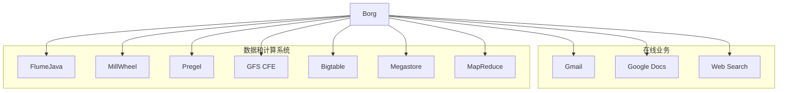

这也解释了为什么 Kubernetes 从一开始就不是“容器命令集合”。它继承的是“用户声明作业，平台隐藏调度和故障处理细节”的思路：用户不用知道实例落在哪台机器上，平台必须知道哪些节点健康、哪些资源可用、哪些副本需要迁移。

Borg 的几个基础概念可以直接映射到 Kubernetes 的设计直觉：

| Borg 概念 | 含义 | 对 Kubernetes 的启发 |
|---|---|---|
| Workload | 在线任务和离线任务 | 平台需要同时支持服务型应用和批处理任务 |
| Cell | 一个由大量机器组成的管理单元 | Kubernetes 集群也需要控制故障域和管理规模 |
| Job Task | Job 描述业务请求 Task 是具体执行单元 | Kubernetes 用 Deployment Job Pod 等对象拆分职责 |
| Naming | 服务命名和发现机制 | Kubernetes 用 Service DNS Ingress 等对象解决服务访问 |
| Borglet | 每台机器上的执行 Agent | Kubernetes 节点上的 kubelet 扮演类似角色 |
| Borgmaster | 集群大脑和调度入口 | Kubernetes 控制面承担统一管控职责 |

Cell 大小本身就是架构取舍。单个 Kubernetes 集群理论上可以做到数千节点规模，但集群越大，控制面故障、错误配置或大规模对象变更影响的范围也越大；集群越小，故障域更容易隔离，但集群数量增加后升级、监控、配额和权限维护成本也会上升。生产上通常要按业务边界、地域、容量和运维能力决定 Cell 或集群的大小，而不是盲目追求单集群最大规模。

Borg 调度的本质是大规模装箱问题。Best Fit 会优先把任务塞进最合适、最接近填满的机器，减少资源碎片，也方便把空闲机器收缩下线；Worst Fit 则优先选择最空闲的机器，让节点忙闲更均匀，降低单机热点。生产调度不会每次都全量重算，Borg 还用了几类优化：Score caching 在状态变化不大时复用评分结果，Equivalence classes 把同一个 Job 里相同 Task 的调度计算合并，Relaxed randomization 只随机抽取一部分机器做可行性检查，用局部最优换取调度吞吐。

Borg 架构本身并不神秘：用户提交配置或命令，控制面接收请求、保存状态、调度任务，节点 Agent 负责真正启动进程并汇报状态。复杂性隐藏在调度、状态一致性、故障恢复和资源隔离里。

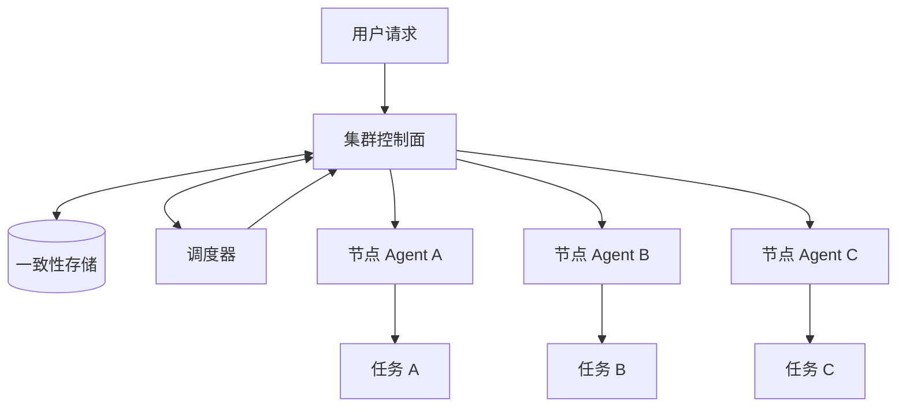

Borg 自己的高可用也很重要。Borgmaster 不是单实例大脑，而是多副本部署，典型设计里有 5 个 master 实例，并通过基于 Paxos 的一致性存储保存关键状态。看平台高可用时要分两层：业务运行在平台上是否高可用，平台控制面自身是否高可用；如果控制面失去调度和故障转移能力，业务副本还在运行，也会逐步失去恢复能力。

Borg 给 Kubernetes 留下的核心经验有三条。

第一，平台要对用户隐藏资源管理和故障处理细节。用户不应该关心应用最终落在哪台机器，也不应该为每一次节点故障手工迁移实例。

第二，资源利用率来自调度能力和 workload 混部。在线业务通常有波峰波谷，如果晚上访问量下降，大量 CPU 和内存闲置，平台就可以把离线任务调度上去，提高整体利用率。

后来 Google Autopilot 论文进一步把这个问题推进到动态资源调整：用户填写的 request 和 limit 往往并不准确，平台可以在 Pod 启动一段时间后持续观察真实用量，再用“真实用量加安全余量”的方式保守下调申请量，把多余资源回收给其他作业。这类思路也是后续 HPA、VPA 和资源推荐系统的重要基础：资源配置不只是人工拍脑袋，而应当由运行数据持续校正。

第三，高可用不是单一功能，而是贯穿对象设计、调度、控制器、状态存储和节点执行的系统目标。Kubernetes 后续的 Deployment、ReplicaSet、Service、StatefulSet、Job 等对象，都是围绕不同类型业务的高可用和可恢复性展开。

跨城或多地域部署的价值，也可以从网络配置事故理解：如果某个城市或机房因为 BGP 路由配置错误导致入口整体不可达，只在单地部署的应用会被一起带走；如果应用、入口和依赖已经跨故障域部署，并且流量调度能绕开故障地域，就更容易把影响限制在局部。高可用不是“某个组件多副本”这么简单，而是要把配置错误、网络隔离和控制面故障都当作可能发生的故障源。

### Kubernetes 的控制面和节点组件如何协同

Kubernetes 可以看作 Borg 思想在容器时代的开源化演进。它把容器镜像、声明式 API、控制器模式和插件生态组合起来，让用户用统一的对象模型描述应用和基础设施之间的关系。

Borg 到 Kubernetes 的迁移，可以先看“入口、控制面、状态存储、调度器、节点代理”这几个位置。Borg 里用户通过配置和命令进入 BorgMaster，Kubernetes 里用户通过 `kubectl`、配置文件或 Dashboard 进入 API Server；Borglet 对应 kubelet；Paxos 存储在 Kubernetes 中换成 etcd；容器镜像仓库成为节点拉取 workload 的外部依赖。

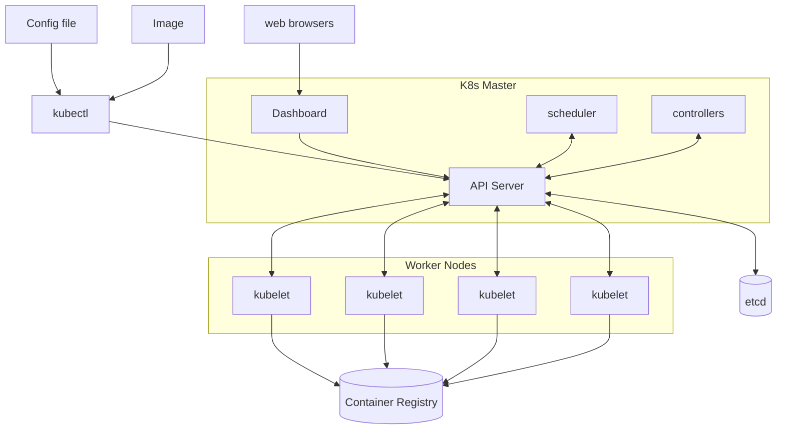

这类系统的架构层面并不神秘，复杂性藏在实现里。看图时不要只背组件名，要抓住调用方向：所有控制逻辑都围绕 API Server 读写对象，节点侧只执行分配到自己的 Pod，镜像仓库只是运行时拉取镜像的外部系统。

Kubernetes 集群由控制面和工作节点两部分组成。控制面负责接收请求、保存状态、做调度和运行控制器；工作节点负责拉取镜像、启动容器、配置网络、挂载存储和上报运行状态。

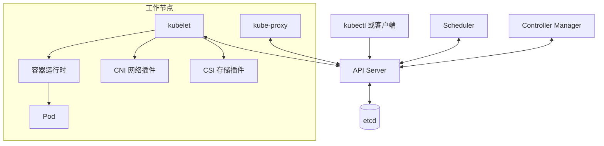

关键组件的职责如下：

| 组件 | 主要职责 | 设计要点 |
|---|---|---|
| API Server | 暴露 REST API 认证授权 准入控制 聚合 API | 所有组件访问集群状态的统一入口 |
| etcd | 保存集群状态 | 只有 API Server 直接访问 etcd |
| Scheduler | 为未绑定节点的 Pod 选择节点 | 本质上是特殊控制器 |
| Controller Manager | 运行 Deployment ReplicaSet Node 等控制器 | 持续推动实际状态逼近期望状态 |
| kubelet | 管理节点上的 Pod 生命周期 | 监听绑定到本节点的 Pod 并调用运行时 |
| kube-proxy | 为 Service 配置转发规则 | 根据 Service 和 Endpoints 维护负载均衡 |
| 容器运行时 | 拉取镜像 启停容器 | 通过 CRI 接入 kubelet |
| CNI CSI | 网络和存储插件接口 | 让平台支持不同厂商和实现 |

表里“通过 CRI 接入 kubelet”这一句值得单独展开。kubelet 和具体容器运行时之间隔着一层协议适配：kubelet 内部作为 gRPC client，按 CRI 的 protobuf 定义发起请求；CRI Shim 作为 gRPC server 接收统一的 CRI 调用，把它翻译成具体运行时的调用，最终由容器运行时创建和管理容器。

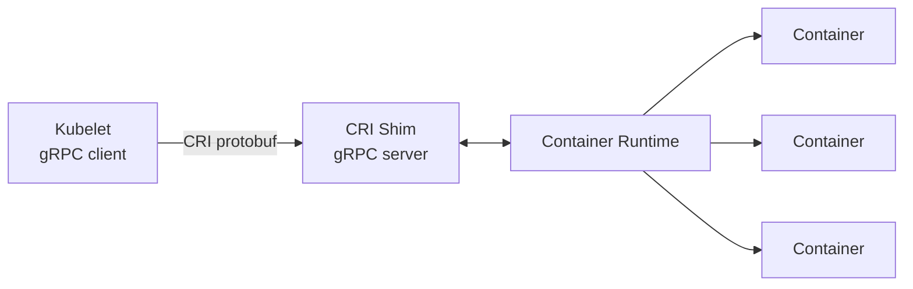

这条接口边界正是 Kubernetes 能接入不同运行时的原因：kubelet 只依赖 CRI，不需要理解运行时内部实现。课程里的说法是，Kubernetes 把接口定好，由 runtime 来实现——跑 Docker 可以，用 containerd 直接运行容器也可以，甚至接 Kata 这类轻量虚拟机方案也可以。支持原生 CRI 的运行时直接实现该服务，需要兼容适配的场景则由 Shim 承担转换。CNI 和 CSI 沿用同样的设计：平台定义 API，网络和存储插件实现细节。

kubelet 自身也不是“启动容器”的单一进程。课程里强调它是节点上的初始化系统，节点上所有其他 Pod 都由它拉起，所以它内部聚合了一组分工明确的管理模块：

| 模块组 | 组件 | 主要职责 |
|---|---|---|
| 服务接口 | `:10250 API`、`:10255 只读 API`、`:10248 /healthz` | 提供管理、只读查询和健康检查入口 |
| 核心协调 | `syncLoop`、`PodWorker` | 接收 Pod 变化并串行化单个 Pod 的同步操作 |
| 健康与资源 | `ProbeManager`、`OOMWatcher`、`GPUManager`、`cAdvisor` | 探针、OOM 监控、设备管理和资源统计 |
| 状态与驱逐 | `StatusManager`、`EvictionManager`、`Disk SpaceManager` | 状态回写、资源压力检测和驱逐 |
| 生命周期管理 | `Image GC`、`Container GC`、`ImageManager`、`VolumeManager`、`CertificateManager` | 镜像、容器、卷和证书管理 |

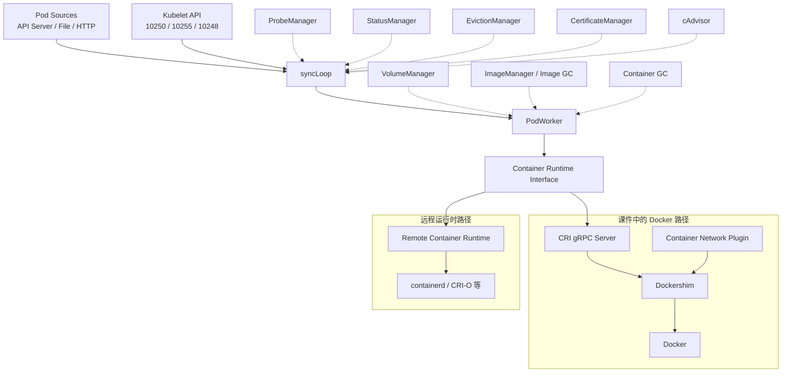

课程里把这些模块串成一句话：syncLoop 负责接收 Pod 变化、PodWorker 负责启停 Pod，ProbeManager 给每个应用做健康检查，OOMWatcher 盯着节点内存，Image GC 和 Container GC 回收不再使用的镜像和容器；对下统一调用 CRI、CNI、CSI 起容器，同时把节点和 Pod 状态汇报给 API Server。这张图用的是课件当时的组件结构，保留了 Dockershim 路径；路径本身已成历史，但“上层控制逻辑统一经过 CRI 调用底层运行时”这个结构没有变。

生产集群里的控制面组件通常也会容器化运行，这就是 self-hosting：Kubernetes 用自己的 Pod 模型管理 API Server、Controller Manager、Scheduler、etcd、kube-proxy 等组件。这里有一个边界必须记住：kubelet 不能依赖 Kubernetes 自己先把它调度起来，它是节点上的初始化系统，通常由 systemd 拉起，然后负责启动其他 Pod。

这种启动链路依赖 Static Pod。kubelet 配置里可以指定 `staticPodPath`，它会持续扫描这个目录里的 Pod 清单，直接在本机启动这些 Pod，不需要先经过调度器；kubeadm 部署控制面时，API Server、etcd、Scheduler、Controller Manager 等清单就放在这条路径下。Static Pod 启动后，kubelet 会在 API Server 里创建一个对应的 Mirror Pod 记录，所以 `kubectl get pod -n kube-system` 看到的是静态 Pod 在 API 侧的镜像对象，而不是由调度器分配出来的普通 Pod。

把控制面本身做成高可用时，最常见的形态是堆叠式 etcd 拓扑：每台 Master 同时运行 API Server、Controller Manager、Scheduler 和一个 etcd member，API Server 通过负载均衡器对外提供统一入口，三个 etcd member 组成 Raft 集群。kubeadm 的高可用部署默认就是这种形态，控制面组件全部以 Static Pod 起在每台 Master 上；课程里讲生产部署时给的参照也是这条路线——用 kubespray 这类工具先通过 Ansible 完成操作系统层配置，再用 kubeadm 完成控制平面配置，Master 节点必须高可用。

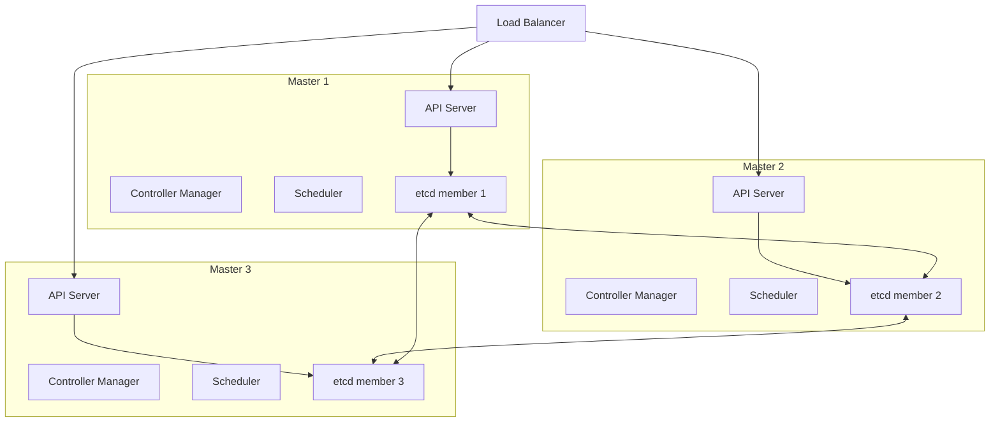

堆叠式部署节省主机，但控制平面与 etcd 共享故障域：单台 Master 故障会同时损失一个 API Server 副本和一个 etcd member。因此节点数量、etcd quorum、磁盘性能和备份恢复必须当成一个整体来设计，而不能只盯着“API Server 有三个副本”。

API Server 是唯一的集群 API 入口，因此它不是简单的反向代理。一个请求进入后，会经过认证、限流、审计、授权、聚合 API、准入变更、Schema 校验和准入校验，最后才落到 etcd。排查 API 对象创建失败时，要先判断失败发生在这条链路的哪一段：是没有身份、没有权限、Webhook 卡住、对象非法，还是 etcd 写入失败。

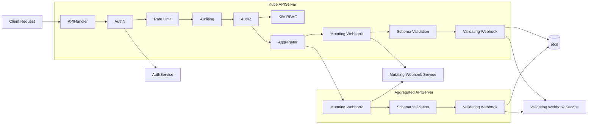

这张图还说明了“只有 API Server 直接访问 etcd”的含义：其他组件看似在管理 Pod、Service 或 Node，本质上都是通过 API Server 读写对象。绕开 API Server 等于绕开认证、授权、准入、审计和版本转换，生产环境除极端救场外不应这么做。

Aggregator 是对 API Server 组件能力的扩展，而 CRD 是对对象模型的扩展，二者适合解决不同问题。典型例子是 `metrics-server`：它提供 `metrics.k8s.io` 这类聚合 API，`kubectl top node` 或 `kubectl top pod` 的请求先进入原生 API Server，再由聚合层路由到扩展 API Server 返回资源指标。这样用户仍然访问同一个 Kubernetes API 入口，但背后可以挂载额外 API 服务。

etcd 的 Watch 机制承担了 Kubernetes 内部“事件总线”的角色。控制器不是反复轮询全量对象，而是通过长连接观察对象变化，由 etcd 和 API Server 把变化事件推出来；因此很多分布式系统里需要额外消息队列串联状态变化的场景，在 Kubernetes 控制面里由对象存储加 Watch 完成。API Server 启动后还会维护 watch cache：它从 etcd 监听全量数据并缓存到内存，大多数组件的 list/watch 读请求先在 API Server 缓存层被满足，写请求才落回 etcd。这样做是为了保护 etcd 这种强一致存储，不让大量控制器的读流量直接击穿到后端。

创建 Deployment 的过程可以说明控制面协同方式。用户看起来只是执行了一条命令，但背后是多个控制器和节点组件按职责分段处理。

```bash
kubectl create deployment nginx --image=nginx:alpine
kubectl get deployment
kubectl describe deployment nginx
kubectl get replicaset
kubectl get pod -o wide
```

这条链路可以拆成 8 个步骤：

1. 用户提交 Deployment 对象到 API Server。
2. API Server 完成认证、授权、校验，把对象持久化到 etcd。
3. Deployment Controller 监听到新的 Deployment，创建 ReplicaSet。
4. ReplicaSet Controller 监听到 ReplicaSet，创建 Pod。
5. Scheduler 监听到未设置 `nodeName` 的 Pod，为它选择节点并写回绑定结果。
6. 目标节点的 kubelet 监听到绑定到本节点的 Pod，开始创建流程。
7. kubelet 调用容器运行时拉镜像和启动容器，调用 CNI 配置网络，必要时调用 CSI 挂载存储。
8. Pod 状态持续写回 API Server，控制器根据状态继续调谐。

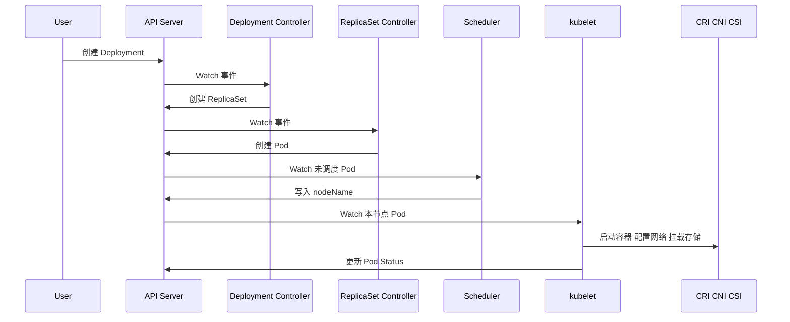

这个过程体现了 Kubernetes 的一个关键设计：每个控制器只负责自己那一段相对简单的逻辑。Deployment Controller 只关心 Deployment 到 ReplicaSet；ReplicaSet Controller 只关心副本数和 Pod；Scheduler 只关心未调度 Pod；kubelet 只关心本节点 Pod。这种拆分让系统可以通过对象和事件串起来，而不是把所有逻辑压进一个巨大的控制器。

控制器通常通过 Informer 工作。Informer 启动时先 List 当前对象，再 Watch 后续变化，把对象缓存到本地 store 中，同时把事件投递给 handler 和 workqueue。写控制器或 Operator 时，读取完整对象应该优先读本地缓存，只有更新对象时才调用 API Server。否则大量控制器频繁读取 API Server，会把控制面压垮。

这条原则不是纸面优化。一个生产案例是，eBay 一次 Calico 安全策略相关升级中，新版本对 API Server 轮询过密，在小规模测试环境里没有暴露问题，到了大规模生产集群后把 API Server 和控制面打挂，而且恢复困难。根因就是没有把状态放进本地缓存并通过 Watch 增量感知变化，而是用高频轮询放大了控制面读压力。写控制器或接入网络、安全插件时，裸读 API Server 必须被当成生产风险审查。

从控制器接口看，Informer 负责接收事件，Lister 负责从本地缓存读取对象，EventHandler 把 Add、Delete、Update 事件转换成 key 放入 workqueue，worker 再按 key 处理业务逻辑。这里的 key 通常是 `namespace/name`，它比把完整对象反复塞进队列更稳定，也更容易重试。

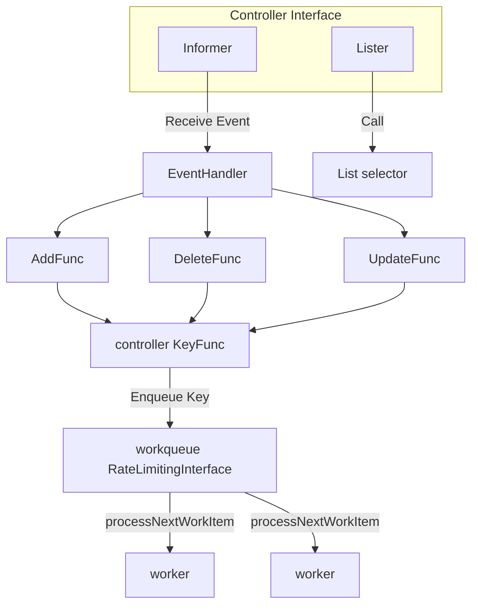

这里有一个常见误区需要澄清：local store 是控制器进程内存里的缓存，不是本机 kube 目录下的 cache。真正的对象副本由 shared informer 维护；读对象走本地缓存，写对象才回 API Server，这是控制面能承受大量控制器的关键。

Informer 内部还要理解两个细节。Reflector 收到 API Server 返回的 JSON 或 protobuf 数据后，会按对象类型和 `json` tag 反序列化成 Go struct，再送入后续缓存链路；DeltaFIFO 保存的是对象变化的增量队列，可以理解成一段环形缓冲，持续接收 Add、Update、Delete 事件，让 worker 只处理变化。shared informer 的价值就在于多个控制器复用同一份本地对象缓存，同时尽量保持缓存版本和 API Server 观察到的版本一致。

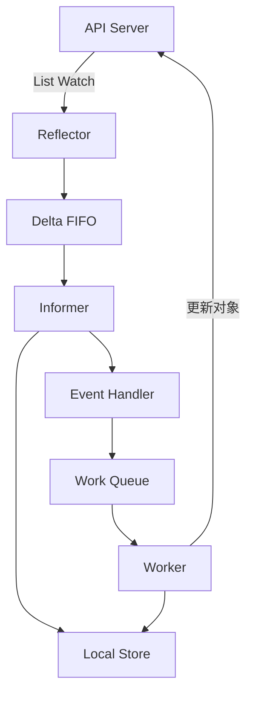

### kubectl 与 kubeconfig 如何完成基础操作

`kubectl` 是访问 Kubernetes API 的命令行入口。它不是直接管理节点或容器，而是读取 kubeconfig 中的集群地址、用户凭据和上下文配置，然后向 API Server 发起请求。

kubeconfig 的核心结构有三类：

| 字段 | 含义 |
|---|---|
| `clusters` | API Server 地址和证书配置 |
| `users` | 用户身份和认证凭据 |
| `contexts` | cluster user namespace 的组合 |

`current-context` 决定了不显式指定 `--context` 时 kubectl 默认访问哪个集群、使用哪个用户身份和哪个 namespace。`user` 单独拆出来，是因为它包含证书、token、exec 登录插件等认证信息；同一个 cluster 可以配多个 user，同一个 user 也可以被多个 context 复用。多集群环境里要先确认当前 context，再执行会改变对象的命令，避免把发布或删除操作打到错误集群。

常见操作命令如下：

```bash
kubectl config current-context
kubectl config get-contexts
kubectl get pod -A
kubectl get pod nginx -o yaml
kubectl describe pod nginx
kubectl logs nginx
kubectl exec -it nginx -- sh
kubectl get pod -w
kubectl get ns default -v 9
```

这些命令分别对应几类日常工作：

| 命令 | 用途 | 排查价值 |
|---|---|---|
| `kubectl get` | 查看对象列表或 YAML | 快速确认对象是否存在 状态是否符合预期 |
| `kubectl describe` | 查看对象详情和 Event | 排查调度失败 镜像拉取失败 探针失败 |
| `kubectl logs` | 查看容器标准输出 | 排查应用自身错误 |
| `kubectl exec` | 进入容器执行命令 | 临时诊断网络 文件 配置 |
| `kubectl get -w` | Watch 对象变化 | 观察滚动升级 调度 状态变化 |

`kubectl -v 9` 是理解命令行和 REST API 关系的实用技巧。例如 `kubectl get ns default -v 9` 会打印加载 kubeconfig、选择 context、构造 HTTP 请求和接收响应的详细日志，能直观看到 kubectl 只是 Kubernetes REST API 的客户端封装。调试认证、代理、证书或 API 路径问题时，这比只看最终报错更有帮助。

创建对象时还要区分 `create` 和 `apply`。`kubectl create` 的语义是“创建一个还不存在的对象”，对象已存在时会失败，适合一次性创建或明确要求不存在的场景；`kubectl apply` 则是声明式提交，不存在则创建，存在则按配置 patch 更新，更适合作为日常交付和 GitOps 流程的默认方式。

一个典型的“从对象到运行实例”的排查顺序是：

```bash
kubectl get deployment nginx
kubectl describe deployment nginx
kubectl get replicaset -l app=nginx
kubectl get pod -l app=nginx -o wide
kubectl describe pod -l app=nginx
kubectl logs -l app=nginx
```

Event 本身也是 Kubernetes 对象，但它通常不孤立存在，而是附着在 Deployment、ReplicaSet、Pod 等主对象上，用来描述最近发生了什么。`describe` 的价值就在这里：它不只展示对象 Spec 和 Status，还会展示控制器、调度器、kubelet 产生的事件链。

### Kubernetes 为什么强调声明式 API 和分层架构

Kubernetes 最核心的系统范式是声明式。命令式系统关注“你应该怎么做”，声明式系统关注“我希望最终是什么样”。可以用遥控器和空调做类比：电视遥控器更像命令式，按一次换一次台；空调设置目标温度更像声明式，用户只声明希望 25 度，系统自己根据当前室温不断调节。

在传统云计算分类里，IaaS 主要托管网络、存储、服务器和虚拟化；PaaS 继续托管操作系统、运行时和中间件；SaaS 则连应用也交给云厂商。Kubernetes 的边界更模糊：它既面向基础设施运维，也面向应用发布，因为它用一套对象 API 把集群、应用、网络、存储、权限和配额都纳入统一模型。

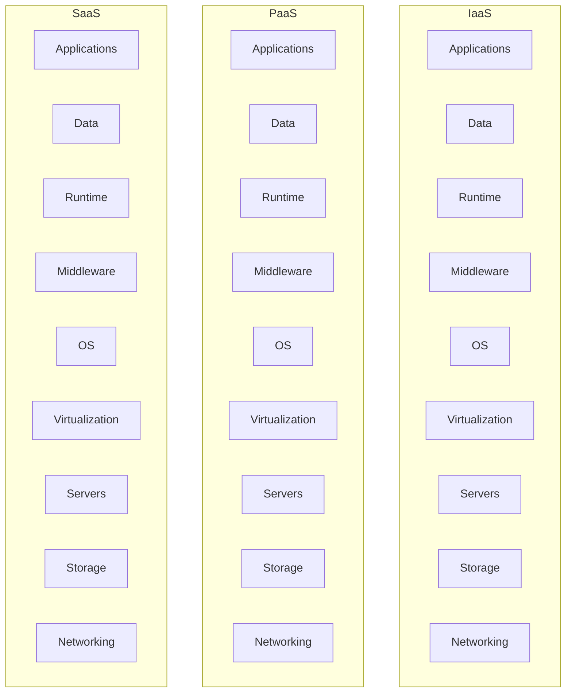

这里要关注的不是考试式分类，而是工程分工：传统企业需要自己管理一长串技术栈，云平台把其中一部分自动化。Kubernetes 进一步把“应用怎么发布、怎么发现服务、怎么扩缩容、怎么挂存储”变成 API 对象，应用团队和平台团队围绕同一套对象协作。

声明式 API 的好处是可重复、可恢复、可调谐。客户端请求中断时，用户可以重新提交同一份对象；控制器故障恢复后，可以根据 API Server 中保存的期望状态继续工作；节点故障时，控制器可以重新创建 Pod 并触发调度。

这背后对应分布式系统里的幂等性：客户端可能因为超时、断网或进程重启重复提交同一份请求，服务端要能去重或把重复请求收敛到同一个结果。声明式 API 天然适合这个模型，因为用户提交的是“我期望副本数是 3”这类名词化的期望状态，而不是“再增加 1 个副本”这样的动作。重复 `apply` 同一份对象时，期望值没有变，控制器只需要继续把实际状态调到这个目标。

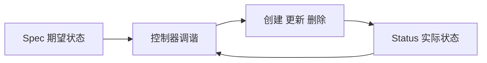

Kubernetes API 设计原则可以总结为：

| 原则 | 解释 |
|---|---|
| API 应该是声明式 | 对象描述期望状态而不是一次性操作步骤 |
| 对象应互补且可组合 | Deployment ReplicaSet Pod Service 分别承担不同职责 |
| 高层 API 表达业务意图 | Deployment 表达部署和升级 StatefulSet 表达有状态应用 |
| 低层 API 服务高层控制 | Pod Volume Condition 等基础结构被多处复用 |
| 避免隐藏机制 | 外部 API 应明确表达系统行为 |
| 操作复杂度可控 | API 操作复杂度应与对象数量线性相关 |
| 状态不依赖连接 | 对象状态不能依赖客户端是否在线 |
| 避免全局状态依赖 | 减少控制器间隐式耦合 |

逐条拆开看，这些原则解决的是控制器长期演进的问题。

| 原则 | 工程含义 |
|---|---|
| API 应该是声明式 | 字段要表达名词性的期望值，例如“副本数是 3”，而不是“增加 1 个副本”，这样服务端不用区分重试和新动作 |
| 对象应互补且可组合 | Deployment 管发布，ReplicaSet 管副本，Pod 管运行实例，能拆开组合说明边界足够松耦合 |
| 高层 API 表达业务意图 | 先抽象业务语义再写控制器，例如 Deployment 表达可回滚发布，而不是暴露一串创建和删除命令 |
| 低层 API 服务高层控制 | Pod、Volume、Condition、Status 这类结构要能被多个高层对象复用，避免每个控制器自造一套状态模型 |
| 避免隐藏机制 | 外部 API 要把关键行为显式暴露出来，不能让用户靠猜控制器内部约定来理解系统动作 |
| 操作复杂度可控 | 控制器处理对象时要避免无界全量扫描，list、watch、selector 和索引设计要让复杂度随对象规模可预期增长 |
| 状态不依赖连接 | 客户端断线后对象状态仍保存在 API Server 中，控制器和客户端重连后可以继续从对象状态恢复 |
| 避免全局状态依赖 | 减少隐式全局开关和跨控制器耦合，用 ownerReference、selector、status 等显式关系传递状态 |

不同业务场景还应提供不同外部 API，例如 StatefulSet 和 ReplicaSet 直接拆成两个对象，比在一个对象里写大量 if/else 更清晰。

这些原则最终会落到控制面结构上：UI、CLI 和外部系统都通过 API Server 进入，Scheduler 和 Controller 也只和 API Server 交互，etcd 保存事实状态。Image、Pod、ReplicaSet、StatefulSet、Service 等对象不是 UI 层概念，而是 API Server 统一管理的资源模型。

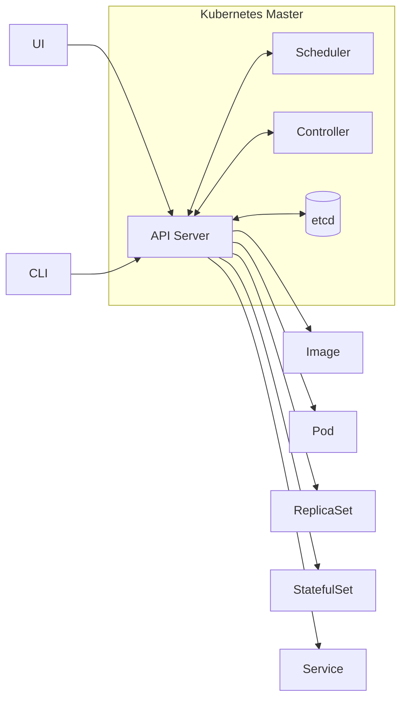

因此，排查 Kubernetes 时要少问“这个组件直接改了什么”，多问“它 watch 了什么对象、写回了什么对象、哪个控制器会继续接力”。这是后面理解调度器、控制器和 Operator 的统一入口。

为什么 Deployment 不直接控制所有 Pod，而是中间还有 ReplicaSet？因为 Kubernetes 倾向于用多个小对象拆分职责。Deployment 负责版本发布和滚动升级，ReplicaSet 负责维持某个 Pod 模板的副本数，Pod 负责描述实际运行实例。如果把所有逻辑塞进 Deployment，它会同时处理发布策略、副本计数、Pod 创建、版本历史等大量分支，控制器逻辑会迅速复杂化。

对象组合的关系可以这样理解：

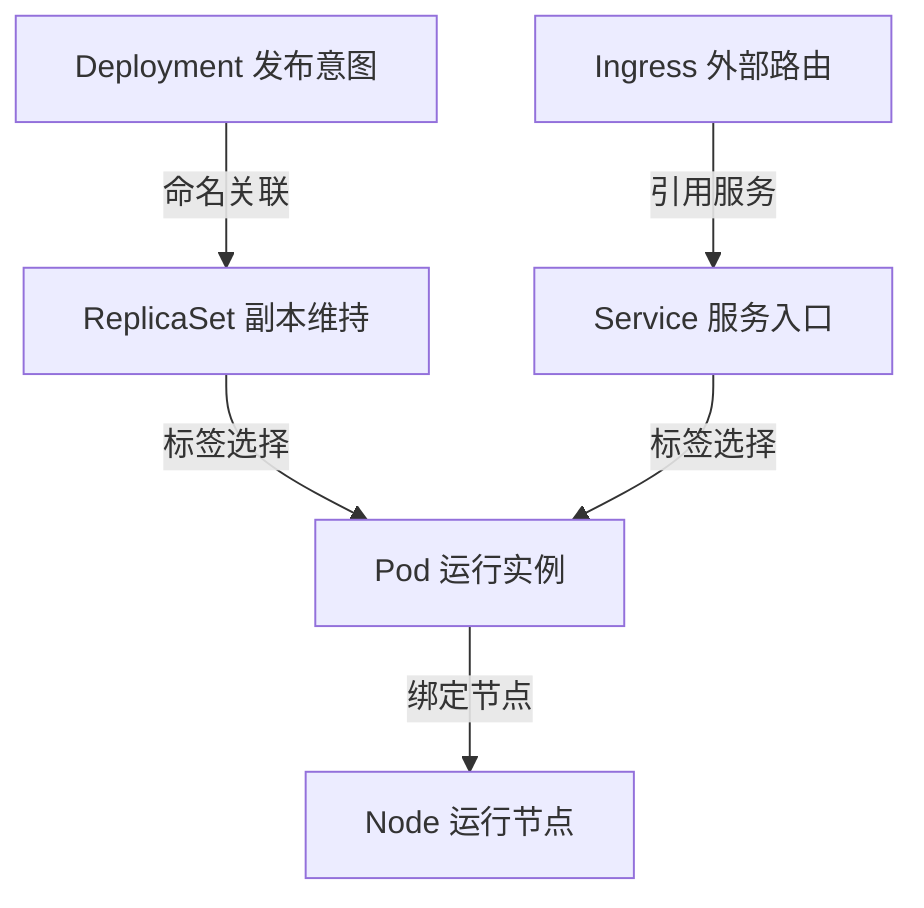

Kubernetes 的分层架构也服务于扩展性：

| 层级 | 内容 | 作用 |
|---|---|---|
| 核心层 | Pod Node Namespace Service API Machinery | 提供最小可运行抽象 |
| 应用层 | Deployment StatefulSet DaemonSet Job CronJob | 面向不同 workload 类型 |
| 治理层 | RBAC ResourceQuota NetworkPolicy PSP 或替代策略 | 控制权限 配额 安全和隔离 |
| 接口层 | kubectl client-go SDK | 让用户和外部系统接入 |
| 生态层 | Helm Operator Istio Knative 各类插件 | 在 Kubernetes API 上扩展业务能力 |
| 底层插件 | CRI CNI CSI Cloud Provider Registry | 对接不同运行时 网络 存储和云厂商 |

安全也是 Kubernetes 设计理念中的一条主线，不只是后面某个安全章节的附属内容。控制面通信依赖 TLS，认证可以接内部 ServiceAccount，也可以对接外部用户和认证系统；授权通过 RBAC 等机制限制谁能看、改哪些对象；Namespace 提供资源边界，Secret 用来承载敏感数据，并在生产中配合 etcd at-rest encryption 或 KMS 做加密保存；数据面还可以用 Taint 隔离节点、用 Pod 安全策略或其替代机制约束容器权限、用 NetworkPolicy 限制不同 Pod 之间的端口和协议访问。生产上要把这些层叠起来看，而不是只开一个 RBAC 就认为集群已经安全。

把生态系统展开看，应用开发、渐进式发布、公共服务、数据面对象、控制面组件、集群管理和基础设施管理分别承担不同关注点。也可以拆成两个视角：集群管理员关注控制面、节点、认证授权、网络存储和备份恢复；应用开发者关注镜像构建、资源需求、服务发现、扩缩容和发布流水线。

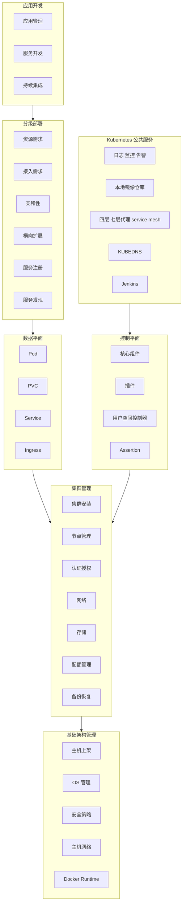

这张图适合用来判断问题归属：Pod 启不来可能是数据面对象写错，也可能是节点、运行时、镜像仓库、网络或配额问题；Service 不通可能是 Selector、kube-proxy、DNS、Ingress 或网络插件问题。Kubernetes 的复杂性来自生态宽度，而不是某一个对象难懂。

Kubernetes 的分层图进一步说明了它为什么能长期扩展：核心层只保留 API 和执行所需的最小对象，应用层提供 Deployment、StatefulSet、CronJob 等 workload 抽象，治理层提供 RBAC 和配额等策略，接口层让外部工具接入，底层接口把运行时、网络、存储、云厂商和身份提供方解耦。

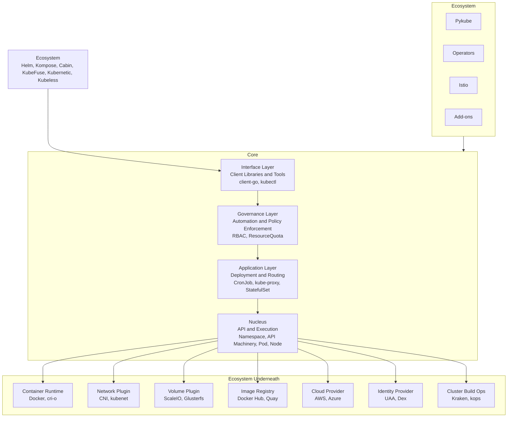

这种分层让 Kubernetes 不局限在某一种云、某一种网络、某一种存储或某一种业务模型上。它定义 API 和接口，具体实现由生态系统补齐。技术选型时真正困难的是“围绕 Kubernetes 的方案太多”，所以必须先判断自己要解决的是核心对象问题、底层插件问题，还是上层生态问题。

### API 对象的 TypeMeta Metadata Spec Status 如何表达系统状态

Kubernetes 的所有管理能力都落在 API 对象上。一个对象通常包含四类属性：`TypeMeta`、`Metadata`、`Spec`、`Status`。

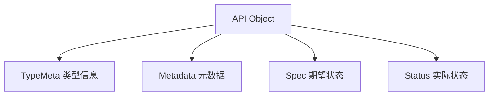

`TypeMeta` 用来说明对象是什么类型，核心字段是 `apiVersion` 和 `kind`。

```yaml
apiVersion: apps/v1
kind: Deployment
```

`apiVersion` 背后包含 Group 和 Version。例如 `apps/v1` 表示 `apps` API 组里的 `v1` 版本；核心组对象如 Pod 常写作 `v1`。`kind` 表示对象类型，如 Pod、Service、Deployment、StatefulSet。

Group、Kind、Version 合在一起决定了一个对象的 API 身份。Version 不只是字符串，它表达 API 的成熟度和兼容路径：`alpha` 通常适合实验和演示，`beta` 表示功能接近可用但仍可能调整，`v1` 才是稳定生产版本。Kubernetes 社区持续发版，对象 API 会从 `v1alpha1`、`v1beta1` 演进到 `v1`，也可能迁移 API Group，例如 Deployment 曾从 `extensions/v1beta1` 迁到 `apps/v1`。

API Server 内部通过 conversion 机制处理这种演进：外部可以暴露多个版本，进入 API Server 后会转换成内部版本处理和存储，需要返回给客户端时再转换成请求的外部版本。这样同一个对象可以兼容不同客户端版本，也解释了为什么 API 设计一旦进入稳定版本就必须谨慎，破坏兼容会影响所有依赖该对象的控制器和工具。

`Metadata` 用来唯一标识对象并提供通用控制信息。最关键的是 `namespace` 和 `name`。同一个 namespace 内，某类对象通常通过 name 唯一标识；不同 namespace 之间可以存在同名对象。

```yaml
metadata:
  name: nginx
  namespace: default
  labels:
    app: nginx
    env: prod
  annotations:
    description: "web frontend"
```

Metadata 里的重要字段包括：

| 字段 | 用途 |
|---|---|
| `name` | 对象名称 |
| `namespace` | 对象所在命名空间 |
| `labels` | 面向选择和关联 |
| `annotations` | 面向扩展信息和非选择型元数据 |
| `finalizers` | 删除前的清理保护 |
| `resourceVersion` | 乐观锁和 Watch 版本 |
| `ownerReferences` | 表达对象归属和级联删除关系 |

Finalizer 可以理解成对象删除前的一把逻辑锁。对象带有 `metadata.finalizers` 时，执行 `kubectl delete` 并不会立刻从存储中消失，API Server 只会给它打上 `deletionTimestamp`，对象会停留在 `Terminating` 状态。典型用途是清理外部资源：例如控制器先释放外部分配的 IP、DNS 记录或云资源，确认清理完成后再移除 finalizer，对象才会被真正删除。排查“对象一直删不掉”时，要看 finalizer 是不是仍然存在；手工清空 finalizer 数组会让对象立即进入物理删除流程，因此只能在确认外部清理风险后操作。

一个最小演示可以这样看：先给测试 Pod 加 finalizer，再删除它，此时对象还在，只是出现了 `deletionTimestamp`；清空 finalizer 后对象才会真正消失。

```bash
kubectl patch pod hello --type merge -p '{"metadata":{"finalizers":["example.com/cleanup"]}}'
kubectl delete pod hello
kubectl get pod hello -o jsonpath='{.metadata.deletionTimestamp}'
kubectl patch pod hello --type merge -p '{"metadata":{"finalizers":null}}'
```

`resourceVersion` 则是 Kubernetes 对象并发更新的乐观锁。多个控制器可能先读到同一个对象版本，控制器 A 更新成功后版本号变化，控制器 B 再带着旧版本提交更新时，API Server 会发现版本不一致并返回 `409 Conflict`。正确的控制器逻辑不是忽略这个错误，而是重新 get 或从 informer 等到最新对象，在新版本上重新计算修改并重试。否则并发调谐时就可能出现更新丢失。

Label 和 Selector 是 Kubernetes 对象组合的核心。Label 是对象上的 key value 标记，Selector 是筛选条件。ReplicaSet 通过 Selector 找到属于自己的 Pod，Service 通过 Selector 找到后端 Pod。

```yaml
selector:
  matchLabels:
    app: nginx
template:
  metadata:
    labels:
      app: nginx
```

Label 不提供唯一性，它适合表达“这一组对象属于同一类”。下面这个图要和 Deployment、ReplicaSet、Service 一起看：Selector 会匹配所有带有相同标签的对象，而不是只匹配某一个固定名字的对象。

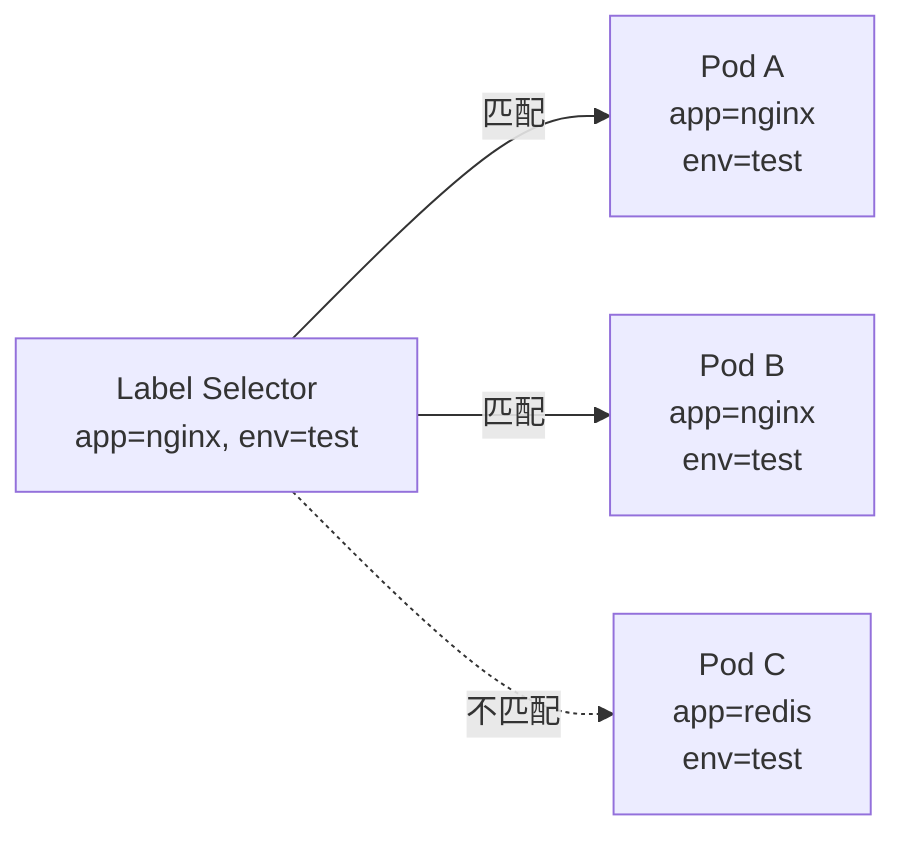

Label 的另一类用途是成本和治理维度标记：给对象标记部门、项目、环境和语言，后续就可以按这些维度统计资源消耗。Annotation 不参与选择，更适合保存部署工具、审计、滚动升级状态、安全策略或外部系统所需的附加信息。

`Spec` 是用户声明的期望状态，`Status` 是系统观察到的实际状态。控制器的职责就是不断比较 Spec 和 Status，并采取动作让实际状态逼近期望状态。

```mermaid
flowchart LR
    Spec["Spec<br/>期望状态"]
    Controller["Controller<br/>调谐循环"]
    Cluster["Cluster Runtime<br/>实际运行"]
    Status["Status<br/>实际状态"]

    Spec --> Controller
    Controller --> Cluster
    Cluster --> Status
    Status --> Controller
```

这张图对应“控制器是闭环系统”这个核心模型。用户写 Spec，系统观察 Status；如果 Status 不等于 Spec，控制器就继续创建、更新、删除或重试。不要让用户手工维护 Status，否则闭环会失去边界。

```yaml
apiVersion: apps/v1
kind: Deployment
metadata:
  name: nginx
spec:
  replicas: 3
  selector:
    matchLabels:
      app: nginx
  template:
    metadata:
      labels:
        app: nginx
    spec:
      containers:
        - name: nginx
          image: nginx:1.25
status:
  replicas: 3
  readyReplicas: 3
  availableReplicas: 3
```

在实际开发控制器时，要特别注意：用户通常只写 Spec，Status 由控制器更新。不要把真实运行状态混进 Spec，也不要让用户手工维护 Status。这样才能保证“期望”和“实际”的边界清晰。

### Pod Service Deployment StatefulSet 等核心对象如何组合业务

Kubernetes 的核心对象不是彼此孤立的，而是组合起来描述完整业务。一个 Web 服务至少需要运行单元、工作负载控制器、服务发现和入口路由；有状态服务还需要稳定身份和持久化存储；平台扩展则需要 CRD 和自定义控制器。

先用对象总览建立坐标：Node 和 Namespace 解决资源与边界，Pod 是运行单元，ConfigMap 和 Secret 解决配置，Service 和 Ingress 解决访问，ReplicaSet、Deployment、StatefulSet、Job、DaemonSet 解决不同 workload，PV/PVC 解决存储，CRD 解决扩展。

```mermaid
mindmap
  root((Kubernetes 对象))
    资源和边界
      Node
      Namespace
    运行单元
      Pod
    配置和凭据
      ConfigMap
      Secret
    身份
      User Account
      Service Account
    服务访问
      Service
      Ingress
    工作负载
      ReplicaSet
      Deployment
      StatefulSet
      Job
      DaemonSet
    存储
      PersistentVolume
      PersistentVolumeClaim
    扩展
      CustomResourceDefinition
```

这张总览适合在排查时反向定位：应用不可用时，先确认 Pod 是否存在，再看 Deployment/ReplicaSet 是否在维持副本，Service 是否选中了 Pod，Ingress 是否指向 Service，配置和存储是否被正确挂载。

#### Node 和 Namespace

Node 是计算节点抽象，可以是物理机或虚拟机。它描述节点资源、健康状态、网络状态和运行条件。基础设施团队关注 Node，因为节点维护、故障、扩缩容都会影响调度和工作负载运行。

Namespace 是资源组织和隔离边界。它像一个虚拟目录，把不同团队、环境或项目的对象放在不同空间里，再结合 RBAC 和 ResourceQuota 做权限和配额控制。

```bash
kubectl get node
kubectl get namespace
kubectl get pod -n kube-system
```

#### Pod

Pod 是 Kubernetes 调度和运行的基本单位。它不是单个容器，而是一组强关联容器的集合。Pod 内多个容器共享网络 namespace、可以共享 Volume，也可以共享部分安全上下文。

Pod 之所以重要，是因为它打通了基础设施和应用接入两个视角。基础设施侧可以通过 Pod 知道应用实例在哪里运行、需要多少资源、如何迁移；应用侧可以通过 Pod 描述镜像、资源、环境变量、健康检查和存储挂载。

Pod 内多容器适合 sidecar 等强耦合场景。共享网络 namespace 意味着同一个 Pod 里的容器可以通过 `localhost` 互访；共享 Volume 则常用于主容器产生日志或数据，sidecar 负责采集、同步或代理。Pod 是调度单元，调度器不会把同一个 Pod 里的容器拆到不同节点。

```mermaid
flowchart TB
    subgraph Pod["Pod"]
        Net["共享 Network Namespace"]
        Vol["共享 Volumes"]
        Sec["共享 Security Context"]
        C1["Container nginx"]
        C2["Container sidecar"]
    end

    C1 --- Net
    C2 --- Net
    C1 --- Vol
    C2 --- Vol
    C1 --- Sec
    C2 --- Sec
```

```yaml
apiVersion: v1
kind: Pod
metadata:
  name: hello
  labels:
    app: hello
spec:
  containers:
    - name: nginx
      image: nginx:1.25
      ports:
        - containerPort: 80
      resources:
        requests:
          cpu: "100m"
          memory: "64Mi"
        limits:
          cpu: "500m"
          memory: "128Mi"
```

资源限制要先区分可压缩资源和不可压缩资源。CPU 是可压缩资源，内核可以通过时间片和配额把 CPU 分给多个容器，超过 limit 时应用通常表现为变慢；内存是不可压缩资源，进程实际占用超过限制后更可能被 OOMKill。生产上因此要格外谨慎地设置 memory request 和 limit，而 CPU 偶发被压缩通常还能通过延迟上升被业务吸收。

资源值也不应该只靠主观估计。Autopilot 这类系统把资源推荐和回收平台化，在应用运行稳定后根据真实用量加安全余量动态回收多申请的资源，避免 request 和 limit 长期偏离真实负载。

人工估算 resources 时，可以用“高峰 QPS 乘以安全 buffer”做压测输入。例如线上高峰大约 50 QPS，就按 60 到 70 QPS 压测，观察 CPU、内存、延迟和错误率，再反推 requests 和 limits。这样得到的是容量模型，而不是从平均负载或单次手工请求猜一个资源值。

孤立 Pod 不适合生产服务。删除一个普通 Pod 后，服务会直接消失；而通过 Deployment 创建的 Pod 被删除后，ReplicaSet Controller 会发现实际副本数小于期望副本数，然后创建新的 Pod。这就是控制器模式带来的自愈能力。

这个差异可以用一个最小演示观察：

```bash
kubectl run lonely-nginx --image=nginx:1.25
kubectl delete pod lonely-nginx
kubectl get pod lonely-nginx

kubectl create deployment nginx --image=nginx:1.25 --replicas=1
kubectl get pod -l app=nginx
kubectl delete pod -l app=nginx
kubectl get pod -l app=nginx -w
```

第一组命令删除的是孤立 Pod，删除后没有控制器负责补回；第二组命令删除的是 Deployment 管理下的 Pod，ReplicaSet 会重新创建一个新 Pod。这里能看到“故障转移”不等于真正高可用：单副本自愈仍然会中断几秒，生产服务还需要多副本、Service 负载均衡、readinessProbe 和滚动更新策略一起配合。

从应用运行角度看，Pod Spec 还承载环境变量、启动命令、Secret、Volume、资源限制和健康检查。可以把它和容器职责分开看：镜像负责代码分发，Pod Spec 负责把配置、资源、网络、存储和探针补齐，平台才知道如何运行这个实例。

```mermaid
flowchart TB
    Pod["Pod Spec"]
    Env["env<br/>环境变量"]
    Command["command args<br/>启动命令"]
    Secret["secret<br/>敏感配置"]
    Volume["volumeMounts<br/>挂载存储"]
    Resources["resources<br/>CPU Memory"]
    Probes["probes<br/>健康检查"]

    Pod --> Env
    Pod --> Command
    Pod --> Secret
    Pod --> Volume
    Pod --> Resources
    Pod --> Probes
```

Pod 网络图要和“共享 network namespace”一起理解。一个 Pod 只有一个 Pod IP，多个容器共享它；同 Pod 内通过 `localhost` 通信，跨 Pod 通信则需要走 Pod IP、Service 或更高层入口。

```mermaid
flowchart TB
    subgraph Pod["Pod"]
        IP["Pod IP"]
        Loopback["localhost 127.0.0.1"]
        C1["Container A"]
        C2["Container B"]
    end

    C1 --- IP
    C2 --- IP
    C1 <-->|"localhost"| C2
```

健康检查决定了 Kubernetes 什么时候重启容器、什么时候把 Pod 从 Service 后端摘除、什么时候认为启动失败。滚动升级里的 `maxUnavailable` 也依赖这个状态：Deployment 判断能不能继续滚动，依赖 Pod 的 ready 状态，而 ready 状态常常来自 readinessProbe。

```mermaid
flowchart TB
    Probe["Probe"]
    Liveness["LivenessProbe<br/>不健康则重启"]
    Readiness["ReadinessProbe<br/>未就绪则摘除流量"]
    Startup["StartupProbe<br/>启动失败则重启"]
    Exec["Exec"]
    TCP["TCP socket"]
    HTTP["HTTP"]

    Probe --> Liveness
    Probe --> Readiness
    Probe --> Startup
    Liveness --> Exec
    Liveness --> TCP
    Liveness --> HTTP
    Readiness --> Exec
    Readiness --> TCP
    Readiness --> HTTP
    Startup --> Exec
    Startup --> TCP
    Startup --> HTTP
```

生产经验是：无状态 Web 服务至少要配置 readinessProbe，否则新 Pod 启动但业务还没准备好时，Service 可能过早转发流量；livenessProbe 要谨慎，探针过激会把慢启动或短暂抖动误判成进程故障，造成重启风暴。

删除或滚动升级 Pod 时，还要理解优雅终止流程。kubelet 会先向容器主进程发送 `SIGTERM`，应用应在收到信号后停止接收新请求，并尽快处理完已有请求；Pod 通常会变为 NotReady，Service 不再把新流量转发过来。kubelet 会等待 `terminationGracePeriodSeconds`，默认 30 秒，超时后再发送 `SIGKILL` 强制结束进程。能不能真正做到无损终止，取决于业务是否正确处理 TERM 信号；如果是在线会议这类必须等用户自然退出的场景，就需要把 grace period 设得更长，并让应用在业务完成后主动退出。

#### Service

Pod IP 会变化，Pod 删除重建后 IP 也可能变化。Service 用来给一组 Pod 提供稳定访问入口。它通过 Label Selector 找到后端 Pod，再由 kube-proxy 或其他数据面实现负载均衡。

```yaml
apiVersion: v1
kind: Service
metadata:
  name: nginx
spec:
  selector:
    app: nginx
  ports:
    - port: 80
      targetPort: 80
  type: ClusterIP
```

Service 的意义不是“暴露一个端口”这么简单，而是把动态变化的 Pod 集合抽象成稳定服务。其他应用访问 Service，不需要关心后端 Pod 的创建、删除、扩缩容和 IP 变化。

Service 图的关键是三段关系：API Server 保存 Service 和后端信息，kube-proxy 在节点上配置转发规则，ServiceIP 再通过 Selector 找到后端 Pod。Pod 副本扩缩容时，后端集合会变，但客户端看到的入口保持稳定。

```mermaid
flowchart TB
    Client["Client"]
    APIServer["apiserver"]
    KubeProxy["kube-proxy"]
    ServiceIP["ServiceIP<br/>iptables"]
    Selector["Label Selector"]

    subgraph Node["Node"]
        Pod1["Backend Pod 1<br/>labels app=web<br/>port 9376"]
        Pod2["Backend Pod 2<br/>labels app=web<br/>port 9376"]
        Pod3["Backend Pod 3<br/>labels app=web<br/>port 9376"]
    end

    APIServer --> KubeProxy
    KubeProxy --> ServiceIP
    Client --> ServiceIP
    ServiceIP --> Selector
    Selector --> Pod1
    Selector --> Pod2
    Selector --> Pod3
```

排查 Service 时优先看三件事：Selector 是否能选中 Pod，Pod 是否 Ready，节点上的转发规则是否正常。只看 Service YAML 往往不够，因为服务可用性取决于对象、控制面和节点数据面的组合。

#### Deployment 和 ReplicaSet

Deployment 是无状态应用最常用的工作负载对象。它描述副本数、Pod 模板和发布策略。Deployment 不直接逐个管理 Pod，而是创建 ReplicaSet；ReplicaSet 再通过 Selector 维持 Pod 副本数。

ReplicaSet 的语义非常窄：给定 selector 和 `replicas`，持续保证匹配的 Pod 数量等于期望值。删除 Deployment 下的 Pod 后，ReplicaSet 会发现实际数量从 1 变成 0，于是创建新 Pod，这就是自愈的最小闭环。

```mermaid
flowchart LR
    RS["ReplicaSet<br/>replicas=3<br/>selector app=web"]
    P1["Pod A<br/>app=web"]
    P2["Pod B<br/>app=web"]
    P3["Pod C<br/>app=web"]

    RS --> P1
    RS --> P2
    RS --> P3
```

```yaml
apiVersion: apps/v1
kind: Deployment
metadata:
  name: nginx
spec:
  replicas: 3
  selector:
    matchLabels:
      app: nginx
  template:
    metadata:
      labels:
        app: nginx
    spec:
      containers:
        - name: nginx
          image: nginx:1.25
```

滚动升级时，Deployment 会创建新的 ReplicaSet，逐步增加新版本副本数，同时减少旧版本副本数。这个过程通过对象和控制器完成，用户只需要更新 Deployment 的 Spec。

Deployment 图要和 PodTemplate 哈希一起看。修改镜像字段后，Deployment Controller 会根据新的 PodTemplate 算出新哈希，创建新的 ReplicaSet，然后按滚动策略把新副本升上来、旧副本降下去。

⚠️ 经验：Deployment 到 ReplicaSet 的关联里有一部分是“基于命名规范”的耦合，PodTemplate hash 被写进 ReplicaSet 名称和控制器逻辑中。生产风险在于，如果 hash 算法因为 bug 修复或版本演进发生变化，新控制器按新规则可能找不到旧 ReplicaSet，于是按新 hash 再建一套 ReplicaSet；旧 ReplicaSet 仍在，新 ReplicaSet 又拉起同样副本，集群实例数会直接翻番。写 Operator 或控制器时，只要业务逻辑依赖对象命名规则，就必须保证规则长期稳定；如果不得不改，必须同时处理旧命名的兼容和迁移。

```mermaid
flowchart LR
    Deployment["Deployment"]
    NewRS["New ReplicaSet"]
    OldRS["Old ReplicaSet"]

    New1["Replica"]
    New2["Replica"]
    New3["Replica"]
    Old1["Replica"]

    Deployment --> NewRS
    Deployment --> OldRS
    NewRS --> New1
    NewRS --> New2
    NewRS --> New3
    OldRS --> Old1
```

`maxSurge` 表示升级时最多能额外拉起多少新副本，`maxUnavailable` 表示最多允许多少副本不可用。这两个参数的目标是让发布过程不把所有副本一次性打掉，从而在版本更新时继续提供服务。

从 `watch` 视角看，滚动升级不是瞬间替换，而是两个 ReplicaSet 的副本数交错变化。以 3 副本为例，新 ReplicaSet 可能从 0 逐步变成 1、2、3，旧 ReplicaSet 同时从 3 降到 2、1、0；Deployment 会根据 `maxSurge`、`maxUnavailable` 和新 Pod Ready 状态决定是否继续下一步。默认策略通常按 25% 计算可额外创建和可不可用副本，实际行为要结合副本数取整和 readiness 判断。

```bash
kubectl set image deployment/nginx nginx=nginx:1.26
kubectl rollout status deployment/nginx
kubectl rollout history deployment/nginx
kubectl rollout undo deployment/nginx
kubectl get rs -w
```

#### StatefulSet

StatefulSet 面向有状态应用。它为每个副本提供稳定名称、稳定网络身份和独立存储，并保证有序创建、更新和删除。

适合 StatefulSet 的场景包括：

- MySQL
- PostgreSQL
- ZooKeeper
- etcd
- 需要稳定身份和持久化数据的中间件

Deployment 更适合“任意副本都一样”的无状态服务；StatefulSet 更适合“每个副本都有身份和数据”的服务。

```mermaid
flowchart LR
    SS["StatefulSet"]
    P1["Replica 1<br/>稳定名称<br/>独立存储"]
    P2["Replica 2<br/>稳定名称<br/>独立存储"]
    P3["Replica 3<br/>稳定名称<br/>独立存储"]

    SS -->|"create update delete"| P1
    SS -->|"create update delete"| P2
    SS -->|"create update delete"| P3
```

有状态应用不是“带数据库就一定上 StatefulSet”这么简单。复杂有状态系统往往有角色、启动顺序、故障恢复和数据修复逻辑，单靠 StatefulSet 只能解决稳定身份和存储绑定，真正的自动化运维常需要领域专家把经验写进 Operator。

#### Job 和 DaemonSet

Job 用来运行一次性或批处理任务，目标是确保指定数量的 Pod 成功完成。DaemonSet 用来确保每个目标节点上都运行一个 Pod，常用于日志采集、监控 Agent、网络插件、存储插件等节点级组件。

Job 适合“跑完就结束”的任务，例如批处理、数据校验、一次性迁移。它关注成功完成数量，而不是长期保持 Running。

```mermaid
flowchart TB
    JobPending["Job<br/>1 of 3"]
    JobDone["Job<br/>3 of 3"]
    P1["Pod<br/>running"]
    P2["Pod<br/>succeeded"]
    P3["Pod<br/>succeeded"]
    P4["Pod<br/>succeeded"]

    JobPending --> P1
    JobPending --> P2
    JobPending --> P3
    JobDone --> P2
    JobDone --> P3
    JobDone --> P4
```

DaemonSet 则是节点级守护进程模型。它不表达“我要 3 个副本”，而是表达“每个符合条件的节点都要有一个”。网络插件、日志采集和监控 Agent 通常属于这一类。

```mermaid
flowchart LR
    DS["DaemonSet"]

    subgraph Nodes["节点集合"]
        P1["Pod"]
        P2["Pod"]
        P3["Pod"]
        N1["Node"]
        N2["Node"]
        N3["Node"]
    end

    DS --> P1
    DS --> P2
    DS --> P3
    P1 -.-> N1
    P2 -.-> N2
    P3 -.-> N3
```

生产排查里，Job 要看 completions、parallelism 和失败重试；DaemonSet 要看 desired、current、ready 和节点选择条件。如果 DaemonSet 没有跑满，通常要检查 taint、nodeSelector、资源不足和镜像拉取。

```bash
kubectl get job
kubectl get daemonset -A
```

#### ConfigMap Secret PV PVC 和 CRD

ConfigMap 用于非敏感配置，Secret 用于密码、证书、Token 等敏感信息。二者都可以作为环境变量或文件挂载到 Pod 中。

“镜像放代码，外部对象放配置”是 Pod 配置注入的基本思路。环境变量可以直接写固定 `value`，也可以通过 `fieldRef` 读取 Pod 自身字段，例如 `metadata.name`、`metadata.namespace`，还可以从 ConfigMap 或 Secret 的某个 key 注入。另一条路径是 Volume：把 ConfigMap、Secret 或 PVC mount 到容器目录，让应用像读本地文件一样读取配置、证书或持久化数据。选择环境变量还是文件挂载，取决于应用读取方式、是否需要热更新以及配置是否敏感。

```yaml
env:
  - name: POD_NAME
    valueFrom:
      fieldRef:
        fieldPath: metadata.name
  - name: APP_MODE
    valueFrom:
      configMapKeyRef:
        name: app-config
        key: mode
  - name: DB_PASSWORD
    valueFrom:
      secretKeyRef:
        name: db-secret
        key: password
volumeMounts:
  - name: app-config
    mountPath: /etc/app
volumes:
  - name: app-config
    configMap:
      name: app-config
```

PersistentVolume 和 PersistentVolumeClaim 把存储资源从 Pod 生命周期中解耦出来。Pod 可以删除和重建，但 PVC 绑定的持久化数据仍然保留。

PV/PVC 图体现的是“管理员或 StorageClass 提供存储，业务通过 PVC 声明需求，Pod 引用 PVC”。这样 Pod 的生命周期和数据生命周期被拆开，工作负载重建时不会天然丢数据。

```mermaid
flowchart LR
    Admin["管理员 StorageClass"]
    PV["PersistentVolume<br/>实际存储"]
    PVC["PersistentVolumeClaim<br/>存储声明"]
    Pod["Pod"]

    Admin --> PV
    PVC -->|"绑定"| PV
    Pod -->|"引用"| PVC
```

CRD 允许用户定义自己的 Kubernetes API 对象。配合自定义控制器，就可以把业务系统也纳入声明式 API 和控制器调谐模型。Operator 本质上就是 CRD 加控制器的一种成熟实践。

一个真实例子是网络插件里的 IP 地址管理。Calico 安装后会创建多类自定义资源，例如表示地址段和地址分配状态的 IPBlock 相关对象；每分配或释放一个 Pod IP，控制器就更新对应对象里的占用信息。这里的重点不是记住某个字段，而是看到 CRD 的用途：平台可以把“IP 地址段、策略、外部资源、业务集群”等领域对象变成 Kubernetes API，再由控制器把这些对象调谐成真实基础设施状态。

```mermaid
flowchart TB
    CRD["CRD 定义新对象"]
    CR["自定义资源"]
    Controller["自定义控制器"]
    API["API Server"]
    Runtime["业务系统"]

    CRD --> API
    CR --> API
    Controller -->|"Watch 自定义资源"| API
    Controller -->|"Reconcile"| Runtime
    Controller -->|"Update Status"| API
```

把这些对象组合起来，一个常见无状态应用的发布链路是：

```mermaid
flowchart TB
    Image["容器镜像"]
    Deployment["Deployment"]
    ReplicaSet["ReplicaSet"]
    Pod["Pod 副本"]
    Service["Service"]
    Ingress["Ingress"]
    Client["外部用户"]
    Config["ConfigMap Secret"]

    Image --> Deployment
    Config --> Pod
    Deployment --> ReplicaSet
    ReplicaSet --> Pod
    Service --> Pod
    Ingress --> Service
    Client --> Ingress
```

这一章的核心结论是：Kubernetes 的复杂性不是来自“对象多”，而是来自它把云平台必须解决的问题拆成了多个可组合对象和控制器。对象负责表达期望，控制器负责调谐状态，API Server 负责统一入口，etcd 负责保存状态，节点组件负责执行。理解这条主线，后续学习 etcd、API Server、调度器、控制器、服务发现和生产运维时就会有清晰的坐标系。


## 第 2 章 · Kubernetes 控制平面组件 etcd

### etcd 在 Kubernetes 控制面中承担什么职责

etcd 是 Kubernetes 控制平面的唯一持久化存储。所有 Kubernetes 对象最终都要通过 API Server 写入 etcd，控制器、调度器、kubelet、kube-proxy 以及用户的 kubectl 都不应该直接把 etcd 当作日常入口，而是通过 API Server 读写对象。

#### etcd 的定位

etcd 最早由 CoreOS 开源，是一个基于 Raft 协议的分布式 key-value 存储。它不是关系型数据库，不提供 SQL 语义，也不适合作为通用业务数据库。它更像是分布式系统里的状态账本：每一次关键状态变化都按确定顺序写入，多成员通过一致性协议确认，客户端可以按 key 或前缀读取，也可以 watch 变化。

在 Kubernetes 里，etcd 存的是集群期望状态和当前状态相关对象，例如 Namespace、Pod、Service、ConfigMap、Secret、EndpointSlice、Node、CRD 对象等。API Server 负责把 Kubernetes API 的对象模型映射成 etcd 的 key 和 value，控制器再围绕这些对象形成控制循环。

```mermaid
flowchart LR
    User["kubectl"]
    Controller["Controller Manager"]
    Scheduler["Scheduler"]
    Kubelet["Kubelet"]
    APIServer["API Server"]
    Etcd["etcd"]

    User -->|"请求"| APIServer
    Controller -->|"读写对象"| APIServer
    Scheduler -->|"读写对象"| APIServer
    Kubelet -->|"上报状态"| APIServer
    APIServer -->|"持久化"| Etcd
    Etcd -->|"返回状态"| APIServer
```

#### 它为什么适合做控制面存储

Kubernetes 选择 etcd，核心原因不是它能存很多业务数据，而是它的能力刚好匹配控制面的状态协调需求。

| 能力 | 对 Kubernetes 的意义 |
|---|---|
| key-value 存储 | 每个 API 对象可以映射为一个稳定 key |
| 前缀查询 | 可以按资源类型或命名空间列出对象 |
| Watch | 控制器可以监听对象变化，而不是频繁轮询 |
| Lease | 可以表达临时状态和会话生命周期 |
| Revision | 每次变更都有全局版本，可支撑 ResourceVersion |
| Raft | 多成员复制后保证提交顺序和数据安全 |
| TLS | 支持 API Server 到 etcd 以及 member 间加密通信 |

etcd 在控制面里的价值可以概括为三句话：

- 它保存状态：API Server 把对象写入 etcd，控制器从这些对象恢复和推进系统。
- 它传播变化：Watch 让控制器得到对象变化事件，Kubernetes 因此成为异步事件驱动系统。
- 它保护一致性：Raft 让多个 member 对写入顺序达成共识，避免控制面状态各说各话。

生产案例也能说明 etcd 的定位不只是 Kubernetes 的附属组件。eBay 支付系统曾基于 etcd 支撑 100 万 TPS 级别的状态协调，这说明 etcd 本身是 Production-grade 的一致性 KV 存储；只是放到 Kubernetes 控制面里时，更应该把它当作元数据和协调状态存储，而不是业务明细库。

#### 服务发现 配置共享和消息通知

从更一般的分布式系统语境看，除了 Kubernetes，etcd 也可以用于共享配置、服务注册发现和轻量消息通知。

选型时可以把 consul 和 etcd 的主场分清：consul 更强调服务发现、健康检查和 HashiCorp 生态整合；etcd 更强调分布式 KV、一致性、Watch 和 Kubernetes 控制面兼容性。Kubernetes 场景里如果只是为了控制面状态、配置共享或对象事件通知，优先复用 etcd 能减少额外技术栈和运维面。

服务注册发现的关键是续约。服务实例把自己的地址写入 etcd，并绑定一个 lease。如果实例持续 keepalive，key 保持存在；如果实例挂掉或网络断开，lease 到期后 key 自动删除，消费者下一次查询就不会拿到失效实例。

```mermaid
flowchart LR
    Provider["服务提供者"]
    Consumer["服务消费者"]
    Etcd["etcd"]
    Lease["Lease"]

    Provider -->|"注册实例"| Etcd
    Provider -->|"续约"| Lease
    Lease -->|"绑定 key"| Etcd
    Consumer -->|"查询实例"| Etcd
    Etcd -->|"返回健康实例"| Consumer
```

消息通知则依赖 Watch。生产者修改某个 key 或某个前缀下的对象，消费者 watch 这个 key 或范围，etcd 把变更事件推给消费者。Kubernetes 控制器的 informer 机制，本质上就是 API Server 之上的 List and Watch 模式。

```mermaid
flowchart LR
    Producer["生产者"]
    Consumer["消费者"]
    Etcd["etcd<br/>消息中心"]

    Producer -->|"发布"| Etcd
    Consumer -->|"订阅"| Etcd
    Etcd -->|"事件通知"| Consumer
```

关键点是：etcd 的 Watch 让 Kubernetes 不需要再引入一个独立消息队列来通知控制器。对象变化写入后，订阅者通过事件流得到通知，整个控制面就从“定期轮询”变成“异步事件驱动”。这也是控制器要 List and Watch，而不是频繁全量 List 的原因。

#### key 的目录化组织

etcd 的 key 本质上是字符串，但工程上常把 key 设计成路径式结构，例如 `/registry/pods/default/nginx-xxx`。这样做有三个好处：

- 唯一性：资源类型、命名空间、对象名共同确定一个对象。
- 可查询：可以通过前缀列出某类对象或某个命名空间下的对象。
- 可监听：可以 watch 一个前缀来订阅一类对象变化。

Kubernetes 中常见的 etcd key 形态如下：

```text
/registry/namespaces/default
/registry/pods/default/nginx-6f9b9c
/registry/services/specs/kube-system/kube-dns
/registry/configmaps/default/app-config
```

这也解释了为什么排查时常用 `--prefix` 和 `--keys-only`。对于 Kubernetes 对象，value 通常很大，而且会被序列化。先看 key，再定点查看 value，效率和可读性都更好。

### etcdctl 和基础操作如何支撑日常管理

etcdctl 是 etcd 的命令行客户端，也是学习 etcd 最直接的入口。生产环境中它常用于检查成员状态、查看 endpoint 健康、保存快照、恢复数据、压缩历史版本和处理告警。

#### 安装和客户端生态

示例使用二进制包安装 etcd。实际生产中常见部署方式包括直接二进制、systemd、kubeadm 静态 Pod、容器镜像和 Helm chart。无论哪种方式，核心组件通常包括两个可执行文件：

- `etcd`：服务端进程。
- `etcdctl`：命令行客户端。

下载二进制包的基础方式如下：

```bash
ETCD_VER=v3.4.17
DOWNLOAD_URL=https://github.com/etcd-io/etcd/releases/download

mkdir -p /tmp/etcd-download-test
curl -L "${DOWNLOAD_URL}/${ETCD_VER}/etcd-${ETCD_VER}-linux-amd64.tar.gz" \
  -o "/tmp/etcd-${ETCD_VER}-linux-amd64.tar.gz"

tar xzvf "/tmp/etcd-${ETCD_VER}-linux-amd64.tar.gz" \
  -C /tmp/etcd-download-test \
  --strip-components=1
```

常见客户端包括：

| 客户端 | 用途 |
|---|---|
| `etcdctl` | 运维和调试 |
| Go client | Kubernetes 和多数云原生项目的主要客户端 |
| Java client | Java 应用接入 etcd |
| Python client | 脚本化管理和自动化任务 |

客户端需要知道 endpoint。单节点测试时可以只连一个 endpoint，生产环境通常会配置多个 endpoint，并配合 TLS 证书访问。

#### 单节点启动和基础读写

本地测试时可以显式指定 client 和 peer 端口，避免与已有 Kubernetes 集群中的 etcd 冲突。

这个端口选择不是随意的：Kubernetes 自带控制面 etcd 常以 hostNetwork 方式占用主机默认的 `2379` 客户端端口和 `2380` peer 端口。本地演练另起一个 etcd 进程时，改成 `12379/12380` 这类端口能避免和现有控制面冲突。

```bash
etcd \
  --name default \
  --data-dir /tmp/etcd-default \
  --listen-client-urls http://127.0.0.1:12379 \
  --advertise-client-urls http://127.0.0.1:12379 \
  --listen-peer-urls http://127.0.0.1:12380 \
  --initial-advertise-peer-urls http://127.0.0.1:12380 \
  --initial-cluster default=http://127.0.0.1:12380 \
  --initial-cluster-state new
```

查看成员：

```bash
ETCDCTL_API=3 etcdctl \
  --endpoints=http://127.0.0.1:12379 \
  member list \
  --write-out=table
```

写入和读取：

```bash
ETCDCTL_API=3 etcdctl --endpoints=http://127.0.0.1:12379 put /a b
ETCDCTL_API=3 etcdctl --endpoints=http://127.0.0.1:12379 get /a
```

前缀查询：

```bash
ETCDCTL_API=3 etcdctl --endpoints=http://127.0.0.1:12379 get --prefix /
ETCDCTL_API=3 etcdctl --endpoints=http://127.0.0.1:12379 get --prefix / --keys-only
```

Watch 一个 key 或前缀：

```bash
ETCDCTL_API=3 etcdctl --endpoints=http://127.0.0.1:12379 watch /a
ETCDCTL_API=3 etcdctl --endpoints=http://127.0.0.1:12379 watch --prefix /registry/pods/default
```

#### Lease 和临时 key

v3 里 TTL 主要由 lease 表达。先创建 lease，再把 key 绑定到 lease。lease 到期后，与它绑定的 key 会被自动删除。

```bash
ETCDCTL_API=3 etcdctl --endpoints=http://127.0.0.1:12379 lease grant 30
ETCDCTL_API=3 etcdctl --endpoints=http://127.0.0.1:12379 put /services/api/10.0.0.7 "ready" --lease=<lease-id>
ETCDCTL_API=3 etcdctl --endpoints=http://127.0.0.1:12379 lease keep-alive <lease-id>
```

这个机制适合服务发现和会话状态。服务实例只要持续 keepalive，注册信息就存在；实例异常退出后，不需要额外清理动作，lease 到期会把临时 key 删除。

#### CAS 和事务

CAS 是 Compare-And-Swap，也就是满足条件时才写入。它避免了先读、再判断、再写这类多步操作里的竞态问题。etcd v3 通过 transaction 表达这种原子条件写。

从 CAS 条件语义看，最常见的是三类判断：

| condition | 含义 | 典型用途 |
|---|---|---|
| `prevExist` | 目标 key 当前是否存在 | 新建对象时要求“只有不存在才创建” |
| `prevValue` | 目标 key 当前值是否等于指定值 | 状态机式更新，只有状态仍符合预期才推进 |
| `prevIndex` | 目标 key 当前修改索引是否等于指定索引 | 乐观并发控制，避免覆盖并发写入 |

分布式锁、leader election 和 Kubernetes `resourceVersion` 乐观锁，底层都依赖这类“先比较再写入”的原子条件。

```bash
ETCDCTL_API=3 etcdctl --endpoints=http://127.0.0.1:12379 txn <<'EOF'
mod("/locks/job-a") = "0"

put /locks/job-a holder-1

get /locks/job-a
EOF
```

典型用途包括：

- 分布式锁：只有 key 不存在或版本符合预期时才能抢锁。
- 乐观并发控制：对象更新必须基于最新版本。
- 选主：多个候选者竞争同一个 key，只有一个条件写成功。

Kubernetes 的对象更新也体现了类似思想。对象的 `resourceVersion` 来自 etcd revision，客户端更新对象时如果携带了过期版本，API Server 会拒绝这次更新，避免覆盖其他控制器已经写入的新状态。

#### Kubernetes 集群内访问 etcd

kubeadm 常把 etcd 作为静态 Pod 运行。静态 Pod 由 kubelet 读取本机 manifest 拉起，不依赖 API Server 调度。etcd 数据目录通常通过 hostPath 挂载到容器内，例如 `/var/lib/etcd`。

```yaml
apiVersion: v1
kind: Pod
metadata:
  name: etcd-control-plane
  namespace: kube-system
spec:
  hostNetwork: true
  containers:
    - name: etcd
      image: registry.k8s.io/etcd:3.5.0
      command:
        - etcd
        - --data-dir=/var/lib/etcd
      volumeMounts:
        - name: etcd-data
          mountPath: /var/lib/etcd
  volumes:
    - name: etcd-data
      hostPath:
        path: /var/lib/etcd
        type: DirectoryOrCreate
```

日常排查时，不一定要在主机额外安装客户端。很多 kubeadm 环境里的 etcd 容器已经带有 `etcdctl`，可以先进入静态 Pod，再在容器内使用本地证书访问：

```bash
kubectl -n kube-system exec -it etcd-<node-name> -- sh
ETCDCTL_API=3 etcdctl \
  --endpoints=https://127.0.0.1:2379 \
  --cacert=/etc/kubernetes/pki/etcd/ca.crt \
  --cert=/etc/kubernetes/pki/etcd/server.crt \
  --key=/etc/kubernetes/pki/etcd/server.key \
  endpoint status --write-out=table
```

控制面 etcd 即使容器化，也不应该把数据真正写进容器默认 rootfs。容器 rootfs 通常基于 overlayfs 的 copy-on-write 分层，写入需要经过 upper layer 合并，fsync 延迟远高于直接写主机磁盘。etcd 的 WAL 是写敏感负载，数据目录必须通过 hostPath 或 local PV 挂到本机磁盘，避免 overlayfs 拖慢整个控制面。

这解释了一个常见问题：etcd Pod 重启不等于数据丢失。只要主机上的数据目录没有被删除，Pod 重新拉起后仍能挂载同一份数据。真正危险的是数据目录损坏、磁盘丢失、误删 key 或错误恢复。

### Raft 如何处理选举 日志复制和一致性

Raft 是 etcd 能成为分布式存储的核心。它解决两个问题：集群听谁的，以及写入如何被多个成员确认。前者是 leader election，后者是 log replication。

早期分布式协调系统常用 ZooKeeper，背后思想更接近 Paxos 系列一致性协议。Raft 可以理解成把 Paxos 中最难落地的部分拆成更清晰的 leader election、log replication 和 safety 规则，工程实现和排查心智更直接，这也是 etcd 选择 Raft 的重要原因。

#### 三种角色和多数派

Raft 节点有三种角色：

| 角色 | 说明 |
|---|---|
| Follower | 默认角色，接收 Leader 心跳和日志 |
| Candidate | 选举期间的候选者，向其他节点拉票 |
| Leader | 当前任期的主节点，负责发起日志复制 |

所有关键决定都依赖 quorum，也就是多数派。对于 `n` 个 member，quorum 是 `floor(n / 2) + 1`。

| member 数 | quorum | 可容忍故障数 |
|---|---:|---:|
| 1 | 1 | 0 |
| 3 | 2 | 1 |
| 5 | 3 | 2 |

因此 etcd 集群通常使用奇数个 member。偶数个 member 不会提升多数派容错能力，反而更容易在选举中出现票数均分，增加无主时间。

从一次写请求看，Raft 的核心路径是：客户端请求进入 Leader，Leader 追加日志并复制给 Follower，超过半数确认后才 Apply 到状态机。图里的一致性模块负责“谁说了算”，日志模块负责“按什么顺序说”，状态机负责“最终把变更应用为可读状态”。

```mermaid
flowchart LR
    Client["客户端"]

    subgraph Cluster["Raft 服务器集群"]
        Leader["Leader"]
        F1["Follower"]
        F2["Follower"]
        Consistency["一致性模块"]
        Log["日志模块"]
        StateMachine["状态机"]
    end

    Client -->|"请求"| Leader
    Leader -->|"追加日志 复制"| Log
    Leader -->|"AppendEntries"| F1
    Leader -->|"AppendEntries"| F2
    F1 -->|"确认"| Leader
    F2 -->|"确认"| Leader
    Log -->|"多数确认后 Apply"| StateMachine
    Consistency --> Leader
```

这个图背后的核心判断是：单机写入最快但不安全，分布式写入必须牺牲一部分延迟来换取多数派确认。生产排查里，只要写请求失败，就要先判断是否还存在可用 Leader 和 quorum。

#### 选举流程

所有节点启动时都是 Follower。如果在 election timeout 内没有收到 Leader 心跳，Follower 会变成 Candidate，并向其他节点请求投票。Candidate 获得多数票后成为 Leader。Leader 成功后会持续发送 heartbeat，避免其他节点再次发起选举。

```mermaid
stateDiagram-v2
    [*] --> Follower
    Follower --> Candidate: 心跳超时
    Candidate --> Leader: 获得多数票
    Candidate --> Follower: 收到新任期心跳
    Leader --> Follower: 发现更高任期
```

选举超时时间会引入随机性，常见范围为 150ms 到 300ms。随机化的目的是避免多个 Follower 同时变成 Candidate，导致反复平票。

#### 任期和脑裂处理

Raft 用 term 表示任期。每次新选举都会进入新任期，一个任期最多只能有一个有效 Leader。如果网络分区导致短时间内看起来存在两个 Leader，只有拥有多数派的分区能提交写入；少数派即使保留旧 Leader，也无法获得多数确认。

```mermaid
flowchart TB
    subgraph OldTerm["旧任期少数派"]
        A["member A"]
        B["member B"]
    end

    subgraph NewTerm["新任期多数派"]
        C["member C"]
        D["member D"]
        E["member E"]
    end

    B -->|"写入失败"| A
    C -->|"复制日志"| D
    C -->|"复制日志"| E
    D -->|"确认"| C
    E -->|"确认"| C
```

网络恢复后，新任期 Leader 的心跳会覆盖旧任期状态。旧任期中未提交的日志会被回滚，已由多数派提交的日志继续作为权威状态。

#### 日志复制

写请求的基本流程如下：

1. 客户端写请求到达 Leader。如果到达 Follower，Follower 会把写请求转发给 Leader。
2. Leader 把请求追加到本地 Raft log 的 unstable 状态。
3. Leader 把日志写入 WAL，并通过 AppendEntries 发给 Follower。
4. Follower 把日志写入自己的 WAL，返回确认。
5. Leader 收到多数确认后把日志标记为 committed。
6. Leader apply 到 MVCC 状态机，并在后续心跳中推进 Follower 的 commit index。
7. Follower 根据 commit index 把对应日志 apply 到自己的状态机。

```mermaid
sequenceDiagram
    participant C as Client
    participant L as Leader
    participant F1 as FollowerOne
    participant F2 as FollowerTwo
    participant WAL as WAL
    participant MVCC as MVCC

    C->>L: put key
    L->>L: 写入 unstable log
    L->>WAL: 持久化 WAL
    L->>F1: AppendEntries
    L->>F2: AppendEntries
    F1-->>L: Ack
    F2-->>L: Ack
    L->>L: Commit
    L->>MVCC: Apply
    L-->>C: Success
```

要注意 `commit` 和 `apply` 的区别：

| 阶段 | 含义 | 是否可被普通读取看到 |
|---|---|---|
| unstable | 已进入内存日志，尚未持久化和多数确认 | 否 |
| WAL | 已持久化为预写日志 | 否 |
| committed | 多数成员确认 | 取决于是否已 apply |
| applied | 写入 MVCC 状态机 | 是 |

WAL 是状态机之前的安全缓冲。它解决的问题是：日志尚未 apply 时，如果进程重启，etcd 仍然可以从 WAL 恢复已确认的写入，再继续 apply 到状态机。

WAL 文件本身是二进制格式，不能直接用普通文本工具阅读。需要分析 Raft 行为或排查一致性问题时，可以使用 etcd 自带的 `etcd-dump-log` 把 WAL dump 成可读文本，再结合 term、index、entry 类型和 member 日志判断问题发生在哪个阶段。

写入成功响应时机可以通过启动配置选择，背后是强弱语义取舍。默认弱一致语义下，Leader 在日志被多数成员写入 WAL 并 commit 后即可返回成功，不等待所有 Follower 都把 entry apply 到 MVCC 状态机；强一致语义则要求所有 Follower 完成 apply 并二次确认后，Leader 才返回成功。强一致会多一轮等待，延迟明显拉长，吞吐下降；默认弱一致在极端情况下可能出现“客户端已收到成功，但部分 Follower 尚未 apply”的窗口。对 Kubernetes 控制面而言，默认弱一致通常足够，因为对象控制器会持续 reconcile，少量瞬时差异可以通过控制循环修正。

committed log 图展示了另一个判断方法：只要一条日志被多数成员持有，它就可以成为稳定状态；尾部只存在于少数节点的日志，即使某个 Leader 本地看得到，也不能算真正提交。

```mermaid
flowchart TB
    subgraph LeaderA["Leader A"]
        A1["1:a"] --> A2["2:b"] --> A3["3:c"] --> A4["4:d"] --> A5["5:e"] --> A6["6:f"] --> A7["7:g"] --> A8["8:h"]
    end

    subgraph FollowerB["Follower B"]
        B1["1:a"] --> B2["2:b"] --> B3["3:c"] --> B4["4:d"] --> B5["5:e"] --> B6["6:f"] --> B7["7:g"]
    end

    subgraph FollowerC["Follower C"]
        C1["1:a"] --> C2["2:b"] --> C3["3:c"] --> C4["4:d"] --> C5["5:e"]
    end

    A1 --- B1
    A1 --- C1
    A5 --- B5
    A5 --- C5
```

在这个图里，`a` 到 `e` 已经出现在多数成员上，可以视为已提交；`f`、`g`、`h` 仍只是 Leader 或少数成员上的尾部日志。网络分区恢复后，新任期 Leader 会让旧任期未提交日志回滚，再复制多数派已经确认的日志。

#### Raft log 和 WAL 的区别

Raft log 和 WAL 要分开理解：

| 对象 | 位置 | 作用 |
|---|---|---|
| Raft log | 内存数据结构 | 组织请求状态，记录 unstable committed applied |
| WAL | 磁盘文件 | 持久化日志，支撑崩溃恢复 |
| MVCC Store | 内存索引加 BoltDB | 保存最终可读取的数据状态 |

Raft log 更像一致性模块内部的调度结构，WAL 更像崩溃恢复的事实记录。只有写入最终 apply 到 MVCC 后，普通读请求才能看到新的 key-value 状态。

#### Learner 角色

新 member 加入集群时，往往落后 Leader 很多日志。如果它一加入就参与投票，会带来两个问题：

- Leader 需要向它同步大量数据，可能占用网络和 CPU。
- 新节点数据很旧，立即参与投票会影响选举稳定性。

更严重的连锁后果是：Leader 给新节点补大量历史日志时，peer 网络带宽可能被吃满，心跳发不出去；健康 Follower 收不到心跳后会误以为 Leader 故障，开始发起新选举。新节点自身数据又严重落后，参与投票时容易制造无效票或拉长选举过程。Learner 不参与投票、不计入 quorum，本质上就是把“追数据”和“影响集群稳定性”解耦。

Learner 的设计就是为了解决这个问题。它只接收日志，不参与投票，也不改变 quorum。等数据追上后，再提升为正式 voting member。

```mermaid
flowchart LR
    Leader["Leader"]
    Follower["Follower"]
    Learner["Learner"]

    Leader -->|"复制日志"| Follower
    Leader -->|"同步历史日志"| Learner
    Learner -->|"追平后提升"| Follower
```

生产中扩容或替换 member 时，应优先理解 learner 的作用，而不是简单把空节点直接放进投票集合。

#### 一致性取舍

Raft 用多数确认在一致性和可用性之间做折中。单节点最快，但没有数据冗余；三节点只要两个确认即可提交，性能和容错比较平衡；五节点能容忍两个故障，但每次写入的复制和确认成本更高。

从工程角度要记住：

- 写入成功不是单机写入成功，而是多数成员确认后的成功。
- 少数派分区可以读到本地状态，但不能提交新写入。
- Leader 频繁切换通常意味着网络、磁盘或成员健康存在问题。
- 跨地域拉长 quorum 会放大延迟，Raft 对 RTT 非常敏感。

### v3 存储模型 Watch 和 Lease 如何工作

etcd v3 的存储模型由 MVCC、内存索引、BoltDB、WatchableStore 和 Lessor 共同组成。理解这个模型后，Kubernetes 的 ResourceVersion、Watch、分页和对象冲突都会更容易理解。

#### v3 Store 的组成

```mermaid
flowchart LR
    Client["Client"]
    KVServer["KVServer"]
    Raft["Raft"]
    WAL["WAL"]
    Store["MVCC Store"]
    Index["Tree Index"]
    Bolt["BoltDB"]
    Watch["WatchableStore"]
    Lease["Lessor"]

    Client -->|"读写请求"| KVServer
    KVServer -->|"写请求"| Raft
    Raft -->|"持久化"| WAL
    Raft -->|"提交后应用"| Store
    Store -->|"维护索引"| Index
    Store -->|"保存数据"| Bolt
    Watch -->|"监听变化"| Store
    Lease -->|"管理过期"| Store
```

核心组件如下：

| 组件 | 作用 |
|---|---|
| Tree Index | 内存 btree 索引，记录 key 到 revision 的映射 |
| BoltDB | 后端持久化数据库，保存按 revision 编码的 key-value |
| MVCC | 多版本并发控制，保存对象历史版本 |
| WatchableStore | 管理 watcher 和事件推送 |
| Lessor | 管理 lease 及其过期删除 |

#### Revision 的含义

etcd 每次写事务都会推进全局 revision。一个 revision 可以拆成两部分：

- `main revision`：事务级别的全局版本。
- `sub revision`：同一事务内多个变更的顺序号。

对于一个 key，etcd 会记录：

| 字段 | 含义 |
|---|---|
| create revision | key 第一次创建时的 revision |
| mod revision | key 最近一次修改时的 revision |
| version | key 在当前 generation 中修改了多少次 |
| generation | key 删除后再次创建会进入新 generation |

Tree Index 在内存中维护 key 到 revision 的映射，value 可以理解成如下结构：

```text
{
  modified: 4.0,
  generation: [
    { ver: 1, created: 3, revs: [3, 4] }
  ]
}
```

`modified` 指向当前最新 revision；`generation` 数组记录这个 key 的完整生命周期。同一个 key 每经历一轮“创建、修改、删除、重新创建”，就进入新的 generation；每个 generation 内部再记录这一轮经历过的所有 revisions。etcd 因此可以先在 Tree Index 中按 key 找到目标 revision，再到 BoltDB 里按 revision 读取实际 value，从而支持读历史版本和从旧 revision 开始 watch。

这就是为什么同一个 key 可以读历史版本，也解释了 Kubernetes 对象的 `resourceVersion` 为什么会持续变大。它不是对象自己的简单自增号，而是 etcd 全局 revision 的投影。

#### 写入链路

写请求进入 etcd 后，会先经过预检查：

- 配额检查：后端空间是否超过限制。
- 限速检查：请求是否超出处理能力。
- 鉴权检查：用户和角色是否允许操作。
- 包大小检查：单个请求不能过大，对象大小不要超过约 1.5MiB。

预检查通过后，请求进入 KVServer，再进入 Raft。只有多数成员确认 WAL 后，Leader 才 commit，并将变更 apply 到 MVCC。MVCC 更新内存索引，再写入 BoltDB。

```mermaid
flowchart LR
    Request["写请求"]
    Precheck["预检查"]
    KVServer["KVServer"]
    Raft["Raft"]
    Quorum["多数确认"]
    MVCC["MVCC"]
    Index["Tree Index"]
    Disk["BoltDB"]

    Request --> Precheck
    Precheck --> KVServer
    KVServer --> Raft
    Raft --> Quorum
    Quorum --> MVCC
    MVCC --> Index
    MVCC --> Disk
```

这个流程解释了为什么 Kubernetes 对象设计要克制。对象过大时，不只是 API Server 序列化慢，etcd 还要把它写 WAL、复制给 Follower、等待确认、写入后端存储，整个控制面都会被拖慢。

#### 读历史版本

etcd 支持按 revision 读取历史值。默认读取当前值；指定 revision 后，etcd 会返回那个全局版本时 key 的状态。

```bash
ETCDCTL_API=3 etcdctl --endpoints=http://127.0.0.1:12379 put /demo/key v1
ETCDCTL_API=3 etcdctl --endpoints=http://127.0.0.1:12379 put /demo/key v2
ETCDCTL_API=3 etcdctl --endpoints=http://127.0.0.1:12379 get /demo/key --rev=<old-revision>
```

历史版本不是无限保留的。compact 之后，被压缩掉的旧 revision 不能再读取或 watch。如果控制器断线太久，重新 watch 时指定的 revision 已被 compact，API Server 会要求客户端重新 list，再从新的 resourceVersion 继续 watch。

#### Watch 的 synced 和 unsynced

Watch 可以监听单个 key，也可以监听一个范围。etcd 内部会把 watcher 分组：

| watcher 状态 | 含义 |
|---|---|
| synced | 已追上当前 revision，只等新事件 |
| unsynced | 请求从较旧 revision 开始，需要先补历史事件 |

当客户端从旧 revision 开始 watch 时，etcd 需要从 BoltDB 读取历史事件，把缺失事件补齐，再把 watcher 放回 synced 组。若请求的 revision 已经被 compact，watch 无法继续，只能重新 list。

```mermaid
flowchart LR
    WatchRequest["Watch 请求"]
    CheckRev["检查 revision"]
    Synced["Synced Watcher"]
    Unsynced["Unsynced Watcher"]
    History["读取历史事件"]
    Event["推送事件"]

    WatchRequest --> CheckRev
    CheckRev -->|"已追上"| Synced
    CheckRev -->|"需要补齐"| Unsynced
    Unsynced --> History
    History --> Synced
    Synced --> Event
```

#### Watch 对 Kubernetes 的意义

Kubernetes 控制器的正确姿势是 List and Watch，而不是周期性全量 List。全量 List 会把大对象集合反复从 API Server 和 etcd 拉出来，容易占满 API Server 到 etcd 的连接和 HTTP/2 stream。Watch 则让控制器从某个 ResourceVersion 之后持续接收增量事件。

典型控制器逻辑是：

1. 先 List 当前对象集合，拿到 list 的 ResourceVersion。
2. 以这个 ResourceVersion 发起 Watch。
3. Watch 断开后，从最后处理到的 ResourceVersion 继续。
4. 如果 revision 太旧，重新 List 再 Watch。

#### Lease 的过期删除

Lease 管理的是时间。key 绑定到 lease 后，只要 lease 续约，key 保持存在；lease 到期，key 自动删除。它常用于：

- 服务发现里的实例保活。
- 临时锁。
- 会话状态。
- 短生命周期任务标记。

Kubernetes 控制面自身更多依赖 API 对象和控制器循环，但理解 Lease 有助于理解 etcd 在其他分布式系统里的用途。

### etcd 的备份 压缩 碎片整理和容量管理如何做

etcd 运维最怕两个方向的问题：数据不可恢复，以及空间或磁盘 I/O 让集群停止写入或不可用。备份、compact、defrag、配额和监控要作为一组能力来看。

#### 关键启动参数

etcd 参数大致分为成员参数、集群参数和安全参数。

| 参数 | 类别 | 作用 |
|---|---|---|
| `--name` | member | 当前 member 名称 |
| `--data-dir` | member | 数据目录 |
| `--listen-client-urls` | client | 监听客户端请求 |
| `--advertise-client-urls` | client | 对客户端公布地址 |
| `--listen-peer-urls` | peer | 监听成员间通信 |
| `--initial-advertise-peer-urls` | peer | 对其他 member 公布 peer 地址 |
| `--initial-cluster` | cluster | 初始 member 列表 |
| `--initial-cluster-state` | cluster | 新集群或加入已有集群 |
| `--initial-cluster-token` | cluster | 集群初始化 token |
| `--cert-file` | TLS | client server 证书 |
| `--key-file` | TLS | client server 私钥 |
| `--trusted-ca-file` | TLS | client server CA |
| `--peer-cert-file` | TLS | peer 证书 |
| `--peer-key-file` | TLS | peer 私钥 |
| `--peer-trusted-ca-file` | TLS | peer CA |

有状态服务的启动参数比无状态 Web 服务敏感得多。新建集群、加入已有集群、从快照恢复、替换 member，这些场景的参数不能混用。恢复时如果把 `new` 和已有元数据乱配，可能导致集群无法启动或成员身份不匹配。

#### 快照备份

etcdctl 的 snapshot 是最基础的灾备方式。保存快照时，需要使用有权限访问 etcd 的 endpoint 和证书。

```bash
ETCDCTL_API=3 etcdctl \
  --endpoints=https://127.0.0.1:2379 \
  --cacert=/etc/kubernetes/pki/etcd/ca.crt \
  --cert=/etc/kubernetes/pki/apiserver-etcd-client.crt \
  --key=/etc/kubernetes/pki/apiserver-etcd-client.key \
  snapshot save /backup/etcd-snapshot.db
```

恢复快照时，要为每个 member 指定新的数据目录和初始集群信息：

```bash
ETCDCTL_API=3 etcdctl snapshot restore /backup/etcd-snapshot.db \
  --name infra0 \
  --data-dir /var/lib/etcd-restore/infra0 \
  --initial-cluster infra0=https://10.0.0.10:2380,infra1=https://10.0.0.11:2380,infra2=https://10.0.0.12:2380 \
  --initial-advertise-peer-urls https://10.0.0.10:2380 \
  --initial-cluster-token etcd-cluster-restore
```

快照是全量状态。只要快照时间点正确，一份快照可以用于恢复整个集群的多个 member。但恢复不是简单复制数据目录。数据目录里包含 member 元数据、peer 信息和集群身份，直接把某个 member 的目录复制给另一个 member 通常不可取。正确做法是 snapshot restore，让 etcd 根据参数重建 member 元数据。

完整 HA 演练可以按这条链路速记：

1. 准备 client 和 peer TLS 证书，确认 3 个 member 的名称、client URL、peer URL。
2. 启动 3 member 集群，用 `endpoint status` 确认 leader、raft index 和 db size。
3. 写入几组测试 key，并记录当前 revision。
4. 执行 `snapshot save` 保存快照，再用 `snapshot status` 校验快照 revision 和 hash。
5. 停掉全部 member，移走或删除旧 data-dir，模拟全量数据丢失。
6. 对 3 个 member 分别执行 `snapshot restore`，为每个 member 指定自己的 `--name`、`--data-dir` 和 `--initial-advertise-peer-urls`。
7. 用恢复后的 data-dir 重新启动 3 member 集群。
8. 再次执行 `endpoint status`、读取测试 key，并确认 revision、leader 和 member 列表符合预期。

#### 备份频率和增量方案

备份频率是 RPO 和性能之间的取舍。

| 策略 | 优点 | 风险 |
|---|---|---|
| 间隔很长 | 对集群影响小 | 故障时丢失更多状态 |
| 间隔很短 | 数据更新 | 快照期间空间和 I/O 压力更高 |
| 快照加增量事件 | 兼顾恢复点和空间 | 实现复杂，需要可靠回放 |

一个可落地的增强方案是：定期做 snapshot，同时从快照 revision 之后持续记录事件增量。参考频度可以从“每 30 分钟保存一次 snapshot、每 1 分钟形成一批增量事件、每 10 秒把 events 写回磁盘”开始评估，再根据对象写入量、恢复点要求和存储能力调整。恢复时先 restore snapshot，再回放增量事件，把状态推进到更接近故障前的时间点；远端存储需要同时保存 snapshot 和增量事件。

```mermaid
flowchart LR
    Etcd["etcd"]
    Snapshot["定期快照"]
    Watcher["事件监听"]
    Delta["增量事件"]
    Remote["远端存储"]
    Restore["恢复流程"]

    Etcd --> Snapshot
    Etcd --> Watcher
    Watcher --> Delta
    Snapshot --> Remote
    Delta --> Remote
    Remote --> Restore
```

⚠️ 经验：snapshot 不是越频繁越好。etcd 保存 snapshot 时会锁住当前数据视图，锁住期间的新读写需要开辟额外空间记录增量变化；如果 snapshot 周期设得过密，后端文件和磁盘占用会快速膨胀，甚至触发连续磁盘告警。eBay 早期曾因为 snapshot 设得过密而频繁收到 PagerDuty 磁盘告警，值班人员需要反复上线清理空间。高频 snapshot 还会拉高 I/O 压力，反过来拖慢 WAL fsync 和写入提交。

生产上要明确两个问题：

- 备份文件放在哪里：只放本地无法抵御主机或磁盘丢失，应上传到可靠远端。
- 多久演练一次恢复：没有演练过的备份不能算可靠备份。

#### 容量限制

常用容量经验值：

| 项目 | 建议 |
|---|---|
| 单对象大小 | 不建议超过约 1.5MiB |
| 默认后端配额 | 约 2GiB |
| 生产上限 | 通常不建议超过 8GiB |

etcd 后端文件会通过 mmap 映射到内存。DB 文件越大，内存占用、GC 压力、查询代价和恢复时间都会增加。8GiB 上限不是任意数字，而是多条链路叠加后的工程边界：BoltDB 文件会被 mmap 整体映射；Tree Index 还要在内存里维护 key 到 revision 和 generation 的 btree 索引；etcd 又是 Go 进程，大堆和大量临时对象会放大 GC 扫描与回收成本。真实进程的驻留内存往往显著超过 DB 文件大小，所以生产上通常不建议让 backend size 逼近或超过 8GiB。

Kubernetes 存储的是元数据，不应该把大块业务数据塞进 API 对象。ConfigMap、Secret、CRD status 都要控制体积。

设置配额示例：

```bash
etcd --quota-backend-bytes=$((8 * 1024 * 1024 * 1024))
```

#### no space 告警

当后端空间超过配额，etcd 会触发 `NOSPACE` alarm。此时读请求仍可能成功，但写请求会失败，集群会进入无法更新对象的状态。

检查状态和告警：

```bash
ETCDCTL_API=3 etcdctl \
  --endpoints=https://127.0.0.1:2379 \
  --cacert=/etc/kubernetes/pki/etcd/ca.crt \
  --cert=/etc/kubernetes/pki/apiserver-etcd-client.crt \
  --key=/etc/kubernetes/pki/apiserver-etcd-client.key \
  endpoint status \
  --write-out=table

ETCDCTL_API=3 etcdctl \
  --endpoints=https://127.0.0.1:2379 \
  --cacert=/etc/kubernetes/pki/etcd/ca.crt \
  --cert=/etc/kubernetes/pki/apiserver-etcd-client.crt \
  --key=/etc/kubernetes/pki/apiserver-etcd-client.key \
  alarm list
```

处理顺序通常是先确认备份，再 compact，随后 defrag，最后 disarm alarm。

```bash
ETCDCTL_API=3 etcdctl --endpoints=https://127.0.0.1:2379 compact <revision>
ETCDCTL_API=3 etcdctl --endpoints=https://127.0.0.1:2379 defrag
ETCDCTL_API=3 etcdctl --endpoints=https://127.0.0.1:2379 alarm disarm
```

#### compact 和 defrag 的区别

compact 和 defrag 经常一起出现，但作用不同。

| 操作 | 作用 | 注意事项 |
|---|---|---|
| compact | 删除旧 revision 的历史版本 | 被压缩的 revision 不能再 watch |
| defrag | 整理后端文件碎片并回收空间 | 会影响成员 I/O，需滚动执行 |

compact 只是让旧版本不可用，BoltDB 文件未必立刻变小。defrag 才会整理后端存储，把逻辑删除后的空间真正归还。生产中不要对所有 member 同时 defrag，应逐个 member 执行，避免瞬时影响整个 quorum。

自动压缩示例：

```bash
etcd --auto-compaction-retention=1
```

⚠️ 经验：auto-compaction 是生产必开项，不只是“节省空间”的可选优化。早期没有 `--auto-compaction-retention` 的环境里，DB 接近 8GiB 配额后会触发 `NOSPACE` alarm，写入被拒绝，值班人员需要频繁上线手动执行 `compact`。eBay 曾在这类环境中每天收到大量 PagerDuty 告警；启用自动压缩后，旧 revision 会持续清理，类似工单才从日常噪音变成异常事件。

#### WAL 和 snapshot-count

etcd 数据目录通常包含 `wal` 和 `snap`。WAL 记录增量变更，snapshot 用于缩短恢复路径。WAL 无限制增长会拖慢恢复，因此 etcd 会按一定阈值创建快照并裁剪旧 WAL。默认每约一万条 WAL 记录做一次 snapshot，可通过 `--snapshot-count` 调整。

| 参数方向 | 太小的影响 | 太大的影响 |
|---|---|---|
| snapshot-count | 快照频繁，I/O 压力高 | WAL 多，恢复慢，空间增长 |
| auto-compaction | 历史版本保留少，旧 watch 易失败 | 历史版本多，空间增长 |
| quota-backend-bytes | 太小易停止写入 | 太大增加内存和恢复成本 |

容量管理不是单条命令，而是监控、告警、压缩、碎片整理和备份策略的组合。

### 高可用 etcd 如何部署并接入 Kubernetes

高可用 Kubernetes 首先要有高可用 etcd。API Server 可以横向部署，Controller Manager 和 Scheduler 可以通过 leader election 高可用，但最终状态存储如果不可用，整个控制面仍会失去写入能力。

#### 1 个 3 个和 5 个 member 的取舍

| member 数 | 优点 | 缺点 | 适用场景 |
|---|---|---|---|
| 1 | 最快，最简单 | 无冗余，数据安全差 | 本地测试 |
| 3 | 性能和容错平衡 | 坏 1 个后必须尽快修 | 常规生产 |
| 5 | 可容忍 2 个故障 | 写入成本更高 | 大规模或高运维要求生产 |

三节点集群坏一个仍能写，因为剩余两个满足 quorum。但此时容错已经用完，如果第二个 member 再故障，写入会停止。五节点集群坏一个时仍有更大缓冲，但每次写入需要复制到更多 member，性能会下降。

运维视角看，三 member 和五 member 的差异主要体现在值班压力。三 member 挂一个后虽然还能提交写入，但只剩两个健康 member；如果没有及时修复，又挂一个，就无法满足 quorum，API Server 写 Node 心跳、Pod 状态和控制器进度都会失败。Node 心跳更新不上会让节点变成 NotReady，eviction controller 可能误判节点下线并驱逐大量 Pod；新 Pod 又因为控制面写入失败而创建不出来。五 member 挂一个时还剩四个 voting member，quorum 仍是三个，通常能给运维留下更从容的修复窗口。

etcd 不适合频繁弹性扩缩容。member 数量、证书、磁盘、网络和 quorum 都要提前规划。需要变更 member 时，要用 `member add`、`member remove` 等流程，不能简单复制目录或随意拉起新实例。

#### 堆叠式拓扑

堆叠式把 API Server、Controller Manager、Scheduler 和 etcd 放在同一批控制平面节点上。kubeadm 的默认高可用形态通常就是堆叠式。

```mermaid
flowchart TB
    LB["Load Balancer"]
    M1["Master One API Server etcd"]
    M2["Master Two API Server etcd"]
    M3["Master Three API Server etcd"]

    LB --> M1
    LB --> M2
    LB --> M3
    M1 -->|"peer"| M2
    M2 -->|"peer"| M3
    M3 -->|"peer"| M1
```

优点：

- API Server 到本地 etcd 的读链路延迟低。
- 部署简单，主机数量少。
- 静态 Pod 管理方便，kubelet 可以原地重启控制面组件。

缺点：

- 控制平面组件和 etcd 竞争 CPU、内存、网络和磁盘。
- 节点故障会同时损失 API Server 和 etcd member。
- 管理节点规格太小时容易互相拖累。

#### 外部 etcd 拓扑

外部 etcd 把 etcd member 单独放在另一组主机上，控制平面节点只运行 API Server、Controller Manager 和 Scheduler。

```mermaid
flowchart TB
    LB["Load Balancer"]
    AP1["API Server One"]
    AP2["API Server Two"]
    AP3["API Server Three"]
    E1["etcd One"]
    E2["etcd Two"]
    E3["etcd Three"]

    LB --> AP1
    LB --> AP2
    LB --> AP3
    AP1 --> E1
    AP2 --> E2
    AP3 --> E3
    E1 -->|"peer"| E2
    E2 -->|"peer"| E3
    E3 -->|"peer"| E1
```

优点：

- API Server 和 etcd 资源隔离。
- etcd 可以使用专用本地 SSD。
- 控制面节点故障不一定影响 etcd member。

缺点：

- 主机数量更多。
- API Server 到 etcd 的网络链路变长。
- 运维复杂度更高，需要独立维护 etcd 集群。

选择原则是：如果控制平面节点资源足够，堆叠式更简单且延迟更低；如果节点资源紧张或需要强隔离，外部 etcd 更稳妥。

#### 证书和安全接入

生产 etcd 不应裸奔。至少要启用两类 TLS：

- client TLS：API Server 或 etcdctl 到 etcd 的连接。
- peer TLS：etcd member 之间的连接。

API Server 接入 etcd 的典型参数如下：

```bash
kube-apiserver \
  --etcd-cafile=/etc/kubernetes/pki/etcd/ca.crt \
  --etcd-certfile=/etc/kubernetes/pki/apiserver-etcd-client.crt \
  --etcd-keyfile=/etc/kubernetes/pki/apiserver-etcd-client.key \
  --etcd-servers=https://127.0.0.1:2379
```

这些参数本质上和 etcdctl 的 endpoint、cert、key、cacert 是一类东西。API Server 是 etcd 的客户端，必须知道 etcd endpoint，并用证书证明身份。

#### etcd Operator 和 Helm chart

在 Kubernetes 内部署 etcd 时常见两类方案：

| 方案 | 说明 | 注意 |
|---|---|---|
| etcd-operator | 通过 CRD 和控制器管理 etcd 集群 | 原项目已归档，适合学习 operator 思路 |
| Bitnami chart | 通过 Helm 和 StatefulSet 部署 etcd | 适合在已有集群中拉起业务用 etcd |

这类方案适合在一个已经存在的 Kubernetes 集群里再部署 etcd，例如种子集群托管其他集群控制面，或某些业务需要独立 etcd。它们不适合解决第一个 Kubernetes 集群启动前的 etcd bootstrap 问题，因为那时还没有 API Server 和调度系统。

Operator 的典型模型如下：

```mermaid
flowchart LR
    CR["EtcdCluster"]
    Operator["etcd operator"]
    Pod["etcd Pod"]
    Volume["Local Volume"]
    Backup["Backup Controller"]
    Remote["Remote Storage"]
    Restore["Restore Resource"]

    Operator -->|"Watch"| CR
    Operator -->|"Create"| Pod
    Pod --> Volume
    Backup -->|"Snapshot"| Remote
    Restore -->|"Read"| Remote
    Restore -->|"Recover"| Pod
```

学习重点不是照搬旧项目，而是理解控制器如何 watch 自定义资源，再创建 Pod、挂载存储、执行备份和恢复。

#### Kubernetes 对象如何落入 etcd

Kubernetes 每类对象都有对应 storage 实现。API Server 处理 REST 请求后，会通过 storage 层把对象写入 etcd。key 通常在 `/registry` 前缀下组织。

```text
/registry/namespaces/default
/registry/pods/default/nginx
/registry/services/specs/default/web
/registry/secrets/default/db-password
```

对象路径和 API 路径之间有映射关系。早期 Kubernetes 对象里的 selfLink 就能直观看到这种关系，虽然新版本已经移除 selfLink，但 API 路径、资源类型、命名空间和对象名仍然共同决定存储位置。

“只有 API Server 直接访问主 etcd”是 Kubernetes 控制面的常规边界，但有些组件会选择自带独立 etcd，把自己的大量状态从主 etcd 隔离出来。例如网络插件或调度扩展如果需要维护高频、海量的内部状态，可以用组件独立 etcd 承载，避免组件状态膨胀拖慢 Kubernetes 主控制面。Calico 早期就存在这种独立数据存储模式；无论选主 etcd 还是独立 etcd，都要把故障边界和运维责任讲清楚。

#### 不要绕过 API Server

日常生产中不应直接在 etcd 里修改 Kubernetes 对象。原因很直接：

- API Server 有认证、授权、准入、默认值、校验、版本转换和审计。
- API Server 有 watch cache，直接改 etcd 可能造成缓存和实际状态短暂不一致。
- 错误删除 `/registry` 前缀会毁掉整个集群状态。
- value 的编码和版本语义不是给人工直接编辑准备的。

只有在 API Server 已经被异常对象打挂、必须批量删除某类对象救场时，才可能考虑直接操作 etcd。即便如此，也应先保存快照，精确确认前缀，再执行删除。

真实事故往往不是不知道风险，而是前缀写错。原本只想删某一类对象，命令里少写了资源名或命名空间，实际变成对 `/registry` 级别做 `del --prefix`，结果整个集群对象数据被清空。救场前应先执行同一前缀的 `get --prefix --keys-only`，确认输出只包含目标对象，再把删除命令中的前缀逐字核对。

### etcd 生产环境的性能 存储 备份和安全如何取舍

生产 etcd 的目标不是把参数堆满，而是在延迟、可用性、恢复能力和运维成本之间做清晰取舍。多个生产案例都指向同一件事：etcd 是控制面的根，如果它被拖慢，API Server 和整个集群都会连锁反应。

#### API Server 到 etcd 的通信压力

API Server 和 etcd 之间通过 gRPC 通信，底层是 HTTP/2。HTTP/2 会复用 TCP connection，一个 connection 内再复用多个 stream。这样能提升效率，但也带来一个风险：某一类大流量请求可能占满 stream，让其他对象请求排队。

一个典型事故是：DaemonSet 中的程序在每个节点上周期性全量 list Pod，且绕过 API Server 缓存要求直接访问 etcd。大规模集群里，这会让 API Server 每分钟发起大量超大 list 请求，Pod 数据可能一次超过 100MiB，最终阻塞其他对象请求，Node 心跳更新不过去，控制器误判节点异常并触发驱逐。

应对原则：

- 控制器要 watch，不要频繁全量 list。
- 大集合查询要分页。
- API Server 要开启限流和优先级保护。
- 大规模对象要评估 watch cache 和 etcd stream 压力。

分页查询示意：

```bash
kubectl get pods --all-namespaces --chunk-size=500
```

#### 本地 SSD 优先

etcd 对磁盘 fsync 延迟非常敏感。生产中不推荐把主存储放在远端存储上。远端存储看起来更可靠，但网络延迟、抖动和吞吐瓶颈会直接影响 WAL 和 BoltDB 写入。

最佳实践：

- 使用本地 SSD。
- 给 etcd 独立磁盘或独立分区。
- 避免与高 I/O 业务共享磁盘。
- 监控 fsync 延迟和 backend commit 延迟。
- 必要时提高 etcd 进程 I/O 优先级。

```bash
ionice -c2 -n0 -p "$(pgrep etcd)"
```

曾经尝试把 5 个 member 中 1 个放到 remote storage 上做准备份，这类方案通常会失败：remote member 跟不上，Leader 要不断补发日志，反而加重 Leader 压力，甚至导致分裂和频繁选举。

#### 网络延迟要低

Raft 每次写入都要复制和确认，网络 RTT 会直接进入写入延迟。跨地域部署同一个 quorum 很危险，跨洲延迟更会显著拖慢提交。

建议：

- etcd quorum 放在同地域低延迟网络内。
- 不要把同一个 etcd 集群跨大区或跨洲拉伸。
- 异地容灾靠备份和恢复，不靠跨地域 quorum。
- 如确有高延迟链路，要谨慎调整 heartbeat 和 election timeout。

常见参数方向：

| 参数 | 作用 | 调整思路 |
|---|---|---|
| `--heartbeat-interval` | Leader 心跳间隔 | 网络延迟大时可适当增大 |
| `--election-timeout` | 选举超时 | 应显著大于心跳间隔 |
| `--snapshot-count` | WAL 到 snapshot 的阈值 | 写入频率高时需要评估恢复时间和 I/O |

不要用参数掩盖坏网络。etcd 的 peer 网络本身必须稳定。

#### 控制对象大小和数量

Kubernetes API 对象不是业务数据仓库。尤其要注意：

- ConfigMap 不要塞大文件。
- Secret 要控制大小，并开启静态加密。
- CRD status 不要无限追加历史。
- Event 和高频 CRD 可以考虑独立 etcd backend。
- 控制器不要制造大量无主对象。

API Server 支持把某些资源覆盖到独立 etcd backend。常见候选是 Event，因为 Event 量大、生命周期短、重要性低。某些超大规模 CRD 也可以评估独立存储，避免拖累主 etcd。比如上百万级 CRD 对象的场景，第一步通常不是先追求更大的主 etcd 机器，而是评估把这类 CRD 拆到独立 backend，让核心 Pod、Node、Service 等控制面对象不被业务扩展对象挤占容量和 I/O。

#### Secret 静态加密

etcd 使用 TLS 保护传输，但落盘内容仍需要额外考虑。Kubernetes 支持 encryption at rest，把 Secret 等敏感资源在写入 etcd 前加密。

```yaml
apiVersion: apiserver.config.k8s.io/v1
kind: EncryptionConfiguration
resources:
  - resources:
      - secrets
    providers:
      - aescbc:
          keys:
            - name: key1
              secret: <base64-encoded-key>
      - identity: {}
```

启用后，直接从 etcd 读取 Secret value 也无法得到明文。密钥轮换、配置顺序和历史数据重写需要单独规划。

#### 监控指标

生产环境至少要关注：

| 指标方向 | 关注点 |
|---|---|
| leader | 是否频繁切换 |
| raft index | member 是否追得上 |
| db size | 是否接近配额 |
| fsync latency | 磁盘是否拖慢 WAL |
| backend commit latency | BoltDB 写入是否变慢 |
| network RTT | peer 之间是否抖动 |
| alarm | 是否出现 no space |
| snapshot duration | 备份是否拖慢集群 |

只看 DB size 不够。不同 member 的 DB size 可能因 snapshot、compact、defrag 时机不同而不完全一致，要结合 revision、raft index、leader 状态和延迟一起判断。

#### 备份演练比备份命令更重要

生产上要把备份当成持续流程：

- 定期 snapshot。
- 远端保存。
- 校验快照可读。
- 定期演练 restore。
- 明确恢复步骤和责任人。

etcd 故障常常需要人工判断，尤其是 member 替换、数据目录损坏、集群恢复、证书变化、节点 IP 变化等场景。自动化能降低重复劳动，但不能替代恢复演练。

### API Server 访问 etcd 时的一致性语义是什么

API Server 是 Kubernetes 访问 etcd 的唯一核心入口。理解 API Server 的 List、Watch、ResourceVersion 和缓存语义，是写控制器和排查状态不一致问题的关键。

#### ResourceVersion 来自 etcd revision

Kubernetes 对象的 `metadata.resourceVersion` 对应 etcd 中对象最近一次修改的 revision。它有两个常见层次：

| 位置 | 含义 |
|---|---|
| 单个对象 | 该对象最后一次修改的版本 |
| List 响应 | 生成这次 list 结果时的整体版本 |

控制器用 ResourceVersion 做两件事：

- 乐观并发控制：更新对象时必须基于当前版本，否则返回冲突。
- Watch 起点：从某个版本之后继续监听变化。

```mermaid
flowchart LR
    List["List 对象"]
    RV["ResourceVersion"]
    Watch["Watch 变化"]
    Update["更新对象"]
    Conflict["版本冲突"]

    List --> RV
    RV --> Watch
    RV --> Update
    Update -->|"版本过旧"| Conflict
```

#### List and Watch

控制器通常先 List，再 Watch。

```http
GET /api/v1/namespaces/default/pods
GET /api/v1/namespaces/default/pods?watch=1&resourceVersion=<rv>
```

第一步拿到当前对象集合和 list 的 ResourceVersion。第二步从这个版本之后监听增量。只要 Watch 持续，控制器就不需要反复全量 List。

Watch 返回的是事件流，事件类型通常包括：

| 事件 | 含义 |
|---|---|
| ADDED | 对象被创建 |
| MODIFIED | 对象被更新 |
| DELETED | 对象被删除 |

如果客户端断开太久，指定的 ResourceVersion 已被 etcd compact，API Server 无法补齐历史事件，客户端需要重新 List。

#### resourceVersion 参数语义

不同 `resourceVersion` 参数代表不同读取语义。

| 参数 | 语义 | 常见效果 |
|---|---|---|
| 未设置 | Most Recent | 读取尽可能新的结果，必要时可能访问 etcd |
| `"0"` | Any | 可从缓存返回足够新的数据 |
| 非零值 | Not Older Than | 返回不早于指定版本的数据 |

对控制器来说，不要随意强制每次请求都绕过缓存访问 etcd。API Server 的 watch cache 是为降低 etcd 压力设计的。只有对一致性有明确要求时，才应选择更强读语义。

#### 分页和 continue token

大规模集群里，一次 List 所有对象非常危险。API Server 支持 limit 和 continue 分页。

```http
GET /api/v1/pods?limit=500
GET /api/v1/pods?limit=500&continue=<continue-token>
```

客户端应持续携带 continue token 读取下一页，直到服务端不再返回 token。分页可以减少单次响应体大小，也能避免一个超大 List 长时间占用 API Server 和 etcd 资源。

#### Label 过滤的位置

通过 label selector 查询对象时，过滤往往发生在 API Server 侧。也就是说，API Server 可能需要从 etcd 或缓存取出一批对象，再按 label 过滤。大集合上的复杂 selector 仍然可能带来明显成本。

这也是为什么 Kubernetes 对对象索引、cache 和 controller informer 有很多工程优化。写控制器时，不要把 label selector 当成无限便宜的数据库索引。

#### 读缓存和直查 etcd 的取舍

API Server 对 etcd 的访问和自身 watch cache 之间有取舍：

- 从缓存读，延迟低，对 etcd 压力小，但要接受缓存语义。
- 直接读 etcd，一致性更强，但成本高，会增加 etcd 负担。
- 全量 List 最贵，Watch 增量最适合控制器长期运行。

控制器最佳实践是监听而不是轮询。尤其是 DaemonSet 这类每个节点都会起实例的程序，如果每个实例都周期性 list 大集合，会把控制面放大成灾难。

#### API Server 健康检查 etcd

早期 API Server 对 etcd 的健康检查可能只看端口是否可达。这会带来误判：etcd 端口还开着，但真实 API 已经不响应或不可写，API Server 仍然把请求发过去，最终导致节点状态更新失败。

更可靠的做法是用真实 etcd API 判断可读写状态。如果 API Server 发现自己连接的 etcd 不健康，就应该让自身健康检查失败，从负载均衡后端摘除，避免 kubelet 和客户端继续把请求打到坏链路上。

```mermaid
flowchart LR
    Kubelet["Kubelet"]
    LB["Load Balancer"]
    APIBad["API Server Bad"]
    APIGood["API Server Good"]
    EtcdBad["etcd Bad"]
    EtcdGood["etcd Good"]

    Kubelet --> LB
    LB --> APIBad
    LB --> APIGood
    APIBad -->|"真实检查失败"| EtcdBad
    APIGood -->|"真实检查成功"| EtcdGood
    APIBad -->|"健康失败"| LB
```

### etcd 常见故障如何识别和排查

etcd 故障的表现经常出现在 API Server、Node、Pod 驱逐或控制器异常上，而不是直接显示为 etcd 报错。排查时要从控制面症状一路追到 member、Raft、磁盘、网络和容量。

#### 故障速查表

| 现象 | 可能原因 | 优先检查 |
|---|---|---|
| 写请求失败 | no space alarm 或 quorum 不足 | alarm list 和 endpoint status |
| 频繁 leader election | 网络抖动 磁盘慢 member 跟不上 | leader changes 和 peer RTT |
| API Server 卡顿 | 大量 List 或 etcd 延迟高 | API Server 请求指标和 etcd 延迟 |
| Node 变 Unknown | Node 心跳写不进 etcd | API Server 到 etcd 链路 |
| Watch 断开后无法续上 | revision 被 compact | 客户端重新 List |
| DB size 持续增长 | 历史 revision 多 未 defrag 备份过频 | compact defrag snapshot 策略 |
| 少数 member 落后 | 磁盘或网络慢 | raft index 和日志复制延迟 |

#### no space 导致写入停止

当 etcd 后端配额耗尽时，典型表现是读还能成功，写失败。此时控制面无法创建、更新或删除对象，节点心跳、Pod 状态、控制器更新都会受影响。

排查：

```bash
ETCDCTL_API=3 etcdctl --endpoints=https://127.0.0.1:2379 endpoint status --write-out=table
ETCDCTL_API=3 etcdctl --endpoints=https://127.0.0.1:2379 alarm list
```

处理：

```bash
ETCDCTL_API=3 etcdctl --endpoints=https://127.0.0.1:2379 compact <revision>
ETCDCTL_API=3 etcdctl --endpoints=https://127.0.0.1:2379 defrag
ETCDCTL_API=3 etcdctl --endpoints=https://127.0.0.1:2379 alarm disarm
```

处理前先确认备份，处理后要找增长原因。只解除 alarm 不解决根因，很快会再次停止写入。

#### 网络分区和少数派

五节点 etcd 如果分成 2 和 3 两组，3 节点组能形成 quorum，2 节点组不能提交写入。少数派上的旧 Leader 可能仍能响应某些本地读，但写请求无法多数确认。

```mermaid
flowchart TB
    subgraph Minority["少数派"]
        M1["member One"]
        M2["member Two"]
    end

    subgraph Majority["多数派"]
        M3["member Three"]
        M4["member Four"]
        M5["member Five"]
    end

    M1 -->|"写入失败"| M2
    M3 -->|"写入成功"| M4
    M3 -->|"写入成功"| M5
```

如果 API Server 还把 kubelet 心跳写到少数派或坏 member 上，Node 状态可能更新失败，进一步触发误驱逐。可靠的 API Server etcd 健康检查能降低这类连锁故障。

#### 频繁选主

频繁 leader election 通常说明 Leader 心跳无法稳定到达 Follower，或 Follower 无法及时处理日志。常见原因：

- peer 网络抖动。
- 跨地域延迟过高。
- Leader 或 Follower 磁盘 fsync 慢。
- 某个 member 落在远端存储上，长期跟不上。
- CPU 或 GC 压力过大。
- 大请求或大对象拖慢复制。

排查时不要只重启 etcd。应同时看 peer RTT、fsync latency、backend commit latency、raft index 差距和系统资源。

#### API Server 到 etcd 链路阻塞

大规模 List 是典型诱因。尤其是每个节点一个实例的程序，如果都周期性 List Pod 或 Node，会把请求放大成节点数倍。控制面正确做法是：

- 使用 informer。
- 初始 List 后 Watch。
- 大结果分页。
- 不强制绕过缓存。
- 配置 API Priority and Fairness 和限流。

#### 直接操作 etcd 的风险

紧急救场时之所以有时不得不到 etcd，是因为 API Server 不提供真正的批量对象操作。每个 Kubernetes 对象都有自己的 `resourceVersion` 乐观锁，锁粒度在对象级，正常删除必须逐对象经过认证、授权、准入、校验、存储更新和事件通知。当某个失控控制器突然写出海量对象，已经把 API Server 打到不响应时，通过 API Server 一个个删除往往来不及。

这种场景下，最后手段才是使用 `etcdctl del --prefix /registry/<resource>/<namespace>` 精确删除问题前缀，让 API Server 和控制器先恢复。这个操作绕过了 Kubernetes API 的保护链，必须先保存 snapshot，并用 `get --prefix --keys-only` 二次确认前缀。

直接在 etcd 里删除 Kubernetes 对象是最后手段，不是常规运维手法。尤其危险的命令是对 `/registry` 做大范围前缀删除。一旦误删，集群状态可能整体丢失。

如果必须救场，最小流程应是：

1. 保存 etcd 快照。
2. 用 `get --prefix --keys-only` 精确确认目标 key。
3. 只删除明确有问题的前缀。
4. 观察 API Server 和控制器恢复情况。
5. 复盘为什么对象会异常暴涨。

#### 数据丢失的后果

etcd 不是只保存 YAML。它保存的是整个集群的状态事实。数据丢失可能导致：

- Pod IP 分配记录丢失，出现 IP 重复。
- Node 状态和 Pod 状态不一致。
- Service 后端集合混乱。
- 控制器基于错误状态做错误恢复。
- Secret 和配置丢失。

如果是把当前集群对象迁移到另一个集群，不要直接恢复 etcd 快照。另一个集群的节点、IP、证书、运行时状态都不同。更合理的方法是导出业务对象清单，在目标集群重新创建，让调度器和控制器重新计算状态。

#### member 故障恢复

单个 member 故障时，不一定要从快照恢复整个集群。常见做法是：

- 如果只是进程异常，先原地重启。
- 如果数据目录损坏，可以移除该 member 后重新加入。
- 如果节点损坏，准备新节点，按流程 `member remove` 和 `member add`。
- 如果 IP 或证书变化，要重新处理 peer 地址和证书。
- 新节点用 learner 追数据，追平后再提升。

整体恢复要特别谨慎。恢复前先停止相关 etcd 进程或静态 Pod，恢复数据目录，再按正确参数启动。恢复过程中不要让旧数据目录和新恢复目录混用。

#### 排查命令清单

查看成员：

```bash
ETCDCTL_API=3 etcdctl --endpoints=https://127.0.0.1:2379 member list --write-out=table
```

查看 endpoint 状态：

```bash
ETCDCTL_API=3 etcdctl --endpoints=https://127.0.0.1:2379 endpoint status --write-out=table
```

查看健康：

```bash
ETCDCTL_API=3 etcdctl --endpoints=https://127.0.0.1:2379 endpoint health
```

查看告警：

```bash
ETCDCTL_API=3 etcdctl --endpoints=https://127.0.0.1:2379 alarm list
```

查看 Kubernetes 对象 key：

```bash
ETCDCTL_API=3 etcdctl \
  --endpoints=https://127.0.0.1:2379 \
  get /registry/pods/default \
  --prefix \
  --keys-only
```

保存快照：

```bash
ETCDCTL_API=3 etcdctl --endpoints=https://127.0.0.1:2379 snapshot save /backup/etcd-snapshot.db
```

这些命令只是入口。真正判断故障时，要把 etcd 指标、API Server 指标、节点状态和最近变更放在一起看。


## 第 3 章 · Kubernetes 控制平面组件 API Server

### API Server 的定位和访问控制链路是什么

`kube-apiserver` 是 Kubernetes 控制面的统一 REST API 入口。它看起来像一个普通的 HTTP Server，但在 Kubernetes 里承担的是控制面 API 网关、对象生命周期入口、控制面组件通信枢纽和 etcd 访问代理这几类职责。

从控制面和数据面的角度看，API Server 只属于控制面。业务流量访问 Pod、Service 或 Ingress 时，通常不经过 API Server；但任何对 Kubernetes 对象的创建、查询、更新、删除、watch、patch、exec、proxy 等控制操作，都会先进入 API Server。Scheduler、Controller Manager、kubelet、kubectl、聚合 API、CRD Controller 和各类 Operator 也都通过 API Server 读写集群状态。

API Server 的核心定位可以概括为三句话：

| 维度 | 说明 |
|---|---|
| 入口 | 对外暴露 Kubernetes REST API，承接 kubectl、客户端库和控制器请求 |
| 枢纽 | Scheduler、Controller Manager、kubelet 等组件不直接互相调用，而是通过 API Server 交换对象状态 |
| 守门 | 请求进入 etcd 前必须经过认证、授权、审计、限流、准入、对象校验和存储策略 |

可以先把 API Server 理解成一条从请求到 etcd 的访问控制链。这个图的重点不是“所有内部细节”，而是让人记住：请求写入存储前，必须依次经过身份、权限、对象变更、对象校验和最终准入这些关口。

```mermaid
flowchart LR
    Req["API request"]
    Handler["API HTTP handler"]
    Auth["Authentication<br/>Authorization"]
    Mutating["Mutating admission"]
    Schema["Object Schema<br/>Validation"]
    Validating["Validating admission"]
    Etcd["Persisted to etcd"]
    MW1["Webhook"]
    MW2["Webhook"]
    VW["Validating Webhook"]

    Req --> Handler --> Auth --> Mutating --> Schema --> Validating --> Etcd
    Mutating <--> MW1
    Mutating <--> MW2
    Validating <--> VW
```

这条链路里有几个容易忽略的点。

第一，认证和授权不是一件事。认证只回答“你是谁”，认证失败通常返回 HTTP 401；授权回答“你能不能做这次操作”，授权失败通常返回 HTTP 403。在静态 token 和证书认证示例里，请求能被识别成某个用户，但因为还没有授权，最终仍然被拒绝，这正是二者分离的表现。

第二，准入控制是 Kubernetes 和普通 API 网关差异很大的地方。传统系统里认证和授权可能已经够用，但 Kubernetes 要把请求对象落成集群状态，所以还要做默认值注入、镜像策略、配额检查、命名空间生命周期检查等额外动作。`Mutating Admission` 可以改对象，`Validating Admission` 只能决定放行或拒绝。

第三，Webhook 不是附属小功能，而是平台扩展点。认证、准入和镜像策略都可以通过 Webhook 把企业已有系统接进来；但 Webhook 一旦成为必经链路，它的可用性、超时、证书和容量就会直接影响 API Server 的请求成功率。

从内部结构看，API Server 还可以拆成 handler chain、路由资源处理和 API 对象实现三层。代码视图里，`request-timeout`、认证、审计、impersonation、max-in-flight 和授权都放在资源处理之前，是为了说明这些逻辑属于横切保护层；真正进入资源 handler 后，才开始解码、版本转换、默认值、准入、校验、REST 操作和存储。

```mermaid
flowchart TB
    Request["请求"]

    subgraph HandlerChain["handler chain"]
        Panic["panic recovery"]
        Timeout["request timeout"]
        Authn["authentication"]
        Audit["audit"]
        Impersonation["impersonation"]
        MaxInFlight["max in flight"]
        Authz["authorization"]
    end

    subgraph Routing["路由和资源处理"]
        Aggregator["kube aggregator<br/>CRDs aggregated apiservers"]
        Mux["mux"]
        Decode["decoding"]
        Conversion["version conversion<br/>defaulting"]
        Admission["admission"]
        Validation["validation"]
        Rest["REST logic<br/>get create list update delete watch patch"]
        Encode["encoding"]
    end

    subgraph APIImpl["API 对象实现"]
        Scheme["Scheme"]
        Registry["Generic Registry"]
        Strategy["Strategy<br/>Prepare Validate"]
        Storage["storage conversion<br/>defaulting"]
    end

    Etcd["etcd"]
    Webhooks["mutating validating webhooks"]
    Response["响应或 404"]

    Request --> Panic --> Timeout --> Authn --> Audit --> Impersonation --> MaxInFlight --> Authz
    Authz --> Aggregator --> Mux --> Decode --> Conversion --> Admission --> Validation --> Rest --> Encode --> Response
    Admission <--> Webhooks
    Validation <--> Webhooks
    Decode --> Scheme
    Rest --> Registry
    Registry --> Strategy
    Rest --> Storage
    Storage <--> Etcd
```

这张内部图适合用来定位问题。请求还没进入资源 handler 就失败，优先看认证、授权、限流、审计或 impersonation；对象已经进入 handler 但写不进去，优先看解码、版本转换、准入、schema 校验、strategy 和 storage。`panic recovery` 也说明 API Server 会把异常兜住，避免单个 handler 崩溃拖垮整个进程。

审计日志也在这条链路上。API 请求本质上是在对 Kubernetes 对象做 CRUD，审计日志能记录谁在什么时候修改了什么对象。在生产支持场景里，审计日志经常用来回答“谁删了服务”“谁改了配置”这类问题。没有审计日志时，平台团队很难还原责任链。

`Impersonation` 允许一个请求携带模拟用户信息。它不常用，但在集群联邦、上层平台代用户下发请求等场景里有价值。比如上层联邦系统用高权限 kubeconfig 向下层集群提交对象，但通过 impersonation header 标记原始用户，下层集群仍可按原始用户做授权判断。

`kube-aggregator` 让 API Server 不只是一个内置资源处理器。它可以把不同 API Group 的请求转发到聚合 API Server。CRD 和 Aggregated API 都依赖这类扩展思想，只是 CRD 更偏声明式扩展对象，Aggregated API 更偏把一段新的 API Server 接入到主 API Server 后面。阅读旧版本资料或老代码时还会看到 `ThirdPartyResource`，简称 TPR；它是 CRD 的早期形态，后来改名为 `CustomResourceDefinition`，可以把旧文档里的 TPR 按 CRD 的历史名称理解。

API Server 是唯一直接访问 etcd 的 Kubernetes 控制面入口。其他组件如果想读写对象，应该访问 API Server，而不是绕过它直接操作 etcd。否则认证、授权、准入、校验、版本转换、审计和 watch cache 都会被绕过。

把这张内部图压缩成阅读清单，可以拆成几层：

| 层次 | 典型内容 | 作用 |
|---|---|---|
| Handler Chain | timeout、authentication、audit、impersonation、flow control、authorization | 在进入资源处理前完成横切逻辑 |
| Routing | aggregator、mux、resource handler | 决定请求由哪个 API 或哪个资源处理 |
| Object Processing | decoding、conversion、defaulting、admission、validation | 把请求负载变成内部对象并完成准入和校验 |
| REST Logic | get、list、create、update、delete、watch、patch | 实现资源的 REST 语义 |
| Registry and Storage | Generic Registry、Strategy、Store、watch cache、etcd storage | 把 API 对象持久化并暴露 watch 能力 |

这也是阅读 API Server 代码时的主路径：先看请求如何进入 handler chain，再看 APIGroup 如何 install handler，最后看对象如何通过 registry、strategy、storage 写入 etcd。

### 认证和 Webhook 认证服务如何接入

认证是访问控制链路的第一关。Kubernetes 支持同时启用多个认证插件，请求只要被其中一个插件成功识别，就会得到一个 `UserInfo`，里面包含 `username`、`uid`、`groups` 和 `extra` 等信息。后续授权和准入都会依赖这些身份信息。

生产环境还要确认 `--insecure-port` 保持关闭。新版本里它默认是 `0`，表示不监听不安全端口；但这个参数仍然存在。一旦为了调试或兼容早期配置把它打开，走该端口的请求会绕过认证、授权和准入链路，任何能访问这个端口的客户端都可能直接操作集群对象，权限体系会失去意义。

常见认证方式如下：

| 认证方式 | 适用场景 | 关键配置或特征 |
|---|---|---|
| X509 客户端证书 | 管理员、控制面组件、强身份场景 | `--client-ca-file` 校验证书，证书 CN 常作为用户名，Organization 常作为 group |
| 静态 Token 文件 | 小规模测试、临时多用户隔离 | `--token-auth-file` 指向 CSV 文件 |
| 静态密码文件 | 早期或简单场景 | `--basic-auth-file` 指向 CSV 文件，生产中不推荐 |
| Bootstrap Token | kubelet 加入集群等引导流程 | 用于集群 bootstrap |
| ServiceAccount | Pod 内组件、Controller、Operator 访问 API Server | token 挂载到 Pod 的 serviceaccount 目录 |
| OpenID Connect | 企业统一身份、OAuth 体系 | 与 OIDC Provider 对接 |
| Webhook Token Authentication | 对接 AD、LDAP、Keystone、内部 SSO 等外部认证系统 | API Server 发送 TokenReview 给外部认证适配器 |
| Anonymous | 未认证请求 | 通常要谨慎关闭或严格限制 |

静态 token 文件的逻辑很直接：管理员把 token、用户名、UID、group 写在文件里，API Server 启动时读取该文件。客户端请求时携带 `Authorization: Bearer <token>`，API Server 匹配成功后就知道这是哪个用户。

```text
token,user,uid,"group1,group2"
cncamp-token,cncamp,1000,"developer,qa"
```

X509 证书认证依赖 Kubernetes 集群 CA。客户端用 CSR 申请证书，管理员 approve 后拿到证书，再把证书和私钥写入 kubeconfig。API Server 只要信任签发该证书的 CA，就能从证书里识别用户和 group。证书认证的优点是强身份和双向 TLS，缺点是对证书体系不熟的团队上手成本较高。

完整的客户端证书签发流程可以按下面的顺序理解。用户先在本地生成私钥和 CSR，把 CSR 包装成 Kubernetes 的 `CertificateSigningRequest` 对象；管理员审批后，Kubernetes 会把签好的客户端证书写入 `status.certificate`，最后再把证书和私钥配置进 kubeconfig。

```bash
openssl genrsa -out jane.key 2048
openssl req -new -key jane.key -out jane.csr -subj "/CN=jane/O=developers"

CSR_B64=$(base64 < jane.csr | tr -d '\n')
cat > jane-csr.yaml <<EOF
apiVersion: certificates.k8s.io/v1
kind: CertificateSigningRequest
metadata:
  name: jane
spec:
  request: ${CSR_B64}
  signerName: kubernetes.io/kube-apiserver-client
  usages:
    - client auth
EOF

kubectl apply -f jane-csr.yaml
kubectl certificate approve jane
kubectl get csr jane -o jsonpath='{.status.certificate}' | base64 -d > jane.crt
kubectl config set-credentials jane \
  --client-certificate=jane.crt \
  --client-key=jane.key
```

ServiceAccount 是 Kubernetes 内部最常用的系统身份。创建 namespace 时，控制器会创建默认 ServiceAccount；创建 ServiceAccount 时，也会有对应 token 供 Pod 使用。Pod 默认会把当前 ServiceAccount token 挂载到 `/run/secrets/kubernetes.io/serviceaccount/`，应用或控制器可直接读取其中的 `token` 访问 API Server，读取 `ca.crt` 校验 API Server 证书，读取 `namespace` 判断自己所在的 namespace。很多镜像里 `/var/run/secrets/kubernetes.io/serviceaccount/` 也会指向同一类运行时目录。需要强调的是，ServiceAccount 只是身份，不等于有权限；没有 RBAC 授权时，它同样不能读写资源。

```bash
kubectl create serviceaccount demo -n default
kubectl get serviceaccount demo -n default
kubectl get secret -n default
```

Webhook 认证适合企业生产化落地。许多公司已经有 AD、LDAP、Keystone、GitHub Enterprise、内部 SSO 或其他认证平台，没有必要为 Kubernetes 再维护一套用户系统。Webhook 认证的思想是：API Server 不直接理解外部 token，而是把 token 包装成 Kubernetes 规范的 `TokenReview`，交给外部认证服务判断。

```mermaid
sequenceDiagram
    participant Client as Client
    participant APIServer as API Server
    participant Webhook as Auth Webhook
    participant Backend as Enterprise Auth

    Client->>APIServer: Bearer Token
    APIServer->>Webhook: TokenReview
    Webhook->>Backend: 校验 token
    Backend-->>Webhook: 用户和 group
    Webhook-->>APIServer: TokenReview status
    APIServer-->>Client: 进入授权或返回失败
```

TokenReview 请求可以理解为下面这种对象：

```yaml
apiVersion: authentication.k8s.io/v1
kind: TokenReview
spec:
  token: "<bearer-token>"
```

认证成功时，Webhook 服务返回：

```yaml
apiVersion: authentication.k8s.io/v1
kind: TokenReview
status:
  authenticated: true
  user:
    username: janedoe@example.com
    uid: "42"
    groups:
      - developers
      - qa
```

Webhook 认证服务本质上是一个适配器。它要做三件事：

1. 接收并解码 API Server 发来的 TokenReview。
2. 把 token 转给真正的外部认证后端校验。
3. 把外部认证结果转换成 Kubernetes TokenReview status 返回。

例如用 GitHub Personal Access Token 作为认证后端时，Webhook 服务不需要保存 Kubernetes 用户密码。它只要从 `TokenReview.spec.token` 取出 token，作为 PAT 调用 GitHub `/user` API；如果 GitHub 返回有效用户，就把返回的 `login` 映射成 Kubernetes `username`，再按组织、团队或本地策略补充 `groups`。Keystone、LDAP、企业 SSO 的接入方式也类似，差别只在于外部校验接口和用户组映射规则不同。

API Server 通过 kubeconfig 风格的配置文件找到 Webhook 服务：

```yaml
kind: Config
apiVersion: v1
clusters:
  - name: enterprise-auth
    cluster:
      server: https://auth-webhook.example.com/authenticate
users:
  - name: apiserver
    user:
      token: shared-secret
contexts:
  - name: webhook
    context:
      cluster: enterprise-auth
      user: apiserver
current-context: webhook
```

对应的 API Server 参数通常包括：

```bash
kube-apiserver \
  --authentication-token-webhook-config-file=/etc/kubernetes/authn-webhook/config.yaml \
  --authentication-token-webhook-cache-ttl=2m
```

`--authentication-token-webhook-cache-ttl` 用来缓存认证结果。TTL 太短会增加外部认证系统压力，TTL 太长会延迟权限撤销或 token 失效的生效时间。Keystone 故障案例说明，认证后端如果被大量 API Server 或客户端无间隔重试击穿，会造成长时间恢复困难。生产环境至少要考虑三类保护：

| 风险 | 后果 | 缓解 |
|---|---|---|
| token 集中过期 | 大量请求同时重新认证 | 合理设置 TTL 和 token 过期策略 |
| 客户端无 backoff 重试 | 认证后端被请求打满 | 客户端加指数退避和 circuit breaker |
| 认证服务无自我保护 | 后端故障被放大 | Webhook 和后端都加限流和容量预留 |

一个典型生产事故链路发生在 Keystone 对接场景。客户端使用 Go 的 `gophercloud` 库，token 正常情况下会缓存约 8 小时；当 token 正好过期时，库会自动 refresh。问题在于这个 refresh 调用点没有 backoff：Keystone 返回临时错误后，客户端会立即重试，几毫秒 RTT 就能形成高频打点。多个集群的 API Server 如果在相近时间刷新 token，请求会集中打到 Keystone；越多 API Server 的 token 同时过期，失败重试越猛烈，恢复窗口越窄。修复方向包括：给 `gophercloud` refresh 加指数退避，Keystone 侧加 rate limit，故障恢复时先关停部分入口和应用流量，再逐步放量。

Webhook 服务可以跑在主机上、作为 API Server sidecar，或作为集群内服务。生产中更常见的是让它具备高可用能力，并确保 API Server 能稳定访问。它如果是认证链路里必须调用的组件，就要按控制面关键组件对待。

### RBAC ABAC 和角色规划如何决定授权边界

授权负责判断“某个身份能否对某个目标执行某个动作”。认证成功后，API Server 会把请求里的用户、group、verb、resource、subresource、namespace、API group、non-resource URL 等属性交给授权模块判断。

授权判断关注的典型属性如下：

| 属性 | 示例 | 含义 |
|---|---|---|
| user | `alice` | 请求主体 |
| group | `developers` | 请求主体所属用户组 |
| verb | `get` `list` `create` `update` `patch` `delete` | 操作动作 |
| resource | `pods` `secrets` `deployments` | 资源类型 |
| subresource | `pods/status` `pods/log` | 子资源 |
| namespace | `default` `qa` | namespace 作用域 |
| apiGroup | `apps` `rbac.authorization.k8s.io` | API 分组 |
| nonResourceURL | `/healthz` `/metrics` | 非资源类路径 |

Kubernetes 支持 ABAC、RBAC、Webhook 和 Node 等授权模块。Node 授权主要限制 kubelet 只能访问与自身节点相关的对象；Webhook 授权适合接外部授权系统，但在 Kubernetes 资源权限里不如 RBAC 常用；ABAC 概念灵活，但在 Kubernetes 中管理成本高。

ABAC 的问题在于它依赖 Master 节点上的静态文件。要改授权策略，通常需要改文件并重启 API Server。对于生产集群，这种方式不透明、不易自动化，也不符合 Kubernetes “用 API 对象声明系统状态”的习惯。

RBAC 更适合 Kubernetes，因为它把权限本身建模为 Kubernetes 对象：

```mermaid
flowchart LR
    User["User"]
    Group["Group"]
    SA["ServiceAccount"]
    RoleBinding["RoleBinding"]
    ClusterRoleBinding["ClusterRoleBinding"]
    Role["Role"]
    ClusterRole["ClusterRole"]
    Perm["资源和动作"]

    User --> RoleBinding
    Group --> RoleBinding
    SA --> RoleBinding
    User --> ClusterRoleBinding
    Group --> ClusterRoleBinding
    RoleBinding --> Role
    RoleBinding --> ClusterRole
    ClusterRoleBinding --> ClusterRole
    Role --> Perm
    ClusterRole --> Perm
```

四类核心对象的区别如下：

| 对象 | 作用域 | 作用 |
|---|---|---|
| Role | Namespace | 定义某个 namespace 内的资源权限 |
| ClusterRole | Cluster | 定义集群级权限，也可被 namespace 内 RoleBinding 引用 |
| RoleBinding | Namespace | 把 Role 或 ClusterRole 绑定给 namespace 内的 subject |
| ClusterRoleBinding | Cluster | 把 ClusterRole 绑定给全局 subject |

Role 示例：

```yaml
apiVersion: rbac.authorization.k8s.io/v1
kind: Role
metadata:
  namespace: default
  name: pod-reader
rules:
  - apiGroups: [""]
    resources: ["pods"]
    verbs: ["get", "watch", "list"]
```

RoleBinding 可以在 namespace 内引用 ClusterRole。这样能复用全局角色定义，但权限只在 RoleBinding 所在 namespace 生效。

```yaml
apiVersion: rbac.authorization.k8s.io/v1
kind: RoleBinding
metadata:
  name: read-secrets
  namespace: development
subjects:
  - kind: User
    name: dave
    apiGroup: rbac.authorization.k8s.io
roleRef:
  kind: ClusterRole
  name: secret-reader
  apiGroup: rbac.authorization.k8s.io
```

如果改成 ClusterRoleBinding，就会在整个集群范围内生效：

```yaml
apiVersion: rbac.authorization.k8s.io/v1
kind: ClusterRoleBinding
metadata:
  name: read-secrets-global
subjects:
  - kind: User
    name: dave
    apiGroup: rbac.authorization.k8s.io
roleRef:
  kind: ClusterRole
  name: secret-reader
  apiGroup: rbac.authorization.k8s.io
```

Group 信息通常来自认证系统。Webhook 认证返回的 `groups` 会进入授权链路，因此可以把权限绑定给用户组，而不是逐个绑定给用户。

```yaml
apiVersion: rbac.authorization.k8s.io/v1
kind: ClusterRoleBinding
metadata:
  name: manager-read-secrets
subjects:
  - kind: Group
    name: manager
    apiGroup: rbac.authorization.k8s.io
roleRef:
  kind: ClusterRole
  name: secret-reader
  apiGroup: rbac.authorization.k8s.io
```

ServiceAccount 也有固定的 group 命名。比如下面的配置表示给 `qa` namespace 下所有 ServiceAccount 绑定权限：

```yaml
apiVersion: rbac.authorization.k8s.io/v1
kind: ClusterRoleBinding
metadata:
  name: qa-serviceaccounts-read-secrets
subjects:
  - kind: Group
    name: system:serviceaccounts:qa
    apiGroup: rbac.authorization.k8s.io
roleRef:
  kind: ClusterRole
  name: secret-reader
  apiGroup: rbac.authorization.k8s.io
```

角色规划不是简单地把所有权限发给所有人。生产集群通常至少要区分管理员、普通用户、应用运维、平台控制器和业务 ServiceAccount。

| 主体 | 常见权限边界 | 规划建议 |
|---|---|---|
| 平台管理员 | 管理控制面、全局资源、基础设施资源 | 不一定默认拥有业务 Secret 读权限，安全要求高时要剥离 |
| 普通用户 | 管理自己 namespace 内对象 | 是否能读其他 namespace 由组织策略决定 |
| 应用 SRE | 需要排障和查看业务状态 | 可读范围要清晰，写权限要受控 |
| Operator 或 Controller | 只访问负责的 API 资源 | 以 ServiceAccount 授予最小权限 |
| 默认 ServiceAccount | 无默认业务权限 | 不要依赖默认账号做组件权限 |

授权规划还要注意几个工程陷阱。

第一，`update` 和 `patch` 是不同 verb。组件从全量更新改成 patch 后，如果 RBAC 没增加 `patch` 权限，代码可能在本地正常、生产失败。

第二，CRD 是全局资源。普通用户即使能开发控制器，也不一定应该直接创建 CRD；管理员创建 CRD 后，还要给对应用户或组件授予读写该 CRD 实例的权限。

第三，权限具有传递性。某个用户拥有创建 RoleBinding 的权限时，就可能把自己拥有的角色绑定给别人。大组织需要这种自服务能力，但必须明确治理边界。

第四，Role 和 RoleBinding 不要无限膨胀。授权判断需要遍历匹配对象，海量绑定会增加 API Server 负担。权限策略应以代码仓库和声明式配置管理，而不是手工编辑散落在集群里的对象。

第五，namespace 规划决定权限隔离效果。如果所有业务都塞在一个 namespace，RBAC 很难做到清晰隔离，最后往往只能再套一层外部平台，反而重复造轮子。

### 准入控制和 Webhook 插件如何改变请求生命周期

准入控制发生在授权之后、对象持久化之前。认证和授权主要关心“是谁”和“能不能做”，准入控制进一步关心“请求对象本身是否应该被接受，是否需要被修改，是否满足平台策略”。

准入控制通常作用于下面几类操作：

| 操作 | 是否进入准入控制 | 说明 |
|---|---|---|
| create | 是 | 创建对象前可补默认值、加 annotation、做策略校验 |
| update | 是 | 更新对象前可校验变更是否合法 |
| delete | 是 | 删除前可检查生命周期和策略 |
| connect | 是 | exec、attach、proxy 等连接类操作 |
| get list watch | 通常否 | 读操作一般不进入准入控制 |

准入控制可分成两大类：

| 类型 | 能否修改对象 | 典型用途 |
|---|---|---|
| Mutating Admission | 可以 | 注入默认字段、补 annotation、调整安全上下文、改写镜像策略 |
| Validating Admission | 不可以 | 校验对象是否合法、镜像是否合规、租户策略是否满足 |

请求生命周期可以抽象为：

```mermaid
flowchart LR
    Req["已认证请求"]
    Authz["授权通过"]
    Mutate["Mutating Admission"]
    Schema["Schema Validation"]
    Validate["Validating Admission"]
    Store["写入存储"]
    Reject["拒绝请求"]

    Req --> Authz --> Mutate --> Schema --> Validate --> Store
    Mutate --> Reject
    Schema --> Reject
    Validate --> Reject
```

常见准入插件包括：

| 插件 | 作用 |
|---|---|
| AlwaysAdmit | 接受所有请求 |
| AlwaysPullImages | 总是拉取镜像，多租户或镜像 tag 不可靠时可用 |
| ImagePolicyWebhook | 通过外部 webhook 判断镜像是否合规 |
| ServiceAccount | 自动创建默认 ServiceAccount，并确保 Pod 引用的 ServiceAccount 存在 |
| SecurityContextDeny | 拒绝非法安全上下文 |
| ResourceQuota | 限制 namespace 内资源使用量 |
| LimitRanger | 为 Pod 设置默认 request 和 limit |
| NamespaceLifecycle | 阻止 terminating namespace 接收新对象 |
| DefaultStorageClass | 为 PVC 设置默认 StorageClass |
| NodeRestriction | 限制 kubelet 访问与自身无关的资源 |

`AlwaysPullImages` 真正解决的不是“镜像越新越好”，而是同一个 image tag 被重新构建并覆盖推回 registry 的风险。不规范流水线里，开发者修了 bug 却沿用旧 tag，`imagePullPolicy=IfNotPresent` 会让已有老镜像的节点跳过拉取，Pod 看似重建成功，实际运行的仍然是旧代码。开启 `AlwaysPullImages` 或把 Pod 的 `imagePullPolicy` 设为 `Always` 后，每次创建 Pod 都会访问 registry 拉取镜像，可以覆盖这类 tag override 风险；代价是大规模批量启动 Pod 时会显著增加镜像仓库压力。更理想的治理方式是标准 CI 每次产出不可变新 tag，允许 tag 被覆盖的团队才需要强制 Always。

准入 Webhook 与认证 Webhook 类似，也遵循 Kubernetes 定义的对象协议。认证 Webhook 收到的是 TokenReview，准入 Webhook 收到的是 AdmissionReview。外部服务处理后，把允许、拒绝、patch 等信息写回 AdmissionReview response。

```mermaid
sequenceDiagram
    participant APIServer as API Server
    participant Webhook as Admission Webhook
    participant Policy as Policy Logic

    APIServer->>Webhook: AdmissionReview
    Webhook->>Policy: 执行策略
    Policy-->>Webhook: allow deny patch
    Webhook-->>APIServer: AdmissionReview response
```

MutatingWebhookConfiguration 示例：

```yaml
apiVersion: admissionregistration.k8s.io/v1
kind: MutatingWebhookConfiguration
metadata:
  name: namespace-mutating.webhook.k8s.io
webhooks:
  - name: namespace-mutating.webhook.k8s.io
    admissionReviewVersions: ["v1"]
    sideEffects: None
    failurePolicy: Fail
    clientConfig:
      service:
        namespace: platform-system
        name: namespace-admission
        path: /mutate
        port: 443
      caBundle: ${SERVER_CA_B64}
    rules:
      - apiGroups: [""]
        apiVersions: ["v1"]
        operations: ["CREATE"]
        resources: ["namespaces"]
```

这里有几个关键字段：

| 字段 | 含义 |
|---|---|
| `clientConfig` | API Server 如何访问 Webhook 服务 |
| `caBundle` | API Server 校验 Webhook HTTPS 证书所需 CA |
| `rules` | 哪些资源、版本和操作会触发 Webhook |
| `failurePolicy` | Webhook 不可用时失败还是忽略 |
| `sideEffects` | 声明 Webhook 是否有副作用 |

Webhook 可以部署在集群内部，典型流程是准备一个 admission webhook demo 工程，运行部署脚本生成 CA、key 和服务端证书，把证书写入 Secret，创建提供 HTTPS 服务的 Deployment 和 Service，再创建 `MutatingWebhookConfiguration`。部署后可以创建一个测试 Pod 验证 webhook 是否生效，例如把 Pod 的 `securityContext` 自动注入为 `runAsNonRoot: true` 和 `runAsUser: 1234`。

多个 Mutating Webhook 同时命中同一个请求时，会按 `MutatingWebhookConfiguration` 里的 `webhooks` 数组顺序依次执行；前一个 webhook 修改后的对象，会成为后一个 webhook 收到的输入。因此有依赖关系的变更要显式安排顺序，例如先注入通用 label，再由后续 webhook 基于这些 label 决定是否补安全上下文。Validating Webhook 不修改对象，通常在对象完成 mutating 和 schema 校验后再做最终策略判断。

准入 Webhook 的生产风险很直接：如果某类请求必须经过 Webhook，而 Webhook 挂了，相关资源创建或更新就会失败，通常表现为 API Server 等待 Webhook 超时。因此 Webhook 要有清晰的日志、超时设置、高可用副本和故障策略。它可以跑在集群内，这样复用 Kubernetes 的高可用和服务发现能力；但要避免启动顺序问题，比如 Webhook 自己的 Pod 创建也触发了还未就绪的 Webhook。

最危险的启动问题是 Mutating WebhookConfiguration 已经生效，但提供 webhook 服务的 Pod 自己还没 Ready。此时任何新 Pod 创建都会先调用这个不可用的 webhook，连 webhook 自身 Pod 也无法创建，集群会进入“需要 webhook 才能建 Pod，但 webhook 需要先有 Pod 才能 Ready”的死锁。救场流程通常是：

1. 临时删除钩子：`kubectl delete mutatingwebhookconfiguration <name>`。
2. 等 webhook Deployment 的 Pod 创建并 Ready。
3. 重新 apply WebhookConfiguration。

更稳妥的规避方式是在 `namespaceSelector` 或 `objectSelector` 中排除 webhook 自己所在的 namespace，确保它的启动路径不依赖自己。

多租户里常用 Mutating Webhook 给 namespace 注入创建者信息：

```yaml
apiVersion: v1
kind: Namespace
metadata:
  name: team-a
  annotations:
    platform.example.com/created-by: alice
```

随后 RBAC Controller watch namespace 创建事件，读取 `created-by` annotation，自动在该 namespace 中创建 RoleBinding，把 namespace 管理权限授予创建者。ResourceQuota Controller 也可以 watch namespace 创建事件，自动创建配额对象。

ResourceQuota 的准入效果可以这样理解：

```yaml
apiVersion: v1
kind: ResourceQuota
metadata:
  name: object-count
  namespace: team-a
spec:
  hard:
    count/configmaps: "1"
    count/secrets: "10"
    pods: "20"
    services: "5"
```

当 `ResourceQuota` admission plugin 开启后，再创建超出配额的对象时，API Server 会在准入阶段拒绝请求。它不是调度器行为，而是 API 对象创建前的策略检查。

### 限流和 API Priority and Fairness 如何保护控制面

API Server 是控制面入口，如果没有限流，一个异常客户端、错误控制器或批量 list 请求就可能把控制面压垮。Kubernetes 集群不一定被恶意攻击才会出问题，错误的 DaemonSet、控制器无 backoff 重试、无节制 list 都可能造成类似 DoS 的效果。

常见限流算法有四类：

| 算法 | 思路 | 优点 | 缺点 |
|---|---|---|---|
| 固定窗口 | 固定时间段计数，超过阈值拒绝 | 简单 | 窗口边界容易突刺 |
| 滑动窗口 | 把大窗口拆成小窗口并滑动统计 | 比固定窗口更平滑 | 维护成本更高 |
| 漏斗算法 | 请求进队列，以固定速率流出 | 输出稳定 | 不支持合理突发 |
| 令牌桶 | 请求先拿令牌，令牌按固定速率补充 | 支持一定 burst | 持续超量仍会被拒绝 |

令牌桶可以表达为：

```mermaid
flowchart LR
    Req["请求"]
    Bucket["令牌桶"]
    Check["获取令牌"]
    Accept["处理请求"]
    Drop["拒绝请求"]

    Bucket --> Check
    Req --> Check
    Check --> Accept
    Check --> Drop
```

写 Kubernetes 控制器时，很多重试和退避场景不需要自己实现限流器。client-go 的 workqueue 已经提供了 `workqueue.NewItemExponentialFailureRateLimiter`、`workqueue.NewMaxOfRateLimiter`、`workqueue.DefaultControllerRateLimiter` 等实现，用来给失败任务做按 key 限速、指数退避和有限突发控制。在并行 worker 或 `parallel workqueue` 场景里，可以把这类机制理解成框架内置的令牌桶和退避组合：控制器只负责把失败对象重新入队，实际的 retry/backoff 节奏交给 workqueue。

API Server 传统限流主要靠两个参数：

| 参数 | 含义 |
|---|---|
| `--max-requests-inflight` | 同时处理的 non-mutating 请求上限 |
| `--max-mutating-requests-inflight` | 同时处理的 mutating 请求上限 |

常见规模化经验值如下：

| 集群规模 | `max-requests-inflight` | `max-mutating-requests-inflight` |
|---|---:|---:|
| 默认 | 400 | 200 |
| 1000 到 3000 节点 | 1500 | 500 |
| 大于 3000 节点 | 3000 | 1000 |

APF 启用后，这两个传统 inflight 参数仍然生效。它们不是被 APF 替代，而是作为 API Server 的全局总并发上限；APF 在这个总上限之上，再按照 FlowSchema 和 PriorityLevel 做细分配额、排队和公平性控制。所以排查 429 或关键请求长时间等待时，不能只看 APF 队列，也要确认 `--max-requests-inflight` 和 `--max-mutating-requests-inflight` 是否已经成为整体瓶颈。

传统限流能保护 API Server 不被无限请求撑爆，但有明显缺陷：

| 问题 | 说明 |
|---|---|
| 粒度粗 | 只按全局并发计数，不区分用户、组件、资源和优先级 |
| 单队列 | 一个异常客户端可能堵住所有请求 |
| 不公平 | 正常用户被排到队尾后可能饿死 |
| 无优先级 | kubelet 心跳、leader election 等关键请求可能和普通请求一起被挡 |

API Priority and Fairness，简称 APF，是 Kubernetes 1.18 后引入的更精细化流控机制。它把请求先分类，再分配优先级，并在同一优先级内使用公平排队，避免单个 flow 饿死其他 flow。

```mermaid
flowchart LR
    Req["传入请求"]
    FS["FlowSchema"]
    Flow["Flow"]
    PL["PriorityLevel"]
    QS["QueueSet"]
    Fair["Fair Queuing"]
    Run["执行请求"]

    Req --> FS --> Flow --> QS --> Fair --> Run
    FS --> PL --> QS
```

APF 的两个核心对象是：

| 对象 | 作用 |
|---|---|
| FlowSchema | 根据用户、group、ServiceAccount、namespace、verb、resource、URL 等属性匹配请求，并指向某个 PriorityLevel |
| PriorityLevelConfiguration | 定义优先级、并发份额、队列数量、每个 flow 可使用的队列数量和队列长度 |

FlowSchema 示例：

```yaml
apiVersion: flowcontrol.apiserver.k8s.io/v1beta1
kind: FlowSchema
metadata:
  name: service-accounts
spec:
  distinguisherMethod:
    type: ByUser
  matchingPrecedence: 9000
  priorityLevelConfiguration:
    name: workload-low
  rules:
    - subjects:
        - kind: ServiceAccount
          serviceAccount:
            namespace: "*"
            name: "*"
      resourceRules:
        - apiGroups: ["*"]
          namespaces: ["*"]
          resources: ["*"]
          verbs: ["*"]
```

PriorityLevelConfiguration 示例：

```yaml
apiVersion: flowcontrol.apiserver.k8s.io/v1beta1
kind: PriorityLevelConfiguration
metadata:
  name: global-default
spec:
  type: Limited
  limited:
    assuredConcurrencyShares: 20
    limitResponse:
      type: Queue
      queuing:
        queues: 128
        handSize: 6
        queueLengthLimit: 50
```

关键字段含义：

| 字段 | 含义 |
|---|---|
| `assuredConcurrencyShares` | 当前优先级可获得的并发份额 |
| `queues` | 当前优先级的队列数量 |
| `handSize` | 一个 flow 通过 shuffle sharding 最多参与选择的队列数量 |
| `queueLengthLimit` | 单个队列可排队请求数 |
| `distinguisherMethod` | 用 namespace、user 等维度区分不同 flow |

APF 的直觉是：每个 PriorityLevel 有一组队列，一个 flow 不会占用全部队列，而是通过 shuffle sharding 只落到少数队列里。即使某个 ServiceAccount 发送大量请求，它最多影响自己命中的那几条队列，不会把同优先级的所有队列都填满，更不会影响其他优先级。

默认优先级通常包括：

| 优先级 | 典型用途 |
|---|---|
| `exempt` | 豁免流控的最高优请求，如 `system:masters` |
| `system` 或 `node-high` | kubelet、节点状态、关键系统请求 |
| `leader-election` | kube-scheduler、kube-controller-manager 等 leader election |
| `workload-high` | 高优先级工作负载 |
| `workload-low` | 普通或低优先级工作负载 |
| `global-default` | 默认分类 |
| `catch-all` | 兜底分类，通常份额较低 |

APF 满队列时，请求仍会被拒绝。它不是无限排队，而是在有限队列内吸收短暂突发，并用优先级和公平性保护关键流量。

调试 APF 可以使用 API Server 的 debug 接口：

```bash
kubectl get --raw /debug/api_priority_and_fairness/dump_priority_levels
kubectl get --raw /debug/api_priority_and_fairness/dump_queues
kubectl get --raw /debug/api_priority_and_fairness/dump_requests
```

排查 429、请求等待、关键组件请求被阻塞时，可以按下面顺序看：

1. 请求匹配到了哪个 FlowSchema。
2. 该 FlowSchema 指向哪个 PriorityLevel。
3. PriorityLevel 当前 waiting 和 executing 请求数量。
4. 该优先级下是否有某个 flow 占满队列。
5. 传统 inflight 参数是否过低，因为它们仍然限制 APF 之上的总并发。

### 高可用 API Server 和运行参数如何设计

API Server 是无状态 REST Server，比 etcd 更容易做高可用。它的高可用本质是：起多个 API Server 实例，并在前面放一个统一负载均衡入口。

```mermaid
flowchart TB
    Client["外部客户端"]
    Internal["集群内部组件"]
    LB["Load Balancer VIP"]
    A1["API Server 1"]
    A2["API Server 2"]
    A3["API Server 3"]
    Etcd["etcd 集群"]

    Client --> LB
    Internal --> LB
    LB --> A1
    LB --> A2
    LB --> A3
    A1 --> Etcd
    A2 --> Etcd
    A3 --> Etcd
```

构建高可用 API Server 时要注意：

| 项目 | 说明 |
|---|---|
| 证书 | 多副本应使用同一 CA 签发，LB VIP 或域名要写入证书 SAN |
| 负载均衡 | 可用 HAProxy、硬件 LB 或云厂商 LB |
| etcd | 所有 API Server 连接同一个 etcd 集群 |
| 配置 | 认证、授权、准入、ServiceAccount、etcd、证书等关键参数保持一致 |
| 入口 | 外部客户端和内部组件要有明确稳定的访问入口 |

API Server 启动参数示例：

```bash
kube-apiserver \
  --client-ca-file=/etc/kubernetes/pki/ca.crt \
  --authorization-mode=Node,RBAC \
  --authentication-token-webhook-config-file=/etc/kubernetes/authn-webhook/config.yaml \
  --service-account-key-file=/etc/kubernetes/pki/sa.pub \
  --tls-cert-file=/etc/kubernetes/pki/apiserver.crt \
  --tls-private-key-file=/etc/kubernetes/pki/apiserver.key \
  --kubelet-client-certificate=/etc/kubernetes/pki/apiserver-kubelet-client.crt \
  --kubelet-client-key=/etc/kubernetes/pki/apiserver-kubelet-client.key \
  --enable-admission-plugins=NodeRestriction,ResourceQuota,LimitRanger \
  --service-cluster-ip-range=10.96.0.0/12 \
  --advertise-address=192.168.2.30 \
  --etcd-servers=https://127.0.0.1:2379 \
  --max-requests-inflight=1500 \
  --max-mutating-requests-inflight=500
```

控制面组件通常优先用 static Pod 管理，而不是裸二进制进程。原因是 kubelet 可以读取本地 manifest 启动 API Server，并提供容器重启、liveness probe、资源限制和 mirror Pod 可观测性。

static Pod 的启动关系可以概括为：

```mermaid
flowchart LR
    Config["kubelet 配置"]
    Path["staticPodPath"]
    Manifest["控制面 Pod 清单"]
    Kubelet["kubelet"]
    Runtime["容器运行时"]
    APIServer["API Server Pod"]
    Mirror["Mirror Pod"]

    Config --> Path --> Manifest --> Kubelet --> Runtime --> APIServer
    Kubelet --> Mirror
```

从 kubelet 视角看，static Pod 的来源不止本地目录一种。最常见的是 `staticPodPath` 扫描本地 manifest 目录，kubeadm 部署控制面通常就是这种方式；还可以通过 `--manifest-url` 从某个 HTTP URL 获取 manifest；也可以由 kubelet 监听 API Server 中与自身相关的 Pod 配置。生产里第一种最常见，后两种更适合理解 kubelet 的配置来源设计，而不是日常首选部署方式。

运行参数设计里，资源预留非常关键。随着对象数量、watch 连接、缓存和并发请求增长，API Server CPU 和内存都会上升。CPU 太少会导致控制面响应慢，内存太小会导致 API Server OOM。生产环境不要只按当前规模给资源，要为未来集群规模预留。

一个反面案例是 eBay 早期管理大规模 Kubernetes 集群时，API Server 曾长期只给到 1 CPU 左右运行。对象数量和 watch 连接上来后，控制面操作会明显变慢，批量 list、准入调用、编码解码和 watch 分发都在争抢很少的 CPU，内存压力也更容易把进程推向 OOM。API Server 虽然是无状态组件，但它不是轻量边车；控制面节点和 static Pod 资源请求应按集群规模规划，不能只用小机型勉强承载。

API Server 还承担保护 etcd 的职责。etcd 读写压力不应该被客户端无节制透传，因此要关注 watch cache、ListWatch 和客户端访问方式。

| 机制 | 说明 | 风险 |
|---|---|---|
| watch cache | API Server 内部对象缓存，常用环形缓冲区思路 | 缓存太小会增加 miss |
| `--watch-cache-sizes` | 可按资源调整缓存大小 | 热点资源需要更大缓存 |
| `resourceVersion=0` | 客户端信任 API Server 缓存数据 | 使用不当可能穿透到 etcd |
| ListWatch | 初次 list 后用 watch 接增量事件 | 反复全量 list 会放大压力 |
| Informer | 合并 watch 和本地缓存 | 多个 Informer 可复用以减少连接 |

如果客户端频繁对全量 Pod 做 list，即使带了 label selector，过滤也可能发生在 API Server 侧。API Server 仍可能从 etcd 拉取大量数据，再在本地过滤，最终压垮 API Server 和 etcd。正确姿势是用 Informer 或 ListWatch，尽量让控制器处理增量事件。

还要注意 API Server 到 etcd 的连接复用方式。API Server 访问 etcd 使用 gRPC over HTTP/2，同一个 API Group 的对象请求会复用同一条 TCP connection，不同请求通过不同 stream 传输。core group 里的 Pod 和 Node 属于同一组；如果某个 DaemonSet 或控制器在每个节点周期性全量 list Pod，大集群里单次响应体可能达到上百 MB，并把这条连接的 HTTP/2 stream quota 占满。同组的 Node 心跳请求就可能排不上 stream，节点状态上报失败，随后被标记为 Unknown，eviction controller 又可能触发大规模 Pod 驱逐。写控制器时避免反复全量 list，不只是为了降低查询成本，也是为了不阻塞同组关键对象的控制面通道。

高可用入口也要统一。集群内通常有 `default/kubernetes` Service，内部组件可以通过它访问 API Server；外部用户通常通过 LB VIP 或域名访问。问题在于，如果不同控制面组件分别使用不同入口，一边入口故障、一边入口正常，就可能造成组件看到的集群状态不一致。例如 kubelet 无法汇报心跳，而 controller-manager 还能访问 API Server，就可能触发不必要的节点失联和 Pod 驱逐。生产环境要明确控制面组件访问入口，并确保入口自身高可用。

### 多租户 Kubernetes 集群如何划分隔离边界

多租户 Kubernetes 集群不是一个单独功能，而是把认证、授权、准入、配额、调度隔离、网络隔离和审计组合起来的系统方案。Kubernetes 提供的是 building blocks，最终怎么组合取决于组织模型和安全要求。

多租户目标可以拆成三类：

| 目标 | 说明 | 典型机制 |
|---|---|---|
| 授信 | 只允许可信用户进入集群 | 关闭匿名访问，接入企业认证，使用 ServiceAccount |
| 控制面隔离 | 租户只能读写授权范围内的对象 | RBAC、namespace、审计、impersonation |
| 资源隔离 | 租户不能无限占用集群资源 | ResourceQuota、LimitRange、调度策略 |
| 应用访问隔离 | 租户应用之间按策略互访 | NetworkPolicy、防火墙、服务网格授权 |

最简单的多用户集群可以用 ServiceAccount 分配身份，但生产环境通常需要接企业认证系统。通过 Webhook 认证接入 AD、LDAP、Keystone 或内部 SSO 后，Kubernetes 可以获得用户和 group，再用 RBAC 给 group 授权。

一个可落地的 namespace 自服务方案如下：

```mermaid
flowchart TB
    User["可信用户"]
    Authn["企业认证"]
    APIServer["API Server"]
    NSWebhook["Namespace Admission"]
    Namespace["租户 Namespace"]
    RBACCtrl["RBAC Controller"]
    QuotaCtrl["Quota Controller"]
    Binding["RoleBinding"]
    Quota["ResourceQuota"]

    User --> Authn --> APIServer
    APIServer --> NSWebhook --> Namespace
    Namespace --> RBACCtrl --> Binding
    Namespace --> QuotaCtrl --> Quota
```

这个方案的步骤是：

1. 关闭匿名访问，只允许可信用户或 ServiceAccount 访问。
2. 用户通过企业认证系统登录，API Server 获得 username 和 groups。
3. RBAC 允许用户创建 namespace，但不直接授予全局管理员权限。
4. Mutating Admission 在 namespace 创建时写入创建者 annotation。
5. RBAC Controller watch namespace，自动创建 RoleBinding，把该 namespace 的管理权限授予创建者。
6. Quota Controller watch namespace，自动创建 ResourceQuota 和 LimitRange。
7. 管理员通过策略决定租户能否读其他 namespace，能否创建集群级资源。

RBAC 设计上，一般会有管理员角色和普通用户角色。管理员是否能读业务 Secret 要单独讨论，安全要求高的企业通常会把业务 Secret 读权限从平台管理员权限里剥离。普通用户是否能读其他 namespace，也要结合组织内部协作模式决定；有些企业允许跨 namespace 只看不改，有些完全不可见。

多租户方案还要治理集群级资源。CRD、ClusterRole、ClusterRoleBinding、Node、PersistentVolume、APIService 这类对象影响范围大，不应随意开放给普通租户。普通租户如果需要 CRD，通常应通过申请流程让管理员创建，再授予对应 namespace 或 group 使用权限。

应用访问隔离不是 API Server 单独解决的。RBAC 只能限制 Kubernetes 对象访问，不能阻止业务流量访问某个 Service。服务访问隔离要靠 NetworkPolicy、CNI 能力、防火墙、Ingress 策略或服务网格授权来完成。

多租户排查时要把边界说清楚：

| 问题 | 排查方向 |
|---|---|
| 用户无法访问集群 | 看认证插件、token、证书、Webhook 返回的 UserInfo |
| 用户能登录但不能操作 | 看 RBAC、RoleBinding、ClusterRoleBinding 和 verb |
| namespace 创建后没有权限 | 看 admission 是否写入创建者 annotation，RBAC Controller 是否创建绑定 |
| 创建对象被拒绝 | 看 ResourceQuota、LimitRange、准入 Webhook |
| 能看到不该看的对象 | 看 namespace 规划、RoleBinding 作用域和 ClusterRoleBinding |
| 业务之间能互访 | 看 NetworkPolicy 和服务层授权 |

### apimachinery 和 API 对象实现如何支撑扩展

`apimachinery` 是 Kubernetes API 体系的基础库。它定义了对象元数据、运行时对象、GroupVersionKind、Scheme、序列化、转换、校验和代码生成等基础能力。理解 apimachinery，可以帮助我们理解 CRD、Aggregated API Server、Operator 和 Kubernetes 对象代码结构。

Kubernetes API 对象可以先用 GKV 理解：

| 概念 | 含义 | 示例 |
|---|---|---|
| Group | API 分组 | core、apps、batch、rbac.authorization.k8s.io |
| Kind | 对象类型 | Pod、Deployment、ConfigMap |
| Version | API 版本 | v1、v1beta1、v1alpha1 |

Version 需要特别注意。外部版本面向客户端，内部版本用于服务端处理和存储逻辑，storage version 用于持久化。API Server 通过 conversion 在不同版本之间转换，从而支持老客户端和新 API 同时存在。

```mermaid
flowchart LR
    ClientV1["外部版本 v1"]
    ConvertIn["转换到内部版本"]
    Internal["内部版本"]
    ConvertOut["转换到目标版本"]
    ClientV2["外部版本 v2"]
    Store["存储版本"]

    ClientV1 --> ConvertIn --> Internal
    Internal --> ConvertOut --> ClientV2
    Internal --> Store
```

API 版本演进通常经历 alpha、beta、stable。alpha 表示可演示但可能大改；beta 表示功能基本完成但仍可能调整；stable 表示生产就绪，API 语义应保持稳定。Kubernetes API 只承诺向前兼容 3 个 minor 版本，通常可以理解为当前版本加前 2 个 minor；第 4 个 minor 里，旧的 beta API 就可能被删除。跳过太多版本升级集群时，老控制器继续调用 `v1beta1` 这类旧 API 可能直接遇到 404。生产升级前必须阅读 CHANGELOG，确认 CRD、控制器、客户端库和 manifests 是否还在兼容窗口内。

Group 的定义通常在 `register.go` 一类文件中完成。核心内容是定义 GroupVersion，把对象加入 Scheme。

```go
const GroupName = ""

var SchemeGroupVersion = schema.GroupVersion{
    Group:   GroupName,
    Version: runtime.APIVersionInternal,
}

var (
    SchemeBuilder = runtime.NewSchemeBuilder(addKnownTypes)
    AddToScheme   = SchemeBuilder.AddToScheme
)

func addKnownTypes(scheme *runtime.Scheme) error {
    scheme.AddKnownTypes(SchemeGroupVersion, &Pod{}, &PodList{})
    return nil
}
```

一个 Kubernetes 对象通常由四部分组成：

| 部分 | 作用 |
|---|---|
| TypeMeta | 描述 `apiVersion` 和 `kind` |
| ObjectMeta | 描述 `name`、`namespace`、labels、annotations、ownerReferences、finalizers 等通用元数据 |
| Spec | 用户期望状态 |
| Status | 系统观测到的当前状态 |

```go
type Demo struct {
    metav1.TypeMeta   `json:",inline"`
    metav1.ObjectMeta `json:"metadata,omitempty"`

    Spec   DemoSpec   `json:"spec,omitempty"`
    Status DemoStatus `json:"status,omitempty"`
}

type DemoList struct {
    metav1.TypeMeta `json:",inline"`
    metav1.ListMeta `json:"metadata,omitempty"`

    Items []Demo `json:"items"`
}
```

对象定义里的 tag 有两类用途。`json`、protobuf 等 tag 用于序列化；`+k8s`、`+genclient` 等注释 tag 用于代码生成。

常见代码生成 tag：

```go
// +k8s:deepcopy-gen=package
```

```go
// +k8s:deepcopy-gen:interfaces=k8s.io/apimachinery/pkg/runtime.Object
// +genclient
// +genclient:nonNamespaced
```

对象最终如何写入 etcd，要看 REST storage 和 Strategy。以 ConfigMap 这类资源为例，storage 会指定如何创建对象、如何创建列表对象、资源名是什么，以及 create、update、delete 使用什么策略。

```go
func NewREST(optsGetter generic.RESTOptionsGetter) *REST {
    store := &genericregistry.Store{
        NewFunc: func() runtime.Object {
            return &api.ConfigMap{}
        },
        NewListFunc: func() runtime.Object {
            return &api.ConfigMapList{}
        },
        DefaultQualifiedResource: api.Resource("configmaps"),
        CreateStrategy: configmap.Strategy,
        UpdateStrategy: configmap.Strategy,
        DeleteStrategy: configmap.Strategy,
    }
    return &REST{store}
}
```

Strategy 是对象业务逻辑的关键位置。它负责创建前处理、更新前处理、创建校验、更新校验等。

```go
func (strategy) PrepareForCreate(ctx context.Context, obj runtime.Object) {
    _ = obj.(*api.ConfigMap)
}

func (strategy) Validate(ctx context.Context, obj runtime.Object) field.ErrorList {
    cfg := obj.(*api.ConfigMap)
    return validation.ValidateConfigMap(cfg)
}

func (strategy) PrepareForUpdate(ctx context.Context, newObj, oldObj runtime.Object) {
    _ = newObj.(*api.ConfigMap)
    _ = oldObj.(*api.ConfigMap)
}
```

Subresource 是理解 Kubernetes 对象实现的重要概念。比如 `pod/status` 是 Pod 的子资源。更新 status 时，API Server 会丢弃请求里对 spec 的修改；更新主资源时，也不会让 status 被顺手改掉。这样可以减少 kubelet 频繁上报 status 与其他控制器更新 spec 之间的版本冲突。

```go
func (podStatusStrategy) PrepareForUpdate(ctx context.Context, obj, old runtime.Object) {
    newPod := obj.(*api.Pod)
    oldPod := old.(*api.Pod)

    newPod.Spec = oldPod.Spec
    newPod.DeletionTimestamp = nil
    newPod.OwnerReferences = oldPod.OwnerReferences
}
```

Subresource 也可以单独授权。例如某个组件可以被允许更新 `pods/status`，但不能修改 `pods` 的 spec。

```yaml
apiVersion: rbac.authorization.k8s.io/v1
kind: Role
metadata:
  name: pod-status-writer
  namespace: node-agent
rules:
  - apiGroups: [""]
    resources: ["pods/status"]
    verbs: ["get", "update", "patch"]
```

APIGroup 注册则是把资源 storage map 安装到 API Server handler 上。核心 API Group 和扩展 API Group 的 install 方法不同，但本质都是把某个 group/version/resource 的请求路由到对应 storage 和 handler。

```go
configMapStorage := configmapstore.NewREST(restOptionsGetter)

restStorageMap := map[string]rest.Storage{
    "configmaps": configMapStorage,
}

apiGroupInfo.VersionedResourcesStorageMap["v1"] = restStorageMap

if err := m.GenericAPIServer.InstallLegacyAPIGroup(
    genericapiserver.DefaultLegacyAPIPrefix,
    &apiGroupInfo,
); err != nil {
    klog.Fatalf("Error registering group versions: %v", err)
}
```

把这些串起来，可以得到一条 API 对象实现链路：

```mermaid
flowchart LR
    GKV["Group Kind Version"]
    Types["types.go"]
    Scheme["Scheme"]
    Strategy["Strategy"]
    Storage["REST Storage"]
    Handler["API Handler"]
    Cache["Watch Cache"]
    Etcd["etcd"]

    GKV --> Types --> Scheme --> Strategy --> Storage --> Handler --> Cache --> Etcd
```

### 代码生成 调试和资料如何串起 Kubernetes API 开发

Kubernetes API 开发大量依赖代码生成。原因是每个对象都需要 DeepCopy、Clientset、Informer、Lister、版本转换等重复代码，如果全靠手写，开发和维护成本都会很高。

常见代码生成工具如下：

| 工具 | 作用 |
|---|---|
| `deepcopy-gen` | 为对象生成 DeepCopy 方法 |
| `client-gen` | 生成 Clientset，封装对象 CRUD |
| `informer-gen` | 生成 Informer 框架，用于 watch 和缓存 |
| `lister-gen` | 生成 Lister，用于从本地缓存 Get 和 List |
| `conversion-gen` | 生成不同版本之间的转换方法 |

生成脚本常见依赖：

```bash
BUILD_TARGETS=(
  vendor/k8s.io/code-generator/cmd/client-gen
  vendor/k8s.io/code-generator/cmd/lister-gen
  vendor/k8s.io/code-generator/cmd/informer-gen
)
```

DeepCopy 生成命令示例：

```bash
${GOPATH}/bin/deepcopy-gen \
  --input-dirs ${VERSIONED_PACKAGE} \
  -O zz_generated.deepcopy \
  --bounding-dirs ${OUTPUT_PACKAGE} \
  --go-header-file ${SCRIPT_ROOT}/hack/boilerplate.go.txt
```

开发 API 对象时，可以按下面顺序理解：

1. 定义 group、version 和对象类型。
2. 把对象加入 Scheme。
3. 给对象补必要 codegen tags。
4. 生成 DeepCopy、Clientset、Informer、Lister、Conversion。
5. 定义 REST storage 和 Strategy。
6. 注册 APIGroup 或通过 CRD 暴露对象。
7. 给控制器 ServiceAccount 配 RBAC。
8. 用 Informer 监听对象变化，而不是频繁全量 list。

调试 API Server 或 API 对象问题时，建议按访问控制链路逐段拆：

| 症状 | 优先排查 |
|---|---|
| 401 | 证书、token、ServiceAccount、Webhook 认证服务、匿名访问配置 |
| 403 | Role、ClusterRole、RoleBinding、ClusterRoleBinding、verb、subresource |
| 创建或更新失败 | Mutating Webhook、Validating Webhook、ResourceQuota、LimitRange、对象 schema |
| 请求 429 或长时间等待 | inflight 限流、APF FlowSchema、PriorityLevel、队列状态 |
| API Server 慢 | CPU、内存、watch cache、全量 list、etcd 延迟、Webhook 超时 |
| 控制器不工作 | ServiceAccount 权限、watch 目标资源、CRD 是否已注册、Informer 是否同步 |
| status 更新异常 | subresource 权限、Strategy 是否覆盖非 status 字段 |
| HA 状态不一致 | LB VIP、内部入口、证书 SAN、etcd 连接、static Pod 健康检查 |

常用命令：

```bash
kubectl auth can-i get pods --as alice -n team-a
kubectl auth can-i patch deployments --as system:serviceaccount:ops:controller -n team-a
kubectl get rolebinding,clusterrolebinding -A
kubectl describe mutatingwebhookconfiguration namespace-mutating.webhook.k8s.io
kubectl get --raw /debug/api_priority_and_fairness/dump_priority_levels
kubectl get --raw /debug/api_priority_and_fairness/dump_queues
kubectl get --raw /debug/api_priority_and_fairness/dump_requests
kubectl logs -n kube-system kube-apiserver-control-plane
```

理解 `kubectl` 的底层 HTTP 方法也有助于排查大对象更新。可以把 `kubectl create -f` 和 `kubectl replace -f` 记成 PUT 整对象写入：完整对象作为 request body 交给 API Server 做创建或替换；`kubectl apply -f` 则走 PATCH 增量修改，只提交字段级变更，并依赖 last-applied-configuration 等信息做三方 merge。对象很大时，PATCH 通常能减少网络传输和服务端反序列化成本；但从 replace 切到 apply 时，字段管理和三方 merge 的结果可能和“整对象覆盖”的直觉不同。调试时可以给命令加 `-v=9`，直接观察请求方法和 URL，确认当前操作到底是 PUT 风格的整对象写入，还是 PATCH 风格的增量修改。

排查认证问题时，也可以先让 `kubectl` 打出底层请求，再用 `curl` 手动重放。下面的命令先观察访问 `default` namespace 时的 HTTP 方法、URL 和请求头，再把 token 放进 `Authorization: Bearer` 头里直接请求 API Server。返回 401 通常表示 token 没被认证链识别；返回 403 则表示身份已经识别出来，但 RBAC 或其他授权模块不允许这次操作。

```bash
kubectl get ns default -v=9

APISERVER=$(kubectl config view --minify -o jsonpath='{.clusters[0].cluster.server}')
TOKEN=$(kubectl create token default)
curl -k \
  -H "Authorization: Bearer ${TOKEN}" \
  "${APISERVER}/api/v1/namespaces/default"
```

如果要读 API Server 代码，不建议一开始就从全量代码硬啃。可以沿着启动和 handler 注册主线看：

| 主题 | 阅读关注点 |
|---|---|
| 启动入口 | API Server command 如何创建并运行 |
| 认证加载 | authentication plugin 如何组装 |
| 授权加载 | authorization mode 如何变成 authorizer chain |
| 准入加载 | admission plugin 和 webhook 如何配置 |
| APIGroup install | legacy APIGroup 和普通 APIGroup 如何注册 handler |
| Storage 创建 | generic registry、strategy、etcd storage 如何建立 |
| watch cache | `new cache from config` 如何保护 etcd |

API Server 代码走读资料：

```text
https://cncamp.notion.site/kube-apiserver-10d5695cbbb14387b60c6d622005583d
```

最后，把本章串成一条主线：API Server 是控制面入口；认证确认身份；授权决定边界；准入补齐平台策略；限流和 APF 保护控制面；高可用和缓存保护运行稳定性；多租户把这些能力组合成平台方案；apimachinery、Strategy、Storage 和代码生成则支撑 Kubernetes API 的可扩展实现。
