# Kubernetes 学习笔记 · 第二册：调度与工作负载

## 第 4 章 · Kubernetes 调度器和控制器

### kube-scheduler 和调度框架如何工作

#### kube-scheduler 的定位

`kube-scheduler` 的职责很单一：为还没有绑定节点的 Pod 选择一个合适的 Node。它监听 API Server 中 `spec.nodeName` 为空的 Pod，经过过滤、评分和绑定后，把 Pod 与某个节点关联起来。调度器不会直接创建容器，也不会配置网络或挂载存储；这些动作都发生在目标节点上的 kubelet 中。

调度器要回答的问题不是“怎么运行 Pod”，而是“这个 Pod 应该落到哪个节点”。这个问题背后有多维约束：

| 维度 | 调度器需要考虑什么 | 常见对象或策略 |
| --- | --- | --- |
| 资源 | CPU 内存 临时存储 GPU 是否足够 | `requests` `allocatable` |
| 公平性 | 高优先级和同优先级请求如何排序 | `PriorityClass` 队列排序 |
| 亲和性 | Pod 应该靠近或远离哪些节点和 Pod | `nodeAffinity` `podAffinity` |
| 隔离 | 哪些节点只允许特定 Pod 使用 | `taints` `tolerations` |
| 数据本地性 | 计算是否应该靠近数据或镜像 | 镜像本地性 本地卷 |
| 可用性 | 副本是否应该打散到不同拓扑域 | 反亲和 拓扑标签 |
| 内部干扰 | 不同工作负载混部后是否互相影响 | 资源画像 反亲和 拓扑分布 |
| 截止时间 | 批任务或训练任务是否有完成时限 | deadline 队列调度 gang scheduling |

关键边界是：Kubernetes 默认调度器主要服务在线业务，通常是一个 Pod 一个 Pod 地基于事件调度。对 AI 训练、大数据批处理、需要 gang scheduling 或 deadline 保障的作业，默认调度器往往不够，需要 Volcano 等增强调度器或自定义调度器。

#### 从旧术语到调度框架

旧版调度器常用 `predicates` 和 `priorities` 描述调度流程。现代调度框架把这些能力拆成更明确的扩展点，例如 `QueueSort`、`PreFilter`、`Filter`、`PostFilter`、`PreScore`、`Score`、`Reserve`、`Permit`、`PreBind`、`Bind`、`PostBind`。理解时可以仍然抓住三段主线：

1. 先排序：待调度 Pod 进入队列，高优先级 Pod 可以排在前面。
2. 再过滤：不满足硬约束的节点被排除。
3. 后评分和绑定：候选节点被打分，最高分节点被选中，然后写回绑定关系。

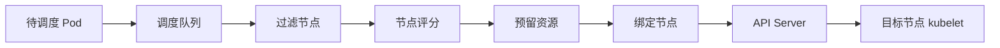

`Filter` 类似旧版 predicate，回答“能不能调度”。`Score` 类似旧版 priority，回答“更适合调度到哪里”。一个节点只要在硬约束上失败，就不会进入评分阶段；评分阶段再结合权重计算总分。

#### 调度器只做绑定

一个 Pod 的生命周期从创建到运行会经过多个组件，调度器只负责其中的绑定动作：

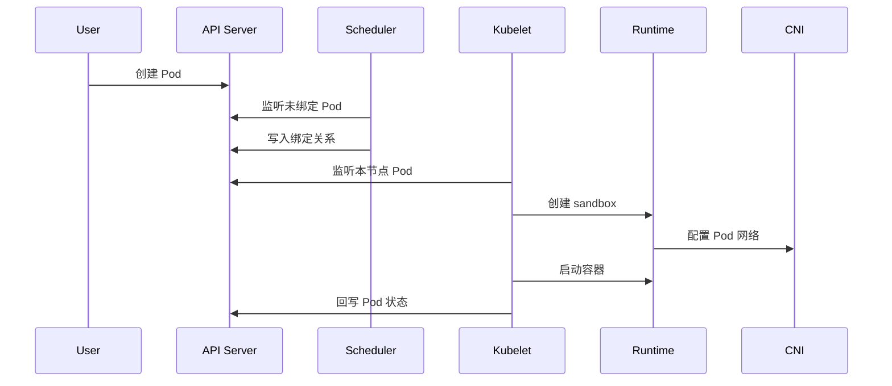

所以排查 Pod 卡住时要先看卡在哪一段：

| 现象 | 更可能的位置 | 典型检查 |
| --- | --- | --- |
| Pod 长期 `Pending` 且没有节点 | 调度阶段 | `kubectl describe pod` 看 scheduler event |
| Pod 已绑定节点但 `ContainerCreating` | kubelet 启动阶段 | 看 volume CNI image runtime 事件 |
| Pod 有 IP 但容器未就绪 | 容器或探针阶段 | 看容器日志和 readiness liveness |
| 节点 Ready 但 Pod 总落到坏节点 | 调度只看到节点状态 | 标记节点不可调度或修正 node condition |

#### 默认调度器和多调度器

Pod 默认会带上 `spec.schedulerName: default-scheduler`。如果集群中部署了多个调度器，Pod 可以显式选择：

```yaml
apiVersion: v1
kind: Pod
metadata:
  name: batch-worker
spec:
  schedulerName: volcano
  containers:
    - name: worker
      image: busybox
      command: ["sh", "-c", "sleep 3600"]
```

多调度器常见于默认调度器无法满足需求的场景：

| 场景 | 默认调度器的问题 | 增强方向 |
| --- | --- | --- |
| gang scheduling | 多个 Pod 需要一起成功或一起失败 | 批调度器整体评估 PodGroup |
| 高频批作业 | 单 Pod 事件调度效率不足 | 批量调度和周期调度 |
| AI 训练 | GPU 拓扑 队列 配额 组调度复杂 | Volcano 等批调度系统 |
| 大数据作业 | 任务和数据本地性强相关 | 自定义调度器或扩展插件 |

实践经验是：默认调度器稳定、省心，但能力偏基础。在线业务通常足够；如果要压榨调度吞吐、处理大批量作业依赖或强组调度，就应该从一开始设计专门的调度能力。

一个便于建立数量级的参考是：在 100 个节点的集群中并发创建 8000 个 Pod，默认调度器大约需要 2 分钟才能完成调度。这个数字不能直接当作所有集群的容量承诺，但它说明了高频批作业和在线业务的调度压力不同。批量训练、离线计算或短生命周期任务如果把大量 Pod 同时推入队列，就需要提前评估调度吞吐、队列公平性和作业整体完成时间。

### 调度约束和优先级策略如何影响 Pod 落点

#### requests 是调度依据

调度器主要依据 `resources.requests` 判断节点是否有足够资源，而不是依据 `limits`。`requests` 表示“至少需要多少资源才能启动并稳定运行”，`limits` 表示“运行时最多允许用多少资源”。

```yaml
apiVersion: apps/v1
kind: Deployment
metadata:
  name: nginx-demo
spec:
  replicas: 2
  selector:
    matchLabels:
      app: nginx-demo
  template:
    metadata:
      labels:
        app: nginx-demo
    spec:
      containers:
        - name: nginx
          image: nginx:1.25
          resources:
            requests:
              cpu: "100m"
              memory: "128Mi"
            limits:
              cpu: "1"
              memory: "512Mi"
```

CPU 和内存的运行时行为不同：

| 资源 | 调度时看什么 | 运行时超限后果 | 备注 |
| --- | --- | --- | --- |
| CPU | `requests.cpu` | 被 cgroup 限速 | CPU 可压缩 超限通常变慢 |
| 内存 | `requests.memory` | 可能 OOMKilled | 内存不可压缩 |
| 临时存储 | `requests.ephemeral-storage` | 超限可能被驱逐 | kubelet 负责监控和清理 |
| GPU | 扩展资源 request | 不能超配普通 GPU 设备 | 依赖 device plugin |

Init Container 的资源计算有特殊规则：普通容器的 request 是求和，因为它们会并行运行；多个 init container 是取最大值，因为它们顺序运行。Pod 的最终 request 可以理解为：

```text
max(sum(app containers), max(init containers))
```

即使 init container 执行完退出，它的资源需求仍要纳入调度计算，因为 Pod 可能重启，init container 也可能再次运行。

##### requests/limits 如何落到 cgroup 和 QoS

调度器只用 `requests` 做节点容量判断，但 kubelet 和运行时会把 `requests`、`limits` 转成 cgroup 约束。理解这个落点，才能把调度、限速、OOM 和压力驱逐串起来。

| 字段 | cgroup 侧含义 | 运行时效果 |
| --- | --- | --- |
| `requests.cpu` | 换算为 `cpu.shares` 相对权重 | CPU 竞争时按权重分配 1 CPU 对应 1024 shares 100m 约为 102 |
| `limits.cpu` | 换算为 CFS `period/quota` | 硬性限速 例如 100000us period 和 100000us quota 表示最多 1 CPU |
| `requests.memory` | 作为调度和 QoS 判断依据 | 不直接限制进程内存上限 |
| `limits.memory` | 写入内存上限 | 超过后可能触发容器 OOMKilled |

`cpu.shares` 是相对值，只在 CPU 有竞争时生效；`quota` 是硬上限，即使节点 CPU 空闲也会限制容器最多使用多少 CPU。内存没有类似 CPU 的平滑限速，超过 limit 更容易表现为 OOM。

Pod 的 QoS Class 由容器资源声明决定：

| QoS Class | 条件 | 节点压力下的含义 |
| --- | --- | --- |
| `Guaranteed` | 每个容器都设置 CPU 和内存 request/limit 且二者相等 | 最后被驱逐的一类 配合 static CPU manager 可做独占 cpuset |
| `Burstable` | 至少有一个 request 但不满足 Guaranteed | 中间层级 会结合 request 和实际用量判断 |
| `BestEffort` | 没有设置 CPU 和内存 request/limit | 最容易在节点压力下被驱逐 |

压力驱逐和优先级抢占不是同一套机制。抢占由 scheduler 根据 `PriorityClass` 为高优先级 Pod 腾位置；压力驱逐由 kubelet 根据节点压力、QoS、实际用量和优先级保护节点。

##### namespace 级资源默认值和约束

`LimitRange` 可以在 namespace 内限制单个容器或 Pod 的 CPU、内存最大值和最小值，也可以给没有写 resources 的容器注入默认 request/limit。

```yaml
apiVersion: v1
kind: LimitRange
metadata:
  name: default-container-resources
spec:
  limits:
    - type: Container
      defaultRequest:
        cpu: "100m"
        memory: "128Mi"
      default:
        cpu: "500m"
        memory: "512Mi"
      max:
        cpu: "2"
        memory: "2Gi"
      min:
        cpu: "50m"
        memory: "64Mi"
```

它的副作用是默认值会注入到每一个容器上，包括多个业务容器和 init container。一个看似轻量的 Pod 如果包含多个容器，最终 request 可能被放大；init container 也会参与 Pod request 计算。生产中更常用 `LimitRange` 约束上下限，默认注入要结合命名空间内的应用形态谨慎使用。

#### 过滤策略决定能不能落点

典型过滤条件包括：

| 过滤策略 | 判断内容 | 失败后的结果 |
| --- | --- | --- |
| `PodFitsResources` | 节点可分配资源是否满足 request | 节点被过滤 |
| `PodFitsHostPorts` | HostPort 是否冲突 | 节点被过滤 |
| `MatchNodeSelector` | 节点标签是否匹配 | 节点被过滤 |
| `NodeAffinity` | 硬亲和是否满足 | 节点被过滤 |
| `MatchInterPodAffinity` | Pod 亲和和反亲和是否满足 | 节点被过滤 |
| `PodToleratesNodeTaints` | Pod 是否容忍节点污点 | 节点被过滤 |
| `NoVolumeZoneConflict` | 卷和节点拓扑是否冲突 | 节点被过滤 |
| `CheckNodeMemoryPressure` | 节点是否内存压力过大 | 节点被过滤 |
| `CheckNodeDiskPressure` | 节点是否磁盘压力过大 | 节点被过滤 |

这些策略是硬约束，一旦不满足，后续评分再高也无效。日常排查 `Pending` Pod 时，最直接的入口是：

```bash
kubectl describe pod <pod-name>
kubectl get events --sort-by=.lastTimestamp
kubectl describe node <node-name>
```

调度失败事件通常会直接说明原因，例如资源不足、node selector 不匹配、没有容忍污点、卷拓扑冲突等。

#### 评分策略决定更适合哪里

过滤后会得到候选节点集合，评分插件再给每个节点打分。分数可以来自资源、亲和性、镜像、拓扑打散等因素，最终按权重汇总。

| 评分策略 | 偏好 | 适合场景 |
| --- | --- | --- |
| `SelectorSpreadPriority` | 同一组副本尽量分散 | 提升副本可用性 |
| `InterPodAffinityPriority` | 靠近满足亲和的 Pod | 低延迟服务调用 |
| `LeastRequestedPriority` | 选择资源使用较少节点 | 均衡长期在线服务 |
| `MostRequestedPriority` | 选择资源使用较多节点 | 装箱 批作业 集群缩容 |
| `BalancedResourceAllocation` | CPU 和内存使用更均衡 | 避免单一资源碎片 |
| `ImageLocalityPriority` | 选择已有镜像的节点 | 大镜像启动加速 |
| `NodeAffinityPriority` | 满足软节点偏好 | 业务偏好但不强制 |
| `TaintTolerationPriority` | 更匹配污点容忍 | 软隔离资源池 |
| `NodePreferAvoidPodsPriority` | 避免带 `preferAvoidPods` 提示的节点 | 早期高权重避让策略 |
| `ServiceSpreadingPriority` | 同一 Service 后端尽量分散 | 早期策略 后续被 `SelectorSpreadPriority` 替代 |
| `EqualPriority` | 所有候选节点同分 | 默认不使用 常用于关闭评分差异的特殊场景 |

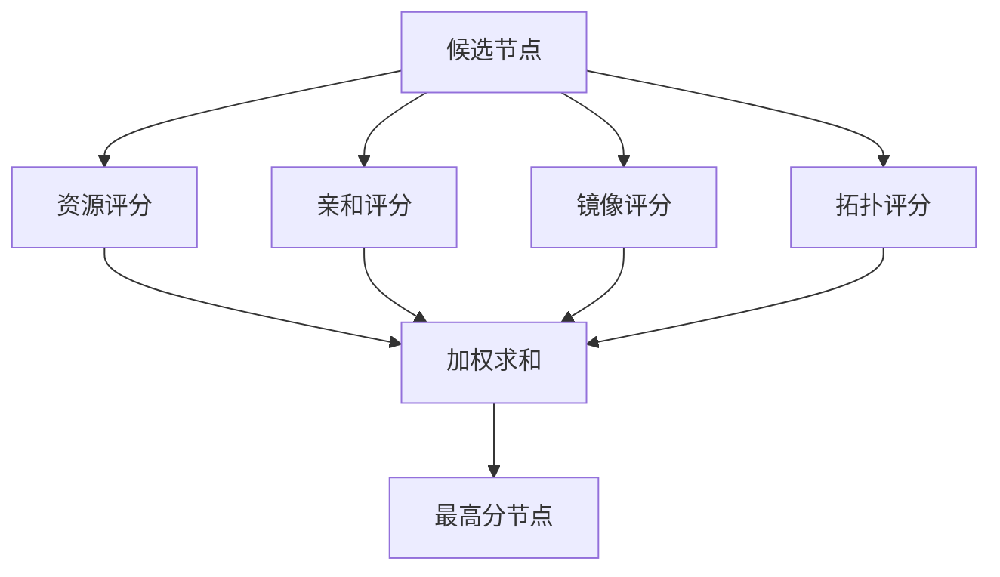

装箱和打散是生产中经常需要权衡的两种目标：

| 目标 | 倾向 | 优点 | 风险 |
| --- | --- | --- | --- |
| 装箱 | 尽量填满少数节点 | 方便空出节点 降低成本 | 局部热点更明显 |
| 打散 | 尽量分散到空闲节点 | 服务质量更稳定 | 资源碎片更多 |

#### nodeSelector 和 NodeAffinity

`nodeSelector` 是最简单的节点选择方式，只支持等值标签匹配：

```bash
kubectl label nodes worker-1 disktype=ssd
```

```yaml
apiVersion: v1
kind: Pod
metadata:
  name: nginx-ssd
spec:
  nodeSelector:
    disktype: ssd
  containers:
    - name: nginx
      image: nginx:1.25
```

`NodeAffinity` 是 `nodeSelector` 的增强版，支持表达式、硬约束和软偏好：

```yaml
apiVersion: v1
kind: Pod
metadata:
  name: nginx-affinity
spec:
  affinity:
    nodeAffinity:
      requiredDuringSchedulingIgnoredDuringExecution:
        nodeSelectorTerms:
          - matchExpressions:
              - key: topology.kubernetes.io/zone
                operator: In
                values: ["az-1", "az-2"]
      preferredDuringSchedulingIgnoredDuringExecution:
        - weight: 80
          preference:
            matchExpressions:
              - key: disktype
                operator: In
                values: ["ssd"]
  containers:
    - name: nginx
      image: nginx:1.25
```

字段名里的 `IgnoredDuringExecution` 表示：调度时检查，运行后即使标签变化，也不会因此把已经运行的 Pod 赶走。

亲和性这一组规则可以用下面的图统一理解。`NodeAffinity` 看的是节点标签，`PodAffinity` 和 `PodAntiAffinity` 看的是已有 Pod 标签，再通过 `topologyKey` 把关系投射到 node、rack、zone 等拓扑域上。

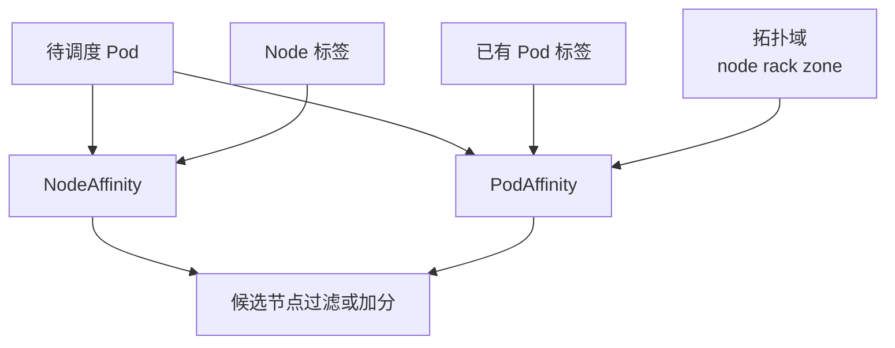

排查亲和性问题时先分清“看节点”还是“看 Pod”。如果表达式依赖节点标签，就检查 Node 上的 label 是否存在、大小写是否一致；如果规则依赖 `PodAffinity`，就要检查已有 Pod 的 label、namespace selector 和 `topologyKey` 是否能共同命中。硬约束会直接让 Pod 保持 `Pending`，软偏好只会影响评分。

修改亲和性时还要注意 `kubectl apply` 的合并语义。把硬性 `requiredDuringSchedulingIgnoredDuringExecution` 改成软性 `preferredDuringSchedulingIgnoredDuringExecution` 时，如果 API Server 上的旧对象没有真正移除 required 规则，最终可能变成“旧硬约束仍在，新软偏好又被追加”，Pod 仍然保持 `Pending`。排查时不要只看本地 YAML，要用下面的命令确认集群里对象的实际内容；确实需要替换旧规则时，使用 `kubectl replace -f` 或删除后重建。

```bash
kubectl get pod <pod-name> -o yaml
kubectl get deploy <deploy-name> -o yaml
```

#### PodAffinity 和 PodAntiAffinity

`PodAffinity` 不是看节点标签，而是看节点上已有 Pod 的标签，再结合拓扑域判断是否应该靠近或远离。它常用于两类目标：

1. 让强依赖服务靠近，例如同节点或同可用区，减少调用延迟。
2. 让同一个应用的副本远离，例如不同节点或不同可用区，提高可用性。

```yaml
apiVersion: apps/v1
kind: Deployment
metadata:
  name: web
spec:
  replicas: 3
  selector:
    matchLabels:
      app: web
  template:
    metadata:
      labels:
        app: web
    spec:
      affinity:
        podAntiAffinity:
          requiredDuringSchedulingIgnoredDuringExecution:
            - labelSelector:
                matchLabels:
                  app: web
              topologyKey: kubernetes.io/hostname
      containers:
        - name: web
          image: nginx:1.25
```

这个示例要求同一节点上不能已有 `app=web` 的 Pod，因此会把副本打散到不同节点。硬反亲和在节点数不足时会导致部分副本无法调度，生产中要结合副本数、节点数和拓扑标签一起设计。

#### Taints 和 Tolerations

`Taint` 打在 Node 上，表达“这个节点排斥某些 Pod”；`Toleration` 写在 Pod 上，表达“我能容忍某类污点”。两者常用于专用节点、控制面节点隔离、故障转移和节点压力处理。

```bash
kubectl taint nodes worker-1 dedicated=bigdata:NoSchedule
```

```yaml
apiVersion: v1
kind: Pod
metadata:
  name: bigdata-job
spec:
  tolerations:
    - key: dedicated
      operator: Equal
      value: bigdata
      effect: NoSchedule
  containers:
    - name: job
      image: busybox
      command: ["sh", "-c", "sleep 3600"]
```

三种 effect 的差异：

| effect | 调度效果 | 对已运行 Pod 的影响 |
| --- | --- | --- |
| `NoSchedule` | 不容忍就不能新调度上来 | 不驱逐已运行 Pod |
| `PreferNoSchedule` | 尽量不调度上来 | 不强制 |
| `NoExecute` | 不容忍不能新调度 | 还会驱逐不容忍的已运行 Pod |

需要注意：Pod 加了 toleration 并不等于一定会调度到带污点节点。它只是允许 Pod 进入这类节点；如果没有额外 `nodeSelector` 或 `nodeAffinity`，调度器仍可能把 Pod 放到没有污点的普通节点。严格专用资源池通常要同时使用污点容忍和节点标签。

##### 多租户隔离注意：toleration 不是权限

Taint/Toleration 是调度条件，不是授权机制。只要租户能看到 Node 上的 taint，就可以在自己的 Pod 中写入相同 toleration，让工作负载进入别人的专用节点。这类“偷用节点”的风险在共享集群里很现实。

更可靠的做法是把调度约束和权限边界分开设计：

| 防护点 | 作用 |
| --- | --- |
| 限制普通租户读取 Node 详情 | 避免直接暴露专用节点 taint 和 label |
| Validating Admission Webhook | 校验谁能使用哪些 toleration 或 node label |
| taint 加 label/nodeAffinity | 既排斥普通 Pod 又把合法 Pod 拉向专用池 |
| namespace 配额和审计 | 防止租户绕过资源池后继续扩大影响 |

因此，taint 适合表达“节点排斥谁”，但不能单独表达“谁被授权使用这批节点”。

#### 节点故障和默认容忍

Kubernetes 会给普通 Pod 自动加上一些默认容忍，例如节点 `not-ready` 或 `unreachable` 的 `NoExecute` 容忍，常见宽限时间是 300 秒。含义是：节点短暂抖动时不要立刻驱逐 Pod，超过宽限时间后再由 Node Lifecycle Controller 处理驱逐。

```yaml
tolerations:
  - key: node.kubernetes.io/not-ready
    operator: Exists
    effect: NoExecute
    tolerationSeconds: 300
  - key: node.kubernetes.io/unreachable
    operator: Exists
    effect: NoExecute
    tolerationSeconds: 300
```

DaemonSet Pod 往往有更多、更宽的 toleration，因为它们本来就是节点级基础组件，例如 kube-proxy、CNI agent、日志采集、node-problem-detector。节点异常时，这些组件通常不应该像普通业务 Pod 一样轻易漂移。

#### PriorityClass 和抢占

`PriorityClass` 用数字表示优先级，数值越大优先级越高。调度器会用它做队列排序，也可能在资源不足时抢占低优先级 Pod。

```yaml
apiVersion: scheduling.k8s.io/v1
kind: PriorityClass
metadata:
  name: high-priority
value: 100000
globalDefault: false
description: high priority business workload
---
apiVersion: v1
kind: Pod
metadata:
  name: important-nginx
spec:
  priorityClassName: high-priority
  containers:
    - name: nginx
      image: nginx:1.25
```

抢占的基本思路是：当高优先级 Pod 无法调度时，调度器评估删除哪些低优先级 Pod 后可以满足资源需求，然后驱逐低优先级 Pod，为高优先级 Pod 腾出位置。

抢占和节点压力驱逐不是同一类事情：

| 类型 | 触发者 | 主要依据 | 目标 |
| --- | --- | --- | --- |
| 优先级抢占 | scheduler | `PriorityClass` | 让高优先级 Pod 可调度 |
| 节点压力驱逐 | kubelet | QoS 用量 节点压力 | 保护节点 |
| 节点故障驱逐 | Node Lifecycle Controller | node condition 和 toleration | 故障转移 |

节点压力驱逐会优先考虑 `BestEffort` Pod，然后再看 `Burstable` Pod 的 request、实际用量和优先级。`Guaranteed` Pod 也不是绝对不会被驱逐，只是在资源声明完整且用量受控时保护等级更高。

### Controller Manager 和控制器模式如何维持期望状态

#### 控制器模式的本质

Kubernetes 控制器的核心是 reconcile loop：观察当前状态，比较期望状态，然后做一次推进。如果失败，就把任务放回队列等待下一次重试。它不依赖一次事务完成所有事情，而是依赖最终一致性。

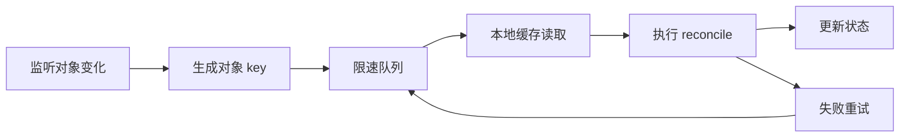

这解释了 Kubernetes 的很多行为：删除一个 Pod 后，如果它属于 ReplicaSet，ReplicaSet Controller 会发现副本数不足，再创建新 Pod；删除 Namespace 时并不是立即物理删除，而是打上删除时间戳和 finalizer，由 Namespace Controller 清理子资源后再完成删除。

#### Informer Lister 和 WorkQueue

控制器通常由以下几部分组成：

| 组件 | 作用 | 为什么重要 |
| --- | --- | --- |
| Informer | List Watch API 对象变化 | 事件来源 |
| Lister | 从本地缓存读取对象 | 降低 API Server 压力 |
| EventHandler | 处理 add update delete 事件 | 把对象转成 key |
| WorkQueue | 存放待处理 key | 合并事件 限速重试 |
| Worker | 消费 key 执行业务逻辑 | 真正 reconcile |

Informer 的机制可以理解为：

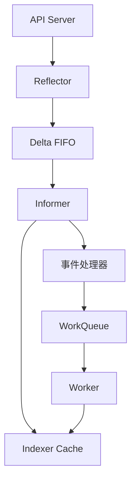

优秀的控制器不会在事件回调里做复杂工作，而是把对象 key 放入队列。Worker 取 key 后再从缓存读取完整对象。这样可以减少重复事件、控制重试节奏，并避免每个控制器都高频打 API Server。

控制器 worker 数量是有限的，reconcile 中的外部调用必须设置超时。曾经出现过 Endpoint Controller 因 HTTP client 没有 timeout，网络调用长期挂起，所有 worker 被占满后不再消费队列，Service 后端更新随之停摆的问题。自研控制器或 Operator 访问外部系统时，要给 API、云厂商、存储、网络设备调用设置明确超时，并把失败转成可重试错误。

#### Controller Manager 里有哪些控制器

`kube-controller-manager` 不是一个单一控制器，而是一组内置控制器的集合。常见控制器包括：

| 控制器 | 负责对象 | 典型职责 |
| --- | --- | --- |
| Deployment Controller | Deployment | 创建和滚动 ReplicaSet |
| ReplicaSet Controller | ReplicaSet | 维持 Pod 副本数 |
| Job Controller | Job | 创建 Pod 并跟踪完成数 |
| CronJob Controller | CronJob | 按计划创建 Job |
| HPA Controller | HorizontalPodAutoscaler | 根据指标横向调整副本数 |
| DaemonSet Controller | DaemonSet | 每个目标节点运行一个 Pod |
| StatefulSet Controller | StatefulSet | 管理有序副本和稳定身份 |
| ReplicationController | ReplicationController | ReplicaSet 前身 维持副本数的历史对象 |
| Node Lifecycle Controller | Node Pod | 处理 NotReady 和驱逐 |
| Namespace Controller | Namespace | 删除 namespace 下的资源 |
| ResourceQuota Controller | ResourceQuota | 维护配额状态 |
| Endpoint Controller | Service Pod | 维护 Service 后端 |
| Service Controller | Service | 为 `LoadBalancer` Service 对接外部负载均衡 |
| ServiceAccount Controller | ServiceAccount Namespace | 确保 namespace 中存在默认 ServiceAccount |
| Garbage Collector | 所有对象 | 根据 ownerReference 级联删除 |
| Volume Controller | PV PVC | 处理卷绑定和生命周期 |

这些控制器共同遵循同一套模式，只是监听对象和 reconcile 逻辑不同。

##### Job 行为速记

Job 用 `completions` 表示总共要成功完成多少个 Pod，用 `parallelism` 表示最多同时运行多少个 Pod。Job 创建的 Pod 不能使用 `restartPolicy: Always`，常见选择是 `Never` 或 `OnFailure`；失败重试次数由 `backoffLimit` 等字段控制。

Job Pod 进入 `Completed` 后，容器进程已经退出，不再消耗 CPU、内存这类运行资源。对象和日志通常会保留一段时间，方便查看执行结果；删除 Job 或启用 TTL 清理后，相关 Pod 再由控制器和垃圾回收链路清掉。

#### Deployment 到 Pod 的协同链路

用户创建一个 Deployment 后，不是由一个组件完成所有事情，而是多个控制器通过 API Server 接力：

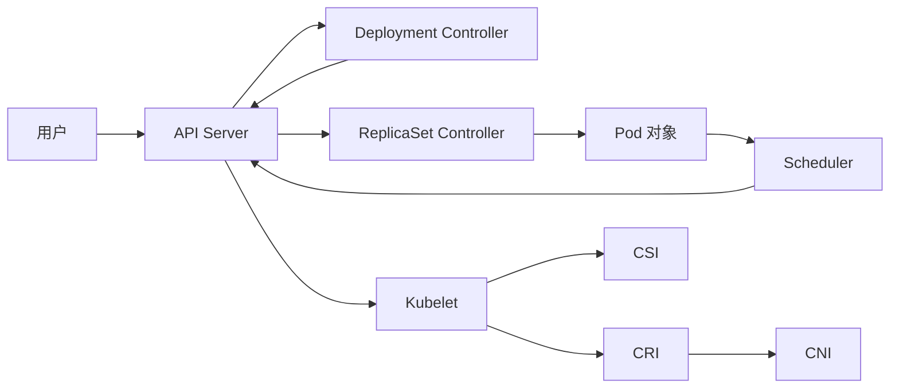

这种分层让每个控制器只关注自己的对象：Deployment 不直接创建容器，ReplicaSet 不负责调度，Scheduler 不负责启动，kubelet 不负责副本数。系统通过对象状态解耦，而不是通过组件之间互相直接调用。

#### StatefulSet 如何维持稳定身份

Deployment 和 ReplicaSet 管理的是一组可替换副本，Pod 名字通常带随机后缀，个体本身不重要。StatefulSet 管理的是一组有顺序、有身份的实例，Pod 名字按序号生成，例如 `mysql-0`、`mysql-1`、`mysql-2`。即使 Pod 重建，序号和身份也保持稳定。

StatefulSet 依赖几个关键机制：

| 机制 | 作用 |
| --- | --- |
| 稳定 Pod 名称 | 每个副本有固定序号 便于成员发现和主从关系维护 |
| `serviceName` | 指向一个 Headless Service 生成稳定网络身份 |
| Headless Service | 不分配普通 ClusterIP 直接为 Pod 生成 DNS 记录 |
| `hostname` 和 `subdomain` | 让 Pod 获得稳定 FQDN |
| `volumeClaimTemplates` | 为每个 Pod 自动创建独立 PVC |
| `rollingUpdate.partition` | 按序号控制滚动升级范围 |

典型 DNS 形式如下：

```text
mysql-0.mysql.default.svc.cluster.local
mysql-1.mysql.default.svc.cluster.local
mysql-2.mysql.default.svc.cluster.local
```

Pod IP 可以变化，但稳定域名和独立 PVC 不随重建丢失。对数据库、消息队列、分布式协调组件这类有状态应用，这比 Deployment 的“任意副本可替换”模型更合适。

StatefulSet 的灰度升级也不同于 Deployment。Deployment 常用 `maxSurge` 和 `maxUnavailable` 控制副本批次；StatefulSet 可以用 `partition` 指定只升级序号大于等于某个值的 Pod。例如副本数为 5 且 `partition: 3` 时，通常只会先升级 `pod-3` 和 `pod-4`，便于保留低序号实例作为稳定基线。

#### ownerReference 和级联删除

Kubernetes 对象经常形成父子关系，例如 StatefulSet 创建 Pod 和 ControllerRevision，DaemonSet 创建 Pod，ReplicaSet 创建 Pod。这种关系记录在子对象的 `metadata.ownerReferences` 中。

```yaml
metadata:
  ownerReferences:
    - apiVersion: apps/v1
      kind: ReplicaSet
      name: web-7c9c9d8f6
      uid: 11111111-2222-3333-4444-555555555555
      controller: true
```

Garbage Collector 会观察这些关系，构建对象图。当父对象被删除时，它可以把子对象一起清理掉。这样用户只需要删除 Deployment 或 StatefulSet，而不必手工追踪每个 Pod、ReplicaSet 或 ControllerRevision。

##### GC graph builder 和删除传播策略

Garbage Collector 会 watch 集群对象，读取每个对象的 `ownerReferences`，并在内部通过 graph builder 维护一张父子关系图。删除父对象时，GC 根据这张图决定如何处理子对象。

删除传播策略常见有三类：

| 策略 | 行为 | 适合场景 |
| --- | --- | --- |
| `background` | 父对象先删除 子对象后台清理 | 默认级联清理 |
| `foreground` | 先删除子对象 父对象等待子对象清理完成 | 希望明确等待清理完成 |
| `orphan` | 删除父对象 保留子对象并断开 ownerReference | 临时接管子对象或保留现场 |

生产环境要谨慎使用 `kubectl delete` 的级联参数。把本来想 orphan 的对象删成级联删除，可能会把 Deployment 下的 ReplicaSet 和 Pod 一起清掉，造成业务直接消失。新版命令用 `--cascade=background|foreground|orphan` 这类枚举比旧式 true/false 更清晰，但仍建议在删除前先确认对象的 owner 链。

Namespace 删除是理解控制器事件语义的好例子。用户执行 `kubectl delete namespace demo` 后，Namespace 对象通常不会立刻从 API Server 消失，而是先被写入 `deletionTimestamp`，并保留 finalizer。对监听 Namespace 的 informer 来说，这更像一次 update 事件：对象还在，只是进入 terminating 状态。

随后 Namespace Controller 会通过 discovery API 找出所有 namespaced APIResource，再逐类清理该 namespace 下的对象。只有子资源和 finalizer 都处理完，Namespace 才会被最终删除。因此排查 namespace 长时间 `Terminating` 时，要检查的是残留资源、不可用 APIService、对象 finalizer 和控制器清理日志，而不是只盯着最初的 delete 命令。

#### DaemonSet 为什么更适合节点组件

DaemonSet 用于“每个目标节点一个 Pod”的场景。CNI agent、kube-proxy、日志采集、节点问题检测、CSI node plugin 都常用 DaemonSet。

它和 Deployment 的差异：

| 对象 | 副本模型 | 节点故障时 | 常见用途 |
| --- | --- | --- | --- |
| Deployment | 指定副本数 | Pod 可漂移到其他节点 | 普通业务服务 |
| DaemonSet | 每个目标节点一个 | 通常留在本节点 | 节点级基础组件 |
| StatefulSet | 有序稳定副本 | 依赖存储和身份策略 | 有状态服务 |

DaemonSet Pod 通常带有更多 toleration，因为即使节点存在网络、磁盘、PID 或 NotReady 状态，节点级组件也可能需要继续留在本节点做诊断或恢复。

DaemonSet 不是“副本数等于节点数的 Deployment”。它由控制器根据节点列表和 selector 决定哪些节点应该各有一个 Pod；节点新增时自动补建，节点删除时清理对应 Pod。它也支持滚动升级，但历史版本通常通过 `ControllerRevision` 记录 PodTemplate 变化，而不是像 Deployment 那样通过新旧 ReplicaSet 承接副本。

| 方面 | DaemonSet | Deployment | StatefulSet |
| --- | --- | --- | --- |
| 历史版本对象 | `ControllerRevision` | ReplicaSet | `ControllerRevision` |
| 升级策略 | `RollingUpdate` 或 `OnDelete` | `RollingUpdate` 或 `Recreate` | `RollingUpdate` 或 `OnDelete` |
| Pod 分布 | 每个目标节点一个 | 按副本数任意分布 | 按有序身份分布 |
| 故障语义 | 节点级组件通常留在原节点 | 普通业务可漂移 | 依赖身份和存储策略 |

DaemonSet Pod 默认或常见配置会容忍更多节点状态，例如 `not-ready`、`unreachable`、`disk-pressure`、`memory-pressure`、`pid-pressure`、`unschedulable`。很多场景下这些容忍不会设置短暂的 `tolerationSeconds`，因为 CNI、kube-proxy、日志采集、CSI node plugin 等组件正是节点异常时仍需要保留的基础能力。

#### Cloud Controller Manager

Cloud Controller Manager 把云厂商相关逻辑从核心 controller manager 中拆出来。它通过云 API 和 Kubernetes API 同步状态。

| 控制器 | 云侧动作 | Kubernetes 侧动作 |
| --- | --- | --- |
| Node Controller | 查询云主机是否存在和健康 | 更新 Node 状态或删除 Node |
| Route Controller | 配置云网络路由 | 让 Pod 网段可达 |
| Service Controller | 创建云负载均衡 | 为 `LoadBalancer` Service 分配入口 |

生产落地时，标准 CCM 不一定完全覆盖企业环境。很多公司会引入厂商提供的 service controller、ingress controller、负载均衡 controller 或自研控制器，把 F5、云负载均衡、账号、配额、网络设备接入 Kubernetes。

#### 控制器凭证安全

`kube-controller-manager` 持有的 kubeconfig 权限极高，因为它需要创建、更新、删除大量集群对象。这个凭证一旦泄露，攻击者几乎等同于拿到集群级管理权限。

生产集群要把控制平面组件当成高敏感工作负载处理：

| 风险点 | 防护做法 |
| --- | --- |
| 普通用户能查看 kube-system Pod | 用 RBAC 限制读取控制面 Pod 和 Secret |
| 普通用户能 exec 进控制器 Pod | 禁止非管理员 exec 到控制平面组件 |
| kubeconfig 明文挂载 | 控制节点文件权限和 Pod volume 权限 |
| 日志或诊断包带出凭证 | 脱敏采集并限制诊断包分发 |
| 自研控制器权限过大 | 使用最小 RBAC 而不是复用集群管理员凭证 |

#### Leader Election

Scheduler 和 Controller Manager 可以部署多个副本，但同一时间通常只能有一个 leader 执行写操作，否则多个副本同时 reconcile 可能互相打架。Kubernetes 使用 Lease、ConfigMap 或 Endpoints 作为分布式锁资源。

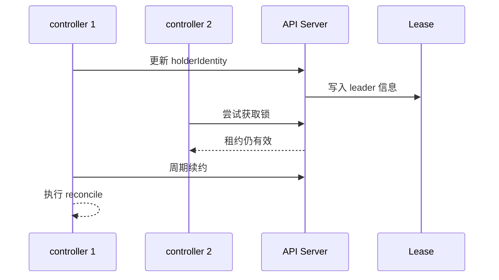

这不是 etcd Raft 那样的投票选举，更像“抢一把锁”。leader 周期性更新 `renewTime`；如果超过租约未续约，其他实例就可以抢锁成为新 leader。它带来的价值是秒级接管，而不是等 Pod 在节点故障后经过分钟级驱逐和重建。

这里没有日志复制、法定多数或候选人投票。多个 scheduler 或 controller-manager 实例只是竞争更新同一个 Lease、Endpoint 或 ConfigMap，`holderIdentity` 表示当前持锁者，`leaseDurationSeconds` 和 `renewTime` 决定锁是否过期。常见租约窗口是十几秒量级，例如 leader 超过 15 秒没有续约，其他实例就可以通过一次成功的 update 接管。

### kubelet 如何管理节点和 Pod 生命周期

#### kubelet 的两个核心职责

kubelet 运行在每个节点上，是 Pod 生命周期管理的执行者。它主要做两件事：

1. 向 API Server 注册和上报节点状态。
2. 监听分配到本节点的 Pod，并通过 CRI、CNI、CSI 把 Pod 真正运行起来。

kubelet 内部包含多个 manager：

| 组件 | 职责 |
| --- | --- |
| syncLoop | 接收 Pod 更新并驱动同步 |
| PodWorker | 对单个 Pod 执行 syncPod |
| ProbeManager | 执行 liveness readiness startup probe |
| StatusManager | 回写 Pod 状态 |
| EvictionManager | 处理内存 磁盘 PID 压力驱逐 |
| VolumeManager | 准备 挂载 卸载卷 |
| ImageManager | 拉取镜像和镜像 GC |
| ContainerGC | 清理退出容器 |
| cAdvisor | 采集容器和节点资源指标 |
| PLEG | 从运行时感知 Pod 生命周期事件 |
| Kubelet API | 暴露节点侧 HTTPS API metrics 和健康检查入口 |
| CertificateManager | 管理 kubelet 客户端和服务端证书生命周期 |

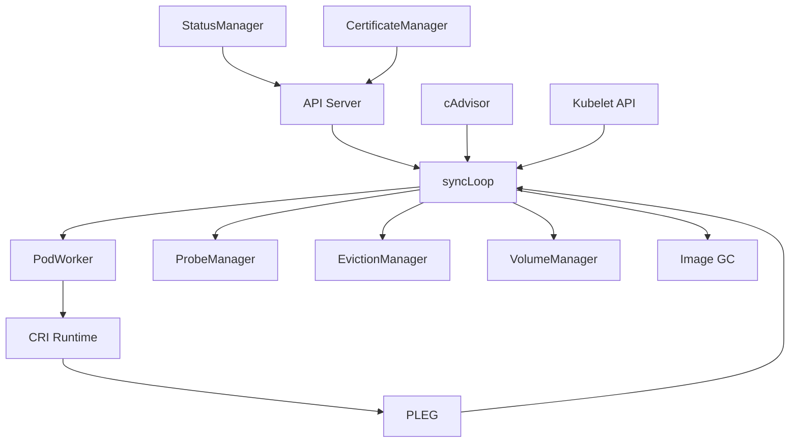

Kubelet API 常见端口包括：`10250` 提供认证授权后的 HTTPS API，可用于日志、exec、metrics 等节点操作；`10255` 是历史 read-only 端口，生产应关闭或避免暴露；`10248` 常用于本地健康检查。`CertificateManager` 负责 kubelet 与控制面通信所需证书的轮转，证书异常会影响节点注册、状态上报和 kubelet API 安全访问。

#### Pod 配置来源

kubelet 可以从三个来源接收 Pod 配置：

| 来源 | 用途 |
| --- | --- |
| API Server | 常规集群 Pod |
| 本地 manifest 文件 | 静态 Pod 例如控制面组件 |
| HTTP endpoint | 较少使用 可由外部系统提供清单 |

无论来源如何，kubelet 都会把收到的 Pod 清单和本地运行状态进行比较，计算下一步 action：创建、更新、杀掉、重启或回写状态。

#### Pod 启动顺序

一个已经完成调度的 Pod，在 kubelet 侧大致会经历以下顺序：

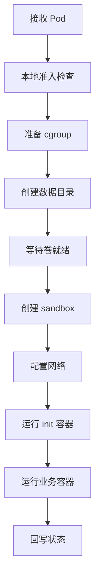

这里最容易混淆的是 CSI、CRI、CNI 的相对顺序：

1. kubelet 先确保 volume attach 和 mount 条件满足。
2. kubelet 调 CRI 创建 Pod sandbox。
3. 容器运行时为 sandbox 准备网络命名空间并调用 CNI。
4. 网络就绪后，kubelet 拉镜像、创建 init container 和业务容器。
5. 状态由 kubelet 回写 API Server。

如果 PVC、ConfigMap、Secret 或 CSI 卷没有就绪，Pod 可能停在 `ContainerCreating`，甚至还没有走到真正创建业务容器的步骤。

#### pause sandbox 为什么存在

Pod 是一组容器的组合。Kubernetes 通常会先创建一个极小的 `pause` sandbox container，再把 Pod 的网络命名空间挂在它上面。业务容器、init container 共享这个 sandbox 提供的基础环境。

这样设计有几个好处：

| 设计点 | 价值 |
| --- | --- |
| pause 进程极小且稳定 | 不容易因为业务逻辑崩溃 |
| 网络挂在 sandbox 上 | 业务容器重启时 Pod IP 可保持稳定 |
| init container 可复用网络 | 初始化阶段也能访问网络资源 |
| 多容器共享 Pod 网络 | 同一 Pod 内容器可通过 localhost 通信 |

所以 CRI 接口里会区分 PodSandbox 和 Container。kubelet 先 `RunPodSandbox`，再 `CreateContainer` 和 `StartContainer`。

#### PLEG 和节点规模

PLEG 的全称是 Pod Lifecycle Event Generator。它会周期性从容器运行时 relist 当前节点上的 Pod 和容器状态，生成生命周期事件，再反馈给 kubelet。节点上 Pod 数过多、运行时响应慢或运行时卡死，都可能让 relist 超时，进而影响节点状态判断。

PLEG 不是只看增量事件，它会反复向 CRI runtime 拉取当前节点所有 Pod 和容器状态。通常一次 relist 结束后很快进入下一轮；如果 runtime 不响应，或者单节点 Pod 数量过多导致 relist 时间过长，PLEG 事件就无法及时送回 kubelet。进一步传导后，kubelet 可能不能及时更新 Pod 生命周期和节点健康，控制面看到的就是节点异常甚至 NotReady。

这解释了为什么 Kubernetes 对单节点 Pod 数量需要有限制：不是进程理论上跑不了更多，而是 kubelet、runtime、PLEG、网络、日志、指标采集和 GC 都有规模成本。`PLEG is not healthy`、runtime latency 升高和 Node NotReady 往往要放在同一条链路里排查。

#### Pod 状态和重启

常见 Pod phase：

| Phase | 含义 |
| --- | --- |
| `Pending` | 已创建但还没有完全运行 可能未调度或镜像卷网络未就绪 |
| `Running` | 已绑定节点 且至少一个容器运行或启动中 |
| `Succeeded` | 所有容器成功退出 不再重启 |
| `Failed` | 至少一个容器失败退出 且不会再重启 |
| `Unknown` | API Server 无法获知 Pod 状态 通常节点通信异常 |

容器级状态还包括 waiting、running、terminated。重启行为由 `restartPolicy` 和控制器共同决定：

| 配置或对象 | 行为 |
| --- | --- |
| `restartPolicy: Always` | 容器退出后 kubelet 继续重启 |
| `restartPolicy: OnFailure` | 失败退出才重启 |
| `restartPolicy: Never` | 不重启容器 |
| Deployment ReplicaSet | Pod 被删除后控制器创建新 Pod |
| Job | 跟踪成功数和失败策略 |

裸 Pod 被驱逐或删除后不会自己回来；由 Deployment、ReplicaSet、StatefulSet、DaemonSet、Job 等控制器创建的 Pod 才会由控制器继续维持期望状态。

#### 健康检查和优雅终止

kubelet 负责执行容器探针：

| 探针 | 作用 |
| --- | --- |
| startupProbe | 判断应用是否完成慢启动 |
| livenessProbe | 判断应用是否还活着 失败会重启容器 |
| readinessProbe | 判断是否可接收流量 失败会从 Service 后端摘除 |

```yaml
apiVersion: v1
kind: Pod
metadata:
  name: probe-demo
spec:
  terminationGracePeriodSeconds: 30
  containers:
    - name: web
      image: nginx:1.25
      lifecycle:
        preStop:
          exec:
            command: ["sh", "-c", "sleep 5"]
      readinessProbe:
        httpGet:
          path: /
          port: 80
        periodSeconds: 5
      livenessProbe:
        httpGet:
          path: /
          port: 80
        periodSeconds: 10
```

生产中要避免把 readiness 和 liveness 混用。readiness 适合表达“暂时不能接流量”，liveness 适合表达“进程已经坏到需要重启”。配置过激的 liveness probe 可能导致应用在高负载时被反复重启。

### CRI 如何连接 kubelet 和容器运行时

#### CRI 的定位

CRI 是 Container Runtime Interface，它把 kubelet 和具体容器运行时解耦。kubelet 只需要通过 CRI gRPC 接口发请求，运行时负责真正创建 sandbox、拉镜像、创建容器、启动容器、停止容器和查询状态。

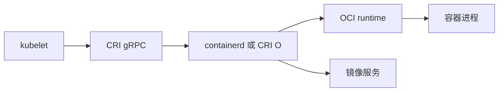

CRI 有两大类服务：

| 服务 | 典型接口 | 作用 |
| --- | --- | --- |
| RuntimeService | `RunPodSandbox` `CreateContainer` `StartContainer` `StopContainer` | 管理 sandbox 和容器 |
| ImageService | `PullImage` `ListImages` `RemoveImage` | 管理镜像 |

课件给出了两个服务的完整接口清单，按职责分组后能看清 CRI 的能力边界：

| 服务 | 接口分组 | 课件列出的接口 |
|---|---|---|
| RuntimeService | Pod sandbox | `RunPodSandbox`、`StopPodSandbox`、`RemovePodSandbox`、`PodSandboxStatus`、`ListPodSandbox`、`PortForward` |
| RuntimeService | 容器生命周期 | `CreateContainer`、`StartContainer`、`StopContainer`、`RemoveContainer`、`ListContainers`、`ContainerStatus`、`UpdateContainerResources` |
| RuntimeService | 交互和日志 | `Exec`、`ExecSync`、`Attach`、`ReopenContainerLog` |
| RuntimeService | 运行时状态 | `Version`、`Status`、`UpdateRuntimeConfig` |
| RuntimeService | 统计 | `ContainerStats`、`ListContainerStats` |
| ImageService | 镜像管理 | `ListImage`、`PullImage`、`ImageStatus`、`RemoveImage`、`ImageFsInfo` |

Pod sandbox 提供 Pod 级共享环境，容器生命周期接口在 sandbox 内创建业务容器；镜像接口独立出来，使 kubelet 可以在创建容器前完成拉取、状态查询和磁盘空间统计。`kubectl exec`、`kubectl logs` 这些日常命令最终也落在 `Exec`、`Attach`、`ReopenContainerLog` 这组接口上。

CRI 不负责镜像构建，也不负责 push 镜像。因此即使生产节点使用 containerd，研发侧仍然可以用 Dockerfile 和 `docker build` 或其他构建工具生成 OCI 镜像。

#### 高级运行时和低级运行时

容器运行时可以分成两层：

| 层次 | 例子 | 职责 |
| --- | --- | --- |
| 高级运行时 | dockershim containerd CRI-O | 对 kubelet 暴露 CRI 管理镜像和容器 |
| 低级运行时 | runc | 根据 OCI 规范创建命名空间 cgroup 和进程 |
| 安全运行时 | Kata Containers gVisor | 用虚拟化或用户态内核增强隔离 |

高级运行时承上启下：上接 kubelet 的 CRI 请求，下接 OCI runtime。安全运行时可以提升隔离，但通常带来额外资源开销，是否使用取决于租户隔离、安全要求和成本。

#### Docker containerd 和 CRI-O

早期 kubelet 通过 dockershim 调 Docker daemon，再由 Docker 调 containerd 和 runc。containerd 直接实现 CRI 后，调用链缩短：

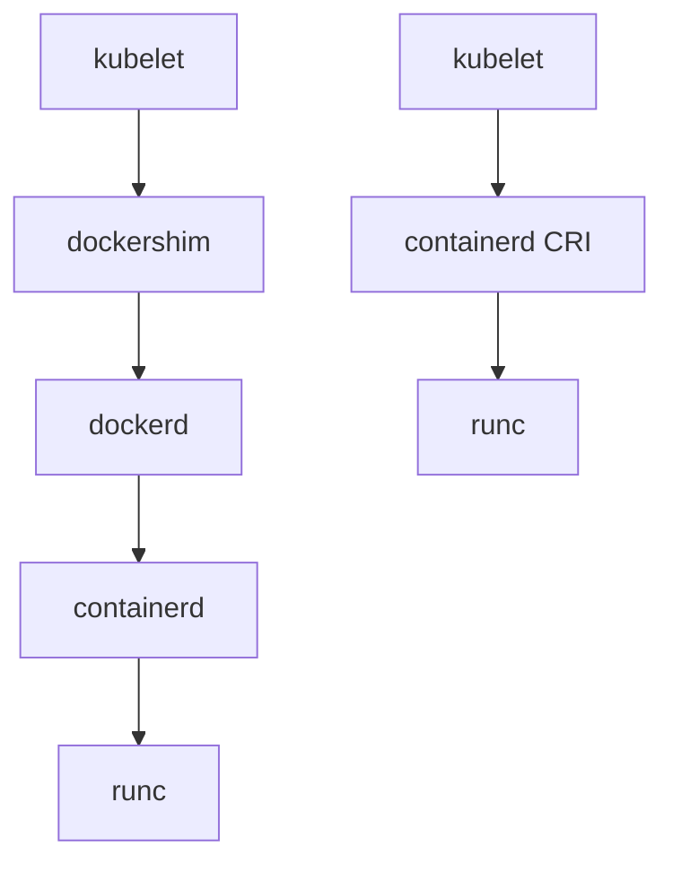

Docker daemon 是完整产品，包含 Kubernetes 节点并不需要的能力。去掉 dockershim 后，节点运行时更轻，组件边界更清晰。生产切换运行时时，需要重点检查：

| 检查项 | 原因 |
| --- | --- |
| sandbox image | 国内环境可能拉不到默认镜像 |
| cgroup driver | kubelet 和 runtime 必须一致 |
| CRI socket endpoint | kubelet 要连接正确 unix socket |
| 镜像缓存 | Docker 镜像缓存和 containerd 镜像缓存不共用 |
| 运维命令 | `docker ps` 要替换为 `crictl ps` 或 `ctr` |

常见 `crictl` 命令：

```bash
crictl pods
crictl ps -a
crictl images
crictl inspectp <pod-sandbox-id>
crictl inspect <container-id>
crictl logs <container-id>
```

`crictl pods` 查看 sandbox，`crictl ps` 查看用户容器，这和 CRI 把 PodSandbox 与 Container 分开的模型一致。

从 Docker 切到 containerd 时，可以按演练流程拆成几步做，重点是先让 kubelet 和运行时指向同一个 CRI socket，再确认节点能重新拉起 Pod：

```bash
systemctl stop kubelet docker containerd
containerd config default > /etc/containerd/config.toml

# 编辑 /etc/containerd/config.toml：
# 1. 把 sandbox_image 改成当前环境可拉取的 pause 镜像
# 2. 把 SystemdCgroup 改为 true，和 kubelet cgroup driver 保持一致

systemctl restart containerd

# 编辑 kubelet 启动参数或 kubeadm-flags.env：
# --container-runtime=remote
# --container-runtime-endpoint=unix:///run/containerd/containerd.sock

systemctl restart kubelet
crictl info
crictl images
```

切换后，原来 Docker daemon 里的镜像缓存不会自动变成 containerd 缓存。节点上排查运行中容器和镜像时，应优先使用 `crictl ps`、`crictl pods`、`crictl images`，而不是继续用 `docker ps` 判断 kubelet 实际使用的运行时状态。

#### 运行时故障会被调度放大

一个典型生产问题是：如果某个节点 Ready，但 CRI 已经无法创建容器，调度器仍可能认为该节点资源充足，于是不断把新 Pod 调过去，用户看到的就是“整个集群都不好用”。这不是调度器直接感知运行时细节，而是节点健康上报不准确导致的放大效应。

PID 资源也可能把局部故障放大成集群问题。容器有独立 PID namespace，但 fork 出来的进程仍消耗宿主机 PID。坏程序如果不断 fork 子进程，节点 PID 被耗尽后会触发 PID pressure，严重时节点变成 NotReady。随后 Node Lifecycle Controller 驱逐 Pod，ReplicaSet、Deployment、DaemonSet 等控制器又在其他节点重建同一个坏 Pod，错误行为就可能被带到新节点，形成滚动式破坏。

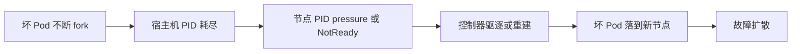

因此要关注 PID limit、kubelet `CheckNodePIDPressure`、node-problem-detector、异常节点自动 cordon，以及发布系统对坏版本的快速暂停能力。

生产上要通过以下方式降低风险：

| 手段 | 作用 |
| --- | --- |
| node-problem-detector | 把运行时 内核 文件系统问题转成 NodeCondition |
| kubelet runtime 监控 | 及时发现 CRI 超时和 PLEG 异常 |
| 自动 cordon | 坏节点先停止接收新 Pod |
| 运行时版本统一 | 降低节点行为漂移 |
| 镜像和容器 GC | 防止磁盘压力拖垮运行时 |

### CNI 和集群网络插件如何提供 Pod 网络

#### Kubernetes 网络模型

Kubernetes 期望 Pod 网络满足几个基础目标：

1. Pod 与 Pod 可以直接互通，不需要 NAT。
2. Node 与 Pod 可以互通。
3. Pod 内看到的 IP 和集群内其他对象访问的 IP 一致。
4. Service、Ingress、外部入口是更上层的服务发现和流量治理能力，不属于 CNI 的核心职责。

CNI 主要负责 Pod 到 Pod、Pod 到 Node 的基础网络。Service 转发由 kube-proxy 或替代数据面负责，Ingress 负责外部入口。

#### CNI 的调用机制

CNI 插件不是运行在 Pod 里的进程，而是由容器运行时在节点上调用的可执行文件。节点上通常有两个目录：

| 路径 | 内容 |
| --- | --- |
| `/etc/cni/net.d` | CNI 配置文件 |
| `/opt/cni/bin` | CNI 插件二进制 |

配置文件可以是 `.conf`、`.conflist` 等格式。如果是链式插件，运行时按配置顺序调用。例如一个 CNI 链可能包括 IPAM、主网络插件、带宽限制插件。

CNI 插件通常可以拆成三类看：

| 类型 | 典型职责 | 例子 |
| --- | --- | --- |
| IPAM 插件 | 分配和回收 Pod IP 维护地址池状态 | host-local Calico IPAM |
| 主网络插件 | 创建 veth 配置 sandbox network namespace 设置路由并实现同主机和跨主机互通 | bridge Flannel Calico Cilium |
| Meta 插件 | 在主网络完成后追加能力 | bandwidth firewall portmap |

Meta 插件不一定负责连通性。例如 bandwidth 插件会结合 Pod annotation 和 Linux traffic control 限制 ingress/egress；firewall 插件负责写防火墙规则；portmap 插件处理 HostPort 映射。链式配置的关键是顺序和职责边界清晰，避免把 IP 分配、主网络连通和附加策略混在一起排查。

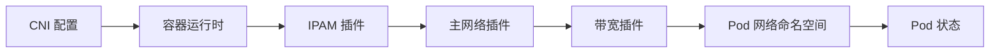

CNI 的两个关键动作是：

| 动作 | 触发时机 | 结果 |
| --- | --- | --- |
| ADD | Pod sandbox 创建后 | 分配 IP 创建网卡 配置路由 |
| DEL | Pod 删除或 sandbox 清理 | 回收 IP 删除网络配置 |

同一个 sandbox 的 ADD 不应该被重复发送。重复 ADD 可能导致重复分配 IP、重复创建 veth、重复写路由或防火墙规则，轻则返回错误，重则留下脏网络状态。运行时需要记录调用结果，避免把同一个网络命名空间当成新 sandbox 再初始化一次。

DEL 的要求正好相反：它应该尽量可重复。清理过程中可能遇到网络命名空间已经消失、veth 已经被删、IPAM 记录已经释放等情况，插件应尽量把这些状态视为“已经清理完成”。这类幂等性设计可以让 kubelet 和运行时在失败重试、节点重启或残留清理时更容易收敛。

运行时通过环境变量和 stdin JSON 把 Pod、sandbox、网络命名空间、操作类型传给插件。插件执行完成后返回 IP、路由、DNS 等结果，运行时再把 Pod IP 交给 kubelet，kubelet 回写 Pod 状态。

#### CNI 插件是如何安装到节点的

Calico、Flannel 等插件通常用 DaemonSet 部署。DaemonSet 的 init container 会把 CNI 二进制和配置文件复制到宿主机目录。这样 containerd 或 CRI-O 在创建 Pod 网络时，就能在宿主机文件系统中找到对应插件。

```yaml
apiVersion: apps/v1
kind: DaemonSet
metadata:
  name: cni-installer
spec:
  selector:
    matchLabels:
      app: cni-installer
  template:
    metadata:
      labels:
        app: cni-installer
    spec:
      hostNetwork: true
      initContainers:
        - name: install-cni
          image: example/cni-installer:latest
          volumeMounts:
            - name: cni-bin
              mountPath: /host/opt/cni/bin
            - name: cni-conf
              mountPath: /host/etc/cni/net.d
      containers:
        - name: agent
          image: example/cni-agent:latest
      volumes:
        - name: cni-bin
          hostPath:
            path: /opt/cni/bin
        - name: cni-conf
          hostPath:
            path: /etc/cni/net.d
```

这解释了为什么 CNI DaemonSet 权限通常很高：它需要写宿主机 CNI 目录，配置路由、设备或 iptables，有些插件还需要读取节点网络状态。

#### Flannel

Flannel 是较早期、简单易用的 CNI 方案。它通常为每个节点分配一个 Pod 子网，同节点 Pod 通过网桥通信，跨节点 Pod 通过封装网络通信。常见后端是 VXLAN。

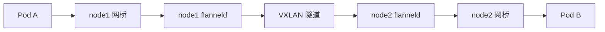

Flannel 的优点是部署简单、学习成本低。缺点是能力相对单一，网络策略、复杂路由和大规模可观测能力不如 Calico、Cilium 这类完整方案。VXLAN 封装还会带来一定性能开销和排查复杂度。

#### Calico

Calico 更偏三层路由和网络策略能力。它可以使用 IP-in-IP、VXLAN，也可以通过 BGP 动态交换路由。Calico 常见组件和对象包括：

| 组件或对象 | 作用 |
| --- | --- |
| calico node | 节点网络 agent 通常 DaemonSet 运行 |
| CNI plugin | 被运行时调用 配置 Pod 网络 |
| Calico IPAM | 分配和回收 Pod IP |
| BIRD | BGP daemon 用于交换路由 |
| IPPool | 定义可用 Pod 地址池 |
| IPAMBlock | 记录某段 IP 的分配 |
| IPAMHandle | 跟踪 IP 分配归属 |
| NetworkPolicy | 定义网络访问控制 |

一个简化的 Calico IPPool：

```yaml
apiVersion: projectcalico.org/v1
kind: IPPool
metadata:
  name: default-ipv4-ippool
spec:
  cidr: 192.168.0.0/16
  blockSize: 26
  ipipMode: Never
  vxlanMode: CrossSubnet
  natOutgoing: true
  nodeSelector: all()
```

Calico IPAM 会把大地址池切成 block，例如 `/26` 表示每块 64 个地址。节点拿到 block 后，Pod 创建时从 block 中分配 IP，并记录到 Calico 对象里。

从组件层面看，每个 Calico 节点上其实跑着三个关键 Agent，课程里以 IP-in-IP 模式的部署图展开过它们的分工：

- Felix：在主机上编程路由、接口和网络策略，是真正“配网络”的组件。
- BIRD：BGP daemon，节点之间维持长连接，把本节点的 Pod 网段路由发布给其他节点。
- confd：监听配置数据，为 BIRD 等组件生成配置。

当底层网络不能直接路由 Pod 网段时，节点之间用 IP-in-IP 隧道承载 Pod 流量：容器一和容器二互通时不动内层包，在外面再加一层以宿主机地址为包头的 IP 包，流转到对端后把外层卸掉。

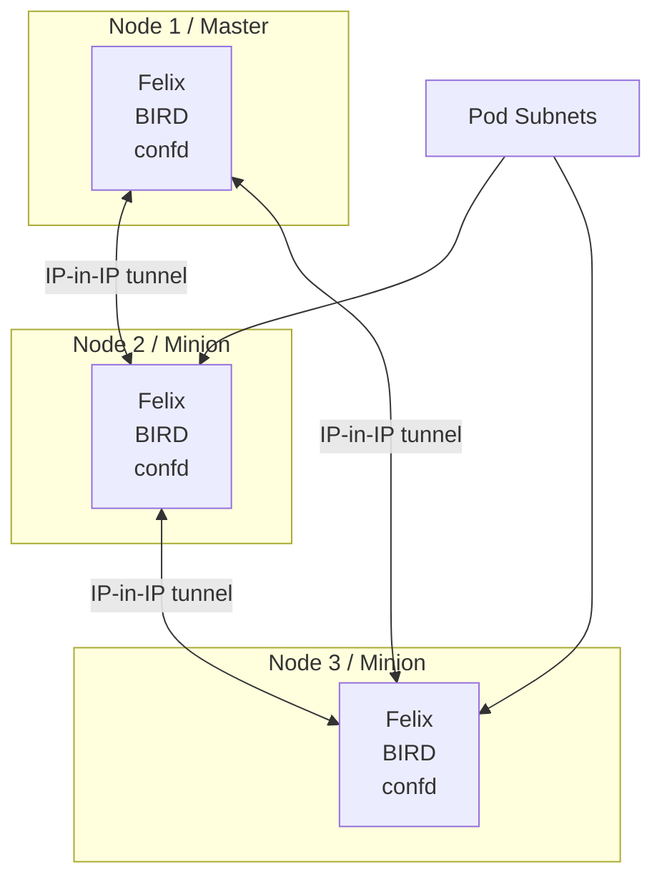

这张图里“路由分发”和“数据封装”是两个层面的事：BIRD 负责让节点知道目标 Pod 网段在哪里，IP-in-IP 隧道负责在底层网络中实际承载跨节点的数据包。

#### Calico 路由模式如何工作

同节点 Pod 通常通过 veth pair 和本机路由互通。跨节点时，如果使用 BGP 模式，每个节点上的 BIRD 会把本节点 Pod 子网告诉其他节点，节点路由表就知道某个 Pod 网段应该发往哪个 Node。

先看同节点流量。Calico 在 Pod 网络命名空间里通常会配置一个类似 `169.254.1.1` 的默认网关地址；Pod 对这个网关发 ARP 请求时，主机侧通过 proxy ARP 响应一个固定占位 MAC，常见排查输出里会看到被描述为全 1 或全 e 的地址，形如 `ee:ee:ee:ee:ee:ee`。数据包从 Pod 的 `eth0` 进入 veth pair，到达宿主机后不走二层网桥泛洪，而是由宿主机路由表把目标 Pod IP 指向另一个 Calico veth 口，再进入目标容器。

```bash
# 在 Pod 内查看默认路由和 ARP 表
ip route
arp -n

# 在宿主机查看指向 Calico veth 的 Pod 路由
ip route | grep <pod-ip>
```

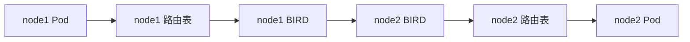

BGP 可以简单理解为路由交换协议：每个节点把自己拥有的 Pod 网段发布出去，也接收其他节点发布的 Pod 网段。这样即使 Pod IP 是独立私有网段，节点也能知道下一跳在哪里。

不同网络模式的取舍：

| 模式 | 优点 | 风险或成本 |
| --- | --- | --- |
| VXLAN | 通用 不要求底层路由感知 Pod 网段 | 封装开销 排查更复杂 |
| IP-in-IP | 实现简单 适合跨三层网络 | 封装开销 依赖环境支持 |
| BGP 路由 | 少封装 性能好 | 路由规模和网络知识要求更高 |
| Underlay 直通 | 性能最好 | IP 规划和底层网络改造成本高 |

VXLAN 模式值得把一个包的完整路径走一遍。课程里的例子是 Pod 1 地址 `10.0.1.10`、Pod 2 地址 `10.0.2.10`，两台宿主机分别是 `192.168.1.10` 和 `192.168.1.11`。Pod IP 在底层网络里不可见、直接路由出不去，所以每台主机上都有一个 `vxlan.calico` 设备——不管插件配成什么模式，这些设备都会准备好。所有跨节点的包出去时都从这个设备走一圈，在内层包外加上宿主机的源/目标 IP 和 UDP 4789 端口；到对端后由对端的 VXLAN 设备解封装，再把原始 Pod 报文交付进容器。

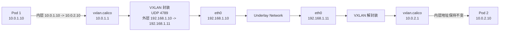

封装后同时存在两组地址：内层报文是 `10.0.1.10 -> 10.0.2.10`，自始至终不变；外层报文是 `192.168.1.10 -> 192.168.1.11`，UDP 端口 `4789`，只在底层网络中有意义。排查 VXLAN 问题时抓包要分清自己看到的是哪一层。

使用 BGP 模式时，小集群可以让节点之间直接互相建立 BGP 会话。节点数量变大后，全互联会让每个节点维护越来越多邻居和路由更新，运维复杂度也会上升。大规模集群通常要评估 route reflector，把“所有节点彼此全连接”改成“普通节点连接反射器”，由反射器负责转发路由信息。

#### CNI 生产选择

生产环境选择 CNI 时，不应只看“能不能通”，还要看以下问题：

| 问题 | 为什么重要 |
| --- | --- |
| 是否支持 NetworkPolicy | 多租户和东西向访问控制 |
| 数据面是封装 路由 还是 eBPF | 影响性能和排查方式 |
| IPAM 是否可靠 | IP 泄漏会导致 Pod 无法启动 |
| 组件是否 DaemonSet 化 | 影响节点加入和升级流程 |
| 是否支持双栈 | IPv4 IPv6 演进 |
| 可观测性和排障工具 | 网络故障通常影响面大 |
| 与 kube-proxy 的关系 | eBPF 数据面可能替代部分转发 |

常见选择方向是：入门可用 Flannel，生产更常评估 Calico 或 Cilium。Calico 成熟、策略能力强；Cilium 基于 eBPF，性能和可观测能力有优势，但对内核版本和团队能力要求更高。

### CSI 和 Kubernetes 存储模型如何管理卷

#### 存储的三层分类

Kubernetes 中的存储可以分为三类：

| 类型 | 生命周期 | 典型用途 | 注意事项 |
| --- | --- | --- | --- |
| 运行时存储 | 容器生命周期 | 镜像层 rootfs 写入层 | overlayfs 写业务数据性能差 |
| 临时存储 | Pod 生命周期 | `emptyDir` 缓存 临时文件 | Pod 删除后清理 |
| 持久化存储 | 独立于 Pod | 数据库 文件 服务数据 | 通过 PV PVC StorageClass 管理 |

关键原则是不要把业务数据写在容器 rootfs 中。运行时存储主要用于启动容器和镜像层，日志和业务数据应该使用合适的 volume。

#### emptyDir hostPath 和 Local Volume

`emptyDir` 是最常用的临时卷之一。它由 kubelet 在 Pod 数据目录下创建，Pod 删除时被清理。

```yaml
apiVersion: v1
kind: Pod
metadata:
  name: emptydir-demo
spec:
  containers:
    - name: app
      image: busybox
      command: ["sh", "-c", "sleep 3600"]
      volumeMounts:
        - name: cache
          mountPath: /cache
  volumes:
    - name: cache
      emptyDir:
        sizeLimit: 2Gi
```

`emptyDir.medium: Memory` 可以把临时卷放在内存里，适合高性能临时数据，但要控制大小，避免挤压节点内存。

普通 `emptyDir` 实际落在 kubelet 管理的 Pod 数据目录下，常见路径形态类似 `/var/lib/kubelet/pods/<pod-uid>/volumes/kubernetes.io~empty-dir/<volume-name>`。它不经过容器镜像的 overlayfs 写入层，读写行为更接近宿主机本地文件系统；Pod 删除后，kubelet 会清理这段临时数据。

`emptyDir.sizeLimit` 用来约束临时存储规模。超过限制后，Pod 可能被 kubelet 按临时存储压力驱逐，随后 emptyDir 数据也会随 Pod 清理而消失。因此它适合缓存、临时计算结果和 sidecar 共享文件，不适合保存必须恢复的业务数据。

`hostPath` 直接把宿主机路径挂进 Pod：

```yaml
volumes:
  - name: host-logs
    hostPath:
      path: /var/log
      type: Directory
```

`hostPath` 适合集群管理员类组件，例如日志采集、CNI 安装器、节点诊断；普通业务应谨慎使用。它的风险是：

1. Pod 漂移到其他节点后数据不一致。
2. Pod 删除后宿主机数据不会自动清理。
3. 权限过大时可能破坏宿主机。

Local Volume 比随意使用 hostPath 更规范，它把本地磁盘以 PV 暴露出来，但仍然绑定节点。调度器必须把使用该本地卷的 Pod 调到拥有该卷的节点。

#### PV PVC 和 StorageClass

三个核心对象：

| 对象 | 谁创建 | 表达什么 |
| --- | --- | --- |
| StorageClass | 管理员 | 集群提供哪类存储 |
| PersistentVolume | 管理员或 provisioner | 一块具体可用的卷 |
| PersistentVolumeClaim | 用户 | 我需要多大 什么类型 什么访问模式 |

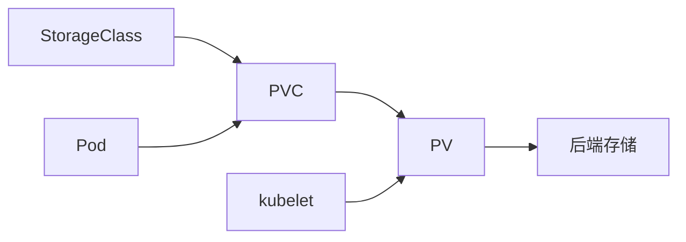

PVC 和 PV 通常是一一绑定。PVC 不是数组式绑定多个 PV；一个 PVC 会记录一个 `volumeName`。如果 PV 比 PVC 申请大，多余容量可能浪费；如果 PV 小于 PVC 需求，就无法绑定。

一个静态 PV 和 PVC 示例：

```yaml
apiVersion: v1
kind: PersistentVolume
metadata:
  name: local-hostpath-pv
spec:
  capacity:
    storage: 10Gi
  accessModes:
    - ReadWriteOnce
  storageClassName: manual
  persistentVolumeReclaimPolicy: Retain
  hostPath:
    path: /data/pv001
---
apiVersion: v1
kind: PersistentVolumeClaim
metadata:
  name: local-hostpath-pvc
spec:
  accessModes:
    - ReadWriteOnce
  storageClassName: manual
  resources:
    requests:
      storage: 1Gi
```

Pod 引用 PVC：

```yaml
apiVersion: v1
kind: Pod
metadata:
  name: web-with-pvc
spec:
  containers:
    - name: web
      image: nginx:1.25
      volumeMounts:
        - name: web-data
          mountPath: /usr/share/nginx/html
  volumes:
    - name: web-data
      persistentVolumeClaim:
        claimName: local-hostpath-pvc
```

#### 动态供应

动态供应由 StorageClass 中的 provisioner 和 CSI driver 完成。用户创建 PVC 后，external-provisioner 监听到这个 PVC，调用 CSI driver 创建后端卷，再创建 PV 并绑定 PVC。

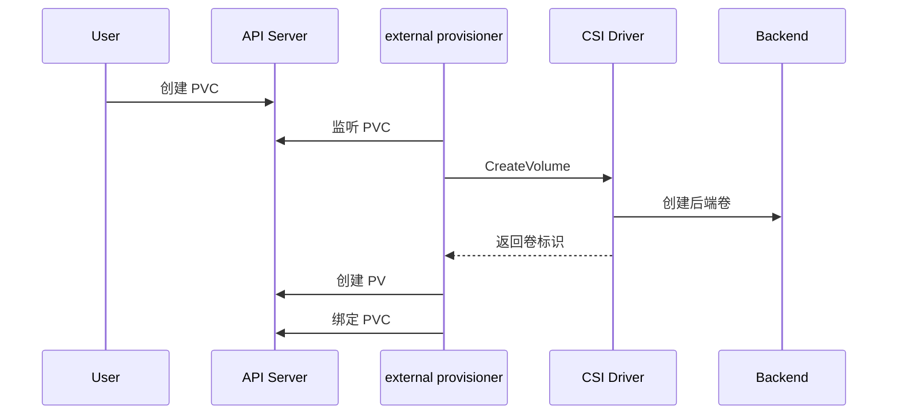

StorageClass 常见字段：

| 字段 | 作用 | 生产关注点 |
| --- | --- | --- |
| `provisioner` | 指定 CSI provisioner | 必须和驱动一致 |
| `reclaimPolicy` | PVC 删除后 PV 如何处理 | 数据盘慎用 Delete |
| `volumeBindingMode` | 何时绑定卷 | 本地卷常用 WaitForFirstConsumer |
| `allowVolumeExpansion` | 是否允许扩容 | 依赖驱动能力 |
| `parameters` | 存储后端参数 | pool zone fsType 等 |

`volumeBindingMode: WaitForFirstConsumer` 对本地卷或拓扑敏感存储很重要。它会等 Pod 调度时再绑定卷，避免先绑定到某个可用区的 PV，随后 Pod 又无法调度到对应节点。

#### CSI 为什么出现

早期 Kubernetes 把很多存储插件放在核心代码中，也就是 in-tree 插件。这样会导致核心仓库膨胀、驱动发布和 Kubernetes 发布耦合。演进路径是：

```mermaid
flowchart LR
    I["in tree 插件"]
    F["FlexVolume"]
    C["CSI"]

    I --> F
    F --> C
```

FlexVolume 通过本地可执行文件解耦了一部分逻辑，但 CSI 进一步把接口标准化，让存储厂商可以独立发布驱动。CSI 通过 gRPC 和 unix socket 通信，不需要把驱动编译进 kubelet。

在控制器侧 Pod 里，常见形态是一个 Kubernetes 标准 sidecar 加一个厂商 driver 容器。sidecar 负责 watch PVC、VolumeAttachment、VolumeSnapshot 等 Kubernetes 对象，厂商 driver 负责真正调用后端存储 API；二者把同一个 `emptyDir.medium: Memory` 挂到相同路径，在里面放 Unix socket。sidecar 的 `--csi-address` 和 driver 的 endpoint 指向同一个 socket 路径，于是 Kubernetes 框架代码和厂商实现可以在同一个 Pod 内解耦协作。

#### CSI 组件架构

一个完整 CSI 驱动通常分为控制器侧和节点侧：

| 组件 | 位置 | 作用 |
| --- | --- | --- |
| CSI controller driver | 控制器侧 | 创建 删除 扩容 快照卷 |
| external-provisioner | 控制器侧 | 监听 PVC 创建 PV |
| external-attacher | 控制器侧 | 处理 VolumeAttachment |
| external-resizer | 控制器侧 | 处理扩容 |
| external-snapshotter | 控制器侧 | 处理快照 |
| CSI node driver | 每个节点 | 挂载和卸载卷 |
| node-driver-registrar | 每个节点 | 向 kubelet 注册 CSI driver |

```mermaid
flowchart LR
    A["API Server"]
    P["external provisioner"]
    T["external attacher"]
    CD["CSI controller driver"]
    B["存储后端"]
    K["kubelet"]
    R["node driver registrar"]
    ND["CSI node driver"]
    Pod["Pod"]

    A --> P
    A --> T
    P --> CD
    T --> CD
    CD --> B
    R --> K
    K --> ND
    ND --> B
    ND --> Pod
```

节点侧驱动通常以 DaemonSet 运行，权限较高，因为它要在宿主机执行 mount、处理设备、向 kubelet 暴露 socket。注册成功后，kubelet 才知道某个 CSI driver 的名字、socket 和能力。

驱动发现和注册可以单独拆开看。`node-driver-registrar` 一边连驱动暴露的 plugin socket，一边通知 kubelet plugin manager，同时还会让 API Server 中出现对应的 `CSIDriver` 对象。节点侧组件通常以每节点 agent 形式运行：控制器侧负责 provision、attach、resize、snapshot，节点侧负责 register、mount、unmount。

```mermaid
flowchart LR
    Driver["CSI Driver"]
    Registrar["node driver registrar"]
    Kubelet["kubelet plugin manager"]
    Socket["plugin socket"]
    CSIDriver["CSIDriver 对象"]
    APIServer["API Server"]

    Driver --> Socket
    Registrar --> Socket
    Registrar --> Kubelet
    Registrar --> CSIDriver
    CSIDriver --> APIServer
```

生产排查时，如果 PVC 已经绑定但 Pod 仍卡在挂载阶段，不能只看 provisioner。还要到目标节点检查 CSI node plugin 是否存在、registrar 日志是否完成注册、kubelet 插件目录下 socket 是否正常、`CSIDriver` 名称是否和 StorageClass 的 provisioner 名称匹配。注册链路断了，kubelet 就无法调用正确的节点侧驱动。

controller 侧和 node 侧动作可以按对象触发源拆开：

| 侧别 | 触发对象或入口 | 典型动作 |
| --- | --- | --- |
| controller | PVC StorageClass | provision 创建后端卷并创建 PV |
| controller | VolumeAttachment | attach 或 detach 卷到节点 |
| controller | PVC 扩容请求 | resize 后端卷并更新容量 |
| controller | VolumeSnapshot | snapshot 或 restore 卷快照 |
| controller | 驱动部署和能力声明 | register 控制器能力 让 sidecar 监听对应对象 |
| node | kubelet plugin manager | register 节点侧 CSI driver |
| node | kubelet Pod 启动流程 | node publish mount 到 Pod 可见路径 |
| node | Pod 删除或迁移 | unmount node unpublish 并清理设备 |

不同动作通常由不同 sidecar watch 不同对象触发。PVC 已创建不代表 attach 已完成，attach 完成也不代表目标节点 mount 成功，排查时要沿着对象链和组件链分别看。

#### Attach Mount 和 Pod 启动

当 Pod 使用 PVC 时，整体链路是：

1. PVC 绑定 PV。
2. Pod 被调度到某个节点。
3. Attach Detach Controller 或 CSI attacher 让卷与节点建立关系。
4. kubelet 等待卷 attach 和 mount 完成。
5. kubelet 创建 sandbox、配置网络、启动容器。

如果卷未创建、未 attach、未 mount，Pod 会卡在 kubelet 启动前半段。排查入口：

```bash
kubectl describe pvc <pvc-name>
kubectl describe pv <pv-name>
kubectl describe pod <pod-name>
kubectl get volumeattachment
kubectl logs -n <storage-namespace> <csi-controller-pod>
kubectl logs -n <storage-namespace> <csi-node-pod>
```

### Rook CSI 组件和生产实践如何落地

#### Rook 是什么

Rook 是运行在 Kubernetes 上的存储编排系统，常见用法是管理 Ceph 集群，并通过 CSI 为 Kubernetes 提供块存储、文件存储或对象存储。它的核心思想是：用 Operator 监听 CRD，再创建和维护存储系统组件。

```mermaid
flowchart TB
    A["Kubernetes API"]
    O["Rook Operator"]
    C["CephCluster"]
    P["Ceph Pool"]
    E["Ceph 组件"]
    S["StorageClass"]
    D["Rook Ceph CSI"]
    V["PVC"]
    Pod["Pod"]

    C --> A
    P --> A
    A --> O
    O --> E
    S --> D
    V --> S
    D --> E
    Pod --> V
```

Rook Operator 会创建和维护 Ceph mon、mgr、osd、mds、rgw 等组件。Rook Discover 可以扫描节点磁盘，发现可用于 Ceph 的块设备。CSI 组件则负责把 Ceph 存储暴露给 Kubernetes PVC。

安装和发现流程可以按“先有裸盘，再由 Operator 拉起控制面”理解。给节点新增一块空盘后，先在宿主机用 `lsblk` 确认能看到类似 `sdb` 的 block device；Rook Discover 会在节点上收集这些设备信息，Operator watch 到 `CephCluster` 这类 CRD 后，再根据设备、节点和配置创建 Ceph mon、mgr、osd 等控制面和数据面组件。随后 Rook 还会部署 StorageClass、CSI controller plugin、CSI node plugin 和 provisioner，让 PVC 可以动态创建 Ceph 卷。

```bash
lsblk
kubectl -n rook-ceph get pod
kubectl -n rook-ceph get cephcluster
kubectl get storageclass
```

#### Rook 中的关键对象

| 对象 | 作用 |
| --- | --- |
| `CephCluster` | 定义 Ceph 集群版本 数据目录 mon mgr osd 等 |
| `CephBlockPool` | 定义块存储 pool 副本数 故障域 设备类型 |
| `StorageClass` | 把 PVC 请求路由到 Rook Ceph CSI provisioner |
| `PVC` | 用户申请块存储或文件存储 |
| `CSIDriver` | 向 Kubernetes 声明 CSI driver |

`CephBlockPool` 不只是“一个 pool 名称”，它定义了数据冗余和放置策略。常见字段包括副本数、故障域和设备类型：

```yaml
apiVersion: ceph.rook.io/v1
kind: CephBlockPool
metadata:
  name: replicapool
  namespace: rook-ceph
spec:
  replicated:
    size: 3
  failureDomain: host
  deviceClass: ssd
```

`replicated.size: 3` 表示每份数据保留 3 个副本；`failureDomain: host` 表示副本尽量分散到不同主机，避免单主机故障同时带走多个副本。节点故障后，Ceph/Rook 会根据集群健康和副本策略补齐副本。这里的副本是存储数据冗余，不是 etcd 那种基于 leader 和投票的共识副本。

简化的 StorageClass：

```yaml
apiVersion: storage.k8s.io/v1
kind: StorageClass
metadata:
  name: rook-ceph-block
provisioner: rook-ceph.rbd.csi.ceph.com
parameters:
  clusterID: rook-ceph
  pool: replicapool
  imageFormat: "2"
reclaimPolicy: Delete
allowVolumeExpansion: true
volumeBindingMode: Immediate
```

生产中要特别谨慎 `reclaimPolicy: Delete`。它适合临时环境和可丢弃数据；对数据库或关键业务，通常要评估 `Retain`、备份、快照和恢复流程。

#### Rook CSI 的通信方式

Rook Ceph CSI 通常会部署两类 Pod：

| Pod 类型 | 运行方式 | 职责 |
| --- | --- | --- |
| controller plugin | Deployment | provision attach resize snapshot |
| node plugin | DaemonSet | node publish mount unmount register |

controller plugin 里常见两个容器：Kubernetes CSI sidecar 和 Ceph CSI driver。二者通过共享的 unix socket 通信。node plugin 也类似，通过 kubelet 插件目录下的 socket 和 kubelet 通信。

```mermaid
flowchart LR
    A["API Server"]
    P["CSI sidecar"]
    S["unix socket"]
    D["Ceph CSI driver"]
    C["Ceph Cluster"]
    K["kubelet"]
    N["CSI node plugin"]
    Pod["业务 Pod"]

    A --> P
    P --> S
    S --> D
    D --> C
    K --> N
    N --> C
    N --> Pod
```

这类插件通常需要较高权限，因为节点侧要访问宿主机设备、mount namespace、kubelet 插件目录和存储后端。

#### 从 PVC 到 Rook Ceph 卷

使用 Rook Ceph 动态供应时，用户只需要创建 PVC 并指定 StorageClass：

```yaml
apiVersion: v1
kind: PersistentVolumeClaim
metadata:
  name: data-rbd
spec:
  accessModes:
    - ReadWriteOnce
  storageClassName: rook-ceph-block
  resources:
    requests:
      storage: 20Gi
```

后续由系统完成：

1. external-provisioner 监听 PVC。
2. provisioner 通过 socket 调用 Ceph CSI driver。
3. Ceph CSI 在 Ceph pool 中创建 RBD image。
4. provisioner 创建 PV 并绑定 PVC。
5. Pod 使用 PVC 时，节点侧 CSI driver 把卷映射并挂载到 Pod。

#### 本地存储和网络存储的取舍

把本地卷和网络卷放在一起比较，核心取舍是性能、可用性和运维复杂度：

| 类型 | 优点 | 缺点 | 适合场景 |
| --- | --- | --- | --- |
| hostPath | 简单 直接访问宿主机 | 安全和漂移风险高 | 节点管理组件 |
| static Local PV | 高 IOPS 独占盘 | 节点绑定 故障恢复复杂 | 高性能本地数据 |
| dynamic Local Volume | 大容量 灵活 | 可能共享底层盘 I/O | 对性能不极端敏感 |
| Ceph RBD | 可动态供应 可复制 | 运维复杂 有网络开销 | 通用块存储 |
| CephFS | 多读写共享 | 元数据和权限管理复杂 | 共享文件存储 |
| 云盘 | 云厂商托管 | 受可用区和厂商限制 | 云上通用持久化 |

关键业务上 Kubernetes 前要先回答：数据是否允许漂移、是否允许丢失、RPO 和 RTO 是多少、是否有备份恢复演练、存储性能是否可观测。

#### 调度 网络 存储的联动

调度、网络、存储不是孤立的：

| 联动点 | 说明 |
| --- | --- |
| 本地卷和调度 | Pod 必须调度到拥有本地 PV 的节点 |
| 拓扑卷和调度 | 云盘可能只能挂到同可用区节点 |
| CNI 和 kubelet | CNI 不就绪会导致节点或 Pod 网络异常 |
| CSI 和 kubelet | volume 未就绪会阻塞 Pod 创建 |
| taint 和 DaemonSet | 存储 网络 agent 要容忍节点污点 |
| requests 和驱逐 | request 影响调度 QoS 影响压力驱逐 |

```mermaid
flowchart TB
    P["Pod 需求"]
    S["调度器"]
    N["目标节点"]
    V["CSI 卷"]
    C["CNI 网络"]
    R["CRI 运行时"]
    K["kubelet"]
    O["运行中 Pod"]

    P --> S
    S --> N
    N --> K
    K --> V
    K --> R
    R --> C
    C --> O
    V --> O
```

#### 生产实践清单

调度：

- 所有业务 Pod 都应设置合理 `requests`，不要只写 `limits`。
- 关键业务用 `PriorityClass`，但要明确抢占影响。
- 使用反亲和或拓扑分布约束打散副本。
- 专用节点使用 taint 和 label 双重约束。
- 批处理和 AI 作业提前评估 gang scheduling 和队列能力。

控制器：

- 自研控制器使用 informer、lister、rate-limiting workqueue。
- reconcile 逻辑要幂等，失败后可重试。
- 不要高频直接 list API Server。
- 多副本控制器开启 leader election。
- 用 ownerReference 和 finalizer 明确资源生命周期。

kubelet 和运行时：

- 统一 kubelet 与运行时的 cgroup driver。
- 监控 PLEG relist、runtime latency、image GC、container GC。
- 控制单节点 Pod 数量，避免 kubelet 和 runtime 压力过大。
- 节点异常要能转成 NodeCondition，必要时自动 cordon。
- 用 `crictl` 建立运行时层排查能力。

网络：

- CNI 方案要覆盖 IPAM、网络策略、升级和排障。
- Flannel 适合简单场景，Calico 或 Cilium 更适合生产策略需求。
- BGP 模式关注路由规模，VXLAN 模式关注封装开销。
- CNI DaemonSet 权限和容忍要符合节点级组件定位。

存储：

- 普通业务避免使用 hostPath。
- StorageClass 要清楚定义回收策略、绑定模式、扩容能力。
- 本地卷必须和调度策略一起设计。
- CSI controller 和 node plugin 都要纳入监控。
- Rook 或 Ceph 上生产前要做好容量、故障域、备份、恢复和升级演练。

最终要形成一个整体判断：调度决定 Pod 去哪里，kubelet 决定 Pod 怎么在节点上运行，CRI 负责容器，CNI 负责网络，CSI 负责卷，Controller Manager 负责持续把系统拉回期望状态。掌握这条链路，才能把 `Pending`、`ContainerCreating`、`CrashLoopBackOff`、网络不通、卷挂载失败和节点驱逐这些问题串起来排查。


## 第 5 章 · Pod 生命周期管理和服务发现

### Pod 生命周期完整管理如何定义状态和驱逐

Pod 是 Kubernetes 里把应用和基础设施连接起来的核心对象。一个业务实例不是简单地“启动一个容器”就结束了，而是要经历 API 写入、调度、节点接管、卷挂载、网络配置、镜像拉取、容器启动、健康检查、流量接入、终止清理等一整条链路。理解这条链路，才能在看到 `Pending`、`ContainerCreating`、`CrashLoopBackOff`、`Evicted`、`Terminating` 这些状态时快速判断问题大概发生在哪一段。

Pod 的完整生命周期可以抽象成下面这条控制链：

```mermaid
flowchart TB
    Creator["创建者"]
    APIServer["API Server"]
    Scheduler["Scheduler"]
    Kubelet["kubelet"]
    Runtime["容器运行时"]
    CNI["CNI"]
    Volume["存储插件"]
    Pod["Pod"]
    Status["状态回报"]

    Creator -->|创建 Pod| APIServer
    APIServer -->|进入 Pending| Scheduler
    Scheduler -->|绑定节点| APIServer
    APIServer -->|通知节点| Kubelet
    Kubelet -->|挂载卷| Volume
    Kubelet -->|配置网络| CNI
    Kubelet -->|启动容器| Runtime
    Runtime -->|运行实例| Pod
    Kubelet -->|持续检查| Status
    Status -->|写回状态| APIServer
    Creator -->|删除 Pod| APIServer
    APIServer -->|终止通知| Kubelet
```

创建 Pod 的主体不一定是用户本人，也可能是 Deployment、ReplicaSet、StatefulSet、DaemonSet、Job、CronJob 等控制器。它们最终都会把期望副本落成 Pod 对象，然后由调度器和 kubelet 接力完成运行。

#### Phase Conditions 和展示状态

Pod 的 `status.phase` 是高层状态，常见值包括 `Pending`、`Running`、`Succeeded`、`Failed`、`Unknown`。但 `kubectl get pod` 看到的 `STATUS` 不完全等于 phase，它通常由 phase、conditions、containerStatuses、initContainerStatuses 和 reason 共同计算出来。

```mermaid
stateDiagram-v2
    [*] --> Pending: 对象创建
    Pending --> Running: 调度和容器创建完成
    Running --> Succeeded: 所有容器成功退出
    Running --> Failed: 容器失败且不再重启
    Pending --> Failed: 准入或资源失败
    Running --> Unknown: 节点状态不可达
    Unknown --> Running: 状态恢复
    Unknown --> Failed: 无法恢复
    Running --> Terminating: 删除请求
    Terminating --> Gone: 清理完成
    Gone --> [*]
```

| 观察项 | 含义 | 排查价值 |
|---|---|---|
| `phase` | Pod 的总阶段 | 判断生命周期主线走到哪里 |
| `conditions` | 调度 初始化 Ready 等子状态 | 判断是调度 容器就绪 还是整体 Ready 出问题 |
| `containerStatuses` | 每个容器的运行 等待 终止和重启次数 | 判断是否 CrashLoop OOM 或镜像问题 |
| `events` | 控制器 kubelet 插件产生的事件 | 判断调度失败 拉镜像失败 挂载失败 驱逐原因 |
| `nodeName` 和 `podIP` | 节点绑定和 Pod 网络地址 | 判断是否已经完成调度和网络分配 |

常见 `STATUS` 可以按下面方式理解：

| `kubectl get pod` 状态 | 常见 phase | 典型原因 |
|---|---|---|
| `Pending` | `Pending` | 还未调度 或 kubelet 尚未创建容器 |
| `ContainerCreating` | `Pending` | 镜像 拉取 卷挂载 网络准备仍在进行 |
| `Running` | `Running` | 至少一个容器在运行或重启中 |
| `Completed` | `Succeeded` | Job 或短任务容器正常结束 |
| `StartError` | `Running` 或 `Pending` | 容器运行时启动失败 Pod phase 可能仍未直接暴露失败根因 |
| `CrashLoopBackOff` | `Running` | 容器反复异常退出 应优先看业务日志 |
| `CreateContainerConfigError` | `Pending` | ConfigMap Secret 卷或容器配置缺失 |
| `ErrImagePull` | `Pending` | 镜像仓库不可达 镜像名错误或认证失败 |
| `ImagePullBackOff` | `Pending` | 镜像拉取失败后进入退避重试 |
| `Init:0/1` | `Pending` | Init Container 尚未完成 |
| `Init:CrashLoopBackOff` | `Pending` | Init Container 反复失败 |
| `OutOfcpu` | `Failed` 或 `Pending` | Pod 已绑定节点后 kubelet admit 阶段发现 CPU 不足 |
| `OutOfMemory` | `Failed` 或 `Pending` | Pod 已绑定节点后 kubelet admit 阶段发现内存不足 |
| `OOMKilled` | `Running` | 容器超过内存限制被杀 |
| `Evicted` | `Failed` | 节点资源压力或临时存储超限触发驱逐 |
| `Error` | `Failed` | 容器失败且 restartPolicy 不再重试 |
| `Unknown` | `Running` 或未知 | 节点不可达 或 CSI CNI 等插件导致状态不可获取 |

看到 `CrashLoopBackOff` 时，不要只盯控制面对象，核心线索往往在容器日志、启动命令、环境变量和依赖服务。看到 `CreateContainerConfigError` 时，优先 `kubectl describe pod` 看事件，因为它常常是 ConfigMap、Secret 或挂载配置不存在。看到 `Unknown` 时，要扩大到节点、kubelet、CSI、CNI 和网络连通性。

一个典型排查例子是存储插件被删掉后，原本挂载 Rook 卷的 Pod 状态变成 `Unknown`。此时 `kubectl describe pod` 的事件可能出现 `unable to attach volume`、`CSI driver not found` 之类信息。它说明问题不在业务进程本身，而在 kubelet 无法通过对应 CSI driver 完成卷 attach 或状态同步；这类场景要同时检查 CSI driver 对象、CSI controller、node plugin DaemonSet 和存储系统状态。

#### QoS 和资源保障

节点资源压力下，kubelet 需要决定先牺牲哪些 Pod。Pod 的 QoS Class 正是这个决策的重要输入。关键点是，CPU 属于可压缩资源，抢不到时应用通常只是变慢；内存、磁盘、PID 等不可压缩资源一旦不足，节点必须做出驱逐或终止动作来保护自己。

| QoS Class | 资源配置条件 | 资源保障 | 被驱逐风险 |
|---|---|---|---|
| `Guaranteed` | 每个容器都设置 CPU 和内存 request limit 且二者相等 | 最高 | 最低 |
| `Burstable` | 至少设置了一个 CPU 或内存 request limit 但不满足 Guaranteed | 有底线 可突发 | 中等 |
| `BestEffort` | 没有设置任何 CPU 和内存 request limit | 没有明确保障 | 最高 |

驱逐顺序通常从 `BestEffort` 开始，再到 `Burstable`，最后才考虑 `Guaranteed`。这并不意味着所有应用都应该设成 `Guaranteed`。如果所有应用都按峰值设置 request 等于 limit，集群资源利用率会很低；如果所有应用都用 `BestEffort`，节点压力上来时业务稳定性又会很差。比较实际的做法是基于压测、监控和峰值模型设置 request，再给 limit 留出合理突发空间。

实践中出现过一种反面模式：平台为了追求“最高保障”，把几乎所有 Pod 都配置成 `Guaranteed`，并让 request 等于 limit。排查后会发现节点看似已经被 request 预留出去，例如只剩少量可调度 CPU，但真实利用率可能只有几个百分点，业务负载永远吃不上这些被静态切走的资源。QoS 的目标不是让所有应用都站到最高等级，而是让关键服务有明确底线，让普通服务保留合理突发空间，并通过监控持续校准 request。

```yaml
apiVersion: v1
kind: Pod
metadata:
  name: api-server
spec:
  containers:
  - name: app
    image: example/api:v1
    resources:
      requests:
        cpu: "500m"
        memory: "512Mi"
      limits:
        cpu: "1"
        memory: "1Gi"
```

QoS 和 PriorityClass 容易混淆，但它们发生在不同阶段：

| 概念 | 主要使用阶段 | 解决的问题 |
|---|---|---|
| `PriorityClass` | 调度时 | 高优先级 Pod 调不下去时能否抢占低优先级 Pod |
| `QoS Class` | 节点运行时 | 节点资源承压后 kubelet 优先驱逐谁 |

可以把 PriorityClass 理解为“怎么获得运行机会”，把 QoS 理解为“节点自保时谁更容易被杀”。生产中两者都要设计，但不要用 PriorityClass 代替 request limit，也不要指望 QoS 解决调度抢占。

#### Eviction 和 Taint Based Eviction

Eviction 不是普通删除。它通常发生在节点压力、节点不可达、磁盘或内存不足等场景中，由 kubelet 或控制器通过驱逐语义让 Pod 离开当前节点。常见触发因素包括：

| 压力类型 | 典型来源 | 风险 |
|---|---|---|
| MemoryPressure | 内存使用逼近阈值 | OOM 或驱逐 |
| DiskPressure | rootfs imagefs 或 ephemeral storage 爆满 | 日志写满 节点不可用 |
| PIDPressure | 进程数耗尽 | 新进程无法启动 |
| NodeNotReady | 节点重启 网络中断 kubelet 异常 | 控制面无法确认 Pod 状态 |

Kubernetes 还会给 Pod 自动增加针对 `node.kubernetes.io/not-ready` 和 `node.kubernetes.io/unreachable` 的 toleration，默认通常允许短时间容忍节点异常。常见默认值是 300 秒，也就是节点短暂不可达时先等待约 5 分钟，避免网络抖动或节点短重启就立刻把所有 Pod 迁走。eBay 这类大规模环境曾把相关容忍时间调到 900 秒，用来覆盖部分节点重启超过 5 分钟的场景；但时间越长，故障实例占位时间也越长，必须按业务可用性、重启耗时和副本冗余一起评估。

```yaml
apiVersion: v1
kind: Pod
metadata:
  name: tolerant-app
spec:
  tolerations:
  - key: "node.kubernetes.io/unreachable"
    operator: "Exists"
    effect: "NoExecute"
    tolerationSeconds: 900
  containers:
  - name: app
    image: example/app:v1
```

驱逐相关排查建议：

| 现象 | 优先检查 |
|---|---|
| Pod `Evicted` | `kubectl describe pod` 中的 reason 和 message |
| 多个 Pod 同时异常 | 节点 conditions 和 kubelet 日志 |
| 日志盘爆满 | 容器日志滚动配置 应用日志速率 emptyDir 大小 |
| 内存压力 | requests limits QoS OOMKilled 事件 |
| 节点不可达 | Node condition 网络 kubelet 心跳 tolerationSeconds |

### 健康检查 Hook 和优雅终止如何保护服务可用性

Pod 能不能稳定对外服务，不只取决于容器进程是否启动。很多应用进程已经启动，但配置还没加载、缓存还没预热、依赖连接池还没建立，这时接入流量会导致请求失败。Kubernetes 通过探针、ReadinessGates 和生命周期 Hook，让应用把“活着”“启动完成”“可以接流量”“准备退出”这些语义显式告诉平台。

#### 三类探针的职责

| 探针 | 判断内容 | 失败后动作 | 典型用途 |
|---|---|---|---|
| `startupProbe` | 应用是否完成启动 | 启动期失败达到阈值后重启容器 | 慢启动应用 避免 liveness 过早介入 |
| `livenessProbe` | 应用是否还活着 | kubelet 杀死容器 再按 restartPolicy 处理 | 死锁 卡死 进程无法服务 |
| `readinessProbe` | 应用是否可以接流量 | Pod 标记 NotReady 并从 Service 后端摘除 | 依赖未就绪 缓存预热 发布摘流 |

`readinessProbe` 对优雅启动尤其重要。没有 readiness 时，容器进程一起来就可能被 Service 选中，流量会在应用真正可服务之前进入。`livenessProbe` 失败不会重启整个 Pod，它杀的是容器进程，是否重启取决于 Pod 的 `restartPolicy`。`startupProbe` 成功后通常不再执行，之后再交给 liveness 和 readiness。

`startupProbe` 不是 `initialDelaySeconds` 的简单替代。`initialDelaySeconds` 只是按经验延迟检查，设短了会在应用尚未完成加载、缓存预热或依赖初始化时不断打健康检查，严重时反而拖慢启动；设长了又会让真正的启动失败迟迟暴露。`startupProbe` 表达的是“启动阶段由它独占判断”：在它成功之前，liveness 和 readiness 不介入；它成功之后，startup 检查停止，容器才进入常规存活和就绪检查。默认语义也要分清：liveness 在探测前相当于先认为容器还活着，而 readiness 在通过前会让 Pod 保持 NotReady，不进入 Service 后端。

探针支持三种动作：

| 动作 | 说明 | 适用场景 |
|---|---|---|
| `exec` | 在容器内执行命令 退出码 0 表示成功 | 需要复杂脚本检查 |
| `tcpSocket` | kubelet 连接容器端口 | TCP 服务或只需判断端口可达 |
| `httpGet` | kubelet 请求 HTTP 路径 200 到 399 表示成功 | Web 服务健康接口 |

```yaml
apiVersion: v1
kind: Pod
metadata:
  name: probe-demo
spec:
  containers:
  - name: app
    image: example/app:v1
    startupProbe:
      httpGet:
        path: /startupz
        port: 8080
      periodSeconds: 10
      failureThreshold: 30
    livenessProbe:
      httpGet:
        path: /healthz
        port: 8080
      periodSeconds: 10
      failureThreshold: 3
    readinessProbe:
      httpGet:
        path: /readyz
        port: 8080
      initialDelaySeconds: 5
      periodSeconds: 5
      failureThreshold: 2
```

常用参数的含义如下：

| 参数 | 含义 | 注意事项 |
|---|---|---|
| `initialDelaySeconds` | 容器启动后延迟多久开始检查 | 慢启动应用不要只靠它硬猜时间 |
| `periodSeconds` | 检查周期 | 过短会增加 kubelet 和应用压力 |
| `timeoutSeconds` | 单次检查超时时间 | 超时会被算作失败 |
| `successThreshold` | 连续成功多少次才算成功 | readiness 可用来避免抖动 |
| `failureThreshold` | 连续失败多少次才算失败 | 避免单次毛刺导致杀容器 |

#### ReadinessGates 扩展 Ready 条件

有些 Ready 条件不在应用容器内部。例如外部 DNS 记录是否写好、外部负载均衡是否注册成功、数据预热控制器是否完成、证书或路由是否已经发布。`ReadinessGates` 允许把这些外部 condition 纳入 Pod Ready 判断。

```yaml
apiVersion: v1
kind: Pod
metadata:
  name: gated-app
spec:
  readinessGates:
  - conditionType: "example.com/dns-ready"
  containers:
  - name: app
    image: example/app:v1
status:
  conditions:
  - type: "example.com/dns-ready"
    status: "False"
```

声明 readiness gate 后，只有外部控制器把对应 condition 更新为 `True`，Pod 才会进入 Ready。它本质上是给平台扩展 Ready 语义的钩子，通常需要自定义 controller 配合，而不是人工手动改状态。

```mermaid
flowchart LR
    Pod["Pod"]
    Probe["readinessProbe"]
    Controller["外部控制器"]
    Condition["自定义条件"]
    Ready["Ready"]
    Service["Service 后端"]

    Pod --> Probe
    Pod --> Controller
    Controller --> Condition
    Probe --> Ready
    Condition --> Ready
    Ready --> Service
```

#### PostStart 和优雅启动

`PostStart` 是容器创建后的 Hook，可以执行额外脚本或 HTTP 请求。它适合做一些不应该固化进镜像 entrypoint 的初始化动作，例如写入启动标记、通知外部系统、做一次轻量初始化。

需要注意两点：

| 注意点 | 说明 |
|---|---|
| 不保证先后顺序 | Kubernetes 不保证 `PostStart` 一定早于容器 entrypoint 执行 |
| 会影响运行状态 | `PostStart` 未结束前 容器不会被标记为 running |

这张图适合用来记住 Hook 和主进程之间的关系：容器创建后，entrypoint 和 `PostStart` 都会被触发，但它们不是严格串行关系。关键点是，`PostStart` 可以让 Running 状态延后，却不能代替应用自身的启动状态管理；真正接流量还要靠 readiness。

```mermaid
flowchart LR
    Created["Created Container"]
    Started["Started Container"]
    Entrypoint["Run Entrypoint"]
    PostStart["Run PostStart"]
    Ready["Container Ready"]

    Created --> Started
    Started -.-> Entrypoint
    Started -.-> PostStart
    PostStart --> Ready
```

```yaml
apiVersion: v1
kind: Pod
metadata:
  name: poststart-demo
spec:
  containers:
  - name: app
    image: busybox
    command: ["sh", "-c", "sleep 3600"]
    lifecycle:
      postStart:
        exec:
          command:
          - sh
          - -c
          - echo ready > /tmp/poststart-message
```

如果启动逻辑很重，更推荐让应用自己实现启动状态，并用 `startupProbe` 和 `readinessProbe` 暴露出来。Hook 适合补充，不适合承载复杂业务流程。

#### PreStop terminationGracePeriodSeconds 和信号

删除 Pod 时，Kubernetes 不会默认直接暴力杀进程。典型流程是先把 Pod 标记为 terminating，再执行 `PreStop`，然后发送 `SIGTERM`，等待 `terminationGracePeriodSeconds`，最后如果进程仍未退出再发送 `SIGKILL`。

```mermaid
flowchart TB
    Delete["删除请求"]
    Terminating["进入 Terminating"]
    EndpointRemove["摘除后端"]
    PreStop["执行 PreStop"]
    SIGTERM["发送 SIGTERM"]
    Drain["处理存量请求"]
    SIGKILL["发送 SIGKILL"]
    Gone["清理完成"]

    Delete --> Terminating
    Terminating --> EndpointRemove
    Terminating --> PreStop
    PreStop --> SIGTERM
    SIGTERM --> Drain
    Drain -->|正常退出| Gone
    Drain -->|超时| SIGKILL
    SIGKILL --> Gone
```

`terminationGracePeriodSeconds` 默认是 30 秒，这个窗口同时包含 `PreStop` 执行时间和 `SIGTERM` 后进程自行退出的时间。如果 `PreStop` 执行太久，应用收到 `SIGTERM` 后几乎没有剩余时间排空连接。

把这个窗口拆成时间线更容易排查 `Terminating` 卡住：先执行 `PreStop`，再发 `SIGTERM`，直到 grace period 到期才会发 `SIGKILL`。排查时要注意，`sh -c` 这类入口可能吞掉或忽略 `SIGTERM`，这时等待再长也只是拖延，最终仍会被 `SIGKILL` 强杀。

```mermaid
timeline
    title terminationGracePeriodSeconds
    PreStop : duration 1
    kill -SIGTERM : duration 2
    kill -SIGKILL : grace period timeout
```

```yaml
apiVersion: apps/v1
kind: Deployment
metadata:
  name: nginx
spec:
  replicas: 3
  selector:
    matchLabels:
      app: nginx
  template:
    metadata:
      labels:
        app: nginx
    spec:
      terminationGracePeriodSeconds: 60
      containers:
      - name: nginx
        image: nginx:1.25
        lifecycle:
          preStop:
            exec:
              command:
              - sh
              - -c
              - nginx -s quit
        readinessProbe:
          httpGet:
            path: /
            port: 80
```

优雅终止要应用配合：

| 事项 | 实践建议 |
|---|---|
| SIGTERM 处理 | 应用收到信号后停止接收新请求 |
| 存量请求 | 等待正在处理的请求完成 或设置业务超时 |
| 长连接 | 根据连接最长持续时间设置更长 grace period |
| PID 1 | 避免 `sh -c` 吞掉信号 必要时使用 `tini` |
| PreStop | 只做必要动作 不要占满整个 grace period |
| 日志和文件 | 如果 PreStop 做备份 要控制时长和失败处理 |

有状态应用在节点下架前，有时会把本地状态、日志片段或最后一份快照写到远端文件服务，这类动作可以放进 `PreStop`。但 `PreStop` 不是额外赠送的时间，它会消耗 `terminationGracePeriodSeconds`；如果备份脚本卡住，应用拿到 `SIGTERM` 后就几乎没有时间排空连接。稳妥做法是给备份命令设置业务超时、允许失败后继续退出，并把真正耗时的数据复制设计成平时持续同步，而不是全部压到停止瞬间。

对于 HTTP 服务，应用内通常要实现类似“收到 SIGTERM 后关闭 listener 并 drain 连接”的逻辑。对于视频会议、长连接网关等服务，grace period 可能需要远大于默认 30 秒，但应用也必须在连接结束后主动退出，否则滚动升级会被拖住。

### 应用配置 数据保存和部署可用性如何设计

云原生应用要尽量做到无状态、可替换、可快速启动、可优雅退出。Pod 所在节点可能重启，Pod IP 可能变化，Pod 名称可能变化，甚至 kubelet 升级也可能导致容器重建。应用如果把状态隐含在本地文件或单个实例里，平台再强也很难保证高可用。

#### 配置和镜像要分离

镜像应该包含应用二进制、运行依赖和启动入口，不应该把环境配置写死在镜像里。否则改一个配置就要重新构建镜像、跑流水线、发布版本，变更成本很高。

Kubernetes 常见配置注入方式如下：

| 来源 | 注入方式 | 用途 |
|---|---|---|
| `ConfigMap` | 环境变量或 Volume | 普通配置 开关 文件模板 |
| `Secret` | 环境变量或 Volume | 密码 token 证书等敏感信息 |
| `Downward API` | 环境变量或 Volume | Pod 名称 namespace labels annotations 等元信息 |
| 外部配置系统 | sidecar init container 或应用直接读取 | 大型企业配置中心 动态配置 |

```yaml
apiVersion: v1
kind: ConfigMap
metadata:
  name: app-config
data:
  APP_MODE: "prod"
  app.yaml: |
    featureFlag: true
---
apiVersion: v1
kind: Pod
metadata:
  name: config-demo
spec:
  containers:
  - name: app
    image: example/app:v1
    env:
    - name: APP_MODE
      valueFrom:
        configMapKeyRef:
          name: app-config
          key: APP_MODE
    volumeMounts:
    - name: config
      mountPath: /etc/app
  volumes:
  - name: config
    configMap:
      name: app-config
```

Secret 只解决对象类型和访问控制问题，不等于天然安全。生产环境还要关注 etcd 加密、RBAC 最小权限、审计、镜像内是否泄露敏感变量，以及应用日志是否打印密钥。

ConfigMap 更新后，应用不会自动重载配置。常见路径有两类：一种是应用或少量控制器直接 watch API Server 中的 ConfigMap，拿到新版本后主动刷新内存配置；这种方式适合控制面组件或低频配置，不适合让大量业务 Pod 同时长连 watch API Server。另一种是把 ConfigMap 以 Volume 挂到容器内，应用只 watch 本地文件变更并自行 reload；这条路径的更新依赖 kubelet 把新对象同步成投影文件，通常存在几十秒到约一分钟级延迟。无论哪种方式，reload 都需要应用或配套控制器自己实现，Kubernetes 只负责把配置对象或文件更新到位。

#### 数据保存要匹配生命周期

容器 rootfs、Pod、节点和网络存储的生命周期不同。设计数据保存方案时，先问清楚数据是否需要跨容器重启、跨 Pod 重建、跨节点故障继续存在。

| 存储位置 | 容器重启后 | Pod 重建后 | 节点故障后 | 适用场景 | 风险 |
|---|---|---|---|---|---|
| 容器 rootfs | 通常不可依赖 | 丢失 | 丢失 | 临时运行态 | 不适合保存业务数据 |
| `emptyDir` | 保留 | 丢失 | 丢失 | 同 Pod 多容器共享 临时缓存 | 要设置 sizeLimit 并控制日志 |
| `hostPath` | 保留 | 取决于是否回到同节点 | 节点坏则不可用 | 节点管理类 Pod | 权限和清理风险高 |
| Local Volume | 保留 | 绑定节点 | 节点坏则不可用 | 高 IOPS 本地盘 | 需要备份和节点亲和 |
| Network Volume | 保留 | 保留 | 取决于存储系统 | 持久化业务数据 | 性能和网络依赖要评估 |

日志是很常见的隐性风险。即使容器运行时配置了日志滚动，如果应用在滚动间隔内以极高速度写日志，也可能把节点磁盘打满，触发 DiskPressure 和驱逐。应用侧要控制日志速率、日志级别和单请求日志量。

日志输出优先推荐写到 `stdout` 和 `stderr`，由容器运行时把日志落到节点本地并执行滚动，再由节点侧日志系统采集到 ELK、Loki 或其他平台。若应用坚持写容器内文件，节点侧采集器不一定知道文件路径，通常需要 sidecar、容器内 agent，或明确的 volume 挂载和采集规则。文件日志方案还要考虑容器重启后的路径保留、日志轮转、权限和磁盘上限，否则很容易把“为了排障保留日志”变成新的驱逐来源。

#### 中断是常态

运行在 Kubernetes 上的容器可能被以下事件中断：

| 中断来源 | 说明 | 应对策略 |
|---|---|---|
| kubelet 升级 | 某些版本变更可能触发容器重建 | 阅读变更记录 分批升级 冗余部署 |
| 节点重启 | 安全补丁 内核升级 硬件维护 | 多副本 跨故障域 tolerationSeconds |
| 节点下架 | 管理员 drain 节点 | PDB 控制主动驱逐影响 |
| 节点崩溃 | 网络或硬件不可用 | 控制故障域 副本迁移 数据备份 |
| 滚动更新 | Deployment 或 StatefulSet 更新模板 | maxSurge maxUnavailable readiness |
| 探针失败 | liveness 或 readiness 状态变化 | 设计可靠探针 避免误杀 |
| 资源压力 | 内存 磁盘 PID 压力 | request limit QoS 日志和临时存储治理 |

kubelet 升级要单独评估运行中容器的重建风险。kubelet 判断本地容器是否符合当前 Pod 期望状态时，会基于 Pod 和容器相关字段计算 hash；如果新版本改变了 hash 计算规则，升级后的 kubelet 重新扫描旧容器时可能认为它们已经不匹配，从而批量重建节点上的业务 Pod。升级前应逐条阅读变更记录，确认是否影响本地容器识别逻辑，并通过分批升级、多副本和跨故障域部署降低一次性重建的影响。

#### 多实例和滚动更新

高可用的基本模型是多实例加负载均衡。Deployment 的 rolling update 通过 `maxSurge` 和 `maxUnavailable` 控制发布过程。

| 参数 | 含义 | 影响 |
|---|---|---|
| `maxSurge` | 更新时最多额外创建多少新 Pod | 先起新实例再删旧实例 提升可用性 |
| `maxUnavailable` | 更新时最多允许多少 Pod 不可用 | 控制发布过程中可用副本下限 |

```yaml
apiVersion: apps/v1
kind: Deployment
metadata:
  name: api
spec:
  replicas: 3
  strategy:
    type: RollingUpdate
    rollingUpdate:
      maxSurge: 1
      maxUnavailable: 0
  selector:
    matchLabels:
      app: api
  template:
    metadata:
      labels:
        app: api
    spec:
      containers:
      - name: api
        image: example/api:v2
        readinessProbe:
          httpGet:
            path: /readyz
            port: 8080
```

如果 namespace 的 ResourceQuota 卡得很紧，`maxSurge` 需要的额外 Pod 可能创建不出来，滚动更新会停住。更新策略要和配额、资源请求、PDB 一起设计。

PDB 是应用和基础设施之间的约定：应用告诉平台主动维护时最多能同时损失多少副本，平台在 drain、升级等主动驱逐场景中尊重这个约束。

```yaml
apiVersion: policy/v1
kind: PodDisruptionBudget
metadata:
  name: api-pdb
spec:
  maxUnavailable: 1
  selector:
    matchLabels:
      app: api
```

以 `kubectl drain` 为例，如果某个应用只有一个可用副本，而 PDB 设置为 `maxUnavailable: 0`，Eviction API 会拒绝驱逐，节点维护就会被卡住。若 PDB 设置为 `maxUnavailable: 1`，即使同时 drain 十个节点，只要这些节点上都有该应用的 Pod，也只能先驱逐一个；等新 Pod 在其他节点启动并通过 readiness 后，预算恢复，后续驱逐才会继续。PDB 因此不是提示性配置，而是会实实在在阻塞主动驱逐路径的保护规则。

发布期间这三层职责可以画成一张协作图：

```mermaid
flowchart LR
    Deploy["Deployment\n滚动更新策略"]
    OldRS["旧 ReplicaSet"]
    NewRS["新 ReplicaSet"]
    OldPod["旧 Pod\nReady"]
    NewPod["新 Pod\nreadinessProbe"]
    EndpointSlice["EndpointSlice\nReady 地址集合"]
    Service["Service\n转发到就绪后端"]
    PDB["PDB\n主动驱逐预算"]
    Drain["节点 drain\n维护驱逐"]

    Deploy -->|按 maxSurge 创建| NewRS
    Deploy -->|按 maxUnavailable 缩容| OldRS
    OldRS --> OldPod
    NewRS --> NewPod
    NewPod -->|探针通过| EndpointSlice
    OldPod --> EndpointSlice
    EndpointSlice --> Service
    Drain -->|Eviction API| PDB
    PDB -->|允许后驱逐| OldPod
```

新 ReplicaSet 创建出的 Pod 必须通过 `readinessProbe`，才会进入 EndpointSlice 并成为 Service 后端。PDB 只约束 drain、升级这类主动驱逐路径，不限制 readiness 失败导致的摘流；因此发布可用性要同时看滚动更新参数、探针和 PDB。

还要注意 Deployment 模板哈希。修改 Pod template 中的 labels、annotations、容器配置、探针等字段，都会生成新的 ReplicaSet 并触发重建。用于控制面查询的 label 和业务自身的 label 要规划清楚，避免一次“补标签”导致线上 Pod 全量滚动。

### 服务发现和微服务高可用有哪些典型模型

Pod IP 和 Pod 名称都不适合直接交给消费者。Pod 调度到不同节点会换 IP，Pod 被控制器重建会换名称，节点故障和驱逐也会让实例集合持续变化。服务发现解决的是：消费者如何用一个相对稳定的名字或入口找到动态变化的服务实例。

微服务高可用通常由两部分组成：

| 能力 | 作用 |
|---|---|
| 冗余部署 | 避免单实例故障导致服务整体不可用 |
| 负载均衡 | 把请求分散到健康实例并绕开异常实例 |

#### 四类服务发现模型

| 模型 | 工作方式 | 优点 | 局限 |
|---|---|---|---|
| 集中式 LB | 消费者访问统一 LB LB 转发到后端 | 对业务透明 便于集中健康检查 | LB 成为独立基础设施依赖 |
| 进程内 LB | 客户端从注册中心取实例列表并自行负载均衡 | 链路短 策略灵活 | 业务要集成客户端库 |
| 独立 LB 进程 | sidecar 或本机 agent 查询注册表并转发 | 业务侵入小 治理统一 | 代理数量多 成本更高 |
| DNS LB | DNS 返回一个或多个地址 | 简单 通用 | TTL 缓存和摘除延迟难控制 |

```mermaid
flowchart TB
    Consumer["消费者"]
    Registry["注册中心"]
    CentralLB["集中式 LB"]
    Sidecar["独立代理"]
    DNS["DNS"]
    ProviderA["服务实例 A"]
    ProviderB["服务实例 B"]

    Consumer -->|查询| DNS
    Consumer -->|访问| CentralLB
    CentralLB --> ProviderA
    CentralLB --> ProviderB
    ProviderA -->|注册心跳| Registry
    ProviderB -->|注册心跳| Registry
    Consumer -->|客户端查询| Registry
    Consumer -->|直连| ProviderA
    Consumer -->|本地访问| Sidecar
    Sidecar -->|查询| Registry
    Sidecar --> ProviderB
```

四类模型里，独立 LB 进程值得单独画出来，课程里把它定位成集中式 LB 和进程内 LB 之间的折中：在进程内 LB 的基础上做一次改造，把负载均衡部分从业务代码里提出来，作为一个独立进程跑在同一台主机或同一个 Pod 里。业务进程和负载均衡进程是两个进程，服务发现时业务去本地这个进程里查询，由它发现服务并转发请求。

```mermaid
flowchart LR
    subgraph ConsumerHost["Consumer Host / Pod"]
        Consumer["Consumer"]
        LB["独立 LB 进程"]
        Consumer --> LB
    end

    Registry["Service Registry"]
    Provider["Service Provider"]

    LB -->|"Discover"| Registry
    Provider -->|"Register & KeepAlive"| Registry
    LB -->|"Load Balancing & Invoke"| Provider
```

这一模式兼具两边的特征：相比集中式 LB，转发路径更短，单个公共 LB 不再是所有调用的瓶颈；相比进程内 LB，业务代码不需要嵌入服务发现和负载均衡库，“业务归业务，负载均衡归负载均衡”，两边的配置和版本可以独立管理。代价是每个部署单元多一个进程，需要统一管理它的版本、资源、健康检查和配置。独立 LB 监听自己的端口，和业务进程的端口不冲突。后面 Istio 的 sidecar 模式就是这条路线的延伸。

Kubernetes 的 Service DNS kube-proxy 组合，本质上把这些模型拆成了对象和控制循环：Service 给出稳定入口，Endpoint 或 EndpointSlice 表达后端集合，kube-proxy 或其他数据面在节点上完成转发，CoreDNS 把 Service 名称解析成可访问入口。

#### 为什么名字比 IP 更适合发布

Service 的 ClusterIP 比 Pod IP 稳定，但它仍然不是最适合对人或上游系统发布的标识。Service 删除重建后 ClusterIP 可能变化，NodePort 也可能重新分配。更合理的方式是发布 DNS 名称：

```text
nginx.default.svc.cluster.local
nginx.default
nginx
```

同 namespace 内可用短名，跨 namespace 可以用 `service.namespace`，需要全局唯一时使用完整 FQDN。DNS 名称承接了“人类可记忆”和“后端可变化”之间的转换。

### Service Endpoint 和 EndpointSlice 如何表达后端集合

Service 是 Kubernetes 中描述服务发布和负载均衡的对象。它最重要的两部分是 `selector` 和 `ports`：selector 通过 label 选出后端 Pod，ports 描述服务端口和后端容器端口之间的映射。

```yaml
apiVersion: v1
kind: Service
metadata:
  name: nginx
spec:
  selector:
    app: nginx
  ports:
  - name: http
    protocol: TCP
    port: 80
    targetPort: 8080
```

在这个例子里，消费者访问 Service 的 `80` 端口，最终会转发到后端 Pod 的 `8080` 端口。`port` 是 Service 暴露端口，`targetPort` 是真实后端端口，selector 选出来的 Pod IP 是真实后端 IP。

#### Endpoint 是中间表

Service 和 Pod 是多对多关系：一个 Service 可以选中多个 Pod，一个 Pod 也可能被多个 Service 选中。Endpoint 就像中间表，记录某个 Service 当前对应哪些后端地址。

当 Service 定义了 selector，Endpoint Controller 会自动创建同名 Endpoint，并把匹配 Pod 的 IP 和端口写进去。Ready 的地址进入 `addresses`，未 Ready 的地址进入 `notReadyAddresses`。默认情况下，Service 不会把流量转给 NotReady Pod。

```mermaid
flowchart LR
    Service["Service"]
    Selector["Selector"]
    Endpoint["Endpoint"]
    Ready["Ready 地址"]
    NotReady["NotReady 地址"]
    PodA["Pod A"]
    PodB["Pod B"]
    Proxy["kube-proxy"]

    Service --> Selector
    Selector --> PodA
    Selector --> PodB
    Service --> Endpoint
    Endpoint --> Ready
    Endpoint --> NotReady
    Ready --> PodA
    NotReady --> PodB
    Endpoint --> Proxy
```

有些场景需要不管 Pod 是否 Ready 都发布地址，例如 StatefulSet 某些启动互联场景，可以设置：

```yaml
apiVersion: v1
kind: Service
metadata:
  name: database
spec:
  publishNotReadyAddresses: true
  selector:
    app: database
  ports:
  - port: 5432
```

这个开关会改变默认语义，使用前要确认消费者能够处理尚未就绪的后端。

#### EndpointSlice 解决规模问题

大规模集群中，一个 Service 后面可能有成百上千个 Pod。如果所有后端都写在一个 Endpoint 对象里，任何一个 Pod Ready 状态变化都要推送整个对象，API Server、watch 链路和每个节点的 kube-proxy 都会承压。

EndpointSlice 的思路是把大 Endpoint 切成多个较小对象。局部后端变化时，只更新对应 slice，减少 watch 推送量和网络带宽。

```yaml
apiVersion: discovery.k8s.io/v1
kind: EndpointSlice
metadata:
  name: nginx-abc
  labels:
    kubernetes.io/service-name: nginx
addressType: IPv4
ports:
- name: http
  protocol: TCP
  port: 8080
endpoints:
- addresses:
  - 10.244.1.10
  conditions:
    ready: true
- addresses:
  - 10.244.2.11
  conditions:
    ready: false
```

#### 没有 selector 的 Service

Service 可以不写 selector。此时 Kubernetes 不会自动创建 Endpoint 或 EndpointSlice，需要用户或控制器手工创建同名后端对象。这个能力常用于把集群外 VM、外部数据库、迁移中的服务映射成集群内 Service。

```yaml
apiVersion: v1
kind: Service
metadata:
  name: legacy-api
spec:
  ports:
  - port: 80
    targetPort: 8080
---
apiVersion: v1
kind: Endpoints
metadata:
  name: legacy-api
subsets:
- addresses:
  - ip: 192.168.10.20
  ports:
  - port: 8080
```

这样集群内应用访问 `legacy-api` 时，可以像访问本地 Kubernetes Service 一样访问外部服务。

#### Service 类型和访问入口

| 类型 | 是否有 ClusterIP | 对外暴露方式 | 适用场景 |
|---|---|---|---|
| `ClusterIP` | 有 | 集群内部访问 | 默认类型 内部服务 |
| `NodePort` | 有 | 每个节点开放端口 | 没有外部 LB 时临时或简单暴露 |
| `LoadBalancer` | 有 | 云厂商或数据中心 LB | 生产外部入口 |
| `ExternalName` | 无 | DNS CNAME | 映射外部域名 |
| Headless | 无 | DNS 返回后端 Pod IP | StatefulSet 或客户端直连实例 |

这些类型是包含关系，不是互斥关系。`ClusterIP` 是默认的集群内部入口；`NodePort` 通常在 ClusterIP 之上再给每个节点分配一个固定端口；`LoadBalancer` 通常继续复用 ClusterIP 和 NodePort，再由外部 LB 或云控制器把外部地址挂上来。对 kube-proxy 来说，这些入口最终复用同一组 EndpointSlice 后端链，只是入口匹配规则不同。因此集群内 Pod 访问 LoadBalancer Service 的名字或 ClusterIP 时，通常仍在本机转发规则中直接到后端，不需要绕到外部 LB。

理解 Service 时要把 Pod 和 Service 分开：Pod 跟节点和副本生命周期绑定，Service 更像 API Server 和 etcd 中的一条相对静态记录。只要对象不被删除重建，ClusterIP 和 NodePort 就保持稳定；如果删除后重新创建，即使命名相同，也可能重新分配地址或端口。

```mermaid
flowchart TB
    Service["Service"]
    ClusterIP["ClusterIP"]
    NodePort["NodePort"]
    LoadBalancer["LoadBalancer"]
    ExternalName["ExternalName"]
    Headless["Headless<br/>clusterIP None"]

    Service --> ClusterIP
    Service --> NodePort
    Service --> LoadBalancer
    Service --> ExternalName
    Service --> Headless
```

ClusterIP 由 API Server 在创建 Service 时根据 `service-cluster-ip-range` 分配。NodePort 也由 API Server 在创建 Service 时根据 `service-node-port-range` 分配，默认常见范围是 30000 到 32767。这里的稳定性是“对象存续期间相对稳定”，不是永久绑定；Service 删除重建后，ClusterIP 和 NodePort 都可能重新分配。

NodePort 范围不要盲目扩大。大规模平台如果把 `service-node-port-range` 从默认范围扩到更大的区间，要同时核对节点内核的临时源端口范围，例如 `net.ipv4.ip_local_port_range`。一旦 NodePort 池和主机进程使用的 ephemeral/source port range 重叠，就可能出现某个进程先占用临时端口，随后 kube-proxy 或入口组件无法使用同一 NodePort 的情况，表现为端口随机不可用。端口池不足时，更稳妥的方向通常是减少 NodePort 暴露面，或改用专门的 L4/L7 入口层。

Service 的拓扑和流量策略也会影响转发。它不是简单“偏向本地”，而是要区分硬策略和软策略：

| 策略 | 行为 | 风险和适用场景 |
|---|---|---|
| 硬本地优先 | 只在本节点 本可用区或本地域选择后端 找不到就不转发 | 能强约束故障域和链路距离 但本地无副本时会直接不可用 |
| 软本地优先 | 按 hostname zone region 全集群逐级 fallback | 兼顾就近访问和可用性 适合集群跨机房或跨地域部署 |

拓扑感知流量适合让本地客户端优先访问本地实例，减少微服务调用链跨地域绕行；但它会改变后端分布，容量规划和故障演练都要把 fallback 路径算进去。

### kube-proxy iptables 和 IPVS 如何实现服务转发

Service 和 EndpointSlice 只是对象，真正把 Service IP 或 NodePort 转成后端 Pod IP 的，是每个节点上的数据面。默认情况下，这个角色由 kube-proxy 承担。

kube-proxy 在每个节点运行，watch API Server 里的 Service、Endpoint、EndpointSlice 变化，然后在本机配置转发规则。由于每个节点都配置了全量 Service 规则，所以从集群任意节点发起到 Service 的访问，都能被本机规则处理并转发到后端。

```mermaid
flowchart TB
    APIServer["API Server"]
    Service["Service"]
    Slice["EndpointSlice"]
    ProxyA["节点 A kube-proxy"]
    ProxyB["节点 B kube-proxy"]
    RulesA["节点 A 转发规则"]
    RulesB["节点 B 转发规则"]
    Client["客户端 Pod"]
    Backend["后端 Pod"]

    Service --> APIServer
    Slice --> APIServer
    APIServer -->|watch| ProxyA
    APIServer -->|watch| ProxyB
    ProxyA --> RulesA
    ProxyB --> RulesB
    Client --> RulesA
    RulesA --> Backend
```

#### kube-proxy 模式

| 模式 | 工作方式 | 特点 |
|---|---|---|
| `userspace` | 流量先转到用户态代理再转后端 | 早期方案 性能较低 |
| `iptables` | 写入 iptables NAT 规则做 DNAT | 易理解 常见 规则规模大时首包慢 |
| `ipvs` | 在内核 IPVS 中维护虚拟服务和后端 | 增量更新 性能和规模更好 |
| `winuserspace` | Windows 用户态代理 | Windows 节点场景 |

#### iptables 如何转发 Service

iptables 基于 Linux Netfilter hook 工作。Service 转发核心是 DNAT：把目标地址从 Service IP 改成某个后端 Pod IP。

```mermaid
flowchart LR
    In["网络入口"]
    Pre["PREROUTING"]
    Route["路由判断"]
    Input["INPUT"]
    Forward["FORWARD"]
    Output["OUTPUT"]
    Post["POSTROUTING"]
    Out["网络出口"]
    Local["本地进程"]

    In --> Pre
    Pre --> Route
    Route --> Input
    Route --> Forward
    Local --> Output
    Output --> Post
    Forward --> Post
    Post --> Out
```

把每个 Hook 上挂的表也展开，可以看到三类主要路径上规则的实际执行顺序：

```mermaid
flowchart TB
    In["网卡接收"]
    Pre["PREROUTING<br/>raw -> conntrack -> mangle -> nat"]
    Route["Routing Decision"]
    Input["INPUT<br/>mangle -> filter"]
    Forward["FORWARD<br/>mangle -> filter"]
    Output["OUTPUT<br/>raw -> conntrack -> mangle -> nat -> filter"]
    Post["POSTROUTING<br/>mangle -> nat"]
    Local["Local Process"]
    Out["网卡发送"]

    In --> Pre --> Route
    Route -->|"目标是本机"| Input --> Local
    Route -->|"需要转发"| Forward --> Post --> Out
    Local --> Output --> Post
```

- 入站本机流量：经过 `PREROUTING`，路由判断后进入 `INPUT`，最终交给本地进程。
- 转发流量：经过 `PREROUTING`、`FORWARD` 和 `POSTROUTING`。
- 本机发起流量：从本地进程进入 `OUTPUT`，再经过 `POSTROUTING` 发出。

课程里特别强调了用户态和内核态的分工。iptables 最早是个防火墙配置工具，它本身不处理任何数据包；真正处理包的是内核协议栈里的 Netfilter 框架，iptables 和 IPVS 都是挂在这个框架上的插件。日常排查只需要关心两张表：filter 做防火墙，nat 做地址转换。一个包从网卡到规则执行的链路是：网卡收到数据包后发硬中断唤醒 CPU，CPU 触发软中断交给每个核上的 softIRQ 处理进程，由它在内核里构造 SKB（socket buffer），SKB 经过 Netfilter 的 Hook 点时，Netfilter 读取 iptables 事先写入的规则做匹配，按 NAT 规则修改包头。

```mermaid
flowchart LR
    Iptables["用户空间 iptables"]
    Rules["NAT table / User-defined chains<br/>PREROUTING / OUTPUT / POSTROUTING"]
    NIC["网卡"]
    CPU["CPU"]
    SoftIRQ["softIRQ Handler"]
    SKB["构造 SKB<br/>Header + Data"]
    Netfilter["Netfilter"]

    Iptables -->|"写入规则"| Rules
    NIC -->|"硬件中断"| CPU
    CPU -->|"软中断"| SoftIRQ
    SoftIRQ --> SKB --> Netfilter
    Rules -->|"读取匹配规则"| Netfilter
    Netfilter -->|"按 NAT 规则修改包头"| SKB
```

kube-proxy 在 NAT 表中安装 `KUBE-SERVICES`、`KUBE-SVC-*`、`KUBE-SEP-*` 等链。入口流量经过 `PREROUTING`，本机进程发出的流量经过 `OUTPUT`，都会跳到 Kubernetes 规则链检查是否命中 Service IP、NodePort 或 LoadBalancer IP。命中后按概率或规则选择后端，并 DNAT 到 Pod IP。

一个关键点是：iptables 模式下，ClusterIP 通常不绑定在任何网卡上，它只是规则中的虚拟目标地址。因此 `ping ClusterIP` 不通不能说明 Service 不通。要用 TCP 或 HTTP 测试端口，例如 `curl`、`nc` 或应用协议请求。

```bash
kubectl get svc nginx -o wide
kubectl get endpoints nginx -o wide
kubectl get endpointslice -l kubernetes.io/service-name=nginx

iptables-save -t nat | rg KUBE-SERVICES
iptables-save -t nat | rg "10.96.0.0|nginx"
```

iptables 模式的主要限制是规则数量。首包需要沿规则链匹配，Service 和后端越多，链越长；连接建立后可依赖 conntrack 减少后续包成本，但大规模 Service 下规则同步和首包延迟仍可能成为问题。

iptables 模式的负载均衡本质上是随机链。以三个后端为例，`KUBE-SVC-*` 链里第一条规则可以用 `statistics --mode random --probability 0.333...` 命中第一个 `KUBE-SEP-*` 后端，第二条在剩余流量中用约 `0.5` 概率命中第二个后端，最后一条兜底到第三个后端。真正做选择的是连接首包；首包命中 DNAT 后会写入 conntrack，后续包按连接表继续转发。规模问题也集中在这两点：大 Service 首包可能要从上到下匹配大量规则，传统 kube-proxy 同步 iptables 时又常常重新生成并替换整张 NAT 规则表，规则很多时会消耗 CPU 并影响软中断和业务进程。这也是大规模场景常评估 IPVS 或 eBPF 数据面的原因。

把 kube-proxy 写入的各条链连起来，就是一个数据包命中 Service 的完整路径。课程演示时就是沿这条链一步步 `iptables-save` 看下来的：PREROUTING 和 OUTPUT 各加了一条跳转，让所有进来的包和本机发出的包都先过 `KUBE-SERVICES`；在那里按 ClusterIP、协议、端口匹配跳到某个 `KUBE-SVC-*`；再按概率撞进某个 `KUBE-SEP-*` 完成 DNAT。

```mermaid
flowchart TB
    External["来自其他主机的请求"]
    LocalPod["本地 Pod"]
    Pre["PREROUTING"]
    Output["OUTPUT"]
    Services["KUBE-SERVICES"]
    NodePorts["KUBE-NODEPORTS"]
    SVC["KUBE-SVC-&lt;service hash&gt;"]
    SEP["KUBE-SEP-&lt;endpoint hash&gt;"]
    Mark["KUBE-MARK-MASQ"]
    DNAT["DNAT to Endpoint"]
    Post["POSTROUTING"]
    KPost["KUBE-POSTROUTING"]
    Masq["MASQUERADE<br/>mark 0x4000/0x4000"]

    External --> Pre --> Services
    LocalPod --> Output --> Services
    Services -->|"匹配 ClusterIP"| SVC
    Services -->|"匹配 NodePort"| NodePorts
    NodePorts --> SVC
    SVC -->|"statistic random<br/>按概率选择"| SEP
    SEP --> Mark --> DNAT --> Post --> KPost --> Masq
```

各条链的职责可以按层理解：

- `KUBE-SERVICES`：Service 总入口，匹配 ClusterIP、端口和协议。
- `KUBE-NODEPORTS`：处理 NodePort 入口。
- `KUBE-SVC-*`：表示一个 Service，在多个 Endpoint 之间按概率选择。
- `KUBE-SEP-*`：表示一个具体 Endpoint，执行必要的 SNAT 标记和 DNAT。
- `KUBE-MARK-MASQ`、`KUBE-POSTROUTING`：为需要源地址转换的流量打上 `0x4000` 标记，并在出口执行 `MASQUERADE`。

并非所有数据包都要 SNAT；是否进入 MASQUERADE 路径取决于来源、目标和 kube-proxy 生成的匹配条件。读懂这套链之后，`iptables-save -t nat` 的输出就从一堆乱码变成了可以按链名分层阅读的配置。

#### NodePort 和 LoadBalancer 的转发

NodePort 会在所有节点上打开同一个端口，并配置转发规则。外部访问任意节点的该端口，都可以被转到 Service 后端。kubelet 只关心本节点 Pod，而 kube-proxy 看到的是全量 Service，因此每个节点都能作为入口。

LoadBalancer 类型依赖外部 LB 或云厂商控制器创建负载均衡器，并把外部 IP 写入 Service status。即使 Service 是 LoadBalancer 类型，集群内部 Pod 访问这个 Service 名或 ClusterIP 时，通常仍然由本机 kube-proxy 规则直接转发，不需要绕到外部 LB。

外部 LB 集成大致有两条路径。通用路径是 LB 指向各节点的 NodePort，优点是后端成员相对稳定，代价是链路多一跳并依赖节点端口。另一种路径是在 Pod IP 全局可路由的网络里，让 LB 直接挂 Pod IP；这可以减少一层转发，但会把 Pod 的频繁重建、CrashLoop、readiness 变化直接传给传统 LB 配置面。很多硬件 LB 的管理 CPU 和配置接口并不是为每天成千上万次成员变更设计的，最终可能被大量 reconfigure 请求压垮。

```mermaid
flowchart LR
    External["外部客户端"]
    LB["外部 LB"]
    NodePort["NodePort"]
    Proxy["kube-proxy"]
    ServiceIP["Service IP"]
    PodA["Pod A"]
    PodB["Pod B"]
    Internal["内部客户端"]

    External --> LB
    LB --> NodePort
    NodePort --> Proxy
    Internal --> ServiceIP
    ServiceIP --> Proxy
    Proxy --> PodA
    Proxy --> PodB
```

#### IPVS 如何扩展转发能力

IPVS 是 Linux 内核中的四层负载均衡能力。相比 iptables 规则链，IPVS 用内核数据结构维护虚拟服务和真实后端，更适合大量 Service 和大量后端的场景。它支持多种调度算法，例如 round robin、least connection、source hashing 和 Maglev 等。

IPVS 模式下，kube-proxy 通常会把 Service IP 绑定到一个 dummy 设备上，例如 `kube-ipvs0`，让路由判断能认为这个 VIP 属于本机，再由 IPVS 接管转发。

IPVS 仍然工作在 Linux 网络包处理路径里。下面这张图把入口、路由、本地进程、转发和出口放在一起：`LOCAL_IN` 和 `LOCAL_OUT` 上的 IPVS hook 可以接管发往虚拟服务的请求，并把它导向真实后端。把它和 iptables 放在同一个 Netfilter 框架下比较时，重点不是背链名，而是理解 kube-proxy 最终是在节点内核路径上完成地址转换。

```mermaid
flowchart LR
    In["网络入口"]
    Pre["PREROUTING"]
    Route1["路由"]
    LocalIn["LOCAL_IN"]
    Forward["FORWARD"]
    LocalOut["LOCAL_OUT"]
    Route2["路由"]
    Post["POSTROUTING"]
    Out["网络出口"]
    LocalProc["本地进程"]

    In --> Pre --> Route1
    Route1 --> LocalIn --> LocalProc --> LocalOut --> Route2 --> Post --> Out
    Route1 --> Forward --> Post
    LocalIn -.->|"ip_vs_remote_request / ip_vs_reply"| Forward
    LocalOut -.->|"ip_vs_local_request / ip_vs_reply"| Route2
```

```bash
ip addr show kube-ipvs0
ipvsadm -Ln
ipvsadm -Ln --stats
conntrack -L | rg "10.96."
```

| 对比项 | iptables | IPVS |
|---|---|---|
| 转发结构 | 规则链匹配 | 内核虚拟服务表 |
| 更新方式 | 规则同步成本较高 | 更适合增量更新 |
| 大规模 Service | 首包和规则维护压力较大 | 性能更稳定 |
| 可观测命令 | `iptables-save` | `ipvsadm` |
| 依赖 | iptables conntrack | IPVS 内核模块 conntrack |

如果节点没有可用 IPVS 模块，kube-proxy 可能回退到 iptables。排查时要先确认 kube-proxy 实际启动模式，而不是只看期望配置。

在更复杂的入口方案里，IPVS 还可以和 BGP、ECMP、tunnel 或 DSR 组合。一种生产入口设计是入口节点通过 VIP 承接外部流量，再用 IPIP tunnel 把请求封到后端网关 Pod；后端解封后交给 Envoy，响应可以按直回思路返回客户端。这样做的好处是保留原始客户端信息并降低入口节点回程压力，但要求网络、路由和后端网关都配合。

```mermaid
flowchart LR
    Client["客户端<br/>66.0.0.1"]
    Router["路由器"]
    TORIn["TOR<br/>10.0.2.1"]
    TOROut["TOR<br/>10.0.3.1"]

    subgraph ControlNode["入口 K8S Node"]
        Director["Controller Pod<br/>lo: 10.0.0.1<br/>IPVS Director"]
    end

    subgraph GatewayNode["后端 K8S Node"]
        Gateway["Gateway Pod<br/>eth0: 10.0.3.48<br/>tunl0: 10.0.0.1"]
        Envoy["Envoy<br/>listener 0.0.0.0:80"]
    end

    Client -->|"1. 原始请求<br/>src 66.0.0.1 / dst VIP 10.0.0.1"| Router
    Router -->|"BGP / ECMP"| TORIn --> Director
    Director -->|"2. IPVS tunnel<br/>10.0.0.1:80 -> 10.0.3.48:80"| Gateway
    Gateway -->|"3. 解封装"| Envoy
    Envoy -->|"4. 响应直回<br/>src VIP 10.0.0.1 / dst 66.0.0.1"| TOROut
    TOROut --> Client
```

### DNS CoreDNS 和 Ingress 如何完成域名和入口管理

Service IP 比 Pod IP 稳定，但真正适合作为服务发布入口的是域名。Kubernetes 通过 CoreDNS 为 Service 和 Pod 提供集群内 DNS 解析，让消费者用服务名访问动态后端。

#### CoreDNS 的工作机制

CoreDNS 一方面是内存态 DNS Server，提供 UDP 和 TCP DNS 查询；另一方面也像控制器一样 watch Service、EndpointSlice、Pod 等对象，并把对象变化转成 DNS 记录。

```mermaid
flowchart LR
    Service["Service"]
    Slice["EndpointSlice"]
    Pod["Pod"]
    CoreDNS["CoreDNS"]
    Client["客户端 Pod"]
    Resolv["resolv conf"]
    Upstream["上游 DNS"]

    Service --> CoreDNS
    Slice --> CoreDNS
    Pod --> CoreDNS
    Client --> Resolv
    Resolv --> CoreDNS
    CoreDNS -->|集群记录| Client
    CoreDNS -->|外部递归| Upstream
```

在企业网络里，也可以把这套对象到域名的控制逻辑扩展到集群外。平台自研 DNS 控制器 watch Service 或 Ingress 后，把统一的 FQDN 写入企业 DNS：集群内访问同一个名字时解析到 ClusterIP 或内部入口，集群外访问时解析到 LoadBalancer IP 或边缘入口。对于 Headless Service，外部发布要更克制，通常通过 annotation 白名单挑选少量需要暴露的实例记录，避免把海量 Pod A 记录直接灌进企业 DNS。

普通 Service 的完整域名格式通常是：

```text
<service>.<namespace>.svc.<cluster-domain>
```

默认集群域常见为 `cluster.local`。例如：

```text
nginx.default.svc.cluster.local
```

Pod 内的 `/etc/resolv.conf` 通常包含集群 DNS Service 的 ClusterIP、search domain 和 `ndots` 配置。短名解析依赖 search domain 自动补全。

```text
nameserver 10.96.0.10
search default.svc.cluster.local svc.cluster.local cluster.local
options ndots:5
```

同 namespace 访问 `nginx`，解析器会按 search domain 补全并查询；跨 namespace 访问可以用 `nginx.default` 或完整 FQDN。查询外部域名时，CoreDNS 如果本地没有记录，会按配置转发到上游 DNS。

客户端拿到 Service FQDN 后，实际要走的递归解析顺序可以先按下面这条链路理解：

```mermaid
sequenceDiagram
    participant Client
    participant Recursive
    participant Root
    participant TLD
    participant Authoritative

    Client->>Recursive: query www.example.com A
    Recursive->>Root: query www.example.com A
    Root-->>Recursive: refer com NS
    Recursive->>TLD: query www.example.com A
    TLD-->>Recursive: refer example.com NS
    Recursive->>Authoritative: query www.example.com A
    Authoritative-->>Recursive: answer address
    Recursive-->>Client: return address
```

不过集群内 Service 查询通常止于 CoreDNS，因为 CoreDNS 已经从 Kubernetes 对象中生成了 `*.svc.cluster.local` 记录；只有外部域名才会继续转发到递归 DNS，并进一步走根、TLD 和权威 DNS。理解这条链路有助于判断 `ndots` 与上游延迟的放大效应：短名、search domain、A/AAAA 双栈查询和上游递归变慢叠加后，单次应用连接可能被放大成多次 DNS 往返。

典型 DNS 延迟问题常见于默认 UDP 查询、客户端同时发送 A 和 AAAA 查询、kube-proxy 转发 CoreDNS Service，以及外部递归 DNS 偶发慢响应组合在一起，表面上可能表现为约 5 秒的解析超时。CoreDNS 扩容能解决容量不足，但不一定解决每个节点到 CoreDNS 或上游 DNS 的链路延迟。NodeLocal DNSCache 通过 DaemonSet 在每个节点提供本地缓存，减少跨节点查询和集中 CoreDNS 压力；再配合合理 TTL、减少无意义 search 尝试、关闭不需要的 IPv6 查询，才能从客户端到上游逐段收敛延迟。

#### 不同 Service 的 DNS 记录

| Service 类型 | DNS 记录 | 返回目标 |
|---|---|---|
| 普通 ClusterIP NodePort LoadBalancer | A 或 AAAA | Service ClusterIP |
| Headless Service | A 或 AAAA | Ready Pod IP 列表 |
| StatefulSet Headless | A 或 AAAA | 每个 Pod 的稳定 FQDN |
| ExternalName | CNAME | 外部域名 |

Headless Service 常用于 StatefulSet，因为每个副本都需要稳定身份。例如 StatefulSet 副本可以形成如下名字：

```text
mysql-0.mysql.default.svc.cluster.local
mysql-1.mysql.default.svc.cluster.local
mysql-2.mysql.default.svc.cluster.local
```

Headless Service 本身没有 ClusterIP，CoreDNS 会把 Service FQDN 解析成 Ready Pod IP 列表。如果 Pod 设置了 `hostname` 和 `subdomain`，CoreDNS 还会为单个 Pod 生成独立 FQDN。StatefulSet 正是依赖这一点：`serviceName` 指向一个 Headless Service，控制器再为每个副本填入固定序号的 hostname 和对应 subdomain，于是 `mysql-0`、`mysql-1` 这类实例名即使 Pod 重建也保持可预测，适合数据库、消息队列等需要稳定成员身份的系统。

但不要把 DNS 轮询误当成完美负载均衡。DNS 有 TTL，客户端可能缓存结果，也可能忽略服务端给出的 TTL。Pod 漂移后，旧地址可能在客户端缓存里停留一段时间。普通 Service 解析到 ClusterIP 后，再由 kube-proxy 或其他数据面选择后端，通常比直接依赖 DNS 返回 Pod IP 更稳。

#### DNSPolicy 和自定义 DNS

| DNSPolicy | 行为 | 适用场景 |
|---|---|---|
| `ClusterFirst` | 优先使用集群 DNS | 默认 大多数业务 |
| `Default` | 继承节点 DNS 配置 | 不需要解析集群内服务 |
| `None` | 完全自定义 DNS 配置 | 特殊 DNS 后缀或自建 DNS |

`ClusterFirst` 会把 Pod 的 `/etc/resolv.conf` 指向 CoreDNS Service，并配置集群 search domain。`Default` 不是“推荐默认值”，它会继承宿主机 DNS，通常无法解析 `*.svc.cluster.local` 这类集群内 Service 名称，适合确实不需要服务发现的 Pod。`None` 表示完全自定义 nameserver、search 和 ndots，适合必须使用特定 DNS 后缀或自建 DNS 的应用；但如果没有把集群 DNS 和 search domain 配进去，集群内 Service 解析也会失效。

```yaml
apiVersion: v1
kind: Pod
metadata:
  name: custom-dns
spec:
  dnsPolicy: "None"
  dnsConfig:
    nameservers:
    - 10.96.0.10
    searches:
    - default.svc.cluster.local
    - svc.cluster.local
    options:
    - name: ndots
      value: "2"
  containers:
  - name: app
    image: busybox
    command: ["sleep", "3600"]
```

CoreDNS 本身可以横向扩容。如果 DNS 查询量很高，还可以提高 TTL、使用 NodeLocal DNSCache 或在节点本地部署缓存层，减少集中 CoreDNS 的压力。优化 DNS 前要先区分是 CoreDNS 容量问题、上游 DNS 延迟、ndots 导致的多次查询，还是客户端缓存行为导致。

#### Ingress 和 Ingress Controller

Ingress 是七层入口规则对象，描述 host、path、TLS 和后端 Service 的关系。Ingress Controller 是实际控制器，它 watch Ingress、Service、EndpointSlice、Secret 等对象，并把期望状态转成 Nginx、Envoy、HAProxy、Traefik 或云厂商 LB 的配置。

Ingress Controller 常以 Pod 或 Deployment 运行，里面可以同时包含控制器逻辑和数据面代理。控制器逻辑 watch Ingress、Service、EndpointSlice、Secret 等对象，生成代理配置并触发热加载；真正接收请求、做 TLS termination、按 host/path 转发的是 Nginx、Envoy、HAProxy 或 Traefik 这类代理进程。外部流量通常还要先经过一个 Service、NodePort 或 LoadBalancer，才能进入 Ingress Controller Pod。

```yaml
apiVersion: networking.k8s.io/v1
kind: Ingress
metadata:
  name: web
spec:
  ingressClassName: nginx
  tls:
  - hosts:
    - app.example.com
    secretName: app-tls
  rules:
  - host: app.example.com
    http:
      paths:
      - path: /
        pathType: Prefix
        backend:
          service:
            name: web
            port:
              number: 80
```

`ingressClassName` 决定这个 Ingress 由哪个 Ingress Controller 接管，避免 Nginx、Traefik、Envoy 等多个 controller 同时处理同一个对象。`tls.hosts` 应与规则里的域名匹配，`secretName` 指向当前 namespace 下保存证书和私钥的 TLS Secret；Ingress Controller 读取 Secret 后，再把证书内容转换成具体代理的数据面配置。

手工理解 TLS Secret 的链路时，可以先用自签证书演示一次。生产环境通常会接入 cert-manager 或企业证书系统，但底层对象仍然是当前 namespace 里的 `kubernetes.io/tls` Secret：

```bash
openssl req -x509 -nodes -days 365 -newkey rsa:2048 \
  -keyout tls.key -out tls.crt -subj "/CN=app.example.com"

kubectl create secret tls app-tls \
  --cert=tls.crt \
  --key=tls.key

kubectl describe secret app-tls
```

Ingress Controller watch 到 `app-tls` 后，会读取其中的 `tls.crt` 和 `tls.key`，并把它们转换成 Nginx、Envoy 或其他代理的数据面证书配置。这样外部 HTTPS 请求在入口代理处完成 TLS 终止，再按 host/path 转发到后端 Service。

```mermaid
flowchart LR
    Client["客户端"]
    DNS["DNS"]
    LB["外部 LB"]
    Controller["Ingress Controller"]
    Rule["Ingress 规则"]
    ServiceA["Service A"]
    ServiceB["Service B"]

    Client --> DNS
    DNS --> LB
    LB --> Controller
    Rule --> Controller
    Controller -->|host path A| ServiceA
    Controller -->|host path B| ServiceB
```

Ingress 让一个入口承载多个服务，适合 HTTP 和 HTTPS 的 host path 路由、TLS 终止、证书管理、灰度入口和七层观测。它不是 kube-proxy 的替代品，而是位于更外层的七层流量管理对象。

Ingress 标准对象也有清晰边界。它的稳定字段主要覆盖 host、path、backend 和 TLS，复杂七层治理通常超出标准 spec，例如 TLS version、cipher、DH 参数、按 Header 转发、Header 或 URI rewrite、统一正则语义、SSL redirect、细粒度灰度和安全策略等。不同 controller 往往用 annotations 扩展这些能力，结果是可移植性变差。需要长期治理能力时，应评估 Gateway API、Contour `HTTPProxy`、Istio 等模型，把 Gateway、Route 和目标策略拆成更明确的对象。

### L4 L7 负载均衡 边缘加速和实践建议如何取舍

Kubernetes 的服务发现不是单一技术。实际生产入口常常由 DNS、L4 负载均衡、L7 代理、Ingress Controller、Service、EndpointSlice、kube-proxy 和 Pod 探针共同组成。不同层解决的问题不同，取舍时要看协议、规模、延迟、可观测性和运维能力。

#### L4 和 L7 的职责差异

| 层级 | 主要依据 | 常见实现 | 适合能力 | 代价 |
|---|---|---|---|---|
| L4 | IP 端口 协议 | IPVS LVS 硬件 LB 云 LB | TCP UDP 转发 高性能 VIP | 不理解 HTTP 语义 |
| L7 | Host Path Header TLS | Nginx Envoy HAProxy Traefik | 路由 TLS 灰度 镜像 观测 | 链路更长 代理要扩容 |

四层入口通常围绕 VIP、BGP、ECMP、IPVS、DSR 或 tunnel 展开。七层入口通常围绕 Ingress、Envoy 或 Nginx 配置、TLS 证书、HTTP 路由和热加载展开。

```mermaid
flowchart LR
    Client["客户端"]
    DNS["DNS Provider"]
    VIP["VIP"]
    Router["BGP ECMP"]
    L4["L4 Provider"]
    L7["L7 Proxy"]
    Service["Service"]
    Pod["Pod"]

    Client --> DNS
    DNS --> VIP
    VIP --> Router
    Router --> L4
    L4 --> L7
    L7 --> Service
    Service --> Pod
```

在数据中心里，L4 可以是硬件负载均衡，也可以是基于 Linux 和 IPVS 的软件负载均衡。软件方案的优势是声明式、可编排、扩容快，不完全依赖硬件采购周期。配合 BGP 和 ECMP，可以让多个入口节点同时宣告 VIP，构建多活入口。

这类四层集群可以看成“声明式控制面 + 多个 VIP 宣告节点 + 后端 Pod”的组合。理解 BGP/ECMP 时要注意，多个入口节点不是主备等一个节点故障，而是 active-active 同时承接流量；只要路由和健康检查正确，入口层就可以横向扩展。

```mermaid
flowchart LR
    Client["client"]
    Router["router<br/>ECMP"]
    API["k8s API Server<br/>declarative model"]
    L4["L4 cluster"]
    N1["node 1<br/>VIP adv"]
    N2["node 2<br/>VIP adv"]
    N3["node 3<br/>VIP adv"]
    Pod1["Pod"]
    Pod2["Pod"]
    Pod3["Pod"]

    API --> L4
    Client --> Router
    Router --> N1 --> Pod1
    Router --> N2 --> Pod2
    Router --> N3 --> Pod3
    L4 --> N1
    L4 --> N2
    L4 --> N3
```

#### L4 Provider L7 Provider 和 Ingress Controller

一个完整入口控制面通常可以拆成几个 provider：

| 组件 | 职责 |
|---|---|
| DNS Provider | 根据 Ingress host 或 Service 注解写入 DNS 记录 |
| L4 Provider | 分配 VIP 宣告路由 配置 IPVS 或 LB 转发 |
| L7 Provider | 生成 Nginx Envoy HAProxy 等七层代理配置 |
| Ingress Controller | watch Kubernetes 对象 协调各 provider 达成期望状态 |

这个拆分的好处是把“域名怎么配”“VIP 怎么来”“四层怎么进”“七层怎么路由”变成可组合的声明式控制循环。对外部用户来说，只需要创建 Service 或 Ingress；对平台来说，控制器负责把对象变化转化为 DNS、路由、LB 和代理配置。

七层集群关注的是 HTTP 语义，而不是只看五元组。典型例子包括 gRPC、TLS 终止、Header 路由和路径路由：长连接和应用层协议要做均衡、证书、安全策略或灰度时，需要 Nginx、Envoy、HAProxy、Traefik 这类 L7 Proxy。

gRPC 是最容易误判的例子。它基于 HTTP/2，一个 TCP 连接上可以复用很多请求；而 Service 和 kube-proxy 的四层转发只在连接层按五元组选择后端。若某个客户端建立了一条很重的长连接，连接内的大量请求可能长期落在同一个 Pod 上，无法做到请求级均衡。需要请求级分摊、按方法或 Header 治理、细粒度超时和重试时，应使用 Envoy、Nginx 等七层代理，或让客户端实现应用层负载均衡。

```mermaid
flowchart LR
    Client["client"]
    DNS["DNS"]
    L7A["L7 Proxy node A"]
    L7B["L7 Proxy node B"]
    App1["App1 Pod"]
    App2["App2 Pod"]

    Client --> DNS
    DNS --> L7A
    DNS --> L7B
    L7A --> App1
    L7A --> App2
    L7B --> App1
    L7B --> App2
```

#### CDN POP 和边缘加速

CDN 主要解决静态内容就近缓存，但它不一定解决动态请求回源路径不确定的问题。跨大陆访问中，RTT 高、互联网路径绕行、TLS 握手成本和运营商链路差异都会影响体验。边缘 POP 的思路是在用户附近部署小型入口集群，把 TLS 终止、缓存、安全检查和七层路由前移，再通过更可控的线路回源。

```mermaid
flowchart LR
    User["用户"]
    GTM["GTM DNS"]
    CDN["CDN"]
    POP["边缘 POP"]
    Security["安全策略"]
    Origin["源站数据中心"]
    App["后端应用"]

    User --> GTM
    GTM --> CDN
    CDN --> POP
    POP --> Security
    Security --> Origin
    Origin --> App
```

边缘架构常见能力包括：

| 能力 | 价值 |
|---|---|
| 就近 DNS 或 GTM | 把用户引到更近入口 |
| CDN 缓存 | 减少静态内容回源 |
| TLS Offload | 降低源站 TLS 压力 |
| POP Proxy | 动态请求从边缘进入优化链路 |
| WAF 和安全策略 | 在边缘拦截异常流量 |
| 多区域 LB | 控制故障域和跨地域流量 |

eBay 的边缘 POP 思路是把小型 Kubernetes 入口集群部署到更靠近用户的位置，在边缘运行 DNS Provider、IPVS Provider 和 Ingress Provider。用户先就近进入 POP，在边缘完成 TLS offload、缓存、安全检查和七层路由，再通过专线或更可控的骨干链路回源。一个典型收益是欧洲用户访问美国源站时，传统互联网或第三方 CDN 路径可能约 140 ms，自研 POP 回源链路可降到约 40 ms，减少约 100 ms；对电商、广告和搜索类系统来说，这类百毫秒级收益会直接影响转化和收入。

跨地域高可用不能只靠 DNS 或 GTM 切流。某个地域故障后，即使权威 DNS 删除坏地域记录，客户端缓存和递归 DNS 缓存仍可能在 TTL 内继续返回旧地址，流量会持续打到故障地域。更稳的入口设计是在 DNS 之下再放跨地域 L4/L7 网关：正常时可以让大部分流量回本地，例如 99% 走本地域、1% 探测或分摊到其他地域；本地故障时从 LB member 或路由成员中摘掉本地线路，让流量在入口层快速切到其他数据中心。这样 DNS 负责粗粒度就近，入口网关负责秒级健康检查和切流。

#### 实践建议

Pod 生命周期和服务发现要一起设计，不能只写 Deployment 或只配 Ingress。

| 主题 | 建议 |
|---|---|
| Pod 状态 | 排查时同时看 phase conditions containerStatuses events |
| 资源 | 基于压测和监控设置 request limit 重要服务避免 BestEffort |
| 驱逐 | 关注节点内存 磁盘 PID 压力 合理设置 tolerationSeconds |
| 探针 | readiness 控制接流量 liveness 控制自愈 startup 保护慢启动 |
| Hook | PostStart 做轻量初始化 PreStop 做摘流或备份 |
| 终止 | 应用处理 SIGTERM 避免 shell 吞信号 设置合适 grace period |
| 配置 | ConfigMap Secret Downward API 与镜像解耦 |
| 数据 | 关键数据不要写 rootfs 持久化使用合适 Volume |
| 部署 | 使用多副本 rolling update PDB 反亲和和拓扑分布 |
| Service | 不直接发布 Pod IP 用 Service 和 DNS 名称暴露 |
| EndpointSlice | 大规模 Service 优先关注 EndpointSlice 变化和 ready 条件 |
| kube-proxy | 大规模集群评估 IPVS 排查时看实际代理模式 |
| DNS | 注意 ndots TTL 客户端缓存 CoreDNS 容量和上游延迟 |
| Ingress | 把 host path TLS DNS LB 证书纳入声明式管理 |
| L4 L7 | L4 追求高性能入口 L7 负责 HTTP 治理和安全能力 |
| CDN POP | 静态缓存和动态加速分开设计 控制回源链路和故障域 |

最后可以用一条端到端链路检查服务是否真正可用：

```mermaid
flowchart LR
    Request["请求"]
    Name["服务名"]
    CoreDNS["CoreDNS"]
    Service["Service"]
    Slice["EndpointSlice"]
    Proxy["kube-proxy"]
    Probe["Readiness"]
    Pod["Pod"]
    Termination["优雅终止"]

    Request --> Name
    Name --> CoreDNS
    CoreDNS --> Service
    Service --> Slice
    Slice --> Probe
    Probe --> Proxy
    Proxy --> Pod
    Pod --> Termination
```

这条链路中的任一环都可能导致“服务不可访问”：DNS 解析不对、Service selector 错误、EndpointSlice 里没有 Ready 地址、kube-proxy 规则异常、Pod readiness 未通过、应用终止不优雅。生产排查时按链路分层验证，比只看一个对象更可靠。
