# Kubernetes 学习笔记 · 第四册：Istio、多集群与安全

## 第 9 章 · Istio 高级流量管理

### 微服务架构如何从单体演进到服务治理

单体架构把多个业务模块放在同一个应用和同一套发布链路里。早期系统常见的形态是一个应用服务器承载销售、仓储、结算、折扣等模块，运维人员在少量机器上完成部署和配置。它的好处是链路短、依赖少、排查边界集中；问题是所有模块共享生命周期，一个模块变更、扩容或故障都可能影响整个系统。

先从一个最小的单体结构看“模块还在一个发布单元内”这件事。进销存系统是这种形态的典型例子：业务模块很多，但部署、扩容和故障边界仍然绑在同一个应用服务器上。

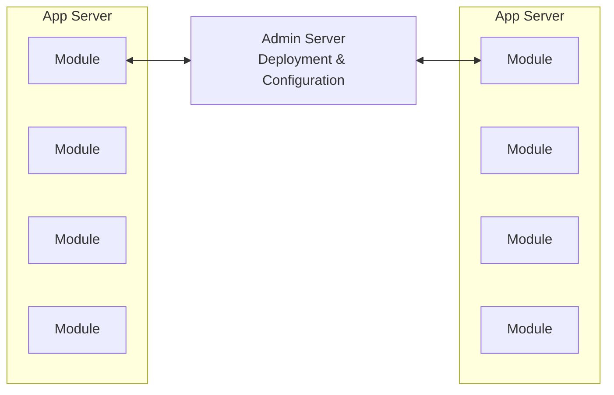

这个阶段的治理动作主要发生在应用服务器和管理服务器上。它容易理解，但只要销售模块、仓储模块或折扣模块需要独立扩容，就会暴露出边界过粗的问题。

微服务架构的变化不是“把系统拆小”这么简单，而是让服务边界、团队边界、发布边界和资源边界都显式化。每个服务可以独立部署、独立扩缩容、独立维护 SLA，也可以按业务压力决定副本数量和高可用等级。但拆分以后，原来进程内的方法调用变成了跨网络调用，系统必须面对服务发现、负载均衡、认证授权、超时、重试、熔断、链路追踪和灰度发布等治理问题。

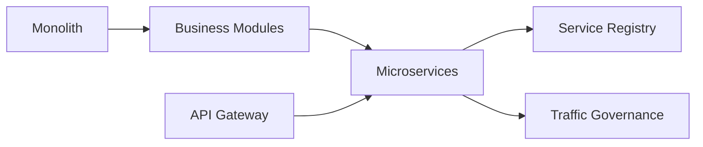

单体到微服务的收益和代价可以这样理解：

| 维度 | 单体架构 | 微服务架构 | 治理需求 |
|---|---|---|---|
| 发布 | 一个整体发布 | 服务独立发布 | 灰度发布 回滚 金丝雀 |
| 扩容 | 整体扩容 | 按服务扩容 | 服务级容量和负载均衡 |
| 故障 | 故障边界粗 | 故障边界细但依赖多 | 超时 重试 熔断 降级 |
| 依赖 | 进程内依赖 | 网络依赖 | 服务发现 TLS 认证授权 |
| 观测 | 日志集中在应用内 | 链路跨多个服务 | 指标 日志 Trace |

Kubernetes 已经提供了微服务运行的基础能力。Deployment 负责副本管理，Service 负责稳定访问入口，CoreDNS 负责服务名解析，kube-proxy 通过 iptables 或 IPVS 完成四层转发。服务 A 调用服务 B 时，可以直接访问 `service.namespace.svc.cluster.local`，再由 Service 转到后端 Pod。

拆成微服务以后，业务边界变成多个独立服务，入口通常由 API Gateway 汇聚，服务发现则成为每个服务都要依赖的基础设施。这里需要注意，复杂性并没有消失：只是从单体内部的模块依赖，转成了跨服务、跨网络、跨版本的治理问题。

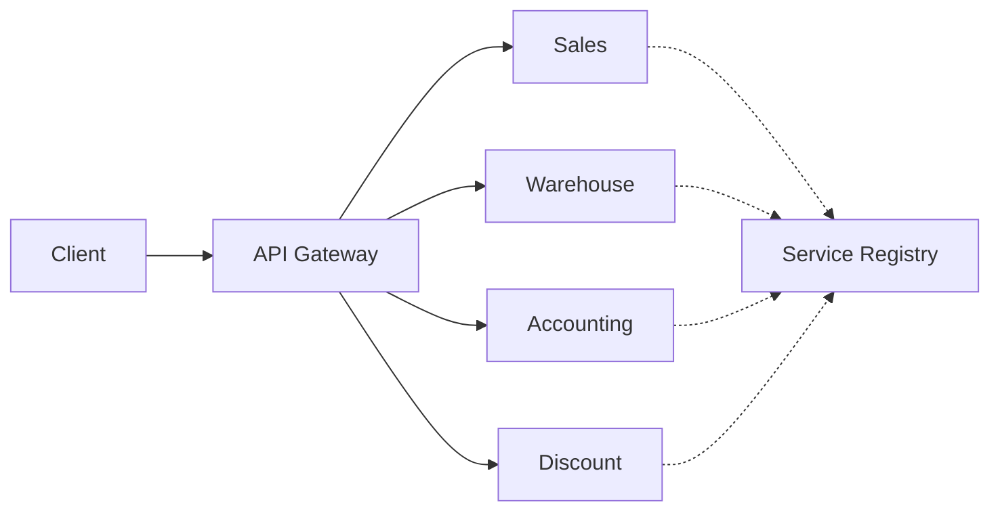

这张图的重点是“业务服务之间开始需要共同设施”。如果没有统一治理层，每个服务都要自己接注册中心、自己处理认证、自己处理重试和熔断，语言栈和框架差异会让平台升级非常困难。

这条路径能解决基础连通性，但不能解决高级治理。Service 的核心能力偏四层，它不理解 HTTP Header、URI、gRPC 方法、用户身份、请求耗时和响应状态，也不能为每个服务定制复杂的负载均衡策略。Ingress 支持七层规则，但它主要面向集群外到集群内的入口流量，不适合统一管理集群内部所有东西向流量。

| Kubernetes 原生能力 | 可以解决 | 难以解决 |
|---|---|---|
| Service | 稳定虚拟 IP 服务发现 基础负载均衡 | 按 Header 路由 按版本分流 请求级治理 |
| CoreDNS | 服务名到地址解析 | 服务版本 用户身份 流量策略 |
| kube-proxy | 四层转发 | 应用层协议感知和高级负载均衡 |
| Ingress | 北南向 HTTP 入口 | 全网格东西向流量和统一出站策略 |

在微服务系统里，经常出现的故障不是“服务完全死掉”，而是“半死不活”：后端实例仍能建立连接，但响应很慢、偶发 5xx、只在某些 URI 上失败。调用方如果没有超时和重试策略，线程可能一直等待；如果负载均衡策略只看最少连接，异常实例反而可能因为连接很快失败而持续被选中，导致局部故障放大为全局故障。

因此，服务治理不是附属功能，而是微服务架构能否稳定运行的关键能力：

| 治理能力 | 解决的问题 | 示例 |
|---|---|---|
| 服务发现 | 服务实例动态变化后仍能定位目标 | Pod 扩缩容后自动更新端点 |
| 负载均衡 | 请求按合适策略分配到后端 | 随机 轮询 最少请求 本地优先 |
| 超时 | 防止调用方无限等待 | ratings 超过 10s 直接失败 |
| 重试 | 对可恢复错误做有限补偿 | 5xx 或超时后重试 3 次 |
| 熔断 | 隔离异常实例或限制并发 | 连接池满后快速失败 |
| 降级 | 非关键依赖异常时保护主链路 | 广告或推荐服务异常时隐藏模块 |
| 认证授权 | 确认调用方身份和权限 | 服务间 mTLS 和授权策略 |
| 可观测性 | 看到请求从哪里来 到哪里去 慢在哪里 | Metrics Logs Tracing |

因此，服务治理要从“每个服务自己带一套能力”转成“平台统一提供横切能力”。系统边界图把业务服务、治理层和基础设施服务放在一起：TLS、认证授权、服务发现、熔断和负载均衡都不应该散落在每个业务代码库里。

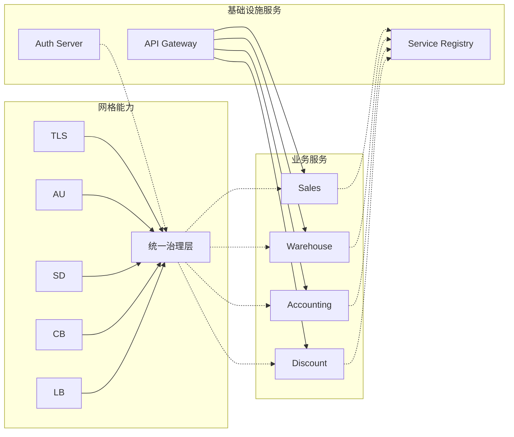

这里的口头解释可以概括为一句话：微服务开发仍然是微服务开发，Istio 关注的是服务发布以后如何被管起来。把治理层抽出来以后，业务团队少写网络控制逻辑，平台团队则要承担更严格的模板、校验和排障责任。

传统微服务框架常把这些能力通过 SDK 嵌入业务代码，例如服务注册、客户端负载均衡、熔断库、认证库和追踪库。这样能工作，但会带来语言绑定和业务耦合。Java 服务可以复用一套框架，Go、Node.js、Python 服务又要重做适配；平台组件升级也可能迫使业务重新发布。

服务网格的目标是把这些横切能力从业务进程中抽离，让业务代码继续处理业务逻辑，让平台侧统一处理流量治理。也就是说，业务仍然定义“我要访问哪个服务”，但如何发现目标、如何加密、如何重试、如何熔断、如何采集指标，由网格的数据平面和控制平面完成。

Istio 的设计目标可以概括为“最大化透明度”和“支持增量治理”。最大化透明度是指应用仍然创建普通 Pod、访问普通 Service 名，平台通过 Sidecar 注入和 iptables 捕获把流量接入代理，业务代码不需要为每一种语言重复接入治理 SDK。增量治理是指服务可以按命名空间、工作负载或调用链路逐步纳入网格，规则变化也应尽量只影响相关代理，避免一次配置调整引发全网格抖动。

这两个目标还带来统一模型的价值：入口流量、服务间东西向流量和出口流量都能用相同的 Gateway、VirtualService、DestinationRule、ServiceEntry 等对象表达；VM 或集群外工作负载也可以逐步接入，而不是要求所有系统一次性迁移完成。

### 服务网格和 Sidecar 为什么成为流量治理基础

服务网格把服务间通信改造成经过代理的通信。每个业务 Pod 旁边注入一个 Sidecar 代理，业务容器发出的请求先进入本地代理，再由代理根据控制面下发的配置决定真实目标；目标 Pod 收到流量时，也先经过本地代理，再转交给业务容器。

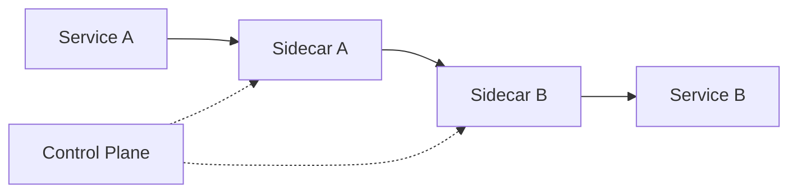

这条链路看起来比直连多了两跳，但它换来了统一治理入口。因为所有请求都经过代理，平台就能在代理中完成服务发现、负载均衡、TLS、认证授权、超时、重试、故障注入、指标采集和链路追踪。业务进程仍然可以暴露普通 HTTP 服务，真正跨机器传输时由代理升级成 mTLS。

Sidecar 模式的关键是边界清晰：

| 角色 | 关注内容 |
|---|---|
| 业务容器 | 业务 API 数据处理 依赖调用 |
| Sidecar 代理 | 流量拦截 路由 转发 加密 遥测 |
| 控制平面 | 监听配置变化 生成代理配置 下发证书和发现数据 |
| 平台团队 | 治理模板 安全基线 可观测性 运维排查 |

在 Kubernetes 中，Istio 通过 Sidecar 注入实现这件事。常见方式是在命名空间上开启自动注入：

```bash
kubectl label namespace bookinfo istio-injection=enabled
```

开启后，Pod 创建请求会经过 Istio 的 Mutating Webhook。Webhook 会改写 Pod Spec，加入一个 init container 和一个 Sidecar 容器：

| 注入内容 | 作用 |
|---|---|
| `istio-init` 或等价初始化逻辑 | 写入 Pod 网络命名空间内的 iptables 重定向规则 |
| `istio-proxy` | 运行 Envoy 代理 接收控制面配置 承载数据面转发 |
| 管理端口和环境变量 | 连接 istiod 获取配置 证书和遥测参数 |

从 Kubernetes admission 视角看，给 namespace 打上 `istio-injection=enabled` 后，新建 Pod 会命中 `istio-sidecar-injector` 这个 MutatingWebhook。原本只有一个业务容器的 Pod，创建后会多出 `istio-proxy` Sidecar 和 `init container`，`kubectl get pod` 中常见状态会从单容器变成 `2/2` ready。这个现象能把“透明注入”与 Kubernetes 在创建阶段改写 Pod Spec 的机制对应起来。

也可以用手动注入查看变更后的资源：

```bash
istioctl kube-inject -f bookinfo.yaml
```

Sidecar 的透明性来自 iptables 劫持。Pod 内所有容器共享同一个网络命名空间，init container 写入的 iptables 规则会影响业务容器和 Sidecar 容器。出站 TCP 流量通常被重定向到 Envoy 的 `15001`，入站 TCP 流量通常被重定向到 Envoy 的 `15006`。Envoy 自身一般以 UID `1337` 运行，iptables 规则会放行来自该 UID 的流量，避免代理发出的请求再次被自己劫持造成循环。

```bash
# 出站流量进入 Envoy outbound
-A OUTPUT -p tcp -j ISTIO_OUTPUT
-A ISTIO_OUTPUT -m owner --uid-owner 1337 -j RETURN
-A ISTIO_OUTPUT -p tcp -j ISTIO_REDIRECT
-A ISTIO_REDIRECT -p tcp -j REDIRECT --to-ports 15001

# 入站流量进入 Envoy inbound
-A PREROUTING -p tcp -j ISTIO_INBOUND
-A ISTIO_INBOUND -p tcp --dport 15090 -j RETURN
-A ISTIO_INBOUND -p tcp -j ISTIO_IN_REDIRECT
-A ISTIO_IN_REDIRECT -p tcp -j REDIRECT --to-ports 15006
```

出站链路可以拆成下面几步：

1. 业务容器访问 `reviews:9080`。
2. DNS 仍由 CoreDNS 解析，得到 Service ClusterIP。
3. Pod 内 iptables 把出站 TCP 请求劫持到 `15001`。
4. Envoy 的 outbound listener 根据原始目标端口找到对应虚拟监听器。
5. Envoy 匹配 route，找到目标 cluster。
6. cluster 通过 EDS 获取真实 endpoint，即目标 Pod IP。
7. Envoy 发出请求，因为请求来自 UID `1337`，iptables 放行。

入站链路则是：

1. 远端 Envoy 把请求发到目标 Pod IP 和业务端口。
2. 目标 Pod 内 PREROUTING 规则把请求劫持到 `15006`。
3. Envoy 的 inbound listener 判断这是本地服务流量。
4. Envoy 根据 route 和 cluster 把请求转发给本地业务容器端口。
5. 业务响应原路返回，代理负责记录指标和 trace 信息。


这种设计带来了明显收益，也带来了成本。

| 收益 | 说明 |
|---|---|
| 语言无关 | Java Go Node.js Python 服务都通过代理治理 |
| 业务低侵入 | 大量网络治理能力不需要写进业务 SDK |
| 策略集中 | 平台可以用统一 CRD 管理入口 东西向 出口流量 |
| 可观测性直接 | 请求经过代理即可采集指标 日志和 Trace |
| 安全升级自然 | 服务间明文调用可由 Sidecar 升级为 mTLS |

| 成本 | 说明 |
|---|---|
| 链路变长 | 请求多经过本地和远端代理 |
| 资源开销 | 每个 Pod 多一个代理容器 消耗 CPU 和内存 |
| 排查复杂 | 要同时理解 Kubernetes Service iptables Envoy 配置和 Istio 对象 |
| 配置规模 | 默认可见服务过多时 Sidecar 配置会膨胀 |
| 规则风险 | VirtualService DestinationRule 等对象通过 host subset 等字段松耦合 需要模板化和校验 |

配置规模是大规模网格最容易被低估的成本。Istio 默认会发现可见的 Service、Pod、Endpoint 以及相关 Istio 配置，并把代理需要的 listener、route、cluster、endpoint 信息下发到 Sidecar。如果所有命名空间的服务都互相可见，每个 Sidecar 都会加载大量本不访问的目标，导致 Envoy 内存开销上升、`istiod` 生成配置变慢，xDS 推送也更容易成为控制面瓶颈。

治理思路是从服务可见性入手。可以用 Istio 配置对象的 `exportTo` 明确配置只导出给指定命名空间，用 `Sidecar` 资源的 `egress.hosts` 限制某类工作负载能看到哪些服务；在多租户或超大规模集群中，还可以把默认策略调整为不全量导出，再按业务依赖显式开放。这样能从源头减少 Sidecar 配置体积和控制面推送压力。

Istio 的架构也经历过演进。早期控制平面由 Pilot、Mixer、Citadel、Galley 等多个组件组成：

| 早期组件 | 职责 |
|---|---|
| Pilot | 服务发现和流量配置下发 |
| Mixer | 策略检查和遥测适配 |
| Citadel | 证书签发和安全能力 |
| Galley | 配置校验和适配 |

这种拆法职责清晰，但运维复杂。控制面组件多，升级顺序、故障定位和依赖关系都变难。后来 Istio 把核心控制面合并到 `istiod`，同时移除或收敛 Mixer 相关路径，把大量遥测工作下沉到 Envoy 和 Telemetry V2。

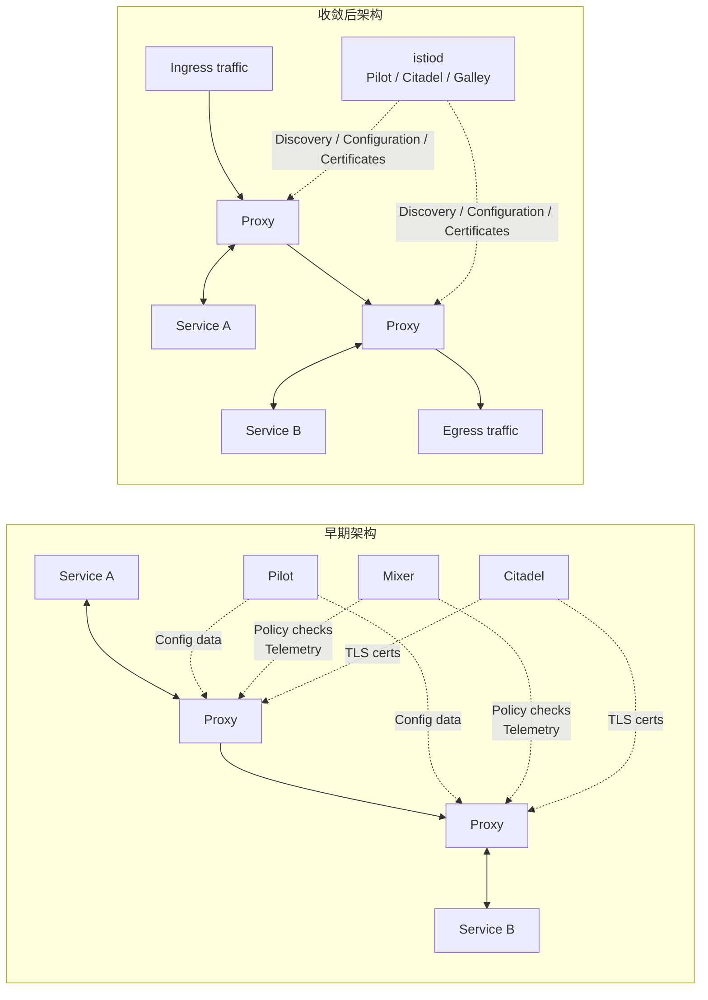

这张图的重点是演进动机：早期组件拆得很细，策略检查、遥测、证书和配置下发都在不同组件里，真实运维会变重。收敛到 `istiod` 后，数据面仍然是 Envoy，控制面的核心职责变成统一生成发现数据、网络配置和证书材料。

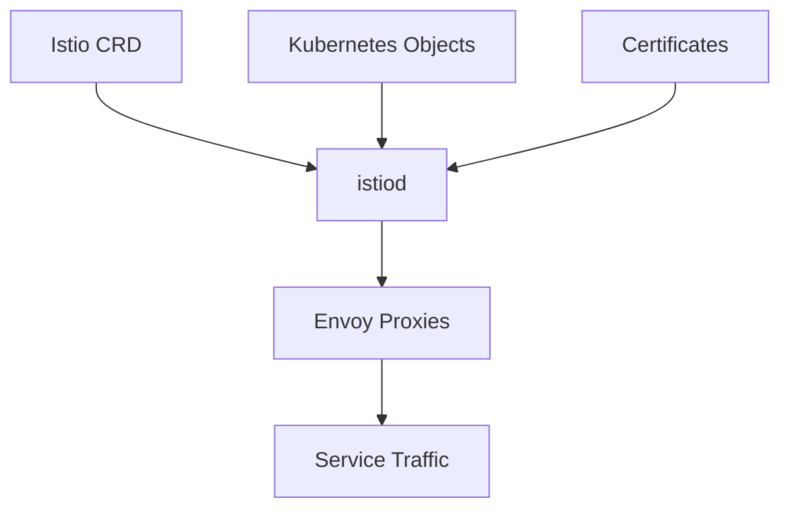

控制面和数据面可以这样区分：

| 平面 | Istio 中的对象 | 主要职责 |
|---|---|---|
| 控制平面 | `istiod` Istio CRD Kubernetes Service Endpoint Secret | 监听状态和配置 生成 Envoy 配置 下发证书 |
| 数据平面 | Envoy Sidecar Ingress Gateway Egress Gateway | 执行真实转发 路由 负载均衡 TLS 遥测 |

`istiod` 本质上也是控制器。它 watch Kubernetes API Server 中的 Service、Pod、Endpoint、Secret 以及 Istio 自己的 CRD，把“平台状态”和“治理配置”合并成 Envoy 可理解的 xDS 配置，再通过 gRPC 长连接推送给每个代理。代理启动时会先拉取一份配置，后续再接收控制面合并后的增量或推送。

### Envoy 数据平面如何处理线程 xDS 和过滤器

Envoy 是 Istio 数据平面的核心。它原本是一个高性能 L4/L7 代理，被 Istio 选中并不是因为它只会反向代理，而是因为它适合云原生动态环境：支持 HTTP/2 和 gRPC，支持丰富过滤器，支持热重启，更重要的是支持通过 API 动态配置。

和传统反向代理相比，Envoy 的关键优势是“控制面友好”。在 Kubernetes 中，Service、Endpoint、Pod、Secret 和路由规则不断变化，如果每次变化都要生成本地配置文件并重启代理，连接会被频繁中断。Envoy 可以通过 xDS API 从管理服务器获取配置并更新内存中的监听器、路由、集群和端点，不必依赖频繁重启。

这也是 Istio 选择 Envoy 作为数据面的重要原因。Nginx 和 HAProxy 都是成熟代理，但常见传统用法更偏“配置文件 + reload”；在 Endpoint 高频变化的云原生场景中，频繁重载会让连接排空、状态迁移和配置一致性变复杂。Envoy 从设计上更适合被控制面驱动，动态 API、热重启和 connection draining 能减少配置变化时的连接中断。

| 对比点 | Nginx / HAProxy 常见传统模式 | Envoy 在服务网格中的价值 |
|---|---|---|
| 配置更新 | 以配置文件和 reload 为主 | 通过 xDS API 动态更新内存配置 |
| 连接处理 | reload 时要额外处理连接排空 | 支持热重启和 connection draining |
| 协议支持 | 常用于 HTTP/TCP 代理 | 原生适配 HTTP/2 gRPC 和多层 filter |
| 控制面集成 | 需要额外胶水层生成配置 | 天然面向管理服务器和发现 API |
| 高频 Endpoint 变化 | 配置生成和 reload 成本较高 | EDS 可单独更新 endpoint 集合 |

| 能力 | Envoy 的价值 |
|---|---|
| HTTP/2 和 gRPC | 同时支持下游和上游的现代协议 |
| 动态配置 | xDS 推送配置 不需要每次重启 |
| 过滤器 | L4 L7 都能扩展处理逻辑 |
| 热重启 | 配置或版本变更时尽量保留连接 |
| 可观测性 | 原生生成指标 访问日志 Trace Header |

Envoy 采用单进程多线程模型。主线程负责协调、监听配置、管理控制面连接和分发更新；工作线程负责真正的网络连接处理。一个连接一旦被某个 worker 接收，就会绑定到该 worker 的生命周期中，减少跨线程协调和锁竞争。底层事件模型通常基于非阻塞 I/O，例如 epoll，worker 数量一般建议接近所在节点可用硬件线程数。

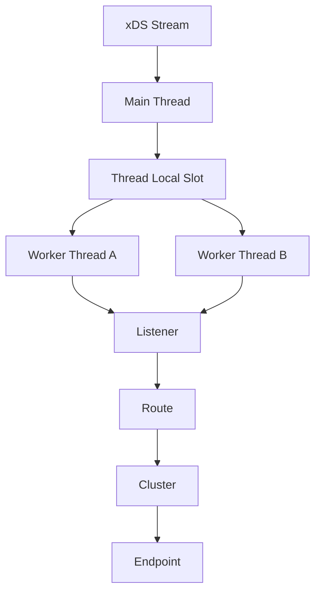

理解 Envoy 配置，核心是理解四个层级：

| 层级 | Envoy 概念 | Kubernetes 或 Istio 中的近似来源 |
|---|---|---|
| 入口 | Listener | Gateway Sidecar 端口 捕获端口 |
| 路由 | Route VirtualHost RouteMatch | VirtualService |
| 目标集合 | Cluster | Service DestinationRule ServiceEntry |
| 实例 | Endpoint Host | Pod IP WorkloadEntry |

一个请求进入 Envoy 后，大致流程是：先命中 listener，再进入 filter chain，然后由 HTTP Connection Manager 找到 virtual host 和 route，最后选择 cluster 中的 endpoint 发出请求。这个过程也解释了为什么 `istioctl proxy-config` 排障时通常按 Listener、Route、Cluster、Endpoint 的顺序看。

```bash
istioctl proxy-config listeners productpage-v1-xxx -n bookinfo
istioctl proxy-config routes productpage-v1-xxx -n bookinfo
istioctl proxy-config clusters productpage-v1-xxx -n bookinfo
istioctl proxy-config endpoints productpage-v1-xxx -n bookinfo
```

用一份最小静态配置也能把这条链路串起来。`admin` 暴露本地管理端口，便于查看 `/config_dump`；`static_resources.listeners` 定义 Envoy 对外监听的端口；HTTP Connection Manager 里的 `route_config.virtual_hosts` 定义域名和路径匹配；`clusters` 定义被路由选中的后端集合。排查时，`static_resources.listeners` 对应 listener，`route_config.virtual_hosts` 和 routes 对应 route，`clusters` 对应 cluster，`load_assignment.endpoints` 对应 endpoint。请求访问 `10000` 端口后，先命中 listener，再按 `prefix` 匹配 route，随后转到 `local_service` cluster，最后由 cluster 中的 endpoint 指向真实后端。

```yaml
admin:
  address:
    socket_address:
      address: 127.0.0.1
      port_value: 9901
static_resources:
  listeners:
  - name: listener_0
    address:
      socket_address:
        address: 0.0.0.0
        port_value: 10000
    filter_chains:
    - filters:
      - name: envoy.filters.network.http_connection_manager
        typed_config:
          route_config:
            virtual_hosts:
            - name: backend
              domains: ["*"]
              routes:
              - match:
                  prefix: "/api"
                route:
                  cluster: local_service
  clusters:
  - name: local_service
    type: LOGICAL_DNS
    load_assignment:
      cluster_name: local_service
      endpoints:
      - lb_endpoints:
        - endpoint:
            address:
              socket_address:
                address: httpserver.default.svc.cluster.local
                port_value: 8080
```

这些命令背后看的仍然是 Envoy 配置。Envoy 自身在本地管理端口提供 `config_dump`，可以一次性导出完整配置，但生产环境里的 dump 往往很大，listener、route、cluster、endpoint 之间又是弱关联，直接肉眼查很容易迷路。`istioctl proxy-config` 相当于按 Envoy 层级帮你过滤和整理 `config_dump`，因此适合定位“VirtualService 写了但 route 没生成”“cluster 存在但 endpoint 为空”“listener 没有挂到预期端口”等问题。

xDS 是一组发现 API 的统称。早期 Envoy v1 API 偏 JSON/REST 和轮询，强类型能力弱，配置传播延迟也大。v2 以后使用 proto3，并通过 gRPC 流式 API 传递，控制面可以更快、更确定地把配置推给代理。

| xDS | 全称 | 作用 |
|---|---|---|
| LDS | Listener Discovery Service | 下发监听器和过滤链 |
| RDS | Route Discovery Service | 下发路由和虚拟主机 |
| CDS | Cluster Discovery Service | 下发目标服务集合 |
| EDS | Endpoint Discovery Service | 下发目标实例地址和健康状态 |
| SDS | Secret Discovery Service | 下发证书和密钥材料 |
| HDS | Health Discovery Service | 支持分布式健康检查信息 |
| ADS | Aggregated Discovery Service | 在单条双向 gRPC 流中组织多个发现服务 |

HDS 表达的是主动健康检查结果的分发思路：在多网关或多 Envoy 场景下，如果每个代理都主动探测同一组后端，健康检查流量本身就可能变成压力源，因此可以让部分成员执行检查，再把结果共享给其他代理。它和 DestinationRule 里的 `outlierDetection` 不是同一类机制；主动检查可以访问 `/healthz` 这类专用端点判断实例是否整体健康，被动异常剔除则根据真实业务请求的超时、连接失败或 5xx 计数把 endpoint 暂时移出负载均衡池。

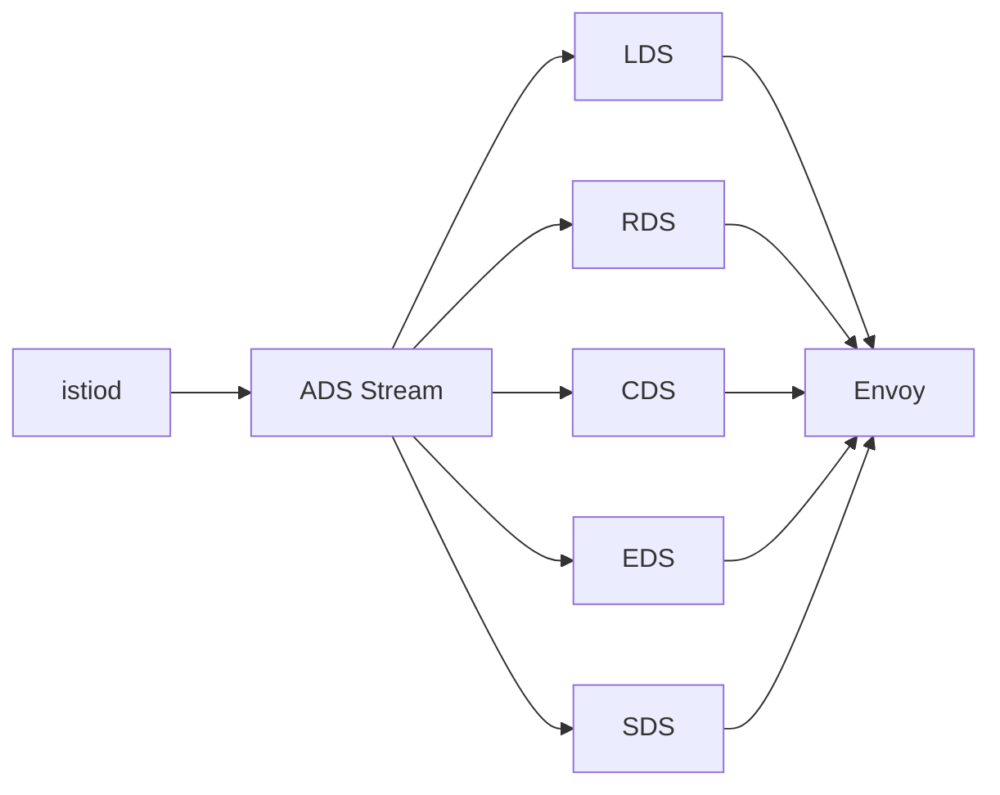

配置之间存在依赖关系。通常 cluster 信息要先存在，route 才能引用目标 cluster；listener 要存在，route 才有挂载位置；endpoint 变化又最频繁，需要相对轻量地更新。ADS 的价值就是把多个发现接口放在同一个有序流里，让控制面对配置顺序有更强控制。

`istiod` 处理配置更新时，通常不是每个事件立即全量推送。它会为 Kubernetes Service、Endpoint、Pod、Secret 以及 Istio CRD 注册 handler 和 watch，资源变化先进入全局 push channel。worker 会用一个很短的 debounce 窗口合并一批 push request，常见默认量级约为 100ms，然后再为每条 Envoy ADS 连接写入该连接自己的 push channel。

Envoy 启动后会先在双向 gRPC 流上发送 DiscoveryRequest，向 `istiod` 拉取一份可用的全量配置；后续资源变化则由 `istiod` 根据代理身份、命名空间、Sidecar 可见范围和相关规则生成 LDS、RDS、CDS、EDS、SDS 等 xDS 更新，再通过对应连接下发。这个流水线解释了三个生产现象：配置不会严格逐事件立即生效；`istiod` 多副本可以按代理连接分摊压力；当 Service 和 Endpoint 数量很大时，配置生成、队列积压和连接级发送都会成为排障重点。

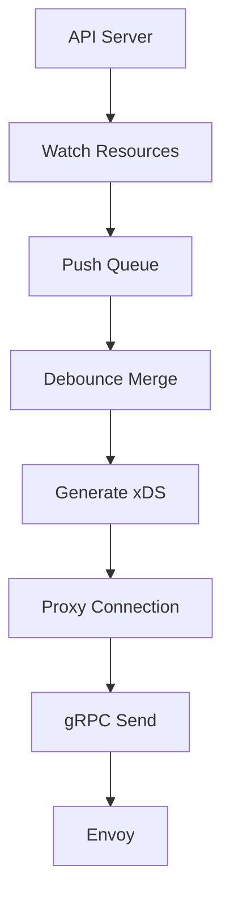

Envoy 的过滤器模型是另一个重点。它不是把所有逻辑写成一个固定转发函数，而是在不同层级挂载 filter。Listener filter 可以在 TLS 握手早期读取 SNI，Network filter 可以处理 TCP 连接和 HTTP Connection Manager，HTTP filter 可以做鉴权、限流、遥测、路由等处理。

| 过滤器层级 | 示例 | 作用 |
|---|---|---|
| Listener Filter | TLS Inspector | 从连接早期信息识别 SNI 和协议 |
| Network Filter | HTTP Connection Manager | 把连接解析成 HTTP 请求 |
| HTTP Filter | Auth Rate Limit Router Telemetry | 执行七层逻辑和最终路由 |
| Router Filter | Router | 把请求交给目标 cluster |

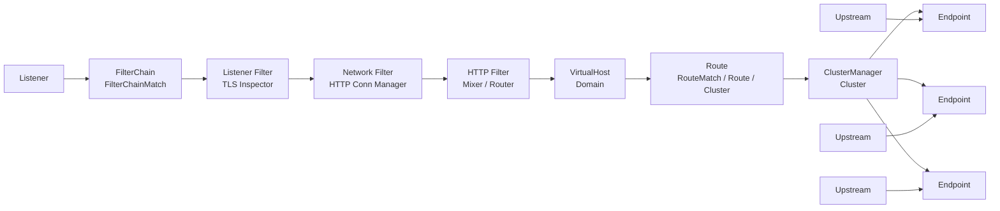

排查时要顺着这张图看，而不是只盯着一个 VirtualService。listener 没有生成，入口端口就不存在；route 没有挂上，host 或 path 匹配就不会生效；cluster 或 endpoint 不正确，请求即使命中路由也转不到真实 Pod。`istioctl proxy-config` 的 listener、route、cluster、endpoint 顺序，本质上就是沿着这条处理链路做定位。

SNI 是网关 HTTPS 场景中的典型例子。一个 Ingress Gateway 可能只监听一个 443 端口，但服务多个域名，每个域名证书不同。客户端 TLS 握手时会带上要访问的域名，Envoy 通过 TLS Inspector 读出 SNI，再选择对应证书完成握手。

Envoy 也支持通过 WASM 等方式扩展过滤器，但这类扩展要谨慎。它能让平台在现有配置基础上插入自定义逻辑，也可能引入性能开销和维护复杂度。生产里更常见的做法是优先使用 Istio 和 Envoy 已有能力，只有在标准 CRD 无法表达业务规则时才考虑 EnvoyFilter 或 WASM 插件。

### Istio 流量管理对象如何组合请求路由能力

Istio 流量治理围绕一组 CRD 展开。它们不是彼此替代，而是负责不同层级：Gateway 管入口监听，VirtualService 管路由匹配和转发，DestinationRule 管目标服务策略，ServiceEntry 和 WorkloadEntry 扩展服务注册表，Sidecar 控制代理可见配置范围。

| 对象 | 主要用途 | 对应 Envoy 概念 |
|---|---|---|
| Gateway | 为入口或出口网关定义端口 协议 TLS | Listener |
| VirtualService | 定义 host uri header sourceLabels 等路由规则 | Route VirtualHost |
| DestinationRule | 定义 subset 负载均衡 TLS 连接池 断路器 | Cluster Policy |
| ServiceEntry | 把网格外服务加入服务注册表 | Cluster |
| WorkloadEntry | 把 VM 或外部实例建模成工作负载 | Endpoint |
| Sidecar | 控制工作负载可见服务和出入站配置 | Proxy Scope |

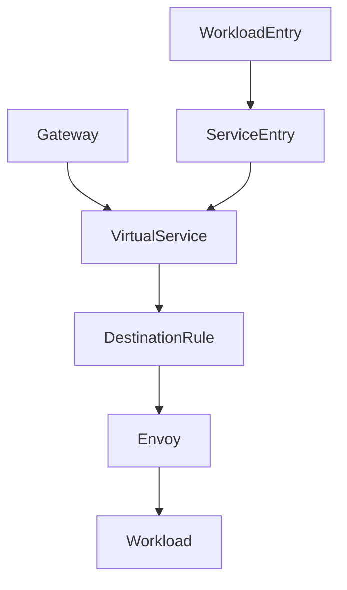

一次请求真正执行时，Gateway 只决定入口监听，VirtualService 决定“按 host、URI、header 或来源匹配到哪里”，DestinationRule 决定“目标 subset 怎么连接、怎么负载均衡、是否启用 TLS 和断路器”。灰度发布中常见的“按百分比或 header 把请求导到哪个 subset”，执行时走的就是这条链路。

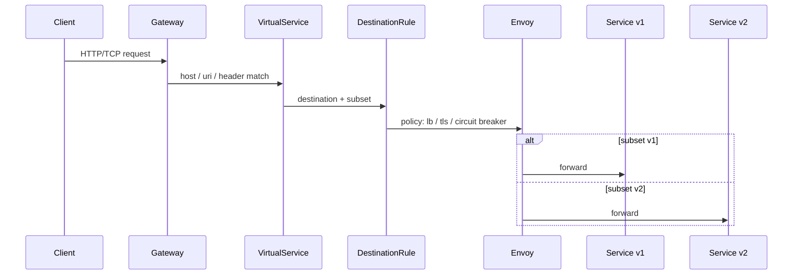

这也解释了两个常见排查点：第一，VirtualService 中引用的 subset 必须能在 DestinationRule 中找到；第二，DestinationRule 里的 subset label 必须能选中真实 Pod，否则 Envoy 会生成空 endpoint 或请求落到非预期后端。

VirtualService 是使用最频繁的对象。它描述“什么请求应该转发到哪里”。请求可以按 host、URI、Header、端口、方法、sourceLabels 等条件匹配；目标可以是某个服务，也可以是某个 subset。下面是按权重切分 `reviews` 流量的例子：

```yaml
apiVersion: networking.istio.io/v1beta1
kind: VirtualService
metadata:
  name: reviews
spec:
  hosts:
  - reviews
  http:
  - route:
    - destination:
        host: reviews
        subset: v1
      weight: 75
    - destination:
        host: reviews
        subset: v2
      weight: 25
```

权重之和应为 100。这个规则适合金丝雀发布：先把少量流量导向新版本，观察错误率、延迟、业务指标和用户反馈，再逐步放大。如果新版本异常，可以快速把权重调回旧版本。

DestinationRule 定义“到目标服务以后如何连接”。它常用来把同一个 Service 下的 Pod 按 label 拆成 subset，并为服务或 subset 配置负载均衡、连接池、TLS 和熔断策略。

```yaml
apiVersion: networking.istio.io/v1beta1
kind: DestinationRule
metadata:
  name: reviews
spec:
  host: reviews
  trafficPolicy:
    loadBalancer:
      simple: RANDOM
  subsets:
  - name: v1
    labels:
      version: v1
  - name: v2
    labels:
      version: v2
    trafficPolicy:
      loadBalancer:
        simple: ROUND_ROBIN
```

VirtualService 和 DestinationRule 的关系要特别注意。VirtualService 中引用的 `subset: v2` 必须在 DestinationRule 中存在，并且 subset label 必须能选中真实 Pod。这里是松耦合关系，字段写错不一定立刻报错，但规则可能不生效。生产中通常要用 Helm 或其他模板固定模式，并用 `istioctl analyze` 和代理配置检查做验证。

这种松耦合不只发生在 subset 上。Istio 规则常由 Gateway、VirtualService、DestinationRule、ServiceEntry、WorkloadEntry 和 Kubernetes Service 一起完成，`hosts`、`gateways`、`destination.host`、`subset`、selector、Pod label 以及请求 Host Header 都依赖字符串或标签关联。字段拼错、命名空间写错、短域名和 FQDN 混用不当，通常不会让 YAML 创建失败，而是导致 Envoy 没有生成预期 route/cluster，或者请求根本匹配不到对应 virtual host。

生产校验不能只停留在 `kubectl apply` 成功。更稳妥的做法是把常见规则固化成 Helm/Kustomize 模板，提交前跑 `istioctl analyze`，上线后按 listener、route、cluster、endpoint 顺序检查代理配置，并配合端到端探测确认真实请求路径。这样才能发现“对象存在但规则静默不生效”的问题。

```bash
istioctl analyze -n bookinfo
istioctl proxy-config routes productpage-v1-xxx -n bookinfo
istioctl proxy-config clusters productpage-v1-xxx -n bookinfo
```

按 Header 做灰度是另一种常见能力。例如只让带有 `end-user: jason` 的请求进入 v2，其余请求仍走 v1：

```yaml
apiVersion: networking.istio.io/v1beta1
kind: VirtualService
metadata:
  name: reviews
spec:
  hosts:
  - reviews
  http:
  - match:
    - headers:
        end-user:
          exact: jason
    route:
    - destination:
        host: reviews
        subset: v2
  - route:
    - destination:
        host: reviews
        subset: v1
```

这种规则适合内部用户、特定客户、测试账号或 Beta 用户组。业务系统可以在 API Gateway 或认证层为用户打上稳定 Header，Istio 根据 Header 把请求导到不同版本。

URI 匹配和重写常用于入口网关。例如同一个域名下，`/simple/hello` 转到 HTTP 服务并重写为 `/hello`，`/nginx` 转到 Nginx 并重写为 `/`：

```yaml
apiVersion: networking.istio.io/v1beta1
kind: VirtualService
metadata:
  name: simple
spec:
  hosts:
  - simple.example.com
  gateways:
  - simple-gateway
  http:
  - match:
    - uri:
        prefix: /simple/hello
    rewrite:
      uri: /hello
    route:
    - destination:
        host: httpserver
        port:
          number: 80
  - match:
    - uri:
        prefix: /nginx
    rewrite:
      uri: /
    route:
    - destination:
        host: nginx
        port:
          number: 80
```

规则顺序很重要。Istio 会按 VirtualService 中的顺序匹配 HTTP 路由。越精确的规则应放在前面，兜底规则应放在后面。如果第一条就是 `prefix: /`，后面的具体路径规则就可能永远匹配不到。

这类问题在生产里经常表现为“配置看起来正确，但流量总是走默认后端”。例如先写了一个 `prefix: /` 的兜底规则，再写 `/api/v1/orders` 或带 Header 的精细规则，Envoy 按顺序命中第一条后就不会继续向下匹配。经验原则是 URI 越长、Header 条件越精确、用户或来源范围越窄的规则越靠前，兜底规则始终放到最后；上线前应使用 `istioctl proxy-config routes` 检查 Envoy 最终生成的 route 顺序。

```yaml
http:
- match:
  - uri:
      prefix: /api/v1/orders
  route:
  - destination:
      host: orders-v1
- match:
  - uri:
      prefix: /
  route:
  - destination:
      host: frontend
```

sourceLabels 可以根据调用方工作负载标签做路由。例如只有来自 `app: reviews` 的请求才导向特定目标。这类规则适合流量泳道、调用方隔离和按来源服务定制后端版本。

```yaml
apiVersion: networking.istio.io/v1beta1
kind: VirtualService
metadata:
  name: ratings
spec:
  hosts:
  - ratings
  http:
  - match:
    - sourceLabels:
        app: reviews
    route:
    - destination:
        host: ratings
        subset: reviews-lane
  - route:
    - destination:
        host: ratings
        subset: stable
```

入口流量一般由 Gateway 和 VirtualService 组合。Gateway 只定义端口、协议、TLS 和适用的网关工作负载；VirtualService 绑定这个 Gateway 后，才定义七层路由。

```yaml
apiVersion: networking.istio.io/v1beta1
kind: Gateway
metadata:
  name: bookinfo-gateway
spec:
  selector:
    istio: ingressgateway
  servers:
  - port:
      number: 80
      name: http
      protocol: HTTP
    hosts:
    - bookinfo.example.com
```

```yaml
apiVersion: networking.istio.io/v1beta1
kind: VirtualService
metadata:
  name: bookinfo
spec:
  hosts:
  - bookinfo.example.com
  gateways:
  - bookinfo-gateway
  http:
  - match:
    - uri:
        prefix: /productpage
    route:
    - destination:
        host: productpage
        port:
          number: 9080
```

从 Envoy 角度看，Gateway 让 ingress gateway Pod 里的 Envoy 起对应 listener，VirtualService 让 listener 下挂 route，DestinationRule 影响 route 选中 cluster 后的连接策略。这样 Istio 用少数对象统一表达了入口流量、东西向流量和出口流量。

### 超时 重试 故障注入 镜像和断路器如何治理流量

高级流量管理的目标不是让规则“看起来复杂”，而是在真实故障和发布变化中保护系统。微服务链路越长，越需要把超时、重试、故障注入、流量镜像和断路器这类机制平台化，否则每个业务团队都要重复实现并承担不一致风险。

#### 超时和重试

超时用来给一次请求设置最大等待时间。调用方忘记设置超时时，代理可以在中间层补上保护，避免连接和线程无限等待。

```yaml
apiVersion: networking.istio.io/v1beta1
kind: VirtualService
metadata:
  name: ratings
spec:
  hosts:
  - ratings
  http:
  - route:
    - destination:
        host: ratings
        subset: v1
    timeout: 10s
```

重试用于处理临时错误。重试必须有上限，否则会在故障时放大流量。生产策略通常要同时限制 `attempts`、`perTryTimeout` 和可重试错误类型。

```yaml
apiVersion: networking.istio.io/v1beta1
kind: VirtualService
metadata:
  name: ratings
spec:
  hosts:
  - ratings
  http:
  - route:
    - destination:
        host: ratings
        subset: v1
    retries:
      attempts: 3
      perTryTimeout: 2s
      retryOn: 5xx,connect-failure,refused-stream
```

超时和重试要配套设计。每次重试的超时不能大于整体调用预算，上游服务也要知道下游服务的最大处理时间。否则一层层重试叠加，会形成重试风暴。

| 配置 | 建议 |
|---|---|
| `timeout` | 按业务端到端预算设置 不是越长越好 |
| `attempts` | 通常少量重试即可 过多会放大故障 |
| `perTryTimeout` | 应小于整体 timeout |
| `retryOn` | 只对可恢复错误重试 不要盲目重试所有失败 |

#### 故障注入

故障注入用于模拟异常，而不是等待生产环境自然出错。Istio 可以在代理层注入延迟或错误响应，不需要停 Pod、拔网线或临时写 iptables 规则。它适合做混沌测试、降级链路验证和超时重试策略验证。

延迟注入示例：

```yaml
apiVersion: networking.istio.io/v1beta1
kind: VirtualService
metadata:
  name: ratings
spec:
  hosts:
  - ratings
  http:
  - fault:
      delay:
        percentage:
          value: 10
        fixedDelay: 5s
    route:
    - destination:
        host: ratings
        subset: v1
```

错误注入示例：

```yaml
apiVersion: networking.istio.io/v1beta1
kind: VirtualService
metadata:
  name: ratings
spec:
  hosts:
  - ratings
  http:
  - fault:
      abort:
        percentage:
          value: 10
        httpStatus: 500
    route:
    - destination:
        host: ratings
        subset: v1
```

故障注入最适合验证这些问题：

| 场景 | 要观察 |
|---|---|
| 下游延迟变高 | 上游是否及时超时 是否触发降级 |
| 下游偶发 5xx | 重试次数是否合理 错误率是否可控 |
| 非关键服务异常 | 主链路是否仍可返回 |
| 局部实例异常 | 断路器是否把异常 endpoint 剔除 |

#### 流量镜像

流量镜像把真实请求复制一份发给影子版本。主请求仍然走稳定版本，影子请求的响应会被丢弃，不影响用户看到的结果。Envoy 通常会为镜像请求增加 shadow 语义，表示它只是旁路请求。

```yaml
apiVersion: networking.istio.io/v1beta1
kind: VirtualService
metadata:
  name: httpbin
spec:
  hosts:
  - httpbin
  http:
  - route:
    - destination:
        host: httpbin
        subset: v1
      weight: 100
    mirror:
      host: httpbin
      subset: v2
    mirrorPercentage:
      value: 100
```

流量镜像适合在不切真实流量的情况下观察新版本行为，例如日志、性能、资源消耗和兼容性。要注意影子版本会收到真实请求内容，因此仍要考虑隐私、幂等性和副作用。对写请求做镜像时，影子后端必须隔离写入目标，避免重复扣费、重复下单或污染生产数据。

#### 规则委托

当一个域名下面有大量服务和路径时，把所有规则写进一个 VirtualService 会很难维护。规则委托允许顶层 VirtualService 把某些路径交给其他命名空间或团队维护。

```yaml
apiVersion: networking.istio.io/v1beta1
kind: VirtualService
metadata:
  name: bookinfo
spec:
  hosts:
  - bookinfo.example.com
  gateways:
  - bookinfo-gateway
  http:
  - match:
    - uri:
        prefix: /productpage
    delegate:
      name: productpage
      namespace: team-product
  - match:
    - uri:
        prefix: /reviews
    delegate:
      name: reviews
      namespace: team-review
```

被委托的 VirtualService 再定义本团队内部的细分规则：

```yaml
apiVersion: networking.istio.io/v1beta1
kind: VirtualService
metadata:
  name: productpage
  namespace: team-product
spec:
  http:
  - match:
    - uri:
        prefix: /productpage/v1
    route:
    - destination:
        host: productpage-v1.team-product.svc.cluster.local
  - route:
    - destination:
        host: productpage.team-product.svc.cluster.local
```

规则委托的价值是权限下放和配置拆分。平台团队维护域名和顶层路径，业务团队维护自己命名空间内的细分规则。控制面最终会把这些规则合并成 Envoy 配置再下发。

#### 断路器和异常实例剔除

断路器通常配置在 DestinationRule 中。它包含两类常见能力：连接池限制和异常实例检测。连接池限制用于保护后端不被过多连接或请求打满；异常实例检测用于被动发现不健康 endpoint，并把它暂时踢出负载均衡池。

```yaml
apiVersion: networking.istio.io/v1beta1
kind: DestinationRule
metadata:
  name: httpbin
spec:
  host: httpbin
  trafficPolicy:
    connectionPool:
      tcp:
        maxConnections: 100
      http:
        http1MaxPendingRequests: 100
        maxRequestsPerConnection: 10
    outlierDetection:
      consecutive5xxErrors: 3
      interval: 5s
      baseEjectionTime: 30s
      maxEjectionPercent: 50
```

| 字段 | 含义 |
|---|---|
| `maxConnections` | 到目标服务的最大 TCP 连接数 |
| `http1MaxPendingRequests` | HTTP 等待队列上限 |
| `maxRequestsPerConnection` | 单连接最大请求数 |
| `consecutive5xxErrors` | 连续 5xx 达到阈值后认为异常 |
| `interval` | 异常检测周期 |
| `baseEjectionTime` | endpoint 被踢出的基础时长 |
| `maxEjectionPercent` | 最多剔除后端实例比例 |

断路器要避免两种极端。太保守会让异常实例继续承接请求，太激进会把大量实例踢出导致容量骤降。生产中通常先用观测数据评估后端错误模式，再逐步收紧阈值。

还要区分主动健康检查和被动异常剔除。主动检查会按固定周期访问后端的健康端点，例如 `/healthz`，它判断的是实例是否整体可服务；真实业务 URI 的 5xx 未必表示实例整体不可用，可能只是某个接口或依赖异常。`outlierDetection` 则完全基于真实请求结果，把连续 5xx、超时或连接失败达到阈值的 endpoint 临时剔除。两者可以互补，但不能互相替代：主动检查更适合发现实例级不可用，被动剔除更适合隔离真实流量中表现异常的后端。

### ServiceEntry WorkloadEntry Gateway 和多集群扩展如何使用

Istio 的服务注册表不只来自 Kubernetes Service。ServiceEntry 可以把网格外服务加入 Istio 的服务发现模型，让网格内服务像访问内部服务一样访问外部服务，并继续套用 VirtualService 和 DestinationRule。

#### ServiceEntry 管理外部服务

最常见场景是允许网格内服务访问外部域名：

```yaml
apiVersion: networking.istio.io/v1beta1
kind: ServiceEntry
metadata:
  name: external-api
spec:
  hosts:
  - api.external.example.com
  location: MESH_EXTERNAL
  ports:
  - number: 443
    name: https
    protocol: HTTPS
  resolution: DNS
```

如果启用了严格出站控制，ServiceEntry 可以明确声明哪些外部服务可访问。之后还可以为这个 host 配置 VirtualService 做路由，为 DestinationRule 配置 TLS、负载均衡或连接策略。

ServiceEntry 也能描述网格内部但不由 Kubernetes 管理的服务，例如传统 VM 上的服务。此时通常把 `location` 设为 `MESH_INTERNAL`，再配合 WorkloadEntry 表示具体实例。

```yaml
apiVersion: networking.istio.io/v1beta1
kind: ServiceEntry
metadata:
  name: details-svc
spec:
  hosts:
  - details.bookinfo.com
  location: MESH_INTERNAL
  ports:
  - number: 80
    name: http
    protocol: HTTP
  resolution: STATIC
  workloadSelector:
    labels:
      app: details-legacy
```

#### WorkloadEntry 纳入 VM 工作负载

WorkloadEntry 把一个非 Kubernetes 工作负载建模成 Istio endpoint。它可以带地址、标签和 serviceAccount，使 VM 或裸机服务进入网格治理范围。

```yaml
apiVersion: networking.istio.io/v1beta1
kind: WorkloadEntry
metadata:
  name: details-vm-1
spec:
  serviceAccount: details-legacy
  address: 2.2.2.2
  labels:
    app: details-legacy
    instance-id: vm1
```

这类对象适合迁移阶段。应用还没有完全迁入 Kubernetes，但希望 Kubernetes 内服务可以通过统一服务名访问传统实例，并逐步把流量切到新 Pod。它也适合跨环境服务发现，但要注意网络可达性、证书身份和健康检查。

#### Gateway 管理入口流量

Gateway 负责在网格边缘打开监听器。它和 Kubernetes Ingress 的定位相似，但模型更灵活：Gateway 定义端口、协议、TLS 和选择哪个网关工作负载；VirtualService 定义具体七层路由。

HTTP Gateway：

```yaml
apiVersion: networking.istio.io/v1beta1
kind: Gateway
metadata:
  name: simple-gateway
spec:
  selector:
    istio: ingressgateway
  servers:
  - port:
      number: 80
      name: http
      protocol: HTTP
    hosts:
    - simple.example.com
```

HTTPS Gateway：

```yaml
apiVersion: networking.istio.io/v1beta1
kind: Gateway
metadata:
  name: secure-gateway
spec:
  selector:
    istio: ingressgateway
  servers:
  - port:
      number: 443
      name: https
      protocol: HTTPS
    hosts:
    - secure.example.com
    tls:
      mode: SIMPLE
      credentialName: secure-example-credential
```

证书建议用 Kubernetes Secret 通过 `credentialName` 引用，而不是直接把证书文件路径写进 Gateway。这样证书管理、轮换和权限控制更符合 Kubernetes 的声明式模型。

```bash
kubectl create secret tls secure-example-credential \
  --cert=server.crt \
  --key=server.key \
  -n istio-system
```

本地没有配置 DNS 时，可以用 `curl --resolve` 同时验证解析和 HTTPS SNI：

```bash
curl --resolve secure.example.com:443:${GATEWAY_IP} \
  https://secure.example.com/simple/hello -v
```

这条命令只在本次 curl 中把 `secure.example.com:443` 解析到 ingress gateway IP，但 URL 里仍保留域名，因此 TLS 握手会携带 `secure.example.com` 作为 SNI。这样既能验证流量是否到达网关，也能验证 Envoy 是否按域名选择到正确证书；直接访问 `https://${GATEWAY_IP}` 则无法覆盖同样的 SNI 场景。

Gateway 安全加固至少要关注：

| 加固项 | 建议 |
|---|---|
| TLS | 对公网入口启用 HTTPS 并统一证书轮换 |
| Host 限制 | Gateway 和 VirtualService 都限制明确域名 |
| 最小暴露 | 只开放业务需要的端口 |
| mTLS | 服务间通信启用网格身份和加密 |
| 授权 | 在后续安全策略中按身份 方法 路径限制访问 |
| 高可用 | Ingress Gateway 多副本部署并受 PDB 保护 |

入口 Gateway 是集中式关键路径，它和普通 Sidecar 的风险不同。Sidecar 通常只影响所在工作负载，而 ingress gateway 承接外部进入网格的北南向流量；如果 ingress gateway Pod 全部异常，集群入口流量会直接中断。因此生产中要做多副本、反亲和、PDB、容量评估、滚动升级和变更验证，发布时不能一次性重启全部入口网关。

还要把 Gateway 的可用性和控制面的可用性分开看。控制平面 `istiod` 短暂重启通常不会让已下发的数据面配置立即失效，但证书轮换、配置下发和新代理连接会受影响；入口 Gateway 全部不可用则会立刻打断外部流量。生产准入时应至少验证网关副本滚动、证书 Secret 轮换、配置变更、横向扩容和故障恢复路径。

把入口网关、服务间 Sidecar 和出口网关串成一次完整请求，可以看清三类流量在网格中的位置：

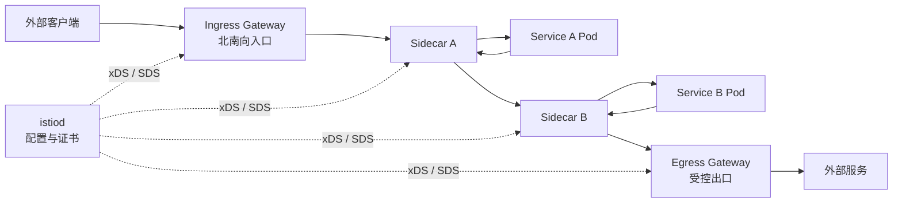

图中入口段对应 Gateway 和 VirtualService，服务间东西向流量主要由 Sidecar、VirtualService、DestinationRule 和 mTLS 策略执行，出口段可以通过 ServiceEntry、VirtualService 和 Egress Gateway 显式控制。Egress Gateway 默认不是自动启用的出口必经点，出口策略要在安装和流量规则中明确声明。

#### 多集群扩展

Istio 多集群有多种模式，核心差异在于控制面数量、服务网络是否互通、跨集群流量是否经 Gateway。

| 模式 | 适用场景 | 特点 |
|---|---|---|
| 多控制面加 Gateway | 集群网络不互通 或跨地域隔离 | 每个集群有控制面 跨集群经东西向网关 |
| Primary Remote | 多个集群可由一个主控制面管理 | Remote 集群轻量控制面 主要做注入和证书 |
| 互通网络 | Pod 网络或服务网络可达 | 代理可直接访问远端 endpoint |
| 网关互联 | 网络不可直达或需边界控制 | 远端服务通过 Gateway 暴露 |

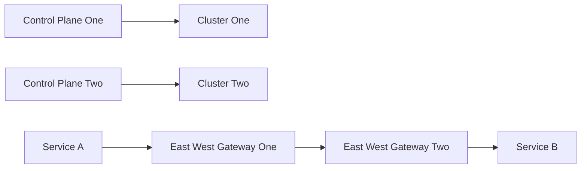

当 Pod 网络已经互通时，代理可以直接寻址远端 endpoint，不必再经东西向网关；如果网络隔离或需要边界控制，则通常让跨集群流量经过 Gateway。

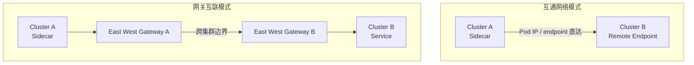

网关互联适合网络隔离、跨地域边界控制和统一入口审计，代价是多一跳并需要给 Gateway 做容量和高可用设计。互通网络省掉网关转发路径，但要求底层网络可达、服务身份和信任域一致，且要明确故障隔离边界。

在 Primary Remote 模式中，主集群控制面可以读取远端集群的 kubeconfig，watch 远端集群中的 Service、Endpoint 和 Istio 配置，把多个集群的服务发现结果合并起来。Remote 集群本地仍需要基本组件处理 Sidecar 注入和证书。

多集群带来的挑战主要有四类：

| 挑战 | 说明 |
|---|---|
| 网络连通性 | Pod 网段是否互通 跨集群是否走网关 |
| 身份一致性 | 服务身份和证书信任域如何统一 |
| 配置规模 | 多集群 Service Endpoint 汇总后配置更大 |
| 故障边界 | 一个集群故障时是否影响其他集群路由 |

因此，多集群不是简单地“把更多集群接进来”。它需要配合 locality、服务可见性、export 策略、网关容量、证书信任域和故障切换策略一起设计。大规模环境尤其要关注 Sidecar 配置膨胀，可用 `exportTo` 或 Sidecar 资源限制可见服务范围，避免每个代理都加载全网格所有服务。

### 跟踪采样和应用埋点如何补全可观测性

服务网格让指标、日志和链路追踪更容易统一，但它不能完全替代应用埋点。代理能看到网络请求，却不一定知道业务语义；代理能创建或转发 span，却需要应用把追踪上下文继续传给下游服务，完整调用链才能串起来。

Istio 的遥测能力覆盖基础 HTTP、HTTP/2、gRPC 和 TCP 指标。Telemetry V2 以后，大量指标由 Envoy 直接生成并暴露给 Prometheus，减少了早期 Mixer 适配路径带来的性能和稳定性问题。

| 指标 | 含义 |
|---|---|
| `istio_requests_total` | 请求总数 |
| `istio_request_duration_milliseconds` | 请求处理时延 |
| `istio_request_bytes` | 请求大小 |
| `istio_response_bytes` | 响应大小 |
| `istio_tcp_sent_bytes_total` | TCP 发送字节数 |
| `istio_tcp_received_bytes_total` | TCP 接收字节数 |
| `istio_tcp_connections_opened_total` | TCP 打开连接数 |
| `istio_tcp_connections_closed_total` | TCP 关闭连接数 |

指标适合回答“整体是否异常”：错误率是否升高、延迟是否升高、某个服务 QPS 是否异常、TCP 连接是否暴涨。链路追踪适合回答“单个请求慢在哪里”：请求经过哪些服务，每一段耗时多少，哪个下游服务拖慢了整条链路。

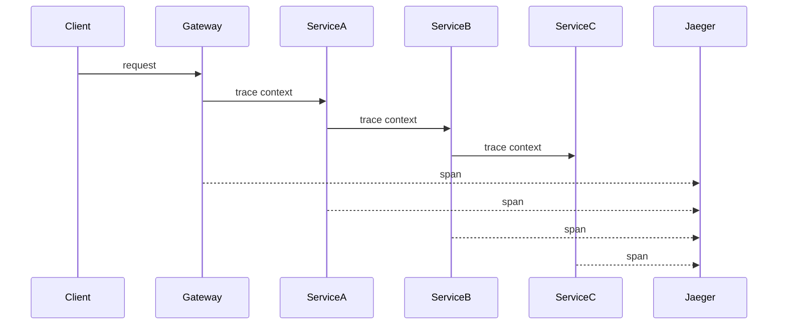

Trace 的两个核心概念是：

| 概念 | 含义 |
|---|---|
| Trace ID | 一次完整业务请求的全局标识 |
| Span ID | 请求在某个服务或某段调用中的局部标识 |

Istio 可以和 Jaeger、Zipkin 等系统集成。示例配置中可以指定 Zipkin 或 Jaeger collector 地址：

```bash
istioctl upgrade \
  --set values.global.tracer.zipkin.address=jaeger-collector:9411
```

采样率决定多少请求会被记录为 trace。小流量验证时可以临时设成 100%，这样每个请求都能在 Jaeger 中看到，便于确认链路是否完整；生产环境通常不会设置为 100%，因为 trace 采集会增加代理和后端存储压力。默认较低采样率更常见，关键业务可以根据排障需要临时提高。

| 采样策略 | 适用场景 | 风险 |
|---|---|---|
| 低采样率 | 常态生产运行 | 少量请求可能没有 trace |
| 临时高采样 | 故障排查 灰度验证 | 存储和代理开销增加 |
| 全量采样 | 小流量演示或短时压测 | 不适合大流量长期运行 |

应用必须转发追踪 Header。Istio 能在代理层生成并发送 span，但如果服务 A 调服务 B 时没有把上下文 Header 传下去，Jaeger 里就可能出现多条断开的 trace，而不是一条完整链路。

常见需要传播的 Header 包括：

| Header | 作用 |
|---|---|
| `x-request-id` | 请求标识 |
| `x-b3-traceid` | B3 Trace ID |
| `x-b3-spanid` | B3 Span ID |
| `x-b3-parentspanid` | 父 Span ID |
| `x-b3-sampled` | 采样标识 |
| `x-b3-flags` | 调试标识 |
| `x-ot-span-context` | OpenTracing 上下文 |

Go 服务中可以用类似方式把上游 Header 传给下游请求：

```go
func copyTracingHeaders(in http.Header, out http.Header) {
    keys := []string{
        "x-request-id",
        "x-b3-traceid",
        "x-b3-spanid",
        "x-b3-parentspanid",
        "x-b3-sampled",
        "x-b3-flags",
        "x-ot-span-context",
    }

    for _, key := range keys {
        if value := in.Get(key); value != "" {
            out.Set(key, value)
        }
    }
}

func callNext(r *http.Request, url string) (*http.Response, error) {
    req, err := http.NewRequest("GET", url, nil)
    if err != nil {
        return nil, err
    }
    copyTracingHeaders(r.Header, req.Header)
    return http.DefaultClient.Do(req)
}
```

在某些语言或框架中，Header key 的大小写处理会变化。Go 的 `http.Header` 读取和写入时可能把 key 规范化成 `X-B3-Traceid` 这类 CamelCase 形式；如果下游代理、网关或追踪组件要求 B3 headers 使用小写名称，应用在透传时就要按要求保留或转换成 `x-b3-traceid`、`x-b3-spanid` 等小写形式。否则值虽然存在，链路上下文也可能因为 Header 名不符合预期而断开。

可观测性还要和流量治理结合使用。灰度发布时看 v1 和 v2 的请求量、错误率、P99 延迟和业务指标；故障注入时看重试次数、超时比例和上游错误是否被放大；断路器生效时看 endpoint 剔除、连接池饱和和调用方失败率。只有把规则、指标和 Trace 放在一起看，才能判断 Istio 规则是否真的保护了业务。

Service Mesh 也会带来额外网络路径。传统 Sidecar 模式下，请求在 Pod 内需要经过 socket、TCP/IP、iptables、Envoy，再进入网络；目标端也要经过类似路径。流量会被反复捕获到 Sidecar，所有这些劫持都发生在 Pod 内部，所以要做 tracing、安全保证和复杂流量管理，就必须理解这条网络栈。

```mermaid
flowchart LR
    subgraph PodA["Kubernetes Pod A"]
        ServiceA["Service"]
        SocketA["Socket"]
        TCPA["TCP/IP"]
        IPTA["iptables"]
        EthA["Ethernet / Loopback"]
        ProxyA["Sidecar Proxy"]
        ServiceA --> SocketA --> TCPA --> IPTA --> ProxyA --> EthA
    end

    Net["Network"]

    subgraph PodB["Kubernetes Pod B"]
        EthB["Ethernet / Loopback"]
        ProxyB["Sidecar Proxy"]
        IPTB["iptables"]
        TCPB["TCP/IP"]
        SocketB["Socket"]
        ServiceB["Service"]
        EthB --> ProxyB --> IPTB --> TCPB --> SocketB --> ServiceB
    end

    EthA --> Net --> EthB
```

Cilium 等基于 eBPF 的数据平面尝试减少这类开销，例如在更早的内核 hook 点处理数据包，或用 socket 级优化减少不必要的数据拷贝。它的目标不是取消服务治理，而是在保留策略表达的同时减少不必要的内核栈绕行。

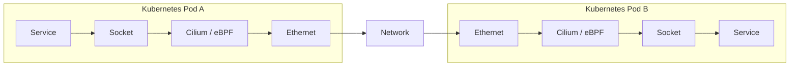

不过，性能优化不能替代治理设计。Sidecar 带来的开销要通过压测、真实流量和容量模型评估；采样率、代理资源、网关副本、Sidecar 可见范围和规则数量都要纳入生产设计。Istio 的价值是提供一套统一的治理模型，但越灵活的系统越需要模板、校验、观测和渐进式发布来控制复杂度。


## 第 10 章 · Kubernetes 集群联邦和 Istio 多集群管理

### 多集群治理为什么成为分布式云的关键能力

多集群治理的背景不是“集群数量变多”这么简单，而是业务运行位置发生了变化：应用可能同时运行在自建数据中心、公有云、边缘云、测试环境、生产环境和不同安全区中。Kubernetes 统一了单个资源池内的抽象，多集群治理则进一步回答：这些资源池如何统一接入、统一分发应用、统一发现服务、统一处理流量和故障。

分布式云可以理解为多云、混合云和边缘云的进一步扩展。它强调云能力不只存在于某一个公有云地域，而是分布在企业自有机房、公有云资源池、边缘节点和存量硬件中，并通过统一平台服务同一组业务目标。

```mermaid
flowchart TB
    Cloud["分布式云"]
    Public["公有云"]
    Private["私有云"]
    Edge["边缘云"]
    Legacy["存量资源"]
    Platform["统一管控平台"]
    Apps["业务应用"]

    Public --> Platform
    Private --> Platform
    Edge --> Platform
    Legacy --> Platform
    Platform --> Apps
    Cloud --> Public
    Cloud --> Private
    Cloud --> Edge
    Cloud --> Legacy
```

多集群治理常见驱动力如下：

| 驱动力 | 典型场景 | 对平台的要求 |
|---|---|---|
| 成本优化 | 平时保留基础容量，突发流量弹到公有云 | 能按需分发应用并回收资源 |
| 弹性和灵活性 | 节点利用率低时压缩本地容量，峰值时扩展到其他资源池 | 能把工作负载放到不同集群 |
| 避免厂商锁定 | 同一个企业同时使用多个云厂商 | 应用模型不能强绑定单一厂商 API |
| 获取云上新能力 | 某些云厂商先提供新特性 | 平台要允许局部接入新能力 |
| 容灾和多活 | 两地三中心或多数据中心部署 | 应用和流量要能跨故障域切换 |
| 数据保护 | 敏感数据留在私有云，非敏感计算放到公有云 | 需要按业务和数据等级选择运行位置 |
| 响应速度 | 深圳机房服务北京用户延迟较高 | 服务应尽量部署到离用户更近的地域 |
| 存量利旧 | 淘汰机器仍可跑 CI 或低优先级任务 | 需要把异构资源纳入统一调度视角 |

同样的入口治理思路也适用于平台依赖。例如容器镜像仓库在多个 region 各部署一份时，可以在 registry 入口上叠加 Smart DNS；不同地域的节点或 `kubelet` 拉取同一个镜像域名时，解析到本地镜像仓库的 LB VIP，从而减少跨地域拉取延迟和出网成本。镜像仓库入口本质上也是一个 federated 应用入口，只是消费方从业务客户端变成了集群节点。

这里要区分三个概念：

| 概念 | 含义 | 重点 |
|---|---|---|
| 多集群 | 同一个或多个基础设施上存在多个 Kubernetes 集群 | 集群之间如何管理和协同 |
| 多云 | 业务同时使用多个云厂商 | 避免厂商锁定和利用不同云能力 |
| 分布式云 | 公有云、私有云、边缘和存量资源被统一纳管 | 云能力无处不在且服务同一业务目标 |

单集群也可以做一部分跨地域高可用。例如把北京、上海、深圳的节点加入同一个 Kubernetes 集群，再给节点打上 `topology.kubernetes.io/region` 和 `topology.kubernetes.io/zone` 标签。调度时通过亲和性把 Pod 分散到不同地域，服务访问时通过拓扑感知优先访问本地实例。

```yaml
apiVersion: v1
kind: Pod
metadata:
  name: api-with-affinity
spec:
  affinity:
    podAffinity:
      requiredDuringSchedulingIgnoredDuringExecution:
      - labelSelector:
          matchLabels:
            app: api
        topologyKey: topology.kubernetes.io/zone
---
apiVersion: v1
kind: Service
metadata:
  name: api
spec:
  selector:
    app: api
  ports:
  - port: 80
    targetPort: 8080
  topologyKeys:
  - topology.kubernetes.io/zone
  - topology.kubernetes.io/region
```

这种方式的前提是所有节点网络互通，因为单集群 CNI 通常要求节点之间能够直接连通，容器网络才能正常工作。它适合规模不大、网络延迟可接受、地域之间互联质量较好的场景。

当规模继续扩大时，单集群方案会遇到边界：

1. etcd 存储对象数量和对象大小有限，数据越多，存储和内存压力越大。
2. API Server、Controller、Informer、Lister 都会缓存对象，集群越大，控制面内存和重启恢复时间越长。
3. 控制器处理队列会随着对象数量膨胀，某些控制器重启后可能长时间追不上状态。
4. NodePort、进程数、端口范围、路由规模等底层资源会限制服务数量。
5. 单个控制面故障会扩大影响范围，即使正在运行的 Pod 不一定立刻停止，调度、扩缩容和故障转移也会受影响。
6. 不同环境和安全区往往天然隔离，不能简单用一个集群横跨所有区域。

这些边界有很具体的工程表现。大规模 Kubernetes 集群通常会把单集群控制在约 5000 个节点、150000 个 Pod、300000 个容器这一量级内；超过这个范围后，继续把节点塞进同一个控制面，收益往往小于风险。etcd 数据量也不只是磁盘容量问题，实践中通常按 8Gi 级别控制，因为对象越多，etcd 内存中的 KV index、API Server 的 watch cache、各控制器的 informer 和 lister 本地缓存都会同步放大。某个控制器如果因为 OOM 重启，需要重新 list 对象、重建缓存并处理积压队列，可能几十分钟追不上状态，严重时会反复 OOM，表现为扩缩容、滚动发布或故障恢复长期不可用。

NodePort 也有硬边界。默认范围是 `30000-32767`，Service 数量很大时有些平台会扩展这个范围，但如果扩到类似 `30000-50000`，就可能和节点的 source port range 重叠，带来连接复用、端口冲突和排障困难等网络问题。判断是否要拆集群时，不能只看节点数，还要同时看 etcd 数据量、API Server cache、控制器队列恢复时间、Service/NodePort 数量和网络端口规划。

控制面节点数量也不是按 worker 节点比例线性计算。Master 节点通常在 1、3、5 之间做取舍：单节点只适合实验或低风险环境；中小生产集群通常使用 3 个控制面节点；非常大的生产集群可以使用 5 个控制面节点来提升容错能力。5 个节点比 3 个节点能承受更多节点故障，但 etcd 写入需要更多成员达成多数派，写路径和网络同步成本也更高。因此 Master 数量的核心依据是 etcd quorum、API Server 并发压力、数据安全和运维容错，而不是 worker 数量翻倍就把 Master 数量也翻倍。

生产环境还应隔离控制面和数据面。控制面节点通常打上 `node-role.kubernetes.io/control-plane` 相关 taint，只运行 API Server、Controller Manager、Scheduler、etcd 和平台关键组件，业务 Pod 运行在 worker 节点。这样可以避免业务负载抢占控制面 CPU、内存和磁盘，也能减少控制面异常时对业务数据面资源的连带影响。

还要注意，应用高可用不等于数据层高可用。把 Deployment、Service 和入口网关分发到多个集群，只解决计算层和流量入口的可用性；数据库、缓存和消息系统仍要单独设计。跨地域 MySQL 可以选择单点主库、异步或半同步复制、双向复制，或者基于 Paxos、Galera 等协议的多地写入，但没有一种方案能同时做到不牺牲性能、不牺牲数据安全、不牺牲一致性。跨地域数据层必然受 CAP 约束，需要明确可用性、延迟、冲突处理和数据丢失窗口，不能只完成计算和入口多活就宣称业务已经多活。

因此多集群治理的本质是控制故障域并降低复杂度。平台不应该要求用户分别拿到几十个 kubeconfig，再一个集群一个集群地部署对象；更合理的方式是提供一个统一入口，让用户声明应用、资源和流量意图，再由控制面决定分发到哪些集群、如何覆盖差异、如何汇总状态。

```mermaid
flowchart TB
    User["用户"]
    Entry["统一入口"]
    Policy["策略"]
    ClusterA["集群 A"]
    ClusterB["集群 B"]
    ClusterC["集群 C"]
    Status["状态汇聚"]

    User --> Entry
    Entry --> Policy
    Policy --> ClusterA
    Policy --> ClusterB
    Policy --> ClusterC
    ClusterA --> Status
    ClusterB --> Status
    ClusterC --> Status
    Status --> Entry
```

从架构取舍看，多集群不是为了追求更复杂，而是把不可避免的复杂性收敛到平台层。应用高可用、资源弹性、跨地域访问、跨安全区发布、智能 DNS 和服务网格治理都需要这个平台层来承接。

### 集群联邦模型和控制面架构如何设计

集群联邦的核心定义是：把多个 Kubernetes 集群注册到一个统一控制平面，为用户提供统一 API 入口，并由联邦控制器把联邦层的声明同步到成员集群。它本身不提供算力，真正运行 Pod 的仍然是成员集群。

集群联邦通常承担四类职责：

| 职责 | 说明 |
|---|---|
| 集群管理 | 注册成员集群，保存 API Endpoint、认证信息、健康状态和地域信息 |
| 应用分发 | 把 Namespace、Deployment、Service、ConfigMap、CRD 等对象分发到目标集群 |
| 服务发现 | 汇总各集群入口地址，配合 DNS 或网关生成全局访问入口 |
| 高可用和迁移 | 根据策略调整副本分布，在故障或迁移时隐藏具体集群差异 |

典型联邦控制面包含 Federation API Server、联邦 etcd、Federation Controller Manager，以及若干成员集群。用户请求先进入联邦 API Server，联邦控制器再根据对象声明访问成员集群 API Server，并创建或更新本地 Kubernetes 对象。

```mermaid
flowchart TB
    Kubectl["kubectl"]
    FedApi["Federation API Server"]
    FedEtcd["Federation etcd"]
    FedCtrl["Federation Controller Manager"]
    ClusterA["成员集群 A"]
    ClusterB["成员集群 B"]
    ClusterC["成员集群 C"]
    ApiA["API Server A"]
    ApiB["API Server B"]
    ApiC["API Server C"]
    WorkloadA["工作负载 A"]
    WorkloadB["工作负载 B"]
    WorkloadC["工作负载 C"]

    Kubectl --> FedApi
    FedApi --> FedEtcd
    FedCtrl --> FedApi
    FedCtrl --> ApiA
    FedCtrl --> ApiB
    FedCtrl --> ApiC
    ClusterA --> ApiA
    ClusterB --> ApiB
    ClusterC --> ApiC
    ApiA --> WorkloadA
    ApiB --> WorkloadB
    ApiC --> WorkloadC
```

联邦控制面本身也要高可用。一种做法是把联邦 etcd 的实例放到多个地域中，使某个地域故障时仍能保留联邦层入口。但这里要注意：联邦层主要管理对象声明，控制面跨地域延迟通常不等于业务请求延迟。真正敏感的是数据面访问路径，业务流量仍要通过本地优先、故障转移和流量治理来处理。

基于联邦的应用高可用访问链路通常是：全局 DNS 或 Smart DNS 选择一个健康集群入口，流量到达该集群自己的 LoadBalancer VIP、F5 或自研 IPVS LB，再进入 Ingress 或 API Gateway，最后由 Service 转发到 Pod。每个成员集群都有独立入口地址，全局 DNS 把这些入口组合成一个服务名；某个私有云或数据中心不可用时，可以把解析结果或上层权重切到另一个私有云、公有云或边缘集群。

```mermaid
flowchart LR
    Client["客户端"]
    DNS["全局 DNS / Smart DNS"]
    LBA["集群 A LB VIP"]
    LBB["集群 B LB VIP"]
    GatewayA["Ingress / API Gateway A"]
    GatewayB["Ingress / API Gateway B"]
    ServiceA["Service A"]
    ServiceB["Service B"]
    PodA["Pod A"]
    PodB["Pod B"]

    Client --> DNS
    DNS --> LBA
    DNS --> LBB
    LBA --> GatewayA
    LBB --> GatewayB
    GatewayA --> ServiceA
    GatewayB --> ServiceB
    ServiceA --> PodA
    ServiceB --> PodB
```

KubeFed 中有两个重要角色：

| 角色 | 含义 |
|---|---|
| Host Cluster | 运行 KubeFed API 和控制器的集群，也就是联邦控制面所在集群 |
| Member Cluster | 被联邦控制面纳管的成员集群，提供 API Endpoint 和访问凭证 |

Host Cluster 也可以同时作为 Member Cluster 加入联邦。加入集群时，`kubefedctl join` 会在 Host Cluster 中创建 `KubeFedCluster` 对象，保存成员集群的访问地址、CA Bundle、Secret 引用和状态。

```yaml
apiVersion: core.kubefed.io/v1beta1
kind: KubeFedCluster
metadata:
  name: cluster-shanghai
spec:
  apiEndpoint: https://api.cluster-shanghai.example.com
  caBundle: LSOtLS0tLS1...
  secretRef:
    name: cluster-shanghai-token
status:
  conditions:
  - type: Ready
    status: "True"
    reason: ClusterReady
  region: cn-east
  zones:
  - shanghai-a
```

`KubeFedCluster` 是联邦控制器访问成员集群的基础。如果 Endpoint 写错、Token 无效、CA 不匹配或网络不通，成员集群会进入 NotReady 状态，联邦对象自然无法被正确分发。

在 Kind 或 Docker 本地环境中，`kubefedctl join` 生成的 `spec.apiEndpoint` 可能来自宿主机 kubeconfig，例如 `https://127.0.0.1:65150`。这个地址对宿主机可用，但 KubeFed 控制器运行在集群 Pod 内，访问 Pod 自己的 loopback 无法打到宿主机转发端口，成员集群会保持 NotReady。应改成控制器网络可达的 API Server 地址，例如 Kind control-plane 容器 IP、集群网络内 Service 地址或可从 Pod 访问的宿主机地址；连通性、CA 和 token 都正确后，status condition 才会出现 `reason: ClusterReady`。

KubeFed 的 API 被拆成多个 API Group：

| API Group | 作用 |
|---|---|
| `core.kubefed.k8s.io` | 集群配置、联邦资源配置、控制器配置 |
| `types.kubefed.k8s.io` | 被联邦化后的 Kubernetes 资源 |
| `scheduling.kubefed.k8s.io` | 副本调度和分配策略 |
| `multiclusterdns.kubefed.k8s.io` | 跨集群 DNS 相关配置 |

KubeFed v1 和 v2 的主要差异在对象模型。早期方式更像是在联邦层创建普通对象，再用标签决定下发到哪些集群；问题是 Kubernetes API 变化很快，上层对象需要不断跟随下层 API 演进，而且不同集群的局部差异不容易表达。v2 以后改用 CRD，把每一种被联邦化的资源包装成 Federated 对象，并把通用模板、目标集群和本地化覆盖拆开表达。

`FederatedTypeConfig` 用来定义“哪个原生资源可以被联邦化，以及它对应哪个 Federated 资源”。例如让 ConfigMap 支持联邦分发，需要声明原生 `ConfigMap` 与 `FederatedConfigMap` 的映射关系。

```yaml
apiVersion: core.kubefed.io/v1beta1
kind: FederatedTypeConfig
metadata:
  name: configmaps
spec:
  federatedType:
    group: types.kubefed.io
    kind: FederatedConfigMap
    pluralName: federatedconfigmaps
    scope: Namespaced
    version: v1beta1
  propagation: Enabled
  targetType:
    kind: ConfigMap
    pluralName: configmaps
    scope: Namespaced
    version: v1
```

这套模型的好处是通用：Deployment、Namespace、Secret、ConfigMap、Service，甚至自定义 CRD，都可以通过类似方式变成 Federated 类型。控制器只需要根据 TypeConfig 理解目标类型、联邦类型和是否启用分发。

`kubefedctl` 是把标准 Kubernetes 对象纳入这套模型的关键工具。`kubefedctl enable <resource>` 用来为某类资源启用 Federated CRD 和 `FederatedTypeConfig`，例如启用 Deployment、ConfigMap、Secret 或 Namespace；`kubefedctl federate` 用来把已经存在的原生对象转换成联邦对象。转换后，原始对象的主体进入 `spec.template`，目标集群选择进入 `spec.placement`，不同集群差异再通过 `spec.overrides` 表达。

```bash
kubefedctl enable deployments
kubefedctl enable configmaps
kubefedctl enable namespaces

kubefedctl federate namespace demo
kubefedctl federate deployment nginx -n demo
kubefedctl federate configmap app-config -n demo
```

这意味着 KubeFed 并不是直接把一个普通 Deployment 写到所有成员集群，而是先通过 CRD 生成 `FederatedDeployment` 这一类联邦资源，再由同步控制器把模板渲染成各成员集群中的原生 Deployment。Namespace、Secret、ConfigMap 甚至平台自定义 CRD 也遵循同样的联邦化流程。

从平台实现角度看，联邦控制面至少要有这些能力：

1. 管理成员集群清单和凭证。
2. 把原生资源映射成联邦资源。
3. 根据 Placement 选择目标集群。
4. 根据 Override 生成每个集群的最终对象。
5. 把对象分发到成员集群。
6. 汇总分发结果和成员集群状态。
7. 对调度、DNS、流量入口等高阶能力提供可插拔控制器。

```mermaid
flowchart LR
    TypeConfig["类型配置"]
    FedObject["联邦对象"]
    Placement["目标集群"]
    Override["本地覆盖"]
    Propagation["对象分发"]
    Status["状态汇聚"]
    ClusterA["集群 A"]
    ClusterB["集群 B"]

    TypeConfig --> FedObject
    FedObject --> Placement
    FedObject --> Override
    Placement --> Propagation
    Override --> Propagation
    Propagation --> ClusterA
    Propagation --> ClusterB
    ClusterA --> Status
    ClusterB --> Status
```

需要特别注意，联邦不是把所有集群变成一个巨型集群。成员集群仍然可以独立使用，也仍然有自己的 API Server、etcd、控制器和网络边界。联邦层的价值是统一声明和统一编排，而不是消除成员集群的独立性。

### 联邦对象 调度和 DNS 如何跨集群生效

KubeFed 联邦对象通常由三段组成：`template`、`placement`、`overrides`。这三个字段对应多集群分发最基本的三个问题：分发什么，发到哪里，每个地方有什么差异。

| 字段 | 解决的问题 | 示例 |
|---|---|---|
| Template | 要下发的原生 Kubernetes 对象长什么样 | Deployment 模板 副本数 镜像 标签 |
| Placement | 要下发到哪些成员集群 | cluster1 cluster2 或按 label 选择 |
| Override | 目标集群中的局部差异 | 某集群副本数不同 某集群镜像版本不同 |

```mermaid
flowchart LR
    FedDeploy["FederatedDeployment"]
    Template["Template"]
    Placement["Placement"]
    Override["Override"]
    ClusterA["集群 A 对象"]
    ClusterB["集群 B 对象"]

    FedDeploy --> Template
    FedDeploy --> Placement
    FedDeploy --> Override
    Template --> ClusterA
    Template --> ClusterB
    Placement --> ClusterA
    Placement --> ClusterB
    Override --> ClusterB
```

一个典型的 `FederatedDeployment` 可以这样表达：

在创建 namespaced 联邦对象前，要先把对应 Namespace 联邦化并下发到成员集群。例如下面示例使用 `metadata.namespace: demo`，那么 `demo` 这个 Namespace 本身也应先通过 `kubefedctl federate namespace demo` 或 `FederatedNamespace` 分发到目标集群。否则同步控制器在成员集群中创建 Deployment 时，可能遇到 namespace not federated 或 namespace 不存在，导致 `FederatedDeployment` 下发失败。多集群分发同样存在依赖顺序，Namespace 往往是第一批要处理的基础对象。

```yaml
apiVersion: types.kubefed.io/v1beta1
kind: FederatedDeployment
metadata:
  name: nginx
  namespace: demo
spec:
  template:
    metadata:
      labels:
        app: nginx
    spec:
      replicas: 3
      selector:
        matchLabels:
          app: nginx
      template:
        metadata:
          labels:
            app: nginx
        spec:
          containers:
          - name: nginx
            image: nginx:1.25
  placement:
    clusters:
    - name: cluster-a
    - name: cluster-b
  overrides:
  - clusterName: cluster-b
    clusterOverrides:
    - path: /spec/replicas
      value: 1
```

这段配置表示：联邦层维护一个通用 Deployment 模板，默认副本数为 3；对象会下发到 `cluster-a` 和 `cluster-b`；但在 `cluster-b` 中，副本数被覆盖为 1。

Placement 可以直接列出集群，也可以用 `clusterSelector` 按标签选择集群：

```yaml
placement:
  clusterSelector:
    matchLabels:
      region: cn-east
      environment: prod
```

如果同时声明具体集群列表和 selector，一般以明确集群列表为准。设计上要避免语义模糊，因为多集群分发一旦选错目标，就可能把应用发布到错误环境。

Override 的能力很强，也很危险。它通常基于路径修改模板字段，例如改副本数、镜像版本或某些开关。数组字段不适合开放式覆盖，因为数组元素依赖下标；模板中数组顺序一变，覆盖路径就可能指向错误元素。生产平台通常会把 Override 做成白名单，只允许覆盖少数经过验证的字段，避免用户通过 Patch 删除关键 spec 或制造全局故障。

联邦调度主要解决全局副本数如何分配到多个集群。KubeFed 的 `ReplicaSchedulingPreference` 可以指定总副本数、默认权重，以及每个集群的最小和最大副本数。调度控制器会把计算结果写回联邦对象的 overrides，再由同步控制器下发到成员集群。

```yaml
apiVersion: scheduling.kubefed.io/v1alpha1
kind: ReplicaSchedulingPreference
metadata:
  name: nginx
  namespace: demo
spec:
  targetKind: FederatedDeployment
  totalReplicas: 15
  clusters:
    "*":
      weight: 2
      maxReplicas: 12
    cluster-a:
      minReplicas: 1
      maxReplicas: 3
      weight: 1
```

```mermaid
flowchart LR
    RSP["副本调度策略"]
    Scheduler["调度控制器"]
    FedDeploy["联邦 Deployment"]
    Override["副本数覆盖"]
    ClusterA["集群 A 副本"]
    ClusterB["集群 B 副本"]
    ClusterC["集群 C 副本"]

    RSP --> Scheduler
    Scheduler --> Override
    Override --> FedDeploy
    FedDeploy --> ClusterA
    FedDeploy --> ClusterB
    FedDeploy --> ClusterC
```

观察 `ReplicaSchedulingPreference` 生效时，要看 `FederatedDeployment` 本身，而不是只看成员集群里的 Deployment。`targetKind: FederatedDeployment` 让策略找到要调度的联邦对象，`totalReplicas` 计算出的结果会先写入该对象的 `spec.overrides`，例如为某个集群生成 `/spec/replicas` 的覆盖值，再由同步控制器把最终副本数下发到成员集群。这个写回路径也可用于单集群灰度：先只把某个目标集群副本数调低或调高，验证后再扩大到其他集群。

多集群 DNS 的目标是把多个集群中的服务入口汇聚成一个全局可访问的服务名。最简单做法是：每个集群暴露一个 LoadBalancer Service 或 Ingress，拿到各自的 VIP 或域名后，把它们注册到全局 DNS。客户端解析全局域名后，可以访问任一健康集群。

更智能的 DNS 会按来源地址、地域、健康状态和权重返回不同地址。内部客户端请求 DNS 时，DNS 可以根据客户端源 IP 判断来自哪个集群或哪个网段；如果本地 Endpoint 健康，就返回本地地址；如果本地不可用，则逐级 CNAME 到可用区、地域或全局域名。

```mermaid
flowchart TB
    Client["客户端"]
    LocalDns["本地 DNS"]
    AzDns["可用区 DNS"]
    RegionDns["地域 DNS"]
    GlobalDns["全局 DNS"]
    LocalSvc["本地服务"]
    RemoteSvc["远端服务"]

    Client --> LocalDns
    LocalDns -->|本地健康| LocalSvc
    LocalDns -->|本地故障| AzDns
    AzDns -->|可用区故障| RegionDns
    RegionDns -->|地域故障| GlobalDns
    GlobalDns --> RemoteSvc
```

KubeFed 曾经提供过 `ServiceDNSRecord`、`IngressDNSRecord`、`DNSEndpoint` 等能力，并通过 ExternalDNS 同步到 DNS Provider。这个方向的核心逻辑是：

1. 联邦 DNS 控制器监听 Federated Service 或 Federated Ingress。
2. 控制器获取各成员集群中的 LoadBalancer VIP 或 Ingress 地址。
3. 控制器生成 DNSEndpoint。
4. ExternalDNS 把 DNSEndpoint 写入真实 DNS Provider。
5. DNS Provider 根据自身能力实现 RoundRobin、地域优先、健康检查或权重。

这类能力后来从 KubeFed 中移出，原因是 DNS 与厂商设备、网络规划和业务策略强相关。做一个落地方案不难，做一个所有企业都能直接使用的通用产品很难。

在生产设计中，DNS 适合做入口选择和灰度，但不能把所有故障切换都寄托在 DNS 上。DNS 有 TTL，客户端也可能缓存解析结果。如果业务要求秒级切换，通常还需要在 DNS 之后叠加负载均衡、网关和服务网格策略。

Smart DNS 或 GTM 背后通常不是单个配置进程，而是一组设备或服务阵列。用户写入一个域名策略后，配置还要同步到多台设备或多个节点，因此写入路径通常不会很快。即使自建 CoreDNS 插件实现 locality、weight 或 health check，客户端缓存和 TTL 仍然存在，DNS 适合做入口选择和常态灰度，不适合作为唯一的紧急切流手段。

### Clusternet 如何管理多集群应用分发

Clusternet 是一个面向混合云、分布式云和边缘场景的多集群管理与应用分发项目。它的定位和 KubeFed 接近，但设计上更轻量，也更强调原生 Kubernetes 访问体验。

Clusternet 试图解决的核心问题包括：

| 问题 | KubeFed 传统方式的限制 | Clusternet 的思路 |
|---|---|---|
| 子集群访问 | 联邦层主要看到联邦对象，不方便直接查看子集群 Pod 和 Node | 通过聚合 API 和 agent 转发访问子集群资源 |
| 网络隔离 | Push 模式要求上层控制面能访问下层 API Server | 支持 Push 和 Pull 两种模式 |
| 应用分发 | 每类对象联邦化后都要处理模板和同步 | 用户操作原生对象，平台转换成 Manifest |
| RBAC | 子集群凭证放在联邦层会有安全顾虑 | 可使用子集群自己的身份访问 |
| 资源类型 | KubeFed 对 Helm Chart 支持不直接 | 支持原生对象 CRD Helm Chart |

Clusternet 的架构由 Parent Cluster、`clusternet-hub`、Child Cluster 中的 `clusternet-agent` 和子集群 API Server 组成。`clusternet-hub` 可以理解为聚合 API Server，agent 和 hub 之间通过长连接打通路径。用户在 Parent Cluster 上发起请求，请求可以转到 agent，再由 agent 访问子集群 API Server。

在访问模型上，Clusternet 的关键差异是尽量不把所有子集群长期访问凭证集中保存在父集群控制器里。子集群加入和访问可以使用 Bootstrap Token、Service Token 或 TLS 证书等方式建立连接；用户从 Parent Cluster 查看或操作子集群资源时，可以沿用自己在子集群中的身份和 RBAC 约束。这样既能通过统一入口执行 `get`、`list`、`watch`、`patch`、`exec`、`logs` 等原生操作，又能减少“父集群持有所有子集群高权限 token”的集中风险。

```mermaid
flowchart TB
    User["用户"]
    ParentApi["父集群 API"]
    Hub["clusternet hub"]
    AgentA["agent A"]
    AgentB["agent B"]
    ApiA["子集群 API A"]
    ApiB["子集群 API B"]
    WorkloadA["子集群资源 A"]
    WorkloadB["子集群资源 B"]

    User --> ParentApi
    ParentApi --> Hub
    Hub --> AgentA
    Hub --> AgentB
    AgentA --> ApiA
    AgentB --> ApiB
    ApiA --> WorkloadA
    ApiB --> WorkloadB
```

Push 和 Pull 是 Clusternet 的一个重要差异化能力：

| 模式 | 工作方式 | 适合场景 |
|---|---|---|
| Push | 父集群控制器读取上层对象并主动写入子集群 | 网络允许父集群访问子集群 API Server |
| Pull | 子集群 agent 或控制器 watch 父集群对象，再拉取到本地 | 安全区隔离 子集群 API Server 不方便对上层开放 |

这种差异很实用。很多生产系统会分成安全区和非安全区，安全区内 API Server 地址和端口不允许被外部控制面直接访问。如果只支持 Push，应用分发会卡在防火墙和访问路径上；Pull 模式只需要让子集群访问上层控制面，网络开口更少。

在进入对象模型之前，先看多集群应用分发要解决的差异化问题：

1. 给同一批资源统一打标签，便于跨集群检索、计费和治理。
2. 按业务、环境、地域或安全区标记目标集群。
3. 在不同集群中调整副本数、镜像地址、资源配额或开关。
4. 注入环境配置、证书、Sidecar 或平台代理。
5. 支持灰度升级、变更暂停、继续发布和回滚。
6. 处理重复定义、覆盖顺序和多团队同时修改带来的冲突。

`Manifest`、`Subscription`、`Base`、`Globalization`、`Localization` 和 `Description` 这些对象，正是为了把上述问题拆成可声明、可审计、可回滚的控制器流程，而不是让用户手工在每个集群里拼 YAML。

Clusternet 的应用分发对象链路可以概括为：

1. 用户通过 `kubectl clusternet apply` 提交原生 Kubernetes 对象。
2. 插件把对象转换为 `Manifest`，保存在父集群。
3. 用户创建 `Subscription`，声明哪些资源要分发到哪些集群。
4. 控制器生成 `Base`，作为面向目标集群的基础描述。
5. `Globalization` 和 `Localization` 对分发对象做全局或局部覆盖。
6. 渲染后的 `Description` 下发到目标集群。

```mermaid
flowchart LR
    Native["原生对象"]
    Manifest["Manifest"]
    Subscription["Subscription"]
    Base["Base"]
    Globalization["Globalization"]
    Localization["Localization"]
    Description["Description"]
    Child["子集群"]

    Native --> Manifest
    Manifest --> Subscription
    Subscription --> Base
    Base --> Globalization
    Base --> Localization
    Globalization --> Description
    Localization --> Description
    Description --> Child
```

命令观察上也要区分父集群原生视角和 Clusternet 聚合视角。通过 `kubectl clusternet apply` 提交 Namespace 或 Deployment 时，插件会把对象包装成 `Manifest`，通常保存在系统保留 namespace 中；这和直接在父集群创建一个 namespace 不是一回事。因此普通 `kubectl get ns demo` 看到的是父集群原生 namespace 视角，可能看不到这个待分发对象。排查时应使用 `kubectl clusternet get ns demo` 查看聚合视角，再用 `kubectl get manifests -A`、`kubectl get descriptions -A` 观察分发前保存的对象和渲染后准备下发的 `Description`。

一个 `Subscription` 会指定订阅者和要分发的资源：

```yaml
apiVersion: apps.clusternet.io/v1alpha1
kind: Subscription
metadata:
  name: app-demo
  namespace: default
spec:
  subscribers:
  - clusterAffinity:
      matchLabels:
        clusters.clusternet.io/cluster-id: dc91021d-2361-4f6d-a404-7c33b9e01118
  feeds:
  - apiVersion: apps/v1
    kind: Deployment
    name: nginx
    namespace: demo
  - apiVersion: v1
    kind: Service
    name: nginx
    namespace: demo
  - apiVersion: v1
    kind: Namespace
    name: demo
```

`Localization` 用于某个集群的本地化覆盖，例如给分发后的 Deployment 增加标签或调整副本数：

```yaml
apiVersion: apps.clusternet.io/v1alpha1
kind: Localization
metadata:
  name: nginx-localization
  namespace: clusternet-51821
priority: 300
feed:
  apiVersion: apps/v1
  kind: Deployment
  name: nginx
  namespace: demo
overrides:
- name: add-cluster-label
  type: MergePatch
  value: |
    {"metadata":{"labels":{"running-in":"cluster-a"}}}
- name: scale-replicas
  type: JSONPatch
  value: |-
    - op: replace
      path: /spec/replicas
      value: 1
```

Clusternet 的优势不是完全替代所有联邦方案，而是把多集群管理中的几个痛点变轻：用户尽量操作原生 Kubernetes 对象；平台通过插件和聚合 API 做转换；子集群访问可以通过 agent 代理；应用分发可以覆盖原生对象、CRD 和 Helm Chart。

在学习 Clusternet 时要抓住三个层次：

| 层次 | 关键对象或组件 | 要理解的问题 |
|---|---|---|
| 集群连接 | clusternet hub clusternet agent ManagedCluster | 父集群如何纳管子集群 |
| 资源存储 | Manifest | 用户提交的原生对象如何在父集群保存 |
| 应用分发 | Subscription Base Description Globalization Localization | 资源如何选择目标集群并渲染差异 |

应用分发的价值在大规模场景中非常明显。如果一个应用需要部署到 10 个可用区，每次发布都要操作 Deployment、Service、Ingress、ConfigMap、Secret 和 CRD，手工逐集群执行会变成高风险工作。多集群分发把这些操作收敛到声明式对象和控制器，让用户只表达“这些资源发到这些集群，并在这些集群做这些覆盖”。

### Istio 多集群部署如何处理跨地域流量

多集群应用分发解决“对象如何到达多个集群”，但生产系统还要解决“请求如何到达正确的实例”。跨地域流量治理比单集群服务发现更复杂，因为它要同时处理性能、可用性、DNS TTL、负载均衡层次、证书、安全和规模。

主备数据中心是早期常见模式：主数据中心承接全部流量，备用数据中心平时几乎不接流量。这种模式有两个明显问题。第一，备用资源长期闲置，成本不经济。第二，备用环境长期不被真实流量验证，真正切换时容易发现版本不一致、配置缺失、防火墙未开等问题，导致故障恢复时间变长。

多活数据中心更符合现代高可用目标。生产应用在多个数据中心同时部署，每个数据中心都有本地负载均衡和跨数据中心负载均衡。大部分请求留在本地，少量请求跨地域，用于验证远端链路和提供故障转移能力。

```mermaid
flowchart TB
    DNS["Smart DNS"]
    CrossA["跨地域 LB A"]
    CrossB["跨地域 LB B"]
    LocalA["本地 LB A"]
    LocalB["本地 LB B"]
    PodA["本地实例 A"]
    PodB["本地实例 B"]

    DNS --> CrossA
    DNS --> CrossB
    CrossA -->|本地优先| LocalA
    CrossB -->|本地优先| LocalB
    CrossA -->|少量远端| LocalB
    CrossB -->|少量远端| LocalA
    LocalA --> PodA
    LocalB --> PodB
```

为什么不直接把 DNS 指到每个数据中心的本地 LB？因为 DNS 有 TTL，客户端和中间服务都可能缓存解析结果。当某个数据中心故障时，DNS 记录即使已经更新，客户端仍可能继续访问旧地址。把关键切换放到负载均衡层，可以把分钟级 DNS 生效问题压缩到秒级流量切换。

eBay 这类大型电商多活入口常见一加二部署思路：生产应用至少跨 3 个数据中心，每个数据中心至少保持多个副本，例如不少于 3 个 Pod。入口权重可以让 99% 流量留在本地，1% 流量走远端；这 1% 不只是灰度流量，也是在持续验证远端链路，避免真正故障时才发现防火墙、版本或配置问题。

一种典型的生产规模背景如下：

| 维度 | 示例规模 |
|---|---|
| 主数据中心 | 3 个 |
| 边缘数据中心 | 20 个以上 |
| Kubernetes 集群 | 100 个以上 |
| 物理节点 | 100000 级别 |
| 单集群节点 | 最高约 5000 |
| 单集群 Pod | 100000 级别 |
| 单集群服务 | 5000 到 10000 |

在这种规模下，不能让每个应用自己维护跨地域入口和故障切换。平台需要统一流量模型，并把 Kubernetes Service、Istio Gateway、VirtualService、DestinationRule、证书和 DNS 状态打通。

Istio 多集群部署模型可以按可用区组织：

1. 所有 Kubernetes 集群注册到集群联邦。
2. 数据中心内部按供电、制冷和网络故障域划分可用区。
3. 每个可用区里有多个 Kubernetes 集群。
4. 每个可用区选择一个网关集群部署 Istio Primary。
5. 同一可用区内其他业务集群部署 Istio Remote。
6. Remote 集群把 kubeconfig 交给 Primary，使 Primary 能发现本可用区内服务。
7. 所有集群使用同一 Root CA，并在同一环境中使用相同 Trust Domain。
8. 同可用区内服务调用走 Sidecar，跨可用区调用走 Gateway。

Primary 和 Remote 的职责不同。Primary 是完整 Istio 控制面，负责本可用区内的服务发现、配置分发、证书信任和跨集群管理；Remote 并不是另一套完整控制面，它的 `istiod` 权限更有限，主要处理本地权限管理、sidecar injector、证书签发等本地动作。Remote 通过交出 kubeconfig，让 Primary 能 watch Remote 集群中的 Service、Endpoint、Pod 和 Istio 配置，因此 Primary 才能统一发现同可用区内多个业务集群的服务。

| 模型 | 部署位置 | 主要职责 | 不负责或弱化的职责 |
|---|---|---|---|
| Primary | 网关集群或可用区核心集群 | 完整控制面 服务发现 xDS 配置 证书信任 多集群 watch | 不承接所有业务 Pod |
| Remote | 同可用区业务集群 | 本地注入 本地证书 本地权限配合 | 不独立完成完整服务发现 |

```mermaid
flowchart TB
    Federation["集群联邦"]
    PrimaryA["Istio Primary A"]
    RemoteA1["Remote 集群 A1"]
    RemoteA2["Remote 集群 A2"]
    PrimaryB["Istio Primary B"]
    RemoteB1["Remote 集群 B1"]
    RemoteB2["Remote 集群 B2"]
    GatewayA["网关 A"]
    GatewayB["网关 B"]

    Federation --> PrimaryA
    Federation --> PrimaryB
    PrimaryA --> RemoteA1
    PrimaryA --> RemoteA2
    PrimaryB --> RemoteB1
    PrimaryB --> RemoteB2
    RemoteA1 -->|本区 Sidecar| RemoteA2
    RemoteB1 -->|本区 Sidecar| RemoteB2
    GatewayA -->|跨区 Gateway| GatewayB
    PrimaryA --> GatewayA
    PrimaryB --> GatewayB
```

入站流量架构一般拆成四层和七层：

| 层次 | 组件 | 职责 |
|---|---|---|
| L4 | Service Controller IPVS XDP BGP IPIP | 分配 VIP 配置转发 宣告路由 承接入口流量 |
| L7 | Istio Ingress Gateway Envoy | 处理 HTTP TLS 路由 证书 访问日志 tracing |
| Mesh | Sidecar | 处理服务间 mTLS 路由 熔断 可观测性 |

四层入口中，Service Controller 会监听 LoadBalancer Service，为它分配 VIP，并通过 IPVS 或 XDP 配置转发规则。路由侧通过 BGP 宣告 VIP 或 VIP 网段。对于 IPIP 转发，Ingress Gateway Pod 内需要绑定 Tunnel 设备和 VIP，内核识别并解包后把请求交给 Envoy。回包可以走 DSR，直接从七层网关回到客户端，不再绕回四层负载均衡。

BGP 宣告粒度通常会随规模演进。早期 VIP 数量少时，可以为每个 VIP 宣告一条 `/32` 路由，路由器精确知道某个单 IP 应该到哪个四层入口。规模变大后，VIP 数量持续增加会撑大路由表，平台通常会把一组 VIP 所在子网做汇聚，按网段一次宣告，再由四层网关内部完成更细粒度的转发。XDP 是 eBPF 在网卡或内核较早路径上的挂载点，可用于更早地处理和转发数据包，减少进入后续网络栈后的开销。

```mermaid
flowchart TB
    Client["客户端"]
    Router["路由器"]
    Bgp["BGP 宣告"]
    L4["四层网关"]
    Tunnel["IPIP Tunnel"]
    Envoy["Ingress Envoy"]
    Sidecar["Sidecar"]
    App["应用"]

    Client --> Router
    Router --> L4
    L4 --> Tunnel
    Tunnel --> Envoy
    Envoy --> Sidecar
    Sidecar --> App
    L4 --> Bgp
    Envoy -->|DSR 回包| Router
```

应用高可用接入链路可以概括为：Smart DNS 先把客户端导向某地域入口；IPVS 或其他四层入口把请求交给 Istio Ingress Gateway；Ingress Gateway 到 Sidecar 之间使用 Istio mTLS；Sidecar 再把请求交给应用容器。

这条链路里的 TLS 要分层理解。外部客户端到 Ingress Gateway 的 HTTPS 通常在 Gateway 上终止，Gateway `tls.mode: SIMPLE` 使用业务域名证书处理南北向 TLS；进入网格后，Gateway 到 Sidecar、Sidecar 到 Sidecar 使用 Istio mTLS，`DestinationRule` 中通常配置 `ISTIO_MUTUAL`，它关注的是服务身份、双向认证和网格内部传输安全。不要把外部证书终止和网格内部 mTLS 混成一个配置点。

| 链路 | 典型配置 | 安全语义 |
|---|---|---|
| Client -> Smart DNS -> L4 LB | DNS / VIP / 监听端口 | 入口选择和四层转发 |
| L4 LB -> Istio Ingress Gateway | Gateway `tls.mode: SIMPLE` | 对外 HTTPS 证书终止 |
| Ingress Gateway -> Sidecar | DestinationRule `ISTIO_MUTUAL` | 网格内部双向认证 |
| Sidecar -> Sidecar | PeerAuthentication / DestinationRule | 服务身份和东西向加密 |

```yaml
apiVersion: networking.istio.io/v1beta1
kind: Gateway
metadata:
  name: app-gateway
spec:
  selector:
    istio: ingressgateway
  servers:
  - hosts:
    - app.example.com
    port:
      name: https
      number: 443
      protocol: HTTPS
    tls:
      mode: SIMPLE
      credentialName: app-cert
```

多环境共享同一集群时，还要控制 Istio 对象可见性。测试环境可能同时包含研发、集成测试、压力测试等 namespace。如果所有环境共用一个 Istio 控制面，规模和隔离都会出问题。较新的 Istio 支持 `discoverySelector`，可以让每套 Istio 只发现带特定 label 的 namespace，从而在同一 Kubernetes 集群中运行多套互相隔离的 Istio 控制面。这里的多套 Istio 指的是互相隔离的控制面，而不是简单把一个 `istiod` 多起几个副本。

```yaml
meshConfig:
  discoverySelectors:
  - matchLabels:
      environment: staging
```

课件给了一个真实落地的例子：在同一个网关集群里划分 `istio-dev`、`istio-stg` 和 `istio-lnp` 三套环境。Istio 有 root namespace 的概念，默认是 `istio-system`，但安装时可以指定装到任何 namespace——课程里的做法就是装了三套完全独立的 Istio，分别落在这三个 namespace 里。每套环境拥有自己的 istiod、Istio Ingress Gateway 和配置对象，并通过 `exportTo` 限制对象只在本环境可见。

```mermaid
flowchart TB
    API["Kube-APIServer"]

    subgraph Dev["istio-dev / development"]
        DevIstiod["istiod"]
        DevGW["Istio Ingress GW"]
        DevObj["Gateway<br/>VirtualService<br/>Service<br/>exportTo: istio-dev"]
        DevIstiod <-->|"xDS"| DevGW
        DevObj --> DevIstiod
    end

    subgraph Stg["istio-stg / integration"]
        StgIstiod["istiod"]
        StgGW["Istio Ingress GW"]
        StgObj["Gateway<br/>VirtualService<br/>Service<br/>exportTo: istio-stg"]
        StgIstiod <-->|"xDS"| StgGW
        StgObj --> StgIstiod
    end

    subgraph Lnp["istio-lnp / lnp"]
        LnpIstiod["istiod"]
        LnpGW["Istio Ingress GW"]
        LnpObj["Gateway<br/>VirtualService<br/>Service<br/>exportTo: istio-lnp"]
        LnpIstiod <-->|"xDS"| LnpGW
        LnpObj --> LnpIstiod
    end

    API <-->|"Watch Config & Status"| DevIstiod
    API <-->|"Watch Config & Status"| StgIstiod
    API <-->|"Watch Config & Status"| LnpIstiod
```

隔离规则可以拆成四条：

- `Gateway` 和 `VirtualService` 用 `exportTo` 指向本环境 namespace。
- Kubernetes `Service` 通过 `networking.istio.io/exportTo` 标注限定可见性。
- 各环境 istiod 只把本环境可见的配置通过 xDS 下发给对应的 Ingress Gateway。
- API Server 仍是统一的配置和状态来源，但数据平面配置在逻辑上按环境完全隔离。

注意这里的“三套 Istio”不是 istiod 或 Gateway 的副本数——副本数是同一环境内的横向扩展；这里是三套彼此无关的控制面，目的就是在共享网关集群中避免开发、集成和生产类环境互相看到或引用对方的服务与路由。

网关集群的设计还有一个工程原因：入口网关承担大量 HTTPS 握手和解密。如果把所有网关打散到业务集群，SSL 加速卡等硬件资源难以集中使用；把某个集群专门作为网关集群，可以把硬件加速、证书、Ingress Gateway 和 L4 入口集中管理。

### ServiceEntry Locality 和规模控制如何降低多集群复杂度

跨地域流量治理不能把所有远端 Pod 都塞进本地 Istio。大规模集群中 Pod 数量可能达到百万级，Pod Ready 状态和 IP 又频繁变化。如果把每个远端 Pod 都作为本地 Envoy 的 Endpoint，Istiod 和 Envoy 都会被压垮，跨地域负载均衡也很难做批量切换。

更可控的方案是把远端服务先收敛成稳定的四层入口，例如每个应用在远端集群暴露一个 LoadBalancer Service。然后本地集群通过 `WorkloadEntry` 指向这个远端 VIP 或域名，把远端一组 Pod 抽象成一个稳定端点。

```yaml
apiVersion: networking.istio.io/v1beta1
kind: WorkloadEntry
metadata:
  name: app-remote
  namespace: demo
spec:
  address: app.demo.svc.cluster-b.example.com
  labels:
    app: demo-api
  locality: region-b/zone-b/subzone-1
```

`ServiceEntry` 可以通过 `workloadSelector` 同时选中本地 Pod 和远端 `WorkloadEntry`。只要它们有相同 label，Envoy 最终会把它们看成同一个服务的可选上游。

```yaml
apiVersion: networking.istio.io/v1beta1
kind: ServiceEntry
metadata:
  name: demo-api
  namespace: demo
spec:
  hosts:
  - demo-api.example.com
  ports:
  - name: http
    number: 80
    protocol: HTTP
    targetPort: 8080
  resolution: STATIC
  workloadSelector:
    labels:
      app: demo-api
```

入口 Gateway 和 VirtualService 再把外部请求路由到这个 ServiceEntry 的 host：

```yaml
apiVersion: networking.istio.io/v1beta1
kind: Gateway
metadata:
  name: demo-api
  namespace: demo
spec:
  selector:
    istio: ingressgateway
  servers:
  - hosts:
    - demo-api.example.com
    port:
      name: http
      number: 80
      protocol: HTTP
---
apiVersion: networking.istio.io/v1beta1
kind: VirtualService
metadata:
  name: demo-api
  namespace: demo
spec:
  gateways:
  - demo-api
  hosts:
  - demo-api.example.com
  http:
  - route:
    - destination:
        host: demo-api.example.com
        port:
          number: 80
```

这个模型把本地 Pod 和远端 LB VIP 放进同一个 Envoy Cluster。好处是：本地流量可以直接进入本地 Pod，避免多绕一层本地 LB；远端流量则只看到稳定 VIP，不需要承接远端 Pod 的高频变化。

```mermaid
flowchart LR
    Envoy["Envoy Cluster"]
    LocalPod1["本地 Pod A"]
    LocalPod2["本地 Pod B"]
    RemoteWE["远端 WorkloadEntry"]
    RemoteLB["远端 LB VIP"]
    RemotePods["远端 Pod 组"]

    Envoy --> LocalPod1
    Envoy --> LocalPod2
    Envoy --> RemoteWE
    RemoteWE --> RemoteLB
    RemoteLB --> RemotePods
```

Locality 是这套方案能做地域优先和故障转移的关键。Istio 可以从多个来源获得 locality：

| 来源 | 示例 | 说明 |
|---|---|---|
| Node label | `topology.kubernetes.io/region` `topology.kubernetes.io/zone` | Pod 会继承所在节点的地域信息 |
| Pod label | `istio-locality: region/zone/subzone` | 可覆盖节点 locality |
| WorkloadEntry | `locality: region/zone/subzone` | 用于 VM 或远端入口等非 Pod 工作负载 |

`DestinationRule` 的 `localityLbSetting` 可以定义两类策略：按比例分发和故障转移。

按比例分发适合需要持续验证远端链路或做灰度的场景，例如 99% 流量留在本地，1% 流量发到远端：

```yaml
apiVersion: networking.istio.io/v1beta1
kind: DestinationRule
metadata:
  name: demo-api
  namespace: demo
spec:
  host: demo-api.example.com
  trafficPolicy:
    loadBalancer:
      localityLbSetting:
        enabled: true
        distribute:
        - from: region-a/zone-a/*
          to:
            region-a/zone-a/*: 99
            region-b/zone-b/*: 1
    outlierDetection:
      consecutive5xxErrors: 100
      interval: 10s
      baseEjectionTime: 10s
    tls:
      mode: ISTIO_MUTUAL
```

故障转移策略适合正常情况下永远访问本地，只在本地健康度下降时转移到远端：

```yaml
apiVersion: networking.istio.io/v1beta1
kind: DestinationRule
metadata:
  name: demo-api-failover
  namespace: demo
spec:
  host: demo-api.example.com
  trafficPolicy:
    loadBalancer:
      localityLbSetting:
        enabled: true
        failover:
        - from: region-a/zone-a
          to: region-b/zone-b
    outlierDetection:
      consecutive5xxErrors: 1
      interval: 2s
      baseEjectionTime: 10m
    tls:
      mode: ISTIO_MUTUAL
```

`outlierDetection` 是 locality failover 能工作的关键健康信号之一。主动健康检查是 Envoy 或负载均衡组件持续对后端端口、HTTP 路径或 TCP 连接发探测，失败后主动把目标摘除；被动健康检查不单独发心跳，而是在真实请求出现超时、连接失败、503 或连续 5xx 时，按规则把异常 endpoint ejection 一段时间。Istio 的 `outlierDetection` 属于被动健康检查和熔断能力，它让 Envoy 根据真实流量判断某些 endpoint、locality 或远端入口不健康，并配合 `localityLbSetting.failover` 把流量切到备用地域。没有足够的错误信号或真实流量时，failover 不会凭空知道远端链路是否可用，这也是少量 `distribute` 流量有价值的原因。

二者的取舍很明确：

| 策略 | 优点 | 代价 |
|---|---|---|
| distribute | 能持续验证远端链路 能按比例灰度 | 永远有少量跨地域流量 |
| failover | 正常时性能最好 本地优先彻底 | 远端链路平时缺少真实流量验证 |

规模控制是 Istio 多集群部署的另一个关键点。默认情况下，Istiod 会发现集群中所有 Service、Endpoint、Pod 和 Istio 配置，并把大量 xDS 配置推给 Envoy。如果集群有 10000 个 Service，每个 Service 暴露 80 和 443 两个端口，单 CDS 就可能产生 20000 个 Envoy Cluster；多集群和 SNI 路由还会进一步放大数量。

降低规模压力可以从几个方向入手：

1. 用 namespace 隔离项目，避免所有应用堆在一个 namespace。
2. 在 `meshConfig` 中把默认可见性限制在当前 namespace。
3. 对确实需要跨 namespace 调用的服务，用 `exportTo` 显式开放。
4. 用 `discoverySelector` 让 Istiod 只管理目标 namespace。
5. 远端服务用 LB VIP 或网关聚合，不把所有远端 Pod 注入本地网格。

namespace 不是随便放的标签容器，而是 Istio 规模控制的关键边界。把所有应用塞进一个 namespace，可能让一个 namespace 中同时存在上万个 Deployment 和上万个 Service；Istio 在服务发现和配置生成时要遍历 Service、端口、Endpoint 和 Pod label 关系，规模一大就容易接近 `Service x Workload` 的笛卡尔积放大。社区通常会把这类问题视为部署模型反模式，而不是单靠给 Istio 控制面加缓存或提性能补丁就能解决。生产上应按项目、环境和治理边界拆 namespace，并用独立控制面、`discoverySelector`、`exportTo` 和默认可见性收敛每套 Istio 需要管理的对象集合。

```yaml
meshConfig:
  defaultServiceExportTo:
  - "."
  defaultVirtualServiceExportTo:
  - "."
  defaultDestinationRuleExportTo:
  - "."
```

`exportTo: "."` 表示默认只对当前 namespace 可见。这样可以避免每个 Sidecar 都拿到全集群所有服务配置。需要跨 namespace 暴露时，再在 Service、VirtualService 或 DestinationRule 中按需配置 `exportTo`。

不过，`discoverySelector` 也不是万能的。它能减少 Istiod 对对象的后续处理和推送范围，但受 Kubernetes watch 机制限制，Istiod 仍可能先接收大量事件再在本地过滤。超大规模场景真正理想的方向，是让 Kubernetes Server 端就能按 namespace label 或其他条件过滤 watch 数据。

### 基于联邦的统一流量模型未来如何演进

KubeFed 和 Clusternet 主要解决对象分发，Istio 解决网格流量治理。真正的生产平台还需要把两者结合起来：用户在联邦层声明一个全局流量入口，平台自动生成各集群中的 Kubernetes Service、Istio Gateway、VirtualService、DestinationRule、WorkloadEntry、证书和 DNS 配置，并汇总状态。

统一流量模型可以理解为一个联邦化的 AccessPoint。它把入站流量相关对象组织成一个更高层 CRD。

Spec 侧通常包含：

| 字段 | 作用 |
|---|---|
| Scope | 声明目标可用区或目标集群 |
| TrafficTemplate | 包含 Istio networking 对象和 Kubernetes Service 模板 |
| Override | 对不同目标集群做局部修改 |
| PlacementPolicy | 决定入口配置跟随哪些后端部署位置 |
| RolloutPolicy | 控制多集群灰度发布 暂停 继续 |
| RuntimePolicy | 定义运行期策略和约束 |

Status 侧通常包含：

| 状态 | 说明 |
|---|---|
| Conditions | 每个阶段的就绪和错误信息 |
| L4 状态 | VIP 是否分配 BGP 是否宣告 |
| L7 状态 | Gateway 和路由是否配置完成 |
| 证书状态 | 证书是否安装 版本是否正确 |
| 访问地址 | 网关 VIP FQDN 和关联 DNS 结果 |

```mermaid
flowchart TB
    AccessPoint["AccessPoint"]
    Placement["PlacementPolicy<br/>选择目标集群"]
    Rollout["RolloutPolicy<br/>单集群灰度 / 暂停 / 继续"]
    Runtime["RuntimePolicy"]
    FedDeploy["FederatedDeployment"]
    Clusters["目标集群"]
    Gateway["四层 / 七层网关配置"]
    WorkloadEntry["WorkloadEntry<br/>Locality"]
    Status["状态汇聚<br/>VIP / FQDN / 证书 / 路由完成度"]

    AccessPoint --> Placement
    AccessPoint --> Rollout
    AccessPoint --> Runtime
    Placement --> FedDeploy
    FedDeploy --> Clusters
    Placement --> Clusters
    AccessPoint --> Gateway
    AccessPoint --> WorkloadEntry
    Gateway --> Status
    WorkloadEntry --> Status
    Status --> AccessPoint
```

PlacementPolicy 可以是固定目标，也可以是 follow 模式。固定目标表示用户明确选择 cluster-a、cluster-b；follow 模式表示流量入口跟随后端工作负载，例如 `FederatedDeployment` 分发到哪里，AccessPoint 就自动把入口配置发到哪里。这样可以避免应用部署位置和流量入口位置需要维护两份配置。

RolloutPolicy 是生产治理中非常重要但社区方案常常缺失的能力。多集群配置不能一改就全局生效，否则一个错误路由、错误端口或错误证书会同时影响所有数据中心。更稳妥的方式是按可用区或集群逐步发布：先推一个集群，暂停等待验证，再继续推下一个集群。

```mermaid
stateDiagram-v2
    [*] --> Validate
    Validate --> ClusterA
    ClusterA --> Pause
    Pause --> ClusterB
    ClusterB --> ClusterC
    ClusterC --> Done
    Pause --> Rollback
    Rollback --> Done
```

NameService 则负责全局服务名和 DNS 策略。它不是替代 AccessPoint，而是把 AccessPoint 暴露出来的 VIP 或 FQDN 注册成全局域名。

NameService 的 Spec 可以包含：

| 字段 | 说明 |
|---|---|
| Global Name FQDN | 对外或对内访问的全局域名 |
| TTL | DNS 记录缓存时间 |
| DNSPolicy | RoundRobin Locality Ratio 等策略 |
| HealthCheck Port | DNS 设备或控制器执行健康检查的端口 |
| Target | 指向 AccessPoint 或目标 Service FQDN |
| Ratio | 多目标权重 |

```mermaid
flowchart LR
    NameService["NameService"]
    Spec["Spec<br/>Global Name FQDN / TTL / DNSPolicy / Target"]
    Status["Status<br/>Conditions / DNS 结果 / 错误信息"]
    DNS["DNS Provider"]
    Targets["目标 Service<br/>FQDN + Ratio"]

    NameService --> Spec
    NameService --> Status
    Spec --> DNS
    Spec --> Targets
    DNS --> Status
    Targets --> Status
```

这张图对应 DNS 层的一个重要边界：DNS 可以做权重和本地优先，但它不是最可靠的紧急切流手段。NameService 必须把 AccessPoint、网关 VIP、证书和后端健康状态汇总进 status，再决定哪些目标可以进入 DNS Provider。

```yaml
apiVersion: traffic.platform.example.com/v1alpha1
kind: NameService
metadata:
  name: demo-api
spec:
  globalName: demo-api.global.example.com
  ttl: 30
  dnsPolicy:
    type: Locality
  healthCheck:
    port: 8080
  targets:
  - fqdn: demo-api.ap-cn-east.example.com
    ratio: 99
  - fqdn: demo-api.ap-cn-south.example.com
    ratio: 1
```

NameService Controller 会读取 AccessPoint status 中的入口地址。如果某个目标集群的 VIP 尚未分配、证书未就绪或网关配置未完成，就不应提前把它写入全局 DNS。这个状态联动能减少“DNS 已指向但服务未就绪”的风险。

HealthCheck Port 的设计也要尽量利用 DNS 或 GTM 设备自身能力。很多 Smart DNS、GTM 或负载均衡设备已经支持按端口、HTTP 路径或 TCP 连接做健康检查，NameService 把端口和目标地址交给设备后，设备可以直接探测并从解析结果中摘除失败目标。如果由控制面频繁 watch 每个 endpoint 状态，再通过 Provider API 高频改 DNS，路径更长、写入更慢，也会给 DNS Provider 带来额外压力。NameService Controller 更适合做目标收敛和状态门禁：从 AccessPoint status 中读取 ready 的 VIP、FQDN 和证书状态，只有目标就绪后才写入 DNS；紧急切流仍应主要依赖 L4/L7 负载均衡和网格策略，因为 DNS TTL 和客户端缓存不可控。

```mermaid
flowchart LR
    AccessPoint["AccessPoint 状态"]
    NameService["NameService"]
    Controller["DNS 控制器"]
    DNS["Smart DNS"]
    Client["客户端"]

    AccessPoint --> NameService
    NameService --> Controller
    Controller --> DNS
    Client --> DNS
```

AccessPoint Controller 的职责可以概括为：

1. 解析 TrafficTemplate，拆出 Kubernetes Service 和 Istio 对象。
2. 根据 Scope 或 PlacementPolicy 选择目标集群。
3. 根据 Override 渲染每个集群的最终配置。
4. 创建或更新 L4 Service、Gateway、VirtualService、DestinationRule 和 WorkloadEntry。
5. 读取证书、VIP、FQDN、网关路由等状态。
6. 把目标集群状态汇总回联邦层。
7. 把聚合后的状态再传播回成员集群，让每个集群能看到自身和兄弟集群的入口状态。
8. 按 RolloutPolicy 控制灰度、暂停、继续和回滚。

状态回灌很重要。每个成员集群不仅要知道自己的 VIP、证书和路由是否就绪，也要能看到其他成员集群的入口健康、DNS 目标和证书状态。这样本地控制器、网关和流量策略才能基于兄弟集群状态做跨集群故障判断、远端链路验证和 NameService target 生成，而不是只有联邦层知道全局状态。

这种统一模型的意义是让用户不用分别理解每个集群中的所有底层对象。用户声明“我要一个入口，后端跟随这个 FederatedDeployment，本地优先，远端 1% 验证，证书用这个引用，DNS 用 Locality 策略”，平台负责把它翻译成各集群的 Service、Istio 和 DNS 配置。

未来演进主要有三个方向。

第一，全面构建基于 Mesh 的流量管理。传统跨地域流量大量依赖 DNS 和南北向网关，服务间调用即使发生在同一集群，也可能先解析全局域名，再绕到外部入口，最后再回到目标服务。服务网格可以把这类调用下沉到 Sidecar 层，根据 VirtualService 中的 `mesh` gateway 把原本绕外部入口的流量转成本地东西向流量。

```mermaid
flowchart LR
    ServiceA["服务 A"]
    DNS["Smart DNS"]
    Ingress["入口网关"]
    ServiceB["服务 B"]
    Sidecar["Sidecar 路由"]

    ServiceA --> DNS
    DNS --> Ingress
    Ingress --> ServiceB
    ServiceA --> Sidecar
    Sidecar --> ServiceB
```

第二，在用户无感知的前提下逐步把南北流量转换成东西流量。这个过程需要基于访问日志、tracing 和拓扑分析判断“某个经由外部入口的调用，其实目标服务在本地可达”。确认后，再把 Gateway 侧配置同步到 Sidecar 侧，使调用直接在网格内部完成。这个方向需要谨慎灰度，因为它可能影响成千上万个服务和海量 Pod。

第三，对数据平面做加速和按需发现。Cilium、eBPF、XDP、Lazy Load、按需服务发现等能力都可能减少控制面和数据面的压力。大规模场景下，未来平台不应默认把所有服务状态推给所有 Sidecar，而应让 Envoy 只拿到自己真正需要的服务、路由和证书。

多集群治理的最终目标不是让用户记住更多 CRD，而是把“应用在哪里运行、入口在哪里暴露、流量如何本地优先、故障如何切换、配置如何灰度、状态如何汇聚”收敛成统一声明。Kubernetes 联邦负责对象和集群层面的统一，Istio 负责流量和安全层面的统一，NameService 与 AccessPoint 则把两者连接成面向业务的多集群流量模型。


## 第 11 章 · Kubernetes 和 Istio 安全保证

### 云原生语境下的安全保证覆盖哪些生命周期

云原生安全不是上线前补一个扫描步骤，而是贯穿开发、分发、部署和运行的完整生命周期。安全与效率经常存在张力：如果把安全全部放在最后验收，团队会在发布前被漏洞、权限、合规问题反复打断；如果把安全前移到开发和流水线，单次检查会增加成本，但整体修复成本更低。

#### 从 CIA 到云原生安全

传统安全的三个基础目标仍然适用：

| 目标 | 含义 | 云原生落点 |
|---|---|---|
| 机密性 | 只有被授权的主体能访问数据 | 身份认证、RBAC、Secret 管理、传输加密 |
| 完整性 | 数据和工件未被非法篡改 | 镜像签名、摘要校验、TLS、审计日志 |
| 可用性 | 合法用户和系统能持续使用资源 | 配额、限流、节点隔离、运行时监控 |

云原生场景下还要把计算、存储、访问和运行环境一起纳入治理。一个服务可能由镜像、Kubernetes 对象、ServiceAccount、Secret、Ingress、Sidecar 和多个网络策略共同组成，任何一环权限过大或缺少验证，都可能放大攻击面。

```mermaid
flowchart LR
    Dev["开发"]
    Dist["分发"]
    Deploy["部署"]
    Run["运行"]
    Access["访问安全"]
    Storage["存储安全"]
    Compute["计算安全"]
    Env["环境安全"]

    Dev --> Dist --> Deploy --> Run
    Access --> Dev
    Access --> Dist
    Access --> Deploy
    Access --> Run
    Storage --> Deploy
    Storage --> Run
    Compute --> Deploy
    Compute --> Run
    Env --> Deploy
    Env --> Run
```

#### 开发阶段

开发阶段的目标是把明显问题挡在提交前。开发者不仅写业务代码，也会写 Dockerfile、Kubernetes Manifest、IaC 模板和配置文件，这些都可能引入安全风险。

```mermaid
flowchart LR
    IDE["Developer IDE"]
    IaC["Infrastructure as Code"]
    Dockerfile["Dockerfile"]
    Manifest["K8s Manifest"]
    Code["Custom Code"]
    PreCommit["Pre-commit Hook"]
    Scan["Security Scan<br/>Static Analysis / Vulnerability Scan / IaC Scan / K8s Manifest Scan"]
    SCM["Commit to SCM"]

    IDE --> IaC
    IDE --> Dockerfile
    IDE --> Manifest
    IDE --> Code
    IaC --> PreCommit
    Dockerfile --> PreCommit
    Manifest --> PreCommit
    Code --> PreCommit
    PreCommit --> Scan
    Scan -->|Passed| SCM
    Scan -->|Fail| IDE
```

这张图对应“安全前移”的工程思路。开发者不用成为密码学专家，但不能把 FTP、不安全端口、明文 token、root 镜像和危险 Manifest 留到上线前才处理。扫描失败回到 IDE 虽然会影响当次效率，却能避免上线前被 P0 漏洞打断整个发布计划。

常见检查包括：

| 检查类型 | 检查对象 | 典型问题 |
|---|---|---|
| 静态代码扫描 | 应用源码 | 不安全协议、敏感信息硬编码、已知危险 API |
| 依赖漏洞扫描 | 第三方库和基础镜像 | CVE、过期组件、恶意依赖 |
| IaC 扫描 | Terraform、Ansible 等 | 过宽安全组、未加密存储、默认密码 |
| Dockerfile 扫描 | 镜像构建文件 | root 用户运行、过大基础镜像、泄露 token |
| Manifest 扫描 | Pod、Deployment、Service 等 | 特权容器、hostPath、未设置资源限制 |

静态扫描只能发现代码和配置中的已知模式，动态扫描还要把应用或虚机实际跑起来检查运行面暴露。例如扫描器可以发现进程监听了不该开放的端口、启用了 FTP 这类不安全服务，或把调试接口暴露到外部网络；这类问题应在开发或集成环境直接阻断，而不是等到部署阶段再靠防火墙兜底。

敏感凭据也要纳入开发阶段检查。企业账号密码、API token、云访问密钥一旦被提交到公共 GitHub 仓库，即使随后删除提交，也可能已经被索引、克隆或自动化程序抓取。代码扫描、提交钩子和仓库侧 secret scanning 应同时启用，并把泄露后的 token 轮换作为标准处置流程。

示例：把简单检查放到提交前。

```bash
# 示例命令仅表示检查思路
docker build -t app:dev .
trivy image app:dev
kubectl apply --dry-run=server -f k8s/
```

#### 分发阶段

分发阶段关注工件本身是否可信。容器镜像、Helm Chart、Manifest 包和二进制文件进入仓库前，需要经过测试、扫描、签名和摘要校验。

```mermaid
flowchart LR
    Build["构建工件"]
    Test["测试"]
    Scan["漏洞扫描"]
    Sign["签名"]
    Registry["镜像仓库"]
    Verify["完整性校验"]
    Release["发布"]

    Build --> Test --> Scan --> Sign --> Registry --> Verify --> Release
```

镜像安全的核心不是只扫一次，而是持续扫描。即使镜像构建时没有漏洞，基础镜像和依赖库之后也可能被披露新漏洞，所以生产镜像仓库应支持漏洞更新、重新评估和阻断策略。

#### 部署阶段

部署阶段要在工作负载进入集群前做准入控制。典型策略包括：

- 镜像必须来自可信仓库。
- 镜像摘要或签名必须通过校验。
- 禁止特权容器和危险 capability。
- 限制 hostNetwork、hostPID、hostIPC、hostPath。
- 要求显式设置 ServiceAccount，而不是复用默认账号。
- 要求 Secret、ConfigMap、Volume 和网络策略符合租户边界。

```mermaid
flowchart TB
    Preflight["Pre Flight Checks"]
    ImageIntegrity["Validate Image<br/>Integrity and Signature"]
    ImageRuntime["Apply Image Runtime Policies<br/>Vulnerabilities"]
    HostSecurity["Host Security<br/>Compliance Controls"]
    ContainerPolicy["Apply Runtime Container Policies"]
    RuntimePolicies["Runtime Policies"]
    Deploy["Deploy"]

    Preflight --> ImageIntegrity
    Preflight --> ImageRuntime
    Preflight --> HostSecurity
    RuntimePolicies --> ContainerPolicy
    ImageIntegrity --> Deploy
    ImageRuntime --> Deploy
    HostSecurity --> Deploy
    ContainerPolicy --> Deploy
```

部署前检查的关键是“没过就不让进集群”。镜像签名、漏洞策略、主机合规和运行时策略都属于准入前后的一组门禁，不能只靠人工约定。启用集群级限制前，要先确认系统组件和基础设施组件有对应授权，否则 kubelet、CNI、网关等关键 Pod 可能先被自己挡住。

Kubernetes 的准入控制、策略引擎、Pod Security、镜像准入和 RBAC 都属于这个阶段的重要能力。

#### 运行阶段

运行时安全关注服务已经跑起来之后是否继续保持可信状态。重点包括：

- 容器内只允许运行预期进程。
- 运行用户最小权限，根文件系统尽量只读。
- 监控异常网络连接、端口暴露和横向移动。
- 通过 NetworkPolicy 和服务网格限制东西向访问。
- 通过 mTLS、认证、授权和审计记录服务访问。
- 通过日志、审计和告警回溯谁在什么时间做了什么。

```mermaid
flowchart TB
    subgraph App["Application"]
        MeshCP["Service Mesh Control Plane"]
        AppProc["App / Process"]
        AppAccess["Access<br/>Service Mesh / Ingress"]
        Transit["In-transit Data / Mem"]
        OSControl["OS Process Control"]
        NetEnc["Network Encryption"]
        ServiceAccess["Service Access Control"]
        QoS["QoS"]
        MemProtect["Memory Protection"]
        MeshAudit["Audit<br/>Service Access Log / Mesh Audit Log"]
    end

    subgraph Orchestration["Workload Orchestration"]
        ControlPlane["Control Plane"]
        Workload["Container / Pod / Function"]
        NetAccess["Access<br/>CNI / Ingress"]
        Volumes["Data Volumes"]
        RBAC["RBAC"]
        Admission["Admission Control"]
        NetPolicy["Network Policy"]
        PodSecurity["Pod Security"]
        ContainerSec["Container Security"]
        ImageAuth["Image Authorization"]
        OrchAudit["Audit<br/>Orchestration Audit Log"]
    end

    subgraph Cloud["Cloud / Environment"]
        CloudOrch["Cloud Orchestration"]
        Compute["Compute<br/>VM / Bare-Metal"]
        CloudAccess["Access<br/>VPC / ELB"]
        Storage["Storage"]
        IAM["IAM / RBAC"]
        SecGroup["Security Groups"]
        SecureBoot["Secure Boot"]
        ImmutableOS["Immutable OS"]
        StorageEnc["Storage Encryption"]
        CloudAudit["Audit<br/>Cloud Access Log / OS Audit Log / Flow Logs"]
    end

    subgraph Foundations["Security Foundations"]
        Registry["Artifact Registry"]
        Identity["Identity & Access Control"]
        Secrets["Secrets Management"]
        Threat["Vulnerability & Threat Intelligence Feeds"]
        Compliance["Compliance"]
        Policies["Policies"]
    end

    App --> Orchestration --> Cloud
    Foundations -.->|支撑| App
    Foundations -.->|支撑| Orchestration
    Foundations -.->|支撑| Cloud
```

运行时安全不能只看 Pod 本身。应用层要关注服务访问、传输加密和审计；编排层要关注 RBAC、准入、NetworkPolicy、Pod Security 和镜像授权；云和环境层还要关注 VPC、安全组、加密存储、不可变 OS 和云审计。任何一层松动，都会给横向移动或权限提升留下入口。

运行时的关键思路是持续验证，而不是部署时验证一次就永久信任。

### 容器运行时和 Kubernetes 集群安全如何落地

容器运行时安全从镜像、用户、Linux namespace、capability 和文件系统权限开始；Kubernetes 集群安全则在控制面通信、认证授权、准入控制、Secret 加密、Pod Security 和审计层面继续收敛权限。

#### 以非 root 身份运行容器

容器内 root 不应被视为安全默认值。某些运行时、挂载方式或错误配置会让容器内 root 获得对主机目录、网络或内核能力的危险访问。常见做法是在构建镜像时创建普通用户，并在 Dockerfile 中切换用户。

```dockerfile
FROM ubuntu:22.04
RUN useradd --uid 10001 --create-home appuser
USER 10001
WORKDIR /app
```

在 Kubernetes 中还应通过 `securityContext` 强制声明运行身份：

```yaml
apiVersion: v1
kind: Pod
metadata:
  name: app
spec:
  securityContext:
    runAsNonRoot: true
    runAsUser: 10001
    runAsGroup: 10001
    fsGroup: 10001
  containers:
  - name: app
    image: registry.example.com/app:v1
    securityContext:
      allowPrivilegeEscalation: false
      readOnlyRootFilesystem: true
      capabilities:
        drop:
        - ALL
```

这里的关键点不是 YAML 本身，而是最小权限原则：

- 不需要 root 就不要 root。
- 不需要 capability 就全部 drop。
- 不需要写根文件系统就设为只读。
- 必须写文件时，只开放明确的目录和权限。

非 root 容器落地时，日志优先写到 `stdout` 和 `stderr`，再由容器运行时、节点日志采集器或平台日志系统接走。这样应用不需要为了写日志获得根目录或系统日志目录的写权限。如果确实必须写本地文件，应只为该用户授权特定挂载目录，例如 `/var/lib/app` 或 `/tmp/app`，并避免把整个根文件系统、宿主机目录或共享卷开放为可写。

#### User Namespace 和 rootless container

User Namespace 可以把容器内用户映射为主机上的非 root 用户。即使容器内看到的是 root，映射到主机后也不是主机 root，从而降低容器逃逸后的破坏能力。

Rootless container 则让容器运行时本身以非 root 身份启动。Podman 这类运行时更适合这种模型；Docker 传统 daemon 常以 root 运行，因此要额外关注 daemon 权限边界。

这两类能力都能降低风险，但也会带来文件挂载、用户映射、目录权限和运行时兼容性的复杂度。生产落地时通常与安全基线、镜像规范和节点运行时统一规划。

#### Kubernetes 控制面通信安全

Kubernetes 控制面默认应通过 TLS 通信：

- etcd 成员之间使用 peer 证书。
- API Server 访问 etcd 使用客户端证书。
- kubelet、controller-manager、scheduler、kubectl 等访问 API Server 时通过 kubeconfig 或证书认证。
- 不应开启 API Server 的 insecure 端口。

```mermaid
flowchart TB
    subgraph EtcdCA["etcd CA 颁发和验证的证书"]
        Etcd1["etcd 成员 1"]
        Etcd2["etcd 成员 2"]
        Etcd3["etcd 成员 3"]
        Etcd1 <-->|etcd peering| Etcd2
        Etcd2 <-->|etcd peering| Etcd3
    end

    subgraph APIServers["API Server 高可用层"]
        API1["API Server 1"]
        API2["API Server 2"]
        API3["API Server 3"]
    end

    LB["负载均衡器 / DNS"]

    subgraph K8sCA["Kubernetes CA 颁发和验证的证书"]
        KubeletA["kubelet<br/>Node A"]
        KubeletB["kubelet<br/>Node B"]
        KubeletC["kubelet<br/>Node C"]
        Kubectl["kubectl / API 客户端"]
    end

    API1 <-->|etcd 客户端证书| Etcd1
    API2 <-->|etcd 客户端证书| Etcd2
    API3 <-->|etcd 客户端证书| Etcd3
    Kubectl -->|TLS| LB
    LB --> API1
    LB --> API2
    LB --> API3
    API1 <-->|TLS| KubeletA
    API2 <-->|TLS| KubeletB
    API3 <-->|TLS| KubeletC
```

控制面安全不只靠 TLS。认证、授权、准入、审计和配额共同组成访问控制链路：

| 环节 | 作用 | 例子 |
|---|---|---|
| 认证 | 确认请求者是谁 | X.509、ServiceAccount、OIDC |
| 授权 | 判断能否执行操作 | RBAC、ABAC |
| 准入 | 创建或修改前做策略校验 | NodeRestriction、Pod Security、Webhook |
| 审计 | 记录谁做了什么 | API Server audit log |
| 配额 | 限制资源消耗 | ResourceQuota、LimitRange |

所有访问 API Server 的客户端都要进入这条链路，不只是 `kubectl`。节点上的 kubelet、kube-proxy，控制面的 scheduler、controller-manager，卷插件、聚合 API、准入 Webhook 以及自动化运维程序，本质上都是 API 客户端。小规模集群可以使用静态 token、bootstrap token 或 X.509 客户端证书；企业集群通常会接入 OIDC、LDAP 或统一身份系统，再用 RBAC 把用户、组和 ServiceAccount 绑定到明确权限上。

ResourceQuota 也不只是一个抽象的“限额”开关。namespace 级配额通常会约束 CPU request/limit、内存 request/limit、持久化存储容量、PVC 数量、Pod 数量、Service 数量、LoadBalancer Service 数量以及对象总数。配额和 LimitRange 配合使用时，前者限制团队能消耗多少总量，后者限制单个工作负载的默认值和上下限。

审计日志需要在 API Server 上显式配置。集群即使具备审计能力，如果没有设置 `--audit-policy-file` 和审计后端，例如 `--audit-log-path` 或 webhook 后端，就不会留下足够的 API 调用证据。生产集群应把 audit log 作为安全基线，至少记录对象写操作、权限变更、Secret 访问和准入拒绝事件，便于在事故后还原“谁在什么时间对哪个对象做了什么”。

```yaml
apiVersion: audit.k8s.io/v1
kind: Policy
rules:
- level: RequestResponse
  verbs:
  - create
  - update
  - patch
  - delete
  resources:
  - group: ""
    resources:
    - secrets
- level: Metadata
  resources:
  - group: "*"
    resources:
    - "*"
```

#### RBAC 和最小授权

RBAC 的设计重点是按团队、namespace、服务账号和职责拆分权限。生产集群里不要把 `cluster-admin` 当作默认权限，也不要让大量应用共享同一个高权限 ServiceAccount。

生产环境通常还会禁止业务 Pod 直接使用 namespace 自动创建的 `default` ServiceAccount。默认账号长期存在，容易被多个应用为了省事复用；一旦它被绑定了过宽权限，或其 token 通过日志、镜像、调试入口泄露，影响面会覆盖整个 namespace 甚至更大范围。更稳妥的做法是为每个工作负载显式创建 ServiceAccount，并只绑定它需要的 Role 或 ClusterRole。

一个只允许读取 Pod 的 Role 示例：

```yaml
apiVersion: rbac.authorization.k8s.io/v1
kind: Role
metadata:
  name: pod-reader
  namespace: team-a
rules:
- apiGroups:
  - ""
  resources:
  - pods
  verbs:
  - get
  - list
  - watch
```

绑定到明确的 ServiceAccount：

```yaml
apiVersion: rbac.authorization.k8s.io/v1
kind: RoleBinding
metadata:
  name: read-pods
  namespace: team-a
subjects:
- kind: ServiceAccount
  name: app-reader
  namespace: team-a
roleRef:
  kind: Role
  name: pod-reader
  apiGroup: rbac.authorization.k8s.io
```

PodSecurityPolicy 的 `use` 权限说明了策略对象本身也应该纳入 RBAC 权限边界。PSP 作为一种资源，需要通过 Role 或 ClusterRole 授权给用户、组或 ServiceAccount 后才能使用。新版本集群通常会使用 Pod Security Admission 或策略引擎替代 PSP，但角色规划思路相同：系统组件、管理员、普通用户应有不同安全等级。

验证 PSP 授权链路时，可以先在目标 namespace 中创建一个低权限 ServiceAccount，再用 `kubectl auth can-i` 按该身份检查它是否能 `use` 指定策略：

```bash
kubectl create namespace psp-demo
kubectl create serviceaccount fake -n psp-demo

kubectl auth can-i use podsecuritypolicy/restricted \
  --as system:serviceaccount:psp-demo:fake \
  -n psp-demo
```

未授权时，上面的检查应返回 `no`，使用该 ServiceAccount 创建需要 PSP 放行的 Pod 也会被准入控制拒绝。授权通常由一个限定 `resourceNames` 的 ClusterRole 加上 namespace 内 RoleBinding 完成：

```yaml
apiVersion: rbac.authorization.k8s.io/v1
kind: ClusterRole
metadata:
  name: use-restricted-psp
rules:
- apiGroups:
  - policy
  resources:
  - podsecuritypolicies
  resourceNames:
  - restricted
  verbs:
  - use
---
apiVersion: rbac.authorization.k8s.io/v1
kind: RoleBinding
metadata:
  name: fake-use-restricted-psp
  namespace: psp-demo
subjects:
- kind: ServiceAccount
  name: fake
  namespace: psp-demo
roleRef:
  kind: ClusterRole
  name: use-restricted-psp
  apiGroup: rbac.authorization.k8s.io
```

绑定后再次执行 `kubectl auth can-i use podsecuritypolicy/restricted --as system:serviceaccount:psp-demo:fake -n psp-demo`，应返回 `yes`。这条链路能帮助区分“策略本身存在”和“某个主体被授权使用该策略”两个问题。

#### Secret 和存储加密

Secret 常存放 token、密码、证书和私钥，因此不能只依赖对象名叫 Secret。需要同时关注三个层面：

| 层面 | 风险 | 防护 |
|---|---|---|
| API 访问 | 用户或工作负载读取不该读的 Secret | RBAC 最小授权 |
| etcd 落盘 | etcd 数据泄露后明文暴露 | EncryptionConfiguration |
| 使用方式 | key 和 cert 或 token 被集中泄露 | 分离存储、动态注入、短周期轮换 |

Kubernetes 可以配置资源落盘加密：

```yaml
apiVersion: apiserver.config.k8s.io/v1
kind: EncryptionConfiguration
resources:
- resources:
  - secrets
  providers:
  - aescbc:
      keys:
      - name: key1
        secret: c2VjcmV0IGlzIHNlY3VyZQ==
  - kms:
      name: production-kms
      endpoint: unix:///var/run/kms/socket
      cachesize: 100
  - identity: {}
```

Provider 顺序很重要：写入时使用第一个 provider，读取时按顺序尝试解密。`identity` 表示不加密，通常只作为兼容旧数据的兜底项。

证书和私钥也不应该因为 Kubernetes Secret 支持键值存储就随意放在一起。标准 TLS Secret 常把 `tls.crt` 和 `tls.key` 放在同一个对象里，便于 Ingress 或 Istio Gateway 通过 `credentialName` 引用；但在更严格的密钥管理要求下，私钥和证书只有在最终使用的工作负载内才允许同时出现。此时应把私钥放在 KMS、HSM 或专门的 Secret provider 中，通过 CSI driver、External Secrets 或自定义 SDS/provider 动态注入，而不是长期把 key 和 cert 打包进一个可被大量主体读取的 Secret。

#### NodeRestriction

`NodeRestriction` 是 Kubernetes 准入控制器，用于限制 kubelet 的权限边界。它解决的是 RBAC 难以表达的节点维度问题：一个节点上的 Pod 可能来自多个 namespace，但 kubelet 只能管理调度到自己节点上的 Pod。

开启后，kubelet 受到这些限制：

- 只能修改自己的 Node 对象。
- 只能修改绑定到自己节点的 Pod 对象。
- 不能删除 Node 对象。
- 不能修改带有 `node-restriction.kubernetes.io/` 前缀的受保护标签。

这能降低 kubelet kubeconfig 泄露后的影响范围，避免攻击者借节点身份修改其他节点或其他 Pod。

#### Pod Security 和安全上下文

Pod Security 的核心是限制 Pod 和容器能向主机申请什么权限。实际理解时可以把它拆成三层：

| 层次 | 作用域 | 控制内容 | 例子 |
|---|---|---|
| Container-level SecurityContext | 只影响指定容器 | 容器进程权限和文件系统行为 | `privileged`、`capabilities`、`allowPrivilegeEscalation`、`readOnlyRootFilesystem` |
| Pod-level SecurityContext | 影响 Pod 内全部容器和 Volume | 默认用户、组、SELinux、seccomp 和卷属主 | `runAsUser`、`runAsGroup`、`fsGroup`、`supplementalGroups`、`seccompProfile` |
| 集群级 Pod 安全策略 | 准入时限制哪些声明可以被接受 | 对工作负载权限做统一约束 | 禁止特权容器、禁止 hostPath、限制 hostNetwork、限制 hostPorts |

容器级安全上下文只约束对应容器，不会改变共享 Volume 的属主和权限；Pod 级安全上下文会影响 Pod 内所有容器，并可通过 `fsGroup`、`supplementalGroups` 等字段影响 Volume 挂载后的权限。集群级策略则在对象创建或更新时拦截不符合基线的 Pod。

常见高风险字段：

| 字段 | 风险 |
|---|---|
| `privileged: true` | 容器获得接近主机级别的权限 |
| `allowPrivilegeEscalation: true` | 进程可能提升权限 |
| `hostNetwork: true` | Pod 共享主机网络命名空间 |
| `hostPID: true` | Pod 可看到主机进程 |
| `hostIPC: true` | Pod 可访问主机 IPC namespace |
| `hostPath` | Pod 可挂载主机文件路径 |
| 未 drop capabilities | 进程保留不必要的 Linux 能力 |

这些字段不能只按“出现即错误”机械判断，系统级 DaemonSet 往往确实需要更高权限，但要能解释权限来源并限制到必要组件。Calico Node 就是典型例子：init container 需要把 CNI 插件复制到主机目录，因此会挂载 CNI 相关 `hostPath`，并需要足够权限写入主机文件系统；主容器负责创建网络设备、配置路由和维护 iptables 规则，通常需要 `privileged`，并经常使用 `hostNetwork` 直接操作节点网络命名空间。这个权限模型适合 CNI 组件，不应被普通业务容器照搬。

Istio sidecar 也体现了最小权限和必要权限的组合。负责流量重定向的 init container 可以先 `drop: ALL`，再只添加 `NET_ADMIN` 和 `NET_RAW`，用于写入 iptables 规则和处理网络包；主 `istio-proxy` 容器则以固定的非 root 身份运行，常见 UID/GID 为 `1337`。iptables 规则会识别这个用户，让代理自己发出的流量直接返回，避免 Envoy 出站连接再次被重定向到自己形成重复劫持。

PSP 已在新版本中被 Pod Security Admission 和策略引擎取代，但它覆盖的控制项仍然是设计安全基线时的检查清单：

- `privileged`、`allowPrivilegeEscalation`、capabilities 的默认添加、允许添加和强制删除。
- 可使用的 `volumes` 类型，例如是否允许 `hostPath`。
- `hostNetwork`、`hostPID`、`hostIPC` 以及 `hostPorts` 范围。
- SELinux 上下文、`runAsUser`、`runAsGroup`。
- `supplementalGroups`、`fsGroup`。
- `readOnlyRootFilesystem`、seccomp、AppArmor 等运行时限制。

生产落地时应先为系统组件准备高权限策略并完成绑定，再开启集群级限制，否则 API Server、kubelet 创建 mirror pod 或基础设施组件可能被准入控制挡住。普通用户则使用受限策略，例如禁止特权、禁止 host namespace、强制非 root、限制 volume 类型。

#### 镜像安全和准入

镜像安全贯穿分发和部署两个阶段。一个可落地的基线可以写成：

| 要求 | 目的 |
|---|---|
| 使用可信基础镜像 | 降低未知依赖和恶意镜像风险 |
| 固定镜像摘要 | 避免 tag 漂移 |
| 构建后扫描漏洞 | 阻断已知高危问题 |
| 镜像签名 | 证明工件来源和完整性 |
| 准入阶段校验来源和签名 | 防止绕过流水线直接部署 |
| 禁止镜像内写入密码和 token | 防止分发后泄露 |

示例：部署时使用摘要而不是可漂移 tag。

```yaml
apiVersion: apps/v1
kind: Deployment
metadata:
  name: api
spec:
  replicas: 2
  selector:
    matchLabels:
      app: api
  template:
    metadata:
      labels:
        app: api
    spec:
      containers:
      - name: api
        image: registry.example.com/api@sha256:1111111111111111111111111111111111111111111111111111111111111111
```

### Taint 和节点隔离如何控制工作负载落点

Taint 和 Toleration 用于控制 Pod 能不能调度到某些节点。它不是网络隔离，也不是运行时隔离，而是调度层面的准入机制。

#### Taint 的基本用法

给节点增加 taint：

```bash
kubectl taint nodes node-a tenant=team-a:NoSchedule
```

删除 taint：

```bash
kubectl taint nodes node-a tenant:NoSchedule-
```

Pod 通过 toleration 表示可以容忍该 taint：

```yaml
apiVersion: v1
kind: Pod
metadata:
  name: team-a-app
spec:
  tolerations:
  - key: tenant
    operator: Equal
    value: team-a
    effect: NoSchedule
  containers:
  - name: app
    image: registry.example.com/app:v1
```

`operator` 有两种常见写法。`Equal` 要求 `key`、`value` 和 `effect` 都匹配，适合精确容忍某个租户或某类节点；`Exists` 只要求 taint key 存在，不关心 value，适合表达“只要是这类 taint 都能容忍”。

```yaml
tolerations:
- key: dedicated
  operator: Exists
  effect: NoSchedule
```

常见 effect：

| effect | 含义 |
|---|---|
| `NoSchedule` | 不容忍该 taint 的新 Pod 不能调度上来 |
| `PreferNoSchedule` | 尽量不调度上来，但不是强制 |
| `NoExecute` | 不容忍的 Pod 会被驱逐，新 Pod 也不能调度 |

#### 多租户节点隔离

在多租户集群中，某些租户希望关键业务不与其他租户共享节点。可以将节点打上租户 taint，再让该租户 Pod 带上 toleration。

```mermaid
flowchart TB
    NodeA["节点 A 具备 tenant a taint"]
    NodeB["节点 B 具备 tenant b taint"]
    PodA["租户 A Pod"]
    PodB["租户 B Pod"]
    PodX["普通 Pod"]
    RejectA["不能调度到节点 A"]
    RejectB["不能调度到节点 B"]

    PodA --> NodeA
    PodB --> NodeB
    PodX --> RejectA
    PodX --> RejectB
```

这种方案适合强隔离或合规场景，但不应滥用。把一个大集群切成许多小资源池，会降低资源利用率，也会降低故障腾挪空间。更常见的做法是：

- 用 namespace、RBAC、ResourceQuota 做租户边界。
- 用 NetworkPolicy 做网络边界。
- 用 Pod Security 限制危险权限。
- 用亲和性、反亲和性和拓扑约束表达调度偏好。
- 只在确实需要独占硬件或强隔离时使用 taint 分池。

对于 CPU 或延迟敏感工作负载，盲目拆节点池不一定是最好的隔离方式。可以让 kubelet 启用 `static` CPU Manager policy，并把关键 Pod 做成 Guaranteed QoS：CPU request 和 limit 相等，且申请整数个 CPU。满足条件后，kubelet 可以把独占 CPU 分配给该 Pod，使敏感工作负载和普通工作负载在 CPU 调度层面隔离，通常比把节点切成许多小池子更能兼顾性能稳定性和集群利用率。

```yaml
apiVersion: v1
kind: Pod
metadata:
  name: latency-sensitive
spec:
  containers:
  - name: app
    image: registry.example.com/app:v1
    resources:
      requests:
        cpu: "2"
        memory: 2Gi
      limits:
        cpu: "2"
        memory: 2Gi
```

### Kubernetes NetworkPolicy 如何定义网络访问边界

Kubernetes `NetworkPolicy` 用于在三层和四层控制 Pod 的入站和出站流量。它的本质是白名单策略：当 Pod 被策略选中后，未被允许的方向会被拒绝。

#### Pod 的隔离状态

默认情况下，Pod 是非隔离的，可以接受任何来源流量，也可以发出任意出站流量。只有当某个 NetworkPolicy 选择了它，它才在对应方向进入隔离状态。

重要规则：

- 策略必须由支持 NetworkPolicy 的 CNI 插件实现。
- 多个策略不会互相覆盖，而是并集生效。
- 入站访问需要目标 Pod 的 ingress 允许。
- 出站访问需要源 Pod 的 egress 允许。
- 两边任意一边不允许，连接就不成立。

```mermaid
flowchart LR
    Src["源 Pod"]
    Egress["源端出站允许"]
    Ingress["目标入站允许"]
    Dst["目标 Pod"]
    Deny["拒绝"]

    Src --> Egress
    Egress --> Ingress
    Ingress --> Dst
    Egress --> Deny
    Ingress --> Deny
```

#### 关键字段

| 字段 | 作用 |
|---|---|
| `podSelector` | 选择策略作用的目标 Pod |
| `policyTypes` | 指定 Ingress、Egress 或两者 |
| `ingress.from` | 定义允许访问目标 Pod 的来源 |
| `egress.to` | 定义目标 Pod 允许访问的目的地 |
| `ports` | 限制协议和端口 |
| `namespaceSelector` | 选择 namespace |
| `ipBlock` | 选择 CIDR 网段 |

空的 `podSelector: {}` 表示选择当前 namespace 下所有 Pod。

`policyTypes` 未显式填写时会按规则推导：默认至少包含 `Ingress`；如果策略里写了 `egress` 规则，则同时包含 `Egress`。为了避免读者误判策略方向，生产配置通常显式写出 `Ingress`、`Egress` 或两者。需要注意，选择了 Pod 之后，隔离只发生在对应方向：只有 Ingress 策略不会限制出站，只有 Egress 策略不会限制入站。

#### 默认拒绝和精确放行

默认拒绝所有入站：

```yaml
apiVersion: networking.k8s.io/v1
kind: NetworkPolicy
metadata:
  name: default-deny-ingress
  namespace: prod
spec:
  podSelector: {}
  policyTypes:
  - Ingress
```

常见默认策略可以按四种基线理解：

| 策略 | 语义 | 典型用途 |
|---|---|---|
| default deny ingress | 拒绝当前 namespace 所有 Pod 的入站流量 | 建立最小入站基线 |
| allow all ingress | 允许当前 namespace 所有 Pod 接收入站流量 | 作为显式放行或迁移过渡 |
| allow all egress | 允许当前 namespace 所有 Pod 发起出站流量 | 避免只启用入站隔离时误伤出站 |
| default deny all | 入站和出站都默认拒绝 | 高安全 namespace 的起点 |

允许所有入站：

```yaml
apiVersion: networking.k8s.io/v1
kind: NetworkPolicy
metadata:
  name: allow-all-ingress
  namespace: prod
spec:
  podSelector: {}
  policyTypes:
  - Ingress
  ingress:
  - {}
```

允许所有出站：

```yaml
apiVersion: networking.k8s.io/v1
kind: NetworkPolicy
metadata:
  name: allow-all-egress
  namespace: prod
spec:
  podSelector: {}
  policyTypes:
  - Egress
  egress:
  - {}
```

同时默认拒绝入站和出站：

```yaml
apiVersion: networking.k8s.io/v1
kind: NetworkPolicy
metadata:
  name: default-deny-all
  namespace: prod
spec:
  podSelector: {}
  policyTypes:
  - Ingress
  - Egress
```

隔离数据库 Pod，只允许指定前端访问 Redis 端口：

```yaml
apiVersion: networking.k8s.io/v1
kind: NetworkPolicy
metadata:
  name: db-allow-frontend
  namespace: prod
spec:
  podSelector:
    matchLabels:
      role: db
  policyTypes:
  - Ingress
  - Egress
  ingress:
  - from:
    - podSelector:
        matchLabels:
          role: frontend
    ports:
    - protocol: TCP
      port: 6379
  egress:
  - to:
    - ipBlock:
        cidr: 10.0.0.0/24
    ports:
    - protocol: TCP
      port: 5978
```

来源和目的可以组合 Pod、namespace 与 CIDR。下面的示例把数据库入站限制为三类来源：同 namespace 的 frontend Pod、带 `purpose: app` 标签的 namespace 中的 client Pod、以及办公网段中排除一段子网后的地址。

```yaml
apiVersion: networking.k8s.io/v1
kind: NetworkPolicy
metadata:
  name: db-allow-combined-sources
  namespace: prod
spec:
  podSelector:
    matchLabels:
      role: db
  policyTypes:
  - Ingress
  ingress:
  - from:
    - podSelector:
        matchLabels:
          role: frontend
    - namespaceSelector:
        matchLabels:
          purpose: app
      podSelector:
        matchLabels:
          role: client
    - ipBlock:
        cidr: 172.17.0.0/16
        except:
        - 172.17.1.0/24
    ports:
    - protocol: TCP
      port: 6379
```

同一个 `from` 列表中的多个条目是“或”的关系；同一个条目里同时写 `namespaceSelector` 和 `podSelector` 时表示二者同时满足。`ipBlock.except` 用来从大网段中排除更小的子网，常用于允许办公网或出口网段时排除不可信地址段。

NetworkPolicy 很适合做 namespace 内部或 namespace 之间的基础隔离，但它通常只处理 L3/L4 条件。若要按 HTTP path、JWT claim 或 service identity 授权，需要服务网格或应用层策略。

### Calico NetworkPolicy 如何扩展网络安全策略

Calico 在 Kubernetes NetworkPolicy 的基础上提供更丰富的策略能力。它既支持 Kubernetes 原生策略，也支持 `projectcalico.org/v3` 下的 Calico NetworkPolicy 和 GlobalNetworkPolicy。

#### Calico 策略能力

Calico NetworkPolicy 是 namespace 级资源，使用 selector 匹配 endpoint。它比原生 NetworkPolicy 更灵活，常见增强包括：

| 能力 | 说明 |
|---|---|
| 更丰富的 selector | 支持表达式式标签选择 |
| action | 可以显式 Allow、Deny、Log、Pass |
| GlobalNetworkPolicy | 集群级策略，可跨 namespace 生效 |
| HostEndpoint | 可把节点网卡纳入策略控制 |
| 更细的顺序控制 | 通过策略层级和顺序表达优先级 |

示例：允许特定来源访问 envoy 工作负载。

```yaml
apiVersion: projectcalico.org/v3
kind: NetworkPolicy
metadata:
  name: allow-tcp-90
  namespace: prod
spec:
  selector: app == "envoy"
  types:
  - Ingress
  - Egress
  ingress:
  - action: Allow
    protocol: TCP
    source:
      nets:
      - 192.168.0.0/16
      selector: role == "frontend"
      namespaceSelector: project == "platform"
    destination:
      ports:
      - 80
      - 6040:6050
  egress:
  - action: Allow
    destination:
      ports:
      - 443
```

#### Calico 的底层执行

可以通过 toolbox 容器、ping 测试和 iptables 规则观察 Calico 策略效果。Calico 会把策略转换为节点上的规则链，例如 `cali-INPUT`、`cali-FORWARD` 和 workload 相关链。典型处理逻辑包括：

- 已建立连接放行。
- 无效连接丢弃。
- 命中允许策略后打 mark 并返回。
- 没有策略通过时丢弃。
- 对 VXLAN 和 workload 流量做专门链路处理。

```mermaid
flowchart TB
    Packet["数据包"]
    Input["Calico 输入链"]
    Dispatch["工作负载分发链"]
    Policy["策略链"]
    Profile["配置链"]
    Accept["接受"]
    Drop["丢弃"]

    Packet --> Input --> Dispatch --> Policy
    Policy --> Accept
    Policy --> Profile
    Profile --> Accept
    Profile --> Drop
    Policy --> Drop
```

Calico 策略适合在需要更强网络隔离、全局默认拒绝、主机端点防护或策略审计时使用。它与 Kubernetes 原生 NetworkPolicy 的关系不是替代一切，而是补充更细的表达能力。

### 零信任架构如何改变服务访问模型

传统网络安全常以边界为中心：外网不可信，内网相对可信，DMZ、WAF、防火墙和入侵检测部署在边界上。这种模型在云原生环境中会遇到问题，因为服务、节点、Pod、用户、设备和办公网络都在动态变化，边界很难固定。

#### 从边界信任到持续验证

零信任的核心原则是：从不默认信任，始终验证。

传统边界模型先把外网、DMZ 和内网切开，再把防火墙、IDS、WAF 放在入口处。它在固定机房时代有效，但到了 Pod、节点、用户设备和服务实例都频繁变化的云原生环境里，内网默认可信会变成横向移动的温床。

```mermaid
flowchart LR
    Internet["Internet / Outside Zone"]
    Firewall["边界防护<br/>Firewall / IDS / WAF"]
    DMZ["DMZ Zone"]
    Inside["Inside Zone"]
    App["Application Server"]
    DB["Database Server"]

    Internet --> Firewall --> DMZ --> Inside
    Inside --> App
    Inside --> DB
```

因此，零信任不是不要边界，而是不把网络位置当成充分信任条件。每次访问都要重新看主体身份、设备和服务状态、请求上下文、策略条件和审计信号。

| 传统边界模型 | 零信任模型 |
|---|---|
| 按网络位置判断可信度 | 按身份、上下文和策略判断可信度 |
| 内网通常被默认信任 | 内外网都视为不可信 |
| 静态访问控制 | 动态访问控制 |
| 重点保护入口边界 | 每次访问都要认证和授权 |
| 横向移动风险高 | 通过微隔离缩小影响范围 |

```mermaid
flowchart LR
    Subject["访问主体"]
    Identity["身份验证"]
    Context["上下文评估"]
    Policy["动态策略"]
    Access["最小授权访问"]
    Audit["审计和监测"]

    Subject --> Identity --> Context --> Policy --> Access --> Audit
    Audit --> Context
```

零信任网络建立在几个假设上：

- 网络中始终存在威胁。
- 内部和外部流量都可能不可信。
- 不能只依靠网络位置建立信任。
- 用户、设备、服务和流量都应被认证和授权。
- 访问决策应基于尽可能多的数据源动态评估。

#### 零信任三类关键技术

零信任架构可以用 SIM 三类技术理解：

| 技术 | 全称 | 作用 |
|---|---|---|
| SDP | Software Defined Perimeter | 软件定义边界，隐藏和保护服务入口 |
| IAM | Identity and Access Management | 身份管理，提供唯一身份和生命周期管理 |
| MSG | Micro Segmentation | 微隔离，将访问边界切到工作负载级别 |

SDP 把控制流和数据流分开：访问主体先向控制面证明身份、设备状态和上下文，控制面通过后才暴露服务入口或下发连接信息；未通过验证的主体连目标服务的网络位置都不应该看到。IAM 负责给人、设备、服务和自动化程序建立唯一身份，并管理入职、离职、过期、异常登录、权限回收等生命周期事件。微隔离则把传统数据中心的大网段拆成工作负载级安全段，让东西向访问必须显式放行，即使攻击者进入某个 Pod 或节点，也不能天然访问同网段里的其他服务。

```mermaid
flowchart TB
    ZT["Zero Trust"]
    Data["Data"]
    People["People"]
    Networks["Networks"]
    Workloads["Workloads"]
    Devices["Devices"]
    Visibility["Visibility & Analytics"]
    Automation["Automation & Orchestration"]

    ZT --> Data
    ZT --> People
    ZT --> Networks
    ZT --> Workloads
    ZT --> Devices
    ZT --> Visibility
    ZT --> Automation
```

把零信任落到 Kubernetes 和 Istio 时，Data 对应 Secret、存储加密和敏感接口；People 和 Devices 对应企业 IAM、OIDC 和访问上下文；Workloads 对应 ServiceAccount、SPIFFE、mTLS 和 AuthorizationPolicy；Visibility 与 Automation 则对应审计、遥测、告警和自动化策略下发。

在 Kubernetes 和 Istio 中，这些理念分别落到：

- ServiceAccount 和 SPIFFE 身份。
- RBAC 和 AuthorizationPolicy。
- NetworkPolicy 和 Calico 网络隔离。
- mTLS 和证书轮换。
- 请求级 JWT 认证。
- Envoy 代理侧审计和遥测。

### Istio 安全模型和身份如何建立服务信任

微服务架构让服务数量增加、调用链变长、东西向流量增多，也让安全边界从入口网关延伸到每一次服务调用。Istio 的安全目标是把服务间认证、加密、授权和审计从业务代码中剥离出来，由数据平面代理和控制平面统一管理。

#### Istio 安全目标

| 目标 | 含义 |
|---|---|
| 默认安全 | 应用不用改代码，也能获得身份、证书和加密能力 |
| 深度防御 | 与已有身份、证书、审计和策略系统集成 |
| 零信任网络 | 在不可信网络上建立服务到服务的安全通信 |

Istio 安全架构包含：

- CA 负责密钥和证书管理。
- istiod 分发认证、授权和网络配置。
- Envoy Sidecar 和边缘代理作为策略执行点。
- 扩展和遥测能力用于审计、指标和访问日志。

```mermaid
flowchart TB
    Istiod["istiod"]
    CA["证书机构"]
    Policy["安全策略"]
    ProxyA["服务 A 代理"]
    ServiceA["服务 A"]
    ProxyB["服务 B 代理"]
    ServiceB["服务 B"]
    Gateway["入口代理"]

    Istiod --> CA
    Policy --> Istiod
    Istiod --> ProxyA
    Istiod --> ProxyB
    Istiod --> Gateway
    Gateway --> ProxyA
    ProxyA --> ServiceA
    ServiceA --> ProxyA
    ProxyA --> ProxyB
    ProxyB --> ServiceB
```

#### Istio 身份模型

Istio 使用服务身份判断请求来源。不同平台的身份来源不同，在 Kubernetes 中通常来自 ServiceAccount。

| 平台 | 身份来源 |
|---|---|
| Kubernetes | Kubernetes ServiceAccount |
| GKE 或 GCE | GCP ServiceAccount |
| AWS | IAM 用户或角色 |
| 本地环境 | 用户账号、自定义服务账号或服务名称 |

Istio 与 SPIFFE 身份模型兼容。Kubernetes 中常见身份格式如下：

```text
spiffe://cluster.local/ns/default/sa/sleep
```

这个身份表达三件事：信任域、namespace 和 ServiceAccount。服务端可以根据调用方身份做授权，客户端也可以验证服务端证书中的身份是否被授权运行目标服务。

安全命名解决的是“服务名称”和“证书身份”之间的绑定问题。客户端访问 `reviews.default.svc.cluster.local` 时，真正参与 mTLS 握手的是服务端代理证书中的 SPIFFE 身份，例如 `spiffe://cluster.local/ns/default/sa/reviews`。Istio 控制面会监视 Kubernetes Service、Endpoint、Pod 和 ServiceAccount，把服务发现名称映射到被允许承载该服务的身份，再把这份映射安全分发给代理。客户端代理在校验证书时不只检查证书是否由可信 CA 签发，还会检查该身份是否被授权运行目标服务名。

#### SDS 和证书供应

Istio 通过 Secret Discovery Service 为 Envoy 提供证书和私钥。流程如下：

```mermaid
sequenceDiagram
    participant Envoy as Envoy
    participant Agent as istio agent
    participant Istiod as istiod
    participant CA as CA

    Envoy->>Agent: 请求证书和密钥
    Agent->>Agent: 生成私钥和 CSR
    Agent->>Istiod: 提交 CSR 和凭据
    Istiod->>CA: 验证并签名 CSR
    CA-->>Istiod: 返回证书
    Istiod-->>Agent: 下发证书
    Agent-->>Envoy: 提供证书和私钥
```

工作负载启动后，Envoy 向同 Pod 内的 `istio-agent` 请求身份材料；agent 生成私钥和 CSR，发送给 istiod CA；CA 验证凭据并签发证书；agent 再把证书和私钥通过 SDS 提供给 Envoy。证书临近过期时，agent 会重复流程完成轮换。

对于 Istio Gateway，标准做法可以通过 `credentialName` 引用 Kubernetes TLS Secret，再由 SDS 把证书材料送给网关代理。但如果安全规范要求私钥和证书不能长期存放在同一个 Secret 中，就需要定制 SDS 或 Secret provider：例如证书从证书管理系统读取，私钥从 KMS/HSM 或专用 provider 读取，只在 Gateway Pod 内存中短暂组合后交给 Envoy 使用。

证书轮换依赖 istiod 和 CA 持续可用。Istio 证书通常有效期较短，短时控制面故障不会立刻切断已有数据面连接；但如果 istiod 长时间不可用，工作负载和 Gateway 无法续签证书，证书超过有效期后 mTLS 握手会失败，局部控制面故障就可能演变成全网格通信故障。生产设计需要监控 istiod 健康、CSR 签发失败、证书剩余有效期和 Gateway SDS 状态，并准备升级回滚和临时证书恢复路径。

#### Gateway 升级和流量导入风险

Istio Gateway 升级可以采用滚动升级或 A/B 方式，但入口网关直接承接用户流量，readiness 不能只表示进程存活。新网关 Pod 可能已经拿到 LDS/RDS 并被判定为 ready，但 EDS、AuthorizationPolicy、PeerAuthentication 或其他策略还没有全量推送到 Envoy；此时外部负载均衡器开始导流，就可能出现短暂 503 或策略不一致。

生产中应把网关 ready 条件设计得更保守：简单场景可以增加 `initialDelaySeconds`，给 xDS 和策略收敛留出缓冲；高要求场景应使用自定义探针，确认关键 listener、route、cluster endpoint 和安全策略已经进入预期状态后再接流量。升级窗口还要观察 Envoy 配置同步状态、SDS 状态和 5xx 指标，而不是只看 Kubernetes Pod Ready。

后端工作负载终止时也有类似风险。某个 Pod 已进入 `terminating`，但四层负载均衡或网关的 endpoint 权重尚未归零时，连接仍可能被导向正在退出的实例。滚动升级和缩容流程应先把目标实例权重调为 0 或从上游 endpoint 中摘除，等待连接排空后再终止容器。

### Istio 认证如何实现 mTLS 和策略控制

Istio 认证分为两类：PeerAuthentication 处理服务到服务身份认证，RequestAuthentication 处理最终用户或请求级凭据认证。

#### PeerAuthentication 和 RequestAuthentication

| 类型 | 认证对象 | 典型机制 | 作用 |
|---|---|---|---|
| PeerAuthentication | 服务工作负载 | mTLS | 验证对端服务身份 |
| RequestAuthentication | 最终用户请求 | JWT | 验证请求携带的用户凭据 |

PeerAuthentication 由 Envoy 在服务间通信时自动执行，应用代码无需修改。RequestAuthentication 要求应用或上游网关把 token 放入请求中，Istio 根据 issuer、JWKS 和 token 位置验证请求。

```mermaid
flowchart LR
    User["最终用户"]
    Token["JWT"]
    Client["客户端服务"]
    ProxyA["客户端代理"]
    ProxyB["服务端代理"]
    Server["服务端服务"]

    User --> Token --> Client --> ProxyA
    ProxyA --> ProxyB
    ProxyB --> Server
```

认证策略有作用域。namespace 级策略可以覆盖一组工作负载，selector 级策略只覆盖命中的工作负载；未命中的工作负载仍按更外层或默认策略处理。生产排查时不能只看 YAML 是否存在，还要看它是否真的选中了目标代理。

```mermaid
flowchart TB
    Admin["Administrators"] --> Istiod["istiod"]
    Istiod --> PolicyFoo["Authentication policy<br/>namespace: Foo<br/>targets: all"]
    Istiod --> PolicyBar["Authentication policy<br/>namespace: Bar<br/>target: Workload X"]

    subgraph Foo["namespace Foo"]
        WorkloadA["Workload A"]
        ProxyA["Proxy"]
        WorkloadB["Workload B"]
        ProxyB["Proxy"]
        WorkloadA <--> ProxyA
        WorkloadB <--> ProxyB
        ProxyA <-->|mTLS| ProxyB
    end

    subgraph Bar["namespace Bar"]
        WorkloadX["Workload X"]
        ProxyX["Proxy"]
        WorkloadY["Workload Y"]
        ProxyY["Proxy"]
        WorkloadX <--> ProxyX
        WorkloadY <--> ProxyY
    end

    PolicyFoo -.-> ProxyA
    PolicyFoo -.-> ProxyB
    PolicyBar -.-> ProxyX
```

#### mTLS 认证流程

当客户端工作负载访问服务端工作负载时：

1. 客户端出站流量被重定向到本地 Envoy。
2. 客户端 Envoy 与服务端 Envoy 发起 mTLS 握手。
3. 客户端 Envoy 校验服务端证书和安全命名映射。
4. 服务端 Envoy 校验客户端证书和身份。
5. 双方建立加密连接。
6. 服务端 Envoy 在授权通过后把请求转发给本地服务。

```mermaid
sequenceDiagram
    participant Client as Client
    participant CProxy as Client Proxy
    participant SProxy as Server Proxy
    participant Server as Server

    Client->>CProxy: 发起请求
    CProxy->>SProxy: mTLS 握手
    CProxy->>CProxy: 校验服务端身份
    SProxy->>SProxy: 校验客户端身份
    CProxy->>SProxy: 加密请求
    SProxy->>Server: 本地转发
```

#### mTLS 模式

PeerAuthentication 常见模式：

| 模式 | 含义 | 使用场景 |
|---|---|---|
| `PERMISSIVE` | 同时接受明文和 mTLS | 迁移期 |
| `STRICT` | 只接受 mTLS | 网格内强制加密 |
| `DISABLE` | 禁用 mTLS | 特殊端口或兼容场景 |

未设置网格级 PeerAuthentication 时，Istio 通常采用 `PERMISSIVE`，这样能让未注入 sidecar 的客户端和已启用 mTLS 的客户端同时访问同一服务，便于迁移。但 `PERMISSIVE` 不是强制加密：它允许明文请求继续进入服务端代理。`DISABLE` 或端口级禁用 mTLS 后，代理之间会按明文通信，除非客户端侧 DestinationRule 另有 TLS 配置。因此生产中要把 `STRICT` 作为最终目标，并用指标和访问日志确认是否仍有 plaintext 流量。

服务端配置严格 mTLS：

```yaml
apiVersion: security.istio.io/v1beta1
kind: PeerAuthentication
metadata:
  name: reviews-strict
  namespace: foo
spec:
  selector:
    matchLabels:
      app: reviews
  mtls:
    mode: STRICT
```

端口级别禁用 mTLS：

```yaml
apiVersion: security.istio.io/v1beta1
kind: PeerAuthentication
metadata:
  name: example-port-policy
  namespace: foo
spec:
  selector:
    matchLabels:
      app: example-app
  portLevelMtls:
    8080:
      mode: DISABLE
```

客户端侧的 TLS 行为通过 DestinationRule 描述：

```yaml
apiVersion: networking.istio.io/v1beta1
kind: DestinationRule
metadata:
  name: ratings-istio-mtls
  namespace: prod
spec:
  host: ratings.prod.svc.cluster.local
  trafficPolicy:
    tls:
      mode: ISTIO_MUTUAL
```

`ISTIO_MUTUAL` 表示使用 Istio 自动管理的证书。`SIMPLE` 表示普通 TLS，`MUTUAL` 表示手工指定客户端证书、私钥和 CA。

普通 TLS 只校验服务端证书，常用于访问网格外 HTTPS 服务：

```yaml
apiVersion: networking.istio.io/v1beta1
kind: DestinationRule
metadata:
  name: external-simple-tls
  namespace: prod
spec:
  host: api.external.example.com
  trafficPolicy:
    tls:
      mode: SIMPLE
      sni: api.external.example.com
```

手工 mTLS 需要显式提供客户端证书、私钥和 CA，适合接入非 Istio 管理证书体系：

```yaml
apiVersion: networking.istio.io/v1beta1
kind: DestinationRule
metadata:
  name: external-mutual-tls
  namespace: prod
spec:
  host: payments.external.example.com
  trafficPolicy:
    tls:
      mode: MUTUAL
      clientCertificate: /etc/certs/client-cert.pem
      privateKey: /etc/certs/client-key.pem
      caCertificates: /etc/certs/ca-cert.pem
      sni: payments.external.example.com
```

#### RequestAuthentication 和 JWT

RequestAuthentication 用来验证请求中的 JWT。它会检查 issuer、签名和 token 位置。需要注意：只配置 RequestAuthentication 时，不带 token 的请求默认仍可能被接受；如果要强制要求认证，必须配合 AuthorizationPolicy。

```yaml
apiVersion: security.istio.io/v1beta1
kind: RequestAuthentication
metadata:
  name: ingress-jwt
  namespace: istio-system
spec:
  selector:
    matchLabels:
      istio: ingressgateway
  jwtRules:
  - issuer: testing@secure.istio.io
    jwksUri: https://issuer.example.com/.well-known/jwks
```

这也体现了认证和授权的边界：认证回答“你是谁”，授权回答“你能访问什么”。JWT 验证通过只说明请求者身份可信，不代表它可以访问所有服务。

### Istio 授权如何精细化控制服务访问

Istio 授权由 Envoy 中的授权引擎执行。请求到达代理时，Envoy 根据当前 AuthorizationPolicy 评估来源、目标、操作和条件，然后返回允许或拒绝。

#### 授权策略的基本规则

| 规则 | 含义 |
|---|---|
| 支持 `ALLOW` 和 `DENY` | 允许策略和拒绝策略都可表达 |
| `DENY` 优先 | 拒绝策略命中时优先拒绝 |
| 有允许策略时默认拒绝未匹配请求 | 工作负载被 ALLOW 策略覆盖后，没匹配的请求不会被放行 |
| 未设置 selector 时作用于同 namespace 所有工作负载 | 根 namespace 可作用于全网格 |

策略目标由 `metadata.namespace` 和可选的 `selector` 共同决定。普通 namespace 中的策略只影响该 namespace：设置 `selector` 时只作用于匹配标签的工作负载；不设置 `selector` 时作用于同 namespace 的全部工作负载。root namespace 中的策略可以作用于整个网格，默认 root namespace 通常是 `istio-system`，也可以通过网格配置调整。全局策略要格外谨慎，因为一个空 `selector` 的 `DENY` 策略可能把全网格流量一起拒绝。

```mermaid
flowchart TB
    Admin["Administrators"]
    ApiServer["API Server configuration"]
    Istiod["istiod"]
    Authz["Authorization policies"]

    subgraph Mesh["Istio Mesh"]
        WorkloadA["Workload A"]
        ProxyA["Proxy A<br/>authorization engine"]
        WorkloadB["Workload B"]
        ProxyB["Proxy B<br/>authorization engine"]
        WorkloadA <--> ProxyA
        ProxyA <-->|mTLS| ProxyB
        ProxyB <--> WorkloadB
    end

    Admin --> Authz --> ApiServer --> Istiod
    Istiod -.->|policy| ProxyA
    Istiod -.->|policy| ProxyB
    ProxyA -->|ALLOW / DENY| WorkloadA
    ProxyB -->|ALLOW / DENY| WorkloadB
```

授权策略由管理员提交到 API Server，经 istiod 分发到各个 Envoy，再由每个代理本地执行。它和认证的边界很清楚：mTLS 或 JWT 让代理知道请求者是谁，AuthorizationPolicy 再根据 principal、namespace、method、path、port 和 claim 判断这次访问是否被允许。

#### AuthorizationPolicy 结构

核心字段：

| 字段 | 作用 |
|---|---|
| `metadata.namespace` | 策略所在 namespace |
| `selector` | 选择目标工作负载 |
| `action` | ALLOW 或 DENY |
| `rules.from` | 请求来源，如 principal、namespace |
| `rules.to` | 请求操作，如 method、path、port |
| `rules.when` | 附加条件，如 JWT claim、请求头 |

允许来自指定 ServiceAccount 或 dev namespace 的 GET 请求，并要求 issuer 匹配：

```yaml
apiVersion: security.istio.io/v1beta1
kind: AuthorizationPolicy
metadata:
  name: httpbin
  namespace: foo
spec:
  selector:
    matchLabels:
      app: httpbin
      version: v1
  action: ALLOW
  rules:
  - from:
    - source:
        principals:
        - cluster.local/ns/default/sa/sleep
    - source:
        namespaces:
        - dev
    to:
    - operation:
        methods:
        - GET
    when:
    - key: request.auth.claims[iss]
      values:
      - https://accounts.google.com
```

AuthorizationPolicy 的字符串值支持多种匹配模式：

| 模式 | 示例 | 含义 |
|---|---|---|
| 完全匹配 | `GET` | 必须完全相等 |
| 前缀匹配 | `/api/*` | 匹配指定前缀 |
| 后缀匹配 | `*/admin` | 匹配指定后缀 |
| 存在匹配 | `*` | 字段存在即可 |

`when` 不只适合 JWT claim，也可以引用请求头、来源属性和连接上下文。下面的策略只允许带 `version: v1` 请求头的 GET 请求访问 `/api/` 前缀路径：

```yaml
apiVersion: security.istio.io/v1beta1
kind: AuthorizationPolicy
metadata:
  name: httpbin-header-version
  namespace: foo
spec:
  selector:
    matchLabels:
      app: httpbin
  action: ALLOW
  rules:
  - to:
    - operation:
        methods:
        - GET
        paths:
        - /api/*
    when:
    - key: request.headers[version]
      values:
      - v1
```

拒绝非 `foo` namespace 来源：

```yaml
apiVersion: security.istio.io/v1beta1
kind: AuthorizationPolicy
metadata:
  name: httpbin-deny
  namespace: foo
spec:
  selector:
    matchLabels:
      app: httpbin
      version: v1
  action: DENY
  rules:
  - from:
    - source:
        notNamespaces:
        - foo
```

#### 默认允许、默认拒绝和公开访问

允许 default namespace 中所有工作负载的全部访问：

```yaml
apiVersion: security.istio.io/v1beta1
kind: AuthorizationPolicy
metadata:
  name: allow-all
  namespace: default
spec:
  action: ALLOW
  rules:
  - {}
```

拒绝 admin namespace 中所有工作负载访问：

```yaml
apiVersion: security.istio.io/v1beta1
kind: AuthorizationPolicy
metadata:
  name: deny-all
  namespace: admin
spec: {}
```

如果只允许经过认证的主体，可以使用 principal 通配：

```yaml
apiVersion: security.istio.io/v1beta1
kind: AuthorizationPolicy
metadata:
  name: authenticated-only
  namespace: foo
spec:
  selector:
    matchLabels:
      app: httpbin
  action: ALLOW
  rules:
  - from:
    - source:
        principals:
        - "*"
```

如果工作负载需要公开访问，则不要限制 source，只限制操作：

```yaml
apiVersion: security.istio.io/v1beta1
kind: AuthorizationPolicy
metadata:
  name: public-read
  namespace: foo
spec:
  selector:
    matchLabels:
      app: httpbin
  action: ALLOW
  rules:
  - to:
    - operation:
        methods:
        - GET
        - POST
```

#### TCP 工作负载的授权边界

Istio 授权也可以用于 TCP 工作负载，但不能依赖 HTTP 专属字段。对 MongoDB 这类 TCP 服务，应使用 principal、namespace、port 等协议无关字段。

```yaml
apiVersion: security.istio.io/v1beta1
kind: AuthorizationPolicy
metadata:
  name: mongodb-policy
  namespace: default
spec:
  selector:
    matchLabels:
      app: mongodb
  action: ALLOW
  rules:
  - from:
    - source:
        principals:
        - cluster.local/ns/default/sa/bookinfo-ratings-v2
    to:
    - operation:
        ports:
        - "27017"
```

最终可以把 Istio 安全控制理解成三层：

| 层次 | 对象 | 回答的问题 |
|---|---|---|
| 身份 | ServiceAccount、SPIFFE、证书 | 调用方和服务端是谁 |
| 认证 | PeerAuthentication、RequestAuthentication | 身份或请求凭据是否可信 |
| 授权 | AuthorizationPolicy | 可信身份能访问哪些服务和操作 |

这三层配合 mTLS、NetworkPolicy、RBAC 和审计，才能形成从集群控制面到服务调用面的完整安全保证。
