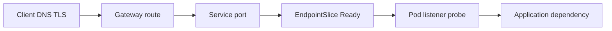

# Kubernetes 学习笔记 · 第六册：应用运行就绪实验

## 第 1 章 · 建立可重复的实验环境与证据基线

### 示例应用需要暴露哪些可验证行为

本册不是用一个只返回 Hello World 的 Pod 演示命令，而是把 Docker 05 产出的同一 `runtime-lab` 镜像反复部署、破坏和恢复。应用必须暴露足够行为，让工作负载、配置、网络、资源、探针和终止实验都有可观察结果。

| 接口/行为 | 正常结果 | 可注入失败 | 证据 |
|---|---|---|---|
| `GET /version` | 版本、Commit、架构、Pod UID | 错误 Digest 或旧副本 | 响应 JSON 与 Pod `imageID` |
| `GET /livez` | 进程可继续工作时 200 | 内部死锁模拟 | 探针、重启次数、日志 |
| `GET /readyz` | 可接收新流量时 200 | 依赖不可达、配置错误 | EndpointSlice Ready 条件 |
| `POST /items` | 幂等键写入 | 依赖超时、重复请求 | 请求 ID、状态码、数据结果 |
| `GET /items` | 返回已写数据 | 数据卷丢失 | 前后值对照 |
| `/metrics` | 请求、错误、延迟、关闭指标 | 指标缺失 | 抓取时间与样本 |
| SIGTERM | 摘流、排空、退出 | 忽略信号、超时 | 删除时间线和未完成请求 |
| stdout/stderr | JSON 日志 | Secret/多行异常 | 脱敏和关联字段 |

统一 `/version` 示例：

```json
{
  "service": "runtime-lab",
  "version": "1.4.0",
  "commit": "0123456789abcdef0123456789abcdef01234567",
  "arch": "arm64",
  "podName": "runtime-lab-7c8d9f6b5d-abcde",
  "podUid": "RECORD_AT_RUNTIME"
}
```

Pod 通过 Downward API 获得名称和 UID，不把它们烧进镜像：

```yaml
env:
  - name: POD_NAME
    valueFrom:
      fieldRef:
        fieldPath: metadata.name
  - name: POD_UID
    valueFrom:
      fieldRef:
        fieldPath: metadata.uid
  - name: APP_VERSION
    value: "1.4.0"
```

应用要把健康与依赖拆开。`/livez` 不因短时数据库故障失败；`/readyz` 可以在无法安全处理请求时失败，从 Service 后端摘除；`/metrics` 不作为业务健康端点。接口返回中不暴露 Secret、连接串或内部 Token。

先在容器层验证契约，再进入集群。Kubernetes 实验若失败，才能区分是镜像本身还是集群对象。容器化证据见[Docker 第五册](../docker/05-application-containerization-and-multi-platform-builds.md)。

### Kind 集群、入口和指标组件如何固定实验条件

可重复实验先固定版本、节点、端口、CNI 和附加组件。Kind 默认网络是否执行 NetworkPolicy 不能靠猜测；本册的网络隔离实验必须安装并记录明确支持 Enforcement 的 CNI，再用允许/拒绝请求证明策略真实生效。

```yaml
kind: Cluster
apiVersion: kind.x-k8s.io/v1alpha4
name: runtime-readiness
networking:
  disableDefaultCNI: true
  podSubnet: 10.244.0.0/16
  serviceSubnet: 10.96.0.0/16
nodes:
  - role: control-plane
    extraPortMappings:
      - containerPort: 30080
        hostPort: 18080
        listenAddress: 127.0.0.1
        protocol: TCP
  - role: worker
  - role: worker
```

实验参数清单：

```yaml
cluster:
  kindVersion: RECORD_AT_RUNTIME
  nodeImage: kindest/node@sha256:RECORD_DIGEST
  kubernetesVersion: RECORD_AT_RUNTIME
network:
  cni: RECORD_CNI_NAME
  cniVersion: RECORD_CNI_VERSION
  policyEnforcementVerified: false
entry:
  implementation: RECORD_CONTROLLER_OR_GATEWAY
  version: RECORD_AT_RUNTIME
metrics:
  metricsServerVersion: RECORD_AT_RUNTIME
  apiAvailable: false
```

创建后保存环境，不把命令成功当组件 Ready：

```bash
kind create cluster --config kind.yaml --image kindest/node@sha256:RECORD_DIGEST
kubectl cluster-info --context kind-runtime-readiness
kubectl get nodes -o wide
kubectl get pods -A -o wide
kubectl api-resources > evidence/api-resources.txt
kubectl version -o yaml > evidence/kubectl-version.yaml
```

CNI 安装清单必须固定版本或 Digest，并在应用前等待 DaemonSet/Deployment Ready。NetworkPolicy 基线用三组 Pod：client-allowed、client-denied、server。先证明无策略时两者都能访问；应用默认拒绝后两者都失败；增加 allow 后仅 allowed 成功。

```bash
kubectl -n runtime-lab exec client-allowed -- curl -fsS http://server:8080/livez
kubectl -n runtime-lab exec client-denied -- curl -fsS http://server:8080/livez
# 实际执行时保存两组退出码和时间，不能只保存 NetworkPolicy 对象。
```

Metrics Server 验收同时看 APIService、Deployment 和真实指标：

```bash
kubectl get apiservice v1beta1.metrics.k8s.io -o yaml
kubectl -n kube-system rollout status deployment/metrics-server --timeout=120s
kubectl top nodes
kubectl top pods -A
```

入口实现同样需要 Controller/Gateway 状态与真实 Host/Path 请求。没有安装 Gateway Controller 时，Gateway API YAML 只能做静态验证，不能写成数据面已生效。

### 如何使用固定 Digest、Namespace 和清理脚本保证重放

实验必须固定 `repository@sha256:...`，不能使用可移动 Tag。Namespace 同时承载实验 ID、Pod Security 标签、资源配额和清理边界；集群级资源仍需单独登记，删除 Namespace 不会自动清理 CRD、ClusterRole 或 StorageClass。

```yaml
apiVersion: v1
kind: Namespace
metadata:
  name: runtime-lab
  labels:
    app.kubernetes.io/part-of: runtime-readiness-lab
    lab.example/experiment-id: p1-runtime-001
    pod-security.kubernetes.io/enforce: restricted
    pod-security.kubernetes.io/enforce-version: latest
    pod-security.kubernetes.io/warn: restricted
    pod-security.kubernetes.io/audit: restricted
```

```yaml
image:
  repository: registry.example.invalid/platform/runtime-lab
  digest: sha256:RECORD_FROM_DOCKER_05
experiment:
  id: p1-runtime-001
  namespace: runtime-lab
  owner: operator@example.invalid
  startedAt: RECORD_AT_RUNTIME
  expiresAt: RECORD_AT_RUNTIME
```

执行前确认当前上下文，避免把实验清单打到其他集群：

```bash
expected_context='kind-runtime-readiness'
test "$(kubectl config current-context)" = "$expected_context"
kubectl auth can-i create namespace
kubectl apply --server-side --dry-run=server -f namespace.yaml
kubectl apply -f namespace.yaml
```

资源统一带实验标签，清理前先生成快照：

```bash
kubectl get all,configmap,secret,pvc,networkpolicy,hpa,pdb \
  -n runtime-lab \
  -l lab.example/experiment-id=p1-runtime-001 \
  -o yaml > evidence/pre-cleanup.yaml

kubectl delete namespace runtime-lab --wait=true --timeout=180s
kubectl get namespace runtime-lab && exit 1 || true
```

若 Namespace 卡在 Terminating，不直接移除 finalizer。先列出残留 API、对象 finalizer 和不可用 webhook；处理真正的外部清理或 API 问题后再观察。Kind 集群本身只有在全部实验完成、证据导出后才删除。

### 每个实验应该保存哪些对象、事件、日志、指标和请求

证据分四层：静态清单说明想要什么，API 响应说明服务器接受什么，控制器状态说明系统做到哪一步，真实请求/进程结果说明用户实际得到什么。任何单层都不能替代其余层。


统一采集函数：

```bash
collect_snapshot() {
  snapshot_dir="$1"
  mkdir -p "$snapshot_dir"
  kubectl get deploy,rs,pod,svc,endpointslice,hpa,pdb -n runtime-lab -o yaml \
    > "$snapshot_dir/objects.yaml"
  kubectl get events -n runtime-lab --sort-by=.metadata.creationTimestamp \
    > "$snapshot_dir/events.txt"
  kubectl logs -n runtime-lab -l app.kubernetes.io/name=runtime-lab \
    --all-containers --prefix --timestamps \
    > "$snapshot_dir/logs.txt" 2>&1 || true
  kubectl top pod -n runtime-lab \
    > "$snapshot_dir/top.txt" 2>&1 || true
}
```

每个实验目录包含 `before/`、`fault/`、`recovery/`、`cleanup/` 四个快照，以及请求记录：

```json
{
  "experimentId": "probe-readiness-001",
  "requestId": "req-001",
  "startedAt": "RECORD_AT_RUNTIME",
  "target": "http://127.0.0.1:18080/version",
  "statusCode": "RECORD_AT_RUNTIME",
  "latencyMs": "RECORD_AT_RUNTIME",
  "responseDigest": "RECORD_AT_RUNTIME"
}
```

事件有保留期且可能合并，日志会轮转，指标是时间序列，所以故障发生后先保存快照再修复。时间源需要统一，至少记录控制端与节点 UTC 时间偏差。证据中包含 Secret 时必须脱敏；Secret 对象只保存 metadata、type 与版本引用，不导出 `data`。

最终结论精确标注证据级别：`static`、`api-accepted`、`controller-observed`、`kind-runtime`、`external-request`。本地 Kind 结果不能推广为生产集群容量或网络证明。

## 第 2 章 · 根据运行语义选择工作负载对象

### Deployment、StatefulSet 和 DaemonSet 如何做场景决策

对象选择从身份、存储、节点覆盖和更新语义出发。Deployment 适合可替换副本；StatefulSet 适合稳定网络身份和持久卷序号；DaemonSet 适合每个匹配节点一份实例。副本数不是三者的本质区别。

| 问题 | Deployment | StatefulSet | DaemonSet |
|---|---|---|---|
| Pod 身份 | 可替换 | 稳定序号 | 绑定节点 |
| 存储 | 通常共享外部服务 | 常用独立 PVC | 常用 hostPath/节点数据 |
| 扩缩顺序 | 无身份要求 | 可要求有序 | 随节点变化 |
| 典型应用 | API、前端 | 数据库、队列成员 | 日志/网络/节点代理 |

`runtime-lab` 主 API 使用 Deployment；数据保留实验用最小 StatefulSet；节点覆盖实验用只读 DaemonSet。观察 Owner 链：

```bash
kubectl get deploy,rs,pod -n runtime-lab -o wide
kubectl get pod -n runtime-lab -o json \
  | jq '.items[] | {name:.metadata.name,owners:.metadata.ownerReferences}'
```

故障实验删除一个 Pod，比较三个控制器如何补建；再新增一个 Kind worker，观察只有 DaemonSet 自动覆盖新节点。恢复后检查期望副本、稳定身份和请求，不把 Pod 重新出现等同于数据正确。

### PVC Pending、挂载失败和数据保留如何验证

本节复用[第二册的存储与工作负载原理](02-scheduling-and-workloads.md)，只做应用侧实验。先记录 StorageClass、Provisioner、BindingMode、AccessMode 和 ReclaimPolicy，再创建 PVC。

```yaml
apiVersion: v1
kind: PersistentVolumeClaim
metadata:
  name: runtime-data
  namespace: runtime-lab
spec:
  accessModes:
    - ReadWriteOnce
  resources:
    requests:
      storage: 1Gi
  storageClassName: standard
```

```bash
kubectl get storageclass -o yaml
kubectl get pvc,pv -n runtime-lab -o wide
kubectl describe pvc runtime-data -n runtime-lab
```

注入三类失败：不存在的 StorageClass 导致 Pending；AccessMode/容量无法匹配；错误 `mountPath` 或权限导致容器启动失败。每类先看 PVC/PV Phase，再看 Pod Events 和 Container Status，避免把存储错误误判为镜像错误。

数据保留测试写入带实验 ID 的记录，删除 StatefulSet Pod 后验证新 Pod 仍可读取；删除 PVC 前明确 ReclaimPolicy。`Delete` 与 `Retain` 只说明 PV/后端回收策略，不等于应用已备份。清理证据要记录 PVC、PV 和后端资源是否真实消失。

### Job 和 CronJob 如何处理幂等、并发、重试与历史

Job 保证任务达到完成条件，不保证业务副作用只发生一次。Pod 重试、节点故障和控制器重建都可能让代码重复执行，因此写操作使用幂等键、唯一约束或事务状态机。

```yaml
apiVersion: batch/v1
kind: Job
metadata:
  name: runtime-migration
  namespace: runtime-lab
spec:
  backoffLimit: 3
  activeDeadlineSeconds: 300
  ttlSecondsAfterFinished: 600
  template:
    spec:
      restartPolicy: Never
      containers:
        - name: migrate
          image: registry.example.invalid/platform/runtime-lab@sha256:RECORD_DIGEST
          args: ["migrate", "--idempotency-key=p1-runtime-001"]
```

CronJob 还要决定重叠运行：

```yaml
spec:
  schedule: "*/5 * * * *"
  concurrencyPolicy: Forbid
  startingDeadlineSeconds: 120
  successfulJobsHistoryLimit: 2
  failedJobsHistoryLimit: 3
  jobTemplate:
    spec:
      backoffLimit: 2
      template:
        spec:
          restartPolicy: Never
```

实验让第一次执行在写入后返回非零，观察重试是否产生重复副作用；同时手工触发两次，验证 `concurrencyPolicy` 只约束 CronJob 调度，不约束手工创建的独立 Job。保存 Job Conditions、Pod 退出码、业务记录和历史清理。

### Deployment 滚动更新如何受 Surge、Unavailable 和探针影响

滚动更新同时受副本预算、调度容量、镜像启动和 Readiness 控制。`maxSurge` 决定可额外创建多少，`maxUnavailable` 决定可少多少 Ready 副本；探针失败会阻止新副本计入 Available。

```yaml
strategy:
  type: RollingUpdate
  rollingUpdate:
    maxSurge: 1
    maxUnavailable: 0
minReadySeconds: 10
progressDeadlineSeconds: 180
```

```bash
kubectl rollout status deployment/runtime-lab -n runtime-lab --timeout=200s
kubectl get deploy,rs,pod -n runtime-lab -w
kubectl get events -n runtime-lab --sort-by=.metadata.creationTimestamp
```

两组对照：节点有额外容量时正常滚动；资源不足时 Surge Pod Pending，旧副本因 `maxUnavailable: 0` 保留。再让新版本 Readiness 永远失败，预期 Deployment 超过 ProgressDeadline，但旧 Ready 副本仍接流。恢复应修复配置/镜像，不能直接删除旧 ReplicaSet。

请求侧持续发送带时间戳和版本的请求，统计 5xx、连接错误和版本切换。`rollout status` 成功只证明 Deployment 条件，不证明入口真实请求无中断。

### OwnerReference、Finalizer 和删除传播如何影响清理

OwnerReference 让垃圾收集器理解依赖图；Finalizer 让对象在删除前等待清理动作。Foreground 删除先处理 dependents，Background 让 Owner 先从 API 消失，Orphan 则保留 dependents。它们不是“强制删除速度”的选项。

```bash
kubectl delete deployment runtime-lab -n runtime-lab --cascade=foreground
kubectl get deployment,replicaset,pod -n runtime-lab -w
```

```bash
kubectl get pod runtime-lab-example -n runtime-lab -o json \
  | jq '{deletionTimestamp:.metadata.deletionTimestamp,finalizers:.metadata.finalizers,owners:.metadata.ownerReferences}'
```

实验分别用 Foreground、Background、Orphan 删除副本对象，保存 Owner/Dependent 消失顺序。再创建带测试 Finalizer 的对象，发出删除后观察 Terminating；只有模拟的外部清理完成后才移除 Finalizer。

卡住时按顺序检查 deletionTimestamp、finalizers、Owner UID、相关控制器和 webhook。直接 `--force --grace-period=0` 或清空 finalizers 可能留下外部资源、重复身份或挂载，不能作为常规恢复。清理验收要证明 API 对象、Pod、PVC 与模拟外部记录都达到预期状态。

## 第 3 章 · Namespace、多租户和安全策略如何形成应用边界

### Namespace 能隔离什么，不能隔离什么

Namespace 提供名称作用域，也是 RBAC、Quota、LimitRange、Pod Security 和 NetworkPolicy 的挂载点；它不隔离节点、内核、集群级对象或网络。两个 Namespace 默认仍可互通，除非 CNI 执行 NetworkPolicy。

| 能直接形成边界 | 需要额外控制 | 不能由 Namespace 解决 |
|---|---|---|
| 名称、Role/RoleBinding、配额 | 网络、Pod 安全、Secret 使用 | 内核漏洞、节点管理员 |
| Namespaced 对象清理 | 调度到专属节点 | CRD、ClusterRole、StorageClass |
| 团队 Owner 和标签 | 成本/审计归属 | 强多租户虚拟控制面 |

```bash
kubectl api-resources --namespaced=true
kubectl api-resources --namespaced=false
kubectl get namespace runtime-lab --show-labels
```

实验在两个 Namespace 创建同名 Service，证明 FQDN 不同；再从 client 跨 Namespace 请求，证明未设置策略时可以通信。随后应用网络和身份策略，验证边界变化。不要把对象重名可用误解为安全隔离。

### ResourceQuota 和 LimitRange 如何约束团队资源

LimitRange 可为容器设置默认 Request/Limit 并限制单对象范围；ResourceQuota 限制 Namespace 聚合用量和对象数量。两者主要在 Admission 阶段工作，调度器仍根据最终 Request 判断节点是否有容量。

```yaml
apiVersion: v1
kind: LimitRange
metadata:
  name: runtime-defaults
  namespace: runtime-lab
spec:
  limits:
    - type: Container
      defaultRequest:
        cpu: 100m
        memory: 128Mi
      default:
        cpu: 500m
        memory: 512Mi
---
apiVersion: v1
kind: ResourceQuota
metadata:
  name: runtime-budget
  namespace: runtime-lab
spec:
  hard:
    requests.cpu: "2"
    requests.memory: 2Gi
    limits.cpu: "4"
    limits.memory: 4Gi
    pods: "20"
    persistentvolumeclaims: "4"
```

先创建没有 Resources 的 Pod，读取 API 中被默认化的值；再创建超过单容器上限、超过总配额和 Request 合法但节点放不下三种对象。前两种应被 Admission 拒绝，第三种被接受后 Pending。保存错误原文、Quota Used/Hard 和调度 Events。

恢复分别是修正单对象资源、释放/提高经审批配额、增加容量或降低 Request。不能把配额拒绝通过删除 Requests 修复，因为 HPA 和调度会失去基线。

### ServiceAccount 和 RBAC 如何验证最小权限

应用身份与实验操作者身份分离。默认应用不需要访问 Kubernetes API，因此关闭 Token 自动挂载；确实需要时创建专用 ServiceAccount、Role 和 RoleBinding，只授予资源、名称和动词的最小集合。

```yaml
apiVersion: v1
kind: ServiceAccount
metadata:
  name: runtime-reader
  namespace: runtime-lab
automountServiceAccountToken: false
---
apiVersion: rbac.authorization.k8s.io/v1
kind: Role
metadata:
  name: config-reader
  namespace: runtime-lab
rules:
  - apiGroups: [""]
    resources: ["configmaps"]
    resourceNames: ["runtime-config-v1"]
    verbs: ["get"]
---
apiVersion: rbac.authorization.k8s.io/v1
kind: RoleBinding
metadata:
  name: runtime-config-reader
  namespace: runtime-lab
subjects:
  - kind: ServiceAccount
    name: runtime-reader
    namespace: runtime-lab
roleRef:
  apiGroup: rbac.authorization.k8s.io
  kind: Role
  name: config-reader
```

```bash
kubectl auth can-i get configmap/runtime-config-v1 \
  -n runtime-lab --as=system:serviceaccount:runtime-lab:runtime-reader
kubectl auth can-i list secrets \
  -n runtime-lab --as=system:serviceaccount:runtime-lab:runtime-reader
kubectl auth can-i delete pods \
  -n runtime-lab --as=system:serviceaccount:runtime-lab:runtime-reader
```

验收必须同时包含允许和拒绝断言。若应用 Pod 声明 `automountServiceAccountToken: false`，检查 `/var/run/secrets/kubernetes.io/serviceaccount/token` 不存在。恢复权限不足时先确认真实 API 调用，再只增加必要 verb；不要绑定 `cluster-admin` 做诊断。

### Pod Security Admission 与 NetworkPolicy 如何补足运行隔离

Pod Security Admission 按 Namespace 标签对 Pod Spec 做 enforce/warn/audit；NetworkPolicy 由支持它的 CNI 执行流量隔离。PSP 已移除，本册不生成 PodSecurityPolicy。

Restricted 工作负载基线：

```yaml
securityContext:
  runAsNonRoot: true
  runAsUser: 10001
  runAsGroup: 10001
  seccompProfile:
    type: RuntimeDefault
containers:
  - name: app
    securityContext:
      allowPrivilegeEscalation: false
      readOnlyRootFilesystem: true
      capabilities:
        drop: ["ALL"]
```

默认拒绝并只允许带标签 client 访问 8080：

```yaml
apiVersion: networking.k8s.io/v1
kind: NetworkPolicy
metadata:
  name: runtime-default-deny
  namespace: runtime-lab
spec:
  podSelector: {}
  policyTypes: ["Ingress", "Egress"]
---
apiVersion: networking.k8s.io/v1
kind: NetworkPolicy
metadata:
  name: allow-runtime-client
  namespace: runtime-lab
spec:
  podSelector:
    matchLabels:
      app.kubernetes.io/name: runtime-lab
  ingress:
    - from:
        - podSelector:
            matchLabels:
              access: runtime-client
      ports:
        - protocol: TCP
          port: 8080
```

先用违反 Restricted 的 privileged/root Pod 验证 enforce 拒绝并保存错误；再部署合规 Pod。网络实验记录 CNI 名称、版本、Ready 状态，并在策略前后对 allowed/denied 两个 client 各执行请求。NetworkPolicy 对象创建成功但请求仍通，说明 Enforcement 未成立，实验失败，不能宣称隔离完成。

## 第 4 章 · 配置和 Secret 如何安全进入运行中的 Pod

### 环境变量和卷挂载为什么具有不同更新语义

环境变量在容器创建时确定，ConfigMap/Secret 之后变化不会改写进程环境；投射卷通常由 kubelet 周期更新，但应用是否重读取决于自身实现；`subPath` 挂载不会获得同样的原子更新行为。更新对象不等于应用已经使用新值。

```yaml
env:
  - name: FEATURE_MODE
    valueFrom:
      configMapKeyRef:
        name: runtime-config-v1
        key: featureMode
volumeMounts:
  - name: config
    mountPath: /etc/runtime-lab
    readOnly: true
volumes:
  - name: config
    configMap:
      name: runtime-config-v1
```

实验读取进程环境和文件摘要，更新 ConfigMap 后每秒记录两者；预期环境变量不变，卷文件在传播后变化。再验证应用是否显式 reload。恢复环境变量配置需触发新 Pod；卷配置若应用不支持 reload，也应通过 Pod Template 变更滚动发布。

### 不可变 ConfigMap/Secret 与版本化名称如何控制发布

`immutable: true` 防止原地修改，版本化名称让 Pod Template 明确引用哪一版配置。发布新配置创建 `runtime-config-v2`，更新 Deployment 引用；回退则恢复旧名称。旧版本保留到回退窗口结束。

```yaml
apiVersion: v1
kind: ConfigMap
metadata:
  name: runtime-config-v2
  namespace: runtime-lab
immutable: true
data:
  runtime.yaml: |
    featureMode: safe
    dependencyTimeoutMs: 800
```

```bash
kubectl apply -f runtime-config-v2.yaml
kubectl set env deployment/runtime-lab -n runtime-lab \
  --from=configmap/runtime-config-v2
kubectl rollout status deployment/runtime-lab -n runtime-lab
```

正式 GitOps 清单不使用上面的命令式修改；实验用它观察 Template 变化。验收读取 Pod Spec 引用、容器内配置版本和 `/version`，再回退到 v1。删除旧 ConfigMap 前用 API 查询所有 Pod/Controller 引用，避免正在运行的重建失败。

### Secret 的最小暴露和轮换如何在应用侧验证

Secret 对象不是天然加密保险箱。本实验只使用测试凭据，比较环境变量、投射卷和外部 Secret provider 的消费语义。优先使用只读文件，避免 Secret 出现在进程环境、Crash Dump 和调试输出。

```yaml
volumes:
  - name: api-credential
    secret:
      secretName: runtime-api-v2
      defaultMode: 0400
containers:
  - name: app
    volumeMounts:
      - name: api-credential
        mountPath: /run/secrets/runtime
        readOnly: true
```

轮换按四阶段执行：创建新值；消费者确认读到新版本；撤销旧值；验证旧值失败且新值成功。日志只记录 `secretVersion=v2`，不记录内容。

```bash
kubectl exec -n runtime-lab deploy/runtime-lab -- \
  /opt/runtime-lab/server --check-secret-version v2
kubectl logs -n runtime-lab deploy/runtime-lab | grep -F 'TEST_SECRET_VALUE' && exit 1 || true
```

若应用缓存旧值，明确用 reload、滚动重启或双凭据窗口恢复。Base64 不是加密；Sealed Secrets、External Secrets 与 Vault 的信任和灾备属于 GitOps 02，本册只验证 Pod 消费与轮换结果。

### 配置缺失、格式错误和依赖不可达如何分别失败

三类错误应产生不同状态：引用不存在的必需 ConfigMap/Secret 时容器无法创建，常见 `CreateContainerConfigError`；文件存在但格式错误时进程启动后退出，形成 CrashLoopBackOff；依赖暂时不可达时进程可 Live，但 Ready 为 False。

| 故障 | Pod/Container 信号 | 首查 | 恢复 |
|---|---|---|---|
| 对象缺失 | Waiting 与 Events | `describe pod` | 创建正确版本或修正引用 |
| 格式错误 | Terminated exitCode、日志 | `logs --previous` | 修正配置并滚动 |
| 依赖不可达 | Ready False、Endpoint 摘除 | 探针与依赖请求 | 恢复依赖或降级 |
| 可选配置缺失 | 应用使用默认值 | `/version` 配置摘要 | 记录默认值来源 |

```bash
pod="$(kubectl get pod -n runtime-lab -l app.kubernetes.io/name=runtime-lab -o name | head -1)"
kubectl describe -n runtime-lab "$pod"
kubectl logs -n runtime-lab "$pod" --previous
kubectl get endpointslice -n runtime-lab -l kubernetes.io/service-name=runtime-lab -o yaml
```

故障注入一次只改变引用、内容或依赖地址之一。恢复后同时验证 Pod Ready、EndpointSlice Ready 和真实 Service 请求，避免只看容器重新 Running。

### InitContainer 和启动依赖失败如何定位

Init Container 按顺序完成后主容器才启动，适合生成配置、修正专用卷权限或完成幂等初始化；不适合无限等待外部依赖，也不应执行无法安全重试的迁移副作用。

```yaml
initContainers:
  - name: render-config
    image: registry.example.invalid/platform/runtime-lab@sha256:RECORD_DIGEST
    args: ["render-config", "--out=/work/runtime.yaml"]
    securityContext:
      runAsNonRoot: true
      allowPrivilegeEscalation: false
      capabilities:
        drop: ["ALL"]
    volumeMounts:
      - name: generated
        mountPath: /work
containers:
  - name: app
    volumeMounts:
      - name: generated
        mountPath: /etc/runtime-lab
        readOnly: true
```

注入错误镜像、错误命令、卷权限、DNS 和超时。按 `.status.initContainerStatuses`、Events、对应 Init 日志排查；主容器日志为空是预期，因为它尚未启动。

```bash
kubectl get pod -n runtime-lab runtime-init-fault -o json \
  | jq '.status.initContainerStatuses'
kubectl logs -n runtime-lab runtime-init-fault -c render-config
```

恢复后确认 Init 只产生一次预期输出，主容器读取内容且业务副作用没有重复。若必须执行数据库迁移，更适合独立 Job 和明确幂等/审批，而不是每个 Pod 的 Init Container。

## 第 5 章 · Service、DNS 和入口如何组成请求路径

### Service 和 EndpointSlice 如何把 Selector 变成后端集合

Service 提供稳定虚拟地址和端口，Selector 控制器把匹配 Pod 转成 EndpointSlice。只有 Ready Endpoint 才通常进入服务后端。ClusterIP 能分配不代表有可用后端，Ping 也不是 HTTP 服务验证。

```yaml
apiVersion: v1
kind: Service
metadata:
  name: runtime-lab
  namespace: runtime-lab
spec:
  selector:
    app.kubernetes.io/name: runtime-lab
  ports:
    - name: http
      port: 8080
      targetPort: http
```

```bash
kubectl get service runtime-lab -n runtime-lab -o yaml
kubectl get endpointslice -n runtime-lab \
  -l kubernetes.io/service-name=runtime-lab -o yaml
kubectl get pod -n runtime-lab --show-labels
```

依次注入错误 Selector、错误 targetPort、全部 Readiness False 和无 Selector Service。预期分别表现为空 Endpoint、连接失败、Endpoint Ready=False、需要手工 EndpointSlice。恢复后从 client 发真实 `/version` 请求，并比对返回 Pod UID 是否属于 Ready Endpoint。

### CoreDNS 和应用 DNS 缓存如何影响服务发现

Pod 通过集群 DNS 解析 `service.namespace.svc.cluster.local`。短名受 `search` 与 `ndots` 影响，应用、语言运行时和本地缓存又可能延长结果寿命。DNS 成功只得到地址，不证明目标端口或应用健康。

```bash
kubectl exec -n runtime-lab deploy/client -- cat /etc/resolv.conf
kubectl exec -n runtime-lab deploy/client -- \
  getent hosts runtime-lab.runtime-lab.svc.cluster.local
kubectl exec -n runtime-lab deploy/client -- \
  curl -fsS http://runtime-lab.runtime-lab.svc.cluster.local:8080/version
```

故障实验：错误 Namespace 短名、CoreDNS Pod 不 Ready、NetworkPolicy 阻断 UDP/TCP 53、应用缓存旧结果。先查询 FQDN，再检查 `/etc/resolv.conf`、CoreDNS Service/Endpoint、日志和网络策略。恢复后同时验证 DNS 查询和 HTTP 请求，记录 TTL 与应用恢复耗时。

应用层还要区分 NXDOMAIN、SERVFAIL、查询超时和解析成功但连接失败。NXDOMAIN 多指向名称或搜索域错误，SERVFAIL 需要检查 CoreDNS 上游和插件链，超时可能是网络策略或数据面丢包；解析得到 IP 后的连接失败已经离开 DNS 层。

用固定频率同时记录 `getent`、`nslookup` 或应用内 resolver 结果，并输出解析耗时。若 Java、Go、Node 的缓存策略不同，应分别记录 TTL 与连接池复用，不能用调试容器一次成功替代业务进程行为。

恢复验收要求新建连接使用当前 Service 地址、旧缓存按可解释窗口失效，且 CoreDNS 恢复后没有持续高错误率。为绕过问题写死 ClusterIP 或 Pod IP 会破坏服务发现契约，不是可接受修复。

### Ingress 与 Gateway 如何把外部请求路由到 Service

Ingress 由 IngressClass/Controller 实现；Gateway API 把基础设施所有者的 Gateway 与应用所有者的 HTTPRoute 分离。对象被 API 接受不表示 Controller 已编程数据面，必须检查 Status Conditions 和真实 Host/Path/TLS 请求。

```yaml
apiVersion: gateway.networking.k8s.io/v1
kind: HTTPRoute
metadata:
  name: runtime-lab
  namespace: runtime-lab
spec:
  parentRefs:
    - name: shared-gateway
      namespace: gateway-system
  hostnames:
    - runtime.localtest.me
  rules:
    - matches:
        - path:
            type: PathPrefix
            value: /
      backendRefs:
        - name: runtime-lab
          port: 8080
```

```bash
kubectl get gateway -A -o yaml
kubectl get httproute -n runtime-lab runtime-lab -o yaml
curl --fail --resolve runtime.localtest.me:18080:127.0.0.1 \
  http://runtime.localtest.me:18080/version
```

检查 `Accepted`、`ResolvedRefs`、`Programmed` 等实现提供的条件及 `observedGeneration`。错误 Class、未授权跨 Namespace 引用、错误 backend port 和 TLS Secret 会产生不同状态。没有真实 Gateway Controller 时仅标静态清单验证。

### 如何按 Client、Gateway、Service、Endpoint 和 Pod 顺序定位断点

请求链按外向内定位，避免一遇到 503 就重启 Pod。



| 现象 | 首查 | 常见断点 |
|---|---|---|
| DNS 失败 | Client resolver | Host/FQDN、CoreDNS |
| 连接拒绝 | Listener/端口 | Gateway 未监听、NodePort 错 |
| 404 | Host/Path/Route | 未匹配规则 |
| 502/503 | Route backend 与 Endpoint | 空后端、错误端口、上游拒绝 |
| 超时 | NetworkPolicy/应用依赖 | 丢包、连接池、后端阻塞 |
| TLS 错误 | SNI、证书链、Secret | Host 不匹配、证书过期 |

每层使用一个首个查询并保存输出：客户端 `curl -v`，Gateway Status，Service Spec，EndpointSlice，Pod `ss`/应用自检。恢复后从原客户端重放原 Host/Path，而不是只在 Pod 内 curl localhost。

## 第 6 章 · Requests、Limits、QoS 和 HPA 如何共同决定容量

### Requests 如何参与调度，Limits 如何影响运行时

Scheduler 根据 Request 与节点 Allocatable 判断能否放置；CPU Limit 常表现为节流，Memory Limit 超出可导致 OOMKill。实际用量低不意味着 Request 无意义，它还是容量预留、HPA 利用率分母和 QoS 输入。

```yaml
resources:
  requests:
    cpu: 200m
    memory: 128Mi
    ephemeral-storage: 64Mi
  limits:
    cpu: "1"
    memory: 384Mi
    ephemeral-storage: 256Mi
```

```bash
kubectl top pod -n runtime-lab --containers
kubectl describe pod -n runtime-lab runtime-lab-example
kubectl get node -o custom-columns=NAME:.metadata.name,ALLOCATABLE_CPU:.status.allocatable.cpu
```

三组压力：CPU 超 Limit 观察延迟和 throttling 指标；内存超过 Limit 观察 `OOMKilled`、退出码 137 和重启；Request 超节点可用量观察 Pending/FailedScheduling。恢复分别是优化/调整 Limit、修复内存峰值、改变 Request 或容量。不能把所有失败都归因于“资源不足”。

### QoS、驱逐和临时存储如何改变故障顺序

Guaranteed、Burstable、BestEffort 由 Pod 中各容器 CPU/Memory Request/Limit 关系决定；节点压力驱逐还考虑优先级、用量是否超过 Request 等因素。QoS 不是绝对免死牌。

```bash
kubectl get pod -n runtime-lab \
  -o custom-columns=NAME:.metadata.name,QOS:.status.qosClass
kubectl describe node runtime-readiness-worker
kubectl get events -A --field-selector reason=Evicted
```

实验创建三类 QoS Pod，使用受控方式制造 MemoryPressure 或 DiskPressure；Kind 中若无法安全复现，只保留配置和静态判断，不伪造驱逐结果。临时存储实验向 emptyDir/容器可写层写入，观察 Pod ephemeral-storage 使用、Evicted 与清理。

故障证据包括 Node Conditions、taint、Pod Reason、容器用量和业务请求。恢复后清除压力源、让控制器补副本并验证数据；删除 Evicted Pod 只是清理显示，不是根因修复。

临时存储要同时观察容器可写层、日志和 `emptyDir`。只给内存设置 Limit 并不能防止日志或临时文件占满节点磁盘；声明 `ephemeral-storage` Request/Limit 后，还要验证应用在容量不足时能返回明确错误并停止继续写入。

驱逐顺序不是仅按 QoS 排名。节点压力种类、Priority、Pod 用量是否超过 Request 和 kubelet 阈值都会参与判断，因此实验报告必须保存当时 Node Condition 与每个候选 Pod 的资源声明/实际用量。

恢复完成的标准是节点压力解除、替代 Pod Ready、临时数据按契约清理、真实请求恢复。若业务数据曾写进临时卷，还要记录丢失范围，不能用新 Pod Running 掩盖数据错误。

### Metrics Server 和 HPA v2 如何计算期望副本

HPA 控制器周期读取指标，按“当前值/目标值”计算期望副本，多个指标取最大的建议值。CPU utilization 需要容器 CPU Request；缺失 Request 会让相关利用率无法定义。未就绪与缺失指标 Pod 还会影响保守计算。

```text
desiredReplicas = ceil(currentReplicas * currentMetricValue / desiredMetricValue)
```

```yaml
apiVersion: autoscaling/v2
kind: HorizontalPodAutoscaler
metadata:
  name: runtime-lab
  namespace: runtime-lab
spec:
  scaleTargetRef:
    apiVersion: apps/v1
    kind: Deployment
    name: runtime-lab
  minReplicas: 2
  maxReplicas: 10
  metrics:
    - type: Resource
      resource:
        name: cpu
        target:
          type: Utilization
          averageUtilization: 60
```

```bash
kubectl get hpa runtime-lab -n runtime-lab -w
kubectl describe hpa runtime-lab -n runtime-lab
kubectl get --raw /apis/metrics.k8s.io/v1beta1/namespaces/runtime-lab/pods | jq .
```

负向实验删除 CPU Request，预期 HPA Condition/Events 显示不能计算；停止 Metrics Server，预期指标未知且不应盲目缩容；添加第二指标，验证期望副本取更高建议。恢复后等指标窗口稳定，再确认副本和请求延迟。

### Stabilization Window 和 Scaling Policy 如何抑制抖动

`behavior` 分别控制扩容、缩容的稳定窗口和速率。扩容通常快，缩容需要观察窗口避免短暂低谷导致容量骤降；Policy 还限制每周期可增加/减少的 Pod 或百分比。

```yaml
behavior:
  scaleUp:
    stabilizationWindowSeconds: 0
    selectPolicy: Max
    policies:
      - type: Percent
        value: 100
        periodSeconds: 60
      - type: Pods
        value: 4
        periodSeconds: 60
  scaleDown:
    stabilizationWindowSeconds: 300
    selectPolicy: Max
    policies:
      - type: Percent
        value: 25
        periodSeconds: 60
```

实验使用尖峰、持续高负载、低流量和指标中断四条曲线。每 15 秒保存 HPA current/desired、Deployment replicas、Pod Ready 与请求延迟。达到 `maxReplicas` 且延迟继续上升应报警，而不是认为 HPA 工作正常。

抖动恢复不是无限增加窗口。先判断指标噪声、Request 错配、启动慢、负载不均还是容量上限，再调整目标、Policy 或应用。实验结束停止负载，等待受控缩容并验证最小副本仍能服务。

## 第 7 章 · 探针、终止和中断预算如何保护可用性

### Startup、Readiness 和 Liveness 分别回答什么问题

Startup 回答“慢启动是否已经完成”，成功前抑制其他探针；Readiness 回答“现在能否接新流量”；Liveness 回答“进程是否已无法自行恢复”。把外部依赖放进 Liveness 会在依赖故障时重启所有副本。

```yaml
startupProbe:
  httpGet:
    path: /livez
    port: http
  periodSeconds: 2
  failureThreshold: 30
readinessProbe:
  httpGet:
    path: /readyz
    port: http
  periodSeconds: 5
  timeoutSeconds: 1
  failureThreshold: 2
livenessProbe:
  httpGet:
    path: /livez
    port: http
  periodSeconds: 10
  timeoutSeconds: 1
  failureThreshold: 3
```

HTTP 适合应用语义，TCP 只证明端口接受连接，exec 会产生进程开销，gRPC 适合标准健康协议。实验先让应用慢启动，证明 Startup 避免过早 Liveness；再让依赖失败，仅 Readiness 失败；最后模拟内部死锁，Liveness 触发重启。保存探针 Events、RestartCount 和请求结果。

### Readiness 与 EndpointSlice 如何控制新旧请求

Pod Ready 条件变化会传播到 EndpointSlice，代理和客户端再感知后端集合变化。传播不是瞬时的，已有 keep-alive/长连接也可能继续使用旧实例，所以不能只看 Ready=False 就认为所有请求已经摘除。

```bash
kubectl get pod -n runtime-lab -w
kubectl get endpointslice -n runtime-lab \
  -l kubernetes.io/service-name=runtime-lab -w
```

持续请求记录 Pod UID，注入某一副本 Readiness 失败，比较 Pod Condition 时间、EndpointSlice 更新时间和最后一次命中该 Pod 的请求时间。恢复依赖后观察重新入池。若全部 Readiness 失败，Service 无 Ready 后端，Liveness 不应因此重启进程。

连接复用实验分别使用短连接和长连接，说明控制面摘除与数据面连接排空的差别。恢复验收要求新连接不再命中故障副本、旧连接按契约结束、恢复副本重新接受请求。

传播时间线至少包含五个时间点：应用开始拒绝 Readiness、kubelet 更新 Pod Condition、EndpointSlice Controller 更新 Endpoint、代理观察新后端集合、客户端最后一次命中故障 Pod。它们来自不同组件，时间必须统一到 UTC。

若 EndpointSlice 已标 Ready=False 但新连接仍命中该 Pod，继续检查节点代理、Gateway/Ingress upstream 和服务网格数据面是否已消费更新；不要反复修改探针。若只有长连接继续存在，则由应用终止契约和连接最大寿命决定是否正常。

恢复后先小流量观察，再让 Pod 重新 Ready。应用如果在依赖刚恢复时立刻开放全部流量，可能触发缓存预热或连接风暴；可以由 readiness 内部的稳定窗口处理，但不能用 Liveness 重启代替预热。

### SIGTERM、preStop 和 Grace Period 如何实现优雅终止

删除 Pod 后进入终止流程，kubelet 执行 `preStop`（若有）并向主进程发送终止信号，Grace Period 到期后强制结束。`preStop` 的时间也计入总宽限期，固定 sleep 只是猜传播延迟，不能替代应用主动摘流和连接排空。

```yaml
terminationGracePeriodSeconds: 30
containers:
  - name: app
    lifecycle:
      preStop:
        httpGet:
          path: /prepare-shutdown
          port: http
```

```bash
kubectl delete pod -n runtime-lab runtime-lab-example --wait=false
kubectl get pod -n runtime-lab runtime-lab-example -w
kubectl logs -n runtime-lab runtime-lab-example --timestamps
```

时间线记录 deletionTimestamp、Readiness=False、EndpointSlice 摘除、SIGTERM 日志、最后新请求、存量请求完成、容器退出。注入忽略 SIGTERM 和超长请求，预期 Grace 到期后出现强制终止；恢复为正确 handler，并让超时预算覆盖最长允许请求而非无限等待。

### 多副本、Topology Spread 和 PDB 如何应对计划中断

多副本只有分散到不同故障域才真正提高可用性。Topology Spread 影响调度分布，PDB 限制 API 发起的自愿中断，二者都不能阻止节点突然掉电，也不能弥补副本本身不 Ready。

```yaml
topologySpreadConstraints:
  - maxSkew: 1
    topologyKey: kubernetes.io/hostname
    whenUnsatisfiable: DoNotSchedule
    labelSelector:
      matchLabels:
        app.kubernetes.io/name: runtime-lab
---
apiVersion: policy/v1
kind: PodDisruptionBudget
metadata:
  name: runtime-lab
  namespace: runtime-lab
spec:
  minAvailable: 2
  selector:
    matchLabels:
      app.kubernetes.io/name: runtime-lab
```

三副本分布到两个 worker，执行 `kubectl drain` 一个 worker，观察 Eviction 是否受 PDB、剩余容量和调度约束影响。再把副本降为 2，证明过严 PDB 可能阻塞维护。保存 Pod 分布、PDB disruptionsAllowed、Drain 输出与持续请求。

恢复按优先级：恢复 Ready 容量、解除不可满足的调度约束、经审批调整 PDB，再继续 Drain。不能直接 `--disable-eviction` 绕过 PDB 后宣称可用性通过。实验完成后 uncordon 节点并验证副本重新平衡。

## 第 8 章 · 用故障注入验收应用运行基线

### 镜像、调度、配置和权限失败如何从 Pod 状态定位

Pod `Pending`、`Waiting`、`Running` 只是入口，真正原因在 Conditions、Container State、Events 和日志。按生命周期顺序排查：Admission、Scheduling、Image Pull、Container Create、Process Start、Readiness。

| 故障 | 典型信号 | 首个查询 | 禁止的猜测式动作 |
|---|---|---|---|
| 无效 Digest/凭据 | ImagePullBackOff | Events、image 字段 | 重启 Pod |
| Request 无法满足 | Pending/FailedScheduling | Pod Events、Node Allocatable | 降为零 Request |
| ConfigMap 缺失 | CreateContainerConfigError | describe Pod | 改成可选引用 |
| PSA/RBAC 拒绝 | API Forbidden | apply 错误、auth can-i | 使用 cluster-admin |
| 入口/格式错误 | CrashLoopBackOff | State、logs --previous | 无限增加重启 |

```bash
kubectl get pod -n runtime-lab -o wide
kubectl get pod -n runtime-lab runtime-fault -o json \
  | jq '{conditions:.status.conditions,containers:.status.containerStatuses}'
kubectl describe pod -n runtime-lab runtime-fault
kubectl logs -n runtime-lab runtime-fault --previous
```

每个故障保存失败快照，执行单一修复，再保存恢复快照。最终不仅 Pod Ready，还要 `/version` 返回预期 Digest/Commit，Service Endpoint Ready，真实请求成功。

### Service、DNS、Ingress 和 Gateway 故障如何分层验证

网络故障按请求路径注入：Selector 为空、targetPort 错、DNS 被策略阻断、Ingress Host/Path 错、Gateway Reference 未接受、TLS Secret 错。每次只改变一层。

```bash
curl --verbose --resolve runtime.localtest.me:18080:127.0.0.1 \
  http://runtime.localtest.me:18080/version
kubectl get httproute -n runtime-lab runtime-lab -o yaml
kubectl get service,endpointslice -n runtime-lab -o yaml
kubectl exec -n runtime-lab deploy/client -- \
  curl -v http://runtime-lab:8080/version
```

诊断记录客户端错误、Gateway/Ingress Status、Service Port、EndpointSlice Ready 和 Pod 监听。若 Pod 内 localhost 成功而 Service 失败，问题在应用外层；若 Endpoint 正确而 Gateway 503，检查路由控制器到后端的网络与端口。

恢复后必须从原始外部客户端重放相同 Host/Path/TLS；Pod 内请求只能作为分层证据。没有真实 Controller 时，Gateway 实验状态为 `not-executed`。

### 探针、资源和 HPA 故障如何避免自动化扩大影响

自动化会放大错误配置：错误 Liveness 造成重启风暴；全部 Readiness 失败清空 Service 后端；低 Memory Limit 反复 OOM；缺指标让 HPA 失效；错误 Request 让利用率偏离真实容量。

```bash
kubectl get pod,hpa,endpointslice -n runtime-lab -w
kubectl get events -n runtime-lab --sort-by=.metadata.creationTimestamp
kubectl top pod -n runtime-lab --containers
```

止损顺序：冻结继续发布；保存状态；若错误 Liveness 仍重启，修正探针或回退 Pod Template；若 Readiness 全失败，恢复最后已知可服务配置；若 OOM，降低负载/恢复旧 Limit 并定位内存；HPA 达上限时限流而非无限提高副本。

实验统计重启次数、Ready Endpoint 数、OOM 次数、HPA Desired/Max、请求错误和恢复时间。只看到副本增多不表示容量恢复；必须看真实请求和资源饱和。

为了避免边修边丢证据，先暂停新的配置发布和自动镜像更新，但不要立即删除 HPA 或 PDB。保存当前 Generation、Conditions 和时间序列后，选择最小止损动作；否则删除控制器可能引入第二个变量。

错误 Liveness 的恢复通常通过回退 Pod Template 或修正探针，并观察 RestartCount 停止增长；错误 Readiness 则要保留至少一个已知可服务版本。内存 OOM 需要区分泄漏、峰值和 Limit 过低，HPA 无法修复单 Pod OOM。

自动化恢复完成要同时满足：控制器不再产生错误动作、Ready Endpoint 数恢复、请求错误回到基线、资源趋势稳定、临时止损已撤销。只把 `maxReplicas` 调大或探针关闭，会扩大成本或隐藏故障，不是闭环。

### 如何用成功、失败、恢复和清理证据完成最终验收

最终验收由另一名操作者按 Runbook 重放，分四条路径：成功路径建立基线；失败路径证明信号可发现；恢复路径证明服务与状态回到预期；清理路径证明实验没有遗留对象和外部副作用。

```yaml
apiVersion: evidence.platform.example/v1
kind: KubernetesRuntimeAcceptance
metadata:
  experimentId: p1-runtime-001
spec:
  cluster:
    context: kind-runtime-readiness
    kubernetesVersion: RECORD_AT_RUNTIME
    cni:
      name: RECORD_AT_RUNTIME
      version: RECORD_AT_RUNTIME
      enforcementVerified: false
  image:
    reference: registry.example.invalid/platform/runtime-lab@sha256:RECORD_DIGEST
    dockerEvidence: ../docker-p1-1.4.0/result.yaml
  paths:
    success: evidence/success/result.yaml
    failure: evidence/failures/index.yaml
    recovery: evidence/recovery/result.yaml
    cleanup: evidence/cleanup/result.yaml
status:
  result: pending
  evidenceLevel: static
  limitations: []
```

通过条件：固定 Digest；所有 34 个节点对应实验；至少一条真实请求；NetworkPolicy 有允许/拒绝对照；配置、资源、探针和终止有恢复证据；清理后 Namespace 与登记的集群级资源均不存在。若未运行 Kind，只能报告 Markdown/YAML/Shell 静态校验。

#### 基础实验清单

下面清单把本册的共同基线集中在一起。`RECORD_DIGEST` 必须在执行前替换为 Docker 05 已验收的 64 位摘要；示例不会自动使用 Tag 回退。

```yaml
apiVersion: v1
kind: Namespace
metadata:
  name: runtime-lab
  labels:
    app.kubernetes.io/part-of: runtime-readiness-lab
    lab.example/experiment-id: p1-runtime-001
    pod-security.kubernetes.io/enforce: restricted
    pod-security.kubernetes.io/enforce-version: latest
    pod-security.kubernetes.io/warn: restricted
    pod-security.kubernetes.io/audit: restricted
---
apiVersion: v1
kind: LimitRange
metadata:
  name: runtime-defaults
  namespace: runtime-lab
spec:
  limits:
    - type: Container
      defaultRequest:
        cpu: 100m
        memory: 128Mi
      default:
        cpu: 500m
        memory: 384Mi
---
apiVersion: v1
kind: ResourceQuota
metadata:
  name: runtime-budget
  namespace: runtime-lab
spec:
  hard:
    requests.cpu: "2"
    requests.memory: 2Gi
    limits.cpu: "4"
    limits.memory: 4Gi
    pods: "20"
    services: "10"
    persistentvolumeclaims: "4"
---
apiVersion: v1
kind: ServiceAccount
metadata:
  name: runtime-lab
  namespace: runtime-lab
automountServiceAccountToken: false
---
apiVersion: v1
kind: ConfigMap
metadata:
  name: runtime-config-v1
  namespace: runtime-lab
  labels:
    lab.example/experiment-id: p1-runtime-001
immutable: true
data:
  runtime.yaml: |
    featureMode: safe
    dependencyUrl: http://dependency.runtime-lab.svc.cluster.local:8080
    dependencyTimeoutMs: 800
    shutdownTimeoutMs: 20000
---
apiVersion: apps/v1
kind: Deployment
metadata:
  name: runtime-lab
  namespace: runtime-lab
  labels:
    app.kubernetes.io/name: runtime-lab
    app.kubernetes.io/part-of: runtime-readiness-lab
    app.kubernetes.io/version: "1.4.0"
    lab.example/experiment-id: p1-runtime-001
spec:
  replicas: 3
  minReadySeconds: 10
  progressDeadlineSeconds: 180
  revisionHistoryLimit: 3
  strategy:
    type: RollingUpdate
    rollingUpdate:
      maxSurge: 1
      maxUnavailable: 0
  selector:
    matchLabels:
      app.kubernetes.io/name: runtime-lab
  template:
    metadata:
      labels:
        app.kubernetes.io/name: runtime-lab
        app.kubernetes.io/part-of: runtime-readiness-lab
        app.kubernetes.io/version: "1.4.0"
        lab.example/experiment-id: p1-runtime-001
      annotations:
        lab.example/config-version: runtime-config-v1
    spec:
      serviceAccountName: runtime-lab
      automountServiceAccountToken: false
      terminationGracePeriodSeconds: 30
      securityContext:
        runAsNonRoot: true
        runAsUser: 10001
        runAsGroup: 10001
        fsGroup: 10001
        seccompProfile:
          type: RuntimeDefault
      topologySpreadConstraints:
        - maxSkew: 1
          topologyKey: kubernetes.io/hostname
          whenUnsatisfiable: DoNotSchedule
          labelSelector:
            matchLabels:
              app.kubernetes.io/name: runtime-lab
      containers:
        - name: app
          image: registry.example.invalid/platform/runtime-lab@sha256:RECORD_DIGEST
          imagePullPolicy: IfNotPresent
          args:
            - serve
            - --config=/etc/runtime-lab/runtime.yaml
          ports:
            - name: http
              containerPort: 8080
              protocol: TCP
          env:
            - name: APP_VERSION
              value: "1.4.0"
            - name: SOURCE_COMMIT
              value: 0123456789abcdef0123456789abcdef01234567
            - name: POD_NAME
              valueFrom:
                fieldRef:
                  fieldPath: metadata.name
            - name: POD_UID
              valueFrom:
                fieldRef:
                  fieldPath: metadata.uid
            - name: NODE_NAME
              valueFrom:
                fieldRef:
                  fieldPath: spec.nodeName
          resources:
            requests:
              cpu: 200m
              memory: 128Mi
              ephemeral-storage: 64Mi
            limits:
              cpu: "1"
              memory: 384Mi
              ephemeral-storage: 256Mi
          securityContext:
            allowPrivilegeEscalation: false
            readOnlyRootFilesystem: true
            capabilities:
              drop:
                - ALL
          startupProbe:
            httpGet:
              path: /livez
              port: http
            periodSeconds: 2
            timeoutSeconds: 1
            failureThreshold: 30
          readinessProbe:
            httpGet:
              path: /readyz
              port: http
            periodSeconds: 5
            timeoutSeconds: 1
            failureThreshold: 2
            successThreshold: 1
          livenessProbe:
            httpGet:
              path: /livez
              port: http
            periodSeconds: 10
            timeoutSeconds: 1
            failureThreshold: 3
          lifecycle:
            preStop:
              httpGet:
                path: /prepare-shutdown
                port: http
          volumeMounts:
            - name: config
              mountPath: /etc/runtime-lab
              readOnly: true
            - name: tmp
              mountPath: /tmp
      volumes:
        - name: config
          configMap:
            name: runtime-config-v1
        - name: tmp
          emptyDir:
            sizeLimit: 64Mi
---
apiVersion: v1
kind: Service
metadata:
  name: runtime-lab
  namespace: runtime-lab
  labels:
    app.kubernetes.io/name: runtime-lab
    lab.example/experiment-id: p1-runtime-001
spec:
  selector:
    app.kubernetes.io/name: runtime-lab
  ports:
    - name: http
      protocol: TCP
      port: 8080
      targetPort: http
---
apiVersion: autoscaling/v2
kind: HorizontalPodAutoscaler
metadata:
  name: runtime-lab
  namespace: runtime-lab
  labels:
    lab.example/experiment-id: p1-runtime-001
spec:
  scaleTargetRef:
    apiVersion: apps/v1
    kind: Deployment
    name: runtime-lab
  minReplicas: 3
  maxReplicas: 10
  metrics:
    - type: Resource
      resource:
        name: cpu
        target:
          type: Utilization
          averageUtilization: 60
  behavior:
    scaleUp:
      stabilizationWindowSeconds: 0
      selectPolicy: Max
      policies:
        - type: Percent
          value: 100
          periodSeconds: 60
        - type: Pods
          value: 4
          periodSeconds: 60
    scaleDown:
      stabilizationWindowSeconds: 300
      selectPolicy: Max
      policies:
        - type: Percent
          value: 25
          periodSeconds: 60
---
apiVersion: policy/v1
kind: PodDisruptionBudget
metadata:
  name: runtime-lab
  namespace: runtime-lab
  labels:
    lab.example/experiment-id: p1-runtime-001
spec:
  minAvailable: 2
  selector:
    matchLabels:
      app.kubernetes.io/name: runtime-lab
```

应用清单前先做客户端和服务端 Dry Run：

```bash
kubectl apply --dry-run=client -f base.yaml
kubectl apply --server-side --dry-run=server -f base.yaml
```

`RECORD_DIGEST` 未替换时，静态 YAML 仍可解析，但运行必然失败。执行器要在 apply 前显式拒绝占位符，不能依赖 ImagePullBackOff 才发现。

#### 故障清单如何保持单变量

每个故障使用独立文件或 Kustomize Overlay，只覆盖一个字段。下面给出最小对象片段；实际应用前先记录 Base Digest，恢复时重新应用 Base 并等待状态收敛。

镜像 Digest 错误：

```yaml
apiVersion: apps/v1
kind: Deployment
metadata:
  name: runtime-lab
  namespace: runtime-lab
spec:
  template:
    spec:
      containers:
        - name: app
          image: registry.example.invalid/platform/runtime-lab@sha256:ffffffffffffffffffffffffffffffffffffffffffffffffffffffffffffffff
```

调度 Request 超出 Kind 节点：

```yaml
apiVersion: apps/v1
kind: Deployment
metadata:
  name: runtime-lab
  namespace: runtime-lab
spec:
  template:
    spec:
      containers:
        - name: app
          resources:
            requests:
              cpu: "1000"
              memory: 128Mi
            limits:
              cpu: "1000"
              memory: 384Mi
```

缺失 ConfigMap 引用：

```yaml
apiVersion: apps/v1
kind: Deployment
metadata:
  name: runtime-lab
  namespace: runtime-lab
spec:
  template:
    spec:
      volumes:
        - name: config
          configMap:
            name: runtime-config-does-not-exist
```

错误 Service Selector：

```yaml
apiVersion: v1
kind: Service
metadata:
  name: runtime-lab
  namespace: runtime-lab
spec:
  selector:
    app.kubernetes.io/name: runtime-lab-does-not-exist
```

错误 targetPort：

```yaml
apiVersion: v1
kind: Service
metadata:
  name: runtime-lab
  namespace: runtime-lab
spec:
  ports:
    - name: http
      protocol: TCP
      port: 8080
      targetPort: 18081
```

Readiness 失败：

```yaml
apiVersion: apps/v1
kind: Deployment
metadata:
  name: runtime-lab
  namespace: runtime-lab
spec:
  template:
    spec:
      containers:
        - name: app
          readinessProbe:
            httpGet:
              path: /does-not-exist
              port: http
            periodSeconds: 2
            timeoutSeconds: 1
            failureThreshold: 1
```

Liveness 重启风暴：

```yaml
apiVersion: apps/v1
kind: Deployment
metadata:
  name: runtime-lab
  namespace: runtime-lab
spec:
  template:
    spec:
      containers:
        - name: app
          startupProbe: null
          livenessProbe:
            httpGet:
              path: /does-not-exist
              port: http
            initialDelaySeconds: 0
            periodSeconds: 2
            timeoutSeconds: 1
            failureThreshold: 1
```

过低内存 Limit：

```yaml
apiVersion: apps/v1
kind: Deployment
metadata:
  name: runtime-lab
  namespace: runtime-lab
spec:
  template:
    spec:
      containers:
        - name: app
          resources:
            requests:
              cpu: 200m
              memory: 16Mi
            limits:
              cpu: "1"
              memory: 16Mi
```

HPA 缺少 CPU Request：

```yaml
apiVersion: apps/v1
kind: Deployment
metadata:
  name: runtime-lab
  namespace: runtime-lab
spec:
  template:
    spec:
      containers:
        - name: app
          resources:
            requests:
              memory: 128Mi
            limits:
              cpu: "1"
              memory: 384Mi
```

违反 Restricted Pod Security：

```yaml
apiVersion: v1
kind: Pod
metadata:
  name: runtime-privileged-fault
  namespace: runtime-lab
spec:
  containers:
    - name: app
      image: registry.example.invalid/platform/runtime-lab@sha256:RECORD_DIGEST
      securityContext:
        privileged: true
```

NetworkPolicy 默认拒绝：

```yaml
apiVersion: networking.k8s.io/v1
kind: NetworkPolicy
metadata:
  name: default-deny
  namespace: runtime-lab
spec:
  podSelector: {}
  policyTypes:
    - Ingress
    - Egress
```

允许 DNS 和带标签客户端：

```yaml
apiVersion: networking.k8s.io/v1
kind: NetworkPolicy
metadata:
  name: allow-dns
  namespace: runtime-lab
spec:
  podSelector: {}
  policyTypes:
    - Egress
  egress:
    - to:
        - namespaceSelector:
            matchLabels:
              kubernetes.io/metadata.name: kube-system
      ports:
        - protocol: UDP
          port: 53
        - protocol: TCP
          port: 53
---
apiVersion: networking.k8s.io/v1
kind: NetworkPolicy
metadata:
  name: allow-runtime-client
  namespace: runtime-lab
spec:
  podSelector:
    matchLabels:
      app.kubernetes.io/name: runtime-lab
  policyTypes:
    - Ingress
  ingress:
    - from:
        - podSelector:
            matchLabels:
              access: runtime-client
      ports:
        - protocol: TCP
          port: 8080
```

错误 HTTPRoute backend：

```yaml
apiVersion: gateway.networking.k8s.io/v1
kind: HTTPRoute
metadata:
  name: runtime-lab
  namespace: runtime-lab
spec:
  parentRefs:
    - name: shared-gateway
      namespace: gateway-system
  hostnames:
    - runtime.localtest.me
  rules:
    - backendRefs:
        - name: runtime-does-not-exist
          port: 8080
```

卡住的测试 Finalizer：

```yaml
apiVersion: v1
kind: ConfigMap
metadata:
  name: finalizer-fault
  namespace: runtime-lab
  finalizers:
    - lab.example/cleanup
data:
  externalResourceId: fake-resource-p1-runtime-001
```

每个片段必须通过 server-side dry-run（PSA 拒绝实验预期失败除外）。应用后只等待该故障的预期信号，超时就采集证据并退出，不能让脚本无限等待。恢复统一重新应用 Base 清单，检查新的 Pod Template、Rollout、Endpoint 和请求。

#### 成功、故障、恢复和清理的执行骨架

脚本要求显式上下文、Digest 和证据目录。它不会安装 CNI、Gateway 或 Metrics Server，这些集群级前置条件必须由环境清单记录并单独验收。

```bash
#!/usr/bin/env bash
set -Eeuo pipefail

: "${KUBE_CONTEXT:?set KUBE_CONTEXT}"
: "${IMAGE_DIGEST:?set IMAGE_DIGEST}"
: "${BASE_MANIFEST:?set BASE_MANIFEST}"
: "${EVIDENCE_ROOT:?set EVIDENCE_ROOT}"

namespace='runtime-lab'
experiment_id='p1-runtime-001'
expected_context='kind-runtime-readiness'

if [ "$KUBE_CONTEXT" != "$expected_context" ]; then
  echo "refusing context $KUBE_CONTEXT" >&2
  exit 64
fi

if [ "$(kubectl config current-context)" != "$KUBE_CONTEXT" ]; then
  echo 'current kubectl context does not match' >&2
  exit 64
fi

if ! printf '%s' "$IMAGE_DIGEST" \
  | grep -Eq '^sha256:[0-9a-f]{64}$'; then
  echo 'IMAGE_DIGEST must be a complete sha256 digest' >&2
  exit 64
fi

run_dir="$EVIDENCE_ROOT/$experiment_id"
mkdir -p \
  "$run_dir/environment" \
  "$run_dir/success" \
  "$run_dir/failures" \
  "$run_dir/recovery" \
  "$run_dir/cleanup"

collect_namespace() {
  phase="$1"
  phase_dir="$run_dir/$phase"
  mkdir -p "$phase_dir"

  kubectl get \
    deployment,replicaset,pod,service,endpointslice,hpa,pdb,configmap,pvc,networkpolicy \
    -n "$namespace" \
    -o yaml \
    > "$phase_dir/objects.yaml" 2>&1 || true

  kubectl get events \
    -n "$namespace" \
    --sort-by=.metadata.creationTimestamp \
    > "$phase_dir/events.txt" 2>&1 || true

  kubectl logs \
    -n "$namespace" \
    -l app.kubernetes.io/name=runtime-lab \
    --all-containers \
    --prefix \
    --timestamps \
    > "$phase_dir/logs.txt" 2>&1 || true

  kubectl top pod \
    -n "$namespace" \
    --containers \
    > "$phase_dir/top.txt" 2>&1 || true
}

wait_for_ready_endpoints() {
  timeout_seconds="$1"
  deadline="$(( $(date +%s) + timeout_seconds ))"

  while [ "$(date +%s)" -lt "$deadline" ]; do
    ready_count="$(kubectl get endpointslice \
      -n "$namespace" \
      -l kubernetes.io/service-name=runtime-lab \
      -o json \
      | jq '[.items[].endpoints[]? | select(.conditions.ready == true)] | length')"
    if [ "$ready_count" -ge 2 ]; then
      return 0
    fi
    sleep 2
  done

  return 1
}

record_request() {
  output_file="$1"
  url="$2"
  started_ms="$(($(date +%s) * 1000))"
  body_file="$(mktemp)"
  headers_file="$(mktemp)"

  status_code="$(curl \
    --silent \
    --show-error \
    --output "$body_file" \
    --dump-header "$headers_file" \
    --write-out '%{http_code}' \
    "$url")"

  finished_ms="$(($(date +%s) * 1000))"
  response_digest="$(shasum -a 256 "$body_file" | awk '{print $1}')"

  jq -n \
    --arg url "$url" \
    --arg statusCode "$status_code" \
    --arg responseDigest "$response_digest" \
    --argjson latencyMs "$((finished_ms - started_ms))" \
    '{
      url: $url,
      statusCode: $statusCode,
      latencyMs: $latencyMs,
      responseDigest: $responseDigest
    }' > "$output_file"

  rm -f "$body_file" "$headers_file"
  test "$status_code" = '200'
}

kubectl version -o yaml \
  > "$run_dir/environment/kubernetes-version.yaml"
kubectl get nodes -o wide \
  > "$run_dir/environment/nodes.txt"
kubectl get pods -A -o wide \
  > "$run_dir/environment/system-pods.txt"
kubectl get apiservice v1beta1.metrics.k8s.io -o yaml \
  > "$run_dir/environment/metrics-api.yaml" 2>&1 || true

if grep -R -Fq 'RECORD_DIGEST' "$BASE_MANIFEST"; then
  echo 'base manifest still contains RECORD_DIGEST' >&2
  exit 64
fi

kubectl apply \
  --server-side \
  --dry-run=server \
  -f "$BASE_MANIFEST" \
  > "$run_dir/environment/server-dry-run.txt"

kubectl apply \
  --server-side \
  -f "$BASE_MANIFEST" \
  > "$run_dir/success/apply.txt"

kubectl rollout status \
  deployment/runtime-lab \
  -n "$namespace" \
  --timeout=240s \
  > "$run_dir/success/rollout.txt"

if ! wait_for_ready_endpoints 120; then
  collect_namespace success
  echo 'ready endpoint threshold not reached' >&2
  exit 1
fi

kubectl port-forward \
  -n "$namespace" \
  service/runtime-lab \
  18081:8080 \
  > "$run_dir/success/port-forward.log" 2>&1 &
port_forward_pid="$!"

finish_port_forward() {
  kill "$port_forward_pid" >/dev/null 2>&1 || true
  wait "$port_forward_pid" >/dev/null 2>&1 || true
}
trap finish_port_forward EXIT INT TERM

port_ready=0
for attempt in $(seq 1 30); do
  if curl --fail --silent \
      http://127.0.0.1:18081/livez \
      > "$run_dir/success/livez.txt"; then
    port_ready=1
    break
  fi
  sleep 1
done

if [ "$port_ready" -ne 1 ]; then
  collect_namespace success
  exit 1
fi

record_request \
  "$run_dir/success/version-request.json" \
  http://127.0.0.1:18081/version

kubectl get endpointslice \
  -n "$namespace" \
  -l kubernetes.io/service-name=runtime-lab \
  -o json \
  > "$run_dir/success/endpointslices.json"

kubectl auth can-i list secrets \
  -n "$namespace" \
  --as=system:serviceaccount:runtime-lab:runtime-lab \
  > "$run_dir/success/rbac-deny.txt"

if [ "$(cat "$run_dir/success/rbac-deny.txt")" != 'no' ]; then
  echo 'runtime service account can list secrets' >&2
  exit 1
fi

collect_namespace success

faults='image-pull service-selector readiness liveness memory hpa-request'

for fault in $faults; do
  fault_manifest="faults/$fault.yaml"
  fault_dir="$run_dir/failures/$fault"
  mkdir -p "$fault_dir"

  kubectl apply -f "$fault_manifest" \
    > "$fault_dir/apply.txt" 2>&1 || true

  sleep 10

  kubectl get pod,service,endpointslice,hpa \
    -n "$namespace" \
    -o yaml \
    > "$fault_dir/objects.yaml" 2>&1 || true

  kubectl get events \
    -n "$namespace" \
    --sort-by=.metadata.creationTimestamp \
    > "$fault_dir/events.txt" 2>&1 || true

  kubectl logs \
    -n "$namespace" \
    -l app.kubernetes.io/name=runtime-lab \
    --all-containers \
    --prefix \
    --timestamps \
    > "$fault_dir/logs.txt" 2>&1 || true

  kubectl apply --server-side -f "$BASE_MANIFEST" \
    > "$fault_dir/recover-apply.txt"

  kubectl rollout status \
    deployment/runtime-lab \
    -n "$namespace" \
    --timeout=240s \
    > "$fault_dir/recover-rollout.txt"

  wait_for_ready_endpoints 120

  record_request \
    "$fault_dir/recovery-request.json" \
    http://127.0.0.1:18081/version
done

collect_namespace recovery

finish_port_forward
trap - EXIT INT TERM

kubectl get all,configmap,pvc,networkpolicy,hpa,pdb \
  -n "$namespace" \
  -o yaml \
  > "$run_dir/cleanup/before.yaml"

kubectl delete namespace "$namespace" \
  --wait=true \
  --timeout=180s \
  > "$run_dir/cleanup/delete.txt"

if kubectl get namespace "$namespace" \
  > "$run_dir/cleanup/after.txt" 2>&1; then
  echo 'namespace still exists' >&2
  exit 1
fi

jq -n \
  --arg experimentId "$experiment_id" \
  --arg imageDigest "$IMAGE_DIGEST" \
  '{
    experimentId: $experimentId,
    imageDigest: $imageDigest,
    successPath: "completed",
    failurePath: "completed",
    recoveryPath: "completed",
    cleanupPath: "completed",
    evidenceLevel: "kind-runtime",
    gatewayExecuted: false,
    networkPolicyExecuted: false
  }' > "$run_dir/result.json"
```

这个骨架故意把 Gateway 和 NetworkPolicy 标为 false：只有环境已经安装真实 Controller、支持 Enforcement 的 CNI，并额外执行外部请求与 allowed/denied 两组断言后，操作者才能更新结果。固定等待 10 秒只用于采集窗口，正式实验应针对具体 Condition 等待并设置上限。

#### 最终证据报告模板

报告使用 `pending` 和 `not-executed` 区分尚未执行与执行失败。验证器不能把缺字段默认成通过。

```yaml
apiVersion: evidence.platform.example/v1
kind: KubernetesRuntimeAcceptance
metadata:
  experimentId: p1-runtime-001
  startedAt: RECORD_AT_RUNTIME
  finishedAt: RECORD_AT_RUNTIME
  operator: RECORD_AT_RUNTIME
  reviewer: RECORD_AT_RUNTIME
spec:
  scope:
    environment: local-kind
    productionClaim: false
    roadmapGenerated: false
  cluster:
    context: kind-runtime-readiness
    kindVersion: RECORD_AT_RUNTIME
    nodeImageDigest: sha256:RECORD_AT_RUNTIME
    kubernetesVersion: RECORD_AT_RUNTIME
    nodes:
      controlPlane: 1
      workers: 2
    cni:
      name: RECORD_AT_RUNTIME
      version: RECORD_AT_RUNTIME
      readyEvidence: environment/system-pods.txt
      enforcement:
        result: pending
        allowedRequest: network/allowed.json
        deniedRequest: network/denied.json
    metrics:
      apiServiceAvailable: false
      topNodesEvidence: resources/top-nodes.txt
      topPodsEvidence: resources/top-pods.txt
    gateway:
      implementation: RECORD_AT_RUNTIME
      version: RECORD_AT_RUNTIME
      controllerReady: false
      programmedCondition: false
      externalRequest: network/external-request.json
  image:
    repository: registry.example.invalid/platform/runtime-lab
    indexDigest: sha256:RECORD_FROM_DOCKER_05
    sourceCommit: 0123456789abcdef0123456789abcdef01234567
    dockerAcceptance: ../docker-p1-1.4.0/result.yaml
    podImageIds:
      - RECORD_AT_RUNTIME
  baseline:
    namespace: runtime-lab
    namespaceLabels: success/namespace.yaml
    deployment: success/deployment.yaml
    replicaSets: success/replicasets.yaml
    pods: success/pods.yaml
    service: success/service.yaml
    endpointSlices: success/endpointslices.json
    hpa: success/hpa.yaml
    pdb: success/pdb.yaml
    request:
      version: success/version-request.json
      liveness: success/livez.txt
      readiness: success/readyz.txt
  workloads:
    decision:
      result: pending
      deploymentEvidence: workloads/deployment.yaml
      statefulSetEvidence: workloads/statefulset.yaml
      daemonSetEvidence: workloads/daemonset.yaml
    storage:
      result: pending
      pvcPending: storage/pvc-pending.yaml
      mountFailure: storage/mount-failure.yaml
      retention: storage/retention.yaml
    jobs:
      result: pending
      idempotency: workloads/job-idempotency.yaml
      concurrency: workloads/cronjob-concurrency.yaml
    rollout:
      result: pending
      capacity: workloads/rollout-capacity.yaml
      probeFailure: workloads/rollout-probe.yaml
    deletion:
      result: pending
      ownerChain: workloads/owner-chain.yaml
      finalizer: workloads/finalizer.yaml
  tenancy:
    namespaceBoundary:
      result: pending
      crossNamespaceRequest: tenancy/cross-namespace.json
    quota:
      result: pending
      admissionRejection: tenancy/quota-rejection.txt
      pendingScheduling: tenancy/scheduling-pending.yaml
    rbac:
      result: pending
      allowed: tenancy/rbac-allowed.txt
      denied: tenancy/rbac-denied.txt
      tokenMountAbsent: tenancy/token-mount.txt
    podSecurity:
      result: pending
      restrictedRejection: tenancy/psa-rejection.txt
      compliantPod: tenancy/restricted-pod.yaml
  configuration:
    projection:
      result: pending
      environment: config/environment.txt
      volumeTimeline: config/volume-timeline.json
    immutableVersion:
      result: pending
      forward: config/forward.yaml
      rollback: config/rollback.yaml
    secretRotation:
      result: pending
      newValueAccepted: config/secret-new.txt
      oldValueRevoked: config/secret-old.txt
      logScan: config/secret-log-scan.txt
    failureModes:
      result: pending
      missing: config/missing.yaml
      malformed: config/malformed.yaml
      dependency: config/dependency.yaml
    initContainer:
      result: pending
      statuses: config/init-statuses.json
      idempotency: config/init-idempotency.yaml
  networking:
    service:
      result: pending
      selectorFault: network/selector-fault.yaml
      targetPortFault: network/target-port-fault.yaml
    dns:
      result: pending
      fqdn: network/fqdn.txt
      cacheTimeline: network/dns-cache.json
    entry:
      result: not-executed
      routeStatus: network/route-status.yaml
      hostPathRequest: network/external-request.json
    layeredDiagnosis:
      result: pending
      client: network/client.txt
      gateway: network/gateway.yaml
      service: network/service.yaml
      endpoint: network/endpoints.yaml
      pod: network/pod.txt
  capacity:
    requestsLimits:
      result: pending
      cpu: resources/cpu.yaml
      memory: resources/memory.yaml
      scheduling: resources/scheduling.yaml
    qosEviction:
      result: not-executed
      qosClasses: resources/qos.txt
      eviction: resources/eviction.yaml
    hpaCalculation:
      result: pending
      metrics: resources/metrics.json
      conditions: resources/hpa-conditions.yaml
    hpaBehavior:
      result: pending
      timeline: resources/hpa-timeline.json
      maxReplicaAlert: resources/hpa-max.txt
  availability:
    probes:
      result: pending
      startup: availability/startup.yaml
      readiness: availability/readiness.yaml
      liveness: availability/liveness.yaml
    endpointPropagation:
      result: pending
      timeline: availability/endpoint-timeline.json
      longConnection: availability/long-connection.json
    termination:
      result: pending
      timeline: availability/termination-timeline.json
      forcedKill: availability/forced-kill.yaml
    disruption:
      result: pending
      topology: availability/topology.yaml
      drain: availability/drain.txt
      pdb: availability/pdb.yaml
  faultAcceptance:
    podLifecycle:
      result: pending
      evidence: failures/pod-lifecycle/index.yaml
    requestPath:
      result: pending
      evidence: failures/request-path/index.yaml
    automation:
      result: pending
      evidence: failures/automation/index.yaml
  cleanup:
    namespaceDeleted: false
    namespacedResourcesAbsent: false
    clusterScopedInventoryReviewed: false
    externalSideEffectsAbsent: false
    evidence: cleanup/result.yaml
status:
  result: pending
  evidenceLevel: static
  blockingFindings: []
  acceptedLimitations:
    - local Kind results are not production capacity evidence
  nextHandoff:
    gitopsRuntimeEvidence: pending
```

最终审查顺序是：先拒绝占位符和可变 Tag；再验证 H3 对应的证据文件存在；然后检查成功、失败、恢复、清理四条路径；最后由另一名操作者抽样重放。只有真实执行过的条目才能从 `pending` 改为 `passed`，未安装 Gateway/CNI Enforcement 等前置条件的条目必须保留 `not-executed` 或阻塞结论。

#### 重放者的最终检查表

重放者不沿用作者的口头说明，只依赖仓库清单与证据目录。以下任一项不成立，本地实验就不能标记完成：

1. 当前上下文精确等于 `kind-runtime-readiness`。
2. Node Image、Kubernetes、CNI、Metrics Server 和入口实现版本均已记录。
3. 镜像使用完整 Index Digest，Pod `imageID` 可反查平台 Manifest。
4. Namespace 带实验 ID、Pod Security 与到期信息。
5. Deployment、Service、EndpointSlice、HPA 和 PDB 的 Generation 已被控制器观察。
6. `/version` 返回 Source Commit、架构和 Pod UID，且与对象证据一致。
7. `/livez` 与 `/readyz` 在依赖失败时呈现不同语义。
8. 环境变量、投射卷和版本化配置的更新差异有时间线。
9. Secret 轮换完成新值启用、旧值撤销和日志脱敏三项验证。
10. PVC Pending、挂载失败、数据保留和回收边界各有结果。
11. Job 重试没有产生未解释的重复副作用。
12. RBAC 同时包含允许和拒绝断言，应用默认不挂载 API Token。
13. PSA Restricted 拒绝实验和合规 Pod 运行实验都完成。
14. NetworkPolicy 记录支持 Enforcement 的 CNI，并有允许/拒绝请求。
15. Service Selector、targetPort、DNS 与入口故障能按层定位。
16. CPU、Memory、临时存储和 Pending 调度信号没有混淆。
17. HPA 缺失指标、多个指标和达到上限的行为均可解释。
18. Startup、Readiness、Liveness 的故障不会互相代替。
19. SIGTERM 时间线包含摘流、排空、退出和强制终止对照。
20. Topology Spread、PDB 与 Drain 的边界没有被夸大。
21. 每项故障只改变一个变量，恢复后重新应用 Base。
22. 真实外部请求从原客户端重放，而不是只 curl Pod localhost。
23. 事件、日志和指标在修复前采集，时间窗口可对齐。
24. 所有 Secret 值和 Token 都未进入证据文件。
25. Namespace、测试 Finalizer、PVC 和登记的集群级对象均已清理。
26. `static`、`kind-runtime`、`external-request` 等证据级别标注准确。
27. 未执行项保留 `pending` 或 `not-executed`，没有伪造输出。
28. 另一名操作者至少重放一个资源、一个网络和一个终止故障。

报告关闭前，重放者还应做一次跨章节一致性检查：镜像身份、对象版本、请求时间窗和故障编号必须能互相连接。尤其要确认以下边界没有被摘要结论掩盖：

1. 本地 Kind 中的成功结果只证明所记录版本组合下的行为，不外推生产容量与可用性。
2. 未安装的 Gateway、云负载均衡或 NetworkPolicy Enforcement 不以模拟输出冒充真实运行结果。
3. HPA、PDB、探针和优雅终止分别约束不同阶段，任何单项通过都不代表整体发布安全。
4. 修复后的成功记录必须引用对应失败编号，不能只留下最终绿色状态。
5. 外部请求、Pod 内请求与控制器状态分别标注采集位置，避免把局部连通误判为端到端可达。
6. 所有结论都能追溯到清单快照、事件、日志或指标之一，并注明证据级别与限制。
7. 清理完成后仍需保留不含敏感值的索引和摘要，使接收方能够确认实验范围与退出状态。
8. 交给 GitOps 阶段的是同一不可变候选及其运行证据，不允许在晋级途中替换镜像内容。

这份检查表负责关闭实验，不替代前文机制与 Runbook。通过后交出的仍是本地 Kind 证据包；生产发布、真实 Gateway/云负载均衡、生产 CNI 和容量结果需要在对应环境重新验证。
