# Kafka 深度学习笔记 · 第二册：内核、运维与流处理

## 第五章 Kafka 内核原理
### 5.1 副本机制详解


本章深入剖析 Kafka 的核心内部机制，包括副本机制、请求处理流程、消费者组重平衡全流程、控制器设计，以及高水位和 Leader Epoch 机制等关键知识。

---


#### 📌 背景

副本机制（Replication）是分布式系统在多台机器上保存相同数据拷贝的机制。副本机制可以提供三大好处：

1. **数据冗余**：增加整体可用性和数据持久性
2. **高伸缩性**：通过横向扩展提升读性能
3. **改善数据局部性**：将数据放入与用户地理位置相近的地方

> **⚠️ 注意**：Kafka 目前只能享受第1个好处（数据冗余），因为追随者副本不对外提供服务。

#### 📐 原理

##### 5.1.1 副本定义与分布

副本是在**分区层级**下定义的，每个分区配置有若干个副本。

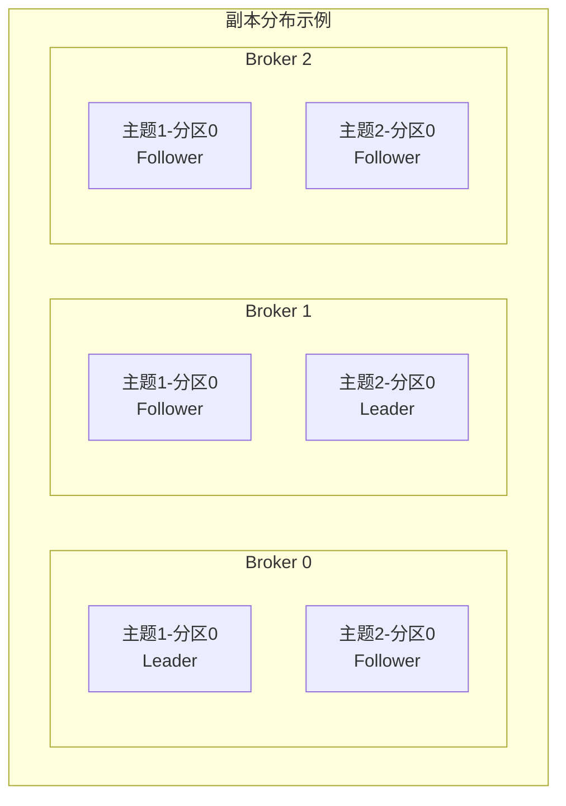
```mermaid
graph TB
    subgraph "副本分布示例"
        subgraph "Broker 0"
            P1L[主题1-分区0<br/>Leader]
            P2F[主题2-分区0<br/>Follower]
        end
        subgraph "Broker 1"
            P1F1[主题1-分区0<br/>Follower]
            P2L[主题2-分区0<br/>Leader]
        end
        subgraph "Broker 2"
            P1F2[主题1-分区0<br/>Follower]
            P2F2[主题2-分区0<br/>Follower]
        end
    end
```

##### 5.1.2 基于领导者的副本机制

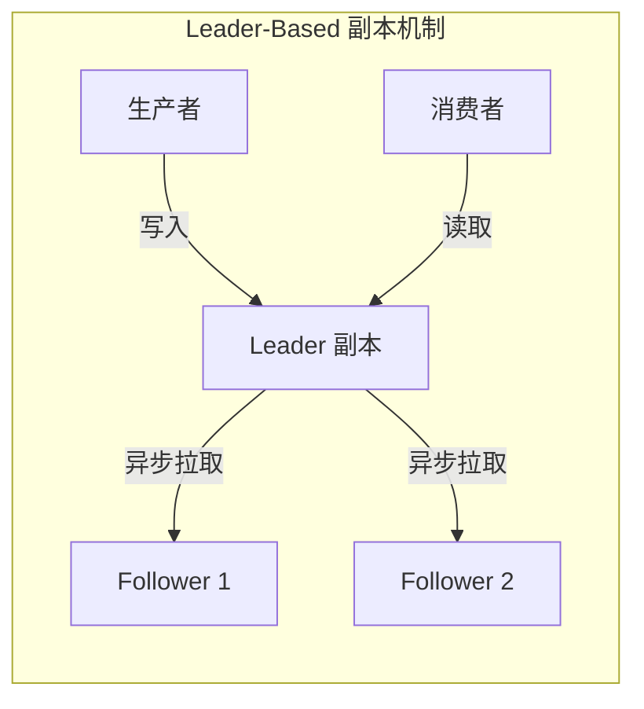
```mermaid
graph LR
    subgraph "Leader-Based 副本机制"
        Producer[生产者] -->|写入| Leader[Leader 副本]
        Consumer[消费者] -->|读取| Leader
        Leader -->|异步拉取| F1[Follower 1]
        Leader -->|异步拉取| F2[Follower 2]
    end
```

| 副本类型 | 职责 | 特点 |
|:---|:---|:---|
| **Leader 副本** | 处理所有读写请求 | 唯一对外提供服务的副本 |
| **Follower 副本** | 异步拉取 Leader 数据 | 不响应客户端请求 |

**追随者副本不提供服务的好处：**

| 好处 | 说明 |
|:---|:---|
| **Read-your-writes** | 写入后立即可读，不会因副本同步延迟看不到 |
| **单调读一致性** | 消息不会一会儿存在一会儿不存在 |

##### 5.1.3 ISR（In-Sync Replicas）机制

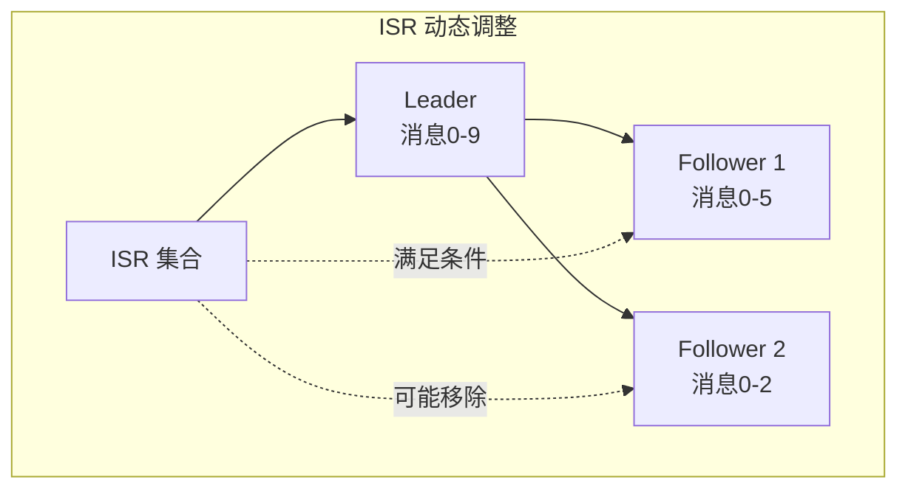
```mermaid
graph TB
    subgraph "ISR 动态调整"
        L[Leader<br/>消息0-9] --> F1[Follower 1<br/>消息0-5]
        L --> F2[Follower 2<br/>消息0-2]
        
        ISR[ISR 集合] --> L
        ISR -.->|满足条件| F1
        ISR -.->|可能移除| F2
    end
```

> **💡 判断标准**：Follower 副本落后 Leader 的时间是否超过 `replica.lag.time.max.ms`（默认 10 秒），而非消息数量差异。

| ISR 特性 | 说明 |
|:---|:---|
| **Leader 天然在 ISR 中** | ISR 必然包含 Leader |
| **动态调整** | 追上进度可重新加入 |
| **落后太多被移除** | 超过配置时间被"踢出" |

##### 5.1.4 Unclean 领导者选举

| 参数 | 说明 |
|:---|:---|
| `unclean.leader.election.enable` | 是否允许非 ISR 副本成为 Leader |

| 选择 | 优势 | 劣势 |
|:---|:---|:---|
| **开启** | 高可用性 | 可能数据丢失 |
| **禁用** | 数据一致性 | 可能服务不可用 |

> **🔴 建议**：不要开启 Unclean 领导者选举，数据一致性比高可用性更重要。

#### ⚠️ 关键点

| 要点 | 说明 |
|:---|:---|
| **副本层级** | 分区级别定义，非主题级别 |
| **读写分离** | 不存在！所有请求都由 Leader 处理 |
| **ISR 判断** | 基于时间而非消息数量 |
| **副本选举** | 优先从 ISR 中选择新 Leader |

---

### 5.2 请求处理机制

#### 📌 背景

Kafka 客户端和 Broker 之间通过"请求/响应"方式交互。截至 Kafka 2.3 版本，共定义了 45 种请求格式，如 PRODUCE、FETCH、METADATA 等。所有请求通过 TCP Socket 进行通讯。

#### 📐 原理

##### 5.2.1 常见处理方案的问题

| 方案 | 优点 | 缺点 |
|:---|:---|:---|
| **顺序处理** | 实现简单 | 吞吐量极差 |
| **每请求一线程** | 完全异步 | 线程开销大，可能压垮服务 |

##### 5.2.2 Kafka 的 Reactor 模式

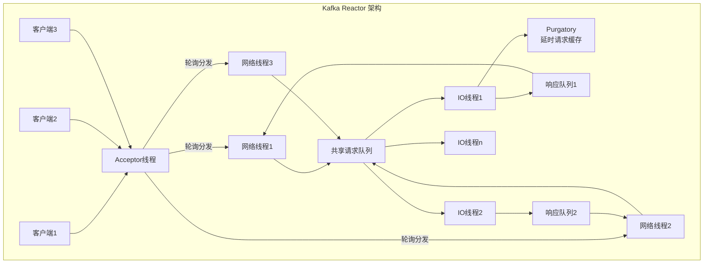
```mermaid
graph TB
    subgraph "Kafka Reactor 架构"
        C1[客户端1] --> A[Acceptor线程]
        C2[客户端2] --> A
        C3[客户端3] --> A
        
        A -->|轮询分发| N1[网络线程1]
        A -->|轮询分发| N2[网络线程2]
        A -->|轮询分发| N3[网络线程3]
        
        N1 --> RQ[共享请求队列]
        N2 --> RQ
        N3 --> RQ
        
        RQ --> IO1[IO线程1]
        RQ --> IO2[IO线程2]
        RQ --> IOn[IO线程n]
        
        IO1 --> P[Purgatory<br/>延时请求缓存]
        
        IO1 --> RSQ1[响应队列1]
        IO2 --> RSQ2[响应队列2]
        
        RSQ1 --> N1
        RSQ2 --> N2
    end
```

##### 5.2.3 核心组件

| 组件 | 配置参数 | 默认值 | 职责 |
|:---|:---|:---|:---|
| **Acceptor** | - | 1个 | 请求分发 |
| **网络线程池** | `num.network.threads` | 3 | 接收请求，返回响应 |
| **IO线程池** | `num.io.threads` | 8 | 执行实际请求逻辑 |
| **Purgatory** | - | - | 缓存延时请求（如 acks=all） |

**请求队列 vs 响应队列：**

| 队列类型 | 属性 | 原因 |
|:---|:---|:---|
| **请求队列** | 所有网络线程共享 | Acceptor 统一分发 |
| **响应队列** | 每个网络线程专属 | 网络线程自己发送响应 |

##### 5.2.4 数据类请求与控制类请求分离

自 **Kafka 2.3** 版本起，实现了两类请求分离：

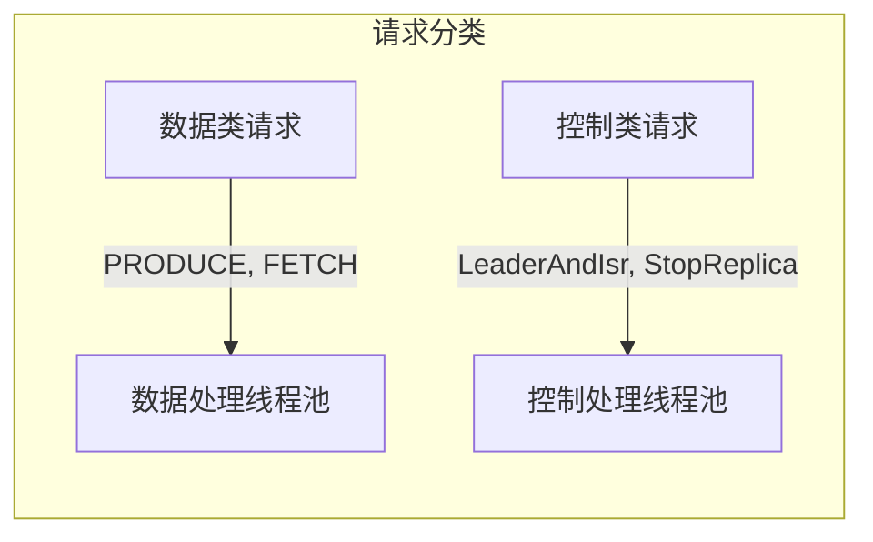
```mermaid
graph LR
    subgraph "请求分类"
        D[数据类请求] -->|PRODUCE, FETCH| DP[数据处理线程池]
        C[控制类请求] -->|LeaderAndIsr, StopReplica| CP[控制处理线程池]
    end
```

| 请求类型 | 示例 | 特点 |
|:---|:---|:---|
| **数据类** | PRODUCE, FETCH | 操作消息数据 |
| **控制类** | LeaderAndIsr, StopReplica | 执行 Kafka 内部动作 |

> **💡 分离原因**：控制类请求可以直接令数据类请求失效，需要更高优先级处理。

#### ⚠️ 关键点

| 要点 | 说明 |
|:---|:---|
| **Reactor 模式** | Acceptor + 网络线程池 + IO 线程池 |
| **调优参数** | `num.network.threads` 和 `num.io.threads` |
| **Purgatory** | 处理延时请求（如 acks=all） |
| **请求分离** | 2.3 版本后支持数据/控制请求分开处理 |

---

### 5.3 消费者组重平衡全流程

#### 📌 背景

重平衡（Rebalance）让组内所有消费者实例就消费哪些分区达成一致，需要 Coordinator 组件的帮助。重平衡通知机制通过**心跳线程**完成，当心跳响应中包含 `REBALANCE_IN_PROGRESS` 标志时，消费者就知道重平衡开始了。

#### 📐 原理

##### 5.3.1 消费者组状态机

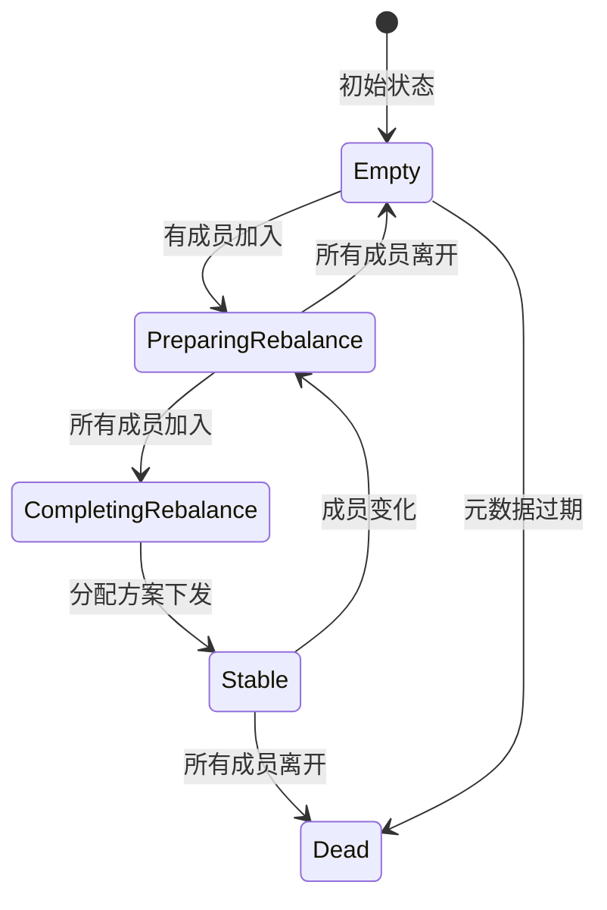
```mermaid
stateDiagram-v2
    [*] --> Empty: 初始状态
    Empty --> PreparingRebalance: 有成员加入
    PreparingRebalance --> CompletingRebalance: 所有成员加入
    CompletingRebalance --> Stable: 分配方案下发
    Stable --> PreparingRebalance: 成员变化
    Stable --> Dead: 所有成员离开
    Empty --> Dead: 元数据过期
    PreparingRebalance --> Empty: 所有成员离开
```

| 状态 | 含义 |
|:---|:---|
| **Empty** | 组内无成员，但可能有位移数据 |
| **Dead** | 组内无成员，元数据已删除 |
| **PreparingRebalance** | 准备重平衡，等待成员加入 |
| **CompletingRebalance** | 等待 Leader 消费者分配方案 |
| **Stable** | 正常消费状态 |

> **⚠️ 注意**：只有 Empty 状态的组才会删除过期位移。如果消费者组停止超过 7 天，位移数据可能被删除。

##### 5.3.2 消费者端重平衡流程

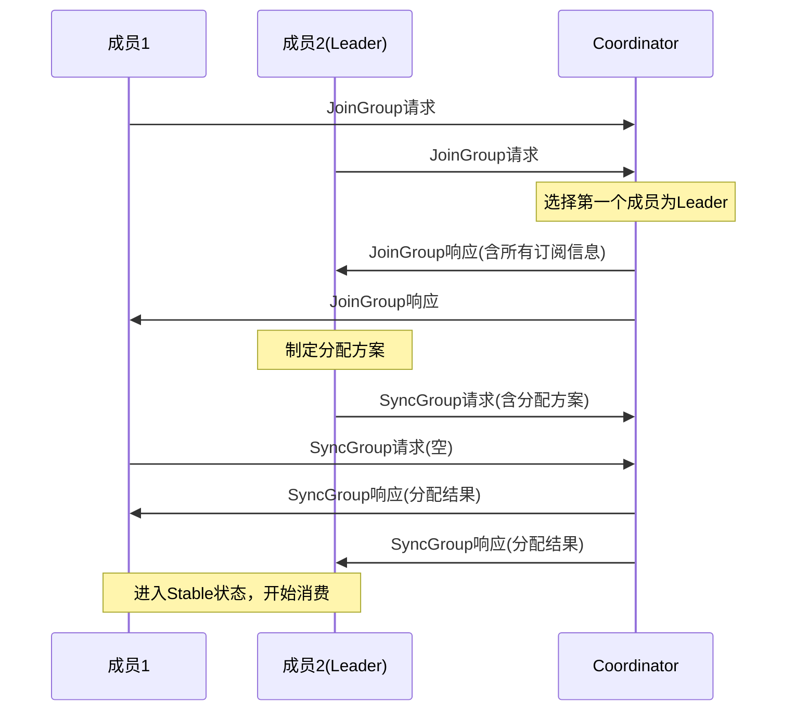
```mermaid
sequenceDiagram
    participant M1 as 成员1
    participant M2 as 成员2(Leader)
    participant CO as Coordinator
    
    M1->>CO: JoinGroup请求
    M2->>CO: JoinGroup请求
    Note over CO: 选择第一个成员为Leader
    CO->>M2: JoinGroup响应(含所有订阅信息)
    CO->>M1: JoinGroup响应
    
    Note over M2: 制定分配方案
    M2->>CO: SyncGroup请求(含分配方案)
    M1->>CO: SyncGroup请求(空)
    
    CO->>M1: SyncGroup响应(分配结果)
    CO->>M2: SyncGroup响应(分配结果)
    
    Note over M1,M2: 进入Stable状态，开始消费
```

**两个关键请求：**

| 请求 | 发送者 | 作用 |
|:---|:---|:---|
| **JoinGroup** | 所有成员 | 上报订阅信息，选举 Leader |
| **SyncGroup** | 所有成员（Leader 含方案） | 下发分配方案 |

##### 5.3.3 Broker 端重平衡场景

**场景一：新成员入组**

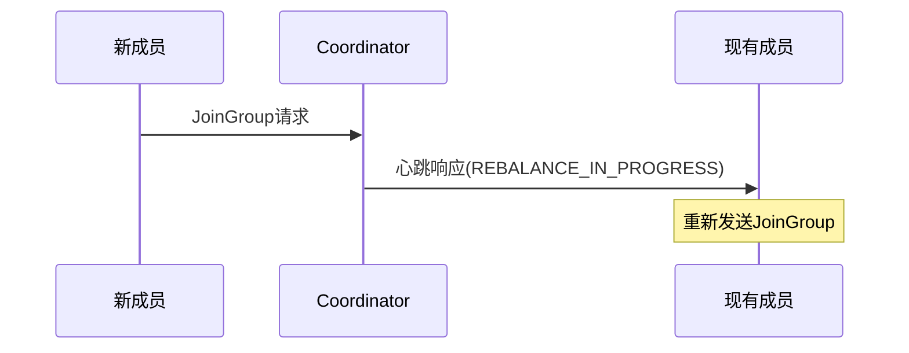
```mermaid
sequenceDiagram
    participant NEW as 新成员
    participant CO as Coordinator
    participant OLD as 现有成员
    
    NEW->>CO: JoinGroup请求
    CO->>OLD: 心跳响应(REBALANCE_IN_PROGRESS)
    Note over OLD: 重新发送JoinGroup
```

**场景二：主动离组**

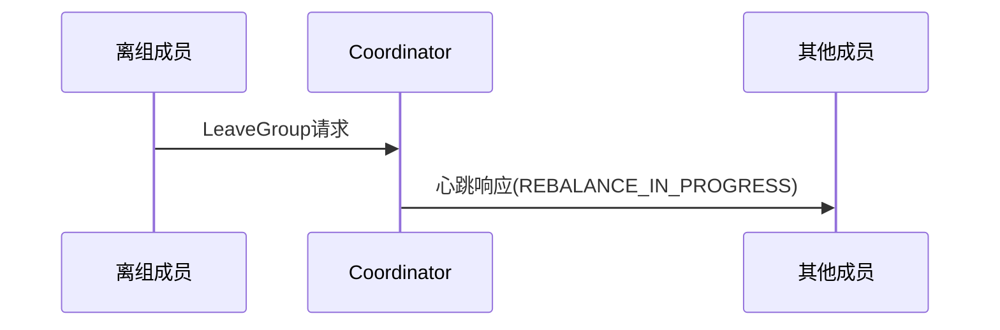
```mermaid
sequenceDiagram
    participant M as 离组成员
    participant CO as Coordinator
    participant OTHER as 其他成员
    
    M->>CO: LeaveGroup请求
    CO->>OTHER: 心跳响应(REBALANCE_IN_PROGRESS)
```

**场景三：崩溃离组**

| 与主动离组的区别 | 说明 |
|:---|:---|
| **感知延迟** | 需等待 `session.timeout.ms` 才能感知 |
| **被动检测** | 无 LeaveGroup 请求 |

**场景四：重平衡时的位移提交**

在重平衡开启前，协调者会给成员一段缓冲时间，要求快速上报位移信息。

#### ⚠️ 关键点

| 要点 | 说明 |
|:---|:---|
| **通知机制** | 通过心跳响应传递 REBALANCE_IN_PROGRESS |
| **Leader 消费者** | 第一个发送 JoinGroup 的成员，负责制定分配方案 |
| **状态机** | 5 种状态，Empty 状态会删除过期位移 |
| **崩溃检测** | 依赖 session.timeout.ms 参数 |

---

### 5.4 Kafka 控制器

#### 📌 背景

控制器（Controller）是 Kafka 的核心组件，在 ZooKeeper 的帮助下管理和协调整个集群。集群中任意 Broker 都能充当控制器，但同时只能有一个。可以通过 `activeController` JMX 指标监控控制器存活状态。

#### 📐 原理

##### 5.4.1 ZooKeeper 基础

```mermaid
graph TB
    subgraph "Kafka 在 ZooKeeper 中的 znode"
        ROOT[/] --> BROKERS[/brokers]
        ROOT --> CONTROLLER[/controller]
        ROOT --> CONFIG[/config]
        ROOT --> ADMIN[/admin]
        
        BROKERS --> IDS[/brokers/ids]
        BROKERS --> TOPICS[/brokers/topics]
        
        IDS --> B0[/brokers/ids/0<br/>临时节点]
        IDS --> B1[/brokers/ids/1<br/>临时节点]
    end
```

| ZooKeeper 特性 | 在 Kafka 中的应用 |
|:---|:---|
| **持久性 znode** | 保存元数据配置 |
| **临时 znode** | Broker 存活检测 |
| **Watch 机制** | 感知节点变更，触发相应操作 |

##### 5.4.2 控制器选举

```
选举规则：第一个成功创建 /controller 节点的 Broker 成为控制器
```

##### 5.4.3 控制器的五大职责

| 职责 | 说明 |
|:---|:---|
| **主题管理** | 创建、删除、增加分区 |
| **分区重分配** | kafka-reassign-partitions 脚本 |
| **Preferred Leader 选举** | 避免 Broker 负载不均 |
| **集群成员管理** | 自动检测 Broker 上下线 |
| **数据服务** | 向其他 Broker 提供元数据 |

##### 5.4.4 控制器保存的数据

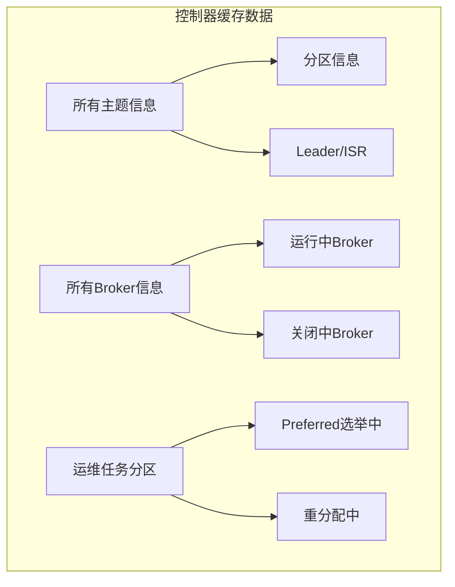
```mermaid
graph TB
    subgraph "控制器缓存数据"
        A[所有主题信息] --> A1[分区信息]
        A --> A2[Leader/ISR]
        
        B[所有Broker信息] --> B1[运行中Broker]
        B --> B2[关闭中Broker]
        
        C[运维任务分区] --> C1[Preferred选举中]
        C --> C2[重分配中]
    end
```

##### 5.4.5 控制器故障转移

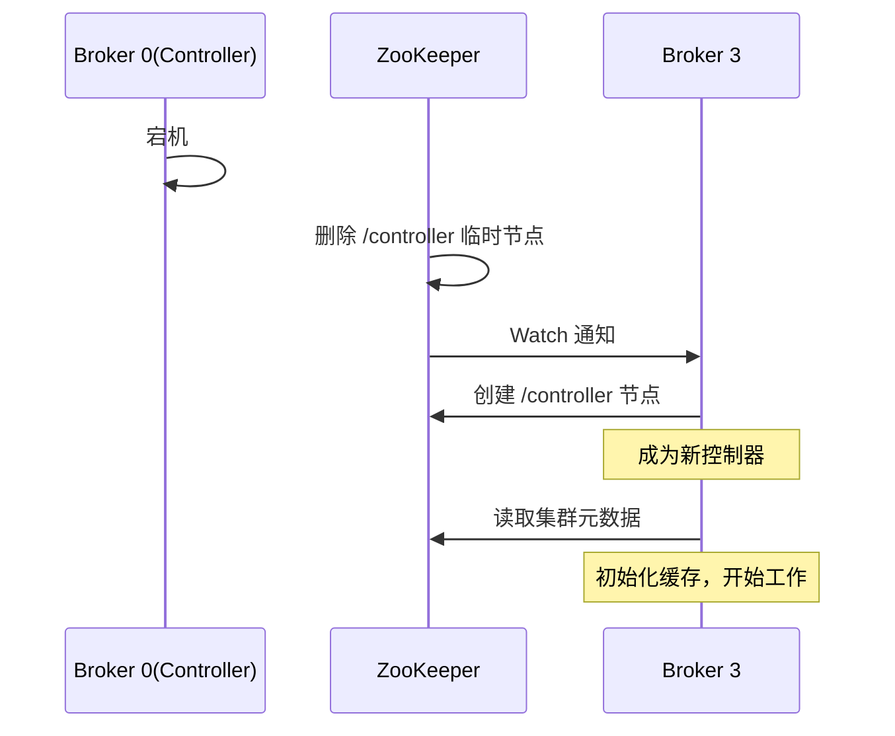
```mermaid
sequenceDiagram
    participant B0 as Broker 0(Controller)
    participant ZK as ZooKeeper
    participant B3 as Broker 3
    
    B0->>B0: 宕机
    ZK->>ZK: 删除 /controller 临时节点
    ZK->>B3: Watch 通知
    B3->>ZK: 创建 /controller 节点
    Note over B3: 成为新控制器
    B3->>ZK: 读取集群元数据
    Note over B3: 初始化缓存，开始工作
```

##### 5.4.6 控制器内部设计演进

| 版本 | 设计 | 问题/改进 |
|:---|:---|:---|
| **0.11 之前** | 多线程 + 共享数据 | 需要重量级锁，Bug 多 |
| **0.11 之后** | 单线程 + 事件队列 | 无需线程同步，Bug 减少 |
| **改进** | 异步操作 ZooKeeper | 写入性能提升 10 倍 |

#### 🔧 实现

**快速恢复控制器的方法：**

```bash
# 手动删除 /controller 节点触发重选举
rmr /controller
```

> **💡 好处**：避免重启 Broker 导致的消息处理中断。

#### ⚠️ 关键点

| 要点 | 说明 |
|:---|:---|
| **单一控制器** | 同一时刻只有一个控制器 |
| **ZooKeeper 依赖** | 使用 Watch 机制和临时节点 |
| **故障转移** | 自动完成，无需人工干预 |
| **单线程设计** | 0.11 后改为单线程+事件队列 |

---

### 5.5 高水位与 Leader Epoch

#### 📌 背景

高水位（High Watermark, HW）是 Kafka 中非常重要的概念，与流式处理中的水位概念不同，Kafka 的高水位是用**消息位移**表征的。0.11 版本引入了 Leader Epoch 机制，用于弥补高水位机制的缺陷。

#### 📐 原理

##### 5.5.1 高水位的作用

| 作用 | 说明 |
|:---|:---|
| **定义消息可见性** | 高水位以下的消息可被消费 |
| **帮助副本同步** | 确定副本同步进度 |

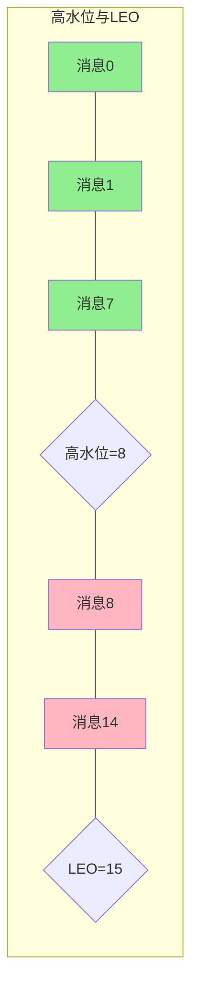
```mermaid
graph LR
    subgraph "高水位与LEO"
        M0[消息0] --- M1[消息1] --- M7[消息7]
        M7 --- HW{高水位=8}
        HW --- M8[消息8] --- M14[消息14]
        M14 --- LEO{LEO=15}
    end
    
    style M0 fill:#90EE90
    style M1 fill:#90EE90
    style M7 fill:#90EE90
    style M8 fill:#FFB6C1
    style M14 fill:#FFB6C1
```

| 概念 | 说明 |
|:---|:---|
| **已提交消息** | 位移 < 高水位，可被消费者消费 |
| **未提交消息** | 位移 ≥ 高水位，不可被消费 |
| **LEO** | Log End Offset，下一条写入消息的位移 |

> **⚠️ 注意**：高水位上的消息（位移=HW）也是未提交消息，不能被消费。

##### 5.5.2 高水位更新机制

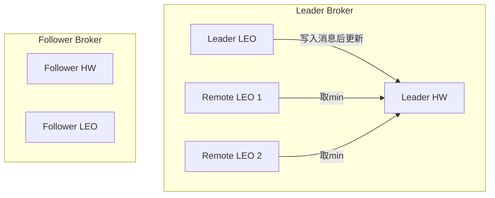
```mermaid
graph TB
    subgraph "Leader Broker"
        L_HW[Leader HW]
        L_LEO[Leader LEO]
        R_LEO1[Remote LEO 1]
        R_LEO2[Remote LEO 2]
    end
    
    subgraph "Follower Broker"
        F_HW[Follower HW]
        F_LEO[Follower LEO]
    end
    
    L_LEO -->|写入消息后更新| L_HW
    R_LEO1 -->|取min| L_HW
    R_LEO2 -->|取min| L_HW
```

**Leader 副本更新规则：**

| 事件 | LEO 更新 | HW 更新 |
|:---|:---|:---|
| 收到生产请求 | 写入后更新 | max(currentHW, min(所有远程LEO)) |
| 收到 Follower 拉取请求 | - | 同上 |

**Follower 副本更新规则：**

| 事件 | LEO 更新 | HW 更新 |
|:---|:---|:---|
| 拉取到消息 | 写入后更新 | min(Leader HW, 本地 LEO) |

##### 5.5.3 副本同步过程

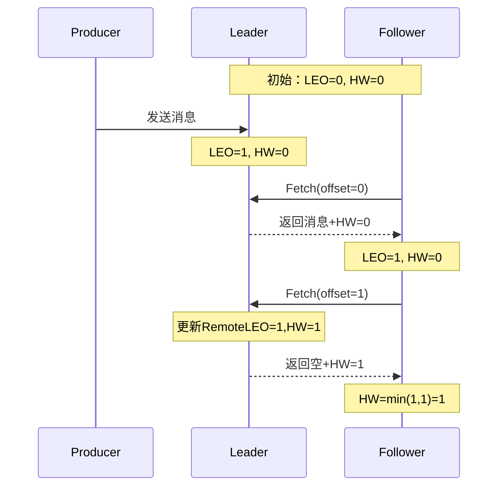
```mermaid
sequenceDiagram
    participant P as Producer
    participant L as Leader
    participant F as Follower
    
    Note over L,F: 初始：LEO=0, HW=0
    P->>L: 发送消息
    Note over L: LEO=1, HW=0
    
    F->>L: Fetch(offset=0)
    L-->>F: 返回消息+HW=0
    Note over F: LEO=1, HW=0
    
    F->>L: Fetch(offset=1)
    Note over L: 更新RemoteLEO=1,HW=1
    L-->>F: 返回空+HW=1
    Note over F: HW=min(1,1)=1
```

> **⚠️ 问题**：Follower 高水位更新需要额外一轮拉取请求，存在时间错配。

##### 5.5.4 Leader Epoch 机制

**问题场景：高水位更新延迟导致数据丢失**

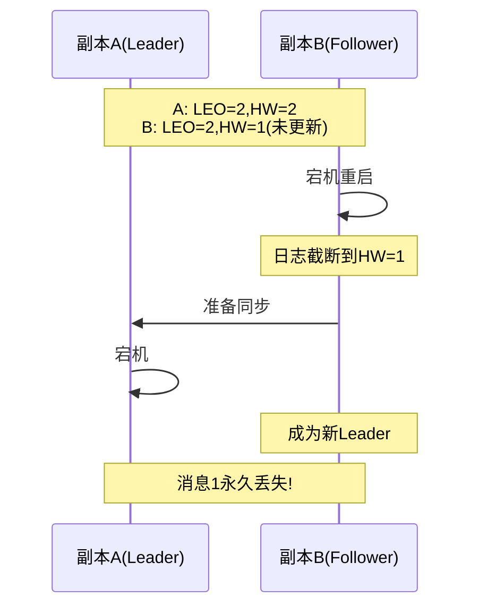
```mermaid
sequenceDiagram
    participant A as 副本A(Leader)
    participant B as 副本B(Follower)
    
    Note over A,B: A: LEO=2,HW=2<br/>B: LEO=2,HW=1(未更新)
    B->>B: 宕机重启
    Note over B: 日志截断到HW=1
    B->>A: 准备同步
    A->>A: 宕机
    Note over B: 成为新Leader
    Note over A,B: 消息1永久丢失!
```

**Leader Epoch 解决方案：**

| 组成部分 | 说明 |
|:---|:---|
| **Epoch** | 单调增加的版本号，Leader 变更时递增 |
| **起始位移** | 该 Epoch 首条消息的位移 |

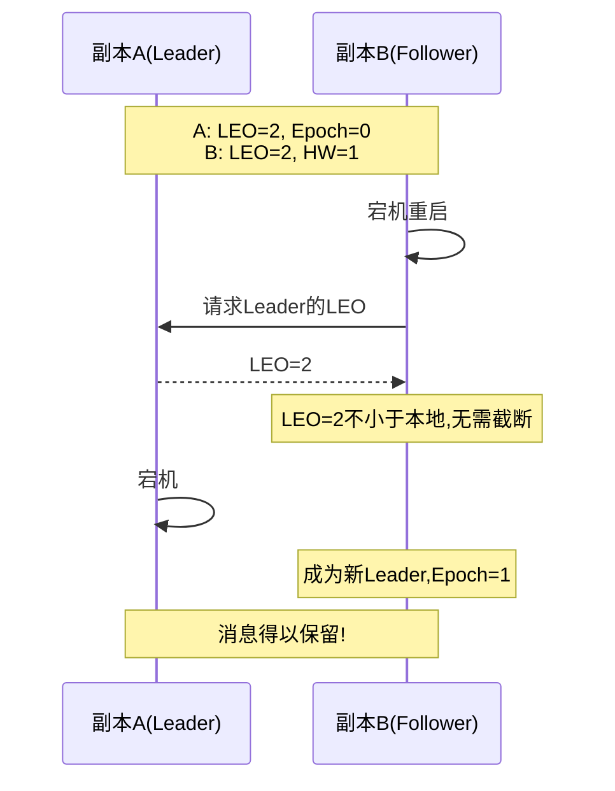
```mermaid
sequenceDiagram
    participant A as 副本A(Leader)
    participant B as 副本B(Follower)
    
    Note over A,B: A: LEO=2, Epoch=0<br/>B: LEO=2, HW=1
    B->>B: 宕机重启
    B->>A: 请求Leader的LEO
    A-->>B: LEO=2
    Note over B: LEO=2不小于本地,无需截断
    A->>A: 宕机
    Note over B: 成为新Leader,Epoch=1
    Note over A,B: 消息得以保留!
```

**Leader Epoch 工作原理：**

1. Broker 内存中缓存 Leader Epoch 数据
2. 定期持久化到 checkpoint 文件
3. 副本重启后，向 Leader 请求 LEO 值
4. 根据 Epoch 条目判断是否需要日志截断

#### ⚠️ 关键点

| 要点 | 说明 |
|:---|:---|
| **高水位定义** | 用消息位移表征，非时间戳 |
| **消息可见性** | 只有 < 高水位的消息可被消费 |
| **更新延迟** | Follower HW 更新滞后于 Leader |
| **Leader Epoch** | 0.11 版本引入，解决数据丢失问题 |
| **关键参数** | `min.insync.replicas` 影响数据安全 |

---

### 📝 第五章小结

本章深入剖析了 Kafka 的核心内部机制：

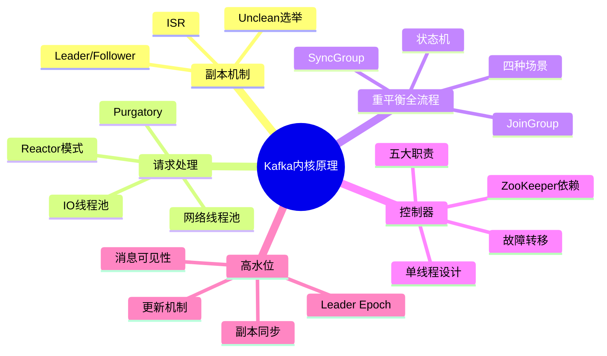
```mermaid
mindmap
  root((Kafka内核原理))
    副本机制
      Leader/Follower
      ISR
      Unclean选举
    请求处理
      Reactor模式
      网络线程池
      IO线程池
      Purgatory
    重平衡全流程
      状态机
      JoinGroup
      SyncGroup
      四种场景
    控制器
      ZooKeeper依赖
      五大职责
      故障转移
      单线程设计
    高水位
      消息可见性
      副本同步
      更新机制
      Leader Epoch
```

**核心收获：**

1. **副本机制**：Leader 处理所有请求，Follower 只做同步，ISR 基于时间判断
2. **请求处理**：Reactor 模式，Acceptor + 网络线程池 + IO 线程池
3. **重平衡流程**：JoinGroup 选 Leader，SyncGroup 下发方案，5 种状态流转
4. **控制器**：单一控制器，依赖 ZooKeeper，0.11 后改为单线程+事件队列
5. **高水位**：定义消息可见性，Leader Epoch 解决更新延迟导致的数据丢失

---

> 📖 **下一章预告**：第七章将介绍 Kafka 运维管理（下），包括安全认证、跨集群备份、监控调优等核心知识。

---

## 第六章 Kafka 运维管理（上）
### 6.1 主题管理


本章介绍 Kafka 日常运维管理的核心知识，包括主题管理、动态配置、消费者位移重设、常见工具脚本以及 KafkaAdminClient 的使用。

---


#### 📌 背景

主题管理是 Kafka 运维中最常见的操作，包括主题的增删改查。从 **Kafka 2.2 版本**开始，社区推荐使用 `--bootstrap-server` 参数替代 `--zookeeper` 参数，以遵循安全体系和统一连接方式。

#### 📐 原理

##### 6.1.1 --bootstrap-server vs --zookeeper

| 参数 | 推荐度 | 特点 |
|:---|:---|:---|
| `--bootstrap-server` | ✅ 推荐 | 遵循安全认证、统一连接方式 |
| `--zookeeper` | ❌ 已过期 | 绕过安全体系、需额外维护 |

**使用 --bootstrap-server 的优势：**

1. 不会绕过 Kafka 安全设置，权限检查有效
2. 统一连接方式，无需同时维护 ZooKeeper 连接信息
3. 社区标准做法，未来会逐步移除 --zookeeper 支持

#### 🔧 实现

##### 6.1.2 主题 CRUD 操作

**创建主题：**

```bash
bin/kafka-topics.sh --bootstrap-server broker_host:port \
    --create --topic my_topic \
    --partitions 3 --replication-factor 2
```

**查询主题：**

```bash
# 列出所有主题
bin/kafka-topics.sh --bootstrap-server broker_host:port --list

# 查看单个主题详情
bin/kafka-topics.sh --bootstrap-server broker_host:port \
    --describe --topic <topic_name>
```

**修改主题：**

| 修改类型 | 命令/方法 |
|:---|:---|
| **增加分区** | `--alter --partitions <新分区数>` |
| **修改参数** | 使用 `kafka-configs.sh` |
| **变更副本数** | 使用 `kafka-reassign-partitions.sh` |
| **限速** | 设置 Broker 端限速参数 |
| **分区迁移** | 使用 `kafka-reassign-partitions.sh` |

**删除主题：**

```bash
bin/kafka-topics.sh --bootstrap-server broker_host:port \
    --delete --topic <topic_name>
```

> **⚠️ 注意**：删除操作是异步的，主题会被标记为"已删除"，后台执行实际删除。

##### 6.1.3 内部主题管理

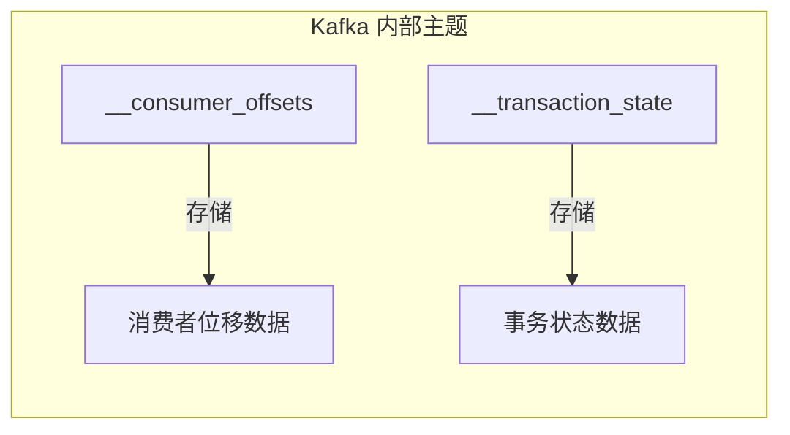
```mermaid
graph LR
    subgraph "Kafka 内部主题"
        CO[__consumer_offsets] -->|存储| OFFSET[消费者位移数据]
        TS[__transaction_state] -->|存储| TX[事务状态数据]
    end
```

| 主题 | 默认分区数 | 作用 |
|:---|:---|:---|
| `__consumer_offsets` | 50 | 保存消费者组位移 |
| `__transaction_state` | 50 | 保存事务状态 |

**查看 __consumer_offsets 内容：**

```bash
# 查看位移提交数据
bin/kafka-console-consumer.sh --bootstrap-server kafka_host:port \
    --topic __consumer_offsets \
    --formatter "kafka.coordinator.group.GroupMetadataManager\$OffsetsMessageFormatter" \
    --from-beginning

# 查看消费者组状态
bin/kafka-console-consumer.sh --bootstrap-server kafka_host:port \
    --topic __consumer_offsets \
    --formatter "kafka.coordinator.group.GroupMetadataManager\$GroupMetadataMessageFormatter" \
    --from-beginning
```

##### 6.1.4 常见错误处理

**错误1：主题删除失败**

| 原因 | 解决方法 |
|:---|:---|
| 副本所在 Broker 宕机 | 重启对应 Broker |
| 分区正在迁移 | 等待迁移完成或手动处理 |

**手动删除步骤：**

1. 删除 ZooKeeper 节点 `/admin/delete_topics/<topic_name>`
2. 删除磁盘上的分区目录
3. （可选）执行 `rmr /controller` 触发 Controller 重选举

**错误2：__consumer_offsets 占用过多磁盘**

使用 `jstack` 查看 `kafka-log-cleaner-thread` 线程状态，若线程挂掉则重启 Broker。

#### ⚠️ 关键点

| 要点 | 说明 |
|:---|:---|
| **使用 --bootstrap-server** | 2.2 版本后的推荐做法 |
| **删除是异步的** | 需要等待后台完成 |
| **分区只能增不能减** | 设计限制 |
| **内部主题不要手动创建** | 让 Kafka 自动管理 |

---

### 6.2 动态配置

#### 📌 背景

传统方式修改 Broker 参数需要编辑 `server.properties` 并重启，这在生产环境中非常不便。**Kafka 1.1.0** 版本引入了动态 Broker 参数（Dynamic Broker Configs），无需重启即可生效。

#### 📐 原理

##### 6.2.1 参数类型

| Dynamic Update Mode | 含义 | 生效范围 |
|:---|:---|:---|
| **read-only** | 只读，需重启生效 | - |
| **per-broker** | 动态参数，单个 Broker 生效 | 指定 Broker |
| **cluster-wide** | 动态参数，集群范围生效 | 所有 Broker |

##### 6.2.2 参数优先级

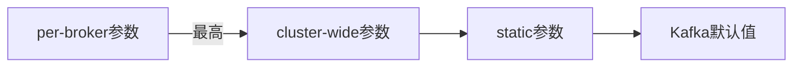
```mermaid
graph LR
    A[per-broker参数] -->|最高| B[cluster-wide参数]
    B --> C[static参数]
    C --> D[Kafka默认值]
```

**优先级**：per-broker > cluster-wide > static > 默认值

##### 6.2.3 ZooKeeper 存储结构

```mermaid
graph TB
    subgraph "Kafka 动态配置 znode"
        CONFIG[/config] --> BROKERS[/config/brokers]
        CONFIG --> TOPICS[/config/topics]
        CONFIG --> USERS[/config/users]
        CONFIG --> CLIENTS[/config/clients]
        
        BROKERS --> DEFAULT["\<default>  cluster-wide参数"]
        BROKERS --> B0[0  Broker 0 per-broker参数]
        BROKERS --> B1[1  Broker 1 per-broker参数]
    end
```

#### 🔧 实现

##### 6.2.4 配置操作命令

**设置 cluster-wide 参数：**

```bash
bin/kafka-configs.sh --bootstrap-server kafka-host:port \
    --entity-type brokers --entity-default \
    --alter --add-config unclean.leader.election.enable=true
```

**设置 per-broker 参数：**

```bash
bin/kafka-configs.sh --bootstrap-server kafka-host:port \
    --entity-type brokers --entity-name 1 \
    --alter --add-config unclean.leader.election.enable=false
```

**查看配置：**

```bash
# 查看 cluster-wide 配置
bin/kafka-configs.sh --bootstrap-server kafka-host:port \
    --entity-type brokers --entity-default --describe

# 查看指定 Broker 配置
bin/kafka-configs.sh --bootstrap-server kafka-host:port \
    --entity-type brokers --entity-name 1 --describe
```

**删除配置：**

```bash
# 删除 cluster-wide 配置
bin/kafka-configs.sh --bootstrap-server kafka-host:port \
    --entity-type brokers --entity-default \
    --alter --delete-config unclean.leader.election.enable

# 删除 per-broker 配置
bin/kafka-configs.sh --bootstrap-server kafka-host:port \
    --entity-type brokers --entity-name 1 \
    --alter --delete-config unclean.leader.election.enable
```

##### 6.2.5 常用动态参数

| 参数 | 作用 | 使用场景 |
|:---|:---|:---|
| `log.retention.ms` | 日志留存时间 | 动态调整消息保留时长 |
| `num.io.threads` | IO 线程数 | 应对突发流量 |
| `num.network.threads` | 网络线程数 | 应对突发流量 |
| `num.replica.fetchers` | 副本拉取线程数 | 解决 Follower 拉取慢 |
| SSL 相关参数 | SSL 证书配置 | 动态更新证书 |

#### ⚠️ 关键点

| 要点 | 说明 |
|:---|:---|
| **版本要求** | Kafka 1.1.0+ |
| **存储位置** | ZooKeeper 持久化节点 |
| **无需重启** | 修改后立即生效 |
| **自动扩缩容** | 可封装为定时任务 |

---

### 6.3 消费者位移重设

#### 📌 背景

Kafka 基于日志结构，消费者读取消息是只读操作，不会删除数据。由于位移由消费者控制，可以轻松实现**消息重演**（replayable），这是 Kafka 与传统消息中间件的重要区别。

#### 📐 原理

##### 6.3.1 重设位移的两个维度

```mermaid
graph TB
    subgraph "位移重设维度"
        A[位移维度] --> A1[直接指定位移值]
        B[时间维度] --> B1[指定时间点]
        B --> B2[指定时间间隔]
    end
```

##### 6.3.2 七种重设策略

| 策略 | 维度 | 说明 |
|:---|:---|:---|
| **Earliest** | 位移 | 调整到最早位移（不一定是0） |
| **Latest** | 位移 | 调整到最新末端位移 |
| **Current** | 位移 | 调整到当前已提交位移 |
| **Specified-Offset** | 位移 | 调整到指定位移值 |
| **Shift-By-N** | 位移 | 相对当前位移跳过 N 条（可正可负） |
| **DateTime** | 时间 | 调整到指定时间之后的最早位移 |
| **Duration** | 时间 | 调整到指定时间间隔之前的位移 |

#### 🔧 实现

##### 6.3.3 API 方式

**核心方法：**

```java
void seek(TopicPartition partition, long offset);
void seekToBeginning(Collection<TopicPartition> partitions);
void seekToEnd(Collection<TopicPartition> partitions);
```

**Earliest 策略示例：**

```java
Properties props = new Properties();
props.put(ConsumerConfig.ENABLE_AUTO_COMMIT_CONFIG, false);
props.put(ConsumerConfig.GROUP_ID_CONFIG, groupID);
// ... 其他配置

try (KafkaConsumer<String, String> consumer = new KafkaConsumer<>(props)) {
    consumer.subscribe(Collections.singleton(topic));
    consumer.poll(0);  // 必须调用 poll(long)
    consumer.seekToBeginning(
        consumer.partitionsFor(topic).stream()
            .map(info -> new TopicPartition(topic, info.partition()))
            .collect(Collectors.toList())
    );
}
```

**DateTime 策略示例：**

```java
long ts = LocalDateTime.of(2019, 6, 20, 20, 0)
    .toInstant(ZoneOffset.ofHours(8)).toEpochMilli();
    
Map<TopicPartition, Long> timeToSearch = consumer.partitionsFor(topic)
    .stream()
    .map(info -> new TopicPartition(topic, info.partition()))
    .collect(Collectors.toMap(Function.identity(), tp -> ts));

for (Map.Entry<TopicPartition, OffsetAndTimestamp> entry : 
        consumer.offsetsForTimes(timeToSearch).entrySet()) {
    consumer.seek(entry.getKey(), entry.getValue().offset());
}
```

##### 6.3.4 命令行方式

> **版本要求**：Kafka 0.11+

| 策略 | 参数 | 命令示例 |
|:---|:---|:---|
| Earliest | `--to-earliest` | `--reset-offsets --all-topics --to-earliest --execute` |
| Latest | `--to-latest` | `--reset-offsets --all-topics --to-latest --execute` |
| Current | `--to-current` | `--reset-offsets --all-topics --to-current --execute` |
| Specified-Offset | `--to-offset <N>` | `--reset-offsets --to-offset 1000 --execute` |
| Shift-By-N | `--shift-by <N>` | `--reset-offsets --shift-by -100 --execute` |
| DateTime | `--to-datetime` | `--to-datetime 2019-06-20T20:00:00.000 --execute` |
| Duration | `--by-duration` | `--by-duration PT0H30M0S --execute` |

**完整命令示例：**

```bash
# 重设到最早位移
bin/kafka-consumer-groups.sh --bootstrap-server kafka-host:port \
    --group test-group --reset-offsets --all-topics --to-earliest --execute

# 重设到30分钟前
bin/kafka-consumer-groups.sh --bootstrap-server kafka-host:port \
    --group test-group --reset-offsets --by-duration PT0H30M0S --execute
```

#### ⚠️ 关键点

| 要点 | 说明 |
|:---|:---|
| **消息重演能力** | Kafka 与传统 MQ 的重要区别 |
| **推荐命令行方式** | 比写代码更简单 |
| **版本要求** | 命令行方式需 0.11+ |
| **禁用自动提交** | API 方式必须设置 |

---

### 6.4 常见工具脚本

#### 📌 背景

Kafka 2.2 版本提供了约 30 个命令行脚本，用于实现各种运维管理功能。运行脚本时加 `--help` 参数可查看使用说明。

#### 📐 原理

##### 6.4.1 脚本分类

```mermaid
graph TB
    subgraph "Kafka 工具脚本分类"
        A[主题管理] --> A1[kafka-topics.sh]
        B[生产消费] --> B1[kafka-console-producer.sh]
        B --> B2[kafka-console-consumer.sh]
        C[性能测试] --> C1[kafka-producer-perf-test.sh]
        C --> C2[kafka-consumer-perf-test.sh]
        D[消费者组] --> D1[kafka-consumer-groups.sh]
        E[配置管理] --> E1[kafka-configs.sh]
        F[分区管理] --> F1[kafka-reassign-partitions.sh]
        G[日志查看] --> G1[kafka-dump-log.sh]
    end
```

#### 🔧 实现

##### 6.4.2 生产消息

```bash
bin/kafka-console-producer.sh --broker-list kafka-host:port \
    --topic test-topic \
    --request-required-acks -1 \
    --producer-property compression.type=lz4
```

##### 6.4.3 消费消息

```bash
bin/kafka-console-consumer.sh --bootstrap-server kafka-host:port \
    --topic test-topic \
    --group test-group \
    --from-beginning \
    --consumer-property enable.auto.commit=false
```

> **💡 建议**：始终指定 `--group`，避免生成大量以 `console-consumer` 开头的消费者组。

##### 6.4.4 性能测试

**生产者性能测试：**

```bash
bin/kafka-producer-perf-test.sh --topic test-topic \
    --num-records 10000000 \
    --throughput -1 \
    --record-size 1024 \
    --producer-props bootstrap.servers=kafka-host:port \
        acks=-1 linger.ms=2000 compression.type=lz4
```

**输出解读：**

- 吞吐量（MB/s、records/sec）
- 延时分布（avg、max、50th、95th、99th、99.9th）

**消费者性能测试：**

```bash
bin/kafka-consumer-perf-test.sh --broker-list kafka-host:port \
    --messages 10000000 --topic test-topic
```

##### 6.4.5 查看主题消息总数

```bash
# 查看最早位移
bin/kafka-run-class.sh kafka.tools.GetOffsetShell \
    --broker-list kafka-host:port --time -2 --topic test-topic

# 查看最新位移  
bin/kafka-run-class.sh kafka.tools.GetOffsetShell \
    --broker-list kafka-host:port --time -1 --topic test-topic

# 总消息数 = 最新位移 - 最早位移（各分区累加）
```

##### 6.4.6 查看消息文件

```bash
# 查看消息批次元数据
bin/kafka-dump-log.sh --files /path/to/00000000000000000000.log

# 查看每条消息详情
bin/kafka-dump-log.sh --files /path/to/00000000000000000000.log \
    --deep-iteration

# 查看消息内容
bin/kafka-dump-log.sh --files /path/to/00000000000000000000.log \
    --deep-iteration --print-data-log
```

##### 6.4.7 查询消费者组位移

```bash
bin/kafka-consumer-groups.sh --bootstrap-server kafka-host:port \
    --group test-group --describe
```

**输出字段：**

| 字段 | 说明 |
|:---|:---|
| CURRENT-OFFSET | 当前消费位移 |
| LOG-END-OFFSET | 分区最新位移 |
| LAG | 两者差值（消费延迟） |
| CONSUMER-ID | 消费者程序自动生成的 ID |

#### ⚠️ 关键点

| 要点 | 说明 |
|:---|:---|
| **--help** | 查看脚本使用说明 |
| **指定 group** | 避免生成大量临时消费者组 |
| **性能测试** | 关注 99th 分位延时 |
| **版本兼容** | 使用 kafka-broker-api-versions 检查 |

---

### 6.5 KafkaAdminClient

#### 📌 背景

命令行脚本存在以下问题：

1. 难以集成到应用程序或监控平台
2. 很多脚本连接 ZooKeeper，会绕过安全设置
3. 使用服务器端代码，社区希望用户使用客户端 API

**Kafka 0.11 版本**正式推出 Java 客户端版 AdminClient，提供程序化的运维管理能力。

#### 📐 原理

##### 6.5.1 双线程设计

```mermaid
graph TB
    subgraph "AdminClient 架构"
        FT[前端主线程] -->|创建 Call 对象| NQ[新请求队列]
        NQ -->|搬移| PQ[待发送请求队列]
        PQ -->|处理| IQ[处理中请求队列]
        
        IOT[后端 I/O 线程] -->|读取| PQ
        IOT -->|发送到 Broker| BROKER[Broker]
        BROKER -->|返回结果| IOT
        IOT -->|通知| FT
    end
```

| 线程 | 职责 |
|:---|:---|
| **前端主线程** | 创建 Call 对象，转换用户操作为请求 |
| **后端 I/O 线程** | 发送请求、接收响应、执行回调 |

> **I/O 线程名称前缀**：`kafka-admin-client-thread`，可用 `jstack` 排查问题。

##### 6.5.2 九大功能类别

| 功能类别 | 说明 |
|:---|:---|
| **主题管理** | 创建、删除、查询主题 |
| **权限管理** | ACL 配置与删除 |
| **配置参数管理** | 各种资源参数设置与查询 |
| **副本日志管理** | 日志路径变更与查询 |
| **分区管理** | 创建额外分区 |
| **消息删除** | 删除指定位移之前的消息 |
| **Delegation Token 管理** | Token 创建、更新、过期、查询 |
| **消费者组管理** | 查询、位移查询、删除 |
| **Preferred 领导者选举** | 推选 Preferred Broker 为 Leader |

#### 🔧 实现

##### 6.5.3 依赖配置

**Maven：**

```xml
<dependency>
    <groupId>org.apache.kafka</groupId>
    <artifactId>kafka-clients</artifactId>
    <version>2.3.0</version>
</dependency>
```

**Gradle：**

```groovy
compile group: 'org.apache.kafka', name: 'kafka-clients', version: '2.3.0'
```

##### 6.5.4 创建与销毁

```java
Properties props = new Properties();
props.put(AdminClientConfig.BOOTSTRAP_SERVERS_CONFIG, "kafka-host:port");
props.put("request.timeout.ms", 600000);

try (AdminClient client = AdminClient.create(props)) {
    // 执行操作
}
```

##### 6.5.5 常见操作示例

**创建主题：**

```java
String newTopicName = "test-topic";
try (AdminClient client = AdminClient.create(props)) {
    NewTopic newTopic = new NewTopic(newTopicName, 10, (short) 3);
    CreateTopicsResult result = client.createTopics(Arrays.asList(newTopic));
    result.all().get(10, TimeUnit.SECONDS);
}
```

**查询消费者组位移：**

```java
String groupID = "test-group";
try (AdminClient client = AdminClient.create(props)) {
    ListConsumerGroupOffsetsResult result = client.listConsumerGroupOffsets(groupID);
    Map<TopicPartition, OffsetAndMetadata> offsets = 
        result.partitionsToOffsetAndMetadata().get(10, TimeUnit.SECONDS);
    System.out.println(offsets);
}
```

**获取 Broker 磁盘占用：**

```java
try (AdminClient client = AdminClient.create(props)) {
    DescribeLogDirsResult ret = client.describeLogDirs(
        Collections.singletonList(targetBrokerId));
    long size = 0L;
    for (Map<String, LogDirInfo> logDirInfoMap : ret.all().get().values()) {
        size += logDirInfoMap.values().stream()
            .map(logDirInfo -> logDirInfo.replicaInfos)
            .flatMap(map -> map.values().stream()
                .map(replicaInfo -> replicaInfo.size))
            .mapToLong(Long::longValue).sum();
    }
    System.out.println(size);
}
```

#### ⚠️ 关键点

| 要点 | 说明 |
|:---|:---|
| **类路径** | `org.apache.kafka.clients.admin.AdminClient` |
| **版本要求** | Kafka 0.11+ |
| **结果获取** | 返回 Future 对象，需调用 get() |
| **问题排查** | 使用 jstack 检查 I/O 线程状态 |

---

### 📝 第六章小结

本章介绍了 Kafka 日常运维管理的核心知识：

```mermaid
mindmap
  root((Kafka运维管理上))
    主题管理
      CRUD操作
      内部主题
      错误处理
    动态配置
      per-broker
      cluster-wide
      常用参数
    位移重设
      7种策略
      API方式
      命令行方式
    工具脚本
      生产消费
      性能测试
      日志查看
    AdminClient
      双线程设计
      9大功能
      常见操作
```

**核心收获：**

1. **主题管理**：使用 --bootstrap-server 替代 --zookeeper，删除是异步的
2. **动态配置**：1.1.0 版本引入，无需重启即可调整线程池大小等参数
3. **位移重设**：7 种策略，推荐命令行方式（0.11+）
4. **工具脚本**：约 30 个脚本，关注性能测试的 99th 分位延时
5. **AdminClient**：程序化运维，双线程设计，9 大功能类别

---

> 📖 **下一章预告**：第八章将介绍 Kafka Streams 流处理组件的使用与实践。

---

## 第七章 Kafka 运维管理（下）
### 7.1 认证机制


本章介绍 Kafka 高级运维管理知识，包括安全认证与授权、跨集群备份、监控与调优，以及企业级实时日志流处理平台搭建。

---


#### 📌 背景

认证（Authentication）是指确认用户身份的过程。从 **Kafka 0.9.0.0** 版本开始，Kafka 引入认证机制，这是将 Kafka 上云或进行多租户管理的必要步骤。认证与授权是两个不同的概念：

- **认证**：证明"你是谁"
- **授权**：决定"你能做什么"

#### 📐 原理

##### 7.1.1 Kafka 支持的认证机制

| 机制 | 引入版本 | 特点 |
|:---|:---|:---|
| **SSL** | 0.9 | 双向认证，Broker 和客户端互认证书 |
| **SASL/GSSAPI** | 0.9 | Kerberos 认证，适合已有 Kerberos 环境 |
| **SASL/PLAIN** | 0.10 | 简单用户名/密码认证，需配合 SSL 使用 |
| **SASL/SCRAM** | 0.10.2 | 解决 PLAIN 无法动态增减用户问题 |
| **SASL/OAUTHBEARER** | 2.0 | 基于 OAuth 2.0 框架 |
| **Delegation Token** | 1.1 | 轻量级认证，补充 SASL/SSL |

##### 7.1.2 认证机制选择建议

```mermaid
graph TB
    subgraph "认证机制选择"
        Q1{已有 Kerberos?}
        Q1 -->|是| A1[SASL/GSSAPI]
        Q1 -->|否| Q2{需动态增减用户?}
        Q2 -->|是| A2[SASL/SCRAM]
        Q2 -->|否| A3[SASL/PLAIN + SSL]
    end
```

| 场景 | 推荐机制 |
|:---|:---|
| 已有 Kerberos (如 Active Directory) | SASL/GSSAPI |
| 小型公司，用户不多 | SASL/PLAIN + SSL |
| 需要动态增减用户 | SASL/SCRAM |
| OAuth 2.0 集成 | SASL/OAUTHBEARER (需配合 SSL) |

#### 🔧 实现

##### 7.1.3 SASL/SCRAM 配置步骤

**第1步：创建用户**

```bash
# 创建 admin 用户（Broker 间通信）
bin/kafka-configs.sh --zookeeper localhost:2181 --alter \
    --add-config 'SCRAM-SHA-256=[password=admin],SCRAM-SHA-512=[password=admin]' \
    --entity-type users --entity-name admin

# 创建 writer 用户（生产消息）
bin/kafka-configs.sh --zookeeper localhost:2181 --alter \
    --add-config 'SCRAM-SHA-256=[password=writer]' \
    --entity-type users --entity-name writer

# 创建 reader 用户（消费消息）
bin/kafka-configs.sh --zookeeper localhost:2181 --alter \
    --add-config 'SCRAM-SHA-256=[password=reader]' \
    --entity-type users --entity-name reader
```

**第2步：创建 JAAS 文件**

```text
KafkaServer {
org.apache.kafka.common.security.scram.ScramLoginModule required
username="admin"
password="admin";
};
```

**第3步：配置 Broker (server.properties)**

```properties
sasl.enabled.mechanisms=SCRAM-SHA-256
sasl.mechanism.inter.broker.protocol=SCRAM-SHA-256
security.inter.broker.protocol=SASL_PLAINTEXT
listeners=SASL_PLAINTEXT://localhost:9092
```

**第4步：启动 Broker**

```bash
KAFKA_OPTS=-Djava.security.auth.login.config=/path/to/kafka-broker.jaas \
    bin/kafka-server-start.sh config/server.properties
```

**第5步：配置客户端 (producer.conf)**

```properties
security.protocol=SASL_PLAINTEXT
sasl.mechanism=SCRAM-SHA-256
sasl.jaas.config=org.apache.kafka.common.security.scram.ScramLoginModule required username="writer" password="writer";
```

**第6步：动态增减用户**

```bash
# 删除用户
bin/kafka-configs.sh --zookeeper localhost:2181 --alter \
    --delete-config 'SCRAM-SHA-256' --entity-type users --entity-name writer

# 添加新用户
bin/kafka-configs.sh --zookeeper localhost:2181 --alter \
    --add-config 'SCRAM-SHA-256=[password=new_writer]' \
    --entity-type users --entity-name new_writer
```

#### ⚠️ 关键点

| 要点 | 说明 |
|:---|:---|
| **SSL vs SASL** | SSL 做通信加密，SASL 做认证 |
| **PLAIN 缺陷** | 无法动态增减用户，需重启 |
| **SCRAM 优势** | 用户信息存 ZooKeeper，支持动态增减 |
| **版本要求** | SCRAM 需 0.10.2+，OAUTHBEARER 需 2.0+ |

---

### 7.2 授权机制

#### 📌 背景

授权（Authorization）是指对资源授予访问权限。Kafka 使用 **ACL（Access-Control List）** 模型，规定了"什么用户对什么资源有什么样的访问权限"。

#### 📐 原理

##### 7.2.1 ACL 模型

```mermaid
graph LR
    subgraph "ACL 权限模型"
        P[Principal 用户] --> O[Operation 操作]
        O --> R[Resource 资源]
        H[Host 主机] --> R
    end
```

**ACL 规则格式**："Principal P is [Allowed/Denied] Operation O From Host H On Resource R"

| 元素 | 说明 |
|:---|:---|
| **Principal** | 访问用户 |
| **Operation** | 操作类型（读、写、创建等） |
| **Host** | 客户端 IP 地址 |
| **Resource** | 资源类型（TOPIC、CLUSTER、GROUP 等） |

##### 7.2.2 开启 ACL

```properties
# server.properties
authorizer.class.name=kafka.security.auth.SimpleAclAuthorizer
```

##### 7.2.3 超级用户

```properties
# 设置超级用户（可访问所有资源）
super.users=User:superuser1;User:superuser2
```

#### 🔧 实现

##### 7.2.4 kafka-acls 脚本

**为用户授予集群权限：**

```bash
bin/kafka-acls.sh --authorizer-properties zookeeper.connect=localhost:2181 \
    --add --allow-principal User:Alice \
    --operation All --topic '*' --cluster
```

**允许/禁止特定访问：**

```bash
# 允许所有用户读取，但禁止 BadUser
bin/kafka-acls.sh --authorizer-properties zookeeper.connect=localhost:2181 \
    --add --allow-principal User:'*' --allow-host '*' \
    --deny-principal User:BadUser --deny-host 10.205.96.119 \
    --operation Read --topic test-topic
```

**Producer/Consumer 快捷授权：**

```bash
# Producer 权限
bin/kafka-acls.sh --authorizer-properties zookeeper.connect=localhost:2181 \
    --add --allow-principal User:"CN=Xi Hu,..." \
    --producer --topic 'test'

# Consumer 权限
bin/kafka-acls.sh --authorizer-properties zookeeper.connect=localhost:2181 \
    --add --allow-principal User:"CN=Xi Hu,..." \
    --consumer --topic 'test' --group '*'
```

#### ⚠️ 关键点

| 要点 | 说明 |
|:---|:---|
| **白名单机制** | 不设置 allow.everyone.if.no.acl.found=true |
| **最小权限原则** | 只授予必要权限 |
| **--producer/--consumer** | 快捷方式，一次授予常用权限 |
| **可与认证独立使用** | 只能基于 IP 地址设置权限 |

---

### 7.3 跨集群备份 MirrorMaker

#### 📌 背景

多机房部署场景下，需要跨集群数据镜像来实现灾难恢复或就近服务。MirrorMaker 是 Apache Kafka 提供的跨集群镜像工具。

- **备份**：单集群内不同节点间的数据拷贝
- **镜像**：集群间的数据拷贝

#### 📐 原理

```mermaid
graph LR
    subgraph "源集群"
        SC[Source Cluster]
    end
    subgraph "MirrorMaker"
        C[Consumer] --> P[Producer]
    end
    subgraph "目标集群"
        TC[Target Cluster]
    end
    SC --> C
    P --> TC
```

MirrorMaker 本质是一个 **消费者 + 生产者** 程序：

- 消费者从源集群消费数据
- 生产者向目标集群发送消息

#### 🔧 实现

##### 7.3.1 配置文件

**consumer.properties：**

```properties
bootstrap.servers=localhost:9092
group.id=mirrormaker
auto.offset.reset=earliest
```

**producer.properties：**

```properties
bootstrap.servers=localhost:9093
```

##### 7.3.2 运行 MirrorMaker

```bash
bin/kafka-mirror-maker.sh \
    --consumer.config ./consumer.properties \
    --producer.config ./producer.properties \
    --num.streams 8 \
    --whitelist ".*"
```

| 参数 | 说明 |
|:---|:---|
| `--consumer.config` | 消费者配置（指向源集群） |
| `--producer.config` | 生产者配置（指向目标集群） |
| `--num.streams` | 消费者线程数 |
| `--whitelist` | 要镜像的主题正则表达式 |

##### 7.3.3 其他跨集群方案

| 工具 | 开发者 | 特点 |
|:---|:---|:---|
| **uReplicator** | Uber | 使用 Helix 管理分区，避免 Rebalance |
| **Brooklin Mirror Maker** | LinkedIn | 易于管道化，性能优化 |
| **Replicator** | Confluent | 企业级方案，自动创建等规格主题（收费） |

#### ⚠️ 关键点

| 要点 | 说明 |
|:---|:---|
| **提前创建主题** | 避免自动创建导致分区不一致 |
| **auto.offset.reset=earliest** | 拷贝启动前的消息 |
| **内部主题也会同步** | 如 __consumer_offsets |
| **运维成本高** | 可考虑第三方工具 |

---

### 7.4 监控 Kafka

#### 📌 背景

监控 Kafka 需要从三个维度入手：主机、JVM 和 Kafka 集群本身。单独监控 Broker 难免以偏概全。

#### 📐 原理

##### 7.4.1 三维监控体系

```mermaid
graph TB
    subgraph "Kafka 监控三维度"
        H[主机监控] --> M[CPU/内存/磁盘/网络]
        J[JVM 监控] --> G[GC/堆大小/线程]
        K[集群监控] --> B[Broker/日志/JMX]
    end
```

##### 7.4.2 主机监控指标

| 指标 | 说明 |
|:---|:---|
| Load Average | 过去 1/5/15 分钟平均负载 |
| CPU 使用率 | 多核需累加 |
| 内存使用率 | 包括 Free 和 Used |
| 磁盘 I/O | 读/写使用率 |
| 网络 I/O | 带宽使用率 |
| 文件描述符数 | ulimit -n |

##### 7.4.3 JVM 监控指标

| 指标 | 作用 |
|:---|:---|
| **Full GC 频率和时长** | 评估 GC 对 Broker 影响 |
| **活跃对象大小** | 设定堆大小的依据 |
| **应用线程总数** | 了解 CPU 使用情况 |

##### 7.4.4 集群监控

**关键日志：**

- `server.log`：最重要的 Broker 日志
- `controller.log`：控制器日志
- `state-change.log`：主题分区状态变更日志

**关键线程：**

- `kafka-log-cleaner-thread`：Log Compaction 线程
- `ReplicaFetcherThread`：副本拉取线程

**关键 JMX 指标：**

| JMX 指标 | 说明 | 阈值建议 |
|:---|:---|:---|
| BytesIn/BytesOut | 入站/出站流量 | 不接近网络带宽 |
| NetworkProcessorAvgIdlePercent | 网络线程池空闲比 | > 30% |
| RequestHandlerAvgIdlePercent | IO 线程池空闲比 | > 30% |
| UnderReplicatedPartitions | 未充分备份分区数 | = 0 |
| ISRShrink/ISRExpand | ISR 收缩/扩容频次 | 低 |
| ActiveControllerCount | 激活 Controller 数 | = 1 |

**客户端监控：**

- Producer：`request-latency`、`kafka-producer-network-thread` 线程
- Consumer：`records-lag`、`records-lead`、心跳线程

#### ⚠️ 关键点

| 要点 | 说明 |
|:---|:---|
| **三维度监控** | 主机 + JVM + 集群 |
| **关键线程** | Log Compaction 和 ReplicaFetcher |
| **Full GC** | 检查 kafkaServer-gc.log |
| **网络 RTT** | 客户端到 Broker 的往返时延 |

---

### 7.5 监控框架

#### 📌 背景

Kafka 社区没有官方监控框架，但提供了丰富的 JMX 指标。业界有多种第三方监控工具可供选择。

#### 📐 原理

##### 7.5.1 主流监控工具

```mermaid
graph TB
    subgraph "Kafka 监控工具"
        A[JMXTool] -->|社区自带| A1[简单场景]
        B[Kafka Manager] -->|雅虎开源| B1[最流行]
        C[Burrow] -->|LinkedIn| C1[消费进度监控]
        D[JMXTrans+InfluxDB+Grafana] -->|通用方案| D1[统一监控]
        E[Control Center] -->|Confluent| E1[最强大/收费]
        F[Kafka Eagle] -->|国人开发| F1[新兴方案]
    end
```

##### 7.5.2 工具对比

| 工具 | 优点 | 缺点 |
|:---|:---|:---|
| **JMXTool** | 社区自带，临时救急 | 功能有限 |
| **Kafka Manager** | 功能丰富，界面友好 | 更新慢，有管理功能风险 |
| **Burrow** | LinkedIn 出品，质量高 | 无 UI，需 Go 环境 |
| **Grafana 方案** | 统一监控多组件 | 需搭建多个组件 |
| **Control Center** | 功能最强大 | 收费 |

#### 🔧 实现

##### 7.5.3 JMXTool 使用

```bash
# 查询 BytesInPerSec 指标
bin/kafka-run-class.sh kafka.tools.JmxTool \
    --object-name kafka.server:type=BrokerTopicMetrics,name=BytesInPerSec \
    --jmx-url service:jmx:rmi:///jndi/rmi://:9997/jmxrmi \
    --date-format "YYYY-MM-dd HH:mm:ss" \
    --attributes OneMinuteRate \
    --reporting-interval 1000
```

##### 7.5.4 Kafka Manager 安装

```bash
# 编译
./sbt clean dist

# 配置 conf/application.conf
kafka-manager.zkhosts="localhost:2181"

# 启动
bin/kafka-manager -Dconfig.file=conf/application.conf -Dhttp.port=8080
```

#### ⚠️ 关键点

| 要点 | 说明 |
|:---|:---|
| **基础监控** | Kafka Manager |
| **统一监控** | Grafana + InfluxDB + JMXTrans |
| **消费进度** | Burrow |
| **企业级** | Confluent Control Center |

---

### 7.6 调优 Kafka

#### 📌 背景

调优 Kafka 的目标是提高 **吞吐量** 和降低 **延时**。调优效果遵循优化漏斗：应用层 > 框架层 > JVM 层 > 操作系统层。

#### 📐 原理

##### 7.6.1 优化漏斗

```mermaid
graph TB
    subgraph "优化漏斗（效果自上而下衰减）"
        A[应用程序层] --> B[框架层]
        B --> C[JVM层]
        C --> D[操作系统层]
    end
```

##### 7.6.2 吞吐量与延时的关系

```mermaid
graph LR
    subgraph "批次化效果"
        A[延时 2ms + 等待 8ms] --> B[批次 1000 条]
        B --> C[TPS = 100,000 条/秒]
    end
```

**关键洞察**：通过增加少量延时换取 TPS 大幅提升是划算的。

#### 🔧 实现

##### 7.6.3 操作系统调优

| 配置项 | 建议 |
|:---|:---|
| **文件系统** | ext4 或 XFS，禁用 atime |
| **swappiness** | 设为 1~10 |
| **ulimit -n** | 足够大 |
| **vm.max_map_count** | 655360 |
| **页缓存** | 至少容纳一个日志段（1GB） |

##### 7.6.4 JVM 调优

| 配置项 | 建议 |
|:---|:---|
| **堆大小** | 6~8GB，或 Full GC 后存活对象 × 1.5~2 |
| **GC 收集器** | G1 |
| **大对象问题** | 增加 -XX:+G1HeapRegionSize |

##### 7.6.5 调优吞吐量

| 组件 | 参数 | 建议 |
|:---|:---|:---|
| **Broker** | num.replica.fetchers | 增大 |
| **Producer** | batch.size | 增大（默认 16KB 太小） |
| **Producer** | linger.ms | 增大 |
| **Producer** | compression.type | LZ4 或 zstd |
| **Producer** | acks | 不设为 all |
| **Consumer** | fetch.min.bytes | 增大 |

##### 7.6.6 调优延时

| 组件 | 参数 | 建议 |
|:---|:---|:---|
| **Broker** | num.replica.fetchers | 增大 |
| **Producer** | linger.ms | 0 |
| **Producer** | compression.type | 不启用 |
| **Producer** | acks | 不设为 all |
| **Consumer** | fetch.min.bytes | 1 |

#### ⚠️ 关键点

| 要点 | 说明 |
|:---|:---|
| **客户端版本一致** | 获得 Zero Copy 收益 |
| **避免 Full GC** | G1 的 Full GC 是单线程 |
| **复用对象** | 不频繁创建 Producer/Consumer |
| **多线程** | Producer 线程安全，可共享 |

---

### 7.7 实时日志流处理平台

#### 📌 背景

传统方案使用 Flume+Kafka+Flink 三个框架，增加了系统复杂度和运维成本。使用 **Kafka Connect + Kafka Core + Kafka Streams** 可以实现纯 Kafka 方案。

#### 📐 原理

```mermaid
graph LR
    subgraph "纯 Kafka 实时日志流处理"
        A[Web 服务器日志] --> B[Kafka Connect]
        B --> C[Kafka Topic]
        C --> D[Kafka Streams]
        D --> E[结果 Topic]
    end
```

| 组件 | 作用 |
|:---|:---|
| **Kafka Connect** | 连接外部系统，收集日志 |
| **Kafka Core** | 消息存储 |
| **Kafka Streams** | 实时流处理 |

#### 🔧 实现

##### 7.7.1 启动 Kafka Connect

```bash
# 配置 connect-distributed.properties
bootstrap.servers=localhost:9092
rest.host.name=localhost
rest.port=8083

# 启动
bin/connect-distributed.sh config/connect-distributed.properties
```

##### 7.7.2 创建 File Connector

```bash
curl -H "Content-Type:application/json" \
    -H "Accept:application/json" \
    http://localhost:8083/connectors -X POST \
    --data '{
        "name":"file-connector",
        "config":{
            "connector.class":"org.apache.kafka.connect.file.FileStreamSourceConnector",
            "file":"/var/log/access.log",
            "tasks.max":"1",
            "topic":"access_log"
        }
    }'
```

##### 7.7.3 Kafka Streams 应用

```java
// 核心处理逻辑
KStream<String, String> source = builder.stream("access_log");
source.mapValues(value -> gson.fromJson(value, LogLine.class))
    .mapValues(LogLine::getPayload)
    .groupBy((key, value) -> value.contains("ios") ? "ios" : "android")
    .windowedBy(TimeWindows.of(Duration.ofSeconds(2L)))
    .count()
    .toStream()
    .to("os-check", Produced.with(...));
```

#### ⚠️ 关键点

| 要点 | 说明 |
|:---|:---|
| **纯 Kafka 方案** | 降低运维复杂度 |
| **Kafka Streams** | 普通 Java 应用，易于部署 |
| **mapValues vs map** | 优先使用 mapValues，避免重分区 |
| **时间窗口** | 支持滚动、跳跃、会话窗口 |

---

### 📝 第七章小结

本章介绍了 Kafka 高级运维管理知识：

```mermaid
mindmap
  root((Kafka运维管理下))
    安全
      认证机制
      授权机制
      SSL配置
    跨集群
      MirrorMaker
      uReplicator
      Brooklin
    监控
      三维监控
      关键指标
      监控框架
    调优
      优化漏斗
      吞吐量
      延时
    流处理
      Kafka Connect
      Kafka Streams
      日志平台
```

**核心收获：**

1. **认证机制**：推荐 SASL/SCRAM（动态用户）或 SASL/GSSAPI（已有 Kerberos）
2. **授权机制**：ACL 模型，白名单原则，最小权限
3. **MirrorMaker**：消费者+生产者架构，注意提前创建主题
4. **监控**：三维监控（主机+JVM+集群），关注关键线程和 JMX 指标
5. **调优**：优化漏斗，吞吐量和延时需权衡
6. **流处理平台**：纯 Kafka 方案降低复杂度

---

> 📖 **下一章预告**：第九章将对 Kafka 学习进行收尾总结。

---

## 第八章 Kafka Streams 流处理
### 8.1 Kafka Streams 与其他流处理平台的差异


本章介绍 Kafka Streams 流处理组件，包括与其他流处理平台的差异、DSL 开发实例以及金融领域实战应用。

---


#### 📌 背景

流处理平台是处理**无限数据集（Unbounded Dataset）**的数据处理引擎，与批处理（Batch Processing）相对应。近年来涌现了众多流处理框架，如 Apache Storm、Samza、Spark Streaming、Flink 等。

##### 8.1.1 流处理 vs 批处理

| 特性 | 流处理 | 批处理 |
|:---|:---|:---|
| **数据集** | 无限数据集 | 有限数据集 |
| **延时** | 低 | 高 |
| **结果准确性** | 逐渐逼近精确 | 精确 |
| **典型框架** | Flink、Kafka Streams | Hadoop MapReduce |

**Lambda 架构**：将流处理和批处理结合使用，流处理提供快速但不精确的结果，批处理最终实现数据一致性。

##### 8.1.2 处理语义

| 语义 | 说明 |
|:---|:---|
| **至多一次 (At most once)** | 消息对状态的影响最多一次 |
| **至少一次 (At least once)** | 消息对状态的影响最少一次 |
| **精确一次 (Exactly once)** | 消息对状态的影响有且只有一次 |

#### 📐 原理

##### 8.1.3 Kafka Streams 的定位

```mermaid
graph TB
    subgraph "Kafka Streams 定位"
        A[Kafka Streams] --> B[Java 客户端库]
        B --> C[不是完整平台]
        C --> D[无调度器]
        C --> E[无资源管理器]
    end
```

**核心特点**：Kafka Streams 是一个 **Java 客户端库（Client Library）**，而非完整的流处理平台。

##### 8.1.4 与其他框架的四维对比

```mermaid
graph LR
    subgraph "四维差异对比"
        A[应用部署] --> A1[自行打包部署]
        B[上下游数据源] --> B1[仅支持 Kafka]
        C[协调方式] --> C1[消费者组机制]
        D[语义保障] --> D1[天然端到端 EOS]
    end
```

| 维度 | Kafka Streams | Flink/Spark |
|:---|:---|:---|
| **应用部署** | 自行打包、嵌入微服务 | 框架管理作业生命周期 |
| **资源管理** | 无，需自行处理 | 支持 YARN/K8s/Mesos |
| **数据源** | 仅 Kafka | 丰富 Connector |
| **协调方式** | 消费者组 | 全局主节点协调 |
| **EOS** | 天然支持端到端 | 需配合 Kafka 事务 |

##### 8.1.5 Kafka Streams 内部架构

```mermaid
graph TB
    subgraph "Kafka Streams 实例"
        C[Consumer] --> P[处理逻辑]
        P --> PR[Producer]
    end
    subgraph "Kafka 集群"
        T1[输入 Topic]
        T2[输出 Topic]
        CO[协调者]
    end
    T1 --> C
    PR --> T2
    CO -.->|协调| C
```

每个 Kafka Streams 实例由 **消费者 + 处理逻辑 + 生产者** 组成，多个实例共同构成消费者组，由 Kafka 协调者自动协调。

##### 8.1.6 端到端 EOS 实现

```mermaid
graph LR
    subgraph "Kafka Streams EOS 五步"
        S1[1. 读取位移] --> S2[2. 读取消息]
        S2 --> S3[3. 执行处理]
        S3 --> S4[4. 写回结果]
        S4 --> S5[5. 保存位移]
    end
```

这五步必须**原子性执行**，Kafka Streams 底层使用 **事务机制** 和 **幂等 Producer** 实现。

#### ⚠️ 关键点

| 要点 | 说明 |
|:---|:---|
| **轻量级库** | 不是完整平台，需自行部署 |
| **仅支持 Kafka** | 无开箱即用的外部 Connector |
| **消费者组协调** | 自动高可用和负载均衡 |
| **天然 EOS** | 与 Kafka 深度集成，端到端精确一次 |

---

### 8.2 Kafka Streams DSL 开发实例

#### 📌 背景

**DSL（Domain Specific Language）**是 Kafka Streams 提供的声明式函数式 API，使用方式类似 SQL，无需关心底层实现。

Kafka Streams 提供两类 API：

- **DSL**：声明式，开箱即用
- **Processor API**：命令式，底层灵活

#### 📐 原理

##### 8.2.1 流处理拓扑

```mermaid
graph LR
    subgraph "DAG 拓扑结构"
        I[输入] --> N1[Node 1: map]
        N1 --> N2[Node 2: filter]
        N2 --> N3[Node 3: groupBy]
        N3 --> N4[Node 4: count]
        N4 --> O[输出]
    end
```

拓扑是一个**有向无环图（DAG）**，由多个处理节点（Processor/操作算子）和边组成。

##### 8.2.2 流表二元性

```mermaid
graph TB
    subgraph "流表二元性"
        S[流 Stream] -->|聚合| T[表 Table]
        T -->|变更| S
    end
```

| 概念 | 说明 | Kafka Streams 表示 |
|:---|:---|:---|
| **流 (Stream)** | 永不停止的事件序列 | KStream |
| **表 (Table)** | 一组行记录，可更新 | KTable |
| **全局表** | 读取所有分区数据 | GlobalKTable |

**流和表的转换**：

- 流 → 表：为每条事件打快照
- 表 → 流：表的变更事件日志（Changelog）

##### 8.2.3 时间概念

| 时间类型 | 说明 |
|:---|:---|
| **事件时间 (Event Time)** | 事件发生时间 |
| **处理时间 (Processing Time)** | 事件被处理时间 |

**关键原则**：要实现结果正确性，必须使用 **Event Time** 时间窗口。

##### 8.2.4 时间窗口类型

| 窗口类型 | 说明 |
|:---|:---|
| **固定窗口 (Fixed)** | 固定时间区间 |
| **滑动窗口 (Sliding)** | 滑动的时间区间 |
| **会话窗口 (Session)** | 基于活动的窗口 |

#### 🔧 实现

##### 8.2.5 WordCount 完整示例

```java
public final class WordCountDemo {
    public static void main(final String[] args) {
        // 1. 配置参数
        final Properties props = new Properties();
        props.put(StreamsConfig.APPLICATION_ID_CONFIG, "wordcount-stream-demo");
        props.put(StreamsConfig.BOOTSTRAP_SERVERS_CONFIG, "localhost:9092");
        props.put(StreamsConfig.DEFAULT_KEY_SERDE_CLASS_CONFIG, Serdes.String().getClass().getName());
        props.put(StreamsConfig.DEFAULT_VALUE_SERDE_CLASS_CONFIG, Serdes.String().getClass().getName());

        // 2. 构建拓扑
        final StreamsBuilder builder = new StreamsBuilder();
        final KStream<String, String> source = builder.stream("wordcount-input-topic");
        
        // 3. 流处理逻辑
        final KTable<String, Long> counts = source
            .flatMapValues(value -> Arrays.asList(value.toLowerCase().split(" ")))
            .groupBy((key, value) -> value)
            .count();

        // 4. 输出结果
        counts.toStream().to("wordcount-output-topic", 
            Produced.with(Serdes.String(), Serdes.Long()));

        // 5. 启动
        final KafkaStreams streams = new KafkaStreams(builder.build(), props);
        streams.start();
    }
}
```

##### 8.2.6 常见操作算子

**无状态算子：**

| 算子 | 说明 | 示例 |
|:---|:---|:---|
| **filter** | 过滤 | `.filter((k, v) -> v.startsWith("s"))` |
| **map** | 转换 KV | `.map((k, v) -> KeyValue.pair(...))` |
| **mapValues** | 仅转换 Value | `.mapValues(v -> v.toLowerCase())` |
| **flatMapValues** | Value 打散 | `.flatMapValues(v -> Arrays.asList(...))` |
| **peek** | 调试查看 | `.peek((k, v) -> System.out.println(...))` |

**有状态算子：**

```java
// 偶数求和示例
final KTable<Integer, Integer> sumOfEvenNumbers = input
    .filter((k, v) -> v % 2 == 0)
    .selectKey((k, v) -> 1)  // Dummy Key
    .groupByKey()
    .reduce((v1, v2) -> v1 + v2);
```

##### 8.2.7 时间窗口使用

```java
// 每分钟统计一次
.windowedBy(TimeWindows.of(Duration.ofMinutes(1)))
.count()
```

#### ⚠️ 关键点

| 要点 | 说明 |
|:---|:---|
| **application.id** | 必须显式指定，唯一标识 |
| **mapValues vs map** | 优先 mapValues，避免重分区 |
| **KStream vs KTable** | 流用 KStream，表用 KTable |
| **时间窗口** | 影响 Key 类型变为 Windowed |

---

### 8.3 Kafka Streams 在金融领域的应用

#### 📌 背景

金融领域获客成本高（一线城市可达上千元），需要做好**用户洞察**实现客户生命周期价值（CLV）最大化。用户洞察的核心是**用户画像**，即给用户打标签。

##### 8.3.1 用户画像

```mermaid
graph TB
    subgraph "用户画像标签"
        A[基础信息] --> A1[性别/年龄]
        B[行为数据] --> B1[浏览/购买]
        C[偏好数据] --> C1[爱好/风格]
    end
```

用户画像 = 一系列 **标签（Tag）** 的集合。

##### 8.3.2 ID 类型

| ID 类型 | 识别能力 | 说明 |
|:---|:---|:---|
| **身份证号** | 最强 | 一人一号 |
| **手机号** | 较强 | 常用于用户系统 |
| **设备 ID** | 中等 | IDFA (iOS) / IMEI (Android) |
| **注册账号** | 较弱 | 不同应用可能不同 |
| **Cookie** | 弱 | PC 时代产物，价值下降 |

#### 📐 原理

##### 8.3.3 ID Mapping 问题

```mermaid
graph LR
    subgraph "ID Mapping"
        A[iPhone 访问] --> D[设备 ID]
        B[Android 注册] --> E[手机号]
        C[PC 购买] --> F[身份证号]
        D --> G[同一用户]
        E --> G
        F --> G
    end
```

**ID Mapping**：将同一用户在不同端、不同设备上的信息聚合，打通用户所有 ID。

##### 8.3.4 流-表连接模型

```mermaid
graph LR
    subgraph "实时 ID Mapping"
        S[行为流 KStream] -->|leftJoin| J[连接]
        T[用户表 KTable] --> J
        J --> O[打通后数据]
    end
```

实时 ID Mapping 可转换为 **流-表连接（Stream-Table Join）** 问题。

#### 🔧 实现

##### 8.3.5 数据结构定义

```json
{
  "namespace": "kafkalearn.userprofile.idmapping",
  "type": "record",
  "name": "IDMapping",
  "fields": [
    {"name": "deviceId", "type": "string"},
    {"name": "idCard", "type": "string"},
    {"name": "phone", "type": "string"}
  ]
}
```

##### 8.3.6 主题设计

| 主题 | 用途 |
|:---|:---|
| **streamTopic** | 用户行为数据 |
| **tableTopic** | 用户注册信息 |
| **rekeyedTopic** | 以手机号为 Key 的中间主题 |
| **outputTopic** | 打通后的输出 |

##### 8.3.7 核心拓扑构建

```java
private Topology buildTopology(Properties envProps) {
    final StreamsBuilder builder = new StreamsBuilder();
    final Gson gson = new Gson();

    // 1. 构造表
    KStream<String, IDMapping> rekeyed = builder.<String, String>stream(tableTopic)
        .mapValues(json -> gson.fromJson(json, IDMapping.class))
        .filter((noKey, idMapping) -> !Objects.isNull(idMapping.getPhone()))
        .map((noKey, idMapping) -> new KeyValue<>(idMapping.getPhone(), idMapping));
    rekeyed.to(rekeyedTopic);
    KTable<String, IDMapping> table = builder.table(rekeyedTopic);

    // 2. 流-表连接
    KStream<String, String> joinedStream = builder.<String, String>stream(streamTopic)
        .mapValues(json -> gson.fromJson(json, IDMapping.class))
        .map((noKey, idMapping) -> new KeyValue<>(idMapping.getPhone(), idMapping))
        .leftJoin(table, (value1, value2) -> IDMapping.newBuilder()
            .setPhone(value2.getPhone() == null ? value1.getPhone() : value2.getPhone())
            .setDeviceId(value2.getDeviceId() == null ? value1.getDeviceId() : value2.getDeviceId())
            .setIdCard(value2.getIdCard() == null ? value1.getIdCard() : value2.getIdCard())
            .build())
        .mapValues(v -> gson.toJson(v));

    joinedStream.to(outputTopic);
    return builder.build();
}
```

#### ⚠️ 关键点

| 要点 | 说明 |
|:---|:---|
| **流-表连接** | leftJoin 实现 ID 打通 |
| **Key 设计** | 以手机号为连接 Key |
| **状态补充** | 连接时尽可能补充所有 ID |
| **可扩展** | 可扩展到任意多个 ID 类型 |

---

### 📝 第八章小结

本章介绍了 Kafka Streams 流处理组件：

```mermaid
mindmap
  root((Kafka Streams))
    定位
      Java客户端库
      轻量级
      非完整平台
    差异
      仅支持Kafka
      消费者组协调
      天然EOS
    DSL开发
      流表二元性
      操作算子
      时间窗口
    金融应用
      用户画像
      ID Mapping
      流表连接
```

**核心收获：**

1. **定位差异**：Kafka Streams 是轻量级客户端库，非完整流处理平台
2. **技术优势**：天然支持端到端 EOS，与 Kafka 深度集成
3. **核心概念**：流表二元性、Event Time、时间窗口
4. **DSL 开发**：声明式 API，filter/map/groupBy/count 等算子
5. **实战应用**：用户画像、ID Mapping、流-表连接

---

> 📖 **学习完成**：恭喜你完成了 Kafka 深度学习笔记的全部内容！

---

## 第九章 总结与展望

### 📝 知识体系总览

```mermaid
mindmap
  root((Kafka 知识体系))
    基础概念
      消息引擎
      核心术语
      版本选型
    集群部署
      硬件规划
      参数配置
    生产者
      分区机制
      压缩算法
      幂等/事务
    消费者
      消费者组
      位移管理
      重平衡
    内核原理
      副本机制
      请求处理
      控制器
      高水位
    运维管理
      主题管理
      监控调优
      安全认证
    流处理
      Kafka Streams
      DSL开发
      实战应用
```

### 📊 核心架构图

```mermaid
graph TB
    subgraph "Kafka 整体架构"
        P[Producer] -->|发送消息| B1[Broker 1]
        P --> B2[Broker 2]
        P --> B3[Broker 3]
        
        B1 <-->|副本同步| B2
        B2 <-->|副本同步| B3
        
        B1 -->|拉取消息| C[Consumer Group]
        B2 --> C
        B3 --> C
        
        ZK[ZooKeeper] -.->|元数据/选举| B1
        ZK -.-> B2
        ZK -.-> B3
    end
```

### 📋 章节回顾

| 章节 | 主题 | 核心知识点 |
|:---:|:---|:---|
| **第一章** | 入门基础 | 消息引擎、术语、版本选型 |
| **第二章** | 集群部署 | 硬件规划、Broker/Topic/JVM 参数 |
| **第三章** | 生产者 | 分区、压缩、无消息丢失、幂等/事务 |
| **第四章** | 消费者 | 消费者组、位移、重平衡、多线程 |
| **第五章** | 内核原理 | 副本、请求处理、控制器、高水位 |
| **第六章** | 运维管理上 | 主题管理、动态配置、工具脚本 |
| **第七章** | 运维管理下 | 认证授权、MirrorMaker、监控调优 |
| **第八章** | 流处理 | Kafka Streams、DSL、金融应用 |

### 🔑 核心要点速记

#### 生产者核心配置

| 参数 | 作用 | 推荐值 |
|:---|:---|:---|
| `acks` | 可靠性 | `all` |
| `retries` | 重试次数 | `> 0` |
| `enable.idempotence` | 幂等性 | `true` |
| `compression.type` | 压缩 | `lz4` / `zstd` |

#### 消费者核心配置

| 参数 | 作用 | 推荐值 |
|:---|:---|:---|
| `enable.auto.commit` | 自动提交 | `false` |
| `auto.offset.reset` | 位移重置 | `earliest` |
| `max.poll.interval.ms` | 处理超时 | 根据业务 |
| `session.timeout.ms` | 心跳超时 | `10000` |

#### Broker 核心配置

| 参数 | 作用 | 推荐值 |
|:---|:---|:---|
| `unclean.leader.election.enable` | 非干净选举 | `false` |
| `min.insync.replicas` | 最小 ISR | `2` |
| `log.retention.hours` | 日志保留 | 根据业务 |
| `num.io.threads` | IO 线程 | CPU 核数 × 2 |

### 🎯 学习成果

完成本学习笔记后，你应该能够：

1. **理解 Kafka 架构**：掌握消息引擎核心概念和 Kafka 在大数据生态中的定位
2. **部署 Kafka 集群**：具备生产环境集群规划和部署能力
3. **开发客户端应用**：熟练使用 Java Producer/Consumer API
4. **理解内核原理**：掌握副本机制、请求处理、控制器等核心原理
5. **运维 Kafka 集群**：具备监控、调优、安全配置能力
6. **开发流处理应用**：使用 Kafka Streams 构建实时计算应用

### 📚 进阶学习建议

| 方向 | 资源 |
|:---|:---|
| **官方文档** | [kafka.apache.org](https://kafka.apache.org/documentation/) |
| **源码学习** | Kafka GitHub 仓库 |
| **社区交流** | Apache Kafka Mailing List |
| **实践项目** | 日志收集、实时数仓、流计算 |

---

> 🎉 **感谢学习！** 希望这份笔记能帮助你系统掌握 Kafka 技术，在实际工作中发挥作用。
