# MySQL深度学习笔记


> **适用读者**：运维工程师 / SRE / DBA  
> **学习目标**：系统性掌握MySQL核心原理与实践技能  
> **文档版本**：v1.0

---
## 第一篇：MySQL核心架构与基础原理

### 第1章 MySQL体系架构与查询执行全流程解析

> **核心要点**：理解MySQL的分层架构是深入学习的基础。本章将拆解MySQL的核心组件，并通过一条查询语句的完整执行流程，帮助你建立对MySQL整体运行机制的认知。

#### 1.1 MySQL整体架构概览

MySQL采用经典的**分层架构**设计，从逻辑上可以划分为两个主要层次：

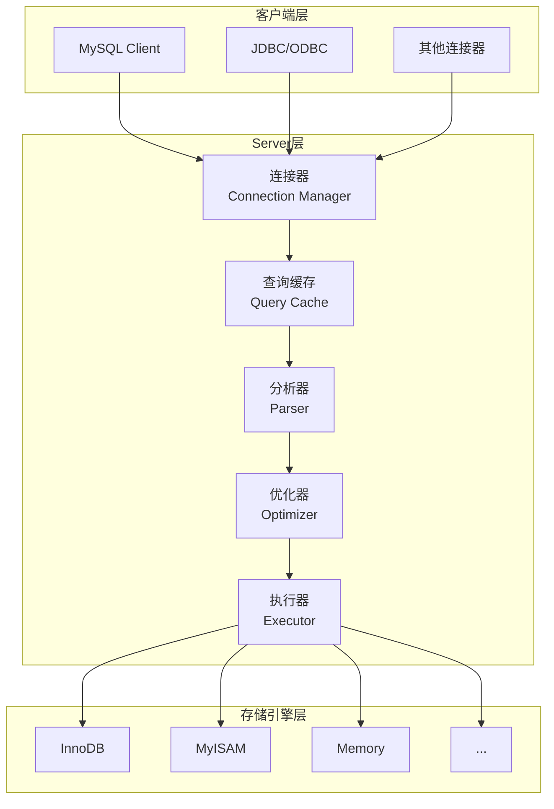

##### 1.1.1 Server层职责

Server层是MySQL的核心服务层，包含以下关键组件：

| 组件 | 职责 | 说明 |
|------|------|------|
| **连接器** | 连接管理 | 建立连接、身份认证、权限获取 |
| **查询缓存** | 结果缓存 | 缓存查询结果（MySQL 8.0已移除） |
| **分析器** | SQL解析 | 词法分析、语法分析 |
| **优化器** | 执行优化 | 索引选择、JOIN顺序决策 |
| **执行器** | 语句执行 | 调用存储引擎接口执行操作 |

此外，Server层还负责：

- 所有**内置函数**的实现（日期、时间、数学、加密函数等）
- 所有**跨存储引擎功能**的实现（存储过程、触发器、视图等）

##### 1.1.2 存储引擎层职责

存储引擎层负责**数据的存储和提取**，采用**插件式架构**设计：

| 引擎 | 特点 | 适用场景 |
|------|------|----------|
| **InnoDB** | 支持事务、行锁、外键、崩溃恢复 | 默认引擎，适用于大多数OLTP场景 |
| **MyISAM** | 不支持事务、表锁、全文索引 | 只读或读多写少的场景 |
| **Memory** | 数据存储在内存、速度快 | 临时表、缓存表 |

> [!IMPORTANT]
> 从MySQL 5.5.5版本开始，**InnoDB**成为默认存储引擎。创建表时如果不指定引擎类型，默认使用InnoDB。

```sql
-- 显式指定存储引擎
CREATE TABLE t_memory (id INT) ENGINE=MEMORY;

-- 查看表的存储引擎
SHOW TABLE STATUS LIKE 'table_name';
```

---

#### 1.2 连接管理与权限验证

##### 1.2.1 连接器的工作原理

当客户端发起连接请求时，**连接器**负责完成以下工作：

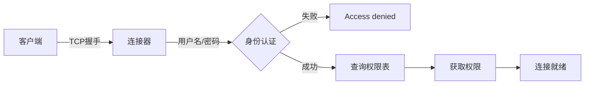

**连接命令示例**：

```bash
mysql -h 192.168.1.100 -P 3306 -u root -p
```

> [!TIP]
> **安全建议**：不要在命令行中直接写密码（如 `-pMyPassword`），这样密码会被记录在命令历史中，存在泄露风险。

##### 1.2.2 权限验证的时机

权限验证发生在**连接建立时**，有一个重要特性需要注意：

> [!WARNING]
> **权限缓存特性**：用户成功建立连接后，即使管理员修改了该用户的权限，**已存在的连接不会受到影响**。新权限只对后续新建的连接生效。

这意味着，如果需要权限变更立即生效，需要：

1. 让用户重新连接
2. 或者使用 `KILL` 命令断开现有连接

##### 1.2.3 连接状态查看与诊断

```sql
-- 查看当前所有连接
SHOW PROCESSLIST;

-- 查看完整SQL（不截断）
SHOW FULL PROCESSLIST;
```

**输出字段解读**：

| 字段 | 说明 | 典型值 |
|------|------|--------|
| Id | 连接ID，可用于KILL | 12345 |
| User | 连接用户 | root |
| Host | 客户端地址:端口 | 192.168.1.100:54321 |
| db | 当前数据库 | test_db |
| Command | 当前命令状态 | Sleep/Query/Execute |
| Time | 当前状态持续秒数 | 300 |
| State | 线程详细状态 | Sending data |
| Info | 正在执行的SQL | SELECT * FROM ... |

**Command常见值**：

| 值 | 说明 |
|----|------|
| Sleep | 空闲连接，等待客户端发送请求 |
| Query | 正在执行查询 |
| Connect | 正在建立连接 |
| Killed | 连接被标记为终止 |

**实战示例**：找出长时间运行的查询

```sql
SELECT id, user, host, db, command, time, state, 
       LEFT(info, 50) AS sql_preview
FROM information_schema.processlist 
WHERE command != 'Sleep' 
  AND time > 30
ORDER BY time DESC;
```

##### 1.2.4 连接超时参数配置

| 参数 | 说明 | 默认值 | 建议值 |
|------|------|--------|--------|
| `wait_timeout` | 非交互连接空闲超时（秒） | 28800 (8小时) | 600-3600 |
| `interactive_timeout` | 交互式连接空闲超时（秒） | 28800 | 28800 |
| `connect_timeout` | 连接建立超时（秒） | 10 | 10 |

```sql
-- 查看当前超时设置
SHOW VARIABLES LIKE '%timeout%';

-- 设置非交互连接超时为10分钟
SET GLOBAL wait_timeout = 600;

-- 会话级设置
SET SESSION wait_timeout = 300;
```

> [!TIP]
> `wait_timeout`过长会导致空闲连接占用资源；过短会导致连接频繁断开。建议根据应用特性设置为10-60分钟。

##### 1.2.5 权限修改生效验证

**验证权限缓存特性**：

```sql
-- Session A: 查看当前用户权限
SHOW GRANTS FOR CURRENT_USER;

-- 管理员Session B: 修改权限（此时Session A不受影响）
REVOKE SELECT ON test_db.* FROM 'user1'@'%';
FLUSH PRIVILEGES;

-- Session A: 仍可执行查询（旧权限仍有效）
SELECT * FROM test_db.some_table;  -- ✓ 成功

-- 断开Session A重连后
SELECT * FROM test_db.some_table;  -- ✗ 权限不足
```

##### 1.2.6 长连接与短连接的权衡

| 连接类型 | 定义 | 优点 | 缺点 |
|----------|------|------|------|
| **长连接** | 连接成功后持续使用同一连接 | 减少连接开销 | 可能导致内存占用过高 |
| **短连接** | 每次查询后断开，下次重新连接 | 资源及时释放 | 频繁连接开销大 |

**建议**：尽量使用长连接，但需要注意内存管理。

##### 1.2.7 长连接内存问题及解决方案

**问题根源**：MySQL在执行过程中使用的临时内存是绑定在连接对象上的，只有在连接断开时才会释放。长连接累积可能导致**OOM（内存溢出）**。

**解决方案**：

| 方案 | 适用版本 | 说明 |
|------|----------|------|
| 定期断开重连 | 所有版本 | 执行大查询后主动断开连接 |
| `mysql_reset_connection` | MySQL 5.7+ | 重置连接状态，无需重连和重新认证 |

```c
// C API调用示例
mysql_reset_connection(mysql);
```

```sql
-- 查看连接内存使用
SELECT thread_id, 
       FORMAT_BYTES(CURRENT_COUNT_USED) AS memory_used
FROM performance_schema.memory_summary_by_thread_by_event_name
WHERE thread_id = CONNECTION_ID()
ORDER BY CURRENT_COUNT_USED DESC
LIMIT 10;
```

---

#### 1.3 查询缓存机制

> [!CAUTION]
> **MySQL 8.0已完全移除查询缓存功能**。以下内容仅适用于MySQL 8.0之前的版本。

##### 1.3.1 查询缓存的工作原理

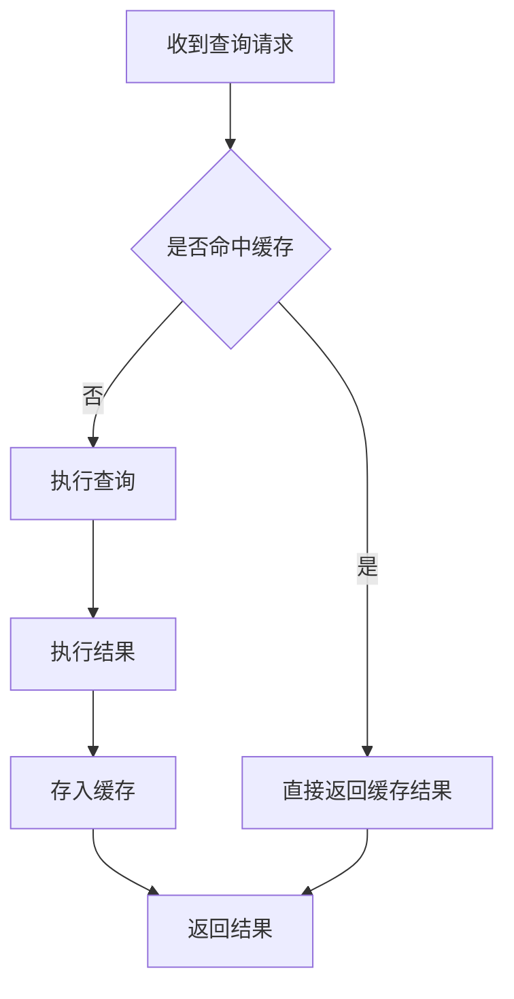

- 缓存以 **key-value** 形式存储
- **key**：查询语句（完全匹配）
- **value**：查询结果

##### 1.3.2 为什么不建议使用查询缓存

查询缓存的**失效机制**过于激进：

> [!WARNING]
> 只要对一个表有**任何更新操作**，该表上的**所有查询缓存都会被清空**。

这导致：

- 对于更新频繁的表，缓存命中率极低
- 维护缓存的开销可能大于收益

**适用场景**：仅适合**静态配置表**等极少更新的场景。

##### 1.3.3 按需使用查询缓存

```sql
-- 设置默认不使用查询缓存
SET GLOBAL query_cache_type = DEMAND;

-- 对特定查询启用缓存
SELECT SQL_CACHE * FROM config_table WHERE id = 1;
```

---

#### 1.4 SQL解析与优化

##### 1.4.1 分析器：词法分析与语法分析

当查询未命中缓存时，进入**分析器**阶段：

**词法分析**：识别SQL语句中的各个元素

```
SELECT * FROM T WHERE ID = 10
   ↓      ↓    ↓     ↓    ↓
 关键字  通配符 表名  列名  值
```

**语法分析**：验证SQL是否符合语法规则

```sql
-- 语法错误示例
mysql> elect * from t where ID=1;
ERROR 1064 (42000): You have an error in your SQL syntax...
```

> [!TIP]
> 语法错误提示中，重点关注 **"use near"** 后面的内容，那是第一个出错的位置。

##### 1.4.2 优化器：执行计划生成

分析器完成后，**优化器**决定如何执行这条SQL：

**优化器的主要决策**：

1. **索引选择**：当表有多个索引时，选择使用哪个
2. **JOIN顺序**：多表关联时，决定表的连接顺序

**示例**：

```sql
SELECT * FROM t1 JOIN t2 USING(ID) WHERE t1.c=10 AND t2.d=20;
```

优化器可能选择的执行路径：

| 方案 | 执行顺序 |
|------|----------|
| 方案A | 先查t1(c=10) → 关联t2 → 过滤t2.d=20 |
| 方案B | 先查t2(d=20) → 关联t1 → 过滤t1.c=10 |

两种方案逻辑等价，但**执行效率可能差异巨大**。优化器会基于统计信息选择代价最小的方案。

---

#### 1.5 执行器与存储引擎交互

##### 1.5.1 执行器的工作流程

执行器是SQL执行的最后一站，负责：

1. **权限校验**（表级权限）
2. **调用存储引擎接口**执行操作

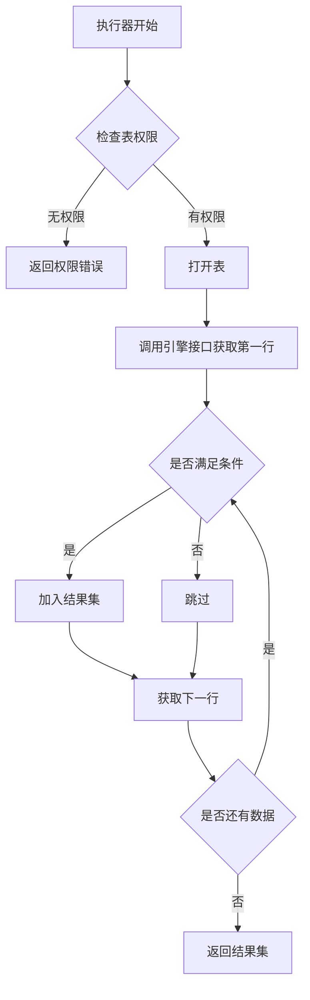

**无索引的全表扫描执行流程**：

```
1. 调用InnoDB接口获取表的第一行
2. 判断ID是否等于10
   - 是：加入结果集
   - 否：跳过
3. 调用接口获取"下一行"，重复步骤2
4. 直到遍历完所有行
5. 返回结果集
```

**有索引的执行流程**：

```
1. 调用"取满足条件的第一行"接口
2. 调用"取满足条件的下一行"接口
3. 循环直到没有满足条件的行
4. 返回结果集
```

##### 1.5.2 rows_examined指标解读

在慢查询日志中，`rows_examined` 字段表示执行过程中**扫描的行数**：

```sql
-- 慢查询日志示例
# Query_time: 0.001234  Lock_time: 0.000100 Rows_sent: 1  Rows_examined: 1000
```

> [!NOTE]
> `rows_examined` 是执行器调用引擎获取数据行时累加的。但在某些场景下（如使用InnoDB的某些批量扫描优化），执行器调用一次可能对应引擎内部扫描多行，因此 **引擎实际扫描行数 ≥ rows_examined**。

---

#### 1.6 本章小结

本章介绍了MySQL的逻辑架构和SQL查询的完整执行流程：


**核心知识点回顾**：

| 组件 | 关键职责 | 注意事项 |
|------|----------|----------|
| 连接器 | 认证、权限、连接管理 | 权限在连接时确定，修改后需重连生效 |
| 查询缓存 | 缓存查询结果 | 8.0已移除，之前版本也不建议使用 |
| 分析器 | 词法、语法解析 | 语法错误在此阶段报出 |
| 优化器 | 生成执行计划 | 选择索引、决定JOIN顺序 |
| 执行器 | 调用引擎执行 | 权限校验、结果汇总 |

**思考题答案**：
> 如果执行 `SELECT * FROM T WHERE k=1`，而表T中没有字段k，会报 `Unknown column 'k' in 'where clause'` 错误。这个错误发生在**分析器**阶段——在语法分析时，分析器会验证表和列是否存在。

---

### 第2章 Redo Log与Binlog：更新语句背后的日志机制

> **核心要点**：MySQL的日志系统是保证数据可靠性和可恢复性的关键。本章深入讲解redo log和binlog的设计原理、两阶段提交协议，以及如何利用这套机制实现crash-safe和数据恢复。

#### 2.1 更新语句的执行流程

更新语句与查询语句一样，都会经过连接器、分析器、优化器、执行器的处理流程。但更新操作还涉及两个关键的日志模块：

- **redo log**（重做日志）—— InnoDB引擎层
- **binlog**（归档日志）—— Server层

**示例场景**：

```sql
CREATE TABLE T(ID int primary key, c int);
UPDATE T SET c = c + 1 WHERE ID = 2;
```

---

#### 2.2 WAL技术核心思想

##### 2.2.1 先写日志再写磁盘的设计哲学

**WAL**（Write-Ahead Logging，预写日志）是MySQL提升更新效率的核心技术。

**类比理解**：

| 角色 | 类比对象 | 说明 |
|------|----------|------|
| redo log | 酒店掌柜的粉板 | 快速记录，空间有限 |
| 磁盘数据文件 | 掌柜的账本 | 正式记录，持久保存 |

**核心思路**：

1. 更新操作先写入redo log（粉板）并更新内存
2. 系统空闲时再将redo log中的操作同步到磁盘（账本）

这种方式避免了每次更新都要进行随机磁盘IO，大幅提升了写入性能。

##### 2.2.2 性能与持久性的平衡


---

#### 2.3 Redo Log深度解析

##### 2.3.1 InnoDB的Crash-Safe能力

**Crash-Safe**：数据库发生异常重启后，之前已提交的事务不会丢失。

这种能力的实现依赖于redo log：

- 只要更新操作被记录到redo log并持久化，即使数据还没写入磁盘，重启后也能通过redo log恢复

##### 2.3.2 Redo Log的循环写机制

InnoDB的redo log是**固定大小**的，采用**循环写**的方式：

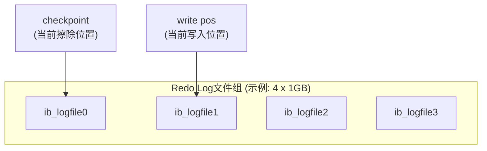

**关键指针**：

| 指针 | 作用 | 移动方向 |
|------|------|----------|
| **write pos** | 当前记录写入的位置 | 循环向后移动 |
| **checkpoint** | 当前要擦除的位置 | 循环向后移动 |

**空间管理规则**：

- `write pos` 到 `checkpoint` 之间的空间：可用于写入新记录
- 当 `write pos` 追上 `checkpoint`：必须暂停写入，先将部分记录刷到磁盘，推进 `checkpoint`

> [!WARNING]
> **Redo Log写满的影响**：当redo log空间耗尽时，MySQL会停止所有更新操作，先执行刷盘，这会导致明显的性能抖动。因此，合理配置redo log大小非常重要。

---

#### 2.4 Binlog归档日志机制

##### 2.4.1 Binlog的设计目的

Binlog是MySQL Server层实现的日志，最初设计用于：

- **数据归档**
- **主从复制**
- **数据恢复**

**历史背景**：MySQL最初使用MyISAM引擎，没有crash-safe能力。InnoDB作为第三方插件引入后，为实现crash-safe，自行实现了redo log。

##### 2.4.2 Redo Log与Binlog的本质区别

| 对比维度 | Redo Log | Binlog |
|----------|----------|--------|
| **所属层次** | InnoDB引擎层 | Server层 |
| **日志类型** | 物理日志 | 逻辑日志 |
| **记录内容** | "在数据页X偏移Y处做了Z修改" | "给ID=2的c字段加1" |
| **写入方式** | 循环写，空间固定 | 追加写，文件依次切换 |
| **主要用途** | Crash恢复 | 主从复制、数据恢复 |

> [!NOTE]
> **物理日志 vs 逻辑日志**
>
> - 物理日志：记录数据的物理变化，恢复速度快
> - 逻辑日志：记录SQL逻辑，可读性好，可用于异构系统同步

---

#### 2.5 两阶段提交协议

##### 2.5.1 UPDATE语句的完整执行流程

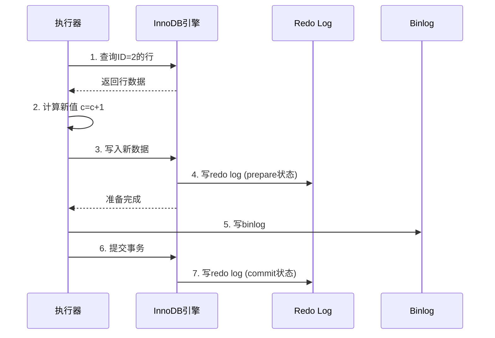

**详细步骤说明**：

| 步骤 | 执行者 | 操作 |
|------|--------|------|
| 1 | 执行器 → 引擎 | 通过主键索引查找ID=2的行 |
| 2 | 执行器 | 计算新值（N → N+1） |
| 3 | 执行器 → 引擎 | 调用引擎接口写入新数据 |
| 4 | 引擎 | 更新内存，写redo log（**prepare状态**） |
| 5 | 执行器 | 写binlog到磁盘 |
| 6-7 | 执行器 → 引擎 | 提交事务，redo log改为**commit状态** |

##### 2.5.2 为什么需要两阶段提交

两阶段提交的目的是保证**redo log和binlog的逻辑一致性**。

**反证：不使用两阶段提交会怎样？**

假设 `ID=2, c=0`，执行 `UPDATE T SET c=c+1 WHERE ID=2`：

| 场景 | Crash时机 | 恢复后结果 | Binlog恢复结果 | 问题 |
|------|-----------|-----------|----------------|------|
| 先redo后binlog | redo写完，binlog未写 | c=1 | c=0 | **主从不一致** |
| 先binlog后redo | binlog写完，redo未写 | c=0 | c=1 | **主从不一致** |

**两阶段提交如何解决**：

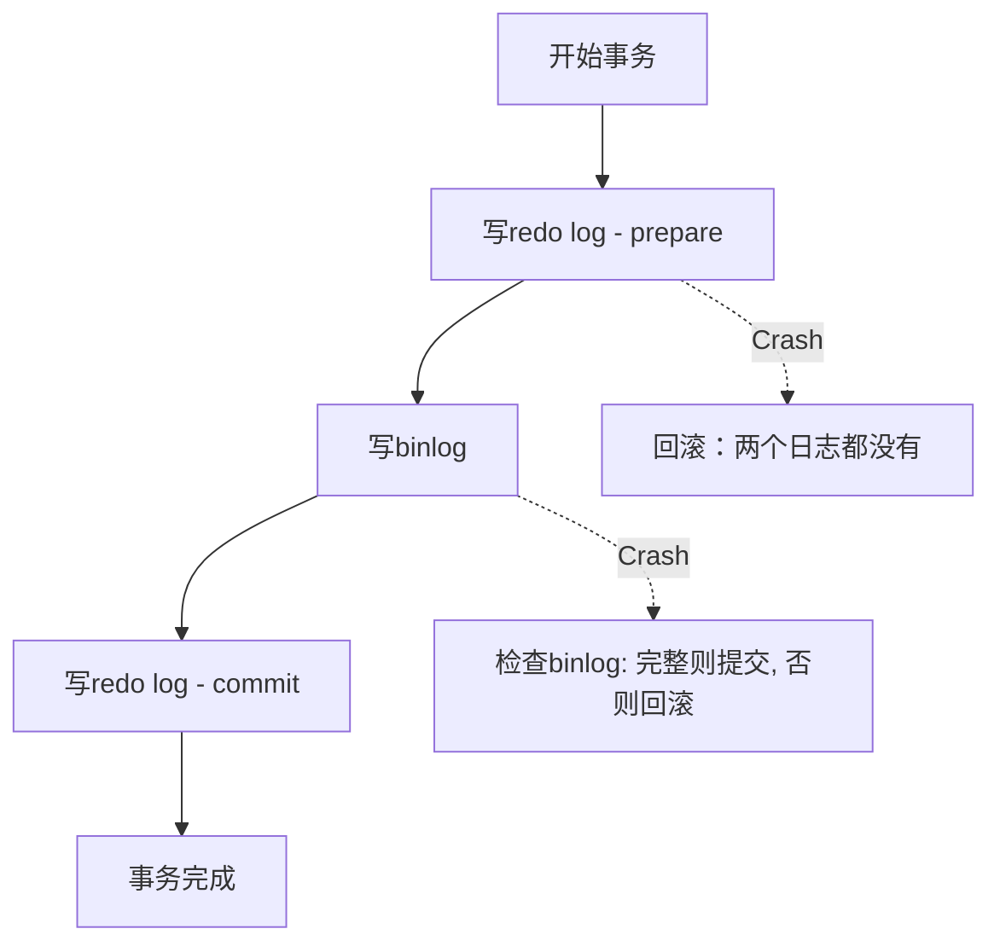

**恢复时的判断逻辑**：

1. 如果redo log处于commit状态 → 直接提交
2. 如果redo log处于prepare状态：
   - 检查binlog是否完整
   - 完整 → 提交
   - 不完整 → 回滚

##### 2.5.3 数据恢复与主从一致性保障

**数据库恢复到任意时间点的能力**依赖于：

1. **定期全量备份**（每天或每周）
2. **binlog持续归档**

**恢复流程**：


---

#### 2.6 关键参数配置建议

##### 2.6.1 数据安全性参数

| 参数 | 推荐值 | 说明 |
|------|--------|------|
| `innodb_flush_log_at_trx_commit` | **1** | 每次事务提交时redo log持久化到磁盘 |
| `sync_binlog` | **1** | 每次事务提交时binlog持久化到磁盘 |

> [!IMPORTANT]
> **双1配置**：将这两个参数都设为1，可以保证MySQL异常重启后**数据不丢失、binlog不丢失**。这是生产环境的推荐配置。

```sql
-- 查看当前配置
SHOW VARIABLES LIKE 'innodb_flush_log_at_trx_commit';
SHOW VARIABLES LIKE 'sync_binlog';

-- 设置（需要超级权限）
SET GLOBAL innodb_flush_log_at_trx_commit = 1;
SET GLOBAL sync_binlog = 1;
```

##### 2.6.2 参数值含义

**innodb_flush_log_at_trx_commit**：

| 值 | 行为 | 安全性 | 性能 |
|----|------|--------|------|
| 0 | 每秒刷盘一次 | 可能丢失1秒数据 | 最高 |
| 1 | 每次提交都刷盘 | 最安全 | 较低 |
| 2 | 每次提交写到OS缓存 | 可能丢失1秒数据 | 较高 |

**sync_binlog**：

| 值 | 行为 | 安全性 |
|----|------|--------|
| 0 | 由文件系统决定何时刷盘 | 最低 |
| 1 | 每次提交都刷盘 | 最高 |
| N | 每N个事务刷盘一次 | 中等 |

##### 2.6.3 双1配置的性能影响量化

| 配置 | TPS（参考值） | 数据安全性 | 适用场景 |
|------|---------------|------------|----------|
| 双1配置 | ~5000 | 最高 | 生产环境 |
| sync_binlog=100 | ~8000 | 可能丢100个事务 | 日志类系统 |
| 非双1配置 | ~12000 | 可能丢1秒数据 | 测试环境 |

> [!NOTE]
> 实际性能取决于磁盘类型：SSD下双1配置的性能损失较小，HDD下损失较大。

##### 2.6.4 组提交优化参数

MySQL通过**组提交（Group Commit）**机制优化双1配置的性能：

```sql
-- 查看组提交参数
SHOW VARIABLES LIKE 'binlog_group_commit%';
```

| 参数 | 说明 | 默认值 | 建议值 |
|------|------|--------|--------|
| `binlog_group_commit_sync_delay` | 等待组提交的延迟（微秒） | 0 | 1000-10000 |
| `binlog_group_commit_sync_no_delay_count` | 达到此事务数立即提交 | 0 | 10-100 |

**组提交原理**：

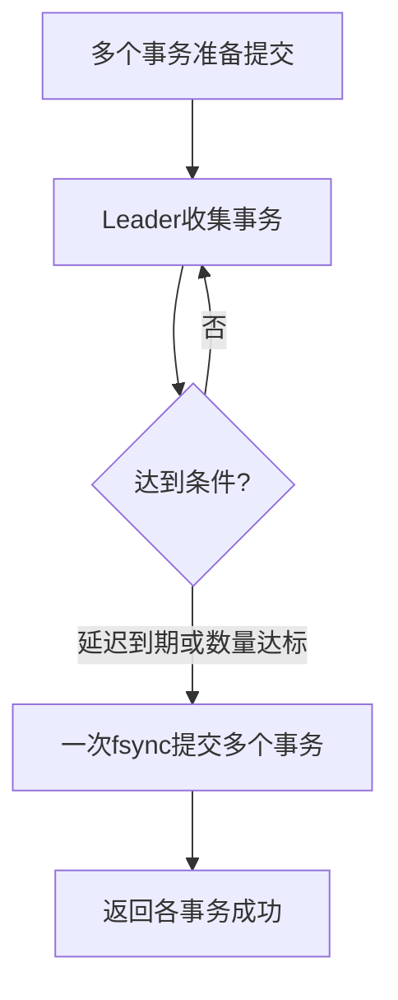

**配置示例**：

```sql
-- 等待最多2ms或10个事务，然后批量fsync
SET GLOBAL binlog_group_commit_sync_delay = 2000;
SET GLOBAL binlog_group_commit_sync_no_delay_count = 10;
```

##### 2.6.5 两阶段提交异常场景分析

**场景1：prepare完成后崩溃**

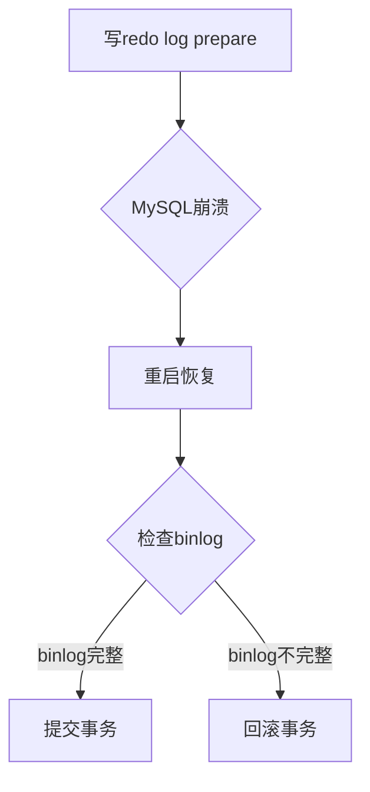

**场景2：binlog写入后崩溃**

此时redo log是prepare状态，binlog已完整写入：

- 恢复时发现binlog完整 → 提交事务
- 确保主备一致性

---

#### 2.7 本章小结

本章介绍了MySQL日志系统的核心：redo log和binlog。

**核心知识点回顾**：

| 概念 | 要点 |
|------|------|
| **WAL技术** | 先写日志再写磁盘，提升写入性能 |
| **Redo Log** | InnoDB特有，物理日志，循环写，保证crash-safe |
| **Binlog** | Server层，逻辑日志，追加写，用于归档和复制 |
| **两阶段提交** | 保证redo log和binlog的一致性 |
| **双1配置** | 生产环境必开，保证数据安全 |

**思考题答案**：
> 一天一备相比一周一备的优势是什么？
>
> **答案**：恢复时间更短（RTO更低）。
>
> - 一天一备：最多需要重放1天的binlog
> - 一周一备：最多需要重放7天的binlog
>
> 这影响的是数据库的**RTO（Recovery Time Objective，恢复时间目标）**指标。备份越频繁，恢复所需的时间越短，但备份本身也会消耗更多资源。

---

### 第3章 事务隔离级别与MVCC原理详解

> **核心要点**：事务隔离是数据库并发控制的核心机制。本章深入讲解SQL标准的四种隔离级别、InnoDB的MVCC实现原理，以及长事务的危害与规避策略。

#### 3.1 事务的ACID特性回顾

**ACID**是事务的四个基本特性：

| 特性 | 英文 | 含义 |
|------|------|------|
| **原子性** | Atomicity | 事务中的操作要么全部成功，要么全部失败 |
| **一致性** | Consistency | 事务执行前后，数据库从一个一致状态变到另一个一致状态 |
| **隔离性** | Isolation | 并发事务之间互不影响 |
| **持久性** | Durability | 事务提交后，数据永久保存 |

本章重点讨论**隔离性（Isolation）**的实现。

---

#### 3.2 SQL标准事务隔离级别

当多个事务并发执行时，可能出现以下问题：

| 问题 | 描述 |
|------|------|
| **脏读** (Dirty Read) | 读取到其他事务未提交的数据 |
| **不可重复读** (Non-repeatable Read) | 同一事务内，两次读取同一数据结果不同 |
| **幻读** (Phantom Read) | 同一事务内，两次查询的行数不同 |

SQL标准定义了四种隔离级别来解决这些问题：


##### 3.2.1 读未提交（Read Uncommitted）

- **定义**：一个事务还没提交时，它做的变更就能被别的事务看到
- **问题**：存在脏读、不可重复读、幻读
- **使用场景**：几乎不使用

##### 3.2.2 读已提交（Read Committed）

- **定义**：一个事务提交之后，它做的变更才会被其他事务看到
- **问题**：存在不可重复读、幻读
- **使用场景**：Oracle默认隔离级别

##### 3.2.3 可重复读（Repeatable Read）

- **定义**：一个事务执行过程中看到的数据，总是跟这个事务启动时看到的数据一致
- **问题**：标准SQL下存在幻读（InnoDB通过间隙锁解决）
- **使用场景**：**MySQL InnoDB默认隔离级别**

##### 3.2.4 串行化（Serializable）

- **定义**：对同一行记录，读会加读锁，写会加写锁
- **问题**：无并发问题，但性能最差
- **使用场景**：对一致性要求极高的场景

---

#### 3.3 隔离级别实例分析

假设有表 `T(c int)`，初始值 `c=1`：

```sql
CREATE TABLE T(c int) ENGINE=InnoDB;
INSERT INTO T(c) VALUES(1);
```

两个事务按以下时序执行：

| 时刻 | 事务A | 事务B |
|------|-------|-------|
| T1 | start transaction; | |
| T2 | | start transaction; |
| T3 | | UPDATE T SET c=2 WHERE c=1; |
| T4 | SELECT c FROM T; -- V1 | |
| T5 | | COMMIT; |
| T6 | SELECT c FROM T; -- V2 | |
| T7 | COMMIT; | |
| T8 | SELECT c FROM T; -- V3 | |

**不同隔离级别下的结果**：

| 隔离级别 | V1 | V2 | V3 | 说明 |
|----------|----|----|----|----|
| 读未提交 | 2 | 2 | 2 | V1就能看到B未提交的修改 |
| 读已提交 | 1 | 2 | 2 | V2才能看到B已提交的修改 |
| 可重复读 | 1 | 1 | 2 | V1、V2都看到事务启动时的快照 |
| 串行化 | 1 | 1 | 2 | B的UPDATE会等待A提交 |

---

#### 3.4 事务隔离的实现原理

##### 3.4.1 视图（View）机制

不同隔离级别通过**视图**机制实现：

| 隔离级别 | 视图创建时机 |
|----------|-------------|
| 读未提交 | 不使用视图，直接读最新值 |
| 读已提交 | 每条SQL开始时创建新视图 |
| 可重复读 | 事务启动时创建，整个事务使用同一视图 |
| 串行化 | 不使用视图，通过加锁实现 |

##### 3.4.2 配置隔离级别

```sql
-- 查看当前隔离级别
SHOW VARIABLES LIKE 'transaction_isolation';

-- 设置隔离级别（会话级）
SET SESSION TRANSACTION ISOLATION LEVEL READ COMMITTED;

-- 设置隔离级别（全局）
SET GLOBAL TRANSACTION ISOLATION LEVEL REPEATABLE READ;
```

> [!TIP]
> **迁移建议**：从Oracle迁移到MySQL时，为保持行为一致，建议将MySQL隔离级别设置为`READ COMMITTED`。

---

#### 3.5 MVCC多版本并发控制

##### 3.5.1 回滚日志与版本链

InnoDB通过**MVCC（Multi-Version Concurrency Control）**实现事务隔离：

- 每条记录更新时，同时记录一条**回滚日志（undo log）**
- 通过回滚日志可以得到记录的历史版本

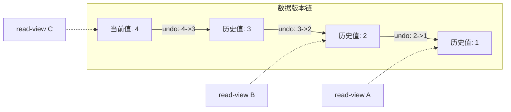

**MVCC的优势**：

- 同一条记录在系统中可以存在多个版本
- 不同事务可以看到不同版本，互不冲突
- 实现了**非阻塞读**

##### 3.5.2 一致性视图的实现

InnoDB在实现可重复读时：

1. 事务启动时，创建一个**一致性视图（consistent read view）**
2. 视图记录了当时所有**活跃事务**的ID列表
3. 读取数据时，根据视图判断数据版本的可见性

##### 3.5.3 回滚日志的清理

**问题**：回滚日志什么时候删除？

**答案**：当没有事务需要用到这些回滚日志时才删除。

具体来说：当系统中没有比某个回滚日志更早的read-view时，该日志就可以被删除。

---

#### 3.6 长事务的危害与规避

##### 3.6.1 长事务的危害

长事务会导致以下问题：

| 问题 | 说明 |
|------|------|
| **回滚日志膨胀** | 长事务存在期间，所有可能用到的回滚日志都不能删除 |
| **锁资源占用** | 长事务持有的锁不会释放，可能阻塞其他事务 |
| **数据库性能下降** | 大量历史版本和锁等待会拖慢整个数据库 |

> [!CAUTION]
> 在MySQL 5.5及之前版本，回滚日志存放在共享表空间ibdata文件中。即使长事务提交，ibdata文件也**不会自动缩小**，可能导致文件膨胀到数百GB。

##### 3.6.2 事务的两种启动方式

| 方式 | 命令 | 特点 |
|------|------|------|
| 显式启动 | `BEGIN` 或 `START TRANSACTION` | 推荐使用 |
| 隐式启动 | `SET autocommit=0` | 容易造成长事务 |

> [!WARNING]
> **避免使用 `SET autocommit=0`**：某些客户端框架会默认执行这个命令，导致后续所有查询都在事务中，容易产生意外的长事务。

**建议**：始终使用 `autocommit=1`，通过显式的 `BEGIN/COMMIT` 管理事务。

##### 3.6.3 减少交互次数的技巧

如果担心 `BEGIN` 增加交互次数，可以使用：

```sql
-- 提交当前事务并自动开启下一个事务
COMMIT WORK AND CHAIN;
```

##### 3.6.4 监控长事务

```sql
-- 查找持续时间超过60秒的事务
SELECT * 
FROM information_schema.innodb_trx 
WHERE TIME_TO_SEC(TIMEDIFF(NOW(), trx_started)) > 60;

-- 查看长事务详细信息
SELECT trx_id, trx_state, trx_started, 
       trx_mysql_thread_id, trx_query,
       trx_rows_locked, trx_rows_modified
FROM information_schema.innodb_trx 
ORDER BY trx_started;

-- 强制终止长事务（谨慎使用）
KILL <trx_mysql_thread_id>;
```

##### 3.6.5 可重复读 vs 读提交的业务选型

| 对比维度 | 可重复读(RR) | 读提交(RC) |
|----------|--------------|------------|
| 默认使用 | MySQL默认 | Oracle默认 |
| 间隙锁 | 有 | 无 |
| 锁范围 | 较大 | 较小 |
| 死锁概率 | 较高 | 较低 |
| 幻读问题 | 通过间隙锁解决 | 存在幻读 |
| 适用场景 | 金融、交易系统 | 日志、分析系统 |

**选型建议**：

| 场景 | 推荐隔离级别 | 原因 |
|------|--------------|------|
| 金融交易 | 可重复读 | 需要强一致性 |
| 日志记录 | 读提交 | 无需强一致性，锁更少 |
| 高并发OLTP | 读提交 | 减少锁冲突 |
| 报表查询 | 读提交 | 允许读到最新已提交数据 |

**配置方法**：

```sql
-- 修改全局隔离级别
SET GLOBAL transaction_isolation = 'READ-COMMITTED';

-- 修改会话隔离级别
SET SESSION transaction_isolation = 'READ-COMMITTED';

-- 在my.cnf中配置
[mysqld]
transaction_isolation = READ-COMMITTED
```

> [!IMPORTANT]
> 从可重复读改为读提交时，必须设置`binlog_format=ROW`，否则可能导致主备数据不一致。

---

#### 3.7 本章小结

本章介绍了MySQL事务隔离的核心概念和实现原理：

| 概念 | 要点 |
|------|------|
| **四种隔离级别** | 读未提交 < 读已提交 < 可重复读 < 串行化 |
| **InnoDB默认** | 可重复读（Repeatable Read） |
| **MVCC** | 通过版本链和一致性视图实现非阻塞读 |
| **长事务危害** | 回滚日志膨胀、锁资源占用 |
| **最佳实践** | 使用autocommit=1，显式管理事务 |

**思考题答案**：
> 如何避免长事务？
>
> **从应用开发角度**：
>
> 1. 设置 `autocommit=1`，显式开启事务
> 2. 评估业务逻辑，尽量缩短事务执行时间
> 3. 避免在事务中进行网络调用等耗时操作
>
> **从数据库运维角度**：
>
> 1. 监控 `information_schema.innodb_trx` 表，设置告警
> 2. 设置合理的 `lock_wait_timeout` 和 `innodb_lock_wait_timeout`
> 3. 定期 kill 超时的长事务

---

### 第4章 索引数据结构与存储模型

> **核心要点**：索引是提高数据库查询效率的关键技术。本章深入讲解常见的索引数据结构，重点分析InnoDB的B+树索引模型，以及聚簇索引与二级索引的区别。

#### 4.1 索引的本质与作用

**索引的本质**：就像书的目录，用于快速定位数据，提高查询效率。

没有索引的查询是**全表扫描**，时间复杂度O(N)；有了合适的索引，查询可以优化到O(log(N))甚至O(1)。

---

#### 4.2 常见索引数据结构对比

##### 4.2.1 哈希表索引

**原理**：通过哈希函数将key映射到数组位置，冲突时使用链表解决。

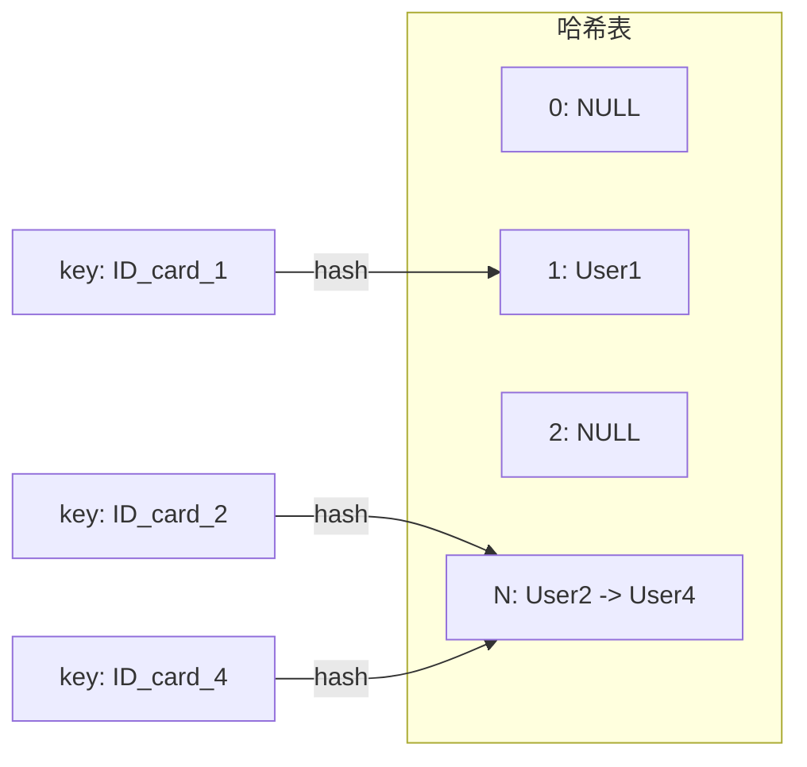

| 优点 | 缺点 |
|------|------|
| 等值查询O(1)，速度极快 | 不支持范围查询 |
| 插入速度快 | 需要处理哈希冲突 |

**适用场景**：等值查询，如Memcached、Redis等NoSQL引擎。

##### 4.2.2 有序数组索引

**原理**：数据按key有序排列，通过二分查找定位。

| 优点 | 缺点 |
|------|------|
| 等值查询O(log(N)) | 插入需要移动大量数据 |
| 范围查询高效 | 更新成本高 |

**适用场景**：静态数据，如历史归档数据。

##### 4.2.3 搜索树索引

**二叉搜索树**特点：

- 左子节点 < 父节点 < 右子节点
- 查询和更新复杂度都是O(log(N))

**问题**：树高太大，磁盘IO次数多

```text
100万节点的平衡二叉树：
- 树高约20层
- 一次查询可能需要20次磁盘IO
- 每次IO约10ms → 总共200ms，太慢！
```

**解决方案**：使用**N叉树**减少树高

---

#### 4.3 InnoDB的B+树索引

##### 4.3.1 为什么选择B+树

**B+树**是一种多路平衡搜索树，专为磁盘存储优化：

| 特性 | 说明 |
|------|------|
| **多叉结构** | 每个节点可以有N个子节点，大幅降低树高 |
| **数据在叶子节点** | 非叶子节点只存索引，叶子节点存数据 |
| **叶子节点链表** | 叶子节点之间通过链表连接，便于范围查询 |

**存储能力示例**：

```text
InnoDB整数索引，N ≈ 1200
树高=4时，可存储 1200³ ≈ 17亿 条记录
一次查询最多访问 3-4 次磁盘
```

##### 4.3.2 B+树结构示意

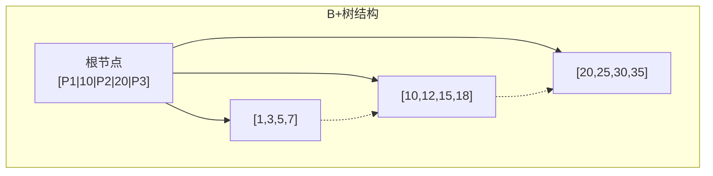

---

#### 4.4 聚簇索引与二级索引

##### 4.4.1 InnoDB的索引组织表

InnoDB中，表数据按照**主键顺序**存储，这种结构称为**索引组织表**。

**示例表结构**：

```sql
CREATE TABLE T(
    id INT PRIMARY KEY,
    k INT NOT NULL,
    name VARCHAR(16),
    INDEX (k)
) ENGINE=InnoDB;
```

##### 4.4.2 两种索引类型

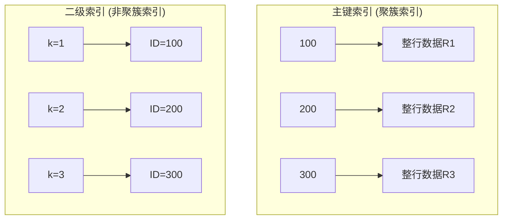

| 索引类型 | 叶子节点存储内容 | 别名 |
|----------|-----------------|------|
| **主键索引** | 整行数据 | 聚簇索引（Clustered Index） |
| **二级索引** | 主键值 | 非聚簇索引（Secondary Index） |

##### 4.4.3 回表操作

**主键查询**：只需搜索主键索引树

```sql
SELECT * FROM T WHERE id = 100;  -- 搜索1次
```

**二级索引查询**：需要**回表**

```sql
SELECT * FROM T WHERE k = 1;  
-- 1. 搜索k索引树，找到id=100
-- 2. 再搜索主键索引树，获取完整行数据
```

> [!IMPORTANT]
> 基于二级索引的查询需要多扫描一棵索引树，因此应**尽量使用主键查询**。

##### 4.4.4 主键选择深度分析

**自增主键 vs 业务主键对比**：

| 对比维度 | 自增主键 | 业务主键（如UUID） |
|----------|----------|-------------------|
| 插入顺序 | 顺序写入 | 随机写入 |
| 页分裂 | 极少发生 | 频繁发生 |
| 存储效率 | 4-8字节 | 通常32+字节 |
| 二级索引大小 | 较小 | 较大 |
| 查询性能 | 范围查询友好 | 范围查询差 |

**主键长度对存储的影响计算**：

```text
假设：100万行数据，10个二级索引

自增主键(BIGINT=8字节)：
  二级索引额外存储 = 100万 × 10 × 8字节 = 80MB

UUID主键(36字节)：
  二级索引额外存储 = 100万 × 10 × 36字节 = 360MB
  
差异 = 280MB（仅索引存储，还不含主键本身）
```

**建议**：除非有特殊业务需求（如分布式ID生成），否则**优先使用自增主键**。

##### 4.4.5 B+树存储容量计算

**InnoDB页大小与节点容量**：

```text
InnoDB页大小 = 16KB
假设主键为BIGINT(8字节)，指针大小为6字节

非叶子节点一层可存: 16KB / (8+6) ≈ 1170 个指针
叶子节点假设每行1KB: 16KB / 1KB = 16 行

树高3时: 1170 × 1170 × 16 ≈ 2.2亿行
树高4时: 1170 × 1170 × 1170 × 16 ≈ 2500亿行
```

> [!TIP]
> 大多数业务表树高不超过4层，即一次查询最多4次磁盘IO。

---

#### 4.5 索引维护：页分裂与页合并

##### 4.5.1 页分裂

当向已满的数据页插入新记录时，需要：

1. 申请新的数据页
2. 将部分数据迁移到新页
3. 更新索引指针


**影响**：

- 性能下降（需要额外的IO操作）
- 空间利用率降低（约50%）

##### 4.5.2 页合并

当相邻页的数据因删除而变得稀疏时，会进行页合并。

---

#### 4.6 自增主键的优势

##### 4.6.1 性能优势

自增主键的插入模式是**追加写**：

| 主键类型 | 插入模式 | 是否触发页分裂 |
|----------|----------|----------------|
| 自增主键 | 追加到最后 | 很少 |
| 业务主键 | 随机位置 | 频繁 |

##### 4.6.2 空间优势

二级索引的叶子节点存储主键值：

| 主键类型 | 主键大小 | 二级索引空间占用 |
|----------|----------|------------------|
| INT | 4字节 | 较小 |
| BIGINT | 8字节 | 较小 |
| VARCHAR(20) | 约20字节 | 较大 |

> [!TIP]
> **建议**：一般情况下优先使用自增主键，除非是纯KV场景（只有一个唯一索引）。

---

### 第5章 索引优化与覆盖索引策略

> **核心要点**：本章介绍索引优化的核心技术，包括覆盖索引、最左前缀原则和索引下推，帮助你设计高效的索引策略。

#### 5.1 回表问题分析

**示例查询**：

```sql
SELECT * FROM T WHERE k BETWEEN 3 AND 5;
```

**执行流程**：

1. 在k索引树找到k=3，获取ID=300
2. **回表**：到主键索引树查找ID=300的完整数据
3. 在k索引树找到k=5，获取ID=500
4. **回表**：到主键索引树查找ID=500的完整数据
5. 在k索引树找到k=6，不满足条件，结束

**问题**：回表操作增加了磁盘IO和查询时间。

---

#### 5.2 覆盖索引

##### 5.2.1 什么是覆盖索引

当索引中**已经包含**查询所需的所有字段时，就不需要回表，这种情况称为**覆盖索引**。

**示例**：

```sql
-- 需要回表
SELECT * FROM T WHERE k BETWEEN 3 AND 5;

-- 覆盖索引，不需要回表
SELECT id FROM T WHERE k BETWEEN 3 AND 5;
```

第二个查询中，id已经在k索引树上，无需回表。

##### 5.2.2 覆盖索引的应用

**场景**：高频查询"根据身份证号查姓名"

```sql
CREATE TABLE tuser (
    id INT PRIMARY KEY,
    id_card VARCHAR(32),
    name VARCHAR(32),
    age INT,
    INDEX idx_id_card (id_card),
    INDEX idx_id_card_name (id_card, name)  -- 覆盖索引
);
```

| 索引 | 查询 | 是否回表 |
|------|------|---------|
| idx_id_card | SELECT * FROM tuser WHERE id_card = '123' | 是 |
| idx_id_card_name | SELECT name FROM tuser WHERE id_card = '123' | **否** |

> [!TIP]
> 覆盖索引可以显著减少回表次数，是**常用的性能优化手段**。但要权衡索引维护成本。

---

#### 5.3 最左前缀原则

##### 5.3.1 原则说明

联合索引按照定义的字段顺序排序，查询时可以利用索引的**最左前缀**。


**可以使用索引的查询**：

```sql
WHERE name = '张三'                    -- 使用name前缀
WHERE name = '张三' AND age = 10       -- 使用完整索引
WHERE name LIKE '张%'                  -- 使用name前缀
```

**无法使用索引的查询**：

```sql
WHERE age = 10                         -- 没有name，无法使用
WHERE name LIKE '%三'                   -- 前缀不确定
```

##### 5.3.2 联合索引字段顺序设计

**原则一**：复用性优先

如果已有索引(a,b)，通常不需要单独创建索引(a)。

**原则二**：空间优先

如果需要同时支持(a)和(b)的单独查询：

- 创建联合索引(a,b)
- 再创建单字段索引(b)
- 选择较小的字段作为单独索引

---

#### 5.4 索引下推优化

##### 5.4.1 问题场景

```sql
SELECT * FROM tuser 
WHERE name LIKE '张%' AND age = 10 AND ismale = 1;
```

使用索引(name, age)，只能利用"张%"定位到第一条记录。

##### 5.4.2 MySQL 5.6之前

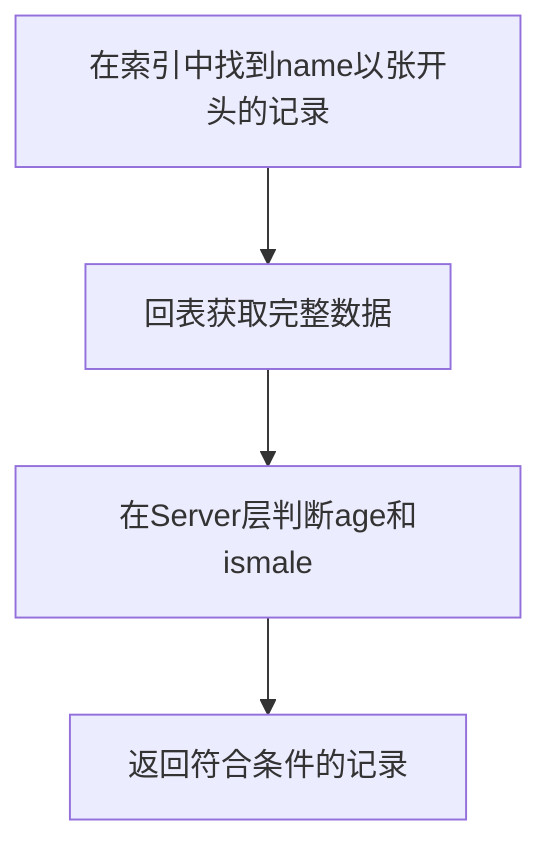

**问题**：即使age不等于10，也要回表后才能判断。

##### 5.4.3 索引下推（Index Condition Pushdown）

MySQL 5.6引入的优化，可以在索引遍历过程中，对索引包含的字段**先做判断**。

```mermaid
graph TD
    A[在索引中找到name以张开头的记录] --> B{age=10?}
    B -->|是| C[回表获取完整数据]
    B -->|否| D[跳过，不回表]
    C --> E[在Server层判断ismale]
    E --> F[返回符合条件的记录]
```

**效果**：减少回表次数，提升查询性能。

##### 5.4.4 覆盖索引和索引下推的EXPLAIN识别

**覆盖索引特征**：

```sql
EXPLAIN SELECT id FROM tuser WHERE name = '张三'\G

-- 关键输出：
-- type: ref
-- key: idx_name
-- Extra: Using index    <-- 表示使用了覆盖索引
```

**索引下推特征**：

```sql
EXPLAIN SELECT * FROM tuser 
WHERE name LIKE '张%' AND age = 10\G

-- 关键输出：
-- type: range
-- key: idx_name_age
-- Extra: Using index condition    <-- 表示使用了索引下推
```

**EXPLAIN Extra字段常见值**：

| 值 | 含义 |
|----|------|
| Using index | 覆盖索引，不回表 |
| Using index condition | 索引下推（ICP） |
| Using where | Server层过滤 |
| Using filesort | 需要额外排序 |
| Using temporary | 需要临时表 |

---

#### 5.5 本章小结

| 优化技术 | 原理 | 效果 |
|----------|------|------|
| **覆盖索引** | 索引包含所有查询字段 | 避免回表 |
| **最左前缀** | 利用联合索引的左侧字段 | 复用索引 |
| **索引下推** | 在索引层过滤数据 | 减少回表 |

**索引设计原则**：

1. 尽量使用覆盖索引
2. 合理设计联合索引的字段顺序
3. MySQL 5.6+自动启用索引下推

**思考题答案**：
> 对于联合主键(a,b)的表，为什么需要额外创建(c,a)和(c,b)索引？
>
> **答案**：
>
> - `SELECT * FROM t WHERE c=N ORDER BY a`：需要索引(c,a)来避免排序
> - `SELECT * FROM t WHERE c=N ORDER BY b`：需要索引(c,b)来避免排序
>
> 虽然索引c已经包含了主键(a,b)，但索引c内部是按c值排序的，a和b值是无序的。要利用索引避免排序，必须创建(c,a)或(c,b)。

---

### 第6章 全局锁与表级锁机制解析

> **核心要点**：MySQL的锁机制用于处理并发访问问题。本章介绍全局锁和表级锁的使用场景、工作原理，以及如何安全地执行DDL操作。

#### 6.1 MySQL锁的分类

根据加锁范围，MySQL的锁分为三类：

```mermaid
graph TD
    A[MySQL锁] --> B[全局锁]
    A --> C[表级锁]
    A --> D[行锁]
    
    C --> E[表锁]
    C --> F[元数据锁 MDL]
```

---

#### 6.2 全局锁

##### 6.2.1 全局锁的使用

**加锁命令**：

```sql
FLUSH TABLES WITH READ LOCK (FTWRL);
```

**效果**：

- 整个数据库处于只读状态
- 阻塞：数据更新（DML）、表结构变更（DDL）、更新类事务提交

##### 6.2.2 全局锁的应用场景：全库逻辑备份

**为什么备份需要加锁？**

考虑不加锁备份的场景：

```mermaid
sequenceDiagram
    participant B as 备份进程
    participant U as 用户操作
    
    B->>B: 备份账户表（余额100）
    U->>U: 购买课程：扣款50，增加课程
    B->>B: 备份课程表（已有新课程）
    
    Note over B: 备份结果不一致：<br/>余额100，但多了一门课
```

**结论**：不加锁的备份会导致数据在**逻辑上不一致**。

##### 6.2.3 更好的备份方案：single-transaction

对于InnoDB表，可以使用mysqldump的 `--single-transaction` 参数：

```bash
mysqldump --single-transaction -u root -p database > backup.sql
```

**原理**：利用MVCC机制，在可重复读隔离级别下获取一致性视图。

| 方案 | 适用场景 | 影响 |
|------|----------|------|
| FTWRL | 所有引擎 | 阻塞所有写入 |
| --single-transaction | 仅InnoDB | 不阻塞业务 |

> [!IMPORTANT]
> `--single-transaction` 只适用于所有表都使用InnoDB的情况。如果有MyISAM表，必须使用FTWRL。

##### 6.2.4 FTWRL vs readonly

为什么不用 `SET GLOBAL readonly=true`？

| 对比项 | FTWRL | readonly |
|--------|-------|----------|
| 影响范围 | 仅当前会话 | 全局，可能影响主备判断逻辑 |
| 异常处理 | 客户端断开自动释放 | 保持readonly状态 |
| 风险 | 较低 | 可能导致数据库长时间不可写 |

---

#### 6.3 表级锁

##### 6.3.1 表锁

**语法**：

```sql
-- 加锁
LOCK TABLES t1 READ, t2 WRITE;

-- 解锁
UNLOCK TABLES;
```

**特点**：

- 限制其他线程的读写
- 也限制本线程的操作（只能操作被锁的表）

> [!NOTE]
> 对于支持行锁的InnoDB引擎，一般**不使用表锁**，因为锁粒度太大。

##### 6.3.2 元数据锁（MDL）

**MDL（Metadata Lock）**是MySQL 5.5引入的机制：

| 操作 | MDL锁类型 |
|------|-----------|
| 增删改查（DML） | MDL读锁 |
| 表结构变更（DDL） | MDL写锁 |

**锁兼容性**：

- 读锁之间：兼容
- 读锁与写锁：互斥
- 写锁之间：互斥

##### 6.3.3 MDL锁导致的问题

```mermaid
sequenceDiagram
    participant A as Session A
    participant B as Session B
    participant C as Session C
    participant D as Session D
    
    A->>A: SELECT（获取MDL读锁）
    B->>B: SELECT（获取MDL读锁）✓
    C->>C: ALTER TABLE（等待MDL写锁）阻塞
    D->>D: SELECT（等待MDL读锁）阻塞
    
    Note over C,D: C在等A释放读锁<br/>D被C阻塞
```

> [!CAUTION]
> **MDL锁在事务结束时才释放**。如果Session A开启事务后不提交，会导致后续所有对该表的操作都被阻塞。

##### 6.3.4 如何安全地给小表加字段

**步骤**：

1. 检查是否有长事务：查询 `information_schema.innodb_trx`
2. 如有长事务，kill掉或等待其结束
3. 使用带超时的DDL语法：

```sql
-- MariaDB/AliSQL支持的语法
ALTER TABLE tbl_name NOWAIT ADD COLUMN ...;
ALTER TABLE tbl_name WAIT N ADD COLUMN ...;
```

##### 6.3.5 MDL锁诊断查询

```sql
-- 查看当前MDL锁等待（需开启performance_schema）
SELECT * FROM performance_schema.metadata_locks;

-- 查看MDL锁等待关系
SELECT 
    waiting.object_name AS waiting_table,
    waiting.lock_type AS waiting_lock_type,
    waiting.owner_thread_id AS waiting_thread,
    blocking.lock_type AS blocking_lock_type,
    blocking.owner_thread_id AS blocking_thread
FROM performance_schema.metadata_locks waiting
JOIN performance_schema.metadata_locks blocking
  ON waiting.object_name = blocking.object_name
WHERE waiting.lock_status = 'PENDING'
  AND blocking.lock_status = 'GRANTED';
```

##### 6.3.6 Online DDL锁降级过程

**MySQL 5.6+ Online DDL流程**：

```mermaid
sequenceDiagram
    participant DDL as DDL操作
    participant MDL as MDL锁
    participant DATA as 数据处理
    
    DDL->>MDL: 获取MDL写锁
    DDL->>MDL: 降级为MDL读锁
    DDL->>DATA: 执行DDL（允许DML并发）
    DDL->>MDL: 升级为MDL写锁
    DDL->>MDL: 释放锁
```

| 阶段 | 持有锁类型 | DML是否可执行 |
|------|-----------|---------------|
| 开始 | MDL写锁 | 否 |
| 执行中 | MDL读锁 | 是 |
| 结束 | MDL写锁 | 否 |

---

### 第7章 行锁原理与死锁预防策略

> **核心要点**：行锁是InnoDB实现高并发的关键。本章讲解两阶段锁协议、死锁的产生和检测机制，以及如何优化热点行更新。

#### 7.1 行锁基础

**行锁**：针对数据表中**行记录**的锁，由存储引擎实现。

| 引擎 | 行锁支持 |
|------|----------|
| InnoDB | 支持 |
| MyISAM | 不支持（只有表锁） |

---

#### 7.2 两阶段锁协议

##### 7.2.1 协议内容

> **InnoDB的行锁是在需要的时候才加上的，但并不是不需要了就立刻释放，而是要等到事务结束时才释放。**

```mermaid
sequenceDiagram
    participant A as 事务A
    participant B as 事务B
    
    A->>A: UPDATE t SET c=c+1 WHERE id=1（加锁）
    A->>A: UPDATE t SET c=c+1 WHERE id=2（加锁）
    B->>B: UPDATE t SET c=c+1 WHERE id=1（等待...）
    A->>A: COMMIT（释放所有锁）
    B->>B: 获取锁，继续执行
```

##### 7.2.2 优化建议

**原则**：把最可能造成锁冲突的操作放到事务最后。

**示例**：电影票购买事务

```sql
-- 操作1：扣除用户余额
-- 操作2：增加影院余额（热点行）
-- 操作3：记录交易日志
```

**优化后的顺序**：3 → 1 → 2

这样"影院余额"这一热点行的锁持有时间最短。

---

#### 7.3 死锁与死锁检测

##### 7.3.1 什么是死锁

**死锁**：多个事务循环等待对方持有的锁资源。

```mermaid
graph LR
    A[事务A] -->|持有id=1的锁| R1[行1]
    A -->|等待id=2的锁| R2[行2]
    B[事务B] -->|持有id=2的锁| R2
    B -->|等待id=1的锁| R1
```

##### 7.3.2 死锁处理策略

| 策略 | 参数 | 默认值 | 说明 |
|------|------|--------|------|
| **等待超时** | innodb_lock_wait_timeout | 50s | 超时后放弃等待 |
| **死锁检测** | innodb_deadlock_detect | on | 主动检测并回滚 |

**等待超时的问题**：

- 设置太长（50s）：用户体验差
- 设置太短（1s）：可能误杀正常的锁等待

**死锁检测的问题**：

- 每个被阻塞的事务都要检测是否有死锁
- 时间复杂度O(n)，n个并发更新同一行时，检测成本是O(n²)

##### 7.3.3 热点行更新优化

**问题场景**：1000个并发事务更新同一行，死锁检测消耗大量CPU。

**解决方案**：

| 方案 | 说明 | 风险 |
|------|------|------|
| 关闭死锁检测 | 临时方案 | 可能出现大量超时 |
| 控制并发度 | 在中间件或数据库层面排队 | 需要开发支持 |
| 业务拆分 | 将一行拆分为多行 | 需要改造业务逻辑 |

**热点行拆分示例**：

```sql
-- 原设计：一个影院一条记录
UPDATE theater SET balance = balance + 100 WHERE id = 1;

-- 优化后：一个影院拆成10条记录
UPDATE theater SET balance = balance + 100 
WHERE id = 1 AND slot = FLOOR(RAND() * 10);

-- 查询时汇总
SELECT SUM(balance) FROM theater WHERE id = 1;
```

##### 7.3.4 死锁日志解读

**查看死锁日志**：

```sql
SHOW ENGINE INNODB STATUS\G
```

**日志关键段落解读**：

```text
------------------------
LATEST DETECTED DEADLOCK
------------------------
2024-01-01 10:00:00 0x7f...

*** (1) TRANSACTION:
TRANSACTION 421234, ACTIVE 0 sec starting index read
mysql tables in use 1, locked 1
LOCK WAIT 3 lock struct(s)
...
*** (1) WAITING FOR THIS LOCK TO BE GRANTED:
RECORD LOCKS space id 23 page no 3 n bits 72 index PRIMARY of table `test`.`t`
lock_mode X locks rec but not gap waiting
...

*** (2) TRANSACTION:
TRANSACTION 421235, ACTIVE 0 sec starting index read
...
*** (2) HOLDS THE LOCK(S):
RECORD LOCKS space id 23 page no 3 n bits 72 index PRIMARY of table `test`.`t`
lock_mode X locks rec but not gap
...
*** (2) WAITING FOR THIS LOCK TO BE GRANTED:
RECORD LOCKS space id 23 page no 4 n bits 72 index PRIMARY of table `test`.`t`
lock_mode X locks rec but not gap waiting

*** WE ROLL BACK TRANSACTION (1)
```

**解读要点**：

| 关键字 | 含义 |
|--------|------|
| TRANSACTION xxx | 涉及的事务ID |
| lock_mode X | 排他锁 |
| lock_mode S | 共享锁 |
| locks rec but not gap | 行锁 |
| locks gap | 间隙锁 |
| ROLL BACK TRANSACTION (1) | 被回滚的事务 |

---

#### 7.4 本章小结

| 概念 | 要点 |
|------|------|
| **两阶段锁** | 锁在需要时加，事务结束时释放 |
| **死锁** | 循环等待导致相互阻塞 |
| **死锁检测** | 默认开启，但有CPU开销 |
| **优化方向** | 减少锁冲突、拆分热点行 |

**思考题答案**：
> 删除表前10000行数据，三种方法选哪个？
>
> **推荐方案二**：在一个连接中循环执行20次 `DELETE FROM T LIMIT 500`
>
> **分析**：
>
> - 方案一：一次删除太多行，事务太大，可能导致主从延迟
> - 方案二：分批删除，每次删除后可以自动释放锁，对业务影响小
> - 方案三：20个连接并发删除，可能造成大量锁竞争和死锁

---

### 第8章 事务可见性与一致性读深度剖析

> **核心要点**：本章深入讲解MVCC的工作原理、一致性视图的实现机制，以及"快照读"与"当前读"的区别，帮助你从底层理解事务隔离的实现。

#### 8.1 问题引入

在可重复读隔离级别下，考虑以下场景：

```sql
CREATE TABLE t (id INT PRIMARY KEY, k INT) ENGINE=InnoDB;
INSERT INTO t VALUES(1,1),(2,2);
```

| 时刻 | 事务A | 事务B | 事务C |
|------|-------|-------|-------|
| T1 | start transaction with consistent snapshot; | | |
| T2 | | start transaction with consistent snapshot; | |
| T3 | | | UPDATE t SET k=k+1 WHERE id=1; (自动提交) |
| T4 | | UPDATE t SET k=k+1 WHERE id=1; | |
| T5 | | SELECT k FROM t WHERE id=1; | |
| T6 | SELECT k FROM t WHERE id=1; | | |
| T7 | | COMMIT; | |

**结果**：事务A查到k=1，事务B查到k=3

这看似矛盾：事务B在事务A之后启动，为什么查到的值更大？

---

#### 8.2 事务启动时机

**关键区别**：

| 命令 | 事务启动时机 |
|------|-------------|
| `BEGIN` / `START TRANSACTION` | 执行第一条SQL时才真正启动 |
| `START TRANSACTION WITH CONSISTENT SNAPSHOT` | 命令执行时立即启动 |

---

#### 8.3 MVCC快照的实现原理

##### 8.3.1 事务ID与行版本

InnoDB为每个事务分配一个唯一的**事务ID（transaction id）**，按申请顺序递增。

每行数据的每个版本都有一个**row trx_id**，记录生成该版本的事务ID。

```mermaid
graph LR
    subgraph Versions["数据版本链"]
        V4["V4: k=22<br/>row trx_id=25"]
        V3["V3: k=11<br/>row trx_id=20"]
        V2["V2: k=10<br/>row trx_id=15"]
        V1["V1: k=1<br/>row trx_id=10"]
    end
    
    V4 -->|"undo log"| V3
    V3 -->|"undo log"| V2
    V2 -->|"undo log"| V1
```

> [!NOTE]
> 历史版本（V1、V2、V3）不是物理存储的，而是通过当前版本和undo log**计算**出来的。

##### 8.3.2 一致性视图（Read View）的结构

事务启动时，InnoDB构建一个**一致性视图**，包含：

1. **活跃事务数组**：启动时所有"已启动但未提交"的事务ID
2. **低水位**：数组中的最小事务ID
3. **高水位**：当前系统已分配的最大事务ID + 1

```mermaid
graph LR
    subgraph ReadView["一致性视图"]
        L["低水位: min_trx_id"]
        A["活跃事务数组: [trx1, trx2, ...]"]
        H["高水位: max_trx_id + 1"]
    end
```

##### 8.3.3 数据可见性判断规则

对于一个数据版本的row trx_id：

```mermaid
graph TD
    A[row trx_id] --> B{与高水位比较}
    B -->|">= 高水位"| C[红色区域：不可见<br/>未来事务生成]
    B -->|"< 高水位"| D{与低水位比较}
    D -->|"< 低水位"| E[绿色区域：可见<br/>已提交的事务]
    D -->|">= 低水位"| F{是否在活跃数组中}
    F -->|在数组中| G[黄色区域：不可见<br/>未提交的事务]
    F -->|不在数组中| H[黄色区域：可见<br/>已提交的事务]
```

**简化判断规则**：

1. 版本未提交 → 不可见
2. 版本已提交，但在视图创建**后**提交 → 不可见
3. 版本已提交，且在视图创建**前**提交 → 可见
4. 自己的更新 → 始终可见

---

#### 8.4 一致性读与当前读

##### 8.4.1 一致性读（Consistent Read）

普通的SELECT语句使用**一致性读**，根据视图判断数据可见性。

```sql
SELECT * FROM t WHERE id = 1;  -- 一致性读
```

##### 8.4.2 当前读（Current Read）

以下语句使用**当前读**，读取数据的最新版本：

```sql
-- 加锁的SELECT
SELECT * FROM t WHERE id = 1 LOCK IN SHARE MODE;  -- 加S锁
SELECT * FROM t WHERE id = 1 FOR UPDATE;          -- 加X锁

-- 更新语句
UPDATE t SET k = k + 1 WHERE id = 1;
DELETE FROM t WHERE id = 1;
INSERT INTO t VALUES(...);
```

> [!IMPORTANT]
> **更新语句必须使用当前读**，否则会丢失其他事务的更新。这就是为什么事务B能看到事务C的修改。

**当前读 vs 快照读分类表**：

| 语句类型 | 读取方式 | 说明 |
|----------|----------|------|
| `SELECT ...` | 快照读 | 读取视图创建时刻的版本 |
| `SELECT ... LOCK IN SHARE MODE` | 当前读 | 加S锁，读最新已提交版本 |
| `SELECT ... FOR UPDATE` | 当前读 | 加X锁，读最新已提交版本 |
| `UPDATE ...` | 当前读 | 更新前需读取最新值 |
| `DELETE ...` | 当前读 | 删除前需确定最新行 |
| `INSERT ...` | 当前读 | 需检查唯一键冲突 |

##### 8.4.3 回顾开头的问题

```mermaid
sequenceDiagram
    participant A as 事务A (id=100)
    participant B as 事务B (id=101)
    participant C as 事务C (id=102)
    
    Note over A: 启动，视图[99,100]
    Note over B: 启动，视图[99,100,101]
    C->>C: UPDATE k=k+1 (k: 1->2)
    Note over C: 提交
    B->>B: UPDATE k=k+1 (当前读k=2, 更新为k=3)
    B->>B: SELECT k (自己更新的，看到k=3)
    A->>A: SELECT k (一致性读，看到k=1)
```

---

#### 8.5 可重复读与读已提交的区别

| 隔离级别 | 视图创建时机 |
|----------|-------------|
| 可重复读 | 事务启动时创建，整个事务共用 |
| 读已提交 | 每条SQL执行前重新创建 |

**读已提交下的结果**：

- 事务A查询时，(1,2)已提交 → 可见，返回k=2
- 事务B查询时，(1,3)是自己的更新 → 返回k=3

---

#### 8.6 本章小结

| 概念 | 说明 |
|------|------|
| **事务ID** | 按申请顺序递增的唯一标识 |
| **row trx_id** | 数据版本的创建者事务ID |
| **一致性视图** | 活跃事务数组 + 高低水位 |
| **一致性读** | 普通SELECT，根据视图判断可见性 |
| **当前读** | 加锁SELECT和更新语句，读最新版本 |

**思考题答案**：
> 如何构造"改不掉"的情况？
>
> **场景**：事务A执行 `UPDATE t SET c=0 WHERE id=c`，但在此之前，另一个事务B修改了某行的c值，导致A看不到（当前读的版本id≠c）。
>
> **示例**：
>
> 1. 事务B先执行 `UPDATE t SET c=c+1 WHERE id=1`（c从1变成2）
> 2. 事务A再执行 `UPDATE t SET c=0 WHERE id=c`
> 3. 当前读时id=1的行c=2，条件id=c不满足，所以"改不掉"

---

## 第二篇：MySQL实践优化

### 第9章 普通索引与唯一索引：选型指南

> **核心要点**：本章对比普通索引和唯一索引的性能差异，重点介绍change buffer机制及其适用场景，帮助你做出正确的索引选型决策。

#### 9.1 查询性能对比

对于等值查询，两类索引的性能差异**微乎其微**：

| 索引类型 | 查询行为 |
|----------|----------|
| 普通索引 | 找到第一条满足条件的记录后，继续查找下一条直到不满足 |
| 唯一索引 | 找到第一条满足条件的记录后，立即停止 |

由于InnoDB按**数据页**读取（默认16KB），多查一条记录的成本几乎可以忽略。

---

#### 9.2 更新性能对比：Change Buffer机制

##### 9.2.1 Change Buffer原理

当更新的数据页**不在内存**时，InnoDB的处理方式不同：

| 索引类型 | 更新流程 |
|----------|----------|
| 唯一索引 | 必须读取数据页到内存，判断唯一性后更新 |
| 普通索引 | 将更新操作记录到change buffer，无需读取磁盘 |

```mermaid
graph TD
    A[UPDATE请求] --> B{目标页在内存?}
    B -->|是| C[直接更新内存]
    B -->|否| D{唯一索引?}
    D -->|是| E[读磁盘到内存] --> C
    D -->|否| F[写change buffer]
    F --> G[返回成功]
    C --> G
```

##### 9.2.2 Merge操作

Change buffer中的操作会在以下时机**merge**到数据页：

- 访问该数据页时
- 后台线程定期merge
- 数据库正常关闭

##### 9.2.3 Change Buffer的适用场景

| 业务模式 | Change Buffer效果 |
|----------|-------------------|
| **写多读少** | 效果最好（账单、日志系统） |
| 写后立即读 | 反而有副作用 |

> [!TIP]
> **建议**：如果业务能保证数据唯一性，优先选择普通索引配合change buffer，性能更优。

---

#### 9.3 Change Buffer vs Redo Log

| 机制 | 优化目标 |
|------|----------|
| Redo Log | 减少随机**写**磁盘IO（WAL） |
| Change Buffer | 减少随机**读**磁盘IO |

#### 9.4 Change Buffer配置参数

```sql
-- 查看change buffer相关参数
SHOW VARIABLES LIKE 'innodb_change_buffer%';

-- 设置change buffer最大占Buffer Pool的比例（默认25%）
SET GLOBAL innodb_change_buffer_max_size = 25;

-- 查看change buffer使用情况
SHOW ENGINE INNODB STATUS\G
-- 查找 INSERT BUFFER AND ADAPTIVE HASH INDEX 段落
```

| 参数 | 说明 | 默认值 |
|------|------|--------|
| `innodb_change_buffer_max_size` | 占Buffer Pool的最大比例 | 25% |
| `innodb_change_buffering` | 启用的操作类型 | all |

**innodb_change_buffering取值**：

| 值 | 缓冲的操作 |
|----|-----------|
| none | 不缓冲 |
| inserts | 缓冲INSERT |
| deletes | 缓冲DELETE标记操作 |
| changes | 缓冲INSERT和DELETE标记 |
| purges | 缓冲后台物理删除 |
| all | 缓冲所有操作（默认） |

#### 9.5 普通索引 vs 唯一索引决策树

```mermaid
graph TD
    A[需要创建索引] --> B{业务是否需要唯一约束?}
    B -->|是| C[必须使用唯一索引]
    B -->|否| D{业务能否保证数据唯一?}
    D -->|是| E[推荐普通索引+change buffer]
    D -->|否| F{读写比例?}
    F -->|读多写少| G[唯一索引]
    F -->|写多读少| E
```

---

### 第10章 索引选择失误的根因分析与解决方案

> **核心要点**：优化器有时会选错索引。本章分析选错的原因，并提供多种解决方案。

#### 10.1 优化器的选择逻辑

优化器选择索引时考虑的因素：

1. **扫描行数**（通过索引基数估算）
2. **是否需要回表**
3. **是否需要排序**
4. **是否使用临时表**

#### 10.2 索引基数与采样统计

**基数（Cardinality）**：索引上不同值的个数，越大区分度越好。

```sql
-- 查看索引基数
SHOW INDEX FROM table_name;
```

**采样统计的问题**：

- InnoDB采样N个数据页估算
- 数据变更超过1/M时重新统计
- 采样导致统计值**不精确**

#### 10.3 索引选错的解决方案

| 方案 | 说明 | 适用场景 |
|------|------|----------|
| `ANALYZE TABLE` | 重新统计索引信息 | 统计信息偏差大 |
| `FORCE INDEX` | 强制使用指定索引 | 临时解决方案 |
| 修改SQL语句 | 引导优化器选择 | 有技巧要求 |
| 新建/删除索引 | 提供更合适的选择 | 长期方案 |

```sql
-- 重新统计索引信息
ANALYZE TABLE t;

-- 强制使用索引
SELECT * FROM t FORCE INDEX(a) WHERE a BETWEEN 1 AND 1000;
```

#### 10.4 使用optimizer_trace诊断优化器选择

```sql
-- 开启optimizer_trace
SET optimizer_trace = 'enabled=on';

-- 执行查询
SELECT * FROM t WHERE a BETWEEN 1 AND 1000;

-- 查看优化器选择过程
SELECT * FROM information_schema.optimizer_trace\G

-- 关闭trace
SET optimizer_trace = 'enabled=off';
```

**trace输出关键段落**：

```json
{
  "analyzing_range_alternatives": {
    "range_scan_alternatives": [
      {
        "index": "a",
        "chosen": true,
        "cost": 123.45    // 估算成本
      }
    ]
  }
}
```

> [!TIP]
> 通过对比不同索引的cost值，可以理解优化器为何选择或放弃某个索引。

---

### 第11章 字符串字段索引优化技巧

> **核心要点**：本章介绍字符串字段的多种索引方案，包括前缀索引、倒序存储和hash字段。

#### 11.1 前缀索引

```sql
-- 完整索引
ALTER TABLE t ADD INDEX idx_email(email);

-- 前缀索引（只取前6个字节）
ALTER TABLE t ADD INDEX idx_email_6(email(6));
```

| 方式 | 空间占用 | 扫描行数 | 覆盖索引 |
|------|----------|----------|---------|
| 完整索引 | 大 | 少 | ✓ 支持 |
| 前缀索引 | 小 | 可能多 | ✗ 不支持 |

##### 确定前缀长度

```sql
-- 统计不同前缀长度的区分度
SELECT 
  COUNT(DISTINCT LEFT(email, 4)) AS L4,
  COUNT(DISTINCT LEFT(email, 5)) AS L5,
  COUNT(DISTINCT LEFT(email, 6)) AS L6
FROM t;
```

#### 11.2 前缀区分度不够时的方案

##### 方案一：倒序存储

适用于前缀相同、后缀不同的场景（如身份证号）：

```sql
-- 存储时倒序
INSERT INTO t(id_card) VALUES(REVERSE('110101199001011234'));

-- 查询时也倒序
SELECT * FROM t WHERE id_card = REVERSE('110101199001011234');
```

##### 方案二：Hash字段

```sql
-- 增加hash字段
ALTER TABLE t ADD id_card_crc INT UNSIGNED, ADD INDEX(id_card_crc);

-- 查询同时判断原值（防止hash冲突）
SELECT * FROM t WHERE id_card_crc = CRC32('110101199001011234') 
                  AND id_card = '110101199001011234';
```

| 方案 | 额外空间 | CPU消耗 | 范围查询 |
|------|----------|---------|----------|
| 倒序存储 | 无 | reverse函数 | 不支持 |
| Hash字段 | 4字节 | crc32函数 | 不支持 |

---

### 第12章 MySQL性能抖动与Flush机制揭秘

> **核心要点**：SQL执行偶尔变慢可能是刷脏页导致的。本章讲解flush触发条件和优化策略。

#### 12.1 脏页与干净页

| 状态 | 定义 |
|------|------|
| **脏页** | 内存数据页与磁盘不一致（有修改未刷盘） |
| **干净页** | 内存与磁盘数据一致 |

#### 12.2 触发Flush的四种场景

```mermaid
graph TD
    A[Flush触发场景] --> B[redo log写满]
    A --> C[内存不足需淘汰脏页]
    A --> D[系统空闲时]
    A --> E[数据库正常关闭]
    
    B --> F["严重：更新全部阻塞"]
    C --> G["常见：可能影响查询"]
    D --> H["正常：无影响"]
    E --> H
```

#### 12.3 Flush策略优化

##### 核心参数

```sql
-- 设置磁盘IO能力（建议用fio测试后设置）
SET GLOBAL innodb_io_capacity = 2000;

-- 脏页比例上限（默认75%）
SET GLOBAL innodb_max_dirty_pages_pct = 75;

-- 是否连带刷邻居（SSD建议设为0）
SET GLOBAL innodb_flush_neighbors = 0;
```

##### 监控脏页比例

```sql
SELECT 
  VARIABLE_VALUE INTO @dirty FROM global_status WHERE VARIABLE_NAME = 'Innodb_buffer_pool_pages_dirty';
SELECT 
  VARIABLE_VALUE INTO @total FROM global_status WHERE VARIABLE_NAME = 'Innodb_buffer_pool_pages_total';
SELECT @dirty/@total AS dirty_ratio;
```

> [!WARNING]
> 脏页比例经常接近75%时，说明flush能力不足，需要调大innodb_io_capacity。

#### 12.4 SSD vs HDD参数配置差异

| 参数 | HDD推荐值 | SSD推荐值 | 说明 |
|------|-----------|-----------|------|
| `innodb_io_capacity` | 200-400 | 2000-10000 | 根据fio测试结果设置 |
| `innodb_io_capacity_max` | 400-800 | 10000-40000 | 最大IO能力 |
| `innodb_flush_neighbors` | 1 | 0 | SSD随机IO快，无需连带刷 |
| `innodb_flush_method` | O_DIRECT | O_DIRECT | 两者相同 |

**测试磁盘IO能力（fio工具）**：

```bash
# 测试随机写IOPS
fio -filename=/data/test -direct=1 -iodepth 1 -thread \
    -rw=randwrite -ioengine=psync -bs=16k -size=500M \
    -numjobs=10 -runtime=10 -group_reporting -name=mytest
```

---

### 第13章 数据删除与表空间回收机制

> **核心要点**：delete删除数据后，表文件大小不变。本章讲解空间回收的正确方法。

#### 13.1 Delete的真实行为

delete命令只是将记录**标记**为可复用，并不释放磁盘空间：

```mermaid
graph LR
    A[DELETE操作] --> B[记录标记为deleted]
    B --> C[空间可被后续插入复用]
    C --> D[磁盘文件大小不变]
```

#### 13.2 表空间碎片的产生

| 操作 | 碎片产生方式 |
|------|-------------|
| 删除记录 | 留下可复用的空洞 |
| 随机插入 | 页分裂产生空洞 |
| 更新索引 | 相当于删除+插入 |

#### 13.3 重建表回收空间

```sql
-- 重建表（Online DDL，MySQL 5.6+）
ALTER TABLE t ENGINE=InnoDB;

-- 等价写法
ALTER TABLE t ENGINE=InnoDB, ALGORITHM=inplace;
```

##### Online DDL流程

```mermaid
sequenceDiagram
    participant DDL as ALTER TABLE
    participant A as 表A
    participant TMP as 临时文件
    participant LOG as row log

    DDL->>A: 获取MDL写锁
    DDL->>DDL: 退化为MDL读锁
    DDL->>A: 扫描数据
    DDL->>TMP: 写入临时文件
    A->>LOG: 记录期间的DML操作
    DDL->>TMP: 应用row log
    DDL->>A: 用临时文件替换
```

> [!TIP]
> 对于大表重建，推荐使用 **gh-ost** 工具，对线上业务影响更小。

---

### 第14章 count(*)性能优化与统计方案

> **核心要点**：InnoDB的count(*)需要遍历全表。本章分析原因并提供高效统计方案。

#### 14.1 不同引擎的count(*)实现

| 引擎 | 实现方式 | 性能 |
|------|----------|------|
| MyISAM | 直接读取存储的行数 | O(1) |
| InnoDB | 遍历全表逐行统计 | O(N) |

**InnoDB为什么不存行数？**

由于MVCC的存在，不同事务看到的行数可能不同，无法存储一个"准确"的值。

#### 14.2 自行维护计数的方案

##### 方案一：Redis计数

| 优点 | 缺点 |
|------|------|
| 读写快 | 可能丢失更新 |
| | 与MySQL数据不一致 |

##### 方案二：数据库计数表（推荐）

```sql
CREATE TABLE counter (
  table_name VARCHAR(64) PRIMARY KEY,
  row_count BIGINT
);
```

利用事务保证一致性：

```sql
BEGIN;
INSERT INTO data_table VALUES(...);
UPDATE counter SET row_count = row_count + 1 WHERE table_name = 'data_table';
COMMIT;
```

#### 14.3 不同count用法的效率

```sql
count(*)      -- 优化过，不取值，最快
count(1)      -- 不取值，快
count(主键id)  -- 需要取id值
count(字段)    -- 需要取值并判断NULL，最慢
```

**效率排序**：`count(*) ≈ count(1) > count(主键id) > count(字段)`

> [!TIP]
> **结论**：尽量使用 `count(*)`。

---

### 第15章 技术答疑：日志与索引常见问题

> **核心要点**：本章针对Redo Log、Binlog的两阶段提交进行深入答疑，并讨论一个索引设计案例。

#### 15.1 两阶段提交的崩溃恢复

崩溃恢复时的判断规则：

1. 如果redo log里有**commit标识**，直接提交
2. 如果redo log只有**prepare**，则判断对应binlog是否存在且完整：
   - 是 → 提交事务
   - 否 → 回滚事务

**关键问答汇总**：

| 问题 | 答案 |
|------|------|
| binlog如何判断完整？ | statement格式有COMMIT，row格式有XID event |
| redo log与binlog如何关联？ | 通过XID字段 |
| 为什么只有prepare+完整binlog就提交？ | binlog可能已传到备库，需保持一致 |
| 只用binlog可以吗？ | 不行，binlog无法恢复"数据页" |
| 只用redo log可以吗？ | 崩溃恢复可以，但无法归档和做主备复制 |
| redo log设置多大？ | 建议4个文件，每个1GB |

#### 15.2 数据最终落盘的来源

**重要澄清**：

- **正常运行**：数据落盘是从**内存**写入磁盘（脏页刷盘），跟redo log无关
- **崩溃恢复**：数据页读入内存后，用redo log更新内存，然后再刷盘

---

### 第16章 ORDER BY排序原理与优化策略

> **核心要点**：本章详解ORDER BY的两种排序算法（全字段排序和rowid排序），以及如何通过联合索引避免排序。

#### 16.1 全字段排序

```mermaid
graph TD
    A[使用city索引定位] --> B[回表取需要的字段]
    B --> C[存入sort_buffer]
    C --> D[继续取下一条]
    D --> E{city满足?}
    E -->|是| B
    E -->|否| F[在sort_buffer排序]
    F --> G[返回前N行]
```

**特点**：

- 一次回表，将所有需要的字段放入sort_buffer
- 排序后直接返回结果
- 适用于内存足够的场景

#### 16.2 Rowid排序

当单行数据太大时（超过`max_length_for_sort_data`），MySQL切换为rowid排序：

```mermaid
graph TD
    A[使用city索引定位] --> B[回表取排序字段和主键id]
    B --> C[存入sort_buffer]
    C --> D{继续取?}
    D -->|是| B
    D -->|否| E[在sort_buffer排序]
    E --> F[取前N个id]
    F --> G[回表取完整数据]
    G --> H[返回结果]
```

**特点**：

- sort_buffer只存排序字段和主键
- 排序后需要**二次回表**

#### 16.3 利用联合索引避免排序

```sql
-- 原查询需要排序
SELECT * FROM t WHERE city='杭州' ORDER BY name LIMIT 1000;

-- 创建联合索引后，无需排序
ALTER TABLE t ADD INDEX city_name(city, name);
```

| 优化方案 | Extra | 说明 |
|----------|-------|------|
| 无优化 | Using filesort | 需要排序 |
| 联合索引(city,name) | 无filesort | 利用索引有序性 |
| 覆盖索引(city,name,age) | Using index | 无需回表 |

#### 16.4 排序相关参数配置

| 参数 | 说明 | 默认值 | 建议值 |
|------|------|--------|--------|
| `sort_buffer_size` | 排序缓冲区大小 | 256KB | 1-4MB |
| `max_length_for_sort_data` | 触发rowid排序的阈值 | 1024字节 | 4096-8192 |
| `max_sort_length` | 排序字段最大长度 | 1024 | 保持默认 |

```sql
-- 查看当前排序参数
SHOW VARIABLES LIKE 'sort_buffer_size';
SHOW VARIABLES LIKE 'max_length_for_sort_data';

-- 调整参数（会话级）
SET SESSION sort_buffer_size = 4*1024*1024;  -- 4MB
SET SESSION max_length_for_sort_data = 8192;
```

**排序算法选择逻辑**：

```mermaid
graph TD
    A[需要排序] --> B{单行长度}
    B -->|<= max_length_for_sort_data| C[全字段排序]
    B -->|> max_length_for_sort_data| D[Rowid排序]
    C --> E{sort_buffer够用?}
    D --> F{sort_buffer够用?}
    E -->|是| G[内存排序]
    E -->|否| H[磁盘临时文件排序]
    F -->|是| G
    F -->|否| H
```

> [!TIP]
> 优化排序的优先级：1.利用索引避免排序 > 2.调大sort_buffer > 3.减少返回字段

---

### 第17章 随机数据查询的最佳实践

> **核心要点**：`ORDER BY rand()`性能极差，本章介绍更高效的随机查询方法。

#### 17.1 ORDER BY rand()的问题

```sql
SELECT word FROM words ORDER BY rand() LIMIT 3;
```

**执行流程**：

1. 创建临时表（内存或磁盘）
2. 为每行生成随机数存入临时表
3. 对临时表排序
4. 取前3行

**代价**：扫描行数 = 表行数 × 2 + 结果行数

#### 17.2 更高效的随机算法

##### 算法一：基于主键范围（不精确）

```sql
SELECT MAX(id), MIN(id) INTO @M, @N FROM t;
SET @X = FLOOR((@M-@N+1)*rand() + @N);
SELECT * FROM t WHERE id >= @X LIMIT 1;
```

**问题**：如果id有空洞，各行被选中概率不同。

##### 算法二：基于行数（精确）

```sql
SELECT COUNT(*) INTO @C FROM t;
SET @Y = FLOOR(@C * rand());
SET @sql = CONCAT("SELECT * FROM t LIMIT ", @Y, ",1");
PREPARE stmt FROM @sql;
EXECUTE stmt;
```

**扫描行数**：C + Y + 1（远小于ORDER BY rand()）

---

### 第18章 SQL等价语句的性能差异分析

> **核心要点**：逻辑等价的SQL语句，性能可能天差地别。核心原因是**对索引字段做函数操作会导致全索引扫描**。

#### 18.1 案例一：条件字段函数操作

```sql
-- 慢：无法使用索引快速定位
SELECT COUNT(*) FROM tradelog WHERE month(t_modified) = 7;

-- 快：使用范围查询
SELECT COUNT(*) FROM tradelog 
WHERE (t_modified >= '2016-7-1' AND t_modified < '2016-8-1')
   OR (t_modified >= '2017-7-1' AND t_modified < '2017-8-1');
```

#### 18.2 案例二：隐式类型转换

```sql
-- 慢：tradeid是varchar，发生隐式转换
SELECT * FROM tradelog WHERE tradeid = 110717;

-- 相当于
SELECT * FROM tradelog WHERE CAST(tradeid AS signed int) = 110717;
```

**MySQL转换规则**：字符串和数字比较时，**字符串转数字**。

#### 18.3 案例三：隐式字符编码转换

```sql
-- 两表字符集不同时（utf8 vs utf8mb4）
SELECT * FROM tradelog l, trade_detail d 
WHERE d.tradeid = l.tradeid AND l.id = 2;
```

**问题**：被驱动表的tradeid需要转换编码（utf8→utf8mb4），相当于对索引字段做函数操作。

**解决方案**：

```sql
-- 方案一：修改字段字符集
ALTER TABLE trade_detail MODIFY tradeid VARCHAR(32) CHARACTER SET utf8mb4;

-- 方案二：手动转换驱动表字段
SELECT * FROM tradelog l, trade_detail d 
WHERE d.tradeid = CONVERT(l.tradeid USING utf8) AND l.id = 2;
```

---

### 第19章 单行查询慢的原因诊断

> **核心要点**：查一行数据也可能很慢，原因可能是锁等待或一致性读回溯。

#### 19.1 查询长时间不返回

使用`SHOW PROCESSLIST`诊断：

| 状态 | 原因 | 解决方案 |
|------|------|----------|
| Waiting for table metadata lock | MDL锁等待 | kill持有MDL写锁的线程 |
| Waiting for table flush | flush被阻塞 | kill阻塞flush的长查询 |
| 无特殊状态 | 等待行锁 | 查sys.innodb_lock_waits |

```sql
-- 查找MDL锁
SELECT * FROM sys.schema_table_lock_waits;

-- 查找行锁
SELECT * FROM sys.innodb_lock_waits WHERE locked_table = '`test`.`t`';
```

#### 19.2 查询执行慢

**场景**：一致性读需要回溯大量undo log

```mermaid
sequenceDiagram
    participant A as Session A
    participant B as Session B

    A->>A: START TRANSACTION WITH CONSISTENT SNAPSHOT
    B->>B: UPDATE t SET c=c+1 WHERE id=1 (执行100万次)
    A->>A: SELECT * FROM t WHERE id=1
    Note over A: 需要从100万个版本回溯到事务开始时的版本
```

**结论**：

- 普通SELECT是一致性读，需要回溯undo log
- 加锁SELECT是当前读，直接读取最新版本

---

### 第20章 幻读现象与间隙锁防护机制

> **核心要点**：行锁无法防止新行插入，需要间隙锁（Gap Lock）来解决幻读问题。

#### 20.1 什么是幻读

**幻读定义**：同一事务中，前后两次查询同一范围，后一次看到了前一次没有的**新插入行**。

> [!NOTE]
> 幻读仅指"新插入的行"，不包括其他事务的更新。

#### 20.2 幻读的问题

1. **语义破坏**：FOR UPDATE声明"锁住所有满足条件的行"，但无法锁住还不存在的行
2. **数据不一致**：binlog顺序与实际执行顺序不同，导致备库数据不一致

#### 20.3 间隙锁（Gap Lock）

```mermaid
graph LR
    subgraph 表t
        R0["(0,0,0)"]
        G1["间隙"]
        R5["(5,5,5)"]
        G2["间隙"]
        R10["(10,10,10)"]
    end
```

**间隙锁特性**：

- 锁的是两个值之间的"空隙"
- 间隙锁之间**不冲突**
- 间隙锁只与"往间隙插入数据"这个操作冲突

#### 20.4 Next-Key Lock

**Next-Key Lock = 间隙锁 + 行锁**，是前开后闭区间。

例如表t初始化后，会产生这些next-key lock：
`(-∞,0]、(0,5]、(5,10]、(10,15]、(15,20]、(20,25]、(25,+∞)`

> [!CAUTION]
> 间隙锁可能导致死锁，因为两个事务可以同时持有同一个间隙的间隙锁，然后互相阻塞对方的插入操作。

---

### 第21章 单行更新的加锁规则详解

> **核心要点**：本章总结InnoDB的加锁规则，包含两个原则、两个优化和一个bug。

#### 21.1 加锁规则总结

| 类型 | 规则 |
|------|------|
| **原则1** | 加锁的基本单位是next-key lock（前开后闭区间） |
| **原则2** | 查找过程中访问到的对象才会加锁 |
| **优化1** | 唯一索引上的等值查询，next-key lock退化为**行锁** |
| **优化2** | 索引上的等值查询，向右遍历且最后一个值不满足条件时，退化为**间隙锁** |
| **Bug** | 唯一索引上的范围查询会访问到不满足条件的第一个值为止 |

#### 21.3 更多案例分析

##### 案例1：主键索引范围锁

```sql
-- 表t初始化数据: (0,0,0),(5,5,5),(10,10,10),(15,15,15),(20,20,20),(25,25,25)
-- Session A:
BEGIN;
SELECT * FROM t WHERE id >= 10 AND id < 11 FOR UPDATE;
```

**加锁分析**：

1. 从id=10开始，扫描到第一个满足条件的行
2. id=10加next-key lock (5,10]
3. 由于是唯一索引等值查询，退化为**行锁**
4. 继续扫描到id=15，不满足条件，但范围查询会加上(10,15]

**结论**：最终加锁范围是 `id=10行锁` + `(10,15] next-key lock`

##### 案例2：非唯一索引等值锁

```sql
-- Session A:
BEGIN;
SELECT id FROM t WHERE c = 5 LOCK IN SHARE MODE;
```

**加锁分析**：

1. 在索引c上加(0,5] next-key lock
2. 继续向右遍历到c=10，不满足条件
3. 根据优化2，退化为间隙锁(5,10)
4. 由于是覆盖索引查询，主键索引上**不加锁**

**验证方法**：

```sql
-- Session B 可以执行（主键不加锁）
UPDATE t SET d = d + 1 WHERE id = 5;  -- ✓ 成功

-- Session C 会阻塞（c索引有间隙锁）
INSERT INTO t VALUES (7, 7, 7);  -- ✗ 阻塞
```

##### 案例3：唯一索引范围锁的Bug

```sql
-- Session A:
BEGIN;
SELECT * FROM t WHERE id > 10 AND id <= 15 FOR UPDATE;
```

**预期**：只锁(10,15]
**实际**：还会加上(15,20] next-key lock

**原因**：InnoDB会向右扫描到第一个不满足条件的值为止

#### 21.4 锁诊断命令

##### 查看当前锁等待

```sql
-- 查看锁等待关系
SELECT * FROM sys.innodb_lock_waits\G

-- 输出示例：
-- wait_started: 2024-01-01 10:00:00
-- wait_age: 00:00:03
-- locked_table: `test`.`t`
-- waiting_trx_id: 421234
-- blocking_trx_id: 421230
```

##### 查看死锁日志

```sql
-- 查看最近一次死锁信息
SHOW ENGINE INNODB STATUS\G

-- 关键段落：
-- LATEST DETECTED DEADLOCK
-- *** (1) TRANSACTION
-- *** (1) WAITING FOR THIS LOCK TO BE GRANTED
-- *** (2) TRANSACTION
-- *** (2) HOLDS THE LOCK(S)
-- *** WE ROLL BACK TRANSACTION (1)
```

##### 查看当前活跃锁

```sql
-- MySQL 8.0+
SELECT * FROM performance_schema.data_locks;

-- MySQL 5.7
SELECT * FROM information_schema.innodb_locks;
```

#### 21.5 实践建议

| 建议 | 说明 | 效果 |
|------|------|------|
| 删除语句加LIMIT | `DELETE FROM t WHERE c = 5 LIMIT 1;` | 减少锁范围 |
| 使用读已提交隔离级别 | 无间隙锁，锁范围更小 | 需配合binlog_format=row |
| 控制事务大小 | 避免大事务持锁时间过长 | 减少冲突概率 |
| 精确查询条件 | 避免范围查询扫描过多数据 | 减少加锁行数 |

---

### 第22章 紧急场景下的性能优化手段

> **核心要点**：本章介绍业务高峰期临时提升MySQL性能的"饮鸩止渴"方法，这些方法有风险，仅用于紧急救火。

#### 22.1 短连接风暴

当连接数暴涨超过`max_connections`时的处理方法：

| 方法 | 说明 | 风险 |
|------|------|------|
| 直接调高max_connections | 增加连接容量 | 可能加剧压力 |
| kill掉事务外空闲连接 | 释放不必要的连接 | 低风险 |
| kill掉事务内空闲连接 | 事务会回滚 | 需谨慎 |
| 使用--skip-grant-tables | 跳过权限验证 | **极高风险** |

**判断事务状态**：

```sql
-- 查看哪些线程在事务中
SELECT * FROM information_schema.innodb_trx;
-- trx_mysql_thread_id 就是线程id
```

#### 22.2 慢查询性能问题

| 原因 | 紧急处理方案 |
|------|--------------|
| 索引没设计好 | 直接执行ALTER TABLE（Online DDL） |
| SQL语句没写好 | 使用query_rewrite功能改写 |
| MySQL选错索引 | 使用force index |

**query_rewrite用法**：

```sql
INSERT INTO query_rewrite.rewrite_rules(pattern, replacement, pattern_database)
VALUES ('select * from t where id + 1 = ?', 'select * from t where id = ? - 1', 'test');
CALL query_rewrite.flush_rewrite_rules();
```

#### 22.3 QPS突增问题

1. 如果是新业务导致：去掉白名单或删除账号
2. 如果无法下线：用query_rewrite把语句改写为`SELECT 1`

#### 22.4 kill命令详解

**kill connection vs kill query**：

| 命令 | 说明 | 风险 |
|------|------|------|
| `KILL QUERY <id>` | 终止当前正在执行的语句 | 事务继续，可重试 |
| `KILL CONNECTION <id>` | 断开整个连接 | 事务回滚 |
| `KILL <id>` | 等同于KILL CONNECTION | 事务回滚 |

```sql
-- 查找需要kill的连接
SELECT id, user, host, time, state, info 
FROM information_schema.processlist 
WHERE command != 'Sleep' AND time > 60;

-- 终止查询但保持连接
KILL QUERY 12345;

-- 断开连接（事务会回滚）
KILL CONNECTION 12345;
```

> [!WARNING]
> kill大事务时，回滚可能需要很长时间。建议先KILL QUERY，等待事务完成后再断开连接。

#### 22.5 pt-query-digest使用示例

**安装**：

```bash
# Percona Toolkit
yum install percona-toolkit
# 或
apt-get install percona-toolkit
```

**分析慢查询日志**：

```bash
# 基本分析
pt-query-digest /var/log/mysql/slow.log

# 输出前20条最慢查询
pt-query-digest --limit=20 /var/log/mysql/slow.log

# 分析时间范围内的查询
pt-query-digest --since="2024-01-01 00:00:00" --until="2024-01-01 12:00:00" slow.log
```

#### 22.6 force index适用场景

| 场景 | 是否适用 | 原因 |
|------|----------|------|
| 优化器统计信息不准 | ✅ 适用 | 临时强制使用正确索引 |
| 索引设计有问题 | ❌ 不适用 | 应修改索引设计 |
| SQL语句有问题 | ❌ 不适用 | 应优化SQL |
| 数据分布不均匀 | ✅ 适用 | 配合ANALYZE TABLE |

```sql
-- 强制使用指定索引
SELECT * FROM orders FORCE INDEX(idx_user_id) 
WHERE user_id = 123 AND status = 'paid';
```

---

### 第23章 数据持久化与刷盘策略

> **核心要点**：本章深入讲解binlog和redo log的写入机制、组提交优化以及"双1"配置的含义。

#### 23.1 Binlog写入机制

```mermaid
graph LR
    A[binlog cache] -->|write| B[page cache]
    B -->|fsync| C[磁盘]
```

**sync_binlog参数**：

| 值 | 行为 |
|----|------|
| 0 | 只write，由OS决定何时fsync |
| 1 | 每次提交都fsync |
| N | 每N次提交fsync一次 |

#### 23.2 Redo Log写入机制

**innodb_flush_log_at_trx_commit参数**：

| 值 | 行为 |
|----|------|
| 0 | 只留在redo log buffer |
| 1 | 每次提交都fsync |
| 2 | 每次提交write到page cache |

#### 23.3 组提交（Group Commit）

```mermaid
sequenceDiagram
    participant T1 as trx1
    participant T2 as trx2
    participant T3 as trx3
    participant L as Leader

    T1->>L: 准备提交 LSN=50
    T2->>L: 准备提交 LSN=120
    T3->>L: 准备提交 LSN=160
    L->>L: fsync LSN=160
    L-->>T1: 完成
    L-->>T2: 完成
    L-->>T3: 完成
```

**双1配置**：`sync_binlog=1 && innodb_flush_log_at_trx_commit=1`

> [!IMPORTANT]
> 双1配置最安全但性能最低，在IO瓶颈时可适当调整。

---

### 第24章 主从复制与数据一致性保障

> **核心要点**：本章介绍binlog格式、主备同步原理以及循环复制问题的解决。

#### 24.1 主备同步流程

```mermaid
sequenceDiagram
    participant M as 主库
    participant S as 备库

    S->>M: CHANGE MASTER TO
    S->>S: START SLAVE
    S->>M: 请求binlog
    M->>S: 发送binlog
    S->>S: 写入relay log
    S->>S: SQL线程执行relay log
```

#### 24.2 Binlog三种格式对比

| 格式 | 内容 | 优点 | 缺点 |
|------|------|------|------|
| statement | SQL原文 | 日志量小 | 可能主备不一致 |
| row | 行数据 | 精确可恢复数据 | 日志量大 |
| mixed | 自动选择 | 折中 | 不常用 |

> [!TIP]
> **建议**：生产环境建议使用row格式，便于数据恢复。

#### 24.3 循环复制问题

在双M结构中，通过`server_id`防止循环复制：

1. 主备`server_id`必须不同
2. 备库重放binlog时保留原`server_id`
3. 收到与自己`server_id`相同的日志时丢弃

---

### 第25章 高可用架构与故障切换策略

> **核心要点**：主备延迟是影响高可用的关键因素，本章分析延迟原因和切换策略。

#### 25.1 主备延迟来源

| 来源 | 解决方案 |
|------|----------|
| 备库机器性能差 | 对称部署 |
| 备库压力大 | 一主多从 |
| 大事务 | 拆分事务使用gh-ost |
| 大表DDL | 使用gh-ost |
| 备库并行复制能力差 | 升级并行复制策略 |

**查看主备延迟**：

```sql
SHOW SLAVE STATUS\G
-- seconds_behind_master: 延迟秒数
```

#### 25.2 主备切换策略

```mermaid
graph TD
    A[检测SBM小于5秒] -->|是| B[主库设为只读]
    B --> C[等待SBM等于0]
    C --> D[备库设为可读写]
    D --> E[切换业务连接]
    A -->|否| A
```

| 策略 | 特点 | 适用场景 |
|------|------|----------|
| 可靠性优先 | 有不可用时间数据一致 | 大多数场景 |
| 可用性优先 | 几乎无不可用时间可能数据不一致 | 日志类系统 |

#### 25.3 seconds_behind_master计算方式

```text
seconds_behind_master = 备库当前时间 - binlog事件时间戳

备库当前时间: 执行relay log中某事件的时刻
binlog事件时间戳: 主库执行该事件时记录的时间
```

**SBM不准确的情况**：

| 情况 | 原因 | 解决方案 |
|------|------|----------|
| 网络延迟 | binlog才刚到备库 | 配合pt-heartbeat |
| 并行复制 | 某个worker阻塞 | 检查各worker状态 |
| 大事务 | 一个事务执行很久 | 拆分大事务 |

#### 25.4 主备切换脚本示例

```bash
#!/bin/bash
# 可靠性优先切换脚本

MASTER_HOST="192.168.1.1"
SLAVE_HOST="192.168.1.2"

# 1. 检查从库延迟
SBM=$(mysql -h $SLAVE_HOST -e "SHOW SLAVE STATUS\G" | grep Seconds_Behind_Master | awk '{print $2}')
if [ "$SBM" -gt 5 ]; then
    echo "Slave delay too high: $SBM seconds"
    exit 1
fi

# 2. 主库设为只读
mysql -h $MASTER_HOST -e "SET GLOBAL read_only=ON;"

# 3. 等待从库追上
while [ "$SBM" -ne 0 ]; do
    sleep 1
    SBM=$(mysql -h $SLAVE_HOST -e "SHOW SLAVE STATUS\G" | grep Seconds_Behind_Master | awk '{print $2}')
done

# 4. 从库设为可写
mysql -h $SLAVE_HOST -e "STOP SLAVE; SET GLOBAL read_only=OFF;"

echo "Switch completed!"
```

---

### 第26章 主从延迟的原因与优化方案

> **核心要点**：本章介绍MySQL各版本的并行复制策略演进。

#### 26.1 并行复制基本原则

1. 不能造成更新覆盖（同一行的事务必须在同一worker）
2. 同一事务不能被拆开

#### 26.2 并行复制策略演进

| 版本 | 策略 | 说明 |
|------|------|------|
| 5.5 | 单线程 | 无并行复制 |
| 5.6 | 按库并行 | 适用于多库场景 |
| MariaDB | 按组提交 | 同一组的事务可并行 |
| 5.7 | LOGICAL_CLOCK | 同时处于prepare状态的事务可并行 |
| 5.7.22 | WRITESET | 基于行的写集合 |

**WRITESET策略优势**：

- 主库生成writeset写入binlog
- 备库不需要解析binlog内容
- 支持statement格式

```sql
-- 配置参数
SET binlog_transaction_dependency_tracking = 'WRITESET';
```

#### 26.3 并行复制参数配置详解

| 参数 | 说明 | 建议值 |
|------|------|--------|
| `slave_parallel_workers` | 并行复制worker数量 | 8-16 |
| `slave_parallel_type` | 并行策略类型 | LOGICAL_CLOCK |
| `binlog_transaction_dependency_tracking` | 依赖跟踪方式 | WRITESET |
| `slave_preserve_commit_order` | 保持提交顺序 | ON |

```sql
-- 从库配置并行复制（MySQL 5.7+）
[mysqld]
slave_parallel_workers = 16
slave_parallel_type = LOGICAL_CLOCK
slave_preserve_commit_order = ON

-- 主库配置WRITESET（MySQL 5.7.22+）
binlog_transaction_dependency_tracking = WRITESET
transaction_write_set_extraction = XXHASH64
```

**WRITESET模式限制条件**：

| 限制 | 说明 |
|------|------|
| 需要主键或唯一键 | 无法计算writeset的表不可用 |
| 不支持外键 | 外键约束导致依赖复杂 |
| binlog_format需为ROW | STATEMENT格式无法精确计算writeset |

---

### 第27章 主库故障场景下的从库处理策略

> **核心要点**：一主多从切换时的位点问题，以及GTID模式如何简化切换流程。

#### 27.1 基于位点的主备切换问题

切换时需要找同步位点，但位点很难精确：

```sql
-- 传统方式需要手动跳过错误
SET GLOBAL sql_slave_skip_counter = 1;
START SLAVE;

-- 或设置跳过指定错误
SET GLOBAL slave_skip_errors = '1032,1062';
```

#### 27.2 GTID模式

**GTID格式**：`server_uuid:gno`

```sql
-- 启用GTID模式
gtid_mode = on
enforce_gtid_consistency = on
```

**GTID主备切换**：

```sql
CHANGE MASTER TO
  MASTER_HOST = $host_name,
  MASTER_PORT = $port,
  MASTER_USER = $user_name,
  MASTER_PASSWORD = $password,
  MASTER_AUTO_POSITION = 1;  -- 使用GTID协议
```

> [!TIP]
> GTID模式下无需指定位点，系统自动计算差集。

#### 27.3 跳过指定GTID

```sql
SET GTID_NEXT = 'aaaaaaaa-cccc-dddd-eeee-ffffffffffff:10';
BEGIN;
COMMIT;
SET GTID_NEXT = automatic;
START SLAVE;
```

---

### 第28章 读写分离架构的常见陷阱

> **核心要点**：读写分离场景下的过期读问题及多种解决方案。

#### 28.1 读写分离架构

```mermaid
graph LR
    C[客户端] --> P[Proxy]
    P --> M[主库写]
    P --> S1[从库1读]
    P --> S2[从库2读]
```

#### 28.2 过期读解决方案

| 方案 | 原理 | 优缺点 |
|------|------|--------|
| 强制走主库 | 关键查询走主库 | 简单有效但压力集中 |
| Sleep方案 | 查询前等待1秒 | 不精确 |
| 判断无延迟 | 检查seconds_behind_master=0 | 精度秒级 |
| Semi-sync | 半同步复制 | 一主多从时仍有问题 |
| 等主库位点 | master_pos_wait函数 | 推荐 |
| 等GTID | wait_for_executed_gtid_set函数 | 最推荐 |

#### 28.3 等GTID方案

```sql
-- 1. 事务完成后获取GTID
-- 2. 在从库等待GTID
SELECT wait_for_executed_gtid_set('gtid1', 1);
-- 返回0表示已执行，可以查询
-- 返回1表示超时，需要走主库
```

**开启GTID返回**：

```sql
SET session_track_gtids = OWN_GTID;
```

> [!IMPORTANT]
> 过期读方案应根据业务需求混合使用，并做好限流策略。

#### 28.4 Semi-sync半同步复制配置

**安装插件**：

```sql
-- 主库安装
INSTALL PLUGIN rpl_semi_sync_master SONAME 'semisync_master.so';

-- 从库安装
INSTALL PLUGIN rpl_semi_sync_slave SONAME 'semisync_slave.so';
```

**配置参数**：

```sql
-- 主库配置（my.cnf）
[mysqld]
rpl_semi_sync_master_enabled = 1
rpl_semi_sync_master_timeout = 1000  -- 超时回退异步（毫秒）
rpl_semi_sync_master_wait_for_slave_count = 1  -- 等待几个从库确认

-- 从库配置
[mysqld]
rpl_semi_sync_slave_enabled = 1
```

**监控Semi-sync状态**：

```sql
SHOW STATUS LIKE 'Rpl_semi_sync%';
```

#### 28.5 过期读方案决策表

| 方案 | 实现复杂度 | 可靠性 | 性能影响 | 推荐场景 |
|------|-----------|--------|----------|----------|
| 强制走主库 | 低 | 高 | 高 | 关键业务查询 |
| Sleep方案 | 低 | 低 | 低 | 不推荐 |
| 判断SBM=0 | 中 | 中 | 低 | 一般场景 |
| Semi-sync | 中 | 高 | 中 | 数据一致性要求高 |
| 等GTID | 高 | 高 | 低 | **推荐：大多数场景** |

---

### 第29章 数据库健康检测与监控方法

> **核心要点**：本章介绍判断MySQL实例健康状态的多种方法及其优缺点。

#### 29.1 检测方法对比

| 方法 | 原理 | 优点 | 缺点 |
|------|------|------|------|
| select 1 | 验证进程存活 | 简单 | 无法检测InnoDB问题 |
| 查表判断 | 查询health_check表 | 能检测并发问题 | 无法检测磁盘满 |
| 更新判断 | 更新health_check表 | 能检测磁盘问题 | 判定慢 |
| 内部统计 | performance_schema | 精确检测IO问题 | 有性能损耗 |

#### 29.2 并发连接 vs 并发查询

```mermaid
graph LR
    A[并发连接] -->|show processlist| B[几千个连接]
    C[并发查询] -->|正在执行的语句| D[受innodb_thread_concurrency限制]
```

> [!TIP]
> 建议设置`innodb_thread_concurrency`为64~128，等待行锁的线程不计入并发数。

#### 29.3 更新判断最佳实践

```sql
-- 创建健康检查表
CREATE TABLE health_check (
  id INT NOT NULL PRIMARY KEY,
  t_modified TIMESTAMP NOT NULL DEFAULT CURRENT_TIMESTAMP
) ENGINE=InnoDB;

-- 检测命令（使用server_id区分主备）
INSERT INTO health_check(id, t_modified) 
VALUES (@@server_id, now()) 
ON DUPLICATE KEY UPDATE t_modified=now();
```

#### 29.4 内部统计监控

```sql
-- 开启redo log监控
UPDATE setup_instruments SET ENABLED='YES', Timed='YES' 
WHERE name LIKE '%wait/io/file/innodb/innodb_log_file%';

--- 检测逻辑（单次IO超过200ms告警）
SELECT event_name, MAX_TIMER_WAIT 
FROM performance_schema.file_summary_by_event_name;
```

#### 29.5 select 1问题复现

**问题场景**：即使执行 `SELECT 1` 成功，数据库可能仍无法正常工作。

```sql
-- 设置并发线程数为3
SET GLOBAL innodb_thread_concurrency = 3;

-- 用3个会话执行sleep，第4个会话被阻塞
-- Session 1-3:
SELECT sleep(100) FROM t;

-- Session 4 执行 SELECT 1 成功，但实际业务查询阻塞
SELECT 1;  -- 成功
SELECT * FROM t WHERE id = 1;  -- 阻塞！
```

#### 29.6 innodb_thread_concurrency配置建议

| 场景 | 建议值 | 说明 |
|------|--------|------|
| CPU密集型业务 | 64 | 减少上下文切换 |
| IO密集型业务 | 128 | 允许更多并发等待IO |
| 小型实例 | 0 | 禁用限制（默认） |

```sql
-- 查看当前配置
SHOW VARIABLES LIKE 'innodb_thread_concurrency';

-- 动态调整
SET GLOBAL innodb_thread_concurrency = 64;
```

> [!TIP]
> 等待行锁的线程**不计入**并发线程数，只有正在执行的线程才计入。

#### 29.7 performance_schema IO统计查询

```sql
-- 查询文件IO等待时间
SELECT 
    file_name,
    count_read,
    sum_timer_read/1000000000 AS read_time_ms,
    count_write,
    sum_timer_write/1000000000 AS write_time_ms
FROM performance_schema.file_summary_by_instance
ORDER BY sum_timer_read DESC
LIMIT 10;

-- 查询锁等待事件
SELECT 
    event_name,
    count_star,
    sum_timer_wait/1000000000 AS total_wait_ms
FROM performance_schema.events_waits_summary_global_by_event_name
WHERE event_name LIKE 'wait/synch/mutex%'
ORDER BY sum_timer_wait DESC
LIMIT 10;
```

---

### 第30章 动态视角理解MySQL锁机制

> **核心要点**：本章从动态执行的角度深入分析加锁规则。

#### 30.1 加锁规则回顾

| 规则 | 说明 |
|------|------|
| 原则1 | 加锁基本单位是next-key lock（前开后闭） |
| 原则2 | 查找过程中访问到的对象才会加锁 |
| 优化1 | 唯一索引等值查询，next-key lock退化为行锁 |
| 优化2 | 等值查询向右遍历时，next-key lock退化为间隙锁 |

#### 30.2 死锁分析

```sql
-- 查看最后一次死锁信息
SHOW ENGINE INNODB STATUS;
```

**死锁示例**：

```sql
-- Session A
SELECT id FROM t WHERE c IN(5,20,10) LOCK IN SHARE MODE;
-- 加锁顺序：c=5 -> c=10 -> c=20

-- Session B  
SELECT id FROM t WHERE c IN(5,20,10) ORDER BY c DESC FOR UPDATE;
-- 加锁顺序：c=20 -> c=10 -> c=5（相反顺序导致死锁）
```

> [!IMPORTANT]
> 避免死锁的关键：对同一组资源按相同顺序访问。

#### 30.3 间隙的动态变化

间隙由"右边的记录"定义：

```sql
-- Session A 锁住 (5,10] 和 (10,15]
SELECT * FROM t WHERE c>=5 AND c<10 FOR UPDATE;

-- Session B 删除 id=10
DELETE FROM t WHERE id=10;
-- 此时间隙变为 (5,15)

-- Session B 插入回 id=10 会被阻塞
INSERT INTO t VALUES(10,10,10);  -- 被锁住
```

---

### 第31章 数据误删恢复与预防策略

> **核心要点**：本章讲解误删数据的恢复方法和预防措施。

#### 31.1 误删类型与恢复方法

| 误删类型 | 恢复方法 | 前提条件 |
|----------|----------|----------|
| DELETE误删行 | Flashback闪回 | binlog_format=row |
| DROP TABLE/DATABASE | 全量备份+binlog | 定期备份+实时binlog备份 |
| rm删除实例 | HA切换+数据恢复 | 高可用架构 |

#### 31.2 Flashback恢复原理

```mermaid
graph LR
    A[INSERT] -->|修改为| B[DELETE]
    C[DELETE] -->|修改为| D[INSERT]
    E[UPDATE] -->|对调前后值| F[UPDATE]
```

#### 31.3 误删库/表恢复流程

```mermaid
graph TD
    A[发现误删] --> B[取最近全量备份]
    B --> C[恢复到临时库]
    C --> D[应用binlog跳过误操作]
    D --> E[验证数据正确性]
    E --> F[恢复到生产库]
```

**加速恢复技巧**：

1. 临时库设为备库从库，使用`replicate_do_table`过滤
2. 利用并行复制加速

#### 31.4 延迟复制备库

```sql
-- 设置备库延迟1小时
CHANGE MASTER TO MASTER_DELAY = 3600;
```

#### 31.5 Flashback工具使用步骤

**使用MariaDB Flashback**：

```bash
# 1. 从binlog中提取DELETE语句并反转为INSERT
mysqlbinlog -vv --base64-output=decode-rows mysql-bin.000001 \
  | grep -E "^###" \
  | sed 's/### //g' \
  | sed 's/DELETE FROM/INSERT INTO/g'

# 2. 使用binlog2sql工具（推荐）
# 安装
pip install binlog2sql

# 解析binlog生成回滚SQL
binlog2sql -h127.0.0.1 -P3306 -uroot -p'password' \
  --start-file='mysql-bin.000001' \
  --start-datetime='2024-01-01 10:00:00' \
  --stop-datetime='2024-01-01 10:30:00' \
  --flashback \
  -d testdb -t users > rollback.sql
```

#### 31.6 binlog恢复完整流程

```bash
#!/bin/bash
# 全量+增量恢复脚本

# 1. 恢复全量备份
mysql -uroot -p < full_backup_20240101.sql

# 2. 找到误操作的binlog位置
mysqlbinlog --base64-output=decode-rows -vv mysql-bin.000010 | grep -B 5 "DROP TABLE"

# 3. 应用binlog到误操作前
mysqlbinlog mysql-bin.000008 mysql-bin.000009 \
  --stop-position=123456 | mysql -uroot -p

# 4. 跳过误操作，继续应用后续binlog
mysqlbinlog mysql-bin.000010 \
  --start-position=123500 | mysql -uroot -p
```

#### 31.7 延迟从库配置方法

```sql
-- 查看当前延迟设置
SHOW SLAVE STATUS\G
-- SQL_Delay: 3600

-- 设置延迟（秒）
STOP SLAVE;
CHANGE MASTER TO MASTER_DELAY = 3600;
START SLAVE;

-- 发生误操作时的恢复步骤
STOP SLAVE;
-- 应用到误操作前的位点
START SLAVE UNTIL SQL_BEFORE_GTIDS = 'uuid:gno';
```

#### 31.8 预防措施

| 措施 | 说明 |
|------|------|
| 账号分离 | 业务账号只给DML权限 |
| sql_safe_updates=on | 禁止无WHERE的DELETE/UPDATE |
| 改名后删除 | 先改名观察再删除 |
| 跨机房备份 | 防止机房级故障 |

---

### 第32章 MySQL Kill命令失效的原因分析

> **核心要点**：本章分析kill命令无法立即停止线程的原因。

#### 32.1 Kill命令的工作原理

```mermaid
sequenceDiagram
    participant C as kill命令
    participant T as 目标线程
    
    C->>T: 设置状态为KILL_QUERY
    C->>T: 发送信号唤醒
    T->>T: 执行到埋点检查状态
    T->>T: 进入终止逻辑
```

#### 32.2 Kill无效的两类情况

| 情况 | 原因 | 示例 |
|------|------|------|
| 未执行到检查点 | 线程在等待进入InnoDB | innodb_thread_concurrency满了 |
| 终止逻辑耗时长 | 需要做大量回滚 | 大事务回滚、DDL回滚 |

#### 32.3 Killed状态的含义

```sql
SHOW PROCESSLIST;
-- Command=Killed 表示：
-- 1. 线程状态已设为KILL_CONNECTION
-- 2. 但终止逻辑尚未完成
```

> [!WARNING]
> Ctrl+C只是客户端操作，会自动发送kill query命令，但不能强制停止服务端线程。

#### 32.4 客户端连接慢的原因

```bash
# 加-A跳过自动补全，加速连接
mysql -h host -u user -p -A

# -quick参数的作用
# 1. 跳过自动补全
# 2. 使用mysql_use_result（可能导致服务端阻塞）
```

---

### 第33章 大查询内存管理与安全机制

> **核心要点**：本章解释为什么大查询不会打爆数据库内存。

#### 33.1 Server层：边读边发

```mermaid
graph LR
    A[读取一行] --> B[写入net_buffer]
    B -->|buffer满| C[发送到网络]
    C -->|发送成功| D[清空buffer继续读]
    C -->|网络栈满| E[等待网络可写]
```

**关键参数**：

- `net_buffer_length`：默认16KB
- 结果集不会全部缓存，边读边发

#### 33.2 状态区分

| 状态 | 含义 |
|------|------|
| Sending to client | 等待客户端接收结果 |
| Sending data | 正在执行（不一定在发数据） |

#### 33.3 InnoDB层：改进的LRU算法

```mermaid
graph LR
    subgraph Buffer Pool
    Y[Young区域 5/8] --> O[Old区域 3/8]
    end
    N[新数据页] -->|首次访问| O
    O -->|1秒后再访问| Y
```

**策略**：

- 新数据页先放入Old区域
- 1秒内再次访问不移动到Young区域
- 防止全表扫描污染Buffer Pool

#### 33.4 最佳实践

```sql
-- 查看Buffer Pool命中率
SHOW ENGINE INNODB STATUS;
-- 关注 Buffer pool hit rate，应保持>99%

-- 建议配置
innodb_buffer_pool_size = 物理内存的60%~80%
innodb_old_blocks_time = 1000  -- 默认1秒
```

---

### 第34章 JOIN查询的使用原则与性能考量

> **核心要点**：本章介绍JOIN的执行算法及使用建议。

#### 34.1 JOIN算法对比

| 算法 | 全称 | 条件 | 特点 |
|------|------|------|------|
| NLJ | Index Nested-Loop Join | 被驱动表有索引 | 性能好 |
| Simple NLJ | Simple Nested-Loop Join | 无索引 | MySQL不使用 |
| BNL | Block Nested-Loop Join | 无索引 | 使用join_buffer |

#### 34.2 NLJ算法流程

```mermaid
graph TD
    A[从驱动表t1读一行R] --> B[取R.a到t2索引查找]
    B --> C[组合结果返回]
    C --> D{t1还有数据?}
    D -->|是| A
    D -->|否| E[结束]
```

**复杂度**：`N + N*2*log₂M`（N为驱动表行数，M为被驱动表行数）

#### 34.3 BNL算法流程

```mermaid
graph TD
    A[读取t1数据到join_buffer] --> B[扫描t2每一行]
    B --> C[与join_buffer对比]
    C --> D{join_buffer满?}
    D -->|是| E[清空join_buffer继续]
    D -->|否| F[继续扫描t2]
```

#### 34.4 使用建议

| 场景 | 建议 |
|------|------|
| 被驱动表有索引 | 可以使用JOIN |
| 无索引（BNL） | 尽量避免使用 |
| 驱动表选择 | 始终用小表做驱动表 |

**判断方法**：

```sql
EXPLAIN SELECT * FROM t1 JOIN t2 ON t1.a=t2.b;
-- Extra有"Block Nested Loop"说明用了BNL，需要优化
```

> [!TIP]
> "小表"定义：按条件过滤后，参与JOIN的字段总数据量小的表。

#### 34.5 join_buffer_size配置建议

| 场景 | 建议值 | 说明 |
|------|--------|------|
| OLTP在线业务 | 256KB | 默认值，避免过大占用内存 |
| 复杂报表查询 | 4-8MB | 会话级别临时调大 |
| 大表BNL JOIN | 16-64MB | 必须在会话级别设置 |

```sql
-- 查看当前配置
SHOW VARIABLES LIKE 'join_buffer_size';

-- 会话级别调大（大报表查询前）
SET SESSION join_buffer_size = 8*1024*1024;  -- 8MB

-- 全局配置（my.cnf）
[mysqld]
join_buffer_size = 256K
```

#### 34.6 驱动表选择的量化分析

**成本计算公式**：

| 算法 | 扫描行数 | 内存使用 |
|------|----------|----------|
| NLJ | N + N×logM | 无join_buffer |
| BNL | N + N×M×D | join_buffer×D |

其中：N=驱动表行数，M=被驱动表行数，D=join_buffer分批次数

**选择驱动表原则**：

```text
驱动表大小 = 过滤后行数 × 参与JOIN的字段大小

选择原则：总是选"小表"做驱动表
```

#### 34.7 被驱动表扫描次数计算

```text
扫描次数 = CEIL(驱动表数据量 / join_buffer_size)

示例：
- 驱动表数据量 = 10000行 × 100字节 = 1MB
- join_buffer_size = 256KB
- 扫描次数 = CEIL(1MB / 256KB) = 4次
```

---

### 第35章 JOIN查询的优化技巧

> **核心要点**：本章介绍MRR、BKA优化及BNL转BKA的方法。

#### 35.1 MRR优化（Multi-Range Read）

**原理**：将随机读改为顺序读

```mermaid
graph LR
    A[索引查找得到id] --> B[放入read_rnd_buffer]
    B --> C[按id排序]
    C --> D[顺序回表查询]
```

```sql
-- 启用MRR
SET optimizer_switch='mrr=on,mrr_cost_based=off';
```

#### 35.2 BKA优化（Batched Key Access）

NLJ算法的优化版，复用join_buffer：

```mermaid
graph LR
    A[批量取驱动表数据] --> B[放入join_buffer]
    B --> C[批量到被驱动表查询]
    C --> D[利用MRR优化]
```

```sql
-- 启用BKA
SET optimizer_switch='mrr=on,mrr_cost_based=off,batched_key_access=on';
```

#### 35.3 BNL的问题

1. 多次扫描被驱动表，IO压力大
2. M*N次判断，CPU消耗高
3. 污染Buffer Pool，影响命中率

#### 35.4 BNL转BKA优化

**方法1：直接加索引**

```sql
-- 在被驱动表join字段加索引
ALTER TABLE t2 ADD INDEX idx_b(b);
```

**方法2：使用临时表**

```sql
-- 适用于低频SQL，不想建永久索引的情况
CREATE TEMPORARY TABLE temp_t(id INT PRIMARY KEY, b INT, INDEX(b));
INSERT INTO temp_t SELECT id, b FROM t2 WHERE b>=1 AND b<=2000;
SELECT * FROM t1 JOIN temp_t ON t1.b=temp_t.b;
```

#### 35.5 Hash Join（业务端实现）

MySQL目前不支持Hash Join，可在业务端模拟：

```python
# 伪代码
t1_data = query("SELECT * FROM t1")
hash_map = {row.b: row for row in t1_data}

t2_data = query("SELECT * FROM t2 WHERE b>=1 AND b<=2000")
for row in t2_data:
    if row.b in hash_map:
        result.append(merge(hash_map[row.b], row))
```

---

### 第36章 临时表的特性与使用场景

> **核心要点**：本章介绍用户临时表的特性及其在分库分表场景中的应用。

#### 36.1 临时表 vs 内存表

| 类型 | 创建语法 | 存储位置 | 重启后 |
|------|----------|----------|--------|
| 临时表 | CREATE TEMPORARY TABLE | 可用任何引擎 | 自动删除 |
| 内存表 | ENGINE=Memory | 内存 | 数据丢失但表结构保留 |

#### 36.2 临时表的特性

1. 只对创建它的Session可见
2. 可与普通表同名（优先访问临时表）
3. Session结束时自动删除
4. `SHOW TABLES`不显示临时表

#### 36.3 临时表的命名机制

```mermaid
graph LR
    A[创建临时表temp_t] --> B[frm文件]
    B --> C["#sql{进程id}_{线程id}_序列号.frm"]
    A --> D[table_def_key]
    D --> E["库名+表名+server_id+thread_id"]
```

#### 36.4 分库分表查询场景

```mermaid
graph TD
    A[Proxy接收查询] --> B[分发到各分库]
    B --> C1[分库1: limit 100]
    B --> C2[分库2: limit 100]
    B --> C3[分库N: limit 100]
    C1 --> D[汇总到临时表]
    C2 --> D
    C3 --> D
    D --> E[排序输出最终结果]
```

#### 36.5 临时表与主备复制

- `binlog_format=row`时，临时表操作不记录binlog
- `binlog_format=statement`时，需要记录CREATE/DROP TEMPORARY TABLE
- binlog中记录主库线程id，用于备库区分不同临时表

#### 36.6 临时表文件位置和命名规则

```sql
-- 查看临时表存放目录
SHOW VARIABLES LIKE 'tmpdir';
-- 结果通常为 /tmp 或 /var/tmp/mysql

-- 临时表文件命名格式
-- InnoDB临时表：ibtmp1（共享临时表空间）
-- MySQL 8.0+：#innodb_temp/temp_*.ibt（会话临时表空间）
```

**文件命名规则**：

| 组件 | 格式 | 示例 |
|------|------|------|
| frm文件 | `#sql{进程id}_{线程id}_序列号.frm` | `#sql4d2_3_0.frm` |
| ibd文件 | `#sql{进程id}_{线程id}_序列号.ibd` | `#sql4d2_3_0.ibd` |
| table_def_key | `库名+表名+server_id+thread_id` | 内存中唯一标识 |

#### 36.7 binlog_format对临时表的影响

| binlog_format | CREATE TEMP TABLE | DML操作 | DROP TEMP TABLE |
|---------------|-------------------|---------|-----------------|
| ROW | 不记录 | 不记录 | 不记录 |
| STATEMENT | 记录 | 记录 | 记录 |
| MIXED | 视情况 | 视情况 | 视情况 |

> [!WARNING]
> 使用statement格式时，从库崩溃后临时表可能丢失，导致后续binlog执行报错。推荐使用ROW格式。

#### 36.8 分库分表查询完整示例

```sql
-- Proxy层汇总各分库数据
-- 步骤1：创建临时表
CREATE TEMPORARY TABLE temp_result (
    id INT PRIMARY KEY,
    name VARCHAR(100),
    amount DECIMAL(10,2)
) ENGINE=InnoDB;

-- 步骤2：从各分库获取数据（Proxy依次执行）
-- 分库1
INSERT INTO temp_result 
SELECT id, name, amount FROM db1.orders WHERE date='2024-01-01' ORDER BY amount DESC LIMIT 100;

-- 分库2
INSERT INTO temp_result 
SELECT id, name, amount FROM db2.orders WHERE date='2024-01-01' ORDER BY amount DESC LIMIT 100;

-- 步骤3：合并排序输出
SELECT * FROM temp_result ORDER BY amount DESC LIMIT 100;

-- 步骤4：清理（Session结束后自动清理）
DROP TEMPORARY TABLE IF EXISTS temp_result;
```

---

### 第37章 内部临时表的触发条件与优化

> **核心要点**：本章分析union和group by语句使用内部临时表的场景。

#### 37.1 Union执行流程

```mermaid
graph TD
    A[创建内存临时表] --> B[执行第一个子查询]
    B --> C[结果存入临时表]
    C --> D[执行第二个子查询]
    D --> E{结果已存在?}
    E -->|是| F[跳过-去重]
    E -->|否| G[插入临时表]
    G --> H[返回结果]
    F --> H
```

> [!TIP]
> `UNION ALL`不需要去重，因此不使用临时表。

#### 37.2 Group By执行流程

```sql
SELECT id%10 AS m, COUNT(*) AS c FROM t1 GROUP BY m;
```

使用临时表的原因：

1. 需要保存中间状态（分组计数）
2. 需要唯一键约束确保分组唯一

#### 37.3 Group By优化方法

| 方法 | 原理 | 适用场景 |
|------|------|----------|
| 加索引 | 输入有序则无需临时表 | 可加索引的列 |
| order by null | 跳过排序阶段 | 不需要排序的场景 |
| SQL_BIG_RESULT | 直接用sort_buffer | 数据量大 |

**索引优化示例**：

```sql
-- 添加生成列并创建索引
ALTER TABLE t1 ADD COLUMN z INT GENERATED ALWAYS AS(id % 100), ADD INDEX(z);
-- 使用索引的group by
SELECT z, COUNT(*) AS c FROM t1 GROUP BY z;
```

#### 37.4 何时使用内部临时表

1. 需要二维表特性（唯一键约束、多字段）
2. 执行过程无法边读边输出结果
3. join_buffer和sort_buffer无法满足需求

---

### 第38章 InnoDB与Memory引擎对比分析

> **核心要点**：本章对比两种引擎的数据组织方式和适用场景。

#### 38.1 数据组织方式对比

| 特性 | InnoDB | Memory |
|------|--------|--------|
| 数据组织 | 索引组织表（B+树） | 堆组织表（数组） |
| 主键存储 | 数据在主键索引上 | 数据单独存放 |
| 范围查询 | 支持 | 需B-Tree索引 |
| 默认索引 | B+树 | Hash |

```mermaid
graph LR
    subgraph InnoDB
    A[主键索引B+树] --> B[数据按主键有序]
    end
    subgraph Memory
    C[数据数组] --> D[Hash索引指向位置]
    end
```

#### 38.2 Memory引擎的问题

| 问题 | 说明 |
|------|------|
| 锁粒度 | 只支持表锁，不支持行锁 |
| 数据持久性 | 重启后数据丢失 |
| 主备同步 | 备库重启导致同步停止 |

#### 38.3 Memory引擎的适用场景

内存临时表是唯一推荐使用Memory引擎的场景：

```sql
-- Join优化使用内存临时表
CREATE TEMPORARY TABLE temp_t(id INT PRIMARY KEY, b INT, INDEX(b)) ENGINE=Memory;
INSERT INTO temp_t SELECT id, b FROM t2 WHERE b>=1 AND b<=2000;
SELECT * FROM t1 JOIN temp_t ON t1.b=temp_t.b;
```

> [!IMPORTANT]
> 生产环境不建议使用Memory引擎的普通表，建议全部改用InnoDB。

---

### 第39章 自增主键不连续的原因与影响

> **核心要点**：本章分析自增主键出现"空洞"的三种原因。

#### 39.1 自增值存储位置

| MySQL版本 | 存储位置 | 重启后行为 |
|-----------|----------|------------|
| 5.7及之前 | 内存 | 重新计算max(id)+1 |
| 8.0 | redo log | 恢复为重启前的值 |

#### 39.2 自增不连续的三种原因

```mermaid
graph TD
    A[自增不连续原因] --> B[唯一键冲突]
    A --> C[事务回滚]
    A --> D[批量插入预分配]
    B --> E["申请id后插入失败<br>自增值不回退"]
    C --> E
    D --> F["按1,2,4,8...预分配<br>用不完的id被浪费"]
```

#### 39.3 为什么自增值不能回退

```mermaid
sequenceDiagram
    participant A as 事务A
    participant B as 事务B
    
    A->>A: 申请id=2
    B->>B: 申请id=3
    B->>B: 提交成功
    A->>A: 唯一键冲突失败
    Note over A: 如果回退id=2<br>下次申请会得到id=2<br>与已存在的id=3冲突
```

#### 39.4 自增锁优化参数

```sql
-- innodb_autoinc_lock_mode参数值
-- 0: 语句级锁（5.0行为）
-- 1: 默认值，普通insert立即释放，批量insert语句级
-- 2: 所有insert都立即释放

-- 推荐配置
SET innodb_autoinc_lock_mode=2;
SET binlog_format=row;
```

#### 39.5 双M架构自增ID配置示例

```sql
-- 避免双主自增冲突的配置

-- 主库A（my.cnf）
[mysqld]
server-id = 1
auto_increment_increment = 2  -- 步长
auto_increment_offset = 1      -- 起始值

-- 主库B（my.cnf）
[mysqld]
server-id = 2
auto_increment_increment = 2
auto_increment_offset = 2

-- 结果：
-- 主库A生成的ID: 1, 3, 5, 7, 9...
-- 主库B生成的ID: 2, 4, 6, 8, 10...
```

#### 39.6 批量插入ID申请策略详解

| 操作类型 | ID申请策略 |
|----------|-----------|
| 单行INSERT | 申请1个ID |
| INSERT...SELECT | 按1,2,4,8...指数增长预申请 |
| REPLACE/LOAD DATA | 同上，可能浪费大量ID |

```sql
-- 示例：INSERT...SELECT分配策略
-- 第1次：申请1个ID
-- 第2次：申请2个ID（用不完的废弃）
-- 第3次：申请4个ID
-- 第4次：申请8个ID...
```

#### 39.7 MySQL 8.0自增值持久化原理

```sql
-- MySQL 8.0将自增值写入redo log
-- 重启后能恢复到正确值

-- 5.7及之前版本问题演示：
-- 1. 表当前自增值=10
-- 2. 插入一行后删除（自增值变为11）
-- 3. 重启MySQL
-- 4. 自增值变回max(id)+1（可能是10）

-- 8.0解决方案：
-- 自增值变更记入redo log
-- 重启后恢复为11
```

| 版本 | 自增值存储 | 重启后行为 |
|------|-----------|-----------|
| 5.7及之前 | 内存 | max(id)+1 |
| 8.0+ | redo log | 保持原值 |

---

### 第40章 INSERT语句的加锁机制详解

> **核心要点**：本章分析insert语句的几种特殊加锁场景。

#### 40.1 INSERT...SELECT的加锁

```sql
-- 可重复读隔离级别下，此语句会锁住源表t
INSERT INTO t2(c,d) SELECT c,d FROM t;
```

锁源表的原因：防止binlog回放时数据不一致

#### 40.2 循环写入问题

```sql
-- 同表INSERT...SELECT会导致全表扫描
INSERT INTO t(c,d) (SELECT c+1, d FROM t ORDER BY c DESC LIMIT 1);
-- 优化方案：使用临时表
CREATE TEMPORARY TABLE temp_t ENGINE=Memory;
INSERT INTO temp_t SELECT c+1, d FROM t ORDER BY c DESC LIMIT 1;
INSERT INTO t SELECT * FROM temp_t;
```

#### 40.3 唯一键冲突加锁

```sql
-- 唯一键冲突时会加next-key lock (S锁)
INSERT INTO t VALUES(11, 10, 10);  -- c=10已存在
-- 持有索引c上的(5,10]共享锁
```

#### 40.4 唯一键冲突导致的死锁

```mermaid
sequenceDiagram
    participant A as Session A
    participant B as Session B
    participant C as Session C
    
    A->>A: INSERT c=5 (加记录锁)
    B->>A: INSERT c=5 (等待，加读锁)
    C->>A: INSERT c=5 (等待，加读锁)
    A->>A: ROLLBACK
    B->>C: 两个session都要加写锁
    Note over B,C: 互相等待对方的读锁释放<br>产生死锁
```

> [!WARNING]
> 唯一键冲突后应尽快提交或回滚事务，避免长时间持有锁。

---

### 第41章 数据表快速复制方案对比

> **核心要点**：本章对比三种表数据复制方法的优缺点。

#### 41.1 三种复制方法对比

| 方法 | 速度 | 灵活性 | 适用场景 |
|------|--------|--------|----------|
| mysqldump | 中 | 高（支持where） | 跨库、部分数据 |
| SELECT INTO OUTFILE | 中 | 最高（支持复杂SQL） | 导出CSV文件 |
| 物理拷贝 | 最快 | 低（全表） | 大表快速复制 |

#### 41.2 mysqldump方法

```bash
# 导出数据
mysqldump -h$host -P$port -u$user \
  --single-transaction --set-gtid-purged=OFF \
  db1 t --where="a>900" > t.sql

# 导入数据
mysql -h$host -P$port -u$user db2 -e "source t.sql"
```

#### 41.3 CSV文件方法

```sql
-- 导出CSV
SELECT * FROM db1.t WHERE a>900 INTO OUTFILE '/tmp/t.csv';

-- 导入CSV
LOAD DATA INFILE '/tmp/t.csv' INTO TABLE db2.t;
```

#### 41.4 物理拷贝方法（可传输表空间）

```mermaid
graph TD
    A["CREATE TABLE r LIKE t"] --> B["ALTER TABLE r DISCARD TABLESPACE"]
    B --> C["FLUSH TABLE t FOR EXPORT"]
    C --> D["cp t.cfg r.cfg; cp t.ibd r.ibd"]
    D --> E["UNLOCK TABLES"]
    E --> F["ALTER TABLE r IMPORT TABLESPACE"]
```

> [!TIP]
> 物理拷贝仅适用于InnoDB引擎，且只能全表复制。

---

### 第42章 权限管理命令的正确使用

> **核心要点**：本章解释grant/revoke的生效机制及flush privileges的正确用法。

#### 42.1 权限层级

```mermaid
graph TD
    A[MySQL权限层级] --> B[全局权限 mysql.user]
    A --> C[库权限 mysql.db]
    A --> D[表权限 mysql.tables_priv]
    A --> E[列权限 mysql.columns_priv]
```

#### 42.2 GRANT命令的行为

| 权限类型 | 磁盘操作 | 内存操作 | 对现有连接影响 |
|----------|----------|----------|----------------|
| 全局权限 | 更新mysql.user | 更新acl_users | 新连接生效 |
| 库权限 | 更新mysql.db | 更新acl_dbs | 立即生效 |
| 表/列权限 | 更新tables_priv | 更新hash结构 | 立即生效 |

#### 42.3 flush privileges的正确用法

```sql
-- 正常情况: grant命令已同时更新磁盘和内存
GRANT SELECT ON db1.* TO 'ua'@'%';
-- 不需要执行 FLUSH PRIVILEGES

-- 异常情况: 直接DML操作系统表
DELETE FROM mysql.user WHERE user='ua';
-- 此时内存和磁盘不一致，需要刷新
FLUSH PRIVILEGES;
```

> [!IMPORTANT]
> 只有直接DML修改权限表时才需要flush privileges，正常使用grant/revoke无需执行。

#### 42.4 最佳实践

| 做法 | 推荐度 | 原因 |
|------|--------|------|
| 使用grant/revoke | ✅ 推荐 | 自动同步内存和磁盘 |
| grant后加flush | ❌ 多余 | grant已经同步更新 |
| 直接DML权限表 | ❌ 避免 | 导致内存不一致 |
| grant带identified by | ❌ 避免 | 可能意外修改密码 |

---

### 第43章 分区表的适用场景与注意事项

> **核心要点**：本章分析分区表的工作原理及其优缺点。

#### 43.1 分区表的本质

| 层面 | 视角 |
|------|------|
| Server层 | 1个表（共用MDL锁） |
| 引擎层 | N个表（每个分区一个.ibd文件） |

#### 43.2 分区策略对比

| 策略 | 引擎 | 描述 | 版本 |
|------|------|------|------|
| 通用分区策略 | MyISAM | Server层控制，性能差 | 已弃用 |
| 本地分区策略 | InnoDB/NDB | 引擎内部管理 | 5.7.9+ |

> [!WARNING]
> MySQL 8.0开始只允许使用本地分区策略的引擎创建分区表。

#### 43.3 分区表的行为特点

```mermaid
graph TD
    A[访问分区表] --> B[打开所有分区文件]
    B --> C[获取表级MDL锁]
    C --> D{分析WHERE条件}
    D -->|包含分区键| E[只访问相关分区]
    D -->|不含分区键| F[访问所有分区]
```

#### 43.4 分区表的优缺点

| 优点 | 缺点 |
|------|------|
| 对业务透明 | 首次访问需打开所有分区 |
| 方便清理历史数据 | 共用MDL锁影响DDL |
| DROP PARTITION比DELETE快 | 分区过多影响性能 |

#### 43.5 使用建议

1. 不要创建太多分区（避免超过1000个）
2. 单表/单分区千万行是可接受的
3. 按需创建分区，及时清理历史分区
4. 优先使用InnoDB引擎

---

### 第44章 技术答疑：实践中的常见疑难问题

> **核心要点**：本章解答JOIN写法、性能对比、自增主键等常见问题。

#### 44.1 LEFT JOIN的驱动表选择

```sql
-- Q1: 条件在ON中，保持LEFT JOIN语义
SELECT * FROM a LEFT JOIN b ON(a.f1=b.f1) AND (a.f2=b.f2);

-- Q2: 条件在WHERE中，可能被优化为INNER JOIN
SELECT * FROM a LEFT JOIN b ON(a.f1=b.f1) WHERE (a.f2=b.f2);
```

> [!IMPORTANT]
> 使用LEFT JOIN时，被驱动表的条件必须写在ON里，否则可能被优化器改写为INNER JOIN。

#### 44.2 BNL vs Simple Nested Loop Join

| 算法 | 数据存储 | 访问方式 | 性能 |
|------|----------|----------|------|
| BNL | join_buffer数组 | 内存遍历 | 快 |
| Simple NLJ | 磁盘/Buffer Pool | 指针操作 | 慢 |

BNL更快的原因：

1. 避免磁盘IO等待
2. 数组遍历比指针操作成本低
3. 不影响Buffer Pool命中率

#### 44.3 DISTINCT vs GROUP BY

```sql
-- 当不需要聚合函数时，两者等价
SELECT a FROM t GROUP BY a ORDER BY NULL;
SELECT DISTINCT a FROM t;
```

执行流程相同：创建临时表 → 唯一索引去重 → 返回结果

#### 44.4 备库自增主键一致性

binlog中会记录`SET INSERT_ID`语句，确保备库使用相同的自增值：

```sql
SET INSERT_ID=2;
INSERT INTO t VALUES(null, ...);  -- 使用id=2
```

---

### 第45章 自增ID耗尽的应对策略

> **核心要点**：本章分析各种自增ID达到上限后的行为及应对方案。

#### 45.1 各类自增ID上限

| ID类型 | 字节数 | 上限值 | 达到上限后的行为 |
|--------|--------|--------|------------------|
| 表自增主键(int) | 4 | 2³²-1 | 报主键冲突 |
| 表自增主键(bigint) | 8 | 2⁶⁴-1 | 报主键冲突 |
| InnoDB row_id | 6 | 2⁴⁸-1 | 归0覆盖数据 |
| Xid | 8 | 2⁶⁴-1 | 理论可重复 |
| trx_id | 8 | 2⁴⁸-1 | 可能脏读 |
| thread_id | 4 | 2³²-1 | 唯一数组保证不重复 |

#### 45.2 表自增主键耗尽

```sql
-- 验证自增主键耗尽
CREATE TABLE t(id INT UNSIGNED AUTO_INCREMENT PRIMARY KEY) AUTO_INCREMENT=4294967295;
INSERT INTO t VALUES(null);  -- 成功
INSERT INTO t VALUES(null);  -- 报主键冲突
```

**解决方案**：使用BIGINT UNSIGNED

#### 45.3 row_id的风险

```mermaid
graph TD
    A[无主键表] --> B[使用6字节row_id]
    B --> C{达到2^48-1}
    C -->|是| D[归0重新计数]
    D --> E[覆盖旧数据]
```

> [!CAUTION]
> 无主键表的row_id达到上限会覆盖数据，应始终创建主键。

#### 45.4 trx_id脏读Bug

理论上存在但实际极难触发：

```
TPS=50万/秒 × 17.8年 ≈ 2^48次事务
```

#### 45.5 最佳实践

| 场景 | 建议 |
|------|------|
| 高频插入表 | 使用BIGINT自增主键 |
| 任何InnoDB表 | 始终显式创建主键 |
| 长期运行实例 | 监控自增值使用情况 |

#### 45.6 各类ID的监控方法

```sql
-- 1. 表自增主键监控
SELECT 
    table_schema,
    table_name,
    auto_increment,
    CASE 
        WHEN data_type = 'int' THEN 4294967295
        WHEN data_type = 'bigint' THEN 18446744073709551615
    END AS max_value,
    ROUND(auto_increment / 
        CASE 
            WHEN data_type = 'int' THEN 4294967295
            WHEN data_type = 'bigint' THEN 18446744073709551615
        END * 100, 2) AS usage_percent
FROM information_schema.tables t
JOIN information_schema.columns c 
  ON t.table_schema = c.table_schema 
 AND t.table_name = c.table_name
WHERE c.extra = 'auto_increment'
  AND t.auto_increment IS NOT NULL
ORDER BY usage_percent DESC;

-- 2. trx_id监控（通过information_schema）
SELECT trx_id FROM information_schema.innodb_trx ORDER BY trx_id DESC LIMIT 1;

-- 3. thread_id使用情况
SHOW STATUS LIKE 'threads_created';
```

> [!TIP]
> 建议设置监控告警，当自增ID使用率超过80%时及时扩容或迁移。

---

```
