# RabbitMQ 学习笔记 · 第一册：安装与消息模型


> **文档版本**: v1.0  
> **创建日期**: 2025-12-05  
> **目标读者**: 运维工程师 / SRE  
> **基于版本**: RabbitMQ 4.x

---

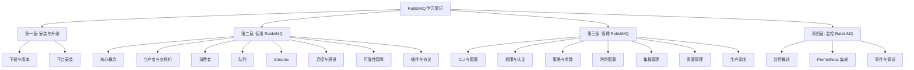

---

## 第一章: 安装与升级
### 1.1 概述


> 本章介绍 RabbitMQ 在不同平台下的安装说明、Erlang 版本要求以及升级注意事项。


RabbitMQ 是一个开源的消息代理软件，使用 Erlang 语言编写。安装 RabbitMQ 之前，必须先安装兼容版本的 Erlang/OTP。

#### 快速体验 RabbitMQ

使用 Docker 可以快速启动一个 RabbitMQ 实例：

```bash
# 启动带管理界面的 RabbitMQ 4.x
docker run -it --rm --name rabbitmq -p 5672:5672 -p 15672:15672 rabbitmq:4-management
```

#### 安装方式概览

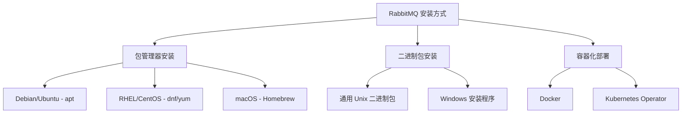

---

### 1.2 支持的平台

#### 官方支持的操作系统

| 平台类型 | 支持的版本 |
|----------|------------|
| **Ubuntu** | 20.04 (Focal), 22.04 (Jammy), 24.04 (Noble) |
| **Debian** | Bullseye (11), Bookworm (12), Trixie (13) |
| **RHEL/CentOS** | RHEL 8.x, 9.x, CentOS Stream 9 |
| **Fedora** | 40 - 42 |
| **Amazon Linux** | 2023 |
| **Rocky/Alma Linux** | 8.x, 9.x |
| **Windows** | Windows 10, Server 2012-2022 |
| **macOS** | 支持（通过 Homebrew 或通用二进制包） |

#### 不受支持的平台

- z/OS 和大多数大型机
- 内存非常受限的系统（RAM < 100 MB）

---

### 1.3 Erlang/OTP 版本要求

> [!IMPORTANT]
> RabbitMQ 必须运行在兼容版本的 Erlang/OTP 上。使用不兼容的版本可能导致启动失败或运行时错误。

#### 当前支持的 Erlang 版本

| RabbitMQ 版本 | 最低 Erlang 版本 | 最高 Erlang 版本 | 备注 |
|---------------|------------------|------------------|------|
| 4.2.x | 26.2 | 27.x | Erlang 28 部分支持 |
| 4.0.4 - 4.1.x | 26.2 | 27.x | 从 4.0.4 开始支持 Erlang 27 |
| 4.0.0 - 4.0.3 | 26.2 | 26.2.x | 不支持 Erlang 27 |
| 3.13.x | 26.0 | 26.2.x | - |
| 3.12.x | 25.0 | 26.2.x | - |

#### Erlang 版本支持策略

- RabbitMQ 团队通常支持**最近两个 Erlang 发行系列**
- 目前完全支持的系列是 **Erlang 27.x** 和 **26.x**
- 建议使用每个支持系列中的**最新补丁版本**

#### 集群中的 Erlang 版本要求

> [!WARNING]
> **强烈建议**在集群的所有节点上使用**相同的主版本 Erlang**。节点加入集群时会检查 Erlang 版本兼容性，不兼容的组合会被拒绝。

---

### 1.4 获取 Erlang

#### Erlang 安装来源

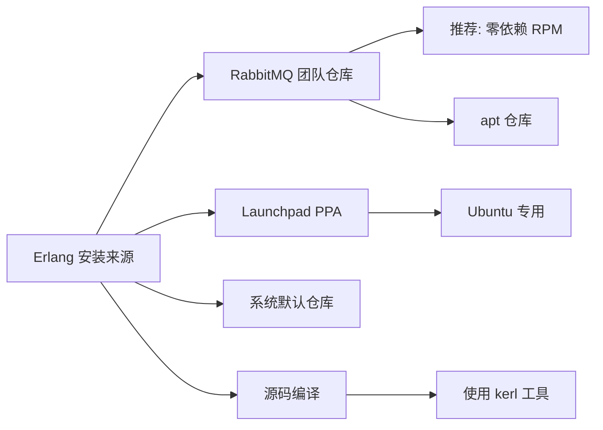

#### Debian/Ubuntu 安装 Erlang

```bash
# 添加 RabbitMQ 团队签名密钥
curl -1sLf "https://keys.openpgp.org/vks/v1/by-fingerprint/0A9AF2115F4687BD29803A206B73A36E6026DFCA" \
  | sudo gpg --dearmor | sudo tee /usr/share/keyrings/com.rabbitmq.team.gpg > /dev/null

# 安装 Erlang 包（以 Ubuntu 22.04 为例）
sudo apt-get install -y erlang-base \
  erlang-asn1 erlang-crypto erlang-eldap erlang-ftp erlang-inets \
  erlang-mnesia erlang-os-mon erlang-parsetools erlang-public-key \
  erlang-runtime-tools erlang-snmp erlang-ssl \
  erlang-syntax-tools erlang-tftp erlang-tools erlang-xmerl
```

#### RHEL/CentOS 安装 Erlang（零依赖 RPM）

```bash
# 导入签名密钥
rpm --import 'https://github.com/rabbitmq/signing-keys/releases/download/3.0/cloudsmith.rabbitmq-erlang.E495BB49CC4BBE5B.key'

# 安装 Erlang
dnf install -y erlang
```

---

### 1.5 包签名验证

> [!TIP]
> 验证下载包的签名可以确保软件来自可信来源，防止篡改。

#### 导入 RabbitMQ 签名密钥

```bash
# 方法1：直接下载
curl -L https://github.com/rabbitmq/signing-keys/releases/download/3.0/rabbitmq-release-signing-key.asc \
  --output rabbitmq-release-signing-key.asc
gpg --import rabbitmq-release-signing-key.asc

# 方法2：从密钥服务器获取
gpg --keyserver "hkps://keys.openpgp.org" \
  --recv-keys "0x0A9AF2115F4687BD29803A206B73A36E6026DFCA"
```

#### 验证包签名

```bash
# 下载包和签名文件后验证
gpg --verify rabbitmq-server-generic-unix-4.2.0.tar.xz.asc \
  rabbitmq-server-generic-unix-4.2.0.tar.xz

# 成功时显示 "Good signature"
# 失败时显示 "BAD signature" - 不要使用该软件包！
```

---

### 1.6 Debian/Ubuntu 安装

#### 安装流程图

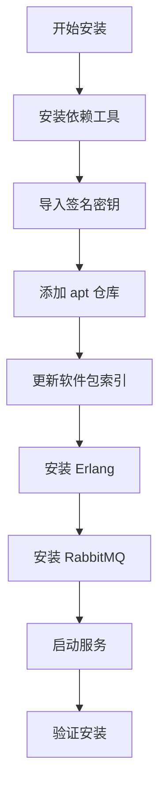

#### 完整安装脚本（Ubuntu 22.04 示例）

```bash
#!/bin/bash
# RabbitMQ 安装脚本 - Ubuntu 22.04 (Jammy)

# 1. 安装依赖
sudo apt-get update -y
sudo apt-get install curl gnupg apt-transport-https -y

# 2. 导入签名密钥
curl -1sLf "https://keys.openpgp.org/vks/v1/by-fingerprint/0A9AF2115F4687BD29803A206B73A36E6026DFCA" \
  | sudo gpg --dearmor | sudo tee /usr/share/keyrings/com.rabbitmq.team.gpg > /dev/null

# 3. 添加仓库
sudo tee /etc/apt/sources.list.d/rabbitmq.list <<EOF
## Erlang 仓库
deb [arch=amd64 signed-by=/usr/share/keyrings/com.rabbitmq.team.gpg] https://deb1.rabbitmq.com/rabbitmq-erlang/ubuntu/jammy jammy main
deb [arch=amd64 signed-by=/usr/share/keyrings/com.rabbitmq.team.gpg] https://deb2.rabbitmq.com/rabbitmq-erlang/ubuntu/jammy jammy main

## RabbitMQ 仓库
deb [arch=amd64 signed-by=/usr/share/keyrings/com.rabbitmq.team.gpg] https://deb1.rabbitmq.com/rabbitmq-server/ubuntu/jammy jammy main
deb [arch=amd64 signed-by=/usr/share/keyrings/com.rabbitmq.team.gpg] https://deb2.rabbitmq.com/rabbitmq-server/ubuntu/jammy jammy main
EOF

# 4. 更新并安装
sudo apt-get update -y
sudo apt-get install -y erlang-base \
  erlang-asn1 erlang-crypto erlang-eldap erlang-ftp erlang-inets \
  erlang-mnesia erlang-os-mon erlang-parsetools erlang-public-key \
  erlang-runtime-tools erlang-snmp erlang-ssl \
  erlang-syntax-tools erlang-tftp erlang-tools erlang-xmerl

sudo apt-get install rabbitmq-server -y --fix-missing

# 5. 启动并启用服务
sudo systemctl start rabbitmq-server
sudo systemctl enable rabbitmq-server

# 6. 验证
sudo systemctl status rabbitmq-server
```

#### 版本固定（可选）

防止意外升级，在 `/etc/apt/preferences.d/erlang` 中配置：

```ini
# 固定 Erlang 版本到 26.x
Package: erlang*
Pin: version 1:26.*
Pin-Priority: 1000
```

---

### 1.7 RHEL/CentOS/Fedora 安装

#### 支持的发行版

- Fedora 40 - 42
- CentOS Stream 9
- RHEL 8.x, 9.x
- Rocky Linux 8.x, 9.x
- Alma Linux 8.x, 9.x
- Amazon Linux 2023

#### 完整安装脚本（RHEL 9/CentOS Stream 9）

```bash
#!/bin/bash
# RabbitMQ 安装脚本 - RHEL 9 / CentOS Stream 9

# 1. 导入签名密钥
rpm --import 'https://github.com/rabbitmq/signing-keys/releases/download/3.0/rabbitmq-release-signing-key.asc'
rpm --import 'https://github.com/rabbitmq/signing-keys/releases/download/3.0/cloudsmith.rabbitmq-erlang.E495BB49CC4BBE5B.key'
rpm --import 'https://github.com/rabbitmq/signing-keys/releases/download/3.0/cloudsmith.rabbitmq-server.9F4587F226208342.key'

# 2. 创建仓库配置文件
cat > /etc/yum.repos.d/rabbitmq.repo << 'EOF'
## Erlang 仓库
[modern-erlang]
name=modern-erlang-el9
baseurl=https://yum1.rabbitmq.com/erlang/el/9/$basearch
        https://yum2.rabbitmq.com/erlang/el/9/$basearch
repo_gpgcheck=1
enabled=1
gpgkey=https://github.com/rabbitmq/signing-keys/releases/download/3.0/cloudsmith.rabbitmq-erlang.E495BB49CC4BBE5B.key
gpgcheck=1
sslverify=1
sslcacert=/etc/pki/tls/certs/ca-bundle.crt
metadata_expire=300

[modern-erlang-noarch]
name=modern-erlang-el9-noarch
baseurl=https://yum1.rabbitmq.com/erlang/el/9/noarch
        https://yum2.rabbitmq.com/erlang/el/9/noarch
repo_gpgcheck=1
enabled=1
gpgkey=https://github.com/rabbitmq/signing-keys/releases/download/3.0/cloudsmith.rabbitmq-erlang.E495BB49CC4BBE5B.key
gpgcheck=1
sslverify=1
sslcacert=/etc/pki/tls/certs/ca-bundle.crt
metadata_expire=300

## RabbitMQ 仓库
[rabbitmq-el9]
name=rabbitmq-el9
baseurl=https://yum2.rabbitmq.com/rabbitmq/el/9/$basearch
        https://yum1.rabbitmq.com/rabbitmq/el/9/$basearch
repo_gpgcheck=1
enabled=1
gpgkey=https://github.com/rabbitmq/signing-keys/releases/download/3.0/cloudsmith.rabbitmq-server.9F4587F226208342.key
       https://github.com/rabbitmq/signing-keys/releases/download/3.0/rabbitmq-release-signing-key.asc
gpgcheck=1
sslverify=1
sslcacert=/etc/pki/tls/certs/ca-bundle.crt
metadata_expire=300

[rabbitmq-el9-noarch]
name=rabbitmq-el9-noarch
baseurl=https://yum2.rabbitmq.com/rabbitmq/el/9/noarch
        https://yum1.rabbitmq.com/rabbitmq/el/9/noarch
repo_gpgcheck=1
enabled=1
gpgkey=https://github.com/rabbitmq/signing-keys/releases/download/3.0/cloudsmith.rabbitmq-server.9F4587F226208342.key
       https://github.com/rabbitmq/signing-keys/releases/download/3.0/rabbitmq-release-signing-key.asc
gpgcheck=1
sslverify=1
sslcacert=/etc/pki/tls/certs/ca-bundle.crt
metadata_expire=300
EOF

# 3. 安装
dnf update -y
dnf install -y logrotate
dnf install -y erlang rabbitmq-server

# 4. 启动服务
systemctl enable rabbitmq-server
systemctl start rabbitmq-server

# 5. 验证
systemctl status rabbitmq-server
```

---

### 1.8 通用 Unix 二进制包安装

适用于无法使用包管理器的环境，或需要在同一机器运行多个版本的场景。

#### 安装步骤

```bash
# 1. 下载并解压
wget https://github.com/rabbitmq/rabbitmq-server/releases/download/v4.2.0/rabbitmq-server-generic-unix-4.2.0.tar.xz
tar -xf rabbitmq-server-generic-unix-4.2.0.tar.xz

# 2. 移动到合适目录
sudo mv rabbitmq_4.2.0 /usr/local/rabbitmq

# 3. 添加到 PATH（可选）
export PATH=$PATH:/usr/local/rabbitmq/sbin

# 4. 启动服务器
# 前台运行
/usr/local/rabbitmq/sbin/rabbitmq-server

# 后台运行
/usr/local/rabbitmq/sbin/rabbitmq-server -detached

# 5. 停止服务器
/usr/local/rabbitmq/sbin/rabbitmqctl shutdown
```

#### 文件位置

| 目录类型 | 默认位置 |
|----------|----------|
| 基础目录 | `$RABBITMQ_HOME` (安装目录) |
| 配置文件 | `$RABBITMQ_HOME/etc/rabbitmq/rabbitmq.conf` |
| 数据目录 | `$RABBITMQ_HOME/var/` |
| 日志目录 | `$RABBITMQ_HOME/var/log/` |

---

### 1.9 服务管理

#### 使用 systemd 管理服务

```bash
# 启动服务
sudo systemctl start rabbitmq-server

# 停止服务
sudo systemctl stop rabbitmq-server

# 重启服务
sudo systemctl restart rabbitmq-server

# 查看状态
sudo systemctl status rabbitmq-server

# 设置开机自启
sudo systemctl enable rabbitmq-server

# 禁用开机自启
sudo systemctl disable rabbitmq-server
```

#### 检查节点状态

```bash
# 检查节点是否运行
rabbitmq-diagnostics status

# 检查集群状态
rabbitmqctl cluster_status

# 健康检查
rabbitmq-diagnostics check_running
rabbitmq-diagnostics check_local_alarms
```

---

### 1.10 系统资源限制调优

> [!CAUTION]
> 生产环境必须调整文件描述符限制。默认值 1024 对消息代理来说太低了！

#### 推荐配置

| 环境类型 | 推荐文件描述符数 |
|----------|------------------|
| 开发环境 | 4096 |
| 生产环境 | 65536+ |

#### systemd 配置方法

创建 `/etc/systemd/system/rabbitmq-server.service.d/limits.conf`：

```ini
[Service]
LimitNOFILE=65536
```

然后重载配置：

```bash
sudo systemctl daemon-reload
sudo systemctl restart rabbitmq-server
```

#### 验证限制设置

```bash
# 通过 CLI 查看
rabbitmq-diagnostics status | grep -A 5 "File Descriptors"

# 通过 ulimit 查看
ulimit -n

# 通过 /proc 查看（需要 RabbitMQ 进程 PID）
cat /proc/$(pgrep -f rabbitmq)/limits | grep "Max open files"
```

---

### 1.11 默认用户与安全

> [!WARNING]
> RabbitMQ 默认创建 `guest/guest` 用户，**仅允许本地连接**。生产环境应立即创建新用户并删除 guest 用户。

#### 创建管理员用户

```bash
# 创建新用户
rabbitmqctl add_user admin your_secure_password

# 设置管理员权限
rabbitmqctl set_user_tags admin administrator

# 授予所有 vhost 的完全权限
rabbitmqctl set_permissions -p / admin ".*" ".*" ".*"

# 删除 guest 用户（生产环境推荐）
rabbitmqctl delete_user guest
```

---

### 1.12 安装验证清单

完成安装后，请按以下清单验证：

- [ ] RabbitMQ 服务已启动：`systemctl status rabbitmq-server`
- [ ] 节点状态正常：`rabbitmq-diagnostics status`
- [ ] 端口正在监听：`ss -tlnp | grep -E "5672|15672"`
- [ ] 管理插件已启用（可选）：`rabbitmq-plugins enable rabbitmq_management`
- [ ] 可以访问管理界面：<http://localhost:15672>
- [ ] 已创建管理员用户并删除 guest 用户

---

## 第二章: 使用 RabbitMQ
### 2.1 核心架构概览


> 本章介绍 RabbitMQ 的核心概念，包括消息发布、交换机、队列、消费者等基础组件的使用。


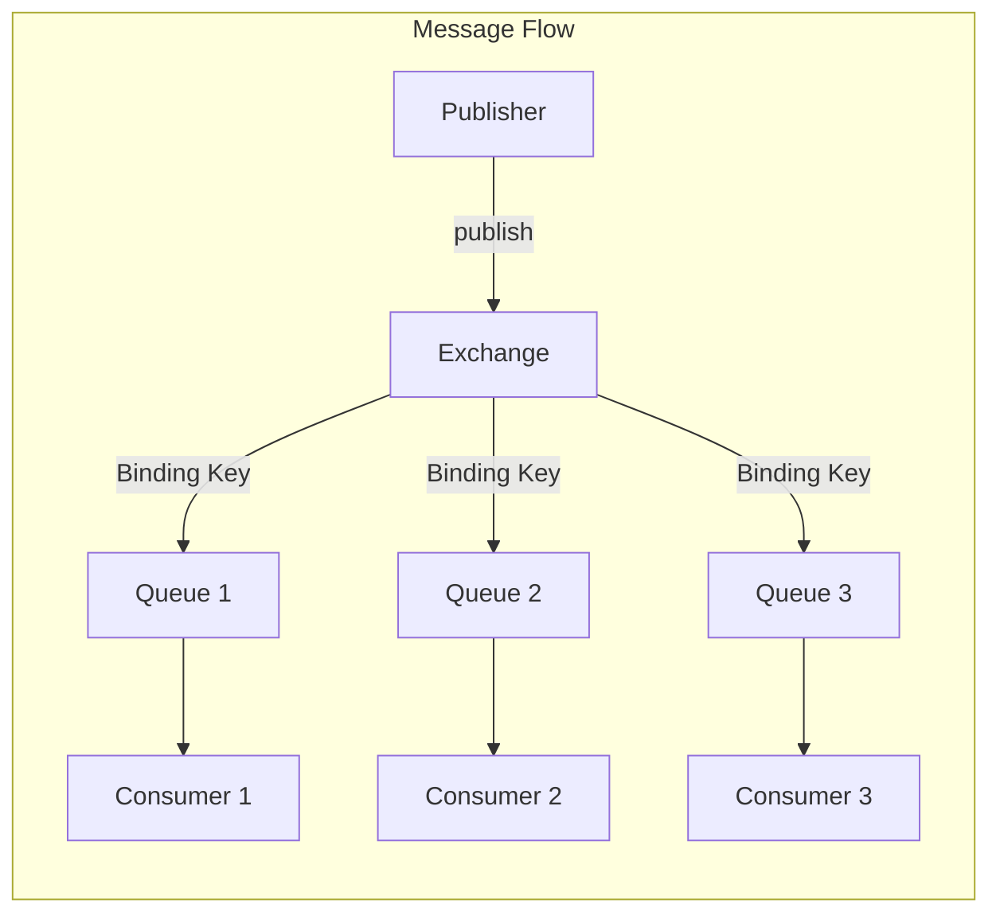

#### 核心组件说明

| 组件 | 说明 |
|------|------|
| **Publisher** | 发布者/生产者，发送消息到 Exchange |
| **Exchange** | 交换机，根据路由规则将消息分发到队列 |
| **Binding** | 绑定关系，定义 Exchange 与 Queue 之间的路由规则 |
| **Queue** | 队列，存储消息等待消费者处理 |
| **Consumer** | 消费者，从队列中获取并处理消息 |

---

### 2.2 发布者 (Publisher)

#### 发布者生命周期

> [!TIP]
> 发布者通常是长期存在的：在整个生命周期中发布多条消息。为单条消息打开连接是**不推荐**的做法。

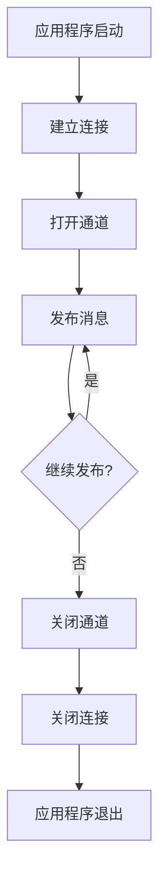

#### 协议差异

| 协议 | 发布目标 | 确认机制 |
|------|----------|----------|
| AMQP 0-9-1 | Exchange | Publisher Confirms |
| AMQP 1.0 | Link | Settled/Unsettled |
| MQTT | Topic | QoS 1 PUBACK |
| STOMP | Destination | Receipts |

#### 消息属性 (AMQP 0-9-1)

##### 传递属性（由 RabbitMQ 设置）

| 属性 | 类型 | 说明 |
|------|------|------|
| `delivery-tag` | 整数 | 传递标识符，用于确认 |
| `redelivered` | 布尔值 | 是否为重新投递的消息 |
| `exchange` | 字符串 | 路由此消息的交换机 |
| `routing-key` | 字符串 | 发布者使用的路由键 |
| `consumer-tag` | 字符串 | 消费者标识符 |

##### 消息属性（由发布者设置）

| 属性 | 类型 | 说明 | 必需 |
|------|------|------|------|
| `delivery-mode` | 1 或 2 | 1=瞬时, 2=持久 | 是 |
| `content-type` | 字符串 | MIME类型，如 `application/json` | 否 |
| `content-encoding` | 字符串 | 编码，如 `gzip` | 否 |
| `message-id` | 字符串 | 消息唯一标识 | 否 |
| `correlation-id` | 字符串 | 关联请求和响应 | 否 |
| `reply-to` | 字符串 | 响应队列名称 | 否 |
| `expiration` | 字符串 | 消息 TTL（毫秒） | 否 |
| `timestamp` | 时间戳 | 消息创建时间 | 否 |
| `type` | 字符串 | 消息类型，如 `orders.created` | 否 |
| `user-id` | 字符串 | 发布者用户ID（需验证） | 否 |
| `app-id` | 字符串 | 应用程序名称 | 否 |
| `headers` | Map | 自定义头信息 | 否 |

#### 发布者确认 (Publisher Confirms)

> [!IMPORTANT]
> 发布者确认是确保消息安全到达 RabbitMQ 的关键机制。生产环境**必须**启用。

##### 确认策略对比

| 策略 | 吞吐量 | 实现复杂度 | 推荐场景 |
|------|--------|------------|----------|
| 流式确认（异步） | ⭐⭐⭐ 高 | 中 | **推荐** - 生产环境 |
| 批量确认 | ⭐⭐ 中 | 低 | 中等吞吐量场景 |
| 单条确认（同步） | ⭐ 低 | 低 | **不推荐** - 严重影响性能 |

##### 流式确认示例 (Java)

```java
// 1. 启用发布者确认
channel.confirmSelect();

// 2. 维护未确认消息映射
ConcurrentNavigableMap<Long, String> outstandingConfirms = 
    new ConcurrentSkipListMap<>();

// 3. 注册确认监听器
channel.addConfirmListener(
    // 成功确认回调
    (sequenceNumber, multiple) -> {
        if (multiple) {
            outstandingConfirms.headMap(sequenceNumber, true).clear();
        } else {
            outstandingConfirms.remove(sequenceNumber);
        }
    },
    // 失败回调 (nack)
    (sequenceNumber, multiple) -> {
        String body = outstandingConfirms.get(sequenceNumber);
        System.err.println("Message nacked: " + body);
        // 重试逻辑...
    }
);

// 4. 发布消息
long sequenceNumber = channel.getNextPublishSeqNo();
outstandingConfirms.put(sequenceNumber, message);
channel.basicPublish(exchange, routingKey, null, message.getBytes());
```

---

### 2.3 交换机 (Exchange)

#### 交换机类型

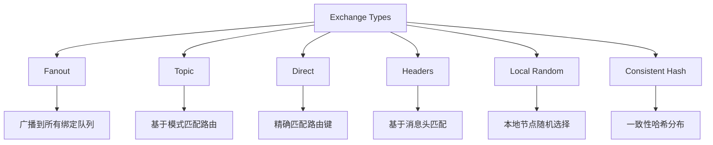

#### 交换机类型详解

##### Fanout 交换机

将消息广播到**所有**绑定的队列，忽略路由键。

```bash
# 使用场景：日志广播、事件通知
# 路由键被忽略
```

##### Topic 交换机

使用模式匹配进行路由：

- `*` 匹配**一个**单词
- `#` 匹配**零个或多个**单词

| 绑定模式 | 匹配的路由键 | 不匹配的路由键 |
|----------|-------------|---------------|
| `regions.na.cities.*` | `regions.na.cities.toronto` | `regions.na.cities` |
| `audit.events.#` | `audit.events`, `audit.events.users.signup` | `audit.users` |
| `#` | 任何路由键（类似 Fanout） | - |

##### Direct 交换机

精确匹配路由键。

```bash
# 绑定键 "abc" 只匹配路由键 "abc"
```

##### 默认交换机

- 名称为空字符串 (`""`)
- 预先存在，无需声明
- 自动将队列绑定到以队列名称为路由键的绑定
- **不应用于自定义拓扑**

#### 交换机属性

| 属性 | 说明 | 推荐值 |
|------|------|--------|
| `durable` | 是否持久化 | `true`（生产环境） |
| `auto-delete` | 最后一个绑定移除时是否删除 | `false` |
| `internal` | 是否仅供内部使用 | 按需 |
| `arguments` | 可选参数（如备用交换机） | 按需 |

#### 交换机到交换机绑定 (E2E)

可以将一个交换机绑定到另一个交换机，扩展路由拓扑：

```java
// Java 示例
Channel ch = conn.createChannel();
ch.exchangeBind("destination", "source", "routingKey");
```

> [!NOTE]
> E2E 绑定不会重新发布消息，而是扩展路由。目标交换机的入口消息速率指标不会更新。

---

### 2.4 备用交换机 (Alternate Exchange)

当消息无法路由到任何队列时，备用交换机提供"兜底"路由。

#### 配置方法

##### 方法1：使用策略（推荐）

```bash
rabbitmqctl set_policy AE "^my-direct$" \
  '{"alternate-exchange":"my-ae"}' \
  --apply-to exchanges
```

##### 方法2：声明时指定

```java
Map<String, Object> args = new HashMap<>();
args.put("alternate-exchange", "my-ae");
channel.exchangeDeclare("my-direct", "direct", false, false, args);
```

#### 备用交换机工作流程

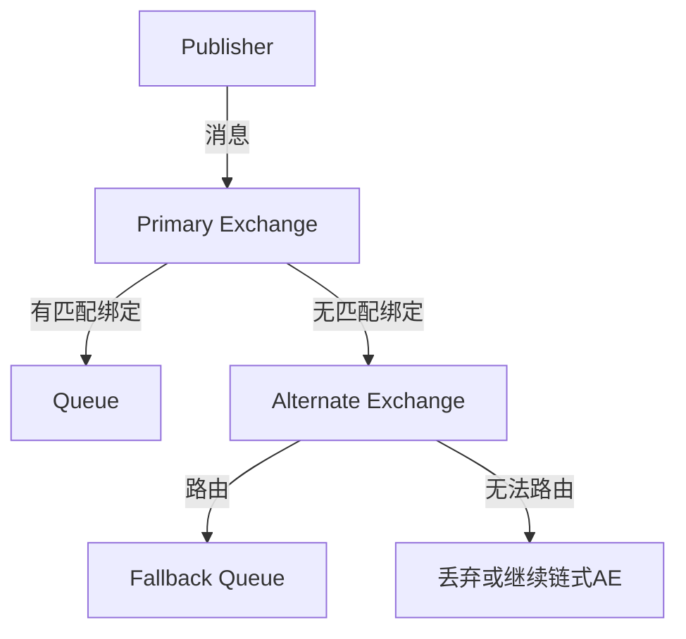

#### 典型使用场景

1. **检测无法路由的消息** - 将所有无法路由的消息收集到监控队列
2. **"否则"路由** - 特殊消息被特定处理，其余走默认处理

---

### 2.5 本地随机交换机 (Local Random Exchange)

> [!IMPORTANT]
> RabbitMQ 4.0 新增的交换机类型，专为 RPC 场景设计。

#### 特点

- 消息**始终**路由到本地节点的队列
- 多个本地队列时随机选择
- 确保最低发布延迟（无跨节点传输）

#### 使用限制

> [!WARNING]
>
> - 要求每个节点都有消费者，否则消息**会丢失**
> - 不适合与负载均衡器配合使用
> - 消费者数量应**大于等于**集群节点数

#### 适用场景


---

### 2.6 直接回复 (Direct Reply-To)

无需创建显式回复队列即可实现 RPC 模式。

#### 优势

- 无队列元数据写入（降低元数据存储负载）
- 更少的 Erlang 进程
- 更低的延迟

#### 限制

> [!CAUTION]
>
> - 语义为**最多一次**传递，回复可能丢失
> - 请求者断开连接时，回复将被丢弃
> - 不适合需要缓冲或持久化回复的场景

#### AMQP 0-9-1 使用方法

```java
// 1. 从伪队列消费（no-ack 模式）
channel.basicConsume("amq.rabbitmq.reply-to", true, consumer);

// 2. 发布请求时设置 reply-to
AMQP.BasicProperties props = new AMQP.BasicProperties.Builder()
    .replyTo("amq.rabbitmq.reply-to")
    .correlationId(UUID.randomUUID().toString())
    .build();
channel.basicPublish("", requestQueue, props, request.getBytes());

// 3. 响应者使用请求中的 reply-to 发送回复
channel.basicPublish("", replyTo, replyProps, response.getBytes());
```

---

### 2.7 连接阻塞通知

当 RabbitMQ 资源不足（内存或磁盘）时，会阻塞发布连接。

#### 客户端通知机制

支持此功能的客户端可以接收 `connection.blocked` 和 `connection.unblocked` 通知。

##### Java 客户端示例

```java
connection.addBlockedListener(new BlockedListener() {
    public void handleBlocked(String reason) throws IOException {
        log.warn("Connection blocked: " + reason);
        // 暂停发布，等待解除阻塞
    }

    public void handleUnblocked() throws IOException {
        log.info("Connection unblocked");
        // 恢复发布
    }
});
```

##### .NET 客户端示例

```csharp
conn.ConnectionBlocked += (sender, args) => {
    Console.WriteLine($"Connection blocked: {args.Reason}");
};

conn.ConnectionUnblocked += (sender, args) => {
    Console.WriteLine("Connection unblocked");
};
```

---

### 2.8 发送者选择路由

发布者可以使用**多个路由键**发送单条消息。

#### AMQP 0-9-1 实现

使用 `CC` 和 `BCC` 头：

```java
Map<String, Object> headers = new HashMap<>();
// CC 路由键（对消费者可见）
headers.put("CC", Arrays.asList("queue1", "queue2"));
// BCC 路由键（传递前删除，消费者不可见）
headers.put("BCC", Arrays.asList("audit-queue"));

AMQP.BasicProperties props = new AMQP.BasicProperties.Builder()
    .headers(headers)
    .build();

channel.basicPublish("", "main-queue", props, message.getBytes());
```

#### AMQP 1.0 实现

使用 `x-cc` 消息注解：

```java
Message msg = new Message();
msg.setMessageAnnotations(Map.of("x-cc", List.of("queue1", "queue2")));
```

---

### 2.9 用户 ID 验证

RabbitMQ 可以验证消息中的 `user-id` 属性。

#### 工作原理

- 如果设置了 `user-id`，必须等于连接用户的名称
- 未设置则不验证
- 发布者可以设置 `impersonator` 标签来绕过验证

```java
AMQP.BasicProperties properties = new AMQP.BasicProperties.Builder()
    .userId("guest")  // 必须匹配连接用户
    .build();
channel.basicPublish("amq.fanout", "", properties, "test".getBytes());
```

---

### 2.10 无法路由消息的处理

#### 处理策略

| 情况 | `mandatory=false`（默认） | `mandatory=true` |
|------|---------------------------|------------------|
| 无匹配绑定 | 丢弃或路由到 AE | 退回给发布者 |
| 交换机不存在 | 通道错误 | 通道错误 |

#### 监控指标

在管理 UI 中可以查看无法路由消息的统计：

- `messages_unroutable_dropped_rate` - 丢弃速率
- `messages_unroutable_returned_rate` - 退回速率

#### 最佳实践

```java
// 设置退回消息处理器
channel.addReturnListener((replyCode, replyText, exchange, 
                           routingKey, properties, body) -> {
    log.warn("Message returned: {} - {}", replyCode, replyText);
    // 重试或记录错误
});

// 使用 mandatory 标志发布
channel.basicPublish(exchange, routingKey, true, null, message.getBytes());
```

---

### 2.11 发布者问题排查

#### 常见问题与解决方案

| 问题 | 可能原因 | 解决方案 |
|------|----------|----------|
| 连接失败 | 网络问题、认证失败 | 检查网络、凭据 |
| 消息丢失 | 未启用确认、AE 未配置 | 启用 Publisher Confirms |
| 吞吐量低 | 同步确认、连接频繁创建 | 使用异步确认、长连接 |
| 通道错误 | 发布到不存在的交换机 | 检查拓扑声明顺序 |

#### 诊断命令

```bash
# 查看连接
rabbitmqctl list_connections name state

# 查看通道
rabbitmqctl list_channels connection name number

# 查看交换机绑定
rabbitmq-diagnostics list_bindings --vhost "/"

# 查看无法路由消息指标
```

---

### 2.12 消费者 (Consumer)

#### 消费者概述

消费者是从队列获取并处理消息的应用程序。消费者需要先注册订阅，RabbitMQ 会将消息推送给它。

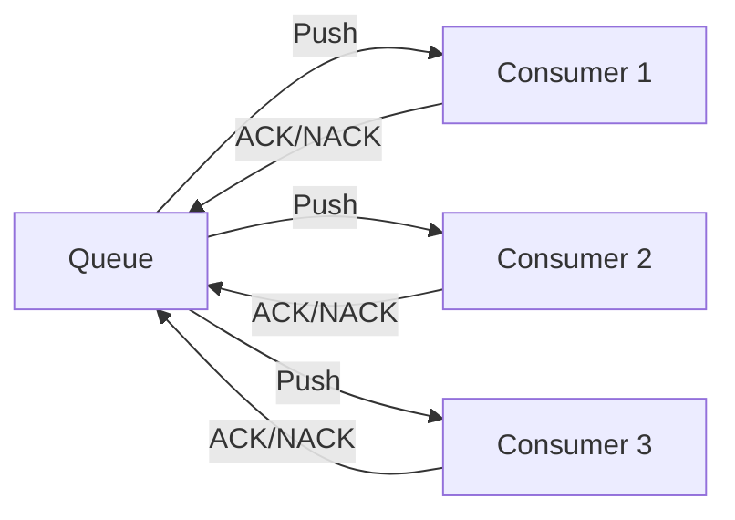

#### 消费者生命周期

> [!TIP]
> 消费者应该是长期存在的。为单条消息注册消费者是**不推荐**的做法。

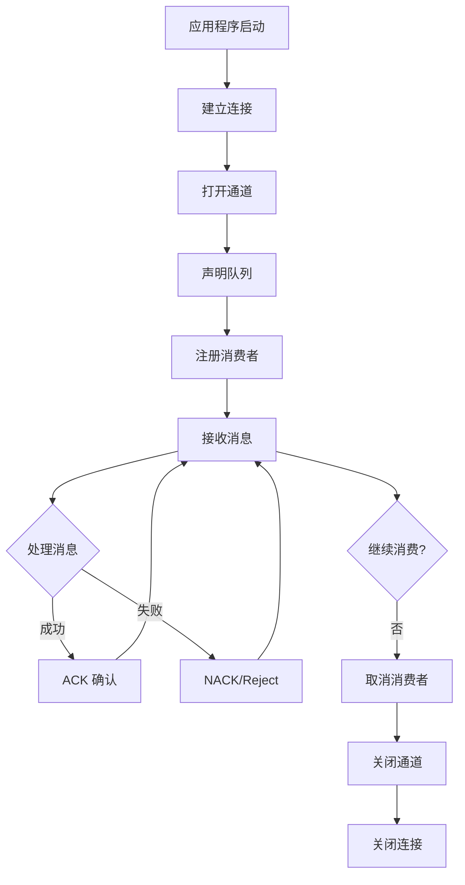

#### 消费者标签

每个消费者都有唯一标识符（Consumer Tag），用于：

- 确定为给定传递调用哪个处理程序
- 取消消费者

---

### 2.13 确认模式

#### 两种确认模式

| 模式 | 说明 | 使用场景 |
|------|------|----------|
| **自动确认** (Auto-ACK) | 消息发送后立即确认，无需客户端响应 | 对丢失不敏感的场景 |
| **手动确认** (Manual-ACK) | 客户端必须显式确认消息 | **生产环境推荐** |

#### 手动确认操作

| 操作 | 说明 | 消息命运 |
|------|------|----------|
| `basic.ack` | 确认消息已成功处理 | 从队列删除 |
| `basic.nack` | 拒绝消息，支持批量操作 | 重新入队或丢弃 |
| `basic.reject` | 拒绝单条消息 | 重新入队或丢弃 |

#### Java 示例

```java
// 手动确认模式
channel.basicConsume("my-queue", false, new DefaultConsumer(channel) {
    @Override
    public void handleDelivery(String consumerTag, Envelope envelope,
                               AMQP.BasicProperties properties, byte[] body) {
        try {
            // 处理消息
            processMessage(body);
            // 成功则确认
            channel.basicAck(envelope.getDeliveryTag(), false);
        } catch (Exception e) {
            // 失败则拒绝并重新入队
            channel.basicNack(envelope.getDeliveryTag(), false, true);
        }
    }
});
```

#### 批量确认

```java
// 批量确认：确认所有 delivery_tag <= 指定值的消息
channel.basicAck(deliveryTag, true);  // multiple = true

// 批量拒绝
channel.basicNack(deliveryTag, true, true);  // multiple = true, requeue = true
```

---

### 2.14 消费者预取 (Prefetch)

#### 为什么需要 Prefetch

预取限制了消费者可以持有的**未确认消息数量**，防止消费者被大量消息压垮。

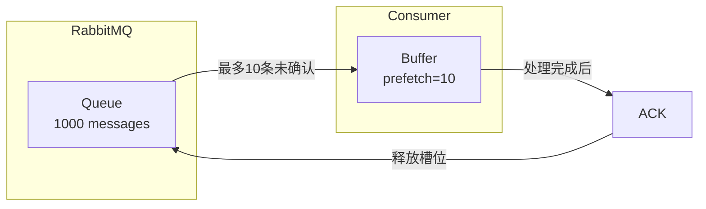

#### 预取配置

```java
// 每个消费者最多 10 条未确认消息
channel.basicQos(10);
channel.basicConsume("my-queue", false, consumer);

// 禁用预取限制（不推荐）
channel.basicQos(0);
```

#### 预取作用域

| 作用域 | 配置方式 | 说明 |
|--------|----------|------|
| **每消费者** (默认) | `basicQos(10, false)` | 每个消费者独立 10 条限制 |
| **每通道** | `basicQos(15, true)` | 通道内所有消费者共享 15 条限制 |

#### 组合使用

```java
channel.basicQos(10, false);  // 每消费者限制
channel.basicQos(15, true);   // 通道限制
// 结果：每个消费者最多 10 条，通道总共最多 15 条
```

#### 默认预取配置

在 `advanced.config` 中设置：

```erlang
[
  {rabbit, [
    {default_consumer_prefetch, {false, 250}}
  ]}
].
```

---

### 2.15 消费者优先级

当有多个消费者时，可以设置优先级确保高优先级消费者优先接收消息。

#### 工作原理

- 默认优先级为 0
- 数字越大优先级越高
- 高优先级消费者**阻塞**时，消息才会发送给低优先级消费者

#### 配置方式

```java
Map<String, Object> args = new HashMap<>();
args.put("x-priority", 10);  // 优先级 10
channel.basicConsume("my-queue", false, args, consumer);
```

#### 消费者状态

| 状态 | 说明 |
|------|------|
| **活跃** (Active) | 可以立即接收消息 |
| **阻塞** (Blocked) | 达到 prefetch 限制或网络拥塞 |

> [!NOTE]
> RabbitMQ 不会等待被阻塞的高优先级消费者，如果有活跃的低优先级消费者，消息会立即发送。

---

### 2.16 单活跃消费者 (Single Active Consumer)

确保一次只有一个消费者从队列消费，适用于需要严格消息顺序的场景。

#### 启用方式

```java
Map<String, Object> arguments = new HashMap<>();
arguments.put("x-single-active-consumer", true);
channel.queueDeclare("my-queue", true, false, false, arguments);
```

#### 工作流程

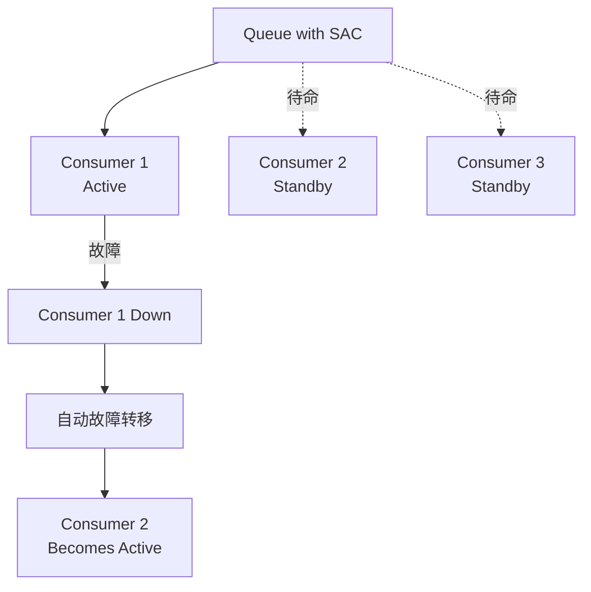

#### 与独占消费者对比

| 特性 | 独占消费者 | 单活跃消费者 |
|------|------------|--------------|
| 故障转移 | 需要应用处理 | **自动** |
| 多消费者注册 | 不允许 | 允许（待命） |
| Quorum 队列支持 | 不支持 | **支持** |
| 策略配置 | - | 不支持 |

#### 注意事项

> [!WARNING]
>
> - 无法通过策略启用（只能通过队列参数）
> - 与独占消费者互斥
> - 消息始终发送给活跃消费者，即使它正在处理中

---

### 2.17 消费者取消通知

当消费被意外取消时（如队列被删除），客户端可以收到通知。

#### 触发场景

- 队列被删除
- 集群中队列所在节点故障
- 复制队列的领导者变更

#### Java 处理示例

```java
channel.basicConsume(queue, new DefaultConsumer(channel) {
    @Override
    public void handleCancel(String consumerTag) throws IOException {
        log.warn("Consumer cancelled unexpectedly: " + consumerTag);
        // 重新注册消费者或执行清理
    }
});
```

---

### 2.18 传递确认超时

RabbitMQ 强制执行确认超时，防止消费者长时间不确认消息。

#### 默认配置

- 默认超时：**30 分钟**
- 检查间隔：1 分钟

#### 超时后果

```text
Consumer 'consumer-tag-xxx' on channel 1 and queue 'my-queue' 
has timed out waiting for a consumer acknowledgement of a delivery 
with delivery tag = 10. Timeout used: 1800000 ms.
```

- 通道关闭（`PRECONDITION_FAILED`）
- 未确认消息重新入队

#### 配置超时值

##### 全局配置 (rabbitmq.conf)

```ini
# 1 小时（毫秒）
consumer_timeout = 3600000
```

##### 每队列配置（策略）

```bash
rabbitmqctl set_policy queue_consumer_timeout ".*" \
  '{"consumer-timeout": 3600000}' \
  --apply-to classic_queues
```

##### 禁用超时（不推荐）

```erlang
%% advanced.config
[
  {rabbit, [
    {consumer_timeout, undefined}
  ]}
].
```

---

### 2.19 消费者容量指标

管理 UI 显示每个队列的**消费者容量**指标，表示队列能够立即向消费者传递消息的时间比例。

#### 指标解读

| 容量值 | 含义 | 建议操作 |
|--------|------|----------|
| 100% | 消费者可以跟上生产速度 | 无需调整 |
| < 100% | 队列可能成为瓶颈 | 增加消费者、提高 prefetch、优化处理逻辑 |
| 0% | 没有消费者 | 检查消费者状态 |

---

### 2.20 消费者问题排查

#### 常见问题与解决方案

| 问题 | 可能原因 | 解决方案 |
|------|----------|----------|
| 消息积压 | 消费者处理慢 | 增加消费者、提高 prefetch |
| 确认超时 | 处理时间过长 | 增加超时值、优化处理逻辑 |
| 消息重复 | 未正确确认 | 检查 ACK 逻辑、实现幂等处理 |
| 消费者被取消 | 队列被删除/节点故障 | 实现 handleCancel 回调 |

#### 诊断命令

```bash
# 查看消费者列表
rabbitmqctl list_consumers

# 查看队列消费者数量
rabbitmqctl list_queues name consumers

# 查看未确认消息数
rabbitmqctl list_queues name messages_unacknowledged

# 查看消费者容量
rabbitmqctl list_queues name consumer_capacity
```

---

### 2.21 队列 (Queue)

#### 队列概述

队列是消息的有序集合，提供 FIFO（先进先出）语义。

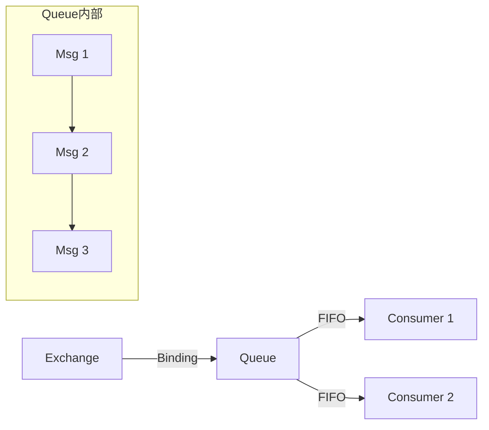

#### 队列类型对比

| 特性 | Quorum Queue | Classic Queue |
|------|--------------|---------------|
| **复制** | ✅ 基于 Raft 共识 | ❌ 单副本 |
| **数据安全** | ⭐⭐⭐ 高 | ⭐ 低 |
| **性能** | 中等 | 高 |
| **持久化** | 必须持久化 | 可选 |
| **独占队列** | ❌ 不支持 | ✅ 支持 |
| **毒消息处理** | ✅ 支持 | ❌ 不支持 |
| **推荐场景** | 生产环境 | 临时/测试 |

#### 队列属性

| 属性 | 说明 |
|------|------|
| `name` | 队列名称（最多 255 字节 UTF-8） |
| `durable` | 是否持久化（重启后存在） |
| `exclusive` | 是否独占（仅声明连接可用） |
| `auto-delete` | 最后一个消费者取消时是否自动删除 |
| `arguments` | 可选参数（x-arguments） |

---

### 2.22 仲裁队列 (Quorum Queue)

> [!IMPORTANT]
> Quorum Queue 是 RabbitMQ 4.x **推荐的生产环境队列类型**，基于 Raft 共识算法提供数据复制和高可用。

#### 声明仲裁队列

```java
Map<String, Object> args = new HashMap<>();
args.put("x-queue-type", "quorum");
channel.queueDeclare("my-quorum-queue", true, false, false, args);
```

#### 复制架构

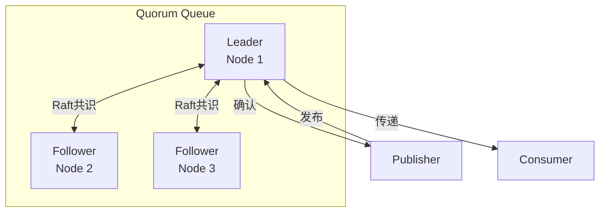

#### 容错能力

| 集群节点数 | 可容忍故障数 | 最小 Quorum |
|------------|--------------|-------------|
| 3 | 1 | 2 |
| 5 | 2 | 3 |
| 7 | 3 | 4 |

> [!TIP]
> 推荐使用 **3 或 5 个节点**。超过 5 个节点时性能会显著下降。

#### 毒消息处理 (Poison Message)

Quorum Queue 会跟踪消息重传次数，超过限制后自动死信或丢弃。

```bash
# 设置传递限制为 20（RabbitMQ 4.0 默认值）
rabbitmqctl set_policy qq-delivery-limit "^qq\." \
  '{"delivery-limit": 20}' \
  --apply-to quorum_queues
```

#### Quorum Queue 限制

- 不支持非持久化队列
- 不支持独占队列
- 不支持全局 QoS（仅支持每消费者 QoS）
- 不支持服务器命名队列

---

### 2.23 经典队列 (Classic Queue)

经典队列是非复制的 FIFO 队列实现，适用于不优先考虑数据安全的场景。

#### 特点

- 单副本（不复制）
- 支持独占队列
- 支持消息优先级
- RabbitMQ 4.0 仅支持版本 2

#### 版本 2 存储

- 所有消息写入磁盘（带缓冲）
- 最多 2048 条消息保留在内存中
- 大消息（>4KB）存储到共享消息存储

> [!WARNING]
> 非持久化非独占经典队列已**弃用**，应使用持久队列或独占队列替代。

---

### 2.24 消息 TTL

TTL（Time-To-Live）定义消息在队列中的存活时间。

#### 配置方式

##### 队列级别 TTL（策略）

```bash
# 所有消息在队列中最多存活 60 秒
rabbitmqctl set_policy TTL ".*" \
  '{"message-ttl": 60000}' \
  --apply-to queues
```

##### 队列级别 TTL（x-arguments）

```java
Map<String, Object> args = new HashMap<>();
args.put("x-message-ttl", 60000);  // 60 秒（毫秒）
channel.queueDeclare("my-queue", true, false, false, args);
```

##### 消息级别 TTL

```java
AMQP.BasicProperties props = new AMQP.BasicProperties.Builder()
    .expiration("60000")  // 60 秒
    .build();
channel.basicPublish(exchange, routingKey, props, message.getBytes());
```

> [!NOTE]
> 同时设置队列 TTL 和消息 TTL 时，取**较小值**。

#### 队列 TTL（队列过期）

未使用的队列在指定时间后自动删除：

```bash
# 队列 30 分钟未使用后过期
rabbitmqctl set_policy expiry ".*" \
  '{"expires": 1800000}' \
  --apply-to queues
```

---

### 2.25 队列长度限制

#### 配置方式

```bash
# 限制队列最多 10000 条消息
rabbitmqctl set_policy max-length "^limited\." \
  '{"max-length": 10000}' \
  --apply-to queues

# 限制队列最大 100MB
rabbitmqctl set_policy max-bytes "^limited\." \
  '{"max-length-bytes": 104857600}' \
  --apply-to queues
```

#### 溢出行为

| 策略 | 说明 |
|------|------|
| `drop-head` | 丢弃队列头部（最旧）消息 **（默认）** |
| `reject-publish` | 拒绝新消息，发布者收到 `basic.nack` |
| `reject-publish-dlx` | 拒绝并死信新消息 |

```bash
# 设置溢出行为
rabbitmqctl set_policy overflow "^qq\." \
  '{"max-length": 1000, "overflow": "reject-publish"}' \
  --apply-to queues
```

---

### 2.26 死信交换机 (DLX)

当消息无法正常消费时，可以路由到死信交换机进行特殊处理。

#### 死信触发条件

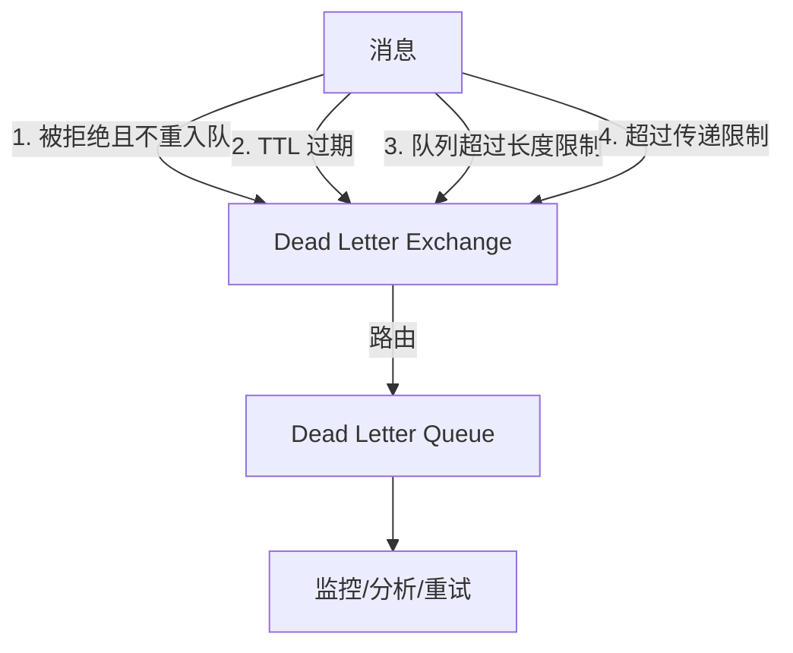

#### 配置方式（策略）

```bash
rabbitmqctl set_policy DLX ".*" \
  '{"dead-letter-exchange": "my-dlx", "dead-letter-routing-key": "dead"}' \
  --apply-to queues
```

#### 配置方式（x-arguments）

```java
Map<String, Object> args = new HashMap<>();
args.put("x-dead-letter-exchange", "my-dlx");
args.put("x-dead-letter-routing-key", "dead");
channel.queueDeclare("my-queue", true, false, false, args);
```

#### 死信原因

| 原因 | 说明 |
|------|------|
| `rejected` | 消息被消费者拒绝 |
| `expired` | 消息 TTL 过期 |
| `maxlen` | 队列长度超限 |
| `delivery_limit` | 超过传递限制（仅 Quorum Queue） |

#### 至少一次死信（仅 Quorum Queue）

> [!IMPORTANT]
> Quorum Queue 支持**至少一次**死信保证，需要额外配置。

```bash
rabbitmqctl set_policy at-least-once-dlx "^qq\." \
  '{"dead-letter-exchange": "my-dlx", "dead-letter-strategy": "at-least-once", "overflow": "reject-publish"}' \
  --apply-to quorum_queues
```

---

### 2.27 优先级队列

消息可以按优先级排序，高优先级消息优先传递。

#### 声明优先级队列

```java
Map<String, Object> args = new HashMap<>();
args.put("x-max-priority", 4);  // 推荐 2-4 个优先级
channel.queueDeclare("priority-queue", true, false, false, args);
```

#### 发布带优先级的消息

```java
AMQP.BasicProperties props = new AMQP.BasicProperties.Builder()
    .priority(5)  // 优先级 0-255
    .build();
channel.basicPublish(exchange, routingKey, props, message.getBytes());
```

#### Quorum Queue 优先级（RabbitMQ 4.0+）

Quorum Queue 使用简化的优先级模型：

| 消息优先级 | 内部映射 |
|------------|----------|
| 0-4 | 普通优先级 |
| 5+ | 高优先级 |

> [!NOTE]
> Quorum Queue 以 **2:1** 的比例传递高优先级消息，确保普通消息不会被饿死。

#### 注意事项

> [!WARNING]
>
> - 优先级队列**无法通过策略配置**（必须在声明时指定）
> - 优先级过多（>10）会消耗更多 CPU 和内存
> - 过期消息可能被卡在高优先级消息后面

---

### 2.28 队列问题排查

#### 常见问题与解决方案

| 问题 | 可能原因 | 解决方案 |
|------|----------|----------|
| 消息积压 | 消费者处理慢 | 增加消费者、优化处理逻辑 |
| 内存使用高 | 队列过长 | 设置 max-length 限制 |
| 磁盘使用高 | Quorum Queue 段文件未截断 | 确保消费者及时确认 |
| 队列不可用 | 失去 Quorum | 恢复节点或重建队列 |

#### 诊断命令

```bash
# 列出所有队列
rabbitmqctl list_queues name type durable messages consumers

# 查看队列详情
rabbitmqctl list_queues name arguments policy

# 查看队列内存使用
rabbitmqctl list_queues name memory

# 查看 Quorum Queue 成员
rabbitmq-queues quorum_status <queue-name>

# 重新平衡 Quorum Queue 领导者
rabbitmq-queues rebalance quorum
```

---

### 2.29 Streams

#### Stream 概述

Stream 是一种**持久化、复制的仅追加日志**数据结构，与队列相比具有独特的消费语义：

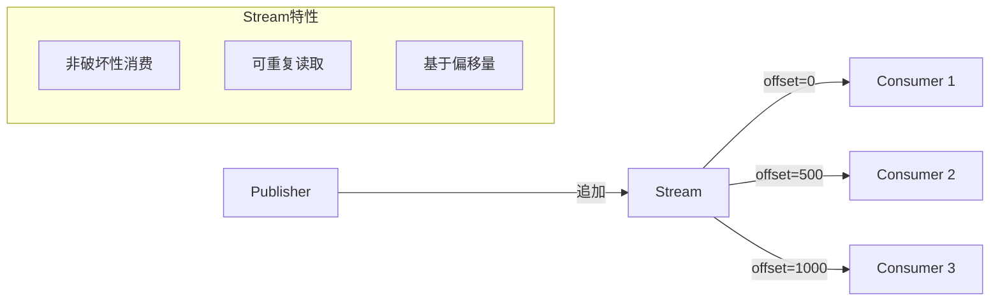

#### Stream vs Queue 对比

| 特性 | Stream | Queue |
|------|--------|-------|
| **消费模式** | 非破坏性（消息不删除） | 破坏性（消费后删除） |
| **重复读取** | ✅ 支持从任意偏移量读取 | ❌ 消费即删除 |
| **多消费者** | 各自维护偏移量 | 竞争消费 |
| **数据保留** | 基于时间/大小策略 | 消费后删除 |
| **吞吐量** | 极高（百万/秒） | 高（十万/秒） |
| **内存占用** | 极低（全在磁盘） | 中等 |

#### Stream 用例

> [!TIP]
> Stream 适用于以下四种场景：

| 用例 | 说明 |
|------|------|
| **大规模扇出** | 多消费者读取相同消息，无需创建多个队列 |
| **消息重放** | 可从任意时间点重新消费历史消息 |
| **高吞吐量** | 每秒可处理数百万消息 |
| **大量积压** | 可高效存储海量消息，内存开销最小 |

#### 消费偏移量 (Offset)

消费者可从以下位置开始消费：

| 偏移量类型 | 说明 |
|------------|------|
| `first` | 从第一条消息开始 |
| `last` | 从最后一个块开始 |
| `next` | 从下一条新消息开始（默认） |
| 数值 | 指定精确偏移量 |
| 时间戳 | 指定时间点（POSIX 时间） |
| 间隔 | 相对时间（如 `1h`、`7D`） |

#### 数据保留策略

Stream 使用保留策略控制数据生命周期：

| 参数 | 说明 | 示例 |
|------|------|------|
| `max-age` | 最大保留时间 | `7D`（7天）、`1M`（1月） |
| `max-length-bytes` | 最大字节大小 | `10GB` |

#### Stream 限制

- 不支持 TTL（使用保留策略替代）
- 不支持消息优先级
- 不支持死信交换机
- 不支持独占队列
- 必须设置 QoS 预取

---

### 2.30 Super Streams（分区流）

Super Stream 是将大型流分区为多个小流的扩展机制。

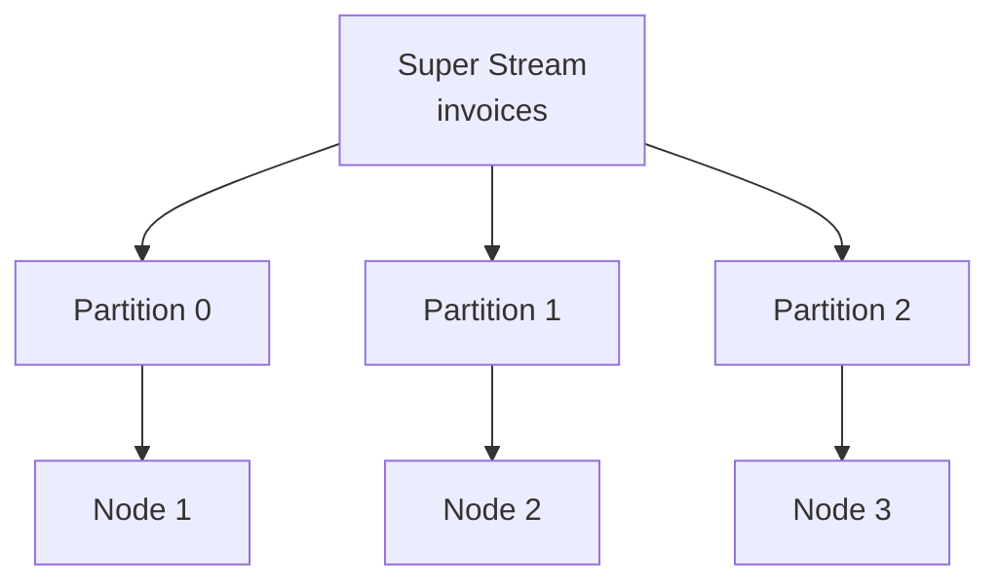

#### 创建 Super Stream

```bash
# 创建 3 分区的 Super Stream
rabbitmq-streams add_super_stream invoices --partitions 3
```

#### 适用场景

- 单个 Stream 已达到性能瓶颈
- 需要跨多节点分散负载
- 与单活跃消费者配合保持分区内顺序

> [!WARNING]
> Super Stream 增加了复杂性，仅在确定单个 Stream 无法满足需求时使用。

---

### 2.31 Stream 插件

Stream 协议提供比 AMQP 更高的吞吐量和更丰富的功能。

#### Core vs Stream 插件对比

| 特性 | Core (AMQP) | Stream 插件 |
|------|-------------|-------------|
| **协议** | AMQP 0.9.1 / 1.0 | RabbitMQ Stream |
| **端口** | 5672 | 5552 |
| **吞吐量** | 十万/秒 | 百万/秒 |
| **偏移量跟踪** | 外部存储 | 内置服务器端 |
| **发布去重** | ❌ | ✅ |
| **Super Stream** | ❌ | ✅ |
| **子条目压缩** | 未压缩 | Gzip/Snappy/LZ4/Zstd |

#### 启用 Stream 插件

```bash
rabbitmq-plugins enable rabbitmq_stream
```

#### 关键配置

| 配置项 | 说明 | 默认值 |
|--------|------|--------|
| `stream.listeners.tcp.1` | TCP 监听端口 | 5552 |
| `stream.listeners.ssl.1` | TLS 监听端口 | 5551 |
| `stream.heartbeat` | 心跳超时（秒） | 60 |
| `stream.advertised_host` | 广告主机名（容器环境） | - |
| `stream.initial_credits` | 发布者流控阈值 | 50000 |

---

### 2.32 Stream 客户端连接

#### 连接最佳实践

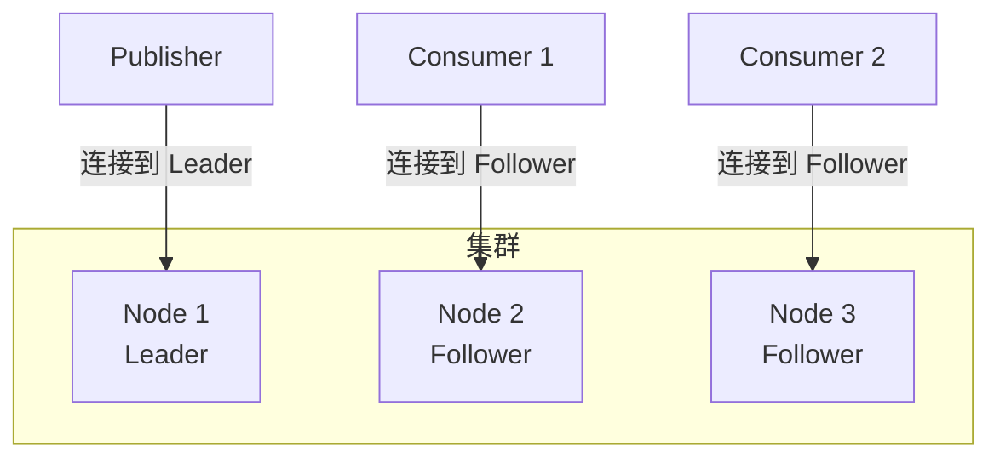

| 角色 | 连接目标 | 原因 |
|------|----------|------|
| **发布者** | Stream Leader 节点 | 避免网络跳转 |
| **消费者** | Stream Follower 节点 | 减轻 Leader 负载 |

#### Metadata 命令

客户端使用 `metadata` 命令发现 Stream 拓扑：

1. 查询 Stream 位置
2. 获取 Leader 和 Follower 节点信息
3. 连接到相应节点

#### 容器/负载均衡器场景

> [!IMPORTANT]
> 在容器化环境中，默认主机名可能无法解析，需配置 `advertised_host` 和 `advertised_port`。

**负载均衡器变通方案**：

- 始终连接负载均衡器
- 检查连接的实际节点
- 重试直到连接到正确节点

---

### 2.33 Stream 过滤

Stream 支持三阶段过滤机制，可大幅提升消费效率：


#### 阶段 1：布隆过滤器

布隆过滤器在**块级别**进行快速过滤：

| 特性 | 说明 |
|------|------|
| **效率** | 极高（跳过整个块的磁盘读取） |
| **假阳性** | 可能存在 |
| **假阴性** | 绝不存在 |
| **配置** | `x-stream-filter-size-bytes`（默认 16 字节） |

> 发布时设置 `x-stream-filter-value` 消息注解，消费时指定过滤值。

#### 阶段 2：AMQP 过滤表达式

服务器端**消息级别**过滤，支持两种表达式：

**属性过滤表达式**：

- 匹配 properties 部分字段
- 匹配 application-properties 键值
- 支持前缀/后缀匹配

**SQL 过滤表达式**：

- 类似 SQL WHERE 子句语法
- 支持 AND/OR/NOT 逻辑运算
- 支持比较、算术、LIKE、IN 等操作

#### 阶段 3：客户端过滤

客户端库或应用程序进行最终过滤，灵活性最高。

#### 三种过滤方式对比

| 特性 | 布隆过滤器 | AMQP 表达式 | 客户端过滤 |
|------|------------|-------------|------------|
| **执行位置** | 服务器（块级） | 服务器（消息级） | 客户端 |
| **假阳性** | 可能 | 无 | 无 |
| **复杂度** | 低 | 高（SQL） | 任意 |
| **性能** | 百万/秒 | 十万/秒 | 取决于客户端 |
| **协议** | 全部 | 仅 AMQP 1.0 | 全部 |

> [!TIP]
> 最佳实践：结合布隆过滤器（跳过不相关块）+ AMQP/SQL 表达式（精确匹配），实现高效的服务器端过滤。

---

### 2.34 发布消息去重

Stream 支持基于**生产者名称**和**发布 ID** 的消息去重：

#### 去重机制

| 元素 | 要求 |
|------|------|
| **生产者名称** | 唯一、稳定、可读（如 `order-service-1`） |
| **发布 ID** | 严格递增序列（可有间隙） |

#### 工作原理

1. Broker 跟踪每个命名生产者的最高发布 ID（限制）
2. 过滤掉发布 ID ≤ 限制的消息
3. 生产者重启后查询限制值，从中断处恢复

> [!WARNING]
> 发布 ID 必须严格递增，乱序可能导致消息意外过滤。

---

### 2.35 Stream 问题排查

#### 诊断命令

```bash
# 查看 Stream 状态
rabbitmq-streams stream_status <stream-name>

# 添加/删除副本
rabbitmq-streams add_replica <stream-name> <node>
rabbitmq-streams delete_replica <stream-name> <node>

# 重启 Stream
rabbitmq-streams restart_stream <stream-name>

# 创建 Super Stream
rabbitmq-streams add_super_stream <name> --partitions 3
```

#### 常见问题

| 问题 | 原因 | 解决方案 |
|------|------|----------|
| 消费者无法连接 | 连接到无副本节点 | 使用 metadata 发现拓扑 |
| 吞吐量低 | 使用 AMQP 而非 Stream 协议 | 启用 Stream 插件 |
| 磁盘增长快 | 未配置保留策略 | 设置 `max-age` 或 `max-length-bytes` |
| 容器环境连接失败 | 主机名不可解析 | 配置 `advertised_host` |

---

### 2.36 连接 (Connection)

#### 连接概述

RabbitMQ 使用**长连接**，所有协议操作都在同一 TCP 连接上进行。

```mermaid
graph LR
    App[Application] -->|TCP| RMQ[RabbitMQ Node]
    
    subgraph 连接生命周期
        A[建立 TCP] --> B[协议协商]
        B --> C[身份验证]
        C --> D[执行操作]
        D --> E[关闭连接]
    end
```

#### 支持的协议与端口

| 协议 | 纯 TCP 端口 | TLS 端口 |
|------|-------------|----------|
| AMQP 0-9-1 | 5672 | 5671 |
| AMQP 1.0 | 5672 | 5671 |
| MQTT | 1883 | 8883 |
| STOMP | 61613 | 61614 |
| Stream | 5552 | 5551 |

#### 连接生命周期

1. 应用程序配置连接端点（主机名、端口）
2. 解析主机名为 IP 地址
3. 建立 TCP 连接
4. 协议协商
5. 身份验证
6. 执行操作（发布、消费、管理拓扑）
7. 关闭连接

> [!IMPORTANT]
> 连接不再需要时**必须关闭**，否则会耗尽节点资源。

#### 连接泄漏与监控

| 问题 | 表现 | 解决方案 |
|------|------|----------|
| **连接泄漏** | 连接数单调增长 | 确保应用程序正确关闭连接 |
| **高连接流失** | 打开/关闭速率持续 >100/秒 | 使用长连接或连接代理 |

> PHP 等运行时不使用长连接，可使用 [AMQProxy](https://github.com/cloudamqp/amqproxy) 缓解流失。

#### 流控制 (Flow Control)

当发布速度超过队列处理能力时，RabbitMQ 会对发布连接应用流控制。

> [!TIP]
> 建议发布者和消费者使用**独立连接**，避免流控制影响消费操作。

#### 客户端提供的连接名称

为便于在日志和管理 UI 中识别连接，强烈建议设置 `connection_name`：

```bash
# Management UI 中可以看到连接名称
# 有助于识别哪个应用程序建立了连接
```

---

### 2.37 通道 (Channel)

#### 通道概述

通道是 **AMQP 0-9-1** 特有的多路复用机制，允许在单个 TCP 连接上建立多个逻辑连接。

```mermaid
graph TD
    C[Connection TCP] --> Ch1[Channel 1]
    C --> Ch2[Channel 2]
    C --> Ch3[Channel 3]
    
    Ch1 -->|发布| E1[Exchange]
    Ch2 -->|消费| Q1[Queue]
    Ch3 -->|管理| Topo[Topology]
```

#### 通道 vs 连接

| 特性 | 连接 | 通道 |
|------|------|------|
| **资源消耗** | 高（TCP 套接字、缓冲区） | 低（共享连接） |
| **多路复用** | - | 共享单个 TCP 连接 |
| **推荐用法** | 应用程序级 | 线程/进程级 |

#### 通道生命周期

- 连接建立后立即打开通道
- 所有协议操作在通道上执行
- 连接关闭时所有通道自动关闭
- 通道应**长期存在**，避免频繁开关

#### 通道异常（软错误）

| 错误码 | 名称 | 原因 |
|--------|------|------|
| `403` | ACCESS_REFUSED | 无权访问资源 |
| `404` | NOT_FOUND | 队列/交换机不存在 |
| `405` | RESOURCE_LOCKED | 独占队列被其他连接占用 |
| `406` | PRECONDITION_FAILED | 重新声明时属性不匹配 |

> [!NOTE]
> 通道异常会关闭通道，但应用程序可以打开新通道重试。

#### 每连接/每节点通道限制

| 配置项 | 说明 | 默认值 |
|--------|------|--------|
| `channel_max` | 每连接最大通道数 | 2047 |
| `channel_max_per_node` | 每节点最大通道数 | 无限制 |

#### 通道监控

```bash
# 列出连接及通道数
rabbitmqctl list_connections name channels

# 列出通道详情
rabbitmqctl list_channels connection consumer_count messages_unacknowledged prefetch_count
```

#### 通道泄漏检测

| 指标 | 健康状态 | 异常状态 |
|------|----------|----------|
| 通道数趋势 | 稳定 | 持续增长 |
| 通道流失率 | 低（<100/秒） | 高（>100/秒） |
| 通道/连接比 | 个位数 | 过高 |

---

### 2.38 心跳 (Heartbeat)

#### 心跳作用

心跳用于检测**死连接**（TCP 连接实际已断开但未被感知）：

1. 及时发现断开的连接
2. 防止"空闲"连接被网络设备/代理终止
3. 触发应用程序重连逻辑

#### 心跳机制

```mermaid
sequenceDiagram
    participant C as Client
    participant S as Server
    
    Note over C,S: 协商心跳超时（如 60 秒）
    
    loop 每 30 秒（超时/2）
        C->>S: 心跳帧
        S->>C: 心跳帧
    end
    
    Note over C,S: 两次心跳未收到 → 断开连接
```

#### 心跳配置

| 参数 | 说明 | 推荐值 |
|------|------|--------|
| `heartbeat` | 超时时间（秒） | 60（默认） |
| 发送间隔 | timeout / 2 | 30 秒 |
| 误判阈值 | 连续 2 次未收到 | - |

> [!WARNING]
>
> - **不建议禁用心跳**（设为 0）
> - 超时值 **不应低于 5 秒**，否则易产生误报
> - 推荐范围：**5-20 秒**

#### 各协议心跳

| 协议 | 心跳机制 | 配置方式 |
|------|----------|----------|
| AMQP 0-9-1 | 内置 | `heartbeat` 参数 |
| MQTT | keepalive | 连接时设置 |
| STOMP | heart-beat | 连接头部 |

#### TCP Keepalive

TCP 层的 keepalive 机制可作为心跳的补充：

- 需要内核级调优
- 适用于无法配置应用层心跳的场景
- 覆盖所有 TCP 连接（包括 Shovel/Federation）

#### 心跳与负载均衡器

心跳产生的周期性流量可防止空闲连接被代理/负载均衡器关闭：

- 30 秒超时 → 每 15 秒产生流量
- 足以满足大多数负载均衡器的空闲超时设置

---

### 2.39 连接与通道问题排查

#### 诊断命令

```bash
# 列出所有连接
rabbitmqctl list_connections name peer_host state channels

# 列出所有通道
rabbitmqctl list_channels connection consumer_count messages_unacknowledged

# 检查内存使用
rabbitmq-diagnostics memory_breakdown
```

#### 常见问题

| 问题 | 原因 | 解决方案 |
|------|------|----------|
| 连接数持续增长 | 连接泄漏 | 确保正确关闭连接 |
| 高流失率 | 短连接/频繁重连 | 使用长连接或 AMQProxy |
| 通道异常频繁 | 资源访问问题 | 检查权限和队列声明 |
| 心跳超时断开 | 网络问题/负载高 | 增加超时值或检查网络 |
| 流控制频繁 | 发布速度过快 | 分离发布/消费连接 |

---

### 2.40 AMQP 0-9-1 协议扩展

RabbitMQ 实现了一系列 AMQP 0-9-1 规范的扩展功能：

#### 发布扩展

| 扩展 | 说明 |
|------|------|
| **发布者确认** | 轻量级机制了解 RabbitMQ 何时接收消息 |
| **阻塞连接通知** | 连接被阻塞/解除阻塞时收到通知 |

#### 消费扩展

| 扩展 | 说明 |
|------|------|
| **消费者取消通知** | 消费者被服务器取消时收到通知 |
| **basic.nack** | 支持一次拒绝多条消息 |
| **消费者优先级** | 优先向高优先级消费者发送消息 |
| **直接回复** | RPC 客户端无需声明队列接收回复 |

#### 路由扩展

| 扩展 | 说明 |
|------|------|
| **交换机到交换机绑定** | 消息通过多个交换机路由 |
| **备用交换机** | 路由无法投递的消息 |
| **发送者选择分布** | 发布者直接决定路由位置 |

#### 消息生命周期扩展

| 扩展 | 说明 |
|------|------|
| **消息 TTL** | 消息存活时间（队列级/消息级） |
| **队列 TTL** | 未使用队列自动删除 |
| **死信交换机** | 拒绝/过期消息重新路由 |
| **队列长度限制** | 设置队列最大长度 |
| **优先级队列** | 支持消息优先级 |

#### 身份验证扩展

| 扩展 | 说明 |
|------|------|
| **User-ID 验证** | 服务器验证消息 User-ID 属性 |
| **身份验证失败通知** | 客户端收到显式认证失败通知 |
| **update-secret** | 为活动连接更新凭证 |

---

### 2.41 消息拦截器

消息拦截器允许在 Broker 级别拦截和修改消息。

#### 拦截阶段

```mermaid
graph LR
    P[Publisher] -->|入站拦截| RMQ[RabbitMQ]
    RMQ -->|出站拦截| C[Consumer]
    
    subgraph 拦截点
        I1[入站: 路由前]
        I2[出站: 协议转换前]
    end
```

| 阶段 | 时机 | 用途 |
|------|------|------|
| **入站** | 消息进入，路由到队列前 | 添加时间戳、验证、注解 |
| **出站** | 消息传递给客户端，协议转换前 | 添加发送时间戳 |

> [!NOTE]
> 通过 RabbitMQ Streams 协议发送的消息**不会被拦截**。

#### 内置拦截器

##### 入站时间戳拦截器

```ini
message_interceptors.incoming.set_header_timestamp.overwrite = true
```

添加的注解/头部：

- AMQP 1.0/Streams: `x-opt-rabbitmq-received-time`（毫秒）
- AMQP 0.9.1: `timestamp_in_ms` 头部 + `timestamp` 属性

##### 路由节点拦截器

```ini
message_interceptors.incoming.set_header_routing_node.overwrite = true
```

添加 `x-routed-by` 注解，指示接收并路由消息的节点。

##### MQTT 客户端 ID 拦截器

```ini
mqtt.message_interceptors.incoming.set_client_id_annotation.enabled = true
```

添加 `x-opt-mqtt-client-id` 注解。

##### 出站时间戳拦截器

```ini
message_interceptors.outgoing.timestamp.enabled = true
```

添加 `x-opt-rabbitmq-sent-time` 注解（毫秒时间戳）。

#### 自定义拦截器

可通过实现 `rabbit_msg_interceptor` Erlang 行为开发自定义拦截器，并通过插件集成。

---

### 2.42 插件系统

RabbitMQ 支持通过插件扩展核心功能。

#### 插件管理命令

```bash
# 启用插件
rabbitmq-plugins enable <plugin-name>

# 禁用插件
rabbitmq-plugins disable <plugin-name>

# 列出所有插件
rabbitmq-plugins list

# 列出插件（JSON格式）
rabbitmq-plugins list --formatter=json

# 查看插件目录
rabbitmq-plugins directories
```

#### 启用方式

| 方式 | 说明 |
|------|------|
| 在线启用 | 连接运行中节点，实时启用/禁用 |
| 离线模式 | `--offline` 修改 enabled_plugins 文件 |
| 预配置 | 部署时生成 enabled_plugins 文件 |

#### 核心插件列表

| 插件 | 功能 |
|------|------|
| `rabbitmq_management` | HTTP API 和管理 UI |
| `rabbitmq_prometheus` | Prometheus 监控支持 |
| `rabbitmq_federation` | 跨集群消息联邦 |
| `rabbitmq_shovel` | 消息"铲子"传输 |
| `rabbitmq_mqtt` | MQTT 协议支持 |
| `rabbitmq_stomp` | STOMP 协议支持 |
| `rabbitmq_auth_backend_ldap` | LDAP 认证 |
| `rabbitmq_auth_backend_oauth2` | OAuth 2.0 认证 |

#### 插件目录

```bash
# 可通过环境变量设置多个目录（冒号分隔）
PLUGINS_DIR="/usr/lib/rabbitmq/plugins:/usr/lib/rabbitmq/lib/rabbitmq_server-3.x/plugins"
```

---

### 2.43 管理插件 (Management)

#### 功能概述

```mermaid
graph TD
    MG[Management Plugin] --> UI[Web UI :15672]
    MG --> API[HTTP API]
    MG --> CLI[rabbitmqadmin]
    
    UI --> M1[监控队列/连接]
    UI --> M2[管理用户/权限]
    UI --> M3[策略/参数管理]
    
    API --> E1[定义导入/导出]
    API --> E2[指标查询]
```

#### 用户权限标签

| 标签 | 权限 |
|------|------|
| `(无)` | 无法访问管理插件 |
| `management` | 查看自己的 vhost 资源、连接、通道 |
| `policymaker` | management + 策略/参数管理 |
| `monitoring` | management + 所有 vhost 统计、节点级数据 |
| `administrator` | 全部权限，包括用户/vhost 管理 |

#### 创建只读监控用户

```bash
# 创建 monitoring 用户
rabbitmqctl add_user monitoring '<password>'
rabbitmqctl set_user_tags monitoring monitoring
# 授予空权限（只读）
rabbitmqctl set_permissions -p '/' monitoring '^$' '^$' '^$'
```

#### 配置示例

```ini
# 端口配置
management.tcp.port = 15672
management.tcp.ip = 0.0.0.0

# HTTPS 配置
management.ssl.port = 15671
management.ssl.cacertfile = /path/to/ca.pem
management.ssl.certfile = /path/to/cert.pem
management.ssl.keyfile = /path/to/key.pem
```

#### OAuth 2.0 认证

```ini
management.oauth_enabled = true
management.oauth_client_id = rabbit_user_client
management.oauth_scopes = openid profile rabbitmq.*
```

---

### 2.44 Federation 联邦

Federation 允许在独立集群之间复制或移动消息。

#### 联邦架构

```mermaid
graph LR
    subgraph 上游集群
        UE[上游交换机]
        UQ[上游队列]
    end
    
    subgraph 下游集群
        FE[联邦交换机]
        FQ[联邦队列]
    end
    
    UE -->|消息流复制| FE
    UQ -->|消息移动| FQ
```

#### 联邦类型对比

| 类型 | 行为 | 用途 |
|------|------|------|
| **交换机联邦** | 复制消息流到下游 | 分发/备份 |
| **队列联邦** | 移动消息到有消费者的位置 | 负载均衡 |

#### 配置步骤

1. **定义上游**：

```bash
rabbitmqctl set_parameter federation-upstream my-upstream \
  '{"uri":"amqp://remote-host","expires":3600000}'
```

2. **创建策略**：

```bash
rabbitmqctl set_policy --apply-to exchanges federate-me "^amq\." \
  '{"federation-upstream-set":"all"}'
```

#### 上游参数

| 参数 | 说明 | 默认值 |
|------|------|--------|
| `uri` | AMQP URI（可多个） | 必需 |
| `prefetch-count` | 未确认消息数 | 1000 |
| `reconnect-delay` | 重连延迟秒数 | 1 |
| `ack-mode` | 确认模式 | on-confirm |
| `max-hops` | 最大跳数（交换机） | 1 |
| `expires` | 上游队列过期时间 | none |

#### 监控命令

```bash
# 查看联邦链接状态
rabbitmqctl federation_status
```

---

### 2.45 Shovel 铲子

Shovel 是消息传输工具，将消息从源移动到目标。

#### Shovel 工作流程

```mermaid
sequenceDiagram
    participant S as 源队列
    participant SH as Shovel
    participant D as 目标交换机
    
    SH->>S: 消费消息
    S-->>SH: 返回消息
    SH->>D: 重新发布
    D-->>SH: 确认
    SH->>S: ACK 消息
```

#### 动态 vs 静态 Shovel

| 特性 | 动态 Shovel | 静态 Shovel |
|------|-------------|-------------|
| 配置方式 | 运行时参数 | advanced.config |
| 变更生效 | 无需重启 | 需要重启 |
| 拓扑声明 | 自动 | 手动 |
| 推荐程度 | **推荐** | 传统方式 |

#### 动态 Shovel 示例

```bash
rabbitmqctl set_parameter shovel my-shovel \
  '{"src-protocol":"amqp091","src-uri":"amqp://","src-queue":"source-queue",
    "dest-protocol":"amqp091","dest-uri":"amqp://remote-server","dest-queue":"target-queue"}'
```

#### Shovel 参数

| 参数 | 说明 |
|------|------|
| `src-uri` | 源连接 URI |
| `src-queue` | 源队列 |
| `dest-uri` | 目标连接 URI |
| `dest-queue` | 目标队列 |
| `ack-mode` | `on-confirm`（默认）、`on-publish`、`no-ack` |
| `reconnect-delay` | 重连延迟（秒） |
| `src-delete-after` | 传输后行为：`never`、`queue-length`、数值 |

#### 监控命令

```bash
# 查看 Shovel 状态
rabbitmqctl shovel_status

# 重启 Shovel
rabbitmqctl restart_shovel <name>
```

---

### 2.46 STOMP 协议插件

STOMP（Simple Text Oriented Messaging Protocol）是简单文本消息协议。

#### 启用与配置

```bash
rabbitmq-plugins enable rabbitmq_stomp
```

```ini
# 端口配置
stomp.listeners.tcp.1 = 61613
stomp.listeners.ssl.1 = 61614

# 默认用户
stomp.default_user = guest
stomp.default_pass = guest
```

#### 目标类型

| 目标格式 | 说明 |
|----------|------|
| `/exchange/<name>[/<key>]` | 发布到交换机 |
| `/queue/<name>` | 网关管理的队列 |
| `/amq/queue/<name>` | 现有队列（不自动创建） |
| `/topic/<name>` | 主题（发布/订阅） |
| `/temp-queue/<name>` | RPC 临时队列 |

#### 通配符映射

| STOMP | AMQP 0.9.1 | 说明 |
|-------|------------|------|
| `/` | `.` | 级别分隔符 |
| `+` | `*` | 单级通配符 |
| `#` | `#` | 多级通配符 |

---

### 2.47 Web STOMP 插件

通过 WebSocket 使用 STOMP 协议。

```bash
rabbitmq-plugins enable rabbitmq_web_stomp
```

```ini
# 配置端口
web_stomp.tcp.port = 15674

# TLS 配置
web_stomp.ssl.port = 15673
web_stomp.ssl.cacertfile = /path/to/ca.pem
web_stomp.ssl.certfile = /path/to/cert.pem
web_stomp.ssl.keyfile = /path/to/key.pem
```

WebSocket 端点：`ws://127.0.0.1:15674/ws`

---

### 2.48 MQTT 协议插件

MQTT（Message Queuing Telemetry Transport）是物联网标准协议。

#### 支持版本

- MQTT 3.1
- MQTT 3.1.1
- MQTT 5.0

#### 启用配置

```bash
rabbitmq-plugins enable rabbitmq_mqtt
```

```ini
# 端口配置
mqtt.listeners.tcp.default = 1883
mqtt.listeners.ssl.default = 8883

# 虚拟主机
mqtt.vhost = /

# 交换机
mqtt.exchange = amq.topic

# 预取数
mqtt.prefetch = 10

# 会话过期（秒）
mqtt.max_session_expiry_interval_seconds = 86400

# 匿名连接
mqtt.allow_anonymous = true
```

#### QoS 级别

| QoS | 名称 | 说明 |
|-----|------|------|
| 0 | 最多一次 | 无确认，可能丢失 |
| 1 | 至少一次 | 有确认，可能重复 |
| 2 | 仅一次 | **不支持** |

#### 队列类型选择

| 条件 | 队列类型 |
|------|----------|
| QoS 0 + Clean Session | MQTT QoS 0 队列（进程邮箱） |
| QoS 1 + 持久会话 | 经典队列或仲裁队列 |

```ini
# 使用仲裁队列（仅限新集群）
mqtt.durable_queue_type = quorum
```

#### 主题映射

| MQTT | AMQP 0.9.1 |
|------|------------|
| `cities/london` | `cities.london` |
| `+` | `*` |
| `#` | `#` |

#### 限制

- QoS 2 不支持
- 重新认证不支持
- 共享订阅不支持
- 保留消息仅节点本地

---

### 2.49 Web MQTT 插件

通过 WebSocket 使用 MQTT 协议。

```bash
rabbitmq-plugins enable rabbitmq_web_mqtt
```

```ini
# 配置端口
web_mqtt.tcp.port = 15675

# TLS 配置
web_mqtt.ssl.port = 15676
web_mqtt.ssl.cacertfile = /path/to/ca.pem
web_mqtt.ssl.certfile = /path/to/cert.pem
web_mqtt.ssl.keyfile = /path/to/key.pem
```

WebSocket 端点：`ws://127.0.0.1:15675/ws`

---

### 2.50 插件与协议对比

#### 协议插件对比

| 协议 | 插件 | 端口 | Web 端口 | 用途 |
|------|------|------|----------|------|
| AMQP 0.9.1 | 核心 | 5672/5671 | - | 通用消息 |
| AMQP 1.0 | 核心 | 5672/5671 | - | 标准协议 |
| STOMP | rabbitmq_stomp | 61613/61614 | 15674 | 简单文本 |
| MQTT | rabbitmq_mqtt | 1883/8883 | 15675 | 物联网 |
| Stream | rabbitmq_stream | 5552 | - | 高吞吐日志 |

#### 数据传输插件对比

| 功能 | Federation | Shovel |
|------|------------|--------|
| **方向** | 多对多 | 点对点 |
| **消息复制** | 交换机复制消息流 | 移动消息 |
| **负载均衡** | 队列联邦支持 | 不支持 |
| **拓扑管理** | 自动 | 手动 |
| **协议** | AMQP 0.9.1 | AMQP 0.9.1/1.0 |
| **用途** | 集群互联 | 数据迁移 |

---
